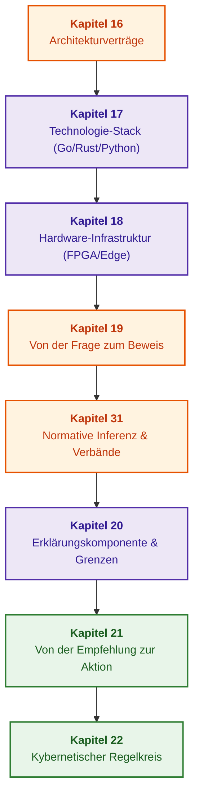

# Teil IV. Architektur, Technologie-Stack, Inferenz und Aktion

[← Zu Teil III](part-03-knowledge-engineering-nlp.md) | [Inhaltsverzeichnis](README.md) | [Zu Teil V →](part-05-verification-and-learning.md)

---

## Ziel des Teils

Aufbau des vollständigen Engineering-Pfades eines Expertensystems: von Architekturverträgen, der Auswahl von Programmiersprachen und Hardwareplattformen bis hin zur normativen logischen Inferenz, Erklärungssynthese, Überleitung zur Aktion und dem Schließen des kybernetischen Regelkreises über sensorische Rückkopplung.

---

## Überblick über das Thema und die Verknüpfung der Kapitel

Kapitel 16 definiert die grundlegenden Architekturverträge und Komponentengrenzen. Kapitel 17 formuliert ingenieurmäßige Kriterien für die Auswahl des Technologie-Stacks (Go, Rust, Python, Regel-Engines). Kapitel 18 stellt die Hardware-Ausführungsinfrastruktur bereit (FPGA, NPU, On-Premise, Edge Computing). Kapitel 19 trennt gefundene Evidenzfragmente von den formalen Behauptungen, die sie stützen. Kapitel 31 implementiert die normative Inferenz über Prädikatenhierarchien und Relationsverbände unter Berücksichtigung zeitlicher Gültigkeit. Kapitel 20 generiert nachprüfbare Erklärungen direkt aus dem Ausführungs-Trace. Kapitel 21 vollzieht den sicheren Übergang von der Empfehlung zur autorisierten Aktion unter strikter Rechteprüfung. Kapitel 22 schließt den kybernetischen Regelkreis, indem es Sensordatenströme der Peripherie verarbeitet und Frühindikatoren für Critical Slowing Down (CSD) erkennt.

Das Ergebnis dieses Teils ist ein integriertes, betriebsbereites System mit strikt getrennten Lebenszyklus-Status: „architektonisch spezifiziert“, „hardwaremäßig platziert“, „aufgefunden“, „begründet“, „erklärt“, „ausgeführt“ und „Rückkopplung erfasst“. Die formale Regelverifikation, die Wissens-Testpyramide und die Sicherheitsfall-Synthese werden in [Teil V](part-05-verification-and-learning.md) vertieft.

---

## Kapitel dieses Teils

### [Kapitel 16. Architektur von Expertensystemen: Vom formalen Wissen zur evidenzbasierten Entscheidung](ch16-expert-systems-architecture.md)

* **Abstract:** Verantwortlichkeitsgrenzen, fixierter Lesekontext und aktive Zugriffsberechtigung. Positiver Abschluss von Begründungen, alternative Grundlagen und ungestützte Zyklen; die Entscheidungsprovenienz verknüpft nachprüfbar Fakten und Regelversionen.

### [Kapitel 17. Technologie-Stack: Auswahlkriterien für Werkzeuge, Programmiersprachen und Regel-Engines](ch17-implementation-stack.md)

* **Abstract:** Ingenieurmäßige Kriterien für die Sprachauswahl (Go, Rust, Python, C++), Regel-Engines (Rete, Datalog, Prolog) und eingebettete Speicher-Engines bezogen auf konkrete Problemklassen, Latenzgarantien und Speicherprofile.

### [Kapitel 18. Ausführungsinfrastruktur: Lokale Modelle, Hardwarebeschleuniger, Edge und On-Premise](ch18-execution-infrastructure.md)

* **Abstract:** Hardware-Ausführungsumgebungen: Platzierung auf CPU, GPU, NPU und FPGA; Kaltstart-Minimierung, Rechenisolation, Energiebudgets von Peripheriesystemen und Latenz-Determinismus.

### [Kapitel 19. Von der Frage zum Beweis: Suche, Bindung und Behauptungsverifikation](ch19-from-question-to-evidence.md)

* **Abstract:** Anfragevertrag, semantische Suche, atomare Bindung und getrennte semantische Verifikation. Pflichtfelder und Gewichtungen werden vor der Vollständigkeitsberechnung validiert; gefundene Textzitate etablieren keine semantische Rolle, und fehlende Evidenz beweist nicht die Nichtexistenz einer Norm.

### [Kapitel 31. Normative Inferenz: Prädikatenhierarchien, Ausnahmen und zeitliche Gültigkeit](ch31-syllogistic-reasoning-and-relation-lattices.md)

* **Abstract:** Unterscheidung zwischen Prädikatenhierarchien und Relationsverbänden; eine aktuelle Normfassung setzt Anwendungsvoraussetzungen vergangener Zeitintervalle nicht außer Kraft. Der Go-Lernschritt prüft Klassen, Spezialisierungen, Ausnahmen und konkurrierende Regeln; Netzwerkbeispiele unterteilen Aktionen nach Zustand, Sequenznummer und Profil.

### [Kapitel 20. Erklärungskomponente: Entscheidungen, Ablehnung und Kompetenzgrenzen](ch20-explanation-engine.md)

* **Abstract:** Erklärungssynthese aus dem tatsächlichen Trace; Differenzierung zwischen unbekannten Vorbedingungen und logischer Unverträglichkeit. QuickXPlain-Voraussetzungen, Teilmengen-Minimalität, Kontrafakt-Ziele, Kontrolle von Freitext und Vermeidung von Datenlecks nach Maskierung.

### [Kapitel 21. Von der Empfehlung zur Aktion: Berechtigungskontrolle und sichere Ausführung in Produktionsumgebungen](ch21-from-recommendation-to-action.md)

* **Abstract:** Aktionsverträge, Berechtigungsprüfung, signierte Übermittlung und atomare Vorbedingungen. Idempotenz prüft Ziel und Parameter; unbestimmte Seiteneffekte erfordern einen expliziten Statusabgleich vor der Kompensation. Rollenteilung zwischen Temporal, OPA und Cedar. Lokale Planreparatur erhält nur weiterhin anwendbare Freigaben.

### [Kapitel 22. Kybernetischer Regelkreis: Sensoren, Edge Computing und Feedback](ch22-cybernetics-edge-to-backend.md)

* **Abstract:** Geschlossener kybernetischer Regelkreis: Ashbysches Gesetz der erforderlichen Varietät, Telemetrie-Streaming, Rauschfilterung, Erkennung von Critical Slowing Down (CSD) und fehlersicherer Betrieb bei partieller Peripherieautonomie.

---

## Durchgängige Analyse von Architektur, Implementierung und Aktion: Kapitel 16–22

Diese Sequenz verbindet die vollständige Entscheidungs- und Handlungskette und prüft Übergänge, an denen lokaler Teilerfolg leicht mit globaler Verlässlichkeit verwechselt werden kann:

| Übergang | Was nicht automatisch folgt | Diskriminierende Prüfung |
|---|---|---|
| Architektur → Entscheidung | Korrektheit der Regel aus dem Prädikat „symbolisch“ | Unabhängige alternative Begründung, ungestützte Zyklen, Vermeidung von Snapshot-Vermischung |
| Werkzeug → Semantik | Gleichwertigkeit von Rete, Datalog, Ausdrücken und Tabellen | Unbekannte Fakten, Regelfolgenvarianz, Faktenwiderruf, Rekursionsgrenzen |
| Hardware → Zeit | Garantierte Latenz allein aus Spitzenleistung oder p99 | Kaltstart, Warteschlangen, CPU-Rückübertragung, durchgängige Tail-Latenz-Verteilung |
| Zitat → Behauptung | Korrekte semantische Rolle einer Zahl aus deren reiner Präsenz | Konkurrierende Zahlenwerte, falsche Maßeinheiten, leere oder duplizierte semantische Atome |
| Trace → Erklärung | Korrekter Sinn des Texts aus dem Vorhandensein von Bezeichnungen | Modifizierte Negation, ausgelassene Ursache, geschützte Daten und gültiges Kontrafakt-Ziel |
| Empfehlung → Aktion | Zulässigkeit der Ausführung aus der Richtigkeit der Empfehlung | Berechtigungsprüfung, Idempotenz-Token, atomare Vorbedingungsüberprüfung |
| Aktion → Rückkopplung | Normaler Anlagenzustand allein aus dem Befehlsversand | Sensorische Quittung, Zustandsdivergenz nach Ashby, Frühindikatoren für CSD |

Defekte müssen zunächst in einem neutralen Simulator reproduziert werden, bevor lokale Änderungen isoliert und erst nach unabhängigen Qualitätsprüfungen für den Produktivbetrieb zugelassen werden. Protokollanalysen, semantische Drift-Überwachung und die Auswertung von Regelkandidaten decken Schwachstellen auf; automatisierte Lernmechanismen dürfen ohne explizite Freigabe weder Privilegien erweitern noch Sicherheitsnormen modifizieren.

---

[← Zu Teil III](part-03-knowledge-engineering-nlp.md) | [Inhaltsverzeichnis](README.md) | [Zu Teil V →](part-05-verification-and-learning.md)
