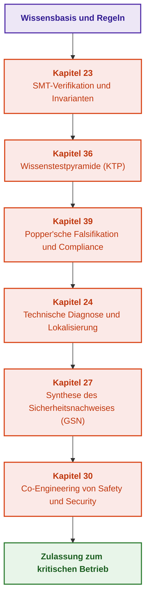

# Teil V. Verifikation, Testen, Diagnose und Sicherheitsbegründung

[← Zu Teil IV](part-04-architecture-and-inference.md) | [Zum Inhaltsverzeichnis](README.md) | [Zu Teil VI →](part-06-frontiers-neuro-symbolic.md)

---

## Ziel des Teils

Bereitstellung eines lückenlosen ingenieurtechnischen Lebenszyklus für Verifikation, Validierung (V&V), technische Diagnose und formale Sicherheitsbegründung von Expertensystemen. Dieser Teil vereint mathematische SMT-Beweise, mehrstufige Regelprüfungen, Popper’sche Falsifikation von Compliance-Anforderungen, Ursachendiagnose sowie den Aufbau belastbarer Sicherheitsargumente gemäß den Normen ISO 26262 und ISO/SAE 21434.

---

## Übersicht des Themas und Zusammenhang der Kapitel

Kapitel 23 definiert Methoden der formalen Verifikation der Wissensbasis (Z3-SMT-Solver, Prüfung auf Vollständigkeit und Widerspruchsfreiheit). Kapitel 36 entfaltet die autorenseitige Wissenstestpyramide (KTP) von einzelnen Prädikaten über Integrationspakete bis hin zur variationellen Kalibrierung. Kapitel 39 führt einen aktiven Popper’schen Tester zur automatisierten Generierung von Gegenbeispielen und zur Prüfung der normativen Compliance (ASPICE, ISO 26262, ISO 21434, DO-178C) ein. Kapitel 24 löst die Aufgabe der technischen Diagnose externer Systeme, indem es Ursachen strikt von sekundären Symptomen trennt. Kapitel 27 synthetisiert strukturierte Sicherheitsargumente in der GSN-Notation mit lückenloser Rückverfolgbarkeitskontrolle. Kapitel 30 schließt diesen Block mit dem gemeinsamen Entwurf von funktionaler Sicherheit und Cybersicherheit (Co-Engineering) ab.

Das Ergebnis dieses Teils: mathematisch und empirisch nachgewiesene Systemzuverlässigkeit mit rechtsverbindlichen und zertifizierungsfähigen Zulassungsartefakten. Adaption, neuro-symbolische Modelle und kontinuierliches Lernen werden in [Teil VI](part-06-frontiers-neuro-symbolic.md) behandelt.

---

## Kapitel dieses Teils

### [Kapitel 23. Verifikation der Wissensbasis: Prüfung auf Widerspruchsfreiheit, Vollständigkeit und Robustheit von Regeln](ch23-knowledge-base-verification.md)

* **Abstract:** Herkunft des Orakels, verbotene und zulässige Zustände, Grenzen der vollständigen Aufzählung und des Mutations-Scores. Rapid, Hypothesis, Z3 und TLA+-Werkzeuge verifizieren unterschiedliche formale Eigenschaften. Reduktion kontrolliert spezifische strukturelle Defekte; ein vollständiger formaler Beweis erfordert die Etablierung von Wurzelbehauptungen, Prämissen und allen Vorbedingungen der angewendeten Regel. Induktives Data-Mining schlägt Kandidaten vor, keine normative Wahrheit.

### [Kapitel 36. Wissenstestpyramide: Regeln, Interaktionen und Robustheit der Antworten](ch36-knowledge-testing-pyramid-and-variational-calibration.md)

* **Abstract:** Autorenseitige Testpyramide zur Überprüfung einzelner Regeln, der Regelkomposition, des End-to-End-Entscheidungspakets und von Eingangsvariationen. Unabhängige Orakelerwartungen trennen falsche von unbekannten Prämissen; Integrationsfälle validieren inhaltliche Kompatibilität, Untergrabung der Begründung und minimale Konfliktmengen. Testverträge unterscheiden sich für Deduktion, Induktion, Abduktion, anfechtbares Schließen und Fallbasiertes Schließen. Go-Beispiele und Modultests prüfen vorgegebene Randfallkontexte, leere Mengen, den Verlust von Begründungen und das Verbot, Urteilsänderungen hinter aggregierten Durchschnittswerten zu verschleiern. Metriken und Lückenwarteschlangen stellen keine universelle Zertifizierung einer Ontologie oder eines physikalischen Reglers dar.

### [Kapitel 39. Aktiver Compliance-Auditor: Popper’sche Falsifikation, normative Compliance (ASPICE/ISO 26262/ISO 21434) und autonomes Testdesign](ch39-active-compliance-auditor-and-popperian-testing.md)

* **Abstract:** Autonomes Testdesign nach dem Prinzip der Popper’schen Falsifikation: Generierung härtester Gegenbeispiele, Auditierung von Ausführungsspuren auf Konformität mit Standards für funktionale Sicherheit und Cybersicherheit sowie automatische Erkennung blinder Flecken in normativen Anforderungen.

### [Kapitel 24. Technische Diagnose: Trennung von Symptom und Ursache unter Unsicherheit](ch24-system-diagnosis.md)

* **Abstract:** Fehlerdiagnose komplexer technischer Systeme. Symptombasierte heuristische Klassifikation versus modellbasierte Diagnose (Model-Based Diagnosis) auf Grundlage der physikalischen Struktur. Minimierung der erwarteten Kosten nachfolgender Prüfungen und abduktive Ursachenlokalisierung.

### [Kapitel 27. Sicherheitsbegründung: Synthese und Verifikation von Argumenten](ch27-safety-case-gsn-synthesis.md)

* **Abstract:** Sicherheitsbegründung in der Goal Structuring Notation (GSN), synthetisiert aus dem ingenieurtechnischen Wissensgraphen. Formale Regeln für Argumentvollständigkeit und Link-Integrität, Prüfung von Hardware-Revisionen in Kontexten und Evidenzen, selektive Offenlegung von Nachweisen über Merkle-Bäume mit Salt für Blätter sowie Berücksichtigung von Einwänden im Rahmen von Dungs Argumentationsrahmen mit unaufgelösten wechselseitigen Angriffen. Das SACM-Metamodell, in-toto- und SLSA-Attestierungen, Transparenzprotokolle und die Extraktion von Rückverfolgbarkeitsbeziehungen ergänzen das Lehrbeispiel, ersetzen jedoch nicht den Fachexperten, der die Hinlänglichkeit des Arguments beurteilt.

### [Kapitel 30. Co-Engineering von funktionaler Sicherheit und Cybersicherheit](ch30-safety-cybersecurity-co-engineering.md)

* **Abstract:** Harmonisierung von funktionaler Sicherheit und Cybersicherheit anhand verifizierter kausaler Beziehungen und konkreter Produktanforderungen. Lehrreiche Go-Validatoren prüfen Sicherheitskategorien, Zeitbudgets, genehmigte übergeordnete Artefakte, dreiwertige Aktualisierungsregeln (Konflikt, unzureichende Evidenz, kein Konflikt) und die Bindung digitaler Signaturen an Nutzdaten und Metadaten. STPA-Sec, ReqIF, CycloneDX, OpenVEX und Uptane werden als maschinenlesbare Evidenzquellen mit expliziten Grenzen vorgestellt. Das Projektprofil ersetzt keinen Industriestandard; die Qualifizierung von Softwarewerkzeugen bleibt ein eigenständiges Verfahren.

---

[← Zu Teil IV](part-04-architecture-and-inference.md) | [Zum Inhaltsverzeichnis](README.md) | [Zu Teil VI →](part-06-frontiers-neuro-symbolic.md)
