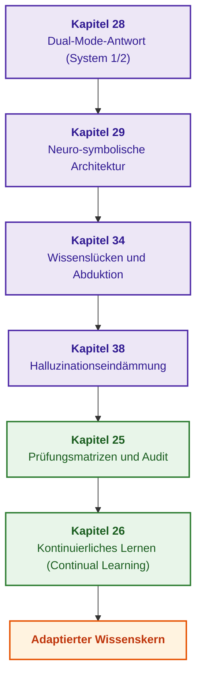

# Teil VI. Neuro-symbolische Modelle, kognitive Grenzen und kontinuierliches Lernen

[← Zu Teil V](part-05-verification-and-learning.md) | [Zum Inhaltsverzeichnis](README.md) | [Zu Teil VII →](part-07-runtime-and-knowledge-exchange.md)

---

## Ziel des Teils

Verbindung der heuristischen Flexibilität großer Sprachmodelle mit der deterministischen Strenge symbolischer Inferenz, Überwindung von Wissensdefiziten durch Abduktion und sokratischen Dialog, Eindämmung generativer Halluzinationen sowie Realisierung eines regressionsfreien kontinuierlichen Lernens des Expertensystems aus praktischer Erfahrung.

---

## Übersicht des Themas und Zusammenhang der Kapitel

Kapitel 28 definiert zwei Betriebsmodi (schnelle beratende Heuristik von System 1 und deterministische symbolische Beweisführung von System 2) und untersagt die automatische Rangerhöhung ungeprüfter Hypothesen. Kapitel 29 setzt die Rollenteilung zwischen lokalem Sprachmodell und symbolischem Zulassungsschleusenwächter auf Basis geschlossener Grammatiken und Schemata um. Kapitel 34 nutzt Inferenzlücken, um relationale Verknüpfungssuchen, Abduktion und sokratische Klärungsdialoge mit dem Benutzer anzustoßen. Kapitel 38 systematisiert Ursachen maschineller Halluzinationen und entfaltet eine mehrstufige Prüfung von Antwortbegründungen. Kapitel 25 führt Prüfungsmatrizen, unabhängige Wissensaudits und Regressionskontrollen vor dem Release neuer Revisionen ein. Kapitel 26 gewährleistet kontinuierliches Stream-Learning (Continual Learning) auf Systemprotokollen ohne katastrophales Vergessen.

Das Ergebnis dieses Teils: ein lebendiges neuro-symbolisches System, das sicher mit generativen Modellen kooperiert, bei Lücken eigene Nichtkompetenz explizit deklariert und sich systematisch weiterentwickelt, ohne fundamentale Sicherheitsinvarianten zu kompromittieren. Reaktive Ausführung, systemübergreifenden Wissensaustausch und verteilte epistemische SOA behandelt [Teil VII](part-07-runtime-and-knowledge-exchange.md).

---

## Kapitel dieses Teils

### [Kapitel 28. Dual-Mode-Expertensysteme: Strikte Schlussfolgerung und beratende Hypothese](ch28-dual-mode-expert-systems.md)

* **Abstract:** Striktes Ergebnis mit verifizierten Begründungen oder Ablehnung neben separat gekennzeichneten beratenden Hypothesen. Deduktion, Fallbasiertes Schließen und Abduktion erfüllen spezialisierte Aufgaben. Eine Ablehnung oder Fachberatung liefert Wissenskandidaten, die unabhängige Prüfungs- und Freigabeverfahren nicht umgehen dürfen.

### [Kapitel 29. Neuro-symbolische Architektur: Sprachmodelle und Evidenzprüfung](ch29-neuro-symbolic-architecture.md)

* **Abstract:** Aufgabenverteilung nach dem Prinzip „Das Modell schlägt vor, der Kern genehmigt“: Zulassungsschleuse mit Dokumentenrevisionsregister, geschlossenem Vokabular, bytegenauer Zitatprüfung und lexikalischer Token-Validierung; Beschränkung lokaler Sprachmodellausgaben über Ollama-JSON-Schemata; Validierung von Modellerklärungen; beratende Abfragestrukturierung mit Host-Verifikation; Erfassung von Ablehnungsgründen zur Telemetrieanalyse; Testsuiten zur Unterscheidung adaptierter von Basissprachmodellen; offene Forschungsfragen.

### [Kapitel 34. Wissenslücken: Relationale Suche, Abduktion und Klärungsdialog](ch34-deterministic-relational-analysis-abduction-and-socratic-dialogue.md)

* **Abstract:** Transformation von Inferenzblockaden in identifizierbare fehlende Prämissen. Die relationale Suche findet Verbindungskandidaten, Abduktion generiert prüfbare Hypothesen und der sokratische Dialog isoliert notwendige Benutzerklärungen. Induktiv abgeleitete Regeln oder ähnliche Präzedenzfälle können den Status von Hypothesen ohne formale Domänenprüfung nicht aufwerten.

### [Kapitel 38. Maschinelle Halluzinationen und Wissensdefizite: Evidenzkontrolle von Antworten](ch38-curing-machine-hallucinations-and-knowledge-deficits.md)

* **Abstract:** Taxonomie generativer Fehler und facettenreiche Kontrollmechanismen: strukturelle Einschränkungen, Zitatprüfung, explizite Ablehnung, Hypothesenkennzeichnung und defensive Aktionskontrolle. Fine-Tuning auf verifizierten Frage-Antwort-Paaren und Machine Unlearning werden als komplementäre Ansätze analysiert. Lehrreiche Zulassungsschleusen garantieren weder vollständiges semantisches Textverständnis aller Zitate noch die universelle Beseitigung aller Halluzinationen.

### [Kapitel 25. Wie Expertensysteme lernen: Prüfungsmatrizen, Wissensaudits und Regressionskontrolle](ch25-how-expert-systems-learn.md)

* **Abstract:** Gesteuerte Versionsfreigabe von Expertensystemen: Prüfungsmatrizen, paarweiser Vergleich und Zurückweisung unvollständiger Prüfungen. Stratifizierte und zeitliche Aufteilung, Label-Validierungswarteschlangen, Weak-Slice-Mining und LLM-as-a-Judge-Verfahren bereiten Prüfmaterial vor, treffen jedoch keine autonomen Beförderungsentscheidungen. Ein durchgängiges Fallbeispiel von Anforderungsänderung und Berichtswiderruf demonstriert abhängige Fakten, Regeln, Indizes, Caches und Urteile.

### [Kapitel 26. Kontinuierliches Lernen (Continual Learning) aus Erfahrung und Überwindung von Systemprotokoll-Drift](ch26-continual-learning.md)

* **Abstract:** Selbstlernen auf Basis operativer Ablehnungen: Ereignisprotokolle, Label-Verzögerungszeiten und Propensity-Scores. Off-Policy-Evaluation verweigert numerische Bewertungen bei fehlender Überdeckung von Handlungsräumen, während unvollendete Episoden nicht als Fehler gewertet werden. River, Avalanche und Open Bandit Pipeline unterstützen Experimente, doch Kandidaten-Updates durchlaufen dieselben Zulassungsschleusen. Frühindikatoren und CUSUM-Detektoren signalisieren Verteilungsdrift vor der ersten fehlerhaften Antwort.

---

[← Zu Teil V](part-05-verification-and-learning.md) | [Zum Inhaltsverzeichnis](README.md) | [Zu Teil VII →](part-07-runtime-and-knowledge-exchange.md)
