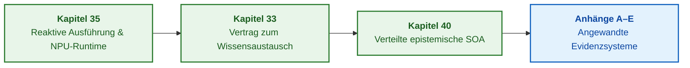

# Teil VII. Reaktive Ausführung, systemübergreifender Wissensaustausch und verteilte SOA

[← Zu Teil VI](part-06-frontiers-neuro-symbolic.md) | [Zum Inhaltsverzeichnis](README.md) | [Zu den Anhängen →](appendix-a-evidence-governed-framework.md)

---

## Ziel des Teils

Skalierung des Expertensystems von einem lokalen deterministischen Prozess zu einem verteilten Ökosystem unternehmensweiter Intelligenz. Dieser Teil untersucht die reaktive Neubewertung von Wissen anhand von Echtzeitereignissen, synergetische Phasenübergänge in Ontologien, den sicheren systemübergreifenden Regelaustausch, die Wissensdistillation in externe Modelle und den Aufbau einer globalen verteilten epistemischen SOA mit defeasiblem Schiedsverfahren und Pipelined-Speicher.

---

## Übersicht des Themas und Zusammenhang der Kapitel

Kapitel 35 untersucht die ereignisgesteuerte Regelausführung, Mechanismen zur Aufrechterhaltung der Wahrheit (TMS), synergetische Phasenübergänge von Wissen und NPU-Runtimes. Kapitel 33 definiert den Vertrag für den systemübergreifenden Wissensaustausch: sichere Regelbereitstellung für externe Agenten, Training von Schülermodellen und Feedback-Erdung über eine Quarantäneschleuse. Kapitel 40 bildet den architektonischen Höhepunkt der Monografie und synthetisiert einen industriellen Referenzprototyp für eine epistemische SOA: schlanke mobile Clients, semantisches Routing, doppelte Pufferung von Arbeitsmengen (Active Working Sets / Ping-Pong Pipeline) zur vollständigen Latenzverbergung auf dem Bus und mehrquellenbasiertes defeasibles Schiedsverfahren auf Basis formaler Argumentation (ASPIC+).

Das Ergebnis dieses Teils: eine vollumfängliche verteilte Architektur evidenzbasierter KI, die in der Lage ist, tausende Knoten zu koordinieren, ohne die Herkunft von Fakten zu verlieren, Lizenzrechte zu verletzen oder Sicherheitsgarantien zu schwächen. Praktische Ingenieurmethoden und autonome Anwendungssysteme sind in den [Anhängen A–E](README.md#додатки) gebündelt.

---

## Kapitel dieses Teils

### [Kapitel 35. Reaktives Expertensystem: Ereignisse, Widerruf und Wissensadaptation](ch35-self-organizing-expert-systems-synergetics-and-npu-runtime.md)

* **Abstract:** Ereignisgesteuerte Ausführung, unveränderliche Basisschicht, dynamische Fakten und Widerruf von Inferenzbegründungen. Ereignisbus und Begründungswartung zur Prüfung von Duplikaten, Kausalfolgen und Alternativbegründungen. Synergetische Ontologie-Evolution, Hakensche Ordnungsparameter und NPU-Runtimes.

### [Kapitel 33. Systemübergreifender Wissensaustausch: Regelbereitstellung für Drittsysteme, Modell-Training und sicheres Feedback](ch33-inter-system-knowledge-exchange-and-model-teaching.md)

* **Abstract:** Exportverträge für Regeln, Constraints und Fakten an externe Software-Konsumenten. Provenienz, Geltungsbereich, Berechtigungen, digitale Signaturen und Widerrufe als Begleitmetadaten transferierten Wissens. Training externer Schülermodelle als Wissensdistillation; Feedback-Kanäle leiten Kandidaten in die Quarantäne, anstatt die produktive Wissensbasis direkt zu überschreiben.

### [Kapitel 40. Verteilte Architektur evidenzbasierter Expertensysteme: Epistemische SOA, semantisches Routing, Speicherhierarchien und mehrquellenbasiertes defeasibles Schiedsverfahren](ch40-distributed-epistemic-architectures-soa-and-cluster-scaling.md)

* **Abstract:** Industrieller Referenzarchitektur-Prototyp für evidenzbasierte Expertensysteme. Dreischichtige Epistemic SOA (schlanke mobile Clients, semantischer Broker, föderierte Domänendienste). Überwindung der Speicherkapazitätskluft durch Active Working Sets (AWS) und Ping-Pong-Pipeline-Doppelpufferung mit vollständiger Latenzverbergung. Scatter-Gather-Muster und mehrquellenbasierte defeasible Aggregation (ASPIC+) zur Bewältigung unvollständigen Wissens und regulatorischer Normenkollisionen. Technologieauswahlmatrix und budgetorientierte Skalierung.

---

[← Zu Teil VI](part-06-frontiers-neuro-symbolic.md) | [Zum Inhaltsverzeichnis](README.md) | [Zu den Anhängen →](appendix-a-evidence-governed-framework.md)
