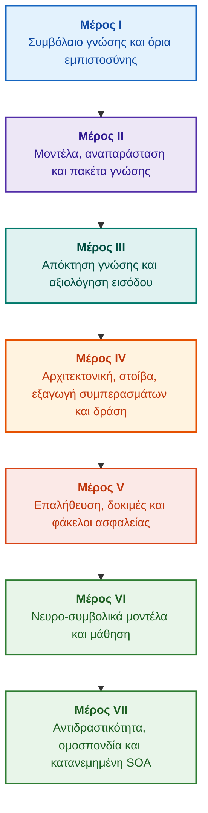

# Αρχιτεκτονική Έμπειρων Συστημάτων Βασισμένων σε Αποδείξεις: Από τις Τυπικές Οντολογίες στη Νευρο-συμβολική ΤΝ

**Μονογραφία μηχανικού και εγχειρίδιο αναφοράς για τον σχεδιασμό, τα μαθηματικά θεμέλια, την αρχιτεκτονική και την επαλήθευση ευφυών συστημάτων υψηλής ακεραιότητας (Safety-Critical & Evidence-Grounded AI)**

**Συγγραφέας:** [Mykola Fedchyk](about-the-author.md) · [LinkedIn](https://www.linkedin.com/in/nickfedchik/)  
**Μορφή:** Μονογραφία μηχανικού / Εγχειρίδιο αναφοράς αρχιτέκτονα ΤΝ  
**Έτος:** 2026  

---

## Σχετικά με το βιβλίο

Η παρούσα μονογραφία αποτελεί θεμελιώδη ερευνητική διερεύνηση και οδηγό μηχανικής αφιερωμένο στην υπέρβαση της κυριότερης κρίσης της σύγχρονης τεχνητής νοημοσύνης: του επιστημικού χάσματος μεταξύ της πιθανοτικής αληθοφάνειας των παραγωγών των νευρωνικών δικτύων και της ντετερμινιστικής αλήθειας των τυπικών μαθηματικών αποδείξεων. Στον πυρήνα αυτής της έρευνας βρίσκεται ένα αδιαπραγμάτευτο ερώτημα: **πώς μπορούμε να σχεδιάσουμε ένα έμπειρο σύστημα του οποίου κάθε συμπέρασμα είναι αδιάσειστο, πλήρως ανιχνεύσιμο στις πρωτογενείς πηγές αποδείξεων και κατάλληλο για πιστοποίηση σε τομείς κρίσιμης ασφάλειας (ISO 26262, IEC 61508, DO-178C, ISO/SAE 21434);**

Ο συγγραφέας τεκμηριώνει και εισάγει ένα νέο παράδειγμα: τη **Νευρο-συμβολική ΤΝ Βασισμένη σε Αποδείξεις (Evidence-Grounded Neuro-Symbolic AI)**, στην οποία τα στατιστικά μοντέλα (LLMs/SLMs) εκτελούν συμβουλευτική λειτουργία παραγωγής υποθέσεων και απεικόνισης προβολών, ενώ ένας ντετερμινιστικός συμβολικός πυρήνας εγγυάται απαρέγκλιτα τις αναλλοίωτες της λογικής συνέπειας, της θεμελίωσης γεγονότων σε επίπεδο byte, της επιβολής ορίων δικαιοδοσίας και της ασφαλούς μετάβασης στην εκτέλεση δράσεων.

### Από το τεχνούργημα στην επαληθεύσιμη απόφαση

Οι απαιτήσεις συστήματος, ο πηγαίος κώδικας, τα αρχεία καταγραφής δοκιμών, τα κανονιστικά πρότυπα και οι αποφάσεις μηχανικής διαπερνούν σήμερα τα σύγχρονα παραγωγικά περιβάλλοντα. Ωστόσο, εξακολουθούν να λειτουργούν κυρίως ως ασύνδετα τεχνουργήματα που στερούνται τυπικής σημασιολογίας, σαφών ορίων εγκυρότητας και αμφίδρομης ιχνηλασιμότητας. Μια επιτυχής αναφορά δοκιμής μπορεί να αναφέρεται σε παρωχημένη αναθεώρηση υλικού· ένα απόσπασμα από ένα πρότυπο λειτουργικής ασφάλειας μπορεί να είναι αποσπασμένο από τα συμφραζόμενα· μια αυτοματοποιημένη επαναφορά διαμόρφωσης έκτακτης ανάγκης μπορεί ακούσια να ενεργοποιήσει ένα ανακληθέν εξάρτημα.

Αυτή η μονογραφία οικοδομεί έναν πλήρη αγωγό μηχανικής: από την τυποποίηση των μηχανικών τεχνουργημάτων ως δεδομένων με τύπους και κρυπτογραφικά υπογεγραμμένων πακέτων γνώσης, έως τη συμβολική εξαγωγή συμπερασμάτων, τη βήμα προς βήμα αποσύνθεση σχεδίων, τις αντιγεγονικές εξηγήσεις και τον έλεγχο των ορίων επάρκειας. Η πρακτική ανάλυση βασίζεται σε υλοποιήσεις παραγωγικού επιπέδου σε Go με εξαντλητικές σειρές δοκιμών ([Κεφάλαιο 1](ch01-introduction-to-expert-systems.md)), αυστηρά μαθηματικά συμβόλαια ([Μέρος II](part-02-knowledge-models.md)) και πρωτόκολλα συνεχούς μάθησης που αποκλείουν αποδεδειγμένα τις παλινδρομήσεις ([Κεφάλαιο 25](ch25-how-expert-systems-learn.md)).

### Κοινό στο οποίο απευθύνεται

Το έργο απευθύνεται σε αρχιτέκτονες συστημάτων, επικεφαλής μηχανικούς αξιοπιστίας και λειτουργικής ασφάλειας, προγραμματιστές μηχανών εξαγωγής συμπερασμάτων και μηχανικούς γνώσης. Η αρχική κατανόηση των βασικών εννοιών απαιτεί μόνο θεμελιώδη γνώση της κατηγορηματικής λογικής πρώτης τάξης, της διαχείρισης εκδόσεων λογισμικού και της διαχείρισης κύκλου ζωής· η αναπαραγωγή των πρακτικών παραδειγμάτων απαιτεί τυπικά εργαλεία Go. Τα εξειδικευμένα κεφάλαια που καλύπτουν τη σύνθεση Goal Structuring Notation (GSN), τη συνεργητική πολύπλοκων συστημάτων, τους νευρομορφικούς επιταχυντές και την αυτόνομη πλοήγηση χωρίς GNSS εξετάζουν τα πλέον προηγμένα σύνορα της ΤΝ βασισμένης σε αποδείξεις στην αεροδιαστημική, τα αυτόνομα οχήματα και τις κρίσιμες υποδομές.

---

## Επιστημονικό πλαίσιο και διεθνής τοποθέτηση της μονογραφίας

Η μονογραφία δεν προσεγγίζει τα έμπειρα συστήματα ως αρχαϊκή κληρονομιά των συστημάτων κανόνων της δεκαετίας του 1980 (όπως το CLIPS ή το MYCIN), αλλά ως την πρωτοπορία της **Νευρο-συμβολικής ΤΝ Τρίτου Κύματος Βασισμένης σε Αποδείξεις (Third-Wave Evidence-Grounded Neuro-Symbolic AI)**. Η μεθοδολογία γεφυρώνει τα θεωρητικά θεμέλια κορυφαίων διεθνών επιστημονικών σχολών με τη μηχανική συστημάτων υψηλής απόδοσης:

| Επιστημονικός κλάδος | Βασικά διεθνή έργα και συγγραφείς | Εννοιολογική γέφυρα στην παρούσα μονογραφία |
|---|---|---|
| **Νευρο-συμβολική ΤΝ Τρίτου Κύματος (NeSy)** | Artur d'Avila Garcez, Luis C. Lamb (*Neurosymbolic AI: The 3rd Wave*, 2023; *Neural-Symbolic Cognitive Reasoning*, Springer, 2009); Henry Kautz (*The Third AI Summer*, AAAI 2022) | Διαχωρισμός αρμοδιοτήτων: τα στατιστικά μοντέλα (SLMs/LLMs) παράγουν υποθέσεις ερωτημάτων, ενώ ένας ντετερμινιστικός συμβολικός πυρήνας επαληθεύει και αποδέχεται τυπικά τα γεγονότα ([Κεφάλαιο 29](ch29-neuro-symbolic-architecture.md)). |
| **Σημασιολογικοί περιορισμοί και ασφαλής μάθηση** | Guy Van den Broeck et al. (*A Semantic Loss Function for Deep Learning with Symbolic Knowledge*, ICML 2018); Luc De Raedt et al. (*DeepProbLog*, IJCAI 2020) | Πύλες εισδοχής και εξόδου, ντετερμινιστικό σημασιολογικό φιλτράρισμα υποψήφιων ισχυρισμών νευρωνικών δικτύων έναντι τυπικών σχημάτων ([Κεφάλαια 28](ch28-dual-mode-expert-systems.md), [33](ch33-inter-system-knowledge-exchange-and-model-teaching.md)). |
| **Αναιρέσιμη λογική και θεωρία επιχειρηματολογίας** | John L. Pollock (*Defeasible Reasoning*, 1987; *Cognitive Carpentry*, MIT Press, 1995); Phan Minh Dung (*Abstract Argumentation Frameworks*, AIJ 1995); Douglas Walton (*Argumentation Schemes*, Cambridge, 2008) | Αποσύνθεση γνώσης σε ισχυρισμούς, προέλευση και συνθήκες αναίρεσης (*defeaters*: *rebutting* και *undercutting*)· επίλυση συγκρούσεων σε κανονιστικές βάσεις κανόνων μέσω πλαισίων επιχειρηματολογίας Dung ([Κεφάλαια 2](ch02-epistemology-of-machine-knowledge.md), [27](ch27-safety-case-gsn-synthesis.md)). |
| **Αυτοματοποιημένη εξόρυξη κανόνων συσχέτισης (KBC)** | Luis Galárraga, Fabian M. Suchanek et al. (*AMIE: Association Rule Mining under Incomplete Evidence*, WWW 2013, VLDBJ 2015); Stephen Muggleton (*Inductive Logic Programming*, 1994) | Αυτόνομη επαγωγή κανόνων από βάσεις γνώσης υπό την Παραδοχή Μερικής Πληρότητας (PCA), αποτρέποντας ψευδή αντιπαραδείγματα ανοικτού κόσμου ([Κεφάλαιο 34](ch34-deterministic-relational-analysis-abduction-and-socratic-dialogue.md)). |
| **Τυπικές ασπίδες ασφαλείας και πιστοποίηση (Safe AI)** | Bettina Könighofer, Roderick Bloem et al. (*Shield Synthesis*, 2017); Tim Kelly, Rob Weaver (*Goal Structuring Notation*, York, 2004); André Platzer (*Logical Foundations of CPS*, Springer, 2018) | Σύνθεση δομημένων φακέλων ασφαλείας σε σημειογραφία GSN για τα πρότυπα ISO 26262/21434· τυπικές ασπίδες και αριθμητικά περιβλήματα εγκυρότητας για ενεργοποιητές ακραίων κόμβων ([Κεφάλαια 27](ch27-safety-case-gsn-synthesis.md), [30](ch30-safety-cybersecurity-co-engineering.md), [33](ch33-inter-system-knowledge-exchange-and-model-teaching.md)). |
| **Επιστημική λογική και σημειωτική της γνώσης** | John F. Sowa (*Knowledge Representation: Logical, Philosophical, and Computational Foundations*, 2000); Frank van Harmelen et al. (*Handbook of Knowledge Representation*, Elsevier, 2008) | Επιστημική τριάδα του Charles Sanders Peirce (Έννοια → Κρίση → Συλλογισμός)· απαγωγική παραγωγή υποθέσεων εργασίας υπό αυστηρό απαγωγικό έλεγχο ([Κεφάλαια 6](ch06-applied-mathematics-for-expert-systems.md), [34](ch34-deterministic-relational-analysis-abduction-and-socratic-dialogue.md)). |
| **Κυβερνητική και συνεργητική πολύπλοκων συστημάτων** | Norbert Wiener (*Cybernetics*, 1948); W. Ross Ashby (*An Introduction to Cybernetics*, 1956); Hermann Haken (*Synergetics: An Introduction*, 1977; *Advanced Synergetics*, 1983); Ilya Prigogine (*Order out of Chaos*, 1984) | Νόμος της απαιτούμενης ποικιλίας του Ashby, κλειστοί βρόχοι ελέγχου L0–L4, μείωση χώρου καταστάσεων σε παραμέτρους τάξης μέσω της αρχής καθυπόταξης του Haken, έγκαιρη προειδοποίηση μεταβάσεων φάσης μέσω κρίσιμης επιβράδυνσης (CSD) και διασκεδαστική σταθεροποίηση εξελισσόμενων βάσεων γνώσης ([Κεφάλαια 6](ch06-applied-mathematics-for-expert-systems.md), [22](ch22-cybernetics-edge-to-backend.md), [35](ch35-self-organizing-expert-systems-synergetics-and-npu-runtime.md)). |
| **Δοκιμές γνώσης, αναλλοιωτότητα και βαθμονόμηση Lipschitz** | Kent Beck (*TDD*, 2002); Martin Fowler (*Refactoring*, 2018); Clark Barrett, Leonardo de Moura (*Z3 SMT Solver*, 2008); Chuan Guo et al. (*On Calibration of Modern Neural Networks*, ICML 2017); Marco Tulio Ribeiro et al. (*CheckList*, ACL 2020); John L. Pollock (*Defeasible Reasoning*, 1987) | Τετραεπίπεδη πυραμίδα δοκιμών γνώσης (KTP): απομονωμένες μοναδιαίες δοκιμές ατομικών κανόνων (KUT) με προσομοίωση προϋποθέσεων (`PremiseMock`), εξάλειψη της παγίδας κενής αλήθειας, φασματική ανάλυση οριακών τιμών 6 σημείων (BVA), πλέγματα κανόνων και συνθήκες αναίρεσης (KIT), βαθμολογία σημασιολογικής αναλλοιωτότητας ($\text{SIS} \ge 0.98$) υπό γλωσσικές μεταλλάξεις ερωτημάτων, όρια συνέχειας Lipschitz ($L_{\mathcal{K}} \le L_{\max}$) για την αποτροπή ταλάντωσης ρελέ και στιγμεργική καταγραφή κενών γνώσης ([Κεφάλαιο 36](ch36-knowledge-testing-pyramid-and-variational-calibration.md)). |

---

## Θεωρητικά μοντέλα, επιστημονική έρευνα και μηχανικές καινοτομίες του συγγραφέα

Η παρούσα μονογραφία συνθέτει τη θεμελιώδη έρευνα και τη συνεισφορά του συγγραφέα στη μηχανική κρίσιμου λογισμικού, ενσωματωμένων αρχιτεκτονικών και ΤΝ βασισμένης σε αποδείξεις. Σε αντίθεση με τη βιβλιογραφία γενικής επισκόπησης, το βιβλίο εισάγει μια σουίτα πρωτότυπων τυπικών θεωριών, πρωτοκόλλων και αρχιτεκτονικών προτύπων που αναγάγουν τις νευρο-συμβολικές αλληλεπιδράσεις σε μαθηματικά επαληθευμένο επίπεδο εμπιστοσύνης:

### 1. Θεμελιώδεις θεωρητικές αναπτύξεις και μαθηματικοί φορμαλισμοί

1. **Αναλλοίωτη Θεμελίωσης σε Αποδείξεις (EGI) και Πύλη Επικύρωσης Γεγονότων ([Κεφάλαια 2](ch02-epistemology-of-machine-knowledge.md), [19](ch19-from-question-to-evidence.md), [28](ch28-dual-mode-expert-systems.md), [29](ch29-neuro-symbolic-architecture.md)):**
   * *Θεωρητική διατύπωση:* Ο συγγραφέας τυποποιεί την Αναλλοίωτη Πληρότητας Θεμελίωσης $\mathrm{Comp}(C) = 1.00$, ορίζοντας ότι σε μια αρχιτεκτονική βασισμένη σε αποδείξεις, κανένας ισχυρισμός δεν μπορεί να αναχθεί σε αναγνωρισμένο γεγονός χωρίς ντετερμινιστική προβολή σε αυθεντικές πρωτογενείς πηγές. Κάθε αποδεκτή πλειάδα γεγονότος αγκιστρώνεται από αμετάβλητες μετατοπίσεις byte `[byte_start, byte_end]`, κανονικοποιημένο κρυπτογραφικό κατακερματισμό αποσπάσματος `quote_sha256` και αναγνωριστικό πιστοποιητικού προέλευσης PROV-O.
   * *Αποτέλεσμα μηχανικής:* Η υλικολογισμική πύλη εισδοχής σε επίπεδο byte καθιστά τις παραισθήσεις των νευρωνικών δικτύων ανίκανες να εισέλθουν στη βάση γνώσης εκδόσεων, διασφαλίζοντας μηδενική ανοχή σε αθεμελίωτους ισχυρισμούς ($ZHR = 1.00$).
2. **Τετραεπίπεδη Πυραμίδα Δοκιμών Γνώσης (KTP) και Συνέχεια Lipschitz του Λογικού Χώρου ([Κεφάλαιο 36](ch36-knowledge-testing-pyramid-and-variational-calibration.md)):**
   * *Θεωρητική διατύπωση:* Ο συγγραφέας εισάγει την Πυραμίδα Δοκιμών Γνώσης (KTP), μεταφέροντας την πειθαρχία της πυραμίδας δοκιμών λογισμικού του Fowler στα συστήματα γνώσης: απομονωμένες μοναδιαίες δοκιμές κανόνων (KUT) με χρήση προσομοιωμένων συνθηκών υποθέσεων (`PremiseMock`), δοκιμές ολοκλήρωσης αλληλεπιδράσεων κανόνων και συνθηκών αναίρεσης (KIT) και μεταβολική βαθμονόμηση σε πολλαπλότητες ερωτημάτων (KVT).
   * *Μαθηματικός μηχανισμός:* Τυποποίηση αναλλοίωτης πρόληψης κενής αλήθειας ($P \to Q$ όπου $P \equiv \text{False}$), Βαθμολογία Σημασιολογικής Αναλλοιωτότητας ($\mathrm{SIS} \ge 0.98$) υπό γλωσσικές διαταραχές και περιορισμός συνέχειας Lipschitz στην πολλαπλότητα εξαγωγής συμπερασμάτων ($L_{\mathcal{K}} \le L_{\max}$), ο οποίος εξαλείφει μαθηματικά την καταστροφική ταλάντωση ρελέ σε μικρές μεταβολές εισόδου.
3. **Ποπεριανή Διαψευσιμότητα Δεοντικών Κανόνων και Ενεργός Έλεγχος Συμμόρφωσης ([Κεφάλαιο 39](ch39-active-compliance-auditor-and-popperian-testing.md)):**
   * *Θεωρητική διατύπωση:* Αλλαγή παραδείγματος από ένα παθητικό μαντείο (που απλώς απαντά σε ερωτήματα) σε έναν ενεργό ελεγκτή συμμόρφωσης που υλοποιεί την αρχή της διαψευσιμότητας του Karl Popper. Το σύστημα διερευνά αυτόνομα τον χώρο των προδιαγραφών (ASPICE 4.0, ISO 26262, ISO/SAE 21434), συνθέτει αντιπαραδείγματα, εντοπίζει ελλιπώς καθορισμένες οριακές συνθήκες και σχεδιάζει εξαντλητικές εκστρατείες επαλήθευσης.
   * *Πρακτική αξία:* Σύνδεση της νευρωνικής παραγωγής οριακών περιπτώσεων (Σύστημα 1) με τον ντετερμινιστικό δεοντικό έλεγχο μέσω του συμβολικού πυρήνα (Σύστημα 2), προστατεύοντας τον άνθρωπο στον βρόχο ελέγχου (Human-in-the-Loop) από την κόπωση εγκρίσεων.
4. **Συνεργητική Μείωση Διαστατικότητας Βάσεων Γνώσης και Διαγνωστικά CSD Προ-Διακλάδωσης ([Κεφάλαια 6](ch06-applied-mathematics-for-expert-systems.md), [22](ch22-cybernetics-edge-to-backend.md), [35](ch35-self-organizing-expert-systems-synergetics-and-npu-runtime.md)):**
   * *Θεωρητική διατύπωση:* Εφαρμογή της συνεργητικής του Hermann Haken (παράμετροι τάξης και αρχή καθυπόταξης) και των διασκεδαστικών δομών του Ilya Prigogine στην εξέλιξη πολύπλοκων αποθετηρίων γνώσης.
   * *Επιστημονική συνεισφορά:* Οι πολυδιάστατοι χώροι φάσεων τηλεμετρίας μειώνονται σε παραμέτρους τάξης, ενσωματώνοντας έναν ανιχνευτή Κρίσιμης Επιβράδυνσης (CSD) προ-διακλάδωσης βασισμένο σε μετρικές αυτοσυσχέτισης και διακύμανσης. Αυτό ανιχνεύει επικείμενη κυβερνο-φυσική αστάθεια πολύ πριν ενεργοποιηθούν οι παραδοσιακοί ελεγκτές ορίων.
5. **Μοντέλο Επιπέδων Αυτονομίας Δράσης (A0–A4), Πύλες Εισδοχής και Ιδιοδύναμα Sagas ([Κεφάλαιο 21](ch21-from-recommendation-to-action.md)):**
   * *Θεωρητική διατύπωση:* Ένα λεπτομερές πλαίσιο εξουσιοδότησης για αυτοματοποιημένη εκτέλεση (A0: παθητική ανάλυση, A1: παραγωγή σχεδίου, A2: εκτέλεση υπογεγραμμένη από άνθρωπο, A3: εποπτευόμενη περιορισμένη αυτονομία, A4: τερματισμός έκτακτης ανάγκης fail-closed). Τα δικαιώματα δεν συνδέονται με το σύστημα ως μονόλιθο, αλλά με την τριάδα $\langle\text{δράση}, \text{περιβάλλον}, \text{επίπεδο κινδύνου}\rangle$.
   * *Μαθηματικός μηχανισμός:* Αλγεβρική αναλλοίωτη ιδιοδυναμίας $f(f(x, k), k) \equiv f(x, k)$ με κρυπτογραφικό διακριτικό $k$, βήμα προς βήμα εκτέλεση κλειστού βρόχου και πρωτόκολλο κατανεμημένων αντισταθμιστικών sagas που επιλύει καταστάσεις `OutcomeUnknown` μέσω εκτός ζώνης επαλήθευσης μετα-συνθηκών.
6. **Τυπική Συν-Μηχανική Λειτουργικής Ασφάλειας και Κυβερνοασφάλειας σε GSN ([Κεφάλαια 27](ch27-safety-case-gsn-synthesis.md), [30](ch30-safety-cybersecurity-co-engineering.md)):**
   * *Θεωρητική διατύπωση:* Ενοποιημένη μεθοδολογία σύνθεσης Goal Structuring Notation (GSN) που εναρμονίζει τους ταυτόχρονους περιορισμούς των προτύπων ISO 26262 (λειτουργική ασφάλεια) και ISO/SAE 21434 (κυβερνοασφάλεια).
   * *Μηχανική τομή:* Μαθηματική διαιτησία μεταξύ αντικρουόμενων στόχων (όρια υστέρησης απόκρισης έκτακτης ανάγκης έναντι βάθους κρυπτογραφικής πιστοποίησης), σε συνδυασμό με πρωτόκολλο επιλεκτικής αποκάλυψης αποδείξεων σε εξωτερικούς ελεγκτές μέσω αλατισμένων δέντρων Merkle.
7. **Πρωτόκολλο Πιστότητας Επεξηγήσεων και Επαλήθευσης Σημασιολογικής Συνέπειας ([Κεφάλαιο 20](ch20-explanation-engine.md)):**
   * *Θεωρητική διατύπωση:* Οι επεξηγήσεις δεν αντιμετωπίζονται ως ελεύθερο παραγόμενο κείμενο, αλλά ως ντετερμινιστικά τεχνουργήματα πρώτης κατηγορίας που προκύπτουν αυστηρά από τον γράφο απόδειξης, τις ετικέτες έκδοσης κανόνων και τα παγωμένα στιγμιότυπα γεγονότων.
   * *Μαθηματικός μηχανισμός:* Τυπική μετρική επικύρωσης πιστότητας επεξήγησης ($C_{\text{facts}} = 1.00, H_{\text{free}} = 1.00$) με υποστήριξη αυτοματοποιημένης ασφαλούς υποχώρησης σε αυστηρά πρότυπα με την παραμικρή απόκλιση μεταξύ συμβολικής παραγωγής και κειμένου φυσικής γλώσσας χειριστή.

---

### 2. Εμπειρική έρευνα, πειραματικές διατάξεις του συγγραφέα και μηχανική συστημάτων

1. **Αμετάβλητα Δυαδικά Πακέτα Γνώσης με `mmap` και Αποσειριοποίηση Μηδενικής Κατανομής ([Κεφάλαιο 32](ch32-high-performance-knowledge-packs-mmap-and-harvesting.md)):**
   * *Καινοτομία συγγραφέα:* Αρχιτεκτονική πακέτων δύο επιπέδων που διαχωρίζει τα κανονικά αρχεία πρωτογενών πηγών από τα παραγόμενα υλοποιημένα τμήματα δεικτών.
   * *Εμπειρικό αποτέλεσμα:* Άμεση χαρτογράφηση μνήμης μέσω `mmap` στον εικονικό χώρο διευθύνσεων, εξαλείφοντας τις κατανομές σωρού κατά τον χρόνο εκτέλεσης (zero-allocation) και επιτυγχάνοντας υπογραμμική καθυστέρηση εκκίνησης ανεξάρτητα από πολυ-γιγαβαϊτικά αποτυπώματα οντολογιών.
2. **Πειραματική Διάταξη Βαθμονόμησης στα Κανονιστικά Σώματα IETF RFC-1000 και W3C-150 ([Κεφάλαια 2](ch02-epistemology-of-machine-knowledge.md), [4](ch04-evolution-from-bayes-to-evidence-ai.md), [14](ch14-requirements-detection-and-formalization.md), [25](ch25-how-expert-systems-learn.md)):**
   * *Πειραματική πλατφόρμα:* Ανάπτυξη πλαισίου αξιολόγησης μεγάλης κλίμακας σε 1.000 ενεργές προδιαγραφές IETF RFC (που καλύπτουν 5 χρονολογικές εποχές του διαδικτύου) και 150 σύνθετα διαγνωστικά ερωτήματα έναντι του σώματος W3C (συμπεριλαμβανομένων επαγόμενων λογικών συγκρούσεων και παραληρημάτων).
   * *Πρακτικό εύρημα:* Κατασκευή αντικειμενικών πινάκων εξέτασης γνώσης, εμπειρικός εντοπισμός κανονιστικών αντιφάσεων και μαθηματικά επικυρωμένη άμυνα έναντι παλινδρομήσεων βάσης γνώσης κατά τη διάρκεια συνεχών ενημερώσεων.
3. **Σχεσιακή Ανάλυση Πολλαπλών Αλμάτων, Συμβολική Απαγωγή και Σωκρατικός Διάλογος ([Κεφάλαιο 34](ch34-deterministic-relational-analysis-abduction-and-socratic-dialogue.md)):**
   * *Καινοτομία συγγραφέα:* Αλγόριθμος Αμφίδρομης Περιορισμένης Αναζήτησης κατά Πλάτος (Bounded BFS, $k \le 6$) με καταστολή κύκλων και σύνθεση σύνθετης αλυσίδας αποδείξεων σε επίπεδο byte μεταξύ συσχετιζόμενων οντοτήτων.
   * *Μηχανικό πλεονέκτημα:* Υλοποίηση της συμβολικής απαγωγής του Peirce υπό αυστηρά παραγωγικά προστατευτικά όρια, συνδυασμένη με τυποποιημένα Σωκρατικά Πλαίσια Διευκρίνισης (Clarification Frames) που καθοδηγούν το σύστημα σε παραγωγικό διάλογο με τον χρήστη αντί της τυφλής απόρριψης υπό την Παραδοχή Κλειστού Κόσμου (CWA).
4. **Τυπικές Ασπίδες Ασφαλείας και Αριθμητικά Περιβλήματα Εγκυρότητας για Έλεγχο Άκρων ([Κεφάλαιο 33](ch33-inter-system-knowledge-exchange-and-model-teaching.md), [Παραρτήματα B](appendix-b-robotics-and-cyber-physical-systems.md), [C](appendix-c-autonomous-navigation-and-geosearch.md), [E](appendix-e-mixed-signal-neuromorphic-expert-systems.md)):**
   * *Καινοτομία συγγραφέα:* Μεθοδολογία μετάφρασης διακριτών λογικών αναλλοιώτων σε συνεχή αριθμητικά κανάλια ασφαλείας για επεξεργαστές ψηφιακού σήματος (DSP) και πλοήγηση χωρίς GNSS (TRN/DSMAC/VIO).
   * *Επιχειρησιακή αξιοπιστία:* Κρυπτογραφικά υπογεγραμμένη ανταλλαγή κανόνων μέσω Ed25519, απομονωμένη καραντίνα υποψηφίων κανόνων και αναχαίτιση άκυρων τροχιών ενεργοποιητών σε επίπεδο υλικού.
5. **Άμυνα Έναντι Διαρροής Εμπιστευτικών Πληροφοριών μέσω Επεξηγήσεων και Διαφορικός Έλεγχος ([Κεφάλαιο 20](ch20-explanation-engine.md)):**
   * *Καινοτομία συγγραφέα:* Πρωτόκολλο μείωσης ενδιάμεσης αναπαράστασης επεξήγησης ($\mathrm{EIR}_{\text{redacted}}$) που επιβάλλει λίστες ελέγχου πρόσβασης (ACL) σε κάθε κόμβο και ακμή του γράφου απόδειξης, εξουδετερώνοντας επιθέσεις πλευρικού καναλιού ανακατασκευής μοντέλου μέσω αντιθετικών ερωτημάτων ΓΙΑΤΙ ΟΧΙ (WHY NOT).

---

## Αρχή δόμησης

Τα μέρη αυτής της μονογραφίας είναι δομημένα γύρω από πρωταρχικούς μηχανικούς στόχους και όχι χρονολογικές ημερομηνίες δημοσίευσης ή εφήμερες ονομασίες τεχνολογιών. Κάθε κεφάλαιο ανήκει σε ένα κύριο μέρος· οι σχετικές τεχνικές απεικονίζουν μεθόδους για την αντιμετώπιση της κεντρικής του θέσης. Οι αριθμοί κεφαλαίων και τα αναγνωριστικά αρχείων παραμένουν μόνιμα κλειδιά, επιτρέποντας στις θεματικές διαδρομές ανάγνωσης να αποκλίνουν από την αριθμητική σειρά.

Οι δομικές κατηγορίες ενοτήτων εντός των κεφαλαίων συγκροτούν μια λογικά δομημένη επιχειρηματολογία αντί για έναν κατάλογο ισοδύναμων τεχνολογιών:

| Κατηγορία ενότητας | Ερώτημα αναγνώστη | Αρχιτεκτονική λειτουργία στο κεφάλαιο |
|---|---|---|
| Πρόβλημα και όρια | Ποιο ακριβώς πρόβλημα πρέπει να επιλυθεί; | Ορισμός του πυρήνα της έρευνας και του πεδίου εγκυρότητας |
| Αντικείμενο και μοντέλο | Ποια δεδομένα, γνώσεις ή καταστάσεις αξιολογούνται; | Τυποποίηση εννοιών, τύπων και λειτουργικών υποθέσεων |
| Μέθοδος και διαδικασία | Πώς εξάγεται η λύση; | Λεπτομερής περιγραφή αλγορίθμων παραγωγής, μετασχηματισμού και ελέγχου |
| Υλοποίηση και εργαλεία | Ποιο λογισμικό ή υλικό εκτελεί τη διαδικασία; | Συγκεκριμένες λίστες κώδικα υλοποίησης και αρχιτεκτονικά συμβόλαια |
| Επαλήθευση και μετρήσεις | Πώς αποκαλύπτονται συστηματικά οι καταστάσεις αποτυχίας; | Συγκριτική αξιολόγηση απόδοσης και ορθότητας έναντι ανεξάρτητων κριτηρίων |
| Συμπέρασμα και περιορισμοί | Τι αποδείχθηκε και τι παραμένει ανοικτό; | Απάντηση στην κεντρική θέση χωρίς ατεκμηρίωτους ισχυρισμούς |

Η γεωγραφία, οι συγκεκριμένοι βιομηχανικοί τομείς και οι εμπορικές πλατφόρμες λειτουργούν ως πλαίσια εφαρμογής και όχι ως διακριτά επίπεδα σε αυτήν την ταξινόμηση. Τα γλωσσάρια, οι συντομογραφίες, οι βιβλιογραφίες και η πλοήγηση ευρετηρίου αποτελούν υποστηρικτικό υλικό αναφοράς και όχι αυτόνομα θέματα κεφαλαίων.

Η πλήρης [συντακτική ανασκόπηση δομής](editorial-structure-review.md) παρέχει αξιολόγηση του κεντρικού θέματος κάθε κεφαλαίου, των ορίων μεταξύ γειτονικών θεμάτων και συνθετικών παρατηρήσεων. Η ενημέρωση μιας σύνοψης δεν συνεπάγεται ότι έχουν επιλυθεί όλοι οι εσωτερικοί συνθετικοί κίνδυνοι εντός των κεφαλαίων.

## Διαδρομές ανάγνωσης

**Πρώτη επαλήθευση λογισμικού:** [1](ch01-introduction-to-expert-systems.md) → [7](ch07-knowledge-base-typology.md) → [8](ch08-engineering-artifacts-as-data.md) → [17](ch17-implementation-stack.md) → [23](ch23-knowledge-base-verification.md) → [25](ch25-how-expert-systems-learn.md). Στόχος: Παραγωγή αναπαραγώγιμης, βασισμένης σε αποδείξεις ετυμηγορίας με αρνητικές δοκιμές και ελεγχόμενη μετάλλαξη γνώσης. Το γλωσσικό μοντέλο είναι προαιρετικό.

**Μηχανική γνώσης:** [Μέρος II](part-02-knowledge-models.md) → [Μέρος III](part-03-knowledge-engineering-nlp.md) → [19](ch19-from-question-to-evidence.md) → [20](ch20-explanation-engine.md) → [26](ch26-continual-learning.md). Στόχος: Εναρμόνιση τυπικής σημασιολογίας, προέλευσης, εξαγωγής υποψηφίων και επικύρωσης. Το Μέρος II διατηρεί το διαθεματικό εμπειρικό ερευνητικό πρόγραμμα για τα Κεφάλαια 7–11.

**Αρχιτεκτονική λύσεων:** [16](ch16-expert-systems-architecture.md) → [19](ch19-from-question-to-evidence.md) → [31](ch31-syllogistic-reasoning-and-relation-lattices.md) → [20](ch20-explanation-engine.md) → [21](ch21-from-recommendation-to-action.md). Στόχος: Αποσύνδεση αποδεικτικής επαλήθευσης, εφαρμογής κανονιστικών κανόνων, παραγωγής επεξηγήσεων και επιχειρησιακής εξουσιοδότησης δράσης.

**Επαλήθευση και ασφάλεια:** [23](ch23-knowledge-base-verification.md) → [36](ch36-knowledge-testing-pyramid-and-variational-calibration.md) → [25](ch25-how-expert-systems-learn.md) → [26](ch26-continual-learning.md) → [27](ch27-safety-case-gsn-synthesis.md) → [30](ch30-safety-cybersecurity-co-engineering.md). Η εξωτερική φυσική διάγνωση προσεγγίζεται μέσω του [Κεφαλαίου 24](ch24-system-diagnosis.md).

**Υβριδικές αποκρίσεις και επιχειρησιακή ανάπτυξη:** [Μέρος VI](part-06-frontiers-neuro-symbolic.md) → [Μέρος VII](part-07-runtime-and-knowledge-exchange.md) → [40](ch40-distributed-epistemic-architectures-soa-and-cluster-scaling.md) και σχετικά παραρτήματα. Στόχος: Ενσωμάτωση νευρωνικών γλωσσικών μοντέλων, διαχείριση επιστημικών χασμάτων, αρχιτεκτονική κατανεμημένων συστάδων υπηρεσιών γνώσης και επαλήθευση διασυστημικών ομοσπονδιών. Τα Κεφάλαια [2](ch02-epistemology-of-machine-knowledge.md), [4](ch04-evolution-from-bayes-to-evidence-ai.md) και [6](ch06-applied-mathematics-for-expert-systems.md) μπορούν να ανατρέχονται κατά παραγγελία ως συμβόλαια, ιστορική εξέλιξη και μαθηματικά θεμέλια.

---

## Εύρος ισχυρισμών και όρια μηχανικής

Αυτή η μονογραφία αποτελεί θεμελιώδες εκπαιδευτικό και ερευνητικό υλικό· δεν συνιστά πιστοποιημένη διαδικασία συμμόρφωσης ούτε αυτόνομη απόδειξη συμμόρφωσης εξοπλισμού με πρότυπα. Η ντετερμινιστική εκτέλεση δεν εγγυάται την πραγματική ορθότητα των υποθέσεων· οι κατακερματισμοί και οι ψηφιακές υπογραφές αποδεικνύουν την ακεραιότητα, όχι την εμπειρική αλήθεια· οι γράφοι επιχειρηματολογίας δεν αντικαθιστούν την πιστοποιημένη ανθρώπινη κρίση. Οι απαιτήσεις αξιοπιστίας σε επίπεδο συστήματος δεν μπορούν να εξισωθούν με τα ποσοστά σφάλματος διακριτικών ενός γλωσσικού μοντέλου ούτε να επεκταθούν καθολικά σε όλες τις μονάδες λογισμικού.

Η αυτοματοποιημένη ανάλυση και εξαγωγή μειώνουν τη χειροκίνητη μετακίνηση δεδομένων, αλλά δεν εξαλείφουν την αναγκαιότητα της τυπικής μοντελοποίησης, της αξιολόγησης από ομοτίμους (peer review) και του ορισμού υπεύθυνων θεματοφυλάκων γνώσης (knowledge custodians). Οι οντολογίες στο Protégé, οι χειροκίνητοι έλεγχοι και οι αυτοματοποιημένοι συλλέκτες λειτουργούν συνδυαστικά. Οι μαθηματικές εγγυήσεις οριοθετούνται από ρητά προφίλ τυπικών γλωσσών και λειτουργικές παραδοχές· οι μετρήσεις απόδοσης αντικατοπτρίζουν συγκεκριμένα φορτία ερωτημάτων, σώματα κειμένων και περιβάλλοντα εκτέλεσης. Οι ιστορικές μετρικές από προηγούμενες παραγωγικές εγκαταστάσεις του συγγραφέα διαχωρίζονται αυστηρά από τις ανοικτές ερευνητικές διατάξεις και τις ενεργές επιστημονικές διερευνήσεις.

Οι τελικές αποφάσεις σχετικά με την απελευθέρωση στην παραγωγή, την αποδοχή κινδύνου και την κανονιστική συμμόρφωση ανήκουν αποκλειστικά σε εξουσιοδοτημένους μηχανικούς. Ένα έμπειρο σύστημα βασισμένο σε αποδείξεις προετοιμάζει επαληθεύσιμα ίχνη ελέγχου και επιβάλλει συμφωνημένες πολιτικές· δεν αναλαμβάνει κανονιστική κυριαρχία.

---

## Δομή του βιβλίου

Η μονογραφία είναι οργανωμένη σε επτά θεματικά μέρη, τα οποία περιλαμβάνουν 40 κεφάλαια και πέντε παραρτήματα. Κάθε κεφάλαιο ανήκει σε ένα κύριο μέρος. Οι ακολουθίες πλοήγησης ακολουθούν τη θεματική διαδρομή παρακάτω· οι αριθμοί των κεφαλαίων και οι διαδρομές των αρχείων παραμένουν αμετάβλητοι.

---

### [Μέρος I. Εννοιολογικά και επιστημολογικά θεμέλια](part-01-foundations.md)

*Πότε απαιτείται ένα έμπειρο σύστημα, τι συνιστά μηχανική γνώση και πώς διατηρείται η οργανωσιακή αιτιολόγηση.*

* [Κεφάλαιο 1. Εισαγωγή στα έμπειρα συστήματα: Από το χάος στην ελεγχόμενη γνώση](ch01-introduction-to-expert-systems.md)
* [Κεφάλαιο 2. Φιλοσοφία για τον μηχανικό συστημάτων: Τι έχουν δικαίωμα οι μηχανές να αποκαλούν γνώση](ch02-epistemology-of-machine-knowledge.md)
* [Κεφάλαιο 3. Διάκριση των έμπειρων συστημάτων από τα συστήματα πληροφοριών αναφοράς](ch03-beyond-reference-information-systems.md)
* [Κεφάλαιο 4. Εξέλιξη των έμπειρων συστημάτων: Από το θεώρημα του Bayes στην ΤΝ βασισμένη σε αποδείξεις](ch04-evolution-from-bayes-to-evidence-ai.md)
* [Κεφάλαιο 5. Η τριάδα της εμπιστοσύνης: Έμπειρο σύστημα, επαληθεύσιμη σύσταση και εταιρική μνήμη](ch05-triad-of-trust-and-corporate-memory.md)

---

### [Μέρος II. Μαθηματικά μοντέλα, αναπαράσταση και αποθήκευση γνώσης](part-02-knowledge-models.md)

*Επιλογή μαθηματικών φορμαλισμών, τεχνουργήματα με τύπους, μηχανικοί γράφοι ιχνηλασιμότητας και αμετάβλητα πακέτα γνώσης.*

* [Κεφάλαιο 6. Εφαρμοσμένα μαθηματικά για έμπειρα συστήματα: Κανόνες, πιθανότητες, γράφοι και αιτιότητα](ch06-applied-mathematics-for-expert-systems.md)
* [Κεφάλαιο 7. Τυπολογία βάσεων γνώσης: Κανόνες, οντολογίες, περιπτώσεις και διανυσματικές ενσωματώσεις](ch07-knowledge-base-typology.md)
* [Κεφάλαιο 8. Μηχανικά τεχνουργήματα ως δεδομένα έμπειρου συστήματος](ch08-engineering-artifacts-as-data.md)
* [Κεφάλαιο 9. Μηχανικός γράφος γνώσης: Ολοκληρωμένη ιχνηλασιμότητα από τις απαιτήσεις στο πυρίτιο](ch09-engineering-knowledge-graph-traceability.md)
* [Κεφάλαιο 32. Αμετάβλητα πακέτα γνώσης: Επικύρωση σε επίπεδο byte, δείκτες και χαρτογράφηση μνήμης](ch32-high-performance-knowledge-packs-mmap-and-harvesting.md)

---

### [Μέρος III. Απόκτηση γνώσης, γλωσσική ανάλυση και αξιολόγηση εισόδου](part-03-knowledge-engineering-nlp.md)

*Έγγραφα, ανθρώπινη εμπειρογνωμοσύνη και αισθητηριακές παρατηρήσεις: εξαγωγή υποψηφίων, γλωσσική ανάλυση, τυποποίηση και αξιολόγηση αποδείξεων.*

* [Κεφάλαιο 10. Συστήματα απόκτησης γνώσης: Πηγές, πύλες επικύρωσης και κύκλοι ζωής](ch10-knowledge-acquisition-systems.md)
* [Κεφάλαιο 11. Απόκτηση γνώσης από ειδικούς τομέα: Συνεντεύξεις, γνωστικοί χάρτες και τυποποίηση πρακτικής](ch11-knowledge-elicitation-from-experts.md)
* [Κεφάλαιο 12. Γλωσσική ανάλυση και τοπικά μοντέλα: Διατήρηση σημασιολογίας και απόδοση πηγών](ch12-linguistic-analysis-and-local-models.md)
* [Κεφάλαιο 13. Μεταβλητότητα φυσικής γλώσσας έναντι ντετερμινισμού: Μεταγλώττιση σημασιολογίας ερωτημάτων](ch13-language-variability-vs-determinism.md)
* [Κεφάλαιο 14. Εξαγωγή απαιτήσεων και τροπικοτήτων: Από το κανονιστικό κείμενο στις τυπικές αναλλοίωτες](ch14-requirements-detection-and-formalization.md)
* [Κεφάλαιο 15. Εξαγωγή γνώσης και κατασκευή βάσης γνώσης: Γεγονότα, γραμματικές και αυτόματα](ch15-knowledge-extraction-and-kb-construction.md)
* [Κεφάλαιο 37. Αξιολόγηση εισερχόμενων πληροφοριών: Πηγές, αποδείξεις και αλγοριθμικός σκεπτικισμός](ch37-input-information-assessment-and-algorithmic-skepticism.md)

---

### [Μέρος IV. Αρχιτεκτονική, στοίβα υλοποίησης, εξαγωγή συμπερασμάτων και δράση](part-04-architecture-and-inference.md)

*Αρχιτεκτονικά συμβόλαια, στοίβα εκτέλεσης, επιτάχυνση υλικού, επαλήθευση ισχυρισμών, κανονιστική εξαγωγή συμπερασμάτων, μηχανές επεξηγήσεων και κυβερνητικοί βρόχοι ελέγχου.*

* [Κεφάλαιο 16. Αρχιτεκτονική έμπειρων συστημάτων: Από την τυποποιημένη γνώση στη δράση βασισμένη σε αποδείξεις](ch16-expert-systems-architecture.md)
* [Κεφάλαιο 17. Η στοίβα υλοποίησης: Επιλογή εργαλείων, γλώσσες προγραμματισμού και μηχανές κανόνων](ch17-implementation-stack.md)
* [Κεφάλαιο 18. Υποδομή εκτέλεσης: Τοπικά SLMs, επιταχυντές υλικού, edge και on-premise](ch18-execution-infrastructure.md)
* [Κεφάλαιο 19. Από την ερώτηση στην απόδειξη: Αναζήτηση, θεμελίωση και επαλήθευση προτάσεων](ch19-from-question-to-evidence.md)
* [Κεφάλαιο 31. Κανονιστική εξαγωγή συμπερασμάτων: Ιεραρχίες κατηγορημάτων, εξαιρέσεις και χρονική εγκυρότητα](ch31-syllogistic-reasoning-and-relation-lattices.md)
* [Κεφάλαιο 20. Μηχανή επεξηγήσεων: Αποφάσεις, αιτιολογημένη άρνηση και όρια επάρκειας](ch20-explanation-engine.md)
* [Κεφάλαιο 21. Από τη σύσταση στη δράση: Έλεγχος εξουσιοδότησης και ασφαλής εκτέλεση στην παραγωγή](ch21-from-recommendation-to-action.md)
* [Κεφάλαιο 22. Ο κυβερνητικός βρόχος ελέγχου: Αισθητήρες, ενεργοποιητές και ανατροφοδότηση](ch22-cybernetics-edge-to-backend.md)

---

### [Μέρος V. Επαλήθευση, δοκιμές, διάγνωση και φάκελοι ασφαλείας](part-05-verification-and-learning.md)

*Τυπική επαλήθευση κανόνων, πυραμίδες δοκιμών γνώσης, ποπεριανή διάψευση, τεχνική διάγνωση και φάκελοι λειτουργικής ασφάλειας / κυβερνοασφάλειας.*

* [Κεφάλαιο 23. Επαλήθευση βάσης γνώσης: Συνέπεια, πληρότητα και ορθότητα κανόνων](ch23-knowledge-base-verification.md)
* [Κεφάλαιο 36. Η πυραμίδα δοκιμών γνώσης: Κανόνες, αλληλεπιδράσεις και μεταβολική σταθερότητα](ch36-knowledge-testing-pyramid-and-variational-calibration.md)
* [Κεφάλαιο 39. Ο ενεργός ελεγκτής συμμόρφωσης: Ποπεριανή διάψευση, συμμόρφωση με πρότυπα (ASPICE/ISO 26262/ISO 21434) και αυτόνομη παραγωγή δοκιμών](ch39-active-compliance-auditor-and-popperian-testing.md)
* [Κεφάλαιο 24. Τεχνική διάγνωση: Διαχωρισμός συμπτωμάτων από ριζικές αιτίες υπό ατελείς πληροφορίες](ch24-system-diagnosis.md)
* [Κεφάλαιο 27. Μηχανική φακέλων ασφαλείας: Τυπική σύνθεση και επαλήθευση επιχειρημάτων GSN](ch27-safety-case-gsn-synthesis.md)
* [Κεφάλαιο 30. Συν-μηχανική λειτουργικής ασφάλειας και κυβερνοασφάλειας](ch30-safety-cybersecurity-co-engineering.md)

---

### [Μέρος VI. Νευρο-συμβολικά μοντέλα, γνωστικά σύνορα και συνεχής μάθηση](part-06-frontiers-neuro-symbolic.md)

*Αυστηρή παραγωγή έναντι συμβουλευτικών υποθέσεων, ενσωμάτωση γλωσσικών μοντέλων, κενά γνώσης, εξάλειψη παραισθήσεων, πίνακες εξέτασης και μάθηση βάσει εμπειρίας.*

* [Κεφάλαιο 28. Έμπειρα συστήματα διπλής λειτουργίας: Αυστηρή παραγωγή και συμβουλευτικές υποθέσεις](ch28-dual-mode-expert-systems.md)
* [Κεφάλαιο 29. Νευρο-συμβολική αρχιτεκτονική: Γλωσσικά μοντέλα και επαλήθευση βασισμένη σε αποδείξεις](ch29-neuro-symbolic-architecture.md)
* [Κεφάλαιο 34. Κενά γνώσης: Σχεσιακή αναζήτηση, απαγωγή και Σωκρατική διευκρίνιση](ch34-deterministic-relational-analysis-abduction-and-socratic-dialogue.md)
* [Κεφάλαιο 38. Θεραπεία μηχανικών παραισθήσεων και ελλειμμάτων γνώσης: Έλεγχος εξόδου βασισμένος σε αποδείξεις](ch38-curing-machine-hallucinations-and-knowledge-deficits.md)
* [Κεφάλαιο 25. Πώς μαθαίνουν τα έμπειρα συστήματα: Πίνακες εξέτασης, έλεγχοι γνώσης και έλεγχος παλινδρόμησης](ch25-how-expert-systems-learn.md)
* [Κεφάλαιο 26. Συνεχής μάθηση από την εμπειρία και μετριασμός της ολίσθησης αρχείων καταγραφής συστήματος](ch26-continual-learning.md)

---

### [Μέρος VII. Αντιδραστικό περιβάλλον εκτέλεσης, διασυστημική ανταλλαγή γνώσης και κατανεμημένη SOA](part-07-runtime-and-knowledge-exchange.md)

*Αντιδραστική εκτέλεση κανόνων, συνεργητική και μεταβάσεις φάσης γνώσης, διασυστημική ομοσπονδία και κατανεμημένες εταιρικές επιστημικές αρχιτεκτονικές.*

* [Κεφάλαιο 35. Αντιδραστικά έμπειρα συστήματα: Γεγονότα, ανάκληση κανόνων και αυτοοργάνωση γνώσης](ch35-self-organizing-expert-systems-synergetics-and-npu-runtime.md)
* [Κεφάλαιο 33. Διασυστημική ανταλλαγή γνώσης: Παροχή κανόνων, διδασκαλία μοντέλων και ασφαλής ανατροφοδότηση](ch33-inter-system-knowledge-exchange-and-model-teaching.md)
* [Κεφάλαιο 40. Κατανεμημένη επιστημική αρχιτεκτονική: Γνωσιακή SOA, σημασιολογική δρομολόγηση, ιεραρχίες μνήμης και αναιρέσιμη διαιτησία πολλαπλών πηγών](ch40-distributed-epistemic-architectures-soa-and-cluster-scaling.md)

---

### Παραρτήματα

* [Παράρτημα A. Πρακτικό πλαίσιο έρευνας βασισμένης σε αποδείξεις για σύνθετα μηχανικά έργα](appendix-a-evidence-governed-framework.md)
* [Παράρτημα B. Έμπειρα συστήματα βασισμένα σε αποδείξεις στην αυτόνομη ρομποτική και τα κυβερνο-φυσικά συστήματα](appendix-b-robotics-and-cyber-physical-systems.md)
* [Παράρτημα C. Αυτόνομη πλοήγηση χωρίς GNSS: Γεωχωρική αντιστοίχιση (TRN/DSMAC), οπτική-αδρανειακή οδομετρία (VIO) και διαιτησία συγχώνευσης αισθητήρων](appendix-c-autonomous-navigation-and-geosearch.md)
* [Παράρτημα D. Αναλογικά έμπειρα συστήματα, νευρομορφικοί υπολογισμοί και συμπερασμός υλικού](appendix-d-analog-expert-systems-and-neuromorphic-computing.md)
* [Παράρτημα E. Έμπειρα συστήματα μικτού αναλογικού-ψηφιακού σήματος: Νευρομορφικοί, αναλογικοί και μη-von-Neumann επεξεργαστές υπό αποδεικτική διακυβέρνηση](appendix-e-mixed-signal-neuromorphic-expert-systems.md)
* [Σχετικά με τον συγγραφέα: Mykola Fedchyk (Nick Fedchik)](about-the-author.md)

---

## Ερευνητικές κατευθύνσεις

Οι μελλοντικές ερευνητικές κατευθύνσεις που διατυπώνονται σε αυτό το έργο αντιπροσωπεύουν ανοικτά μηχανικά προβλήματα και όχι έτοιμα εμπορικά αποτελέσματα: αναπαραγώγιμη συσκευασία πακέτων γνώσης μηδενικής κατανομής· επαλήθευση οριοθετημένων τυπικών θραυσμάτων· διακυβέρνηση πρακτόρων μέσω ρητών μισθώσεων εξουσίας (authority leases)· επαλήθευση μηδενικής γνώσης (zero-knowledge) εμπιστευτικών τυπικών προτάσεων· και ελεγχόμενη ανάκληση κανόνων και απομάθηση μοντέλων (machine unlearning). Η απόδειξη μιας θεωρητικής ιδιότητας σε ένα μοντέλο δεν επικυρώνει αυτόματα την ασφάλεια του φυσικού συστήματος και η ανάκληση ενός κανόνα δεν ισοδυναμεί με την εξάλειψη της επίδρασης των δεδομένων από ένα εκπαιδευμένο νευρωνικό μοντέλο.

Για τους επιταχυντές υλικού και τους μη συμβατικούς επεξεργαστές, τα εμπειρικά ποσοστά σφάλματος, τα όρια υστέρησης, η απαγωγή ενέργειας και οι συμπεριφορές σιωπηρής αποτυχίας (fail-silent) πρέπει να χαρακτηριστούν πλήρως πριν από την ανάπτυξη. Οι σχετικές αρχιτεκτονικές στρατηγικές διερευνώνται στα [Κεφάλαιο 29](ch29-neuro-symbolic-architecture.md), [Κεφάλαιο 32](ch32-high-performance-knowledge-packs-mmap-and-harvesting.md) και [Παραρτήματα D](appendix-d-analog-expert-systems-and-neuromorphic-computing.md) και [E](appendix-e-mixed-signal-neuromorphic-expert-systems.md). Το εμπειρικό ερευνητικό πρόγραμμα για τα κεφάλαια 7–11 περιγράφεται αναλυτικά στο [Μέρος II](part-02-knowledge-models.md): κάθε προτεινόμενη διερεύνηση συνδυάζεται με μια ελέγξιμη υπόθεση, ένα σημείο αναφοράς και ένα τυπικό κριτήριο διάψευσης.
