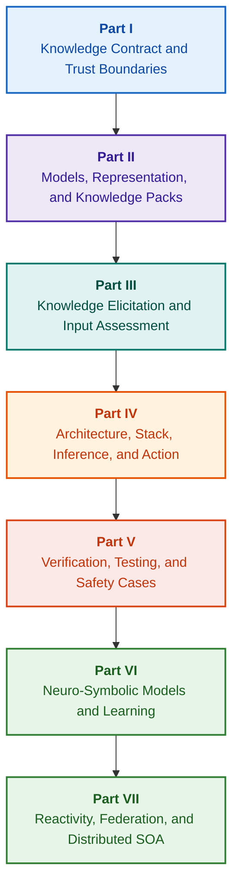

# Architecture of Evidence-Governed Expert Systems: From Formal Ontologies to Neuro-Symbolic AI

**An engineering monograph and handbook on the design, mathematical foundations, architecture, and verification of high-integrity intelligent systems (Safety-Critical & Evidence-Grounded AI)**

**Author:** [Mykola Fedchyk](about-the-author.md) · [LinkedIn](https://www.linkedin.com/in/nickfedchik/)  
**Format:** Engineering Monograph / AI Architect's Desk Reference  
**Year:** 2026  

---

## About the Book

This monograph represents a foundational research inquiry and engineering guide dedicated to overcoming the paramount crisis of modern artificial intelligence: the epistemic gap between the probabilistic plausibility of neural network generations and the deterministic truth of formal mathematical proofs. At the heart of this research lies an uncompromising question: **how can we design an expert system whose every conclusion is irrefutable, fully traceable to primary evidentiary sources, and fit for certification in safety-critical engineering domains (ISO 26262, IEC 61508, DO-178C, ISO/SAE 21434)?**

The author substantiates and presents a novel paradigm: **Evidence-Grounded Neuro-Symbolic AI**, in which statistical models (LLMs/SLMs) perform an advisory function of hypothesis generation and projection rendering, while a deterministic symbolic kernel immutably guarantees the invariants of logical consistency, byte-level fact grounding, authority boundary enforcement, and safe transition to execution.

### From Artifact to Verifiable Decision

System requirements, source code, test execution logs, regulatory standards, and engineering decisions already permeate modern production environments. However, they predominantly function as disconnected artifacts lacking formalized semantics, explicit validity boundaries, and bidirectional traceability. A passing qualification test report may reference an obsolete hardware revision; a quote from a functional safety standard may be torn out of context; an automated emergency configuration rollback may inadvertently activate a revoked component.

This monograph establishes an end-to-end engineering pipeline: from the formalization of engineering artifacts as typed data and cryptographically signed knowledge packs to symbolic inference, step-by-step plan decomposition, counterfactual explanations, and competence boundary auditing. The practical exposition is grounded in production-grade Go implementations with exhaustive test suites ([Chapter 1](ch01-introduction-to-expert-systems.md)), rigorous mathematical contracts ([Part II](part-02-knowledge-models.md)), and continuous learning protocols that provably eliminate regressions ([Chapter 25](ch25-how-expert-systems-learn.md)).

### Target Audience

This work is authored for systems architects, principal reliability and functional safety engineers, inference engine developers, and knowledge engineers. Initial mastery of the core concepts requires only a foundational understanding of first-order predicate logic, software versioning, and lifecycle management; replicating the practical examples requires standard Go tooling. Specialized chapters covering formal Goal Structuring Notation (GSN) synthesis, complex system synergetics, neuromorphic accelerators, and GNSS-denied autonomous navigation address the cutting-edge frontiers of evidence-governed AI across aerospace, autonomous vehicles, and critical infrastructure.

---

## Scientific Context and Global Placement of the Monograph

This monograph approaches expert systems not as an archaic legacy of 1980s rule engines (such as CLIPS or MYCIN), but as the vanguard of **Third-Wave Evidence-Grounded Neuro-Symbolic AI**. The methodology bridges the theoretical foundations of leading global scientific schools with high-performance systems engineering:

| Scientific Discipline | Key Global Works and Authors | Conceptual Bridge in This Monograph |
|---|---|---|
| **Third-Wave Neuro-Symbolic AI (NeSy)** | Artur d'Avila Garcez, Luis C. Lamb (*Neurosymbolic AI: The 3rd Wave*, 2023; *Neural-Symbolic Cognitive Reasoning*, Springer, 2009); Henry Kautz (*The Third AI Summer*, AAAI 2022) | Separation of concerns: statistical models (SLMs/LLMs) generate query hypotheses, whereas a deterministic symbolic kernel formally verifies and admits facts ([Chapter 29](ch29-neuro-symbolic-architecture.md)). |
| **Semantic Constraints & Safe Learning** | Guy Van den Broeck et al. (*A Semantic Loss Function for Deep Learning with Symbolic Knowledge*, ICML 2018); Luc De Raedt et al. (*DeepProbLog*, IJCAI 2020) | Admission and egress gateways, deterministic semantic filtering of neural network candidate assertions against formal schemas ([Chapters 28](ch28-dual-mode-expert-systems.md), [33](ch33-inter-system-knowledge-exchange-and-model-teaching.md)). |
| **Defeasible Reasoning & Argumentation Theory** | John L. Pollock (*Defeasible Reasoning*, 1987; *Cognitive Carpentry*, MIT Press, 1995); Phan Minh Dung (*Abstract Argumentation Frameworks*, AIJ 1995); Douglas Walton (*Argumentation Schemes*, Cambridge, 2008) | Decomposition of knowledge into claims, provenance, and defeaters (*rebutting* and *undercutting*); conflict resolution across normative rule bases via Dung's argumentation frameworks ([Chapters 2](ch02-epistemology-of-machine-knowledge.md), [27](ch27-safety-case-gsn-synthesis.md)). |
| **Automated Association Rule Mining (KBC)** | Luis Galárraga, Fabian M. Suchanek et al. (*AMIE: Association Rule Mining under Incomplete Evidence*, WWW 2013, VLDBJ 2015); Stephen Muggleton (*Inductive Logic Programming*, 1994) | Autonomous rule induction from knowledge bases under the Partial Completeness Assumption (PCA) avoiding spurious open-world counterexamples ([Chapter 34](ch34-deterministic-relational-analysis-abduction-and-socratic-dialogue.md)). |
| **Formal Safety Shields & Certification (Safe AI)** | Bettina Könighofer, Roderick Bloem et al. (*Shield Synthesis*, 2017); Tim Kelly, Rob Weaver (*Goal Structuring Notation*, York, 2004); André Platzer (*Logical Foundations of CPS*, Springer, 2018) | Synthesis of structured safety cases in GSN notation for ISO 26262/21434 standards; formal shields and numerical validity envelopes for edge actuation ([Chapters 27](ch27-safety-case-gsn-synthesis.md), [30](ch30-safety-cybersecurity-co-engineering.md), [33](ch33-inter-system-knowledge-exchange-and-model-teaching.md)). |
| **Epistemic Logic & Knowledge Semiotics** | John F. Sowa (*Knowledge Representation: Logical, Philosophical, and Computational Foundations*, 2000); Frank van Harmelen et al. (*Handbook of Knowledge Representation*, Elsevier, 2008) | Charles Sanders Peirce's epistemic triad (Concept → Judgment → Inference); abductive generation of working hypotheses under strict deductive control ([Chapters 6](ch06-applied-mathematics-for-expert-systems.md), [34](ch34-deterministic-relational-analysis-abduction-and-socratic-dialogue.md)). |
| **Cybernetics & Synergetics of Complex Systems** | Norbert Wiener (*Cybernetics*, 1948); W. Ross Ashby (*An Introduction to Cybernetics*, 1956); Hermann Haken (*Synergetics: An Introduction*, 1977; *Advanced Synergetics*, 1983); Ilya Prigogine (*Order out of Chaos*, 1984) | Ashby's Law of Requisite Variety, closed L0–L4 control loops, phase space reduction to order parameters via Haken's slaving principle, early warning of phase transitions via Critical Slowing Down (CSD), and dissipative stabilization of evolving knowledge bases ([Chapters 6](ch06-applied-mathematics-for-expert-systems.md), [22](ch22-cybernetics-edge-to-backend.md), [35](ch35-self-organizing-expert-systems-synergetics-and-npu-runtime.md)). |
| **Knowledge Testing, Invariance & Lipschitz Calibration** | Kent Beck (*TDD*, 2002); Martin Fowler (*Refactoring*, 2018); Clark Barrett, Leonardo de Moura (*Z3 SMT Solver*, 2008); Chuan Guo et al. (*On Calibration of Modern Neural Networks*, ICML 2017); Marco Tulio Ribeiro et al. (*CheckList*, ACL 2020); John L. Pollock (*Defeasible Reasoning*, 1987) | Four-Level Knowledge Testing Pyramid (KTP): isolated unit testing of atomic rules (KUT) with premise mocks (`PremiseMock`), vacuous truth trap elimination, 6-point spectral boundary value analysis (BVA), rule lattices and defeaters (KIT), semantic invariance scoring ($\text{SIS} \ge 0.98$) under linguistic query mutations, Lipschitz continuity bounds ($L_{\mathcal{K}} \le L_{\max}$) preventing relay chattering, and stigmergic capture of knowledge gaps ([Chapter 36](ch36-knowledge-testing-pyramid-and-variational-calibration.md)). |

---

## Authorial Theoretical Models, Scientific Research, and Engineering Innovations

This monograph synthesizes the author's fundamental research and systems engineering contributions in mission-critical software, embedded architectures, and evidence-governed AI. Diverging from purely survey-oriented literature, the book introduces a suite of original formal theories, protocols, and architectural patterns that elevate neuro-symbolic interactions to a mathematically verified level of trust:

### 1. Fundamental Theoretical Developments and Mathematical Formalisms

1. **Evidence-Grounded Invariant (EGI) and Fact Grounding Gateway ([Chapters 2](ch02-epistemology-of-machine-knowledge.md), [19](ch19-from-question-to-evidence.md), [28](ch28-dual-mode-expert-systems.md), [29](ch29-neuro-symbolic-architecture.md)):**
   * *Theoretical Formulation:* The author formalizes the Grounding Completeness Invariant $\mathrm{Comp}(C) = 1.00$, establishing that within an evidence-governed architecture, no assertion can be elevated to the status of a recognized fact without a deterministic projection onto authoritative primary sources. Every admitted fact tuple is anchored by immutable byte offsets `[byte_start, byte_end]`, a cryptographic canonical fragment hash `quote_sha256`, and a PROV-O provenance certificate identifier.
   * *Engineering Impact:* The hardware/software byte-level admission gateway renders neural network hallucinations incapable of entering the versioned knowledge base, guaranteeing zero tolerance for ungrounded assertions ($ZHR = 1.00$).
2. **Four-Level Knowledge Testing Pyramid (KTP) and Lipschitz Continuity of Logical Space ([Chapter 36](ch36-knowledge-testing-pyramid-and-variational-calibration.md)):**
   * *Theoretical Formulation:* The author introduces the Knowledge Testing Pyramid (KTP), transposing the discipline of Fowler's software testing pyramid into knowledge systems: isolated rule unit testing (KUT) using mocked antecedent conditions (`PremiseMock`), integration testing of rule interactions and defeaters (KIT), and variational calibration across query manifolds (KVT).
   * *Mathematical Apparatus:* Formalization of an invariant preventing vacuous truth ($P \to Q$ where $P \equiv \text{False}$), a Semantic Invariance Score ($\mathrm{SIS} \ge 0.98$) over linguistic perturbations, and a Lipschitz continuity constraint on the inference manifold ($L_{\mathcal{K}} \le L_{\max}$), which mathematically eliminates catastrophic relay chattering under minor input variations.
3. **Popperian Falsification of Deontic Norms and Active Compliance Auditing ([Chapter 39](ch39-active-compliance-auditor-and-popperian-testing.md)):**
   * *Theoretical Formulation:* A paradigm shift from a passive oracle (which merely answers queries) to an active compliance auditor implementing Karl Popper's falsification principle. The system autonomously probes the specification space (ASPICE 4.0, ISO 26262, ISO/SAE 21434), synthesizes counterexamples, identifies underspecified edge conditions, and designs exhaustive verification campaigns.
   * *Practical Value:* Coupling neural edge-case generation (System 1) with deterministic deontic verification via the symbolic core (System 2), while shielding the human in the control loop (Human-in-the-Loop) from approval fatigue.
4. **Synergetic Dimensionality Reduction of Knowledge Bases and CSD Pre-Bifurcation Diagnostics ([Chapters 6](ch06-applied-mathematics-for-expert-systems.md), [22](ch22-cybernetics-edge-to-backend.md), [35](ch35-self-organizing-expert-systems-synergetics-and-npu-runtime.md)):**
   * *Theoretical Formulation:* Application of Hermann Haken's synergetics (order parameters and slaving principle) and Ilya Prigogine's dissipative structures to the evolution of complex knowledge repositories.
   * *Scientific Contribution:* High-dimensional telemetry phase spaces are reduced to order parameters, integrating a pre-bifurcation Critical Slowing Down (CSD) detector based on autocorrelation and variance metrics. This detects impending cyber-physical instability well before threshold-based limit monitors fire.
5. **Action Autonomy Levels Model (A0–A4), Admission Gateways, and Idempotent Sagas ([Chapter 21](ch21-from-recommendation-to-action.md)):**
   * *Theoretical Formulation:* A granular authority framework for automated execution (A0: passive analysis, A1: draft generation, A2: human-signed execution, A3: supervised bounded autonomy, A4: emergency fail-closed shutdown). Permissions are bound not to the system monolith, but to the tuple $\langle\text{action}, \text{environment}, \text{risk level}\rangle$.
   * *Mathematical Apparatus:* An algebraic idempotency invariant $f(f(x, k), k) \equiv f(x, k)$ keyed by cryptographic token $k$, step-by-step closed-loop execution, and a distributed compensating saga protocol handling `OutcomeUnknown` states via out-of-band post-condition verification.
6. **Formal Co-Engineering of Functional Safety and Cybersecurity in GSN ([Chapters 27](ch27-safety-case-gsn-synthesis.md), [30](ch30-safety-cybersecurity-co-engineering.md)):**
   * *Theoretical Formulation:* A unified Goal Structuring Notation (GSN) synthesis methodology that reconciles the simultaneous constraints of ISO 26262 (safety) and ISO/SAE 21434 (security).
   * *Engineering Breakthrough:* Mathematical arbitration between conflicting objectives (emergency response latency bounds vs. cryptographic attestation depth), coupled with a protocol for selective evidence disclosure to external auditors via salted Merkle trees.
7. **Explanation Fidelity and Semantic Consistency Verification Protocol ([Chapter 20](ch20-explanation-engine.md)):**
   * *Theoretical Formulation:* Explanations are treated not as free-form generative prose, but as first-class deterministic artifacts derived strictly from the proof graph, rule version tags, and frozen fact snapshots.
   * *Mathematical Apparatus:* Formal metric gating of explanation fidelity ($C_{\text{facts}} = 1.00, H_{\text{free}} = 1.00$) backed by automated fail-safe fallback to rigid templates upon the slightest discrepancy between symbolic deduction and operator-facing natural language text.

---

### 2. Empirical Research, Authorial Experimental Benches, and Systems Engineering

1. **Immutable Binary Knowledge Packs with `mmap` and Zero-Allocation Deserialization ([Chapter 32](ch32-high-performance-knowledge-packs-mmap-and-harvesting.md)):**
   * *Authorial Innovation:* A two-tier package architecture decoupling canonical primary source archives from derived materialized index segments.
   * *Empirical Result:* Direct memory mapping via `mmap` into the virtual address space, eliminating runtime heap allocations (zero-allocation) and achieving sub-linear engine startup latencies irrespective of multi-gigabyte ontology footprints.
2. **Empirical Calibration Testbed on IETF RFC-1000 and W3C-150 Regulatory Corpora ([Chapters 2](ch02-epistemology-of-machine-knowledge.md), [4](ch04-evolution-from-bayes-to-evidence-ai.md), [14](ch14-requirements-detection-and-formalization.md), [25](ch25-how-expert-systems-learn.md)):**
   * *Authorial Testbed:* Deployment of a large-scale evaluation framework across 1,000 active IETF RFC specifications (spanning 5 chronological internet eras) and 150 complex diagnostic queries against the W3C corpus (including induced logical conflicts and confabulations).
   * *Practical Finding:* Construction of objective knowledge examination matrices, empirical identification of normative contradictions, and mathematically validated defense against knowledge base regressions during continuous updates.
3. **Multi-Hop Relational Analysis, Symbolic Abduction, and Socratic Dialogue ([Chapter 34](ch34-deterministic-relational-analysis-abduction-and-socratic-dialogue.md)):**
   * *Authorial Innovation:* A Bidirectional Bounded BFS algorithm ($k \le 6$) with cycle suppression and composite byte-level evidence chain synthesis across arbitrary interrelated entities.
   * *Engineering Advantage:* Realization of Peircean symbolic abduction under strict deductive guardrails, paired with typed Socratic Clarification Frames that guide the system into productive user dialogue instead of blind rejection under the Closed-World Assumption (CWA).
4. **Formal Safety Shields and Numerical Validity Envelopes for Edge Control ([Chapter 33](ch33-inter-system-knowledge-exchange-and-model-teaching.md), [Appendices B](appendix-b-robotics-and-cyber-physical-systems.md), [C](appendix-c-autonomous-navigation-and-geosearch.md), [E](appendix-e-mixed-signal-neuromorphic-expert-systems.md)):**
   * *Authorial Innovation:* Methodology for translating discrete logical invariants into continuous numerical safety corridors for digital signal processors (DSPs) and GNSS-denied navigation (TRN/DSMAC/VIO).
   * *Operational Reliability:* Cryptographically signed rule exchange via Ed25519, isolated candidate quarantining, and hardware-level interception of invalid actuation trajectories.
5. **Defense Against Confidential Information Leakage via Explanations and Differential Auditing ([Chapter 20](ch20-explanation-engine.md)):**
   * *Authorial Innovation:* An intermediate explanation representation reduction protocol ($\mathrm{EIR}_{\text{redacted}}$) enforcing ACLs at each node and edge of the proof graph, neutralizing model reconstruction side-channel attacks executed through contrastive WHY NOT queries.

---

## Structuring Principle

The parts of this monograph are structured around primary engineering objectives rather than chronological publication dates or transient technology names. Each chapter belongs to a single primary part; related techniques illustrate methods for addressing its central thesis. Chapter numbers and file identifiers remain permanent keys, allowing thematic reading sequences to differ from numerical order.

Section classes within chapters establish a structured argument rather than a catalog of equivalent technologies:

| Section Class | Reader's Inquiry | Architectural Function in Chapter |
|---|---|---|
| Problem & Boundary | What exact challenge must be solved? | Define the core inquiry and scope of validity |
| Object & Model | What data, knowledge, or states are evaluated? | Formalize concepts, types, and operational assumptions |
| Method & Procedure | How is the solution derived? | Detail deduction, transformation, and control algorithms |
| Implementation & Tooling | What software or hardware executes the procedure? | Provide concrete implementation listings and architectural contracts |
| Verification & Benchmark | How are failure modes systematically exposed? | Benchmark performance and correctness against independent criteria |
| Conclusion & Limitations | What has been proven, and what remains open? | Address the core thesis without unsubstantiated overclaiming |

Geography, specific industrial sectors, and proprietary commercial platforms serve as application contexts rather than distinct tiers in this taxonomy. Glossaries, abbreviations, bibliographies, and index navigation form reference apparatuses rather than standalone chapter themes.

The editorial structure review provides an evaluation of each chapter's core theme, boundaries between adjacent topics, and compositional notes. Updating an abstract does not imply that all internal compositional risks within chapters have been resolved.

## Reading Roadmaps

**First Software Verification:** [1](ch01-introduction-to-expert-systems.md) → [7](ch07-knowledge-base-typology.md) → [8](ch08-engineering-artifacts-as-data.md) → [17](ch17-implementation-stack.md) → [23](ch23-knowledge-base-verification.md) → [25](ch25-how-expert-systems-learn.md). Objective: Produce a reproducible, evidence-grounded verdict with negative tests and controlled knowledge mutation. A language model is optional.

**Knowledge Engineering:** [Part II](part-02-knowledge-models.md) → [Part III](part-03-knowledge-engineering-nlp.md) → [19](ch19-from-question-to-evidence.md) → [20](ch20-explanation-engine.md) → [26](ch26-continual-learning.md). Objective: Reconcile formal semantics, provenance, candidate elicitation, and validation. Part II preserves the cross-part empirical research program for Chapters 7–11.

**Solution Architecture:** [16](ch16-expert-systems-architecture.md) → [19](ch19-from-question-to-evidence.md) → [31](ch31-syllogistic-reasoning-and-relation-lattices.md) → [20](ch20-explanation-engine.md) → [21](ch21-from-recommendation-to-action.md). Objective: Decouple evidentiary verification, normative rule application, explanation generation, and operational action authority.

**Verification and Safety:** [23](ch23-knowledge-base-verification.md) → [36](ch36-knowledge-testing-pyramid-and-variational-calibration.md) → [25](ch25-how-expert-systems-learn.md) → [26](ch26-continual-learning.md) → [27](ch27-safety-case-gsn-synthesis.md) → [30](ch30-safety-cybersecurity-co-engineering.md). External physical diagnosis is approached via [Chapter 24](ch24-system-diagnosis.md).

**Hybrid Responses and Operational Deployment:** [Part VI](part-06-frontiers-neuro-symbolic.md) → [Part VII](part-07-runtime-and-knowledge-exchange.md) → [40](ch40-distributed-epistemic-architectures-soa-and-cluster-scaling.md) and relevant appendices. Objective: Integrate neural language models, manage epistemic gaps, architect distributed knowledge service clusters, and verify inter-system federations. Chapters [2](ch02-epistemology-of-machine-knowledge.md), [4](ch04-evolution-from-bayes-to-evidence-ai.md), and [6](ch06-applied-mathematics-for-expert-systems.md) may be referenced on demand as contracts, historical evolution, and mathematical foundations.

---

## Scope of Claims and Engineering Boundaries

This monograph constitutes foundational educational and research material; it is not a certified compliance procedure nor standalone proof of equipment conformity to standards. Deterministic execution does not guarantee the factual accuracy of premises; hashes and digital signatures prove integrity, not empirical truth; argument graphs do not replace certified human judgment. System-level reliability requirements cannot be equated with language model token error rates or universally imputed across software modules.

Automated parsing and extraction reduce manual data movement but do not eliminate the necessity of formal modeling, peer review, and designated knowledge custodians. Protégé ontologies, manual audits, and automated scrapers function in concert. Mathematical guarantees are bounded by explicit formal language profiles and environmental assumptions; measured throughput benchmarks reflect specific query workloads, corpora, and execution environments. Historical metrics from the author's prior production deployments are strictly distinguished from open educational testbeds and active research inquiries.

Final decisions regarding production release, risk acceptance, and regulatory conformity reside exclusively with authorized human engineers. An evidence-governed expert system prepares verifiable audit trails and enforces agreed policies; it does not assume regulatory sovereignty.

---

## Structure of the Book

The monograph is organized into seven thematic parts, comprising 40 chapters and five appendices. Each chapter belongs to a single primary part. Navigation sequences follow the thematic roadmap below; chapter numbers and file paths remain immutable.

---

### [Part I. Conceptual and Epistemic Foundations](part-01-foundations.md)

*When an expert system is required, what constitutes machine knowledge, and how organizational justification is preserved.*

* [Chapter 1. Introduction to Expert Systems: From Chaos to Governed Knowledge](ch01-introduction-to-expert-systems.md)
* [Chapter 2. Philosophy for the Systems Engineer: What Machines Have the Right to Call Knowledge](ch02-epistemology-of-machine-knowledge.md)
* [Chapter 3. Distinguishing Expert Systems from Reference Information Systems](ch03-beyond-reference-information-systems.md)
* [Chapter 4. Evolution of Expert Systems: From Bayes' Theorem to Evidence-Grounded AI](ch04-evolution-from-bayes-to-evidence-ai.md)
* [Chapter 5. The Triad of Trust: Expert System, Verifiable Recommendation, and Corporate Memory](ch05-triad-of-trust-and-corporate-memory.md)

---

### [Part II. Mathematical Models, Knowledge Representation, and Storage](part-02-knowledge-models.md)

*Selecting mathematical formalisms, typed artifacts, engineering traceability graphs, and immutable knowledge packs.*

* [Chapter 6. Applied Mathematics for Expert Systems: Rules, Probabilities, Graphs, and Causality](ch06-applied-mathematics-for-expert-systems.md)
* [Chapter 7. Typology of Knowledge Bases: Rules, Ontologies, Cases, and Vector Embeddings](ch07-knowledge-base-typology.md)
* [Chapter 8. Engineering Artifacts as Expert System Data](ch08-engineering-artifacts-as-data.md)
* [Chapter 9. Engineering Knowledge Graph: End-to-End Traceability from Requirements to Silicon](ch09-engineering-knowledge-graph-traceability.md)
* [Chapter 32. Immutable Knowledge Packs: Byte-Level Admission, Indices, and Memory Mapping](ch32-high-performance-knowledge-packs-mmap-and-harvesting.md)

---

### [Part III. Knowledge Acquisition, Linguistic Analysis, and Input Assessment](part-03-knowledge-engineering-nlp.md)

*Documents, human expertise, and sensory observations: candidate extraction, linguistic parsing, formalization, and evidence assessment.*

* [Chapter 10. Knowledge Acquisition Systems: Sources, Admission Gateways, and Lifecycles](ch10-knowledge-acquisition-systems.md)
* [Chapter 11. Eliciting Knowledge from Domain Experts: Interviews, Cognitive Maps, and Practice Formalization](ch11-knowledge-elicitation-from-experts.md)
* [Chapter 12. Linguistic Analysis and Local Models: Preserving Semantics and Source Attribution](ch12-linguistic-analysis-and-local-models.md)
* [Chapter 13. Natural Language Variability vs. Determinism: Compiling Query Semantics](ch13-language-variability-vs-determinism.md)
* [Chapter 14. Requirements and Modality Extraction: From Normative Text to Formal Invariants](ch14-requirements-detection-and-formalization.md)
* [Chapter 15. Knowledge Extraction and KB Construction: Facts, Grammars, and Automata](ch15-knowledge-extraction-and-kb-construction.md)
* [Chapter 37. Input Information Assessment: Sources, Evidence, and Algorithmic Skepticism](ch37-input-information-assessment-and-algorithmic-skepticism.md)

---

### [Part IV. Architecture, Technology Stack, Inference, and Action](part-04-architecture-and-inference.md)

*Architectural contracts, runtime stack, hardware acceleration, claim verification, normative inference, explanation engines, and cybernetic control loops.*

* [Chapter 16. Expert System Architecture: From Formalized Knowledge to Evidence-Governed Action](ch16-expert-systems-architecture.md)
* [Chapter 17. The Technology Stack: Tooling Selection, Programming Languages, and Rule Engines](ch17-implementation-stack.md)
* [Chapter 18. Execution Infrastructure: Local SLMs, Hardware Accelerators, Edge, and On-Premise](ch18-execution-infrastructure.md)
* [Chapter 19. From Question to Evidence: Search, Grounding, and Proposition Verification](ch19-from-question-to-evidence.md)
* [Chapter 31. Normative Inference: Predicate Hierarchies, Exceptions, and Temporal Validity](ch31-syllogistic-reasoning-and-relation-lattices.md)
* [Chapter 20. Explanation Engine: Decisions, Justified Refusal, and Competence Boundaries](ch20-explanation-engine.md)
* [Chapter 21. From Recommendation to Action: Authority Control and Safe Execution in Production](ch21-from-recommendation-to-action.md)
* [Chapter 22. The Cybernetic Control Loop: Sensors, Actuators, and Closed-Loop Feedback](ch22-cybernetics-edge-to-backend.md)

---

### [Part V. Verification, Testing, Diagnostics, and Safety Cases](part-05-verification-and-learning.md)

*Formal rule verification, knowledge testing pyramids, Popperian falsification, technical diagnostics, and functional safety/cybersecurity cases.*

* [Chapter 23. Knowledge Base Verification: Consistency, Completeness, and Rule Soundness](ch23-knowledge-base-verification.md)
* [Chapter 36. The Knowledge Testing Pyramid: Rules, Interactions, and Variational Stability](ch36-knowledge-testing-pyramid-and-variational-calibration.md)
* [Chapter 39. The Active Compliance Auditor: Popperian Falsification, Standards Compliance (ASPICE/ISO 26262/ISO 21434), and Autonomous Test Generation](ch39-active-compliance-auditor-and-popperian-testing.md)
* [Chapter 24. Technical Diagnostics: Disentangling Symptoms from Root Causes Under Incomplete Information](ch24-system-diagnosis.md)
* [Chapter 27. Safety Case Engineering: Formal Synthesis and Verification of GSN Arguments](ch27-safety-case-gsn-synthesis.md)
* [Chapter 30. Functional Safety and Cybersecurity Co-Engineering](ch30-safety-cybersecurity-co-engineering.md)

---

### [Part VI. Neuro-Symbolic Models, Cognitive Frontiers, and Continual Learning](part-06-frontiers-neuro-symbolic.md)

*Strict deduction vs. advisory hypotheses, language model integration, knowledge gaps, hallucination mitigation, examination matrices, and experience-based learning.*

* [Chapter 28. Dual-Mode Expert Systems: Strict Deduction and Advisory Hypotheses](ch28-dual-mode-expert-systems.md)
* [Chapter 29. Neuro-Symbolic Architecture: Language Models and Evidence-Grounded Verification](ch29-neuro-symbolic-architecture.md)
* [Chapter 34. Knowledge Gaps: Relational Search, Abduction, and Socratic Clarification](ch34-deterministic-relational-analysis-abduction-and-socratic-dialogue.md)
* [Chapter 38. Curing Machine Hallucinations and Knowledge Deficits: Evidence-Grounded Output Control](ch38-curing-machine-hallucinations-and-knowledge-deficits.md)
* [Chapter 25. How Expert Systems Learn: Examination Matrices, Knowledge Audits, and Regression Control](ch25-how-expert-systems-learn.md)
* [Chapter 26. Continual Learning from Experience and Mitigating System Log Drift](ch26-continual-learning.md)

---

### [Part VII. Reactive Runtime, Inter-System Knowledge Exchange, and Distributed SOA](part-07-runtime-and-knowledge-exchange.md)

*Reactive rule execution, synergetics and knowledge phase transitions, inter-system federation, and distributed enterprise epistemic architectures.*

* [Chapter 35. Reactive Expert Systems: Events, Revocation, and Knowledge Self-Organization](ch35-self-organizing-expert-systems-synergetics-and-npu-runtime.md)
* [Chapter 33. Inter-System Knowledge Exchange: Rule Provisioning, Model Teaching, and Secure Feedback](ch33-inter-system-knowledge-exchange-and-model-teaching.md)
* [Chapter 40. Distributed Epistemic Architecture: Knowledge SOA, Semantic Routing, Memory Hierarchies, and Multi-Source Defeasible Arbitration](ch40-distributed-epistemic-architectures-soa-and-cluster-scaling.md)

---

### Appendices

* [Appendix A. Practical Evidence-Governed Research Framework for Complex Engineering Projects](appendix-a-evidence-governed-framework.md)
* [Appendix B. Evidence-Governed Expert Systems in Autonomous Robotics and Cyber-Physical Systems](appendix-b-robotics-and-cyber-physical-systems.md)
* [Appendix C. GNSS-Denied Autonomous Navigation: Geospatial Matching (TRN/DSMAC), Visual-Inertial Odometry (VIO), and Expert Sensor Fusion Arbitration](appendix-c-autonomous-navigation-and-geosearch.md)
* [Appendix D. Analog Expert Systems, Neuromorphic Computing, and Hardware Inference](appendix-d-analog-expert-systems-and-neuromorphic-computing.md)
* [Appendix E. Mixed-Signal Analog-Digital Expert Systems: Neuromorphic, Analog, and Non-Von-Neumann Processors Under Evidence Governance](appendix-e-mixed-signal-neuromorphic-expert-systems.md)
* [About the Author: Mykola Fedchyk (Nick Fedchik)](about-the-author.md)

---

## Research Directions

Future research directions articulated in this work represent open engineering problems rather than guaranteed out-of-the-box outcomes: reproducible zero-allocation knowledge pack packaging; verification of bounded formal fragments; agent governance via explicit authority leases; zero-knowledge verification of confidential formal propositions; and controlled revocation and machine unlearning. Proving a theoretical property on a model does not automatically validate physical system safety, and retracting a rule does not equate to eliminating data influence from a trained neural model.

For hardware accelerators and non-conventional processors, empirical error rates, latency bounds, energy dissipation, and fail-silent behaviors must be characterized before deployment. Relevant architectural strategies are explored in [Chapter 29](ch29-neuro-symbolic-architecture.md), [Chapter 32](ch32-high-performance-knowledge-packs-mmap-and-harvesting.md), and [Appendices D](appendix-d-analog-expert-systems-and-neuromorphic-computing.md) and [E](appendix-e-mixed-signal-neuromorphic-expert-systems.md). The empirical research agenda for Chapters 7–11 is detailed in [Part II](part-02-knowledge-models.md): every proposed inquiry is paired with a testable hypothesis, a baseline benchmark, and a formal falsification criterion.
