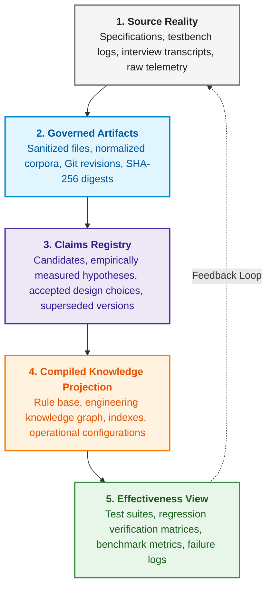

# Appendix A. Practical Framework for Evidence-Governed Research in Complex Engineering Projects

> **Book:** [Architecture of Evidence-Governed Expert Systems](README.md) · Appendices  
> **Table of Contents:** [README.md](README.md)  
> **Author:** [Mykola Fedchyk](about-the-author.md)  
> **Target Level:** Intermediate and Advanced: R&D Directors, System Architects, Principal Researchers, Knowledge Engineers  
> **Expected Learning Outcomes:** A practical engineering guide to structuring research memory, registering formal claims, isolating test suites, and constructing an unbroken chain of custody from raw source materials to production-grade deployment under conditions of severe epistemic uncertainty.

---

## Abstract

In mission-critical research and engineering initiatives (governed by frameworks such as the NIST AI Risk Management Framework, safety-critical software standards, and defense/aerospace engineering lifecycles), the absence of disciplined research memory inevitably induces "trial-and-error drift." When engineering teams react to sporadic system failures with ad-hoc prompt tinkering, undocumented architectural modifications, or implicit contamination on evaluation splits, they generate an illusion of forward progress while entirely compromising reproducibility. Such projects consume months of engineering effort and millions in capital expenditure, yet remain fundamentally incapable of demonstrating to certification bodies or industrial stakeholders what has been mathematically proven, which initial hypotheses were refuted, and which performance gains represent statistical artifacts fitted to random noise.

This appendix formalizes the author's practical framework for evidence-governed research, designed to transform fragmented, unstructured exploration into rigorous, auditable research memory (*research memory*). The framework articulates a five-tier knowledge architecture—spanning raw operational records, governed artifacts secured with SHA-256 cryptographic digests, a formal claims registry, a compiled knowledge projection, and an effectiveness-oriented operational view. Furthermore, it codifies typed epistemological statuses for research claims (`candidate`, `measured`, `accepted`, `rejected`, `superseded`), strict protocols for isolating validation splits, and continuous semantic traceability linking initial laboratory experimentation directly to production-grade code.

---

## 1. The Regression Problem and "Trial-and-Error Drift" in Engineering Research

On Monday, an engineering team uncovers a defect: a specialized expert system tailored to a specific technical domain fails to answer an elementary query, even though the definitive evidence resides directly within its ingested source documentation. On Tuesday, the team adjusts the retrieval mechanism. On Wednesday, the team modifies the text chunking strategy. On Thursday, the team alters the system prompt supplied to the language model. On Friday, the updated build finally passes the failing benchmark example.

The following Monday, the same fundamental question is submitted with minor syntactic variation, and the expert system fails once again.

The engineering team worked tirelessly throughout the week. They produced code revisions, benchmark reports, execution logs, several newly curated datasets, and even recorded an apparently favorable accuracy score. Yet, no one on the team can provide a clear, rigorous answer to the following fundamental questions:

- what general systemic defect was the team investigating;
- what was formally proven versus what was merely an exploratory observation;
- which specific examples the expert system had already been exposed to during development;
- how many uncompromised, independent evaluation samples remain;
- under what exact mathematical or empirical criteria the research phase is considered definitively complete.

This failure mode is neither an isolated anomaly nor an issue exclusive to artificial intelligence. It routinely plagues the development of optimizing compilers, distributed retrieval engines, knowledge management platforms, static program analyzers, robotics control stacks, and hardware prototypes. The higher the epistemic uncertainty inherent in a project, the easier it becomes to mistake raw engineering activity for genuine knowledge acquisition.

Through an extensive series of such experimental campaigns, the author's team formalized a practical research framework (*research framework*). It is not designed to replace the scientific method, Scrum, classical systems engineering, or Machine Learning Operations (MLOps). Nor does it supersede established risk management standards, such as the National Institute of Standards and Technology (NIST) Artificial Intelligence Risk Management Framework (AI RMF), which delineates organizational functions for governing, mapping, measuring, and managing AI risks [[1]](#src-1). Rather, this framework synthesizes the actionable components of these disciplines into a unified research memory: tracing the trajectory from raw source to formal claim, from claim to architectural decision, from decision to product modification, and from product modification to independent validation.

## 2. The Research Claim as a Foundational Knowledge Artifact

In conventional software engineering, defining the product artifact is straightforward: an executable binary, a library package, or a deployed network service. In research-driven engineering, the product is far less tangible. A standalone script does not constitute a scientific finding. An ingested corpus of reference documents is not an outcome. A tabular summary of evaluation metrics is epistemologically vacant without the underlying research question, the target population, and a formal decision rule.

The foundational atomic unit of progress in this framework is the **research claim**:

> Under precisely specified operational conditions, Method A exhibits property P relative to Method B; this assertion is substantiated by observation set O, subject to boundary conditions C and verification rigor level V.

Every claim possesses a persistent identifier, an explicit domain of validity, an epistemic status, supporting empirical evidence, and documented limitations. Its status takes exactly one of the following typed values:

- **candidate**: an unverified hypothesis or external claim that has not yet undergone rigorous empirical validation;
- **measured**: an assertion backed by reproducible observations within a bounded operational envelope;
- **accepted**: an active, formally validated methodological or architectural decision governing production;
- **rejected**: an assertion whose empirical validation failed to satisfy the predefined acceptance criteria;
- **superseded**: a historically preserved finding that has been formally deprecated by a newer, more comprehensive claim.

Enforcing these typed statuses disciplines technical communication. "We implemented the feature" does not imply "we independently verified the property." "The test passed" does not mean "the hypothesis was confirmed." "The model answered correctly" does not establish that "the model derived its answer from valid, verifiable evidence."

## 3. The Five Layers of Research Memory

**Research memory** (*research memory*) is a structured, auditable repository encompassing everything an engineering research initiative knows, executes, and decides. The architectural blueprint below delineates its five constituent layers.



A convenient directory of Markdown files does not, in itself, resolve epistemic chaos. What is required is a strict operational separation between layers that engineering teams frequently conflate.

### 3.1. Source Reality

Source reality encompasses immutable raw documents, physical sensor measurements, specific code commits, binary executables, model weight checkpoints, and primary human evaluations. These objects must remain strictly immutable within any given historical snapshot and must possess unambiguous identity: cryptographic hashes, canonical revision tags, or globally unique identifiers.

When an engineering investigation cites a technical specification, merely recording its title is unacceptable. The research record must capture the exact document revision, byte stream, specific page or character span, and the parsing pipeline applied to ingest it.

### 3.2. Governed Artifacts

Governed artifacts comprise formal protocols, data manifests, normalized corpora, execution traces, per-sample evaluation logs, aggregated performance metrics, and architectural decision records. These artifacts explicitly document every transformation the engineering team applied to source reality.

Here, the PROV data model standardized by the World Wide Web Consortium (W3C) provides an invaluable conceptual foundation: provenance is modeled through entities, activities, and agents that participated in generating a given result [[2]](#src-2). Deploying the entire W3C semantic web stack is unnecessary; what is non-negotiable is the governing principle: every research artifact must reveal not merely *what* was produced, but *from what sources*, *by whom*, and *through which exact deterministic operation*.

### 3.3. Claims Registry

While an exhaustive technical report provides narrative context, it is poorly suited to answering the operational question: "What does the engineering organization currently hold to be true?" Answering this requires a compact, machine-readable registry. Every registered claim must link directly to auditable evidentiary artifacts rather than relying on the author's recollections.

When an architectural conclusion is revised, the legacy entry is never silently overwritten or expunged: the new claim explicitly supersedes the predecessor. This ensures that negative experimental results, failed optimizations, and refuted hypotheses remain permanently preserved in the institutional record.

### 3.4. Compiled Knowledge Projection

As governed artifacts proliferate into the hundreds or thousands, linear manual review becomes impossible. Here, an insightful paradigm is Andrej Karpathy's concept of a persistent, interconnected Markdown wiki maintained collaboratively with a language model, synthesizing disparate knowledge sources into an evolving reference rather than executing full retrieval passes over raw documents for every inquiry [[3]](#src-3). This proposal was originally articulated as an exploratory concept note rather than an empirically validated formal methodology.

In an industrial engineering project, this paradigm must be subjected to strict epistemic guardrails. While a language model can effectively maintain and interlink synthesized articles regarding core concepts, component interfaces, empirical benchmarks, and open research questions, the wiki must remain strictly a derived projection. Primary sources, execution protocols, empirical measurements, and ratified decision records retain sovereign epistemic authority. Failing to enforce this hierarchy merely replaces a disorganized folder of documents with a persuasively phrased, yet unverified and hallucinatory encyclopedia.

### 3.5. Production Effectiveness Evaluation

File format classification and real-time engineering attention represent fundamentally distinct operational axes. Here, a streamlined adaptation of Tiago Forte's PARA method (*Projects, Areas, Resources, Archives*) proves exceptionally effective [[4]](#src-4):

- **Projects**: bounded, active engineering initiatives driven by explicit completion criteria;
- **Areas**: ongoing operational responsibilities, such as data provenance governance, security compliance, or corpus curation;
- **Resources**: reusable reference sources, analytical methods, and tooling libraries;
- **Archives**: completed initiatives, deactivated prototypes, failed experiments, or superseded claims.

The author's team does not reorganize the underlying physical repository into these four folders; rather, PARA supplies an operational lens overlaid onto the canonical knowledge structure. An archived negative finding never loses its evidentiary validity, and a useful resource never automatically acquires the status of proven truth.

### 3.6. Alignment of Research Memory Layers with Book Architecture

The five-tier research memory framework is not an external regulatory imposition; it represents the operational methodology employed throughout the 40 chapters of this monograph to design, verify, and maintain evidence-governed expert systems.

| Research Memory Layer | Substance and Engineering Function | Corresponding Parts and Chapters |
| :--- | :--- | :--- |
| **1. Source Reality** | Raw PDF specifications, safety standards (DO-178C, ISO 26262), hardware testbench telemetry, CAN bus dumps, Git commits, crash dumps | [Part II (Chapters 7–9)](part-02-knowledge-models.md): engineering artifacts as data, traceability in engineering knowledge graphs, source custody |
| **2. Governed Artifacts** | Deterministic AST parsers, JSON schemas, finite-state machine specifications, extracted SHALL/MUST normative predicates, signal masks, SHA-256 digests | [Part III (Chapters 10–15)](part-03-knowledge-engineering-nlp.md): knowledge acquisition from unstructured corpora, overcoming linguistic noise |
| **3. Claims Registry** | Peircean epistemic triad, formal hypotheses, candidate production rules, verifiable proof status, and cryptographic provenance chains | [Part I (Chapters 1–6)](part-01-foundations.md) and [Part V (Chapters 23, 24, 27, 30, 36, 39)](part-05-verification-and-learning.md): epistemology of machine knowledge, triad of trust, rule verification |
| **4. Compiled Projection** | Datalog rule engines, Horn clauses, least fixed-point evaluation, action contracts, edge runtime inference engines, GSN safety argument trees | [Part IV (Chapters 16–22, 31)](part-04-architecture-and-inference.md) and [Part VII (Chapters 33, 35, 40)](part-07-runtime-and-knowledge-exchange.md): inference architecture, reactive runtime, semantic routing, and distributed SOA |
| **5. Effectiveness View** | Benchmark regression suites, formal verification matrices, neuro-symbolic validation, knowledge gap detection metrics | [Part V (Chapters 23, 24)](part-05-verification-and-learning.md) and [Part VI (Chapters 25, 26, 28, 29, 34, 38)](part-06-frontiers-neuro-symbolic.md): compliance auditing, neuro-symbolic architectures, weight and rule verification |

As summarized in the table, each memory tier is anchored in the dedicated engineering methods developed across the monograph. The subsequent sections formalize the operational invariants that prevent these layers from collapsing into one another during active engineering cycles.

## 4. Hypothesis Admission Criteria and Intake Queue Discipline

The publication of a novel paper, an open-source library release, or an intriguing algorithmic concept frequently tempts engineering teams to immediately "run a quick test." Within a month, the project accumulates dozens of half-abandoned exploratory branches and not a single resolved research question.

To prevent this fragmentation, all newly identified external material must first enter a formal research intake queue. During systematic triage, every incoming candidate is assigned to one of five explicit operational paths:

- directly supports an active, committed project;
- establishes a permanent architectural rule or operational responsibility;
- is cataloged as a background reference resource;
- is moved directly to the archive;
- is permanently expunged if it lacks even historical auditing utility.

To justify being promoted to an empirical experiment, an idea must directly target an unresolved candidate claim or address a measured systemic defect. It must be accompanied by an explicit research question, a formal test protocol, frozen input datasets, quantifiable metrics, and a deterministic decision rule. The mere existence of an intriguing external technology never justifies conducting an ad-hoc experiment.

## 5. Finite Research Roadmap and Stopping Criteria

One of the most pervasive pathologies in exploratory engineering is responding with "just one more experiment" to every review milestone. This pattern allows research initiatives to drift indefinitely without converging on production deliverables.

A rigorous engineering roadmap must define immutable milestone gates, structured along a trajectory such as:

1. curate source corpus and establish cryptographic provenance;
2. freeze golden benchmark test suites;
3. benchmark alternative knowledge representations;
4. compare deterministic and semantic retrieval pipelines;
5. validate cross-domain knowledge transfer;
6. measure runtime compute and memory cost budgets;
7. execute final compliance verification and epistemic audit.

New experimental packages may be integrated into the scope, but only through an explicit governance process: amending the research roadmap, linking the proposed work to a specific unverified claim, and demonstrating which production decision remains blocked without it. Informal rationales such as "let us try this variation as well" do not constitute valid engineering justification.

Every work package must be logically self-contained. It is not constrained to an arbitrary count of four tasks or a single trial per discussion. A work package terminates when, and only when, it produces an actionable engineering decision: a preregistered protocol, execution logs, empirical analysis, verified artifacts, and an updated knowledge graph.

## 6. Preregistration Protocol for Experiments and Deviation Handling

Open scientific practice has long relied on study preregistration: the researcher formally registers the core hypothesis, experimental methodology, and statistical decision criteria before inspecting empirical outcomes. As articulated by the Center for Open Science, preregistration functions as "a plan, not a prison" [[5]](#src-5): it does not constrain analytical thinking after project launch, but ensures that external auditors can clearly distinguish between a priori predicted effects and post hoc rationalizations.

For mission-critical engineering initiatives, an internal, cryptographically hashed protocol document provides complete rigor. Prior to executing any pipeline run, the protocol must specify:

- the exact research question and operational envelope;
- the target population, sampling distribution, and explicit exclusion criteria;
- baseline reference systems and candidate modifications;
- primary performance indicators and auxiliary diagnostic telemetry;
- deterministic acceptance, rejection, and invalidation thresholds;
- formal stopping criteria;
- per-sample recording schemas;
- exact version digests for code repositories, model weights, runtime configurations, and evaluation splits.

Adhering to this protocol does not preclude subsequent exploratory investigation. However, such post hoc runs must be explicitly cataloged as exploratory probes rather than silently folded into confirmatory benchmark sets after the team has already inspected the outputs.

## 7. Validation Tiers and Test Suite Isolation

In complex neuro-symbolic and knowledge-intensive systems, the most severe methodological failures arise from conflating test suites designed for fundamentally distinct engineering purposes.

### 7.1. Known Developer Regression Tests

Unit tests, interface contract checks, negative scenario validations, and regression suites consist entirely of known, previously observed failure cases. These tests formally prove that an implementation honors its specified contract and prevents previously identified bugs from re-emerging. They do not, under any circumstances, demonstrate out-of-distribution generalization.

### 7.2. Independent Hidden Test Suite

The hidden validation suite must be sampled and locked only after the executable binaries, model checkpoints, runtime configurations, and underlying knowledge corpora have been completely frozen. The expert system receives evaluation queries without access to the ground-truth answers. An independent evaluation harness compares system outputs against the sealed golden standard.

The moment a hidden test case is unblinded and inspected during failure analysis, it ceases to be part of the hidden evaluation set. In subsequent development cycles, it is permanently reclassified as a known developer regression test.

### 7.3. Confirmatory Scientific Benchmark Suite

Confirmatory evaluation sets are strictly reserved for resolving fundamental methodological hypotheses. Whenever semantic correctness cannot be verified by a deterministic oracle, evaluation requires independent human expert adjudication, formal inter-annotator agreement metrics, and structured dispute resolution protocols. While a language model may serve as an auxiliary parsing aid, it can never act as an independent, authoritative ground-truth oracle for an expert system within which it constitutes an operational component.

### 7.4. Customer Acceptance Testing

User acceptance testing verifies operational utility, ergonomics, and alignment with operational expectations. Crucially, customer acceptance cannot substitute for the three preceding technical validation tiers. End-users can easily be swayed by polished interactive demonstrations that lack an underlying, reproducible evidence base.

## 8. The Pitfall of Isolated Positive Examples and Overfitting to the Test Set

Why does a single passing benchmark sample often represent bad news for a research engineer? Consider a scenario where an expert system is required to return a numerical quantity with its physical unit of measurement. Following multiple ad-hoc modifications, a well-known benchmark query consistently produces the correct output: `8 bytes`. The developer demonstrates the supporting evidence, document coordinates, and an exact source citation.

This is a valid regression result. However, if an external evaluator immediately reruns the identical prompt, the team acquires zero independent confirmation of system capabilities; they merely produce a redundant execution of a known test case.

A robust confirmatory package must evaluate distinct source documents across two orthogonal variation axes:

- value formatting: numerical values with units, identifier prefixes, formal entity keys, verbatim phrases, multi-line blocks, extended constants;
- linguistic formulation: direct imperative queries, conversational inquiries, explicit requests for proof, validation prompts.

If three distinct formulations of the same underlying fact yield conflicting responses, the system has incurred a single systemic failure class, rather than achieving "two out of three passing marks." A conversational expert system must preserve semantic invariance under linguistic paraphrasing.

## 9. Failure Stage Localization and Traceability Gap Diagnostics

A corrupted end-to-end response rarely pinpoints the exact subsystem that requires remediation. Effective diagnostic telemetry isolates the earliest operational stage where system state diverged from ground truth:

1. query analysis and intent decomposition;
2. candidate knowledge retrieval;
3. evidentiary snippet selection;
4. target claim identification;
5. constituent claim extraction;
6. source document grounding;
7. semantic consistency verification;
8. surface realization and text synthesis;
9. citation alignment verification;
10. final compliance gating.

If the retrieval subsystem fails to recall the necessary evidence, refactoring the text generation module is futile. Conversely, if the retrieved evidence is correct but a numerical unit is dropped during surface realization, rebuilding the indexing pipeline is an architectural mistake. A similar granular diagnostic methodology for retrieval-augmented generation (RAG) systems is established by RAGChecker, which decouples retrieval quality from generation fidelity [[6]](#src-6).

Furthermore, if a generated answer is factually correct but cites a source snippet that fails to logically support the assertion, the execution must be classified as an outright failure: correctness in such cases is merely stochastic coincidence. Decoupling answer correctness from evidentiary citation support is likewise advocated by the authors of the ALCE benchmark for evaluating text generation with citations [[7]](#src-7).

This distinction highlights the fundamental difference between research telemetry and marketing demonstration logs. A demonstration log records only the final successful output. A research log preserves the internal state transitions across every pipeline stage, including safe, controlled refusals.

## 10. Documenting Negative Results and Preserving Counterexamples

In rigorous systems research, experimental "failures" fall into at least three categorically distinct classes.

**Product Failure:** The expert system executes its inference pipeline correctly, but produces an incorrect deduction or inappropriately rejects a valid query.

**Infrastructure Run Invalidity:** The execution aborted due to an environment timeout, a model loading failure, cache corruption, a binary version mismatch, or an invalid harness input schema. Such runs yield critical data concerning testbench reliability, but provide zero valid evidence regarding the epistemic accuracy of the knowledge model.

**Invalidated Experiment:** Post-execution audit reveals data leakage between training and evaluation splits, a protocol specification flaw, or an unrepresentative target sample. Artifacts from such runs cannot be utilized to substantiate initial research claims, yet they must be permanently retained with explicit invalidation flags and detailed root-cause documentation.

Purging failed experiments from the repository guarantees that the engineering organization will repeatedly incur the same errors. Conversely, indiscriminately aggregating invalid infrastructure runs into overall model accuracy metrics degrades evaluation integrity.

## 11. Data Passports and Provenance Tracking (Data Provenance)

The FAIR Data Principles mandate that digital scientific assets must be Findable, Accessible, Interoperable, and Reusable [[8]](#src-8). Translated to industrial systems engineering, FAIR compliance requires persistent cryptographic identifiers, structured machine-readable metadata, open interchange formats, and unambiguous licensing policies readable by both human engineers and automated compliance tooling.

The "Datasheets for Datasets" framework introduces vital governance inquiries that are frequently overlooked: why the dataset was curated, its structural composition, which demographic or operational distributions it fails to represent, the exact collection methodology, intended use cases, and potential systemic hazards [[9]](#src-9).

However, public accessibility does not grant unrestricted redistribution rights. A technical standard or proprietary specification may be accessible within an engineering intranet while strictly prohibiting external dissemination. Consequently, repository access, local laboratory evaluation, derivative index compilation, language model fine-tuning, and full-text publishing must be governed as independent, explicit policy permissions.

## 12. Demarcating Roles: Language Models versus Authoritative Primary Knowledge Sources

Modern large language models excel at semantic paraphrasing, role-oriented summarization, multi-source synthesis, and technical text explanation. Abandoning these computational capabilities would be deeply counterproductive.

Equally flawed, however, is delegating to a stochastic language model tasks that deterministic software verifies with mathematical certainty:

- byte-level string matching;
- document identity and revision hashing;
- coordinate and offset mapping;
- cryptographic hash computation;
- access control and entitlement enforcement;
- configuration schema validation;
- final gating of unsubstantiated output assertions.

A robust division of responsibilities assigns to the language model the task of proposing candidate semantic interpretations and verbatim source anchors, while deterministic software locates those exact anchors within immutable source records, verifies referential uniqueness, constructs structural coordinate tuples, and admits responses only upon formal proof of the underlying claim. This architecture mirrors the operational principles of FActScore, which decomposes generated content into atomic facts and quantifies the proportion directly substantiated by an authoritative knowledge source [[10]](#src-10).

The identical boundary applies within the research lifecycle itself. A language model may maintain derived knowledge projections and assist in drafting technical reports. Under no circumstances may a model's synthetic narrative be elevated to the status of an independent primary proof.

## 13. Minimal Engineering Deployment Kit for the Framework

Implementing this research framework does not require expensive enterprise software suites. A production-grade deployment can be bootstrapped using a lightweight set of Markdown and JSON files:

```text
RESEARCH-GOAL.md       core research rationale and mission objectives
RESEARCH-MAP.md        current progress trajectory and remaining milestones
HYPOTHESES.md          formal claims and their falsification/verification criteria
experiments/           immutable preregistered protocols and execution logs
datasets/              manifests, frozen golden suites, and datasheets
claims.jsonl           active claims ledger and cryptographic evidence pointers
knowledge/             topic-oriented compiled derived projection
BACKLOG.md             prioritized work packages and dependency graph
TRACEABILITY.md        end-to-end chain from query to experiment, result, and design decision
```

This repository structure should be augmented with an automated linter (`lint`) that detects broken cross-references, duplicate claim identifiers, missing evidentiary pointers, circular deprecation chains, and stale statuses within the top-level README. Governance artifacts function as the programmatic interface of the research project; they must be tested with the same rigor applied to production code.

## 14. Metrics and Effectiveness Criteria for the Research Framework

In a disciplined engineering research project, the technical team can answer within minutes:

- What is the primary research question currently under investigation?
- What is the exact epistemic status of every registered hypothesis?
- Which reported outcomes are strictly exploratory rather than confirmatory?
- Where do the exact primary observations and raw telemetry reside?
- Which specific executable binary, model checkpoint, and configuration commit produced a given result?
- Which test cases are known to the developers, and which remain unblinded in the hidden evaluation suite?
- What was the earliest failing operational stage for every recorded system failure?
- Which specific defect class is currently being targeted for elimination?
- How many milestone gates remain on the active roadmap?
- Under what explicit mathematical or empirical condition will the next milestone be unlocked?

Most importantly, the engineering team can state with confidence: "We do not know yet," resisting the temptation to obscure knowledge deficits with fluent, unsubstantiated prose.

## 15. Operational Boundaries and Inherent Limitations of the Approach

No file hierarchy can transform a conceptually flawed hypothesis into a breakthrough. A cryptographic hash verifies identity, not semantic validity. Documenting provenance does not render an inaccurate source authoritative. Preregistering an experiment cannot compensate for poor statistical design. A hidden evaluation suite may suffer from unrepresentative sampling bias. Independent human evaluators can share identical cognitive blind spots.

The research framework is not designed to eliminate epistemic uncertainty. Its purpose is to make uncertainty visible, measurable, and auditable—preventing unproven assumptions from silently masquerading as established facts.

## Conclusions

Complex engineering research resembles not a linear highway, but an evolving directed network of hypotheses, source specifications, algorithmic implementations, and empirical failures. Engineering agility is indispensable: a practitioner must pivot when evidence refutes an initial architectural premise. However, agility decoupled from disciplined research memory rapidly degenerates into aimless exploration.

The practical research framework balances two engineering imperatives that are frequently portrayed as mutually exclusive. It freezes artifacts that must remain immutable once empirical results are observed, while preserving flexibility where architectures must adapt to new validated findings. It decouples authoritative sources from synthetic summaries, internal development runs from independent audits, heuristic retrieval from deductive proof, defective product logic from unreliable testbenches, and active engineering work from permanent archival memory.

The most transformative impact of the framework occurs not within the filesystem, but in organizational culture. Engineering teams cease asking: "What experiment should we try next?" Instead, they ask: "Which unresolved claim currently blocks our architectural decision, and what is the minimal independent test capable of refuting or confirming it?"

At that precise inflection point, an engineering organization transitions from merely accumulating artifacts to systematically compounding verifiable knowledge.

## Glossary

| Term | English Equivalent | Concise Engineering Definition |
|---|---|---|
| Research claim | *research claim* | Formal assertion regarding a property of a method under specified operational conditions, supported by evidence, status, and explicit constraints |
| Research memory | *research memory* | Structured, auditable repository encompassing all primary sources, governed artifacts, claims, and engineering decisions |
| Source reality | *source reality* | Immutable raw documents, physical telemetry, code revisions, and human evaluations possessing unambiguous cryptographic or revision identity |
| Governed artifact | *governed artifact* | Protocol, data manifest, execution trace, per-sample log, or metric documenting deliberate transformations applied to source reality |
| Claims registry | *claims registry* | Machine-readable ledger of active and superseded claims linked directly to auditable evidentiary artifacts |
| Compiled knowledge projection | *compiled knowledge projection* | Derived topic-oriented synthesis of knowledge, strictly subordinate to authoritative sources and verified decisions |
| Effectiveness view | *effectiveness view* | Operational grouping and categorization of materials aligned with the active focus and workflow of the engineering team |
| Preregistration | *preregistration* | Formal specification and freezing of hypotheses, experimental methodology, and decision criteria prior to inspecting empirical results |
| Hidden test set | *hidden test set* | Partition of validation instances to which developers and training pipelines have had zero prior exposure |
| Confirmatory set | *confirmatory set* | Rigorous evaluation suite reserved for deciding fundamental hypotheses against independent ground-truth oracles |
| Invalidated experiment | *invalidated experiment* | Experimental trial invalidated by methodological or procedural flaws, permanently retained with root-cause documentation but excluded from positive claims |
| Provenance | *provenance* | Comprehensive audit trail documenting the entities, computational activities, and agents involved in producing an artifact |
| Datasheet for datasets | *datasheet for datasets* | Standardized documentation specifying the motivation, composition, collection methodology, intended use, and limitations of a dataset |
| First failing stage | *first failing stage* | Earliest sequential processing stage in a pipeline where internal system state diverges from ground truth |

## Abbreviations

| Abbreviation | Expansion | Definition |
|---|---|---|
| AI RMF | Artificial Intelligence Risk Management Framework | NIST risk management framework for artificial intelligence systems |
| DO-178C | Software Considerations in Airborne Systems and Equipment Certification | Aviation standard for software considerations in airborne systems and equipment certification |
| FAIR | Findable, Accessible, Interoperable, Reusable | Guiding principles for scientific data management, stewardship, and reuse |
| GSN | Goal Structuring Notation | Graphical argumentation notation for structuring safety and assurance cases |
| JSON | JavaScript Object Notation | Lightweight text-based structured data interchange format |
| MLOps | Machine Learning Operations | Operational engineering lifecycle for machine learning models and deployments |
| NIST | National Institute of Standards and Technology | U.S. National Institute of Standards and Technology |
| PARA | Projects, Areas, Resources, Archives | Organizational methodology structuring digital materials across four action-oriented domains |
| PDF | Portable Document Format | Digital document interchange file format |
| PROV | Provenance | W3C specification family modeling the provenance of digital entities |
| RAG | Retrieval-Augmented Generation | Information retrieval augmented text generation architecture |
| SHA-256 | Secure Hash Algorithm, 256 bits | Cryptographic secure hash algorithm producing a 256-bit digest |
| W3C | World Wide Web Consortium | International standards organization for the World Wide Web |

## References

1. <a id="src-1"></a>Elham Tabassi. [*Artificial Intelligence Risk Management Framework (AI RMF 1.0)*](https://doi.org/10.6028/NIST.AI.100-1). NIST AI 100-1, 2023.
2. <a id="src-2"></a>Paul Groth, Luc Moreau (eds.). [*PROV-Overview: An Overview of the PROV Family of Documents*](https://www.w3.org/TR/prov-overview/). W3C Working Group Note, April 30, 2013; model primer: Yolanda Gil, Simon Miles (eds.). [*PROV Model Primer*](https://www.w3.org/TR/prov-primer/). W3C Working Group Note, 2013.
3. <a id="src-3"></a>Andrej Karpathy. [*llm-wiki*](https://gist.github.com/karpathy/442a6bf555914893e9891c11519de94f). GitHub Gist, 2026. Conceptual note on a persistent Markdown wiki maintained by a language model.
4. <a id="src-4"></a>Tiago Forte. [*The PARA Method: The Simple System for Organizing Your Digital Life in Seconds*](https://fortelabs.com/blog/para/). Forte Labs; practical case study: Daniel Mackay. [*Organising Notes with PARA*](https://www.dandoescode.com/blog/organising-notes-with-para). Dan Does Code, 2025.
5. <a id="src-5"></a>Center for Open Science. [*Preregistration: A Plan, Not a Prison*](https://www.cos.io/blog/preregistration-plan-not-prison). Center for Open Science Blog.
6. <a id="src-6"></a>Dongyu Ru, Lin Qiu, Xiangkun Hu et al. [*RAGChecker: A Fine-grained Framework for Diagnosing Retrieval-Augmented Generation*](https://arxiv.org/abs/2408.08067). arXiv:2408.08067, 2024.
7. <a id="src-7"></a>Tianyu Gao, Howard Yen, Jiatong Yu, Danqi Chen. [*Enabling Large Language Models to Generate Text with Citations*](https://aclanthology.org/2023.emnlp-main.398/). *Proceedings of EMNLP 2023*.
8. <a id="src-8"></a>Mark D. Wilkinson, Michel Dumontier, IJsbrand Jan Aalbersberg, Gabrielle Appleton et al. [*The FAIR Guiding Principles for Scientific Data Management and Stewardship*](https://doi.org/10.1038/sdata.2016.18). *Scientific Data*, 3, 160018, 2016.
9. <a id="src-9"></a>Timnit Gebru, Jamie Morgenstern, Briana Vecchione, Jennifer Wortman Vaughan et al. [*Datasheets for Datasets*](https://doi.org/10.1145/3458723). *Communications of the ACM*, 64(12), 86–92, 2021.
10. <a id="src-10"></a>Sewon Min, Kalpesh Krishna, Xinxi Lyu, Mike Lewis et al. [*FActScore: Fine-grained Atomic Evaluation of Factual Precision in Long Form Text Generation*](https://aclanthology.org/2023.emnlp-main.741/). *Proceedings of EMNLP 2023*.

---

[← Chapter 40](ch40-distributed-epistemic-architectures-soa-and-cluster-scaling.md) | [Part VII](part-07-runtime-and-knowledge-exchange.md) | [Table of Contents](README.md) | [Appendix B →](appendix-b-robotics-and-cyber-physical-systems.md)
