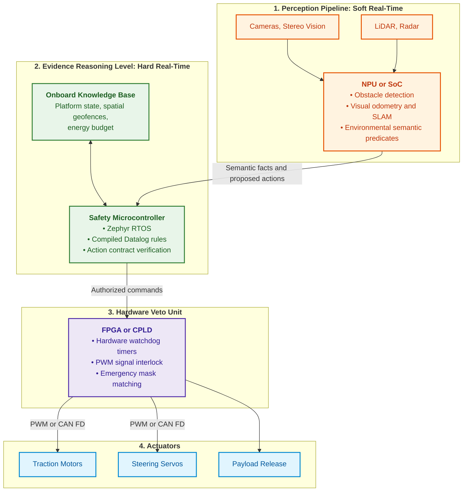
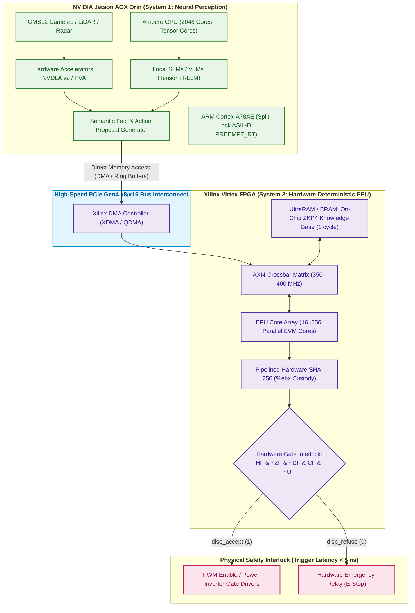
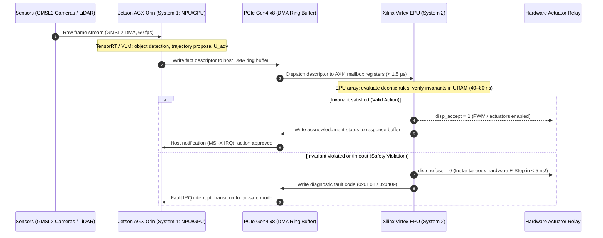
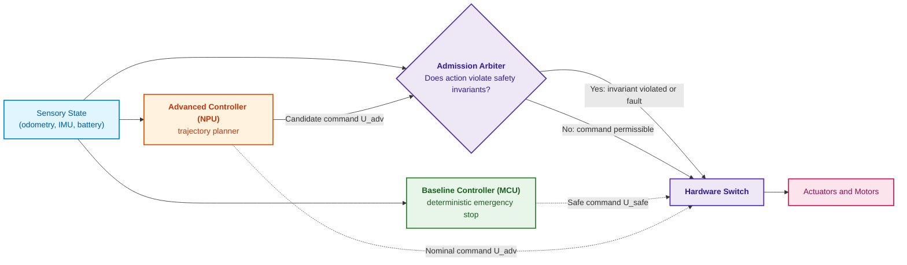
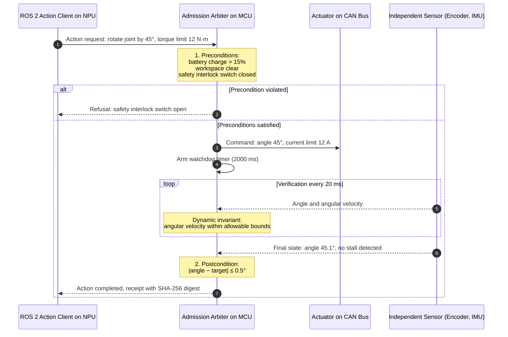
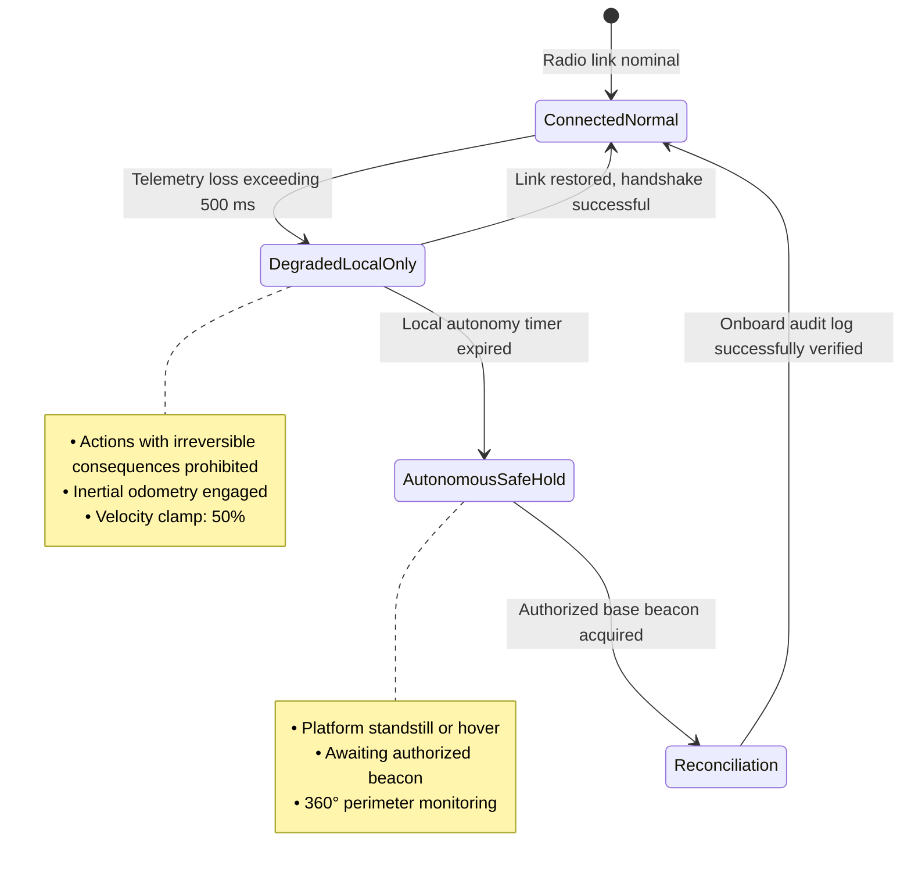
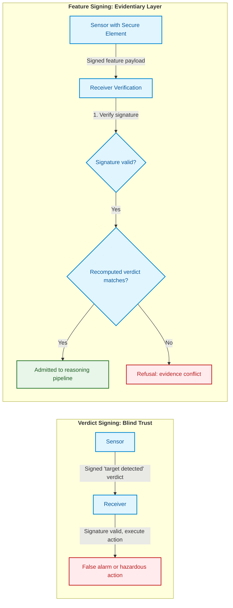
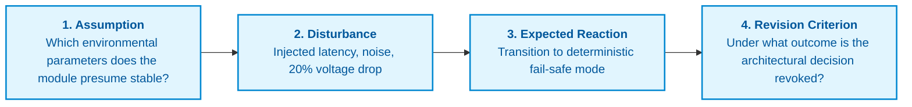
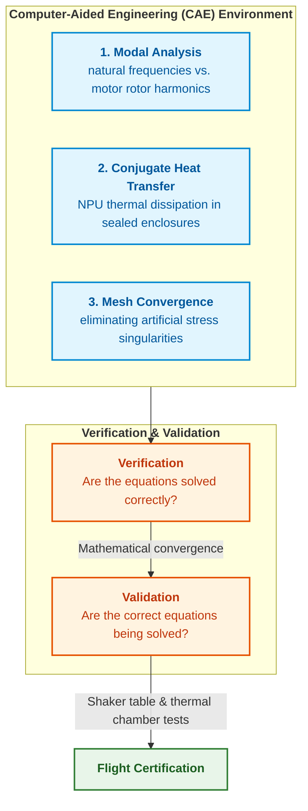

# Appendix B. Evidence-Governed Expert Systems in Autonomous Robotics and Cyber-Physical Systems

> **Book:** [Architecture of Evidence-Governed Expert Systems](README.md) · Appendices  
> **Table of Contents:** [README.md](README.md)  
> **Author:** [Mykola Fedchyk](about-the-author.md)  
> **Target Audience:** Autonomous platform architects, embedded systems engineers, robotics specialists (ROS 2, Zephyr RTOS), safety-critical real-time system developers  
> **Expected Learning Outcomes:** Decouple probabilistic perception from deterministic action admission; construct an onboard knowledge base without dynamic memory allocation; structure physical actions as formal contracts with precondition and postcondition verification; audit subsystem interfaces and physical models prior to field trials.

---

## Abstract

In safety-critical autonomous systems and mobile robotics (ISO 26262 ASIL D, IEC 61508 SIL 3, DO-178C DAL A), directly coupling neural network perception models or multimodal AI to physical actuators inevitably leads to catastrophic accidents. The physical consequences of a robot's actions (emergency braking, payload release, sharp rudder deflection) are irreversible and expend real kinetic energy. At a control loop frequency of $f = 50\ \text{Hz}$, even a negligible classification or detection error probability of $p = 10^{-3}$ guarantees a hazardous command within an average of $T_{\text{err}} = 1/(p \cdot f) = 20\ \text{seconds}$ of flight or motion.

This appendix resolves this dilemma by introducing a fundamental principle of cyber-physical safety: the strict separation of probabilistic sensory intelligence from deterministic action admission. The author proposes and examines in detail a three-tier heterogeneous onboard architecture (SoC/NPU for computer vision, a safety microcontroller running Zephyr RTOS with compiled Datalog rules in static memory without dynamic `malloc` allocation, and a hardware FPGA veto arbiter with an interlock cutoff time of $< 100\ \text{ns}$), formal action contracts with precondition and postcondition verification, and methodologies for detecting interface defects prior to field trials at the proving ground.

---

## 1. Physical Irreversibility and Cybernetic Limits: Fundamental Difference Between Cyber-Physical Systems and Generative AI

Attempts to transfer architectural patterns from consumer generative artificial intelligence directly into autonomous robotics and cyber-physical systems (*cyber-physical systems*, CPS) represent one of the most perilous engineering fallacies of the modern era. The widespread media metaphor of an autonomous robot as a "language model on wheels" or the concept of end-to-end control (*End-to-End Vision-Language-Action, VLA*)—where a stochastic neural network synthesizes actuator control currents directly from camera pixels—guarantees catastrophic failures in mission-critical deployments.

The underlying cause lies in the fundamental ontological distinction between the virtual space of text token generation and physical reality. This introductory section articulates the foundational physical and cybernetic constraints that mandate a fundamentally different approach to designing onboard intelligence, serving as an engineering preamble to all subsequent sections of this appendix.

### 1.1. Thermodynamic and Material Irreversibility of Physical Action

In general-purpose software systems (search engines, generative chatbots, recommendation engines), a model hallucination or error poses no immediate physical peril: its consequence is merely an erroneous text string rendered on a display, an automated retry, or a page reload. Even in enterprise financial or transaction databases, an automated transactional rollback (`ROLLBACK`) mechanism reliably reverts the system to its initial consistent state.

In cyber-physical systems, software code translates computational verdicts into the redistribution of physical energy:
* modulating the gate drive voltage and pulse widths of power inverter transistors for traction electric motors;
* regulating hydraulic line pressures and modulating brake system valves;
* altering aerodynamic surface deflection angles or adjusting UAV thrust outputs;
* supplying firing current to pyrotechnic payload release actuators.

Every executed physical action—such as `EmergencyBraking()`, `DropPayload()`, or an abrupt $90^\circ$ servo deflection at a velocity of 80 km/h—releases kinetic or thermal energy and irreversibly modifies the operational environment.

In the physical world, no undo operator exists: metal deformation from an impact, stripped gearbox teeth, a burned-out power inverter switch, or an aerodynamic stall cannot be "rectified with a subsequent prompt." Entropy increases irreversibly. Consequently, any action that departs from the platform's safe physical operating envelope must be blocked prior to physical actuation, rather than mitigated after a catastrophic failure has already transpired.

### 1.2. Cybernetic Accumulation of Failure Probability in High-Frequency Loops

While a consumer chatbot user submits approximately one query per minute ($f \approx 0.016\ \text{Hz}$), the onboard control loop of a robotic platform executes computations at tens to hundreds of hertz: $f = 50\ \text{Hz}$ for trajectory planning, $f = 200\ \text{Hz}$ for attitude estimation, and $f \ge 1000\ \text{Hz}$ for inner actuator current loops.

Under such high operational frequency, even an error rate that machine learning benchmarks consider stellar inevitably precipitates rapid failure. The mean time to first critical error ($T_{\text{err}}$) is governed by the relation:

```math
T_{\text{err}} = \frac{1}{p\,f}.
```

Where:
- $T_{\text{err}}$ is the mean operational time preceding the first perception or planning error, in seconds;
- $p$ is the error probability of the neural network model on a single discrete time step (a dimensionless quantity in the interval $[0, 1]$);
- $f$ is the execution frequency of the control loop, in hertz (Hz).

Because the system completes $f$ steps per second, the expected number of generated errors per unit time equals the product $p\,f$. Consequently, the expected waiting time until the first hazardous command is the reciprocal $1/(p\,f)$.

```math
\begin{aligned}
\text{At } p = 10^{-3}\ (99.9\%\ \text{accuracy}),\ f = 50\ \text{Hz} &\implies T_{\text{err}} = \frac{1}{10^{-3} \cdot 50} = 20\ \text{seconds}; \\
\text{At } p = 10^{-3}\ (99.9\%\ \text{accuracy}),\ f = 200\ \text{Hz} &\implies T_{\text{err}} = \frac{1}{10^{-3} \cdot 200} = 5\ \text{seconds}; \\
\text{At } p = 10^{-4}\ (99.99\%\ \text{accuracy}),\ f = 50\ \text{Hz} &\implies T_{\text{err}} = \frac{1}{10^{-4} \cdot 50} = 200\ \text{seconds}\ (3.3\ \text{minutes}).
\end{aligned}
```

In operational field environments, the hypothesis of error independence across consecutive cycles collapses: direct sun glare blinding a camera lens, a dust cloud, raindrops on optical elements, or LiDAR multi-path reflections induce burst errors, wherein erroneous perception persists across dozens of consecutive cycles. This collapses the effective interval to catastrophe to mere fractions of a second.

### 1.3. Insurmountability of the Long-Tail Distribution (Out-of-Distribution Hallucinations)

The common engineering instinct to resolve reliability challenges solely through accumulating larger training datasets, supervised fine-tuning, or reinforcement learning (*RLHF/RLAIF*) encounters a fundamental barrier: a neural network is an empirical statistical interpolator across a high-dimensional feature space.

The physical operating environment of autonomous systems exhibits infinite variability ("long-tail distribution"). A robot inevitably encounters sensory signal combinations that were absent from its training distribution (out-of-distribution scenarios): rare optical glints, anomalous structural obstacles, airframe battle damage, or non-linear ground dynamics. At these critical points, the stochastic model does not signal epistemic uncertainty; instead, it synthesizes arbitrary and frequently hazardous control vectors with high internal confidence (overconfident hallucinations).

Functional safety standards governing the highest safety integrity levels (ISO 26262 ASIL D, IEC 61508 SIL 3, DO-178C DAL A) impose stringent limits on permissible catastrophic failure rates:

```math
\Lambda_{\text{catastrophic}} < 10^{-9}\ \text{failures per operational hour}\ (1\ \text{FIT} = 10^{-9}\ \text{h}^{-1}).
```

No modern neural network architecture can provide a mathematical proof of compliance with this criterion. Physical road testing over $10^9$ operational hours (exceeding 114,000 years of continuous operation) without a single catastrophic fault for every updated model weight release is physically impossible.

### 1.4. Architectural Roadmap: Deterministic Admission Gate

This reality yields a foundational engineering deduction that underpins the theoretical and practical framework of this entire work:

> [!IMPORTANT]
> **Foundational Principle of Evidence-Governed Cyber-Physical Safety:**
> No probabilistic neural network model (computer vision, SLAM, or VLM) may possess direct write access to actuator control buses. Between stochastic intelligence and the physical world must stand a deterministic **admission gate**: an evidence-governed expert system that formally verifies every proposed action against rigorous physical and normative safety invariants in hard real time.

This appendix serves as a comprehensive engineering manual for constructing such an admission gate. Each subsequent section unpacks a specific tier of defense:

1. **Heterogeneous Onboard Computer and Research Platforms:** Segregating operational workloads across physically isolated computational tiers—a high-throughput NPU for probabilistic perception (NVIDIA Jetson AGX Orin) and a deterministic evidence verifier (Xilinx Virtex UltraScale+ FPGA / Zephyr RTOS lockstep MCU) linked via PCIe DMA with a hardware emergency cut-off latency of $< 5\ \text{ns}$.
2. **Simplex Architecture:** A mathematically rigorous dynamic supervision mechanism wherein an admission arbiter built on Control Barrier Functions instantaneously transfers control from an advanced neural trajectory planner to a formally verified baseline safe controller whenever a safety invariant is threatened.
3. **Onboard Knowledge Base Without Dynamic Memory Allocation:** Designing a Datalog symbolic inference engine operating exclusively in static memory without invocations of heap allocation (`malloc`), eliminating memory fragmentation and guaranteeing bounded worst-case inference latency.
4. **Action as a Contract (Preconditions, Postconditions, Invariants):** Structuring physical actuations as distributed transactional sagas equipped with precondition checking, deterministic runtime monitoring, and unconditional compensating actions upon contract breach.
5. **Pre-Deployment Interface and Physical Model Verification:** A formal mathematical verification methodology for subsystem integration (MIL/SIL/HIL) that exposes kinematic flaws, bus latency jitter, and interface collisions in simulation before deploying physical hardware to proving grounds.

## 2. Heterogeneous Onboard Computer

A mobile robot, UAV, or expeditionary platform is constrained by size, weight, power, and cost (*size, weight, power and cost*, SWaP-C). Mounting an unconstrained general-purpose server onboard rapidly depletes battery reserves, induces severe thermal throttling, and encroaches upon useful payload capacity. Consequently, as established in [Chapter 18](ch18-execution-infrastructure.md), the onboard computational architecture is partitioned across multiple heterogeneous processors fulfilling distinct functional roles.



This architectural topology reads strictly top-down: the perception tier merely proposes, the safety microcontroller decides, and programmable logic retains the authority to instantly inhibit signals routed to physical actuators. The computational roles are allocated as follows:

1. **Neural Processing Unit (*neural processing unit*, NPU) or System-on-Chip (SoC).** Representative platforms include NVIDIA Jetson Orin modules, Rockchip RK3588 processors, or Hailo acceleration modules paired with single-board computers. Software environment: embedded Linux running the ROS 2 robotics framework [[1]](#src-1) or compiled standalone binaries implemented in Go or C++. Operational scope: ingesting raw sensor streams, obstacle detection, point cloud construction, and semantic feature extraction. Reliability posture: advanced untrusted controller operating without hard real-time guarantees; it may crash, experience thermal throttling, or produce erroneous classifications without jeopardizing baseline platform stabilization.
2. **Safety Microcontroller.** Representative implementations employ dual-core lockstep microcontrollers with hardware fault containment. The Zephyr RTOS real-time operating system [[2]](#src-2) provides deterministic preemptive thread scheduling and operates entirely without dynamic heap allocation. Operational scope: maintaining the local fact base, executing compiled Datalog rules, and formally validating action preconditions and postconditions. Target integrity level: dictated by hazard analysis and risk assessment, targeting ISO 26262 ASIL D [[3]](#src-3) or IEC 61508 SIL 3 [[4]](#src-4).
3. **Hardware Arbiter on Programmable Logic (FPGA or CPLD).** Operational scope: power bus telemetry monitoring, instantaneous current limit enforcement, and hardware gating of motor PWM drive signals upon exceeding critical roll/pitch thresholds or breaching spatial geofences (*geofencing*). Because programmable logic operates purely at the gate level without software intervention, its response latency is governed strictly by propagation delay and sampling clock rates, completely independent of operating system task schedulers.

### 2.1. Computer Vision Pipeline in Go and NPU

For onboard obstacle detection, eliminating interpreted intermediate runtime layers that introduce nondeterministic latency jitter is essential. The architectural pattern recommended by the author for functional prototypes couples a single-board host computer, an NPU connected via PCIe, and a single statically compiled binary in Go:


This pattern exhibits three critical design properties. Raw image frames are streamed from the V4L2 kernel driver into direct memory access (DMA) buffers without superfluous memory copies. The neural model executes on the NPU via vendor C/C++ runtimes linked directly via cgo. Goroutines communicate across bounded, non-blocking channels configured with drop-oldest overflow policies, preventing latency queues from accumulating during transient processing spikes. Latency distributions and CPU utilization figures must always be benchmarked under representative operational loads on physical target hardware, rather than extrapolated from vendor promotional datasheets.

## 3. Research Hardware Platforms: Test Benches Based on NVIDIA Jetson AGX Orin and Xilinx Virtex FPGA

To experimentally validate the theoretical models presented in this monograph, the author deployed two complementary industrial-grade hardware test benches that physically segregate statistical perception from deterministic evidence-governed control.



---

### 3.1. Research Program for NVIDIA Jetson AGX Orin (Perception and Proposal Pipeline — System 1)

The baseline hardware platform for research into the perception pipeline is the industrial edge computer **Seeed Studio reServer Industrial J501**, built around the **NVIDIA Jetson AGX Orin** module (delivering up to 275 TOPS of sparse tensor computing, a 2048-core Ampere-architecture GPU with 64 Tensor Cores, dual NVDLA v2 deep learning accelerators, a PVA v2 programmable vision accelerator, a 12-core ARM Cortex-A78AE CPU cluster, and up to 64 GB of unified LPDDR5 memory with 204,8 GB/s bandwidth housed in a rugged fanless enclosure rated for $-20^\circ\text{C}$ to $+60^\circ\text{C}$).

The platform software stack is configured on **NVIDIA JetPack 6.2** (Linux kernel 5.15 with PREEMPT_RT real-time patching, CUDA 12.6, cuDNN 9, TensorRT 10, Ubuntu 22.04 LTS `aarch64`) and an integrated local runtime environment powered by **Ollama / TensorRT-LLM**.

The perception pipeline possesses no direct write access to physical actuator drivers and functions strictly as a stochastic hypothesis generator: it parses unstructured sensory streams into formalized environmental state predicates and formulates candidate actions $U_{\text{adv}}$. This test bench explores the following applied engineering problems:

1. **Perception-to-Symbolic Translation:**
   * Investigating structural weight quantization (FP8, INT4 AWQ) of local open-weights models (Qwen2.5, Phi-4, Gemma-2) alongside vision-language architectures accelerated via TensorRT-LLM and NVDLA for robust spatiotemporal fact extraction.
   * Leveraging the benefits of Unified Memory Architecture (UMA): co-locating models in the 14B to 32B parameter range directly within shared system VRAM without inter-processor bus copying overhead.
   * Profiling latency percentiles (P50/P90/P99) for transforming unstructured sensor data into typed symbolic fact tuples inside a fully autonomous, air-gapped operational envelope without external network connectivity.
2. **Candidate Action Synthesis and Contract Descriptor Serialization:**
   * Automated synthesis of proposed candidate actions $U_{\text{adv}}$ (target acceleration vectors, waypoint trajectories, requested power allocations) along with associated operational preconditions subject to formal verification.
   * Compact serialization of extracted facts and action arguments into 64-byte aligned binary descriptors structured for direct zero-copy ingestion by the hardware admission gate across PCIe.
3. **Evaluation of Temporal Determinism Under Linux PREEMPT_RT:**
   * Empirical profiling of scheduling latency jitter and Worst-Case Execution Time (*Worst-Case Execution Time*, WCET) during fact synthesis and serialization on ARM Cortex-A78AE cores.
   * Quantifying LPDDR5 memory bus contention between concurrent GPU/DLA inference kernels and real-time CPU threads; verifying that total inference latency $T_{\text{infer}}$ remains strictly within the Fault Tolerant Time Interval (FTTI).
   * Assessing the efficiency of ARM Cortex-A78AE cores operating in **Split-Lock** hardware redundancy mode to validate compliance with ISO 26262 ASIL D requirements.
4. **Low-Latency Ingestion Across PCIe DMA Interconnect:**
   * Managing DMA ring buffers within pinned host shared memory mapped directly into PCIe Base Address Register (BAR) address space.
   * Direct streaming of fact descriptors to the hardware verifier without intermediate kernel system calls or third-party protocol encapsulation overhead.
   * Ingesting primary sensor streams across GMSL2 camera serializers and LiDAR interfaces using zero-copy DMA ring buffers (V4L2 / NVMM), curtailing raw frame ingestion latency into the inference engine to $< 2\ \text{ms}$.

> [!NOTE]
> **Theoretical and Engineering Foundations of Perception Pipelines in Monograph Chapters:**
> - [Chapter 12. Linguistic Analysis and Local Models](ch12-linguistic-analysis-and-local-models.md) — Local language model inference, structured fact extraction, and linguistic templates for closed-loop control systems.
> - [Chapter 18. Execution Infrastructure](ch18-execution-infrastructure.md) — Roofline performance modeling, numerical drift analysis, latency budgeting, and Linux PREEMPT_RT kernel tuning.
> - [Chapter 28. Dual-Mode Expert Systems: Strict Derivation and Advisory Hypothesis](ch28-dual-mode-expert-systems.md) and [Chapter 29. Neuro-Symbolic Architecture](ch29-neuro-symbolic-architecture.md) — Formal division of responsibilities between probabilistic hypothesis generators (System 1) and deterministic evidence verifiers (System 2).

---

### 3.2. Research Program for Xilinx Virtex FPGA (Deterministic Evidence-Governed Control Level — System 2)

Implementing a hardware admission gate mandates selecting a programmable logic family capable of providing deterministic execution with nanosecond-level fixed latency, zero reliance on dynamic memory allocation, and intrinsic hardware fault containment.

#### 3.2.1. Justification of FPGA Selection and Resource Sufficiency

The research test bench employs the **AMD / Xilinx UltraScale+ family (16 nm FinFET process)**—specifically **Virtex UltraScale+ (VU9P, VU13P)** or **Kintex UltraScale+ (KU11P, KU15P)** devices available as PCIe accelerator cards, as well as **AMD Alveo (U50, U200)** computing platforms.

This selection is grounded in rigorous hardware engineering criteria:

1. **Rejection of Legacy Architectures (Virtex-7):**  
   The legacy Virtex-7 family (28 nm) is technologically obsolete and unsuitable for mission-critical real-time verification: it is restricted to PCIe Gen3 (creating severe throughput bottlenecks when paired with the Jetson Orin PCIe Gen4 root complex), lacks on-chip UltraRAM (URAM) memory blocks, and necessitates round-trips to external DDR3/DDR4 DRAM, introducing unacceptable stochastic access latency jitter.
2. **Logic Resource Sizing (LUTs and Flip-Flops):**  
   * A single deterministic symbolic inference core (Datalog unification engine / hardware deontic invariant evaluator) consumes approximately **2,500 to 4,500 LUTs** and **3,000 to 5,000 flip-flops (FF)**.
   * A research array of 16 to 64 parallel cores for concurrent proof-tree exploration requires **80,000 to 280,000 LUTs**.
   * On-chip infrastructure: an integrated PCIe Gen4 DMA endpoint (XDMA/QDMA IP subsystem) consumes ~25,000 LUTs; an AXI4 Crossbar Interconnect matrix requires ~15,000 to 20,000 LUTs; a 64-stage fully pipelined SHA-256 hash verifier utilizes ~12,000 to 15,000 LUTs and dedicated DSP48E2 slices; combinational safety interlock logic and hardware watchdog timers consume ~2,000 LUTs.
   * The aggregate design requirement spans **150,000 to 350,000 LUTs**.
   * Deploying Kintex UltraScale+ (KU15P: 523k LUTs) or Virtex UltraScale+ (VU9P: 1,182k LUTs; VU13P: 1,728k LUTs) devices is **necessary and sufficient**: it maintains logic utilization within 30% to 55%. This completely prevents routing congestion, guarantees timing closure at the target clock frequency of **300 to 400 MHz** ($T_{\text{clk}} = 2.5–3.3\ \text{ns}$), and reserves routing headroom for experimental architectural extensions.
3. **Internal Memory Architecture (UltraRAM and BRAM vs. External DRAM):**  
   * Relying on off-chip dynamic RAM (DDR4/DDR5) for real-time safety invariant verification is unacceptable: access latencies of 50 to 100 ns, periodic row-refresh pauses ($t_{\text{RFC}}$), and bus arbitration contention introduce stochastic jitter incompatible with hard real-time guarantees.
   * UltraScale+ devices incorporate **UltraRAM (URAM)** blocks—synchronous dual-port static memory macros of 288 kbits each (organized as 4K × 72 bits) that cascade into unified arrays without external logic overhead. Specifically, the VU9P device provides 36 MB (270 Mbits) of URAM and 75.9 Mbits of Block RAM (BRAM 36K).
   * This capacity is sufficient to **store the entire compiled normative knowledge base, ontological lattices, defeater tables, and action invariants directly in on-chip memory**. Any rule lookup or term unification completes in **1 to 2 clock cycles ($2.5–5.7\ \text{ns}$)** with absolute temporal determinism (Zero Wait-States) and zero cache misses.

#### 3.2.2. Applied Research Tasks for System 2 on FPGA

1. **Multi-Core Symbolic Inference Array:**
   * Synthesizing a deterministic multi-core logic processor (scaling from 16 to 64 parallel cores) executing compiled Datalog rules and evaluating deontic prohibitions (`MUST_NOT`) concurrently.
   * Implementing a Hardware Task Dispatcher that parallelizes action precondition audits and proof-tree expansions, achieving a throughput exceeding $> 10^7$ rule evaluations per second at a P99 latency of $< 100\ \text{ns}$.
2. **Zero-Jitter On-Chip Knowledge Store (UltraRAM):**
   * Loading binary knowledge packages into the static UltraRAM address space.
   * Investigating contention-free multi-port access: every core in the array retrieves norms, predicates, or defeaters in 1 clock cycle ($2.5–3.3\ \text{ns}$) without off-chip memory transactions.
3. **Pipelined Cryptographic Source Custody (%ebx Hardware SHA-256 Custody):**
   * Synthesizing a 64-stage fully pipelined SHA-256 engine utilizing logic gates and DSP48E2 slices. The engine verifies the cryptographic authenticity of cited normative source texts (matching the hash of the governing standard) in exactly 64 clock cycles ($< 180\ \text{ns}$ at 350 MHz) in parallel with rule execution.
   * Hardware Single Event Upset (SEU) mitigation: activating built-in hardware Error Correction Code (ECC) across BRAM/URAM blocks to ensure knowledge base integrity against ionizing radiation and electromagnetic interference.
4. **Hardware Discrete Admission Gate and Physical Interlock:**
   * Driving discrete admission signal lines `disp_accept` and `disp_refuse` directly to general-purpose I/O pins (LVCMOS / GPIO) on the FPGA package.
   * Constructing emergency cutoff logic purely out of combinational gates with an actuation latency of $< 5\ \text{ns}$, directly disabling optical gate drivers for inverter power switches or opening the coil circuit of a physical emergency stop relay (E-Stop).
   * Enforcing complete physical independence from software: upon any invariant violation, actuator power is severed at the silicon gate level without operating system intervention.

> [!NOTE]
> **Theoretical and Engineering Foundations of Hardware Symbolic Inference in Monograph Chapters:**
> - [Chapter 16. Expert Systems Architecture](ch16-expert-systems-architecture.md) and [Chapter 17. Implementation Stack](ch17-implementation-stack.md) — Inference engine design, register file organization, and formal decoupling of immutable rules from dynamic facts.
> - [Chapter 18. Execution Infrastructure](ch18-execution-infrastructure.md) (Section "Hardware Foundations and Physical Peripheral Limits") — Rationale for FPGA fabrics in deterministic microsecond- and nanosecond-scale processing pipelines.
> - [Chapter 21. From Recommendation to Action: Authority Control and Safe Execution in Production Environments](ch21-from-recommendation-to-action.md) — Hardware admission gates, power circuit interlocks, and deterministic inhibition of unsafe actions.
> - [Chapter 31. Syllogistic Reasoning and Relation Lattices](ch31-syllogistic-reasoning-and-relation-lattices.md) — Deontic norms of obligation, permission, and prohibition (`MUST`, `PROHIBITED`) translated into logic core microinstructions.
> - [Chapter 32. High-Performance Knowledge Packs: Memory Mapping (mmap) and Harvesting Pipeline](ch32-high-performance-knowledge-packs-mmap-and-harvesting.md) — Binary knowledge container layout, 64-byte memory alignment, and zero-copy hardware access inside UltraRAM.
> - [Appendix D. Analog Expert Systems, Neuromorphic Computing, and Hardware Inference](appendix-d-analog-expert-systems-and-neuromorphic-computing.md) — Energy economics of memory access and hardware execution of formal logic.

---

### 3.3. Investigation of the Heterogeneous Tandem "Jetson AGX Orin + Xilinx Virtex PCIe"

The primary research objective centers on integrating both platforms into a unified test apparatus: the **NVIDIA Jetson AGX Orin** carrier board provides a physical **PCIe Gen4 x16 slot (with 8 active lanes)**, enabling direct insertion of the **Xilinx Virtex UltraScale+** accelerator card configured as an Endpoint device.



#### 3.3.1. Joint Measurement Protocol and Popperian Falsification Criterion

1. **Zero-Copy Exchange via DMA Ring Buffers (Low-Latency Mailbox):**
   * Fact descriptors are mapped into pinned shared host memory on the Orin host. The XDMA controller on the FPGA streams descriptors directly into internal AXI4 mailbox registers within $T_{\text{dma}} < 1.0–1.5\ \mu\text{s}$.
   * Return telemetry channel: the FPGA writes verification status into a host-side response buffer and asserts an MSI-X interrupt (or updates a pollable completion flag).
2. **Hardware Safety Watchdog:**
   * The FPGA arbiter incorporates an independent hardware timer counting down an unalterable period $T_{\text{wdg}}$ (e.g., 10 to 20 ms).
   * Should System 1 (NPU/GPU/Linux) freeze, suffer memory bus starvation, or fail to transmit a valid fact descriptor within $T_{\text{wdg}}$, the FPGA watchdog asserts an emergency fault, drops `disp_accept = 0`, and de-energizes actuators without waiting for software recovery.
3. **End-to-End Admission Loop Latency ($T_{\text{loop}}$):**  
   The aggregate elapsed time from raw sensor frame arrival to assertion of the physical `disp_accept` signal at the FPGA pin is characterized by:
   $$T_{\text{loop}} = T_{\text{infer}} + T_{\text{dma}} + T_{\text{fpga}}$$
   Where:
   * $T_{\text{infer}}$ is the time required for predicate extraction and candidate action synthesis on the NPU/GPU ($10–30\ \text{ms}$);
   * $T_{\text{dma}}$ is the descriptor transmission latency across PCIe Gen4 ($1.0–1.5\ \mu\text{s}$);
   * $T_{\text{fpga}}$ is the formal verification latency across the FPGA core array ($40–100\ \text{ns}$).
4. **Falsification Gate Criterion:**  
   In compliance with functional safety mandates (ISO 26262 ASIL D, IEC 61508 SIL 3), the hypothesis affirming the safety and viability of the heterogeneous architecture is **falsified** (rejected) if:
   $$\max(T_{\text{loop}}) > T_{\text{FTTI}}$$
   Where $T_{\text{FTTI}}$ is the Fault Tolerant Time Interval defined for the target physical platform,  
   or if the probability of missing a hardware verdict within the watchdog deadline satisfies $P(T_{\text{loop}} > T_{\text{wdg}}) > 10^{-9}\ \text{failures per operational hour}$,  
   or if a single occurrence of `disp_accept = 1` is recorded when an active defeater exists or a formal safety invariant is violated.

> [!NOTE]
> **Theoretical and Engineering Foundations of Heterogeneous Tandems in Monograph Chapters:**
> - [Chapter 18. Execution Infrastructure](ch18-execution-infrastructure.md) — Latency budgeting for cross-platform exchange via PCIe DMA and queue overflow prevention.
> - [Chapter 21. From Recommendation to Action: Authority Control and Safe Execution in Production Environments](ch21-from-recommendation-to-action.md) — Hardware admission gates, emergency relays, and direct actuator authority control.
> - [Chapter 27. Safety Case: GSN Argument Synthesis and Verification](ch27-safety-case-gsn-synthesis.md) and [Chapter 30. Safety and Cybersecurity Co-Engineering](ch30-safety-cybersecurity-co-engineering.md) — Structuring Goal Structuring Notation (GSN) safety cases to demonstrate compliance with ISO 26262 ASIL D.
> - [Chapter 39. Active Compliance Auditor: Popperian Falsification, Regulatory Compliance (ASPICE/ISO 26262/ISO 21434), and Autonomous Test Generation](ch39-active-compliance-auditor-and-popperian-testing.md) — Formal Popperian falsification frameworks and automated ASPICE V-model traceability across safety requirements and physical hardware tests.

This heterogeneous tandem resolves the structural conflict between the raw computational throughput of neural models and the strict determinism demanded by functional safety standards, transforming stochastic AI into a dependable instrument of cyber-physical control.

---

## 4. Simplex Architecture: Complex Controller Supervised by a Simple Controller

To reconcile a high-performance, unverifiable controller with strict safety guarantees, systems leverage the **Simplex architecture** (*Simplex architecture*). Lui Sha articulated its core principle as using simplicity to control complexity: a simple, formally verified controller supervises and backs up an advanced, unverified one [[5]](#src-5). The architecture comprises three primary functional blocks:

1. **Advanced Controller:** Executes on the NPU (for instance, within the Nav2 navigation stack for ROS 2 [[6]](#src-6)), employing deep neural networks and complex trajectory optimization algorithms.
2. **Baseline Controller:** Executes on the safety microcontroller, encapsulating elementary, deterministically provable control laws: deceleration, hover-in-place, or emergency landing.
3. **Admission Arbiter:** A symbolic expert engine that compares proposed commands from the advanced controller against a formal model of the robot's physical operating envelope in real time.



### 4.1. Formalization of the Safety Invariant

Let the physical state of the robot at time $t$ be represented by the state vector $X(t)$: spatial coordinates, linear velocity $v$, angular velocity $\omega$, and clearance distance to the nearest obstacle $d_{\mathrm{obs}}$. The neural trajectory planner proposes a control vector $U_{\mathrm{adv}}=(a,\alpha)$, where $a$ denotes proposed linear acceleration and $\alpha$ denotes angular acceleration. The arbiter authorizes $U_{\mathrm{adv}}$ if and only if the following safety invariant holds:

```math
d_{\mathrm{obs}}-S_{\mathrm{stop}}(v,a_{\mathrm{max}})\ge D_{\mathrm{margin}}+v\,\tau_{\mathrm{reaction}}.
```

Where:

- $d_{\mathrm{obs}}$ is the instantaneous distance from the robot to the nearest detected obstacle, in meters;
- $S_{\mathrm{stop}}(v,a_{\mathrm{max}})$ is the stopping distance—the clearance traversed while braking to a complete standstill from velocity $v$ under maximum permissible braking deceleration $a_{\mathrm{max}}$; assuming uniform deceleration, $S_{\mathrm{stop}}=v^{2}/(2a_{\mathrm{max}})$;
- $v$ is the linear velocity of the platform, in meters per second;
- $a_{\mathrm{max}}$ is the maximum guaranteed braking deceleration achievable on the current physical surface, in meters per second squared;
- $D_{\mathrm{margin}}$ is the mandatory safety margin that must remain between the halted robot and the obstacle, e.g., 0.5 m;
- $\tau_{\mathrm{reaction}}$ is the worst-case hardware actuation latency from hazard detection to physical brake engagement, in seconds, measured directly on target hardware;
- $`v\,\tau_{\mathrm{reaction}}`$ is the distance traversed during this reaction latency before braking deceleration begins.

The invariant condition reads: the clearance to the obstacle, minus the stopping distance, must cover both the safety margin and the distance traversed during actuation delay. Suppose, for example, $v=3$ m/s, $a_{\mathrm{max}}=2$ m/s², and $\tau_{\mathrm{reaction}}=0.02$ s. Then $S_{\mathrm{stop}}=3^{2}/(2\cdot2)=2.25$ m, $`v\,\tau_{\mathrm{reaction}}=0.06`$ m, and the arbiter permits forward motion only if the obstacle is farther than $2.25+0.5+0.06=2.81$ m. These parameters serve an illustrative purpose. If $U_{\mathrm{adv}}$ violates this inequality, or if the NPU fails to publish the next command within a watchdog deadline (e.g., 50 ms), the arbiter deasserts the $U_{\mathrm{adv}}$ channel and passes control to the baseline controller, which initiates maximum braking at $-a_{\mathrm{max}}$.

## 5. Onboard Knowledge Base: Compiled Datalog Without Dynamic Memory Allocation

Embedded microcontrollers operate under strict memory limits ranging from hundreds of kilobytes to several megabytes of SRAM. Running interpreted Prolog engines or rule processors that allocate dynamic objects on the heap (`malloc`, `new`) within safety-critical control loops is dangerous: heap fragmentation and unpredictable garbage collection pauses violate real-time guarantees. Consequently, knowledge base rules are compiled ahead-of-time into compact C structures, bitmasks, and static transition tables.

Datalog is an optimal formalism: it represents a subset of logic programming devoid of complex functional symbols, guaranteeing that inference evaluation always terminates [[7]](#src-7). Consider the following rule fragment evaluating UAV mission flight safety:

```prolog
% Onboard flight safety rules
hazard(critical_battery) :-
    telemetry(battery_voltage, V), V < 21.0.

hazard(geofence_breach) :-
    position(_Alt, Dist), Dist > 5000.

hazard(sensor_blindness) :-
    sensor_health(lidar, failed),
    sensor_health(optical_flow, degraded).

% Fail-safe mode transition decisions
action(emergency_landing) :-
    hazard(critical_battery).

action(return_to_home) :-
    hazard(geofence_breach),
    not hazard(critical_battery).

action(hold_position) :-
    hazard(sensor_blindness),
    not hazard(critical_battery).
```

### 5.1. Code Generation for Zephyr RTOS

The knowledge compiler translates these rules into a standalone C evaluation function completely devoid of dynamic memory allocation. The listing below illustrates the generated output; to compile outside Zephyr RTOS, one simply removes the `#include <zephyr/kernel.h>` directive.

<details>
<summary>C Code Example: Generated Onboard Safety Rule Evaluation Function for Zephyr RTOS</summary>

```c
/* Generated by the knowledge compiler for Zephyr RTOS */
#include <zephyr/kernel.h>
#include <stdint.h>
#include <stdbool.h>

typedef struct {
    float battery_voltage;
    float distance_from_home;
    float altitude;
    uint8_t lidar_status;       /* 0 = OK, 1 = Degraded, 2 = Failed */
    uint8_t opt_flow_status;
} RobotTelemetry_t;

typedef enum {
    ACTION_CONTINUE = 0,
    ACTION_HOLD_POSITION,
    ACTION_RETURN_TO_HOME,
    ACTION_EMERGENCY_LANDING
} SafetyVerdict_t;

SafetyVerdict_t evaluate_safety_rules(const RobotTelemetry_t *const telem) {
    const bool critical_battery = (telem->battery_voltage < 21.0f);
    if (critical_battery) {
        return ACTION_EMERGENCY_LANDING; /* highest priority */
    }

    const bool geofence_breach = (telem->distance_from_home > 5000.0f);
    if (geofence_breach) {
        return ACTION_RETURN_TO_HOME;
    }

    const bool sensor_blind = (telem->lidar_status == 2) &&
                              (telem->opt_flow_status >= 1);
    if (sensor_blind) {
        return ACTION_HOLD_POSITION;
    }

    return ACTION_CONTINUE;
}
```

</details>

Comparing the Datalog rules with the compiled C code reveals two fundamental architectural characteristics. First, the generated function performs zero memory allocation, contains no unbounded loops, and avoids recursion; its execution time is strictly bounded, with upper bounds verifiable via Worst-Case Execution Time (*worst-case execution time*, WCET) static analysis or target hardware profiling. Second, whereas raw Datalog evaluates all matching rules concurrently, the generated code resolves rule competition through explicit, deterministic prioritization: when a geofence breach coincides with sensor blindness, return-to-home overrides hover-in-place. This priority hierarchy constitutes a formal facet of the knowledge base that must be audited and verified, rather than left to implicit compiler ordering.

## 6. Action Contracts and Transactions in the Physical World

As demonstrated in [Chapter 21](ch21-from-recommendation-to-action.md), executing an action in the physical world requires closed-loop verification: an autonomous system cannot simply write command frames to a CAN bus and assume the task completed successfully. Complex physical commands must be structured as formal contracts specifying preconditions, execution monitoring, postconditions, and compensation procedures. This paradigm extends the database concept of sagas, where long-running transactions are composed of discrete steps, each linked to a dedicated compensating action [[8]](#src-8).



### 6.1. Action Contract Structure in C

<details>
<summary>C Code Example: Action Contract Data Structure</summary>

```c
struct ActionContract {
    uint32_t action_id;
    uint32_t timeout_ms;

    /* Preconditions: returns true if hardware is ready */
    bool (*check_preconditions)(void);

    /* Execution: write to registers or CAN bus */
    int (*execute_command)(void *params);

    /* Postconditions: independent sensor verification */
    bool (*verify_postconditions)(void *params);

    /* Compensation: safe fallback upon contract breach */
    void (*compensate_failure)(void);
};
```

</details>

Consider an operational scenario where, during joint rotation, an independent current sensor detects an overcurrent draw exceeding 15 A while the motor encoder registers zero angular displacement—indicating a mechanical transmission lockup. The contract is breached: `compensate_failure()` de-energizes the motor windings, engages the mechanical holding brake, and transmits a high-priority diagnostic alert to the mission controller. Both the cryptographic receipt of successful actions and failure audit trails are logged immutably to the onboard evidence ledger.

## 7. Autonomy Under Loss of Communication and in Electronic Warfare Environments

In field robotics and defense deployments ([Military Expert Systems](../MilTech/Military-Expert-Systems-UAS-AD-ELINT-EW-UA.md)), communication channels to base stations are routinely jammed, intercepted, or completely severed. The onboard control architecture must therefore implement a deterministic degradation state machine aligned with [Chapter 22](ch22-cybernetics-edge-to-backend.md).



The state machine defines four operational states, each successively curtailing platform authority. Thresholds such as the 500 ms link-loss timeout and the 50% velocity clamp are representative engineering parameters calibrated through rigorous platform safety analysis.

### 7.1. Behavioral Rules in the Absence of Reliable GNSS

When operating in Global Navigation Satellite System (*Global Navigation Satellite System*, GNSS) spoofing environments, the onboard expert system continuously monitors for divergence across independent odometry sources. The comprehensive survey by Psiaki and Humphreys details GNSS spoofing mechanics and countermeasure verification techniques, particularly cross-validation against inertial navigation sensors [[9]](#src-9).

**Odometry Consistency Invariant.** The onboard expert system evaluates whether the divergence between independent velocity estimates exceeds a critical threshold:

```math
\left\lVert\mathbf{v}_{\mathrm{GNSS}}-\mathbf{v}_{\mathrm{Wheel}/\mathrm{IMU}}\right\rVert_2>\Delta V_{\mathrm{threshold}}.
```

Where:

- $\mathbf{v}_{\mathrm{GNSS}}$ is the velocity vector reported by the GNSS receiver, in meters per second;
- $\mathbf{v}_{\mathrm{Wheel}/\mathrm{IMU}}$ is the velocity vector obtained through integrating wheel encoders and Inertial Measurement Unit (*inertial measurement unit*, IMU) telemetry;
- $\lVert\cdot\rVert_2$ is the standard Euclidean norm representing vector magnitude, quantifying the degree of divergence between independent sensor modalities;
- $\Delta V_{\mathrm{threshold}}$ is the discrepancy threshold, calibrated strictly above the combined sensor noise floor measured on the physical platform to avoid nuisance alarms.

If the GNSS receiver indicates a velocity of 80 km/h while integrated wheel odometry and accelerometer readings indicate 10 km/h, the satellite navigation channel is flagged as compromised (`Status = SPOOFED`).

**Safe Reaction.** Compromised GNSS coordinates are stripped from the active Kalman filter [[10]](#src-10), the platform transitions to dead-reckoning inertial-optical navigation, and the last verified origin waypoint is preserved in non-volatile memory. Denied-environment navigation architectures are explored in depth in [Appendix C](appendix-c-autonomous-navigation-and-geosearch.md).

## 8. Evidentiary Layer of Sensor Measurements: Signing Features Instead of Verdicts

Distributed sensor networks (acoustic direction finders, RF scanners, seismic arrays) face a subtle architectural vulnerability: **a cryptographically signed packet proves the authenticity of the sender, but does not prove the truth of its verdict**. Sidliarchuk articulates this principle in the witness-integrity architecture: digital signatures prove authorship, not empirical truth [[11]](#src-11).

This distinction exposes two critical failure modes. If a captured or malfunctioning sensor transmits a signed status claiming "target detected," the receiving system can only accept or reject the packet; it cannot audit the underlying evidence. Conversely, if a sensor generates an error induced by physical environment artifacts, the signature remains mathematically valid. During field trials documented by the repository author, an acoustic detector locked onto a stable 84 Hz fundamental frequency with harmonics and emitted a positive target verdict, although the source was merely an overhead high-voltage power line located hundreds of meters away [[11]](#src-11).



The witness-integrity implementation codifies an evidentiary sensor contract built upon four principles [[11]](#src-11):

1. **Sensors Sign Features, Not Verdicts:** Feature payloads adhere to a canonical binary layout with fixed field ordering and integer-only representations. Floating-point serialization discrepancies across heterogeneous hardware architectures inevitably break cryptographic signature matching.
2. **Private Keys Never Leave Secure Silicon:** Cryptographic signatures are minted directly within a dedicated secure hardware element (such as an ATECC608B), wherein private keys remain permanently shielded from host extraction.
3. **Physically Impossible Payloads Are Rejected at the Source:** Consistency checks execute prior to signature generation: a frame claiming more confirmed detections than processed time samples is physically invalid; the secure element aborts signing rather than endorsing corrupt data.
4. **Receivers Recompute Verdicts Independently:** The receiving controller verifies the signature and recomputes the logical verdict against identical evidentiary rules; any discrepancy between the claimed status and recomputed verdict immediately collapses epistemic trust.

For an onboard expert system, this design ensures that facts supplied by external sensors enter the reasoning base only when accompanied by signed feature records and successful independent recomputation. Hardware roots of trust and anti-spoofing architectures are analyzed in detail in the author's dedicated treatise [Hardware Root of Trust and Anti-Spoofing in Military IoT Systems](../MilTech/Hardware-Root-Of-Trust-And-Anti-Spoofing-Military-IoT-UA.md).

## 9. Non-Functional Interfaces and Assumption Boundaries Prior to Integration

Complex cyber-physical systems frequently exhibit a well-known systems engineering paradox: two fully conforming subsystems combine into a non-functional system. Component A (e.g., a thermal camera or RF transceiver) and Component B (e.g., a GNSS receiver or flight controller) may independently meet specifications and pass unit test suites, yet fail catastrophically upon physical integration. Consequently, the NASA Systems Engineering Handbook designates interface management as an autonomous, core lifecycle process [[12]](#src-12).

Such failures predominantly stem from unmodeled non-functional interfaces:

- **Shared Power Buses and Ground Loops:** High-current motor transient spikes induce voltage drops across shared digital sensor power rails;
- **Electromagnetic and RF Interference (EMI/RFI):** High-speed digital camera serialization lanes radiate EMI that degrades reception at adjacent GPS/GNSS patch antennas, mandating integrated physical shielding and spatial isolation audits;
- **Thermal and Vibration Coupling:** Heat dissipated by high-power inverter stages alters the temperature calibration curves of adjacent IMU gyroscopes.

### 9.1. Four Steps for Verifying Engineering Assumptions

Prior to embarking on expensive field trials, the system engineering design process must enforce completing an assumption verification matrix across every subsystem boundary:



Special emphasis is placed on characterizing the "gray zone" of partial hardware degradation. Subsystems must be stressed not merely against clean open-circuit faults, but against progressive calibration drift across thermal cycles, burst bus delays, and clock oscillator instability.

## 10. Physical Modeling: Vibration, Heat, and Mesh Convergence

Software reliability is immaterial if an onboard compute unit overheats inside a sealed chassis or if IMU sensors drown in structural vibration harmonics. Physical hardware configurations must be validated via Computer-Aided Engineering (*computer-aided engineering*, CAE) simulation combined with physical test bench characterization. Oberkampf and Roy distinguish two core disciplines: verification ensures the numerical model equations are solved correctly, while validation establishes whether the chosen equations correctly represent physical reality [[13]](#src-13).



**Modal Analysis.** Drone propulsion systems induce severe mechanical vibrations at blade pass frequencies:

```math
f=\frac{\text{RPM}\cdot N_{\text{blades}}}{60}.
```

Where:

- $f$ is the blade pass frequency at which rotor blades pass a fixed airframe reference, in hertz (Hz);
- $\text{RPM}$ (*revolutions per minute*) is the motor shaft rotational speed, in revolutions per minute;
- $N_{\text{blades}}$ is the number of propeller blades;
- The constant 60 normalizes minutes to seconds ($1\ \text{Hz} = 1\ \text{cycle/s}$).

For example, a brushless motor spinning at 6000 RPM with a 2-blade propeller excites a fundamental vibration frequency of $f=6000\cdot2/60=200$ Hz, with upper harmonics at 400 Hz and 600 Hz. If the natural resonant frequency of the structural frame or computer mounting bracket coincides with these frequencies, resonance ensues. Induced vibrations corrupt accelerometer and gyroscope measurements, leading Kalman filters to interpret pseudo-accelerations as physical translation. Cyclic fatigue stresses introduce microcracks in BGA solder balls and loosen wiring harness terminals. Finite element modal analysis allows structural engineers to tune rib stiffeners and elastomer dampers, ensuring airframe resonant modes lie entirely outside normal motor operating RPM ranges.

**Conjugate Heat Transfer (*conjugate heat transfer*, CHT).** In sealed IP67 enclosures devoid of forced-air cooling, thermal energy from the NPU must conduct through thermal interface materials (TIM) into the chassis and dissipate via natural convection. Thermal dissipation budgets must be profiled under target computational workloads. Mismatched coefficients of thermal expansion (CTE) between PCB laminates and aluminum mounting lugs induce thermo-mechanical fatigue during rapid temperature transitions (e.g., $+40^\circ\text{C}$ ground launch transitioning to $-20^\circ\text{C}$ high-altitude cruise). CHT simulation must verify junction temperatures remain safely below thermal throttling thresholds to prevent frame drops in detection pipelines.

**Mesh Convergence.** Finite element analysis (FEA) results cannot be trusted without rigorous mesh convergence verification. Sharp internal fillet radii on structural brackets inevitably trigger mathematical stress singularities: refining the mesh produces unbounded stress spikes, rendering colorized stress contours numerical artifacts rather than physical reality. Roache established the standard for reporting grid refinement studies via the Grid Convergence Index (GCI) [[14]](#src-14). Permissible variations under mesh doubling must be established prior to computation, and localized stresses must be cross-checked against material plasticity limits.

## 11. Step-by-Step Prototype Deployment

A functional prototype of an evidence-governed robotic expert system can be constructed across four structured engineering steps.

### 11.1. Step 1: Development Environment

Initialize the Zephyr RTOS cross-compilation toolchain following official project documentation [[2]](#src-2). Under Linux, execute the following foundational sequence:

```bash
python3 -m venv ~/zephyrproject/.venv
source ~/zephyrproject/.venv/bin/activate
pip install west
west init ~/zephyrproject
cd ~/zephyrproject && west update
west zephyr-export
```

Subsequently, install required Python dependencies and the appropriate Zephyr SDK toolchain following the active release guidelines, as dependency requirements evolve across Zephyr versions.

### 11.2. Step 2: Safety Rules

Create the declarative rule file `safety_rules.dl` in your project root:

```prolog
% Input predicates: distance(SensorID, Centimeters)
unsafe_zone(SensorID) :- distance(SensorID, D), D < 30.
emergency_stop :- unsafe_zone(_).
```

### 11.3. Step 3: Supervisor Thread on Zephyr RTOS

Implement a supervisor thread executing at a fixed 10 ms period. The snippet below assumes the board device tree defines a `motor_switch` GPIO node, and that `read_sonar_distance()` is implemented by the ultrasonic rangefinder driver:

<details>
<summary>C Code Example: Supervisor Thread on Zephyr RTOS</summary>

```c
#include <zephyr/kernel.h>
#include <zephyr/drivers/gpio.h>

#define SUPERVISOR_PERIOD_MS 10

static const struct gpio_dt_spec motor_en =
    GPIO_DT_SPEC_GET(DT_NODELABEL(motor_switch), gpios);

uint16_t read_sonar_distance(void); /* implemented by rangefinder driver */

void safety_supervisor_thread(void *arg1, void *arg2, void *arg3) {
    gpio_pin_configure_dt(&motor_en, GPIO_OUTPUT_ACTIVE);

    while (1) {
        uint16_t front_distance = read_sonar_distance();

        if (front_distance < 30) {
            gpio_pin_set_dt(&motor_en, 0); /* de-energize actuator drivers */
            printk("SAFETY INTERLOCK: obstacle at %d cm, motors disabled\n",
                   front_distance);
        } else {
            gpio_pin_set_dt(&motor_en, 1);
        }

        k_msleep(SUPERVISOR_PERIOD_MS);
    }
}

K_THREAD_DEFINE(safety_thread_id, 1024, safety_supervisor_thread,
                NULL, NULL, NULL, 1, 0, 0);
```

</details>

During each cycle, the thread polls rangefinder telemetry and evaluates the compiled `unsafe_zone` invariant: if an obstacle is within 30 cm, motor power is cut immediately. In production builds, `k_msleep` is replaced with hardware kernel timers to eliminate scheduling jitter.

### 11.4. Step 4: Hardware-in-the-Loop (HIL) Simulation

Prior to flashing physical microcontrollers, validate the system via Hardware-in-the-Loop (*hardware-in-the-loop*, HIL) simulation:

1. Launch a physics simulator (such as Gazebo Sim or Isaac Sim) on the engineering workstation.
2. Interface the physical microcontroller board to the simulated virtual CAN bus (`vcan0`) via a USB-CAN adapter.
3. Inject synthetic noise and corrupted commands into the `/cmd_vel` ROS topic, verifying that the microcontroller intercepts authority within the allotted safety deadline.

## 12. Pre-Deployment Safety Checklist for Field Trials

Before deploying an autonomous cyber-physical platform to the proving ground, complete the following formal safety audit checklist:

| № | Safety Verification Item | Verification Mechanism | Status |
| :-: | :--- | :--- | :-: |
| 1 | **Physical Actuator Isolation** | Hardware emergency stop switch physically opens battery supply lines, bypassing microcontroller firmware | [ ] |
| 2 | **Hardware Safety Watchdog** | Independent microcontroller watchdog timer enabled with timeout budget derived from hazard analysis | [ ] |
| 3 | **Zero Dynamic Memory Allocation** | All safety supervision code audited: zero calls to `malloc()`, `free()`, no dynamic structures, no recursion | [ ] |
| 4 | **Velocity Clamping Limits** | Maximum angular and linear velocities clamped via hard saturation limits at the motor driver level | [ ] |
| 5 | **Closed-Loop Feedback Verification** | Every command contract specifies a postcondition timeout polling independent encoder or current telemetry | [ ] |
| 6 | **Sensor Blindness Failsafe** | Loss of camera or LiDAR telemetry triggers automatic transition to `AutonomousSafeHold` | [ ] |
| 7 | **NPU-to-MCU Admission Gateway** | Communication between Linux planner and safety microcontroller strictly framed with CRC32 packet integrity checks | [ ] |
| 8 | **GNSS Spoofing Rejection** | Multi-sensor cross-validation detects and rejects discontinuous coordinate jumps inconsistent with IMU odometry | [ ] |
| 9 | **Cryptographically Signed Config** | Operational rule packs and geofence coordinates authenticated via developer digital signature ([Chapter 22](ch22-cybernetics-edge-to-backend.md)) | [ ] |
| 10 | **Immutable Onboard Flight Recorder** | Last 10 minutes of raw telemetry, state transitions, and action contracts recorded to non-volatile flash | [ ] |

Each item in this checklist maps directly to an architectural safeguard detailed above; the completed checklist constitutes an indispensable element of the platform's formal safety case.

## Conclusions

This appendix addressed a central engineering challenge: how to design an onboard expert system that permits only mathematically verifiable, safe actions to reach physical actuators. The solution comprises multi-tiered defense: probabilistic neural models on the NPU merely generate candidate proposals; a safety microcontroller evaluates proposals against compiled Datalog rules without dynamic memory allocation; and programmable logic enforces a hardware veto. The Simplex architecture guarantees seamless fail-over to a baseline safe controller whenever advanced proposals violate safety boundaries. Physical actions are structured as contracts with explicit preconditions, postconditions, and compensation logic, while external sensor feeds are admitted only when accompanied by cryptographically signed feature payloads that allow independent verification.

The boundaries of these techniques are clearly defined. Numerical parameters in this text (thresholds, timeouts, margins) are illustrative and must be calibrated through empirical safety analysis. Integrity ratings such as ASIL or SIL require formal certification processes rather than architectural declarations alone. Subsystem interfaces and physical models require dedicated validation, as non-functional interactions can cause fully conforming components to fail in aggregate. GPS-denied navigation is explored further in [Appendix C](appendix-c-autonomous-navigation-and-geosearch.md), while authority control over autonomous actions is established in [Chapter 21](ch21-from-recommendation-to-action.md).

## Glossary

| Term | English Equivalent | Definition |
|---|---|---|
| Cyber-Physical System | *cyber-physical system* | System in which computational algorithms directly monitor and control physical processes |
| Admission Gate | *admission gate* | Deterministic architectural component that authorizes or rejects proposed actions |
| Simplex Architecture | *Simplex architecture* | System design wherein a simple verified controller supervises a complex unverified controller |
| Safety Invariant | *safety invariant* | A formal condition that must remain true across all valid operational states |
| Watchdog Timer | *watchdog timer* | Hardware timer that triggers an emergency fallback if not periodically refreshed by software |
| Lockstep Core Execution | *lockstep* | Architecture where redundant processor cores execute identical instructions to detect faults |
| Action Contract | *action contract* | Formal action descriptor specifying preconditions, execution logic, postconditions, and compensation |
| Saga | *saga* | Distributed transaction composed of discrete operations, each backed by a compensating action |
| Compensating Action | *compensating action* | Operation designed to return the system to a safe state upon failure of a transaction step |
| GNSS Spoofing | *GNSS spoofing* | Malicious broadcast of false satellite navigation signals to manipulate receiver positioning |
| Feature Signing | *feature signing* | Cryptographic signing of raw evidentiary features rather than high-level classification verdicts |
| Non-Functional Interface | *non-functional interface* | Unintended physical coupling between subsystems via power lines, EMI, heat, or vibration |
| Mesh Convergence | *mesh convergence* | Demonstration that numerical FEA solutions stabilize asymptotically under grid refinement |
| Hardware-in-the-Loop Simulation | *hardware-in-the-loop* | Testing physical embedded controllers against real-time simulated physical environments |

## Abbreviations

| Abbreviation | Expansion | Meaning |
|---|---|---|
| ASIL | Automotive Safety Integrity Level | Risk classification scheme defined by ISO 26262 for automotive systems |
| BGA | Ball Grid Array | Surface-mount packaging for integrated circuits utilizing solder spheres |
| CAE | Computer-Aided Engineering | Software tools utilized for analyzing and simulating engineering designs |
| CAN FD | Controller Area Network Flexible Data-Rate | CAN communication bus protocol supporting higher data throughput |
| CHT | Conjugate Heat Transfer | Coupled simulation of thermal conduction in solids and fluid convection |
| CPLD | Complex Programmable Logic Device | Programmable logic device simpler and lower-power than an FPGA |
| CPS | Cyber-Physical System | System tightly integrating physical mechanisms with software computation |
| CRC32 | Cyclic Redundancy Check, 32 bits | Error-detecting code algorithm producing a 32-bit checksum |
| DLA | Deep Learning Accelerator | Dedicated hardware block for accelerating neural network inference (NVDLA) |
| DMA | Direct Memory Access | Feature allowing hardware subsystems to access system memory without CPU intervention |
| EPU | Epistemic Processing Unit | Dedicated hardware coprocessor for deterministic rule evaluation and fact verification |
| FPGA | Field-Programmable Gate Array | Semiconductor device based around a matrix of configurable logic blocks |
| GMSL | Gigabit Multimedia Serial Link | High-speed serial interconnect protocol for automotive cameras and sensors |
| GNSS | Global Navigation Satellite System | Satellite-based radio navigation systems (GPS, GLONASS, Galileo, BeiDou) |
| HIL | Hardware-in-the-Loop | Test architecture connecting physical electronic controllers to a virtual plant model |
| IMU | Inertial Measurement Unit | Sensor package combining accelerometers and gyroscopes to measure movement |
| MCU | Microcontroller Unit | Compact integrated circuit designed to govern an embedded system |
| NPU | Neural Processing Unit | Specialized microprocessor tailored for accelerating machine learning algorithms |
| RPM | Revolutions Per Minute | Measure of the frequency of rotation around an axis |
| RTOS | Real-Time Operating System | Operating system providing deterministic response times to external events |
| SIL | Safety Integrity Level | Relative level of safety risk reduction defined by IEC 61508 |
| SLAM | Simultaneous Localization and Mapping | Computational problem of constructing a map of an unknown environment while localizing |
| SoC | System on Chip | Integrated circuit that integrates all components of an electronic system |
| SWaP-C | Size, Weight, Power and Cost | Engineering constraints governing embedded and deployed equipment |
| URAM | UltraRAM | High-density synchronous static memory macro on Xilinx FPGAs with single-cycle latency |
| WCET | Worst-Case Execution Time | Maximum execution duration required for a computational task on a given architecture |
| PWM | Pulse-Width Modulation | Technique for controlling power supplied to electrical loads via variable-width pulsing |

## References

1. <a id="src-1"></a>ROS 2. [*The Robot Operating System*](https://github.com/ros2/ros2). GitHub repository.
2. <a id="src-2"></a>Zephyr Project. [*Getting Started Guide*](https://docs.zephyrproject.org/latest/develop/getting_started/index.html). Zephyr Project Documentation.
3. <a id="src-3"></a>ISO. [*ISO 26262-1:2018. Road vehicles: Functional safety: Part 1: Vocabulary*](https://www.iso.org/standard/68383.html). 2018.
4. <a id="src-4"></a>IEC. [*IEC 61508-1:2010. Functional safety of electrical/electronic/programmable electronic safety-related systems: Part 1: General requirements*](https://webstore.iec.ch/en/publication/5515). 2010.
5. <a id="src-5"></a>Lui Sha. [*Using Simplicity to Control Complexity*](https://doi.org/10.1109/MS.2001.936213). *IEEE Software*, 18(4), 20–28, 2001.
6. <a id="src-6"></a>ROS Navigation. [*Navigation2: ROS 2 Navigation Framework and System*](https://github.com/ros-navigation/navigation2). GitHub repository.
7. <a id="src-7"></a>S. Ceri, G. Gottlob, L. Tanca. [*What You Always Wanted to Know About Datalog (and Never Dared to Ask)*](https://doi.org/10.1109/69.43410). *IEEE Transactions on Knowledge and Data Engineering*, 1(1), 146–166, 1989.
8. <a id="src-8"></a>Hector Garcia-Molina, Kenneth Salem. [*Sagas*](https://doi.org/10.1145/38713.38742). *Proceedings of the 1987 ACM SIGMOD International Conference on Management of Data*, 249–259, 1987.
9. <a id="src-9"></a>Mark L. Psiaki, Todd E. Humphreys. [*GNSS Spoofing and Detection*](https://doi.org/10.1109/JPROC.2016.2526658). *Proceedings of the IEEE*, 104(6), 1258–1270, 2016.
10. <a id="src-10"></a>R. E. Kalman. [*A New Approach to Linear Filtering and Prediction Problems*](https://doi.org/10.1115/1.3662552). *Journal of Basic Engineering*, 82(1), 35–45, 1960.
11. <a id="src-11"></a>Petro Sidliarchuk. [*Witness Integrity for Measurement Devices*](https://github.com/sidliarchukpetro/witness-integrity). GitHub repository, InfraVeritas project.
12. <a id="src-12"></a>NASA. [*NASA Systems Engineering Handbook*](https://www.nasa.gov/reference/systems-engineering-handbook/). NASA SP-2016-6105 Rev2.
13. <a id="src-13"></a>William L. Oberkampf, Christopher J. Roy. [*Verification and Validation in Scientific Computing*](https://doi.org/10.1017/CBO9780511760396). Cambridge University Press, 2010.
14. <a id="src-14"></a>P. J. Roache. [*Perspective: A Method for Uniform Reporting of Grid Refinement Studies*](https://doi.org/10.1115/1.2910291). *Journal of Fluids Engineering*, 116(3), 405–413, 1994.

---

[← Appendix A](appendix-a-evidence-governed-framework.md) | [Table of Contents](README.md) | [Appendix C →](appendix-c-autonomous-navigation-and-geosearch.md)
