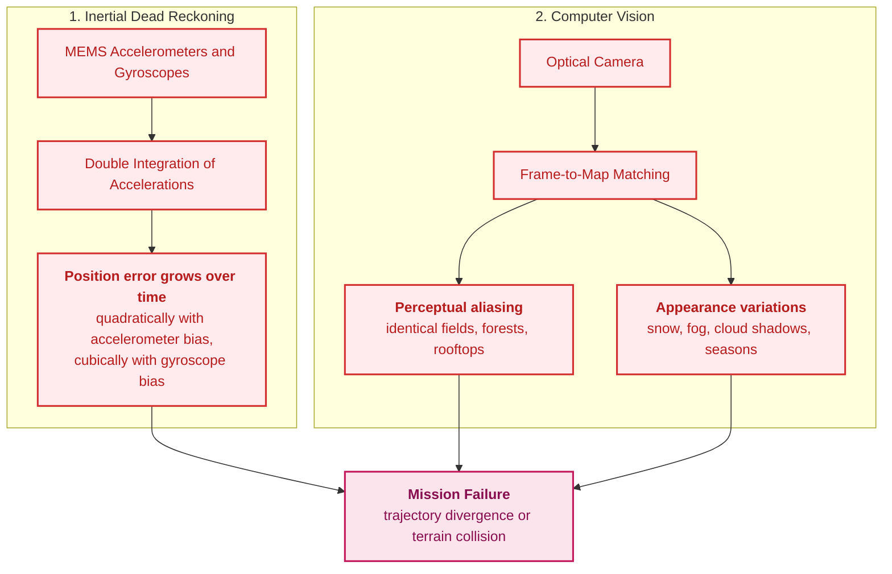
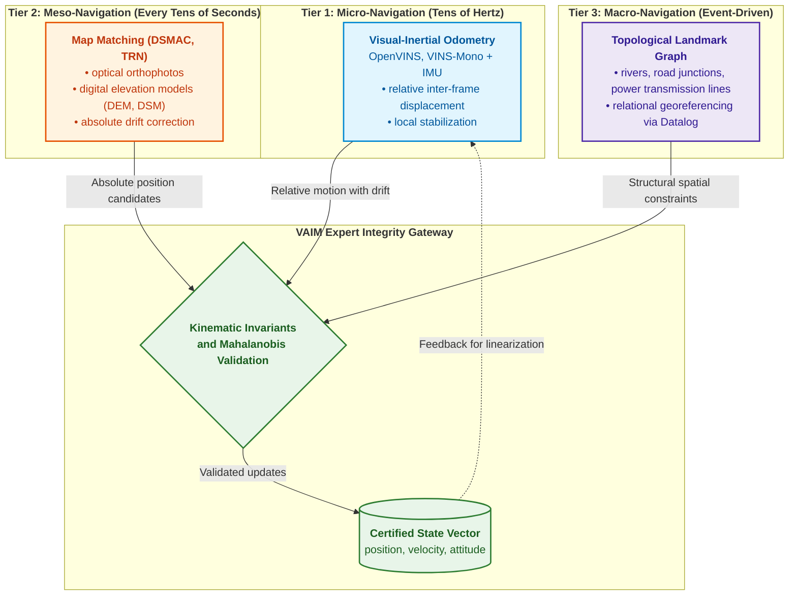
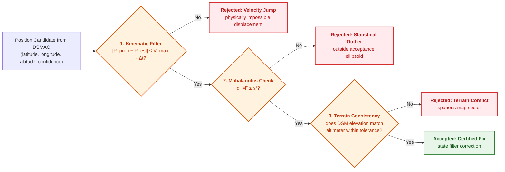
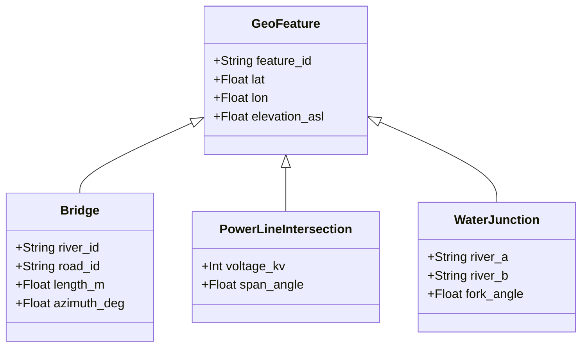
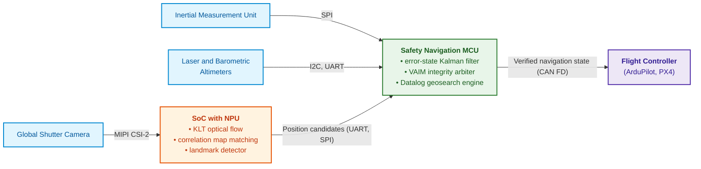
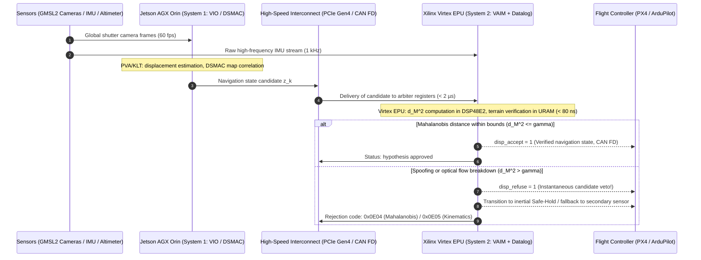

# Appendix C. GNSS-Denied Autonomous Navigation: Geospatial Matching (TRN/DSMAC), Visual-Inertial Odometry (VIO), and Expert Sensor Fusion Arbitration

> **Book:** [Architecture of Evidence-Governed Expert Systems](README.md) · Appendices  
> **Table of Contents:** [README.md](README.md)  
> **Author:** [Mykola Fedchyk](about-the-author.md)  
> **Target Audience:** Autonomous unmanned aerial vehicle architects, embedded systems engineers, computer vision and inertial navigation specialists  
> **Expected Learning Outcomes:** Understand why standalone inertial navigation and computer vision fail to provide reliable positioning without GNSS; construct a three-tier navigation stack; validate position candidates against kinematic, statistical, and terrain invariants; decouple navigation integrity monitoring from human-reserved mission decisions.

---

## Abstract

In combat environments and active electronic warfare (EW) operational zones, Global Navigation Satellite System (GNSS: GPS, Galileo) signals are subject to total jamming suppression or targeted coordinate spoofing. An autonomous unmanned aerial vehicle (UAV), deprived of external operator corrections in radio-silence mode, must rely solely on its onboard sensors. However, an unassisted inertial navigation system (INS) accumulates positioning error cubically over time $`\Delta\mathbf{p}(t) \propto t^3`$ due to gyroscope bias drift (exceeding 7 km of divergence within just 20 minutes of flight), while computer vision algorithms (TRN, DSMAC, VIO) suffer from perceptual aliasing across monotonous terrain (featureless agricultural fields, repetitive tree lines, seasonal variations), precipitating mission failure or controlled flight into terrain (CFIT).

This appendix resolves this challenge by constructing an evidence-governed expert sensor fusion arbitration pipeline. The author designs a three-tier navigation stack: high-frequency micro-level state estimation powered by INS/VIO, periodic meso-level geospatial matching of visual landmarks against digital elevation models (TRN/DSMAC), and a deterministic arbitration gateway that verifies candidate coordinates against physical kinematic invariants, statistical Mahalanobis distance thresholds, and digital elevation barriers, shielding the autonomous platform from catastrophic drift and sensor anomalies.

---

## 1. Mechanisms of Autonomous Attitude and Position Degradation in GNSS-Denied Environments

We examine why an unmanned aerial vehicle loses spatial orientation in the absence of GNSS. Global Navigation Satellite Systems (*Global Navigation Satellite System*, GNSS), such as GPS or Galileo, can no longer guarantee reliable navigation under electronic warfare conditions. Because incoming GNSS signals are exceptionally faint, adversaries readily suppress them with noise jamming or manipulate them: spoofing broadcasts counterfeit signals, causing the receiver to calculate fraudulent coordinates and timestamps [[1]](#src-1). Concurrently, operational radio silence prevents the operator from transmitting trajectory corrections over a radio command link. In such total electromagnetic isolation, the unmanned aerial vehicle (UAV) is left exclusively with its onboard sensors.



The diagram illustrates two independent failure mechanisms, each capable of independently precipitating mission failure. Let us examine both in detail.

**Inertial Navigation System Drift.** Low-cost micro-electro-mechanical systems (MEMS) sensors exhibit inherent zero-bias instability. A constant uncompensated accelerometer bias $\mathbf{b}_a$, upon double integration, yields a positioning error that compounds quadratically. Meanwhile, a constant gyroscope bias $\mathbf{b}_g$ initially induces a linearly growing attitude error; as a consequence, the projection of the gravitational acceleration vector $\mathbf{g}$ produces a fictitious horizontal acceleration, which, after double integration, drives position error cubically:

```math
\Delta\mathbf{p}(t)\approx\frac{1}{2}\,\mathbf{b}_a\,t^{2}+\frac{1}{6}\,(\mathbf{b}_g\times\mathbf{g})\,t^{3}.
```

Where:

- $\Delta\mathbf{p}(t)$ is the position error vector at time $t$, in meters;
- $t$ is the elapsed time since the last external position update (e.g., the last valid GNSS fix), in seconds;
- $\mathbf{b}_a$ is the residual zero-bias of the accelerometer—namely, the false acceleration output by the sensor even at rest, in $\text{m/s}^2$;
- $\mathbf{b}_g$ is the residual zero-bias of the gyroscope—representing false angular rate drift, in $\text{rad/s}$;
- $\mathbf{g}$ is the gravitational acceleration vector, with a magnitude of approximately $9.81\ \text{m/s}^2$, directed downward;
- $\times$ denotes the vector cross product; the term $\mathbf{b}_g\times\mathbf{g}$ yields the fictitious horizontal acceleration that arises when an attitude error tilts the perceived gravity vector into the horizontal plane;
- The coefficients $\tfrac12$ and $\tfrac16$ stem from successive integrations: integrating a constant bias $b$ twice yields $`b\,t^{2}/2`$, whereas integrating a linearly ramping fictitious acceleration $`c\,t`$ twice yields $`c\,t^{3}/6`$.

This formulation characterizes uncorrected inertial dead reckoning under constant biases and small-angle assumptions. In an operational system, an estimation filter continuously tracks and partially compensates for these biases; thus, this equation reflects the open-loop error divergence rate without external aiding, rather than an exact trajectory forecast for a specific flight profile.

For a representative residual accelerometer bias of $1\ \text{mg}$ (approximately $0.0098\ \text{m/s}^2$), the first term alone produces an error of $\tfrac12 \cdot 0.0098 \cdot 1200^{2} \approx 7\ \text{km}$ within 20 minutes ($t = 1200\ \text{s}$). While the precise magnitude depends on the assumed bias stability, the quadratic and cubic dependencies on elapsed time remain immutable physical realities.

**Perceptual Aliasing.** Attempting to correct inertial drift solely through probabilistic matching of the current camera frame against a satellite georeferenced map encounters severe ambiguities over homogeneous terrain. The comprehensive survey of visual place recognition by Lowry et al. categorizes two interconnected challenges: distinct physical locations often appear visually indistinguishable (*perceptual aliasing*), whereas the same geographic location exhibits drastically varying appearances across changing illumination, weather conditions, and seasons [[2]](#src-2). Consequently, a visual matching model may report high confidence (e.g., exceeding $0.95$) when "identifying" a shelterbelt or a country road intersection that is in fact situated kilometers away from the platform's actual coordinates.

> [!IMPORTANT]
> **Core Principle of Evidence-Governed Navigation in This Appendix:**
> No individual optical or altimetric match is ever accepted as a valid position fix without successfully passing through the **Visual Autonomous Integrity Monitor** (*Visual Autonomous Integrity Monitor*, VAIM). VAIM functions as a deterministic expert system that strictly verifies kinematic, statistical, and terrain invariants on every candidate position.

This brings us to the central engineering question of this appendix: **How can an onboard expert system establish a trustworthy position estimate when GNSS is unavailable and every individual sensory source is inherently fallible in its own distinct way?** The architecture resolves this via a three-part strategy: decomposing navigation across multiple distinct temporal scales, subjecting every candidate fix to rigorous invariant screening, and strictly bounding the operational autonomy of the navigation subsystem.

## 2. Three-Tier Navigation Stack Architecture

The onboard flight computer partitions navigation processing across three distinct tiers that complement each other across both temporal frequency and spatial scale.



The architecture is structured hierarchically by temporal scale: the micro-tier delivers high-frequency relative updates, the meso-tier periodically generates absolute position candidates, and the macro-tier triggers exclusively on discrete relocalization events. Crucially, all three tiers feed their data into the integrity arbiter gateway rather than injecting them directly into the core state filter.

### 2.1. Micro-Level: Visual-Inertial Odometry

**Visual-inertial odometry** (*visual-inertial odometry*, VIO) estimates velocity and relative displacement $`\Delta\mathbf{x}_{k-1\to k}`$ between consecutive camera frames. It extracts corner features, tracks pyramidal optical flow using the Lucas–Kanade method, and optimizes vehicle state over a sliding window fused with pre-integrated measurements from the inertial measurement unit (*inertial measurement unit*, IMU). Guoquan Huang provides a rigorous systematic survey of visual-inertial navigation methodologies [[3]](#src-3), while open-source implementations such as OpenVINS [[4]](#src-4) and VINS-Mono [[5]](#src-5) offer robust reference baselines for embedded deployment. VIO operates with minimal latency at camera framerates; however, its positioning error inevitably drifts over traversed distance, necessitating empirical drift calibration along reference flight paths.

### 2.2. Meso-Level: Map Matching

The meso-tier periodically resets accumulated VIO drift by establishing absolute geographic coordinates against onboard digital map databases. **Digital scene matching area correlation** (*digital scene matching area correlator*, DSMAC) aligns the current optical frame with a pre-loaded orthophoto mosaic using normalized cross-correlation or edge-contour descriptors. Concurrently, **terrain-referenced navigation** (*terrain-referenced navigation*, TRN) correlates the altitude profile—measured via a barometric or laser altimeter—with an onboard digital elevation model (*digital elevation model*, DEM) or digital surface model (*digital surface model*, DSM). These matches execute whenever the aircraft traverses topographically informative terrain, typically at intervals of tens of seconds.

### 2.3. Macro-Level: Topological Landmarks

The macro-tier is invoked for global relocalization following an uncontained trajectory loss, such as after prolonged flight through dense overcast. This mechanism determines spatial relationships between major highways, water bodies, railway junctions, and coastlines using stratified Datalog queries executed against an onboard spatial fact database [[6]](#src-6). The dedicated section on topological geosearch below demonstrates an executable ruleset for this paradigm.

## 3. Expert System as an Integrity Filter

In satellite navigation, aviation has long relied on receiver autonomous integrity monitoring (*receiver autonomous integrity monitoring*, RAIM): the receiver inspects the internal consistency of redundant satellite range measurements to isolate and exclude faulty signals, with Brown demonstrating the mathematical equivalence of three fundamental RAIM formulations [[7]](#src-7). VAIM transfers this foundational philosophy into optical and terrain navigation, implemented as a deterministic expert rule engine.



The three validation gates in the diagram are sequenced in ascending order of computational complexity: the kinematic filter instantly discards physically impossible velocity discontinuities, the Mahalanobis check filters out statistical outliers relative to the covariance envelope, and the terrain elevation check eliminates spurious map sectors that happen to pass the preceding tests.

### 3.1. Mahalanobis Distance as a Statistical Gate

Let $\hat{\mathbf{x}}_k$ denote the vehicle state estimate at time $t_k$ provided by the visual-inertial estimator, and let $\mathbf{P}_k$ represent its associated state covariance matrix. The map matching subsystem proposes an observation $\mathbf{z}_k$ characterized by its own measurement covariance $\mathbf{R}_k$. The integrity gateway evaluates the innovation vector $\mathbf{y}_k = \mathbf{z}_k - \mathbf{H}\hat{\mathbf{x}}_k$, where $\mathbf{H}$ is the observation matrix extracting the measured components from the state vector, and calculates the squared Mahalanobis distance:

```math
d_M^{2}=\mathbf{y}_k^{\top}\left(\mathbf{H}\mathbf{P}_k\mathbf{H}^{\top}+\mathbf{R}_k\right)^{-1}\mathbf{y}_k .
```

Where:

- $d_M^{2}$ is the squared Mahalanobis distance, a dimensionless non-negative scalar: larger values indicate severe inconsistency between the innovation and the reported uncertainty envelope;
- $\mathbf{y}_k$ is the measurement innovation vector representing the discrepancy between the map-matching fix and the filter's prior prediction; for horizontal positioning, this is a two-element vector (North and East) expressed in meters;
- $\mathbf{y}_k^{\top}$ is the transposed innovation vector (a row vector), ensuring that the bilinear product of the vectors and matrix collapses to a single scalar;
- $\mathbf{P}_k$ is the state estimation error covariance matrix, containing state component variances (squared standard deviations) along its main diagonal and cross-correlations off-diagonal;
- $\mathbf{R}_k$ is the measurement noise covariance matrix reported by the map-matching subsystem for its candidate fix;
- $\mathbf{H}$ is the measurement sensitivity matrix mapping the full state space into the observation subspace (e.g., extracting horizontal position components);
- $\mathbf{H}\mathbf{P}_k\mathbf{H}^{\top}+\mathbf{R}_k$ represents the innovation covariance matrix, projecting the prior state uncertainty into the measurement space and summing it with the measurement error covariance;
- $(\cdot)^{-1}$ denotes matrix inversion, scaling the raw metric deviation into standardized units of statistical dispersion.

The practical engineering significance of this formulation is that spatial discrepancies in meters are never evaluated in isolation, but strictly relative to the joint uncertainty bounds declared by the state filter and the visual matcher. Consider an innovation vector $`\mathbf{y}_k = (12;\, 5)\ \text{m}`$ and an innovation covariance of $`\mathrm{diag}(25;\, 25)\ \text{m}^2`$ (corresponding to a $1\sigma$ standard deviation of $5\ \text{m}$ along each axis). The resulting squared Mahalanobis distance is $d_M^{2} = 12^{2}/25 + 5^{2}/25 = 6.76$. If, conversely, the matcher had reported an overconfident uncertainty bound of $`\mathrm{diag}(4;\, 4)\ \text{m}^2`$ ($1\sigma = 2\ \text{m}$), the identical spatial deviation of $13\ \text{m}$ yields $d_M^{2} = (144 + 25)/4 = 42.25$. While the physical discrepancy is identical in both cases, the first candidate is statistically consistent with the system's operational envelope, whereas the second constitutes an anomalous outlier.

Under linear-Gaussian assumptions, $d_M^{2}$ follows a chi-square ($\chi^2$) distribution with degrees of freedom equal to the measurement dimension $m$. Consequently, the statistical admission threshold is established using the corresponding $\chi^2$ distribution quantile, a standard gating technique formulated by Bar-Shalom, Li, and Kirubarajan [[8]](#src-8). For two-dimensional horizontal positioning ($m = 2$) at a 99% confidence level, the gating threshold is $`\chi^{2}_{2;\, 0.99} \approx 9.21`$; for three-dimensional positioning ($m = 3$), it is $`\chi^{2}_{3;\, 0.99} \approx 11.34`$. In the worked example above, the threshold of $9.21$ admits the first fix ($6.76 \le 9.21$) and decisively rejects the second ($42.25 > 9.21$). Formally, a position candidate is admitted if and only if:

```math
\text{ValidMeasurement}(\mathbf{z}_k)\iff d_M^{2}\le\chi^{2}_{m;1-\alpha}\ \land\ \left|h_{\text{baro}}-h_{\text{DEM}}(\mathbf{z}_k)-h_{\text{range}}\right|\le\epsilon_{\text{alt}}.
```

Where:

- $\text{ValidMeasurement}(\mathbf{z}_k)$ is a Boolean predicate evaluating to true if candidate $\mathbf{z}_k$ is certified for fusion, and false otherwise;
- $\iff$ denotes the logical equivalence connective ("if and only if");
- $\land$ represents the logical conjunction ("AND"), enforcing that both statistical and altimetric constraints must hold simultaneously;
- $d_M^{2}$ is the squared Mahalanobis distance from the preceding equation;
- $\chi^{2}_{m;1-\alpha}$ is the quantile of the chi-square distribution with $m$ degrees of freedom at significance level $1 - \alpha$, establishing the threshold that a valid measurement exceeds only with probability $\alpha$;
- $m$ denotes measurement dimensionality ($m = 2$ for horizontal position, $m = 3$ for full 3D coordinates);
- $\alpha$ is the significance level representing the tolerable false rejection probability of valid candidates ($\alpha = 0.01$ for a 99% confidence gate);
- $`h_{\text{baro}}`$ is the barometric altitude of the aircraft above mean sea level, in meters;
- $`h_{\text{DEM}}(\mathbf{z}_k)`$ is the terrain surface elevation beneath candidate coordinate $\mathbf{z}_k$ extracted from the digital elevation model (DEM), in meters;
- $`h_{\text{range}}`$ is the above-ground-level (AGL) distance measured by an onboard laser or radar altimeter, in meters;
- $\epsilon_{\text{alt}}$ is the allowable vertical discrepancy threshold, in meters, dimensioned according to the worst-case combined error bounds of the barometric sensor, ranging altimeter, and DEM grid vertical precision;
- $\lvert\cdot\rvert$ denotes the scalar absolute value.

The vertical consistency invariant cross-references three completely independent physical sensors: the barometric altimeter, the active rangefinder, and the pre-loaded topographic map. If the platform is truly located above the candidate coordinate, the difference between barometric altitude and terrain surface elevation must match the rangefinder output within sensor tolerances. Both altitudes must be referenced to a common datum (e.g., WGS84 or EGM96 geoid). Suppose $h_{\text{baro}} = 620\ \text{m}$ and the laser altimeter reports $212\ \text{m}$ AGL. For a candidate where the DEM indicates an elevation of $410\ \text{m}$, the discrepancy is $\lvert 620 - 410 - 212 \rvert = 2\ \text{m}$, which comfortably satisfies a tolerance threshold of $\epsilon_{\text{alt}} = 10\ \text{m}$. Conversely, for an erroneous candidate positioned along an adjacent ridge where the DEM indicates $470\ \text{m}$, the discrepancy is $\lvert 620 - 470 - 212 \rvert = 62\ \text{m}$, triggering immediate rejection even if the horizontal statistical gate had passed. An admitted fix is dispatched to update the navigation estimator, such as an error-state Kalman filter (*error-state Kalman filter*, ESKF) [[9]](#src-9) or a factor graph optimization engine [[10]](#src-10).

## 4. Topological Geosearch on Stratified Datalog

When an aircraft emerges from cloud cover after prolonged blind dead reckoning, position uncertainty $\mathbf{P}_k$ becomes too expansive for direct correlation-based map matching. Under these conditions, the system engages topological geosearch. The onboard knowledge base maintains an explicit graph of prominent geospatial features across the operational theater.



The ontology diagram defines landmark categories and the geometric attributes utilized to match sensor detections against the knowledge base: coordinates, elevation, intersection angles, and span lengths. Suppose computer vision detects a river-road intersection intersecting at approximately $60^\circ$ at a surface elevation near $135\ \text{m}$. The Datalog rules below incorporate built-in arithmetic predicates to resolve the candidate:

```prolog
% Candidate: knowledge-base bridge consistent with sensor observation
candidate_bridge(ID, Lat, Lon) :-
    detected_bridge(VisAngle, VisLen),
    kb_bridge(ID, Lat, Lon, TrueAngle, TrueLen, Elev),
    abs(VisAngle - TrueAngle) < 10,
    abs(VisLen - TrueLen) < 15,
    estimated_position(EstLat, EstLon, MaxRadius),
    geo_distance(EstLat, EstLon, Lat, Lon, Dist),
    Dist < MaxRadius,
    surface_elevation_asl(SurfAlt),
    abs(SurfAlt - Elev) < 25.

% Ambiguity: another matching candidate exists within the search radius
ambiguous_candidate(ID) :-
    candidate_bridge(ID, _, _),
    candidate_bridge(Other, _, _),
    Other != ID.

% Relocalization is certified strictly when the candidate is unique
verified_relocalization(Lat, Lon) :-
    candidate_bridge(ID, Lat, Lon),
    not ambiguous_candidate(ID).
```

The rule `verified_relocalization` depends on `ambiguous_candidate` through negation, whereas `ambiguous_candidate` depends on `candidate_bridge` without negation; hence, the logic program is stratified and possesses a well-defined, deterministic semantics. This mechanism decisively suppresses false fixes caused by structural symmetries: if two similar bridges exist within the position uncertainty circle, the fix is not admitted, and the aircraft continues searching along its trajectory.

## 5. Operational Boundaries and Ethical Scope of the Navigation Expert System

The navigation expert system is tasked with answering exactly two operational questions: where the vehicle is located, and what degree of confidence can be ascribed to that estimate. Deciding whether to employ kinetic force lies strictly outside its authority. The six Principles of Responsible Use of Artificial Intelligence in Defence adopted by NATO Allies mandate lawfulness, responsibility and accountability, explainability and traceability, reliability, governability, and bias mitigation [[11]](#src-11). Similarly, UK Ministry of Defence publication JSP 936 stipulates that AI-enabled capabilities must maintain context-appropriate human oversight and governance [[12]](#src-12).

For the navigation stack, these principles translate into three strict engineering rules. First, VAIM outputs not only the estimated coordinates but also an explicit integrity status flag and error covariance, ensuring human decision-makers observe the definitive reliability boundaries of the estimate. Second, upon loss of navigation integrity, the platform autonomously transitions strictly into pre-authorized fail-safe maneuvers—such as loitering in place, retracing a verified flight corridor, or executing an emergency landing within a designated safe zone; an exhaustive state automaton governing these transitions is presented in [Appendix B](appendix-b-robotics-and-cyber-physical-systems.md). Third, any downstream action entailing irreversible physical consequences must pass through formal authority control gateways—as detailed in [Chapter 21](ch21-from-recommendation-to-action.md)—and undergo human legal review that lies beyond the scope of this engineering monograph.

## 6. Hardware Implementation of the Onboard Navigation Node

A production-grade navigation node partitions computational workloads across heterogeneous, specialized processing units.



The neural processing unit (*neural processing unit*, NPU) executes heavy, probabilistic computer vision workloads, while the safety microcontroller runs deterministic rule validation and maintains the core state filter. The flight controller receives exclusively certified navigation states rather than raw, unvetted position hypotheses.

---

### 6.1. Research Testbed for the Optical Navigation Node Based on NVIDIA Jetson AGX Orin (Visual Perception Pipeline — System 1)

The baseline hardware platform utilized for GNSS-denied optical navigation research is the **Seeed Studio reServer Industrial J501** industrial computer, powered by an **NVIDIA Jetson AGX Orin 64GB** system-on-module (delivering up to 275 TOPS, a 2048-core Ampere GPU, dual NVDLA v2 engines, a PVA v2 vision accelerator, 12 ARM Cortex-A78AE cores, and 204.8 GB/s LPDDR5 memory enclosed in a ruggedized chassis).

The software-hardware stack integrates **NVIDIA JetPack 6.2** (Linux kernel 5.15 with the PREEMPT_RT patchset, CUDA 12.6, and TensorRT 10) alongside specialized sensor streaming pipelines:

1. **Hardware-Accelerated KLT Optical Flow and Visual-Inertial Odometry (VIO):**
   * Offloading Lucas–Kanade pyramid tracking (KLT) to the programmable vision accelerator (**PVA v2**), preserving GPU Tensor Cores and CUDA streams for deep neural inference.
   * Ingesting raw frames from dual global-shutter cameras across a **GMSL2 / MIPI CSI-2** interface into ring DMA buffers with deterministic frame delivery latency $< 1.5\ \text{ms}$.
2. **Correlative Matching Across Map Tile Pyramids (DSMAC / TRN):**
   * Accelerating spatial 2D correlation between edge-intensity contour maps and COG elevation tiles using **TensorRT 10** in FP8/INT8 quantized precisions.
   * Leveraging 64 GB of unified memory to cache multi-spectral digital elevation models (DEM/DTM) spanning up to $10^4\ \text{km}^2$ without encountering high-latency NVMe read stalls.
3. **Topological Landmark Detection and Local SLM Triage:**
   * Executing quantized local vision-language models (VLM) via an embedded **Ollama** runtime for semantic classification of complex topographical landmarks (bridges, river forks, highway interchanges, high-voltage pylons).
4. **Candidate State Dispatch via CAN FD:**
   * Streaming generated position hypotheses over an isolated **CAN FD** bus at 50–100 Hz packaged in binary telemetry frames protected by CRC32 checksums.

> [!NOTE]
> **Theoretical and Engineering Foundations of the Perception Pipeline in Book Chapters:**
> - [Chapter 12. Linguistic Analysis and Local Models: Preserving Content and Provenance](ch12-linguistic-analysis-and-local-models.md) — Local SLMs/VLMs for semantic feature extraction from imagery.
> - [Chapter 18. Execution Infrastructure: Local Models, Hardware Accelerators, Edge, and On-Premise](ch18-execution-infrastructure.md) — Roofline model sensor latency budgeting, Linux PREEMPT_RT kernel configuration, and jitter minimization.
> - [Chapter 22. Cybernetic Control Cycle: Sensors, Peripherals, and Edge-to-Backend Feedback](ch22-cybernetics-edge-to-backend.md) — Streaming sensor acquisition via GMSL2, CAN FD topologies, and real-time closed-loop feedback.
> - [Chapter 37. Input Information Assessment: Sources, Evidence, and Uncertainty](ch37-input-information-assessment-and-algorithmic-skepticism.md) — VAIM integrity filtering, algorithmic skepticism toward sensor anomalies, and Mahalanobis statistical gating.

---

### 6.2. Research Testbed for the Hardware Integrity Arbiter on FPGA (Xilinx Virtex — System 2)

**AMD / Xilinx Virtex** devices (Virtex UltraScale+ / UltraScale) establish a deterministic hardware safety perimeter and integrity arbitration fabric, guaranteeing sub-microsecond and nanosecond response envelopes:

1. **Hardware Mahalanobis Distance Engine on DSP48E2 Slices:**
   * Pipelined matrix multiplier implementation:
     $$d_M^2 = (\mathbf{z} - \hat{\mathbf{z}})^\top \mathbf{S}^{-1} (\mathbf{z} - \hat{\mathbf{z}})$$
     with a deterministic computation latency of exactly **24 clock cycles ($< 60\ \text{ns}$ @ 400 MHz)**.
   * Hardware threshold comparison against $\gamma = 9.21$ synthesized without software processor instruction overhead.
2. **Hardware Query Engine for Topological Graphs (UltraRAM Zero-Copy):**
   * Storing landmark vector graphs and stratified Datalog rules directly within onboard UltraRAM blocks totaling up to 36 MB.
   * Evaluating spatial topological predicates (`visible_landmark`, `corridor_bound`, `prohibited_zone`) in 1–3 clock cycles.
3. **Fail-Closed Hardware Safety Interlock (Hardware Safety Veto):**
   * Direct hardware veto lines (`disp_accept`, `disp_refuse`) wired to optoisolated interrupt lines on the flight controller (Pixhawk / PX4). Whenever measurement innovation exceeds allowable statistical thresholds or VIO contradicts vehicle kinematics, the `disp_refuse` line instantaneously activates the platform's fail-safe loiter mode (*Safe Hold*) in $< 5\ \text{ns}$.

> [!NOTE]
> **Theoretical and Engineering Foundations of the Hardware Navigation Arbiter in Book Chapters:**
> - [Chapter 16. Expert System Architecture: From Formal Knowledge to Evidence-Governed Decisions](ch16-expert-systems-architecture.md) — Symbolic arbitration, deterministic memory allocation, and the strict decoupling of facts from rules.
> - [Chapter 21. From Recommendation to Action: Authority Control and Safe Execution in Production Environments](ch21-from-recommendation-to-action.md) — Hardware admission gates and physical authority boundaries for onboard subsystems.
> - [Chapter 31. Normative Inference: Predicate Hierarchies, Exceptions, and Validity](ch31-syllogistic-reasoning-and-relation-lattices.md) — Spatial relational predicates and deontic flight corridor constraints.
> - [Chapter 39. Active Compliance Auditor: Popperian Falsification, Normative Compliance (ASPICE/ISO 26262/ISO 21434), and Autonomous Test Design](ch39-active-compliance-auditor-and-popperian-testing.md) — Popperian falsification of safety-critical navigation hypotheses.

---

### 6.3. Experimental Evaluation of the "Jetson AGX Orin + Xilinx Virtex" Tandem in Radio-Silence Mode

The testbed assesses navigation robustness under complete GNSS loss or malicious spoofing attacks:



**Autonomous Flight Safety Falsification Criterion (Popperian Falsification):**
A navigation hypothesis is considered falsified (unfit for autonomous deployment) if, under the injection of synthetic image artifacts (simulating smoke, sudden illumination steps, or deceptive terrain textures) or simulated GNSS coordinate jumps:
1. The maximum round-trip latency of the admission loop exceeds real-time deadlines:
   $$T_{\text{loop}} = T_{\text{infer}} + T_{\text{comm}} + T_{\text{arbiter}} > 20\ \text{ms}\quad (\text{for a 50 Hz control loop});$$
2. The system admits even a single false measurement ($d_M^2 > \gamma$) that causes a spatial trajectory deviation exceeding 5 meters ($P(\text{uncontained error}) > 10^{-6}\ \text{per flight hour}$).

---

### 6.4. Format and Compression of Onboard Geospatial Data

To fit within the embedded flash storage budgets of onboard single-board computers, geospatial assets are strictly optimized:

- **Pyramidal Map Tiles in Cloud Optimized GeoTIFF Format** (COG), standardized by the Open Geospatial Consortium (*Open Geospatial Consortium*, OGC) [[13]](#src-13): a coarse baseline layer covering the entire flight corridor alongside high-resolution tiles for designated precision correlation waypoints.
- **Edge-Intensity Gradient Contour Maps** in place of full-color imagery: gradient maps drastically reduce storage footprint while exhibiting superior invariance to seasonal and diurnal illumination shifts; memory savings for specific operational theaters are empirically measured.
- **Vector Landmark Layers** encoded in FlatBuffers or SQLite with SpatiaLite extensions for sub-millisecond indexed spatial queries.

## 7. Operational Go Implementation of the Navigation Arbiter

The code below implements the core VAIM engine: confidence validation, kinematic invariant checking, terrain elevation consistency screening, and horizontal Mahalanobis distance calculation. Vertical consistency is enforced by the terrain elevation invariant, allowing the statistical gate to operate with two degrees of freedom at a threshold of 9.21. The implementation relies exclusively on the Go standard library.

<details>
<summary>Go Implementation Example: VAIM Navigation Arbiter</summary>

```go
package navigation

import (
	"errors"
	"fmt"
	"math"
)

// Position3D defines a point in the local NED (North, East, Down) coordinate frame, in meters.
type Position3D struct {
	North, East, Down float64
}

// NavState represents the current estimate from the navigation filter.
type NavState struct {
	Pos        Position3D
	Covariance [2][2]float64 // horizontal position covariance (N, E), m²
	Timestamp  float64       // seconds since mission start
}

// VisualFixProposal represents a position candidate generated by map matching.
type VisualFixProposal struct {
	Pos         Position3D
	MeasureCov  [2][2]float64 // measurement covariance (N, E), m²
	Confidence  float64       // matching model confidence, from 0 to 1
	DemAltitude float64       // terrain elevation beneath candidate from DEM, m
	Timestamp   float64
}

// VAIMConfig defines the threshold parameters for the integrity gate.
type VAIMConfig struct {
	MaxSpeed          float64 // maximum physical vehicle speed, m/s
	Chi2Limit         float64 // χ² quantile for 2 degrees of freedom, 9.21 for p = 0.01
	MaxAltDiscrepancy float64 // allowable altitude discrepancy, m
	MinConfidence     float64 // minimum matching model confidence
}

// Verdict articulates the arbitration gate's decision.
type Verdict struct {
	Accepted bool
	Code     string
	Detail   string
}

var ErrSingularCovariance = errors.New("singular innovation covariance")

// ValidateVisualFix verifies a position candidate against four invariants.
func ValidateVisualFix(cfg VAIMConfig, cur NavState, p VisualFixProposal, rangeAlt float64) (Verdict, error) {
	if p.Confidence < cfg.MinConfidence {
		return Verdict{false, "REJECT_LOW_CONFIDENCE",
			fmt.Sprintf("confidence %.2f < %.2f", p.Confidence, cfg.MinConfidence)}, nil
	}
	dt := p.Timestamp - cur.Timestamp
	if dt <= 0 {
		return Verdict{false, "REJECT_INVALID_TIMESTAMP", fmt.Sprintf("dt = %.3f s", dt)}, nil
	}
	dN, dE := p.Pos.North-cur.Pos.North, p.Pos.East-cur.Pos.East
	if speed := math.Hypot(dN, dE) / dt; speed > cfg.MaxSpeed {
		return Verdict{false, "REJECT_KINEMATIC_VIOLATION",
			fmt.Sprintf("implied speed %.1f m/s > %.1f m/s", speed, cfg.MaxSpeed)}, nil
	}
	// Barometric altitude must equal terrain elevation beneath candidate plus altimeter range.
	if diff := math.Abs(-cur.Pos.Down - (p.DemAltitude + rangeAlt)); diff > cfg.MaxAltDiscrepancy {
		return Verdict{false, "REJECT_TERRAIN_CONFLICT",
			fmt.Sprintf("altitude discrepancy %.1f m > %.1f m", diff, cfg.MaxAltDiscrepancy)}, nil
	}
	d2, err := mahalanobis2(dN, dE, cur.Covariance, p.MeasureCov)
	if err != nil {
		return Verdict{false, "REJECT_MATH_ERROR", err.Error()}, err
	}
	if d2 > cfg.Chi2Limit {
		return Verdict{false, "REJECT_MAHALANOBIS_OUTLIER",
			fmt.Sprintf("d² = %.2f > %.2f", d2, cfg.Chi2Limit)}, nil
	}
	return Verdict{true, "ACCEPT_VERIFIED_FIX", fmt.Sprintf("d² = %.2f", d2)}, nil
}

// mahalanobis2 computes d² = yᵀ(P+R)⁻¹y for horizontal innovation y = (dN, dE).
func mahalanobis2(dN, dE float64, P, R [2][2]float64) (float64, error) {
	s00, s01 := P[0][0]+R[0][0], P[0][1]+R[0][1]
	s10, s11 := P[1][0]+R[1][0], P[1][1]+R[1][1]
	det := s00*s11 - s01*s10
	if math.Abs(det) < 1e-9 {
		return 0, ErrSingularCovariance
	}
	return (dN*(s11*dN-s01*dE) + dE*(s00*dE-s10*dN)) / det, nil
}
```

</details>

To validate the arbiter, we provide an executable test harness in `example_test.go`. The test suite submits four distinct candidates: a consistent valid fix, an unphysical 5 km jump over 10 s, a terrain elevation conflict, and a statistical outlier. Running `go test -run Example -v` executes the test suite and verifies the stdout against the expected output in the `// Output:` block.

<details>
<summary>Go Implementation Example: Arbiter Verification Across Four Candidate Fixes</summary>

```go
package navigation

import "fmt"

func ExampleValidateVisualFix() {
	cfg := VAIMConfig{MaxSpeed: 60, Chi2Limit: 9.21, MaxAltDiscrepancy: 25, MinConfidence: 0.6}
	cur := NavState{
		Pos:        Position3D{North: 1000, East: 2000, Down: -450},
		Covariance: [2][2]float64{{900, 0}, {0, 900}},
		Timestamp:  100,
	}
	fix := func(north, east, dem float64) VisualFixProposal {
		return VisualFixProposal{
			Pos:         Position3D{North: north, East: east},
			MeasureCov:  [2][2]float64{{400, 0}, {0, 400}},
			Confidence:  0.9,
			DemAltitude: dem,
			Timestamp:   110,
		}
	}
	for _, p := range []VisualFixProposal{
		fix(1040, 1970, 130), // consistent candidate
		fix(6000, 2000, 130), // 5 km jump in 10 s
		fix(1040, 1970, 180), // terrain elevation beneath candidate conflicts with altimetry
		fix(1150, 2000, 130), // statistical outlier
	} {
		v, _ := ValidateVisualFix(cfg, cur, p, 320)
		fmt.Println(v.Code, v.Detail)
	}
	// Output:
	// ACCEPT_VERIFIED_FIX d² = 1.92
	// REJECT_KINEMATIC_VIOLATION implied speed 500.0 m/s > 60.0 m/s
	// REJECT_TERRAIN_CONFLICT altitude discrepancy 50.0 m > 25.0 m
	// REJECT_MAHALANOBIS_OUTLIER d² = 17.31 > 9.21
}
```

</details>

The example passes successfully (verified with Go 1.27). The calculations are straightforward to verify analytically. The consistent candidate is displaced by 40 m North and 30 m West, against a total combined variance of $900 + 400 = 1300\ \text{m}^2$ along each axis, yielding $d_M^{2} = (40^{2} + 30^{2}) / 1300 \approx 1.92$. The candidate displaced by 150 m yields $d_M^{2} = 150^{2} / 1300 \approx 17.31$, substantially exceeding the threshold of 9.21, even though kinematically a displacement of 150 m over 10 s (15 m/s) is physically plausible. This demonstrates why kinematic and statistical filters must operate in tandem: the former precludes physically impossible jumps, while the latter screens out statistically improbable hypotheses.

## 8. Pre-Flight Checklist for Radio-Silence Operations

Prior to loading a mission profile for radio-silence autonomous operations, the engineering team executes the following verification checklist:

| No. | Integrity Check | Verification Mechanism | Status |
| :-: | :--- | :--- | :-: |
| 1 | **Map Tile Coverage** | Complete orthophoto mosaic coverage along the planned route with mission-defined lateral margins | [ ] |
| 2 | **Elevation Model Validity** | Digital elevation model verified against surveyed geodetic control points | [ ] |
| 3 | **Camera Calibration** | Intrinsic parameters, lens distortion coefficients, and camera-to-IMU extrinsic transform calibrated and locked | [ ] |
| 4 | **Global Shutter Validation** | Sensor verified operating in global shutter mode, eliminating vibration-induced rolling shutter distortions | [ ] |
| 5 | **Integrity Gateway Thresholds** | $\chi^2$ gate configured for measurement dimensionality: 9.21 for 2D horizontal position, 11.34 for full 3D ($p = 0.01$) | [ ] |
| 6 | **Integrity Loss Fail-Safes** | Autonomous transitions to safe loiter, corridor backtracking, or designated safe landing zones configured and bench-tested | [ ] |
| 7 | **Geofence Enforcement Boundaries** | Authorized operational volume boundaries compiled and cryptographically signed | [ ] |
| 8 | **Lens Occlusion Resilience** | Dead-reckoning drift resilience validated under artificial lens blinding for mission-specified duration | [ ] |
| 9 | **Navigation Manifest Cryptographic Signature** | Mission plan, map tiles, and integrity thresholds digitally signed using developer key (Ed25519) | [ ] |

Each line item in the checklist directly corresponds to an architectural mechanism described in this appendix; a completed checklist forms an indispensable component of the flight readiness safety case.

## Conclusions

This appendix set out to resolve how an autonomous platform can establish a trustworthy position fix without GNSS, given that every individual sensor is subject to distinct failure modes. The findings demonstrate that inertial dead reckoning provides continuous yet divergent state estimates whose errors compound quadratically and cubically over time. Meanwhile, computer vision yields absolute position candidates but remains vulnerable to perceptual aliasing over repetitive terrain. The three-tier navigation stack bridges these disparate modalities and incorporates topological landmarks, while the VAIM expert arbiter admits candidate updates into the state estimator only after surviving kinematic, statistical, and terrain elevation screening. The operational Go implementation demonstrates that kinematic and statistical filters reject entirely orthogonal classes of errors and must operate as a unified defense-in-depth gate.

Operational boundaries are equally critical. The numerical thresholds and tolerances demonstrated in this text serve as illustrative engineering baselines; deployment in production airframes requires rigorous empirical calibration on instrumented test ranges. Furthermore, statistical gating remains valid only insofar as the underlying Gaussian error assumptions hold, mandating that filter and sensor noise covariances be empirically validated across benchmark flights. Finally, the navigation expert system is responsible strictly for the epistemic integrity of vehicle state estimation, never for human-reserved operational mandates. Physical computation and hardware acceleration paradigms are explored further in [Appendix D](appendix-d-analog-expert-systems-and-neuromorphic-computing.md).

## Glossary

| Term | Original Form | Brief Definition |
|---|---|---|
| Inertial dead reckoning | *dead reckoning* | Estimating position by integrating acceleration and angular rate measurements |
| Sensor bias | *sensor bias* | Constant or slowly varying systematic error offset in an accelerometer or gyroscope |
| Perceptual aliasing | *perceptual aliasing* | Phenomenon where physically distinct locations appear visually indistinguishable to computer vision |
| Visual-inertial odometry | *visual-inertial odometry* | High-frequency relative motion estimation fusing camera streams and IMU measurements |
| Digital scene matching area correlation | *scene matching area correlation* | Establishing absolute position by cross-correlating camera frames against an orthophoto database |
| Terrain-referenced navigation | *terrain-referenced navigation* | Determining position by correlating measured altitude profiles with a digital elevation model |
| Integrity monitoring | *integrity monitoring* | Detecting and isolating faulty sensor measurements by inspecting redundant data consistency |
| Measurement innovation | *innovation* | Discrepancy between an observed measurement and its prior state prediction |
| Mahalanobis gating | *Mahalanobis gating* | Statistical hypothesis testing admitting an observation only when squared Mahalanobis distance falls below a $\chi^2$ threshold |
| Error-state Kalman filter | *error-state Kalman filter* | Kalman filter formulation that estimates small error deviations relative to a nominal non-linear trajectory |
| Factor graph | *factor graph* | Bipartite graphical model of variable nodes and factor constraints used in state estimation optimization |
| Stratified program | *stratified program* | Datalog program where negation contains no cyclic dependencies across rule strata |
| Global shutter | *global shutter* | Camera sensor exposure mode capturing all image pixels simultaneously, preventing rolling shutter motion blur |

## Abbreviations

| Abbreviation | Expansion | Meaning |
|---|---|---|
| AGL | Above Ground Level | Altitude measured relative to the underlying terrain surface |
| ASL | Above Sea Level | Altitude referenced to mean sea level or geoid datum |
| CAN FD | Controller Area Network Flexible Data-Rate | High-throughput CAN serial bus protocol with dynamic bitrates |
| CFIT | Controlled Flight Into Terrain | Collision with ground or obstacle while under flight control |
| COG | Cloud Optimized GeoTIFF | GeoTIFF format optimized for partial HTTP range reading and tile caching |
| DEM | Digital Elevation Model | Digital raster representing bare terrain elevations |
| DSM | Digital Surface Model | Digital raster representing terrain elevations including surface objects |
| DSMAC | Digital Scene Matching Area Correlator | Optical scene correlation against georeferenced maps |
| ESKF | Error-State Kalman Filter | Kalman filter operating on error state perturbations |
| EW | Electronic Warfare | Military action involving electromagnetic and directed energy |
| GNSS | Global Navigation Satellite System | Satellite constellations providing positioning, navigation, and timing |
| IMU | Inertial Measurement Unit | Sensor package combining accelerometers and gyroscopes |
| KLT | Kanade–Lucas–Tomasi | Feature tracking algorithm based on differential optical flow |
| MEMS | Micro-Electro-Mechanical Systems | Microscale electromechanical sensors and actuators |
| MIPI CSI-2 | Mobile Industry Processor Interface Camera Serial Interface 2 | High-speed serial protocol for camera sensor interfaces |
| NPU | Neural Processing Unit | Dedicated coprocessor optimized for neural network inference |
| OGC | Open Geospatial Consortium | International standards organization for geospatial information |
| PVA | Programmable Vision Accelerator | Specialized hardware engine for accelerating vision algorithms |
| RAIM | Receiver Autonomous Integrity Monitoring | Autonomous consistency verification within GNSS receivers |
| SLM | Small Language Model | Compact language model deployed on edge accelerators |
| SoC | System on Chip | Integrated circuit consolidating multiple computer components |
| TRN | Terrain-Referenced Navigation | Position determination by matching terrain elevation profiles |
| UAV | Unmanned Aerial Vehicle | Aircraft operated without a human pilot onboard |
| VAIM | Visual Autonomous Integrity Monitor | Onboard deterministic expert integrity monitor for optical navigation |
| VIO | Visual-Inertial Odometry | Motion estimation fusing visual features and inertial data |
| VLM | Vision-Language Model | Multimodal model processing image and textual prompts |

## References

1. <a id="src-1"></a>Mark L. Psiaki, Todd E. Humphreys. [*GNSS Spoofing and Detection*](https://doi.org/10.1109/JPROC.2016.2526658). *Proceedings of the IEEE*, 104(6), 1258–1270, 2016.
2. <a id="src-2"></a>Stephanie Lowry, Niko Sünderhauf, Paul Newman, John J. Leonard, et al. [*Visual Place Recognition: A Survey*](https://doi.org/10.1109/TRO.2015.2496823). *IEEE Transactions on Robotics*, 32(1), 1–19, 2016.
3. <a id="src-3"></a>Guoquan Huang. [*Visual-Inertial Navigation: A Concise Review*](https://doi.org/10.1109/ICRA.2019.8793604). *2019 International Conference on Robotics and Automation (ICRA)*, 9572–9582, 2019.
4. <a id="src-4"></a>Patrick Geneva, Kevin Eckenhoff, Woosik Lee, Yulin Yang, et al. [*OpenVINS: A Research Platform for Visual-Inertial Estimation*](https://doi.org/10.1109/ICRA40945.2020.9196524). *2020 IEEE International Conference on Robotics and Automation (ICRA)*, 4666–4672, 2020.
5. <a id="src-5"></a>Tong Qin, Peiliang Li, Shaojie Shen. [*VINS-Mono: A Robust and Versatile Monocular Visual-Inertial State Estimator*](https://doi.org/10.1109/TRO.2018.2853729). *IEEE Transactions on Robotics*, 34(4), 1004–1020, 2018.
6. <a id="src-6"></a>S. Ceri, G. Gottlob, L. Tanca. [*What You Always Wanted to Know About Datalog (and Never Dared to Ask)*](https://doi.org/10.1109/69.43410). *IEEE Transactions on Knowledge and Data Engineering*, 1(1), 146–166, 1989.
7. <a id="src-7"></a>R. Grover Brown. [*A Baseline GPS RAIM Scheme and a Note on the Equivalence of Three RAIM Methods*](https://doi.org/10.1002/j.2161-4296.1992.tb02278.x). *Navigation*, 39(3), 301–316, 1992.
8. <a id="src-8"></a>Yaakov Bar-Shalom, X.-Rong Li, Thiagalingam Kirubarajan. [*Estimation with Applications to Tracking and Navigation*](https://doi.org/10.1002/0471221279). Wiley, 2001.
9. <a id="src-9"></a>Joan Solà. [*Quaternion Kinematics for the Error-State Kalman Filter*](https://arxiv.org/abs/1711.02508). arXiv:1711.02508, 2017.
10. <a id="src-10"></a>Frank Dellaert, Michael Kaess. [*Factor Graphs for Robot Perception*](https://doi.org/10.1561/2300000043). *Foundations and Trends in Robotics*, 6(1–2), 1–139, 2017.
11. <a id="src-11"></a>NATO. [*Summary of NATO's Revised Artificial Intelligence (AI) Strategy*](https://www.nato.int/en/about-us/official-texts-and-resources/official-texts/2024/07/10/summary-of-natos-revised-artificial-intelligence-ai-strategy). July 10, 2024.
12. <a id="src-12"></a>UK Ministry of Defence. [*JSP 936: Dependable Artificial Intelligence (AI) in Defence, Part 1: Directive*](https://www.gov.uk/government/publications/jsp-936-dependable-artificial-intelligence-ai-in-defence-part-1-directive). November 13, 2024.
13. <a id="src-13"></a>Open Geospatial Consortium. [*OGC Cloud Optimized GeoTIFF Standard*](https://docs.ogc.org/is/21-026/21-026.html). OGC 21-026.

---

[← Appendix B](appendix-b-robotics-and-cyber-physical-systems.md) | [Table of Contents](README.md) | [Appendix D →](appendix-d-analog-expert-systems-and-neuromorphic-computing.md)
