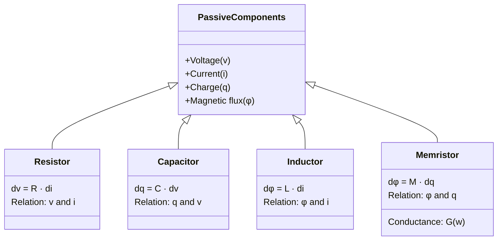
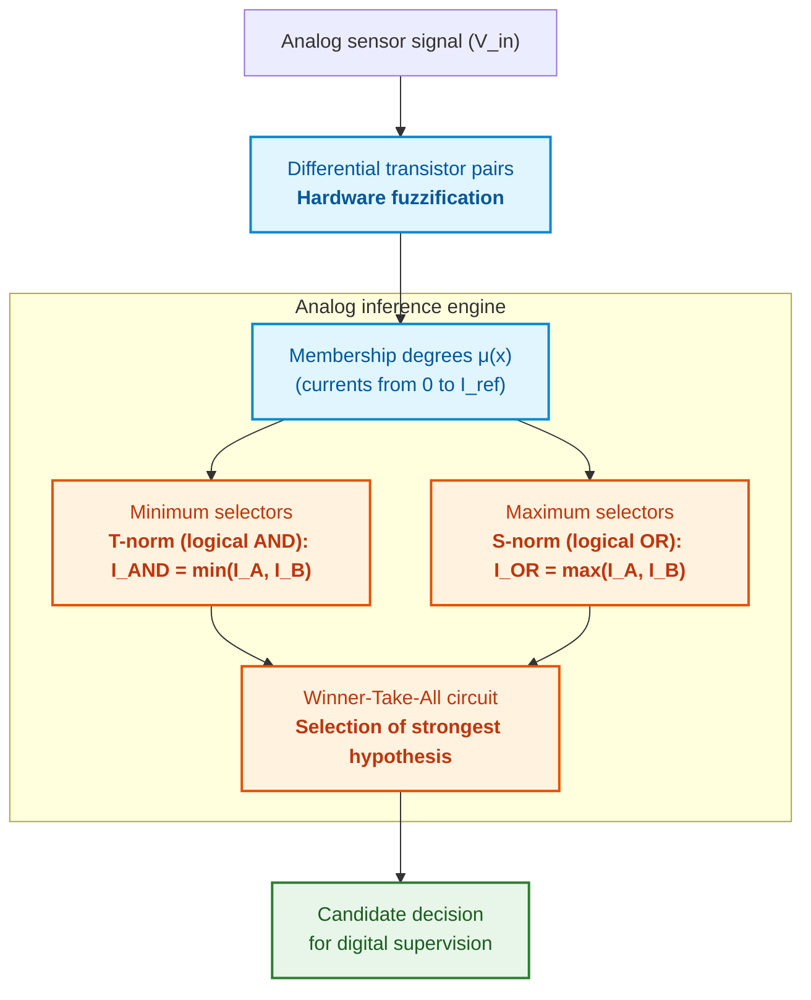
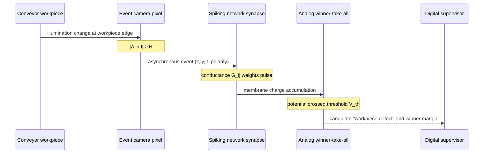
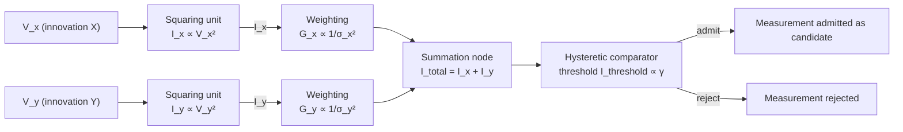
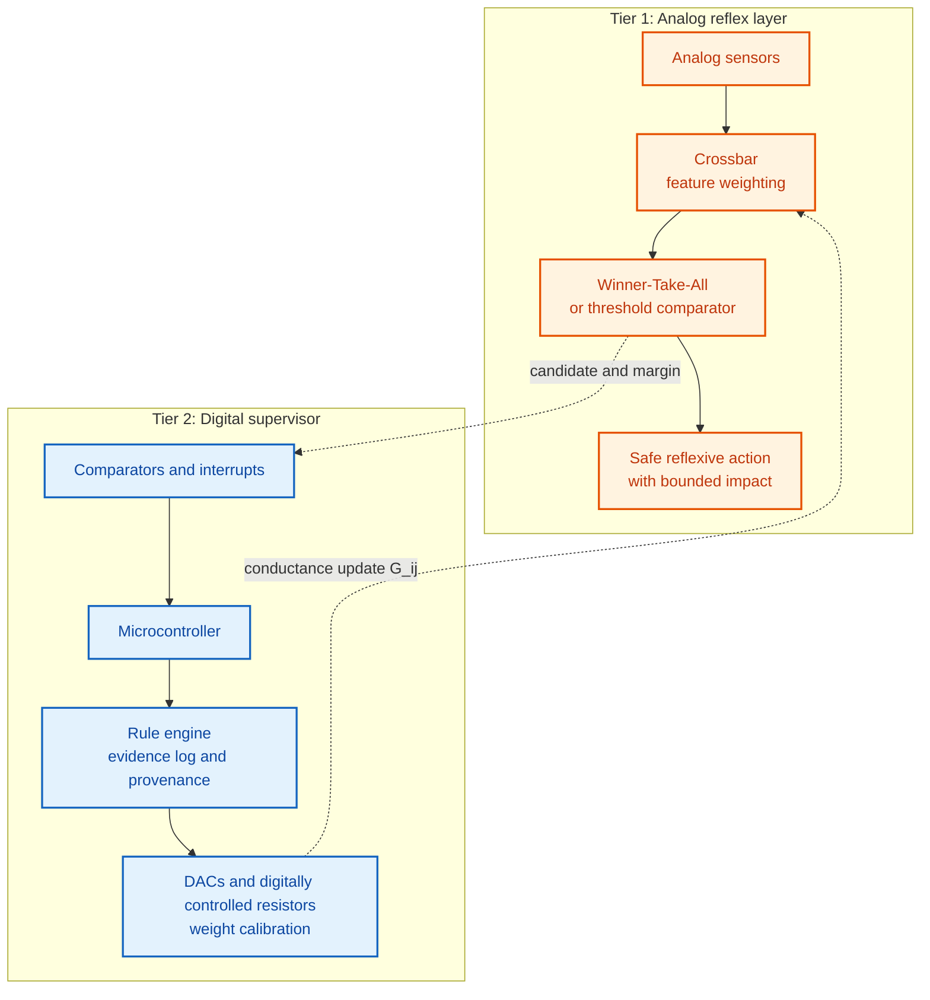
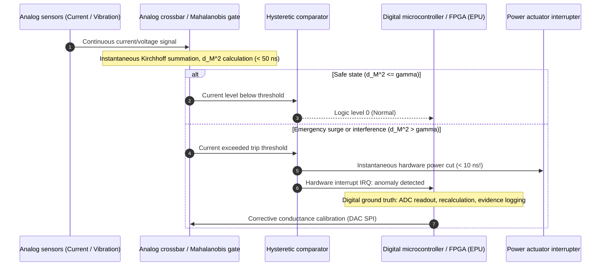

# Appendix D. Analog Expert Systems, Neuromorphic Computing, and Hardware Inference

> **Book:** [Architecture of Evidence-Governed Expert Systems](README.md) · Appendices  
> **Table of Contents:** [README.md](README.md)  
> **Author:** [Mykola Fedchyk](about-the-author.md)  
> **Target Audience:** Systems architects, analog and mixed-signal IC designers, neuromorphic computing specialists, embedded systems engineers  
> **Expected Learning Outcomes:** Explain which inference operations an analog circuit executes directly via physical laws; evaluate the physical cost of analog computation: precision, dispersion, drift, and calibration; distinguish rigorously verified empirical results from speculative claims; understand why the analog tier of an expert system operates exclusively under digital supervisory control.

---

## Abstract

In severely resource-constrained autonomous monitoring systems and edge sensor nodes (SWaP-C, battery power, requirement of uninterrupted multi-year operation), the classical digital von Neumann architecture collides with the "memory wall": fetching rule weights from external dynamic random-access memory (DRAM) consumes hundreds of times more energy than the arithmetic multiplication itself. Attempts to port logical inference directly into an analog hardware medium (in-memory computing based on resistive crossbars governed by Ohm's and Kirchhoff's laws) confront another critical failure mode: component parameter dispersion, thermal drift, and material aging, which uncontrollably corrupt fact weighting and precipitate the omission of safety-critical emergency signatures.

This appendix investigates the physical principles of analog and neuromorphic logical inference. The author analyzes which specific operations (vector-matrix multiplication, fuzzy t-norm/t-conorm operations, Winner-Take-All selection, temporal signal integration) are executed directly by fundamental laws of physics without clock-tree energy dissipation, determines the engineering cost of analog approximation, and substantiates the necessity of a two-tier heterogeneous architecture where analog circuits operate strictly as a rapid, ultra-low-power primary reflex layer under the rigorous supervisory control of a digital evidence-governed system.

---

A digital expert system stores rules and facts in memory and executes them on a processor. Every feature weighting or rule evaluation requires shuttling numerical values from memory to the arithmetic logic unit and back. An analog circuit offers an alternative paradigm: computing directly at the physical site of weight storage and leveraging physical laws as computational primitives. This appendix explicates the underlying physics of this approach, while [Appendix E](appendix-e-mixed-signal-neuromorphic-expert-systems.md) demonstrates how to integrate this analog substrate into an evidence-governed expert system.

The central research question of this appendix is: **which inference operations does an analog circuit execute naturally, and at what engineering cost?** The core thesis: an analog circuit directly computes weighted summation, minimum and maximum, dominant-signal selection, temporal integration, and energy-minimization relaxation; however, it pays for this with bounded precision, component parameter variance and drift, continuous calibration overhead, and domain-crossing signal conversion penalties at the digital interface. Consequently, the analog subsystem is viable as a high-speed candidate-generation and reflex tier operating under digital supervision, rather than as a primary repository of the knowledge base.

## 1. Energy Drivers of the Renaissance of Analog and Neuromorphic Computing in Expert Systems

We examine why analog computing has resurfaced as a compelling paradigm for expert systems. The foundational question is straightforward: where does a digital expert system dissipate energy? Mark Horowitz, in his analysis of the computing energy problem, presented empirical benchmarks for a 45 nm CMOS process: a 32-bit floating-point multiplication consumes approximately 3.7 pJ, whereas fetching 64 bits from external dynamic random-access memory (*dynamic random-access memory*, DRAM) requires between 1.3 and 2.6 nJ [[1]](#src-1). Consequently, accessing external memory is hundreds of times more energy-intensive than the arithmetic operation itself. For an expert rule evaluating hundreds of features on every measurement cycle, energy consumption is overwhelmingly dominated by weight data movement rather than arithmetic computation.

In-memory computing (*in-memory computing*) eliminates this data movement bottleneck by executing the operation directly where the weights reside physically [[2]](#src-2). Carver Mead, in his seminal work on neuromorphic electronic systems, attributed the extraordinary efficiency of biological neural systems to their utilization of elementary physical phenomena as computational primitives, encoding information within the relative magnitudes of analog signals [[3]](#src-3). Concurrently, Mead underscored the inescapable cost: an analog system must continually adapt to the parameter variance inherent in its physical components [[3]](#src-3). This duality—elementary physical primitives coupled with the imperative of calibration—serves as the recurring theme throughout this appendix.

As a representative scenario, consider the pump bearing monitoring node detailed in [Appendix E](appendix-e-mixed-signal-neuromorphic-expert-systems.md). The node is battery-powered and must evaluate a defect risk score—namely, a weighted summation of vibration features—across every incoming measurement window. The following sections investigate the physical mechanisms through which an analog circuit executes such computations, and what epistemic guarantees are forfeited in the process.

## 2. Physical Laws of Ohm and Kirchhoff as the Basis of In-Memory Vector-Matrix Multiplication

The fundamental operation in fact weighting and associative case retrieval is vector-matrix multiplication. In a digital processor, multiplying a vector of length $N$ by an $N \times M$ matrix requires $N \cdot M$ multiply-accumulate operations, executed either sequentially or across numerous parallel arithmetic units. In an analog **crossbar** (*crossbar*), an array of conductive elements situated at the intersections of rows and columns, this exact operation is executed directly by Ohm's and Kirchhoff's laws.

```mermaid
flowchart LR
    accTitle: Analog vector-matrix multiplication via Kirchhoff's laws
    accDescr: Input voltages are converted to currents by element conductances and summed along column bitlines.

    subgraph Inputs["Input voltages: feature vector V"]
        V1["V_1 (feature 1)"]
        V2["V_2 (feature 2)"]
        Vi["V_i (feature i)"]
    end

    subgraph Crossbar["Crossbar: rule weights G_ij"]
        direction TB
        G11["G_11"] --- G12["G_12"] --- G1m["G_1m"]
        G21["G_21"] --- G22["G_22"] --- G2m["G_2m"]
        Gi1["G_i1"] --- Gi2["G_i2"] --- Gim["G_im"]
    end

    subgraph Outputs["Output currents: weighted hypotheses I_j"]
        I1["I_1 = ∑ V_i · G_i1"]
        I2["I_2 = ∑ V_i · G_i2"]
        Im["I_m = ∑ V_i · G_im"]
    end

    V1 ==> G11 & G12 & G1m
    V2 ==> G21 & G22 & G2m
    Vi ==> Gi1 & Gi2 & Gim

    G11 & G21 & Gi1 ==> I1
    G12 & G22 & Gi2 ==> I2
    G1m & G2m & Gim ==> Im
```



The schematic is read from left to right. According to Ohm's law, the current flowing through an element at the intersection of the $i$-th row and $j$-th column equals the product of the input voltage $`V_i`$ and the element conductance $`G_{ij}=1/R_{ij}`$:

```math
I_{ij}=G_{ij}\,V_i .
```

Where:

- $`I_{ij}`$ is the current through the element at the intersection of the $i$-th row and $j$-th column, in amperes;
- $`G_{ij}`$ is the conductance of this element, in siemens; it is the reciprocal of resistance $`R_{ij}`$ and represents the connection weight physically stored in the device;
- $`V_i`$ is the voltage on the $i$-th row, in volts; it encodes the input value, such as a normalized sensor signal.

Thus, each crossbar cell independently computes the "input $\times$ weight" product without a CPU and without an instruction loop.

According to Kirchhoff's Current Law, currents converging on a common column line sum algebraically; therefore, the total output current of column $j$ equals:

```math
I_j=\sum_{i=1}^{N}G_{ij}\,V_i .
```

Where:

- $`I_j`$ is the output current of column $j$, in amperes;
- $`\sum_{i=1}^{N}`$ is the summation across all rows from the 1st to the $N$-th, executed directly by physical law: currents converging at a circuit node add together;
- $N$ is the number of crossbar rows, corresponding to the dimensionality of the input vector;
- $i$ is the row index;
- $`G_{ij}\,V_i`$ is the current contribution of row $i$ to column $j$.

The column calculates the weighted sum of the inputs—the dot product of the voltage vector and the conductance vector—while the entire crossbar completes the vector-matrix multiplication in a single physical step. Suppose, for example, that three rows are driven by voltages of $0.5$, $0.2$, and $0.8\ \text{V}$, and the conductances of the column elements are $2$, $1$, and $0.5\ \mu\text{S}$. The resulting output current is $`I_j=0.5\cdot 2 + 0.2\cdot 1 + 0.8\cdot 0.5 = 1.6\ \mu\text{A}`$. These numerical values are illustrative.

All products and sums across the entire matrix emerge simultaneously. However, this does not imply infinitely fast computation: the step duration is constrained by the $RC$ settling times of the line resistances and parasitic capacitances, as well as by the digital-to-analog converters (DACs) at the inputs and analog-to-digital converters (ADCs) at the outputs. It is therefore rigorous to refer to a single parallel physical step for the entire matrix, while evaluating real chip throughput inclusive of data conversion overhead. Crossbar programming methodologies for vector-matrix acceleration are detailed by Hu et al. [[4]](#src-4), while the survey by Ielmini and Wong provides a comprehensive taxonomy of in-memory computing using resistive switching devices [[5]](#src-5). Conversion overheads and architectural mitigation techniques are examined in [Appendix E](appendix-e-mixed-signal-neuromorphic-expert-systems.md).

Electrical conductance cannot be negative, whereas expert rule weights frequently are. Consequently, weight $`w_{ij}`$ is typically encoded as the differential conductance between two complementary elements:

```math
w_{ij}\propto G_{ij}^{+}-G_{ij}^{-}.
```

Where:

- $`w_{ij}`$ is the connection weight between input $i$ and hypothesis $j$; the weight can be positive when the feature supports the hypothesis, or negative when it refutes it;
- $\propto$ denotes proportionality;
- $`G_{ij}^{+}`$ is the conductance of the element whose branch current supports the hypothesis;
- $`G_{ij}^{-}`$ is the conductance of the element whose branch current refutes the hypothesis.

For example, a cell pair with $`G^{+}=5\ \mu\text{S}`$ and $`G^{-}=2\ \mu\text{S}`$ yields an effective weight proportional to $+3\ \mu\text{S}$, whereas a pair with $2\ \mu\text{S}$ and $5\ \mu\text{S}$ yields an effective weight proportional to $-3\ \mu\text{S}$. Differential encoding cancels common-mode shifts shared by both devices, but does not eliminate uncorrelated drift between the two distinct elements.

## 3. Analog Operational Amplifier Integrator

A second fundamental analog primitive is continuous-time integration. For an ideal operational amplifier configured with an input resistor $R$ and a feedback capacitor $C$, the output voltage is governed by:

```math
V_{\text{out}}(t)=-\frac{1}{RC}\int_{0}^{t}V_{\text{in}}(\tau)\,d\tau+V_{\text{out}}(0).
```

Where:

- $`V_{\text{out}}(t)`$ is the output voltage of the integrator at time $t$, in volts;
- $`V_{\text{in}}(\tau)`$ is the input voltage at time $\tau$, in volts;
- $\tau$ is the integration variable representing time between $0$ and $t$;
- $R$ is the resistance of the input resistor, in ohms;
- $C$ is the capacitance of the feedback capacitor, in farads;
- $RC$ is the integrator time constant, in seconds: the larger its value, the slower the output voltage evolves;
- $`\int_{0}^{t}\ldots\,d\tau`$ denotes the definite integral, representing the accumulated area under the input voltage curve from $0$ to $t$;
- $`V_{\text{out}}(0)`$ is the initial output voltage at which integration begins;
- the negative sign indicates signal inversion by the inverting amplifier configuration.

For instance, under a constant input voltage of $1\ \text{V}$, with $R=100\ \text{k}\Omega$ and $C=1\ \mu\text{F}$, the time constant is $RC=0.1\ \text{s}$, and over an interval of $0.05\ \text{s}$ the output shifts by $-(1/0.1)\cdot 1\cdot 0.05 = -0.5\ \text{V}$, assuming $`V_{\text{out}}(0)=0`$.

The circuit integrates continuously without temporal discretization, thereby bypassing numerical discretization step errors. Conversely, an actual operational amplifier exhibits input offset voltage and input bias currents, which are themselves integrated over time and produce steady output drift, while the output dynamic range is strictly bounded by the supply rails. Consequently, an analog integrator—such as one accumulating an acceleration signal in an inertial navigation node—requires periodic baseline resetting and digital recalibration. Here again, the core duality applies: a powerful physical primitive bounded by the necessity of digital supervision.

## 4. Memristor Crossbars and Non-Volatile Analog Memory

To ensure that a crossbar retains its rule weights without power dissipation, its constituent elements must preserve their conductance non-volat育ly. In 1971, Leon Chua theoretically formulated the **memristor** as the fourth fundamental passive circuit element, establishing a constitutive relationship between electrical charge and magnetic flux linkage [[6]](#src-6). In 2008, researchers at HP Labs reported a physical solid-state device exhibiting memristive switching behavior [[7]](#src-7).



The diagram illustrates that each passive element links a specific pair of physical variables, with the memristor uniquely coupling charge $q$ and flux linkage $\varphi$. Consequently, the memristor resistance depends directly on the net historical charge that has traversed the device:

```math
V(t)=M\bigl(q(t)\bigr)\,I(t),\qquad M(q)=\frac{d\varphi(q)}{dq}.
```

Where:

- $V(t)$ is the instantaneous voltage across the memristor, in volts;
- $I(t)$ is the current flowing through the memristor, in amperes;
- $q(t)$ is the net charge that has passed through the device since $t=0$, in coulombs (the time integral of current);
- $M(q)$ is the memristance, an incremental resistance that depends on accumulated charge, in ohms;
- $\varphi(q)$ is the flux linkage associated with charge $q$, in webers;
- $d\varphi/dq$ is the rate of change of flux linkage with respect to charge, defining $M(q)$.

In practical engineering terms, a memristor "remembers" its historical current exposure: a high-amplitude programming voltage pulse modulates its resistance, whereas a low-amplitude read voltage probes the state non-destructively, allowing the conductance to serve as a stored rule weight.

In a broader engineering taxonomy, memristive devices encompass various non-volatile memory technologies whose conductance can be continuously programmed and sensed. Resistive random-access memory (*resistive random-access memory*, RRAM) modulates conductance via the formation and rupture of conductive nanoscale filaments across an oxide dielectric layer [[5]](#src-5). Phase-change memory (*phase-change memory*, PCM) switches a chalcogenide alloy between a high-resistance amorphous phase and a low-resistance crystalline phase [[8]](#src-8). The review by Sebastian et al. provides a comprehensive comparison of these and other memory mechanisms, including ferroelectric devices, in the context of in-memory computing [[2]](#src-2).

Laboratory demonstrations have advanced well beyond isolated discrete components. Prezioso et al. demonstrated the training and operation of an integrated neuromorphic network utilizing metal-oxide memristor crossbars [[9]](#src-9), while Yao et al. implemented a fully integrated hardware convolutional neural network based on memristor arrays [[10]](#src-10). For expert rule engines, a particularly salient empirical milestone was achieved by Joshi et al., who stored each network weight across two differential PCM cells ($`G^{+}-G^{-}`$) and sustained inference precision over 24 hours via hardware-aware training and drift compensation [[11]](#src-11). PCM conductance experiences structural relaxation drift over time; the device physics model of this phenomenon [[8]](#src-8) and its implications for formal evidence guarantees are analyzed in [Appendix E](appendix-e-mixed-signal-neuromorphic-expert-systems.md).

Consider an expert rule with an associated confidence weight:

```math
\text{IF } X_1 \land X_2 \text{ THEN } Y \text{ WITH CONFIDENCE } w
```

Where:

- $`X_1`$ and $`X_2`$ are antecedent conditions (facts) that must hold concurrently, such as "vibration level is elevated";
- $\land$ denotes logical conjunction (AND);
- $Y$ is the rule consequent, such as the hypothesis "workpiece defect present";
- $w$ is the rule confidence weight, a scalar indicating the degree of belief ascribed to the inference.

In an analog crossbar, this rule is mapped to a conductance cell pair: antecedents $`X_1`$ and $`X_2`$ are applied as input row voltages, consequent $Y$ corresponds to an output column line, and confidence weight $w$ is physically encoded as the conductance difference. Modifying an expert rule requires an in-situ write-verify reprogramming routine. Because this physical state is no longer a simple text record in a software repository, the nominal rule version in the knowledge base and the actual physical conductances on chip must be rigorously cross-audited.

## 5. Hardware Fuzzy Logic and Winner-Take-All (WTA) Circuits

Numerous real-time expert systems employ fuzzy logic, formulated by Lotfi Zadeh, wherein set membership is graded continuously between 0 and 1 rather than evaluated as binary true or false [[12]](#src-12). Fuzzy inference maps directly and elegantly onto analog circuits. Takeshi Yamakawa designed an analog fuzzy inference engine operating in nonlinear mode; an analog fuzzy controller constructed on this architecture demonstrated real-time stability by balancing a glass of wine atop an inverted pendulum [[13]](#src-13).



The pipeline reflects the canonical stages of fuzzy inference. The raw analog input voltage is first mapped to continuous membership degrees; analog minimum and maximum operators subsequently evaluate logical AND and OR junctions, after which a Winner-Take-All circuit isolates the most prominent hypothesis. The resulting output constitutes an unverified candidate decision subject to digital validation.

Membership functions are synthesized using the current-voltage characteristics of transistors. In the subthreshold (weak inversion) regime, the drain current of a metal-oxide-semiconductor (MOS) field-effect transistor scales exponentially with gate voltage:

```math
I_d\approx I_0\exp\!\left(\frac{\kappa\,(V_{gs}-V_{th})}{U_T}\right)\left(1-\exp\!\left(-\frac{V_{ds}}{U_T}\right)\right).
```

Where:

- $`I_d`$ is the transistor drain current, in amperes;
- $`I_0`$ is a process- and geometry-dependent scaling current, in amperes;
- $\exp$ denotes the natural exponential function $e^{x}$;
- $`V_{gs}`$ is the gate-to-source voltage, in volts;
- $`V_{th}`$ is the transistor threshold voltage, in volts;
- $`V_{ds}`$ is the drain-to-source voltage, in volts;
- $`U_T=kT/q`$ is the thermal voltage, where $k$ is the Boltzmann constant, $T$ is absolute temperature, and $q$ is elementary charge ($`U_T \approx 25\ \text{mV}`$ at room temperature);
- $\kappa$ is the subthreshold gate coupling coefficient, a dimensionless parameter less than unity.

The practical implications of this regime are critical. When $`V_{gs}`$ drops below threshold, the transistor does not abruptly cut off; instead, its channel current decays exponentially: every increment of approximately $`60/\kappa\ \text{mV}`$ in $`V_{gs}`$ at room temperature increases current by one decade (order of magnitude). When $`V_{ds}`$ exceeds a few thermal voltages ($`U_T`$), the term in the second parentheses approaches unity, rendering drain current virtually independent of drain voltage (saturation). Subthreshold operation and associated neuromorphic analog circuits are analyzed in depth in Carver Mead's foundational treatise on analog VLSI [[14]](#src-14). An MOS differential pair biased in this regime produces a smooth, sigmoidal transconductance characteristic, where modulating reference voltages directly sets the threshold boundary where an antecedent such as "high vibration" transitions from 0 to 1.

When multiple candidate rules activate simultaneously, an expert system must resolve the conflict. A digital software loop searches for the maximum element sequentially across $K$ candidates in $O(K)$ time. In contrast, the analog Winner-Take-All (*winner-take-all*, WTA) circuit designed by Lazzaro et al. utilizes only a single differential transistor pair per input channel connected via a single common feedback bitline, achieving $O(N)$ interconnect complexity with respect to the input count [[15]](#src-15). Nonlinear feedback along the common line amplifies the channel possessing the largest input current while suppressing all competing lines:

```math
I_{\text{out},k}\approx\begin{cases}
I_{\text{bias}}, & k=\arg\max_j I_{\text{in},j},\\
0, & \text{otherwise.}
\end{cases}
```

Where:

- $`I_{\text{out},k}`$ is the output current of channel $k$, in amperes;
- $`I_{\text{in},j}`$ is the input current of channel $j$, quantifying the activation strength of the $j$-th hypothesis, in amperes;
- $`I_{\text{bias}`$ is the total bias current delivered exclusively to the winning channel, in amperes;
- $k$ is the specific channel index evaluated, and $j$ iterates across all candidate channels;
- $`\arg\max_j I_{\text{in},j}`$ is the channel index associated with the maximum input current;
- the piecewise bracket specifies the two regimes: the winner absorbs $`I_{\text{bias}}`$, while all losing channels are driven to zero.

For instance, if three competing hypotheses present input currents of $4$, $9$, and $7\ \text{nA}$, the bias current $`I_{\text{bias}}`$ is routed entirely to the second hypothesis, leaving channels one and three at zero.

The resolution of this hardware selection is fundamentally bounded by transistor mismatch: if two competing currents differ by a margin smaller than the circuit's random offset, the winning output is dictated by fabrication asymmetry rather than domain evidence. Consequently, the digital supervisor must interrogate the margin separating the winner from the runner-up candidate, directly mirroring the safety margin gateway detailed in [Appendix E](appendix-e-mixed-signal-neuromorphic-expert-systems.md).

## 6. Spiking Neural Networks and Event-Based Sensors

Spiking neural networks (*spiking neural networks*, SNNs) encode and communicate information via discrete temporal events (spikes); Wolfgang Maass classified them as the third generation of neural network models [[16]](#src-16). The foundational computational abstraction is the Leaky Integrate-and-Fire (*leaky integrate-and-fire*, LIF) neuron model, which governs the temporal trajectory of the membrane potential $u(t)$ via the differential equation:

```math
\tau_m\frac{du(t)}{dt}=-\bigl(u(t)-u_{\text{rest}}\bigr)+R_m\,I_{\text{syn}}(t).
```

Where [[17]](#src-17):

- $u(t)$ is the neuron membrane potential at time $t$, in volts;
- $du/dt$ is the instantaneous rate of change of the potential, in volts per second;
- $`\tau_m`$ is the membrane time constant, in seconds: smaller values cause the membrane to decay more rapidly toward rest;
- $`u_{\text{rest}}`$ is the resting potential toward which the membrane relaxes in the absence of input current, in volts;
- $`R_m`$ is the effective membrane resistance, in ohms;
- $`I_{\text{syn}}(t)`$ is the incoming synaptic input current, in amperes.

When the membrane potential crosses a firing threshold $`V_{\text{th}}`$, the neuron emits an action potential (spike) and resets its potential to $`u_{\text{reset}}`$. The equation describes two opposing physical forces: the leak term $`-(u-u_{\text{rest}})`$ dissipates charge toward resting equilibrium, while the drive term $`R_m\,I_{\text{syn}}`$ charges the membrane capacitance. Under a constant input current, the asymptotic potential approaches $`u_{\text{rest}}+R_m\,I_{\text{syn}}`$; firing events occur exclusively when this steady-state level exceeds the threshold $`V_{\text{th}}`$. A weak subthreshold stimulus generates zero spikes, whereas suprathreshold inputs induce spike trains whose firing rate scales with current magnitude. In an analog VLSI realization, the membrane is implemented via an integrated capacitor and the threshold is enforced by a comparator. Because information is represented by spike timings and pulse rates, the circuit dissipates active dynamic energy only when events occur, although static standby leakage persists.

The natural physical data source for such architectures is the event-based vision sensor (Dynamic Vision Sensor, DVS). Each pixel independently monitors its illumination level and fires an asynchronous event whenever the temporal change in logarithmic intensity exceeds a contrast threshold:

```math
\bigl|\ln I(x,y,t)-\ln I(x,y,t-\Delta t)\bigr|\ge\theta .
```

Where:

- $I(x,y,t)$ is the light intensity incident on the pixel at spatial coordinates $(x,y)$ at time $t$;
- $\ln$ is the natural logarithm; because of this logarithmic compression, the pixel responds to relative fractional changes in illumination, ensuring that identical contrast steps trigger events across both dim and bright environments, establishing massive dynamic range;
- $\Delta t$ is the latency interval between successive internal comparative sampling points;
- $\theta$ is the temporal contrast threshold, defining the minimum logarithmic step required to fire an event ($\theta=0.15$ corresponds to an intensity change of approximately 16%);
- $\lvert\cdot\rvert$ denotes the absolute value: both positive and negative intensity transitions generate events, with event polarity indicating the sign of the gradient.

Any pixel satisfying this inequality autonomously transmits an asynchronous event tuple comprising coordinates, timestamp, and polarity. The pioneering sensor developed by Lichtsteiner, Posch, and Delbruck provided a $128 \times 128$ array with 120 dB dynamic range and $15\ \mu\text{s}$ latency [[18]](#src-18). The comprehensive survey by Gallego et al. identifies microsecond-scale temporal resolution, 140 dB dynamic range (compared to $\approx 60\ \text{dB}$ for conventional frame-based cameras), and negligible power dissipation as hallmark advantages of event-based vision [[19]](#src-19).



The sequence diagram illustrates an entirely frame-free event pipeline: data generation occurs strictly at coordinates experiencing contrast changes, the spiking network integrates these weighted events in continuous time, and the Winner-Take-All stage submits the candidate hypothesis alongside its safety margin to the digital supervisor, which adjudicates whether to admit the hypothesis into the formal audit log.

Mixed-signal neuromorphic processors exist to support such event streams. DYNAP-SE2 integrates continuous-time analog neural dynamics with asynchronous digital packet routing, providing interfaces for both neuromorphic event sensors and continuous analog transducers [[20]](#src-20). By way of comparison, digital neuromorphic processors such as IBM TrueNorth incorporate one million programmable spiking neurons and 256 million synapses, consuming 63 mW while processing $400 \times 240$ video at 30 frames per second [[21]](#src-21), whereas Intel's Loihi processor supports on-chip spike-timing-dependent plasticity (STDP) [[22]](#src-22). Consequently, the spiking computational paradigm is not bound to analog physics; rather, the selection between analog and digital realization represents an engineering trade-off balancing energy dissipation, computational precision, and silicon reproducibility.

## 7. Hopfield Associative Networks: Energy Relaxation and Functional Minimization

A substantial class of expert system workloads reduces to constrained combinatorial optimization: dispatching repair crews across infrastructure assets, calculating kinematic trajectories, or associating sensor tracks with known objects. John Hopfield demonstrated that a recurrent network of continuous-variable neurons possesses a Lyapunov energy function that monotonically decreases over time [[23]](#src-23), and subsequently, in collaboration with David Tank, applied this architecture to solve complex optimization challenges, including the Traveling Salesperson Problem [[24]](#src-24).

Consider an analog circuit comprising $N$ operational amplifiers interconnected via a conductance matrix $`T_{ij}`$:

```math
C_i\frac{dU_i}{dt}=-\frac{U_i}{R_i}+\sum_{j=1}^{N}T_{ij}V_j+I_i .
```

Where:

- $`C_i`$ is the input capacitance of the $i$-th amplifier, in farads;
- $`U_i`$ is the input voltage of the $i$-th amplifier, in volts;
- $`R_i`$ is the input leakage resistance of that channel, in ohms;
- $`V_j=g(U_j)`$ is the output voltage of the $j$-th amplifier, where $g$ represents a strictly monotonic sigmoidal activation function;
- $`T_{ij}`$ is the interconnection conductance coupling the output of amplifier $j$ to the input of amplifier $i$; the matrix $`T_{ij}`$ encodes the optimization objective and penalty constraints, with $`T_{ij}=T_{ji}`$ and $`T_{ii}=0`$;
- $`I_i`$ is an external input current encoding observed empirical facts, in amperes;
- $N$ is the total count of interconnected amplifiers;
- $`\sum_{j=1}^{N}T_{ij}V_j`$ is the net feedback current injected into the $i$-th node by all other amplifiers.

Each amplifier accumulates weighted output currents from its peers, while capacitor $`C_i`$ integrates the net difference between the injected current and the internal leakage current $`U_i/R_i`$. Driven by this physical dynamics, the node voltages asymptotically "slide" toward a stable equilibrium representing a candidate solution. The Lyapunov energy function governing this circuit is formulated as:

```math
E=-\frac{1}{2}\sum_{i=1}^{N}\sum_{j=1}^{N}T_{ij}V_iV_j-\sum_{i=1}^{N}I_iV_i+\sum_{i=1}^{N}\frac{1}{R_i}\int_{0}^{V_i}g^{-1}(V)\,dV .
```

Where:

- $E$ is the network scalar energy (Lyapunov function), which monotonically decreases as the physical circuit evolves;
- the first term, $`-\tfrac12\sum\sum T_{ij}V_iV_j`$, accounts for pairwise interactions mediated across conductances $`T_{ij}`$;
- the second term, $`-\sum I_iV_i`$, incorporates external bias currents representing empirical input facts;
- the third integral term accounts for finite amplifier gain and input leakages; under high-gain amplifier conditions ($g$ approaching a step function), its magnitude becomes negligible [[23]](#src-23);
- $g^{-1}$ is the inverse of the activation function $g$, with $V$ serving as the integration dummy variable;
- $`\sum_{i=1}^{N}`$ and $`\sum_{j=1}^{N}`$ denote summations over all amplifiers in the network.

The energy functional can be conceptualized as an irregular potential landscape: circuit state trajectories naturally descend down the gradient toward valleys, where local minima correspond to candidate solution states.

Because $`\partial E/\partial V_i=-\left(\sum_j T_{ij}V_j+I_i-U_i/R_i\right)=-C_i\,dU_i/dt`$, the time derivative of system energy evaluates to:

```math
\frac{dE}{dt}=\sum_{i=1}^{N}\frac{\partial E}{\partial V_i}\frac{dV_i}{dt}=-\sum_{i=1}^{N}C_i\,g'(U_i)\left(\frac{dU_i}{dt}\right)^{2}\le 0.
```

Where:

- $dE/dt$ is the instantaneous rate of change of network energy;
- $`\partial E/\partial V_i`$ is the partial derivative of energy with respect to the output of amplifier $i$;
- $`dV_i/dt`$ and $`dU_i/dt`$ are the time derivatives of the output and input voltages of amplifier $i$, respectively;
- $`g'(U_i)`$ is the derivative of the activation function $g$ evaluated at $`U_i`$, representing the slope of the sigmoid curve.

The right-hand side is strictly non-positive because input capacitance $`C_i`$ is positive, slope $`g'(U_i)`$ is strictly positive for monotonic transfer functions, and the squared derivative term $`(dU_i/dt)^{2}`$ is non-negative. System energy cannot increase; it strictly dissipates until the circuit settles into a stationary state where $`dU_i/dt=0`$.

While this mathematical derivation guarantees convergence, it provides no guarantee regarding the global optimality of the solution. The circuit frequently terminates in sub-optimal local minima, with solution quality dictated by how effectively penalty constraints were embedded within $`T_{ij}`$. The physical relaxation latency is governed by the circuit's $RC$ time constants. For mission-critical expert systems, a Hopfield network output is merely an unverified candidate: the digital supervisor must explicitly verify all domain constraints against the relaxed solution before admitting it as an verified fact. Modern evolutions of this paradigm, including Ising machines and probabilistic bits (p-bits), are explored in [Appendix E](appendix-e-mixed-signal-neuromorphic-expert-systems.md).

## 8. Engineering Case Study: Hardware Analog Mahalanobis Gateway

### 8.1. Problem Statement

In [Chapter 6](ch06-applied-mathematics-for-expert-systems.md) and [Appendix C](appendix-c-autonomous-navigation-and-geosearch.md), sensor measurements are admitted into the state fusion filter only when the Mahalanobis distance between the raw measurement and the model prediction does not exceed an admissibility gate threshold:

```math
d_M^{2}=(\mathbf{z}-\hat{\mathbf{z}})^{\top}\mathbf{S}^{-1}(\mathbf{z}-\hat{\mathbf{z}})\le\gamma .
```

Where:

- $`d_M^{2}`$ is the squared Mahalanobis distance, a scalar quantifying the discrepancy between observation and prediction normalized by statistical uncertainty;
- $\mathbf{z}$ is the raw observation vector, such as coordinates received from a physical sensor;
- $`\hat{\mathbf{z}}`$ is the model-predicted measurement vector (the caret denotes an estimate);
- $`\mathbf{z}-\hat{\mathbf{z}}`$ is the measurement innovation vector (the residual);
- $\top$ denotes matrix transposition;
- $\mathbf{S}$ is the innovation covariance matrix, with measurement variances along the main diagonal and cross-correlations off-diagonal;
- $\mathbf{S}^{-1}$ is the inverse covariance matrix, scaling the innovation inversely by its uncertainty;
- $\gamma$ is the statistical gate threshold, derived as a quantile of the chi-squared distribution, as detailed in [Appendix C](appendix-c-autonomous-navigation-and-geosearch.md).

A digital microcontroller executes this quadratic form calculation over tens or hundreds of clock cycles. The practical engineering challenge is: can this gating filter be executed directly by an analog circuit, and what supervisory safeguards must accompany it?

### 8.2. Circuit for Uncorrelated Measurements

Suppose the innovation is represented by two differential voltages, $`V_x=z_x-\hat z_x`$ and $`V_y=z_y-\hat z_y`$, and the sensor measurements are uncorrelated, such that $`\mathbf{S}=\mathrm{diag}(\sigma_x^{2},\sigma_y^{2})`$. Under these conditions:

```math
d_M^{2}=\frac{V_x^{2}}{\sigma_x^{2}}+\frac{V_y^{2}}{\sigma_y^{2}}\le\gamma .
```

Where:

- $`V_x`$ and $`V_y`$ are the innovation components along the $x$ and $y$ axes, represented as physical voltages;
- $`\sigma_x`$ and $`\sigma_y`$ are the standard deviations of measurement noise along these axes, expressed in the same physical units as $`V_x`$ and $`V_y`$;
- $`\sigma_x^{2}`$ and $`\sigma_y^{2}`$ are the corresponding variances;
- $\gamma$ is the statistical gating threshold.

Each component is weighted by the inverse of its variance, ensuring that measurements from higher-precision channels exert proportionally greater influence. Suppose that after voltage scaling, $`V_x=12`$ and $`V_y=5`$ arbitrary units, $`\sigma_x=\sigma_y=5`$ units, and the chi-squared threshold for two degrees of freedom at a 99% confidence level is $\gamma=9.21$, as established in [Appendix C](appendix-c-autonomous-navigation-and-geosearch.md). Then $`d_M^{2}=144/25+25/25=6.76`$, which falls comfortably below the threshold of $9.21$; the measurement is therefore admitted. These numerical figures are illustrative.



The analog architecture comprises three cascading stages:

The **squaring unit** is realized by exploiting the square-law relationship between drain current and gate overdrive voltage in saturation-mode MOSFETs, $`I\propto(V_{gs}-V_{th})^{2}`$, or via a Gilbert multiplier cell.

The **weighting stage** establishes conductances $`G_x=k_0/\sigma_x^{2}`$ and $`G_y=k_0/\sigma_y^{2}`$, where $`k_0`$ is a dimensional scaling constant; these conductances are implemented via precision thin-film resistors, digitally controlled potentiometers, or programmable memristive elements.

The **comparator stage** benchmarks the accumulated sum current against a reference current proportional to $\gamma$, with built-in hysteresis preventing spurious output oscillations when $`d_M^{2}`$ hovers near the threshold boundary.

### 8.3. Engineering Verification Criteria

The latency and power consumption of this analog gateway are governed by the bandwidth of the squaring cells and the comparator response time. For any production implementation, these metrics must be validated via transistor-level SPICE simulations across all process, voltage, and temperature (PVT) corners and confirmed on fabricated silicon prototypes, rather than estimated from nominal datasheet specifications. Because the error covariance $\mathbf{S}$ dynamically evolves with operational conditions and sensor health, conductances $`G_x`$ and $`G_y`$ must be updated dynamically by the digital microcontroller, with each update recorded as a versioned calibration event. Crucially, when an observation yields a $`d_M^{2}`$ value within the comparator's uncertainty band around $\gamma$, the physical circuit's binary admission decision is inherently noisy. In this critical transition zone, the digital supervisor must intercept the signal and execute an exact floating-point recalculation. The analog gateway offloads high-volume nominal processing from the digital processor, but does not relieve the digital architecture of formal responsibility for boundary conditions.

## 9. Comparative Analysis of Digital and Analog Computing Substrates

The preceding sections examined individual physical primitives. The following table synthesizes their operational properties against the rigorous requirements of evidence-governed expert systems.

| Property | Digital Processor | Analog Crossbar | Architectural Implication for Expert Systems |
|---|---|---|---|
| Weight Access Energy | DRAM access costs hundreds of times more than arithmetic execution [[1]](#src-1) | Weights remain stationary at physical crossbar nodes [[2]](#src-2) | Energy advantages manifest exclusively in workloads dominated by static matrix multiplication |
| Computational Precision | Deterministically defined by numeric format (e.g., IEEE 754) | Bounded by thermal noise and device drift; research prototypes achieve precision on par with 4-bit weights [[25]](#src-25) or 8-bit I/O [[26]](#src-26) | Strict validation of rule versions, thresholds, and boundary constraints must remain digital |
| Reproducibility | Bit-for-bit deterministic across identical executions | Statistical; sensitive to ambient temperature fluctuations and aging | Demands explicit physical error models and runtime canary testing ([Appendix E](appendix-e-mixed-signal-neuromorphic-expert-systems.md)) |
| Knowledge Base Updating | Dynamic software load of new verified rules | High-voltage reprogramming of physical conductances with read-verify cycles | Rule evolution shifts from software deployment to hardware recalibration |
| Single-Event Effects (SEE) | Ionizing radiation induces bit-flips in registers and memory cells | Dictated by device physics; specific non-volatile topologies demonstrate radiation hardness [[27]](#src-27) | Radiation resilience cannot be presumed; it must be empirically characterized |

The trade-off space is distinct: an analog crossbar achieves order-of-magnitude energy advantages on repeated, stationary matrix multiplications, but forfeits absolute precision and deterministic repeatability. This balance dictates the two-tier heterogeneous architecture formulated in the next section.

## 10. Heterogeneous Architecture: Coupling Analog Reflexes with Digital Evidence-Governed Supervision

An analog circuit cannot serve as the primary repository of an expert knowledge base. It lacks the capacity to store arbitrary structured schemas, lacks immutable cryptographic provenance, operates under bounded precision, and requires continuous recalibration. However, it excels at executing ultra-low-power, low-latency computational kernels: feature weighting, Winner-Take-All selection, and threshold gating. Consequently, an operational expert system incorporating an analog substrate must adopt a strict two-tier architecture.



The analog reflex tier is permitted to execute autonomous actions exclusively when their consequences are provably bounded a priori: triggering an emergency shutdown upon catastrophic over-vibration, clamping excessive actuator current, or waking the dormant digital supervisor via an interrupt. All substantive inference decisions are transmitted by the analog tier as candidate hypotheses annotated with their safety margin. The digital supervisor verifies these candidates against symbolic rules, appends the rationale to the cryptographic evidence log, and periodically updates analog conductances. The operational boundaries of automated actuation are formalized in [Chapter 21](ch21-from-recommendation-to-action.md), while physical error modeling, canary benchmarks, safety margin gates, and false-negative auditing—comprising the formal evidence contract of analog inference—are detailed in [Appendix E](appendix-e-mixed-signal-neuromorphic-expert-systems.md).

## 11. Contributions of the Ukrainian Scientific School and Open-Source Microelectronics

Hardware-efficient representations of knowledge possess a distinguished history in Ukrainian computer science. Dmitri Rachkovskij and Ernst Kussul at the Glushkov Cybernetics Center in Kyiv pioneered fundamental techniques for the binding and normalization of binary sparse distributed representations [[28]](#src-28). These distributed representations exhibit intrinsic tolerance to noise and parameter drift, making their modern evolutions—hyperdimensional computing (Vector Symbolic Architectures)—exceptionally well-suited for deployment on analog memory crossbars; this architectural synergy is examined in [Appendix E](appendix-e-mixed-signal-neuromorphic-expert-systems.md).

Furthermore, prototyping analog and mixed-signal integrated circuits no longer requires access to proprietary semiconductor fabrication lines. Google, in collaboration with SkyWater Technology, open-sourced a complete Process Design Kit (*process design kit*, PDK) for the SkyWater 130 nm CMOS node [[29]](#src-29). Simultaneously, IHP released an open-source PDK for its 130 nm BiCMOS technology, which integrates high-speed bipolar junction transistors with CMOS for analog, mixed-signal, and RF designs [[30]](#src-30). Physical layout editing is supported by open-source EDA tools such as KLayout [[31]](#src-31), while community shuttle initiatives such as Tiny Tapeout dramatically reduce the financial and logistical barriers to taping out custom silicon [[32]](#src-32). Open PDKs lower the barrier to entry for research teams designing Winner-Take-All circuits, fuzzy comparators, and experimental crossbars. However, access to open fabrication does not diminish the need for rigorous silicon characterization, environmental testing, and safety qualification before deployment in mission-critical environments.

In defense engineering, this paradigm is directly applicable to unattended reconnaissance and structural health monitoring nodes subject to extreme power constraints. The analog tier provides milliwatt-scale surveillance and instantaneous reflex response, while safety-critical decisions with irreversible consequences remain strictly reserved for the digital supervisor and human operators, in compliance with the mandates of [Chapter 21](ch21-from-recommendation-to-action.md).

---

## 12. Research Agenda for Analog and Mixed-Signal Expert Systems

### 12.1. Investigation of Reconfigurable Analog Arrays and Open-Source PDKs (SkyWater 130nm / Tiny Tapeout / Infineon PSoC™)

The experimental infrastructure for evaluating ultra-low-power analog inference engines leverages open-source PDKs and reconfigurable mixed-signal system-on-chip platforms:

1. **Design and Tape-Out of Silicon Prototypes via Tiny Tapeout / SkyWater 130nm:**
   * Implementation of Winner-Take-All (WTA) analog circuits using subthreshold MOS differential pairs to perform signal classification within a continuous-time settling window ($< 50\ \text{ns}$).
   * Characterization of subthreshold analog Mahalanobis gateway ASICs dissipating $< 50\ \mu\text{W}$, enabling multi-year continuous operation from a miniature coin cell.
   * Empirical extraction of current-voltage characteristics and operating point drift across physical silicon samples subjected to temperature sweeps from $-40^\circ\text{C}$ to $+105^\circ\text{C}$ to quantify thermal drift parameters.
2. **Prototyping on Mixed-Signal Reconfigurable SoCs (Infineon PSoC™):**
   * Exploitation of programmable analog continuous-time blocks (SC/CTB) within PSoC™ 4/6 microcontrollers to construct hybrid admission gateways: an analog anti-aliasing pre-filter and hysteretic comparator integrated on the same die alongside an ARM Cortex-M4 CPU core.

> [!NOTE]
> **Theoretical and Engineering Grounding of Analog Primitives in Book Chapters:**
> - [Chapter 6. Applied Mathematics for Expert Systems](ch06-applied-mathematics-for-expert-systems.md) — Mathematical foundations of vector-matrix multiplication via Ohm's and Kirchhoff's laws, Mahalanobis metric, and chi-squared quantiles.
> - [Chapter 18. Execution Infrastructure](ch18-execution-infrastructure.md) (Section "Hardware Foundations and Physical Peripheral Limits") — Energy budgets per computational operation (Joule/FLOP) and physical constraints of analog signal chains.
> - [Chapter 22. Cybernetics Edge-to-Backend: Sensors, Peripherals, and Real-Time Feedback](ch22-cybernetics-edge-to-backend.md) — Analog sensor conditioning, noise filtering, and the analog-digital interface.

---

### 12.2. Investigation of the Digital Supervisory and Calibration Loop (System 2 Supervisory Loop)

To prevent epistemic degradation and loss of evidence integrity, the analog reflex tier functions under uninterrupted digital supervision:

1. **Dynamic Conductance Calibration ($`G_{ij}`$):**
   * Periodic recalibration of digital potentiometers or memristive arrays to match the evolving innovation covariance matrix $\mathbf{S}^{-1}$ estimated by a digital Kalman filter.
   * Logging of each discrete calibration transaction into an immutable register alongside cryptographic checksums of the device configuration parameters.
2. **Canary Stimuli and Aging Detection:**
   * Injecting calibrated test pulses into the analog gateway at periodic intervals (e.g., 1 Hz) to verify comparator threshold accuracy. If the measured canary response deviates from its nominal reference by more than $3\sigma$, the digital supervisor immediately disables the analog reflex path and falls back to deterministic digital computation.

> [!NOTE]
> **Theoretical and Engineering Grounding of Digital Supervision in Book Chapters:**
> - [Chapter 16. Expert Systems Architecture](ch16-expert-systems-architecture.md) and [Chapter 17. Implementation Stack](ch17-implementation-stack.md) — Decoupling declarative symbolic rules from physical analog measurement parameters.
> - [Chapter 21. From Recommendation to Action: Authority Control and Safe Execution in Production Environments](ch21-from-recommendation-to-action.md) — Hardware interlocks, power rail interrupters, and fail-closed safety isolation.
> - [Chapter 28. Dual-Mode Expert Systems: Rigorous Deduction and Advisory Hypotheses](ch28-dual-mode-expert-systems.md) — The asymmetric tandem architecture wherein an analog circuit acts as an ultra-fast advisor while the digital core serves as a strict verifier.
> - [Chapter 35. Self-Organizing Expert Systems, Synergetics, and NPU Runtime](ch35-self-organizing-expert-systems-synergetics-and-npu-runtime.md) — Nonlinear dynamics and potential energy minimization within neuromorphic substrates.
> - [Appendix E. Mixed-Signal Neuromorphic Expert Systems](appendix-e-mixed-signal-neuromorphic-expert-systems.md) — The formal evidence contract for analog hardware: physical error models, canary testing, and safety margin gates.

---

### 12.3. The "Analog Reflex + Digital Supervisor" Tandem and Popperian Falsification

The interaction dynamics between the analog reflex tier and the digital supervisor are formalized in the following sequence:



**Popperian Falsification Criterion for Analog Gate Validity:**
The hypothesis asserting the operational safety of an analog inference gateway is considered falsified if, during environmental qualification testing (thermal cycling from $-40^\circ\text{C}$ to $+105^\circ\text{C}$ and supply voltage variations of $\pm 10\%$):
1. The observed false-negative rate for emergency signals exceeds zero:
   $$P(\text{missed emergency}) > 0;$$
2. The drift of the operational threshold under temperature variations and aging exceeds the certified design tolerance $\Delta \gamma / \gamma > 5\%$ without being detected and flagged by a canary stimulus cycle.

---

## Conclusions

This appendix examined which inference operations an analog circuit executes naturally, and at what physical cost. The findings are definitive. Ohm's and Kirchhoff's laws execute weighted summation in a single parallel step across an entire matrix. Semiconductor circuits implement minimum, maximum, and Winner-Take-All operations; operational amplifiers integrate continuously over time; spiking neurons dissipate energy strictly upon discrete events; and Hopfield networks relax to potential energy minima. Memristive devices retain rule weights non-volatily.

The engineering cost is equally clear. Precision is fundamentally bounded by thermal noise and physical drift, reproducibility is statistical rather than bit-exact, every interface crossing incurs analog-digital conversion overhead, and Hopfield relaxation guarantees convergence only to local equilibria. Rather than entertaining speculative promises of "zero-latency computation," this appendix elucidated the concrete physical mechanisms underpinning empirical breakthroughs, along with their physical boundaries.

The resulting architectural conclusion is unequivocal: the analog tier serves as an ultra-fast generator of candidate hypotheses and a reflex controller for bounded-consequence safety trips, whereas the digital system retains the canonical knowledge base, formally audits candidates, maintains the cryptographic evidence log, and calibrates analog device weights. The methodology for formalizing this boundary into a verifiable evidence contract is developed in [Appendix E](appendix-e-mixed-signal-neuromorphic-expert-systems.md).

## Glossary

| Term | Original Ukrainian | Definition |
|---|---|---|
| Crossbar | Кросбар | Matrix of conductive elements situated at row-column intersections, executing vector-matrix multiplication |
| In-Memory Computing | Обчислення в пам'яті | Paradigm executing arithmetic operations directly at the physical storage location of weights |
| Conductance | Провідність | Reciprocal of electrical resistance; physically represents a rule weight in a crossbar |
| Memristor | Мемристор | Circuit element whose resistance depends on the net electrical charge that has traversed it |
| Conductance Drift | Дрейф провідності | Temporal drift in the programmed conductance of a non-volatile memory cell |
| Differential Weight Encoding | Диференційне кодування ваги | Representation of a signed weight as the conductance difference between two complementary cells |
| Fuzzy Set | Нечітка множина | Set whose elements possess continuous membership degrees graded between 0 and 1 |
| Membership Function | Функція належності | Function mapping an input feature value to a continuous degree of set membership |
| T-Norm, S-Norm | Т-норма, S-норма | Fuzzy algebraic operators generalizing logical AND and OR (e.g., minimum and maximum) |
| Winner-Take-All Circuit | Схема «переможець отримує все» | Non-linear circuit that amplifies the strongest input current while suppressing competing lines |
| Subthreshold Operation | Підпороговий режим | MOSFET regime characterized by exponential scaling of drain current with gate voltage |
| Spiking Neural Network | Спайкова нейронна мережа | Network wherein neurons exchange information via discrete temporal action potentials (spikes) |
| LIF Model | Модель LIF | Leaky Integrate-and-Fire neuron abstraction integrating inputs with leak and threshold firing |
| Event Camera | Подієва камера | Sensor whose pixels asynchronously emit events strictly upon changes in local illumination |
| Hopfield Network | Мережа Гопфілда | Recurrent network whose dynamics minimize a monotonically decreasing scalar Lyapunov energy function |
| Lyapunov Function | Функція Ляпунова | Scalar energy function proving the asymptotic convergence and stability of dynamical systems |
| Mahalanobis Distance | Відстань Махаланобіса | Statistical distance metric normalizing innovations by the measurement error covariance matrix |
| Calibration | Калібрування | Empirical characterization and compensation of analog circuit parameter deviations from nominal values |

## Abbreviations

| Abbreviation | Expansion | Meaning |
|---|---|---|
| ADC | Analog-to-Digital Converter | Converts continuous analog voltages into digital numerical representations |
| DAC | Digital-to-Analog Converter | Converts digital numbers into continuous analog voltage or current signals |
| MOSFET | Metal-Oxide-Semiconductor Field-Effect Transistor | Fundamental three-terminal field-effect transistor structure |
| BiCMOS | Bipolar CMOS | Process technology combining bipolar junction transistors and CMOS on a single die |
| DRAM | Dynamic Random-Access Memory | High-density volatile external memory storing bits as capacitor charges |
| GNSS | Global Navigation Satellite System | Satellite-based positioning infrastructure (e.g., GPS, Galileo) |
| LIF | Leaky Integrate-and-Fire | Fundamental neuron model featuring continuous leak and threshold reset |
| PCM | Phase-Change Memory | Non-volatile memory modulating resistance via phase transitions in chalcogenide alloys |
| PDK | Process Design Kit | Collection of device models, design rules, and DRC decks for semiconductor fabrication |
| RRAM | Resistive Random-Access Memory | Non-volatile memory switching via conductive filament dynamics in dielectric oxides |
| SNN | Spiking Neural Network | Neural network architecture communicating via temporal spikes |
| SPICE | Simulation Program with Integrated Circuit Emphasis | Industry-standard analog circuit simulation software |
| WTA | Winner-Take-All | Analog circuit selecting the channel possessing the largest input signal |

## References

1. <a id="src-1"></a>Mark Horowitz. [*Computing's Energy Problem (and What We Can Do About It)*](https://doi.org/10.1109/ISSCC.2014.6757323). *2014 IEEE International Solid-State Circuits Conference Digest of Technical Papers (ISSCC)*, 10–14, 2014.
2. <a id="src-2"></a>Abu Sebastian, Manuel Le Gallo, Riduan Khaddam-Aljameh, Evangelos Eleftheriou. [*Memory Devices and Applications for In-Memory Computing*](https://doi.org/10.1038/s41565-020-0655-z). *Nature Nanotechnology*, 15(7), 529–544, 2020.
3. <a id="src-3"></a>Carver Mead. [*Neuromorphic Electronic Systems*](https://doi.org/10.1109/5.58356). *Proceedings of the IEEE*, 78(10), 1629–1636, 1990.
4. <a id="src-4"></a>Miao Hu, John Paul Strachan, Zhiyong Li, Emmanuelle M. Grafals et al. [*Dot-Product Engine for Neuromorphic Computing: Programming 1T1M Crossbar to Accelerate Matrix-Vector Multiplication*](https://doi.org/10.1145/2897937.2898010). *Proceedings of the 53rd Annual Design Automation Conference (DAC)*, 1–6, 2016.
5. <a id="src-5"></a>Daniele Ielmini, H.-S. Philip Wong. [*In-Memory Computing with Resistive Switching Devices*](https://doi.org/10.1038/s41928-018-0092-2). *Nature Electronics*, 1(6), 333–343, 2018.
6. <a id="src-6"></a>Leon O. Chua. [*Memristor: The Missing Circuit Element*](https://doi.org/10.1109/TCT.1971.1083337). *IEEE Transactions on Circuit Theory*, 18(5), 507–519, 1971.
7. <a id="src-7"></a>Dmitri B. Strukov, Gregory S. Snider, Duncan R. Stewart, R. Stanley Williams. [*The Missing Memristor Found*](https://doi.org/10.1038/nature06932). *Nature*, 453(7191), 80–83, 2008.
8. <a id="src-8"></a>Manuel Le Gallo, Abu Sebastian. [*An Overview of Phase-Change Memory Device Physics*](https://doi.org/10.1088/1361-6463/ab7794). *Journal of Physics D: Applied Physics*, 53(21), 213002, 2020.
9. <a id="src-9"></a>M. Prezioso, F. Merrikh-Bayat, B. D. Hoskins, G. C. Adam et al. [*Training and Operation of an Integrated Neuromorphic Network Based on Metal-Oxide Memristors*](https://doi.org/10.1038/nature14441). *Nature*, 521(7550), 61–64, 2015.
10. <a id="src-10"></a>Peng Yao, Huaqiang Wu, Bin Gao, Jianshi Tang et al. [*Fully Hardware-Implemented Memristor Convolutional Neural Network*](https://doi.org/10.1038/s41586-020-1942-4). *Nature*, 577(7792), 641–646, 2020.
11. <a id="src-11"></a>Vinay Joshi, Manuel Le Gallo, Simon Haefeli, Irem Boybat et al. [*Accurate Deep Neural Network Inference Using Computational Phase-Change Memory*](https://doi.org/10.1038/s41467-020-16108-9). *Nature Communications*, 11, 2473, 2020.
12. <a id="src-12"></a>L. A. Zadeh. [*Fuzzy Sets*](https://doi.org/10.1016/S0019-9958(65)90241-X). *Information and Control*, 8(3), 338–353, 1965.
13. <a id="src-13"></a>T. Yamakawa. [*A Fuzzy Inference Engine in Nonlinear Analog Mode and Its Application to a Fuzzy Logic Control*](https://doi.org/10.1109/72.217192). *IEEE Transactions on Neural Networks*, 4(3), 496–522, 1993.
14. <a id="src-14"></a>Carver Mead. [*Analog VLSI and Neural Systems*](https://openlibrary.org/works/OL4625990W). Addison-Wesley, 1989.
15. <a id="src-15"></a>J. Lazzaro, S. Ryckebusch, M. A. Mahowald, C. A. Mead. [*Winner-Take-All Networks of O(N) Complexity*](https://doi.org/10.21236/ADA451466). *Advances in Neural Information Processing Systems 1* (NIPS 1988), 1989; DTIC Technical Report ADA451466.
16. <a id="src-16"></a>Wolfgang Maass. [*Networks of Spiking Neurons: The Third Generation of Neural Network Models*](https://doi.org/10.1016/S0893-6080(97)00011-7). *Neural Networks*, 10(9), 1659–1671, 1997.
17. <a id="src-17"></a>Wulfram Gerstner, Werner M. Kistler. [*Spiking Neuron Models: Single Neurons, Populations, Plasticity*](https://doi.org/10.1017/CBO9780511815706). Cambridge University Press, 2002.
18. <a id="src-18"></a>Patrick Lichtsteiner, Christoph Posch, Tobi Delbruck. [*A 128×128 120 dB 15 μs Latency Asynchronous Temporal Contrast Vision Sensor*](https://doi.org/10.1109/JSSC.2007.914337). *IEEE Journal of Solid-State Circuits*, 43(2), 566–576, 2008.
19. <a id="src-19"></a>Guillermo Gallego, Tobi Delbruck, Garrick Orchard, Chiara Bartolozzi et al. [*Event-Based Vision: A Survey*](https://doi.org/10.1109/TPAMI.2020.3008413). *IEEE Transactions on Pattern Analysis and Machine Intelligence*, 44(1), 154–180, 2022.
20. <a id="src-20"></a>Ole Richter, Chenxi Wu, Adrian M. Whatley, German Köstinger et al. [*DYNAP-SE2: A Scalable Multi-Core Dynamic Neuromorphic Asynchronous Spiking Neural Network Processor*](https://doi.org/10.1088/2634-4386/ad1cd7). *Neuromorphic Computing and Engineering*, 4(1), 014003, 2024.
21. <a id="src-21"></a>Paul A. Merolla, John V. Arthur, Rodrigo Alvarez-Icaza, Andrew S. Cassidy et al. [*A Million Spiking-Neuron Integrated Circuit with a Scalable Communication Network and Interface*](https://doi.org/10.1126/science.1254642). *Science*, 345(6197), 668–673, 2014.
22. <a id="src-22"></a>Mike Davies, Narayan Srinivasa, Tsung-Han Lin, Gautham Chinya et al. [*Loihi: A Neuromorphic Manycore Processor with On-Chip Learning*](https://doi.org/10.1109/MM.2018.112130359). *IEEE Micro*, 38(1), 82–99, 2018.
23. <a id="src-23"></a>J. J. Hopfield. [*Neurons with Graded Response Have Collective Computational Properties like Those of Two-State Neurons*](https://doi.org/10.1073/pnas.81.10.3088). *Proceedings of the National Academy of Sciences*, 81(10), 3088–3092, 1984.
24. <a id="src-24"></a>J. J. Hopfield, D. W. Tank. [*"Neural" Computation of Decisions in Optimization Problems*](https://doi.org/10.1007/BF00339943). *Biological Cybernetics*, 52(3), 141–152, 1985.
25. <a id="src-25"></a>Weier Wan, Rajkumar Kubendran, Clemens Schaefer, Sukru Burc Eryilmaz et al. [*A Compute-in-Memory Chip Based on Resistive Random-Access Memory*](https://doi.org/10.1038/s41586-022-04992-8). *Nature*, 608(7923), 504–512, 2022.
26. <a id="src-26"></a>Manuel Le Gallo, Riduan Khaddam-Aljameh, Milos Stanisavljevic, Athanasios Vasilopoulos et al. [*A 64-Core Mixed-Signal In-Memory Compute Chip Based on Phase-Change Memory for Deep Neural Network Inference*](https://doi.org/10.1038/s41928-023-01010-1). *Nature Electronics*, 6(9), 680–693, 2023.
27. <a id="src-27"></a>Kamel-Eddine Harabi, Tifenn Hirtzlin, Clément Turck, Elisa Vianello et al. [*A Memristor-Based Bayesian Machine*](https://doi.org/10.1038/s41928-022-00886-9). *Nature Electronics*, published online 19 December 2022; preprint [arXiv:2112.10547](https://arxiv.org/abs/2112.10547).
28. <a id="src-28"></a>Dmitri A. Rachkovskij, Ernst M. Kussul. [*Binding and Normalization of Binary Sparse Distributed Representations by Context-Dependent Thinning*](https://doi.org/10.1162/089976601300014592). *Neural Computation*, 13(2), 411–452, 2001.
29. <a id="src-29"></a>Google, SkyWater Technology. [*SkyWater SKY130 Open Source PDK*](https://github.com/google/skywater-pdk). GitHub repository.
30. <a id="src-30"></a>IHP. [*IHP Open PDK: 130nm BiCMOS Open Source PDK for Analog, Mixed Signal and RF Design*](https://github.com/IHP-GmbH/IHP-Open-PDK). GitHub repository.
31. <a id="src-31"></a>KLayout. [*KLayout: Layout Viewer and Editor*](https://www.klayout.de/). Official website.
32. <a id="src-32"></a>Tiny Tapeout. [*Tiny Tapeout*](https://tinytapeout.com/). Official project website.

---

[← Appendix C. GNSS-Denied Autonomous Navigation](appendix-c-autonomous-navigation-and-geosearch.md) | [Table of Contents](README.md) | [Appendix E. Mixed-Signal Neuromorphic Expert Systems →](appendix-e-mixed-signal-neuromorphic-expert-systems.md)
