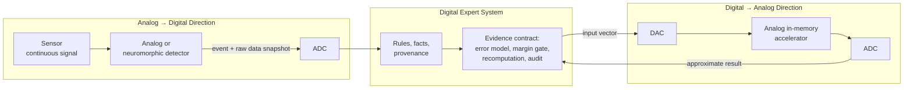
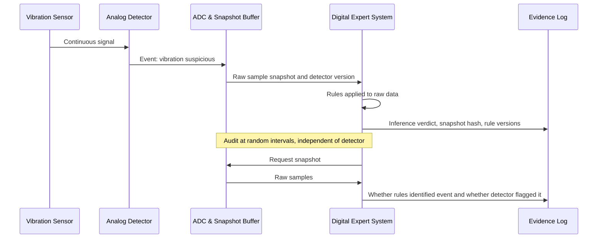
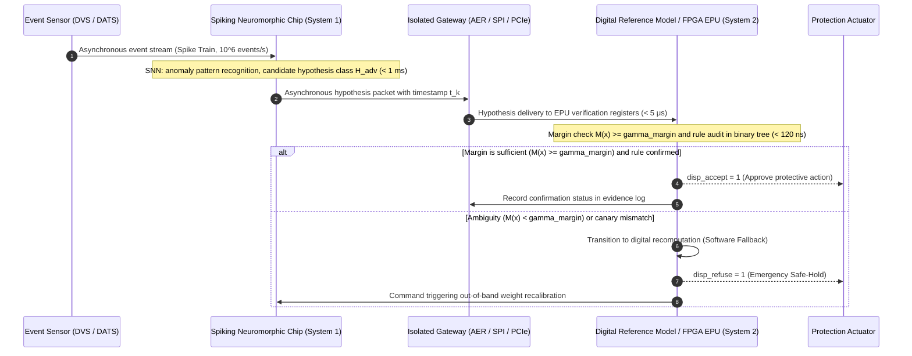

# Appendix E. Mixed-Signal Neuromorphic Expert Systems: Analog, Neuromorphic, and Unconventional Computing Under Evidence Control

> **Book:** [Architecture of Evidence-Governed Expert Systems](README.md) · Appendices  
> **Table of Contents:** [README.md](README.md)  
> **Author:** [Mykola Fedchyk](about-the-author.md)  
> **Target Audience:** Advanced engineering: systems architects, embedded and mixed-signal systems developers, knowledge engineers  
> **Expected Learning Outcomes:** Distinguish between the two paradigms of coupling analog and digital computation within an expert system; evaluate which inference operations are appropriate to offload to analog, neuromorphic, or alternative unconventional accelerators; construct an evidence contract for approximate computation: error modeling, calibration protocols, safety margin gates, digital recomputation, and false-negative (miss) auditing.

---

## Abstract

In industrial vibration monitoring, continuous gas chromatography, and autonomous critical infrastructure inspection systems, the continuous operation of the digital sampling pipeline (analog-to-digital converter plus microcontroller) rapidly exhausts battery reserves, precluding long-term maintenance-free deployment. The introduction of ultra-low-power analog and neuromorphic anomaly detectors as asynchronous wake-up triggers (*wake-up triggers*) carries an insidious failure mode: due to component parameter variance, non-linearity, and thermal drift, the analog tier may silently miss the inception of bearing spalling or a hazardous gas leak, while the digital expert system remains entirely oblivious to the uncaptured catastrophe due to the forfeiture of byte-for-byte evidence reproducibility.

This appendix resolves the challenge of preserving comprehensive verifiability and operational reliability within mixed-signal analog-digital architectures. The author investigates two complementary integration vectors (analog → digital and digital → analog) and formalizes the **evidence contract of mixed-signal computing**: a mathematical error and thermal calibration model, a safety margin gate ($`M(\mathbf{x}) \ge \gamma_{\text{margin}}`$), an imperative digital recomputation policy within the uncertainty envelope, and statistical false-negative auditing (a dual-measurement protocol) that guarantees the preservation of certification-grade safety envelopes while radically slashing power dissipation.

---

[Appendix D](appendix-d-analog-expert-systems-and-neuromorphic-computing.md) establishes the underlying physics of analog computation: how Ohm's and Kirchhoff's laws execute vector-matrix multiplication, how transistor circuits evaluate fuzzy inference, and how winner-take-all networks select dominant signals. This appendix addresses the subsequent engineering question: how can analog and neuromorphic coprocessors be integrated into an evidence-governed expert system such that its inference remains provably verifiable? The investigation proceeds through an illustrative case study, concluding by delineating which principles generalize across broader domains and identifying the precise boundaries where this hybrid approach breaks down.

## 1. Architectural Computational Dichotomy: Comparing Digital and Analog Paradigms

We examine a practical deployment scenario: a single diagnostic task evaluated across two fundamentally divergent computational paradigms. Consider a bearing condition-monitoring node mounted on the housing of an industrial pump. The node is affixed directly to the pump casing, is powered by an internal battery cell, and must operate without human maintenance for a full calendar year. The piezoelectric vibration transducer outputs a continuous analog signal. The expert system receiving data from this node must determine whether fault signatures indicative of bearing degradation have emerged and, if so, precisely which empirical measurements and symbolic rules substantiate that conclusion.

The conventional digital implementation is straightforward: an analog-to-digital converter (ADC) continuously digitizes the vibration waveform, a microcontroller extracts spectral and statistical features, and a production rule engine evaluates these features against operational thresholds. Suppose the node's strict power budget precludes operating the ADC and microcontroller continuously. In response, two architectural alternatives emerge. The first proposal places an analog or neuromorphic detector upstream of the ADC; this detector continuously monitors the sensor signal at micro-power levels and wakes the digital subsystem only when vibration dynamics become anomalous. The second proposal computes the defect risk score—namely, a weighted summation of extracted features—directly within an analog in-memory crossbar array, wherein symbolic rule weights are encoded as non-volatile electrical conductances.

Both proposals deliver substantial energy reductions, yet both fundamentally alter the epistemic nature of the resulting evidence. A digital calculation can be reproduced bit-for-bit across any deterministic processor, whereas an analog computation produces an approximate output corrupted by physical noise, ambient temperature fluctuations, and device aging. Furthermore, a neuromorphic detector tasked with deciding when to wake the digital core can suffer a false negative (miss), leaving the dormant digital supervisor permanently oblivious to the unrecorded physical event.

This tension establishes the core research question of this appendix: **under what operational conditions can an expert system offload portions of its inference pipeline to analog, neuromorphic, or alternative unconventional accelerators such that energy and latency gains do not compromise the verifiability of the final conclusion?** The central thesis is as follows: a mixed-signal expert system is justified precisely when the unconventional coprocessor yields candidate hypotheses governed by an empirically calibrated error model, while the digital supervisor retains sovereign authority over rules, provenance, calibration state, and the runtime verdict to accept, recompute, or decline to answer. The boundary between analog and digital domains—embodied by ADCs and digital-to-analog converters (DACs)—serves as the exact boundary where this evidence contract is rigorously enforced.

## 2. Concept and Architecture of a Mixed-Signal Analog-Digital Expert System

To establish a rigorous architectural foundation, we first formalize several key definitions. An **analog signal** varies continuously in both time and amplitude, exemplified by the output voltage of a vibration sensor. A **digital signal** assumes a finite set of discrete values at discrete time intervals. An ADC (*analog-to-digital converter*) maps an analog waveform into a sequence of discrete numerical codes, whereas a DAC (*digital-to-analog converter*) performs the reciprocal transformation. Circuits and systems that integrate analog and digital functional blocks onto a single semiconductor die or printed circuit assembly are designated as **mixed-signal** (*mixed-signal*).

A **neuromorphic** computing architecture is organized according to the structural and operational principles of biological neural systems. In his seminal paper "Neuromorphic Electronic Systems," Carver Mead attributed the decisive computational efficiency of biological brains to their direct utilization of elementary physical phenomena as computational primitives, encoding information within the relative magnitudes of analog signals rather than the absolute bit patterns of digital words [[1]](#src-1). Concurrently, Mead underscored the unavoidable engineering trade-off: analog implementations require continuous adaptive mechanisms to compensate for component parameter variance [[1]](#src-1). This trade-off represents the central design challenge addressed in this appendix.

**In-memory computing** (*in-memory computing*) executes arithmetic operations directly at the physical location where data is stored, bypassing the need to transfer weights across an external memory bus [[2]](#src-2). In a canonical implementation, synaptic weights are programmed as electrical conductances at the row-column crosspoints of a resistive matrix known as a **crossbar** (*crossbar*). Input voltages applied along the rows encode the input feature vector, while column currents yield the vector-matrix product via Kirchhoff's current law. The physical dynamics of this in-memory multiplication are detailed in [Appendix D](appendix-d-analog-expert-systems-and-neuromorphic-computing.md).

Crucially, the designation "neuromorphic" is not synonymous with "analog." The Intel Loihi research processor is implemented entirely using synchronous and asynchronous digital CMOS circuitry [[3]](#src-3), while the IBM NorthPole architecture interleaves digital compute logic with dense on-chip SRAM, eliminating external memory buses altogether [[4]](#src-4). True mixed-signal neuromorphic processors include BrainScaleS-2, wherein an analog core physically emulates continuous-time spiking neuron dynamics alongside embedded digital SIMD processors and an event-routing network [[5]](#src-5), and DYNAP-SE2, which combines subthreshold analog circuits for multi-compartment neuron dynamics with asynchronous digital circuits for event routing [[6]](#src-6). This appendix focuses specifically on mixed-signal architectures, utilizing purely digital neuromorphic processors as a comparative baseline.

Within this monograph, a **mixed-signal expert system** denotes an expert system wherein a designated subset of inference operations or evidence preparation pipelines is executed on an analog or neuromorphic accelerator, while all supervisory, evidentiary, and definitive logical operations are executed digitally. This coupling proceeds along two primary integration vectors, illustrated in the architectural diagram below.



In the **analog → digital** direction, an ultra-low-power analog or neuromorphic front-end interfaces directly with continuous-time physical sensors, deciding when and what telemetry to pass to the digital supervisor. In the **digital → analog** direction, the digital expert system offloads computationally intensive mathematical kernels—such as feature weighting or associative case matching—to an analog in-memory accelerator, retrieving the approximate output via an ADC. In both paradigms, the evidence contract is governed exclusively by the digital supervisor, as only digital logic can maintain version control, execute reproducible recomputations, and seal cryptographic provenance logs. A broader treatment of edge-to-backend workload partitioning is provided in [Chapter 22](ch22-cybernetics-edge-to-backend.md), while the formal synthesis of neural and symbolic components is examined in [Chapter 29](ch29-neuro-symbolic-architecture.md).

## 3. Decomposition and Offloading of Logical Inference Operations to the Analog Domain

Having established these definitions, we now examine which specific expert system operations can be sensibly offloaded to an analog substrate. The requirement of mixed-signal execution does not imply that all expert system modules are suitable for analog hardware. A symbolic production rule engine equipped with rule versioning, lineage tracking, and cryptographic decision logging cannot be implemented in analog circuitry. However, several foundational mathematical kernels that support logical inference map naturally onto physical analog and neuromorphic primitives.

### 3.1. Feature Weighting and Associative Case Retrieval

In the pump bearing monitoring scenario, evaluating the defect risk score corresponds to computing the dot product between a normalized feature vector and a rule weight vector. Similarly, retrieving matching diagnostic cases from an associative knowledge base reduces to multiplying an input query vector by a matrix of stored exemplar vectors. This mathematical primitive is executed natively by analog in-memory computing (*analog in-memory computing*, AIMC) crossbars. A 14 nm phase-change memory (*phase-change memory*, PCM) test chip developed by IBM incorporates 64 compute cores (each containing a 256 × 256 crossbar array) integrated with on-chip digital activation logic; for matrix-vector multiplication with 8-bit inputs and 8-bit outputs, the authors demonstrate a peak throughput of 63.1 tera-operations per second (*tera-operations per second*, TOPS) at an energy efficiency of 9.76 TOPS/W [[7]](#src-7). A companion 34-tile IBM chip integrates 35 million PCM elements, achieving up to 12.4 TOPS/W; deployed across five interconnected chips, the system accommodated over 45 million weights for a full-scale speech recognition model, achieving recognition accuracy comparable to digital floating-point software baselines [[8]](#src-8). The NeuRRAM chip, based on resistive random-access memory (*resistive random-access memory*, RRAM), demonstrated inference accuracy benchmarked against 4-bit software models across diverse vision and acoustic tasks [[9]](#src-9).

For an evidence-governed expert system, the critical takeaway from these benchmarks lies not in the raw performance numbers, but in two fundamental engineering observations. First, none of these accelerators is purely analog: the designers of the 64-core PCM processor explicitly state that achieving net end-to-end latency and energy reductions requires tightly coupling analog crossbars with digital on-chip arithmetic units and interconnect routing [[7]](#src-7). Second, the empirical accuracy is consistently characterized as "close to software baseline"—meaning that the analog output is inherently approximate. Consequently, the bounds of this approximation must be rigorously modeled and verified for each specific domain task, rather than assumed a priori.

### 3.2. Threshold Rules and Decision Trees

A conditional production rule such as "IF vibration amplitude at the ball pass frequency outer race (BPFO) is between 0.8 g and 1.5 g AND casing temperature exceeds 70 °C, THEN suspect bearing outer race defect" evaluates whether each observed feature falls within an admissible numerical interval. An analog content-addressable memory (*content-addressable memory*, CAM) constructed from memristive devices stores interval thresholds within programmed electrical conductances, accepts analog or digital query vectors, and compares the input against all stored rows in parallel [[10]](#src-10). Pedretti et al. demonstrated that every distinct path from root to leaf in a decision tree can be mapped onto an individual row of an analog CAM—with each row encoding an intersecting set of bounding intervals—achieving an estimated throughput improvement of approximately three orders of magnitude over conventional digital architectures [[11]](#src-11).

This architecture provides a direct physical analog to a symbolic production rule: each row in the analog CAM represents a production rule with interval constraints, and a row match signal indicates rule activation. Formally, row $r$ matches the input vector $\mathbf{x}$ if and only if every feature falls within its programmed bounding interval:

```math
\text{match}_r(\mathbf{x})=\bigwedge_{j=1}^{d}\left(l_{rj}\le x_j\le u_{rj}\right).
```

Where:

- $`\text{match}_r(\mathbf{x})`$ is a boolean predicate: true if row $r$ matches the input feature vector, and false otherwise;
- $r$ is the row index within the analog CAM, identifying an individual rule constraint set;
- $\mathbf{x}$ is the input feature vector (e.g., vibration amplitude and casing temperature);
- $`x_j`$ is the scalar value of the $j$-th feature;
- $d$ is the total dimensionality of the feature space;
- $`l_{rj}`$ and $`u_{rj}`$ are the lower and upper bounds, respectively, for feature $j$ in rule row $r$;
- $`\bigwedge_{j=1}^{d}`$ represents the logical conjunction over all $d$ feature constraints: the rule fires if and only if all interval conditions are simultaneously satisfied.

In the bearing monitoring rule above, $d=2$: for the vibration feature, $`l_{r1}=0.8`$ g and $`u_{r1}=1.5`$ g; for casing temperature, $`l_{r2}=70^\circ\text{C}`$, while $`u_{r2}`$ corresponds to the full-scale upper limit of the temperature sensor. Because these boundary values are physically stored as electrical conductances, conductance drift over time shifts the effective decision boundaries of the rule. The digital supervisor must therefore periodically audit the programmed conductance states to ensure physical intervals remain synchronized with the canonical rule definitions in the knowledge base; otherwise, the in-memory rule will silently diverge from the audited knowledge repository.

### 3.3. Bayesian Inference

Bayesian belief networks and probabilistic graphical models represent a foundational layer of classical expert systems, as formalized in [Chapter 6](ch06-applied-mathematics-for-expert-systems.md). Harabi et al. demonstrated a hybrid memristor-CMOS computing platform that executes Bayesian inference in situ: Bayes' theorem is structured such that calculations rely entirely on local memory storage and stochastic arithmetic [[12]](#src-12). The experimental prototype integrates 2,048 memristors and 30,080 CMOS transistors; scaling projections indicate that this hybrid architecture can perform gesture classification while dissipating 5,000 times less energy than a digital microcontroller [[12]](#src-12). The authors also emphasize the intrinsic explainability of Bayesian decision boundaries—a property of paramount importance for evidence-governed systems that value formal accountability on par with energy efficiency.

Earlier foundational research by Loeliger et al. established that the sum-product algorithm (*sum-product algorithm*)—which governs probability propagation over factor graphs—maps directly onto analog transistor networks, enabling the construction of ultra-low-power analog decoders for error-correcting codes [[13]](#src-13). For expert systems engineering, this result is profound: Pearl's belief propagation algorithm for exact inference on polytree Bayesian networks is a direct instance of the generalized sum-product algorithm [[14]](#src-14). Consequently, continuous-time analog circuits executing probability propagation represent viable physical candidates for probabilistic inference acceleration, even though published demonstrations have historically focused on telecommunication decoding rather than symbolic knowledge bases.

### 3.4. Temporal Event Processing

For continuous event streams generated by physical sensors, spiking neural networks (*spiking neural networks*, SNNs) offer a natural computational paradigm: analog neuron circuits integrate incoming temporal current pulses and emit an asynchronous action potential (spike) upon crossing a membrane potential threshold. Mixed-signal processors such as BrainScaleS-2 and DYNAP-SE2 implement continuous-time leaky integrate-and-fire dynamics using analog transistor circuits [[5]](#src-5), [[6]](#src-6), with DYNAP-SE2 featuring dedicated asynchronous interfaces for event-based dynamic vision and audio sensors [[6]](#src-6). The comprehensive survey of the digital Loihi architecture by Davies et al. provides a critical empirical perspective: standard feedforward deep networks mapped onto neuromorphic hardware exhibit negligible or non-existent gains over conventional digital accelerators, whereas architectures incorporating recurrent connectivity, precise spike timing, local synaptic plasticity, stochasticity, and temporal sparsity execute specialized workloads with latency-energy products several orders of magnitude superior to standard approaches [[3]](#src-3). Neuromorphic accelerators provide genuine value to an expert system precisely when the physical task is inherently temporal and sparse—such as detecting transient impact signatures within continuous vibration telemetry—rather than when attempting to accelerate dense, static classification networks.

### 3.5. Symbolic Structures in Hyperdimensional Vectors

Hyperdimensional computing (*hyperdimensional computing*, HDC), also designated as Vector Symbolic Architectures (*vector symbolic architectures*, VSA), represents symbolic entities and structural relationships using high-dimensional random vectors (typically with dimensionalities $D \ge 1,000$), manipulating them via algebraic operations such as binding, bundling, and permutation [[15]](#src-15), [[16]](#src-16). For an expert system, this framework establishes a direct algebraic bridge between symbolic semantics and physical hardware: a structured assertion such as `Bearing → HasState → OuterRaceDefect` can be collapsed into a single hyperdimensional vector, with associative query resolution reducing to calculating cosine similarities or Hamming distances against stored memory vectors. Karunaratne et al. implemented an end-to-end hyperdimensional computing system using two PCM crossbar arrays integrated with peripheral CMOS logic, utilizing 760,000 PCM devices to perform classification with software-equivalent accuracy; the authors attributed this robustness to the intrinsic fault tolerance of holographic distributed representations against physical device non-idealities [[17]](#src-17).

This research domain possesses distinguished Ukrainian scientific roots. Dmitri Rachkovskij and Ernst Kussul at the Glushkov Institute of Cybernetics in Kyiv pioneered context-dependent thinning algorithms for the binding and normalization of binary sparse distributed representations [[18]](#src-18). The systematic survey by Kleyko, Rachkovskij, Osipov, and Rahimi formalizes the theoretical foundations of hyperdimensional computing models and provides a rigorous taxonomy of mapping data structures into vector spaces [[16]](#src-16).

### 3.6. Summary: Efficiency Boundaries of Analog Offloading

The table below synthesizes the investigated inference kernels into a unified architectural framework. For each mathematical operation, the physical primitive, operational benefit, primary error source, and corresponding digital supervisory check are formalized.

| Expert System Operation | Analog or Neuromorphic Primitive | Architectural Benefit | Primary Physical Error Source | Digital Supervisory Verification Check |
|---|---|---|---|---|
| Feature weighting, associative case retrieval | In-memory vector-matrix multiplication crossbars | Fully parallel VMM without weight shuttling | Read noise, conductance drift, ADC quantization | Margin-to-threshold check; digital recomputation within the ambiguity envelope |
| Threshold rules, decision trees | Analog CAM with interval-programmed rows | Fully parallel evaluation of all production rules | Physical shift in conductance boundary values | Periodic audit verifying physical boundaries against the canonical rule base |
| Bayesian inference | Memristive Bayesian machines, analog probability propagation | Localized in-situ probabilistic computation | Device stochasticity, bounded analog resolution | Comparative benchmarking against a digital reference model across test cases |
| Temporal event detection | Spiking neural networks on mixed-signal processors | Event-driven execution (zero dynamic power during quiescence) | Neuron parameter mismatch, temporal event misses | Independent statistical miss auditing on sampled telemetry streams |
| Symbolic structures, associative lookup | In-memory hyperdimensional vector operations | Holographic fault tolerance against substrate defects | Noise accumulation across cascaded vector bindings | Formal verification of retrieved facts within the canonical knowledge base |
| Combinatorial constraint optimization | Ising machines, probabilistic bits (p-bits) (see Section 7) | Accelerated traversal of complex energy landscapes | Trapping in local minima, thermal stochasticity | Exhaustive verification of all symbolic constraints on candidate solutions |

The final column of this table is far more critical than the first. Every analog computing primitive introduces an idiosyncratic physical error modality. Consequently, the supervising digital expert system must maintain an explicit, dedicated verification check tailored to each specific failure mode. To formulate these checks rigorously, we must first analyze the physical origin and propagation of errors across domain boundaries.

## 4. Physical Error Sources at Domain Boundaries and the Energy Cost of Precision

We examine the physical mechanisms governing error generation at domain boundaries and evaluate the energy expenditure required to achieve target hardware resolution. In-memory analog computing performs vector-matrix multiplication only approximately, as physical substrate non-idealities are predominantly non-deterministic, temperature-dependent, or non-linear [[19]](#src-19). In their investigation of hardware-aware network training, Rasch et al. demonstrated a fundamental architectural principle: the primary factor degrading inference accuracy is not the noise residing within the crossbar weights themselves, but rather the additive noise introduced at the circuit inputs and outputs [[19]](#src-19). Because crossbar inputs and outputs must traverse DACs and ADCs, the mixed-signal domain boundary is not a secondary peripheral detail—it is the dominant locus of computational error.

The primary error source at the domain boundary is amplitude quantization. An ADC characterized by resolution $b$ (in bits) and an input dynamic range of $[-R, R)$ exhibits a quantization step size $q$ and associated quantization noise variance:

```math
q=\frac{2R}{2^{b}},\qquad \sigma_q=\frac{q}{\sqrt{12}}.
```

Where:

- $q$ is the quantization step size, representing the voltage interval between adjacent digital codes;
- $R$ is the half-scale range of the converter (the ADC resolves inputs spanning $-R$ to $+R$);
- $b$ is the resolution of the ADC, representing the number of output bits;
- $2^{b}$ is the total number of discrete quantization bins;
- $`\sigma_q`$ is the standard deviation of the quantization error, derived under the standard assumption that quantization error is uniformly distributed over the interval $[-q/2, q/2]$;
- $\sqrt{12}$ originates from the variance of a uniform distribution over an interval of width $q$, which evaluates to $q^{2}/12$.

For representative system parameters $R=12$ and $b=6$, the quantization step is $q=0.375$, yielding a standard deviation $`\sigma_q \approx 0.108`$ in risk score units. These exact parameters govern the numerical simulation model presented below.

At first glance, quantization error appears trivial to eliminate by simply increasing ADC resolution. In mixed-signal hardware, however, every additional bit of resolution carries a severe physical penalty. The sampled voltage across an ADC sample-and-hold capacitor contains thermal Nyquist-Johnson noise characterized by variance:

```math
\overline{v_n^{2}}=\frac{k_B T}{C}.
```

Where:

- $`\overline{v_n^{2}}`$ is the mean-squared thermal noise voltage across the sampling capacitor, representing noise variance in $\text{V}^2$;
- $`k_B`$ is the Boltzmann constant ($`k_B \approx 1.38 \times 10^{-23}\ \text{J/K}`$);
- $T$ is the absolute thermodynamic temperature in kelvins;
- $C$ is the sampling capacitance of the ADC front-end in farads.

For an operational temperature $T=300$ K and capacitance $C=1$ pF, the root-mean-square thermal noise voltage is $`\sqrt{k_B T/C} \approx 64\ \mu\text{V}`$. Because noise voltage is inversely proportional to the square root of capacitance, suppressing thermal noise requires increasing the physical capacitor size. To add a single bit of resolution, the quantization step $q$ must be halved; maintaining the signal-to-noise ratio requires halving the RMS noise voltage, which demands a fourfold increase in sampling capacitance $C$. In turn, quadrupling $C$ quadruples the dynamic energy $CV^{2}$ required to charge the sampling capacitor to operating voltage $V$. In thermal-noise-limited regimes, every additional bit of ADC resolution scales the conversion energy expenditure by approximately a factor of four. This physical relationship underpins modern ADC figures of merit, whose historical scaling trajectories are surveyed by Boris Murmann [[20]](#src-20). Earlier foundational work by Walden established that at sampling frequencies below approximately 2 MS/s, ADC resolution is strictly thermal-noise-limited, whereas between 2 MS/s and 4 GS/s, resolution degrades by approximately one bit for every doubling of sampling rate due to aperture jitter [[21]](#src-21).

For in-memory computing, this physical constraint reveals an uncomfortable architectural reality: domain conversion overhead can entirely consume the energy savings achieved by analog multiplication. The architects of the ISAAC neural accelerator—noting that prior works failed to account for end-to-end converter overheads—were forced to devise specialized bit-serial encoding schemes specifically to mitigate the dominant latency and power dissipation of peripheral ADCs [[22]](#src-22). Consequently, specifying ADC resolution is not a minor implementation detail; it represents a fundamental architectural commitment balancing energy efficiency against admissible rule error margins.

The second primary error source resides within the physical memory elements. Following programming, the electrical conductance of phase-change memory elements undergoes continuous temporal relaxation; this phenomenon, termed conductance drift, is empirically modeled by a power-law relationship:

```math
G(t)=G(t_0)\left(\frac{t}{t_0}\right)^{-\nu}.
```

Notation in the drift model [[23]](#src-23):

- $G(t)$ is the device conductance at elapsed time $t$, expressed in siemens;
- $t$ is the elapsed physical time since the programming pulse;
- $`t_0`$ is the baseline reference time at which initial conductance $`G(t_0)`$ was verified;
- $\nu$ is the empirical drift exponent: larger values signify accelerated conductance decay;
- The negative exponent $-\nu$ reflects power-law rather than exponential decay: conductance relaxation proceeds rapidly immediately post-programming and attenuates logarithmically over time.

For a representative drift exponent $\nu=0.05$, at an operating time $`t = 100 t_0`$, device conductance decays to $100^{-0.05} \approx 0.79$ of its programmed value. Joshi et al. demonstrated that combining hardware-aware training with periodic digital compensation of batch-normalization scale factors maintains ResNet-32 accuracy above 93.5% on CIFAR-10 over a 24-hour window, despite storing each synaptic weight within a differential pair of PCM cells [[24]](#src-24). While promising, this empirical result highlights an operational boundary: a 24-hour laboratory verification does not guarantee stability over a year-long autonomous deployment.

Mead foresaw this challenge in 1990: an analog computing system must continuously adapt to the parameter variations of its constituent components [[1]](#src-1). For an evidence-governed expert system, this yields an imperative operational rule: the calibration state of an analog coprocessor is a first-class, versioned engineering artifact, identical in status to a symbolic rule definition or system requirements document. Whenever an inference verdict relies on an analog calculation, the accompanying justification package must record the calibration version identifier, elapsed time since device programming, and operating temperature—in strict accordance with the provenance tracking mandates formalized in [Chapter 9](ch09-engineering-knowledge-graph-traceability.md).

| Physical Error Source | Manifestation | Empirical Measurement Method | Required Justification Package Metadata |
|---|---|---|---|
| ADC quantization | Step-like approximation error bounded by $\pm q/2$ | Analytical calculation from bit-depth and range | Resolution $b$, input range $[-R, R)$, step size $q$ |
| Read noise | Non-deterministic dispersion across repeated runs | Repeated canary vector evaluations | Estimated standard deviation $\hat\sigma$, canary sample count $m$, evaluation timestamp |
| Conductance drift | Monotonic temporal attenuation of output amplitude | Periodic canary testing scheduled over time | Elapsed time post-programming, drift exponent $\nu$, compensation factor |
| Ambient temperature | Output bias shift and elevated thermal noise floor | Characterization across thermal operational limits | Instantaneous junction temperature during inference |
| Die-to-die mismatch | Systematic baseline variance across semiconductor dies | Individualized per-die wafer-level calibration | Silicon die UUID, calibration polynomial version |

As shown in this table, the majority of operational error sources can be quantified at runtime using canary computations—standardized test vectors evaluated against known digital reference values. The following section formalizes these measurements into a rigorous decision-acceptance contract.

## 5. Evidence Contract for Analog Inference Verification

We return to evaluating the bearing defect risk score introduced in our initial case study. A digital reference implementation evaluates the exact linear dot product $s = \mathbf{w}^{\top}\mathbf{x}$, where $\mathbf{w}$ represents the canonical weight vector defined within the digital knowledge base and $\mathbf{x}$ denotes the vector of normalized vibration features. The analog in-memory accelerator returns an approximate scalar $\tilde s = s + \varepsilon$, corrupted by physical error $\varepsilon$. The diagnostic production rule fires if and only if $s \ge \theta$, where $\theta$ denotes the critical risk threshold. Assuming the aggregate error can be modeled by a zero-mean normal distribution with standard deviation $\sigma$, the digital supervisor admits the analog result if and only if it exhibits a sufficient safety margin from the decision boundary:

```math
\left|\tilde s-\theta\right|\ge k\sigma.
```

Where:

- $\tilde s$ is the scalar value returned by the analog accelerator (the approximate risk score);
- $\theta$ is the operational rule firing threshold;
- $\lvert\tilde s-\theta\rvert$ is the absolute Euclidean distance from the threshold, designated as the safety margin;
- $\sigma$ is the standard deviation of the analog computational error, expressed in the same units as $s$;
- $k$ is the safety margin multiplier (expressed in standard deviations): increasing $k$ exponentially suppresses false decisions, but escalates the proportion of queries requiring digital recomputation.

For example, if $\tilde s=6.41$, $\theta=5$, and $\sigma=0.272$, the empirical margin is $1.41$. Setting $k=3$ yields a required margin of $k\sigma = 3 \times 0.272 = 0.816$. Because $1.41 \ge 0.816$, the inequality holds, and the supervisor admits the analog decision directly without triggering digital recomputation. This algorithmic verification filter is designated as the **margin gate** (*шлюз запасу*).

The mathematical justification for the margin gate follows directly from bounding the tail probabilities. Suppose the ground-truth value equals or exceeds the threshold ($s \ge \theta$), yet the gate admits a false negative decision ("below threshold"). Admission requires that $\tilde s \le \theta - k\sigma$; consequently, the computational error must satisfy $\varepsilon = \tilde s - s \le -k\sigma$. By symmetry, an identical bound applies to false positives when $s < \theta$. Therefore, for any ground-truth state $s$:

```math
P\left(\text{margin gate makes an erroneous decision}\right)\le P\left(\varepsilon\le-k\sigma\right)=\Phi(-k).
```

Where:

- $P(\cdot)$ denotes the probability of the enclosed event;
- $\varepsilon$ is the analog computational error, defined as $\varepsilon = \tilde s - s$;
- $\Phi$ is the cumulative distribution function (CDF) of the standard normal distribution $\mathcal{N}(0, 1)$;
- $\Phi(-k)$ is the probability that a standard normal variable assumes a value less than $-k$ standard deviations.

For $k=3$, the upper error bound evaluates to $\Phi(-3) \approx 1.35 \times 10^{-3}$; for inputs positioned substantially far from the threshold, the actual operational error probability is many orders of magnitude lower. Whenever the safety margin is insufficient—that is, when $\lvert\tilde s - \theta\rvert < k\sigma$—the expert system refuses to accept the analog output: it initiates a full digital recomputation, prompts for additional sensor telemetry, or asserts a qualified verdict of "insufficient evidential certainty."

The theoretical bound $\Phi(-k)$ presupposes precise knowledge of standard deviation $\sigma$. However, physical variance $\sigma$ drifts continuously in response to device aging and ambient temperature. Rather than relying on a static datasheet specification, the system continuously measures $\sigma$ via **canary computations**: the digital supervisor periodically dispatches $m$ standardized reference vectors to the accelerator—for which exact digital outputs are known—and computes the empirical standard error:

```math
\hat\sigma=\sqrt{\frac{1}{m}\sum_{i=1}^{m}\left(\tilde s_i-s_i\right)^{2}}.
```

Where:

- $\hat\sigma$ is the empirical root-mean-square error estimate derived from canary evaluations;
- $m$ is the number of canary evaluation cycles;
- $`\tilde s_i`$ is the analog accelerator output for the $i$-th reference vector;
- $`s_i`$ is the exact digital reference solution for that same vector;
- $`\sum_{i=1}^{m}`$ denotes summation over all $m$ canary vectors.

This formulation evaluates the sample root-mean-square error: differences are squared, averaged, and rooted. Suppose $m=4$ canary evaluations yield residuals $`\tilde s_i - s_i`$ of $0.2$, $-0.3$, $0.1$, and $-0.4$. The resulting estimate is $\hat\sigma = \sqrt{(0.04 + 0.09 + 0.01 + 0.16)/4} = \sqrt{0.075} \approx 0.27$. While this four-sample calculation illustrates the arithmetic, real-world mission-critical implementations employ larger ensembles (e.g., $m=512$) to achieve statistical confidence.

The terminology deliberately evokes the historical practice of coal miners carrying caged canaries underground as an early-warning detection system against toxic gas: a canary calculation provides the earliest operational indication that analog hardware behavior has drifted outside its certified calibration envelope.

To quantify the protective capability of the margin gate and analyze the failure modes induced by uncalibrated drift, we formulate an executable simulation model of an analog dot-product engine. The model incorporates conductance read noise (proportional to full-scale weight magnitude) alongside 6-bit ADC quantization. Static programming errors, non-linearities, IR voltage drops along crossbar metal lines, and ambient temperature swings are omitted for clarity. The input vector comprises 64 features uniformly distributed over the interval $[-1, 1)$, while threshold $\theta = 5.0$ reflects a rare-event signature: the vast majority of feature vectors reside safely below this threshold. Under these baseline parameters, the theoretical error variance evaluates to:

```math
\sigma^{2}\approx\sigma_w^{2}\sum_{j=1}^{n}x_j^{2}+\sigma_q^{2}\approx0.05^{2}\cdot\frac{64}{3}+0.108^{2}.
```

Where:

- $\sigma^{2}$ is the aggregate error variance of the analog dot-product computation;
- $`\sigma_w`$ is the standard deviation of conductance noise expressed as a fraction of full-scale weight magnitude ($`\sigma_w = 0.05`$);
- $`x_j`$ is the $j$-th element of the input vector;
- $n=64$ is the total length of the feature vector;
- $`\sum_{j=1}^{n}x_j^{2}`$ represents the squared Euclidean norm of the input: larger input norms induce higher accumulated read noise. For uniform inputs on $[-1, 1)$, the expected value of $`x_j^{2}`$ is $1/3$, yielding an expected sum of $64/3$;
- $`\sigma_q`$ is the 6-bit ADC quantization error derived previously ($0.108$).

This yields an expected error standard deviation $\sigma \approx 0.26$ for a freshly calibrated die. The Go program below evaluates five operational scenarios across one million Monte Carlo trials each. The listing depends exclusively on the Go standard library and is executed via `go run main.go`.

<details>
<summary>Go Implementation: Analog Dot-Product Model and Margin Gate Verification</summary>

```go
package main

import (
	"fmt"
	"math"
	"math/rand"
)

const (
	n      = 64      // length of the feature vector
	theta  = 5.0     // rule threshold for "suspected defect"
	adcMax = 12.0    // ADC full-scale range: [-adcMax, adcMax)
	bits   = 6       // ADC resolution in bits
	k      = 3.0     // margin factor in standard deviations for accepting analog result
	trials = 1000000 // number of tested vectors per scenario
)

// crossbar models analog dot-product computation: conductance read noise plus ADC quantization.
type crossbar struct {
	w     []float64 // reference weights from digital knowledge base
	sigma float64   // conductance noise as a fraction of full-scale weight
	rng   *rand.Rand
}

func (c *crossbar) dot(x []float64) float64 {
	s := 0.0
	for i, xi := range x {
		s += (c.w[i] + c.rng.NormFloat64()*c.sigma) * xi
	}
	return quantize(s)
}

func quantize(s float64) float64 {
	step := 2 * adcMax / math.Pow(2, bits)
	s = math.Max(-adcMax, math.Min(adcMax-step, s))
	return (math.Floor(s/step) + 0.5) * step
}

func exact(w, x []float64) float64 {
	s := 0.0
	for i := range w {
		s += w[i] * x[i]
	}
	return s
}

// randomVec returns normalized feature deviations in the range [-1, 1).
func randomVec(rng *rand.Rand) []float64 {
	x := make([]float64, n)
	for i := range x {
		x[i] = rng.Float64()*2 - 1
	}
	return x
}

// estimateSigma evaluates canary vectors for which the ground-truth digital output is known.
func estimateSigma(c *crossbar, rng *rand.Rand, m int) float64 {
	sum2 := 0.0
	for i := 0; i < m; i++ {
		x := randomVec(rng)
		d := c.dot(x) - exact(c.w, x)
		sum2 += d * d
	}
	return math.Sqrt(sum2 / float64(m))
}

// run returns the number of false decisions and the number of cases recomputed digitally.
// gateSigma = 0 indicates that the analog result is accepted unconditionally without a margin check.
func run(c *crossbar, gateSigma float64, rng *rand.Rand) (errors, recomputed int) {
	for t := 0; t < trials; t++ {
		x := randomVec(rng)
		truth := exact(c.w, x) >= theta
		a := c.dot(x)
		decision := a >= theta
		if gateSigma > 0 && math.Abs(a-theta) < k*gateSigma {
			decision = truth // digital recomputation yields exact ground truth
			recomputed++
		}
		if decision != truth {
			errors++
		}
	}
	return errors, recomputed
}

func main() {
	rng := rand.New(rand.NewSource(7))
	w := make([]float64, n)
	for i := range w {
		w[i] = rng.Float64()*2 - 1
	}
	fresh := &crossbar{w: w, sigma: 0.05, rng: rng}
	drifted := &crossbar{w: w, sigma: 0.10, rng: rng}

	calibrated := estimateSigma(fresh, rng, 512)
	recalibrated := estimateSigma(drifted, rng, 512)

	scenarios := []struct {
		name string
		c    *crossbar
		gate float64
	}{
		{"fresh die, unmitigated (no gate)", fresh, 0},
		{"fresh die, calibrated margin gate", fresh, calibrated},
		{"drifted die, unmitigated (no gate)", drifted, 0},
		{"drifted die, stale calibration gate", drifted, calibrated},
		{"drifted die, recalibrated gate", drifted, recalibrated},
	}
	fmt.Printf("%-40s %8s %8s %10s\n", "scenario", "gate σ", "errors", "recomputed, %")
	for _, s := range scenarios {
		e, r := run(s.c, s.gate, rng)
		fmt.Printf("%-40s %8.3f %8d %10.1f\n", s.name, s.gate, e, 100*float64(r)/trials)
	}
}
```

</details>

Executing this simulation yields the following empirical performance metrics (compiled on Go 1.27, deterministic PRNG seed 7):

```text
scenario                                   gate σ   errors recomputed, %
fresh die, unmitigated (no gate)            0.000     6718        0.0
fresh die, calibrated margin gate           0.272        1        5.4
drifted die, unmitigated (no gate)          0.000    11960        0.0
drifted die, stale calibration gate         0.272      235        5.5
drifted die, recalibrated gate              0.467       25        8.1
```

Without margin gate protection, the raw analog accelerator commits 6,718 erroneous classifications per million evaluations. Activating the margin gate with fresh calibration data ($m=512$ canaries yielding $\hat\sigma \approx 0.272$) suppresses errors down to a single false decision per million, requiring digital recomputation for only 5.4% of the query volume located near the decision boundary. For rare-event detection, this operational overhead is exceptionally advantageous: 94.6% of all incoming telemetry is resolved entirely in the ultra-low-power analog domain.

Next, the simulation doubles the conductance noise ($`\sigma_w = 0.10`$), emulating physical aging and drift. Operating unmitigated, the error count escalates to 11,960 per million. Maintaining the margin gate under the stale calibration baseline ($\hat\sigma = 0.272$) offers partial mitigation (235 errors per million), but violates its safety specification: the analytical bound $\Phi(-3)$ was predicated on known variance, whereas the physical variance has doubled. Dispatched canary re-evaluation updates the estimate to $\hat\sigma \approx 0.467$, which immediately suppresses errors to 25 per million at the expense of an 8.1% digital recomputation rate.

The residual 25 errors observed under recalibration also possess an exact physical explanation. The underlying variance scales dynamically with the input vector norm via $`\sum x_j^{2}`$, whereas the margin gate utilizes a scalar average estimate $\hat\sigma$. For input vectors exhibiting unusually large norms, physical noise exceeds the scalar estimate, rendering the uniform margin gate marginally permissive. A higher-assurance margin gate dynamically evaluates $\sigma(\mathbf{x})$ on a per-vector basis. The fundamental engineering conclusion is unequivocal: **the safety guarantees of a margin gate remain valid if and only if the underlying calibration remains active; consequently, canary evaluations are an essential phase of runtime inference, not optional offline maintenance**. These numbers reflect a simplified model and do not predict the exact behavior of a specific silicon die; for production accelerators, empirical error models are constructed from physical laboratory characterization.

The margin gate represents a specific manifestation of the broader mixed-precision computing paradigm. Le Gallo et al. formalized mixed-precision in-memory computing: an analog crossbar executes the bulk low-precision computation, while an auxiliary digital processor iteratively refines the solution; utilizing 998,752 PCM elements, the authors solved a system of 5,000 linear equations to full 64-bit floating-point precision [[25]](#src-25). The margin gate applies this exact division of labor to symbolic rule evaluation: the analog accelerator resolves the decisive majority of clear-cut queries, while the digital supervisor resolves the critical minority where substrate approximation could alter the logical conclusion.

Operating a margin gate carries an energy cost that must be incorporated into system-level sizing. The mixed-signal pipeline is energetically viable if and only if the following inequality is satisfied:

```math
(1+c)\,E_{\text{analog}}+r\,E_{\text{digital}}<E_{\text{digital}}.
```

Where:

- $`E_{\text{analog}}`$ is the total energy consumed by a single analog execution cycle, inclusive of DAC and ADC conversions, in joules;
- $`E_{\text{digital}}`$ is the energy dissipated by a purely digital implementation of the same inference kernel, in joules;
- $r$ is the empirical fraction of queries routed by the margin gate to digital recomputation ($0 \le r \le 1$);
- $c$ is the ratio of canary evaluation cycles to productive inference cycles (e.g., $c=0.01$ indicates one canary cycle per 100 inference evaluations);
- The left-hand side represents the expected energy expenditure of the mixed-signal path per decision (analog execution plus amortized canaries and fractional digital recomputations); the right-hand side is the energy consumed by the purely digital baseline.

Under the drifted scenario ($r=0.081$), the analog accelerator must achieve an energy reduction of at least 8.1% relative to the digital baseline even in the theoretical absence of canary overhead; accounting for real-world canary cycles requires an even wider efficiency delta. This rigorous accounting methodology parallels the workload-partitioning framework applied to digital neural processing units (*neural processing units*, NPUs) in [Chapter 10](ch10-knowledge-acquisition-systems.md#load-distribution-between-cpu-gpu-and-npu): where an NPU is evaluated against measured warm-up latencies and transfer overheads, an analog accelerator must be evaluated against recomputation fractions and calibration burdens.

To ensure post-hoc auditability, the digital evidence log generated by the expert system is augmented with the specialized telemetry fields defined in the table below.

| Evidence Package Metadata Field | Representative Value | Engineering Rationale |
|---|---|---|
| Silicon die UUID and firmware revision | `xbar-07`, `fw 2.3.1` | Establishes the physical hardware identity and firmware baseline on which the output was generated |
| Calibration version and canary timestamp | `cal-2026-09-30T08:00Z` | Confirms that the applied error model was temporal and valid at the moment of inference |
| Measured error $\hat\sigma$ and canary sample count $m$ | 0.272; 512 | Reconstructs the exact statistical confidence bound that parameterized the margin gate |
| Analog score, threshold, margin, and multiplier $k$ | 6.41; 5.0; 1.41; 3 | Proves mathematically why the inference was accepted directly without digital recomputation |
| Decision execution path | `ACCEPTED_ANALOG`, `RECOMPUTED_DIGITAL`, or `INSUFFICIENT_CERTAINTY` | Formally distinguishes approximate physical acceleration from exact digital computation |
| Post-programming aging and junction temperature | 41 days; 38 °C | Provides telemetry to account for physical conductance drift and thermal expansion effects |
| Canonical digital rule and model version | `rule-bearing-outer-race v4` | Links physical crossbar execution to the audited symbolic rule definition in the knowledge repository |

In the absence of these metadata fields, an analog output is indistinguishable from an unverified, irreproducible number. Equipped with this structured record, an external auditor can conclusively determine whether the evidence contract was fully satisfied at the exact moment of decision execution. We now examine the reciprocal integration vector, where failure modes assume an entirely different character.

## 6. Asynchronous Event Pipeline: Analog Anomaly Detection for Digital Core Wake-Up

We investigate the reverse interaction vector: an analog front-end anomaly detector decides precisely when the dormant digital system must wake up to inspect incoming sensory streams. In the initial case study, this approach deploys an ultra-low-power analog or neuromorphic detector upstream of the ADC, waking the microcontroller exclusively when anomalous vibration dynamics emerge. The operational role of this wake-up detector differs fundamentally from an in-memory compute accelerator: it does not evaluate facts for production rules, but instead acts as an upstream gatekeeper controlling what physical data the expert system observes. Detector errors fall into two distinct categories. A false alarm (false positive) carries minimal systemic cost: the digital supervisor wakes, performs rigorous spectral analysis on the raw buffer, detects no anomaly, logs the event, and resumes sleep. In contrast, a false negative (miss) is catastrophic: the digital supervisor remains asleep, entirely unaware of the unrecorded event, leaving the evidence log completely silent.

This epistemic asymmetry mandates two architectural design rules. First: upon triggering a wake-up interrupt, the analog detector must transmit not only a discrete alarm flag, but also a pre-trigger raw data snapshot—a circular buffer of raw digitized sensor samples captured immediately prior to and during the event. The digital expert system applies its canonical symbolic rules directly to this raw snapshot, treating the analog detector merely as a pointer indicating where to look; the cryptographic digest of the snapshot is sealed into the evidence log. Second: the operational miss rate must be continuously quantified via an independent statistical audit. At pseudo-random intervals—independent of detector state—the digital core wakes autonomously, captures a baseline sensor window, and evaluates it against canonical digital rules. If the digital rules identify a fault condition that the analog detector failed to flag, the supervisory audit records a confirmed false negative.

The sample size required for this audit follows from classical statistical principles. If an audit detects $n$ genuine fault events and the analog detector correctly flagged every one of them, the upper bound of the 95% confidence interval for the miss probability $p$ is governed by the binomial relationship:

```math
(1-p)^{n}=0.05\;\Rightarrow\;p=1-0.05^{1/n}\approx\frac{3}{n}.
```

Where:

- $p$ is the true underlying probability that the analog detector misses a fault event identified by the digital audit;
- $n$ is the total number of fault events evaluated during the audit wherein zero misses were observed;
- $(1-p)^{n}$ is the probability that the detector successfully detects all $n$ independent events;
- $0.05$ represents the significance level corresponding to a 95% confidence bound;
- $\Rightarrow$ denotes mathematical implication;
- $3/n$ is the classical first-order approximation derived from $\ln 0.05 \approx -3$ for small values of $p$.

This relationship represents the classical "Rule of Three," formalized by Hanley and Lippman-Hand for zero-numerator sample spaces in clinical trials [[26]](#src-26). To certify that the physical miss rate is below 1% at a 95% confidence level, the audit protocol must witness approximately 300 fault events without encountering a single detector omission. In mission-critical industrial applications where bearing spalling is an exceptionally rare event, gathering 300 natural fault signatures in the field is impractical; consequently, field audits must be supplemented with hardware-in-the-loop (HIL) fault-injection benches operating on calibrated test rigs.

An identical architectural discipline governs event-based vision sensors. An event camera asynchronously detects logarithmic changes in illumination at each individual pixel, emitting a continuous stream of events containing microsecond timestamps, spatial pixel coordinates, and polarity signs; the comprehensive survey by Gallego et al. highlights microsecond temporal resolution, 140 dB of dynamic range (compared to 60 dB in standard CMOS cameras), and sub-milliwatt power dissipation [[27]](#src-27). In an event-based architecture, the physical analog comparator threshold within each pixel acts as a hardware detector: an optical variation that fails to cross this threshold does not exist for downstream processing. Consequently, pixel comparator thresholds and the hyperparameters of downstream spiking neural networks constitute formal, version-controlled knowledge assets within the expert system, subject to the same change-management governance as symbolic rules.



As illustrated in this sequence diagram, the supervisory audit bypasses the analog detector completely, directly sampling the sensory environment to intercept precisely those events that the analog front-end may have silently omitted. This dual-pipeline architecture applies equally to resource-constrained autonomous defense monitoring nodes; the formal delegation boundaries governing when an autonomous node may execute protective actions versus when it must restrict itself to advisory alerts are established in [Chapter 21](ch21-from-recommendation-to-action.md).

## 7. Alternative Physical Accelerators: Probabilistic Bits, Ising Machines, and Quantum Annealing

Beyond electronic analog and neuromorphic circuits, emerging research explores alternative physical substrates for unconventional computing. To integrate any of these physical accelerators into an evidence-governed expert system, the systems engineer must answer the same two foundational questions: which specific mathematical kernel can the accelerator execute, and how does the supervising digital core verify the result?

**Photonic Computing.** The review by Shastri et al. surveys integrated silicon photonics as an emerging hardware platform for artificial intelligence and neuromorphic processing [[28]](#src-28), while Feldmann et al. experimentally demonstrated an integrated photonic tensor core capable of parallel convolutional processing at picosecond optical latencies [[29]](#src-29). Within an expert system, a photonic coprocessor functions as a high-speed matrix-vector multiplier; consequently, it is governed by the exact same canary-monitored margin gate formalized in Section 5.

**Stochastic Computing.** Stochastic computing represents numerical quantities as probabilistic bitstreams, where a number corresponds to the probability of observing a logical '1'. Originating in the 1960s, this approach synthesizes arithmetic multiplication using a single logic gate (such as an AND gate) and exhibits remarkable tolerance to single-event upsets, though it pays for this with exponential bitstream lengths and bounded precision [[30]](#src-30). For an expert system, stochastic computing is viable in severely power-starved edge nodes requiring approximate probabilistic combinations, where precision is explicitly bounded by bitstream length.

**Probabilistic Bits and Ising Machines.** A probabilistic bit (p-bit) fluctuates thermally between binary states 0 and 1 with a tunable probability. Theoretical analysis by Camsari et al. demonstrated that circuits composed of interconnected p-bits can be operated in reverse: a hardware multiplier operated in reverse acts as an integer factorizer [[31]](#src-31). Aadit et al. demonstrated massively parallel probabilistic computing utilizing sparse Ising networks [[32]](#src-32), and the survey by Mohseni, McMahon, and Byrnes formalizes Ising machines as physical solvers for NP-hard combinatorial optimization problems [[33]](#src-33). Within an expert system, these physical machines serve as coprocessors for complex constraint satisfaction and maintenance scheduling problems. Verification in this domain is computationally asymmetric and cheap: the digital supervisor simply verifies whether the candidate schedule satisfies all hard symbolic constraints. Crucially, because an Ising machine offers no formal guarantee of global optimality, the expert system must declare its verdict as "feasible schedule identified" rather than claiming a certified global optimum.

**Thermodynamic Computing.** Aifer et al. demonstrated that solving systems of linear equations, matrix inversion, and computing matrix determinants can be mapped onto sampling from the equilibrium thermal distribution of coupled classical harmonic oscillators, proving asymptotic scaling advantages that improve linearly with matrix dimension [[34]](#src-34). For an expert system, thermodynamic computing represents an accelerator candidate for covariance matrix inversion, which is required for evaluating Mahalanobis distances in multivariable anomaly detection ([Chapter 6](ch06-applied-mathematics-for-expert-systems.md)). Verification remains significantly cheaper than computation: the digital core verifies candidate solution $\mathbf{x}$ by computing the residual norm $\lVert A\mathbf{x} - \mathbf{b}\rVert$.

**Physical Reservoir Computing.** Reservoir computing projects continuous input signals into a high-dimensional dynamical space via a fixed, non-linear recurrent medium (the reservoir), requiring optimization of only a linear readout layer; because the reservoir dynamics are fixed, they can be instantiated across diverse physical substrates, including spintronic oscillators, optical cavities, and mechanical memristor arrays [[35]](#src-35). Within an expert system, a physical reservoir extracts non-linear temporal features from continuous sensor streams, while the linear readout layer remains digital, auditable, and version-controlled.

| Accelerator Substrate | Targeted Expert System Kernel | Low-Cost Digital Verification Method | Developmental Maturity in Surveyed Literature |
|---|---|---|---|
| Integrated photonics | In-memory vector-matrix multiplication | Margin gate with periodic canary tracking | Laboratory-scale integrated tensor cores [[29]](#src-29) |
| Stochastic computing | Approximate probabilistic reasoning | Analytical bounds, recomputation near thresholds | Mature theoretical foundations; bounded by precision scaling [[30]](#src-30) |
| Probabilistic bits (p-bits), Ising machines | Combinatorial constraint optimization | Exhaustive verification of constraint satisfaction | Experimental prototypes and architectural surveys [[31]](#src-31), [[32]](#src-32), [[33]](#src-33) |
| Thermodynamic computing | Linear system solving, matrix inversion | Direct computation of linear residual $\lVert A\mathbf{x} - \mathbf{b}\rVert$ | Algorithmic formulations with asymptotic complexity proofs [[34]](#src-34) |
| Physical reservoir computing | Non-linear temporal feature extraction | Digital readout verification via canaries | Implementations demonstrated across varied physical substrates [[35]](#src-35) |

This table illuminates a universal architectural invariant: for all investigated unconventional accelerators, **verifying a candidate solution is computationally cheaper than generating it**. The viability of mixed-signal expert systems rests entirely upon this computational asymmetry: the computationally expensive or energy-intensive task is offloaded to an unconventional physical substrate, while exact, low-cost verification is retained by the digital supervisor, which preserves ultimate legal and operational accountability for the final verdict.

## 8. Software Specification and Reproducibility of Mixed-Signal Models

An evidence-governed expert system requires that all conclusions be independently reproducible. In mixed-signal systems, achieving reproducibility is exceptionally difficult, as the same spiking neural network executed across distinct silicon dies or process corners exhibits divergent analog trajectories. The Neuromorphic Intermediate Representation (*Neuromorphic Intermediate Representation*, NIR) formalizes a standard set of computational primitives defined as hybrid dynamical systems, coupling continuous-time differential equations with discrete event transitions; Pedersen et al. demonstrated the cross-platform execution of three spiking networks across seven software simulators and four physical neuromorphic hardware targets [[36]](#src-36). For an expert system, an NIR model definition serves as the canonical source code for the neuromorphic component, archived and version-controlled alongside symbolic rule files.

The open-source Lava framework provides an asynchronous software infrastructure for developing and deploying neuromorphic applications across heterogeneous architectures [[37]](#src-37). For analog in-memory crossbars, the IBM Analog Hardware Acceleration Kit (*aihwkit*) provides an open-source PyTorch toolkit that simulates crossbar dynamics through modular "analog tiles," modeling device mismatch, conductance noise, programming non-linearities, and empirical drift calibrated against physical PCM hardware [[38]](#src-38). Incorporating these realistic hardware models into training workflows enables deep networks to achieve inference accuracy comparable to 32-bit floating-point implementations [[19]](#src-19).

These software toolchains establish a critical operational standard: every analog or neuromorphic accelerator must possess a **digital reference model** (*цифровий еталон*)—a software implementation operating with identical weights and semantics. The digital reference model fulfills four essential roles:

1. It provides ground-truth outputs for canary evaluations.
2. It serves as the verification oracle during differential hardware testing.
3. It executes exact fallback recomputations whenever an analog output falls within the margin gate ambiguity envelope.
4. It supplies the explanation engine with transparent execution traces, as the symbolic explanation facility formalized in [Chapter 20](ch20-explanation-engine.md) requires interpretable logical rules rather than raw analog conductances.

Consequently, any production release of a mixed-signal expert system must package not only symbolic rule files, but also the formal specification of the analog model, its weight matrices, calibration parameters, detector thresholds, and the exact version hash of the digital reference model.

## 9. Test Methodology and Research Agenda for Mixed-Signal Systems

We synthesize a comprehensive verification methodology for mixed-signal expert systems. Validating a mixed-signal system differs fundamentally from testing a digital system: because physical hardware is inherently noisy, identical test vectors yield non-identical analog responses. Verification must therefore proceed across five sequential, cumulative stages:

1. **Differential Testing.** The analog hardware and its digital reference model process an identical ensemble of test vectors. The resulting residual distribution yields an empirical error model: mean bias, standard deviation, tail distributions, and dependence on input vector norm.
2. **Environmental Boundary Testing.** The empirical error model is characterized across operational extremes of ambient temperature, supply voltage rails, and post-programming elapsed time, accounting for the power-law dynamics of conductance drift [[23]](#src-23). The final output is not a static scalar $\sigma$, but a parameterized error envelope $`\sigma(T, V_{\text{dd}}, t)`$.
3. **Hardware Fault Injection.** Synthetic hardware faults—such as stuck-at-conductance cells, ADC offset shifts, and dead neuron circuits—are injected into the physical testbed or its simulator. The expert system must reliably detect these degradation signatures via canary checks and fail over to the digital execution path, rather than emitting a high-confidence false verdict.
4. **Statistical Acceptance Auditing.** The empirical false-acceptance rate and detector miss rate are quantified within formal confidence intervals; in zero-defect test spaces, sample sizes are governed by the Rule of Three [[26]](#src-26).
5. **Segregation of Operational Authority.** An analog or neuromorphic inference output is strictly prohibited from triggering an irreversible real-world action without digital supervisor authorization. The formal contracts governing actuation are detailed in [Chapter 21](ch21-from-recommendation-to-action.md), while [Chapter 27](ch27-safety-case-gsn-synthesis.md) demonstrates how empirical error models and calibration logs are integrated into a formal Goal Structuring Notation (GSN) safety case.

This final step bridges mixed-signal hardware with the broader architecture of this book: an empirical hardware error model becomes an auditable piece of evidence, subject to peer review, challenge, and continuous revision.

---

### 9.1. Empirical Research Agenda for Mixed Neuromorphic-Symbolic Testbeds (BrainScaleS-2 / Loihi / Dynap-SE / FPGA EPU)

Empirical research evaluating unconventional accelerators as rapid semantic hypothesis generators (System 1) centers on the following physical platforms:

1. **Spiking Neuromorphic Arrays and Event-Based Sensing (DVS / AER):**
   * Interfacing a dynamic vision sensor (*Dynamic Vision Sensor*, DVS) via an asynchronous Address-Event Representation (AER) bus directly to a spiking neuromorphic processor (BrainScaleS-2, DYNAP-SE2, or an FPGA-emulated SNN core).
   * Investigating sub-millisecond detection of fast physical anomalies (contact arcing, flame instability, high-frequency bearing chatter) within a latency window of **$< 1\ \text{ms}$** at milliwatt-scale power consumption.
2. **Memristive Analog In-Memory Crossbars (In-Memory Computing RRAM/PCM):**
   * Quantifying the energy expenditure per vector-matrix multiplication compared against classical von Neumann digital architectures utilizing the IBM Analog Hardware Acceleration Kit.
   * Measuring precision degradation induced by read noise, random telegraph noise (RTN), and power-law conductance drift ($G(t) \propto t^{-\nu}$).

> [!NOTE]
> **Theoretical and Engineering Foundations of Neuromorphic Cores in Book Chapters:**
> - [Chapter 18. Execution Infrastructure](ch18-execution-infrastructure.md) — Energy budgets of inference operations (FLOPs vs. J/op), the von Neumann memory wall, and Roofline modeling for unconventional accelerators.
> - [Chapter 29. Neuro-Symbolic Architecture](ch29-neuro-symbolic-architecture.md) — The cognitive tandem uniting probabilistic neuromorphic preprocessors with deterministic symbolic verifiers.
> - [Chapter 35. Self-Organizing Expert Systems Synergetics and NPU Runtime](ch35-self-organizing-expert-systems-synergetics-and-npu-runtime.md) — Self-organization, free-energy minimization, and synergetic attractors in dynamic analog networks.

---

### 9.2. Research Agenda for Evidence-Governed Neuromorphic Contract Verification

Offloading computational workloads to unconventional accelerators requires preserving rigorous mathematical guarantees for all generated decisions:

1. **Differential Testing Testbed with Digital Twin Runtime:**
   * Parallel execution of millions of test vectors across the physical neuromorphic chip and an FP64/FP32 digital reference model.
   * Constructing the empirical error distribution kernel $f(\epsilon)$, characterizing heavy distribution tails (*heavy tails*), and quantifying the critical margin threshold:
     $$`M(\mathbf{x}) \ge \gamma_{\text{margin}}.`$$
2. **Hardware Canary Generator and Periodic Miss Auditing:**
   * Automated injection of synthetic canary stimuli into the input data stream every 50 operational cycles. If the analog subsystem fails to correctly resolve a canary vector, a digital safety interlock immediately isolates the analog path and transfers supervisory control to an FPGA/MCU-based deterministic rule engine.

> [!NOTE]
> **Theoretical and Engineering Foundations of Evidence Contracts in Book Chapters:**
> - [Chapter 20. Explanation Engine](ch20-explanation-engine.md) — Translating verified inference outputs into human-readable argument trees backed by the digital reference model.
> - [Chapter 23. Knowledge Base Verification](ch23-knowledge-base-verification.md) — Analyzing rule completeness and consistency when coupled with continuous analog thresholds.
> - [Chapter 27. Safety Case: GSN Synthesis and Verification](ch27-safety-case-gsn-synthesis.md) — Formalizing analog error models, calibration records, and canary logs as GSN safety evidence.
> - [Chapter 36. Knowledge Testing Pyramid and Variational Calibration](ch36-knowledge-testing-pyramid-and-variational-calibration.md) — Variational threshold calibration and stress-testing models under noise and degradation.
> - [Chapter 39. Active Compliance Auditor and Popperian Testing](ch39-active-compliance-auditor-and-popperian-testing.md) — Popperian falsification protocols for hybrid hardware-software systems.

---

### 9.3. Tandem "Neuromorphic Preprocessor + Symbolic Verifier (EPU)" and Popperian Falsification

The sequence diagram below formalizes the runtime interaction between the ultra-fast neuromorphic reflex tier and the deterministic digital supervisory arbiter:



**Popperian Falsification Criterion for Mixed-Signal Architectures:**
The empirical hypothesis asserting that a mixed-signal neuromorphic-symbolic architecture is permissible within safety-critical applications (ISO 26262 ASIL-D / IEC 61508 SIL-3) is formally falsified if:
1. The probability of an undetected analog error resulting from compounded physical noise and thermal drift exceeds the certified normative failure budget:
   $$P(\text{undetected error}) > 10^{-9}\ \text{per hour of continuous operation};$$
2. The latency required to detect accuracy degradation or a canary benchmark failure exceeds the certified Fault Tolerant Time Interval (FTTI):
   $$`T_{\text{detect}} > \tau_{\text{FTTI}}.`$$

---

## 10. Operational Applicability Boundaries of the Mixed-Signal Paradigm

The first boundary concerns energy marketing claims. High headline figures of chip efficiency expressed in TOPS per watt do not represent the total energy cost of an expert system decision, because a complete decision includes domain-crossing data conversions, digital recomputations, canary benchmarks, and continuous calibration. The projection that a memristive Bayesian machine consumes 5,000 times less energy than a digital microcontroller applies specifically to a projected scaled design evaluated on a single, isolated gesture-recognition benchmark [[12]](#src-12), not to general-purpose expert inference across arbitrary rule graphs.

The second boundary concerns hardware availability and supply-chain maturity. The vast majority of referenced accelerators—including IBM's PCM chips [[7]](#src-7), [[8]](#src-8), NeuRRAM [[9]](#src-9), and BrainScaleS-2 [[5]](#src-5)—are described in academic literature and fabricated as exploratory research prototypes, rather than available as commercial off-the-shelf components. For any target engineering deployment, device availability, software toolchain support, long-term silicon sourcing, and operating lifespans must be verified independently.

The third boundary concerns domain problem characteristics. Wherever an inference conclusion demands strict mathematical precision—such as verifying semantic versions, validating cryptographic hashes, enforcing role-based access permissions, checking regulatory effective dates, or computing financial transactions—an analog computing tier offers zero architectural benefit. These operations must remain strictly digital and deterministic, as formalized in [Appendix A](appendix-a-evidence-governed-framework.md). Among the five core engineering domains explored throughout this book, legal-regulatory reasoning possesses virtually no sub-problems that benefit from mixed-signal hardware acceleration.

The fourth boundary concerns regulatory and certification precedence. Within the existing engineering literature, there is no standardized, industry-wide consensus on formatting evidence for analog in-memory computations within formal functional safety cases. The error modeling methodology, canary routines, margin gates, and false-negative audit protocols formulated in this appendix represent the engineering proposals of this monograph, rather than an established international standard; every deployment team must formally defend their validity before the relevant certification authorities.

## Conclusions

This appendix investigated the foundational conditions under which portions of an expert system's inference pipeline can be offloaded to analog, neuromorphic, or alternative unconventional accelerators without forfeiting verifiability. The analysis establishes five decisive criteria:

1. The unconventional accelerator executes a computational kernel whose candidate output can be verified at low computational cost by the supervising digital core.
2. The accelerator error is characterized by an empirical statistical model, with calibration actively maintained via runtime canary benchmarks.
3. A margin gate rigorously arbitrates whether to accept the approximate analog output, initiate digital recomputation, or decline to answer.
4. For event-driven wake-up front-ends (analog → digital), an independent statistical audit bounds the unobserved false-negative rate.
5. The digital evidence log records physical hardware state, calibration versions, and sensor hashes alongside symbolic rule versions.

The Go simulation model verified these mechanics numerically: the margin gate reduced false decisions from 6,718 down to a single error per million at the expense of a 5.4% digital recomputation rate; unmitigated device drift caused errors to rise to 235 per million, while runtime canary recalibration restored the error count to 25 per million at an 8.1% recomputation rate. The surveyed scientific literature demonstrates that mixed-signal integration is already the de facto standard across physical in-memory compute and neuromorphic chips, with the primary computational error introduced by noise at the conversion boundary rather than in the crossbar weights.

The operational boundaries are clearly defined. The simulation model is intentionally simplified and does not substitute for empirical silicon characterization; energy claims must be evaluated across the complete system lifecycle; and most surveyed accelerators remain exploratory research platforms. The underlying physics of analog primitives is explored in [Appendix D](appendix-d-analog-expert-systems-and-neuromorphic-computing.md), edge-to-backend workload distribution in [Chapter 22](ch22-cybernetics-edge-to-backend.md), and the synthesis of evidence for formal safety arguments in [Chapter 27](ch27-safety-case-gsn-synthesis.md).

## Glossary

| Term | Original Ukrainian | Definition |
|---|---|---|
| Analog Signal | Аналоговий сигнал | Signal that varies continuously in both time and amplitude |
| Mixed-Signal Circuit | Змішана схема | Circuit integrating analog and digital functional blocks on a common substrate |
| Mixed-Signal Expert System | Змішана експертна система | Expert system wherein a subset of inference operations is executed on an analog or neuromorphic accelerator |
| Neuromorphic Processor | Нейроморфний обчислювач | Processor organized according to biological neural principles; realized in analog, digital, or mixed-signal form |
| In-Memory Computing | Обчислення в пам'яті | Paradigm executing arithmetic operations directly within the physical storage location of data |
| Crossbar | Кросбар | Matrix of conductive elements at row-column intersections executing in-situ vector-matrix multiplication |
| Conductance Drift | Дрейф провідності | Temporal relaxation and decay of programmed conductance values in non-volatile memory cells |
| Canary Computation | Канаркове обчислення | Periodic diagnostic evaluation using known reference vectors to quantify current hardware error variance |
| Margin Gate | Шлюз запасу | Algorithmic filter admitting an analog result if and only if its distance to the rule threshold satisfies a statistical safety margin |
| Digital Reference Model | Цифровий еталон | Deterministic software implementation of an analog kernel operating with identical weights and semantics |
| Mixed-Precision Computing | Змішана точність | Hierarchical paradigm where an approximate accelerator performs bulk computation and a digital core refines the output |
| Miss Audit | Аудит пропусків | Independent random sampling protocol designed to measure the false-negative rate of an event detector |
| Analog Content-Addressable Memory | Аналогова асоціативна пам'ять | Memory architecture performing parallel threshold and interval matching across stored rows |
| Spiking Neural Network | Спайкова нейронна мережа | Network whose constituent neurons communicate via discrete temporal action potentials (spikes) |
| Hyperdimensional Computing | Гіпервимірні обчислення | Computational paradigm operating on high-dimensional random vectors representing symbolic entities and relations |
| Probabilistic Bit (p-bit) | Імовірнісний біт | Hardware primitive fluctuating thermally between binary states 0 and 1 |
| Ising Machine | Машина Ізінга | Physical hardware platform seeking ground-state energy configurations of an Ising Hamiltonian to solve optimization problems |
| Stochastic Computing | Стохастичні обчислення | Paradigm representing numerical quantities as probabilities encoded in pseudo-random bitstreams |
| Reservoir Computing | Резервуарні обчислення | Architecture coupling a fixed non-linear dynamical reservoir to an optimized linear digital readout layer |
| Event Camera | Подієва камера | Neuromorphic vision sensor emitting asynchronous events strictly upon local changes in logarithmic illumination |
| Rule of Three | Правило трьох | Statistical upper 95% confidence bound evaluating to approximately 3/n for zero observed events across n trials |

## Abbreviations

| Abbreviation | Expansion | Meaning |
|---|---|---|
| ADC | Analog-to-Digital Converter | Converts continuous analog voltages into digital numerical representations |
| AIMC | Analog In-Memory Computing | In-memory computing executing linear algebra directly in analog memory crossbars |
| CAM | Content-Addressable Memory | Associative memory comparing query vectors across all memory rows in parallel |
| CMOS | Complementary Metal-Oxide-Semiconductor | Dominant integrated circuit fabrication process utilizing complementary FET pairs |
| DAC | Digital-to-Analog Converter | Converts digital numerical representations into continuous analog signals |
| HDC | Hyperdimensional Computing | Vector symbolic paradigm manipulating high-dimensional holographic representations |
| NIR | Neuromorphic Intermediate Representation | Standardized open intermediate representation for brain-inspired computing models |
| NPU | Neural Processing Unit | Specialized digital accelerator optimized for deep learning tensor operations |
| PCM | Phase-Change Memory | Non-volatile memory modulating resistance via phase transitions in chalcogenide alloys |
| RRAM | Resistive Random-Access Memory | Non-volatile memory switching via conductive filament dynamics in dielectric oxides |
| SNN | Spiking Neural Network | Neural network architecture communicating via temporal spikes |
| TOPS | Tera-Operations Per Second | Standard metric quantifying throughput in trillions of operations per second |
| VSA | Vector Symbolic Architectures | Formal algebraic framework unifying hyperdimensional computing and symbolic operations |

## References

The cited literature documents experimental research prototypes, theoretical models, and empirical methodologies. Numerical values in the Go simulation listing are derived from this appendix's illustrative model and are not empirical data reported by the references.

1. <a id="src-1"></a>Carver Mead. [*Neuromorphic Electronic Systems*](https://doi.org/10.1109/5.58356). *Proceedings of the IEEE*, 78(10), 1629–1636, 1990.
2. <a id="src-2"></a>Abu Sebastian, Manuel Le Gallo, Riduan Khaddam-Aljameh, Evangelos Eleftheriou. [*Memory Devices and Applications for In-Memory Computing*](https://doi.org/10.1038/s41565-020-0655-z). *Nature Nanotechnology*, 15(7), 529–544, 2020.
3. <a id="src-3"></a>Mike Davies, Andreas Wild, Garrick Orchard, Yulia Sandamirskaya et al. [*Advancing Neuromorphic Computing With Loihi: A Survey of Results and Outlook*](https://doi.org/10.1109/JPROC.2021.3067593). *Proceedings of the IEEE*, 109(5), 911–934, 2021.
4. <a id="src-4"></a>Dharmendra S. Modha, Filipp Akopyan, Alexander Andreopoulos, Rathinakumar Appuswamy et al. [*Neural Inference at the Frontier of Energy, Space, and Time*](https://doi.org/10.1126/science.adh1174). *Science*, 382(6668), 329–335, 2023.
5. <a id="src-5"></a>Christian Pehle, Sebastian Billaudelle, Benjamin Cramer, Jakob Kaiser et al. [*The BrainScaleS-2 Accelerated Neuromorphic System With Hybrid Plasticity*](https://doi.org/10.3389/fnins.2022.795876). *Frontiers in Neuroscience*, 16, 795876, 2022.
6. <a id="src-6"></a>Ole Richter, Chenxi Wu, Adrian M. Whatley, German Köstinger et al. [*DYNAP-SE2: A Scalable Multi-Core Dynamic Neuromorphic Asynchronous Spiking Neural Network Processor*](https://doi.org/10.1088/2634-4386/ad1cd7). *Neuromorphic Computing and Engineering*, 4(1), 014003, 2024.
7. <a id="src-7"></a>Manuel Le Gallo, Riduan Khaddam-Aljameh, Milos Stanisavljevic, Athanasios Vasilopoulos et al. [*A 64-Core Mixed-Signal In-Memory Compute Chip Based on Phase-Change Memory for Deep Neural Network Inference*](https://doi.org/10.1038/s41928-023-01010-1). *Nature Electronics*, 6(9), 680–693, 2023. Performance figures cited from preprint abstract [arXiv:2212.02872](https://arxiv.org/abs/2212.02872).
8. <a id="src-8"></a>S. Ambrogio, P. Narayanan, A. Okazaki, A. Fasoli et al. [*An Analog-AI Chip for Energy-Efficient Speech Recognition and Transcription*](https://doi.org/10.1038/s41586-023-06337-5). *Nature*, 620(7975), 768–775, 2023.
9. <a id="src-9"></a>Weier Wan, Rajkumar Kubendran, Clemens Schaefer, Sukru Burc Eryilmaz et al. [*A Compute-in-Memory Chip Based on Resistive Random-Access Memory*](https://doi.org/10.1038/s41586-022-04992-8). *Nature*, 608(7923), 504–512, 2022.
10. <a id="src-10"></a>Can Li, Catherine E. Graves, Xia Sheng, Darrin Miller et al. [*Analog Content-Addressable Memories with Memristors*](https://doi.org/10.1038/s41467-020-15254-4). *Nature Communications*, 11, 1638, 2020.
11. <a id="src-11"></a>Giacomo Pedretti, Catherine E. Graves, Sergey Serebryakov, Ruibin Mao et al. [*Tree-Based Machine Learning Performed In-Memory with Memristive Analog CAM*](https://doi.org/10.1038/s41467-021-25873-0). *Nature Communications*, 12, 5806, 2021.
12. <a id="src-12"></a>Kamel-Eddine Harabi, Tifenn Hirtzlin, Clément Turck, Elisa Vianello et al. [*A Memristor-Based Bayesian Machine*](https://doi.org/10.1038/s41928-022-00886-9). *Nature Electronics*, published online 19 December 2022. Performance figures cited from preprint abstract [arXiv:2112.10547](https://arxiv.org/abs/2112.10547).
13. <a id="src-13"></a>H.-A. Loeliger, F. Lustenberger, M. Helfenstein, F. Tarköy. [*Probability Propagation and Decoding in Analog VLSI*](https://doi.org/10.1109/18.910594). *IEEE Transactions on Information Theory*, 47(2), 837–843, 2001.
14. <a id="src-14"></a>F. R. Kschischang, B. J. Frey, H.-A. Loeliger. [*Factor Graphs and the Sum-Product Algorithm*](https://doi.org/10.1109/18.910572). *IEEE Transactions on Information Theory*, 47(2), 498–519, 2001.
15. <a id="src-15"></a>Pentti Kanerva. [*Hyperdimensional Computing: An Introduction to Computing in Distributed Representation with High-Dimensional Random Vectors*](https://doi.org/10.1007/s12559-009-9009-8). *Cognitive Computation*, 1(2), 139–159, 2009.
16. <a id="src-16"></a>Denis Kleyko, Dmitri A. Rachkovskij, Evgeny Osipov, Abbas Rahimi. [*A Survey on Hyperdimensional Computing aka Vector Symbolic Architectures, Part I: Models and Data Transformations*](https://doi.org/10.1145/3538531). *ACM Computing Surveys*, 55(6), 1–40, 2022.
17. <a id="src-17"></a>Geethan Karunaratne, Manuel Le Gallo, Giovanni Cherubini, Luca Benini et al. [*In-Memory Hyperdimensional Computing*](https://doi.org/10.1038/s41928-020-0410-3). *Nature Electronics*, 3(6), 327–337, 2020.
18. <a id="src-18"></a>Dmitri A. Rachkovskij, Ernst M. Kussul. [*Binding and Normalization of Binary Sparse Distributed Representations by Context-Dependent Thinning*](https://doi.org/10.1162/089976601300014592). *Neural Computation*, 13(2), 411–452, 2001.
19. <a id="src-19"></a>Malte J. Rasch, Charles Mackin, Manuel Le Gallo, An Chen et al. [*Hardware-Aware Training for Large-Scale and Diverse Deep Learning Inference Workloads Using In-Memory Computing-Based Accelerators*](https://doi.org/10.1038/s41467-023-40770-4). *Nature Communications*, 14, 5282, 2023.
20. <a id="src-20"></a>Boris Murmann. [*The Race for the Extra Decibel: A Brief Review of Current ADC Performance Trajectories*](https://doi.org/10.1109/MSSC.2015.2442393). *IEEE Solid-State Circuits Magazine*, 7(3), 58–66, 2015. Updated data: [ADC Performance Survey](https://github.com/bmurmann/ADC-survey).
21. <a id="src-21"></a>R. H. Walden. [*Analog-to-Digital Converter Survey and Analysis*](https://doi.org/10.1109/49.761034). *IEEE Journal on Selected Areas in Communications*, 17(4), 539–550, 1999.
22. <a id="src-22"></a>Ali Shafiee, Anirban Nag, Naveen Muralimanohar, Rajeev Balasubramonian et al. [*ISAAC: A Convolutional Neural Network Accelerator with In-Situ Analog Arithmetic in Crossbars*](https://doi.org/10.1109/ISCA.2016.12). *2016 ACM/IEEE 43rd Annual International Symposium on Computer Architecture (ISCA)*, 14–26, 2016.
23. <a id="src-23"></a>Manuel Le Gallo, Abu Sebastian. [*An Overview of Phase-Change Memory Device Physics*](https://doi.org/10.1088/1361-6463/ab7794). *Journal of Physics D: Applied Physics*, 53(21), 213002, 2020.
24. <a id="src-24"></a>Vinay Joshi, Manuel Le Gallo, Simon Haefeli, Irem Boybat et al. [*Accurate Deep Neural Network Inference Using Computational Phase-Change Memory*](https://doi.org/10.1038/s41467-020-16108-9). *Nature Communications*, 11, 2473, 2020.
25. <a id="src-25"></a>Manuel Le Gallo et al. [*Mixed-Precision In-Memory Computing*](https://doi.org/10.1038/s41928-018-0054-8). *Nature Electronics*, 1, 246–253, 2018.
26. <a id="src-26"></a>James A. Hanley, Abby Lippman-Hand. [*If Nothing Goes Wrong, Is Everything All Right? Interpreting Zero Numerators*](https://doi.org/10.1001/jama.1983.03330370053031). *JAMA*, 249(13), 1743–1745, 1983.
27. <a id="src-27"></a>Guillermo Gallego, Tobi Delbruck, Garrick Orchard, Chiara Bartolozzi et al. [*Event-Based Vision: A Survey*](https://doi.org/10.1109/TPAMI.2020.3008413). *IEEE Transactions on Pattern Analysis and Machine Intelligence*, 44(1), 154–180, 2022.
28. <a id="src-28"></a>Bhavin J. Shastri, Alexander N. Tait, T. Ferreira de Lima, Wolfram H. P. Pernice et al. [*Photonics for Artificial Intelligence and Neuromorphic Computing*](https://doi.org/10.1038/s41566-020-00754-y). *Nature Photonics*, 15(2), 102–114, 2021.
29. <a id="src-29"></a>J. Feldmann, N. Youngblood, M. Karpov, H. Gehring et al. [*Parallel Convolutional Processing Using an Integrated Photonic Tensor Core*](https://doi.org/10.1038/s41586-020-03070-1). *Nature*, 589(7840), 52–58, 2021.
30. <a id="src-30"></a>Armin Alaghi, John P. Hayes. [*Survey of Stochastic Computing*](https://doi.org/10.1145/2465787.2465794). *ACM Transactions on Embedded Computing Systems*, 12(2s), 1–19, 2013.
31. <a id="src-31"></a>Kerem Yunus Camsari, Rafatul Faria, Brian M. Sutton, Supriyo Datta. [*Stochastic p-Bits for Invertible Logic*](https://doi.org/10.1103/PhysRevX.7.031014). *Physical Review X*, 7(3), 031014, 2017.
32. <a id="src-32"></a>Navid Anjum Aadit, Andrea Grimaldi, Mario Carpentieri, Luke Theogarajan et al. [*Massively Parallel Probabilistic Computing with Sparse Ising Machines*](https://doi.org/10.1038/s41928-022-00774-2). *Nature Electronics*, 5(7), 460–468, 2022.
33. <a id="src-33"></a>Naeimeh Mohseni, Peter L. McMahon, Tim Byrnes. [*Ising Machines as Hardware Solvers of Combinatorial Optimization Problems*](https://doi.org/10.1038/s42254-022-00440-8). *Nature Reviews Physics*, 4(6), 363–379, 2022.
34. <a id="src-34"></a>Maxwell Aifer, Kaelan Donatella, Max Hunter Gordon, Samuel Duffield et al. [*Thermodynamic Linear Algebra*](https://doi.org/10.1038/s44335-024-00014-0). *npj Unconventional Computing*, 1, 13, 2024.
35. <a id="src-35"></a>Gouhei Tanaka, Toshiyuki Yamane, Jean Benoit Héroux, Ryosho Nakane et al. [*Recent Advances in Physical Reservoir Computing: A Review*](https://doi.org/10.1016/j.neunet.2019.03.005). *Neural Networks*, 115, 100–123, 2019.
36. <a id="src-36"></a>Jens E. Pedersen, Steven Abreu, Matthias Jobst, Gregor Lenz et al. [*Neuromorphic Intermediate Representation: A Unified Instruction Set for Interoperable Brain-Inspired Computing*](https://doi.org/10.1038/s41467-024-52259-9). *Nature Communications*, 15, 8122, 2024. Specification: [neuroir.org](https://neuroir.org/).
37. <a id="src-37"></a>Lava. [*Lava: A Software Framework for Neuromorphic Computing*](https://github.com/lava-nc/lava). GitHub repository.
38. <a id="src-38"></a>Malte J. Rasch, Diego Moreda, Tayfun Gokmen, Manuel Le Gallo et al. [*A Flexible and Fast PyTorch Toolkit for Simulating Training and Inference on Analog Crossbar Arrays*](https://doi.org/10.1109/AICAS51828.2021.9458494). *2021 IEEE 3rd International Conference on Artificial Intelligence Circuits and Systems (AICAS)*, 1–4, 2021. Source code: [IBM/aihwkit](https://github.com/IBM/aihwkit).

---

[← Appendix D. Analog Expert Systems](appendix-d-analog-expert-systems-and-neuromorphic-computing.md) | [Table of Contents](README.md) | [About the Author →](about-the-author.md)
