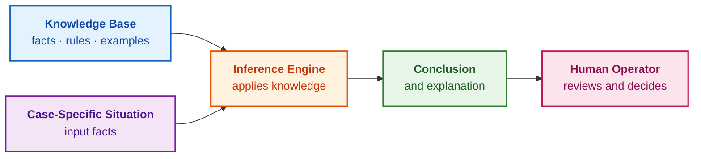
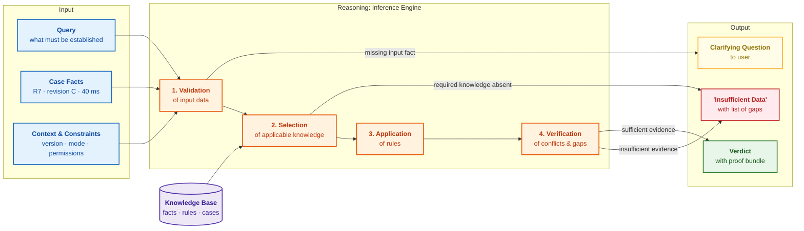
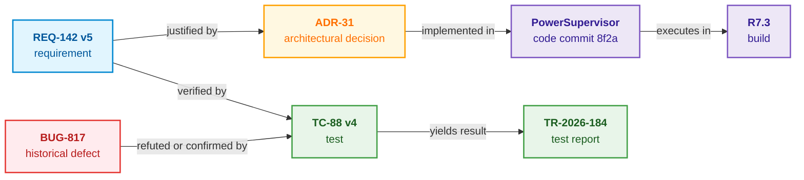

# Chapter 1. Introduction to Expert Systems: From Chaos to Governed Knowledge

> **Book:** [Architecture of Evidence-Governed Expert Systems](README.md) · [Part I: Conceptual and Epistemic Foundations](part-01-foundations.md)  
> **Previous Chapter:** [Part I: Conceptual and Epistemic Foundations](part-01-foundations.md)  
> **Next Chapter:** [Chapter 2. Philosophy for the Engineer: What a Machine May Lawfully Call Knowledge](ch02-epistemology-of-machine-knowledge.md)  
> **Table of Contents:** [README.md](README.md)  
> **Author:** [Mykola Fedchyk](about-the-author.md)  
> **Target Level:** Foundational Engineering  
> **Expected Learning Outcomes:** Distinguish a verifiable expert verdict from search results and generative chatbot outputs; understand the core architectural components of an expert system and its liability boundaries; evaluate whether an expert system is warranted for a team's problem; select an optimal reading pathway through the monograph.

## Abstract

Expert systems represent one of the foundational practical disciplines of artificial intelligence. In the 1960s and 1970s, the DENDRAL program inferred the molecular structure of unknown organic compounds from mass spectrometry data [[1]](#src-1), while MYCIN recommended therapeutic regimens for blood-borne bacterial infections and provided explanatory traces of its deductive reasoning [[2]](#src-2). These landmark projects demonstrated that domain expertise can be systematically codified as explicit facts and production rules, enabling software to apply structured knowledge to novel clinical and physical cases. Edward Feigenbaum famously termed this disciplined methodology knowledge engineering [[3]](#src-3).

Today, artificial intelligence is experiencing a profound architectural renaissance. Large language models readily parse, summarize, and synthesize natural-language text, allowing organizations to process vast volumes of accumulated institutional documentation: technical standards, engineering specifications, test logs, and incident post-mortems. Yet alongside these capabilities, a long-standing engineering challenge has intensified: how can we verify that an automated conclusion is grounded in currently valid, authoritative knowledge rather than merely sounding rhetorically persuasive? The enduring value of expert systems lies in bridging this precise gap: while language models excel at discovering and parsing textual knowledge, an expert system applies verified domain knowledge through deterministic rules and generates an inspectable proof trail. We begin with a concrete engineering scenario illustrating the critical divergence between a plausible answer and a verifiable one.

## 1. Comparative Analysis of Knowledge Acquisition Paradigms: Search, Generative AI, and Evidence-Governed Systems <a id="одне-запитання-три-відповіді"></a>

The choice of architectural paradigm for knowledge retrieval directly dictates whether an engineer receives a verifiable, audited verdict or encounters an uncontrolled illusion of competence. Suppose a software engineer inspects the `PowerSupervisor` embedded firmware module, encounters a hard-coded constant of `40`, and wishes to increase the cold-boot timeout to 60 milliseconds. The engineering question is deceptively straightforward: is this modification safe and permissible? In real-world enterprise codebases, the necessary answer is fragmented across requirements specifications, code comments, test reports, obsolete bug tickets, and the tacit memory of a senior engineer who transitioned to another team a year ago. Anyone who has maintained an industrial product across multiple release cycles recognizes this operational friction.

Let us compare what the engineer obtains from three distinct classes of technical tooling.

| Tool Class | Generated Response | Required Next Engineering Action |
|---|---|---|
| Documentation Search | Requirement `REQ-142`, defect report `BUG-817`, an inline code comment, and 40 pages of hardware specifications | Manually read all retrieved artifacts and determine which specific requirement revision remains legally binding |
| Generative AI Chatbot | "Yes, 60 ms is safe: the engineering specifications establish a 50 ms minimum threshold." | Investigate where the 50 ms figure originated; in this scenario, the number was extracted from an obsolete requirement revision that has been superseded |
| Evidence-Governed Expert System | "A 40 ms timeout violates the rule for hardware revision C during cold boot. While 60 ms satisfies the minimum 55 ms threshold, the change invalidates prior validation and requires re-running test `TC-88`. Sources: `REQ-142` v5, `ADR-31` v3. Final sign-off rests with the designated safety engineer upon successful test completion." | Review each deductive step against the cited authoritative sources and trigger the designated automated test suite |

None of the three responses can guarantee absolute truth in an empirical vacuum. The fundamental difference lies in epistemological auditability: only the third response can be verified step by step without repeating the entire search process from scratch. Documentation search offloads the cognitive burden of synthesis entirely to the human engineer. Generative chatbots perform synthesis, yet fail to disclose which active facts and constraints underpin their output. An evidence-governed expert system explicitly presents the admitted facts, the applied deterministic rule, versioned source artifacts, the precise boundary conditions of the verdict, and the human authority who holds sign-off responsibility.

This monograph is dedicated to software systems of this third category: how to architect, formally verify, and continuously update them so that auditability scales gracefully as the underlying knowledge repository expands. Chapter 1 establishes the formal definition of an expert system, examines why the discipline has returned to the industrial forefront, and delineates the operational boundaries of symbolic automation.

## 2. Engineering and Regulatory Drivers of the Expert System Renaissance

Expert systems are frequently dismissed as historical artifacts of 1980s computer science. However, three contemporary structural shifts in software engineering and regulatory compliance have re-established their practical necessity.

**Plausible text has become commoditized, but formal verification has not.** Contemporary large language models generate articulate, highly technical prose in fractions of a second. For an engineer responsible for critical production infrastructure, this linguistic velocity does not alleviate operational liability: the engineer must verify whether the recommendation aligns with active functional requirements, the deployed hardware revision, and empirical test benchmarks. When an answer lacks an inspectable provenance trail to authoritative sources, verifying its correctness costs almost as much time and cognitive effort as conducting the investigation independently. The primary engineering bottleneck has shifted from text generation to answer verification.

**Regulatory mandates strictly require traceable automated decisions.** The European Union Artificial Intelligence Act (Regulation (EU) 2024/1689) imposes stringent compliance obligations on high-risk AI systems, including mandatory automatic logging of events, transparency for deployers, and effective human oversight (Articles 12–14) [[4]](#src-4). The United States Food and Drug Administration (FDA), in its final guidance on Clinical Decision Support Software, explicitly evaluates whether healthcare professionals can independently review the underlying clinical evidence and rationale behind software-driven recommendations [[5]](#src-5). In automotive systems engineering, ISO 26262 mandates rigorous end-to-end bidirectional traceability for functional safety requirements across hardware and software lifecycles [[6]](#src-6). Within these mission-critical domains, an ungrounded generative response is legally and technically inadmissible as evidence.

**Institutional knowledge leaves engineering organizations faster than physical products retire.** Automotive electronic control units (ECUs), avionics line-replaceable units, and industrial programmable logic controllers (PLCs) operate in production for decades. The multidisciplinary teams that designed and validated these systems often disperse within a few years. The underlying architectural rationales remain trapped in personal memory, abandoned chat channels, and scattered design notes. Once the original context is lost, every subsequent change request degenerates into an expensive forensic investigation.

This brings us to the core thesis of this monograph: **a modern expert system is not a 1980s computing relic, but an architectural governance layer that transforms plausible generative output into audited, verifiable verdicts.** Within an evidence-governed expert system, language models serve as powerful linguistic parsers, while the ultimate verdict is strictly governed by explicit knowledge structures, deterministic rules, and immutable source references inspectable by human engineers.

For Ukrainian engineers, this imperative carries heightened practical urgency. In wartime defense technology, energy grid resilience, and emergency medical logistics, decisions are made under extreme cognitive pressure, amidst incomplete information, and with zero tolerance for failure. In these environments, automated systems must expose their evidentiary foundation and explicitly signal when available data is insufficient. Practical case studies in autonomous robotics and GNSS-denied navigation are examined in [Appendix B](appendix-b-robotics-and-cyber-physical-systems.md) and [Appendix C](appendix-c-autonomous-navigation-and-geosearch.md).

## 3. Historical Boundaries of First-Generation Systems and Lessons of the "AI Winter"

A common engineering skepticism asks: did expert systems not become obsolete during the commercial crash of the late 1980s? This skepticism is grounded in genuine historical realities. Early expert systems achieved undeniable scientific and industrial milestones: DENDRAL determined molecular structures from chemical instrumentation data, MYCIN assisted clinicians in diagnosing infectious diseases, and XCON autonomously configured complex VAX computer orders for Digital Equipment Corporation (DEC) [[7]](#src-7). Yet following the aggressive commercial hype of the 1980s, the field encountered a severe downturn commonly termed the "AI Winter."

The root causes of this collapse were fundamentally engineering-driven:

- **Knowledge acquisition was labor-intensive and economically unscalable:** every heuristic rule had to be manually extracted through grueling interviews with human specialists, creating what Edward Feigenbaum termed the *knowledge acquisition bottleneck*;
- **First-generation rule bases were brittle at domain boundaries:** when confronted with edge cases not anticipated by the rule authors, the systems degraded catastrophically, emitting nonsensical or dangerously erroneous conclusions;
- **Large rule sets became unmaintainable:** thousands of unversioned, interconnected `IF-THEN` rules lacking unit tests, dependency tracking, and explicit ownership turned enterprise rule bases into unmanageable "spaghetti logic";
- **Specialized AI hardware succumbed to commodity computing:** expensive proprietary LISP machines were rapidly made obsolete as commodity microprocessors and Unix workstations surpassed them in cost-performance.

Modern software engineering addresses many of these historical failure modes. Contemporary language models and natural language processing pipelines assist in extracting candidate knowledge primitives from thousands of unstructured technical specifications, though human experts and formal rules remain the ultimate gatekeepers of validity. Distributed version control systems, graph databases, and continuous integration (CI) pipelines allow knowledge to be managed strictly as code: versioned, dependency-mapped, regression-tested, and audited. Computational workloads that once demanded proprietary symbolic hardware execute seamlessly on standard server hardware.

What remains unaltered is the fundamental epistemic requirement: knowledge requires an identified owner, authoritative provenance, rigorous verification, and clearly defined operational boundaries. The objective of this monograph is not to revive the naive expert systems of the 1980s, but to synthesize their greatest strength—explicit, verifiable, and explainable symbolic deduction—with modern techniques for parsing unstructured text and enterprise data. The historical evolution from Bayes' theorem to modern evidence-governed AI is detailed in [Chapter 4](ch04-evolution-from-bayes-to-evidence-ai.md); integrating language models with deterministic inference is formalized in [Chapter 29](ch29-neuro-symbolic-architecture.md); and systematic methodologies for mitigating machine hallucinations and knowledge gaps are developed in [Chapter 38](ch38-curing-machine-hallucinations-and-knowledge-deficits.md).

## 4. Ontology of Expert Knowledge: Formalizing Tacit Experience and Engineering Decisions <a id="хто-такий-експерт-і-що-з-його-знань-можна-передати-програмі"></a>

Engineering an evidence-governed system begins with formalizing expert domain knowledge: one must clearly demarcate tacit human intuition from the structured facts and rules that can be lawfully delegated to automated execution. In this monograph, an **expert** is defined as an individual who possesses deep conceptual knowledge and empirically validated practical experience within a delimited domain, routinely solves non-standard problems, and can formally articulate the evidentiary rationale behind their conclusions.

Consider a systems engineer specializing in the power distribution architecture of an embedded avionics platform. This engineer understands not only written requirements specifications, but also latent failure modes, thermal tolerances, measurement error margins, and the cascading impacts of parameter changes. However, expertise in power electronics does not confer authority in clinical pharmacology or regulatory jurisprudence.

Five operational criteria define genuine domain expertise:

1. **Domain Knowledge:** mastery of foundational facts, physical laws, formal concepts, rules, and investigative methodologies within the discipline.
2. **Empirical Experience:** exposure to an extensive history of real-world operational scenarios, particularly catastrophic edge cases and system anomalies.
3. **Structured Reasoning:** the capacity to map raw case-specific observations to rigorous, defensible conclusions.
4. **Explanatory Capability:** the ability to articulate why a specific hypothesis was selected and why competing alternatives were rejected.
5. **Epistemic Humility:** clear recognition of operational boundaries—knowing precisely when available data is insufficient or when a specialist from an adjacent discipline must be engaged.

Corporate titles, training certificates, and authoritative conversational style do not constitute expertise. Similarly, document search engines, document repositories, and large language models are not experts: they index and summarize textual patterns, but lack physical accountability and cannot assume legal or operational responsibility for a system failure. Furthermore, systems architects must strictly distinguish between **competence** and **authority**. An expert synthesizes evidence to formulate an actionable recommendation; formal sign-off to deploy software, treat a patient, or invoke a legal statute rests exclusively with an authorized, legally accountable human decision-maker.

Not all expert experience can be formalized. Gut feelings, subtle situational intuition, and instinctive pattern recognition often remain tacit. An expert system operates strictly on the subset of knowledge that has been explicitly codified: structured facts, formal rules, causal graphs, and validated case libraries. Systematic methodologies for eliciting these tacit insights from domain specialists are detailed in [Chapter 11](ch11-knowledge-elicitation-from-experts.md).

## 5. Architectural Components of an Evidence-Governed Expert System

To guarantee determinism and explainability, the architecture of an expert system relies on a strict decoupling of stored domain knowledge from the computational engine that applies it. While academic textbooks offer varying definitions, modern mission-critical engineering adheres to the following working definition:

> An **expert system** is a software system that maintains an explicit repository of codified expert knowledge within a delimited domain, applies this knowledge deterministically to the facts of a specific case, and generates a fully inspectable explanation of its deductive verdict.

An expert system does not emulate human consciousness or general cognition. Software possesses no innate experience, ethical accountability, or physical intuition. Instead, the system deterministically executes codified expert knowledge with mathematical consistency. Its operational scope is necessarily bounded: diagnosing a physical device, verifying release criteria, recommending repair sequences, or identifying applicable legal provisions. An expert system provides immense industrial value precisely because it operates within well-defined, provable boundaries.

An authentic expert system exhibits seven core operational characteristics:

| Architectural Characteristic | Engineering Meaning for Practitioners |
|---|---|
| Delimited Domain Scope | The system explicitly specifies which problem classes it resolves and which fall outside its boundary |
| Decoupled Knowledge Base | Domain facts, ontologies, and rules can be inspected, updated, and regression-tested independently of core logic |
| Case-Specific Reasoning | Identical, stable domain knowledge is applied systematically to novel input scenarios |
| Auditable Explanation | Every verdict exposes the exact facts, applied production rules, and source documents utilized |
| Handling of Incompleteness | The system reliably returns a typed "insufficient data" refusal rather than hallucinating plausible assumptions |
| Controlled Evolution | New engineering knowledge is incorporated through versioned artifacts without requiring full application recompilation |
| Explicit Authority Boundaries | The system establishes an unambiguous boundary between its automated recommendation and human decision-making authority |

The most critical architectural invariant is the formal separation between domain knowledge and the execution mechanism that processes it. At minimum, a foundational expert system comprises two primary components:

1. The **Knowledge Base** stores structured domain axioms, rules, facts, and relational models.
2. The **Inference Engine** evaluates the knowledge base against the facts of a specific case to derive sound conclusions.

The resulting conclusion is presented to the user accompanied by a complete justification trace:



### 5.1. Knowledge Base: Formal Representation of Facts, Rules, and Ontologies <a id="що-таке-база-знань"></a>

A **knowledge base** is neither an unstructured directory of PDF specifications nor merely a relational database table. It is a formalized, logically indexed representation of all propositions that an expert system is legally and computationally permitted to leverage during inference:

- **Facts:** e.g., "Device family R7 utilizes hardware revision C";
- **Production Rules:** e.g., "IF hardware revision = C and operating mode = cold start, THEN minimum timeout must be $\ge 55\text{ ms}$";
- **Relational Links:** e.g., "Requirement `REQ-142` is validated by test specification `TC-88`";
- **Precedent Cases:** e.g., "An identical timing fault manifested during cold thermal testing in firmware release R6";
- **Provenance and Validity Scope:** who authored the proposition, which product revision it applies to, and its formal lifecycle validity interval.

Unstructured engineering documents serve as source material for the knowledge base, but raw documents do not constitute a knowledge base on their own. The expert system must track the semantic category, schema version, and causal relationships of every ingested artifact.

### 5.2. Inference Engine: Deterministic Resolvers and Halting Rules

The **inference engine** is the deterministic software component that ingest the admitted facts of a case, retrieves applicable rules from the knowledge base, and derives validated conclusions. An inference engine is not an opaque neural network or a probabilistic autoregressive model.

Consider a fundamental production rule:

```text
IF hardware revision = C
AND operating mode = cold start
AND timeout < 55 ms,
THEN timeout adjustment and retesting are required.
```

When an engineer inputs hardware revision C, cold-boot mode, and a timeout parameter of 40 ms, the inference engine evaluates these assertions against the rule premises. The resulting verdict is not an ambiguous linguistic suggestion ("60 ms seems preferable"), but a deterministic deduction: "The rule fired based on three verified input facts; modification requires re-running validation test `TC-88`."

Industrial inference engines operate beyond basic propositional `IF-THEN` rules. They incorporate first-order predicate logic, probabilistic reasoning, constraint satisfaction techniques, graph-relational traversals, and case-based reasoning (CBR). However, the foundational invariant remains constant: knowledge is decoupled from the execution mechanism that processes it.

### 5.3. Practical Implementation: Verification Test Bench for Interface Changes in Go

For a software engineering team, an expert verification task may be tightly focused: does an automated test run provide sufficient evidentiary justification to promote an API interface change to production release review? Consider an educational governance policy requiring an approved, passing execution run of `TEST-API` for release 3.2, with a response latency not exceeding 100 ms. (Identifiers and parameters are illustrative.) A policy exception may permit higher latency, but only for a strictly specified policy version, release tag, and test report; it cannot override a failing test or absent test evidence.

The implementation below cleanly decouples the codified policy rule from the test execution report and the assessment engine. It does not perform document retrieval or generate natural-language prose. Running this test bench requires a standard Go installation; placing `release.go` and `release_test.go` in a directory enables direct execution via `go run release.go` and `go test -v release.go release_test.go`. The complete implementation is enclosed in the collapsible block below.

<details>
<summary>Minimal Go Verification: Program and Boundary Test Cases</summary>

Program `release.go`:

```go
package main

import "fmt"

type Policy struct {
    Version, RequiredTest string
    MaxLatencyMS          int
}

type Report struct {
    ID, Release, TestID          string
    LatencyMS                    int
    Passed, Approved, Revoked    bool
}

type Exception struct {
    PolicyVersion, Release, ReportID string
    MaxLatencyMS                     int
    Approved, Revoked                bool
}

func Assess(policy Policy, release string, reports []Report, exception *Exception) (string, []string) {
    if policy.Version == "" || policy.RequiredTest == "" || policy.MaxLatencyMS <= 0 || release == "" {
        return "UNKNOWN", []string{"incomplete policy or release"}
    }
    basis := []string{"policy:" + policy.Version}
    var applicable []Report
    for _, report := range reports {
        if report.ID != "" && report.Release == release && report.TestID == policy.RequiredTest && report.Approved && !report.Revoked {
            applicable = append(applicable, report)
        }
    }
    if len(applicable) == 0 {
        return "UNKNOWN", append(basis, "no admissible report for this release")
    }
    if len(applicable) > 1 {
        return "CONFLICT", append(basis, "multiple reports require an explicit selection policy")
    }
    report := applicable[0]
    basis = append(basis, "report:"+report.ID)
    if report.LatencyMS < 0 {
        return "UNKNOWN", append(basis, "invalid measurement")
    }
    if !report.Passed {
        return "BLOCKED", append(basis, "required test failed")
    }
    if report.LatencyMS <= policy.MaxLatencyMS {
        return "READY_FOR_REVIEW", basis
    }
    if exception != nil && exception.Approved && !exception.Revoked &&
        exception.PolicyVersion == policy.Version && exception.Release == release &&
        exception.ReportID == report.ID && report.LatencyMS <= exception.MaxLatencyMS {
        return "REVIEW_EXCEPTION", append(basis, "approved scoped latency exception")
    }
    return "BLOCKED", append(basis, "latency exceeds the project limit")
}

func main() {
    policy := Policy{Version: "P1", RequiredTest: "TEST-API", MaxLatencyMS: 100}
    report := Report{ID: "RUN-32-1", Release: "3.2", TestID: "TEST-API", LatencyMS: 90, Passed: true, Approved: true}
    status, basis := Assess(policy, "3.2", []Report{report}, nil)
    fmt.Printf("%s: %v\n", status, basis)
}
```

Test suite `release_test.go`:

```go
package main

import "testing"

func TestAssessmentBoundaries(t *testing.T) {
    policy := Policy{Version: "P1", RequiredTest: "TEST-API", MaxLatencyMS: 100}
    base := Report{ID: "RUN-32-1", Release: "3.2", TestID: "TEST-API", LatencyMS: 100, Passed: true, Approved: true}
    for _, testCase := range []struct {
        name     string
        mutate   func(*Report)
        expected string
    }{
        {"boundary", func(report *Report) {}, "READY_FOR_REVIEW"},
        {"over limit", func(report *Report) { report.LatencyMS = 101 }, "BLOCKED"},
        {"negative measurement", func(report *Report) { report.LatencyMS = -1 }, "UNKNOWN"},
        {"other release", func(report *Report) { report.Release = "3.1" }, "UNKNOWN"},
        {"revoked", func(report *Report) { report.Revoked = true }, "UNKNOWN"},
        {"unapproved", func(report *Report) { report.Approved = false }, "UNKNOWN"},
        {"test failed", func(report *Report) { report.Passed = false }, "BLOCKED"},
    } {
        t.Run(testCase.name, func(t *testing.T) {
            report := base
            testCase.mutate(&report)
            status, basis := Assess(policy, "3.2", []Report{report}, nil)
            if status != testCase.expected || len(basis) == 0 {
                t.Fatalf("got %s %v, want %s", status, basis, testCase.expected)
            }
        })
    }
    for _, reports := range [][]Report{nil, {base, base}} {
        status, _ := Assess(policy, "3.2", reports, nil)
        if status == "READY_FOR_REVIEW" {
            t.Fatal("missing or competing evidence must not pass")
        }
    }
    base.LatencyMS = 110
    exception := Exception{PolicyVersion: "P1", Release: "3.2", ReportID: base.ID, MaxLatencyMS: 120, Approved: true}
    if status, _ := Assess(policy, "3.2", []Report{base}, &exception); status != "REVIEW_EXCEPTION" {
        t.Fatal("scoped approved exception not recognized")
    }
    exception.PolicyVersion = "P0"
    if status, _ := Assess(policy, "3.2", []Report{base}, &exception); status != "BLOCKED" {
        t.Fatal("exception from another policy applied")
    }
    exception.PolicyVersion = "P1"
    exception.Revoked = true
    if status, _ := Assess(policy, "3.2", []Report{base}, &exception); status != "BLOCKED" {
        t.Fatal("revoked exception applied")
    }
}
```

</details>

Executing this code prints: `READY_FOR_REVIEW: [policy:P1 report:RUN-32-1]`. This verdict denotes strictly that the API release criteria for this specific policy have been met, not an unconditional release sign-off for the entire product. The test suite demonstrates other deterministic outcomes: missing or revoked reports trigger `UNKNOWN`, a failed test or latency violation triggers `BLOCKED`, and competing test runs emit `CONFLICT`. A formal exception triggers a distinct `REVIEW_EXCEPTION` state requiring explicit human evaluation rather than silent automatic bypass.

Operational boundaries of this minimal implementation: approval and revocation flags are accepted as input primitives. The module does not verify cryptographic signatures, query an enterprise authorization service, validate whether the test suite covers all critical code paths, or autonomously ascertain policy currency. Such enterprise controls are integrated in subsequent architecture layers; beginning with a complex LLM or graph database cluster is unnecessary for this class of deterministic verification. [Chapter 17](ch17-implementation-stack.md) analyzes when a minimal implementation must scale to an enterprise stack, while [Chapter 25](ch25-how-expert-systems-learn.md) addresses knowledge evolution, invalidation, and revocation over time.

### 5.4. System Classification by Inference Architecture and Operational Modes

In their seminal 1983 text *Building Expert Systems*, Frederick Hayes-Roth, Donald Waterman, and Douglas Lenat articulated ten canonical operational problem classes for expert systems [[8]](#src-8):

1. **Interpretation:** analyzing sensor or instrumentation data to infer system state. (e.g., DENDRAL determining organic molecular structures from mass spectra).
2. **Prediction:** forecasting probable downstream consequences of an active operating state, such as estimating component wear and remaining useful life.
3. **Diagnosis:** identifying root-cause malfunctions from observed anomalies and symptoms. Techniques for disambiguating superficial symptoms from primary failure mechanisms are treated in [Chapter 24](ch24-system-diagnosis.md).
4. **Design:** synthesizing physical or logical configurations that satisfy engineering constraints, exemplified by XCON configuring compatible VAX computer hardware.
5. **Planning:** formulating optimal, constraint-governed action sequences across resource and temporal boundaries.
6. **Monitoring:** continuously comparing real-time operational metrics against nominal performance envelopes and alerting on hazardous deviations.
7. **Debugging:** generating verified remediation sequences for an isolated system fault.
8. **Repair:** executing and tracking remediation plans through physical or software modification workflows.
9. **Instruction:** diagnosing student conceptual errors and guiding pedagogical remediation.
10. **Control:** integrating interpretation, prediction, monitoring, and remediation into real-time closed-loop governance.

Production systems frequently synthesize multiple tasks—such as combining diagnosis, debugging, and repair orchestration. Modern expert systems are further categorized by their knowledge formalisms (production rules, description logics, causal Bayesian networks, case-based libraries), latency budgets, uncertainty reasoning frameworks, and deployment footprints ranging from cloud clusters to resource-constrained microcontrollers. Comparative analysis of knowledge models is presented in [Chapter 7](ch07-knowledge-base-typology.md). Handling epistemic and aleatoric uncertainty is treated in [Chapter 4](ch04-evolution-from-bayes-to-evidence-ai.md) and [Chapter 6](ch06-applied-mathematics-for-expert-systems.md). Edge versus backend computational allocation is formalized in [Chapter 18](ch18-execution-infrastructure.md) and [Chapter 22](ch22-cybernetics-edge-to-backend.md).

## 6. Query Processing Cycle: Phases of Transformation from Input Facts to Verdict

From an external perspective, an expert system resembles standard software: input data is ingested, processed by the inference engine, and a result is emitted. The architectural distinction lies in the output contract: a valid, correct result is not restricted to a definitive answer; it may lawfully manifest as a targeted clarifying inquiry or a formal, justified refusal. The lifecycle diagram below illustrates this end-to-end processing pipeline.



This diagram is evaluated from left to right. Blue nodes denote user-supplied input data; orange nodes represent the deterministic steps of the inference engine; purple indicates the persistent knowledge base. The three terminal states on the right represent the permissible outcomes of the inference cycle: yellow indicates an input fact deficit resolvable by the user; red denotes a knowledge base deficit or evidence contradiction; green indicates that the evidentiary basis is mathematically sufficient to derive an authoritative verdict.

### 6.1. Input Context Validation and Fact Extraction Phase <a id="вхід-міркування-і-вихід"></a>

Before executing logical inference, the expert system must validate incoming observations and translate an unstructured query into typed predicates. The system ingests four categories of input data:

- **Query / Objective:** the specific proposition or parameter requiring formal determination;
- **Case Facts:** empirical observations regarding the specific hardware unit, patient, artifact, or system event;
- **Operational Context:** software version, timestamp, environmental mode, and regulatory jurisdiction;
- **Constraints & Permissions:** which evidence sources are legally accessible and the credentials of the requesting operator.

For the cold-boot timeout scenario, the normalized input appears as follows:

```text
Query: Can the timeout be increased from 40 to 60 ms?
Product: R7
Hardware revision: C
Mode: cold start
Applicable requirement: REQ-142, version 5
```

The user does not re-supply the entire knowledge base with each request: validated domain rules, ontology schemas, and historical precedents already reside within the system. The input specifies strictly the parameters of the active case.

### 6.2. Deterministic Inference and Defeater Search Phase

Once input facts are admitted, the inference engine executes domain rules while simultaneously searching for conflicting assertions or defeaters across four discrete steps:

1. **Input Data Validation:** The engine verifies query well-formedness and predicate completeness. If the hardware revision is omitted, the timeout rule cannot be evaluated; the engine halts and prompts the operator for clarification.
2. **Knowledge Selection:** The engine extracts only the rules and constraints applicable to the current operational scope: the revision C cold-boot rule, requirement `REQ-142` v5, and test specification `TC-88`.
3. **Rule Execution:** The engine matches input facts against rule antecedents. For an input timeout of 40 ms, the rule "for revision C under cold boot, timeout must be $\ge 55\text{ ms}$" fires.
4. **Defeater and Contradiction Verification:** The engine inspects the derivation graph for logical contradictions, expired source documents, or missing links. If a newer revision of `REQ-142` has been approved, the engine must construct the deduction on the superseding revision or reject the evaluation.

Every inferential step leaves an auditable execution trace: which facts were admitted, which rules fired, and which defeater checks were executed. This trace forms the backbone of the subsequent explanation.

### 6.3. Evidence Bundle Synthesis and Audit Trail Logging Phase

Inference concludes with the generation of an auditable proof packet. Depending on the resolution of the reasoning cycle, three valid terminal outcomes can occur:

- **Verdict with Proof Bundle:** Emitted when evidentiary grounds are fully satisfied. In our timeout scenario: "40 ms violates the rule for revision C; 60 ms is acceptable subject to retesting via `TC-88`."
- **Targeted Clarifying Question:** Emitted when an input parameter is missing but elicitable from the user (e.g., "Which operational start mode is being evaluated?").
- **Typed "Insufficient Data" Refusal:** Emitted when necessary domain knowledge or empirical evidence is absent from the knowledge base. If hardware revision D is deployed but no timeout rule has been codified for it, the system explicitly flags the missing rule rather than heuristically extrapolating the rule for revision C.

All three outcomes represent mathematically valid and successful terminations. An architectural failure occurs only in a fourth, unacceptable state: an ungrounded, confident assertion fabricated without supporting evidence. A fluent hallucination does not become an expert verdict simply because it is well-phrased. Architectures that integrate rigorous refusal with advisory hypotheses—explicitly flagged as unverified—are explored in [Chapter 28](ch28-dual-mode-expert-systems.md).

## 7. Structure of the Evidence Justification Package (Proof Bundle)

The foundational differentiator between an evidence-governed system and a generative text synthesizer is the mandatory generation of a **Proof Bundle**—a self-contained, auditable artifact that documents the complete deductive path to the verdict.

> An **expert response** is defined as an actionable verdict for a specific case accompanied by a comprehensive justification trace: which facts were evaluated, which domain rules fired, which versioned source artifacts substantiate the conclusion, what operational limitations exist, and what next engineering actions are mandated.

Labeling an answer "expert" provides no mystical guarantee of infallible truth. An automated response will be incorrect if its input observations or underlying knowledge rules contain errors. The decisive advantage is epistemic transparency: the deductive path is fully exposed, enabling human engineers to inspect, challenge, and correct the error.

The complete evidence bundle for the timeout scenario appears as follows:

```text
Verdict: The value 40 ms violates the rule for revision C during
cold start. The value 60 ms satisfies the minimum 55 ms threshold,
but the modification requires retesting.

Evaluated facts: product R7; revision C; cold start; current value 40 ms.
Applied rule: for revision C during cold start, timeout must be ≥ 55 ms.
Sources: REQ-142 v5; ADR-31 v3; test TC-88 v4.
Unverified: behavior under other operating modes and impact on adjacent components.
Next action: configure 60 ms in a test build and rerun TC-88.
Final decision: designated responsible engineer following test execution.
```

This structured artifact is designated the **proof packet** (or *proof bundle*). It encapsulates the verdict, the admitted premises, the fired rules, versioned source identifiers, known epistemic boundaries, and the human authority designated for sign-off. A language model may render this bundle into fluent prose, but the underlying citations, execution traces, and authorization limits are generated by deterministic expert system components, not sampled from autoregressive weights. The automated synthesis of explanation traces and justification trees is examined in [Chapter 20](ch20-explanation-engine.md).

The technical rigor of an expert response is defined neither by verbose prose nor by confident rhetorical phrasing. It is defined solely by the auditability of the deductive trajectory connecting raw premises to the final verdict.

## 8. End-to-End Traceability Graph: Connecting Configuration Parameters to Engineering Artifacts

Returning to the `PowerSupervisor` module: why is a single configuration timeout inextricably tied to six heterogeneous project artifacts? Basic text search retrieved requirement `REQ-142`, bug report `BUG-817`, an inline code comment, and 40 pages of specifications. To render an engineering decision, the system must establish:

1. Which revision of `REQ-142` is legally binding for product release `R7`;
2. Which architectural decision record (ADR) justifies the baseline timeout parameter;
3. Whether defect `BUG-817` was triggered by an identical physical root cause;
4. Which automated tests validate the requirement on current target hardware;
5. Whether modifying the parameter triggers mandatory functional safety or cybersecurity reviews;
6. Who possesses designated authority to sign off on the change and grant an operational exception.



A typed dependency graph is vastly superior to an unstructured document folder because it formalizes the semantic nature of each relationship. However, a graph edge can itself be erroneous or obsolete. Consequently, every node and relation must record its provenance, author or extraction pipeline, ingestion timestamp, operational scope, version hash, and verification status. Constructing and validating an enterprise-wide engineering knowledge graph is treated in [Chapter 9](ch09-engineering-knowledge-graph-traceability.md). Extracting requirements from specifications and translating them into verifiable formal rules is detailed in [Chapter 14](ch14-requirements-detection-and-formalization.md).

## 9. Semantic Differentiation: Transitioning from Raw Documents to Structured Knowledge Objects <a id="документ-не-дорівнює-знанню"></a>

The traceability graph connects heterogeneous documents: requirements, ADRs, test suites, and validation reports. For automated reasoning, document-level granularity is insufficient: an inference engine cannot execute a raw 50-page document; it evaluates atomic, typed propositions. Within any technical report, verifiable physical measurements are intermingled with speculative hypotheses, verbatim quotations, and informal suggestions. Consider test report `TR-2026-184` from the traceability graph, recording the execution of test `TC-88` on device `R7`:

```text
Test Report TR-2026-184
Test: TC-88 v4, cold start of PowerSupervisor module
Product: R7, hardware revision C, build R7.3
Date: 2026-07-18
Result: FAILED

During cold start, the unit rebooted. According to oscilloscope trace
scope-441, the supply voltage stabilized 52 ms after power-on,
whereas the PowerSupervisor module timeout (40 ms) tripped earlier.

Conclusion: 40 ms timeout is insufficient for revision C.
Per REQ-142 v5, the timeout for revision C during cold start must be
at least 55 ms.
Proposal: set to 60 ms and rerun TC-88 following safety review.

Attachments: scope-441.csv
```

An experienced engineer reading this report immediately isolates what was physically measured, what was inferred, the origin of the 55 ms constraint, and what corrective action is proposed. A traditional search index, which ingests the document as a monolithic string of text, makes no such distinction. Ingesting raw documents directly into a knowledge base forces the inference engine to assign identical epistemic weight to an author's casual opinion and an empirical measurement. Furthermore, a paraphrased summary of requirement `REQ-142` would linger in the system even after the primary specification is revised.

Before ingestion into the knowledge base, documents must be decomposed into typed, atomic propositions. The expert system stores each proposition alongside its source provenance, applicability scope, and verification status. In this monograph, such an atomic record is designated a **knowledge object**. An engineering expert system must distinguish at least five foundational knowledge object types:

| Knowledge Object Type | Excerpt from Report `TR-2026-184` | Mandatory Metadata to Persist |
|---|---|---|
| **Observation:** empirical measurement or recorded physical event | "Supply voltage stabilized at 52 ms; 40 ms timeout tripped earlier; unit rebooted" | Measuring technician or instrument ID, timestamp, test conditions (unit, revision, mode), measurement error margins |
| **Claim:** formal deduction or assertion formulated by human or algorithm | "40 ms timeout is insufficient for revision C" | Author, operational applicability scope, validation status, validity interval |
| **Evidence:** immutable file recording raw empirical observations | Report artifact `TR-2026-184.pdf` and raw trace `scope-441.csv` | Canonical URI, document revision, SHA-256 content hash, access control policy |
| **Rule:** generalized conditional implication (`IF ... THEN ...`) | "For revision C under cold boot, timeout $\ge 55\text{ ms}$" (derived from `REQ-142` v5) | Antecedent, consequent, exceptions, primary source URI and revision, rule owner, automated verification tests |
| **Recommendation / Decision:** proposed or ratified engineering action | "Set to 60 ms and rerun `TC-88` following safety review" | Supporting facts and rules, rejected alternatives, signing authority, execution status |

This semantic separation is essential to prevent erroneous automated deductions. Each distinct type guards against a specific class of failure:

- **An observation records a single empirical event:** The oscilloscope trace captures one test run on one physical unit. Whether supply rails stabilize identically across all revision C hardware cannot be deduced from a single observation.
- **A claim often exceeds the scope of its underlying observation:** The report author measured a single unit, yet asserted an operational claim across "revision C" as an entire hardware class. The verification status field tracks whether this claim has been substantiated across statistically significant samples.
- **Evidence substantiates only its own recorded content:** Report `TR-2026-184` proves exclusively what occurred during one run of `TC-88` v4 on build R7.3. A cryptographic content hash (SHA-256) guarantees tamper-evident detection if the underlying artifact is altered.
- **Rules must be linked to primary specifications, not secondary summaries:** The report merely quotes requirement `REQ-142` v5. If the requirement advances to version 6, the summary in the report is obsolete, whereas the rule in the knowledge base must update synchronously with the primary specification. Unowned, untested rules inevitably drift and diverge from physical reality.
- **A recommendation is not an authorized decision:** The suggestion to set the timeout to 60 ms is a proposal. It becomes an operational decision only when signed off by the designated safety authority following formal review.

In Section [5.1](#що-таке-база-знань), the contents of a knowledge base were defined as facts, rules, relations, cases, sources, and bounds. These five knowledge object types operationalize how those primitives are extracted from enterprise documentation. A verified observation or claim becomes an active fact. A codified requirement becomes an executable rule. A resolved failure case packages observations, validated root causes, and corrective actions. Evidence objects maintain immutable citations. Scope and validity intervals define operational boundaries, and typed relations link objects into an auditable graph.

### 9.1. Canonical Structure of a Minimal Knowledge Object

To enable consistent ingestion, indexing, and automated verification across heterogeneous data sources, all knowledge objects adhere to a standardized schema. A minimal, robust schema requires the following fields:

- Unique identifier and semantic knowledge object type;
- Concise natural-language proposition (e.g., "A 40 ms timeout is too short for hardware revision C during cold start");
- Subject entity and operational scope: the component under evaluation, applicable product revisions, operational modes, and environment;
- Author and versioned source reference: originating individual or tool and the primary document revision;
- Array of cryptographic evidence references;
- Formal verification status;
- Temporal validity interval (`valid_from`, `valid_to`);
- Designated owner responsible for lifecycle maintenance;
- Access control policy governing read permissions.

Each field enforces a specific verification check. Scope parameters prevent invalid extrapolation of revision C assertions onto revision D hardware. Source versioning triggers automated re-evaluation when primary documentation is updated. The owner field identifies the human engineer accountable for ongoing review.

<details>
<summary>Technical Implementation Example in JSON Format</summary>

The **JavaScript Object Notation (JSON)** listing below illustrates the formal encoding of the claim extracted from the test report:

```json
{
  "id": "claim:power-timeout:r7-rev-c-cold-start",
  "type": "claim",
  "statement": "A 40 ms timeout is too short for hardware revision C during cold start",
  "subject": "component:PowerSupervisor",
  "scope": {
    "product": "R7",
    "hardware_revision": "C",
    "mode": "cold_start"
  },
  "author": "team:power-validation",
  "source": "test-report:TR-2026-184@v1",
  "evidence": [
    "observation:TR-2026-184:power-settling-52ms",
    "trace:scope-441@v1"
  ],
  "status": "candidate",
  "valid_from": "2026-07-18T00:00:00Z",
  "valid_to": null,
  "owner": "team:power-safety",
  "access_policy": "project:R7/safety-engineering",
  "schema_version": "knowledge-object@1.0"
}
```

The designation `status=candidate` indicates that the proposition is substantiated by a single test run. Following cross-sample validation, the owning `power-safety` team can elevate its status to `verified_for_scope`. A null `valid_to` field denotes an open-ended validity period, not perpetual immutability. The `evidence` array provides bidirectional links to the underlying observation object and the raw oscilloscope CSV trace.

The `access_policy` attribute enforces mandatory security perimeters. Access controls must propagate to all derived representations: full-text search indexes, vector embeddings, caching tiers, and generated summaries. Otherwise, proprietary or classified propositions could leak to unauthorized operators via generative language model output.

</details>

Knowledge objects define what is maintained in the knowledge base. The architecture of the ingestion pipeline that parses, validates, and routes these objects into the inference engine is examined below.

## 10. Engineering Knowledge Pipeline: From Source Acquisition to Human Verification

While the knowledge base and inference engine constitute the operational core of an expert system, three supporting components are required for industrial deployment: **Knowledge Acquisition** ingests and validates domain propositions from documents, instrumentation, and human experts; the **Explanation Engine** generates inspectable execution traces; and the **User Interface** (CLI, REST API, web console, or interactive dialogue) ingests queries and delivers proof bundles.

```mermaid
flowchart LR
    accTitle: Architecture of an Evidence-Governed Expert System
    accDescr: Documents and test results pass through the knowledge acquisition system into the knowledge base. Case-specific facts enter alongside each query. The inference engine combines verified knowledge with case facts to produce an explained verdict for human review, and human corrections feed back into knowledge acquisition.

    SRC["<b>1. Sources</b><br/>documents · code · tests"] --> KAS["<b>2. Knowledge Acquisition</b><br/>identifies & verifies knowledge"]
    KAS --> KB["<b>3. Knowledge Base</b><br/>facts · rules · relations"]
    CASE["<b>Case Facts</b><br/>query · measurements · logs"] -->|"with each query"| IE["<b>4. Inference Engine</b><br/>applies rules"]
    KB -->|"verified knowledge"| IE
    IE --> OUT["<b>5. Verdict & Explanation</b><br/>what · why · evidentiary basis"]
    OUT --> HUM["<b>Human Operator</b><br/>reviews and decides"]
    HUM -->|"corrections"| KAS

    classDef src fill:#f3e5f5,stroke:#7b1fa2,stroke-width:2px,color:#4a148c;
    classDef fact fill:#e3f2fd,stroke:#1565c0,stroke-width:2px,color:#0d47a1;
    classDef kas fill:#e0f2f1,stroke:#00796b,stroke-width:2px,color:#004d40;
    classDef kb fill:#e8eaf6,stroke:#3f51b5,stroke-width:2px,color:#1a237e;
    classDef ie fill:#fff3e0,stroke:#e65100,stroke-width:2px,color:#bf360c;
    classDef out fill:#e8f5e9,stroke:#2e7d32,stroke-width:2px,color:#1b5e20;
    classDef hum fill:#fce4ec,stroke:#c2185b,stroke-width:2px,color:#880e4f;

    class SRC src;
    class CASE fact;
    class KAS kas;
    class KB kb;
    class IE ie;
    class OUT out;
    class HUM hum;
```



1. **Sources:** Requirements specifications, source code, CI/CD test artifacts, architectural decision records, bug trackers, and human expert interviews. Every ingested source must be strictly versioned to prevent silent semantic drift.
2. **Knowledge Acquisition System (KAS):** Rather than indiscriminately ingesting documents, KAS validates access permissions, tracks document lineage, extracts candidate knowledge objects and typed relations, and routes them to automated linters or human experts for formal sign-off. Detailed KAS architecture is treated in [Chapter 10](ch10-knowledge-acquisition-systems.md).
3. **Knowledge Base:** Stores admitted facts, formal rules, ontologies, and validated cases with immutable source citations.
4. **Inference Engine:** Combines persistent knowledge with incoming case-specific facts, applies matching rules, and derives sound conclusions. Ingested documents serve not as direct textual outputs, but as evidentiary grounding for formal reasoning.
5. **Verdict and Explanation:** Emitted to the human operator as a structured proof bundle. Expert corrections and review feedback route directly back to the KAS to refine rule definitions.

**Case facts** enter the inference engine via a distinct data path from persistent knowledge. The knowledge base maintains generalized, durable domain rules valid across multiple instances (e.g., the timeout rule holds for all revision C units). Case facts describe an isolated, transient operational situation (e.g., device serial number 401, revision C, cold-boot mode, 40 ms baseline). Case facts are supplied dynamically via API payloads, telemetry streams, or operational logs.

Input facts must undergo validation: establishing provenance, engineering units, product revision alignment, and freshness. An error in an input fact invalidates the deduction as severely as an erroneous rule. If an input query erroneously specifies revision D instead of C, the inference engine finds no matching rule and emits a refusal, even though an authoritative rule for revision C exists.

Case facts do not automatically become persistent knowledge. Once an edge-case investigation concludes, an authorized engineer may elevate the case to the KAS as a novel precedent or a rule refinement. This feedback loop is depicted by the "corrections" edge in the architecture diagram.

Comprehensive enterprise architectures and end-to-end evidence pipelines are detailed in [Chapter 16](ch16-expert-systems-architecture.md) and [Chapter 19](ch19-from-question-to-evidence.md).

## 11. Comparative Architecture Analysis: Search Engines, RAG Pipelines, and Evidence-Governed Expert Systems

Selecting an optimal architecture for knowledge management requires rigorously benchmarking evidence-governed expert systems against adjacent technological paradigms—from full-text search to modern Retrieval-Augmented Generation (RAG). To establish clear technical baselines:

- **Chatbot:** Conversational natural-language interface;
- **Full-Text Search:** Lexical index matching exact keywords, token stems, and phrases;
- **Semantic / Vector Search:** Approximate nearest-neighbor matching across dense vector embeddings;
- **Retrieval-Augmented Generation (RAG):** Hybrid pipeline that retrieves text chunks via lexical or vector search and supplies them as contextual prompts to a generative language model [[9]](#src-9);
- **Knowledge Graph:** Directed graph formalizing entities and typed relationships;
- **Rule Engine:** Deterministic pattern-matching engine executing formal production rules over input facts;
- **Evidence-Governed Expert System:** Integrated architecture uniting explicit knowledge representation, formal inference, auditable explanation bundles, and defined liability boundaries.

| Architectural Class | Core Capability | Inherent Operational Limitation |
|---|---|---|
| Conversational Chatbot | Fluently interprets and formulates natural-language queries | Provides zero mathematical guarantee that output is grounded in active facts |
| Full-Text Search | Rapidly isolates requirement IDs, error codes, and exact strings | Performs no automated deductive reasoning or synthesis |
| Vector / Semantic Search | Discovers conceptually related text across diverse vocabularies | Cannot determine whether a semantically similar chunk is legally valid or superseded |
| Standard RAG | Generates coherent summaries synthesized from retrieved passages | Cannot guarantee retrieval completeness, rule compliance, or deductive sound reasoning |
| Knowledge Graph | Explicitly maps typed entities, version hierarchies, and relations | Does not independently evaluate procedural rules or halt states |
| Standalone Rule Engine | Deterministically executes explicit production rules over matching facts | Cannot resolve rule incompleteness, ambiguous source text, or unstructured inputs |
| Evidence-Governed System | Synthesizes formal knowledge, inference, proof bundles, and authority bounds | Demands continuous, disciplined knowledge curation and verification |

RAG pipelines excel at unstructured document summarization, knowledge graphs provide powerful relational indexing, and language models offer unmatched linguistic parsing. However, software becomes an authentic expert system only when it incorporates governed knowledge, deterministic inference, and inspectable proof traces. Comprehensive architectural comparisons between relational databases, information retrieval systems, language models, and expert systems are presented in [Chapter 3](ch03-beyond-reference-information-systems.md).

### 11.1. Role of Statistical Models and Feature Extraction in the Evidentiary Pipeline

If an expert system relies on deterministic rules, what is the role of machine learning and language models? Consider our timeout scenario: while the rule "for revision C under cold boot, timeout $\ge 55\text{ ms}$" is readily codified in logic, establishing that rule originally required parsing a 40-page hardware specification, recognizing that `PowerSupervisor` in source code maps to "power management subsystem" in requirements, and identifying historical parallels in `BUG-817`. These unstructured parsing and extraction tasks are poorly suited to rigid symbolic logic; they are precisely where statistical methods excel.

**Machine Learning (ML)** algorithms assist in document classification, named entity recognition, dense vector embedding generation, failure pattern clustering, and log anomaly detection. **Small Language Models (SLMs)** and **Large Language Models (LLMs)** parse unstructured prose, draft candidate knowledge objects, and synthesize human-readable explanations from structured proof bundles.

Within an evidence-governed architecture, the language model proposes; the symbolic engine disposes. If an LLM parses historical specifications and asserts: "`REQ-142` establishes a 50 ms minimum," this assertion is strictly assigned candidate status. The expert system cross-references the candidate against the primary text of active requirement `REQ-142` v5, extracts the authoritative 55 ms value, and rejects the candidate—executing the exact verification check that the standalone chatbot failed in Section 1. Similarly, generated citations are verified against cryptographic document hashes to ensure they reference existing, unaltered passages.

Several architectural constraints follow from this design principle:
1. Language models operate strictly within the access permissions of the requesting user and cannot elevate access rights.
2. Model generation confidence does not constitute evidence: if facts are missing, the system emits an "insufficient data" refusal regardless of the model's fluency.
3. System prompts and model checkpoints are managed as versioned code artifacts; an unversioned model update that alters system behavior breaks auditability.

In [Chapter 8](ch08-engineering-artifacts-as-data.md), the author presents an empirical benchmark conducted on a corpus of nearly ten thousand technical specifications. In the recorded configuration, retrieval over extracted knowledge objects outperformed raw-text search, and when serving as context for a language model, those same objects produced equal or superior answers with a substantially reduced context footprint. This represents an empirical finding on a specific corpus and pipeline configuration rather than an invariant universal law; other engineering organizations must reproduce the benchmark on their own domain queries and data.

## 12. Application Domains for High-Stakes Evidence-Governed Systems

Evidence-governed expert systems are deployed primarily in high-stakes operational environments where failure carries unacceptable safety, financial, or regulatory consequences. This monograph regularly examines five foundational industries. While core architectural principles apply across all five, knowledge representations, safety margins, and liability boundaries differ significantly: automotive repair protocols cannot be applied to civil aviation, nor can clinical diagnostics be treated as legal statutory interpretation.

| Industrial Domain | Canonical Problem Class | Input Data Streams | System Output Artifact | Authorized Decision-Maker |
|---|---|---|---|---|
| Automotive Engineering | Root-cause fault isolation or change impact analysis | Vehicle topology, diagnostic trouble codes (DTCs), requirements, component revisions, test logs | Probable failure modes, affected safety requirements, mandatory retests, identified evidence gaps | Systems engineer, safety manager, or certified diagnostic technician |
| Aerospace & Aviation | Maintenance planning, airworthiness auditing, incident investigation | Aircraft configuration, fault annunciations, flight logs, approved aircraft maintenance manuals (AMMs) | Structured fault-isolation tree, airworthiness constraints, missing observational data | Licensed aircraft maintenance engineer (LAME) |
| Clinical Medicine | Diagnostic decision support, contraindication verification | Patient symptoms, laboratory telemetry, active pharmacotherapy, clinical practice guidelines | Differential diagnostic hypotheses, safety warnings, evidence-grounded recommendations | Licensed medical clinician within defined scope of practice |
| Defense & National Security | Intelligence synthesis, fleet readiness assessment, operational logistics | Sensor telemetry, situational incident reports, maintenance state, inventory logistics, operational doctrine | Contradiction alerts, readiness metrics, constrained courses of action | Designated military commander or authorized operational officer |
| Legal & Regulatory Compliance | Statutory applicability assessment, regulatory compliance auditing | Case facts, jurisdictional boundaries, effective dates, official statutory corpora and amendments | Applicable legal norms, pinpoint statutory citations, identified legislative conflicts | Legal counsel, compliance auditor, or administrative magistrate |

The universal commonality across all five domains is that the expert system does not merely retrieve documents; it applies structured knowledge to a concrete case, verifies consistency, and generates an auditable justification bundle. Crucially, the automated system never usurps the statutory or professional liability of the human decision-maker.

**Automotive Engineering:** The expert system synthesizes evidence for functional safety, cybersecurity, and systems engineering processes, but cannot autonomously certify compliance. Normative references include ISO 26262:2018 [[6]](#src-6), ISO/SAE 21434:2021 [[10]](#src-10), and Automotive SPICE 4.0 [[11]](#src-11); the precise active revision must be explicitly tracked. A common industrial deployment—service diagnostic systems—evaluates DTCs, vehicle serial numbers, telemetry, and repair bulletins to supply technicians with an optimal, audited diagnostic tree.

**Aerospace & Aviation:** The Federal Aviation Administration (FAA) Roadmap for AI Safety Assurance [[12]](#src-12) and European Union Aviation Safety Agency (EASA) AI guidelines [[13]](#src-13) mandate staged operational introduction supported by comprehensive safety arguments. Practical deployments focus initially on maintenance scheduling, configuration tracking, and ground fault analysis rather than flight-critical fly-by-wire actuation. A prominent aerospace precedent is NASA's **Livingstone 2** model-based diagnostic system, which demonstrated autonomous onboard fault recovery during an in-flight experiment on the Earth Observing One satellite [[14]](#src-14). Such operational results cannot be ported to civil passenger aviation without exhaustive formal re-certification.

**Clinical Medicine:** The FDA's guidance on Clinical Decision Support Software (finalized January 2026) [[5]](#src-5) establishes that a software tool cannot evade medical device regulation simply by branding itself an "advisory aide": regulatory scrutiny evaluates intended use, target users, data inputs, and whether a clinician can independently review the underlying clinical evidence. Historically, Stanford's **MYCIN** demonstrated the power of explicit rules, certainty factors, and explanatory chains in antimicrobial selection [[2]](#src-2), though it remained a laboratory investigation rather than an unconstrained clinical tool.

**Defense & National Security:** The 2024 NATO AI Strategy [[15]](#src-15) and UK Ministry of Defence Joint Service Publication JSP 936 [[16]](#src-16) mandate strict explainability, reliability, and human accountability for defense AI systems. Consequently, expert architectures focus on operational logistics, fleet readiness, and sensor sanity checking. DARPA's historical **DART** (*Dynamic Analysis and Replanning Tool*) revolutionized military logistics scheduling during the 1991 Gulf War [[17]](#src-17), demonstrating immense operational utility without engaging in automated lethal targeting. Edge versus backend allocation for defense systems is analyzed in [Chapter 22](ch22-cybernetics-edge-to-backend.md), while techniques for evaluating input credibility and algorithmic skepticism are formalized in [Chapter 37](ch37-input-information-assessment-and-algorithmic-skepticism.md).

**Legal & Regulatory Jurisprudence:** Textual similarity and publication dates are insufficient for legal reasoning. Software must distinguish statutory enactment, date of entry into force, temporal applicability to an event, consolidated amendments, transitional provisions, jurisdictional hierarchies, and the priority of *lex specialis* and *lex posterior*. The European Legislation Identifier (ELI) standardizes persistent identifiers and semantic metadata for legal acts [[18]](#src-18), while **LegalRuleML** provides an XML standard for formalizing regulatory rules [[19]](#src-19). Seminal research systems such as **TAXMAN** (analyzing corporate tax reorganization) [[20]](#src-20) and **HYPO** (case-based reasoning in trade secret litigation) [[21]](#src-21) established foundational methodologies for representing legal argument structures without replacing judicial discretion.

Beyond these five sectors, evidence-governed systems are deployed wherever complex, recurrent decisions must be rendered against structured knowledge bases: chemical spectroscopy (DENDRAL [[1]](#src-1)), mineral exploration (PROSPECTOR [[22]](#src-22)), enterprise hardware configuration (XCON [[7]](#src-7)), electrical grid operations, financial fraud auditing, agronomy, and enterprise IT infrastructure management.

## 13. Boundaries of Applicability: Tasks Unsuited for Symbolic Formalization

Understanding the methodological boundaries of symbolic expert systems prevents teams from architecting brittle, unmaintainable software. An expert system is inappropriate or commercially non-viable when a task lacks explicit objective evaluation criteria, when domain knowledge cannot be verified, when operational conditions evolve faster than rules can be maintained, or when organizational ownership is absent. In such environments, fluent generative text merely conceals underlying epistemic chaos.

Even within an appropriate problem domain, systems architects must enforce three inviolable boundaries from project inception:

**Access control lists (ACLs) must propagate across all derived data representations.** A catastrophic security flaw is to secure primary PDF specifications while leaving downstream text chunks, vector embeddings, cached inference traces, or knowledge graph nodes accessible to all operators. The ACL of the source document must bind immutably to every derived knowledge object, and negative access control tests must be validated in CI pipelines alongside functional tests. Epistemic authority and access boundaries are detailed in [Chapter 2](ch02-epistemology-of-machine-knowledge.md); data sanitization and anonymization pipelines are addressed in [Chapter 10](ch10-knowledge-acquisition-systems.md).

**Every knowledge object must have an unambiguous, designated human owner.** Enterprise systems require at least four distinct governance roles: the *Domain Owner* defines concept ontologies and rule boundaries; the *Source Owner* maintains primary document currency; the *Platform Owner* manages ingestion pipelines, indexing, and execution infrastructure; and the *Verification Owner* oversees evaluation test suites, safety cases, and incident response. In a proof-of-concept, an engineer may fulfill multiple roles, but the system must persist which role authorized each rule modification. Every knowledge object navigates a formal lifecycle from candidate status to active release, deprecation, or revocation ([Chapter 25](ch25-how-expert-systems-learn.md)). Continuous learning without catastrophic forgetting or rule corruption is treated in [Chapter 26](ch26-continual-learning.md).

**High inferential accuracy does not confer authority for autonomous actuation.** Formulating a recommendation and triggering a physical action have fundamentally different legal and architectural contracts. Transitioning from an advisory recommendation to closed-loop actuation requires dedicated authorization gateways, confirmation protocols, and independent safety interlocks ([Chapter 21](ch21-from-recommendation-to-action.md)).

Common architectural anti-patterns and their engineering remediations:

| Architectural Anti-Pattern | Consequence / System Failure | Minimum Viable Engineering Remediation |
|---|---|---|
| "Connect an LLM directly to all enterprise documents" | Ingestion of obsolete or confidential data; prompt injection vulnerabilities; unversioned derivations | Enforce explicit source white-lists, strict ACL propagation, version snapshots, and narrow scope |
| "The top search result is the answer" | Semantic similarity is mistaken for logical proof | Decompose documents into typed knowledge objects, verify contradictions, and mandate proof bundles |
| "Let a graph database auto-generate our domain ontology" | Spurious entities and relations create an illusion of precision | Enforce typed schemas, provenance tracking, and mandatory human-in-the-loop verification |
| "Local deployment guarantees security" | Absence of least privilege, audit logging, patching, or tenant isolation | Develop formal threat models and apply defense-in-depth security regardless of hosting infrastructure |
| "An expert validated it, so it is absolute truth" | Human experts disagree, commit errors, or extrapolate outside competence | Record minority opinions, validity bounds, and require independent review for high-risk assertions |
| "The expert system proves standard compliance" | Tool output is conflated with accredited certification | Treat automated traces as supporting evidence with explicit disclaimers of liability |

## 14. Verification Metrics and Engineering Utility Criteria <a id="як-довести-що-експертна-система-корисна"></a>

Evaluating an evidence-governed expert system requires transitioning from subjective user sentiment to quantifiable, reproducible engineering metrics measuring graph completeness, evidentiary grounding, and domain coverage. Suppose a pilot expert system has been deployed within an engineering group for one month to answer requirements impact queries. Engineers report satisfaction with the tool, and the program director must decide whether to expand deployment across other product lines. Subjective feedback cannot justify an enterprise rollout; the director requires rigorous answers to three questions:

1. Does the system capture all causal links required to render a legally sound verdict?
2. Are emitted answers substantiated by verifiable, active evidence?
3. Does the system achieve a low error rate merely by abstaining from answering difficult queries?

To measure operational improvement, each question is mapped to a quantitative metric evaluated against an identical benchmark set of operational queries before and after system deployment.

### 14.1. Traceability Coverage of Requirements Graph

In our timeout scenario, deriving a valid verdict required an unbroken dependency chain: `Requirement -> Architectural Decision -> Verification Test`. If an edge is missing from the knowledge base, the system cannot assemble a complete proof bundle, forcing the engineer back to manual investigation. The first metric measures the proportion of mandatory engineering links that are formally validated within the knowledge graph:

```math
C_{\mathrm{trace}}=\frac{L_{\mathrm{validated}}}{L_{\mathrm{required}}},
\qquad L_{\mathrm{required}}>0.
```

Parameter definitions:

- $`L_{\mathrm{required}}`$ denotes the total count of dependency edges mandated by the engineering development process (e.g., every safety requirement must link to an architectural decision record and a verification test specification);
- $`L_{\mathrm{validated}}`$ represents the count of such required edges that are populated in the knowledge graph and have passed formal validation;
- The constraint $`L_{\mathrm{required}}>0`$ establishes that the evaluation set contains at least one mandatory relationship.

Let ten safety requirements require bidirectional links to architectural decisions and test specifications, establishing twenty total mandatory edges ($`L_{\mathrm{required}}=20`$), of which fifteen are populated and verified ($`L_{\mathrm{validated}}=15`$). Then $`C_{\mathrm{trace}}=15/20=0.75`$: for 25% of the required governance chain, the expert system cannot establish proof, explicitly indicating to the engineering team which links must be integrated before relying on automated verdicts. Operational boundary: even $`C_{\mathrm{trace}}=1.0`$ does not prove that requirements are physically correct; it measures strictly the structural completeness of the dependency chain.

### 14.2. Unsupported Answer Ratio

The primary failure mode identified in this chapter is an answer that sounds authoritative but lacks evidentiary grounding. The second metric measures the frequency of this failure across substantive system outputs:

```math
R_{\mathrm{unsupported}}=\frac{A_{\mathrm{unsupported}}}{A_{\mathrm{answered}}},
\qquad A_{\mathrm{answered}}>0.
```

Parameter definitions:

- $`A_{\mathrm{answered}}`$ denotes the count of substantive verdicts emitted by the system (all responses excluding explicit "insufficient data" refusals);
- $`A_{\mathrm{unsupported}}`$ represents the count of substantive verdicts for which an independent human auditor cannot find adequate supporting evidence within the generated proof bundle;
- The condition $`A_{\mathrm{answered}}>0`$ requires at least one substantive answer for calculation.

If an expert system emits 80 substantive answers, but an audit reveals that 4 lack sufficient grounding in the proof packet, then $`R_{\mathrm{unsupported}}=4/80=0.05`$: one out of every twenty responses requires an engineer to reconstruct the forensic path manually. The metric ranges in $[0, 1]$; values closer to zero indicate superior evidentiary fidelity.

### 14.3. Domain Coverage and Selective Abstention (Answer Coverage)

The unsupported answer ratio $`R_{\mathrm{unsupported}}`$ can be artificially optimized: if an expert system answers only trivial queries and defaults to "insufficient data" for all complex edge cases, $`R_{\mathrm{unsupported}}`$ drops to zero, but system utility is destroyed. Consequently, coverage must be evaluated in tandem:

```math
C_{\mathrm{answer}}=\frac{A_{\mathrm{answered}}}{Q_{\mathrm{eligible}}},
\qquad Q_{\mathrm{eligible}}>0.
```

Parameter definitions:

- $`A_{\mathrm{answered}}`$ denotes the count of eligible queries that received a substantive answer;
- $`Q_{\mathrm{eligible}}`$ represents the total count of input queries falling within the declared operational scope of the expert system;
- The condition $`Q_{\mathrm{eligible}}>0`$ requires at least one in-scope evaluation query.

If a benchmark suite contains 100 in-scope queries and the system emits substantive answers for 80 of them, then $`C_{\mathrm{answer}}=0.80`$. The ratio ranges in $[0, 1]$. These two metrics must be interpreted jointly: the system resolved 80% of in-scope problems, and 95% of those resolutions were backed by complete evidentiary proofs. If coverage increases at the expense of evidentiary grounding, overall system reliability has degraded.

The remaining 20 abstentions must be analyzed: an abstention is valid if the required facts were genuinely absent from the knowledge base. An abstention is an unforced omission if the necessary knowledge existed in the repository but was missed by the retrieval engine. Such omissions pinpoint immediate targets for search optimization or rule indexing.

### 14.4. Additional Engineering Metrics: Latency, Reference Precision, and Knowledge Drift

While the three primary ratios evaluate completeness and evidentiary integrity, an enterprise deployment decision typically monitors five additional metrics:

- **Median and 95th Percentile Retrieval Latency:** Time elapsed from query receipt to proof bundle assembly, measuring engineer productivity gains;
- **Pinpoint Reference Precision:** Accuracy of citations to exact section headers, tables, and byte offsets, verifying whether links point directly to supporting evidence;
- **Knowledge Drift Ratio:** Percentage of graph relationships rendered stale or orphaned following document revisions;
- **Unauthorized Access Attempt Rate:** Frequency with which the system suppresses candidate facts that the querying user lacks permissions to inspect;
- **Expert Review Burden:** Average human specialist time required to inspect and sign off on a candidate knowledge object.

Metrics must be disaggregated across task categories and risk tiers. An aggregate average may obscure the fact that an expert system performs flawlessly on informational lookups while failing on safety-critical verifications. Structuring these metrics into a continuous quality gate for knowledge base updates is detailed in [Chapter 25](ch25-how-expert-systems-learn.md).

## 15. Roadmap for Pilot Deployment of an Evidence-Governed System in an Engineering Team <a id="з-чого-почати-в-команді"></a>

Transitioning from theoretical architecture to practical industrial deployment requires a disciplined engineering roadmap. A successful Proof of Concept (PoC) does not require deploying an enterprise-wide platform on day one:

1. **Select a Single High-Value, Repetitive Query Class:** For example, automating the impact assessment of interface requirements changes.
2. **Curate a Ground-Truth Benchmark Dataset:** Assemble 30–100 authentic engineering queries, verified evidence sets, expected verdicts, and explicit edge cases where the correct answer is a typed "insufficient data" refusal.
3. **Ingest a Strictly Bounded Document Scope:** Connect two or three primary, version-locked specifications rather than indexing the organization's entire document repository.
4. **Implement Exact Extraction First:** Begin with lexical search and the minimal knowledge object schema; integrate dense vector search, knowledge graphs, and LLM parsing only when empirical metrics indicate a necessity.
5. **Enforce Security and Access Controls Early:** Validate negative access control test suites—proving that unauthorized documents are unreachable—prior to stakeholder demonstration.
6. **Mandate Proof Bundles Over Textual Responses:** Evaluate the pilot system against baseline manual investigation across correctness, time-to-evidence, and operational risk.

Expanding data sources and system autonomy should proceed only after passing rigorous metric milestones. A structured methodology for evidence-governed investigation suitable for pilot deployment is detailed in [Appendix A](appendix-a-evidence-governed-framework.md).

## 16. Navigation Map of the Monograph and Recommended Study Routes

This monograph is structured into seven thematic parts, 40 chapters, and five specialized appendices. Chapter numbering remains fixed as persistent identifiers across cross-references; the table of contents establishes recommended reading routes:

- **[Part I](part-01-foundations.md)** establishes when an expert system is required, what software may lawfully call knowledge, and how institutional memory is preserved.
- **[Part II](part-02-knowledge-models.md)** formalizes applied mathematics, knowledge models, typed artifacts, traceability graphs, and immutable binary knowledge packs with zero-deserialization runtime.
- **[Part III](part-03-knowledge-engineering-nlp.md)** addresses document extraction, expert elicitation, natural language processing, requirements formalization, evidence assessment, and algorithmic skepticism.
- **[Part IV](part-04-architecture-and-inference.md)** covers systems architecture, implementation stacks, hardware execution environments, claim validation, normative deduction, explanation engines, and closed-loop cybernetic actuation.
- **[Part V](part-05-verification-and-learning.md)** provides a complete Verification and Validation (V&V) framework: formal rule verification, the Knowledge Testing Pyramid, Popperian falsification, technical diagnosis, and automated Safety Case synthesis in GSN.
- **[Part VI](part-06-frontiers-neuro-symbolic.md)** explores neuro-symbolic models, dual-mode architectures, mitigation of knowledge deficits and hallucinations, examination matrices, and continual learning without catastrophic forgetting.
- **[Part VII](part-07-runtime-and-knowledge-exchange.md)** examines reactive rule processing, NPU execution runtimes, cross-enterprise knowledge exchange, and distributed epistemic service-oriented architectures (SOA).
- **Appendices A–E** provide an empirical evidence-governed framework ([Appendix A](appendix-a-evidence-governed-framework.md)) and deep-dive implementations in robotics ([Appendix B](appendix-b-robotics-and-cyber-physical-systems.md)), GNSS-denied navigation ([Appendix C](appendix-c-autonomous-navigation-and-geosearch.md)), analog computing ([Appendix D](appendix-d-analog-expert-systems-and-neuromorphic-computing.md)), and mixed-signal neuromorphic systems ([Appendix E](appendix-e-mixed-signal-neuromorphic-expert-systems.md)).

Practitioners may tailor their reading trajectory based on professional specialization:

| Engineering Role | Recommended Starting Chapters | Core Takeaways & Competencies |
|---|---|---|
| Software Engineers & Systems Architects | Chapters [7](ch07-knowledge-base-typology.md), [8](ch08-engineering-artifacts-as-data.md), [16](ch16-expert-systems-architecture.md), [17](ch17-implementation-stack.md), [32](ch32-high-performance-knowledge-packs-mmap-and-harvesting.md), [40](ch40-distributed-epistemic-architectures-soa-and-cluster-scaling.md) | Structuring knowledge bases, designing rule engines, implementing zero-deserialization binary packs via `mmap`, and scaling systems into distributed epistemic clusters |
| Machine Learning Engineers & Neuro-Symbolic Developers | Chapters [12](ch12-linguistic-analysis-and-local-models.md), [13](ch13-language-variability-vs-determinism.md), [19](ch19-from-question-to-evidence.md), [28](ch28-dual-mode-expert-systems.md), [29](ch29-neuro-symbolic-architecture.md), [38](ch38-curing-machine-hallucinations-and-knowledge-deficits.md) | Leveraging LLMs as hypothesis generators, enforcing deterministic symbolic verification, and suppressing hallucinations via evidence grounding |
| Functional Safety Engineers, Auditors & QA Leads | Chapters [2](ch02-epistemology-of-machine-knowledge.md), [9](ch09-engineering-knowledge-graph-traceability.md), [23](ch23-knowledge-base-verification.md), [27](ch27-safety-case-gsn-synthesis.md), [30](ch30-safety-cybersecurity-co-engineering.md), [36](ch36-knowledge-testing-pyramid-and-variational-calibration.md), [39](ch39-active-compliance-auditor-and-popperian-testing.md) | Building the Knowledge Testing Pyramid (KTP), unifying functional safety (ISO 26262) and cybersecurity (ISO/SAE 21434) via GSN, and implementing Popperian falsification |
| Knowledge Architects & Ontologists | Chapters [6](ch06-applied-mathematics-for-expert-systems.md), [7](ch07-knowledge-base-typology.md), [10](ch10-knowledge-acquisition-systems.md), [14](ch14-requirements-detection-and-formalization.md), [15](ch15-knowledge-extraction-and-kb-construction.md), [31](ch31-syllogistic-reasoning-and-relation-lattices.md), [34](ch34-deterministic-relational-analysis-abduction-and-socratic-dialogue.md) | Formalizing ontologies, governing relation lattices, extracting rules from regulatory corpora, resolving gaps via abduction, and structuring Socratic clarification |
| Engineering Directors & Research Leaders | Chapters [3](ch03-beyond-reference-information-systems.md), [4](ch04-evolution-from-bayes-to-evidence-ai.md), [5](ch05-triad-of-trust-and-corporate-memory.md), [21](ch21-from-recommendation-to-action.md), [25](ch25-how-expert-systems-learn.md) | Assessing economic viability, institutional memory preservation, governing authority boundaries, and managing regression-free knowledge evolution |

Comprehensive reading maps are detailed in the [Table of Contents](README.md).

## Conclusions

Why is an expert system essential to an engineer who already possesses document search and generative language models? An expert system delivers a verified verdict: substantiated by admitted facts, explicit production rules, version-locked sources, declared boundary conditions, and identified decision authority. Search delegates synthesis entirely to human memory; language models obscure the evidentiary basis of their assertions; an evidence-governed expert system makes the deductive trajectory fully inspectable.

This chapter has demonstrated why the demand for expert systems has re-emerged: plausible text has become commoditized, regulatory frameworks mandate traceable decisions, and institutional knowledge departs organizations faster than physical systems retire. The collapse of early expert systems in the 1980s was driven by engineering bottlenecks that modern software engineering can resolve, while the core epistemic imperative remains unchanged: knowledge requires ownership, provenance, and verification. The foundational core of an expert system comprises a decoupled knowledge base and inference engine, terminating in an inspectable proof bundle.

Operational boundaries must be stated with clarity: an expert system does not manufacture empirical truth from thin air; its output fidelity cannot exceed the validity of its ingested knowledge. An expert system cannot usurp human legal liability, cannot replace accredited certification, and offers zero utility in domains where propositions cannot be objectively verified.

This leads directly to the core inquiry of the next chapter: what criteria permit software to lawfully designate an assertion as knowledge rather than ungrounded text? [Chapter 2](ch02-epistemology-of-machine-knowledge.md) answers this question through the lens of systems engineering.

## Self-Assessment Questions

1. In which specific subsystems of your active engineering project is an ungrounded generative response strictly unacceptable due to functional safety or regulatory liability?
2. How does your engineering team operationalize the boundary between "informational reference retrieval" (search) and an "expert verdict with a complete justification package"?
3. When your system encounters a scenario lacking an applicable rule in the knowledge base, what must occur: silent extrapolation, heuristic guesswork, or a typed refusal documenting the knowledge gap?
4. Who in your organization serves as the accredited "Knowledge Owner" authorized to ratify engineering rules and remediate defective logical constraints?
5. What measurable operational cost does an engineering organization incur when mission-critical knowledge remains tacit ("in the minds of senior veterans") rather than materialized as verifiable software artifacts?

## Glossary

| Term | English Equivalent | Concise Engineering Definition |
|---|---|---|
| Expert | *expert* | Individual possessing validated domain expertise, empirical experience, and explanatory capability |
| Domain | *domain* | Delimited operational sphere of entities, concepts, production rules, and tasks |
| Expertise | *expertise* | Structured knowledge and capability to resolve domain problems with auditable justification |
| Authority | *authority* | Formal mandate and legal liability to ratify and execute operational decisions |
| Expert System | *expert system* | Software applying codified domain knowledge to a specific case and generating an explained verdict |
| Knowledge Base | *knowledge base* | Formally verified repository of facts, rules, relations, and precedent cases for machine inference |
| Knowledge Object | *knowledge object* | Atomic knowledge record (observation, claim, evidence, rule, recommendation) with metadata, scope, and owner |
| Observation | *observation* | Recorded empirical measurement or event under explicit operational conditions |
| Claim | *claim* | Formal assertion valid strictly within declared operational scope and verification status |
| Evidence | *evidence* | Immutable, version-controlled artifact substantiating an observation or claim |
| Ontology | *ontology* | Formal conceptual model specifying entities, properties, and typed relations in a domain |
| Inference Engine | *inference engine* | Deterministic mechanism evaluating domain knowledge against the facts of a specific case |
| Knowledge Acquisition System | *Knowledge Acquisition System (KAS)* | Ingestion pipeline extracting, validating, and routing knowledge primitives into the knowledge base |
| Information Retrieval | *information retrieval* | Algorithmic indexing and retrieval of documents or passages relevant to a query |
| Vector Embedding | *embedding* | Dense mathematical vector capturing semantic proximity for similarity search |
| Knowledge Graph | *knowledge graph* | Directed network representing entities as nodes and typed relationships as edges |
| Proof Packet | *proof packet* / *proof bundle* | Auditable artifact encapsulating verdict, admitted facts, fired rules, source hashes, and bounds |
| Data Provenance | *provenance* | Comprehensive audit trail documenting origin, authorship, and transformation history of data |
| Proof of Concept | *Proof of Concept (PoC)* | Targeted, minimal implementation measuring the empirical utility of an architectural approach |

## Abbreviations

| Abbreviation | Expansion | Operational Definition |
|---|---|---|
| ACL | Access Control List | Security mechanism enforcing fine-grained data access permissions |
| EASA | European Union Aviation Safety Agency | European aviation safety regulatory authority |
| ELI | European Legislation Identifier | Standardized semantic framework for identifying and exchanging legislation |
| FAA | Federal Aviation Administration | United States civil aviation regulatory authority |
| FDA | Food and Drug Administration | United States medical and pharmaceutical regulatory authority |
| GNSS | Global Navigation Satellite System | Satellite-based positioning and timing infrastructure |
| JSON | JavaScript Object Notation | Standardized data interchange serialization format |
| JSP | Joint Service Publication | UK Ministry of Defence policy and standards framework |
| KAS | Knowledge Acquisition System | Subsystem managing ingestion and verification of knowledge |
| LLM | Large Language Model | Deep neural model trained for general natural language processing |
| ML | Machine Learning | Computational algorithms optimizing statistical predictive patterns |
| PoC | Proof of Concept | Experimental demonstration of engineering feasibility |
| RAG | Retrieval-Augmented Generation | Framework combining text retrieval with generative language models |
| SLM | Small Language Model | Compact, parameter-efficient language model optimized for targeted tasks |

## References

1. <a id="src-1"></a>Robert K. Lindsay, Bruce G. Buchanan, Edward A. Feigenbaum, Joshua Lederberg. [*DENDRAL: A Case Study of the First Expert System for Scientific Hypothesis Formation*](https://doi.org/10.1016/0004-3702(93)90068-M). *Artificial Intelligence*, 61(2), 209–261, 1993.
2. <a id="src-2"></a>Bruce G. Buchanan, Edward H. Shortliffe (eds.). [*Rule-Based Expert Systems: The MYCIN Experiments of the Stanford Heuristic Programming Project*](https://www.shortliffe.net/Buchanan-Shortliffe-1984/MYCIN%20Book.htm). Addison-Wesley, 1984. Full text available openly on Edward Shortliffe's website.
3. <a id="src-3"></a>Edward A. Feigenbaum. [*The Art of Artificial Intelligence: Themes and Case Studies of Knowledge Engineering*](https://doi.org/10.21236/ADA046289). Stanford University, 1977; also in *Proceedings of the 5th International Joint Conference on Artificial Intelligence (IJCAI-77)*. Foundational paper on knowledge acquisition, representation, utilization, and explanation in knowledge-based systems.
4. <a id="src-4"></a>European Union. [*Regulation (EU) 2024/1689 (Artificial Intelligence Act)*](https://eur-lex.europa.eu/eli/reg/2024/1689/oj). *Official Journal of the European Union*, 2024. Articles 12–14 govern record-keeping, transparency, and human oversight.
5. <a id="src-5"></a>FDA. [*Clinical Decision Support Software: Guidance for Industry and Food and Drug Administration Staff*](https://www.fda.gov/regulatory-information/search-fda-guidance-documents/clinical-decision-support-software). Final guidance, January 2026.
6. <a id="src-6"></a>ISO. [*ISO 26262-8:2018. Road vehicles: Functional safety: Part 8: Supporting processes*](https://www.iso.org/standard/68390.html). Part 8 of ISO 26262:2018 covers supporting development processes, including safety requirements management. As of July 8, 2024, this part is at stage ISO 90.92 (under systematic review/revision).
7. <a id="src-7"></a>John McDermott. [*R1: A Rule-Based Configurer of Computer Systems*](https://doi.org/10.1016/0004-3702(82)90021-2). *Artificial Intelligence*, 19(1), 39–88, 1982. Seminal paper on the system later widely known as XCON.
8. <a id="src-8"></a>Frederick Hayes-Roth, Donald A. Waterman, Douglas B. Lenat (eds.). [*Building Expert Systems*](https://openlibrary.org/works/OL16444441W). Addison-Wesley, 1983. Foundational taxonomy of expert system tasks.
9. <a id="src-9"></a>Patrick Lewis et al. [*Retrieval-Augmented Generation for Knowledge-Intensive NLP Tasks*](https://arxiv.org/abs/2005.11401). *Advances in Neural Information Processing Systems 33* (NeurIPS 2020).
10. <a id="src-10"></a>ISO, SAE International. [*ISO/SAE 21434:2021. Road vehicles: Cybersecurity engineering*](https://www.iso.org/standard/70918.html). Currently under systematic review (stage ISO 90.20).
11. <a id="src-11"></a>VDA QMC. [*Automotive SPICE Process Assessment / Reference Model 4.0*](https://vda-qmc.de/wp-content/uploads/2023/12/Automotive-SPICE-PAM-v40.pdf). 2023.
12. <a id="src-12"></a>FAA. [*Roadmap for Artificial Intelligence Safety Assurance, Version I*](https://www.faa.gov/aircraft/air_cert/step/roadmap_for_AI_safety_assurance). 2024.
13. <a id="src-13"></a>EASA. [*Artificial Intelligence and Aviation*](https://www.easa.europa.eu/en/light/topics/artificial-intelligence-and-aviation-0). Overview portal with links to EASA AI Roadmap 2.0 (May 2023), concept papers, and the MLEAP research project.
14. <a id="src-14"></a>Sandra C. Hayden, Adam J. Sweet, Scott E. Christa. [*Livingstone Model-Based Diagnosis of Earth Observing One Infusion Experiment*](https://ntrs.nasa.gov/citations/20050019523). NASA, 2004. Report on the onboard experiment with the Livingstone 2 model-based diagnostic system on the Earth Observing One satellite.
15. <a id="src-15"></a>NATO. [*Summary of NATO's Revised Artificial Intelligence (AI) Strategy*](https://www.nato.int/en/about-us/official-texts-and-resources/official-texts/2024/07/10/summary-of-natos-revised-artificial-intelligence-ai-strategy). July 10, 2024.
16. <a id="src-16"></a>UK Ministry of Defence. [*JSP 936: Dependable Artificial Intelligence (AI) in Defence, Part 1: Directive*](https://www.gov.uk/government/publications/jsp-936-dependable-artificial-intelligence-ai-in-defence-part-1-directive). November 13, 2024.
17. <a id="src-17"></a>S. R. Hedberg. [*DART: Revolutionizing Logistics Planning*](https://doi.org/10.1109/MIS.2002.1005635). *IEEE Intelligent Systems*, 17(3), 81–83, 2002.
18. <a id="src-18"></a>Publications Office of the European Union. [*European Legislation Identifier (ELI)*](https://op.europa.eu/en/web/eu-vocabularies/eli). Standardized identifiers, metadata, and machine-readable legislative exchange.
19. <a id="src-19"></a>OASIS. [*LegalRuleML Core Specification Version 1.0*](https://docs.oasis-open.org/legalruleml/legalruleml-core-spec/v1.0/os/legalruleml-core-spec-v1.0-os.html). OASIS Standard, 2021.
20. <a id="src-20"></a>L. Thorne McCarty. [*Reflections on "Taxman": An Experiment in Artificial Intelligence and Legal Reasoning*](https://doi.org/10.2307/1340132). *Harvard Law Review*, 90(5), 1977.
21. <a id="src-21"></a>Kevin D. Ashley. [*Modeling Legal Argument: Reasoning with Cases and Hypotheticals*](https://openlibrary.org/works/OL4793441W). MIT Press, 1990. Detailed description of the HYPO system.
22. <a id="src-22"></a>John Gaschnig. [*An Application of the Prospector System to DOE's National Uranium Resource Evaluation*](https://cdn.aaai.org/AAAI/1980/AAAI80-084.pdf). *Proceedings of the First National Conference on Artificial Intelligence (AAAI-80)*, 1980.

---

[← Back to Part I](part-01-foundations.md) | [Table of Contents](README.md) | [Part I](part-01-foundations.md) | [Chapter 2 →](ch02-epistemology-of-machine-knowledge.md)
