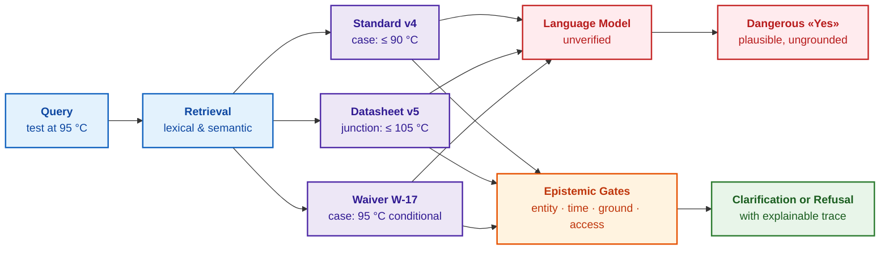
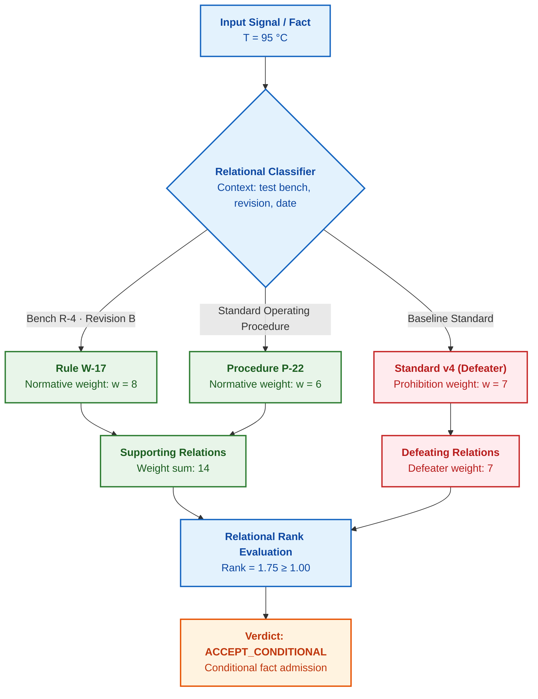
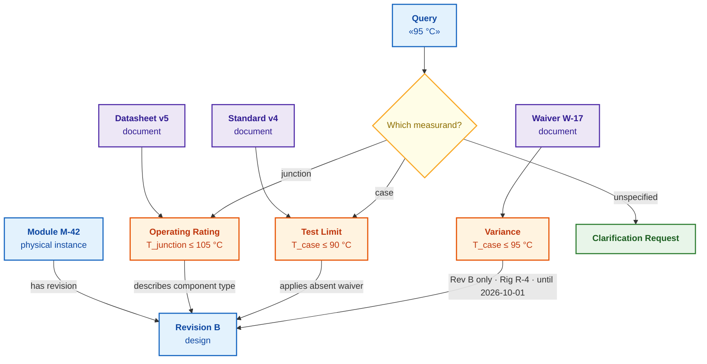
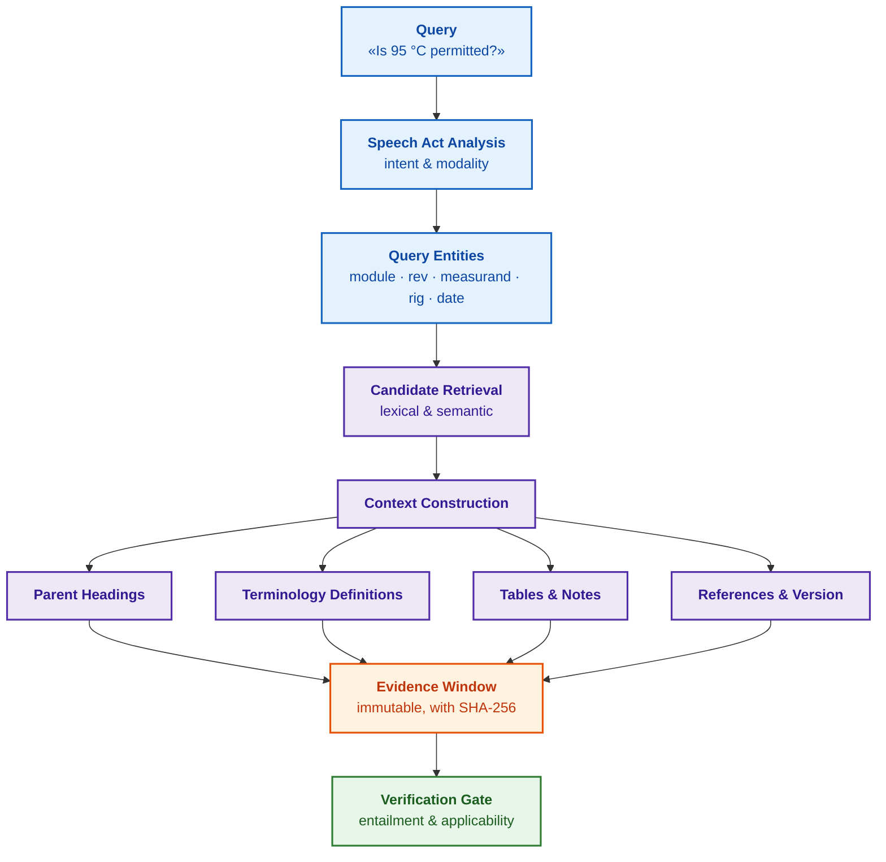
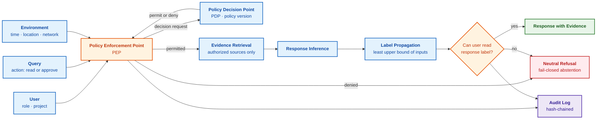
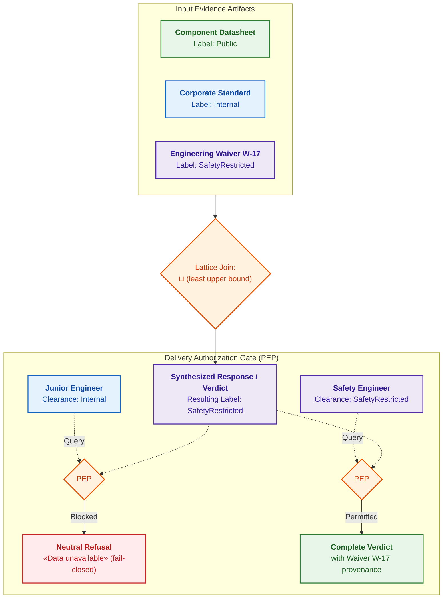
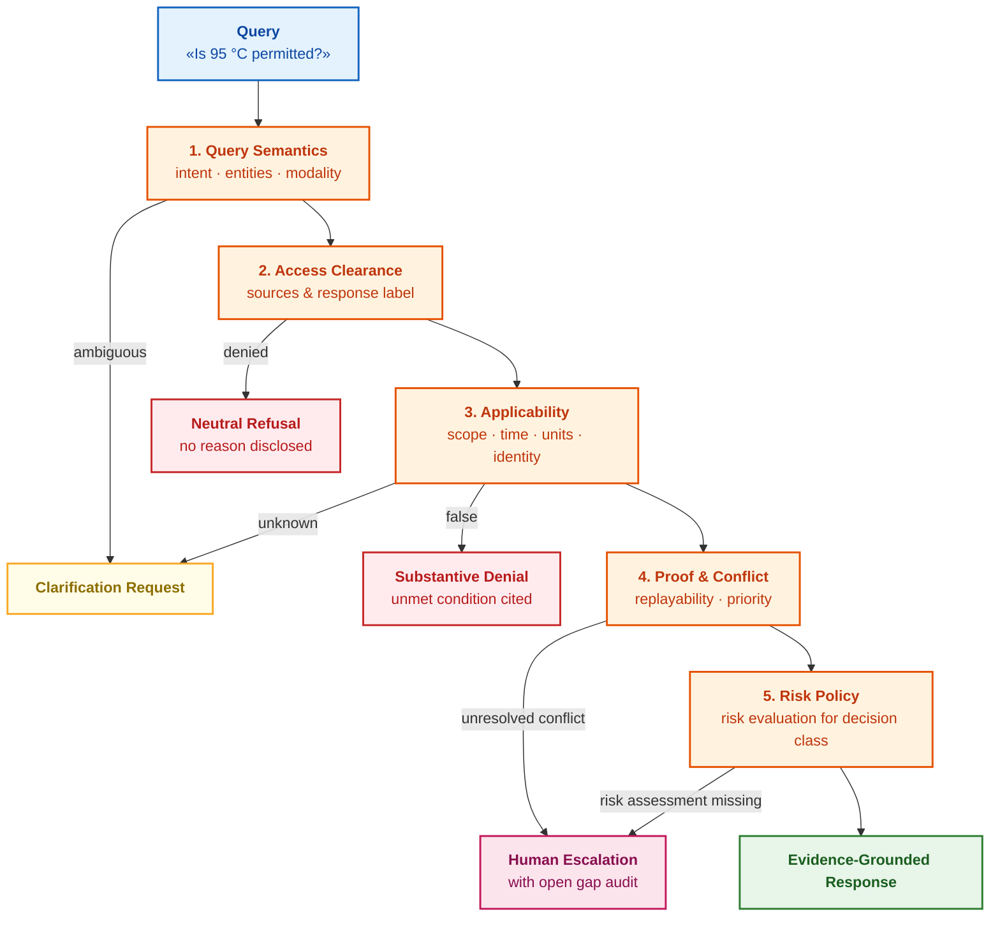

# Chapter 2. Philosophy for the Engineer: What a Machine May Lawfully Call Knowledge

> **Book:** [Architecture of Evidence-Governed Expert Systems](README.md) · [Part I: Conceptual and Epistemic Foundations](part-01-foundations.md)  
> **Previous Chapter:** [Chapter 1. Introduction to Expert Systems: From Chaos to Governed Knowledge](ch01-introduction-to-expert-systems.md)  
> **Next Chapter:** [Chapter 3. Beyond Reference Information Systems](ch03-beyond-reference-information-systems.md)  
> **Table of Contents:** [README.md](README.md)  
> **Author:** [Mykola Fedchyk](about-the-author.md)  
> **Target Level:** Foundational Engineering; code listings are placed in collapsible blocks, formal specifications are labeled as "Formally"  
> **Expected Learning Outcomes:** Articulate why a plausible answer does not constitute knowledge; decompose an engineering query across seven verification gates (justification, ontological identity, inference method, query semantics, citation context, empirical validation method, access entitlement); formulate the formal decision conditions under which an expert system answers, requests clarification, escalates to a human engineer, or issues a fail-closed refusal.

## Abstract

This chapter establishes the epistemic foundation for the architecture of expert systems: it formalizes the rigorous criteria by which a symbolic core distinguishes verified knowledge from statistically plausible yet factually ungrounded text. It investigates the epistemic gap separating stochastic language models from deterministic logical deduction, a distinction paramount to eliminating catastrophic failures in mission-critical applications governed by ISO 26262, IEC 61508, and DO-178C. It demonstrates how fundamental principles of epistemology, ontology, mathematical logic, hermeneutics, and security transform into seven mandatory verification gates within an automated admission checkpoint for facts. It formulates a procedural definition of machine knowledge, reveals the relational nature of facts grounded in Friedrich Hayek's "The Sensory Order", formalizes a mathematical applicability predicate grounded in Kleene's strong three-valued logic, a bitemporal model for tracking fact validity, and an algebraic criterion governing the entitlement to assert. An end-to-end engineering case study involving power module bench testing at 95 °C illustrates the practical operation of reproducible proof traces and fail-closed safety mechanisms.

## 1. The Engineering Contract of an Evidence-Grounded Response: Seven Epistemic Criteria

Integrating an expert system into the engineering decision-making pipeline demands a rigorous admission contract for facts: no conclusion may be delivered to an end user or dispatched to an execution mechanism without passing a multi-tiered verifiability audit. Unlike generative language models or traditional information retrieval systems that produce unverified outputs based on correlational plausibility, an evidence-governed expert system treats every emitted proposition as a technically and legally binding artifact. If this contract is neglected, the very first semantic collision in technical documentation inevitably causes dangerous disinformation or critical hardware failure. The engineering verifiability contract establishes seven mandatory epistemic verification gates: the justification of the claim, the ontological identity of the entity, the deterministic inference method, the modal semantics of the query, the hermeneutic context of the primary source, the empirical verification method, and access entitlement. An unknown parameter triggers an automated clarification request; an evidentiary deficit activates fail-closed abstention; a lack of access clearance strictly blocks unauthorized information disclosure.

For an initial reading, walk through the temperature case study, the [canonical definition](#робоче-визначення-знання-експертної-системи), and the concluding audit checklist. The sections on Plato, Gettier, and the philosophy of language establish the theoretical foundations of the contract, shielding the architecture against hidden logical pitfalls. The executable example in [Chapter 1](ch01-introduction-to-expert-systems.md) already demonstrates the practical application of a streamlined contract for embedded firmware releases.

## 2. Practical Case Study: Semantic Collision of Three Primary Sources During Power Module Testing

The complexity of engineering practice stems from the fact that normative artifacts never exist as a perfectly reconciled, globally coherent knowledge base: industry standards, component manufacturer technical specifications, and temporary test procedures inevitably collide semantically. To observe how a naive information retrieval system catastrophically fails where an expert system successfully isolates ambiguity, consider a hardware module certification test. A test engineer queries the expert system: "Can bench testing of the power module be conducted at 95 °C?" The retrieval component discovers three documents. Each document pertains to the query, yet none provides an off-the-shelf answer, and in each document the term "temperature" denotes a distinct physical measurand.

The third retrieved document is a **waiver**: an approved engineering variance permitting a documented deviation from a standard requirement under strictly bounded conditions for a limited duration. The table summarizes what each document states and what it omits.

| Document | Stated Content | Measurand / Physical Entity | Omitted Information |
|---|---|---|---|
| Corporate Test Standard, Revision 4 | Maximum 90 °C during testing | Module case temperature | Whether exceptions or variances exist |
| Component Datasheet from Supplier, Revision 5 (newer than standard) | Operational up to 105 °C | Junction temperature (semiconductor die structure inside the package) | Whether bench testing is permitted at this operating limit |
| Engineering Waiver W-17 | Testing at 95 °C is permitted | Module case temperature | Whether the waiver applies outside its conditions: valid solely for prototype Revision B, on Test Rig R-4, until October 1, 2026, and subject to supplemental inspection |

There is also a fourth temperature about which the documents remain silent: the ambient air temperature inside the thermal chamber. Test operators frequently state "95 degrees", colloquially referring to the chamber controller setpoint. The initial query fails to identify which of the four temperatures is meant.

A large language model supplied with these three retrieved snippets readily synthesizes a confident "Yes": 95 is less than 105, and the waiver appears to validate the exception. Such an answer sounds persuasive and is grammatically impeccable, yet it is dangerous for three distinct reasons:

1. The component datasheet describes the physical survival capability of the silicon junction under electrical load, not regulatory authorization to conduct environmental qualification testing.
2. The engineering waiver may not apply to the specific module serial number, test rig, or execution date specified in the test plan, and the querying user may lack the security clearance required to inspect this variance.
3. The scalar value 95 °C without an explicit measurand cannot be compared against any normative threshold: 95 °C chamber air, module case, and junction temperatures represent three radically different operational regimes.

An expert system constructed according to the principles established in this chapter responds entirely differently:

> The expert system cannot authorize testing under the submitted query. A potentially applicable waiver exists for prototype Revision B; however, clarification is required regarding which physical temperature is referenced, which test rig and execution date are planned, and whether the querying user possesses the requisite operational authority. Pending clarification, the corporate standard threshold remains active: 90 °C module case temperature.

If the user lacks the authorization to view Waiver W-17, the expert system must not even hint at the exception's existence, as the mere fact of an active variance may constitute restricted information:

> Available admitted grounds are insufficient to authorize testing. Escalate the request to the designated test safety engineer.

Both responses are more concise and less superficially accommodating than an immediate "Yes", yet both are technically and procedurally correct. In mission-critical systems, fail-closed abstention is a hallmark of engineering excellence, not a retrieval defect. The diagram below contrasts the two pathways from discovered source artifacts to final response.



The diagram reads from left to right. Blue indicates the user query and the search process; purple marks the three retrieved documents. The red path illustrates a language model consuming documents without validation and synthesizing a hazardous "Yes". The orange block designates the epistemic verification gates enforced by the expert system: determining the target entity, verifying temporal validity, confirming evidentiary support, and validating user clearance. The green block illustrates the resulting output: a targeted clarification query or a motivated fail-closed refusal.

The section ["One Question, Three Answers"](ch01-introduction-to-expert-systems.md#одне-запитання-три-відповіді) in Chapter 1 compared documentation search, a conversational chatbot, and an expert system using an embedded timeout example. The temperature case study introduces deeper complexity: four physical variables bearing identical colloquial designations, a supplier specification describing functional capability rather than regulatory permission, a variance bound by strict operational constraints, and proprietary access boundaries. Each complication maps directly to a classical philosophical question, threading this scenario throughout the chapter.

Locating documents is merely a prerequisite. An expert system must explicitly determine what each document asserts, about which exact entity, on what authoritative grounds, within what temporal window, and for which authorized audience. To operationalize these verification gates, we must first establish what an expert system legitimately recognizes as knowledge.

## 3. Evolution of the Concept of Knowledge: From Justified True Belief (JTB) to the Gettier Problem

A core vulnerability of automated cognitive systems is that an output that happens to be formally correct does not imply that the system possesses knowledge or operational comprehension. A language model that fortuitously emits the normative limit of 90 °C via stochastic next-token prediction, and an engineer who rigorously deduces that exact threshold from an active, verified clause of an engineering standard, produce identical surface text. Yet the engineer possesses justifiable knowledge, whereas the stochastic generator merely creates an epistemic illusion. Epistemology has scrutinized this distinction for over two millennia, and its findings offer direct architectural blueprints for engineering expert system verification kernels.

Epistemology has long distinguished genuine knowledge from fortunate guesswork. In Plato's dialogue *Theaetetus*, Socrates demonstrates that true opinion alone does not constitute knowledge: an orator may persuade a jury of something that happens to be factually true, yet the jurors do not thereby possess first-hand knowledge of the underlying reality [[1]](#src-1). From these reflections emerged the tripartite definition: an agent knows a proposition if the proposition is true, the agent believes the proposition, and that belief is justified. This formulation is termed the JTB (*justified true belief*) model. While often cited as the classical account, the *Stanford Encyclopedia of Philosophy* notes that the definition was formulated in explicit propositional form primarily in the twentieth century, largely by thinkers seeking to dismantle it [[1]](#src-1).

In 1963, Edmund Gettier published a landmark three-page paper presenting two counterexamples in which all three JTB conditions are fully satisfied, yet genuine knowledge is undeniably absent [[2]](#src-2). In Gettier's scenarios, an agent deduces a correct conclusion from a false yet justified premise, rendering the resulting conclusion true purely by coincidence. Analogous counterexamples appear throughout the history of thought. The eighth-century Indian philosopher Dharmottara described a traveler who spots a distant mirage, infers the presence of water, and subsequently discovers genuine water hidden beneath a rock. Bertrand Russell illustrated the same paradox with an observer looking at a stopped clock that happens to display the correct time by sheer coincidence [[1]](#src-1). In all such instances, the belief is true and grounded in justification, yet the justification and the truth condition coincide accidentally. Epistemologists designate such anomalies as **Gettier cases**.

In systems engineering, Gettier cases manifest routinely. A thermocouple in a thermal chamber freezes and displays 94 °C for an hour. Coincidentally, the actual chamber temperature at that moment is indeed 94 °C. The test log entry is factually true and originates from a calibrated instrument, yet its accuracy is purely accidental: ten minutes later, the chamber drifts to 97 °C while the log continues to record 94 °C.

An identical failure pattern arises in language models generating answers from retrieved context snippets. A model asserts that the bench test limit is 90 °C, citing the component datasheet. The numerical figure is correct, but the cited datasheet contains no such figure: the 90 °C threshold was declared in the corporate standard, a fragment of which happened to sit in the model's retrieval window. An automated test evaluating only the final generated string against a ground-truth benchmark would register a success, despite the citation providing zero valid evidentiary support.

For an expert system, Gettier cases yield an imperative architectural requirement: the system must verify not merely the surface response, but the causal, verifiable link between the response and its admitted justification. Does the cited source fragment genuinely entail this exact proposition? Is the measuring instrument operational and in calibration? The following section translates this requirement into an executable operational definition.

## 4. Canonical Engineering Definition of Machine Knowledge <a id="робоче-визначення-знання-експертної-системи"></a>

While theoretical philosophy debates the metaphysical essence of truth, software engineering cannot construct a deterministic reasoning core without an explicit, testable specification of knowledge. An industrial expert system cannot rely on intuitive or subjective notions: every proposition admitted into memory or participating in resolution refutation must possess unambiguous typing and satisfy rigorous admission criteria. Following Gettier's critique, attempts to patch the classical JTB triad spawned dozens of competing philosophical frameworks [[1]](#src-1); however, mission-critical software requires a finite, algorithmically computable contract.

This book proposes the following operational definition:

> **Expert system knowledge** is defined in this book as a proposition that possesses a version, a verifiable evidentiary ground, a bounded scope of applicability and validity timeframe, an inspectable method of derivation, and has successfully passed all verification gates and approvals required for propositions of its class.

This definition is deliberately procedural. Rather than defining knowledge in the abstract, it specifies what must be formally known about a proposition before an expert system is legally and architecturally entitled to apply it. Such an operationalization constitutes an engineering design choice verifiable via automated test suites: every candidate fact can be evaluated against each discrete gate. The definition explicitly disallows heuristics frequently mistaken for knowledge: next-token probabilities in generative models, vector embedding cosine similarities, the corporate title of an author, or an authoritative linguistic tone.

This definition directly refines Chapter 1. In the section ["A Document Does Not Equal Knowledge"](ch01-introduction-to-expert-systems.md#документ-не-дорівнює-знанню), unstructured documentation is decomposed into five distinct knowledge primitives: observations, assertions, authoritative sources, rules, recommendations, and decisions. The definition above answers the immediate follow-up question: under what exact conditions does an asserted knowledge primitive acquire the entitlement to participate in automated inference?

This book designates this battery of validation gates as the **epistemic contract** (from the Greek *epistēmē*, knowledge). The term "contract" is drawn directly from software engineering: in Bertrand Meyer's Design by Contract methodology, a routine formally declares preconditions, postconditions, and invariants that must hold before and after invocation [[3]](#src-3). An epistemic contract applies the identical invariant discipline to propositions entering the reasoning engine.

The contract's verification gates map cleanly to seven foundational philosophical disciplines. Each discipline poses a specific inquiry to the candidate proposition, and each inquiry receives a concrete engineering implementation:

| Discipline | Question Posed to Proposition | Preserved System State | Typical Error in 95 °C Case Study |
|---|---|---|---|
| Epistemology: theory of knowledge | On what admitted grounds is the proposition justified? | Evidence artifact, provenance trace, active defeaters | Correct numerical limit paired with a false source citation |
| Ontology: study of entities and differentiation | Which physical entity, measurand, and revision are referenced? | Stable URIs, physical measurands, SI units, operational scope | Silicon junction thermal rating mistaken for module test limit |
| Logic | How exactly was the conclusion deduced? | Inference mechanism, proof trace, contradiction state | Heuristic assumption emitted as a proven fact |
| Philosophy of Language | What does the query signify in this operational context? | Formal intent, entity bindings, illocutionary modality | "Can" as physical capability confused with regulatory permission |
| Hermeneutics: theory of textual interpretation | What broader context renders the excerpt valid? | Parent section, definitions, qualifying footnotes, version | Exception severed from its qualifying "Revision B only" clause |
| Philosophy of Science | How can the proposition be empirically verified or falsified? | Test protocol, measurement uncertainty, acceptance criteria | Machine learning model forecast treated as an empirical sensor reading |
| Social Epistemology | Who possesses the authority to inspect, contest, and approve? | Roles, clearance labels, review signatures, escalation paths | Authority equated with truth; unauthorized access to confidential waiver |

This table serves as the architectural roadmap of the chapter. The subsequent sections follow this exact sequence: for each discipline, the operational dilemma is demonstrated through the 95 °C scenario, followed by the expert system's formal solution and engineering takeaways.

## 5. Epistemological Foundation: Claims, Evidence, and Fact Provenance

In knowledge engineering, storing documentation as monolithic, unstructured files introduces severe traceability vulnerabilities: three text files discovered by a search engine do not constitute a verified fact base. An engineering standard specifies dozens of physical tolerances, a supplier datasheet lists hundreds of electrical characteristics, whereas justifying a specific operational variance requires only two or three atomic propositions with exact textual coordinates. If an architecture treats an entire document or multi-page PDF chunk as an indivisible unit of knowledge, the symbolic inference engine cannot isolate which exact normative clause justifies a verdict, nor whether that clause remains currently in force. This opaque architecture is precisely where industrial Gettier anomalies breed: a surface link to an active standard exists, yet the substantive decision is completely unsupported by its text.

Therefore, the atomic unit of knowledge in an expert system is neither a document nor an arbitrary text chunk, but an explicit **claim**. For Engineering Waiver W-17, the structured claim comprises the following attributes:

| Claim Attribute | Value for Waiver W-17 |
|---|---|
| Subject | Module environmental bench testing |
| Predicate / Assertion | Permitted maximum case temperature is 95 °C |
| Operational Scope | Prototype Revision B, Test Rig R-4, Test Procedure P-22 |
| Valid Time $I_v$ | From July 1, 2026 to October 1, 2026 (exclusive upper bound) |
| Transaction Time $I_s$ | From July 2, 2026, 09:15 UTC (commit timestamp) |
| Epistemic Kind | Normative variance (waiver) |
| Version | Revision 2 of Document W-17 |

The two temporal intervals, $I_v$ and $I_s$, are formalized in the bitemporal modeling subsection below.

An evidence artifact is structurally decoupled from the claim it supports. Admitted evidence may comprise an immutable textual excerpt (a quote verified by cryptographic hash and byte offsets within a specific document revision), a calibrated sensor telemetry log, a cryptographically signed approval token, or an executable proof trace. **Provenance** establishes the historical lineage of the evidence: where it originated, which process extracted it, and what modifications were applied. The W3C PROV-O standard formalizes provenance using four primary abstractions: *Entity*, *Activity*, *Agent*, and the *wasDerivedFrom* relation [[4]](#src-4). Crucially, provenance does not guarantee truth: an exhaustive, auditable history of an erroneous document remains an exhaustive history of an error.

The third core primitive maintained by an evidence-governed system is the presence of **defeaters**. A defeater is an admitted fact or condition that invalidates or attenuates the justification of a claim. Formalized in John Pollock's work on defeasible reasoning, defeaters fall into two distinct classes [[5]](#src-5):

1. **Rebutting defeaters**: facts supporting an opposing conclusion. Waiver W-17 attacks the corporate standard's general prohibition against case temperatures exceeding 90 °C, but only within the operational scope of Revision B and Rig R-4.
2. **Undercutting defeaters**: facts that sever the evidential link between premise and conclusion without asserting the contrary. If sensor telemetry reveals that the chamber thermocouple drifted out of calibration, the recorded measurement ceases to support conclusions regarding chamber temperature, even though it does not prove what the actual temperature was.

The diagram below illustrates how these entities interact within the 95 °C scenario.

```mermaid
flowchart LR
    accTitle: Support and defeat graph of claims regarding 95 °C
    accDescr: The standard supports a general prohibition via an immutable quote. Waiver W-17 supports a conditional exception. The general prohibition and exception attack each other, and the expert system preserves both claims pending an operational decision.

    STD["<b>Standard v4</b><br/>document"] -->|"contains"| SP["<b>Section 5.3 Quote</b><br/>immutable span"]
    OWN["<b>Standard Owner</b>"] -->|"approved"| STD
    SP -->|"supports"| C1["<b>Claim C1</b><br/>case > 90 °C prohibited"]
    W["<b>Waiver W-17</b><br/>document"] -->|"supports"| C2["<b>Claim C2</b><br/>95 °C permitted for Rev B"]
    SAF["<b>Safety Engineer</b>"] -->|"approved"| W
    C2 -->|"attacks within Rev B scope"| C1
    C1 -->|"attacks outside W-17 scope"| C2
    C1 & C2 --> G["<b>Argument Graph</b><br/>both claims preserved"]
    G --> O["<b>Verdict</b><br/>post-condition check"]

    classDef doc fill:#e8eaf6,stroke:#3f51b5,stroke-width:2px,color:#1a237e;
    classDef claim fill:#e1f5fe,stroke:#0288d1,stroke-width:2px,color:#01579b;
    classDef actor fill:#fce4ec,stroke:#c2185b,stroke-width:2px,color:#880e4f;
    classDef grf fill:#fff3e0,stroke:#e65100,stroke-width:2px,color:#bf360c;
    classDef out fill:#e8f5e9,stroke:#2e7d32,stroke-width:2px,color:#1b5e20;

    class STD,SP,W doc;
    class OWN,SAF actor;
    class C1,C2 claim;
    class G grf;
    class O out;
```



Indigo nodes represent documents and immutable text spans; pink nodes denote approving human authorities; light blue nodes mark atomic claims; orange represents the argument graph; green represents the final verdict. Corporate Standard v4, via an immutable span from Section 5.3, supports claim C1 establishing the general prohibition. Waiver W-17 supports claim C2 establishing the variance. The claims attack each other: C2 defeats C1 within the scope of Revision B, while C1 defeats C2 whenever testing occurs outside the waiver's boundaries. The expert system does not arbitrarily drop either claim; it preserves both in an argument graph until query runtime conditions resolve the conflict.

In production environments, each admitted claim record stores:

- An immutable UUID and a canonicalized expression of the proposition;
- An explicit epistemic status: cited, observed, deduced, hypothesized, or normatively mandated;
- Source span coordinates, including cryptographic byte hashes and line offsets in a specific document version;
- Derivation agent: extraction parser, named-entity model, symbolic rule, or human reviewer;
- Operational scope, physical units, valid time interval, and transaction time interval;
- Associated supporting evidence and active defeaters;
- Derivation mechanism and reproducible proof trace;
- Security clearance label and formal reviewer sign-off metadata;
- Lifecycle state: active, superseded, revoked, contested, or unverified.

An executable JSON schema for this record is detailed in Section 12, while the complete claim lifecycle from ingestion candidate to revocation is formalized in [Chapter 25](ch25-how-expert-systems-learn.md).

A solitary scalar field such as `confidence = 0.93` cannot substitute for these metadata attributes. A naked probability reveals neither what the 0.93 value measures, what reference dataset calibrated the score, nor whether the user possesses security clearance to inspect the underlying premise.

The engineering takeaway from epistemology is unmistakable: maintain claims, evidence, provenance graphs, and defeaters as independent, linked entities. Only then can an expert system audit every inference step and systematically eliminate Gettier failures. Yet even an impeccably documented claim may describe an entirely different physical object than the one queried.

### 5.1. Relational Nature of Machine Knowledge: Friedrich Hayek's "The Sensory Order" vs. Naive Positivism

The relational nature of machine knowledge serves as a foundational barrier against naive positivism, which erroneously conflates knowledge with isolated facts or static records stored in flat relational database tables. In mission-critical expert systems engineering, an identical physical signal or normative statement (for instance, a measured voltage of $`3.3\,\text{V}`$ or a temperature of $`95\,^\circ\text{C}`$) carries zero normative meaning in isolation; its status as an "admissible tolerance", an "overload hazard", or an "emergency trip condition" arises exclusively through its topological position within a classification network of relations. Neglecting this relational topology strips the system of contextual discernment, precipitating catastrophic failures where routine bench testing states are conflated with plant-wide emergency shutoffs or temporary engineering waivers are silently ignored.

This architectural principle directly builds upon the epistemological foundation of *The Sensory Order* (1952) by Nobel laureate Friedrich A. Hayek [[32]](#src-32). Hayek demonstrated that sensory perception and cognitive knowledge are never passive, mechanical impressions of an external physical reality, but rather a dynamic process of multi-layered classification: every novel impulse acquires operational meaning only insofar as it is classified relative to a pre-existing topological nexus of relations and systemic expectations. In an evidence-governed expert system, the admission of any candidate fact $`f`$ into the reasoning engine is determined not by an isolated declaration of "truth", but by its formal embedding within a deontic lattice of foundational axioms and the verified absence of blocking counter-arguments (defeaters).



To mathematically formalize Hayek's classification process, we define the relational rank operator for a candidate fact $`f`$ within a knowledge base $`\mathcal{K} = \langle \mathcal{F}, \mathcal{R}, \mathcal{D} \rangle`$:

$$
\mathrm{Rank}_{\mathrm{rel}}(f, \mathcal{K}) = \frac{\sum_{r \in \mathcal{R}} \mathbb{I}(f \in \mathrm{Prem}(r)) \cdot w(r)}{1 + \sum_{d \in \mathcal{D}} \mathbb{I}(d \text{ defeats } f) \cdot w(d)}
$$

where:
- $`f \in \mathcal{F}`$ is the candidate atomic proposition;
- $`\mathcal{R}`$ is the set of active normative rules with integer normative weights $`w(r) \in [1, 10]`$;
- $`\mathcal{D}`$ is the set of active defeaters (rebutting/undercutting conditions) with weights $`w(d) \in [1, 10]`$;
- $`\mathbb{I}(\cdot) \in \{0, 1\}`$ is an indicator function denoting premise inclusion or defeater scope;
- $`\mathrm{Rank}_{\mathrm{rel}} \in [0, +\infty)`$ is the dimensionless relational strength score of the fact within the classification lattice.

The actionable closed-loop calculation mandate governs runtime system state transitions:

1. **Control Flow & Runtime Decisions:**
   If $`\mathrm{Rank}_{\mathrm{rel}}(f, \mathcal{K}) = 0`$ (the fact is completely ungrounded and disconnected from normative rules), the symbolic core immediately tags the proposition as `UNGROUNDED_ATOM` and excludes it from downstream deduction with a formal `REFUSAL`. If $`\mathrm{Rank}_{\mathrm{rel}}(f, \mathcal{K}) \ge \tau_{\mathrm{rel}} = 1.00`$ in the absence of undefeated defeaters, the fact is automatically admitted to unification in the proof tree. When $`0 < \mathrm{Rank}_{\mathrm{rel}} < 1.00`$, an escalation gate routes the inquiry to a human certifier (`QUALIFIED`).

2. **Hardware Dimensioning & Infrastructure Limits:**
   Evaluating the relational rank requires fast traversal of incident edges across the knowledge graph. For an active working set of $`\lvert \mathcal{F} \rvert = 50\,000`$ facts and $`\lvert \mathcal{R} \rvert = 12\,000`$ rules, a Compressed Sparse Row (CSR) adjacency matrix consumes $`M_{\mathrm{CSR}} = (2 \cdot \lvert \mathcal{E} \rvert + \lvert \mathcal{F} \rvert) \cdot 8\,\text{bytes} \approx 3.2\,\text{MB}`$. This index fits entirely within L3 processor cache or UltraRAM on dedicated FPGA inference co-processors, guaranteeing an evaluation latency of $`T_{\mathrm{rank}} \le 180\,\text{ns}`$ without DRAM bus contention.

3. **Worked Numerical Example:**
   Consider an observed case temperature $`T_{\mathrm{case}} = 95\,^\circ\text{C}`$ for prototype Revision B on test bench R-4. The observation is corroborated by waiver rule W-17 ($`w(r_1) = 8`$) and standard procedure $`P\text{-}22`$ ($`w(r_2) = 6`$). Concurrently, general test standard v4 acts as a defeating rule ($`w(d_1) = 7`$), prohibiting temperatures exceeding 90 °C:

$$
\mathrm{Rank}_{\mathrm{rel}}(f, \mathcal{K}) = \frac{8 \cdot 1 + 6 \cdot 1}{1 + 7 \cdot 1} = \frac{14}{8} = 1.75 \ge 1.00
$$

   Since $`1.75 \ge 1.00`$, waiver W-17 overrides the general prohibition within its valid operational scope (Revision B, bench R-4). The system issues an admissible verdict `ACCEPT_CONDITIONAL`. If the test bench is switched to uncertified bench R-2, waiver W-17 drops to zero ($`w(r_1) = 0`$), yielding $`\mathrm{Rank}_{\mathrm{rel}} = \frac{6}{8} = 0.75 < 1.00`$, which triggers an immediate fail-closed interlock `REFUSAL`.

## 6. Ontological Identification: Overcoming Semantic Homonymy and Contextual Constraints

In our scenario, the word "temperature" appears across all three documents and "module" appears twice; yet behind these identical lexical tokens stand fundamentally distinct physical entities. Ontology—the philosophical study of what exists and how entities are categorized—translates in software engineering to a concrete question: do two database records refer to the identical physical object? In computer science, an ontology denotes a formal model of concepts and relations within a domain (see the Glossary in [Chapter 1](ch01-introduction-to-expert-systems.md)). In production code, an ontological defect rarely appears as an abstract philosophical debate. It typically manifests as an improper SQL table join on component names, an unvalidated unit conversion, or an erroneous `owl:sameAs` equivalence assertion asserted between similar but non-identical concepts in a W3C Web Ontology Language (OWL 2) knowledge graph [[6]](#src-6).

To correctly process the 95 °C inquiry, an expert system must strictly disambiguate:

- The physical hardware module M-42, the abstract component family, and the physical design Revision B;
- The datasheet as a static document versus the operational rating envelope it specifies;
- The standard's test ceiling as an enforceable normative constraint;
- The engineering waiver as a temporary variance rather than a permanent standard revision;
- Distinct physical measurands: case temperature $T_{\mathrm{case}}$, semiconductor junction temperature $T_{\mathrm{junction}}$, and chamber air ambient temperature $T_{\mathrm{chamber}}$;
- An environmental test run, a test procedure, an environmental test rig, a rig calibration state, and an empirical telemetry trace.

A **measurand** (*measurand*) designates the specific physical quantity subjected to measurement: not a generic "temperature", but the thermal state of an identified physical point on an identified component under specified boundary conditions.

To eliminate homonymy, engineering architectures enforce a foundational rule: humans read labels, software reads immutable identifiers. Every ontological entity must possess a stable URI or UUID. Synonyms, localizations, and legacy part numbers are stored as secondary attributes or explicit mapping claims, each backed by its own provenance trace. Merging two identifiers into an equivalence relationship is a versioned, auditable operation that can be rolled back, never an unlogged destructive database update. The diagram below illustrates the distinct entities underpinning the query's terminology.



Blue nodes denote physical entities and the submitted query; purple indicates documents; orange nodes represent thresholds and operating envelopes. Each limit binds to a distinct physical measurand: the datasheet governs junction temperature, whereas the standard and Waiver W-17 govern module case temperature. The yellow decision diamond illustrates the measurand branching logic: if the user query fails to specify the measurand, the expert system refuses to guess, emitting a targeted clarification request (green node).

The simplest mechanism to prevent comparing chamber ambient air against a module case threshold is to bind the measurand type directly to the numeric value and prohibit cross-measurand evaluation at the type-system level. The Go implementation below demonstrates this architectural safeguard.

<details>
<summary>Go Implementation: Type-Safe Measurand Temperature Comparison</summary>

This program is fully standalone and executes via `go run main.go`. The `Temperature` struct encapsulates both the scalar value and the exact `Measurand` type, ensuring that `NotAbove` compares only identical physical properties.

```go
package main

import (
	"errors"
	"fmt"
)

// Measurand designates what was measured, not merely the unit.
type Measurand string

const (
	CaseTemp     Measurand = "T_case"
	JunctionTemp Measurand = "T_junction"
	ChamberTemp  Measurand = "T_chamber"
)

type Temperature struct {
	What   Measurand
	Kelvin float64
}

func Celsius(what Measurand, c float64) Temperature {
	return Temperature{What: what, Kelvin: c + 273.15}
}

var ErrDifferentMeasurands = errors.New("different measurands")

func (t Temperature) NotAbove(limit Temperature) (bool, error) {
	if t.What != limit.What {
		return false, fmt.Errorf("%w: %s and %s", ErrDifferentMeasurands, t.What, limit.What)
	}
	return t.Kelvin <= limit.Kelvin, nil
}

func main() {
	standardLimit := Celsius(CaseTemp, 90)

	request := Celsius(ChamberTemp, 95)
	if _, err := request.NotAbove(standardLimit); err != nil {
		fmt.Println("comparison prohibited:", err)
	}

	measured := Celsius(CaseTemp, 94.6)
	ok, _ := measured.NotAbove(standardLimit)
	fmt.Println("case 94.6 °C within 90 °C limit:", ok)
}
```

The program outputs:

```text
comparison prohibited: different measurands: T_chamber and T_case
case 94.6 °C within 90 °C limit: false
```

The first output line confirms that evaluating chamber air temperature against a module case limit is rejected: the method returns an error rather than `false`, because "cannot evaluate incompatible physical dimensions" is fundamentally distinct from "threshold exceeded". The second line executes an ontological match: a 94.6 °C case temperature violates the 90 °C case limit. Storing temperatures internally in Kelvin—the SI base unit—guarantees that mathematical evaluations remain invariant across input unit representations.

</details>

Physical units demand the identical architectural rigor. For instance, 1024 kilobytes (kB) equals 1,024,000 bytes under SI decimal definitions, whereas 1024 kibibytes (KiB) equals 1,048,576 bytes under IEC binary prefixes. A 2.4% discrepancy may escape notice in an unstructured debug log, yet in automated memory sizing boundary checks it can silently trigger a catastrophic false-positive release verdict.

The engineering takeaway from ontology: mathematical comparisons are valid only between identical physical measurands describing verified identical entities. The following two subsections examine two mandatory contextual attributes without which no claim can be operationalized: time and scope.

### 6.1. Two-Dimensional Temporality: Bitemporal Accounting of Fact Validity (Valid Time vs. Transaction Time)

One month following a hardware test run, an auditor asks: why did the expert system authorize bench testing at 95 °C on September 22, given that Waiver W-17 was officially revoked on September 20? A conventional `updated_at` database timestamp cannot resolve this question: it records merely when the record was last modified in storage, shedding no light on what the expert system knew on September 22.

Temporal databases address this by separating time into two orthogonal dimensions, formalized by Richard Snodgrass and Ilsoo Ahn [[7]](#src-7):

- **Valid Time** ($I_v$): the time interval during which the proposition is true in the physical or normative world; for W-17, this spans July 1, 2026 to October 1, 2026;
- **Transaction Time** ($I_s$): the time interval during which the proposition was stored as active in the knowledge base; for W-17, this begins on July 2, 2026.

Suppose Waiver W-17 was revoked by a safety committee on September 20, but the revocation was committed to the expert system's knowledge base only on September 25. The inquiry "What did the expert system know on September 22 regarding September 22?" evaluates to "W-17 is active". Conversely, the retrospective inquiry "What is known today regarding September 22?" evaluates to "W-17 was no longer valid". Both conclusions are factually correct and essential: the first explains the system's runtime decision on September 22, while the second reconstructs actual physical history. Without bitemporal modeling, an engineering organization cannot distinguish an autonomous software defect from delayed human data entry.

**Engineering Problem and Measurable Bitemporal Snapshot Output:**  
During regulatory audits (e.g., ISO 26262-8 Clause 10, "Software Tool Qualification") or post-mortem incident analyses, an engineering system must deterministically reconstruct the exact state of knowledge active at a historical point in time. The measurable output is the discrete set of claims $K(t_v, t_s)$ that concurrently satisfy both temporal coordinates within $\mathbb{T} \times \mathbb{T}$ (where $\mathbb{T}$ denotes second-precision UTC timestamps).

```math
K(t_v,t_s)=\{\,c \in \mathcal{KB} \mid t_v\in I_v(c)\ \wedge\ t_s\in I_s(c)\,\}
```

Parameters and Value Ranges:
- $c \in \mathcal{KB}$ — versioned atomic claim within knowledge base $\mathcal{KB}$;
- $t_v \in \mathbb{T}$ — target point in Valid Time, representing the physical or normative state being evaluated (e.g., planned execution date of a bench test);
- $t_s \in \mathbb{T}$ — target point in Transaction Time, representing the state of the knowledge repository being audited (storage commit snapshot);
- $I_v(c) = [t_{v,\text{start}}, t_{v,\text{end}}) \subset \mathbb{T}$ — half-open physical and normative validity interval of claim $c$;
- $I_s(c) = [t_{s,\text{commit}}, t_{s,\text{retire}}) \subset \mathbb{T}$ — half-open system currency interval of claim $c$ within the immutable audit log (prior to revocation or supersession);
- $\mid$ separates predicate conditions from set elements, $\wedge$ denotes logical conjunction.

Practical Application and Engineering Decisions:  
The computation of $K(t_v, t_s)$ is executed by the admission gate for every runtime query evaluation and audit replay. Based on the cardinality of the resulting set $|K(t_v, t_s)|$, the engine executes deterministic state transitions:
1. **$K(t_v, t_s) = \emptyset$ (Empty Set):** At transaction time $t_s$, the system possessed no admitted normative rule covering valid time $t_v$. The system enters **fail-closed abstention**, prohibiting the requested action and signaling a complete lack of normative coverage.
2. **$|K(t_v, t_s)| = 1$:** Exactly one unambiguous rule is active. The claim is dispatched to the applicability pipeline.
3. **$|K(t_v, t_s)| > 1$:** Multiple concurrent normative rules overlap (e.g., a baseline standard alongside an active variance). The system flags a normative conflict and dispatches the set to paraconsistent arbitration or precedence resolution.

Consider a database containing two versions of Waiver W-17. Initial version: $I_v = [\text{2026-07-01}, \text{2026-10-01})$, $I_s = [\text{2026-07-02}, \text{2026-09-25})$. Second version, committed following revocation: $I_v = [\text{2026-07-01}, \text{2026-09-20})$, $I_s = [\text{2026-09-25}, \infty)$. For $t_v = \text{2026-09-22}$ and $t_s = \text{2026-09-22}$, the query matches the first version: W-17 was admitted as active. For $t_v = \text{2026-09-22}$ and $t_s = \text{2026-09-30}$, neither version matches: the initial version was superseded in transaction time, while the second version expired in valid time on September 20.

The divergence between these two evaluations provides crucial forensic intelligence: the expert system executed its decision based on data that was subsequently amended, recording precisely when the amendment occurred. Model boundaries: the bitemporal formula filters records solely along temporal coordinates; it evaluates neither semantic applicability nor underlying truth. Interval boundary policies (half-open $[t_{\text{start}}, t_{\text{end}})$) must be enforced consistently across all ingestion pipelines, and historical database records must never be destructively overwritten.

The W3C OWL-Time ontology defines vocabulary for modeling temporal entities [[8]](#src-8); however, interval boundary semantics and backfill policies remain architectural responsibilities. The mechanics of ingesting bitemporal metadata during document parsing are detailed in [Chapter 10](ch10-knowledge-acquisition-systems.md).

For rigorous auditability, an expert system stores every claim with two temporal intervals and strictly maintains append-only storage. Under this discipline, the question "What did the system know at that moment?" always yields a deterministic answer.

### 6.2. Applicability Verification: Evaluating the Scope of Validity of a Claim <a id="чи-застосовне-твердження-до-запиту"></a>

Waiver W-17 is verified, unrevoked, and active, yet its operational applicability is strictly circumscribed: Revision B, Rig R-4, and a specific date window. The query "Can 95 °C testing be conducted?" mentions neither hardware revision, test bench, nor target date. An expert system must determine whether W-17 applies to the query, and is strictly prohibited from guessing missing parameters via semantic proximity.

For such evaluations, binary Boolean logic ($\{\mathbf{True}, \mathbf{False}\}$) is fundamentally inadequate. The system requires a third truth value, **Unknown** ($\mathbf{U}$), signifying an evidentiary deficit. The formal algebraic rules governing three-valued operations are defined by Stephen Cole Kleene's strong three-valued logic $\mathbb{K}_3$ [[9]](#src-9), examined in depth in [Chapter 6](ch06-applied-mathematics-for-expert-systems.md). For logical conjunction ($\wedge$), Kleene's calculus dictates: if any operand is false, the expression is unconditionally false; if all operands are true, the expression is true; in all remaining combinations containing an unknown, the expression evaluates to unknown.

**Engineering Problem and Measurable Applicability Output:**  
Admitting a candidate claim into the logical resolver requires verifying its exact compatibility with the operational context of the query, preventing the conflation of differing physical hardware configurations. The measurable output is the truth value of the predicate $\mathrm{Applicable} \in \{\mathbf{T}, \mathbf{F}, \mathbf{U}\}$ under Kleene's strong three-valued logic $\mathbb{K}_3$, where $\mathbf{T}$ denotes True, $\mathbf{F}$ denotes False, and $\mathbf{U}$ denotes Unknown (insufficient data).

```math
\begin{aligned}
\mathrm{Applicable}(c,q,t_v,t_s)={}&\mathrm{Scope}(c,q)\wedge \mathrm{Valid}(c,t_v)\wedge \mathrm{Known}(c,t_s)\\
&\wedge \mathrm{Units}(c,q)\wedge \mathrm{Identity}(c,q)
\end{aligned}
```

Parameters and Value Ranges:
- $c \in \mathcal{KB}$ — candidate claim, $q \in \mathcal{Q}$ — structured user query, $t_v, t_s \in \mathbb{T}$ — temporal validity and transaction coordinates;
- $\mathrm{Scope}(c,q) \in \{\mathbf{T}, \mathbf{F}, \mathbf{U}\}$ — alignment of operational boundary conditions (hardware revision, test rig model, procedure ID);
- $\mathrm{Valid}(c,t_v) \in \{\mathbf{T}, \mathbf{F}\}$ — evaluation of $t_v \in I_v(c)$;
- $\mathrm{Known}(c,t_s) \in \{\mathbf{T}, \mathbf{F}\}$ — evaluation of $t_s \in I_s(c)$ (fact presence at transaction commit);
- $\mathrm{Units}(c,q) \in \{\mathbf{T}, \mathbf{F}\}$ — compatibility of physical dimensions and measurands (e.g., $T_{\mathrm{case}} \equiv T_{\mathrm{case}}$ and valid SI unit conversion);
- $\mathrm{Identity}(c,q) \in \{\mathbf{T}, \mathbf{F}, \mathbf{U}\}$ — resolution of component entity instance via stable global identifier (UUID/URI);
- $\wedge$ — conjunction operator in Kleene's strong three-valued logic ($\mathbf{F} \wedge \mathbf{U} = \mathbf{F}$, but $\mathbf{T} \wedge \mathbf{U} = \mathbf{U}$).

Practical Application and Engineering Decisions:  
The predicate is computed by the filtering gate prior to assembling the proof tree. Depending on the evaluated truth value, the reasoning engine executes one of three deterministic actions:
- **$\mathrm{Applicable} = \mathbf{T}$:** The claim is admitted as an active axiom in the resolution refutation engine.
- **$\mathrm{Applicable} = \mathbf{F}$:** The claim is rejected. The engine generates an auditable diagnostic log entry citing the exact violated conjunct (e.g., *"Rejected by Scope: unit under test Revision C does not match Revision B specified in Waiver W-17"*).
- **$\mathrm{Applicable} = \mathbf{U}$:** The engine halts inference and synthesizes a structured `ClarificationRequest`. The request enumerates the exact missing parameters (e.g., *"Specify power module hardware revision and test rig identifier"*). Stochastic extrapolation in the presence of unknown values is strictly blocked.

<details>
<summary>Go Implementation: Waiver W-17 Applicability in Three-Valued Logic</summary>

This program is fully standalone and executes via `go run main.go`. The implementation models Kleene's strong logic, evaluating scope and validity intervals. Dates are formatted as YYYY-MM-DD, ensuring lexicographical comparison matches chronological order.

```go
package main

import "fmt"

// Truth is a three-valued logic value; the zero value is intentionally Unknown.
type Truth int8

const (
	Unknown Truth = iota
	False
	True
)

func (t Truth) String() string {
	return [...]string{"unknown", "false", "true"}[t]
}

// And evaluates conjunction according to Kleene's strong three-valued logic.
func And(values ...Truth) Truth {
	result := True
	for _, v := range values {
		switch v {
		case False:
			return False
		case Unknown:
			result = Unknown
		}
	}
	return result
}

type Query struct {
	Revision string // empty string: revision was not specified by the user
	Rig      string
	Date     string // YYYY-MM-DD
}

func matches(requested, allowed string) Truth {
	switch {
	case requested == "":
		return Unknown
	case requested == allowed:
		return True
	default:
		return False
	}
}

func within(date, from, toExclusive string) Truth {
	switch {
	case date == "":
		return Unknown
	case date >= from && date < toExclusive:
		return True
	default:
		return False
	}
}

func waiverW17Applies(q Query) Truth {
	return And(
		matches(q.Revision, "B"),
		matches(q.Rig, "R-4"),
		within(q.Date, "2026-07-01", "2026-10-01"),
	)
}

func main() {
	fmt.Println(waiverW17Applies(Query{Rig: "R-4", Date: "2026-09-15"}))
	fmt.Println(waiverW17Applies(Query{Revision: "B", Rig: "R-4", Date: "2026-09-15"}))
	fmt.Println(waiverW17Applies(Query{Revision: "B", Rig: "R-4", Date: "2026-10-15"}))
}
```

The program outputs:

```text
unknown
true
false
```

The first query omits the hardware revision; the conjunction evaluates to `unknown`, obligating the expert system to prompt the user. The second query provides complete parameters falling within W-17's envelope, evaluating to `true`. The third query specifies a date past October 1; the conjunction short-circuits to `false`. Crucially, the zero value of `Truth` defaults to `Unknown`: if an engineer omits initializing an evaluation field, the system defaults safely to an evidentiary deficit rather than false certainty.

</details>

W3C standards formalize these constraints across enterprise knowledge graphs. OWL 2 formalizes concept taxonomies and enables deductive classification [[6]](#src-6). The Shapes Constraint Language (SHACL) validates RDF graph data against explicit structural shapes, emitting machine-readable validation reports [[10]](#src-10). Passing a SHACL check confirming the presence of a timestamp does not prove the timestamp is accurate, nor does OWL ontology consistency ensure that domain data is complete. These formal tools complement each other, but do not replace empirical validation. OWL and SHACL are examined in [Chapter 6](ch06-applied-mathematics-for-expert-systems.md); automated knowledge base verification is developed in [Chapter 23](ch23-knowledge-base-verification.md).

A claim is applied to a query only when all five applicability conditions evaluate strictly to True; any Unknown immediately triggers a clarification request. The subsequent verification gate evaluates the deduction itself: how the expert system derived its conclusion.

## 7. Logical Resolver: Explication of Inference Methods and Rules of Proof

Emitting an unadorned `inferred = true` flag in an automated verdict conceals critical epistemological distinctions. The conclusion "The 90 °C case limit was exceeded" and the conclusion "A module reboot was caused by junction thermal runaway" are both technically inferred, yet they possess vastly divergent degrees of epistemic certitude. A user presented solely with an opaque "inferred" flag cannot distinguish an analytically proven mathematical fact from a plausible diagnostic hypothesis.

Formal logic differentiates inference methods, each providing distinct epistemological guarantees:

- **Deduction**: if the premises are true and the deductive rules valid, the conclusion is necessarily true. Example: "Case temperature is 95 °C; Corporate Standard v4 mandates case temperature $\le$ 90 °C; therefore, the standard limit is exceeded."
- **Induction**: empirical observations support an empirical generalization under statistical uncertainty. Example: "Twenty prototype units of Revision B completed 95 °C testing without thermal breakdown; therefore, Revision B modules likely withstand 95 °C."
- **Abduction**: inference to the best explanation for observed phenomena, yielding a plausible hypothesis. Coined by Charles Sanders Peirce and analyzed in modern epistemology by Igor Douven [[11]](#src-11). Example: "The module executed an unexpected reboot; the best current explanation is junction thermal overload."
- **Defeasible reasoning**: a conclusion holds provisionally, pending the appearance of an admitted defeater. Example: "The 90 °C ceiling applies, unless an approved engineering waiver supersedes it."

Peirce's triad (deduction, induction, abduction) is formalized in [Chapter 6](ch06-applied-mathematics-for-expert-systems.md); separating deterministic deductive conclusions from advisory abductive hypotheses is detailed in [Chapter 28](ch28-dual-mode-expert-systems.md).

To render inference inspectable, an expert system response must provide a reproducible **proof trace**: the identifiers and versions of all admitted premises, the explicit rule identifiers, and the intermediate derivation steps. A proof trace must be strictly deterministic: re-executing inference across identical snapshots of the knowledge base and rule set must yield an identical proof trace. A **knowledge base snapshot** represents an immutable, frozen state of data at a specific transaction commit. If an automated decision depends on an external third-party language model, an uncontrolled prompt template, or a floating version tag like `latest`, determinism is destroyed: the identical call tomorrow may execute against an updated model producing divergent output. The transformation of raw proof traces into natural-language explanations is explored in [Chapter 20](ch20-explanation-engine.md).

Formal logic imposes two non-negotiable requirements: explicit classification of the inference method for every conclusion, and a reproducible proof trace. The following subsections analyze two classical traps: missing data records and contradictory rules.

### 7.1. Open-World vs. Closed-World Semantics: Determining the "Not Found" State

An expert system queries the corporate variance registry for an active waiver covering power module M-42 and receives an empty result set. What does an empty query response signify? That exceptions are prohibited, that no waiver exists, or simply that the expert system's query lacked permissions to index the relevant records?

Conventional relational databases operate under the **Closed-World Assumption** (CWA): any proposition not explicitly present in the database is evaluated as false. Raymond Reiter formalized the CWA for database theory in 1978 [[12]](#src-12). Conversely, the W3C OWL 2 ontology standard operates under the **Open-World Assumption** (OWA): an absent proposition is evaluated as unknown [[6]](#src-6). An industrial expert system requires both semantics, configured explicitly per claim class:

- A registry of officially approved engineering waivers can be treated as closed only when the registry is proven complete, synchronized, and the query possessed global read clearance;
- Knowledge concerning potential physical hardware failure modes is almost universally open: the absence of an incident report in a defect database does not prove that a failure mode is physically impossible;
- A security access rule declaring "deny by default" operates as an authorization policy, not an ontological assertion that unlisted facts are false in the physical world.

Consequently, "not found", "false", "access denied", and "inapplicable" represent four distinct operational states. Collapsing all four into a single generic `null` causes severe logical flaws and catastrophic security vulnerabilities. For example, misinterpreting an access denial to Waiver W-17 as the non-existence of a waiver would prompt the system to improperly prohibit an authorized test. Typed responses grounded in three-valued logic are formalized in [Chapter 6](ch06-applied-mathematics-for-expert-systems.md).

An empty result set is not an answer; it is an obligation to identify the cause. System designers must explicitly declare OWA or CWA semantics per knowledge domain, assigning distinct types to every empty evaluation.

### 7.2. Paraconsistent Logic: Localizing Contradictions and Preventing the Principle of Explosion

In our case study, Corporate Standard v4 supports the proposition "Testing at 95 °C case temperature is prohibited", while Waiver W-17 supports the contradictory proposition for an identified operational envelope. In classical logic, from a contradiction ($\phi \wedge \neg\phi$), any arbitrary proposition $\psi$ can be formally deduced; this law is known as the Principle of Explosion (*Ex Falso Quodlibet*). In an industrial knowledge base where regulatory conflicts are inevitable, classical logic is lethal: a single contradiction in a documentation set would permit the symbolic core to formally prove that aircraft braking systems may be disabled at will.

A robust framework for managing contradictions was formulated by Nuel Belnap in his four-valued logic $\mathcal{B}_4$ [[13]](#src-13). Instead of a single binary truth value, the expert system tracks two independent evidence bits: whether evidence exists in favor of a proposition, and whether evidence exists against it. The four permutations define four distinct epistemic states: True ($1, 0$), False ($0, 1$), Both/Contradiction ($1, 1$), and Neither/Unknown ($0, 0$).

**Engineering Problem and Measurable Output of Paraconsistent Accounting:**  
In enterprise systems, contradictions between differing requirements (e.g., a baseline engineering standard versus a local temporary waiver) are standard operational occurrences. Applying classical logic triggers the Principle of Explosion, collapsing the inference engine. The objective of paraconsistent accounting is to localize contradictions and isolate the reasoning core from catastrophic failure. The measurable output is the binary evidence vector $V(c) \in \{0, 1\}^2$ under Belnap's four-valued model $\mathcal{B}_4$.

```math
V(c)=\bigl(P(c),\,N(c)\bigr)\in\{(1,0),\ (0,1),\ (1,1),\ (0,0)\}
```

Parameters and Value Ranges:
- $c \in \mathcal{KB}$ — target engineering claim (e.g., "Testing module at 95 °C case temperature is permitted");
- $P(c) \in \{0, 1\}$ — presence of verified supporting evidence ($P(c) = 1$ if at least one active, applicable rule or calibrated measurement supports $c$, else 0);
- $N(c) \in \{0, 1\}$ — presence of verified contradicting evidence ($N(c) = 1$ if at least one active, applicable rule or counterexample refutes $c$, else 0);
- $\in$ — set membership within Belnap's four discrete evidentiary states.

Practical Application and Engineering Decisions:  
The vector $V(c)$ is evaluated by the conflict detection gate during evidentiary synthesis. The system deterministically routes evaluation across four operational quadrants:
1. **$V(c) = (1, 0)$ [True $\mathbf{T}$]:** Unanimous evidentiary support. The claim is admitted as an active fact in the reasoning pipeline.
2. **$V(c) = (0, 1)$ [False $\mathbf{F}$]:** Unambiguous refutation. The claim is rejected; an auditable denial citing the prohibiting rule is generated.
3. **$V(c) = (1, 1)$ [Contradiction $\mathbf{B}$ (Both)]:** Localized requirement collision. The system avoids logical explosion, invokes Phan Minh Dung's argumentation framework, and executes precedence rules (lexicographical specificity or narrow operational scope). If no automatic priority rule applies, the engine escalates the decision to a human engineer alongside a complete argument map.
4. **$V(c) = (0, 0)$ [Unknown $\mathbf{N}$ (Neither)]:** Epistemic void. Under OWA, the system records an evidentiary gap and enters fail-closed abstention.

State $(1, 1)$ does not dictate which argument prevails. To adjudicate conflicts, expert systems deploy formal argumentation frameworks. In 1995, Phan Minh Dung formulated abstract **argumentation frameworks**: a set of arguments and a binary attack relation defined between them [[14]](#src-14). Which arguments are deemed admissible depends on the selected argumentation semantics (e.g., grounded, preferred, or stable semantics), which must be version-controlled alongside the rule base. The diagram below illustrates the argument topology for the 95 °C case study.

```mermaid
flowchart LR
    accTitle: Standard requirement argument vs. waiver exception argument
    accDescr: Argument A relies on measured temperature and standard rule. Argument B relies on Waiver W-17 and three operational conditions. The arguments attack each other; the outcome depends on whether the conditions of W-17 hold.

    F["<b>Fact</b><br/>T_case = 95 °C"] --> A["<b>Argument A</b><br/>90 °C limit exceeded"]
    R["<b>Standard Rule</b><br/>T_case ≤ 90 °C"] --> A
    W["<b>Waiver W-17</b>"] --> B["<b>Argument B</b><br/>waiver active"]
    C1["<b>Revision B</b>"] --> B
    C2["<b>Rig R-4</b>"] --> B
    C3["<b>Date < 2026-10-01</b>"] --> B
    A -->|"attacks"| B
    B -->|"defeats A if all conditions true"| A
    A & B --> ST{"Are W-17<br/>conditions satisfied?"}
    ST -->|"yes"| ALLOW["<b>Authorization</b><br/>with proof trace"]
    ST -->|"no"| DENY["<b>Prohibition</b><br/>with proof trace"]
    ST -->|"unknown"| ESC["<b>Clarification</b><br/>or human escalation"]

    classDef fact fill:#e3f2fd,stroke:#1565c0,stroke-width:2px,color:#0d47a1;
    classDef arg fill:#ede7f6,stroke:#512da8,stroke-width:2px,color:#311b92;
    classDef branch fill:#fffde7,stroke:#f9a825,stroke-width:2px,color:#8d6e00;
    classDef allow fill:#e8f5e9,stroke:#2e7d32,stroke-width:2px,color:#1b5e20;
    classDef deny fill:#ffebee,stroke:#c62828,stroke-width:2px,color:#b71c1c;
    classDef esc fill:#fff3e0,stroke:#e65100,stroke-width:2px,color:#bf360c;

    class F,R,W,C1,C2,C3 fact;
    class A,B arg;
    class ST branch;
    class ALLOW allow;
    class DENY deny;
    class ESC esc;
```



Blue nodes denote admitted premises: physical facts, standard rules, Waiver W-17, and its three conditions. Purple nodes represent formal arguments constructed from these premises. Argument A attacks Argument B, while Argument B defeats Argument A if and only if all three conditions of W-17 hold. The yellow decision diamond evaluates the condition set: green authorizes testing, red issues an auditable denial, and orange routes to clarification or human escalation if parameters remain unknown.

For systems engineers, the internal structure of an individual argument is most cleanly decomposed using Stephen Toulmin's argumentation model [[15]](#src-15). Toulmin structured an argument into six functional components, each mapping directly to an expert system construct:

| Toulmin Argument Component | Formal Definition | Expert System Implementation | Value in 95 °C Scenario |
|---|---|---|---|
| Claim (*claim*) | The proposition asserted | Output conclusion | "Testing at 95 °C is authorized" |
| Data (*data*) | Evidentiary facts relied upon | Admitted evidence trace | Case temp 95 °C, Rev B, Rig R-4 |
| Warrant (*warrant*) | Principle connecting Data to Claim | Versioned inference rule | "Waiver W-17 permits exception for Rev B on Rig R-4" |
| Backing (*backing*) | Authority justifying the Warrant | Legal/Normative source | Waiver W-17 approved by Safety Lead |
| Qualifier (*qualifier*) | Operational boundaries or degree of force | Conditional constraint | "Valid until 2026-10-01 subject to inspection" |
| Rebuttal (*rebuttal*) | Conditions under which Claim is defeated | Admitted defeater | "Waiver W-17 revoked or superseded" |

An argument qualifier must not be lazily converted into a numeric confidence score: "Valid until October 1" is an enforceable boundary constraint, not a probability.

Finally, organizations must formally encode conflict resolution policies. Rules such as "newer document supersedes older" or "higher corporate rank prevails" are not universal laws of logic; they are institutional governance policies. Precedence can be driven by normative hierarchy, explicit document supersession chains, domain specificity (*lex specialis derogat legi generali*), or cryptographic approval roles. Precedence rules must be formally codified, tested in CI pipelines, and documented in the proof trace. Synthesizing formal safety cases using Goal Structuring Notation (GSN) is covered in [Chapter 27](ch27-safety-case-gsn-synthesis.md).

Contradictions are neither discarded nor suppressed: the expert system flags state $(1, 1)$, evaluates codified precedence rules, and escalates unresolved conflicts to human authority. Having addressed knowledge claims, we turn to the user query itself.

## 8. Philosophy of Language: Formalizing the Semantic Core of the Engineer's Query

The query "Can testing be conducted at 95 °C?" appears deceptively straightforward; however, the modal auxiliary "can" encompasses at least four distinct semantic meanings, each requiring an entirely different verification pathway. If an automated system silently guesses an interpretation, it risks providing an impeccable answer to a question nobody intended to ask.

| Semantic Sense of "Can" | Example Natural Language Query | Target Verification Pathway |
|---|---|---|
| Physical Capability | "Will the component withstand 95 °C without thermal damage?" | Manufacturer datasheet, accelerated life test logs |
| Normative Permission | "Does the standard permit 95 °C environmental testing?" | Corporate standards, active waivers, applicability scopes |
| Operational Feasibility | "Is Test Rig R-4 capable of maintaining 95 °C thermal stability?" | Rig technical limits, calibration certificates |
| Request for Authorization | "Please approve our team's request to test at 95 °C" | User administrative authority, formal variance workflows |

This distinction between capability and authorization is an engineering reality codified in international standardization. The ISO/IEC Directives, Part 2 strictly mandate distinct verbal forms for requirements (*shall*), recommendations (*should*), permissions (*may*), and possibility or capability (*can*), warning that confusing these forms fundamentally alters the legal and technical force of a clause [[16]](#src-16). In many languages, vernacular phrasing collapses capability and permission into a single term, making semantic disambiguation in local engineering interfaces an acute challenge.

The philosophy of language elucidates why literal lexical parsing is insufficient. J. L. Austin demonstrated that linguistic utterances are frequently operational actions: in querying "Can we test?", an engineer may in fact be performing an illocutionary act of requesting formal sign-off [[17]](#src-17). John Searle systematized these **speech acts** into formal categories [[18]](#src-18). H. Paul Grice formalized conversational **implicature**: pragmatic meaning communicated beyond literal phrasing via shared conversational context [[19]](#src-19). When an operator says "95 degrees", they assume the colleague understands they mean the chamber controller setpoint. A human colleague in the lab shares this tacit context; an expert system operating without explicit clarification does not.

Engineering consequence: prior to evidence retrieval, an incoming query must be parsed into a typed, structured query representation. This record specifies:

- Illocutionary intent: inquiry, variance application, or administrative sign-off;
- Grounded entity bindings: module model, design revision, test rig ID, measurand, procedure ID;
- Operational scope and temporal coordinates;
- Illocutionary modality: one of the four distinct meanings of "can" categorized above;
- Evidentiary requirements: what classes of proof are mandated to satisfy the intent;
- User identity and cryptographic role credentials;
- Security policy context.

If the modality or entity binding remains unresolved, the parsing layer must not guess the most statistically probable interpretation. It must either trigger an automated clarification request or present multiple explicitly labeled interpretations for user confirmation. Deploying local language models and deterministic linguistic analysis for query normalization is examined in [Chapter 12](ch12-linguistic-analysis-and-local-models.md) and [Chapter 13](ch13-language-variability-vs-determinism.md).

The philosophical takeaway: an expert system processes a query only after its intent, entity bindings, and illocutionary modality are formally grounded. Yet even a perfectly parsed query will produce catastrophic errors if retrieved citations are evaluated in isolation from their broader textual context.

## 9. Hermeneutic Analysis: Integrity of Normative Context vs. Atomic Chunking

An automated retrieval tool extracts the sentence "A temperature of 95 °C is permitted" from Waiver W-17. Severed from the host document, the sentence appears to endorse any generic 95 °C testing request. In reality, the legal validity of that sentence is strictly conditional upon the document's title, the definition of $T_{\mathrm{case}}$ in Section 1, qualifying footnote 3 ("Applicable exclusively to Revision B prototypes"), the rig configuration matrix in Table 2, and the normative citation of Procedure P-22. Arbitrary text chunking based on fixed token counts—the standard practice in naive Retrieval-Augmented Generation (RAG)—regularly severs clauses from their mandatory qualifying constraints.

Hermeneutics—the philosophical theory of textual interpretation—formalizes this challenge as the **hermeneutic circle**: understanding the individual parts of a text requires understanding the whole, while understanding the whole requires comprehending the constituent parts [[20]](#src-20). In systems engineering, the hermeneutic circle imposes an operational invariant: an extracted textual claim must be evaluated through the broader normative context of its parent document, and that contextual scope must be assembled deterministically based on the semantic dependencies of the claim.

Consequently, admitted evidence is not a severed raw snippet, but a structured **evidence window**: an atomic claim bundled with all contextual elements required for its unambiguous interpretation. An expert system constructs an evidence window deterministically: preserving parent section headings, formal domain definitions, table headers and footnotes, and transitive document references. Every bundled context element maintains its own URI, extraction rationale, and SHA-256 hash. Vector similarity scores identify candidate spans, but cannot establish evidentiary validity.

**Engineering Problem and Measurable Output of Contextual Grounding:**  
Operating on isolated text fragments risks dropping regulatory constraints embedded in headings, footnotes, or document-level definition sections. The engineering objective is the deterministic construction of an expanded evidence window containing all semantically linked elements required for unambiguous interpretation. The measurable output is the discrete set of text artifacts $W(e)$ computed relative to an atomic fragment $e$.

```math
W(e)=e\ \cup\ \mathrm{Headings}_d(e)\ \cup\ \mathrm{Definitions}(e)\ \cup\ \mathrm{TableContext}(e)\ \cup\ \mathrm{Refs}_k(e)
```

Parameters and Value Ranges:
- $e$ — extracted atomic text span (sentence, requirement clause) bounded by byte offsets $[b_{\text{start}}, b_{\text{end}}]$ in the canonical document;
- $\mathrm{Headings}_d(e)$ — set of parent section headings traversing the document AST up to depth $d \in [1, d_{\max}]$ (typically $d_{\max} = 5$ for ISO/IEC specifications);
- $\mathrm{Definitions}(e)$ — set of normative definitions for domain terms present within $e$ (automatically linked from the specification's "Terms and Definitions" section);
- $\mathrm{TableContext}(e)$ — structural table environment (table title, column headers, footnote annotations) if $e$ resides within a table;
- $\mathrm{Refs}_k(e)$ — set of normatively referenced external clauses traversed across the citation graph up to transitive depth $k \in [0, k_{\max}]$ (typically $k_{\max} = 2$ to prevent combinatorial graph explosion);
- $\cup$ — set union operator.

Practical Application and Engineering Decisions:  
The construction of $W(e)$ is executed during the ingestion pipeline. If window assembly reveals that a core definition is absent or a normative reference is broken ($\mathrm{Refs}_k(e) = \emptyset$ despite an active reference), the system reduces the evidence confidence score and flags the rule as "conditionally defined", blocking its autonomous use in ASIL D decisions. The cryptographic digest $\mathrm{SHA\text{-}256}(W(e))$ is committed to the decision's audit certificate. Model boundaries: parameters $d$ and $k$ restrict window boundaries and must be versioned; excessively large parameters dilute retrieval precision, while overly restrictive parameters sever essential constraints.

The diagram below maps the transformation from user query to verified evidence window.



Blue nodes represent query comprehension: raw input, illocutionary act, and entity referents. Purple nodes denote retrieval and deterministic context expansion across headings, definitions, tables, and references. The orange node represents the resulting immutable evidence window bearing an SHA-256 digest. The green node denotes the verification gate: confirming that the candidate proposition logically entails from the evidence window and is applicable to the query.

Context also governs regulatory weight. The ISO/IEC Directives partition document clauses into normative elements (which define mandatory compliance provisions) and informative elements (which provide guidance, examples, and notes) [[16]](#src-16). A sentence stating "temperature shall not exceed 90 °C" located in an informative calculation appendix carries zero mandatory compliance authority, despite its imperative phrasing. Knowledge ingestion pipelines must tag every span with its document element kind, granting normative status exclusively to provisions originating from normative sections.

Furthermore, context boundaries dictate access boundaries. A pipeline must never feed confidential text to an external language model with the intent of stripping source citations from the final output: confidential information leaks into the synthesized prose. Security clearance must be validated prior to candidate retrieval, during graph traversal, and prior to response delivery. Grounding answers in precise textual spans is detailed in [Chapter 13](ch13-language-variability-vs-determinism.md) and [Chapter 19](ch19-from-question-to-evidence.md).

Admitted evidence is always a structured evidence window, deterministically constructed for a frozen document revision. Having contextualized what a document states, we must examine how to empirically verify its assertions.

## 10. Epistemology of Science: Demarcating Empirical Measurements, Predictions, and Normative Constraints

In an enterprise R&D knowledge base, empirical telemetry, physics-based simulations, neural network predictions, causal hypotheses, and regulatory constraints sit side by side. If an architecture assigns a generic "fact" status to all these entries, the expert system cannot differentiate an empirical sensor reading from a speculative model forecast, nor an observed phenomenon from a mandatory legal constraint. The philosophy of science investigates precisely how disparate forms of knowledge are empirically verified, validated, and falsified.

An empirical measurement record must encapsulate: the physical measurand, scalar value, engineering unit, measurement procedure, instrument identifier, calibration certification status, ambient environmental parameters, sample serial number, timestamp, and measurement uncertainty. Uncertainty becomes paramount when an empirical observation approaches a regulatory threshold. The notation "$T_{\mathrm{case}} = 94.6\ ^\circ\text{C}, U = 1.2\ ^\circ\text{C}, k = 2$" specifies an expanded measurement uncertainty $U$ with a coverage factor of $k = 2$. Under an assumed normal distribution, this guarantees that the true physical temperature lies within the interval $[93.4\ ^\circ\text{C}, 95.8\ ^\circ\text{C}]$ with approximately 95% probability [[21]](#src-21). Because the 95 °C threshold of Waiver W-17 falls squarely inside this interval, the raw telemetry reading cannot confirm whether the threshold was violated.

Consequently, conformity decision rules must be formally established *a priori*. JCGM 106, published by the Joint Committee for Guides in Metrology, formalizes these decision rules [[22]](#src-22): for example, adopting a strict acceptance rule requiring that the entire expanded uncertainty interval lie below the specification limit. Under this rule, a measurement of $94.6 \pm 1.2\ ^\circ\text{C}$ fails to prove compliance with a 95 °C limit, obligating the engineering team to repeat the test with a higher-precision sensor or formally accept the risk of non-conformance.

A machine learning prediction requires an entirely different operational contract: model file cryptographic hash, input feature schema, training data snapshot identifier, inference runtime hyperparameters, out-of-distribution (OOD) detection checks, and empirically calibrated confidence intervals across a representative validation cohort. Even an impeccably calibrated neural network prediction remains an estimate, never an empirical sensor measurement. Updating confidence under new evidence and calibrating probabilistic forecasts is covered in [Chapter 4](ch04-evolution-from-bayes-to-evidence-ai.md).

A technical hypothesis becomes actionable only when its verification protocol and falsification criteria are defined in advance: forecast observables, test protocols, baseline control conditions, acceptance metrics, validation boundaries, expiration timelines, and designated human owners. Karl Popper established **falsifiability**—the requirement that a scientific assertion must admit of empirical refutation—as the core criterion of demarcation [[23]](#src-23). This principle prevents post-hoc rationalizations of anomalous test data. However, falsifiability is not a universal test for all knowledge: a regulatory waiver is validated through corporate administrative governance, not empirical physics.

For causal assertions, statistical correlation across telemetry logs is insufficient. Suppose telemetry indicates that power modules tested at 95 °C suffered a higher failure rate. This observation does not prove that thermal stress caused the failures: the extended test runs may have utilized an aging prototype batch suffering from an independent assembly defect. Judea Pearl formulated the causal calculus ($do$-calculus) that mathematically distinguishes passive observational conditioning ($P(Y \mid X)$) from active experimental intervention ($P(Y \mid do(X))$) [[24]](#src-24). Establishing causal validity requires either randomized controlled trials or explicitly stated, tested causal DAG assumptions.

An expert system must articulate its conclusions alongside their epistemological origin:

- "Measured according to Test Procedure P-22";
- "Forecast by Thermal Model TH-3 Revision 2";
- "Deduced via Rule RULE-12 of Corporate Standard v4";
- "Hypothesized as the most probable abductive explanation";
- "Authorized under Engineering Waiver W-17";

rather than flattening all cognitive claims into an ungrounded assertion that "AI verified the fact".

Measurements, forecasts, hypotheses, and normative rules demand distinct data schemas and verification gates. The final question addresses the human element: who holds authority to assert, and who possesses clearance to read?

## 11. Social Epistemology: Authority Hierarchies, Security Lattices, and Immutable Audit

An industrial knowledge base is an artifact of human and organizational collaboration. A standard is ratified by a committee owner, a waiver is signed by a functional safety engineer, a sensor calibration record is entered by a lab technician. Each individual holds specific institutional authority, and each document carries a specific access classification. Conflating authority with physical truth is hazardous: an executive signature cannot suspend the laws of semiconductor physics, nor does the relevance of a confidential document grant a querying user the legal right to inspect it.

Social epistemology examines how knowledge is produced, distributed, and validated within social structures: through testimony, trust networks, institutional peer review, and established governance practices [[25]](#src-25). For an expert system, this manifests across three orthogonal axes:

1. **Normative weight of the source**: the legal or procedural precedence of the artifact within the target domain (e.g., mandatory standard, provisional waiver, vendor datasheet).
2. **Review and approval authority**: cryptographic credentials and organizational roles required to ingest, amend, contest, or revoke claims.
3. **Access clearance**: security permissions required to read an admitted source or inspect a derived conclusion.

No axis guarantees empirical truth. A safety lead's signature validates a decision organizationally, but does not alter physical thermal dynamics. A junior engineer's dissenting observation may be physically accurate; hence, the expert system must maintain an auditable channel for contesting claims. Concurrently, the technical utility of an artifact does not waive access boundaries.

Access permissions are enforced via formal authorization policies. **Attribute-Based Access Control** (ABAC) computes authorization dynamically based on attributes of the user, resource, action, and environment [[26]](#src-26). In our 95 °C scenario, the policy evaluates the engineer's role, active project assignment, Waiver W-17's classification, the requested action (read vs. sign-off), location, and timestamp. A simpler alternative, **Role-Based Access Control** (RBAC), evaluates role membership alone. NIST Special Publication 800-162 formalizes the architectural separation between the **Policy Decision Point** (PDP), which computes authorization decisions against codified rules, and the **Policy Enforcement Point** (PEP), which intercepts requests and enforces the PDP's verdict [[26]](#src-26). The W3C Open Digital Rights Language (ODRL) provides a formal vocabulary for encoding permissions, prohibitions, and duties [[27]](#src-27); however, policy languages do not enforce themselves: the system architecture must guarantee default-deny enforcement and immutable audit trails. The diagram below illustrates policy enforcement within the query pipeline.



Blue nodes designate participants and pipeline steps: user, query, environment, PDP, retrieval, inference, and label propagation. Orange nodes represent the two security gates: the PEP preceding candidate retrieval, and the final clearance check preceding response delivery. The green node denotes an authorized response with evidence; the red node represents a fail-closed neutral refusal; the purple node denotes the append-only audit log capturing all access decisions.

An expert system's synthesized verdict is itself a derived artifact, and must inherit an appropriate security classification. The conservative invariant mandates: the classification label of an output verdict equals the least upper bound (join) of all labels belonging to the data artifacts consumed during inference, including intermediate lemmas, background rules, and hidden context spans. The mathematical foundation of this principle—the security classification lattice—was formulated by Dorothy Denning in 1976 [[28]](#src-28).

**Formally: Engineering Evaluation of Security Label Propagation in Denning's Lattice.**  
Synthesizing responses introduces a severe threat of indirect information leakage (Information Flow Leakage): if a conclusion is derived from a public standard combined with a confidential defect report, releasing that conclusion to an unvetted user violates security governance. The mathematical objective is to deterministically compute the output classification label $\ell(o)$ within a bounded security semi-lattice $(L, \sqsubseteq, \sqcup)$, enforcing the Bell–LaPadula property ("no read up, no write down").

The computation evaluates:

```math
\ell(o)=\bigsqcup_{a\,\in\,\mathrm{In}(o)}\ell(a)
```

- $o \in \mathcal{O}$ — synthesized output artifact or claim generated by the expert system;
- $\mathrm{In}(o) \subset \mathcal{A}$ — finite set of all input entities and context spans utilized in deriving $o$ (retrieved source spans, system directives, ontology rules, intermediate lemmas);
- $a \in \mathrm{In}(o)$ — specific atomic input artifact or fact;
- $\ell: \mathcal{A} \cup \mathcal{O} \to L$ — labeling function mapping an artifact to an element of the security lattice $L$;
- $\bigsqcup$ — least upper bound (join) operator within the partially ordered lattice $(L, \sqsubseteq)$.

**Practical Application and Engineering Decisions:**  
1. This computation is triggered automatically by the Policy Enforcement Point (PEP) immediately prior to packet serialization.
2. For a linearly ordered security hierarchy $L = \{\text{Public} \sqsubset \text{Internal} \sqsubset \text{Confidential} \sqsubset \text{SafetyRestricted}\}$, the join operator $\bigsqcup$ simplifies to the maximum function: $\ell(o) = \max_{a \in \mathrm{In}(o)} \ell(a)$. If an inference trace consumes a public datasheet ($\ell = \text{Public}$), a corporate standard ($\ell = \text{Internal}$), and Waiver W-17 ($\ell = \text{SafetyRestricted}$), the resulting conclusion deterministically inherits $\ell(o) = \text{SafetyRestricted}$.
3. If the user's security clearance satisfies $\ell(o) \sqsubseteq \mathrm{Clearance}(u)$, the system releases the complete response alongside its proof trace.
4. If $\ell(o) \not\sqsubseteq \mathrm{Clearance}(u)$, the system executes a fail-closed block, returning a standardized neutral refusal without disclosing the existence of restricted documents in $\mathrm{In}(o)$, preventing side-channel reconnaissance. Declassification can never be executed by an automated heuristic or language model; it requires a cryptographically signed transaction by an authorized security officer.



<details>
<summary>Go Implementation: Security Label Propagation</summary>

This program is fully standalone and executes via `go run main.go` (requires Go 1.21+ for built-in `max`). The implementation evaluates a linear security lattice.

```go
package main

import "fmt"

// Level represents a simplified linear lattice ordering; production lattices may be partial orders.
type Level int

const (
	Public Level = iota
	Internal
	ProjectConfidential
	SafetyRestricted
)

func (l Level) String() string {
	return [...]string{"public", "internal", "project-confidential", "safety-restricted"}[l]
}

// OutputLabel returns the least upper bound (join) of all inputs, including hidden context.
func OutputLabel(inputs ...Level) Level {
	out := Public
	for _, l := range inputs {
		out = max(out, l)
	}
	return out
}

func CanRead(clearance, label Level) bool {
	return clearance >= label
}

func main() {
	standard := Internal
	datasheet := Public
	waiverW17 := SafetyRestricted

	label := OutputLabel(standard, datasheet, waiverW17)
	fmt.Println("response security label:", label)
	fmt.Println("project engineer can read:", CanRead(ProjectConfidential, label))
	fmt.Println("safety engineer can read:", CanRead(SafetyRestricted, label))
}
```

The program outputs:

```text
response security label: safety-restricted
project engineer can read: false
safety engineer can read: true
```

The output verdict inherits the classification of Waiver W-17, despite other inputs possessing lower classifications. Consequently, an engineer lacking safety clearance receives a neutral refusal, while the authorized safety engineer inspects the complete evidence chain.

</details>

Lowering a label (declassification) is strictly an administrative action executed by authorized personnel; paraphrasing restricted text with a generative model does not declassify it. If the mere existence of Waiver W-17 is confidential, a refusal must not disclose the waiver's existence as the justification for refusal. Data classification and access gating during ingestion are explored in [Chapter 10](ch10-knowledge-acquisition-systems.md).

Accountability requires tamper-evident audit logging. An audit event record must capture: agent identity, business purpose, active policy version, knowledge base snapshot digest, query hash, admitted evidence UUIDs, output verdict, security label, and correlation IDs. To prevent covert retrospective modification, log entries are linked into a cryptographic hash chain: each record incorporates the hash of its predecessor. The architecture of tamper-evident audit logs was established by Bruce Schneier and John Kelsey [[29]](#src-29).

**Formally: Cryptographic Hash-Chain Model for Audit Logging.**  
Engineering Problem: Non-repudiation and Tamper Detection in Expert Systems. In safety-critical domains (ISO 26262-8, DO-178C), every automated verdict must possess an unforgeable, legally binding audit trace. If event logs are stored as unlinked records or flat text files, a compromised process or malicious actor can retrospectively amend query contexts or purge evidence of system failures. The mathematical objective is constructing a cryptographically linked hash chain $h_i \in \{0, 1\}^{256}$ where any modification, reordering, or deletion of a historical event breaks the chain integrity of all subsequent blocks.

The computation evaluates:

```math
h_i=H\bigl(h_{i-1}\ \Vert\ \mathrm{canon}(e_i)\bigr),\qquad i=1,2,3,\dots
```

- $e_i \in \mathcal{E}$ — $i$-th audit event record (session ID, KB snapshot hash, query digest, derived predicates, policy version, PEP status);
- $\mathrm{canon}: \mathcal{E} \to \{0,1\}^*$ — deterministic canonical serialization function (e.g., RFC 8785 Canonical JSON or ASN.1 DER) enforcing lexicographical key ordering and strict byte formatting;
- $\Vert$ — byte sequence concatenation;
- $H: \{0,1\}^* \to \{0,1\}^{256}$ — collision-resistant cryptographic hash function (SHA-256 or SHA3-256);
- $h_0 \in \{0,1\}^{256}$ — system initialization vector (Genesis Block Hash) hardcoded in configuration;
- $h_{i-1}, h_i$ — previous and current cumulative log state hashes.

**Practical Application and Engineering Decisions:**  
1. The calculation is invoked synchronously by the Audit Logger within each query processing transaction. A transaction is committed only after the tuple $(i, \mathrm{canon}(e_i), h_i)$ is persisted to Write-Once-Read-Many (WORM) storage.
2. During routine audit validation or incident investigation, an automated verification job recomputes $h_i \stackrel{?}{=} H(h_{i-1} \parallel \mathrm{canon}(e_i))$ sequentially for $i = 1, \dots, N$.
3. If any discrepancy is detected at index $k$ ($h_k \ne H(h_{k-1} \parallel \mathrm{canon}(e_k))$), the system raises a critical Tamper Alert, halts new transactions in Fail-Safe mode, and isolates the node.
4. Model boundary: a hash chain detects tampering retrospectively, but cannot prevent runtime compromise of the active logging service. Therefore, the author insists on signing entries using hardware cryptographic modules (HSM / TPM) and periodically (e.g., hourly) committing $h_i$ to an independent trusted notary (RFC 3161 Timestamping) [[29]](#src-29).

An audit log lacking rigorous verification routines is merely an expensive graveyard of bytes. The placement of the audit subsystem within overall system architecture is detailed in [Chapter 16](ch16-expert-systems-architecture.md).

Section takeaway: institutional authority, review roles, and security clearance are orthogonal properties, none of which guarantees physical truth. Responses inherit the most restrictive label among inputs, refusals never leak metadata, and hash-chained audit trails guarantee retrospective inspectability. We are now equipped to synthesize all seven verification gates into a unified operational decision condition.

## 12. Formal Criterion of the Entitlement to Assert

The preceding sections established seven independent verification dimensions. Yet an engineer expects a definitive verdict, not seven disconnected reports. An expert system requires a unified decision predicate that aggregates the results of all verification gates into one of four actions: answer with proof, request clarification, escalate to a human, or execute a fail-closed refusal.

An expert system is legally and architecturally **entitled to assert** a conclusion if and only if six conditions hold concurrently:

1. The proposition record satisfies structural schema invariants;
2. The proposition is applicable: operational scope, validity intervals, physical dimensions, and entity identities match the query;
3. The proof trace is deterministically reproducible on frozen snapshots of the knowledge base and rule set;
4. Contradictions involving the proposition are resolved via codified precedence rules;
5. The querying user possesses clearance to view the proposition and all admitted inputs utilized in its derivation;
6. The proposition satisfies the operational risk policy defined for the target decision class.

The final action depends on which exact gate fails. If all conditions hold, the system delivers an evidence-grounded response. If an operational constraint is definitively violated, the system issues a substantive denial stating the unmet condition. If an operational parameter is unknown or a contradiction lacks a precedence rule, the system emits a targeted clarification request or escalates to human authority alongside an auditable gap report. If access clearance is lacking, the system emits a neutral refusal disclosing zero metadata. Epistemic uncertainty and access denial must never be conflated: the former invites clarification, the latter must disclose nothing. The pipeline flow is depicted below.



Blue denotes the query; orange boxes mark the verification gates in execution sequence. Semantic parsing executes first, as missing entity bindings halt retrieval; access clearance evaluates prior to retrieval to prevent indexing restricted documents. Yellow denotes a clarification request; red indicates the two refusal types; pink denotes human escalation; green represents an evidence-grounded response.

**Formally: Engineering Gatekeeper for Entitlement to Assert.**  
Engineering Problem: Precluding unverified, unauthorized, or hallucinatory assertions in safety-critical deployments. Relying on heuristic model confidence scores is unacceptable in mission-critical environments. The architecture mandates a deterministic Boolean gatekeeper aggregating syntactic, epistemic, temporal, normative, and security evaluations. The mathematical objective is computing $\mathrm{Answerable} \in \{\mathbf{True}, \mathbf{False}\}$, authorizing or strictly blocking the delivery of candidate claim $g$ to user $u$ under query $q$.

The calculation evaluates:

```math
\begin{aligned}
\mathrm{Answerable}(g,u,q,t_v,t_s)={}&\mathrm{Schema}(g)\wedge \mathrm{Applicable}(g,q,t_v,t_s)\wedge \mathrm{Replay}(g)\\
&\wedge \mathrm{Resolved}(g)\wedge \mathrm{Authorized}(u,g)\wedge \mathrm{Risk}(g,q)
\end{aligned}
```

- $g \in \mathcal{G}$ — candidate assertion generated by the inference kernel;
- $u \in \mathcal{U}$ — querying user bearing operational role credentials and clearance $\mathrm{Clearance}(u)$;
- $q \in \mathcal{Q}$ — normalized query with grounded entity bindings and illocutionary modality;
- $t_v, t_s \in \mathbb{T}$ — target valid time ($t_v$) and transaction time ($t_s$);
- $\mathrm{Schema}(g) \in \{\mathbf{True}, \mathbf{False}\}$ — structural schema conformance predicate (JSON Schema, SHACL);
- $\mathrm{Applicable}(g,q,t_v,t_s) \in \{\mathbf{True}, \mathbf{False}, \mathbf{Unknown}\}$ — three-valued applicability predicate evaluating scope, temporal currency, units, and entity identity;
- $\mathrm{Replay}(g) \in \{\mathbf{True}, \mathbf{False}\}$ — determinism verification predicate: confirms proof trace reproducibility across frozen snapshots;
- $\mathrm{Resolved}(g) \in \{\mathbf{True}, \mathbf{False}\}$ — absence of open Dung argumentation conflicts, or active resolution via precedence rules;
- $\mathrm{Authorized}(u,g) \in \{\mathbf{True}, \mathbf{False}\}$ — user clearance satisfies output security label $\ell(g)$ in Denning's lattice;
- $\mathrm{Risk}(g,q) \in \{\mathbf{True}, \mathbf{False}\}$ — compliance with residual risk thresholds for the target criticality level (ASIL A–D or SIL 1–4).

**Practical Application and Engineering Decisions:**  
1. This predicate acts as the Final Gatekeeper and evaluates fail-closed: an assertion is cleared for release if and only if all conjuncts strictly evaluate to $\mathbf{True}$.
2. If $\mathrm{Answerable} = \mathbf{True}$, the system emits the conclusion to the user, bundling the complete verified proof witness and immutable source citations.
3. If $\mathrm{Authorized}(u,g) = \mathbf{False}$, the system immediately emits a neutral refusal (`DENY_ACCESS`) disclosing zero metadata regarding restricted source materials.
4. If $\mathrm{Applicable} = \mathbf{Unknown}$ or $\mathrm{Resolved} = \mathbf{False}$, the system generates a structured `CLARIFICATION_REQUIRED` request or initiates Human-in-the-Loop (HITL) escalation enumerating unresolved conflicts.
5. If $\mathrm{Schema} = \mathbf{False}$, $\mathrm{Replay} = \mathbf{False}$, or $\mathrm{Risk} = \mathbf{False}$ (e.g., residual risk exceeds ceiling $r(g \mid q) > r_{\max}$), the assertion is blocked as ungrounded, an auditable denial citing the violated constraint is generated, and an incident is registered in the audit trail. High neural network confidence under no circumstances overrides a failed conjunct in this formula.

Let us evaluate this decision condition across four variations of the 95 °C query:

| Query Variation | Gate Evaluation Results | Expert System Output Verdict |
|---|---|---|
| Measurand, revision, and test rig unspecified | W-17 applicability evaluates to Unknown | Targeted clarification request for measurand, hardware revision, rig ID, and execution date |
| $T_{\mathrm{case}}$, Revision B, Rig R-4, 2026-09-15; user holds clearance to W-17 | All conjuncts evaluate to True; standard conflict resolved via specific variance rule | Test authorized under Waiver W-17 subject to supplemental inspection; proof trace provided |
| Identical to above, but target date is 2026-10-15 | Valid time of W-17 expired; applicability evaluates to False | Test prohibited: Waiver W-17 expired on 2026-10-01; baseline standard limit of 90 °C is active |
| Identical to second row, but user lacks security clearance for W-17 | Access authorization evaluates to False | Neutral refusal advising escalation to test safety engineer |

A candidate claim satisfying these verification gates can be serialized in JSON. The listing below illustrates a claim extracted from Waiver W-17 prior to final safety reviewer sign-off.

<details>
<summary>JSON Listing: Claim Record for Waiver W-17</summary>

This listing illustrates the schema structure for a candidate claim. Field identifiers use English naming conventions for software interoperability.

```json
{
  "claim_id": "claim:W17:max-case-temperature",
  "proposition": {
    "subject": "test-run:pending",
    "predicate": "permittedMaxCaseTemperature",
    "object": {"value": 95, "unit": "°C", "measurand": "T_case"}
  },
  "epistemic_status": "normative-exception",
  "scope": {
    "component_revision": "B",
    "rig": "R-4",
    "procedure": "P-22"
  },
  "valid_time": {"from": "2026-07-01", "to_exclusive": "2026-10-01"},
  "transaction_time": {
    "recorded_from": "2026-07-02T09:15:00Z",
    "recorded_to_exclusive": null
  },
  "evidence": [
    {"span_id": "doc:W17@r2#section-3", "relation": "supports"}
  ],
  "inference": {
    "kind": "defeasible-deduction",
    "rule_set": "test-policy@4.2",
    "proof_id": "proof:7f3a"
  },
  "truth_status": "supported-only",
  "admission_state": "candidate",
  "defeaters": ["missing:component_identity", "missing:test_date"],
  "uncertainty": {"kind": "not-applicable"},
  "policy": {"label": "safety-restricted", "decision_id": "pdp:81ab"},
  "review": {"state": "pending", "owner_role": "safety-reviewer"}
}
```

The `truth_status` value of `supported-only` corresponds to the Belnap $(1, 0)$ state; however, the claim is not yet admitted: `admission_state` is set to `candidate`. The subject `test-run:pending` indicates the claim is not yet bound to a specific physical test run; hence applicability cannot evaluate to True. The `defeaters` array enumerates active evidentiary gaps blocking application: missing component serial identity and missing test execution date. The `uncertainty` field is marked `not-applicable` because an administrative waiver is not an empirical sensor measurement. The `policy.label` defines the security classification inherited by any downstream inference artifact.

</details>

The verification gates are distributed across specialized architectural subsystems:

| Verification Condition | Validating Subsystem |
|---|---|
| Schema structure and invariants | JSON Schema validator or SHACL graph engine |
| Physical units, temporal intervals, entity identity | Domain validation filters |
| Proof determinism and conflict resolution | Symbolic resolution inference engine |
| Authorization and access clearance | Policy Decision Point (PDP) in authorization engine |
| Unautomated governance decisions | Designated human safety reviewer |

The epistemic contract must never exist solely within natural language system prompts for generative models: language models frequently ignore prompting instructions. The assertion condition is evaluated by deterministic software modules executing before and after text synthesis. A language model is highly effective for query normalization, candidate entity extraction, and explanation phrasing; however, it is never an authority for regulatory variances, cannot verify entity identity through surface textual similarity alone, and cannot bypass security PDP gates. Mapping these subsystems into production architectures is detailed in [Chapter 16](ch16-expert-systems-architecture.md) and [Chapter 19](ch19-from-question-to-evidence.md); integrating language models with deterministic symbolic kernels is formalized in [Chapter 29](ch29-neuro-symbolic-architecture.md).

The entitlement to assert is an emergent property computed across the decision pipeline. The condition yields four deterministic outcomes, each representing valid system behavior. The remaining engineering task is auditing that these verification gates operate correctly within a deployed system.

## 13. Failure Taxonomy and Rapid Audit Methodology for Expert Systems

An epistemic contract is easy to articulate on a whiteboard, but vulnerable to silent degradation in code: a minor regression in a retrieval vector threshold or a language model prompt template can quietly bypass a verification gate. An engineering organization requires test suites specifically designed to detect contract violations, alongside a rapid audit protocol for evaluating individual answers.

The table below references three testing methodologies: **Property-based testing** verifies formal invariants across thousands of automatically synthesized test cases. **Mutation testing** introduces deliberate faults into rules or knowledge bases to verify that test suites detect the regression. **Canary tokens** are unique randomized strings placed inside restricted documents: the appearance of a canary in an unclassified output proves information leakage.

| Failure Mode | Minimal Corrective Measure | Validating Test Strategy |
|---|---|---|
| Citation matches numerical value but does not support claim | Sentence-level logical entailment verification and byte hash check | Replace snippet with irrelevant text containing identical numbers; test must fail |
| Outdated document revision conflated with active revision | Immutable revision identifiers and explicit supersession tracking | Bitemporal "as of date" regression test reproducing historical output |
| Case temperature conflated with junction temperature | Type-safe measurand structs in data models | Property-based test asserting failure on cross-measurand comparison |
| Absence of database record interpreted as prohibition or permission | Explicit OWA/CWA configuration per knowledge class | Deleting a fact must evaluate to Unknown under OWA |
| Contradiction masked by search ranking heuristics | Explicit Belnap four-state argument graph | Concurrent supporting and opposing rules must evaluate to Both state |
| Variance applied outside temporal window or scope boundary | Kleene three-valued applicability predicate | Boundary value tests on expiration date and mismatching revisions |
| Restricted document influences unclassified response | Pre-retrieval clearance check and Denning lattice propagation | Canary token in restricted text must never appear in response text or paraphrase |
| High retrieval similarity mistaken for high factual confidence | Separate typed schemas for retrieval score vs. empirical risk | Schema validation rejecting search score as risk evaluation |
| Language model invents non-existent regulatory rule | Strict proof trace replay and allowed-rule whitelist | Mutation test removing rule from whitelist must block response |
| Reviewer approves erroneous claim or exhibits conflict of interest | Separation of duties and auditable challenge channels | Authorization policy rejecting self-approval of authored claims |
| Audit log tampered with retrospectively | Cryptographic hash chaining and external notarization | Modifying a historical log entry invalidates downstream hash chain verification |

To evaluate an individual system response in under twenty minutes, an engineer can apply this twelve-question audit checklist:

1. Can every factually significant assertion in the output be isolated into an atomic verifiable claim?
2. Does every claim reference an evidence artifact that logically entails the claim, rather than merely sharing lexical similarity?
3. Does the provenance trace link the evidence to an immutable, versioned primary source?
4. Are the target entity, physical measurand, engineering units, operational scope, and validity intervals explicitly specified?
5. Does the trace differentiate deduction, induction, abduction, and human administrative sign-off?
6. Are opposing arguments, active defeaters, and exceptions preserved in the proof trace?
7. Does the system distinguish False, Unknown, Contradiction, Inapplicable, and Unauthorized as distinct typed states?
8. Can the proof trace be deterministically replayed across identical knowledge base snapshots?
9. Was user clearance verified prior to retrieval and prior to response delivery?
10. Does a refusal avoid leaking the existence or metadata of restricted source documents?
11. Does a forecast cite model weights and version, and an empirical measurement cite method and uncertainty?
12. Are the identities of approving reviewers, dispute channels, and audit log entries fully inspectable?

If the answer to three consecutive questions is "The language model knows this internally", the architecture suffers from an unmonitored dependency on a stochastic model, which must be replaced with an explicit symbolic verification gate.

Evaluating an expert system across thousands of automated queries requires quantitative metrics. Formulations for the proportion of unsupported outputs and the answerable query rate are established in the section ["How to Prove an Expert System is Valuable"](ch01-introduction-to-expert-systems.md#як-довести-що-експертна-система-корисна) in Chapter 1. To these metrics, systems engineers must add: the fraction of responses relying on superseded or inapplicable evidence, the deterministic proof replay rate, and canary token leakage incidents. For canary leakage, the production acceptance threshold is strictly zero; however, zero leakage on a small test set does not prove safety, mandating red-teaming adversarial tests across disparate role permutations. Structuring automated regression suites across knowledge versions is detailed in [Chapter 25](ch25-how-expert-systems-learn.md).

Adopting the epistemic contract should begin within a single decision class—such as environmental bench testing authorizations—rather than attempting an enterprise-wide ontology on day one. A step-by-step roadmap for initial deployment is provided in ["Where to Begin as a Team"](ch01-introduction-to-expert-systems.md#з-чого-почати-в-команді) in Chapter 1 and [Appendix A](appendix-a-evidence-governed-framework.md). The NIST AI Risk Management Framework emphasizes managing risk continuously throughout the lifecycle rather than relying on static model benchmarks [[31]](#src-31); consequently, acceptance gates, continuous monitoring, and incident post-mortems form integral parts of an expert system architecture.

Every condition of the epistemic contract must be backed by an automated test detecting its violation, and every individual answer must be auditable via the twelve-question checklist. Without automated tests, an epistemic contract remains wishful thinking.

### 13.1. The Triad of Engineering Invariants of Verifiability: From Philosophy to Executable Code

The theoretical demands of epistemology acquire engineering validity only when transformed into non-negotiable invariants within software architecture. If an architecture cannot autonomously block a claim lacking provenance or reject an ambiguous fact, philosophical principles degenerate into unenforceable declarations. In an industrial implementation of an evidence-governed expert system, the epistemic contract rests upon three foundational engineering invariants:

1. **Evidence-Grounded Invariant:**  
   Every assertive claim emitted by the system must possess an immutable binding to primary source documentation via byte-level offsets (`[byte_start, byte_end]`) and a cryptographic hash of the cited text (`quote_sha256`). Prior to delivering an output to the user, an isolated verification gate validates the presence of the exact span within the canonical source text. If the cryptographic byte chain fails to verify, the conclusion is unconditionally blocked. This mechanism guarantees a zero hallucination rate regarding the factual substrate ($\text{ZHR} = 1.00$, *Zero-Hallucination Rate*).

2. **Fail-Closed Gate Invariant:**  
   If an essential fact is missing from the knowledge base, a query falls outside the defined operational scope, or contradictory propositions collide without an automated resolution rule, the system executes fail-closed behavior. Rather than attempting heuristic interpolation or stochastic guessing, the engine emits a typed refusal (`refusal`, `clarification`, or `abstention`). The system rigorously distinguishes an absence of knowledge from falsehood or insufficient access rights, achieving complete precision in blocking ungrounded answers ($\text{FCP} = 100\%$, *Fail-Closed Precision*).

3. **Rule-Based Reasoning Invariant:**  
   Final operational decisions are derived exclusively through inspectable rules of predicate logic and formal syllogisms executed within the symbolic core. Language models may perform auxiliary advisory roles—classifying query intent, normalizing natural language text, or proposing candidate entity extractions—but are strictly stripped of authority to declare a hypothesis verified knowledge or generate regulatory conclusions that bypass the symbolic engine.

These invariants are strictly falsifiable. Experimental validation is conducted using authoritative engineering corpora—such as W3C specifications (HTML5, DOM) and IETF RFC standards. These documents serve as ideal benchmarks for testing the epistemic contract: they utilize rigorous modal language (RFC 2119 conventions), maintain explicit version histories (*Obsoletes* and *Updates* headers), and provide zero tolerance for invented parameters. Unlike purely generative architectures (RAG) prone to hallucinating non-existent protocol flags, an evidence-governed system enforces byte-level grounding into verified primary sources.

The detailed methodology for constructing knowledge examination matrices, executing stress tests across thousands of specifications, and formulating the mathematical apparatus for ZHR and FCP metrics are developed in [Chapter 23](ch23-knowledge-base-verification.md) and [Chapter 25](ch25-how-expert-systems-learn.md). Hardware acceleration, deterministic memory management via `mmap`, and achieving microsecond query latencies without deserialization overhead are covered in [Chapter 32](ch32-high-performance-knowledge-packs-mmap-and-harvesting.md), while systematic techniques for diagnosing and eliminating machine hallucinations compared to neural approaches are formalized in [Chapter 38](ch38-curing-machine-hallucinations-and-knowledge-deficits.md).

## Conclusions

This chapter opened with the question of what a machine may lawfully call knowledge. This book's answer is procedural: expert system knowledge is a proposition possessing a verifiable evidentiary ground, an identified target entity, a bounded operational scope and validity timeframe, an inspectable derivation method, resolved contradictions, verified access authorization, and appropriate human review sign-offs. Plausible prose, embedding cosine similarities, or authorial corporate seniority confer no such entitlement.

Through the 95 °C power module case study and the triad of engineering invariants, the chapter demonstrated how seven philosophical disciplines translate into concrete software verification gates:

- Epistemology decouples atomic claims from evidence artifacts, provenance graphs, and active defeaters;
- Ontology prevents surface terms from obscuring entity identity, physical measurands, and revisions;
- Logic formalizes the deduction mechanism, preserves proof traces, and manages contradictions;
- Philosophy of language forbids unvalidated assumptions regarding query intent and illocutionary modality;
- Hermeneutics guarantees reproducible, contextually complete evidence windows;
- Philosophy of science demarcates empirical measurements, model forecasts, abductive hypotheses, and normative rules;
- Social epistemology separates institutional authority, review roles, and security access clearance.

Together, these gates form an assertion decision predicate with four deterministic outcomes: evidence-grounded response, clarification request, human escalation, and fail-closed refusal. In our case study, the expert system did not "pick the best document"; it disambiguated the measurand and hardware revision, retrieved active claims, verified their bitemporal currency, preserved conflicting rules, evaluated operational scope and user clearance, and only then answered or refused.

The boundaries of this paradigm must be stated candidly. A procedural definition cannot generate truth from falsehood: if an ingested primary source contains an error, the expert system will process that error, though it will expose the complete provenance trail of the failure. Precedence rules and access policies are organizational decisions, and organizations can configure them improperly. The epistemic contract drastically reduces defects and renders reasoning transparent, but does not eliminate the human engineer who holds ultimate responsibility for system safety.

The following [Chapter 3](ch03-beyond-reference-information-systems.md) contrasts expert systems with traditional reference information systems (search engines, relational databases, generative language models), demonstrating which components of the epistemic contract each alternative lacks. How linguistic analysis and local language models extract query intent, entity bindings, and candidate claim structures without acquiring the authority to unilaterally declare knowledge is explored in [Chapter 12](ch12-linguistic-analysis-and-local-models.md).

## Self-Check Questions

1. Which software incident in your organization's history was caused by conflating "unknown", "false", and "access denied"?
2. In your team's query processing pipeline, where exactly does retrieval scoring end and formal evidentiary verification begin?
3. Can your infrastructure deterministically reproduce an automated decision emitted six months ago, alongside its exact rules, access policies, evidence citations, and model weights?
4. Which typed failure state would deliver the greatest operational value to your users: query ambiguity, normative contradiction, expired evidence, or access denial?

## Glossary

| Term | English Equivalent | Concise Definition |
|---|---|---|
| Epistemology | *epistemology* | Branch of philosophy studying the nature, grounds, and limits of knowledge |
| Justified True Belief | *justified true belief*, JTB | Tripartite analysis of knowledge: a proposition is true, an agent believes it, and the belief is justified |
| Gettier Case | *Gettier case* | A justified true belief whose truth is merely accidental |
| Expert System Knowledge | *expert system knowledge* | In this book: a proposition that satisfies the complete epistemic contract |
| Epistemic Contract | *epistemic contract* | Set of verification gates a proposition must satisfy before an expert system may apply it in inference |
| Engineering Waiver | *waiver* | Approved variance permitting a documented departure from a standard under bounded conditions |
| Component Datasheet | *datasheet* | Manufacturer specification detailing technical characteristics and absolute maximum ratings |
| Measurand | *measurand* | Specific physical quantity subjected to measurement (e.g., case temperature vs. junction temperature) |
| Defeater | *defeater* | Admitted circumstance that cancels or attenuates the justification of a claim |
| Entity Identity | *identity* | Verified fact that two database records refer to the identical physical object |
| Valid Time | *valid time* | Time interval during which a proposition is true in the physical or normative world |
| Transaction Time | *transaction time* | Time interval during which a proposition was stored as active in the knowledge base |
| Knowledge Base Snapshot | *snapshot* | Immutable, frozen state of the knowledge repository at an identified transaction commit |
| Three-Valued Logic | *three-valued logic* | Formal logic comprising True, False, and Unknown |
| Abduction | *abduction* | Inference to the best explanation, yielding a plausible diagnostic hypothesis |
| Defeasible Reasoning | *defeasible reasoning* | Non-monotonic inference where conclusions hold provisionally pending the appearance of defeaters |
| Proof Trace | *proof trace* | Ordered record of admitted premises, rules, versions, and steps yielding a conclusion |
| Closed-World Assumption | *closed-world assumption*, CWA | Assumption that any proposition not present in the database is false |
| Open-World Assumption | *open-world assumption*, OWA | Assumption that an absent proposition is unknown |
| Argumentation Framework | *argumentation framework* | Formal system comprising arguments and attack relations between them |
| Speech Act | *speech act* | Utterance evaluated as an operational action: inquiry, request, assertion, or authorization |
| Implicature | *implicature* | Pragmatic meaning communicated beyond literal phrasing via shared conversational context |
| Evidence-Grounded Invariant | *evidence-grounded invariant* | Architectural requirement binding every claim to byte offsets and a cryptographic hash in a primary source |
| Query Modality | *modality* | Semantic sense of "can" in a query: physical capability, normative permission, feasibility, or authorization |
| Hermeneutic Circle | *hermeneutic circle* | Interpretive principle: parts are understood through the whole, and the whole through the parts |
| Evidence Window | *evidence window* | Atomic text span bundled with all contextual elements required for unambiguous interpretation |
| Expanded Uncertainty | *expanded uncertainty* | Interval encompassing the measurand with a specified statistical confidence level |
| Falsifiability | *falsifiability* | Capability of an empirical assertion to be refuted through observation or experiment |
| Security Label | *security label* | Metadata token defining the classification level and compartment of an artifact |
| Label Propagation | *label propagation* | Lattice rule whereby derived artifacts inherit the least upper bound label of all inputs |
| Abstention | *abstention* | Typed refusal to emit a conclusion when verification conditions are unmet |
| Fail-Closed Gate | *fail-closed gate* | Architectural mechanism emitting typed refusals rather than guessing when data is missing or contradictory |

## Abbreviations

| Abbreviation | Expansion | Meaning |
|---|---|---|
| ABAC | Attribute-Based Access Control | Access control evaluated via subject, object, action, and environment attributes |
| CWA | Closed-World Assumption | Closed-world assumption treating absent data as false |
| FCP | Fail-Closed Precision | Metric measuring the proportion of correct refusals when evidence is lacking |
| IEC | International Electrotechnical Commission | International standards organization for electrical and electronic technologies |
| IETF | Internet Engineering Task Force | Open standards organization developing Internet protocol specifications |
| ISO | International Organization for Standardization | Worldwide federation of national standards bodies |
| JCGM | Joint Committee for Guides in Metrology | International committee developing guidance on measurement uncertainty |
| JSON | JavaScript Object Notation | Standard text-based format for representing structured data |
| JTB | Justified True Belief | Classical philosophical definition of knowledge as justified true belief |
| NIST | National Institute of Standards and Technology | U.S. federal agency developing technology standards and security guidelines |
| ODRL | Open Digital Rights Language | W3C standard language for encoding digital rights, permissions, and duties |
| OWA | Open-World Assumption | Open-world assumption treating absent data as unknown |
| OWL | Web Ontology Language | W3C standard language for authoring ontologies and knowledge representations |
| PDP | Policy Decision Point | Logical entity that evaluates access requests against authorization policies |
| PEP | Policy Enforcement Point | Logical entity that intercepts resource requests and enforces PDP decisions |
| PROV-O | PROV Ontology | W3C ontology encoding data provenance, entities, activities, and agents |
| RBAC | Role-Based Access Control | Access control based on user role assignments |
| RFC | Request for Comments | Publication series containing technical specifications and standards for the Internet |
| SHA-256 | Secure Hash Algorithm, 256 bits | Cryptographic hash function emitting a 256-bit digest |
| SHACL | Shapes Constraint Language | W3C standard for validating graph data against structural shape constraints |
| SI | Système international d'unités | International System of Units (metric system) |
| UTC | Coordinated Universal Time | Primary time standard by which the world regulates clocks and time |
| W3C | World Wide Web Consortium | International standards organization for the World Wide Web |
| ZHR | Zero-Hallucination Rate | Metric measuring the proportion of emitted responses grounded in verified citations |

## References

1. <a id="src-1"></a>Jonathan Ichikawa, Matthias Steup. [*The Analysis of Knowledge*](https://plato.stanford.edu/entries/knowledge-analysis/). *Stanford Encyclopedia of Philosophy*, first published 2001, revised 2026. Tripartite analysis of knowledge, the *Theaetetus* dialogue, and examples from Dharmottara and Russell.
2. <a id="src-2"></a>Edmund L. Gettier. [*Is Justified True Belief Knowledge?*](https://doi.org/10.1093/analys/23.6.121). *Analysis*, 23(6), 121–123, 1963.
3. <a id="src-3"></a>Bertrand Meyer. [*Applying "Design by Contract"*](https://doi.org/10.1109/2.161279). *Computer*, 25(10), 40–51, 1992.
4. <a id="src-4"></a>Timothy Lebo, Satya Sahoo, Deborah McGuinness (eds.). [*PROV-O: The PROV Ontology*](https://www.w3.org/TR/prov-o/). W3C Recommendation, 2013.
5. <a id="src-5"></a>John L. Pollock. [*Defeasible Reasoning*](https://doi.org/10.1207/s15516709cog1104_4). *Cognitive Science*, 11(4), 481–518, 1987.
6. <a id="src-6"></a>W3C OWL Working Group. [*OWL 2 Web Ontology Language: Primer (Second Edition)*](https://www.w3.org/TR/owl2-primer/). W3C Recommendation, 2012.
7. <a id="src-7"></a>Richard Snodgrass, Ilsoo Ahn. [*A Taxonomy of Time in Databases*](https://doi.org/10.1145/318898.318921). *Proceedings of the 1985 ACM SIGMOD International Conference on Management of Data*, 236–246, 1985.
8. <a id="src-8"></a>Simon Cox, Chris Little (eds.). [*Time Ontology in OWL*](https://www.w3.org/TR/owl-time/). W3C Candidate Recommendation Draft, 15 November 2022; previous 2017 edition held W3C Recommendation status.
9. <a id="src-9"></a>Stephen Cole Kleene. [*Introduction to Metamathematics*](https://openlibrary.org/works/OL5959470W). Amsterdam: North-Holland, 1952. Strong three-valued logic tables.
10. <a id="src-10"></a>Holger Knublauch, Dimitris Kontokostas (eds.). [*Shapes Constraint Language (SHACL)*](https://www.w3.org/TR/shacl/). W3C Recommendation, 2017.
11. <a id="src-11"></a>Igor Douven. [*Abduction*](https://plato.stanford.edu/entries/abduction/). *Stanford Encyclopedia of Philosophy*, first published 2011, revised 2025.
12. <a id="src-12"></a>Raymond Reiter. [*On Closed World Data Bases*](https://doi.org/10.1007/978-1-4684-3384-5_3). In H. Gallaire, J. Minker (eds.), *Logic and Data Bases*, 55–76. New York: Plenum Press, 1978.
13. <a id="src-13"></a>Nuel D. Belnap. [*A Useful Four-Valued Logic*](https://doi.org/10.1007/978-94-010-1161-7_2). In J. M. Dunn, G. Epstein (eds.), *Modern Uses of Multiple-Valued Logic*, 5–37. Dordrecht: Reidel, 1977.
14. <a id="src-14"></a>Phan Minh Dung. [*On the Acceptability of Arguments and its Fundamental Role in Nonmonotonic Reasoning, Logic Programming and n-Person Games*](https://doi.org/10.1016/0004-3702(94)00041-X). *Artificial Intelligence*, 77(2), 321–357, 1995.
15. <a id="src-15"></a>Stephen E. Toulmin. [*The Uses of Argument*](https://doi.org/10.1017/CBO9780511840005). Cambridge University Press, updated edition 2003; first edition 1958.
16. <a id="src-16"></a>ISO, IEC. [*ISO/IEC Directives, Part 2: Principles and rules for the structure and drafting of ISO and IEC documents*](https://www.iso.org/sites/directives/current/part2/index.xhtml). 9th edition, 2021. Normative and informative elements (clause 3.2), verbal forms for requirements, recommendations, permissions, and possibilities (clause 7).
17. <a id="src-17"></a>J. L. Austin. [*How to Do Things with Words*](https://openlibrary.org/works/OL6408872W). Oxford: Clarendon Press, 1962.
18. <a id="src-18"></a>John R. Searle. [*Speech Acts: An Essay in the Philosophy of Language*](https://doi.org/10.1017/CBO9781139173438). Cambridge University Press, 1969.
19. <a id="src-19"></a>H. Paul Grice. [*Logic and Conversation*](https://doi.org/10.1163/9789004368811_003). In P. Cole, J. L. Morgan (eds.), *Syntax and Semantics 3: Speech Acts*, 41–58. New York: Academic Press, 1975.
20. <a id="src-20"></a>Theodore George. [*Hermeneutics*](https://plato.stanford.edu/entries/hermeneutics/). *Stanford Encyclopedia of Philosophy*, first published 2020, revised 2025.
21. <a id="src-21"></a>JCGM. [*Evaluation of Measurement Data: Guide to the Expression of Uncertainty in Measurement*](https://doi.org/10.59161/JCGM100-2008E). JCGM 100:2008 (GUM).
22. <a id="src-22"></a>JCGM. [*Evaluation of Measurement Data: The Role of Measurement Uncertainty in Conformity Assessment*](https://doi.org/10.59161/JCGM106-2012). JCGM 106:2012.
23. <a id="src-23"></a>Karl Popper. [*The Logic of Scientific Discovery*](https://www.routledge.com/The-Logic-of-Scientific-Discovery/Popper/p/book/9780415278447). First English edition: London: Hutchinson, 1959 (link references Routledge Classics reprint); German edition *Logik der Forschung*, 1934.
24. <a id="src-24"></a>Judea Pearl. [*A Causal Calculus for Statistical Research*](https://proceedings.mlr.press/r0/pearl95a.html). *Pre-proceedings of the Fifth International Workshop on Artificial Intelligence and Statistics*, PMLR R0, 430–449, 1995.
25. <a id="src-25"></a>Cailin O'Connor, Sanford Goldberg, Alvin Goldman. [*Social Epistemology*](https://plato.stanford.edu/entries/epistemology-social/). *Stanford Encyclopedia of Philosophy*, first published 2001, revised 2024.
26. <a id="src-26"></a>Vincent C. Hu et al. [*Guide to Attribute Based Access Control (ABAC) Definition and Considerations*](https://doi.org/10.6028/NIST.SP.800-162). NIST SP 800-162, 2014, updated 2019.
27. <a id="src-27"></a>Renato Iannella, Serena Villata (eds.). [*ODRL Information Model 2.2*](https://www.w3.org/TR/odrl-model/). W3C Recommendation, 2018.
28. <a id="src-28"></a>Dorothy E. Denning. [*A Lattice Model of Secure Information Flow*](https://doi.org/10.1145/360051.360056). *Communications of the ACM*, 19(5), 236–243, 1976.
29. <a id="src-29"></a>Bruce Schneier, John Kelsey. [*Secure Audit Logs to Support Computer Forensics*](https://doi.org/10.1145/317087.317089). *ACM Transactions on Information and System Security*, 2(2), 159–176, 1999.
30. <a id="src-30"></a>Yonatan Geifman, Ran El-Yaniv. [*Selective Classification for Deep Neural Networks*](https://papers.nips.cc/paper_files/paper/2017/hash/4a8423d5e91fda00bb7e46540e2b0cf1-Abstract.html). NeurIPS, 2017.
31. <a id="src-31"></a>NIST. [*Artificial Intelligence Risk Management Framework: Generative Artificial Intelligence Profile*](https://doi.org/10.6028/NIST.AI.600-1). NIST AI 600-1, 2024.
32. <a id="src-32"></a>Friedrich A. Hayek. [*The Sensory Order: An Inquiry into the Foundations of Theoretical Psychology*](https://press.uchicago.edu/ucp/books/book/chicago/S/bo3684126.html). University of Chicago Press, 1952. Relational theory of perception and cognitive classification networks.

---

[← Chapter 1](ch01-introduction-to-expert-systems.md) | [Table of Contents](README.md) | [Part I](part-01-foundations.md) | [Chapter 3 →](ch03-beyond-reference-information-systems.md)
