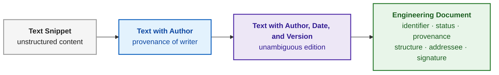
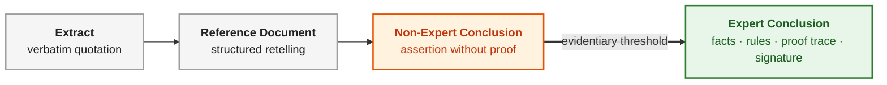
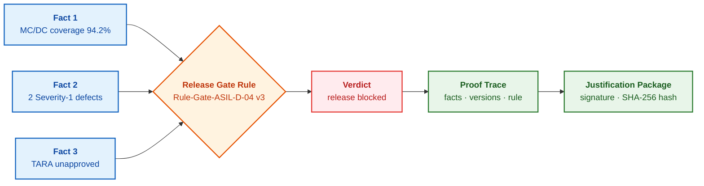
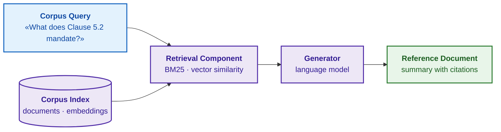
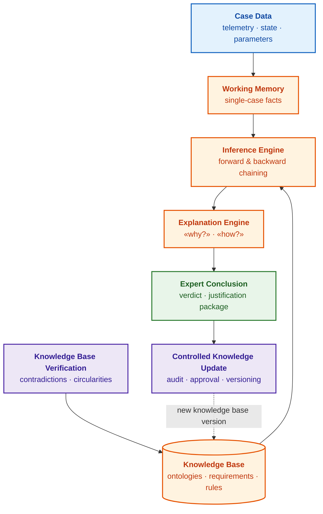
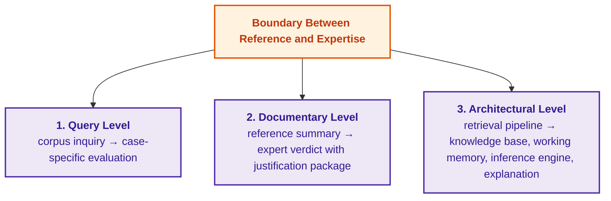

# Chapter 3. How an Expert System Differs from an Information Retrieval System

> **Book:** [Architecture of Evidence-Governed Expert Systems](README.md) · [Part I: Conceptual and Epistemic Foundations](part-01-foundations.md)  
> **Previous Chapter:** [Chapter 2. Philosophy for the Engineer: What a Machine May Lawfully Call Knowledge](ch02-epistemology-of-machine-knowledge.md)  
> **Next Chapter:** [Chapter 4. Evolution of Expert Systems: From Bayes' Theorem to Evidence-Based AI](ch04-evolution-from-bayes-to-evidence-ai.md)  
> **Table of Contents:** [README.md](README.md)  
> **Author:** [Mykola Fedchyk](about-the-author.md)  
> **Target Level:** Foundational Engineering; code listings are placed in collapsible blocks  
> **Expected Learning Outcomes:** Differentiate inquiries concerning a document corpus from inquiries addressing a specific case; explain how an informational summary differs from an expert conclusion; identify the architectural mechanisms missing in search engines, databases, language models, and retrieval-augmented generation pipelines that prevent them from functioning as expert systems; articulate why an expert system modifies its knowledge exclusively via verified, versioned knowledge base releases.

## Abstract

This chapter elucidates the conceptual, documentary, and architectural boundary separating reference information systems (including retrieval-augmented generation architectures and autonomous large language models) from evidence-governed expert systems. It establishes a typological taxonomy of information systems, demonstrating the fundamental divergence between searching a document corpus and performing deterministic logical deduction of novel knowledge for a concrete engineering case. It analyzes the genesis of an engineering document, maps the hierarchical evidentiary tiers of output artifacts, and benchmarks six system classes across seven criteria of the epistemic contract. Utilizing an automotive embedded firmware release gate case study under ASIL D functional safety standards (ISO 26262 / ISO/SAE 21434), the chapter illustrates the runtime mechanics of the inference engine, condition evaluation, and reproducible proof traces.

Engineering teams frequently take an identical first step toward building an "expert system": they gather a directory of technical documentation, augment it with an indexing search engine or a Large Language Model (LLM) that parses discovered snippets, and deploy a conversational interface to answer queries. Such tooling provides unquestioned utility, and within this monograph it is precisely classified: an **information retrieval system** (or reference system)—an information system designed to locate and present previously recorded information. A critical failure mode arises when an information retrieval system is conflated with an expert system, and its answers are trusted in operational domains requiring an auditable, formally deduced conclusion for a specific case: such as clearing flight or automotive firmware for field testing, or setting environmental parameters for a high-voltage test bench.

The objective of this chapter is to delineate precisely where the boundary between reference information systems and expert systems lies, and to examine this demarcation across three foundational tiers: the query level, the output artifact level, and the system architecture level. The benchmark applied throughout is the epistemic contract formulated in [Chapter 2](ch02-epistemology-of-machine-knowledge.md)—the suite of rigorous verification gates that a proposition must satisfy before an expert system may lawfully admit and apply it. For each class of information systems, from traditional search engines to modern generative architectures, this chapter identifies which contract checks are absent. The author's background in electronic reporting architectures, digital signature infrastructure, and automotive functional safety engineering yields a decisive criterion: an information system's output merits operational trust only when it possesses an authoritative primary source, an explicit version, an identifiable accountable owner, and an auditable verification trace.

## 1. Typological Taxonomy of Information Systems: Four Baseline Classes

Terms such as "reference system," "consultation system," "decision support system," and "expert system" are frequently employed interchangeably in industry discourse. This semantic conflation leads engineering organizations to demand capabilities from a tool that it is fundamentally incapable of providing: expecting a deductive verdict from an index search, or expecting legal accountability from a generative chatbot. To compare these tools objectively, one must first establish the taxonomic criteria that differentiate classes of information systems.

This monograph distinguishes system classes by their primary operational objective and the nature of the artifact returned to the user. User interfaces and internal underlying technologies do not define the class: a conversational chat interface may front an unindexed wiki, an analytical dashboard, or a formal symbolic verifier, just as deep neural networks can be embedded within any of these architectures. The table below delineates the four baseline classes.

| Class of Information System | Primary Purpose | Returned Artifact | Class Boundary |
|---|---|---|---|
| **Information Retrieval (Reference) System** | Locate and present information previously recorded in a document corpus | Quotation, citation, structured summary of sources | Retrieval does not construct a deductive conclusion for a specific case |
| **Consultation (Dialogue) System** | Conduct interactive dialogue, explain options, collect case parameters for an expert | Advisory recommendation, clarifying question, operational script | Dialogue in itself does not synthesize an auditable, verifiable conclusion |
| **Decision Support System** (*decision support system*, DSS) | Assist a human decision-maker in evaluating alternatives and forecasting outcomes | Ranking of alternatives, predictive forecast, recommendation | Recommendations frequently rely on statistical correlation lacking formal deductive proofs |
| **Expert System** | Apply formalized, versioned domain knowledge to case-specific facts | Verifiable conclusion or typed refusal accompanied by facts, rules, and proofs | The conclusion remains valid strictly within the bounded scope of the knowledge base and submitted facts |

These classes naturally overlap in operational deployments. A consultation system describes an interaction paradigm; hence a conversational interface may front a reference knowledge base, an operational telemetry dashboard, or a formal expert system. A decision support system describes an operational objective: an expert system operating purely in an advisory capacity functions as a specialized, maximally formalized subclass of DSS. The inverse proposition, however, does not hold: a statistical demand-forecasting model or a combinatorial scheduling optimizer assists human decision-making, yet lacks formalized domain rules and an auditable proof trace—the explicit sequence of premises, deduction steps, and active rules that yielded the outcome. Consequently, statistical predictors and mathematical optimizers do not constitute expert systems.

Consider an engineering scenario: two separate teams deploy identical chat interfaces. In the first team, the chat transfers queries to an indexing engine over engineering standards and returns extracted quotations; taxonomically, this tool is an information retrieval system. In the second team, the chat formalizes the query and passes structured facts to an inference engine, which evaluates firmware build parameters against release gate rules and emits a binding verdict accompanied by an immutable proof trace; taxonomically, this tool is an expert system. The end user interacts with an identical frontend window, yet receives artifacts of fundamentally divergent epistemic authority.

The taxonomic classification of an information system is governed neither by its frontend shell nor by the presence of neural networks, but strictly by what artifact it emits and how that artifact is formally justified. The following sections examine this demarcation across three architectural tiers, beginning with the semantic nature of the query itself.

## 2. Semantic Query Level: Differentiating Document Corpus Analysis from Case-Specific Facts

User queries submitted to engineering platforms frequently share superficial syntactic patterns, yet belong to two fundamentally distinct epistemic categories. When this distinction is neglected, an information retrieval system attempts to resolve a query that exceeds its capabilities, producing an answer that appears superficially authoritative while lacking factual validity.

A **corpus query** pertains to what is recorded within the authoritative documentation: *"What does the corporate environmental test standard specify regarding the maximum module case temperature?"*, *"Where are the electrical isolation requirements documented?"* A corpus denotes the aggregated repository of documents across which retrieval is executed. The answer to a corpus query already exists verbatim or near-verbatim within an authoritative text; the responsibility of the information retrieval system is solely to locate the relevant fragment and present it clearly. Even when retrieved passages are fluidly paraphrased by a large language model, the underlying nature of the task remains unchanged: the system performs information retrieval and summarization.

A **case query** addresses a unique, concrete physical or operational situation: *"Can prototype Revision B undergo bench testing on Test Rig R-4 on September 15, 2026, at an operating case temperature of 95 °C?"* An off-the-shelf answer to this inquiry does not exist verbatim in any single engineering document. As illustrated in [Chapter 2](ch02-epistemology-of-machine-knowledge.md), the baseline corporate standard restricts the case temperature to 90 °C, while an approved engineering variance (Waiver W-17) authorizes 95 °C exclusively for Revision B, strictly on Rig R-4, and solely until October 1, 2026. A valid conclusion emerges only after the normative constraints of the standard and the exception criteria of the waiver are deterministically evaluated against the facts of the specific case: the hardware revision, the assigned test bench, the scheduled execution date, and the physical measurand. This deductive application of formal rules to case facts is executed by an inference engine—the algorithmic core that takes empirical facts, matches applicable rules, and derives a novel truth claim ([Chapter 1](ch01-introduction-to-expert-systems.md)).

> **System Classification Heuristic.** If an information system responds to any operational inquiry with *"Here is what the primary sources state regarding this topic,"* you are interacting with an information retrieval system. If the system responds with *"For Case C, operation is prohibited under Rule R based on Facts F1 and F2 extracted from Source S Revision 4; here is the full proof trace,"* you are interacting with an expert system.

An expert system is fully capable of answering corpus queries, because an information retrieval component is routinely embedded within its architecture. The inverse proposition is false: an information retrieval system lacks the formal mechanisms required to evaluate rules against case-specific facts; consequently, when confronted with a case query, it can offer nothing beyond disconnected citations or probabilistic conjecture.

An engineering document corpus is shared across hundreds of projects and evolves slowly under rigorous revision controls, whereas every engineering case introduces unique empirical facts. Retrieval mechanisms extract general constraints from the corpus, but cannot project those general constraints onto a concrete instance: that projection is strictly the domain of the inference engine. The next section explores the architectural role of Large Language Models, which are most frequently conflated with expert systems.

## 3. Functional Role of Large Language Models in the Architecture of Analytical Systems

Publicly accessible AI services powered by Large Language Models (LLMs)—such as ChatGPT, Claude, or Gemini—are colloquially characterized by some as reference databases and by others as expert systems. Both characterizations are technically inaccurate: an LLM in isolation does not constitute a complete information system. A Large Language Model is an architectural component, and the epistemic class of the final solution is dictated by the system architecture into which it is integrated.

A Large Language Model generates token sequences stochastically based on parameter weights adjusted during pre-training on massive textual corpora. Knowledge absorbed during pre-training is distributed across billions of continuous weights; consequently, the model cannot natively cite with cryptographic certainty the primary document from which a specific claim was derived. This architecture imposes three fundamental engineering limitations:

- **The language model lacks access to proprietary internal corporate corpora.** When asked *"Where is this requirement specified in our internal design manuals?"*, an unaugmented model will produce a fluent, plausible, yet entirely fabricated response. The propensity of generative models to emit statistically plausible text unsupported by authoritative primary sources is termed hallucination [[1]](#src-1).
- **The language model does not isolate case facts as auditable, versioned records.** The model ingests case data within an ephemeral context window—the finite token sequence processed in an individual inference pass. Within this context window, the provenance, lifecycle status, and bitemporal timestamps of individual facts are not formally tracked.
- **The language model does not construct a discrete, deterministic deduction chain: "fact, rule, conclusion".** While the generated prose may mimic the structure of an engineering verdict, beneath the surface there exists no verifiable proof trace, no traceable fact provenance, and no legally accountable entity.

The system architecture in which the language model is embedded dictates the resulting system class:

1. A language model paired with retrieval over an indexed, controlled corporate corpus forms a **Retrieval-Augmented Generation** (RAG) architecture. Patrick Lewis and co-authors proposed combining the parametric memory of a pre-trained neural network with non-parametric memory—a structured document index from which relevant text chunks are dynamically retrieved and injected into the model prompt [[2]](#src-2). RAG outputs provide clickable citations to corporate documents; nevertheless, taxonomically, RAG remains an advanced information retrieval system.
2. A language model integrated with a formal knowledge base, a deterministic inference engine, isolated case working memory, and an explanation engine forms an **evidence-governed neuro-symbolic expert system** ([Chapter 29](ch29-neuro-symbolic-architecture.md)). In a neuro-symbolic architecture, the language model functions as an epistemic translator: parsing human unstructured input into typed facts and formal queries, and translating formal deduction traces into accessible prose, without ever functioning as an unconstrained arbiter of truth.

Consider the query: *"Can prototype Revision B be tested at 95 °C?"* An unaugmented language model without corpus access generates generalized reflections on semiconductor thermal management. A RAG pipeline discovers the corporate standard and Waiver W-17, summarizing both documents with citations, yet fails to verify whether the prototype revision, test rig ID, and scheduled date match the waiver's restrictive preconditions. A neuro-symbolic expert system extracts structured case facts from the user query via the model, invokes the symbolic inference engine to deterministically evaluate W-17's validity predicates, and deploys the model solely to verbalize the final verdict along with its complete proof trace.

In safety-critical engineering research and development, an additional operational constraint arises. Invoking commercial cloud-hosted models requires transmitting proprietary schematic parameters, defect logs, or source code to third-party infrastructure providers, which is frequently prohibited by corporate intellectual property and data governance policies. In such mission-critical settings, both the language models and the symbolic expert components are hosted within on-premise execution perimeters ([Chapter 18](ch18-execution-infrastructure.md)).

A Large Language Model is a powerful linguistic processing component, not an oracle of truth. Without retrieval, it merely recounts statistical patterns from training; with retrieval, it forms an information retrieval system; and only when subordinated to a formal knowledge base and an inference engine does it become a component of an expert system. The next level of differentiation concerns the nature of the output artifacts emitted by these systems.

## 4. Documentary Level: Conceptual Boundary Between Reference Information and Expert Conclusions

At the user interface level, both an information retrieval system and an expert system emit text, and both outputs may appear superficially similar. However, during a formal compliance audit, product certification, or an engineering failure investigation, only one of these artifacts carries the weight of legal and technical proof. To understand this distinction, one must analyze the process that transforms raw text into a legally binding document.

### 4.1. Genesis of an Engineering Document: From Raw Text to a Legally Binding Artifact

The transformation of unstructured data into an auditable evidence base begins with understanding the genesis of an engineering document: a raw text snippet attains the status of a legitimate artifact only as it progressively acquires attributes of authorship, versioning, and legal validity. A fragment of text displayed on a screen does not constitute a document: its author, creation timestamp, intended audience, and active legal validity remain unknown. Such a fragment can neither be audited nor entered into a certification file.

Text attains the status of a document incrementally, where each stage introduces an indispensable attribute without which specific verification checks cannot be executed:

1. A **raw text snippet** contains solely unstructured semantic content.
2. A **text with author** identifies the originating source, yet without an immutable timestamp, its temporal currency cannot be verified.
3. A **text with author, date, and version** allows an engineer to map a citation unambiguously to a specific document revision.
4. A complete **engineering document** possesses the comprehensive suite of formal attributes:
   - A unique, immutable identifier (e.g., an inventory or document registry ID);
   - An author and an accountable owner—the designated engineer legally responsible for the technical content;
   - An explicit lifecycle status: draft, under review, approved, or revoked;
   - Provenance (*provenance*): an auditable record of the source data and engineering transformations that yielded the artifact; the World Wide Web Consortium (W3C) PROV-O ontology formalizes provenance via entities, activities, and agents [[3]](#src-3);
   - Formal structure: strongly typed sections and machine-readable data schemas;
   - Explicit scope, designated addressee, and security classification label;
   - A cryptographic or qualified electronic signature of the responsible authority.

The sequence below illustrates this evolutionary progression.



The grey node represents unanchored text; the blue and purple nodes introduce identity, timestamping, and revision control; the green node represents a fully formalized engineering document. Each transition introduces an attribute enabling a new verification check: authorship enables accountability tracing, versioning guarantees temporal currency verification, while lifecycle status and cryptographic signatures enable formal auditability.

Statutory electronic document workflows have resolved this challenge for decades. Within the European Union, the eIDAS regulation establishes that a Qualified Electronic Signature (QES) possesses legal equivalence to a handwritten signature, where validating a qualified signature requires verifying the signer's digital certificate active at the exact signing timestamp [[4]](#src-4). The evidentiary weight of a document stems not from aesthetic formatting, but from the cryptographically verified link between its content and an accountable individual.

For an expert system, this engineering analogy establishes an absolute invariant: an emitted conclusion derives its authority not from fluent linguistic formulation, but from its cryptographically verifiable link to an auditable proof trace. An output devoid of such grounding remains a mere snippet of text, regardless of how persuasive it appears.

### 4.2. Ontological Differentiation: Passive Retelling of Sources Versus Deterministic Inference

The fundamental ontological boundary separating reference information from an expert conclusion lies in the distinction between the passive transmission of recorded facts and the synthesis of novel knowledge via deductive inference. Both artifacts may reference identical primary sources; therefore, the difference must be sought not in their subject matter, but in their operational nature.

A **reference document** retells pre-existing knowledge: an excerpt from an industrial standard, a component technical datasheet (*datasheet*), or a calibration manual. The correctness criterion for a reference document is its fidelity to the primary source; its audit trace consists of page or section citations; and it contains no novel assertions. The compiler of a reference document is accountable for transcription fidelity, but carries no liability for how third parties operationalize those summarized requirements.

An **expert conclusion** represents a novel evaluative judgment regarding a concrete case: assessing the safety of an electronic control assembly, determining the readiness of embedded firmware for field deployment, or isolating a hardware failure. The correctness criterion for an expert conclusion is the validity of its logical deduction from verified facts under approved domain rules. Its audit trace consists of a discrete chain: "fact, rule, intermediate proposition, final verdict", explicitly recording the versions and provenance of every constituent premise. An expert conclusion asserts propositions not found verbatim in any source document, defines explicit operational boundaries and assumptions, and carries the cryptographic signature of the responsible engineer or the certified expert system.

| Attribute | Reference Document | Expert Conclusion |
|---|---|---|
| Nature of Artifact | Retelling of established facts | Novel evaluative judgment on a specific case |
| Correctness Criterion | Fidelity to the primary source | Valid logical deduction from verified facts under approved rules |
| Novel Assertions | None (strictly bounded by primary sources) | Present: synthesizes an operational conclusion for the case |
| Auditable Trace | Citations to documents, chapters, or pages | End-to-end proof trace with versions and provenance of every premise |
| Scope and Validity Envelopes | Defined implicitly by the underlying source | Explicitly declared: applicability domain, assumptions, lifecycle status |
| Operational Use | Informational reference and research | Legally and technically binding evidence for audits or safety certification |

> [!NOTE] Engineering Contrast: Why Reference Documentation Cannot Guarantee Hardware Integrity
> When querying a conventional RAG system: *"Can 24 V be applied to the digital input of module DI-4?"*, the retriever uncovers the hardware specification statement "nominal digital input voltage: 24 V DC" and synthesizes an affirmative response.
> An expert system, however, verifies the **facts of the active hardware configuration**: if the physical circuit board jumper is set to TTL mode (5 V) or the module case temperature exceeds 70 °C, applying 24 V will catastrophically destroy the input optocoupler. The expert system firmly blocks the operation, identifying an irreconcilable hardware configuration conflict. Reference systems quote specification prose; expert systems compute deterministic consequences for a concrete device.

Between a verbatim quotation and a certified expert conclusion lie four hierarchical tiers of evidentiary weight:

1. **Extract:** A verbatim excerpt from a primary source, such as an exact quotation from an engineering regulation.
2. **Reference Summary:** A structured synthesis of excerpts across multiple sources, such as a consolidated parameter table. Novel knowledge does not emerge at this tier.
3. **Non-Expert Conclusion:** A proposition regarding a specific case lacking an explicit chain of verified facts and formal rules. A characteristic example is an ungrounded LLM output: *"This power transistor appears suitable for your application."* Such assertions cannot be formally verified.
4. **Expert Conclusion:** A binding judgment regarding a concrete case substantiated by an auditable proof trace, rigorous provenance for every premise, and an encapsulated **justification package** (*proof packet*). This monograph defines a justification package as the composite data structure encapsulating the conclusion, verified facts, active rules, versioned sources, validity envelopes, and the identity of the accountable owner ([Chapter 1](ch01-introduction-to-expert-systems.md)).

The diagram below maps these tiers and highlights the decisive evidentiary threshold separating the third and fourth tiers.



Grey nodes synthesize no novel knowledge; the orange node generates an ungrounded claim; the green node produces a novel, formally proven conclusion. The double arrow denotes the evidentiary threshold: crossing this boundary cannot be achieved through superior prose styling, but strictly requires verified empirical facts, declarative rules, and a reproducible deduction trace.

The transition across this threshold is governed by formal proof structures rather than linguistic quality. The following section examines this distinction through a concrete mission-critical release gate decision.

### 4.3. Practical Case Study: Embedded Software Release Gate Verification (ASIL D) Under ISO 26262

The practical impact of this ontological demarcation is demonstrated most vividly in the release qualification of mission-critical embedded software, where confusing a reference summary with a verified expert conclusion precipitates catastrophic system failure. Consider a scenario in which an engineering team is developing embedded firmware for an automotive electronic control unit (ECU) and must determine whether firmware build v2.4.1 may be cleared for physical track testing. In safety-critical software engineering, such a verification checkpoint is termed a **release gate**. The functional safety requirements allocated to this firmware correspond to ASIL D (*Automotive Safety Integrity Level*): ISO 26262 establishes four rigor tiers, ranging from ASIL A to ASIL D, where Level D mandates the most stringent verification criteria. Three distinct classes of information systems respond to the query *"Is the firmware ready for release?"* in fundamentally different ways:

- An **information retrieval system** locates the release checklist, the latest automated test execution report, recent cybersecurity issue tickets, and references to ISO 26262.
- A **language model chatbot** summarizes the artifacts: *"Most unit and integration tests have passed; the firmware appears ready for track testing."*
- An **expert system** synthesizes a formal decision:

> **Verdict:** Clearance of firmware revision v2.4.1 for track testing is BLOCKED.  
> **Facts:**  
> 1. Modified Condition/Decision Coverage (MC/DC) achieved by unit tests is 94.2%, whereas the internal project release policy mandates 100% for ASIL D software units (Coverage Report dated 2026-09-25).  
> 2. The static analysis report for source code commit `a1f9c8` contains two unresolved Severity-1 defect tickets (Static Analyzer Log dated 2026-09-26).  
> 3. The Threat Analysis and Risk Assessment (TARA) has not been formally approved by the designated cybersecurity lead.  
> **Rule:** `Rule-Gate-ASIL-D-04`, version 3, strictly prohibits release clearance as long as at least one blocking condition evaluates to true.  
> **Justification Package:** Cryptographically signed, SHA-256 digest `8b4a7…`.

The expert conclusion immutably preserves the provenance of every applied rule because the rules originate across disparate authoritative artifacts. ISO 26262-6 strongly recommends measuring MC/DC for ASIL D software units [[5]](#src-5), but the 100% threshold is established by the engineering team's internal release policy rather than the general standard. The TARA analysis is governed by the automotive cybersecurity engineering standard ISO/SAE 21434 [[6]](#src-6). Were the conclusion to cite the standard where an internal operational rule governs, an auditor would detect a non-conformance in the very first premise.

The diagram below traces how the three verified facts flow through the release gate rule to construct the verdict and its justification package.



Blue nodes represent verified case facts; the orange diamond represents the versioned rule from the knowledge base; the red node represents the blocking verdict; green nodes represent the auditable proof trace and the cryptographically sealed justification package. Because each fact preserves independent provenance, the conclusion can be audited atom by atom.

Such a verdict enables rigorous, constructive engineering discourse. A software developer can challenge a specific fact—for example, proving that one of the static analysis findings is an audited false positive (*false positive*) formally waived in the issue tracker. The rule owner can adjust the threshold via a controlled change management workflow. Conversely, engaging in engineering discourse over an ungrounded output like *"everything looks good"* is impossible, because beneath such an assertion there are neither discrete facts nor formal rules.

A concise Go implementation demonstrates how an inference engine derives such an auditable verdict. Crucially, the rule is represented as declarative data rather than hardcoded control flow logic: conditions, operators, and threshold values can be audited and modified without recompiling the program binary.

<details>
<summary>Go Implementation: Declarative Release Gate Rules and Condition Evaluation Trace</summary>

This complete, standalone program executes directly via `go run main.go`. Rule `Rule-Gate-ASIL-D-04` encapsulates three blocking conditions; the `evaluate` function assesses each condition against submitted case facts and outputs an explicit evaluation trace. Firmware revision v2.4.2 deliberately omits the fact regarding TARA approval.

```go
package main

import "fmt"

// Condition represents a single rule condition: fact identifier, comparison operator, and threshold.
type Condition struct {
	Fact  string
	Op    string // "<", ">", or "=="
	Value float64
}

// Rule is stored in the knowledge base as data with an identifier and a version.
type Rule struct {
	ID       string
	Version  int
	Blockers []Condition // each satisfied condition blocks release
}

// holds evaluates the condition and reports whether the fact is known.
func holds(c Condition, facts map[string]float64) (value, known bool) {
	v, ok := facts[c.Fact]
	if !ok {
		return false, false
	}
	switch c.Op {
	case "<":
		return v < c.Value, true
	case ">":
		return v > c.Value, true
	default:
		return v == c.Value, true
	}
}

// evaluate applies the rule to case facts and prints the condition evaluation trace.
func evaluate(r Rule, facts map[string]float64) string {
	blocked, unknown := false, false
	for _, c := range r.Blockers {
		value, known := holds(c, facts)
		switch {
		case !known:
			unknown = true
			fmt.Printf("  %s: fact is unknown\n", c.Fact)
		case value:
			blocked = true
			fmt.Printf("  %s = %g %s %g: condition blocks release\n", c.Fact, facts[c.Fact], c.Op, c.Value)
		}
	}
	switch {
	case blocked:
		return "blocked"
	case unknown:
		return "clarification required"
	default:
		return "admitted"
	}
}

func main() {
	rule := Rule{ID: "Rule-Gate-ASIL-D-04", Version: 3, Blockers: []Condition{
		{Fact: "mcdc_coverage_pct", Op: "<", Value: 100},
		{Fact: "open_sev1_defects", Op: ">", Value: 0},
		{Fact: "tara_approved", Op: "==", Value: 0},
	}}

	cases := []struct {
		firmware string
		facts    map[string]float64
	}{
		{"v2.4.1", map[string]float64{"mcdc_coverage_pct": 94.2, "open_sev1_defects": 2, "tara_approved": 0}},
		{"v2.4.2", map[string]float64{"mcdc_coverage_pct": 100, "open_sev1_defects": 0}},
	}
	for _, c := range cases {
		fmt.Printf("firmware %s\n", c.firmware)
		fmt.Printf("  verdict: %s under rule %s v%d\n", evaluate(rule, c.facts), rule.ID, rule.Version)
	}
}
```

The program emits:

```text
firmware v2.4.1
  mcdc_coverage_pct = 94.2 < 100: condition blocks release
  open_sev1_defects = 2 > 0: condition blocks release
  tara_approved = 0 == 0: condition blocks release
  verdict: blocked under rule Rule-Gate-ASIL-D-04 v3
firmware v2.4.2
  tara_approved: fact is unknown
  verdict: clarification required under rule Rule-Gate-ASIL-D-04 v3
```

For firmware revision v2.4.1, all three blocking conditions were triggered; each line of the trace explicitly identifies the fact, observed value, comparison operator, and threshold. For firmware v2.4.2, test coverage and static analysis defects satisfy the release thresholds, yet the fact concerning TARA approval is absent. The inference engine does not assume an unstated fact to be satisfied; instead, it adheres to Kleene's three-valued logic ([Chapter 2](ch02-epistemology-of-machine-knowledge.md#чи-застосовне-твердження-до-запиту)), where an "unknown" state is strictly demarcated from "true" and "false", prompting a request for clarification. This pedagogical implementation is simplified: a production-grade inference engine evaluates tens of thousands of interdependent rules, where the conclusion of one rule dynamically instantiates facts for downstream rules ([Chapter 6](ch06-applied-mathematics-for-expert-systems.md), [Chapter 16](ch16-expert-systems-architecture.md)).

</details>

This implementation highlights the divergence among the three results. Reference documentation provides raw materials for a decision; a generative chatbot projects an ungrounded impression of a decision; an expert system synthesizes an auditable decision that can be verified, contested, and mechanically reproduced.

At the documentary level, the boundary is defined by the proof trace: without an auditable proof trace, even an assertion that happens to be factually accurate remains non-expert. To synthesize and maintain proof traces, an information system's architecture requires components fundamentally absent from standard search and retrieval pipelines.

## 5. Architectural Level: Linear Retrieval-Augmented Generation (RAG) Pipeline Versus Inference Engine

The distinction between reference information and expert judgment is architectural, dictating the component composition of the software system. To understand this structural differentiation, let us compare two architectures: a linear Retrieval-Augmented Generation pipeline and an evidence-governed expert system.

### 5.1. Organizational Principles of a Linear Retrieval-Augmented Generation (RAG) Pipeline

The prevailing contemporary pattern for constructing enterprise information retrieval systems is Retrieval-Augmented Generation (RAG), which implements an open-ended transformation pipeline over unstructured text. RAG operates as a linear sequence of three primary components:

1. The **index** stores the document corpus in full-text inverted indexes or dense vector spaces. Dense vector embeddings (*embeddings*) project text chunks into high-dimensional geometric spaces such that semantically similar passages share high vector proximity.
2. The **retrieval component** (*retriever*) fetches the top-$k$ most relevant text chunks (*chunks*) using either the BM25 probabilistic ranking function—which evaluates documents based on query term frequency, document length, and inverse document frequency across the corpus [[7]](#src-7)—or vector cosine similarity. High-assurance deployments frequently unite both strategies into hybrid search pipelines.
3. The **generator**, typically an autoregressive large language model, synthesizes a natural language summary from the retrieved chunks.

The diagram below traces the linear progression of a query through this pipeline.



The blue node represents the corpus query; purple nodes denote pipeline processing components; the green node represents the emitted reference summary. Data flows strictly in one direction: the baseline RAG pipeline preserves no case working memory, applies no declarative domain rules, and cannot resolve logical contradictions across retrieved fragments.

For corpus queries, this architecture is highly effective, cost-efficient, and easy to deploy. For case queries, however, the pipeline lacks both an isolated repository for case-specific facts and an inference mechanism to project rules onto those facts.

### 5.2. Structural Decomposition of the Evidence-Governed Expert System Kernel

An expert system incorporates search indexes and language models as auxiliary peripherals, yet its foundational core is composed of distinct architectural elements. The diagram below illustrates how case data traverses the expert system kernel to synthesize an auditable verdict.



The blue node represents raw case telemetry; orange nodes constitute the deterministic expert kernel; the green node represents the signed conclusion; purple nodes manage verification and knowledge governance. The dashed line emphasizes that operational feedback does not directly mutate active rules at runtime, but must traverse an offline verification and approval gate to produce a new versioned knowledge base release.

The kernel of an evidence-governed expert system consists of components entirely absent from standard RAG pipelines:

- The **knowledge base** (*knowledge base*) stores domain ontologies, requirements, physical constraints, and declarative rules as strongly typed, structured data, decoupled from raw document prose ([Chapter 7](ch07-knowledge-base-typology.md)).
- The **working memory** (*working memory*) isolates the facts of an individual case from all other cases, ensuring that parameters of firmware v2.4.1 never cross-contaminate the evaluation of firmware v2.4.2.
- The **inference engine** (*inference engine*) evaluates rules against case facts using deterministic algorithms: an identical conjunction of facts and rules guaranteed to yield an identical verdict. Forward chaining (*forward chaining*) derives new conclusions from established facts, whereas backward chaining (*backward chaining*) evaluates hypotheses by identifying necessary supporting premises. To match thousands of rules against facts with high efficiency, Charles Forgy developed the Rete pattern-matching algorithm [[8]](#src-8), the mechanics of which are examined in [Chapter 6](ch06-applied-mathematics-for-expert-systems.md).
- The **explanation engine** (*explanation engine*) resolves queries of *"Why was this decision reached?"* and *"How was this conclusion derived?"* by exposing the discrete proof trace ([Chapter 20](ch20-explanation-engine.md)).
- The **knowledge base verifier** statically analyzes the rule base for mutual contradictions, circular dependencies, and unreachable dead-end conditions prior to deploying a ruleset into production ([Chapter 23](ch23-knowledge-base-verification.md)).
- The **controlled knowledge update workflow** translates operational field experience into a validated, versioned knowledge base release (see Section [«7.1. Knowledge Evolution via Versioning and Regression Testing on Golden Sets»](#навчання-лише-через-перевірену-нову-версію-бази-знань) below).

If one strips the inference engine, working memory, and explanation engine from an expert system, the architecture collapses into an information retrieval system: search indexes and language models remain, but the capability to synthesize an auditable decision for a concrete case is lost. This architectural divergence explains why certain system classes satisfy the epistemic contract while others fail. The following section consolidates this comparison.

## 6. Comparative Analysis of System Classes Under Epistemic Contract Criteria

Evaluating information systems purely on the superficial fluency of their outputs is hazardous: a polished, hallucinated narrative from a generative model frequently makes a stronger subjective impression than the rigorous, unadorned verdict of a formal verifier. [Chapter 2](ch02-epistemology-of-machine-knowledge.md) formalized the epistemic contract: seven mandatory verification gates that an assertion must satisfy before an expert system may lawfully admit it, alongside four permissible response outcomes: an evidence-grounded conclusion, a clarification request, escalation to a human engineer, or a fail-closed refusal. This contract provides an objective engineering benchmark for comparing information system classes.

The matrix below benchmarks six system classes: document search engines, relational Database Management Systems (DBMS), standalone Large Language Models, Retrieval-Augmented Generation (RAG) pipelines, traditional Decision Support Systems (DSS), and evidence-governed expert systems. The symbol ✓ denotes that the mechanism is natively and explicitly enforced; ~ indicates partial, heuristic, or implicit support; ✗ indicates that the mechanism is fundamentally absent.

| Verification Gate or Property | Search Engine | Database (DBMS) | Large Language Model | Retrieval-Augmented Generation (RAG) | Decision Support System (DSS) | Expert System |
|---|---|---|---|---|---|---|
| Primary Purpose | Locate documents | Persist and retrieve structured records | Generate natural language text | Retrieve and summarize document chunks | Assist human in selecting alternatives | Deduce a case-specific conclusion |
| Grounding & Provenance (Epistemology) | ~ Document URL / reference | ~ Mutation audit log | ✗ | ~ Chunk citations | ~ Calculation input parameters | ✓ Formal proof and provenance for every premise |
| Entity, Measurand & Version (Ontology) | ✗ Lexical keyword matching | ✓ Primary keys and formal schema | ✗ | ~ Vector cosine similarity | ~ Formal model factors | ✓ Unambiguous identifiers, measurands, and versions |
| Inference Method & Proof Trace (Logic) | ✗ | ~ Deterministic, reproducible query | ✗ | ✗ | ~ Quantitative computational model | ✓ Deterministic rules and reproducible proof trace |
| Intent & Modality of Query (Philosophy of Language) | ✗ | ~ Query formalized by user | ~ Implicit / ungrounded | ~ Implicit / ungrounded | ~ Constrained by input form | ✓ Rigorously verified or interactively disambiguated |
| Quotation Context (Hermeneutics) | ~ Document page offset | ✗ | ✗ | ~ Bounded neighboring chunk text | ✗ | ✓ Formal evidence window |
| Verification Method & Uncertainty (Philosophy of Science) | ✗ | ✗ | ✗ | ✗ | ~ Model accuracy / confidence interval | ✓ Formal method, calibrated uncertainty, lifecycle status |
| Authority & Access Rights (Social Epistemology) | ~ Document-level ACLs | ✓ Table- and record-level RBAC | ✗ | ~ Chunk-level access filters | ~ Application user roles | ✓ Granular roles, access labels, formal endorsements |
| Disambiguation & Typed Refusal | ✗ | ✗ Empty result set | ~ Heuristic refusal without typed rationale | ~ Heuristic refusal without typed rationale | ~ Implementation-dependent | ✓ Four distinct epistemic response outcomes |
| Case Working Memory | ✗ | ~ Session state | ~ Ephemeral context window | ~ Ephemeral context window | ~ Session runtime variables | ✓ Isolated case-specific facts |
| Knowledge Evolution | Corpus reindexing | Record mutations | Model fine-tuning / retraining | Corpus reindexing | Model recalibration / tuning | ✓ Versioned knowledge base via regression tests |
| Output Artifact | List of ranked documents | Record result set | Free-form generated prose | Reference summary with citations | Evaluation report or forecast | Verifiable expert verdict with justification package |

This matrix reveals fundamental structural truths when read row by row. No system class other than an expert system achieves a ✓ in the row "Inference Method & Proof Trace", and it is precisely this capability that demarcates a verifiable decision from passive summarization. A relational database outperforms language models in ontological rigor and access governance because data schemas and table permissions are explicitly enforced; however, a standard database merely retrieves records matching relational queries without evaluating domain rules unless procedurally programmed to do so. Retrieval-Augmented Generation augments language models with primary source links, yet citing a document chunk does not prove that the retrieved clause is legally or physically applicable to the active case.

An expert system is distinguished not by superior prose synthesis, but by a fundamentally different set of engineering mechanisms: explicit declarative rules, reproducible proof traces, byte-level premise provenance, and typed epistemic response states. While other information system classes serve as valuable auxiliary components within an expert architecture, they cannot replace these core mechanisms. This comparison characterizes an expert system at release; the next section addresses its operational governance throughout its production lifecycle.

## 7. Operational Validation: Managing Knowledge Base Evolution, Confidence Calibration, and Actuation

Following deployment, an expert system operates in production across months and years. Over this operational lifecycle, industry standards evolve, hardware component revisions change, novel defect patterns emerge, and organizations seek to automate increasing subsets of operational decisions. Each of these three dynamics can completely erode trust in the expert system if not rigorously governed. The following subsections outline the core operational principles, pointing to the dedicated chapters where each topic is analyzed in mathematical depth.

### 7.1. Knowledge Evolution via Versioning and Regression Testing on Golden Sets <a id="навчання-лише-через-перевірену-нову-версію-бази-знань"></a>

Regulatory standards become obsolete, supplier component revisions are superseded, and latent errors are uncovered within rule definitions. An expert system that is never updated gradually degenerates into inaccuracy. Conversely, an expert system that mutates its own production rules after each user session without formal governance becomes non-reproducible: identical queries submitted today and tomorrow yield divergent answers, with no engineer capable of diagnosing the discrepancy. In safety-critical sectors, such uncontrolled runtime drift cements accidental errors.

Consequently, an evidence-governed expert system learns exclusively through controlled knowledge updates. Operational signals—such as an in-service incident report or a newly ratified standard revision—trigger a structured change candidate: a proposed rule, an adjusted numerical threshold, or an updated model weights artifact. This candidate undergoes strict provenance auditing, peer review by a certified domain expert, and regression validation against a curated **golden set**—a locked benchmark repository of historical engineering cases with known, verified target outcomes. Only upon passing this regression suite and receiving cryptographic approval is a new version of the knowledge base tagged and released, while preceding versions remain immutably archived for rollback and retrospective auditing. When a change candidate includes a machine learning model, it must be accompanied by a **model card** detailing its operational domain, evaluation benchmarks, and known boundary limitations, as formulated by Margaret Mitchell and colleagues [[9]](#src-9).

Consider a scenario where a new revision of an internal test standard reduces the allowable module case temperature limit from 90 °C to 88 °C. A knowledge engineer—a specialist responsible for formalizing human expertise and technical standards into machine-interpretable rules—authors the rule change. A regression test across 120 historical test cases reveals that the verdict shifts in exactly three cases: test runs conducted at 89 °C that were previously authorized are now blocked. The reviewer confirms that this behavioral change strictly matches the revised standard requirement and signs off on the new knowledge base release. Had the regression test revealed an unexpected verdict shift in a case outside the scope of that standard, the change candidate would be rejected with a documented failure log.

The raw material for knowledge updates consists not of arbitrary web text, but of verified engineering artifacts: revised regulatory standards, environmental and bench test telemetry, production quality metrics, root cause analysis (RCA) incident reports, and signed engineering change orders ([Chapter 8](ch08-engineering-artifacts-as-data.md)). The end-to-end lifecycle of knowledge change management, golden set design, and admission criteria are detailed in [Chapter 25](ch25-how-expert-systems-learn.md), while continual learning without catastrophic forgetting is formalized in [Chapter 26](ch26-continual-learning.md).

An expert system evolves, but every modification to its knowledge is encapsulated in an auditable release version subjected to regression testing, expert review, and rollback guarantees. Full reproducibility is maintained: any historical decision can be deterministically replayed against the exact knowledge base revision under which it was originally generated.

### 7.2. Metrology and Calibration of Numerical Confidence: Analysis of Expected Calibration Error (ECE)

A subset of expert system conclusions is accompanied by a scalar metric, such as *"probability of defect: 90%"*. Such a metric is actionable only when it accurately reflects empirical reality: out of 100 historical instances assigned a 90% confidence score, approximately 90 must prove to be true defects. The degree of correspondence between declared confidence and empirical accuracy is termed **calibration** (*calibration*).

One must first clarify what the scalar value represents. The conclusion of a deductive rule is a deterministic logical consequence of its premises and possesses no stochastic probability; therefore, annotating a deductive rule verdict as "99% true" is an epistemological category error. Similarly, semantic search relevance scores or case similarity metrics do not constitute formal probabilities. Calibration is mathematically meaningful exclusively for components that natively estimate empirical probabilities: classifiers, Bayesian belief networks, and quantitative risk models.

Calibration is evaluated on an independent holdout set of verified cases unseen during model training. Inferences are partitioned into discrete bins based on declared confidence, and within each bin, the mean confidence is benchmarked against the observed empirical accuracy. Consider an example: across 200 holdout cases, a defect risk classifier emitted a confidence score of approximately 90% in 100 instances, proving correct in 72; in the remaining 100 instances, it declared approximately 60% confidence and was correct in 58. In the first bin, the gap between declared confidence and empirical accuracy is 18 percentage points; in the second bin, the gap is 2 percentage points. Because each bin contains half the evaluation cohort, the weighted mean gap across the bins is $0.5 \cdot 18 + 0.5 \cdot 2 = 10$ percentage points. This weighted scalar metric is termed the **Expected Calibration Error** (ECE), introduced by Mahdi Pakdaman Naeini, Gregory Cooper, and Miloš Hauskrecht [[10]](#src-10). The ECE evaluates to zero when declared confidence perfectly tracks empirical accuracy across all bins; higher values signify severe miscalibration. Chuan Guo and colleagues demonstrated that modern deep neural networks, despite achieving high nominal accuracy, are frequently severely overconfident and poorly calibrated [[11]](#src-11).

In the case study above, the classifier exhibits extreme overconfidence precisely in the operational regime where reliability is paramount: an engineer relying on a 90% confidence tag expects 10 errors per 100 decisions, but in production encounters 28 failures. Numerical confidence scores must be presented to engineering operators only after passing rigorous calibration testing; prior to validation, the system must emit categorical epistemic states: *"deductively proved by rule"*, *"working hypothesis"*, or *"insufficient evidence"*. The mathematical formulation of ECE, reliability diagrams, and Platt/isotonic recalibration techniques are analyzed in [Chapter 25](ch25-how-expert-systems-learn.md), while the foundations of probabilistic inference are established in [Chapter 6](ch06-applied-mathematics-for-expert-systems.md).

### 7.3. Hierarchy of Operational Autonomy: From Advisory Conclusions to Automated Actuation

In the majority of deployments, an expert system operates in an advisory capacity: the system synthesizes a justified recommendation, while a human engineer retains final decision authority (*Human-in-the-Loop*). However, significant operational efficiencies are achieved by delegating specific execution actions to the software: halting a software deployment pipeline that fails safety criteria, triggering an emergency shutdown of a high-voltage test bench upon detecting thermal boundary violations, or triaging tickets within an issue tracker. A fundamental question arises: do architectural requirements for an expert system shift when an automated verdict directly triggers physical or digital actuation?

The governing architectural principle of this monograph is clear: an organization may delegate actuation to software, but never accountability. As the operational autonomy of an expert system increases, the requirements governing proof trace integrity, automated emergency cutoff switches (*kill switch*), and designated accountable rule ownership become exponentially more stringent. The NIST AI Risk Management Framework (AI RMF 1.0) similarly mandates that organizations formally define and document human roles and oversight responsibilities throughout the AI lifecycle [[12]](#src-12).

Consider an example: the emergency shutdown of a high-voltage test bench is primarily governed by dedicated hardware interlocks that operate entirely independently of software layers. An expert system may initiate an earlier, preventive shutdown upon identifying a complex combination of telemetry anomalies, but it never replaces the fail-safe hardware interlock. Following an automated intervention, the expert system writes the triggering facts, active rule identifiers, and knowledge base version to an immutable audit log, enabling the lead engineer to retrospectively examine the event and, if necessary, amend the rule via the controlled change management process.

Autonomy is an operational property of an individual action rather than of the expert system as a whole, and the autonomy tier for every system action must be formally declared. The five tiers of operational autonomy, ranging from pure recommendation to fully autonomous actuation, and architectural patterns for mitigating human approval fatigue are detailed in [Chapter 21](ch21-from-recommendation-to-action.md).

These three operational principles share a common foundation: no knowledge evolution, no confidence metric, and no autonomous actuation may be introduced without an auditable verification trace. This is the exact requirement that separates an expert conclusion from a reference summary, projected across the operational lifecycle of the system.

## Conclusions

This chapter began by analyzing a pervasive industry shortcut: ingesting technical documentation into a search index or language model and labeling the resulting chatbot an "expert system". While practically useful, such a deployment remains an information retrieval system. The demarcation between reference information systems and expert systems operates across three distinct tiers, summarized in the structural diagram below.



The orange node represents the epistemic boundary; purple nodes denote the three architectural dimensions of differentiation. Across each tier, the left side characterizes reference retrieval, while the right side designates true expertise.

The analysis has demonstrated that:

- At the query level, reference systems answer questions regarding a document corpus, whereas expert systems evaluate concrete operational cases; projecting general rules onto case facts is executed strictly by an inference engine;
- At the documentary level, reference documents are validated against source texts, whereas expert conclusions are audited via independent deduction replay over a proof trace and justification package;
- At the architectural level, an expert system integrates a knowledge base, isolated case working memory, an inference engine, and an explanation engine, which are structurally absent from linear search pipelines;
- Under the epistemic contract, no alternative information system class provides native, reproducible proof traces and typed epistemic response states;
- Post-deployment, an expert system mutates its rules exclusively via regression-tested, versioned knowledge base releases, exposes numerical confidence only after empirical calibration validation, and delegates execution actions while preserving strict accountability.

The boundaries of this chapter's conclusions must also be stated. An expert system entails substantially higher engineering investment: domain rules must be formalized, and every rule demands an accountable owner and a dedicated test suite. For broad inquiries across technical documentation, an information retrieval system is the correct and cost-effective architectural choice. Building an expert system is justified specifically where operations demand a verifiable decision for which an organization bears legal and safety liability: release gates, functional safety certification, and critical infrastructure control.

Expert systems did not emerge overnight in their modern architecture. The subsequent [Chapter 4](ch04-evolution-from-bayes-to-evidence-ai.md) traces how automated decision-making evolved from Bayes' theorem and early production rule engines to modern evidence-governed Artificial Intelligence.

## Review Questions

1. In your professional practice, has an automated document summary from a generative chatbot ever been mistaken for a verified expert conclusion? What technical or operational defect did this confusion cause?
2. Which decisions in your engineering development and release pipeline are already executed autonomously by software without human intervention, and can you reproduce the exact facts, formal rule, and knowledge version for each of those decisions?
3. How does your engineering team audit and validate updates to your knowledge base or formal rules to prevent contradictory, circular, or obsolete requirements from entering production?
4. Have you empirically measured and evaluated the numerical confidence calibration of machine learning models deployed within your internal diagnostic or analytical tooling?

## Glossary

| Term | English Equivalent | Concise Definition |
|---|---|---|
| Information Retrieval System | *information retrieval system*, *reference system* | Information system designed to locate and present information recorded within a document corpus |
| Consultation System | *consultation system*, *dialogue system* | Interactive information system that conducts dialogue, explains alternatives, and collects case data for a specialist |
| Decision Support System | *decision support system* | Information system that assists a human decision-maker in evaluating options and forecasting consequences |
| Document Corpus | *document corpus* | The aggregated collection of documents across which search and retrieval are executed |
| Corpus Query | *corpus question* | An inquiry concerning what is stated in documents; the answer pre-exists within the corpus |
| Case Query | *case question* | An inquiry regarding a specific operational case; the answer is deduced from rules and case facts |
| Large Language Model | *large language model* | Deep neural network trained on massive textual datasets to model and generate natural language |
| Hallucination | *hallucination* | Plausible-sounding text emitted by a generative model unsupported by source documents or facts |
| Context Window | *context window* | The maximum sequence of tokens a language model can ingest and process within a single inference pass |
| Retrieval-Augmented Generation | *retrieval-augmented generation* | System uniting corpus index retrieval with a language model that synthesizes retrieved chunks |
| Embedding | *embedding* | Dense numerical vector where semantically similar text fragments occupy proximate geometric coordinates |
| Text Chunk | *chunk* | A discrete fragment of a document indexed and retrieved as an atomic search unit |
| Retriever | *retriever* | Pipeline component that selects the most relevant chunks for a submitted query |
| Provenance | *provenance* | Auditable record documenting the input data, transformations, and agents that produced an artifact |
| Qualified Electronic Signature | *qualified electronic signature* | Digital signature possessing full legal equivalence to a handwritten signature under regulatory frameworks |
| Reference Document | *reference document* | Informational artifact summarizing established knowledge with citations to primary sources |
| Expert Conclusion | *expert conclusion* | A novel evaluative judgment regarding a specific case deduced from verified facts under formal rules |
| Justification Package | *proof packet* | Composite artifact encapsulating the verdict, verified facts, rules, versioned sources, and signature |
| Proof Trace | *proof trace* | Step-by-step record of facts, rules, versions, and deduction steps that yielded a conclusion |
| Release Gate | *release gate* | A formal engineering checkpoint determining whether a build is qualified to advance to the next lifecycle phase |
| Modified Condition/Decision Coverage | *modified condition/decision coverage* | Software testing structural metric requiring each condition to independently affect the decision outcome |
| False Positive | *false positive* | An erroneous alert reporting a defect or violation where none exists |
| Knowledge Base | *knowledge base* | Structured repository of ontologies, requirements, constraints, and declarative rules |
| Working Memory | *working memory* | Isolated runtime state storing facts for an individual case evaluation |
| Inference Engine | *inference engine* | Algorithmic mechanism applying declarative knowledge base rules to case-specific facts |
| Forward Chaining | *forward chaining* | Data-driven inference progressing from known premises toward derived conclusions |
| Backward Chaining | *backward chaining* | Goal-driven inference evaluating hypotheses by identifying necessary supporting premises |
| Explanation Engine | *explanation engine* | Subsystem resolving queries of "why?" and "how?" by tracing the deduction path |
| Controlled Knowledge Update | *controlled knowledge update* | Process of updating a knowledge base via golden set regression testing, review, and version tagging |
| Golden Set | *golden set* | Curated, immutable benchmark repository of past cases with known, verified target outcomes |
| Model Card | *model card* | Formal specification detailing a model's intended domain, evaluation benchmarks, and operational limits |
| Knowledge Engineer | *knowledge engineer* | Specialist who formalizes human expertise and technical documents into machine-interpretable knowledge |
| Calibration | *calibration* | The degree of alignment between a model's declared confidence score and its empirical accuracy |
| Expected Calibration Error | *expected calibration error* | Weighted mean absolute difference between declared confidence and empirical accuracy across probability bins |
| Human-in-the-Loop | *human-in-the-loop* | Operational paradigm where the system synthesizes justified recommendations while a human retains final authority |
| Kill Switch | *kill switch* | Mechanism enabling immediate, safe abort of automated operational actions |

## Abbreviations

| Abbreviation | Expansion | Meaning |
|---|---|---|
| AI RMF | Artificial Intelligence Risk Management Framework | NIST Artificial Intelligence Risk Management Framework |
| ASIL | Automotive Safety Integrity Level | Automotive safety integrity level under ISO 26262 |
| BM25 | Best Matching 25 | Document ranking function based on probabilistic relevance |
| DBMS | Database Management System | Software system for storing, managing, and querying structured databases |
| DSS | Decision Support System | Decision support system |
| ECE | Expected Calibration Error | Expected calibration error measuring alignment between confidence and empirical accuracy |
| ISO | International Organization for Standardization | International Organization for Standardization |
| LLM | Large Language Model | Large language model based on deep neural network architectures |
| MC/DC | Modified Condition/Decision Coverage | Modified condition/decision coverage structural testing criterion |
| NIST | National Institute of Standards and Technology | U.S. National Institute of Standards and Technology |
| PROV-O | PROV Ontology | W3C specification for representing provenance graphs |
| QES | Qualified Electronic Signature | Electronic signature possessing legal equivalence to a handwritten signature (eIDAS) |
| RAG | Retrieval-Augmented Generation | Retrieval-augmented generation combining information retrieval with language models |
| RCA | Root Cause Analysis | Root cause analysis methodology for investigating anomalies and defects |
| SAE | SAE International | Global association of automotive and aerospace engineers (formerly Society of Automotive Engineers) |
| SHA-256 | Secure Hash Algorithm, 256 bits | Cryptographic hash function generating a 256-bit digest |
| TARA | Threat Analysis and Risk Assessment | Threat analysis and risk assessment methodology under ISO/SAE 21434 |
| W3C | World Wide Web Consortium | International standards organization for the World Wide Web |

## References

1. <a id="src-1"></a>Ziwei Ji, Nayeon Lee, Rita Frieske et al. [*Survey of Hallucination in Natural Language Generation*](https://doi.org/10.1145/3571730). *ACM Computing Surveys*, 55(12), 1–38, 2023.
2. <a id="src-2"></a>Patrick Lewis, Ethan Perez, Aleksandra Piktus et al. [*Retrieval-Augmented Generation for Knowledge-Intensive NLP Tasks*](https://arxiv.org/abs/2005.11401). *Advances in Neural Information Processing Systems 33* (NeurIPS), 2020.
3. <a id="src-3"></a>Timothy Lebo, Satya Sahoo, Deborah McGuinness (eds.). [*PROV-O: The PROV Ontology*](https://www.w3.org/TR/prov-o/). W3C Recommendation, 2013.
4. <a id="src-4"></a>[*Regulation (EU) No 910/2014 on electronic identification and trust services for electronic transactions in the internal market (eIDAS)*](https://eur-lex.europa.eu/eli/reg/2014/910/oj). *Official Journal of the European Union*, L 257, 2014. Article 25 (legal effects of electronic signatures), Article 32 (requirements for the validation of qualified electronic signatures).
5. <a id="src-5"></a>ISO. [*ISO 26262-6:2018. Road vehicles: Functional safety. Part 6: Product development at the software level*](https://www.iso.org/standard/68388.html). 2nd edition, 2018.
6. <a id="src-6"></a>ISO, SAE International. [*ISO/SAE 21434:2021. Road vehicles: Cybersecurity engineering*](https://www.iso.org/standard/70918.html). 2021.
7. <a id="src-7"></a>Stephen Robertson, Hugo Zaragoza. [*The Probabilistic Relevance Framework: BM25 and Beyond*](https://doi.org/10.1561/1500000019). *Foundations and Trends in Information Retrieval*, 2009.
8. <a id="src-8"></a>Charles L. Forgy. [*Rete: A Fast Algorithm for the Many Pattern/Many Object Pattern Match Problem*](https://doi.org/10.1016/0004-3702(82)90020-0). *Artificial Intelligence*, 19(1), 17–37, 1982.
9. <a id="src-9"></a>Margaret Mitchell, Simone Wu, Andrew Zaldivar et al. [*Model Cards for Model Reporting*](https://doi.org/10.1145/3287560.3287596). *Proceedings of the Conference on Fairness, Accountability, and Transparency*, 220–229, 2019.
10. <a id="src-10"></a>Mahdi Pakdaman Naeini, Gregory Cooper, Milos Hauskrecht. [*Obtaining Well Calibrated Probabilities Using Bayesian Binning*](https://doi.org/10.1609/aaai.v29i1.9602). *Proceedings of the AAAI Conference on Artificial Intelligence*, 29(1), 2015.
11. <a id="src-11"></a>Chuan Guo, Geoff Pleiss, Yu Sun, Kilian Q. Weinberger. [*On Calibration of Modern Neural Networks*](https://proceedings.mlr.press/v70/guo17a.html). *Proceedings of the 34th International Conference on Machine Learning*, PMLR 70, 1321–1330, 2017.
12. <a id="src-12"></a>Elham Tabassi. [*Artificial Intelligence Risk Management Framework (AI RMF 1.0)*](https://doi.org/10.6028/NIST.AI.100-1). NIST AI 100-1, 2023.

---

[← Chapter 2](ch02-epistemology-of-machine-knowledge.md) | [Table of Contents](README.md) | [Part I](part-01-foundations.md) | [Chapter 4 →](ch04-evolution-from-bayes-to-evidence-ai.md)
