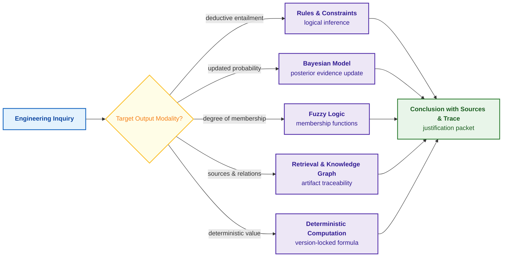
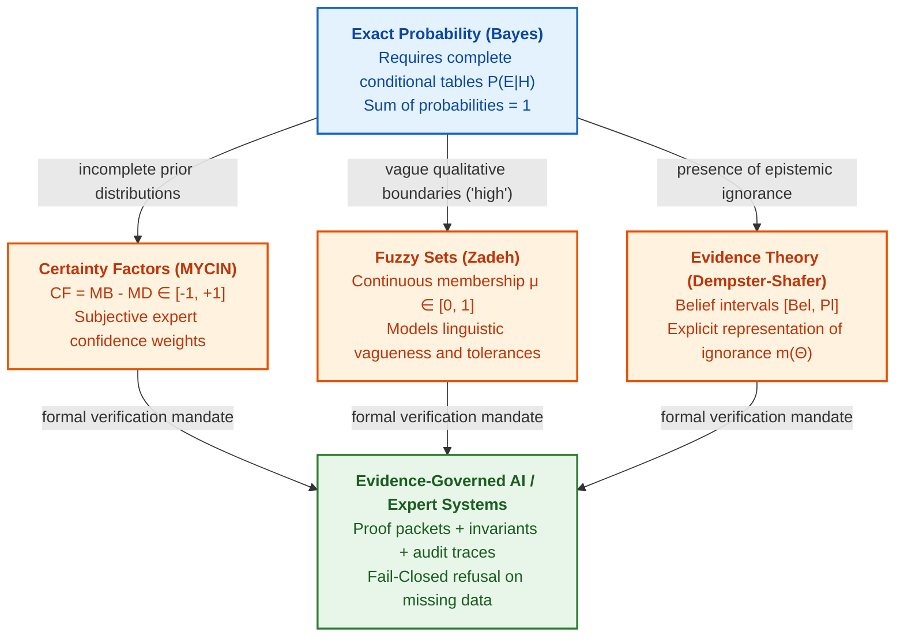
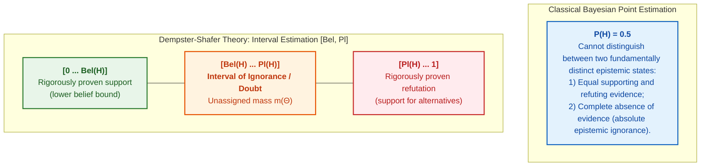
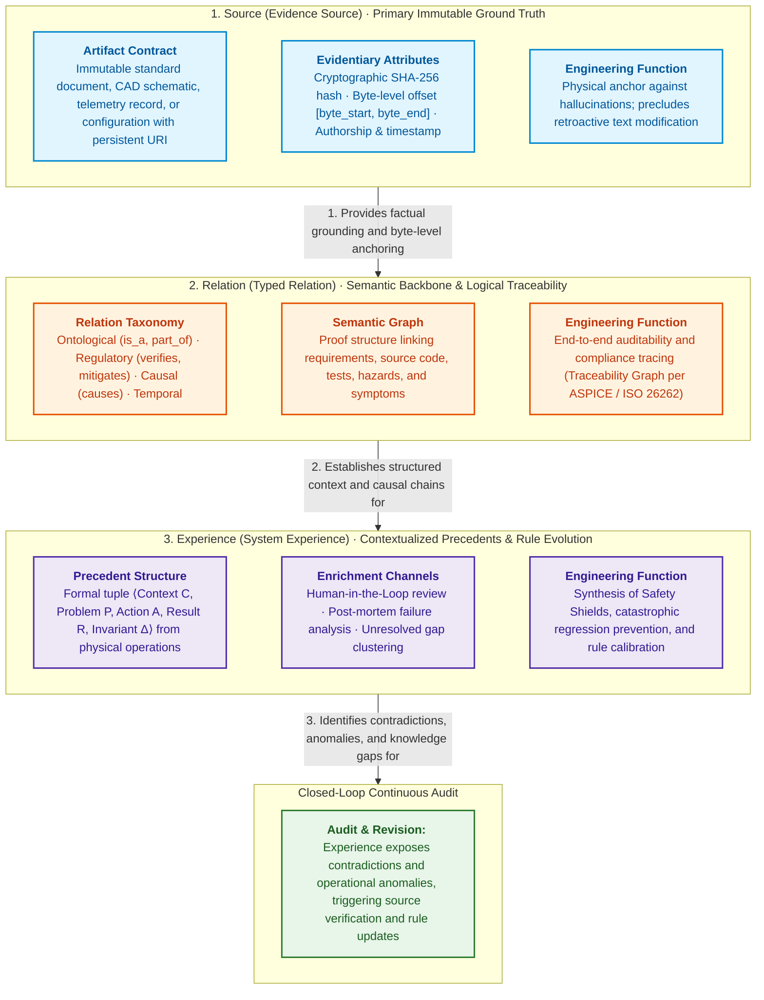
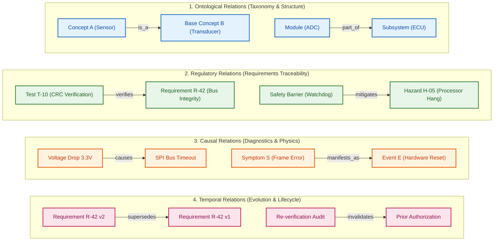
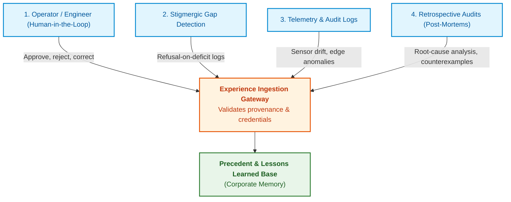
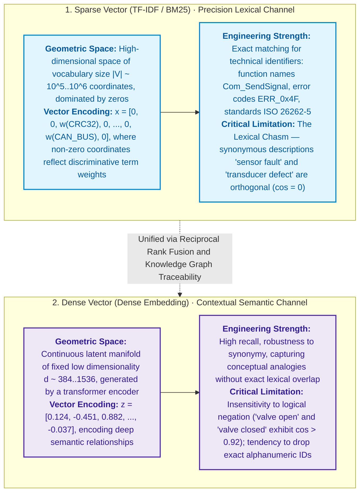
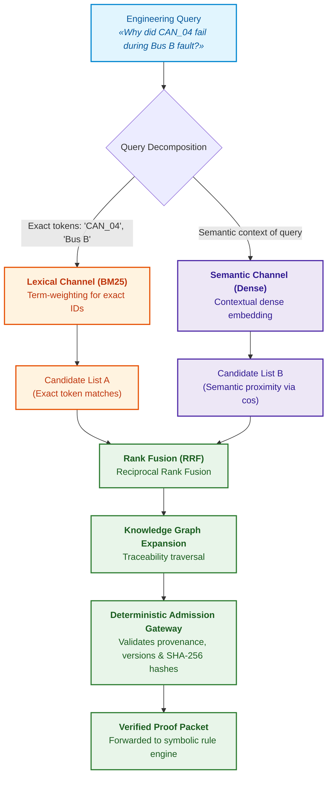
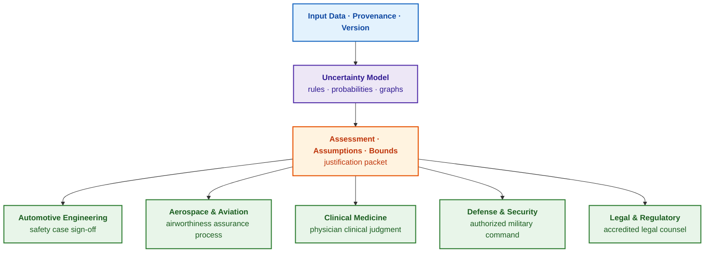

# Chapter 4. Evolution of Expert Systems: From Bayes' Theorem to Evidence-Based AI

> **Book:** [Architecture of Evidence-Governed Expert Systems](README.md) · [Part I: Conceptual and Epistemic Foundations](part-01-foundations.md)  
> **Previous Chapter:** [Chapter 3. How an Expert System Differs from an Information Retrieval System](ch03-beyond-reference-information-systems.md)  
> **Next Chapter:** [Chapter 5. The Triad of Trust: Expert System, Evidence-Governed Recommendation, and Corporate Memory](ch05-triad-of-trust-and-corporate-memory.md)  
> **Table of Contents:** [README.md](README.md)  
> **Author:** [Mykola Fedchyk](about-the-author.md)  
> **Target Level:** Foundational Engineering; code listings are placed in collapsible blocks, formal specifications are marked with the word "Formally"  
> **Expected Learning Outcomes:** Trace the progression from formal logic and Bayes' theorem through pioneering rule-based expert systems (DENDRAL, MYCIN, PROSPECTOR, XCON) to contemporary evidence-governed architectures; select mathematical frameworks based on uncertainty typology (rules, probabilities, fuzzy logic, graphs); articulate the engineering root causes of "AI winters" and the necessity for auditable, evidence-grounded conclusions.

## Abstract

This chapter investigates the sixty-year evolution of machine reasoning paradigms: from classical mathematical logic, predicate calculus, and Bayes' theorem to modern evidence-governed neuro-symbolic (NeSy) architectures. Primary emphasis is placed on the role of the formal computational apparatus within expert system architecture: specifically, how mathematical methods guarantee deterministic conclusions, verifiable logical inference, and irrefutable proof chains across safety-critical engineering domains (ISO 26262, IEC 61508, DO-178C). A rigorous taxonomy of uncertainty management techniques is presented—encompassing deterministic production rules, Bayesian belief networks, Zadeh's fuzzy logic, the Dempster–Shafer theory of evidence, knowledge graphs, and case-based reasoning. The chapter analyzes the engineering root causes underlying four historical waves of expansion and subsequent downturns ("AI winters"), formalizes the foundational evidentiary triad (Source, Relation, Experience), and defines practical design principles for constructing verified expert systems.

Prior to releasing a new version of embedded firmware, a mission-critical regression test fails, yet upon re-execution passes successfully. Does the architecture of the safety perimeter permit signing the release authorization? An information retrieval system will locate historical incident reports, and a statistical conversational model will generate a plausible textual summary; however, the accountable systems engineer requires something fundamentally different: a deterministic calculation demonstrating how the observed anomaly shifts the posterior risk of failure, whether formal specification invariants have been violated, and which verification artifacts are missing from the evidentiary packet. Expert systems addressed such challenges decades before the emergence of large language models, and every sound conclusion demanded selecting a rigorous mathematical apparatus tailored to the specific modality of uncertainty. A production rule establishes a categorical conclusion or safety invariant, probability calibrates stochastic risk, fuzzy membership formalizes continuous engineering tolerances, and a deterministic calculation kernel computes reliability metrics according to standard-defined equations. Conflating these distinct entities into a monolithic heuristic pseudo-score obliterates evidentiary integrity, engineering an illusion of confidence rather than verifiable guarantees of safety.

The objective of this chapter is to dissect the evolution of machine reasoning as a sequence of engineering solutions to systemic crises, equipping the reader to select computational formalisms aligned with input data uncertainty. Each method is analyzed through the lens of its architectural role within an expert system: physical semantics, numerical algorithms, operational boundaries, and integration into the decision admission gateway.

## 1. Methodological Foundations: Taxonomy of Uncertainty and Selection of Computational Apparatus

Selecting the mathematical apparatus within an expert system architecture represents an immutable foundational safety contract: attempting to resolve stochastic uncertainty with deterministic production rules induces combinatorial explosion and knowledge base brittleness, whereas replacing normative logical invariants with probabilistic neural approximations risks catastrophic failures by overlooking solitary, safety-critical hazards. The taxonomy of uncertainty dictates which inference engine must process incoming facts, the mathematical structure of the proof witness, and the operational criteria under which the system must assert epistemic ignorance or refuse recommendation issuance.

Engineering inquiries diverge not merely in subject matter, but fundamentally in the mathematical structure of their required output. Certain operational contexts mandate establishing whether a conclusion deductively entails from verified premises; others require quantifying how an empirical observation alters the posterior failure risk; still others require evaluating an object's degree of membership within a continuous engineering tolerance such as "sufficient architectural maturity." Theoretical artificial intelligence has formalized specialized mathematical frameworks for each uncertainty modality, none of which functions as a universal panacea. The table below formalizes the core conceptual primitives of this section.

| Concept | Engineering Definition |
|---|---|
| Fact | An immutable assertion regarding an individual case ingested by the expert system as verified input data |
| Rule | An explicit declarative mapping of the form "IF conditions are satisfied, THEN conclusion/action entails" |
| Inference | The algorithmic application of production rules or mathematical models to input facts |
| Hypothesis | A candidate proposition evaluated for validity, such as "the release candidate contains a safety-critical regression" |
| Uncertainty | An epistemic state in which available observations are insufficient to derive an unambiguous, deterministic truth value |
| Evidence (*evidence*) | An empirical observation, measurement, or signed document that corroborates or refutes a candidate hypothesis |
| Probability | A real number in $[0, 1]$ modeling the stochastic uncertainty of an event within a defined sample space |
| Deterministic Calculation | A computation that yields identical output for identical inputs and formula version tags across all execution cycles |

The taxonomy table below maps each computational method to its primary operational question and its inherent architectural limitations.

| Computational Method | Target Operational Inquiry | Inherent Architectural Limitation |
|---|---|---|
| Rules and Deductive Logic | Is an explicit logical condition satisfied given verified operational premises? | Cannot guarantee rule completeness or the empirical validity of input premises |
| Bayesian Models | How does an incoming diagnostic signal adjust failure risk within a formalized probabilistic model? | Cannot ensure accuracy of prior distributions or conditional independence assumptions |
| Fuzzy Logic | To what continuous degree does an entity satisfy an engineering concept such as "sufficiently ready"? | Does not ensure that arbitrary subjective ratings constitute valid fuzzy membership functions |
| Knowledge Graphs | Which artifacts, versions, and typed edges constitute the end-to-end evidentiary chain? | Does not independently evaluate procedural decision logic without external rules |
| Information Retrieval | Which documents or granular passages should be presented to human engineers or language models? | Does not verify proposition truth value, logical validity, or source completeness |
| Deterministic Calculation | What exact value is computed by a version-locked formula over specified input vectors? | Cannot guarantee formula validity, input measurement integrity, or operational scope limits |

The architectural flowchart below illustrates how query taxonomy governs computational method selection.



The blue node represents the engineering inquiry; the yellow decision node routes execution based on the required output modality; purple nodes designate specialized mathematical formalisms; and the green node encapsulates the final justification packet containing verified facts, active rules, primary sources, and operational bounds ([Chapter 1](ch01-introduction-to-expert-systems.md)). These methods do not compete: a production-grade expert system routinely integrates all five, assigning each formalism to its corresponding problem domain.

Returning to the intermittently failing test scenario: the release rule determines whether automated re-runs are permissible under the safety case; the Bayesian model calculates the shift in posterior defect probability caused by the initial failure; the knowledge graph maps which safety requirements are verified by the test suite; and the deterministic computation kernel calculates structural branch and MC/DC coverage. The search engine retrieves historical test logs, but remains structurally incapable of synthesizing an authoritative engineering verdict.

Methodological selection begins with the question: *"What mathematical structure must the final verdict possess?"* rather than arbitrary technology adoption. Machine reasoning formalisms evolved historically to overcome the operational limitations of preceding paradigms, as traced in the following section.

## 2. Four Waves of Expert Systems Evolution: From Early Prototypes to Neuro-Symbolic AI

The history of artificial intelligence (AI) is not a monotonic progression. Eras of exuberant expectations and commercial investment alternated with severe retractions designated as "AI winters" [[2]](#src-2). The root causes of these downturns were fundamentally engineering deficiencies; consequently, contemporary projects risk replicating historical failure modes under modern terminology. The four-wave taxonomy structured below provides a practical engineering framework.

```mermaid
flowchart TD
    accTitle: Four Waves of Expert Systems Evolution
    accDescr: From early expert systems built on domain knowledge, through industrial expansion and the AI winter, to production rule engines, the Semantic Web, and contemporary neuro-symbolic systems converging language models with symbolic deduction.

    subgraph W1["1. First Wave (1965–1975) · Genesis of Knowledge Engineering"]
        direction LR
        W1_P["<b>Core Paradigm</b><br/>Domain-specific knowledge supersedes universal search heuristics"]
        W1_M["<b>Key Milestones</b><br/>DENDRAL (chemistry) · MYCIN (medicine) · PROSPECTOR (geology)"]
        W1_L["<b>Engineering Bottleneck</b><br/>Manual knowledge acquisition: hand-crafting production rules"]
        W1_P ~~~ W1_M ~~~ W1_L
    end

    subgraph W2["2. Second Wave (1980–1987) · Commercial Boom & Industrial Deployment"]
        direction LR
        W2_P["<b>Core Paradigm</b><br/>Enterprise rule integration; emergence of the Knowledge Engineer role"]
        W2_M["<b>Key Milestones</b><br/>XCON/R1 on OPS5 ($40M/year DEC savings) · LISP machines (Symbolics, TI)"]
        W2_L["<b>Engineering Bottleneck</b><br/>Exponential maintenance overhead in rule bases exceeding thousands of clauses"]
        W2_P ~~~ W2_M ~~~ W2_L
    end

    subgraph WIN["The AI Winter (Late 1980s – Early 1990s) · Crisis of Unfulfilled Expectations"]
        direction LR
        WIN_P["<b>Root Causes</b><br/>System brittleness and the manual knowledge acquisition bottleneck"]
        WIN_M["<b>Economic Factors</b><br/>Unsustainable cost of conflict resolution in unpartitioned rule bases"]
        WIN_L["<b>Hardware Shift</b><br/>Commodity microprocessors surpassed proprietary, costly LISP hardware"]
        WIN_P ~~~ WIN_M ~~~ WIN_L
    end

    subgraph W3["3. Third Wave (1995–2015) · Pragmatic Business Rules (BRMS) & Semantic Web"]
        direction LR
        W3_P["<b>Core Paradigm</b><br/>Abandoning artificial general intelligence for deterministic rule execution"]
        W3_M["<b>Key Milestones</b><br/>Industrial engines (CLIPS, Drools, Jess) · W3C standards (RDF, OWL, SPARQL)"]
        W3_L["<b>Engineering Outcome</b><br/>Deterministic enterprise rules and standardized open graph ontologies"]
        W3_P ~~~ W3_M ~~~ W3_L
    end

    subgraph W4["4. Fourth Wave (From 2020) · Evidence-Governed Neuro-Symbolic AI (NeSy)"]
        direction LR
        W4_P["<b>Core Paradigm</b><br/>Tandem pairing of fast LLM intuition with verified symbolic deduction cores"]
        W4_M["<b>Key Milestones</b><br/>Automated document parsing · Byte-grounded RAG pipelines"]
        W4_L["<b>Engineering Outcome</b><br/>Hallucination mitigation via deterministic rules, verifiers, and GSN safety cases"]
        W4_P ~~~ W4_M ~~~ W4_L
    end

    W1 --> W2 --> WIN --> W3 --> W4

    classDef w1 fill:#e1f5fe,stroke:#0288d1,stroke-width:2px,color:#01579b;
    classDef w2 fill:#ede7f6,stroke:#512da8,stroke-width:2px,color:#311b92;
    classDef win fill:#ffebee,stroke:#c62828,stroke-width:2px,color:#b71c1c;
    classDef w3 fill:#fff3e0,stroke:#f57c00,stroke-width:2px,color:#e65100;
    classDef w4 fill:#e8f5e9,stroke:#2e7d32,stroke-width:2px,color:#1b5e20;

    class W1_P,W1_M,W1_L w1;
    class W2_P,W2_M,W2_L w2;
    class WIN_P,WIN_M,WIN_L win;
    class W3_P,W3_M,W3_L w3;
    class W4_P,W4_M,W4_L w4;
```



The blue, purple, orange, and green blocks delineate expansion cycles, while the red container marks the AI winter. Each successive era emerged as an engineering countermeasure to the failure modes of its predecessor: the commercial boom capitalized on early laboratory successes; the winter ensued from untenable maintenance costs; the third wave discarded claims to artificial general intelligence; and the fourth wave leverages language models to automate the labour-intensive acquisition tasks that previously crippled symbolic systems.

### 2.1. First Wave (1965–1975): Primacy of Domain Knowledge Over Universal Heuristics

During the 1950s and 1960s, computer scientists endeavored to replicate human reasoning through generalized, universal search heuristics. Allen Newell and Herbert Simon's General Problem Solver attempted state-space search over domain-independent representations, but inevitably foundered upon combinatorial explosion when applied beyond idealized mathematical puzzles [[2]](#src-2). Edward Feigenbaum of Stanford University formulated the antithetical principle: the operational power of an intelligent software program stems primarily from the depth, granularity, and fidelity of its domain-specific knowledge, rather than the sophistication of its universal inference algorithms [[3]](#src-3). This insight established the foundation of **knowledge engineering** (*knowledge engineering*). The seminal expert systems of this era substantiated Feigenbaum's thesis:

- **DENDRAL** (Stanford, launched 1965; Edward Feigenbaum, Bruce Buchanan, Joshua Lederberg in collaboration with chemist Carl Djerassi) hypothesized organic chemical molecular structures from mass spectrometry telemetry. The system is recognized as the inaugural expert system designed for automated scientific hypothesis generation [[4]](#src-4).
- **MYCIN** (Stanford, launched 1972; Edward Shortliffe) provided therapeutic recommendations for blood infections (bacteremia) and meningitis, explaining its reasoning chains by resolving user queries of "why?" and "how?" [[5]](#src-5). MYCIN pioneered certainty factor calculus, analyzed in subsequent sections [[6]](#src-6).
- **PROSPECTOR** (SRI International, late 1970s) evaluated mineral deposit viability utilizing geological field observations. In 1982, processing geological survey data for Mount Tolman in Washington State, PROSPECTOR accurately localized an unmapped, commercially viable molybdenum ore body valued in millions of dollars [[7]](#src-7).

The first wave proved that automated systems derive efficacy from codified domain expertise. However, extracting that knowledge through manual expert interviews established an acute operational bottleneck.

### 2.2. Second Wave (1980–1987): Industrial Commercialization and LISP Machines

In the 1980s, expert systems transitioned from academic research laboratories into industrial enterprise environments. Digital Equipment Corporation (DEC) marketed VAX minicomputers configurable across thousands of combinations of modular processors, backplanes, memory boards, cables, and enclosures; human order-pickers committed continuous, costly configuration errors. The R1 expert system (later designated **XCON**), constructed by John McDermott in the OPS5 production rule language, automated order validation and component layout [[8]](#src-8). As documented by Stuart Russell and Peter Norvig, by 1986 XCON yielded DEC approximately $40 million in net annual operational savings [[2]](#src-2). Specialized hardware vendors emerged to manufacture dedicated LISP workstations (Symbolics, Lisp Machines Inc., Texas Instruments), accompanied by the professionalization of the Knowledge Engineer—specialists tasked with interviewing human domain experts and formalizing their tacit heuristics into production rule bases.

The second wave established the commercial viability of rule-based automation. However, as XCON's knowledge base expanded to thousands of interdependent production rules, maintenance costs escalated non-linearly, eventually outstripping operational benefits.

### 2.3. The Crisis of Inflated Expectations: Four Engineering Causes of the "AI Winter"

By the late 1980s, the commercial expert systems industry collapsed: startup vendors failed to fulfill public performance guarantees and suffered widespread insolvencies [[2]](#src-2). Four distinct engineering failure modes precipitated the crisis:

1. **The Knowledge Acquisition Bottleneck** (*knowledge acquisition bottleneck*). Senior domain experts struggled to articulate their implicit heuristics, rendering manual rule authoring an unsustainable, multi-year process [[9]](#src-9).
2. **System Brittleness** (*brittleness*). Early expert systems operated without explicit boundaries of competence: encountering novel cases outside their codified rule sets, systems emitted absurd or catastrophic recommendations rather than signaling epistemic ignorance and executing a fail-safe abort [[9]](#src-9).
3. **Intractable Maintenance Complexity.** Rule activation was sensitive to conflict-resolution strategies and the arbitrary sequence of fact assertions within working memory. In rule bases containing thousands of entries, introducing a single production rule frequently generated unintended side effects, circular dependencies, or execution deadlocks [[2]](#src-2).
4. **Hardware Obsolescence.** Proprietary, capital-intensive LISP workstations were eclipsed by standardized, commodity desktop personal computers and UNIX workstations, which achieved competitive clock speeds at a fraction of the cost.

Each of these four failure modes has an architectural remedy within modern systems. Automated knowledge extraction is addressed in [Chapter 10](ch10-knowledge-acquisition-systems.md); operational boundary formalization and the right to refuse in [Chapter 2](ch02-epistemology-of-machine-knowledge.md); formal knowledge base verification in [Chapter 23](ch23-knowledge-base-verification.md); and commodity, containerized deployment infrastructure in [Chapter 18](ch18-execution-infrastructure.md).

### 2.4. Third Wave (1995–2015): Business Rule Management Systems (BRMS) and the Semantic Web

Emerging from the AI winter, industrial engineering discarded grand claims toward artificial general intelligence, focusing instead on deterministic enterprise utility. Production rule engines (*business rule engines*) such as CLIPS, Jess, and Drools were rewritten as embeddable libraries in C and Java, securing pervasive deployment in insurance underwriting, financial fraud detection, and supply chain logistics. Simultaneously, the World Wide Web Consortium (W3C) formalized graph-based knowledge representations: the Resource Description Framework (RDF) represented relational claims as subject-predicate-object triples [[10]](#src-10), the Web Ontology Language (OWL) codified formal ontologies, and SPARQL standardized declarative graph querying.

The third wave firmly established production rules and knowledge graphs as reliable software engineering primitives. Nevertheless, the knowledge acquisition bottleneck persisted: rules and ontologies still demanded laborious manual authoring by software engineers.

### 2.5. Fourth Wave (From 2020): Evidence-Governed Neuro-Symbolic AI and Convergence with Language Models

The rise of Large Language Models (LLMs) initially drove industry attention toward purely statistical, generative paradigms. In regulated engineering domains, however, teams rapidly encountered severe architectural boundaries: stochastic hallucinations, non-reproducible answers for identical prompts, absent fact provenance, and the structural impossibility of regulatory certification ([Chapter 3](ch03-beyond-reference-information-systems.md)). Modern evidence-governed expert systems resolve this tension through a two-tier hybrid architecture. The linguistic tier—incorporating local Small Language Models (SLMs)—accelerates knowledge ingestion: parsing unstructured specifications, extracting entity graphs, and mining candidate constraints ([Chapter 12](ch12-linguistic-analysis-and-local-models.md)). The symbolic tier—comprising deterministic production rules, typed knowledge graphs, and formal verifiers—guarantees sound logical deduction, enforces fail-closed behavior under epistemic deficit, and synthesizes inspectable safety cases ([Chapter 27](ch27-safety-case-gsn-synthesis.md), [Chapter 29](ch29-neuro-symbolic-architecture.md)).

History delivers an unequivocal engineering lesson: an expert system is only as dependable as its knowledge base is complete, verified, and maintainable. Generative models mitigate the ingestion bottleneck, but cannot replace explicit, auditable production rules. It is to these deterministic production rules that we now turn.

## 3. Mathematical Logic and Production Rules (Modus Ponens, Rete)

The most transparent and readily verifiable knowledge representation within an expert system architecture is the explicit formal rule. A logical production rule answers whether a conclusion deductively entails from verified premises (*Logical Entailment*). Unlike stochastic neural networks, the output of formal deduction is not a probability distribution: assuming syntactic validity of the rule set and the ground truth of premises, a proposition is either proven or refuted.

**Formally: Deductive Inference via Modus Ponens.**  
The engineering problem of non-determinism and stochastic hallucinations within release admission gateways: in mission-critical environments (ISO 26262, IEC 61508), engineering verdicts cannot rely on statistical token correlations. A formal deductive mechanism is mandated to guarantee that proposition $B$ holds with mathematical certainty if verified facts $A$ and normative rule $A 
ightarrow B$ are true. The computation yields an inspectable deduction step within a formal proof tree, returning a binary truth value $B \in \{\mathbf{True}, \mathbf{False}\}$.

The rule is structured as:

```math
rac{A
ightarrow B,\qquad A}{B}
```

- $A \in \{\mathbf{True}, \mathbf{False}\}$ — an atomic fact or conjunction of facts verified in the knowledge base (the antecedent);
- $A
ightarrow B$ — a production rule or normative requirement: material implication wherein the truth of $A$ guarantees the truth of $B$;
- $B \in \{\mathbf{True}, \mathbf{False}\}$ — the target logical consequence (the consequent or safety action);
- The horizontal bar denotes deductive entailment within the propositional calculus.

**Practical Application and Engineering Conclusions:**
1. The deduction is triggered by pattern matching algorithms (such as Rete or Treat) upon any state transition within Working Memory.
2. If premise $A = \mathbf{True}$ and rule $A 
ightarrow B$ is activated, the inference engine deterministically asserts fact $B$ into working memory, appending the deduction step to the cryptographic proof witness.
3. If $A = \mathbf{False}$ or $A$ is unknown under an open-world assumption, the rule does not fire; the system cannot presume the truth of $B$ and records an evidentiary deficit.
4. Industrial functional safety exemplar:
```text
Rule: IF a change request modifies a safety-critical requirement (A), THEN an impact analysis is mandatory (B).
Fact: Change request CR-17 modifies functional safety requirement SR-42 (A = True).
Verdict: For CR-17, an impact analysis is mandatory (B = True).
```
Any attempt to bypass step $B$ halts the automated release admission gateway.

In 1965, John Alan Robinson formulated the resolution principle, enabling automated theorem proving over first-order predicate calculus [[11]](#src-11). Robinson's breakthrough demonstrated that deductive verification could execute algorithmically over codified knowledge corpora.

Industrial practice, however, revealed that real-world regulatory standards are codified not as pure mathematical theorems, but as **production rules** equipped with salience priorities and conditional exceptions. A production rule establishes a mapping:

```text
IF condition
THEN conclusion or action
```

The inference engine evaluates production rules via two foundational execution strategies:

**Forward Chaining** (*forward chaining*) is data-driven, progressing from asserted facts toward derived conclusions. Let initial working memory contain facts $A$, $B$, and $C$, while the knowledge base contains two compiled rules:

```math
F_0=\{A,B,C\},
\qquad
R=\{A\land B
ightarrow D,\;D\land C
ightarrow E\}.
```

- $F_0$ — initial set of verified facts in working memory;
- $R$ — set of compiled production rules;
- $A, B, C, D, E$ — atomic predicates;
- $\land$ — logical conjunction, $
ightarrow$ — production action.

During the initial match-resolve-act cycle, the first rule fires, asserting fact $D$; on the subsequent cycle, the second rule evaluates successfully:

```math
F_1=F_0\cup\{D\},
\qquad
F_2=F_1\cup\{E\}.
```

Inference terminates when the system reaches a fixed point (Fixed Point) where no additional rules can activate. Forward chaining powers real-time monitoring and invariant checking: detecting design conflicts in CAD assemblies or diagnosing runtime faults from streaming sensor telemetry.

**Backward Chaining** (*backward chaining*) is goal-driven, progressing from a target hypothesis back toward required premises:

```math
E
\Longleftarrow D\land C
\Longleftarrow (A\land B)\land C.
```

- $E$ — target hypothesis requiring confirmation or refutation;
- $D$ and $C$ — first-tier sub-goals;
- $A$ and $B$ — root premises necessary to establish sub-goal $D$;
- $\Longleftarrow$ — goal reduction operator decomposing a goal into a conjunction of sub-goals.

If the top-level goal is "firmware build is cleared for safety certification," the inference engine recursively expands the goal tree downward to verify static analysis reports, branch coverage metrics, and cryptographic sign-offs. Any unfulfilled leaf within the goal tree materializes as an explicit engineering defect report.

### 3.1. Symbolic Paradigms of Early AI: Functional LISP and Descriptive PROLOG

Symbolic programming languages LISP and PROLOG established two foundational paradigms for evaluating logical rules: imperative-functional manipulation of symbolic list structures, and declarative relational deduction governed by Robinson's resolution principle. Understanding these architectural foundations is essential for systems engineers, as they govern the mechanics of modern business rule engines (CLIPS, Drools) and formal knowledge verifiers.

LISP served as the native medium for symbolic AI: representing lists, trees, recursion, and treating code as data that programs could inspect, modify, and execute. NASA's CLIPS rule engine, initiated in 1985, inherited its parenthesized syntax from LISP. A CLIPS rule is an independent, version-controlled software artifact: it can be unit-tested, modified, and reviewed in isolation rather than obscured inside an ephemeral language model prompt.

PROLOG adopted the declarative logic programming paradigm: the engineer declares facts and relational rules, leaving the runtime to execute backward-chaining resolution search. A query becomes a top-level goal, which PROLOG systematically decomposes into sub-goals until grounding in declared facts.

<details>
<summary>CLIPS and PROLOG Implementations: Release Invariants and Evidentiary Gaps</summary>

The CLIPS rule below halts a release pipeline if an open, critical defect affects the build candidate. The `deffacts` construct initializes the working memory state.

```clips
(defrule release-blocked-by-critical-defect
   (release ?r)
   (defect ?d)
   (affects ?d ?r)
   (severity ?d critical)
   (status ?d open)
   =>
   (assert (release-status ?r blocked)))

(deffacts example
   (release v2.4.1)
   (defect D-4)
   (affects D-4 v2.4.1)
   (severity D-4 critical)
   (status D-4 open))
```

Executing `(reset)` followed by `(run)` causes the pattern matcher to bind variables `?r` and `?d` to `v2.4.1` and `D-4`, firing the rule and asserting `(release-status v2.4.1 blocked)`. Because variables generalize the logic, the identical rule enforces safety across every release candidate.

In PROLOG, the impact analysis rule from earlier in this section is declared as:

```prolog
safety_requirement(sr_42).
affects(cr_17, sr_42).

requires_impact_analysis(Change) :-
    affects(Change, Requirement),
    safety_requirement(Requirement).
```

The query `?- requires_impact_analysis(cr_17).` returns `true`, while `?- requires_impact_analysis(X).` unifies `X = cr_17`, extracting all changes requiring formal review. This operation represents deductive reasoning over a relational database, rather than lexical text retrieval.

This mechanism equally detects evidentiary deficits. The listing below models an enterprise release gate policy: isolating technical safety requirements lacking derivation links, missing verification artifacts, or containing failed tests.

```prolog
technical_safety_requirement(tsr_enter_degraded_mode).
technical_safety_requirement(tsr_report_diagnostic_fault).

derived_from(tsr_enter_degraded_mode, fsr_detect_sensor_fault).
derived_from(tsr_report_diagnostic_fault, fsr_detect_sensor_fault).

verified_by(tsr_enter_degraded_mode, test_tsr_014).
test_passed(test_tsr_014).

includes(release_2026_05, tsr_enter_degraded_mode).
includes(release_2026_05, tsr_report_diagnostic_fault).

missing_safety_evidence(Req, safety_trace) :-
    technical_safety_requirement(Req),
    \+ derived_from(Req, _).
missing_safety_evidence(Req, verification) :-
    technical_safety_requirement(Req),
    \+ verified_by(Req, _).
missing_safety_evidence(Req, failed_test) :-
    verified_by(Req, Test),
    \+ test_passed(Test).

release_requires_safety_review(Release) :-
    includes(Release, Req),
    missing_safety_evidence(Req, _).
```

Querying `?- missing_safety_evidence(tsr_report_diagnostic_fault, Reason).` resolves `Reason = verification`: the requirement traces to a parent functional requirement, but lacks an associated test. The query `?- release_requires_safety_review(release_2026_05).` evaluates to `true` because the candidate release contains an unverified requirement. The negation-as-failure operator `\+` presumes unprovable facts to be false—a closed-world assumption valid strictly within complete fact enumerations ([Chapter 2](ch02-epistemology-of-machine-knowledge.md)). This formal traceability maps directly to the "threat $
ightarrow$ mitigation $
ightarrow$ requirement $
ightarrow$ verification" chains mandated by automotive cybersecurity standards such as ISO/SAE 21434 [[12]](#src-12).

</details>

LISP demonstrated how to construct extensible symbolic rule engines, while PROLOG formalized structured querying over knowledge: establishing what is proven, what is missing, and what evidence is required. Modern expert systems rarely compile directly to these legacy runtimes, yet the core architecture—knowledge base, rules, inference engine, explanation tracer—remains invariant.

## 4. The Bayesian Paradigm: Updating Prior Belief Given Empirical Evidence

In physical engineering operations, deterministic logic encounters the realities of stochastic noise, imperfect sensors, and intermittent test harnesses. When a regression test fails once or a sensor registers a transient voltage spike, production rules present an unviable dilemma: either halt operations completely, or disregard the signal entirely. The Bayesian paradigm resolves this challenge by quantifying risk: calculating precisely how incoming empirical observations (*evidence*) shift the system's prior confidence regarding an unobserved defect. Within this section, the term *evidence* denotes an observed empirical measurement or test result, distinct from a formal mathematical proof.

**Formally: Engineering Model for Bayesian Defect Risk Updating.**  
The engineering problem of estimating defect probability from noisy diagnostic signals: an isolated test failure may indicate a genuine software regression or a transient failure in the test environment (Flaky Test). Heuristic reactions cause either costly build pipeline stalls from false alarms, or field escapes of defective software. The computation deterministically updates the posterior defect probability $\Pr(H\mid E) \in [0, 1]$ based on empirical test sensitivity and historical base rates.

The formulation utilizes the following parameters:

```math
\Pr(H\mid E)=rac{\Pr(E\mid H)\,\Pr(H)}{\Pr(E)},\qquad \Pr(E)>0
```

- $H \in \{0, 1\}$ — hypothesis that a critical defect exists in the release ($H=1$ indicates defect presence);
- $E \in \{0, 1\}$ — empirical observation ($E=1$ indicates a test failure);
- $\Pr(H) \in [0, 1]$ — prior probability of a defect (historical defect base rate);
- $\Pr(E\mid H) \in [0, 1]$ — test sensitivity (True Positive Rate: probability the test fails given a genuine defect);
- $\Pr(E) \in (0, 1]$ — total probability of test failure across all release states;
- $\Pr(H\mid E) \in [0, 1]$ — posterior defect probability conditioned on the observed test failure.

The total probability of observing test failure across mutually exclusive states ($H$ and $
eg H$) is computed via the law of total probability:

```math
\Pr(E)=\Pr(E\mid H)\Pr(H)+\Pr(E\mid
eg H)\Pr(
eg H),\qquad \Pr(
eg H)=1-\Pr(H)
```

where $\Pr(E\mid
eg H)$ represents the false alarm rate (False Positive Rate) on stable builds.

**Practical Application and Engineering Conclusions:**
1. The computation executes automatically within the quality gate upon receiving a failed test report.
2. Consider a release class with historical defect rate $\Pr(H)=0.05$, test sensitivity $\Pr(E\mid H)=0.80$, and false alarm rate $\Pr(E\mid
eg H)=0.10$.
3. Total failure probability is $\Pr(E) = 0.80\cdot 0.05 + 0.10\cdot 0.95 = 0.135$. The posterior risk computes as:
```math
\Pr(H\mid E)=rac{0.80\cdot 0.05}{0.135} = rac{0.04}{0.135} pprox 0.296\quad (29.6\,\%).
```
4. Architectural conclusions synthesized by the expert system:
   - The test failure escalates defect risk from 5% to 29.6% (a six-fold increase).
   - However, at 29.6%, there remains a 70.4% probability that the failure was a false alarm. Abruptly blocking the release is economically premature, yet ignoring the signal violates the safety case.
   - The system transitions the release candidate into a controlled quarantine state: triggering an automated isolated re-run or routing the artifact to human engineers for corroborating evidence.

**Formally: Likelihood Ratios and Evidence Strength.**  
To isolate the diagnostic power of the test suite from baseline defect prevalence, the system computes the positive likelihood ratio:

```math
\mathrm{LR}^{+}=rac{\Pr(E\mid H)}{\Pr(E\mid
eg H)}=rac{0.80}{0.10}=8
```

- $\mathrm{LR}^{+} \in [0, \infty)$ — positive likelihood ratio for evidence $E$;
- $\mathrm{LR}^{+} > 1$ supports defect presence, $\mathrm{LR}^{+} < 1$ supports defect absence, while $\mathrm{LR}^{+} = 1$ confirms zero diagnostic utility;
- A value of $\mathrm{LR}^{+}=8$ demonstrates that a test failure is eight times more probable on defective code than on sound code.

Expressed in odds form (*odds*), Bayes' theorem becomes multiplicative:

```math
rac{\Pr(H\mid E)}{1-\Pr(H\mid E)}=rac{\Pr(H)}{1-\Pr(H)}\cdot\mathrm{LR}^{+}
```

Prior odds $rac{0.05}{0.95} pprox 0.0526$, scaled by $\mathrm{LR}^{+}=8$, yield posterior odds $pprox 0.421$, corresponding to probability $rac{0.421}{1 + 0.421} pprox 0.296$. If a test harness exhibits $\mathrm{LR}^{+} < 3$, the expert system classifies it as an uncalibrated diagnostic sensor, barring it from serving as a gating factor.

- $\Pr(H)$ is prior probability, and $\Pr(H\mid E)$ is posterior probability;
- $p/(1-p)$ converts probability $p$ into odds, the ratio of event probability to its complement;
- $\mathrm{LR}^{+}$ is the positive likelihood ratio defined above;
- Finite odds require probabilities strictly within the open interval $(0, 1)$.

Prior odds multiplied by evidence strength yield updated odds: $rac{0.05}{0.95}\cdot 8=rac{8}{19}$, confirming $\Pr(H\mid E)=rac{8}{8+19}=rac{8}{27} pprox 29.6\%$.

**Formally: Multiple Independent Evidence Sources.** For two empirical observations $E_1$ and $E_2$, the joint formulation requires no initial independence assumptions:

```math
\Pr(H\mid E_1,E_2)=rac{\Pr(E_1,E_2\mid H)\,\Pr(H)}{\Pr(E_1,E_2)}.
```

- $H$ is the candidate hypothesis; $E_1$ and $E_2$ are observed empirical signals;
- Comma notation denotes simultaneous joint observation;
- $\Pr(E_1,E_2\mid H)$ is the joint likelihood given $H$;
- $\Pr(E_1,E_2) > 0$ is the total joint probability of both signals;
- $\Pr(H\mid E_1,E_2) \in [0, 1]$ is the posterior probability given both observations.

Inference can execute sequentially, conditioning the second update on the first:

```math
\Pr(H\mid E_1,E_2)=rac{\Pr(E_2\mid H,E_1)\,\Pr(H\mid E_1)}{\Pr(E_2\mid E_1)}.
```

- $\Pr(H\mid E_1)$ is the posterior probability resulting from the first evidence source;
- $\Pr(E_2\mid H,E_1)$ is the likelihood of the second observation given $H$ and prior evidence $E_1$;
- $\Pr(E_2\mid E_1) > 0$ is the probability of the second signal conditioned on the first;
- The resulting posterior $\Pr(H\mid E_1,E_2)$ remains bounded in $[0, 1]$.

Strictly when $E_1$ and $E_2$ are conditionally independent given both $H$ and $
eg H$, odds scale as the product of individual likelihood ratios:

```math
\mathrm{Odds}(H\mid E_1,E_2)=\mathrm{Odds}(H)\cdot\mathrm{LR}_1\cdot\mathrm{LR}_2.
```

- $\mathrm{Odds}(H)$ represents prior odds;
- $\mathrm{LR}_1$ and $\mathrm{LR}_2$ are likelihood ratios for evidence sources 1 and 2;
- $\mathrm{Odds}(H\mid E_1,E_2)$ represents posterior odds;
- Invariant constraint: conditional independence of $E_1$ and $E_2$ under both $H$ and $
eg H$.

A failed integration test and an unclosed defect ticket frequently originate from an identical underlying fault. Presuming independence between correlated signals double-counts identical evidence, dangerously inflating risk estimates.

A posterior probability possesses operational legitimacy only when accompanied by a formal model card: explicit definitions of $H$ and $E$; timestamps and sampling windows for prior and conditional distributions; explicit handling of missing values; documented conditional independence assumptions; model version tags and empirical calibration curves ([Chapter 25](ch25-how-expert-systems-learn.md)); and deterministic policies mapping probabilities to mitigation actions or human escalation. The final requirement establishes an architectural boundary: the Bayesian model updates probabilities, but does not usurp the statutory liability of the human engineer who authorizes deployment, selects medical treatment, or executes legal decisions.

Bayes' theorem provides a mathematically sound updating calculus, yet demands prior and conditional probabilities that are notoriously difficult to elicit across complex domains. Human experts can readily state "this is a strong diagnostic indicator," but cannot rigorously defend that $\Pr(E\mid H)=0.73$. Consequently, heuristic uncertainty models emerged in parallel.

## 5. Heuristic Models of Uncertainty Under Incomplete Prior Information

The three formalisms detailed below arose when building complete joint probability distributions proved mathematically or practically intractable. Each method computes a distinct epistemic metric, and their numerical outputs cannot be mathematically conflated with each other or with classical probabilities.



### 5.1. Certainty Factor Calculus in the MYCIN System

The creators of the MYCIN medical expert system (Stanford, 1970s) encountered a severe engineering obstacle: clinical practitioners possessed no empirical joint probability tables covering hundreds of pathogens and symptoms, yet evaluated evidence directionality with high consistency. Edward Shortliffe and Bruce Buchanan formulated **certainty factor calculus** (*certainty factors*, CF) [[6]](#src-6) as an operational alternative to Bayesian inference that bypassed the requirement for complete prior distributions.

**Formally: Engineering Model for Certainty Factor Calculus.**  
The engineering problem of aggregating expert heuristics under absent statistical distributions: demanding exact failure probabilities for rare hardware components yields fabricated or incoherent values. The objective is to compute a normalized certainty factor $CF(H, E) \in [-1, 1]$, capturing the degree of confirmation or refutation of hypothesis $H$ given observation $E$ without requiring additivity (the sum of $CF$ across all hypotheses is not constrained to 1).

The model defines the following parameters:

```math
CF(H,E)=MB(H,E)-MD(H,E)
```

- $H \in \mathcal{H}$ — candidate hypothesis (e.g., "the root cause is dielectric breakdown");
- $E \in \mathcal{E}$ — observed symptom or telemetry alert;
- $MB(H,E) \in [0, 1]$ — Measure of Increased Belief;
- $MD(H,E) \in [0, 1]$ — Measure of Increased Disbelief;
- $CF(H,E) \in [-1, 1]$ — resultant certainty factor.

To combine two independent observations $E_1$ and $E_2$ supporting the identical hypothesis ($CF_1, CF_2 \ge 0$), MYCIN applies an asymptotic accumulation formula:

```math
CF_{1\oplus2}=CF_1+CF_2\,(1-CF_1),\qquad 0\le CF_1,CF_2\le1
```

- $CF_1, CF_2 \in [0, 1]$ — certainty scores from independent heuristic rules;
- $1 - CF_1$ — residual uncertainty margin;
- $CF_{1\oplus2} \in [0, 1]$ — cumulative certainty factor ($CF_{1\oplus2} \ge \max(CF_1, CF_2)$).

**Practical Application and Engineering Conclusions:**
1. The accumulation formula executes within the production rule engine when processing diagnostic heuristics.
2. If a bus diagnostic rule yields $CF_1 = 0.60$ and a thermal sensor rule corroborates with $CF_2 = 0.50$, cumulative certainty computes as $CF_{1\oplus2} = 0.60 + 0.50 \cdot (1 - 0.60) = 0.80$.
3. Engineering conclusion: achieving $CF \ge 0.75$ triggers automated scheduling of physical component inspection. However, $CF$ does not represent a physical probability and cannot be legally utilized to calculate warranty lifespans or certified hardware reliability metrics (FIT / MTBF).

### 5.2. Zadeh's Fuzzy Logic Apparatus: Membership Functions and Fuzzification

Critical engineering parameters frequently exhibit continuous, non-crisp boundaries: "elevated operating temperature," "excessive bearing vibration," or "critical tool wear." Codifying crisp thresholds such as "IF $T \ge 85^\circ	ext{C}$ THEN execute emergency shutdown" induces boundary chatter: near $84.9^\circ	ext{C} \leftrightarrow 85.1^\circ	ext{C}$, small fluctuations cause safety controllers to oscillate erratically between operational modes. Lotfi Zadeh introduced fuzzy set theory in 1965, defining set membership as a continuous mapping [[14]](#src-14).

**Formally: Engineering Model for Membership Functions and Fuzzy Conjunction.**  
The engineering problem of eliminating boundary chatter in control loops: discrete thresholds provoke high-frequency actuator oscillations. The computation maps continuous physical sensor measurements $x \in X$ into degrees of membership $\mu_A(x) \in [0, 1]$, subsequently evaluating aggregate readiness or risk via Zadeh's minimum T-norm.

The parameters are formulated as:

```math
\mu_A:X	o[0,1],\qquad x\mapsto\mu_A(x)
```

- $X \subseteq \mathbb{R}$ — physical universe of discourse (temperature in °C, pressure in bar, test coverage in %);
- $x \in X$ — calibrated physical sensor reading;
- $A$ — linguistic fuzzy set ("overheating", "release maturity");
- $\mu_A(x) \in [0, 1]$ — degree of membership of measurement $x$ in concept $A$ (0 represents complete exclusion, 1 represents complete inclusion).

To evaluate overall release readiness across three safety criteria ("test coverage", "architectural approvals", "absence of open critical defects"), the engine applies the conservative minimum T-norm (modeling the weakest link in the safety perimeter):

```math
\mu_{	ext{readiness}}=\minigl(\mu_{	ext{tests}}(x_1),\ \mu_{	ext{approvals}}(x_2),\ \mu_{	ext{defects}}(x_3)igr)
```

**Practical Application and Engineering Conclusions:**
1. The calculation executes cyclically within continuous monitoring frameworks or during release audit generation.
2. Suppose project telemetry indicates: test coverage satisfies requirements to degree $\mu_{	ext{tests}} = 0.70$; defect closure status evaluates to $\mu_{	ext{defects}} = 0.60$; but safety architect approval is only partially completed: $\mu_{	ext{approvals}} = 0.40$.
3. Aggregate readiness evaluates as: $\mu_{	ext{readiness}} = \min(0.70;\ 0.40;\ 0.60) = 0.40$.
4. Engineering verdict: the system conservatively blocks release authorization because the weakest link ($\mu = 0.40$) fails the certification threshold $	au_{	ext{release}} = 0.80$. Fuzzy logic isolates the deficit resource (approvals), preventing high performance in secondary metrics from masking critical deficiencies.

#### 5.2.1. Hardware Implementation and Integration of Fuzzy Logic with Language Models

A pervasive misconception in modern software engineering is attempting to substitute fuzzy membership functions with the softmax probabilities of Large Language Models (LLMs). LLM probabilities and fuzzy logic address distinct classes of uncertainty:
1. **Probability vs. Truth Degree:** A language model's $\mathrm{Softmax}$ layer distributes a unitary probability budget ($\sum P_i = 1$) across mutually exclusive tokens (stochastic randomness), whereas Zadeh's fuzzy logic processes independent degrees of truth ($\mu \in [0, 1]$), wherein contradictory engineering properties can simultaneously hold with high membership without summing to unity.
2. **Neuro-Symbolic Division of Labor:** Large Language Models are unsuitable numerical fuzzy inference engines due to arithmetic hallucinations and stochastic drift. In a neuro-symbolic pairing ([Chapter 29](ch29-neuro-symbolic-architecture.md)), language models serve as **linguistic fuzzifiers** (translating natural-language descriptions such as "slightly elevated bus jitter" into numerical parameters) and **linguistic defuzzifiers** (synthesizing clear textual explanations of numerical results for human operators).
3. **Execution Platforms:** In software, fuzzy rule evaluation maps optimally to SIMD-vectorized execution engines (AVX-512 / ARM Neon), executing parallel $\min$ and $\max$ operations in nanoseconds without dynamic heap allocation. In ultra-low-latency control loops (ASIL D), fuzzy inference is compiled directly into FPGA gate arrays without hardware multipliers, or implemented via subthreshold analog circuits utilizing transconductance amplifiers and Winner-Take-All selector topologies.

The comprehensive mathematical theory of fuzzy T-norms, Mamdani and Takagi–Sugeno defuzzification, SIMD vectorization, and hardware synthesis is presented in [Chapter 6](ch06-applied-mathematics-for-expert-systems.md#нечітка-логіка-ступінь-замість-різкої-межі); analog implementations based on Carver Mead's and Takeshi Yamakawa's subthreshold CMOS topologies are analyzed in [Appendix D](appendix-d-analog-expert-systems-and-neuromorphic-computing.md#апаратна-нечітка-логіка-й-вибір-переможця).

### 5.3. Dempster–Shafer Theory of Evidence: Basic Belief Assignment and Plausibility Measures

In diagnostics, an empirical sensor reading often points not to a solitary component failure, but to an unpartitioned subset of candidate faults, leaving residual belief assigned to unknown causes. Classical probability forces a unitary measure to distribute across atomic states even under zero information (Laplace's principle of insufficient reason). The Dempster–Shafer theory of evidence [[15]](#src-15), [[16]](#src-16) resolves this limitation: basic belief mass is assigned directly to subsets of the hypothesis space, formalizing epistemic ignorance (*Epistemic Ignorance*) by allocating mass to the universal set $\Theta$.

**Formally: Engineering Model for Dempster's Rule of Combination.**  
The engineering problem of fusing conflicting telemetry from heterogeneous sensors: when a current sensor indicates motor winding breakdown $S$ while an acoustic sensor indicates line discontinuity $L$, Bayesian conditioning can produce deceptive averages. The system must explicitly quantify inter-sensor conflict $K$ and calculate belief intervals $[\mathrm{Bel}(A), \mathrm{Pl}(A)]$, whose width reflects epistemic ignorance.

The parameters are formulated as:

```math
egin{aligned}
K&=\sum_{B\cap C=arnothing}m_1(B)\,m_2(C),\
m_{1\oplus2}(A)&=rac{\displaystyle\sum_{B\cap C=A}m_1(B)\,m_2(C)}{1-K},\qquad A
earnothing,\ K<1
\end{aligned}
```

- $\Theta = \{H_1, H_2, \dots, H_n\}$ — frame of discernment: a finite set of mutually exclusive elementary hypotheses;
- $2^{\Theta}$ — power set of $\Theta$;
- $m_1, m_2: 2^{\Theta} 	o [0, 1]$ — Basic Belief Assignments (BBA) from two independent sources, where $m(arnothing) = 0$ and $\sum_{A \subseteq \Theta} m(A) = 1$;
- $m(\Theta) \in [0, 1]$ — mass assigned to complete ignorance (uncommitted belief);
- $K \in [0, 1]$ — conflict coefficient between sources (sum of mass products for disjoint hypotheses);
- $m_{1\oplus2}(A)$ — combined belief mass via Dempster's orthogonal sum;
- $\mathrm{Bel}(A) = \sum_{B \subseteq A} m(B)$ — belief function (lower bound of irrefutable evidence);
- $\mathrm{Pl}(A) = \sum_{B \cap A 
e arnothing} m(B)$ — plausibility function (upper bound of non-refuted possibility).

**Practical Application and Engineering Conclusions:**
1. The computation executes within the Sensor Fusion subsystem across multi-channel diagnostic architectures.
2. Suppose a current sensor supports component fault $S$ with mass $m_1(\{S\}) = 0.60$, leaving $m_1(\Theta) = 0.40$ to ignorance. An external acoustic sensor supports line discontinuity $L$ with mass $m_2(\{L\}) = 0.50$ and $m_2(\Theta) = 0.50$.
3. Sensor conflict evaluates as: $K = m_1(\{S\}) \cdot m_2(\{L\}) = 0.60 \cdot 0.50 = 0.30$.
4. Normalization factor: $1 - K = 0.70$.
5. Combined mass allocations:
   - $m_{1\oplus2}(\{S\}) = (0.60 \cdot 0.50) / 0.70 = 0.30 / 0.70 pprox 0.43$;
   - $m_{1\oplus2}(\{L\}) = (0.40 \cdot 0.50) / 0.70 = 0.20 / 0.70 pprox 0.29$;
   - $m_{1\oplus2}(\Theta) = (0.40 \cdot 0.50) / 0.70 = 0.20 / 0.70 pprox 0.29$.
6. Computed belief intervals $[\mathrm{Bel}, \mathrm{Pl}]$:
   - For component fault $S$: $[\mathrm{Bel}(\{S\}), \mathrm{Pl}(\{S\})] = [0.43;\ 0.72]$;
   - For line fault $L$: $[\mathrm{Bel}(\{L\}), \mathrm{Pl}(\{L\})] = [0.29;\ 0.57]$.
7. Fail-safe criterion: if sensor conflict crosses the critical safety threshold $K \ge K_{	ext{alarm}} = 0.75$, classical Dempster combination is suspended due to Zadeh's paradox (pathological amplification of minute intersections). The system trips a "Sensor Discrepancy Fault" interlock, executing a fail-closed transition to safe state.



Dempster–Shafer theory did not achieve ubiquitous adoption due to computational complexity and communication overhead. Its conceptual breakthrough, however, remains essential for evidence-governed expert systems: heterogenous sources corroborate conclusions asymmetrically and may violently disagree. The system must possess the architectural maturity to report not merely a scalar probability, but the presence of inter-source conflict and epistemic ignorance.

Certainty factors, fuzzy membership, and belief masses quantify distinct phenomena. The cardinal architectural error is conflating these disparate metrics into a monolithic "confidence score." The following section shifts focus from scalar quantities to relational topology: structuring links between facts, evidence sources, and operational experience.

## 6. The Ontological Space: Typed Relations, Evidence Sources, and Engineering Experience Models

Numerical scores, probabilities, and fuzzy membership functions are meaningless if an expert system cannot track how facts are topologically connected, where primary sources reside, and how to project historical operational experience onto active decisions. An auditable conclusion rests upon an invariant triad: **Source** guarantees factual provenance, **Relation** defines semantic reasoning structure, and **Experience** allows the system to evolve without repeating past failures.

### 6.1. The Fundamental Epistemic Triad: Source, Relation, and Engineering Experience

To demarcate an evidence-governed expert system from an unverified text generator, the architecture grounds itself upon three core primitives:



#### 6.1.1. Evidence Source and Its Attributes
An **Evidence Source** is an immutable, uniquely identifiable, and attributed primary artifact (engineering standard, schematic, configuration file, audit log, physical test record) from which an empirical proposition is extracted.

In contrast to raw unstructured text or detached conversational quotes, an evidence source in a mission-critical expert system ([Chapter 8](ch08-engineering-artifacts-as-data.md)) fulfills an explicit technical contract:
- **Unique Identifier and Version:** Immutable URI or version-control commit hash;
- **Cryptographic Immutability Invariant:** Cryptographic digest (such as SHA-256) precluding undetected modification or retroactive tampering;
- **Byte-Level Coordinates:** Exact offset window `[byte_start, byte_end]` anchoring the extracted proposition to its physical byte sequence in the primary document ([Chapter 2](ch02-epistemology-of-machine-knowledge.md));
- **Provenance Attributes:** Author identity, sign-off timestamp, and formal lifecycle status (draft, active, superseded, revoked).

#### 6.1.2. Typed Semantic Relations
A **Typed Relation** is a directed, semantically typed link between two entities within the knowledge base, defining how one assertion, requirement, or observation impacts another. Devoid of relations, a system possesses only isolated data points; relations organize disparate documents into a verifiable proof graph.

Engineering knowledge representations partition relations into four foundational classes:



1. **Ontological and Structural Relations:** Establish conceptual hierarchies (`is_a`, `part_of`, `subClassOf`), enabling property inheritance across component classes (e.g., an analog temperature sensor automatically inherits ADC calibration requirements).
2. **Regulatory and Traceability Relations:** Connect standard clauses, architectural specifications, code units, and test cases (`satisfies`, `verifies`, `mitigates`, `traces_to`), synthesizing the compliance matrix mandated by certification audits ([Chapter 9](ch09-engineering-knowledge-graph-traceability.md)).
3. **Causal and Diagnostic Relations:** Formalize physical dependencies between faults, degradation mechanisms, and observable symptoms (`causes`, `manifests_as`, `indicates`), constructing the topology for Bayesian networks and Fault Tree Analysis (FTA) ([Chapter 24](ch24-system-diagnosis.md)).
4. **Temporal and Versioning Relations:** Track historical supersession and revocation (`supersedes`, `invalidates`, `precedes`), preventing reliance on obsolete specifications and automating downstream re-evaluations when primary records are altered.

#### 6.1.3. Engineering Experience as a Formalized Case Corpus <a id="кортеж-інженерного-досвіду"></a>
**Experience** within expert system architecture is a structured repository of resolved engineering edge cases, verified remediation decisions, and observed physical outcomes (both successful deployments and catastrophic failures). Retained experience allows the system to project past solutions onto novel situations without executing exhaustive combinatorial deduction from first principles.

**Formally: Engineering Model for Case-Based Experience.**  
The engineering problem of recurring critical failures: if an expert system relies exclusively on static standards, it continually falls victim to known, uncodified physical hardware quirks. The objective is to formalize an empirical unit of experience as a structured tuple $E$ supporting rapid Case-Based Reasoning (CBR) and automated generation of protective Safety Shields.

The experience tuple is structured as:

```math
E = \langle \mathcal{C},\ \mathcal{P},\ \mathcal{A},\ \mathcal{R},\ \Delta 
angle
```

- $\mathcal{C} \in \mathbb{C}$ — operational context of the engineering environment (hardware silicon stepping, ambient operating temperature range, duty cycle);
- $\mathcal{P} \in \mathbb{P}$ — formalized engineering problem or anomaly symptom vector;
- $\mathcal{A} \in \mathbb{A}$ — executed control action or asserted reasoning hypothesis;
- $\mathcal{R} \in \{	ext{Success}, 	ext{Degraded}, 	ext{CriticalFailure}\}$ — empirically observed physical outcome;
- $\Delta \in \mathbb{D}$ — derived engineering invariant: threshold recalibration, novel prohibitive constraint, or validation test case.

**Practical Application and Engineering Conclusions:**
1. A precedent is retrieved when contextual similarity meets the retrieval threshold: $\mathrm{Sim}(\mathcal{C}_{	ext{new}}, \mathcal{C}) \ge 	au_{\mathrm{case}} = 0.85$.
2. If a precedent within an identical operational context resulted in $\mathcal{R} = 	ext{CriticalFailure}$, action $\mathcal{A}$ is immediately barred from execution in the active case, constructing a deterministic Safety Shield.
3. If $\mathcal{R} = 	ext{Success}$, action $\mathcal{A}$ is prioritized as the primary candidate hypothesis, reducing computational search latency.

#### 6.1.4. Protocols for Accumulating Empirical Experience
An expert system is not a static oracle; it enriches its experience base via four structured engineering channels:



1. **Human-in-the-Loop Feedback:** When an authorized engineer rejects a recommendation, the system mandates recording the refutation rationale (*undercutting defeater*), asserting a new negative constraint into the rule base ([Chapter 2](ch02-epistemology-of-machine-knowledge.md), [Chapter 11](ch11-knowledge-elicitation-from-experts.md)).
2. **Stigmergic Knowledge Gap Mining:** Operational instances where the engine emits an "insufficient knowledge under closed-world assumption" refusal are clustered. High-frequency deficit clusters automatically generate candidate expansion targets for ontology engineers ([Chapter 34](ch34-deterministic-relational-analysis-abduction-and-socratic-dialogue.md)).
3. **Operational Telemetry Discrepancy Monitoring:** Continuous comparison between simulated system behavior and physical sensor telemetry. Discrepancies exceeding calibrated error bounds are flagged as novel boundary states.
4. **Post-Mortem Failure Analysis:** Following any operational anomaly, the root-cause counterexample is compiled into an immutable regression test case that the system must satisfy during subsequent rule updates ([Chapter 25](ch25-how-expert-systems-learn.md)).

#### 6.1.5. Mechanisms for Applying Accumulated Experience in Inference
Accumulated experience operates across four distinct inference modes:
- **Case-Based Reasoning (CBR):** Rapid retrieval of contextual analogs via hybrid graph-vector distance metrics to synthesize working hypotheses without traversing the full rule tree.
- **Dynamic Weight and Threshold Calibration:** Precedents fine-tune conditional probability tables in Bayesian networks and adjust membership shapes in fuzzy logic, compensating for sensor aging or operational drift.
- **Synthesis of Formal Safety Shields:** Historical failure precedents compile into hard predicate interlocks: even if a neural generator or human operator proposes an unsafe command, the shield intercepts and blocks actuation ([Chapter 27](ch27-safety-case-gsn-synthesis.md), [Chapter 38](ch38-curing-machine-hallucinations-and-knowledge-deficits.md)).
- **Continual Regression Prevention:** Historical failure cases populate the system's automated test harness; a proposed knowledge base update is rejected if it fails a single historical lesson ([Chapter 26](ch26-continual-learning.md), [Chapter 36](ch36-knowledge-testing-pyramid-and-variational-calibration.md)).

These requirements were systematically addressed by four historical paradigms: semantic networks and knowledge graphs, Bayesian belief networks, information retrieval, and case-based reasoning.

### 6.2. Evolution of Relational Representation: From Quillian's Semantic Networks to Industrial Knowledge Graphs

During the 1960s and 1970s, semantic networks and frame systems gained prominence, representing knowledge through concepts, attributes, and relationships:

```text
Requirement R-17 is verified by Test T-9.
Test T-9 failed on Baseline B-3.
Defect D-4 impacts Requirement R-17.
```

These three lines represent a directed graph: entities (requirement, test, baseline, defect) form nodes; typed predicates form edges. Contemporary enterprise knowledge graphs, domain ontologies, and requirement traceability matrices are the direct descendants of early semantic networks. Graphs are essential wherever reasoning depends on relational paths: from requirement to test, from test to defect, from defect to risk, and from risk to release clearance. An unaugmented language model processes a document corpus as disconnected text fragments; mapped into a knowledge graph, it navigates a formal chain of custody. Designing industrial engineering knowledge graphs is detailed in [Chapter 9](ch09-engineering-knowledge-graph-traceability.md).

### 6.3. Bayesian Belief Networks (DAGs) and Pearl's Factor Graphs

In the 1980s, Judea Pearl unified probability calculus with graph theory [[17]](#src-17). A Bayesian Belief Network is a Directed Acyclic Graph (DAG) wherein nodes represent random variables and directed edges encode conditional dependencies.

**Formally: Engineering Model for Joint Distribution Factorization in Bayesian Networks.**  
The engineering problem of combinatorial explosion in full joint probability distributions: modeling a system of $n$ binary failure variables (valves, sensors, microcontrollers) requires $2^n - 1$ parameters, which for $n = 50$ exceeds the number of atoms in the observable universe. The objective is to factor the joint distribution into a compact product of local conditional distributions, leveraging the graph's local Markov property.

The factorization is defined as:

```math
P(X_1,\ldots,X_n)=\prod_{i=1}^{n}Pigl(X_i\mid \mathrm{Pa}(X_i)igr)
```

- $X_1, \dots, X_n$ — discrete random variables representing subsystem states ($X_i \in \{	ext{OK}, 	ext{Fault}\}$);
- $\mathrm{Pa}(X_i)$ — set of immediate parent nodes of $X_i$ within directed acyclic graph $\mathcal{G}$;
- $P(X_i\mid\mathrm{Pa}(X_i))$ — Conditional Probability Table (CPT) for node $X_i$ conditioned on parent states;
- $\prod_{i=1}^{n}$ — product of local factor tables, scaling polynomially with graph fan-in rather than exponentially with $n$.

**Practical Application and Engineering Conclusions:**
1. The computation executes within the online diagnostic pipeline upon ingesting a telemetry evidence vector $\mathbf{e} = \{X_k = x_k\}$.
2. Belief Propagation or Junction Tree algorithms calculate the marginal posterior failure probability of unobserved components: $P(X_{	ext{target}} = 	ext{Fault} \mid \mathbf{e})$.
3. If $P(X_{	ext{target}} = 	ext{Fault} \mid \mathbf{e}) \ge 0.80$, the system isolates the faulty subsystem without executing invasive diagnostic routines across the entire platform. The graph structure guarantees full transparency: every shift in confidence traces along the causal DAG topology. Bayesian networks are expanded in [Chapter 6](ch06-applied-mathematics-for-expert-systems.md); diagnostic architectures in [Chapter 24](ch24-system-diagnosis.md).

### 6.4. Evolution of Information Retrieval: From Lexical TF-IDF/BM25 Weighting to Vector Embeddings

Symbolic deduction and formal verification depend fundamentally on the expert system's ability to locate primary facts and corroborating artifacts across massive technical archives. Information retrieval evolved from binary keyword matching to **statistical term weighting**, and ultimately to **continuous geometric vector spaces**.

#### 6.4.1. Lexical Term Weighting: Incidence Matrices, TF-IDF, and BM25

Naive search treats documents as unweighted bags of words, verifying term presence or raw frequency. Simple term frequency ($f_{t,d}$), however, deceives retrieval engines: common terms ("system", "requirement", "error", "parameter") appear across all specifications, offering zero discriminative power. Conversely, highly specific identifiers (`CRC32`, `SPI_ERR_TIMEOUT`, `ISO26262-5`) appear sparsely, yet carry maximal informational value.

**Formally: Engineering Model for Lexical Term Weighting (TF-IDF).**  
The engineering problem of extracting critical technical tokens (error codes, register names, standard clauses) from document repositories: frequency search drowns in boilerplate terminology, while critical identifiers (`CRC32`, `SPI_ERR_TIMEOUT`) appear infrequently. The computation establishes the informational weight $w(t, d, D) \ge 0$, capturing a term's selectivity across knowledge base $D$.

The parameters are formulated as:

```math
w(t, d, D) = \mathrm{TF}(t, d) \cdot \mathrm{IDF}(t, D) = rac{f_{t,d}}{\lvert d 
vert} \cdot \ln\left(1 + rac{\lvert D 
vert}{\lvert\{d' \in D : t \in d'\}
vert}
ight)
```

- $t$ — search term (token or identifier);
- $d \in D$ — engineering specification chunk;
- $\lvert d 
vert \in \mathbb{N}^+$ — total word count in chunk $d$;
- $f_{t,d} \in \mathbb{N}$ — raw frequency of term $t$ in chunk $d$;
- $D$ — corpus of specifications, where $\lvert D 
vert \in \mathbb{N}^+$ is total document count;
- $\lvert\{d' \in D : t \in d'\}
vert$ — count of corpus documents containing term $t$;
- $w(t, d, D) \in [0, \infty)$ — discriminative weight of term $t$.

**Practical Application and Engineering Conclusions:**
1. The calculation executes during inverted index construction across the knowledge repository.
2. If a term occurs across nearly every document ($|\{d'\}| 	o |D|$), the fraction approaches 1 and the logarithm evaluates near zero; such tokens are filtered as non-discriminative stop-words.
3. If an error code appears in only 1 of $100,000$ documents, its $\mathrm{IDF} = \ln(1 + 100,000) pprox 11.51$, maximizing its retrieval rank.
4. The BM25 algorithm builds upon TF-IDF by incorporating term frequency saturation and document length normalization, preventing lengthy documents from dominating concise technical specifications.

#### 6.4.2. Geometric Vector Spaces and Semantic Density

The transition from term weighting to vector models bifurcated information retrieval into two complementary representation paradigms:



1. **Sparse Vectors (Term Space):** A document maps to vector $\mathbf{x} \in \mathbb{R}^{|V|}$, where $|V|$ is vocabulary size ($10^5$–$10^6$ dimensions). The vast majority of coordinates are zero; non-zero entries store term weights $w(t, d)$.
   - *The Lexical Chasm:* If a query specifies "actuator malfunction" while the maintenance manual specifies "servo failure," their sparse vectors are orthogonal ($\cos = 0$), failing retrieval.
2. **Dense Vectors (Embeddings):** Text is projected through a transformer encoder into a continuous latent space ($d = 384, 768, 1536$). Coordinates capture latent semantic associations.

**Formally: Engineering Model for Cosine Semantic Similarity.**  
The engineering problem of overcoming technical synonymy (The Lexical Chasm): disparate engineers document identical phenomena utilizing different vocabularies. The computation measures angular proximity $\cos(\mathbf a, \mathbf b) \in [-1, 1]$ independently of document length.

The formulation is defined as:

```math
\cos(\mathbf a,\mathbf b)=rac{\mathbf a^{\mathsf T}\mathbf b}{\lVert\mathbf a
Vert_2\,\lVert\mathbf b
Vert_2} = rac{\sum_{i=1}^d a_i\,b_i}{\sqrt{\sum_{i=1}^d a_i^2}\cdot\sqrt{\sum_{i=1}^d b_i^2}}
```

- $\mathbf a, \mathbf b \in \mathbb{R}^d$ — normalized embedding vectors for query and candidate chunk, where $d$ is latent dimensionality (e.g., $d = 768$);
- $\mathbf a^{\mathsf T}\mathbf b = \sum_{i=1}^d a_i b_i$ — dot product accumulating projection overlaps across all latent axes;
- $\lVert\mathbf a
Vert_2 = \sqrt{\sum a_i^2}$ — Euclidean norm (magnitude) of the vector;
- $\cos(\mathbf a, \mathbf b) \in [-1, 1]$ — cosine similarity metric.

**Practical Application and Engineering Conclusions:**
1. The calculation executes within approximate nearest neighbor indices (HNSW / ScaNN) during first-stage candidate retrieval.
2. Calibrated operational admission thresholds for engineering corpora:
   - $\cos \ge 0.82$ — high semantic relevance;
   - $0.65 \le \cos < 0.82$ — candidate requires cross-encoder re-ranking;
   - $\cos < 0.65$ — candidate rejected as non-relevant noise.
3. Critical engineering boundary: vector proximity does not evaluate logical negation (phrases *"valve is open"* and *"valve is closed"* exhibit $\cos > 0.90$). Consequently, vector retrieval candidates must pass through deterministic verification gates before admission to downstream reasoning engines.

#### 6.4.3. Semantic Myopia and Fundamental Boundaries of Pure Vector Retrieval

Vector proximity is not deductive inference. Cosine similarity calculates **contextual and distributional relatedness, not factual truth or logical equivalence**.

Two propositions conveying contradictory engineering meaning—such as *"the relief valve is open"* and *"the relief valve is closed"*—yield cosine similarity $\cos > 0.92$ because they share identical lexical contexts and map to the same physical subsystem. Delegating mission-critical decisions to unvalidated vector similarity without deterministic rule-based verification risks catastrophic failure.

#### 6.4.4. Dual-Channel Hybrid Retrieval of Engineering Evidence (Dense + Sparse Retrieval)

Modern evidence-governed expert systems do not choose between lexical indexing and dense embeddings; they integrate both into a **dual-channel hybrid retrieval pipeline** reinforced by graph and logic verifiers:



Retrieval-Augmented Generation (RAG) occupies the same evolutionary path: language models synthesize answers grounded in retrieved passages rather than relying on ungrounded internal weights [[20]](#src-20). For engineering evidence, however, retrieval outputs must undergo deterministic admission checks: ensuring retrieved chunks possess active lifecycle status, valid sign-off metadata, and byte-level coordinate spans `[byte_start, byte_end]`.

Mathematical formalizations of embedding spaces, Reciprocal Rank Fusion (RRF), and cross-encoders are detailed in [Chapter 6](ch06-applied-mathematics-for-expert-systems.md#пошук-інформації-зважування-слів-та-вектори); end-to-end evidence pipeline construction is covered in [Chapter 19](ch19-from-question-to-evidence.md).

### 6.5. Case-Based Reasoning (CBR)

During the 1980s and 1990s, Case-Based Reasoning (CBR) formalized human experiential problem-solving: for a novel case, locate a similar historical precedent, adapt its solution to account for operational differences, and store the resulting experience. Agnar Aamodt and Enric Plaza formalized the CBR lifecycle into four stages: retrieve, reuse, revise, retain [[21]](#src-21).

In engineering environments, precedents represent historical component failures, supplier delays, or regulatory audit findings. Organizations maintain past lessons learned, but those lessons rarely materialize at the critical moment of decision. Language models assist in parsing and retrieving precedents, but comparative analysis between old and new operational constraints remains the responsibility of rules and human engineers.

Knowledge graphs preserve relations, Bayesian networks factor joint probabilities, search pipelines extract documentation, and CBR formalizes operational memory. None of these four tools independently authorizes an operational decision: decisions demand multi-criteria alternative evaluation and deterministic calculations.

## 7. Multi-Criteria Evaluation of Alternatives and Deterministic Computation Kernels

Many engineering decisions in safety-critical domains do not admit a singular ideal solution: an architect must negotiate trade-offs between execution throughput, unit cost, and requirement coverage. Conversely, other engineering decisions mandate deterministic calculation of standardized metrics under international regulatory frameworks (ISO 26262, IEC 61508). In both cases, the expert system must ground its reasoning in transparent mathematical algorithms rather than stochastic text generation.

### 7.1. Weighted Multi-Criteria Evaluation (Trade-Off Matrix, AHP)

**Formally: Engineering Model for Weighted Multi-Criteria Evaluation (Trade-Off Matrix).**  
The engineering problem of formalizing trade-offs between conflicting project requirements (delivery schedule, unit bill of materials, residual safety risk): if architectural selection proceeds subjectively, the decision cannot withstand scrutiny during regulatory audits. The objective is to deterministically compute a composite alternative score $S(a) \in [0, 1]$ based on an explicit priority weighting vector and normalized criteria metrics, enabling end-to-end traceability and sensitivity analysis.

The computation defines the following parameters:

```math
S(a)=rac{\sum_{i=1}^{m}w_i\,x_i(a)}{\sum_{i=1}^{m}w_i},\qquad w_i\ge0,\quad \sum_{i=1}^{m}w_i>0
```

- $a \in \mathcal{A}$ — candidate engineering alternative (architectural pattern, release scope, component vendor);
- $m \in \mathbb{N}^+$ — number of independent evaluation criteria;
- $x_i(a) \in [0, 1]$ — normalized performance of alternative $a$ on criterion $i$ (1 indicates optimal, 0 indicates unacceptable);
- $w_i \ge 0$ — normative weight of criterion $i$ approved in the project management plan;
- $S(a) \in [0, 1]$ — composite weighted rating of the alternative.

**Practical Application and Engineering Conclusions:**
1. The calculation executes within decision support subsystems during architectural trade studies or release planning.
2. Consider three candidate release scopes evaluated across three criteria: Business Value ($w_1 = 0.4$), Low Defect Risk ($w_2 = 0.3$), and Regulatory Compliance ($w_3 = 0.3$).

| Candidate Alternative | Business Value ($w=0.4$) | Low Defect Risk ($w=0.3$) | Compliance ($w=0.3$) | Composite Score $S$ |
|---|---:|---:|---:|---:|
| A: Accelerated Release | 0.90 | 0.45 | 0.60 | 0.675 |
| B: Certified Full Release | 0.70 | 0.70 | 0.85 | 0.745 |
| C: Minimal Scope Release | 0.50 | 0.90 | 0.80 | 0.710 |

3. The system deterministically selects Alternative $B$ ($S = 0.745$).
4. Sensitivity Analysis: the system verifies recommendation stability against shifting stakeholder priorities. If executive management increases the priority of speed to $w_1 = 0.6$ (reducing remaining weights to 0.2 each), Alternative $A$'s score rises to 0.75, making it the preferred candidate. The system records in the immutable audit log: *"Recommendation shifted from B to A strictly due to priority re-weighting of business velocity over compliance margins."*

### 7.2. Integration of Deterministic Calculation Kernels and Verified Physical Models

Safety-critical calculations (such as FMEDA hardware reliability analyses or thermal dissipation models) must never be delegated to generative language models due to arithmetic hallucinations. They are implemented as standalone, version-locked Deterministic Calculation Cores certified under applicable domain standards.

**Formally: Engineering Calculation of the Single-Point Fault Metric (SPFM, ISO 26262-5).**  
The engineering problem of validating hardware fault tolerance in automotive Electronic Control Units (ECUs): to certify a hardware component for ASIL B through ASIL D systems, ISO 26262 mandates formal proof that critical hardware faults are detected and mitigated by internal safety mechanisms. The objective is to compute the SPFM metric from component failure rates expressed in FIT ($10^{-9}\ 	ext{h}^{-1}$).

The parameters are formulated as:

```math
\mathrm{SPFM}=1-rac{\sum\lambda_{\mathrm{SPF}}+\sum\lambda_{\mathrm{RF}}}{\sum\lambda_{\mathrm{total}}}
```

- $\lambda_{\mathrm{SPF}} \in \mathbb{R}^+$ — failure rate of Single-Point Faults: hardware element failures lacking safety mechanisms that directly breach safety goals (FIT);
- $\lambda_{\mathrm{RF}} \in \mathbb{R}^+$ — failure rate of Residual Faults: faults not covered by diagnostic monitoring (FIT);
- $\lambda_{\mathrm{total}} \in \mathbb{R}^+$ — aggregate failure rate of all hardware components associated with safety functions (FIT);
- $\mathrm{SPFM} \in [0, 1]$ — Single-Point Fault Metric (dimensionless or %).

**Practical Application and Engineering Conclusions:**
1. The calculation executes automatically within the safety verification gate following updates to the Bill of Materials (BOM) or FMEDA tables.
2. Consider a microcontroller analysis yielding: $\sum\lambda_{\mathrm{total}}=100$ FIT, $\sum\lambda_{\mathrm{SPF}}=2$ FIT, and $\sum\lambda_{\mathrm{RF}}=1$ FIT.
```math
\mathrm{SPFM}=1-rac{2+1}{100}=1-0.03=0.97\quad (97\,\%)
```
3. Benchmarking against ISO 26262-5 normative thresholds:
   - ASIL B: $\mathrm{SPFM} \ge 90\,\%$;
   - ASIL C: $\mathrm{SPFM} \ge 97\,\%$;
   - ASIL D: $\mathrm{SPFM} \ge 99\,\%$.
4. Engineering verdict: the computed 97% fulfills ASIL C requirements, but violates the 99% threshold mandated for ASIL D systems. If the candidate design is submitted for ASIL D certification, the expert system issues an automated block (`Safety Invariant Violation`), generating a corrective directive to hardware engineers: implement hardware redundancy (Lockstep cores or ECC memory protection) to suppress $\lambda_{\mathrm{SPF}} + \lambda_{\mathrm{RF}}$ below 1 FIT. The deterministic kernel binds the FMEDA input hash and standard version tag into an immutable verification certificate.

## 8. The Synthetic Heritage of Evidence-Governed Expert Systems: Integrating Classical and Modern Methods

The evolution of reasoning paradigms is synthesized in the comparative table below: contrasting historical implementations with their modern engineering counterparts.

| Historical Paradigm | Historical Implementation | Modern Engineering Manifestation |
|---|---|---|
| Logic and Production Rules | IF … THEN rules, forward/backward chaining | Production rule engines, admission policies, compliance checkers |
| LISP and Symbolic AI | Code as data, symbolic trees, list processing | Declarative rule DSLs, explicit knowledge models, explainability engines |
| PROLOG and Logic Programming | Facts, relational rules, goal resolution | Deductive relational engines, policy verification |
| Bayes' Theorem | Posterior updating conditioned on evidence | Quantitative risk assessment, confidence calibration, Bayesian networks |
| Certainty Factors | Heuristic confidence without prior distributions | Calibrated certainty scoring, human review escalation thresholds |
| Fuzzy Logic | Continuous sets and membership degrees | Readiness scoring, continuous tolerance margins |
| Dempster–Shafer Theory | Fusion of incomplete evidence bodies | Explicit quantification of inter-source conflict and ignorance |
| Semantic Networks | Graph representations of concepts and edges | Enterprise knowledge graphs, domain ontologies, traceability graphs |
| MYCIN Explanation Engine | Interactive "why?" and "how?" deduction traces | Cryptographic proof packets, immutable audit logs, linked citations |
| Case-Based Reasoning | Precedent retrieval and solution adaptation | Precedent reuse, organizational memory retrieval |
| Information Retrieval | TF-IDF, BM25, vector space models | Hybrid sparse/dense retrieval, RAG, exact identifier matching |
| Multi-Criteria Decision Analysis | Weighted criteria scoring matrices | Auditable decision dossiers, sensitivity analysis engines |
| Formal Computations | Isolated domain equations | Certified, version-locked deterministic computation kernels |

A modern expert system does not repudiate historical methods; it orchestrates them within a cohesive architecture. However, identical mathematical formulations encounter radically different liability boundaries across diverse domains. The five core engineering domains introduced in [Chapter 1](ch01-introduction-to-expert-systems.md) demonstrate these operational constraints.

| Industrial Domain | Operational Role of Uncertainty Updating | Canonical Operational Anti-Pattern | Statutory Decision Boundary |
|---|---|---|---|
| Automotive Engineering | Fault diagnosis, operational risk calculation, test suite selection | Porting defect rates from unrelated vehicle architectures as prior probabilities | The model establishes diagnostic priority; safety arguments, firmware release, and recall actions require licensed engineer sign-off [[22]](#src-22) |
| Aerospace & Aviation | Maintenance planning, onboard sensor anomaly analysis | Treating correlated sensor channels as independent, or transferring fleet statistics without calibration | Probabilistic outputs serve purely as advisory evidence; certified data, approved safety processes, and licensed human authority govern decisions [[23]](#src-23) |
| Clinical Medicine | Updating differential diagnoses, patient cohort risk stratification | Conflating $\Pr(E\mid H)$ with $\Pr(H\mid E)$, neglecting condition prevalence shifts | The system acts exclusively within designated Software as a Medical Device (SaMD) scope; clinical liability remains with the physician [[24]](#src-24) |
| Defense & National Security | Multi-source intelligence fusion, equipment readiness logistics | Double-counting dependent intelligence feeds, neglecting sensor spoofing | The system visualizes provenance, conflict, and ignorance; command authority and statutory accountability never transfer to the model [[25]](#src-25), [[26]](#src-26) |
| Legal & Regulatory Compliance | Statutory corpus search, cross-reference analysis | Conflating search relevance scores with the active legal validity of a statute | Legal validity is strictly governed by jurisdiction, effective dates, legislative hierarchy, and accredited legal counsel |

This operational boundary is most apparent in regulatory compliance. A high vector similarity score aids an attorney in prioritizing document review, but cannot determine statutory validity. Establishing legal validity requires an immutable identifier, an official gazette citation, temporal effective bounds, amendment tracking, and jurisdictional hierarchy. The European Legislation Identifier (ELI) formalizes structured metadata for statutory acts [[27]](#src-27), while LegalRuleML standardizes the semantic representation of legal rules and exemptions [[28]](#src-28); neither standard transfers statutory authority to the machine. The architectural diagram below depicts where computational modeling ends and human accountability begins.



The blue node represents input data; the purple node designates the computational model; the orange node encapsulates the output assessment accompanied by its justification packet; and green nodes mark domain-specific certification processes. Process flows terminate not in autonomous actuation, but in formal sign-offs by accredited human professionals.

Mathematical algorithms remain invariant across industries, but statutory authority resides exclusively with designated professionals. Consequently, the primary engineering mandate for any expert system is the evidentiary justification of its output.

## 9. Evidentiary Justification as the Primary Mandate for Mission-Critical Systems

The decisive advancement in expert systems is not conversational natural language fluency, but the shift from detached text generation to the synthesis of verifiable justification packets. A large language model can make an erroneous conclusion appear superficially authoritative; an expert system must make even a sound conclusion independently auditable. Contrast two system responses regarding release readiness.

Weak Response:
```text
The release appears ready for deployment.
```

Strong Response:
```text
Release package achieves 84% requirement verification coverage.
Three functional requirements were modified subsequent to Baseline B-17.
Two critical defects were marked closed, but re-execution of test TSR-014 is missing.
Residual risk R-12 was accepted, but the safety manager's cryptographic signature is unasserted.
Verdict: Readiness is PARTIAL; deployment clearance requires human safety review.
Primary Sources: requirement repository, test harness logs, issue tracker, risk register.
```

The divergence between these responses is not stylistic, but structural: every line of the second response is independently verifiable against primary data sources. An evidence-governed expert system delivers not merely an answer, but its primary sources, document versions, active rules, modeling assumptions, calibrated confidence bounds, identified evidentiary gaps, detected data conflicts, designated review authorities, and the full logical deduction trace. Crucially, evidence coverage should be quantified as a metric rather than described through subjective adjectives:

**Formally: Engineering Metric for Evidentiary Completeness.**  
The engineering problem of quantifying evidence sufficiency prior to certification gate submission: justification packets cannot be assessed via subjective narrative assertions ("sufficient verification performed"). The system requires an objective coverage metric $C_{\mathrm{evidence}} \in [0, 1]$, where the denominator is defined by domain safety standards (Safety Case Evidence Checklist per ISO 26262-8 or DO-178C).

The formulation is defined as:

```math
C_{\mathrm{evidence}}=rac{|V|}{|R|},\qquad |R|>0
```

- $R$ — normative set of mandatory evidence artifact classes (e.g., $R = \{	ext{StaticAnalysis}, 	ext{UnitTests}, 	ext{IntegrationTests}, 	ext{TraceabilityMatrix}, 	ext{SafetyReviewSignOff}\}$);
- $V \subseteq R$ — subset of verified, validated artifacts submitted by the engineering team;
- $|V|, |R| \in \mathbb{N}^+$ — set cardinalities;
- $C_{\mathrm{evidence}} \in [0, 1]$ — normative evidentiary coverage ratio.

**Practical Application and Engineering Conclusions:**
1. The metric computes automatically within the release admission gateway prior to signing release manifests.
2. If 4 of 5 mandatory artifact classes are verified: $|V| = 4, |R| = 5 \implies C_{\mathrm{evidence}} = 0.80$ (80%).
3. Architectural conclusions synthesized by the expert system:
   - $C_{\mathrm{evidence}}$ is an evidentiary completeness metric, not an operational reliability probability, and cannot be averaged across categories: even $C_{\mathrm{evidence}} = 0.99$ enforces a Fail-Closed block if an essential safety artifact (such as the Functional Safety Manager sign-off) is missing.
   - The system generates an explicit refusal (`INCOMPLETE_SAFETY_CASE`) itemizing the missing evidence classes $R \setminus V$.

Large Language Models do not oppose expert systems: they resolve a longstanding historical vulnerability of symbolic systems—rigid human interfaces and fragile text processing. Language models formulate queries, explain complex rules to non-technical users, draft candidate knowledge objects, and retrieve relevant documentation. However, rules must remain explicit, formulas deterministic, citations cryptographically anchored, and final operational authority vested in human engineers. The most capable modern architecture is neuro-symbolic:

```text
Language Model for parsing and dialogue
+ Production Rules for invariant checking
+ Knowledge Graph for semantic relations
+ Retrieval Engine for document extraction
+ Deterministic Calculation Kernels for numerical standards
+ Uncertainty Frameworks for calibrated risk
+ Cryptographic Proof Witnesses for auditability
+ Human-in-the-Loop for legal accountability
```

The structural division of labor between generative models and symbolic verifiers is detailed in [Chapter 29](ch29-neuro-symbolic-architecture.md). Any proposed "AI decision assistant" can be evaluated via seven diagnostic criteria:

1. Does the software present primary source anchors for every substantive claim?
2. Does the software formally distinguish between facts, assumptions, deductions, and recommendations?
3. Does the software execute explicit, inspectable rules, or are policies obscured inside language model prompts?
4. Can the software explicitly assert epistemic ignorance: "insufficient data to conclude"?
5. Are knowledge base releases, rule hashes, and model versions explicitly tracked in output metadata?
6. Can an operational verdict be deterministically reproduced thirty days later?
7. Does final operational authority reside with an accountable human professional?

If answers to these inquiries are ambiguous, the tool is a conversational assistant rather than an evidence-governed expert system. A comprehensive twelve-point epistemic audit framework is presented in [Chapter 2](ch02-epistemology-of-machine-knowledge.md).

Evidentiary rigor cannot be retrofitted post-hoc: proof packets must synthesize concurrently with inference. In industrial deployments, evidentiary pipelines fail primarily at four structural integration points, examined below.

## 10. Engineering Lessons from Expert System History for Modern NeSy Architectures

Classical reasoning methods are well-documented in academic literature, yet operational AI systems fail routinely at four mundane integration junctures that textbooks rarely analyze. To examine these lessons, four engineering primitives are defined. A **chunk** (*chunk*) is a bounded document segment, such as a paragraph or subsection. An **index** is an inverted or vector data structure mapping terms and embeddings to chunk references. A **retriever** (*retriever*) extracts candidate chunks from the index based on query similarity. An **input prompt** (*prompt*) is the aggregated context supplied to a language model: containing the user query, retrieved passages, and system instructions. A **relevance score** (*relevance score*) is an internal metric computed by the retriever, whose numerical scale is algorithm-specific and cannot be treated as a physical probability.

### 10.1. Input Data Filtering: Sanitizing the Normative Corpus Prior to Indexing

Consider a library where an automated optical scanner fails, transcribing random character sequences onto catalog cards while the damaged volumes are shelved. A patron searching the catalog finds titles matching their inquiry, yet opening the book reveals unintelligible noise. An identical defect afflicts technical document pipelines ingesting Portable Document Format (PDF) files: character sequences inside PDFs are frequently encoded as internal font glyph indices requiring embedded ToUnicode mapping tables for text extraction. When these tables are corrupted or omitted, text extractors emit sequences of unprintable control bytes and binary noise. Standard ingestion pipelines ingest this garbage as valid strings, generating embeddings, indexing corrupted chunks, and injecting them into language model prompts—prompting the model to synthesize fluent hallucinations cited to an unreadable primary source.

**Formally: Engineering Metric for Text Chunk Printability (Printable Ratio).**  
The engineering problem of identifying corrupted documents during the ETL Ingestion Gate: when corrupted files with broken glyph tables enter the knowledge base, retrievers inject binary noise into language model prompts, inducing severe hallucinations. The computation deterministically filters extracted text chunks $c$ based on their ratio of printable characters $r(c) \in [0, 1]$ prior to embedding generation.

The parameters are formulated as:

```math
r(c)=rac{N_{\mathrm{print}}(c)}{N_{\mathrm{all}}(c)},\qquad N_{\mathrm{all}}(c)>0
```

- $c$ — extracted text chunk;
- $N_{\mathrm{all}}(c) \in \mathbb{N}^+$ — total character count in chunk $c$;
- $N_{\mathrm{print}}(c) \in \mathbb{N}$ — count of printable ASCII/Unicode characters (alphanumeric characters, standard punctuation, whitespace);
- $r(c) \in [0, 1]$ — text printability ratio.

**Practical Application and Engineering Conclusions:**
1. The calculation executes within the ingestion sanitization gate for every generated chunk.
2. A chunk is admitted to vector indexing strictly when satisfying $r(c) \ge 	au_{\mathrm{print}}$.
3. Calibrated operational thresholds based on artifact type:
   - For normative specifications and narrative reports: $	au_{\mathrm{print}} = 0.70$;
   - For source code, structured schemas, and telemetry logs: $	au_{\mathrm{print}} = 0.50$ (accounting for formatting whitespace, tabs, and escape characters).
4. If $r(c) < 	au_{\mathrm{print}}$, the chunk is automatically routed to a quarantine queue (`quarantine_doc_queue`), triggering an alert that routes the source PDF to an Optical Character Recognition (OCR) fallback engine.

**Numerical Calculation Exemplar:**  
Analyzing an extracted text chunk from an ISO 26262 specification containing $N_{\mathrm{all}}(c) = 450$ characters: filtering non-printable control bytes yields $N_{\mathrm{print}}(c) = 380$ printable characters.
```math
r(c) = rac{380}{450} pprox 0.844
```
Because $r(c) = 0.844 \ge 	au_{\mathrm{print}} = 0.70$, the admission gate clears the chunk for embedding generation. Had parsing corruption reduced printable characters to $N_{\mathrm{print}}(c) = 280$ ($r(c) pprox 0.622 < 0.70$), the chunk would be rejected and quarantined.

### 10.2. Verification Gate: Semantic Filter Between Retrieval Output and the Generator

Consider an enterprise customer support agent handed five files by an archivist, none of which pertains to the requesting customer. A disciplined agent informs the customer that records were not found; an undisciplined agent recites details from unrelated customer files because "files were provided." Unconstrained language models behave like the undisciplined agent: presented with retrieved chunks in their prompt context, they construct fluent answers even when every passage is irrelevant. Retrievers extract chunks even when similarity scores fall below acceptable noise floors, when chunks contain binary extraction noise, or when passages belong to an entirely different project within the shared multi-tenant database. Formally citations exist, yet epistemically the output is ungrounded.

The architectural remedy is an intermediate verification filter decoupled between the retriever and the language model. The filter counts eligible chunks rather than raw retrieved passages: an eligible chunk must exceed calibrated relevance thresholds, satisfy printability invariants, and match the target project scope. If no chunks clear the filter, the engine supplies an explicit notice to the model: *"No relevant local sources identified."* Operational thresholds are calibrated per index version, embedding model, and cross-encoder architecture.

<details>
<summary>Go Implementation: Retrieval Chunk Admission Filter</summary>

The Go program below is complete, self-contained, and executable via `go run main.go`. The `printableRatio` function calculates text quality, while `admit` evaluates candidate chunks against admission criteria, logging explanations for rejected passages.

```go
package main

import (
	"fmt"
	"unicode"
)

// Chunk is a document chunk returned by the retriever.
type Chunk struct {
	ID     string
	Corpus string
	Score  float64 // normalized relevance score for this index version
	Text   string
}

// printableRatio returns the proportion of printable characters in the chunk text.
func printableRatio(s string) float64 {
	total, printable := 0, 0
	for _, r := range s {
		total++
		if unicode.IsPrint(r) {
			printable++
		}
	}
	if total == 0 {
		return 0
	}
	return float64(printable) / float64(total)
}

// admit admits only eligible chunks and logs an explanation for each rejection.
func admit(chunks []Chunk, corpus string, minScore, minPrintable float64) []Chunk {
	var ok []Chunk
	for _, c := range chunks {
		switch p := printableRatio(c.Text); {
		case c.Score < minScore:
			fmt.Printf("  %s: rejected, score %.2f < %.2f
", c.ID, c.Score, minScore)
		case p < minPrintable:
			fmt.Printf("  %s: rejected, printable characters %.0f %%
", c.ID, 100*p)
		case c.Corpus != corpus:
			fmt.Printf("  %s: rejected, alien corpus %s
", c.ID, c.Corpus)
		default:
			ok = append(ok, c)
		}
	}
	return ok
}

func main() {
	found := []Chunk{
		{ID: "A-1", Corpus: "project-a", Score: 0.31, Text: "Requirement SR-42 limits reaction time to 50 ms."},
		{ID: "A-2", Corpus: "project-a", Score: 0.62, Text: " SR-42"},
		{ID: "B-7", Corpus: "project-b", Score: 0.74, Text: "Requirement SR-42 of project B: 80 ms."},
	}
	ok := admit(found, "project-a", 0.35, 0.70)
	if len(ok) == 0 {
		fmt.Println("to language model: "no relevant local sources found"")
		return
	}
	for _, c := range ok {
		fmt.Println("to language model:", c.ID)
	}
}
```

Program execution output:

```text
  A-1: rejected, score 0.31 < 0.35
  A-2: rejected, printable characters 43 %
  B-7: rejected, alien corpus project-b
to language model: "no relevant local sources found"
```

Each of the three retrieved chunks is rejected on distinct grounds: sub-threshold relevance score, binary PDF parsing noise, and multi-tenant corpus mismatch. Chunk A-2 exhibited a high similarity score, but contained only 6 printable characters out of 14 (43%). Because zero chunks survived admission filtering, the language model receives an explicit notice of epistemic deficit rather than corrupted or irrelevant context.

</details>

Responding *"no records identified within the authorized corpus"* is less superficially impressive than generating a fluent paragraph with fabricated citations, but preserves operational integrity.

### 10.3. Deterministic Reproducibility: Snapshotting Knowledge Bases and Rule Hashes

A clinical diagnostic specialist renders a patient prognosis; twelve months later, an audit board mandates reproducing the deduction. Reproducing the conclusion requires not merely "the patient's lab telemetry," but the exact lab report from that specific date, the active clinical interpretation guidelines from that period, and the corresponding version of the diagnostic rule set. If clinical guidelines were revised during the intervening year, the prognosis may legitimately shift; such a shift constitutes a valid update rather than a diagnostic error. Within AI systems, responses drift for identical reasons: cloud providers silently update model checkpoints, engineers tweak system prompts, documents are added to or purged from knowledge bases, release policies evolve, or vector indices are re-indexed. Individually, each update is routine; collectively, they destroy deterministic reproducibility.

The architectural remedy is binding an immutable replay record to every system output, recording the precise dependency hashes that produced the verdict:

| Replay Record Field | Sample Value | Operational Function |
|---|---|---|
| Corpus Snapshot | `snap-2026-06-02-a1b2c3` | Knowledge base state at the moment of evaluation |
| Model Identifier | `local-8b@v1.4` | Exact language model binary checkpoint and weights |
| System Prompt Version | `v3` | Version-controlled prompt template digest |
| Rule Base Release | `1.12` | Production rule set and policy version |
| Calculation Kernels | `SPFM 1.0` | Mathematical library binary versions |
| Retrieval Configuration | `hash:9f0e…` | Distance metrics, index parameters, and cutoff thresholds |

The replay record establishes the boundary between *"the AI asserted"* and *"the expert system verified and can re-execute the proof witness."* Regression testing of retrieval-augmented reasoning pipelines is detailed in [Chapter 19](ch19-from-question-to-evidence.md).

### 10.4. Multi-Dimensional Uncertainty Assessment: Abandoning the Monolithic Pseudo-Score

An automotive dashboard does not feature a single indicator labeled "something is wrong": discrete gauges display fuel level, coolant temperature, oil pressure, and battery voltage, each prompting a specific operational response. Artificial intelligence systems, by contrast, frequently emit a single scalar value—such as "confidence 0.62"—leaving operators paralyzed. A score of 0.62 conflates at least five distinct epistemic states: insufficient sources retrieved, obsolete source documents, contradictory source claims, missing mandatory evidence classes, or weak empirical support. Each state demands a distinct engineering countermeasure.

An actionable uncertainty representation decomposes into an explicit, multi-dimensional vector:

| Uncertainty Dimension | Observed Metric | Operational Meaning | Corrective Engineering Action |
|---|---:|---|---|
| Source Coverage | 0.84 | Proportion of required evidence sources located | Broaden retrieval search bounds |
| Temporal Freshness | 0.40 | Recency and validity status of retrieved sources | Refresh source specifications |
| Relational Consistency | 0.55 | Degree of agreement across retrieved sources | Initiate conflict resolution workflow |
| Evidentiary Completeness | 0.70 | Proportion of mandatory evidence artifacts present | Acquire missing artifacts (e.g., test logs) |
| Source Quality | 0.65 | Reliability and empirical weight of sources | Escalate to human expert review |

Under this multi-dimensional paradigm, a policy routing a case to human review activates not on an opaque aggregate score, but on the specific degraded dimension, immediately detailing the diagnosis: *"Consistency degraded to 0.55: Source A directly contradicts Source B regarding timeout register X."* When an uncertainty dimension claims probabilistic validity, it must be empirically validated across calibrated test sets: Chuan Guo and colleagues demonstrated that modern deep neural networks are notoriously poorly calibrated [[29]](#src-29). Calibration verification methodologies are detailed in [Chapter 25](ch25-how-expert-systems-learn.md).

Data quality controls, reproducibility records, and audit logs existed within classical knowledge engineering, but language models, unversioned external APIs, vector indices, and corpora spanning tens of thousands of unstructured PDFs have drastically magnified the operational risks. Devoid of explicit input filtering, dependency versioning, and multidimensional uncertainty modeling, an expert system degrades into an ungrounded, non-deterministic oracle.

## Conclusions

This chapter opened with the engineering challenge of release authorization following an intermittently failing regression test. The evolutionary history of machine reasoning delivers a clear verdict: first determine the typology of uncertainty, select the corresponding mathematical apparatus, and emit the conclusion encapsulated within a verifiable justification packet. The analysis demonstrated:

- Production rules guarantee deterministic, reproducible deduction, but strictly over complete and verified facts;
- Bayes' theorem calculates posterior risk shifts (in our exemplar, from 5% to approximately 30%), but operational decisions are governed by explicit policies rather than raw probability values;
- Certainty factors, fuzzy membership, and belief masses model distinct phenomena; conflating their scales into a single score destroys evidentiary validity;
- Knowledge graphs, retrieval pipelines, and case-based memory supply relations, sources, and precedents, while multi-criteria analysis and deterministic kernels guarantee transparent decisions and auditable metrics;
- AI winters resulted from engineering deficiencies; modern systems must resolve those identical vulnerabilities: knowledge acquisition bottlenecks, brittleness, maintenance complexity, and infrastructure costs.

The boundaries of this chapter must also be delineated. This chapter does not replace a comprehensive treatise on probability theory, nor does it constitute an official safety case under certification standards: numerical examples are pedagogical, and operational parameters must be derived from active regulatory standards.

The future of expert systems is neuro-symbolic: language models unlock unstructured knowledge, while classical mathematical and symbolic frameworks guarantee verifiable deductions. Failing to maintain this architectural separation replicates historical failures under modern branding: software that communicates with linguistic fluency, but remains fundamentally incapable of proving why its conclusions merit trust. How expert systems, evidence-governed recommendations, and corporate memory unite into an enduring model of trust is the focus of [Chapter 5](ch05-triad-of-trust-and-corporate-memory.md).

## Self-Check Questions

1. In which of your organization's operational domains must AI outputs become legally and technically evidence-governed today: equipped with primary sources, explicit rules, version hashes, and human review boundaries?
2. Where in your current software tooling are disparate uncertainty metrics conflated: combining probabilities, retrieval scores, certainty heuristics, and "readiness percentages" into a monolithic score?
3. Have you encountered an operational incident where an information retrieval system surfaced seemingly relevant sources and generated a confident answer, only for the passages to prove corrupted, obsolete, or unrelated? How was the defect discovered?
4. Attempt to reproduce the identical query output from your AI assistant seven days later: do the conclusions, citations, and justification steps match? What provides greater operational utility to your engineering teams: a solitary confidence score or an explicit multidimensional uncertainty vector?

## Glossary

| Term | English Equivalent | Concise Engineering Definition |
|---|---|---|
| Evidence | *evidence* | An empirical observation, measurement, or signed document that corroborates or refutes a candidate hypothesis |
| Modus Ponens | *modus ponens* | Classical rule of inference: from $A 
ightarrow B$ and $A$, deductively infer $B$ |
| Resolution Principle | *resolution principle* | Algorithmic method for automated theorem proving over first-order predicate logic |
| Production Rule | *production rule* | Declarative rule structuring: "IF conditions are satisfied, THEN execute conclusion or action" |
| Forward Chaining | *forward chaining* | Data-driven inference progressing from known premises toward derived conclusions |
| Backward Chaining | *backward chaining* | Goal-driven inference evaluating hypotheses by identifying necessary supporting premises |
| Knowledge Engineering | *knowledge engineering* | Discipline of eliciting, formalizing, and structuring domain expertise into a machine-interpretable knowledge base |
| Knowledge Engineer | *knowledge engineer* | Specialist who formalizes human expertise and technical documents into machine-interpretable knowledge |
| Knowledge Acquisition Bottleneck | *knowledge acquisition bottleneck* | Systemic constraint where manual rule extraction represents the slowest phase of software development |
| Brittleness | *brittleness* | Tendency of an expert system to emit catastrophic errors when encountering cases outside its codified rule scope |
| Business Rule Engine | *business rule engine* | Software library executing declarative business rules decoupled from procedural application code |
| Semantic Web | *Semantic Web* | W3C standards framework for representing graph knowledge: RDF, OWL, and SPARQL |
| Prior Probability | *prior probability* | Unconditioned probability of a hypothesis prior to ingesting novel empirical observations |
| Posterior Probability | *posterior probability* | Probability of a hypothesis conditioned on the observation of novel empirical evidence |
| Likelihood | *likelihood* | Probability of observing an empirical piece of evidence given the truth of a candidate hypothesis |
| Likelihood Ratio | *likelihood ratio* | Ratio of evidence likelihood under the hypothesis to its likelihood under the complementary negation |
| Odds | *odds* | Ratio of the probability of an event occurrence to the probability of its non-occurrence |
| Conditional Independence | *conditional independence* | Property where two observations become statistically independent conditioned on the state of a hypothesis |
| Certainty Factor | *certainty factor* | Heuristic confidence metric in $[-1, 1]$ introduced in MYCIN to aggregate expert beliefs |
| Fuzzy Set | *fuzzy set* | Mathematical set wherein entity membership is defined as a continuous degree in $[0, 1]$ |
| Membership Function | *membership function* | Function mapping continuous physical measurands to degrees of membership within a fuzzy set |
| Basic Belief Assignment | *basic belief assignment* | Mass metric assigned to subsets of hypotheses within the Dempster–Shafer theory of evidence |
| Belief and Plausibility | *belief, plausibility* | Lower and upper bounding functions characterizing belief support within Dempster–Shafer theory |
| Conflict Mass | *conflict mass* | Aggregate mass allocated to disjoint, mutually contradictory hypotheses across independent sources |
| Semantic Network | *semantic network* | Graphical knowledge representation structuring concepts, attributes, and relationships |
| Knowledge Graph | *knowledge graph* | Directed multigraph representing real-world entities as nodes and typed relationships as edges |
| Bayesian Network | *Bayesian network* | Directed acyclic graph factoring a joint probability distribution into local conditional distributions |
| Embedding | *embedding* | Dense mathematical vector capturing semantic proximity for similarity search |
| Cosine Similarity | *cosine similarity* | Metric calculating the cosine of the angle between two vectors as a measure of angular proximity |
| Case-Based Reasoning | *case-based reasoning* | Problem-solving paradigm resolving novel cases by analogy to retrieved, adapted historical precedents |
| Weighted Multi-Criteria Scoring | *weighted scoring* | Decision analysis methodology evaluating alternatives across a normalized, weighted criteria matrix |
| Sensitivity Analysis | *sensitivity analysis* | Analytical procedure evaluating how variations in criteria weights impact final ranking recommendations |
| Deterministic Computation Kernel | *deterministic computation kernel* | Version-locked software component computing numerical formulas with full cryptographic audit logging |
| Single-Point Fault Metric | *single-point fault metric* | Automotive safety metric (ISO 26262) measuring the proportion of hardware faults that do not cause single-point failures |
| Proof Packet | *proof packet* / *proof bundle* | Auditable artifact encapsulating verdict, admitted facts, fired rules, source hashes, and bounds |
| Evidence Coverage | *evidence coverage* | Quantitative proportion of standard-mandated evidence artifact classes verified by the system |
| Chunk | *chunk* | Bounded segment of an engineering document indexed and retrieved as an atomic unit of search |
| Retriever | *retriever* | Algorithmic component searching an index to extract candidate passages matching a query |
| Prompt | *prompt* | Aggregated input context supplied to a language model: containing queries, retrieved context, and instructions |
| Relevance Score | *relevance score* | Internal numerical score emitted by a retriever to order candidate passages by relevance |
| Replay Record | *replay record* | Immutable audit manifest recording all dependency versions, model IDs, and hashes required to reproduce a verdict |
| Calibration | *calibration* | Empirical alignment between a model's declared confidence score and its actual proportion of correct predictions |

## Abbreviations

| Abbreviation | Expansion | Operational Meaning |
|---|---|---|
| ASIL | Automotive Safety Integrity Level | Risk classification scheme defined under ISO 26262 for road vehicles |
| BM25 | Best Matching 25 | Probabilistic document ranking function utilized in lexical retrieval engines |
| CBR | Case-Based Reasoning | Case-based reasoning paradigm |
| CF | Certainty Factor | Certainty factor heuristic metric |
| CLIPS | C Language Integrated Production System | Production rule language and forward-chaining inference engine |
| DEC | Digital Equipment Corporation | Pioneering American computer manufacturer |
| ELI | European Legislation Identifier | Standardized semantic framework for identifying and exchanging statutory legislation |
| FAA | Federal Aviation Administration | United States civil aviation regulatory authority |
| FDA | Food and Drug Administration | United States medical and pharmaceutical regulatory authority |
| FIT | Failures In Time | Component failure rate unit normalized to $10^9$ operational hours |
| FMEDA | Failure Modes, Effects and Diagnostic Analysis | Systematic reliability engineering methodology analyzing component failure modes and diagnostic coverage |
| ISO | International Organization for Standardization | Global standards development federation |
| JSP | Joint Service Publication | UK Ministry of Defence regulatory and operational doctrine publication |
| LISP | LISt Processing | Foundational symbolic programming language based on list processing |
| LLM | Large Language Model | Deep autoregressive neural network trained across large textual corpora |
| MB, MD | Measure of Belief, Measure of Disbelief | Belief and disbelief metrics utilized in MYCIN certainty factor calculus |
| NASA | National Aeronautics and Space Administration | United States civil space and aerospace agency |
| NATO | North Atlantic Treaty Organization | International military and political security alliance |
| OPS | Official Production System | Family of production rule programming languages (OPS5) |
| OWL | Web Ontology Language | W3C semantic markup language for codifying complex ontologies |
| PDF | Portable Document Format | PostScript-based document file format |
| PROLOG | PROgrammation en LOGique | Declarative logic programming language based on first-order resolution |
| RAG | Retrieval-Augmented Generation | Hybrid architecture coupling information retrieval with generative language models |
| RDF | Resource Description Framework | W3C graph data model structuring statements as subject-predicate-object triples |
| SAE | SAE International | Global engineering standards association (formerly Society of Automotive Engineers) |
| SPARQL | SPARQL Protocol and RDF Query Language | Declarative query language for traversing and extracting RDF graph data |
| SPFM | Single-Point Fault Metric | Hardware architectural safety metric standardized under ISO 26262-5 |
| SRI | SRI International | Research institute (formerly Stanford Research Institute) |
| TF-IDF | Term Frequency, Inverse Document Frequency | Numerical statistic reflecting term importance within a document relative to a corpus |
| W3C | World Wide Web Consortium | International standards organization governing World Wide Web technologies |
| XCON | eXpert CONfigurer | Industrial expert system deployed by DEC to automate VAX computer hardware configuration (originally R1) |
| AI | Artificial Intelligence | Machine execution of tasks requiring cognitive, deductive, or heuristic reasoning |

## References

1. <a id="src-1"></a>J. L. Alty, M. J. Coombs. [*Expert Systems: Concepts and Examples*](https://openlibrary.org/works/OL24825917W). Manchester: NCC Publications, 1984. ISBN 0-85012-399-2.
2. <a id="src-2"></a>Stuart Russell, Peter Norvig. [*Artificial Intelligence: A Modern Approach*](https://aima.cs.berkeley.edu/). 4th edition. Pearson, 2020. Section 1.3: History of AI, industrial expansion, and "AI winters".
3. <a id="src-3"></a>Edward A. Feigenbaum. [*The Art of Artificial Intelligence: Themes and Case Studies of Knowledge Engineering*](https://doi.org/10.21236/ADA046289). Stanford University, 1977; also in *Proceedings of the 5th International Joint Conference on Artificial Intelligence (IJCAI-77)*.
4. <a id="src-4"></a>Robert K. Lindsay, Bruce G. Buchanan, Edward A. Feigenbaum, Joshua Lederberg. [*DENDRAL: A Case Study of the First Expert System for Scientific Hypothesis Formation*](https://doi.org/10.1016/0004-3702(93)90068-M). *Artificial Intelligence*, 61(2), 209–261, 1993.
5. <a id="src-5"></a>Edward H. Shortliffe et al. [*Computer-Based Consultations in Clinical Therapeutics: Explanation and Rule Acquisition Capabilities of the MYCIN System*](https://doi.org/10.1016/0010-4809(75)90009-9). *Computers and Biomedical Research*, 8(4), 303–320, 1975.
6. <a id="src-6"></a>Edward H. Shortliffe, Bruce G. Buchanan. [*A Model of Inexact Reasoning in Medicine*](https://doi.org/10.1016/0025-5564(75)90047-4). *Mathematical Biosciences*, 23(3–4), 351–379, 1975.
7. <a id="src-7"></a>A. N. Campbell, V. F. Hollister, R. O. Duda, P. E. Hart. [*Recognition of a Hidden Mineral Deposit by an Artificial Intelligence Program*](https://doi.org/10.1126/science.217.4563.927). *Science*, 217(4563), 927–929, 1982.
8. <a id="src-8"></a>John McDermott. [*R1: A Rule-Based Configurer of Computer Systems*](https://doi.org/10.1016/0004-3702(82)90021-2). *Artificial Intelligence*, 19(1), 39–88, 1982.
9. <a id="src-9"></a>Douglas B. Lenat, Mayank Prakash, Mary Shepherd. [*CYC: Using Common Sense Knowledge to Overcome Brittleness and Knowledge Acquisition Bottlenecks*](https://ojs.aaai.org/aimagazine/index.php/aimagazine/article/view/510). *AI Magazine*, 6(4), 65–85, 1985.
10. <a id="src-10"></a>W3C. [*RDF 1.1 Concepts and Abstract Syntax*](https://www.w3.org/TR/rdf11-concepts/). W3C Recommendation, 2014.
11. <a id="src-11"></a>John Alan Robinson. [*A Machine-Oriented Logic Based on the Resolution Principle*](https://doi.org/10.1145/321250.321253). *Journal of the ACM*, 12(1), 23–41, 1965.
12. <a id="src-12"></a>ISO, SAE International. [*ISO/SAE 21434:2021. Road vehicles: Cybersecurity engineering*](https://www.iso.org/standard/70918.html). 2021.
13. <a id="src-13"></a>Thomas Bayes, Richard Price. [*An Essay towards Solving a Problem in the Doctrine of Chances*](https://doi.org/10.1098/rstl.1763.0053). *Philosophical Transactions of the Royal Society of London*, 53, 370–418, 1763. Modern formulations utilize contemporary mathematical notation.
14. <a id="src-14"></a>Lotfi A. Zadeh. [*Fuzzy Sets*](https://doi.org/10.1016/S0019-9958(65)90241-X). *Information and Control*, 8(3), 338–353, 1965.
15. <a id="src-15"></a>A. P. Dempster. [*Upper and Lower Probabilities Induced by a Multivalued Mapping*](https://doi.org/10.1214/aoms/1177698950). *The Annals of Mathematical Statistics*, 38(2), 325–339, 1967.
16. <a id="src-16"></a>Glenn Shafer. [*A Mathematical Theory of Evidence*](https://doi.org/10.1515/9780691214696). Princeton University Press, 1976.
17. <a id="src-17"></a>Judea Pearl. [*Probabilistic Reasoning in Intelligent Systems: Networks of Plausible Inference*](https://doi.org/10.1016/C2009-0-27609-4). San Mateo: Morgan Kaufmann, 1988.
18. <a id="src-18"></a>Gerard Salton, Christopher Buckley. [*Term-Weighting Approaches in Automatic Text Retrieval*](https://doi.org/10.1016/0306-4573(88)90021-0). *Information Processing & Management*, 24(5), 513–523, 1988.
19. <a id="src-19"></a>Stephen Robertson, Hugo Zaragoza. [*The Probabilistic Relevance Framework: BM25 and Beyond*](https://doi.org/10.1561/1500000019). *Foundations and Trends in Information Retrieval*, 2009.
20. <a id="src-20"></a>Patrick Lewis, Ethan Perez, Aleksandra Piktus et al. [*Retrieval-Augmented Generation for Knowledge-Intensive NLP Tasks*](https://arxiv.org/abs/2005.11401). *Advances in Neural Information Processing Systems 33* (NeurIPS), 2020.
21. <a id="src-21"></a>Agnar Aamodt, Enric Plaza. [*Case-Based Reasoning: Foundational Issues, Methodological Variations, and System Approaches*](https://doi.org/10.3233/AIC-1994-7104). *AI Communications*, 7(1), 39–59, 1994.
22. <a id="src-22"></a>ISO. [*ISO 26262-5:2018. Road vehicles: Functional safety. Part 5: Product development at the hardware level*](https://www.iso.org/standard/68387.html). 2nd edition, 2018. Part of the ISO 26262 series governing road vehicle functional safety.
23. <a id="src-23"></a>FAA. [*Roadmap for Artificial Intelligence Safety Assurance, Version I*](https://www.faa.gov/aircraft/air_cert/step/roadmap_for_AI_safety_assurance). Federal Aviation Administration, 2024.
24. <a id="src-24"></a>FDA. [*Clinical Decision Support Software: Guidance for Industry and Food and Drug Administration Staff*](https://www.fda.gov/regulatory-information/search-fda-guidance-documents/clinical-decision-support-software). Final guidance, January 2026.
25. <a id="src-25"></a>NATO. [*Summary of NATO's Revised Artificial Intelligence (AI) Strategy*](https://www.nato.int/en/about-us/official-texts-and-resources/official-texts/2024/07/10/summary-of-natos-revised-artificial-intelligence-ai-strategy). July 10, 2024.
26. <a id="src-26"></a>UK Ministry of Defence. [*JSP 936: Dependable Artificial Intelligence (AI) in Defence, Part 1: Directive*](https://www.gov.uk/government/publications/jsp-936-dependable-artificial-intelligence-ai-in-defence-part-1-directive). November 13, 2024.
27. <a id="src-27"></a>Publications Office of the European Union. [*European Legislation Identifier (ELI)*](https://op.europa.eu/en/web/eu-vocabularies/eli).
28. <a id="src-28"></a>OASIS. [*LegalRuleML Core Specification Version 1.0*](https://docs.oasis-open.org/legalruleml/legalruleml-core-spec/v1.0/os/legalruleml-core-spec-v1.0-os.html). OASIS Standard, 2021.
29. <a id="src-29"></a>Chuan Guo, Geoff Pleiss, Yu Sun, Kilian Q. Weinberger. [*On Calibration of Modern Neural Networks*](https://proceedings.mlr.press/v70/guo17a.html). *Proceedings of the 34th International Conference on Machine Learning*, PMLR 70, 1321–1330, 2017.

---

[← Chapter 3](ch03-beyond-reference-information-systems.md) | [Table of Contents](README.md) | [Part I](part-01-foundations.md) | [Chapter 5 →](ch05-triad-of-trust-and-corporate-memory.md)
