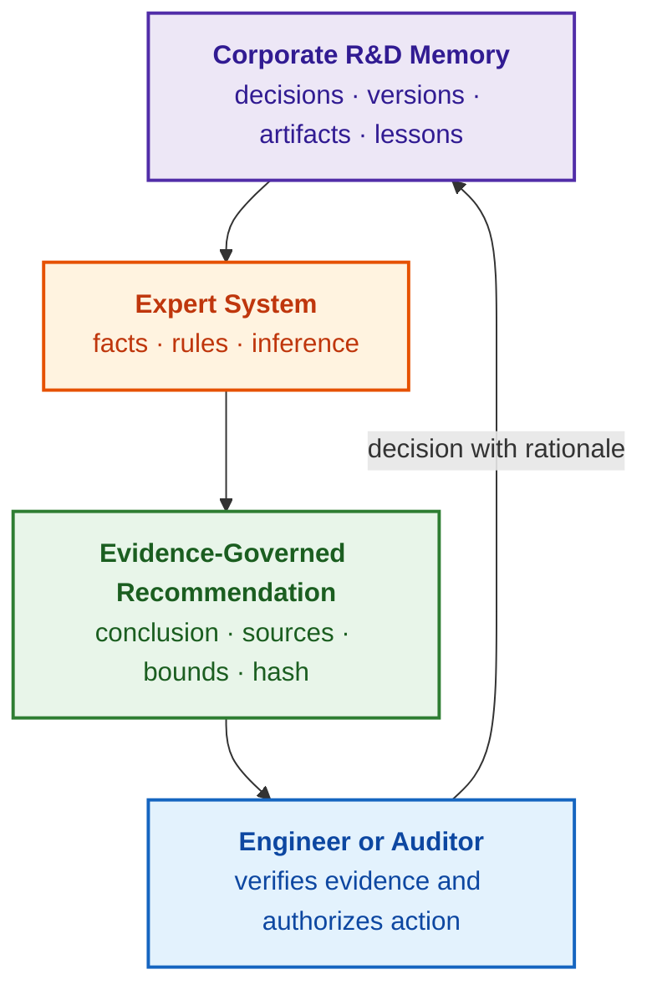
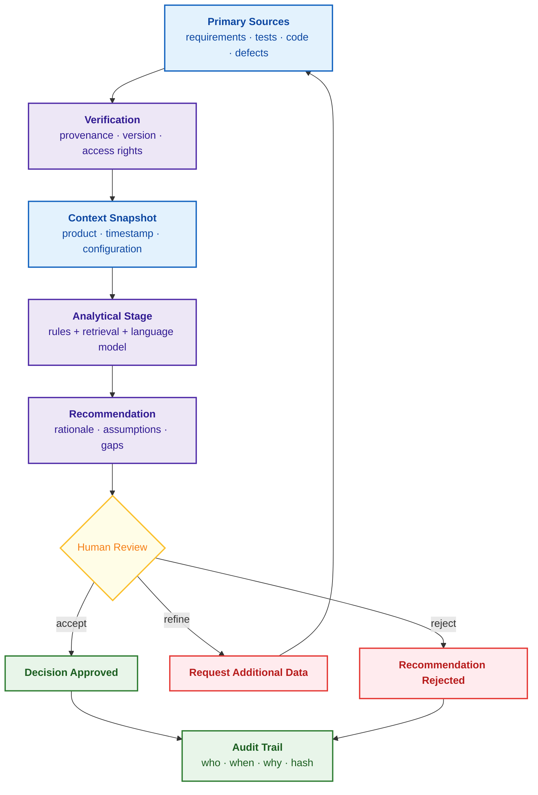
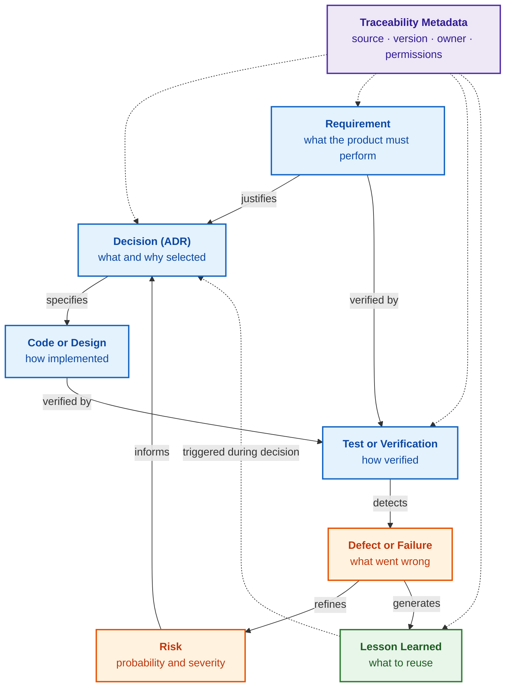
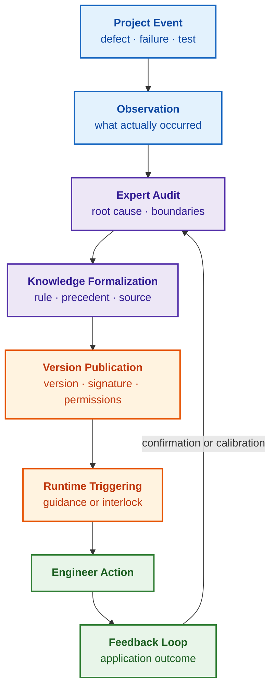

# Chapter 5. The Triad of Trust: Expert System, Evidence-Governed Recommendation, and Corporate Memory

> **Book:** [Architecture of Evidence-Governed Expert Systems](README.md) · [Part I: Conceptual and Epistemic Foundations](part-01-foundations.md)  
> **Previous Chapter:** [Chapter 4. Evolution of Expert Systems: From Bayes' Theorem to Evidence-Based AI](ch04-evolution-from-bayes-to-evidence-ai.md)  
> **Next Chapter:** [Chapter 6. Applied Mathematics of Expert Systems: Rules, Probabilities, Graphs, and Causality](ch06-applied-mathematics-for-expert-systems.md)  
> **Table of Contents:** [README.md](README.md)  
> **Author:** [Mykola Fedchyk](about-the-author.md)  
> **Target Level:** Foundational Engineering; code listings and LLM prompt templates are placed in collapsible blocks  
> **Expected Learning Outcomes:** Articulate how an expert system, an evidence-governed recommendation, and corporate memory mutually reinforce one another; formulate a minimal evidence record for an artificial intelligence (AI) recommendation alongside required audit trail fields; distinguish an unstructured document repository from version-controlled engineering decision memory; and assess corporate memory maturity via engineer onboarding velocity and recurring incident suppression.

## Abstract

This chapter investigates the conceptual triad of trust in artificial intelligence systems within mission-critical engineering, unifying a symbolic expert system, an evidence-governed recommendation, and R&D corporate memory. A rigorous demarcation is established between the functions of generative large language models (operating as semantic interfaces and text preprocessors) and deterministic logical inference engines. The chapter formalizes the schema of a minimal evidence record for recommendations and the specification of a cryptographic audit trail compliant with ISO 26262, ISO/SAE 21434, and the W3C PROV-O ontology. It substantiates a methodology for converting passive documentation archives into an active relational knowledge graph under the SECI model, provides quantitative metrics for assessing the engineering maturity of knowledge transfer processes, and synthesizes the conceptual foundations of Part I of this monograph.

An experienced engineer transfers to another business unit. A newly onboarded developer inspects the codebase, encounters a disabled communications protocol mode, and inquires: "Why is this mode unused?" An enterprise search engine returns a dozen documents containing the word "mode." A document chatbot replies: "Due to communication instability." However, who decided to disable the mode, for which target product version, following which test failure, and whether that decision remains currently in force, remains completely unknown. The newcomer is left with the two detrimental options Michael Nygard identified in 2011: blindly accept the legacy decision or blindly modify it without understanding its original rationale and systemic consequences [[1]](#src-1).

This scenario synthesizes three distinct engineering requirements, and this chapter treats each requirement as one vertex of a single triangle of trust. An **expert system** applies verified knowledge to a concrete operational inquiry. An **evidence-governed recommendation** (*evidence-based recommendation*) exposes its underlying sources, assumptions, and scope boundaries, enabling an accountable human engineer to review, accept, or reject the recommendation. R&D **corporate memory** (*corporate memory*) preserves not merely static files, but the rationale behind decisions, target versions, engineering consequences, and designated owners. The objective of this chapter is to demonstrate why no single vertex functions in isolation from the other two, what minimal record structure renders an AI recommendation auditable, and how an organization can empirically measure whether it truly retains its own engineering decisions. As this chapter concludes Part I, it summarizes the foundational arc of the book and charts the trajectory ahead.

## 1. Engineering Decision Memory: From Unstructured Text to Version-Controlled Precedent

Establishing corporate memory as the empirical foundation of an expert system demands transitioning from unstructured textual repositories to rigorously formalized, version-controlled engineering precedents. For the newcomer in our opening example, corporate memory must return not an arbitrary paragraph noting "instability," but a structured architectural decision record. In an illustrative engineering record, a team disabled the communications mode exclusively for release version 2.1 following a failed regression test; the team also recorded the rejected alternatives and the explicit criteria for reviewing the decision.

| Field | Instructional Content |
|---|---|
| Decision and Scope | `ADR-7`: disable communications mode exclusively for version 2.1 |
| Evidentiary Basis | `RUN-88`: failure observed under target configuration; links to requirement and execution report |
| Rejected Alternative | Increasing retry thresholds failed to eliminate the observed synchronization failure |
| Accountability | Decision authorized by the component lead; formal review milestone defined separately |
| Review Trigger | New hardware driver implementation or qualifying regression pass creates a review candidate |

An expert system can verify whether an incoming code change violates an active architectural decision and display the underlying constraints. Crucially, the system must not extrapolate a decision scoped to version 2.1 across all future versions, nor crystallize a legacy test failure into an unconditional universal prohibition. The operational quality of corporate memory is evaluated by its ability to faithfully reproduce decision rationale and retrieve applicable counterexamples, rather than by the sheer volume of archived documentation. This constitutes the pragmatic substance of the triad, examined in depth below.

## 2. The Triad of Trust: Conceptual Synergy of Expert System, Evidence, and Memory

The three core concepts comprising the chapter title are frequently conflated. Driven by this ambiguity, engineering teams often expect a documentation chatbot to simultaneously serve as organizational memory, a process verifier, and a decision support system. When an engineering decision ultimately demands rigorous justification, practitioners are forced to manually verify every single response emitted by the chatbot, entirely negating the productivity gains of AI.

The vertices of the triangle are fundamentally interdependent. An expert system requires corporate memory, for without verified domain knowledge, an inference engine possesses nothing to execute over. Corporate memory delivers value only when auditable, verifiable intelligence can be extracted from it. An analytical recommendation carries engineering weight only when anchored in authoritative sources and formal rules, rather than persuasive prose. The diagram below illustrates how these three vertices converge upon the human decision-maker.



The purple node designates corporate memory, orange represents the expert system, green denotes the evidence-governed recommendation, and blue represents the human decision-maker. The cryptographic hash within the green block represents an immutable digest of the recommendation payload: any post-verification modification invalidates the digest, a mechanism illustrated with test execution reports in [Chapter 1](ch01-introduction-to-expert-systems.md). The control loop closes on the human practitioner: the authorized decision, accompanied by its formal rationale, is committed back to corporate memory, becoming verified knowledge for subsequent operational cases. Severing any edge within this graph destroys the utility of the triad. Without corporate memory, the expert system operates on stale or hallucinated premises; without an evidentiary record, recommendations cannot be verified; and without committing the human decision back to memory, the organization fails to capture the empirical outcome of the case.

The following foundational concepts will govern subsequent discussions:

| Term | Operational Definition |
|---|---|
| Large Language Model (*Large Language Model*, LLM) | A deep learning program that processes and generates natural language; can serve as a component of an expert system, but does not substitute for one |
| Primary Evidence (*primary evidence*) | An unmediated test measurement, verified test run, signed requirement, or other artifact possessing cryptographically immutable provenance |
| Derived Analytical Record (*derived analytical record*) | A conclusion synthesized from primary evidence; an auditable artifact that interprets underlying sources but cannot substitute for them |
| Traceability (*traceability*) | The capability to navigate deterministically from a derived conclusion back to governing rules, empirical facts, artifact versions, and primary sources |
| Decision Support System (*decision support system*) | An information system that assists human practitioners in making decisions, without usurping human authority or accountability |

None of the three vertices functions autonomously: organizational trust emerges exclusively from navigating the closed operational loop, proceeding from memory to decision and back again. The sections that follow examine each vertex in detail, beginning with the prevailing confusion between expert systems and generative chatbots.

## 3. The First Triad Component: Demarcating Expert Systems from Generative Chatbots

Following several years of enthusiasm surrounding large language models, many engineering organizations have arrived at an identical bottleneck: a conversational bot is integrated into internal documentation, its generated answers sound remarkably articulate, yet there is zero verifiable trust for mission-critical engineering decisions. The initial demonstration impresses, but as soon as a decision requires regulatory justification, engineers must manually cross-check every single assertion. The root cause lies not in the language model itself, but in the erroneous expectation that a language model can autonomously handle three disparate engineering responsibilities: memorizing, verifying, and supporting decisions. This section partitions these responsibilities between the language model and the symbolic expert system.

### 3.1. Functional Capabilities and Linguistic Boundaries of Large Language Models

The intrinsic strength of a large language model resides in linguistic manipulation. A language model excels at summarizing heterogeneous documentation, adjusting technical explanations to the background of the reader, drafting synthesis reports, identifying linguistic ambiguities, and retrieving semantically related text passages. Within day-to-day engineering workflows, such capabilities deliver genuine efficiency gains.

Utility varies by model specialization. A conversational model serves as an interactive semantic interface and editorial assistant. A code-specialized model accelerates implementation reviews and boilerplate drafting. An embedding model (*embedding model*) projects textual tokens into high-dimensional vector spaces, enabling semantic similarity search across disparate documents, defect tickets, or retrospective notes even when surface vocabularies diverge. A classification model categorizes documents by type or security classification level. An on-premise local model, executed strictly within enterprise infrastructure perimeters, is mandatory where intellectual property or regulatory constraints prohibit external data transmission.

Within an expert system architecture, a language model is most valuable not as an autonomous, all-deciding reasoning core, but as a semantic linguistic envelope surrounding controlled formal inference. The language model translates unstructured human queries into structured semantic queries against the knowledge base, extracts candidate facts from technical corpora, translates fired rule traces into accessible explanations, and drafts initial justification arguments. The ultimate evidentiary foundation remains strictly anchored in production rules, primary sources, version baselines, and accountable human authorization.

### 3.2. Deterministic Advantages of Symbolic Expert Systems

The architectural composition of an expert system was established in [Chapter 1](ch01-introduction-to-expert-systems.md). The knowledge base (*knowledge base*) encapsulates production rules, facts, constraints, and domain heuristics. The working memory (*working memory*) maintains the facts of the active case—such as the target product revision, regression suite execution results, and open anomaly reports. The inference engine (*inference engine*) executes deterministic reasoning over these case facts. The explanation facility (*explanation facility*) exposes which rules fired, which facts were ingested, which assumptions were made, and which data points are missing. The knowledge acquisition system (*knowledge acquisition system*) ingests, verifies, reconciles, and updates knowledge assets within the knowledge base. How an expert verdict differs fundamentally from an informational search query was analyzed in [Chapter 3](ch03-beyond-reference-information-systems.md), and the detailed component architecture is developed in [Chapter 16](ch16-expert-systems-architecture.md).

For the triad of trust, one distinction is paramount. A chatbot returns an answer formatted according to the prompting context it received. An expert system exposes an auditable derivation chain: explicit rules, admitted facts, and boundary constraints. A chatbot represents an interface modality; decision support represents an engineering objective. An expert system operating in an advisory capacity constitutes a formalized species of decision support system, but not every decision support system possesses formal inference rules and a cryptographic evidentiary trail.

This distinction becomes decisive in domains where decisions leave long-lasting regulatory footprints: functional safety, cybersecurity, and regulatory compliance. This evidentiary footprint encompasses safety cases, immutable audit logs, qualification records, and contractual obligations. If an AI system asserts "release candidate risk is acceptable" without binding that assertion to working artifacts, failed test reports, and supplier qualifications, that sentence does not constitute an engineering justification; it is merely an unverified hypothesis awaiting empirical cross-examination.

### 3.3. Partitioning Architectural Roles and Corporate Knowledge Hierarchy

When a language model and an expert reasoning subsystem are assigned overlapping responsibilities, stochastic model hallucinations quietly masquerade as verified engineering conclusions. Architectural roles must therefore be partitioned with rigorous clarity. In a hybrid neuro-symbolic architecture, the language model governs the conversational interface, natural language explanations, document preprocessing, and semantic vector retrieval. The expert subsystem governs domain knowledge models, deterministic verification rules, formal logical inference, audit logging of justification chains, and knowledge asset version control. The language model never masquerades as an infallible domain authority, and the expert system never attempts conversational roleplay.

Domain knowledge naturally resides across distinct hierarchical strata. The organizational tier encompasses enterprise quality policies, mandatory safety standards, and data classification governance. The business unit or divisional tier encompasses testing methodologies, architectural patterns, and supplier qualification standards. The project tier encompasses subsystem identifiers, historical design decisions, project-specific waivers, and contractual customer commitments. An expert system must explicitly distinguish these tiers, as knowledge at different levels possesses different legal weight, different designated owners, and different obsolescence lifecycles. For instance, a project-level waiver may relax a divisional testing rule exclusively for a single product variant and solely until a specified firmware milestone.

An expert system devoid of domain knowledge is merely an empty inference engine. Consequently, every rule cluster mandates a designated knowledge owner (*knowledge owner*): an accountable individual responsible for that technical domain—such as functional safety, cybersecurity, or a specific hardware interface class. The knowledge lifecycle encompasses ingestion, peer review, formal verification, authorization, semantic versioning, and deprecation. Without designated owners and structured lifecycles, the recommendations emitted by an expert system rapidly degrade into unreliability. How expert systems systematically learn across successive knowledge base revisions is explored in [Chapter 25](ch25-how-expert-systems-learn.md) and [Chapter 26](ch26-continual-learning.md).

### 3.4. Engineering Quality Metrics and Verification Procedures (TEVV)

The operational quality of an expert system cannot be measured by conversational fluency. Rigorous engineering criteria are required:

- **Correctness:** Rules execute deterministically, yielding identical conclusions over identical input facts across all evaluation cycles;
- **Completeness:** The expert system detects and flags missing mandatory data or unresolved premises;
- **Explainability:** The human practitioner can inspect admitted facts, applied rules, active assumptions, and identified information gaps;
- **Maintainability:** A rule can be updated, verified via automated test suites, and reproduced deterministically via semantic version tags;
- **Accountability:** Every rule cluster has a designated, accountable knowledge owner.

An expert system that explicitly halts and requests clarification when data is insufficient is immeasurably more valuable than one that generates confident answers unconditionally. To operationalize these criteria, they must be converted into automated test fixtures: a regression benchmark of historical engineering cases with verified ground-truth conclusions, the proportion of claims backed by verified citations, the proportion of correct system refusals under epistemic ignorance, rule validation suites, and source freshness checks. For each metric, an initial baseline, an allowable operational threshold, and an accountable owner are defined. The National Institute of Standards and Technology (NIST) AI Risk Management Framework designates this engineering regime as Test, Evaluation, Verification, and Validation (TEVV) [[2]](#src-2). Practical criteria for verifying expert system utility are detailed in [Chapter 1](ch01-introduction-to-expert-systems.md), and formal knowledge base verification is analyzed in [Chapter 23](ch23-knowledge-base-verification.md).

In summary: the language model and the expert system are not competitors. The language model explains and interfaces, the expert system verifies and infers, and an explicit separation of concerns, accountable knowledge owners, and quantifiable quality gates make their synthesis uniquely powerful. Yet even a flawlessly designed expert system produces merely a recommendation. The next engineering inquiry is straightforward: under what conditions can an AI recommendation be legitimately admitted into a human decision-making process?

## 4. The Second Triad Component: Transforming AI Recommendations into Evidentiary Artifacts

In isolation, an AI-generated output is merely text, not evidence. An analytical response transforms into an auditable input for human decision-making only when it preserves an unbroken chain of custody linking it to primary evidence and explicitly bounded analytical conditions. This section presents a practical case study from the author's engineering practice, establishes what constitutes engineering evidence, and defines the minimal schema required to transform AI recommendations into decision-grade artifacts.

### 4.1. Practical Precedent: Complex Device Driver (CDD) Qualification

A representative case from the author's engineering practice arose during the prototyping and qualification of a Complex Device Driver (CDD)—a specialized software module interfacing non-standard hardware peripherals that cannot be accommodated within standard AUTOSAR driver stacks. The qualification release package encompassed over three hundred software requirements (SWRs), and manual cross-verification of source code against functional requirements was threatening critical project delivery timelines. An advanced AI model was deployed and produced an articulate, polished summary: "Release risk is acceptable." However, when subjected to targeted engineering inquiries—"Which specific test cases failed, which anomaly tickets remain unresolved, and which exact software requirements have verified code implementations?"—the model could provide no auditable answer. The recommendation appeared reassuring, yet it was devoid of demonstrable evidentiary substance.

The author completely restructured the interaction architecture with generative models: introducing structured prompt templates, multi-tiered verification gates, and the mandatory bidirectional linking of analytical claims to normative requirements, source code locations, and automated test scenarios. Only after enforcing this evidentiary discipline did the AI outputs transform into valuable, pre-qualified inputs for human expert evaluation. This precedent reflects the author's direct engineering observations rather than an idealized laboratory experiment or an uncritical endorsement of AI capabilities.

### 4.2. Ontology of Engineering Evidence and the PROV-O Provenance Model

In regulated engineering domains, evidence possesses a precise, formalized structure. Primary evidence—such as a hardware-in-the-loop test trace or an approved system requirement—demands immutable provenance and tamper-evident integrity:

- **Source:** The specific test tool, engineer, and verification process that generated the evidence;
- **Version or Immutable Digest:** The exact product version, document revision, or baseline snapshot to which the evidence pertains;
- **Context:** The environmental conditions under which the evidence was gathered, including active modeling assumptions and operational boundary limits;
- **Owner:** The designated individual accountable for the validity and engineering interpretation of the artifact.

The W3C PROV-O (*PROV Ontology*) provenance framework formalizes the lineage of evidence through three foundational ontological concepts: an *entity* (the evidence artifact itself); an *activity* (the execution cycle or verification process that created the entity); and an *agent* (the human engineer, software tool, or organizational entity responsible for the activity) [[3]](#src-3). The philosophical and formal separation of evidence from mere assertion is developed extensively in [Chapter 2](ch02-epistemology-of-machine-knowledge.md).

Authorization constitutes a distinct metadata attribute of a decision: specifying who formally deemed an evidentiary bundle sufficient for a specific operational milestone, and at what timestamp. While not every raw execution log or regression trace warrants individual manual sign-off, every such artifact must remain immutably bound to its execution run, software version, and originating pipeline.

Engineering evidence encompasses test execution results, peer code review logs, supplier qualification certificates, Failure Mode and Effects Analysis (FMEA) matrices, hazard and risk analyses, and formally signed requirement specifications. AI-generated text lacking verifiable links to such artifacts is not evidence. AI text is a derived analytical record: it synthesizes and interprets evidence, but can never substitute for the underlying primary sources.

### 4.3. Structure of the Minimal Evidence Record for Recommendations

An AI-generated output cannot serve as primary evidence regarding a physical or software product, but it can serve as an auditable derived analytical record. To achieve this status, the analytical response must be packaged with four mandatory constituent components:

- **Sources:** Explicit citations to concrete engineering artifacts—such as requirement `REQ-1234`, test execution record `TST-5678`, risk ticket `RSK-091`, product baseline `B-2026.04`, and change request `CR-77`—rather than generic hand-waving toward "industry standards";
- **Versions:** Direct anchoring to the product release version, dependency baseline, and applicable regulatory framework; any modification to an underlying dependency immediately invalidates the recommendation and flags it for re-evaluation;
- **Assumptions:** An explicit, enumerated list of all operational assumptions, eliminating implicit or hidden premises;
- **Confidence Level:** A calibrated confidence assessment accompanied by an explicit description of factors that diminish certainty; why confidence is far better communicated via a multi-dimensional indicator matrix rather than a single monolithic pseudo-probability is detailed in Lesson 4 of [Chapter 4](ch04-evolution-from-bayes-to-evidence-ai.md).

To these four components, the architecture appends the traceable chain of inference and the final human authorization record, capturing the owner and timestamp. Packaged within this envelope, an AI recommendation ceases to be an ungrounded "the model says so" appeal to authority and transforms into an auditable decision input: an authorized engineer can review, amend, or reject the recommendation based on verified primary evidence. The governing principle is unequivocal: AI recommends; only humans authorize.

For foundational engineering workflows, a compact, structured record schema suffices. This structure parallels the justification packet formalized in [Chapter 1](ch01-introduction-to-expert-systems.md) and [Chapter 3](ch03-beyond-reference-information-systems.md), augmenting it with two fields specific to AI pipelines: the AI runtime configuration and the human disposition.

| Field | Recorded Payload |
|---|---|
| Claim or Recommendation | Concrete assertion or course of action proposed by the expert system or language model, specifying the target decision |
| Primary Sources | Unique identifiers of requirements, test cases, defects, risks, and references to granular verbatim passages |
| Context Snapshot | Immutable product baseline version, knowledge corpus snapshot identifier, and generation timestamp |
| Governing Rules and Assumptions | Knowledge rule or policy version, applied modeling assumptions, known epistemic gaps, and resolved rule conflicts |
| AI Configuration | Model identifier, system prompt version, retrieval parameters, embedding index commit, and reranker model version |
| Analysis Identifier | Immutable unique identifier or cryptographic hash binding the input prompt payload to the model output |
| Human Decision | Identity of the authorizing engineer, timestamp, explicit disposition (accepted/rejected/escalated), and technical rationale |

This schema decouples evidence from its interpretation, enabling independent reproduction or formal refutation of conclusions. Why version-locked context snapshots guarantee deterministic reproducibility is examined in Lesson 3 of [Chapter 4](ch04-evolution-from-bayes-to-evidence-ai.md). The "AI Configuration" payload is readily populated from standardized model cards (*model cards*), as proposed by Margaret Mitchell and colleagues to document intended use, evaluation conditions, and operational limits [[4]](#src-4). Similarly, the lineage of reference and training corpora is codified via datasheets for datasets (*datasheets for datasets*), as introduced by Timnit Gebru and colleagues to document dataset curation motives, composition, collection methodology, and recommended use [[5]](#src-5).

The sequence diagram below traces the end-to-end pathway from primary evidence to an auditable engineering decision.



Blue nodes represent input artifacts: primary sources and context snapshots. Purple nodes designate analytical processing: provenance verification, version matching, access control validation, analytical execution, and recommendation generation. The yellow diamond represents human review. Green nodes denote the approved decision and the audit trail, while red paths represent escalation ("refine") and rejection ("reject"). A rejected recommendation is recorded in the audit trail with identical fidelity: declining an AI recommendation represents an engineering decision carrying equal evidentiary weight to an approval.

Record completeness is easily validated programmatically. The Go program below does not evaluate whether a recommendation is semantically correct; it resolves a narrower, indispensable engineering question: does the recommendation payload contain the requisite fields without which it remains mere unverified text?

<details>
<summary>Go Implementation Example: Validating a Minimal Evidence Record</summary>

This complete program compiles and executes via `go run main.go`. The `Recommendation` struct captures the primary fields from the schema, while the `Missing` method returns the names of any missing mandatory fields. Concrete identifiers and version tags are illustrative.

```go
package main

import (
	"fmt"
	"strings"
)

// Recommendation represents a minimal evidence record for an AI recommendation.
type Recommendation struct {
	Claim       string
	Sources     []string // primary evidence identifiers
	Baseline    string   // product baseline version
	Snapshot    string   // knowledge corpus snapshot
	RuleVersion string
	ModelConfig string // model, prompt version, retrieval settings
	AnalysisID  string // hash of input packet and response
	Decision    string // who, when, and why approved the decision
}

// Missing returns fields without which the recommendation remains mere text.
func (r Recommendation) Missing() []string {
	var m []string
	check := func(ok bool, field string) {
		if !ok {
			m = append(m, field)
		}
	}
	check(len(r.Sources) > 0, "primary sources")
	check(r.Baseline != "" && r.Snapshot != "", "context snapshot")
	check(r.RuleVersion != "", "rule version")
	check(r.ModelConfig != "", "AI configuration")
	check(r.AnalysisID != "", "analysis identifier")
	return m
}

func main() {
	chat := Recommendation{Claim: "Release risk is acceptable"}
	record := Recommendation{
		Claim:       "Release risk is acceptable following regression re-test TST-5678",
		Sources:     []string{"REQ-1234", "TST-5678", "RSK-091"},
		Baseline:    "B-2026.04",
		Snapshot:    "snap-2026-04-18",
		RuleVersion: "release-policy 2.3",
		ModelConfig: "local-8b@v1.4, prompt v3",
		AnalysisID:  "sha256:5c1e…",
	}
	for _, r := range []Recommendation{chat, record} {
		if m := r.Missing(); len(m) > 0 {
			fmt.Printf("%q: mere text, missing: %s\n", r.Claim, strings.Join(m, ", "))
			continue
		}
		status := "pending human decision"
		if r.Decision != "" {
			status = "decision: " + r.Decision
		}
		fmt.Printf("%q: valid derived record, %s\n", r.Claim, status)
	}
}
```

Program output:

```text
"Release risk is acceptable": mere text, missing: primary sources, context snapshot, rule version, AI configuration, analysis identifier
"Release risk is acceptable following regression re-test TST-5678": valid derived record, pending human decision
```

The first recommendation mirrors the phrase from the author's case study: the claim may happen to be accurate, but without sources, context snapshots, and version tags, it cannot be verified. The second recommendation populates all mandatory metadata fields, yet because the `Decision` attribute remains empty, the program correctly marks it as pending human disposition rather than fully authorized. The program validates purely structural field presence. Whether test TST-5678 truly exists and supports the conclusion is verified by an expert system enforcing the epistemic answer criteria from [Chapter 2](ch02-epistemology-of-machine-knowledge.md) alongside human oversight.

</details>

Automated completeness verification does not guarantee the veracity of a recommendation, but it decisively eliminates the most pervasive architectural failure mode: a persuasive, articulate conclusion completely stripped of verifiable hooks for engineering audit.

### 4.4. Reviewer Contract Discipline: Code Auditing under ISO 26262 and ISO/SAE 21434

The chasm between unverified text and an auditable record is nowhere more apparent than in automated code compliance analysis. Automotive software engineering is governed by the ISO 26262 functional safety standard published by the International Organization for Standardization (ISO), whose Part 6 dictates software-level product development requirements [[6]](#src-6), and the ISO/SAE 21434 cybersecurity engineering standard developed jointly with SAE International [[7]](#src-7). In these mission-critical environments, an AI tool cannot simply be prompted to "inspect the code"; it must identify concrete anomalies that violate specific software requirements, coding guidelines, or the project verification profile (*project verification profile*)—the project's formally ratified matrix of code expectations. A naive prompt reads: "Check this code for bugs." A disciplined engineering prompt establishes an explicit reviewer contract: defining exactly what inputs the model receives, what criteria it inspects, and in what deterministic schema it must respond.

<details>
<summary>Prompt Template: Reviewer Contract for Code Compliance Auditing</summary>

This template provides the input instruction (*prompt*) structure for a language model. Ellipses in quotation marks indicate placeholders for inserting verbatim requirement texts, coding rules, and project verification profiles; identifiers are illustrative.

```text
You perform preliminary code compliance analysis against functional safety and cybersecurity requirements.

Context:
- Requirement: REQ-SAFE-017, verbatim text: "..."
- Coding Rules: CS-C-012, CS-C-019, verbatim rule text: "..."
- Project Verification Profile: SAF-C-017 and SEC-C-011; verbatim text, applicability scope, and acceptance criteria: "..."
- Normative Context: Applicable clauses of ISO 26262-6 and ISO/SAE 21434 serve as the source for the project verification profile, rather than self-sufficient rules.
- Baseline: B-2026.04
- Code File: src/speed_monitor.c, commit abc123

Tasks:
1. Reformulate the requirement into verifiable assertion statements.
2. Verify the code exclusively against the provided requirements, coding rules, and project verification profile.
3. For each defect, report: requirement ID, coding rule, project profile,
   code snippet, rationale for defect classification, impact, confidence level (high/medium/low),
   assumptions, missing information, and remediated code example.
4. If evidence is insufficient, do not hallucinate defects. Mark as "requires human review".
5. Do not reference standards using generic generalities. Articulate concrete engineering expectations.
```

Under this template, the reviewer receives standardized fields for every identified defect, enabling deterministic cross-comparison across successive model invocations.

</details>

This template matters not for its rhetorical style, but for its engineering discipline: the language model functions not as an infallible oracle, but as a disciplined reviewer obligated to expose its evidentiary reasoning chain. One should never ask an AI model to "verify code compliance with ISO 26262." Part 6 of ISO 26262 specifies process rigor and work product expectations across the software lifecycle—from safety requirements derivation to modular testing and system integration [[6]](#src-6)—while ISO/SAE 21434 establishes engineering requirements for cybersecurity risk management [[7]](#src-7). Neither standard functions as a static code analyzer. Instead, the model must be supplied with concrete, approved engineering expectations derived from those standards: safety requirements must maintain bidirectional traceability to code implementations and test suites; safety-related code must eliminate undefined behavior, uninitialized variables, and buffer out-of-bounds access; all external inputs must be validated prior to memory copying; and security-critical execution paths must execute explicit privilege checks. Every expectation must link directly to a coding guideline, project profile, or requirement, as a generic checklist does not substitute for the normative standard text.

For practical engineering review, the language model must not emit free-form narrative prose, but a structured anomaly table for each identified defect: defect identifier, requirement traceability link, code evidence snippet, safety/security impact, calibrated confidence level, active assumptions, missing evidence, remediated code sample, and required verification test cases. A confirmed defect, a suspect anomaly, and an item requiring human escalation must be modeled as distinct lifecycle states. The reviewer inspects not merely the final verdict, but the complete derivation path, while an auditor can inspect the unbroken chain linking the requirement, the code snippet, and the engineer's disposition.

The confidence level field is critical here. A language model can assert with high confidence that a buffer overflow risk exists when it observes an unbounded memory copy operation over untrusted input. However, regarding authorization logic, the model must respond with measured restraint: "Within this isolated code unit, authorization checks are not visible; if privilege enforcement occurs upstream in the call hierarchy, provide the calling context." Such an answer is less dramatic than an unconditional bug report, but it accurately reflects the epistemic boundary of the analyzed code slice.

### 4.5. Cryptographic Audit Trail and Traceability Protocol

In regulated engineering environments, all AI interactions that influence technical decisions must be permanently logged. The minimal schema of an immutable audit trail (*audit trail*) encompasses: the identity of the engineer submitting the query; the exact context snapshot and prompt payload dispatched to the model; the primary sources retrieved and cited; the verbatim output and declared confidence level; the final human decision and whether it diverged from the recommendation; the designated owner; and a cryptographic timestamp. Devoid of an immutable audit trail, deploying AI within safety-critical lifecycles reduces the system to an untrusted black box. How to protect an audit trail against undetected tampering via cryptographic hash chaining is detailed in [Chapter 2](ch02-epistemology-of-machine-knowledge.md), while the algorithmic reconstruction of inference paths by an explanation facility is developed in [Chapter 20](ch20-explanation-engine.md).

At the interface level, every recommendation presented to an engineer must expose its source citations, explicit assumptions, confidence score with contextual rationale, a "what would change this verdict" sensitivity condition, the designated owner, and the baseline version binding. For software code review, the interface must append requirement traceability links, coding rules, code snippets, and review dispositions. Under this discipline, the AI ceases to be an opaque oracle and integrates naturally as an auditable input into standard engineering peer review.

An AI recommendation achieves evidentiary status not by virtue of model scale, but through the rigor of the evidentiary record encapsulating it: sources, context snapshots, version bindings, explicit assumptions, confidence calibrations, analysis digests, and authorized human dispositions. However, these sources, baselines, and versions must persist within an interconnected repository capable of preserving their semantic relationships. This leads directly to the third vertex of the trust triangle.

## 5. The Third Triad Component: R&D Corporate Memory as a Relational Graph

The third vertex anchors the preceding two: absent corporate memory, both the expert system and the discipline of evidence-governed records remain hollow theoretical constructs. In research and development organizations, knowledge is rarely lost due to an absence of documentation—enterprises routinely drown in documentation—but rather from an absence of **relational links**: between a decision and its underlying requirement, a defect and its root cause, a failed regression run and an architectural compromise, a past retrospective lesson and a new development project.

In the author's engineering experience, the solution to a vexing technical or organizational question almost invariably existed within previously completed projects: an engineer had already dissected a similar silicon erratum, documented the rationale for rejecting an alternative architecture, engineered a vendor workaround, or addressed an identical auditor objection. Yet component identifiers were renamed, key personnel transferred to other teams, and the definitive engineering rationale remained buried in old issue comments. For this reason, this book defines corporate memory not as a static document archive, but as an organization's dynamic capability to **retrieve the right engineering context at the right moment** and project that context into a novel decision.

### 5.1. Topology of Distributed R&D Knowledge and Architecture Decision Records (ADRs)

R&D knowledge is distributed across heterogeneous repositories. Source code repositories capture technical implementations and pragmatic workarounds. Issue trackers capture anomaly tickets and root-cause analyses. Merge requests and code reviews preserve implementation trade-offs and debate. Internal wikis document high-level architectural overviews. Requirements management systems record formal engineering intent, automated test suites preserve verification results, release notes capture approved operational constraints, and tacit engineering intuition resides in the minds of developers.

To capture architectural rationale, Michael Nygard introduced a structured, lightweight artifact: the Architecture Decision Record (ADR), organized into five essential sections: Title, Context, Decision, Status, and Consequences [[1]](#src-1). The Status field directly resolves the dilemma of the newcomer described in our introduction. When an architectural decision is deprecated, it is not erased; rather, its status is updated to "Superseded" with an explicit link to its successor ADR, preserving a transparent historical audit trail of what was previously enforced versus what governs current development. The diagram below illustrates how an ADR integrates into the broader web of engineering artifacts.



Blue nodes represent primary engineering artifacts: decisions, requirements, code implementations, and test suites. Orange nodes designate anomaly and risk signals: defects and identified hazards. The green node denotes lessons learned, while the purple node represents traceability metadata binding provenance, versioning, ownership, and security classification to every artifact. The dashed link from the lesson learned to the decision indicates that historical insights must actively intervene during the decision-making event, rather than languishing in an archive.

Knowledge sources are not created equal, nor do they link themselves automatically. A formally signed safety requirement carries far greater regulatory weight than a comment on a ticket, and a certified hardware-in-the-loop test trace cannot be equated to a screenshot in a presentation slide deck. If an enterprise knowledge management system fails to capture artifact status, provenance, and accountability, it does not function as corporate memory; it is merely an unstructured text dump.

### 5.2. Fundamental Limitations of Lexical and Vector Retrieval without a Semantic Graph

Standard text search succeeds only when an engineer already knows precisely what terminology to search for. Yet corporate memory is most desperately needed when an engineer does not know the historical terminology. A subsystem was renamed. A defect in an earlier product generation carried a different symptom label. A hardware supplier altered a silicon stepping number. A requirement was rephrased. The original team relied on local internal acronyms unknown to the new project team.

Information retrieval retrieves documents; corporate memory must retrieve **decision semantics**. In response to the inquiry "Why do we not use this communications mode?", corporate memory must return not merely a matching document, but the governing decision, the rejected architectural alternative, the associated defect ticket, the empirical test trace, and the accountable engineer. Achieving this requires explicit relational edges, metadata schemas, and a domain ontology. A knowledge graph (*knowledge graph*) interconnects components, requirements, defects, tests, decisions, risks, and lessons; the architecture of an engineering knowledge graph and end-to-end traceability from requirements to silicon is developed in [Chapter 9](ch09-engineering-knowledge-graph-traceability.md).

Retrieval-Augmented Generation (RAG) resolves this challenge only partially. Patrick Lewis and colleagues combined the parametric memory (*parametric memory*) of a neural language model—knowledge frozen into model weights during pre-training—with explicit non-parametric external memory, such as an indexed document corpus [[8]](#src-8). However, the fidelity of external memory is governed not by the language model, but by the topological structure of the index. If the index lacks awareness of component aliasing and decision lifecycles, the language model simply retrieves the same fragmented, stale documents that plague keyword search. Why a semantic filtering gate is essential between retrieval and language generation is explained in Lesson 2 of [Chapter 4](ch04-evolution-from-bayes-to-evidence-ai.md).

### 5.3. Engineering Onboarding and the Bus Factor as Memory Maturity Benchmarks

The ultimate stress test of corporate memory is the onboarding velocity of newly hired engineers. When a newcomer is entirely dependent on the oral explanations of a senior staff engineer, corporate memory is broken: the primary responsibility of senior architects is not to endlessly recount the oral history of a project from scratch. A mature corporate memory independently articulates system architecture, foundational decisions and their underlying rationale, known errata, critical components, authoritative sources, and accountable owners.

When institutional knowledge is siloed exclusively in human heads, senior engineers repeat the same historical explanations, newcomers inevitably reproduce historical defects, and institutional memory evaporates whenever personnel transition across teams. The newcomer in this chapter's opening vignette exemplifies this systemic failure: the technical answer to "Why is this mode disabled?" existed, but it left the building when the lead engineer transferred.

> [!WARNING] The "Indispensable Lead Engineer Syndrome" and the Bus Factor
> Across many engineering enterprises, critical architectural knowledge regarding hardware quirks, bus timing tolerances, or undocumented silicon errata exists exclusively as oral folklore preserved by a handful of lead developers. The bus factor (*bus factor*) of such a project is exactly one: if the lead engineer departs for a competitor or takes extended leave, the remaining team is terrified to modify the critical module, effectively calcifying it into an untouchable "black box."
> The corporate memory of an expert system is designed to convert implicit human intuition into externalized, machine-readable knowledge: formalized invariants, linter rules, configuration assertions, and automated regression suites within the CI/CD pipeline.

### 5.4. Active Lessons Learned in the Production Lifecycle

In many organizations, compiling "lessons learned" (*lessons learned*) is a perfunctory post-project ritual: the team drafts several retrospective bullet points, archives the document in a folder, and twelve months later another team commits the exact same blunder. An active lesson learned intervenes precisely at the point of decision. For example, submitting an engineering change request targeting a sensitive driver subsystem should automatically surface historical defect tickets and the specialized verification tests that previously resolved them.

To achieve this, lessons learned must be structured: operational trigger conditions, symptom, root cause, architectural impact, corrective action, applicability boundaries, designated owner, and linked work artifacts. Crucially, engineering lessons are rarely universal: a design pattern that is optimal for one hardware platform may induce race conditions on another. Consequently, applicability boundaries are an indispensable metadata field, not an optional footnote. The diagram below illustrates the lifecycle through which project experience transforms into active institutional knowledge.



Blue nodes capture the project event and its empirical observation. Purple nodes represent expert engineering analysis: root-cause auditing and knowledge formalization. Orange nodes denote formal version publishing and runtime triggering within the expert system—serving either as contextual guidance or an automated verification interlock. Green nodes represent the engineer's action and the empirical feedback loop. The feedback edge returning to the expert audit node keeps the lesson dynamic: real-world application outcomes either corroborate the rule or refine its operational boundaries. How an expert system learns continuously from such feedback cycles is explored in [Chapter 25](ch25-how-expert-systems-learn.md) and [Chapter 26](ch26-continual-learning.md).

### 5.5. Convergent Orchestration of Language Models, Knowledge Graphs, and Expert Systems

At this juncture, the three vertices of the triad converge. Artificial intelligence can make corporate memory radically more accessible, but only when it is not unleashed upon an uncurated swamp of documents. The language model summarizes and articulates, the knowledge graph preserves relational topology, and the expert system executes inference rules, demonstrating why a historical precedent directly governs a new engineering inquiry.

For instance, when an engineer logs a new defect, an LLM-powered assistant retrieves structurally similar historical incidents: associated components, verified root causes, remediation patches, and test suites. The expert system's rule base immediately enforces domain invariants: if the anomaly touches a safety-critical subsystem, the system flags all impacted requirements and their verification profiles for mandatory regression testing. The project manager sees projected delivery delays based on historical precedent, the quality assurance lead inspects regression failures, and the system architect reviews previously rejected alternatives.

Crucially, the assistant's output must itself remain evidence-governed, returning us from the third vertex back to the second: it must supply primary citations, baseline version bindings, confidence assessments, and explicit assumptions. Corporate memory must never degrade into "the model vaguely recalled." Corporate memory must demonstrate precisely what was retrieved and why it governs the active engineering problem.

### 5.6. Domain Knowledge Owners, Communities of Practice, and the SECI Externalization Model

Corporate memory does not emerge spontaneously. Accountable individuals must curate authoritative sources, deprecate obsolete rules, maintain knowledge taxonomies, and manage access policies. This stewardship may be executed by a designated knowledge owner, a systems engineering office, a quality assurance group, or a center of excellence; the organizational title is far less important than clear operational accountability.

The most difficult challenge lies in capturing tacit knowledge (*tacit knowledge*): experienced practitioners invariably know more than they write down. Ikujiro Nonaka and Hirotaka Takeuchi formalized the continuous spiral between tacit and explicit (*explicit*) knowledge through their four-phase SECI model [[9]](#src-9): Socialization (*Socialization*), the transmission of tacit expertise through shared practice; Externalization (*Externalization*), articulating tacit mental models into explicit concepts, diagrams, and rules; Combination (*Combination*), synthesizing disparate explicit knowledge assets into comprehensive frameworks; and Internalization (*Internalization*), embodying explicit knowledge into operational habits and daily engineering workflows. Thomas Davenport and Laurence Prusak defined knowledge as a fluid mix of framed experience, values, contextual information, and expert insight that provides a framework for evaluating and incorporating new experiences and information [[10]](#src-10). A foundational implication of this definition is that raw database records devoid of engineering context and experiential interpretation remain mere data, not knowledge.

Etienne Wenger demonstrated that knowledge resides fundamentally within communities of practice (*communities of practice*): groups of practitioners bound by a common enterprise who, through sustained interaction, develop shared repertoires of resources, narratives, and terminology [[11]](#src-11). Peter Senge characterized the learning organization (*learning organization*) through five component disciplines: personal mastery, mental models, shared vision, team learning, and systems thinking [[12]](#src-12). For corporate memory engineering, both perspectives converge on a single imperative: a retrospective lesson learned is meaningful only if it alters the operational behavior of the engineering community, rather than merely appending an unread file to an archive.

For expert system engineering, this yields a cardinal operational rule: a knowledge base is not a file share. The tacit knowledge of domain experts must be systematically externalized into production rules, precedent cases, exception handlers, and explicit operational boundaries; methodologies for conducting expert knowledge elicitation interviews are detailed in [Chapter 11](ch11-knowledge-elicitation-from-experts.md). Explicit knowledge assets must undergo scheduled verification, and superseded heuristics must be formally deprecated or archived.

### 5.7. Confidentiality Models, Access Policies, and Corporate Memory Security

R&D knowledge assets frequently encompass sensitive intellectual property: proprietary algorithms, vendor audit findings, vulnerability disclosures, defense client specifications, and classified roadmap milestones. The mere existence of an engineering artifact does not imply universal access across the enterprise. If a restricted document is ingested into an enterprise vector index without rigorous access control enforcement, confidential data can leak through retrieved snippet contexts or through synthetic summaries generated by a language model. Consequently, data classification, role-based access control (RBAC), and cryptographic audit logging are foundational architectural pillars of corporate memory, not optional peripheral add-ons. How an expert recommendation automatically inherits the most restrictive confidentiality classification of its ingested inputs is demonstrated in [Chapter 2](ch02-epistemology-of-machine-knowledge.md), while secure knowledge acquisition pipelines that prevent data leakage are detailed in [Chapter 10](ch10-knowledge-acquisition-systems.md).

### 5.8. Quantitative Metrics for Corporate Memory Maturity and Efficacy

The maturity of corporate memory can be evaluated through objective engineering inquiries. How many calendar days does it take for a newly onboarded engineer to independently understand core architectural decisions? How many times does an engineering organization repeat an already-documented failure mode? Can the root cause of a historical anomaly be reconstructed without interviewing the original investigator? Does a program manager review historical schedule variances prior to committing to new project timelines?

An equally revealing metric assesses organizational dependency on specific individuals. If the answer to technical inquiries is routinely "ask Elena," the organization possesses the memory of individual specialists, not institutional corporate memory. It is highly instructive to track how many historical ADRs are reused across product lines and how many post-incident lessons directly resulted in updated linting rules, review checklists, or automated test suites. Conversely, a mature corporate memory systematically flags and deprecates obsolete records.

For each maturity indicator, a baseline value and a defined measurement cadence are established: for example, the median time required for a newly onboarded developer to locate an authoritative decision, the percentage of incident reports with verified owners and primary citations, and the proportion of deprecated records purged from active retrieval indices. In this manner, corporate memory is appraised not by the physical gigabytes of its storage volume, but by its empirical impact on engineering velocity and defect suppression.

Section summary: Corporate memory is an interconnected graph of decisions, artifacts, and lessons bound by provenance metadata, not a static document repository. Vector search and language models make this graph navigable, knowledge owners keep it valid, and onboarding velocity and recurring defect rates reveal whether it truly functions. The final section examines whether the architecture of the trust triad holds across disparate mission-critical industries.

## 6. Domain-Specific Nuances of the Triad of Trust in Critical Domains

This book revisits the five foundational mission-critical domains introduced in [Chapter 1](ch01-introduction-to-expert-systems.md). Across every domain, the underlying triad remains invariant: corporate memory preserves verified precedent, the expert system executes inference over the active case, and the human practitioner receives an auditable recommendation bounded by explicit sources and constraints. What varies are the domain-specific knowledge representations and the regulatory boundaries of authority.

| Domain | Essential Corporate Memory Requirements | Exemplary Evidence-Governed Recommendation |
|---|---|---|
| Automotive Engineering | Vehicle configurations, historical failure modes, safety requirements, qualification tests, and safety case decisions | Components and verification profiles impacted by an engineering change; release sign-off remains with the designated safety engineer |
| Aviation | Type-certified configurations, maintenance records, airworthiness directives, incident logs, and flight manuals | Probable fault root cause and prioritized diagnostic sequence; return-to-service authorization remains with the certified technician |
| Healthcare | Patient clinical records, clinical practice guidelines, contraindications, and pharmacological limits | Differential diagnostic hypotheses and recommended secondary screening; therapeutic choice remains strictly with the attending physician |
| Defense & Security | Sensor message provenance, equipment readiness states, maintenance logs, and rules of engagement | Identified intelligence discrepancies or required sensor diagnostic routines; operational command authority is never delegated to the expert system |
| Legal Informatics | Jurisdictional boundaries, statutory revisions, effective enforcement dates, statutory precedence, and judicial precedent | Statutory provisions potentially applicable to the case facts, complete with pinpoint citations; legal consequences are determined by licensed counsel |

In every single row of the table, the final column culminates in the same immutable invariant: final decision authority rests exclusively with an accountable human professional. Critical domains differ in who holds authorization credentials and the societal cost of failure, but in no domain does an evidence-governed recommendation transfer legal or moral accountability to the expert system.

## Conclusions

**A Triangle of Trust in Place of Unauditable Documentation Chatbots.** This chapter opened with an onboarded engineer unable to determine why a communications mode was disabled. Resolving that inquiry requires all three vertices of the triad: corporate memory preserving the original architectural decision with its status and relational links; an expert system executing deterministic verification against the active product version; and an evidence-governed recommendation that a human engineer can independently audit and authorize. This chapter has demonstrated that:

- A large language model functions as an expressive semantic interface and text processor surrounding controlled formal inference, while an expert system provides deterministic rules, end-to-end traceability, accountable knowledge ownership, and quantifiable verification gates;
- An AI recommendation transforms into an auditable derived analytical record exclusively when encapsulated within an evidence record encompassing primary citations, context snapshots, rule versions, AI model configurations, analysis digests, and authorized human dispositions—the completeness of which can be enforced automatically;
- Corporate memory constitutes an active relational network of decisions, artifacts, and lessons rather than a passive file archive, and its operational maturity is measured by engineer onboarding velocity and the suppression of recurring defects.

The scope boundaries of this chapter must also be explicitly stated. The Complex Device Driver case study reflects the empirical experience of an individual engineering program rather than a controlled double-blind trial. Corporate memory maturity metrics require rigorous baseline data, without which empirical improvement cannot be demonstrated. No schema of evidence records can compensate for an absence of accountable knowledge owners. The engineering frameworks formalized in this chapter make trust auditable, but they cannot manufacture trust in the absence of human practitioners dedicated to governing domain knowledge.

### Summary of Part I

Part I has established the conceptual and epistemological foundations of this monograph across five chapters:

1. [Chapter 1](ch01-introduction-to-expert-systems.md) defined what constitutes an expert, the formal anatomy of an expert system, how it ingests facts and reasons, and how an expert verdict bundled with a justification packet differs fundamentally from unstructured text.
2. [Chapter 2](ch02-epistemology-of-machine-knowledge.md) established the epistemic criteria under which an expert system possesses the right to declare an assertion to be verified knowledge: demanding evidence with verified provenance, operational applicability to the query, sound inference logic, and security classification governance.
3. [Chapter 3](ch03-beyond-reference-information-systems.md) demarcated expert verdicts from informational retrieval queries, comparing four distinct information system architectures according to the formal guarantees they deliver to users.
4. [Chapter 4](ch04-evolution-from-bayes-to-evidence-ai.md) traced sixty years of automated reasoning paradigms, establishing rigorous criteria for selecting computational formalisms aligned with specific uncertainty modalities.
5. [Chapter 5](ch05-triad-of-trust-and-corporate-memory.md) unified the expert system, the evidence-governed recommendation, and corporate memory into an interconnected triangle of trust.

Together, these five chapters articulate the foundational epistemic trajectory: **knowledge → inference → explained conclusion → human decision → captured experience**.

### The Path Ahead

From these conceptual foundations, the monograph advances to concrete engineering methodologies:

- **[Part II. Mathematical Models, Knowledge Representation, and Storage](part-02-knowledge-models.md)**: Applied mathematics of production rules, probabilities, graphs, and causality; knowledge base classification; engineering artifacts as data; and engineering knowledge graphs for end-to-end traceability.
- **[Part III. Knowledge Engineering, Natural Language Processing, and Input Validation](part-03-knowledge-engineering-nlp.md)**: Knowledge acquisition systems, expert elicitation methodologies, natural language processing (NLP) via localized language models, and formalizing natural language requirements containing modal verbs such as SHALL and MUST into verifiable invariants.
- **[Part IV. Architecture, Technology Stack, Inference, and Execution](part-04-architecture-and-inference.md)**: System architecture design, technology stack selection criteria (Go/Rust/Python), hardware execution tiers (Edge/FPGA/On-Premise), the end-to-end pipeline from query to proof packet, normative inference, the explanation engine, and the cybernetic control loop.
- **[Part V. Verification, Testing, Diagnostics, and Safety Assurance](part-05-verification-and-learning.md)**: Formal verification of knowledge base consistency and completeness using Z3 SMT solvers, the Knowledge Testing Pyramid (KTP), active Popperian auditing, root-cause technical diagnostics, and functional safety and cybersecurity argumentation using Goal Structuring Notation (GSN).
- **[Part VI. Neuro-Symbolic Architectures, Cognitive Frontiers, and Continual Learning](part-06-frontiers-neuro-symbolic.md)**: Dual-process architectures (System 1 / System 2), neuro-symbolic integration paradigms, resolving epistemic gaps via abductive reasoning, hallucination mitigation controls, and continual learning over telemetry logs.
- **[Part VII. Reactive Execution, Inter-System Knowledge Exchange, and Distributed SOA](part-07-runtime-and-knowledge-exchange.md)**: Event-driven reactive rule execution, synergetic phase transitions in knowledge systems, secure cross-system knowledge exchange, and enterprise-scale distributed epistemic SOA.

## Self-Check Questions

1. Have you encountered an AI-generated recommendation that sounded articulate and persuasive, yet lacked primary source citations that could be referenced in a formal engineering decision?
2. In your active engineering projects, in which review workflows would an ungrounded recommendation be categorically rejected by auditors, and where is such unverified output currently tolerated without scrutiny?
3. How frequently has the solution to a critical technical dilemma already been documented in a previous project, yet could not be retrieved in time to inform active development?
4. Which organizational bottleneck is most damaging to your team: the epistemic disconnect between chatbots and ground-truth engineering data, the absence of relational links between project documents, or the concentration of critical knowledge within single individuals?
5. How many calendar weeks does an onboarded engineer require to independently understand core architectural decisions within your product, and what factors primarily govern that ramp-up duration?

## Glossary

| Term | English Equivalent | Concise Definition |
|---|---|---|
| Triad of Trust | *triad of trust* | Conceptual model wherein corporate memory, an expert system, and an evidence-governed recommendation mutually reinforce one another |
| Evidence-Governed Recommendation | *evidence-based recommendation* | A recommendation bundled with sources, versions, assumptions, confidence level, and human authorization |
| Corporate Memory | *corporate memory, organizational memory* | An organization's capability to store, retrieve, verify, and reuse knowledge regarding decisions and engineering experience |
| Chatbot | *chatbot* | A software program conducting natural language dialogues with users |
| Large Language Model | *large language model* | A deep machine learning model that processes and generates natural language text |
| Embedding Model | *embedding model* | A model that transforms text into numerical vectors for semantic similarity retrieval |
| Knowledge Base | *knowledge base* | Structured rules, facts, constraints, and domain precedents |
| Working Memory | *working memory* | Case-specific runtime facts manipulated by an inference engine |
| Inference Engine | *inference engine* | Algorithmic component applying knowledge base rules to case facts to derive conclusions |
| Explanation Facility | *explanation facility* | Component exposing fired rules, admitted facts, underlying assumptions, and missing information |
| Knowledge Acquisition System | *knowledge acquisition system* | Tooling and workflows for ingesting, verifying, updating, and reconciling knowledge base rules |
| Decision Support System | *decision support system* | An information system that assists human decision-makers without usurping decision-making authority |
| Knowledge Owner | *knowledge owner* | Individual accountable for the validity, currency, and maintenance of a specific domain knowledge asset |
| Knowledge Lifecycle | *knowledge lifecycle* | Systematic ingestion, verification, approval, versioning, and deprecation of knowledge assets |
| Primary Evidence | *primary evidence* | Direct test measurement, verified test run, signed requirement, or other artifact with immutable provenance |
| Derived Analytical Record | *derived analytical record* | An analytical conclusion synthesized from primary evidence, interpreting the evidence without replacing it |
| Provenance | *provenance* | Comprehensive lineage documenting source inputs, processing actions, timestamps, and executing entities |
| Traceability | *traceability* | Deterministic linkage connecting a derived conclusion to rules, facts, versions, and primary evidence |
| Baseline | *baseline* | Formally frozen and approved configuration of a product or specification against which evidence is anchored |
| Context Snapshot | *context snapshot* | Frozen record of product version, knowledge corpus commit, and timestamp upon which inference was executed |
| Cryptographic Hash | *hash* | Fixed-length digest computed from content; any modification to content invalidates the hash value |
| Minimal Evidence Record | *minimal evidence record* | Required schema of fields without which an AI recommendation cannot be verified, audited, or reproduced |
| Prompt | *prompt* | Aggregated input context supplied to a language model: task specification, context, and output constraints |
| System Prompt | *system prompt* | Persistent instruction defining the operational persona, boundary constraints, and response rules for a model |
| Reranker | *reranker* | Algorithmic model scoring and reordering retrieved candidate passages based on query relevance |
| Model Card | *model card* | Structured documentation recording model architecture, training conditions, evaluation benchmarks, and known limits |
| Datasheet for Datasets | *datasheet for datasets* | Standardized manifest detailing dataset motivation, composition, collection methodology, and recommended use |
| Project Verification Profile | *project verification profile* | Project-approved matrix of code expectations synthesized from governing safety and security standards |
| Static Code Analyzer | *static code analyzer* | Software tool identifying potential defects, anti-patterns, and guideline violations without code execution |
| Audit Trail | *audit trail* | Tamper-evident chronological log of who, what, when, and on what evidentiary basis decisions were executed |
| Architecture Decision Record | *architecture decision record* | Standardized short document capturing title, context, decision, status, and consequences of a technical choice |
| Issue Tracker | *issue tracker* | Information system managing engineering tasks, tickets, defect workflows, and resolution states |
| Merge Request / Pull Request | *merge request, pull request* | Formal proposal to review, inspect, and integrate code changes into a shared repository branch |
| Knowledge Graph | *knowledge graph* | Graph representation where vertices denote domain entities and edges represent formal typed relations |
| Retrieval-Augmented Generation | *retrieval-augmented generation* | Architecture augmenting language model generation with relevant passages retrieved from an external corpus |
| Parametric Memory | *parametric memory* | Knowledge encoded directly into the neural weights of a language model during training |
| Lesson Learned | *lesson learned* | Structured record capturing context, failure mode, root cause, corrective action, and applicability bounds |
| Tacit Knowledge | *tacit knowledge* | Intuitive, unwritten expertise possessed by human practitioners that is difficult to formalize verbally |
| Explicit Knowledge | *explicit knowledge* | Formalized knowledge codified into documents, executable rules, models, or specifications |
| Community of Practice | *community of practice* | Group of practitioners sharing a craft, developing mutual conventions, stories, and terminology over time |
| Learning Organization | *learning organization* | Enterprise systematically adapting and evolving its operational practices based on empirical experience |
| Failure Mode and Effects Analysis | *failure mode and effects analysis* | Systematic engineering method identifying potential failure modes, causes, effects, and mitigation controls |
| Complex Device Driver | *complex device driver* | Dedicated software driver interfacing non-standard hardware peripherals not handled by standard OS layers |
| Software Requirement | *software requirement* | Formal engineering specification of required software behavior |

## Abbreviations

| Abbreviation | Expansion | Operational Meaning |
|---|---|---|
| ADR | Architecture Decision Record | Standardized record documenting an architectural decision |
| AI | Artificial Intelligence | Computational systems capable of performing advanced cognitive tasks |
| CDD | Complex Device Driver | Software driver interfacing non-standard hardware peripherals |
| FMEA | Failure Mode and Effects Analysis | Systematic engineering methodology for identifying failure modes and effects |
| GSN | Goal Structuring Notation | Graphical argumentation notation for safety case construction |
| ISO | International Organization for Standardization | Worldwide federation of national standards bodies |
| LLM | Large Language Model | Deep autoregressive neural network trained on extensive text corpora |
| NIST | National Institute of Standards and Technology | United States national measurement and standards agency |
| NLP | Natural Language Processing | Computational subfield focused on automated natural language analysis |
| PROV-O | PROV Ontology | W3C semantic standard for expressing data and artifact provenance |
| R&D | Research and Development | Research and development activities |
| RAG | Retrieval-Augmented Generation | Architecture combining information retrieval with language generation |
| SAE | SAE International | Global association of aerospace and automotive engineering professionals |
| SECI | Socialization, Externalization, Combination, Internalization | Nonaka–Takeuchi model of organizational knowledge creation |
| SWR | Software Requirement | Formal engineering specification of required software behavior |
| TEVV | Test, Evaluation, Verification and Validation | Lifecycle framework ensuring AI safety, security, and performance |
| W3C | World Wide Web Consortium | International standards organization for the World Wide Web |

## References

1. <a id="src-1"></a>Michael Nygard. [*Documenting Architecture Decisions*](https://cognitect.com/blog/2011/11/15/documenting-architecture-decisions). Cognitect Blog, November 15, 2011.
2. <a id="src-2"></a>Elham Tabassi. [*Artificial Intelligence Risk Management Framework (AI RMF 1.0)*](https://doi.org/10.6028/NIST.AI.100-1). NIST AI 100-1. Gaithersburg: National Institute of Standards and Technology, 2023.
3. <a id="src-3"></a>Timothy Lebo, Satya Sahoo, Deborah McGuinness (eds.). [*PROV-O: The PROV Ontology*](https://www.w3.org/TR/prov-o/). W3C Recommendation, 2013.
4. <a id="src-4"></a>Margaret Mitchell, Simone Wu, Andrew Zaldivar, Parker Barnes, Lucy Vasserman, Ben Hutchinson, Elena Spitzer, Inioluwa Deborah Raji, Timnit Gebru. [*Model Cards for Model Reporting*](https://doi.org/10.1145/3287560.3287596). *Proceedings of the Conference on Fairness, Accountability, and Transparency* (FAT* 2019), 220–229, 2019.
5. <a id="src-5"></a>Timnit Gebru, Jamie Morgenstern, Briana Vecchione, Jennifer Wortman Vaughan, Hanna Wallach, Hal Daumé III, Kate Crawford. [*Datasheets for Datasets*](https://doi.org/10.1145/3458723). *Communications of the ACM*, 64(12), 86–92, 2021.
6. <a id="src-6"></a>ISO. [*ISO 26262-6:2018. Road vehicles: Functional safety. Part 6: Product development at the software level*](https://www.iso.org/standard/68388.html). 2nd ed., 2018.
7. <a id="src-7"></a>ISO, SAE International. [*ISO/SAE 21434:2021. Road vehicles: Cybersecurity engineering*](https://www.iso.org/standard/70918.html). 2021.
8. <a id="src-8"></a>Patrick Lewis, Ethan Perez, Aleksandra Piktus, et al. [*Retrieval-Augmented Generation for Knowledge-Intensive NLP Tasks*](https://arxiv.org/abs/2005.11401). *Advances in Neural Information Processing Systems 33* (NeurIPS), 2020.
9. <a id="src-9"></a>Ikujiro Nonaka, Hirotaka Takeuchi. [*The Knowledge-Creating Company: How Japanese Companies Create the Dynamics of Innovation*](https://doi.org/10.1093/oso/9780195092691.001.0001). New York: Oxford University Press, 1995.
10. <a id="src-10"></a>Thomas H. Davenport, Laurence Prusak. [*Working Knowledge: How Organizations Manage What They Know*](https://books.google.com/books/about/Working_Knowledge.html?id=-4-7vmCVG5cC). Boston: Harvard Business School Press, 1998.
11. <a id="src-11"></a>Etienne Wenger. [*Communities of Practice: Learning, Meaning, and Identity*](https://doi.org/10.1017/CBO9780511803932). Cambridge University Press, 1998.
12. <a id="src-12"></a>Peter M. Senge. [*The Fifth Discipline: The Art and Practice of the Learning Organization*](https://books.google.com/books/about/The_Fifth_Discipline.html?id=bVZqAAAAMAAJ). New York: Doubleday, 1990.

---

[← Chapter 4](ch04-evolution-from-bayes-to-evidence-ai.md) | [Table of Contents](README.md) | [Part I](part-01-foundations.md) | [Chapter 6 →](ch06-applied-mathematics-for-expert-systems.md)
