# Chapter 6. Applied Mathematics of Expert Systems: Rules, Probabilities, Graphs, and Causality

> **Book:** [Architecture of Evidence-Governed Expert Systems](README.md) · [Part II: Mathematical Models, Knowledge Representation, and Storage](part-02-knowledge-models.md)  
> **Previous Chapter:** [Chapter 5. The Triad of Trust: Expert System, Evidence-Governed Recommendation, and Corporate Memory](ch05-triad-of-trust-and-corporate-memory.md)  
> **Next Chapter:** [Chapter 7. Knowledge Base Typology: Rules, Ontologies, Precedents, and Vectors](ch07-knowledge-base-typology.md)  
> **Table of Contents:** [README.md](README.md)  
> **Author:** [Mykola Fedchyk](about-the-author.md)  
> **Target Level:** Foundational Engineering; every formula is explained following intuitive grounding, and code listings are placed in collapsible blocks  
> **Expected Learning Outcomes:** Select the mathematical framework corresponding to the problem type: logic and rules, probability, evidence theory, precedent cases, graphs, multi-criteria decision analysis, retrieval, measurement validation, and causal analysis; interpret the formula of each framework and articulate its operational boundaries; distinguish probability, degree of membership, belief mass, and ranking score; and identify the conditions under which an expert system must issue a justified refusal to answer.

An expert system receives an inquiry: can release version 2.4 of an electronic control unit firmware be authorized for production? Safety requirement R-17 was modified following the baseline release. Test T-9, which verifies requirement R-17, failed on the test bench. Two engineering documents specify conflicting constraints for the new hardware revision. A similar defect occurred during the previous operational year. A single inquiry decomposes into several fundamentally distinct questions: what logically follows from the release criteria rules; by how much did the test failure alter the defect risk; whether the conflicting documentation sources can be reconciled; what guidance a precedent case offers; which engineering artifacts are impacted by the requirements modification; whether the observed relationship is strictly causal; and whether sufficient evidence exists to formulate any answer at all. Each of these questions demands its own dedicated mathematical discipline; attempting to answer all of them with a single arbitrary "confidence" score creates a veneer of precision in place of auditable proof.

The objective of this chapter is to provide the systems engineer with a comprehensive operational map of the applied mathematical disciplines underpinning the architecture of modern evidence-governed expert systems. For each class of engineering problems, this chapter defines an adequate formal model, supplies a rigorous mathematical formulation with full parameter explication, provides a worked numerical example, and establishes explicit operational boundaries. [Chapter 4](ch04-evolution-from-bayes-to-evidence-ai.md) traced the evolution of artificial intelligence paradigms from the classical Bayesian approach to evidence-governed systems; here, those concepts are transformed into an active algorithmic engineering toolkit. The operational catalog integrates Datalog, deontic logic of regulatory standards, truth maintenance mechanisms, Markovian degradation chains, the Mahalanobis distance for sensor telemetry validation, and structural causal analysis. Long-term storage and typification of these models within enterprise knowledge bases are addressed in [Chapter 7](ch07-knowledge-base-typology.md).

## Abstract

This chapter formalizes the applied mathematical foundation of mission-critical expert systems. The exposition is structured not as an abstract reference work on discrete mathematics or theoretical computer science, but as an applied engineering foundation directly securing the four pillars of dependability in knowledge-driven systems: mathematical determinism of inferences, verifiability of logical chains under functional safety standards (ISO 26262 ASIL-D, IEC 61508 SIL-3/4, DO-178C), irrefutability of evidentiary artifacts, and resilience against stochastic errors and arithmetic hallucinations of generative models.

In place of an epistemically vague single "confidence" score, the chapter formalizes nine specialized mathematical disciplines addressing distinct modalities of engineering uncertainty:
1. Deterministic logical inference (production rules, first-order predicate logic, polynomial Datalog with least fixed point semantics, deontic logic of RFC 2119 normative requirements, and Kleene's strong three-valued logic under the open-world assumption);
2. Reasoning methodology (deduction, subduction/subsumption, induction, abduction, traduction, eduction, and goal reduction via AND/OR trees);
3. Algorithmic rule execution and truth maintenance (Rete networks with deterministic conflict resolution, JTMS/ATMS for dynamic retraction of invalidated derivative assertions);
4. Stochastic and fuzzy models (Bayes' theorem, Bayesian belief networks with the explaining-away effect, Markov decision processes [MDP], and Zadeh's fuzzy algebra T-norms and S-norms with defuzzification);
5. Dempster–Shafer evidence theory with detection of critical conflict mass $K$;
6. Structured experience modeling (case-based reasoning [CBR] similarity metrics, relational traceability graphs, semantic subsumption hierarchies);
7. Multi-criteria decision analysis and optimization (AHP, TOPSIS, discrete constraint satisfaction problems [CSP], PDDL action planning);
8. Information and semantic retrieval (BM25, dense contrastive embeddings, Reciprocal Rank Fusion [RRF], attention mechanisms, and RAG admission safeguards);
9. Statistical validation of cyber-physical telemetry (Mahalanobis distance), synergetic dimensionality reduction via Haken's slaving principle, and Judea Pearl's structural causal models (SCM) with $do$-calculus.

Each formula is explicated as operational algorithmic code yielding a measurable engineering result, with explicit parameter ranges and formal rules for transitioning into fail-safe degradation or returning a justified refusal when evidence is insufficient.

## 1. Architectural Minimum for Initial Software Implementation

Deploying an expert system into production requires rigorously matching the computational complexity of the mathematical framework against concrete requirements for determinism, memory allocation, and worst-case execution time (WCET). A frequent systems engineering failure mode is the naive attempt to implement all possible mathematical disciplines concurrently during the initial project phase, inevitably causing combinatorial explosion and compromising audit transparency. Neglecting the staged stratification of computational modules causes the system either to exhaust computational resources during cascading inference or to fail functional safety certification due to uncontrolled interactions between stochastic and symbolic subsystems.

For a baseline product release admission gateway ([Chapter 1](ch01-introduction-to-expert-systems.md)), an architecturally sufficient core consists of a deterministic production rule condition, a formalized "unknown" state (Kleene's three-valued logic), and strict cryptographic binding of the verdict to the artifact baseline identifier. As system configuration complexity grows and impact analysis of modifications becomes necessary, graph reachability algorithms over the traceability graph and truth maintenance mechanisms (JTMS) are integrated into the core. Bayesian belief networks are introduced exclusively when a decision depends on an inherently stochastic telemetry hypothesis, while Pearl's structural causal analysis is deployed when the engineer demands evaluation of physical interventional effects rather than passive statistical association.

The architectural taxonomy below serves as a normative compass for the system architect. It defines admissible inputs, outcome semantics, physical dimensions, and operational boundaries for each formal framework.

## 2. Map of Mathematical Disciplines: Taxonomy of Engineering Inquiries and Tools

An expert system is never constructed upon a single mathematical method. A deterministic rule cannot quantify stochastic risk, a probability cannot expose evidential conflict between sources, and an information retrieval score cannot establish causality. To avoid substituting one modality of answer for another, the engineer must first categorize the inquiry and subsequently select the appropriate analytical instrument. The table below maps the introductory inquiries to their corresponding mathematical frameworks.

| Inquiry | Mathematical Framework | Illustrative Scenario | Calculated Quantity | System Action |
|---|---|---|---|---|
| What follows from the rules? | Logic, production rules, Datalog | Modified critical requirement R-17 lacking a passing test | Least fixed point of rules | Blocks release and exposes fired rules |
| Is evidence sufficient? | Kleene's three-valued logic | Test execution record absent from fact base | Truth value "unknown" ($\frac{1}{2}$) | Emits justified refusal detailing missing evidence |
| By how much did risk change? | Bayes' theorem, Bayesian networks | Test T-9 failed on the test bench | Posterior defect probability | Recommends follow-up verification per codified policy |
| Do sources agree? | Dempster–Shafer theory | Two documents specify divergent constraints | Conflict mass $K$ | Escalates to human expert under severe conflict |
| What similar event occurred? | Case-based reasoning (CBR) | Similar defect observed in prior year | Weighted case similarity | Retrieves precedent and highlights contextual divergences |
| What does the change impact? | Graphs, ontologies | Modification of requirement R-17 | Traceability graph reachability | Identifies affected tests, evidence, and design decisions |
| Which option is superior? | Multi-criteria decision analysis, optimization | Three proposed release scenarios | Alternative scores and weight sensitivity | Ranks candidates and defines stability frontiers |
| Is telemetry trustworthy? | Mahalanobis distance | Optical flow drift during camera blinding | Normalized innovation distance | Rejects anomalous measurement from filter update |
| Is the relationship truly causal? | Pearl's causal analysis | Code review rate versus defect density | Interventional effect $P(Y\mid do(X))$ | Distinguishes confounding correlation from causation |

This taxonomy does not substitute for detailed architectural design, but it systematically prevents three pervasive engineering substitutions: substituting similarity scores for formal proof, substituting correlation for causation, and substituting fluent textual assertions for a justified refusal under insufficient data. The subsequent sections follow the order of this taxonomy, interspersed with discussions of the computational mechanisms that render inference practically feasible: rule execution engines, truth maintenance systems, and hybrid retrieval. Deterministic logic is examined first, as it furnishes the expert system with its strongest guarantee: an identical set of verified facts and rules deterministically yields an identical verdict.

## 3. Deterministic Logic and Production Rules: Formalization of Inference

The opening question asks: does it follow from the release criteria that version 2.4 must be blocked? The answer cannot be "probably, yes": a rule has either fired on verified facts or it has not. Logic equips the expert system with a rigorous formal language for such conclusions and guarantees that every inference is reproducible and auditable.

### 3.1. Production Rules and Operational Semantics

The simplest unit of codified knowledge in an expert system is the production rule: if specified conditions are satisfied, infer a conclusion or execute an action.

```math
c_1 \land c_2 \land \dots \land c_k \Rightarrow a
```

Notation:

- $`c_1,\dots,c_k`$ denote verifiable antecedent conditions;
- $k$ is the total number of conditions;
- $\land$ denotes logical conjunction (all conditions must evaluate to true);
- $\Rightarrow$ denotes material implication ("if ... then");
- $a$ denotes the consequent assertion or action.

Operationally, the formula stipulates: if every condition evaluates to true, the rule asserts conclusion $a$; otherwise, the rule does not fire. For example, if a requirement is safety-critical ($`c_1`$), has been modified since the approved baseline ($`c_2`$), and lacks an impact analysis ($`c_3`$), the release is blocked ($a$). Each condition must be substantiated by an independent fact referencing a concrete artifact.

In an industrial expert system, a rule is a version-controlled engineering artifact rather than an inline `if` statement buried in application code: it possesses an assigned owner, revision history, validity scope, priority level, and test fixture suite. Consequently, when queried "why is the release blocked?", the system responds with the precise set of fired rules and substantiated facts; when asked "who can modify this rule?", it identifies the designated technical owner.

### 3.2. Forward and Backward Chaining

Rules are executed in two primary directions. Forward chaining operates data-driven from known facts toward derived conclusions: upon receiving facts such as "test failed", "defect is critical", and "requirement is linked to release candidate", the inference engine progressively derives new facts: "release carries elevated risk", "management sign-off required", and "quality gate blocked". Forward chaining functions analogously to an industrial alarm monitor: sensor inputs trigger, and alert states propagate automatically.

Backward chaining operates goal-driven from an inquiry toward required evidentiary grounds. When queried "can release 2.4 be authorized?", the engine identifies rules capable of proving that goal and recursively validates their antecedents: whether safety-critical tests passed, whether known risks received formal waivers, and whether blocker defects are resolved. Backward chaining mirrors an independent compliance audit: a formal claim is postulated, and evidentiary substantiation is systematically verified step by step.

### 3.3. First-Order Predicate Logic for Typed Components

First-order predicate logic (FOL) extends propositional rules by introducing quantified variables ranging over typed domain entities. A test specification defines verification logic, whereas an individual test execution run records results for a specific release build. These distinct entities must not be conflated, as detailed in [Chapter 7](ch07-knowledge-base-typology.md).

```math
\forall x\,\Big(\mathrm{SafetyCritical}(x)\land\mathrm{Modified}(x)\Rightarrow\exists y,z\,\big(\mathrm{Verifies}(y,x)\land\mathrm{RunOf}(z,y)\land\mathrm{Release}(z,v)\land\mathrm{Verdict}(z,\mathrm{PASS})\big)\Big)
```

The mathematical symbols convey the following semantics:

- $x$ represents a requirement within the specified baseline, $y$ represents a test case, $z$ represents a test run execution, and $v$ represents the candidate release version under evaluation;
- $\forall x$ denotes universal quantification ("for every requirement"), while $\exists y,z$ denotes existential quantification ("there exist a test and a test run");
- $\mathrm{SafetyCritical}(x)$ asserts that requirement $x$ is safety-critical, and $\mathrm{Modified}(x)$ asserts that requirement $x$ was modified;
- $\mathrm{Verifies}(y,x)$ asserts that test case $y$ verifies requirement $x$;
- $\mathrm{RunOf}(z,y)$ links execution record $z$ to test case $y$, and $\mathrm{Release}(z,v)$ constrains the execution to candidate release $v$;
- $\mathrm{Verdict}(z,\mathrm{PASS})$ asserts that test execution $z$ terminated with an explicit passing verdict;
- $\land$ denotes logical conjunction, and $\Rightarrow$ denotes material implication.

This formula expresses a canonical release invariant: every modified safety-critical requirement demands an explicit passing test run specifically executed against release version $v$, rather than a historical pass on an earlier build. Input records must be formally approved, unrevoked, and cryptographically pinned to the target version. Over a complete knowledge registry, non-compliant requirements can be enumerated; under incomplete data, execution facts evaluate to unknown. The formula verifies logical consistency but does not prove test suite adequacy or regulatory sufficiency.

The expressive power of first-order predicate logic carries a fundamental computational cost. In 1936, Alonzo Church and Alan Turing independently demonstrated that there is no general decision algorithm that can determine whether an arbitrary first-order logical formula is universally valid [[1]](#src-1), [[2]](#src-2). For expert systems architecture, this imposes an operational invariant: the inference engine must operate over a decidable fragment of logic that guarantees terminating computation.

### 3.4. Datalog, Stratified Negation, and Least Fixed Point Semantics

Datalog represents such a computationally well-behaved fragment: a declarative rule language free of arbitrary function symbols, where every rule consists of a single head atom and a body comprising a conjunction of literal atoms. Stefano Ceri, Georg Gottlob, and Letizia Tanca established that for a fixed Datalog program, inference terminates in time polynomial in the size of the extensional database [[3]](#src-3). A canonical Datalog rule is expressed as:

```math
H \leftarrow B_1, B_2, \dots, B_k
```

- $H$ is the rule head, designating the atomic fact to be inferred;
- $`B_1,\dots,B_k`$ are the body atoms establishing antecedent conditions, where $k$ denotes the number of conditions;
- Commas between body atoms represent logical conjunction, and $\leftarrow$ denotes implication ("if").

For instance, the rule $\mathrm{NeedsCheck}(X)\leftarrow\mathrm{Critical}(X),\mathrm{Modified}(X)$ derives for every requirement $X$ the fact that verification is required whenever $X$ is critical and modified.

A single step of bottom-up forward inference is formalized by the immediate consequence operator $`T_P`$:

```math
T_P(I)=I\cup\{\,H \mid (H\leftarrow B_1,\dots,B_k)\in P,\ \{B_1,\dots,B_k\}\subseteq I\,\}
```

Parameter explication:

- $P$ denotes the Datalog program (the finite set of rules), and $I$ denotes the current set of known facts;
- $`T_P(I)`$ denotes the expanded fact set resulting from one evaluation cycle of program $P$ over $I$;
- $\cup$ represents set union, and braces denote the set of derived head facts;
- $H$ is the rule head, $`B_1,\dots,B_k`$ are body atoms, and $\in$ denotes set membership;
- $\mid$ is read as "such that", and $\subseteq$ denotes set inclusion;
- The condition $`\{B_1,\dots,B_k\}\subseteq I`$ mandates that all antecedent atoms must already reside within fact set $I$.

The operator is monotonic: facts are never retracted during evaluation; each cycle adds newly inferred assertions or reaches saturation. Inference begins from base extensional facts $F$ and applies $`T_P`$ iteratively:

```math
I_0=F,\qquad I_{i+1}=T_P(I_i),\qquad I_0\subseteq I_1\subseteq I_2\subseteq\dots
```

Parameter definitions:

- $`I_0`$ represents the initial extensional fact base $F$;
- $`I_i`$ denotes the fact set after $i$ iterations, and $`I_{i+1}`$ denotes the set after the subsequent cycle;
- $`T_P`$ is the immediate consequence operator for program $P$;
- $\subseteq$ denotes set inclusion, and $\dots$ indicates iterative continuation.

Because Datalog lacks function symbols, the universe of discourse (Herbrand base) is strictly finite. Consequently, at some finite step $n$, saturation occurs such that $`I_{n+1}=I_n`$. The set $`I_n`$ represents the least fixed point (LFP): no further facts can be derived by the rules. Maarten van Emden and Robert Kowalski demonstrated that this least fixed point uniquely defines the declarative semantics of the logic program [[4]](#src-4). The outcome is entirely independent of rule evaluation order, ensuring deterministic reproducibility.

Real-world engineering rules frequently require negation: for example, "requirement has not been verified". Unrestricted negation introduces logical paradoxes, such as $`P\leftarrow\mathrm{not}\,P`$, which possesses no stable model. Stratified negation, formalized by Krzysztof Apt, Howard Blair, and Adrian Walker, partitions the rules into ordered strata (levels): a rule in stratum $j$ may negate an atom only if that atom is fully computed in a strictly lower stratum $i < j$ [[5]](#src-5). Evaluation computes the least fixed point of stratum 1, freezes its facts, and then proceeds to evaluate stratum 2. The Go program below executes this two-strata evaluation for the introductory scenario.

<details>
<summary>Go Implementation: Least Fixed Point Inference with Stratified Negation</summary>

This program is fully standalone and executable via `go run main.go`. Predicates model the domain requirements: "critical", "modified", "verifies", and "passed". Rules are applied to each candidate requirement as executed by a Datalog engine. The `fixpoint` function iteratively evaluates the $`T_P`$ operator until the fact base reaches saturation.

```go
package main

import (
	"fmt"
	"strings"
)

// Rule represents a variable-free Datalog rule: head and body atoms.
type Rule struct {
	Head string
	Body []string // atoms that must already be derived
	Not  []string // atoms that must not exist; permitted only from a lower stratum
}

func atom(pred string, args ...string) string {
	return pred + "(" + strings.Join(args, ",") + ")"
}

func holds(facts map[string]bool, r Rule) bool {
	for _, a := range r.Body {
		if !facts[a] {
			return false
		}
	}
	for _, a := range r.Not {
		if facts[a] {
			return false
		}
	}
	return true
}

// fixpoint iteratively applies the T_P operator until the fact set ceases to grow.
func fixpoint(name string, facts map[string]bool, rules []Rule) {
	for step := 1; ; step++ {
		var added []string
		seen := map[string]bool{}
		for _, r := range rules {
			if facts[r.Head] || seen[r.Head] || !holds(facts, r) {
				continue
			}
			seen[r.Head] = true
			added = append(added, r.Head)
		}
		if len(added) == 0 {
			fmt.Printf("%s: fixed point reached\n", name)
			return
		}
		for _, h := range added {
			facts[h] = true
		}
		fmt.Printf("%s, step %d: %s\n", name, step, strings.Join(added, ", "))
	}
}

func main() {
	reqs := []string{"R-17", "R-21"}
	verifies := [][2]string{{"T-9", "R-17"}, {"T-4", "R-21"}}
	facts := map[string]bool{
		atom("critical", "R-17"): true, atom("modified", "R-17"): true,
		atom("critical", "R-21"): true, atom("modified", "R-21"): true,
		atom("verifies", "T-9", "R-17"): true,
		atom("verifies", "T-4", "R-21"): true,
		atom("passed", "T-4"):           true,
	}

	var stratum1, stratum2 []Rule
	for _, x := range reqs {
		stratum1 = append(stratum1, Rule{Head: atom("needs_check", x),
			Body: []string{atom("critical", x), atom("modified", x)}})
	}
	for _, p := range verifies {
		stratum1 = append(stratum1, Rule{Head: atom("verified", p[1]),
			Body: []string{atom("verifies", p[0], p[1]), atom("passed", p[0])}})
	}
	for _, x := range reqs {
		stratum2 = append(stratum2,
			Rule{Head: atom("unconfirmed", x),
				Body: []string{atom("needs_check", x)}, Not: []string{atom("verified", x)}},
			Rule{Head: "release_blocked", Body: []string{atom("unconfirmed", x)}})
	}

	fixpoint("stratum 1", facts, stratum1)
	fixpoint("stratum 2", facts, stratum2)
}
```

The program outputs:

```text
stratum 1, step 1: needs_check(R-17), needs_check(R-21), verified(R-21)
stratum 1: fixed point reached
stratum 2, step 1: unconfirmed(R-17)
stratum 2, step 2: release_blocked
stratum 2: fixed point reached
```

On the first stratum, it is derived in a single evaluation step that both requirements require verification and that requirement R-21 is verified by test T-4. Test T-9 did not pass, so the fact "verified(R-17)" is never generated. On the second stratum, the stratified negation rule infers "unconfirmed(R-17)", and the subsequent cycle triggers "release_blocked". Thereafter, no additional rules fire: the least fixed point is reached.

</details>

The resulting derivation trace constitutes an auditable proof: the release is blocked because requirement R-17 is safety-critical, was modified, and lacks a verified passing test execution. For every derivation step, the exact rule and underlying evidentiary facts are explicitly recorded.

### 3.5. Open-World Assumption and Kleene's Three-Valued Logic

The second stratum in the preceding example operated under the assumption that the absence of the fact "verified(R-17)" implies that the requirement was not verified. This is the closed-world assumption formalized by Raymond Reiter: any proposition that cannot be derived from the database is assumed to be false [[6]](#src-6). This assumption is valid only when the knowledge base is exhaustively complete. If the execution log for test T-9 simply failed to ingest due to network latency, the expert system would draw a definitive conclusion from an absence of data rather than from affirmative evidence. The epistemic implications of open versus closed worlds are examined in [Chapter 2](ch02-epistemology-of-machine-knowledge.md).

Handling incomplete knowledge requires a third truth value. Stephen Cole Kleene formulated strong three-valued logic with values true (1), unknown ($\frac{1}{2}$), and false (0) [[7]](#src-7):

```math
v(A\land B)=\min\big(v(A),v(B)\big),\qquad v(A\lor B)=\max\big(v(A),v(B)\big),\qquad v(\lnot A)=1-v(A)
```

Notation:

- $A$ and $B$ represent logical propositions, and $v(A), v(B) \in \{0, \frac{1}{2}, 1\}$ denote their truth valuations;
- $\land$ denotes conjunction, $\lor$ denotes disjunction, and $\lnot$ denotes negation;
- $\min$ selects the infimum valuation, $\max$ selects the supremum, and $1-v(A)$ computes the negated truth value.

The output of each operation remains within $\{0, \frac{1}{2}, 1\}$. Conjunction is false if at least one conjunct is false; it evaluates to unknown if no conjunct is false but at least one is unknown. Disjunction is true if at least one disjunct is true.

```math
v(A\Rightarrow B)=\max\big(1-v(A),\,v(B)\big)
```

where:

- $A$ and $B$ are propositions with valuations $v(A), v(B) \in \{0, \frac{1}{2}, 1\}$;
- $\Rightarrow$ denotes material implication;
- $1-v(A)$ is the negated antecedent valuation, and $\max$ selects the higher valuation.

The valuation of implication also evaluates to one of the three truth values. If the antecedent is false or the consequent is true, the formula evaluates to true; unknown inputs can yield an unknown outcome. The truth table below summarizes these valuations:

| $A$ | $B$ | $A \land B$ | $A \lor B$ | $\lnot A$ | $A \Rightarrow B$ |
|---|---|---|---|---|---|
| true | true | true | true | false | true |
| true | unknown | unknown | true | false | unknown |
| true | false | false | true | false | false |
| unknown | unknown | unknown | unknown | unknown | unknown |
| unknown | false | false | unknown | unknown | unknown |
| false | false | false | false | true | true |

For an expert system, Kleene logic ensures that if a test result is absent from the knowledge base, the condition "test passed" evaluates to unknown ($\frac{1}{2}$), causing the release rule to yield unknown rather than an unauthorized permit or a false block. The valuation unknown directly triggers a justified refusal with an enumerated checklist of missing evidence rather than an unjustified assertion. An executable implementation of Kleene conjunction in Go is provided in [Chapter 2](ch02-epistemology-of-machine-knowledge.md).

### 3.6. Deontic Logic of Regulatory Requirements: Obligation, Prohibition, Permission

Engineering standards and safety regulations contain normative modalities: what is mandatory, what is prohibited, and what is permitted. Deontic logic, pioneered by Georg Henrik von Wright, formalizes these modalities via three modal operators [[8]](#src-8):

```math
\mathcal{O}(p):\ p\ \text{is obligatory},\qquad \mathcal{F}(p):\ p\ \text{is prohibited},\qquad \mathcal{P}(p):\ p\ \text{is permitted}
```

Semantic breakdown:

- $p$ represents an engineering action or state (e.g., encrypting a telemetry channel);
- $\mathcal{O}(p)$ asserts that action $p$ is obligatory, $\mathcal{F}(p)$ asserts prohibition, and $\mathcal{P}(p)$ asserts permission;
- The colon separates the operator designation from its verbal definition.

In technical specifications, obligation is designated by the normative terms MUST and SHALL, prohibition by MUST NOT and SHALL NOT, and permission by MAY and OPTIONAL; their exact legal semantics are codified in RFC 2119 of the Internet Engineering Task Force (IETF) [[9]](#src-9). The three modalities are bound by classical equivalences:

```math
\mathcal{O}(p)\equiv\lnot\mathcal{P}(\lnot p),\qquad \mathcal{F}(p)\equiv\mathcal{O}(\lnot p)\equiv\lnot\mathcal{P}(p)
```

where:

- $p$ represents an action or condition, $\mathcal{O}$ designates obligation, and $\mathcal{P}$ designates permission;
- $\lnot$ denotes logical negation of an action or proposition;
- $\equiv$ denotes semantic equivalence across all truth assignments.

The first equivalence establishes that an action $p$ is obligatory if and only if it is not permitted to omit $p$. The second establishes that prohibiting $p$ is equivalent to obligating the omission of $p$ and the absence of permission for $p$. From these axioms, the rule for detecting normative conflicts follows directly:

```math
\mathcal{O}(p)\land\mathcal{F}(p)\vdash\bot
```

- $p$ is an action, $\mathcal{O}(p)$ asserts its obligation, and $\mathcal{F}(p)$ asserts its prohibition;
- $\land$ indicates that both constraints apply concurrently within the same operational scope;
- $\vdash$ denotes formal syntactic derivability;
- $\bot$ designates a logical contradiction (absurdity).

If one standard mandates action $p$ while another standard within the same operational scope prohibits $p$, the expert system flags a normative conflict and suspends automated decision-making until human arbitration resolves the impasse. The automated extraction of deontic modalities from regulatory text is covered in [Chapter 14](ch14-requirements-detection-and-formalization.md).

Deterministic logic guarantees reproducible inferences: production rules provide step-by-step explanations, Datalog guarantees polynomial termination, Kleene logic prevents conflating missing data with falsehood, and deontic logic detects contradictory regulatory requirements. However, formal logic operates exclusively over preexisting rules. How new rules and diagnostic hypotheses originate is governed by Charles Sanders Peirce's taxonomy of inference.

## 4. Reasoning Methodology, Classical Inferences, and Problem Reduction

The rule "a modified safety-critical requirement lacking a passing test blocks release" had to be codified by an engineer, and the underlying cause of a test bench failure had to be hypothesized. In practice, systems engineers continuously cycle between distinct modes of reasoning and formal transformations. Based on the directional trajectory of inference relative to the generality of premises and conclusions, four fundamental inference methods are distinguished:

1. **Deduction** ($\downarrow$, from the general to the particular): deterministic application of an established general rule to a concrete factual antecedent to yield a guaranteed conclusion;
2. **Induction** ($\uparrow$, from the particular to the general): generalization of a set of empirical observations into a candidate rule hypothesis;
3. **Abduction** ($\leftarrow$, from consequence to antecedent): generation of the most plausible root-cause hypothesis explaining an observed symptom given existing domain rules;
4. **Traduction** ($\leftrightarrow$, at the same level of generality): transferring a validated solution or behavioral property from one precedent case to another based on structural or parametric analogy.

In addition to these four primary inference vectors, an expert system's inference engine relies on three auxiliary yet critical logical and structural operations:
- **Subduction (subsumption, concept mapping):** the logical categorization of a concrete fact or numeric measurement into an abstract ontological class, serving as the admission gateway that activates deductive rules;
- **Eduction (immediate inference):** transforming the formal syntax of a single proposition (contraposition, conversion, obversion) into an equivalent derived proposition without introducing auxiliary rules or facts;
- **Reduction (problem decomposition):** algorithmically decomposing a complex objective into an AND/OR subproblem tree or minimizing equivalent automaton states while preserving solvability and semantics, thereby rendering verification computationally tractable.

Only deduction, subduction, truth-preserving eductive transformations, and valid reduction guarantee the preservation of truth from premises to conclusions. Induction, abduction, and traduction inherently generate hypotheses of varying plausibility; consequently, an evidence-governed expert system must annotate their outputs with probabilistic or confidence metrics and subject them to deterministic rule-based verification and Safety Shields.

### 4.1. Subduction: Categorical Typification and Subsumption Relations

A deductive rule cannot fire directly upon raw physical measurements (such as a bus error counter value or an analog sensor reading in millivolts). It requires an initial categorical step: **subduction** (referred to in computer science and ontology engineering as *subsumption*, from the Latin *sub* "under" and *ducere* "to lead"), which categorizes an individual empirical instance as a member of an abstract conceptual class.

```math
\frac{a \in C,\qquad C \sqsubseteq D}{a \in D}
```

Components of the inference rule:

- $a$ is a concrete empirical instance, observation, or telemetry value (e.g., current measurement `I = 4.8 A`);
- $C$ is a narrow type or boundary predicate (e.g., "current exceeds rated limit of 4.0 A");
- $\sqsubseteq$ is the subsumption operator (concept inclusion) in description logics: "concept $C$ is a subclass of concept $D$";
- $a \in D$ is the derived conclusion: fact $a$ is formally subsumed under category $D$ ("critical power rail overload").

Within expert systems architectures, subduction fulfills three essential tasks:
1. **Pattern Matching Phase in RETE:** primary alpha-nodes in a RETE network test whether a working memory element satisfies the left-hand side (LHS) attribute constraints of a production rule ([Chapter 16](ch16-expert-systems-architecture.md));
2. **Ontological Classification (OWL / Description Logics):** semantic reasoners (e.g., HermiT, FaCT++) classify engineering artifacts under standard taxonomy hierarchies via `subClassOf` relationships ([Chapter 9](ch09-engineering-knowledge-graph-traceability.md));
3. **Regulatory Qualification:** classifying a code commit under the formal definition of an "architectural change" under ISO 26262 functional safety criteria.

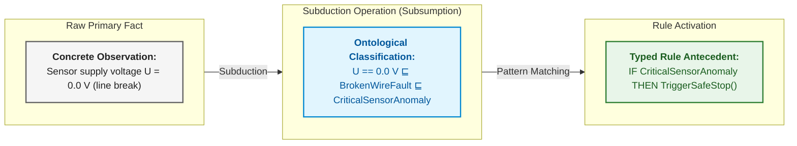

### 4.2. Deductive Inference: Rigorous Application of General Rules

Deductive inference is the sole reasoning modality within an expert system architecture that guarantees absolute truth preservation: whenever the premises are verified against normative standards and the underlying facts reflect reality, the derived conclusion is mathematically indisputable. In functional safety certification gateways (such as ISO 26262 ASIL-D or DO-178C DAL-A), automated release authorization decisions must be established exclusively upon deductive derivations. If an engineering team substitutes heuristic or probabilistic guesses for deductive proof, the system forfeits determinism: identical evidentiary inputs may yield contradictory verdicts, precluding independent safety certification.

The formal mathematical instrument of deduction is the detachment rule (*modus ponens*), evaluating a Boolean validity indicator $Q \in \{0, 1\}$:

```math
\frac{P\Rightarrow Q,\qquad P}{Q}
```

Components and parameters of the formula:

- $P$ is the verified antecedent predicate (e.g., the conjunction of validated system state facts $P \in \{0, 1\}$);
- $Q$ is the target consequent predicate (e.g., an actuation directive or release verdict $Q \in \{0, 1\}$);
- $P\Rightarrow Q$ represents a validated production rule from the certified knowledge base;
- The horizontal line designates formal logical derivation: the simultaneous presence of a true rule $P\Rightarrow Q = 1$ and a verified premise $P = 1$ deterministically proves $Q = 1$.

**Operational Engineering Application:**
1. *Invocation Lifecycle Phase:* Evaluated by the inference engine during the final release gate audit or within the real-time emergency shutdown loop.
2. *Result Interpretation:* If antecedent $P$ is unproven (evaluating to 0 or $\frac{1}{2}$ in Kleene logic), *modus ponens* is blocked, and consequent $Q$ is not inferred, preventing unverified actions.
3. *System Action:* When $Q = 1$, the system emits a cryptographically signed gate certificate or actuates the appropriate safety mechanism, citing the precise rule and premise identifiers.

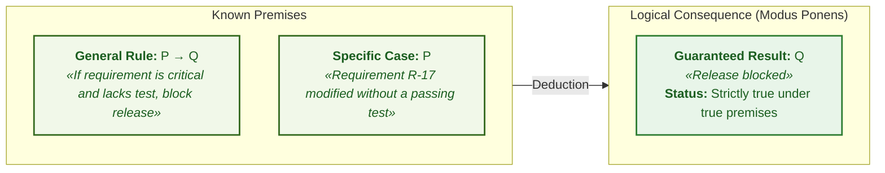

### 4.3. Inductive Inference: Empirical Generalization of Observations

Inductive inference enables an expert system to synthesize candidate knowledge from accumulated empirical observations, hardware telemetry, and automated test bench logs. Unlike deduction, induction moves from specific observational instances toward a generalized candidate rule. The primary engineering hazard of unmonitored induction in mission-critical environments is Hume's problem of induction: even if a thousand consecutive test executions satisfy a hypothesis, the very next run under extreme boundary conditions may suffer catastrophic failure. Unconditionally injecting induced rules into an operational knowledge base generates an illusion of exhaustive coverage that collapses upon encountering its first real-world corner case.

The formal inductive schema generalizes a finite sample of $m$ independent observations into a candidate predicate rule:

```math
\frac{P(a_1)\land Q(a_1),\quad P(a_2)\land Q(a_2),\quad\dots,\quad P(a_m)\land Q(a_m)}{\forall x\,\big(P(x)\Rightarrow Q(x)\big)\quad (\text{hypothesis with support } m)}
```

Parameters and components:

- $`a_1,\dots,a_m \in \mathcal{U}`$ denotes the finite set of $m$ recorded observation instances (e.g., a batch of thermal chamber test executions);
- $m \in \mathbb{N}$ denotes empirical sample size (the count of corroborating instances);
- $`P(a_i)`$ denotes the presence of an operational trigger condition in observation $i$ (e.g., $`\text{Temperature}(a_i) > 85\ ^\circ\text{C}`$);
- $`Q(a_i)`$ denotes the failure mode observed in run $i$ (e.g., $`\text{TestFault}(a_i) = \text{T-9}`$);
- $\forall x\,\big(P(x)\Rightarrow Q(x)\big)$ is the candidate rule hypothesis posited as a potential domain invariant.

**Operational Engineering Application:**
1. *Invocation Lifecycle Phase:* Activated strictly within offline log analytics pipelines ([Chapter 25](ch25-how-expert-systems-learn.md)) when mining latent hardware degradation patterns.
2. *Result Interpretation:* The sample size $m$ defines the empirical support. If $`m < m_{\min}`$ (where $`m_{\min}`$ is a calibrated statistical significance threshold, e.g., $`m_{\min} = 100`$), the generalization is rejected as statistical noise.
3. *System Action:* An induced candidate rule is never promoted to the real-time decision engine automatically. The system routes it to a *quarantine knowledge registry*, generating a formal review ticket for the responsible domain architect.

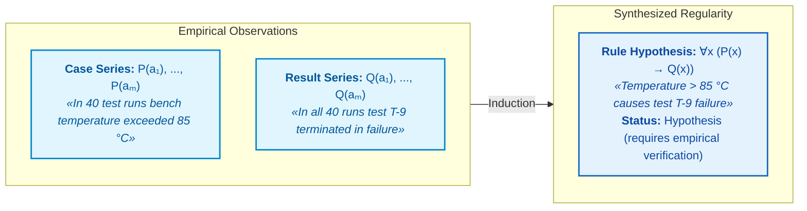

### 4.4. Abductive Inference: Generating Root-Cause Hypotheses

Abductive inference constitutes the mathematical backbone of automated diagnostic systems, fault isolation, and Fault Tree Analysis (FTA). An engineer relies on abduction whenever an abnormal symptom is observed (e.g., an unexpected communication bus reset or a voltage rail drop) and must formulate plausible root-cause hypotheses by reasoning backward from effect to cause. The fundamental difficulty of abduction stems from non-uniqueness: a single symptom $Q$ can originate from numerous distinct hardware or software faults ($`P_1, P_2, \dots, P_k`$). Naively adopting the first plausible hypothesis leads to incorrect repairs or masks latent safety-critical failures.

Formal abduction derives a plausible root-cause hypothesis $P$ from an observed symptom $Q$ and an established diagnostic rule:

```math
\frac{P\Rightarrow Q,\qquad Q}{P\ \ (\text{root-cause hypothesis})}
```

Parameters and components:

- $Q$ is the verified failure symptom recorded by onboard telemetry or test diagnostics ($Q = 1$);
- $P\Rightarrow Q$ represents an established causal failure rule from the system reliability model (where fault $P$ induces symptom $Q$);
- $P$ is the derived root-cause hypothesis;
- The "hypothesis" tag indicates that $P$ is not logically guaranteed: it serves as a candidate explanation requiring subsequent verification.

**Operational Engineering Application:**
1. *Invocation Lifecycle Phase:* Triggered by the diagnostic subsystem immediately upon recording a Diagnostic Trouble Code (DTC), an unhandled exception, or an unexpected watchdog reset.
2. *Result Interpretation:* Abduction generates a candidate hypothesis set $`\mathcal{H}_Q = \{P_1, P_2, \dots\}`$. Each hypothesis is ranked by prior Bayesian probability or diagnostic verification cost.
3. *System Action:* The expert system constructs a discriminatory test plan: scheduling targeted checks (such as inspecting power telemetry logs) to deductively confirm one hypothesis while refuting alternatives ([Chapter 24](ch24-system-diagnosis.md)).

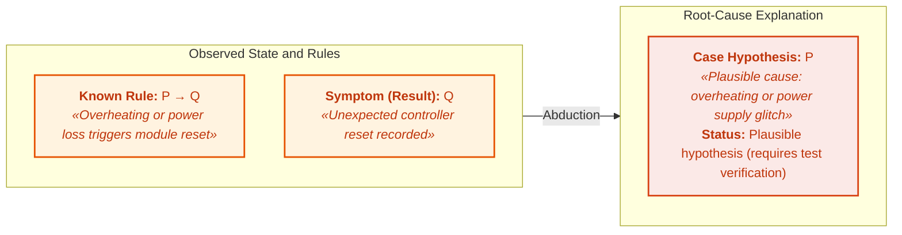

### 4.5. Traduction: Reasoning by Analogy and Precedents (CBR)

**Traduction** (from the Latin *traductio*, meaning "transfer" or "relocation") denotes an inference mode in which premises and conclusion operate at the **same level of generality**: reasoning proceeds from one specific case directly to another specific case ($A \to B$), or from one physical system to an analogous system. In applied knowledge engineering, traduction provides the mathematical and logical foundation for **case-based reasoning** (CBR) [[12a]](#src-12a).

Whereas deduction requires a preexisting general law and induction requires hundreds of observations to synthesize one, traduction allows an expert system to formulate decisions under incomplete domain models by transferring verified archival experience:

```math
\frac{\mathrm{Sim}(A, B) \ge \theta,\qquad \mathrm{Solution}(A) = S_A}{\mathrm{CandidateSolution}(B) = \mathrm{Adapt}(S_A)\ \ (\text{by analogy with confidence threshold }\theta)}
```

Formal expression breakdown:

- $A$ is a known archival precedent case (codified as a tuple $`\langle C_A, P_A, A_A, R_A, \Delta_A \rangle`$; see [Chapter 4](ch04-evolution-from-bayes-to-evidence-ai.md#кортеж-інженерного-досвіду));
- $B$ is a new, unsolved problem or current anomaly with operational context $`C_B`$;
- $\mathrm{Sim}(A, B) \in [0, 1]$ is the calculated similarity metric over the feature spaces of both cases;
- $\theta \in (0, 1]$ is a calibrated engineering confidence threshold below which analogical transfer is prohibited;
- $`\mathrm{Adapt}(S_A)`$ is the adaptation operator that adjusts solution $`S_A`$ to accommodate the context differences of case $B$.

#### 4.5.1. Metric Spaces and Similarity Measure Computation $\mathrm{Sim}(A, B)$

To execute traductive transfer, the system evaluates three complementary similarity metrics:

**1. Weighted normalized telemetry distance:**

```math
d_W(C_A, C_B) = \sqrt{\sum_{i=1}^n w_i \left(\frac{x_{A,i} - x_{B,i}}{\sigma_i}\right)^2},\qquad \mathrm{Sim}_{\text{metric}}(A, B) = \frac{1}{1 + d_W(C_A, C_B)}
```

where:
- $`C_A, C_B`$ are numeric vectors of observed parameters for cases $A$ and $B$;
- $`x_{A,i}, x_{B,i}`$ are measured engineering quantities for channel $i$ (e.g., supply voltage, load current, operating temperature);
- $`w_i \in [0, 1]`$ is the normalized importance weight of channel $i$ ($`\sum_{i=1}^n w_i = 1`$);
- $`\sigma_i > 0`$ is the scale or standard deviation of parameter $i$, normalizing disparate physical units;
- $`d_W(C_A, C_B) \ge 0`$ is the weighted metric distance;
- $`\mathrm{Sim}_{\text{metric}}(A, B) \in (0, 1]`$ is the resulting signature similarity score.

**2. Cosine similarity in latent semantic space:**

```math
\mathrm{Sim}_{\text{cosine}}(z_A, z_B) = \frac{\mathbf{z}_A \cdot \mathbf{z}_B}{\|\mathbf{z}_A\|\,\|\mathbf{z}_B\|}
```

where $`\mathbf{z}_A, \mathbf{z}_B \in \mathbb{R}^d`$ are dense semantic embeddings of the incident textual and diagnostic descriptions generated by a domain encoder.

**3. Topological subgraph isomorphism:** computing the Jaccard index or Graph Edit Distance (GED) between the causal subgraphs of both components.

**Runtime Control Flow and Operational Thresholds for Traduction:**
1. **Automated Reuse (`Reuse`):** if $`\mathrm{Sim}_{\text{metric}}(A, B) \ge \theta_{\mathrm{reuse}} = 0.85`$ ($`d_W \le 0.176`$), the inference engine designates precedent $A$ as an authoritative baseline and enqueues its recovery plan for automated execution.
2. **Supervised Adaptation (`Revise`):** if $`\theta_{\mathrm{adapt}} \le \mathrm{Sim}_{\text{metric}} < \theta_{\mathrm{reuse}}`$ (with $`\theta_{\mathrm{adapt}} = 0.65`$), the system triggers adaptation operator $`\mathrm{Adapt}(S_A)`$ under mandatory human-in-the-loop review or formal safety constraints verification.
3. **Analogy Rejection (`Refusal`):** if $`\mathrm{Sim}_{\text{metric}} < 0.65`$, the candidate case is rejected as non-analogous, preventing false analogy errors.

**Worked Numerical Example:**
A diagnostic subsystem evaluates an unexpected voltage sag on a battery management system (BMS). Two telemetry channels are monitored: reference voltage drift $`V_{\mathrm{ref}}`$ ($`w_1 = 0.6`$, $`\sigma_1 = 0.1\,\text{V}`$) and switching FET temperature $`T_{\mathrm{FET}}`$ ($`w_2 = 0.4`$, $`\sigma_2 = 5\,^\circ\text{C}`$).
Observed deviations from the archival benchmark are $\Delta V = 0.02\,\text{V}$ and $\Delta T = 1.5\,^\circ\text{C}$.
```math
d_W = \sqrt{0{,}6 \cdot \left(\frac{0{,}02}{0{,}1}\right)^2 + 0{,}4 \cdot \left(\frac{1{,}5}{5}\right)^2} = \sqrt{0{,}6 \cdot 0{,}04 + 0{,}4 \cdot 0{,}09} = \sqrt{0{,}024 + 0{,}036} = \sqrt{0{,}060} \approx 0{,}245
```
```math
\mathrm{Sim}_{\text{metric}} = \frac{1}{1 + 0{,}245} \approx 0{,}803
```
Because $`\mathrm{Sim}_{\text{metric}} = 0.803 \in [0.65, 0.85)`$, the system sets status `Revise`: it adjusts the protection timeout parameter and requires human engineering sign-off prior to authorizing a controller reset.

#### 4.5.2. Four-Stage Precedent Lifecycle (4R Cycle)

Under the canonical framework of Agnar Aamodt and Enric Plaza [[12a]](#src-12a), traductive inference follows a four-stage lifecycle:
- **Retrieve:** a $k$-nearest neighbor ($k\text{NN}$) or vector index locates precedent $A$ most similar to current issue $B$;
- **Reuse:** the verified design or diagnostic solution $`S_A`$ is mapped to target case $B$;
- **Revise:** an expert or formal simulation model validates whether $`S_A`$ remains safe given the specific differences in $B$, adapting parameters accordingly;
- **Retain:** the newly verified experience tuple $`\langle C_B, P_B, S_B, R_B, \Delta_B \rangle`$ is committed to the corporate memory repository.

#### 4.5.3. Traduction in Modern Neuro-Symbolic Architectures

In-context learning within large and small language models—prompting with few-shot examples or retrieving passages via RAG—represents a purely computational implementation of traduction. The model does not alter its weight parameters (it performs no induction), but transfers reasoning trajectories from in-context precedents to the engineer's new prompt.

> [!WARNING]
> **Critical Hazard of Traduction: The False Analogy Fallacy**  
> High superficial or statistical similarity between symptoms ($\mathrm{Sim}(A, B) \approx 1$) does not guarantee identity of physical root causes. For example, high-frequency CAN bus errors may stem from a 3.3 V power sag (incident $A$) or from an open 120 $\Omega$ split terminator (incident $B$). Blindly applying the remediation of $A$ to $B$ can precipitate severe hardware failure. Therefore, in mission-critical expert systems, candidate solutions derived via traduction must **never be applied blindly**; they must always be routed through a deterministic deductive verification gateway (Safety Shield; see [Chapter 29](ch29-neuro-symbolic-architecture.md)).

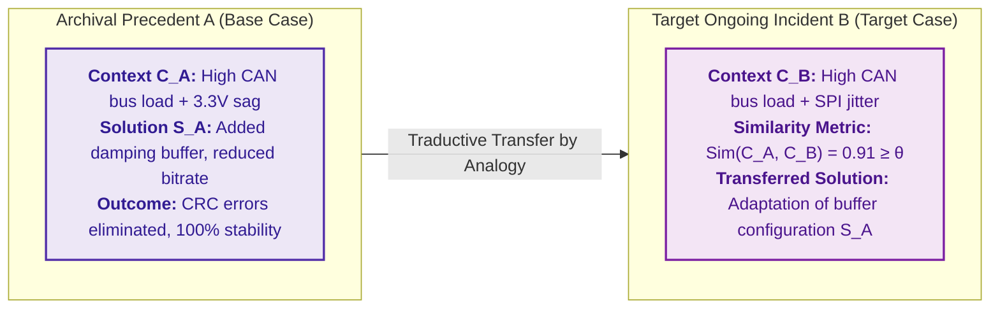

### 4.6. Eduction: Immediate Inferences and Equivalent Knowledge Transformations

**Eduction** (from the Latin *educere*, meaning "to draw out" or "to extract") designates in formal logic the class of **immediate inferences**, wherein a new proposition is derived from a **single premise** without introducing supplementary rules or empirical facts. Eduction alters the logical syntax of an assertion while preserving its exact truth value.

In mission-critical knowledge systems, three primary forms of eduction are utilized:

#### 4.6.1. Contraposition
Contraposition exchanges antecedent and consequent while negating both:
```math
\frac{P\Rightarrow Q}{\neg Q\Rightarrow \neg P}
```
In evidence-governed systems, contraposition underpins backward chaining. If a regulatory standard mandates: *"If a module is approved for deployment ($P$), then all test reports must be validated ($Q$)"*, observing an unvalidated test report ($\neg Q$) allows the inference engine to immediately derive deployment prohibition ($\neg P$) without evaluating auxiliary rules.

#### 4.6.2. Obversion
Obversion alters the qualitative polarity of a proposition while negating the predicate:
```math
\frac{P\Rightarrow Q}{\neg(P\land \neg Q)}
```
Obversion resolves latent requirement ambiguities: the requirement "every safety-critical component must be redundant" is transformed into the invariant constraint "a component cannot be safety-critical while simultaneously lacking redundancy".

#### 4.6.3. Conversion
Conversion transposes subject and predicate given a symmetric relation (such as hardware compatibility or interrupt mutual exclusion) or under restricted quantification:
```math
\frac{\forall x\,(A(x)\land B(x))}{\forall x\,(B(x)\land A(x))}
```

#### 4.6.4. Application of Eduction in Knowledge Base Optimization Algorithms
- **Rule Normalization:** Prior to executing inference, the knowledge base compiler applies eductive transformations to reduce complex Boolean conditions to Conjunctive Normal Form (CNF) or Horn clauses required for high-throughput SAT/SMT solvers (such as Z3 or CVC5);
- **Deduplication:** Eduction exposes logically equivalent rules authored under different syntax by separate engineering teams, eliminating redundant computation and preventing knowledge graph fragmentation.

### 4.7. Reduction: Decomposition of Complex Problems into Independent Subproblems

Deductive verification becomes computationally intractable when evaluating large systems: verifying hundreds of release criteria across thousands of communication protocol states. Problem reduction substitutes a complex verification task with equivalent simpler subproblems while preserving essential semantics. Two reduction strategies are vital for expert systems.

The first strategy decomposes an overall goal into subgoals via an AND/OR tree, as formalized by Nils Nilsson [[12]](#src-12):

```math
G \Leftarrow g_1\land g_2\land\dots\land g_k,\qquad g_j\Leftarrow h_1\lor h_2\lor\dots\lor h_m
```

Components of the formulation:

- $G$ represents the top-level goal, and $`g_1,\dots,g_k`$ are its constituent subgoals;
- $k$ is the count of conjunctive subgoals (all must evaluate to true);
- $`g_j`$ is one specific subgoal, and $`h_1,\dots,h_m`$ are disjunctive alternative proof paths for $`g_j`$;
- $m$ is the count of alternatives, $\land$ denotes conjunction, and $\lor$ denotes disjunction;
- $\Leftarrow$ denotes derivability ("is achieved if"), and index $j$ isolates the target subgoal.

For example, the top-level goal "release authorized" may require passing critical tests, formal risk waiver approvals, and closing blocker defects. The subgoal "risk waiver approval" can be established either via a safety officer's cryptographic signature or an engineering board resolution. Verifying the leaf nodes validates the root goal, while the tree itself supplies the structural explanation.

The second reduction strategy minimizes the state space of a finite-state automaton modeling an engineering protocol. Two states can be merged if no sequence of future inputs can distinguish them:

```math
s_1\sim s_2\iff\forall w\in\Sigma^{\ast}:\ \big(\delta^{\ast}(s_1,w)\in\mathcal{F}\iff\delta^{\ast}(s_2,w)\in\mathcal{F}\big)
```

- $`s_1`$ and $`s_2`$ are automaton states, and $\sim$ denotes equivalence;
- $\Sigma$ is the input symbol alphabet, $\Sigma^{\ast}$ is the set of all finite input words, and $w$ represents a specific input sequence;
- $\delta^{\ast}(s,w)$ denotes the state reached from state $s$ under input word $w$;
- $\mathcal{F}$ represents the set of accepting or safe states, and $\in$ denotes set membership;
- $\forall$ denotes universal quantification, and $\iff$ denotes logical equivalence.

States are equivalent if every possible input word either leads both states into an accepting state or fails to do so in both cases. John Hopcroft introduced an algorithm that computes state equivalence classes in $O(n\log n)$ time for an $n$-state automaton [[13]](#src-13). The resulting minimal automaton exhibits identical external behavior while remaining significantly easier to verify, audit, and explain.

### 4.8. Comparative Analysis of Reasoning Methods and Operational Boundaries

| Method / Operation | Inference Vector | Premise Inputs | Derived Consequence | Epistemological Status | Application in Expert Systems |
|---|---|---|---|---|---|
| **Subduction** | $\in$ Categorization | Instance $a$ and hierarchy $C \sqsubseteq D$ | Membership fact $a \in D$ | Analytic (ontologically determined) | RETE pattern matching, OWL classification |
| **Deduction** | $\downarrow$ General to specific | Rule $P \to Q$ and verified fact $P$ | Consequence $Q$ | Strictly true (under true premises) | Release gate audit, safety certification |
| **Induction** | $\uparrow$ Specific to general | Case series $`P(a_i)`$ and results $`Q(a_i)`$ | Rule hypothesis $\forall x (P \to Q)$ | Probabilistic hypothesis (unverified) | Automated learning from test bench logs |
| **Abduction** | $\leftarrow$ Effect to cause | Diagnostic rule $P \to Q$ and symptom $Q$ | Root-cause hypothesis $P$ | Plausible hypothesis (best explanation) | Technical diagnostics, fault tree analysis (FTA) |
| **Traduction** | $\leftrightarrow$ Between precedents | Case $A$, solution $`S_A`$, and $\mathrm{Sim} \ge \theta$ | Adapted solution for $B$ | Heuristic analogy (requires Safety Shield) | Case-based reasoning, Few-Shot RAG, patch reuse |
| **Eduction** | $\equiv$ Semantic equivalence | Single proposition $P \to Q$ | Transformed form ($\neg Q \to \neg P$) | Identically true (truth-preserving) | Rule base normalization, backward chaining |
| **Reduction** | $\searrow$ Complex to simple | Complex goal $G$ or $n$-state automaton | Subgoal tree $`g_1 \land \dots \land g_k`$ or minimal automaton | Equivalent (preserves solvability) | AND/OR goal trees, Hopcroft minimization |

Subduction categorizes observations, deduction enforces verified safety rules, induction synthesizes new rule hypotheses, abduction isolates root causes of failure, traduction transfers precedent experience, eduction normalizes rule bases, and reduction keeps complex verification tractable. For an expert system, the critical engineering imperative is strictly preserving output epistemic status: deductive, subductive, and eductive results are emitted as mathematically guaranteed conclusions, whereas traductive, inductive, and abductive outputs must be explicitly flagged as hypotheses bounded by validation plans and safety shields. The next challenge is computational: how a rule engine executes thousands of rules over millions of facts without latency degradation.

## 5. Rule Execution Algorithms: Rete Networks, Agenda, and Conflict Resolution

When a system contains tens of rules, the inference engine can scan all rules against all facts on every cycle. However, when an industrial system scales to thousands of rules and millions of facts, exhaustive linear matching on every state change becomes computationally intractable, preventing the rule engine from keeping pace with real-time events.

In 1982, Charles Forgy formulated the Rete algorithm, named after the Latin word for "net" or "network" [[14]](#src-14). Rete relies on two empirical observations: first, only a tiny fraction of facts change on any given cycle, rendering full re-evaluation redundant; second, distinct rules frequently share identical antecedent conditions, meaning shared conditions should be evaluated only once. Rete constructs an acyclic directed network of condition nodes and caches intermediate partial matches (beta-memories); when a fact is asserted or retracted, the change propagates only through the affected subnetwork. In software engineering terms, Rete functions like an incremental compiler that recompiles only modified source modules. Daniel Miranker formulated the TREAT algorithm, which avoids caching intermediate join memories to reduce memory footprint at the expense of re-evaluating joins [[15]](#src-15).

Three foundational concepts characterize production rule engines:
- **Working Memory:** stores currently active extensional and inferred facts;
- **Agenda:** maintains rule instances whose conditions are fully satisfied and are ready to execute;
- **Conflict Resolution:** determines which activation in the agenda executes first. In rule engines such as CLIPS (C Language Integrated Production System) and Drools, rule priority is designated as `salience`.

Consider a scenario where two rules simultaneously enter the agenda: "block release due to unconfirmed requirement" and "send notification email to test owner". If conflict resolution is non-deterministic, successive executions over identical facts could produce divergent execution traces. Consequently, rule priorities and conflict resolution strategies must be codified explicitly, ensuring the activation log provides an auditable explanation of why one rule executed before another.

Rete delivers computational speed, while explicit conflict resolution guarantees reproducibility. However, rapid forward inference exhibits an operational hazard: an inference derived yesterday may depend on an underlying fact that is retracted today.

## 6. Truth Maintenance Systems (TMS/JTMS): Dynamic Retraction of Invalidated Inferences

An expert system derives "release authorized" on the basis of four facts: blocker defects resolved, required tests passed, regulatory waiver granted, and safety review signed off. The following morning, the regulatory waiver is formally revoked. If the expert system simply asserts the revocation fact without managing dependencies, the stale authorization verdict persists in the database, generating an erroneous safety claim.

Truth maintenance systems (TMS) record dependencies between premises and derived assertions. Jon Doyle formalized the justification-based truth maintenance system (JTMS): every assertion is backed by a justification, and an assertion is marked IN (valid) if at least one justification is currently valid, or OUT (invalid) otherwise [[16]](#src-16). When a premise transitions to OUT, invalidation propagates through the dependency network, automatically flipping dependent assertions to OUT. Johan de Kleer formulated the assumption-based truth maintenance system (ATMS), which maintains for each proposition the minimal sets of assumptions under which it holds [[17]](#src-17):

```math
L(n)=\{\,E\subseteq A \mid E\cup J\vdash n,\ E\ \text{consistent},\ E\ \text{minimal}\,\}
```

Notation:

- $n$ is the derived proposition, $A$ is the universe of all candidate assumptions, and $E$ is a specific assumption set (environment);
- $J$ is the set of justifications (inference rules), and $L(n)$ is the label containing alternative supporting environments for $n$;
- $\subseteq$ denotes set inclusion, $\cup$ denotes set union, and $\vdash$ denotes formal syntactic derivability;
- The vertical bar reads "such that", followed by requirements that environment $E$ must be consistent and minimal.

The label $L(n)$ enumerates all minimal, consistent environments that, combined with rules $J$, derive $n$. For example, the conclusion "release authorized" might be supported by an approved waiver environment or by an alternative environment where defect D-4 is patched. If the waiver is revoked, the authorization remains valid only if supported by the patched defect environment.

In modern production systems, this concept is implemented via directed dependency graphs, append-only event logs, and versioned evidentiary records. When a source document expires, a rule is updated, or an approval is revoked, the expert system identifies all downstream dependencies, flags affected conclusions for re-verification, and re-executes only the impacted inference paths. The architectural placement of truth maintenance is detailed in [Chapter 16](ch16-expert-systems-architecture.md). Formal logic and truth maintenance operate over binary assertions (true or false). However, when evidence merely increases or decreases belief, the mathematical apparatus of uncertainty is required.

## 7. Uncertainty Modeling: Probability, Temporal Processes, Fuzzy Logic, and Evidence

The failure of test T-9 does not conclusively prove a code defect: the test might have failed due to an environmental bench glitch. The second introductory question asks: by how much did the test failure alter the risk? [Chapter 4](ch04-evolution-from-bayes-to-evidence-ai.md) compared MYCIN certainty factors, Bayes' theorem, fuzzy logic, and Dempster–Shafer theory using concrete numerical examples, establishing why their metrics cannot be conflated. This section provides the engineering foundations necessary to implement these models: the mathematical derivation of Bayes' rule, how Bayesian networks reduce parameter complexity and model competing causes, how dynamic processes evolve over time, and where classical Dempster combination produces catastrophic distortions.

### 7.1. Bayes' Theorem and Posterior Belief Updating

Bayes' theorem follows directly from the definition of conditional probability in two algebraic steps. The conditional probability of hypothesis $H$ given observed evidence $E$ is the proportion of cases where both hold among all cases where $E$ occurs:

```math
P(H\mid E)=\frac{P(H\cap E)}{P(E)},\qquad P(E\mid H)=\frac{P(H\cap E)}{P(H)}
```

where:

- $H$ is the target hypothesis, $E$ is the observed evidence, and $P(\cdot) \in [0, 1]$ denotes probability;
- $P(H\cap E)$ is the joint probability of both hypothesis and evidence occurring, where $\cap$ denotes event intersection;
- $P(H\mid E)$ is the conditional probability of $H$ given $E$, and $P(E\mid H)$ is the likelihood of observing $E$ given $H$;
- $P(E)$ and $P(H)$ are marginal probabilities and must be strictly positive;
- The fraction indicates division, and the vertical bar $\mid$ denotes conditioning ("given that").

From the second equality, we obtain the joint probability $P(H\cap E)=P(E\mid H)\,P(H)$. Substituting this product into the numerator of the first equation yields Bayes' theorem:

```math
P(H\mid E)=\frac{P(E\mid H)\,P(H)}{P(E)}
```

Notation:

- $H$ is the hypothesis, $E$ is the observed evidence, and $P(H\mid E)$ is the posterior probability updated after observing $E$;
- $P(E\mid H)$ is the likelihood of observing $E$ if hypothesis $H$ is true, and $P(H)$ is the prior probability of $H$;
- $P(E)$ is the marginal probability of observing evidence $E$, satisfying $P(E) > 0$;
- $\mid$ denotes conditioning, multiplication represents joint likelihood weighting, and division normalizes the distribution.

The posterior probability $P(H\mid E)$ is bounded within $[0, 1]$. A detailed numerical demonstration across 1,000 release cycles, odds formulations, and multi-evidence conditioning is presented in [Chapter 4](ch04-evolution-from-bayes-to-evidence-ai.md). Applying this formula in production requires auditable documentation of the empirical sources justifying both prior and likelihood estimates.

### 7.2. Bayesian Belief Networks and Explaining Away

As the number of system variables grows, specifying full joint probability tables becomes computationally impossible: for 20 binary variables, a complete joint distribution requires $2^{20}-1 \approx 10^6$ independent parameters—a quantity impossible for domain experts to calibrate. Judea Pearl's Bayesian belief network factorizes the global joint distribution into compact, localized conditional probability tables over a directed acyclic graph (DAG) [[18]](#src-18):

```math
P(X_1,\dots,X_n)=\prod_{i=1}^{n}P\big(X_i\mid\mathrm{Pa}(X_i)\big)
```

- $`X_1,\dots,X_n`$ denote the random variables of the model, where $n$ is the total count;
- $`\prod_{i=1}^{n}`$ denotes the product of terms evaluated across all indices $i$ from 1 to $n$;
- $`\mathrm{Pa}(X_i)`$ designates the parent nodes of $`X_i`$ in the DAG, representing direct conditional dependencies;
- $`P(X_i\mid\mathrm{Pa}(X_i))`$ is the localized conditional probability table for $`X_i`$ given the states of its parents.

This factorization decomposes the joint distribution into a product of local conditional distributions. If each of 20 binary variables has at most two parents, each local table requires at most four parameters, reducing total model complexity from approximately one million to fewer than 80 values. This factorization is mathematically valid only when conditional independence assertions hold; a directed edge in the graph does not automatically establish physical causality.

Bayesian belief networks provide a capability unattainable via disconnected production rules: weighing competing alternative explanations. Suppose test T-9 can fail either due to a software code defect or a test bench hardware fault. The diagram below illustrates this three-node network:

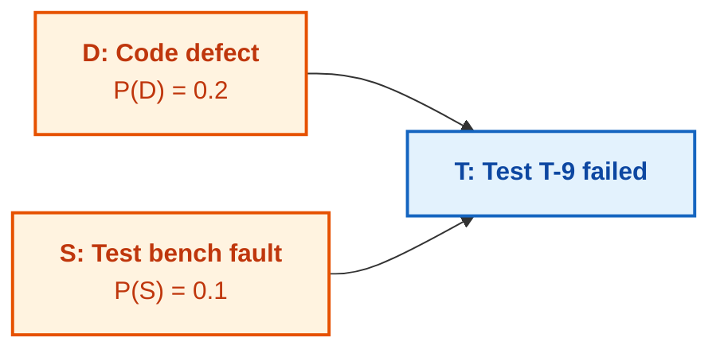

Orange nodes designate root causes; the blue node designates the observed effect. Code defect $D$ has a prior probability of 0.2, test bench fault $S$ has a prior probability of 0.1, and the causes are assumed marginally independent. The conditional probability table for the effect node is defined as:

| Code Defect $D$ | Bench Fault $S$ | $P(T\mid D,S)$ |
|---|---|---:|
| true | true | 0.99 |
| true | false | 0.90 |
| false | true | 0.80 |
| false | false | 0.05 |

The marginal probability of test failure integrates over all four parent configurations: $P(T)=0.2\cdot0.1\cdot0.99 + 0.2\cdot0.9\cdot0.90 + 0.8\cdot0.1\cdot0.80 + 0.8\cdot0.9\cdot0.05 \approx 0.282$. Upon observing that the test failed ($T=\text{true}$), the posterior probability of a code defect surges from 0.2 to $P(D\mid T)\approx(0.0198+0.162)/0.282 \approx 0.645$. However, if test bench telemetry subsequently confirms that a hardware glitch occurred ($S=\text{true}$), the probability of a code defect drops to $P(D\mid T,S)=0.0198/(0.0198+0.064) \approx 0.236$, nearly returning to its baseline prior of 0.2. Validating the alternative cause explains away the observed test failure, relieving suspicion from the software code. This phenomenon is known as **explaining away**, formalized by Pearl [[18]](#src-18). The practical engineering rule is straightforward: before dispatching engineers to debug software code, inspect the test bench telemetry logs.

### 7.3. Markov Decision Processes and Dynamic Uncertainty

A Bayesian network models system state at a discrete point in time. However, mission-critical engineering processes evolve dynamically across time: requirements transition through lifecycle stages, and hardware components progressively degrade. Andrey Markov formulated models for stochastic sequences wherein future states depend solely on the present state rather than the complete historical trajectory. For a state sequence $`X_0,X_1,\dots`$, the Markov property is expressed as:

```math
P(X_{t+1}=j\mid X_t=i,X_{t-1},\dots,X_0)=P(X_{t+1}=j\mid X_t=i)=T_{ij}
```

- $`X_t`$ denotes the system state at time step $t$, where $`t \in \mathbb{N}_0`$ indexes time or execution cycles;
- $i$ and $j$ represent candidate current and subsequent states from state space $\mathcal{S}$;
- $P(\cdot\mid\cdot)$ is conditional probability, and $`T_{ij}`$ is the transition probability from state $i$ to state $j$;
- The equality enforces the Markov property: given current state $`X_t`$, historical states furnish no additional predictive information regarding $`X_{t+1}`$;
- Each $`T_{ij} \in [0, 1]`$, and transition probabilities out of any state sum to 1 ($`\sum_{j} T_{ij} = 1`$).

A stochastic process satisfying this property is a Markov chain. For example, a requirement in state "under review" may transition to "approved" with probability 0.6, to "rework required" with probability 0.3, or remain "under review" with probability 0.1. This model characterizes the statistical behavior of the process under observed historical parameters, rather than predicting the deterministic fate of an individual requirement.

Hidden Markov Models (HMM) extend this framework to situations where the true state cannot be directly inspected. Lawrence Rabiner formalized algorithms that infer the most probable sequence of hidden states from emitted observable telemetry [[19]](#src-19). For example, a project's latent state might be "healthy", "unstable", or "pre-crisis", emitting visible signals such as defect arrival velocity, test failure rates, and review turnaround latency. When the probability of the "pre-crisis" state breaches an engineering threshold, the expert system triggers actionable interventions: scheduling targeted audits, mandating regression suites, or escalating to senior architecture boards.

Markov Decision Processes (MDP) incorporate explicit actions and rewards: the expert system does not merely observe, but selects optimal interventions, such as executing auxiliary test suites, escalating risk flags, or postponing deployment. A decision policy $\pi$ maps states to actions, and its expected cumulative return is formalized by Martin Puterman [[20]](#src-20):

```math
V^{\pi}(s)=\mathbb{E}_{\pi}\Big[\sum_{t=0}^{\infty}\gamma^{t}r_t\ \Big|\ s_0=s\Big]
```

- $s \in \mathcal{S}$ is the initial system state, conditioned via $`s_0=s`$;
- $V^{\pi}(s)$ is the expected discounted cumulative reward under policy $\pi$ initiated from state $s$;
- $`r_t`$ represents the scalar reward (or negative operational cost) incurred at step $t$;
- $\gamma \in [0, 1)$ is the discount factor, where $\gamma^t$ discounts future returns relative to immediate costs;
- $\sum$ sums discounted rewards across an infinite operational horizon, and $`\mathbb{E}_{\pi}`$ denotes the mathematical expectation under policy $\pi$;
- The vertical bar conditions the expectation upon the initial state $`s_0=s`$.

With $\gamma=0.9$, a reward realized 10 steps into the future carries weight $0.9^{10} \approx 0.35$ relative to an immediate reward. A higher value of $V^{\pi}(s)$ denotes greater expected cumulative utility under policy $\pi$, rather than a deterministic outcome. When states are partially observed through noisy sensors, the framework generalizes to a Partially Observable Markov Decision Process (POMDP); in foundational expert system deployments, a simplified discrete policy with explicit state, cost, and safety invariants is often architecturally optimal.

### 7.4. Zadeh's Fuzzy Logic: Membership Functions and Degrees of Truth

Many engineering concepts lack crisp binary thresholds: "fresh documentation", "moderate risk", "near-ready release". Lotfi Zadeh introduced fuzzy sets, assigning elements a continuous degree of membership ranging from 0 to 1 [[21]](#src-21); foundational definitions and historical context are detailed in [Chapter 4](ch04-evolution-from-bayes-to-evidence-ai.md). For example, an engineering team might establish a linear membership function defining documentation freshness based on age $a$ in elapsed days:

```math
\mu_{\mathrm{fresh}}(a)=\max\Big(0,\ 1-\frac{a}{180}\Big)
```

Parameters of the formula:

- $a \ge 0$ is the age of the evidentiary document in days;
- $`\mu_{\mathrm{fresh}}(a) \in [0, 1]`$ represents the degree of freshness, where subscript $\mathrm{fresh}$ denotes the semantic property;
- $\max$ selects the supremum of 0 and $1 - a/180$, enforcing non-negativity;
- 180 denotes the agreed project staleness horizon in days, and 1 represents maximal membership.

Under this calibration, a newly ratified document has freshness 1.0, a 90-day-old document has freshness 0.5, and documents aged 180 days or more evaluate to 0.0. This score does not represent a statistical probability of accuracy; it constitutes a deterministic confidence scale ratified by the knowledge owner, whose operational validity cannot be extrapolated to other domains without engineering review.

#### 7.4.1. Fuzzy Algebra Operators: T-Norms, S-Norms, and Defuzzification

Combining fuzzy antecedents in compound production rules of the form $`\text{IF}\ (x_1 \in A)\ \text{AND}\ (x_2 \in B)\ \text{THEN}\ (y \in C)`$ relies on triangular norms (T-norms for conjunction "AND") and triangular conorms (S-norms for disjunction "OR"):

1. **T-Norms (Conjunction, Logical "AND"):** a function $T:[0,1]\times[0,1]\to[0,1]$ that is commutative, associative, monotonic, and satisfies boundary condition $T(a, 1) = a$.
   - *Gödel T-norm (Minimum):* $`T_{\min}(a, b) = \min(a, b)`$ — conservative evaluation reflecting the weakest constraint;
   - *Product T-norm:* $`T_{\mathrm{prod}}(a, b) = a \cdot b`$ — models multiplicative belief degradation;
   - *Łukasiewicz T-norm:* $`T_{\mathrm{Luk}}(a, b) = \max(0, a + b - 1)`$ — models strict cumulative deficit.

2. **S-Norms (Disjunction, Logical "OR"):** a function $S:[0,1]\times[0,1]\to[0,1]$ satisfying $S(a, 0) = a$.
   - *Maximum S-norm:* $`S_{\max}(a, b) = \max(a, b)`$;
   - *Probabilistic Sum:* $`S_{\mathrm{sum}}(a, b) = a + b - a \cdot b`$.

Translating truncated output fuzzy sets into a crisp control signal or discrete decision is accomplished via **defuzzification**. In the Mamdani model, the Center of Gravity (COG) method is most prevalent:

```math
z^* = \frac{\int_Z z \cdot \mu_C(z)\,dz}{\int_Z \mu_C(z)\,dz} \approx \frac{\sum_{i=1}^n z_i \cdot \mu_C(z_i)}{\sum_{i=1}^n \mu_C(z_i)}
```

Formula parameters:

- $z^*$ is the defuzzified crisp scalar output (e.g., an actuator offset angle or an audit priority rating);
- $Z$ represents the universe of discourse for the output variable;
- $`z_i`$ denotes the discrete value of the output variable at step $i$ along the discretized scale;
- $`\mu_C(z_i)`$ is the aggregated degree of membership resulting from firing active rules at $`z_i`$;
- $`\sum_{i=1}^n`$ sums over all $n$ discretization points across the output interval.

In the **Takagi–Sugeno–Kang (TSK)** model, rule consequents are defined not as fuzzy sets, but as crisp linear functions of the inputs $`f_j(\mathbf{x}) = \mathbf{p}_j^T \mathbf{x} + r_j`$. The global output is computed as a weighted average:

```math
y^* = \frac{\sum_{j=1}^M w_j \cdot f_j(\mathbf{x})}{\sum_{j=1}^M w_j}
```

where $`w_j = T(\mu_{A_j}(x_1), \mu_{B_j}(x_2))`$ represents the firing strength of rule $j$ under the selected T-norm, and $M$ is the total count of rules.

#### 7.4.2. Fuzzy Logic and Token Probability Distributions in Language Models

Practitioners frequently attempt to replace fuzzy inference engines with statistical probabilities emitted by generative large language models (LLM/SLM). However, these paradigms rest on fundamentally incompatible mathematical foundations:

| Comparison Dimension | Fuzzy Logic | Language Model Probability (LLM) |
|---|---|---|
| **Semantic Nature** | **Degree of Truth:** measure of compliance with a non-crisp concept ($\mu \in [0, 1]$). | **Plausibility / Frequency:** probability distribution over a discrete token vocabulary ($P \in [0, 1]$). |
| **Space Normalization** | **Non-additive:** independent membership functions. Concurrently $`\mu_{\mathrm{cold}}(x) = 0.7`$ and $`\mu_{\mathrm{warm}}(x) = 0.6`$. | **Strictly additive (Kolmogorov):** softmax layer guarantees $`\sum_{k} P(\mathrm{token}_k) = 1`$. |
| **Condition Composition** | Deterministic T-norms ($\min$, product); zero stochastic variance. | Stochastic sampling (temperature $T$, top-$p$), autoregressive context drift. |
| **Audit Verifiability** | Mathematically provable bounds, compliant with ISO 26262/IEC 61508 safety standards. | Prone to arithmetic hallucinations and numerical instability under prompt perturbations. |

Consequently, **a language model cannot function as a reliable numeric evaluator of fuzzy logic**. Its valid architectural role is positioned at a different level: serving as the semantic natural language interface of a dual-mode neuro-symbolic architecture ([Chapter 28](ch28-dual-mode-expert-systems.md), [Chapter 29](ch29-neuro-symbolic-architecture.md)):


1. **Linguistic Fuzzification via Linguistic Hedges:** An operator enters an informal observation: *"Temperature is somewhat above nominal, but vibration is surging extremely rapidly"*. The language model parses qualitative hedges (*"somewhat"* $\to \sqrt{\mu}$, *"extremely"* $\to \mu^2$, or Zadeh's concentration operator) and maps them to concrete input vector parameters for the formal core.
2. **Rule Synthesis from Engineering Specifications:** The language model extracts candidate associative rules from vendor technical manuals or compliance specifications ([Chapter 14](ch14-requirements-detection-and-formalization.md)), which are subsequently calibrated by systems engineers and locked into the verified knowledge base.
3. **Linguistic Defuzzification and Decision Explanation:** Receiving crisp mathematical output $z^* = 0.42$ and rule firing vector $`w_j`$, the language model synthesizes an auditable, natural-language explanation, grounding every assertion in the underlying specification coordinates ([Chapter 20](ch20-explanation-engine.md)).

#### 7.4.3. Software Optimization of Fuzzy Computing: SIMD and SMT Verification

Software execution of fuzzy rule engines on general-purpose CPUs leverages specialized architectural patterns:

- **SIMD Vectorization (AVX2 / AVX-512 / ARM Neon):** Because piecewise-linear membership functions (triangular, trapezoidal) and Gödel T-norms rely exclusively on comparisons ($\min(a, b)$ and $\max(a, b)$), a 256-bit or 512-bit vector register can compute 8 or 16 membership valuations per clock cycle using intrinsic instructions (`_mm256_min_ps` / `_mm256_max_ps`). This enables evaluating 10,000 fuzzy rules in under 5 microseconds without heap allocation.
- **Static Look-Up Tables (LUT):** Precomputing complex sigmoidal or Gaussian membership functions into static lookup arrays eliminates costly calls to `exp` within real-time control loops.
- **Formal Rule Space Verification via SMT Solvers (Z3 / CVC5):** The fuzzy rule base is formally audited to guarantee complete coverage over the input domain (eliminating dead zones where $`\sum w_j = 0`$) and to verify consistency (preventing contradictory outputs under identical inputs; see [Chapter 23](ch23-knowledge-base-verification.md)).

#### 7.4.4. Hardware Acceleration of Fuzzy Computing: FPGA, Analog Cores, and Crossbars

In safety-critical real-time environments (ISO 26262 ASIL-D, autonomous robotics, avionics), software execution on standard operating systems cannot guarantee bounded fault-tolerant time intervals (FTTI). Depending on constraints, specialized hardware architectures are employed:

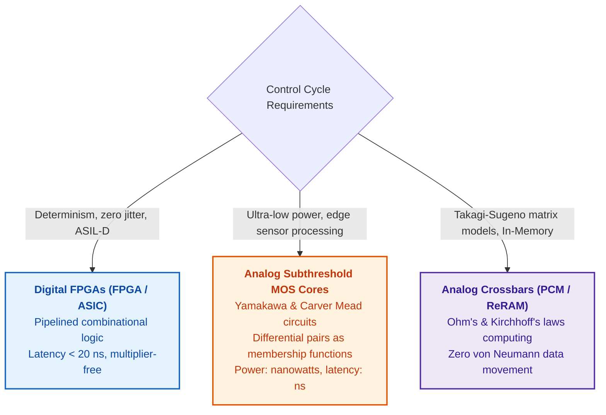

1. **Digital FPGAs and Dedicated Hardware Accelerators:**
   - Fuzzy inference engines synthesize directly into pure combinational logic without requiring hardware DSP multiplier blocks (for Mamdani architectures with minimum T-norms).
   - They provide strictly deterministic execution latencies below 20 nanoseconds with zero jitter, satisfying stringent certification audits.
2. **Analog Subthreshold Silicon (Takeshi Yamakawa and Carver Mead Architectures):**
   - As explored in [Appendix D](appendix-d-analog-expert-systems-and-neuromorphic-computing.md#L204-L260), subthreshold MOSFET channel physics naturally implements smooth sigmoidal membership functions via exponential drain-current dependence on gate voltage ($`I_d \propto \exp(V_{gs})`$).
   - Conjunction T-norms are computed via diode-based current-mode minimum selectors.
   - Rule arbitration is resolved via Lazzaro–Mead Winner-Take-All (WTA) analog circuits exhibiting $O(1)$ time complexity relative to the number of rules. Consuming mere nanowatts of power, these circuits integrate fuzzy arbitration directly onto sensor dies.
3. **Memristive Crossbars (In-Memory Computing):**
   - For Takagi–Sugeno linear rule bases, vector-matrix multiplication is performed in-situ across non-volatile conductance crossbars via Ohm's law ($I = G \cdot V$) and Kirchhoff's current law, eliminating the von Neumann bus transfer bottleneck ([Appendix E](appendix-e-mixed-signal-neuromorphic-expert-systems.md)).

---

### 7.5. Dempster–Shafer Evidence Theory: Combining Conflicting Evidence

A drone optical camera detects an obstacle, but its infrared sensor detects none. Classical probability requires distributing unit mass across mutually exclusive singletons, leaving no formal representation for ignorance. The evidence framework of Arthur Dempster [[22]](#src-22) and Glenn Shafer [[23]](#src-23) assigns belief mass not merely to individual hypotheses, but to sets of hypotheses—including the frame of discernment $\Theta$ itself, representing uncommitted ignorance:

```math
m:2^{\Theta}\to[0,1],\qquad m(\varnothing)=0,\qquad\sum_{A\subseteq\Theta}m(A)=1
```

Mathematical notation:

- $\Theta$ is the frame of discernment (the exhaustive set of mutually exclusive hypotheses), and $2^{\Theta}$ is its power set;
- $m$ assigns to each subset $A \subseteq \Theta$ a basic belief assignment $m(A) \in [0, 1]$;
- $\varnothing$ represents the empty set, which carries zero mass by definition;
- $`\sum_{A\subseteq\Theta}`$ sums belief assignments over all subsets $A$, with the sum evaluating to 1.

Belief mass can be allocated to individual hypotheses or to composite subsets, representing true epistemic ignorance. Two independent evidence sources are combined via Dempster's rule of combination, whose formulation and worked calculation appear in [Chapter 4](ch04-evolution-from-bayes-to-evidence-ai.md). However, uncritical fusion is hazardous: when sources fundamentally conflict, classical Dempster normalization masks the discord, producing an illusion of absolute certainty centered on an arbitrary marginal hypothesis (Zadeh's paradox).

To prevent catastrophic fusion, the expert system computes the **conflict mass** $K \in [0, 1]$ before executing combination:

```math
K=\sum_{B\cap C=\varnothing}m_1(B)\,m_2(C)
```

Parameters and components:

- $K \in [0, 1]$ is the dimensionless conflict mass between two independent evidence sources ($K = 0$ indicates total compatibility, while $K = 1$ denotes complete contradiction);
- $`m_1(B) \in [0, 1]`$ is the belief mass from source 1 allocated to subset $B \subseteq \Theta$;
- $`m_2(C) \in [0, 1]`$ is the belief mass from source 2 allocated to subset $C \subseteq \Theta$;
- $`\sum_{B\cap C=\varnothing}`$ sums mass products across all disjoint subset pairs ($B\cap C = \varnothing$).

**Operational Engineering Application:**
1. *Invocation Lifecycle Phase:* Conflict mass $K$ is computed automatically by multi-sensor fusion gateways or consensus arbitrators immediately prior to aggregating findings.
2. *Result Interpretation:*
   - If $K < 0.20$: sources are in agreement; standard Dempster combination executes;
   - If $0.20 \le K < 0.50$: moderate conflict detected; the system tags the verdict as "sensor divergence sensitive" and schedules secondary diagnostics;
   - If $K \ge 0.50$: severe epistemic conflict detected; Dempster combination is strictly blocked.
3. *System Action:* When $K \ge 0.50$, automated fusion aborts. The system quarantines both reports, logs an audit event, escalates to a human arbitrator (Human-in-the-Loop), or triggers a fail-safe state instead of generating false confidence.

Consider the drone scenario: frame of discernment $\Theta=\{\text{target},\text{no target}\}$; the camera assigns $`m_1(\{\text{target}\})=0.8`$ and $`m_1(\Theta)=0.2`$ (ignorance); the thermal sensor assigns $`m_2(\{\text{no target}\})=0.7`$ and $`m_2(\Theta)=0.3`$. The conflict mass is $K=0.8\cdot0.7=0.56$: more than half the total belief mass falls into direct contradiction. Naive normalization would yield a mass of 0.545 for "target", despite the severe contradiction. Because $K = 0.56 > 0.50$, the safety gateway blocks normalization.

Lotfi Zadeh demonstrated the extreme pathology of unconstrained normalization [[24]](#src-24). Physician A assigns belief 0.99 to meningitis and 0.01 to a brain tumor. Physician B assigns 0.99 to concussion and 0.01 to a brain tumor. Both clinicians view a brain tumor as virtually impossible. Yet Dempster's rule yields a belief mass of 1.0 for a brain tumor: the conflict $K=0.9999$ is discarded via normalization, leaving only the single hypothesis where both sources exhibited marginal overlap. The Go program below illustrates both scenarios.

<details>
<summary>Go Implementation: Dempster's Combination Rule and Conflict Mass Computation</summary>

This program is self-contained and executes via `go run main.go`. Hypothesis sets are bitmask-encoded: in the drone scenario, bit 1 represents "target", bit 2 represents "no target", and mask 3 represents their union (ignorance). The `combine` function multiplies masses across all subset pairs, accumulates conflict mass for disjoint intersections, and normalizes surviving masses by $1-K$.

```go
package main

import (
	"fmt"
	"strings"
)

// Mass assigns a belief mass to sets of hypotheses; each set is bitmask-encoded.
type Mass map[uint]float64

// combine fuses two evidence sources via Dempster's rule and returns conflict mass K.
func combine(m1, m2 Mass) (Mass, float64) {
	out := Mass{}
	k := 0.0
	for b, x := range m1 {
		for c, y := range m2 {
			if a := b & c; a == 0 {
				k += x * y
			} else {
				out[a] += x * y
			}
		}
	}
	if k >= 1 {
		return nil, k
	}
	for a := range out {
		out[a] /= 1 - k
	}
	return out, k
}

func label(a uint, names []string) string {
	var parts []string
	for i, n := range names {
		if a&(1<<i) != 0 {
			parts = append(parts, n)
		}
	}
	return strings.Join(parts, ", ")
}

func show(title string, names []string, m1, m2 Mass) {
	m, k := combine(m1, m2)
	fmt.Printf("%s: K = %.4f\n", title, k)
	if m == nil {
		fmt.Println("  Dempster's rule undefined: total conflict")
		return
	}
	for a := uint(1); a < 1<<len(names); a++ {
		if v, ok := m[a]; ok {
			fmt.Printf("  m({%s}) = %.3f\n", label(a, names), v)
		}
	}
}

func main() {
	const target, none = 1, 2
	show("camera and thermal imager", []string{"target", "no target"},
		Mass{target: 0.8, target | none: 0.2},
		Mass{none: 0.7, target | none: 0.3})

	const men, con, tum = 1, 2, 4
	show("Zadeh's example", []string{"meningitis", "concussion", "brain tumor"},
		Mass{men: 0.99, tum: 0.01},
		Mass{con: 0.99, tum: 0.01})
}
```

The program outputs:

```text
camera and thermal imager: K = 0.5600
  m({target}) = 0.545
  m({no target}) = 0.318
  m({target, no target}) = 0.136
Zadeh's example: K = 0.9999
  m({brain tumor}) = 1.000
```

In the first example, normalized belief mass for "target" is 0.545, for "no target" is 0.318, and for ignorance is 0.136; yet the severe conflict mass of 0.56 is erased from the final output. In the second example, normalization under $K=0.9999$ transforms an improbable edge case into absolute certainty.

</details>

This demonstrates an architectural principle: an expert system must check conflict mass $K$ against calibrated safety thresholds prior to executing evidence fusion. If $K$ exceeds the threshold, the system must emit "sources in conflict" alongside an inventory of conflicting claims, rather than generating an artificially normalized verdict. Furthermore, Dempster combination requires evidence independence: two engineering reports summarizing the identical test log do not constitute independent observations.

Probability, degree of membership, and belief mass measure fundamentally distinct phenomena. Bayesian networks weigh competing causes, Markov chains model temporal transitions, fuzzy sets handle non-crisp boundaries, and evidence theory surfaces source conflicts. All four operate over predefined variables. Engineering experience that resists tabular parameterization is captured via precedent cases and graph structures.

## 8. Structured Experience Modeling: Precedents, Relational Graphs, and Ontologies

The fourth and fifth introductory inquiries ask: what similar incident occurred previously, and what artifacts are affected by modifying requirement R-17? Neither propositional rules nor probability distributions answer these questions directly: they require metric similarity spaces and explicit relational topologies.

### 8.1. Formalization of Engineering Precedents and Retrieval Metrics

Case-based reasoning (CBR) addresses novel problems by retrieving analogous historical precedents. Agnar Aamodt and Enric Plaza formalized CBR as a four-stage cycle: retrieve similar cases, reuse the historical solution, revise the solution for contextual differences, and retain validated experience [[25]](#src-25). Retrieval relies on a similarity metric, often formalized as a weighted multi-attribute sum:

```math
\mathrm{sim}(q,c)=\frac{\sum_{i=1}^{m}w_i\,\mathrm{sim}_i(q_i,c_i)}{\sum_{i=1}^{m}w_i},\qquad w_i\ge0,\quad\sum_{i=1}^{m}w_i>0
```

where:

- $q$ is the query case, $c$ is an archival case, and $m$ is the count of monitored attributes;
- $`q_i`$ and $`c_i`$ are attribute values, and $`\mathrm{sim}_i(q_i,c_i) \in [0, 1]`$ calculates localized feature similarity;
- $`w_i \ge 0`$ is the feature weight, with at least one weight strictly positive;
- The numerator aggregates weighted similarities, and the denominator normalizes by total weight, constraining $\mathrm{sim}(q,c) \in [0, 1]$.

Consider an illustrative scenario: a current defect and an archival defect involve the identical software component (similarity 1.0, weight 0.5), exhibit similar symptoms (similarity 0.6, weight 0.3), and run on adjacent firmware builds (similarity 0.5, weight 0.2). With normalized weights summing to 1.0, the composite similarity is $0.5\cdot1.0 + 0.3\cdot0.6 + 0.2\cdot0.5 = 0.78$.

The resulting score 0.78 is a ranking score, not a probability that the historical fix will succeed. It explains why a precedent appears at the top of the retrieval list. Consequently, precedents must be stored as structured records containing the problem description, operational context, feature vector, applied remediation, observed outcome, and known boundaries. The engineer evaluates differences between cases; these contextual divergences often determine whether a historical patch is viable.

### 8.2. Graph Data Structures and Ontological Models

Mission-critical engineering knowledge is inherently relational: requirements are verified by tests, tests produce execution results, results substantiate claims, claims support baselines, and baselines map to product releases. These relationships are modeled as a directed graph where nodes represent artifacts and edges represent typed dependencies. Graph algorithms address fundamental engineering questions: reachability identifies artifacts impacted by modifying a requirement; shortest-path searches trace evidence chains; centrality metrics locate critical failure nodes; cycle detection exposes circular dependencies; and community clustering identifies tightly coupled subsystems. Graph-based traceability is detailed in [Chapter 9](ch09-engineering-knowledge-graph-traceability.md).

An ontology formalizes graph semantics: defining requirements, tests, defects, risks, and evidence; prescribing valid edge types; and defining class taxonomies. The W3C Web Ontology Language (OWL) operates under the open-world assumption: the absence of an edge does not imply the nonexistence of a relationship. Consequently, constraints such as "a safety-critical requirement must not be approved without a passing test artifact" are enforced via the W3C Shapes Constraint Language (SHACL), which evaluates graph snapshots under closed-world validation [[26]](#src-26). The distinction between ontological inference and constraint validation is examined in [Chapter 7](ch07-knowledge-base-typology.md).

Graph Neural Networks (GNNs) extend graph processing. Thomas Kipf and Max Welling formulated graph convolutional layers that compute node embeddings by aggregating feature representations across structural neighborhoods [[27]](#src-27):

```math
h_v^{(\ell+1)}=\sigma\Big(W_0\,h_v^{(\ell)}+\sum_{u\in N(v)}\frac{1}{c_{uv}}\,W_1\,h_u^{(\ell)}\Big)
```

- $v$ denotes a target graph node, and $\ell$ indexes the convolutional layer;
- $`h_v^{(\ell)}`$ and $`h_v^{(\ell+1)}`$ are node embedding vectors before and after layer aggregation;
- $N(v)$ represents the neighbor set of node $v$, where $u$ designates an individual neighbor;
- $`c_{uv}`$ is a normalization constant for edge $(u, v)$, while $`W_0`$ and $`W_1`$ are trainable parameter matrices;
- $\sigma$ is a non-linear activation function applied to the aggregated sum.

Across multiple layers, a node's representation incorporates topological context across multi-hop neighborhoods. A GNN can prioritize graph regions for human inspection (e.g., flagging requirements adjacent to historically fragile components). However, a GNN does not establish causality or replace deterministic traceability; every automated hint must be verified against explicit nodes, edges, and primary sources.

### 8.3. Semantic Relation Hierarchies and Transitive Closure

When an expert system matches graph relations via strict string identity, knowledge is lost. A query for all "regulatory requirements" governing a component will miss an edge labeled "mandatory requirement" if synonyms are not resolved. A relation hierarchy models relations where one edge type is a specialization of another:

```math
R_a\sqsubseteq R_b\iff\forall x,y:\ R_a(x,y)\Rightarrow R_b(x,y)
```

where:

- $`R_a`$ and $`R_b`$ denote typed binary relations between entities $x$ and $y$;
- $`R_a(x,y)`$ asserts that tuple $(x, y)$ is linked via $`R_a`$, and $`R_b(x,y)`$ asserts linkage via $`R_b`$;
- $\sqsubseteq$ denotes relation subsumption, $\forall x,y$ quantifies over all entity pairs, and $\Rightarrow$ denotes material implication;
- $\iff$ denotes logical equivalence, formalizing the subrelation property.

This formulation establishes that $`R_a`$ is a subproperty of $`R_b`$ if every entity pair linked by $`R_a`$ is necessarily linked by $`R_b`$. For instance, "mandatory requirement" specializes "regulatory requirement". In W3C RDF Schema, this is expressed via `rdfs:subPropertyOf` [[28]](#src-28). The inference engine applies this rule to match facts against queries:

```math
(s,R_f,o)\models(s,R_q,?)\iff R_f\sqsubseteq^{\ast}R_q
```

- In triple $`(s,R_f,o)`$, symbols $s$, $`R_f`$, and $o$ denote subject, asserted relation, and object;
- $`(s,R_q,?)`$ represents a query template over relation $`R_q`$, where $?$ designates the queried object;
- $\models$ denotes semantic satisfaction, $\sqsubseteq$ denotes subproperty inclusion, and $\sqsubseteq^{\ast}$ denotes its reflexive-transitive closure;
- $\iff$ denotes logical equivalence.

A fact asserting a "mandatory requirement" satisfies a query seeking "regulatory requirements", but a generic regulatory fact does not prove that a requirement is mandatory. When multiple matches occur, the engine returns exact matches first, followed by results sorted by minimal generalization depth.

Precedents capture empirical experience, graphs expose relational topology, and ontologies formalize semantic constraints. However, identifying candidate alternatives is distinct from selecting an optimal decision. The sixth introductory inquiry addresses multi-criteria optimization.

## 9. Multi-Criteria Decision Analysis, Discrete Optimization, and Action Planning

Which of three proposed release scenarios should be selected? Multi-objective decisions rarely have an uncompromised solution: a rapid release delivers early business value but carries elevated risk, whereas a prolonged release maximizes safety at higher cost. An expert system must present not only the optimal candidate, but also expose the underlying assumptions determining the ranking.

### 9.1. Multi-Criteria Decision Making Methods (AHP, TOPSIS)

[Chapter 4](ch04-evolution-from-bayes-to-evidence-ai.md) evaluated weighted-sum models across three release scenarios and demonstrated sensitivity analysis over criteria weights. The weighted-sum method is a compensatory model: a high score in one criterion can offset a catastrophic failure in another. Consequently, non-viable options must first be eliminated via hard safety constraints; compensatory ranking is applied exclusively across viable candidates. Several formal frameworks address multi-criteria ranking. Thomas Saaty's Analytic Hierarchy Process (AHP) derives criteria weights from pairwise comparison matrices [[29]](#src-29). The Technique for Order of Preference by Similarity to Ideal Solution (TOPSIS), developed by Ching-Lai Hwang and Kwangsun Yoon, ranks alternatives based on their geometric distance to positive-ideal and negative-ideal solutions [[30]](#src-30). Outranking methods such as PROMETHEE [[31]](#src-31) and ELECTRE [[32]](#src-32) evaluate pairwise preferences and support non-compensatory thresholds. The TOPSIS formulation is defined as:

```math
\begin{aligned}
v_{ij}&=w_j\,\frac{x_{ij}}{\sqrt{\sum_{k=1}^{n}x_{kj}^{2}}},\qquad v_j^{+}=\max_{i}v_{ij},\qquad v_j^{-}=\min_{i}v_{ij},\\
d_i^{\pm}&=\sqrt{\sum_{j=1}^{m}\big(v_{ij}-v_j^{\pm}\big)^{2}},\qquad C_i=\frac{d_i^{-}}{d_i^{+}+d_i^{-}}
\end{aligned}
```

Notation:

- $`x_{ij}`$ is the raw score of alternative $i$ under criterion $j$, where $n$ is the number of alternatives and $m$ is the number of criteria;
- $`w_j`$ is the normalized weight of criterion $j$, and $`v_{ij}`$ is the weighted normalized score;
- $`v_j^{+}`$ and $`v_j^{-}`$ are coordinates of the positive-ideal and negative-ideal solutions for criterion $j$;
- $`d_i^{+}`$ and $`d_i^{-}`$ denote the Euclidean distances from alternative $i$ to the ideal and anti-ideal benchmarks;
- $`C_i \in [0, 1]`$ is the relative closeness coefficient of alternative $i$ to the ideal solution.

A higher $`C_i`$ indicates that an alternative is closer to the positive-ideal solution and further from the negative-ideal benchmark. Prior to calculation, criteria polarities must be aligned (normalizing costs into benefits), and weights must be justified. The Go program below evaluates both weighted-sum and TOPSIS algorithms across the three release scenarios from [Chapter 4](ch04-evolution-from-bayes-to-evidence-ai.md).

<details>
<summary>Go Implementation: Weighted-Sum and TOPSIS Multi-Criteria Decision Evaluation</summary>

This program is self-contained and executes via `go run main.go`. Scores and weights are aligned with [Chapter 4](ch04-evolution-from-bayes-to-evidence-ai.md): business value (weight 0.4), delivery reliability (weight 0.3), and regulatory compliance readiness (weight 0.3).

```go
package main

import (
	"fmt"
	"math"
)

func main() {
	names := []string{"A: rapid release", "B: better compliance", "C: minimal release"}
	// Normalized scores: business value, low delivery risk, compliance readiness.
	x := [][]float64{{0.90, 0.45, 0.60}, {0.70, 0.70, 0.85}, {0.50, 0.90, 0.80}}
	w := []float64{0.4, 0.3, 0.3}

	v := make([][]float64, len(x))
	for i := range x {
		v[i] = make([]float64, len(w))
	}
	for j := range w {
		norm := 0.0
		for i := range x {
			norm += x[i][j] * x[i][j]
		}
		norm = math.Sqrt(norm)
		for i := range x {
			v[i][j] = w[j] * x[i][j] / norm
		}
	}

	// All three criteria are benefits; hence ideal point takes the maximum.
	best, worst := make([]float64, len(w)), make([]float64, len(w))
	for j := range w {
		best[j], worst[j] = v[0][j], v[0][j]
		for i := range v {
			best[j] = math.Max(best[j], v[i][j])
			worst[j] = math.Min(worst[j], v[i][j])
		}
	}

	for i, n := range names {
		ws, dPlus, dMinus := 0.0, 0.0, 0.0
		for j := range w {
			ws += w[j] * x[i][j]
			dPlus += (v[i][j] - best[j]) * (v[i][j] - best[j])
			dMinus += (v[i][j] - worst[j]) * (v[i][j] - worst[j])
		}
		c := math.Sqrt(dMinus) / (math.Sqrt(dPlus) + math.Sqrt(dMinus))
		fmt.Printf("%-24s weighted sum %.3f   TOPSIS %.3f\n", n, ws, c)
	}
}
```

The program outputs:

```text
A: rapid release         weighted sum 0.675   TOPSIS 0.509
B: better compliance     weighted sum 0.745   TOPSIS 0.566
C: minimal release       weighted sum 0.710   TOPSIS 0.480
```

Both frameworks designate Alternative B as the optimal choice. However, secondary rankings diverge: the weighted-sum method places Alternative C second (0.710 vs. 0.675), whereas TOPSIS ranks Alternative A second (0.509 vs. 0.480).

</details>

The choice of multi-criteria aggregation method is itself a modeling assumption. If switching methods alters the ranking order, the expert system must expose both outcomes and explain the divergence, rather than presenting a single score as objective truth. Sensitivity analysis across both weights and ranking algorithms is an integral component of an evidence-governed recommendation.

### 9.2. Discrete Constraint Satisfaction Optimization (CSP) and Automated Action Planning

Optimization formalizes how to select the best configuration under explicit operational constraints:

```math
\min_{x\in\mathcal{X}} f(x)\quad\text{subject to}\quad g_j(x)\le0,\quad j=1,\dots,k
```

- $x$ represents a candidate solution vector, $\mathcal{X}$ is the domain of candidate configurations, and $x\in\mathcal{X}$ enforces domain feasibility;
- $f(x)$ is the objective cost function to be minimized;
- $`g_j(x)`$ represents the function for constraint $j$, where $`g_j(x)\le0`$ indicates satisfaction, and $k$ denotes total constraint count;
- $\min$ indicates minimization, and $j=1,\dots,k$ indexes the constraint suite.

The result is a feasible solution minimizing the cost function, or a formal proof that no feasible solution exists. An engineering example: selecting a minimal test suite covering all high-risk requirements while respecting an 8-hour test bench execution limit. The model cannot violate any codified constraint.

Linear and integer programming effectively optimize resource allocation, scheduling, and portfolio selection. Constraint programming excels when constraints are discrete and combinatorial: two hardware tests cannot occupy the same bench simultaneously, test A must precede test B, and a certification specialist is available only on specific dates. Automated planning introduces action models: the Planning Domain Definition Language (PDDL) formalizes states, actions, preconditions, and effects, while Hierarchical Task Networks (HTN) decompose high-level operational goals into validated subtasks [[33]](#src-33). Automated planners enable an expert system not merely to flag an issue, but to synthesize an actionable remediation workflow: what evidence to gather, which tests to trigger, which owners to engage, and how to verify completion.

Multi-criteria methods rank options, optimization identifies constrained optima, and planning synthesizes action sequences. All three depend on validated input data, which must first be retrieved from enterprise archives.

## 10. Information and Semantic Retrieval: From Lexical Weighting to Dense Vectors

To execute a rule or retrieve a precedent, an expert system must first locate relevant knowledge fragments from documentation archives, often assisted by language models when presenting findings to human engineers. [Chapter 4](ch04-evolution-from-bayes-to-evidence-ai.md) traced retrieval history and demonstrated cosine similarity with numerical examples. This section details the mathematical models underpinning modern hybrid retrieval and language model generation.

### 10.1. Lexical Term Weighting: TF-IDF and BM25 Models

Classical information retrieval weights terms. The TF-IDF (*Term Frequency, Inverse Document Frequency*) framework, systematized by Gerard Salton and Christopher Buckley, amplifies terms frequent within a specific document yet rare across the global corpus [[34]](#src-34):

```math
\mathrm{tfidf}(t,d)=\mathrm{tf}(t,d)\cdot\ln\frac{N}{\mathrm{df}(t)}
```

- $t$ is a term, $d$ is a document, and $\mathrm{tf}(t,d)$ is the term occurrence count in document $d$;
- $N$ is the total count of documents in the corpus, and $\mathrm{df}(t)$ is the document frequency (documents containing term $t$);
- $\ln$ denotes the natural logarithm, scaling the ratio between corpus size and document frequency;
- $\mathrm{tfidf}(t,d)$ is the resulting term weight, which is unbounded and does not represent a probability.

The logarithmic scaling increases the weight of rare discriminative terms. For example, in a corpus of 1,000 engineering documents, the acronym "ASIL" appears in 10 documents, yielding an IDF factor $\ln(1000/10) \approx 4.61$; the common word "requirement" appears in 600 documents, yielding $\ln(1000/600) \approx 0.51$. The rare technical term receives approximately nine times greater weight.

The BM25 (*Best Matching 25*) scoring function, formulated by Stephen Robertson and Hugo Zaragoza, incorporates term frequency saturation and document length normalization [[35]](#src-35):

```math
\mathrm{BM25}(q,d)=\sum_{t\in q}\mathrm{IDF}(t)\cdot\frac{\mathrm{tf}(t,d)\,(k_1+1)}{\mathrm{tf}(t,d)+k_1\Big(1-b+b\,\dfrac{|d|}{\mathrm{avgdl}}\Big)}
```

- $q$ is the query, $t$ iterates over query terms, and $\sum$ aggregates individual term scores;
- $d$ is the document, $`|d|`$ is its length in tokens, and $\mathrm{avgdl}$ is the average document length across the corpus;
- $\mathrm{tf}(t,d)$ is the term frequency within document $d$, and $\mathrm{IDF}(t)$ is its inverse document frequency weight;
- $`k_1 \ge 0`$ governs term frequency saturation, typically calibrated within $[1.2, 2.0]$;
- $b \in [0, 1]$ controls document length penalty, commonly set to $0.75$;
- $`|d|/\mathrm{avgdl}`$ normalizes document length relative to the corpus average.

The fractional term scales sub-linearly with term frequency. For an average-length document with $`k_1=1.2`$, a single term occurrence yields a multiplier of 1.0, whereas ten occurrences yield $10\cdot2.2/11.2 \approx 1.96$. Repeating a keyword ten times does not make a document ten times more relevant. BM25 scores are unbounded and do not represent probabilities; scores across disparate queries or corpus indices cannot be directly compared.

### 10.2. Dense Vector Representations and Contrastive Space Geometry

BM25 excels at matching exact keywords, identifiers, and standard codes, but fails to identify semantic synonyms. Dense vector representations (embeddings) encode the semantic meaning of a text passage into a continuous vector space of fixed dimension:

```math
f_{\theta}(s)=e_s\in\mathbb{R}^{d}
```

Notation:

- $s$ is a text passage, and $`f_{\theta}`$ is an embedding encoder parameterized by weights $\theta$;
- $`e_s`$ is the dense embedding vector generated for passage $s$;
- $\mathbb{R}^{d}$ denotes the $d$-dimensional Euclidean space, where $d$ typically ranges from hundreds to thousands;
- $\in$ denotes vector space membership.

The encoder projects textual content into geometric coordinates. Individual dimensions lack discrete human-interpretable meanings; semantic relationships are captured via vector distances and angular orientations. Nils Reimers and Iryna Gurevych demonstrated how Siamese networks produce sentence embeddings suitable for cosine similarity search [[36]](#src-36). Consequently, a query for "safety requirement partitioning" successfully retrieves passages discussing "ASIL decomposition", even when surface lexicons share no common words.

Dense retrieval models are trained using contrastive objectives that pull relevant query-document pairs close while pushing non-relevant candidates apart. Vladimir Karpukhin and colleagues employed the following InfoNCE loss function for Dense Passage Retrieval [[37]](#src-37):

```math
\mathcal{L}=-\ln\frac{\exp\big(s(q,d^{+})/\tau\big)}{\sum_{d\in D}\exp\big(s(q,d)/\tau\big)},\qquad d^{+}\in D,\quad\tau>0
```

- $q$ is the query, $d^{+}$ is the ground-truth relevant passage, and $D$ is the candidate pool containing $d^{+}$;
- $s(q,d)$ denotes the similarity score between query $q$ and passage $d$, while $\tau > 0$ is a temperature scaling parameter;
- $\exp$ denotes exponentiation, $\ln$ is the natural logarithm, and the ratio computes the softmax probability of the positive pair;
- $\mathcal{L} \ge 0$ is the contrastive loss function; $d^{+} \in D$ ensures the positive passage is present in the candidate set.

Loss approaches zero when the relevant document scores substantially higher than all negative distractors. If eight candidates score identically, the loss evaluates to $\ln 8 \approx 2.08$. While training optimizes this objective, retrieval precision depends heavily on training data quality: training on noisy or outdated engineering logs causes the model to retrieve irrelevant distractors.

Prior to vector encoding, text is tokenized into subword units, symbols, and code fragments. Identical concepts expressed in Ukrainian, English, or program code consume differing token budgets, directly impacting inference costs, context limits, and chunking boundaries. Tokenization mechanics are covered in [Chapter 8](ch08-engineering-artifacts-as-data.md), while token budget optimization is examined in [Chapter 12](ch12-linguistic-analysis-and-local-models.md).

### 10.3. Hybrid Search and Reciprocal Rank Fusion (RRF) Algorithms

In engineering domains, exact keyword precision and conceptual semantic matching are concurrently essential. Hybrid retrieval pipelines combine both modalities, as illustrated below:

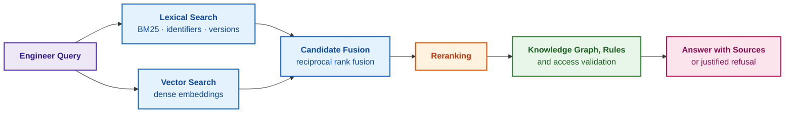

The purple block denotes the user query, blue blocks represent candidate retrieval and fusion, the orange block designates cross-encoder reranking, the green block enforces formal validation, and the pink block emits the final output. Retrieval identifies candidate evidence; only the verification gate authorizes an answer. The simplest fusion model computes a weighted sum of normalized scores:

```math
S_{\mathrm{hybrid}}(q,d)=\alpha\,\widetilde{S}_{\mathrm{BM25}}(q,d)+(1-\alpha)\,\widetilde{S}_{\mathrm{vec}}(q,d),\qquad 0\le\alpha\le1
```

where:

- $q$ is the query, $d$ is a candidate document, and $`S_{\mathrm{hybrid}}(q,d)`$ is the aggregated hybrid score;
- $`\widetilde{S}_{\mathrm{BM25}}`$ and $`\widetilde{S}_{\mathrm{vec}}`$ are normalized lexical and dense scores scaled to a common interval;
- $\alpha \in [0, 1]$ balances the lexical component, while $1 - \alpha$ weights the semantic signal.

Parameter $\alpha$ must be empirically calibrated on a held-out benchmark of domain queries, rather than arbitrarily selected. When raw scores cannot be reliably calibrated to a common scale, Reciprocal Rank Fusion (RRF) is employed, combining candidates based strictly on ordinal ranking positions:

```math
\mathrm{RRF}(d)=\sum_{r\in R}\frac{1}{k+\mathrm{rank}_r(d)}
```

where:

- $d$ is a candidate passage, $R$ is the set of rankers, and $r$ designates a specific ranker (e.g., BM25);
- $`\mathrm{rank}_r(d)`$ is the ordinal position of document $d$ within ranker $r$'s output (starting at rank 1);
- $k$ is a smoothing constant, canonically calibrated to $k = 60$ [[38]](#src-38);
- $`\sum_{r\in R}`$ sums reciprocal ranks across all retrieval channels.

Higher RRF values designate higher composite priority. Consider an example: Document X ranks 1st in BM25 but 10th in dense retrieval, yielding an RRF score of $1/61 + 1/70 \approx 0.0307$. Document Y ranks 3rd in both channels, yielding $2/63 \approx 0.0317$. Consistently high placement across both channels propels Document Y ahead of Document X.

**Runtime Control Flow, Hardware Constraints, and the Relevance Admission Gateway:**
1. **Relevance Threshold Filtering ($`\tau_{\mathrm{rel}}`$):** Following candidate fusion, the pool passes through an admission gate. If the highest candidate score satisfies $`\max_d S_{\mathrm{hybrid}}(q, d) < \tau_{\mathrm{rel}} = 0.35`$, the pipeline halts generation and returns status `ERR_NO_RELEVANT_EVIDENCE`, shielding the downstream LLM from hallucinating over irrelevant context.
2. **Context Window Hardware Budget (Budget Cutoff):** Exactly $K = 5$ top-ranked chunks are forwarded to the generative model or reranker. At an average chunk size of 300 tokens, this guarantees a fixed KV-cache footprint of 1,500 tokens, eliminating GPU VRAM Out-of-Memory (OOM) risks and bounding execution latency within a deterministic timeout of $`T_{\mathrm{infer}} \le 120\,\text{ms}`$.

**Worked Selection Example:**
A CAN bus diagnostic query retrieves two candidate passages:
- Passage $`d_1`$ (protocol specification): $`\widetilde{S}_{\mathrm{BM25}} = 0.82`$, $`\widetilde{S}_{\mathrm{vec}} = 0.40`$;
- Passage $`d_2`$ (schematic diagram): $`\widetilde{S}_{\mathrm{BM25}} = 0.30`$, $`\widetilde{S}_{\mathrm{vec}} = 0.88`$.
Under calibrated weighting $\alpha = 0.55$:
```math
S_{\mathrm{hybrid}}(q, d_1) = 0{,}55 \cdot 0{,}82 + 0{,}45 \cdot 0{,}40 = 0{,}451 + 0{,}180 = 0{,}631
```
```math
S_{\mathrm{hybrid}}(q, d_2) = 0{,}55 \cdot 0{,}30 + 0{,}45 \cdot 0{,}88 = 0{,}165 + 0{,}396 = 0{,}561
```
Both passages clear admission threshold $`\tau_{\mathrm{rel}} = 0.35`$ and are admitted into the prompt context with priority $`d_1 \succ d_2`$.

### 10.4. RAG Architecture: Context Compression and Fact Loss Prevention

An autoregressive large language model (LLM) is trained to predict subsequent tokens. For a sequence of tokens $`x_1,\dots,x_n`$, the joint probability of the sequence decomposes into a product of conditional probabilities:

```math
P(x_1,\dots,x_n)=\prod_{t=1}^{n}P(x_t\mid x_1,\dots,x_{t-1})
```

- $`x_1,\dots,x_n`$ denotes the token sequence, where $n$ is sequence length, and $`x_t`$ is the token at position $t$;
- $t$ indexes token positions, and $\prod$ denotes sequential multiplication of conditional probabilities;
- $`P(x_t\mid x_1,\dots,x_{t-1})`$ is the conditional probability of token $`x_t`$ given preceding context; for $t=1$, the context is empty;
- Each term and the global sequence probability are bounded within $[0, 1]$.

The model evaluates sequence likelihood based on contextual fluency, reflecting linguistic probability rather than factual truth. At each decoding step, raw logit scores for vocabulary tokens $v \in \mathcal{V}$ are normalized via softmax:

```math
P(x_{t+1}=v\mid x_{\le t})=\frac{\exp(a_v)}{\sum_{u\in\mathcal{V}}\exp(a_u)}
```

- $\mathcal{V}$ is the discrete token vocabulary, and $v \in \mathcal{V}$ is a candidate token;
- $`a_v`$ is the unnormalized logit score for token $v$, and $`\exp(a_v)`$ is its exponential;
- $`x_{\le t}`$ denotes the accumulated context up to position $t$, and the denominator sums exponentiated logits across vocabulary $\mathcal{V}$;
- The output defines a categorical probability distribution where $`\sum_{v\in\mathcal{V}} P(x_{t+1}=v\mid x_{\le t}) = 1`$.

Softmax produces a probability distribution over vocabulary continuations. This metric indicates statistical likelihood given the prompt, not factual validity: the mathematical formulation contains no inherent constraint enforcing adherence to valid engineering baselines. Constraining generation via formal grammars is detailed in [Chapter 13](ch13-language-variability-vs-determinism.md); without external grounding, a language model is not a knowledge base.

The foundational operation of the Transformer architecture, introduced by Ashish Vaswani and colleagues, is scaled dot-product attention [[39]](#src-39):

```math
\mathrm{Attention}(Q,K,V)=\mathrm{softmax}\Big(\frac{QK^{\mathsf T}}{\sqrt{d_k}}\Big)V
```

where:

- $Q$ is the query matrix, $K$ is the key matrix, and $V$ is the value matrix;
- $K^{\mathsf T}$ is the transpose of $K$, and $`d_k`$ is the dimensionality of key vectors;
- $QK^{\mathsf T}$ calculates pairwise alignment logits between queries and keys, scaled by $`\sqrt{d_k}`$, while $\mathrm{softmax}$ normalizes scores into attention weights;
- Multiplying by $V$ computes a weighted combination of value vectors, where each row sums to 1.

Scaling by $`\sqrt{d_k}`$ prevents logits from growing excessively large in high dimensions. Each row in the resulting output matrix is a convex combination of value vectors, enabling the network to relate distant tokens across context. However, attention weights do not constitute formal explanations, evidentiary citations, or proof of causality.

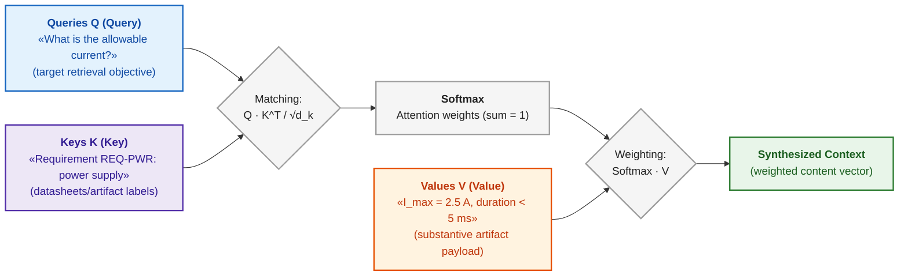

Retrieval-Augmented Generation (RAG) integrates information retrieval with generative language modeling, formalized by Patrick Lewis and colleagues as [[40]](#src-40):

```math
P(y\mid x)\approx\sum_{d\in D_k}p(d\mid x)\,P(y\mid x,d)
```

- $x$ is the input query, $y$ is the generated response, and $`D_k`$ is the set of $k$ retrieved passages;
- $p(d\mid x)$ is the retrieval weight of passage $d$ given query $x$, forming the retrieval distribution;
- $P(y\mid x,d)$ is the conditional probability of response $y$ conditioned on query $x$ and passage $d$;
- $`\sum_{d\in D_k}`$ marginalizes over retrieved passages, where $\approx$ denotes numerical approximation over top-$k$ candidates.

This formulation marginalizes output likelihood across retrieved chunks, weighted by retrieval confidence. Retrieval supplies factual evidence to the generator, but cannot guarantee that passages are uncorrupted, legally valid, or correctly interpreted. Production systems require baseline version validation, access control filtering, explicit citation tracking, and justified refusal when evidence is insufficient. The complete pipeline from query to proof bundle is formalized in [Chapter 19](ch19-from-question-to-evidence.md).

Search engines and language models furnish candidate evidence and generate human-readable responses. However, none of these equations guarantee truth: retrieval scores rank candidates, and language model probabilities rank textual continuations. In cyber-physical systems, an additional gate is mandatory: validating the physical trustworthiness of the incoming sensor telemetry.

## 11. Statistical Telemetry Validation: Mahalanobis Distance

An autonomous drone operates in a GPS-denied environment, tracking position via optical flow. Environmental disturbances—smoke, sun glare, or camera lens smudges—produce corrupt motion vectors. If the navigation filter absorbs these corrupted measurements, state estimation diverges, causing vehicle loss. The system requires a metric that quantifies measurement anomaly while accounting for anisotropic sensor noise and dynamic state prediction uncertainty.

Standard Euclidean distance assumes equal isotropic variance across all dimensions. Real-world sensor errors exhibit distinct variances across measurement axes and frequently display cross-channel covariance. The Mahalanobis distance, formulated by Prasanta Chandra Mahalanobis [[41]](#src-41), normalizes measurement innovations against the innovation covariance matrix:

```math
\tilde{y}=z-\hat{z},\qquad S=H\,P^{-}H^{\mathsf T}+R,\qquad d_M=\sqrt{\tilde{y}^{\mathsf T}S^{-1}\tilde{y}}
```

where:

- $z$ is the $m$-dimensional vector of actual sensor measurements, and $\hat{z}$ is the predicted measurement vector;
- $\tilde{y}=z-\hat{z}$ is the measurement innovation vector (the residual);
- $P^{-}$ is the state prediction error covariance matrix, $H$ is the measurement matrix mapping state space to measurement space, and $R$ is the sensor noise covariance matrix;
- $S=HP^{-}H^{\mathsf T}+R$ is the innovation covariance matrix; $\mathsf T$ denotes matrix transposition, and $S^{-1}$ denotes matrix inversion;
- $`d_M \ge 0`$ is the dimensionless Mahalanobis distance; under nominal linear-Gaussian assumptions, $`d_M^2`$ follows a chi-squared ($\chi^2$) distribution with $m$ degrees of freedom [[42]](#src-42), [[43]](#src-43).

Normalizing by the full covariance matrix accounts for axis-dependent variance and cross-correlations. An acceptance gate is established using the $\chi^2$ cumulative distribution function, assuming the filter remains calibrated. For example, given $S=\mathrm{diag}(4, 1)$, an innovation $\tilde{y}=(4, 0)$ yields $`d_M=2.0`$, whereas $\tilde{y}=(0, 3.5)$ yields $`d_M=3.5`$; at a 99% confidence threshold for two degrees of freedom ($`d_M^2 \le 9.21`$), the former is accepted while the latter is rejected. Filter covariances are updated via Kalman filtering [[42]](#src-42); measurement gating methodologies are formalized by Yaakov Bar-Shalom and colleagues [[43]](#src-43).

Consider an illustrative scenario: measurement is two-dimensional; horizontal axis noise has standard deviation $`\sigma_x = 2`$ pixels, vertical noise has $`\sigma_y = 1`$ pixel, and errors are uncorrelated ($S=\mathrm{diag}(4, 1)$). At a 99% confidence level with two degrees of freedom, the acceptance threshold is $`d_M^2 \le 9.21`$ ($`d_M \le 3.03`$).

| Innovation $\tilde{y}$, pixels | Euclidean Distance | $`d_M`$ | Gating Verdict |
|---|---:|---:|---|
| $(4;\ 0)$ | 4.0 | 2.0 | Accepted: deviation along high-noise axis |
| $(0;\ 3.5)$ | 3.5 | 3.5 | Rejected: deviation along high-precision axis |

Euclidean distance incorrectly flags the first innovation as a larger anomaly, failing to recognize that a 4-pixel drift along an axis with $\sigma = 2$ is routine. The Mahalanobis distance correctly rejects the second innovation: a 3.5-pixel drift on an axis with $\sigma = 1$ represents a statistically improbable failure event. If $`d_M`$ falls within the acceptance gate, the filter incorporates the measurement. If $`d_M`$ breaches the gate, the measurement is quarantined, and the vehicle dead-reckons on inertial data. If consecutive measurements are rejected, the navigation system enters a degraded-confidence mode and logs a safety event. GPS-denied autonomous navigation test benches on NVIDIA Jetson Orin and Xilinx Virtex platforms are examined in [Appendix C](appendix-c-autonomous-navigation-and-geosearch.md), hardware PDK implementations of analog Mahalanobis gates appear in [Appendix D](appendix-d-analog-expert-systems-and-neuromorphic-computing.md), and edge-to-backend workload partitioning is covered in [Chapter 22](ch22-cybernetics-edge-to-backend.md).

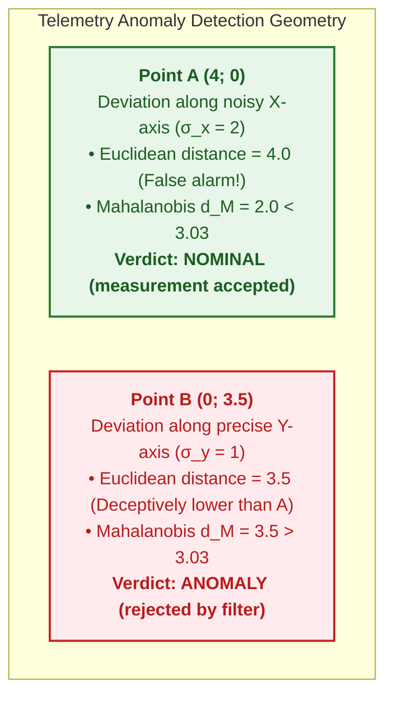

Operational Boundary: The Mahalanobis gate detects transient innovations inconsistent with the state prediction, but cannot detect slow sensor bias drift where prediction and measurement degrade concurrently. Detecting common-mode drift requires independent heterogeneous sensor channels and long-term residual consistency monitoring.

## 12. Synergetic Dimensionality Reduction: Order Parameters and Haken's Slaving Principle

Interfacing an expert system with a cyber-physical platform exposes it to a combinatorial explosion of telemetry: dozens of sensors monitoring vibration frequencies, temperatures, currents, and pressures span a massive phase space. Formulating production rules over every individual micro-variable yields an unmaintainable, brittle knowledge base. The fundamental systems question arises: how can high-dimensional dynamic chaos be mathematically reduced to a compact set of discrete concepts?

The theoretical solution is provided by **Hermann Haken's synergetics**—the physical theory of self-organization in open non-equilibrium systems [[43a]](#src-43a). The cornerstone of synergetics is the **Slaving Principle**: near critical instability points, the collective behavior of a complex system with infinite degrees of freedom is fully governed by a small number of macroscopic variables—**order parameters** $\xi$, while thousands of rapidly decaying stable modes $`y_j`$ are rigidly slaved to these slow macroscopic variables:

```math
y_j(t) \approx h_j(\xi(t)), \qquad \dot{\xi} = \lambda \xi - \beta \xi^3 + F(t)
```

where:
- $\xi$ is the system order parameter (a long-lived low-dimensional macroscopic collective mode);
- $`y_j`$ denotes rapidly relaxing microscopic variables (high-frequency channels of individual physical sensors);
- $`h_j`$ is the nonlinear mapping function expressing the slaving of micro-states to the order parameter;
- $\lambda$ is the control parameter (governing distance to the critical bifurcation threshold or phase transition);
- $\beta > 0$ is the nonlinear saturation coefficient stabilizing the system in the post-bifurcation state;
- $F(t)$ represents stochastic noise (measurement fluctuations).

For an evidence-governed expert system, Haken's slaving principle fulfills two decisive architectural functions:

1. **Ontological State Space Reduction:**  
   The expert system does not inspect individual camera pixels or millivolt noise spikes. It evaluates *semantic order parameters* (e.g., $`\xi_1 = \text{"rotor cavitation imbalance"}`$, $`\xi_2 = \text{"loss of navigation integrity"}`$, $`\xi_3 = \text{"thermal path breakdown"}`$). Proving that micro-variables are slaved to $\xi$ allows the rule engine to enforce safety invariants over a compact conceptual graph, rather than executing combinatorial searches over raw telemetry.
2. **Bifurcation Forecasting via Critical Slowing Down:**  
   As an engineering system approaches a physical bifurcation (e.g., aerodynamic stall on a drone wing or thermal runaway of a power MOSFET), control parameter $\lambda \to 0$. Consequently, the system relaxation time following perturbations diverges toward infinity: $`\tau = 1/|\lambda| \to \infty`$.  
   Mathematically, this causes a sharp increase in telemetry variance and causes the lag-1 autocorrelation coefficient to approach unity: $`\rho_1 \to 1`$. An expert system tracks this phenomenon as a **pre-bifurcation indicator**, alerting operators to impending instability long before physical parameters cross critical threshold limits.

## 13. Structural Causal Analysis: From Correlations to Counterfactual Inference

The final introductory question is the most deceptive: is the observed relationship truly causal? An engineering organization made code reviews mandatory for a subset of software tasks. Over a fiscal quarter, the defect rate among reviewed tasks was 26%, whereas the rate among unreviewed tasks was only 20%. The conclusion that "code reviews degrade software quality" is fallacious. Reviews were preferentially assigned to highly complex tasks: 80% of reviewed tasks were complex, compared to only 20% of unreviewed tasks, and complex tasks exhibit higher defect densities regardless of review.

| Task Complexity $Z$ | Share of Total Tasks | Reviewed Defect Rate | Unreviewed Defect Rate |
|---|---:|---:|---:|
| simple | 0.5 | 10% | 15% |
| complex | 0.5 | 30% | 40% |

Within each complexity stratum, code reviews reduce defects; yet in the aggregate statistics, the effect appears inverted: $0.2\cdot10\% + 0.8\cdot30\% = 26\%$ versus $0.8\cdot15\% + 0.2\cdot40\% = 20\%$. This reversal is Simpson's paradox, named after Edward Simpson [[44]](#src-44). Task complexity is a confounder: it simultaneously influences both whether a task is reviewed and its intrinsic probability of defect occurrence.

### 13.1. Judea Pearl's Three-Level Ladder of Causation

Judea Pearl formalized three distinct levels of causal reasoning, conceptualized as the Ladder of Causation [[45]](#src-45). The diagram illustrates these levels from bottom to top:

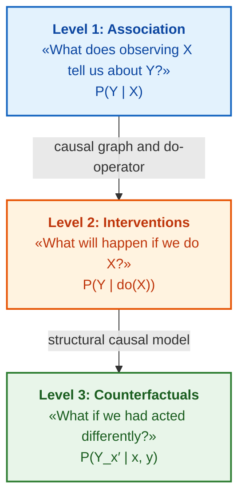

Level 1 (blue) is observational association: conditional probability $P(Y\mid X)$ describes how frequently $Y$ co-occurs with $X$. As Pearl demonstrates, standard machine learning models—including large language models—operate fundamentally at this level [[45]](#src-45). Level 2 (orange) represents active intervention: predicting outcomes when actively forcing variable $X$ to a specific state. Level 3 (green) represents counterfactual reasoning: determining what would have occurred in a specific historical case had an alternative action been taken. Progressing to higher levels demands structural causal assumptions that cannot be derived from passive data alone.

### 13.2. Mathematical Modeling of Interventions (do-Calculus) and the Backdoor Criterion

Pearl's Level 2 causal analysis resolves a fundamental engineering question: how to quantify the true effect of a deliberate engineering intervention (such as mandating static analysis, adjusting clock frequency, or duplicating a sensor channel) when only historical observational data contaminated by confounders is available. Conflating active intervention $do(X)$ with passive correlation $P(Y\mid X)$ triggers Simpson's paradox, directing resources toward ineffective policies.

The target engineering metric is the **pure causal effect of intervention** $P\big(Y\mid do(X=x)\big) \in [0, 1]$ and the resulting causal risk difference $`\Delta_{\mathrm{causal}} = P\big(Y=1\mid do(X=1)\big) - P\big(Y=1\mid do(X=0)\big)`$. If a conditioning set $Z$ satisfies the backdoor criterion—blocking all non-causal backdoor paths from $X$ to $Y$ while containing no descendants of $X$—the interventional effect is calculated via Pearl's adjustment formula [[46]](#src-46):

```math
P\big(Y\mid do(X=x)\big)=\sum_{z}P\big(Y\mid X=x,\,Z=z\big)\,P(Z=z)
```

Parameters and components:

- $Y \in \{0, 1\}$ is the target outcome event (e.g., $Y=1$ indicates a critical release defect);
- $X \in \{0, 1\}$ represents the controlled engineering intervention ($X=1$ indicates review executed, $X=0$ indicates unreviewed);
- $do(X=x)$ denotes Pearl's intervention operator: fixing $X=x$ by surgically severing all incoming directed edges to $X$ in the causal DAG;
- $Z$ is the vector of identified confounders (e.g., $Z \in \{\text{simple}, \text{complex}\}$);
- $z$ iterates across all discrete states of confounder $Z$;
- $P(Y\mid X=x, Z=z)$ is the local conditional probability of outcome within stratum $z$;
- $P(Z=z)$ is the marginal population share of stratum $z$;
- $`\sum_z`$ aggregates weighted contributions across strata, yielding an unbiased causal estimate.

**Operational Engineering Application:**
1. *Invocation Lifecycle Phase:* Evaluated by quality process auditing subsystems during ASPICE or ISO 26262-8 audits when validating proposed workflow modifications.
2. *Result Interpretation:*
   - Causal risk difference $`\Delta_{\mathrm{causal}} = P(Y=1\mid do(X=1)) - P(Y=1\mid do(X=0))`$ quantifies the absolute reduction in failure rate directly attributable to policy $X$;
   - If $`\Delta_{\mathrm{causal}} < 0`$, policy $X$ demonstrably improves reliability (e.g., $`\Delta_{\mathrm{causal}} = -0.075`$ represents a 7.5 percentage-point reduction in defect rate);
   - If $`\Delta_{\mathrm{causal}} \approx 0`$, despite strong correlation in raw logs ($P(Y\mid X) \neq P(Y)$), the apparent relationship is spurious, driven entirely by confounder $Z$.
3. *System Action:* The expert system blocks policy change recommendations until the underlying causal DAG is substantiated by architectural models and all backdoor paths through $Z$ are blocked.

Applying the adjustment formula to our code review scenario with equal proportions of simple and complex tasks: mandating reviews yields $0.5\cdot10\% + 0.5\cdot30\% = 20\%$ defects, whereas prohibiting reviews yields $0.5\cdot15\% + 0.5\cdot40\% = 27.5\%$. The pure causal effect of mandating reviews is $`\Delta_{\mathrm{causal}} = 0.20 - 0.275 = -0.075`$, confirming a true 7.5% defect reduction, directly contradicting the naive aggregate correlation.

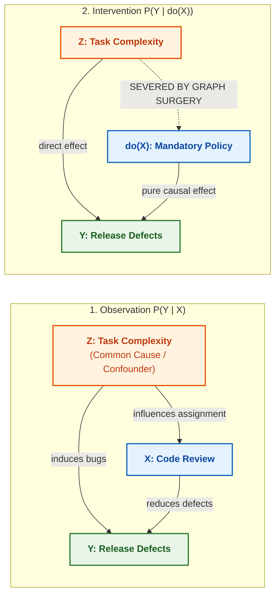

### 13.3. Structural Causal Models (SCM) and Counterfactual Analysis

Counterfactual queries require a Structural Causal Model (SCM), in which every system variable is defined as a deterministic function of its direct parents and an exogenous background disturbance [[46]](#src-46):

```math
X_i=f_i\big(\mathrm{Pa}_i,U_i\big),\qquad i=1,\dots,n
```

- $`X_i`$ denotes the endogenous system variable indexed by $i$, where $i=1,\dots,n$ indexes all variables;
- $`\mathrm{Pa}_i`$ represents the set of direct causal parents of $`X_i`$;
- $`U_i`$ represents unobserved background factors (exogenous noise), and $`f_i`$ is the structural mechanism governing $`X_i`$;
- The functional notation specifies that $`X_i`$ is determined uniquely by its direct causes and exogenous disturbance.

An SCM formalizes physical mechanisms. A counterfactual inquiry might ask: would the actuator have survived had the thermal protection circuit triggered 20 milliseconds earlier, under the exact operational temperature, load, and voltage conditions observed during the failure? To evaluate this, the model infers exogenous noise $U$ from factual telemetry, modifies the protection threshold function, and evaluates the counterfactual outcome. Accuracy depends on the correctness of structural equations $`f_i`$; counterfactual modeling augments, but does not replace, empirical physical experimentation.

Pearl's ladder dictates an epistemic hierarchy for expert systems. A correlation between firmware build versions and sensor faults is an observational hypothesis (Level 1). A controlled diagnostic routine is an intervention demonstrating active effect (Level 2). A definitive claim that a specific hardware revision caused an operational failure requires a structural causal model referencing verified engineering equations (Level 3). The expert system must tag every claim with its corresponding causal level.

## 14. Explainability Metrics and Statistical Confidence Calibration

Any recommendation submitted for engineering sign-off must be fully explainable. For production rules, explanation is natural: presenting the fired rule chain and verified antecedent facts. For statistical machine learning models, specialized post-hoc explainability techniques are required. Scott Lundberg and Su-In Lee formulated SHAP (*SHapley Additive exPlanations*), which decomposes a model's prediction into additive feature contributions grounded in cooperative game theory [[47]](#src-47). Marco Ribeiro, Sameer Singh, and Carlos Guestrin formulated LIME (*Local Interpretable Model-agnostic Explanations*), fitting an interpretable surrogate model locally around a specific inference [[48]](#src-48). While both frameworks quantify feature attribution for a given prediction, they do not validate factual truth, establish physical causality, or replace primary engineering sources. Attribution explanations must also be evaluated for stability: if minor perturbations in inputs produce wild swings in feature attributions, the explanation cannot be trusted.

Counterfactual explanations, introduced by Sandra Wachter, Brent Mittelstadt, and Chris Russell, identify the minimal input modifications required to flip a model's decision [[49]](#src-49). For instance: *"Release authorization would be granted if blocker defects D-17 and D-22 were resolved, and verification evidence was attached to requirement R-41"*. This explanation translates directly into an actionable engineering remediation checklist. A model's counterfactual explanation must not be confused with structural counterfactual reasoning from causal models: the former describes the decision boundary of an algorithm, whereas the latter models causal mechanisms in the physical world.

Confidence calibration evaluates whether declared model certainty matches empirical reality. If a forecasting system predicts an event with "70% probability" across 100 trials, a well-calibrated system will observe the event occurring in approximately 70 instances. Chuan Guo and colleagues demonstrated that modern deep neural networks are routinely overconfident, and proposed temperature scaling for post-hoc recalibration [[50]](#src-50). A numerical demonstration of calibration verification is presented in [Chapter 3](ch03-beyond-reference-information-systems.md), and Expected Calibration Error (ECE) metrics and reliability diagrams are examined in [Chapter 25](ch25-how-expert-systems-learn.md). Both the explanation and the calibrated confidence score must be recorded in the audit trail, enabling human experts to accept, challenge, or refine the recommendation.

## 15. Architectural Lessons in Applying Mathematical Frameworks

### 15.1. Lesson One: A Score Without a Calibrated Threshold Is Not Evidence

Engineering information systems frequently display uncalibrated metrics: risk 0.72, confidence 0.85, similarity 0.91. In isolation, the number 0.72 determines nothing. Identical numerical scores represent fundamentally distinct concepts: a probability, a fuzzy degree of membership, a retrieval ranking score, or a test coverage ratio. Displaying an uncalibrated number is like reading an unlabeled thermometer when no medical authority has defined what temperature constitutes a fever. Until an engineering organization establishes the formal semantic type of the metric, who ratified its threshold, the operational scope of validity, and the mandatory action triggered below threshold, the number is an aesthetic decoration rather than engineering evidence. Every metric in an expert system must have an assigned owner, a calibrated threshold, declared validity conditions, and an automated verification test fixture.

### 15.2. Lesson Two: A Model Lacking a Formalized Failure Scenario Engenders False Confidence

The most hazardous expert system is one that returns an unverified answer under all circumstances—mirroring an engineer who never admits "I do not know" and eventually offers fluent yet disastrous recommendations. Input documents may be incomplete, primary sources may contradict one another, an artifact baseline may be misaligned, or the user may lack security clearance. The mathematics of refusal is as vital as the mathematics of inference: Kleene logic evaluates to "unknown", Dempster–Shafer conflict mass $K$ detects "sources in conflict", and the Mahalanobis distance identifies "telemetry untrustworthy". An expert system must formally distinguish between distinct refusal states: "insufficient evidence", "conflicting sources", "access denied", "out-of-scope inquiry", and "mandatory human escalation". How the explanation engine synthesizes a justified refusal is formalized in [Chapter 20](ch20-explanation-engine.md).

## Conclusions

This chapter opened with an inquiry: can release version 2.4 be authorized for production? The answer decomposes into distinct, verifiable components. Datalog derives that the release is blocked because safety requirement R-17 is modified and lacks a passing test execution. A Bayesian belief network calculates that the probability of a code defect given test failure is 0.645, which drops to 0.236 if test bench logs confirm a hardware glitch. Evidence theory conflict mass determines whether contradictory regulatory documents can be aggregated. A precedent case with similarity 0.78 offers an initial remediation prototype, while the traceability graph enumerates all impacted dependencies. The findings of this chapter establish that:

- Propositional logic and Datalog provide reproducible conclusions and guaranteed polynomial termination, Kleene three-valued logic prevents conflating missing evidence with falsehood, and deontic logic exposes normative conflicts between regulatory standards;
- Deductive inferences are emitted as verified facts, whereas inductive and abductive inferences must be flagged as candidate hypotheses subject to empirical validation;
- Probability, fuzzy membership, and belief mass measure fundamentally distinct phenomena; Bayesian networks model competing causes, while Dempster's rule yields catastrophic distortions under high conflict, requiring explicit conflict mass auditing;
- Precedent similarity, lexical retrieval scores, and multi-criteria evaluations represent ordinal rankings rather than probabilities; switching aggregation methods can alter candidate rankings;
- The Mahalanobis distance filters corrupted telemetry by accounting for anisotropic sensor noise, and structural causal analysis distinguishes active interventional effects from passive correlation, resolving Simpson's paradox.

The boundaries of this chapter must also be articulated. This text provides an operational map and working formulations, rather than an exhaustive treatise on each discipline: in production, each model must be calibrated against real-world domain data. Mathematical models make an expert system's inferences auditable, but they do not eliminate the necessity of human engineers who ratify thresholds, author rules, and establish causal assumptions. How these mathematical models determine knowledge base typology is addressed in [Chapter 7](ch07-knowledge-base-typology.md), and how engineering artifacts are ingested as data for these models is detailed in [Chapter 8](ch08-engineering-artifacts-as-data.md) and [Chapter 9](ch09-engineering-knowledge-graph-traceability.md).

## Self-Check Questions

1. In your engineering systems, what occurs when a premise supporting the conclusion "release authorized" is revoked: is the authorization dynamically retracted, or does it persist as a stale assertion?
2. When multiple production rules enter the agenda simultaneously, does your rule engine enforce an explicit conflict resolution strategy, and can your audit log explain why one rule fired before another?
3. In your risk evaluation models, where are the prior probability, source reliability rating, and action threshold formally recorded, and where does a composite score appear without auditable metadata?
4. Which of your team's recent claims that "process change X improved metric Y" was substantiated by active interventional analysis with confounder control, rather than observational correlation?
5. Does your expert system formally distinguish between "insufficient evidence" and "sources in conflict", and does the engine possess the formal authority to emit an explicit "unknown" verdict?

## Glossary

| Term | Original Ukrainian / Canonical Term | Operational Definition |
|---|---|---|
| Production Rule | *продукційне правило* / *production rule* | Executable knowledge primitive structured as "IF conditions THEN conclusion or action" |
| Forward Chaining | *пряме виведення* / *forward chaining* | Data-driven inference propagating from base facts to derived conclusions |
| Backward Chaining | *зворотне виведення* / *backward chaining* | Goal-driven inference searching backward from an inquiry to required evidentiary facts |
| First-Order Logic | *логіка предикатів першого порядку* / *first-order logic* | Formal logic supporting predicates, typed relations, and universal/existential quantifiers |
| Invariant | *інваріант* / *invariant* | Formal condition or constraint that must hold true across all valid execution states |
| Valid Formula | *загальнозначуща формула* / *valid formula* | Logical formula that evaluates to true under every possible interpretation |
| Datalog | *Datalog* | Function-free declarative rule language guaranteeing terminating polynomial-time inference |
| Immediate Consequence Operator | *оператор безпосередніх наслідків* / *immediate consequence operator* | Single-step forward inference operator adding head atoms whose antecedents are satisfied |
| Least Fixed Point | *найменша нерухома точка* / *least fixed point* | Minimal saturated fact set generated when iterative rule evaluation ceases to produce new facts |
| Stratified Negation | *стратифіковане заперечення* / *stratified negation* | Rule partitioning permitting negation only over facts fully computed in lower strata |
| Stratum | *страта* / *stratum* | Ordered partition level in a stratified rule program evaluated sequentially |
| Closed-World Assumption | *припущення замкненого світу* / *closed-world assumption* | Epistemic stance presuming that any statement not derivable from the database is false |
| Open-World Assumption | *припущення відкритого світу* / *open-world assumption* | Epistemic stance acknowledging that unrecorded facts may be true yet currently unasserted |
| Kleene's Strong Three-Valued Logic | *тризначна логіка Кліні* / *Kleene's strong three-valued logic* | Non-binary logic operating over truth values true (1), unknown ($\frac{1}{2}$), and false (0) |
| Deontic Logic | *деонтична логіка* / *deontic logic* | Modal logic formalizing normative concepts of obligation, prohibition, and permission |
| Normative Conflict | *нормативна колізія* / *normative conflict* | Simultaneous regulatory obligation and prohibition of the identical action within scope |
| Deduction | *дедукція* / *deduction* | Truth-preserving derivation of a specific conclusion from a general rule and factual premise |
| Induction | *індукція* / *induction* | Synthesis of a candidate general rule hypothesis from empirical observations |
| Abduction | *абдукція* / *abduction* | Derivation of the most plausible root-cause hypothesis explaining an observed symptom |
| Modus Ponens | *відокремлення* / *modus ponens* | Classical inference rule deriving truth of $Q$ from valid rule $P \Rightarrow Q$ and true premise $P$ |
| Problem Reduction | *зведення задачі* / *problem reduction* | Decomposing a complex objective into simpler equivalent subproblems |
| AND/OR Tree | *дерево І/АБО* / *AND/OR tree* | Goal decomposition graph where subgoals must all succeed (AND) or alternatives suffice (OR) |
| Finite Automaton | *скінченний автомат* / *finite automaton* | Formal model comprising finite states and deterministic transitions over an input alphabet |
| Rule Engine | *рушій правил* / *rule engine* | Execution environment evaluating declarative rules decoupled from core application logic |
| Working Memory | *робоча пам'ять* / *working memory* | Volatile repository maintaining active facts currently asserted within the inference engine |
| Agenda | *черга правил* / *agenda* | Execution queue holding fully satisfied rule instances awaiting activation |
| Conflict Resolution | *розв'язання конфліктів* / *conflict resolution* | Deterministic strategy selecting which candidate rule in the agenda executes first |
| Salience | *вага спрацьовування* / *salience* | Explicit priority rating determining rule execution order in the agenda |
| Truth Maintenance System | *система підтримання істинності* / *truth maintenance system* | Subsystem tracking dependency chains and automatically retracting invalidated conclusions |
| Justification | *обґрунтування* / *justification* | Dependency record linking a derived proposition to its underlying premises |
| Environment | *середовище припущень* / *environment* | Minimal consistent set of assumptions under which a proposition holds true in an ATMS |
| Conditional Probability | *умовна ймовірність* / *conditional probability* | Probability of an event occurring given that another event is verified to hold |
| Posterior Probability | *апостеріорна ймовірність* / *posterior probability* | Updated probability of a hypothesis following the assimilation of new empirical evidence |
| Bayesian Network | *байєсівська мережа* / *Bayesian network* | Directed acyclic graph factorizing a joint probability distribution via conditional independencies |
| Explaining Away | *пояснення через іншу причину* / *explaining away* | Reduction in the posterior probability of a cause when an alternative cause is confirmed |
| Markov Property | *марковська властивість* / *Markov property* | Stochastic memorylessness: future state transitions depend strictly on current state |
| Markov Chain | *марковський ланцюг* / *Markov chain* | Discrete stochastic process modeling state transitions under the Markov property |
| Hidden Markov Model | *прихована марковська модель* / *hidden Markov model* | Markov model where true states are unobservable and must be inferred from emitted signals |
| Markov Decision Process | *марковський процес ухвалення рішень* / *Markov decision process* | Dynamic decision framework extending Markov chains with actions, transition kernels, and rewards |
| Policy | *політика* / *policy* | Deterministic or stochastic mapping from system states to executive actions |
| Discount Factor | *коефіцієнт дисконтування* / *discount factor* | Parameter $\gamma \in [0, 1)$ discounting the present value of future rewards in dynamic programming |
| Fuzzy Set | *нечітка множина* / *fuzzy set* | Set whose elements possess continuous degrees of membership within $[0, 1]$ |
| Membership Function | *функція належності* / *membership function* | Function mapping an input domain to continuous degrees of set membership |
| Basic Belief Assignment | *маса довіри* / *basic mass assignment* | Mass allocated to a subset of hypotheses in Dempster–Shafer theory, summing to unity |
| Conflict Mass | *маса конфлікту* / *conflict mass* | Sum of mass products across disjoint hypothesis subsets quantifying inter-source discord |
| Dempster's Rule | *правило Демпстера* / *Dempster's rule of combination* | Formal rule fusing independent belief assignments via orthogonal sum and normalization |
| Case-Based Reasoning | *міркування за прецедентами* / *case-based reasoning* | Problem-solving paradigm solving new tasks by adapting verified historical solutions |
| Reachability | *досяжність* / *reachability* | Topological existence of a directed path connecting two nodes in a graph |
| Ontology | *онтологія* / *ontology* | Formal explicit specification of entities, concepts, properties, and relations in a domain |
| Graph Neural Network | *графова нейронна мережа* / *graph neural network* | Neural architecture learning node representations by recursive neighborhood message passing |
| Relation Hierarchy | *ієрархія відношень* / *relation hierarchy* | Directed taxonomy where one relational property specializes another (`subPropertyOf`) |
| Subsumption | *субсумція* / *subsumption* | Formal specialization relation between ontological concepts or binary relations |
| Multi-Criteria Decision Analysis | *багатокритеріальний вибір* / *multi-criteria decision analysis* | Evaluating and ranking alternative options across multiple conflicting quantitative criteria |
| Compensatory Model | *компенсаторна модель* / *compensatory model* | Decision model where exceptional performance in one criterion offsets failure in another |
| Closeness Coefficient | *коефіцієнт близькості* / *closeness coefficient* | TOPSIS relative closeness score measuring relative proximity to ideal and anti-ideal benchmarks |
| Constraint Programming | *програмування в обмеженнях* / *constraint programming* | Paradigm identifying solutions satisfying a conjunction of discrete relational constraints |
| Automated Planning | *автоматичне планування* / *automated planning* | Algorithmic synthesis of an action sequence transforming an initial state to a goal state |
| Hierarchical Task Network | *ієрархічна мережа задач* / *hierarchical task network* | Planning framework recursively decomposing abstract tasks into primitive executable actions |
| Term Frequency Saturation | *насичення частоти* / *term frequency saturation* | BM25 property where successive keyword occurrences yield diminishing relevance gains |
| Embedding | *векторне представлення* / *embedding* | Dense numeric vector capturing semantic meaning in a continuous latent geometry |
| Cosine Similarity | *косинусна подібність* / *cosine similarity* | Metric measuring the cosine of the angle between two continuous vectors |
| Contrastive Learning | *контрастне навчання* / *contrastive learning* | Training objective minimizing distances of positive pairs while repelling negative distractors |
| Temperature | *температура* / *temperature* | Hyperparameter controlling the peakiness or smoothness of a softmax probability distribution |
| Token | *токен* / *token* | Discrete subword unit, character, or symbol processed by a language model tokenizer |
| Hybrid Search | *гібридний пошук* / *hybrid search* | Information retrieval pipeline combining exact lexical matching and dense vector search |
| Reciprocal Rank Fusion | *злиття рангів* / *reciprocal rank fusion* | Rank-based fusion algorithm combining disparate candidate lists via reciprocal positions |
| Reranking | *повторне ранжування* / *reranking* | Secondary cross-encoder stage refining the ordering of candidate passages |
| Attention Mechanism | *механізм уваги* / *attention* | Dynamic weighted aggregation mechanism pooling value vectors based on query-key alignment |
| Retrieval-Augmented Generation | *генерація з пошуком* / *retrieval-augmented generation* | Architecture augmenting generative models with external factual passages retrieved from an index |
| Mahalanobis Distance | *відстань Махаланобіса* / *Mahalanobis distance* | Metric measuring residual distance normalized against the innovation covariance matrix |
| Innovation | *інновація* / *innovation* | Residual vector representing the difference between observed and predicted telemetry |
| Covariance Matrix | *коваріаційна матриця* / *covariance matrix* | Matrix capturing variances and mutual cross-covariances across multi-dimensional variables |
| Kalman Filter | *фільтр Калмана* / *Kalman filter* | Recursive optimal linear estimator tracking state given noisy dynamics and measurements |
| Gating | *відсіювання вимірювань* / *gating* | Statistical test rejecting telemetry innovations whose Mahalanobis distance breaches threshold |
| Confounder | *спільна причина* / *confounder* | Latent or observed variable causally influencing both intervention and outcome |
| Intervention | *втручання* / *intervention* | Forcing a variable to a specific state via graph surgery, formalized by Pearl's $do(X)$ |
| Backdoor Path | *обхідний шлях* / *backdoor path* | Non-causal path connecting intervention $X$ to outcome $Y$ containing an incoming arrow into $X$ |
| Simpson's Paradox | *парадокс Сімпсона* / *Simpson's paradox* | Reversal of statistical correlation direction upon stratifying data across a confounder |
| Structural Causal Model | *структурна причинна модель* / *structural causal model* | System of structural equations specifying endogenous variables from direct causes and noise |
| Counterfactual | *контрфакт* / *counterfactual* | Retrospective assertion evaluating what would have occurred had past interventions differed |
| Counterfactual Explanation | *контрфактичне пояснення* / *counterfactual explanation* | Minimal modification of algorithmic input required to alter a model's predicted outcome |
| Calibration | *калібрування* / *calibration* | Statistical consistency between declared confidence probability and empirical accuracy |

## Abbreviations

| Abbreviation | Expansion | Operational Definition |
|---|---|---|
| AHP | Analytic Hierarchy Process | Multi-criteria decision analysis framework based on pairwise comparisons |
| ATMS | Assumption-based Truth Maintenance System | Truth maintenance system tracking assumption sets supporting derived assertions |
| BM25 | Best Matching 25 | Probabilistic document retrieval ranking function with length normalization |
| CBR | Case-Based Reasoning | Problem-solving methodology adapting solutions from analogous historical cases |
| CLIPS | C Language Integrated Production System | Forward-chaining rule engine and expert system programming shell |
| ELECTRE | Élimination et Choix Traduisant la Réalité | Outranking multi-criteria decision method using concordance/discordance indices |
| FOL | First-Order Logic | Predicate calculus supporting quantifiers, typed functions, and variables |
| GNN | Graph Neural Network | Deep neural architecture operating directly over graph topological structures |
| HMM | Hidden Markov Model | Statistical Markov model with unobserved hidden states and emitted observations |
| HTN | Hierarchical Task Network | Automated planning domain representation decomposing tasks into subgoals |
| IETF | Internet Engineering Task Force | International standards body developing core internet protocols |
| JTMS | Justification-based Truth Maintenance System | Truth maintenance system tracking proposition validity via rule justifications |
| LFP | Least Fixed Point | Minimal saturated model produced by bottom-up Datalog evaluation |
| LIME | Local Interpretable Model-agnostic Explanations | Explainability framework approximating local decision boundaries via surrogates |
| LLM | Large Language Model | Deep transformer model trained across extensive natural language corpora |
| MDP | Markov Decision Process | Discrete stochastic dynamic programming framework for sequential decision making |
| OWL | Web Ontology Language | W3C standardized semantic ontology modeling language |
| PDDL | Planning Domain Definition Language | Standardized declarative representation language for automated action planning |
| POMDP | Partially Observable Markov Decision Process | Generalization of MDP for environments with incomplete state observability |
| PROMETHEE | Preference Ranking Organization Method for Enrichment of Evaluations | Outranking multi-criteria decision analysis method |
| RAG | Retrieval-Augmented Generation | Architecture coupling information retrieval with generative language models |
| RFC | Request for Comments | Official normative publication series published by the IETF |
| RRF | Reciprocal Rank Fusion | Rank aggregation algorithm scoring items inversely to their list positions |
| SCM | Structural Causal Model | Formal causal framework combining structural equations and graphical models |
| SHACL | Shapes Constraint Language | W3C recommendation for validating RDF graph topology against formal shapes |
| SHAP | SHapley Additive exPlanations | Game-theoretic approach explaining machine learning predictions via Shapley values |
| TF-IDF | Term Frequency, Inverse Document Frequency | Classical retrieval weighting statistic scaling term count by corpus rarity |
| TMS | Truth Maintenance System | Subsystem maintaining dependency integrity and managing proposition retraction |
| TOPSIS | Technique for Order of Preference by Similarity to Ideal Solution | Multi-attribute decision method ranking alternatives by geometric distance to ideal |
| W3C | World Wide Web Consortium | International standards organization governing web technologies |
| AI | Artificial Intelligence | Machine systems performing cognitive, symbolic, or statistical reasoning |

## References

1. <a id="src-1"></a>Alonzo Church. [*A Note on the Entscheidungsproblem*](https://doi.org/10.2307/2269326). *Journal of Symbolic Logic*, 1(1), 40–41, 1936.
2. <a id="src-2"></a>Alan M. Turing. [*On Computable Numbers, with an Application to the Entscheidungsproblem*](https://doi.org/10.1112/plms/s2-42.1.230). *Proceedings of the London Mathematical Society*, s2-42(1), 230–265, 1937 (submitted 1936).
3. <a id="src-3"></a>Stefano Ceri, Georg Gottlob, Letizia Tanca. [*What You Always Wanted to Know About Datalog (and Never Dared to Ask)*](https://doi.org/10.1109/69.43410). *IEEE Transactions on Knowledge and Data Engineering*, 1(1), 146–166, 1989.
4. <a id="src-4"></a>Maarten H. van Emden, Robert A. Kowalski. [*The Semantics of Predicate Logic as a Programming Language*](https://doi.org/10.1145/321978.321991). *Journal of the ACM*, 23(4), 733–742, 1976.
5. <a id="src-5"></a>Krzysztof R. Apt, Howard A. Blair, Adrian Walker. [*Towards a Theory of Declarative Knowledge*](https://doi.org/10.1016/B978-0-934613-40-8.50006-3). In J. Minker (ed.), *Foundations of Deductive Databases and Logic Programming*, 89–148. Los Altos: Morgan Kaufmann, 1988.
6. <a id="src-6"></a>Raymond Reiter. [*On Closed World Data Bases*](https://doi.org/10.1007/978-1-4684-3384-5_3). In H. Gallaire, J. Minker (eds.), *Logic and Data Bases*, 55–76. New York: Plenum Press, 1978.
7. <a id="src-7"></a>Stephen Cole Kleene. [*Introduction to Metamathematics*](https://openlibrary.org/works/OL5959470W). Amsterdam: North-Holland, 1952. Strong tables of three-valued logic.
8. <a id="src-8"></a>Georg Henrik von Wright. [*Deontic Logic*](https://doi.org/10.1093/mind/LX.237.1). *Mind*, 60(237), 1–15, 1951.
9. <a id="src-9"></a>Scott Bradner. [*RFC 2119: Key Words for Use in RFCs to Indicate Requirement Levels*](https://www.rfc-editor.org/rfc/rfc2119). IETF, 1997.
10. <a id="src-10"></a>Charles S. Peirce. [*Illustrations of the Logic of Science. VI. Deduction, Induction, and Hypothesis*](https://en.wikisource.org/wiki/Popular_Science_Monthly/Volume_13/August_1878/Illustrations_of_the_Logic_of_Science_VI). *Popular Science Monthly*, 13, 470–482, 1878.
11. <a id="src-11"></a>Igor Douven. [*Abduction*](https://plato.stanford.edu/entries/abduction/). *Stanford Encyclopedia of Philosophy*, first published 2011, revised 2025.
12. <a id="src-12"></a>Nils J. Nilsson. [*Problem-Solving Methods in Artificial Intelligence*](https://openlibrary.org/works/OL1311228W). New York: McGraw-Hill, 1971.
12a. <a id="src-12a"></a>Agnar Aamodt, Enric Plaza. [*Case-Based Reasoning: Foundational Issues, Methodological Variations, and System Approaches*](https://doi.org/10.3233/AIC-1994-7104). *AI Communications*, 7(1), 39–59, 1994.
13. <a id="src-13"></a>John Hopcroft. [*An n log n Algorithm for Minimizing States in a Finite Automaton*](https://doi.org/10.1016/B978-0-12-417750-5.50022-1). In Z. Kohavi, A. Paz (eds.), *Theory of Machines and Computations*, 189–196. New York: Academic Press, 1971.
14. <a id="src-14"></a>Charles L. Forgy. [*Rete: A Fast Algorithm for the Many Pattern/Many Object Pattern Match Problem*](https://doi.org/10.1016/0004-3702(82)90020-0). *Artificial Intelligence*, 19(1), 17–37, 1982.
15. <a id="src-15"></a>Daniel P. Miranker. [*TREAT: A New Match Algorithm*](https://doi.org/10.1016/B978-0-273-08793-9.50010-8). In *TREAT: A New and Efficient Match Algorithm for AI Production Systems*, 25–47. London: Pitman, 1990.
16. <a id="src-16"></a>Jon Doyle. [*A Truth Maintenance System*](https://doi.org/10.1016/0004-3702(79)90008-0). *Artificial Intelligence*, 12(3), 231–272, 1979.
17. <a id="src-17"></a>Johan de Kleer. [*An Assumption-Based TMS*](https://doi.org/10.1016/0004-3702(86)90080-9). *Artificial Intelligence*, 28(2), 127–162, 1986.
18. <a id="src-18"></a>Judea Pearl. [*Probabilistic Reasoning in Intelligent Systems: Networks of Plausible Inference*](https://doi.org/10.1016/C2009-0-27609-4). San Mateo: Morgan Kaufmann, 1988.
19. <a id="src-19"></a>Lawrence R. Rabiner. [*A Tutorial on Hidden Markov Models and Selected Applications in Speech Recognition*](https://doi.org/10.1109/5.18626). *Proceedings of the IEEE*, 77(2), 257–286, 1989.
20. <a id="src-20"></a>Martin L. Puterman. [*Markov Decision Processes: Discrete Stochastic Dynamic Programming*](https://doi.org/10.1002/9780470316887). New York: Wiley, 1994.
21. <a id="src-21"></a>Lotfi A. Zadeh. [*Fuzzy Sets*](https://doi.org/10.1016/S0019-9958(65)90241-X). *Information and Control*, 8(3), 338–353, 1965.
22. <a id="src-22"></a>A. P. Dempster. [*Upper and Lower Probabilities Induced by a Multivalued Mapping*](https://doi.org/10.1214/aoms/1177698950). *The Annals of Mathematical Statistics*, 38(2), 325–339, 1967.
23. <a id="src-23"></a>Glenn Shafer. [*A Mathematical Theory of Evidence*](https://doi.org/10.1515/9780691214696). Princeton University Press, 1976.
24. <a id="src-24"></a>Lotfi A. Zadeh. [*A Simple View of the Dempster-Shafer Theory of Evidence and Its Implication for the Rule of Combination*](https://ojs.aaai.org/aimagazine/index.php/aimagazine/article/view/542). *AI Magazine*, 7(2), 85–90, 1986.
25. <a id="src-25"></a>Agnar Aamodt, Enric Plaza. [*Case-Based Reasoning: Foundational Issues, Methodological Variations, and System Approaches*](https://doi.org/10.3233/AIC-1994-7104). *AI Communications*, 7(1), 39–59, 1994.
26. <a id="src-26"></a>Holger Knublauch, Dimitris Kontokostas (eds.). [*Shapes Constraint Language (SHACL)*](https://www.w3.org/TR/shacl/). W3C Recommendation, 2017.
27. <a id="src-27"></a>Thomas N. Kipf, Max Welling. [*Semi-Supervised Classification with Graph Convolutional Networks*](https://arxiv.org/abs/1609.02907). *International Conference on Learning Representations* (ICLR), 2017.
28. <a id="src-28"></a>Dan Brickley, R. V. Guha (eds.). [*RDF Schema 1.1*](https://www.w3.org/TR/rdf-schema/). W3C Recommendation, 2014.
29. <a id="src-29"></a>Thomas L. Saaty. [*How to Make a Decision: The Analytic Hierarchy Process*](https://doi.org/10.1016/0377-2217(90)90057-I). *European Journal of Operational Research*, 48(1), 9–26, 1990.
30. <a id="src-30"></a>Ching-Lai Hwang, Kwangsun Yoon. [*Multiple Attribute Decision Making: Methods and Applications*](https://doi.org/10.1007/978-3-642-48318-9). Berlin: Springer, 1981.
31. <a id="src-31"></a>Jean-Pierre Brans, Philippe Vincke. [*A Preference Ranking Organisation Method (The PROMETHEE Method for Multiple Criteria Decision-Making)*](https://doi.org/10.1287/mnsc.31.6.647). *Management Science*, 31(6), 647–656, 1985.
32. <a id="src-32"></a>Bernard Roy. [*Classement et choix en présence de points de vue multiples (la méthode ELECTRE)*](https://doi.org/10.1051/ro/196802v100571). *Revue française d'informatique et de recherche opérationnelle*, 2(8), 57–75, 1968.
33. <a id="src-33"></a>Malik Ghallab, Dana Nau, Paolo Traverso. [*Automated Planning: Theory and Practice*](https://doi.org/10.1016/B978-1-55860-856-6.X5000-5). San Francisco: Morgan Kaufmann, 2004.
34. <a id="src-34"></a>Gerard Salton, Christopher Buckley. [*Term-Weighting Approaches in Automatic Text Retrieval*](https://doi.org/10.1016/0306-4573(88)90021-0). *Information Processing & Management*, 24(5), 513–523, 1988.
35. <a id="src-35"></a>Stephen Robertson, Hugo Zaragoza. [*The Probabilistic Relevance Framework: BM25 and Beyond*](https://doi.org/10.1561/1500000019). *Foundations and Trends in Information Retrieval*, 2009.
36. <a id="src-36"></a>Nils Reimers, Iryna Gurevych. [*Sentence-BERT: Sentence Embeddings using Siamese BERT-Networks*](https://aclanthology.org/D19-1410/). *Proceedings of EMNLP-IJCNLP 2019*, 2019.
37. <a id="src-37"></a>Vladimir Karpukhin, Barlas Oğuz, Sewon Min et al. [*Dense Passage Retrieval for Open-Domain Question Answering*](https://doi.org/10.18653/v1/2020.emnlp-main.550). *Proceedings of EMNLP 2020*, 6769–6781, 2020.
38. <a id="src-38"></a>Gordon V. Cormack, Charles L. A. Clarke, Stefan Büttcher. [*Reciprocal Rank Fusion Outperforms Condorcet and Individual Rank Learning Methods*](https://doi.org/10.1145/1571941.1572114). *Proceedings of SIGIR 2009*, 758–759, 2009.
39. <a id="src-39"></a>Ashish Vaswani et al. [*Attention Is All You Need*](https://arxiv.org/abs/1706.03762). *Advances in Neural Information Processing Systems 30* (NeurIPS), 2017.
40. <a id="src-40"></a>Patrick Lewis, Ethan Perez, Aleksandra Piktus et al. [*Retrieval-Augmented Generation for Knowledge-Intensive NLP Tasks*](https://arxiv.org/abs/2005.11401). *Advances in Neural Information Processing Systems 33* (NeurIPS), 2020.
41. <a id="src-41"></a>Prasanta Chandra Mahalanobis. [*On the Generalised Distance in Statistics*](https://doi.org/10.1007/s13171-019-00164-5). *Proceedings of the National Institute of Sciences of India*, 2(1), 49–55, 1936; reprinted in *Sankhyā A*, 80, 1–7, 2018.
42. <a id="src-42"></a>Rudolf E. Kalman. [*A New Approach to Linear Filtering and Prediction Problems*](https://doi.org/10.1115/1.3662552). *Journal of Basic Engineering*, 82(1), 35–45, 1960.
43. <a id="src-43"></a>Yaakov Bar-Shalom, X. Rong Li, Thiagalingam Kirubarajan. [*Estimation with Applications to Tracking and Navigation*](https://doi.org/10.1002/0471221279). New York: Wiley, 2001.
43a. <a id="src-43a"></a>Hermann Haken. [*Synergetics: An Introduction. Nonequilibrium Phase Transitions and Self-Organization in Physics, Chemistry, and Biology*](https://doi.org/10.1007/978-3-642-88338-5). Berlin: Springer, 1977; *Advanced Synergetics: Instability Hierarchies of Self-Organizing Systems and Devices*, Springer, 1983.
44. <a id="src-44"></a>Edward H. Simpson. [*The Interpretation of Interaction in Contingency Tables*](https://doi.org/10.1111/j.2517-6161.1951.tb00088.x). *Journal of the Royal Statistical Society, Series B*, 13(2), 238–241, 1951.
45. <a id="src-45"></a>Judea Pearl, Dana Mackenzie. [*The Book of Why: The New Science of Cause and Effect*](https://openlibrary.org/works/OL17872278W). New York: Basic Books, 2018.
46. <a id="src-46"></a>Judea Pearl. [*Causality: Models, Reasoning, and Inference*](https://bayes.cs.ucla.edu/BOOK-2K/). 2nd edition. Cambridge University Press, 2009.
47. <a id="src-47"></a>Scott M. Lundberg, Su-In Lee. [*A Unified Approach to Interpreting Model Predictions*](https://proceedings.neurips.cc/paper_files/paper/2017/hash/8a20a8621978632d76c43dfd28b67767-Abstract.html). *Advances in Neural Information Processing Systems 30* (NeurIPS), 2017.
48. <a id="src-48"></a>Marco Tulio Ribeiro, Sameer Singh, Carlos Guestrin. [*"Why Should I Trust You?": Explaining the Predictions of Any Classifier*](https://doi.org/10.1145/2939672.2939778). *Proceedings of KDD 2016*, 1135–1144, 2016.
49. <a id="src-49"></a>Sandra Wachter, Brent Mittelstadt, Chris Russell. [*Counterfactual Explanations Without Opening the Black Box: Automated Decisions and the GDPR*](https://doi.org/10.2139/ssrn.3063289). *Harvard Journal of Law & Technology*, 31(2), 2018.
50. <a id="src-50"></a>Chuan Guo, Geoff Pleiss, Yu Sun, Kilian Q. Weinberger. [*On Calibration of Modern Neural Networks*](https://proceedings.mlr.press/v70/guo17a.html). *Proceedings of the 34th International Conference on Machine Learning*, PMLR 70, 1321–1330, 2017.

---

[← Chapter 5](ch05-triad-of-trust-and-corporate-memory.md) | [Table of Contents](README.md) | [Part II](part-02-knowledge-models.md) | [Chapter 7 →](ch07-knowledge-base-typology.md)
