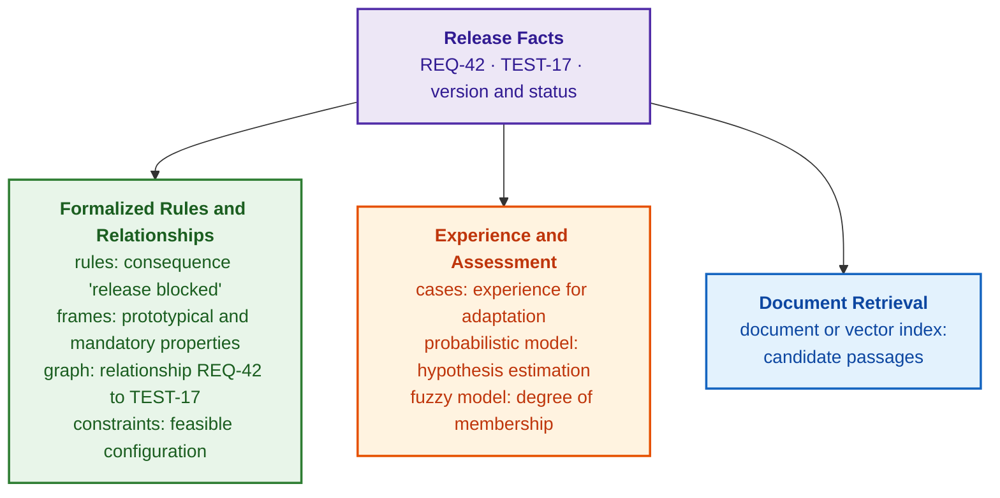
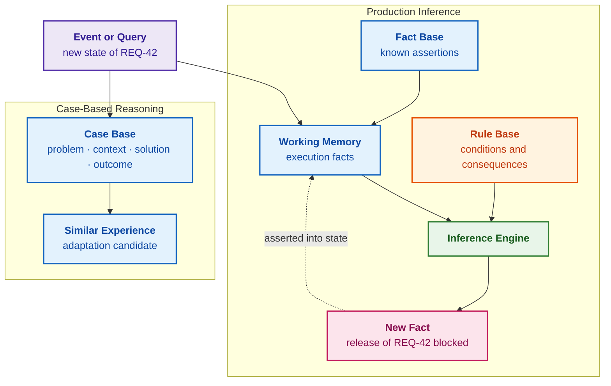
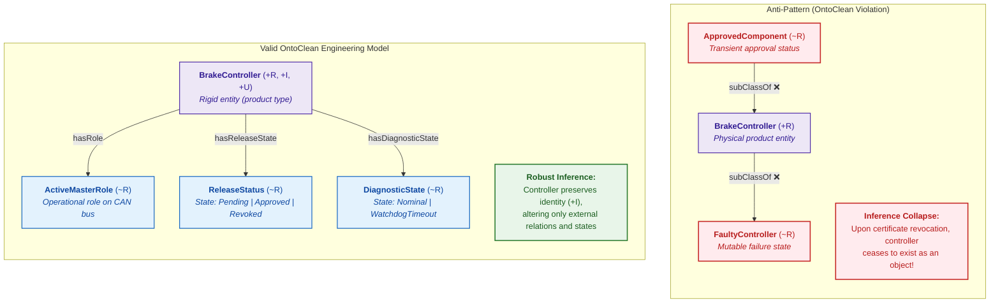
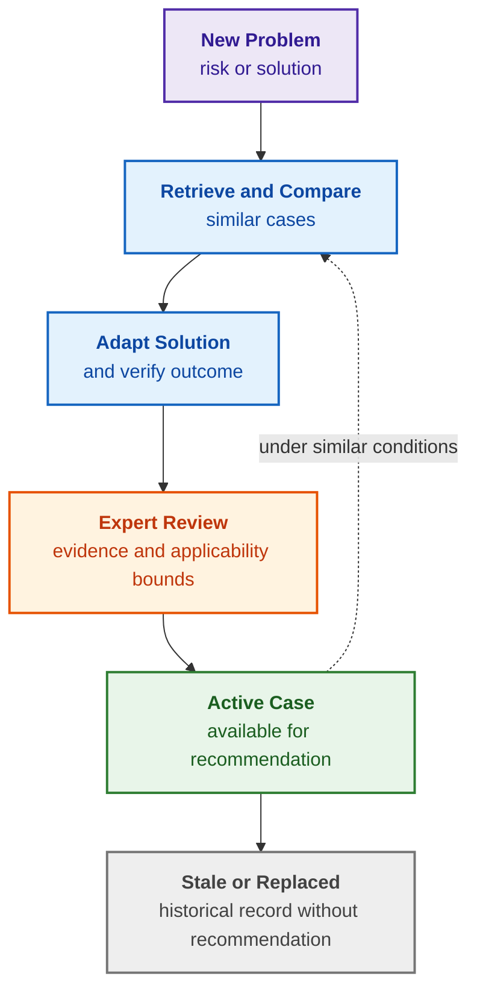
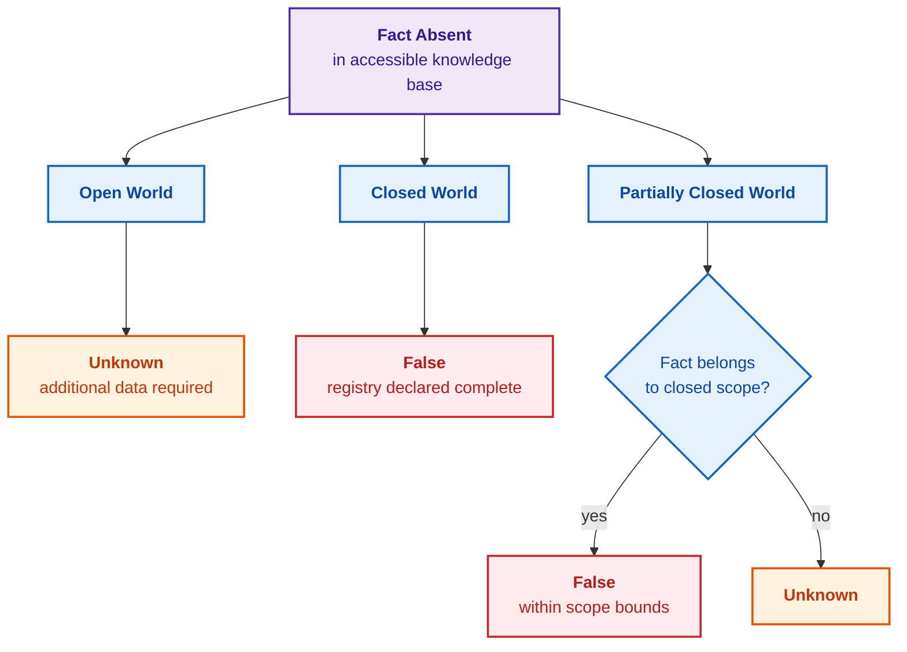
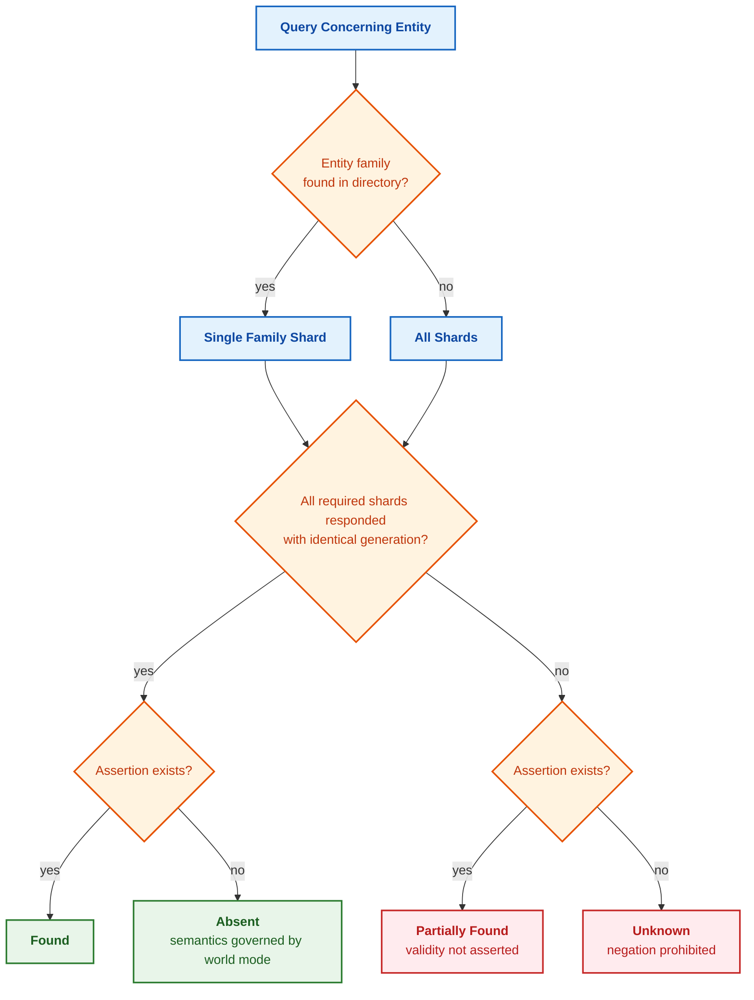

# Chapter 7. Knowledge Base Typology: Rules, Ontologies, Precedents, and Vectors

> **Book:** [Architecture of Evidence-Governed Expert Systems](README.md) · [Part II: Mathematical Models, Knowledge Representation, and Storage](part-02-knowledge-models.md)  
> **Previous Chapter:** [Chapter 6. Applied Mathematics for Expert Systems: Rules, Probabilities, Graphs, and Causality](ch06-applied-mathematics-for-expert-systems.md)  
> **Next Chapter:** [Chapter 8. Engineering Artifacts as Data for Expert Systems](ch08-engineering-artifacts-as-data.md)  
> **Table of Contents:** [README.md](README.md)  
> **Author:** [Mykola Fedchyk](about-the-author.md)  
> **Target Level:** Foundational Engineering; examples of queries, data, and code are placed in collapsible blocks  
> **Expected Learning Outcomes:** Distinguish a knowledge base from a database and a document repository; for each knowledge base type (rules, frames, ontologies, precedents, constraints, probabilistic and fuzzy models, document and vector indices), identify what the type stores, what result it returns, and what the result does not prove; select a knowledge base type based on the required outcome rather than product branding; explicitly define what a missing fact signifies; formulate ontology competency questions and verify concept hierarchies using the OntoClean methodology; distinguish knowledge base fragmentation, sharding, and attribute-based grouping, select partitioning keys based on inference dependencies, and never interpret shard silence as the absence of a fact.

## Abstract

This chapter examines the fundamental typology of engineering knowledge bases as the structural core of evidence-governed expert systems, establishing rigorous demarcation criteria separating them from conventional relational databases and unstructured document repositories. It investigates the primary knowledge formalization paradigms that guarantee mathematical determinism, formal verifiability, and irrefutability of conclusions: production rules, frame structures, formal ontologies (OWL/RDF), case-based reasoning (CBR) repositories, constraint satisfaction solvers (CSP), Bayesian networks, and dense vector indices. The precise role each model occupies across the expert system lifecycle is delineated to prevent substituting heuristic search for rigorous deductive proof. Particular emphasis is placed on the semantics of incomplete information (open-world, closed-world, and partial closed-world assumptions), the OntoClean methodology for formal taxonomic validation, and architectural principles governing horizontal and vertical fragmentation and sharding without severing transitive inference chains.

When an engineering team states, "we need an artificial intelligence (AI) knowledge base," the term is frequently conflated with a wiki, a document management system, or a vector index. Under such ambiguity, when queried, "Can brake controller BrakeController 3.2 be released to production?", the information system retrieves a passage from an engineering report that merely resembles an answer. The practitioner cannot discern whether this text represents an extracted text fragment, a rule-derived deduction, or an empirically verified fact. A production engine returns a fired rule; an ontological reasoner returns a classification or inconsistency; a case base yields analogous historical experience; a constraint solver outputs a feasible configuration; and a vector index merely retrieves semantically similar text passages. When an interface uniformly labels all of these disparate outputs as an "AI response," the epistemic error profile of each mechanism is rendered completely invisible.

The objective of this chapter is to demonstrate that no universal knowledge base exists and to guide the engineer in selecting the appropriate knowledge representation based on the required operational outcome. For each type, this chapter defines what the representation stores, how it computes its result, what the result does not prove, and where it is appropriately deployed within research and development (R&D). All types are examined through a single end-to-end benchmark scenario: safety-critical requirement REQ-42 governing a brake controller and test TEST-17 designated to verify it. The mathematical underpinnings of these methods were established in [Chapter 6](ch06-applied-mathematics-for-expert-systems.md), while the ingestion of engineering artifacts into data structures and their linkage within graphs are detailed in [Chapter 8](ch08-engineering-artifacts-as-data.md) and [Chapter 9](ch09-engineering-knowledge-graph-traceability.md).

## 1. Common Engineering Failures: Consequences of Knowledge Type and Inquiry Mismatch

The vast majority of knowledge base failures in mission-critical industrial operations stem from a single root cause: employing an architectural mechanism designed for one category of question to answer another. The table below illustrates seven representative engineering failures that serve as the analytical point of departure for the remainder of this chapter.

| Problem | User-Observed Symptom | Technical Root Cause | Remediation Strategy |
|---|---|---|---|
| Search substituted for inference | When asked "Is a rule violated?", the system returns a similar text passage | Vector retrieval replaces deterministic rule or constraint evaluation | Typed results: retrieved, inferred, validated, estimated |
| Misinterpretation of absence | A missing test edge in the graph is interpreted as "the test does not exist" | Closed-world assumption applied erroneously to an open-world graph | Declare explicit completeness scopes; verify completeness via separate rules |
| Version skew | Rules evaluate facts belonging to a mismatched baseline version | Rules, graph, and vector index are updated asynchronously | Knowledge release manifest and queries pinned to a synchronized snapshot |
| Hallucinated relations from LLM | An articulate yet spurious relationship appears in the knowledge graph | Relation extraction performed without schema constraints, source spans, or review | Constrained extraction, schema validation, source span verification, quarantine |
| Information leakage via inference | User cannot access confidential source, but sees the deduction derived from it | Security labels enforced exclusively on raw facts rather than derived inferences | Propagate security classification lattices to deductions, explanations, and caches |
| Reasoning explosion | Inference engine violates real-time latency budgets | Excessive language expressivity, cyclic rule chains, unrestricted forward saturation | Restricted language profile, incremental inference, or goal-driven query-time proving |
| Severed inference across shards | Regulatory compliance verdict changes depending on which node answers | Related revisions or tests reside on different shards; shard silence read as "fact absent" | Partition key based on document family; return "unknown" instead of "false" on shard timeout |

Every row of this table converges on a foundational architectural imperative: for every knowledge representation paradigm, one must explicitly formalize its semantics, algorithm, evidential status, and fail-safe reaction to uncertainty. The remainder of this chapter applies this imperative to each knowledge base type, beginning with the boundary separating a knowledge base from a database.

## 2. Demarcation of Concepts: Database, Document Repository, and Knowledge Base

A database answers the question "What is stored?" and returns records matching explicit query criteria. A knowledge base adds domain semantics and, where required, an active inference mechanism capable of deriving new conclusions from existing facts. Not every knowledge base requires an embedded reasoning engine: an ontology may serve solely to establish a shared vocabulary and typing schema, while search or rule execution is delegated to downstream components.

A relational database can store requirements, tests, defects, and safety risks; a query written in Structured Query Language (SQL) will identify requirements lacking associated tests provided the software engineer explicitly programs that condition. A production knowledge base, by contrast, encodes the domain rule "a safety-critical requirement cannot be closed without verification evidence" and autonomously applies that rule to every newly asserted fact. The distinction lies neither in file format nor in database server naming, but in where the rule's operational semantics reside and what component executes logical inference. An operational knowledge base incorporates at least four constituent elements:

- **Knowledge representation:** facts, rules, frames, graphs, precedent cases, constraints, or probability distributions;
- **Inference mechanism:** the computational component that derives new assertions, estimations, or feasible variants, along with its formal procedure;
- **Validity context:** the specific product baseline, regulatory standard, version, customer variant, or temporal interval under which the knowledge is legally and technically binding;
- **Provenance and ownership:** the origin of the assertion, the certifying authority that approved it, and the entity authorized to modify or revoke it.

A straightforward operational analogy: a document represents a page of text, a database represents an indexed filing cabinet, and a knowledge base integrates the filing cabinet with semantic definitions of terms and executable operational rules governing the records. The boundary of this analogy must be maintained: not every knowledge base contains "if-then" rules. An ontology classifies entities, a case base retrieves analogous empirical experience, and a probabilistic model updates belief distributions.

### 2.1. Criteria for Transforming a Structured File Repository into a Knowledge Base

A directory of requirements specification files does not constitute a knowledge base merely because it contains valuable technical information. Three distinct documents may specify requirements REQ-42, REQ-43, and REQ-44; yet without manual engineering review, a practitioner cannot determine which version of each requirement is currently binding, which test verifies it, whether all three belong to the identical product configuration, or which requirements are safety-critical. A collection of structured files transforms into an authentic knowledge base only when an organization explicitly formalizes:

- **Knowledge units:** requirement, component, test, defect, rule, precedent case, or test report;
- **Field and term semantics:** what distinguishes the status "approved" from "obsolete", or a typed relationship "verifies" from an incidental textual mention;
- **Identifiers, versions, and validity bounds:** which specific record represents REQ-42 version 1.2, and for which product variant and operational timeframe it remains valid;
- **Typed relations between units:** REQ-42 is verified by test TEST-17, the test produced a test run execution report, and an admission rule evaluates the report status;
- **Computational processing semantics:** keyword search, graph traversal, constraint verification, rule execution, or precedent case matching.

Files may remain the underlying physical persistence format. What transforms them into a knowledge base is not a dedicated server or YAML (YAML Ain't Markup Language) serialization, but a consistent, formalized model of concepts, relations, validity bounds, and executable operations. A directory of text documents lacking such formal agreements represents a repository of raw source materials for a future knowledge base, rather than a knowledge base in the strict engineering sense.

### 2.2. Enterprise Wikis: Operational Boundaries and RAG Architecture

In an organizational context, an enterprise wiki (such as Confluence) functions as an institutional knowledge repository when a team systematically records operating procedures, architectural decisions, domain definitions, incident post-mortems, and authoritative citations, where every page maintains an assigned owner, review status, and revision timestamp. For corporate knowledge management, this operational level is frequently adequate. However, a wiki devoid of assigned ownership, verified statuses, persistent canonical identifiers, and formal lifecycle policies degenerates into an uncurated document archive: search will discover text mentions, but will fail to establish which rule applies to version 3.2 or which test verifies a specific requirement without manual interpretation. Wikis excel at preserving contextual explanations and narrative rationale, but cannot substitute for an engineering traceability graph, a rule engine, or a formal requirements management system where automated verification and reproducible inference are required.

Retrieval-Augmented Generation (RAG) is frequently layered over enterprise wikis: the application partitions pages into text chunks, indices them, retrieves candidate passages relevant to a query, and employs a large language model (LLM) to synthesize a narrative response. The wiki remains the primary document store, while RAG serves as an information retrieval and explanatory facade. The table below contrasts RAG over a wiki with conventional full-text search.

| User Need | Full-Text Search | RAG over Enterprise Wiki |
|---|---|---|
| Query formulated using synonymous phrasing | Matches exact keywords, stemmed variants, or pre-configured synonyms | Retrieves passages matching semantic intent |
| Synthesis across disparate pages | Returns an unranked or ranked list of individual pages | Synthesizes retrieved passages into a concise narrative with citations |
| Term explanation in context | Requires the user to open and manually correlate multiple pages | Explains terms within the specific context of the project |
| Iterative conversational refinement | Requires independent re-formulation of each search query | Retains conversational context and solicits clarification |

When prompted, "Why does REQ-42 require independent verification?", RAG can retrieve the requirement specification, a safety policy page, and the description of test TEST-17, synthesizing the structural relationship between them. However, RAG cannot prove that the retrieved text is legally binding, cannot establish a formal traceability link between REQ-42 and TEST-17, and cannot execute deterministic rule verification. The assertion "it is written in the wiki" does not equate to "the requirement has been formally verified"; consequently, RAG outputs must provide direct citations to versioned pages and must be explicitly typed as an explanation derived from candidate source passages.

### 2.3. Semantic Typification of Engineering Queries to the Knowledge Base

An engineer does not interact with a knowledge base through an undifferentiated, universal query format; formulation depends strictly on the intended operational outcome. A single engineering entity, such as REQ-42, generates diverse legitimate query modalities.

| Engineer's Query | Knowledge Representation / Mechanism | Correct Evidential Result |
|---|---|---|
| "What is the currently effective version of REQ-42?" | Requirements registry or relational database | Canonical requirement record and version string |
| "Which test verifies REQ-42?" | Semantic knowledge graph | Traceability relation linking REQ-42 to TEST-17 and its path |
| "Is the release rule violated for an ASIL D requirement without independent test?" | Production rule engine | Fired rule activation and derived logical consequence |
| "Which test configurations satisfy the independence constraint?" | Constraint satisfaction solver (CSP) | Set of feasible configurations satisfying all constraints |
| "Has a similar defect occurred previously?" | Case-based reasoning (CBR) base | Closest precedent case and operational bounds of adaptation |
| "What is the plausibility of the watchdog failure hypothesis?" | Bayesian belief network | Calibrated conditional probability given model and evidence |
| "Where in the test reports is REQ-42 referenced?" | Document or dense vector index | Ranked candidate passages with source provenance and status |

A formal query possesses an unambiguous grammar, data schema, and execution semantics: it explicitly addresses entities, relations, predicate conditions, and projection formats. For example, a SPARQL Protocol and RDF Query Language (SPARQL) query directed to a semantic graph requests all tests linked to REQ-42 via the `verifies` relation, along with their execution results and test reports.

<details>
<summary>SPARQL Query Example: Tests Verifying REQ-42</summary>

Variables are prefixed with a question mark. Property `ex:verifies` links the test definition to the requirement, while `ex:ofTest`, `ex:release`, `ex:result`, and `ex:hasReport` characterize a specific execution run. The query restricts retrieval to approved test runs specifically for release 3.2.

```sparql
PREFIX ex: <https://example.org/rd/>

SELECT ?test ?result ?report
WHERE {
    ?test ex:verifies ex:REQ-42 .
    ?run ex:ofTest ?test ;
      ex:release ex:Release3_2 ;
      ex:result ?result ;
      ex:hasReport ?report ;
      ex:status ex:Approved .
}
```

</details>

Given immutable underlying data, a fixed graph snapshot, and static access privileges, a formal query guarantees reproducible results. The formal syntax does not guarantee the material truth of the underlying data; it merely guarantees that the specific query expression was deterministically evaluated against a specific snapshot.

An informal query is formulated by a human engineer in natural language: "What evidence confirms REQ-42?". A language model can parse user intent, resolve lexical ambiguities, and map the inquiry to one or more formal queries. Crucially, however, the text generated by the language model does not constitute the query result from the knowledge base unless the model delegates execution to an underlying inference mechanism and returns verified results accompanied by provenance metadata. A dependable interaction workflow mediated by an LLM follows this sequence:

1. The language model classifies user intent and requests clarification regarding ambiguous terms, target baseline versions, or retrieval scopes;
2. An authorization service enforces access policies, restricting accessible entities and permitted operations;
3. The language model constructs a structured query, and the runtime validates its syntax, typing, and computational cost limits;
4. The designated inference engine executes the query against the registry, graph, rule base, constraint solver, case repository, or index;
5. The language model articulates the retrieved results without modifying their semantic content: it explicitly reports result type, source citations, versions, and epistemic uncertainties.

When asked "Is REQ-42 verified?", an LLM must not respond affirmatively merely because it encountered the phrase "TEST-17 verifies REQ-42" in an unindexed text snippet. A formal verification check must confirm the existence of an active link to an approved test run report for the designated controller baseline; if only text retrieval was performed, the output must be categorized as candidate evidence.

### 2.4. Distributed Lifecycle Knowledge Base: Requirements, Source Code, Tests, and Defects

Requirements represent knowledge specifying what an engineering product must perform, under what operational constraints, and how compliance is verified. A requirements knowledge base preserves not merely descriptive text, but hierarchical level, functional domain, version, approval status, assigned owner, provenance, dependencies, safety risks, allocated tests, and verification evidence. Modifying a requirement creates a new version rather than silently mutating an approved baseline assertion. Source code serves as the executable specification of behavior; a test couples a declarative expectation ("upon watchdog timeout, the controller transitions to a safe state within 100 ms") with an execution procedure; and a Continuous Integration (CI) report provides evidentiary proof that a specific code commit passed a specific test harness in an auditable environment.

| Artifact | Knowledge Encapsulated | Storage Location | Long-Term Post-Project Value |
|---|---|---|---|
| Requirement and SyRS | Target behavior, constraints, version, traceability | Requirements management system or versioned repository | Requirements baseline, audit trail, maintenance baseline |
| Code and configuration | Executable behavior, interfaces, schemas | Git repository (GitLab, GitHub) | Version reproducibility, component reuse, regression testing |
| Test suite | Expected behavior and verification procedure | Test management system or test repository | Regression test harnesses, operational boundary specifications |
| Test report, CI log, artifact | Evidentiary execution record pinned to commit and environment | GitLab CI, GitHub Actions, artifact registry | Release certification records, audit proof, incident triage |
| Issue, defect, risk, ADR | Intent, responsibility, engineering rationale, trade-offs | Issue tracker (Jira, GitLab), ADR repository | Architectural memory, lessons learned, debt tracking |

Collectively, these artifacts constitute a distributed lifecycle knowledge base, provided their entities possess typed schemas, canonical identifiers, semantic links, operational statuses, and assigned ownership. Three integration tiers exist in practice. The first tier consists of conventions and cross-references: stable identifiers such as REQ-42, TEST-17, issue keys, commit SHAs, and artifact URIs. The second tier establishes a unified search index across heterogeneous metadata and text corpora. The third tier establishes a knowledge integration layer that consumes data via APIs, reconciles identifiers, preserves types, relations, and provenance, and executes cross-cutting queries such as "Which safety-critical requirements in baseline R2026.3 lack an approved test execution report?". The integration layer does not introduce an additional manual editing interface: authoritative ground truth remains anchored in the source systems, while the integration layer synchronizes projected views. A small engineering team should initially standardize canonical identifiers and link types, introduce cross-repository search, and construct a dedicated knowledge integration layer only when repeatable, automated cross-domain verification is required.

In summary: a knowledge base is distinguished from a database and a document repository not by storage format, but by explicit domain semantics, validity contexts, verifiable provenance, and an active inference mechanism. Open reference knowledge bases illustrate the structural diversity of these mechanisms.

## 3. Reference Open Knowledge Bases for Engineering Applications

A knowledge base need not be confined to proprietary enterprise architectures. Publicly accessible reference projects allow engineers to inspect data schemas, download datasets, and benchmark query mechanisms.

| Project | Knowledge Structure | Observable Characteristics |
|---|---|---|
| [Wikidata](https://www.wikidata.org/wiki/Wikidata:Introduction) | Collaborative multilingual assertion base and knowledge graph | `Q…` entities, `P…` properties, literal values, qualifiers, and citations; published under CC0 |
| [ConceptNet](https://conceptnet.io/) | Open multilingual semantic network | Common-sense relations (`IsA`, `PartOf`, `UsedFor`) between concepts, assertion weights, and provenance |
| [Gene Ontology](https://geneontology.org/docs/ontology-documentation/) | Formal biomedical domain ontology | Biological process and function hierarchies, `is_a` and `part_of` relations, stable `GO:…` identifiers |
| [OpenFisca](https://openfisca.org/en/) | Open executable statutory rule models | Computable tax and social benefit rules, time-indexed parameters, automated unit tests |
| [Bayesian Network Repository](https://www.bnlearn.com/bnrepository/) | Curated probabilistic graphical models | Classical networks (ASIA, ALARM, CHILD) with explicit conditional probability tables (CPTs) |
| [AI Incident Database](https://incidentdatabase.ai/) | Public corpus of operational failure cases | Documented AI incidents, field reports, and taxonomies; functions as an empirical precedent archive |

Wikidata illustrates statements such as `Q42 → P69 → Q691283` (Douglas Adams was educated at St John's College). In the Gene Ontology, term `GO:0019319` maintains multiple inheritance, as hexose biosynthetic process is simultaneously a sub-process of hexose metabolic process and monosaccharide biosynthetic process. This selection is intentionally heterogeneous: Wikidata records assertions with citations, Gene Ontology defines taxonomies, OpenFisca executes production rules, and bnlearn models compute probabilistic inference. The designation "knowledge base" guarantees neither a uniform storage format nor a single reasoning procedure. Evaluating these representations requires an overarching benchmark scenario.

## 4. End-to-End Engineering Precedent: Verification of the BrakeController 3.2 Release

An engineering team is preparing release R2026.3 of the brake controller BrakeController version 3.2. Prior to release sign-off, every safety-critical requirement must possess an associated implementation, a specified verification method, and approved execution evidence. A hypothetical system requirement, REQ-42, specifies controller behavior upon failure of an internal watchdog timer to receive an expected heartbeat; the requirement is classified under Automotive Safety Integrity Level (ASIL) D. All identifiers and parameters in this scenario are illustrative.

<details>
<summary>YAML Data Example: Requirement REQ-42 Record and System Specification</summary>

The requirement record is formatted in YAML, while the system requirements specification gathers approved requirement baselines for the targeted release.

```yaml
requirement_id: REQ-42
requirement_version: "1.2"
requirement_level: system
functional_area: safety
title: "BrakeController safe state transition on watchdog failure"
component: BrakeController
component_version: "3.2"
safety_integrity_level: ASIL-D
trigger: "watchdog_timeout"
required_behavior: "transition to safe state within 100 ms"
verification_method: "independent bench test"
verification_test: TEST-17
release_condition: "requires approved independent verification result"
```

```yaml
specification_id: BrakeController-SyRS
specification_version: "3.2"
applies_to: BrakeController
release: R2026.3
requirements:
  - id: REQ-42
    version: "1.2"
    role: "safety: transition to safe state on watchdog_timeout"
  - id: REQ-43
    version: "2.0"
    role: "interface: transmit fault status over CAN bus"
status: approved
```

</details>

A YAML file is not a knowledge base: it is a structured data artifact from which different knowledge bases ingest facts. For REQ-42, core structural links reside in a semantic graph, while remaining operational functions are distributed across specialized representations.

| Operational Need for REQ-42 | Knowledge Base or Index | Primary Storage Content |
|---|---|---|
| Trace which test verifies requirement | Semantic graph or ontology | Requirement, component, test, report, and traceability edges |
| Enforce mandatory fields of critical requirement | Frame-based system | ASIL tier, verification method, evidence pointer, release state |
| Block release lacking independent test | Production rule base | Ground facts on test execution status and release gating rules |
| Locate TEST-17 execution logs in documentation | Document or vector index | Report passages, execution metadata, and dense embeddings |

This chapter analyzes two distinct lifecycle checkpoints. Prior to TEST-17 execution, REQ-42 possesses an ASIL D classification and a test plan, but lacks approved independent verification results; hence, release gating must block baseline R2026.3. Following TEST-17 execution, the test report transitions to "approved", the verdict records "passed", and explicit traceability links to REQ-42; the report verifies this specific requirement, but does not prove readiness of the entire product release. The architecture diagram depicts three distinct processing tiers evaluating release facts.



The purple node represents input ground facts. The green cluster executes formal deductive derivation: logical consequences, class subsumption, structural relations, and feasible configurations. The orange cluster provides historical experience and heuristic valuations requiring empirical validation. The blue cluster yields unverified candidate evidence. No single mechanism subsumes the others, as synthesized in the comparative taxonomy below.

## 5. Comparative Taxonomy of Knowledge Base Types

Ontologies, production rules, case bases, and vector search indices are not mutually exclusive; production expert systems frequently combine all four. Differentiating them is essential because the failure profile of each mechanism possesses fundamentally distinct mathematical characteristics.

| Knowledge Base or Index Type | What It Stores | Engine Output | What Output Does Not Prove |
|---|---|---|---|
| Production rules | Ground facts and "if-then" rules | Derived consequence and firing trace | That rules are exhaustive and up to date |
| Frames | Prototypical objects, slots, defaults, exceptions | Inherited or filled slot values | That default value is empirically validated for instance |
| Ontologies and semantic graphs | Classes, relations, axioms, constraints | Inferred class, new relation, or inconsistency | That unasserted fact is materially false |
| Case-based reasoning (CBR) | Historical problems, contexts, solutions, outcomes | Analogous precedent case and adaptation candidate | That past solution is valid without adaptation |
| Constraint bases (CSP) | Variables, domains, permissible configurations | One or more feasible solutions | That selected solution is globally optimal |
| Probabilistic models | Dependencies, conditional priors, observations | Updated posterior hypothesis probability | That hypothesis is deductively proven |
| Fuzzy models | Membership functions, fuzzy linguistic rules | Degree of membership or defuzzified control value | Statistical probability of an event |
| Document and vector indices | Texts, chunk passages, metadata, embeddings | Candidate passages by keyword or similarity | Legality, material truth, or right to use |

The primary dividing line separates retrieval of stored content from formal inference of consequences, classifications, configurations, or valuations. A vector index retrieves candidates; production engines, ontology reasoners, constraint solvers, and probabilistic models compute over formalized semantics. The user interface of an evidence-governed expert system must explicitly designate which computational mechanism produced each segment of an answer.

## 6. Rule Base, Fact Base, and Dynamic Working Memory

In classical production architectures, a knowledge base is divided into a rule base and a fact base. The rule base encodes invariant domain logic: preconditions, consequences, execution salience, and applicability scopes. The fact base stores assertions regarding concrete entities: requirement safety classifications, test outcomes, component states. Working memory encapsulates the facts asserted for an active reasoning session. In simple standalone systems, working memory and the fact base are identical; in distributed architectures, persistent fact storage is decoupled from ephemeral working memory. The inference engine matches facts against rule antecedents and asserts derived conclusions into working memory.



The purple node represents an incoming event; blue boxes denote fact and case memory; orange denotes the rule base; green represents the inference engine; pink denotes a derived fact. The dashed arrow indicates that a newly asserted fact feeds subsequent rule matches. At the first lifecycle checkpoint, this separation operates as follows:

<details>
<summary>Example: Rule Base, Fact Base, and Working Memory at Checkpoint 1</summary>

```text
Persistent Rule Base:
  R-17: IF asil(X, D) AND verification_status(X, missing)
        THEN release_blocked(X)

Persistent Fact Base:
  requirement(REQ-42)
  asil(REQ-42, D)

Working Memory (Active Run):
  verification_status(REQ-42, missing)

Following Execution of R-17:
  release_blocked(REQ-42)
```

</details>

Rule R-17 applies generically across all requirements, whereas the assertion `verification_status(REQ-42, missing)` characterizes the pre-TEST-17 state and mutates upon test approval. The derived fact `release_blocked(REQ-42)` similarly requires provenance: rule base version, execution timestamp, and active input snapshot. Ground facts may reside in a Resource Description Framework (RDF) triple store, a property graph, a relational database, or a digital twin, but the decoupling of rules from ephemeral working memory remains distinctively pronounced in production systems.

### 6.1. Inadmissibility of Aggregating Conflicting Facts via Majority Voting

When an engineering fact base scales to millions of assertions extracted from technical standards corpora, naive developers are often tempted to "clean" the repository by enforcing majority voting across conflicting sources. In regulatory engineering domains, such heuristic consolidation introduces severe failure modes. First, it obliterates temporal validity: thirty superseded editions of a legacy standard will outvote a single newly enacted revision that intentionally repealed an obsolete rule. Second, it erodes document boundaries: the knowledge base can no longer reconstruct what was legally binding under the 1981 regulatory regime. Third, it destroys exceptions and modal qualifications: specialized industrial profiles frequently relax a normative `MUST` to a conditional `SHOULD`. Fourth, it conflates regulatory jurisdictions: larger statutory corpora overwhelm smaller regional specifications. An evidence-governed architecture mandates lossless aggregation:

```math
\mathrm{Assertion}(S,R,V)\ \leftarrow\ \big[\,\mathrm{Citation}(D_1,\mathrm{span}_1,h_1),\ \dots,\ \mathrm{Citation}(D_k,\mathrm{span}_k,h_k)\,\big]
```

Where:

- $\mathrm{Assertion}(S,R,V)$ denotes the relational statement "subject $S$ has relation $R$ with value $V$";
- $\leftarrow$ signifies that the assertion is anchored in the enumerated source citations, where square brackets delimit the list of evidentiary proofs;
- $D_i$ denotes the versioned source document, $\mathrm{span}_i$ indicates byte or token offsets of the passage, and $h_i$ represents the cryptographic hash of that source span;
- $k$ denotes the total number of corroborating sources, with index $i$ indexing individual citations.

Identical triples $(S,R,V)$ are grouped into a consolidated assertion containing all supporting citations, while divergent values $V_1,V_2,\dots$ are preserved without loss. At query time, the inference engine resolves the binding value based on explicitly supplied scope parameters: target baseline, document revision tree, and jurisdiction. When irreconcilable values conflict within the identical scope, the engine must return a formal conflict warning rather than silently executing majority voting.

### 6.2. Semantic Demarcation Between Current Fact Base and Case Base

A fact base records atomized assertions regarding current state, whereas a case base stores holistic experiential episodes: problem, operational context, applied intervention, resulting outcome, and transferability boundaries.

| Attribute | Fact Base | Case Base (CBR) |
|---|---|---|
| Unit of knowledge | Discrete relational assertion | Self-contained, multi-dimensional episode |
| Concrete example | "REQ-42 is classified as ASIL D" | CASE-0081: past release with ASIL D requirement lacking independent test |
| Computational usage | Pattern matching for rules; logical queries | Similarity retrieval and analogical solution adaptation |
| Temporal mutation | Mutates rapidly upon state changes | Immutable historical record of engineering experience |
| Operational output | Newly derived fact or logical consequence | Most analogous case and candidate solution strategy |

A single case incorporates numerous factual attributes, but a collection of raw facts does not constitute a case. An entry qualifies as a case only when organized around a problem, an applied intervention, and an observed outcome, permitting structural comparison between a novel dilemma and past experience.

## 7. Production Knowledge Bases: Forward and Backward Chaining Rules

A production knowledge base represents knowledge as rules of the form "IF condition holds, THEN assert consequence or execute action." Rule R-17 evaluated against REQ-42 facts yields a transparent execution trace: rather than returning a raw flag "blocked", the system constructs an auditable proof object tracing from REQ-42 and its ASIL D classification through the missing verification status and rule R-17 directly to the release refusal. Forward and backward chaining, the consequence step operator, and least fixed point semantics were formalized in [Chapter 6](ch06-applied-mathematics-for-expert-systems.md); the Rete algorithm, formulated by Charles Forgy to evaluate thousands of rules across dynamic working memory with high efficiency, was detailed therein [[1]](#src-1).

The fixed-point operator formalized in Chapter 6 assumes monotonic deduction: newly asserted facts cannot invalidate previously derived conclusions. When exceptions, negations, overrides, and retractions are introduced, reasoning becomes non-monotonic, requiring explicit semantics: stratified negation, prioritized defaults, or stable model semantics as formalized by Michael Gelfond and Vladimir Lifschitz [[2]](#src-2). The textual sequence of rules in a configuration file must never implicitly determine domain execution policy. For every inferred fact, the engine should emit a proof object: rule identifier, variable substitution bindings $\theta$, input fact hashes, rule set version, and snapshot timestamp. Under this discipline, the system's explanation is not an ex-post narrative fabricated by an LLM, but a verified log of rule activations.

The primary vulnerability of a production knowledge base lies not in inference engine mechanics, but in rule incompleteness and latent conflicts. If exceptions proliferate without strict priority lattices, if validity boundaries are undefined, and if obsolete rules are not formally revoked, the engine will execute invalid policies with algorithmic precision. Consequently, every production rule requires an assigned owner, version, formal salience, validity bounds, and regression test suites. An inferred consequence proves solely that the statement deductively follows from active facts and rules, not that the rule base is complete.

## 8. Frame Knowledge Models: Objects with Roles, Slots, and Default Values

A frame-based knowledge base structures typical domain concepts into frames—structured schemas with defined slots. A slot represents a property or role: an engineering component maintains an assigned owner, hardware interfaces, safety classification, supplier, version, allocated risks, and verification evidence. A frame specifies default slot values and inheritance semantics; concrete instances inherit this frame prototype and populate slots with specific values.

<details>
<summary>YAML Frame Example: Safety-Critical Component and BrakeController Instance</summary>

```yaml
frame: SafetyCriticalComponent
slots:
  asil: { required: true }
  verification_method: { default: independent }
  verification_evidence: { required: true }
  release_state: { default: blocked }

instance: BrakeController
is_a: SafetyCriticalComponent
slots:
  asil: D
  verification_method: independent
  verification_evidence: TEST-17
```

</details>

Instance `BrakeController` inherits independent verification and the default state `release_state: blocked`, while the evidence slot explicitly references TEST-17. The frame delineates what criteria must be satisfied to unblock the release, but does not autonomously verify whether TEST-17 executed successfully or whether its report was approved. Slot value resolution is formalized as follows:

```math
v(x,s)=
\begin{cases}
v_{\text{explicit}}(x,s), & \text{if a value is defined for } x,\\
v(\mathrm{parent}(x),s), & \text{if inheritance is permitted},\\
\bot, & \text{otherwise: value is unknown}.
\end{cases}
```

Where:

- $x$ denotes the target entity instance, and $s$ denotes the evaluated slot;
- $v_{\text{explicit}}(x,s)$ represents the value explicitly assigned to instance $x$;
- $\mathrm{parent}(x)$ designates the prototype parent frame, and $v(\mathrm{parent}(x),s)$ is the slot value defined on that parent;
- $\bot$ denotes the unassigned, unknown state;
- The cases govern precedence: explicit definition, permitted inheritance, or unknown value.

The runtime must return not merely the resolved value, but its resolution mode: explicitly assigned, inherited default, or unknown ($\bot$). Otherwise, an interface will present an unverified default status `blocked` identically to an empirically verified status. An inherited default value is an architectural expectation rather than an empirical fact; for complex verification chains, frames must be coupled with production rules or semantic graphs.

## 9. Semantic Networks and Formal Ontologies: Classes, Properties, and Hierarchies

A semantic network represents knowledge as entities and relations: a requirement is verified by a test, a defect impacts a component, a component belongs to a subsystem. An ontology enriches this network with formal class definitions, property characteristics, axioms, and value constraints. For engineering expert systems, graph representations reflect reality: R&D lives in relationships spanning from requirements through architectural designs, code, and tests to defects, risks, and certification evidence. An ontology reasoner classifies entities, materializes inferred relations, and verifies consistency. In description logic, two representative axioms are expressed as:

```math
\textsf{SafetyRequirement}\sqsubseteq\textsf{Requirement},\qquad \textsf{SafetyRequirement}\sqsubseteq\exists\,\textsf{verifiedBy}.\textsf{VerificationTest}
```

Interpreting these axioms:

- $\textsf{SafetyRequirement}$ denotes the concept class of safety requirements, and $\textsf{Requirement}$ denotes the general class of requirements;
- $\sqsubseteq$ denotes concept subsumption ("is a subclass of");
- $`\exists\,\textsf{verifiedBy}.\textsf{VerificationTest}`$ designates the class of individuals possessing at least one relation `verifiedBy` pointing to an individual in class $\textsf{VerificationTest}$;
- $\exists$ denotes existential quantification, and the period delimits the role and its filler class.

The first axiom asserts that every safety requirement is a requirement. The second asserts that for every safety requirement, there exists at least one verification test. Under Web Ontology Language (OWL) semantics, the ontology remains fully consistent even if no named test instance is explicitly asserted: open-world semantics posits an unasserted "witness" individual. Thus, the absence of an explicit triple `REQ-42 verifiedBy TEST-17` does not trigger an inconsistency error. If an engineering release gate mandates the physical presence of this link within the active graph snapshot, that requirement must be verified via Shapes Constraint Language (SHACL) shapes [[3]](#src-3).

<details>
<summary>Turtle Example: SHACL Shape for Safety Requirement and Graph Triples at Checkpoint 2</summary>

The shape enforces that every safety requirement in the active graph snapshot possesses at least one verifiedBy relation pointing to an instance of VerificationTest. The triples capture state following TEST-17 execution.

```turtle
@prefix ex: <https://example.org/rd/> .
@prefix sh: <http://www.w3.org/ns/shacl#> .

ex:SafetyRequirementShape
  a sh:NodeShape ;
  sh:targetClass ex:SafetyRequirement ;
  sh:property [
    sh:path ex:verifiedBy ;
    sh:minCount 1 ;
    sh:class ex:VerificationTest
  ] .
```

```turtle
@prefix ex: <https://example.org/rd/> .
@prefix rdfs: <http://www.w3.org/2000/01/rdf-schema#> .

ex:REQ-42  a                 ex:SafetyRequirement ;
           ex:appliesTo      ex:BrakeController ;
           ex:verifiedBy    ex:TEST-17 .

ex:TEST-17 a                 ex:VerificationTest ;
           ex:verifies       ex:REQ-42 .

ex:RUN-17-32 a               ex:TestRun ;
           ex:ofTest         ex:TEST-17 ;
           ex:release        ex:Release3_2 ;
           ex:result         ex:Passed ;
           ex:hasReport      ex:REPORT-17-32 ;
           ex:status         ex:Approved .

ex:SafetyRequirement
           rdfs:subClassOf   ex:Requirement .
```

</details>

From the `rdfs:subClassOf` assertion, an OWL reasoner infers that REQ-42 is subsumed by class `Requirement`. Both directions of the relation with TEST-17 are asserted explicitly; without an inverse property axiom, a validator is not obligated to derive `verifiedBy` from `verifies`. The SHACL shape verifies solely the existence and class typing of the related test, not the pass/fail verdict of its execution run. The SPARQL query detailed earlier independently retrieves the approved execution run and report for release 3.2. If the query target is modified to release 3.1, the result set evaluates to empty even though the SHACL shape remains satisfied.

These three operations must not be conflated: the OWL reasoner performs deductive classification and consistency checking; the SHACL validator validates snapshot conformity against structural shapes; and SPARQL executes graph pattern retrieval. System architects must explicitly specify whether SHACL operates over the raw asserted graph or over the deductively materialized entailment regime; otherwise, identical shapes yield divergent results across execution runtimes. The pedagogical status `Approved` in this example does not verify digital signatures or revocations; such validations belong to admission gateways.

Unrestricted OWL 2 Full expressivity is rarely suitable for mission-critical industrial expert systems due to undecidability. OWL 2 profiles restrict syntax to guarantee deterministic computational complexity: EL for large concept taxonomies, QL for ontology-based data access over relational backends, and RL for execution via rule engines [[4]](#src-4), [[5]](#src-5). A profile is selected according to inference requirements and real-time execution budgets, accompanied by automated linters that reject out-of-profile axioms. As of late 2026, W3C Recommendations RDF 1.1 [[6]](#src-6), SPARQL 1.1 [[7]](#src-7), and SHACL 2017 [[3]](#src-3) remain stable standards; RDF 1.2 Concepts has reached Candidate Recommendation [[8]](#src-8), while SPARQL 1.2 and SHACL 1.2 exist as Working Drafts [[9]](#src-9), [[10]](#src-10), requiring explicit version locking when adopted.

Most ontology reasoners operate under the Open World Assumption: an unasserted and uninferable relation is treated as unknown rather than false. Ontologies are invaluable for establishing shared vocabularies, classification, and traceability, but require rigorous term ownership, versioning, and backward-compatibility rules.

### 9.1. Ontology Competency Questions

A logically consistent ontology may nevertheless fail to represent the operational relations required to evaluate the BrakeController 3.2 release. Consequently, prior to class authoring, knowledge engineers must formulate formal **competency questions**: concrete, verifiable inquiries that the proposed model must be capable of answering. Natalya Noy and Deborah McGuinness established competency questions as the engineering requirement baseline for ontology scoping [[11]](#src-11). Competency denotes model capability rather than human qualification.

For the REQ-42 scenario, three initial competency questions suffice. The table translates these questions into structural model requirements and testable outputs.

| Competency Question | Model Requirements | Benchmark Test Case and Expected Output |
|---|---|---|
| Which tests verify REQ-42? | Requirement, test, and verification link | Graph contains link from TEST-17 to REQ-42; query returns TEST-17 |
| What verdict was obtained for release 3.2? | Distinct test run entity, release tag, and verdict | TEST-17 has a passing run for 3.1, but none for 3.2; query does not transfer 3.1 success to 3.2 |
| What evidence substantiates an approved run? | Execution report, source URI, and cryptographic hash | Assertion cites specific report hash; missing report yields unverified evidence flag |

The second row reveals an architectural flaw that a naive class taxonomy fails to detect: if execution verdict is stored as a direct property on `TEST-17`, sequential test runs overwrite historical results. An explicit `TestRun` reified entity is required, linking the test definition to a specific release baseline. Competency questions justify model modifications via operational query requirements rather than aesthetic preferences.

Each competency question records an identifier, operational scope, benchmark snapshot, and expected ground-truth result. Following formalization, each question translates into a SPARQL query or SHACL shape in the automated regression suite. Negative test cases verify fail-safe behavior under incomplete data: the verification status for release 3.2 must evaluate to unknown when only release 3.1 data is available. The registry must also document out-of-scope inquiries: for instance, linking a test to a requirement does not prove that the test provides adequate safety coverage under ISO 26262.

Verification confirms model capability against predefined benchmarks, not complete domain coverage across all unmodeled systems. In [Chapter 23](ch23-knowledge-base-verification.md), such test cases are integrated into regression gates, while [Chapter 15](ch15-knowledge-extraction-and-kb-construction.md) details ontology extraction pipelines. Before deployment, however, concept hierarchies must be subjected to formal taxonomic validation.

### 9.2. Formal Validation of Taxonomies via the OntoClean Methodology

When designing ontologies for embedded systems, avionics, and automotive electronics (such as the BrakeController), engineers frequently commit a catastrophic architectural mistake: modeling operational roles, certification statuses, or transient hardware faults as ordinary subclass specializations. A Description Logic reasoner (OWL Reasoner) or schema compiler will accept a taxonomy such as $\textsf{BrakeController} \sqsubseteq \textsf{ApprovedComponent}$ ("brake controller is a subclass of approved components") or $\textsf{SafetyController} \sqsubseteq \textsf{FaultyDevice}$ ("safety controller is a subclass of faulty devices"). Syntactically, this introduces no contradiction provided all controllers currently in the knowledge base happen to hold certification or exhibit faults. In physical reality, however, this leads to an engineering dead end: if an engineer revokes a test certificate or repairs a blown capacitor, the physical hardware does not cease to be a brake controller. If status was encoded via inheritance, the reasoner will either report a logical inconsistency or require destroying the digital twin entity itself.

The **OntoClean** methodology, formulated by Nicola Guarino and Christopher Welty, provides a formal audit framework for taxonomic hierarchies based on ontological and philosophical properties of concepts rather than syntactic convenience [[12]](#src-12). OntoClean evaluates four fundamental meta-properties for every concept:

1. **Rigidity ($+R$):** property $P$ is essential to all its instances across all possible worlds and operational system states:
   ```math
   \forall x \ (P(x) \to \Box P(x))
   ```
   A physical microcontroller $\textsf{Microcontroller}$ ($+R$) or circuit board $\textsf{BrakeController}$ ($+R$) cannot cease to be a microcontroller or controller without physical destruction.
2. **Anti-rigidity ($\sim R$):** the property is optional, phase-based, or role-dependent. An instance can lose it without ceasing to exist:
   ```math
   \forall x \ (P(x) \to \Diamond \neg P(x))
   ```
   Status $\textsf{ApprovedRelease}$ ($\sim R$), role $\textsf{ActiveMaster}$ ($\sim R$), or error state $\textsf{FaultyNode}$ ($\sim R$) are transient attributes.
3. **Identity criterion ($+I / +O$):** whether the class supplies its own primary criterion for distinguishing individual instances ($+I$, such as a factory serial number or UUID) or inherits it from an ancestor class ($+O$).
4. **Unity criterion ($+U$):** what delineates the entity as an integrated whole. An Electronic Control Unit (ECU) exhibits spatial and circuit unity ($+U$), whereas an unindexed collection of PDF log files is an arbitrary aggregate ($-U$).

The fundamental taxonomic rule of OntoClean prohibits anti-rigid concepts from subsuming rigid concepts:

```math
\sim R \not\sqsupseteq +R \qquad (\text{a rigid type } +R \text{ cannot inherit from a role or state } \sim R)
```

Violating this rule asserts that a physical entity cannot exist independently of its transient administrative role or temporary hardware fault.



The table below synthesizes OntoClean verification criteria for engineering domains.

| Property | Symbol | Knowledge Engineer Audit Check | Typical Engineering Anti-Pattern |
|---|---|---|---|
| Rigidity | $+R$ vs $\sim R$ | Can an instance lose this property and remain the same entity? | Class "Approved Component" or "Defective Sensor" modeled as superclass of physical hardware. |
| Identity | $+I$ vs $+O$ | How are two distinct instances differentiated? | Shared Jira issue key conflates a system requirement with its two independent test runs. |
| Unity | $+U$ vs $-U$ | What binds constituent parts into an indivisible whole? | Architecture model conflates a soldered ECU ($+U$) with an arbitrary directory of PDF test logs ($-U$). |
| Dependence | $+D$ vs $-D$ | Does entity existence presuppose another external individual? | Role "Component Supplier" modeled without a mandatory relationship to a supplier contract or component. |

> [!TIP] Practical Rule for Ontology Engineers
> If an entity can be reflashed, repaired, deactivated, or stripped of its certification without physical destruction or smelting, it represents a **state or role ($\sim R$)**, not a **subclass ($+R$)**. Model these attributes via typed object properties (`hasState`, `hasRole`, `certifiedBy`), never through subsumption inheritance `rdfs:subClassOf`.

For our benchmark BrakeController 3.2, release approval represents a transient state within release R2026.3, not an immutable hardware type. Upon certificate revocation, the hardware remains the identical physical controller with serial number SN-8823, while relation `hasReleaseState` transitions from `Approved` to `Revoked`. OntoClean audits must be documented as formal architectural decision records: concept definitions, rigidity and identity tags, positive and negative usage examples, and knowledge architect sign-off. When an expert system must remember concrete historical incident failures rather than generic concept taxonomies, case-based reasoning replaces formal ontologies.

## 10. Case-Based Reasoning (CBR): Accumulation and Retrieval of Engineering Experience

A case-based knowledge base underpins Case-Based Reasoning (CBR), storing historical engineering episodes: context, problem, solution, outcome, operational bounds, and lessons learned. Unlike production systems, CBR does not require distilling every empirical observation into an abstracted general rule. Typical engineering cases encompass legacy hardware defects, certification audit findings, supplier workarounds, or test bench anomalies.

<details>
<summary>YAML Precedent Case Example: CASE-0081</summary>

```yaml
case_id: CASE-0081
problem: "ASIL-D requirement lacked independent test prior to release"
context:
  component: BrakeController
  supplier: Supplier-A
  phase: system-verification
solution:
  - "block release gate"
  - "institute independent bench test TEST-17"
outcome: "defect detected prior to vehicle integration"
applicable_when:
  asil: D
  verification_model: independent
not_applicable_when:
  - "equivalent evidence certified by accredited third party"
```

</details>

When processing a newly authored requirement, the CBR engine retrieves CASE-0081 based on safety classification, lifecycle phase, and verification model, returning the historical intervention alongside applicability constraints. The engine does not execute the solution without explicit adaptation. The classical four-stage CBR cycle (Retrieve, Reuse, Revise, Retain) was formalized by Agnar Aamodt and Enric Plaza [[13]](#src-13), with attribute similarity metrics detailed in [Chapter 6](ch06-applied-mathematics-for-expert-systems.md). For mission-critical engineering cases, weighted similarity is combined with an explicit applicability gate:

```math
\mathrm{sim}(q,c)=g(q,c)\cdot\frac{\sum_{j=1}^{m}w_j\,\mathrm{sim}_j(q_j,c_j)}{\sum_{j=1}^{m}w_j},\qquad g(q,c)\in\{0,1\}
```

Where:

- $q$ denotes the novel inquiry case, and $c$ denotes an archival precedent case;
- $m$ denotes feature count, $j$ indexes attributes, and $w_j$ represents attribute weight;
- $\mathrm{sim}_j(q_j,c_j)\in[0,1]$ denotes local attribute similarity (exact string match, normalized numerical distance, or embedding cosine similarity);
- $`g(q,c)\in\{0,1\}`$ represents the binary applicability gate: evaluates to 1 when mandatory constraints are satisfied, and 0 otherwise;
- The sum of weighted similarities is normalized by total weights, while multiplication by $g(q,c)$ immediately zeroes the score upon constraint violation.

**Runtime Decision Logic and Engineering CBR Thresholds:**
- **Automated Reuse:** if $\mathrm{sim}(q, c) \ge \tau_{\mathrm{reuse}} = 0.85$ and $g(q, c) = 1$, the engine automatically synthesizes an adapted verification plan;
- **Supervised Adaptation (`QUALIFIED_ANALOGY`):** if $0.60 \le \mathrm{sim}(q, c) < 0.85$, the precedent is presented to an engineer with explicit identification of divergent attributes requiring manual adaptation;
- **Analogy Rejection (`REJECT`):** if $\mathrm{sim}(q, c) < 0.60$ or $g(q, c) = 0$, the engine blocks analogical transfer, mandating first-principles verification engineering.

**Worked Numerical Example:**
The system matches a new requirement $q$ (power management safety) against case $c$. Attributes: ASIL tier ($w_1 = 0.4$, exact match $\mathrm{sim}_1 = 1.0$), operational voltage tolerance ($w_2 = 0.3$, similarity $\mathrm{sim}_2 = 0.8$), and bus protocol ($w_3 = 0.3$, partial match $\mathrm{sim}_3 = 0.5$). The applicability gate is satisfied: $g(q, c) = 1$.
```math
\mathrm{sim}(q, c) = 1 \cdot \frac{0{,}4 \cdot 1{,}0 + 0{,}3 \cdot 0{,}8 + 0{,}3 \cdot 0{,}5}{0{,}4 + 0{,}3 + 0{,}3} = \frac{0{,}40 + 0{,}24 + 0{,}15}{1{,}0} = 0{,}79
```
Because $\mathrm{sim}(q, c) = 0.79 \in [0.60, 0.85)$, the system emits verdict `QUALIFIED_ANALOGY`: the precedent is escalated to the lead safety engineer for interface parameter confirmation.

An analogous case represents an empirical argument from experience, not mathematical proof of solution validity. Consequently, the case base must preserve not only successful solutions, but failure boundaries, recorded adaptations, and validation outcomes.



When standards, product baselines, or operating constraints change, older cases are retained for archival audit trails but marked stale to prevent erroneous analogical reasoning.

## 11. Constraint Bases: Feasible Configuration Spaces (CSP)

A constraint knowledge base formalizes variables, allowable domains, and invariant constraints that a valid configuration cannot violate: power budgets, interface timings, certification criteria, supplier availability, thermal limits. For variables $x_1,\dots,x_n$ with domains $D_1,\dots,D_n$, the Constraint Satisfaction Problem (CSP) is formulated as:

```math
\text{find } \mathbf{x}\in D_1\times\dots\times D_n\ \text{ such that }\ \bigwedge_{i=1}^{k}C_i(\mathbf{x})=\text{true}
```

Where:

- $\mathbf{x}$ denotes the variable assignment vector, $D_i$ denotes the domain of variable $x_i$, and $D_1\times\dots\times D_n$ is the Cartesian product space of all potential configurations;
- $C_i(\mathbf{x})$ denotes constraint predicate $i$, $k$ is total constraint count, and $\text{true}$ denotes constraint satisfaction;
- $\bigwedge$ denotes logical conjunction across all constraints;
- $\in$ denotes set membership in the feasible solution space.

The output is a feasible variable assignment or a proof that no feasible solution exists. When a globally optimal configuration is required, an objective function $f(\mathbf{x})$ is minimized subject to the identical constraints, as detailed in [Chapter 6](ch06-applied-mathematics-for-expert-systems.md). Boolean constraints map to Boolean Satisfiability (SAT); constraints over reals, bit-vectors, and arrays map to Satisfiability Modulo Theories (SMT), standardized via the SMT-LIB initiative [[14]](#src-14); and finite domain scheduling problems map to Constraint Programming (CP) solvers, such as the CP-SAT engine in Google OR-Tools [[15]](#src-15).

To guarantee that TEST-17 provides independent verification for REQ-42, the engineering team configures permissible test harnesses. Both configurations inject watchdog timeouts and trace to REQ-42, but only one is executed by an accredited independent laboratory.

<details>
<summary>YAML Example: Candidate Configurations for TEST-17 and Independence Constraints</summary>

```yaml
candidates:
  CONFIG-TEST-17-A: { test: TEST-17, executor: development_team, watchdog_fault_injected: true, traces_to: REQ-42 }
  CONFIG-TEST-17-B: { test: TEST-17, executor: independent_lab, watchdog_fault_injected: true, traces_to: REQ-42 }

constraints:
  executor_must_be: independent_lab
  watchdog_fault_injected: true
  traces_to: REQ-42

result:
  accepted: [CONFIG-TEST-17-B]
  rejected:
    CONFIG-TEST-17-A: "executed by development team rather than independent laboratory"
```

</details>

The constraint base stores configuration attributes and declarative constraints rather than hard-coded selection rules; novel candidate harnesses are evaluated dynamically without modifying rule bases. The solver proves that CONFIG-TEST-17-B satisfies independence criteria, not that the test harness has been executed. A feasible configuration is not necessarily optimal without an objective function or human trade-off analysis. If no feasible configuration exists, the solver returns an unsatisfiable core (unsat core)—a minimal subset of mutually contradictory constraints. The unsat core returned by heuristic solvers is not guaranteed to be minimal; hence, user interfaces must not label arbitrary cores as "the sole root cause," and a solver timeout must never be conflated with unsatisfiability.

## 12. Probabilistic Knowledge Bases: Bayesian Networks and Posterior Plausibility

A probabilistic knowledge base models stochastic dependencies among events and hypotheses under noisy or incomplete observation. For REQ-42, a Bayesian model can estimate the plausibility that a watchdog failure triggers an unsafe state prior to concluding TEST-17.

<details>
<summary>YAML Example: Minimal Bayesian Model for Watchdog Failure Hypothesis</summary>

```yaml
hypothesis: watchdog_fault_causes_unsafe_state
prior: 0.20

observation: watchdog_timeout
likelihood:
  P(watchdog_timeout | watchdog_fault_causes_unsafe_state): 0.90
  P(watchdog_timeout | no_watchdog_fault_causes_unsafe_state): 0.20

evidence: watchdog_timeout
posterior:
  P(watchdog_fault_causes_unsafe_state | watchdog_timeout): 0.529
```

</details>

For hypothesis $H$ and observation $E$, Bayes' theorem calculates:

```math
P(H\mid E)=\frac{P(E\mid H)\,P(H)}{P(E\mid H)\,P(H)+P(E\mid\lnot H)\,P(\lnot H)}=\frac{0{,}90\cdot0{,}20}{0{,}90\cdot0{,}20+0{,}20\cdot0{,}80}\approx0{,}529
```

Where:

- $H$ denotes the root-cause hypothesis, and $E$ represents the observed watchdog timeout telemetry;
- $P(H)=0.20$ is the prior probability, and $P(\lnot H)=1-P(H)=0.80$ is its complement;
- $P(E\mid H)=0.90$ and $P(E\mid\lnot H)=0.20$ represent observation likelihoods under the hypothesis and its negation;
- $\mid$ denotes conditioning, $\lnot$ denotes negation, and $P(H\mid E)$ is the updated posterior probability.

The resulting posterior evaluates to $0.529$ (~53%). Expressed via odds: the likelihood ratio $0.90/0.20=4.5$ scales prior odds $0.20/0.80=0.25$ to posterior odds $1.125$, yielding probability $1.125/2.125\approx0.529$. This calculation provides an estimation conditioned on the model and active observations, not deductive proof. Mathematical foundations of Bayesian belief networks are covered in [Chapter 4](ch04-evolution-from-bayes-to-evidence-ai.md) and [Chapter 6](ch06-applied-mathematics-for-expert-systems.md), rooted in the work of Judea Pearl [[16]](#src-16). Subsequent TEST-17 telemetry will update this distribution.

A posterior probability answers "How plausible is the hypothesis given model and evidence?", not "Has the hypothesis been formally verified?". A directed edge in a standard Bayesian network does not inherently represent causality: observational conditioning $P(Y\mid X)$ and interventional distribution $P(Y\mid do(X))$ represent distinct operations, the latter requiring causal assumptions [[17]](#src-17). Probabilistic quality depends on model topology, base-rate accuracy, and empirical calibration. A reported probability of 0.8 without specified sample frames, baseline priors, and error bounds is not engineering evidence. Probabilistic models must be evaluated against holdout benchmarks via scoring rules such as the Brier score [[18]](#src-18):

```math
\mathrm{BS}=\frac{1}{N}\sum_{i=1}^{N}\big(p_i-y_i\big)^2
```

Where:

- $N$ denotes forecast count, and $i$ indexes individual predictions;
- $p_i\in[0,1]$ denotes the forecasted probability for event $i$;
- $`y_i\in\{0,1\}`$ denotes the empirical outcome (1 if event occurred, 0 otherwise);
- $\sum$ aggregates squared prediction errors, normalized by $N$ to yield the mean.

The score ranges within $[0,1]$, where lower values indicate superior calibration: 0 represents perfect deterministic foresight, while an uninformative constant prediction of 0.5 yields 0.25 on balanced outcomes.

**Runtime Calibration Management and Operational Gating:**
- **Autonomous Routing:** $\mathrm{BS} \le 0.10$ demonstrates high probabilistic calibration; the inference engine permits automated anomaly triage;
- **Recalibration Mode:** if $0.10 < \mathrm{BS} \le 0.25$, the system triggers probability recalibration (Platt scaling or isotonic regression);
- **Fail-Safe Refusal (`Refusal`):** if $\mathrm{BS} > 0.25$, prediction quality degrades below acceptable engineering margins; the engine suppresses automated probabilistic verdicts and mandates deterministic proof artifacts.

**Worked Numerical Example:**
Four power telemetry anomaly forecasts are evaluated: predicted probabilities $p = [0.90, 0.80, 0.30, 0.20]$ against empirical incident outcomes $y = [1, 1, 0, 0]$.
```math
\mathrm{BS} = \frac{(0{,}90-1)^2 + (0{,}80-1)^2 + (0{,}30-0)^2 + (0{,}20-0)^2}{4} = \frac{0{,}01 + 0{,}04 + 0{,}09 + 0{,}04}{4} = \frac{0{,}18}{4} = 0{,}045
```
Because $\mathrm{BS} = 0.045 \le 0.10$, the model is verified as well-calibrated, permitting its confidence estimates to drive automated triage.

## 13. Fuzzy Knowledge Bases: Linguistic Variables and Rules with Blurred Boundaries

A fuzzy knowledge base formalizes domain concepts lacking sharp mathematical boundaries: "elevated thermal risk", "marginal test coverage", "critical bus latency". It defines membership functions and fuzzy inference rules operating over degrees of truth in $[0,1]$. Assume the engineering team standardizes a membership function for "high release risk" based on verification gap $g$ (an aggregated index of outstanding test evidence):

```math
\mu_{\text{high}}(g) = \begin{cases}
0, & g \le 5, \\
\dfrac{g-5}{4}, & 5 \lt g \lt 9, \\
1, & g \ge 9.
\end{cases}
```

Where:

- $g$ represents the measured verification gap index, with 5 and 9 representing calibrated scale boundaries;
- $\mu_{\text{high}}(g)\in[0,1]$ denotes the degree of membership in concept "high release risk";
- The piecewise conditions delineate the boundaries;
- $\dfrac{g-5}{4}$ linearly maps interval $(5, 9)$ onto $[0, 1]$.

**Runtime Decisions and Operational $\alpha$-Cut Thresholds:**
- If $\mu_{\text{high}}(g) \ge \alpha_{\mathrm{cut}} = 0.70$, the release pipeline transitions the build into state `RELEASE_BLOCKED_HIGH_RISK`, generating a prioritized list of deficient test suites;
- If $\mu_{\text{high}}(g) < 0.30$, the module authorizes release progression to staging;
- Within $[0.30, 0.70)$, release sign-off requires explicit authorization by the functional safety manager.

**Worked Numerical Example:**
For component REQ-42 prior to TEST-17 execution, the verification gap index evaluates to $g = 8$.
```math
\mu_{\text{high}}(8) = \frac{8-5}{4} = \frac{3}{4} = 0{,}75
```
Because $\mu_{\text{high}}(8) = 0.75 \ge \alpha_{\mathrm{cut}} = 0.70$, the expert system immediately blocks automated release sign-off and mandates completion of test TEST-17.

## 14. Document and Vector Indices: Candidate Retrieval versus Formal Proof

A document index locates text passages via inverted term lists and structured metadata fields, while a vector index retrieves passages via proximity across continuous embedding spaces. Engineering teams frequently deploy retrieval indices first because raw documentation is already ubiquitous. A text passage embedding is typically computed by mean-pooling token representation vectors under an attention mask, followed by $L_2$ normalization:

```math
\bar h(x)=\frac{\sum_{i=1}^{n}m_i\,h_i}{\sum_{i=1}^{n}m_i},\qquad e(x)=\frac{\bar h(x)}{\lVert\bar h(x)\rVert_2}
```

Where:

- $x$ represents the text chunk, $n$ denotes token length, and $i$ indexes tokens;
- $h_i$ denotes the contextual embedding vector for token $i$, and $m_i\in\{0,1\}$ is the attention mask bit (1 for real tokens, 0 for padding);
- $\sum_{i=1}^{n}m_i h_i$ accumulates vectors of informative tokens, while $\sum_{i=1}^{n}m_i$ computes effective length;
- $\bar h(x)$ represents the mean representation vector, $\lVert\bar h(x)\rVert_2$ is its Euclidean norm, and $e(x)$ is the resulting unit-length embedding vector.

For unit vectors, cosine similarity reduces to inner product $e(q)^{\mathsf T}e(d)$, bounded within $[-1, 1]$. The formulation requires at least one non-masked token and a non-zero mean vector. Approximate Nearest Neighbor (ANN) search, utilizing Hierarchical Navigable Small World (HNSW) graphs as formalized by Yury Malkov and Dmitry Yashunin [[19]](#src-19), accelerates vector retrieval across large collections, introducing an accuracy trade-off measured via recall@k. ANN indexing cannot compensate for inadequate embedding representations, unprincipled text chunking, or misconfigured access controls. Combining lexical, dense vector, and graph traversal scores is performed via Reciprocal Rank Fusion (RRF) as formalized by Gordon Cormack et al. [[20]](#src-20) and detailed in [Chapter 6](ch06-applied-mathematics-for-expert-systems.md); RRF orders candidate passages but does not calculate a probability of truth. Late-interaction reranking models, such as ColBERTv2 [[21]](#src-21), enhance query-passage alignment; however, lifecycle status, temporal validity, provenance, and authorization remain strict filter criteria that must be enforced independently of semantic similarity.

<details>
<summary>YAML Example: Vector Retrieval Results at Checkpoint 2</summary>

```yaml
query: "how is verification of REQ-42 confirmed"
results:
  - fragment: "TEST-17 verifies REQ-42; result: passed"
    similarity: 0.91
    source: verification-report-v3
    status: approved
  - fragment: "TEST-11 was planned for REQ-42"
    similarity: 0.88
    source: verification-plan-v1
    status: obsolete
```

</details>

Vector search ranks the first passage higher purely based on metric distance; approval status, document version, and the typed `verifies` relation must be validated by downstream symbolic components. Without verification, an obsolete test plan with a high similarity score of 0.88 can contaminate the response context. A vector index cannot determine that a document has been revoked, that a requirement belongs to an incompatible baseline, or that a user lacks clearance. Consequently, the index must return source URIs, version tags, owners, statuses, security classification labels, embedding model identifiers, and indexing timestamps alongside text chunks. Access policies must be enforced both during retrieval and prior to passage synthesis by an LLM. Vector search answers "What text is semantically similar to the prompt?", not "What is legally binding and verified?".

## 15. Hybrid Neuro-Symbolic Architectures: Unifying Vector Retrieval, Graphs, and Logical Inference

Modern mission-critical expert systems rarely rely on a single knowledge representation. The pragmatic separation of concerns within a neuro-symbolic architecture is structured as follows: neural components interpret user intent, extract candidate entities and relations, and rank retrieved passages; symbolic components execute typed queries, validate rules and constraints, and construct formal proof objects [[22]](#src-22). The symbolic tier is bounded by schema definitions, ground facts, rule sets, and snapshot states, but its deterministic error modes can be isolated, audited, and verified via regression tests.

```mermaid
flowchart LR
    accTitle: Hybrid Neuro-Symbolic Query Processing
    accDescr: A natural language query undergoes LLM planning, authorization check, candidate retrieval, symbolic or statistical verification, synthesis of a typed evidentiary packet, and explanation without the right to alter the verdict.

    Q["<b>Query</b><br/>natural language"] --> Plan["<b>LLM Plans</b><br/>intent · candidate entities"]
    Plan --> Policy{"Authorization<br/>and permitted tools"}
    Policy -->|"prohibited"| Refuse["<b>Refusal</b><br/>with policy justification"]
    Policy -->|"permitted"| Retrieve["<b>Candidate Retrieval</b><br/>BM25 · vectors · graph traversals"]
    Retrieve --> Verify["<b>Symbolic or Statistical Verification</b><br/>SPARQL · SHACL · rules · SMT · Bayes"]
    Verify --> Packet["<b>Typed Evidentiary Packet</b><br/>type · snapshot · proof · provenance"]
    Packet --> Compose["<b>LLM Explanation</b><br/>without authority to alter verdict"]
    Compose --> Answer["<b>Response</b><br/>with citations and operational limits"]
    Retrieve -.->|"no applicable evidence"| Abstain["<b>Abstention</b><br/>request for additional data"]
    Verify -.->|"conflict or unsat"| Abstain

    classDef query fill:#ede7f6,stroke:#512da8,stroke-width:2px,color:#311b92;
    classDef plan fill:#e3f2fd,stroke:#1565c0,stroke-width:2px,color:#0d47a1;
    classDef policy fill:#fff3e0,stroke:#e65100,stroke-width:2px,color:#bf360c;
    classDef refuse fill:#ffebee,stroke:#c62828,stroke-width:2px,color:#b71c1c;
    classDef verify fill:#e8f5e9,stroke:#2e7d32,stroke-width:2px,color:#1b5e20;
    classDef out fill:#fce4ec,stroke:#c2185b,stroke-width:2px,color:#880e4f;

    class Q query;
    class Plan,Retrieve plan;
    class Policy policy;
    class Refuse,Abstain refuse;
    class Verify,Packet verify;
    class Compose,Answer out;
```



Blue nodes represent neural stages; the orange diamond enforces authorization; green represents symbolic verification and proof construction; pink denotes narrative explanation; red denotes formal refusal and abstention. The LLM plans query execution and synthesizes natural language explanations, but is strictly prohibited from altering symbolic verdicts. The output does not emit an undifferentiated confidence scalar (such as "confidence: 0.87"); instead, it assigns an explicit result type: retrieved, inferred, validated, feasible, or estimated.

<details>
<summary>YAML Example: Typed SHACL Validation Result</summary>

```yaml
kind: validated       # retrieved | inferred | validated | feasible | estimated
engine: shacl
snapshot: kb-R2026.3-rc4
subject: REQ-42
verdict: nonconformant
support:
  - shape: SafetyRequirementShape
  - source_fact: REQ-42@1.2
assumptions:
  - "verification registry closed for baseline R2026.3"
confidence:
  type: deterministic_under_snapshot
  value: null
```

</details>

The designation "deterministic under snapshot" is epistemically distinct from a probability of 1.0: for a Bayesian inference result, the confidence type would report "calibrated posterior probability" alongside model and evidence versions; for vector retrieval, it would report a "rank score" that bears no probabilistic interpretation. Graph-based RAG (GraphRAG) enhances retrieval through community summarization over entity graphs, as proposed by Darren Edge et al. [[23]](#src-23). However, an LLM-constructed graph is not a curated ontology: extraction can drop relations, conflate distinct entities, or hallucinate spurious edges. Every extracted edge must link to source text offsets and parser versions, with quality evaluated independently across entity recognition, relation extraction, retrieval, and response synthesis.

In the expert systems deployed in the author's engineering practice, deterministic query parsing, cryptographic provenance tracking for every text chunk, and hybrid retrieval combining BM25 keyword matching with dense cosine similarity via late rank fusion are in production. While such hybrid retrieval pipelines deliver substantial operational value, they do not yet constitute a fully realized neuro-symbolic knowledge base: seamless end-to-end integration across ontology reasoners, SMT constraint solvers, CBR adaptation engines, and unified proof traces remains an active engineering roadmap. The architectural diagram above illustrates the target division of responsibilities.

A mandatory security requirement governs information flow: the security label of an inferred fact or explanation cannot be less restrictive than the labels of its supporting antecedents. Dorothy Denning formalized information flow security via security label lattices [[24]](#src-24); for rule consequence $h\theta$ derived from antecedents $b_i\theta$:

```math
L(h\theta)=\bigsqcup_{i}L(b_i\theta)
```

Where:

- $L$ maps an assertion to its security classification label, and $h\theta$ denotes the inferred conclusion under variable substitution $\theta$;
- $b_i\theta$ denotes antecedent fact $i$ under the identical substitution;
- $\bigsqcup$ denotes the least upper bound (join) operator within the security label lattice, returning the most restrictive label covering all premises;
- The equality mandates that the inferred consequence inherit this joined classification.

Consequently, the security classification of a derived fact is strictly bounded by its most sensitive antecedent. Otherwise, a user barred from reading a restricted triple could reconstruct its content via an unprotected deduction or narrative explanation. Declassification must remain an explicit, auditable administrative operation; security lattice propagation across expert system responses is detailed in [Chapter 2](ch02-epistemology-of-machine-knowledge.md).

## 16. Semantics of Absent Facts: Open World (OWA), Closed World (CWA), and Partial Closed World Assumptions

The verdict emitted by an ontological reasoner, production engine, or registry depends fundamentally on the semantic interpretation of incomplete knowledge: what does the absence of a fact signify—computational uncertainty ($\text{Unknown}$), definitive falsity ($\text{False}$), or falsity bounded strictly within a designated closed scope? Conflating these three modes is a prevalent cause of latent catastrophic failures in engineering expert systems.

The **Open World Assumption (OWA)** operates from the epistemological premise that accessible knowledge is inherently incomplete, and that lack of knowledge regarding a fact $\neg K(P)$ does not imply its material falsity $\neg P$. If a statement is neither asserted nor deductively derivable from active axioms, its truth value remains neutral—$\text{Unknown}$. This mode is the native standard for distributed systems, description logics (OWL, RDF, Semantic Web), and knowledge integration buses where data arrives asynchronously from external endpoints. In mission-critical engineering, OWA prevents disastrous false negative conclusions: if a verification system does not find a vibration test report or sensor calibration certificate in the local cache, an open-world reasoner does not declare the component uncertified. Instead, it flags missing evidence, requests data synchronization from external archives, or places the process into a safe hold state (`pending review`), preventing unwarranted halting of manufacturing operations.

The **Closed World Assumption (CWA)**, formalized by Raymond Reiter [[25]](#src-25), rests upon the opposite postulate: whatever is not explicitly recorded as true in the knowledge base, or cannot be formally proven from it, is categorically false ($\neg P$). The knowledge base is treated as an exhaustive, definitive representation of reality for the domain. CWA is the native semantics of relational databases (SQL), logic programming systems (Prolog, classical Datalog) via Negation as Failure (NAF), and Rete-based production rule engines. In safety-critical systems, CWA is indispensable for constructing security gateways, authorization engines, and admission control perimeters: if a vendor does not appear on the official whitelist of approved suppliers, procurement is blocked; if a firmware hash does not match an approved digest in the signature registry, the bootloader rejects execution. Here, the absence of an assertion acts as an active safety barrier under the principle "everything not explicitly permitted is prohibited."

The **Partial Closed World Assumption (PCWA)**, known in computer science as the Local Closed World Assumption (LCWA), reconciles these paradigms by explicitly scoping predicates. Under PCWA, the system functions by default under OWA, tolerating missing dynamic data, while enforcing CWA over an explicitly designated set of controlled predicates or closed engineering scopes. For example, during a baseline code freeze, the set of known critical safety defects for that baseline is declared complete and closed: the absence of a blocking defect in that registry is treated as its absence from the codebase (CWA), authorizing release progression. Concurrently, diagnostic telemetry from third-party vendor libraries remains governed by OWA: missing compatibility records evaluate to "unknown", mandating live diagnostic execution. PCWA eliminates the unbounded waiting states of pure OWA while preventing dangerous false negatives caused by applying CWA indiscriminately to incomplete information.



Blue nodes denote world assumption modes; orange indicates "unknown"; red denotes "false". The assumption mode must be an explicit parameter of the targeted knowledge scope rather than an implicit system-wide default. The Go listing below demonstrates how identical factual omissions evaluate to divergent outcomes across scopes.

<details>
<summary>Go Implementation Example: Absent Fact Across Three World Assumption Modes</summary>

This listing is complete and runnable via `go run main.go`. Each knowledge scope defines its own world assumption mode, while partially closed scopes maintain an explicit registry of closed predicates.

```go
package main

import "fmt"

// World specifies what the absence of a fact means in a knowledge scope.
type World int

const (
	Open World = iota
	Closed
	PartlyClosed
)

// Area represents a knowledge scope with its own world assumption mode.
type Area struct {
	Name   string
	Mode   World
	Closed map[string]bool // predicates declared complete in a partially closed scope
	Facts  map[string]bool
}

// Ask returns the status of fact pred(arg) taking into account the scope's world mode.
func (a Area) Ask(pred, arg string) string {
	if a.Facts[pred+"("+arg+")"] {
		return "true"
	}
	switch {
	case a.Mode == Closed:
		return "false: registry declared complete"
	case a.Mode == PartlyClosed && a.Closed[pred]:
		return "false within closed scope"
	default:
		return "unknown: additional evidence required"
	}
}

func main() {
	suppliers := Area{Name: "supplier registry", Mode: Closed,
		Facts: map[string]bool{"allowed(Supplier-A)": true}}
	graph := Area{Name: "verification graph", Mode: Open,
		Facts: map[string]bool{"critical(REQ-42)": true}}
	baseline := Area{Name: "baseline R2026.3", Mode: PartlyClosed,
		Closed: map[string]bool{"critical": true},
		Facts:  map[string]bool{"critical(REQ-42)": true}}

	queries := []struct {
		area      Area
		pred, arg string
	}{
		{suppliers, "allowed", "Supplier-X"},
		{graph, "verified", "REQ-42"},
		{baseline, "critical", "REQ-99"},
		{baseline, "verified", "REQ-42"},
	}
	for _, q := range queries {
		fmt.Printf("%s: %s(%s)? %s\n", q.area.Name, q.pred, q.arg, q.area.Ask(q.pred, q.arg))
	}
}
```

Program output:

```text
supplier registry: allowed(Supplier-X)? false: registry declared complete
verification graph: verified(REQ-42)? unknown: additional evidence required
baseline R2026.3: critical(REQ-99)? false within closed scope
baseline R2026.3: verified(REQ-42)? unknown: additional evidence required
```

An unlisted supplier in a closed whitelist evaluates to "false"; an unasserted test in an open graph evaluates to "unknown". In the partially closed baseline, the set of critical requirements is declared complete, so the absence of a critical tag for REQ-99 evaluates to "false", whereas test verification links remain open-world, evaluating the unrecorded verification of REQ-42 to "unknown".

</details>

If the world assumption mode is not parameterized explicitly, reasoners risk converting incomplete evidence into false negative denials, or failing to reject unauthorized configurations.

## 17. Scaling and Partitioning the Knowledge Base: Fragmentation, Sharding, and Domain Grouping

As long as an index fits within single-node memory and users share identical access rights, physical partitioning is unnecessary. When these conditions lapse, teams invoke "sharding," conflating three distinct architectural decisions. In our benchmark, if requirements reside on node 1 while test execution logs reside on node 2, the query "Is REQ-42 verified for release R2026.3?" lacks a single locus of evaluation, and network timeout from node 2 can be misread as "test absent." This section decouples these concepts and establishes invariants for distributed reasoning.

### 17.1. Architectural Distinction Between Fragmentation, Sharding, and Attribute-Based Grouping

| Decision | Question Addressed | Operational Output | BrakeController R2026.3 Benchmark |
|---|---|---|---|
| Fragmentation | What constituent subsets form a logical knowledge unit? | Partitioning rule assigning every element to a logical fragment | All requirements and test runs for BrakeController 3.2 form one fragment; citations form another |
| Sharding | On which physical node does each fragment reside? | Deterministic mapping: partition key $\to$ node ID | Fragment BrakeController 3.2 is hosted on node 2 |
| Attribute-based grouping | Which entities must co-locate due to co-querying and co-inference? | Colocation key or routing table | All revisions of a technical specification together with their exceptions |

The term "fragment" in this chapter has also referred to text passages (chunks) indexed for retrieval. Hereafter, such text segments are termed text chunks, whereas sub-components of a knowledge base are termed knowledge base fragments. Similarly, clustering can denote deduplication of identical assertions ([Chapter 32](ch32-high-performance-knowledge-packs-mmap-and-harvesting.md)), attribute grouping for node placement, or a compute cluster.

### 17.2. Horizontal and Vertical Fragmentation: Completeness, Reconstruction, and Disjointness Rules

Distributed database theory distinguishes horizontal from vertical fragmentation, further dividing horizontal into primary and derived [[26]](#src-26). In knowledge engineering:

- **Horizontal:** a fragment contains a subset of complete entity records, such as all assertions belonging to a specific product line or document family;
- **Vertical:** a fragment contains a subset of entity attributes, such as decoupling relational assertions from raw textual citations and lexical indices, as implemented in the knowledge pack in [Chapter 32](ch32-high-performance-knowledge-packs-mmap-and-harvesting.md);
- **Derived horizontal:** partitioning of a dependent structure is determined by the parent structure it references; for example, citations are partitioned according to the assertions they substantiate.

Any formal fragmentation must satisfy three relational invariants. For complete knowledge base $K$ partitioned into horizontal fragments $F_1,\dots,F_n$:

```math
K \subseteq \bigcup_{i=1}^{n} F_i \quad(\text{completeness}), \qquad F_i \cap F_j = \varnothing \ \ (i \neq j) \quad(\text{disjointness}), \qquad \bigcup_{i=1}^{n} F_i = K \quad(\text{reconstructibility})
```

Where:

- $K$ denotes the ground-truth set of all knowledge elements, $F_i$ represents fragment $i$, and $n$ is total fragment count;
- Completeness mandates that every assertion in $K$ be preserved in at least one fragment;
- Disjointness mandates that no assertion reside in multiple fragments;
- Reconstructibility mandates that the union of all fragments reconstitute $K$ exactly without loss or artifact injection; for vertical fragments, union is replaced by relational join over primary keys.

Each rule prevents specific systemic failure modes. Violating completeness drops normative rules, causing queries to evaluate to "absent." Violating disjointness duplicates assertions across fragments with divergent lifecycle states, causing answers to depend non-deterministically on network latency. Violating reconstructibility injects unapproved artifacts into a release baseline. Consequently, these invariants must be verified during knowledge build time ([Chapter 23](ch23-knowledge-base-verification.md), Section 10 of Chapter 32).

### 17.3. Selecting Partition Keys Without Severing Transitive Logical Inference

Once fragments are established, sharding assigns each fragment to a physical node via a partition key. Parallel database architectures [[27]](#src-27) and relational engines such as PostgreSQL [[28]](#src-28) implement three primary distribution strategies.

| Strategy | Operational Mechanism | Suitability for Knowledge Bases | Limitations |
|---|---|---|---|
| Range | Partitions values into non-overlapping intervals (dates, IDs) | Separating active regulatory baselines from historical archives | Hotspots on latest range; cross-range queries must scan all partitions |
| List | Assigns explicit key values to specific shards | Partitioning by security classification or functional engineering domain | Manual intervention required for new keys; unmapped keys cannot be placed |
| Hash | Shard determined by hashing key values | Point lookups by entity ID; uniform load balancing | Severed locality: related entities scatter across nodes unless hashed by document family |

PostgreSQL documentation advises selecting keys based on columns frequently appearing in query filters, cautioning that excessive partitioning degrades query planning and inflates memory overhead [[28]](#src-28). For expert systems, this guideline is insufficient because primary inquiries involve multi-hop inference rather than simple filter scans. Querying "Is REQ-42 verified?" requires requirement versions, test runs, and release gating statuses. A naive partition key based on artifact type (routing requirements to node 1 and tests to node 2) would force every verification query to execute cross-node distributed joins, whereas partitioning by `product_and_baseline` co-locates these dependencies.

The selection metric can be evaluated analytically. Transitive dependencies between engineering documents (superseded editions, exceptions, normative precedence; see [Chapter 31](ch31-syllogistic-reasoning-and-relation-lattices.md)) form a directed graph $G=(V,E)$, where vertices represent documents and edges represent inference dependencies. For partitioning mapping $P: V \to \{1,\dots,n\}$, the edge cut fraction $\mathrm{cut}(P)$ and load imbalance $\beta(P)$ are defined as:

```math
\mathrm{cut}(P)=\frac{\left\lvert\{(u,v)\in E : P(u)\neq P(v)\}\right\rvert}{\lvert E \rvert},\qquad
\beta(P)=\frac{\max_{s}\,\lvert P^{-1}(s)\rvert}{\lvert K \rvert/n}
```

Where:

- $E$ denotes the set of inference dependency edges, and $(u,v)$ represents an edge from document $u$ to document $v$;
- $P(u)$ denotes the shard hosting document $u$; the numerator calculates edges crossing shard boundaries;
- $\lvert P^{-1}(s)\rvert$ represents the cardinality of knowledge elements assigned to shard $s$, $\lvert K \rvert$ is total element count, and $n$ is total shard count;
- $\beta(P)$ evaluates to 1 under ideal balance and increases as shard sizes skew.

**Runtime Governance and Sharding Acceptance Thresholds:**
- **Release Topology Sign-Off:** a sharding schema is certified for production deployment only when satisfying invariants $\mathrm{cut}(P) \le 0.05$ (cross-node transitive calls do not exceed 5%) and $\beta(P) \le 1.25$ (shard size imbalance within 25%);
- **Compilation Rejection:** if $\mathrm{cut}(P) > 0.05$, the topology compiler aborts release manifest construction with error `ERR_EXCESSIVE_GRAPH_CUT`, triggering automated graph re-partitioning via METIS.

**Worked Numerical Example:**
A distributed store across $n = 4$ nodes indexes $\lvert K \rvert = 40{,}000$ entities and $\lvert E \rvert = 12{,}000$ inference dependencies. Partitioning $P_1$ (by artifact type) yields $3{,}600$ cut edges, whereas partitioning $P_2$ (by system code and version) yields $480$ cut edges with maximum shard size $\max_s \lvert P_2^{-1}(s)\rvert = 11{,}500$:
```math
\mathrm{cut}(P_2) = \frac{480}{12\,000} = 0{,}040 \le 0{,}05, \qquad \beta(P_2) = \frac{11\,500}{40\,000 / 4} = \frac{11\,500}{10\,000} = 1{,}15 \le 1{,}25
```
Configuration $P_2$ satisfies all engineering constraints and is automatically validated in the cluster manifest.

When relationships cannot be parameterized via a single explicit attribute, optimal partitions are computed via graph partitioning heuristics, such as the multilevel scheme of George Karypis and Vipin Kumar implemented in METIS [[29]](#src-29). For RDF graphs, Jiewen Huang, Daniel Abadi, and Kun Ren demonstrated scalable SPARQL query decomposition leveraging graph locality [[30]](#src-30). For grouping by feature similarity rather than topological edges, cluster analysis methods reviewed by Anil Jain et al. apply [[31]](#src-31). The output of such algorithms must be compiled into the release manifest as an immutable routing table: determining which shard hosts an entity must be deterministic and independent of runtime heuristic state.

### 17.4. Engineering Criteria for Knowledge Graph Partitioning: Release, Configuration, and Security Classification

The table below contrasts six partition keys encountered in industrial practice, detailing co-located structures, failure modes under severed locality, and corresponding placement strategies, using Transmission Control Protocol (TCP) RFC standards as a representative corpus.

| Partition Key | Example Values | Entities Co-Located | Failure Mode if Severed | Placement Strategy |
|---|---|---|---|---|
| Document family | TCP: RFC 793, 1122, 5961, 9293 | Amendment chains, exceptions, competing norms | Determining active rule requires multi-shard distributed queries | Hash by document family key |
| Product and baseline | BrakeController, R2026.3 | Requirements, test runs, and reports for a single release | Verification queries become cross-shard distributed joins | Hash or List |
| Engineering domain | Functional safety, cybersecurity | Domain vocabulary, predicates, standards | Cross-domain conflict resolution requires cross-node coordination | List |
| Security classification | Unclassified, Confidential, Secret | Entities sharing identical clearance level | Derived inferences risk declassification or data leakage | List |
| Temporal validity | Active standards, superseded archive | Normative rules currently in force | Historical retrospectives require scanning archival shards | Range |
| Knowledge tier | Assertions, citations, dictionary, index | Structurally homogeneous layers | Explanation engines must join evidence across shards if citations decouple | Vertical fragmentation with derived placement |

Keys can be composed hierarchically: first by list on security classification, then by hash on document family within each security zone; PostgreSQL supports such multi-level partitioning [[28]](#src-28). For edge deployments with constrained resource profiles ([Chapter 22](ch22-cybernetics-edge-to-backend.md)), domain-based partitioning can be replaced by formal ontology modularization. Bernardo Cuenca Grau, Ian Horrocks, Yevgeny Kazakov, and Ulrike Sattler formalized locality-based module extraction ensuring deductive consistency for designated seed signatures [[32]](#src-32). Guarantees apply strictly to OWL and predefined signatures; hence, the edge profile and its term list must be locked in the release manifest. A broader theoretical foundation was developed by Eyal Amir and Sheila McIlraith for partition-based logical reasoning across decomposed first-order theories [[33]](#src-33).

### 17.5. Six Invariants of Distributed Knowledge Storage versus Distributed Databases

Conventional databases prioritize uniform row distribution. A distributed knowledge base whose primary output is logical inference must enforce additional invariants:

1. **The partition key is the document family, never an isolated document.** A document family gathers all revisions of a normative source linked via the version graph described in [Chapter 15](ch15-knowledge-extraction-and-kb-construction.md). Determining the currently binding norm depends on the full amendment chain. TCP connection reset logic ([Chapter 31](ch31-syllogistic-reasoning-and-relation-lattices.md)) depends jointly on RFC 793, 1122, 5961, and 9293. Scattering these revisions across shards forces every normative query to poll all nodes.
2. **Reference data is replicated, never sharded.** Predicate dictionaries, relation lattices, revision registries, and security classification lattices are compact, read-heavy, and essential for every query. Local replicas on every shard eliminate expensive network hops during inference.
3. **Citations follow assertions.** Under derived vertical fragmentation, citations reside on the identical shard as their parent assertion; explanation generation ([Chapter 20](ch20-explanation-engine.md)) reconstructs evidentiary traces locally without cross-shard RPCs.
4. **Security classifications enforce isolation boundaries.** List partitioning by security labels guarantees physical separation, but derived assertions cannot possess security labels lower than their premises. An inference spanning shards of different security levels is an explicit, audited operation.
5. **Shard silence does not equal negation.** Let $R(q)$ denote the set of shards required to answer query $q$. The conclusion "assertion absent" is permitted if and only if all shards in $R(q)$ respond successfully. If any required shard times out, the result must evaluate to "unknown", regardless of whether CWA is configured.
6. **All shards must belong to the identical generation.** Shard topology manifests and file hashes are pinned to a synchronized release generation. Responses from mismatched shard generations are treated as silence.



The table below summarizes permissible assertions under each routing outcome.

| Routing Outcome | Preconditions | Valid Engineering Assertion |
|---|---|---|
| Found | All required shards responded; target assertion located | Assertion and derived consequences confirmed valid |
| Partially Found | Assertion located, but one or more required shards timed out | Assertion returned with incompleteness flag; binding validity cannot be asserted (silent shard may hold a repealing revision) |
| Absent | All required shards responded; target assertion not found | Evaluates to "false" under closed scopes or "unknown" under open scopes; governed by world assumption mode |
| Unknown | Required shard timed out; no assertion found | Query must be retried or escalated to a human; negation is strictly prohibited under all world assumption modes |

The distinction between the final two rows is paramount: the world assumption mode defines what the absence of a record signifies, whereas shard availability dictates whether absence can be asserted at all.

### 17.6. Computational Overhead of Partitioning and Criteria for Eschewing Sharding

Distributed partitioning introduces significant architectural costs. Coarse-grained document-family keys increase load imbalance. Global integrity constraints cannot be enforced within isolated shards: PostgreSQL requires that unique constraints on partitioned tables include all partition key columns [[28]](#src-28). In a partitioned knowledge base, identical assertions cited across distinct document families will scatter across shards unless a separate global assertion index is maintained (Section 5 of Chapter 32). Modifying shard topology requires building a new knowledge release generation rather than dynamically migrating live data.

Partitioning is warranted only when one of four operational thresholds is crossed: index size exceeds the memory of the largest available server node; single-node I/O throughput is saturated; physical data isolation is legally mandated by security classification; or edge nodes require distinct pruned knowledge profiles. Simpler alternatives include deploying larger server hardware, maintaining read-only replicas, or generating independent static knowledge packs per security tier. PostgreSQL documentation notes that partitioning benefits materialize only when tables exceed server physical RAM [[28]](#src-28).

## 18. Decision-Making Framework for Knowledge Base Selection

Selecting a knowledge base architecture begins not with software libraries, but with the required operational outcome. For every engineering inquiry, systems engineers must formalize input facts, expected outputs, permissible error bounds, explanation mechanisms, and designated owners.

| Engineering Inquiry | Representation / Mechanism | Output Artifact |
|---|---|---|
| Does a formal policy or standard rule hold? | Production rule base (Rete, Datalog) | Fired rule and auditable proof trace |
| Which class subsumes an engineering entity? | Frame system or formal ontology | Inferred class and inherited properties |
| What artifacts link to a requirement or defect? | Semantic knowledge graph | Traceability traversal path |
| Has an analogous operational failure occurred? | Case base (CBR) | Most similar case and adaptation parameters |
| Which hardware configurations are valid? | Constraint satisfaction solver (CSP) | Feasible configuration set |
| How plausible is a root-cause hypothesis? | Bayesian belief network | Calibrated conditional probability |
| To what degree does telemetry match a concept? | Fuzzy logic model | Degree of membership / $\alpha$-cut |
| Where in the documentation is a topic discussed? | Document and dense vector index | Ranked candidate text passages |
| Does the knowledge base fit on a single node? | Fragmentation, sharding, attribute grouping | Partitioning rules, shard manifest, invariant verification |

A single global accuracy metric will obscure localized subsystem degradation. Acceptance criteria must be partitioned by computational mechanism:

| Mechanism | Verification Target | Representative Critical Failure | Engineering Acceptance Criterion |
|---|---|---|---|
| Production rules and Datalog | Rule coverage, conflict sets, mutation testing, proof replay | Rule fails to activate due to renamed or missing ground fact | 100% critical policy test suites pass; all consequence mutations reviewed |
| OWL, SHACL, SPARQL | Competency questions, consistency, profile compliance, shape validation | Open-world inference misconstrued as completeness check | Segregated benchmark suites for deductive inference and shape validation |
| Case-based reasoning (CBR) | Precision@k of retrieved cases, expert review, adaptation fidelity | Spurious analogy retrieved and applied without adaptation | Strict applicability gates; mandatory human sign-off on safety-critical cases |
| SAT, SMT, CP solvers | Solver exit status, timeout limits, optimality gap, unsat core replay | Solver timeout presented as unsatisfiability proof | Typed exit status; automated release blocking on unresolved timeouts |
| Bayesian networks | Log-loss, Brier score, calibration curves | Confidence miscalibrated following distribution drift | Brier score $\le 0.10$; automated model recalibration triggered on drift |
| Fuzzy systems | Sensitivity to membership boundaries, output stability | Minor telemetry perturbation causes discontinuous verdict flip | Boundary stability tests across all operational thresholds |
| Vector search | Recall@k, Mean Reciprocal Rank (MRR), clearance leakage, passage attribution | Obsolete or unauthorized passage ranked at top of context | Metadata validation and security classification filtering enforced prior to LLM synthesis |

Failure metrics must be isolated causally across the processing cascade: an ungrounded response must be decomposed into ingestion omissions, retrieval misses, reranking errors, symbolic constraint violations, and LLM generation hallucinations. Otherwise, engineering teams squander resources "prompt engineering the LLM" when the root cause is a missing test report in the underlying graph snapshot.

## Conclusions

This chapter began with the dilemma of whether brake controller BrakeController 3.2 can be authorized for release, confronted by an information system that uniformly returned text passages for every query. The central finding of this chapter is that knowledge base types and inference mechanisms must be selected according to the required evidential result, not marketing designations or storage formats:

- Production rules derive consequences under explicit preconditions; frames define prototypical inheritance structures; graphs and ontologies formalize concepts and relations; case bases retrieve empirical experience for adaptation; constraint solvers eliminate invalid configurations; probabilistic models estimate hypothesis plausibility; and fuzzy models evaluate graded linguistic concepts;
- Document and dense vector indices retrieve candidate passages, but cannot establish validity, legal authority, or material truth;
- No individual output provides universal proof: a fired rule does not prove rule base exhaustiveness; an inherited default value does not confirm concrete component state; an analogous case does not eliminate adaptation verification; and high vector similarity does not make an obsolete document binding;
- An absent fact signifies "unknown", "false", or "false within closed scope" based on an explicitly declared world assumption mode (OWA, CWA, PCWA), and security classification lattices must propagate to all derived inferences;
- Partitioning a knowledge base requires three distinct decisions: fragmentation defines logical units, sharding assigns units to nodes, and attribute grouping selects keys matching inference dependencies; shard silence must never be equated with fact absence;
- Competency questions define verifiable functional requirements for ontologies, while OntoClean prevents conflating rigid physical entity types with mutable roles and transient operational states.

These taxonomic principles formalize the operational boundaries of knowledge representations. The hybrid neuro-symbolic architecture is effective only when boundaries separating retrieval, symbolic validation, and natural language synthesis remain explicit. In [Chapter 8](ch08-engineering-artifacts-as-data.md), the pipeline transforming raw engineering files into structured artifacts is established, while [Chapter 9](ch09-engineering-knowledge-graph-traceability.md) connects these artifacts into an auditable engineering knowledge graph.

## Self-Check Questions

1. In your organization's infrastructure, what is designated as a "knowledge base": a wiki, a document management system, a graph, or a rule base? Can each of these systems answer "Which rule applies to version X"?
2. Does your system interface explicitly designate result types: retrieved, inferred, validated, estimated? What does a user see when a result is merely a retrieved candidate passage?
3. What does an absent fact signify in your knowledge base, and where is that world assumption mode formally recorded?
4. Has your team ever merged conflicting factual records via majority voting? What regulatory exceptions or newly enacted revisions were obliterated in the process?
5. Do your inference engines verify that a derived deduction or LLM explanation does not leak information from an antecedent document that the user is not cleared to view?
6. Which ontology competency question necessitates decoupling a test definition from a test execution run? What negative test case proves that past release success does not transfer to a new release?
7. Why is "engineer" an operational role of a human, while "approved component" is a mutable state of a device? What inverted inheritance hierarchy would violate the OntoClean meta-property rules?
8. What partition key would you select for your product's knowledge base, and what fraction of cross-document inference dependencies does that key sever?
9. How does your expert system respond to an inquiry when an underlying shard or storage node times out, and does it rigorously distinguish node silence from fact absence?

## Glossary

| Term | English Equivalent | Concise Definition |
|---|---|---|
| Knowledge Base | *knowledge base* | Storage repository incorporating domain semantics, validity contexts, provenance, and active inference mechanisms |
| Knowledge Representation | *knowledge representation* | Formal structure for encoding knowledge: facts, rules, frames, graphs, cases, constraints, distributions |
| Rule Base | *rule base* | Set of invariant domain dependencies ("if-then") with defined salience and validity boundaries |
| Fact Base | *fact base* | Set of ground assertions describing concrete domain entities and operational states |
| Working Memory | *working memory* | Ephemeral memory storing assertions active for a specific inference session |
| Inference Engine | *inference engine* | Computational component deriving conclusions from ground facts and formal rules |
| Rule Engine | *rule engine* | Software runtime executing production rules over working memory |
| Proof Object | *proof object* | Verifiable trace recording rule ID, variable substitutions, input fact hashes, and snapshot metadata |
| Non-Monotonic Reasoning | *non-monotonic reasoning* | Inference paradigm where asserting new facts can invalidate previously derived conclusions |
| Stable Model Semantics | *stable model semantics* | Formal semantics defining logic programs with negation as failure |
| Lossless Aggregation | *lossless aggregation* | Consolidating identical assertions with all citations without discarding conflicting values |
| Frame | *frame* | Data structure modeling a prototypical object via typed slots, defaults, and inheritance rules |
| Slot | *slot* | Named attribute or structural role defined on a frame |
| Default Value | *default value* | Prototypical slot value active unless overridden by an explicit instance assertion |
| Inheritance | *inheritance* | Mechanism whereby an instance inherits attributes from a parent frame or superclass |
| Semantic Network | *semantic network* | Knowledge model representing domain concepts as nodes and relations as directed edges |
| Ontology | *ontology* | Formal, explicit specification of classes, properties, axioms, and constraints in a domain |
| Reasoner | *reasoner* | Algorithmic engine performing classification, consistency checks, and relation entailment |
| Competency Question | *competency question* | Formalized inquiry defining functional requirements that an ontology must be capable of answering |
| Rigidity | *rigidity* | Meta-property indicating that an attribute is essential to an instance across all possible worlds |
| Anti-Rigidity | *anti-rigidity* | Meta-property indicating that an instance can lose an attribute without ceasing to exist |
| Description Logic | *description logic* | Family of decidable first-order logic formalisms providing theoretical foundations for OWL |
| Language Profile | *language profile* | Decidable subset of OWL 2 guaranteeing polynomial-time reasoning complexity |
| SHACL Shape | *SHACL shape* | Declarative constraint specification defining structural and typing requirements for RDF graph nodes |
| Knowledge Snapshot | *knowledge snapshot* | Cryptographically pinned state of facts, rules, and indices against which inference is evaluated |
| Knowledge Release Manifest | *knowledge release manifest* | Versioned catalog enumerating rules, graph snapshots, and indices certified for a release |
| Case-Based Reasoning | *case-based reasoning* | Problem-solving paradigm solving novel challenges by analogical adaptation of historical cases |
| Case | *case* | Holistic operational episode: problem, context, applied intervention, outcome, and validity bounds |
| Applicability Gate | *applicability gate* | Mandatory constraint condition that zeroes case similarity upon violation |
| Constraint Base | *constraint base* | Declarative specification of variables, domains, and relations defining feasible configurations |
| Constraint Solver | *constraint solver* | Algorithmic engine computing assignments that satisfy all active constraints |
| Satisfiability Problem | *satisfiability problem* | Decision problem determining whether an assignment exists satisfying all logical constraints |
| Unsat Core | *unsat core* | Subset of mutually inconsistent constraints that prevent the existence of any feasible solution |
| Objective Function | *objective function* | Mathematical function to be minimized or maximized across feasible configuration spaces |
| Brier Score | *Brier score* | Strictly proper scoring rule computing mean squared error of probabilistic forecasts |
| Membership Function | *membership function* | Function mapping domain values to degrees of membership in a fuzzy set within $[0, 1]$ |
| Alpha-Cut | *α-cut* | Crisp threshold of membership degree above which an entity is classified into a fuzzy set |
| Document Index | *document index* | Inverted index structure mapping lexical tokens and metadata fields to document passages |
| Vector Index | *vector index* | Nearest-neighbor index structure searching text passages via proximity in continuous embedding space |
| Embedding | *embedding* | Dense continuous vector encoding semantic content of a text passage |
| Approximate Nearest Neighbor Search | *approximate nearest neighbor search* | Sub-linear search algorithm locating proximate vectors with bounded recall trade-offs |
| Reranking | *reranking* | Second-stage scoring model refining ranking order of candidate passages |
| Retrieval-Augmented Generation | *retrieval-augmented generation* | System architecture synthesizing language model responses grounded in retrieved context passages |
| Neuro-Symbolic Architecture | *neuro-symbolic architecture* | Hybrid architecture coupling neural representations with symbolic reasoning engines |
| Typed Result | *typed result* | Response payload explicitly annotated with its epistemic status: retrieved, inferred, validated, estimated |
| Security Label | *security label* | Formal security classification tag assigned to an assertion, inference, or explanation |
| Label Lattice | *label lattice* | Partially ordered algebraic lattice defining security flow bounds and join operations |
| Open World Assumption | *open world assumption* | Epistemological assumption treating unasserted, unprovable facts as unknown |
| Closed World Assumption | *closed world assumption* | Logical assumption treating unasserted, unprovable facts as false |
| Partial Closed World Assumption | *partial closed world assumption* | Hybrid assumption enforcing closed-world falsity only within explicitly designated scopes |
| Distributed Knowledge Base | *distributed knowledge base* | Knowledge repository whose artifacts reside across disparate nodes while linked via formal schemas |
| Knowledge Integration Layer | *knowledge integration layer* | Middleware reconciling identifiers across source systems and executing cross-cutting queries |
| Fragmentation | *fragmentation* | Design rule dividing a knowledge base into logical fragments satisfying relational invariants |
| Knowledge Base Fragment | *knowledge base fragment* | Logical partition of a knowledge base defined by a fragmentation rule |
| Text Chunk | *text chunk* | Segment of text generated by document partitioning for retrieval indexing |
| Horizontal, Vertical, Derived Fragmentation | *horizontal, vertical and derived fragmentation* | Partitioning across complete entities, entity attributes, or relations governed by parent entity keys |
| Sharding | *sharding* | Physical distribution of knowledge base fragments across storage nodes via partition keys |
| Shard | *shard* | Physical node or partition hosting an allocated knowledge base fragment |
| Partition Key | *partition key* | Entity attribute determining physical shard allocation |
| Document Family | *document family* | Entire revision tree of a regulatory standard or specification linked via version graphs |
| Attribute-Based Grouping | *attribute-based grouping* | Co-locating knowledge elements that are queried and inferred together |
| Reference Data | *reference data* | Shared foundational metadata (dictionaries, lattices) replicated locally across all shards |
| Edge Cut Fraction | *edge cut fraction* | Metric calculating the fraction of inference dependency edges spanning across distinct shards |

## Abbreviations

| Abbreviation | Expansion | Meaning |
|---|---|---|
| ASIL | Automotive Safety Integrity Level | Safety integrity classification under ISO 26262 |
| BM25 | Best Matching 25 | Probabilistic term-matching ranking function for lexical search |
| CBR | Case-Based Reasoning | Problem-solving method based on retrieval and adaptation of precedent cases |
| CI | Continuous Integration | Automated software engineering pipeline building and testing code commits |
| CP | Constraint Programming | Paradigm solving combinatorial optimization problems over finite domains |
| CWA | Closed World Assumption | Logical rule interpreting unasserted facts as false |
| HNSW | Hierarchical Navigable Small World | Multi-layer graph index for approximate nearest neighbor vector search |
| OWA | Open World Assumption | Epistemological rule interpreting unasserted facts as unknown |
| OWL | Web Ontology Language | W3C semantic web language for formal ontologies |
| PCWA | Partial Closed World Assumption | Rule restricting closed-world negation to explicitly declared predicates |
| R&D | Research and Development | Engineering research, architectural design, and experimental development |
| RAG | Retrieval-Augmented Generation | AI framework combining vector search retrieval with generative LLMs |
| RDF | Resource Description Framework | W3C data model representing assertions as subject-predicate-object triples |
| RFC | Request for Comments | Publication series defining official Internet standards and protocols |
| SAT | Boolean Satisfiability | Decision problem determining truth assignment for propositional formulas |
| SHACL | Shapes Constraint Language | W3C language for validating structural and semantic constraints on RDF graphs |
| SMT | Satisfiability Modulo Theories | Generalization of SAT evaluating formulas over first-order background theories |
| SPARQL | SPARQL Protocol and RDF Query Language | Query language and data access protocol for RDF graphs |
| SQL | Structured Query Language | Domain-specific language for managing data held in relational databases |
| TCP | Transmission Control Protocol | Core Internet protocol guaranteeing ordered, reliable packet delivery |
| W3C | World Wide Web Consortium | International standards organization for the World Wide Web |
| YAML | YAML Ain't Markup Language | Human-readable data serialization format |
| AI | Artificial Intelligence | Computational systems executing perception, reasoning, and synthesis |

## References

1. <a id="src-1"></a>Charles L. Forgy. [*Rete: A Fast Algorithm for the Many Pattern/Many Object Pattern Match Problem*](https://doi.org/10.1016/0004-3702(82)90020-0). *Artificial Intelligence*, 19(1), 17–37, 1982.
2. <a id="src-2"></a>Michael Gelfond, Vladimir Lifschitz. [*The Stable Model Semantics for Logic Programming*](https://openalex.org/W1672891595). *Proceedings of the Fifth International Conference and Symposium on Logic Programming*, 1070–1080, 1988.
3. <a id="src-3"></a>Holger Knublauch, Dimitris Kontokostas (eds.). [*Shapes Constraint Language (SHACL)*](https://www.w3.org/TR/shacl/). W3C Recommendation, 2017.
4. <a id="src-4"></a>W3C OWL Working Group. [*OWL 2 Web Ontology Language: Document Overview (Second Edition)*](https://www.w3.org/TR/owl2-overview/). W3C Recommendation, 2012.
5. <a id="src-5"></a>Boris Motik, Bernardo Cuenca Grau, Ian Horrocks et al. (eds.). [*OWL 2 Web Ontology Language Profiles (Second Edition)*](https://www.w3.org/TR/owl2-profiles/). W3C Recommendation, 2012.
6. <a id="src-6"></a>Richard Cyganiak, David Wood, Markus Lanthaler (eds.). [*RDF 1.1 Concepts and Abstract Syntax*](https://www.w3.org/TR/rdf11-concepts/). W3C Recommendation, 2014.
7. <a id="src-7"></a>W3C SPARQL Working Group. [*SPARQL 1.1 Overview*](https://www.w3.org/TR/sparql11-overview/). W3C Recommendation, 2013.
8. <a id="src-8"></a>Olaf Hartig, Pierre-Antoine Champin, Andy Seaborne et al. (eds.). [*RDF 1.2 Concepts and Abstract Data Model*](https://www.w3.org/TR/rdf12-concepts/). W3C Candidate Recommendation Snapshot, April 7, 2026.
9. <a id="src-9"></a>W3C RDF & SPARQL Working Group. [*SPARQL 1.2 Query Language*](https://www.w3.org/TR/sparql12-query/). W3C Working Draft, 2026.
10. <a id="src-10"></a>W3C Data Shapes Working Group. [*SHACL 1.2 Core*](https://www.w3.org/TR/shacl12-core/). W3C Working Draft, 2026.
11. <a id="src-11"></a>Natalya F. Noy, Deborah L. McGuinness. [*Ontology Development 101: A Guide to Creating Your First Ontology*](https://protege.stanford.edu/publications/ontology_development/ontology101.pdf). Stanford University, 2001.
12. <a id="src-12"></a>Nicola Guarino, Christopher Welty. [*Evaluating Ontological Decisions with OntoClean*](https://doi.org/10.1145/503124.503150). *Communications of the ACM*, 45(2), 61–65, 2002.
13. <a id="src-13"></a>Agnar Aamodt, Enric Plaza. [*Case-Based Reasoning: Foundational Issues, Methodological Variations, and System Approaches*](https://doi.org/10.3233/AIC-1994-7104). *AI Communications*, 7(1), 39–59, 1994.
14. <a id="src-14"></a>SMT-LIB Initiative. [*The Satisfiability Modulo Theories Library*](https://smt-lib.org/).
15. <a id="src-15"></a>Google OR-Tools. [*CP-SAT Solver*](https://developers.google.com/optimization/cp/cp_solver).
16. <a id="src-16"></a>Judea Pearl. [*Probabilistic Reasoning in Intelligent Systems: Networks of Plausible Inference*](https://doi.org/10.1016/C2009-0-27609-4). San Mateo: Morgan Kaufmann, 1988.
17. <a id="src-17"></a>Judea Pearl. [*Causality: Models, Reasoning, and Inference*](https://doi.org/10.1017/CBO9780511803161). 2nd edition. Cambridge University Press, 2009.
18. <a id="src-18"></a>Glenn W. Brier. [*Verification of Forecasts Expressed in Terms of Probability*](https://doi.org/10.1175/1520-0493(1950)078%3C0001:VOFEIT%3E2.0.CO;2). *Monthly Weather Review*, 78(1), 1–3, 1950.
19. <a id="src-19"></a>Yu. A. Malkov, D. A. Yashunin. [*Efficient and Robust Approximate Nearest Neighbor Search Using Hierarchical Navigable Small World Graphs*](https://doi.org/10.1109/TPAMI.2018.2889473). *IEEE Transactions on Pattern Analysis and Machine Intelligence*, 42(4), 824–836, 2020.
20. <a id="src-20"></a>Gordon V. Cormack, Charles L. A. Clarke, Stefan Büttcher. [*Reciprocal Rank Fusion Outperforms Condorcet and Individual Rank Learning Methods*](https://doi.org/10.1145/1571941.1572114). *Proceedings of SIGIR 2009*, 758–759, 2009.
21. <a id="src-21"></a>Keshav Santhanam, Omar Khattab, Jon Saad-Falcon et al. [*ColBERTv2: Effective and Efficient Retrieval via Lightweight Late Interaction*](https://arxiv.org/abs/2112.01488). arXiv:2112.01488, 2021.
22. <a id="src-22"></a>Luc De Raedt, Sebastijan Dumančić, Robin Manhaeve, Giuseppe Marra. [*From Statistical Relational to Neuro-Symbolic Artificial Intelligence*](https://doi.org/10.24963/ijcai.2020/688). *Proceedings of IJCAI 2020*, 4943–4950, 2020.
23. <a id="src-23"></a>Darren Edge, Ha Trinh, Newman Cheng et al. [*From Local to Global: A Graph RAG Approach to Query-Focused Summarization*](https://arxiv.org/abs/2404.16130). arXiv:2404.16130, 2024.
24. <a id="src-24"></a>Dorothy E. Denning. [*A Lattice Model of Secure Information Flow*](https://doi.org/10.1145/360051.360056). *Communications of the ACM*, 19(5), 236–243, 1976.
25. <a id="src-25"></a>Raymond Reiter. [*On Closed World Data Bases*](https://doi.org/10.1007/978-1-4684-3384-5_3). In H. Gallaire, J. Minker (eds.), *Logic and Data Bases*, 55–76. New York: Plenum Press, 1978.
26. <a id="src-26"></a>M. Tamer Özsu, Patrick Valduriez. [*Principles of Distributed Database Systems*](https://doi.org/10.1007/978-3-030-26253-2). 4th edition. Cham: Springer, 2020.
27. <a id="src-27"></a>David J. DeWitt, Jim Gray. [*Parallel Database Systems: The Future of High Performance Database Systems*](https://doi.org/10.1145/129888.129894). *Communications of the ACM*, 35(6), 85–98, 1992.
28. <a id="src-28"></a>The PostgreSQL Global Development Group. [*PostgreSQL Documentation: Table Partitioning*](https://www.postgresql.org/docs/current/ddl-partitioning.html). Section 5.12, current documentation.
29. <a id="src-29"></a>George Karypis, Vipin Kumar. [*A Fast and High Quality Multilevel Scheme for Partitioning Irregular Graphs*](https://doi.org/10.1137/S1064827595287997). *SIAM Journal on Scientific Computing*, 20(1), 359–392, 1998.
30. <a id="src-30"></a>Jiewen Huang, Daniel J. Abadi, Kun Ren. [*Scalable SPARQL Querying of Large RDF Graphs*](https://doi.org/10.14778/3402707.3402747). *Proceedings of the VLDB Endowment*, 4(11), 1123–1134, 2011.
31. <a id="src-31"></a>A. K. Jain, M. N. Murty, P. J. Flynn. [*Data Clustering: A Review*](https://doi.org/10.1145/331499.331504). *ACM Computing Surveys*, 31(3), 264–323, 1999.
32. <a id="src-32"></a>Bernardo Cuenca Grau, Ian Horrocks, Yevgeny Kazakov, Ulrike Sattler. [*Modular Reuse of Ontologies: Theory and Practice*](https://doi.org/10.1613/jair.2375). *Journal of Artificial Intelligence Research*, 31, 273–318, 2008.
33. <a id="src-33"></a>Eyal Amir, Sheila McIlraith. [*Partition-Based Logical Reasoning for First-Order and Propositional Theories*](https://doi.org/10.1016/j.artint.2004.11.004). *Artificial Intelligence*, 162(1–2), 49–88, 2005.

---

[← Chapter 6](ch06-applied-mathematics-for-expert-systems.md) | [Table of Contents](README.md) | [Part II](part-02-knowledge-models.md) | [Chapter 8 →](ch08-engineering-artifacts-as-data.md)
