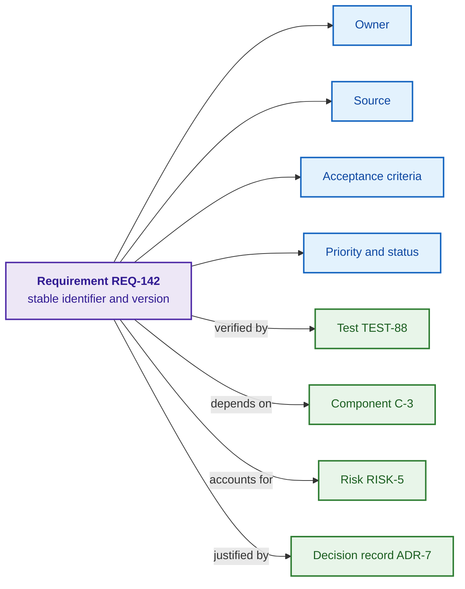
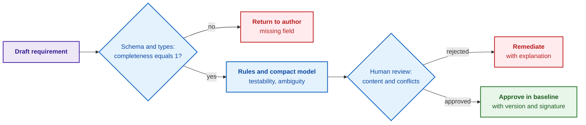
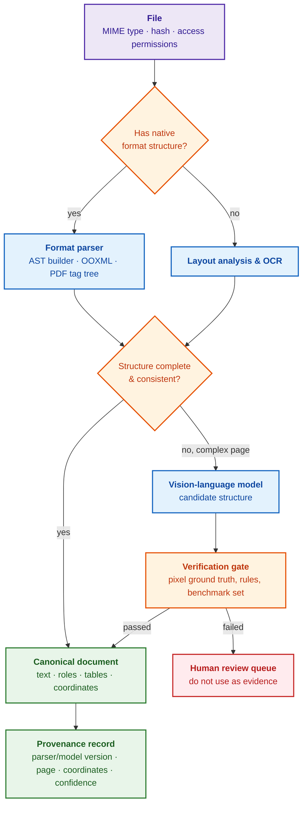
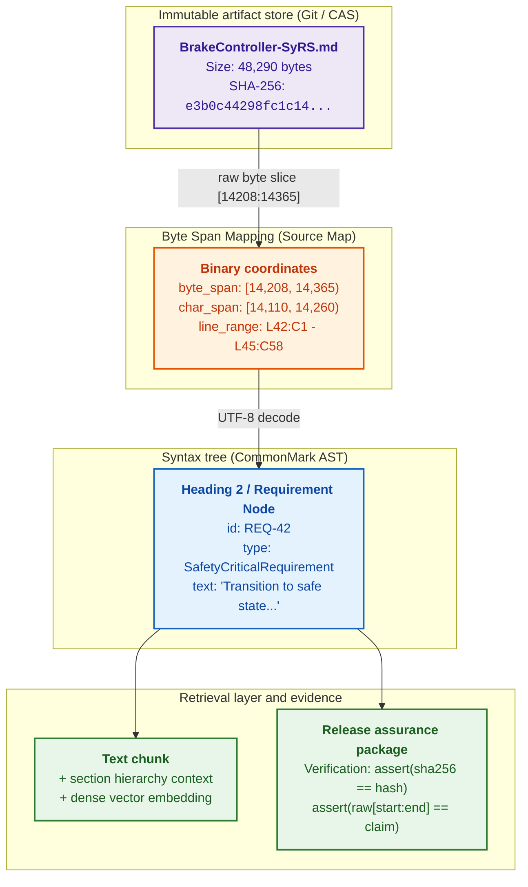
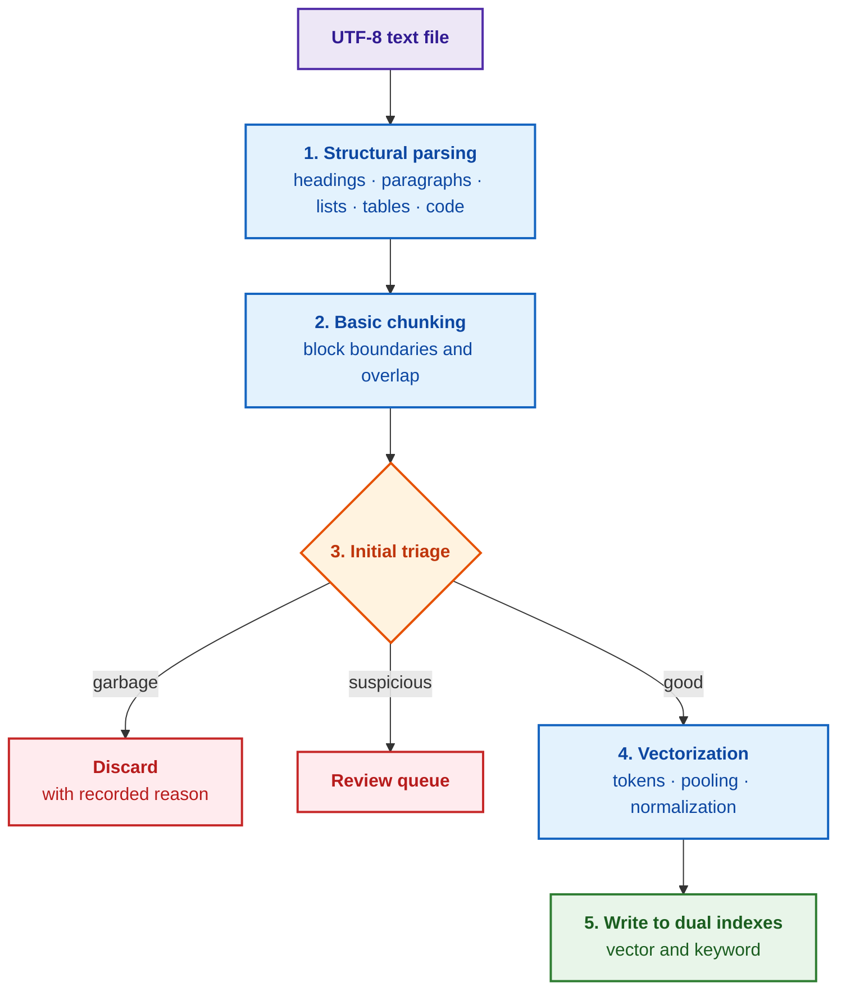
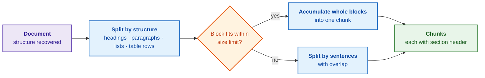
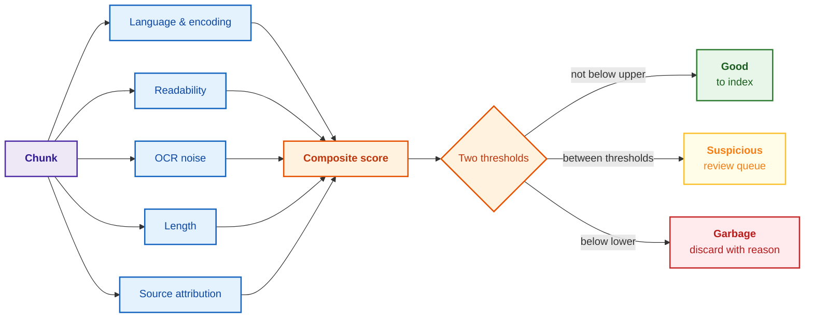
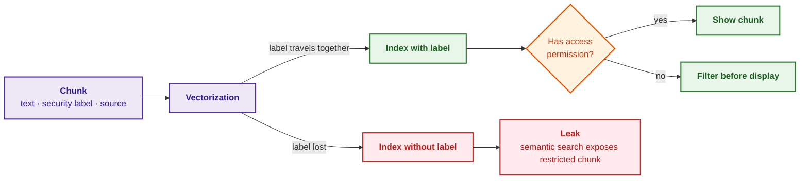
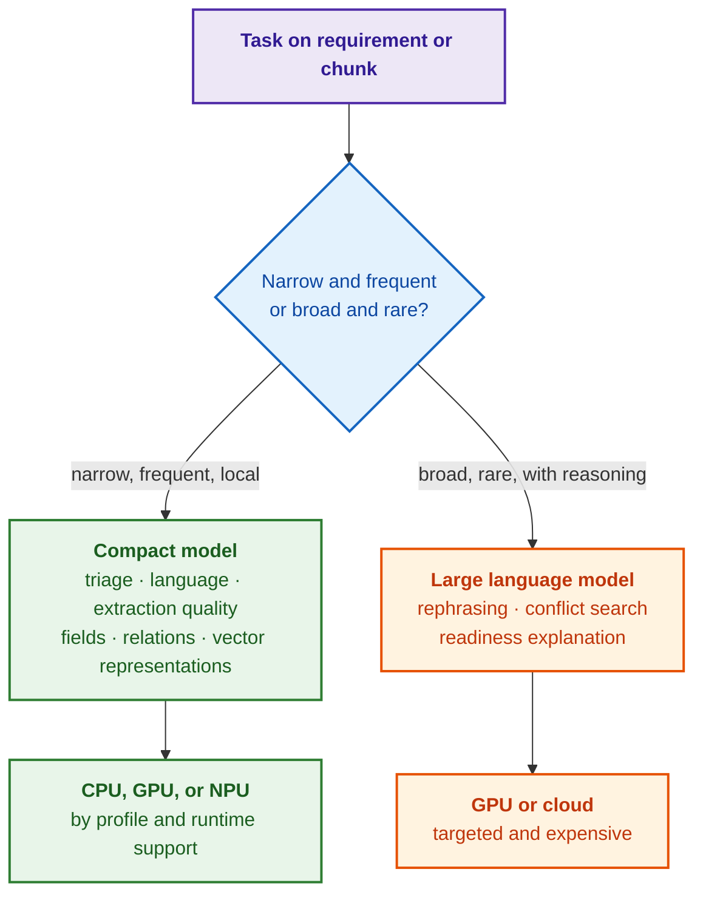

# Chapter 8. Engineering Artifacts as Data for Expert Systems

> **Book:** [Architecture of Evidence-Governed Expert Systems](README.md) · [Part II: Mathematical Models, Knowledge Representation, and Storage](part-02-knowledge-models.md)  
> **Previous Chapter:** [Chapter 7. Knowledge Base Typology: Rules, Ontologies, Precedents, and Vectors](ch07-knowledge-base-typology.md)  
> **Next Chapter:** [Chapter 9. Engineering Knowledge Graph: Traceability from Requirements to Hardware](ch09-engineering-knowledge-graph-traceability.md)  
> **Table of Contents:** [README.md](README.md)  
> **Author:** [Mykola Fedchyk](about-the-author.md)  
> **Target Level:** Foundational Engineering; pseudocode and code are placed in collapsible blocks  
> **Expected Learning Outcomes:** Specify a requirement, plan, or risk as a versioned data object; evaluate how much structure is preserved by a physical file format; trace the complete pipeline from a raw file to a chunk with provenance, quality gates, vector embeddings, and security labels; make principled architectural choices between rules, compact models, and large language models based on empirical benchmarks.

## Abstract

This chapter investigates the fundamental transformation of engineering artifacts—requirements, architectural decision records (ADRs), verification plans, test logs, and risk assessments—from passive natural-language documents into typed, machine-interpretable data objects that serve as the evidential bedrock for expert systems. It exposes the acute limitations of unstructured prose in mission-critical systems, where the absence of deterministic links precludes reliable change impact analysis, formal logical inference, and automated completeness verification. An end-to-end ingestion pipeline is established to convert raw engineering source files (PDF, Word, Markdown, source code) into canonical knowledge base structures with byte-level provenance tracking (Source Maps), guaranteeing the technical and legal irrevocability of the audit trail. The chapter formalizes methods for decomposing artifacts into structural chunks, hybrid indexing algorithms combining BM25 and dense vector representations, strict security label inheritance across access lattices, and architectural trade-offs between large language models and compact specialized extractors for populating the expert system's fact base with provable integrity.

Before a project steering committee meeting, a manager manually compiles status reports from issue trackers, test management systems, requirements databases, team chats, and spreadsheets, pasting the findings into a slide deck that becomes obsolete within forty-eight hours. The requirement stating that "the order management information system must respond rapidly to user requests" may be intuitively understood by a human reader, but fails to answer fundamental engineering questions: what concrete numerical latency constitutes "rapidly", who owns the requirement, which verification tests validate it, and whether the requirement has mutated since baseline approval. A generative language model can parse and summarize such text, yet summarization does not transform relationships into data: the tool cannot deterministically detect blocked milestones, compute test coverage, or reproduce a change impact analysis.

The objective of this chapter is to demonstrate that an engineering artifact must first exist as a structured data object before it can be rendered as a document or report, tracing the precise technical path through which raw source files become structured assets for an evidence-governed expert system. The chapter opens with an object-oriented model of an engineering artifact (requirements, plans, risks, milestones), analyzes how physical file formats dictate structural fidelity, and details the pipeline that transforms files into chunks equipped with byte-level provenance, vector embeddings, and security labels. Preceding chapters established why corporate memory demands formal evidence ([Chapter 5](ch05-triad-of-trust-and-corporate-memory.md)) and categorized the knowledge base typologies that ingest structured data ([Chapter 7](ch07-knowledge-base-typology.md)); [Chapter 9](ch09-engineering-knowledge-graph-traceability.md) addresses the synthesis of these entities into end-to-end traceability graphs, while [Chapter 10](ch10-knowledge-acquisition-systems.md) constructs the comprehensive knowledge acquisition architecture.

## 1. Research Map: Artifact Processing Challenges, Engineering Methods, and Quality Metrics

In systems engineering standards and capability maturity models, professional deliverables are designated as *work products*: requirements specifications, architectural plans, test execution records, decision rationales, and safety assurance cases. Parallel to these exist *work items*: development tasks, bug reports, and change requests, which similarly capture technical decisions and operational context. For an evidence-governed expert system, both categories constitute artifacts—first-class data entities characterized by immutable identifiers, typed dependencies, lifecycle states, and cryptographic verification evidence. The table below consolidates the core engineering challenges addressed throughout this chapter, pairing each with its formal resolution method, target evaluation metrics, failure modes, and architectural remediation paths.

| Problem | Method | Evaluation Metric | Representative Failure Mode | Remediation Strategy |
| --- | --- | --- | --- | --- |
| Incomplete or ambiguous requirement | Schema validation and quality gate | Field completeness, acceptance pass rate, post-review defects | Quality gate admits grammatically sound yet untestable prose | Numerical thresholds and mandatory human sign-off |
| Relationships exist solely in prose | Traceability graph | Requirement-to-test and evidence coverage | Hyperlink exists but resolves to an obsolete revision | Version-pinned edges and relational schema validation |
| PDF or scan loses document layout | Deterministic parser, OCR, and layout-aware models | Reading order fidelity, table/formula extraction accuracy, provenance | Vision-language model hallucinates plausible yet ungrounded text | Pixel coordinate cross-validation, confidence scores, human review queue |
| Target chunk missed during retrieval | Structural chunking and hybrid retrieval | Top-k recall, ranking accuracy (nDCG@k), query latency | Over-reliance on dense cosine similarity alone | Lexical (BM25) and dense vector search, Reciprocal Rank Fusion, cross-encoder reranking |
| Restricted content leaks into response | Pre-retrieval access control filtering | Zero unauthorized exposures in negative security test suites | Access rights evaluated post-retrieval on generated text | Strict candidate filtering prior to vector and lexical ranking |

This table establishes a rigorous methodological boundary: the assertion that "the model runs" does not constitute an engineering criterion for production readiness. Every statistical processing step requires a curated benchmark test set, quantitative acceptance thresholds, and deterministic fail-safe behavior whenever thresholds are breached. The following sections address each challenge systematically, beginning with why free-form natural language text fails mission-critical engineering requirements.

## 2. Limitations of Unstructured Natural Language Text in Mission-Critical Systems

A requirement expressed purely in free-form prose cannot provide deterministic, machine-readable answers regarding its ownership, provenance, associated verification tests, affected architectural components, or baseline validity. Metadata fields can be extracted via heuristic rules or neural language models; however, extraction represents an external transformation subject to statistical error, model version drift, and continuous validation overhead. Consequently, an operational burden of manual labor invariably surrounds unstructured text: systems engineers maintain detached traceability matrices in spreadsheets, test leads manually reconcile test cases against specification paragraphs, and compliance teams assemble regulatory audit trails from fragmented email threads and outdated document revisions.

Project schedules and risk registers suffer from identical structural deficiencies. In complex cyber-physical or safety-regulated initiatives, engineering artifacts proliferate: Work Breakdown Structures (*Work Breakdown Structure*, WBS), Gantt schedules, dependency graphs, engineering change orders (ECOs), baseline freezes (*baselines*), verification and validation (V&V) plans, defect arrival trends, supplier readiness matrices, audit findings, and release readiness checklists. When these artifacts are trapped within static text documents, engineering teams transition from active systems management to manual document reconciliation. Change impact analysis (*impact analysis*) similarly deteriorates under human cognitive strain: following a requirement modification, an Application Lifecycle Management (*Application Lifecycle Management*, ALM) platform or expert system should automatically highlight all affected work packages, verification suites, hazard mitigations, and compliance approvals. A text document cannot enforce or traverse these dependencies; under aggressive delivery schedules, human practitioners rarely update multiple detached documents synchronously.

In summary: natural language prose is accessible to human readers, but cannot yield deterministic, reproducible answers to structural queries, and every downstream automated extraction step introduces statistical error. The architectural solution lies in fundamentally redefining the operational role of the engineering document.

## 3. The Paradigm of the Engineering Artifact as a Typed Data Object

Under the machine-first (*machine-first*) paradigm, an engineering artifact is treated as a typed, structured data object governed by schemas, relational constraints, and executable business rules. From this underlying object, downstream systems can deterministically synthesize a PDF for human review, an interactive portal view for stakeholders, a dashboard for leadership, or an export bundle for regulatory auditors. The rendered document becomes a transient projection (*view*), while the structured entity serves as the canonical single source of truth (*source of truth*). If an engineer adjusts a milestone completion date, the modification updates the underlying data entity directly, rather than altering an isolated slide in an executive presentation.

The software engineering discipline underwent an identical paradigm shift during its transition from manual infrastructure configuration to the "Everything as Code" paradigm: Infrastructure as Code (IaC), Policy as Code (PaC), and Docs as Code (version-controlled source text managed through merge requests and automated CI/CD pipelines) conclusively proved that screenshots and detached configuration files cannot serve as sources of truth. Project and systems management has historically lagged behind this transition; however, operational work plans, probabilistic risk models, and release gate definitions must equally be elevated to structured data artifacts. The operational rule is straightforward: if an artifact modification carries downstream technical or logistical consequences, the requirements management, risk tracking, or release governance toolchain must detect those consequences deterministically. When a milestone shifts by two weeks, all dependent supplier deliverables, verification runs, and contractual obligations must be flagged automatically.

The advent of Large Language Models (*large language models*, LLM) has not eliminated the necessity of rigorous data structuring; rather, it has shifted its operational interface. Natural language provides an expressive, low-friction interface: it enables an engineer to articulate intent, generate an initial requirement draft, or explore architectural trade-offs. However, the conversational interface is never the source of truth. Every requirement formulated with generative AI assistance must be compiled into a validated, typed object with assigned ownership, quantified acceptance criteria, and traceable dependencies; otherwise, the artifact cannot survive change impact analysis, regulatory audit, or safety coverage verification. Language models significantly lower the cost of drafting candidate entities, but they do not eliminate the necessity of schema validation, relational integrity checks, and authority verification: formal quality criteria apply equally to human-written text and AI-generated drafts.

Structured artifacts benefit not only expert systems: reference information systems, diagnostic portals, and decision-support engines immediately gain superior search precision, faceted filtering, and deterministic impact analysis. An information platform transitions into an authentic expert system when it evaluates codified domain knowledge over these structured facts and relations to solve a concrete problem and emit an auditable, evidentiary reasoning chain ([Chapter 3](ch03-beyond-reference-information-systems.md)). Data structure provides the raw substrate for logical deduction, but does not substitute for inference itself. The most critical application of this paradigm is requirements modeling.

## 4. Structural Model of a Requirement: Attributes, Versioning, and Semantic Relations

A structured engineering requirement is formalized as an object containing mandatory schema attributes:

- **Owner** (*owner*): the specific engineering lead or subsystem team accountable for the technical accuracy, implementation, and lifecycle currency of the requirement;
- **Source** (*source*): the originating stakeholder need, regulatory standard, customer specification, or architectural decision from which the requirement derives;
- **Acceptance Criteria** (*acceptance criteria*): unambiguous, quantified conditions and test protocols required to verify that the implementation satisfies the requirement;
- **Priority and Status**: business and safety criticality, paired with lifecycle state (e.g., `Draft`, `Approved`, `Modified Post-Baseline`, `Deprecated`);
- **Typed Relations**: directed edges linking the requirement to parent/child requirements, hardware/software components, verification test cases, hazard risks, and architectural decisions.

The diagram below illustrates a requirement modeled as a node within an engineering knowledge graph: the central requirement node maintains a stable identifier, surrounded by typed attributes, with directed edges connecting related system entities.



The purple node designates the requirement entity, blue nodes represent intrinsic schema attributes, and green nodes indicate linked external artifacts: an automated test, a physical or logical component, an identified system hazard risk, and an Architecture Decision Record (*Architecture Decision Record*, ADR). Once requirements are modeled in this structural topology, an engineering toolchain can execute deterministic queries such as: "retrieve all approved requirements lacking verification test cases", "identify all requirements mutated after baseline freeze", or "list all requirements dependent on component C-3 whose functional safety certification remains pending". Over unstructured documents, answering such inquiries demands labor-intensive human inspection or lossy text extraction; over an object graph, execution is deterministic, instantaneous, and mathematically verifiable.

This structural integrity depends strictly on stable entity identifiers and semantic versioning. While a persistent identifier enables historical tracking as wording evolves across revisions, relational links to tests and verification evidence must explicitly reference the specific evaluated version. Failing to pin the evaluated revision allows an obsolete test execution to falsely attest to a newly mutated requirement. Versioning captures immutable baseline snapshots, while content modifications automatically flag dependent verification artifacts for re-validation without obliterating audit history. The subsequent engineering challenge is automating quality verification across these structured artifacts.

## 5. Automated Quality Control and Formal Validation of Requirements (ISO/IEC/IEEE 29148)

Transforming a requirement into a structured data object enables automated quality gates within CI/CD pipelines. An automated validator does not replace the systems architect or safety engineer, but eliminates mechanical non-compliance before human review. The ISO/IEC/IEEE 29148 standard defines the fundamental quality characteristics of well-formed requirements [[1]](#src-1), four of which lend themselves directly to automated algorithmic verification:

- **Completeness:** the requirement schema exhibits no unpopulated mandatory fields (owner, source, quantitative acceptance criteria);
- **Testability** (*testability*): the requirement specifies an objective, measurable validation criterion; vague declarations such as "the user interface shall be intuitive" are immediately flagged as untestable;
- **Unambiguity:** the specification contains no subjective linguistic escape hatches ("rapidly", "reliably", "where appropriate") lacking explicit numerical bounds;
- **Consistency:** the requirement introduces no logical or parametric contradictions with existing approved specifications (e.g., conflicting voltage tolerances for the same power rail).

The baseline structural completeness of a requirement is quantified algorithmically:

```math
C_{\text{req}}(r)=\frac{1}{m}\sum_{j=1}^{m} I_j(r)
```

Quantities in structural completeness:

- $r$ is the requirement, $`m>0`$ is the number of mandatory schema fields, and $j$ indexes the field;
- $`I_j(r)`$ equals 1 if field $j$ is populated with a value of the correct datatype, and 0 otherwise;
- $`\sum_{j=1}^{m}`$ aggregates evaluations across all fields, and division by $m$ computes their ratio.

The output metric is bounded within the interval $[0, 1]$: if four of five required attributes are populated, $`C_{\text{req}} = 4/5 = 0.8`$. However, a populated field does not guarantee semantic validity: populating `owner: TBD` satisfies schema presence while failing engineering accountability. Therefore, an operational quality gate (*quality gate*) is formalized as a product of conjunctional binary checks, without asserting statistical independence:

```math
Q_{\text{gate}}(r)=\mathbf{1}[C_{\text{req}}(r)=1]\cdot\mathbf{1}[T(r)=1]\cdot\mathbf{1}[A(r)=1]\cdot\mathbf{1}[S(r)=1]
```

Checks in the quality gate:

- $r$ is the evaluated requirement, and $`C_{\text{req}}(r)=1`$ asserts complete schema compliance;
- $\mathbf{1}[\cdot]$ denotes the indicator function yielding 1 if its internal predicate is satisfied, and 0 otherwise;
- $T(r)$ evaluates testability, $A(r)$ asserts the absence of identified ambiguities, and $S(r)$ verifies formal consistency against the active baseline;
- The multiplication operator enforces that every gating condition must evaluate to 1 simultaneously.

Consequently, $`Q_{\text{gate}}(r)`$ evaluates strictly to $\{0, 1\}$, returning 1 only when all validation gates pass. While a statistical or neural classifier may estimate $T$ or flag suspected ambiguities, an automated quality gate must never silently substitute a probabilistic heuristic for a deterministic engineering verdict.

**Runtime Control Flow and State Transitions:**
- **Baseline Approved (`Baseline Approved`):** when $`Q_{\text{gate}}(r) = 1`$, the requirement object is cryptographically signed using the systems engineer's private key (Ed25519) and permanently committed to the immutable baseline release manifest;
- **Block Commit (`Block Commit`):** when $`Q_{\text{gate}}(r) = 0`$, the pre-commit or CI/CD hook rejects artifact registration, returning a machine-readable diagnostic report containing the status vector $`[C_{\text{req}}, T, A, S]`$ to guide authorial remediation.

**Worked Numerical Example:**
Consider a draft requirement REQ-104 ("The controller shall rapidly clear the alarm flag under undervoltage conditions"). The schema defines $m = 5$ mandatory attributes, all populated with valid datatypes ($`C_{\text{req}} = 1`$). Testability is established via hardware injection ($T = 1$), and consistency against the baseline is confirmed ($S = 1$). However, the linguistic linter flags the vague adverb "rapidly" lacking an explicit millisecond timeout bound ($A = 0$):

```math
Q_{\text{gate}}(\text{REQ-104}) = \mathbf{1}[1 = 1] \cdot \mathbf{1}[1 = 1] \cdot \mathbf{1}[0 = 1] \cdot \mathbf{1}[1 = 1] = 1 \cdot 1 \cdot 0 \cdot 1 = 0
```

Because $`Q_{\text{gate}} = 0`$, the pipeline blocks artifact registration, emitting diagnostic code `ERR_AMBIGUOUS_SPECIFICATION: missing latency bound`. The verification sequence is illustrated below:



Blue nodes designate automated verification gates, red nodes reject non-compliant requirements back to authors, and the green node confirms formal baseline commitment. Defective specifications are trapped during authorship, rather than surfacing during external audits or physical bench integration.

No single toolchain satisfies all requirements validation demands; industrial verification must be architected in layers. The prose linter [Vale](https://github.com/vale-cli/vale), configured with customized engineering style rules, detects forbidden buzzwords and template deviations directly within CI/CD pipelines. The Go NLP library [prose](https://github.com/jdkato/prose) provides tokenization, sentence boundary segmentation, part-of-speech tagging, and Named Entity Recognition (*named entity recognition*, NER) with exact character offsets; however, its pre-trained statistical models are English-centric and cannot be transferred uncalibrated to multilingual engineering specifications. For executing neural classifiers natively within Go services, runtimes like [Cybertron](https://github.com/nlpodyssey/cybertron) or [Hugot](https://github.com/knights-analytics/hugot) over ONNX Runtime are recommended; tokenizer compatibility and hardware execution providers must be verified via test suites. Models such as [GLiNER](https://github.com/urchade/GLiNER) offer flexible zero-shot entity extraction, though entity recognition alone cannot substitute for relation extraction (*relation extraction*) and schema validation. Commercial requirement validation tools must be subjected to identical empirical benchmarks, without mistaking proprietary score metrics for formal verification proof.

An LLM-based engineering assistant can suggest clearer phrasing, highlight unstated acceptance thresholds, identify potential cross-subsystem contradictions, or draft initial unit test stubs. Crucially, assistant outputs remain advisory proposals: final approval resides with human engineering authority, and every modification is recorded as an auditable object transaction. In summary: structural modeling renders requirements quality measurable, while engineering authority retains final evaluative ownership. The most decisive argument for structured artifacts, however, is end-to-end traceability.

## 6. End-to-End Traceability of Engineering Artifacts as the Foundation of Systems Architecture

In regulated engineering development, an unbroken chain of custody must be demonstrated: stakeholder need, system-level requirement, allocated software specification, architectural design decision, verification test case, and empirical execution log. The ISO/IEC/IEEE 29148 standard explicitly requires bidirectional traceability throughout the engineering lifecycle [[1]](#src-1). Whenever any link in this chain exists solely as disconnected text, the chain fractures, demanding manual reconstruction during audits.

Structured data transforms this chain into an actionable, navigable graph. Change impact analysis becomes instantaneous and reproducible to the exact extent of graph fidelity: modifying a requirement immediately illuminates all affected verification test cases, safety hazards, architectural records, and release milestones; a failed test case identifies unvalidated specifications; a revised regulatory clause flags non-compliant subsystem controls. The underlying mechanism executes deterministic graph traversal and relational integrity checks; any missing or spurious edge directly corrupts the computed impact perimeter. The foundational diagnostic metric of graph coverage is defined without complex graph theory:

```math
\mathrm{Coverage}_{R\rightarrow T}=\frac{\left\lvert\left\{r\in R:\ \exists\,t\in T,\ (r,t)\in E_{RT}\right\}\right\rvert}{\lvert R \rvert}
```

Notation for coverage:

- $R$ denotes the set of active requirements, $T$ denotes the set of tests, and $`E_{RT}`$ denotes the set of confirmed "requirement is verified by test" relations;
- $r$ designates an individual requirement, $t$ designates an individual test, and $`(r,t)\in E_{RT}`$ asserts that a confirmed relation binds that exact pair;
- $\exists$ signifies "there exists at least one", and $`\lvert\cdot\rvert`$ denotes set cardinality;
- The numerator enumerates all requirements backed by at least one verification test, while the denominator counts all active requirements in the baseline.

**Runtime Control Flow and Regulatory Compliance Gates:**
- **Functional Safety Imperative (ISO 26262 ASIL D / DO-178C Level A):** regulatory standards strictly mandate $`\mathrm{Coverage}_{R\rightarrow T} = 1.00`$. Any value strictly less than unity represents a safety-critical verification deficiency;
- **Pipeline Reaction:** if $`\mathrm{Coverage}_{R\rightarrow T} < 1.00`$, the safety report compiler raises a `FAIL_CLOSED` event, blocks production binary compilation and cryptographic signing, and exports the set of unverified requirements to the defect tracker.

**Worked Numerical Example:**
A release candidate baseline contains $`\lvert R \rvert = 120`$ safety-critical requirements. Automated test bench auditing confirms valid associations with passing test runs for 118 requirements:

```math
\mathrm{Coverage}_{R\rightarrow T} = \frac{118}{120} \approx 0{,}9833
```

Because $`\mathrm{Coverage}_{R\rightarrow T} = 0.9833 < 1.00`$, the release gate aborts firmware release despite 98.3% verification completion, highlighting the two unverified specifications: `REQ-045` (watchdog timer reset sequence) and `REQ-089` (CAN bus break detection).

## 7. Modeling Plans, Risks, and Milestones as Typed Objects

The principle of converting unstructured prose into typed data objects extends beyond requirements: it applies with equal force to project schedules, hazard risk models, and production release gates. In traditional document-centric engineering, a release plan is maintained as a static spreadsheet in Excel or a wiki page with milestones, names, and deadlines, accompanied by several narrative paragraphs on risk. Such documents begin diverging from reality within forty-eight hours of approval, isolated from the live codebase, automated bench results, and hardware supply chains. In a machine-first architecture, a release plan comprises dynamically linked data entities.

A project milestone specifies explicit entry and exit criteria linked to requirements, passing test suites, or formal approvals. A work package defines predecessor dependencies and resource allocations. A risk object captures concrete trigger conditions, quantified severity and probability scores, mitigation actions, assigned owners, and automated escalation thresholds. A release milestone enforces machine-verifiable gates: zero open critical defects, 100% execution of mandatory test suites, formal verification of all mutated requirements, signed waivers (*waivers*) for approved deviations, and complete safety sign-offs. If any gating condition fails, the release management toolchain immediately surfaces a release blockage, rather than waiting for an engineer to manually edit a slide deck.

Status reports generated from these underlying data objects reflect reality rather than creating an illusion of progress. If an executive summary appears optimistic while underlying components exhibit failing test runs, the automated dashboard displays an overall red status, insulating the engineering organization from presentation bias. Having established the conceptual object model, we must now examine how much structure survives when artifacts are persisted in physical files.

## 8. Impact of Physical Carrier Formats on Engineering Structure Preservation

Every engineering artifact is persisted within a specific file format, and that format governs how much structure survives ingestion into indexers, expert systems, and compliance pipelines. A project plan stored in a text-based markup format versus a scanned PDF presents two fundamentally distinct sources to an automated parser. Physical storage formats can be classified along a spectrum of structural transparency:

- **Plain text and markup** (*plain text, markup*): Markdown, HTML, reStructuredText, AsciiDoc, and engineering XML-based standards (*eXtensible Markup Language*) such as the Requirements Interchange Format (*Requirements Interchange Format*, ReqIF) [[2]](#src-2). Structural semantics are encoded directly within the stream: headings via explicit delimiters, tables via column separators, and relationships via stable identifiers. Files can be diffed line-by-line, placed under native Git version control, and referenced down to exact line numbers;
- **Structured binary containers** (*structured binary*): modern office formats (.docx, .xlsx) are zipped packages of XML parts adhering to the Office Open XML (OOXML) standard. Structural hierarchies exist, but remain coupled to typographic styling, where the mapping between visual presentation and semantic role is often inconsistent;
- **Layout-oriented formats** (*layout-oriented*): standard, untagged PDF files encode absolute graphical coordinates of glyphs and vector lines across a canvas, requiring reading order, table cell boundaries, and section hierarchies to be heuristically reconstructed. Tagged PDF formats (*tagged PDF*) incorporate a logical document tree, and the PDF/UA standard specifies explicit semantic tagging and reading order rules [[3]](#src-3); however, auto-generated tag trees frequently exhibit structural defects requiring validation;
- **Raster scans** (*raster scans*): pure bitmap images devoid of embedded text layers contain only raw pixel arrays. Every glyph must undergo optical character recognition, where every recognition step is susceptible to statistical misclassification.

The engineering principle is self-evident: the more explicitly structure is encoded in the file format, the less computationally expensive and more reliable the ingestion process, and the more rigorously the origin and extraction of any data snippet can be proven. Structured markup is ingested deterministically with near-zero information loss; structured binaries require moderate extraction pipelines; layout formats demand complex heuristic reconstruction; and raster scans are the most expensive, introducing classification error risks at every character.

A distinct category comprises serialization formats designed for inter-process structured data interchange. XML structures data via nested tags (`<owner>Storage</owner>`), but introduces significant syntactic verbosity. JSON (*JavaScript Object Notation*) adopts JavaScript object literal notation, establishing itself as the de facto standard for web service payloads [[4]](#src-4). YAML (*YAML Ain't Markup Language*) expresses structural hierarchies via indentation, providing high human readability for configuration management [[5]](#src-5). In all three formats, explicit key-value mappings directly model typed entity attributes (`owner`, `acceptance_criteria`). Three architectural caveats must be enforced:

1. Records must undergo schema validation prior to indexing: JSON Schema [[6]](#src-6), XML Schema Definition (*XML Schema Definition*, XSD), or Shapes Constraint Language SHACL [[7]](#src-7) must filter out invalid datatypes, missing attributes, and unauthorized relationships;
2. YAML files must be ingested using hardened, safe parsers enforcing explicit specification versions and disabling polymorphic object instantiation, arbitrary code execution, and unconstrained aliases (*aliases*);
3. Raw serialized syntax should not be blindly vectorized: syntactic formatting introduces noise into dense embedding spaces, though descriptive field names occasionally assist retrieval. Engineering teams should evaluate retrieval performance across both raw serialization and canonically rendered text templates on domain queries, while retaining structural keys as deterministic metadata filters. Documents should be chunked across entity boundaries (array elements, XML nodes, scoped key-value blocks) rather than arbitrary character offsets.

In summary: file formats are questions of evidence and reliability, not aesthetic convenience. Three engineering rules follow: persist canonical sources in formats with transparent structure (version-controlled text instead of PDF exports; ReqIF instead of scanned printouts); record the extraction method for every chunk, acknowledging that fragments extracted from markup, reconstructed layouts, or OCR carry distinct evidentiary trust classes; and propagate extraction confidence scores alongside extracted data. The subsequent section examines how parsing pipelines recover structure from heterogeneous formats.

## 9. Ingestion Pipeline: Parsing and Normalization of Raw Bytes into Canonical Documents

The structural preservation spectrum dictates the computational complexity and operational cost of the ingestion pipeline: the further a file format is from plain text markup, the greater the reliance on heuristics, neural models, and human auditing to transform raw bytes into trustworthy engineering facts. The two poles of this spectrum illustrate this technological divide: lightweight markup (Markdown, XML, ReqIF), where semantic structure is explicit and extracted by deterministic parsers in microseconds, versus scanned raster drawings or signed test certificates, where every character and table grid line must be reconstructed from pixel arrays using deep neural networks.

**Markup.** A deterministic parser (*parser*) converts structured markup into an Abstract Syntax Tree (*abstract syntax tree*, AST). The conceptual approach is demonstrated in the simplified line-by-line scanner below, though a production CommonMark implementation [[8]](#src-8) must handle indented code blocks, nested lists, and table alignment rules.

<details>
<summary>Pseudocode: Parsing markup into a tree</summary>

```text
read file as UTF-8 string
for each line in file:
    if line starts with '#'       -> node "heading", level = count of '#'
    if line matches '| ... |'     -> node "table_row"
    if line starts with '- '      -> node "list_item"
    if line contains '[text](target)' -> edge (text, target)
assemble nodes into a tree based on heading hierarchy
```

</details>

Markup parsing yields syntactic headings, tables, lists, and links; however, the engineering validity of a requirement or the availability of a linked target still requires independent verification. PDFs and image formats likewise adhere to formal specifications. The operational difficulty stems not from a lack of grammar, but from the fact that valid visual positioning commands or pixel arrays do not unambiguously dictate semantic reading order or domain meaning. A PDF parser may decode font streams without defect while assembling table columns in inverted order. Deterministic parsing of a container does not guarantee defect-free semantic extraction.

**Intermediate formats.** In untagged PDF files, text glyphs are bound to absolute two-dimensional page coordinates; reading order, multi-column flows, and table grids must be reconstructed heuristically. Tagged PDFs should be parsed using the embedded structural tree, with cross-validation against rendered page geometry. The .docx format is more structurally reliable, consisting of zipped XML parts; however, semantic fidelity remains dependent on authorial discipline: if a document author formats a section heading by manually enlarging font size rather than applying heading styles, its architectural role must be inferred heuristically.

**Raster.** Scanned documents traverse the most computationally intensive and error-prone pipeline: deskewing, binarization, page segmentation (distinguishing body text, tables, and figures), and Optical Character Recognition (*optical character recognition*, OCR).

<details>
<summary>Pseudocode: Processing raster scans</summary>

```text
image -> deskewing -> binarization
page segmentation: segment text blocks, tables, and figures
for each text block:
    OCR -> character sequence + confidence score in [0, 1]
if mean confidence score < threshold:
    route to human-in-the-loop review queue
```

</details>

Because every character recognition step carries non-zero error probability, OCR confidence scores must be propagated downstream as metadata: a text chunk with poor extraction confidence must never be cited silently as authoritative evidence.

As of 2026, an intelligent document processing (*document AI*) pipeline should be architected as a cascade: progressing from deterministic, cost-effective parsers to statistical neural models only when necessary.

| Input and challenge | Primary method | When to engage machine learning | Acceptance criteria |
| --- | --- | --- | --- |
| Markdown, HTML, XML, ReqIF | Deterministic format parser and AST builder | Rarely for syntax; models used only for substantive fields | Valid AST; links and identifiers fully preserved |
| .docx, .xlsx, .pptx | OOXML parser; Apache Tika [[9]](#src-9) or Docling [[10]](#src-10) for bulk ingestion | When document styling fails to reflect semantic hierarchies | Section titles, tables, footnotes, and references reconciled against visual rendering |
| Tagged PDF | Structure tree parser and geometric layout reconciliation | When structural tags are absent or conflict with rendered layout | Verified reading order and correct semantic role mapping |
| Complex untagged PDF or scan | Layout analysis and OCR engines (e.g., Docling, PP-StructureV3 [[11]](#src-11)) | Vision-language models for formulas, tables, charts, and dense layouts | Character/word error rate within limits; table cell boundaries, formulas, and reading order verified |
| Safety-critical evidence | Deterministic parser and source coordinates | Neural models generate candidate extractions only | Mandatory human sign-off or dual independent verification |

Layout-aware architectures such as LayoutLMv3 [[12]](#src-12) jointly process text tokens, visual image patches, and two-dimensional bounding coordinates, while modern document-oriented Vision-Language Models (*vision-language models*, VLM) can directly output structured Markdown or JSON. These models handle multi-column layouts, nested tables, and mathematical formulas significantly better than traditional OCR cascades, but introduce an acute risk: generative models can hallucinate or silently normalize critical values. Consequently, neural extractions can serve as engineering evidence only when coupled with source file identifiers, page indices, bounding box coordinates, model version hashes, and explicit verification status. Provenance tracking is standardized using the W3C PROV-O ontology [[13]](#src-13). The complete ingestion architecture is illustrated below:



Blue components process the document, orange decision gates validate outputs, green components form the verified canonical document with provenance, and the red block isolates quarantined failures. Vision-language models are engaged only when deterministic parsers cannot resolve layout ambiguities, and their outputs are never admitted into the evidence base without verification.

### 9.1. Byte-Level Traceability: Constructing Source Maps for Originating Artifacts

When an evidence-governed expert system or external auditor validates safety-critical requirement REQ-42 ("Upon watchdog timer expiration, the brake controller shall transition to safe state within 100 ms"), a vague reference such as "located somewhere in specification file SyRS_v3.2.md" is categorically insufficient. In regulated engineering disciplines (ISO 26262 ASIL D functional safety, DO-178C DAL A avionics, CENELEC EN 50128 railway signaling), every requirement, extracted parameter, or cited test result must possess mathematically irrefutable cryptographic provenance (*provenance*) tracing back to exact byte spans within immutable source artifacts.

Relying exclusively on "reconstructed text" detached from immutable file offsets introduces severe failure modes:
- UTF-8 transcoding or Unicode normalization (e.g., converting hyphens to em-dashes, or Latin 'c' to Cyrillic 'с') corrupts cryptographic content hashes;
- An aggressive tokenizer or generative VLM may round numeric tolerances—such as silently converting "100 ms" to "10 ms"—introducing catastrophic hallucinations into safety assurance cases;
- Lacking exact source coordinates prevents seamless IDE integration, where an engineer clicking an audit finding expects to jump directly to the highlighted source line in a code or specification editor.

To guarantee complete evidentiary integrity, the artifact processing architecture incorporates a **byte-level Source Map**: every AST node, extracted attribute, and search chunk is pinned to its originating binary file via deterministic coordinates.



A complete provenance descriptor for an extracted engineering artifact comprises five coordinate dimensions:

1. **Cryptographic source hash (`file_sha256`):** captures the exact binary snapshot within Git or Content-Addressable Storage (*Content-Addressable Storage*, CAS). Altering a single bit in the source file invalidates the hash.
2. **Byte span (`byte_span`):** a half-open byte interval $`[b_{\text{start}}, b_{\text{end}})`$ referencing raw binary offsets within the source file, providing an encoding-independent reference.
3. **Character span (`char_span`):** Unicode character offsets in the decoded canonical text, used by internal text-processing runtimes.
4. **Line and column coordinates (`line_col`):** a tuple $`[l_{\text{start}}, c_{\text{start}}, l_{\text{end}}, c_{\text{end}}]`$ enabling IDEs (VS Code, CLion) to highlight the source passage.
5. **Bounding box (`bbox`):** for PDFs, engineering drawings, or scans: page number and normalized spatial coordinates $`[x_0, y_0, x_1, y_1]`$ bounding the visual region.

<details>
<summary>Example YAML: Chunk provenance metadata with byte coordinates</summary>

```yaml
chunk_id: CHK-REQ-42-01
target_entity: REQ-42
provenance:
  file_path: "specs/safety/BrakeController-SyRS.md"
  file_git_commit: "9f82a3c748e10b441209e5"
  file_sha256: "e3b0c44298fc1c149afbf4c8996fb92427ae41e4649b934ca495991b7852b855"
  byte_span: [14208, 14365]
  char_span: [14110, 14260]
  line_col:
    start_line: 42
    start_col: 1
    end_line: 45
    end_col: 58
  extracted_by: "CommonMarkParser_v2.4"
  verification_checksum: "3a9f182c..."
text_payload: "Transition of BrakeController to safe state upon watchdog failure: within 100 ms"
```

</details>

An automated verification script within CI/CD pipelines verifies provenance deterministically without invoking neural networks:

```python
def verify_claim_provenance(claim) -> bool:
    # 1. Fetch raw binary file by cryptographic hash from CAS
    raw_bytes = artifact_store.read_bytes(claim.provenance.file_sha256)
    
    # 2. Verify artifact cryptographic integrity
    if hashlib.sha256(raw_bytes).hexdigest() != claim.provenance.file_sha256:
        return False  # Source file was tampered with or corrupted
        
    # 3. Slice exact binary slice by byte offsets
    start, end = claim.provenance.byte_span
    raw_slice = raw_bytes[start:end]
    
    # 4. Compare decoded slice against recorded claim text
    return raw_slice.decode('utf-8') == claim.text_payload
```

This byte-level traceability transforms an informational retrieval chunk into an auditable legal and engineering proof: no neural model or generative layer can alter "100 ms" to "10 ms", as the verification gate will immediately abort compilation due to byte mismatch.

## 10. Document Decomposition into Structural Chunks (Chunking)

A canonical document is not indexed as an undivided monolith. Information retrieval systems operate on *chunks* (*chunks*), compact, self-contained textual segments optimized for indexing and dense vectorization. This section provides an architectural overview; the complete knowledge acquisition infrastructure—addressing discovery, classification, deduplication, stream indexing, and deprecation—is detailed in [Chapter 10](ch10-knowledge-acquisition-systems.md).

An architectural question arises: if document parsing functions like a compiler, why not compile requirement text directly into an unambiguous machine representation instead of segmenting and vectorizing prose? Because the input consists of unconstrained natural language lacking formal grammar: the semantic meaning of "the system response must be fast" cannot be deduced from syntax the way programming language semantics are parsed. A compiler translates one formal language into another with absolute semantic equivalence, whereas a knowledge pipeline maps semantic content into an embedding space where semantically related concepts cluster together, enabling search over unstructured concepts. Hence, distinct tooling is required: statistical vector embeddings governed by confidence thresholds, anomaly quarantine, and human review. The five stages from raw file to indexed knowledge are illustrated below:



Blue nodes represent pipeline stages, the orange diamond sorts chunks by quality, red blocks reject or quarantine problematic segments, and the green block commits accepted chunks to indexes. Monolithic documents are avoided for two technical reasons: embedding models (*embedding model*) enforce finite input token limits (rendering hundred-page specifications unprocessable in a single forward pass), and whole-document embeddings dilute localized semantic concepts, degrading search precision.

Basic chunking (*basic chunking*) partitions text along structural boundaries (headings, paragraphs, list items, table rows) before enforcing token constraints. An oversized structural block is split into segments with a small token overlap (*overlap*) to preserve contextual continuity across boundaries. The number of chunks generated from a structural block of token length $L$ is calculated as:

```math
N(L,c,o)=1+\left\lceil\frac{\max(0,\ L-c)}{c-o}\right\rceil
```

In the chunking formula:

- $L$ denotes the total token length of the structural block, $c$ is the maximum chunk capacity, and $o$ is the token overlap, where $0\le o<c$;
- $\max(0,L-c)$ represents the remaining token volume exceeding the initial chunk, while $c-o$ defines the stride between consecutive chunk starts;
- $\lceil z\rceil$ rounds $z$ upward to the nearest integer, and the constant 1 accounts for the initial chunk.

The function evaluates to an integer $N \ge 1$: a block shorter than $c$ yields exactly one chunk, whereas parameters $L=1000$, $c=400$, and $o=80$ yield $1+\lceil600/320\rceil=3$ chunks. Higher overlap reduces contextual loss across splits, but inflates index storage, retrieval latency, and near-duplicate results in top-k rankings. Consequently, $c$ and $o$ are tuned empirically on representative domain queries to balance recall against computational overhead; structural boundaries (requirements, tables, section headers) always take precedence over fixed token slicing.

**Hardware Dimensioning and Context Budgeting:**
The chunk count $N(L, c, o)$ directly dictates the memory footprint for vectorization buffers and index storage:

```math
M_{\mathrm{emb}} = N \cdot d_{\mathrm{model}} \cdot b_{\mathrm{elem}}
```

where $`d_{\mathrm{model}}`$ is the embedding dimension (e.g., 768 values), and $`b_{\mathrm{elem}}`$ is the datatype size in bytes (2 bytes for FP16 or 1 byte for INT8).

**Worked Numerical Example:**
A hardware specification contains an extensive bus protocol section comprising $L = 2500$ tokens. The chunking pipeline is configured with capacity $c = 512$ tokens and overlap $o = 64$ tokens (stride $c - o = 448$ tokens):

```math
N(2500, 512, 64) = 1 + \left\lceil\frac{\max(0, 2500 - 512)}{448}\right\rceil = 1 + \left\lceil\frac{1988}{448}\right\rceil = 1 + \lceil 4{,}4375 \rceil = 1 + 5 = 6 \text{ chunks}
```

Persisting the resulting 6 chunk embeddings in FP16 format ($`d_{\mathrm{model}} = 768`$) requires:

```math
M_{\mathrm{emb}} = 6 \cdot 768 \cdot 2\,\text{bytes} = 9\,216\,\text{bytes} \approx 9{,}0\,\text{KB}
```

This deterministic sizing allows the indexing service to pre-allocate static DMA buffers for batch ingestion into hardware accelerators without dynamic memory reallocation. The chunking flow is depicted below:



Intact blocks are accumulated into a single chunk until the capacity limit is reached; oversized blocks are split along sentence boundaries. Pseudocode and an example specification passage are provided below:

<details>
<summary>Pseudocode: Basic structural chunking and specification snippet</summary>

```text
function basic_chunking(document, max_size, overlap):
    blocks = partition_by_structure(document)
    chunks = []
    buffer = ""
    for block in blocks:
        if length(buffer) + length(block) <= max_size:
            buffer = buffer + block
        else:
            if buffer is not empty:
                chunks.append(buffer)
            if length(block) > max_size:
                for part in split_by_sentences(block, max_size, overlap):
                    chunks.append(part)
                buffer = ""
            else:
                buffer = block
    if buffer is not empty:
        chunks.append(buffer)
    return chunks
```

```text
3.2 Power Supply
The module shall operate from a nominal 24 V DC power source.
Permissible voltage tolerance: ±10 %.
Standby current consumption shall not exceed 50 mA.

3.3 Operating Temperature
Operating temperature range: -20 °C to +60 °C.
```

</details>

Partitioning along section headings produces two coherent chunks, "3.2 Power Supply" and "3.3 Operating Temperature", rather than a concatenated fragment or an arbitrary truncation at the two-hundredth character. Each chunk preserves its section hierarchy as metadata, ensuring the retrieval layer reports that the voltage constraint originates specifically in Section 3.2. Advanced chunking strategies, including semantic splitting and parent-document retrieval, are explored in [Chapter 10](ch10-knowledge-acquisition-systems.md). The foundational rule remains: segment along structural boundaries, preserve conceptual integrity, and propagate contextual metadata. However, not every chunk generated is fit for indexing.

## 11. Triage Filtering and Semantic Classification of Extracted Chunks

Following segmentation, every candidate chunk undergoes triage filtering (*triage*): a rapid validation step evaluating formal data quality signals to decide whether to admit the chunk into indexes. Triage does not evaluate deep semantics; rather, it inspects structural quality indicators:

- **Language and encoding:** confident language identification, valid UTF-8 byte streams, and absence of broken byte sequences;
- **Readability:** ratio of valid dictionary terms to random alphanumeric strings, punctuation/symbol density (detecting broken OCR grids or layout noise);
- **OCR noise:** high frequency of isolated characters, glyph confusion ('l'/'1'/'I', "rn" vs. "m"), broken hyphenations, or mixed alphabets (e.g., Latin characters inserted within Cyrillic words);
- **Length bounds:** trivial two-word fragments carry negligible semantic signal, while excessively long blocks indicate failed structural parsing;
- **Source attribution:** mandatory binding to originating document, section, and page coordinates, without which a chunk cannot serve as verifiable evidence.



Blue nodes extract quality signals, orange nodes synthesize them into a composite metric evaluated against two thresholds, and colored buckets represent operational decisions. The composite score is formulated as:

```math
S_{\text{triage}}(x)=\sum_i w_i\,q_i(x)-\sum_j v_j\,n_j(x),\qquad w_i,\ v_j\ge 0
```

Components of the score:

- $x$ designates the candidate chunk, $`q_i(x)\in[0,1]`$ denotes normalized positive quality signals, and $`n_j(x)\in[0,1]`$ represents normalized noise signals;
- $i$ and $j$ index positive and noise features, respectively, with $`w_i\ge0`$ and $`v_j\ge0`$ weighting their relative impact;
- The first summation aggregates weighted quality indicators, while the second penalizes detected noise.

The composite score falls within the range $`[-\sum_j v_j, \sum_i w_i]`$. Applying dual thresholds yields three deterministic outcomes: if $`S\ge\tau_{\text{accept}}`$, the chunk is indexed; if $`S<\tau_{\text{reject}}`$, it is rejected with logged diagnostic codes; and if $`\tau_{\text{reject}}\le S<\tau_{\text{accept}}`$, it is quarantined for human review. This intermediate zone prevents masquerading uncertainty as binary truth.

**Runtime Control Flow and Triage Thresholds:**
- **Direct Admission (`Direct Admission`):** if $`S_{\text{triage}}(x) \ge \tau_{\text{accept}} = 0.75`$, the chunk is verified as clean and forwarded to vectorization;
- **Human-in-the-Loop Quarantine (`Human-in-the-Loop Triage`):** if $`\tau_{\text{reject}} \le S_{\text{triage}}(x) < \tau_{\text{accept}}`$ (with $`\tau_{\text{reject}} = 0.20`$), the chunk is flagged as `SUSPICIOUS_ARTIFACT` and routed to the curator queue;
- **Drop Noise (`Drop Noise`):** if $`S_{\text{triage}}(x) < \tau_{\text{reject}} = 0.20`$, the chunk is discarded as parsing or scanning debris, logging an event without contaminating index storage.

**Worked Numerical Example:**
Evaluating a chunk extracted from a PDF specification: printable character ratio $`q_1 = 0.95`$ ($`w_1 = 0.6`$), presence of standard identifier $`q_2 = 1.0`$ ($`w_2 = 0.4`$), mixed-alphabet ratio from OCR $`n_1 = 0.05`$ ($`v_1 = 0.5`$):

```math
S_{\text{triage}}(x) = (0.6 \cdot 0.95 + 0.4 \cdot 1.0) - (0.5 \cdot 0.05) = (0.57 + 0.40) - 0.025 = 0.945
```

Because $`S_{\text{triage}}(x) = 0.945 \ge \tau_{\text{accept}} = 0.75`$, the chunk clears the quality gate and proceeds directly to indexing.

<details>
<summary>Example in Go: Triage filtering of clean and degraded OCR chunks</summary>

This self-contained program is executable via `go run main.go`. Integer scores implement a pedagogical approximation of $`S_{\text{triage}}`$; mixed-script words (intermixing Cyrillic and Latin glyphs) are penalized as OCR corruption.

```go
package main

import (
	"fmt"
	"strings"
	"unicode"
	"unicode/utf8"
)

// Fragment represents a text chunk with a reference to its source.
type Fragment struct {
	Text   string
	Source string
}

// mixedScript reports whether a word contains both Cyrillic and Latin runes simultaneously.
func mixedScript(word string) bool {
	var cyr, lat bool
	for _, r := range word {
		switch {
		case unicode.Is(unicode.Cyrillic, r):
			cyr = true
		case unicode.Is(unicode.Latin, r):
			lat = true
		}
	}
	return cyr && lat
}

// triage returns score, clean word count, total word count, and decision verdict.
func triage(f Fragment) (score, clean, total int, verdict string) {
	if utf8.ValidString(f.Text) {
		score += 2
	}
	words := strings.Fields(f.Text)
	total = len(words)
	for _, w := range words {
		if !mixedScript(w) {
			clean++
		}
	}
	if total > 0 && float64(clean)/float64(total) > 0.9 {
		score += 3
	}
	if f.Source != "" {
		score += 2
	}
	if total >= 8 && total <= 300 {
		score++
	}
	switch {
	case score >= 7:
		verdict = "good: to index"
	case score >= 4:
		verdict = "suspicious: review queue"
	default:
		verdict = "garbage: discard with reason"
	}
	return score, clean, total, verdict
}

func main() {
	fragments := []Fragment{
		{"3.2 Power Supply. The module shall operate from 24 V DC power source, voltage tolerance ±10 %.", "spec-power.md#3.2"},
		{"3.2 Pоwеr Sиррly Тhе mоdulе shаll ореrаtе frоm 24V DС ±1O% rn", "scan-power.pdf#p4"},
	}
	for _, f := range fragments {
		score, clean, total, verdict := triage(f)
		fmt.Printf("%d points, clean words %d of %d: %s\n", score, clean, total, verdict)
	}
}
```

Program output:

```text
8 points, clean words 17 of 17: good: to index
5 points, clean words 4 of 12: suspicious: review queue
```

In the second fragment, Cyrillic glyphs are mixed into Latin words, so most words exhibit mixed scripts. Having a source keeps it from outright rejection, but routes it to human review before indexing.

</details>

The first chunk, extracted from structured markup, clears all validation gates and proceeds to indexing. The second represents identical text extracted via degraded OCR: mixed scripts, "1O" substituted for "10", broken tokens, and dangling line-feed artifacts ("rn"). Admitting such corrupted text into search indexes guarantees downstream AI hallucinations. Chunks from native markup versus degraded scans belong to fundamentally distinct evidential trust classes before human inspection.

Triage signals must be calibrated to domain and language: characteristics indicating noise in one corpus may represent valid engineering notations (e.g., dense parametric tables such as "24 V; ±10 %; 50 mA"). Naive rules penalizing digit-to-word ratios will penalize structured engineering specifications. Parametric tables require dedicated parsers that validate dimensional units rather than punishing numerical density.

Triage filtering is ideally executed using deterministic rules or compact classifiers: the decision scope is narrow, repetitive, and latency-critical. While an LLM can assist in curating initial training sets or adjudicating ambiguous edge cases, processing every streaming chunk through an LLM is cost-prohibitive and introduces latency variance. Approved chunks proceed to vectorization.

## 12. Chunk Vectorization and Hybrid Indexing

Vectorization maps a textual chunk into a dense vector embedding (*embedding*), a continuous coordinate array encoding semantic meaning. To understand vectorization, we must first examine how language models tokenize input.

### 12.1. Engineering Text Tokenization: Approaches and Semantic Impact

Models do not process raw characters or words directly. Input text is tokenized into a sequence of integer IDs (*tokens*) corresponding to an immutable vocabulary. To a machine, text is not a character string, but a list of integers.

Modern architectures employ subword tokenization (*subword tokenization*): frequent words remain single tokens, while rare, specialized, or hyphenated terms are partitioned into subword units. In multilingual technical corpora, morphological variations share common root subwords while inflections form distinct tokens. The vocabulary remains compact while arbitrary out-of-vocabulary terms can be constructed from known subwords.

```mermaid
graph LR
    accTitle: Subword tokenization of engineering text
    accDescr: The tokenizer splits text into subwords, subwords receive numeric IDs, and each ID selects a row in the model vector table.

    H["<b>Human reads text</b><br/>'Module Power Supply'"] --> Tz["<b>Tokenizer</b><br/>splits into subwords"]
    Tz --> Sub["<b>Subwords</b><br/>Mod · ule · Power · Supply"]
    Sub --> ID["<b>Machine reads IDs</b><br/>1423 · 88 · 9102 · 377"]
    ID --> E["<b>Vector table rows</b><br/>one row per ID"]

    classDef hum fill:#ede7f6,stroke:#512da8,stroke-width:2px,color:#311b92;
    classDef tok fill:#e3f2fd,stroke:#1565c0,stroke-width:2px,color:#0d47a1;
    classDef num fill:#fff3e0,stroke:#e65100,stroke-width:2px,color:#bf360c;
    classDef emb fill:#e8f5e9,stroke:#2e7d32,stroke-width:2px,color:#1b5e20;

    class H hum;
    class Tz,Sub tok;
    class ID num;
    class E emb;
```



Subword mappings and token IDs are defined by the model's vocabulary. The model retrieves the vector representation for each token ID from an embedding lookup table, applies self-attention across neighboring context tokens, and aggregates token representations into a single chunk embedding vector.

### 12.2. Constructing Contextual Vector Embeddings of Structural Chunks

An embedding model projects text into a high-dimensional vector space such that semantically related concepts reside in close geometric proximity. Expressions like "supply voltage 24 V" and "powered by 24 volts direct current" map to proximate vector coordinates despite sharing minimal lexical overlap: this constitutes the foundation of semantic retrieval. Modern sentence embedding models are trained using contrastive objectives ensuring cosine similarity reflects semantic equivalence, exemplified by Sentence-BERT by Nils Reimers and Iryna Gurevych [[14]](#src-14). A chunk vector is commonly derived via masked mean pooling over contextualized token representations (*masked mean pooling*), followed by L2 unit-norm normalization (contrastive embedding formulations are detailed in [Chapter 6](ch06-applied-mathematics-for-expert-systems.md) and [Chapter 7](ch07-knowledge-base-typology.md)). Instruction-tuned embedding models require task-specific query prefixes. Crucially, high cosine similarity denotes spatial proximity within a model's embedding space; it does not constitute formal logical truth or access authorization.

Vectorization is typically handled by specialized bi-encoder models (*encoder*). While generative LLMs can yield hidden layer representations, their autoregressive inference path is computationally inefficient for bulk indexing. Compact models are evaluated on domain-specific benchmarks rather than assumed to be inferior; general benchmarks like MTEB [[15]](#src-15) and multilingual MMTEB [[16]](#src-16) serve as initial selection guides, but final selection must be determined by precision, recall, latency, and memory footprints on the engineering organization's internal corpus.

Persisting the vector requires dual indexing: a dense vector index for semantic proximity search, and an inverted BM25 (*Best Matching 25*) lexical index for exact matching across part numbers, hexadecimal addresses, and requirement codes that dense vectors often conflate.

<details>
<summary>Pseudocode: Persisting a chunk to storage</summary>

```text
store_chunk(
    id         = chunk.id,                   # stable identifier
    text       = chunk.text,
    embedding  = vector,                     # vector index, cosine similarity
    bm25_terms = tokenize_bm25(chunk),       # lexical index
    provenance = chunk.provenance,           # document, section, version
    security   = chunk.security_label,       # access label travels with chunk
    quality    = chunk.triage_score
)
```

</details>

Dual indexing resolves the complementary weaknesses of each approach: dense embeddings capture synonyms and conceptual paraphrasing but struggle with exact identifiers; BM25 excels at exact keyword and code lookup but is blind to conceptual equivalence (Stephen Robertson and Hugo Zaragoza [[17]](#src-17)). Reciprocal Rank Fusion (Gordon Cormack et al. [[18]](#src-18)) fuses rankings across disparate scoring distributions without requiring score calibration ([Chapter 6](ch06-applied-mathematics-for-expert-systems.md)). Top retrieved candidates can subsequently be reranked by a cross-encoder model (*cross-encoder*, *reranker*). The entire retrieval cascade must be executed downstream of security and version filters, preventing restricted candidates from entering the scoring pipeline.

In morphologically rich languages, lexical search without normalization treats inflected forms as disjoint strings. Lemmatization (*lemmatization*) reduces inflections to base dictionary headwords. However, aggressive lemmatization can corrupt engineering acronyms and model codes, necessitating parallel storage of normalized lemmas and verbatim literals.

### 12.3. Data Security: Inheritance and Propagation of Security Labels in Vector Space

An artifact chunk carries more than text: security clearance levels (*security label*), export control classifications, and source references must propagate immutably alongside the vector embedding. Consider a restricted contract paragraph marked "restricted access". If its security label is dropped during vectorization, the embedding enters the general index unprotected. A user lacking clearance querying "what are the breach penalties" would receive the confidential passage retrieved via semantic proximity, producing an information leak even without literal keyword matching.



The green path retains security labels and enforces authorization boundaries prior to ranking; the red path drops labels, causing leaks. Access control labels must remain bound to data objects throughout processing pipelines, with candidate filtering executed before scoring (security lattice propagation into derived deductions is detailed in [Chapter 2](ch02-epistemology-of-machine-knowledge.md)).

### 12.4. Empirical Evaluation Methodology for Hybrid Retrieval Precision and Recall

Cosine similarity between individual query-document pairs cannot validate overall retrieval effectiveness. Validation requires a curated benchmark set of representative engineering queries paired with ground-truth relevant chunks. Mean Recall@k is computed as:

```math
\mathrm{Recall@}k=\frac{1}{|Q|}\sum_{q\in Q}\frac{|\mathrm{Rel}(q)\cap\mathrm{Top}_k(q)|}{|\mathrm{Rel}(q)|}
```

Metric parameters:

- $Q$ is the benchmark query suite, and $q$ represents an individual query;
- $\mathrm{Rel}(q)$ is the set of ground-truth relevant chunks for $q$, and $`\mathrm{Top}_k(q)`$ represents the top $k$ items returned by retrieval;
- $`|\cdot|`$ denotes set cardinality, and the outer summation and division by $`|Q|`$ compute the mean recall across queries.

The metric is bounded within $[0, 1]$, measuring what fraction of necessary evidence appears in the top $k$ results. For example, if a system retrieves 2 of 4 relevant chunks for query 1 and 3 of 3 for query 2, mean Recall@k is $(2/4+3/3)/2=0.75$. The metric requires $`|\mathrm{Rel}(q)|>0`$; zero-relevance queries are evaluated separately. Normalized Discounted Cumulative Gain (*normalized Discounted Cumulative Gain*, nDCG@k) evaluates rank ordering, while Mean Reciprocal Rank (*Mean Reciprocal Rank*, MRR) measures performance when exactly one primary reference is expected.

Ablation studies (*ablation*) isolate performance drivers: evaluating pure BM25, pure vector retrieval, RRF hybrid fusion, and hybrid retrieval with cross-encoder reranking over identical corpus snapshots. Systems must monitor p50/p95 latency, operational costs, zero-result rates, and negative security authorization suites. A scenario where benchmark recall increases while user satisfaction degrades typically indicates corrupted provenance, an out-of-domain reranker, or failure of the generation layer to ground its responses in retrieved chunks.

## 13. Hardware Profiling: Computational Workload Distribution in Artifact Processing

Each stage of the artifact pipeline exhibits distinct computational characteristics that dictate the optimal assignment of Central Processing Units (*Central Processing Unit*, CPU), Graphics Processing Units (*Graphics Processing Unit*, GPU), or Neural Processing Units (*Neural Processing Unit*, NPU):

- **Structural parsing and basic chunking** operate on strings, trees, and numerous branching paths. This is a CPU task; gains come from streaming reads, file-level concurrency, and memory management rather than porting parsers to GPUs;
- **OCR, layout analysis, and document VLMs** execute convolutions, attention mechanisms, and decoding over images. Modest workloads run on CPUs, batched page processing scales naturally on GPUs, and optimized compact models run on NPUs. Critical selection factors include operator coverage, device memory capacity, and runtime numerical precision;
- **Initial triage** is lightweight statistics: character fractions, n-grams, language detection. Rules execute on CPUs; compact neural classifiers run on CPUs, GPUs, or NPUs depending on batch size (*batch*) and runtime availability;
- **Vectorization** is compute-bound dense linear algebra (matrix multiplication). Bulk batch re-indexing leverages GPUs, while low-latency streaming ingestion on supported NPUs achieves superior energy efficiency. ONNX Runtime interfaces execution providers (*execution providers*): CUDA, TensorRT, OpenVINO, DirectML, Core ML [[19]](#src-19); operator coverage and CPU fallback overhead (*CPU fallback*) must be profiled carefully;
- **Index search** combines two distinct computational paradigms. BM25 traverses inverted index posting lists and scales linearly on multi-core CPUs. Hierarchical Navigable Small World (HNSW) approximate nearest neighbor graphs also run efficiently on CPUs, while massive flat indexes or quantized vector spaces leverage GPU vector engines. NPUs accelerate vector embedding inference rather than HNSW graph traversal.

Practical rule: parsing, chunking, rules, BM25, and pipeline orchestration reside on CPUs; OCR, VLMs, and bulk vectorization target GPUs; stable encoder models target NPUs provided the runtime avoids CPU fallback penalties ([Chapter 18](ch18-execution-infrastructure.md)). Hardware choices must be driven by end-to-end pipeline benchmarking rather than vendor peak TFLOPS claims.

An empirical benchmark conducted by the author [[20]](#src-20) demonstrates the rigor required for hardware selection. An identical vectorization pipeline executed across CPU, integrated GPU, and NPU on a single workstation yielded cosine similarity between device embeddings of approximately 0.99998, with the NPU executing approximately 3.5× faster than the CPU. This finding reflects a specific model architecture, runtime, precision profile, and batch size; it does not constitute a blanket NPU superiority claim. Because minute numerical deviations can reorder nearest neighbors at rank boundaries, hardware migrations must validate top-k retrieval recall, p95 latency, power consumption, and CPU fallback ratios.

## 14. Transforming Text Chunks into Typed Instances of Ontological Entities

The pipeline prepares documents for retrieval: partitioning text, validating quality, generating embeddings, and updating indexes. However, a retrieved chunk is not yet the typed data object introduced at the beginning of this chapter: a requirement with an owner, acceptance criteria, and typed edges. Between "text retrieved" and "object instantiated" lies field and relation extraction (*field and relation extraction*).

Extraction converts a specification paragraph into a requirement object: isolating candidate phrasing, inferring ownership from section hierarchies, extracting numerical thresholds into acceptance criteria, and identifying links to test cases and related requirements. Neural extractors generate candidate fields, systems engineers validate or adjust them, and changes are recorded as auditable transactions. Standard fields are extracted using deterministic rules, regexes, NER models, or fine-tuned compact models; LLMs or VLMs are engaged for complex tables and ambiguous text, constrained to output strict schemas. Extraction routers can use model confidence scores, provided scores are calibrated: low confidence triggers human escalation rather than admitting ungrounded extractions. This allows legacy documentation to migrate into machine-first structures without manual transcription ([Chapter 15](ch15-knowledge-extraction-and-kb-construction.md)).

When artifacts enter continuously rather than in batch loads, data quality demands continuous validation. Research by Breck et al. on machine learning data validation demonstrated that evaluating probabilistic pipelines without structural input control produces silent failures: missing mandatory fields, datatype drift, and unseen categories corrupt downstream reasoning [[21]](#src-21). Automated schema inference (*schema inference*) establishes valid datatypes, permissible null ratios, and numerical bounds for each requirement attribute, while anomaly detectors monitor drift between the baseline corpus and incoming documents (*data drift / schema skew*). Lacking continuous validation, extraction errors contaminate the knowledge graph under the guise of valid objects.

## 15. The "Artifacts as Code" Paradigm: Engineering Invariants, Linting, and Continuous Integration

High-quality code does not require lengthy commentary on every variable: explicit names, modular structures, and bounded responsibilities convey intent directly. A well-designed engineering artifact is similarly self-describing: concise title, explicit owner, typed dependencies, unambiguous lifecycle status, and transparent rules. A deficient specification resembles a thousand-line monolithic function: everything exists, but navigation is difficult, modification is risky, and automated validation is impossible. A machine-first architecture resembles well-bounded modules: a work package encapsulates dependencies, a requirement points to tests, a risk defines mitigations, a release gate enforces verifiable criteria, and an ADR records the evidential facts that justified a decision. Comparing two representations of the same requirement demonstrates this contrast. First representation:

> "The information system shall reliably store user data."

This unstructured declaration specifies no owner, defines no objective metric for "reliably", and names no verification test. Second representation:

> **REQ-204 "Persistence of User Data"**
>
> - Owner: Storage Subsystem Team · Source: Stakeholder Requirement SHR-12 · Status: Approved (Baseline 2.1)
> - Acceptance Criteria: Data loss following acknowledged write equals zero; Recovery Time Objective (RTO) $\le 5$ minutes
> - Relations: Tests TEST-330, TEST-331 · Risk RISK-9 · Decision Record ADR-4

The second specification is machine-verifiable, searchable by owner, and traceable to test executions. Practical rule: draft artifacts such that their meaning is self-evident to automated linters and human peers alike without authorial verbal defense.

## 16. Symbiosis of Structured Data and Artificial Intelligence: From Classification to Logical Inference

Artificial intelligence (AI) delivers greater utility when operating over structured artifacts rather than unconstrained text. This advantage operates on two architectural levels: selecting the right model for streaming artifact processing, and answering complex inquiries over the knowledge graph.

### 16.1. Architectural Trade-offs: Generative LLMs vs. Specialized SLMs

Generative LLMs excel where synthesis across broad context, text rephrasing, or natural language summarization is required. However, such invocations are computationally expensive, exhibit higher latency, and require external evidence verification. An artifact pipeline contains numerous high-frequency, narrow tasks where a compact specialized model—an encoder, classifier, NER extractor, or Small Language Model (*small language model*, SLM)—represents a superior choice. The critical criterion is not marketing labels, but adherence to target accuracy metrics and deterministic output schemas.

Compact models manage streaming step-by-step processing: triage filtering, language identification, extraction confidence scoring, field and relation extraction, and dense vectorization. Compact models can run locally and be constrained to emit fixed categorical labels or schemas. However, local execution does not inherently guarantee compliance: audit logs, caching, telemetry, and access controls still require enforcement. Large models are deployed only where their measured advantage justifies increased cost, latency, and operational risk.

| Criterion | Compact Specialized Model | Large Generative Model |
| --- | --- | --- |
| Operational Scope | Task, schema, and target classes defined in advance | Broad contextual synthesis and open-ended generation |
| Runtime Environment | Local or containerized service; CPU, GPU, or NPU by profile | GPU cluster or managed API service |
| Latency Profile | Typically lower and more deterministic | Higher latency; scales with prompt and output token length |
| Output Verification | Categorical labels, text spans, relations, vectors; straightforward | JSON schema constraints help, but do not prove semantic accuracy |
| Data Governance | Easily bounded within secure operational perimeters | Requires explicit data handling, retention, and egress policies |
| Primary Strengths | High-throughput triage, extraction, and vectorization | Nuanced edge-case arbitration, multi-source synthesis, explanations |



The green branch represents high-throughput operations via compact models; the orange branch represents targeted LLM invocations. The architectural guideline: if a task operates over fixed classes, repeats millions of times, and possesses labeled validation sets, deploy deterministic rules or compact models; if a task demands synthesizing disparate relationships and generating explanatory rationales, evaluate an LLM grounded in retrieval evidence with explicit abstention capabilities (*abstention*).

In empirical text classification benchmarks [[20]](#src-20), a binary task distinguishing normative requirements from descriptive specifications compared two models: a compact fine-tuned classifier achieved 93.1% accuracy versus 88.1% for a 7-billion parameter generative model, running approximately 130× faster. Because ground truth labels were generated via deterministic rule heuristics, the reported percentages reflect agreement with the teacher rule rather than human-verified semantic ground truth ([Chapter 10](ch10-knowledge-acquisition-systems.md)). Academic comparisons require independent annotations, leak-free temporal splitting, uniform pre-processing, and confidence intervals. These findings support deploying compact classifiers for bounded tasks, without implying generative models lack utility in complex synthesis.

### 16.2. Deterministic Queries and Logical Inference over the Object Graph

The second level addresses human inquiries, such as: "Is the team ready for release candidate certification (*release candidate*)?". In a document-centric paradigm, answering demands reading narrative status reports, test summaries, defect trackers, risk registers, and sign-off emails, leaving the generative model dependent on prose quality. In a machine-first paradigm, the assistant traverses the object graph: inspecting release milestone objects, unverified criteria, open blocker defects, affected requirements, and pending sign-offs. The response becomes auditable and precise: rather than generating vague text ("readiness is moderate"), it reports: "The milestone is blocked by two failing verification tests; one waiver request is pending approval; a safety-critical risk lacks an assigned mitigation owner". Every assertion references a verified data entity. Milestone status is evaluated via deterministic graph queries or business rules; the LLM is positioned downstream of logical inference to synthesize multi-hop relationships for diverse audiences, without allowing the generative model to override gating conditions.

Structured data also enables the assistant to proactively identify structural gaps: work packages lacking owners, risks without mitigations, milestones missing verification evidence, and change requests lacking test coverage. The assistant does not replace human engineering judgment, but eliminates routine audit preparation overhead. Responses are delivered not as ungrounded narrative prose, but as an auditable manifest of inspectable entity links that support defensible engineering decisions.

## 17. Auditable Certification and Regulatory Compliance

In regulated engineering domains, the machine-first paradigm provides continuous auditability (*auditability*). Auditors are unconcerned with polished presentations; they inspect process control: Is traceability visible? Who authorized this engineering change? Does empirical test evidence exist for every safety requirement? Can the baseline release configuration be deterministically reproduced? Why was a deviation waiver granted? When truth resides in disparate text documents, answers must be manually compiled; when truth resides in a structured data model, compliance packages are generated automatically, containing verifiable references to objects, versions, and cryptographic approvals.

Consider an auditor demanding proof that requirement REQ-204 was tested and approved specifically within release baseline 2.1. In a document-centric workflow, locating this proof consumes days searching folders and email archives. In a structured knowledge graph, the evidence chain is immediate: requirement entity, baseline 2.1 manifest, test execution TEST-330 result, and signed approval record, each timestamped and cryptographically attributed. Regulatory compliance transitions from a disruptive crisis to a continuous automated query over the knowledge graph. Structuring data does not eliminate human engineering accountability, but eliminates stochastic uncertainty.

## 18. Risks of Over-Formalization and Granularity Limits of Engineering Schemas

Transitioning engineering artifacts into typed, machine-first data objects (*machine-first*) introduces two organizational and cognitive hazards: **bureaucratic paralysis from excessive field proliferation** and **loss of holistic narrative context from over-fragmentation**.

The first hazard is bureaucratic paralysis. When process architects over-engineer schema requirements, issue trackers and requirements platforms sprout submission forms with dozens of mandatory fields. A software or test engineer attempting to record an observed anomaly—such as an intermittent clock synchronization glitch or voltage sag—is suddenly forced to classify regulatory standards categories, quantify commercial impact matrices, and assign secondary risk tiers. When logging a single anomaly requires completing fifteen mandatory dropdowns, engineering behavior becomes predictable: practitioners delay logging defects until release deadlines, or populate fields with placeholder junk such as "TBD", "N/A", or arbitrary default values. Formalization degrades into a cargo cult: the database fills with records, none of which can be trusted. Rule of thumb for engineering leadership: every schema attribute must reduce manual coordination overhead rather than imposing administrative toil. A field is justified only when its value is actively consumed by an automated rule, a safety gate, or an identified human decision-maker.

The second hazard is cognitive alienation from narrative context. When a cohesive twenty-page architectural document is fragmented into hundreds of atomic database records (discrete requirements, interface definitions, constraints), engineers lose the overarching system narrative (*narrative context*). Practitioners see a mosaic of isolated entity IDs `REQ-142` or `INT-88`, but lose the broader architectural rationale, subsystem interactions, and engineering trade-offs. The database becomes machine-complete but human-unreadable: difficult to comprehend, fatiguing to navigate, and ineffective for onboarding new engineers.

The machine-first paradigm does not mean "human last". Its true objective is making data deterministic for machine verification, while generating coherent, role-tailored views (*views*) from that underlying model:
- The systems architect views an integrated narrative specification with diagrams and physical operating context;
- The developer and test engineer view precise acceptance criteria, interface contracts, and component status;
- The project lead views a dynamic dependency map of blocked milestones and critical paths;
- The regulatory auditor views an end-to-end evidence chain with immutable hashes, versions, and signatures.

The views diverge, but the underlying single source of truth remains unified. Furthermore, not all engineering thought warrants immediate formalization: preliminary brainstorming sessions, exploratory prototype notes, and whiteboard sketches should remain free-form prose. However, the moment a technical consensus solidifies into an engineering contract—a requirement, safety invariant, interface specification, hazard risk, or release criterion—it must be codified into a versioned, machine-readable data object with an assigned owner.

## 19. Staged Migration Strategy for Adopting Object-Oriented Artifacts in Existing Processes

The most guaranteed failure mode when adopting structured engineering artifacts is the "Big Bang" migration (*Big Bang adoption*): executive leadership purchases an enterprise ALM suite or mandates that all project artifacts adhere to new formal schemas starting next Monday. To working engineers, this appears as an arbitrary administrative burden that slows delivery while adding bureaucratic friction. The engineering organization inevitably resists, and the formalization initiative collapses.

Evolutionary adoption must begin at a single high-friction engineering bottleneck where manual document reconciliation actively burns engineering hours and produces costly defects:

1. **Release Gate / Definition of Done (*Release Gate / Definition of Done*):** rather than enduring protracted release meetings arguing over whether all test suites passed and deviations were signed off, the team formalizes release readiness criteria as a typed object with machine-verifiable attributes. An automated script evaluates blocking defects in seconds, resolving the status before the meeting begins.
2. **Change Control Board (CCB) Impact Package (*Change Control Board*, CCB):** rather than manually compiling impact assessments when code changes affect documentation, engineers establish formal links binding critical requirements to verification test cases. When the system automatically lists which tests must be re-run following a requirement mutation, the tangible value of data structuring becomes immediately obvious to development teams.
3. **Risk and Assumption Register:** rather than maintaining a static spreadsheet reviewed quarterly prior to audits, the team establishes a version-controlled YAML or Markdown register within the code repository, where every risk defines concrete trigger conditions, quantified severity scores, and assigned owners.

The team selects a single artifact type, defines its minimal schema, and integrates two or three automated validation gates into the CI/CD pipeline. A foundational rule—such as "every requirement added in a pull request must specify an owner and a quantified acceptance threshold"—quickly flags abandoned or ambiguous specifications that went uninspected for years. Once engineers experience how structured artifacts shield them from surprise release emergencies, automate report generation, and eliminate administrative toil, adoption friction dissipates. Machine-readable data structures must earn authority by visibly accelerating daily engineering work, not by executive fiat.

## Conclusions

This chapter opened with a project manager manually assembling status reports before every steering meeting, and a natural language requirement that failed to answer fundamental engineering questions. The chapter's central conclusion: engineering requirements and technical documentation do not disappear; they transform their operational role. Requirements, project schedules, work breakdown structures, risk registers, change requests, release milestones, and compliance packages must exist as verifiable, linkable, analyzable, and reproducible data objects, while documents serve as transient projections over that data. This chapter established:

- Modeling requirements as structured objects with persistent identifiers and semantic versioning renders quality measurable ($`C_{\text{req}}`$, $`Q_{\text{gate}}`$) and graph coverage computable ($`\mathrm{Coverage}_{R\rightarrow T}`$), with both metrics indicating structural deficiencies rather than substituting for human engineering judgment;
- Physical file formats dictate structural fidelity: markup formats are parsed deterministically, whereas layout-oriented formats and raster scans require heuristic and neural reconstruction with confidence scoring and byte-level provenance;
- The pipeline from raw files to indexes (parsing, chunking, triage filtering, vectorization, dual indexing) propagates source attribution, quality scores, and security labels alongside each chunk, while search enhancements are validated via precision and recall metrics on domain-specific benchmarks;
- Deterministic rules and compact models handle repetitive, high-throughput pipeline stages, while generative LLMs are engaged where broad contextual reasoning and synthesis justify computational cost.

Scope and limitations: quantitative results from the author's experiments reflect specific corpora, models, and hardware configurations, requiring empirical replication within each organization's environment; triage thresholds and chunking parameters are not universal constants. In particular, during benchmarks across an industrial corpus of nearly ten thousand technical specifications, retrieval over extracted knowledge objects outperformed retrieval over raw unstructured text, while providing identical context to language models within smaller token windows [[20]](#src-20); this finding serves as an empirical engineering hypothesis for replication rather than a dogmatic standard. Once engineering artifacts are transformed into typed data objects, the subsequent architectural milestone is interconnecting them into an end-to-end traceability graph, which is examined in [Chapter 9](ch09-engineering-knowledge-graph-traceability.md).

## Self-Check Questions

Many practitioners' initial experience with large language models began not with knowledge graphs, but with a simple gesture: pasting a document into a chat interface. The following questions reflect that experience:

1. When you last pasted a complex technical document or PDF into ChatGPT or Claude, which structural element did the model corrupt first: a table, a mathematical formula, numbered list hierarchies, or section structure?
2. Did the model ever generate a fluent, confident answer where you were unable to locate the supporting evidence within your source document?
3. Has a model ever cited obsolete specifications because the source text lacked explicit version identifiers and validity dates?
4. Which artifact in your current workflow (requirements, risk registers, release checklists, test suites) do you still manually inspect because it exists as unstructured text rather than structured data fields?
5. When asking a model to "summarize these technical files", did you trust the summary enough to forward it to stakeholders without manual verification, and what specific risks prevented you from doing so?

## Glossary

| Term | English Equivalent | Definition |
|---|---|---|
| Artifact | *artifact* | Result of work with a stable identifier, relations, status, and evidence |
| Work product | *work product* | Process result: requirement, plan, test protocol, decision record, evidence package |
| Work item | *work item* | Tracked work unit: task, defect, change request |
| Source of truth | *source of truth* | Location where changes are considered genuine data state changes |
| View | *view* | Document, page, or dashboard generated from data for human consumption |
| Machine-first approach | *machine-first* | Paradigm where artifacts exist first as structured data, and secondarily as documents |
| Baseline | *baseline* | Approved snapshot of an artifact set from which changes are tracked |
| Impact analysis | *impact analysis* | Identification of artifacts affected by a change |
| Traceability matrix | *traceability matrix* | Table of relations between requirements, tests, and other artifacts |
| Acceptance criteria | *acceptance criteria* | Conditions verifying requirement fulfillment |
| Testability | *testability* | Capability of constructing an objective verification for a requirement |
| Quality gate | *quality gate* | Set of machine-verifiable conditions an artifact must pass prior to approval |
| Waiver | *waiver* | Approved deviation from a requirement or rule with technical rationale |
| Traceability | *traceability* | Ability to traverse relations from stakeholder need to requirement, decision, test, and proof |
| Parser | *parser* | Program that builds a structure tree from text according to format grammar |
| Abstract syntax tree | *abstract syntax tree* | Tree of elements produced by a parser |
| Tagged PDF | *tagged PDF* | PDF containing a logical structure tree and semantic tags |
| Optical character recognition | *optical character recognition* | Conversion of text images into characters with confidence scores |
| Layout analysis | *layout analysis* | Identifying text, table, and figure regions and reading order on a page |
| Document AI | *document AI* | Recovering document structure via machine learning methods |
| Vision-language model | *vision-language model* | Multimodal neural model processing visual imagery and text simultaneously |
| Provenance | *provenance* | Record of source origin and transformations applied to an extracted fragment |
| Canonical document | *canonical document* | Unified internal representation of a document with text, roles, tables, and coordinates |
| Chunk | *chunk* | Self-contained textual segment for retrieval and vectorization |
| Basic chunking | *basic chunking* | Splitting text into chunks along structural boundaries subject to size limits |
| Overlap | *overlap* | Shared portion between consecutive chunks preserving context across boundaries |
| Triage | *triage* | Validation of a chunk against formal quality indicators prior to indexing |
| Token | *token* | Text unit for a model, represented as an integer vocabulary index |
| Subword tokenization | *subword tokenization* | Splitting rare or complex words into vocabulary subwords |
| Embedding | *embedding* | Numeric vector encoding chunk semantic content |
| Embedding model | *embedding model* | Neural network transforming text into vector embeddings |
| Encoder | *encoder* | Neural model mapping input into internal representations without autoregressive text generation |
| Masked mean pooling | *masked mean pooling* | Mean of contextualized token vectors excluding padding tokens |
| Reranking | *reranking* | Refining the ranking of retrieved candidates using a dedicated model |
| Cross-encoder | *cross-encoder* | Model evaluating a query and chunk jointly within the same attention context |
| Lemmatization | *lemmatization* | Reducing inflected word forms to canonical dictionary headwords |
| Ablation | *ablation* | Comparing pipeline variants with specific components disabled or substituted |
| Security label | *security label* | Access classification tag that travels immutably with chunks and derived inferences |
| Relation extraction | *relation extraction* | Identifying semantic dependencies between entities in text |
| Field and relation extraction | *field and relation extraction* | Populating structured schema attributes and relations from unstructured text |
| Batch size | *batch size* | Number of inputs processed concurrently in a single forward pass |
| Runtime | *runtime* | Software layer executing neural models across specific hardware targets |
| Execution provider | *execution provider* | Runtime module routing operations to specific hardware accelerators |
| CPU fallback | *CPU fallback* | Execution of unsupported neural operators on the CPU when an accelerator lacks coverage |
| Small language model | *small language model* | Compact language model fine-tuned for bounded, high-throughput tasks |
| Abstention | *abstention* | Refusal to provide an answer when supporting evidence is insufficient |
| Auditability | *auditability* | Ability to prove who modified an artifact, when, and on what evidential basis |

## Abbreviations

| Abbreviation | Expansion | Meaning |
|---|---|---|
| ADR | Architecture Decision Record | Document capturing an important architectural decision along with its context and consequences |
| ALM | Application Lifecycle Management | Governance, development, and maintenance of computer programs through their complete lifecycle |
| AST | Abstract Syntax Tree | Hierarchical tree representation of the abstract syntactic structure of source text |
| BM25 | Best Matching 25 | Probabilistic term-matching ranking function used in information retrieval |
| CCB | Change Control Board | Committee that evaluates, approves, or rejects proposed engineering changes |
| CPU | Central Processing Unit | Primary electronic circuitry executing instructions in a computer system |
| GPU | Graphics Processing Unit | Specialized electronic circuit designed to rapidly process parallel mathematical workloads |
| HNSW | Hierarchical Navigable Small World | Multi-layer graph index for approximate nearest neighbor vector search |
| JSON | JavaScript Object Notation | Lightweight text-based data interchange format |
| LLM | Large Language Model | Large-scale autoregressive neural network trained on vast text corpora |
| MIME | Multipurpose Internet Mail Extensions | Standard format specifying nature and format of files on the Internet |
| MRR | Mean Reciprocal Rank | Statistical measure evaluating systems that return ranked responses to queries |
| nDCG | normalized Discounted Cumulative Gain | Measure of ranking quality that penalizes relevant items placed lower in a result list |
| NER | Named Entity Recognition | Information extraction subtask identifying and classifying named entities in text |
| NPU | Neural Processing Unit | Specialized microprocessor designed to accelerate artificial intelligence and machine learning algorithms |
| OCR | Optical Character Recognition | Electronic conversion of images of typed or printed text into machine-encoded text |
| OOXML | Office Open XML | Zipped, XML-based file format developed for representing electronic documents |
| PDF/UA | PDF/Universal Accessibility | ISO standard defining accessibility and semantic tagging requirements for PDF documents |
| PROV-O | PROV Ontology | W3C specification defining an OWL2 ontology for modeling provenance information |
| ReqIF | Requirements Interchange Format | XML-based open standard for exchanging engineering requirements across toolchains |
| SHACL | Shapes Constraint Language | W3C language for validating structural and semantic constraints on RDF graphs |
| SLM | Small Language Model | Compact language model engineered for low-latency, bounded tasks |
| UTF-8 | Unicode Transformation Format, 8-bit | Variable-width character encoding capable of encoding all valid character code points |
| VLM | Vision-Language Model | Multimodal neural model processing visual imagery and textual language jointly |
| WBS | Work Breakdown Structure | Hierarchical decomposition of the total scope of work to be carried out by a project team |
| XML | eXtensible Markup Language | Markup language defining a set of rules for encoding documents in machine-readable format |
| XSD | XML Schema Definition | World Wide Web Consortium recommendation that specifies how to describe the elements in XML |
| YAML | YAML Ain't Markup Language | Human-readable data serialization language commonly used for configuration files |
| AI | Artificial Intelligence | Computational systems capable of performing tasks requiring human intelligence |

## References
1. <a id="src-1"></a>ISO, IEC, IEEE. [*ISO/IEC/IEEE 29148:2018 Systems and software engineering: Life cycle processes: Requirements engineering*](https://www.iso.org/standard/72089.html). 2018.
2. <a id="src-2"></a>Object Management Group. [*Requirements Interchange Format (ReqIF), Version 1.2*](https://www.omg.org/spec/ReqIF/1.2/About-ReqIF). 2016.
3. <a id="src-3"></a>ISO. [*ISO 14289-1:2014 Document management applications: Electronic document file format enhancement for accessibility: Part 1: Use of ISO 32000-1 (PDF/UA-1)*](https://www.iso.org/standard/64599.html). 2014.
4. <a id="src-4"></a>Tim Bray (ed.). [*RFC 8259: The JavaScript Object Notation (JSON) Data Interchange Format*](https://www.rfc-editor.org/info/rfc8259/). IETF, 2017.
5. <a id="src-5"></a>YAML Language Development Team. [*YAML Ain't Markup Language (YAML) Version 1.2.2*](https://yaml.org/spec/1.2.2/). 2021.
6. <a id="src-6"></a>Austin Wright, Henry Andrews, Ben Hutton, Greg Dennis. [*JSON Schema: A Media Type for Describing JSON Documents, Draft 2020-12*](https://json-schema.org/draft/2020-12).
7. <a id="src-7"></a>Holger Knublauch, Dimitris Kontokostas (eds.). [*Shapes Constraint Language (SHACL)*](https://www.w3.org/TR/shacl/). W3C Recommendation, 2017.
8. <a id="src-8"></a>John MacFarlane. [*CommonMark Spec, Version 0.31.2*](https://spec.commonmark.org/0.31.2/). 2024.
9. <a id="src-9"></a>Apache Software Foundation. [*Apache Tika: a content analysis toolkit*](https://tika.apache.org/).
10. <a id="src-10"></a>Docling Project. [*Docling: document conversion*](https://github.com/docling-project/docling).
11. <a id="src-11"></a>PaddlePaddle Authors. [*PP-StructureV3 Pipeline*](https://github.com/PaddlePaddle/PaddleOCR/blob/main/docs/version3.x/pipeline_usage/PP-StructureV3.en.md).
12. <a id="src-12"></a>Yupan Huang, Tengchao Lv, Lei Cui, Yutong Lu, Furu Wei. [*LayoutLMv3: Pre-training for Document AI with Unified Text and Image Masking*](https://arxiv.org/abs/2204.08387). *Proceedings of ACM Multimedia 2022*, 2022.
13. <a id="src-13"></a>Timothy Lebo, Satya Sahoo, Deborah McGuinness (eds.). [*PROV-O: The PROV Ontology*](https://www.w3.org/TR/prov-o/). W3C Recommendation, 2013.
14. <a id="src-14"></a>Nils Reimers, Iryna Gurevych. [*Sentence-BERT: Sentence Embeddings using Siamese BERT-Networks*](https://aclanthology.org/D19-1410/). *Proceedings of EMNLP-IJCNLP 2019*, 3982–3992, 2019.
15. <a id="src-15"></a>Niklas Muennighoff, Nouamane Tazi, Loïc Magne, Nils Reimers. [*MTEB: Massive Text Embedding Benchmark*](https://aclanthology.org/2023.eacl-main.148/). *Proceedings of EACL 2023*, 2023.
16. <a id="src-16"></a>Kenneth Enevoldsen et al. [*MMTEB: Massive Multilingual Text Embedding Benchmark*](https://arxiv.org/abs/2502.13595). arXiv:2502.13595, 2025.
17. <a id="src-17"></a>Stephen Robertson, Hugo Zaragoza. [*The Probabilistic Relevance Framework: BM25 and Beyond*](https://doi.org/10.1561/1500000019). *Foundations and Trends in Information Retrieval*, 3(4), 333–389, 2009.
18. <a id="src-18"></a>Gordon V. Cormack, Charles L. A. Clarke, Stefan Büttcher. [*Reciprocal Rank Fusion Outperforms Condorcet and Individual Rank Learning Methods*](https://doi.org/10.1145/1571941.1572114). *Proceedings of SIGIR 2009*, 758–759, 2009.
19. <a id="src-19"></a>ONNX Runtime. [*Execution Providers*](https://onnxruntime.ai/docs/execution-providers/).
20. <a id="src-20"></a>Mykola Fedchyk. [*Knowledge Detection in Documents*](https://dou.ua/forums/topic/60526/). DOU.
21. <a id="src-21"></a>Eric Breck, Neoklis Polyzotis, Sudip Roy, Steven Whang, Marty Zinkevich. [*Data Validation for Machine Learning*](https://research.google/pubs/data-validation-for-machine-learning/). *Proceedings of SysML 2019*, 2019.

---

[← Chapter 7](ch07-knowledge-base-typology.md) | [Table of Contents](README.md) | [Part II](part-02-knowledge-models.md) | [Chapter 9 →](ch09-engineering-knowledge-graph-traceability.md)
