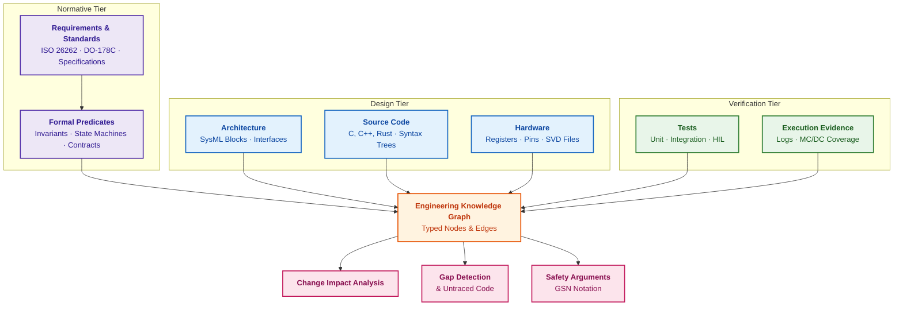
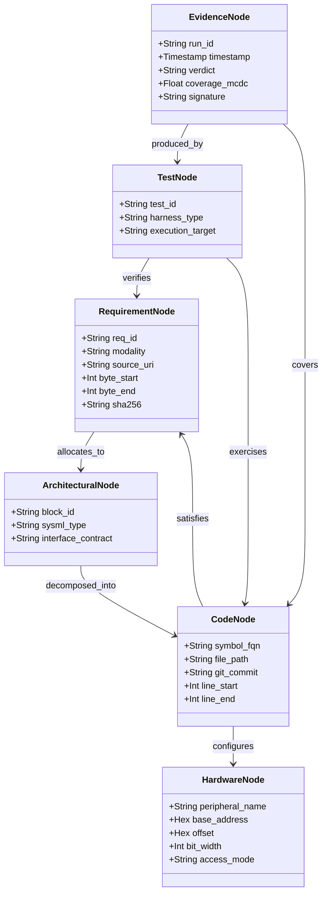
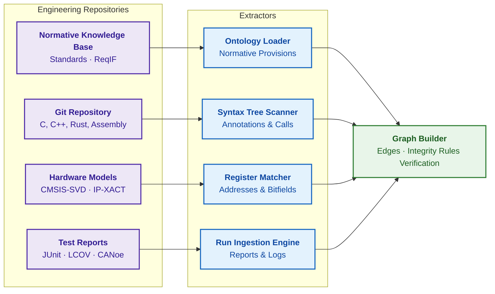
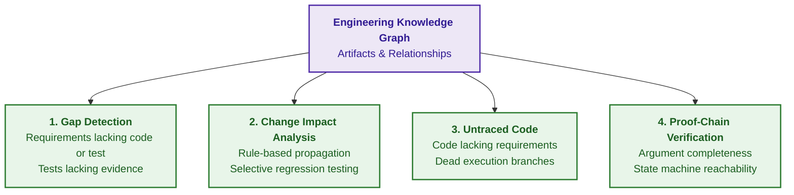
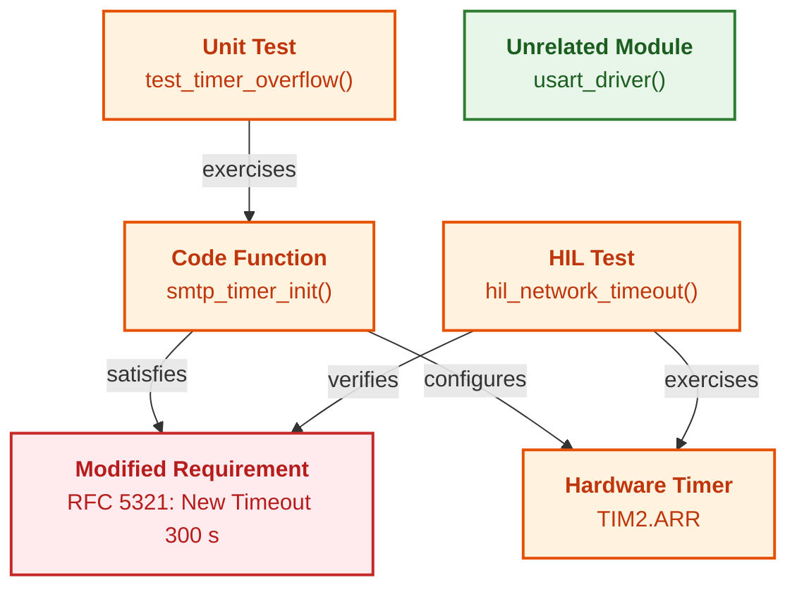
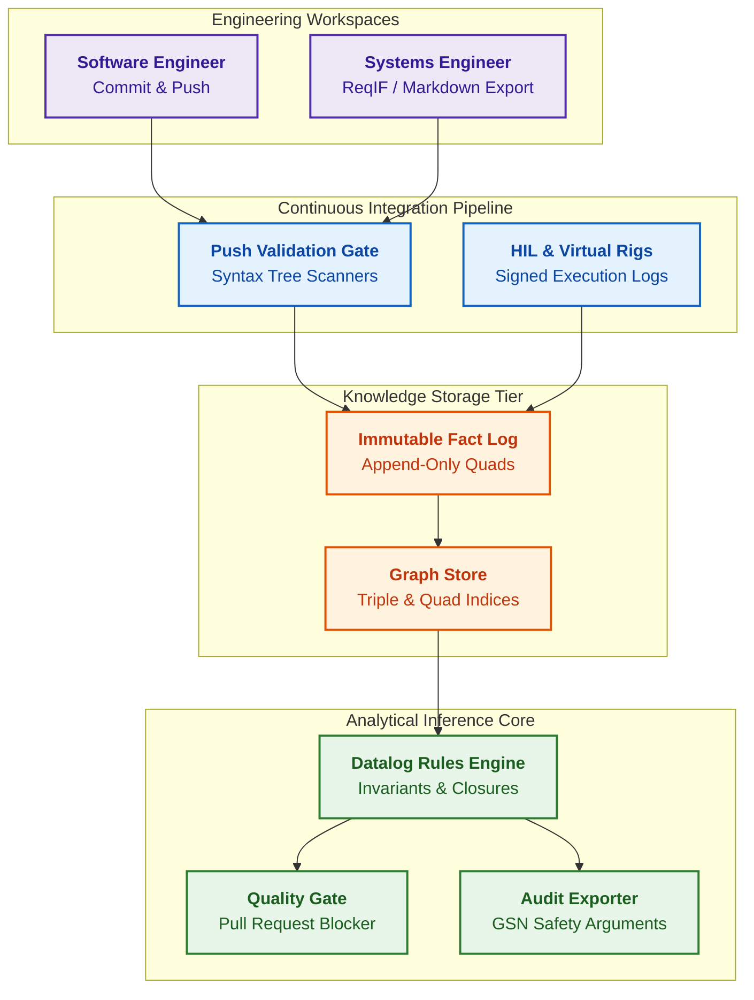
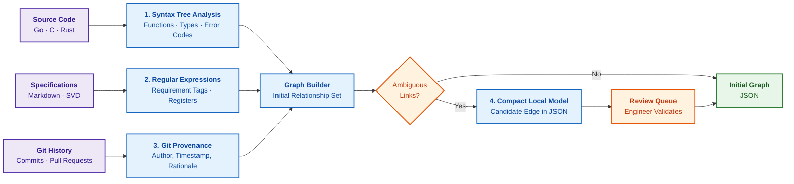
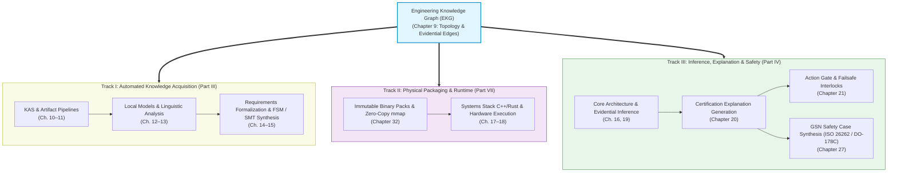

# Chapter 9. Engineering Knowledge Graph: Traceability from Requirements to Hardware

> **Book:** [Architecture of Evidence-Governed Expert Systems](README.md) · [Part II: Mathematical Models, Knowledge Representation, and Storage](part-02-knowledge-models.md)  
> **Previous Chapter:** [Chapter 8. Engineering Artifacts as Data for Expert Systems](ch08-engineering-artifacts-as-data.md)  
> **Next Chapter:** [Chapter 32. Immutable Knowledge Packs: Byte-Level Admission, Indices, and Memory Mapping](ch32-high-performance-knowledge-packs-mmap-and-harvesting.md)  
> **Table of Contents:** [README.md](README.md)  
> **Author:** [Mykola Fedchyk](about-the-author.md)  
> **Target Level:** Foundational Engineering; code and data examples are placed in collapsible blocks  
> **Expected Learning Outcomes:** Explain what an engineering knowledge graph is and how a graph differs from a traceability matrix; describe node and edge types from a high-level requirement down to a single hardware register bit; formulate queries for gap analysis, untraced code detection, and change impact analysis; automatically construct an initial version of the graph directly from a project repository.

## Abstract

This chapter investigates the architecture and mathematical foundations of the Engineering Knowledge Graph (EKG) as the semantic topological backbone of an evidence-governed expert system. The EKG guarantees end-to-end traceability across heterogeneous lifecycle artifacts in mission-critical systems: regulatory requirements (ISO 26262, DO-178C), SysML architectural blocks, source code abstract syntax trees (AST), hardware register specifications (CMSIS-SVD, IP-XACT), verification test suites, and certification evidence. The operational failure modes of conventional traceability tables and matrices are analyzed, demonstrating how manual synchronization and the absence of semantic typing lead to systemic divergence. A formal EKG model is formulated as an attributed, typed multigraph governed by integrity constraints and temporal validity intervals, providing a formally verified foundation for the expert inference engine. Deterministic algorithms for automated relationship extraction from repository artifacts are established, alongside formal queries for three mission-critical analyses: requirement verification coverage calculation, dead and untraced code detection traversing call graph closures, and directed Change Impact Analysis (CIA). The industrial platform architecture is detailed on the foundation of an append-only immutable quad store (RDF-Quads / PROV-O) integrated into CI/CD quality gates, accompanied by an autonomous graph bootstrapper implemented in Go for safety case evidence generation.

On the test bench, a controller unexpectedly receives a hardware timer interrupt. To determine which requirement governs the timer settings, which software function configures the register, and which test was intended to catch the fault, engineers spend weeks exchanging emails across circuit design, embedded firmware, and verification teams. The project maintains a traceability matrix, but this matrix is a spreadsheet where requirement identifiers, source file paths, and test IDs were copied manually; after every commit, the table diverges further from the actual codebase. Developing an autonomous vehicle, an avionics flight controller, an industrial robot, or a hardened network gateway requires coordinating thousands of such artifacts, and a static spreadsheet row stating "REQ-402 is verified by test_network_timeout" provides no verifiable guarantee that the test exercises the boundary values dictated by the requirement.

The objective of this chapter is to demonstrate how an Engineering Knowledge Graph (EKG) interconnects requirements, architecture, source code, hardware registers, tests, and execution evidence into a unified data model amenable to deterministic querying and regulatory audit. The chapter formalizes the mathematical graph model, demonstrates how the graph is constructed automatically from source code, hardware descriptions, and test execution reports, defines three foundational graph analyses (gap detection, untraced code identification, change impact analysis), and concludes with an autonomous Go implementation that bootstraps an initial graph from a repository. This chapter builds upon [Chapter 7](ch07-knowledge-base-typology.md), which established semantic graphs and ontologies, and [Chapter 8](ch08-engineering-artifacts-as-data.md), which transformed raw artifacts into structured data objects; the formalization of requirements into temporal predicates and finite state machines is detailed in [Chapter 14](ch14-requirements-detection-and-formalization.md). The architectural placement of the EKG across development lifecycle tiers is illustrated below.



The purple blocks constitute the normative tier, blue blocks represent the design tier, green blocks encompass the verification tier, the orange block denotes the knowledge graph, and pink blocks highlight the automated analyses enabled by the graph topology. Hardware-in-the-Loop (HIL) test benches with environment simulation and Modified Condition/Decision Coverage (MC/DC) belong to the verification tier, while Goal Structuring Notation (GSN) for safety argument synthesis is examined in [Chapter 27](ch27-safety-case-gsn-synthesis.md). First, we must analyze the structural mechanics of why cross-tier relationships degrade in practice.

## 1. The Traceability Gap in Engineering Ecosystems

In traditional systems engineering, each functional role operates within an isolated information silo:

1. **Systems engineers and business analysts** maintain requirements in specialized databases (IBM DOORS, Jama Connect, PTC Windchill) or standardized exchange formats such as ReqIF;
2. **Systems architects** specify component topologies using the Systems Modeling Language (SysML) or enterprise modeling suites like Enterprise Architect;
3. **Software engineers** develop source code within Git repositories and track work packages across issue-tracking systems;
4. **Verification engineers** implement test suites (Python, Robot Framework, Vector CANoe), whose execution traces and verdicts reside in continuous integration build logs;
5. **Hardware and circuit engineers** document memory-mapped registers in CMSIS-SVD or IP-XACT formats, spreadsheets, or silicon reference manuals.

Cross-domain connectivity is traditionally maintained via a traceability matrix (*traceability matrix*)—a static table into which practitioners manually paste requirement identifiers, source file paths, and test case numbers. A comprehensive survey by Jane Cleland-Huang and colleagues demonstrates that manual traceability is economically prohibitive, rapidly decays into obsolescence, and consequently deteriorates into an empty compliance formality [[1]](#src-1). The concrete root causes include:

- **Instantaneous obsolescence upon save:** the moment an engineer refactors control logic or renames a routine, the static matrix diverges irrecoverably from the codebase;
- **The illusion of verification coverage:** a tabular record `REQ-402 -> test_network_timeout()` provides no guarantee that the test verifies the boundary conditions dictated by REQ-402, rather than terminating with a false "PASS" due to a commented-out assertion;
- **Impossibility of reverse traversal:** tracing from a hardware register bit back to its parent system requirement requires interviewing domain experts and relying on institutional memory;
- **Undetected extraneous code:** the DO-178C avionics software standard defines extraneous code (*extraneous code*) as code that cannot be traced to any system requirement, and dead code (*dead code*) as the executable subset of extraneous code that can never be executed under any operational configuration; structural coverage analysis must expose such artifacts, dead code must be eradicated, and deactivated code must be formally justified [[2]](#src-2). In a conventional traceability matrix, no row exists for extraneous code, rendering the spreadsheet structurally incapable of proving absence.

Summary of this section: the traceability gap emerges because relationships are stored detached from physical artifacts and synchronized through manual effort. An expert system resolves this fracture by elevating links to typed, machine-verifiable data structures updated synchronously with artifact mutation. Achieving this requires a formal graph model.

## 2. Formal Model of the Engineering Knowledge Graph (EKG)

A semantic network represents domain knowledge via nodes and typed relationships, as formalized by John Sowa [[3]](#src-3). The Engineering Knowledge Graph represents a specialized instantiation of a semantic network: a heterogeneous, attributed, directed multigraph governed by integrity constraints and temporal validity bounds.

```math
\mathcal{G}_{\mathrm{EKG}}=\big(\mathcal{V},\ \mathcal{E},\ s,\ t,\ \tau_v,\ \tau_e,\ \mathcal{A}_v,\ \mathcal{A}_e,\ \mathcal{P}\big)
```

Components of the graph:

- $\mathcal{V}$ is the finite set of vertices (nodes), and $\mathcal{E}$ is the finite set of directed edges possessing distinct identity tokens;
- $s,t:\mathcal{E}\to\mathcal{V}$ are mapping functions returning the source ($s$) and target ($t$) vertices of an edge;
- $\tau_v:\mathcal{V}\to\mathcal{T}_V$ and $\tau_e:\mathcal{E}\to\mathcal{T}_E$ map nodes and edges to their respective semantic types within vocabularies $\mathcal{T}_V$ and $\mathcal{T}_E$;
- $\mathcal{A}_v$ and $\mathcal{A}_e$ represent attribute mapping functions for nodes and edges, recording cryptographic digests, timestamps, byte-level citation offsets, and physical telemetry values;
- $\mathcal{P}$ is the set of formal integrity constraints and deductive inference rules, while parentheses bind these constituent structures into a unified algebraic tuple.

This definition formalizes topological structure rather than scalar value: every node and edge carries an explicit semantic type and associated attributes, and two vertices may be interconnected by multiple edges of distinct types. Strong typing permits deterministic querying—for instance, selecting all functions that configure a hardware register upon which a safety requirement depends. The class schema below illustrates the primary node families and their interconnecting relationships.



Class and attribute identifiers are formalized in English to align with data schema standards. A requirement stores byte-level source offsets and a cryptographic digest, source code records the commit hash and line boundaries, a hardware node stores base addresses and bitfield dimensions, and verification evidence captures the test verdict, MC/DC coverage, and the cryptographic signature of the execution rig.

### 2.1. Node Typology: From System Requirements to Hardware Registers

1. **Normative Nodes** $V_R\subset\mathcal{V}$: standard clauses, normative provisions with formal modalities (SHALL, MUST, REQUIRED), states, and transitions of finite state machines (FSM). Each normative node maintains strict evidence grounding (*evidence grounding*): file location, exact byte-span offsets, and the SHA-256 hash of the quoted text.
2. **Architectural Nodes** $V_A\subset\mathcal{V}$: software components, subsystems, communication channels, data buses, and interface contracts (IDLs, Protobuf definitions, SysML blocks).
3. **Software Nodes** $V_C\subset\mathcal{V}$: Abstract Syntax Tree (AST) entities, comprising modules, structs, functions, methods, and branching decision points, bound to Git commit hashes and line ranges.
4. **Hardware Nodes** $V_H\subset\mathcal{V}$: peripheral controllers (UART, SPI, CAN, Ethernet), memory-mapped I/O addresses (*memory-mapped I/O*), register bitfields, interrupt request lines (IRQ), and general-purpose pin configurations (GPIO).
5. **Test Nodes** $V_T\subset\mathcal{V}$: test cases, fault-injection test scenarios (*fault injection*), HIL rig test configurations, and fuzzing harnesses.
6. **Evidence Nodes** $V_E\subset\mathcal{V}$: concrete test run executions, structural code coverage reports (statement, branch, MC/DC), logic analyzer traces, and CAN/Ethernet bus captures cryptographically signed by the physical test bench.

### 2.2. Semantic Edge Classification and Integrity Rules

Edges in the graph do not represent arbitrary associative links, but rigorous engineering relations possessing defined semantic semantics. The primary edge types are detailed below.

| Edge Type | Direction | Semantic Meaning | Governing Standard / Application |
|---|---|---|---|
| `allocates_to` | $V_R\to V_A$ | Requirement allocated to an architectural block | Allocation per ISO 26262-4 [[4]](#src-4) and DO-178C [[2]](#src-2) |
| `satisfies` | $V_C\to V_R$ | Software function or module implements requirement | Low-level requirement traceability per DO-178C |
| `configures` | $V_C\to V_H$ | Software writes to or reads a physical register | Board support packages, CMSIS-SVD descriptors |
| `verifies` | $V_T\to V_R$ | Test is designed to verify requirement | Verification & Validation per IEEE 1012 [[5]](#src-5) |
| `exercises` | $V_T\to V_C$ | Test executes and stresses code block | Structural coverage analysis |
| `mitigates` | $V_R\to V_{\mathrm{Hazard}}$ | Requirement mitigates an identified hazard | Hazard Analysis and Risk Assessment (HARA) |
| `derived_from` | $V_R\to V_R$ | Low-level requirement derived from system specification | Requirement lineage tracking |
| `obsoletes` | $V_R\to V_R$ | New specification revision replaces or revokes prior | Requirement version lifecycle governance |

These edge types constitute the formal vocabulary underlying all topological graph queries. Summary of this section: the graph comprises typed nodes across six primary classes and typed edges with rigorous semantics, while rules $\mathcal{P}$ enforce domain invariants. The model provides engineering utility only when populated and synchronized through automated pipelines.

## 3. Automated Artifact Extraction and Graph Construction

A foundational operational requirement of an industrial knowledge graph is autonomous construction and synchronization. If creating a node or edge necessitates manual database curation or detached configuration maintenance, the graph degrades upon the first major refactoring cycle, replicating the failure modes of the spreadsheet. The expert system populates the graph via a continuous pipeline of specialized deterministic extractors.



Purple blocks represent input repositories, blue blocks denote automated extractors, and the green block synthesizes the graph while verifying integrity rules. Because each extractor consumes strictly formatted inputs, the overwhelming majority of edges are established deterministically without statistical ambiguity. The following subsections detail the four extraction mechanisms.

### 3.1. Linking Source Code to Requirements via the Abstract Syntax Tree (AST)

Safety-critical software engineering methodologies mandate explicit bindings between source code routines and governing requirements, achieved via structured docstring annotations or parallel metadata sidecars.

<details>
<summary>C Code Example: Routine with Traceability Annotations</summary>

```c
/**
 * @brief Validates command ordering according to protocol session state.
 * @satisfies REQ-PROTO-MAIL-042
 * @trace RFC-5321:Section-4.1.1.4[byte:18420-18890]
 * @fsm_state TRANSACTION_READY
 */
protocol_status_t validate_command_sequence(session_context_t *ctx, command_t cmd) {
    if (ctx->state != STATE_TRANSACTION_READY) {
        return STATUS_ERR_BAD_SEQUENCE;
    }
    return STATUS_OK;
}
```

</details>

The AST scanner parses the syntax tree, identifies the function symbol `validate_command_sequence`, extracts its signature and file coordinates, and registers a candidate assertion `declares_satisfies` targeting `REQ-PROTO-MAIL-042`. An in-source comment does not prove requirement fulfillment. A certified `satisfies` edge, admitted into safety coverage calculations, demands independent corroboration: peer review records, passing verification evidence, and explicit sign-off by an authorized system engineer. The citation digest verifies text immutability, not the behavioral compliance of the compiled routine. This epistemological boundary applies equally to human annotations and model-generated assertions.

### 3.2. Mapping Source Code to Hardware Registers via SVD and IP-XACT Specifications

To close the semantic gap between device drivers and silicon peripherals, the extraction engine ingests machine-readable microcontroller definitions in the CMSIS-SVD (*Cortex Microcontroller Software Interface Standard, System View Description*) format [[6]](#src-6), while a low-level code analyzer examines pointer dereferences, volatile memory writes, and peripheral register macros.

<details>
<summary>XML and C Example: USART1 Register Definition and Transceiver Activation Routine</summary>

```xml
<peripheral>
  <name>USART1</name>
  <baseAddress>0x40013800</baseAddress>
  <registers>
    <register>
      <name>CR1</name>
      <description>Control register 1</description>
      <addressOffset>0x00</addressOffset>
      <fields>
        <field>
          <name>UE</name>
          <description>USART enable</description>
          <bitOffset>13</bitOffset>
          <bitWidth>1</bitWidth>
        </field>
      </fields>
    </register>
  </registers>
</peripheral>
```

```c
#define USART1_BASE 0x40013800
#define USART1_CR1  (*(volatile uint32_t *)(USART1_BASE + 0x00))

void usart_enable(void) {
    USART1_CR1 |= (1 << 13); /* USART enable */
}
```

</details>

Symbolic analysis evaluates the effective address `0x40013800 + 0x00` and bitmask `(1 << 13)`, matching the operation directly against bitfield `UE` within register `CR1`. The graph records a directed `configures` edge originating from `usart_enable` and terminating at the hardware node `HW_REG:USART1.CR1.UE`. If a subsequent silicon errata or errata update modifies the bit offset or reclassifies the field as reserved, the expert system flags the configured edge as a verification conflict.

### 3.3. Tracing Verification Artifacts: Binding Tests to Requirements

The verification test harness not only executes code paths but also programmatically asserts its target requirement.

<details>
<summary>Python Example: Test Suite Annotated with Requirement Assertions</summary>

```python
@pytest.mark.verifies("REQ-PROTO-MAIL-042")
@pytest.mark.target_state("TRANSACTION_READY")
def test_reject_out_of_sequence_command(dut_client):
    """Verify return of error 503 upon invalid command sequencing."""
    dut_client.reset_state()
    response = dut_client.send_raw("DATA\r\n")
    assert response.code == 503, f"Expected 503, received {response.code}"
```

</details>

During continuous integration runs, the test report parser extracts three distinct facts. The test routine `test_reject_out_of_sequence_command` establishes a `verifies` edge targeting `REQ-PROTO-MAIL-042`. Profiling and hardware trace buffers confirm that the test exercises routine `validate_command_sequence` (creating an `exercises` edge). Finally, an immutable evidence node is created, capturing the execution verdict, wall-clock duration, test bench serial number, and communication log cryptographic hash. The test annotation represents an authorial claim, whereas the `exercises` relation and the evidence node represent physical measurements, allowing the graph to strictly distinguish between claims and empirical facts.

### 3.4. Entity Normalization, Coreference Resolution, and Fact Temporal Validity

When constructing knowledge subgraphs from unstructured engineering documents, naive text chunking proves insufficient. Damien Berezenko analyzes knowledge graph construction for agentic retrieval-augmented generation [[7]](#src-7); for mission-critical engineering graphs, four foundational requirements must be enforced:

1. **Multilevel Entity Typing.** Nodes must be partitioned into strict ontological classes: active computational modules vs. passive controlled components, system architectural layers (from systemic vehicular functions down to integrated circuits and register bitfields), and cross-cutting engineering phenomena ("thermomechanical fatigue", "galvanic isolation").
2. **Coreference Resolution and Canonicalization.** Engineering prose refers to identical physical components via trade names, acronyms, pronouns, or internal part numbers. Prior to edge generation, every textual mention must be mapped to a canonical entity token via entity linking (*entity linking*); otherwise, the graph fragments into disjoint subtopologies.
3. **Controlled Sparse Graph Construction.** In contrast to open-domain web knowledge bases, which often maximize associative link density, an engineering knowledge graph must be constructed as a strictly typed sparse graph. Extraneous probabilistic links introduce traversal noise during multi-hop path reasoning; edges must only be instantiated against validated ontological schemas.
4. **Temporal Validity and Concept Drift.** Migrating a hardware board from Revision 1.1 to Revision 2.0 frequently alters operating voltage envelopes or pin assignments. Every node and edge must incorporate temporal timestamps and revision validity intervals, ensuring that compliance audits on an active deployment never query invalidated historical specifications.

Summary of this section: the vast majority of graph edges are derived deterministically through structured file parsers, while edges inferred from natural language require canonical entity linking, strict typing, and temporal validity bounding. The resulting graph enables analytical queries impossible across fragmented spreadsheets.

## 4. Deterministic Analysis Algorithms on the Engineering Knowledge Graph

Once populated, the EKG enables automated, deterministic verification queries that cannot be reproducibly performed across disconnected spreadsheets or via statistical language models. The diagram below illustrates four foundational classes of graph analysis.



Each analytical class corresponds to a formal graph query with rigorous mathematical semantics. The first three analyses are detailed below, while the verification of formal safety arguments is examined in [Chapter 27](ch27-safety-case-gsn-synthesis.md).

### 4.1. Computing Requirement Coverage Metrics and Detecting Verification Gaps

Requirement coverage in safety-critical domains demands a significantly higher degree of rigor than simple line or branch coverage. Engineering compliance requires demonstrating that every requirement possesses a verified software implementation, an associated test case, and an empirically verified passing test run for the designated target release. In the formal definition below, artifact sets are evaluated against the current baseline release, excluding unapproved, revoked, or obsolete entities. Hypothesized and unverified edges are excluded from the verified relationship set. The requirement inventory and register spaces must be declared closed-world; otherwise, edge absence indicates lack of knowledge rather than a proven defect.

```math
\mathcal{U}_R=\Big\{\,r\in V_R\ \Big|\ \neg\exists\,c\in V_C:\ c\xrightarrow{\mathrm{satisfies}}r\ \ \lor\ \ \neg\exists\,t\in V_T,\ e\in V_E:\ t\xrightarrow{\mathrm{verifies}}r\ \land\ e\xrightarrow{\mathrm{produced\_by}}t\ \land\ \mathrm{verdict}(e)=\mathrm{PASS}\ \land\ \mathrm{release}(e)=\rho\,\Big\}
```

Reading the verification gap set:

- $r$ is a requirement node, $c$ is a code entity, $t$ is a test routine, and $e$ represents a concrete test run evidence record;
- $V_R$, $V_C$, $V_T$, and $V_E$ denote the sets of requirement, code, test, and evidence nodes respectively, while $\rho$ designates the active target release baseline;
- Directed arrows $\xrightarrow{\mathrm{satisfies}}$, $\xrightarrow{\mathrm{verifies}}$, and $`\xrightarrow{\mathrm{produced\_by}}`$ denote implementation, verification intention, and execution provenance respectively;
- $\mathrm{verdict}(e)=\mathrm{PASS}$ enforces that the execution terminated successfully, and $\mathrm{release}(e)=\rho$ binds the execution record to the active target release;
- Symbols $\neg\exists$, $\lor$, and $\land$ represent logical negation ("there does not exist"), disjunction ("or"), and conjunction ("and"); the enclosing set comprehension collects all requirements failing either implementation or verified execution.

A requirement is classified into the gap set $\mathcal{U}_R$ if it lacks an implementing code entity or lacks an associated test with passing evidence for the targeted release. The cardinality ranges strictly between $0$ and $\lvert V_R \rvert$, and requirement coverage is evaluated as $1-\lvert\mathcal{U}_R\rvert/\lvert V_R \rvert$, refining the metric introduced in [Chapter 8](ch08-engineering-artifacts-as-data.md).

**Runtime Decisions and Verification Completeness Criteria:**
- **Normative Safety Invariant (ASIL D / DO-178C Level A):** the verification engine strictly enforces $\lvert\mathcal{U}_R\rvert = 0$ ($100\%$ verified requirements);
- **CI/CD Pipeline Action:** if $\lvert\mathcal{U}_R\rvert > 0$, the build system aborts binary firmware synthesis, issues a signed cryptographic failure token `ERR_SAFETY_GAPS_DETECTED`, and exports an itemized deficit manifest listing unverified requirements and missing test runs.

**Worked Numerical Example:**
In the active release baseline, a safety-critical subsystem contains $\lvert V_R \rvert = 150$ functional safety requirements. Automated audit of test bench results confirms verified code implementations and passing test evidence (`PASS`) for 148 requirements. For 2 requirements (`REQ-088` and `REQ-142`), execution concluded with a `FAIL` verdict:
```math
\lvert\mathcal{U}_R\rvert = 2, \qquad \mathrm{Coverage} = 1 - \frac{2}{150} \approx 0.9867
```
Because $\lvert\mathcal{U}_R\rvert = 2 \ne 0$, the release gate fails closed immediately, blocking artifact publication until all verification deficits are resolved.

### 4.2. Heuristic Link Prediction via the Adamic–Adar Index

The gap set $\mathcal{U}_R$ flags requirements lacking implementation or passing verification, but cannot distinguish between a requirement that genuinely lacks a test and one where an existing test routine simply lacks the formal `verifies` edge. In large legacy codebases, verification engineers frequently implement tests that validate a requirement without registering the formal metadata. Link prediction (*link prediction*) algorithms identify candidate edges to accelerate manual remediation.

This methodology rests on foundational network science research. Liben-Nowell and Kleinberg demonstrated across academic co-authorship networks that structural node proximity measures—specifically shared neighborhood metrics—predict future edges significantly better than random assignment [[8]](#src-8). Pham Thi Thu Thuy and Thinh Thi Thuy extended structural graph features with semantic and temporal dimensions: normalizing metadata from AMiner, DBLP, and Mendeley against an ontology aligned with SKOS (*Simple Knowledge Organization System*) and Dublin Core, their random forest and graph neural network models ([Chapter 6](ch06-applied-mathematics-for-expert-systems.md)) markedly outperformed classical baselines [[9]](#src-9). Applying this paradigm to engineering graphs, candidate (requirement, test) pairs are evaluated across shared domain vocabulary terms, common hardware signals and registers, co-located architectural modules, and temporal commit proximity.

For an evidence-governed expert system, explainability is as critical as ranking accuracy. The Adamic–Adar index [[10]](#src-10) provides intrinsic interpretability, decomposing the similarity score into explicit contributions from shared structural neighbors.

```math
\mathrm{AA}(x, y) = \sum_{z \in N(x) \cap N(y)} \frac{1}{\ln \lvert N(z) \rvert}
```

Components of the Adamic–Adar index:

- $x$ and $y$ denote the candidate node pair, such as a requirement and an unlinked test routine;
- $N(v)$ represents the neighborhood set of node $v$ in the graph: hardware signals, memory-mapped registers, architectural components, and domain ontology terms;
- $z$ enumerates the shared neighbors of both vertices ($N(x) \cap N(y)$);
- $\lvert N(z) \rvert$ is the degree of shared neighbor $z$, and $\ln$ represents the natural logarithm;
- $\mathrm{AA}(x, y)$ is a non-negative ranking score, not a probability value.

A rare shared neighbor contributes significantly more weight than a ubiquitous one: sharing a highly specific hardware register constitutes strong evidential affinity, whereas sharing a generic system-wide dictionary term provides minimal signal.

**Runtime Decisions and Engineering Triage Thresholds:**
- **Candidate Recommendation Threshold ($\tau_{\mathrm{suggest}} = 1.00$):** if $\mathrm{AA}(x, y) \ge \tau_{\mathrm{suggest}}$, the (requirement, test) candidate is automatically enqueued into the lead verification engineer's review inbox (`review_inbox`), accompanied by structural graph explanations;
- **Noise Rejection Filter:** if $\mathrm{AA}(x, y) < 1.00$, the candidate edge is discarded, preventing alert fatigue caused by spurious correlations.

**Worked Numerical Example:**
Consider a requirement specifying a watchdog timer timeout interval and test routine T-204. They share three neighbors in the knowledge graph: register `WDT_CTRL` (degree 4), hardware signal `wdt_timeout` (degree 6), and the general domain keyword "timeout" (degree 120). The affinity score is calculated as:
```math
\mathrm{AA}(\text{REQ}, \text{T-204}) = \frac{1}{\ln 4} + \frac{1}{\ln 6} + \frac{1}{\ln 120} \approx 0.721 + 0.558 + 0.209 \approx 1.49
```
Evaluating the same requirement against test routine T-090 yields only the shared keyword "timeout" (degree 120) and a general power management component (degree 40):
```math
\mathrm{AA}(\text{REQ}, \text{T-090}) = \frac{1}{\ln 120} + \frac{1}{\ln 40} \approx 0.209 + 0.271 \approx 0.48
```
Because $\mathrm{AA}(\text{REQ}, \text{T-204}) = 1.49 \ge 1.00$, the system issues a high-priority recommendation to link test T-204 to the watchdog requirement. Pair (REQ, T-090), scoring $0.48 < 1.00$, is suppressed as background noise.

### 4.3. Detecting Untraced and Dead Code According to DO-178C

Source code lacking traceability to approved requirements represents a severe safety hazard: forgotten debug stubs, undocumented test backdoors, or deliberately introduced attack vectors. A naive rule stating that "any function lacking an immediate incoming `satisfies` edge is extraneous" generates unacceptable false alarms on internal helper routines invoked by requirement-satisfying functions. A rigorous definition must account for call graph closures:

```math
\mathcal{C}_{\mathrm{untraced}}=\big\{\,c\in V_C\ \big|\ \neg\exists\,c'\in V_C,\ r\in V_R:\ c'\xrightarrow{\mathrm{satisfies}}r\ \land\ c'\xrightarrow{\mathrm{calls}^{*}}c\,\big\}
```

Notation for untraced code:

- $c$ is the software routine under analysis, $c'$ is a routine implementing requirement $r$, and $V_C, V_R$ represent the sets of software and requirement nodes;
- $\xrightarrow{\mathrm{satisfies}}$ denotes verified requirement implementation, and $\xrightarrow{\mathrm{calls}^{*}}$ denotes call path reachability from $c'$ to $c$;
- The asterisk in $\mathrm{calls}^{*}$ denotes the reflexive-transitive closure: reachability encompasses zero steps ($c = c'$), direct invocations, or multi-step execution call chains;
- $\neg\exists$ indicates the non-existence of any requirement-satisfying root from which $c$ is reachable, and set comprehension isolates all such untraced routines.

The resulting set isolates all code symbols unreachable from any requirement-satisfying root; its size ranges from $0$ to $\lvert V_C \rvert$.

**Runtime Decisions and Static Analysis Quality Gate:**
- **DO-178C Mandate (Level A/B):** strictly requires $\lvert\mathcal{C}_{\mathrm{untraced}}\rvert = 0$;
- **Build Pipeline Action:** detection of any symbol in $\mathcal{C}_{\mathrm{untraced}}$ aborts the compilation/link stage under `-Werror=untraced-symbol`. The development team must either physically excise the dead code or formally substantiate a derived safety requirement (*derived requirement*) verified via FMEA.

**Worked Numerical Example:**
Static analysis of an electronic braking microcontroller codebase ($\lvert V_C \rvert = 84$ functions) discovers that routine `dbg_force_override()` has no call path originating from any functional requirement ($\lvert\mathcal{C}_{\mathrm{untraced}}\rvert = 1$). Firmware binary generation is blocked until this diagnostic routine is completely removed from the production release image.

### 4.4. Change Impact Analysis Algorithms

One of the most resource-intensive challenges in systems engineering is evaluating the blast radius of an engineering change order. What subsystems are affected if a standards committee shortens a protocol timeout, or a client alters the response latency of an actuator? Without a knowledge graph, engineering teams spend weeks manually reviewing specifications or re-executing entire validation suites on physical test rigs. Across an EKG, the impact of mutating node $v^{*}$ is evaluated via directed reachability over typed propagation rules:

```math
\mathrm{Impact}(v^{*})=\big\{\,u\in\mathcal{V}\ \big|\ v^{*}\leadsto_{\delta}u\,\big\}
```

Formulation of impact reachability:

- $v^{*}$ is the modified origin node, $u$ is any graph entity, and $\mathcal{V}$ is the universe of all vertices;
- $v^{*}\leadsto_{\delta}u$ denotes directed path reachability governed by edge traversal policy $\delta$;
- $\mathrm{Impact}(v^{*})$ represents the set of all reachable nodes under policy $\delta$, including the origin node under reflexive reachability;
- Traversal direction depends strictly on edge semantics: mutating a requirement propagates in reverse across incoming `satisfies` and `verifies` edges, downstream across `configures` edges, and upstream across `exercises` edges.

**Regression Testing Governance and CI/CD Optimization:**
- If the impact ratio satisfies $\lvert\mathrm{Impact}(v^{*})\rvert / \lvert\mathcal{V}\rvert \le 0.15$, the CI/CD pipeline triggers **selective regression mode**: executing strictly the test subset $\mathrm{Impact}(v^{*}) \cap V_T$, which slashes test bench occupancy by orders of magnitude;
- If $\lvert\mathrm{Impact}(v^{*})\rvert / \lvert\mathcal{V}\rvert > 0.15$, the modification is classified as an architectural change: a full comprehensive regression test suite execution is mandated.

**Worked Numerical Calculation:**
A powertrain control system graph contains $\lvert\mathcal{V}\rvert = 1\,200$ nodes. A bugfix alters routine `can_transmit_frame()` ($v^*$). Topological impact traversal identifies $\lvert\mathrm{Impact}(v^*)\rvert = 18$ affected vertices (2 header interface files and 16 unit tests):
```math
\frac{\lvert\mathrm{Impact}(v^*)\rvert}{\lvert\mathcal{V}\rvert} = \frac{18}{1\,200} = 0.015 \le 0.15
```
The CI pipeline immediately initiates selective regression on exactly those 16 test cases (executing in 12 seconds instead of 45 minutes for the entire suite), preserving 100% mathematical guarantees over affected dependencies.

When mutating a requirement, impact traversal flows upstream against incoming `satisfies` and `verifies` edges, downstream across `configures` edges, and upstream across incoming `exercises` edges. The analysis isolates precisely the code, hardware registers, and test cases bound to the change. An unconstrained bidirectional traversal would mark virtually the entire graph as impacted, rendering the analysis practically useless. The concrete topology is illustrated below.



The red node represents the modified requirement, orange nodes mark the affected impact zone, and the green node remains completely isolated. The traversal algorithm identifies function `smtp_timer_init()` via incoming `satisfies`, hardware register `TIM2.ARR` via outgoing `configures`, and exactly two test routines requiring re-execution: `test_timer_overflow` and `hil_network_timeout`. Such selective regression testing (*selective regression testing*) isolates unaffected modules, conserving dozens of test bench hours. Operational limitation: if an edge is missing from the graph, impact propagation will fail to detect the dependency; consequently, selective regression must be paired with periodic full-suite baseline executions.

Summary of this section: these three analyses represent formal graph queries over closed result sets, whose validity hinges upon edge completeness and typed traversal rules. To protect software integrity at every commit, the graph must operate directly within the continuous integration pipeline.

## 5. Industrial Platform Architecture for Knowledge Graph Governance

A monolithic graph database governed by centralized manual administration rarely succeeds within distributed, multi-disciplinary engineering organizations. A resilient architecture ingests atomic facts directly from continuous integration pipelines into an append-only log, indexes them into a queryable graph store, and evaluates formal rules over the resulting topology.



Purple blocks indicate change sources, blue blocks represent the CI pipeline, orange blocks form the storage tier, and green blocks constitute the analytical core. The Datalog deductive engine ([Chapter 6](ch06-applied-mathematics-for-expert-systems.md)) evaluates transitive closures and structural invariants, feeding real-time quality gates and regulatory compliance exports.

When an engineering knowledge graph exceeds the memory capacity of a single physical node, it must be partitioned into distributed shards. The optimal sharding key is the product identifier and baseline release milestone, rather than entity node type. Because a traceability query traverses from a requirement through a function to a test case, partitioning requirements, code, and tests across separate machines would force every traversal into an expensive cross-network distributed join. The primary metric of partitioning quality is the edge cut fraction (*edge cut fraction*). Upon communication failure with a shard, the query engine must return "UNKNOWN" rather than "NO EDGE EXISTS"; otherwise, a transient network timeout would be falsely interpreted as a missing test or broken traceability invariant. Formal sharding definitions and partition rules are established in [Chapter 7](ch07-knowledge-base-typology.md).

### 5.1. Immutable Log of Versioned Quads (RDF-Quads / PROV-O)

Every graph node and edge is recorded as an immutable fact structured as a standardized quad:

```math
\langle\,\mathrm{Subject},\ \mathrm{Predicate},\ \mathrm{Object},\ \mathrm{Context}\,\rangle
```

Fields of the immutable factual quad:

- $\mathrm{Subject}$ represents the source node entity, such as a software function;
- $\mathrm{Predicate}$ denotes the directed relationship type, such as `satisfies`, while $\mathrm{Object}$ designates the target entity, such as a requirement;
- $\mathrm{Context}$ specifies the provenance envelope: Git commit SHA, baseline revision identifier, author identity, timestamp, and cryptographic signature of the extractor;
- Angle brackets define an ordered four-tuple; the first three fields adhere to the W3C RDF data model, while the fourth isolates provenance context.

Facts are never overwritten in place; state transitions are modeled by appending new facts within an updated context. This ensures complete audit historical replay, enabling engineering teams to prove to a safety certification auditor exactly what verification coverage existed for firmware version 2.4.1 twelve months prior [[12]](#src-12).

### 5.2. CI/CD Quality Gate in the Continuous Integration Pipeline

The expert system integrates directly into pull request evaluation gates (*pull request quality gates*). Prior to merging any branch into the protected baseline, the graph validator enforces three mandatory invariants:

1. **Integrity Preservation:** a newly introduced function cannot be merged without a valid `satisfies` edge targeting an approved requirement or without an established call path from a requirement-satisfying routine;
2. **Verifiability:** modifying routine logic invalidates historical test run evidence for the new commit; while test definitions and asserted `verifies` relations remain, new execution evidence must be appended, preserving old runs in the audit log;
3. **Absence of Regression:** the change impact subgraph $\mathrm{Impact}(\Delta)$ must contain zero unverified nodes classified under highest safety integrity levels: ASIL D under ISO 26262 or Level A under DO-178C.

Summary of this section: an append-only quad store guarantees complete historical auditability, while automated CI quality gates prevent the knowledge graph from decaying. The remaining challenge is bootstrapping the graph from an existing unannotated codebase.

## 6. Cold Start Strategy: Automated Knowledge Graph Bootstrapping from a Repository

Constructing an initial knowledge graph does not require manual entry. Automated extractors can recover code topologies, explicit references, and test histories, while tools like Protégé allow domain experts to validate ontological schemas ([Chapter 15](ch15-knowledge-extraction-and-kb-construction.md)). Automation dramatically reduces manual data entry but does not replace domain modeling: an initial graph harvested from comments represents a registry of declared assertions, not formal verification proof.



Purple blocks indicate raw data sources, blue blocks denote extraction stages, orange blocks route ambiguous edges into human review, and the green block represents the synthesized graph. The extraction pipeline proceeds through four sequential phases:

1. **Code Syntax Tree Parsing.** A deterministic parser (such as the standard `go/parser` package or tree-sitter) traverses repository sources: each file becomes a module node, each function becomes a routine node linked via `declared_in`, each invocation forms a directed `calls` edge, and each error return code is captured as an error contract node.
2. **Regular Expressions for Requirements and Hardware.** Deterministic patterns such as `[REQ-SYS-XXX]` or `[REQ-SW-XXX]` extract requirement entities from specifications and docstrings, while CMSIS-SVD descriptors instantiate hardware register nodes and bitfields.
3. **Git Provenance Extraction.** Referencing `REQ-214` within a commit message instantiates a `mentions` edge, while `@satisfies REQ-214` creates an asserted implementation claim. Both records capture commit metadata, but commit metadata alone does not elevate a claim to a verified `satisfies` relationship.
4. **Specialized Compact Language Models for Ambiguous Relationships.** When direct token matches are absent (e.g., a routine is named `ApplyThermalCutoff()`, whereas the specification states "the device must shut down the power stage upon overtemperature"), the ingestion pipeline queries a compact, on-premises language model (hosted via an Ollama runtime). The model must emit structured JSON containing candidate edge endpoints and confidence metrics; candidates are enqueued into the lead engineer's verification queue without blocking overall graph assembly.

The Go implementation below parses requirement definitions, function declarations, and traceability docstrings. It intentionally omits Git history traversal and complete call graph analysis to maintain pedagogical clarity. Function node identifiers encapsulate both file paths and receiver types to prevent symbol collisions. Moving a file will alter this pedagogical identifier; production systems require stable entity tokens.

<details>
<summary>Go Implementation: Bootstrapping an Initial Knowledge Graph from a Repository</summary>

This complete, self-contained program can be executed via `go run main.go sample`, where `sample` is a directory containing `requirements.md` and `thermal.go`, provided below.

```go
package main

import (
	"encoding/json"
	"fmt"
	"go/ast"
	"go/format"
	"go/parser"
	"go/token"
	"io/fs"
	"os"
	"path/filepath"
	"regexp"
	"strings"
)

// Node represents a graph node: requirement, module, or function.
type Node struct {
	ID   string `json:"id"`
	Type string `json:"type"`
	File string `json:"file"`
}

// Edge represents a typed graph edge.
type Edge struct {
	Source   string `json:"source"`
	Relation string `json:"relation"`
	Target   string `json:"target"`
}

// Graph represents the initial bootstrapped engineering knowledge graph.
type Graph struct {
	Nodes  []Node   `json:"nodes"`
	Edges  []Edge   `json:"edges"`
	Broken []string `json:"broken_links"`
}

var (
	reqDef   = regexp.MustCompile(`\[(REQ-[A-Z]+-[0-9]+)\]:`)
	reqTrace = regexp.MustCompile(`@satisfies\s+(REQ-[A-Z]+-[0-9]+)`)
)

// bootstrap traverses the directory, collecting requirements from Markdown and functions from Go code.
func bootstrap(root string) (*Graph, error) {
	g := &Graph{}
	fset := token.NewFileSet()
	var traces []Edge
	err := filepath.WalkDir(root, func(path string, d fs.DirEntry, err error) error {
		if err != nil || d.IsDir() {
			return err
		}
		p := filepath.ToSlash(path)
		switch filepath.Ext(path) {
		case ".md":
			data, err := os.ReadFile(path)
			if err != nil {
				return err
			}
			for _, m := range reqDef.FindAllStringSubmatch(string(data), -1) {
				g.Nodes = append(g.Nodes, Node{ID: m[1], Type: "Requirement", File: p})
			}
		case ".go":
			file, err := parser.ParseFile(fset, path, nil, parser.ParseComments)
			if err != nil {
				return err
			}
			module := "module:" + p
			g.Nodes = append(g.Nodes, Node{ID: module, Type: "Module", File: p})
			for _, decl := range file.Decls {
				fn, ok := decl.(*ast.FuncDecl)
				if !ok {
					continue
				}
				receiver := ""
				if fn.Recv != nil {
					var receiverText strings.Builder
					if err := format.Node(&receiverText, fset, fn.Recv.List[0].Type); err != nil {
						return err
					}
					receiver = receiverText.String() + "."
				}
				id := "func:" + p + "#" + receiver + fn.Name.Name
				g.Nodes = append(g.Nodes, Node{ID: id, Type: "Function", File: p})
				g.Edges = append(g.Edges, Edge{id, "declared_in", module})
				if fn.Doc == nil {
					continue
				}
				for _, m := range reqTrace.FindAllStringSubmatch(fn.Doc.Text(), -1) {
					traces = append(traces, Edge{id, "declares_satisfies", m[1]})
				}
			}
		}
		return nil
	})
	if err != nil {
		return nil, err
	}
	known := map[string]bool{}
	for _, n := range g.Nodes {
		known[n.ID] = true
	}
	for _, e := range traces {
		if known[e.Target] {
			g.Edges = append(g.Edges, e)
		} else {
			g.Broken = append(g.Broken, e.Source+" → "+e.Target)
		}
	}
	return g, nil
}

func main() {
	root := "."
	if len(os.Args) > 1 {
		root = os.Args[1]
	}
	g, err := bootstrap(root)
	if err != nil {
		fmt.Fprintln(os.Stderr, "error:", err)
		os.Exit(1)
	}
	out, err := json.MarshalIndent(g, "", "  ")
	if err != nil {
		fmt.Fprintln(os.Stderr, "error:", err)
		os.Exit(1)
	}
	fmt.Println(string(out))
}
```

File `sample/requirements.md`:

```markdown
# Power Controller Requirements

[REQ-SYS-214]: The device disconnects the power circuit if the temperature exceeds 105 °C.
[REQ-SW-214]: The protection function samples the temperature every 10 ms.
```

File `sample/thermal.go`:

```go
package thermal

// ApplyThermalCutoff disables the power circuit upon overheating.
// @satisfies REQ-SW-214
func ApplyThermalCutoff(tempC float64) bool {
	return tempC > 105
}

// LogTemperature records temperature to the system log.
// @satisfies REQ-SW-215
func LogTemperature(tempC float64) {}
```

The program emits the following structured graph:

```json
{
  "nodes": [
    {
      "id": "REQ-SYS-214",
      "type": "Requirement",
      "file": "sample/requirements.md"
    },
    {
      "id": "REQ-SW-214",
      "type": "Requirement",
      "file": "sample/requirements.md"
    },
    {
      "id": "module:sample/thermal.go",
      "type": "Module",
      "file": "sample/thermal.go"
    },
    {
      "id": "func:sample/thermal.go#ApplyThermalCutoff",
      "type": "Function",
      "file": "sample/thermal.go"
    },
    {
      "id": "func:sample/thermal.go#LogTemperature",
      "type": "Function",
      "file": "sample/thermal.go"
    }
  ],
  "edges": [
    {
      "source": "func:sample/thermal.go#ApplyThermalCutoff",
      "relation": "declared_in",
      "target": "module:sample/thermal.go"
    },
    {
      "source": "func:sample/thermal.go#LogTemperature",
      "relation": "declared_in",
      "target": "module:sample/thermal.go"
    },
    {
      "source": "func:sample/thermal.go#ApplyThermalCutoff",
      "relation": "declares_satisfies",
      "target": "REQ-SW-214"
    }
  ],
  "broken_links": [
    "func:sample/thermal.go#LogTemperature → REQ-SW-215"
  ]
}
```

The bootstrapper extracted the asserted claim for `ApplyThermalCutoff` and flagged the broken reference targeting `REQ-SW-215` in `LogTemperature`. It did not prove compliance with either requirement. Crucially, REQ-SW-214 mandates a 10 ms execution period, whereas the routine merely performs a threshold comparison; this example deliberately illustrates why matching an identifier token does not prove semantic fulfillment. Unverified gaps must be reported explicitly within coverage dashboards under closed-world assumptions.

The accompanying automated test verifies bootstrapper edge boundaries: ensuring distinct identities for method receivers, verifying broken link isolation for non-existent requirements, and confirming that raw docstring annotations are never prematurely promoted to verified `satisfies` edges. This test file is placed alongside the implementation as `main_test.go` and executed via `go test main.go main_test.go`.

```go
package main

import (
	"os"
	"path/filepath"
	"testing"
)

func TestBootstrapIdentityAndClaims(t *testing.T) {
	root := t.TempDir()
	files := map[string]string{
		"requirements.md": "[REQ-SW-1]: example\n",
		"a/code.go": "package a\ntype First struct{}\ntype Second struct{}\n// @satisfies REQ-SW-1\nfunc Run() {}\n// @satisfies REQ-SW-1\nfunc (First) Run() {}\n// @satisfies REQ-SW-9\nfunc (Second) Run() {}\n",
		"b/code.go": "package b\n// @satisfies REQ-SW-1\nfunc Run() {}\n",
	}
	for relative, content := range files {
		path := filepath.Join(root, relative)
		if err := os.MkdirAll(filepath.Dir(path), 0700); err != nil {
			t.Fatal(err)
		}
		if err := os.WriteFile(path, []byte(content), 0600); err != nil {
			t.Fatal(err)
		}
	}
	graph, err := bootstrap(root)
	if err != nil {
		t.Fatal(err)
	}
	identifiers := map[string]bool{}
	for _, node := range graph.Nodes {
		if node.Type == "Function" {
			if identifiers[node.ID] {
				t.Fatalf("duplicate function ID: %s", node.ID)
			}
			identifiers[node.ID] = true
		}
	}
	if len(identifiers) != 4 || len(graph.Broken) != 1 {
		t.Fatalf("unexpected functions or broken links: %d, %v", len(identifiers), graph.Broken)
	}
	claims := 0
	for _, edge := range graph.Edges {
		if edge.Relation == "satisfies" {
			t.Fatal("annotation promoted to verified realization")
		}
		if edge.Relation == "declares_satisfies" {
			claims++
		}
	}
	if claims != 3 {
		t.Fatalf("expected three claims, got %d", claims)
	}
}
```

</details>

Even a lightweight bootstrapper grants engineering teams immediate graph visibility from day one, exposing broken references and uncovered specifications, while deeper enrichment proceeds continuously within the CI pipeline. Operational boundary: regular expressions and docstrings detect only what developers explicitly annotate; the initial graph is inherently partial, and this incompleteness is surfaced transparently within gap reports rather than obscured.

## 7. Comparative Analysis: Traceability Matrices vs. Engineering Knowledge Graph

The comparative matrix below contrasts traditional tabular traceability against an Engineering Knowledge Graph. The capabilities ascribed to the EKG hold true only when the graph is constructed autonomously within a CI/CD pipeline under formal integrity rules.

| Evaluation Criterion | Traceability Matrices (Excel, Word, DOORS Modules) | Engineering Knowledge Graph (EKG) |
|---|---|---|
| Creation Mechanism | Manual data entry and copy-pasting of identifier strings | Automated extraction from ASTs, SVD models, test reports, and knowledge base ontologies |
| Codebase Synchronization | Periodic, performed prior to audits, persistently lagging behind | Continuous, executed at every commit within the CI pipeline |
| Relationship Semantics | Binary existence: "row exists" vs. "row missing" | Formally typed edges, verification evidence, state machine invariants |
| Change Impact Analysis | Subjective expert intuition based on memory | Computed reachability over typed propagation policies, bounded by edge completeness |
| Untraced / Dead Code | Practically undetectable without exhaustive manual inspection | Deterministic query over call-graph reachability closures |
| Hardware Layer Integration | Isolated in silicon datasheets and schematics | Directed edges to memory-mapped registers, bitfields, and IRQs |
| Certification Audit Readiness | Hundreds of person-hours spent manually compiling reports | Instant export of version-pinned immutable audit snapshots |

This comparison does not imply that the EKG is cost-free: an EKG requires strict annotation hygiene, extractor maintenance, and dedicated schema governance. However, the engineering cost shifts permanently from manual, error-prone clerical copying to automated, reusable validation gates that guard every commit.

## Conclusions

**Relationships become verifiable data.** This chapter opened with an unexpected hardware timer interrupt that took weeks to trace to its governing requirement, and a static spreadsheet that drifted further from the codebase with every commit. The chapter’s core thesis demonstrates that an Engineering Knowledge Graph elevates cross-domain relationships into typed, provenance-backed data entities, constructed autonomously and validated on every commit. The chapter established:

- A formal graph model comprising six primary node classes, typed directed edges, and mathematical integrity constraints;
- Deterministic extractors that construct edges from code annotations, CMSIS-SVD descriptors, and test execution reports, alongside rigorous constraints for text-inferred edges: entity canonicalization, controlled sparsity, and revision-bound temporal validity;
- Three formal graph queries: the verification gap set, untraced code detection traversing call-graph closures, and change impact analysis over typed propagation rules;
- Heuristic link prediction via the Adamic–Adar index, which explains candidate edges through shared structural neighbors and enforces strict isolation between asserted candidates and verified coverage;
- An industrial platform architecture founded on an append-only immutable quad store and CI quality gates, validated through a functional Go bootstrapper implementation.

Methodological boundaries: the graph is complete only to the extent that extractors and annotations are complete; static analysis cannot fully resolve dynamic function pointers or reflection; selective regression testing over impact subgraphs must be periodically supplemented with full baseline regression; and candidate edges suggested by language models or link prediction remain unverified hypotheses until formally approved by an authorized engineer. The resulting graph serves as the formal evidential bedrock for safety case synthesis, examined in [Chapter 27](ch27-safety-case-gsn-synthesis.md).

### Summary of the Trajectory: From Mathematical Model to Knowledge Graph

Chapters 6–9 established the mathematical and architectural bedrock of the evidence-governed expert system:

1. [Chapter 6](ch06-applied-mathematics-for-expert-systems.md) equipped the systems engineer with an applied mathematical toolkit: deductive logic, Bayesian belief networks, Zadeh’s fuzzy sets, and Pearl’s causal Do-Calculus.
2. [Chapter 7](ch07-knowledge-base-typology.md) classified foundational knowledge base architectures (production rules, semantic frames, ontologies, case-based reasoning, dense vector spaces) and formalized OntoClean ontological purity criteria.
3. [Chapter 8](ch08-engineering-artifacts-as-data.md) redefined engineering artifacts as structured data objects equipped with immutable provenance, byte-level citation offsets, and source alignment maps.
4. [Chapter 9](ch09-engineering-knowledge-graph-traceability.md) interconnected requirements, architecture, source code, test suites, and hardware registers into a typed graph; overall traceability completeness depends upon source coverage and rigorous edge verification.

Together, these four chapters bridge the foundational continuum: **Mathematical Method → Representation Model → Typed Artifact → Evidential Knowledge Graph**.

### The Road Ahead: Downstream System Integration

Constructing the Engineering Knowledge Graph (EKG) completes the information and mathematical backbone of the system. However, the graph itself represents a static topological skeleton. To transform this topology into an autonomous, verified, and operational industrial expert system, the systems engineer must address three consecutive architectural challenges: automated knowledge population, physical runtime delivery, and evidence-governed logical inference.



#### 1. Where Knowledge Originates: Acquisition Engineering and Linguistic Analysis
A production-scale knowledge graph cannot be populated manually. Real-world requirements, test protocols, and regulatory mandates are dispersed across thousands of pages of standards (ISO, IEC, DO-178C), engineering issue tickets, and unformalized engineering expertise.

**[Part III. Knowledge Acquisition, Linguistic Analysis, and Input Assessment](part-03-knowledge-engineering-nlp.md)** formalizes the automated knowledge ingestion pipeline:
- **KAS Architecture and Elicitation Protocols**: Designing automated knowledge acquisition subsystems ([Chapter 10](ch10-knowledge-acquisition-systems.md)) and structured expert elicitation protocols to harvest tacit engineering knowledge (*tacit knowledge*) without heuristic distortions ([Chapter 11](ch11-knowledge-elicitation-from-experts.md)).
- **Symbolic NLP and On-Premises Language Models**: Deploying deterministic syntactic parsers and compact local models within isolated, air-gapped environments to prevent intellectual property leakage ([Chapter 12](ch12-linguistic-analysis-and-local-models.md)), alongside terminology canonicalization algorithms that eliminate linguistic variability ([Chapter 13](ch13-language-variability-vs-determinism.md)).
- **Rigorous Formalization into Logic and Automata**: Detecting regulatory modalities (RFC 2119 / EARS) to compile natural-language prose into temporal logic specifications (LTL/CTL) ([Chapter 14](ch14-requirements-detection-and-formalization.md)), automatically synthesizing finite state machines (FSM), and verifying rule consistency via Z3 SMT solvers ([Chapter 15](ch15-knowledge-extraction-and-kb-construction.md)).

#### 2. Delivering the Graph to Real-Time Environments: Packaging and Runtime
Even a rigorously verified graph remains unusable if traversing dependencies introduces seconds of latency or mandates hosting a heavyweight database server on a resource-constrained embedded controller.
- **High-Performance Knowledge Packs**: [Chapter 32](ch32-high-performance-knowledge-packs-mmap-and-harvesting.md) demonstrates how to compile the EKG into a monolithic, immutable binary artifact with direct memory addressing via the `mmap` system call. This delivers microsecond-level node and edge access with zero deserialization overhead (*zero-copy*), securing structural integrity via cryptographic SHA-256 digests.
- **Hardware Execution and the Systems Stack**: [Part VII. Runtime Environment and Knowledge Exchange](part-07-runtime-and-knowledge-exchange.md) transitions compiled knowledge onto physical compute platforms: from choosing systems programming languages (Rust, C++, Zig) in [Chapter 17](ch17-implementation-stack.md) to optimizing cache line locality and deterministic real-time scheduling in [Chapter 18](ch18-execution-infrastructure.md).

#### 3. Transforming Relationships into Decisions: Inference, Explanation, and Safety
The graph establishes traceability topology, but actionable engineering decisions require dynamic inference, fully auditable rationales, and fail-safe actuation interlocks:
- **Inference Mechanisms and Evidential Reasoning**: [Part IV. Expert System Architecture and Logical Inference](part-04-architecture-and-inference.md) details the internal design of the production engine ([Chapter 16](ch16-expert-systems-architecture.md)) and the traversal from user query to formal proof construction ([Chapter 19](ch19-from-question-to-evidence.md)).
- **Certification Explanation Generation**: [Chapter 20](ch20-explanation-engine.md) formalizes the generation of counterfactual (*Why / Why-Not*) explanation trees required by regulatory authorities.
- **Action Gate and Physical Interlocks**: [Chapter 21](ch21-from-recommendation-to-action.md) establishes defense-in-depth safety perimeters (hardware interlocks, two-factor confirmation) between expert recommendations and physical actuator commands.
- **Automated Safety Case Synthesis**: [Chapter 27](ch27-safety-case-gsn-synthesis.md) demonstrates the capstone of EKG utility: the automated generation of hierarchical Goal Structuring Notation (GSN) safety cases, compiling traceability subgraphs directly into compliance argument packages for avionics (DO-178C/DO-254) and automotive (ISO 26262) regulators.

## Review Questions
1. How is traceability maintained between code commits and requirements in your current projects: manual spreadsheets, Jira issue links, or automated extractors?
2. Have you encountered incidents where lingering diagnostic or debug code in production firmware created security vulnerabilities or operational outages?
3. How tightly coupled are your verification test suites to hardware specifications: are microcontroller register configurations verified automatically against SVD/datasheet models?
4. What technical or cultural barriers exist in your organization against introducing mandatory pull-request gates that block merges upon detecting unlinked requirements?
5. How would you empirically benchmark the precision of candidate (requirement, test) links generated by link prediction or language models before presenting them to system owners?

## Glossary
| English Term | Standard Definition | Contextual Engineering Explanation |
|---|---|---|
| Engineering Knowledge Graph | *engineering knowledge graph* | Typed multigraph interconnecting requirements, architecture, code, hardware, tests, and evidence under formal integrity constraints |
| Traceability | *traceability* | The property enabling bidirectional traversal across relationships from requirements to code, tests, and certification evidence |
| Bidirectional Traceability | *bidirectional traceability* | Traceability traversable in both forward (requirement to code) and backward (code to requirement) directions |
| Traceability Matrix | *traceability matrix* | A tabular cross-reference mapping requirements to code and tests, traditionally maintained through manual entry |
| Multigraph | *multigraph* | A graph structure in which pairs of vertices may be interconnected by multiple distinct directed edges |
| Integrity Rules | *integrity rules* | Invariants enforced over graph topology, such as "every routine must trace to an approved requirement" |
| Evidence Grounding | *evidence grounding* | The formal binding of a normative node to its source document via byte-span offsets and cryptographic digests |
| Finite State Machine | *finite state machine* | A formal model consisting of a finite set of states, inputs, and deterministic transition functions |
| Abstract Syntax Tree | *abstract syntax tree* | A hierarchical tree representation of source code structure emitted by a language parser |
| Memory-Mapped I/O | *memory-mapped I/O* | An addressing architecture where peripheral hardware registers are accessed via standard memory addresses |
| Fault Injection | *fault injection* | The intentional introduction of hardware or software faults to evaluate system fault tolerance and error handling |
| Evidence | *evidence* | An immutable record of a test execution capturing the verdict, coverage metrics, and test bench signature |
| Extraneous Code | *extraneous code* | Source code that cannot be traced to any approved system requirement |
| Dead Code | *dead code* | The executable subset of extraneous code that can never be executed under any operational configuration |
| Deactivated Code | *deactivated code* | Code intentionally disabled or dormant under specific build configurations, requiring explicit safety justification |
| Derived Requirement | *derived requirement* | A requirement resulting from architectural design decisions rather than directly from high-level specifications |
| Link Prediction | *link prediction* | Algorithmic estimation of missing or latent edges between nodes based on structural and semantic features |
| Adamic–Adar Index | *Adamic–Adar index* | A neighborhood-based node similarity metric weighting rare shared neighbors higher than common ones |
| Random Forest | *random forest* | An ensemble learning technique constructing multiple decision trees over random data and feature subsets |
| Reflexive-Transitive Closure | *reflexive-transitive closure* | A binary relation representing zero or more successive traversals across a directed graph |
| Change Impact Analysis | *change impact analysis* | The systematic determination of all graph entities affected by an engineering modification |
| Propagation Rule | *propagation rule* | Directional traversal policies defining how an engineering change propagates across typed edges |
| Selective Regression Testing | *selective regression testing* | Executing strictly the subset of verification tests directly impacted by an engineering change |
| Coreference Resolution | *coreference resolution* | Identifying that distinct natural language expressions or acronyms refer to the identical physical entity |
| Entity Linking | *entity linking* | Mapping a textual entity mention to its canonical identifier within a formal knowledge base |
| Concept Drift | *concept drift* | The temporal evolution or mutation of an engineering concept, parameter envelope, or specification |
| Temporal Validity | *temporal validity* | The operational time interval or revision baseline within which a recorded fact is certified as true |
| Quad | *quad* | An extended RDF factual tuple comprising subject, predicate, object, and contextual provenance metadata |
| Named Graph | *named graph* | A discrete set of RDF triples identified by a unique URI representing provenance or context |
| Quality Gate | *quality gate* | An automated validation check within a CI pipeline that blocks code merges upon invariant violations |
| Knowledge Acquisition Bottleneck | *knowledge acquisition bottleneck* | The high labor and cognitive cost of eliciting domain knowledge from experts and unstructured documents |
| Shard | *shard* | A partition of a distributed knowledge base hosted on an independent physical node (defined in Chapter 7) |
| Edge Cut Fraction | *edge cut fraction* | The proportion of total graph edges whose source and target vertices reside on different physical shards |

## Abbreviations
| Acronym | Full Form | Engineering Definition |
|---|---|---|
| ASIL | Automotive Safety Integrity Level | Risk classification scheme defined by ISO 26262 for automotive safety |
| AST | Abstract Syntax Tree | Hierarchical representation of source code emitted by a compiler front-end |
| CAN | Controller Area Network | Robust serial vehicle bus standard for embedded communication |
| CMSIS-SVD | Cortex Microcontroller Software Interface Standard, System View Description | Standard XML format describing microcontroller hardware registers |
| DBLP | DataBase systems and Logic Programming (historical) | Computer science bibliographic database |
| EKG | Engineering Knowledge Graph | Typed multigraph capturing end-to-end engineering lifecycle traceability |
| FSM | Finite State Machine | Computational model composed of discrete states and transition logic |
| GPIO | General-Purpose Input/Output | Uncommitted physical pin on an integrated circuit configurable by software |
| GSN | Goal Structuring Notation | Graphical notation for constructing explicit, structured safety arguments |
| HIL | Hardware-in-the-Loop | Test methodology executing software on real hardware against simulated plant physics |
| IRQ | Interrupt Request | Hardware signal sent to the processor indicating an event requiring attention |
| MC/DC | Modified Condition/Decision Coverage | White-box code coverage metric mandated by DO-178C for Level A software |
| RDF | Resource Description Framework | W3C standard data model based on subject-predicate-object triples |
| ReqIF | Requirements Interchange Format | XML-based open standard for exchanging requirement documents |
| SKOS | Simple Knowledge Organization System | W3C standard representation for thesauri, taxonomies, and classification schemes |
| SPI | Serial Peripheral Interface | Synchronous serial communication bus for short-distance peripheral control |
| SVD | System View Description | Machine-readable hardware register specification format |
| SysML | Systems Modeling Language | General-purpose graphical modeling language for systems engineering |
| UART | Universal Asynchronous Receiver-Transmitter | Asynchronous serial hardware communication interface |
| USART | Universal Synchronous/Asynchronous Receiver-Transmitter | Synchronous and asynchronous serial hardware communication interface |

## References
1. <a id="src-1"></a>Jane Cleland-Huang, Orlena C. Z. Gotel, Jane Huffman Hayes, Patrick Mäder, Andrea Zisman. [*Software Traceability: Trends and Future Directions*](https://doi.org/10.1145/2593882.2593891). *Future of Software Engineering (FOSE 2014)*, 55–69, 2014.
2. <a id="src-2"></a>RTCA. [*DO-178C: Software Considerations in Airborne Systems and Equipment Certification*](https://www.rtca.org/do-178/). 2011.
3. <a id="src-3"></a>John F. Sowa (ed.). [*Principles of Semantic Networks: Explorations in the Representation of Knowledge*](https://openlibrary.org/works/OL9203874W). San Mateo: Morgan Kaufmann, 1991.
4. <a id="src-4"></a>ISO. [*ISO 26262-4:2018 Road vehicles: Functional safety: Part 4: Product development at the system level*](https://www.iso.org/standard/68386.html). 2018.
5. <a id="src-5"></a>IEEE. [*IEEE 1012-2016: IEEE Standard for System, Software, and Hardware Verification and Validation*](https://doi.org/10.1109/IEEESTD.2017.8055462). 2017.
6. <a id="src-6"></a>Arm. [*CMSIS-SVD: System View Description*](https://arm-software.github.io/CMSIS_5/SVD/html/index.html).
7. <a id="src-7"></a>Damien Berezenko. [*What is a Knowledge Graph and How to Apply Them in Agentic RAG with LLMs*](https://dou.ua/forums/topic/49883/). DOU, August 27, 2024.
8. <a id="src-8"></a>David Liben-Nowell, Jon Kleinberg. [*The link-prediction problem for social networks*](https://doi.org/10.1002/asi.20591). *Journal of the American Society for Information Science and Technology*, 58(7), 1019–1031, 2007.
9. <a id="src-9"></a>Pham Thi Thu Thuy, Thinh Thi Thuy. [*Ontology-based semantic link prediction for enhancing academic collaboration through knowledge management*](https://doi.org/10.11591/ijeecs.v41.i3.pp1040-1048). *Indonesian Journal of Electrical Engineering and Computer Science*, 41(3), 1040–1048, 2026.
10. <a id="src-10"></a>Lada A. Adamic, Eytan Adar. [*Friends and neighbors on the Web*](https://doi.org/10.1016/S0378-8733(03)00009-1). *Social Networks*, 25(3), 211–230, 2003.
11. <a id="src-11"></a>Xin Luna Dong et al. [*Knowledge Vault: A Web-Scale Approach to Probabilistic Knowledge Extraction*](https://research.google/pubs/knowledge-vault-a-web-scale-approach-to-probabilistic-knowledge-extraction/). *Proceedings of the 20th ACM SIGKDD International Conference on Knowledge Discovery and Data Mining (KDD '14)*, 601–610, 2014.
12. <a id="src-12"></a>Grigoris Antoniou, Paul Groth, Frank van Harmelen, Rinke Hoekstra. [*A Semantic Web Primer*](https://openlibrary.org/works/OL16585333W). 3rd edition. MIT Press, 2012.

---

[← Chapter 8](ch08-engineering-artifacts-as-data.md) | [Table of Contents](README.md) | [Part II](part-02-knowledge-models.md) | [Chapter 32 →](ch32-high-performance-knowledge-packs-mmap-and-harvesting.md)
