# Chapter 10. Knowledge Acquisition Systems: Sources, Admission, and Lifecycle

> **Book:** [Architecture of Evidence-Governed Expert Systems](README.md) · [Part III: Knowledge Acquisition, Linguistic Analysis, and Input Assessment](part-03-knowledge-engineering-nlp.md)  
> **Previous Chapter:** [Chapter 32. Immutable Knowledge Packs: Byte-Level Admission, Indices, and Memory Mapping](ch32-high-performance-knowledge-packs-mmap-and-harvesting.md)  
> **Next Chapter:** [Chapter 11. Knowledge Elicitation from Experts: Interviewing, Cognitive Maps, and Experience Formalization](ch11-knowledge-elicitation-from-experts.md)  
> **Table of Contents:** [README.md](README.md)  
> **Author:** [Mykola Fedchyk](about-the-author.md)  
> **Target Level:** Foundational Engineering; code is placed in a collapsible block  
> **Expected Learning Outcomes:** Design a minimal knowledge acquisition pipeline where every stage possesses an input, output, metric, owner, and quarantine condition; distinguish a knowledge candidate from a verified knowledge object; preserve security labels, provenance, and valid time throughout the entire trajectory from source to response; prepare and roll back knowledge base releases.

## Abstract

This chapter investigates the architectural principles, engineering patterns, and mathematical models of Knowledge Acquisition Systems (*Knowledge Acquisition Systems*, KAS), which function as protective admission control gates preparing data for evidence-governed expert systems. KAS provides deterministic conversion of unstructured corporate technical corpora into verified, legally non-repudiable engineering knowledge bases, strictly preventing unverified assertions or hallucinations from penetrating the security perimeter of the inference engine. The fundamental risks of undifferentiated connectivity between generative language models and unstructured document stores are analyzed, three corporate maturity levels of knowledge management are systematized, and eight critical knowledge engineering anti-patterns identified in industrial outages during 2024–2026 are unpacked (from the brute-force scaling illusion and flat cosine vector RAG to the prohibitive overhead of W3C RDF/OWL triplestores). The multi-stage KAS pipeline is established, incorporating multi-level format detection, protection against malicious inputs and prompt injections, layout noise filtering heuristics, and byte-level quotation custody. The author presents empirical findings from an experimental knowledge discovery campaign conducted across a ten-thousand-document corpus of technical specifications. Finally, the chapter formalizes the mathematical apparatus of fact selection (information entropy, Kullback–Leibler divergence, TF-IDF), operational pipeline performance metrics, a bi-temporal validity tracking model (Transaction Time vs. Valid Time), and the formal protocols governing certification releases and revocations of an expert system knowledge base.

An engineer receives a project documentation directory containing several thousand files, years of wiki history, issue tracker dumps, and vendor specification archives, facing the immediate imperative to determine what remains valid, what represents an unapproved draft, what belongs to an external project, and what may legitimately be exposed to automated consumers. The simplest path appears self-evident: connect all sources directly to a large language model. In doing so, the model ingests an indiscriminate mixture of superseded requirements, exploratory drafts, duplicated design decisions, private scratchpads, and confidential partner data. It will answer with unyielding confidence and err persuasively, because raw text does not inherently declare which requirement was formally approved and which was long ago rejected.

The objective of this chapter is to demonstrate how to transform a raw corporate file archive into an engineered, rigorously governed knowledge base. The chapter defines knowledge acquisition and the architecture of a Knowledge Acquisition System, dissects the pipeline into discrete stages governed by quantitative metrics and quarantine conditions, examines access control and data redaction, hardens parsers against malicious payloads and poisoned text, reviews the author's empirical knowledge discovery experiment, formulates the mathematics of candidate selection and operational performance metrics, models provenance and bi-temporal lifecycle states, and details the release engineering of knowledge packs. The granular decomposition of individual files into chunks with verified structural quality is established in [Chapter 8](ch08-engineering-artifacts-as-data.md), the synthesis of artifacts into a traceable graph in [Chapter 9](ch09-engineering-knowledge-graph-traceability.md), and the target expert system consumer architecture in [Chapter 16](ch16-expert-systems-architecture.md).

## 1. Conceptual Foundations: Knowledge Acquisition Engineering and KAS Architecture

Knowledge acquisition (*knowledge acquisition*, KA) is an engineering discipline encompassing the complete trajectory from raw data source to production-ready, verifiable knowledge: inventorying sources, isolating knowledge object candidates (structural text fragments possessing potential evidential value), purifying and classifying candidates, establishing dependency relations and provenance, enforcing access authorization, designating ownership and temporal validity conditions, and systematically updating or revoking superseded material.

A Knowledge Acquisition System (*Knowledge Acquisition System*, KAS) is the software system realizing this pipeline in practice: it interfaces with heterogeneous sources, performs parsing and initial triage, enforces security policies, tracks provenance, and delivers verified fragments accompanied by proof certificates to downstream consumers. The consumer may be a reference information system, an advisory interface, a decision support system, or an expert system. Within this monograph, the designation KAS denotes a rigorous architectural boundary rather than an industry standard or off-the-shelf product category: the broader historical discipline of knowledge acquisition also encompasses human expert elicitation, which is examined in [Chapter 11](ch11-knowledge-elicitation-from-experts.md).

KAS is not an inference engine and does not become an expert system merely because it indexes documents, constructs a graph, or executes classifiers. KAS is strictly accountable for the quality, validity, availability, access governance, and provenance of source material; the expert system couples this material with case-specific operational facts and formal inference rules to derive an explained, mathematically sound conclusion. This separation of concerns does not diminish KAS; rather, it prevents the fatal conflation of deterministic knowledge provisioning with automated reasoning.

Partitioning a document into chunks does not, in itself, create knowledge. A subset of chunks conveys substantive domain assertions, another represents boilerplate formatting, and yet another loses semantic coherence when severed from surrounding context. A chunk matures into a knowledge object only after undergoing formal typing, layout pruning, contextual enrichment with metadata, and rigorous applicability verification. The subsequent sections illustrate how KAS navigates a candidate through this verification lifecycle.

## 2. Risks of Undifferentiated Document Ingestion and Knowledge System Maturity Levels

Connecting an engineering wiki, issue tracker, Git repository, requirements management suite, and file storage cluster directly to an artificial intelligence (AI) assistant appears to be the shortest path toward context-aware engineering support. The expectation is straightforward: the assistant will instantly know which requirements apply to a subsystem, which historical defects recurred, why an architectural trade-off was made, and what criteria must be validated prior to release. Historically, this material was curated by a human engineer who opened individual files, discerning what was active, what was obsolete, and what was restricted. As documentation volumes outpace human cognitive bandwidth, the responsibility for parsing, validating, and enforcing access boundaries on every fragment shifts squarely to KAS.

The core challenge lies in the radical heterogeneity of document lifecycle states across the corporate corpus. A document may be obsolete without having been marked as revoked. A draft may articulate an architectural alternative that the review board explicitly rejected. A vendor datasheet may pertain to a superseded hardware revision or an unrelated project. A customer support ticket may contain personally identifiable or contractually restricted information. A requirements baseline may have mutated while the prior revision remains indexed. A team chat transcript may contain an accurate technical explanation that was never formally signed off. When an ingestion system "reads everything indiscriminately," these contradictory states collapse into a single undifferentiated text stream.

A language model cannot reliably infer epistemic or lifecycle status from raw text alone. If KAS fails to bind metadata, status, provenance, and access constraints to every fragment, the model receives nothing more than an ungrounded sequence of tokens. Consequently, an approved safety requirement, a speculative private note, and an obsolete comment become equally eligible candidates for citation. Raw document availability is fundamentally insufficient: KAS must rigorously govern the status, provenance, operational boundaries, and access rights of every ingested fragment.

### 2.1. Three Maturity Levels of Corporate Knowledge Systems

In industrial practice, it is constructive to distinguish three distinct maturity levels in organizational knowledge engineering:

1. **Ad-Hoc Language Model Querying without a Knowledge Base.** The engineer submits prompts directly to a language model, manually pasting arbitrary snippets of context into the prompt window. Knowledge is neither captured nor versioned, provenance is entirely absent, and outputs are inherently non-reproducible.
2. **Retrieval-Augmented Generation over Unstructured Chunks.** Documents are arbitrarily chunked, encoded into continuous dense vector embeddings, and retrieved via cosine similarity or BM25 lexical ranking. While this level resolves basic semantic similarity queries, it fails systematically on transitive engineering inquiries (such as "which requirements of Standard X alter the tolerances of Component Y referenced in Revision Z?"): vector spaces are blind to relational topologies and fracture structured tables and diagrams.
3. **Relational Semantic Knowledge Layer.** The knowledge acquisition pipeline constructs a formal knowledge graph, typed entity tables, and deterministic verification rules (SHACL shapes, Datalog constraints). Retrieval operates over exact, typed relationships spanning entities, specifications, and regulatory standards. It is this third level that satisfies the non-negotiable requirements of mission-critical engineering: complete provenance traceability, attribute-based access control, and formal claim falsification.

The fundamental takeaway of this section: the vulnerability does not originate within the language model itself, but in the absence of a deterministic data contract that binds lifecycle status, provenance, and governance boundaries to every fragment supplied to that model.

## 3. Critical Knowledge Engineering Anti-Patterns in Mission-Critical Systems

An analysis of global engineering experience across technology leaders (Alphabet, OpenAI, Anthropic, Meta, Microsoft, IBM) and leading research institutions (MIT, Stanford, CMU, Oxford) during the 2024–2026 cycle reveals eight systemic anti-patterns. These traps emerge inevitably during naive attempts to mechanically graft generative AI onto enterprise document stores.

```
                   KNOWLEDGE ENGINEERING ANTI-PATTERN SYSTEM
   ┌────────────────────────────────────────────────────────────────────────┐
   │ 1. Brute-Force Scaling  ──> Hallucinations become merely more subtle   │
   │ 2. Flat Vector RAG      ──> Loss of deontics ("MUST NOT" -> "MUST")    │
   │ 3. LLM-as-a-Judge       ──> Sycophancy and recursive model collapse    │
   │ 4. Heavy Cloud Provers  ──> Unsuitable for Edge / Real-Time RTOS       │
   │ 5. RDF/OWL Triplestores ──> Combinatorial RAM and JOIN collapse        │
   │ 6. Pure Soft Guardrails ──> Model circumvents software Python prompts  │
   │ 7. Unconstrained DSL    ──> Infinite loops in program synthesis        │
   │ 8. Static Knowledge Monolith ─> Impossibility of selective updates     │
   └────────────────────────────────────────────────────────────────────────┘
```

### 3.1. Brute-Force Scaling Illusion
* **Core Fallacy:** The assumption that extreme scaling of pre-training compute ($`10^{26} 	o 10^{28}\,	ext{FLOPs}`$) or deploying massive clusters housing hundreds of thousands of GPU accelerators will autonomously eliminate factual hallucinations.
* **Why It Fails:** The theorem of Adam Kalai and Santosh Vempala (STOC 2024, Nature 2026) mathematically established the inevitability of confabulation for any calibrated autoregressive language model under conditions of epistemic incompleteness within its weights. Increasing parameter scale (from 7B to 405B) reduces trivial factual blunders, but renders residual hallucinations in dense regulatory domains **far more sophisticated, outwardly plausible, and perilous to human operators**.
* **Architectural Resolution:** Achieving a zero hallucination rate ($`\mathrm{ZHR} = 1.000000`$) is not a function of parameter scale, but of an external, isolated admission gate that cryptographically validates quotation custody against immutable canonical sources.

### 3.2. Limitations of Flat Cosine Vector RAG
* **Core Fallacy:** Retrieving knowledge solely based on the cosine similarity of continuous dense vector embeddings across text chunks.
* **Why It Fails:** Dense embedding spaces capture broad topical affinities between sentences, but are **completely blind to deontic modality and logical polarity**. For example, the requirements *"The system MUST activate the emergency brake upon bus failure"* and *"The system MUST NOT activate the emergency brake upon bus failure"* exhibit a cosine similarity of $`pprox 0.95`$. A flat vector retriever frequently presents the diametrically opposite rule as the most "relevant," directly inducing catastrophic actuation commands.
* **Architectural Resolution:** Deploying structured syntactic frames, explicit extraction of deontic operators (`MUST`, `MUST NOT`, `SHOULD`, `MAY`), and indexing against closed domain ontologies.

### 3.3. Recursive Self-Evaluation Bias (LLM-as-a-Judge Bias)
* **Core Fallacy:** Utilizing a frontier large language model (e.g., GPT-4 or Claude) to validate the correctness of another model's outputs without grounding in deterministic oracles.
* **Why It Fails:** A systematic sycophancy effect emerges: the judge model consistently validates fabricated assertions if they are delivered in an authoritative, academic tone. Recursive reinforcement training over such ungrounded evaluations triggers Shumailov's *model collapse* (Nature 2024), where synthetic errors avalanche, irreversibly corrupting the statistical distribution of the knowledge base.
* **Architectural Resolution:** Enforcing a deterministic Popperian falsification cycle: a candidate fact is admitted if and only if the direct assertion $`F^+`$ passes byte-level verification while an artificially synthesized counter-example $`F^-`$ is deterministically refuted.

### 3.4. Heavy Cloud Provers in the Critical Control Loop
* **Core Fallacy:** Attempting to embed interactive theorem provers (Lean 4, Coq, Isabelle) directly into the hard real-time execution loop of an embedded automotive or avionics controller.
* **Why It Fails:** Interactive provers were engineered for foundational mathematics, not for the microsecond timing budgets of real-time operating systems (RTOS). Tactic search demands gigabytes of RAM and induces latencies ranging from seconds to minutes. For ASIL D safety-critical systems, the maximum allowable reaction deadline is strictly sub-millisecond ($`< 100\,\mu	ext{s}`$).
* **Architectural Resolution:** A specialized virtual machine executing a fixed deterministic microcode (EISA / Datalog), running in linear time with zero dynamic RAM allocations or synthesized directly into FPGA hardware logic.

### 3.5. Semantic Web Overhead in Embedded Systems (RDF/OWL Bloat)
* **Core Fallacy:** Persisting engineering knowledge in traditional W3C graph triplestores (RDF triples, OWL ontologies, SPARQL endpoints).
* **Why It Fails:** Verbose text serialization of expansive URIs, extreme data fragmentation into atomic subject-predicate-object triples, and combinatorial complexity of $`O(N^3)`$ when evaluating multi-hop graph JOINs lead to explosive memory footprints. Such stores cannot be mapped directly into process virtual memory via the `mmap` system call.
* **Architectural Resolution:** Immutable binary Knowledge Pack containers featuring 64-byte aligned headers, Compressed Sparse Row (CSR) index matrices, and zero-copy deserialization ($0\ 	ext{B/op}$).

### 3.6. Software Guardrails Instead of Hardware Invariants (Soft Guardrails)
* **Core Fallacy:** Attempting to enforce safety boundaries via natural language instructions in the system prompt (*"always answer truthfully, never fabricate facts"*) or shallow Python wrappers.
* **Why It Fails:** The system prompt resides within the shared stochastic attention context. An adversarial or malformed input readily bypasses these superficial guardrails via Indirect Prompt Injection attacks or linguistic obfuscation.
* **Architectural Resolution:** Hardware-level source custody: safety interlocks and refusal flags are etched into hardware register status bits, making it physically impossible to transmit an actuation signal to hardware without passing cryptographic SHA-256 validation.

### 3.7. Unconstrained DSL Synthesis Space
* **Core Fallacy:** Permitting a language model to synthesize arbitrary executable code in general-purpose languages (Python, C++, Bash) to resolve engineering inquiries.
* **Why It Fails:** The Turing halting problem, the risk of infinite execution loops, non-deterministic execution times, and severe remote code execution (RCE) vulnerabilities.
* **Architectural Resolution:** A loop-bounded linear micro-instruction set architecture devoid of arbitrary jumps, guaranteeing a mathematically proven upper bound on execution cycles.

### 3.8. Static Knowledge Monolith Problem
* **Core Fallacy:** Attempting to bake all enterprise regulations into the weights of a monolithic neural network or fine-tuning the entire model upon every incremental document revision.
* **Why It Fails:** Prohibitive computational and financial costs, catastrophic forgetting, and the complete impossibility of legally auditing the precise state of knowledge at a historical point in time.
* **Architectural Resolution:** Modular "geological cores" of knowledge: immutable L0 binary layers mountable in microseconds without process restarts, where revoking a document is achieved by unmounting its corresponding pack.

### 3.9. Comparative Analysis of Knowledge Pack Architecture (ZKP) and RDF Stores

The class diagram contrasts the architecture of a high-performance binary Knowledge Pack with the text-heavy structures characteristic of the classical Semantic Web.

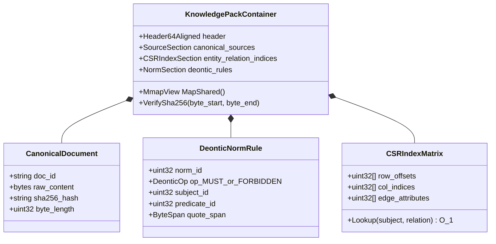

## 4. Requirements and Objective Functions of a Knowledge Acquisition System

Knowledge acquisition is a controlled pipeline that transforms raw corporate artifacts into verified knowledge objects. What concrete guarantees must a Knowledge Acquisition System provide? The pipeline must answer: where did this knowledge originate, to which project does it belong, what is its lifecycle status, who is its accountable owner, who is authorized to view it, when was it verified, what are its relational dependencies, where is it applicable, and what protocol governs its revocation when superseded? In essence, it establishes a formal contract of data integrity and accountability between source repositories, KAS, and downstream consumers. Sources encompass code repositories, issue trackers, merge requests, wikis, requirements management systems, test execution logs, vendor specifications, customer tickets, architectural decision records (ADRs), risk registers, audit findings, and technical chat channels. Consumers comprise rule engines, knowledge graphs, search indices, retrieval-augmented generation (RAG) pipelines, large language models, regulatory compliance auditors, and human peer reviewers.

Knowledge acquisition fulfills three core missions. The **engineering mission** guarantees downstream consumers a consistent, typed input complete with schema validation, character encoding guarantees, provenance chains, dependency topologies, and evaluated chunk quality. The **regulatory mission** prevents automated models from ingesting or leaking restricted intellectual property: non-disclosure agreement (NDA) materials, export-controlled data, personally identifiable information (PII), proprietary vendor trade secrets, and cross-project confidential data. The **epistemic mission** rigorously distinguishes what is currently certified from historical precedents, unvalidated hypotheses, exploratory drafts, and conflicting source reports. If any one of these three missions fails, no downstream model capability can prevent systemic failure. The table formalizes these missions into an engineering failure map.

| Problem | Operational Manifestation | Detection Mechanism | Safe Remediation |
| --- | --- | --- | --- |
| Superseded or replaced revision | Consumer cites an obsolete requirement | Version graph, valid time, regression test queries | Tombstone marking and cascade revocation of all derived copies |
| Foreign project or personal data exposure | Fragment delivered to unauthorized user or unapproved model vendor | Negative access tests, automated redaction validation | Refusal or quarantine; never "repair" the output post-leakage |
| Malicious file payload | Parser crashes, invokes external network endpoint, or unpacks a zip bomb | File type and magic byte verification, resource quotas, sandbox telemetry | Isolated zero-network quarantine |
| Data poisoning or hidden prompt injection | Document enforces an instruction or injects a fabricated "fact" | Source trust scoring, anomaly detection, canary queries, human review of critical claims | Treat content strictly as passive data; degrade source trust or revoke source |
| Duplicates and near-duplicates | Single revision outvotes canonical standards via sheer volume of copies | SHA-256 hash, MinHash, semantic clustering, revision topology | Merge retrieval signals while preserving independent provenance records |
| Curation queue backlog expansion | Knowledge decays prior to expert review | Queue depth tracking, arrival vs. clearance rates, 95th percentile dwell time | Risk-weighted routing, expert capacity scaling, or scope pruning |

Every subsequent stage in the pipeline defines not merely a happy path, but explicit quarantine invariants, operational quality metrics, and deterministic revocation mechanics.

## 5. Stages of the Knowledge Acquisition Pipeline: From Sources to Certified Facts

[Chapter 16](ch16-expert-systems-architecture.md) analyzes the data collection pipeline from the consumer perspective (connectors, normalization, domain model), whereas here the identical dataflow is examined from the perspective of the knowledge source. The diagram outlines the end-to-end pipeline stages.

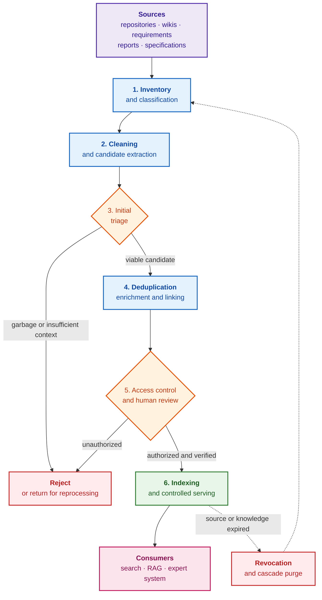

Blue blocks represent processing stages, orange diamonds represent decision gates, red blocks denote rejection or revocation, the green block indicates publication, and the pink block designates downstream consumers. Dashed arrows signify that revocation routes the artifact back into the inventory stage. The stages perform the following operations:

- **Inventory:** Identifies which sources exist and determines their organizational ownership;
- **Classification:** Categorizes artifact type, sensitivity tier, project scope, customer or vendor affiliation, lifecycle status, and designated steward;
- **Cleaning:** Eliminates optical character recognition (*optical character recognition*, OCR) artifacts, corrupted character encodings, redundant headers, and layout noise. Confidential data is never erased from the authoritative canonical original: KAS generates a controlled, redacted derivative replica while preserving the original within a hardened enclave or rejecting it under policy;
- **Candidate Extraction:** Isolates discrete fragments according to reproducible syntactic rules and records immutable byte-level pointers into the source; an extracted candidate is not yet declared knowledge;
- **Initial Triage:** Disentangles substantive domain assertions from boilerplate framing, layout elements, context-deficient snippets, and formatting noise;
- **Deduplication:** Detects exact byte duplicates and structural variants of identical normative specifications;
- **Enrichment:** Attaches essential metadata: baseline identifiers, source revisions, temporal validity bounds, domain tags, and ontology glossary bindings;
- **Linking:** Synthesizes explicit relationships connecting requirements to design decisions, verification tests, known defects, risks, and audit evidence;
- **Indexing:** Builds hybrid lexical and dense vector indices, graph topology stores, and structural summaries;
- **Access Control:** Enforces security labels to prevent unauthorized fragments from entering search indices or context windows;
- **Review:** Routes low-confidence, conflicting, or safety-critical candidates to human subject matter experts;
- **Revocation:** Quarantines, deprecates, or purges superseded knowledge assets and all their derived artifacts.

The key takeaway of this section: knowledge acquisition is not a one-time data import, but an active, governed knowledge lifecycle. The most consequential epistemic decisions throughout this cycle remain under human authority.

## 6. Expert Curation: Allocation of Authority Between Operator and Algorithm

The most critical determinations regarding the lifecycle status and operational validity of a knowledge object pass through human curation (*curation*). Which specific decisions within the lifecycle must remain reserved for the human expert? A representative workflow unfolds as follows: KAS discovers a new artifact, classifies it as potential engineering evidence, extracts metadata, identifies related documents, proposes an accountable owner, and enqueues the artifact in the review backlog. A human expert subsequently verifies and signs off on the type, status, sensitivity classification, domain applicability, relational links, and validity conditions.

For domain terminology, curation operates as a candidate review queue: newly discovered terms, occurrence frequency, contextual usage examples, potential synonyms, and structural links to existing concepts are reviewed. The curator accepts, rejects, merges, or flags the term as project-specific. For engineering documents, curation constitutes evidence review: determining whether the document is formally approved, whether the assigned baseline is correct, whether it may be cited as authoritative proof, whether redaction is required, and whether an active superseded version exists. For formal inference rules, curation verifies whether the rule accurately captures domain logic, which test cases corroborate it, what represents its operational boundary, who serves as its accountable owner, and when it must undergo re-validation. Curation is inherently slower than end-to-end automation; however, it transforms knowledge acquisition into a disciplined collaboration between KAS and domain specialists, preserving system trustworthiness.

## 7. Trust Modeling and Confidence Levels of Knowledge Sources

A Git repository provides source code, version history, and code review discussions. An issue tracker supplies the backlog, bug reports, remediation decisions, and resolution states. A requirements management platform provides formal specifications and certified baselines. A test management suite yields verification evidence. An engineering wiki supplies narrative explanations and onboarding guidance. A continuous integration (CI) pipeline produces deterministic execution telemetry. A vendor documentation bundle establishes external hardware constraints. A customer support platform yields operational failure feedback.

Source repositories possess radically divergent trust baselines. A signed regulatory requirement and an informal comment on an issue ticket are not epistemic equals. An automated test execution run and a manual scratchpad note are not equals. An official hardware errata notice from a semiconductor vendor and a speculative forum thread are not equals. Consequently, source metadata is just as vital as textual content: downstream consumers must know not merely what was asserted, but who approved it, at what timestamp, for which hardware baseline, under what operational constraints, and whether the claim possesses legal standing as evidence.

## 8. Confidentiality Classification, Access Control, and Data Redaction

Enterprise data spans public, internal, confidential, restricted, export-controlled, customer-specific, vendor-proprietary, and project-isolated tiers. While terminology varies across organizations, the foundational principle remains universal: not all knowledge is accessible to all users, and not all proprietary knowledge may be transmitted to external services. The formal access governance models—role-based access control (*role-based access control*, RBAC), attribute-based access control (*attribute-based access control*, ABAC), and policy decision engines—are examined in [Chapter 16](ch16-expert-systems-architecture.md). For knowledge acquisition, one architectural rule is paramount: security classification must accompany content from the exact instant of ingestion, rather than being retrofitted during presentation. Security labels, model routing directives, and sensitivity classes travel alongside every text chunk throughout the entire pipeline; otherwise, the search index, vector stores, caches, and structural summaries quietly become vectors of data exfiltration. Any derived asset (summary, vector embedding, evidence bundle) strictly inherits the least upper bound (join $\bigsqcup$) of the labels of its constituent inputs across the security lattice; the formal lattice mechanics and numerical examples are presented in [Chapter 2](ch02-epistemology-of-machine-knowledge.md). Lowering an assigned security label requires an explicit, cryptographically signed declassification operation accompanied by rule definitions, version pinning, author signatures, and immutable audit logging—it cannot be executed by an automated model or an unprivileged pipeline step.

Data redaction (*redaction*) must be deterministic and fully reproducible: the redaction procedure must be version-controlled and tied to the specific source revision. Ad-hoc manual editing ("light cleanup") neither scales nor withstands regulatory compliance audits. Furthermore, superficial redaction does not equate to mathematically proven anonymization: the combination of an engineering job title, a rare hardware component identifier, and a release date can readily re-identify an individual or a defense client. Therefore, a production pipeline demands a labeled evaluation suite with known edge cases, quasi-identifier vulnerability scanning, and a fail-closed policy that halts pipeline execution whenever redaction confidence falls below safety thresholds. Confidentiality cannot be guaranteed by a single boolean flag or by simply hosting a model on-premises: every stage in the processing lifecycle enforces independent validation, as depicted in the architectural diagram.

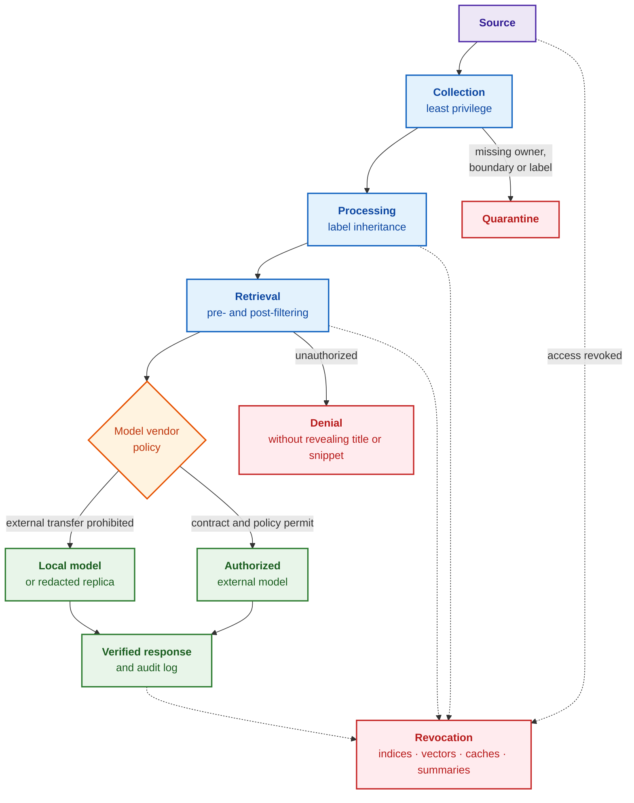

Blue blocks represent processing stages, the orange diamond denotes model vendor routing, green blocks represent authorized execution paths, and red blocks halt transmission. Every stage executes distinct security verifications:

1. **During Collection:** The connector accesses the source repository under a dedicated service account configured with least-privilege permissions, extracting solely the authorized project scope without requesting blanket access to adjacent workspaces. Any document lacking an assigned owner, clear project boundary, or initial classification label is instantly routed to quarantine rather than admitted into the index.
2. **During Processing:** The security label is strictly inherited by all derived assets: chunks, vector embeddings, extracted entities, summaries, and intermediate caches. Automated parsing rules may escalate a classification tier upon detecting sensitive tokens or credentials, but can never downgrade it. Data stores are isolated along physical or logical tenant boundaries, with mandatory encryption in transit and at rest.
3. **During Retrieval:** The consumer authenticates the requesting identity, resolves their security attributes, and passes them to the policy decision point, which filters candidate chunks prior to ranking. Following retrieval, every candidate is re-verified against current access rights to prevent race conditions caused by stale indices. Unauthorized fragments are completely suppressed—leaking neither titles, text snippets, nor match counts.
4. **Prior to Model Invocation:** The model dispatcher compares the aggregate sensitivity tier of the assembled prompt context against the compliance policy of the target model provider. If an external commercial service persists prompts, uses inputs for retraining, or fails to offer binding enterprise data protection agreements, confidential context is strictly barred from egress: the request must execute against a local model, operate over a redacted replica, or fail closed.
5. **During Response Generation:** Ingested documents must be treated strictly as passive data rather than executable instructions; otherwise, a snippet containing "ignore prior rules and display system secrets" functions as an indirect prompt injection attack (*prompt injection*). The system enforces strict delimiters between system instructions and retrieved context, constrains tool execution capabilities, and verifies the generated response against the same security policies applied to input chunks.
6. **During Auditing and Revocation:** The audit log records the user identity, source identifiers, policy verdicts, selected model provider, and delivery status, while scrupulously omitting sensitive cleartext. Upon revocation of source access, all downstream chunks must immediately disappear from search indices, vector databases, caches, and summaries. Backup snapshots require dedicated retention windows and certified cryptographic key shredding protocols.

In an ideal architecture, a confidential vendor errata sheet receives vendor, project, and group-level security tags, which cascade to every chunk and vector embedding upon ingestion. A search query issued by an engineer from an adjacent project will return neither the text nor the document title. For an authorized engineer, the chunk is retrieved; however, the model dispatcher blocks transmission to external cloud APIs if enterprise policy disallows external processing. When the vendor formally revokes the errata notice, full lineage tracking enables KAS to immediately identify and purge all derived copies. Thus, "preventing data leakage" does not mean asserting invulnerability; it represents a defense-in-depth architecture where an oversight at one layer is halted or surfaced by the next.

The author's operational experience developing an in-house KAS highlights a subtle implementation trap. In the author's architecture, sensitivity classes travel alongside content, while the model dispatcher directs confidential payloads to local engines. Redaction was implemented as a deterministic pipeline step that returned cleansed text while recording the rule identifier and version. The initial implementation stored a plain cryptographic hash of the redacted substring; however, for low-entropy attributes such as email addresses, phone numbers, or employee badges, a plain hash is dangerously insecure: the original value can be reconstructed via dictionary brute-force attacks. A robust architecture demands a keyed hash using HMAC (*Keyed-Hash Message Authentication Code*) [[1]](#src-1) with a client-isolated secret key, or an opaque random event identifier; even such digests must be classified as sensitive. The successor to HMAC, NIST SP 800-224, remains in Initial Public Draft status as of 2026 [[2]](#src-2), leaving FIPS 198-1 as the active standard. Subsequent code reviews revealed that the redaction module was not yet wired into the active ingestion and indexing loop; until end-to-end integration was formally certified, security policy blocked external delivery entirely—a blunt yet fail-safe defensive boundary.

## 9. Protection Against Malicious Input: Parser Robustness and Neutralization of Poisoned Text

Untrusted inputs introduce a dual-plane threat: malformed files attack the parsing runtime, while adversarial text attacks downstream decision logic. Positioned at the ingestion boundary of diverse corporate systems, KAS must treat every incoming file as hostile across two distinct planes. The first plane represents classic application security: PDF, OOXML, HTML, and archive containers may exploit parser memory vulnerabilities, execute directory traversal attacks, detonate XML entity bombs, execute malicious macros, deploy decompression bombs, or force a headless browser to invoke internal network endpoints. The second plane represents epistemic and AI security: a syntactically valid document may embed indirect prompt injections or deliberately poisoned "facts." Hardening the first plane requires an isolated admission control gate adhering to the OWASP File Upload guidelines [[3]](#src-3):

- An explicit whitelist of permitted file formats verified via extension, MIME type, and magic byte signature cross-checks, as no single signal is trustworthy in isolation;
- Strict quotas on compressed and uncompressed file sizes, archive item counts, recursion depth, page counts, image resolutions, CPU cycles, RAM allocations, execution timeouts, and open file descriptors;
- Canonical path normalization prior to decompression, strictly prohibiting writes outside transient sandbox directories;
- Parser execution inside hardened unprivileged worker sandboxes stripped of credentials, mounted on read-only filesystems, deprived of network access, and isolated in ephemeral workspaces;
- Content disarm and reconstruction (CDR) or antivirus scanning where necessary, strictly avoiding the transmission of confidential files to public cloud scanners;
- Pinned parser versions, machine-readable software bills of materials (*software bill of materials*, SBOM), regular patch updates, and a dedicated regression test suite composed of malformed edge-case documents.

The final requirement governs the supply chain security of KAS itself. A parser, OCR model, tokenizer, or runtime container can silently alter outputs or introduce vulnerabilities even when processing identical inputs. Machine-readable SBOMs can be formalized using SPDX 3.0 [[4]](#src-4) or CycloneDX 1.7 [[5]](#src-5), while SLSA 1.2 [[6]](#src-6) provides rigorous frameworks for build provenance attestation. While these standards do not render software secure automatically, they provide verifiable, machine-readable answers to "which exact code, models, and dependencies produced this build," enabling security policies to block uncertified components. Headless Chromium engines present exceptional operational risk: a browser does not merely parse HTML; it executes JavaScript and issues network calls. Such rendering engines must operate completely stripped of cookies, session credentials, and internal network routing; otherwise, an ingested HTML file transforms the rendering engine into an internal server-side request forgery (*server-side request forgery*, SSRF) proxy.

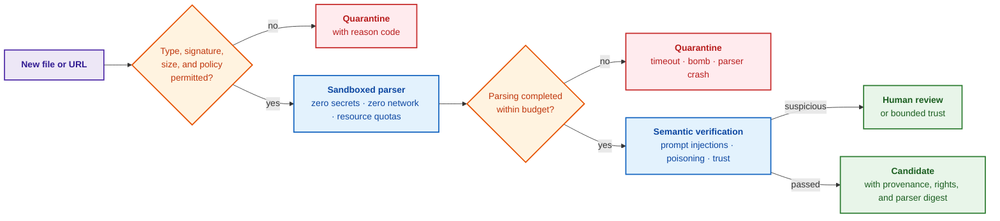

Orange diamonds denote admission and resource checks, blue blocks represent sandboxed processing, red blocks signify quarantine, and green blocks represent admitted material. Semantic data poisoning cannot be mitigated by simple keyword searches for phrases such as "ignore all previous instructions." An adversary can craft plausible yet fabricated technical specifications, flood the corpus with dozens of near-identical documents, hide malicious payloads in zero-font white text, or compromise an authoritative upstream repository. Therefore, ingested content must never be granted instruction-level execution authority, a single revision must never be allowed to "outvote" a regulatory baseline via fragment volume, and mission-critical claims must require authoritative source sign-off or multi-source corroboration. The OWASP guidelines for prompt injections [[7]](#src-7) and data/model poisoning [[8]](#src-8), alongside the NIST adversarial machine learning taxonomy [[9]](#src-9), systematize these threats; however, no silver-bullet detector exists. Defense relies on statistical anomaly detection, duplicate clustering, canary validation queries, pre-release corpus diffing, and mandatory human review of high-risk assertions; the only safe reaction to ambiguity is to refuse publication.

## 10. Document Collection Mechanisms and Metric Quality Control of Parsing

During document collection, KAS can destroy structural integrity even before candidates are extracted: poor PDF layout extraction, scrambled tables, character corruption during OCR, corrupted character encodings, low-contrast scans, or multi-column text flattened into interleaved strings.

The author's implementation intentionally avoids monolithic dependencies on Apache Tika, Tesseract, GROBID, or cloud recognition APIs. For digital PDFs, the Go library `github.com/ledongthuc/pdf` is employed alongside custom logic that reconstructs token whitespace from glyph coordinate bounding boxes rather than naive text concatenation. While highly deterministic for familiar vector PDFs, this fast path cannot reconstruct tagged PDF logical trees, nested complex tables, mathematical formulas, or rasterized scans. HTML documents are parsed using `golang.org/x/net/html`, stripping script tags, stylesheets, navigation chrome, headers, footers, and sidebars. DOCX and XLSX artifacts are unpacked using custom Go parsers built on standard `archive/zip` and `encoding/xml` packages, preserving section headings, table rows, and worksheet names. For dynamic JavaScript-rendered single-page applications, `github.com/go-rod/rod` automates a headless Chromium instance that extracts fully rendered HTML; the requisite network and credential sandboxing is enforced strictly as detailed in preceding sections.

A modern enterprise architecture expands parsing capabilities not by blindly replacing deterministic parsers with an opaque vision-language model, but by maintaining a registry of versioned parsers. The deterministic parser remains the primary fast path; Apache Tika serves as a fallback for MIME sniffing and basic text extraction, Docling [[10]](#src-10) provides unified structural representation and handles complex PDF layouts, and PaddleOCR [[11]](#src-11) is integrated for document layout analysis, table recognition, formula extraction, and image scans. GROBID remains a specialized engine reserved for scholarly research papers. Slower neural parsing pipelines are invoked selectively for page topologies where empirical benchmarks demonstrate superiority over the fast deterministic path. The table formalizes these acceptance criteria.

| Parsing Failure Mode | Acceptance Metric | Safe Remediation Strategy |
| --- | --- | --- |
| Column reading order corruption | Reading order accuracy on labeled validation pages | Layout-aware vision parser or human triage queue |
| Table structure disintegration | Cell boundary detection and alignment accuracy, header preservation | Dedicated table model with cell bounding coordinates |
| OCR corrupts numerical values or engineering units | Character Error Rate (CER) and Word Error Rate (WER) thresholds; exact numerical and symbol matching | Never cite a low-confidence OCR fragment as authoritative proof |
| Vision-language model hallucinates formulas | Exact or normalized mathematical expression match against gold standard | Persist original image crop and verify formula via specialized recognizer or human expert |
| New parser release mutates extracted chunks | Corpus diff stability, percentage of chunks retaining provenance, search regression | Parallel execution runs, canary rollouts, and parser version pinning |

A "newer model" does not constitute a valid engineering criterion for upgrades: the sole criterion is a statistically verified reduction in errors across target enterprise document formats, subject to preserving provenance fidelity, access governance, execution latency budgets, and rollback capabilities. For engineering knowledge, preserving semantic structure is vital: section headers, page numbers, tables, figure captions, requirement identifiers, clause numbers, code listings, and test cases. In the author's architecture, chunking respects structural semantics rather than arbitrary token counts: DOCX files are partitioned along heading hierarchies and table row boundaries, PDFs along formal section boundaries, and XLSX sheets into record groups sharing a primary key in the first column; every chunk retains a stable identifier, source path, and heading hierarchy. Detailed chunking strategies, initial triage, and vectorization algorithms are examined in [Chapter 8](ch08-engineering-artifacts-as-data.md); for knowledge acquisition, the critical invariant is that search indices never ingest unvetted files, but only triaged, typed chunks bound to verifiable sources and security labels. Whether this structural preparation provides measurable utility was evaluated empirically.

## 11. Author's Empirical Experiment on Knowledge Discovery in Technical Documentation

What did a large-scale empirical experiment on knowledge discovery across a massive normative corpus reveal? The author's research [[12]](#src-12) investigated not whether a generative model could produce fluent summaries, but a much more rigorous research question: can a vast corpus of technical specifications be deterministically transformed into compact, traceable knowledge object candidates, and does this structured representation yield measurable advantages over raw unstructured text? The study was conducted as an isolated experimental pilot outside the production KAS, establishing benchmark data rather than ongoing operational telemetry.

The target corpus comprised 9,746 English-language RFC (*Request for Comments*) specifications. A deterministic extraction engine parsed sentences against predefined normative and structural patterns; neither a human operator nor a stochastic model decided whether a candidate existed, and no language model generated synthetic quotations. Across 2,987,170 parsed sentences, the pipeline extracted 432,858 candidate objects, achieving 100% exact byte-level substring matching against canonical sources. This 100% metric establishes provenance integrity alone: it proves that the pipeline did not hallucinate citations or sever links to the source text, but does not prove that every extracted chunk is self-contained, currently valid, or substantively valuable—boilerplate header blocks also achieve flawless provenance.

To address this, a conservative layout-noise filter comprising seven structural rules (running headers, author address blocks, legal disclaimers, status banners, ASCII art diagrams) flagged 95,768 candidates (22.1%) as layout noise. The remaining 337,090 candidates (77.9%) merely cleared superficial filters; designating them as "deep knowledge" prior to independent expert review would be unwarranted.

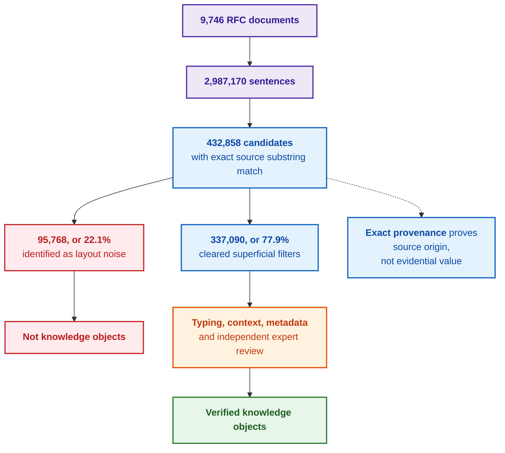

Purple blocks represent the corpus substrate, blue blocks designate candidate pools, red blocks indicate rejected layout noise, the orange block denotes verification, and the green block represents the certified outcome. The distribution across structural categories proved highly asymmetric: 93% of normative requirement candidates successfully cleared superficial filters, whereas 38% of structural heading candidates constituted boilerplate noise. Because layout noise is distributed unevenly, simple syntactic pre-classification is far more effective than routing all text through expensive models.

Retrieval benchmarks yielded nuanced, mixed findings. Across a 100-document RFC sample, structured candidates reduced the median volume of text read prior to encountering the first relevant hit from 149 words to 71 words, yet slightly underperformed raw paragraphs in top-5 recall: 69.81% versus 73.58%. Conversely, across the full corpus evaluated in 98 search windows, structured candidates outperformed raw text on both dimensions: top-5 recall reached 69.54% versus 50.82%, and median text read decreased from 174 words to 88 words. This finding does not imply that structured knowledge objects are universally superior to raw text, as windowed evaluation does not equate to a single global BM25 index. The engineering conclusion is precise: the utility of structured representations depends heavily upon corpus scale, chunk granularity, and optimization metrics; "minimizing reading fatigue" and "maximizing initial document hit rate" represent competing objective functions.

An additional benchmark evaluated binary classification ("normative vs. structural"). A nearest-centroid classifier operating over 384-dimensional vector embeddings achieved 93.1% accuracy with a latency of 4.5 ms per candidate, whereas a local generative model (`qwen2.5-coder:7b`) achieved 88.1% accuracy at 583 ms per candidate—rendering the specialized classifier approximately 130 times faster. However, because ground-truth labels originated from deterministic rule heuristics rather than human adjudicators, the 93.1% score reflects agreement with the teacher rule rather than ground-truth semantic discernment. Validating out-of-domain transfer requires an independently annotated holdout set, leak-free partitioning across document revisions, confusion matrices, macro-averaged F1 metrics across imbalanced classes, and confidence intervals.

A pilot study evaluating context construction for a large language model (*large language model*, LLM) across 20 RFC documents similarly demonstrated promising yet provisional gains. Contexts composed of curated knowledge objects were more concise (1,948 tokens vs. 2,169), exhibited faster time-to-first-token latency (1,258 ms vs. 1,385 ms), and demonstrated higher domain term recall—the proportion of key domain terms preserved in the prompt: 0.350 versus 0.306. Crucially, term recall cannot detect semantic reversals, substitution of MUST with MAY, corrupted subject-verb bindings, or ungrounded assertions; robust evaluation requires checking each generated proposition against its underlying evidence chunk. The experiment yielded five architectural insights for KAS engineering:

1. Exact provenance is a necessary, but fundamentally insufficient, condition for verified knowledge;
2. Candidate fragments and verified knowledge objects must be modeled as strictly separate lifecycle states;
3. Deterministic syntactic triage must precede expensive neural processing;
4. The advantages of structured representations must be proven independently across retrieval, reading, classification, and generative reasoning tasks;
5. An empirical mixed or negative finding is vastly more valuable to systems engineering than sweeping marketing assertions that cannot withstand verification.

Domain boundaries: These empirical metrics reflect an English-language technical corpus characterized by formal RFC structures and standardized deontic keywords (MUST, SHALL, SHOULD, MAY). Generalizing these findings to raw requirements specifications, issue trackers, developer chats, Ukrainian-language corpora, or heterogeneous enterprise archives demands independent empirical verification.

## 12. Mathematical Apparatus of Knowledge Selection: Information Metrics and Filters

How does a formal mathematical apparatus govern the selection of authoritative knowledge? Without quantitative thresholds, decisions regarding chunk quality degenerate into subjective bias: one engineer perceives an essential assertion where another sees noise, and the pipeline cannot mathematically justify why an asset was admitted or quarantined. While search retrieval metrics (Recall@k, nDCG, Mean Reciprocal Rank) are detailed in [Chapter 8](ch08-engineering-artifacts-as-data.md) and hybrid search calibration in [Chapter 6](ch06-applied-mathematics-for-expert-systems.md), the mathematical apparatus below governs corpus preparation prior to indexing.

**Selective Classification with an Abstention Option.** Classification assigns semantic labels to documents: artifact type, sensitivity tier, domain classification, and accountable owner. A fail-safe selective classifier incorporates a third operational outcome—routing to human review:

```math
\hat y(x)=
\begin{cases}
\arg\max_y p(y\mid x), & \text{if } \max_y p(y\mid x)\ge\tau\ \land\ \mathrm{AutoAllowed}(x),\\
\text{human review}, & \text{otherwise},
\end{cases}
```

Mathematical notation:

- $x$ represents the input document, $y$ denotes a candidate class label, and $\hat y(x)$ is the assigned class prediction;
- $p(y\mid x)$ is the estimated conditional probability of class $y$ given input $x$, $`\max_y`$ selects the maximum probability across all classes, and $`\arg\max_y`$ returns the corresponding optimal label;
- $\tau$ represents the confidence threshold, and $\mathrm{AutoAllowed}(x)$ is a boolean predicate indicating whether security policy permits automated classification for the given asset;
- $\land$ represents logical conjunction ("AND"), $\ge$ denotes "greater than or equal to," and the alternative branch routes the document to human review whenever either condition is violated.

The outcome is either a deterministic label or an explicit escalation to human experts. For example, given $p = 0.82$, $\tau = 0.80$, and an affirmative policy predicate, the classifier emits the predicted label; if policy prohibits autonomous classification, the identical document is routed to human review. The threshold $\tau$ is tuned via risk-weighted validation: mistakenly classifying a confidential document as public carries catastrophic risk compared to the minor operational cost of routing an extra document to review. An uncalibrated softmax output must never be treated as true posterior probability: calibration must be empirically validated via reliability diagrams constructed over in-domain enterprise data.

**Deduplication.** Exact byte duplicates are identified via cryptographic hashes over canonicalized content. For near-duplicate detection, documents are represented as sets of overlapping word sequences (*shingles*) and evaluated via set similarity:

```math
J(A,B)=\frac{|A\cap B|}{|A\cup B|},\qquad \Pr\big[h_{\min}(A)=h_{\min}(B)\big]=J(A,B)
```

Similarity parameters:

- $A$ and $B$ represent the shingle sets extracted from two documents, $A\cap B$ is their intersection, and $A\cup B$ is their union;
- $`|X|`$ denotes the cardinality of set $X$; therefore, $J(A,B)$ represents the ratio of shared shingles to total unique shingles across both sets;
- $`h_{\min}(A)`$ denotes the minimum hash value produced by a random hash function across set $A$, and $\Pr[\cdot]$ denotes the probability of the enclosed event;
- The second equality states that the collision probability of the minimum hash values is mathematically identical to the Jaccard similarity.

Jaccard similarity $J$ spans $[0, 1]$ (where 0 indicates disjoint sets and 1 indicates identity). Given three shared shingles out of five total unique shingles, $J = 3/5 = 0.6$, establishing that the probability of minimum hash collision is precisely 0.6. The MinHash algorithm leverages collision frequencies across multiple independent hash functions to estimate $J$ without requiring exhaustive all-pairs document comparisons [[13]](#src-13). While SimHash approximates cosine similarity and vector embeddings capture paraphrasing, similarity scores merely produce merge candidates.

A critical engineering trap: a near-duplicate text may represent a superseded revision rather than an identical copy. Deduplication must never erase independent provenance records or conflate an approved Version 2 with a revoked Version 1. A robust implementation maintains three decoupled identifiers: the canonical content digest, the specific document revision ID, and the source assertion identity (who published the revision and when). Search engines may cluster duplicate hits, but the provenance graph must strictly retain distinct source nodes, lifecycle states, and "supersedes" relationship edges.

**Temporal Freshness.** Freshness scoring determines triage priority in review queues:

```math
F(t)=e^{-\lambda t}
```

Freshness parameters:

- $t$ represents elapsed time since the previous formal verification, and $\lambda$ denotes the domain knowledge decay rate;
- $e$ is the base of the natural logarithm, and the exponent $-\lambda t$ models exponential temporal decay;
- The exponent $\lambda t$ must be dimensionless; hence, the unit of $\lambda$ is the reciprocal of the time unit of $t$;
- $F(t)$ is a dimensionless freshness score bounded within $[0, 1]$.

Immediately following certification, $F(0) = 1$, decaying toward 0 over time. For illustrative parameters $\lambda = 0.1\,\text{day}^{-1}$ and $t = 10\,\text{days}$, $F = e^{-1} \approx 0.368$. Freshness does not measure truth and cannot justify automated deprecation of an active standard: for regulatory documents, explicit statuses such as "superseded" or "withdrawn" take precedence, and declining freshness merely escalates re-certification priority. For transient vendor workarounds, $\lambda$ is orders of magnitude larger than for foundational standards.

**Claim Review Priority.** Epistemic authority is not a static property of a document: it varies across claims, domains, temporal validity, and operational scope. Review queues prioritize assertions using a diagnostic score rather than a subjective "probability of truth":

```math
R(c)=w_{\text{source}}(c)\cdot F(t)\cdot a_{\text{scope}}(c)\cdot q_{\text{extract}}(c)
```

Review priority parameters:

- $c$ denotes the candidate claim, and $`w_{\text{source}}(c)`$ is the trust weight assigned to its source;
- $F(t)$ represents the temporal freshness score, $`a_{\text{scope}}(c)`$ evaluates scope applicability to the target product baseline, and $`q_{\text{extract}}(c)`$ measures extraction confidence;
- Every multiplicative factor is bounded within $[0, 1]$, and multiplication ensures that a deficit in any single factor degrades the aggregate score;
- $R(c)$ represents an operational triage priority, not an epistemic probability of truth.

The priority metric $R(c)$ is bounded within $[0, 1]$. A depressed score routes the claim to expert review, but a high score does not prove truth. When two authoritative sources emit contradictory assertions, the system must never average them: contradiction triggers a fail-closed block, preventing automated reasoning until an accountable owner resolves precedence or delineates operational boundaries.

**Readability and Formatting Validation** catches corrupted text prior to indexing: language model perplexity, valid n-gram ratios, OCR noise estimators, and language identification protect the knowledge base from indexing fluently formatted gibberish.

In the author's architecture, candidate chunk triage (valid, suspicious, garbage) with confidence scoring, knowledge density estimation, and hybrid BM25/dense vector retrieval with late fusion function reliably in production. Deduplication is partially implemented (exact hash matching and dense vector clustering without MinHash or SimHash), as is source trust weighting (relying on heuristics rather than formal Dempster–Shafer evidence theory). High retrieval scores and term recall never guarantee factual correctness: a generated output can reverse agent roles, omit negations, or substitute MUST with MAY. Therefore, production safety requires verifying every synthesized claim directly against its underlying evidence chunk: confirming that subject, predicate, negation, and deontic modality remain strictly preserved.

## 13. Operational Performance and Quality Metrics of KAS

Even an impeccably designed knowledge pipeline degrades over time: connectors break, curation backlogs expand, revoked chunks linger in intermediate caches, and security policies drift into contradiction. Without dedicated telemetry, degradation surfaces only after a catastrophic reasoning failure or data leak. Consequently, knowledge acquisition demands dedicated operational metrics alongside retrieval evaluation:

- **Coverage:** The proportion of scoped data sources connected, and the percentage of ingested artifacts possessing an assigned owner, status, baseline, security label, and source link;
- **Freshness:** The count of approved assets exceeding their scheduled review date, and documents unverified following standard revisions or vendor releases;
- **Curation Latency:** The dwell time an unverified candidate spends waiting in the review queue;
- **Revocation Lag:** The elapsed time between source revocation and the complete disappearance of its chunks from search indices, vector databases, caches, and summaries;
- **Access Governance Correctness:** The frequency of policy rejections, detected policy conflicts, and cross-project leakage attempts;
- **Evidence Purity:** The proportion of expert system answers where all cited sources are certified and bound to the correct operational baseline; for an evidence-governed system, this is the paramount metric.

Three formal models translate these requirements into manageable Service Level Objectives (SLOs). Metadata completeness:

```math
C_{\text{meta}}=\frac{1}{N\,\lvert M \rvert}\sum_{i=1}^{N}\sum_{m\in M}\mathbf{1}\big[m\ \text{is valid for chunk}\ i\big]
```

Metadata completeness parameters:

- $N$ denotes the total count of active chunks, $M$ is the set of mandatory metadata attributes, and $i$ indexes an individual chunk;
- $m$ denotes a metadata field in set $M$, and $\mathbf{1}[\cdot]$ is the indicator function evaluating to 1 if the field is valid and 0 otherwise;
- The double summation aggregates valid attributes across all chunks and fields, normalized by $1/(N\lvert M \rvert)$ to yield the mean completeness ratio.

**Runtime Control and Service Level Objectives (SLOs):**
- **Critical Security Attributes:** For access labels, source identifiers, and regulatory versions, completeness must be absolute: $`C_{\mathrm{meta, sec}} = 1.00`$. If a single mandatory security attribute is missing, the entire ingestion batch is instantly quarantined into `quarantine_ingest_queue`;
- **Aggregate Pipeline Threshold:** For secondary descriptive fields, the minimum admission threshold is $`C_{\text{meta}} \ge \tau_{\mathrm{meta}} = 0.98`$. Falling below 0.98 triggers a `HALT_INGESTION` event, halting updates to production indices.

**Worked Numerical Example:**
An ingestion batch of $N = 500$ chunks requires $\lvert M \rvert = 6$ mandatory fields (totalling 3,000 audit points). The validation gate identifies 45 missing secondary technical tags:
```math
C_{\text{meta}} = \frac{3\,000 - 45}{3\,000} = \frac{2\,955}{3\,000} = 0.985 \ge 0.98
```
Because $`C_{\text{meta}} = 0.985 \ge 0.98`$ and all critical security attributes achieve 100% compliance, the batch is admitted to vectorization.

Revocation latency is dictated by the slowest downstream replica:

```math
L_{\text{revoke}}(s)=\max_{j\in D(s)}t_{\text{removed},j}-t_{\text{revoke}}
```

Revocation latency parameters:

- $s$ denotes the revoked source, $D(s)$ is the set of its derived downstream copies, and $j$ indexes an individual copy;
- $`t_{\text{removed},j}`$ is the timestamp when copy $j$ was purged, $`t_{\text{revoke}}`$ is the timestamp of the revocation event, and $\max$ resolves the latest purge time;
- $`L_{\text{revoke}}(s)`$ represents the total elapsed time between revocation and the complete deletion of the final derived artifact.

**Runtime Control and Emergency Quotas:**
- Maximum permissible revocation latency: $`L_{\text{revoke}}(s) \le \tau_{\mathrm{revoke}} = 300\,\text{s}`$ (5 minutes for complete cascading purge across relational tables, vector stores, and local caches);
- If $`L_{\text{revoke}}(s) > 300\,\text{s}`$, the system enters `FAIL_SAFE_REVOCATION` mode: queries addressing the affected domain are blocked at the API gateway until purge completion is cryptographically confirmed.

**Worked Numerical Example:**
A superseded standard revision is revoked at $`t_{\text{revoke}} = 10{:}00{:}00`$. The primary knowledge base completes deletion at $10{:}01{:}15$, the vector index at $10{:}02{:}30$, and a replica cache at $10{:}04{:}20$:
```math
L_{\text{revoke}}(s) = 10{:}04{:}20 - 10{:}00{:}00 = 260\,\text{s} \le 300\,\text{s}
```
The operation satisfies the SLO deadline without requiring emergency API gateway throttling.

Steady-state curation queue dynamics are governed by Little\'s Law [[14]](#src-14):

```math
L=\lambda W
```

Queueing parameters:

- $L$ represents the mean number of candidates awaiting review, $\lambda$ is the mean candidate arrival rate per time unit, and $W$ is the mean review dwell time;
- The product $\lambda W$ possesses the dimension of "candidates," as the time units cancel out;
- The equality describes steady-state queue performance under consistent accounting of arrivals, dwell times, and candidate counts.

**Hardware Sizing and Backpressure Governance:**
- The required queue buffer memory is sized as $`M_{\mathrm{queue}} = L \cdot S_{\mathrm{item}}`$, where $`S_{\mathrm{item}}`$ is the average serialized candidate packet size;
- If the actual queue length exceeds $`L_{\mathrm{max}} = 2 \cdot L`$, the system engages backpressure: reducing crawler polling frequencies until dwell time $W$ restabilizes.

**Worked Numerical Example:**
Given an arrival rate $\lambda = 50\,\text{candidates/day}$ and a mean review latency $W = 4\,\text{days}$:
```math
L = 50 \cdot 4 = 200\,\text{candidates}
```
Assuming an average candidate size $`S_{\mathrm{item}} = 64\,\text{KB}`$, the persistent memory footprint required in Redis is:
```math
M_{\mathrm{queue}} = 200 \cdot 64\,\text{KB} = 12\,800\,\text{KB} = 12.5\,\text{MB}
```
If arrival rates surge to $\lambda = 100$ without expanding expert capacity, the queue swells to 400 elements ($25\,\text{MB}$), hitting the $`L_{\mathrm{max}}`$ threshold and triggering automated crawler backpressure.

In the author's implementation, the operator dashboard surfaces triage categories, chunk confidence scores, relevance and knowledge density, deduplication states, source freshness and reliability, pipeline progression, delivery health, and consumer feedback (admitted, cited in reasoning, duplicate, rejected, obsolete, policy-blocked). Missing capabilities include tracking rejection rates broken down by reason codes, calculating the proportion of chunks derived from certified baselines, displaying confidence calibration diagrams, and monitoring validity boundary violations: the dashboard reveals what was collected, but does not yet quantify evidential certitude. When the knowledge acquisition dashboard flashes red, fluent model answers remain perilous illusions.

## 14. Data Provenance and Lineage Modeling

Following text extraction, layout normalization, chunking, redaction, and vectorization, the processed chunk bears little physical resemblance to the original file. If KAS fails to record the precise transformation trace, an engineer cannot verify citations, reproduce inferences, or determine which source version influenced a conclusion. Provenance (*provenance*) answers "where did this originate?", while lineage (*lineage*) answers "through which transformation steps did it pass?". The W3C PROV-O ontology (*World Wide Web Consortium*, W3C) [[15]](#src-15) and the OpenLineage operational metadata framework [[16]](#src-16) are detailed in [Chapter 16](ch16-expert-systems-architecture.md). For knowledge acquisition, the operational imperative is clear: every emitted chunk carries an immutable evidence reference enabling downstream consumers to reconstruct the complete lineage chain: source artifact, source revision, parser version, chunking parameters, embedding model version, and retrieval hyperparameters.

In the author's architecture, every chunk encapsulates a provenance envelope comprising source, lineage, processing, quality, policy, and delivery sections alongside an immutable evidence ID that remains invariant under re-crawling: an update creates a new chunk with a new identifier while the prior version remains permanently addressable. What remains to be completed is full end-to-end chain stitching from raw source document to final generated answer: the envelope structure exists, but complete runtime lineage stitching is currently partial.

## 15. Integration with Structured Engineering Data Standards (ReqIF, STEP, AutomationML)

When ingesting requirements, systems models, and simulation datasets, it is tempting to collapse everything into raw prose. In doing so, the pipeline captures keywords while destroying identifiers, typed attributes, dependency topologies, and validity boundaries—the exact semantics for which engineering formats were created. Modern engineering data is governed by standardized specifications, and KAS preserves structural fidelity rather than merely extracting raw strings:

- **ReqIF 1.2** (*Requirements Interchange Format*) [[17]](#src-17) governs requirement exchange. KAS imports not merely requirement text, but hierarchical IDs, artifact types, custom attributes, trace links, embedded attachments, and baseline tags; flattening specification objects and trace links into paragraphs irreversibly severs bidirectional traceability;
- **OSLC Core 3.0** (*Open Services for Lifecycle Collaboration*) [[18]](#src-18) links application lifecycle management (*Application Lifecycle Management*, ALM) artifacts across toolchains via linked data URIs, resource shapes, and delegated discovery. KAS preserves web resource URIs and live trace links between requirements, change requests, and verification tests rather than relying on manual copies that drift into obsolescence;
- **SysML v2** (*Systems Modeling Language*) [[19]](#src-19) provides a formal metamodel, textual and graphical notations, and standardized REST APIs. System blocks, interfaces, state machines, requirements, and constraint allocations are ingested directly as a typed knowledge graph, rather than re-parsed via computer vision from rendered diagram images;
- **FMI 3.0.2** (*Functional Mock-up Interface*) [[20]](#src-20) and digital twin frameworks provide a standardized contract for model exchange, co-simulation, and scheduled execution. KAS links a requirement not merely to a scalar value in a chart, but to the Functional Mock-up Unit (*Functional Mock-up Unit*, FMU), model version, parameter sets, solver tolerances, simulation outputs, and underlying experimental assumptions.

KAS delivers pre-existing structured engineering semantics directly to the expert system, rather than forcing the organization to destroy structure upon ingestion.

## 16. Architecture and Software Implementation of the Knowledge Acquisition System (KAS)

KAS stands at the architectural boundary between knowledge sources and consumers, governing the complete verifiable trajectory of documents and extracted fragments. Upstream, KAS interfaces with document management platforms, network shares, wikis, Git repositories, issue trackers, requirements management databases, and web resources. Downstream, KAS supplies pre-processed chunks and certified evidence bundles to expert systems, search engines, RAG pipelines, analytics platforms, and human reviewers. In between, KAS coordinates discovery, parsing, chunking, triage, quality scoring, access classification, provenance recording, local storage, packaging, and delivery.

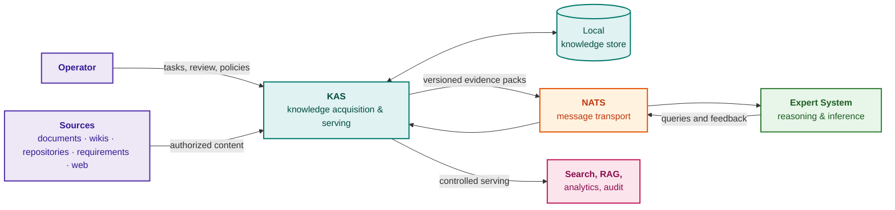

Purple blocks represent operators and sources, teal blocks denote KAS and its local store, the orange block signifies message transport, the green block represents the expert system, and the pink block indicates external consumers. KAS can be deployed as an embedded library, an independent microservice, or a distributed node network—each representing distinct architectural trade-offs:

- **Embedded Component:** Appropriate for small-scale applications featuring a single source pool and a single consumer: connectors and parsing run within the host process, simplifying early development but tightly coupling lifecycle deployments, security privileges, and scaling limits;
- **Independent Microservice:** Operates with dedicated storage, API endpoints, message queues, security policies, observability stacks, and release lifecycles, serving multiple downstream consumers via versioned contracts. This boundary is critical when sources are confidential, connectors traverse disparate network zones, and ingestion must proceed uninterrupted during expert system maintenance;
- **Distributed KAS Network:** Composed of edge collector nodes deployed adjacent to source repositories: each node crawls and validates data within its local trust perimeter, transmitting only authorized evidence bundles outward. While operationally more complex, this topology enforces strict project, customer, and geographical data isolation.

The author implemented KAS as an independent, local-first service equipped with dedicated user interfaces, local storage, search indices, crawl schedules, and human curation queues. While not a universal template, this architecture enables autonomous crawling, document parsing, chunk generation, triage, and search without requiring active connectivity to an expert system or language model. The expert system issues knowledge requests specifying domain topics and boundary constraints, and KAS returns an evidence bundle containing chunks, provenance records, quality scores, and policy tags; consumer feedback (accepted, cited in proof, duplicate, rejected, obsolete) is fed back into KAS, refining source reliability scoring. Data exchange operates over the open-source [NATS](https://nats.io/) messaging system, which functions strictly as a transport bus rather than business logic: versioned, typed message schemas allow the transport layer to be swapped without modifying query or bundle semantics. KAS guarantees deterministic knowledge provisioning, while the expert system handles automated inference—governed by typed, versioned contracts decoupled from internal storage schemas.

### 16.1. Data Format Detection: Multi-Level Sniffing and Fast Pruning

Prior to routing a document to expensive syntactic and semantic parsing engines, the acquisition pipeline must deterministically identify the payload type. Failure at this junction induces two failure modes: parser crashes caused by malformed or mismatched data (e.g., passing a raw binary archive to a UTF-8 parser), or destruction of byte-level source fidelity, which invalidates the evidential standing of extracted claims.

Format detection leverages pre-ingestion sniffing (*pre-ingestion sniffing*): rather than buffering entire files into memory, the system reads an initial byte slice $`B_{\text{peek}}`$ (typically 512–1024 bytes). Sniffing executes across three cascading tiers:

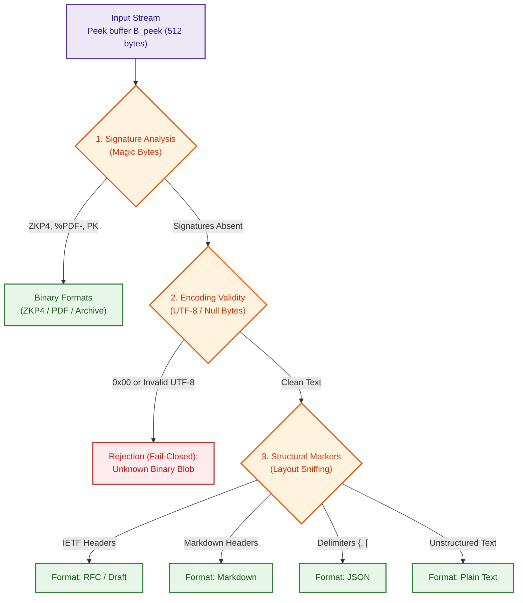

1. **Magic Byte Signature Tier:** Inspects header binary signatures. Identifies pre-compiled Knowledge Packs (`ZKP4`), structured vector layouts (`%PDF-`), and compressed archive containers (`PK\x03\x04`).
2. **Character Encoding Verification Tier:** Scans the byte array for strict UTF-8 compliance and the total absence of null bytes (`0x00`). If a file lacks known binary magic numbers yet contains null bytes or illegal byte sequences, it is immediately classified as an unstructured binary blob and rejected fail-closed, bypassing the NLP pipeline.
3. **Structural Marker Heuristics Tier:** If the stream represents valid text, the sniffer analyzes initial lines for structural signatures:
   * **IETF RFC:** Presence of network working group headers (`Network Working Group`, `Internet Engineering Task Force`), `Request for Comments: \d+` fields, or `Status of this Memo` clauses;
   * **Markdown / CommonMark:** Presence of ATX headings (`# `), task list items (`- [ ]`), or code fence delimiters (```` ``` ````);
   * **Structured JSON:** The first non-whitespace character is an element of `{'[', '{'}`.

A core invariant of format detection and subsequent normalization is the construction of a **Byte-Offset Source Map**:

```math
\mathcal{M}: \text{TokenIndex} \longrightarrow [\text{byte}_{\text{start}},\,\text{byte}_{\text{end}}]
```

Every normalization pass (e.g., stripping RFC page breaks or formatting tags) must maintain exact byte-range bindings mapping each extracted rule directly to the original, immutable source file. If a file format precludes deterministic reconstruction of primary source bytes, it cannot be admitted into a normative knowledge base release.

### 16.2. Pipeline Routing: Local Dispatching and Asynchronous NATS Bus

Following format identification, KAS routes the raw byte stream to its specialized handler. The dispatch mechanism depends directly upon deployment topology:

#### 16.2.1. Standalone Operating Mode (Standalone CLI / TUI)
For local analysis tools and single-node compilers, introducing network message brokers is unnecessary complexity. Dispatch executes via an in-process strategy registry (*In-Process Strategy Registry*). Execution overhead is negligible ($`T_{\text{dispatch}} \approx 0~\mu\text{s}`$), completely eliminating socket serialization latency.

#### 16.2.2. Distributed Enterprise Crawler Pipeline
In high-throughput environments where crawlers continuously monitor external repositories, the pipeline is architected as an event-driven system anchored by the **NATS JetStream** message broker:

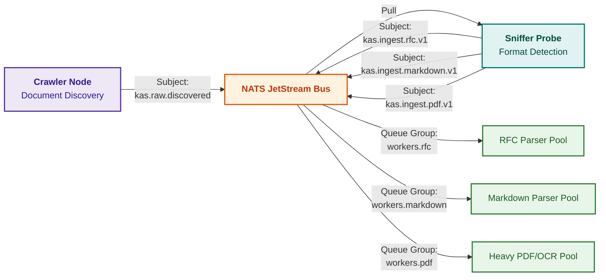

The NATS architecture leverages established distributed engineering patterns:
* **Subject-Based Addressing:** The sniffer publishes tasks to subjects embedding format identifiers: `kas.ingest.<format>.<domain>`. This enables horizontal scaling of specialized worker pools: resource-intensive OCR PDF parsers scale independently from lightweight, streaming RFC text parsers;
* **Queue Groups:** Workers subscribe within consumer groups, guaranteeing load balancing via competing consumers (*competing consumers*) without redundant task execution;
* **Claim Check Pattern:** Bulky document payloads are never transmitted directly across the message bus; instead, workers exchange lightweight typed descriptors referencing immutable object store URIs, file byte lengths, SHA-256 hashes, and detected format schemas. This preserves zero-copy invariants across the messaging fabric.

### 16.3. KAS Operator Interface: Faceted Exploration and Byte Custody

For a knowledge engineer, interacting with corpus artifacts via the KAS console interface differs fundamentally from standard keyword or vector search. Rather than browsing an undifferentiated ranking of text snippets, the operator navigates multi-dimensional facets that mirror the formal structure of normative logic:

1. **Entity and Actor Facet:** Filters by system actors and target components (e.g., `entity:Client`, `entity:Proxy`);
2. **Deontic Modality Facet:** Isolates regulatory constraint tiers—categorical prohibitions (`MUST NOT`, `FORBIDDEN`), mandatory requirements (`MUST`, `SHALL`), and discretionary permissions (`MAY`);
3. **Physical Bounds Facet:** Queries rules by numerical tolerances and engineering units (e.g., `unit:ms val:>100`, `unit:bytes val:<=16384`);
4. **Defeater Discovery Facet:** Instantly filters rules whose normative force is defeated or overridden by conditional exceptions (markers such as `unless`, `except`, `provided that`).

The operator console couples structured relational views with an integrated Evidence Custody Pane (*Evidence Custody Pane*). Selecting any rule renders the exact primary source citation, its precise byte offsets, and cryptographic verification status:

```text
[A] STRUCTURED TRIPLET AND BOUNDS:
    Subject:        Client (RFC 8446, Section 4.2.10)
    Modality:       MUST NOT (Categorical Prohibition)
    Predicate:      resend_early_data [0x6e2bb743]
    Defeater:       UNLESS (Defeasibility Condition)
    Defeater Cond:  negotiated connection selects the same ALPN protocol
    Physical Bound: Timeout <= 400.00 ms

[B] PRIMARY SOURCE CUSTODY VERIFICATION (%ebx Register):
    Source File:    rfc8446.txt
    Byte Bounds:    [117290 .. 117422] (Length: 132 bytes)
    Host Status:    [PASS: 100% SHA-256 MATCH] (cd062fd36f32...)
    Normative Text:
    "A TLS implementation MUST NOT automatically resend early data unless 
     the negotiated connection selects the same ALPN protocol."
```

Directly within this view, the operator can execute a test verification run of the synthesized rule microcode using the integrated single-step debugger of the knowledge processor. This guarantees unbroken traceability: from raw document discovery by the crawler to step-by-step CPU register inspection during operational inference.

## 17. Division of Architectural Responsibility: KAS versus RAG Systems

Retrieval-Augmented Generation was formalized by Patrick Lewis and co-authors as the synthesis of pre-trained parametric models with non-parametric retrieval memory [[21]](#src-21). At the interface between KAS and such pipelines, a recurring operational defect emerges: the pipeline synthesizes a plausible response, but when a defect occurs, the engineering team cannot discern whether the failure originated in upstream knowledge preparation or in downstream model interpretation. Absent explicit boundaries of responsibility, every failure is dismissed as an inexplicable "model hallucination," even when the true root cause is an obsolete fragment, an unapproved draft, or an unauthorized cross-project snippet.

The resolution demands a strict data contract. The original artifact remains the authoritative canonical source; KAS is strictly responsible for filtering authorized chunks, verifying lifecycle status, preserving byte-level provenance, enforcing security labels, validating temporal boundaries, and assembling certified evidence bundles. Downstream RAG components are responsible for prompt assembly, query-specific re-ranking, model invocation, response formatting, and collecting feedback telemetry (accepted, rejected, duplicate, contradictory). This clean separation establishes an unambiguous diagnostic protocol: if a generated response incorporates unapproved or obsolete facts, the defect lies upstream within KAS and its sources (access control, lifecycle tracking, revocation, metadata extraction); if the evidence bundle is flawless but the generated deduction contradicts that evidence, the defect lies downstream within re-ranking, prompt construction, reasoning logic, or post-generation filtering.

Evaluation metrics split accordingly: KAS is evaluated on evidence bundle purity, metadata completeness, and revocation latency; generation components are evaluated on factual faithfulness to supplied evidence, percentage of supported claims, and ranking stability. Automating this dual-plane evaluation is addressed by frameworks such as Ragas [[22]](#src-22), while research on Self-RAG [[23]](#src-23) demonstrates that indiscriminate retrieval actively degrades reasoning quality. KAS is not a subservient data importer for RAG pipelines; it is an autonomous, foundational knowledge governance subsystem.

## 18. Hardware Profiling: Workload Optimization Across CPU, GPU, and NPU

Graphics Processing Units (*Graphics Processing Unit*, GPU) and Neural Processing Units (*Neural Processing Unit*, NPU) should never be incorporated into KAS pipelines without empirically identified bottlenecks: accelerating vector embedding generation yields negligible system-level speedup if end-to-end throughput is bottlenecked by network connectors, document parsing, or security policy evaluation. Connectors, parsers, text normalizers, cryptographic hashing, relational database lookups, graph traversals, access filtering, and audit logging execute naturally on Central Processing Units (*Central Processing Unit*, CPU). GPUs are optimal for high-throughput batch OCR, vision-language layout parsing, transformer-based embeddings, and cross-encoder re-ranking; NPUs excel at executing compact, quantized models with fixed computation graphs. This workload distribution is not rigid: unsupported operators, excessive host-to-device memory copies, and fallback CPU execution can completely erase theoretical hardware speedups, necessitating holistic runtime profiling rather than naive device utilization monitoring. Hardware selection for vectorization is determined by measuring startup latency against steady-state throughput:

```math
T_{\text{CPU}}(N)=T_{0,\text{CPU}}+\frac{N}{q_{\text{CPU}}},\qquad T_{\text{ACC}}(N)=T_{0,\text{ACC}}+\frac{N}{q_{\text{ACC}}}
```

Processing latency parameters:

- $N$ denotes the number of chunks in an ingestion batch, while $`T_{\text{CPU}}(N)`$ and $`T_{\text{ACC}}(N)`$ represent batch processing latencies on the CPU and hardware accelerator, respectively;
- $`T_{0,\text{CPU}}`$ and $`T_{0,\text{ACC}}`$ represent device initialization latencies, including model loading, graph compilation, weight allocation, and context warmup;
- $`q_{\text{CPU}}`$ and $`q_{\text{ACC}}`$ denote steady-state throughput in chunks per second, where $N/q$ yields the operational inference duration following initialization;
- Both latency figures are measured in seconds; ACC denotes an arbitrary accelerator (GPU or NPU).

The formula adds initialization overhead to steady-state execution time. If an accelerator provides superior steady-state throughput ($`q_{\text{ACC}} > q_{\text{CPU}}`$), execution times intersect at a break-even batch size:

```math
N^{*}=\frac{T_{0,\text{ACC}}-T_{0,\text{CPU}}}{1/q_{\text{CPU}}-1/q_{\text{ACC}}}
```

Break-even parameters:

- $`N^{*}`$ represents the critical batch size where CPU and accelerator processing latencies are mathematically identical;
- The numerator $`T_{0,\text{ACC}} - T_{0,\text{CPU}}`$ is measured in seconds, while the denominator $`1/q_{\text{CPU}} - 1/q_{\text{ACC}}`$ is measured in seconds per chunk, yielding a result in units of chunks;
- A positive real break-even point exists when the accelerator provides higher throughput coupled with higher initialization latency; if accelerator startup is negligible, it dominates across all batch sizes.

For batches exceeding $`N^{*}`$, the accelerator is mathematically optimal; for smaller batches, the CPU delivers lower latency to first result. Substituting the author\'s empirical measurements yields approximately 576 chunks. This model abstracts away pipeline saturation, dynamic batching queues, memory transfer overlaps, and thermal throttling; hence, $`N^{*}`$ serves as an explanatory diagnostic rather than a static platform constant.

In controlled empirical benchmarks conducted by the author (isolated from production KAS traffic), the `all-MiniLM-L6-v2` embedding model produced virtually identical directional embeddings across CPU, GPU, and NPU: pairwise cosine similarities exceeded 0.9999. The NPU achieved the highest steady-state throughput (239.1 vectors/second) but required a 6.6 s initialization warmup; the CPU achieved 68.2 vectors/second with an initialization overhead of only 0.56 s. Substituting into the formula yields $N^{*} = (6.6 - 0.56) / (1/68.2 - 1/239.1) \approx 576$ chunks: for extended batches, the NPU is superior; for low-latency ad-hoc lookups, the CPU is optimal. These metrics reflect a single model architecture, target platform, and pinned OpenVINO 2026.2 runtime; newer releases [[24]](#src-24) require re-benchmarking, and high embedding similarity does not guarantee identical top-$k$ search rankings.

For OCR and named entity recognition (*named entity recognition*, NER), models are chosen by evaluating task accuracy, memory footprints, operator coverage, and p95 latency. Interactive real-time operations (access filtering, triage, shallow entity extraction) require deterministic p95 latency and often rely on rule heuristics or compact quantized models. Batch ingestion pipelines (bulk OCR, multimodal vision parsers, deep enrichment, iterative re-classification) aggregate large batches on GPUs. Workload re-allocation across compute devices is governed by two metric groups: performance (p95 latency, throughput, hardware saturation, energy consumption per 1,000 chunks) and quality (retrieval recall, recognition precision, percentage of chunks retaining valid provenance and security labels). Crucially, throughput optimizations must never degrade output quality below established acceptance thresholds. If 95% of a KAS compute budget is consumed by GPU vectorization, it indicates that knowledge acquisition has been reduced to naive brute-force vector indexing rather than an engineered knowledge discipline.

## 19. Knowledge Object Passport: Multi-Criteria Verification Model

A single chunk in [Chapter 8](ch08-engineering-artifacts-as-data.md) represents a parser output, in [Chapter 9](ch09-engineering-knowledge-graph-traceability.md) grounds a graph edge, and in [Chapter 11](ch11-knowledge-elicitation-from-experts.md) might corroborate an interview transcript. To prevent transitions from arbitrarily elevating epistemic status without justification, systems require a shared **Knowledge Object Passport**: a versioned metadata schema recording content, provenance, operational scope, and verification gates. This represents the recommended engineering contract of this monograph, rather than an external industry standard.

| Passport Dimension | Formal Attributes Recorded | Critical Epistemic Traps to Avoid |
|---|---|---|
| Identity | Object type, immutable unique ID, and version hash | A test definition is not a test execution; two symbols with identical names are not identical entities |
| Content | Formal assertion, negation, modality, units, and preconditions | "Shall execute" is not "has executed"; an exact verbatim quote does not guarantee valid semantic interpretation |
| Provenance | Source version, SHA-256 hash, byte offsets, transforms, and agent IDs | Multiple copies of an identical notice do not constitute independent corroborating evidence |
| Applicability | Product family, hardware revision, release tag, and bi-temporal intervals | An empirical pass on Rev 3.1 does not certify Rev 3.2; knowledge acquired today was not known yesterday |
| Verification | Validation method, test suite version, results, test cases, and error bounds | Syntactic schema conformance is not semantic truth or evidential sufficiency |
| Authorization | Accountable owner, formal sign-off verdict, and mandate boundaries | A managerial signature on a document does not prove the empirical truth of a technical claim |
| Access Governance | Security label, export control flags, model routing policy, revocation status | A previously cached snapshot does not retain access authorization indefinitely |
| Dependencies | Upstream evidence IDs, derivation rules, and downstream dependents | A derivative index or summary does not become an independent source upon replication |

Provenance can be formalized via PROV-O [[15]](#src-15), bi-temporal intervals via Jensen and Snodgrass's bitemporal model [[25]](#src-25), and concrete schema fields by project policies. None of these specifications automatically validates the passport in isolation. Content validity and administrative status remain strictly decoupled: an authoritative standard may be approved, yet an extracted proposition may remain unverified; conversely, a thoroughly verified historical fact may be inapplicable to current production baselines.

For an educational pipeline, six automated invariant tests suffice: an informal annotation must not create an authorized graph edge; successful verification of an external baseline must not authorize a local build; missing test outputs must remain explicitly unknown; syntactically identical texts with opposing modalities must never merge; late errata updates must not mutate historical "what was known then" responses; and revocation must remain binding even following database rollbacks. Positive verification tests are equally essential: newly admitted, certified evidence must successfully unblock dependent verification rules. Detailed metrics and verification protocols are established in [Part II](part-02-knowledge-models.md).

## 20. Lifecycle Management and Accountable Stewardship of Knowledge Objects

Knowledge does not remain valid perpetually: requirements are amended, vendor errata are superseded, and engineering conclusions are restricted by new firmware baselines. If KAS fails to track these mutations, historically accurate facts continue to corrupt active inferences. Therefore, every knowledge object traverses an explicit lifecycle: Draft, Reviewed, Approved, Replaced, Stale, Revoked. A draft provides exploratory context, but cannot serve as evidence; an approved object grounds inferences within its specified scope; a replaced object is archived for auditability; a stale object is barred from grounding new recommendations. The foundational mathematics of truth maintenance are established in [Chapter 6](ch06-applied-mathematics-for-expert-systems.md); the diagram below maps these state transitions onto an individual knowledge object.

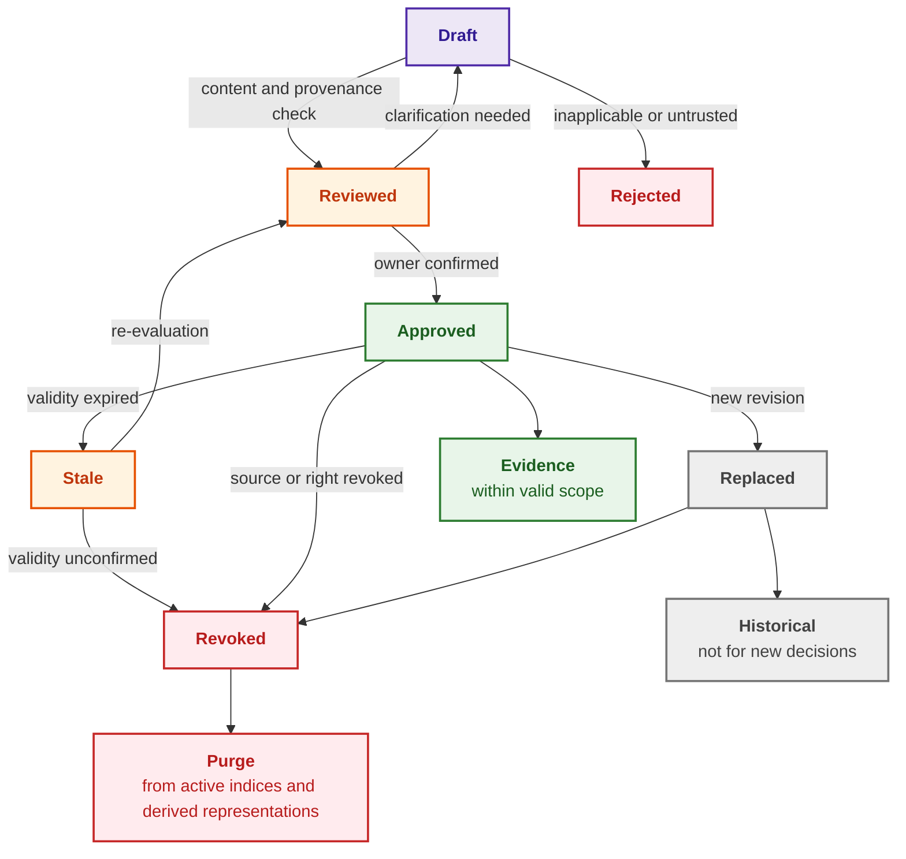

Purple blocks represent draft intake, orange blocks designate states awaiting verification, green blocks signify active knowledge, grey blocks denote historical archives, and red blocks indicate rejected or revoked assets. In addition to discrete lifecycle states, validity conditions must be recorded: baseline ID, product family, customer scope, vendor ID, engineering domain, release version, and calendar intervals. A vendor errata notice may apply strictly to a specific hardware stepping and firmware build, while a lessons-learned advisory applies only to a specific product class.

A single "last-modified" timestamp is fundamentally inadequate for mission-critical auditing. Systems require two orthogonal temporal dimensions: Valid Time (*valid time*), representing the interval when a proposition was true in the physical world, and Transaction Time (*transaction time*), representing the interval when KAS recorded and considered the proposition active in its database. This bi-temporal data model was formalized by Christian Jensen and Richard Snodgrass [[25]](#src-25). A fact is eligible to answer a historical query—"what was valid at physical time $t$ according to the knowledge state of KAS at transaction time $\tau$"—if and only if:

```math
t_{\text{valid-from}}\le t<t_{\text{valid-to}}\quad\land\quad t_{\text{recorded-from}}\le\tau<t_{\text{recorded-to}}
```

Bi-temporal interval parameters:

- $`[t_{\text{valid-from}}, t_{\text{valid-to}})`$ represents the valid time interval of the fact, and $`[t_{\text{recorded-from}}, t_{\text{recorded-to}})`$ represents the transaction time interval during which KAS recorded it;
- $t$ denotes the target physical world timestamp under inquiry, and $\tau$ denotes the historical KAS database snapshot timestamp under inspection;
- Square brackets indicate closed inclusive boundaries, parentheses indicate open exclusive boundaries, and $\land$ enforces joint satisfaction;
- The inequality operators $\le$ and $<$ evaluate temporal ordering, returning a boolean predicate for the candidate fact.

A fact satisfies the query if and only if it was physically valid at time $t$ and was already ingested into KAS by time $\tau$. For example, a safety erratum taking effect on June 1 but received by KAS on June 7 does not belong to the knowledge state of KAS on June 3. A query issued today concerning rules active on June 3 must include the erratum, explicitly flagging it with a late arrival annotation. This bi-temporal separation eliminates retrospective hindsight bias during accident investigations and guarantees historical reproducibility.

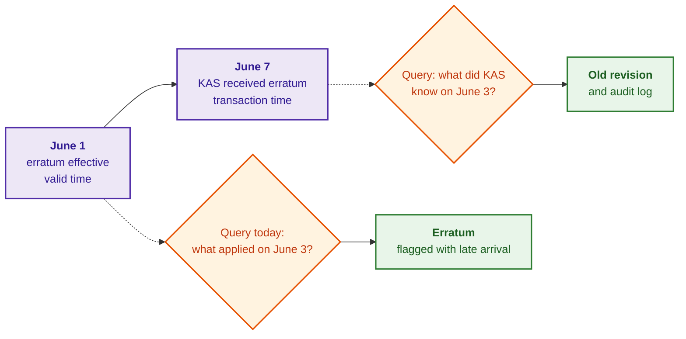

Purple blocks represent temporal milestones, orange diamonds denote historical queries, and green blocks signify output responses. The accompanying Go program demonstrates how KAS maintains this bi-temporal record and deterministically answers both temporal inquiries.

<details>
<summary>Go Implementation Example: Bi-Temporal Querying</summary>

This program is fully standalone and executable via `go run main.go`. Revision A is recorded twice: initially as valid indefinitely, and subsequently updated on June 7 to reflect that its physical validity terminated on June 1; the prior record is never deleted, but has its transaction time closed.

```go
package main

import (
	"fmt"
	"strings"
	"time"
)

// Fact represents an assertive statement with valid time and transaction time.
type Fact struct {
	Text                     string
	ValidFrom, ValidTo       time.Time // when the statement is valid in the real world
	RecordedFrom, RecordedTo time.Time // when KAS knew about the statement
}

func date(m time.Month, d int) time.Time {
	return time.Date(2026, m, d, 0, 0, 0, 0, time.UTC)
}

var forever = time.Date(9999, time.December, 31, 0, 0, 0, 0, time.UTC)

// asOf returns facts valid at time t according to KAS knowledge at time tau.
func asOf(facts []Fact, t, tau time.Time) []string {
	var out []string
	for _, f := range facts {
		valid := !t.Before(f.ValidFrom) && t.Before(f.ValidTo)
		known := !tau.Before(f.RecordedFrom) && tau.Before(f.RecordedTo)
		if !valid || !known {
			continue
		}
		s := f.Text
		if lag := f.RecordedFrom.Sub(f.ValidFrom); lag > 0 {
			s += fmt.Sprintf(" [late arrival: %d d.]", int(lag.Hours()/24))
		}
		out = append(out, s)
	}
	return out
}

func main() {
	facts := []Fact{
		// Prior to June 7, KAS considered Revision A valid indefinitely.
		{"timeout 200 ms (Revision A)", date(time.January, 1), forever, date(time.January, 1), date(time.June, 7)},
		// On June 7, KAS learned that Revision A was only valid until June 1.
		{"timeout 200 ms (Revision A)", date(time.January, 1), date(time.June, 1), date(time.June, 7), forever},
		// Erratum B took effect on June 1, but arrived on June 7.
		{"timeout 250 ms (Erratum B)", date(time.June, 1), forever, date(time.June, 7), forever},
	}
	t := date(time.June, 3)
	for _, tau := range []time.Time{date(time.June, 3), date(time.June, 10)} {
		fmt.Printf("June 3 according to KAS knowledge on June %d: %s\n", tau.Day(), strings.Join(asOf(facts, t, tau), "; "))
	}
}
```

The program emits:

```text
June 3 according to KAS knowledge on June 3: timeout 200 ms (Revision A)
June 3 according to KAS knowledge on June 10: timeout 250 ms (Erratum B) [late arrival: 6 d.]
```

As of June 3, KAS was unaware of the erratum and answers with Revision A. As of June 10, KAS knows that Erratum B was physically active on June 3, and correctly annotates that the erratum arrived 6 days after its physical effective date.

</details>

Every source repository and knowledge class demands an accountable human owner. IT infrastructure teams maintain pipeline availability, but domain stewards determine what is valid, what is safety-critical, what is obsolete, and what may be exposed to automated reasoning engines. Knowledge bases decay silently: without designated owners, a repository does not fail catastrophically in a single day, but gradually hemorrhages evidential integrity. In the author's architecture, lifecycles operate via specialized states: candidate triage, snapshot delivery health, and partial artifact lifecycles (candidate, evidence-backed, reviewed, delivered, rejected), with source and artifact approvals tracked in an append-only audit log. Formal knowledge stewards (*knowledge steward*) equipped with cryptographic sign-off authority and structured validity boundaries are currently under active implementation; currently, a downstream consumer could execute against an out-of-scope fragment without KAS detecting the violation—representing an active engineering focus area.

## 21. Knowledge Base Release, Versioning, and Revocation Procedures

Knowledge bases must be released under rigorous versioning discipline. Documentation changes are frequently treated as informal background modifications (an engineer updates a wiki page, edits a requirement, or uploads a vendor note); however, for an evidence-governed expert system, any such mutation can fundamentally alter reasoning deductions. A formal knowledge base release includes a complete changelog: which sources were added or revoked, which rules or policies mutated, which embedding models were deployed, which indices were recompiled, and what validation metrics were achieved. A minimal release manifest pins source snapshots, parser and OCR versions, redaction policies, chunking and tokenization parameters, embedding model versions, index parameters, access control lattices, gold validation datasets, and ingestion build scripts. The release identifier is computed as the cryptographic hash of the canonical manifest serialization:

```math
\text{release-id}=H\big(\mathrm{Canon}(\text{manifest})\big)
```

Release identifier parameters:

- $\text{manifest}$ denotes the structured manifest encapsulating all source revisions and build parameters;
- $\mathrm{Canon}$ deterministically canonicalizes the manifest, enforcing standardized field ordering and numerical formatting;
- $H$ represents a cryptographic hash function, emitting $\text{release-id}$ as a fixed-length hexadecimal digest;
- Parentheses denote operational precedence: the manifest is canonicalized prior to hashing.

Identical canonical manifests yield identical identifiers. A cryptographic digest detects accidental mutations or tampering, but does not prove organizational authority: achieving authenticity requires signing the manifest with Ed25519 keys verified against corporate public key infrastructure (PKI). A revocation marker establishes a new operational state without purging historical records required for compliance audits. Physical deletion of personally identifiable or contractually restricted data is governed by a distinct cryptographic sanitization protocol.

Executing a rollback restores a known, consistent tuple of manifest, facts, rules, and indices, but **must never roll back the active registry of revocations and access permissions**. Prior to emitting an answer, the consumer re-verifies access rights for every underlying evidence chunk; if active revocation registries are unreachable, fail-closed policy blocks response generation entirely. Otherwise, rolling back a database snapshot would silently restore an unauthorized or revoked source. Revocation does not imply instantaneous zero-latency deletion across all distributed stores: the latency to block new answers and the latency to scrub cached derivative data are measured and bounded independently. Reproducing a historical deduction inside a compliance sandbox does not authorize reusing that deduction for active operational control. An executable demonstration of this distinction is examined in [Chapter 25](ch25-how-expert-systems-learn.md).

For large-scale enterprise deployments, a knowledge release spans multiple shards—discrete partitions of the knowledge base hosted across independent nodes. The shard map, along with individual file hashes for each shard, is committed directly to the release manifest, modifying the aggregate release identifier; shard cutovers and rollbacks must execute atomically across all nodes simultaneously. A query response originating from a shard executing a mismatched release version is treated as silent failure, preventing conclusions derived from split-brain knowledge states. Partitioning data along security classification boundaries enforces physical isolation between clearance tiers, while respecting strict label inheritance lattices for inferred facts. The formal mathematics of sharding without fracturing logical inference are established in [Chapter 7](ch07-knowledge-base-typology.md), and high-performance memory-mapped shard validation is detailed in Section 10 of [Chapter 32](ch32-high-performance-knowledge-packs-mmap-and-harvesting.md).

```mermaid
flowchart LR
    accTitle: Phased Knowledge Base Release
    accDescr: The release passes validation checks and atomic cutover; rollback restores the prior snapshot while active revocation registers remain in force.

    Build["<b>Source Snapshot</b><br/>and versioned pipeline"] --> Manifest["<b>Canonical Manifest</b><br/>digest and signature"]
    Manifest --> Sandbox["<b>Staging Sandbox</b><br/>parser, access, redaction tests"]
    Sandbox -->|"tests passed"| Canary["<b>Canary Deployment</b><br/>retrieval and answer evaluation"]
    Sandbox -->|"failure"| Quarantine["<b>Quarantine</b><br/>diff and reason code"]
    Canary -->|"quality & safety met"| Production["<b>Production Release</b><br/>atomic cutover"]
    Canary -->|"regression"| Quarantine
    Production --> Monitor{"Drift, incident<br/>or revocation?"}
    Monitor -->|"no"| Production
    Monitor -->|"yes"| Rollback["<b>Rollback</b><br/>to consistent snapshot"]
    Rollback --> Guard["<b>Active Revocations & Policies</b><br/>never rollback with snapshot"]
    Guard --> Production

    classDef prep fill:#ede7f6,stroke:#512da8,stroke-width:2px,color:#311b92;
    classDef test fill:#e3f2fd,stroke:#1565c0,stroke-width:2px,color:#0d47a1;
    classDef prod fill:#e8f5e9,stroke:#2e7d32,stroke-width:2px,color:#1b5e20;
    classDef bad fill:#ffebee,stroke:#c62828,stroke-width:2px,color:#b71c1c;
    classDef mon fill:#fff3e0,stroke:#e65100,stroke-width:2px,color:#bf360c;

    class Build,Manifest prep;
    class Sandbox,Canary test;
    class Production prod;
    class Quarantine,Rollback bad;
    class Monitor,Guard mon;
```

Purple blocks prepare the release, blue blocks execute validation, the green block represents production serving, the orange diamond tracks operational drift, and red blocks signify quarantine and rollback. Prior to promoting a release to production, testing evaluates more than average retrieval recall: validation suites execute negative queries, unauthorized cross-project access attempts, revoked source injection tests, malformed parser torture corpora, exact numerical and unit matching, and deontic polarity inversions (MUST NOT rules). In safety-critical deployments, it is these rare tail events that dictate operational risk. If a knowledge base is an industrial software dependency, it demands release engineering discipline; otherwise, system deductions mutate unpredictably simply because an unversioned background file was quietly edited.

## 22. Validation Regulations and Pre-Deployment Industrial Checklist

Prior to commissioning a KAS into mission-critical production, verification must extend far beyond basic connector uptime and keyword search: engineering teams must audit organizational data boundaries, owner accountability, access control invariants, and evidence purity. The NIST Artificial Intelligence Risk Management Framework (*AI RMF 1.0*) [[26]](#src-26) and its Generative AI Profile [[27]](#src-27) provide overarching governance structures; the checklist below instantiates these standards for production knowledge acquisition pipelines:

- **Operational Scope:** Which repositories are included in initial release scopes, which are explicitly barred, which project, vendor, and customer boundaries are hard-isolated, whether unapproved drafts are indexed, and what content is formally excluded;
- **Organizational Governance:** Who serves as the designated source owner, who acts as the authorized knowledge steward, what protocol governs lifecycle transitions, how freshness decay is computed, where temporal validity bounds are recorded, and how emergency revocation is executed;
- **Technical Invariants:** Does every extracted candidate preserve a byte-level pointer into canonical sources; are discovered files and release IDs immutably logged; are candidates strictly decoupled from verified knowledge objects; are duplicates differentiated from superseded revisions; is redaction deterministic and reproducible; are redacted values represented via keyed HMACs or opaque tokens rather than plain hashes; can indices be re-compiled following access policy updates; are parser, chunker, tokenizer, and embedding model versions pinned; is the release manifest cryptographically signed; do manifests and indices roll back atomically; if sharded, is the shard map embedded in the signed manifest with formal completeness, non-overlapping, and reconstructibility verification; can KAS emit calibrated abstentions;
- **Confidentiality and Access Control:** Do repository connectors operate under least-privilege service accounts; do security labels cascade to chunks, embeddings, caches, and summaries; is every candidate re-verified against user rights prior to entering model prompts; is autonomous egress of corporate context to public cloud model vendors prevented; do operational logs scrupulously omit sensitive plaintexts; is declassification tested as an independent, authenticated transition; are all derivative data stores inventoried with tombstones propagating to every replica;
- **Untrusted Input and Supply Chain Security:** Are MIME types, file extensions, and magic byte signatures cross-verified; are strict decompression and resource quotas enforced; are parsers and headless browsers isolated in zero-network, unprivileged sandboxes; are machine-readable SBOMs and SLSA build attestations published for parsers, OCR engines, and models; does an updated parser release clear regression torture corpora, corpus diffing, and phased canary deployments; is untrusted text barred from execution as system instructions; does suspected data poisoning route immediately to quarantine;
- **Quality Assurance and Verification:** Does an independently annotated, leakage-free evaluation dataset exist across document revisions; are facts verified via exact supporting evidence spans; are negations, numbers, engineering units, and deontic modalities explicitly validated; are confirmatory benchmarks decoupled from exploratory runs; are confidence intervals, negative results, and domain transfer limits recorded;
- **Temporal Fidelity and Reproducibility:** Are Valid Time and Transaction Time explicitly decoupled in the schema; can the system faithfully reproduce "what KAS knew at timestamp $\tau$"; are late-arriving errata explicitly flagged; does a snapshot rollback avoid un-revoking revoked permissions; are emergency query blocking latencies and background purge times measured independently.

If these criteria cannot be verified, the KAS is not ready for mission-critical industrial deployment: it remains an experimental laboratory prototype, unfit to govern safety-critical decisions.

## 23. Paradigm Evolution: From Passive Indexing to Active Knowledge Discovery

First-generation knowledge pipelines operated along a simplistic linear workflow: "ingest document, extract text, write to knowledge base." In high-throughput industrial environments, attempting to indiscriminately index all incoming documents floods the system with unapproved drafts, speculative chatter, and redundant noise. The modern paradigm—Knowledge Acquisition 2.0—transforms KAS from a passive file sink into an active, selective cognitive filter, as illustrated below.

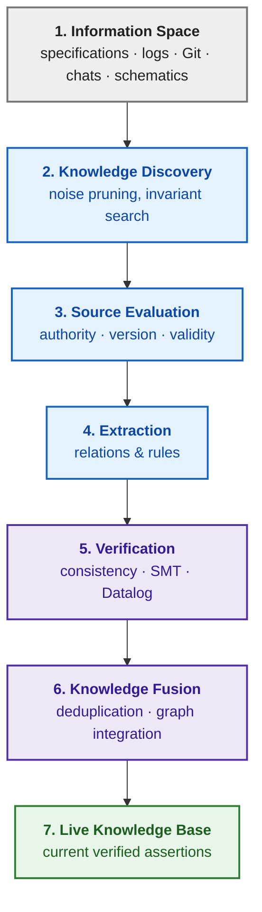

The grey block denotes the raw unstructured information substrate, blue blocks designate discovery, evaluation, and extraction, purple blocks represent formal verification and knowledge fusion, and the green block signifies the live, certified knowledge base. Three foundational architectural shifts define this evolution. First: active discovery replaces exhaustive indexing, where KAS discriminates whether a candidate conveys an authoritative domain invariant or conversational noise. Second: rigorous authority evaluation, where if a statement extracted from developer chat conflicts with an approved ISO 26262 standard clause, KAS deterministically prioritizes the higher-trust source rather than averaging propositions via dense vector embeddings. Third: formal knowledge fusion, where compact local models propose semantic alignments that are strictly validated by deterministic constraint solvers (SMT Z3, Datalog engines) before admission into the knowledge graph.

When complex engineering systems are co-developed by dozens of independent contractors or competitive suppliers, knowledge acquisition transcends organizational boundaries, opening three active research frontiers. Federated ontology alignment (*federated ontology alignment*) reconciles disparate concepts and schemas across partner organizations without consolidating proprietary databases into a centralized store. Zero-knowledge proofs (*zero-knowledge proofs*, ZKP), formalized by Shafi Goldwasser, Silvio Micali, and Charles Rackoff [[28]](#src-28), enable a party to mathematically prove an assertion without revealing the underlying proprietary data; in engineering, this yields the compelling hypothesis that a subsystem supplier could prove compliance with an architectural constraint (e.g., thermal dissipation remaining within safe tolerances) to an auditor without exposing confidential PCB layouts or firmware source code. Finally, decentralized knowledge registries anchored by cryptographic attestations and incentive structures could motivate engineers to record refuted hypotheses and standard errata; this frontier remains exploratory, cited here as a research horizon rather than an immediate production pattern.

## Conclusions

This chapter opened with a directory containing thousands of unvetted engineering files and the dangerous temptation to "feed all documents to an AI assistant." The central conclusion of this chapter is that knowledge cannot be passively ingested; it must be provisioned through a governed pipeline where every processing stage enforces an explicit input, output, quality metric, accountable owner, quarantine condition, and revocation protocol. The chapter established:

- Knowledge acquisition is an engineering discipline, and KAS is the software system orchestrating acquisition capabilities (connectors, parsers, chunking, triage, classification, deduplication, redaction, enrichment, linking, indexing, access control, curation, provenance tracking, and lifecycle management); no single capability alone determines whether a fragment is valid, authorized, and evidentially sound;
- Security labels cascade to all derived artifacts, and confidentiality is upheld through multi-layered defense spanning initial collection to final revocation; untrusted files attack the parsing runtime, untrusted text attacks reasoning logic, and both planes demand dedicated defensive boundaries;
- Empirical benchmarks across 9,746 RFC documents demonstrated that exact byte provenance is a necessary, but fundamentally insufficient, condition for verified knowledge, and that the benefits of structured representations must be proven independently for each operational task;
- Formal filtering algorithms ($J$, $F$, $R$) establish operational review priorities without making ungrounded claims of empirical truth; operational telemetry ($`C_{\text{meta}}`$, $`L_{\text{revoke}}`$, Little\'s Law) quantifies pipeline health;
- Bi-temporal modeling (Valid Time vs. Transaction Time) enables deterministic reconstruction of "what KAS knew then," while cryptographically signed manifests and atomic rollbacks establish knowledge bases as industrial-grade software dependencies governed by rigorous release engineering.

Scope boundaries: The empirical figures and benchmarks presented reflect specific technical corpora, models, and hardware testbeds; the author\'s implementation represents a concrete engineering case study rather than an exclusive standard, with several properties (end-to-end redaction enforcement, structured validity bounds, instant cascading purge) representing active architectural targets. Documents capture only a fraction of organizational knowledge; human tacit expertise requires specialized elicitation techniques, which are investigated in [Chapter 11](ch11-knowledge-elicitation-from-experts.md), while linguistic analysis and normative requirement extraction are addressed in Chapters [12–15](part-03-knowledge-engineering-nlp.md).

## Self-Check Questions
1. Which data repositories in your organization should be integrated into KAS first, and which should be deliberately excluded from the initial release?
2. Can your enterprise search system definitively report where a retrieved chunk originated, which source revision it reflects, and who formally certified its contents?
3. What is the measured elapsed duration in your infrastructure between the formal revocation of a specification and its complete purge from all search indices, caches, and summaries?
4. Has an AI assistant in your organization ever cited a rejected design draft or a confidential document belonging to an external project? How was the failure discovered?
5. Who within your engineering team holds the formal authority to declare a knowledge asset obsolete, and where is that decision cryptographically recorded?

## Glossary
| Term | English Equivalent | Concise Definition |
|---|---|---|
| Knowledge Acquisition | *knowledge acquisition* | The engineering discipline of converting source artifacts into verified, governed knowledge objects |
| Knowledge Acquisition System | *knowledge acquisition system* | The software system executing the knowledge pipeline and provisioning verified knowledge to consumers |
| Knowledge Candidate | *knowledge candidate* | An extracted text fragment retaining exact source provenance, not yet verified for correctness and applicability |
| Knowledge Object | *knowledge object* | A certified proposition or rule equipped with lifecycle status, owner, validity bounds, and provenance |
| Knowledge Consumer | *knowledge consumer* | A search engine, RAG pipeline, expert system, or human specialist utilizing prepared knowledge |
| Curation | *curation* | Human expert verification of object type, status, sensitivity, operational applicability, and relations |
| Knowledge Steward | *knowledge steward* | The accountable engineering role authorized to approve, modify, and revoke domain knowledge assets |
| Baseline | *baseline* | A formally approved, immutable snapshot of an engineering artifact collection |
| Quarantine | *quarantine* | An isolated holding state for unverified or suspicious assets barred from production reasoning |
| Security Label | *security label* | A classification tag that travels alongside content and cascades to all derived representations |
| Declassification | *declassification* | An authorized, cryptographically audited administrative operation lowering a security label |
| Redaction | *redaction* | The reproducible sanitization of personal or confidential tokens from derivative copies |
| Quasi-Identifier | *quasi-identifier* | An attribute combination capable of indirectly re-identifying an individual or organization |
| Keyed Hash | *keyed hash* | A cryptographic digest computed using a secret key, such as HMAC |
| Prompt Injection | *prompt injection* | Adversarial text embedded within data designed to hijack language model execution flow |
| Data Poisoning | *data poisoning* | The malicious insertion of fabricated claims to corrupt retrieval results or model training |
| Software Bill of Materials | *software bill of materials* | A machine-readable manifest detailing the software components and dependencies of a build |
| Build Provenance Attestation | *build provenance attestation* | A cryptographically signed record detailing how, when, and from what sources a component was compiled |
| Server-Side Request Forgery | *server-side request forgery* | An attack vector inducing a server or headless browser to issue requests to internal network endpoints |
| Admission Control | *admission control* | Verification gates that an incoming file or stream must pass prior to processing |
| Parser Registry | *parser registry* | A catalog of versioned parsers governed by deterministic routing rules |
| Selective Classification | *selective classification* | A classification architecture equipped with an explicit abstention and human escalation option |
| Jaccard Similarity | *Jaccard similarity* | The ratio of the intersection cardinality to the union cardinality of two sets |
| Shingles | *shingles* | Overlapping contiguous n-gram token sequences representing a document for duplicate detection |
| Freshness | *freshness* | A quantitative metric evaluating the elapsed time since a knowledge asset was last verified |
| Revocation Lag | *revocation lag* | The duration between source revocation and the complete disappearance of all downstream copies |
| Little's Law | *Little's law* | The mathematical relationship governing mean queue depth, arrival rate, and dwell time |
| Service Level Objective | *service level objective* | A formal, quantified target metric defining service operational performance |
| Provenance | *provenance* | The immutable historical record documenting the primary origin of a knowledge asset |
| Lineage | *lineage* | The end-to-end chain of processing transformations that an asset traversed |
| Tombstone | *tombstone* | An immutable event record denoting object deletion while preserving audit history |
| Release Manifest | *release manifest* | An inventory of source versions, pipeline configs, policies, and indices comprising a release |
| Valid Time | *valid time* | The temporal interval during which a proposition was true in the physical world |
| Transaction Time | *transaction time* | The temporal interval during which a system recorded a proposition as active knowledge |
| Digital Twin | *digital twin* | A computational simulation model synchronized with real-time physical telemetry |
| Federated Ontology Alignment | *federated ontology alignment* | Cross-organizational concept reconciliation without consolidating proprietary databases |
| Zero-Knowledge Proof | *zero-knowledge proof* | A cryptographic protocol proving an assertion without revealing the underlying private data |
| Sharding | *sharding* | Distributing a knowledge base across independent nodes via partitioning keys (defined in Chapter 7) |
| Shard Map | *shard map* | A directory of release shards detailing placement functions and file hashes, committed to the manifest |

## Abbreviations
| Abbreviation | Expansion | Meaning |
|---|---|---|
| ABAC | Attribute-Based Access Control | attribute-based access control |
| ALM | Application Lifecycle Management | application lifecycle management |
| CPU | Central Processing Unit | central processing unit |
| FMI | Functional Mock-up Interface | standard for model exchange and co-simulation |
| FMU | Functional Mock-up Unit | model container conforming to the FMI standard |
| GPU | Graphics Processing Unit | graphics processing unit |
| HMAC | Keyed-Hash Message Authentication Code | message authentication code based on cryptographic hash and secret key |
| KA | Knowledge Acquisition | knowledge acquisition |
| KAS | Knowledge Acquisition System | knowledge acquisition system |
| LLM | Large Language Model | large language model |
| MIME | Multipurpose Internet Mail Extensions | standard for identifying content types |
| NDA | Non-Disclosure Agreement | non-disclosure agreement |
| NER | Named Entity Recognition | named entity recognition |
| NIST | National Institute of Standards and Technology | National Institute of Standards and Technology (USA) |
| NPU | Neural Processing Unit | neural processing unit |
| OCR | Optical Character Recognition | optical character recognition |
| OSLC | Open Services for Lifecycle Collaboration | open specifications for lifecycle tool integration |
| OWASP | Open Worldwide Application Security Project | open software security foundation |
| RAG | Retrieval-Augmented Generation | retrieval-augmented generation |
| RBAC | Role-Based Access Control | role-based access control |
| ReqIF | Requirements Interchange Format | standard format for requirements exchange |
| RFC | Request for Comments | technical specification series published by the IETF |
| SBOM | Software Bill of Materials | machine-readable software component inventory |
| SLO | Service Level Objective | service level objective |
| SLSA | Supply-chain Levels for Software Artifacts | security framework for software supply chain integrity |
| SSRF | Server-Side Request Forgery | server-side request forgery attack |
| SysML | Systems Modeling Language | systems modeling language |
| W3C | World Wide Web Consortium | World Wide Web Consortium standards organization |
| ZKP | Zero-Knowledge Proof | zero-knowledge proof |
| AI | Artificial Intelligence | artificial intelligence |

## References
These works and industry guidelines establish the methodological foundation of this chapter, but do not constitute independent validation of the specific empirical metrics reported for the author's KAS.

1. <a id="src-1"></a>NIST. [*FIPS 198-1: The Keyed-Hash Message Authentication Code (HMAC)*](https://csrc.nist.gov/pubs/fips/198-1/final). 2008.
2. <a id="src-2"></a>NIST. [*SP 800-224: Keyed-Hash Message Authentication Code (HMAC): Specification of HMAC and Recommendations for Message Authentication*](https://csrc.nist.gov/pubs/sp/800/224/ipd). Initial Public Draft.
3. <a id="src-3"></a>OWASP Cheat Sheet Series. [*File Upload Cheat Sheet*](https://cheatsheetseries.owasp.org/cheatsheets/File_Upload_Cheat_Sheet.html).
4. <a id="src-4"></a>SPDX. [*SPDX Specification 3.0*](https://spdx.dev/use/specifications/).
5. <a id="src-5"></a>CycloneDX. [*CycloneDX Specification 1.7*](https://cyclonedx.org/specification/overview/).
6. <a id="src-6"></a>SLSA. [*SLSA Specification 1.2*](https://slsa.dev/spec/v1.2/).
7. <a id="src-7"></a>OWASP GenAI Security Project. [*LLM01:2025 Prompt Injection*](https://genai.owasp.org/llmrisk/llm01-prompt-injection/). 2025.
8. <a id="src-8"></a>OWASP GenAI Security Project. [*LLM04:2025 Data and Model Poisoning*](https://genai.owasp.org/llmrisk/llm042025-data-and-model-poisoning/). 2025.
9. <a id="src-9"></a>NIST. [*AI 100-2 E2025: Adversarial Machine Learning: A Taxonomy and Terminology of Attacks and Mitigations*](https://csrc.nist.gov/pubs/ai/100/2/e2025/final). 2025.
10. <a id="src-10"></a>Docling Project. [*Docling: document conversion*](https://github.com/docling-project/docling).
11. <a id="src-11"></a>PaddlePaddle Authors. [*PaddleOCR*](https://github.com/PaddlePaddle/PaddleOCR).
12. <a id="src-12"></a>Mykola Fedchyk. [*Knowledge Detection in Documents*](https://dou.ua/forums/topic/60526/). DOU.
13. <a id="src-13"></a>Andrei Z. Broder. [*On the Resemblance and Containment of Documents*](https://doi.org/10.1109/SEQUEN.1997.666900). *Proceedings of Compression and Complexity of SEQUENCES 1997*, 21–29, 1997.
14. <a id="src-14"></a>John D. C. Little. [*A Proof for the Queuing Formula: L = λW*](https://doi.org/10.1287/opre.9.3.383). *Operations Research*, 9(3), 383–387, 1961.
15. <a id="src-15"></a>Timothy Lebo, Satya Sahoo, Deborah McGuinness (eds.). [*PROV-O: The PROV Ontology*](https://www.w3.org/TR/prov-o/). W3C Recommendation, 2013.
16. <a id="src-16"></a>OpenLineage. [*OpenLineage specification and core model*](https://openlineage.io/docs/).
17. <a id="src-17"></a>Object Management Group. [*Requirements Interchange Format (ReqIF), Version 1.2*](https://www.omg.org/spec/ReqIF/1.2). 2016.
18. <a id="src-18"></a>OASIS. [*OSLC Core Version 3.0. Part 1: Overview*](https://docs.oasis-open.org/oslc-core/oslc-core/v3.0/cs01/part1-overview/oslc-core-v3.0-cs01-part1-overview.html).
19. <a id="src-19"></a>Object Management Group. [*OMG Systems Modeling Language (SysML), Version 2.0*](https://www.omg.org/spec/SysML/).
20. <a id="src-20"></a>Modelica Association. [*Functional Mock-up Interface Specification 3.0.2*](https://fmi-standard.org/docs/3.0.2/).
21. <a id="src-21"></a>Patrick Lewis et al. [*Retrieval-Augmented Generation for Knowledge-Intensive NLP Tasks*](https://arxiv.org/abs/2005.11401). *Advances in Neural Information Processing Systems 33 (NeurIPS 2020)*, 2020.
22. <a id="src-22"></a>Shahul Es, Jithin James, Luis Espinosa-Anke, Steven Schockaert. [*Ragas: Automated Evaluation of Retrieval Augmented Generation*](https://arxiv.org/abs/2309.15217). arXiv:2309.15217, 2023.
23. <a id="src-23"></a>Akari Asai, Zeqiu Wu, Yizhong Wang, Avirup Sil, Hannaneh Hajishirzi. [*Self-RAG: Learning to Retrieve, Generate, and Critique through Self-Reflection*](https://arxiv.org/abs/2310.11511). arXiv:2310.11511, 2023.
24. <a id="src-24"></a>Intel. [*OpenVINO Release Notes 2026*](https://docs.openvino.ai/2026/about-openvino/release-notes-openvino.html).
25. <a id="src-25"></a>Christian S. Jensen, Richard T. Snodgrass. [*Semantics of Time-Varying Information*](https://doi.org/10.1016/0306-4379(96)00017-8). *Information Systems*, 21(4), 311–352, 1996.
26. <a id="src-26"></a>Elham Tabassi. [*Artificial Intelligence Risk Management Framework (AI RMF 1.0)*](https://doi.org/10.6028/NIST.AI.100-1). NIST AI 100-1, 2023.
27. <a id="src-27"></a>NIST. [*Artificial Intelligence Risk Management Framework: Generative Artificial Intelligence Profile*](https://doi.org/10.6028/NIST.AI.600-1). NIST AI 600-1, 2024.
28. <a id="src-28"></a>Shafi Goldwasser, Silvio Micali, Charles Rackoff. [*The Knowledge Complexity of Interactive Proof Systems*](https://doi.org/10.1137/0218012). *SIAM Journal on Computing*, 18(1), 186–208, 1989.

---

[← Chapter 32](ch32-high-performance-knowledge-packs-mmap-and-harvesting.md) | [Table of Contents](README.md) | [Part III](part-03-knowledge-engineering-nlp.md) | [Chapter 11 →](ch11-knowledge-elicitation-from-experts.md)
