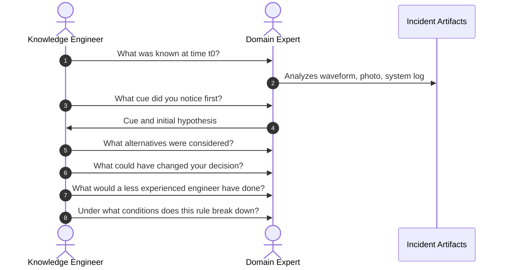
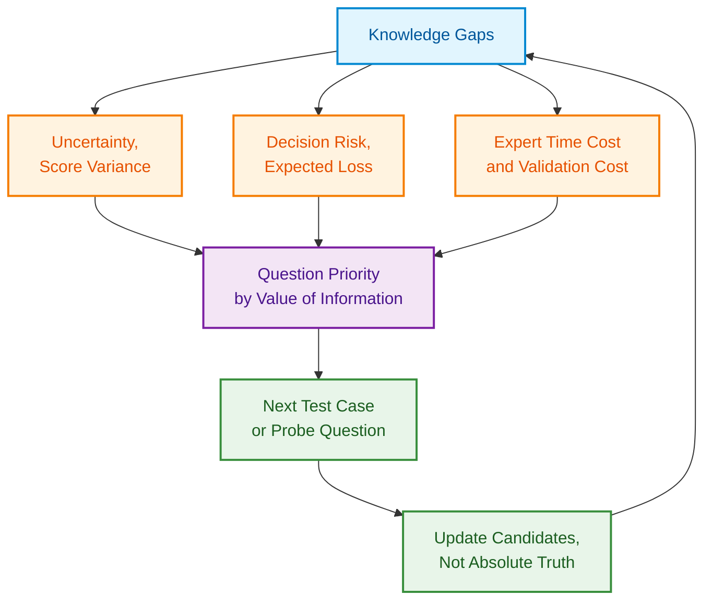
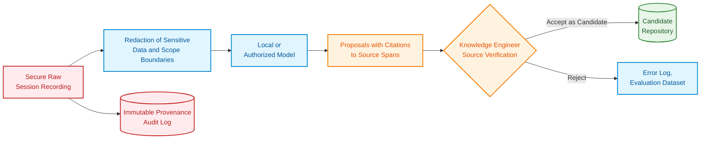
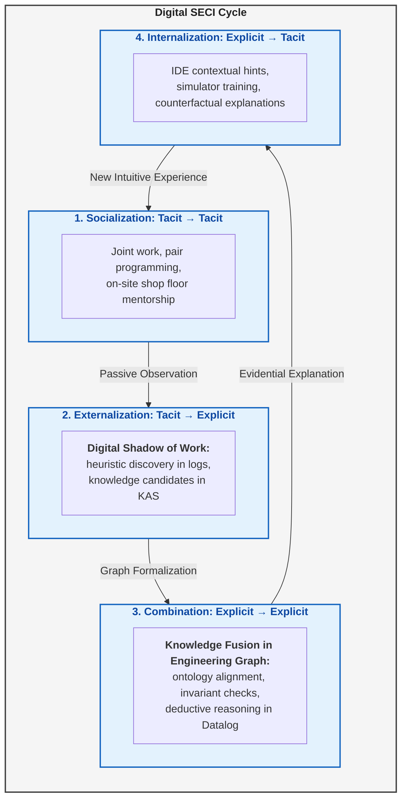

# Chapter 11. Knowledge Elicitation from Experts: Interviewing, Cognitive Maps, and Experience Formalization

> **Book:** [Architecture of Evidence-Governed Expert Systems](README.md) · [Part III: Knowledge Acquisition, Linguistic Analysis, and Input Assessment](part-03-knowledge-engineering-nlp.md)  
> **Previous Chapter:** [Chapter 10. Knowledge Acquisition Systems: Sources, Admission, and Lifecycle](ch10-knowledge-acquisition-systems.md)  
> **Next Chapter:** [Chapter 12. Linguistic Analysis and Local Models: Preserving Content and Provenance](ch12-linguistic-analysis-and-local-models.md)  
> **Table of Contents:** [README.md](README.md)  
> **Author:** [Mykola Fedchyk](about-the-author.md)  
> **Target Level:** Intermediate: Knowledge engineers, software developers, and engineering managers  
> **Expected Learning Outcomes:** Structure an expert interview focused on a concrete decision; decompose domain knowledge, inference operations, and task workflow according to CommonKADS; convert raw expert utterances into structured knowledge candidates with explicit conditions, exceptions, and provenance; validate candidate knowledge using test cases, counterexamples, and independent corroboration sources; distinguish subjective speaker confidence from empirical frequency and calibrated posterior probability.

## Abstract

This chapter investigates the methodology and engineering protocols for overcoming the classic "knowledge acquisition bottleneck" in expert systems by formalizing the tacit knowledge of domain specialists. Cognitive traps inherent in direct interviewing, the semantic gap separating subjective heuristics from objective facts, and the application of the CommonKADS methodology to decompose expertise into domain models, inference schemas, and task workflows for rule-base population are analyzed. The chapter presents formal techniques including Kelly's repertory grids, the Critical Decision Method, and cognitive mapping. It details verification procedures for synthesized rules, protocols for arbitrating multi-expert collisions, mathematical calibration of subjective confidence against empirical frequency, and architectural boundaries for leveraging local LLMs as hallucination-resistant dialogue structuring tools without source conflation, ensuring the deterministic and robust operation of evidence-governed expert systems.

"Ask our chief engineer—he knows the system by heart." The team records an interview, a language model compresses the transcript into twenty rules, and a month later, one of those rules halts a perfectly functional production unit. Only then does the engineer recall: that heuristic applied exclusively to an obsolete board revision and was valid only at sub-zero temperatures.

This failure typifies the loss of context surrounding **tacit knowledge**—the accumulated operational experience that humans rely upon but rarely formulate as explicit rules. Michael Polanyi crystallized this phenomenon: we know more than we can tell [[1]](#src-1). Consequently, the knowledge engineer's core objective is not the exhaustive transcription of dialogue, but the rigorous extraction of assertions alongside their scope conditions, exceptions, provenance, uncertainty bounds, and falsification criteria.

Consider the running example utilized throughout this chapter: a firmware engineer diagnosing an intermittent hardware boot failure. The existing specifications document error codes, but omit the characteristic waveform anomaly on the oscilloscope, the diagnostic triage sequence, and the critical warning that a routine hardware reset destroys the most decisive ephemeral forensic evidence. The knowledge engineer must construct a verifiable model: "cue → hypothesis → discriminative test → exception → action," preserving the expert's exact phrasing and epistemic uncertainty. The central question of this chapter is: **how do we transform dialogue with a domain expert into knowledge that can be formally verified rather than merely recorded?** The methodology presented below must be calibrated against operational risk, legal recording permissions, and organizational culture; an arbitrary volume of recorded interviews does not establish completeness.

## 1. Epistemic Barriers and Cognitive Traps in Expert Interviewing

Why does a direct recording of an interview fail to constitute verified knowledge? [Chapter 10](ch10-knowledge-acquisition-systems.md) examined the automated knowledge acquisition pipeline from documents, provenance, and curation. [Chapter 19](ch19-from-question-to-evidence.md) investigates the path from a textual snippet to a justified assertion, and [Chapter 20](ch20-explanation-engine.md) demonstrates how expert decisions are communicated through formal proof chains. **Knowledge elicitation from humans** introduces unique epistemic complexities: the source may alter phrasing, remain unaware of internal heuristics, or conflate primary observations with post-hoc rationalizations. Anna Hart identified knowledge elicitation as a foundational methodological challenge in knowledge engineering as early as 1985 [[2]](#src-2), and Nancy Cooke subsequently systematized elicitation techniques across diverse domains [[3]](#src-3).

```mermaid
flowchart LR
    accTitle: Knowledge elicitation pipeline from experts
    accDescr: Stages from decision framing to admission of verified knowledge into the versioned knowledge base.

    NEED["Decision Need<br/>and Scoping"] --> PLAN["Session Plan<br/>and Informed Consent"]
    PLAN --> RAW["Raw Recordings,<br/>Notes, and Artifacts"]
    RAW --> SEG["Atomic Utterances<br/>and Source Spans"]
    SEG --> KC["Knowledge Candidates"]
    KC --> CH["Probing and Stress-Testing:<br/>Cases, 'Why', Exceptions"]
    CH --> TRI["Triangulation:<br/>Logs, Documentation, Peers"]
    TRI --> VAL["Held-Out Case<br/>Validation"]
    VAL --> GOV{"Admission<br/>Board"}
    GOV -->|"Approved"| KB[("Versioned<br/>Knowledge Base")]
    GOV -->|"Rework"| PLAN
    GOV -->|"Insufficient Data"| UNK["Known Unknown,<br/>Open Question"]

    classDef stage fill:#e1f5fe,stroke:#0288d1,stroke-width:2px,color:#01579b;
    classDef check fill:#fff3e0,stroke:#f57c00,stroke-width:2px,color:#e65100;
    classDef store fill:#e8f5e9,stroke:#388e3c,stroke-width:2px,color:#1b5e20;
    classDef alert fill:#ffebee,stroke:#d32f2f,stroke-width:2px,color:#b71c1c;

    class NEED,PLAN,RAW,SEG,KC stage;
    class CH,TRI,VAL,GOV check;
    class KB store;
    class UNK alert;
```



The pipeline diagram underscores that there is no magical, single-step operation labeled "elicit knowledge." Instead, an engineering chain of transformations exists, wherein every transition may introduce bias or subjective interpretation. A transcript merely evidences that a person uttered a particular statement, not that the assertion holds universally or correctly.

To prevent premature promotion, a disciplined lifecycle of statuses must govern candidate progression:

```text
utterance → candidate → corroborated candidate → validated rule → released knowledge
```

Advancing an assertion to a higher maturity status requires distinct empirical or formal justification. A language model summary cannot bypass this lifecycle by directly promoting an utterance to a validated rule.

## 2. Targeted Elicitation Session Design: Decision-Centric Focus

Open-ended interview prompts such as "tell us everything you know about system initialization" generate voluminous transcripts but yield minimal knowledge suitable for algorithmic verification. For this reason, the CommonKADS (*Common Knowledge Acquisition and Documentation Structuring*) methodology initiates knowledge engineering with an analysis of the organizational context and task hierarchy rather than an unstructured conversation [[4]](#src-4). Prior to launching an elicitation session, the knowledge engineer must determine:

- what concrete decision the expert system must support or automate;
- who makes this decision and under what operational environment;
- the tangible cost of false-positive errors, false-negative errors, and operational latency;
- which failure cases are particularly complex, safety-critical, or infrequent;
- what knowledge is already documented in specifications, telemetry schemas, and codebase commits;
- what proprietary, classified, or legal boundaries restrict the expert's disclosure;
- what measurable acceptance metric will demonstrate that the elicitation session was successful.

In our running diagnostic example, the decision target is not an amorphous mandate to "understand boot behavior," but rather: "prior to power-cycling the board, select the next discriminative observation that distinguishes between a power rail failure, an oscillator clock stall, and firmware corruption." Framing the session around this specific decision immediately generates structured, falsifiable inquiries.

A well-defined decision boundary anchors all subsequent engineering activities. It dictates which historical failure traces must be reviewed, identifies catastrophic edge cases, and establishes the operational criteria by which the downstream performance of the expert system will be evaluated.

### 2.1. The CommonKADS Methodology: Domain, Inference, and Task Knowledge Levels

Once the target decision is circumscribed, another engineering hurdle remains: an interview transcript conflates structural device descriptions, expert diagnostic inferences, and procedural workflow rules. If an engineer formalizes only fault predicates, the resulting expert system may omit the critical prohibition against resetting power before capturing an oscilloscope trace. Conversely, if only procedural command sequences are recorded, the system cannot deduce *why* an observation discriminates between competing fault hypotheses.

CommonKADS addresses this through six interconnected models: organization, task, agent, knowledge, communication, and design [[4]](#src-4). The organization, task, and agent models delineate operational needs, workflow constraints, and execution roles. The communication model defines the interaction interface between human and machine, while the design model maps these specifications into software architecture. The **knowledge model** specifically decouples the cognitive structure of expert problem-solving into three orthogonal layers. The table illustrates this decomposition for the hardware boot diagnostic example.

| Knowledge Model Layer | What the Knowledge Engineer Documents | Boot Diagnostic Example |
|---|---|---|
| Domain knowledge | Concepts, relations, facts, and static rules of the target domain | Board revisions, operating temperature ranges, power/clock timing specs, applicability constraints |
| Inference knowledge | Reasoning operations and the epistemic roles of their inputs and outputs | Propose hypothesis, predict symptom from hypothesis, match prediction against oscilloscope trace |
| Task knowledge | Operational goals, execution sequencing, transition conditions, and termination criteria | First preserve oscilloscope trace; next execute discriminative measurement; if data is inconclusive, escalate to human expert |

A **knowledge role** designates the functional purpose a specific domain fact serves within an inference operation. The measured timestamp of a clock transition is a static domain fact; when evaluated against a nominal model, it assumes the epistemic role of an "observation." A conjecture regarding oscillator failure assumes the role of a "hypothesis," while an anticipated sequence of signal edges assumes the role of a "prediction." Decoupling inference roles from domain models enables the reuse of the generic inference schema "match observation against prediction" across alternative hardware architectures without coupling the reasoning engine to board-specific parameters.

Consider two expert dialogues addressing the same hardware fault. The first specialist highlights an abnormal plateau on the power rail rise time. The second specialist explains why the hardware must not be power-cycled prior to reading volatile latch states. The first statement refines the domain model and inference premises; the second statement formalizes task-level workflow control. Substituting an oscilloscope for an automated logic analyzer alters observation acquisition but does not invalidate the underlying diagnostic rule. Conversely, releasing a new board revision may alter domain thresholds without impacting the evidential capture workflow.

Prior to committing logic to code, the knowledge engineer verifies three structural milestones: whether necessary concepts and preconditions are defined; whether every inference step possesses typed inputs and outputs; and whether deterministic fallback branches exist for success, contradiction, and data starvation. This constitutes architectural verification, distinct from validating diagnostic empirical truth. Domain rules still require empirical falsification against novel test cases. The implementation of inference operations within expert system components is detailed in [Chapter 16](ch16-expert-systems-architecture.md). Elicitation techniques can now be targeted to specific gaps in the knowledge model rather than evaluated by the volume of recorded audio.

## 3. Methodological Strategies and Interaction Protocols with Experts

Every elicitation technique exhibits systematic blind spots, selectively dropping specific types of operational knowledge. Unstructured interviews effectively capture domain vocabulary but fail to recreate real-time decision pressure. Passive observation records overt actions but obscures internal cognitive justifications. Think-aloud protocols expose intermediate hypotheses and attentional focus, yet verbalization alters cognitive throughput and task performance. Methodological analyses by Hoffman, Shadbolt, Burton, and Klein systematically compare elicitation techniques across the knowledge types they successfully uncover [[5]](#src-5), while Burton et al. empirically evaluated technique efficacy across varying domains and expertise levels [[6]](#src-6).

| Method | Optimal Knowledge Yield | Primary Limitation |
|---|---|---|
| Semi-structured interview | Concepts, operational boundaries, explanations | Post-hoc rationalization |
| In-situ contextual observation | Authentic workflow, physical tools, informal workarounds | Covert reasoning inaccessible, privacy constraints |
| Think-aloud protocol | Attentional sequence, working hypotheses | High cognitive load, verbalization alters workflow |
| Critical Decision Method (CDM) | Salient cues, evaluated options, temporal pressure in real incidents | Reliance on episodic memory retrieval |
| Laddering ("how" and "why" probes) | Goal hierarchies, evaluation criteria, action taxonomies | Leading questions risk imposing artificial hierarchy |
| Repertory grids and triadic probes | Latent bipolar constructs, subtle case distinctions | Artificiality and cognitive fatigue on large element sets |
| Card sorting | Categorization schemas, mental taxonomies | Limited yield of procedural or dynamic knowledge |
| Scenarios and simulations | Conditional behaviors, anomaly response | Dependent on simulation fidelity |

The protocol analysis framework established by Ericsson and Simon treats verbal reports as empirical data, defining the conditions under which concurrent verbalization preserves cognitive validity without distorting task execution [[7]](#src-7). The Critical Decision Method developed by Klein, Calderwood, and MacGregor reconstructs specific operational incidents along an explicit timeline [[8]](#src-8). Repertory grids, rooted in George Kelly's Personal Construct Psychology, were adapted for computational knowledge acquisition by Gaines and Shaw [[9]](#src-9). Rugg and McGeorge formalized card sorting as an independent methodology alongside laddering and repertory grids [[10]](#src-10). Because no single method yields complete coverage, a robust elicitation strategy combines complementary techniques.

### 3.1. Kelly's Repertory Grid Technique: Triadic Distinction Analysis

Within the knowledge base of an expert system, diagnostic predicates require unambiguous bipolar distinctions. However, directly querying an expert ("how do you differentiate a nominal startup from a faulty one?") typically induces retrospective rationalization: the specialist recites textbook generalities from official specifications, omitting the subtle, tacit empirical cues relied upon in practice. If the knowledge base incorporates only these superficial predicates, the inference engine generates false alarms in boundary regimes, triggering unnecessary equipment shutdowns in mission-critical deployments. George Kelly's repertory grid technique bypasses this barrier through structured triadic comparisons of concrete operational exemplars or artifacts $`(e_1, e_2, e_3)`$.

The knowledge engineer presents three actual hardware startup traces to the expert and asks a fixed methodological question: "Which two of these traces are similar to each other yet distinct from the third, and what specific physical characteristic separates them?" This cognitive constraint forces the specialist to formulate an underlying bipolar construct, such as: *"oscillator begins toggling prior to power rail stabilization"* $\longleftrightarrow$ *"oscillator begins toggling after stabilization"*. This diagnostic predicate was absent from the formal interface specification, yet it represents the decisive physical factor distinguishing startup failure modes. Next, the knowledge engineer grounds this construct in quantifiable physical metrics (measurement units, tolerance intervals $\Delta t$, voltage trip levels) and validates the synthesized bipolar rule against an independent suite of waveforms.

### 3.2. Critical Decision Method (CDM)

To formalize task knowledge and extract critical fault invariants, the knowledge base must capture an expert's decision-making process during high-consequence anomalies characterized by acute uncertainty and time compression. Generic questioning ("how do you typically handle power anomalies?") inevitably falls prey to hindsight bias (Baruch Fischhoff [[11]](#src-11)): the specialist unconsciously constructs an idealized, normative narrative, omitting vital heuristics, non-linear checks, and negative constraints (such as the strict prohibition against pressing the reset button prior to arming the bus analyzer). The Critical Decision Method (CDM) counteracts this by executing a chronological, step-by-step cognitive reconstruction anchored in concrete, preserved physical artifacts (system logs, oscilloscope traces, core memory dumps):



Questions are rigorously anchored in the information available **at that specific moment**, rather than the outcome known today. Baruch Fischhoff demonstrated that knowledge of an outcome irrevocably alters retrospective judgment: in hindsight, an incident appears far more predictable than it was during real-time triage [[11]](#src-11). Without chronological reconstruction, the path to a diagnostic conclusion appears deceptively linear.

## 4. Syntactic and Logical Formalization: Transforming Utterances into Knowledge Candidates

Verbatim interview transcripts and conversational remarks by domain specialists cannot be ingested directly by an expert system's inference engine or formal verifier due to linguistic ambiguity and latent contextual assumptions. Any spoken heuristic admitted as an axiom without strict typing causes semantic drift across the knowledge base, rendering logical deduction non-deterministic. The elicitation pipeline transforms raw statements into structured **Knowledge Candidates** ($KC$) that explicitly record provenance, operational context boundaries, observation predicates, epistemic modality, and exception investigation status.

Consider an utterance from a lead embedded systems engineer: *"If the second step on the power rail is flat, it's almost always the clock oscillator; whatever you do, don't reboot the board."* To integrate this statement into an expert system, the knowledge engineer decomposes it into structured, typed attributes. An empty list of exceptions does not denote their absence; setting `exceptions_status: not_assessed` explicitly records an imperative requirement for downstream verification.

<details>
<summary>Example of a knowledge candidate with an unknown threshold and unassessed exceptions</summary>

```yaml
candidate_id: candidate:clock-startup-flat-slope:017
source:
  session: ses-2026-08-26-02
  speaker: expert-07
  span: "00:31:14.220/00:31:27.810"
context:
  board_revisions: [C, D]
  temperature_c: "< -10"
observation:
  feature: rail_second_step_slope
  operator: "<"
  threshold: null
hypothesis:
  value: clock_startup_fault
  speaker_modality: "almost_always"
action:
  prohibit: power_cycle_before_trace_capture
exceptions: []
exceptions_status: not_assessed
open_questions:
  - operational threshold for "flat"
  - applicability to revision E
status: candidate
```

</details>

Setting `threshold: null` does not represent a syntax defect; it explicitly formalizes an epistemological gap. Arbitrarily interpolating a numeric value based on the expert's conversational tone would inject ungrounded assumptions into the knowledge base. The `speaker_modality` field preserves the specialist's qualitative phrasing ("almost always") without conflating it with a calibrated mathematical probability.

A knowledge candidate maintains explicit pointers both to the raw source span and to the knowledge engineer's structured interpretation. Refining candidate attributes never overwrites original transcripts. Where audio recording is legally or contractually prohibited, digitally signed session notes must be versioned similarly, though flagged with reduced evidentiary auditability.

## 5. Falsification Protocols: Identifying Boundary Conditions and Defeaters

In mission-critical software engineering (governed by functional safety standards such as ISO 26262 ASIL D and IEC 61508 SIL 3/4), a rule is not established as robust when an expert provides confirming instances, but when it survives systematic Popperian attempts at empirical falsification. Human confirmation bias naturally drives specialists to cite successful diagnostic precedents while omitting subtle boundary preconditions. If a candidate rule enters the production knowledge base without explicit **defeaters**—conditions under which the heuristic is invalid—the expert system will emit erroneous diagnoses whenever environmental parameters (such as operating temperature or silicon stepping revisions) drift beyond the expert's unspoken assumptions.

To protect the verification perimeter of the knowledge base, every synthesized positive rule triggers an adversarial falsification protocol across predefined investigative vectors:

- **Operationalization:** What precise physical metric defines "flat," and what instrument measures it?
- **Contrast:** What waveform appears visually similar yet points to an entirely different fault hypothesis?
- **Exception:** Under what operating conditions is this slope observed while the oscillator remains fully operational?
- **Absence:** How does the diagnostic strategy adapt if the designated measurement channel is unavailable?
- **Temporal dynamics:** Does the rule hold during warm restarts or thermal stabilization?
- **Provenance:** Did you personally observe this failure, read it in a vendor errata sheet, or deduce it analytically?
- **Disagreement:** Which peer engineer would challenge this diagnosis, and on what technical grounds?
- **Falsification test:** What controlled hardware experiment would decisively disprove this rule?

This dialectic extracts the operational envelope of the rule rather than merely accumulating confirming evidence. Asking "is it true that X always leads to Y?" is a leading question that invites uncritical assent. A rigorous protocol presents an unlabelled, blinded diagnostic case and requires the specialist to predict the failure mode before revealing ground truth.

If an expert cannot articulate a single potential counterexample or boundary failure mode, this indicates a need to consult independent data sources and additional specialists, rather than proving that the rule is universally valid.

## 6. Mathematical Demarcation of Subjective Confidence and Statistical Frequency

Within an expert system knowledge base, qualitative modal assertions (such as "usually," "almost always," or "rarely") inject severe epistemic uncertainty into automated inference engines. If a knowledge engineer naively maps such verbal qualifiers to fixed Certainty Factors (CF) without empirical calibration, reasoning chains become stochastically unstable: accumulated subjective weights trigger unexpected verdict degradation or false emergency shutdowns. Ruth Beyth-Marom demonstrated experimentally that technical experts exhibit dramatic numerical variance when interpreting identical verbal probability terms (subjective estimations for the term "probable" ranged from 0.40 to 0.85) [[12]](#src-12). Consequently, any expert assertion destined for a production diagnostic rule must undergo mathematical demarcation separating point frequency, Bayesian posterior credible intervals, and calibrated inter-rater reliability.

To verify a heuristic rule, the knowledge engineer assembles a sample of $n$ controlled benchmark runs or recorded hardware incidents. If the target failure signature is observed in $k$ instances, the empirical point frequency is:

```math
\hat p=\frac{k}{n}
```

Components and Dimensionality:

- $\hat p$ is the dimensionless point estimate of the target occurrence proportion, bounded within $[0, 1]$;
- $k$ is the integer count of confirmed occurrences among test incidents ($0 \le k \le n$);
- $n$ is the total verification sample size ($n > 0$, positive integer).

Engineering Constraints and Decision Logic:
The point estimate $\hat p$ fails to account for sampling variance in small test suites. Under functional safety mandates, if $n < 10$, the point frequency $\hat p$ is deemed statistically uncalibrated: the knowledge candidate is strictly barred from active rule status and quarantined until at least $n \ge 30$ independent observations are accumulated (the standard threshold for Central Limit Theorem validity). Observing $k = 7$ successes out of $n = 10$ trials yields $\hat p = 0.70$, which serves merely as a trigger for hardware bench testing rather than production deployment.

To quantify uncertainty over small sample sizes, conjugate Bayesian updating under a Bernoulli likelihood is applied. Assuming an uninformative uniform prior distribution $p \sim \mathrm{Beta}(1, 1)$ (where $\alpha = 1, \beta = 1$), the posterior distribution of the true failure rate is:

```math
p\mid k,n\sim\mathrm{Beta}(\alpha+k,\ \beta+n-k).
```

Beta Distribution Parameters:

- $p \in [0, 1]$ is the continuous random variable representing the true latent failure probability;
- $\alpha > 0$ and $\beta > 0$ are dimensionless pseudo-count hyperparameters of the prior distribution;
- $\mathrm{Beta}(\alpha+k,\beta+n-k)$ represents the posterior probability density conditioned on $k$ positive instances and $n-k$ counterexamples;
- the symbols $`\mid`$ and $\sim$ denote conditional dependence and distribution conformity, respectively.

Operational Application and Gating Criteria:
The posterior density allows the inference engine to compute a 95% Bayesian credible interval $`[p_{\mathrm{low}}, p_{\mathrm{high}}]`$ via quantile integration: $`\int_0^{p_{\mathrm{low}}} \mathrm{Beta} = 0.025`$ and $`\int_0^{p_{\mathrm{high}}} \mathrm{Beta} = 0.975`$.
- If the credible interval width $`\Delta p = p_{\mathrm{high}} - p_{\mathrm{low}} \le 0.15`$, the rule is considered statistically mature and admitted into the active production knowledge base.
- If the interval width $`\Delta p > 0.30`$ (for instance, with $k = 7, n = 10$, where $\mathrm{Beta}(8, 4)$ yields a 95% interval of approximately $[0.39, 0.89]$), parameter uncertainty remains unacceptable for mission-critical decisions. The expert system transitions into a fail-safe hold state, suppressing autonomous actuation and escalating to a conservative fallback rule or human operator intervention.

When test cases are evaluated by multiple experts, simple percentage agreement produces inflated reliability estimates if one diagnostic category predominates. Cohen's kappa coefficient ($\kappa$) corrects for chance agreement between two independent raters [[13]](#src-13):

```math
\kappa=\frac{p_o-p_e}{1-p_e}.
```

Kappa Components and Normalization:

- $`p_o`$ is the observed proportion of concordant ratings between two experts across the calibration dataset;
- $`p_e`$ is the hypothetical expected proportion of chance agreement under fixed marginal category distributions ($`p_e < 1`$);
- $\kappa$ is the dimensionless inter-rater agreement coefficient spanning the theoretical range $[-1, 1]$.

Engineering Thresholds for Knowledge Base Admission:
The computed $\kappa$ metric serves as a deterministic validation gate within the knowledge compilation pipeline:
1. **$\kappa \ge 0.75$ (High Agreement):** Disagreements between specialists are statistically negligible; the rule is verified and admitted to executable rule generation;
2. **$0.40 \le \kappa < 0.75$ (Moderate Agreement):** Indicates latent semantic conflict or unmodeled boundary conditions; triggers a mandatory defeater elicitation session to partition the candidate into two context-specialized sub-rules;
3. **$\kappa < 0.40$ (Critical Disagreement or Inconsistency):** Reflects fundamentally divergent mental models or contradictory definitions; automated rule synthesis is halted, and the candidate is moved to quarantine alongside a formal collision report submitted to the knowledge governance board.

For multi-rater cohorts exceeding two experts or datasets with missing annotations, Krippendorff's alpha is applied using a predefined difference metric [[14]](#src-14). If $`p_e = 1`$, the denominator evaluates to zero and kappa is undefined: this represents a degenerate edge case rather than perfect agreement.

## 7. Active Elicitation Algorithms: Maximizing Information Gain

Because expert time is finite and expensive, unguided elicitation is inefficient. Let $\Theta$ represent unknown parameters or rule candidates, $D$ denote the set of accumulated observations, $q$ represent a candidate probe question, and $a$ denote a potential expert response. The expected information gain $IG(q)$ is defined as:

```math
IG(q)=H(\Theta\mid D)-\mathbb E_{a\sim P(a\mid q,D)}\bigl[H(\Theta\mid D,q,a)\bigr].
```

Information Gain Parameters:

- $\Theta$ represents the unknown model parameters or hypotheses, $D$ denotes historical observations, and $q$ represents a candidate probe question;
- $a$ is a possible answer, $`P(a\mid q,D)`$ is the predictive response distribution given question $q$ and data $D$, and $\mathbb E$ denotes mathematical expectation over this distribution;
- $`H(\Theta\mid D)`$ is the Shannon entropy (uncertainty) prior to querying, and $`H(\Theta\mid D,q,a)`$ is the posterior entropy following answer $a$;
- subtracting expected posterior entropy from current entropy yields the expected reduction in epistemic uncertainty.

Under a consistent probabilistic model, $IG(q) \ge 0$: a value of zero indicates that the expert's response will provide no discriminatory utility, while larger values indicate substantial expected uncertainty reduction. Units are measured in bits (for base-2 logarithms) or nats (for natural logarithms). Claude Shannon defined the entropy of a discrete random variable as [[15]](#src-15):

```math
H(\Theta)=-\sum_i P(\theta_i)\log_2 P(\theta_i).
```

Entropy Terms:

- $\Theta$ is a discrete random variable, $`\theta_i`$ is a possible realization, and $`P(\theta_i)`$ is its probability mass;
- index $i$ sums over all mutually exclusive outcomes, while $`\log_2`$ denotes the base-2 logarithm;
- $H(\Theta)$ is measured in bits, evaluating to zero for a deterministic outcome and reaching its maximum when probability mass is uniformly distributed.

For two equiprobable hypotheses, $`H = -2(0.5 \log_2 0.5) = 1\ \text{bit}`$.

Active Elicitation Termination Criterion:
The algorithmic generation of probe questions halts according to an information gain convergence threshold: if for all candidate inquiries $q \in Q$ the condition $`\max_q IG(q) < \epsilon_{\mathrm{stop}}`$ holds (with stopping threshold configured to $`\epsilon_{\mathrm{stop}} = 0.05\ \text{bits}`$), further elicitation is deemed non-informative. The session transitions immediately to formal candidate synthesis, mitigating expert cognitive fatigue.

Selecting questions via information gain shares foundations with active learning, surveyed by Burr Settles [[16]](#src-16). However, the inquiry yielding the highest uncertainty reduction may carry negligible operational consequence. Ronald Howard's Value of Information (VOI) framework evaluates data specifically by how significantly it improves operational decisions [[17]](#src-17). Practical prioritization balances decision risk, expected loss reduction, and elicitation cost:

```math
q^*=\arg\max_q\frac{\mathbb E\bigl[L(a_0)-L(a_q)\bigr]}{C_{\mathrm{expert}}(q)+C_{\mathrm{validation}}(q)}.
```

Probe Selection Criterion:

- $q$ is a candidate question, and $q^*$ is the inquiry maximizing the ratio of expected loss reduction to operational expenditure;
- $`a_0`$ is the optimal decision under current knowledge, $`a_q`$ is the decision adopted after receiving answer $a$, and $L(a)$ is the loss associated with action $a$;
- $`\mathbb E[L(a_0)-L(a_q)]`$ denotes the expected risk reduction averaged over possible answers;
- $`C_{\mathrm{expert}}(q)`$ represents the cost of the expert's time, $`C_{\mathrm{validation}}(q)`$ is the empirical verification cost, and their sum must be strictly positive;
- costs and loss metrics must be expressed in compatible units to yield a meaningful return-on-investment ratio.

Economic and Safety Feasibility Bound:
The numerator models expected loss mitigation (expressed in financial risk or safety penalty units), while the denominator models direct labor and bench testing costs.
- If $`\max_q \mathbb E[L(a_0)-L(a_q)] \le C_{\mathrm{expert}}(q) + C_{\mathrm{validation}}(q)`$, the operational value of querying is exhausted. The system ceases active probing, designates remaining uncertainty as an irreducible "known unknown" ($UNK$), and compiles it as a protective safety constraint within the expert system runtime.



The diagram synthesizes how question priority depends simultaneously on three operational parameters, and how an expert's answer updates knowledge candidates rather than establishing dogma.

## 8. Multi-Expert Collisions: Protocols for Disagreement Resolution and Consensus

Domain specialists frequently arrive at conflicting conclusions due to disparate experience with distinct hardware revisions, operating environments, instrumentation, or reliability tolerances. If Expert A assesses a failure likelihood of 0.7 while Expert B assesses 0.3, mechanically averaging these values to 0.5 does not represent consensus; it obliterates critical operational context.

The protocol begins by formally structuring the disagreement into a typed tuple:

```math
d=(\mathrm{claim},\ \mathrm{expert},\ \mathrm{context},\ \mathrm{rationale},\ \mathrm{evidence},\ \text{confidence-type}).
```

Disagreement Tuple Schema:

- $d$ represents a single structured assertion record;
- `claim` denotes the formalized rule or predicate, `expert` identifies the specialist, and `context` specifies the exact boundary conditions under which the assertion is made;
- `rationale` documents the underlying reasoning chain, `evidence` links to empirical artifacts, and `confidence-type` specifies the epistemic modality;
- commas separate individual schema attributes; they do not imply that opposing positions should be arithmetically blended.

Structuring records in this format preserves context, causal explanations, evidentiary traces, and modality independently. Knowledge engineers then isolate the root cause of the divergence: contradictory empirical observations, differing semantic definitions, divergent operational contexts, or conflicting trade-off criteria. In mission-critical engineering, the correct resolution is almost always the compilation of two distinct, context-conditioned rules rather than a diluted compromise. For regulatory standards and compliance policies, authoritative determinations belong to the designated knowledge owner; empirical claims demand hardware bench tests; and subjective trade-offs must be sequestered from verifiable facts.

Anonymized multi-round Delphi surveys, developed by Dalkey and Helmer to cultivate expert consensus without hierarchical peer pressure [[18]](#src-18), mitigate seniority bias. However, majority consensus does not guarantee physical validity. A dissenting counterexample from a single specialist must be preserved and investigated rather than discarded as statistical noise.

## 9. The Role of Language Models in Dialogue Facilitation and Structuring

Small and large language models can accelerate elicitation workflows:

- transcribing audio sessions with aligned byte-level and temporal timestamps;
- executing initial text segmentation and extracting candidate domain terms;
- detecting potential logical contradictions across historical sessions;
- generating **candidate** probing and counterfactual questions for the knowledge engineer;
- structuring messy conversational fragments into standardized candidate draft schemas.

Crucially, language models cannot establish empirical truth, define liability boundaries, or grant legal authorizations. The survey by Ji et al. details the structural vulnerability of generative language models to hallucinations—generating syntactically fluent assertions unsupported by primary sources [[19]](#src-19). In knowledge elicitation, this failure surfaces when models hallucinate missing numeric thresholds or artificially harmonize expert disagreements. Consequently, every generated attribute must maintain explicit citation links to original transcript spans or carry an unverified status flag: `model_hypothesis`.



The workflow demonstrates that the language model receives an already redacted transcript and generates structured proposals, while the authority to admit candidates resides strictly with the knowledge engineer following direct source reconciliation. Transcripts often contain personal identifiers, credentials, zero-day vulnerabilities, or trade secrets. Obtaining consent for an interview does not authorize transmitting corporate data to third-party public clouds for fine-tuning. Retention windows, deletion policies, and air-gapped local model infrastructure must be legally and architecturally finalized prior to recording.

## 10. Verification and Validation Procedures for Elicited Rules

Member checking—returning formalized candidates to the domain specialist for confirmation—is mandatory to certify that the structured rule accurately captures the expert's intent. Birt et al. examine member checking as a technique for verifying data fidelity against participant perspectives, while cautioning against treating member agreement as a substitute for objective validation [[20]](#src-20). In expert system engineering, member checking confirms transcript recording fidelity, not empirical truth. Comprehensive verification requires:

- **source fidelity:** the knowledge candidate faithfully reflects the elicitation transcript without semantic distortion;
- **triangulation:** the rule is cross-validated against system logs, technical specifications, and independent peer observations;
- **counterexamples:** boundary regimes and defeater conditions where the rule fails are explicitly identified;
- **operational measurability:** all variables, thresholds, and temporal windows possess unambiguous operational definitions;
- **held-out validation:** the rule is evaluated against fresh test datasets rather than previously examined incidents;
- **prospective testing:** the expert system forecasts operational outcomes before ground truth is established;
- **accountability:** every rule is assigned an accountable owner, validity lifetime, and mandatory review criteria.

For rule $r$ evaluated across an annotated test suite, standard precision and recall are computed; however, mission-critical systems require an asymmetric empirical loss function:

```math
\widehat R(r)=\frac{1}{N}\sum_{i=1}^{N}L\bigl(r(x_i),y_i;\ \mathrm{context}_i\bigr).
```

Mean Rule Loss Formulation:

- $r$ is the candidate rule under evaluation, $N > 0$ is the total number of test instances, and index $i$ references a specific case;
- $`x_i`$ is the case input vector, $`y_i`$ is the ground-truth target, and $`r(x_i)`$ is the verdict produced by the rule;
- $`L(r(x_i),y_i;\ \mathrm{context}_i)`$ represents the operational cost of error or correct classification conditioned on operational regime $`\mathrm{context}_i`$; the semicolon separates inputs from contextual parameters;
- the summation aggregates losses across all benchmark cases, and division by $N$ yields the mean empirical risk in cost-matrix units.

Engineering Acceptance Criteria and Risk Stratification:
A rule is admitted to production release only when empirical risk across the global test benchmark remains below the regulatory safety budget: $`\widehat R(r) \le \tau_{\mathrm{risk}}`$ (where for ASIL D mission-critical functions, the threshold is configured to $`\tau_{\mathrm{risk}} = 0.001`$). Additionally, stratified loss analysis is conducted across operational slices: if on any safety-critical subset (such as cold boot at $T < -10^\circ\mathrm{C}$) the localized loss $`L_{\mathrm{slice}} > 0`$ (indicating an undetected critical failure), the rule is unconditionally rejected, regardless of an exemplary global average. For example, hypothetical losses of 0, 1, and 2 across three test cases yield a mean loss of $(0+1+2)/3=1$. An aggregate average must never obscure a fatal failure in a boundary operational regime.

## 11. Anti-Patterns and Common Pitfalls in Cognitive Knowledge Engineering

Even a meticulously planned interview can yield invalid rules if cognitive heuristics and interpersonal conversational artifacts are ignored. The seminal work edited by Kahneman, Slovic, and Tversky systematizes judgment heuristics and systematic biases under uncertainty [[21]](#src-21); the table maps these cognitive traps to their manifestations in knowledge elicitation.

| Anti-Pattern | Operational Consequence | Engineering Countermeasure |
|---|---|---|
| Elicitation lacking decision focus | High transcript volume, zero testable rules | Task analysis and pre-selection of diagnostic benchmark cases |
| Hindsight bias | Reasoning path appears deceptively obvious | Timeline reconstruction: "what was known at time t0?" |
| Leading questions | Knowledge engineer inadvertently dictates the rule | Neutral framing, testing against unlabelled blind cases |
| Tacit cue left as qualitative adjective | "Unstable signal" cannot be compiled into code | Quantitative operational definitions, numeric thresholds, bench tests |
| Language model fills data gaps | Hallucinated threshold promoted to verified rule | Enforce nullable attributes (`threshold: null`), mandatory source span citations |
| Forced consensus erases variance | Loss of context-specific exceptions through averaging | Preserve competing hypotheses with decoupled applicability conditions |
| Repetition mistaken for independent confirmation | Double-counting redundant evidence from a single source | Knowledge provenance graphs with deduplication |
| Expert self-validation | Verification of recording mistaken for empirical proof | Validation on independent, held-out, and prospective data |
| Artificial sample saturation | Infrequent catastrophic failures remain unobserved | Explicit accounting for unknown regimes, targeted edge-case stress-testing |

All listed anti-patterns improperly inflate assertion status: an unverified guess becomes a rule, social compliance is mistaken for physical truth, and a language model summary masquerades as confirmed fact. The remediation across all rows is uniform: trace assertions back to primary sources and empirical verification.

## 12. Iterative Operational Protocol for the First Knowledge Elicitation Cycle

For an initial exploratory pilot, an engineering team should focus on a single concrete decision and 10–20 diverse historical incidents. This serves as an organizational guideline rather than a statistically sufficient sample for quantifying rare failures. Duplicate records of a single incident and identical physical boards must be grouped into shared partitions during cross-validation splits. Prior to recording, legal rights, privacy constraints, and access boundaries must be established; an alignment session standardizes domain vocabulary and workflow boundaries.

The next phase executes a step-by-step cognitive reconstruction of two critical incidents without premature disclosure of their outcomes. Triadic comparisons and "how/why" laddering probes are deployed against the most ambiguous terms. Every elicited statement is documented as a knowledge candidate accompanied by source quotations, operational context, documented exceptions, and open questions.

A dedicated session is allocated to adversarial counterexample discovery. Subsequently, candidate rules undergo empirical evaluation on held-out incident logs and independent bench tests. Only rules that pass this testing pipeline obtain validated status, an assigned engineering owner, and admission into the active production knowledge base.

In our hardware startup scenario, the objective of the initial pilot might encompass several verified waveform cues, a formal safety rule prohibiting rebooting prior to trace capture, and a catalog of unresolved boundary questions. Crucially, the evidence-preservation rule must never override an emergency shutdown intended to protect human operators. This represents the expected deliverable of an educational pilot rather than a claim of finalized empirical results.

## 13. Externalization of Tacit Knowledge: Transforming the SECI Model and Digital Shadow Analysis

Classical knowledge engineering frequently founders on Polanyi's paradox: human beings cannot fully articulate their operational expertise upon verbal request [[1]](#src-1). Practical examples include an intuitive sense of where a software bug lurks, unwritten laboratory calibration heuristics, the ability to recognize subtle gearbox vibration anomalies, or knowing which procedural mandates are pro forma versus which prevent catastrophic failure.

### 13.1. The SECI Knowledge Dynamics Model in Automated Knowledge Engineering

Ikujiro Nonaka and Hirotaka Takeuchi formulated four modes of knowledge conversion: Socialization, Externalization, Combination, and Internalization (SECI) [[22]](#src-22). The diagram below represents an engineering interpretation of this model, rather than an invariant execution mandate or proof that digital telemetry captures all tacit experience.



The cycle demonstrates that knowledge is not merely extracted from human experts, but returned to them via evidential explanations and contextual hints, cultivating new intuitive expertise. The expert system actively participates across all four conversion phases, rather than functioning solely as an externalization sink.

### 13.2. Passive Knowledge Extraction from the Digital Shadow of Engineering Workflows

Traditional externalization forces a lead architect to author static documentation or spend hours answering an analyst's questionnaires. This approach encounters friction and rarely produces up-to-date knowledge. An alternative is **passive knowledge acquisition** from the digital shadow of engineering workflows:

1. **Problem-solving traces in code and Git repositories.** Analysis encompasses not merely final merged commits, but the temporal sequence of discarded attempts, diff structures, code review discussions, and pull request debates.
2. **Incident response communications.** Engineering chat logs during emergency triage reveal the authentic, non-idealized diagnostic workflow: which diagnostic queries were executed first, which telemetry metrics were examined, and which initial hypotheses were discarded.
3. **Expertise retrieval.** Code authorship and active incident participation identify candidates for specialized technical consultation, rather than providing an objective ranking of individual competency. The absence of a digital footprint may reflect administrative roles or access restrictions rather than a lack of domain expertise. Balog et al. provide a comprehensive survey of expertise retrieval from enterprise corpora and activity logs [[23]](#src-23).

> [!IMPORTANT]
> **Ethical and Security Perimeter:** Harvesting the digital shadow of engineering activity must remain strictly decoupled from employee performance evaluation. The expert system aggregates technical facts, structural patterns, and domain predicates, but must never become a tool for workplace surveillance. Violating this boundary incentivizes engineers to manipulate their digital traces, destroying the epistemic integrity of the knowledge base.

## Conclusions

This chapter began with the foundational question: how do we transform dialogue with a domain expert into knowledge that can be formally verified rather than merely recorded? The engineering answer is clear: knowledge elicitation is a disciplined, multi-stage lifecycle wherein an utterance becomes a candidate, a candidate becomes a formalized hypothesis, and a hypothesis becomes a verified rule with documented context boundaries and provenance. Elicitation initiates around a concrete operational decision, methods are combined because each exhibits systematic blind spots, and expert confidence, empirical frequency, and calibrated posterior probability are decoupled mathematically.

The CommonKADS knowledge model explained why compiling domain heuristics cannot substitute for modeling inference schemas and task control. In our boot diagnostic scenario, the physical fault cue and the reboot prohibition emerged as distinct, decoupled artifacts: the diagnostic rule governs relational dependencies, while the task model orchestrates evidentiary acquisition sequence.

The operational boundaries of this discipline are explicitly delineated. An arbitrary volume of recorded interviews does not establish completeness, member checking verifies recording accuracy rather than physical truth, language models suggest candidate structures but cannot establish empirical facts, and harvesting digital workflow shadows remains viable only when strictly insulated from human surveillance. Automated knowledge acquisition from unstructured corpora continues in [Chapter 12](ch12-linguistic-analysis-and-local-models.md), dedicated to linguistic analysis and local language models, and [Chapter 13](ch13-language-variability-vs-determinism.md) on overcoming natural language variability.

## Self-Check Questions

1. What concrete operational decision—rather than broad subject area—must anchor your next knowledge elicitation session?
2. How does your system architecture decouple verbatim expert statements, knowledge engineer interpretations, and verified rules?
3. Which tacit cues in your engineering domain currently lack quantifiable operational definitions?
4. How does your schema record multi-expert contradictions without resorting to crude mathematical averaging?
5. Does your elicitation protocol permit an expert to answer "I don't know" without risking that a generative model will interpolate the missing data?
6. What prospective empirical test can decisively falsify a newly elicited candidate rule against fresh operational data?
7. In the hardware startup diagnostic scenario, which elements constitute domain knowledge, inference knowledge, and task knowledge? What changes when switching test instrumentation versus releasing a new board revision?

## Glossary

| Term | English Equivalent | Concise Engineering Definition |
|---|---|---|
| Tacit Knowledge | *tacit knowledge* | Accumulated operational experience that an individual relies upon but cannot fully articulate in formal propositions |
| Knowledge Elicitation | *knowledge elicitation* | The systematic extraction of domain knowledge from human experts via interviews, observation, and cognitive tasks |
| Knowledge Candidate | *knowledge candidate* | A formalized proposition recording source provenance and operational context that has not yet undergone formal verification |
| Think-Aloud Protocol | *think-aloud protocol* | An elicitation technique in which an expert verbalizes concurrent reasoning during task execution |
| Critical Decision Method | *critical decision method* | A cognitive task analysis methodology reconstructing specific historical incidents along an explicit timeline |
| Repertory Grid | *repertory grid* | A technique for eliciting latent bipolar constructs through structured comparisons of exemplar triads |
| Laddering | *laddering* | Structured, iterative "how" and "why" probing used to uncover hierarchical goal, criterion, and rule structures |
| Hindsight Bias | *hindsight bias* | The cognitive tendency to overestimate the predictability of an event once the outcome is known |
| Member Checking | *member checking* | Returning interview transcripts or formalized candidate models to participants to verify recording fidelity against their intent |
| Triangulation | *triangulation* | Cross-validating an empirical assertion across multiple independent data sources, instruments, or observers |
| Value of Information | *value of information* | The expected reduction in operational loss or risk resulting from acquiring additional data prior to decision commitment |
| Delphi Method | *Delphi method* | An iterative, anonymized multi-round expert survey technique designed to cultivate consensus without social or hierarchical bias |
| Expertise Retrieval | *expertise retrieval* | The identification of specialists possessing relevant domain expertise based on authored documents, codebase commits, and operational activity |
| Digital Shadow of Work | *digital shadow of work* | The persistent operational trace generated during engineering activity: commits, chat logs, tickets, and telemetry traces |
| Knowledge Model | *knowledge model* | The CommonKADS specification partitioning problem-solving into domain, inference, and task knowledge layers |
| Knowledge Role | *knowledge role* | The functional designation of a domain fact as an input or output within an inference operation (e.g., observation, hypothesis, prediction) |

## Abbreviations

| Abbreviation | Expansion | Meaning |
|---|---|---|
| CDM | Critical Decision Method | Cognitive task analysis technique for incident reconstruction |
| CommonKADS | Common Knowledge Acquisition and Documentation Structuring | Structured methodology for enterprise knowledge engineering and management |
| SECI | Socialization, Externalization, Combination, Internalization | Nonaka and Takeuchi's dynamic knowledge conversion spiral |
| YAML | YAML Ain't Markup Language | Human-readable data serialization format |

## References

1. <a id="src-1"></a>Michael Polanyi. [*The Tacit Dimension*](https://openlibrary.org/works/OL117061W). 1966.
2. <a id="src-2"></a>Anna Hart. [*Knowledge Elicitation: Issues and Methods*](https://doi.org/10.1016/0010-4485(85)90293-3). *Computer-Aided Design*, 17(9), 455–462, 1985.
3. <a id="src-3"></a>Nancy J. Cooke. [*Varieties of Knowledge Elicitation Techniques*](https://doi.org/10.1006/ijhc.1994.1083). *International Journal of Human-Computer Studies*, 41(6), 801–849, 1994.
4. <a id="src-4"></a>Guus Schreiber, Hans Akkermans, Anjo Anjewierden, Robert de Hoog, Nigel Shadbolt, Walter Van de Velde, Bob Wielinga. [*Knowledge Engineering and Management: The CommonKADS Methodology*](https://mitpress.mit.edu/9780262193009/knowledge-engineering-and-management/). MIT Press, 1999.
5. <a id="src-5"></a>Robert R. Hoffman, Nigel R. Shadbolt, A. Mike Burton, Gary Klein. [*Eliciting Knowledge from Experts: A Methodological Analysis*](https://doi.org/10.1006/obhd.1995.1039). *Organizational Behavior and Human Decision Processes*, 62(2), 129–158, 1995.
6. <a id="src-6"></a>A. M. Burton, N. R. Shadbolt, G. Rugg, A. P. Hedgecock. [*The Efficacy of Knowledge Elicitation Techniques: A Comparison across Domains and Levels of Expertise*](https://doi.org/10.1016/S1042-8143(05)80010-X). *Knowledge Acquisition*, 2(2), 167–178, 1990.
7. <a id="src-7"></a>K. Anders Ericsson, Herbert A. Simon. [*Protocol Analysis: Verbal Reports as Data*](https://openlibrary.org/works/OL4305747W). MIT Press, 1984.
8. <a id="src-8"></a>G. A. Klein, R. Calderwood, D. MacGregor. [*Critical Decision Method for Eliciting Knowledge*](https://doi.org/10.1109/21.31053). *IEEE Transactions on Systems, Man, and Cybernetics*, 19(3), 462–472, 1989.
9. <a id="src-9"></a>Brian R. Gaines, Mildred L. G. Shaw. [*Knowledge Acquisition Tools Based on Personal Construct Psychology*](https://doi.org/10.1017/S0269888900000060). *The Knowledge Engineering Review*, 8(1), 49–85, 1993.
10. <a id="src-10"></a>Gordon Rugg, Peter McGeorge. [*The Sorting Techniques: A Tutorial Paper on Card Sorts, Picture Sorts and Item Sorts*](https://doi.org/10.1111/1468-0394.00045). *Expert Systems*, 14(2), 80–93, 1997.
11. <a id="src-11"></a>Baruch Fischhoff. [*Hindsight Is Not Equal to Foresight: The Effect of Outcome Knowledge on Judgment under Uncertainty*](https://doi.org/10.1037/0096-1523.1.3.288). *Journal of Experimental Psychology: Human Perception and Performance*, 1(3), 288–299, 1975.
12. <a id="src-12"></a>Ruth Beyth-Marom. [*How Probable Is Probable? A Numerical Translation of Verbal Probability Expressions*](https://doi.org/10.1002/for.3980010305). *Journal of Forecasting*, 1(3), 257–269, 1982.
13. <a id="src-13"></a>Jacob Cohen. [*A Coefficient of Agreement for Nominal Scales*](https://doi.org/10.1177/001316446002000104). *Educational and Psychological Measurement*, 20(1), 37–46, 1960.
14. <a id="src-14"></a>Klaus Krippendorff. [*Content Analysis: An Introduction to Its Methodology*](https://openlibrary.org/works/OL5282413W). SAGE, 1980; subsequent editions published.
15. <a id="src-15"></a>C. E. Shannon. [*A Mathematical Theory of Communication*](https://doi.org/10.1002/j.1538-7305.1948.tb01338.x). *Bell System Technical Journal*, 27(3), 379–423, 1948.
16. <a id="src-16"></a>Burr Settles. [*Active Learning Literature Survey*](https://minds.wisconsin.edu/handle/1793/60660). University of Wisconsin–Madison, Computer Sciences Technical Report 1648, 2009.
17. <a id="src-17"></a>Ronald A. Howard. [*Information Value Theory*](https://doi.org/10.1109/TSSC.1966.300074). *IEEE Transactions on Systems Science and Cybernetics*, 2(1), 22–26, 1966.
18. <a id="src-18"></a>Norman Dalkey, Olaf Helmer. [*An Experimental Application of the Delphi Method to the Use of Experts*](https://doi.org/10.1287/mnsc.9.3.458). *Management Science*, 9(3), 458–467, 1963.
19. <a id="src-19"></a>Ziwei Ji, Nayeon Lee, Rita Frieske, Tiezheng Yu, et al. [*Survey of Hallucination in Natural Language Generation*](https://doi.org/10.1145/3571730). *ACM Computing Surveys*, 55(12), 1–38, 2023.
20. <a id="src-20"></a>Linda Birt, Suzanne Scott, Debbie Cavers, Christine Campbell, Fiona Walter. [*Member Checking: A Tool to Enhance Trustworthiness or Merely a Nod to Validation?*](https://doi.org/10.1177/1049732316654870). *Qualitative Health Research*, 26(13), 1802–1811, 2016.
21. <a id="src-21"></a>Daniel Kahneman, Paul Slovic, Amos Tversky (eds.). [*Judgment under Uncertainty: Heuristics and Biases*](https://doi.org/10.1017/CBO9780511809477). Cambridge University Press, 1982.
22. <a id="src-22"></a>Ikujiro Nonaka, Hirotaka Takeuchi. [*The Knowledge-Creating Company*](https://openlibrary.org/works/OL3515903W). Oxford University Press, 1995.
23. <a id="src-23"></a>Krisztian Balog, Yi Fang, Maarten de Rijke, Pavel Serdyukov, Luo Si. [*Expertise Retrieval*](https://doi.org/10.1561/1500000024). *Foundations and Trends in Information Retrieval*, 6(2–3), 127–256, 2012.

---

[← Chapter 10](ch10-knowledge-acquisition-systems.md) | [Table of Contents](README.md) | [Part III](part-03-knowledge-engineering-nlp.md) | [Chapter 12 →](ch12-linguistic-analysis-and-local-models.md)
