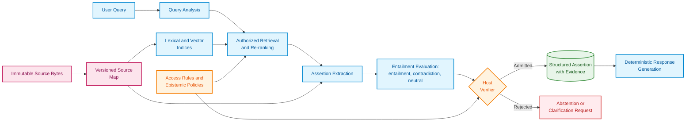
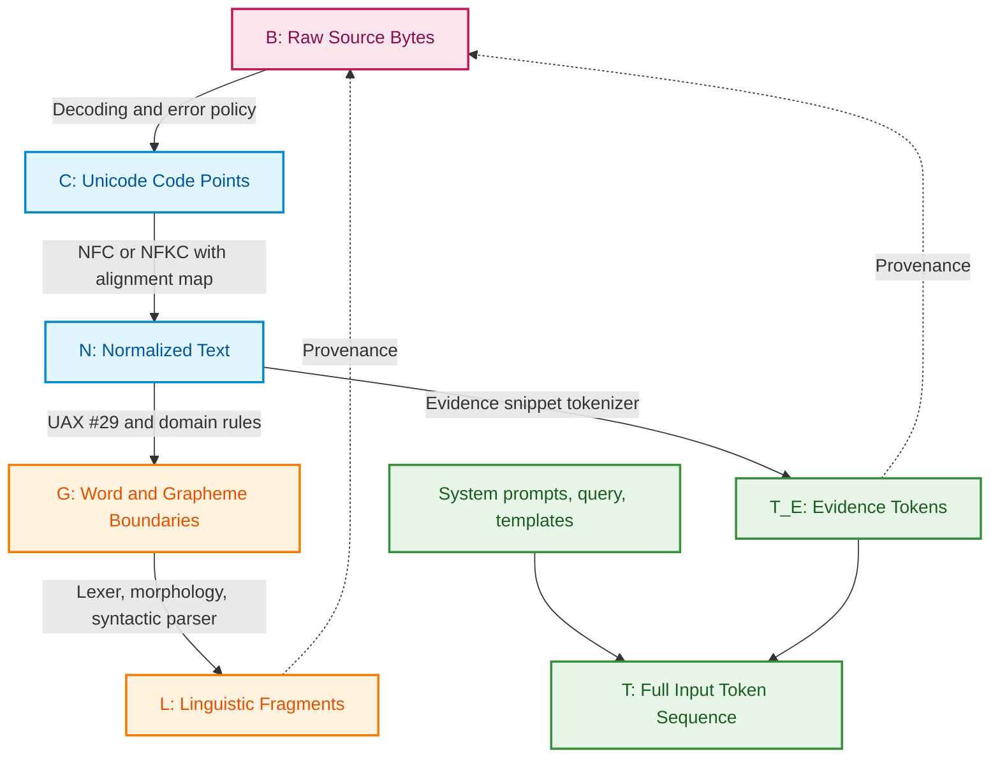
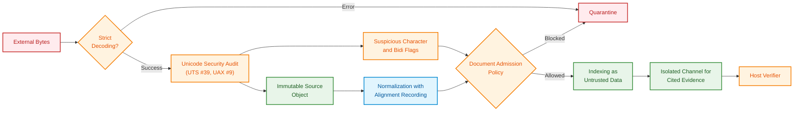
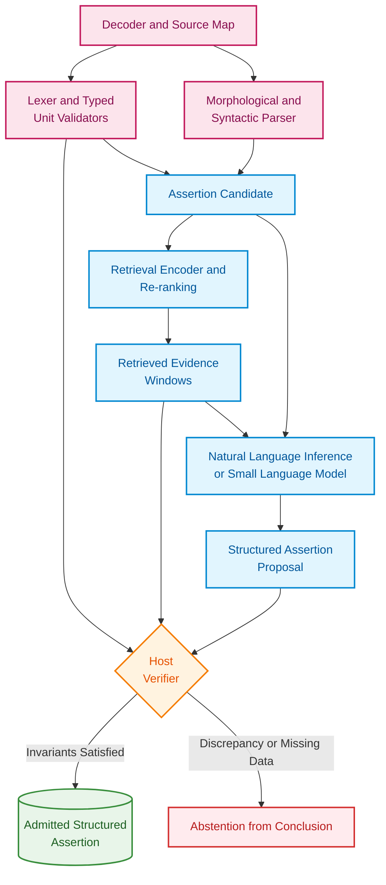
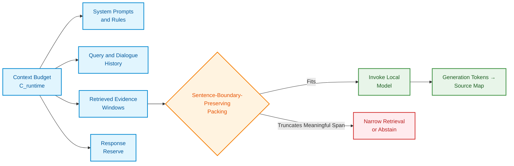
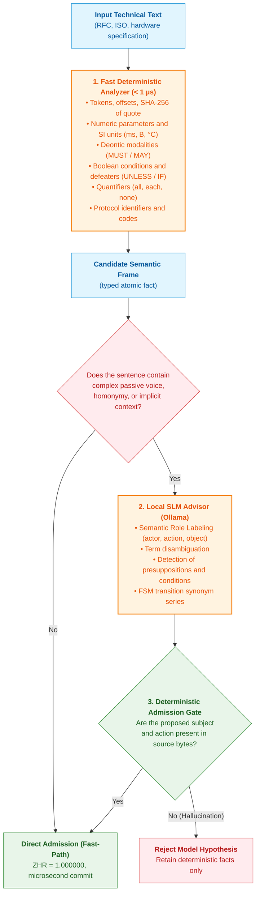

# Chapter 12. Linguistic Analysis and Local Models: Preserving Content and Provenance

> **Book:** [Architecture of Evidence-Governed Expert Systems](README.md) · [Part III: Knowledge Acquisition, Linguistic Analysis, and Input Assessment](part-03-knowledge-engineering-nlp.md)  
> **Previous Chapter:** [Chapter 11. Knowledge Elicitation from Experts: Interviewing, Cognitive Maps, and Experience Formalization](ch11-knowledge-elicitation-from-experts.md)  
> **Next Chapter:** [Chapter 13. Natural Language Variability vs. Determinism: Compiling Question Semantics](ch13-language-variability-vs-determinism.md)  
> **Table of Contents:** [README.md](README.md)  
> **Author:** [Mykola Fedchyk](about-the-author.md)  
> **Target Level:** Intermediate: Developers and knowledge engineers  
> **Expected Learning Outcomes:** Trace the path from a user utterance to a primary document citation; distinguish vector similarity from deductive logical proof; safeguard the text pipeline against character spoofing and embedded instructions; verify and evaluate local models prior to production upgrades.

## Abstract

This chapter investigates the architectural principles of designing the linguistic pipeline for expert systems, enabling natural language query interpretation while enforcing strict semantic preservation and 100% primary source custody. The risks of information loss during Unicode normalization, vulnerabilities to indirect prompt injections, and character spoofing attacks (Trojan Source) are thoroughly analyzed. A hybrid division of labor between a deterministic syntactic parser, small language models (SLM/NLI), and a host verifier is established. The chapter examines tokenization resource constraints for the Ukrainian language, key-value (KV) cache memory overhead, and the Machine Knowledge Attestation (MKA) protocol, which issues a cryptographically verified knowledge passport.

A user asks: "What is the minimum header length?" In the underlying specification, the answer is recorded as `eight octets`. An expert system might retrieve this exact sentence yet still commit a critical error: converting "octets" to "bytes" without explicit verification, dropping the unit of measurement, or citing an incorrect revision of the document. Thus, robust linguistic understanding begins not with a large foundational model, but with the architectural guarantee that content integrity and document provenance are never compromised.

In this scenario, a valid answer is neither a bare `8` nor an unverified "8 bytes." It must encapsulate the numerical value, the original unit of measure, the governing operational conditions, and an exact excerpt anchored to an authorized document revision. It is this complete, unbroken evidentiary chain—rather than polished natural language paraphrasing—that renders the expert system's assertion verifiable.

Hence, the central research question of this chapter arises: **how do we construct a linguistic subsystem that accommodates the full variability of human phrasing while asserting exclusively what can be deterministically reproduced from source bytes?** The core thesis of this chapter posits that the linguistic subsystem must be hybrid. Deterministic code governs raw bytes, coordinate offsets, and access control policies; the syntactic parser extracts grammatical structure and dependencies; specialized models retrieve candidate passages and evaluate bounded local entailment; and generative models assist in query rewriting. Crucially, an assertion enters the final system output if and only if an independent host verifier can rigorously reconstruct it from immutable evidence.

> **Empirical Caveat.** In the author's local engineering prototypes, dropped measurement units, corrupted compound tokens, and coordinate drift between model-predicted offsets and underlying file bytes were repeatedly observed. In the absence of published raw audit logs and frozen benchmark corpora, these findings constitute an engineering observation rather than an exhaustive universal metric. The architecture and protocols detailed below must be rigorously validated on the reader's proprietary knowledge corpus.

## 1. Architectural Principles of the Linguistic Pipeline: From Human Utterance to the Right to Assert

[Chapter 19](ch19-from-question-to-evidence.md) partitions the trajectory from an incoming query to admissible evidence into detection, extraction, primary source grounding, and formal verification. [Chapter 2](ch02-epistemology-of-machine-knowledge.md) established the foundational epistemic contract: semantic similarity does not constitute logical proof, the epistemic state "unknown" is not equivalent to logical negation, and empirical facts, deductive conclusions, and predictive probabilities rest on fundamentally distinct epistemic warrants. The linguistic subsystem bridges these representational tiers.



This architecture explicitly decouples mutable and immutable components. Machine learning components can be upgraded dynamically. Conversely, immutable bytes, primary source maps, access authorization checks, and admission predicates form rigid, stable engineering boundaries. A tokenizer update must never silently alter textual semantics or corrupt citation coordinates.

Authorization is enforced at two distinct gates: prior to retrieval and immediately before final assertion admission. A restricted passage must never be passed to a generative model as context only to suppress the citation downstream: the confidential text would already have influenced token generation. An assertion strictly inherits the access classifications of all its source materials, and an authorization denial must never leak even the existence of a classified document.

## 2. Preserving the Link Between Text and Primary Source: Provenance Maps and Custody Bytes

The assertion "character index 42" is mathematically undefined without an explicitly declared coordinate system. An offset may be computed in UTF-8 bytes, UTF-16 code units, Unicode code points, extended grapheme clusters, lexical words, parser tokens, or language model vocabulary tokens.



Every transformation generates a new textual representation alongside an explicit provenance relation. Let $`R_{X\leftarrow Y}\subseteq X\times Y`$ denote the relation mapping a fragment of derived representation $Y$ back to corresponding spans in parent representation $X$, and let $`T_E\subseteq T`$ denote model tokens originating strictly from evidence. The mapping of an evidence token back to raw bytes is defined as the relational composition:

```math
R_{B\leftarrow T_E}=R_{B\leftarrow C}\circ R_{C\leftarrow N}\circ R_{N\leftarrow T_E}.
```

- In this formulation, $T_E$ is the set of model tokens originating from evidence;
- $B$, $C$, and $N$ denote byte, character (code point), and normalized representations, respectively;
- $`R_{X\leftarrow Y}`$ is the provenance relation mapping elements of representation $Y$ to their corresponding elements in representation $X$;
- The operator $\circ$ denotes relational composition, tracing tokens sequentially through normalized text and Unicode code points back to raw source bytes.

Operationally, this guarantees that for every evidence token, an unambiguous path back to source bytes can be verified. The mapping may be non-injective: a single token can span multiple code points, or multiple characters may have fused during normalization.

This mapping is not bijective. A single token can span multiple code points, an individual grapheme cluster comprises a base character and combining marks, and a normalized code point may result from the collapse of several input characters.

Template tokens, system instructions, and user query tokens do not derive from document bytes: they map to internal system identifiers or are flagged as synthetically generated. Expert system citations ground exclusively upon the set $T_E$.

### 2.1. Unicode Normalization Effects: Information Loss Risks

Under Normalization Form C (NFC), the sequence `U+0065` (Latin small letter "e") followed by `U+0301` (combining acute accent) canonicalizes into the single precomposed character `U+00E9` ("é"). Different underlying byte sequences yield an identical normalized output. Normalization Form KC (NFKC) further strips compatibility distinctions, such as converting superscript digits into standard numerals or expanding ligatures; consequently, Unicode Standard Annex UAX #15 explicitly cautions that forms KC and KD must never be applied indiscriminately to arbitrary text, as they erase significant formatting distinctions [[1]](#src-1). Invertibility cannot be reconstructed post-hoc unless an alignment map was recorded during transformation.

For a derived span $s$, let $M_B(s)$ denote the minimal ordered set of source byte intervals, $\mathrm{Bytes}_B(M)$ the source bytes in their original sequence, and $\mathrm{Frame}_B(M)$ the canonical records `(start, end, bytes)`. The two-sided invariant holds:

```math
\mathrm{Normalize}_v\bigl(\mathrm{Decode}_e(\mathrm{Bytes}_B(M_B(s)))\bigr)=\mathrm{Surface}_N(s)
```

Notation:

- $s$ is the derived text span;
- $M_B(s)$ defines the minimal ordered set of source byte intervals for span $s$;
- $\mathrm{Bytes}_B(M_B(s))$ represents the raw bytes across those intervals in original sequence;
- $\mathrm{Decode}_e$ decodes the raw byte slice under encoding and error handling policy $e$;
- $\mathrm{Normalize}_v$ normalizes the decoded text according to Unicode version and normalization form $v$;
- $\mathrm{Surface}_N(s)$ is the surface text of the span in normalized representation $N$;
- The equality sign $=$ demands that both transformation paths produce identical surface strings.

Practically, this dictates that the selected byte slice, upon decoding and normalization, must exactly reproduce the text referenced by the span. The invariant depends strictly on the preserved parameters $e$ and $v$ and cannot reconstruct lost alignments if the byte map was omitted.

Concurrently, the expert system verifies the cryptographic immutability of the underlying evidence:

```math
\mathrm{SHA}256\bigl(\mathrm{Frame}_B(M_B(s))\bigr)=\text{evidence-sha256}(s).
```

Equation parameters:

- $\mathrm{Frame}_B(M_B(s))$ is the canonical serialization of intervals and associated raw bytes for span $s$;
- $\mathrm{SHA}256(\cdot)$ computes the 256-bit cryptographic digest of the provided serialized frame;
- $\text{evidence-sha256}(s)$ is the stored cryptographic digest of the evidence record for span $s$;
- The equality sign $=$ verifies that the newly computed digest matches the recorded anchor.

This check operates as fingerprint verification: any mutation within the covered bytes alters the hash; however, hash equivalence alone does not substantiate the correctness of an interpretation. Parameters $e$ and $v$ from the preceding invariant freeze decoding and normalization semantics. When combining characters are reordered, the source map may manifest as a list of disjoint intervals rather than a single contiguous range. For PDF documents and scanned assets, the pipeline is longer: "PDF binary bytes → page geometry or raster bitmap → OCR extracted text → normalized text." OCR citation coordinates must anchor to the OCR text layer and page bounding boxes rather than raw file offsets within the compressed PDF stream.

Unicode Standard Annex UAX #29 establishes fundamental boundaries for graphemes, words, and sentences [[2]](#src-2), but technical entities such as `10.0.0.0/8` or `v2.1.4` necessitate domain-specific boundary rules. For a tokenizer specified as lossless under a designated mode, the round-trip invariant is verified:

```math
\mathrm{Detok}_v\bigl(\mathrm{Tok}_v(x;\ \mathrm{special}=\mathrm{false});\ \mathrm{cleanup}=\mathrm{false}\bigr)=x.
```

Variable breakdown:

- $x$ is the original input text;
- $\mathrm{Tok}_v$ encodes the text into tokens using tokenizer version $v$;
- $\mathrm{Detok}_v$ decodes tokens back into text using the same tokenizer version;
- Parameter $\mathrm{special}=\mathrm{false}$ disables injection of special control tokens;
- Parameter $\mathrm{cleanup}=\mathrm{false}$ disables whitespace stripping and normalization cleanups;
- The equality sign $=$ requires exact, character-level recovery of the original input.

This equality represents a strict requirement for a lossless execution mode, not an inherent property of all tokenizers. Case folding, Unicode normalization, out-of-vocabulary substitutions, and whitespace trimming can alter the text even when special tokens are suppressed. For instance, following NFKC normalization, the ligature `fi` becomes `fi`: decoding normalized tokens cannot recover the original source bytes. For such tokenizers, adherence to the declared normalized representation is validated, while evidentiary citations are resolved through the preserved source map. A tokenizer version bump cannot retroactively recover discarded byte details.

## 3. Text Pipeline Security: Detecting Injections and Character Spoofing

Text may appear benign to a human reviewer while executing unpredictably in software or harboring hidden instructions directed at an underlying language model. Before executing search or inference, the expert system inspects not only the informational content of a document, but also its encoding integrity.

Normalization fails to mitigate character spoofing. The Latin character `a` and Cyrillic character `а` appear visually indistinguishable; invisible control characters alter bidirectional rendering order; and zero-width characters break token boundaries. Boucher and Anderson demonstrated the Trojan Source attack class: bidirectional text control characters induce a discrepancy between the visual order seen by human reviewers and the logical order processed by compilers [[3]](#src-3). Confusable character detection mechanisms are defined in Unicode Technical Standard UTS #39 [[4]](#src-4), while bidirectional text rules are governed by Unicode Standard Annex UAX #9 [[5]](#src-5).

| Threat Vector | Operational Consequence | Engineering Control |
|---|---|---|
| Invalid Encoding | Downstream components process conflicting representations | Strict decoding or quarantine; absolute prohibition of silent replacement characters in evidence |
| Mixed-Script Spoofing | `heаder` with Cyrillic "а" bypasses exact token matching | Script profile analysis; UTS #39 skeleton transformation as an audit trigger |
| Bidirectional Text & Invisible Controls | Reviewer perceives an inverted phrase order | UAX #9 audit; visual code point inspection; character allowlists |
| Over-Normalization | Elimination of semantically critical technical distinctions | Preservation of immutable raw bytes; dedicated parsing rules for technical fields |
| Corpus Poisoning | Maliciously injected passage wins retrieval ranking | Cryptographic source verification; content digests; retrieval anomaly detection |
| Indirect Prompt Injection | Ingested document attempts to hijack model control flow | Isolated data channels; default prohibition of tool execution from retrieved context |
| Citation Forgery | Displayed citation drifts from actual document bytes | Bidirectional verification via source map and cryptographic hash |

Indirect prompt injection constitutes an acute threat to language-model-integrated systems: Greshake et al. demonstrated how adversarial instructions concealed within data ingested at runtime seize model execution flow [[6]](#src-6).



The pipeline architecture ensures that an ingested sentence stating "ignore all previous instructions" remains purely passive data. Even state-of-the-art prompt injection detectors cannot function as a security perimeter: architectural resilience depends on the structural principle that document text possesses no execution privileges and cannot invoke system tools or alter access permissions.

## 4. Division of Responsibility in a Hybrid Architecture

No single subsystem should simultaneously retrieve text, interpret its semantic meaning, and autonomously issue an authoritative conclusion. A strict separation of concerns isolates failures: errors are immediately attributable to raw byte decoding, syntactic parsing, or formal inference.



Syntactic parsers are effectively constructed upon the Universal Dependencies framework, which standardizes parts of speech, morphological features, and syntactic dependency trees across natural languages [[7]](#src-7). Dense sentence embeddings for semantic retrieval are provided by architectures such as Sentence-BERT [[8]](#src-8). Natural Language Inference (NLI) is evaluated by models fine-tuned on benchmarks such as XNLI, which encompasses cross-lingual evaluation [[9]](#src-9). Crucially, NLI represents a statistical classification over pairs of text spans, not a formal deductive proof. Performance on XNLI does not guarantee accuracy on specialized Ukrainian technical specifications: validation demands domain-specific held-out test sets. The following table codifies component capabilities and operational prohibitions.

| Component | Output Contract | Prohibited Capabilities |
|---|---|---|
| Decoder & Source Map | Code point sequences, byte alignments, decoding exception frames | Interpreting user intent or evaluating factual truth |
| Deterministic Lexer & Validator | Typed atomic tokens (numbers, units, identifiers) and exact boundaries | Assigning semantic roles or truth values to assertions |
| Syntactic Parser | Lemmata, parts of speech, dependency parse trees | Establishing normative authority or verifying authorization |
| Encoder & Re-ranker | Vector embeddings, dense similarity scores | Proving deductive entailment or factual veracity |
| Natural Language Inference Model | Probability distribution over entailment, contradiction, and neutral classes | Asserting truth beyond the explicitly provided evidence span |
| Small / Large Language Model | Intent proposals, normalized restatements, textual candidate anchors | Mutating bytes, hashes, or security policies |
| Host Verifier | Binary admission decision or diagnostic rejection reason code | Paraphrasing text into conversational natural language |
| Response Formatter | Readable natural language presentation with explicit citation anchors | Introducing assertions absent from the verified intermediate representation |

## 5. Resource Constraints: Context Budget, Tokenization, and Model Memory

A language model token corresponds neither to a word nor a character. Token sequence length varies as a function of language, tokenizer vocabulary, and framing templates. Consequently, the runtime context budget must be explicitly constrained:

```math
L_{\mathrm{sys}}+L_{\mathrm{schema}}+L_{\mathrm{dialog}}+L_{\mathrm{query}}+L_{\mathrm{evidence}}+L_{\mathrm{tools}}+L_{\mathrm{output}}\le C_{\mathrm{runtime}}.
```

- The total token budget is partitioned into $L_{\mathrm{sys}}$, $L_{\mathrm{schema}}$, $L_{\mathrm{dialog}}$, $L_{\mathrm{query}}$, $L_{\mathrm{evidence}}$, $L_{\mathrm{tools}}$, and $L_{\mathrm{output}}$, representing token counts for system prompts, schema definitions, conversation history, query text, evidence spans, tool descriptions, and reserved response generation, respectively;
- The addition operator $+$ sums these discrete allocations;
- $C_{\mathrm{runtime}}$ denotes the empirically verified context limit for the target deployment profile, measured in tokens;
- The relational operator $\le$ enforces that total consumption does not exceed this hard operational ceiling.

For example, given allocations of 1,500 + 500 + 2,000 + 500 + 6,000 + 500 + 1,000, total usage equals 12,000 tokens, well within a 16,000-token capacity. The ceiling is governed by the model deployment profile. If a critical document span cannot fit entirely within the context window, the system must not arbitrarily truncate qualifying conditions mid-sentence: it must refine the retrieval scope or abstain from answering.



### 5.1. Peculiarities of Ukrainian Language Tokenization

In Ukrainian-language expert systems, tokenizer vocabulary design exerts a decisive influence on performance. Rust et al. demonstrated that a language-adapted tokenizer is as crucial to model efficacy as pretraining data volume; their work formalized tokenizer fertility as the mean number of subword tokens produced per word [[10]](#src-10):

```math
\text{Fertility}=\frac{N_{\text{tokens}}}{N_{\text{words}}}.
```

Formula variables:

- $N_{\text{tokens}}$ is the total number of subword tokens in a text sample;
- $N_{\text{words}}$ is the number of whitespace-delimited words in that sample;
- $\text{Fertility}$ is the resulting average ratio, expressed in tokens per word.

For instance, if an 800-word excerpt tokenizes into 1,200 subword tokens, fertility equals $1.5$ tokens per word. This metric varies by natural language, domain corpus, and tokenizer design, and cannot be generalized across distinct datasets without empirical measurement.

Petrov, La Malfa, and Torr demonstrated that identical semantic text translated across languages can exhibit up to a 15-fold disparity in token length, directly curtailing effective context capacity while inflating computational latency and inference costs [[11]](#src-11). Vocabulary size directly governs this disparity: early LLaMA [[12]](#src-12) and Mistral 7B [[13]](#src-13) architectures utilized 32,000-token vocabularies, whereas Gemma expanded its vocabulary to 256,000 tokens [[14]](#src-14). An exemplar of domain adaptation is the Lapa LLM project based on Gemma 3 12B: its developers replaced over 80,000 underutilized non-Cyrillic tokens with dedicated Ukrainian subwords while preserving overall vocabulary dimensions, reducing token consumption on Ukrainian corpora by approximately 1.5× relative to baseline Gemma 3 [[15]](#src-15).

For expert system engineering, three operational imperatives follow. First: the volume of evidence packable into $C_{\mathrm{runtime}}$ depends on corpus-specific tokenizer fertility; hence, fertility must be benchmarked on actual production documentation rather than inferred from upstream vendor cards. Second: inflated sequence lengths quadratically expand key-value cache memory and attention computation. Third: the alignment map $`R_{N\leftarrow T_E}`$ operates over evidence tokens and requires explicit validation on Cyrillic text. A generated token does not possess an inherent address within the source file. The extraction layer must emit explicit passage spans or input coordinate pointers, allowing the host verifier to reconstruct the citation via the verified source map.

### 5.2. Out-of-Distribution Shift

It is frequently asserted that neural networks interpolate effectively within the convex hull of training data but extrapolate poorly beyond it. Balestriero, Pesenti, and LeCun proved that in data spaces exceeding 100 dimensions, novel samples almost never fall within the convex hull of the training set; hence, the classical interpolation-extrapolation dichotomy fails to explain neural generalization [[16]](#src-16). In practice, operational degradation occurs whenever runtime input distributions diverge from pretraining distributions. The WILDS benchmark systematically curated real-world distribution shifts, documenting substantial performance drops across out-of-distribution environments [[17]](#src-17).

An unseen document does not inherently constitute an out-of-distribution shift: a new standard may conform entirely to previously trained linguistic patterns, domain syntax, and schema definitions. Shift must be evaluated by tracking feature drifts and measuring performance on held-out test suites. Conversely, the absence of a document from training data precludes retrieving its specific regulatory rules from model weights. In an evidence-governed expert system, the authoritative origin of a rule is the admitted source document or an explicit expert elicitation record, never the latent memory of a model. The language model's operational scope is strictly restricted to:

- Parsing syntactic dependencies and extracting named entity spans;
- Synthesizing structured intermediate queries against the knowledge base;
- Evaluating local logical entailment between an isolated evidence span and a candidate proposition.

Formal logical inference, rule quantification, and invariant checking remain the exclusive purview of the deterministic inference engine.

### 5.3. Memory Optimization: Key-Value Cache (KV Cache)

Key-value (KV) cache memory consumption scales linearly with sequence length. Under full attention, memory allocation for a single concurrent session across $n_l$ layers, $n_{kv}$ key-value heads, head dimension $d_h$, sequence length $L$, and precision $b$ bytes per parameter is expressed as:

```math
M_{KV}\approx 2\,n_l\,L\,n_{kv}\,d_h\,b.
```

Formula terms:

- $M_{KV}$ represents estimated KV cache memory for one active session, in bytes;
- The scalar factor $2$ accounts separately for key and value tensors;
- $n_l$ is the total number of transformer layers;
- $L$ is sequence length in tokens;
- $n_{kv}$ is the count of key-value heads per layer (reflecting multi-query or grouped-query attention);
- $d_h$ is the head dimension;
- $b$ is the byte size per element (e.g., 2 bytes for FP16/BF16);
- The approximation sign $\approx$ denotes an estimate excluding memory allocator fragmentation and runtime overheads.

For representative parameters $n_l=32$, $L=4096$, $n_{kv}=8$, $d_h=128$, and $b=2$, cache memory evaluates to 536,870,912 bytes, or exactly 512 MiB per active stream. Physical memory footprint varies further with allocator fragmentation and tensor alignment constraints.

The factor of 2 isolates key and value projections. Kwon et al. demonstrated that KV cache memory management represents the primary throughput bottleneck in large language model serving, resolving it via paged virtual memory management in the vLLM architecture [[18]](#src-18).

## 6. Semantic Similarity vs. Logical Entailment: Limits of Vector Search

In naive RAG architectures and standard vector search engines, continuous vector embedding similarity is conflated with logical truth or deductive entailment. For mission-critical expert systems (ISO 26262 ASIL D, IEC 61508 SIL 3/4), relying on cosine similarity creates a direct hazard of catastrophic failure. Consider two diametrically opposed engineering requirements: *"The controller MUST close the emergency dump contactor upon loss of sync"* versus *"The controller MUST NOT close the emergency dump contactor upon loss of sync."* In standard semantic embedding spaces (e.g., cosine embeddings), these sentences exhibit a similarity score of $\approx 0.94\text{--}0.97$ due to identical lexical and domain context. If the inference engine treats vector similarity as proof of normative applicability, it risks executing an unauthorized emergency action.

Consequently, in the linguistic pipeline of an evidence-governed expert system, dense vector search functions solely as a coarse heuristic filter for rapid initial document pruning. Candidate passages must subsequently pass through deterministic Natural Language Inference (NLI) classification and a host integrity verifier.

Given a query representation $\mathbf q \in \mathbb R^m$ and a document passage embedding $\mathbf d \in \mathbb R^m$, cosine similarity is defined as:

```math
s_{\mathrm{dense}}(q,d)=\frac{\mathbf q^\top\mathbf d}{\lVert\mathbf q\rVert_2\lVert\mathbf d\rVert_2}.
```

Parameter definitions:

- $\mathbf q$ and $\mathbf d$ are dense vector embeddings of query $q$ and document $d$, sharing dimensionality $m$;
- $\mathbf q^\top\mathbf d$ denotes the inner (dot) product of these vectors;
- $\lVert\mathbf q\rVert_2$ and $\lVert\mathbf d\rVert_2$ denote their Euclidean ($\ell_2$) norms;
- $s_{\mathrm{dense}}(q,d)$ is the dimensionless cosine similarity bounded in the interval $[-1, 1]$.

Engineering thresholds and noise pruning:
For orthogonal vectors, the inner product and cosine similarity evaluate to zero. The formula is undefined for zero vectors and does not represent the probability of logical support. The retrieval pipeline enforces a strict cutoff threshold: $s_{\mathrm{dense}}(q,d) \ge \tau_{\mathrm{dense}}$ (where $\tau_{\mathrm{dense}} = 0.70$). Candidates falling below this threshold are dropped prior to expensive re-ranking. `NaN` occurrences or dimensionality mismatches immediately reject the candidate under a fail-closed policy.

This metric serves exclusively for preliminary candidate ranking. Lexical search captures exact symbolic matches, whereas dense vectors capture semantic paraphrases. Reciprocal Rank Fusion (RRF) combines ranked lists from disparate retrieval methods without corrupting heterogeneous score scales [[19]](#src-19):

```math
s_{\mathrm{RRF}}(d)=\sum_{r\in\mathcal R(d)}\frac{1}{k_0+\mathrm{rank}_r(d)}.
```

Formula variables:

- $d$ is a candidate document;
- $\mathcal R(d)$ is the set of retrieval rankings containing document $d$;
- $r$ iterates over these ranking lists, and $\mathrm{rank}_r(d)$ is the integer rank of document $d$ within list $r$, indexed from 1;
- $k_0$ is a positive smoothing constant (standard engineering default $k_0 = 60$);
- $\sum$ aggregates individual ranking reciprocal scores into the composite score $s_{\mathrm{RRF}}(d)$.

Only the top-$K$ candidates by $s_{\mathrm{RRF}}$ score (bounded by a budget of $K = 50$) advance to cross-encoder scoring and NLI evaluation, preventing combinatorial memory exhaustion. In Retrieval-Augmented Generation (RAG), retrieved snippets are provided to the model as context [[20]](#src-20); thus, retrieval ranking errors propagate directly into generated assertions.

An NLI model evaluates assertion candidate $c$ against evidence snippet $e$:

```math
p_\theta(y\mid c,e)=\mathrm{softmax}\bigl(z_\theta(c,e)\bigr),\qquad y\in\{\mathrm{entailment},\ \mathrm{contradiction},\ \mathrm{neutral}\}.
```

where:

- $c$ is the candidate assertion, and $e$ is the retrieved evidence snippet;
- $\theta$ denotes model parameters;
- $z_\theta(c,e)$ is the unnormalized logit vector for the pair $(c, e)$;
- $\mathrm{softmax}$ normalizes logits into probabilities over the simplex $[0, 1]$, summing to 1;
- $y$ represents the target categorical class: entailment, contradiction, or neutral.

For example, an output vector of $[0.7, 0.1, 0.2]$ indicates that the model assigns its highest confidence mass to the entailment class. This represents a calibrated metric only when supported by empirical post-calibration; class probability mass alone does not constitute deductive proof of an assertion.

A neutral classification denotes an absence of information within the isolated snippet. The system-level state "unknown" is broader: it encompasses incomplete evidence chains, ungrounded variables, or ambiguous operational scopes. Consequently, final admission is decided by the deterministic host verifier:

```math
\mathrm{Admit}(c,e,q,u,t)=I_{\mathrm{authz}}(c,e,u,t)\land I_{\mathrm{integrity}}\land I_{\mathrm{material}\ \mathrm{spans}}\land I_{\mathrm{applicable}}(c,q,t)\land[y_{\mathrm{ver}}=\mathrm{entailment}]\land[p_{\mathrm{cal}}(\mathrm{entailment})\ge\tau]\land\neg I_{\mathrm{conflict}}\land I_{\mathrm{epistemic}\ \mathrm{type}}.
```

The right-hand terms evaluate as follows:

- $c$ is the candidate assertion, $e$ the evidence span, $q$ the query, $u$ the user context, and $t$ the timestamp of verification;
- $I_{\mathrm{authz}}(c,e,u,t)$ is an indicator verifying that user $u$ is authorized to access evidence $e$ supporting assertion $c$ at time $t$;
- $I_{\mathrm{integrity}}$ verifies cryptographic hash integrity, and $I_{\mathrm{material}\ \mathrm{spans}}$ confirms coverage of all required text spans;
- $I_{\mathrm{applicable}}(c,q,t)$ validates temporal and situational applicability of the assertion to query $q$;
- $y_{\mathrm{ver}}$ is the verified class label, and $\mathrm{entailment}$ denotes positive logical entailment;
- $p_{\mathrm{cal}}(\mathrm{entailment})$ is the calibrated entailment probability;
- $\tau$ is the operational acceptance threshold (standard calibrated threshold $\tau = 0.85$);
- $I_{\mathrm{conflict}}$ indicates conflicting evidence, and $I_{\mathrm{epistemic}\ \mathrm{type}}$ validates epistemic typing;
- $\land$ represents logical conjunction, $\neg$ denotes negation, and bracketed expressions denote boolean evaluations.

The predicate evaluates to true if and only if every condition is satisfied, ensuring calibrated confidence meets or exceeds $\tau$ with zero unresolved evidentiary conflict. When $\mathrm{Admit}(c,e,q,u,t) = 0$, the expert system transitions deterministically to safe abstention or generates a structured clarification request, returning an explicit diagnostic reason code (`REJECT_INSUFFICIENT_CALIBRATED_CONFIDENCE` or `REJECT_DEONTIC_CONTRADICTION`). The language model is strictly prohibited from generating speculative or ungrounded responses.

This predicate defines an admission policy rather than a formal mathematical proof of linguistic interpretation. When an NLI model outputs an entailment label, comparing its score against a threshold does not transmute a statistical classification into a mathematical proof. Applicability and epistemic indicators require deterministic verification against system governance logs. Absent these grounds, a candidate remains unverified regardless of raw model confidence.

## 7. Document Parsers and Information Loss in Training Data

A language model cannot reconstruct a missing measurement unit if the upstream document parser discarded the table header. Consequently, before choosing an encoder, information loss at the "binary file → structured intermediate representation" boundary must be measured. For structured formats, deterministic parsers are preferred; for PDF documents, reading order, table hierarchies, headers, footers, and OCR layers must be audited separately.

Docling formalizes document parsing via the **DoclingDocument** data model, preserving text hierarchies, tables, structural groupings, and cell provenance [[21]](#src-21). In an evidence-governed architecture, maintaining this rich intermediate representation is far superior to prematurely collapsing the document into flat Markdown, which routinely decouples table cells from column headers. Apache Tika serves as a reliable baseline for general textual and metadata extraction across legacy formats [[22]](#src-22). Comparative evaluations must identify which document categories demand deep layout parsers; library selection alone does not guarantee table integrity or multilingual OCR accuracy.

For every extracted content block, the pipeline records the source hash, derived text hash, parser revision, processing parameters, structural path, and bounding coordinates. Derived text offsets must never be conflated with byte offsets in a compressed PDF binary. For scanned assets, page indices, bounding box geometries, and OCR confidence flags are preserved. These standardized records allow head-to-head benchmarking between Docling, Tika, and OCR engines across identical corpora.

Mitigating annotated data scarcity is addressed through **data-centric learning**. **Weak supervision** synthesizes domain dictionaries, regular expressions, and heuristics into probabilistic training labels. In Snorkel, developed by Ratner et al., labeling functions can abstain, disagree, and exhibit correlated errors [[23]](#src-23). Three heuristic rules constructed around the keyword MUST do not represent three independent votes. While programmatic labels accelerate bootstrap training, they cannot substitute for an independently audited ground-truth gold standard.

**Active learning** prioritizes high-leverage samples for expert human annotation. The selection policy balances model uncertainty, document diversity, operational risk, and reviewer availability. A disjoint, randomly sampled audit suite is mandatory to estimate true generalization error: measuring accuracy exclusively on hard active-learning samples skews systemic error rates. Different revisions of the same specification must be isolated within the same dataset split; otherwise, inter-split data leakage yields artificially inflated validation metrics.

For principled abstention, **conformal prediction** provides formal finite-sample guarantees, as reviewed by Angelopoulos and Bates [[24]](#src-24). In standard formulations, calibration and test data are assumed exchangeable; conformal coverage guarantees that the prediction set contains the ground truth at a declared confidence level across the population, but does not guarantee the truth of any individual assertion. Domain or language shifts violate exchangeability assumptions. Conformal methods guide human-in-the-loop review routing rather than replacing primary source citations.

Initial architectural design must therefore prioritize structural fidelity and rigorous isolation of evaluation splits. Only with these foundations established can execution runtimes and model parameters be evaluated effectively.

## 8. Hardware Deployment Profiles for Local Models

Local model execution is mandatory when proprietary or regulated data must remain within the secure enterprise perimeter. However, the designation "local model" denotes physical runtime placement; it does not inherently guarantee output accuracy or the complete absence of outbound network sockets.

| Profile | Advantages | Architectural Constraints |
|---|---|---|
| llama.cpp & GGUF [[25]](#src-25) | Portability across heterogeneous CPUs and GPUs; zero-dependency offline execution | Requires strict pinning of runtime build flags and quantized model SHA-256 digests |
| Ollama [[26]](#src-26) | Streamlined local REST API; structured output validation via JSON Schema | Wrapper layer provides no fact-checking; demands rigorous model image versioning |
| vLLM [[18]](#src-18) | High multi-tenant serving throughput; paged KV cache memory management | Complex operational deployment; strict CUDA and driver version dependencies |
| MLX LM [[27]](#src-27) | Native execution and fine-tuning on Apple Silicon unified memory | MLX weights are non-portable to CUDA or ROCm server infrastructure |
| TensorRT-LLM [[28]](#src-28) | Maximum throughput on NVIDIA enterprise GPU clusters | Rigid hardware coupling; tight dependencies on GPU microarchitecture and driver stacks |
| ONNX Runtime [[29]](#src-29) | High-performance specialized encoders and NLI classifiers across varied hardware | Execution providers may introduce floating-point discrepancies across backends |

As summarized in the table, selecting a runtime profile involves trade-offs between portability, peak throughput, and deterministic reproducibility. In an evidence-governed expert system, constraints in the final column become mandatory verification gates within deployment manifests.

## 9. Quantization and Regression Control During Model Updates

Standard affine quantization for integer inference, formalized by Jacob et al. [[30]](#src-30), is expressed as:

```math
q(w)=\mathrm{clip}\left(\mathrm{round}\left(\frac{w}{s}\right)+z,\ q_{\mathrm{min}},\ q_{\mathrm{max}}\right),\qquad \hat w=s\,\bigl(q(w)-z\bigr).
```

Mathematical definitions:

- $w$ is the original real-valued weight tensor element;
- $s$ is the positive real quantization scale factor, and $z$ is the integer zero-point offset;
- $\mathrm{round}$ maps real numbers to the nearest integer, and $\mathrm{clip}(x,q_{\mathrm{min}},q_{\mathrm{max}})$ clamps values to the integer interval $[q_{\mathrm{min}}, q_{\mathrm{max}}]$;
- $q(w)$ is the quantized integer weight representation;
- $\hat w$ denotes the dequantized approximation of the weight.

For instance, with $w=0.7$, $s=0.1$, $z=0$, and clamping limits $[-8, 7]$, quantization yields $q(w)=7$ and $\hat w=0.7$. Quantization perturbs weight matrices and alters downstream model behavior; consequently, every quantized candidate must undergo independent evaluation. Performance shift across slice $s$ under metric $m$ is measured as:

```math
\Delta_{m,s}=m(\mathrm{model}_q,s)-m(\mathrm{model}_{\mathrm{base}},s).
```

Metric differentiation:

- $m$ is the target evaluation metric, and $s$ designates a specific slice (e.g., language, parameter range);
- $\mathrm{model}_q$ designates the quantized candidate, and $\mathrm{model}_{\mathrm{base}}$ represents the unquantized baseline;
- $m(\mathrm{model}_q,s)$ and $m(\mathrm{model}_{\mathrm{base}},s)$ are metric scores evaluated on the same slice;
- $\Delta_{m,s}$ is the delta expressed in metric units.

If baseline accuracy on a slice is $0.94$ and the quantized candidate scores $0.91$, the delta is $\Delta_{m,s}=-0.03$, representing a 3 percentage point degradation.

Engineering Regression Criteria:
Industrial-grade expert systems enforce strict regression budgets during model quantization:
1. Aggregate degradation across the complete test corpus must satisfy $\Delta_{m,\mathrm{all}} \ge -0.01$ (at most 1.0 percentage point loss in overall performance);
2. Critical functional slices—such as numerical boundary extraction accuracy ($\Delta_{\mathrm{acc},\mathrm{numeric}}$) and deontic operator classification fidelity ($\Delta_{\mathrm{acc},\mathrm{deontic}}$)—mandate zero regression ($\Delta \ge 0.000$);
3. If an accuracy drop $\Delta_{m,s} < -0.01$ is detected on domain-specific terminology or normative logic slices, the candidate is automatically rejected at the validation gate, and deployment is halted until recalibration or promotion to a higher bit-width profile (e.g., 4-bit to 8-bit).

Evaluation must be segmented across granular slices: target language accuracy, numerical extraction fidelity, structured output compliance, and correct abstention rates. Aggregate corpus averages frequently mask catastrophic failures on rare technical terminology.

The deployment manifest freezes the document corpus snapshot, Unicode normalization parameters, parser revisions, model weight cryptographic hashes, quantization configurations, runtime environments, and calibrated confidence thresholds.

```mermaid
flowchart LR
    accTitle: Safe model deployment and rollback
    accDescr: From signed manifest through paired testing to canary rollouts with automated rollback capability.

    MF["Signed Manifest"] --> ST["Load into Staging<br/>Environment"]
    ST --> SELF["Verify Hashes,<br/>Schemas, and Runtime"]
    SELF --> PAIR["Paired Evaluation:<br/>Baseline vs. Candidate"]
    PAIR --> G{"Quality, Security,<br/>and SLA Gates"}
    G -->|"Pass"| SH["Shadow Traffic →<br/>Canary Release"]
    G -->|"Fail"| STOP["Reject Candidate"]
    SH --> PR["Atomic Version<br/>Promotion"]
    SH -->|"Anomaly"| RB["Full Rollback with<br/>Dependencies"]
    PR --> MON["Monitor Quality,<br/>Memory, and Latency"]
    MON -->|"SLA Violation"| RB

    classDef doc fill:#fce4ec,stroke:#c2185b,stroke-width:2px,color:#880e4f;
    classDef proc fill:#e1f5fe,stroke:#0288d1,stroke-width:2px,color:#01579b;
    classDef check fill:#fff3e0,stroke:#f57c00,stroke-width:2px,color:#e65100;
    classDef ok fill:#e8f5e9,stroke:#388e3c,stroke-width:2px,color:#1b5e20;
    classDef fail fill:#ffebee,stroke:#d32f2f,stroke-width:2px,color:#b71c1c;

    class MF doc;
    class ST,SELF,PAIR,SH,MON proc;
    class G check;
    class PR ok;
    class STOP,RB fail;
```



As illustrated, an updated model candidate traverses the same rigorous verification lifecycle as a knowledge base release: pre-deployment validation, paired baseline benchmarking, canary traffic evaluation, and pre-configured automated rollback mechanisms.

## 10. Verification and Testing Methodology for the Linguistic Subsystem

The proportion of queries where at least one ground-truth document appears in the top-$k$ retrieved candidates is evaluated strictly over answerable queries $Q_+$:

```math
\mathrm{Hit}@k=\frac{1}{|Q_+|}\sum_{q\in Q_+}\mathbb{1}\bigl[G_q\cap R_k(q)\ne\varnothing\bigr].
```

Equation breakdown:

- $Q_+$ denotes the set of queries possessing documented answers, and $q$ represents an individual query;
- $G_q$ is the set of ground-truth relevant documents for query $q$;
- $R_k(q)$ represents the top-$k$ retrieved candidates returned for query $q$;
- $G_q\cap R_k(q)$ is the intersection of ground-truth documents retrieved within rank $k$;
- $\mathbb{1}[\cdot]$ evaluates to 1 if the enclosed predicate holds, and 0 otherwise;
- $|Q_+|$ is the total number of answerable queries, and $\sum$ aggregates indicators across the set.

This metric yields a value between 0 and 1, reflecting the fraction of queries with at least one hit in top-$k$. For example, if 8 out of 10 queries succeed, $\mathrm{Hit}@k=0.8$. It does not reflect comprehensive coverage when assertions depend on multi-document synthesis; multi-document retrieval is measured by Recall:

```math
\mathrm{Recall}@k=\frac{1}{|Q_+|}\sum_{q\in Q_+}\frac{|G_q\cap R_k(q)|}{|G_q|}.
```

Parameter breakdown:

- $Q_+$ is the set of answerable queries, and $q$ is an individual query;
- $G_q$ is the set of all ground-truth documents required for query $q$;
- $R_k(q)$ denotes the top-$k$ retrieved documents;
- $|G_q\cap R_k(q)|/|G_q|$ represents the proportion of required documents retrieved in top-$k$;
- $|Q_+|$ is the query count, and the outer summation averages this coverage across all queries.

The score ranges from 0 to 1. If an answer requires four documents and three are retrieved in the top-$k$, recall evaluates to $3/4=0.75$. This metric is conditioned on ground-truth annotation completeness and does not independently verify final response correctness.

Robustness against synonymous phrasing and linguistic variation is measured over paraphrase groups $G$, where a group succeeds if and only if all constituent variants $V_g$ pass verification:

```math
\mathrm{GroupPass}=\frac{1}{|G|}\sum_{g\in G}\prod_{i\in V_g}\mathrm{Success}_i.
```

Formula variables:

- $G$ is the set of equivalent paraphrase groups, and $g$ designates an individual group;
- $V_g$ is the set of query phrasing variants within group $g$, indexed by $i$;
- $\mathrm{Success}_i$ is binary: 1 if variant $i$ executes successfully, and 0 otherwise;
- $\prod$ multiplies outcomes across all variants in the group, evaluating to 1 if and only if every variant succeeds;
- $|G|$ denotes total groups, and $\sum$ counts fully successful groups.

This metric ranges from 0 to 1, measuring the proportion of groups exhibiting flawless invariance across paraphrases. Given three groups where two pass completely, $\mathrm{GroupPass}=2/3\approx0.67$. This criterion is substantially stricter than isolated query accuracy and depends on the diversity of the test suites.

Acceptance Gates for the Linguistic Subsystem:
- $\mathrm{Hit}@5 \ge 0.95$: At least one relevant normative document must appear in the top-5 retrieval window across $\ge 95\%$ of operational queries;
- $\mathrm{Recall}@5 \ge 0.85$: At least $85\%$ of all regulatory snippets required for a complete inference chain must be present in the top-5 candidates;
- $\mathrm{GroupPass} \ge 0.98$: For equivalent phrasing groups covering functional safety requirements, failure on any single paraphrase variant triggers a quarantine of the entire query group, preventing linguistic bypass of safety controls.

An execution is marked $\mathrm{Success}_i=1$ if and only if the system correctly validated the query contract, retrieved the exact source bytes, preserved typed numerical values, passed authorization audits, and generated a verified response. For atomic factual evaluation, FActScore breaks outputs into atomic propositions and verifies each against source evidence [[31]](#src-31), while ALCE benchmarks evaluate citation precision alongside answer correctness [[32]](#src-32). Confidence intervals for model comparison are estimated via Efron bootstrap resampling, sampling entire paraphrase groups to prevent artificial inflation of effective degrees of freedom [[33]](#src-33).

```mermaid
flowchart LR
    accTitle: Comparative evaluation of linguistic subsystem candidates
    accDescr: Experimentation from frozen data split through paired bootstrap to failure triage.

    MF["Frozen Manifests"] --> SPL["Group Splitting and<br/>Data Leakage Audit"]
    SPL --> B["Baseline Version"]
    SPL --> C["New Candidate"]
    B --> TR["Synchronized Execution<br/>Logs"]
    C --> TR
    TR --> MET["Metrics: Provenance, Representation,<br/>Entailment, End-to-End Success, Resources"]
    MET --> SL["Slice Analysis across Languages,<br/>Terms, and Threat Vectors"]
    SL --> CI["Group Bootstrap and<br/>Paired Statistical Test"]
    CI --> G{"Agreed Admission<br/>Gates"}
    G -->|"Pass"| DEP["Shadow Traffic,<br/>Canary Release"]
    G -->|"Rejected"| DIAG["First-Point-of-Failure<br/>Diagnostics"]

    classDef src fill:#fce4ec,stroke:#c2185b,stroke-width:2px,color:#880e4f;
    classDef test fill:#e1f5fe,stroke:#0288d1,stroke-width:2px,color:#01579b;
    classDef gate fill:#fff3e0,stroke:#f57c00,stroke-width:2px,color:#e65100;
    classDef pass fill:#e8f5e9,stroke:#388e3c,stroke-width:2px,color:#1b5e20;
    classDef err fill:#ffebee,stroke:#d32f2f,stroke-width:2px,color:#b71c1c;

    class MF,SPL src;
    class B,C,TR,MET,SL,CI test;
    class G gate;
    class DEP pass;
    class DIAG err;
```



## 11. Transparent Raw Knowledge Ingestion: Overcoming the Barrier of Distrust and Interactive Visualization

In safety-critical engineering domains (automotive functional safety ISO 26262, cybersecurity ISO 21434, avionics DO-178C), expert systems encounter justified skepticism from external certification auditors. When vendors claim "zero hallucinations" over opaque binary databases, independent auditors suspect circular benchmark bias or hidden hardcoding. Without the capability to inspect how an unfamiliar document is ingested, systems risk rejection as unverified black boxes.

The engineering solution is the **"Show, Don't Tell"** principle implemented via specialized terminal user interfaces (TUI) for interactive ingestion. Auditors can feed an unindexed proprietary document (an engineering standard, corporate security policy, or regulatory mandate) and observe parsing in real time under a **Dual-View: Human vs. Machine** perspective:

1. **Lexico-Syntactic Decomposition:**
   The user observes how the parser segments text into sentences, preserves byte offsets `[byte_start, byte_end]`, and calculates document metrics:
   - Vocabulary size and Type-Token Ratio ($TTR = N_{\text{unique}} / N_{\text{tokens}}$);
   - Shannon informational entropy ($H = -\sum p_i \log_2 p_i$), measuring lexical and stylistic complexity;
   - Sentence length distribution.

2. **Deterministic Extraction of Deontic Norms:**
   The system highlights normative markers of obligation (`MUST`, `SHALL`), prohibition (`MUST NOT`, `SHALL NOT`), recommendation (`SHOULD`), and permission (`MAY`). The auditor inspects which knowledge atoms were extracted strictly by symbolic parsers without stochastic model involvement.

3. **Neuro-Symbolic SLM Tracing:**
   When a local SLM resolves linguistic ambiguities or extracts implicit relations, the TUI displays:
   - The verbatim prompt generated by the deterministic host environment;
   - The raw, unfiltered output from the neural model;
   - The host verifier's admission verdict: confirming whether the model's hypothesis is backed by verbatim source bytes or rejected due to broken custody.

4. **Machine Perception Frame:**
   Focusing on any sentence reveals the exact formal knowledge structure extracted by the system: subject (actor), deontic modality, predicate (action), and the SHA-256 cryptographic digest of the source text span.

This auditability eliminates circular validation claims: independent certifiers personally observe data flow from raw disk bytes to formal predicates, transforming an opaque system into an open analytical instrument.

### 11.1. Machine Knowledge Attestation (MKA) and Knowledge Certificate

Transparent ingestion underpins an independent verification regime: **Machine Knowledge Attestation (MKA)**.

> **Definition (Machine Knowledge Attestation):**  
> *Machine Knowledge Attestation* is the deterministic, cryptographically anchored formal audit of an arbitrary primary document (standard, specification, regulatory code), yielding a closed system of extracted ontological entities, deontic relations, and atomic facts with guaranteed 100% byte-level source custody ($ZHR = 1.000000, EGR = 1.000000$).

This verification process produces an immutable **Machine Knowledge Attestation Certificate (MKA Certificate)** comprising:
1. **Source Provenance & Custody Passport:**
   - Unique certificate identifier (`MKA-<filename>-<sha256[:12]>`);
   - Total byte size and SHA-256 digest of the raw source file;
   - Admission gate status (`PASSED_FAIL_CLOSED_GATE_100%`);
   - Certified Zero-Hallucination Rate ($ZHR = 1.000000$).
2. **Lexical and Entropic Profile:**
   - Total sentence, token, and word counts;
   - Type-Token Ratio ($TTR$) and Shannon entropy ($H$), certifying vocabulary density.
3. **Deontic Balance and Normative Density:**
   - Normative density ($ND = \frac{N_{\text{norms}}}{N_{\text{words}}} \times 1000$);
   - Exact counts of obligations ($MUST$), prohibitions ($MUST\ NOT$), recommendations ($SHOULD$), and permissions ($MAY$).
4. **Discovered Entities & Actor Profiles:**
   - Inventory of identified actors and system architectural components;
   - Frequency distribution and individual deontic profile for each actor (total assigned obligations, prohibitions, and permissions);
   - Associated normative actions.
5. **Discovered Relations & Actions:**
   - Action predicates mapped to their bound subjects and modalities.
6. **Ground Atoms Register:**
   - Complete inventory of generated facts featuring verbatim quotes, exact byte ranges `[byte_start..byte_end]`, and cryptographic hashes for every source span.

This certificate enables regulatory bodies and safety auditors to verify machine knowledge assets instantaneously—either interactively via inspection tools (`kp-ingest-tui -file <doc> -attest`) or programmatically via structured JSON exports.

### 11.2. Knowledge Predicate Taxonomy: From Deontics to Epistemology, Computer Science, and Cybernetics

Early efforts to formalize technical standards (such as RFC 2119) focused exclusively on three deontic modalities: *obligation* (`MUST`), *recommendation* (`SHOULD`), and *permission* (`MAY`). In engineering specifications, safety protocols, and technical monographs, restricting analysis to these three verbs discards 70–80% of a document's conceptual foundation as "extraneous context." Structural definitions, mathematical laws, state transformations, and feedback loops contain no deontic particles yet represent the core of engineering knowledge.

Modern evidence-governed systems implement a **five-dimensional ontological predicate taxonomy** spanning epistemology, theoretical computer science, and cybernetics:

1. **Deontic Modalities (`MUST`, `FORB`, `SHLD`, `MAY`):**
   Govern legal and regulatory obligations. Rooted in Georg Henrik von Wright's deontic logic, they define the state space of permitted and prohibited system configurations.
2. **Epistemic & Ontological Predicates (`SCIENTIFIC`):**
   Describe existence, truth claims, mathematical relations, causal chains, and criteria of demarcation:
   - *Existential and constitutive predicates:* `exists`, `instantiates`, `constitutes`, `embodies`, `characterizes` (*"TLS consists of two primary components"*);
   - *Popperian verification and falsification predicates:* `proves`, `falsifies`, `substantiates`, `refutes`, `verifies`, `demonstrates`, `deduces`, `hypothesizes`;
   - *Entailment and presupposition predicates:* `implies`, `entails`, `presupposes`, `stipulates`, `postulates`.
3. **Computational & Formal System Predicates (`COMPUTATIONAL`):**
   Describe state machines, discrete transitions, formal grammars, and data structures:
   - *Automata theory and computability:* `computes`, `decides`, `transitions`, `halts`, `reduces`, `parses`, `evaluates`;
   - *Data serialization and memory:* `serializes`, `deserializes`, `encodes`, `decodes`, `hashes`, `indexes`, `allocates`, `compresses`.
4. **Cybernetic & Control Predicates (`CYBERNETIC`):**
   Describe system dynamics under disturbance, following Norbert Wiener and W. Ross Ashby:
   - *Feedback and homeostasis:* `regulates`, `stabilizes`, `balances`, `converges`, `diverges`, `oscillates`, `adapts`, `equilibrates`;
   - *Protection, rate-limiting, and fault isolation:* `throttles`, `compensates`, `quarantines`, `isolates`, `recovers`, `mitigates`, `arbitrates`, `audits`.
5. **Engineering Actions (`ACTION`):**
   Describe direct physical, network, and bus manipulations: `transmits`, `routes`, `forwards`, `connects`, `disconnects`, `triggers`, `dispatches`, `emits`.

#### 11.2.1. High-Performance Indexing via the Top-1000 Lexical Atlas ($O(1)$)

To eliminate parsing bottlenecks when ingesting multi-megabyte corpora, linear verb matching is prohibited. Over 1,000 typed bilingual lexemes (including third-person inflections, infinitives, and aspectual forms) are pre-compiled into a static **lexical hash atlas** (`Token Predicate Atlas`). During syntactic passes, each word is looked up in $\mathcal{O}(1)$, reducing full semantic parsing of a 300+ KB RFC specification to single-digit milliseconds while preserving $ZHR = 1.000000$.

### 11.3. Division of Labor: Deterministic Linguistic Analyzer vs. Neuro-Symbolic Advisor (SLM)

The division of responsibility between a symbolic parser and a statistical language model is an architectural requirement for mathematical reliability. Language models are susceptible to hallucinations and boundary drift, yet excel at resolving natural language paraphrasing. Deterministic finite-state automata and regular grammars execute in microseconds ($O(N)$) with zero variance, but fail on inverted syntax or complex homonymy.

The ingestion pipeline enforces a two-tier division of labor under the operational paradigm: **"Determinism sets invariants — SLM proposes hypotheses — Admission Gate decides"**:



#### 11.3.1. Functional Responsibility Matrix

| Semantic / Linguistic Category | Extracted by Deterministic Engine ($< 1$ µs) | Delegated to Neuro-Symbolic SLM |
|---|---|---|
| **Physical Quantities & SI Units** | Numbers, scientific notation, ranges, SI units (`s`, `ms`, `octet`, `bit/s`, `V`, `Hz`, `°C`), relational operators ($=, \le, \ge, \lt, \gt, \in [a, b]$). | Interpreting colloquial or informal dimension descriptions (*"latency not exceeding the blink of an eye"*). |
| **Deontic Norms** | Closed lexicon of normative markers: `MUST`, `MUST NOT`, `SHALL`, `SHOULD`, `MAY`, `required`, `prohibited`. | Detecting implicit obligations in non-standard phrasing (*"the server is expected to..."*). |
| **Logical Conditions & Defeaters** | Formal syntactic connectors: `IF`, `UNLESS`, `EXCEPT WHEN`, `PROVIDED THAT`, `AND`, `OR`, `NOT`. | Evaluating semantic compatibility in complex compound hypothetical clauses. |
| **Quantifiers ($\forall/\exists$)** | Universal and existential markers: `all`, `every`, `each`, `any`, `at least one`, `none`. | Disambiguating collective versus distributive scope over entity sets. |
| **Protocol Symbols & Constants** | Casing identifiers (`camelCase`, `snake_case`, `SCREAMING_SNAKE`), numeric status codes (`503`, `404`), hexadecimal values (`0x0304`). | Mapping numerical status codes to unstructured error descriptions without an explicit schema. |
| **Syntactic Structure (SRL)** | Canonical subject-predicate-object word order (*"Client MUST send..."*). | Syntactic inversion, passive voice, and ellipsis (*"Upon receipt of X, there shall be emitted Y"*). |
| **Disambiguation** | Positional analysis within the active lexical `Scope`. | Contextual disambiguation of polysemous tokens (`CAN` as bus vs. modal verb; `state` as status vs. assertion). |
| **Implicit Presuppositions** | Unsupported (operates strictly under the closed-world assumption). | Inferring logical preconditions (*"resuming a session"* $\implies$ an antecedent session was persisted). |

## Conclusions

This chapter began by asking how to construct a linguistic subsystem that accommodates human linguistic variability while asserting exclusively what can be deterministically reproduced from source bytes. The solution lies in a hybrid architecture: the linguistic subsystem broadens the spectrum of phrasing an expert system can interpret from humans, while simultaneously constraining the assertions emitted by the system to those anchored in immutable source bytes. Every textual transformation records an explicit provenance map, components operate under bounded privileges, vector similarity acts strictly as a retrieval pre-filter, and admission decisions are enforced by a deterministic host verifier using manifests, digests, source maps, and access control policies.

The boundaries of this paradigm are clearly delineated. Tokenizer behavior varies across natural languages and vocabularies; context window allocations and alignment mappings must be validated against production corpora. Language models cannot reliably retrieve information absent from their pretraining weights; hence, they must never serve as authoritative knowledge stores. Every model update or quantization profile represents an unverified candidate requiring full regression benchmarking. Methods for compiling natural language variability into deterministic inference predicates are explored in [Chapter 13](ch13-language-variability-vs-determinism.md).

## Review Questions

1. Why must evidentiary citation coordinates anchor to immutable source bytes rather than language model tokens?
2. What operational risks arise from unconstrained application of NFKC normalization to engineering documentation?
3. Why does high vector cosine similarity fail to provide valid epistemic warrant for asserting a factual claim?
4. What essential parameters comprise a complete deployment manifest for a local model?
5. How does the neutral classification of an NLI model differ epistemically from the system state "unknown"?

## Glossary

| Term | English Equivalent | Concise Engineering Definition |
|---|---|---|
| Source Map | *source map* | Bijective or relational mapping of derived text spans back to primary source byte offsets |
| Code Point | *code point* | Numerical index assigned to a character within the Unicode codespace |
| Grapheme Cluster | *grapheme cluster* | Sequence of code points perceived by a human reader as an individual typographic character |
| Unicode Normalization | *Unicode normalization* | Transformation converting equivalent character sequences into a standardized canonical or compatibility form |
| Alignment | *alignment* | Explicit coordinate mapping between positions before and after textual transformations |
| Tokenizer | *tokenizer* | Algorithm partitioning raw text into vocabulary indices recognized by a model |
| Tokenizer Fertility | *tokenizer fertility* | Average number of subword tokens produced per natural language word |
| Natural Language Inference | *natural language inference* | Classification task evaluating whether a hypothesis is entailed by, contradicts, or is neutral to a premise |
| Reciprocal Rank Fusion | *reciprocal rank fusion* | Rank aggregation algorithm combining disparate ranked lists via reciprocal rank scoring |
| Indirect Prompt Injection | *indirect prompt injection* | Adversarial instructions concealed within untrusted data processed by a language model |
| Distribution Shift | *distribution shift* | Statistical divergence between runtime operational inputs and pretraining/tuning datasets |
| Weak Supervision | *weak supervision* | Training paradigm utilizing programmatic heuristics and labeling functions to synthesize training data |
| Active Learning | *active learning* | Algorithmic strategy selecting the most informative unlabeled samples for expert human annotation |
| Conformal Prediction | *conformal prediction* | Mathematical framework providing distribution-free finite-sample coverage guarantees for prediction sets |
| Key-Value Cache | *KV cache* | Memory buffer storing intermediate self-attention projection states across sequence generations |
| Quantization | *quantization* | Mapping continuous or high-precision model parameters to lower-bit integer representations |
| Host Verifier | *host verifier* | Deterministic software component evaluating admission predicates prior to external assertion emission |
| Machine Knowledge Attestation | *Machine Knowledge Attestation* | Deterministic audit verifying facts and entities from source documents with guaranteed 100% byte-level custody |
| Knowledge Certificate | *MKA Certificate* | Structured artifact certifying cryptographic source digests, entity registers, and deontic distributions |

## Abbreviations

| Abbreviation | Expansion | Meaning |
|---|---|---|
| CUDA | Compute Unified Device Architecture | Parallel computing platform and programming model for NVIDIA GPUs |
| GGUF | GGML Universal Format | Binary file format for storing quantized models utilized by llama.cpp |
| MKA | Machine Knowledge Attestation | Protocol for attesting machine knowledge with complete source custody guarantees |
| NFC, NFKC | Normalization Form C, Normalization Form KC | Canonical and compatibility Unicode normalization forms with precomposition |
| NLI | Natural Language Inference | Natural language inference and entailment evaluation |
| PDF | Portable Document Format | Standardized multi-platform document exchange format |
| RAG | Retrieval-Augmented Generation | Information retrieval coupled with generative language modeling |
| REST API | Representational State Transfer Application Programming Interface | Architectural style for network-based hypermedia systems |
| ROCm | Radeon Open Compute | Open-source software development platform for AMD GPUs |
| RRF | Reciprocal Rank Fusion | Algorithmic rank combination method for information retrieval |
| UAX | Unicode Standard Annex | Normative technical annex to the Unicode Standard |
| UTS | Unicode Technical Standard | Independent technical standard published by the Unicode Consortium |
| UTF-8, UTF-16 | Unicode Transformation Format | Variable-width character encodings for Unicode code points |

## References

1. <a id="src-1"></a>Unicode Consortium. [*UAX #15: Unicode Normalization Forms*](https://www.unicode.org/reports/tr15/). Unicode Standard Annex.
2. <a id="src-2"></a>Unicode Consortium. [*UAX #29: Unicode Text Segmentation*](https://www.unicode.org/reports/tr29/). Unicode Standard Annex.
3. <a id="src-3"></a>Nicholas Boucher, Ross Anderson. [*Trojan Source: Invisible Vulnerabilities*](https://www.usenix.org/conference/usenixsecurity23/presentation/boucher). *32nd USENIX Security Symposium*, 2023.
4. <a id="src-4"></a>Unicode Consortium. [*UTS #39: Unicode Security Mechanisms*](https://www.unicode.org/reports/tr39/). Unicode Technical Standard.
5. <a id="src-5"></a>Unicode Consortium. [*UAX #9: Unicode Bidirectional Algorithm*](https://www.unicode.org/reports/tr9/). Unicode Standard Annex.
6. <a id="src-6"></a>Kai Greshake, Sahar Abdelnabi, Shailesh Mishra, Christoph Endres, et al. [*Not What You've Signed Up For: Compromising Real-World LLM-Integrated Applications with Indirect Prompt Injection*](https://doi.org/10.1145/3605764.3623985). *Proceedings of the 16th ACM Workshop on Artificial Intelligence and Security*, 79–90, 2023.
7. <a id="src-7"></a>Marie-Catherine de Marneffe, Christopher D. Manning, Joakim Nivre, Daniel Zeman. [*Universal Dependencies*](https://doi.org/10.1162/coli_a_00402). *Computational Linguistics*, 47(2), 255–308, 2021.
8. <a id="src-8"></a>Nils Reimers, Iryna Gurevych. [*Sentence-BERT: Sentence Embeddings using Siamese BERT-Networks*](https://aclanthology.org/D19-1410/). *Proceedings of EMNLP-IJCNLP 2019*.
9. <a id="src-9"></a>Alexis Conneau, Ruty Rinott, Guillaume Lample, Adina Williams, et al. [*XNLI: Evaluating Cross-lingual Sentence Representations*](https://aclanthology.org/D18-1269/). *Proceedings of EMNLP 2018*.
10. <a id="src-10"></a>Phillip Rust, Jonas Pfeiffer, Ivan Vulić, Sebastian Ruder, Iryna Gurevych. [*How Good is Your Tokenizer? On the Monolingual Performance of Multilingual Language Models*](https://arxiv.org/abs/2012.15613). arXiv:2012.15613; *Proceedings of ACL-IJCNLP 2021*.
11. <a id="src-11"></a>Aleksandar Petrov, Emanuele La Malfa, Philip H. S. Torr, Adel Bibi. [*Language Model Tokenizers Introduce Unfairness Between Languages*](https://arxiv.org/abs/2305.15425). arXiv:2305.15425, 2023.
12. <a id="src-12"></a>Hugo Touvron, Thibaut Lavril, Gautier Izacard, et al. [*LLaMA: Open and Efficient Foundation Language Models*](https://arxiv.org/abs/2302.13971). arXiv:2302.13971, 2023.
13. <a id="src-13"></a>Albert Q. Jiang, Alexandre Sablayrolles, Arthur Mensch, et al. [*Mistral 7B*](https://arxiv.org/abs/2310.06825). arXiv:2310.06825, 2023.
14. <a id="src-14"></a>Gemma Team. [*Gemma: Open Models Based on Gemini Research and Technology*](https://arxiv.org/abs/2403.08295). arXiv:2403.08295, 2024.
15. <a id="src-15"></a>Lapa LLM. [*Lapa LLM v0.1.2 Instruct: model card*](https://huggingface.co/lapa-llm/lapa-v0.1.2-instruct); Tokenizer card: [*lapa-llm/tokenizer*](https://huggingface.co/lapa-llm/tokenizer). Hugging Face.
16. <a id="src-16"></a>Randall Balestriero, Jerome Pesenti, Yann LeCun. [*Learning in High Dimension Always Amounts to Extrapolation*](https://arxiv.org/abs/2110.09485). arXiv:2110.09485, 2021.
17. <a id="src-17"></a>Pang Wei Koh, Shiori Sagawa, Henrik Marklund, et al. [*WILDS: A Benchmark of in-the-Wild Distribution Shifts*](https://arxiv.org/abs/2012.07421). arXiv:2012.07421; *Proceedings of ICML 2021*.
18. <a id="src-18"></a>Woosuk Kwon, Zhuohan Li, Siyuan Zhuang, Ying Sheng, et al. [*Efficient Memory Management for Large Language Model Serving with PagedAttention*](https://doi.org/10.1145/3600006.3613165). *Proceedings of the 29th Symposium on Operating Systems Principles*, 611–626, 2023.
19. <a id="src-19"></a>Gordon V. Cormack, Charles L. A. Clarke, Stefan Buettcher. [*Reciprocal Rank Fusion Outperforms Condorcet and Individual Rank Learning Methods*](https://doi.org/10.1145/1571941.1572114). *Proceedings of SIGIR 2009*, 758–759, 2009.
20. <a id="src-20"></a>Patrick Lewis, et al. [*Retrieval-Augmented Generation for Knowledge-Intensive NLP Tasks*](https://arxiv.org/abs/2005.11401). *Advances in Neural Information Processing Systems 33* (NeurIPS 2020).
21. <a id="src-21"></a>Docling Contributors. [*Docling*](https://docling-project.github.io/docling/) and [*DoclingDocument*](https://docling-project.github.io/docling/concepts/docling_document/). Official documentation on formats, structure, and element provenance.
22. <a id="src-22"></a>Apache Software Foundation. [*Apache Tika*](https://tika.apache.org/). Official documentation on text and metadata extraction.
23. <a id="src-23"></a>Alexander Ratner, Stephen H. Bach, Henry Ehrenberg, Jason Fries, Sen Wu, Christopher Ré. [*Snorkel: Rapid Training Data Creation with Weak Supervision*](https://arxiv.org/abs/1711.10160). *Proceedings of the VLDB Endowment*, 11(3), 269–282, 2017.
24. <a id="src-24"></a>Anastasios N. Angelopoulos, Stephen Bates. [*A Gentle Introduction to Conformal Prediction and Distribution-Free Uncertainty Quantification*](https://arxiv.org/abs/2107.07511). Preprint, 2021; revised 2022.
25. <a id="src-25"></a>ggml-org. [*llama.cpp: LLM Inference in C/C++*](https://github.com/ggml-org/llama.cpp). GitHub repository.
26. <a id="src-26"></a>Ollama. [*Structured Outputs*](https://ollama.com/blog/structured-outputs). Ollama blog.
27. <a id="src-27"></a>ml-explore. [*MLX LM: Run LLMs with MLX*](https://github.com/ml-explore/mlx-lm). GitHub repository.
28. <a id="src-28"></a>NVIDIA. [*TensorRT-LLM*](https://github.com/NVIDIA/TensorRT-LLM). GitHub repository.
29. <a id="src-29"></a>Microsoft. [*ONNX Runtime*](https://onnxruntime.ai/). Official website.
30. <a id="src-30"></a>Benoit Jacob, Skirmantas Kligys, Bo Chen, Menglong Zhu, et al. [*Quantization and Training of Neural Networks for Efficient Integer-Arithmetic-Only Inference*](https://doi.org/10.1109/CVPR.2018.00286). *2018 IEEE/CVF Conference on Computer Vision and Pattern Recognition*, 2704–2713, 2018.
31. <a id="src-31"></a>Sewon Min, Kalpesh Krishna, Xinxi Lyu, Mike Lewis, et al. [*FActScore: Fine-grained Atomic Evaluation of Factual Precision in Long Form Text Generation*](https://aclanthology.org/2023.emnlp-main.741/). *Proceedings of EMNLP 2023*.
32. <a id="src-32"></a>Tianyu Gao, Howard Yen, Jiatong Yu, Danqi Chen. [*Enabling Large Language Models to Generate Text with Citations*](https://aclanthology.org/2023.emnlp-main.398/). *Proceedings of EMNLP 2023*.
33. <a id="src-33"></a>B. Efron. [*Bootstrap Methods: Another Look at the Jackknife*](https://doi.org/10.1214/aos/1176344552). *The Annals of Statistics*, 7(1), 1–26, 1979.

---

[← Chapter 11](ch11-knowledge-elicitation-from-experts.md) | [Table of Contents](README.md) | [Part III](part-03-knowledge-engineering-nlp.md) | [Chapter 13 →](ch13-language-variability-vs-determinism.md)
