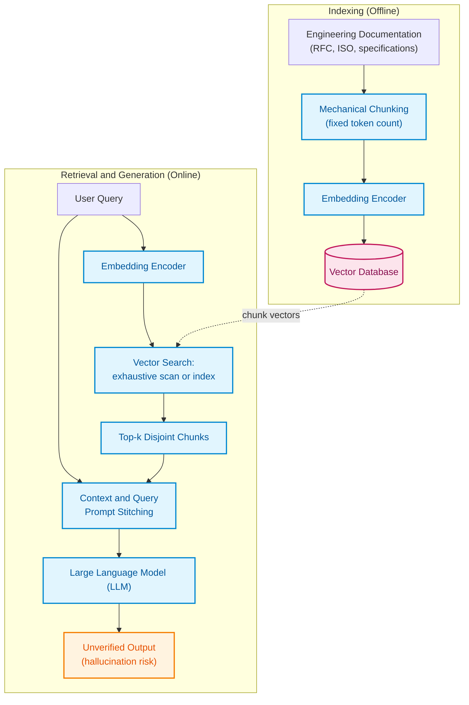
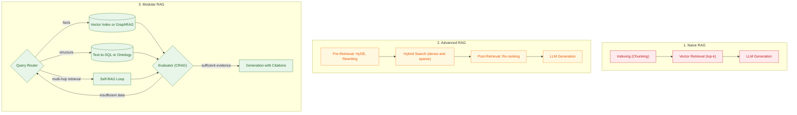
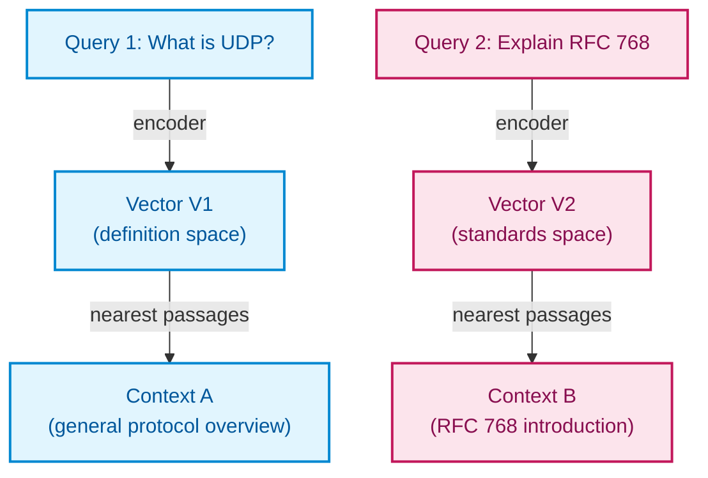
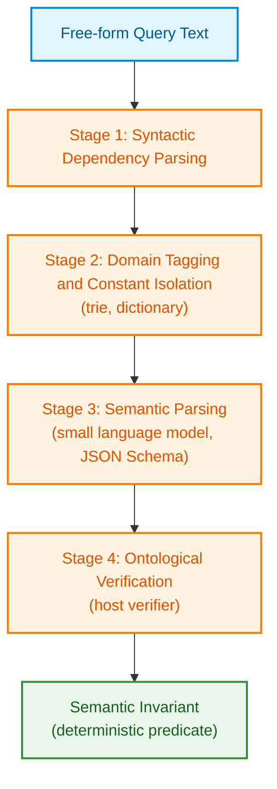
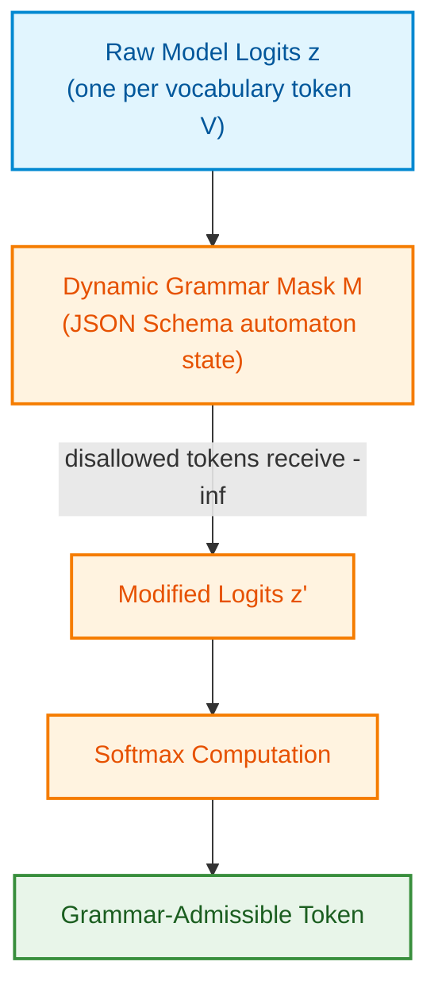
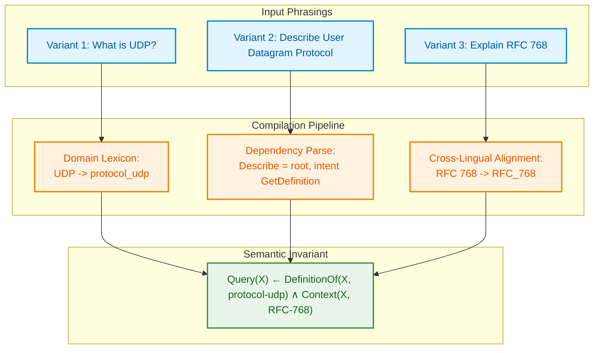
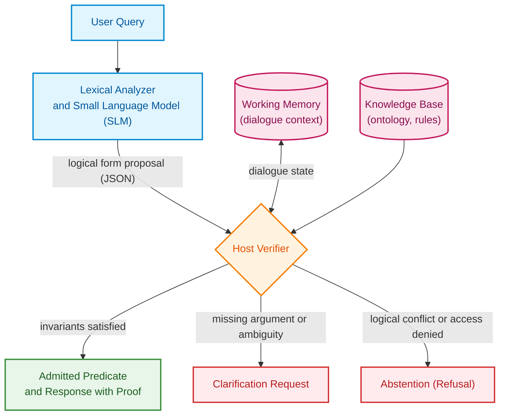

# Chapter 13. Natural Language Variability vs. Determinism: Compiling Question Semantics

> **Book:** [Architecture of Evidence-Governed Expert Systems](README.md) · [Part III: Knowledge Acquisition, Linguistic Analysis, and Input Assessment](part-03-knowledge-engineering-nlp.md)  
> **Previous Chapter:** [Chapter 12. Linguistic Analysis and Local Models: Preserving Content and Provenance](ch12-linguistic-analysis-and-local-models.md)  
> **Next Chapter:** [Chapter 14. Requirements Detection and Formalization: From Normative Text to Invariants](ch14-requirements-detection-and-formalization.md)  
> **Table of Contents:** [README.md](README.md)  
> **Author:** [Mykola Fedchyk](about-the-author.md)  
> **Target Level:** Intermediate: Developers and knowledge engineers  
> **Expected Learning Outcomes:** Distinguish the surface form of a question from its logical content; explain the theoretical and practical limits of naive, advanced, and modular RAG; design a pipeline that compiles a question into a verifiable predicate; isolate user hypotheses from the persistent fact base; measure linguistic interface robustness using equivalence query groups.

## Abstract

This chapter investigates the challenge of resolving natural language variability when interfacing with deterministic expert systems. The evolution of Retrieval-Augmented Generation (RAG) architectures—spanning naive, advanced, and modular paradigms—is systematically evaluated, proving the fundamental insufficiency of vector similarity for establishing logical truth or deductive validity. To overcome these limitations, a semantic compilation pipeline is proposed, transforming arbitrary query phrasings into canonical semantic invariants via grammar-constrained decoding (GBNF/CFG) and enforcing strict isolation of hypothetical session premises from the immutable knowledge base. A formal verification methodology based on behavioral equivalence and contrastive query groups is introduced to quantify linguistic interface robustness.

An engineer asks the expert system: "What is UDP?" A colleague phrases the same query differently: "Describe the User Datagram Protocol." A third engineer inquires in English: "Explain the core concept of RFC 768." To a human practitioner, these represent an identical question concerning a single knowledge object: the User Datagram Protocol (UDP), formalized in RFC 768 within the Internet "Request for Comments" (RFC) standard series. For a naive text retrieval pipeline, however, these phrasings yield three distinct embedding vectors, three divergent sets of retrieved chunks, and potentially three contradictory responses.

Retrieval-Augmented Generation (RAG) couples a language model with external retrieval memory [[1]](#src-1). In its simplest formulation, the system retrieves vector-adjacent text passages and feeds them into a Large Language Model (LLM). For an expert system (ES), a far stricter contract is mandatory: across identical user intent, knowledge snapshots, operational contexts, and authorization levels, emitted verdicts must remain strictly consistent. Divergent admissible grounds do not automatically indicate an error; however, uniform selection of justification requires an explicit policy. Furthermore, the semantic equivalence of two surface phrasings must itself be formally verified.

Hence, the central inquiry of this chapter emerges: **how can disparate surface phrasings of a single question be deterministically compiled into an identical, verifiable expert system verdict?** The core thesis posited herein is that user questions must not merely be retrieved via statistical proximity; they must be compiled. The linguistic subsystem of the ES reduces surface variations to a canonical logical form, defined in this chapter as a *semantic invariant*. A small language model serves solely to propose candidate forms, a deterministic host verifier accepts or rejects these proposals, and linguistic robustness is validated not against isolated prompts, but across rigorous equivalence query groups.

This chapter directly extends Chapter 12. Whereas Chapter 12 focused on end-to-end provenance and source custody, this chapter addresses the disambiguation of phrasing variation from genuine shifts in operational intent. The discussion begins by tracing the evolution of RAG and the mathematical limits of embedding-based similarity. It then formalizes the semantic compilation pipeline, grammar-constrained decoding, and invariance verification across equivalence and contrastive test suites.

The diagram below illustrates the target processing pipeline: transitioning from unconstrained natural language input through lexico-semantic analysis to a formal logical predicate evaluated over the knowledge base.

```mermaid
flowchart LR
    accTitle: Compiling syntactic query variations into a deterministic response
    accDescr: Diagram illustrating the transformation of arbitrary query phrasing through lexico-semantic analysis into a knowledge base predicate.

    U["Syntactic Query Variations<br/>(user utterances)"] --> QA["Lexico-Semantic Analysis<br/>and Constant Isolation"]
    QA --> SI["Semantic Invariant<br/>(logical predicate)"]
    SI --> KB[("Knowledge Base<br/>(graph, axioms, rules)")]
    KB --> DET["Deterministic Verified<br/>Response with Proof"]

    classDef in fill:#e1f5fe,stroke:#0288d1,stroke-width:2px,color:#01579b;
    classDef proc fill:#fff3e0,stroke:#f57c00,stroke-width:2px,color:#e65100;
    classDef store fill:#e8f5e9,stroke:#388e3c,stroke-width:2px,color:#1b5e20;
    classDef out fill:#f3e5f5,stroke:#7b1fa2,stroke-width:2px,color:#4a148c;

    class U in;
    class QA,SI proc;
    class KB store;
    class DET out;
```



As highlighted in the architecture, between raw query text and the underlying knowledge base stands not an approximate text search, but an explicit logical predicate. It is this predicate—rather than superficial surface phrasing—that governs the deterministic response emitted by the expert system.

## 1. Evolution of RAG Paradigms and Their Theoretical and Practical Limits

In the engineering of mission-critical expert systems—governed by functional safety mandates such as ISO 26262, IEC 61508, and DO-178C—every emitted decision must be anchored to a deterministic, exhaustive, and irrefutable chain of proof over a verified knowledge base. Integrating a natural language interface via Retrieval-Augmented Generation (RAG) introduces a fundamental architectural dilemma: rather than accessing authoritative facts directly, the system delegates context selection to a heuristic, non-deterministic retrieval process. When the retrieval pipeline surfaces passages based on accidental lexical overlap or incomplete sentence fragments, semantic drift inevitably occurs: the model generalizes not over normative requirements, but over arbitrary artifacts surfaced by the index.

To understand why even sophisticated retrieval heuristics cannot substitute for formal logical inference, one must trace the architectural evolution of retrieval pipelines. In their 2023 survey, Gao et al. categorized RAG systems into three developmental paradigms: Naive, Advanced, and Modular [[2]](#src-2). Each succeeding paradigm was conceived to remediate specific vulnerabilities of its predecessor; yet all three fundamentally remain statistical text-retrieval mechanisms lacking mathematical guarantees of completeness.

Dense vector retrieval represents one constituent component of RAG, rather than an obligatory substrate for every implementation. It identifies nearest-neighbor vectors according to a chosen similarity metric. An exhaustive linear scan incurs a computational complexity of $\mathcal{O}(N\cdot d)$ for $N$ vectors of dimensionality $d$. For large-scale corpora, approximate nearest neighbor (ANN) structures are deployed, such as Hierarchical Navigable Small World (HNSW) graphs [[3]](#src-3) or Inverted File (IVF) indices with product quantization [[4]](#src-4). Such approximations inevitably risk omitting genuine nearest neighbors. More fundamentally, geometric proximity does not enforce logical entailment, even if trained representations capture latent semantic regularities. Full-text, relational, and graph traversal queries also serve as viable retrieval components.

### 1.1. Naive RAG: Retrieve-Read Architecture and Distortion Risks

Naive RAG implements a classic *Retrieve-Read* pipeline [[2]](#src-2) organized into three linear stages:

1. **Chunking and Indexing.** Source documentation is ingested as raw text and segmented into fixed-size chunks, typically comprising several hundred tokens with slight sliding overlap. This partitioning is executed mechanically based on character or token counts, heedless of logical section boundaries, tables, or program listings. Each chunk is encoded via an embedding model and persisted within a vector database.
2. **Retrieval.** An incoming user query is embedded using the identical encoder, and the $k$ chunks exhibiting the highest similarity scores (*top-k*) are retrieved.
3. **Generation.** The retrieved chunks are concatenated into a prompt context and dispatched alongside the query to an LLM. The model is presumed capable of filtering extraneous noise, synthesizing disparate facts, and articulating an accurate response.

The diagram below demarcates the boundary between offline document indexing and online query processing.



This structural topology reveals that no verification gate exists between retrieval and output generation. The emitted response is a synthetic model hallucination rather than a conclusion bound to source bytes. When applied to engineering standards, five systemic failure modes arise:

* **Fractured Knowledge Boundaries.** If a normative condition and its associated quantitative tolerance span different chunk boundaries, retrieval may surface the operational clause while truncating the governing constraint.
* **Incompleteness and Noise.** Highly pertinent passages may fail to enter the top-$k$ set, while superficially similar yet obsolete fragments contaminate the context.
* **Lost in the Middle.** As demonstrated by Liu et al., language models exploit context positioned at the absolute beginning or end of long prompt windows far more effectively, exhibiting significant degradation when critical information resides centrally [[5]](#src-5).
* **The Illusion of Relevance.** Elevated cosine similarity reflects shared lexical distributions rather than normative force: a mandatory clause containing `SHALL` and an informal background remark may achieve identical similarity scores against a user prompt.
* **Absence of Evidentiary Custody.** Generated narrative responses cannot be traced back to immutable source byte coordinates, precluding deterministic auditability.

### 1.2. Advanced RAG: Pre- and Post-Retrieval Optimization

Advanced RAG retains the sequential "retrieve, then generate" paradigm while introducing targeted optimizations at two critical interfaces: prior to retrieval (*pre-retrieval*) and following candidate extraction (*post-retrieval*) [[2]](#src-2).

At the pre-retrieval stage, two primary defects are mitigated: arbitrary text chunking and imprecise user query phrasing. Mechanical chunking is replaced with hierarchical indexing, wherein retrieval targets granular sub-chunks while context expansion injects the enclosing parent section. Similarly, sentence-window retrieval locates specific assertions and expands them with surrounding sentences to preserve immediate semantic context. Chunks are enriched with domain metadata: section numbers, document revisions, Automotive Safety Integrity Levels (ASIL), and cryptographic file digests, enabling compound vector-metadata filtering.

Concurrently, the input query undergoes preprocessing. An LLM may rewrite colloquial phrasing into standardized normative terminology or generate multiple query reformulations to broaden synonym coverage. The Hypothetical Document Embeddings (HyDE) technique advances this further: the model synthesizes a hypothetical candidate answer, and retrieval operates over this synthetic vector, leveraging the closer structural alignment between prospective answers and target documentation compared to short queries [[6]](#src-6). Hybrid retrieval blends dense semantic search with sparse lexical matching, such as the BM25 probabilistic relevance framework [[7]](#src-7) or the sparse neural representation model SPLADE [[8]](#src-8). The sparse lexical tier reliably captures exact alphanumeric identifiers, register offsets, and numerical tolerances that dense embeddings frequently blur.

At the post-retrieval stage, the system typically yields more candidate passages than can safely or economically fit into the prompt context. Cross-encoder re-ranking models jointly score (query, passage) pairs, capturing all-to-all token attention interactions across both sequences. Nogueira and Cho demonstrated the substantial empirical gains of cross-encoder passage re-ranking based on BERT [[9]](#src-9). In production workflows, high-throughput bi-encoders isolate dozens of candidates, which cross-encoders refine down to a compact subset. Context compression techniques, such as LLMLingua [[10]](#src-10), strip redundant or low-information tokens from prompts. Strategic reordering subsequently positions paramount passages at the beginning and end of the prompt window, mitigating the "lost in the middle" degradation documented by Liu et al. [[5]](#src-5).

### 1.3. Modular RAG: Component Orchestration Instead of a Fixed Pipeline

Modular RAG abandons rigid linear pipelines in favor of decoupled, specialized functional modules that can be dynamically routed and composed according to task requirements [[2]](#src-2). The retrieval tier queries heterogeneous backends: dense vector stores, full-text inverted indices, relational schemas via Structured Query Language generation (*Text-to-SQL*), or formal knowledge graphs traversed via Cypher or SPARQL queries. The memory subsystem maintains conversational provenance across interaction sessions. Dynamic routing modules classify query intent, dispatching definition lookups to vector stores and structural dependency analyses to knowledge graph engines.

A foundational technique within modular RAG architectures is RAG-Fusion, which expands a user query into multiple variations and aggregates the multi-channel candidate lists using Reciprocal Rank Fusion (RRF), as formalized by Cormack, Clarke, and Büttcher [[11]](#src-11). In multimodal and hybrid search architectures—combining dense vector search, sparse BM25 retrieval, and graph traversals—raw relevance scores exhibit incompatible scales and distributions (e.g., cosine similarity bounded within $[-1, 1]$ versus unbounded positive BM25 scores). To unify disparate ranked lists without fragile probability calibration, RRF computes an integrated positional consensus score:

```math
\mathrm{RRF}(d) = \sum_{m \in M} \frac{1}{k + r_m(d)}
```

Parameters and measurable quantities of the formula:

- $d \in D$ represents a candidate document or normative text chunk drawn from the global corpus $D$;
- $M$ denotes the set of heterogeneous retrieval channels or query variants (e.g., $M = \{\text{dense}, \text{sparse}, \text{graph}\}$, where $`\lvert M \rvert \ge 2`$), with $m$ indexing an individual channel;
- $r_m(d) \in \mathbb{N}_{\ge 1}$ denotes the ordinal rank of document $d$ within the result list of channel $m$ ($r_m(d) = 1$ for top rank; if document $d$ is absent from channel $m$'s returned set, $r_m(d) = \infty$, yielding $1/(k + \infty) = 0$);
- $k \in \mathbb{N}_{> 0}$ is a positive smoothing constant, canonically parameterized as $k = 60$; this factor guarantees that an isolated outlier rank in a noisy channel does not overpower a stable consensus established in the upper tiers of other channels;
- $`\mathrm{RRF}(d) \in (0, \frac{\lvert M \rvert}{k + 1}]`$ is a dimensionless integrated consensus ranking score.

Practical implementation and engineering conclusions:
- **Pipeline Function:** The RRF score is utilized exclusively for coarse positional filtering of the candidate pool (typically bounded at $K_{\mathrm{pool}} = 50$), which is subsequently passed to high-latency cross-encoder re-ranking.
- **Threshold Gating:** In safety-critical pipelines, a consensus admission threshold is enforced: $\tau_{\mathrm{RRF}} \ge 0.025$ (requiring a passage to appear within roughly the top 10 results across at least two independent retrieval channels). Candidates failing to meet $\tau_{\mathrm{RRF}}$ are deterministically pruned, preventing context contamination.
- **Fail-Safe Behavior:** If $\max_{d \in D} \mathrm{RRF}(d) < \tau_{\mathrm{min}}$, the pipeline halts prior to generation, emitting the typed diagnostic event `E_NO_CONSENSUS_RETRIEVAL` and returning a deterministic abstention demanding clarification of the normative context.

Beyond these foundational paradigms, specialized architectural patterns have emerged. GraphRAG constructs hierarchical entity-relationship graphs and community summaries to answer global corpus queries [[12]](#src-12). Self-RAG trains models to dynamically trigger retrieval and evaluate passage relevance and output fidelity using explicit reflection tokens [[13]](#src-13). Corrective RAG (CRAG) incorporates a lightweight retrieval evaluator to assess passage quality and trigger web search or fallback retrieval upon low confidence [[14]](#src-14).

The diagram below contrasts these three RAG paradigms. The modular architecture introduces dynamic routing and evaluation loops capable of triggering iterative retrieval.



This comparative trajectory illustrates a clear progression: from single-pass heuristic matching to controlled, iterative evaluation. Nevertheless, even modular RAG architectures terminate in stochastic text generation.

**Section Takeaway.** The categorization of RAG architectures delineates the mechanics of statistical search and text synthesis; it does not preclude formal semantic compilation or logic-based querying. A modular application can integrate both paradigms. Architectural integrity demands verifying where logical forms are synthesized and which component validates their content, rather than accepting an architectural moniker as proof of deterministic reliability.

## 2. Mathematical and Logical Limitations of Semantic Similarity

In safety-critical and regulated engineering domains (avionics, automotive electronic control units, network protocol implementations), a perilous misconception persists: that an embedding model yielding a cosine similarity of $0.92$ between an engineering query and a technical standard signifies that the system has "understood" the question. In practice, this assumption constitutes a fatal architectural flaw. Vector similarity captures statistical co-occurrence and topical proximity across a multidimensional latent space; it is inherently blind to formal logic, deontic polarity, numerical boundary conditions, and relational roles.

Cosine similarity between a query embedding $\mathbf{q}$ and document embedding $\mathbf{d}$ is computed as the normalized inner product within the latent vector space:

```math
s(\mathbf{q}, \mathbf{d}) = \frac{\mathbf{q}^\top \mathbf{d}}{\lVert\mathbf{q}\rVert_2 \, \lVert\mathbf{d}\rVert_2}
```

Parameters and mathematical constraints:

- $\mathbf{q}, \mathbf{d} \in \mathbb{R}^D$ represent dense semantic embeddings of the query and normative text passage, respectively, produced by a neural encoder of fixed dimensionality $D$ (typically $D \in \{768, 1024, 1536\}$);
- $\mathbf{q}^\top\mathbf{d} = \sum_{j=1}^D q_j d_j$ denotes the Euclidean inner product, and $\lVert\cdot\rVert_2 = \sqrt{\sum_{j=1}^D (\cdot)_j^2}$ is the $L_2$ norm, which eliminates the influence of raw document token length on the score;
- $s(\mathbf{q},\mathbf{d}) \in [-1, 1]$ is the dimensionless cosine similarity coefficient: $+1$ indicates collinear vectors of identical direction, $0$ denotes orthogonality, and $-1$ indicates diametric opposition. The metric is undefined for zero vectors ($\lVert\mathbf{q}\rVert_2 = 0$).

Practical implementation and engineering conclusions:
- **Pipeline Function:** The cosine similarity score $s(\mathbf{q},\mathbf{d})$ serves exclusively as a coarse first-stage heuristic filter, retrieving initial candidate sets from large repositories in $\mathcal{O}(\log N)$ time via HNSW graph traversals.
- **Threshold Gating:** The operational candidate acceptance threshold is typically calibrated to $\tau_{\mathrm{dense}} = 0.70$. Chunks falling below $\tau_{\mathrm{dense}}$ are rejected without exception.
- **Critical Risk of Unwarranted Trust:** In evidence-governed systems, a score of $s(\mathbf{q},\mathbf{d}) \ge 0.90$ **does not constitute proof of truth or logical equivalence**. The statements "Transmission is permitted under condition X" and "Transmission is strictly prohibited under condition X" share near-identical lexical and conceptual features, often yielding $s \approx 0.93$. Consequently, elevated similarity warrants solely the dispatch of a passage to a deterministic logic analyzer, never its unverified inclusion in a final verdict.



The initial phrasing aligns closely with introductory technical definitions, whereas the second clusters near the formal prose of engineering standards. While both retrieved fragments may contain truthful assertions, they constitute distinct texts, inducing divergence in model-generated answers. For an expert system, this manifests as an unacceptable defect: the response varies depending entirely on how the user articulated the query.

The structural insufficiency of purely vector-based retrieval in technical domains stems from three primary limitations:

1. **Insensitivity to Logical Negation.** Negation particles ("not", "never") invert the truth value of a proposition while producing minimal perturbation in lexical embeddings. In psycholinguistic diagnostics, Ettinger demonstrated that BERT-derived models exhibit pronounced insensitivity to the semantic impact of negation within sentences [[15]](#src-15). Downstream embeddings inherit this vulnerability: the propositions "requirement applies" and "requirement does not apply" may map to nearly identical vector coordinates.
2. **Style and Cross-Lingual Drift.** Shifting from conversational prose to formal specification language, or translating from Ukrainian to English, alters embedding coordinates and shifts retrieved neighborhoods, as illustrated in the preceding diagram.
3. **Absence of Compositionality.** Vector similarity evaluates queries against isolated chunks. It cannot resolve multi-hop transitive reasoning chains, such as "Requirement A refines Requirement B, which references Standard C," when these relationships are documented across disparate sections.

**Section Takeaway.** Vector similarity is a useful candidate retrieval filter, but it cannot serve as an epistemic warrant for a factual assertion. An architecture requires a compiler mechanism that normalizes syntactic variations into an invariant logical form and evaluates that form over a verified knowledge base.

## 3. Architecture of the Question Semantic Compilation Pipeline

Question compilation in this chapter denotes the deterministic translation of arbitrary natural language phrasing into a canonical logical predicate evaluated over a formal knowledge base. Analogous to a programming language compiler, the pipeline executes sequential passes: syntactic parsing, constant isolation and rewriting, intermediate representation synthesis, and ontological type checking. The output of compilation—the semantic invariant—is completely independent of surface phrasing: disparate queries regarding UDP must yield the exact same underlying predicate. The four-stage pipeline is depicted below.



Dependency parsing relies on statistical models: frozen model weights ensure deterministic execution, yet do not guarantee grammatical correctness. The domain lexicon defines valid entity candidates, the language model proposes a structured candidate form, and the host verifier validates formal types and relational constraints. Crucially, none of these steps alone guarantees that the emitted predicate accurately captures the user's operational intent without rigorous invariant testing.

### 3.1. Syntactic Dependency Parsing and Actant Extraction

The syntactic parser constructs a grammatical dependency tree adhering to the Universal Dependencies (UD) framework [[16]](#src-16). It identifies parts of speech, extracts canonical lemmas, and labels structural relations between tokens, such as sentence root (`root`), nominal subject (`nsubj`), and direct object (`obj`). For Ukrainian text processing, open-source toolkits such as UDPipe [[17]](#src-17) and Stanza [[18]](#src-18) are well-suited. Syntactic analysis decouples semantic core arguments from morphological inflection: "опиши протокол", "описати протокол", and "опис протоколу" normalize to common base lemmas.

### 3.2. Domain Tagging and Lexical Isolation of Constants

A domain dictionary organized as a prefix tree (*trie*) alongside compiled regular expressions extracts technical identifiers directly from the input stream. Surface strings such as "UDP", "User Datagram Protocol", colloquial variants ("юдіпі"), and "RFC 768" [[19]](#src-19) are mapped to atomic ontological concepts, such as `Entity(id: protocol_udp, source: RFC_768)`, prior to neural language processing. Constant isolation insulates technical identifiers from generative drift: the language model cannot hallucinate or transpose "RFC 768" into "RFC 786", as the numerical tokens have been encapsulated into immutable atomic references.

### 3.3. Semantic Parsing and Hypothesis Generation by a Small Language Model

A local Small Language Model (SLM) extracts operational intent and maps syntactic actants to semantic argument roles. Output generation is constrained by a JSON Schema specification. The schema enforces structural conformity, but does not guarantee interpretive validity. A representative candidate form is shown below:

<details>
<summary>Example Candidate Logical Form</summary>

```json
{
  "intent": "GetDefinition",
  "arguments": {
    "target": "protocol_udp",
    "scope": "RFC_768"
  }
}
```

</details>

The `intent` property is validated against a closed system enumeration, while `target` and `scope` are restricted to entities recognized during constant isolation. Declaring a schema property as `string` does not preclude fabricated identifiers: a dynamic enumeration or an explicit membership validator is mandatory. Furthermore, valid arguments can still be assigned to inverted roles. Hence, role assignments, negation markers, quantification scopes, physical units, and conversational context must be verified independently, prompting the user for clarification when ambiguities arise.

### 3.4. Ontological Verification and Invariant Validation by the Host Verifier

The deterministic host verifier rigorously validates the model-generated JSON structure against the active ontology graph and the user's mandatory access control policy. The verifier validates three conditions: (1) whether the extracted intent exists within the closed system registry; (2) whether argument types conform to the predicate's formal signature; and (3) whether referenced sources belong to authorized normative document snapshots. Upon satisfying all three static checks, the verifier constructs a first-order Horn clause:

```math
\mathrm{Query}(X) \leftarrow \mathrm{DefinitionOf}(X, \text{protocol-udp}) \land \mathrm{Context}(X, \text{RFC-768})
```

Parameters and logical variables of the predicate:

- $X \in \mathcal{U}$ denotes the target quantified variable ranging over the universe of knowledge base objects $\mathcal{U}$;
- $\text{protocol-udp} \in \mathcal{C}$ is an immutable atomic concept identifier within the ontology (the class of connectionless transport protocols);
- $\text{RFC-768} \in \mathcal{D}$ is the cryptographically verified document snapshot identifier (the frozen RFC 768 specification in the repository);
- $\mathrm{DefinitionOf} \subseteq \mathcal{U} \times \mathcal{C}$ is a binary relation linking normative definition entities to their underlying concepts;
- $\mathrm{Context} \subseteq \mathcal{U} \times \mathcal{D}$ is a binary relation constraining entities to specific authoritative sources;
- $\leftarrow$ represents logical implication (a Horn rule), and $\land$ denotes logical conjunction.

Practical implementation and engineering conclusions:
- **Engine Execution:** The predicate $\mathrm{Query}(X)$ is submitted directly to a deterministic inference engine (such as Datalog or Prolog), ensuring polynomial-time evaluation $\mathcal{O}(|\mathcal{U}|^k)$ and precluding generative hallucinations.
- **Deterministic Verdict:** When unification discovers the substitution $\theta = \{X \mapsto \text{def-udp-postel-1980}\}$, an auditable proof certificate is issued, citing the exact byte range and cryptographic hash of the supporting passage in RFC 768.
- **Fail-Safe Abstention:** If unification yields an empty resolution set or if any identifier fails host verification, the system emits the typed error `E_UNRESOLVED_PREDICATE` and requests clarification, refusing to synthesize an ungrounded pseudo-answer.

This compiled predicate constitutes the true semantic invariant. The inference engine evaluates it over the knowledge base, returning an answer bound directly to the RFC 768 passage from which the definition is deduced.

### 3.5. Handling Conditional Questions: Isolating Hypotheses from the Fact Base

Engineering inquiries routinely involve conditional premises: "If the client under test implements SMTP according to RFC 5321 and the server requires TLS, is the client required to issue STARTTLS prior to transmitting mail?" Here, the Simple Mail Transfer Protocol (SMTP) is specified in RFC 5321 [[20]](#src-20), while the STARTTLS extension—which negotiates Transport Layer Security (TLS) within an ongoing session—is defined in RFC 3207 [[21]](#src-21).

For such complex inquiries, semantic compilation constructs a conditional proof plan: an explicit list of hypothetical session premises, target deduction goals, and applicable normative boundaries. The paramount architectural safety invariant is this: user-supplied hypotheses exist strictly within the ephemeral proof context of the active session and are never committed to the persistent fact base. Violating this invariant would permit a hypothetical "what if" query to permanently corrupt the knowledge base, altering deductions for all subsequent users.

This case study is instructive because the normative conclusion is conditional. Section 4 of RFC 3207 permits a server that is *not publicly referenced* to mandate TLS before accepting commands. Such a server SHOULD reply with code `530 Must issue a STARTTLS command first` to any command other than NOOP, EHLO, STARTTLS, or QUIT. Conversely, a publicly referenced server—operating on port 25 of a host designated in the recipient domain's Mail Exchanger (MX) record—MUST NOT require STARTTLS for local mail delivery [[21]](#src-21). Consequently, the complete expert system response must be: "Yes, provided the server is not publicly referenced; for a publicly referenced server, the premise 'server requires TLS for local delivery' violates RFC 3207." Crucially, RFC 3207 does not impose an independent `MUST` mandate on the client; the client's operational obligation is derived from the server's rejection behavior.

The minimal Go implementation below illustrates how to layer ephemeral session hypotheses over a persistent fact base, returning one of three typed responses: conditional affirmation, clarification request, or normative conflict. This logic is hardcoded for Section 4 of RFC 3207; in production, it is evaluated dynamically by the inference engine over codified rules. The code has zero external dependencies and runs via `go run .`.

<details>
<summary>Go Implementation: Session Hypotheses Isolated from Fact Base</summary>

```go
package main

import "fmt"

// Fact is a ground atom, for example "RequiresTLS(server)".
type Fact string

// FactBase holds verified facts that outlive the session.
type FactBase map[Fact]bool

// ProofContext layers session hypotheses over the fact base without changing it.
type ProofContext struct {
	base       FactBase
	hypotheses map[Fact]bool
}

func (c ProofContext) Value(f Fact) (value, known, conflict bool) {
	baseValue, baseKnown := c.base[f]
	hypothesisValue, hypothesisKnown := c.hypotheses[f]
	if baseKnown && hypothesisKnown && baseValue != hypothesisValue {
		return false, true, true
	}
	if hypothesisKnown {
		return hypothesisValue, true, false
	}
	return baseValue, baseKnown, false
}

type Answer struct {
	Decision  string // CONDITIONAL, CLARIFY or CONFLICT
	Condition string // condition under which the answer holds
	Source    string // clause that supports the answer
}

// mustSendSTARTTLS encodes RFC 3207, section 4, for local delivery only.
func mustSendSTARTTLS(c ProofContext) Answer {
	requiresTLS, known, conflict := c.Value("RequiresTLS(server)")
	if conflict {
		return Answer{Decision: "CONFLICT", Condition: "hypothesis contradicts verified fact"}
	}
	if !known || !requiresTLS {
		return Answer{Decision: "CLARIFY", Condition: "does the server require TLS?"}
	}
	public, publicKnown, publicConflict := c.Value("PubliclyReferenced(server)")
	if publicConflict {
		return Answer{Decision: "CONFLICT", Condition: "conflicting grounds for server status"}
	}
	if !publicKnown {
		return Answer{Decision: "CLARIFY", Condition: "is the server publicly referenced?"}
	}
	if public {
		return Answer{Decision: "CONFLICT",
			Source: "RFC 3207 §4: publicly-referenced server MUST NOT require STARTTLS for local delivery"}
	}
	return Answer{Decision: "CONDITIONAL",
		Condition: "server is not publicly referenced (not publicly referenced)",
		Source:    "RFC 3207 §4: server SHOULD reply 530 to every command other than NOOP, EHLO, STARTTLS, QUIT"}
}

func main() {
	base := FactBase{}
	ask := func(h ...Fact) {
		ctx := ProofContext{base: base, hypotheses: map[Fact]bool{}}
		for _, f := range h {
			ctx.hypotheses[f] = true
		}
		if ctx.hypotheses["ExplicitlyNonPublic(server)"] {
			ctx.hypotheses["PubliclyReferenced(server)"] = false
		}
		fmt.Printf("%v -> %+v\n", h, mustSendSTARTTLS(ctx))
	}
	ask("Implements(client, RFC5321)")
	ask("Implements(client, RFC5321)", "RequiresTLS(server)")
	ask("RequiresTLS(server)", "ExplicitlyNonPublic(server)")
	ask("RequiresTLS(server)", "PubliclyReferenced(server)")
	fmt.Println("facts in base after session:", len(base))
}
```

The test suite can be saved alongside as `context_test.go` and executed via `go test -v main.go context_test.go`:

```go
package main

import "testing"

func TestUnknownAndConflictingHypotheses(testCase *testing.T) {
	base := FactBase{}
	context := ProofContext{base: base, hypotheses: map[Fact]bool{"RequiresTLS(server)": true}}
	if answer := mustSendSTARTTLS(context); answer.Decision != "CLARIFY" {
		testCase.Fatal("unknown public status treated as false")
	}
	context.hypotheses["PubliclyReferenced(server)"] = false
	if answer := mustSendSTARTTLS(context); answer.Decision != "CONDITIONAL" {
		testCase.Fatal("explicit non-public hypothesis not recognized")
	}
	context.hypotheses["PubliclyReferenced(server)"] = true
	if answer := mustSendSTARTTLS(context); answer.Decision != "CONFLICT" {
		testCase.Fatal("normative conflict ignored")
	}
	base["PubliclyReferenced(server)"] = false
	if _, _, conflict := context.Value("PubliclyReferenced(server)"); !conflict {
		testCase.Fatal("hypothesis overrode contrary verified fact")
	}
	if len(base) != 1 || base["PubliclyReferenced(server)"] {
		testCase.Fatal("session changed fact base")
	}
}
```

The program yields the following output:

```text
[Implements(client, RFC5321)] -> {Decision:CLARIFY Condition:does the server require TLS? Source:}
[Implements(client, RFC5321) RequiresTLS(server)] -> {Decision:CLARIFY Condition:is the server publicly referenced? Source:}
[RequiresTLS(server) ExplicitlyNonPublic(server)] -> {Decision:CONDITIONAL Condition:server is not publicly referenced (not publicly referenced) Source:RFC 3207 §4: server SHOULD reply 530 to every command other than NOOP, EHLO, STARTTLS, QUIT}
[RequiresTLS(server) PubliclyReferenced(server)] -> {Decision:CONFLICT Condition: Source:RFC 3207 §4: publicly-referenced server MUST NOT require STARTTLS for local delivery}
facts in base after session: 0
```

</details>

An unstated server status triggers a clarification request, whereas an explicit hypothesis regarding a non-public server yields a conditional deduction. This conclusion does not invent a synthetic `MUST` mandate for the client: the client may fulfill the condition to continue or abort the session. Contradictions between hypotheses and immutable facts are surfaced explicitly. The final output confirms that the fact base remains pristine. This serves as a focused pedagogical model rather than an exhaustive protocol implementation.

**Section Takeaway.** The compilation pipeline translates arbitrary surface phrasing into an inference predicate through four disciplined stages. The language model is confined solely to intent parsing, while constant identification and validity checks are handled deterministically. Ensuring that the language model emits structurally valid representations at Stage 3 requires constrained decoding.

## 4. Deterministic Constrained Decoding with Context-Free Grammars

In mission-critical execution environments (DO-178C Level A, ISO 26262 ASIL D), passing unvalidated or stochastically generated text into a host interpreter is intolerable: any syntactic defect (an unclosed bracket, an unescaped quotation mark, or an unexpected JSON property) triggers a fatal deserialization panic. Even when a language model correctly discerns engineering intent, unconstrained autoregressive decoding remains a statistical lottery over the entire vocabulary. To guarantee 100% syntactic compliance, the generative process is restricted directly at the token generation layer via a deterministic syntactic automaton.

During unconstrained inference, an autoregressive language model computes the conditional probability of next token $i$ across vocabulary $V$ at step $t$ using the softmax normalization of raw logit vector $\mathbf{z}$:

```math
p_i = \frac{e^{z_i}}{\sum_{j \in V} e^{z_j}}
```

Parameters and measurable characteristics of softmax:

- $V$ denotes the complete fixed vocabulary of the tokenizer (typically $`\lvert V \rvert \in \{32000, 128000\}`$ tokens);
- $i, j \in \{1, \dots, \lvert V \rvert\}$ represent discrete token indices in the vocabulary;
- $z_i \in \mathbb{R}$ is the unconstrained real logit for token $i$, output by the model's final linear projection layer;
- $p_i \in (0, 1)$ is the posterior probability of selecting token $i$, satisfying $\sum_{j \in V} p_j = 1$.

Nothing in standard softmax prevents the generation of tokens that violate a JSON Schema specification or predicate grammar. To enforce absolute syntactic integrity, constrained decoding queries a formal grammar automaton (such as Context-Free Grammars in GBNF format) at every step. The automaton computes the dynamic subset $M \subseteq V$ of tokens that form valid continuations of the current prefix, setting the logits of all invalid tokens to $-\infty$:

```math
z'_i = \begin{cases} z_i, & i \in M, \\ -\infty, & i \notin M, \end{cases}
\qquad
p'_i = \frac{e^{z'_i}}{\sum_{j \in V} e^{z'_j}}
```

Parameters and mathematical constraints of masked decoding:

- $M \subseteq V$ is the dynamic subset of syntactically legal tokens determined by the context-free grammar at generation step $t$;
- $z'_i \in \mathbb{R} \cup \{-\infty\}$ denotes the masked logit following application of the grammar filter;
- $p'_i \in [0, 1]$ represents the adjusted probability distribution over vocabulary $V$, where for all $j \notin M$, $e^{-\infty} = 0 \implies p'_j = 0$, while valid tokens satisfy $\sum_{i \in M} p'_i = 1$.

Practical implementation and engineering conclusions:
- **Absolute Syntactic Determinism:** The mask guarantees that the language model is incapable of emitting syntactically malformed bytes. The output strictly adheres to the target JSON Schema or Datalog specification.
- **Fail-Safe Deadlock Detection:** If at any step the automaton produces $M = \emptyset$ (indicating that all valid paths are exhausted before completing the structure, or the token budget is depleted), generation halts immediately with the hardware event `E_GRAMMAR_DEADLOCK`. The system prevents corrupt buffers from reaching the knowledge engine, initiating a safe transition to clarification mode.
- **Computational Overhead:** The bitmask $M$ is evaluated in $\mathcal{O}(\lvert M \rvert)$ time using a trie of pre-indexed tokens, adding less than 1.5% overhead to total model inference latency.

**Numerical Example of Logit Masking:**  
Suppose the model is generating the value for the `"intent"` key. The vocabulary includes tokens: $t_1$ (`"GetDefinition"`, $z_1 = 3.2$), $t_2$ (`"CheckCompliance"`, $z_2 = 2.8$), and $t_3$ (an unconstrained conversational preamble `"I think"`, $z_3 = 5.1$).  
Without grammar masking, token $t_3$ dominates ($e^{5.1} \approx 164.0$ vs. $e^{3.2} \approx 24.5$ and $e^{2.8} \approx 16.4 \implies p_3 \approx 0.80$), violating the JSON contract.  
Under constrained decoding, the automaton constructs mask $M = \{t_1, t_2\}$, forcing $z'_3 = -\infty$ ($e^{-\infty} = 0$):

```math
p'_1 = \frac{e^{3{,}2}}{e^{3{,}2} + e^{2{,}8} + 0} = \frac{24{,}53}{24{,}53 + 16{,}44} = \frac{24{,}53}{40{,}97} \approx 0{,}599, \qquad p'_2 \approx 0{,}401, \qquad p'_3 = 0{,}000
```

Token $t_3$ is eliminated, guaranteeing deterministic adherence to the schema.

> [!NOTE] Engineering Mechanics of Logit Masking
> Consider generating the `"intent"` field within a JSON payload. A modern tokenizer vocabulary contains 32,000 to 128,000 tokens. If the active state of the grammar automaton permits only values from the set `["GetDefinition", "CheckCompliance"]`, the mask $M$ includes only tokens that can legally initiate or extend those string literals (e.g., an opening quote `"` or the subword prefix `Get`). For the remaining 127,990 tokens, logits are clamped to $-\infty$. Consequently, Softmax evaluates to zero ($e^{-\infty} = 0$) for those entries. The model is structurally barred from outputting conversational filler or trailing syntax; it samples deterministically from valid grammatical paths.

Because prohibited tokens are assigned $p'_i = 0$, the model cannot breach the grammatical grammar. The diagram below illustrates the integration of the mask within the inference loop.



The mask is applied prior to Softmax calculation rather than post-token sampling. Probability mass is redistributed exclusively across valid continuations, preserving the model's relative preference among admissible options.

The engineering challenge lies in calculating this mask with minimal latency across vocabularies of tens of thousands of tokens. Willard and Louf proposed compiling regular expressions and grammars into finite-state automata, pre-indexing which vocabulary tokens are admissible in each state [[22]](#src-22). However, arbitrarily nested JSON structures are not regular languages. Under the Chomsky hierarchy [[23]](#src-23), JSON constitutes a context-free language, necessitating a pushdown automaton with stack memory. The XGrammar engine developed by Dong et al. directly targets context-free grammars, bifurcating the vocabulary into tokens pre-computable offline and those requiring dynamic evaluation at runtime [[24]](#src-24).

The guarantees of constrained decoding apply strictly to supported grammar subsets, robust tokenizer integration, and completed generations. Not every runtime supports the entirety of JSON Schema constraints. Token budget exhaustion or deadlocks do not constitute successful parses. Following generation, an independent validator re-evaluates the complete schema. Crucially, a syntactically pristine JSON structure may still encapsulate an erroneous intent, an incorrect entity, or inverted negation polarity; syntactic validity does not prove fidelity to the user's intent.

**Section Takeaway.** Constrained decoding eliminates structural malformations, but cannot verify semantic truth. Unverified semantic interpretations must be escalated by the host verifier for user clarification or expert review. The next imperative is verifying predicate correctness across linguistic variations.

## 5. Invariance Verification: Testing with Equivalence and Contrastive Query Groups

In the verification and validation (V&V) of evidence-governed systems (under DO-178C tool qualification guidelines and ISO 26262-8 verification workflows), evaluating natural language interfaces on isolated, individual queries creates a false sense of reliability. If a system correctly compiles "What is the maximum latency of the CAN bus?" but mishandles or hallucinates on the variation "State the CAN bus upper latency threshold," the fundamental contract of determinism is violated: an identical information intent against an identical knowledge base must emit an identical inference predicate.

Consequently, the atomic unit of linguistic testing in an expert system is not an isolated sentence, but an authoritative *knowledge object* paired with a closed group of semantically equivalent queries. This methodology extends the behavioral invariance testing principles formalized in the CheckList framework by Ribeiro et al., wherein syntactic and lexical perturbations are injected into inputs without altering the underlying target semantics [[25]](#src-25). For the definition of UDP, an equivalence group comprises at least three distinct formulations:

1. "What is UDP?": Direct inquiry in standard technical phrasing;
2. "Describe the User Datagram Protocol": Formal expanded terminology;
3. "Explain the core concept of RFC 768": English technical query referencing the governing standard specification.

The diagram below illustrates how three distinct formulations traverse different compilation paths to converge on a single predicate.



Each surface phrasing activates a distinct compilation path: the first resolves through the prefix dictionary, the second through syntactic intent parsing, and the third via cross-lingual identifier alignment. The equivalence group test verifies that all alternative trajectories converge deterministically on the target predicate.

In regression benchmarking of safety-critical systems, scoring via traditional aggregate accuracy is dangerous. If a system successfully resolves 8 out of 9 queries, average accuracy is $88.9\%$; however, a failure on even a single variation within a group demonstrates that the system remains brittle. The proportion of fully consistent groups is quantified by the strict invariant metric $\mathrm{GroupPass}$:

```math
\mathrm{GroupPass} = \frac{1}{\lvert G \rvert}\sum_{g \in G} \prod_{i \in V_g} \mathrm{Success}_i
```

Parameters and mathematical components of the metric:

- $G = \{g_1, g_2, \dots, g_N\}$ represents a representative test benchmark of validated domain equivalence groups (statistical rigor mandates a sample size of $\lvert G \rvert \ge 50$ groups);
- $g \in G$ indexes an individual semantic group corresponding to a single target predicate;
- $V_g$ denotes the set of syntactic and cross-lingual paraphrases within group $g$ (mandating $\lvert V_g \rvert \ge 3$ variations);
- $i \in V_g$ indexes an individual test query formulation;
- $\mathrm{Success}_i \in \{0, 1\}$ is a binary verification indicator: $1$ if variant $i$ successfully compiles into the expected predicate $\mathrm{Query}_g$ and passes host verification, and $0$ upon any deviation;
- $\prod_{i\in V_g} \mathrm{Success}_i \in \{0, 1\}$ represents group success conjunction: evaluating to $1$ if and only if **all variations without exception** yield the identical predicate;
- $\mathrm{GroupPass} \in [0, 1]$ measures the fraction of completely invariant semantic groups.

Practical implementation and engineering conclusions:
- **Release Gate Criterion:** Production deployment in safety-critical domains enforces a strict quality gate: $\mathrm{GroupPass} \ge 0.98$ (allowing no more than 1 failed group per 50 tested concepts; for ASIL D or DO-178C Level A systems, the requirement is $1.0$).
- **Fail-Safe Pipeline Halting:** If $\prod_{i\in V_g} \mathrm{Success}_i = 0$ for any critical group $g$, the CI/CD pipeline triggers the event `GATE_INVARIANCE_FAIL`, blocking model deployment and quarantining the affected ontology concept.
- **Diagnostic Sensitivity:** Consider a sample of 3 groups with 3 formulations each, where a single variation fails. Average sentence accuracy is $8/9 \approx 0.89$, yet $\mathrm{GroupPass} = 2/3 \approx 0.67$. This sharp discrepancy immediately exposes latent brittleness that aggregate metrics conceal.

Alongside equivalence testing, **contrastive pairs** are essential: "client sends to server" versus "server sends to client", "less than 100 ms" versus "at most 100 ms", or current normative revisions versus historical editions. Here, the compiled predicate must change. Conversely, substituting "2 minutes" with "120 seconds" must preserve quantitative equivalence. Robustness without sensitivity to semantic shifts risks masking a trivial model that emits an identical predicate for all inputs.

**Section Takeaway.** Validation must confirm two orthogonal properties: stability across authorized paraphrases and sensitivity to genuine contrastive shifts. GroupPass measures test suite performance, not universal mathematical completeness. The remaining task is selecting implementation tools and establishing clear boundaries for incomplete inputs.

## 6. Software Implementation: From Linguistic Entities to Typed Queries

Recognizing an entity string does not equate to selecting the correct ontology record. Named entity recognition extracts text spans and broad categories; entity linking resolves spans to precise identifiers; relation extraction determines semantic roles between entities. Conditions, exceptions, and deontic modalities constitute auxiliary fields. Tool evaluation must evaluate these capabilities separately.

| Tool / Approach | Application Scope | Independent Verification Focus |
|---|---|---|
| Domain Lexicon and Dependency Rules (Stanza / UDPipe) | Exact identifiers, canonical templates, baseline pipelines | Dependency parse errors, homonymy, negation scope |
| Baseline GLiNER Architecture [[26]](#src-26) | Entity extraction across arbitrary type names | Span boundaries; predicted type is not an ontology ID |
| RelEx Architecture in Current GLiNER [[27]](#src-27) | Joint candidate extraction for entities and relations | Specific model checkpoint, relation direction, semantic roles |
| GLiNER2 [[28]](#src-28) | Schema-driven classification and hierarchical extraction | Language coverage, omitted fields, temporal modifiers, exceptions |
| Small Generative Language Model with XGrammar [[24]](#src-24) | Complex intents across closed schema representations | Schema completeness, authorized IDs, absence of hallucinated arguments |
| Typed Validator (e.g., Pydantic) [[29]](#src-29) | Schema validation at subsystem boundaries | Explicit coercion modes, domain-specific validation constraints |

Architectural capabilities must not be generalized across all models carrying the GLiNER name. Every experimental benchmark must freeze the exact library version, weights, tokenizer, schema, and threshold settings. In Pydantic, strict mode restricts implicit type coercion, yet behavior remains type-dependent: certain ISO date strings admit parsing even under strict validation. Hence, interface contracts must be validated using negative unit tests rather than relying solely on a `strict=True` configuration flag.

An effective baseline evaluation compares a rule-based dictionary approach, a span-based entity model, and grammar-constrained generation across identical validated equivalence groups. The selected architecture must minimize role inversions, negation errors, and hallucinations at a targeted abstention rate, rather than simply maximizing syntactically valid JSON output. Unbiased evaluation requires holdout document sets that were excluded from both prompt design and model fine-tuning.

## 7. Architectural Division of Responsibility and Module Boundaries

The reliability of a hybrid pipeline hinges on the explicit separation of architectural responsibilities. The diagram below illustrates component roles: which module proposes, which module decides, and the three possible system outcomes.



The small language model acts exclusively as an untrusted proposal engine for candidate logical forms. System decisions are made exclusively by the deterministic host verifier, incorporating dialogue working memory and the authoritative knowledge base. Exactly three terminal outcomes exist: predicate admission, clarification request, or explicit abstention.

Consider an incomplete query: "What is the minimum header length?" lacking a protocol reference. The host verifier executes the following protocol:

1. The SLM outputs an incomplete structure: `{"intent": "GetMinimumLength", "arguments": {"target": "header"}}`.
2. The host verifier identifies the absence of the mandatory `scope` parameter.
3. The verifier queries session working memory. If the preceding query addressed UDP, it binds `scope = RFC_768`, annotating the response to state that the context was inherited from dialogue state.
4. If working memory is empty, the verifier refuses to guess the protocol, deterministically prompting the user: "Please specify the target protocol or standard specification."

Session working memory stores conversational context and never functions as an epistemic source of authoritative claims. Injected parameters undergo identical validation against the ontology, and emitted citations ground directly in primary normative text, never in conversational dialogue logs.

## Conclusions

Emitting consistent, auditable answers requires a verified mapping between communicative intent and formal logical predicates under invariant knowledge snapshots, contexts, and user authorizations. Statistical similarity search cannot establish such logical alignment. RAG architectures can be integrated with semantic compilers and formal verification engines; runtime safety is determined by the explicit composition of the pipeline rather than its high-level design label. Insensitivity to negation remains an empirical risk of specific embedding models rather than a universal property of vector representations.

The semantic compilation pipeline enforces a disciplined separation of concerns. Deterministic code isolates constants and validates ontological typing; the small language model proposes structured representations within a strict grammar; and the host verifier admits predicates, requests clarification, or safely abstains. The SMTP and RFC 3207 case study demonstrated that correct engineering conclusions are frequently conditional, necessitating that user-supplied hypotheses reside strictly within an ephemeral proof context rather than contaminating the persistent fact base. The GroupPass metric operationalizes linguistic invariance into a quantitative, auditable release gate.

The practical boundaries of this paradigm must be clearly recognized. Compilation succeeds only for intents and entities formalized within the active ontology; out-of-scope inquiries trigger clarification or safe abstention rather than ungrounded synthesis. Intent parsing accuracy remains an empirical property of the underlying language model, meaning GroupPass serves as an evaluation metric over a defined benchmark rather than a universal mathematical proof across all possible human phrasings. Finally, constrained decoding guarantees syntactic validity, never semantic truth.

The subsequent chapter applies this foundational architecture to the reverse direction of technical interaction: transforming normative source texts into codified requirements. It formalizes methods for extracting deontic modalities (`SHALL`, `SHOULD`, `MAY`) and compiling unstructured standards into formal verifiable invariants.

## Self-Assessment Questions

1. Why does high cosine similarity within a vector database fail to guarantee the logical equivalence of technical statements?
2. What specific architectural vulnerability is addressed by domain tagging and constant isolation prior to language model ingestion?
3. How does logit masking operate during constrained decoding, and what guarantees does it provide?
4. Why is a finite-state automaton insufficient for parsing arbitrary JSON structures?
5. Why must hypothetical premises introduced in a conditional query be strictly isolated from the persistent fact base?
6. How does the GroupPass metric differ conceptually from traditional average sentence accuracy?
7. What deterministic protocol does the host verifier execute when encountering an incomplete query with an empty working memory?

---

## Glossary

| Term | English Equivalent | Concise Engineering Definition |
|---|---|---|
| Pushdown Automaton | *pushdown automaton* | State machine augmented with stack memory capable of parsing context-free languages |
| Host Verifier | *host verifier* | Deterministic software component evaluating candidate logical forms against formal invariants |
| Vector Search | *vector search* | Identification of nearest-neighbor embeddings according to geometric similarity metrics |
| Lost in the Middle | *lost in the middle* | Phenomenon where language models fail to attend to information positioned centrally in long contexts |
| Hybrid Search | *hybrid search* | Retrieval strategy combining dense semantic vector search with sparse lexical matching |
| Equivalence Group | *equivalence group* | Set of disparate surface phrasings sharing identical logical intent for robustness testing |
| Retrieval-Augmented Generation | *retrieval-augmented generation* | Pipeline coupling language models with external retrieval indices to condition generation |
| Dependency Tree | *dependency tree* | Directed graph capturing syntactic grammatical relations between words in a sentence |
| Constant Isolation | *constant isolation* | Replacing technical identifiers with immutable ontology atoms prior to model processing |
| Reciprocal Rank Fusion | *reciprocal rank fusion* | Rank aggregation algorithm combining disparate ranked candidate lists using reciprocal ranks |
| Query Compilation | *query compilation* | Deterministic translation of natural language phrasing into a canonical logical predicate |
| Proof Context | *proof context* | Ephemeral session scope storing hypothetical premises isolated from the persistent fact base |
| Context-Free Language | *context-free language* | Formal language generated by a context-free grammar, supporting arbitrary syntactic nesting |
| Qualified Non-Answer | *qualified non-answer* | Deterministic abstention explicitly stating which inference premise or authorization is lacking |
| Small Language Model | *small language model* | Compact language model parameterized for efficient, deterministic local execution |
| Logit Mask | *logit mask* | Dynamically computed subset of admissible tokens permitted by a grammar at a generation step |
| Constrained Decoding | *constrained decoding* | Generation process restricting model sampling exclusively to syntactically valid tokens |
| Re-ranking | *re-ranking* | Secondary scoring of retrieved candidate passages using computationally intensive models |
| Cross-Encoder | *cross-encoder* | Attention model jointly evaluating a query and candidate passage pair as a single input sequence |
| Exhaustive Linear Scan | *exhaustive linear scan* | Sequential comparison of a query vector against every record in an embedding repository |
| Working Memory | *working memory* | Ephemeral dialogue state context that does not serve as an authoritative source of facts |
| Semantic Invariant | *semantic invariant* | Canonical logical representation of a query that remains constant across surface paraphrases |
| Invariance Test | *invariance test* | Evaluation verifying that semantics-preserving input perturbations yield identical outputs |

## Abbreviations

| Abbreviation | Expansion | Meaning |
|---|---|---|
| ASIL | Automotive Safety Integrity Level | Risk classification scheme defined under ISO 26262 for automotive safety |
| BERT | Bidirectional Encoder Representations from Transformers | Transformer-based encoder architecture trained on bidirectional language modeling |
| BM25 | Best Matching 25 | Probabilistic ranking function utilized by lexical information retrieval systems |
| CRAG | Corrective Retrieval Augmented Generation | Retrieval architecture incorporating evaluators to trigger corrective retrieval loops |
| ES | Expert System | Computational system deriving conclusions from codified knowledge bases with audit proofs |
| HNSW | Hierarchical Navigable Small World | Multi-layer graph index for approximate nearest neighbor search |
| HyDE | Hypothetical Document Embeddings | Retrieval method utilizing dense embeddings of synthetic hypothetical candidate answers |
| IVF | Inverted File | Vector clustering index partitioning high-dimensional space into Voronoi cells |
| JSON | JavaScript Object Notation | Standardized lightweight data-interchange format |
| k-NN | k Nearest Neighbors | Classification or retrieval algorithm based on the $k$ closest data points |
| LLM | Large Language Model | Foundational autoregressive neural network with broad linguistic capabilities |
| MX | Mail Exchanger | DNS resource record specifying the mail server responsible for receiving domain email |
| RAG | Retrieval-Augmented Generation | Pattern combining information retrieval with generative language modeling |
| RFC | Request for Comments | Formal technical specification series published by the Internet Engineering Task Force |
| RRF | Reciprocal Rank Fusion | Algorithmic method for fusing ranked candidate lists via reciprocal scoring |
| SLM | Small Language Model | Lightweight language model optimized for local, bounded task execution |
| SMTP | Simple Mail Transfer Protocol | Standard network protocol for electronic mail transmission |
| SPARQL | SPARQL Protocol and RDF Query Language | Semantic query language for databases stored in the Resource Description Framework format |
| SPLADE | Sparse Lexical and Expansion Model | Neural information retrieval model learning sparse lexical term expansions |
| SQL | Structured Query Language | Domain-specific language for managing data held in relational database management systems |
| TLS | Transport Layer Security | Cryptographic protocol designed to provide secure communications over a computer network |
| UD | Universal Dependencies | Cross-linguistic framework for consistent grammatical and syntactic dependency annotation |
| UDP | User Datagram Protocol | Connectionless transport layer protocol defined in RFC 768 |

## References

1. <a id="src-1"></a>Patrick Lewis, Ethan Perez, Aleksandra Piktus, et al. [*Retrieval-Augmented Generation for Knowledge-Intensive NLP Tasks*](https://proceedings.neurips.cc/paper/2020/hash/6b493230205f780e1bc26945df7481e5-Abstract.html). *Advances in Neural Information Processing Systems 33 (NeurIPS 2020)*, 2020.
2. <a id="src-2"></a>Yunfan Gao, Yun Xiong, Xinyu Gao, Kangxiang Jia, et al. [*Retrieval-Augmented Generation for Large Language Models: A Survey*](https://arxiv.org/abs/2312.10997). arXiv:2312.10997, 2023.
3. <a id="src-3"></a>Yu. A. Malkov, D. A. Yashunin. [*Efficient and Robust Approximate Nearest Neighbor Search Using Hierarchical Navigable Small World Graphs*](https://doi.org/10.1109/TPAMI.2018.2889473). *IEEE Transactions on Pattern Analysis and Machine Intelligence*, 42(4), 824–836, 2020.
4. <a id="src-4"></a>Hervé Jégou, Matthijs Douze, Cordelia Schmid. [*Product Quantization for Nearest Neighbor Search*](https://doi.org/10.1109/TPAMI.2010.57). *IEEE Transactions on Pattern Analysis and Machine Intelligence*, 33(1), 117–128, 2011.
5. <a id="src-5"></a>Nelson F. Liu, Kevin Lin, John Hewitt, Ashwin Paranjape, Michele Bevilacqua, Fabio Petroni, Percy Liang. [*Lost in the Middle: How Language Models Use Long Contexts*](https://doi.org/10.1162/tacl_a_00638). *Transactions of the Association for Computational Linguistics*, 12, 157–173, 2024.
6. <a id="src-6"></a>Luyu Gao, Xueguang Ma, Jimmy Lin, Jamie Callan. [*Precise Zero-Shot Dense Retrieval without Relevance Labels*](https://arxiv.org/abs/2212.10496). arXiv:2212.10496, 2022; *ACL 2023*.
7. <a id="src-7"></a>Stephen Robertson, Hugo Zaragoza. [*The Probabilistic Relevance Framework: BM25 and Beyond*](https://doi.org/10.1561/1500000019). *Foundations and Trends in Information Retrieval*, 2009.
8. <a id="src-8"></a>Thibault Formal, Benjamin Piwowarski, Stéphane Clinchant. [*SPLADE: Sparse Lexical and Expansion Model for First Stage Ranking*](https://doi.org/10.1145/3404835.3463098). *Proceedings of SIGIR 2021*, 2288–2292, 2021.
9. <a id="src-9"></a>Rodrigo Nogueira, Kyunghyun Cho. [*Passage Re-ranking with BERT*](https://arxiv.org/abs/1901.04085). arXiv:1901.04085, 2019.
10. <a id="src-10"></a>Huiqiang Jiang, Qianhui Wu, Chin-Yew Lin, Yuqing Yang, Lili Qiu. [*LLMLingua: Compressing Prompts for Accelerated Inference of Large Language Models*](https://arxiv.org/abs/2310.05736). arXiv:2310.05736, 2023; *EMNLP 2023*.
11. <a id="src-11"></a>Gordon V. Cormack, Charles L. A. Clarke, Stefan Büttcher. [*Reciprocal Rank Fusion Outperforms Condorcet and Individual Rank Learning Methods*](https://doi.org/10.1145/1571941.1572114). *Proceedings of SIGIR 2009*, 758–759, 2009.
12. <a id="src-12"></a>Darren Edge, Ha Trinh, Newman Cheng, Joshua Bradley, et al. [*From Local to Global: A Graph RAG Approach to Query-Focused Summarization*](https://arxiv.org/abs/2404.16130). arXiv:2404.16130, 2024.
13. <a id="src-13"></a>Akari Asai, Zeqiu Wu, Yizhong Wang, Avirup Sil, Hannaneh Hajishirzi. [*Self-RAG: Learning to Retrieve, Generate, and Critique through Self-Reflection*](https://arxiv.org/abs/2310.11511). arXiv:2310.11511, 2023.
14. <a id="src-14"></a>Shi-Qi Yan, Jia-Chen Gu, Yun Zhu, Zhen-Hua Ling. [*Corrective Retrieval Augmented Generation*](https://arxiv.org/abs/2401.15884). arXiv:2401.15884, 2024.
15. <a id="src-15"></a>Allyson Ettinger. [*What BERT Is Not: Lessons from a New Suite of Psycholinguistic Diagnostics for Language Models*](https://doi.org/10.1162/tacl_a_00298). *Transactions of the Association for Computational Linguistics*, 8, 34–48, 2020.
16. <a id="src-16"></a>Marie-Catherine de Marneffe, Christopher D. Manning, Joakim Nivre, Daniel Zeman. [*Universal Dependencies*](https://doi.org/10.1162/coli_a_00402). *Computational Linguistics*, 47(2), 255–308, 2021.
17. <a id="src-17"></a>Milan Straka, Jan Hajič, Jana Straková. [*UDPipe: Trainable Pipeline for Processing CoNLL-U Files Performing Tokenization, Morphological Analysis, POS Tagging and Parsing*](https://aclanthology.org/L16-1680/). *Proceedings of LREC 2016*, 4290–4297, 2016.
18. <a id="src-18"></a>Peng Qi, Yuhao Zhang, Yuhui Zhang, Jason Bolton, Christopher D. Manning. [*Stanza: A Python Natural Language Processing Toolkit for Many Human Languages*](https://doi.org/10.18653/v1/2020.acl-demos.14). *Proceedings of ACL 2020: System Demonstrations*, 101–108, 2020.
19. <a id="src-19"></a>J. Postel. [*User Datagram Protocol*](https://www.rfc-editor.org/rfc/rfc768). RFC 768, 1980.
20. <a id="src-20"></a>J. Klensin. [*Simple Mail Transfer Protocol*](https://www.rfc-editor.org/rfc/rfc5321). RFC 5321, 2008.
21. <a id="src-21"></a>P. Hoffman. [*SMTP Service Extension for Secure SMTP over Transport Layer Security*](https://www.rfc-editor.org/rfc/rfc3207). RFC 3207, 2002.
22. <a id="src-22"></a>Brandon T. Willard, Rémi Louf. [*Efficient Guided Generation for Large Language Models*](https://arxiv.org/abs/2307.09702). arXiv:2307.09702, 2023.
23. <a id="src-23"></a>Noam Chomsky. [*Three Models for the Description of Language*](https://doi.org/10.1109/TIT.1956.1056813). *IRE Transactions on Information Theory*, 2(3), 113–124, 1956.
24. <a id="src-24"></a>Yixin Dong, Charlie F. Ruan, Yaxing Cai, Ruihang Lai, et al. [*XGrammar: Flexible and Efficient Structured Generation Engine for Large Language Models*](https://arxiv.org/abs/2411.15100). arXiv:2411.15100, 2024.
25. <a id="src-25"></a>Marco Tulio Ribeiro, Tongshuang Wu, Carlos Guestrin, Sameer Singh. [*Beyond Accuracy: Behavioral Testing of NLP Models with CheckList*](https://doi.org/10.18653/v1/2020.acl-main.442). *Proceedings of ACL 2020*, 4902–4912, 2020.
26. <a id="src-26"></a>Urchade Zaratiana, Nadi Tomeh, Pierre Holat, Thierry Charnois. [*GLiNER: Generalist Model for Named Entity Recognition using Bidirectional Transformer*](https://aclanthology.org/2024.naacl-long.300/). *NAACL 2024*, 5364–5376.
27. <a id="src-27"></a>GLiNER Contributors. [*Architectures and Usage*](https://github.com/urchade/GLiNER). Official repository.
28. <a id="src-28"></a>Urchade Zaratiana, Gil Pasternak, Oliver Boyd, George Hurn-Maloney, Ash Lewis. [*GLiNER2: An Efficient Multi-Task Information Extraction System with Schema-Driven Interface*](https://arxiv.org/abs/2507.18546). Preprint, 2025.
29. <a id="src-29"></a>Pydantic Contributors. [*Strict Mode*](https://pydantic.dev/docs/validation/latest/concepts/strict_mode/). Official documentation on type validation and coercion constraints.

---

[← Chapter 12](ch12-linguistic-analysis-and-local-models.md) | [Table of Contents](README.md) | [Part III](part-03-knowledge-engineering-nlp.md) | [Chapter 14 →](ch14-requirements-detection-and-formalization.md)
