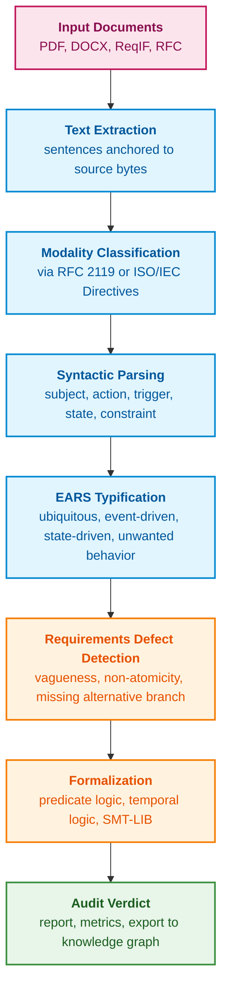
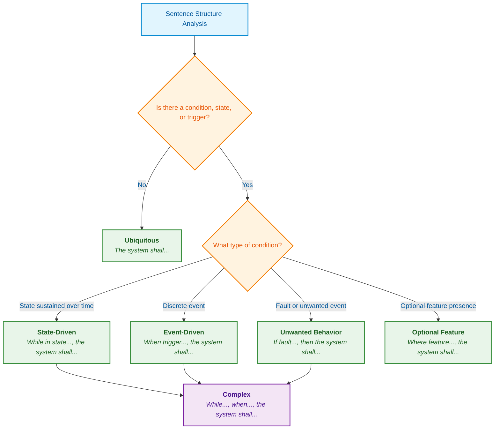
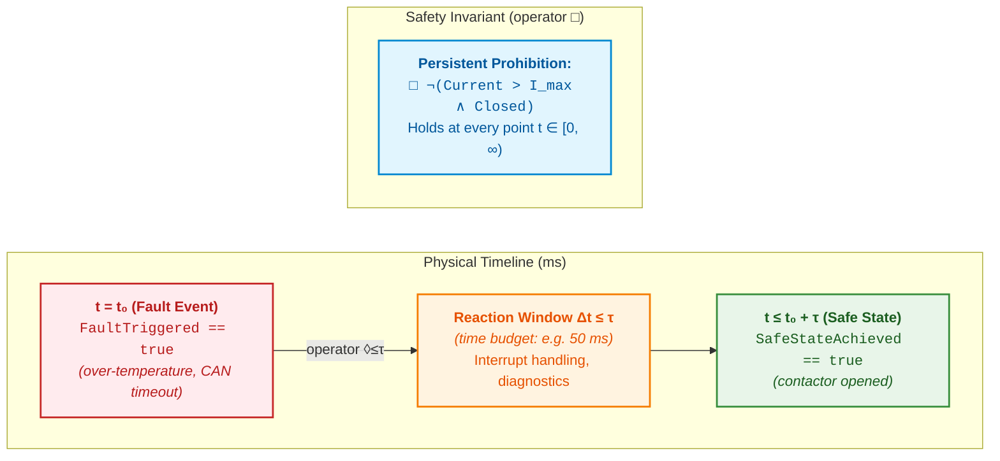
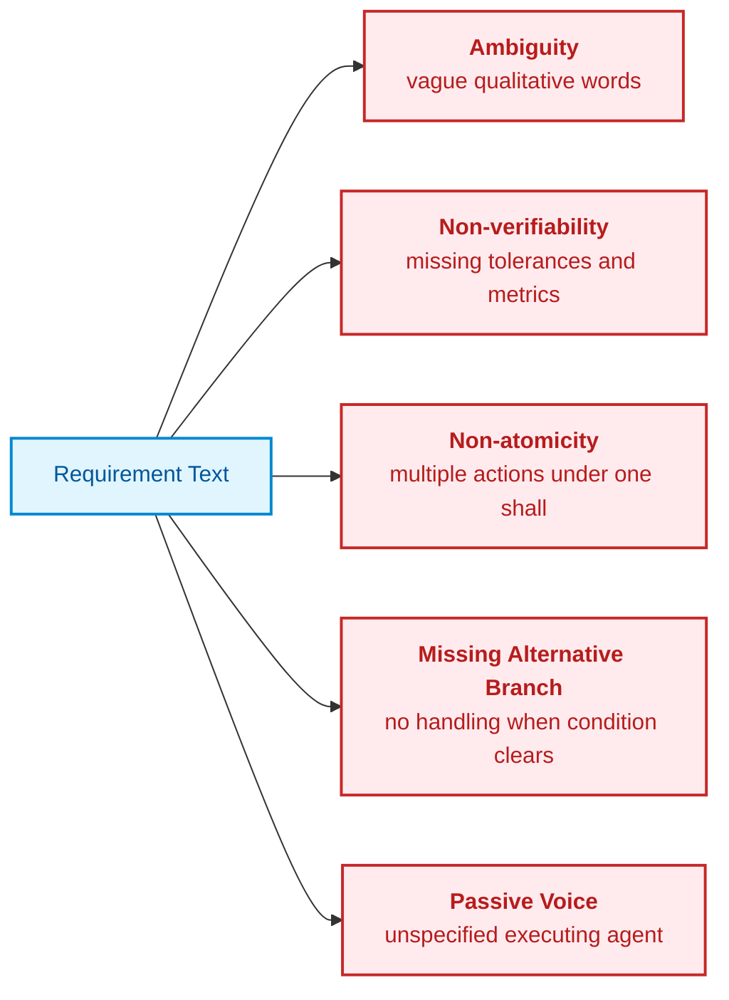
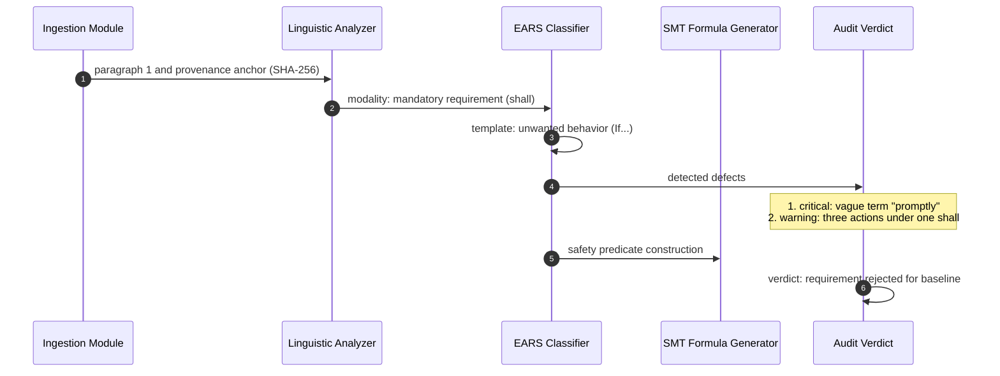

# Chapter 14. Requirements Detection and Formalization: From Normative Text to Invariants

> **Book:** [Architecture of Evidence-Governed Expert Systems](README.md) · [Part III: Knowledge Acquisition, Linguistic Analysis, and Input Assessment](part-03-knowledge-engineering-nlp.md)  
> **Previous Chapter:** [Chapter 13. Natural Language Variability vs. Determinism: Compiling Question Semantics](ch13-language-variability-vs-determinism.md)  
> **Next Chapter:** [Chapter 15. Knowledge Extraction and Knowledge Base Construction: Facts, Grammars, and Automata](ch15-knowledge-extraction-and-kb-construction.md)  
> **Table of Contents:** [README.md](README.md)  
> **Author:** [Mykola Fedchyk](about-the-author.md)  
> **Target Level:** Intermediate and Advanced: Systems engineers, architects, developers, verification and validation (V&V) specialists  
> **Expected Learning Outcomes:** Distinguish normative statements from descriptive sentences according to source document drafting conventions; reduce requirements to EARS templates; translate templates into first-order predicate logic, temporal logic, and SMT-LIB formulas; detect contradictions across requirements using an SMT solver; generate a provenance-anchored requirements quality audit verdict.

## Abstract

This chapter investigates the automated detection of requirements and deontic modalities within technical specifications, industry standards (ISO 26262, DO-178C), and RFCs to synthesize formal invariants for evidence-governed expert systems. The syntactic pitfalls of natural language are analyzed, and an algorithm for classifying requirements via Easy Approach to Requirements Syntax (EARS) grammar templates is proposed. The translation of formalized requirements into first-order predicate logic, Linear Temporal Logic (LTL), and the SMT-LIB format for automated consistency checking via the Z3 solver is examined, establishing a deterministic rule core for the expert system. A deterministic pipeline implementation in Go and an end-to-end engineering case study auditing requirements for an automotive Battery Management System (BMS) are presented.

The engineering of a complex product—ranging from an electric vehicle traction battery management system to airborne flight software—begins not with code, but with requirements. Requirements originate from three primary sources: international and industry standards, customer engineering statements of work (SOW), and component-level datasheets (including hardware errata and silicon technical reference manuals). Requirements specifications frequently arrive as unstructured PDF, DOCX, or structured Requirements Interchange Format (ReqIF) exchange files [[1]](#src-1). Functional safety standards, such as ISO 26262 for automotive road vehicles [[2]](#src-2) or DO-178C for airborne systems [[3]](#src-3), mandate rigorous bidirectional traceability from each requirement through architectural decisions down to implementation source code and verification test cases.

All downstream lifecycle phases, from architectural design to regulatory certification, demand absolute precision; yet the primary sources remain authored in natural language—characterized by vague terminology, passive voice constructions, and qualifying exceptions nested within single sentences. When engineering organizations delegate document analysis to unstructured semantic vector similarity search or unconstrained Large Language Models (LLMs), typical systemic failures occur: the model drops universal quantifiers ("for all"), ignores temporal bounds, conflates advisory recommendations with mandatory prohibitions, and cannot mathematically guarantee completeness of requirements elicitation. In a safety certification audit, an answer stating that "the requirement is most likely satisfied" holds zero epistemic value. Why textual similarity does not equal semantic comprehension is detailed in [Chapter 13](ch13-language-variability-vs-determinism.md).

Hence, the central inquiry of this chapter emerges: **how can requirements in normative documents be automatically discovered and transformed into verifiable formal invariants without losing provenance to the source?** The core thesis posited herein is that a requirement is defined not merely by the lexical presence of the token SHALL, but by deontic modality determined under specific document drafting rules, syntactic sentence structure, and verifiable engineering parameters. The expert system treats a specification like uncompiled source code: it deterministically classifies deontic modality, reduces sentence syntax to a canonical template, compiles the template into formal logic, and verifies logical consistency using an automated theorem prover, with language models relegated solely to proposing candidate structures evaluated by a deterministic host verifier.



This diagram defines the organizational structure of this chapter. The first two stages determine whether a given sentence constitutes a normative requirement at all. The subsequent two stages reduce the recognized requirement to one of a small set of canonical grammatical forms. The final three stages audit quality, compile the requirement into formal logic, and synthesize an audit verdict that can be independently audited by a human certification authority.

## 1. Deontic Modality and Demarcation Criteria for Normative Requirements

Within the lifecycle of functional safety for embedded and cyber-physical systems (governed by ISO 26262-8 and DO-178C Section 5), the knowledge base of an expert system must strictly delineate mandatory normative prescriptions from supplementary engineering commentary. When a linguistic pipeline indiscriminately commits every sentence of a technical specification into the formal rule base, epistemic pollution occurs: the inference engine misinterprets optional recommendations or illustrative examples as mandatory safety invariants. This results in a combinatorial explosion of the state space, false alarms, or artificial inconsistency within the system. The foundation of rigorous engineering requirements parsing lies in the mathematical isolation of **deontic modality**—the modal logic of obligation, prohibition, and permission.

A technical document contains far more than actionable requirements. It encompasses design rationale, informative notes, application examples, and usability guidelines. The grammatical modality of a sentence governs whether it obligates, prohibits, recommends, permits, or merely describes the operating context of the system.

Deontic modality is governed by document drafting conventions, and distinct document families adhere to divergent rule sets. RFC 2119 establishes the normative keywords governing Internet technical specifications: MUST, SHALL, and REQUIRED denote mandatory requirements; MUST NOT and SHALL NOT designate prohibitions; SHOULD and RECOMMENDED denote recommendations; MAY and OPTIONAL indicate permissions [[4]](#src-4). RFC 8174 clarifies that these terms carry normative force exclusively when rendered in uppercase [[5]](#src-5). Conversely, ISO and IEC standards are drafted under entirely different rules: Part 2 of the ISO/IEC Directives defines lowercase verbal forms, wherein shall denotes a mandatory requirement, should a recommendation, may a permission, can a physical possibility or capability, and must designates an external constraint that does not originate as a requirement of the standard itself [[6]](#src-6).

A robust classifier must explicitly incorporate both the drafting convention and the functional role of the enclosing section. While RFC 8174 reserves normative force for capitalized markers, the absence of an uppercase keyword does not conclusively prove that a sentence lacks normative intent. An obligation may be formulated in natural language or by explicit cross-reference to another clause. Consequently, keyword detection yields a candidate modality; citations, examples, and informative notes must be evaluated independently. An unrecognized document convention must never silently default to a "descriptive statement."

| Normative Strength | RFC 2119 & RFC 8174 Markers | ISO/IEC Directives Markers | Expert System Action |
|---|---|---|---|
| **Mandatory requirement** | MUST, SHALL, REQUIRED | shall | Creates a mandatory invariant; requires traced verification |
| **Prohibition** | MUST NOT, SHALL NOT | shall not | Creates a safety invariant ("state never occurs"); schedules negative tests |
| **Recommendation** | SHOULD, RECOMMENDED | should | Establishes a soft constraint; deviation requires recorded justification |
| **Discouraged action** | SHOULD NOT, NOT RECOMMENDED | should not | Emits an architectural review warning |
| **Permission** | MAY, OPTIONAL | may, need not | Registers an optional capability; does not constitute grounds for release rejection |
| **Possibility or capability** | None | can, cannot | Records a system property rather than a requirement |
| **External constraint** | None | must | Records an environmental prerequisite, such as statutory law or physical constraint |
| **Statement of fact** | Lowercase, is, will | is, will | Records operational context; does not constitute a requirement |

This comparison demonstrates that an identical lexical token possesses divergent normative force across distinct documentation standards. Consequently, modality classifications must be persisted alongside an explicit convention identifier, enabling human reviewers to verify the precise rules under which the expert system classified each statement.

### 1.1. Syntactic Pitfalls and Semantic Ambiguity of Natural Language

Searching for the token SHALL using regular expressions identifies only a superficial subset of genuine requirements. Real-world engineering documents are authored by diverse individuals—often non-native speakers—and exhibit three ubiquitous syntactic failure modes.

**Agentless passive voice.** In the sentence *"Data shall be validated before transmission"*, the executing agent is unspecified: it remains ambiguous whether data validation is performed by the sensor driver, the communications controller, or the supervisory application layer. A requirement devoid of an executing agent cannot be assigned to an architectural component, rendering bidirectional traceability down to source code impossible. Dependency syntactic parsing, as detailed in [Chapter 13](ch13-language-variability-vs-determinism.md#31-syntactic-dependency-parsing-and-actant-extraction), detects the missing nominal subject (`nsubj`), providing formal justification to reject the requirement back to the author.

**Latent normativity.** Statements such as *"The ECU is responsible for monitoring battery voltage"* or *"The firmware needs to reboot if a watchdog timeout occurs"* omit the token shall, yet functionally express mandatory obligations. To capture these requirements, the expert system maintains a dictionary of quasi-modal verbal constructs (*is responsible for*, *has to*, *needs to*, *is required to*), flagging matched sentences as normative candidates for human validation.

**In-sentence qualifying exceptions.** The sentence *"The system shall maintain 50 Hz PWM frequency under all load conditions, except during initial power-up calibration where 20 Hz is permitted for a maximum of 200 ms"* multiplexes a universal requirement, an exceptional trigger condition, an alternative operational mode, and a strict temporal limit into a single sentence. The expert system must decompose such complex sentences into atomic logical branches; otherwise, the exception will be lost during downstream formalization.

Therefore, deontic modality and syntactic structure must be analyzed concurrently: modality identifies whether a sentence establishes a requirement, while syntax extracts who, when, and what action must be executed. The subsequent stage reduces these diverse grammatical structures into a constrained set of canonical templates.

## 2. EARS Templates: Structural Standardization of Engineering Requirements

Unconstrained natural language text presents severe obstacles to formal logical reasoning: authors entangle preconditions, introduce convoluted subordinate clauses, and obscure negation scopes. When an automated parser attempts to synthesize an abstract syntax tree (AST) directly from unrestricted prose, semantic role labeling error rates routinely exceed 40%. To ensure reliable semantic translation, requirements must first be normalized into a constrained grammatical framework.

The most widely adopted framework is the Easy Approach to Requirements Syntax (EARS), introduced in 2009 by Alistair Mavin and colleagues at Rolls-Royce for aircraft engine control systems [[7]](#src-7). EARS restricts requirement formulations to a small set of canonical patterns, where each template corresponds to a distinct conditional structure.



This decision tree evaluates two fundamental criteria: whether a conditional trigger exists, and what operational category it belongs to. The outcome determines the assigned EARS template, which directly dictates the formal logical schema examined in the next section.

**Ubiquitous requirement.** Applies continuously and unconditionally across the entire operational lifespan of the system. Template: `The <system name> shall <system response>.` Example: *"The CAN controller shall support extended 29-bit identifiers."*

**Event-driven requirement.** Specifies an immediate, discrete operational response triggered by an external or internal event. Template: `When <trigger>, the <system name> shall <system response>.` Example: *"When the E-STOP button is pressed, the motor driver shall disable gate drive outputs within 5 ms."*

**State-driven requirement.** Active exclusively while the system remains within a specific operational state or mode. Template: `While <in a specific state>, the <system name> shall <system response>.` Example: *"While in PRE-CHARGE mode, the BMS shall limit the pre-charge resistor current to 10 A."*

**Unwanted behavior response.** Governs fault handling, protocol violations, or safety limit excursions. Template: `If <trigger>, then the <system name> shall <system response>.` Example: *"If the cell temperature exceeds 65 °C, then the cooling controller shall activate the refrigerant pump at 100% duty cycle."*

**Optional feature requirement.** Applies only when a specific hardware option, software module, or feature license is configured. Template: `Where <feature is included>, the <system name> shall <system response>.` Example: *"Where the hardware watchdog is populated, the CPU supervisor shall toggle the WDI pin every 50 ms."*

**Complex requirement.** Combines multiple conditional clauses, such as an operational state and a discrete triggering event: *"While in CHARGING state, when the charge plug is unlocked, the charger shall open the high-voltage interlock loop within 10 ms."*

While EARS standardizes conditional clauses and system responses, it does not inherently define a singular formal mathematical semantics. A state-driven requirement may denote a continuous invariant, a bounded-time response, or an entry condition depending on the action verb and temporal context. Non-conformance to EARS signals a need for engineering review rather than an absolute specification flaw. Formal preconditions, measurement units, and exception paths must be modeled explicitly.

## 3. Mathematical Formalization: From Templates to Formal Logic

EARS templates structure textual requirements, but automated verification requires formal mathematical notation. To enable algorithmic consistency checking, templates are compiled into formal logic: first-order predicate logic, temporal logic, or the SMT-LIB standard accepted by automated theorem provers.

### 3.1. First-Order Predicate Logic

In evidence-governed expert systems, requirements governing stateful control automata are formalized as strict *assume-guarantee contracts* over a discrete state space $\mathcal{S}$, an input telemetry vector $\mathbf{x}\in\mathcal{X}$, and a control output vector $\mathbf{y}\in\mathcal{Y}$:

```math
\forall s\in\mathcal{S},\ \forall\mathbf{x}\in\mathcal{X}:\quad \Phi_{\mathrm{pre}}(s,\mathbf{x})\Rightarrow\exists s'\in\mathcal{S},\ \exists\mathbf{y}\in\mathcal{Y}:\ \bigl(\Phi_{\mathrm{post}}(s',\mathbf{y})\land\mathcal{T}(s,s')\bigr)
```

Parameters and formal contract components:

- $\mathcal{S}$ denotes the finite state space of the automaton (e.g., $\mathcal{S} = \{\text{INIT}, \text{STANDBY}, \text{CHARGE}, \text{DISCHARGE}, \text{FAULT}\}$);
- $\mathbf{x} \in \mathcal{X} \subseteq \mathbb{R}^n$ represents the vector of continuous and discrete input signals from sensor telemetry (cell voltages, pack current, temperatures, command flags);
- $\mathbf{y} \in \mathcal{Y} \subseteq \mathbb{R}^m$ represents the vector of control actions emitted by the system (PWM duty cycles, contactor driver signals);
- $s, s' \in \mathcal{S}$ denote the current and successor operational states of the controller;
- $\Phi_{\mathrm{pre}}(s,\mathbf{x}): \mathcal{S} \times \mathcal{X} \to \{\text{True}, \text{False}\}$ is the contract precondition predicate, unifying the active state (`While`), discrete event trigger (`When`), and fault condition (`If`);
- $\Phi_{\mathrm{post}}(s',\mathbf{y}): \mathcal{S} \times \mathcal{Y} \to \{\text{True}, \text{False}\}$ is the postcondition predicate defining the mandatory response (`shall`);
- $\mathcal{T}(s,s'): \mathcal{S} \times \mathcal{S} \to \{\text{True}, \text{False}\}$ specifies the automaton transition relation, constraining permissible state transitions and switching time budgets $`\Delta t \le t_{\mathrm{timeout}}`$.

Practical application and engineering conclusions:
- **Completeness verification (Non-blocking):** An SMT solver verifies that for every state-input pair $(s, \mathbf{x})$ satisfying $\Phi_{\mathrm{pre}}$, there exists at least one valid successor state and control output. If an input vector $\mathbf{x}^*$ is discovered for which no transition exists, the verifier flags an incompleteness defect: `REQ_DEFECT_DEADLOCK`.
- **Determinism verification:** If an identical pair $(s, \mathbf{x})$ admits contradictory successor pairs $(s'_1, \mathbf{y}_1) \ne (s'_2, \mathbf{y}_2)$, the verifier flags an ambiguity defect: `REQ_DEFECT_AMBIGUITY`. Non-deterministic specifications are blocked from baseline deployment until reconciled by the systems architect.

### 3.2. Linear Temporal Logic (LTL) for Temporal Invariants

Embedded systems operate over continuous physical time; hence, static propositional predicates are insufficient. Amir Pnueli introduced Linear Temporal Logic (LTL) to reason formally about concurrent and reactive programs [[8]](#src-8). Within LTL, the modal operator $\Box$ represents "always (globally in all future states)", while $\Diamond$ denotes "eventually (in some future state)". Metric Temporal Logic (MTL), formulated for real-time systems by Ron Koymans, augments these modalities with explicit temporal bounds, such that $\Diamond_{\le\tau}$ specifies "eventually within a maximum time bound $\tau$" [[9]](#src-9). Signal Temporal Logic (STL), introduced by Maler and Nickovic, extends these formulations over continuous real-valued signals, such as electrical current or thermal gradients [[10]](#src-10).

Two canonical property archetypes dominate safety specifications. A **safety invariant** asserts that a catastrophic system state can never occur:

```math
\Box\,\neg\bigl(\mathit{Current}>I_{\max}\land\mathit{ContactorState}=\mathit{CLOSED}\bigr)
```

Parameters and physical dimensions:

- $\mathit{Current} \in \mathbb{R}_{\ge 0}$ denotes the physically measured traction bus current in amperes ($\text{A}$);
- $I_{\max} \in \mathbb{R}_{> 0}$ represents the maximum allowable overcurrent cutoff threshold in amperes ($\text{A}$), derived from the busbar thermal limit (e.g., $I_{\max} = 450\,\text{A}$);
- $\mathit{ContactorState} \in \{\mathit{OPEN}, \mathit{CLOSED}\}$ designates the physical state of the high-voltage contactor;
- $\Box$ is the LTL temporal operator "always", requiring satisfaction across all discrete time steps $t \in [0, \infty)$;
- $\neg$ and $\land$ represent standard logical negation and conjunction operators.

Practical application and engineering conclusions:
- **Hardware monitoring:** This safety condition is enforced by an independent analog/hardware supervisor operating at a sampling rate of $\ge 10\,\text{kHz}$, isolated from main microcontroller load.
- **Fail-safe action:** Upon detecting $\mathit{Current} > I_{\max}$ while $\mathit{ContactorState} = \mathit{CLOSED}$, dedicated hardware interlocks trigger a pyrotechnic disconnect within $t_{\mathrm{reaction}} \le 2\,\text{ms}$, galvanically isolating the high-voltage traction bus.

**Bounded liveness** asserts that upon the occurrence of a fault, transition to a designated safe state is guaranteed to complete within an explicit temporal tolerance:

```math
\Box\Bigl(\mathit{FaultTriggered}\Rightarrow\Diamond_{\le\tau}\,\mathit{SafeStateAchieved}\Bigr)
```

Parameters and temporal tolerances:

- $\mathit{FaultTriggered} \in \{\text{True}, \text{False}\}$ denotes the discrete latch indicating fault inception (e.g., cell overtemperature $> 60\,^{\circ}\text{C}$ or CAN communication bus-off);
- $\mathit{SafeStateAchieved} \in \{\text{True}, \text{False}\}$ records the verified fact that the system has entered its certified safe state (contactors opened, high-voltage bus discharged);
- $\tau \in \mathbb{R}_{> 0}$ is the maximum allowable response latency in milliseconds ($\text{ms}$), strictly bounded by the safety standard's Fault Tolerant Time Interval: $\tau \le \text{FTTI} - \Delta t_{\mathrm{margin}}$ (e.g., $\tau = 50\,\text{ms}$ under an $\text{FTTI} = 100\,\text{ms}$);
- $\Diamond_{\le\tau}$ is the MTL metric temporal operator "eventually within the next $\tau$ time units".

Practical application and engineering conclusions:
- **Testbench verification:** During Hardware-in-the-Loop (HIL) fault-injection testing, the end-to-end response latency is empirically measured: $`\Delta t_{\mathrm{meas}} = t_{\mathrm{safe}} - t_{\mathrm{fault}}`$.
- **Pass/Fail criterion:** The test suite passes if and only if $`\max(\Delta t_{\mathrm{meas}}) \le \tau`$. If any single test run yields $`\Delta t_{\mathrm{meas}} > \tau`$, the automated harness raises a blocking fault `E_FTTI_TIMEOUT_BREACH`, and the requirement is rejected as unachievable on the target hardware architecture.



> [!TIP]
> **The Vacuous Truth Pitfall**  
> In formal logic, the conditional expression $A \Rightarrow B$ evaluates to true whenever $A = \text{False}$ (*ex falso quodlibet*). If during automated testing the antecedent $\mathit{FaultTriggered}$ is never asserted by the testbench harness (for instance, if an environment simulator fails to synthesize a cell thermal excursion above $100\,^{\circ}\text{C}$), an automated verifier will report: *"Requirement successfully verified at 100%!"*. In reality, the safe-state transition logic was never exercised. To prevent vacuous verification, the auditing pipeline must accompany every implication with an antecedent reachability test, verifying that $\Diamond\,\Phi_{\mathrm{pre}}$ is satisfied in at least one execution trace.

The table below maps canonical EARS templates to representative formal logical representations. These mappings represent pedagogical illustrations rather than a singular universal compiler: the choice of temporal model, time step discretization, and quantifier domain remains an explicit formalization decision.

| EARS Template | Natural Language Requirement Example | Formal Logical Representation |
|---|---|---|
| Ubiquitous | The CAN controller shall support extended 29-bit identifiers. | $`\Box\,\mathit{Supports}(\mathit{CAN},\mathit{Ext29})`$ |
| Event-Driven | When the E-STOP button is pressed, the motor driver shall disable gate drive outputs within 5 ms. | $`\Box\bigl(\mathit{Pressed}\Rightarrow\Diamond_{\le5\,\mathrm{ms}}\,\mathit{Disabled}\bigr)`$ |
| State-Driven | While in PRE-CHARGE mode, the BMS shall limit the pre-charge resistor current to 10 A. | $`\Box\bigl(\mathit{State}=\mathit{PRECHARGE}\Rightarrow\mathit{Current}\le10\,\mathrm{A}\bigr)`$ |
| Unwanted Behavior | If the cell temperature exceeds 65 °C, then the cooling controller shall activate the refrigerant pump at 100% duty cycle. | $`\Box\bigl(\mathit{Temp}>65\Rightarrow\mathit{PumpDuty}=1.0\bigr)`$ |
| Optional Feature | Where the hardware watchdog is populated, the CPU supervisor shall toggle the WDI pin every 50 ms. | $`\mathit{HasWatchdog}\Rightarrow\Box\,(\mathit{ToggleInterval}=50\,\mathrm{ms})`$ |

These mappings must be validated against quantifier scopes, temporal deadlines, concurrency semantics, cancellation conditions, and signal naming bindings. Systems engineers must distinguish between the existence of a permissible response and universal conformance across all operational execution traces.

### 3.3. Automated Requirements Consistency Verification via SMT Solver

Mathematical formulas cannot verify themselves; verification is executed by an **SMT solver** (*Satisfiability Modulo Theories*). An SMT solver determines whether there exists a variable assignment that simultaneously satisfies a set of first-order constraints with respect to background theories such as linear arithmetic, bit-vectors, and arrays. A leading industrial SMT solver is Z3, developed by Leonardo de Moura and Nikolaj Bjørner [[11]](#src-11), with formulas expressed in the standardized SMT-LIB language [[12]](#src-12).

For an expert system, the most critical capability of an SMT solver is detecting logical contradictions across distributed requirements. Consider two requirements for an automotive Battery Management System (BMS). REQ-BMS-042 dictates that if cell temperature exceeds $60\,^{\circ}\text{C}$, the BMS shall open the main contactor. REQ-BMS-077 specifies that while in charging mode, the BMS shall maintain the contactor closed. In isolation, each requirement appears sound. The SMT-LIB script below verifies whether both requirements can be satisfied simultaneously when cells overheat during active charging; each assertion is tagged with a named identifier, enabling the solver to isolate the conflicting clauses:

<details>
<summary>Formal SMT-LIB Model</summary>

```lisp
(set-option :produce-unsat-cores true)
(declare-datatype BmsState ((INIT) (STANDBY) (CHARGE) (DISCHARGE) (FAULT)))
(declare-const state BmsState)
(declare-const cell_temp_c Real)
(declare-const contactor_closed Bool)

; REQ-BMS-042 (If): if cell temperature exceeds 60 °C, the BMS opens the contactor.
(assert (! (=> (> cell_temp_c 60.0) (not contactor_closed)) :named REQ_BMS_042))

; REQ-BMS-077 (While): while in CHARGE mode, the BMS maintains the contactor closed.
(assert (! (=> (= state CHARGE) contactor_closed) :named REQ_BMS_077))

; Scenario: cells overheat during charging.
(assert (! (and (= state CHARGE) (> cell_temp_c 60.0)) :named SCENARIO))

(check-sat)
(get-unsat-core)
```

</details>

This model can be solved programmatically using Python's `z3-solver` bindings (`pip install z3-solver`) via the `Z3_eval_smtlib2_string` interface. Running Z3 (version 5.1.0) yields:

<details>
<summary>Solver Output</summary>

```text
unsat
(REQ_BMS_042 REQ_BMS_077 SCENARIO)
```

</details>

The verdict `unsat` proves that the formalized assertions are mutually incompatible under the specified scenario. The *unsat core* identifies the minimal conflicting subset of assertions responsible for the contradiction. However, the solver output does not determine *how* the contradiction should be resolved. Incorporating an explicit boundary guard `(<= cell_temp_c 60.0)` into the charging requirement represents one viable remediation, but requires formal architectural approval. Achieving `sat` following modification proves model satisfiability, yet does not inherently guarantee physical safety. Furthermore, solver timeouts or an `unknown` status must never be conflated with satisfiability or unsatisfiability.

This case illustrates the boundaries of formal methods: an SMT solver detects contradictions strictly within the formalized model as constructed by the engineer. If the variable `cell_temp_c` maps incorrectly to physical sensor telemetry, the solver cannot detect the discrepancy. Hence, formal models must undergo peer review, and solver verdicts serve as certifiable proof only when bundled with complete provenance linking the model to specific baseline specification revisions.

## 4. Metrics and Automated Quality Auditing of Requirements (Requirements Smells)

Formalization can succeed only when applied to high-quality requirements. ISO/IEC/IEEE 29148:2018 defines the essential characteristics of well-formed requirements: they must be necessary, unambiguous, complete, singular, feasible, verifiable, and correct [[13]](#src-13). Henning Femmer and colleagues proposed detecting violations of these criteria via automated "requirements smells": subjective language, ambiguous adverbs and adjectives, non-verifiable open-ended terms, comparatives without reference baselines, negative assertions, vague pronouns, and broken cross-references [[14]](#src-14).



This taxonomy classifies defects by their engineering consequences: an ambiguous requirement is interpreted inconsistently across engineering teams; a non-verifiable requirement cannot be validated by an automated test; a non-atomic requirement prevents clean 1:1 test traceability; and an omitted alternative branch forces downstream software developers to invent ad-hoc recovery behavior.

**Ambiguity and vague terminology.** Words such as *fast*, *promptly*, *immediately*, *as soon as possible*, *user-friendly*, *robust*, *adequate*, *approximately*, or *etc.* lack physical dimensions. The expert system flags these tokens and recommends quantifiable replacements: substituting *promptly* with an explicit time bound (e.g., $`t \le 15\,\text{ms}`$), or replacing *approximately* with a nominal value and tolerance band.

**Non-atomicity.** The statement *"The gateway shall parse the incoming CAN message, verify the CRC, update the internal state machine, and transmit an acknowledgment frame"* bundles four distinct actions under a single modal verb. If the CRC check fails, the requirement's fulfillment status becomes indeterminate ("partially fulfilled"), violating ISO 26262 requirements that mandate distinct verification tests mapped to atomic requirements.

**Missing alternative branch.** The requirement *"If the battery temperature exceeds 55 °C, the cooling fan shall turn ON"* fails to specify when the fan must turn OFF. If the deactivation threshold is set identically to $55\,^{\circ}\text{C}$, the control relay will oscillate around the boundary (*chattering*). The correct engineering pattern requires explicit hysteresis: activating when $`T > 55\,^{\circ}\mathrm{C}`$ and deactivating only when $`T \le 48\,^{\circ}\mathrm{C}`$. Without a paired requirement, the implementer will select an arbitrary threshold that bypasses architectural review.

**Agentless passive voice.** As established, requirements lacking a grammatical subject cannot be assigned to an architectural component. The expert system flags these instances, prompting the author to designate the specific hardware or software entity responsible for execution.

Automated auditing produces candidate requirements for formalization alongside actionable defect reports. However, multi-action clauses, omitted branches, or open-ended timelines represent review signals rather than universal defects: a composite sentence may describe an indivisible atomic transaction, or a boundary condition may intentionally remain unconstrained. Baseline readiness requires domain expert approval, rather than mere absence of detected smells.

## 5. Software Implementation: Deterministic Analysis Pipeline in Go

The stages described above are unified into a minimal, deterministic analysis pipeline implemented in Go. The pipeline determines deontic modality based on document conventions, parses sentence structure against EARS templates, and audits for vague terminology, non-atomicity, generic subjects, and missing response deadlines. The implementation relies strictly on the Go standard library and is executed via `go run main.go`.

<details>
<summary>Go Implementation: Deterministic Requirements Audit Pipeline</summary>

```go
package main

import (
	"crypto/sha256"
	"fmt"
	"regexp"
	"strconv"
	"strings"
)

// Convention defines the drafting rules of the source document.
type Convention int

const (
	RFC2119       Convention = iota // BCP 14: normative only when UPPERCASE (RFC 8174)
	ISODirectives                   // ISO/IEC Directives, Part 2: lowercase verbal forms
)

type Modality string

const (
	Requirement        Modality = "REQUIREMENT"
	Prohibition        Modality = "PROHIBITION"
	Recommendation     Modality = "RECOMMENDATION"
	NotRecommended     Modality = "NOT_RECOMMENDED"
	Permission         Modality = "PERMISSION"
	Capability         Modality = "CAPABILITY"          // ISO: can, cannot
	ExternalConstraint Modality = "EXTERNAL_CONSTRAINT" // ISO: must
	Statement          Modality = "STATEMENT"
	UnknownConvention  Modality = "UNKNOWN_CONVENTION"
)

type rule struct {
	re *regexp.Regexp
	m  Modality
}

// Negative forms are evaluated prior to affirmative forms.
var rules = map[Convention][]rule{
	RFC2119: {
		{regexp.MustCompile(`\b(MUST NOT|SHALL NOT)\b`), Prohibition},
		{regexp.MustCompile(`\b(MUST|SHALL|REQUIRED)\b`), Requirement},
		{regexp.MustCompile(`\b(SHOULD NOT|NOT RECOMMENDED)\b`), NotRecommended},
		{regexp.MustCompile(`\b(SHOULD|RECOMMENDED)\b`), Recommendation},
		{regexp.MustCompile(`\b(MAY|OPTIONAL)\b`), Permission},
	},
	ISODirectives: {
		{regexp.MustCompile(`(?i)\bshall not\b`), Prohibition},
		{regexp.MustCompile(`(?i)\bshall\b`), Requirement},
		{regexp.MustCompile(`(?i)\bshould not\b`), NotRecommended},
		{regexp.MustCompile(`(?i)\bshould\b`), Recommendation},
		{regexp.MustCompile(`(?i)\bmay\b`), Permission},
		{regexp.MustCompile(`(?i)\bmust\b`), ExternalConstraint},
		{regexp.MustCompile(`(?i)\bcan(not)?\b`), Capability},
	},
}

func ClassifyModality(text string, c Convention) Modality {
	patterns, known := rules[c]
	if !known {
		return UnknownConvention
	}
	for _, r := range patterns {
		if r.re.MatchString(text) {
			return r.m
		}
	}
	return Statement
}

type EARS string

// EARS templates (Mavin et al., 2009); first match takes precedence.
var earsPatterns = []struct {
	kind EARS
	re   *regexp.Regexp
}{
	{"COMPLEX", regexp.MustCompile(`(?i)^While (?P<state>.+?), when (?P<trigger>.+?), the (?P<subject>[\w -]+?) shall (?P<action>.+?)\.?$`)},
	{"UNWANTED_BEHAVIOUR", regexp.MustCompile(`(?i)^If (?P<trigger>.+?), then the (?P<subject>[\w -]+?) shall (?P<action>.+?)\.?$`)},
	{"STATE_DRIVEN", regexp.MustCompile(`(?i)^While (?P<state>.+?), the (?P<subject>[\w -]+?) shall (?P<action>.+?)\.?$`)},
	{"EVENT_DRIVEN", regexp.MustCompile(`(?i)^When (?P<trigger>.+?), the (?P<subject>[\w -]+?) shall (?P<action>.+?)\.?$`)},
	{"OPTIONAL_FEATURE", regexp.MustCompile(`(?i)^Where (?P<feature>.+?), the (?P<subject>[\w -]+?) shall (?P<action>.+?)\.?$`)},
	{"UBIQUITOUS", regexp.MustCompile(`(?i)^The (?P<subject>[\w -]+?) shall (?P<action>.+?)\.?$`)},
}

func ParseEARS(text string) (EARS, map[string]string) {
	for _, p := range earsPatterns {
		m := p.re.FindStringSubmatch(text)
		if m == nil {
			continue
		}
		g := map[string]string{}
		for i, name := range p.re.SubexpNames() {
			if name != "" {
				g[name] = m[i]
			}
		}
		return p.kind, g
	}
	return "NON_CONFORMANT", nil
}

var (
	reTiming   = regexp.MustCompile(`(?i)\b(?:within|no later than|in less than)\s+(\d+(?:\.\d+)?)\s*(ms|s)\b`)
	reVague    = regexp.MustCompile(`(?i)\b(promptly|quickly|as soon as possible|user[- ]friendly|robust|adequate|sufficient(?:ly)?|approximately|etc)\b`)
	reTwoVerbs = regexp.MustCompile(`(?i)\band (?:then )?(open|close|set|send|transmit|notify|flash|update|verify|validate|disable|enable|activate|trigger|log|store)\b`)
)

type Finding struct{ Severity, Code, Detail string }

func Audit(text string, c Convention) (Modality, EARS, float64, []Finding) {
	mod := ClassifyModality(text, c)
	if mod == UnknownConvention {
		return mod, "UNASSESSED", 0, []Finding{{"CRITICAL", "UNKNOWN_CONVENTION", "document convention is not defined"}}
	}
	if mod != Requirement && mod != Prohibition {
		return mod, "", 0, nil // sentence is not audited as a requirement
	}
	kind, g := ParseEARS(text)
	var f []Finding
	if kind == "NON_CONFORMANT" {
		f = append(f, Finding{"CRITICAL", "NON_CONFORMANT_EARS", "no EARS template matches"})
	}
	if w := reVague.FindString(text); w != "" {
		f = append(f, Finding{"CRITICAL", "VAGUE_TERM", fmt.Sprintf("%q is not objectively verifiable", w)})
	}
	if v := reTwoVerbs.FindStringSubmatch(g["action"]); v != nil {
		f = append(f, Finding{"WARNING", "NON_ATOMIC", fmt.Sprintf("second action %q under one shall", v[1])})
	}
	if s := strings.ToLower(g["subject"]); s == "system" || s == "software" {
		f = append(f, Finding{"WARNING", "GENERIC_SUBJECT", fmt.Sprintf("subject %q names no component", s)})
	}
	var ms float64
	if t := reTiming.FindStringSubmatch(g["action"]); t != nil {
		ms, _ = strconv.ParseFloat(t[1], 64)
		if strings.EqualFold(t[2], "s") {
			ms *= 1000
		}
	} else if kind == "EVENT_DRIVEN" || kind == "UNWANTED_BEHAVIOUR" {
		f = append(f, Finding{"CRITICAL", "MISSING_TIME_BOUND", "reaction without a deadline"})
	}
	return mod, kind, ms, f
}

func main() {
	samples := []struct {
		id   string
		conv Convention
		text string
	}{
		{"REQ-1", ISODirectives, "When the cell temperature exceeds 60 °C, the BMS shall open the main contactor within 100 ms."},
		{"REQ-2", ISODirectives, "The system shall promptly validate incoming CAN messages and flash the status LED."},
		{"REQ-3", ISODirectives, "If the CAN bus is lost, then the gateway shall enter the SAFE state."},
		{"REQ-4", ISODirectives, "The installer must follow local electrical codes."},
		{"REQ-5", RFC2119, "The client should retry the connection."},
	}
	for _, s := range samples {
		mod, kind, ms, findings := Audit(s.text, s.conv)
		sum := sha256.Sum256([]byte(s.text))
		if kind == "" {
			fmt.Printf("%s sha256:%x %s (not audited as a requirement)\n", s.id, sum[:4], mod)
			continue
		}
		fmt.Printf("%s sha256:%x %s %s deadline=%gms parser_checks_passed=%v\n",
			s.id, sum[:4], mod, kind, ms, !hasCritical(findings))
		for _, f := range findings {
			fmt.Printf("    [%s] %s: %s\n", f.Severity, f.Code, f.Detail)
		}
	}
}

func hasCritical(fs []Finding) bool {
	for _, f := range fs {
		if f.Severity == "CRITICAL" {
			return true
		}
	}
	return false
}
```

Negative test cases in `audit_test.go` verify deadline scoping and convention isolation; command: `go test -v main.go audit_test.go`.

```go
package main

import "testing"

func TestDeadlineScopeAndConvention(testCase *testing.T) {
	text := "When the input arrives within 2 s, the gateway shall respond within 100 ms."
	_, _, deadline, findings := Audit(text, ISODirectives)
	if deadline != 100 || hasCritical(findings) {
		testCase.Fatalf("trigger time became action deadline: %g %v", deadline, findings)
	}
	text = "When the input arrives within 2 s, the gateway shall respond."
	_, _, deadline, findings = Audit(text, ISODirectives)
	if deadline != 0 || !hasCritical(findings) {
		testCase.Fatal("trigger time concealed missing response deadline")
	}
	modality, _, _, findings := Audit("The gateway shall respond.", Convention(99))
	if modality != UnknownConvention || !hasCritical(findings) {
		testCase.Fatal("unknown convention silently accepted")
	}
	if ClassifyModality("The client MUST NOT retry.", RFC2119) != Prohibition {
		testCase.Fatal("negative normative marker lost")
	}
}
```

Program execution output:

```text
REQ-1 sha256:0d8de9d2 REQUIREMENT EVENT_DRIVEN deadline=100ms parser_checks_passed=true
REQ-2 sha256:96ae8a8f REQUIREMENT UBIQUITOUS deadline=0ms parser_checks_passed=false
    [CRITICAL] VAGUE_TERM: "promptly" is not objectively verifiable
    [WARNING] NON_ATOMIC: second action "flash" under one shall
    [WARNING] GENERIC_SUBJECT: subject "system" names no component
REQ-3 sha256:7ba442f9 REQUIREMENT UNWANTED_BEHAVIOUR deadline=0ms parser_checks_passed=false
    [CRITICAL] MISSING_TIME_BOUND: reaction without a deadline
REQ-4 sha256:611be070 EXTERNAL_CONSTRAINT (not audited as a requirement)
REQ-5 sha256:cdf96e2a STATEMENT (not audited as a requirement)
```

</details>

This output highlights the bounded scope of the implemented heuristics. REQ-1 matches an event-driven template with an explicit 100 ms deadline, yet this syntactic compliance does not constitute approved status. For REQ-2, the pipeline flags *promptly*, multiple actions, and an ungrounded generic subject. For REQ-3, the parser notes an omitted response deadline. REQ-4 reflects an external constraint under the ISO/IEC Directives. For REQ-5, lowercase should does not acquire normative force under RFC 8174; full normative status requires document-level context. The SHA-256 digest anchors results to immutable source text, but does not prove classification correctness.

The metric `parser_checks_passed` indicates conformance strictly to automated syntactic heuristics, not readiness for baseline sign-off. `STATEMENT` denotes the absence of a recognized normative keyword, not verified absence of normative obligations. Regular expressions cannot resolve modality scope, nested quotations, multi-part deadlines, or the physical implications of terms like "immediately". Numerical tolerances, operators, and units must be persisted in an intermediate representation with cryptographic source provenance; low classification confidence must trigger human-in-the-loop escalation. Syntactic checks never substitute for subject-matter approval.

## 6. Practical Case Study: Battery Management System (BMS) Audit under ISO 26262

Consider an excerpt from an engineering Software Requirements Specification (SRS) for a traction battery management system classified at Automotive Safety Integrity Level ASIL C under ISO 26262:

<details>
<summary>Sample Requirements Excerpt</summary>

```text
Document: SRS_HV_Battery_Management_v2.4.docx
Section: 5.3 Safety Mechanisms and Thermal Runaway Prevention

Paragraph 1:
"If an over-temperature condition (cell temperature > 60°C) is detected by the analog front-end,
the BMS controller shall promptly open the pyrotechnic switch, set the fault register to 0xEF,
and notify the vehicle VCU via CAN message within 50 ms."

Paragraph 2:
"The battery status should be robust and user-friendly under normal driving states."
```

</details>

Paragraph 1 represents a mandatory safety requirement; Paragraph 2 represents an advisory recommendation containing two qualitative smells. The sequence diagram below traces how Paragraph 1 is audited across the pipeline:



The audit produces four primary outputs:

1. **Source provenance.** The audit record anchors the verdict to `SRS_HV_Battery_Management_v2.4.docx`, its cryptographic SHA-256 hash, Section 5.3, and Paragraph 1.
2. **Decomposition.** The condition specifies a temperature threshold ($> 60\,^{\circ}\text{C}$) and a detection event. Three actions are mandated: opening the switch, updating register 0xEF, and transmitting a CAN message. The temporal scope of `within 50 ms` is syntactically ambiguous: it may apply solely to CAN transmission or span the entire sequence. The parser must not guess; it must flag this ambiguity.
3. **Audit verdict.** Deadlines, trigger reference points, and action sequencing require clarification. ISO 26262 defines the Fault Tolerant Time Interval (FTTI) [[15]](#src-15); validating whether the response budget is sufficient requires hazard analysis, detection latency, and physical actuator timing. Syntactic auditing alone does not establish ASIL C compliance.
4. **Remediation proposal.** The systems engineer must clarify whether the 50 ms deadline spans all actions and establish explicit bounds for remaining actions. Until resolved, the requirement remains in draft status. When decomposing into atomic requirements, original trigger semantics and parameters must be preserved without fabricating speculative 10 ms deadlines or CAN message IDs. Decomposition is permitted only after verifying that transactional dependencies and timing links remain intact.

For automated CI/CD compliance pipelines, the audit verdict is serialized into a machine-readable format:

<details>
<summary>Structured JSON Audit Report</summary>

```json
{
  "audit_run_id": "audit-run-2026-09-20-0042",
  "source_document": {
    "filename": "SRS_HV_Battery_Management_v2.4.docx",
    "hash_sha256": "8f4c2e17a3b94091d32a0fbc556281e0129a00b21a8f902345bc7981ef40a012",
    "section": "5.3 Safety Mechanisms and Thermal Runaway Prevention"
  },
  "verdict": "REJECTED_FOR_BASELINE",
  "statistics": {
    "total_sentences_scanned": 142,
    "requirements_detected": 38,
    "ears_compliant_ratio": 0.763,
    "critical_smells_count": 3,
    "warnings_count": 8
  },
  "findings": [
    {
      "requirement_id": "DRAFT_REQ_042",
      "modality": "REQUIREMENT",
      "convention": "ISO_IEC_DIRECTIVES_PART2",
      "ears_pattern": "UNWANTED_BEHAVIOUR",
      "formal_invariants": {
        "fault_condition": "cell_temperature > 60.0",
        "action_predicates": [
          "open(pyro_switch)",
          "set(fault_register, 0xEF)",
          "broadcast_can(VCU_ALARM)"
        ]
      },
      "blocking_issues": [
        {
          "code": "VAGUE_TERM",
          "severity": "CRITICAL",
          "target_token": "promptly",
          "explanation": "A qualitative time bound cannot be verified against the FTTI."
        },
        {
          "code": "NON_ATOMIC",
          "severity": "WARNING",
          "target_token": "and",
          "explanation": "Three actions need separate traceability identifiers."
        }
      ]
    }
  ]
}
```

</details>

This schema mirrors the pipeline stages: source provenance with cryptographic hash, modality with drafting convention, EARS classification, synthesized formal predicates, and baseline-blocking defects. This artifact can be ingested programmatically, while auditors can trace every finding directly to source text spans.

## 7. Intermediate Representation of Requirements (IR): A Unified Verifier Contract

A direct translation from natural language sentences into logical formulas obscures implicit engineering assumptions. An intermediate representation (IR) exposes every parsing decision explicitly prior to invoking an SMT solver. A formal requirement demands precise semantic roles, numerical ranges, and provenance coordinates:

| Representation Field | Pre-Compilation Verification |
|---|---|
| Agent, action, target | Permitted types and identifiers; text slice for each semantic role |
| Modality, convention, section role | Obligation, prohibition, recommendation, or permission; quotations do not automatically become requirements |
| Precondition, trigger, exception | Separate condition trees; explicit scope for each condition |
| Quantifier and negation | "For all", "there exists", "not" with rigorously defined scopes |
| Operator, value, unit | Inequality strictness, dimensionality, raw string literal, and unit conversion rule |
| Reference epoch, deadline, action ordering | Antecedent timing is isolated from reaction deadline; undetermined execution ordering remains explicitly unordered |
| Source, revision, status | Precise byte offsets, applicability criteria, and independent semantic interpretation sign-off |

The requirements compiler is inherently **partial**: it compiles supported grammatical structures while generating unresolved proof obligations for unhandled forms. If it remains ambiguous whether a 50 ms deadline spans an entire sequence of actions, the compiler must not construct an arbitrary temporal formula. Constrained decoding (as explored in [Chapter 13](ch13-language-variability-vs-determinism.md)) enforces structural compliance for IR candidates, but cannot fill domain-level engineering gaps.

Numerical parsing demands dedicated physical unit libraries, such as Pint [[16]](#src-16), backed by domain-specific test suites. Converting degrees Celsius to Kelvin involves an additive offset rather than a linear scaling factor; the token octet strictly denotes eight bits, whereas byte width must be explicitly verified against hardware architecture. Decimal prefix M ($10^6$) must never be conflated with binary Mi ($2^{20}$). Operators like "strictly less than" and "less than or equal to" must never be unified under a single relational operator. The normalized engineering value must be persisted alongside raw string tokens and source text offsets.

Z3 checks the formal mathematical model, not raw text. For targeted verification subsets, cross-checking Z3 against cvc5 [[17]](#src-17) establishes independence, provided SMT-LIB logic profiles, solver versions, and execution resource limits are strictly pinned. Concordance between two solvers does not rectify an erroneously formalized model. Independent verification must include test cases for unreachable antecedents, boundary deadlines, unsatisfiable assertions, and unresolved semantic fields.

The synthesized intermediate representation constitutes a verifiable candidate formula with bounded semantics. This artifact, backed by cryptographic source provenance and human sign-off, serves as the authoritative input for downstream knowledge base construction.

## Conclusions

Normative requirements candidates are identified through document drafting conventions and structural context, parsed into a typed intermediate representation, audited against quality metrics, and compiled into formal logic. EARS templates regularize natural language syntax, but do not dictate a singular logical translation. Automated audits surface ambiguities for author clarification; SMT solvers verify the logical consistency of formalized candidate models. Missing fields and ambiguous temporal scopes must block automated compilation rather than being populated by heuristic extrapolation.

Synthetic test suites within the Go pipeline verify that trigger-side temporal bounds are not conflated with response deadlines, that unrecognized drafting conventions fail the audit, and that MUST NOT preserves strict prohibition semantics. The SMT-LIB case study illustrates automated inconsistency detection and iterative remediation; the resulting satisfiability check validates model consistency, not vehicle certification. Passing syntactic parser heuristics and achieving SMT satisfiability never supersede professional engineering sign-off.

The boundaries of this methodology are clear: regular expressions recognize canonical templates, but real-world engineering specifications require full syntactic dependency parsing and language model proposals evaluated by a deterministic host verifier. An SMT solver checks consistency strictly within the model constructed by the engineer; formal models themselves must undergo rigorous peer review. [Chapter 15](ch15-knowledge-extraction-and-kb-construction.md) builds on these foundations, demonstrating how verified, formalized requirements are integrated into the persistent knowledge base of an expert system.

## Self-Assessment Questions

1. Why must a modality classifier explicitly account for the drafting convention of the source document? Provide an example of a keyword possessing divergent normative force between RFC specifications and ISO standards.
2. Which three syntactic pitfalls are overlooked by naive regex searches for the token SHALL, and how does an expert system detect each failure mode?
3. Which EARS template corresponds to the requirement "While in charging mode, current shall not exceed 20 A", and what formal logical representation models this constraint?
4. What does the verdict `unsat` accompanied by an unsat core indicate within the battery management scenario, and why does an SMT solver verdict not inherently prove specification correctness?
5. Why does a requirement lacking an alternative conditional branch present severe risks for relay-actuated control loops, and how does engineering hysteresis remediate this hazard?

## Glossary

| Term | English Equivalent | Concise Engineering Definition |
|---|---|---|
| Modality | *modality* | Normative strength of a sentence: obligation, prohibition, recommendation, permission, capability, or statement |
| Drafting Convention | *drafting convention* | Standardized rules governing the usage of modal keywords within a document family (e.g., RFC 2119 or ISO/IEC Directives) |
| Quasi-Modal Construction | *quasi-modal construction* | Phrasing expressing normative obligation without explicit modal verbs (e.g., *is responsible for*) |
| EARS Template | *EARS template* | Canonical grammatical pattern defined by the Easy Approach to Requirements Syntax |
| Invariant | *invariant* | Logical condition that must evaluate to true across all permissible operational states |
| Safety Invariant | *safety invariant* | Temporal assertion establishing that a hazard or unsafe system state can never occur |
| Bounded Liveness | *bounded liveness* | Temporal assertion ensuring that a required state transition is completed within a bounded time interval |
| Temporal Logic | *temporal logic* | Formal system extending propositional logic with modal operators representing temporal progression and deadlines |
| SMT Solver | *SMT solver* | Automated deduction tool determining satisfiability of first-order formulas modulo background theories |
| Unsat Core | *unsat core* | Subset of assertions whose conjunction is unsatisfiable, identifying root contradictory requirements |
| Requirement Smell | *requirement smell* | Syntactic or semantic pattern indicating a defect, ambiguity, or non-verifiability in a requirement statement |
| Non-Atomic Requirement | *non-atomic requirement* | Requirement combining multiple disparate actions or responsibilities under a single normative modal operator |
| Hysteresis | *hysteresis* | Separation of switching thresholds between activating and deactivating states to prevent control oscillation |
| Requirements Baseline | *requirements baseline* | Formally reviewed and agreed-upon versioned specification governing subsequent lifecycle phases |
| Fault Tolerant Time Interval | *fault tolerant time interval* | Minimum duration between the occurrence of a fault and the onset of a hazardous operational event without safety mechanism activation |

## Abbreviations

| Abbreviation | Expansion | Definition |
|---|---|---|
| IR | Intermediate Representation | Strongly-typed intermediate data structure representing parsed requirements |
| ASIL | Automotive Safety Integrity Level | Risk classification scheme defined by ISO 26262 for automotive electrical and electronic systems |
| BMS | Battery Management System | Electronic control system monitoring and managing rechargeable battery packs |
| CAN | Controller Area Network | Robust differential serial bus standard designed for vehicular communication |
| CRC | Cyclic Redundancy Check | Error-detecting code used in digital networks and storage devices to detect accidental data changes |
| EARS | Easy Approach to Requirements Syntax | Constrained natural language syntax for authoring clear and unambiguous engineering requirements |
| ECU | Electronic Control Unit | Embedded computer system in automotive electronics controlling specific vehicular functions |
| FTTI | Fault Tolerant Time Interval | Maximum allowable time span from fault inception to hazardous event manifestation |
| LLM | Large Language Model | Foundational autoregressive neural network with broad linguistic capabilities |
| LTL | Linear Temporal Logic | Modal temporal logic with modalities referring to time modeled as discrete linear sequences |
| MTL | Metric Temporal Logic | Extension of temporal logic incorporating explicit numerical real-time intervals into modal operators |
| PWM | Pulse-Width Modulation | Modulation technique encoding analog signal levels into discrete pulse widths |
| ReqIF | Requirements Interchange Format | XML-based open file format for exchanging requirements across disparate tools |
| RFC | Request for Comments | Formal technical publication series defining internet protocols and standards |
| SHA-256 | Secure Hash Algorithm, 256 bits | Cryptographic hash function generating a deterministic 256-bit digest for provenance tracking |
| SMT | Satisfiability Modulo Theories | Decision problem for first-order logic formulas with respect to background theories |
| STL | Signal Temporal Logic | Formal logic for specifying and monitoring properties of dense-time, real-valued continuous signals |
| VCU | Vehicle Control Unit | Central controller supervising high-level vehicular dynamics and drivetrain operations |

## References

1. <a id="src-1"></a>Object Management Group. [*Requirements Interchange Format (ReqIF), Version 1.2*](https://www.omg.org/spec/ReqIF/1.2/About-ReqIF). OMG, 2016.
2. <a id="src-2"></a>ISO. [*ISO 26262-8:2018. Road vehicles: Functional safety: Part 8: Supporting processes*](https://www.iso.org/standard/68390.html). 2018.
3. <a id="src-3"></a>RTCA. [*DO-178C: Software Considerations in Airborne Systems and Equipment Certification*](https://www.rtca.org/do-178/). RTCA, 2011.
4. <a id="src-4"></a>S. Bradner. [*RFC 2119: Key Words for Use in RFCs to Indicate Requirement Levels*](https://www.rfc-editor.org/rfc/rfc2119). IETF, 1997.
5. <a id="src-5"></a>B. Leiba. [*RFC 8174: Ambiguity of Uppercase vs Lowercase in RFC 2119 Key Words*](https://www.rfc-editor.org/rfc/rfc8174). IETF, 2017.
6. <a id="src-6"></a>ISO, IEC. [*ISO/IEC Directives, Part 2: Principles and Rules for the Structure and Drafting of ISO and IEC Documents*](https://www.iso.org/sites/directives/current/part2/index.xhtml). 9th edition, 2021.
7. <a id="src-7"></a>Alistair Mavin, Philip Wilkinson, Adrian Harwood, Mark Novak. [*Easy Approach to Requirements Syntax (EARS)*](https://doi.org/10.1109/RE.2009.9). *2009 17th IEEE International Requirements Engineering Conference*, 317–322, 2009.
8. <a id="src-8"></a>Amir Pnueli. [*The Temporal Logic of Programs*](https://doi.org/10.1109/SFCS.1977.32). *18th Annual Symposium on Foundations of Computer Science*, 46–57, 1977.
9. <a id="src-9"></a>Ron Koymans. [*Specifying Real-Time Properties with Metric Temporal Logic*](https://doi.org/10.1007/BF01995674). *Real-Time Systems*, 2(4), 255–299, 1990.
10. <a id="src-10"></a>Oded Maler, Dejan Nickovic. [*Monitoring Temporal Properties of Continuous Signals*](https://doi.org/10.1007/978-3-540-30206-3_12). *Formal Techniques, Modelling and Analysis of Timed and Fault-Tolerant Systems*, LNCS, 152–166, 2004.
11. <a id="src-11"></a>Leonardo de Moura, Nikolaj Bjørner. [*Z3: An Efficient SMT Solver*](https://doi.org/10.1007/978-3-540-78800-3_24). *Tools and Algorithms for the Construction and Analysis of Systems (TACAS)*, LNCS, 337–340, 2008.
12. <a id="src-12"></a>Clark Barrett, Pascal Fontaine, Cesare Tinelli. [*The SMT-LIB Standard: Version 2.6*](https://smtlib.cs.uiowa.edu/papers/smt-lib-reference-v2.6-r2021-05-12.pdf). 2021.
13. <a id="src-13"></a>ISO, IEC, IEEE. [*ISO/IEC/IEEE 29148:2018. Systems and Software Engineering: Life Cycle Processes: Requirements Engineering*](https://www.iso.org/standard/72089.html). 2018.
14. <a id="src-14"></a>Henning Femmer, Daniel Méndez Fernández, Stefan Wagner, Sebastian Eder. [*Rapid Quality Assurance with Requirements Smells*](https://doi.org/10.1016/j.jss.2016.02.047). *Journal of Systems and Software*, 123, 190–213, 2017.
15. <a id="src-15"></a>ISO. [*ISO 26262-1:2018. Road vehicles: Functional safety: Part 1: Vocabulary*](https://www.iso.org/standard/68383.html). 2018.
16. <a id="src-16"></a>Pint Contributors. [*Non-Multiplicative Units*](https://pint.readthedocs.io/en/stable/user/nonmult.html). Documentation of temperature scales and offsets.
17. <a id="src-17"></a>cvc5 Contributors. [*cvc5 Documentation*](https://cvc5.github.io/docs/latest/). Solver documentation and supported logics.

---

[← Chapter 13](ch13-language-variability-vs-determinism.md) | [Table of Contents](README.md) | [Part III](part-03-knowledge-engineering-nlp.md) | [Chapter 15 →](ch15-knowledge-extraction-and-kb-construction.md)
