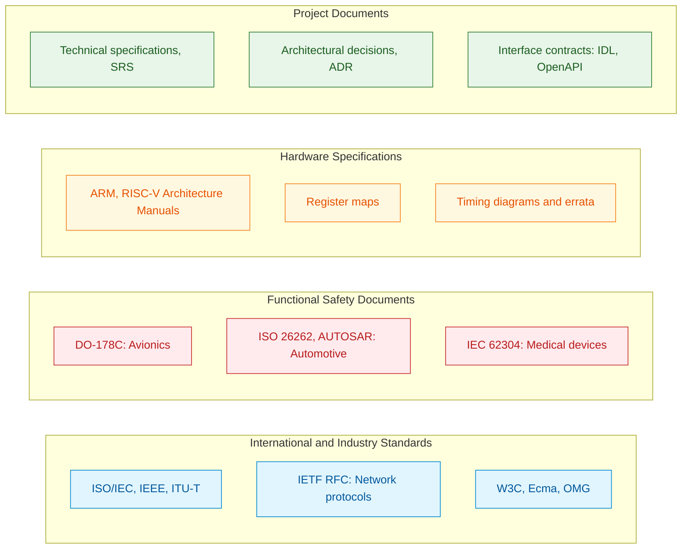
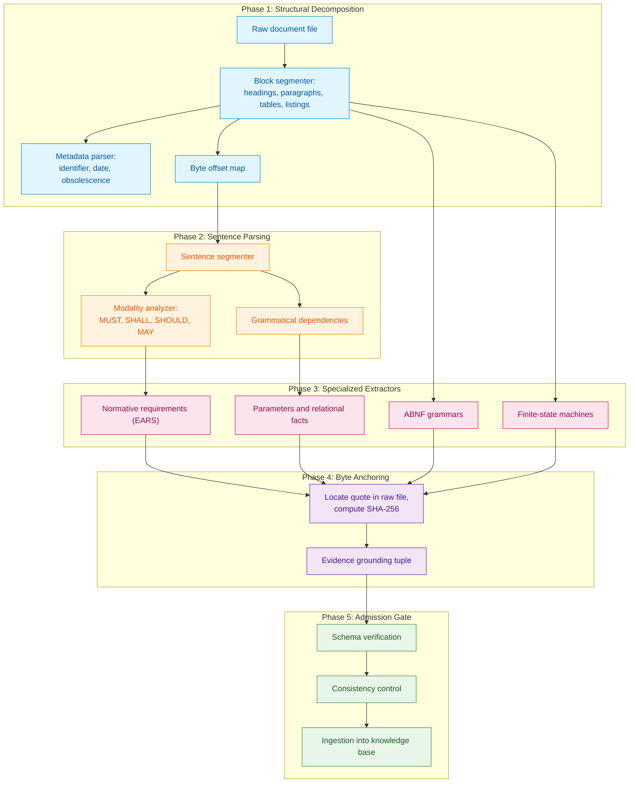
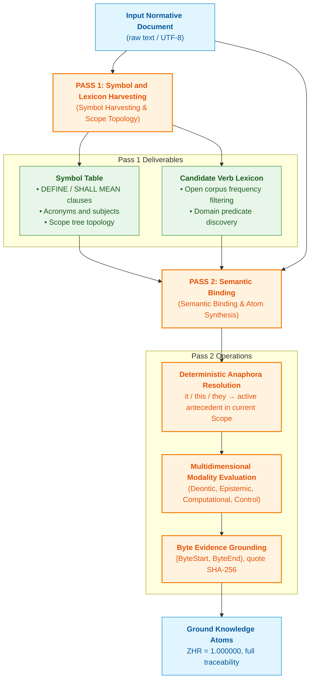
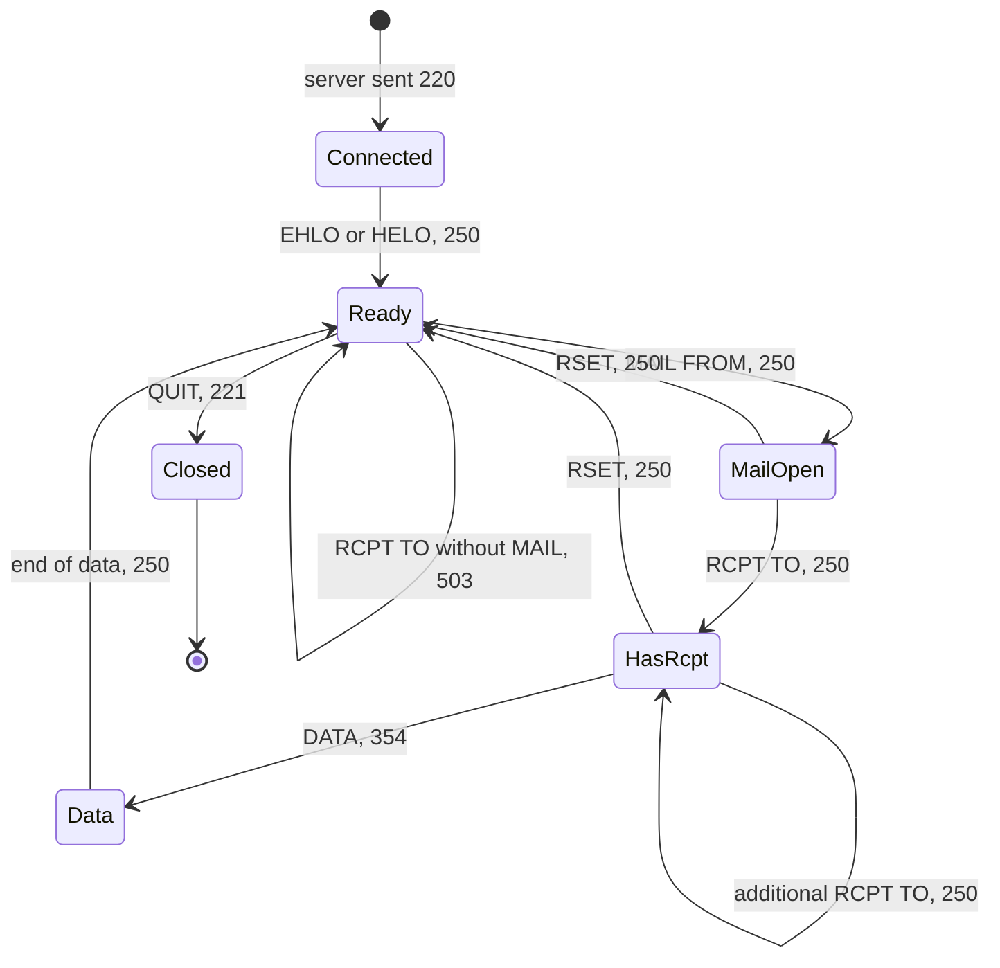
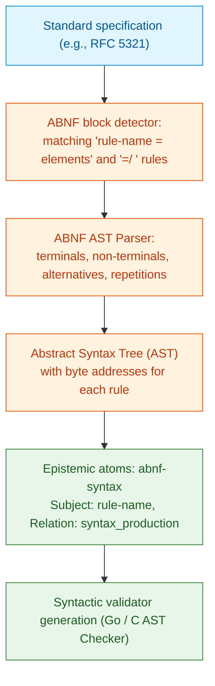
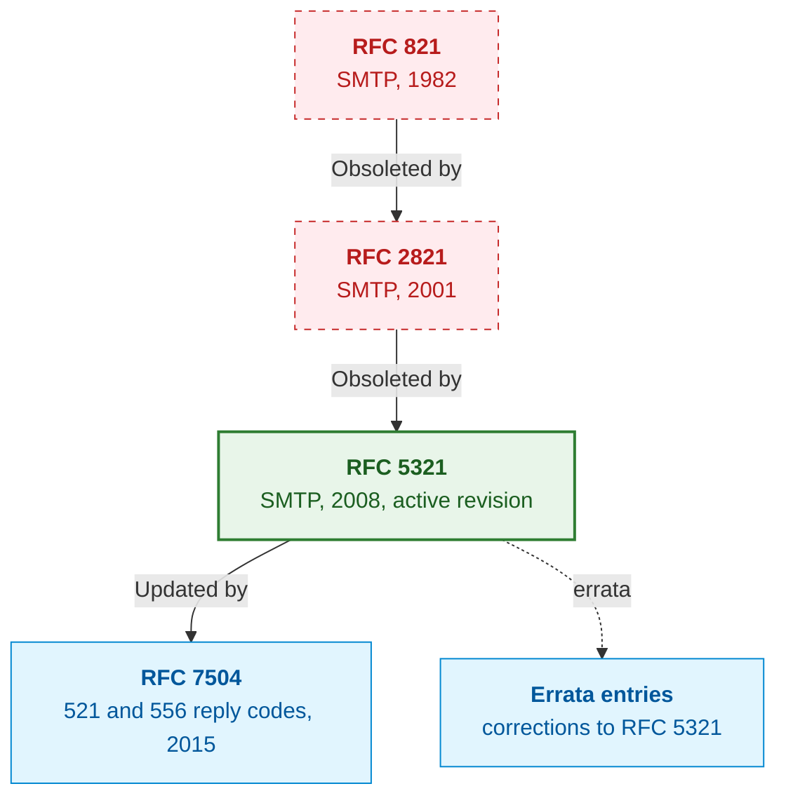
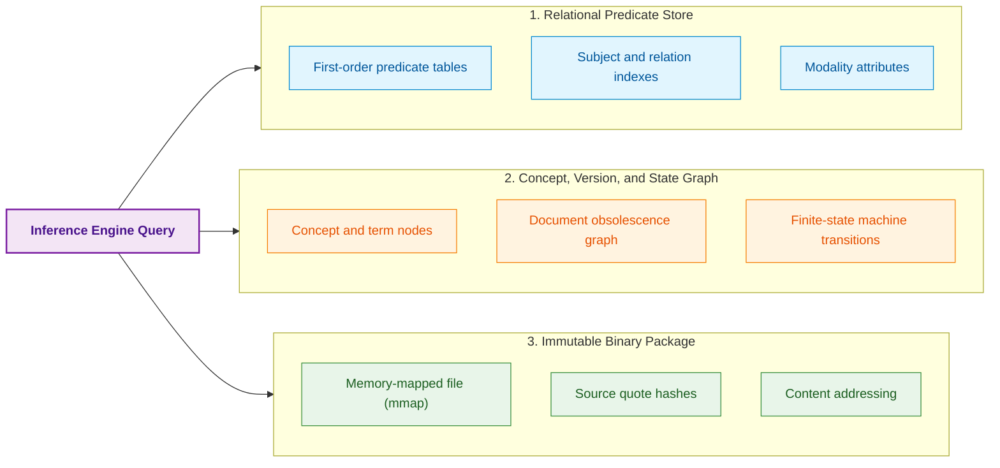
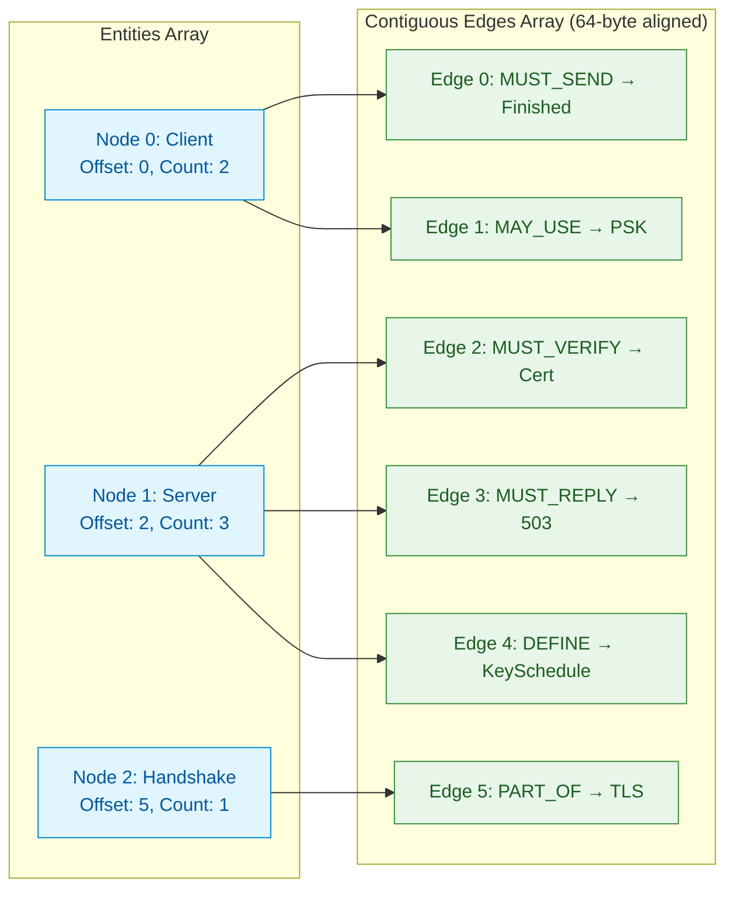
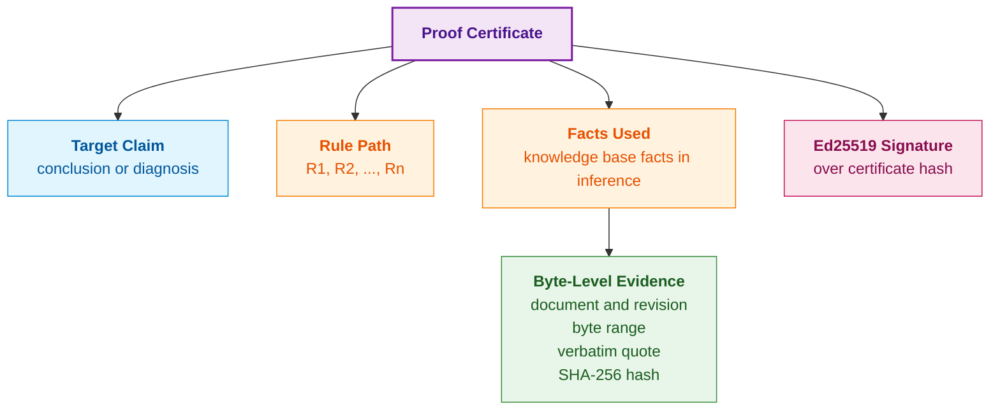

# Chapter 15. Knowledge Extraction and Knowledge Base Construction: Facts, Grammars, and Automata

> **Book:** [Architecture of Evidence-Governed Expert Systems](README.md) · [Part III: Knowledge Acquisition, Linguistic Analysis, and Input Assessment](part-03-knowledge-engineering-nlp.md)  
> **Previous Chapter:** [Chapter 14. Requirements Detection and Formalization: From Normative Text to Invariants](ch14-requirements-detection-and-formalization.md)  
> **Next Chapter:** [Chapter 37. Input Information Assessment: Sources, Evidence, and Uncertainty](ch37-input-information-assessment-and-algorithmic-skepticism.md)  
> **Table of Contents:** [README.md](README.md)  
> **Author:** [Mykola Fedchyk](about-the-author.md)  
> **Target Level:** Intermediate and Advanced: Knowledge engineers, systems architects, expert system developers  
> **Expected Learning Outcomes:** Decompose engineering documents into structural units and version metadata; anchor every extracted fact to the raw byte range of its primary source and verify this grounding programmatically; extract parameters, normative requirements, grammars, and finite-state machines from text; account for document obsolescence, updates, and errata; construct an ontology editing and verification cycle using Protégé and ROBOT; articulate the verification checks executed by the admission gate and explain what a proof certificate formally establishes.

## Abstract

This chapter presents a methodology for compiling technical and normative documentation (RFCs, ISO standards, silicon datasheets) into a verified expert system knowledge base. A five-phase extraction pipeline is proposed: structural decomposition, syntactic sentence parsing, specialized extractors (parameters, EARS requirements, ABNF formal grammars, finite-state machines), byte-level primary source addressing (Byte Anchoring with SHA-256 cryptographic hashes), and a deterministic admission gate. Document versioning and obsolescence mechanisms, a two-pass semantic compiler for symbols and anaphora, storage architectures (multi-model RDF/Property Graph, in-memory CSR), and an Ed25519-signed cryptographic proof certificate protocol for auditing operational decisions are systematically examined.

An engineer developing a network controller, a real-time operating system (RTOS), or an actuator control module operates within a constellation of hundreds of interrelated documents: international standards, industry directives, customer technical requirements, and component datasheets. The knowledge embodied in these artifacts is no less critical to an organization than source code; however, three fundamental obstacles impede its practical exploitation:

1. **Volume and fragmentation.** Tens of thousands of pages of prose, tables, and schematics are scattered across standards, directives, statements of work, and hardware datasheets.
2. **Format heterogeneity.** Machine-readable schemas coexist alongside unstructured text specifications containing embedded formal grammars and scanned legacy PDFs with distorted layouts.
3. **Document evolution.** Standards evolve continuously; new revisions supersede earlier ones (*obsoletion*), standalone errata amend defective clauses (*errata*), and supplementary RFCs introduce protocol extensions (*extensions*). Consequently, the same normative requirement may be formulated differently across revision epochs.

The prevalent contemporary response to these challenges relies on Retrieval-Augmented Generation (RAG): a retrieval mechanism retrieves text passages matching a query by semantic similarity, and a Large Language Model (LLM) synthesizes a natural language answer [[1]](#src-1). For mission-critical engineering corpora, this paradigm is fundamentally inadequate. Similarity-based retrieval answers the question: "Which text snippets resemble the query?" An engineer, however, requires an answer to entirely different questions: "Which normative rule is legally active, at what precise byte offset in the primary source is it defined, and what logical invariants follow from it?" Textual similarity encodes neither temporal relationships—such as "Document B supersedes Section 3 of Document A"—nor behavioral sequencing—such as "Command Y must strictly precede Command X." Furthermore, a generated prose response lacks an independently verifiable mathematical proof that can be audited without blind trust in the underlying neural model.

An expert system approaches the corpus from a fundamentally different perspective: it treats technical documentation as uncompiled source code of knowledge, just as [Chapter 14](ch14-requirements-detection-and-formalization.md) treated individual requirements. This chapter addresses the foundational architectural question: **how can specification text be transformed into a knowledge base where every entry is provably grounded down to the exact byte of the primary source?** The central thesis of this chapter posits: **knowledge extraction is a compilation process, not summarization. The document is decomposed into structural units, every candidate fact is anchored to a byte-level offset in the primary source, and admission into the knowledge base is governed exclusively by a deterministic admission gate. In such a pipeline, language models may propose candidate structures, but they possess zero authority to decide what constitutes accepted knowledge.**

The narrative proceeds from knowledge source typology to the extraction pipeline, details the extraction of finite-state machines, addresses document lineage and versioning, explores multi-model knowledge base storage, and concludes with the admission gate and proof certificates. As an end-to-end engineering benchmark, the Simple Mail Transfer Protocol (SMTP) per RFC 5321 [[2]](#src-2) serves as our running case study. This specification is publicly accessible, incorporates formal grammars, mandates rigorous command sequencing, and possesses an extensive lineage history, exposing every stage of the compilation pipeline.

## 1. Classification of Engineering Knowledge Sources

In mission-critical engineering (ISO 26262 functional safety, DO-178C airborne avionics software, IEC 62304 medical device software), the knowledge base of an expert system is not an undifferentiated corpus of prose: it must systematically ingest knowledge from fundamentally divergent regulatory, hardware, and architectural origins. Attempting to process engineering documents with a single naive template inevitably precipitates fatal verification failures: what constitutes a temporary workaround for a specific silicon stepping (*errata workaround*) in a microchip datasheet is a strict prohibition in a communications standard and a mandatory artifact auditing requirement in a functional safety standard. Therefore, the foundational step of the extraction architecture is rigorous source classification according to syntactic structure and normative authority.

No universal format for engineering knowledge exists: documents diverge substantially in their formal rigor, drafting precision, and functional purpose. The diagram below organizes them into four primary classes.



This diagram illustrates not a hierarchy of importance, but the distinct modalities through which knowledge enters an expert system. Each class mandates a tailored extraction strategy.

**International and industry standards** define interoperability rules across components and network protocols. Specifications published by the Internet Engineering Task Force (IETF) in the Request for Comments (RFC) series represent canonical exemplars: embedded within natural language prose, they define formal grammars in Augmented Backus-Naur Form (ABNF) per RFC 5234 [[3]](#src-3). From such standards, the expert system extracts two complementary knowledge representations: normative deontic statements and formal grammar productions compilable directly into deterministic parsers.

**Functional safety documents** prescribe not merely runtime system behavior, but the development and verification lifecycle itself. DO-178C for airborne systems mandates rigorous bidirectional traceability from requirements through code and test cases, complemented by structural coverage analysis [[4]](#src-4). ISO 26262 establishes Automotive Safety Integrity Levels (ASIL A through D) for road vehicles [[5]](#src-5). IEC 62304 governs software lifecycle processes for medical devices [[6]](#src-6). Knowledge extracted from these standards takes the form of mandatory obligations on engineering artifacts: which traceability links must exist, which coverage evidence must be accumulated, and which roles must approve changes.

**Hardware specifications** embody an entirely distinct category of knowledge. Processor Architecture Reference Manuals, microcontroller datasheets, and silicon Errata Sheets express knowledge as register bit-field layouts, access permissions (read/write/clear-on-read), timing diagrams, operating electrical limits, and errata workarounds. An errata mitigation is valid exclusively for a specific silicon mask revision; treating such a rule as globally applicable without strict applicability conditions introduces critical bugs into firmware targeting other steppings.

**Project documents** (software requirements specifications, system technical specifications, architectural decision records) capture system-specific design rules. They exhibit the highest churn rate and must harmonize with higher-ranking international standards. Consequently, rigorous version tracking—detailed in Section 8—is paramount for this class.

Thus, a single monolithic extractor cannot process all document types. Grammars require formal syntax parsers; normative sentences demand deontic classifiers from [Chapter 14](ch14-requirements-detection-and-formalization.md); register tables require tabular structure extractors; and protocol sequences necessitate state machine extractors. Crucially, all extractors must emit findings in a unified canonical format: a candidate fact coupled with its immutable primary source coordinates. The exact mathematical formulation of this address is defined in the following section.

## 2. Epistemic Invariant: Byte-Level Grounding of Primary Sources

In certification audits of evidence-governed expert systems, the requirement of fact non-repudiation is absolute: if the system asserts that an operational parameter or rule is active, it must instantaneously provide mathematical proof of origin grounded in an immutable primary source artifact. The absence of direct addressing precipitates catastrophic epistemic degradation: phantom facts emerge, induced by language model hallucinations, stale design drafts, or manual clerical errors introduced by knowledge engineers.

To prevent epistemic fabrications, the foundation of an evidence-governed expert system establishes an inviolable grounding invariant: **no fact, predicate, or rule is admitted into the knowledge base without direct cryptographic anchoring to the raw byte stream of an immutable source document**. This invariant is formalized via the evidence grounding tuple:

```math
\mathcal{E} = \langle \mathrm{DocID}, \mathrm{ByteStart}, \mathrm{ByteEnd}, \mathrm{SectionPath}, H_{\mathrm{quote}} \rangle
```

Parameters and mathematical characteristics of the grounding tuple:

- $`\mathrm{DocID} \in \{0, 1\}^{256}`$ is the SHA-256 cryptographic hash of the entire raw document file stored in the immutable artifact repository, ensuring global source uniqueness and tamper-evident integrity [[7]](#src-7);
- $`\mathrm{ByteStart}, \mathrm{ByteEnd} \in \mathbb{N}_0`$ define the integer half-open byte interval $`[\mathrm{ByteStart}, \mathrm{ByteEnd})`$ within the binary stream of the raw file using zero-based indexing, where $`0 \le \mathrm{ByteStart} < \mathrm{ByteEnd} \le \text{FileSize}`$;
- $`\mathrm{SectionPath} \in \mathcal{P}`$ is the canonical hierarchical path in the document heading tree (e.g., `"3.3/Mail Transactions"`);
- $`H_{\mathrm{quote}} = \mathrm{SHA256}(\text{FileBytes}[\mathrm{ByteStart}:\mathrm{ByteEnd}])`$ is the SHA-256 cryptographic hash of the exact quoted byte slice;
- The angle brackets $`\langle \cdot \rangle`$ designate a strictly ordered tuple; the omission of any component renders the candidate fact invalid for formal verification.

Practical implementation and engineering conclusions:
- **Automated authenticity verification:** Prior to evaluating a fact within resolution refutation or theorem proving, the inference engine reads the raw byte interval $`\text{FileBytes}[\mathrm{ByteStart}:\mathrm{ByteEnd}]`$ from disk, recomputes its SHA-256 digest, and asserts equivalence with $`H_{\mathrm{quote}}`$.
- **Fail-safe quarantine:** If the source document is modified by even a single bit or displaced, the cryptographic hash verification fails ($`\mathrm{SHA256} \ne H_{\mathrm{quote}}`$). The engine immediately rejects the fact with error code `E_GROUNDING_INTEGRITY_VIOLATION`, quarantines all dependent rules, and emits an audit alert, completely preventing ungrounded knowledge from entering the decision loop.

## 3. Extraction Pipeline: From Byte Stream to Fact Candidates

Knowledge extraction from technical literature cannot be reduced to keyword search or neural text summarization. It is a multi-stage, deterministic pipeline that transforms an unstructured byte stream into typed facts, formal rules, and behavioral transition graphs. The diagram below illustrates the five phases of this pipeline.



Each phase processes the output of its predecessor and retains the authority to discard invalid candidates; however, the binding decision on knowledge admission is reserved exclusively for Phase 5. Let us examine each phase sequentially; Phase 5 is detailed in Section 10.

### 3.1. Structural Document Decomposition

The semantic authority of a sentence is strictly governed by its structural position within the document hierarchy. An identical verbal formulation establishes a binding obligation when located in the normative core of a standard, provides non-binding guidance in an *informative annex*, and represents purely historical context in a design rationale section. In the absence of structural awareness, an extractor erroneously converts explanatory remarks into rigid system invariants.

In Phase 1, the pipeline reconstructs the document skeleton: the heading tree, block typologies (running text, tables, code listings, formal grammar productions, ASCII diagrams), and administrative metadata (document identifier, publication timestamp, normative status, and lineage links to other standards). Simultaneously, Phase 1 establishes an offset map recording the exact raw byte interval for every structural block.

For instance, the header of RFC 5321 contains the explicit directives `Obsoletes: 2821` and `Updates: 1123` [[2]](#src-2). The metadata parser deterministically converts these lines into directed edges in the document version graph: RFC 5321 supersedes RFC 2821 and amends RFC 1123. Concurrently, RFC pages contain recurring headers and footers specifying author names, document classifications, and page numbers (e.g., `Klensin ... Standards Track ... [Page 95]`). Phase 1 flags these lines as structural boilerplate, preventing any downstream extractor from misinterpreting header fragments as normative text.

The deliverable of Phase 1 is a typed document tree where every node possesses a structural category, a hierarchical section path, and a raw byte interval. This tree provides the execution context for all subsequent stages.

### 3.2. Sentence Parsing and Specialized Extractors

Phase 2 segments structural text blocks into individual sentences, resolves the deontic modality of normative statements, and constructs syntactic dependency trees. Phase 3 then invokes domain-specific extractors running in parallel, each targeting a distinct knowledge modality.

#### 3.2.1. Parameters and Relational Facts

Engineering specifications abound with fixed numerical parameters: port numbers, buffer dimensions, timeout durations, bitmasks, and thermal operating limits. The relational fact extractor compiles such assertions into atomic tuples:

```math
\mathrm{Fact} = \langle \mathrm{Subject}, \mathrm{Relation}, \mathrm{Value}, \mathrm{Unit}, \mathcal{E} \rangle
```

Parameters and components of the typed fact:

- $`\mathrm{Subject} \in \mathcal{C}`$ is the canonical identifier of an ontology concept in the problem domain (e.g., `smtp:local-part` or `bms:cell_voltage`);
- $`\mathrm{Relation} \in \mathcal{R}`$ denotes a semantic relation linking the concept to a value selected from a closed domain ontology matrix (e.g., `hasMaxLength`, `hasTimeout`, `hasTolerance`);
- $`\mathrm{Value} \in \mathbb{R} \cup \mathrm{String}`$ represents the scalar numerical or string value of the extracted engineering parameter;
- $`\mathrm{Unit} \in \mathcal{U}_{\mathrm{SI}} \cup \mathcal{U}_{\mathrm{std}}`$ defines the strictly specified physical SI unit or normative protocol unit ($`\text{octet}`$, $`\text{bit/s}`$, $`\text{ms}`$, $`\text{mV}`$); for dimensionless constants, the canonical marker $`\text{dimensionless}`$ is assigned;
- $`\mathcal{E}`$ is the cryptographic evidence grounding tuple anchored to the immutable source file.

Practical application and engineering conclusions:
- **Admission gate type and unit validation:** The admission gate automatically validates the dimensional compatibility of $`\mathrm{Unit}`$ against the formal signature of $`\mathrm{Relation}`$. If an octet count is assigned to a temporal duration or if a unit is undefined, the fact is unconditionally rejected with error code `E_INVALID_UNIT_DIMENSION`.
- **Elimination of phantom facts:** The ordered tuple mandates the explicit presence of all five components. Any candidate assertion with an empty grounding $`\mathcal{E}`$ or an unverified primary source hash is blocked as a potential extractor hallucination.

For example, Section 4.5.3.1.1 of RFC 5321 stipulates: *"The maximum total length of a user name or other local-part is 64 octets"* [[2]](#src-2). The extractor compiles this sentence into the fact $`\langle \text{local-part}, \mathrm{maxLength}, 64, \text{octet}, \mathcal{E} \rangle`$, where $`\mathcal{E}`$ references the precise byte offsets of that sentence. Section 4.5.3.1.6 establishes a complementary constraint: the maximum total length of a text line, including CRLF, shall not exceed 1000 octets. Both facts are admitted as verifiable invariants against which the expert system deterministically audits mail server logs.

#### 3.2.2. Normative Requirements

Sentences containing normative modal verbs (*MUST*, *SHALL*, *SHOULD*, *MAY*, and their negative forms) are normalized by the extractor into EARS (*Easy Approach to Requirements Syntax*) templates [[8]](#src-8). Modality classification rules depend on the drafting conventions of the source document, as analyzed in depth in [Chapter 14](ch14-requirements-detection-and-formalization.md). For our present purposes, an illustrative example from RFC 5321 Section 3.3 suffices: *"If a RCPT command appears without a previous MAIL command, the server MUST return a 503 "Bad sequence of commands" response"* [[2]](#src-2). This compiles into an event-driven EARS template: "When an SMTP server receives a RCPT command without a prior MAIL command, the SMTP server shall return response code 503." This invariant is utilized directly in the construction of protocol state machines.

#### 3.2.3. Formal Grammars

Numerous standards define message serialization syntax using formal grammar notations. Section 4.1.1.1 of RFC 5321 formalizes greeting command syntax as follows [[2]](#src-2):

<details>
<summary>ABNF Grammar Rule</summary>

```abnf
ehlo           = "EHLO" SP ( Domain / address-literal ) CRLF
helo           = "HELO" SP Domain CRLF
```

</details>

The grammar extractor isolates these blocks, compiles them into Abstract Syntax Trees (AST), and verifies that all referenced non-terminals are defined. The rules `SP` and `CRLF` belong to core rules defined in Appendix B of RFC 5234 [[3]](#src-3), while `Domain` and `address-literal` are defined across distinct sections of RFC 5321. Consequently, the extractor must resolve intra-document and cross-document symbol linkages; an unresolved non-terminal constitutes a critical extraction error rather than a justification for silently omitting the grammar. Once compiled, the grammar acts as a deterministic protocol validator within the knowledge base: an expert system rejects a `HELO` command lacking a domain argument without querying an external language model.

### 3.3. Fact Grounding via Byte Anchoring

When an extractor or language model extracts a quote, it frequently emits a normalized single-line string; however, in the raw source file, that quote is broken across line boundaries with variable leading indentation. A naive byte-for-byte substring search fails to locate the quote despite its literal presence in the document. Conversely, short quotes may occur dozens of times across a document, creating ambiguity regarding which instance constitutes the authoritative source.

The solution lies in normalized byte mapping. The ingestion engine compresses arbitrary sequences of whitespace into a single ASCII space while constructing an index array that maps each byte offset of the normalized string back to its exact offset in the raw source binary. Substring matching executes against the normalized stream, whereas byte boundaries and SHA-256 hashes are computed directly from the raw bytes. A candidate quote is admitted if and only if it resolves to a unique occurrence. The Go program below implements this verification mechanism. It requires only the standard Go library and an `rfc5321.txt` file obtained from the RFC Editor.

<details>
<summary>Go Implementation: Byte-level quote anchoring with whitespace normalization and offset mapping</summary>

```go
package main

import (
	"bytes"
	"crypto/sha256"
	"encoding/hex"
	"fmt"
	"os"
	"unicode/utf8"
)

// Evidence describes the byte-level grounding of a quote to the raw source file.
type Evidence struct {
	Start, End int    // offsets in raw bytes; End is non-inclusive
	SHA256     string // SHA-256 hash of raw bytes [Start, End)
}

// normalize compresses any sequence of whitespace characters to a single space
// and records the source byte in the raw file for each output byte.
func normalize(raw []byte) ([]byte, []int) {
	var out []byte
	var pos []int
	inSpace := false
	for i, b := range raw {
		switch b {
		case ' ', '\t', '\r', '\n', '\f':
			if !inSpace && len(out) > 0 {
				out = append(out, ' ')
				pos = append(pos, i)
			}
			inSpace = true
			continue
		}
		inSpace = false
		out = append(out, b)
		pos = append(pos, i)
	}
	return out, pos
}

// Ground accepts a candidate quote if and only if it appears
// in the normalized document text exactly once.
func Ground(raw []byte, quote string) (Evidence, error) {
	return GroundIn(raw, quote, 0, len(raw))
}

func GroundIn(raw []byte, quote string, regionStart, regionEnd int) (Evidence, error) {
	if regionStart < 0 || regionEnd > len(raw) || regionStart >= regionEnd {
		return Evidence{}, fmt.Errorf("invalid source region bounds")
	}
	if !utf8.Valid(raw) || !utf8.ValidString(quote) || !utf8.Valid(raw[regionStart:regionEnd]) {
		return Evidence{}, fmt.Errorf("invalid UTF-8 or split within rune")
	}
	norm, pos := normalize(raw[regionStart:regionEnd])
	q, _ := normalize([]byte(quote))
	q = bytes.TrimSpace(q)
	if len(q) == 0 {
		return Evidence{}, fmt.Errorf("empty quote")
	}
	first := bytes.Index(norm, q)
	if first < 0 {
		return Evidence{}, fmt.Errorf("quote not found verbatim")
	}
	if bytes.Contains(norm[first+1:], q) {
		return Evidence{}, fmt.Errorf("ambiguous quote: multiple occurrences")
	}
	start := regionStart + pos[first]
	end := regionStart + pos[first+len(q)-1] + 1
	sum := sha256.Sum256(raw[start:end])
	return Evidence{Start: start, End: end, SHA256: hex.EncodeToString(sum[:])}, nil
}

func main() {
	raw, err := os.ReadFile("rfc5321.txt")
	if err != nil {
		fmt.Println("read error:", err)
		os.Exit(1)
	}
	doc := sha256.Sum256(raw)
	fmt.Printf("DocID: sha256:%x...\n", doc[:8])

	candidates := []string{
		// Verbatim quote from Section 3.3; split across line wraps in raw source.
		`If a RCPT command appears without a previous MAIL command, the server MUST return a 503 "Bad sequence of commands" response.`,
		// Paraphrase of the same rule: semantics preserved, but raw bytes do not exist.
		`If RCPT is sent before MAIL, the server MUST answer 503.`,
		// Under-specified short quote: occurs multiple times across the document.
		`503 Bad sequence of commands`,
	}
	for _, c := range candidates {
		ev, err := Ground(raw, c)
		if err != nil {
			fmt.Println("REJECTED:", err)
			continue
		}
		fmt.Printf("ACCEPTED: bytes [%d, %d), sha256:%s...\n", ev.Start, ev.End, ev.SHA256[:16])
	}
}
```

The test `ground_test.go` executes via `go test -v main.go ground_test.go` and requires no external corpora:

```go
package main

import (
	"crypto/sha256"
	"encoding/hex"
	"testing"
)

func TestGroundingRegionsAndEncoding(testCase *testing.T) {
	raw := []byte("first: limit 100 ms\nsecond: limit\n  100 ms")
	if _, err := Ground(raw, "limit 100 ms"); err == nil {
		testCase.Fatal("ambiguous global quote accepted")
	}
	start := len("first: limit 100 ms\nsecond: ")
	evidence, err := GroundIn(raw, "limit 100 ms", start, len(raw))
	if err != nil || evidence.Start != start || evidence.End != len(raw) {
		testCase.Fatalf("incorrect source region: %+v %v", evidence, err)
	}
	checksum := sha256.Sum256(raw[evidence.Start:evidence.End])
	if evidence.SHA256 != hex.EncodeToString(checksum[:]) {
		testCase.Fatal("quote hash does not match original bytes")
	}
	if _, err := Ground(raw, "limit 90 ms"); err == nil {
		testCase.Fatal("changed parameter accepted")
	}
	for _, bounds := range [][2]int{{-1, 2}, {0, len(raw) + 1}, {3, 2}} {
		if _, err := GroundIn(raw, "limit", bounds[0], bounds[1]); err == nil {
			testCase.Fatal("invalid region accepted")
		}
	}
	if _, err := Ground([]byte{0xff, 'a'}, "a"); err == nil {
		testCase.Fatal("invalid UTF-8 accepted")
	}
	if _, err := GroundIn([]byte("ї"), "ї", 1, 2); err == nil {
		testCase.Fatal("region splits Unicode character")
	}
}
```

Archival execution output by the author for a file of 225,929 bytes:

```text
DocID: sha256:7d560eddff1b213c...
ACCEPTED: bytes [52658, 52788), sha256:48f3063677f109b3...
REJECTED: quote not found verbatim
REJECTED: ambiguous quote: multiple occurrences
```

</details>

The first candidate quote is accepted: in the raw file, it spans bytes 52,658 to 52,788 and contains line wraps and indentation. Normalization successfully resolved the match, whereas the SHA-256 digest was computed over the exact raw slice including whitespace control codes. Consequently, subsequent cryptographic verification does not depend on the normalization routine: the verifier simply slices 130 bytes from the recorded byte offsets. The second candidate conveys identical semantics, but because its literal bytes do not exist in the source, the grounding engine rejects it as a paraphrase. The third candidate is verbatim, yet appears twice across distinct reply code listings (Sections 4.2.2 and 4.2.3); hence, it cannot be admitted without scoping to a specific section path.

The implementation normalizes exclusively ASCII whitespace. `GroundIn` permits scoping the search to an a priori bounded structural section and yields global coordinates; crucially, section boundaries must be established by the structural parser, never dynamically by the language model following a failed global lookup. Recurring quotes in distinct sections thus avoid collision within bounded scopes. The unit test further asserts rejection of invalid encodings and mid-rune slicing.

For PDF documents or physical scans, an immutable textual layer artifact must be synthesized with its own cryptographic identifier, accompanied by explicit mappings to the source document, page index, and bounding-box coordinates. Byte ranges in a text extraction artifact do not correspond directly to internal byte offsets in a compressed PDF binary. Word hyphenation, running header removal, and typographic ligatures mandate explicit coordinate transformation maps, as analyzed in [Chapter 12](ch12-linguistic-analysis-and-local-models.md).

### 3.4. Two-Pass Semantic Ingestion Compiler: From Symbol Harvesting to Anaphora Binding

Single-pass linear extraction, characteristic of basic text parsers and naive RAG architectures, is fundamentally ill-suited for complex engineering and scientific specifications. The breakdown occurs due to pervasive grammatical anaphora and context-dependent scoping inherent in technical prose: a substantial fraction of normative clauses open with pronouns or contextual demonstratives: *"It MUST verify the peer's certificate..."*, *"This parameter MUST NOT exceed 1024 octets"*, *"They SHOULD abort the handshake upon receiving..."*.

In a single-pass paradigm, the subject of such a fact is populated either by the pronoun `it` or by a generic placeholder `system`, demolishing deterministic ontology typing and precluding formal automated deduction. Furthermore, domain-specific terminology, local acronyms, and specialized engineering verbs are typically defined only once (in a definitions section or at first introduction), yet govern dozens of subsequent sections.

The rigorous engineering solution is a **Two-Pass Knowledge Ingestion Compiler**, directly analogous to classical two-pass programming language compilers (symbol harvesting → intermediate representation generation and address binding):



#### 3.4.1. Harvesting Symbols, Topology, and Lexicon (Symbol Harvesting)

During Pass 1, the compiler produces no final normative facts; instead, it compiles a spatially-typed **Document Symbol Table** ($`\mathrm{SymbolTable}`$):
1. **Extraction of local definitions and glossaries:** The compiler identifies definitional constructs (`DEFINE`, `SHALL MEAN`, `IS DEFINED AS`, `STANDS FOR`) and registers newly introduced concepts, synonyms, and acronyms.
2. **Construction of scope topology:** Every section, clause, and table in the specification establishes an isolated lexical namespace ($`\mathrm{Scope}`$). Explicitly declared actors (e.g., `Client`, `Server`, `Controller`, `Receiver`) are registered within their enclosing scopes.
3. **Automated candidate verb harvesting:** Restricting semantic parsing to a hardcoded list of verbs introduces blind spots. The compiler analyzes the corpus using computational lexicons (WordNet, VerbNet, the Academic Word List (AWL), and ISO/IEC/IEEE 24765 systems terminology). Domain-specific verbs exceeding empirical frequency thresholds are proposed to the admission gate as candidate additions to the multidimensional action ontology.

#### 3.4.2. Semantic Binding and Anaphora Resolution

During Pass 2, full syntactic and semantic parsing proceeds, parameterized by the populated Symbol Table:
- **Typed Anaphora Resolution:** When the dependency parser encounters a pronoun (`it`, `this`, `they`) in the subject position of a normative statement, the compiler queries the active $`\mathrm{Scope}`$. The pronoun is deterministically resolved to the nearest syntactically dominant antecedent matching gender and number (e.g., within the scope of *"Handshake Protocol: Client"*, the statement *"It MUST compute the Finished verify_data..."* is bound unambiguously to subject `Client`).
- **Invariance of evidence grounding:** Subject normalization to a canonical ontology symbol occurs exclusively within the semantic layer ($`\mathrm{Subject} = \text{"Client"}`$), whereas the grounding tuple $`\mathcal{E} = \langle \mathrm{DocID}, \mathrm{ByteStart}, \mathrm{ByteEnd}, \dots \rangle`$ and cryptographic hash $`H_{\mathrm{quote}}`$ strictly preserve the literal raw bytes of the source document containing the original token *"It"*.
- **Materialization of ground atoms:** Pass 2 culminates in a verified set of ground knowledge atoms, completely liberated from ambiguous pronouns and strictly bound to canonical ontology symbols.

### 3.5. Structural Chunking for Retrieval

Beyond formal extraction, an expert system requires robust retrieval capabilities: both to surface candidate passages for extraction and to answer exploratory engineering queries. The prevalent industry heuristic of partitioning documents into fixed-size windows (e.g., chunks of 500 tokens) damages normative cohesion: a chunk boundary running through the middle of a clause severs the antecedent trigger from its consequent obligation.

Structural chunking utilizes the document tree produced in Phase 1. Retrieval chunks map directly to structural boundaries: clauses, sub-clauses, or tables. Every chunk retains its fully qualified path from the document root (*breadcrumbs*). A sub-clause stating "must actuate within 15 ms" is meaningless in isolation; prefixed with its breadcrumbs—"Braking System Requirements → Emergency Braking Subsystem → Clause 4.2"—its semantics become unambiguous to both automated retrievers and human auditors.

Retrieval execution is best architected as a hybrid pipeline. Sparse lexical retrieval via BM25 excels at matching exact alphanumeric identifiers: clause numbers, error codes, command mnemonics [[9]](#src-9). Dense vector retrieval retrieves paraphrased queries; for low-latency nearest-neighbor search, Hierarchical Navigable Small World (HNSW) graph indexing [[10]](#src-10)—such as implemented in PostgreSQL's pgvector extension [[11]](#src-11)—is utilized. The ranked candidate lists are unified via Reciprocal Rank Fusion (RRF) [[12]](#src-12):

```math
\mathrm{RRF}(d) = \sum_{m \in \{\mathrm{BM25}, \mathrm{Dense}\}} \frac{1}{k + \mathrm{rank}_m(d)}
```

Parameters and mathematical components:

- $`d \in \mathcal{D}_{\mathrm{chunks}}`$ represents a structural unit of the normative document (clause, sub-clause, table);
- $`m \in \{\mathrm{BM25}, \mathrm{Dense}\}`$ designates the retrieval channels (sparse lexical matching vs. dense HNSW vector search);
- $`\mathrm{rank}_m(d) \in \mathbb{N}_{\ge 1}`$ is the ordinal rank of candidate $`d`$ in channel $`m`$ ($`1`$ denotes top rank; if a document is absent from a channel's top results, $`\mathrm{rank}_m(d) = \infty`$, yielding a zero term);
- $`k \in \mathbb{N}_{> 0}`$ is the smoothing hyperparameter (canonically $`k = 60`$), dampening the influence of outlier ranks in individual channels;
- $`\mathrm{RRF}(d) \in (0, \frac{2}{k+1}]`$ is the consolidated consensus score.

Practical implementation and engineering conclusions:
- **Candidate pool truncation:** In safety-critical pipelines, candidates passed to specialized extractors are filtered via a compound criterion: retaining at most $`K_{\mathrm{pool}} = 20`$ chunks satisfying $`\mathrm{RRF}(d) \ge 0.025`$ (guaranteeing high concurrent rank across both channels).
- **Fail-safe noise suppression:** If $`\max_{d} \mathrm{RRF}(d) < \tau_{\mathrm{min}}`$, the pipeline refrains from feeding noisy context to extractors, logs event `E_NO_CONFIDENT_RETRIEVAL`, and triggers metadata verification.

Embedding model selection must be validated against proprietary domain data. As established by the Massive Text Embedding Benchmark (MTEB), no single embedding model dominates across all retrieval tasks [[13]](#src-13). General leaderboards provide zero guarantee of efficacy on narrow-domain technical corpora; models must be benchmarked on curated golden datasets with known ground-truth targets.

Retrieval serves solely to propose candidate text blocks. It possesses no authority to determine whether a standard is legally active or applicable to an operational context: those determinations are reserved for the version lineage graph and the deductive inference engine. Having examined static relational facts, we now address the extraction of temporal operational behavior.

## 4. Extracting Dynamics: Translating Specifications into Finite-State Machines

In embedded systems and cyber-physical engineering (ISO 26262, DO-178C), static relational facts describing constants or physical units are insufficient: actuator controls, communication protocols, and emergency failover routines are inherently temporal. If an expert system possesses only disjointed facts without causal and temporal ordering, it remains oblivious to sequence anomalies: protocol commands arriving out of order, data transmission preceding authentication, or illicit transitions out of safe state. To capture operational dynamics, technical specifications are compiled into formal finite-state machines.

### 4.1. Mathematical Model of a Deterministic Automaton

A protocol or controller finite-state machine is formally defined by the 5-tuple [[14]](#src-14):

```math
\mathcal{M} = \langle S, \Sigma, \delta, s_0, F \rangle
```

Parameters and formal components:

- $`S`$ is a non-empty, finite set of discrete system states (e.g., for SMTP: $`\{\text{Connected}, \text{Ready}, \text{MailOpen}, \text{HasRcpt}, \text{DataBody}\}`$; for BMS: $`\{\text{STANDBY}, \text{PRECHARGE}, \text{RUN}, \text{FAULT}\}`$);
- $`\Sigma`$ is a finite input alphabet of events, protocol commands, or hardware interrupts;
- $`\delta: S \times \Sigma \to S \cup \{\bot\}`$ denotes the state transition function, wherein the symbol $`\bot`$ explicitly designates a **forbidden transition** (an impermissible operational sequence);
- $`s_0 \in S`$ is the designated initial state upon system reset;
- $`F \subseteq S`$ is the set of permissible terminal or quiescent session termination states.

Practical application and engineering conclusions:
- **Constant-time anomaly detection:** During telemetry or network traffic monitoring, each arriving event $`e \in \Sigma`$ is validated against the transition matrix $`\delta`$ in deterministic $`\mathcal{O}(1)`$ time.
- **Fail-safe violation containment:** If for the current state-event pair $`(s, e)`$, the transition yields $`\delta(s, e) = \bot`$, the controller halts execution with fault code `E_PROTOCOL_SEQUENCE_VIOLATION`, preserves the current safe state $`s`$, and inhibits data corruption.

Classical automata theory typically defines $`\delta`$ as a total function. In protocol engineering, a partial function with an explicit $`\bot`$ element is vastly superior, as forbidden transitions carry the highest diagnostic value. Furthermore, protocol automata emit response codes upon transition, operating effectively as Mealy machines; in this chapter, response codes are modeled as transition annotations.

> [!WARNING] Diagnostic Authority of Forbidden Transitions ($\bot$)
> Academic discrete mathematics often totalizes transition functions by introducing a sink error state or simply discarding undefined transitions. For functional safety expert systems (ISO 26262, DO-178C), every pair $`(s, e)`$ where $`\delta(s, e) = \bot`$ represents an indispensable safety invariant. The set of forbidden transitions defines the threat model: attack surfaces, protocol violations, and hardware failure modes. The expert system's test generator ingests these forbidden transitions to synthesize negative test suites (*fault-injection test suites*): transmitting a `DATA` command before completing `EHLO`, commanding high-voltage contactor closure during precharge, or injecting an invalid packet ID on the CAN bus. If a device under test fails to reject such an event or fails to transition into a designated safe state, a safety violation is flagged prior to physical hardware deployment.

### 4.2. Engineering Case Study: SMTP Session Protocol

Section 4.1.4 of RFC 5321 establishes: *"There are restrictions on the order in which these commands may be used"*, and Section 3.3 details mail transactions [[2]](#src-2). From these clauses, the extractor compiles the session automaton illustrated below.



The diagram formalizes protocol sequencing: upon establishing a transport connection, the server transmits greeting code 220, moving the session to `Connected`. An `EHLO` or `HELO` command initializes the session (`Ready`). `MAIL FROM` initiates a mail transaction (`MailOpen`), one or more `RCPT TO` commands register recipients (`HasRcpt`), and `DATA` with response 354 transitions the server to receiving the message body. A line containing a single dot terminates the transmission; upon response 250, the session returns to `Ready`. An `RSET` command aborts an open transaction. The self-loop on `Ready` designates a forbidden transition: issuing `RCPT TO` without a preceding `MAIL FROM` provokes response 503 and preserves state `Ready`.

### 4.3. Algorithm for Extracting Automaton Transitions from Text

Technical specifications express state machines in two primary syntactic forms. The first consists of explicit transition tables with columns such as "Current State", "Event", "Next State", and "Response Code"; these are directly compiled into $`\delta`$ by tabular extractors. The second form consists of behavioral prose scattered across various chapters. In RFC 5321, the extractor detects four primary linguistic transition patterns:

- **Precondition clauses.** *"A session that will contain mail transactions MUST first be initialized by the use of the EHLO command"* (Section 4.1.4): transition `MAIL FROM` is valid exclusively from states reachable subsequent to `EHLO`.
- **State-specific prohibitions.** *"MAIL (or SEND, SOML, or SAML) MUST NOT be sent if a mail transaction is already open"* (Section 4.1.4): in states `MailOpen` and `HasRcpt`, the client is prohibited from issuing `MAIL FROM`.
- **Transaction reset.** *"This command specifies that the current mail transaction will be aborted"* (Section 4.1.1.5 for `RSET`): from any active transaction state, a transition exists back to `Ready`.
- **Fault responses.** The clause regarding `RCPT` without `MAIL` in Section 3.3 maps forbidden transitions to response code 503.

For any given state, the extractor computes the whitelist of permissible incoming events:

```math
\mathrm{ValidNext}(s) = \{ e \in \Sigma \mid \delta(s, e) \neq \bot \}
```

Parameters and components:

- $`s \in S`$ is the active discrete state of automaton $`\mathcal{M}`$;
- $`\Sigma`$ is the complete input alphabet of protocol commands or events;
- $`e \in \Sigma`$ is a specific incoming command;
- $`\delta(s, e) \neq \bot`$ is the boolean predicate filtering out all forbidden transitions ($`\bot`$);
- $`\mathrm{ValidNext}(s) \subseteq \Sigma`$ is the closed whitelist of permissible next actions in state $`s`$.

Practical implementation and engineering conclusions:
- **Whitelist gateway enforcement:** Network perimeter gateways and interface monitors implement security based directly on $`\mathrm{ValidNext}(s)`$. Any command $`e \notin \mathrm{ValidNext}(s)`$ is rejected immediately at deserialization time with a protocol error code (e.g., 503 in SMTP, or a bus abort in CAN) without touching downstream business logic.
- **Fail-safe desynchronization prevention:** When a client issues an illegal command, the system does not enter an undefined error state; it remains in verified state $`s`$, preventing state desynchronization between sender and receiver.

The extractor couples every transition and prohibition with its grounding tuple $`\mathcal{E}`$ anchored to the originating sentence.

### 4.4. Automated Generation of Negative Test Suites

A formalized automaton enables the automated synthesis of negative conformance test suites. For every state $`s`$ and every command $`e \notin \mathrm{ValidNext}(s)`$, the system synthesizes a negative test case: drive the system into state $`s`$, inject command $`e`$, and assert the response. The expected test outcome is strictly dictated by the deontic modality of the source clause, demonstrating why [Chapter 14](ch14-requirements-detection-and-formalization.md) rigorously distinguishes MUST from MAY. The table below illustrates three tests generated from RFC 5321.

| Current State | Out-of-Order Command | RFC 5321 Specification Clause | Test Assertion & Expected Verdict |
|---|---|---|---|
| `Ready` | `RCPT TO` | Section 3.3: Server MUST return 503 | Exactly 503; any other response indicates a violation of a mandatory obligation |
| `Ready` or `MailOpen` without accepted `RCPT` | `DATA` | Section 3.3: Server MAY return 503 or 554 | 503 or 554 expected; other responses yield an advisory warning, not a failure, due to MAY modality |
| `MailOpen` or `HasRcpt` | `MAIL FROM` | Section 4.1.4: Client MUST NOT send | Client-side test: client must inhibit command transmission |

This table demonstrates that an automaton lacking modality fidelity would synthesize incorrect tests. Had the extractor treated both clauses of Section 3.3 as identical mandatory obligations, the test suite would erroneously fail a compliant server that legitimately returns an alternate error code in response to premature `DATA`.

The completeness of an extracted automaton is strictly bounded by the completeness of the source text. Section 4.1.4 permits commands NOOP, HELP, EXPN, VRFY, and RSET *"at any time during a session"*. If the extractor fails to inject self-loops for these commands across all states, the test generator misclassifies them as sequencing violations, emitting false positives. Hence, an extracted automaton requires human engineering sign-off, and discrepancies observed between the model and operational logs serve as candidates for specification refinement.

### 4.5. Transition Detection Patterns in Normative Text

In industrial practice, technical specifications articulate state transitions using diverse syntactic styles. An advanced behavioral extractor employs four complementary pattern-matching strategies to detect transitions $`\delta(s, e) = s'`$:

1. **Strategy A (Explicit Causal Predicates):** Sentences utilizing explicit transition verbs:
   <details>
   <summary>Example Pattern Template</summary>

   ```text
   "Upon receiving {Event}, the entity transitions from {SourceState} to {TargetState}."
   "The system enters {TargetState} after completing {Event} while in {SourceState}."
   ```

   </details>

2. **Strategy B (ASCII Diagrams and Arrow Graphs):** Many IETF RFCs and hardware datasheets render transition graphs using ASCII art:
   <details>
   <summary>Example ASCII Graph</summary>

   ```text
   CONNECTED --------[ EHLO / 250 ]--------> READY
   READY ------------[ MAIL / 250 ]--------> MAIL_OPEN
   ```

   </details>

   The parser isolates arrow sequences (`--->`, `==>`, `->`), extracts left- and right-hand tokens as states, and maps the arrow annotation to an `Event / Action` tuple.
3. **Strategy C (Tabular State Transition Matrices):** Markdown or plain-text tables with columns `Current State | Trigger / Event | Next State | Output`:
   The tabular parser maps these directly into the automaton transition matrix.
4. **Strategy D (Modal State Invariants):** Sentences imposing mandatory state behaviors:
   <details>
   <summary>Example Pattern Template</summary>

   ```text
   "In the {SourceState} state, the client MUST transition to {TargetState} upon {Event}."
   ```

   </details>

Automata minimization can occur only after formal semantics are established. For a complete DFA, Hopcroft's algorithm preserves language equivalence [[14]](#src-14); however, for protocol machines with outputs and timing invariants, minimization must preserve output equivalence and guard conditions. States must never be merged merely on the basis of lexical similarity in their names. An unmodeled transition in a partial specification does not constitute a proven prohibition; formal negative testing mandates explicit verification of normative clauses.

---

## 5. Formal Grammars: ABNF Extraction and AST Compilation

Network protocols, service interfaces, and file formats specify message serialization syntaxes using formal grammars. Within IETF RFCs, Augmented Backus-Naur Form (**ABNF**) per RFC 5234 [[3]](#src-3) serves as the universal standard.

In the absence of grammar extraction, an expert system cannot formally verify the syntactic validity of commands transmitted or received across an interface.



### 5.1. Structural Elements of an Extracted ABNF Rule
- **Basic definition (`=`):** `Reverse-path = Path / "<>"`
- **Incremental alternative (`=/`):** Extends a previously defined rule across subsequent sections or RFCs without re-declaring the entire rule.
- **Value ranges and repetitions:** `1*digit`, `[ CFWS ]`, `%d32-126`.

The extractor emits an `abnf-syntax` candidate; the representation shown below lacks verified source coordinates and is therefore quarantined from the active package.

<details>
<summary>Grammar Rule Candidate Prior to Byte Grounding</summary>

```json
{
  "id": "rfc5321:abnf:Reverse-path",
  "subject": "Reverse-path",
  "relation": "syntax_production",
  "value": "Path / \"<>\"",
  "source": "rfc5321",
  "source_span": null,
  "status": "candidate"
}
```

</details>

Grounding must establish the exact byte coordinates of the rule definition, its incremental extensions, and imported dependencies. Detecting the substring `rule-name =` does not replace full grammar parsing and case-sensitivity validation of literal terminals.

---

## 6. Normalization of Structured Parameters and Physical Quantities

Engineering documentation contains quantitative constraints: timeouts, buffer sizes, temperatures, voltages, and bus frequencies. The proportion of quantitative requirements must be measured against a specific corpus; no universal percentage is posited here.

If an expert system treats the string `"timeout is 5 minutes"` as unstructured prose, it remains incapable of answering the deductive query: *"Does a server violate the specification if it awaits a response for 250 seconds?"*.

### 6.1. Mathematical Model for SI Unit Conversion

The parameter extractor normalizes natural language descriptions into typed **`structured-quantity`** atoms:

```math
\mathcal{Q} = \langle \text{Parameter}, \; \text{Operator}, \; \text{Value}_{\text{norm}}, \; \text{BaseUnit}, \; \text{RawQuote} \rangle
```

Parameters and normalization components:

- $`\mathcal{Q}`$ is a typed atom representing a normalized quantitative requirement, structured for ingestion by an SMT/arithmetic solver;
- $`\text{Parameter} \in \mathcal{P}`$ is the canonical concept identifier in the domain ontology (e.g., `bms:max_cell_voltage`, `smtp:command_timeout`);
- $`\text{Operator} \in \{ =, \le, \ge, <, >, \in [a, b] \}`$ denotes the comparison or set-inclusion operator;
- $`\text{Value}_{\text{norm}} \in \mathbb{R}`$ is the scalar value strictly normalized to the canonical base SI unit or standard protocol unit;
- $`\text{BaseUnit} \in \mathcal{U}_{\mathrm{SI}} \cup \mathcal{U}_{\mathrm{std}}`$ is the canonical dimension (second $`\text{s}`$, byte $`\text{B}`$, hertz $`\text{Hz}`$, volt $`\text{V}`$, octet $`\text{octet}`$);
- $`\text{RawQuote}`$ is the verbatim primary source substring anchored by grounding tuple $`\mathcal{E}`$.

Practical application and engineering conclusions:
- **Automated inequality solving:** By projecting quantities onto a unified dimension $`\text{BaseUnit}`$, formal SMT provers (such as Z3) evaluate inequality systems directly. If a specification mandates $`\text{Value}_{\text{norm}} \ge 300.0\,\text{s}`$ while firmware configuration sets $`250\,\text{s}`$, the solver immediately synthesizes a counterexample proof of non-conformance.
- **Fail-safe prefix normalization:** Ambiguous decimal and binary prefixes (e.g., `1 Mbps` as $`10^6\,\text{bit/s}`$ vs. $`2^{20}\,\text{bit/s}`$) mandate strict normalization conforming to IEC 80000-13; in cases of ambiguity, the admission gate rejects the parameter until confirmed by an engineer.

| Standard Specification Text | Extracted Operator | Normalized Value | Canonical Base Unit |
|---|:---:|:---:|:---:|
| *"Server MUST wait at least 5 minutes"* | $`\ge`$ | `300.0` | `s` (second) |
| *"Maximum command length is 512 octets"* | $`\le`$ | `512` | `octet` (eight bits) |
| *"CAN bus bit rate shall not exceed 1 Mbps"* | $`\le`$ | `1000000` | `bit/s` (decimal prefix M) |
| *"Operating temperature is at least -40 °C and at most +85 °C"* | $`\in [-40, +85]`$ | `[-40, 85]` | `°C` (degrees Celsius) |

These table rows represent illustrative pedagogical examples rather than clauses from a single standard. Normalization preserves the original unit, exact decimal representation, and relational operator. An octet is never converted to a byte without an explicit definition of byte width; bit rate is never conflated with baud rate. Temperature values require affine conversion formulas, and ambiguous linguistic constructs such as "between" require explicit engineering confirmation of interval closure. Formal unit verification tools are detailed in [Chapter 14](ch14-requirements-detection-and-formalization.md).

Through normalization, symbolic engines automatically solve systems of inequalities during requirements verification: $`250\ \text{s} < 300\ \text{s} \implies`$ **Violation of minimum timeout constraint**.

---

## 7. Deontic Exceptions and Defeasibility Conditions (Defeaters)

Specifications rarely articulate unconditional rules. In operational engineering systems, the vast majority of mandatory requirements are qualified by defeasibility conditions or explicit exceptions.

The deontic exception extractor targets specific syntactic cues:
- `UNLESS` (*"except in circumstances where..."*);
- `EXCEPT WHEN` (*"excluding the situation where..."*);
- `PROVIDED THAT` (*"on the condition that..."*);
- `EXCLUSIVE OF` (*"excluding..."*).

Crucially, an exception must be distinguished from a precondition: `provided that` frequently bounds operational applicability rather than defeating an active rule. Scopes of negation and governed actions must be audited independently. The example below represents a **synthetic service policy**, not an excerpt from RFC 5321; in SMTP, one must not fabricate rules permitting `RCPT` without `MAIL`.

<details>
<summary>Pedagogical Exception Candidate with Explicit Policy Provenance</summary>

```json
{
  "id": "example-policy:exc:latency",
  "subject": "response_latency",
  "relation": "exception_clause",
  "value": "Latency limit applies unless an approved exception covers this release and report",
  "defeater_condition": "approved_exception_matches_release_and_report",
  "source": "synthetic-project-policy",
  "source_span": "to_be_grounded",
  "status": "candidate"
}
```

</details>

An unverified exception condition defaults to unknown. Rule defeasibility applies exclusively upon verified satisfaction of preconditions and formal approval, never solely on the lexical presence of the token `unless`. Coordinate fields must never be populated with placeholder values; prior to byte-level grounding, an extracted candidate is denied admission.

---

## 8. Versioning of Engineering Documents: Obsolescence, Updates, and Errata

No engineering standard exists in isolation from its lineage. New revisions supersede historical ones, targeted updates amend individual sections, and errata notices correct textual errors. If text fragments from multiple revisions reside in an unversioned index, a retrieval engine will return an obsolete requirement with the same confidence score as an active one.



The evolution of SMTP exemplifies these dynamics. RFC 821, published by Jon Postel in 1982 [[15]](#src-15), was superseded by RFC 2821 in 2001, which concurrently obsoleted RFC 974 and RFC 1869 [[16]](#src-16). RFC 2821 was subsequently obsoleted by RFC 5321 [[2]](#src-2). RFC 7504 does not supersede RFC 5321, but amends it by introducing reply codes 521 and 556 [[17]](#src-17). Furthermore, RFC 5321 is accompanied by errata records possessing divergent regulatory statuses: some are formally verified (*Verified*), while others are marked *Held for Document Update* [[18]](#src-18). An expert system must distinguish these categories: a verified erratum immediately alters the operational reading of a requirement, whereas an unverified notice merely registers an editorial note for the next revision cycle.

The document lineage graph differentiates total supersession (*Obsoletes*), targeted amendments (*Updates*), and textual corrections (*Errata*). Deprecation (*Deprecates*) constitutes a distinct domain relation; its operational implications are governed by domain policies rather than global prohibitions. The formula below articulates an illustrative policy determining the status of rule $`P`$ within revision $`V`$:

```math
\mathrm{Status}(P, V) = \begin{cases}
\mathrm{Obsolete}, & \text{if } \exists D \in \mathrm{Lineage}(V) : \mathrm{Revokes}(D, P), \\
\mathrm{Deprecated}, & \text{otherwise, if } \exists D \in \mathrm{Lineage}(V) : \mathrm{Deprecates}(D, P), \\
\mathrm{Active}, & \text{otherwise, if } \exists D \in \mathrm{Lineage}(V) : \mathrm{Defines}(D, P), \\
\mathrm{Unknown}, & \text{otherwise}.
\end{cases}
```

Parameters and boolean predicates of version lineage:

- $`P \in \mathcal{R}_{\mathrm{rules}}`$ is a specific engineering requirement, fact, or invariant claiming validity;
- $`V \in \mathcal{V}_{\mathrm{versions}}`$ designates the target release baseline or revision epoch of the normative corpus;
- $`\mathrm{Lineage}(V) \subseteq \mathcal{D}`$ is the set of documents transitively linked via ancestral lineage to revision $`V`$;
- $`\mathrm{Revokes}(D, P)`$ is a boolean predicate asserting that document $`D`$ explicitly revokes or obsoletes rule $`P`$;
- $`\mathrm{Deprecates}(D, P)`$ asserts that rule $`P`$ is transitioned to deprecated status with a scheduled sunset;
- $`\mathrm{Defines}(D, P)`$ asserts that rule $`P`$ is normatively defined within document $`D`$;
- $`\mathrm{Status}(P, V) \in \{\mathrm{Active}, \mathrm{Deprecated}, \mathrm{Obsolete}, \mathrm{Unknown}\}`$ is the deterministic status of the rule.

Practical application and engineering conclusions:
- **Rule validity gate:** The deductive inference engine is permitted to utilize rule $`P`$ in compliance proofs if and only if $`\mathrm{Status}(P, V) = \mathrm{Active}`$.
- **Quarantine of superseded norms:** When a rule transitions to $`\mathrm{Obsolete}`$, it is immediately unindexed from the active reasoning graph and retained exclusively in historical audit archives. Any attempt to invoke an obsolete rule during active certification generates event `E_OBSOLETE_RULE_USAGE`.

Under this policy, revocation takes precedence. If the domain model allows rule reinstatement, this simplified formulation is insufficient: time-ordered logs of definition, modification, and revocation events are required, bounded by explicit scope rules and source precedence. Incommensurable conflicting changes mandate human review. An $`\mathrm{Unknown}`$ status is never treated as active, nor is it cured by lexical quote similarity.

Re-grounding across revisions establishes candidate correspondences; it does not automatically transfer legal validity. An identical sentence may be relegated to an informative annex, receive a new precondition in its heading, or be qualified by a newly introduced exception in an adjacent clause. Once a matching quote is identified in a new revision, the pipeline must re-evaluate section roles, dependent definitions, modality, and surrounding normative context. Only a formally verified correspondence permits the creation of an active knowledge record; the antecedent record remains an archival artifact.

### 8.1. Sectional Lineage Patches and Fine-Grained Update Resolution

In industrial engineering practice, newly released standards rarely supersede a 500-page legacy document in its entirety. Far more frequently, specifications release fine-grained sectional amendments:
- *"Updates Section 4.2.1 of RFC XXX"*;
- *"Replaces Section 3.1: New State Transition Logic"*;
- *"Amends Paragraph 4 of ISO 26262-6 Clause 7"*.

If an expert system triggers a complete re-parse of the entire historical corpus upon every incremental update, combinatorial explosion and regression risks threaten previously verified facts.

To support incremental ingestion, a **sectional patch handler** is architected. This constitutes an architectural proposal rather than an off-the-shelf universal engine. A candidate `section-patch` must specify revision identifiers, the target node in the section tree, the mutation type, and regulatory justification. The JSON record below is an illustrative candidate structure, not a validated interpretation of RFC 7504.

<details>
<summary>Synthetic Section Update Candidate</summary>

```json
{
  "id": "example-update:patch:sec-4.2",
  "subject": "rfc5321:section:4.2",
  "relation": "section_patch",
  "target_document": "rfc5321",
  "target_section": "4.2",
  "patch_action": "amends",
  "patch_scope": "adds response codes 521 and 556",
  "source": "synthetic-section-update",
  "source_span": null,
  "status": "candidate"
}
```

</details>

The handler navigates nodes via fully qualified structural paths: prefix matching for section `4.2` must never inadvertently match section `4.20`. It subsequently computes the transitive closure of impacted definitions, rules, automata, and retrieval indexes. The classification `Updates` does not imply pure addition: an update may restrict permissions, introduce defeaters, or invalidate operational transitions. Incremental patch deliverables are audited against a clean full compilation executed under the same manifest; unexplained discrepancies block the release.

Extracted facts, automata, and version graphs must be stored such that divergent query workloads execute efficiently. This requirement motivates the storage architecture examined next.

## 9. Knowledge Base Storage Architecture: A Multi-Model Paradigm

Consider three primary query workloads directed at an expert system knowledge base. The first filters facts by subject, relation, or deontic modality. The second traverses transitive closures: obsolescence chains, requirements-to-test traceability paths, or state machine reachability. The third executes zero-overhead reads from an immutable snapshot during inference. The architecture outlined below combines three representations; it does not mandate three independent database engines: relational engines can evaluate recursive graph queries, while the necessity of an immutable binary package is dictated by measured runtime latency budgets.



**The relational predicate store** indexes first-order facts across structured tables with indexes on subject and relation attributes. It powers deterministic queries such as: "Select all mandatory obligations governing the SMTP server in Section 3.3."

**The concept, version, and state graph** maintains domain ontologies, document supersession lineages, and automaton transition topologies. It evaluates recursive graph traversals: "Is rule $`P`$ legally active in revision $`V`$?" or "Is state `Data` reachable without executing `RCPT TO`?".

**The immutable binary package** represents a compiled snapshot of the knowledge base optimized for the runtime inference engine. The package file is mapped directly into the virtual address space of the process via the POSIX `mmap` system call [[19]](#src-19), allowing the inference engine to traverse data structures without serialization overhead or memory copying. The package identifier is the cryptographic hash of its contents: any modification yields a new distinct package identifier, binding every generated proof to an immutable snapshot. Query latency is governed by internal index layouts (e.g., hash tables or sorted arrays) rather than the `mmap` mechanism itself.

All three storage models can reside on a single compute node. When the knowledge base exceeds single-node capacity or when nodes require distinct domain profiles, the store is partitioned into shards. For a system evaluating regulatory validity, the shard key is the document family—the set of revisions transitively connected via the version graph (the set $`\mathrm{Lineage}(V)`$ from Section 8)—because rule validity can be computed only across the complete family. If a revoking revision resides on an unresponsive shard, an active rule status would be falsely returned instead of $`\mathrm{Obsolete}`$. Consequently, status queries require all relevant shards to respond. Sharding knowledge bases must not be confused with text chunking: structural chunking divides text for retrieval, whereas sharding partitions the knowledge base across compute nodes. Sharding formalisms are established in [Chapter 7](ch07-knowledge-base-typology.md), and high-performance binary package implementations are detailed in Section 10 of [Chapter 32](ch32-high-performance-knowledge-packs-mmap-and-harvesting.md).

### 9.1. High-Performance In-Memory Knowledge Graph (CSR) vs. External Graph DBMS

A common pattern in generic enterprise knowledge engineering deploys an external network-attached graph database (e.g., Neo4j, Memgraph, or Amazon Neptune) queried via declarative languages such as Cypher or SPARQL. While viable for exploratory web search or enterprise business intelligence, this approach is fundamentally inadequate for **mission-critical real-time expert systems** and deterministic virtual execution environments (e.g., EVM-like runtime engines) due to several severe bottlenecks:

1. **Network and IPC serialization latency:** Querying over a TCP socket or REST interface introduces 0.5 to 10 milliseconds of latency per inference step. When an automated theorem prover executes thousands of graph traversals to verify a proof path, aggregate latency degrades by orders of magnitude (exploding from microseconds to multiple seconds).
2. **Garbage Collection pauses:** Graph engines hosted on managed runtimes (e.g., the Java JVM) allocate millions of discrete heap objects for nodes and relationships. Unpredictable GC pauses induce tail-latency spikes that violate determinism guarantees required by avionics, real-time control, or high-throughput engineering gateways.
3. **Serialization and deserialization tax:** Transforming internal binary graph representations into JSON/Cypher strings and back consumes up to 70% of available CPU cycles.
4. **Break of byte custody:** External DBMSs store data in proprietary dynamic page formats (B-Trees, heap pages), rendering primary source byte coordinates a secondary metadata attribute and breaking direct hardware-level verification chains (e.g., register-level proof `%ebx`).

#### 9.1.1. Zero-Copy Architecture: CSR and Adjacency Arrays

In place of an external DBMS, the knowledge base is compiled into a static, immutable binary Knowledge Pack projected directly into the process memory map via `mmap(MAP_SHARED)`. Graph topology is laid out in a **Compressed Sparse Row (CSR)** structure or flat adjacency arrays:



The CSR layout is organized across three contiguous memory buffers:
- $`\mathrm{Entities}[\cdot]`$: A flat array of fixed-size structs (64 bytes, aligned to L1/L2 cache lines), containing the numeric concept ID, category flags, and the relationship slice: $`(\mathrm{Offset}, \mathrm{Count})`$;
- $`\mathrm{Edges}[\cdot]`$: A contiguous array of target entity indexes and relationship types (deontic modality, syntactic dependency, causal link);
- $`\mathrm{EvidencePool}[\cdot]`$: A pool of immutable primary source hashes and byte coordinates referenced by edges via 32-bit offsets.

Architectural advantages over external DBMSs:
- **Zero-Copy instant instantiation:** The process mounts a multi-gigabyte knowledge base via `mmap` in sub-microsecond time; pages are demand-paged by the OS kernel;
- **Throughput exceeding $`10^7`$ edge traversals per second per core:** Traversing the edges of an entity $`\mathrm{Edges}[\mathrm{Offset} \dots \mathrm{Offset}+\mathrm{Count}-1]`$ constitutes a purely sequential linear memory scan, maximizing hardware prefetcher efficiency;
- **Deterministic memory locality:** Complete absence of heap fragmentation and dynamic pointers (all references are relative offsets within the mapped binary segment);
- **Absolute integrity of evidence:** Every relationship struct directly embeds or references immutable primary source coordinates, enabling instantaneous byte-level verification without external network lookups.

All three storage models must be synthesized from a single source of truth: the set of admitted facts paired with their grounding tuples. If the relational store and graph diverge, the expert system will return conflicting conclusions for the same query depending on the traversal route. The inference engine operating over these models is examined in [Chapter 16](ch16-expert-systems-architecture.md), and the implementation stack in [Chapter 17](ch17-implementation-stack.md). We now examine the gatekeeper that governs knowledge admission.

## 10. Fact Admission Gate: Verification and Popperian Filter

The extraction pipeline emits candidates, a subset of which are invalid: an extractor misclassified modality, a language model produced a paraphrase, or a new fact contradicts an established invariant. The **admission gate** audits candidates against versioned verification policies. Automated checks are fully reproducible, whereas domain sign-offs are committed as cryptographically signed review records. Passing gate checks does not immediately publish the fact: access permissions are updated via the formal package release workflow.

```mermaid
flowchart TD
    accTitle: Admission gate verification checks
    accDescr: A candidate undergoes schema, provenance, consistency, graph invariant, applicability, approval, and access checks before inclusion into the candidate package.

    Candidate["<b>Fact Candidate</b><br/>fact, predicate, or transition"] --> V1{"<b>Schema Check</b><br/>Is predicate in closed vocabulary?"}
    V1 -- No --> Reject1["<b>Rejected:</b><br/>unknown predicate type"]
    V1 -- Yes --> V2{"<b>Byte Verification</b><br/>Does quote SHA-256 match file?"}
    V2 -- No --> Reject2["<b>Rejected:</b><br/>quote unverified"]
    V2 -- Yes --> V3{"<b>Consistency Control</b><br/>Does it conflict with active rules?"}
    V3 -- Conflict --> Conflict["<b>Norm Conflict Report</b><br/>decision escalated to engineer"]
    V3 -- No conflict --> V4{"<b>Graph Invariants</b><br/>Are constraints of this edge type met?"}
    V4 -- No --> Reject3["<b>Rejected:</b><br/>invariant violated"]
    V4 -- Yes --> V5{"<b>Applicability & Admission</b><br/>Revision, profile, approval & access confirmed?"}`
    V5 -- No --> Review["<b>Candidate or Review</b><br/>not published"]
    V5 -- Yes --> Accept["<b>Admitted to Candidate Package</b><br/>release verified separately"]

    classDef cand fill:#e1f5fe,stroke:#0288d1,stroke-width:2px,color:#01579b;
    classDef check fill:#fff3e0,stroke:#f57c00,stroke-width:2px,color:#e65100;
    classDef bad fill:#ffebee,stroke:#c62828,stroke-width:2px,color:#b71c1c;
    classDef good fill:#e8f5e9,stroke:#388e3c,stroke-width:2px,color:#1b5e20;

    class Candidate cand;
    class V1,V2,V3,V4,V5 check;
    class Reject1,Reject2,Reject3,Conflict,Review bad;
    class Accept good;
```

The diagram formalizes five stages of verification. Schema verification asserts valid types and predicates from a closed vocabulary; source verification reproduces byte anchoring against the immutable artifact. Consistency control flags contradictions for human engineering resolution rather than masking disagreements between sources. Graph invariants depend on relation semantics: document supersession lineages mandate acyclicity, whereas protocol session automata naturally contain cycles. Class inheritance cycles also do not necessarily represent logical contradictions: a cycle-detecting traversal with a visited set possesses well-defined semantics; constraints must enforce schema-specific invariants rather than prohibiting cycles indiscriminately. The final stage audits the knowledge passport per [Chapter 10](ch10-knowledge-acquisition-systems.md): revision epoch, operational profile, sign-offs, access rights, and dependency integrity. An indeterminate check is never treated as success.

### 10.1. Grammar-Constrained Generation via GBNF and Popperian Self-Refutation

Harmonizing the coverage of language models with the rigor of deterministic verification requires strict separation of concerns. In naive workflows, language models emit unconstrained JSON, which downstream parsers attempt to sanitize using regular expressions. This approach yields a 3% to 7% failure rate due to syntactic defects (unclosed delimiters, malformed escapes, hallucinated schema keys).

The evidence-governed architecture applies **Grammar-Constrained Decoding (GBNF Logit-Masking)** directly within the autoregressive token generation loop:

```math
P(w_t \mid w_{1:t-1}) = \mathrm{Softmax}\left( \frac{z_t + M(w_t, \text{State}_{G})}{\tau} \right)
```

**Parameters and engineering constraints:**
- $`w_t \in V`$ is the candidate token at decoding step $`t`$ from the full vocabulary $`V`$ ($`\lvert V \rvert \in \{32000, 128000\}`$);
- $`w_{1:t-1}`$ (or $`w_{<t}`$) represents the sequence of previously emitted tokens;
- $`z_t \in \mathbb{R}`$ is the unconstrained real logit for the token computed by the model prior to softmax;
- $`\tau > 0`$ is the decoding temperature (for deterministic engineering ingestion, $`\tau \to 0`$ or greedy decoding is enforced);
- $`\text{State}_G`$ is the active state of the grammar-validating finite-state automaton;
- $`M(w_t, \text{State}_G) \in \{0, -\infty\}`$ is the binary logit mask: $`0`$ for tokens permitted by the grammar, and $`-\infty`$ for all invalid tokens.

**Operational execution and worked numerical example:**
- Because $`e^{-\infty} = 0`$, the Softmax operation assigns exactly zero probability to any token violating the formal grammar. The model is mathematically incapable of emitting an invalid key or drifting beyond permissible deontic modalities (`MUST`, `SHOULD`, `MAY`, `MUST NOT`).
- Worked calculation: When generating the modality field, the model considers $`t_1`$ (`"MUST"`, $`z_1 = 4.2`$), $`t_2`$ (`"SHOULD"`, $`z_2 = 3.8`$), and an invalid unconstrained token $`t_3`$ (`"Maybe"`, $`z_3 = 6.5`$). Without logit masking, token $`t_3`$ would dominate ($`p_3 \approx 0.86`$). The grammar automaton sets $`M(t_3) = -\infty`$, forcing its probability to zero ($`e^{-\infty} = 0`$). The resulting normalized probability:
```math
P(t_1) = \frac{e^{4.2}}{e^{4.2} + e^{3.8} + 0} = \frac{66.69}{66.69 + 44.70} = \frac{66.69}{111.39} \approx 0.599.
```
Token $`t_3`$ is completely eliminated by the generation gate, precluding syntactic defects in the resulting AST.

<details>
<summary>Formal GBNF Grammar and Constrained Output</summary>

```bnf
root        ::= "{" ws "\"facts\":" ws "[" ws fact_list? ws "]" ws "}"
fact_list   ::= fact (ws "," ws fact)*
fact        ::= "{" ws
                "\"subject\":" ws string ws ","
                "\"modality\":" ws modality ws ","
                "\"predicate\":" ws string ws ","
                "\"defeater\":" ws (string | "null") ws ","
                "\"quantity\":" ws (quantity_spec | "null") ws ","
                "\"verbatim_quote\":" ws string ws
                "}"
modality    ::= "\"MUST\"" | "\"MUST NOT\"" | "\"SHOULD\"" | "\"SHOULD NOT\"" | "\"MAY\""
quantity_spec ::= "{" ws "\"value\":" ws number ws "," "\"unit\":" ws string ws "}"
string      ::= "\"" ([^"\\] | "\\" (["\\/bfnrt] | "u" [0-9a-fA-F]{4}))* "\""
number      ::= ("-"? [0-9]+ ("." [0-9]+)?)
ws          ::= [ \t\n\r]*
```

```json
{
  "subject": "SMTP server",
  "modality": "MUST",
  "predicate": "return 503 Bad sequence of commands response",
  "defeater": "RCPT command appears after previous MAIL command",
  "quantity": { "value": 503, "unit": "status_code" },
  "verbatim_quote": "If a RCPT command appears without a previous MAIL command, the server MUST return a 503 \"Bad sequence of commands\" response."
}
```

</details>

#### 10.1.1. Bilateral Popperian Gate ($F^+$ vs. $F^-$)
Verbatim byte matching proves the existence of a quote within an immutable artifact; it does not prove the correctness of its semantic interpretation. To guard against overgeneralization, the extractor generates a candidate fact $`F^+`$ alongside a contrasting counterexample or invalidating mutation $`F^-`$ (e.g., simulating the omission of a precondition or mutating an obligation into a permission).

The admission gate evaluates both candidates through a deterministic rule engine:
1. The positive fact $`F^+`$ must be accepted with full byte custody verification (`ACCEPT`, verified `%ebx` provenance);
2. The contrasting counterexample $`F^-`$ must provoke a deterministic typed rejection (`REFUSAL`, Fail-Closed);
3. If the counterexample fails to trigger a refusal, the rule is diagnosed as under-constrained (*under-constrained rule defect*) and rejected.

#### 10.1.2. Knowledge Density Index Heatmaps (KDI Heatmaps)
To ensure completeness during acquisition and eliminate blind spots, the pipeline computes the **Knowledge Density Index (KDI)** across a sliding window over the document. Regions exhibiting high concentrations of deontic verbs, domain terms, and physical quantities that yield zero accepted facts are flagged on a coverage heatmap as **Knowledge Deficits** and routed for targeted re-ingestion.

### 10.2. Continuous Knowledge Ingestion

For massive regulatory libraries spanning thousands of RFC, W3C, and ISO standards, the pipeline operates continuously in a background batch processing mode. The corpus is partitioned by structural sections, extractors execute across a concurrent worker pool, and every candidate traverses the identical admission gate. Admitted facts are committed incrementally, while conflicting candidates are routed to the contradiction audit log. No bypass around the admission gate exists: batch execution accelerates throughput without relaxing admission standards.

While candidates undergo gate checks, ontologies also evolve: knowledge engineers modify the concepts and axioms through which facts are interpreted. Prior to deploying an ontology, the candidate model must be validated as an independent artifact.

## 11. Practical Ontology Engineering Lifecycle: Protégé and ROBOT

Ingesting an accurate fact into a defective ontology produces false conclusions. Consequently, ontology mutations undergo their own disciplined lifecycle: competency question formulation, modeling, compilation, automated reasoning, and formal release. Competency question design and OntoClean ontological analysis are examined in [Chapter 7](ch07-knowledge-base-typology.md). Here, we detail the automation tools that transform methodology into a repeatable engineering workflow.

The **Protégé** editor enables knowledge engineers to author classes and axioms in the Web Ontology Language (OWL), inspect subsumption hierarchies, and debug logical justification explanations. **WebProtégé** provides a collaborative browser-based modeling environment [[20]](#src-20). Crucially, the editor does not ascertain whether a normative clause was interpreted correctly: axiom provenance and domain sign-offs are recorded separately from description logic consistency checks.

The **ROBOT** tool (*ROBOT is an OBO Tool*) automates ontology build pipelines: compiling axioms from tabular templates, merging modular ontologies, invoking description logic reasoners, executing competency queries, and generating syntactic and semantic diffs across versions [[21]](#src-21). While originating in biomedical informatics, ROBOT applies directly to OWL engineering models, provided domain-specific verification rules are formalized. The table below delineates roles and deliverables across the lifecycle.

| Lifecycle Phase | Role and Tooling | Deliverable for Subsequent Stage |
|---|---|---|
| Requirement Formulation | Knowledge engineer & domain expert | Competency query, expected result, source document, and operational scope |
| Ontology Modeling | Knowledge engineer in Protégé / WebProtégé | Asserted axioms and formal change rationale |
| Candidate Compilation | ROBOT: tabular templates and module merging | Candidate ontology with pinned imports |
| Logical Verification | ROBOT with specified DL reasoner | Consistency report, unsatisfiable class log, and materialized inferences |
| Behavioral Testing | Competency queries and regression assertions | Test suite report across positive and negative cases |
| Release and Ingestion | Domain authority and release gatekeeper | Approved ontology artifact, validation logs, and Knowledge Pack manifest |

Asserted axioms and inferred axioms must never be edited as dual sources of truth. If an ontology module is compiled from a tabular template, corrections are made to the template; if maintained in Protégé, corrections are applied to the asserted source module. The inferred graph is strictly a derived build artifact. To guarantee build reproducibility, the pipeline pins asserted axiom commits, ROBOT and reasoner binary versions, imported external ontologies, and test fixtures. Fetching unpinned external dependencies over the network during a release build violates determinism invariants.

### 11.1. Ontology Verification via Competency Questions

Returning to our SMTP case study, consider the competency question: "Does the DATA command belong to the class of protocol commands?" This requires asserting an unbroken taxonomic path across classes. The listing below provides an illustrative classification, not a verbatim axiom from RFC 5321. The fixtures and query are self-contained; execution requires Java 11 or later and ROBOT in the system path. Tooling versions must be pinned prior to execution.

<details>
<summary>Pedagogical Ontology, Competency Query, and PowerShell Automation Commands</summary>

Input file `candidate.ttl` contains asserted classes formatted in RDF Turtle (*Resource Description Framework*).

```turtle
@prefix ex: <https://example.org/protocol/> .
@prefix owl: <http://www.w3.org/2002/07/owl#> .
@prefix rdfs: <http://www.w3.org/2000/01/rdf-schema#> .

ex:ProtocolCommand a owl:Class .
ex:SMTPCommand a owl:Class ; rdfs:subClassOf ex:ProtocolCommand .
ex:DataCommand a owl:Class ; rdfs:subClassOf ex:SMTPCommand .
```

SPARQL query `missing-command-path.rq` detects expectation violations rather than matching successful paths.

```sparql
PREFIX ex: <https://example.org/protocol/>
PREFIX rdfs: <http://www.w3.org/2000/01/rdf-schema#>
SELECT ?command WHERE {
    VALUES ?command { ex:DataCommand }
    FILTER NOT EXISTS {
        ?command rdfs:subClassOf+ ex:ProtocolCommand .
    }
}
```

ROBOT executes description logic reasoning via HermiT followed by query verification. If any step fails, execution halts immediately.

```powershell
robot reason --reasoner hermit --input candidate.ttl --output reasoned.owl
if ($LASTEXITCODE -ne 0) { throw "Ontology reasoning failed" }
robot verify --input reasoned.owl --queries missing-command-path.rq --output-dir checks --fail-on-violation true
if ($LASTEXITCODE -ne 0) { throw "Competency check failed" }
```

</details>

The SPARQL property path operator `rdfs:subClassOf+` matches one or more transitive sub-class relationships; hence, the verification query does not depend on an explicitly materialized triple `DataCommand subClassOf ProtocolCommand`. Against the valid fixture, the query returns zero rows. If the subsumption triple `SMTPCommand subClassOf ProtocolCommand` is severed in the source file and the build re-executed, the query returns one row containing `DataCommand`, causing the `verify` command to exit with a non-zero error code [[22]](#src-22). Thus, the negative test proves that the verification gate actively intercepts taxonomic regressions. This verification asserts taxonomic structure, not runtime server behavior.

The `reason` command flags logical inconsistencies and unsatisfiable classes within the computational limits of the selected reasoner. The `verify` command audits SPARQL constraints over the asserted and inferred graph; it does not execute arbitrary higher-order deduction. Per ROBOT documentation, `reason` materializes sub-class axioms by default; additional inference types must be explicitly configured or delegated to provers supporting those profiles [[22]](#src-22). Returning zero rows from a single verification query does not prove the completeness of an ontology, nor does it supersede provenance verification.

Passing ontology verification leaves the artifact in candidate status. Domain sign-off and the admission gate are not bypassed by a successful ROBOT execution; published knowledge base state is updated exclusively through the release pipeline. Knowledge Pack compilation is explored in [Chapter 32](ch32-high-performance-knowledge-packs-mmap-and-harvesting.md). The expert system queries the published package to answer queries while simultaneously assisting the knowledge engineer by enforcing admission rules, surfacing coverage gaps, and explaining rejections. The next section examines how to render the expert system's operational conclusions independently verifiable.

## 12. Proof Certificate: Machine-Verifiable Justification of Inferences

When an expert system answers the query: "Did the server violate the protocol during this session?", its verdict must be independently verifiable without blind trust in the expert system itself. To achieve this, the conclusion is accompanied by a **proof certificate**, structured as shown in the diagram below.



A proof certificate contains the target claim, the deductive chain of applied inference rules, the set of knowledge base facts consumed during deduction, and, for every fact, its cryptographic byte evidence: document identifier, revision epoch, byte interval, verbatim quote, and SHA-256 digest. The entire certificate is cryptographically signed using Ed25519 [[23]](#src-23). An independent verifier audits the certificate in four deterministic steps:

1. Verifies the Ed25519 cryptographic signature over the canonical binary serialization of the certificate and confirms key trust against an authorization policy. A valid signature establishes authorship by the key holder; it does not autonomously establish key authority or the absence of key compromise.
2. For every referenced fact, reproduces the quote from the content-addressed source artifact. For PDF sources, this requires the immutable text layer artifact, parser version metadata, and page coordinates. A matching hash confirms integrity relative to the archival artifact, not the normative authority of the text.
3. Audits every deductive step against the exact versioned rule definition, variable substitutions, and formal inference semantics. A bare list of rule identifiers is insufficient. An unsupported rule or an unsatisfied premise yields a verdict of "unverified" rather than "proven".
4. Verifies the revision epoch, operational profile, and domain approvals of consumed facts against a trusted release manifest and active revocation registries. A frozen snapshot utilized for an audit trail does not override active access revocations.

The formal verdict "proven within the specified formal model" is emitted by the verifier if and only if all four stages complete successfully. No neural language model is required during verification; however, rule definitions, archival source artifacts, release manifests, trusted public keys, and revocation policies must be accessible. These artifacts can be assembled into a self-contained verification bundle; without them, independent reproducibility cannot be guaranteed.

The epistemic boundaries of a proof certificate must be clearly recognized. A certificate proves that a conclusion follows deductively from admitted facts under specified rules; it does not prove that the rules themselves are complete or infallible. Rule validation belongs to the discipline of knowledge base verification, treated in [Chapter 23](ch23-knowledge-base-verification.md). The cryptographic signature attests to the integrity and provenance of the certificate, not the ontological truth of the claim.

## 13. Incorporating Process Mining and Engineering Process Analysis

Extracting normative rules from technical specifications and discovering empirical patterns from event logs serve fundamentally divergent engineering purposes. A normative rule prescribes permissible system behavior derived from an authoritative standard; an empirical pattern describes observed frequencies in execution data. Conflating these two epistemic statuses introduces severe flaws into system verification.

**Process mining over event logs** uncovers unmodeled execution paths and operational anomalies. The PM4Py library (*Process Mining for Python*) supports process model discovery and conformance checking against execution logs [[24]](#src-24). In an engineering pipeline, comparing a normative protocol automaton against neutral execution logs (e.g., file ingestion: receive, validate, reject, commit) surfaces latent gaps. A log exhibiting zero rejection events does not prove that rejection is prohibited. Discrepancies between models and logs stem from three distinct sources: non-compliant implementations, incomplete telemetry logs, or errors in the normative specification; distinguishing among these requires human engineering analysis.

**Association rule mining** discovers co-occurring parser defects and pipeline failures. Algorithms like `fpgrowth` and `association_rules` in the mlxtend library evaluate itemset support, confidence, and lift [[25]](#src-25). If missing table headers frequently correlate with corrupted physical unit conversions, the correlation suggests designing a joint structural extraction test suite. A high lift metric indicates statistical co-occurrence; it proves neither causation nor the existence of a normative rule. High-dimensional pattern discovery must be cross-validated against holdout document families to avoid overfitting.

**Incremental build verification** should be architected following compiler verification principles. Modifying a single paragraph requires re-evaluating not only facts extracted from that paragraph, but all dependent rules, inferences, and serialized representations; altering a section heading or an exception clause may impact unchanged quotes downstream. Clean compilation from the same corpus, configuration, and approval manifests serves as the golden baseline. Audits compare semantic records and deductive outputs rather than execution timestamps or ephemeral build identifiers.

All three analytical methods maintain a strict boundary between empirical observations, candidate hypotheses, and admitted knowledge, while negative test suites ensure that the admission gate never admits candidates without formal justification. Having established these boundaries, we now compare an evidence-governed knowledge base with standard generative retrieval.

## 14. Comparative Analysis: Evidence-Governed Knowledge Base vs. Classical RAG

The table below contrasts the architectural properties of an evidence-governed expert system with classical Retrieval-Augmented Generation across technical corpora.

| Architectural Dimension | Evidence-Governed Expert System | Retrieval-Augmented Generation (RAG + LLM) |
|---|---|---|
| **Nature of Output** | Deterministic logical deduction from admitted facts and rules | Probabilistic natural language generation conditioned on retrieved text |
| **Source Provenance** | Immutable byte interval and cryptographic quote hash | Retrieved text passage; citations often hallucinated or approximate |
| **Dynamics and State** | Formal state transition models, verified and executable | Implicitly approximated from text context; prone to sequence errors |
| **Syntactic Rigor** | ABNF grammars compiled into deterministic AST validators | Unconstrained or basic JSON schema; grammar does not validate semantics |
| **Document Lineage** | Explicit version lineage graph and re-grounding pipelines | Revisions mixed in vector index; obsolete clauses surfaced as active |
| **Verification of Output** | Machine-verifiable cryptographic proof certificate | Requires manual human inspection and audit |
| **Epistemic Skepticism** | Deterministic refusal (`Fail-Closed`) upon incomplete knowledge | Prone to plausible confabulation; requires complex guardrail prompting |
| **Computational Economics** | Upfront compilation cost; near-zero latency, deterministic inference | Inexpensive initial setup; recurring latency and high API cost per inference |

This table contrasts formally verifiable deductive inference against baseline generative retrieval architectures, rather than exhaustively categorizing all conceivable RAG variants. Generative pipelines can be augmented with source byte addressing, revision filtering, formal grammars, and external provers. The demarcation is defined by the verification contract governing the output, not by marketing nomenclature. In the pipeline presented in this chapter, search indices and language models propose candidate structures, while knowledge admission and package release are governed exclusively by deterministic verification and human engineering sign-offs.

## Conclusions

Technical documentation is transformed into a verified expert system knowledge base via a five-phase compilation pipeline: structural decomposition, sentence parsing, specialized extractors, byte-level grounding, and a deterministic admission gate. Every admitted fact is anchored to its primary source coordinates: document hash, byte interval, section breadcrumbs, and cryptographic quote digest. Within this architecture, language models act as candidate proposers, while deterministic verifiers maintain absolute authority over knowledge admission.

The chapter demonstrated byte-level quote grounding against RFC 5321 and established the formal boundaries of an extracted SMTP session automaton. Violating an applicable mandatory requirement constitutes grounds for an operational failure verdict; omitting an optional feature (*MAY*) does not constitute an anomaly. Re-grounding across revisions identifies candidate correspondences, but cannot transfer legal validity without re-evaluating the new normative context. Unit test fixtures verified quote ambiguity detection, bounded section targeting, raw byte hashing, and multi-byte UTF-8 boundary integrity; these tests do not prove the completeness of the normative model itself.

The Protégé and ROBOT lifecycle separated asserted authorial axioms from derived build artifacts, and isolated description logic reasoning from domain sign-offs. Automated SPARQL competency queries demonstrated how requirements are transformed into regression tests that intercept taxonomic breaks prior to ontology release.

The boundaries of this methodology are well-defined. Byte-level grounding proves the physical existence of a text quote; it does not prove the correctness of its semantic interpretation, which demands consistency checking and engineering review. An automaton extracted from prose is only as complete as the specification text. Scanned or PDF documents mandate an immutable text layer artifact. A proof certificate guarantees that a conclusion follows deductively from admitted rules; it does not guarantee the infallibility of the rules themselves.

### Summary of the Acquisition and Formalization Journey

Chapters 10 through 15 established an end-to-end discipline for acquiring and formalizing knowledge candidates:

1. [Chapter 10](ch10-knowledge-acquisition-systems.md) established the architecture of Knowledge Acquisition Systems (KAS): bitemporal fact validity, knowledge object passports, and revocation registries.
2. [Chapter 11](ch11-knowledge-elicitation-from-experts.md) formulated disciplined protocols for eliciting tacit expert knowledge (SECI, CommonKADS, CDM) without conflating subjective judgment with objective facts.
3. [Chapter 12](ch12-linguistic-analysis-and-local-models.md) integrated computational linguistics with Small Language Models (SLMs), introducing byte-level source maps and the source preservation invariant.
4. [Chapter 13](ch13-language-variability-vs-determinism.md) resolved natural language variability by compiling question semantics into deterministic query structures verified via equivalence partitioning.
5. [Chapter 14](ch14-requirements-detection-and-formalization.md) formalized normative modalities (RFC 2119 / ISO/IEC Directives), transforming SHALL/MUST statements into verifiable engineering invariants.
6. [Chapter 15](ch15-knowledge-extraction-and-kb-construction.md) closed the acquisition loop by compiling finite-state machines (FSM) and synthesizing cryptographic proof certificates (Ed25519) backed by byte-level evidence grounding.

Collectively, these six chapters provide an unbroken engineering pipeline: **raw normative specification / expert input → linguistic normalization → formal invariant → evidence-governed knowledge base**.

### Further Path of Inquiry

Once knowledge content is extracted, the epistemic quality of its underlying warrants must be evaluated. The next chapter in thematic sequence, [Chapter 37](ch37-input-information-assessment-and-algorithmic-skepticism.md), formalizes source reliability, claim corroboration, and evidence dependency. Only subsequent to this assessment does the architecture transition to runtime knowledge execution:

- **[Part IV](part-04-architecture-and-inference.md)** examines system architecture, warrant verification, rule application, explanation synthesis, and operational action gating. **[Part VII](part-07-runtime-and-knowledge-exchange.md)** details the runtime technology stack, hardware acceleration, and physical feedback loops.

## Review Questions

1. Why is semantic text similarity incapable of autonomously determining which of two standard revisions is legally active?
2. What components constitute the evidence grounding tuple, and what does a matching quote hash formally prove?
3. Why does the Phase 4 grounding implementation reject the candidate quote "503 Bad sequence of commands" despite its literal presence in RFC 5321? What structural parameter resolves this rejection?
4. How does an SMTP session automaton enable the automated generation of negative test suites, and why is the expected test outcome dependent on the deontic modality of the source clause?
5. What operational state transitions occur for a fact extracted from RFC 2821 when RFC 5321 is ingested into the knowledge base?
6. Which four verification checks are executed by an independent proof certificate verifier, and what claims does the certificate refrain from asserting?
7. Why must inferred axioms never be edited as an independent source of truth? What tooling versions and dependencies must be pinned to guarantee build reproducibility?
8. How does description logic reasoning (`reason`) differ from SPARQL competency verification (`verify`)? Why does a zero-row query result not supersede domain engineering sign-off?

## Glossary

| Term | English Term | Concise Definition |
|---|---|---|
| Knowledge extraction | Knowledge extraction | Compiling unstructured technical text into typed facts, formal rules, and automata with primary source grounding |
| Knowledge base | Knowledge base | The verified repository of admitted facts, ontologies, and rules consumed by the inference engine |
| Byte-level evidence grounding | Evidence grounding | Binding an extracted fact to an exact half-open byte interval within an immutable source artifact |
| Evidence grounding tuple | Evidence tuple | The 5-tuple: document identifier, byte offsets, section path, and cryptographic quote hash |
| Offset map | Offset map | An index recording the coordinate mapping from normalized text offsets back to raw source file bytes |
| Structural decomposition | Structural decomposition | Reconstructing the heading tree, block typologies, and administrative metadata of a document |
| Informative annex | Informative annex | A supplementary section of a standard that provides non-binding guidance or rationale |
| Admission gate | Admission gate | A deterministic set of verification checks required prior to admitting candidate facts into the knowledge base |
| Fail-Closed principle | Fail-closed | A safety design invariant whereby unverified or ambiguous candidates are rejected by default |
| Finite-state machine | Finite-state machine | A formal model consisting of a finite set of discrete states, inputs, and event-driven transitions |
| Transition function | Transition function | A mapping from a state-event pair to a subsequent state or an explicit prohibition ($`\bot`$) |
| Negative test | Negative test | A test case that injects an invalid sequence or out-of-order event to assert correct error handling |
| Document lineage | Document lineage | The directed graph of supersession, update, and errata relationships linking specifications |
| Document family | Document family | The set of document revisions interconnected via lineage; the unit of knowledge base sharding |
| Shard | Shard | A partitioned segment of the knowledge base hosted on a discrete compute node (defined in Chapter 7) |
| Re-grounding | Re-grounding | Mapping historical quotes and facts to corresponding sections within a newly released revision |
| Errata | Errata | Formally published corrections amending specific errors in an active standard |
| Structural chunking | Structural chunking | Partitioning documents for retrieval along structural clause boundaries preserved with full breadcrumbs |
| Reciprocal rank fusion | Reciprocal rank fusion | An algorithm combining heterogeneous ranked candidate lists via reciprocal rank summation |
| Embedding | Embedding | A dense continuous vector encoding the semantic properties of a text block |
| Memory mapping | Memory mapping | Mapping file contents directly into the process virtual address space (`mmap`) without copying |
| Content addressing | Content addressing | Referencing and retrieving data objects using the cryptographic hash of their contents |
| Proof certificate | Proof certificate | A cryptographically signed artifact bundling a conclusion, inference rules, facts, and byte-level evidence |
| Asserted axioms | Asserted axioms | Axioms explicitly authored and maintained in version-controlled ontology source files |
| Inferred axioms | Inferred axioms | Logical entailments derived from asserted axioms by a description logic reasoner |
| Process mining | Process mining | Discovering, monitoring, and verifying operational workflow models from event logs |
| Association rule mining | Association rule mining | Discovering frequent itemset correlations across datasets without asserting causality or normative status |

## Abbreviations

| Abbreviation | Full Name | Definition |
|---|---|---|
| ABNF | Augmented Backus-Naur Form | Augmented Backus-Naur Form for formal syntax specification |
| ADR | Architecture Decision Record | Architectural decision record capturing software design rationale |
| ASCII | American Standard Code for Information Interchange | 7-bit character encoding standard |
| ASIL | Automotive Safety Integrity Level | Automotive Safety Integrity Level defined under ISO 26262 |
| AUTOSAR | AUTomotive Open System ARchitecture | Standardized automotive software architecture |
| AWL | Academic Word List | Curated academic word list of scientific and technical terms |
| BM25 | Best Matching 25 | Probabilistic term-matching ranking function for lexical search |
| CSR | Compressed Sparse Row | Compressed Sparse Row format for memory-efficient graph representation |
| EARS | Easy Approach to Requirements Syntax | Constrained natural language templates for requirements syntax |
| FIPS | Federal Information Processing Standards | US Federal Information Processing Standards |
| HNSW | Hierarchical Navigable Small World | Hierarchical Navigable Small World graph index for vector search |
| IDL | Interface Definition Language | Interface Definition Language for service contracts |
| IEC | International Electrotechnical Commission | International Electrotechnical Commission |
| IEEE | Institute of Electrical and Electronics Engineers | Institute of Electrical and Electronics Engineers |
| IETF | Internet Engineering Task Force | Internet Engineering Task Force |
| ISO | International Organization for Standardization | International Organization for Standardization |
| ITU-T | International Telecommunication Union, Telecommunication Standardization Sector | ITU Telecommunication Standardization Sector |
| JSON | JavaScript Object Notation | Lightweight text-based data interchange format |
| LLM | Large Language Model | Large Language Model |
| MTEB | Massive Text Embedding Benchmark | Massive Text Embedding Benchmark for vector representations |
| OMG | Object Management Group | Standards consortium for enterprise integration and modeling |
| OBO | Open Biomedical Ontologies | Open Biomedical Ontologies consortium |
| OWL | Web Ontology Language | W3C Web Ontology Language for semantic web representations |
| PDF | Portable Document Format | Portable Document Format |
| POSIX | Portable Operating System Interface | IEEE Portable Operating System Interface standards |
| PM4Py | Process Mining for Python | Open-source Python library for process mining |
| RAG | Retrieval-Augmented Generation | Retrieval-Augmented Generation architecture |
| RDF | Resource Description Framework | W3C metadata data model based on subject-predicate-object triples |
| RFC | Request for Comments | Publication series containing technical Internet specifications |
| ROBOT | ROBOT is an OBO Tool | Command-line tool for automating ontology build and verification workflows |
| RRF | Reciprocal Rank Fusion | Rank aggregation algorithm for combining multiple retrieval channels |
| SHA-256 | Secure Hash Algorithm, 256 bits | Cryptographic hash function specified in FIPS PUB 180-4 |
| SMTP | Simple Mail Transfer Protocol | Simple Mail Transfer Protocol for electronic mail transmission |
| SPARQL | SPARQL Protocol and RDF Query Language | Declarative query language for RDF graph databases |
| SRS | Software Requirements Specification | Software Requirements Specification artifact |
| W3C | World Wide Web Consortium | World Wide Web Consortium standards organization |

## References

1. <a id="src-1"></a>Patrick Lewis et al. [*Retrieval-Augmented Generation for Knowledge-Intensive NLP Tasks*](https://arxiv.org/abs/2005.11401). *Advances in Neural Information Processing Systems 33 (NeurIPS 2020)*, 2020.
2. <a id="src-2"></a>J. Klensin. [*RFC 5321: Simple Mail Transfer Protocol*](https://www.rfc-editor.org/rfc/rfc5321). IETF, 2008.
3. <a id="src-3"></a>D. Crocker, P. Overell. [*RFC 5234: Augmented BNF for Syntax Specifications: ABNF*](https://www.rfc-editor.org/rfc/rfc5234). IETF, 2008.
4. <a id="src-4"></a>RTCA. [*DO-178C: Software Considerations in Airborne Systems and Equipment Certification*](https://www.rtca.org/do-178/). RTCA, 2011.
5. <a id="src-5"></a>ISO. [*ISO 26262-1:2018. Road vehicles: Functional safety: Part 1: Vocabulary*](https://www.iso.org/standard/68383.html). 2018.
6. <a id="src-6"></a>IEC. [*IEC 62304:2006+AMD1:2015. Medical device software: Software life cycle processes*](https://webstore.iec.ch/en/publication/22794). 2015.
7. <a id="src-7"></a>National Institute of Standards and Technology. [*FIPS PUB 180-4: Secure Hash Standard (SHS)*](https://doi.org/10.6028/NIST.FIPS.180-4). 2015.
8. <a id="src-8"></a>Alistair Mavin, Philip Wilkinson, Adrian Harwood, Mark Novak. [*Easy Approach to Requirements Syntax (EARS)*](https://doi.org/10.1109/RE.2009.9). *2009 17th IEEE International Requirements Engineering Conference*, 317–322, 2009.
9. <a id="src-9"></a>Stephen Robertson, Hugo Zaragoza. [*The Probabilistic Relevance Framework: BM25 and Beyond*](https://doi.org/10.1561/1500000019). *Foundations and Trends in Information Retrieval*, 2009.
10. <a id="src-10"></a>Yu. A. Malkov, D. A. Yashunin. [*Efficient and Robust Approximate Nearest Neighbor Search Using Hierarchical Navigable Small World Graphs*](https://doi.org/10.1109/TPAMI.2018.2889473). *IEEE Transactions on Pattern Analysis and Machine Intelligence*, 42(4), 824–836, 2020.
11. <a id="src-11"></a>pgvector. [*pgvector: Open-Source Vector Similarity Search for Postgres*](https://github.com/pgvector/pgvector). GitHub.
12. <a id="src-12"></a>Gordon V. Cormack, Charles L. A. Clarke, Stefan Buettcher. [*Reciprocal Rank Fusion Outperforms Condorcet and Individual Rank Learning Methods*](https://doi.org/10.1145/1571941.1572114). *Proceedings of the 32nd International ACM SIGIR Conference on Research and Development in Information Retrieval*, 758–759, 2009.
13. <a id="src-13"></a>Niklas Muennighoff, Nouamane Tazi, Loïc Magne, Nils Reimers. [*MTEB: Massive Text Embedding Benchmark*](https://doi.org/10.18653/v1/2023.eacl-main.148). *Proceedings of the 17th Conference of the European Chapter of the Association for Computational Linguistics*, 2014–2037, 2023.
14. <a id="src-14"></a>John E. Hopcroft, Rajeev Motwani, Jeffrey D. Ullman. [*Introduction to Automata Theory, Languages, and Computation*](https://openlibrary.org/works/OL21407442W). 3rd edition, Pearson Addison-Wesley, 2006.
15. <a id="src-15"></a>J. Postel. [*RFC 821: Simple Mail Transfer Protocol*](https://www.rfc-editor.org/rfc/rfc821). RFC Editor, 1982.
16. <a id="src-16"></a>J. Klensin. [*RFC 2821: Simple Mail Transfer Protocol*](https://www.rfc-editor.org/rfc/rfc2821). IETF, 2001.
17. <a id="src-17"></a>J. Klensin. [*RFC 7504: SMTP 521 and 556 Reply Codes*](https://www.rfc-editor.org/rfc/rfc7504). IETF, 2015.
18. <a id="src-18"></a>RFC Editor. [*Errata for RFC 5321*](https://www.rfc-editor.org/errata/rfc5321). Online errata registry.
19. <a id="src-19"></a>The Open Group. [*mmap: Map Pages of Memory*](https://pubs.opengroup.org/onlinepubs/9799919799/functions/mmap.html). *The Open Group Base Specifications Issue 8, IEEE Std 1003.1-2024*, 2024.
20. <a id="src-20"></a>Stanford University. [*Protégé: Ontology Editor*](https://protege.stanford.edu/). Official website and documentation for Protégé Desktop and WebProtégé.
21. <a id="src-21"></a>Rebecca C. Jackson, James P. Balhoff, Eric Douglass, Nomi L. Harris, Christopher J. Mungall, James A. Overton. [*ROBOT: A Tool for Automating Ontology Workflows*](https://doi.org/10.1186/s12859-019-3002-3). *BMC Bioinformatics*, 20, article 407, 2019.
22. <a id="src-22"></a>ROBOT Project Contributors. [*Getting Started*](https://robot.obolibrary.org/), [*Template*](https://robot.obolibrary.org/template), [*Reason*](https://robot.obolibrary.org/reason), [*Verify*](https://robot.obolibrary.org/verify). Official command documentation and prerequisites.
23. <a id="src-23"></a>S. Josefsson, I. Liusvaara. [*RFC 8032: Edwards-Curve Digital Signature Algorithm (EdDSA)*](https://www.rfc-editor.org/rfc/rfc8032). IRTF, 2017.
24. <a id="src-24"></a>Alessandro Berti, Sebastiaan van Zelst, Daniel Schuster. [*PM4Py: A Process Mining Library for Python*](https://doi.org/10.1016/j.simpa.2023.100556). *Software Impacts*, 17, 100556, 2023. [Official repository and licensing terms](https://github.com/process-intelligence-solutions/pm4py).
25. <a id="src-25"></a>Sebastian Raschka and mlxtend contributors. [*Association Rules: Metrics and Examples*](https://rasbt.github.io/mlxtend/user_guide/frequent_patterns/association_rules/). Documentation of metrics and association rule generation.

---

[← Chapter 14](ch14-requirements-detection-and-formalization.md) | [Table of Contents](README.md) | [Part III](part-03-knowledge-engineering-nlp.md) | [Chapter 37 →](ch37-input-information-assessment-and-algorithmic-skepticism.md)
