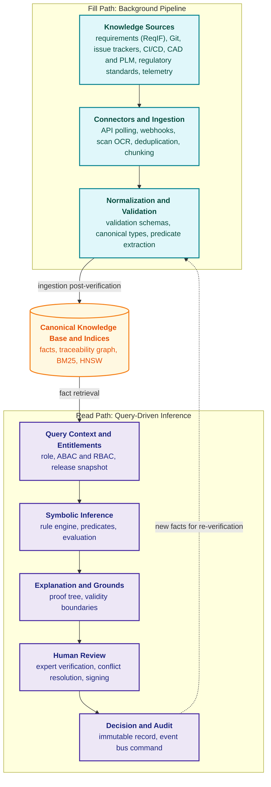
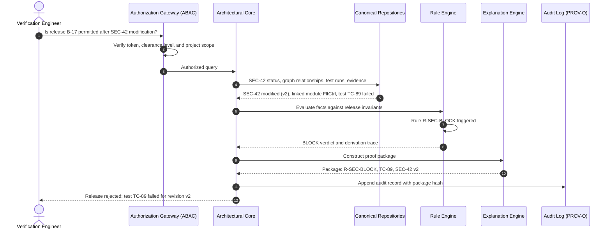
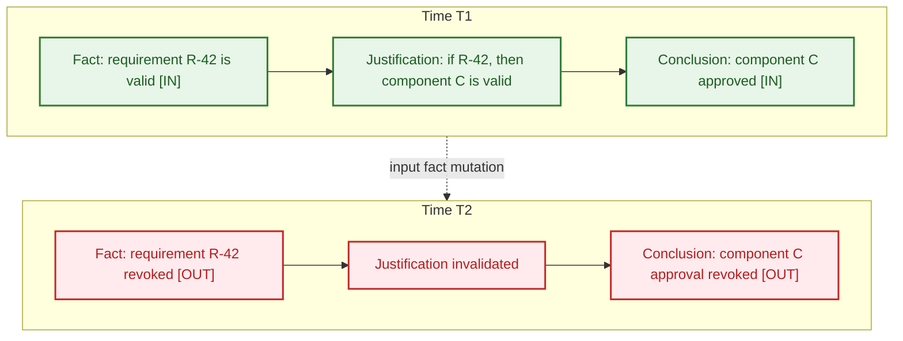
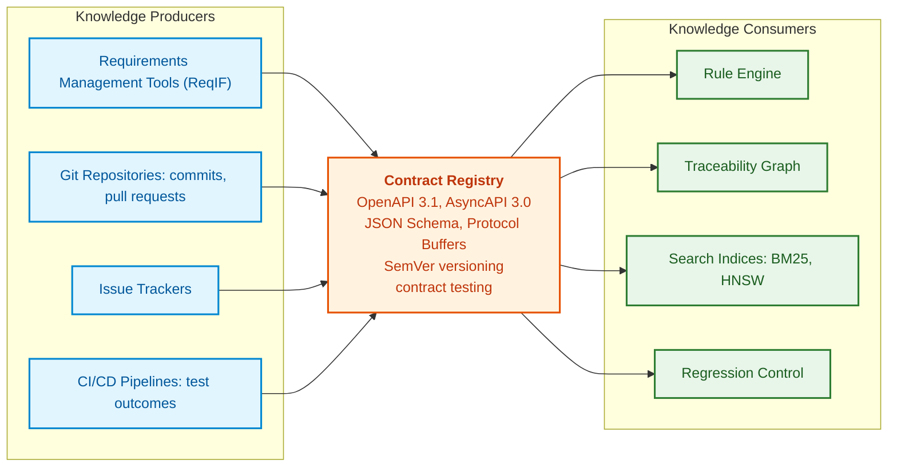

# Chapter 16. Expert System Architecture: From Formal Knowledge to Evidence-Governed Decisions

> **Book:** [Architecture of Evidence-Governed Expert Systems](README.md) · [Part IV: Architecture, Technology Stack, Inference, and Action](part-04-architecture-and-inference.md)  
> **Previous Chapter:** [Chapter 37. Input Information Assessment: Sources, Evidence, and Uncertainty](ch37-input-information-assessment-and-algorithmic-skepticism.md)  
> **Next Chapter:** [Chapter 17. Technology Stack: Selection Criteria for Tools, Programming Languages, and Rule Engines](ch17-implementation-stack.md)  
> **Table of Contents:** [README.md](README.md)  
> **Author:** [Mykola Fedchyk](about-the-author.md)  
> **Level:** Intermediate and advanced: systems architects, knowledge engineers, expert systems developers  
> **Learning Outcomes:** Decouple the architectural core of an expert system from replaceable adapters; design decoupled pipelines for knowledge ingestion (fill path) and inference (read path); select physical storage formats for each knowledge type; explain how truth maintenance invalidates conclusions upon fact mutation; specify data contracts between subsystems; measure retrieval, generation, and calibration quality; capture decision provenance using the W3C PROV-O model.

---

## Abstract

This chapter investigates the logical and functional architecture of an evidence-governed expert system, establishing a rigorous separation between the architectural core, proprietary functional subsystems, and replaceable adapters (LLMs, vector databases, search engines). The bifurcation of data flows into an asynchronous background fill path and a deterministic read-and-inference path is formally justified. The concept of operational engineering knowledge is formalized alongside a typology of persistence stores aligned with diverse consistency guarantees (ACID transactions, traceability graphs, W3C OWL ontologies, W3C PROV-O provenance chains). The mathematics of truth maintenance systems (JTMS and ATMS) is analyzed, demonstrating non-monotonic retraction dynamics when underlying facts mutate or are invalidated. In addition, inter-subsystem data contracts (OpenAPI, AsyncAPI, JSON Schema, Pact) are defined. Quantitative quality and reliability metrics ($`\mathrm{Recall@}k`$, MRR, nDCG, ECE) are established to systematically prevent silent failure modes and model overconfidence in safety-critical engineering domains.

---

Preceding chapters detailed the formalization of engineering knowledge: extracting functional and safety requirements, constructing source-grounded facts, and synthesizing finite-state automata. However, an arbitrary assembly of libraries, machine learning models, and databases does not constitute an expert system. What is required is an architecture: well-defined boundaries of responsibility among components, isolated pipelines for knowledge acquisition versus operational inference, persistence engines with verifiable consistency guarantees, and a formal mechanism governing what the system accepts as true.

A modern expert system deployed in research and development (R&D) environments lacks a single monolithic center. It is neither a naive "chat over documents" nor an isolated "rule engine over database tables." Within such a system, multiple classes of assertions coexist with differing epistemic reliability: deterministic facts, logical rules, an entity-relation graph, lexical and vector search yields, stochastic outputs from trained neural models, human expert determinations, and a tamper-evident audit trail. The NIST AI Risk Management Framework (AI RMF 1.0) identifies validity, reliability, accountability, transparency, explainability, and interpretability as essential attributes of trustworthy artificial intelligence systems [[1]](#src-1). Architecture dictates how these characteristics are enforced through structural design rather than empty declarations.

This chapter addresses a fundamental engineering question: **what components constitute an evidence-governed expert system, and where does authority reside for the admissibility of its decisions?** The central thesis posited here is that the canonical knowledge base, the inference engine, the admission policy, and the provenance ledger jointly formulate decisions strictly within the boundaries of an approved domain model. In contrast, information retrieval mechanisms, language models, and external connectors serve merely as candidate suppliers and auxiliary compute engines. Architectural separation alone does not guarantee the veracity of source materials or the soundness of inference rules: domain validation, contextual applicability, and formal sign-off remain indispensable.

This chapter focuses on the logical tier of the architecture: what constitutes knowledge in an engineering sense, where it resides, how queries traverse the execution pipeline, how the system responds to fact invalidation, how subsystems contractually negotiate data formats, and how system quality is empirically calibrated. The physical execution tier (model placement across compute clusters, hardware accelerators, latency budgets, and real-time execution bounds) is treated in [Chapter 18](ch18-execution-infrastructure.md).

## 1. Architectural Core and Responsibility Boundaries

In the engineering design of evidence-governed systems, the most perilous architectural defect is the blurring of boundaries between the authoritative decision-making mechanism and auxiliary statistical or retrieval services. When an expert system delegates the determination of truth to external utilities—such as generative neural models or approximate vector indices—it surrenders determinism, becoming vulnerable to silent failures and stochastic hallucinations that violate functional safety mandates (ISO 26262 ASIL D, IEC 61508 SIL 3). The **architectural core of an expert system** is the strictly controlled and formally verified core that exclusively governs decision semantics: the domain model, canonical facts, rules, invariant constraints, the proof graph, access policies, knowledge lifecycle states, and the complete reasoning trace. The architectural core alone provides authoritative answers to five fundamental questions:

- Which knowledge assets remain valid at the current evaluation timestamp?
- Which inference rules were triggered, and in what exact execution sequence?
- Why is the resulting conclusion technically and regulatory admissible?
- What primary source artifacts corroborate each intermediate inferential step?
- How can the complete chain of reasoning be deterministically reproduced months or years later?

Consequently, the architectural core must never be conflated with the tooling that surrounds it. A full-text search engine, a vector database, a Large Language Model (LLM), or a high-throughput runtime environment may offer powerful capabilities, but none possesses the authority to independently declare truth. Their operational mandate is restricted to supplying candidate fragments, computing statistical affinities, identifying semantic similarities, or synthesizing fluent surface text. An output transitions into an expert decision only when the architectural core subjects these intermediate artifacts to formal rules, ontological invariants, and provenance checks, thereby synthesizing a verifiable audit trail. The table below delineates system components into three distinct tiers.

| Tier | Component Scope | Logic Ownership |
|---|---|---|
| **Architectural Core** | Domain model, canonical knowledge base, rules, invariants, proof graph, authorization policies, audit subsystem, knowledge lifecycle | Expert system core |
| **Proprietary Functional Subsystems** | Connectors, ingestion and normalization, document chunking, indexing, calibration, explanation engines, human-in-the-loop review, feedback capture | Expert system, enforcing interface contracts and quality gates |
| **Third-Party Services** | Data stores, search engines, vector DBMS, model inference runtimes, LLMs, OCR modules, PLM/ALM platforms, issue trackers, CI/CD pipelines, model registries | External services execute computations but hold no ownership over expert decisions |

This division ensures systematic resilience across three canonical failure modes. If a third-party language model hallucinates an unsupported assertion, the architectural core identifies the missing evidentiary ground and halts conclusion synthesis. If a search index suffers corruption or desynchronization, the architectural core reconstructs the index directly from the canonical persistence layer. If an external issue tracking system modifies its schema, the connector and normalization layer absorbs the deviation within a versioned data contract, safeguarding inference rules from cascading breaks.

From the author's engineering practice: this boundary must be drawn uncompromisingly from day one. When search, vector retrieval, external connectors, and neural execution runtimes are coupled strictly as replaceable adapters, each adapter may suffer transient degradation or be swapped entirely without destabilizing domain entities, business rules, lifecycle states, decision traces, or audit logs. The inverse approach—wherein decision logic is dispersed across LLM prompt templates or search engine index configurations—inevitably incurs crippling architectural debt that requires protracted refactoring.

For the architectural core to effectively govern knowledge, one must first define what qualifies as operational knowledge.

## 2. Operational Knowledge in an Engineering Sense

To an expert system, knowledge cannot be treated as unstructured text. An engineering document may serve as an authoritative source of knowledge, but raw text in itself does not constitute operational knowledge that an automated inference engine can process.

Operational knowledge possesses a strongly typed schema, an assigned owner, an immutable version identifier, an explicit lifecycle state, verifiable provenance, a defined scope of applicability, explicit relationships to related artifacts, temporal validity intervals, and formal rules governing its application. An approved regulatory requirement, a draft engineering memo, a supplier clarification, a test execution protocol, and an informal comment in a messaging platform represent vastly disparate evidentiary weights, even when expressed in identical natural language. Operational knowledge comprises six core constituents:

- **Facts** capture verified states of an entity or operational environment: requirement REQ-101 is approved, test protocol TEST-404 failed, anomaly DEF-12 carries a critical severity status.
- **Rules** formalize causal relationships and decision logic: if a critical anomaly impacts a safety-critical subsystem, transition to field testing is blocked.
- **Ontologies** establish the formal conceptual taxonomy and semantic relations of the domain: defining requirements, components, test suites, hazards, and certification evidence. The canonical standard for domain ontologies is the W3C OWL 2 Web Ontology Language [[2]](#src-2).
- **Constraints and Invariants** delineate invalid operational states. For example, an organizational safety policy may mandate that a requirement assigned Safety Integrity Level SIL 3 cannot be marked closed without two independent verification reports. For knowledge graphs, such structural and semantic constraints are formalized using the W3C Shapes Constraint Language (SHACL) [[3]](#src-3).
- **Precedents** preserve structured historical expertise: root-cause resolutions for hydraulic cavitation in pump assemblies, or documented deviations granted by safety boards.
- **Provenance** tracks the pedigree of knowledge assets: identifying which agent asserted a fact, anchored to which source document, under which revision, and subject to what engineering assumptions. The W3C PROV-O ontology models this lineage as a directed graph of entities, activities, and agents [[4]](#src-4).

Thus, a knowledge base is not a passive file directory, but a rigorously governed graph of interconnected artifacts that an expert system can inspect for consistency, synthesize into logical proofs, render into explanations, and non-monotonically retract. The subsequent engineering challenge lies in selecting the physical persistence formats for this graph.

## 3. Physical Storage Forms and Typology of Knowledge Stores

Engineering knowledge does not admit a single, universal persistence format. Requirements, test runs, defect tickets, certification proofs, formal rules, neural model weights, and immutable audit events characterize the same product lifecycle, yet querying them demands fundamentally incompatible storage guarantees: ACID transactions, relational joins, graph traversals, lexical inverted indices, or high-dimensional nearest-neighbor searches. The diagram below organizes these storage formats according to operational requirements.

```mermaid
flowchart TB
    accTitle: Physical Forms of Knowledge Storage
    accDescr: Engineering knowledge is partitioned across three storage groups: structured data, retrieval and source artifacts, governance and reproducibility.

    K["<b>Physical Forms of Knowledge</b>"]

    subgraph Structured["Structured Data"]
        direction LR
        R["<b>Relational DBMS</b><br/>tables, joins, ACID transactions"]
        G["<b>Graph DBMS</b><br/>nodes, edges, traceability"]
        RDF["<b>RDF and OWL Triple Store</b><br/>triples, description logic"]
        D["<b>Document Store</b><br/>schema-validated JSON documents"]
    end

    subgraph Retrieval["Retrieval and Source Artifacts"]
        direction LR
        S["<b>Lexical Index</b><br/>BM25, facets, n-grams"]
        V["<b>Vector DBMS</b><br/>HNSW, semantic similarity"]
        O["<b>Object Storage</b><br/>PDF, CAD models, binary files"]
    end

    subgraph Governance["Governance and Reproducibility"]
        direction LR
        A["<b>Audit Log</b><br/>append-only, PROV-O, cryptographic hashes"]
        M["<b>Model Registry</b><br/>model cards, weights, quantization"]
    end

    K --> R & G & RDF & D
    K --> S & V & O
    K --> A & M

    classDef root fill:#e1f5fe,stroke:#0288d1,stroke-width:2px,color:#01579b;
    classDef struct fill:#e8f5e9,stroke:#2e7d32,stroke-width:2px,color:#1b5e20;
    classDef retr fill:#fff3e0,stroke:#e65100,stroke-width:2px,color:#bf360c;
    classDef gov fill:#ede7f6,stroke:#512da8,stroke-width:2px,color:#311b92;

    class K root;
    class R,G,RDF,D struct;
    class S,V,O retr;
    class A,M gov;
```



The diagram partitions storage engines into three functional tiers. Structured storage safeguards canonical facts and relations, retrieval engines and source repositories provide access to textual corpus items and binaries, and governance stores ensure auditability and deterministic reproducibility. Each format serves a specialized architectural purpose:

- **Relational Tables** store entities with rigid schemas, foreign-key integrity constraints, and strict transaction isolation: sign-off statuses, specification revisions, user authorization roles.
- **Graph Structures** handle recursive path queries, change impact analysis, and end-to-end traceability across requirements, source code units, and test suites.
- **RDF Triples and OWL Ontologies** support automated description logic inference and standards-compliant ontological reasoning under W3C semantics.
- **Document Stores** persist semi-structured diagnostic reports, complex configuration payloads, and stateful session contexts.
- **Lexical Indices** provide exact-match filtering over domain identifiers (standard numbers, clause references, hardware part numbers), faceted navigation, and full-text scoring; BM25 represents the standard ranking function [[5]](#src-5).
- **Vector Indices** locate semantically related precedents and regulatory clauses exhibiting vocabulary mismatch; graph-based indices such as Hierarchical Navigable Small World (HNSW) enable sub-linear approximate nearest neighbor retrieval [[6]](#src-6).
- **Object Storage** houses immutable raw source files (scanned inspection certificates, regulatory PDFs, telemetry streams) coupled with SHA-256 cryptographic digests.
- **Audit Logs** provide append-only, tamper-evident ledgers capturing inference timelines, executed rule sequences, and human expert interventions.
- **Model Registries** version model metadata, evaluation metrics, quantization parameters, and binary weight checkpoints for neural models.

From the author's engineering practice: attempting to construct an expert system atop a single "universal" database engine is an anti-pattern. Highly governed facts, rules, and lifecycle states should reside in transactional relational stores; structural links in a traceability graph; lexical and vector layers as derived, disposable indices optimized for rapid rebuilding; and raw source files in immutable object storage. While this polyglot persistence architecture demands rigorous synchronization discipline, it ensures that every query profile is handled by an engine purpose-built for that access pattern.

The most prevalent architectural temptation is collapsing all storage forms into a single vector database. The subsequent section demonstrates why this approach fails in safety-critical engineering.

## 4. Limitations of Vector Stores and Decoupling Semantic Search from Canonical Truth

A vector database addresses a narrow mathematical query: which textual chunks yield embedding vectors with the highest geometric proximity (cosine similarity or inner product) to a query vector. While effective for semantic matching, it cannot answer foundational engineering and regulatory questions:

- Was this standard clause legally enforceable on the production release date?
- Has this requirement been superseded by a subsequent engineering change bulletin?
- Does the active user possess the requisite security clearance to view this clause?
- Does the retrieved chunk conflict with a mandatory safety invariant defined elsewhere?

Resolving these questions relies not on semantic vector proximity, but on authoritative metadata and relational constraints: document lifecycle status, supersession graphs, access control policies, and consistency invariants. Consequently, an expert system relying solely on vector similarity over document chunks will cite obsolete operating procedures, rescinded standards, and contradictory engineering rules with high confidence. [Chapter 15](ch15-knowledge-extraction-and-kb-construction.md) illustrated this failure mode through the evolution of SMTP protocol RFC specifications.

The governing architectural invariant is formulated as follows: **vector search returns candidate fragments only, and every candidate must carry complete canonical metadata**:

- An unambiguous, immutable identifier referencing the canonical source;
- The document revision number and temporal validity interval;
- Regulatory lifecycle status: active, revoked, or under revision;
- An information classification and access control tag;
- A cryptographic digest (SHA-256) of the primary source artifact;
- A vectorization pipeline fingerprint: embedding model identifier and revision, normalization parameters, and chunking strategy.

Even after metadata validation, a retrieved candidate requires content verification and access authorization; matching an active revision does not establish interpretive correctness. Furthermore, embeddings generated by distinct models cannot be geometrically compared in a shared vector space without established alignment mappings. Modifying chunking boundaries while retaining the same encoder does not alter the coordinate space, but it fundamentally shifts the semantic retrieval units and ground-truth relevance rankings. Capturing a pipeline fingerprint is mandatory across both types of modifications.

With persistence boundaries established, the overarching system architecture can now be constructed.

## 5. Reference Architecture: Fill Path and Read Path

The reference architecture of an evidence-governed expert system enforces a strict bifurcation between two execution flows characterized by divergent latency budgets and reliability profiles:

1. **The Fill Path** is an asynchronous background pipeline that ingests, parses, normalizes, and validates raw engineering assets into canonical, structured knowledge.
2. **The Read Path** processes interactive or automated queries: resolving user context and access rights, retrieving verified facts, evaluating inference rules, synthesizing formal explanations, and persisting an audit record.

This separation is mandatory because parsing multi-gigabyte CAD models, OCR-processing historical engineering drawings, and verifying external citations require minutes or hours and may encounter transient ingestion errors. Conversely, query resolution on the read path must execute within seconds, drawing exclusively upon pre-verified, canonical knowledge. Coupling document parsing directly into query execution makes query latency and reliability hostage to transient ingestion anomalies. The diagram below illustrates both pathways.



In this architecture, the fill path terminates at the canonical knowledge base and derived indices, while the read path operates strictly as a read-only consumer. Derived facts generated during read-path inference never bypass validation to write directly into canonical storage: they must cycle back through normalization and validation, subjected to identical integrity checks as external inputs. The functional responsibilities of the architectural components are distributed as follows:

- **Source Connectors** isolate the proprietary protocols of external enterprise systems (issue trackers, version control systems, requirements management suites, PLM platforms, engineering wikis), ensuring reliable event ingestion.
- **The Ingestion Pipeline** parses complex file formats (PDF, DOCX, ReqIF, XML), extracts tabular data and mathematical formulas, performs OCR on legacy drawings, computes cryptographic hashes, and appends provenance metadata.
- **The Normalization Layer** maps heterogeneous external entities onto a unified domain ontology, reconciling localized identifiers into global uniform resource identifiers (URIs) and standardizing units of measurement to SI standards.
- **The Symbolic Inference Engine** evaluates production rules, identifies invariant violations, and evaluates formal domain equations. Production rules are matched using algorithms such as Rete [[7]](#src-7), while recursive queries over relational facts are evaluated via Datalog engines [[8]](#src-8).
- **The Explanation Layer** synthesizes a formal proof tree detailing which rules were triggered, what underlying facts supported each premise, and what data deficiencies precluded categorical assertions.
- **The Human-in-the-Loop Module** enforces graduated autonomy thresholds, automatically routing high-criticality recommendations to qualified human experts for formal sign-off.
- **The Authorization Gateway** enforces data access policies over facts and document fragments. Role-Based Access Control (RBAC) grants baseline permissions based on organizational role [[9]](#src-9), while Attribute-Based Access Control (ABAC) evaluates user, resource, and environmental attributes, such as project assignment and security clearance level [[10]](#src-10). Access policies are cleanly expressed in declarative languages such as Rego within an Open Policy Agent daemon [[11]](#src-11).

To observe how these components interact in production, we examine the lifecycle of a concrete query.

## 6. Query Lifecycle: From Question to Proof Package

Consider an engineering scenario: a verification engineer submits the query: *"Is the production release of flight avionics software version B-17 permitted following the modification of cybersecurity requirement SEC-42?"* The sequence diagram illustrates the component interactions required to resolve this query.



The table below details the five stages of query processing.

| Stage | Action | Components | Deliverable |
|---|---|---|---|
| **1. Context & Security** | Authenticate engineer identity; resolve active project, role, clearance tier, and target release branch | Authorization gateway, policy service | Validated security context with row/graph filtering constraints |
| **2. Fact Retrieval** | Query SEC-42 lifecycle status, traverse traceability graph to dependent software components, retrieve test execution reports | Graph DBMS, relational store, lexical index | Validated fact set bound to exact revision digests |
| **3. Rules & Inference** | Match active facts against formal release safety invariants | Rule engine (Datalog or Rete) | Definitive "BLOCK" verdict accompanied by triggered invariant identifiers |
| **4. Explanation** | Compile proof package: modified requirement, affected source code units, failed test execution TC-89, rule R-SEC-BLOCK | Explanation engine; LLM invoked exclusively for natural-language text synthesis | Proof package containing verifiable cryptographic links |
| **5. Decision & Audit** | Persist engineer sign-off or automated system veto into an immutable ledger | Audit subsystem, enterprise event bus | Digitally signed, verifiable decision record |

Notice that the neural language model appears exclusively at Stage 4, tasked solely with synthesizing an executive text summary of an already compiled proof package. The decision to block release B-17 was rendered deterministically by rule `R-SEC-BLOCK` operating over facts retrieved from canonical stores; the decision is entirely reproducible without invoking the language model. However, facts in engineering environments are non-static: test TC-89 may be rerun, or requirement SEC-42 amended. How the system reconciles historical conclusions when underlying facts change is addressed in the next section.

## 7. Truth Maintenance Systems and Invalidation of Conclusions upon Fact Mutation

In engineering domains, knowledge is inherently non-monotonic: specifications undergo change, standards are amended, and test suites are re-executed. An expert system that purports to be evidence-governed must answer a vital question: what becomes of previously certified conclusions when a foundational premise is retracted or modified? Without a formal Truth Maintenance System (TMS), a knowledge base progressively degenerates into a repository of stale, mutually contradictory conclusions.

Classical artificial intelligence provides two foundational truth maintenance paradigms. A Justification-based Truth Maintenance System (JTMS), pioneered by Jon Doyle, tags every proposition with either an `IN` (accepted) or `OUT` (unaccepted) label depending on whether the proposition is supported by at least one currently valid justification [[12]](#src-12). An Assumption-based Truth Maintenance System (ATMS), developed by Johan de Kleer, tags each proposition with the set of assumptions under which it holds true, thereby enabling simultaneous exploration of multiple hypothetical worlds—such as evaluating structural trade-offs when airframe weight increases by 5% [[13]](#src-13).

> [!NOTE] Architectural Distinction Between JTMS and ATMS in Production Engineering
> - **JTMS (Single-Context Model):** Operates on state toggling between `IN` and `OUT`. When an antecedent fact is retracted, the JTMS propagates non-monotonic retractions along the justification dependency graph. This model is exceptionally well-suited for reactive configuration control (e.g., verifying release integrity within CI/CD pipelines).
> - **ATMS (Multiple-Context Model):** Tags each proposition with an environment label—a set of foundational assumptions under which the proposition is logically valid. The ATMS maintains multiple, mutually contradictory hypothetical branches simultaneously without requiring expensive backtracking. This capability is indispensable for engineering trade-off studies: the system evaluates Option A ("titanium alloy chassis: weight -15%, manufacturing cost +40%") and Option B ("carbon composite chassis: weight -20%, delamination hazard at temperatures exceeding 120°C") concurrently.

The diagram below illustrates the canonical JTMS retraction behavior: a conclusion depends on an antecedent fact, and retracting the fact immediately revokes the conclusion.



In JTMS terminology, the diagram illustrates that at timestamp T1, requirement R-42 holds label `IN`, its justification is valid, and conclusion "component C approved" holds label `IN`. At timestamp T2, requirement R-42 is revoked (`OUT`), the justification becomes invalid, and the dependent conclusion transitions to `OUT`.

However, a naive heuristic that blindly revokes all downstream conclusions upon the invalidation of an antecedent is flawed: an alternative valid justification may still sustain the conclusion. The program listing below implements a positive justification maintenance algorithm (a minimal monotonic closure over justifications, rather than a full JTMS with non-monotonic negation-as-failure). Label `IN` denotes positive derivation from accepted premises; label `OUT` denotes the absence of such support, rather than a proven contradiction. The instructional safety policy in this example allows substituting a physical test protocol with an approved simulation report—an illustrative convention for this example rather than a universal certification standard.

<details>
<summary>Go Implementation: JTMS Label Propagation with Alternative Justifications</summary>

```go
package main

import "fmt"

// Node represents a proposition in the justification network.
type Node struct {
	Name    string
	Premise bool       // premise: holds the IN label until retracted
	Just    [][]string // justifications: each is a set of antecedent propositions
}

// label computes labels from scratch: initially, all propositions have the OUT label,
// then the IN label is propagated as long as state changes occur. Consequently, a proposition
// cannot justify itself through a cycle.
func label(nodes []Node, retracted map[string]bool) (map[string]bool, error) {
    known := map[string]bool{}
    for _, node := range nodes {
        if node.Name == "" || known[node.Name] {
            return nil, fmt.Errorf("empty or duplicate node: %q", node.Name)
        }
        known[node.Name] = true
    }
    for _, node := range nodes {
        for _, justification := range node.Just {
            for _, antecedent := range justification {
                if !known[antecedent] {
                    return nil, fmt.Errorf("unknown antecedent: %q", antecedent)
                }
            }
        }
    }
	in := map[string]bool{}
	for changed := true; changed; {
		changed = false
		for _, n := range nodes {
			v := n.Premise && !retracted[n.Name]
			for _, j := range n.Just {
				all := true
				for _, a := range j {
					all = all && in[a]
				}
				v = v || all
			}
			if in[n.Name] != v {
				in[n.Name] = v
				changed = true
			}
		}
	}
    return in, nil
}

func mark(b bool) string {
	if b {
		return "IN"
	}
	return "OUT"
}

func main() {
	nodes := []Node{
		{Name: "R-42 valid", Premise: true},
		{Name: "TC-89 passed", Premise: true},
		{Name: "SIM-12 approved", Premise: true},
		{Name: "DOC-3 agreed", Premise: true},
		{Name: "C valid", Just: [][]string{
			{"R-42 valid", "TC-89 passed"},
			{"R-42 valid", "SIM-12 approved"},
		}},
		{Name: "release permitted", Just: [][]string{{"C valid", "DOC-3 agreed"}}},
	}
	for _, r := range []string{"", "TC-89 passed", "R-42 valid"} {
        in, err := label(nodes, map[string]bool{r: true})
        if err != nil {
            panic(err)
        }
		if r == "" {
			r = "none"
		}
		fmt.Printf("retracted: %-14s | C valid: %-3s | release permitted: %s\n",
			r, mark(in["C valid"]), mark(in["release permitted"]))
	}
}
```

Negative edge cases and topological permutations are verified in an accompanying test file; executed via: `go test -v main.go main_test.go`.

```go
package main

import "testing"

func TestPositiveSupport(testCase *testing.T) {
    nodes := []Node{
        {Name: "source", Premise: true},
        {Name: "alternative", Premise: true},
        {Name: "claim", Just: [][]string{{"source"}, {"alternative"}}},
    }
    remaining, err := label(nodes, map[string]bool{"source": true})
    if err != nil || !remaining["claim"] {
        testCase.Fatalf("alternative support lost: %v", err)
    }
    removed, err := label(nodes, map[string]bool{"source": true, "alternative": true})
    if err != nil || removed["claim"] {
        testCase.Fatalf("unsupported claim accepted: %v", err)
    }
    for left, right := 0, len(nodes)-1; left < right; left, right = left+1, right-1 {
        nodes[left], nodes[right] = nodes[right], nodes[left]
    }
    reordered, err := label(nodes, map[string]bool{"source": true})
    if err != nil || reordered["claim"] != remaining["claim"] {
        testCase.Fatalf("order changed result: %v", err)
    }
    cycle := []Node{{Name: "first", Just: [][]string{{"second"}}},
        {Name: "second", Just: [][]string{{"first"}}}}
    cyclic, err := label(cycle, nil)
    if err != nil || cyclic["first"] || cyclic["second"] {
        testCase.Fatalf("unfounded cycle accepted: %v", err)
    }
    if _, err := label([]Node{{Name: "same", Premise: true}, {Name: "same"}}, nil); err == nil {
        testCase.Fatal("duplicate nodes accepted")
    }
    if _, err := label([]Node{{Name: "claim", Just: [][]string{{"missing"}}}}, nil); err == nil {
        testCase.Fatal("unknown antecedent accepted")
    }
}
```

Expected output of the instructional program:

```text
retracted: none           | C valid: IN  | release permitted: IN
retracted: TC-89 passed   | C valid: IN  | release permitted: IN
retracted: R-42 valid     | C valid: OUT | release permitted: OUT
```

</details>

Retracting test result TC-89 leaves all high-level conclusions intact because component C maintains an independent, valid justification via simulation report SIM-12. A naive cascade algorithm would have erroneously aborted the release. Conversely, retracting requirement R-42 invalidates both justifications simultaneously, transitioning both "C valid" and "release permitted" to `OUT`. Because labels are computed upward from an initial all-`OUT` baseline via monotonic `IN` propagation, propositions cannot bootstrap their own validity through circular dependencies. Doyle established incremental label propagation algorithms that circumvent full network recomputation [[12]](#src-12). While this instructional implementation recomputes labels from scratch, it yields identical labelings for positive justification networks lacking non-monotonic out-conditions.

The environment lattice in an ATMS can experience combinatorial expansion. For positive Datalog-like rules without infinite value generation, the algorithm computes the least fixed point over a finite set of nodes; non-monotonic negation and conflict assumptions are omitted for clarity. Retracting a premise does not declare dependent propositions false: the engine re-evaluates whether alternative justifications sustain them. Furthermore, the knowledge graph need not form a directed acyclic graph (DAG); cycles are legitimate across cyclic domain relations, provided they do not synthesize self-justifying claims devoid of external ground premises.

## 8. Consistent Read Context and Decision Replay

Reproducing an expert decision requires evaluating it against an exact historical execution context: knowledge pack identifier, rule and schema version digests, domain profile, target timestamp, explicit operational assumptions, and active access control policies. Both canonical stores and derived search indices must report data generation tags. If a retrieval adapter returns artifacts from a divergent generation, the verifier must evaluate candidates against a pinned snapshot or reject the operation, preventing the conflation of facts across distinct release baselines. This principle applies equally to partitioned architectures: a query must address a single generation tag across all shards, and a shard reporting a mismatched generation is treated as silent. Shard silence does not denote the non-existence of a fact: the four possible query outcomes and the six data partitioning rules are formalized in [Chapter 7](ch07-knowledge-base-typology.md), with router implementation details provided in Section 10 of [Chapter 32](ch32-high-performance-knowledge-packs-mmap-and-harvesting.md).

Historical replay and active query authorization represent decoupled concerns. An auditor must be able to reconstruct the historical reasoning chain that governed a legacy decision without possessing the authorization to view redacted or classified document fragments in the present day. Cache keys must encapsulate both execution context and credential scopes, and active fact revocation must be capable of preempting the return of cached results. Dependencies and historical traces must be retained in accordance with data classification schedules and retention limits, rather than stored indefinitely under an uncritical appeal to "auditability."

Architectural governance requires verifying not only nominal system execution, but also adapter replacement, generation mismatch handling, alternative justification retention, event idempotency, and access revocation. Context dictates which data assets are admissible; the subsequent section establishes the formal contracts governing data exchange across subsystems.

Truth maintenance operates effectively only when incoming facts adhere to predictable, strongly typed schemas. If a data source silently alters a field name, the inference engine remains blind to fact mutations. This vulnerability is mitigated through data contracts.

## 9. Inter-Subsystem Data Contracts

Subsystems within an expert system must interact exclusively through strongly typed, versioned data contracts. Direct database coupling—where components query internal database tables belonging to peer subsystems—or untyped message exchange inevitably induces silent system failures. Consider a typical failure scenario: a CI/CD pipeline renames a test execution field from `verdict` to `result`. An inference rule defined as *"block release if security test verdict equals fail"* encounters missing fields, evaluates to false, and issues an erroneous release clearance without raising an exception.



The diagram demonstrates that knowledge producers do not emit raw payloads directly to downstream consumers: every event payload is mediated by a centralized schema registry that enforces structural schemas and compatibility checks. A robust data contract comprises four architectural pillars:

- **Semantic Versioning:** Breaking schema modifications mandate a major version increment under SemVer conventions [[14]](#src-14), e.g., `EngineeringRequirementUpdated.v2`.
- **Structural Schema Definition:** JSON Schema [[15]](#src-15) or Protocol Buffers [[16]](#src-16) formalize field data types, boundary constraints, required provenance metadata, and cryptographic signature attributes. Synchronous HTTP/gRPC interfaces are defined via OpenAPI specifications [[17]](#src-17), while asynchronous event streams are formalized via AsyncAPI [[18]](#src-18).
- **Compatibility Governance:** The schema registry validates backward compatibility prior to schema registration, preventing producer updates from breaking downstream consumer pipelines.
- **Consumer-Driven Contract Testing:** Consumers formalize message expectations as executable contracts, which are validated within the producer's CI/CD pipeline prior to deployment, as implemented by frameworks such as Pact [[19]](#src-19).

In the field-renaming scenario, a contract test maintained by the inference engine expects field `verdict` with enum values `{"pass", "fail", "error"}`. A CI/CD build introducing the renamed field fails contract verification, catching the regression during integration testing rather than after an unauthorized release. Data contracts eliminate one major class of silent failures; the subsequent section catalogs the silent failure modes characteristic of each architectural tier.

## 10. Silent Failure Modes and Mitigation Mechanisms

Architectural resilience is evaluated not merely under nominal conditions, but by how effectively it localizes, detects, and mitigates subsystem failures. In expert systems, the most perilous failure modes are silent failures: states where software processes run without error codes yet produce technically invalid or safety-compromising conclusions due to corrupted or incomplete data. The table below catalogs these failure modes across architectural layers.

| Architectural Layer | Silent Failure Mode | Systemic Consequence | Architectural Mitigation |
|---|---|---|---|
| **Source Connectors** | Partial synchronization failure due to silent network timeouts | Inference engine evaluates partial fact sets | High-watermark event tracking, source checksum reconciliation, `DEGRADED_SOURCE` status halting automated decisions |
| **Normalization** | Incorrect status mapping (e.g., mapping `Resolved` to `Closed`) | Rules evaluate unresolved anomalies as closed, passing release gates | Quarantine dead-letter queues for unmapped enum values, strict closed vocabularies, ingress validation gates |
| **Knowledge Graph** | Dangling nodes and orphaned edges following entity deletion | Distorted change impact analysis, unmitigated safety risks | Cascading transactional deletes, automated isolation audits, periodic provenance integrity checks |
| **Inference Engine** | Non-deterministic rule execution order over shared mutable memory | Identical fact sets yield diverging verdicts | Prohibition of shared mutable state, deterministic rule salience rankings, session-scoped working memory isolation |
| **Vector Index** | Blending embeddings across distinct model checkpoints or chunk sizes | Corrupted semantic retrieval and compromised reasoning contexts | Embedding pipeline fingerprints attached to vectors, isolated index partitions, full re-indexing upon model updates |
| **Language Model** | Factual assertion synthesized without source citation | Fraudulent proof package, misinforming human auditors | Strict sentence-level grounding verifiers against canonical passages, automatic veto on ungrounded claims |

A unifying design philosophy governs all six mitigations: when confronted with uncertainty, an architectural layer must never remain silent; it must flag the affected state as degraded, route data to quarantine, or abort the decision. Silent failure is thereby transformed into explicit degradation visible within audit ledgers and proof packages. However, detecting insidious, long-term quality drift requires formal mathematical measurement.

## 11. Quality Calibration and Regression Control

When an expert system's domain vocabulary is enriched, an inference rule added, or an embedding model updated, knowledge engineers must mathematically demonstrate that overall system performance has not regressed. This requires a multi-tiered regression quality gate with layer-specific metrics.

**Rule Regression Testing:** A suite of golden engineering test cases establishes mandatory triggered rules, derived facts, and definitive conclusions for each scenario. Any modification to the knowledge base triggers the entire test suite; any divergence from golden baselines halts the deployment pipeline.

**Information Retrieval Evaluation:** Within the continuous integration (CI/CD) pipeline, regression testing of the hybrid retrieval layer (combining BM25 and HNSW) detects retrieval recall degradation over normative knowledge. The failure mode involves an updated embedding model or modified tokenization pipeline causing a critical functional safety requirement (e.g., a mandatory ISO 26262-8 clause or DO-178C objective) to fall outside the top-$k$ retrieved candidates, forcing the inference engine to operate on an incomplete evidentiary context. To evaluate retrieval completeness and ranking efficacy across a verified golden set of engineering queries $Q$, dimensionless metrics $`\mathrm{Recall@}k`$, $`\mathrm{Precision@}k`$, and Mean Reciprocal Rank ($`\mathrm{MRR}`$) are computed:

```math
\mathrm{Recall@}k = \frac{\lvert\mathrm{Rel} \cap \mathrm{Top}_k\rvert}{\lvert\mathrm{Rel}\rvert}, \qquad
\mathrm{Precision@}k = \frac{\lvert\mathrm{Rel} \cap \mathrm{Top}_k\rvert}{k}, \qquad
\mathrm{MRR} = \frac{1}{\lvert Q \rvert} \sum_{q \in Q} \frac{1}{\mathrm{rank}_q}.
```

**Parameters and Admissible Ranges:**
- $Q$ — golden evaluation benchmark of engineering queries with rigorously annotated relevance ($`\lvert Q \rvert \ge 100`$).
- $`\mathrm{Rel} \subset \mathcal{D}`$ — set of knowledge base fragments strictly required to resolve query $q$ ($`\lvert\mathrm{Rel}\rvert \ge 1`$).
- $`\mathrm{Top}_k \subset \mathcal{D}`$ — top-$k$ candidate fragments returned by the retrieval adapter ($`k \in \{5, 10, 20\}`$).
- $`\lvert\cdot\rvert`$ — set cardinality; $\cap$ — set intersection operator.
- $`\mathrm{rank}_q \in \{1, 2, \dots, \lvert\mathcal{D}\rvert\}`$ — rank position of the first relevant fragment returned for query $q$. If no relevant fragment appears within the cutoff, reciprocal rank $`1/\mathrm{rank}_q`$ is deterministically set to 0.
- $`\mathrm{Recall@}k \in [0, 1]`$ — retrieval recall (fraction of required normative clauses successfully retrieved).
- $`\mathrm{Precision@}k \in [0, 1]`$ — retrieval precision (fraction of retrieved candidates that are truly relevant).
- $`\mathrm{MRR} \in [0, 1]`$ — Mean Reciprocal Rank, measuring accessibility speed to the first authoritative ground truth.

**Practical Application and Engineering Guidance:**
- Metric evaluation executes automatically within nightly regression pipelines upon index updates or re-ranking parameter tuning.
- Release Quality Gate: for safety-critical knowledge bases, minimum acceptance thresholds are enforced at $`\mathrm{Recall@}5 \ge 0{,}98`$ and $`\mathrm{MRR} \ge 0{,}85`$.
- If $`\mathrm{Recall@}5 < 0{,}98`$, the deployment pipeline aborts with status `BUILD_BLOCKED_RETRIEVAL_REGRESSION`: deployment of the updated index is blocked, as the risk of omitting a mandatory safety standard exceeds acceptable risk limits for ASIL D systems.

**Worked Numerical Example:**
For an evaluation query concerning watchdog timer (WDT) hardware configuration, the standard specifies $`\lvert\mathrm{Rel}\rvert = 4`$ mandatory fragments. Within cutoff window $k = 5$, the engine returns 3 relevant fragments ($`\lvert\mathrm{Rel} \cap \mathrm{Top}_5\rvert = 3`$), with the first relevant fragment positioned at rank 2 ($`\mathrm{rank}_q = 2`$):

```math
\mathrm{Recall@}5 = \frac{3}{4} = 0{,}75, \qquad \mathrm{Precision@}5 = \frac{3}{5} = 0{,}60, \qquad \mathrm{RR}_q = \frac{1}{2} = 0{,}50
```

Because $`\mathrm{Recall@}5 = 0{,}75 < 0{,}98`$, the quality gate halts index deployment, flagging the omission of a mandatory specification clause.

When relevant fragments carry unequal normative and legal weight (mandatory safety standards versus recommended guidelines versus informative context), binary relevance labels prove insufficient. To accommodate graded relevance, Normalized Discounted Cumulative Gain ($`\mathrm{nDCG}`$), formulated by Järvelin and Kekäläinen, is employed [[20]](#src-20):

```math
\mathrm{DCG@}k = \sum_{i=1}^{k} \frac{\mathrm{rel}_i}{\log_2(i+1)}, \qquad
\mathrm{nDCG@}k = \frac{\mathrm{DCG@}k}{\mathrm{IDCG@}k}.
```

**Parameters and Admissible Ranges:**
- $i \in \{1, \dots, k\}$ — position rank within the retrieved candidate list.
- $`\mathrm{rel}_i \in \{0, 1, 2, 3\}`$ — discrete relevance grade: 3 = mandatory safety invariant (violation inadmissible); 2 = recommended standard practice; 1 = informative context; 0 = irrelevant noise.
- $`\log_2(i+1)`$ — logarithmic discount factor penalizing relevant fragments placed lower in the ranking.
- $`\mathrm{DCG@}k \in [0, \infty)`$ — Discounted Cumulative Gain accumulated across the top-$k$ positions.
- $`\mathrm{IDCG@}k \in (0, \infty)`$ — Ideal DCG, computed over the same relevance scores sorted in descending order. If $`\mathrm{IDCG@}k = 0`$, the metric defaults to 1 when $`\mathrm{DCG@}k = 0`$, and 0 otherwise.
- $`\mathrm{nDCG@}k \in [0, 1]`$ — normalized ranking efficacy score.

**Practical Application and Engineering Guidance:**
- This metric verifies that auxiliary background notes do not displace mandatory safety invariants from top retrieval ranks.
- Quality Gate Threshold: $`\mathrm{nDCG@}10 \ge 0{,}92`$.
- If for any benchmark query in a safety-critical category a mandatory invariant ($`\mathrm{rel}_i = 3`$) falls below the third rank position ($i > 3$), the system flags an ordering priority violation and returns the retrieval encoder configuration for re-tuning.

**Generation Quality Evaluation:** When a language model synthesizes explanatory narratives, three core metrics from the RAGAS framework are assessed [[21]](#src-21): faithfulness (verifying that every generated statement is strictly entailed by the retrieved context), answer relevance (evaluating alignment with the user query), and context relevance (measuring retrieved passage precision relative to the query).

**Confidence Calibration:** When a statistical classifier or neural network outputs confidence scores for domain predicates, these scores must align empirically with real-world accuracy frequencies. Modern deep neural architectures routinely exhibit pathological overconfidence, as demonstrated by Guo et al. [[22]](#src-22). Calibration deviation is quantified via Expected Calibration Error (ECE):

```math
\mathrm{ECE} = \sum_{m=1}^{M} \frac{\lvert B_m \rvert}{n} \left\lvert \mathrm{acc}(B_m) - \mathrm{conf}(B_m) \right\rvert.
```

**Parameters and Admissible Ranges:**
- $M \in \mathbb{N}$ — number of equal-width probability bins partitioning $[0, 1]$ (standard engineering baseline: $M = 10$, bin width 0.1).
- $m \in \{1, \dots, M\}$ — index of probability bin $I_m = \left(\frac{m-1}{M}, \frac{m}{M}\right]$.
- $B_m$ — subset of evaluation samples whose predicted confidence falls within bin $I_m$.
- $n$ — total sample size ($`n = \sum_{m=1}^M \lvert B_m \rvert`$).
- $`\lvert B_m \rvert/n \in [0, 1]`$ — statistical weight of bin $m$.
- $`\mathrm{acc}(B_m) = \frac{1}{\lvert B_m \rvert} \sum_{i \in B_m} \mathbf{1}(\hat y_i = y_i) \in [0, 1]`$ — empirical accuracy within bin $m$ ($\mathbf{1}$ denotes the indicator function).
- $`\mathrm{conf}(B_m) = \frac{1}{\lvert B_m \rvert} \sum_{i \in B_m} \hat p_i \in [0, 1]`$ — mean model confidence within bin $m$.
- $\mathrm{ECE} \in [0, 1]$ — Expected Calibration Error (expressed as a fraction or percentage).

**Practical Application and Engineering Guidance:**
- Calibration auditing is mandatory during qualification of fact-extraction models prior to deployment in the fill path.
- Engineering Threshold: autonomous fact ingestion requires $\mathrm{ECE} \le 0{,}03$ (3%).
- If $\mathrm{ECE} > 0{,}05$, raw model confidence scores are deemed uncalibrated and are strictly prohibited from serving as rule firing thresholds. The model must undergo recalibration via Platt scaling, isotonic regression, or temperature scaling; until re-qualified, all extracted facts require mandatory Human-in-the-Loop review.

**Worked Numerical Calibration Example:**
A test set of $n = 1\,000$ defect classifications is partitioned into two aggregated bins:
- Bin 1 ($I_1$): $`\lvert B_1 \rvert = 600`$, mean confidence $`\mathrm{conf} = 0{,}92`$, empirical accuracy $`\mathrm{acc} = 0{,}90`$;
- Bin 2 ($I_2$): $`\lvert B_2 \rvert = 400`$, mean confidence $`\mathrm{conf} = 0{,}70`$, empirical accuracy $`\mathrm{acc} = 0{,}68`$.

```math
\mathrm{ECE} = \frac{600}{1000} \cdot \lvert 0{,}90 - 0{,}92 \rvert + \frac{400}{1000} \cdot \lvert 0{,}68 - 0{,}70 \rvert = 0{,}6 \cdot 0{,}02 + 0{,}4 \cdot 0{,}02 = 0{,}012 + 0{,}008 = 0{,}020
```

Because $\mathrm{ECE} = 0{,}020 \le 0{,}030$, the classifier satisfies the criteria for autonomous operational deployment.

> [!WARNING] The Overconfidence Trap in Safety-Critical Systems
> Deep neural networks and LLMs suffer from systematic overconfidence: a model may output `conf = 0.99` for a proposition where empirical precision barely achieves `acc = 0.65`. In functional safety domains (ISO 26262 ASIL D, DO-178C DAL A), this creates a dangerous illusion of certitude, allowing unverified artifacts to bypass engineering review. Without prior probability calibration (via temperature scaling or isotonic regression), raw classifier probabilities must **never** be used as thresholds for automated decision-making.

Each metric addresses a distinct failure mode: high Recall@k does not guarantee explanation faithfulness, and low ECE does not ensure rule completeness. Furthermore, metrics reflect system quality at the moment of evaluation. Reproducing an expert decision years later requires comprehensive versioning and provenance tracking.

## 12. Versioning and Decision Provenance

The defining pledge of an evidence-governed expert system is the ability to reconstruct, years after the fact, the precise knowledge state that produced a critical engineering decision. An archived textual report is insufficient: one must capture the exact version identifiers of every contributing artifact. Version control must encompass:

- Specific revisions of regulatory standards and requirements specifications;
- Inference rule packages and declarative constraint suites;
- Domain ontologies and concept taxonomies;
- Embedding models, quantized neural checkpoints, and system prompts;
- Text parsing and chunking configurations;
- Access control matrices active at query evaluation time.

The W3C PROV-O ontology models data provenance through three core primitives [[4]](#src-4). An **Entity** denotes any data artifact: a document, fact, rule, or compiled proof package. An **Activity** represents a process consuming and generating entities: parsing ReqIF files, evaluating rule sets, computing embeddings, or conducting human reviews. An **Agent** is an entity bearing responsibility: a connector worker, an extractor model, or a specific engineer. The decision on release B-17 from Section 6 is formalized in Turtle syntax [[23]](#src-23) as follows:

<details>
<summary>Provenance Graph in Turtle Format</summary>

```turtle
@prefix prov: <http://www.w3.org/ns/prov#> .
@prefix ex:   <https://example.org/kb/> .

ex:decision-B17 a prov:Entity ;
    prov:wasGeneratedBy ex:release-check-0314 ;
    prov:wasDerivedFrom ex:SEC-42-v2 , ex:TC-89-run-1187 , ex:rule-R-SEC-BLOCK-v3 .

ex:release-check-0314 a prov:Activity ;
    prov:used ex:SEC-42-v2 , ex:TC-89-run-1187 , ex:rule-R-SEC-BLOCK-v3 ;
    prov:wasAssociatedWith ex:inference-engine-1-4-2 , ex:engineer-petrenko .

ex:SEC-42-v2 a prov:Entity ;
    prov:wasRevisionOf ex:SEC-42-v1 .

ex:inference-engine-1-4-2 a prov:Agent , prov:SoftwareAgent .
ex:engineer-petrenko a prov:Agent , prov:Person .
```

</details>

The decision is an entity generated by the release verification activity. This activity consumed revision 2 of requirement SEC-42, execution run 1187 of test TC-89, and version 3 of rule R-SEC-BLOCK, under the joint agency of inference engine v1.4.2 and engineer Petrenko. Revision 2 of requirement SEC-42 is explicitly linked to revision 1 via `prov:wasRevisionOf`.

Provenance queries over this graph are executed using SPARQL 1.1 [[24]](#src-24). The property path `prov:wasDerivedFrom/prov:wasRevisionOf*` traverses from the decision entity to its direct sources, then recurses through historical revisions. The Python script below (validated with rdflib 7.6.0 on Python 3.14) parses `prov.ttl` and executes this query:

<details>
<summary>Python SPARQL Provenance Extraction Script</summary>

```python
from rdflib import Graph

g = Graph().parse("prov.ttl", format="turtle")
print("triples:", len(g))

QUERY = """
PREFIX prov: <http://www.w3.org/ns/prov#>
PREFIX ex:   <https://example.org/kb/>
SELECT DISTINCT ?src WHERE {
  ex:decision-B17 prov:wasDerivedFrom/prov:wasRevisionOf* ?src .
}
ORDER BY ?src
"""

for row in g.query(QUERY):
    print(row.src.split("/")[-1])
```

</details>

Program output:

<details>
<summary>Query Execution Output</summary>

```text
triples: 17
SEC-42-v1
SEC-42-v2
TC-89-run-1187
rule-R-SEC-BLOCK-v3
```

</details>

The query retrieves the three direct grounds supporting the decision—including the specific rule version—along with the superseded revision of the requirement. These represent the stated dependencies of the graph, rather than proof that all runtime dependencies were captured. For data pipelines, comparable dataset and job lineages are formalized by OpenLineage [[25]](#src-25). Audit logs must link events to exact artifact digests and verification results; the graph alone does not certify the truth or authorship of each entry.

## 13. Seven Architectural Rules of an Evidence-Governed System

The architectural principles established throughout this chapter are distilled into seven inviolable engineering rules:

1. **The proof package is the official interface of the expert system.** The external system output is neither a scalar number, an ungrounded string, nor a boolean flag; it is a proof package comprising the conclusion, the rule evaluation trace, verbatim citations from verified sources, explicit operational assumptions, and digital signatures of responsible agents.
2. **An index is a disposable derivative, never an authoritative source of truth.** Canonical facts and formal rules constitute the sole authority; any lexical or vector index must be disposable and deterministically rebuildable from canonical stores. Modifying source assets without invalidating derived indices constitutes an architectural defect.
3. **An embedding vector without a pipeline fingerprint is meaningless.** A vector is valid only when paired with the cryptographic digest of its complete generation pipeline: `hash(model_name, weights_revision, chunk_size, overlap, tokenizer_version)`. Comparing vectors across mismatched pipelines in a shared space is prohibited.
4. **Event and topic names are integral to the domain schema.** Altering an event name or schema attribute within a message broker without incrementing the major contract version causes silent fact loss in the inference engine.
5. **Internal database topologies must never leak into service interfaces.** Public and inter-subsystem APIs must operate over stable domain abstractions, completely encapsulating internal database schema optimizations.
6. **Historical audit records must never be overwritten with current state.** Every modification or retraction appends a new immutable entry recording the author, timestamp, and justification. Records are retained strictly within authorized retention policies; auditability does not override legal mandates for data redaction.
7. **Inference rules must not share mutable state.** A rule must be a deterministic function over input facts and explicit context; implicit global variables destroy reproducibility and invalidate formal proofs.

## Conclusions

The canonical knowledge base, the inference engine, and the admission policy jointly formulate admissible decisions within a pinned execution context. Replaceable adapters supply candidate fragments and auxiliary compute; the validity of their outputs does not follow from their architectural designations. Reproducibility requires explicit versioning of sources, rules, assumptions, and semantic definitions, while active query answering independently enforces authorization and fact validity.

This chapter demonstrated how this separation operates across architectural layers. The background fill path is decoupled from the read path, ensuring that inference relies exclusively on pre-verified knowledge. The Go implementation of positive justification tracking showed that fact retraction must account for alternative justifications: retracting test result TC-89 did not block release approval because an approved simulation report sustained the claim, whereas retracting requirement R-42 invalidated the decision. The contract testing scenario showed how schema testing converts silent runtime failures into immediate build-time errors. Finally, the W3C PROV-O graph and SPARQL query demonstrated how to reconstruct decision provenance alongside superseded requirement revisions.

Architecture does not make rules sound, nor does it guarantee reproducibility in isolation. The instructional algorithm verifies positive derivation, rather than all forms of non-monotonic reasoning. A provenance graph records stated lineage; without preserved dependency snapshots and record verification, it cannot prove execution replay. Formal verification of the knowledge base itself is examined in [Chapter 23](ch23-knowledge-base-verification.md).

[Chapter 17](ch17-implementation-stack.md) transitions from logical architecture to the concrete implementation stack: selecting programming languages, rule engines, and storage libraries for the components formalized in this chapter.

## Self-Check Questions

1. How does the architectural role of a Large Language Model differ from that of an expert system's architectural core, and why must a language model never render an authoritative expert verdict?
2. Why must the parsing and OCR processing of engineering documents be decoupled from interactive query execution? What risks does on-demand ingestion introduce to the read path?
3. What metadata attributes must accompany every vector search candidate, and why is an embedding pipeline fingerprint mandatory?
4. In the provided Go implementation, why did retracting test result TC-89 leave conclusion "C valid" intact, whereas retracting requirement R-42 revoked it?
5. How does consumer-driven contract testing catch field renaming within CI/CD pipelines before the change causes a silent release failure in production?
6. What does Expected Calibration Error (ECE) measure, and why are poorly calibrated confidence scores hazardous when evaluated by threshold-based inference rules?
7. How do W3C PROV-O graphs and SPARQL queries enable the retrieval of legacy artifact revisions that supported an operational decision?

## Glossary

| Term | Equivalent | Definition |
|---|---|---|
| Architectural Core | Architectural core | Subsystem of an expert system that governs facts, rules, decisions, and audit trails |
| Adapter | Adapter | Replaceable component executing auxiliary computations without decision-making authority |
| Fill Path | Fill path | Asynchronous background pipeline transforming raw sources into canonical knowledge |
| Read Path | Read path | Query-driven execution pipeline traversing context validation to proof package synthesis |
| Canonical Store | Canonical store | Authoritative persistence layer for facts and rules from which derivative indices are reconstructed |
| Proof Package | Proof package | Conclusion bundled with rule traces, source citations, assumptions, and responsible agents |
| Truth Maintenance | Truth maintenance | Algorithmic mechanism for revoking and restoring conclusions upon fact mutation |
| Justification | Justification | Set of antecedent propositions that logically entail a conclusion |
| Ontology | Ontology | Formal conceptualization specifying domain concepts, properties, and relationships |
| Provenance | Provenance | Lineage of an artifact: detailing which agent produced it, from what inputs, via which activity |
| Data Contract | Data contract | Versioned schema agreement governing inter-subsystem data exchange with compatibility rules |
| Contract Testing | Contract testing | Integration testing verifying that a producer satisfies consumer expectations prior to release |
| Pipeline Fingerprint | Pipeline fingerprint | Cryptographic digest of parameters and model checkpoints used to compute an embedding |
| Embedding | Embedding | High-dimensional numerical vector representing the semantic content of a text fragment |
| Calibration | Calibration | Statistical alignment between predicted model confidence and empirical accuracy frequency |
| Human-in-the-Loop | Human-in-the-loop | Workflow pattern requiring qualified human sign-off for critical conclusions |
| Change Impact Analysis | Change impact analysis | Graph traversal identifying all dependent artifacts affected by an upstream modification |
| Silent Failure | Silent failure | Failure mode where software executes without raising errors but returns technically invalid results |
| Shard Silence | Shard silence | Condition where a storage shard fails to respond or responds from a mismatched generation; does not imply fact non-existence |
| Shard | Shard | Partition of a knowledge base hosted on a specific node; defined in Chapter 7 |

## Abbreviations

| Abbreviation | Expansion | Meaning |
|---|---|---|
| ABAC | Attribute-Based Access Control | Access control mechanism evaluating user, resource, and environment attributes |
| ACID | Atomicity, Consistency, Isolation, Durability | Transactional properties guaranteeing reliable database operations |
| ALM | Application Lifecycle Management | Governance and tooling covering the complete lifecycle of software applications |
| API | Application Programming Interface | Formal programmatic interface between software components |
| ATMS | Assumption-based Truth Maintenance System | Truth maintenance system tracking assumptions across multiple simultaneous contexts |
| BM25 | Best Matching 25 | Probabilistic term-matching ranking function for lexical search |
| CAD | Computer-Aided Design | Software systems for digital engineering design and modeling |
| CI/CD | Continuous Integration / Continuous Delivery | Automated engineering pipelines for building, testing, and deploying software |
| DAG | Directed Acyclic Graph | Finite directed graph containing no closed directed cycles |
| DCG | Discounted Cumulative Gain | Information retrieval metric evaluating ranking quality with logarithmic position discounting |
| DOCX | Office Open XML Document | XML-based document file format |
| ECE | Expected Calibration Error | Metric measuring difference between model confidence and empirical accuracy |
| HNSW | Hierarchical Navigable Small World | Multi-layer graph index for sub-linear approximate nearest neighbor vector search |
| JSON | JavaScript Object Notation | Lightweight text-based data interchange format |
| JTMS | Justification-based Truth Maintenance System | Truth maintenance system managing propositions via justification dependency graphs |
| LLM | Large Language Model | Deep neural language model trained on massive text corpora |
| MRR | Mean Reciprocal Rank | Evaluation metric calculating average reciprocal rank of first relevant search result |
| nDCG | Normalized Discounted Cumulative Gain | Normalized DCG metric evaluated against ideal relevance ranking |
| NIST | National Institute of Standards and Technology | U.S. federal agency developing technology standards and risk frameworks |
| OCR | Optical Character Recognition | Automated conversion of images of typed or handwritten text into machine-encoded text |
| OWL | Web Ontology Language | W3C semantic web language for formal ontologies and description logic |
| PDF | Portable Document Format | Standardized document presentation format |
| PLM | Product Lifecycle Management | Comprehensive management of product data across design, manufacturing, and service |
| PROV-O | PROV Ontology | W3C specification defining ontology for modeling artifact provenance |
| R&D | Research and Development | Innovative activities undertaken to develop new products or procedures |
| RAGAS | Retrieval Augmented Generation Assessment | Automated framework for evaluating retrieval-augmented generation pipelines |
| RBAC | Role-Based Access Control | Access control approach assigning permissions to predefined organizational roles |
| RDF | Resource Description Framework | W3C metadata data model based on subject-predicate-object triples |
| ReqIF | Requirements Interchange Format | Standardized XML-based format for exchanging engineering requirements |
| SemVer | Semantic Versioning | Formal versioning specification based on MAJOR.MINOR.PATCH increments |
| SHA-256 | Secure Hash Algorithm, 256 bits | Cryptographic hash function producing a 256-bit digest |
| SHACL | Shapes Constraint Language | W3C language for validating RDF knowledge graphs against structural constraints |
| SI | Système international d'unités | International System of Units |
| SIL | Safety Integrity Level | Relative level of safety risk reduction defined in IEC functional safety standards |
| SPARQL | SPARQL Protocol and RDF Query Language | Query language and data access protocol for RDF knowledge graphs |
| DBMS | Database Management System | Software system enabling data storage, indexing, querying, and management |
| TMS | Truth Maintenance System | System maintaining consistency and dependency links among beliefs and conclusions |
| W3C | World Wide Web Consortium | International standards organization for the World Wide Web |
| XML | Extensible Markup Language | Extensible markup language defining rules for encoding documents |

## References

1. <a id="src-1"></a>Elham Tabassi. [*Artificial Intelligence Risk Management Framework (AI RMF 1.0)*](https://doi.org/10.6028/NIST.AI.100-1). NIST AI 100-1, National Institute of Standards and Technology, 2023.
2. <a id="src-2"></a>W3C OWL Working Group. [*OWL 2 Web Ontology Language Document Overview (Second Edition)*](https://www.w3.org/TR/owl2-overview/). W3C Recommendation, 2012.
3. <a id="src-3"></a>Holger Knublauch, Dimitris Kontokostas (eds.). [*Shapes Constraint Language (SHACL)*](https://www.w3.org/TR/shacl/). W3C Recommendation, 2017.
4. <a id="src-4"></a>Timothy Lebo, Satya Sahoo, Deborah McGuinness (eds.). [*PROV-O: The PROV Ontology*](https://www.w3.org/TR/prov-o/). W3C Recommendation, 2013.
5. <a id="src-5"></a>Stephen Robertson, Hugo Zaragoza. [*The Probabilistic Relevance Framework: BM25 and Beyond*](https://doi.org/10.1561/1500000019). *Foundations and Trends in Information Retrieval*, 2009.
6. <a id="src-6"></a>Yu. A. Malkov, D. A. Yashunin. [*Efficient and Robust Approximate Nearest Neighbor Search Using Hierarchical Navigable Small World Graphs*](https://doi.org/10.1109/TPAMI.2018.2889473). *IEEE Transactions on Pattern Analysis and Machine Intelligence*, 42(4), 824–836, 2020.
7. <a id="src-7"></a>Charles L. Forgy. [*Rete: A Fast Algorithm for the Many Pattern/Many Object Pattern Match Problem*](https://doi.org/10.1016/0004-3702(82)90020-0). *Artificial Intelligence*, 19(1), 17–37, 1982.
8. <a id="src-8"></a>S. Ceri, G. Gottlob, L. Tanca. [*What You Always Wanted to Know About Datalog (and Never Dared to Ask)*](https://doi.org/10.1109/69.43410). *IEEE Transactions on Knowledge and Data Engineering*, 1(1), 146–166, 1989.
9. <a id="src-9"></a>R. S. Sandhu, E. J. Coyne, H. L. Feinstein, C. E. Youman. [*Role-Based Access Control Models*](https://doi.org/10.1109/2.485845). *Computer*, 29(2), 38–47, 1996.
10. <a id="src-10"></a>Vincent C. Hu et al. [*Guide to Attribute Based Access Control (ABAC) Definition and Considerations*](https://doi.org/10.6028/NIST.SP.800-162). NIST Special Publication 800-162, 2014.
11. <a id="src-11"></a>Open Policy Agent. [*Policy Language*](https://www.openpolicyagent.org/docs/latest/policy-language/). OPA Documentation.
12. <a id="src-12"></a>Jon Doyle. [*A Truth Maintenance System*](https://doi.org/10.1016/0004-3702(79)90008-0). *Artificial Intelligence*, 12(3), 231–272, 1979.
13. <a id="src-13"></a>Johan de Kleer. [*An Assumption-Based TMS*](https://doi.org/10.1016/0004-3702(86)90080-9). *Artificial Intelligence*, 28(2), 127–162, 1986.
14. <a id="src-14"></a>Tom Preston-Werner. [*Semantic Versioning 2.0.0*](https://semver.org/spec/v2.0.0.html).
15. <a id="src-15"></a>JSON Schema. [*JSON Schema Specification*](https://json-schema.org/specification).
16. <a id="src-16"></a>Google. [*Protocol Buffers Documentation*](https://protobuf.dev/).
17. <a id="src-17"></a>OpenAPI Initiative. [*OpenAPI Specification v3.1.0*](https://spec.openapis.org/oas/v3.1.0.html). 2021.
18. <a id="src-18"></a>AsyncAPI Initiative. [*AsyncAPI Specification 3.0.0*](https://www.asyncapi.com/docs/reference/specification/v3.0.0). 2023.
19. <a id="src-19"></a>Pact Foundation. [*Pact Docs: Introduction*](https://docs.pact.io/).
20. <a id="src-20"></a>Kalervo Järvelin, Jaana Kekäläinen. [*Cumulated Gain-Based Evaluation of IR Techniques*](https://doi.org/10.1145/582415.582418). *ACM Transactions on Information Systems*, 20(4), 422–446, 2002.
21. <a id="src-21"></a>Shahul Es, Jithin James, Luis Espinosa Anke, Steven Schockaert. [*RAGAs: Automated Evaluation of Retrieval Augmented Generation*](https://doi.org/10.18653/v1/2024.eacl-demo.16). *Proceedings of the 18th Conference of the European Chapter of the Association for Computational Linguistics: System Demonstrations*, 150–158, 2024.
22. <a id="src-22"></a>Chuan Guo, Geoff Pleiss, Yu Sun, Kilian Q. Weinberger. [*On Calibration of Modern Neural Networks*](https://arxiv.org/abs/1706.04599). *Proceedings of the 34th International Conference on Machine Learning (ICML)*, PMLR 70, 2017.
23. <a id="src-23"></a>David Beckett, Tim Berners-Lee, Eric Prud'hommeaux, Gavin Carothers. [*RDF 1.1 Turtle*](https://www.w3.org/TR/turtle/). W3C Recommendation, 2014.
24. <a id="src-24"></a>Steve Harris, Andy Seaborne (eds.). [*SPARQL 1.1 Query Language*](https://www.w3.org/TR/sparql11-query/). W3C Recommendation, 2013.
25. <a id="src-25"></a>OpenLineage. [*OpenLineage Object Model*](https://openlineage.io/docs/spec/object-model). OpenLineage Specification.

---

[← Chapter 37](ch37-input-information-assessment-and-algorithmic-skepticism.md) | [Table of Contents](README.md) | [Part IV](part-04-architecture-and-inference.md) | [Chapter 17 →](ch17-implementation-stack.md)
