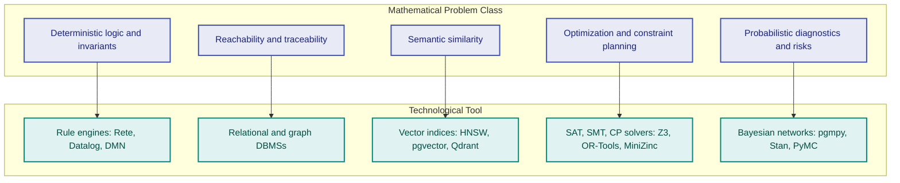

# Chapter 17. Technology Stack: Selection Criteria for Tools, Programming Languages, and Rule Engines

> **Book:** [Architecture of Evidence-Governed Expert Systems](README.md) · [Part IV: Architecture, Technology Stack, Inference, and Action](part-04-architecture-and-inference.md)  
> **Previous Chapter:** [Chapter 16. Expert System Architecture: From Formal Knowledge to Evidence-Governed Decisions](ch16-expert-systems-architecture.md)  
> **Next Chapter:** [Chapter 18. Execution Infrastructure: Local Models, Hardware Accelerators, Edge, and On-Premise](ch18-execution-infrastructure.md)  
> **Table of Contents:** [README.md](README.md)  
> **Author:** [Mykola Fedchyk](about-the-author.md)  
> **Level:** Intermediate and advanced: systems architects, expert systems developers, data engineers  
> **Learning Outcomes:** Select tools according to mathematical problem classes, architectural roles, and failure behaviors; allocate programming languages across responsibility layers; identify dependent artifacts using recursive SQL queries; formalize decisions using DMN tables and detect gaps within them; match optimization and planning tasks with appropriate solvers; explain why changing a model execution runtime affects evidence pack reproducibility; map technology stack layers to preferred underlying hardware; map Go components to capability layers and accept a component only after benchmark measurement against a baseline.

---

## Abstract

Selecting a technology stack for evidence-governed expert systems is not a matter of subjective developer preference; rather, it represents rigorous architectural optimization with respect to the mathematical class of the engineering problem, system behavior under failure modes, and conclusion auditability requirements. A widespread anti-pattern is prematurely overloading the architecture with distributed graph DBMSs, vector stores, and stochastic language models in contexts where determinism and traceability guarantees can be fully satisfied by compact, local data structures.

This chapter systematizes selection criteria for tools, programming languages, and inference engines. It examines the allocation of languages across responsibility layers (Go for service coordination, C/C++ for compute kernels, Rust for memory safety at ingestion boundaries, Python for research laboratories, and TypeScript for expert interfaces). It delivers an in-depth analysis of declarative knowledge query languages (SQL with recursive CTEs for dependency graphs, Cypher/GQL, and Datalog), classical production rule engines (Rete/Phreak), and the DMN/FEEL standard for regulatory decision tables. Furthermore, it addresses constraint satisfaction and optimization tools (SAT/SMT/CP), semantic edge-case validation of candidate inference engines, hardware dimensioning across runtime environments, and a taxonomy mapping fifteen technology classes for constructing resilient engineering intelligence systems.

---

## 1. Minimal Implementation Preceding the Technology Catalog

Before navigating an extensive catalog of specialized tools and libraries, the engineering analysis of an evidence-governed system demands the construction of a minimal working implementation. Development should prudently commence with the baseline release-verification program described in [Chapter 1](ch01-introduction-to-expert-systems.md): its operation requires solely the Go programming language, the standard library, and a suite of local unit tests. First, verify the positive case, a third-party release, a missing report, a revocation, and an exception. Next, stabilize the schemas for policies, reports, and verdicts; only thereafter should persistence mechanisms and test-pipeline ingestion adapters be introduced.

| New Constraint | Minimal Justified Addition | What Must Not Be Added Prematurely |
|---|---|---|
| Policies and runs must persist across executions | Versioned flat files or SQLite with strict schema validation | Dedicated graph server and vector index |
| Numerous rules are modified by domain experts without changing code | Decision tables or a rule engine backed by regression test suites | Language model acting as an arbiter of rules |
| Multi-step artifact dependencies are required | Recursive SQL query or an in-memory graph with typed edges | Neural model for reachability computation |
| Justifications must be retrieved from unstructured text | Candidate retrieval with provenance tracking and access control | Permitting decisions based solely on vector similarity |
| Multiple consumers require independent releases | Versioned data contract and release-delivery procedure | Message broker prior to demonstrable architectural necessity |

This represents a trajectory of progressive expansion rather than a catalog of pre-implemented adapters for an instructional prototype. The responsibility boundaries delineated in [Chapter 16](ch16-expert-systems-architecture.md) remain mandatory even within a single-process architecture; deploying a dedicated microservice for each boundary is by no means an upfront requirement.

The primary criterion is most clearly visualized as a diagram: five mathematical problem classes and their corresponding technological counterparts.



The diagram reads from left to right: one first formulates the problem mathematically, and only then selects the appropriate tool class. Verifying the invariant "a safety requirement of level SIL 3 cannot be closed without two independent test reports" is a problem of deterministic logic; it demands a formal rule engine, not vector similarity search. The query "which modules are impacted by a change in requirement REQ-7" is a graph reachability problem. The inquiry "have analogous failure incidents occurred historically" is a semantic similarity problem. Subsequent sections systematically analyze each layer of the technology stack, beginning with programming languages.

## 2. Programming Languages Across Responsibility Layers

Early expert systems were frequently implemented entirely in Lisp or Prolog. Contemporary industrial expert systems are predominantly engineered in general-purpose programming languages, driven by transformed operating requirements: mature systems libraries, predictable memory management, native concurrency primitives, robust C Foreign Function Interfaces (FFI), and seamless integration with modern deployment infrastructure. Declarative logic languages have not vanished; rather, they endure as embedded rule and query domain-specific languages (DSLs), as detailed below. Each general-purpose language occupies a distinct architectural layer.

### 2.1. Go: Service Layer and Coordination

Go is exceptionally well-suited for services, command-line utilities, synchronization pipelines, and application programming interfaces. A pure Go binary can be distributed as a single statically linked executable; cgo bindings may introduce native C/C++ dependencies and platform-specific prerequisites. Lightweight execution threads (*goroutines*) facilitate concurrent workload coordination, though they do not guarantee performance without empirical measurement. Go underpins, among other platforms, components of the local model runtime Ollama [[1]](#src-1) and the high-throughput messaging system NATS [[2]](#src-2); integration is dictated by the transport protocol rather than the server's implementation language.

For expert system tasks, Go offers several notable libraries:

- `hyperjumptech/grule-rule-engine`: a rule engine featuring its proprietary Grule Rule Language (GRL), inspired by Drools [[3]](#src-3);
- `sashabaranov/go-openai`: an OpenAI-compatible API client that interoperates with local microservices exposing this interface [[4]](#src-4);
- `yalue/onnxruntime_go`: Go bindings wrapping Microsoft ONNX Runtime for executing local embedding models and classifiers [[5]](#src-5);
- `ledongthuc/pdf`: pure Go extraction of text and metadata from PDF documents [[6]](#src-6);
- `tree-sitter/go-tree-sitter`: Go bindings for Tree-sitter, enabling structural parsing of source code into concrete syntax trees [[7]](#src-7).

### 2.2. C and C++: High-Performance Compute Kernels

C and C++ remain the foundation for all workloads operating in close proximity to hardware and demanding maximum raw throughput: vectorization kernels, hardware accelerator drivers, and neural network quantization libraries. The llama.cpp project executes large language models using pure C/C++ [[8]](#src-8), while the OpenVINO toolkit optimizes and deploys neural models across Intel CPUs, GPUs, and Neural Processing Units (NPUs) [[9]](#src-9). The classical production rule engine CLIPS was implemented in C to ensure absolute cross-platform portability [[10]](#src-10); CLIPS remains actively embedded within high-performance C and C++ applications today.

### 2.3. Rust: Memory Safety on Untrusted Data Boundaries

Rust is selected for modules demanding C++-grade throughput alongside strict compiler-enforced memory safety guarantees: the structural elimination of use-after-free conditions and data races. Typical operational niches include parsing untrusted network protocols and files from external sources, edge telemetry agents, and high-throughput streaming pipelines. The Zen business rules engine features a core written in Rust with polyglot bindings [[11]](#src-11). Notably, Zen models decisions using its proprietary JSON Decision Model (JDM) rather than the OMG DMN standard; consequently, porting decision tables between Zen and standard DMN engines cannot be accomplished without structural transformation.

### 2.4. Python: Offline Knowledge Laboratory and Prototyping

Python is uniquely adapted for offline exploration, model training, and benchmark evaluation; the PyTorch, scikit-learn, spaCy, and NetworkX ecosystems, along with specialized optimization solvers, robustly support these workflows. In standard CPython builds, the Global Interpreter Lock (GIL) constrains multithreaded bytecode execution; however, native C/C++ extension libraries can release the GIL during compute-intensive operations, and multi-process execution models operate independently. PEP 703 established the technical groundwork for free-threaded (no-GIL) CPython builds [[12]](#src-12), though compatibility across third-party extensions requires case-by-case verification. Language execution overhead alone does not dictate latency: neural model inference, queuing delays, inter-process communication, and request frequencies often dominate runtime profiles. Hence, Python may legitimately be retained within model microservices if empirical profiling demonstrates compliance with latency budgets; relegating Python to an offline role represents an architectural design pattern rather than a universal mandate.

### 2.5. TypeScript: Verified Interfaces for Expert Audit

TypeScript is essential for expert workstations: rendering interactive traceability graphs, navigating formal proof trees, and editing decision tables. The human-in-the-loop expert interface is a first-class component of an evidence-governed expert system, as it provides the cognitive medium through which human specialists inspect formal reasoning trails and render final determinations.

From the author's practical engineering experience: an architectural partition that proved exceptionally robust across multiple mission-critical deployments allocates responsibilities as follows: Core coordination services, messaging queues, and state orchestration are implemented in Go; dense vector operations and local model executions are executed via C++ runtimes (OpenVINO, ONNX Runtime) invoked through cgo; Python is isolated within the offline knowledge-acquisition environment for dataset curation, model fine-tuning, and metric evaluation; and the interactive audit interface is delivered in TypeScript. This configuration is not uniquely prescriptive: architectural choices must reflect team competencies and latency constraints. Clear inter-subsystem data contracts, as specified in [Chapter 16](ch16-expert-systems-architecture.md), ensure that any layer's implementation language can be replaced without perturbing neighboring components.

## 3. Declarative Query Languages for Knowledge Bases

While general-purpose programming languages implement service orchestration, facts and relationships are most effectively queried using declarative domain-specific languages. A declarative query specifies *what* data must be retrieved rather than *how* the search traversal should execute; this fundamental decoupling dramatically enhances verifiability, algorithmic optimization, and query reproducibility.

### 3.1. SQL and Recursive Queries

SQL guarantees ACID transactional consistency, serving as the canonical repository for artifact revisions, immutable audit events, access control matrices, and baseline fact tables. Recursive Common Table Expressions (CTEs) enable hierarchical tree traversals and directed graph reachability queries without necessitating a dedicated graph database engine [[13]](#src-13). Consider the change-impact analysis task: which downstream artifacts are affected when safety requirement `REQ-7` is altered, assuming traceability links are persisted in a relational table `trace(src, dst)`? The Python program below utilizes solely the standard library `sqlite3` module; the test fixture deliberately introduces a backward edge, forming a cycle.

<details>
<summary>Python implementation example</summary>

```python
import sqlite3

con = sqlite3.connect(":memory:")
con.executescript("""
CREATE TABLE trace(src TEXT, dst TEXT);
INSERT INTO trace VALUES
  ('REQ-7',  'DES-3'),
  ('DES-3',  'MOD-12'),
  ('DES-3',  'MOD-14'),
  ('MOD-12', 'TC-40'),
  ('MOD-14', 'TC-41'),
  ('MOD-14', 'MOD-12'),
  ('TC-41',  'DES-3'),   -- backward reference forms a cycle
  ('REQ-9',  'MOD-14');
""")

QUERY = """
WITH RECURSIVE impact(node, depth, path) AS (
    SELECT 'REQ-7', 0, json_array('REQ-7')
  UNION ALL
    SELECT t.dst, i.depth + 1, json_insert(i.path, '$[#]', t.dst)
  FROM trace AS t JOIN impact AS i ON t.src = i.node
    WHERE NOT EXISTS (SELECT 1 FROM json_each(i.path) AS visited
                                        WHERE visited.value = t.dst)
)
SELECT node, MIN(depth) FROM impact GROUP BY node ORDER BY 2, 1;
"""

for node, depth in con.execute(QUERY):
    print(depth, node)
assert dict(con.execute(QUERY)) == {
    "REQ-7": 0, "DES-3": 1, "MOD-12": 2, "MOD-14": 2,
    "TC-40": 3, "TC-41": 3,
}
con.executemany("INSERT INTO trace VALUES (?, ?)",
                [("REQ-7", "DOC/ANNEX"), ("DOC/ANNEX", "ANNEX")])
assert dict(con.execute(QUERY))["ANNEX"] == 2
print("SQLite", sqlite3.sqlite_version)
con.close()
```

</details>

The program outputs:

<details>
<summary>Example execution output</summary>

```text
0 REQ-7
1 DES-3
2 MOD-12
2 MOD-14
3 TC-40
3 TC-41
SQLite 3.50.4
```

</details>

The traversal path is maintained as a JSON array, and `json_each` enforces exact identifier equality checks [[14]](#src-14). This prevents string collisions between an independent node `ANNEX` and a compound path `DOC/ANNEX`; the appended negative test fixture explicitly validates this distinction. Because visiting a node already present within the current traversal path is disallowed, cycles do not trigger infinite recursion. `MIN(depth)` computes the shortest path distance across all discovered simple paths. However, because the count of distinct simple paths can grow exponentially even in acyclic structures, this specific CTE formulation is not an asymptotically scalable graph search algorithm across arbitrary topologies. When only the set of reachable nodes is required, a recursive `UNION` (which eliminates duplicates) over a single node attribute avoids enumerating individual paths. Deploying a dedicated graph DBMS must be justified through query latency benchmarking on actual topologies, rather than by an arbitrary edge-count threshold.

### 3.2. Graph Query Languages: Cypher, GQL, and SPARQL

Property graph query languages express topological patterns over nodes and edges. Cypher gained widespread adoption alongside the Neo4j graph database, and in 2024 ISO/IEC officially published the standardized Graph Query Language (ISO/IEC 39075:2024 GQL) [[15]](#src-15). SPARQL is the W3C standard for querying RDF triple graphs and OWL ontologies [[16]](#src-16); in [Chapter 16](ch16-expert-systems-architecture.md), a SPARQL property-path query was employed to reconstruct the end-to-end provenance trail of an automated release decision.

### 3.3. Datalog: Deterministic Logical Inference

Datalog is a declarative logic programming language syntactically corresponding to a function-free subset of Prolog [[17]](#src-17). The identical change-impact relationship demonstrated above in SQL is expressed in Datalog through two concise rules:

<details>
<summary>Rules in logic programming language</summary>

```prolog
affects(X, Y) :- trace(X, Y).
affects(X, Z) :- trace(X, Y), affects(Y, Z).
```

</details>

The first rule defines direct impact, while the second establishes its transitive closure. For positive Datalog without function symbols, with range-restricted (safe) rules over a finite active domain, the set of derived facts is strictly finite, and bottom-up evaluation via the least fixed point is guaranteed to terminate. Cyclic data graphs cannot introduce new constants. Language extensions incorporating arithmetic generation, external functions, or non-stratified negation require distinct semantic foundations and termination proofs. SQL can likewise handle cyclic topologies via set-based `UNION`; the operational difference resides in the underlying query execution plan.

## 4. Rule Engines and Decision Tables

Declarative business and engineering rules must never be scattered throughout application source code as tangled `if/else` statements. A rule is a governed engineering artifact possessing an immutable identifier, semantic version, author, normative regulatory mapping, and an independent lifecycle. A dedicated rule engine decouples business logic from imperative application code and guarantees predictable evaluation semantics.

### 4.1. Classical Production Rule Engines (Rete-like Algorithms)

The majority of production rule engines build upon Charles Forgy's Rete algorithm, which caches partial condition matches across inference cycles, eliminating the need to exhaustively evaluate every rule against the entire working memory whenever facts are updated [[18]](#src-18). CLIPS performs forward chaining and is readily embedded into native C applications. Drools provides a comprehensive rule engine, DMN runtime, and Complex Event Processing (CEP) platform for the Java Virtual Machine, utilizing the Phreak algorithm—a modern, lazy-evaluation enhancement of Rete [[19]](#src-19). Grule for Go and NRules for .NET [[20]](#src-20) embed rule evaluation directly into application runtimes.

### 4.2. The DMN Standard and FEEL Expression Language

Consider version 1.5 of the Decision Model and Notation (DMN) standard promulgated by the Object Management Group (OMG) [[21]](#src-21). The specification integrates tabular decision tables, Decision Requirements Diagrams (DRD), and the Friendly Enough Expression Language (FEEL). While human experts can intuitively audit tabular layouts, notation accessibility does not intrinsically ensure logical completeness; rigorous static verification of overlaps, gaps, data types, and hit policies remains essential.

The table below illustrates a release admission decision. The initial header cell specifies hit policy **U** (*Unique*): for any given input vector, at most one rule may evaluate to true. The condition cells contain FEEL unary tests, where a hyphen (`-`) signifies "any value" (wildcard).

| U | Open Critical Defects | Requirement Test Coverage | Safety Tests | Decision |
|---|---|---|---|---|
| 1 | `> 0` | `-` | `-` | `"BLOCK"` |
| 2 | `0` | `< 0.95` | `-` | `"BLOCK"` |
| 3 | `0` | `>= 0.95` | `"fail"` | `"BLOCK"` |
| 4 | `0` | `>= 0.95` | `"pass"` | `"RELEASE"` |

The rules are mutually exclusive: Rule 1 covers any positive defect count, while Rules 2 through 4 partition the remaining state space based on test coverage thresholds and safety test outcomes. However, this table is incomplete. If safety tests return `"error"`, no rule condition is satisfied, and a compliant DMN engine returns an empty result (`null`). An expert system that naively interprets an empty result as permission would inadmissibly approve a release with unresolved safety failures. Consequently, an empty evaluation outcome must default to blocking, and the table should ideally be hardened with an explicit clause handling `"error"`. Formal completeness and consistency verification for decision tables is explored in [Chapter 23](ch23-knowledge-base-verification.md).

> [!WARNING] Engineering Pitfall of DMN Hit Policies
> The DMN standard specifies several hit policies: **U** (*Unique*—exactly one match), **F** (*First*—first match in rule order), **A** (*Any*—all matches must produce identical outputs), **R** (*Rule Order*), and **C** (*Collect*).
> In safety-critical engineering systems, employing policies with implicit defaults represents a frequent cause of dangerous false positives:
> 1. **Domain-Value Incompleteness:** If an input variable assumes `null`, `NaN`, or an unexpected string such as `"timeout"`, under policy **U** the decision table evaluates to `null`. If the consuming service merely tests `if (result == "BLOCK") reject();`, the unhandled `null` silently bypasses validation, permitting an unsafe release.
> 2. **Default-Deny Principle:** The architecture of an evidence-governed expert system must strictly mandate that an unmatched condition in an admission decision table automatically defaults to the most restrictive rejection verdict (`"BLOCK"`).

## 5. Specialized Storage Engines by Physical Data Form

The selection of a persistence engine is fundamentally governed by the physical structure and epistemological nature of the knowledge it houses. The rationale underpinning this partitioning was detailed in [Chapter 16](ch16-expert-systems-architecture.md); the table below maps storage modalities to representative product implementations and canonical access patterns.

| Storage Modality | Representative Products | Knowledge Class | Canonical Query Pattern |
|---|---|---|---|
| **Relational DBMS** | PostgreSQL, SQLite, Microsoft SQL Server | Canonical facts, normative revisions, immutable audit events | "Which revision of rule R-12 was legally effective during the physical test on May 12?" |
| **Graph DBMS** | Neo4j, ArangoDB, Amazon Neptune | Traceability graph linking requirements, tests, and defects | "Which software modules are impacted by modifying safety requirement REQ-7?" |
| **RDF Triple Stores** | GraphDB, Stardog, Apache Jena | OWL domain ontologies, formal taxonomies | "Retrieve all sensor types classified as subclasses of SafetyCritical" |
| **Lexical Search** | OpenSearch, Elasticsearch, SQLite FTS5 | Engineering specifications, error registers, part numbers | "Find failure defect reports containing the terms overheat and vibration" |
| **Vector DBMS** | Qdrant, pgvector, Milvus, Weaviate | Unstructured normative passages, precedent case embeddings | "Retrieve regulatory standards containing semantically similar enclosure ingress-protection requirements" |
| **Time-Series DBMS** | TimescaleDB, InfluxDB, Prometheus | Reliability trends, test coverage dynamics | "Has the valve actuation latency exhibited an upward drift over the past five operational cycles?" |

The taxonomy underscores that no single storage engine satisfies all access patterns. As demonstrated by the recursive SQL example, a significant subset of graph queries can be executed directly within relational databases; an auxiliary specialized engine should be introduced only when it resolves concrete access patterns that existing stores cannot perform within latency or scalability budgets.

## 6. Optimization, Planning, and Constraint Satisfaction

Within the overarching architecture of an evidence-governed expert system, the constraint satisfaction and optimization subsystem is activated whenever deterministic logical deduction encounters a contradiction, or when an engineering problem requires synthesizing an admissible action plan or physical hardware configuration. While a production rule engine answers the deductive query "is the current system state valid and compliant?", optimization tools address the constructive query: "how can a globally optimal or provably admissible state be identified among millions of combinatorial possibilities?". A naive attempt to perform combinatorial search by generating synthetic facts within Rete rules inevitably induces state-space explosion and out-of-memory crashes.

| Criterion | Rule Engine (Rete / Phreak / Datalog) | Constraint Solver (SMT / Z3 / CP-SAT) |
|---|---|---|
| **Problem Formulation** | Deductive inference: "Given facts $F$, which conclusions $C$ logically follow under rules $R$?" | Search, synthesis, and verification: "Does there exist a variable assignment $X$ satisfying all constraints $\bigwedge C_i$? Does a safety violation counterexample exist?" |
| **Search Space** | Explicit fact graph; forward pattern matching and fixed-point convergence | Implicit combinatorial state space ($2^N$ states or infinite numerical domains) |
| **Algorithmic Complexity** | Local deterministic complexity, accelerated via Rete networks with $\mathcal{O}(1)$ updates per fact | NP-complete in general case (DPLL/CDCL heuristics, branch-and-bound) |
| **Typical Engineering Role** | Instantaneous gatekeeping in CI/CD pipelines, runtime invariant validation | Optimal hardware component packaging, physical test-bench scheduling, formal standard consistency proofs |

This class of optimization and constraint satisfaction tools comprises four primary groups:

- **SAT and SMT Solvers** formally verify whether input configurations exist under which a formal specification is violated. Prominent solvers in this category include Z3 [[22]](#src-22) and cvc5 [[23]](#src-23); an example demonstrating automated detection of conflicting requirements via Z3 is presented in [Chapter 14](ch14-requirements-detection-and-formalization.md).
- **Constraint Programming (CP)** resolves combinatorial challenges under rigid constraints: test-bench scheduling, modular equipment configuration. Notable implementations include the CP-SAT solver within Google OR-Tools [[24]](#src-24) and the MiniZinc modeling language [[25]](#src-25), which decouples high-level problem formulation from underlying backend solvers.
- **Mathematical Programming** (linear, quadratic, mixed-integer programming) balances resource allocation across engineering and research portfolios.
- **Automated Planning** synthesizes a sequence of discrete actions that transitions a controlled system from an initial state to a goal state. The Fast Downward planning system solves problems formalized in the Planning Domain Definition Language (PDDL) [[26]](#src-26). If an expert system detects a certification failure, a planner can synthesize a minimal corrective intervention sequence, which the rule engine subsequently validates against regulatory invariants.

Validating a discovered schedule against constraints via forward substitution proves feasibility, but does not independently establish optimality. An unsatisfiable core identifies a sufficient contradictory constraint subset, yet does not constitute a standalone mathematical proof of `unsat`: it must be independently checked or accompanied by a formal proof certificate in a verifiable format. Solver proof generation capabilities vary by tool and background theory. Solver outputs of `unknown`, timeout, or execution error signify neither feasibility nor impossibility.

## 7. Semantic Verification of Candidate Engines

Within the symbolic inference subsystem, the choice of inference engine defines the formal limits of proof for the entire expert system. The erroneous assumption that any engine returning a boolean `true/false` verdict is interchangeable in mission-critical applications introduces latent systemic risks: disparate engines implement fundamentally distinct semantics for negation, cyclic dependencies, and absent data. Rete matches conditions in memory, Datalog evaluates deductive rules over closed active domains, DMN standardizes regulatory decision tables, while CEL (Common Expression Language) and Rego evaluate guard expressions or fine-grained authorization policies. These components are not interchangeable simply because they yield boolean outputs. Prior to latency benchmarking, a rigorous semantic contract must be established.

| Property | Benchmark Verification Case |
|---|---|
| Unknown values and explicit negation | A missing test report does not evaluate to proven success or confirmed failure |
| Evaluation order and fixed point | Permuting facts or rules does not alter the declarative conclusion |
| Retraction dynamics | Retracting one premise preserves valid conclusions supported by independent alternative derivations |
| Cycles and termination | An unsupported circular derivation does not manifest a fact; exceeding recursion depth yields an explicit limit status |
| Decision table semantics | Missing rules, overlapping conditions, or untyped inputs do not yield implicit approval |
| External side-effects | Network access, non-deterministic timestamps, and pseudorandomness cannot be hidden within rule bodies |
| Explainability traces | The engine returns concrete variable substitutions and dependency trees, not merely a binary verdict |

Comparative evaluation must execute identical rule sets under uniform failure policies. OPA is tailored for fine-grained authorization, CEL for lightweight guard evaluation, production rule engines for conflict resolution across activation agendas, and Datalog for recursive dependency analysis. Selecting any component from this taxonomy represents a hypothesis that demands empirical verification.

## 8. Model Execution and Hardware Accelerators

Local neural network models serve within an expert system as replaceable adapters: classifying technical documents, extracting parametric entities, and synthesizing natural language explanation drafts. Their execution traverses a multi-stage pipeline extending from the raw model file to physical hardware accelerators, as illustrated below.

```mermaid
flowchart LR
    accTitle: Model Execution Pipeline from File to Hardware
    accDescr: A model traverses an intermediate representation, compiler, execution runtime, and hardware accelerator, with performance telemetry closing the loop for calibration.

    A["<b>Model and tokenizer</b><br/>GGUF, FP16, INT8, INT4"] --> B["<b>Intermediate representation</b><br/>ONNX, OpenVINO IR"]
    B --> C["<b>Compiler and SDK</b><br/>CUDA, ROCm, oneAPI, QNN"]
    C --> D["<b>Execution runtime</b><br/>OpenVINO, llama.cpp, vLLM, ONNX Runtime"]
    D --> E["<b>Hardware accelerator</b><br/>CPU, GPU, NPU, ASIC"]
    E --> F["<b>Metrics</b><br/>Tokens/sec, P95 latency, memory, power"]
    F -.->|"calibration"| A

    classDef src fill:#e1f5fe,stroke:#0288d1,stroke-width:2px,color:#01579b;
    classDef ir fill:#ede7f6,stroke:#512da8,stroke-width:2px,color:#311b92;
    classDef hw fill:#fff3e0,stroke:#e65100,stroke-width:2px,color:#bf360c;
    classDef metrics fill:#e8f5e9,stroke:#2e7d32,stroke-width:2px,color:#1b5e20;

    class A,B src;
    class C,D ir;
    class E hw;
    class F metrics;
```



Every stage in this execution pipeline directly influences output determinism: weight quantization formats (FP16, INT8, INT4), compiler toolchain versions, runtime libraries, and accelerator microarchitectures. The table below compares four widely adopted inference runtimes.

| Tool | Implementation Language | Operational Niche | Distinctive Feature |
|---|---|---|---|
| **llama.cpp** | C/C++ | Workstations, edge devices, and embedded systems | Zero Python runtime dependencies; native support for quantized GGUF formats |
| **Ollama** | Go, wrapping llama.cpp | Local development servers, autonomous workstations | Simplified REST API, automated model downloading and lifecycle management |
| **vLLM** | Python, CUDA, C++ | High-concurrency enterprise GPU clusters | Dynamic key-value cache memory allocation via PagedAttention [[27]](#src-27) |
| **OpenVINO** | C++, Python | Intel-based servers, workstations, and edge appliances | Hardware-tailored optimization across Intel CPUs, integrated/discrete GPUs, and NPUs |

From an evidence-governance standpoint, altering any component along this chain modifies the numerical outputs of the model. Transitioning from FP16 to INT4 quantization or updating the inference runtime can alter document classification boundaries or shift explanation wording. Whenever an evidence pack incorporates neural model outputs, it must capture an immutable cryptographic fingerprint of the entire execution stack (model hash, quantization level, runtime version, accelerator driver build). Any change to this pipeline mandates re-executing the regression verification suites detailed in [Chapter 16](ch16-expert-systems-architecture.md). Because the pipeline terminates at physical compute hardware, the following subsection maps preferred hardware across all stack layers, rather than restricting analysis to neural inference.

### 8.1. Preferred Primary Hardware for Stack Layers

The selection of programming language, inference engine, and persistence store inherently establishes the compute and memory profile of each stack layer, dictating the underlying hardware architecture on which it operates most effectively. A common architectural blunder is acquiring discrete GPU accelerators before this workload profile is formalized: rule engines, SQL transactions, and graph traversals are dominated by branching control logic and pointer indirection, workloads where GPU tensor cores offer zero acceleration. A second frequent pitfall is underestimating physical memory requirements. Modern unified-memory computing architectures have emerged for local model serving, where the host CPU and GPU share a high-bandwidth unified RAM pool on a single system-on-chip (SoC) without PCIe bus transfer overhead; total unified memory capacity fundamentally dictates which model parameters can be accommodated. The table below maps each technology stack layer to its preferred primary hardware.

| Stack Layer | Operational Profile | Preferred Primary Hardware | Acceleration Threshold |
|---|---|---|---|
| Rule engine, decision tables, Datalog | Branching logic, hash table lookups, condition pattern matching | Multi-core CPU with large L3 cache | Generally not recommended: branching condition evaluation does not map to tensor execution pipelines |
| Relational and graph storage, recursive queries, audit trail | Random memory access, ACID transactions, synchronous write-ahead logging | Multi-core CPU, ECC RAM accommodating active indices and working datasets, enterprise NVMe storage | If profiling reveals I/O bottlenecks, high-IOPS NVMe storage provides relief, not GPUs |
| Lexical and exact vector retrieval | Sequential index scanning, dot products | CPU with SIMD vector extensions: AVX-512 on x86-64, SVE on modern Arm architectures | Discrete GPU for batch exact nearest-neighbor search across tens of millions of high-dimensional vectors |
| Embeddings generation, classification, re-ranking | Dense tensor math in small batch sizes | NPU or integrated GPU; CPU serves as deterministic fallback | If runtime toolchain supports the model architecture and all custom operators on the accelerator |
| Document OCR and scan ingestion | Convolutions, vision attention mechanisms, multi-page batches | Discrete GPU or unified-memory workstation | When incoming document throughput exceeds multi-threaded CPU saturation limits |
| Local generative language models | Memory bandwidth-bound: streaming all active model weights per generated token | GPU with high VRAM capacity or unified-memory workstation (64–128 GB RAM) | When data governance mandates strictly on-premise execution or network-isolated autonomy |
| SAT, SMT, and CP constraint solvers | Depth-first search with backtracking, conflict-driven clause learning (CDCL) | CPU with high single-thread clock speed; independent solver portfolio instances parallelized across cores | Only when a solver provides a native accelerator backend validated via comparative benchmarking |

The initial three rows of the table represent the deterministic foundation of an expert system, where the host CPU remains the primary execution engine. The imperative for Error-Correcting Code (ECC) memory is directly rooted in epistemic auditability. Bianca Schroeder, Eduardo Pinheiro, and Wolf-Dietrich Weber conducted an empirical study of Dynamic Random-Access Memory (DRAM) errors across thousands of production servers over 2.5 years, demonstrating that cosmic ray-induced bit flips and hardware degradation represent prevalent failure modes in compute infrastructure [[28]](#src-28). An undetected soft memory error flipping a single bit within a rule index can produce an invalid release verdict; similarly, a bit flip in an audit buffer prior to hashing generates an unresolvable cryptographic discrepancy, where subsequent executions cannot reproduce the root cause. Standard single-error-correcting and double-error-detecting (SECDED) ECC memory transparently corrects single-bit flips and flags double-bit corruptions. Hardware ECC support must be explicitly verified within system specifications, as it is frequently absent in consumer-grade desktop motherboards.

The concluding rows address neural model adapters, for which hardware accelerators should be incorporated strictly pursuant to the comparative benchmarking methodology described in the Go components section. Many contemporary workstation platforms leverage 64-bit Arm architectures ([Chapter 18](ch18-execution-infrastructure.md)); consequently, Go services, cgo wrappers, and native C++ shared libraries must be compiled and tested against arm64 targets well prior to model migration. Hence, the minimal initial hardware profile for an evidence-governed expert system consists of a multi-core CPU, ECC RAM, and enterprise NVMe storage. Specialized accelerators are introduced only when local model deployment becomes an engineering requirement, at which point they alter the execution pipeline's cryptographic fingerprint. Chapter 18 examines specific hardware platforms as of late 2026, memory-bandwidth generation throughput modeling, and on-premise deployment patterns.

## 9. Systematic Map of Fifteen Technology Classes

To prevent haphazard architectural sprawl, the technology stack should be systematically validated against a five-tier map of fifteen technology classes.

```mermaid
flowchart TD
    accTitle: Map of Fifteen Technology Classes for Evidence-Governed Expert Systems
    accDescr: Fifteen technology classes organized across five functional tiers: symbolic inference, knowledge models and storage, search and optimization, neural adapters, and governance and security.

    subgraph CoreLevel["Tier 1: Symbolic Inference"]
        C1["1. Rule engines and Rete"]
        C2["2. Truth maintenance systems (TMS)"]
        C3["3. Confidence and uncertainty tracking"]
        C4["4. Decision tables (DMN, FEEL)"]
    end

    subgraph DataLevel["Tier 2: Knowledge Models and Storage"]
        D1["5. Semantic Web (RDF, OWL, SHACL)"]
        D2["6. Probabilistic graphical models"]
        D3["7. Case-based reasoning (CBR)"]
        D4["8. Relational, graph, and time-series DBMS"]
    end

    subgraph AlgLevel["Tier 3: Search and Optimization"]
        A1["9. SAT, SMT solvers and optimizers"]
        A2["10. Action planners (PDDL)"]
        A3["11. Hybrid search (BM25 and HNSW)"]
    end

    subgraph MLLevel["Tier 4: Neural Adapters"]
        M1["12. Local model execution runtimes"]
        M2["13. Document ingestion (OCR, Tree-sitter, ReqIF)"]
        M3["14. Explainable AI and generation metrics"]
    end

    subgraph GovLevel["Tier 5: Governance and Security"]
        G1["15. Policy engines (OPA, Rego) and provenance (PROV-O)"]
    end

    CoreLevel --> DataLevel
    DataLevel --> AlgLevel
    AlgLevel --> MLLevel
    MLLevel --> GovLevel

    classDef clrCore fill:#e3f2fd,stroke:#1565c0,stroke-width:2px,color:#0d47a1;
    classDef clrData fill:#e8f5e9,stroke:#2e7d32,stroke-width:2px,color:#1b5e20;
    classDef clrAlg fill:#fff3e0,stroke:#e65100,stroke-width:2px,color:#bf360c;
    classDef clrML fill:#f3e5f5,stroke:#7b1fa2,stroke-width:2px,color:#4a148c;
    classDef clrGov fill:#fbe9e7,stroke:#d84315,stroke-width:2px,color:#bf360c;

    class C1,C2,C3,C4 clrCore;
    class D1,D2,D3,D4 clrData;
    class A1,A2,A3 clrAlg;
    class M1,M2,M3 clrML;
    class G1 clrGov;
```



This map does not mandate adopting all fifteen classes within every project. Rather, it serves as an architectural checklist: for each class, the systems architect must either designate the selected tooling or explicitly justify why that problem class does not manifest within the target operational domain. An unexamined empty cell typically indicates that an engineering requirement is being addressed implicitly—for example, via ad-hoc rules concealed in application code or uncalibrated confidence heuristics.

## 10. Go Components Across Capability Layers

While the technology class map identifies necessary capabilities, it does not prescribe concrete software libraries. For the Go-based service layer examined earlier, a focused matrix is valuable: which libraries and servers written in or callable from Go address specific capability layers, and what operational constraints must be verified prior to adoption? The table below reviews candidate projects as of late 2026; software releases and maintenance velocity evolve over time, necessitating verification against upstream repositories before selection.

| Capability Layer | Candidates | Architectural Value | Pre-Adoption Verification Criteria |
|---|---|---|---|
| Production rules (Class 1) | Grule [[3]](#src-3) | Rules authored in GRL stored independently of application binary | Determinism of activation conflict resolution when multiple rules target the same fact; inference cycle latency over production-scale working memory |
| Expressions and guards (DMN FEEL analog) | cel-go [[29]](#src-29) | Non-Turing complete CEL: static type checking before evaluation, side-effect-free evaluation, linear runtime complexity relative to expression and input size when macros are disabled | Custom macros and user functions break linear evaluation bounds; canonical import path transitioned to `cel.dev/cel-go` |
| Deductive queries (Datalog) | Mangle [[30]](#src-30) | Datalog extended with aggregation, functional calls, optional typing, and temporal validity intervals | Extensions beyond pure Datalog void certain guarantees, notably termination; maintained independently of Google, with release 0.4.0 issued in November 2025 |
| Authorization policies (Class 15) | OPA [[31]](#src-31) | Access-control policies in Rego maintained as versioned, unit-tested artifacts; embeddable directly into Go services as an in-process library | Evaluation latency under concurrent workloads; memory footprint of policy bundles within service process |
| Graph storage (Class 8) | Dgraph [[32]](#src-32), EliasDB [[33]](#src-33), Cayley [[34]](#src-34) | Ranges from distributed ACID-compliant graph databases (Dgraph) to lightweight embeddable key-value graph stores (EliasDB) | Dgraph officially supports Linux on amd64 and arm64; EliasDB was last tagged in 2022, Cayley in 2019 |
| Lexical search (Class 11) | Bleve [[35]](#src-35) | In-process full-text index featuring BM25 scoring, approximate vector scoring, and hybrid search result fusion | Bleve lacks out-of-the-box language analyzers for Ukrainian and certain specialized scripts; tokenization quality must be measured independently |
| Vector search (Class 11) | chromem-go [[36]](#src-36), pgvector via pgvector-go client [[37]](#src-37), Weaviate [[38]](#src-38) | Ranges from zero-dependency embedded exact search (chromem-go) to PostgreSQL extensions and standalone vector DBMS clusters | chromem-go performs brute-force vector scans and maintains beta status prior to v1.0; pgvector and Weaviate require external database infrastructure |

Two structural observations emerge from this matrix. First, across most layers, architects face a choice between an in-process embeddable library and an external service: an in-process library simplifies air-gapped workstation deployments, whereas a dedicated server enables horizontal scaling at the cost of an additional operational process requiring patching, backup, and network security. Second, several candidates exhibit non-obvious constraints absent from marketing summaries: loss of termination guarantees, absence of specialized language analyzers, single-OS constraints, or multi-year release stagnations.

### 10.1. Selection Methodology: Benchmark Measurement Preceding Integration

No candidate listed above constitutes an unconditional recommendation. A candidate should be admitted into the technology stack only after rigorous benchmarking against an engineering baseline—the simplest viable implementation the team already operates or can construct within a single working day: a recursive SQL query for graph traceability, an SQLite FTS5 index for lexical search, or an exact brute-force scan for vector similarity. Benchmarks must be executed on representative domain datasets with realistic query workloads, and acceptance thresholds must be formalized prior to benchmark execution:

1. Candidate quality must match or exceed the baseline across benchmark evaluation suites: yielding identical rule conclusions, and non-inferior $`\mathrm{Recall@}k`$ metrics (as defined in [Chapter 16](ch16-expert-systems-architecture.md)) for retrieval;
2. Latency improvements at P95, memory footprint reductions, or indexing throughput gains must surpass pre-agreed thresholds, or the candidate must deliver an indispensable functional capability absent from the baseline;
3. Failure-mode behaviors must be empirically validated: network disconnections, corrupted index files, schema migrations, and version upgrades;
4. Benchmark telemetry, alongside exact version hashes for the candidate and baseline, must be recorded as an architectural decision record (ADR), and the benchmark must be repeated upon every major release upgrade of the candidate.

For an index of 100,000 vectors with 768 dimensions in single-precision `float32`, the raw vector data occupies 307.2 MB excluding metadata; a single exact brute-force scan requires approximately 76.8 million multiply-accumulate operations. For 10 million vectors, these metrics scale to 30.72 GB and 7.68 billion operations. This does not imply linear latency scaling: CPU cache lines, memory bus saturation, SIMD vectorization, batching, and concurrency dynamics shift the operational profile. The performance metrics cited by the author of chromem-go [[36]](#src-36) represent an external benchmark on specific hardware, not an intrinsic P95 guarantee for a given production workload. Exact brute-force search should be retained whenever it satisfies latency and throughput budgets on target hardware; an approximate index (HNSW) should be adopted only when justified by comparative benchmark data. Nearest vectors in embedding space represent an ideal geometric retrieval baseline, not an automatic guarantee of domain semantic relevance.

Comparative benchmarking operationalizes the third core principle detailed in the following section: verify tool behavior on real domain workloads prior to adoption, rather than troubleshooting production crashes after deployment.

## 11. Practical Lessons in Technology Selection for Mission-Critical Systems

1. **Select tools strictly aligned with operational semantics.** SHACL validates specific topological graph constraints, not general OWL open-world consistency. Datalog computes the deductive closure of a well-defined rule subset; SMT solvers verify satisfiability under supported theories. Traceability requires typed directed edges, whereas semantic search demands candidate re-ranking. A library's brand name never supersedes its mathematical contract.
2. **Frameworks cannot compensate for the absence of a canonical domain model.** No orchestration framework, such as LangChain or LlamaIndex, can transform an ad-hoc system into an evidence-governed expert system if source documents lack revision statuses, admission labels, and verified knowledge graph edges. Connecting generative neural networks to unstructured document repositories merely accelerates the production of plausible errors.
3. **Evaluate technologies primarily by their behavior under failure modes.** The defining inquiry when evaluating a candidate library is not "how elegant is the demo?", but rather: "what happens upon network partition, silent schema drift, or model weight quantization shifts?". If a model update silently invalidates the auditability of an issued regulatory certificate, the toolchain is unfit for mission-critical deployment.

## Conclusions

The technology stack of an evidence-governed expert system is determined by three core criteria: the mathematical class of the problem, the component's role within the architecture, and system behavior under failure modes. Deterministic logic is executed by rule engines and formal decision tables; reachability and traceability are handled by recursive queries and graph storage; optimization and scheduling are dispatched to formal constraint solvers; and neural components function strictly as adapters governed by verified contracts and regression test suites.

This chapter demonstrated these criteria through verifiable implementations. A recursive SQL query resolved all downstream artifacts affected by a requirement change without succumbing to cyclic references; the identical relationship expressed in Datalog required two declarative rules, terminating deterministically without ad-hoc safeguards. A DMN decision table exposed a latent failure gap when safety test runs yielded `"error"`, demonstrating the need for explicit default-deny policies. The survey of neural execution runtimes clarified why altering weight quantization or runtime binaries requires re-running regression suites. The hardware allocation matrix demonstrated that deterministic layers thrive on multi-core CPUs with ECC RAM and enterprise NVMe storage, with hardware accelerators reserved for neural adapters. Finally, the Go component matrix revealed that for most architectural tiers, teams can select between embeddable libraries and standalone servers, where rigorous comparative benchmarking against minimal baselines ensures reproducible, auditable architectural decisions: for 100,000 document chunks, exact brute-force vector search may prove fully adequate, while for 10 million chunks, it serves as the ground-truth benchmark for validating approximate indices.

The boundaries of these guidelines must also be recognized. The products and libraries referenced herein serve as illustrative examples rather than universal prescriptions: tool capabilities evolve across releases, requiring verification against contemporary documentation. Language allocation reflects concrete practitioner experience and must be adapted to team competencies. [Chapter 18](ch18-execution-infrastructure.md) transitions from tooling selection to physical infrastructure: achieving system autonomy on local compute hardware, managing power envelopes on edge devices, and ensuring deterministic latency within isolated industrial network perimeters.

## Self-Check Questions

1. Why is Go frequently chosen for the expert system service layer while Python is isolated within the offline knowledge laboratory? What role does the Global Interpreter Lock (GIL) play in this architectural division?
2. Why does the recursive SQL query require an explicit check against the `path` column, and why does the corresponding Datalog formulation require no such manual guard?
3. Under what operational conditions does a relational DBMS with recursive CTEs become inadequate, justifying the introduction of a dedicated graph DBMS?
4. What does hit policy U signify within a DMN decision table, and what safety gap exists in the provided release admission table?
5. How does the problem formulation of an SMT solver differ from that of a production rule engine, and how can a solver's output be verified independently?
6. Why does altering neural model quantization from FP16 to INT4 or upgrading the inference runtime directly compromise the reproducibility of an evidence pack?
7. Against which baseline implementation would you benchmark a graph database or a vector index prior to stack integration, and why does exact brute-force vector search remain valuable even after adopting an approximate index?
8. Why does procuring a discrete GPU fail to accelerate a production rule engine or graph reachability traversals, and what constitutes the minimal hardware baseline for an initial expert system deployment?
9. What engineering risks are introduced by employing non-standard or simplified decision models like JDM (Zen) compared to the formal OMG DMN specification?
10. Why is Error-Correcting Code (ECC) RAM an indispensable hardware prerequisite for compute nodes responsible for regulatory certification audits and evidence pack generation?

## Glossary

| Term | English Equivalent | Concise Engineering Definition |
|---|---|---|
| Технологічний стек | Technology stack | The aggregate of programming languages, libraries, inference engines, and persistence stores comprising an expert system |
| Рушій правил | Rule engine | Software component that evaluates and applies declarative rules over working-memory facts |
| Пряме виведення | Forward chaining | Data-driven reasoning progressing from known facts toward deduced conclusions |
| Таблиця рішень | Decision table | Tabular representation of logic wherein rows define rules and columns specify conditions and outcomes |
| Політика спрацювання | Hit policy | DMN specification governing how many table rows may fire and how their outputs are aggregated |
| Унарний тест | Unary test | FEEL condition expression inside a decision table cell, such as `>= 0.95` |
| Рекурсивний табличний вираз | Recursive CTE | SQL query referencing its own result set iteratively to traverse hierarchical or graph relations |
| Аналіз впливу змін | Change impact analysis | Topological evaluation identifying all engineering artifacts affected by a proposed modification |
| Програмування в обмеженнях | Constraint programming | Paradigm for solving combinatorial problems defined by variables and constraints over domains |
| Автоматичне планування | Automated planning | Algorithmic synthesis of discrete action sequences transitioning a system from an initial state to a goal state |
| Квантування | Quantization | Reducing the numerical precision of neural network weights, such as converting FP16 tensors to INT4 representations |
| Середовище виконання моделі | Inference runtime | Specialized software engine executing trained neural network models on host hardware |
| Проміжне представлення | Intermediate representation | Abstract model format positioned between training frameworks and hardware-specific compilation |
| Легкий потік виконання | Goroutine | Lightweight, user-space execution thread managed by the Go runtime scheduler |
| Глобальне блокування інтерпретатора | Global Interpreter Lock (GIL) | Mutex mechanism in CPython preventing simultaneous multi-threaded native execution of Python bytecode |
| Базовий варіант | Baseline | Minimal viable implementation used as an empirical reference point prior to adopting complex tooling |
| Порівняльний вимір | Benchmark | Empirical evaluation of quality, latency, and resource utilization comparing candidate tools against a baseline on uniform datasets |
| Точний пошук найближчих сусідів | Exact nearest neighbor search | Brute-force exhaustive vector scan that guarantees finding true mathematical nearest neighbors |
| Уніфікована пам'ять | Unified memory | Shared physical RAM architecture accessible concurrently by CPU and GPU on a system-on-chip without PCIe data copying |
| Пам'ять із корекцією помилок | Error-correcting code memory (ECC) | Volatile RAM equipped with specialized check bits capable of correcting single-bit flips and detecting multi-bit corruptions |

## Abbreviations

| Abbreviation | Expansion | Meaning |
|---|---|---|
| ACID | Atomicity, Consistency, Isolation, Durability | Transactional properties guaranteeing reliable database operations |
| API | Application Programming Interface | Formal programmatic interface between software components |
| ASIC | Application-Specific Integrated Circuit | Custom integrated circuit tailored for a specific application |
| AVX-512 | Advanced Vector Extensions 512 | 512-bit SIMD vector instruction set extensions for x86-64 processors |
| BM25 | Best Matching 25 | Probabilistic term-matching ranking function for lexical information retrieval |
| CBR | Case-Based Reasoning | Problem-solving methodology grounded in historical precedent cases |
| CEL | Common Expression Language | Non-Turing complete expression evaluation language with gradual typing |
| CLIPS | C Language Integrated Production System | Classical forward-chaining rule-based expert system tool written in C |
| CP | Constraint Programming | Combinatorial problem solving over discrete decision variables and constraints |
| CPU | Central Processing Unit | General-purpose microprocessor executing sequential and branch-heavy instructions |
| CTE | Common Table Expression | Temporary named result set defined within an SQL query statement |
| DBMS | Database Management System | System software for creating, managing, and querying structured data collections |
| DMN | Decision Model and Notation | OMG standard for modeling and executing operational business decision tables |
| DRAM | Dynamic Random-Access Memory | Semiconductor random-access memory storing data in individual capacitors |
| DRD | Decision Requirements Diagram | Graphical diagram in DMN defining decision dependencies and knowledge sources |
| ECC | Error-Correcting Code | Memory architecture detecting and correcting soft memory corruptions |
| FEEL | Friendly Enough Expression Language | Standardized expression language specified within OMG DMN |
| FFI | Foreign Function Interface | Mechanism allowing a program to call routines written in another language |
| FTS5 | Full-Text Search, version 5 | SQLite virtual table module optimized for full-text lexical indexing |
| GGUF | GPT-Generated Unified Format | Binary file format for storing quantized models within ggml/llama.cpp |
| GIL | Global Interpreter Lock | CPython runtime lock serializing execution of Python bytecode across threads |
| GPU | Graphics Processing Unit | Highly parallel compute hardware optimized for matrix and tensor arithmetic |
| GQL | Graph Query Language | ISO/IEC standardized query language for property graph databases |
| GRL | Grule Rule Language | Declarative rule definition language utilized by the Grule rule engine |
| HNSW | Hierarchical Navigable Small World | Multi-layer graph index for approximate nearest neighbor vector search |
| IR | Intermediate Representation | Low-level compiler data structure representing machine learning computation graphs |
| JDM | JSON Decision Model | Proprietary JSON-based decision format implemented by GoRules Zen |
| NPU | Neural Processing Unit | Specialized microchip engineered for hardware acceleration of neural networks |
| NVMe | Non-Volatile Memory Express | High-performance host controller interface protocol for solid-state storage |
| OCR | Optical Character Recognition | Electronic conversion of scanned document images into editable text |
| OMG | Object Management Group | International open standards consortium governing modeling specifications |
| OPA | Open Policy Agent | Open-source, general-purpose policy engine for fine-grained authorization |
| P95 | 95th Percentile | Statistical latency threshold satisfied by 95% of measured executions |
| PDDL | Planning Domain Definition Language | Standardized language for formalizing automated planning problems |
| PEP | Python Enhancement Proposal | Architectural design document specifying new features or processes for Python |
| RDF | Resource Description Framework | W3C graph data model expressing information via subject-predicate-object triples |
| SAT | Boolean Satisfiability Problem | Problem of determining whether a boolean formula evaluates to true |
| SIL | Safety Integrity Level | Relative level of risk-reduction provided by a safety function (IEC 61508) |
| SMT | Satisfiability Modulo Theories | Generalization of SAT determining satisfiability under background first-order theories |
| SPARQL | SPARQL Protocol and RDF Query Language | W3C semantic query language for querying RDF triple graphs |
| SQL | Structured Query Language | Standardized language for managing and querying relational databases |
| SVE | Scalable Vector Extension | SIMD instruction set architecture extension for modern Arm processors |

## References

1. <a id="src-1"></a>Ollama. [*ollama/ollama*](https://github.com/ollama/ollama). GitHub.
2. <a id="src-2"></a>NATS.io. [*nats-io/nats-server: High-Performance Server for NATS.io*](https://github.com/nats-io/nats-server). GitHub.
3. <a id="src-3"></a>hyperjumptech. [*grule-rule-engine: Rule Engine Implementation in Golang*](https://github.com/hyperjumptech/grule-rule-engine). GitHub.
4. <a id="src-4"></a>sashabaranov and project contributors. [*go-openai: OpenAI API Clients for Go*](https://github.com/sashabaranov/go-openai). GitHub.
5. <a id="src-5"></a>yalue. [*onnxruntime_go: A Go Library Wrapping Microsoft ONNX Runtime*](https://github.com/yalue/onnxruntime_go). GitHub.
6. <a id="src-6"></a>ledongthuc. [*pdf: PDF Reader*](https://github.com/ledongthuc/pdf). GitHub.
7. <a id="src-7"></a>Tree-sitter. [*go-tree-sitter: Go Bindings for Tree-sitter*](https://github.com/tree-sitter/go-tree-sitter). GitHub.
8. <a id="src-8"></a>ggml-org. [*llama.cpp: LLM Inference in C/C++*](https://github.com/ggml-org/llama.cpp). GitHub.
9. <a id="src-9"></a>Intel Corporation. [*OpenVINO Documentation*](https://docs.openvino.ai/).
10. <a id="src-10"></a>CLIPS. [*CLIPS: A Tool for Building Expert Systems*](https://www.clipsrules.net/).
11. <a id="src-11"></a>GoRules. [*zen: Open-Source Business Rules Engine*](https://github.com/gorules/zen). GitHub.
12. <a id="src-12"></a>Sam Gross. [*PEP 703: Making the Global Interpreter Lock Optional in CPython*](https://peps.python.org/pep-0703/). Python Software Foundation, 2023.
13. <a id="src-13"></a>SQLite. [*The WITH Clause*](https://www.sqlite.org/lang_with.html). SQLite Documentation.
14. <a id="src-14"></a>SQLite Contributors. [*JSON Functions and Operators*](https://www.sqlite.org/json1.html). Official documentation for `json_array`, `json_insert`, and `json_each`.
15. <a id="src-15"></a>ISO, IEC. [*ISO/IEC 39075:2024. Information Technology: Database Languages: GQL*](https://www.iso.org/standard/76120.html). 2024.
16. <a id="src-16"></a>Steve Harris, Andy Seaborne (eds.). [*SPARQL 1.1 Query Language*](https://www.w3.org/TR/sparql11-query/). W3C Recommendation, 2013.
17. <a id="src-17"></a>S. Ceri, G. Gottlob, L. Tanca. [*What You Always Wanted to Know About Datalog (and Never Dared to Ask)*](https://doi.org/10.1109/69.43410). *IEEE Transactions on Knowledge and Data Engineering*, 1(1), 146–166, 1989.
18. <a id="src-18"></a>Charles L. Forgy. [*Rete: A Fast Algorithm for the Many Pattern/Many Object Pattern Match Problem*](https://doi.org/10.1016/0004-3702(82)90020-0). *Artificial Intelligence*, 19(1), 17–37, 1982.
19. <a id="src-19"></a>Apache KIE. [*Drools Rule Engine*](https://docs.drools.org/latest/drools-docs/drools/rule-engine/index.html). Drools Documentation.
20. <a id="src-20"></a>NRules. [*NRules: Rules Engine for .NET, Based on the Rete Matching Algorithm*](https://github.com/NRules/NRules). GitHub.
21. <a id="src-21"></a>Object Management Group. [*Decision Model and Notation (DMN), Version 1.5*](https://www.omg.org/spec/DMN/1.5/About-DMN). OMG, 2024.
22. <a id="src-22"></a>Leonardo de Moura, Nikolaj Bjørner. [*Z3: An Efficient SMT Solver*](https://doi.org/10.1007/978-3-540-78800-3_24). *Tools and Algorithms for the Construction and Analysis of Systems (TACAS)*, LNCS, 337–340, 2008.
23. <a id="src-23"></a>Haniel Barbosa et al. [*cvc5: A Versatile and Industrial-Strength SMT Solver*](https://doi.org/10.1007/978-3-030-99524-9_24). *Tools and Algorithms for the Construction and Analysis of Systems (TACAS)*, LNCS, 415–442, 2022.
24. <a id="src-24"></a>Google. [*CP-SAT Solver*](https://developers.google.com/optimization/cp/cp_solver). OR-Tools Documentation.
25. <a id="src-25"></a>Nicholas Nethercote, Peter J. Stuckey, Ralph Becket, Sebastian Brand, Gregory J. Duck, Guido Tack. [*MiniZinc: Towards a Standard CP Modelling Language*](https://doi.org/10.1007/978-3-540-74970-7_38). *Principles and Practice of Constraint Programming (CP 2007)*, LNCS, 529–543, 2007.
26. <a id="src-26"></a>Malte Helmert. [*The Fast Downward Planning System*](https://doi.org/10.1613/jair.1705). *Journal of Artificial Intelligence Research*, 26, 191–246, 2006.
27. <a id="src-27"></a>Woosuk Kwon et al. [*Efficient Memory Management for Large Language Model Serving with PagedAttention*](https://doi.org/10.1145/3600006.3613165). *Proceedings of the 29th Symposium on Operating Systems Principles (SOSP)*, 611–626, 2023.
28. <a id="src-28"></a>Bianca Schroeder, Eduardo Pinheiro, Wolf-Dietrich Weber. [*DRAM Errors in the Wild: A Large-Scale Field Study*](https://doi.org/10.1145/1555349.1555372). *Proceedings of the Eleventh International Joint Conference on Measurement and Modeling of Computer Systems (SIGMETRICS/Performance 2009)*, 193–204, 2009.
29. <a id="src-29"></a>cel-expr. [*cel-go: Fast, Portable, Non-Turing Complete Expression Evaluation with Gradual Typing*](https://github.com/cel-expr/cel-go). GitHub.
30. <a id="src-30"></a>Mangle Project Contributors. [*Mangle: a Programming Language for Deductive Database Programming*](https://codeberg.org/TauCeti/mangle-go). Codeberg; mirror [google/mangle](https://github.com/google/mangle) on GitHub.
31. <a id="src-31"></a>Open Policy Agent. [*OPA: an Open Source, General-Purpose Policy Engine*](https://github.com/open-policy-agent/opa). GitHub.
32. <a id="src-32"></a>dgraph-io. [*Dgraph: High-Performance Graph Database for Real-Time Use Cases*](https://github.com/dgraph-io/dgraph). GitHub.
33. <a id="src-33"></a>krotik. [*EliasDB: a Graph-Based Database*](https://github.com/krotik/eliasdb). GitHub.
34. <a id="src-34"></a>cayleygraph. [*Cayley: an Open-Source Graph Database*](https://github.com/cayleygraph/cayley). GitHub.
35. <a id="src-35"></a>blevesearch. [*Bleve: a Modern Text, Numeric, Geo-Spatial and Vector Indexing Library for Go*](https://github.com/blevesearch/bleve). GitHub.
36. <a id="src-36"></a>philippgille. [*chromem-go: Embeddable Vector Database for Go with Chroma-Like Interface and Zero Third-Party Dependencies*](https://github.com/philippgille/chromem-go). GitHub.
37. <a id="src-37"></a>pgvector. [*pgvector: Open-Source Vector Similarity Search for Postgres*](https://github.com/pgvector/pgvector) and [*pgvector-go: pgvector Support for Go*](https://github.com/pgvector/pgvector-go). GitHub.
38. <a id="src-38"></a>Weaviate. [*Weaviate: an Open-Source Vector Database*](https://github.com/weaviate/weaviate). GitHub.

---

[← Chapter 16](ch16-expert-systems-architecture.md) | [Table of Contents](README.md) | [Part IV](part-04-architecture-and-inference.md) | [Chapter 18 →](ch18-execution-infrastructure.md)
