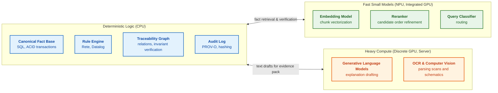
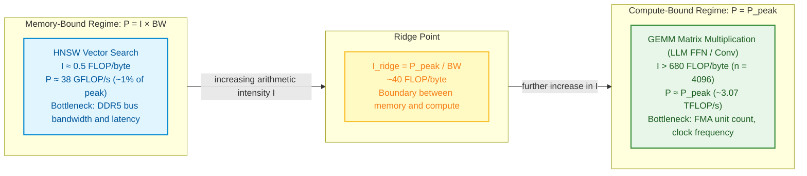
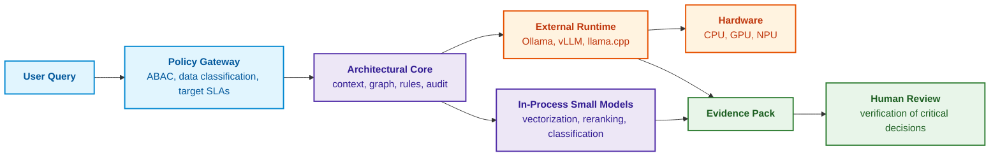
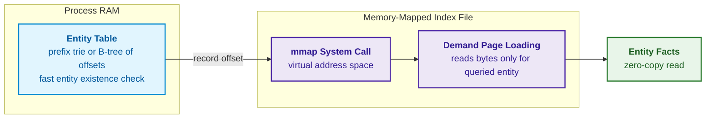
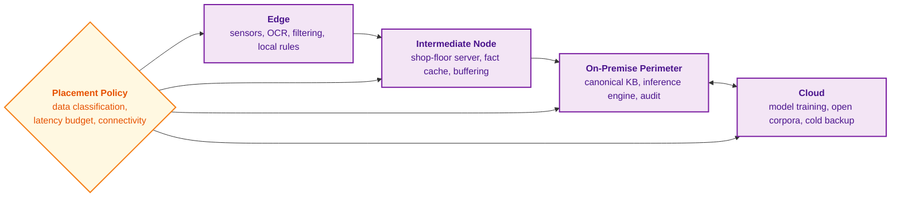
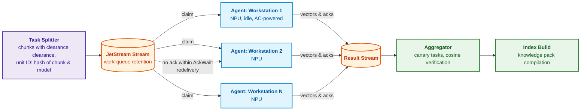
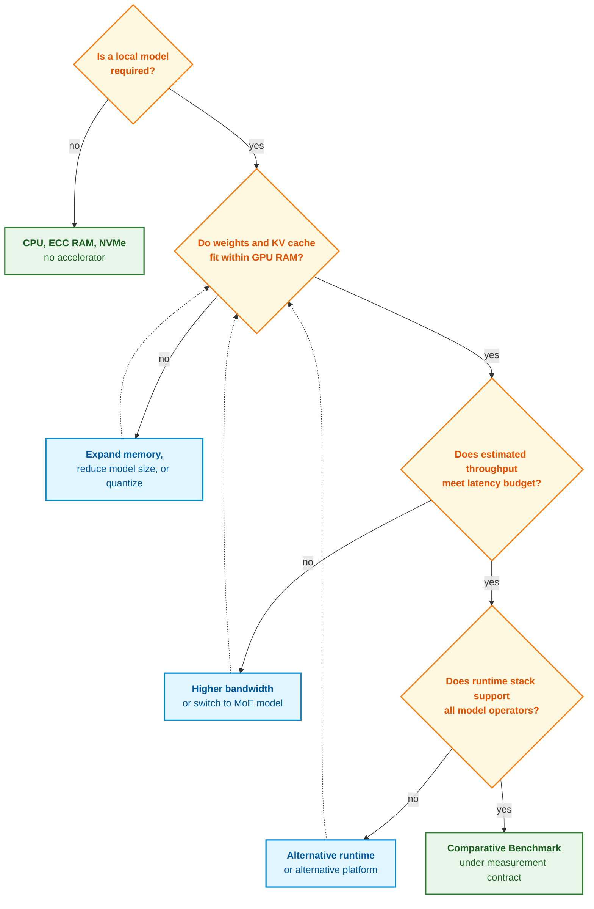
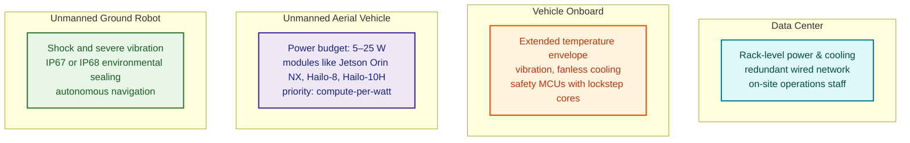
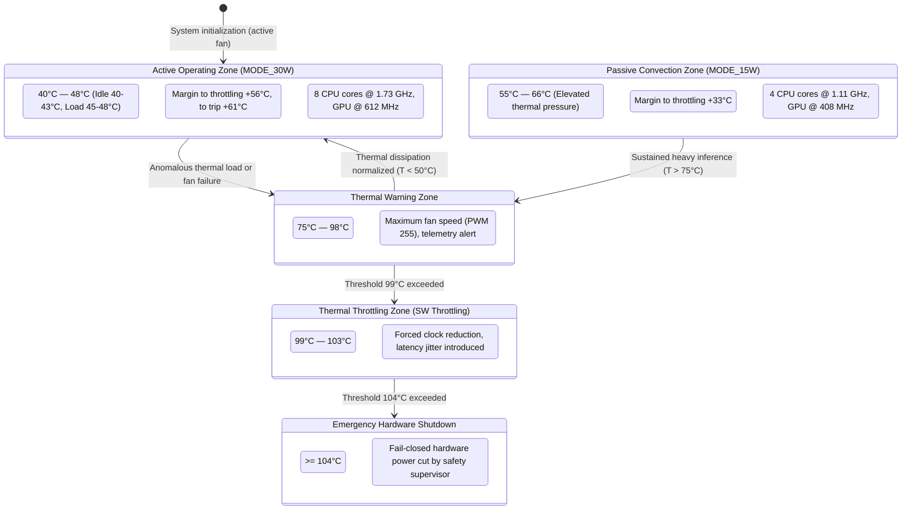
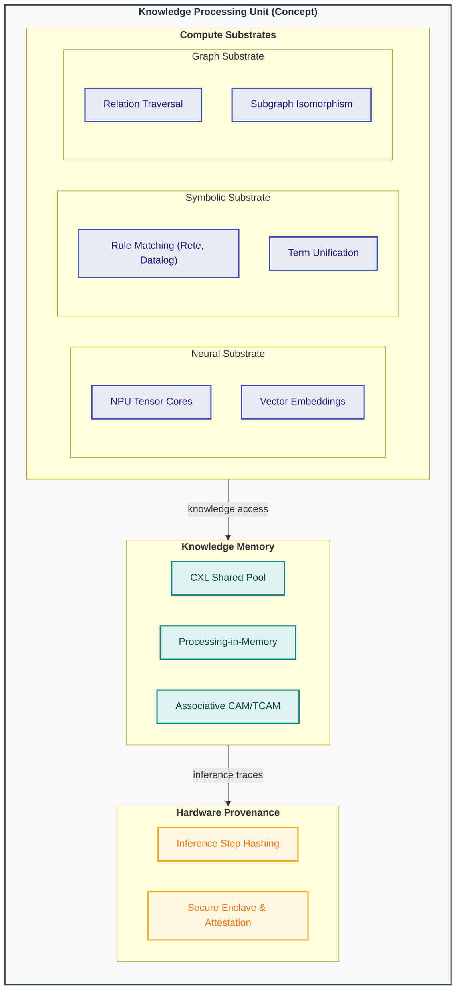

# Chapter 18. Execution Infrastructure: Local Models, Hardware Accelerators, Edge, and On-Premise

> **Book:** [Architecture of Evidence-Governed Expert Systems](README.md) · [Part IV: Architecture, Technology Stack, Inference, and Action](part-04-architecture-and-inference.md)  
> **Previous Chapter:** [Chapter 17. Technology Stack: Selection Criteria for Tools, Programming Languages, and Rule Engines](ch17-implementation-stack.md)  
> **Next Chapter:** [Chapter 19. From Question to Evidence: Retrieval, Grounding, and Claim Verification](ch19-from-question-to-evidence.md)  
> **Table of Contents:** [README.md](README.md)  
> **Author:** [Mykola Fedchyk](about-the-author.md)  
> **Level:** Intermediate and advanced: systems engineers, machine learning infrastructure architects, embedded and edge device developers  
> [!NOTE]
> **Expected Outcomes:** Allocate expert system components across CPUs, GPUs, and NPUs according to computational profiles; evaluate achievable performance using the Roofline model; compare local model platforms as of October 2026 by memory capacity and bandwidth, and estimate upper bounds on generation speeds; determine which models to execute in-process versus in dedicated external processes; select deployment topologies ranging from edge devices to the cloud; construct percentile-based latency budgets; and explain and control numerical result drift following driver and runtime updates.

## Abstract

Previous chapters established the logical architecture and technology stack of an expert system. However, software abstractions execute physically: in random-access memory, across system buses, and on Central Processing Units (CPUs), Graphics Processing Units (GPUs), and Neural Processing Units (NPUs). They execute within cloud clusters, on on-premise enterprise servers within a secure organizational perimeter, or on compact edge controllers positioned immediately adjacent to physical sensors.

This chapter answers the fundamental engineering question: **how can hardware platforms and execution topologies be formally justified for given target thresholds of inference quality, latency, and operational autonomy?** The computational profile provides the initial architectural hypothesis: branch-heavy symbolic rules naturally belong on CPUs, whereas dense linear algebra benefits substantially from GPUs or NPUs. However, the final design decision depends critically on operator support within the runtime compiler, query batch sizes, bus transfer overheads, memory subsystem limits, and acceptable failure modes. Merely labeling a chip an "accelerator" guarantees neither execution determinism nor process isolation. The review of specific hardware platforms is benchmarked as of October 8, 2026, based on manufacturer technical documentation; announced pre-production products are explicitly distinguished from commercially shipping silicon.

The diagram below illustrates the baseline allocation of expert system components across three primary compute zones.



This diagram is not a rigid dogma: on a unified developer workstation, all three compute zones may execute concurrently on a single system-on-chip with an integrated NPU. Nevertheless, the boundaries separating these zones reflect fundamentally divergent computational paradigms, and the following section quantifies these distinctions analytically.

## 1. Computational Profile: Comparative Analysis of Symbolic Rules and Neural Networks

Within the comprehensive architecture of an evidence-governed expert system, the execution infrastructure layer serves as the physical foundation upon which radically divergent computational paradigms must coexist: deterministic symbolic inference (Rete engines, Datalog evaluation, SMT solvers) and stochastic neural perception coupled with semantic search (dense vector embeddings, cross-encoder rerankers, autoregressive transformers). If a systems architect overlooks this duality and dimensions the hardware infrastructure relying solely on generalized marketing metrics of peak compute throughput (TFLOPS), the system inevitably encounters catastrophic performance degradation: unconstrained pointer chasing across knowledge graphs saturates memory bus bandwidth, triggering pervasive pipeline stalls, severe response-time jitter, and violations of strict timing deadlines in mission-critical control loops (ISO 26262, IEC 61508). The naive assumption that procuring a more powerful graphics accelerator will accelerate symbolic reasoning or single-token decoding collapses, because these operations are fundamentally bounded by the latency and bandwidth of the memory subsystem rather than the raw count of arithmetic multiplier units.

To quantitatively compare and allocate target hardware substrates for each expert system component, we apply the analytical Roofline model formulated by Williams, Waterman, and Patterson [[1]](#src-1). This model establishes an exact upper bound on achievable processor performance based on the operational balance between the peak throughput of arithmetic silicon cores and memory bus bandwidth.

The theoretical peak performance of a processor is computed to determine the upper computational boundary of a core or accelerator during dense matrix operations:

```math
P_{\text{peak}} = N_{\text{cores}} \times f \times \mathrm{FLOP}_{\text{cycle}}
```

where:
- $`P_{\text{peak}}`$ is the theoretical peak performance of the processor or accelerator, measured in floating-point operations per second ($\text{FLOP}/\text{s}$, typically $\text{TFLOP}/\text{s}$ or $\text{GFLOP}/\text{s}$);
- $`N_{\text{cores}}`$ is the physical count of parallel compute cores or streaming multiprocessors allocated to the task ($`N_{\text{cores}} \in \mathbb{N}`$, spanning from 1 to 16,384);
- $f$ is the sustained operating clock frequency of the execution units under steady load, measured in hertz ($\text{Hz}$, typically $0.7 \times 10^9 - 5.5 \times 10^9\text{ Hz}$);
- $`\mathrm{FLOP}_{\text{cycle}}`$ is the number of elementary floating-point operations a single core can execute per clock cycle via SIMD/SIMT vector units (for example, a core with two 512-bit FMA units executing FP32 arithmetic yields $2 \times 16 \times 2 = 64\text{ FLOP}/\text{cycle}$, where a fused multiply-add $a \cdot b + c$ counts as two FLOPs).

**Practical Application and Engineering Takeaways:**
1. This calculation is conducted during hardware specification to establish the upper bound on throughput for dense linear algebra workloads (GEMM operations within transformer encoder or decoder layers).
2. For an illustrative 16-core CPU operating at 3.0 GHz with two FMA units per core, the theoretical peak throughput equals:

```math
P_{\text{peak}} = 16 \times (3.0 \times 10^9) \times 64 = 3.072 \times 10^{12}\text{ FLOP/s} \approx 3.07\text{ TFLOP/s}
```

3. **Failure Criterion:** If the empirically measured throughput for dense matrix multiplication falls below $`P_{\text{observed}} < 0.60 \times P_{\text{peak}}`$, this indicates underlying microarchitectural anomalies: thermal throttling (operating frequency $f$ dropped below base clock), suboptimal register data alignment, or excessive instruction cache evictions in L1i.

The memory interface bandwidth governs the maximum throughput at which bytes can be streamed from system DRAM or dedicated video RAM into execution registers:

```math
\mathrm{BW} = f_{\text{mem}} \times \frac{W_{\text{bus}}}{8} \times N_{\text{channels}}
```

where:
- $`\mathrm{BW}`$ is the peak theoretical bandwidth of the memory interface, measured in bytes per second ($\text{B}/\text{s}$ or $\text{GB}/\text{s}$);
- $`f_{\text{mem}}`$ is the effective data transfer rate of the memory interface in megatransfers per second ($\text{MT}/\text{s}$ or transfers per second, e.g., $4.8 \times 10^9\text{ T/s}$ for DDR5-4800 or $8.533 \times 10^9\text{ T/s}$ for LPDDR5X);
- $`W_{\text{bus}}`$ is the data bus width of a single physical memory channel in bits (typically 64 bits for standard DDR4/DDR5 modules, or 32/16 bits for LPDDR5/LPDDR5X sub-channels), where division by 8 converts bits to bytes;
- $`N_{\text{channels}}`$ is the number of independent interleaved memory channels serviced by the processor's memory controller ($`N_{\text{channels}} \in \{1, 2, 4, 8, 12\}`$).

**Practical Application and Engineering Takeaways:**
1. This calculation determines the performance ceiling during unstructured data retrieval, graph adjacency list traversal, and weight matrix streaming during single-batch autoregressive inference.
2. For a dual-channel DDR5-4800 configuration (64-bit bus width per channel), the peak bus bandwidth equals:

```math
\mathrm{BW} = 4.8 \times 10^9 \times \frac{64}{8} \times 2 = 76.8 \times 10^9\text{ B/s} = 76.8\text{ GB/s}
```

3. **Engineering Utilization Threshold:** Owing to physical DRAM protocol overheads (row buffer conflicts, `tRFC` refresh commands, `CAS` latency), the actual sustained application bandwidth $`\mathrm{BW}_{\text{eff}}`$ rarely exceeds $75-85\%$ of theoretical $`\mathrm{BW}`$. If an algorithm saturates $> 80\%$ of bus bandwidth, any attempt to optimize performance by spawning additional compute threads will merely induce bus contention, pipeline stalls, and latency degradation.

The Roofline model synthesizes both physical constraints via the algorithmic operational (arithmetic) intensity $I$:

```math
P_{\text{observed}} \le \min\left(P_{\text{peak}},\; I \times \mathrm{BW}\right)
```

where:
- $`P_{\text{observed}}`$ is the practically achievable compute performance of the expert system for a specific algorithmic kernel, measured in $\text{FLOP}/\text{s}$;
- $I$ is the arithmetic intensity of the computational kernel, defined as the ratio of floating-point operations executed per byte of data transferred across the memory bus ($\text{FLOP}/\text{byte}$);
- $`\mathrm{BW}`$ is the sustained memory subsystem bandwidth ($\text{byte}/\text{s}$);
- $`P_{\text{peak}}`$ is the peak compute performance of the processor or accelerator ($\text{FLOP}/\text{s}$);
- $\min(a, b)$ is the minimum operator identifying the dominant physical bottleneck.

**Practical Application, Asymptotic Transitions, and Engineering Conclusions:**
1. **The Ridge Point:**

```math
I_{\text{ridge}} = \frac{P_{\text{peak}}}{\mathrm{BW}}
```

For the baseline workstation under consideration ($`P_{\text{peak}} = 3.07\text{ TFLOP/s}`$, $`\mathrm{BW} = 76.8\text{ GB/s}`$), the critical inflection point is:

```math
I_{\text{ridge}} = \frac{3.072 \times 10^{12}}{76.8 \times 10^9} = 40.0\text{ FLOP/byte}
```

2. **Memory-Bound Regime ($`I < I_{\text{ridge}}`$):** Approximate nearest-neighbor vector search within an HNSW (*Hierarchical Navigable Small World*) graph index [[2]](#src-2) for a 768-dimensional FP32 embedding vector (3,072 bytes) requires approximately $2 \times 768 = 1,536$ operations per distance calculation, yielding an arithmetic intensity of $I \approx 1,536 / 3,072 = 0.5\text{ FLOP/byte}$. Because $0.5 \ll 40.0$, throughput is strictly governed by memory bus bandwidth:

```math
P_{\text{observed}} \le 0.5 \times 76.8 \times 10^9 = 38.4\text{ GFLOP/s}
```

This represents a mere $\approx 1.25\%$ of the processor's raw arithmetic capacity. The engineering conclusion is unequivocal: scaling processor clock frequencies or purchasing a massively parallel GPU will yield negligible acceleration for factual vector search; meaningful performance gains can be achieved exclusively by vector quantization (e.g., INT8 scalar quantization doubles intensity to $1.0\text{ FLOP/byte}$ by halving bus traffic) or widening memory bus channels.
3. **Compute-Bound Regime ($`I \ge I_{\text{ridge}}`$):** Multiplying square matrices of dimension $n = 4,096$ during the forward pass of a multi-layer transformer operates at an operational intensity of $I \approx n / 6 \approx 682.6\text{ FLOP/byte}$. Under these conditions, the hardware fully approaches its arithmetic ceiling $`P_{\text{peak}}`$, where the primary performance lever shifts to SIMD vector utilization and tensor core efficiency.



> [!TIP] Practical Takeaway for the Infrastructure Engineer
> - **For memory-bound operations (HNSW, Rete networks, graph traversal):** Investing in costlier compute processors (GPGPUs boasting hundreds of TFLOPs) is futile — execution cores will simply sit idle during memory stalls. Measurable gains stem from expanding memory channels (quad-channel instead of dual-channel), caching hot graph vectors in L3 cache or SRAM, or applying vector quantization (Product Quantization, Scalar INT8) to drastically curtail bus traffic.
> - **For compute-bound operations (large generative LLMs, batched GEMM):** Arithmetic silicon becomes the strict bottleneck. Here, dedicated tensor cores, systolic matrix engines, and micro-precision numeric formats (FP8 / BF16) play the decisive role.

## 2. The Expert System as a Heterogeneous Execution Coordinator

In the heterogeneous architecture of an evidence-governed system, the execution coordination subsystem acts as an authoritative control gateway separating the deterministic symbolic core (canonical knowledge base, inference engine, and cryptographic audit log) from nondeterministic neural runtime environments. If an architect fails to maintain this boundary and reduces the expert system to an unstructured wrapper around external language model APIs, critical system failures inevitably ensue: nondeterministic crashes in third-party runtimes or video memory exhaustion directly corrupt the transactional integrity of the fact store, while uninspected prompts leak confidential proprietary knowledge beyond the security perimeter (violating ISO/SAE 21434 and ABAC policies). The naive approach of permitting symbolic logic components to directly invoke neural network backends without a centralized dispatcher breaks down upon the very first request queue backlog or bus saturation incident. The coordinator's mandate centers on enforcing strict separation of concerns across five engineering functions:

- **Semantic Query Routing.** A lightweight classifier inspects query intent and routes it to an optimal specialized model — such as selecting a compact model trained on functional safety standards rather than a generic broad-domain model.
- **Context Filtering via Access Policies.** Contextual document excerpts for which the user lacks clearance are expunged from the prompt prior to invoking the generative model.
- **Full Call Auditing.** The audit logger immutably captures the exact execution fingerprint: model cryptographic digest, tokenizer revision, generation temperature, and quantization parameters.
- **In-Process Small Model Execution.** Embedding models and intent classifiers run directly within the address space of the expert system process, incurring zero network serialization overhead.
- **Delegation of Heavy Generative Models.** High-parameter text synthesis is offloaded to dedicated external runtime daemons (Ollama, vLLM, llama.cpp), as detailed in [Chapter 17](ch17-implementation-stack.md).



From the author's practical engineering experience: an expert system operates with greatest resilience when structured as a fully audited client interacting with dedicated model runtimes. Text generation is delegated to an isolated external daemon over a local REST API, whereas vector embeddings are computed in-process via C-bindings to OpenVINO or ONNX Runtime. A crash of the external language model server is thereby captured gracefully as a transient service error without destabilizing the core knowledge base or aborting active reasoning sessions. The boundary between in-process and out-of-process execution must be drawn deliberately based on strict engineering criteria.

## 3. Runtime Isolation and RAM Management

Physical process isolation and disciplined random-access memory allocation dictate the resilience and operational survival of an expert system under peak computational load. The absence of a robust isolation barrier between neural accelerator runtime libraries and the symbolic reasoning core invites catastrophic failure: a segmentation fault (`SIGSEGV`) inside a proprietary GPU kernel driver or virtual memory exhaustion by the host operating system's `OOM Killer` instantly terminates the entire expert system process. Such an event abruptly tears down active audit sessions, drops pending ACID transactions within the fact repository, and triggers an emergency halt of the mission-critical control loop. The naive temptation to co-locate all inference models within a single shared address space to shave off a few microseconds of IPC latency introduces severe vulnerability, given that vendor tensor bindings in C/C++ lack memory safety guarantees. The table below delineates the engineering trade-offs between both architectural approaches.

| Criterion | In-Process Execution | Out-of-Process Execution |
|---|---|---|
| **Overhead** | Zero IPC; microsecond dispatch latency | Tensor serialization and network IPC overhead |
| **Failure Impact** | Accelerator driver crash brings down entire expert system | Crash isolated within external process; architectural core remains intact |
| **Scalability** | Tied directly to expert system host process | Independent horizontal scaling with dedicated request queues |
| **Typical Use Case** | Stable, lightweight runtimes: OpenVINO on CPU/NPU, ONNX Runtime | Large generative LLMs, experimental vendor GPU drivers |

The selection rule directly mirrors the failure impact: execute within the expert system's primary process only those components whose crash is acceptable as a total system halt. For massive generative models and bleeding-edge accelerator drivers, the modest cost of isolation (a few milliseconds spent on serialization) is negligible compared to the severe hazard of crashing the foundational architectural core.

### 3.1. Memory-Mapping the Fact Base (mmap)

A second major operational challenge involves knowledge base scale. When an engineering repository encompasses millions of assertions, streaming textual files (such as JSONL) into process heap memory during application startup can consume tens of seconds and gigabytes of RAM. For resource-constrained edge controllers and interactive command-line utilities, this latency penalty is unacceptable.

The architectural solution consists in compiling the verified fact base into a flat, deterministic binary format mapped directly into the process virtual address space via the POSIX `mmap` system call [[4]](#src-4). The host operating system does not load this file into physical RAM upfront; rather, 4 KB memory pages are faulted in on demand only when the inference engine explicitly references specific virtual memory addresses. The diagram below illustrates the two-tier structure of such an index.



The first tier — a compact index table of normalized entities and byte offsets — resides permanently in RAM, enabling near-instantaneous verification of whether a queried entity exists within the knowledge base. The second tier contains full attribute records and normative citations; the kernel reads these bytes from disk only for entities actively participating in the current chain of proof. Fixed-format binary records are traversed directly from mapped memory without intermediate string parsing or heap allocations. A similar immutable, content-addressed knowledge pack format is detailed in [Chapter 15](ch15-knowledge-extraction-and-kb-construction.md); its key virtue in execution infrastructure is shifting startup cost from "read everything" to "fault in only what is needed."

A single memory-mapped index file must fit within the virtual address space and addressable storage limits of a single host. When an enterprise index exceeds single-node capacity, two strategies emerge: explicit buffered chunk streaming, or partitioning the knowledge pack into shards, each mapped by an independent process or cluster node. Sharding preserves the internal two-level index layout within each shard, but requires a front-end semantic router and explicit handling of unresponsive shards. The operational boundaries of `mmap` are elaborated in Section 3.2 of [Chapter 32](ch32-high-performance-knowledge-packs-mmap-and-harvesting.md), and knowledge partitioning rules are established in [Chapter 7](ch07-knowledge-base-typology.md).

## 4. Deployment Topologies: From Data Center to Onboard Sensor

Deployment topology maps the logical components of an expert system onto physical network connections, compute nodes, and sensor interfaces. A design miscalculation in topology selection introduces immediate functional safety risks: offloading mission-critical invariant validation to the cloud leaves an autonomous cyber-physical system defenseless against radio link drops or deliberate RF jamming (constituting a complete breach of ASIL-D autonomy mandates under ISO 26262). Conversely, attempting to run high-parameter generative models directly on a low-power edge microcontroller causes rapid battery depletion and severe silicon overheating. The naive expectation that contemporary wireless infrastructure (5G or satellite constellations) provides deterministic latency for safety-critical queries is refuted by the very first signal shadow or field outage. Component placement is strictly governed by data sensitivity, acceptable latency bounds, and connectivity guarantees, formalized across a multi-tier architectural model.



Each architectural tier fulfills a distinct functional role:

- **On-Premise Enterprise Perimeter** is the standard deployment model for defense, aerospace, energy, and medical domains: proprietary knowledge assets never leave the organizational perimeter, and both the canonical fact repository and audit trail remain under exclusive sovereign control.
- **Edge Devices** execute hard real-time safety invariants directly onboard autonomous machinery or industrial robotic cells, guaranteeing operational continuity even under total network blackouts.
- **Intermediate Nodes (Fog Computing)** aggregate telemetry streams from dozens of local edge microcontrollers, performing deduplication, temporal filtering, and pre-validation prior to central synchronization. This intermediate tier was formalized by Bonomi et al. [[5]](#src-5).
- **Cloud Clusters** are reserved for computationally intensive offline tasks: training baseline foundational models, pre-processing publicly accessible standards corpora, and cold batch analytics. Classified or restricted engineering data enters the cloud only under explicit cryptographic policy exceptions.

These topologies govern online query serving. However, batch workloads — such as comprehensive corpus reindexing — exhibit an entirely different operational profile: they tolerate seconds or minutes of latency but require massive aggregate compute throughput, motivating a distinct distributed topology.

## 5. Background Indexing on Idle Workstation NPUs

Migrating to an updated embedding model necessitates reindexing the entire corporate corpus: embedding vectors from different semantic spaces are geometrically incomparable, requiring every text chunk to be re-embedded. For an enterprise repository containing tens of millions of engineering excerpts, a single dedicated workstation may spend days running at full load, whereas transmitting proprietary technical specifications to third-party cloud GPUs is frequently prohibited by security policy. Simultaneously, modern engineer laptops and corporate workstations increasingly feature integrated Neural Processing Units (NPUs) that remain idle for the vast majority of their operational life. Harnessing idle workstation cycles has a venerable history in computer systems: the Condor batch system developed by Litzkow, Livny, and Mutka in 1988 opportunistically scheduled compute jobs on idle academic workstations [[6]](#src-6), and Anderson's BOINC platform extended this volunteer computing paradigm globally across the Internet [[7]](#src-7). Within an evidence-governed expert system, this architecture manifests as an idle-cycle background indexing mesh: a central task coordinator divides the corpus into self-contained work units, and distributed agents running on engineer workstations execute embedding inference on their local NPUs.

Such a distributed mesh represents an engineering candidate for empirical evaluation rather than an automatic operational win. Reusing existing silicon curtails capital expenditure, but energy consumption per validated chunk, node availability, and operational maintenance overhead must be measured rigorously. An integrated NPU does not uniformly consume less total energy than a central server CPU across the entire end-to-end pipeline: data serialization, model warmup, and memory transfers can alter the net efficiency balance. Furthermore, the enterprise perimeter is not a monolith of uniform trust: sensitive engineering excerpts may be dispatched only to explicitly authorized workstation nodes.

### 5.1. Task Classification for Distributed NPU Mesh

A batch workload is suitable for distributed NPU execution if and only if all six engineering conditions are fulfilled:

1. **Supported Model Execution Mode.** In our architecture, the mesh executes pre-trained inference models; specific NPU capabilities and driver compiler features must be verified independently.
2. **Supported Operators and Input Tensors.** The target vendor NPU compiler may mandate static tensor shapes or impose rigid constraints on dynamic sequence padding [[8]](#src-8). Successfully compiling a model graph does not prove that all layers execute natively on the NPU without CPU fallbacks.
3. **Independent Work Units.** Chunks must be vectorized independently, requiring zero inter-node communication or synchronization during inference.
4. **Latency Insensitivity.** Workstation nodes may enter sleep states, shut down, or preempt background tasks when an engineer resumes interactive work. Consequently, the mesh is suited exclusively for batch ingestion, never for online user-facing queries.
5. **Numerical Precision Tolerance (FP16 or INT8).** The workload must achieve acceptable retrieval accuracy without double-precision (FP64) floating-point calculations.
6. **Compliant Data Mobility.** Corporate data classification rules must explicitly permit transmitting the specified document chunks to employee client endpoints ([Chapter 10](ch10-knowledge-acquisition-systems.md)).

Embedding generation, cross-encoder reranking, and document classification represent prime candidates, though each specific model must be audited against these six criteria. Text generation on client NPUs is not ruled out categorically, but suitability is constrained by model parameter scale, memory bandwidth, and runtime maturity. Conversely, general-purpose file compression (DEFLATE or zstd) should never be offloaded to tensor accelerators lacking dedicated hardware acceleration units; CPUs remain the optimal choice ([Chapter 32](ch32-high-performance-knowledge-packs-mmap-and-harvesting.md)).

### 5.2. Mesh Architecture and Coordination Protocol

The architecture below illustrates a background indexing mesh constructed on NATS JetStream — the persistent, distributed messaging layer integrated into the same NATS broker that coordinates knowledge acquisition pipelines ([Chapter 10](ch10-knowledge-acquisition-systems.md), [Chapter 17](ch17-implementation-stack.md)).



In this pipeline, the purple block prepares work units, orange cylinders represent durable JetStream message streams, blue blocks represent workstation background daemons, and green blocks validate and assemble the final index. Robust mesh operation rests upon four architectural guarantees:

1. **Idempotent Work Units.** The unique work unit identifier incorporates the cryptographic hashes of chunk text, model weights, tokenizer binary, configuration metadata, and output schema. JetStream permits redelivery following acknowledgment timeouts [[9]](#src-9); consequently, result persistence must be strictly idempotent. Acknowledgment (`ACK`) is dispatched only after the aggregator durably records the result. Any conflict between divergent results for an identical work unit ID triggers an automated audit quarantine rather than silent acceptance of the earlier record.
2. **"Good Citizen" Daemon Discipline.** The workstation agent claims work units only when three conditions are concurrently met: the host is connected to AC power, the user is idle (e.g., no keyboard/mouse input for $> 5$ minutes), and the NPU is unoccupied. The agent instantly yields NPU access the moment user applications (such as real-time video conferencing background blur) request accelerator compute. Furthermore, the daemon bounds its physical memory footprint, recognizing that integrated NPUs share unified system RAM with host applications.
3. **Cross-Node Reproducibility.** Workstations span diverse NPU silicon revisions and driver patch levels; half-precision (FP16) arithmetic executed across disparate silicon architectures introduces subtle numerical drift (analyzed below). To enforce consistency, models are frozen to immutable revisions, each node must pass an initial qualification suite on standard canary vectors before being granted work, and the aggregator continuously injects canary verification tasks. Any node exhibiting cosine divergence below tolerance is evicted to quarantine pending inspection.
4. **Transport Security.** Connections are secured via mutual TLS (mTLS) and NATS user credentials. Only chunks whose classification policy permits endpoint egress are admitted to the work queue. The agent strictly discards plaintext chunk content from memory upon completing inference.

### 5.3. Aggregate Compute Performance Estimation

Resource dimensioning for large-scale embedding upgrades or regulatory corpus reindexing requires formal estimation of aggregate throughput. Summing theoretical NPU datasheet figures yields misleading estimates: corporate workstations exhibit erratic availability schedules, users interrupt background execution, and network transport introduces coordination latency. Analytical modeling of effective cluster throughput $`Q_{\text{eff}}`$ integrates stochastic availability and communication overheads:

```math
Q_{\text{eff}} = \sum_{i=1}^{M} q_i \, a_i \, (1 - o_i)
```

where:
- $`Q_{\text{eff}}`$ is the expected value of aggregate indexing mesh throughput, measured in verified embeddings generated per second ($\text{vectors}/\text{s}$);
- $M$ is the total count of registered NPU-equipped workstations across the corporate local network ($M \in \mathbb{N}$, typically ranging from 10 to $10^4$ nodes);
- $`q_i`$ is the empirically measured steady-state throughput of the NPU on workstation $i$ for the selected embedding model ($\text{vectors}/\text{s}$, e.g., $240\text{ vectors/s}$ for a quantized 384-dimensional model on an Intel NPU);
- $`a_i`$ is the operational availability coefficient of workstation $i$ ($`a_i \in [0, 1]`$), denoting the fraction of time the machine is AC-powered, user-idle ($> 5$ minutes of inactivity), and permitted by OS power governors to run background workloads;
- $`o_i`$ is the coordination and network overhead factor ($`o_i \in [0, 1]`$), encompassing TLS handshakes, JetStream message round-trips, `AckWait` timeout retransmissions, and canary verification cycles.

**Practical Application and Engineering Takeaways:**
1. This formula is evaluated by the systems architect prior to scheduling a knowledge base reindexing campaign to calculate the expected operational window:

```math
T_{\text{reindex}} = \frac{N_{\text{total}}}{Q_{\text{eff}}}
```

where $`N_{\text{total}}`$ is the total number of text chunks across the corporate regulatory repository.
2. **Empirical Calibration Example:** For a fleet of $`M = 200`$ enterprise workstations ($`q_i \approx 240\text{ vectors/s}`$, $`a_i \approx 0.10`$, $`o_i \approx 0.20`$), effective aggregate throughput equals:

```math
Q_{\text{eff}} = 200 \times 240 \times 0.10 \times (1 - 0.20) = 3\,840\text{ vectors/s}
```

A repository containing 20 million chunks is reindexed in $`T_{\text{reindex}} \approx 20 \times 10^6 / 3840 \approx 5\,208\text{ s} \approx 1.45\text{ hours}`$. In contrast, a dedicated multi-core server CPU ($`q = 68\text{ vectors/s}`$) would require over 81 continuous hours to finish the same workload.
3. **Dispatch and Quarantine Rules:**
   - If a node exhibits $`a_i < 0.03`$ (intermittent connectivity or battery operation), the scheduler removes it from the pool to prevent queue poisoning and repeated timeout cascades;
   - If projected $`T_{\text{reindex}}`$ exceeds the standard maintenance window ($`T_{\text{reindex}} > T_{\text{maintenance\_window}} = 6\text{ hours}`$), the coordinator issues an engineering alert and dynamically throttles user-inactivity thresholds or temporarily engages central on-premise compute servers.

An idle NPU mesh delivers substantial batch compute capacity without capital expenditure on dedicated server racks. However, interactive reasoning and explanation generation demand dedicated low-latency hardware, motivating a detailed comparative analysis of local hardware platforms.

## 6. Local Model Platforms: State of the Art as of October 2026

While distributed client NPUs excel at batch vectorization, interactive explanation synthesis and domain-specific model fine-tuning within an on-premise perimeter necessitate dedicated workstation hardware. Throughout 2025–2026, semiconductor manufacturers introduced a new class of compact workstations: systems-on-chip integrating high-performance CPU cores and GPU execution units sharing 128 GB of unified memory ([Chapter 17](ch17-implementation-stack.md)), with subsequent generations announced for near-term delivery. This section resolves the critical design question: **which local hardware platforms are viable for expert system neural adapters, and what quantitative metrics govern their selection?**

The table below catalogs hardware platforms as documented on October 8, 2026, using manufacturer-reported specifications: TOPS (trillion operations per second), TFLOPS, or PFLOPS for FP4, FP8, or FP16 floating-point formats. LPDDR5X represents low-power unified RAM shared across CPU and GPU cores, while GDDR6 and GDDR7 represent dedicated graphics accelerator memory. In the software stack column, CUDA (*Compute Unified Device Architecture*) denotes NVIDIA's compute platform, ROCm is AMD's open-source accelerator stack, and WSL (*Windows Subsystem for Linux*) is Microsoft's virtualization subsystem for executing Linux binaries. Entries are organized from desktop developer platforms to rackmount accelerators and laptop NPUs.

| Platform | Commercial Status (as of Oct 8, 2026) | Memory for Model | Memory Bandwidth | Stated Peak & Format | Software Stack |
|---|---|---|---|---|---|
| **NVIDIA DGX Spark**, desktop workstation powered by GB10 SoC | Commercially available since Oct 15, 2025 [[10]](#src-10) | 128 GB unified LPDDR5X | 273 GB/s [[11]](#src-11) | Up to 1 PFLOPS in FP4 with sparsity; 20 Arm cores | DGX OS based on Ubuntu, CUDA |
| **NVIDIA RTX Spark** in laptops and compact desktops from ASUS, Dell, HP, Lenovo, Surface, MSI | Announced May 31, 2026; retail shipping Fall 2026 [[12]](#src-12) | Up to 128 GB unified, depending on SKU | Unspecified by vendor | Up to 1 PFLOPS in FP4 with sparsity; 20 Grace cores & 6,144 CUDA cores in laptops, 18 & 5,120 in desktops [[13]](#src-13) | Windows 11 on Arm, CUDA, TensorRT |
| **Microsoft Surface RTX Spark Dev Box**, compact developer workstation | Announced June 2, 2026 [[14]](#src-14); US pre-orders Oct 7, 2026; shipping November [[15]](#src-15) | 128 GB unified; GPU addresses a bounded partition | Unspecified by vendor | Up to 1 PFLOPS in FP4 with sparsity; 100 W TDP envelope [[16]](#src-16) | Windows 11 Pro, WSL 2 with CUDA support, Windows ML |
| **NVIDIA DGX Station for Windows**, workstation on GB300 Grace Blackwell Ultra | Announced May 31, 2026; anticipated Q4 2026 [[17]](#src-17) | Up to 748 GB coherent memory | Unspecified by vendor | Up to 20 PFLOPS in FP4; 72 Grace cores | Windows, WSL |
| **NVIDIA RTX PRO 6000 Blackwell Workstation Edition**, discrete GPU card | Commercially available | 96 GB GDDR7 with Error-Correcting Code (ECC) | 1,792 GB/s | 4,000 TOPS in FP4 with sparsity; up to 600 W TDP [[18]](#src-18) | CUDA, TensorRT |
| **AMD Ryzen AI Halo** based on Ryzen AI Max+ 395 processor | Pre-orders open June 2026 [[19]](#src-19) | 128 GB unified LPDDR5X | 256 GB/s | Up to 60 TFLOPS in FP16; 16 Zen 5 cores, Radeon 8060S GPU (40 CUs), XDNA 2 NPU [[20]](#src-20) | Linux or Windows 11, ROCm |
| **AMD Ryzen AI Max PRO 400** in next-gen Ryzen AI Halo, HP, Lenovo systems | Announced May 2026; sampling/deliveries slated from Q3 2026 | Up to 192 GB total, with up to 160 GB allocated as VRAM | Unspecified by vendor | NPU up to 55 TOPS; configurable TDP 45–120 W [[19]](#src-19) | ROCm |
| **Intel Core Ultra Series 3** in mobile and industrial edge platforms | Shipping commercially since Jan 27, 2026 | Host system RAM | System configuration dependent | NPU up to 50 TOPS; up to 16 CPU cores and 12 Xe cores [[21]](#src-21) | OpenVINO |
| **Intel Crescent Island**, air-cooled server inference GPU | Announced Oct 14, 2025; customer sampling H2 2026 [[22]](#src-22) | 160 GB LPDDR5X | Unspecified in launch announcement | Xe3P architecture; peak TFLOPS unspecified in initial release | Open-source Intel software stack under active development |
| **Qualcomm Snapdragon X2 Elite** in Arm-based laptops | Shipping hardware available from H1 2026 [[23]](#src-23) | Host system RAM | Up to 228 GB/s depending on tier | Hexagon NPU up to 85 TOPS; up to 18 Oryon cores [[24]](#src-24) | Qualcomm AI Engine Direct |
| **Tenstorrent Blackhole p150**, PCIe accelerator board | Commercially available | 32 GB GDDR6 | 512 GB/s | 664 TFLOPS in block FP8; 120 Tensix cores and 16 RISC-V cores; 300 W TDP [[25]](#src-25) | Open-source Tenstorrent software stack |

This empirical overview demonstrates three crucial architectural realities. First, stated peak compute numbers cannot be directly cross-ranked, because vendors report metrics in conflicting numerical precisions. NVIDIA benchmarks peak FP4 numbers utilizing 2:4 structured sparsity: within every block of four weight values, two must be zeroed out, allowing specialized tensor units to process only non-zero values and mathematically doubling datasheet TFLOPS [[26]](#src-26). Unstructured models achieve at best half this stated peak, and actual application-level speedups rarely achieve a 2x factor. Conversely, AMD publishes FP16 figures for Ryzen AI Halo, whereas NPU suppliers report INT8 integer operations. Second, for generative text synthesis, memory capacity serves as the initial hard filter: model weights and Key-Value (KV) attention caches ([Chapter 12](ch12-linguistic-analysis-and-local-models.md)) must reside entirely within memory accessible to the GPU. On unified memory SoCs, usable VRAM is strictly less than total system capacity: Microsoft explicitly cautions that maximum addressable GPU memory dynamically varies with system load and remains smaller than total RAM [[15]](#src-15). Third, in five entries vendors omit memory bandwidth specifications, despite bandwidth being the definitive governing factor for low-batch generation speeds.

### 6.1. Estimating Generation Speed from Memory Bandwidth

In interactive workflows between human specialists and an expert system, explanation generation latency is paramount. Unlike the prompt prefill phase, where matrix multiplications are parallelized across all prompt tokens, single-token autoregressive decoding operates in a strictly memory-bound regime. At each decoding step, the accelerator must stream every active model parameter from RAM and update the Key-Value (KV) attention cache. The theoretical upper bound on single-stream generation throughput is expressed by:

```math
r_{\text{dec}} \le \frac{\mathrm{BW}}{N_{\text{act}} \cdot q / 8 + S_{\text{KV}}}
```

where:
- $`r_{\text{dec}}`$ is the maximum autoregressive decoding throughput for a single execution thread, measured in tokens per second ($\text{tokens}/\text{s}$ or $\text{tps}$);
- $\mathrm{BW}$ is the sustained memory interface bandwidth of the platform, measured in bytes per second ($\text{bytes}/\text{s}$);
- $`N_{\text{act}}`$ is the count of active model parameters evaluated during the generation of the current token (for dense architectures $`N_{\text{act}} = N_{\text{total}}`$, whereas for sparse Mixture-of-Experts (MoE) architectures $`N_{\text{act}} \ll N_{\text{total}}`$);
- $q$ is the quantization precision of model weights in bits per parameter ($q \in \{4, 8, 16\}$, where division by 8 converts bits to bytes);
- $`S_{\text{KV}}`$ is the memory bus traffic generated by reading and updating the Key-Value cache per decoding step, measured in bytes per token:

```math
S_{\text{KV}} = 2 \times n_{\text{layers}} \times d_{\text{head}} \times n_{\text{heads\_kv}} \times L_{\text{ctx}} \times \frac{q_{\text{kv}}}{8}
```

where $`L_{\text{ctx}}`$ is active context length in tokens, $`n_{\text{layers}}`$ is layer depth, and $`q_{\text{kv}}`$ is KV-cache numeric precision (typically 16 bits for FP16 or 8 bits for FP8).

**Practical Application and Engineering Takeaways:**
1. This calculation is conducted during hardware qualification to ensure the platform satisfies interactive SLA criteria without impeding expert user workflows.
2. **Numerical Benchmarks for Desktop Platforms (273 GB/s Bandwidth):**
   - **Dense 70B Model (INT4 Quantization, $`N_{\text{act}} = 70 \times 10^9`$, $`q = 4`$):** Memory traffic per token is $`35\text{ GB}`$. Across a $`\mathrm{BW} = 273\text{ GB/s}`$ bus, maximum decoding throughput is bounded by:

```math
r_{\text{dec}} \le \frac{273 \times 10^9}{35 \times 10^9} \approx 7.8\text{ tokens/s}
```

Generating a comprehensive 150-token justification requires $`\approx 19.2\text{ s}`$, violating the interactive target SLA ($`< 1\text{ s}`$).
   - **Sparse Mixture-of-Experts (MoE) 117B Model ($`N_{\text{total}} = 117\text{B}`$, $`N_{\text{act}} = 5.1\text{B}`$, $`q = 4`$) [[27]](#src-27), [[28]](#src-28):** Bus traffic per token plummets to $`2.55\text{ GB}`$. Achievable decoding throughput increases fourteen-fold:

```math
r_{\text{dec}} \le \frac{273 \times 10^9}{2.55 \times 10^9} \approx 107\text{ tokens/s}
```

The same 150-token explanation completes in $`1.4\text{ s}`$. However, loading the full 117B parameter set requires at least 59 GB of memory, disqualifying 32 GB hardware configurations.
3. **Operational Thresholds and Architectural Gateways:**
   - $`r_{\text{dec}} \ge 15\text{ tokens/s}`$: **Comfortable Interactivity**. Token streaming feels instantaneous and cognitively smooth to the domain engineer;
   - $`8 \le r_{\text{dec}} < 15\text{ tokens/s}`$: **Acceptable Workstation Pace**. Permissible for desktop terminals, provided the interface presents the formal symbolic verdict (approval/rejection, rule ID) instantly prior to streaming the explanatory text;
   - $`r_{\text{dec}} < 8\text{ tokens/s}`$: **Interactive SLA Breach**. Prohibited for operational deployments. The architecture must reject dense 70B models on this bus width, transitioning to MoE architectures, speculative decoding, or offloading synthesis to external accelerators equipped with GDDR7 or HBM.

### 6.2. Selection Criteria and Functional Roles of Platforms

Synthesizing the hardware catalog and analytical model yields the systematic platform selection decision tree illustrated below.



This decision tree proceeds downward: earlier filters are significantly less costly to evaluate than subsequent stages, and empirical benchmarks are reserved solely for platforms clearing all preceding gates. Dashed arrows signify that altering the model architecture or hardware platform restarts memory capacity validation. Based on this protocol, hardware platforms fulfill distinct architectural roles:

- **Individual Developer Workstation.** The DGX Spark, Ryzen AI Halo, and Surface RTX Spark Dev Box occupy a comparable memory tier and diverge primarily across their software environments: Linux with CUDA, Linux/Windows with ROCm, and Windows 11 Pro with WSL 2. For evidence packs, this distinction is critical: runtime fingerprints ([Chapter 17](ch17-implementation-stack.md)) capture exact kernel driver revisions; porting models across vendor platforms alters the execution provenance and necessitates comprehensive regression testing.
- **High-Performance Discrete Workstation.** The RTX PRO 6000 Blackwell delivers unmatched memory bandwidth (1,792 GB/s), but caps maximum model footprint at 96 GB GDDR7 and demands up to 600 W of electrical power.
- **Shared Team On-Premise Cluster Node.** The DGX Station for Windows and rackmount Crescent Island are engineered for multi-tenant serving of large parameter sets; however, as of October 2026, the former is newly announced and the latter is sampling. Specifying production architectures on unreleased silicon must remain an exploratory hypothesis supported by validated fallback hardware.
- **Engineer Laptop NPUs.** Intel Core Ultra Series 3 and Snapdragon X2 Elite chips offer 50–85 TOPS NPUs suitable for in-process vectorization, intent classification, and the background indexing mesh. Generative text execution on these NPUs must be qualified on a per-model basis against the six criteria established in Section 5.1.
- **Open Silicon Research Testbed.** The Tenstorrent Blackhole PCIe card couples open RISC-V cores with dedicated matrix engines and an open-source compiler stack, providing an ideal substrate for exploring hardware-software co-design.

None of the platforms in the catalog accelerate the Rete rule engine, relational traceability graphs, or ACID SQL transactions: these symbolic layers remain anchored to host CPU cores ([Chapter 17](ch17-implementation-stack.md)). Vendor pre-announcements provide direction for roadmaps rather than verified architectural baselines. Desktop hardware targets office and laboratory environments with stable AC power. The most demanding physical constraints govern edge environments, which we analyze next.

## 7. Hardware Base and Physical Constraints of Edge Systems

Embedded and edge hardware represents the physical vanguard where a cyber-physical expert system directly senses and acts upon its operating environment: onboard vehicles and industrial robotics, local silicon performs raw sensor acquisition, signal filtering, and real-time safety invariant enforcement. Overlooking the physical constraints of the execution environment — thermal dissipation budgets (TDP), mechanical shock, vibration, and radiation-induced soft errors — causes catastrophic system failures: allowing silicon junction temperatures to trigger thermal throttling ($`T_{\mathrm{tj}} > 99^\circ\text{C}`$) introduces unbounded latency jitter in perception pipelines, telemetry frame drops, and emergency disengagements of prime movers (directly violating ISO 26262 ASIL-D and IEC 61508 safety standards). The naive attempt to deploy unhardened consumer or datacenter accelerator boards into harsh vehicle environments fails due to power supply brownouts, moisture intrusion, and Single Event Upsets (SEUs) in volatile RAM. Distinct computational classes require dedicated silicon architectures, as summarized below.

| Compute Class | Operational Characteristics | Target Hardware | Software Platforms |
|---|---|---|---|
| **Symbolic Logic, Predicates, SQL** | Unpredictable branches, pointer chasing, integer indexing | Multi-core CPUs (x86-64, ARM64) | Native compilers, vector extensions (AVX-512, AMX) |
| **Dense Linear Algebra** | GEMM matrix multiplication, tensor convolutions | Discrete & Workstation GPUs | CUDA, TensorRT, ROCm |
| **Energy-Efficient Inference** | Quantized integer tensors (INT8, INT4), depthwise convolutions | Integrated NPUs, Mobile Accelerators | OpenVINO, Qualcomm QNN, Core ML |
| **Streaming Signal Processing** | Deterministic pipelines, microsecond latency, multi-sensor fusion | FPGAs, Digital Signal Processors (DSPs) | AMD/Xilinx Vivado, Intel/Altera Quartus |

Aboard mobile cyber-physical platforms (autonomous automobiles, unmanned aerial vehicles, ground robotics), silicon selection is tightly bounded by Size, Weight, and Power (SWaP) constraints. The diagram below contrasts three mobile deployment envelopes with standard data center conditions.



Aboard an unmanned aerial vehicle (UAV), every watt of electrical draw reduces flight endurance; consequently, the decisive figure of merit is compute-per-watt rather than peak unconstrained TFLOPS. Modules such as the Jetson Orin NX deliver up to 100 TOPS with configurable power limits from 10 to 25 W [[29]](#src-29), whereas dedicated coprocessors like the Hailo-8 deliver 26 TOPS at a typical power dissipation of 2.5 W [[30]](#src-30). For onboard generative synthesis, next-generation modules have emerged: Jetson Thor provides up to 2,070 TFLOPS in sparse FP4 with up to 128 GB of unified memory across a 40–130 W envelope [[31]](#src-31), while the Hailo-10H provides 40 TOPS of INT4 compute at 2.5 W with dedicated external LPDDR4 memory interfaces for language and vision-language models [[32]](#src-32). Intel certified industrial SKUs of the Core Ultra Series 3 for edge deployments with extended operating temperatures (-40°C to +105°C) and 24/7 continuous operation [[21]](#src-21).

In automotive electronics and autonomous systems, the clean separation of execution control tiers is critical. Intensive perception inference is handled by an advanced system-on-chip, such as the industrial **Seeed Studio reServer Industrial J501** workstation powered by the **NVIDIA Jetson AGX Orin** module (up to 275 TOPS, 64 GB unified LPDDR5 RAM running **JetPack 6.2** and an onboard **Ollama** runtime interfaced via isolated CAN FD buses). Conversely, hard real-time safety invariants and emergency brake interlocks are hosted on an independent safety microcontroller or FPGA fabric (detailed in [Appendix B](appendix-b-robotics-and-cyber-physical-systems.md)). Automotive safety microcontrollers feature lockstep CPU cores: two identical hardware cores execute the exact same instruction stream cycle-by-cycle, with dedicated hardware comparators tripping an alert upon detecting divergence. The Texas Instruments TMS570LC4357 exemplifies such an automotive safety controller [[33]](#src-33). Ground robotics further mandate robust enclosure ingress protection against particulate and water ingress, standardized via IP ratings under IEC 60529 [[34]](#src-34).

This tiered separation satisfies three core pillars of ISO 26262 functional safety [[35]](#src-35), specifically targeting ASIL D:

- **Bounded Latency Determinism.** Safety microcontrollers evaluate critical rule tables within microsecond bounds free of garbage collection pauses.
- **Fault Containment.** Should the perception neural network hang or produce erratic outputs due to camera blinding, the safety microcontroller independently enforces physical invariants, such as emergency stopping distance.
- **Total Operational Autonomy.** Protective fail-safe maneuvers require zero external network connectivity or cloud authorization.

These represent design objectives that require rigorous verification. Lockstep execution catches random hardware bit flips, but cannot detect logical software defects replicated across both cores. Achieving ASIL D mandates systematic hazard analysis, formal timing proofs, sensor health validation, and verifiable independence between control and safety mechanisms.

### 7.1. Empirical Onboard Telemetry Profile: Testing Jetson AGX Orin in Passive MODE_15W

To substantiate theoretical energy efficiency and thermodynamic stability bounds, the author executed an experimental benchmark on a physical hardware testbed: the **Seeed Studio reServer Industrial J501** (comprising an **NVIDIA Jetson AGX Orin 64GB Unified Memory** module, 12 ARM Cortex-A78AE CPU cores, an Ampere GPU with 2,048 CUDA cores and 64 Tensor cores, operating under **JetPack 6.2 / Linux 5.15 aarch64**).

A distinguishing engineering feature of this industrial chassis is its **fully passive convection cooling** via a heavy finned aluminum heatsink without motorized fans. To evaluate safety-critical autonomous operation under thermal constraints, the system was configured into power profile `MODE_15W`:
* Only 4 energy-efficient CPU cores were active (CPU0..CPU3), with the remaining 8 cores offline to minimize thermal cross-talk;
* CPU core clock frequencies were throttled to the range 729–1113 MHz;
* GPU frequency was constrained to 408 MHz;
* The emergency thermal shutdown trip point was configured at $75.0^\circ\text{C}$ (against the absolute silicon junction maximum of $99^\circ\text{C}$).

Telemetry was sampled via the hardware `tegrastats` interface at 500 ms intervals, recording synchronized vectors of core temperatures ($`T_{\text{cpu}}, T_{\text{tj}}, T_{\text{soc}}`$), voltage rail power draws (`VIN_SYS_5V0`, `VDD_GPU_SOC`, `VDD_CPU_CV`), and core loads. Specialized 7B and 14B knowledge extraction models were evaluated against dense clauses from engineering standards (RFC 9110 HTTP Semantics and ISO 26262-4 ASIL-D).

| Scenario / Standard Clause | Extraction Model | Latency (s) | Prompt Speed | Eval Speed | Average Power $`P_{\text{sys}}`$ | Energy per Fact $`\int P dt`$ | Defeater Retention | Peak Temp $`T_{\text{tj}}`$ |
| :--- | :--- | :---: | :---: | :---: | :---: | :---: | :---: | :---: |
| **RFC 9110 Sec 7.2 (Authority)** | 7B SLM | 16.75 s | 129.2 tps | 4.7 tps | 5,860.6 mW | **98.17 J** | 0% (lost `unless`) | 55.81°C |
| **RFC 9110 Sec 7.2 (Authority)** | 14B SLM | 42.13 s | 65.2 tps | 2.5 tps | 6,076.6 mW | **256.01 J** | **100%** (extracted `unless`) | 56.69°C |
| **RFC 9110 Sec 7.6.1 (Framing)** | 7B SLM | 28.62 s | 197.6 tps | 4.7 tps | 6,452.0 mW | **184.65 J** | **100%** | 57.28°C |
| **RFC 9110 Sec 7.6.1 (Framing)** | 14B SLM | 97.73 s | 102.8 tps | 2.5 tps | 6,624.1 mW | **647.39 J** | **100%** | 58.75°C |
| **ISO 26262-4 Cl 6.4.7 (ASIL-D)** | 7B SLM | 32.10 s | 131.3 tps | 4.7 tps | 6,470.8 mW | **207.72 J** | **100%** | 59.22°C |
| **ISO 26262-4 Cl 6.4.7 (ASIL-D)** | 14B SLM | 57.60 s | 66.3 tps | 2.5 tps | 6,547.9 mW | **377.15 J** | **100%** | **60.00°C** |

#### 7.1.1. Engineering Conclusions from Telemetry Analysis

1. **Defeater Retention Sensitivity:** On dense normative specifications, 7B parameter models frequently over-summarize output clauses, omitting vital limiting conditions (*defeaters*, e.g., dropping subordinate clauses such as `unless authority contains userinfo`). Conversely, 14B models achieved **100% defeater completeness**, extracting deontic requirements alongside all boundary rebuttals.
2. **The Energetic Cost of Precision:** Higher model fidelity demands a greater energy expenditure: 250 to 650 Joules per validated fact for 14B versus 98–200 Joules for 7B. However, in terms of steady-state electrical power draw, the platform sustained a modest **5.8–6.6 W**, remaining well within the thermal and battery constraints of mobile robotics.
3. **Passive Thermal Headroom:** Across extended continuous inference under the heaviest test scenarios, peak silicon junction temperature ($`T_{\mathrm{tj}}`$) never exceeded **60.0°C**. This preserved a substantial $15.0^\circ\text{C}$ safety margin below the conservative $75^\circ\text{C}$ threshold without requiring active fan airflow, confirming the viability of unventilated industrial enclosures.

### 7.2. Active Thermodynamic Control and MODE_30W Configuration: Expanding the Computational Budget

While passive `MODE_15W` demonstrated silent, vibration-free reliability, it constrained system compute to 4 CPU cores and reduced GPU/memory clock frequencies. To evaluate full-parameter 14B extraction workloads without throttling, the Seeed Studio reServer Industrial J501 testbed was fitted with a compact PWM-regulated active cooling fan, and switched to power profile `MODE_30W` (`nvpmodel -m 2`) [[42]](#src-42), [[43]](#src-43).

Reconfiguring the power profile unlocked substantial silicon headroom:
* **Doubled Active CPU Cores:** Enabled CPU0–CPU7 (8 active ARM Cortex-A78AE cores versus 4, a +100% expansion);
* **Elevated Clock Frequencies:** CPU peak clock increased from 1.11 GHz to **1.73 GHz** (+55.8%), while NVIDIA Ampere GPU clock rose from 408 MHz to **612 MHz** (+50.0%);
* **Uncapped Unified Memory Bus (EMC):** The LPDDR5 memory controller operated dynamically up to maximum clock (`EMC MAX_FREQ`), eliminating the memory bus bottleneck during KV cache streaming for 14B models;
* **Thermal Protection Thresholds:** The software throttling limit was established at $99.0^\circ\text{C}$, and the hardware emergency trip point at $104.0^\circ\text{C}$.

The state diagram below illustrates the operating thermal zones and protection barriers of the onboard system.



#### 7.2.1. Empirical Test Telemetry in MODE_30W with GBNF Masking

During comparative benchmarks across 7B and 14B models (`znavets-rfc` and `znavets-automotive`), 699 telemetry snapshots were captured via `tegrastats` at 500 ms intervals. Evaluated metrics included prompt prefill speed, token generation throughput (Eval Speed), integrated energy, peak junction temperature ($`T_{\mathrm{tj}}`$), schema syntax errors, and pass rates through a Popperian falsification gate.

| Scenario ID | Model & Standard | Decoding Mode | Latency (s) | Prompt Speed | Eval Speed | Power $`P_{\mathrm{sys}}`$ | Energy per Fact | Peak $`T_{\mathrm{tj}}`$ | Syntax Errors | Popperian Verdict |
| :--- | :--- | :---: | :---: | :---: | :---: | :---: | :---: | :---: | :---: | :---: |
| **EXP3-S1** | RFC 9110 (7B) | **GBNF Constrained** | 23.01 s | 209.9 tps | 8.0 tps | 7,216.8 mW | **166.03 J** | 45.00°C | 0.00% | **ADMITTED ($F^+$ OK, $F^-$ REFUSED)** |
| **EXP3-S2** | RFC 9110 (7B) | Unconstrained Baseline | 15.31 s | 527.5 tps | 8.3 tps | 7,565.5 mW | **115.79 J** | 45.59°C | 0.00% | **REJECTED (Unstable Schema)** |
| **EXP3-S3** | RFC 9110 (14B) | **GBNF Constrained** | 31.69 s | 112.8 tps | 4.3 tps | 7,183.6 mW | **227.65 J** | 46.28°C | 0.00% | **ADMITTED ($F^+$ OK, $F^-$ REFUSED)** |
| **EXP3-S4** | RFC 9110 (14B) | Unconstrained Baseline | 35.79 s | 383.4 tps | 4.4 tps | 7,788.0 mW | **278.70 J** | 47.97°C | 0.00% | **REJECTED (Unstable Schema)** |
| **EXP3-S5** | ISO 26262 (7B) | **GBNF Constrained** | 29.05 s | 226.4 tps | 7.8 tps | 7,532.6 mW | **218.82 J** | 47.66°C | 0.00% | **ADMITTED ($F^+$ OK, $F^-$ REFUSED)** |
| **EXP3-S6** | ISO 26262 (14B) | **GBNF Constrained** | 39.86 s | 121.4 tps | 4.3 tps | 7,701.4 mW | **307.00 J** | 48.25°C | 0.00% | **ADMITTED ($F^+$ OK, $F^-$ REFUSED)** |
| **EXP3-S7** | ISO 26262 (14B) | Unconstrained Baseline | 24.72 s | 456.4 tps | 4.5 tps | 7,748.5 mW | **191.56 J** | 48.66°C | 0.00% | **REJECTED (Unstable Schema)** |

#### 7.2.2. Comparative Analysis of MODE_15W vs. MODE_30W: Engineering Implications

Juxtaposing telemetry across both operational regimes reveals critical empirical lessons:

1. **Thermodynamic Benefits of Active Airflow:** Although system electrical draw increased ($`P_{\mathrm{sys}}`$ rose from 5.8–6.6 W to 7.2–7.7 W), active convection reduced operating junction temperatures by $\approx 15-20^\circ\text{C}$. The margin to software throttling ($99^\circ\text{C}$) expanded from $+33^\circ\text{C}$ to **$+56^\circ\text{C}$**, and the margin to hardware thermal shutdown ($104^\circ\text{C}$) widened to **$+61^\circ\text{C}$**. Adding a compact active fan completely eliminates the hazard of dynamic clock throttling, guaranteeing deterministic response latency.
2. **Throughput Scaling for 14B Models:** Generation throughput (Eval Speed) for the full 14B model jumped from 2.5 tps (in passive 15W) to **4.3–4.5 tps** (in 30W), representing a **+72–80%** acceleration. This reduced the end-to-end extraction latency of an ISO 26262 rule from 57.6 s down to 39.8 s.
3. **Net Energy Parity via Shorter Wall-Clock Duration:** While instantaneous power draw in 30W is 15–20% higher, total integrated energy per validated fact ($`\int P_{\mathrm{sys}} dt`$) proved slightly lower: for the 14B model extracting RFC 9110 Sec 7.2, energy consumption dropped from **256.01 J** (15W across 42.1 s) to **227.65 J** (30W across 31.7 s). The reduction in execution duration fully offset the higher instantaneous power draw.
4. **The Indispensability of GBNF Logit-Masking:** Contrasting GBNF constrained decoding with baseline unconstrained runs (EXP3-S2, S4, S7) demonstrated that without grammar logit masks, model outputs exhibit structural volatility (hallucinating commentary, mutating JSON keys, or injecting arbitrary markdown fencing). Hardware- and software-enforced logit masking is mandatory to guarantee 0.00% syntax errors and seamless ingestion into the Popperian verification gate.

Hardware determines what can be executed; the following section analyzes how rapidly and reproducibly reasoning proceeds.

## 8. Latency Budget and Numerical Result Drift

### 8.1. Formulation and Decomposition of the Latency Budget

To maintain deterministic response times in interactive and mission-critical workflows, the systems engineer must construct an end-to-end latency budget. Uncontrolled latency across any stage of the heterogeneous pipeline causes request queue backlogs, buffer overflows, and missed interaction deadlines. The total wall-clock duration of a sequential query decomposes across functional pipeline stages:

```math
T_{\text{total}} = T_{\text{retrieval}} + T_{\text{embedding}} + T_{\text{reranking}} + T_{\text{rules}} + T_{\text{LLM}} + T_{\text{overhead}}
```

where:
- $`T_{\text{total}}`$ is the total end-to-end processing time from query submission to returning a validated verdict, measured in milliseconds ($\text{ms}$);
- $`T_{\text{retrieval}}`$ is the duration of candidate fact retrieval from the relational SQL database and BM25 full-text index ($\text{ms}$, typically $20-60\text{ ms}$);
- $`T_{\text{embedding}}`$ is query vectorization time on an NPU or CPU ($\text{ms}$, typically $5-15\text{ ms}$);
- $`T_{\text{reranking}}`$ is cross-encoder neural reranking latency across candidate excerpts ($\text{ms}$, typically $20-40\text{ ms}$ for 50 candidates);
- $`T_{\text{rules}}`$ is deterministic rule evaluation time within the Rete/Datalog engine on the CPU ($\text{ms}$, typically $2-10\text{ ms}$);
- $`T_{\text{LLM}}`$ is the duration of autoregressive natural language explanation synthesis by the language model ($\text{ms}$, typically $500-1,500\text{ ms}$);
- $`T_{\text{overhead}}`$ encompasses IPC tensor serialization, JSON/GBNF schema validation, PROV-O audit cryptographic hashing, and network transport ($\text{ms}$, typically $5-20\text{ ms}$).

**Practical Application and Engineering Takeaways:**
1. This formulation is instrumented via distributed OpenTelemetry tracing to profile pipeline stages and allocate latency quotas.
2. **Non-Additivity of Percentiles (Counterexample):** The sum of individual stage percentiles does not equal the end-to-end query percentile: $`\mathrm{p95}(T_{\text{total}}) \ne \sum \mathrm{p95}(T_k)`$. If two independent stages each require 0 ms with probability 0.95 and 100 ms with probability 0.05, the $\mathrm{p95}$ of each individual stage is 0 ms. However, the probability that both complete in 0 ms is $0.95 \times 0.95 = 0.9025$, meaning the composite $`\mathrm{p95}(T_{\text{total}}) = 100\text{ ms}`$. Target latency planning uses analytical sums, but production SLA verification requires empirical end-to-end load benchmarking.
3. **Fail-Safe Thresholds and Degradation Automata:**
   - An interactive specialist workstation enforces a hard ceiling of $`\mathrm{p95}(T_{\text{total}}) \le 1,000\text{ ms}`$; a real-time edge loop enforces $`\mathrm{p99}(T_{\text{total}}) \le 100\text{ ms}`$;
   - If $`T_{\text{retrieval}} + T_{\text{rules}} > 50\text{ ms}`$, the system alerts on SQLite B-tree fragmentation or Rete alpha-memory overload;
   - If $`T_{\text{LLM}} > 800\text{ ms}`$ (or GPU queue depth exceeds 3), a fail-safe degradation state machine activates: text generation is aborted, and the interface immediately delivers the structured symbolic proof tree (activated rules, standard clause references) directly to the user, averting SLA failure.

### 8.2. Measurement Protocol and Autonomy Requirements

A rigorous test profile explicitly records model weights, tokenizer revision, prompt/output token counts, numeric precision, hardware device IDs, driver patch versions, and concurrent worker counts following the MLPerf Inference evaluation framework [[3]](#src-3). Measurements isolate cold startup latency, warm execution, time-to-first-token (TTFT), total response time, peak memory footprint, energy consumption per verdict, and semantic accuracy. Transparent reporting must highlight any silent operator fallbacks from accelerators to host CPUs.

Local deployment does not automatically prove operational autonomy. True autonomy requires verifying offline functionality without WAN access, local availability of model weights and dependencies, zero unauthorized outbound telemetry, robust recovery from out-of-memory states, and immutable access to compiled knowledge packs. An isolated external process sandboxes software crashes, but cannot guard against shared physical DRAM exhaustion, power faults, or kernel driver panics. A native CPU pipeline provides the mandatory baseline against which OpenVINO, ONNX Runtime, and GPU daemons are benchmarked.

### 8.3. Nature and Verification of Numerical Drift

Evidence governance mandates that updating an accelerator driver, compiler, or NPU firmware must not silently alter semantic reasoning results. Nevertheless, even with immutable model weights, numerical outputs drift because floating-point addition is non-associative: arithmetic results depend on summation order [[36]](#src-36). Varying the compute kernel, thread concurrency, or SIMD vector lane width alters the reduction order of identical operands. The Go listing below demonstrates this phenomenon.

<details>
<summary>Go Example: Numerical Drift in Floating-Point Summation</summary>

```go
package main

import (
	"fmt"
	"math"
	"math/rand"
)

// dotSeq sums element-wise products sequentially, modeling a single-core loop.
func dotSeq(a, b []float32) float32 {
	var s float32
	for i := range a {
		s += a[i] * b[i]
	}
	return s
}

// dotLanes simulates an 8-lane SIMD vector unit: each lane maintains its own
// partial accumulator, which are reduced together at the end.
func dotLanes(a, b []float32) float32 {
	var lane [8]float32
	for i := range a {
		lane[i%8] += a[i] * b[i]
	}
	var s float32
	for _, v := range lane {
		s += v
	}
	return s
}

func cosine(dot func(a, b []float32) float32, a, b []float32) float64 {
	return float64(dot(a, b)) / math.Sqrt(float64(dot(a, a))*float64(dot(b, b)))
}

func main() {
	big := float32(1e8)
	fmt.Println("(1e8 + 1) - 1e8 =", (big+1)-big)
	fmt.Println("(1e8 - 1e8) + 1 =", (big-big)+1)

	r := rand.New(rand.NewSource(42))
	a := make([]float32, 768)
	b := make([]float32, 768)
	for i := range a {
		a[i] = float32(r.NormFloat64())
		b[i] = a[i] + 0.3*float32(r.NormFloat64())
	}
	s1, s2 := dotSeq(a, b), dotLanes(a, b)
	fmt.Printf("dot product: %.7f vs %.7f, diff %.1e\n", s1, s2, s1-s2)
	c1, c2 := cosine(dotSeq, a, b), cosine(dotLanes, a, b)
	fmt.Printf("cosine: %.9f vs %.9f, diff %.1e\n", c1, c2, c1-c2)
}
```

</details>

Executing this code with Go 1.27.1 on an amd64 CPU yields:

<details>
<summary>Sample Program Output</summary>

```text
(1e8 + 1) - 1e8 = 0
(1e8 - 1e8) + 1 = 1
dot product: 657.9636841 vs 657.9638672, diff -1.8e-04
cosine: 0.952824235 vs 0.952824475, diff -2.4e-07
```

</details>

The first two output lines illustrate non-associativity in its simplest form: in standard float32 precision, $10^8 + 1$ rounds to $10^8$, altering the evaluation result from 1 to 0 based strictly on grouping. The subsequent lines show the identical effect on 768-dimensional vectors: sequential accumulation versus 8-lane SIMD vector reduction yields dot products diverging in the fourth decimal place, shifting cosine similarity by approximately $2 \times 10^{-7}$. Across different hardware architectures or compiler optimizations, divergence magnitude fluctuates; consequently, test reproducibility cannot be verified via bitwise equality assertions.

Automated regression pipelines therefore benchmark candidate vectors against certified gold baselines using cosine similarity thresholds:

```math
\cos(\vec{v}_{\text{now}}, \vec{v}_{\text{base}}) = \frac{\vec{v}_{\text{now}} \cdot \vec{v}_{\text{base}}}{\|\vec{v}_{\text{now}}\| \, \|\vec{v}_{\text{base}}\|} \geq \tau_{\text{drift}}
```

where:
- $`\vec{v}_{\text{now}} \in \mathbb{R}^d`$ is the vector representation of a regulatory excerpt produced by the updated runtime or driver revision;
- $`\vec{v}_{\text{base}} \in \mathbb{R}^d`$ is the immutable gold baseline vector computed on a certified release build and preserved in the test registry;
- $`\vec{v}_{\text{now}} \cdot \vec{v}_{\text{base}} = \sum_{j=1}^d v_{\text{now}, j} \, v_{\text{base}, j}`$ is the inner dot product of the two $d$-dimensional vectors;
- $`\|\vec{v}\| = \sqrt{\sum_{j=1}^d v_j^2}`$ is the Euclidean $`L_2`$-norm;
- $`\tau_{\text{drift}}`$ is the regulatory drift tolerance threshold ($`\tau_{\text{drift}} \in [0, 1]`$, dimensionless).

**Practical Application and Engineering Takeaways:**
1. This verification gate executes in the CI/CD pipeline prior to deploying any driver update, ONNX optimizer change, or NPU firmware patch to production.
2. **Drift Quality Gates and Failure Behaviors:**
   - $`\cos \ge \tau_{\text{drift}} = 0.999`$: **GREEN GATE (Full Admission)**. Variations stem purely from benign float32 non-associativity; update is admitted without reindexing the knowledge base;
   - $0.990 \le \cos < 0.999$: **YELLOW GATE (Quarantine Mode)**. Triggers an automated Rank Inversion Test across safety-critical corner cases. If the semantic ordering of top-5 retrieved facts changes, the deployment is blocked;
   - $\cos < 0.990$: **RED GATE (Fail-Closed Rejection)**. Severe semantic drift detected, threatening erroneous symbolic grounding. The driver update is rejected, or a mandatory reindexing of the entire knowledge base is enforced.

Drift thresholds must be calibrated empirically. Even minor numerical shifts can invert candidate rankings among near-identical facts or flip classification decisions at threshold boundaries. Validation must verify vector dimensionality, numerical boundedness, retrieval precision, and final rule outcomes on boundary test suites. Exact bitwise reproducibility requires pinning deterministic execution kernels, thread counts, and reduction tree topologies.

## 9. Promising Hardware Directions for Knowledge Systems

Mainstream machine learning infrastructure predominantly targets raw GPU compute throughput. However, the Roofline analysis in Section 1 demonstrated that expert systems possess an entirely different profile: knowledge graph traversal, production rule matching, and state-space exploration are fundamentally bounded by random memory access latency (*pointer chasing*) rather than floating-point throughput. Consequently, specialized hardware architectures that directly tackle memory bottlenecks are of immense value for knowledge systems. The table below surveys emerging paradigms backed by open research and industry standards.

| Architectural Direction | Target Bottleneck Addressed | Maturity Status |
|---|---|---|
| **Graph Analytics Accelerators** | Irregular, non-sequential memory access during graph traversal | Research prototypes, e.g., Graphicionado [[37]](#src-37) |
| **Processing-In-Memory (PIM)** | Bus transfer overhead between memory chips and compute cores | Research prototypes, e.g., Tesseract for parallel graph traversal [[38]](#src-38) |
| **Shared Memory via CXL** (*Compute Express Link*) | Hosting massive knowledge graphs across multi-node RAM pools without network serialization | Open ratified industry standard [[39]](#src-39) |
| **Custom RISC-V Instructions** | Lack of native hardware primitives for term unification and predicate bitmasks | Open instruction set architecture with reserved custom opcodes [[40]](#src-40); production Tenstorrent Blackhole boards couple RISC-V with matrix cores [[25]](#src-25) |
| **Neuro-Symbolic Accelerators** | Bridging continuous neural vector spaces with discrete symbolic facts | Conceptual models and early research |

These paradigms vary in technological readiness: CXL and RISC-V are actively deployable in modern silicon designs, graph accelerators and PIM exist as working prototypes, while integrated neuro-symbolic processors represent an active research frontier.

### 9.1. Conceptual Model of a Dedicated Knowledge Processing Unit

Synthesizing these architectural threads leads to the conceptual model of a Knowledge Processing Unit (KPU). This represents an exploratory research hypothesis formulated by the author rather than an off-the-shelf commercial product. The architecture couples three specialized compute substrates, each optimized for a distinct data representation.



In this model, the neural substrate transforms raw sensory feeds and documents into vector embeddings and symbolic tokens. The symbolic substrate deterministically enforces inference rules and contracts. The graph substrate maintains relational context and causal provenance. The hardware provenance layer cryptographically hashes reasoning steps inside isolated secure enclaves, guaranteeing that audit logs cannot be retroactively tampered with.

The most viable path toward exploring this architecture today involves hardware-software co-design using FPGA fabrics embedded with open-source RISC-V cores. The RISC-V specification reserves custom opcode spaces, enabling systems researchers to implement hardware acceleration for the most computationally intensive reasoning primitives. An illustrative custom instruction set for knowledge systems might include:

<details>
<summary>Illustrative RISC-V Custom Instructions for Knowledge Processing</summary>

```text
K_UNIFY      rd, rs1, rs2   ; unifies two predicate terms
K_SUBGRAPH   rd, rs1, imm   ; graph edge descriptor traversal step
K_RULE_MATCH rd, rs1, rs2   ; checks bitmask of active Rete conditions
```

</details>

These instructions illustrate the engineering question: "which core reasoning primitives warrant hardware acceleration?" Answering this question rigorously requires empirical profiling of production expert systems rather than speculative intuition.

> [!NOTE]
> **Applied research programs on physical hardware testbeds are detailed across the book's appendices:**
> - [Appendix B. Robotics and Cyber-Physical Systems](appendix-b-robotics-and-cyber-physical-systems.md) — Research testbeds featuring the Seeed Studio reServer Industrial J501 (NVIDIA Jetson AGX Orin 64GB) and Xilinx Virtex FPGA boards, evaluating PCIe Gen4 x8 interconnects under Popperian criteria for ISO 26262 ASIL-D.
> - [Appendix C. Autonomous Navigation without GNSS: Terrain-Relative Navigation (TRN/DSMAC), Visual-Inertial Odometry (VIO), and Expert Arbitration](appendix-c-autonomous-navigation-and-geosearch.md) — Experimental optical navigation testbed on Jetson Orin (KLT/PVA) and hardware Mahalanobis arbiters on Xilinx Virtex under radio silence.
> - [Appendix D. Analog Expert Systems, Neuromorphic Computing, and Hardware Inference](appendix-d-analog-expert-systems-and-neuromorphic-computing.md) — Research program for open silicon PDKs (SkyWater 130nm / Tiny Tapeout) and reconfigurable analog blocks on Infineon PSoC™.
> - [Appendix E. Mixed-Signal Neuromorphic Expert Systems: Neuromorphic, Analog, and Non-Von Neumann Accelerators Under Evidence Control](appendix-e-mixed-signal-neuromorphic-expert-systems.md) — Research agenda for mixed neuromorphic hardware (BrainScaleS-2 / Loihi / Dynap-SE) and the Evidence Processing Unit (EPU) hardware verifier.

## 10. Minimal Autonomous Configuration for Fault-Tolerant Deployment

Deploying a complex multi-tier execution infrastructure is unnecessary during initial development. An evidence-governed expert system core can be stripped down to a minimal autonomous configuration that runs reliably on a standard developer laptop or field terminal without a discrete GPU and without network access.


This minimal stack relies on a single SQLite database file, utilizing the built-in FTS5 extension with the native `bm25()` ranking function for lexical fact retrieval [[41]](#src-41). Generative language models are entirely optional: explanations are deterministically generated by concatenating the fired rule logic and the normative standard clause it references. This compact baseline allows engineers to validate the formal domain model on real-world engineering specifications prior to investing in dedicated hardware acceleration.

## Conclusions

Computational profiling provides the initial architectural hypothesis for component allocation, while empirical benchmarks measuring operator support, retrieval accuracy, latency, memory footprint, and energy consumption validate or refute that hypothesis. The Roofline model establishes an exact theoretical upper bound for isolated kernels, rather than an unconstrained prediction of complex graph traversal or generative decoding. The distributed idle NPU mesh represents an exploratory research architecture; the analytical formulas provided establish sizing bounds rather than empirically measured cluster accelerations.

A comparative survey of local hardware platforms as of October 8, 2026, confirms that for generative language models, memory capacity is the primary gate, followed closely by memory bandwidth. For a 70-billion parameter dense model quantized to INT4, a workstation with 273 GB/s memory bandwidth provides an upper bound of 7.8 tokens per second, whereas a 117-billion parameter Mixture-of-Experts model with 5.1 billion active parameters reaches an upper bound of 107 tokens per second. Stated peak ratings across FP4 with structured sparsity, FP16, and INT8 TOPS on NPUs are mathematically incomparable. Platforms such as the DGX Station for Windows, Ryzen AI Max PRO 400, and Crescent Island represent pre-production announcements or engineering samples at the survey date; production architectures must not depend on them without concrete fallback hardware.

A formal counterexample demonstrated that the arithmetic sum of stage percentiles can be strictly lower than the true composite p95 latency. The accompanying Go program demonstrated floating-point non-associativity in float32 arithmetic; cosine similarity checks must be augmented with semantic ranking and decision tests. Out-of-process execution isolates software runtime crashes, but shared physical DRAM bottlenecks and host failures require independent mitigation.

The boundaries of this chapter are clear. Theoretical compute calculations and datasheet ratings cannot substitute for empirical bench testing on physical silicon. Hardware platform profiles reflect vendor technical documentation as of October 8, 2026, without independent lab benchmarking, and generation throughput estimates represent theoretical upper limits. Emerging hardware concepts rely on early research prototypes, and the Knowledge Processing Unit model represents an exploratory hypothesis. [Chapter 22](ch22-cybernetics-edge-to-backend.md) transitions from execution hardware to closing the cybernetic control loop and managing telemetry flows from edge sensors to the backend.

## Self-Check Questions

1. Why is hosting a high-parameter generative model in the same address space as the symbolic rule engine dangerous? What technical criteria determine whether a model should run in-process versus out-of-process?
2. Using the Roofline model, calculate the arithmetic intensity of nearest-neighbor vector search for 768-dimensional float32 embeddings. Why does adding CPU execution cores fail to meaningfully accelerate this search?
3. Why does memory-mapping a fact base via `mmap` reduce system startup latency compared to sequential parsing of flat text files?
4. Why is compute-per-watt significantly more critical than unconstrained peak TFLOPS for an unmanned aerial vehicle (UAV)?
5. How are neural perception and emergency stop logic partitioned in automotive electronics, and what role do lockstep CPU cores play?
6. Why does the arithmetic sum of individual p95 stage latencies fail to equal the true end-to-end p95 query latency?
7. Why can the inner product of identical vector embeddings diverge following an accelerator driver update even when model weights remain unchanged, and how do regression test harnesses control this drift?
8. What six engineering conditions must a workload satisfy to qualify for execution across an idle NPU mesh, and why does knowledge pack compression fail these criteria?
9. Why can a 117-billion parameter Mixture-of-Experts model generate text substantially faster than a 70-billion parameter dense model on identical workstation hardware, and what memory requirement does it still impose?
10. Why are manufacturer claims of 1 PFLOPS in FP4 with sparsity, 60 TFLOPS in FP16, and 50 TOPS on NPUs mathematically incomparable?

## Glossary

| Term | English Equivalent | Concise Engineering Definition |
|---|---|---|
| Власний периметр | On-premise | Hosting on enterprise servers located inside the organization's physical and cryptographic security perimeter |
| Периферія | Edge | Computing executed on physical devices situated directly adjacent to sensors and actuators |
| Туманні обчислення | Fog computing | Intermediate compute tier positioned between edge microcontrollers and centralized cloud servers |
| Арифметична інтенсивність | Arithmetic intensity | Ratio of executed floating-point operations per byte of data transferred across the memory bus |
| Обмеженість пам'яттю | Memory-bound | Operational regime where execution throughput is strictly governed by memory bandwidth or access latency |
| Обмеженість обчисленнями | Compute-bound | Operational regime where execution throughput is limited by arithmetic execution units |
| Злите множення-додавання | Fused multiply-add (FMA) | Arithmetic instruction executing $a \cdot b + c$ with a single rounding step |
| Бюджет затримки | Latency budget | Apportionment of maximum allowable wall-clock response time across individual pipeline processing stages |
| Перцентиль | Percentile | Statistical value below which a given percentage of empirical observations fall |
| Числовий дрейф | Numerical drift | Variation in floating-point model outputs caused by kernel or driver changes without altering model weights |
| Відображення файлу в пам'ять | Memory mapping (mmap) | Mapping a file directly into a process's virtual address space with demand-paged loading by the kernel |
| Режим lockstep | Lockstep | Concurrent execution of identical instructions across redundant hardware cores with cycle-level output comparison |
| Обчислення в пам'яті | Processing-in-memory | Executing computational operations directly inside volatile memory dies or logic layers |
| Процесор знань | Knowledge Processing Unit (KPU) | Conceptual specialized hardware processor model for knowledge systems proposed by the author |
| Співпроєктування апаратури й програм | Hardware/software co-design | Concurrent, synergistic optimization of hardware circuits and software runtimes for a specific workload |
| Мережа фонового індексування | Idle-cycle compute mesh | Distributed network of client workstation agents executing batch vectorization on idle NPUs |
| Утримання до підтвердження | Work-queue retention | JetStream stream policy where a message is removed only after explicit processing acknowledgment by a consumer |
| Повторна доставка | Redelivery | Automatic reassignment of an unacknowledged work unit to an alternate consumer upon acknowledgment timeout |
| Шард | Shard | Horizontal partition of a knowledge base or search index serviced by an independent node or process |
| Суміш експертів | Mixture of Experts (MoE) | Neural model architecture where a routing gate dynamically activates a sparse subset of expert sub-networks per token |
| Активні параметри | Active parameters | The subset of model weights actively evaluated during the forward pass of an individual token |
| Структурована розрідженість | Structured sparsity | Hardware-accelerated pattern (e.g., 2:4) where zeroed weights are skipped by tensor units, doubling peak throughput |
| Спекулятивне декодування | Speculative decoding | Inference optimization where a small draft model generates candidate tokens verified in parallel by a larger model |

## Abbreviations

| Abbreviation | Expansion | Meaning |
|---|---|---|
| ABAC | Attribute-Based Access Control | Fine-grained access control methodology evaluating entity and context attributes |
| AMX | Advanced Matrix Extensions | Matrix multiplication instruction set extensions on modern Intel processors |
| ASIL | Automotive Safety Integrity Level | Risk classification scheme defined by the ISO 26262 functional safety standard |
| AVX-512 | Advanced Vector Extensions 512 | 512-bit SIMD instruction set extensions for x86 microprocessors |
| BM25 | Best Matching 25 | Probabilistic lexical ranking function used in information retrieval |
| CPU | Central Processing Unit | General-purpose microprocessor executing sequential and branch-heavy instructions |
| CUDA | Compute Unified Device Architecture | Proprietary parallel computing platform and programming model developed by NVIDIA |
| CXL | Compute Express Link | Open industry standard interconnect offering high-bandwidth, coherent memory access |
| DDR5 | Double Data Rate 5 | Standardized high-bandwidth synchronous dynamic random-access memory |
| DSP | Digital Signal Processor | Specialized microprocessor optimized for real-time mathematical signal processing |
| ECC | Error-Correcting Code | Memory system capable of detecting and correcting internal single-bit data corruptions |
| FMA | Fused Multiply-Add | Vector hardware instruction executing a multiply and addition in a single cycle |
| FP16 | 16-bit floating point | Half-precision floating-point format defined by IEEE 754 |
| FP4 | 4-bit floating point | Ultra-compact 4-bit floating-point format used in heavily quantized neural networks |
| FP8 | 8-bit floating point | Quarter-precision 8-bit floating-point format optimized for deep learning accelerators |
| FPGA | Field-Programmable Gate Array | Semiconductor device based around a matrix of configurable logic blocks |
| FTS5 | Full-Text Search 5 | Virtual table module within SQLite optimized for full-text indexing |
| GDDR6, GDDR7 | Graphics Double Data Rate 6, 7 | High-bandwidth discrete graphics memory architectures |
| GPU | Graphics Processing Unit | Highly parallel compute hardware engineered for matrix and tensor arithmetic |
| HNSW | Hierarchical Navigable Small World | Multi-layer graph index for approximate nearest neighbor vector search |
| INT4 | 4-bit integer | Compact 4-bit integer format used in aggressively quantized neural models |
| INT8 | 8-bit integer | 8-bit integer numerical representation used in quantized neural network inference |
| IP | Ingress Protection | Enclosure sealing rating standard defined by IEC 60529 |
| JSONL | JSON Lines | Text-based stream format storing one valid JSON object per line |
| KPU | Knowledge Processing Unit | Conceptual specialized processor model for knowledge-intensive computing |
| LPDDR4, LPDDR5X | Low-Power Double Data Rate 4, 5X | Energy-efficient mobile and embedded synchronous dynamic RAM |
| MoE | Mixture of Experts | Neural network architecture activating sparse subsets of sub-networks |
| NPU | Neural Processing Unit | Specialized microchip engineered for hardware acceleration of neural networks |
| OCR | Optical Character Recognition | Electronic conversion of images of typed or handwritten text into encoded text |
| PFLOPS | Peta Floating-Point Operations Per Second | One quadrillion ($10^{15}$) floating-point operations per second |
| PROV-O | PROV Ontology | W3C specification for representing data provenance and processing lineages |
| RISC-V | Reduced Instruction Set Computer V | Open standard instruction set architecture based on established RISC principles |
| ROCm | Radeon Open Compute | Open-source software development platform for GPU computing developed by AMD |
| SWaP | Size, Weight, and Power | Critical physical design constraints for embedded and mobile platforms |
| TFLOPS | Tera Floating-Point Operations Per Second | One trillion ($10^{12}$) floating-point operations per second |
| TLS | Transport Layer Security | Cryptographic transport protocol; mutual TLS (mTLS) authenticates both peers |
| TOPS | Tera Operations Per Second | One trillion ($10^{12}$) operations per second |
| WSL | Windows Subsystem for Linux | Windows feature enabling native execution of Linux binary executables |
| ПЛІС | Програмовна логічна інтегральна схема | Ukrainian acronym for Field-Programmable Gate Array (FPGA) |

## References

1. <a id="src-1"></a>Samuel Williams, Andrew Waterman, David Patterson. [*Roofline: An Insightful Visual Performance Model for Multicore Architectures*](https://doi.org/10.1145/1498765.1498785). *Communications of the ACM*, 52(4), 65–76, 2009.
2. <a id="src-2"></a>Yu. A. Malkov, D. A. Yashunin. [*Efficient and Robust Approximate Nearest Neighbor Search Using Hierarchical Navigable Small World Graphs*](https://doi.org/10.1109/TPAMI.2018.2889473). *IEEE Transactions on Pattern Analysis and Machine Intelligence*, 42(4), 824–836, 2020.
3. <a id="src-3"></a>Vijay Janapa Reddi et al. [*MLPerf Inference Benchmark*](https://doi.org/10.1109/ISCA45697.2020.00045). *2020 ACM/IEEE 47th Annual International Symposium on Computer Architecture (ISCA)*, 446–459, 2020.
4. <a id="src-4"></a>The Open Group. [*mmap: Map Pages of Memory*](https://pubs.opengroup.org/onlinepubs/9799919799/functions/mmap.html). *The Open Group Base Specifications Issue 8, IEEE Std 1003.1-2024*, 2024.
5. <a id="src-5"></a>Flavio Bonomi, Rodolfo Milito, Jiang Zhu, Sateesh Addepalli. [*Fog Computing and Its Role in the Internet of Things*](https://doi.org/10.1145/2342509.2342513). *Proceedings of the First Edition of the MCC Workshop on Mobile Cloud Computing*, 13–16, 2012.
6. <a id="src-6"></a>Michael J. Litzkow, Miron Livny, Matt W. Mutka. [*Condor: A Hunter of Idle Workstations*](https://doi.org/10.1109/DCS.1988.12507). *Proceedings of the 8th International Conference on Distributed Computing Systems*, 104–111, 1988.
7. <a id="src-7"></a>David P. Anderson. [*BOINC: A System for Public-Resource Computing and Storage*](https://doi.org/10.1109/GRID.2004.14). *Fifth IEEE/ACM International Workshop on Grid Computing*, 4–10, 2004.
8. <a id="src-8"></a>OpenVINO. [*NPU Device*](https://docs.openvino.ai/2024/openvino-workflow/running-inference/inference-devices-and-modes/npu-device.html). OpenVINO 2024 Documentation.
9. <a id="src-9"></a>NATS.io. [*JetStream*](https://docs.nats.io/nats-concepts/jetstream). NATS Documentation.
10. <a id="src-10"></a>NVIDIA. [*NVIDIA DGX Spark Arrives for World's AI Developers*](https://nvidianews.nvidia.com/news/nvidia-dgx-spark-arrives-for-worlds-ai-developers). Press release, October 13, 2025.
11. <a id="src-11"></a>NVIDIA. [*DGX Spark User Guide: Hardware Overview*](https://docs.nvidia.com/dgx/dgx-spark/hardware.html). NVIDIA Documentation, revision September 10, 2026.
12. <a id="src-12"></a>NVIDIA. [*NVIDIA and Microsoft Reinvent Windows PCs for the Age of Personal AI*](https://nvidianews.nvidia.com/news/nvidia-microsoft-windows-pcs-agents-rtx-spark). Press release, May 31, 2026.
13. <a id="src-13"></a>NVIDIA. [*NVIDIA RTX Spark*](https://www.nvidia.com/en-us/products/rtx-spark/). Product page, specifications.
14. <a id="src-14"></a>Andrew Hill. [*Building the Next Generation of Devices for Developers: Surface RTX Spark Dev Box*](https://blogs.windows.com/devices/2026/06/02/building-the-next-generation-of-devices-for-developers-surface-rtx-spark-dev-box/). Windows Blog, June 2, 2026.
15. <a id="src-15"></a>Brett Ostrum. [*Pre-order Our Most Powerful Surface Devices Ever*](https://blogs.windows.com/devices/2026/10/07/pre-order-our-most-powerful-surface-devices-ever/). Windows Blog, October 7, 2026.
16. <a id="src-16"></a>Microsoft. [*Introducing Surface RTX Spark Dev Box*](https://www.microsoft.com/en-us/surface/devices/surface-rtx-spark-dev-box). Product page.
17. <a id="src-17"></a>NVIDIA. [*NVIDIA DGX Station for Windows Puts a Trillion-Parameter AI Supercomputer on Every Enterprise Desk*](https://nvidianews.nvidia.com/news/nvidia-dgx-station-for-windows-puts-a-trillion-parameter-ai-supercomputer-on-every-enterprise-desk). Press release, May 31, 2026.
18. <a id="src-18"></a>NVIDIA. [*NVIDIA RTX PRO 6000 Blackwell Workstation Edition*](https://www.nvidia.com/en-us/products/workstations/professional-desktop-gpus/rtx-pro-6000/). Product page, specifications.
19. <a id="src-19"></a>AMD. [*AMD Powers Next-Generation Agent Computers with New Ryzen AI Halo Developer Platform and Ryzen AI Max PRO 400 Series Processors*](https://www.amd.com/en/blogs/2026/amd-powers-next-generation-agent-computers-with-new-ryzen-ai-hal.html). AMD Blog, May 20, 2026.
20. <a id="src-20"></a>AMD. [*AMD Ryzen AI Halo Developer Platform with Ryzen AI Max+ 395 Processor*](https://www.amd.com/en/products/processors/desktops/ryzen/ryzen-ai-halo/ryzen-ai-max-plus-395.html). Product page, technical specifications.
21. <a id="src-21"></a>Intel. [*CES 2026: Intel Core Ultra Series 3 Debut as First Built on Intel 18A*](https://www.intel.com/content/www/us/en/newsroom/news/artificial-intelligence/ces-2026-intel-core-ultra-series-3-debut-first-built-on-intel-18a.html). Intel Newsroom, January 5, 2026.
22. <a id="src-22"></a>Intel. [*Intel to Expand AI Accelerator Portfolio with New GPU*](https://www.intel.com/content/www/us/en/newsroom/news/artificial-intelligence/intel-to-expand-ai-accelerator-portfolio-with-new-gpu.html). Intel Newsroom, October 14, 2025.
23. <a id="src-23"></a>Qualcomm. [*New Snapdragon X2 Elite Extreme and Snapdragon X2 Elite Are the Fastest and Most Efficient Processors for Windows PCs*](https://www.qualcomm.com/news/releases/2025/09/new-snapdragon-x2-elite-extreme-and-snapdragon-x2-elite-are-the-). Press release, September 24, 2025.
24. <a id="src-24"></a>Qualcomm. [*Snapdragon X2 Elite*](https://www.qualcomm.com/laptops/products/snapdragon-x2-elite). Product page, model comparison.
25. <a id="src-25"></a>Tenstorrent. [*Blackhole*](https://tenstorrent.com/hardware/blackhole). Product page, comparison of p100a, p150a, and p150b.
26. <a id="src-26"></a>Jeff Pool, Abhishek Sawarkar, Jay Rodge. [*Accelerating Inference with Sparsity Using the NVIDIA Ampere Architecture and NVIDIA TensorRT*](https://developer.nvidia.com/blog/accelerating-inference-with-sparsity-using-ampere-and-tensorrt/). NVIDIA Technical Blog, July 20, 2021.
27. <a id="src-27"></a>Noam Shazeer, Azalia Mirhoseini, Krzysztof Maziarz, Andy Davis, Quoc Le, Geoffrey Hinton, Jeff Dean. [*Outrageously Large Neural Networks: The Sparsely-Gated Mixture-of-Experts Layer*](https://doi.org/10.48550/arXiv.1701.06538). arXiv:1701.06538, 2017.
28. <a id="src-28"></a>OpenAI. [*gpt-oss-120b & gpt-oss-20b Model Card*](https://doi.org/10.48550/arXiv.2508.10925). arXiv:2508.10925, 2025; model card [openai/gpt-oss-120b](https://huggingface.co/openai/gpt-oss-120b) on Hugging Face.
29. <a id="src-29"></a>NVIDIA. [*Jetson Orin*](https://www.nvidia.com/en-us/autonomous-machines/embedded-systems/jetson-orin/). Product page.
30. <a id="src-30"></a>Hailo. [*Hailo-8 AI Accelerator*](https://hailo.ai/products/ai-accelerators/hailo-8-ai-accelerator/). Product page.
31. <a id="src-31"></a>NVIDIA. [*NVIDIA Jetson Thor*](https://www.nvidia.com/en-us/autonomous-machines/embedded-systems/jetson-thor/). Product page.
32. <a id="src-32"></a>Hailo. [*Hailo-10H AI Accelerator*](https://hailo.ai/products/ai-accelerators/hailo-10h-ai-accelerator/). Product page.
33. <a id="src-33"></a>Texas Instruments. [*TMS570LC4357: High-Performance Automotive-Grade Microcontroller for Safety-Critical Applications*](https://www.ti.com/product/TMS570LC4357). Product page.
34. <a id="src-34"></a>IEC. [*IEC 60529:1989+A1:1999+A2:2013. Degrees of Protection Provided by Enclosures (IP Code)*](https://webstore.iec.ch/en/publication/2452). 2013.
35. <a id="src-35"></a>ISO. [*ISO 26262-1:2018. Road vehicles: Functional safety: Part 1: Vocabulary*](https://www.iso.org/standard/68383.html). 2018.
36. <a id="src-36"></a>David Goldberg. [*What Every Computer Scientist Should Know About Floating-Point Arithmetic*](https://doi.org/10.1145/103162.103163). *ACM Computing Surveys*, 23(1), 5–48, 1991.
37. <a id="src-37"></a>Tae Jun Ham, Lisa Wu, Narayanan Sundaram, Nadathur Satish, Margaret Martonosi. [*Graphicionado: A High-Performance and Energy-Efficient Accelerator for Graph Analytics*](https://doi.org/10.1109/MICRO.2016.7783759). *2016 49th Annual IEEE/ACM International Symposium on Microarchitecture (MICRO)*, 1–13, 2016.
38. <a id="src-38"></a>Junwhan Ahn, Sungpack Hong, Sungjoo Yoo, Onur Mutlu, Kiyoung Choi. [*A Scalable Processing-in-Memory Accelerator for Parallel Graph Processing*](https://doi.org/10.1145/2749469.2750386). *Proceedings of the 42nd Annual International Symposium on Computer Architecture (ISCA)*, 105–117, 2015.
39. <a id="src-39"></a>CXL Consortium. [*Compute Express Link*](https://computeexpresslink.org/).
40. <a id="src-40"></a>RISC-V International. [*Ratified Specifications*](https://riscv.org/specifications/ratified/).
41. <a id="src-41"></a>SQLite. [*SQLite FTS5 Extension*](https://www.sqlite.org/fts5.html). SQLite Documentation.
42. <a id="src-42"></a>NVIDIA. [*Jetson AGX Orin Series Thermal Design Guide*](https://developer.nvidia.com/embedded/learn/jetson-agx-orin-devkit-user-guide). Technical Whitepaper, 2024.
43. <a id="src-43"></a>NVIDIA. [*Jetson Linux Developer Guide: Power Management and nvpmodel*](https://docs.nvidia.com/jetson/archives/r36.2/DeveloperGuide/text/SD/PlatformPowerAndPerformance/JetsonOrinNanoSeriesJetsonOrinNxSeriesAndJetsonAgxOrinSeries.html). JetPack 6.2 Documentation, 2025.

---

[← Chapter 17](ch17-implementation-stack.md) | [Table of Contents](README.md) | [Part IV](part-04-architecture-and-inference.md) | [Chapter 19 →](ch19-from-question-to-evidence.md)
