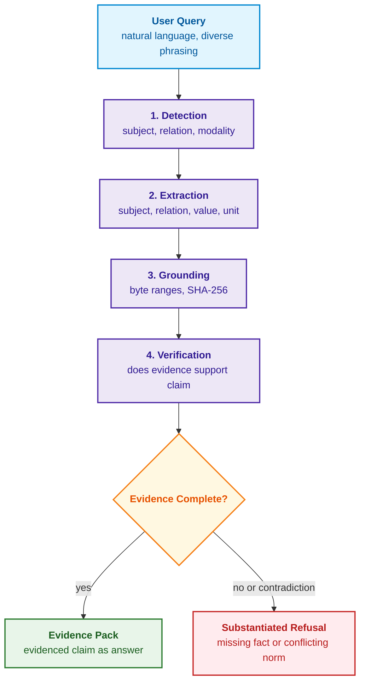
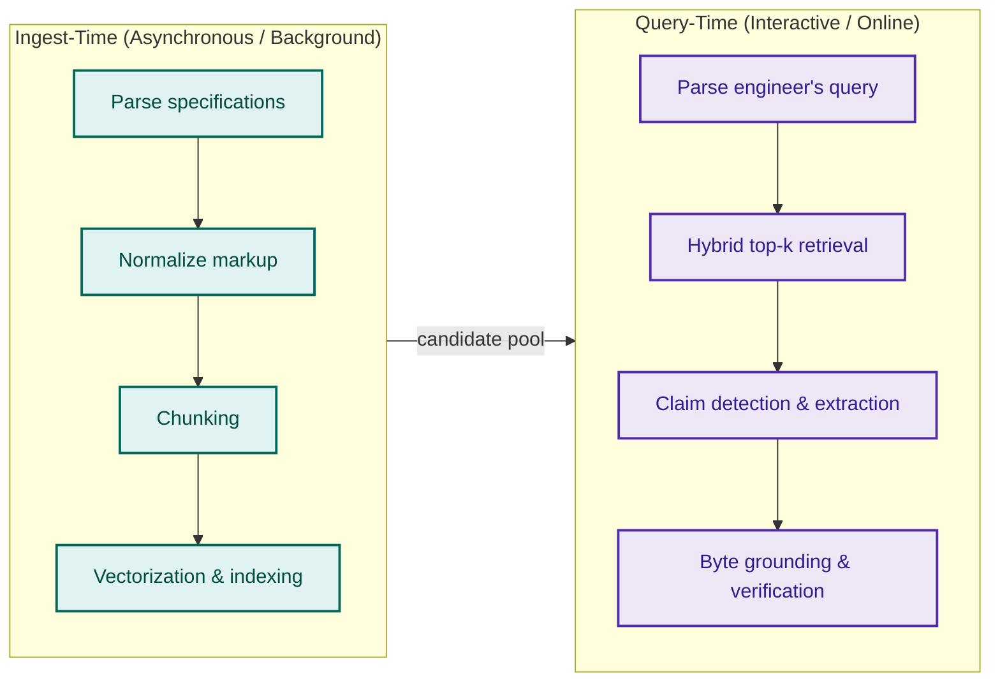
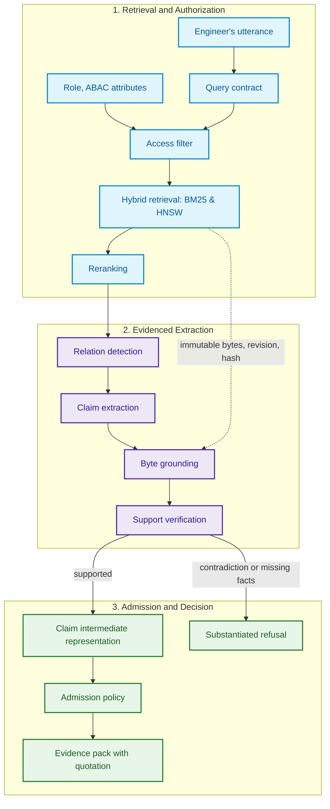
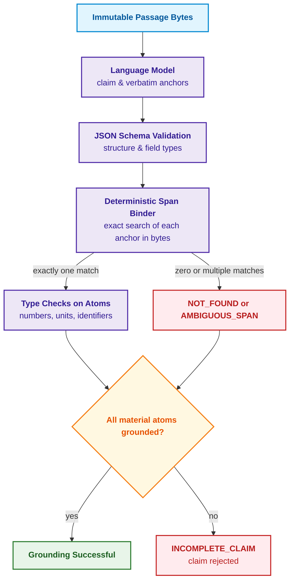
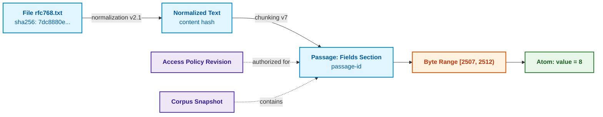
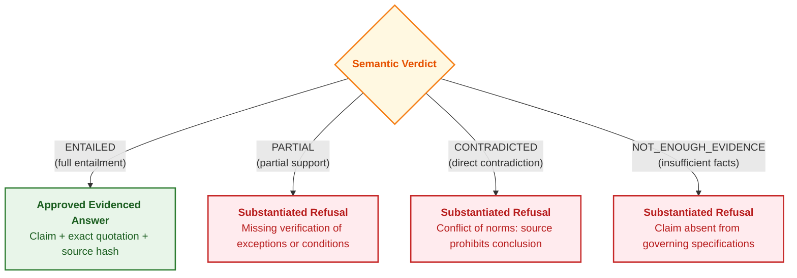
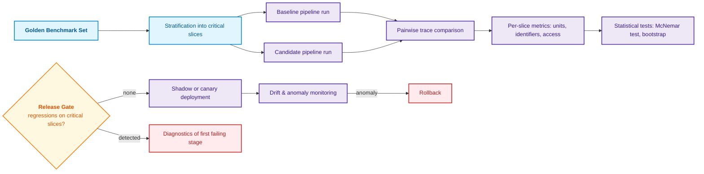
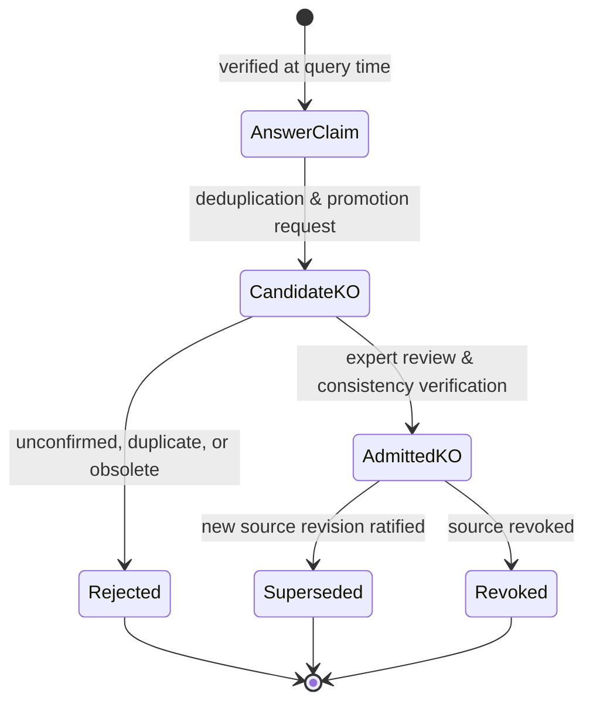

# Chapter 19. From Question to Evidence: Retrieval, Grounding, and Claim Verification

> **Book:** [Architecture of Evidence-Governed Expert Systems](README.md) · [Part IV: Architecture, Technology Stack, Inference, and Action](part-04-architecture-and-inference.md)  
> **Previous Chapter:** [Chapter 18. Execution Infrastructure: Local Models, Hardware Accelerators, Edge, and On-Premise](ch18-execution-infrastructure.md)  
> **Next Chapter:** [Chapter 31. Syllogistic Reasoning and Relation Lattices: Hierarchies of Predicates, Exceptions, and Validity](ch31-syllogistic-reasoning-and-relation-lattices.md)  
> **Table of Contents:** [README.md](README.md)  
> **Author:** [Mykola Fedchyk](about-the-author.md)  
> **Level:** Intermediate and advanced: software engineers, knowledge engineers, language model practitioners  
> **Expected Outcomes:** Decompose natural language questions into subject, relation, and speech act; distinguish the stages of detection, extraction, grounding, and claim verification; ground each material atom of a claim to source bytes and calculate grounding completeness; normalize values and units of measure; construct an intermediate representation of an evidenced claim; organize regression testing and fail-closed admission of claims into the knowledge base.

---

## Abstract

This chapter examines the transition from an unstructured engineering inquiry to a strictly verified evidence pack within the architecture of evidence-governed expert systems. It analyzes the ill-structured nature of natural language and formalizes an algorithm for the semantic decomposition of user utterances into subject, relation, and speech act using typed JSON Schema contracts to ensure safe query routing to the knowledge base. A four-stage query transformation pipeline is investigated: detection, extraction, byte-level grounding, and semantic entailment verification. A deterministic span binder is implemented to resolve material claim atoms against source bytes (RFC 768), calculating the grounding completeness metric $`\mathrm{Comp}(C)`$ and normalizing units of measure. A four-valued evidence verification gate is established (`ENTAILED`, `PARTIAL`, `CONTRADICTED`, `NOT_ENOUGH_EVIDENCE`), strictly preventing the emission of unconfirmed recommendations. Finally, the chapter formalizes regression evaluation methodologies and the knowledge object lifecycle—from transient query-time answers to long-term admission into the canonical fact base of an expert system.

---

Consider an expert system tasked with analyzing network specifications that responds to an engineer only when authoritative evidence exists within the corpus. An engineer asks: *"What is the minimum length of a UDP datagram?"* A retrieval mechanism built upon Retrieval-Augmented Generation (RAG) [[1]](#src-1) successfully locates RFC 768, the User Datagram Protocol specification, and pinpoints the relevant passage [[2]](#src-2):

> *Length is the length in octets of this user datagram including this header and the data. (This means the minimum value of the length is eight.)*

A generative model typically responds tersely: *"8"*. The number is numerically correct, yet as an engineering response, it is critically incomplete. Eight what: bits, octets, or 32-bit words? In the source text, the number is written out as the word *eight*, while the unit *octets* appears in a separate clause of the sentence; consequently, a naive regular expression scanning for digits would find nothing. Furthermore, an engineer might formulate the exact same question in multiple distinct ways:

- *"What is the minimum length of a UDP datagram?"* (direct question);
- *"What is the smallest footprint occupied by a UDP datagram?"* (request for calculation);
- *"Show me where the RFC specifies the minimum datagram length"* (request for evidence);
- *"Is it true that the minimum UDP datagram size is 8 octets?"* (claim verification request).

These utterances diverge in grammar and pragmatic speech act, yet they all anchor to a single engineering claim. The Natural Questions benchmark formalized an analogous distinction between a long answer (the passage containing the answer) and a short answer (the precise span within the passage) [[3]](#src-3). For an expert system, even a short answer is insufficient: what is required is a structured claim specifying subject, relation, value, unit, and concrete evidence for each constituent atom.

This chapter addresses the core engineering question: **how can a retrieved text passage be transformed into a verifiable, evidenced claim suitable for a mission-critical answer?** A language model proposes a candidate structure and literal textual anchors; a deterministic span binder verifies physical offsets; and a dedicated verification gate establishes semantic roles, applicability boundaries, and compliance with the query contract. Complete grounding is a necessary prerequisite for source verification, though not a sufficient condition for valid interpretation. Unconfirmed fields must trigger a formal clarification or a safe refusal rather than probabilistic confabulation.



This diagram illustrates that an authoritative answer is emitted only after all four sequential stages succeed; any pipeline defect transitions execution into a substantiated refusal. The following section clarifies where this pipeline operates within the overarching expert system architecture.

## 1. Placement of the Problem Within Expert System Architecture

Within the overarching architecture of an evidence-governed expert system, the pipeline transforming an incoming inquiry into verified evidence serves as a critical perimeter gate positioned between unstructured document retrieval subsystems and the formal symbolic inference core. If a system architect neglects this intermediate layer and passes retrieved text passages directly to a generative model for synthesis, the system suffers catastrophic evidential degradation: natural language hallucinations, dropped physical units, and conflated concepts infiltrate the knowledge base under the guise of "authoritative conclusions." In mission-critical environments (ISO 26262 ASIL-D, IEC 61508, DO-178C), admitting an erroneous or incomplete fact shatters the determinism of formal reasoning chains, resulting in flawed engineering decisions with irreversible physical consequences. The naive approach of conventional RAG systems—wherein a large language model autonomously interprets context without binding each material atom to physical source bytes—proves fundamentally unsuited for regulatory-governed deployments.

This chapter examines the brief yet decisive segment of the read path introduced in [Chapter 16](ch16-expert-systems-architecture.md): the document has already been authorized, versioned, and chunked; the retrieval engine has returned the top-$k$ candidates; and the passage text must now be transformed into a formal, machine-verifiable claim. Across this segment, output integrity is guaranteed by six sequential engineering quality gates.

| Stage | Audit Question | Typical Latent Defect |
|---|---|---|
| **Retrieval** | Did the relevant passage fall within the top-$k$ candidate set? | A valid document was retrieved, but from an obsolete revision |
| **Detection** | Does the passage contain the precise relation requested? | A sentence stating datagram length was mistaken for header length |
| **Extraction** | Is the complete value structure preserved? | `eight octets` was truncated to the bare scalar `8` |
| **Grounding** | Does every atom have exact coordinates in the document? | The quotation is accurate, but extracted from a superseded revision |
| **Verification** | Does the evidence fully support the claim? | An exception clause, such as "except under protocol X," was overlooked |
| **Admission** | Is the requesting agent authorized to access this passage? | The model utilized a confidential specification to answer a public query |

Each row in the table represents a distinct class of engineering risk requiring a deterministic defense mechanism. The first line of defense is deployed prior to touching the retrieval index—at the stage of semantic query parsing.

## 2. Ill-Structured Nature of Natural Language Questions and Semantic Decomposition

Semantic decomposition of engineering utterances serves as the primary normalization filter for the expert system's inbound data stream. Whereas a relational database query adheres to a rigid, strongly typed SQL grammar, human natural language exhibits high lexical variability, ellipses, and blurred boundaries between predicates and metadata. If the system attempts to translate an engineer's unstructured utterance directly into vector embeddings or inference rules, uncontrolled semantic ambiguity emerges: synonym usage (*"size"* instead of *"length"*), omitted context from preceding conversational turns, or conflation of substantive technical constraints with stylistic formatting requests trigger retrieval over irrelevant regulatory corpora or cause intent misclassification. Naive heuristic parsing based on regular expressions inevitably collapses upon encountering grammatical inversions or subordinate clauses.

The expert system resolves this vulnerability by decomposing the utterance into three orthogonal dimensions:

1. **Subject**: the physical or logical entity, subsystem, or parameter (for example, UDP datagram, CAN FD bus, power inverter).
2. **Relation**: the normatively governed property or characteristic (for example, minimum length, maximum current, allowable jitter).
3. **Speech act**: the engineer's pragmatic intent—requesting a direct fact, demanding primary normative evidence, verifying a hypothesis, or refuting an assumption (the theoretical foundation of speech acts as goal-directed linguistic actions was formulated by John Searle [[4]](#src-4)).

Rather than relying on brittle regex patterns, the language model functions as a strictly bounded semantic translator whose output is formally validated against a rigid JSON Schema [[5]](#src-5). Any model output that violates the schema specification or data types is automatically rejected by the controller prior to initiating retrieval:

<details>
<summary>Structured JSON data</summary>

```json
{
  "schema_version": "query-contract.v1",
  "subject": "UDP datagram",
  "relation": "minimum length",
  "speech_act": "request_evidence",
  "answer_shape": "quantity",
  "constraints": {
    "document_family": "IETF RFC",
    "status": "current"
  },
  "dialogue_context_refs": []
}
```

</details>

The `answer_shape` field set to `quantity` explicitly informs downstream stages that the response must include a scalar number accompanied by a physical unit of measure, while `speech_act` set to `request_evidence` mandates providing verbatim citations. The query contract defines what to search for; the subsequent question is when the expert system extracts knowledge from source documents.

## 3. Two Temporal Paths of Knowledge Acquisition

Within the system architecture, knowledge acquisition operates across two complementary temporal modes, separated by computational complexity and response latency budgets. Attempting to exhaustively extract all conceivable knowledge upfront in the background causes a combinatorial explosion and accumulates stale relational dependencies; conversely, attempting to parse multi-page technical scans and dense specifications on the fly during an interactive query violates strict real-time latency guarantees. The following diagram illustrates the interaction between the background and online execution paths.



Ingest-time acquisition executes whenever new documents are ingested into the repository: it preserves hierarchical structure and version lineage, parses tabular data, and precomputes cryptographic chunk checksums. This ingestion workflow is detailed in [Chapter 15](ch15-knowledge-extraction-and-kb-construction.md). In contrast, query-time acquisition activates on demand in response to a specific engineering inquiry. The architectural rationale for separating these two modes is straightforward: a single specification paragraph may answer dozens of distinct questions (field length, voltage tolerance, error margins), making exhaustive upfront extraction of all latent propositions intractable. At query time, the expert system extracts and verifies only the targeted claim required by the active query contract.

## 4. The Query-to-Evidence Transformation Pipeline

The end-to-end transformation of an engineering inquiry into an evidenced package combines hybrid retrieval with formal-symbolic access control and semantic consistency checks. Omitting intermediate falsification gates turns the pipeline into an uninspectable black box, where a failure in any individual model results in fabricated output with zero fault localization. The architecture mitigates this hazard across three distinct phases: authorized retrieval, evidenced extraction, and conclusion admission.



The dashed arrow connecting retrieval directly to grounding is architectural: the span binder operates on the immutable bytes, document revision, and cryptographic hash supplied by the retrieval subsystem, rather than on the unverified text regenerated by the language model. This decoupling enables the binder to reliably detect model confabulations, as demonstrated in the following section.

## 5. Extraction and Deterministic Span Binding

The primary hazard of utilizing generative language models as knowledge extractors stems from unconstrained paraphrasing, numerical constant distortion, and dropped physical units. To eliminate subjective model drift, the expert system implements a strict separation of concerns: the language model generates a candidate claim hypothesis along with verbatim textual anchors, whereas a deterministic software component—the deterministic span binder—matches these anchors against physical source bytes, validating data types and span uniqueness.



### 5.1. Grounding Completeness and Validity Criteria

To quantitatively verify that an extracted claim is rooted in authoritative source text without hallucinated elements, the grounding completeness metric $`\mathrm{Comp}(C)`$ is defined. It quantifies the proportion of material knowledge components successfully bound to physical source coordinates:

```math
\mathrm{Comp}(C) = \frac{\sum_{a \in A_m(C)} w_a \cdot \mathbb{I}[b(a) \neq \varnothing]}{\sum_{a \in A_m(C)} w_a}
```

where:
- $`\mathrm{Comp}(C)`$ is the scalar grounding completeness score for claim $C$, defined over the normalized range $[0, 1]$;
- $`A_m(C)`$ is the finite set of material atoms comprising the claim, the omission of any one of which distorts the engineering semantics ($`A_m(C) = \{\text{subject}, \text{relation}, \text{value}, \text{unit}\}`$);
- $a$ is an individual material atom belonging to $`A_m(C)`$;
- $w_a$ is the criticality weight of atom $a$ ($w_a > 0$, real-valued; in the calibrated baseline configuration, $`w_{\text{subject}} = 0{,}1`$, $`w_{\text{relation}} = 0{,}2`$, $`w_{\text{value}} = 0{,}4`$, $`w_{\text{unit}} = 0{,}3`$);
- $b(a)$ is the half-open byte offset span $[s, e)$ uniquely identifying the occurrence of the atom's text anchor in the normalized source text, or $\varnothing$ if the anchor is not found or is ambiguous;
- $`\mathbb{I}[b(a) \neq \varnothing]`$ is an indicator function evaluating to 1 if atom $a$ possesses exactly one unambiguous span match, and 0 in the event of a $`\text{NOT\_FOUND}`$ or $`\text{AMBIGUOUS\_SPAN}`$ status.

**Practical Application and Engineering Decisions:**
1. Grounding completeness is computed by the deterministic binder for every candidate claim proposed by the language model prior to admitting the output into the symbolic reasoning engine.
2. **Numerical Admission Thresholds (Cutoff Criteria):**
   - $`\mathrm{Comp}(C) = 1{,}00`$: **GROUNDED (Green Gate)**. All material atoms are successfully anchored to physical bytes; the claim is admitted to semantic entailment verification;
   - $`0{,}70 \le \mathrm{Comp}(C) < 1{,}00`$: **INCOMPLETE_CLAIM (Fail-Closed)**. A critical atom (such as a unit of measure or conditional constraint) is missing or unresolved. The claim is unconditionally rejected. In mission-critical engineering, partial accuracy is unacceptable: knowledge that a latency threshold is "8" without a verified unit (`ms` versus `μs`) represents an immediate hazard;
   - $`\mathrm{Comp}(C) < 0{,}70`$: **UNGROUNDED (Red Gate)**. The claim is rejected, triggering an anomaly telemetry log entry.

**Worked Numerical Example:**
Consider an extracted specification rule: "The maximum tripping current is 25 A at 12 V." The material atoms are configured as: subject ($w = 0{,}1$), relation ($w = 0{,}2$), numerical value ($w = 0{,}4$), and unit ($w = 0{,}3$).
If the unit "A" in the primary source fails span matching due to encoding corruption ($`\mathbb{I}[b(\text{unit}) \neq \varnothing] = 0`$):

```math
\mathrm{Comp}(C) = \frac{0{,}1 \cdot 1 + 0{,}2 \cdot 1 + 0{,}4 \cdot 1 + 0{,}3 \cdot 0}{0{,}1 + 0{,}2 + 0{,}4 + 0{,}3} = \frac{0{,}70}{1{,}0} = 0{,}70
```

Because $`\mathrm{Comp}(C) = 0{,}70 < 1{,}00`$, the admission gate immediately rejects the candidate fact with the status `INCOMPLETE_CLAIM: missing verified unit atom`, preventing an ambiguous value from propagating into the reasoning engine.

> [!IMPORTANT]
> **Why Mission-Critical Engineering Demands 100% Grounding ($`\mathrm{Comp}(C) = 1{,}0`$)**  
> In consumer conversational agents, an answer exhibiting "partial accuracy" of 70% is often deemed acceptable. In avionics (DO-178C) or automotive controllers (ISO 26262), a claim with $`\mathrm{Comp}(C) = 0{,}7`$ is a direct precursor to a hazardous event. If a system extracts "minimum signal delay is 8" but fails to anchor the unit atom (`ms` vs `μs`) or drops a governing caveat ("at temperatures above 85°C"), this is not a minor inaccuracy—it is a false proposition capable of damaging hardware. Consequently, the expert system's admission gate enforces hard fail-closed behavior: any $`\mathrm{Comp}(C) < 1{,}0`$ triggers an immediate refusal identifying the exact ungrounded atom.

### 5.2. Practical Implementation: Claim Grounding from RFC 768

The following Go implementation realizes the span binder for the UDP example. It operates on the file `rfc768.txt` (5,896 bytes), retrieved from the RFC Editor into the local directory. The `normalize` function mirrors the implementation in [Chapter 15](ch15-knowledge-extraction-and-kb-construction.md): it collapses whitespace sequences while preserving raw byte offsets, ensuring that an anchor is matched even if multiple spaces or line breaks separate tokens in the source text. Atom weights are assigned as: subject 0.1, relation 0.2, value 0.4, and unit 0.3.

<details>
<summary>Go Example: Claim Span Binder for RFC 768</summary>

```go
package main

import (
	"bytes"
  "fmt"
  "math"
	"os"
	"strconv"
	"strings"
)

// normalize collapses whitespace sequences and tracks raw byte offsets.
func normalize(raw []byte) ([]byte, []int) {
	var out []byte
	var pos []int
	inSpace := false
	for i, b := range raw {
		switch b {
		case ' ', '\t', '\r', '\n', '\f':
			if !inSpace && len(out) > 0 {
				out = append(out, ' ')
				pos = append(pos, i)
			}
			inSpace = true
			continue
		}
		inSpace = false
		out = append(out, b)
		pos = append(pos, i)
	}
	return out, pos
}

// bind resolves an anchor to a raw byte span; the anchor must occur exactly once.
func bind(norm []byte, pos []int, anchor string) (int, int, string) {
	q, _ := normalize([]byte(anchor))
	q = bytes.TrimSpace(q)
	first := bytes.Index(norm, q)
	switch {
	case len(q) == 0 || first < 0:
		return 0, 0, "NOT_FOUND"
	case bytes.Contains(norm[first+1:], q):
		return 0, 0, "AMBIGUOUS_SPAN"
	}
	return pos[first], pos[first+len(q)-1] + 1, "OK"
}

type Atom struct {
	Name, Anchor string
	Weight       float64
}

var numberWords = map[string]int{"four": 4, "eight": 8, "sixteen": 16}
var unitCodes = map[string]string{"octets": "By", "bits": "bit"} // UCUM codes

// typed validates atom typing: value must be a number, unit must be recognized.
func typed(a Atom) (string, bool) {
	w := strings.Fields(strings.ToLower(a.Anchor))
  if len(w) == 0 {
    return "", false
  }
	last := w[len(w)-1]
	switch a.Name {
	case "value":
		if n, ok := numberWords[last]; ok {
			return strconv.Itoa(n), true
		}
		_, err := strconv.Atoi(last)
		return last, err == nil
	case "unit":
		c, ok := unitCodes[last]
		return c, ok
	}
  return a.Anchor, a.Name == "subject" || a.Name == "relation"
}

func check(norm []byte, pos []int, name string, atoms []Atom) string {
	fmt.Println("==", name)
  required := map[string]bool{"subject": false, "relation": false, "value": false, "unit": false}
  var weightSum float64
  for _, atom := range atoms {
    seen, known := required[atom.Name]
    if !known || seen || atom.Weight <= 0 || math.IsNaN(atom.Weight) || math.IsInf(atom.Weight, 0) {
      fmt.Println("  INVALID_CLAIM_SCHEMA")
      return "INCOMPLETE_CLAIM"
    }
    required[atom.Name] = true
    weightSum += atom.Weight
  }
  if len(atoms) != len(required) || math.IsInf(weightSum, 0) || len(pos) != len(norm) {
    fmt.Println("  INVALID_CLAIM_SCHEMA")
    return "INCOMPLETE_CLAIM"
  }
	var got, total float64
  allBound := true
	for _, a := range atoms {
		total += a.Weight
		s, e, st := bind(norm, pos, a.Anchor)
		v, ok := typed(a)
		if st == "OK" && !ok {
			st = "TYPE_ERROR"
		}
		if st == "OK" {
			got += a.Weight
			fmt.Printf("  %-8s %-34q [%d, %d) -> %s\n", a.Name, a.Anchor, s, e, v)
		} else {
      allBound = false
			fmt.Printf("  %-8s %-34q %s\n", a.Name, a.Anchor, st)
		}
	}
	comp := got / total
	verdict := "GROUNDED"
  if !allBound {
		verdict = "INCOMPLETE_CLAIM"
	}
	fmt.Printf("  Comp = %.2f -> %s\n", comp, verdict)
  return verdict
}

func main() {
	raw, err := os.ReadFile("rfc768.txt")
	if err != nil {
		fmt.Println("read error:", err)
		os.Exit(1)
	}
	norm, pos := normalize(raw)
	subj := Atom{"subject", "this user datagram", 0.1}
	rel := Atom{"relation", "the minimum value of the length", 0.2}
	val := Atom{"value", "eight", 0.4}
	unit := Atom{"unit", "in octets", 0.3}

	check(norm, pos, "A: fully grounded claim", []Atom{subj, rel, val, unit})
	check(norm, pos, "B: hallucinated unit", []Atom{subj, rel, val, {"unit", "in bits", 0.3}})
	check(norm, pos, "C: ambiguous anchor", []Atom{subj, {"relation", "length", 0.2}, val, unit})
}
```

Synthetic unit tests do not require the external RFC file; run with: `go test -v main.go main_test.go`.

```go
package main

import (
	"math"
	"testing"
)

func TestGroundingCompleteness(testCase *testing.T) {
	norm, positions := normalize([]byte("The datagram minimum is eight octets."))
	valid := []Atom{{"subject", "datagram", 0.1}, {"relation", "minimum", 0.2},
		{"value", "eight", 0.4}, {"unit", "octets", 0.3}}
	if check(norm, positions, "valid", valid) != "GROUNDED" {
		testCase.Fatal("valid anchors rejected")
	}
	if check(norm, positions, "empty", nil) == "GROUNDED" {
		testCase.Fatal("empty claim accepted")
	}
	if check(norm, positions, "missing unit", valid[:3]) == "GROUNDED" {
		testCase.Fatal("missing required field accepted")
	}
	for _, weight := range []float64{0, -1, math.NaN(), math.Inf(1)} {
		invalid := append([]Atom(nil), valid...)
		invalid[0].Weight = weight
		if check(norm, positions, "invalid weight", invalid) == "GROUNDED" {
			testCase.Fatal("invalid weight accepted")
		}
	}
	missing := append([]Atom(nil), valid...)
	missing[3].Anchor = ""
	if check(norm, positions, "empty anchor", missing) == "GROUNDED" {
		testCase.Fatal("empty anchor accepted")
	}
	duplicate := append([]Atom(nil), valid...)
	duplicate[3] = duplicate[0]
	if check(norm, positions, "duplicate field", duplicate) == "GROUNDED" {
		testCase.Fatal("duplicate field accepted")
	}
	if _, ok := typed(Atom{Name: "unit", Anchor: ""}); ok {
		testCase.Fatal("empty typed anchor accepted")
	}
}
```

</details>

Execution output for the reference RFC copy; note that alternative whitespace or newline formatting will alter byte coordinates:

<details>
<summary>Execution Output</summary>

```text
== A: fully grounded claim
  subject  "this user datagram"               [2398, 2416) -> this user datagram
  relation "the minimum value of the length"  [2472, 2503) -> the minimum value of the length
  value    "eight"                            [2507, 2512) -> 8
  unit     "in octets"                        [2384, 2393) -> By
  Comp = 1.00 -> GROUNDED
== B: hallucinated unit
  subject  "this user datagram"               [2398, 2416) -> this user datagram
  relation "the minimum value of the length"  [2472, 2503) -> the minimum value of the length
  value    "eight"                            [2507, 2512) -> 8
  unit     "in bits"                          NOT_FOUND
  Comp = 0.70 -> INCOMPLETE_CLAIM
== C: ambiguous anchor
  subject  "this user datagram"               [2398, 2416) -> this user datagram
  relation "length"                           AMBIGUOUS_SPAN
  value    "eight"                            [2507, 2512) -> 8
  unit     "in octets"                        [2384, 2393) -> By
  Comp = 0.80 -> INCOMPLETE_CLAIM
```

</details>

Claim A is fully grounded: the textual word *eight* is normalized to the integer 8, the unit *octets* is mapped to the UCUM code `By`, and each atom is pinned to an unambiguous byte span. Claim B illustrates a classic generative model defect: the model "assumed" length is commonly measured in bits, but that term does not appear in the context; hence, the unit remains ungrounded, completeness drops to 0.70, and the claim is rejected. Claim C demonstrates the inverse failure mode: the anchor *length* is literally present but occurs four times within the document, rendering span resolution ambiguous. Both rejections are deterministic and invariant to the model's self-reported generation confidence.

The limitations of this benchmark harness should be noted. The numerical word and unit dictionaries shown here are minimal; a production-grade binder integrates comprehensive lexicons and standard unit registries. Furthermore, while this demo scans the entire document, a production implementation restricts anchor search to the bounds of the retrieved candidate passage, substantially mitigating ambiguity. Finally, physical span binding proves only that all constituent atoms literally appear in the text; it does not prove that the passage semantically entails the specific proposition inquired about. That task is delegated to the verification stage detailed below.

## 6. Typed Knowledge Atoms

Within the structure of an evidenced claim, strong typing of elementary components forms the foundation for automated logical and mathematical reasoning within the expert system's symbolic core. If the system treats extracted fragments as untyped text strings, semantic incompatibility arises: numerical values lose their physical semantics—precluding invariant verification—and alternative surface representations of the same quantity ("8 octets" and "64 bits") are misidentified as conflicting facts. Naive substring matching or regular expressions fail when confronted with dimensional conversions or modal shifts. The span binder validates not merely the presence of an anchor, but its semantic atom type across four primary categories:

- **Quantitative atom**: a scalar number strictly bound to a unit of measure. Units are normalized using the International System of Units (SI) or the Unified Code for Units of Measure (UCUM) [[6]](#src-6), under which, for example, a byte is assigned the code `By`. A bare number lacking a unit is rejected at the schema validation stage.
- **Identifier**: a structured designation referencing a document or system entity (e.g., RFC 768, ISO 26262, MIL-STD-1553B), validated against canonical format patterns.
- **Modality**: the normative strength of the proposition (MUST, SHALL, SHOULD, MAY) evaluated according to the formal criteria established in [Chapter 14](ch14-requirements-detection-and-formalization.md). Notably, the excerpt from RFC 768 contains none of these keywords: RFC 768 was published in 1980, well before the adoption of RFC 2119 conventions. Consequently, the modality of this claim is typed as definitional rather than prescriptive.
- **Validity bounds**: the document revision, operating temperature range, or environmental operational profile within which the claim holds valid.

Strong atom typing enables machine-verifiable consistency: once normalized, "8 octets" and "64 bits" become directly comparable as equivalent quantities, whereas an unadorned "8" fails schema admission entirely.

## 7. Provenance Model: From File to Atom

A cryptographic provenance model serves as the backbone of auditing and legal non-repudiation in evidence-governed expert systems. If source citations are restricted to surface textual identifiers (such as referencing "RFC 768"), a severe vulnerability to tampering and version desynchronization emerges: standard revisions, unversioned errata corrections, or modifications to whitespace normalization algorithms cause the system to reference non-existent or altered text spans. Naive line or page numbering schemes collapse whenever document layouts change or files are recompiled. In an evidence-governed architecture, the lineage between an origin file and an extracted knowledge atom is modeled as an immutable cryptographic transformation chain grounded in the W3C PROV-O ontology [[7]](#src-7).



To guarantee absolute reproducibility, the passage identifier is computed via a cryptographic hash function $H$ over the full tuple of context parameters:

```math
\text{passage-id} = H(\text{document-id} \,\|\, \text{revision} \,\|\, \text{transform-chain} \,\|\, \text{byte-start} \,\|\, \text{byte-end} \,\|\, \text{bytes})
```

where:
- $\text{passage-id}$ is the 256-bit cryptographic hash identifier of the knowledge passage (conventionally encoded as a 64-character hexadecimal string);
- $H$ is a certified, collision-resistant cryptographic hash function (FIPS 180-4 SHA-256);
- $\text{document-id}$ is the canonical identifier of the governing document (e.g., persistent URN `urn:ietf:rfc:768`);
- $\text{revision}$ is an immutable git commit hash or the official digital signature of the published standard edition;
- $\text{transform-chain}$ is a formal descriptor recording the sequence of preprocessing and normalization steps applied (e.g., `norm:v2.1|chunk:fields_v7`);
- $\text{byte-start}, \text{byte-end}$ are the exact half-open byte offset coordinates $[s, e)$ within the normalized binary stream ($0 \le s < e$);
- $\text{bytes}$ represents the raw binary byte sequence of the passage;
- $`\|`$ denotes unambiguous canonical field serialization (such as length-prefixed TLV or Protocol Buffers) preventing field-boundary injection collisions.

**Practical Application and Engineering Decisions:**
1. This hash computation is executed automatically during ingest-time indexing and re-verified at query execution time.
2. **Integrity Verification Criteria:**
   - If the recomputed hash $`H' = \text{passage-id}`$: **VERIFIED (Green Gate)**. Exact byte-level authenticity of the passage is confirmed;
   - If $`H' \ne \text{passage-id}`$: **TAMPER_DETECTED (Red Gate / Fail-Closed)**. A version divergence or unauthorized content mutation is flagged; the passage is immediately evicted from the query cache, an audit alert is triggered, and retrieval falls back to the immutable primary storage archive.

## 8. Intermediate Representation of an Evidenced Claim

The evidence claim intermediate representation (Claim-IR) serves as a strongly typed data contract bridging the non-deterministic output of language models with the deterministic symbolic reasoning core. Omitting this intermediate abstraction leads to uncontrolled blending of raw textual hypotheses with established facts, depriving the system of auditability and decoupling physical grounding from semantic validation. Naively routing generated text directly to an explanation engine prevents machine verification of proof completeness. For Claim A, this intermediate representation records all byte spans, citations, and verification states as a validated JSON document (using half-open byte spans where the end offset is exclusive):

<details>
<summary>Structured JSON data</summary>

```json
{
  "claim_id": "claim:rfc768:udp-min-length",
  "contract_ref": "query-contract.v1#q-120",
  "statement": {
    "subject": "UDP datagram",
    "relation": "minimum_length",
    "modality": "DEFINITIONAL",
    "value": 8,
    "unit": "By"
  },
  "provenance": {
    "document_urn": "urn:ietf:rfc:768",
    "document_sha256_prefix": "7dc8880e1ecef9c3",
    "atoms": {
      "subject":  {"bytes": [2398, 2416], "quote": "this user datagram"},
      "relation": {"bytes": [2472, 2503], "quote": "the minimum value of the length"},
      "value":    {"bytes": [2507, 2512], "quote": "eight"},
      "unit":     {"bytes": [2384, 2393], "quote": "in octets"}
    }
  },
  "grounding_status": "ALL_ATOMS_BOUND",
  "verification": {
    "verdict": "NOT_ENOUGH_EVIDENCE",
    "method": "grounding_only",
    "semantic_review": "required",
    "unsupported_atoms": []
  }
}
```

</details>

This specification explicitly separates complete byte grounding from pending semantic verification. An empty list of unsupported anchors does not imply an `ENTAILED` status: the span binder verified byte coordinates, not semantic roles or logical entailment. The hash prefix in the listing is truncated for human readability; a production machine bundle requires the full SHA-256 digest and immutable artifact references. Following domain expert review or verification against a formal model, the verdict is recorded alongside the verifier method and version identifier. Statistical confidence scores are tracked independently and never substitute for formal verification status.

## 9. Verification of Claim Support Against Source Evidence

Semantic entailment verification is the concluding gate in transforming a retrieved passage into an authoritative fact. Successful byte grounding proves only the literal presence of individual tokens in the text; it does not guarantee that the source logically supports the asserted proposition. Negations, contextual exceptions, caveats, or conditional clauses may directly refute the extracted claim. Neglecting this stage traps the expert system in superficial lexical matching, pulling citations from irrelevant sections (for example, confusing header length with overall datagram length) and presenting erroneous conclusions to users. Naively relying on language model confidence is unacceptable; verification must be enforced through a formal four-valued decision gate.

In computational linguistics, this challenge is formalized as recognizing textual entailment (RTE): text $T$ entails hypothesis $H$ if a human reading $T$ would infer that $H$ is most likely true [[8]](#src-8). For an expert system, this definition is insufficient, as "most likely" does not constitute an engineering proof. Therefore, entailment checking is augmented with deterministic rules: the claim's value and unit must strictly match the grounded atoms, the modality must align with the normative keywords in the quote, and the passage must contain no unhandled exception clauses.

The UDP example demonstrates why an independent verification stage is essential. Suppose the engineer inquired about the *header* rather than the datagram: "What is the length of a UDP header?" The sentence from RFC 768 grounds with identical precision, yet the relation asserts something different: it defines the minimum length of the *entire datagram*, which encompasses both header and data. The detection stage must flag this mismatch, requiring the answer to be derived from alternative evidence. The header format diagram in RFC 768 specifies four 16-bit fields (Source Port, Destination Port, Length, Checksum)—yielding 64 bits, or 8 octets. Emitting the conclusion "the header is 8 octets" requires a two-step reasoning chain: a factual premise establishing the four 16-bit fields, followed by an arithmetic evaluation rule executed by the symbolic reasoning engine, not the language model. The sentence stating minimum datagram length serves as an independent sanity check: a datagram containing zero data bytes consists solely of its header. This multi-step synthesis illustrates how an engineering inquiry is transformed into an unbroken chain of evidence.

The verification verdict resolves to one of four discrete states: the claim is entailed by the evidence (`ENTAILED`), the evidence supports only a subset of the claim (`PARTIAL`), the evidence contradicts the claim (`CONTRADICTED`), or available evidence is insufficient (`NOT_ENOUGH_EVIDENCE`). Only the first status permits emitting an answer; all other outcomes transition to a substantiated refusal composed by the explanation engine described in [Chapter 20](ch20-explanation-engine.md).



## 10. Retrieval Completeness, Fail-Closed Behavior, and Expert Review

The principle of fail-closed behavior under evidence incompleteness is a fundamental dependability rule for evidence-governed expert systems. When retrieved candidate passages lack the facts required to substantiate a hypothesis, the system must emit a reasoned refusal rather than attempting to bridge the gap with generative conjecture. In safety-critical contexts, supplying unverified guidance is vastly more hazardous than acknowledging a data void: it risks misleading engineers or provoking catastrophic physical failures. Naively increasing temperature or expanding the context window without formal verification merely amplifies hallucination risks.

If the top-$k$ passages contain no conclusive proof, the expert system knows only that the active retrieval path failed to locate evidence. This does not prove the absence of the norm from the wider corpus. The resulting refusal must specify the search perimeter, the index generation, and the unfulfilled verification checks; under permitted security policies, the system may expand lexical search or query structured fact stores, rather than inflating generator confidence.

The identical boundary applies when the corpus is partitioned into shards. If a required storage shard fails to respond or answers from an out-of-sync generation, the refusal must identify the unresponsive shard and mark the search result as incomplete. Access control permissions must be evaluated within each shard prior to aggregating candidates. Evidence discovered within an active shard does not guarantee normative validity until all shards capable of holding superseding revisions have responded ([Chapter 7](ch07-knowledge-base-typology.md), Section 10 of [Chapter 32](ch32-high-performance-knowledge-packs-mmap-and-harvesting.md)).

At query time, newly extracted document interpretations are persisted as unverified candidates if they lack pre-approved domain rules or formal sign-off. They may be surfaced to analysts as candidate hypotheses, but must never be presented as authoritative regulatory conclusions. This operational mode preserves the immutable read path established in [Chapter 16](ch16-expert-systems-architecture.md): verified facts and exploratory extractions maintain strictly segregated statuses.

The schema governing material fields is dictated by task semantics, not by the language model. The four atoms utilized in this chapter do not cover temporal constraints, conditional exceptions, or multi-action requirements found in complex standards. For PDF sources, byte offsets address derived text layers and must be mapped back to physical page geometries. Textual entailment scoring remains a statistical signal when executed by a neural model; high confidence cannot replace expert review or automated proofs against formal specifications.

Retrieval, citation grounding, semantic verification, and explanation synthesis must be evaluated using independent metrics. Refusals, normative contradictions, and partially supported claims must be scored separately from correct answers; otherwise, a degenerate model that refuses every query would falsely appear error-free.

## 11. Regression Testing of the Extraction Pipeline

Regression evaluation of the knowledge extraction pipeline guarantees stability and evidential precision when updating language model versions, revising prompts, or refining normalization rules. If an engineering team evaluates modifications solely against aggregate benchmark averages (such as global accuracy, BLEU, or ROUGE across an entire corpus), severe latent regressions remain undetected: the system may improve overall scores on common queries while losing the ability to parse boundary conditions or physical units in rare, safety-critical regulatory standards. Naive A/B testing lacking stratified slices cannot detect localized breakdowns in deterministic domains.



Quality must be measured across critical slices rather than gross corpus-wide averages: isolating claims involving units of measure, document identifiers, or queries intersecting strict access boundaries. An aggregate accuracy of 98% can easily conceal a regression in the "units of measure" slice, where a candidate model drops half of all physical dimensions because that slice constitutes a small percentage of the overall test suite.

Pipeline versions are evaluated pairwise; McNemar's test explicitly analyzes divergent classifications between models [[9]](#src-9), while bootstrapping estimates metric uncertainty intervals [[10]](#src-10). Paraphrases and document revisions do not constitute independent observations; resampling must be grouped by document clusters or query intents. The absence of a statistically significant difference does not demonstrate equivalence; an explicit bound on permissible regression must be established upfront. For safety-critical assertions, any single detected regression must block deployment, though observing zero benchmark errors does not prove zero risk in production.

## 12. Lifecycle of Knowledge Objects: From Answer to Knowledge Base

A formal knowledge object lifecycle governs the transition of a verified claim from a transient query-time response to a permanent, reusable artifact within the canonical fact base. Direct, unverified insertion of generated claims into the knowledge base creates the hazard of a compounding error loop (model collapse at the factual level): a spurious hallucination or model artifact committed to storage is subsequently retrieved by downstream reasoning processes as established truth. Naively treating every accepted answer as an immutable fact poisons the knowledge repository. Promotion is structured as a deterministic finite-state automaton.



An answer claim (`AnswerClaim`) transitions to a candidate knowledge object (`CandidateKO`) only when tagged for reuse, and is admitted to the canonical knowledge base (`AdmittedKO`) strictly following human expert review and formal consistency verification. Admitted knowledge objects are never silently dropped; they transition into `Superseded` or `Revoked` states, preserving complete audit lineage.

This governance model shields the knowledge base from compounding error loops: a transient model error committed to persistent storage would otherwise re-emerge as "authoritative ground truth" for future inferences. An analogous failure mode is well documented in machine learning training: Shumailov et al. demonstrated that models trained on recursively generated synthetic data progressively degrade, losing rare tail distributions [[11]](#src-11). A knowledge base devoid of a formal promotion gate risks identical degeneration, operating over discrete facts rather than network weights. To eliminate generative drift, the architecture adheres to the principle of an explicit semantic retriever, closely related to the REALM framework formulated by Guu et al. [[12]](#src-12): the generative component is constrained from inventing facts out of its parametric weight memory, operating solely to extract and interpret evidence grounded in the supplied source corpus while maintaining full traceability back to concrete textual passages.

## Conclusions

A retrieved text passage is insufficient on its own to form an authoritative answer. Between retrieval and response emission lie four essential stages: relation detection, structured claim extraction, physical span grounding of each material atom, and semantic verification of evidence entailment. A language model proposes candidate claims alongside verbatim anchors, but deterministic code determines whether the proposed claim satisfies admission criteria.

This chapter demonstrated this pipeline using the authentic text of RFC 768. The Go implementation bound a claim defining the minimum length of a UDP datagram to four distinct byte spans, normalized the written-out number *eight* and the unit *octets*, and rejected two invalid variants: one containing a hallucinated unit (completeness 0.70) and one with an ambiguous anchor (completeness 0.80). Analyzing an inquiry regarding header length revealed that successful grounding does not guarantee semantic accuracy: the true answer required a two-step deduction combining factual premises regarding header format with symbolic arithmetic rules.

The operational boundaries of this methodology are clear. Byte grounding proves the literal presence of tokens in a source, not the correctness of an interpretation; entailment verification combines deterministic rules with neural models that provide statistical confidence rather than formal proofs. The minimal dictionaries in the demonstration harness must be replaced with comprehensive lexical and dimensional registries in production. Finally, regression testing across critical slices and formal promotion lifecycles safeguard knowledge integrity over time, though they rely on rigorous benchmark suites and human expert governance. [Chapter 20](ch20-explanation-engine.md) advances from claim verification to explanation: exploring how an expert system substantiates decisions, articulates refusals, and formally defines the boundaries of its competence.

## Self-Check Questions

1. Why is the answer "8" to the minimum UDP datagram length inquiry unacceptable for an expert system, even though the scalar is numerically correct?
2. Into which three orthogonal components does the expert system decompose natural language queries, and what purpose does the `answer_shape` contract field serve?
3. Why did the deterministic span binder reject the anchor *length*, and what modifications would make the binding unambiguous?
4. What does a grounding completeness score of 0.70 signify for Claim B, and why do atom criticality weights not alter the ultimate admission decision?
5. Why does the RFC 768 excerpt on minimum datagram length fail to directly answer an inquiry about header length, and how must the correct answer be derived?
6. Why must extraction pipeline quality be evaluated across critical slices rather than global accuracy averages, and why is pairwise trace comparison necessary?
7. What critical hazard to knowledge base integrity is eliminated by enforcing a formal promotion lifecycle from query answers to canonical knowledge objects?

## Glossary

| Term | Equivalent | Definition |
|---|---|---|
| Query Contract | Query contract | Strongly typed representation of an inquiry: subject, relation, speech act, answer shape |
| Speech Act | Speech act | Pragmatic intent behind an inquiry: retrieving a direct answer, requesting source evidence, or verifying a hypothesis |
| Knowledge Detection | Knowledge detection | Ascertaining whether a retrieved passage contains the target relation |
| Claim Extraction | Claim extraction | Constructing a structured claim representation from passage text |
| Grounding | Grounding | Binding each atom of a claim to an exact byte span in the source text |
| Anchor | Anchor | Verbatim text fragment serving as physical evidence for a claim atom |
| Deterministic Span Binder | Deterministic span binder | Programmatic module locating anchors in document bytes and verifying uniqueness |
| Material Atom | Material atom | Essential claim component whose omission alters engineering semantics: subject, relation, value, unit, condition |
| Grounding Completeness | Grounding completeness | Weighted proportion of material atoms unambiguously bound to physical source coordinates |
| Textual Entailment | Textual entailment | Semantic relationship where the truth of a hypothesis necessarily follows from the premise text |
| Evidenced Claim IR | Evidenced claim IR | Intermediate representation containing the claim, atoms, byte spans, and verification verdicts |
| Critical Slice | Critical slice | Stratified benchmark subset where extraction failures carry severe safety or domain consequences |
| Promotion | Promotion | Lifecycle process transitioning an answer claim into a canonical, reusable knowledge object |
| Query-Time Acquisition | Query-time acquisition | Interactive extraction and verification of a claim executed in response to a specific user inquiry |
| Partial Result | Partial result | Search result assembled when one or more required storage shards fail to respond; does not prove or disprove norm validity |

## Abbreviations

| Abbreviation | Expansion | Meaning |
|---|---|---|
| ABAC | Attribute-Based Access Control | Access control mechanism based on subject, object, and environment attributes |
| BM25 | Best Matching 25 | Probabilistic term-matching ranking function for lexical search |
| DBMS | Database Management System | Software system for storing, managing, and querying structured data |
| HNSW | Hierarchical Navigable Small World | Multi-layer graph index for approximate nearest neighbor vector search |
| IR | Intermediate Representation | Intermediate representation of code, claims, or queries |
| JSON | JavaScript Object Notation | Lightweight text-based data interchange format |
| KO | Knowledge Object | Reusable, formally admitted knowledge object within an expert system |
| PROV-O | PROV Ontology | W3C provenance ontology specification |
| RAG | Retrieval-Augmented Generation | Generation augmented with retrieved passage context |
| RFC | Request for Comments | Publication series containing Internet technical specifications and standards |
| SHA-256 | Secure Hash Algorithm, 256 bits | Cryptographic hash function generating a 256-bit digest |
| SI | Système international d'unités | International System of Units |
| SQL | Structured Query Language | Domain-specific query language for relational database management systems |
| UCUM | Unified Code for Units of Measure | Formal syntax and code system for unambiguous units of measure |
| UDP | User Datagram Protocol | Minimalist, connectionless transport layer protocol |
| URN | Uniform Resource Name | Persistent, location-independent resource identifier |

## References

1. <a id="src-1"></a>Patrick Lewis et al. [*Retrieval-Augmented Generation for Knowledge-Intensive NLP Tasks*](https://arxiv.org/abs/2005.11401). *Advances in Neural Information Processing Systems 33 (NeurIPS 2020)*, 2020.
2. <a id="src-2"></a>J. Postel. [*RFC 768: User Datagram Protocol*](https://www.rfc-editor.org/rfc/rfc768). RFC Editor, 1980.
3. <a id="src-3"></a>Tom Kwiatkowski et al. [*Natural Questions: A Benchmark for Question Answering Research*](https://doi.org/10.1162/tacl_a_00276). *Transactions of the Association for Computational Linguistics*, 7, 453–466, 2019.
4. <a id="src-4"></a>John R. Searle. [*Speech Acts: An Essay in the Philosophy of Language*](https://doi.org/10.1017/CBO9781139173438). Cambridge University Press, 1969.
5. <a id="src-5"></a>JSON Schema. [*JSON Schema Specification*](https://json-schema.org/specification).
6. <a id="src-6"></a>Regenstrief Institute. [*The Unified Code for Units of Measure (UCUM)*](https://ucum.org/ucum).
7. <a id="src-7"></a>Timothy Lebo, Satya Sahoo, Deborah McGuinness (eds.). [*PROV-O: The PROV Ontology*](https://www.w3.org/TR/prov-o/). W3C Recommendation, 2013.
8. <a id="src-8"></a>Ido Dagan, Oren Glickman, Bernardo Magnini. [*The PASCAL Recognising Textual Entailment Challenge*](https://doi.org/10.1007/11736790_9). *Machine Learning Challenges*, LNCS 3944, 177–190, 2006.
9. <a id="src-9"></a>Thomas G. Dietterich. [*Approximate Statistical Tests for Comparing Supervised Classification Learning Algorithms*](https://doi.org/10.1162/089976698300017197). *Neural Computation*, 10(7), 1895–1923, 1998.
10. <a id="src-10"></a>B. Efron. [*Bootstrap Methods: Another Look at the Jackknife*](https://doi.org/10.1214/aos/1176344552). *The Annals of Statistics*, 7(1), 1–26, 1979.
11. <a id="src-11"></a>Ilia Shumailov, Zakhar Shumaylov, Yiren Zhao, Nicolas Papernot, Ross Anderson, Yarin Gal. [*AI Models Collapse When Trained on Recursively Generated Data*](https://doi.org/10.1038/s41586-024-07566-y). *Nature*, 631, 755–759, 2024.
12. <a id="src-12"></a>Kelvin Guu, Kenton Lee, Zora Tung, Panupong Pasupat, Ming-Wei Chang. [*REALM: Retrieval-Augmented Language Model Pre-Training*](https://research.google/pubs/realm-retrieval-augmented-language-model-pre-training/). *Proceedings of the 37th International Conference on Machine Learning (ICML 2020)*, PMLR 119, 3929–3938, 2020.

---

[← Chapter 18](ch18-execution-infrastructure.md) | [Table of Contents](README.md) | [Part IV](part-04-architecture-and-inference.md) | [Chapter 31 →](ch31-syllogistic-reasoning-and-relation-lattices.md)
