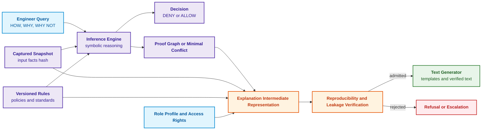
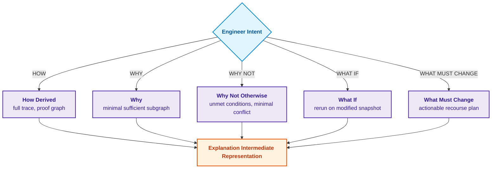
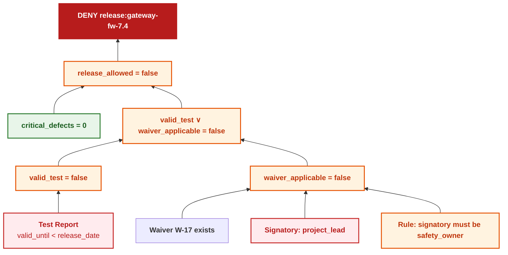
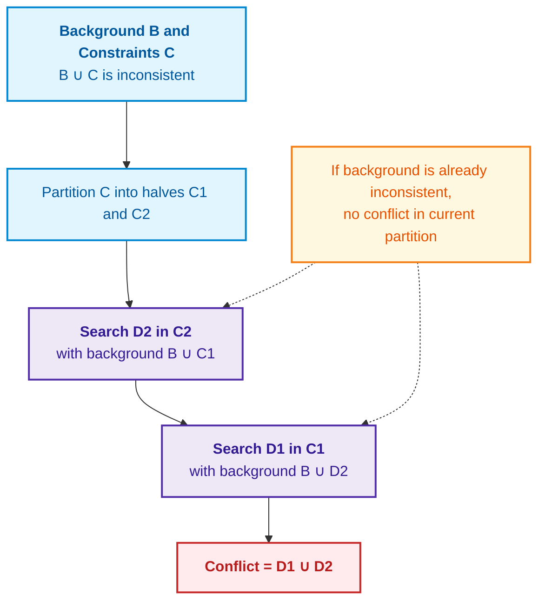
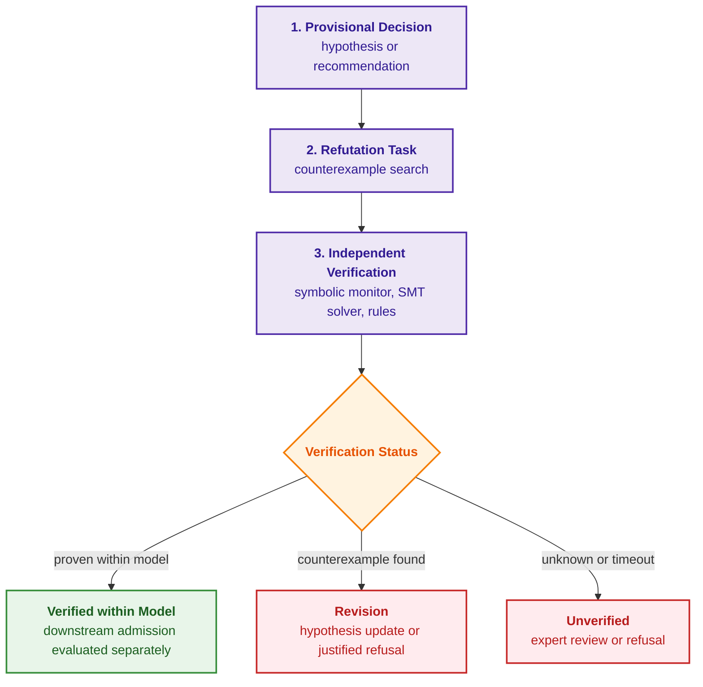
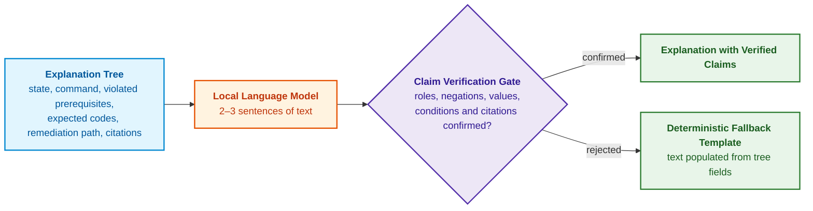

# Chapter 20. Explanation Engine: Decisions, Refusals, and Competence Boundaries

> **Book:** [Architecture of Evidence-Governed Expert Systems](README.md) · [Part IV: Architecture, Technology Stack, Inference, and Action](part-04-architecture-and-inference.md)  
> **Previous Chapter:** [Chapter 31. Syllogistic Reasoning and Relation Lattices: Hierarchies of Predicates, Exceptions, and Validity](ch31-syllogistic-reasoning-and-relation-lattices.md)  
> **Next Chapter:** [Chapter 21. From Recommendation to Action: Authority Control and Safe Execution in Production Environments](ch21-from-recommendation-to-action.md)  
> **Table of Contents:** [README.md](README.md)  
> **Author:** [Mykola Fedchyk](about-the-author.md)  
> **Level:** Intermediate and advanced: inference engine developers, architects, knowledge engineers  
> **Expected Outcomes:** Design an explanation engine operating over the exact inference trace that produced the decision; distinguish five types of explanatory queries (HOW, WHY, WHY NOT, WHAT IF, WHAT MUST CHANGE); isolate minimal constraint conflicts using the QuickXPlain algorithm; formulate counterfactual explanations and actionable recourse under authorization constraints; redact confidential information from explanations; combine natural language explanation with deterministic verification.

---

## Abstract

This chapter investigates the architectural and mathematical foundations of the explanation engine within evidence-governed expert systems. It substantiates the concept of an explanation as an independent, deterministic engineering artifact computed directly from the inference trace (a snapshot of facts, rule versions, and the proof tree), rather than as a post-hoc rationalization generated by a language model. Five canonical types of explanatory queries are systematized: HOW (full execution trace), WHY (minimal sufficient subgraph), WHY NOT (minimal conflict), WHAT IF (counterfactual simulation), and WHAT MUST CHANGE (synthesis of an actionable recourse plan). A rigorous reference implementation of the QuickXPlain algorithm for isolating minimal constraint conflicts is provided in Go. Furthermore, the chapter formalizes confidential information leakage prevention protocols (role-based redaction, masking, residual verification), criteria for identifying competence boundaries, and a four-stage verification protocol for explanation faithfulness.

---

Imagine an expert system that blocked the firmware release of an industrial network gateway. The system log records the machine status `decision=DENY`, while a conversational assistant explains: *"Risk exceeds the permissible security threshold"*. The response sounds plausible, yet for an engineer it is practically useless, failing to answer essential operational questions:

- Exactly which rule fired?
- Which specific input facts were decisive?
- Why was the signed waiver not applied?
- What data was missing to achieve an `ALLOW` status?
- Will the decision change following a retest?

In an evidence-governed expert system, an explanation is not a narrative fabricated by a language model after a decision has been reached (*post-hoc rationalization*). Decades ago, William Clancey, analyzing explanations in the MYCIN medical expert system, demonstrated that tracing fired rules alone does not constitute an explanation: an explanation also requires knowledge regarding why the rules are structured as they are, as well as the strategy governing their application [[1]](#src-1). Tim Miller, synthesizing research across the social sciences, highlighted that humans formulate contrastive questions ("why P rather than Q?") and expect a select subset of causes rather than an exhaustive enumeration [[2]](#src-2).

This chapter addresses the question: **how must an expert system explain decisions, refusals, and competence boundaries so that the explanation itself can be rigorously verified?** The central thesis of the chapter: **an explanation is an independent artifact computed from the exact same inference trace that produced the decision—the snapshot of facts, rule versions, and the proof graph. Distinct queries demand distinct computational procedures: a full trace, a minimal sufficient subgraph, a minimal conflict, a rerun, or an optimization search for actionable recourse. A language model may only verbalize a verified explanation, but never inject ungrounded premises into it.**

## 1. Explanation as an Independent Engineering Artifact

Within the overarching architecture of an evidence-governed expert system, the explanation engine operates as an independent projection layer situated between the symbolic inference core (*Inference Engine*), the versioned knowledge base, and the safety audit subsystem. While research prototypes often neglect explanations or reduce them to a basic generative call to a neural model, in mission-critical environments (functional safety under ISO 26262, avionics DO-178C standards, medical diagnostic platforms), the absence of a deterministic link between a verdict and its justification causes an immediate collapse of certification trust. Entrusting explanation generation to a third-party language model (*post-hoc rationalization*) inevitably precipitates an epistemic catastrophe: the model invents plausible yet non-existent technical factors while ignoring the true prerequisites of the executed rules. Conversely, dumping a raw log of rules overwhelms the engineer with thousands of intermediate resolution steps. An evidenced explanation must be an autonomous, mathematically verified engineering artifact compiled exclusively from a frozen snapshot of input facts, exact regulatory revisions, and an immutable proof graph. The diagram below illustrates how these artifacts are synthesized into a verified explanation.



The explanation intermediate representation (EIR) decouples the logical semantics of an explanation from the natural language in which it is rendered. The language model acts strictly as a verbalizer of verified facts; introducing unconfirmed premises is categorically prohibited. The explanation remains inextricably bound to the frozen decision, whose contract is structured as follows:

<details>
<summary>Structured JSON Data</summary>

```json
{
  "decision_id": "dec:gateway-fw-7.4:9f1c",
  "decision": "DENY",
  "subject": "release:gateway-fw-7.4",
  "snapshot_hash": "sha256:<hash of input facts snapshot>",
  "knowledge_version": "kb:release-policy@v7.3",
  "policy_version": "authz-rules@v12",
  "proof_root": "proof:tree:4711",
  "evaluated_at": "2026-09-27T10:15:00Z"
}
```

</details>

Without pinned dependencies and immutable versions, reproducing a decision may be impossible. At the same time, a raw cryptographic hash or graph root does not establish legal validity on its own: validity depends on applicable operational procedures, delegated authorities, and governing standards. Attribution methods such as SHAP estimate feature importance within statistical model predictions [[3]](#src-3). While valuable for analyzing model behavior, they cannot substitute for logical verification of a decision against formal rules.

## 2. Typology of Explanatory Queries (HOW, WHY, WHY NOT, WHAT IF, WHAT MUST CHANGE)

Engineering roles interacting with an expert system impose fundamentally divergent requirements on the structure and granularity of justifications: a certification authority auditor requires concise confirmation of regulatory compliance, an inference engine developer demands an exhaustive variable unification chain, and an operations engineer needs an actionable procedure to overcome a blocking state. A naive attempt to service all inquiries with a generic textual summary or a uniform "why?" template fails in production: it either overwhelms personnel with irrelevant details during an emergency shutdown or masks the root causes of failure. An evidence-governed architecture distinguishes five specialized classes of explanatory queries, each backed by a distinct computational procedure operating over the knowledge graph and inference trace. The diagram below systematizes these queries and aligns them with their computational engines.



The table below clarifies the target audience for each query type and the exact computational workload performed by the expert system.

| Query | Target Audience | What the Expert System Computes | Output Artifact |
|---|---|---|---|
| **HOW** | Inference engine developers, verification engineers | Full execution trace: all fired rules and intermediate predicates | Complete proof graph |
| **WHY** | Auditors, certification bodies | Minimal set of facts sufficient to yield the verdict | Sufficient proof subgraph |
| **WHY NOT** | Release authors, systems engineers | Why the target outcome `ALLOW` was not derived | Missing premise, unsatisfied condition, or conflict; minimization performed only upon established inconsistency |
| **WHAT IF** | Risk analysts, system architects | System behavior following targeted perturbations of input facts | Re-inference execution on a derived snapshot |
| **WHAT MUST CHANGE** | Operations engineers | Minimal valid modifications required to achieve the target outcome in the model | Conditional plan with verified outcomes; cost metric explicitly specified |

Queries of type WHY NOT and WHAT MUST CHANGE exhibit the contrastive structure identified by Miller: an engineer is not interested in "why DENY" in the abstract, but rather "why DENY rather than ALLOW" and "what separates DENY from ALLOW". The subsequent sections illustrate each query type using a unified engineering example.

## 3. Proof Graph and Inference Tracing

Constructing a proof graph (*proof graph*) serves as the foundational tracing mechanism that transforms the symbolic deduction process into a transparent, directed acyclic graph capturing the interrelationships between facts, logical connectives, and intermediate lemmas. In industrial firmware release pipelines and embedded software systems, neglecting formal tracing leads to scenarios where releases are blocked without clear identification of unmet engineering criteria, forcing developers into trial-and-error remediation. A trivial linear execution log fails to represent divergent alternative branches (such as substituting a test with an approved waiver), obscuring the true root cause of failure.

To formalize the admission procedure, consider a predicate model evaluating the release readiness of a network gateway firmware. The admission policy is expressed as a closed logical equation over the vector of safety parameters:

```math
\mathrm{release\_allowed} \Leftrightarrow (\mathrm{valid\_test} \lor \mathrm{waiver\_applicable}) \land (\mathrm{critical\_defects} = 0)
```

Where the parameters have rigorous engineering definitions:
- $`\mathrm{release\_allowed} \in \{0, 1\}`$ — deterministic boolean result of the verification procedure ($1$ denotes release authorization, $0$ denotes release block);
- $`\mathrm{valid\_test} \in \{0, 1\}`$ — predicate indicating the presence of a valid functional safety test report ($`\text{valid\_until} \ge \text{release\_date}`$);
- $`\mathrm{waiver\_applicable} \in \{0, 1\}`$ — predicate indicating the presence of a legitimate waiver signed by an authorized safety officer ($`\text{signatory} = \text{safety\_owner}`$);
- $`\mathrm{critical\_defects} \in \mathbb{N}_0`$ — count of unresolved critical defects identified via Static Analysis or Penetration Testing;
- $\lor, \land, \Leftrightarrow$ — boolean disjunction, conjunction, and material equivalence operations under the closed regulatory policy.

**Practical Application and Engineering Decisions:**
1. **Lifecycle Invocation Point:** The evaluation is triggered by the automated Release Gate within the CI/CD pipeline immediately prior to signing the binary image with the cryptographic release key.
2. **Numerical and State Interpretation:** The evaluation $`\mathrm{release\_allowed} = 1`$ generates a cryptographic admission certificate. The evaluation $`\mathrm{release\_allowed} = 0`$ immediately transitions the gate into a blocking state (`DENY`).
3. **System Reaction:** Rather than throwing a generic error, the explanation engine projects the proof subgraph, deterministically isolating the branches that evaluated to false ($`\mathrm{valid\_test} = \text{false}`$ due to expiration and $`\mathrm{waiver\_applicable} = \text{false}`$ due to an invalid signatory role `project_lead` instead of `safety_owner`). Although the condition $`\mathrm{critical\_defects} = 0`$ is true, it is excluded from the minimal WHY refusal explanation because it was not a cause of the blockage.

The captured fact snapshot records: the test report is expired ($`\text{valid\_until} < \text{release\_date}`$), waiver W-17 exists but was signed by a project lead (role `project_lead`), and zero critical defects exist. The diagram below illustrates the proof graph for the DENY decision.



The graph is read from bottom to top. Neither branch on its own explains the refusal: had the test report been valid, the release would have been permitted even without a waiver, and vice versa. Therefore, the response to a WHY query contains both branches, while the fact regarding zero critical defects is excluded from the minimal explanation because that condition was fulfilled. For a HOW query, the expert system augments this with the complete trace containing exact rule versions and fact hashes. An auditor's terminal can render the exact same trace as a structured tree:

<details>
<summary>Example Data or Trace Output</summary>

```text
[GOAL] release_allowed = false
├── [RULE] release_allowed ⇐ (valid_test ∨ waiver_applicable) ∧ critical_defects = 0
├── [BRANCH 1] valid_test = false
│   └── [FACT] TestReport-7.4: valid_until = 2026-08-01 < release_date = 2026-09-27
├── [BRANCH 2] waiver_applicable = false
│   ├── [RULE] waiver valid only with safety_owner role signature
│   └── [FACT] W-17 signed by project_lead role
└── [FACT] critical_defects = 0 (condition satisfied)
```

</details>

The expert system avoids speculative hypotheses such as "this firmware might crash the network"; it formally establishes which policy condition failed and the ground facts underpinning that determination. Each fact in the tree references physical source bytes, and the entire tree can be serialized as a signed proof certificate, as detailed in [Chapter 15](ch15-knowledge-extraction-and-kb-construction.md).

## 4. Computing WHY NOT Refusals: Minimal Conflict and the QuickXPlain Algorithm

Diagnosing refusals in highly interconnected systems (such as avionics configurations or distributed SCADA telemetry) requires isolating the precise reason why a target state $G$ cannot be achieved. While an engineer might manually inspect one or two rules in trivial cases, production environments enforce hundreds of interlocking constraints (bus timing margins, thermal envelopes, package versions, hardware revisions). A naive approach—declaring "requirements are incompatible" or dumping all 500 constraints—paralyzes diagnosis and inflates Mean Time to Repair (MTTR) to unacceptable levels. The engineer requires a strictly minimal conflict (*minimal conflict*, or Minimal Unsatisfiable Core, MUC)—the smallest subset of constraints by set inclusion whose conjunction renders the system contradictory.

Formally, given a consistent background knowledge base $K$ and a finite set of operational constraints $C$, a conflict core is defined as:

```math
\mathrm{Core} \subseteq C, \quad K \cup \mathrm{Core} \vdash \bot, \quad \forall C' \subsetneq \mathrm{Core} : K \cup C' \nvdash \bot
```

Where each constituent has a rigorous definition:
- $K$ — consistent background knowledge base (domain axioms, physical laws, system invariants) satisfying $K \nvdash \bot$;
- $`C = \{c_1, c_2, \dots, c_n\}`$ — set of candidate operational constraints or target requirements imposed by the user or operating environment;
- $\mathrm{Core} \subseteq C$ — isolated conflict subset of constraints;
- $\vdash$ — formal logical entailment relation;
- $\bot$ — logical contradiction (`UNSAT` state);
- $C' \subsetneq \mathrm{Core}$ — any strict proper subset of the isolated core;
- $\forall$ — universal quantifier enforcing irreducibility (no constraint within the core is redundant).

**Practical Application and Engineering Decisions:**
1. **Lifecycle Invocation Point:** Core isolation is triggered by the inference dispatcher upon receiving a WHY NOT inquiry or when an over-constrained configuration state is detected.
2. **Interpretation of Output:** The isolated $\mathrm{Core}$ establishes that while the constraint system is globally contradictory, relaxing or modifying even a single constraint $c \in \mathrm{Core}$ is guaranteed to restore consistency to the remainder of the core.
3. **System Reaction:** Rather than suggesting ad-hoc heuristics, the explanation engine isolates the conflict as an irreducible core. This enables ranking constraints within $\mathrm{Core}$ by engineering relaxation cost and formulating an exact set of alternative remediations.

The simplest approach to finding a minimal conflict is sequential deletion: removing constraints one by one and retaining the deletion if the remaining set remains inconsistent. This approach requires as many consistency checks as there are constraints. Ulrich Junker formulated the QuickXPlain algorithm, which divides the constraint set in half and recursively searches for conflicts across the partitions while accumulating discovered conflict elements as background [[4]](#src-4). Under divide-and-conquer partitioning, QuickXPlain in the worst case requires $`2k \log_2(n/k) + 2k`$ consistency checks, where $n$ is the total number of constraints and $k$ is the conflict cardinality. The diagram below illustrates one recursion step.



> [!TIP] Why QuickXPlain is Indispensable in Complex Diagnostic Domains (LRUs and Avionics)
> Consider an aircraft Line Replaceable Unit (LRU) or automotive Electronic Control Unit (ECU) whose operational state is governed by $n = 500$ interconnected constraints (CAN/ARINC bus latencies, sensor voltages, thermal margins, microcode revisions), encountering a fault caused by $k = 3$ conflicting factors.
> - **Naive Sequential Deletion:** Requires $n = 500$ solver invocations. If each SMT/SAT consistency check takes 150 ms, diagnosis consumes 75 seconds—unacceptable for hard real-time monitoring.
> - **QuickXPlain:** Governed by $`2k \log_2(n/k) + 2k`$, it requires only approximately $`2 \cdot 3 \log_2(500/3) + 6 \approx 50`$ invocations, reducing fault localization latency to a few seconds.

The Go program below benchmarks both methods on a release scheduling scenario. The problem variables represent test day ($t$), documentation completion day ($d$), and release day ($r$) within a domain of 0 to 20. The consistency checker exhaustively searches the schedule space; in large-scale applications, this oracle is substituted with an SMT or SAT solver. Among the constraints, three are mutually incompatible: the testing laboratory is available only from day 10, the customer deadline mandates release by day 12, and quality policy requires five days of stabilization post-testing. The remaining constraints govern documentation milestones and do not interfere. The program executes conflict search across sets of 8 and 200 constraints.

<details>
<summary>Go Reference Implementation: Minimal Conflict Isolation via QuickXPlain and Sequential Deletion</summary>

```go
package main

import "fmt"

// Constraint represents a constraint on test days (t), documentation (d), and release (r).
type Constraint struct {
	Name string
	Ok   func(t, d, r int) bool
}

var checks int

// consistent searches for at least one schedule within 0..20 days that satisfies all constraints.
func consistent(cs []Constraint) bool {
	checks++
	for t := 0; t <= 20; t++ {
		for d := 0; d <= 20; d++ {
			for r := 0; r <= 20; r++ {
				all := true
				for _, c := range cs {
					if !c.Ok(t, d, r) {
						all = false
						break
					}
				}
				if all {
					return true
				}
			}
		}
	}
	return false
}

func join(a, b []Constraint) []Constraint {
	return append(append([]Constraint{}, a...), b...)
}

// qx is the recursive worker of QuickXPlain (Junker, 2004).
func qx(b, delta, c []Constraint) []Constraint {
	if len(c) == 0 {
		return nil
	}
	if len(delta) > 0 && !consistent(b) {
		return nil
	}
	if len(c) == 1 {
		return c
	}
	k := len(c) / 2
	c1, c2 := c[:k], c[k:]
	d2 := qx(join(b, c1), c1, c2)
	d1 := qx(join(b, d2), d2, c1)
	return join(d1, d2)
}

func quickXPlain(background, candidates []Constraint) ([]Constraint, error) {
	if !consistent(background) {
		return nil, fmt.Errorf("background is inconsistent")
	}
	if consistent(join(background, candidates)) {
		return nil, nil
	}
	return qx(background, nil, candidates), nil
}

// deletion removes constraints one by one while the set remains inconsistent.
func deletion(c []Constraint) []Constraint {
	core := append([]Constraint{}, c...)
	for i := 0; i < len(core); {
		rest := join(core[:i], core[i+1:])
		if !consistent(rest) {
			core = rest
		} else {
			i++
		}
	}
	return core
}

func names(cs []Constraint) []string {
	var s []string
	for _, c := range cs {
		s = append(s, c.Name)
	}
	return s
}

func main() {
	core := map[int]Constraint{
		17:  {"lab available from day 10: t >= 10", func(t, d, r int) bool { return t >= 10 }},
		101: {"customer deadline: r <= 12", func(t, d, r int) bool { return r <= 12 }},
		188: {"post-test stabilization: r >= t + 5", func(t, d, r int) bool { return r >= t+5 }},
	}
	for _, n := range []int{8, 200} {
		var cs []Constraint
		for i := 0; i < n; i++ {
			pos := i
			if n == 8 {
				pos = []int{0, 17, 1, 101, 2, 3, 188, 4}[i]
			}
			if c, ok := core[pos]; ok {
				cs = append(cs, c)
				continue
			}
			j := i % 4
			cs = append(cs, Constraint{fmt.Sprintf("documentation: d >= %d", j), func(t, d, r int) bool { return d >= j }})
		}
		checks = 0
		conflict, err := quickXPlain(nil, cs)
		if err != nil {
			panic(err)
		}
		qxChecks := checks
		checks = 0
		del := deletion(cs)
		fmt.Printf("n = %d, consistency checks: QuickXPlain %d, deletion %d\n", n, qxChecks, checks)
		fmt.Printf("  conflict: %q\n", names(conflict))
		fmt.Printf("  matches deletion result: %v\n", fmt.Sprint(names(conflict)) == fmt.Sprint(names(del)))
	}
}
```

Contract and minimality verification is independent of invocation volume; execution command: `go test -v main.go main_test.go`.

```go
package main

import "testing"

func TestQuickXPlainContract(testCase *testing.T) {
	if result, err := quickXPlain(nil, nil); err != nil || len(result) != 0 {
		testCase.Fatalf("empty set: %v, %v", result, err)
	}
	compatible := []Constraint{{Name: "nonnegative test day",
		Ok: func(testDay, documentationDay, releaseDay int) bool { return testDay >= 0 }}}
	if result, err := quickXPlain(nil, compatible); err != nil || len(result) != 0 {
		testCase.Fatalf("compatible set reported as conflict: %v", err)
	}
	candidates := []Constraint{
		{Name: "lab", Ok: func(testDay, documentationDay, releaseDay int) bool { return testDay >= 10 }},
		{Name: "deadline", Ok: func(testDay, documentationDay, releaseDay int) bool { return releaseDay <= 12 }},
		{Name: "stabilization", Ok: func(testDay, documentationDay, releaseDay int) bool { return releaseDay >= testDay+5 }},
		compatible[0],
	}
	conflict, err := quickXPlain(nil, candidates)
	if err != nil || len(conflict) != 3 || consistent(conflict) {
		testCase.Fatalf("invalid conflict: %v, %v", names(conflict), err)
	}
	for index := range conflict {
		if !consistent(join(conflict[:index], conflict[index+1:])) {
			testCase.Fatal("conflict is not inclusion-minimal")
		}
	}
	if _, err := quickXPlain(candidates, compatible); err == nil {
		testCase.Fatal("inconsistent background accepted")
	}
}
```

</details>

Program output:

<details>
<summary>Example Execution Output</summary>

```text
n = 8, consistency checks: QuickXPlain 13, deletion 8
  conflict: ["lab available from day 10: t >= 10" "customer deadline: r <= 12" "post-test stabilization: r >= t + 5"]
  matches deletion result: true
n = 200, consistency checks: QuickXPlain 33, deletion 200
  conflict: ["lab available from day 10: t >= 10" "customer deadline: r <= 12" "post-test stabilization: r >= t + 5"]
  matches deletion result: true
```

</details>

Both methods successfully isolate the identical three-constraint conflict: testing no earlier than day 10 combined with 5 days of stabilization directly contradicts a release deadline of day 12. The wrapper incurs two prerequisite checks, yielding 13 versus 8 checks for the small set, and 33 versus 200 checks for the large set. These counts reflect oracle invocations rather than wall-clock execution time and do not imply universal superiority across all problem topologies. Multiple minimal conflicts may coexist within a system; inclusion-minimality does not guarantee minimum cardinality or minimum relaxation cost. The oracle in this harness operates over a finite discrete domain. In SMT integrations, an `unknown` status cannot be interpreted as inconsistency, and an unverified background must never be supplied to QuickXPlain as consistent.

## 5. Counterfactual WHAT IF Scenarios and Search for Actionable Recourse WHAT MUST CHANGE

Progressing from passive fault identification to active engineering remediation requires systematically exploring alternative system states. In the operational lifecycle of complex engineering complexes, an engineer poses not only retrospective diagnostic inquiries, but also forward-looking prognostic inquiries: what happens if specific parameters change (WHAT IF), and what minimal sequence of corrective actions restores the system to a compliant operating state (WHAT MUST CHANGE). Naive heuristic advice is dangerous: advising an operator to forge the timestamp of an expired test report or artificially suppress measured vibration levels violates physical reality and legal boundaries. An evidence-governed explanation engine must be grounded in the formal mathematics of actionable recourse (*actionable recourse*).

Wachter, Mittelstadt, and Russell formulated the theory of counterfactual explanations for automated decision systems [[5]](#src-5). Formally, the problem of synthesizing an optimal remediating state $x^*$ is framed as minimizing a weighted distance function $d$ from the current state $x$ to the set of compliant configurations:

```math
x^* = \arg\min_{x'} d(x, x') \quad \text{subject to} \quad x' \in F_{\text{feasible}} \cap F_{\text{actionable}} \cap F_{\text{authorized}},\quad D(x')=\mathrm{ALLOW}
```

Where the optimization components are defined as follows:
- $x \in \mathcal{X}$ — current observed system state vector (frozen fact snapshot, environmental parameters);
- $x' \in \mathcal{X}$ — candidate alternative configuration state;
- $x^* \in \mathcal{X}$ — target counterfactual state exhibiting minimum transition cost;
- $d(x, x') \in [0, +\infty)$ — calibrated distance function reflecting engineering cost, financial overhead, and execution latency;
- $`F_{\text{feasible}} \subset \mathcal{X}`$ — set of physically realizable states (excluding retrocausality or physical law violations);
- $`F_{\text{actionable}} \subset \mathcal{X}`$ — set of actionable modifications (permitting changes only to controllable parameters, excluding immutable binary artifacts or hardware serial numbers);
- $`F_{\text{authorized}} \subset \mathcal{X}`$ — set of states reachable within the user's role-based authorization mandate (RBAC/ABAC policy);
- $D: \mathcal{X} \to \{\mathrm{ALLOW}, \mathrm{DENY}\}$ — deterministic logical inference function.

**Practical Application and Engineering Decisions:**
1. **Lifecycle Invocation Point:** The optimization solver executes in response to a WHAT MUST CHANGE inquiry following a blocking `DENY` verdict.
2. **Numerical and State Interpretation:** If the admissible subspace intersection is empty ($`F_{\text{feasible}} \cap F_{\text{actionable}} \cap F_{\text{authorized}} = \emptyset`$), the system formally records the goal as unreachable under current authorities and returns the status `NO_ACTIONABLE_PATH`. If $x^*$ exists and $`d(x, x^*) \le \theta_{\text{budget}}`$ (where $`\theta_{\text{budget}}`$ is the allowable resource budget), the system synthesizes a remediation plan.
3. **System Reaction:** The engine generates an authoritative remediation action list (such as executing a retest and obtaining a digital signature from a safety officer), discarding non-actionable or unauthorized actions (such as altering the timestamp on an expired protocol).

Ustun, Spangher, and Liu demonstrated that the mathematically nearest counterfactual is frequently unattainable in practice because it perturbs attributes outside human agency; consequently, systems must search specifically for actionable recourse (*actionable recourse*) [[6]](#src-6). Within an expert system, the search space is bounded by three intersecting constraints:

1. **Physical Feasibility** ($`F_{\text{feasible}}`$) eliminates impossible states, such as retroactively modifying the execution date of a historical test.
2. **Actionability** ($`F_{\text{actionable}}`$) restricts search to parameters within human or programmatic control: scheduling a retest, commissioning an audit. Immutable attributes, such as the cryptographic hash of a compiled binary, carry infinite modification cost.
3. **Authorization** ($`F_{\text{authorized}}`$) restricts actions to those permitted under the active user role. A release engineer cannot unilaterally reassign a waiver signatory role from `project_lead` to `safety_owner`: such advice would constitute an instruction to forge organizational authority.

For a release author, the system can recommend submitting a retest request or initiating a formal waiver review if authorized. However, tests may fail and safety officers may reject waivers. These constitute conditional plans rather than unconditional guarantees of an ALLOW verdict; once executed, a new inference cycle is required. A counterfactual state does not alter historical ground facts, nor does it provide causal proof of future execution success. The cost metric must solely evaluate legitimate engineering actions.

> [!NOTE] Why Purely Mathematical Counterfactuals Fail in Real-World Engineering
> Standard Explainable AI (XAI) algorithms optimize shortest Euclidean distance $d(x, x')$. Applied to aircraft assembly or diagnostic telemetry, an unconstrained optimizer neglecting $`F_{\text{feasible}} \cap F_{\text{actionable}} \cap F_{\text{authorized}}`$ produces absurd or hazardous recommendations:
> - *"Change the component manufacturing date to yesterday"* (violates physical feasibility $`F_{\text{feasible}}`$);
> - *"Increase steel melting point by 200°C"* (violates actionability $`F_{\text{actionable}}`$);
> - *"Approve release unilaterally without safety officer signature"* (violates role authorization $`F_{\text{authorized}}`$).
> An evidence-governed counterfactual explanation must propose **exclusively legitimate engineering actions** (such as: "recalibrate sensor per procedure M-14" or "execute supplemental stress test ST-02").

## 6. Protection Against Confidential Information Leakage via Explanations

Engineering an explanation interface demands uncompromising enforcement of information security standards and access control policies (ISO/IEC 27001, zero-trust architectures). An explanation engine inherently exposes internal decision logic, rule graphs, and underlying fact snapshots. While this transparency provides diagnostic utility in isolated development environments, exposing unconstrained explanations to external contractors or public APIs transforms the explanation engine into a critical side-channel for intellectual property theft. An adversary issuing sequential probing queries (WHY NOT or WHAT IF) can systematically reconstruct proprietary knowledge bases or trade secrets. Naive string masking at the text presentation layer fails against indirect leakage—such as timing side-channels or graph node counts. This threat is well documented: Aïvodji, Bolot, and Gambs demonstrated that machine learning models can be stolen directly via counterfactual explanations [[7]](#src-7).

To safeguard proprietary knowledge, the expert system performs formal redaction over the explanation intermediate representation ($\mathrm{EIR}$) at the symbolic graph level:

```math
\mathrm{EIR}_{\text{redacted}} = \{ e \in \mathrm{EIR} \mid \mathrm{ACL}(e, \text{role}) = \mathrm{ALLOW} \}
```

Where the expression components govern filtering semantics:
- $\mathrm{EIR}$ — baseline finite set of structural explanation elements (facts, predicates, rule versions, proof graph nodes);
- $e \in \mathrm{EIR}$ — atomic element within the explanation graph;
- $\text{role} \in \mathcal{R}$ — active user security and authorization profile under corporate access control models (RBAC or ABAC);
- $\mathrm{ACL}: \mathrm{EIR} \times \mathcal{R} \to \{\mathrm{ALLOW}, \mathrm{DENY}\}$ — deterministic access control predicate evaluating role permissions against element $e$;
- $`\mathrm{EIR}_{\text{redacted}} \subseteq \mathrm{EIR}`$ — redacted subset of explanation elements authorized for client presentation.

**Practical Application and Engineering Decisions:**
1. **Lifecycle Invocation Point:** Graph redaction is executed by the security policy enforcement point immediately prior to passing the $\mathrm{EIR}$ artifact to the text generator or API serializer.
2. **Interpretation of Output:** The sanitized structure $`\mathrm{EIR}_{\text{redacted}}`$ contains only nodes for which the role possesses explicit $\mathrm{ALLOW}$ rights. If node pruning breaks graph connectivity or risks indirect inference (e.g., via the count of redacted branches), the system transitions the response into a blind denial mode.
3. **System Reaction:** Rather than returning a damaged tree exhibiting obvious redaction artifacts, the system emits an identical, standardized refusal template disclosing neither hidden fact counts nor classified policy names. Residual telemetry audits enforce uniform response latency ($\Delta \tau \le \epsilon$) to thwart timing attacks targeting hidden rules.

Filtering individual facts is necessary but insufficient: the count of hidden reasons, rule names, and the verdict itself can leak confidential information. Security policies must explicitly govern whether aggregated verdicts and notices of concealed grounds may be disclosed. Where disclosing the existence of a classified ground is prohibited, the engine returns a uniform neutral refusal devoid of counters or IDs. A visible explanation fragment must never be designated as complete; when permitted, the boundaries of the visible projection should be stated. Audits must monitor query sequences, response latencies, cache state, and logs. Pairwise differential tests evaluate inputs sharing identical public data but differing classified data to verify isolation.

## 7. Competence Boundaries, Algorithmic Skepticism, and Self-Verification

Functional safety requires that an expert system maintain strict self-awareness of its Operational Design Domain (ODD) and never extrapolate rules beyond validated boundaries. In safety-critical engineering domains, catastrophic failures arise not only from overt bugs in the knowledge base, but from overconfident extrapolation: an expert system encounters an out-of-distribution or incomplete fact snapshot and, instead of halting, synthesizes a deceptively plausible verdict. The naive optimism of traditional symbolic engines ("if negation is not proved, assume the proposition is true" under the Closed World Assumption, CWA) is intolerable in open, dynamic environments. An evidenced system must incorporate algorithmic skepticism and metacognition (*metacognition*—reasoning about its own reasoning), formally verifying the legitimacy of emitting a verdict before committing it. In their 2024 systematic survey of neuro-symbolic research, Colelough and Regli identified metacognition as the least explored dimension, addressed in only 5% of examined literature [[8]](#src-8). Industrial practice requires five mandatory checks:

1. **Competence Boundary.** Does the query reside strictly within the formally defined domain of the expert system?
2. **Knowledge Sufficiency.** Does the knowledge base contain sufficient facts for an unambiguous deduction, or would the response constitute a guess?
3. **Consistency and Validity.** Are the utilized sources internally consistent, and are they ratified for the target revision and profile?
4. **Strategy Selection.** Which inference path is appropriate: strict deduction, case-based reasoning, or an interactive clarification request with default fail-closed behavior (*fail-closed*)?
5. **Calibrated Reliability.** To what degree is the conclusion formally proven versus dependent on statistical estimators?

A negative outcome on any of the first three checks triggers a justified refusal; the refusal explanation is constructed identically to a decision explanation, specifying precisely which condition failed. For safety-critical decisions, the system attempts to refute its own tentative conclusion, as shown in the diagram below.



A failed counterexample search does not constitute a proof: the failure may stem from a solver timeout, an incomplete search space, or an unsupported background theory. Exhaustive traversal over a finite domain or a validated formal proof guarantees correctness only relative to the specified model. For the claim "no valid schedule exists," a discovered valid schedule acts as a counterexample. Two verifiers sharing an identically flawed specification translation will agree in error; verifier independence and the semantic validity of the domain model must be appraised separately.

## 8. Natural Language Verbalization Over a Verified Proof Tree

The operator's natural language interface serves as the terminal communication bridge, designed to provide rapid situational awareness without imposing the cognitive load of raw logical trees. However, integrating language models into this pathway introduces severe risks to evidence integrity: even modern neural models are prone to confabulations, negation flipping, and unauthorized substitution of engineering terminology. If an operator receives a summary where the model softens a categorical prohibition into a mild recommendation or confuses specification versions, the consequences for industrial safety can be disastrous. Delegating explanation generation to an unconstrained model asked to "explain why" is unacceptable: the language model must function exclusively as a controlled projection renderer of a formally verified proof tree, as illustrated below.



Revisiting the SMTP session state machine from [Chapter 15](ch15-knowledge-extraction-and-kb-construction.md): a client issued a `DATA` command immediately upon connection without initializing a session or opening a mail transaction. The inference engine generates an explanation tree whose fields are strictly grounded in Sections 3.3 and 4.1.4 of RFC 5321 [[9]](#src-9):

<details>
<summary>Structured JSON Data</summary>

```json
{
  "protocol": "SMTP",
  "current_state": "Connected",
  "attempted_command": "DATA",
  "claim": "DATA is out of sequence: no mail transaction is open",
  "violated_prerequisites": [
    "session initialized by EHLO or HELO",
    "MAIL FROM accepted",
    "at least one RCPT TO accepted"
  ],
  "expected_reply": ["503", "554"],
  "remediation_path": ["EHLO", "MAIL FROM", "RCPT TO", "DATA"],
  "citations": ["RFC 5321, section 3.3", "RFC 5321, section 4.1.4"]
}
```

</details>

The local language model receives the tree accompanied by a strict prompt instruction to verbalize only the supplied fields. The verification gate extracts all verifiable entities from the model's generated text (command names, state identifiers, response codes, section numbers) and cross-checks them against the tree fields. If the model mentions an ungrounded command, invalid status code, or omitted prerequisite, the system suppresses the neural output and delivers a deterministic template compiled directly from the tree fields:

*"SMTP: DATA command received out of sequence. No mail transaction is open: EHLO or HELO is required, along with an accepted MAIL FROM command and at least one accepted RCPT TO command (RFC 5321, sections 3.3 and 4.1.4). The server may reply with code 503 or 554. Remediation path: EHLO, MAIL FROM, RCPT TO, DATA."*

The return codes 503 and 554 in this projection are grounded specifically in Section 3.3 for a `DATA` command issued without preceding `MAIL` or `RCPT` commands; they do not represent generic error codes for arbitrary SMTP faults. The remediation path represents an illustrative nominal sequence assuming each step succeeds; a server rejection or negotiated extension triggers an alternative branch. Approved profiles must formally distinguish the client's obligation to follow sequencing rules from the server's permissible reactions to violations.

Lexical verification catches extraneous identifiers, but cannot detect all subtle semantic shifts. A sentence such as "the test is expired, therefore release is permitted" contains only known valid entities yet contradicts the tree's logical meaning. Identical errors arise from inverted roles, omitted exceptions, or substituting SHOULD for MUST. Statistical evaluators can assist in human review, but cannot render unconstrained natural language mathematically proven.

For safety-critical interfaces, the primary baseline must remain a deterministic template populated from verified fields. A language model may propose sentence flow or select approved phrasings, while the renderer interpolates only authorized values. Where free text is mandatory, every material proposition requires independent verification and an immutable audit status. Correctness of the input tree does not automatically transfer to the output text.

## 9. Verification Protocol for Explanation Faithfulness and Consistency

Deploying an explanation engine in critical environments demands formal mathematical proof that the text or structured graph presented to the operator strictly mirrors the internal inference trace, rather than distorting logic in pursuit of stylistic polish. In mission-critical systems (avionics, electrical grid management, software safety certification under DO-178C or ISO 26262), any discrepancy between a verified symbolic fact and its verbalization is classified as a critical system failure. If the system emits an ambiguous or factually distorted explanation, an operator may initiate an inappropriate emergency shutdown, abort a safe procedure, or fail to detect latent protection degradation.

To eliminate this vulnerability, a four-stage verification protocol for explanation faithfulness (*faithfulness*) and semantic consistency is established:

1. **Syntactic and Semantic Projection (Graph-to-EIR Alignment).** Verifies structural isomorphism between nodes of the proof certificate (utilized facts, rule IDs, intermediate predicates) and elements of the explanation intermediate representation ($\mathrm{EIR}$). No predicate may appear in the explanation if it is absent from the proof subgraph or minimal conflict set $\mathrm{Core}$.
2. **Differential Access Control Audit (Redaction & Leakage Audit).** Conducts differential testing across security clearance tiers. Queries executed under low-privilege roles must contain neither classified entities nor informational side-channels (such as anomalous response latencies, variance in justification list lengths, or distinct error codes).
3. **Semantic Fault Injection (Fault Injection).** Injects controlled mutations into test suites: inverting negations ($\text{NOT}$), perturbing physical units of measure (seconds instead of milliseconds), altering signatory roles (substituting `project_lead` for `safety_owner`), and dropping critical preconditions. The verification gate must intercept every mutation and block unverified discrepancies.
4. **Metric Gate and Deterministic Fallback (Metric Gate & Fail-safe Fallback).** An automated gate computes the factual coverage coefficient $`C_{\text{facts}}`$ and the hallucination-free metric $`H_{\text{free}}`$ over the set of verified symbolic propositions $`E_{\text{proof}}`$ and extracted textual propositions $`E_{\text{verbal}}`$:

```math
C_{\text{facts}} = \frac{\lvert E_{\text{verbal}} \cap E_{\text{proof}} \rvert}{\lvert E_{\text{proof}} \rvert}, \quad H_{\text{free}} = \frac{\lvert E_{\text{verbal}} \cap E_{\text{proof}} \rvert}{\lvert E_{\text{verbal}} \rvert}
```

Where the verification metrics are mathematically defined as:
- $`E_{\text{proof}}`$ — set of verified symbolic entities, predicates, and numerical bounds recorded in the intermediate representation $\mathrm{EIR}$ ($`\lvert E_{\text{proof}} \rvert > 0`$);
- $`E_{\text{verbal}}`$ — set of propositions and entities extracted by a formal syntactic parser from the text generated by the language model ($`\lvert E_{\text{verbal}} \rvert > 0`$);
- $`C_{\text{facts}} \in [0, 1]`$ — completeness of evidence verbalization (proportion of mandatory premises represented in the explanation);
- $`H_{\text{free}} \in [0, 1]`$ — hallucination-free score, measuring the proportion of generated propositions supported by verified ground facts.

**Practical Application and Engineering Decisions:**
1. **Lifecycle Invocation Point:** The metric gate validates candidate natural language text immediately prior to emitting it to the operator terminal or supervisory control dashboard.
2. **Admission Threshold:** An explanation is classified as faithful (*faithful*) if and only if absolute equivalence is achieved: $`C_{\text{facts}} = 1.00`$ (no critical premise or status code omitted) and $`H_{\text{free}} = 1.00`$ (no unconfirmed claims or extraneous codes introduced).
3. **Fail-Safe Fallback:** If $`C_{\text{facts}} < 1.00`$ or $`H_{\text{free}} < 1.00`$, the safety gate suppresses the generated text and displays the deterministic fallback template compiled directly from $\mathrm{EIR}$ fields.

**Worked Numerical Example of Explanation Audit:**
The symbolic engine records $`\lvert E_{\text{proof}} \rvert = 5`$ facts in the proof certificate. The language model generates a narrative explanation from which the parser extracts $`\lvert E_{\text{verbal}} \rvert = 6`$ propositions (5 matching the proof, plus an ungrounded comment regarding "possible temperature sensor failure"):

```math
C_{\text{facts}} = \frac{5}{5} = 1{,}00, \qquad H_{\text{free}} = \frac{5}{6} \approx 0{,}833
```

Because $`H_{\text{free}} \approx 0.833 < 1.00`$, the system flags a hallucination, halts delivery of the model's text, and outputs the guaranteed deterministic template derived directly from $\mathrm{EIR}$.

This multi-stage gate guarantees complete audit trail reproducibility: an auditor can always trace natural language explanations directly back to the originating fact snapshot, verifying that every word adheres to the mathematical logic of the underlying conclusion.

## Conclusions

In an evidence-governed expert system, an explanation is an independent engineering artifact computed directly from the identical inference trace that produced the decision: the fact snapshot, rule versions, and proof graph. Five distinct query types mandate five distinct computational procedures; none can be reduced to prompting a language model to "explain."

The closed release policy illustrated dual failure causes and conditional remediation plans. QuickXPlain equipped with prerequisite checks successfully isolated the inclusion-minimal conflict; across 200 constraints, the implementation required only 33 checks compared to 200 checks under sequential deletion. The negative test harness verified handling of empty candidate sets, consistent sets, and inconsistent backgrounds. The SMTP protocol scenario demonstrated why dictionary validation alone cannot guarantee the integrity of roles, negations, or causal dependencies.

Accurate rules and verified facts are necessary prerequisites, yet text renderers can still distort their semantic meaning. Information redaction must govern permissible end-results rather than merely stripping text strings. Searching for counterexamples must distinguish formal proof from an uncompleted or timed-out check. [Chapter 21](ch21-from-recommendation-to-action.md) progresses from conditional recommendations to action execution, enforcing independent authority checks and empirical verification of real-world outcomes.

## Self-Check Questions

1. Why is an explanation generated by a language model after a decision has been made non-evidenced? According to Clancey, what crucial dimensions are absent from a raw trace of fired rules?
2. Why does an inference engine developer require a HOW query, whereas the author of a rejected release needs a WHAT MUST CHANGE query?
3. Why does the minimal explanation for a release refusal include both failing branches of the proof graph, while omitting the fact that critical defects equal zero?
4. How does QuickXPlain isolate a minimal conflict without enumerating all power subsets, and why did it perform more checks than sequential deletion on an 8-constraint set?
5. Why is the advice "modify the test report date" unacceptable, even if it represents the mathematically nearest counterfactual to the desired outcome?
6. How can an adversary extract confidential rules through a sequence of WHY NOT queries, and how does graph-level EIR redaction mitigate this threat?
7. Which entities does the natural language verification gate inspect in the SMTP example, and what fail-safe action occurs when the model introduces an extraneous command?

## Glossary

| Term | Equivalent | Definition |
|---|---|---|
| Explanation Engine | Explanation engine | Subsystem computing explanations directly from the decision inference trace |
| Post-Hoc Rationalization | Post-hoc rationalization | Plausible narrative constructed independently of the actual inference trace |
| Fact Snapshot | Snapshot | Immutable record of input facts upon which a decision was evaluated |
| Proof Graph | Proof graph | Directed acyclic graph of facts, rules, and intermediate lemmas leading to a verdict |
| Contrastive Question | Contrastive question | Inquiry structured as "why P rather than Q?" |
| Minimal Conflict | Minimal conflict | Inconsistent constraint set whose every proper subset is consistent |
| Consistency Check | Consistency check | Verification confirming whether a state exists that satisfies all constraints |
| Counterfactual Explanation | Counterfactual explanation | Description of the minimal state modification yielding an alternative verdict |
| Actionable Recourse | Actionable recourse | Legitimate modification that human operators can realistically execute to achieve a target outcome |
| Explanation Redaction | Explanation redaction | Suppression of explanation elements to which a user role lacks authorization |
| Metacognition | Metacognition | Process whereby an expert system reasons about its own reasoning and operational boundaries |
| Fail-Closed | Fail-closed | Architectural principle mandating that an expert system refuse rather than permit when uncertain |
| Waiver | Waiver | Authorized administrative permission granting an exception to a rule under defined conditions |

## Abbreviations

| Abbreviation | Expansion | Meaning |
|---|---|---|
| ACL | Access Control List | List specifying access permissions granted to subjects for resources |
| EIR | Explanation Intermediate Representation | Intermediate representation decoupling explanation logic from rendering |
| JSON | JavaScript Object Notation | Lightweight text-based data interchange format |
| MYCIN | System name, not an acronym | Pioneering medical expert system developed in the 1970s for infectious diseases |
| RFC | Request for Comments | Publication series containing Internet technical specifications and standards |
| SAT | Boolean Satisfiability | Propositional satisfiability problem for boolean formulas |
| SHAP | SHapley Additive exPlanations | Game-theoretic approach to explain the output of statistical machine learning models |
| SMT | Satisfiability Modulo Theories | Generalization of boolean satisfiability incorporating background theories |
| SMTP | Simple Mail Transfer Protocol | Standard communication protocol for electronic mail transmission |

## References

1. <a id="src-1"></a>William J. Clancey. [*The Epistemology of a Rule-Based Expert System: A Framework for Explanation*](https://doi.org/10.1016/0004-3702(83)90008-5). *Artificial Intelligence*, 20(3), 215–251, 1983.
2. <a id="src-2"></a>Tim Miller. [*Explanation in Artificial Intelligence: Insights from the Social Sciences*](https://doi.org/10.1016/j.artint.2018.07.007). *Artificial Intelligence*, 267, 1–38, 2019.
3. <a id="src-3"></a>Scott M. Lundberg, Su-In Lee. [*A Unified Approach to Interpreting Model Predictions*](https://papers.nips.cc/paper_files/paper/2017/hash/8a20a8621978632d76c43dfd28b67767-Abstract.html). *Advances in Neural Information Processing Systems 30 (NeurIPS 2017)*, 2017.
4. <a id="src-4"></a>Ulrich Junker. [*QUICKXPLAIN: Preferred Explanations and Relaxations for Over-Constrained Problems*](https://cdn.aaai.org/AAAI/2004/AAAI04-027.pdf). *Proceedings of the 19th National Conference on Artificial Intelligence (AAAI 2004)*, 2004.
5. <a id="src-5"></a>Sandra Wachter, Brent Mittelstadt, Chris Russell. [*Counterfactual Explanations without Opening the Black Box: Automated Decisions and the GDPR*](https://arxiv.org/abs/1711.00399). *Harvard Journal of Law & Technology*, 31(2), 2018.
6. <a id="src-6"></a>Berk Ustun, Alexander Spangher, Yang Liu. [*Actionable Recourse in Linear Classification*](https://doi.org/10.1145/3287560.3287566). *Proceedings of the Conference on Fairness, Accountability, and Transparency (FAT\* 2019)*, 10–19, 2019.
7. <a id="src-7"></a>Ulrich Aïvodji, Alexandre Bolot, Sébastien Gambs. [*Model Extraction from Counterfactual Explanations*](https://arxiv.org/abs/2009.01884). arXiv:2009.01884, 2020.
8. <a id="src-8"></a>Brandon C. Colelough, William Regli. [*Neuro-Symbolic AI in 2024: A Systematic Review*](https://arxiv.org/abs/2501.05435). arXiv:2501.05435, 2025.
9. <a id="src-9"></a>J. Klensin. [*RFC 5321: Simple Mail Transfer Protocol*](https://www.rfc-editor.org/rfc/rfc5321). IETF, 2008.

---

[← Chapter 31](ch31-syllogistic-reasoning-and-relation-lattices.md) | [Table of Contents](README.md) | [Part IV](part-04-architecture-and-inference.md) | [Chapter 21 →](ch21-from-recommendation-to-action.md)
