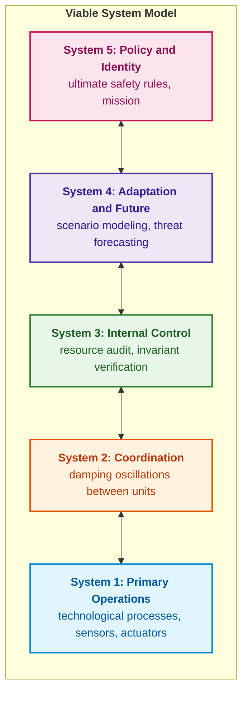
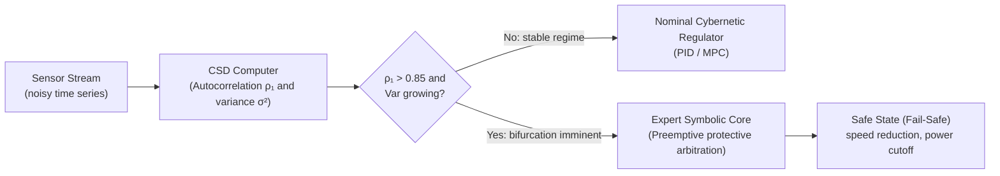
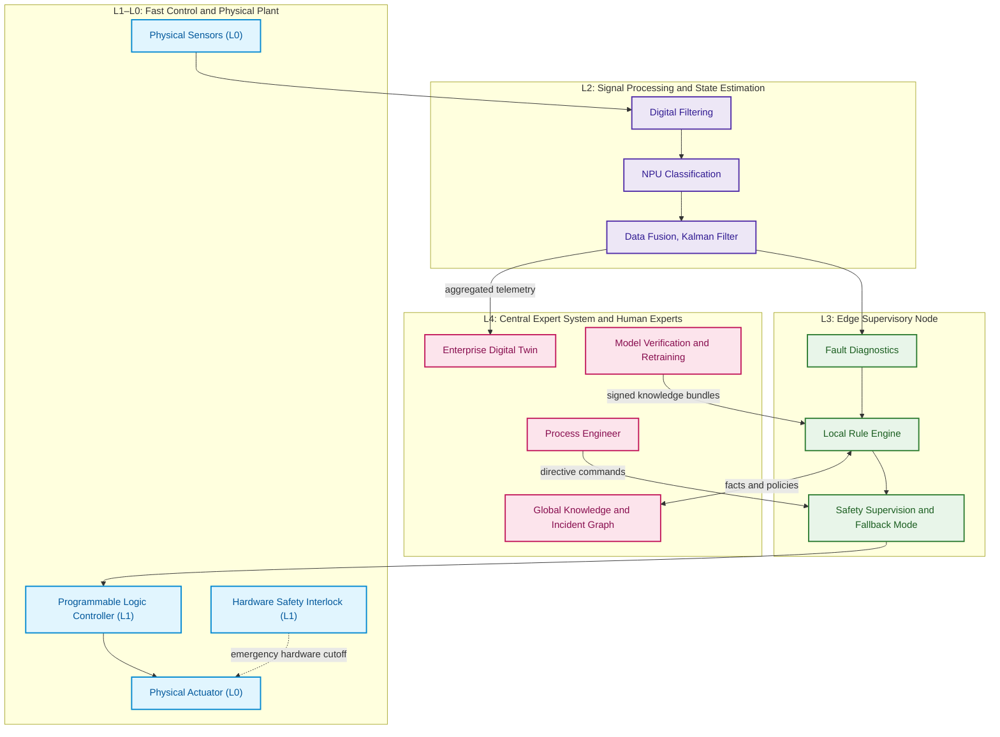
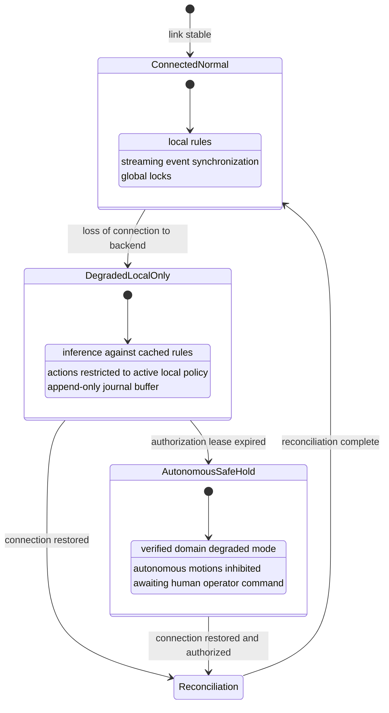
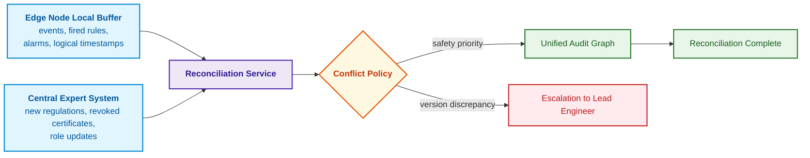

# Chapter 22. Cybernetic Control Cycle: Sensors, Peripherals, and Edge-to-Backend Feedback

> **Book:** [Architecture of Evidence-Governed Expert Systems](README.md) · [Part IV: Architecture, Technology Stack, Inference, and Action](part-04-architecture-and-inference.md)  
> **Previous Chapter:** [Chapter 21. From Recommendation to Action: Authority Control and Safe Execution in Production Environments](ch21-from-recommendation-to-action.md)  
> **Next Chapter:** [Chapter 23. Knowledge Base Verification: Ensuring Consistency, Completeness, and Rule Reliability](ch23-knowledge-base-verification.md)  
> **Table of Contents:** [README.md](README.md)  
> **Author:** [Mykola Fedchyk](about-the-author.md)  
> [!NOTE]
> **Expected Outcomes:** Apply Ashby's law of requisite variety and the good regulator theorem to expert system architecture; estimate plant state using a filter instead of raw signals; distribute functions across levels L0–L4 according to time horizons; transmit signed features rather than verdicts from sensors; design degraded modes for network disconnection and state reconciliation upon link restoration; update peripheral knowledge via cryptographically signed bundles.

## Abstract

On an automated production line, a high-frequency sensor records an anomalous vibration spike in a bearing assembly. How should the system respond? It could immediately shut down the drive motor, it could dispatch an inspection notification to an engineer for the next scheduled maintenance window, or it could dismiss the signal as transient electromagnetic interference from an adjacent stamping press. The numerical output of a neural network classifier alone does not provide the answer. The correct decision depends on the broader engineering context: the current stage of the technological process, the sensor's calibration validity, lubricant temperature, the financial cost of a conveyor shutdown, the availability of a redundant channel, and the operational authority of the decision-making node.

If communication with the central backend server is severed, protective logic must execute directly adjacent to the equipment—at the edge. At the same time, the local controller lacks the complete fleet-wide maintenance history and is unauthorized to unilaterally alter the plant's technological regulations. Such behavior is characteristic of cyber-physical systems, where computation is deeply intertwined with physical processes and must keep pace with their real-time dynamics [[1]](#src-1).

This chapter addresses the core question: **how can feedback be closed between the physical process, peripheral edge nodes, and the central expert system such that control remains safe in the presence of latency, noise, and network disconnections?** The central thesis of the chapter: **the control cycle is partitioned across discrete time horizons. Fast protective reactions are executed by deterministic controllers directly adjacent to the equipment; edge nodes estimate plant state and apply cached rules; and the central expert system updates rules and models exclusively via cryptographically signed bundles. Each level possesses requisite variety of reactions for its specific disturbances, an internal plant model, its own degraded mode, and rigorous reconciliation rules upon link restoration.**

## 1. Cybernetics and Ashby's Law of Requisite Variety

Norbert Wiener defined cybernetics as the scientific study of control and communication in the animal and the machine, centered fundamentally around feedback [[2]](#src-2). For an expert system, this theoretical framework raises a direct, practical engineering question: is the expert system capable of distinguishing all distinct states of the plant to which it must respond differently? A quantitative answer is provided by William Ross Ashby's Law of Requisite Variety [[3]](#src-3).

Ashby defined the variety of a finite state set $\Omega$ as the number of its distinguishable elements; expressed in logarithmic form:

```math
V(\Omega) = \log_2 \lvert \Omega \rvert
```

- To quantify variety, $\Omega$ denotes a finite set of states, and $`\lvert \Omega \rvert`$ is the count of its distinguishable elements;
- $`\log_2`$ denotes the base-2 logarithm, and $V(\Omega)$ is measured in bits;
- The equality defines the number of bits required to distinguish the states of the set under this model.

If a set contains 1,024 states, then $`V(\Omega)=\log_2(1024)=10`$ bits. This metric strictly counts the number of distinguishable states rather than the internal complexity or probability distribution of any individual state.

Ashby's Law of Requisite Variety states that the variety of outcomes $`V_O`$ cannot be less than the variety of disturbances $`V_D`$ minus the variety of regulator responses $`V_R`$:

```math
V_O \geq V_D - V_R
```

The bounding law dictates:

- $`V_O`$ denotes the variety of outcomes, $`V_D`$ is the variety of disturbances, and $`V_R`$ is the variety of regulator responses;
- Each quantity is measured in bits within the scope of the same state model;
- $\geq$ signifies "not less than," and the subtraction operator $-$ deducts the regulator's capacity to absorb disturbances from the variety of the disturbances themselves.

In the numerical example considered below, $`V_D = 10`$ bits and $`V_R = 1`$ bit; consequently, the unmitigated variety of outcomes cannot be less than $9$ bits. This inequality establishes a theoretical lower bound; it does not by itself dictate which specific responses guarantee safe physical behavior.

Under the pedagogical assumption that 1,024 distinct disturbances each require distinct operational responses, a regulator possessing only two possible actions is mathematically inadequate. However, the number of labels in a classification model does not automatically equal the variety of available control actions. The inequality bounds the count of distinguishable outcomes without automatically classifying them into safe or hazardous states. A single failsafe protective action (such as emergency power cutoff) may be entirely appropriate across dozens of distinct failure modes. While an engineering ontology helps resolve operational context, without system observability and available actuators, ontology alone cannot expand regulatory capability.

The Conant-Ashby Good Regulator Theorem [[4]](#src-4) was formulated for a rigorously defined model of regulation and optimality conditions. It does not dictate that every engineering controller must embed a full digital twin or specifically a Kalman filter [[5]](#src-5). Within the proposed architecture, an explicit state estimator is an engineering necessity whenever unobserved or latent variables must be reconstructed from noisy, delayed physical measurements. Its fitness is evaluated based on model fidelity, estimation error bounds, and the available execution time budget. The diagram below illustrates the closed feedback loop.

```mermaid
flowchart LR
    accTitle: Feedback control cycle
    accDescr: The physical plant provides signals to sensors, signals are filtered, the state estimator forms a plant model, the expert system issues an authorized decision, the actuator modifies the plant, and the operator exercises authority control.

    ENV["<b>Physical Plant</b><br/>mechanics, thermodynamics"] --> SEN["<b>Sensors and Telemetry</b><br/>vibration, pressure, current"]
    SEN --> OBS["<b>Filtering and Validation</b><br/>timestamps, noise rejection"]
    OBS --> EST["<b>State Estimator</b><br/>Kalman filter, digital twin"]
    EST --> EXP["<b>Expert System</b><br/>rules, standards, diagnostics"]
    EXP --> DEC["<b>Authorized Decision</b>"]
    DEC --> ACT["<b>Actuator</b><br/>variable frequency drive, valve"]
    ACT --> ENV
    ENV -.->|"physical feedback"| SEN

    HUM["<b>Operator</b><br/>authority control"] --> DEC
    EXP --> HUM

    classDef env fill:#fff3e0,stroke:#e65100,stroke-width:2px,color:#bf360c;
    classDef sens fill:#e1f5fe,stroke:#0288d1,stroke-width:2px,color:#01579b;
    classDef est fill:#ede7f6,stroke:#512da8,stroke-width:2px,color:#311b92;
    classDef core fill:#e8f5e9,stroke:#2e7d32,stroke-width:2px,color:#1b5e20;
    classDef hum fill:#fce4ec,stroke:#c2185b,stroke-width:2px,color:#880e4f;

    class ENV,ACT env;
    class SEN,OBS sens;
    class EST est;
    class EXP,DEC core;
    class HUM hum;
```



The diagram underscores that expert system rules evaluate estimated plant states rather than raw sensor signals. The subsequent section demonstrates with concrete numbers why this distinction is fundamental.

## 2. Parallel Software Pipeline: Job Processing Queue

Feedback loops are essential even in the absence of physical sensors. Consider a software service that ingests asynchronous tasks, worker pools that execute them, and an autoscaling controller that adjusts the worker count based on operational telemetry. Metric collection latency, retry storms, and downstream service rate limits play the exact same operational roles as measurement delay, sensor noise, and actuator saturation in physical plants.

| Control Loop Element | Software Counterpart | Expert System Verification |
|---|---|---|
| Controlled plant | Queue and worker pool | Distinguish surge in ingress traffic from downstream throughput degradation |
| Observations | Oldest job age, arrival rate, completion rate, and retries | Verify metric timestamps and completeness of telemetry |
| State estimation | Hypothesize worker starvation versus downstream dependency saturation | Avoid treating a sudden queue backlog as a standalone diagnostic conclusion |
| Authorized action | Rescaling worker pool, ingress rate limiting, or operator alert | Enforce negotiated actuation bounds and authority limits |
| Feedback response | Evolution of job age, error rates, and retry counts | Confirm that action resolved underlying degradation rather than merely masking the visible queue |

If an autoscaling controller operates on stale metrics, it may repeatedly scale up worker instances before the impact of the initial scaling operation materializes. If the actual bottleneck lies in a saturated database, provisioning additional workers and retrying failed transactions merely exacerbates lock contention. An expert system can articulate these operational hypotheses and enforce rule-based invariants on actuation, but it does not replace the dedicated, fast scaling regulator.

Prior to automating such workflows, engineers must measure observation and execution latencies, worker count oscillation, task age distributions, and retry ratios. Safe settlement times, upper actuation limits, and degraded behavior during telemetry loss must be formally agreed upon. This pedagogical scenario does not prescribe universal thresholds: production systems demand empirical load testing. The identical challenge of state estimation is analyzed below using physical telemetry.

## 3. State Estimation: Filtering Instead of Raw Signals

Consider a thermal protection rule designed to safeguard power MOSFETs within an intelligent power distribution unit: derate output power by 50% if the junction temperature exceeds 85 °C and is rising faster than 2.5 °C/s:

```math
T > 85^\circ\mathrm{C} \;\land\; \frac{dT}{dt} > 2{,}5^\circ\mathrm{C/s} \;\Rightarrow\; \mathrm{DeratePower}(50\,\%)
```

- The thermal protection rule incorporates $T$, the current transistor temperature in degrees Celsius, against a threshold of $`85^\circ\mathrm{C}`$;
- $\frac{dT}{dt}$ denotes the rate of temperature change in degrees Celsius per second, with $`2{,}5^\circ\mathrm{C/s}`$ serving as the heating rate threshold;
- $>$ denotes "strictly greater than," while $\land$ requires the simultaneous satisfaction of both propositions;
- $\Rightarrow$ denotes that upon satisfaction of the antecedent, the protective action $`\mathrm{DeratePower}(50\,\%)`$ is dispatched, reducing output power to 50%.

Consequently, the rule derates power only when the temperature has already exceeded 85 °C and continues to climb faster than the specified threshold. Crucially, the derivative must be estimated with due consideration of sensor noise and sampling jitter; otherwise, random noise spikes will trigger spurious tripping.

While the rule appears straightforward, computing the derivative of a noisy signal is notoriously treacherous. If a sensor is sampled every 50 ms and measurement noise exhibits a standard deviation of 0.5 °C, a naive finite difference of two adjacent samples divided by 0.05 s exhibits noise on the order of $0{,}5 \cdot \sqrt{2} / 0{,}05 \approx 14$ °C/s—nearly six times greater than the rule's activation threshold. The Go program below simulates 60 seconds of operation across two scenarios: a hot but steady transistor (86 °C), and a transistor heating at 3 °C/s starting from 80 °C. The derivative is computed using two distinct methods: naively from adjacent measurements, and via an alpha-beta filter—the simplest constant-velocity state estimator that recursively refines temperature and rate estimates at each time step.

<details>
<summary>Go example: naive derivative versus alpha-beta filter for rate-of-rise rule</summary>

```go
package main

import (
	"errors"
	"fmt"
	"math"
	"math/rand"
)

const dt = 0.05 // sensor sampling period, s

type Estimate struct {
	Temperature   float64
	Rate          float64
	RateAvailable bool
}

type AlphaBeta struct {
	Alpha, Beta, MaxGap float64
	lastTime            float64
	initialized         bool
	estimate            Estimate
}

func finite(value float64) bool {
	return !math.IsNaN(value) && !math.IsInf(value, 0)
}

func (filter *AlphaBeta) Update(at, measurement float64) (Estimate, error) {
	if !finite(at) || !finite(measurement) || !finite(filter.Alpha) || !finite(filter.Beta) ||
		!finite(filter.MaxGap) || filter.Alpha <= 0 || filter.Alpha > 1 ||
		filter.Beta <= 0 || filter.Beta > 1 || filter.MaxGap <= 0 {
		return Estimate{}, errors.New("invalid measurement or filter configuration")
	}
	if !filter.initialized {
		filter.estimate = Estimate{Temperature: measurement}
		filter.lastTime, filter.initialized = at, true
		return filter.estimate, nil
	}
	interval := at - filter.lastTime
	if interval <= 0 || interval > filter.MaxGap {
		return Estimate{}, errors.New("duplicate, reordered, or stale measurement")
	}
	predicted := filter.estimate.Temperature + filter.estimate.Rate*interval
	residual := measurement - predicted
	next := Estimate{
		Temperature:   predicted + filter.Alpha*residual,
		Rate:          filter.estimate.Rate + filter.Beta/interval*residual,
		RateAvailable: true,
	}
	if !finite(next.Temperature) || !finite(next.Rate) {
		return Estimate{}, errors.New("non-finite estimate")
	}
	filter.estimate, filter.lastTime = next, at
	return next, nil
}

// rule is the power derating rule: temperature exceeds 85 °C and rises faster than 2.5 °C/s.
func rule(temp, rate float64) bool { return temp > 85 && rate > 2.5 }

// run simulates 60 s of operation and returns the number of rule firings and the timestamp of the first firing.
// If alpha == 0, the derivative is computed "naively" from two adjacent measurements.
func run(trueTemp func(t float64) float64, alpha, beta float64) (fires int, first float64) {
	r := rand.New(rand.NewSource(7))
	first = -1
	var prev float64
	filter := AlphaBeta{Alpha: alpha, Beta: beta, MaxGap: 4 * dt}
	for k := 0; k <= int(60/dt); k++ {
		t := float64(k) * dt
		z := trueTemp(t) + 0.5*r.NormFloat64() // measurement with noise σ = 0.5 °C
		var temp, rate float64
		if k == 0 {
			prev = z
		}
		if alpha == 0 {
			temp, rate = z, (z-prev)/dt
		} else {
			estimate, err := filter.Update(t, z)
			if err != nil {
				panic(err)
			}
			temp, rate = estimate.Temperature, estimate.Rate
		}
		prev = z
		if k > 0 && rule(temp, rate) {
			fires++
			if first < 0 {
				first = t
			}
		}
	}
	return fires, first
}

func main() {
	stable := func(t float64) float64 { return 86 } // hot, but not heating up
	ramp := func(t float64) float64 {               // heating at 3 °C/s for 10 s from 80 °C
		if t < 10 {
			return 80 + 3*t
		}
		return 110
	}
	for _, f := range []struct {
		name        string
		alpha, beta float64
	}{{"naive derivative", 0, 0}, {"alpha-beta filter", 0.1, 0.005}} {
		falseFires, _ := run(stable, f.alpha, f.beta)
		_, first := run(ramp, f.alpha, f.beta)
		fmt.Printf("%-18s | false firings over 60 s: %4d | first firing during heating: %.2f s\n",
			f.name, falseFires, first)
	}
}
```

Synthetic unit tests verify temporal domain invariants and filter state transitions. Execution: `go test -v main.go main_test.go`.

```go
package main

import (
	"math"
	"testing"
)

func TestMeasurementValidity(testCase *testing.T) {
	filter := AlphaBeta{Alpha: 0.1, Beta: 0.005, MaxGap: 0.2}
	initial, err := filter.Update(7, 25)
	if err != nil || initial.RateAvailable {
		testCase.Fatal("first sample incorrectly supplied a measured rate")
	}
	updated, err := filter.Update(7.1, 26)
	if err != nil || !updated.RateAvailable || math.Abs(updated.Rate-0.05) > 1e-10 {
		testCase.Fatalf("wrong actual-time update: %+v, %v", updated, err)
	}
	before := filter
	for _, input := range []struct{ at, value float64 }{
		{7.1, 26}, {7, 26}, {9, 26}, {7.15, math.NaN()}, {7.15, math.Inf(1)},
	} {
		if _, err := filter.Update(input.at, input.value); err == nil {
			testCase.Fatal("invalid event accepted")
		}
		if filter != before {
			testCase.Fatal("invalid event changed filter state")
		}
	}
	if _, err := (&AlphaBeta{Alpha: 0.1, Beta: 0.005}).Update(0, 25); err == nil {
		testCase.Fatal("missing gap policy accepted")
	}
}
```

</details>

The program outputs:

<details>
<summary>Example data or execution output</summary>

```text
naive derivative   | false firings over 60 s:  520 | first firing during heating: 1.55 s
alpha-beta filter  | false firings over 60 s:    0 | first firing during heating: 1.80 s
```

</details>

For a single fixed random seed, the naive derivative produced 520 true evaluations of the protection rule on a steady-state signal, whereas the alpha-beta filter yielded zero false alarms. This does not represent the count of isolated protective actions, nor does it prove a zero false-positive rate under all operating conditions: the simulation does not model closed-loop temperature reduction following power derating. Under the heating ramp, the 85 °C threshold is crossed at approximately 1.67 s; the filter produced its first affirmative evaluation at 1.80 s. In production engineering, response lag and estimation errors must be comprehensively benchmarked across varied noise profiles, sharp step inputs, and missing samples.

`RateAvailable` denotes solely that the rate of change has been computed following at least two valid samples; it does not guarantee that estimation accuracy is sufficient for critical safety interlocks. The filter accounts for actual elapsed sample intervals, cleanly rejecting non-finite values, duplicate or out-of-order timestamps, and excessive temporal gaps without corrupting its internal state. A rejected sample causes the observation to enter a degraded status; it is never silently replaced with zero temperature or an assumption of safe operation. The maximum permissible gap and filter tuning gains are parameters of an illustrative pedagogical experiment, not a certified operational profile for a physical power stage. This example demonstrates the concrete utility of an explicit noise model, rather than proving the Good Regulator Theorem or guaranteeing closed-loop safety.

## 4. Second-Order Cybernetics, Viable System Model, and Active Inference

Classical cybernetics treated the controlled plant as an entity external to the regulator. In complex socio-technical deployments, this assumption breaks down. Three seminal concepts from the second half of the 20th and early 21st centuries provide the theoretical grounding to address this coupling.

**Second-Order Cybernetics.** Heinz von Foerster formulated second-order cybernetics by incorporating the observer as an intrinsic part of the observed system [[6]](#src-6). For an expert system, this is far from an abstract philosophical nuance: the moment an expert system issues a recommendation or diagnosis, human operators adapt their behavior, thereby altering the subsequent telemetry streams on which the expert system trains and validates its rules. Consequently, the audit log of expert decisions is not merely a historical record; it is an active feedback signal altering plant dynamics. Quality assessment rules must explicitly account for the operational impact of prior recommendations.

**Viable System Model.** Stafford Beer introduced the Viable System Model (VSM), positing that any organization capable of maintaining autonomous viability comprises five functional subsystems [[7]](#src-7). The diagram below illustrates these subsystems.



Within this hierarchy, the expert system naturally operates between System 3 (verifying compliance with operating procedures here and now) and System 4 (modeling degradation trajectories, wear patterns, and emergency scenarios), strictly bounded by the normative safety invariants established by System 5. The primary architectural diagnostic provided by VSM is an essential check: in the absence of an explicit System 2, operational conflicts between autonomous edge nodes (such as two peer nodes simultaneously shedding load onto the same electrical bus) will oscillate destructively without damping.

**Active Inference.** Karl Friston formulated the free energy principle as a unified theory of biological cognition: an adaptive system minimizes variational free energy $F$, which acts as an upper bound on sensory "surprise" given observations $\tilde{y}$ [[8]](#src-8):

```math
F = \mathbb{E}_{q(\vartheta)}\left[\ln q(\vartheta) - \ln p(\tilde{y}, \vartheta)\right] = \mathrm{KL}\left[q(\vartheta) \,\|\, p(\vartheta \mid \tilde{y})\right] - \ln p(\tilde{y})
```

- In the free energy formulation, $F$ is a scalar quantity, and $\vartheta$ denotes the hidden state of the plant;
- $q(\vartheta)$ represents the approximate posterior belief distribution of the adaptive model, while $p(\tilde{y},\vartheta)$ is the joint distribution of observation $\tilde{y}$ and state $\vartheta$ under generative model $p$;
- $`\mathbb{E}_{q(\vartheta)}`$ denotes the mathematical expectation under distribution $q$, and $\ln$ is the natural logarithm;
- $`p(\vartheta\mid\tilde{y})`$ represents the true posterior distribution over hidden states conditioned on observation, while $`\mathrm{KL}[q\|p]`$ denotes the Kullback-Leibler divergence between the distributions;
- $p(\tilde{y})$ is the marginal probability of the observation, and the equality establishes the equivalence between the expected energy formulation and the KL-divergence form augmented by $-\ln p(\tilde{y})$;
- With the natural logarithm, information-theoretic quantities are measured in nats.

Variational free energy $F$ can be minimized along two distinct pathways: updating internal beliefs $q$ to better explain incoming observations (perception), or acting on the physical world to align incoming sensations with prior expectations (active inference). For an expert system, this theory serves as an illuminating architectural analogy rather than a prescriptive implementation mandate: the state estimator from the preceding section fulfills the role of perception, while the actuation mechanisms detailed in [Chapter 21](ch21-from-recommendation-to-action.md) execute action. The free energy principle originated in theoretical neuroscience; an industrial expert system does not need to implement free-energy minimization literally to achieve robust closed-loop control.

> [!NOTE] Engineering Interpretation of Active Inference for Cyber-Physical Systems
> Beneath the mathematical abstraction of minimizing variational free energy $F$ lies the classical duality of automatic control engineering:
> 1. **Perception:** The system recursively updates its internal posterior belief distribution $q(\vartheta)$ (e.g., the state covariance of a Kalman filter or belief state in a Bayesian network) to reduce uncertainty $`\mathrm{KL}[q \| p]`$. This represents passive alignment of the internal model with sensor data.
> 2. **Action:** When sensors detect dangerous divergence (high surprise $-\ln p(\tilde{y})$), the controller generates actuation commands to servomotors, valves, or PWM inverters. The physical plant is forced into a desired state where telemetry once again conforms to safe operational setpoints.

These three cybernetic perspectives converge on a single organizational imperative: institutional knowledge flows across two loops operating at markedly different velocities. The fast operational loop encompasses real-time operator interactions, working drafts, empirical hypotheses, and autonomous agent routines; it tolerates probabilistic heuristics but possesses zero regulatory authority. The slow governed loop maintains the enterprise knowledge graph, certified architectural decisions, verified ontologies, and statutory safety constraints. Knowledge transitions from the fast loop to the slow loop exclusively via a formal promotion lifecycle involving invariant verification and the cryptographic signature of an accountable authority, as detailed in [Chapter 19](ch19-from-question-to-evidence.md).

## 5. Synergetic Stability: Bifurcations, Critical Slowing Down, and Phase Transition Prediction

Classical cybernetics relies predominantly on linear feedback: deviation from a setpoint generates a proportional corrective signal. However, in mission-critical cyber-physical systems (autonomous UAVs, industrial gas turbines, power transmission grids), plant dynamics are inherently non-linear. As thermal stress, physical wear, or operational load increases, the plant can approach a **bifurcation point**: a threshold marking a qualitative shift in dynamic regime where linear feedback loses stability margins, precipitating chaotic failure or catastrophic physical breakdown.

**Synergetics (Haken and Prigogine)** demonstrates that prior to a catastrophic phase transition, complex dynamic systems exhibit a universal, measurable phenomenon: **Critical Slowing Down (CSD)** [[8a]](#src-8a).

Let the dynamics of state perturbation $x$ near a stationary operating point be described by a linearized Langevin equation with stochastic noise fluctuations:

```math
\frac{dx}{dt} = -\lambda x + \sigma \eta(t)
```

where:
- $x$ denotes the state deviation from the equilibrium setpoint;
- $\lambda > 0$ represents the recovery rate (the speed of return to equilibrium);
- $\sigma \eta(t)$ represents zero-mean environmental Gaussian white noise with intensity $\sigma$.

As the plant approaches a dynamic bifurcation threshold, the dominant eigenvalue approaches zero: $\lambda \to 0$. This gives rise to two distinct statistical signatures that can be computed in real time from sensor streams:

1. **Autocorrelation Inflation (Memory Effect):**
For discrete measurements sampled at regular intervals $\Delta t$, the first-order autocorrelation coefficient approaches unity:

```math
\rho_1 = e^{-\lambda \Delta t} \xrightarrow{\lambda \to 0} 1
```

The physical system "remembers" transient perturbations significantly longer; its dynamic response becomes sluggish and prolonged.

2. **Variance Divergence (Variance Inflation):**
The variance of physical measurements increases dramatically because the weakened restorative forces fail to dissipate stochastic fluctuations:

```math
\mathrm{Var}(x) = \frac{\sigma^2}{2\lambda} \xrightarrow{\lambda \to 0} \infty
```

**Runtime Control and Preemptive Arbitration:**
- **Critical Slowing Down Alarm (CSD Alarm):** if, within a sliding observation window, both conditions $`\rho_1 \ge \tau_{\rho} = 0.85`$ and $`\mathrm{Var}(x) / \sigma_0^2 \ge 3.0`$ are simultaneously satisfied (variance triples relative to baseline noise variance $`\sigma_0^2`$), the system flags an imminent loss of dynamic stability;
- **Expert Core Action:** the symbolic reasoning engine overrides the nominal linear regulator and triggers a preemptive fail-safe protocol (`PREEMPTIVE_FAIL_SAFE`), forcing a reduction in turbine RPM or shedding load from the power bus prior to crossing the destructive bifurcation boundary.

**Numerical Example of Bifurcation Detection:**
A temperature sensor on a high-voltage power inverter sampled at $\Delta t = 0.5\,\text{s}$ detects cooling degradation. The recovery rate deteriorates to $\lambda = 0.1\,\text{s}^{-1}$ under noise intensity $\sigma = 0.2\,^\circ\text{C}$ (baseline variance $`\sigma_0^2 = 0.04`$):

```math
\rho_1 = e^{-0{,}1 \cdot 0{,}5} = e^{-0{,}05} \approx 0{,}951 \ge 0{,}85
```

```math
\mathrm{Var}(x) = \frac{0{,}2^2}{2 \cdot 0{,}1} = \frac{0{,}04}{0{,}2} = 0{,}20\,(^\circ\text{C})^2 \implies \frac{\mathrm{Var}(x)}{\sigma_0^2} = \frac{0{,}20}{0{,}04} = 5{,}0 \ge 3{,}0
```

Both threshold criteria are exceeded: the system transitions into emergency power derating, preempting thermal breakdown of the switching transistors.



For the expert system, this unlocks a novel category of rules: **preemptive pre-bifurcation safety rules**. Instead of passively waiting until temperature crosses a catastrophic ceiling or a drone completely loses aerodynamic control, the system interprets synergetic markers of critical slowing down ($`(\rho_1 \uparrow, \mathrm{Var} \uparrow)`$) as an active defeater against nominal operating mode, safely intervening while the system remains within its linear controllability envelope.

## 6. Hierarchy of Time Horizons L0–L4

Distinct operational decisions require vastly different execution time budgets. The L0–L4 tiering and latency intervals presented here represent a pedagogical architectural model, not an inflexible hardware standard. Component admissibility is dictated by strict deadlines, worst-case execution time (WCET), network guarantees, and the physics of the plant; neither choice of programming language nor accelerator branding alone proves compliance.

| Level | Time Horizon | Purpose | Prohibited at This Level |
|:---:|---|---|---|
| **L0** | Continuous | Physical plant: mechanics, materials, thermodynamics | Software assumptions unverified by physical sensors |
| **L1** | 1 µs–10 ms | Hard real-time control: servomotors, PLCs, FPGAs, hardware interlocks | Non-deterministic neural networks, LLMs, unbonded network calls |
| **L2** | 10 ms–1 s | Perception: digital signal filtering, sensor fusion, NPU edge classification | Facts lacking timestamps or error uncertainty bounds |
| **L3** | 1 s–1 min | Edge supervision: symbolic rules, risk evaluation, emergency mode management | Authority to unilaterally mutate global enterprise policy |
| **L4** | 1 min–days | Central expert system: global knowledge graph, historical retrospectives, model retraining | Assumptions of continuous, uninterrupted network connectivity to the edge |

The diagram below details the operational interactions across these architectural tiers.



The dashed connector from the hardware interlock directly to the physical actuator is vital: an emergency shutdown at L1 bypasses all software layers at higher levels. The central expert system interacts with the edge exclusively along two channels: bidirectional synchronization of facts and policies, and the downstream dispatch of cryptographically signed knowledge bundles. Both pathways are deliberate, verified, and decoupled from the fast protective control loop.

## 7. Sensor Event Contracts

Transmitting every raw sensor sample upstream is rarely practical or desirable; bandwidth limits, channel count, and sampling frequencies impose severe constraints. For real-time reasoning, an edge node transmits windowed feature vectors accompanied by explicit quality metadata, while storing bounded raw buffers locally for post-incident diagnostics and independent audits. Aggregation must never obscure transient high-frequency phenomena critical to safety rules. The listing below illustrates a structured sensor event contract:

<details>
<summary>Structured JSON representation</summary>

```json
{
  "event_id": "evt:vibr:sensor-42:2026-09-27T10:14:02.105Z",
  "source_urn": "urn:plant:sector-b:motor-07:vibr-probe-1",
  "boot_id": "synthetic-boot-17",
  "sequence": 1842,
  "event_time": "2026-09-27T10:14:02.105Z",
  "clock_uncertainty_ms": 5,
  "measurement_window_ms": 100,
  "sampling_rate_hz": 20000,
  "features": {
    "peak_acceleration_g": 4.82,
    "rms_velocity_mms": 11.4,
    "dominant_frequency_hz": 142.5,
    "kurtosis": 5.12
  },
  "signal_integrity": {
    "snr_db": 28.4,
    "sensor_status": "CALIBRATED_VALID",
    "clipping_detected": false
  },
  "local_classification": {
    "anomaly_score": 0.89,
    "score_semantics": "uncalibrated_model_output",
    "model_fingerprint": "sha256:<classifier_model_hash>",
    "inference_device": "NPU"
  }
}
```

</details>

The reasoning engine validates signal-to-noise ratio (SNR), calibration status, ADC clipping flags, temporal freshness, and measurement coverage against a versioned profile. Telemetry degradation is itself an evidentiary supervisory event: it cannot simply be discarded under the naive assumption that lack of data implies safe operation. `boot_id` and `sequence` fields enable detection of reboots, dropped frames, and replay attacks, provided their cryptographic provenance is verified. The recorded event time must be reconciled with clock uncertainty bounds and ingestion arrival latency. An uncalibrated `anomaly_score` must never be conflated with the objective probability of a physical failure.

### 7.1. Signing Features Instead of Verdicts

Petro Sidliarchuk articulated a principle vital for distributed sensor networks: a digital signature proves provenance, but does not prove truth [[9]](#src-9). If an edge device signs an opaque, pre-baked verdict ("target detected", "threshold exceeded"), the receiving backend can only accept or reject the verdict wholesale, remaining incapable of examining the underlying evidence. In field trials documented in that work, an acoustic sensor consistently locked onto a stable 84 Hz fundamental frequency with distinct harmonics and affirmatively declared a target, even though the acoustic source was an overhead high-voltage power transmission line several hundred meters away. The detector functioned strictly according to its technical specification; however, the physical feature it evaluated belonged in that operational context to an entirely different physical phenomenon.

Consequently, an evidence-governed contract at the sensor level enforces three architectural mandates:

1. **Sign Measurements and Context.** The signed payload must encapsulate raw features, engineering units, sampling window dimensions, sensor identity, sequence counter, DSP firmware revision, and signal integrity metadata. An advisory local verdict may be appended, but it must never substitute for foundational evidence.
2. **Validate Known Constraints.** Embedded firmware and ingestion gateways enforce strict validity envelopes. However, validation logic cannot eliminate all physically impossible combinations without a comprehensive, certified plant model; a digital signature does not convert an erroneous measurement into ground truth.
3. **Reproduce Versioned Rules.** The receiving supervisory node can reconstruct the inference trace only when model revisions, rule sets, and calibration coefficients are fully known and pinned. Discrepancies warrant diagnostic escalation rather than automated accusations of device compromise: root causes frequently trace back to firmware mismatches, floating-point drift, or unmodeled environmental context.

This principle aligns directly with the IETF Remote ATtestation procedureS (RATS) architecture, where an attesting endpoint produces raw evidence while an independent verifier evaluates it against sovereign policy [[10]](#src-10). The power line scenario highlights another fundamental boundary: authentic, signed features may still correlate with an unanticipated physical source; therefore, L3 supervisory rules must evaluate geospatial and physical context rather than relying solely on isolated telemetry streams.

The provisioning of predicate constraints and validity envelopes for digital signal processors (DSPs) via NATS message brokers and ingress inspection gateways is formalized in [Chapter 33](ch33-inter-system-knowledge-exchange-and-model-teaching.md), which defines rule propagation from the expert core down to DSPs and the reverse counterexample feedback queue.

### 7.2. Non-Functional Interfaces and Implicit Assumptions

A significant proportion of catastrophic failures in distributed cyber-physical systems occur not within functional interfaces (wire protocols, serialization schemas), but within unstated, implicit assumptions modules make about one another. Garlan, Allen, and Ockerbloom demonstrated with software components that reuse routinely collapses due to architectural mismatches [[11]](#src-11). In cyber-physical deployments, physical coupling compounds software assumptions: shared electrical power rails where motor inrush current drops sensor voltage; electromagnetic interference from adjacent high-power switching stages; gradual sensor drift following thousands of thermal cycles; or bus latency jitter substituting for outright hardware failure. Therefore, each module's assumption matrix must document not only packet schemas, but also the physical invariants it presumes stable, ensuring that any violation of these physical baselines is immediately flagged as a distinct supervisory alarm.

## 8. Degraded Modes During Network Disconnection

The cardinal requirement for any mission-critical cyber-physical expert system is uncompromising: **safety must never depend on the availability of a network connection**. When connectivity to the central backend drops, the edge node transitions through the discrete states shown in the diagram below.



The parameters of autonomous operation are dictated by domain policy. Network disconnection does not grant carte blanche authority (such as autonomy level A2): execution requires valid local leases, trusted real-time clocks, and verified operational context. A disconnected node cannot learn about credentials or leases recently revoked at the backend; bounded lease durations mitigate this exposure window but cannot eliminate it entirely. A lease interval (such as 30 minutes) is an engineering design parameter, not a universal prescription. The safe state must be defined specifically for the physical plant: an abrupt, unconditional shutdown can itself induce catastrophic physical hazards. An append-only local audit journal and gap-detection logic are required for subsequent reconciliation; a cryptographic signature alone does not prove the completeness of an event journal.

## 9. State Reconciliation After Link Restoration

Upon link restoration, the central backend and the edge node must reconcile states that accumulated independently: the edge node's local events, alarms, and protective actions against backend policy updates, certificate revocations, and role modifications. The diagram below illustrates this reconciliation workflow.



Lamport logical clocks guarantee the fundamental ordering condition: if event $A$ causally precedes event $B$, then $L(A) < L(B)$ [[12]](#src-12). However, the converse proposition does not hold: numerical timestamp inequality does not prove physical causality. Vector clocks can distinguish concurrent events under a defined message-passing topology [[13]](#src-13), yet they cannot quantify the physical elapsed time needed to compute derivatives or verify lease expiration. Causal message ordering and simultaneous physical exposure of two sensors to an environmental shock are distinct concepts. Robust reconciliation mandates both logical and physical timestamps with explicit uncertainty bounds.

Conflict resolution policies are anchored in the invariant of "safety first." If, during autonomous offline operation, an edge node tripped an emergency stop on a drive motor, and the backend scheduled a production run dispatch command during that same window, the backend command cannot retroactively override the physical interlock. Clearing the interlock requires explicit, authenticated confirmation by a qualified engineer physically on site.

## 10. Safe Knowledge Updates: Cryptographically Signed Bundles

Updating rules, neural network weights, and ontologies on edge controllers must never be executed via ad-hoc scripts or unauthenticated payloads. A knowledge bundle is a compiled, strictly typed, and cryptographically signed deployment artifact:

```math
\mathrm{KnowledgeBundle} = \{\mathrm{Rules},\; \mathrm{Models},\; \mathrm{Schemas},\; \mathrm{Signatures},\; \mathrm{ValidFrom},\; \mathrm{ValidTo}\}
```

Knowledge bundle fields:

- $\mathrm{Rules}$ denotes the compiled rule set, $\mathrm{Models}$ represents models, and $\mathrm{Schemas}$ specifies schema definitions;
- $\mathrm{Signatures}$ contains the digital signatures authenticating the bundle, while $\mathrm{ValidFrom}$ and $\mathrm{ValidTo}$ delineate its validity epoch;
- $\mathrm{KnowledgeBundle}$ denotes a single bundle artifact, with curly braces grouping its record components.

Consequently, the bundle encapsulates not only rules and models, but also schema contracts, multi-party signatures, and precise temporal validity bounds. The enumeration of fields alone does not dictate the signature verification algorithm or the handling of lease expiration; these semantics must be governed by an explicit update lifecycle protocol.

The secure update lifecycle proceeds across five stages:

1. The candidate rule version is validated within a software simulator during the CI/CD pipeline, executing regression suites described in [Chapter 16](ch16-expert-systems-architecture.md).
2. Rules, models, and schemas are compiled into a unified binary package with an immutable SHA-256 digest.
3. The package is signed by multiple designated authorities, requiring a multi-signature threshold for deployment acceptance.
4. The edge node verifies all cryptographic signatures against a hardware root of trust (such as a TPM or secure boot enclave).
5. The edge node switches active configurations via an atomic rollback-capable protocol; upon verification failure, the system falls back exclusively to the previous valid, unexpired bundle permitted by policy.

The Update Framework (TUF) enforces strict separation of trust roles and supports multi-signature thresholds [[14]](#src-14). Operational resilience depends on key hierarchy design, version monotonicity, and metadata expiration policies; an arbitrary number of signatures cannot by itself protect against rollback or mixed-bundle attacks. An automated rollback must never reinstate revoked permissions or vulnerable artifacts. An update manifest must specify dependencies between rules, models, schemas, and runtime environments, while activation logic validates the internal state compatibility of the estimator. The IEC 62443 standard family [[15]](#src-15) establishes industrial cybersecurity requirements; bundling procedures still require application-level formal verification.

The current TUF specification [[16]](#src-16) decouples delivery verification from runtime installation and domain compatibility. Multiple signatures produced by the same underlying private key do not constitute independent approvals. Metadata validity periods demand a trusted time source, and atomic bundle switching does not automatically guarantee dynamic state continuity for an actively executing controller.

An edge node rarely requires the entire corporate knowledge base. A node dedicated to a specialized task receives a bounded subset: shards of designated document families or a compiled module tailored to its functional profile ([Chapter 7](ch07-knowledge-base-typology.md)). This subset constitutes an independent, signed bundle with its own digest manifest, explicitly linking the node's profile to authorized document families and terms. An incomplete profile renders absent facts strictly "unknown" rather than "false": if a query references an entity outside its profile, the edge engine returns "unknown" rather than asserting non-existence. An update that leaves a specific shard unchanged preserves that shard's file digests, allowing the node to download only mutated artifacts; the conditions governing shard slicing and validation are detailed in Section 10 of [Chapter 32](ch32-high-performance-knowledge-packs-mmap-and-harvesting.md).

## 11. Modern Tools for Temporal Data Processing and Stream Learning

For the software queue example, engineers must first establish precision event tracking and a baseline simulator. Only then should late-arrival handling, temporal logic monitoring, or predictive control be introduced; no tooling can compensate for uncharacterized input data quality.

| Tool | Experimental Role | Non-Guaranteed Aspect |
|---|---|---|
| Apache Flink [[17]](#src-17) | Event-time windowing, late-arriving data handling | Watermarks do not guarantee that all physical events have been observed |
| RTAMT [[18]](#src-18) | Signal verification using Signal Temporal Logic (STL) | The monitor evaluates a supplied trace; future-bounded operators incur observation delays |
| do-mpc [[19]](#src-19) | Simulation, state estimation, and Model Predictive Control (MPC) | Feasibility within the model does not prove physical safety on real hardware |
| Sequential statistics and stream learning | Sensor drift detection, regime change identification, load forecasting | Learned statistical correlations do not establish causality or automatically modify safety rules |

An event-time watermark in Flink signifies processing progress relative to an assumed bounded out-of-orderness policy; real-world physical telemetry can violate this assumption. In RTAMT, engineers must explicitly configure discrete versus continuous time semantics, sampling periods, evaluation horizons, and handling of missing values. Current tool documentation also notes Python version constraints driven by ANTLR dependencies, necessitating pre-experiment validation. In do-mpc, engineers must supply an explicit dynamic model, actuation constraints, and deterministic fallback behaviors for non-convergent optimization cycles.

From stream data analytics, change-point detection, prediction residual monitoring, and system identification are highly valuable. Online stream learning incrementally updates models and contrasts predictions against subsequent observations. However, closed-loop regulator actions alter future data distributions: the absence of a breakdown following an intervention does not prove the unmitigated state was benign. Audit logs must capture the intervention, operating mode, active model revision, and label arrival delay. Novel parameters and updated thresholds require formal review; active learning sample selection must never be construed as authorization for hazardous plant exploration.

The River library provides algorithms for online machine learning; its ADWIN (*ADaptive WINdowing*) algorithm dynamically tracks statistical shifts in data streams [[20]](#src-20). A persistent drift in prediction residuals can serve as a trigger for sensor recalibration or mode revision. It does not, however, diagnose physical causality or permit automated loosening of protective trip points. Predictions must be evaluated against ground truth as labels become available; future labels must never leak into retrospective decisions.

For distributed streams spanning edge sensors and enterprise backends, the foundational theoretical framework for stream processing was established by Akidau and colleagues in the MillWheel and Dataflow models [[21]](#src-21): segregating event time from processing time, executing over sliding windows, and tracking low watermarks allow systems to handle delayed and out-of-order records without compromising the causal consistency of logical reasoning.

State estimators must be benchmarked in simulation with systematic injection of timing jitter, packet loss, and sensor degradation. A valid experimental benchmark must concurrently quantify false-positive rates, missed detections, estimation latency, and invariant preservation within the admissible state space.

## 12. End-to-End Engineering Examples

The following scenarios serve as pedagogical illustrations of responsibility partitioning, rather than formal certification reports for specific hardware implementations. Protective independence, perceptual fidelity, execution deadlines, and common-cause failure modes must be verified for any production deployment. Hardware state machines are also susceptible to corrupt inputs; the presence of an FPGA or lockstep processor alone does not guarantee physical invariants.

**Intelligent Power Distribution Unit.** Consider how these architectural tiers collaborate within an intelligent power distribution unit driven by a safety microcontroller. At levels L0–L1, shunt current sensors and power MOSFET thermistors are continuously sampled via an integrated analog-to-digital converter, while a dedicated hardware analog comparator disconnects a protective solid-state relay during short circuits in sub-microsecond time, completely bypassing firmware. At levels L2–L3, an onboard state estimator smooths thermal readings and computes rate of change, while the power-derating rule detailed in Section 3 dispatches derating commands to the motor inverter over an isolated CAN bus. If the CAN bus is physically severed, an independent watchdog timer transitions the unit into an autonomous safe hold: current is restricted to a safe baseline, and the fault is recorded in tamper-evident flash memory. Upon link restoration, the cryptographically signed incident record is forwarded to the central expert system (L4), which correlates the event with the global knowledge graph. If analysis reveals that this hardware revision utilized transistors from a manufacturing batch with an errata advisory regarding elevated thermal resistance, the central backend compiles and signs a revised knowledge bundle with tighter thermal thresholds for the entire fleet.

**Automotive Safety Node with Decoupled Perception and Logic.** In ultra-high integrity systems governed by ISO 26262 ASIL D, steering and braking actuation logic must never place unconditioned trust in probabilistic deep-learning perception. An edge neural accelerator processes camera and lidar streams, producing symbolic semantic facts such as "obstacle at 12 m with intercepting trajectory." A certified safety microcontroller featuring lockstep cores (such as those analyzed in [Chapter 18](ch18-execution-infrastructure.md)) ingests these facts, executing spatial-temporal safety corridor checks within deterministic deadlines. Between this microcontroller and the hydraulic actuators sits an FPGA executing a formally verified hardware finite state machine that blocks any actuation pulse violating the minimum safety envelope, regardless of software crashes or operating system corruption. If neural perception locks up or the onboard Ethernet bus drops packets, the microcontroller and FPGA orchestrate a controlled, deterministic emergency stop, persisting a cryptographically signed telemetry snapshot for subsequent forensic audit.

Both examples substantiate the identical design principle: each tier maintains its own plant model and autonomous response to peer failures, and neither tier relies on network connectivity to guarantee immediate physical safety.

## Conclusions

A safe cybernetic control cycle for an evidence-governed expert system is structured across distinct time horizons: hardware interlocks and deterministic L1 controllers react within microseconds and milliseconds, the L2 perception layer estimates physical state, the L3 edge node enforces cached symbolic rules, and the central L4 expert system updates rules and models exclusively via cryptographically signed bundles. Ashby's Law of Requisite Variety clarifies why an expert system requires a comprehensive fault ontology rather than a binary status code, while the Conant-Ashby Good Regulator Theorem demonstrates why an explicit plant model must mediate between raw sensors and symbolic rules.

The synthetic benchmark illustrated the sharp operational contrast between naive numerical differentiation and state estimation under noise, without claiming to prove closed-loop stability across all operating regimes. Negative unit tests verified timing gap policies, sequence ordering, and non-finite value rejection. Signed features provide a verifiable audit trail under a trusted key binding; they do not, however, prove physical truth. Degraded modes and state reconciliation require rigorous domain-specific conflict policies, and Lamport logical clocks complement rather than replace physical time.

The boundaries of this chapter should be clearly noted. Filter tuning coefficients and example thresholds were selected for pedagogical clarity; production parameters must be derived rigorously from empirical noise characterization and functional safety targets. Active inference was introduced as an illuminating theoretical analogy rather than an engineering mandate. Primary emergency protection must always be executed by certified functional safety mechanisms rather than software-based expert systems alone.

### Architectural Synthesis and Physical Feedback

The pedagogical progression of Chapters 16–22 establishes the cohesive vertical architecture of Part IV. Architectural foundations (Chapter 16), implementation stack (Chapter 17), and execution infrastructure (Chapter 18) provide the physical and execution substrate; hypothesis generation (Chapter 19), normative syllogistic reasoning (Chapter 31), and explanation generation (Chapter 20) deliver verified, evidence-backed conclusions; finally, action authorization (Chapter 21) and the closed-loop cybernetic control cycle (Chapter 22) translate symbolic recommendations into safe physical mutations in the material world.

### Further Path of Inquiry

Proceeding in thematic sequence, [Chapter 23](ch23-knowledge-base-verification.md) opens [Part V](part-05-verification-and-learning.md), dedicated to formal rule verification, the knowledge testing pyramid, and structured safety cases. Any effective cybernetic control loop demands mathematical proof of knowledge base consistency and reliability before deployment into mission-critical industrial production.

## Self-Check Questions

1. Using Ashby's Law of Requisite Variety, how can an engineer determine whether a binary diagnostic status is mathematically adequate for a plant exhibiting 1,024 distinct failure modes?
2. What does the Conant-Ashby Good Regulator Theorem state, and how does it justify the necessity of an explicit state estimator in a cybernetic control loop?
3. Why did naive numerical differentiation of temperature produce 520 false alarms in the simulation, and what operational penalty does the alpha-beta filter pay to eliminate them?
4. Why is it strictly inadmissible to deploy large language models at level L1, such as in an emergency turbine trip loop?
5. Why must edge sensor devices sign raw feature vectors rather than high-level diagnostic verdicts, and what lesson does the acoustic sensor and power line trial convey?
6. What architectural mechanisms prevent an edge node from accumulating unrecoverable drift or error while operating in `DegradedLocalOnly` mode?
7. How is an operational conflict resolved when an edge node activates a motor safety interlock during offline operation, while the central backend concurrently schedules a job run?
8. Why does updating neural network weights on an edge accelerator require the exact same cryptographic signing and threshold verification lifecycle as updating symbolic rules?
9. How do the synergetic markers of Critical Slowing Down (CSD)—first-order autocorrelation $`\rho_1`$ and variance inflation $\mathrm{Var}(x)$—enable the detection of imminent bifurcation before the plant physically exceeds emergency thresholds?
10. How does Lamport's concept of logical clocks differ from physical astronomical time, and why are both timestamp modalities indispensable for safe state reconciliation upon link restoration?

## Glossary

| Term | Definition |
|---|---|
| Cybernetics | Scientific study of control and communication in living organisms and machines based on feedback |
| Feedback | Routing the output or outcome of an action back to the input of a regulator to guide subsequent control |
| Variety | Number of distinguishable states of a set, typically quantified in a logarithmic measure (bits) |
| Law of Requisite Variety | Principle stating that only regulatory variety can absorb disturbance variety to maintain stable outcomes |
| Good Regulator Theorem | Theorem stating that every effective regulator of a system must be an isomorphic model of that system |
| State Estimator | Computational algorithm that infers unobserved internal state variables from noisy, delayed physical measurements |
| Alpha-Beta Filter | Lightweight state estimator tracking position and velocity using constant filtering gains without covariance matrices |
| Edge | Computing resources positioned physically adjacent to sensors and actuators rather than in a centralized datacenter |
| Viable System Model (VSM) | Cybernetic organizational model comprising five recursive subsystems necessary and sufficient for autonomous survival |
| Active Inference | Cognitive and control paradigm that minimizes variational free energy through belief updating or physical action |
| Second-Order Cybernetics | Epistemological cybernetic extension that explicitly models the observer as an intrinsic part of the observed system |
| Degraded Mode | Operational state in which a system maintains core safety and restricted functions following subsystem failures |
| State Reconciliation | Protocol that resolves and synchronizes independent state mutations accumulated during network partitioning |
| Logical Clock | Monotonic counter mechanism that establishes a partial causal order of events under distributed message passing |
| Knowledge Bundle | Compiled, cryptographically signed, and tamper-evident artifact packaging rules, models, and schemas for edge nodes |
| Remote Attestation | Protocol whereby an untrusted endpoint supplies verifiable cryptographic evidence of its operational state to a verifier |
| Temporal Watermark | Progress metric establishing an event-time threshold under an assumed delay policy; does not guarantee complete data arrival |
| Model Predictive Control (MPC) | Advanced process control methodology that optimizes future control actions over a moving horizon using a dynamic model |
| Shard | Partitioned slice of a knowledge bundle serviced by an individual edge node; formally defined in Chapter 7 |
| Node Profile | Specification of document families and concepts provisioned to an edge node; queries outside profile yield "unknown" |
| Validity Envelope | Certified numerical ranges and rate-of-rise bounds within which a physical sensor signal is considered valid |

## Abbreviations

| Abbreviation | Expansion | Definition |
|---|---|---|
| ADWIN | ADaptive WINdowing | Adaptive windowing algorithm for detecting concept drift in data streams |
| CAN | Controller Area Network | Robust serial bus standard for real-time vehicular and industrial microcontroller communications |
| CI/CD | Continuous Integration / Continuous Delivery | Automated engineering pipeline for building, testing, and deploying software |
| DSP | Digital Signal Processor | Specialized microprocessor optimized for high-speed processing of digital sensor signals |
| FPGA | Field-Programmable Gate Array | Integrated circuit designed to be configured by a customer or designer after manufacturing |
| IEC | International Electrotechnical Commission | International standards organization for electrical, electronic, and related technologies |
| KL | Kullback-Leibler | Statistical divergence metric quantifying the difference between probability distributions |
| MPC | Model Predictive Control | Advanced control technique that calculates optimal control inputs using a dynamic plant model |
| NATS | Neural Autonomic Transport System | High-performance publish-subscribe messaging system featuring subject-based routing |
| NPU | Neural Processing Unit | Dedicated hardware accelerator tailored for low-power edge tensor inference |
| RATS | Remote ATtestation procedureS | IETF architectural framework for attesting endpoint identity and integrity |
| SHA-256 | Secure Hash Algorithm, 256 bits | Cryptographic hash function generating a deterministic 256-bit digest |
| SNR | Signal-to-Noise Ratio | Measure comparing the level of a desired signal to the background noise level |
| STL | Signal Temporal Logic | Formal specification language for expressing real-time properties of continuous physical signals |
| TPM | Trusted Platform Module | Dedicated hardware microcontroller providing secure cryptographic key generation and storage |
| TUF | The Update Framework | Security framework providing resilient, compromise-tolerant software update mechanics |
| URN | Uniform Resource Name | Persistent, location-independent identifier following RFC 2141 |
| VSM | Viable System Model | Cybernetic organizational model comprising five subsystems necessary for viability |

## References

1. <a id="src-1"></a>Edward A. Lee, Sanjit A. Seshia. [*Introduction to Embedded Systems: A Cyber-Physical Systems Approach*](https://ptolemy.berkeley.edu/books/leeseshia/). 2nd edition, MIT Press, 2017.
2. <a id="src-2"></a>Norbert Wiener. [*Cybernetics or Control and Communication in the Animal and the Machine*](https://doi.org/10.7551/mitpress/11810.001.0001). MIT Press, reissue 2019 (original work published 1948).
3. <a id="src-3"></a>W. Ross Ashby. [*An Introduction to Cybernetics*](https://archive.org/details/introductiontocy00ashb). Chapman & Hall, 1956.
4. <a id="src-4"></a>Roger C. Conant, W. Ross Ashby. [*Every Good Regulator of a System Must Be a Model of That System*](https://doi.org/10.1080/00207727008920220). *International Journal of Systems Science*, 1(2), 89–97, 1970.
5. <a id="src-5"></a>R. E. Kalman. [*A New Approach to Linear Filtering and Prediction Problems*](https://doi.org/10.1115/1.3662552). *Journal of Basic Engineering*, 82(1), 35–45, 1960.
6. <a id="src-6"></a>Heinz von Foerster. [*Understanding Understanding: Essays on Cybernetics and Cognition*](https://doi.org/10.1007/b97451). Springer, 2003.
7. <a id="src-7"></a>Stafford Beer. [*The Viable System Model: Its Provenance, Development, Methodology and Pathology*](https://doi.org/10.1057/jors.1984.2). *Journal of the Operational Research Society*, 35(1), 7–25, 1984.
8. <a id="src-8"></a>Karl Friston. [*The Free-Energy Principle: A Unified Brain Theory?*](https://doi.org/10.1038/nrn2787). *Nature Reviews Neuroscience*, 11(2), 127–138, 2010.
8a. <a id="src-8a"></a>Marten Scheffer, Jordi Bascompte, William A. Brock et al. [*Early-warning signals for critical transitions*](https://doi.org/10.1038/nature08227). *Nature*, 461, 53–59, 2009; Hermann Haken. *Synergetic Computers and Cognition: A Top-Down Approach to Neural Nets*, Springer, 2004.
9. <a id="src-9"></a>Petro Sidliarchuk. [*witness-integrity: Witness Integrity for Measurement Devices*](https://github.com/sidliarchukpetro/witness-integrity). GitHub.
10. <a id="src-10"></a>H. Birkholz, D. Thaler, M. Richardson, N. Smith, W. Pan. [*RFC 9334: Remote ATtestation procedureS (RATS) Architecture*](https://www.rfc-editor.org/rfc/rfc9334). IETF, 2023.
11. <a id="src-11"></a>D. Garlan, R. Allen, J. Ockerbloom. [*Architectural Mismatch: Why Reuse Is So Hard*](https://doi.org/10.1109/52.469757). *IEEE Software*, 12(6), 17–26, 1995.
12. <a id="src-12"></a>Leslie Lamport. [*Time, Clocks, and the Ordering of Events in a Distributed System*](https://doi.org/10.1145/359545.359563). *Communications of the ACM*, 21(7), 558–565, 1978.
13. <a id="src-13"></a>C. Fidge. [*Logical Time in Distributed Computing Systems*](https://doi.org/10.1109/2.84874). *Computer*, 24(8), 28–33, 1991.
14. <a id="src-14"></a>Justin Samuel, Nick Mathewson, Justin Cappos, Roger Dingledine. [*Survivable Key Compromise in Software Update Systems*](https://doi.org/10.1145/1866307.1866315). *Proceedings of the 17th ACM Conference on Computer and Communications Security (CCS)*, 61–72, 2010.
15. <a id="src-15"></a>IEC. [*IEC TS 62443-1-1:2009. Industrial Communication Networks: Network and System Security: Part 1-1: Terminology, Concepts and Models*](https://webstore.iec.ch/en/publication/7029). 2009.
16. <a id="src-16"></a>TUF Contributors. [*The Update Framework Specification*](https://theupdateframework.github.io/specification/latest/). Official specification of roles, thresholds, versions, and metadata expiry.
17. <a id="src-17"></a>Apache Software Foundation. [*Flink: Timely Stream Processing*](https://nightlies.apache.org/flink/flink-docs-stable/docs/concepts/time/). Official documentation on event time, watermarks, and lateness.
18. <a id="src-18"></a>Dejan Nickovic, Tomoya Yamaguchi, and RTAMT contributors. [*RTAMT: Runtime Monitoring Library*](https://github.com/nickovic/rtamt). Documentation on temporal semantics, horizons, and supported runtimes.
19. <a id="src-19"></a>do-mpc Contributors. [*Model Predictive Control Python Toolbox*](https://www.do-mpc.com/en/latest/). Documentation on simulation, estimation, and control.
20. <a id="src-20"></a>River Contributors. [*River*](https://riverml.xyz/latest/) and [*ADWIN*](https://riverml.xyz/latest/api/drift/ADWIN/). Documentation on online learning and streaming concept drift detection.
21. <a id="src-21"></a>Tyler Akidau et al. [*The Dataflow Model: A Practical Approach to Balancing Correctness, Latency, and Cost in Massive-Scale, Unbounded, Out-of-Order Data Processing*](https://research.google/pubs/the-dataflow-model-a-practical-approach-to-balancing-correctness-latency-and-cost-in-massive-scale-unbounded-out-of-order-data-processing/). *Proceedings of the VLDB Endowment*, 8(12), 1792–1803, 2015.

---

[← Chapter 21](ch21-from-recommendation-to-action.md) | [Table of Contents](README.md) | [Part IV](part-04-architecture-and-inference.md) | [Chapter 23 →](ch23-knowledge-base-verification.md)
