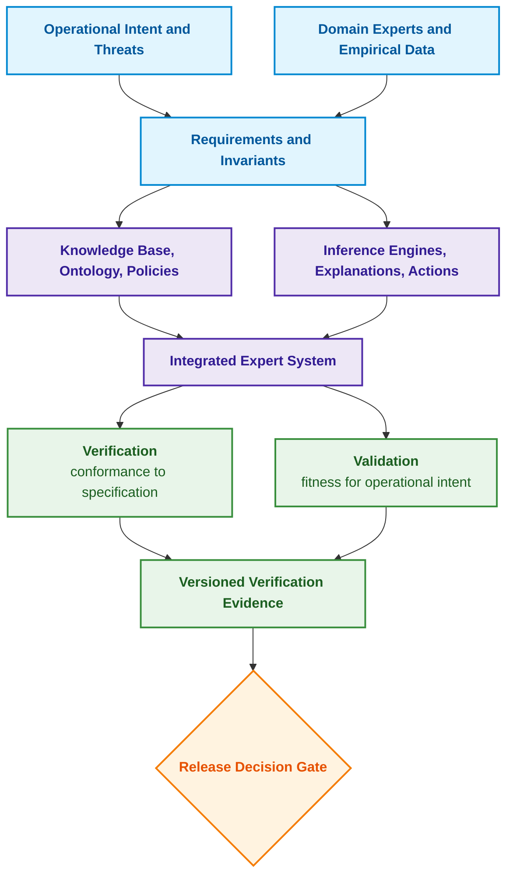
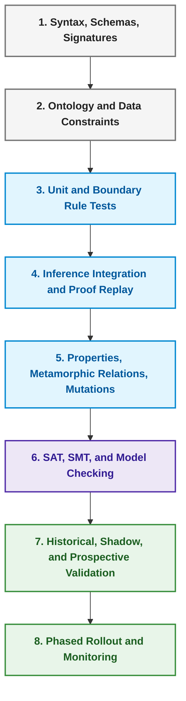
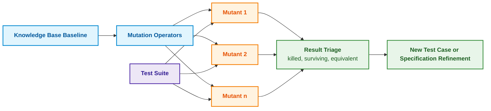
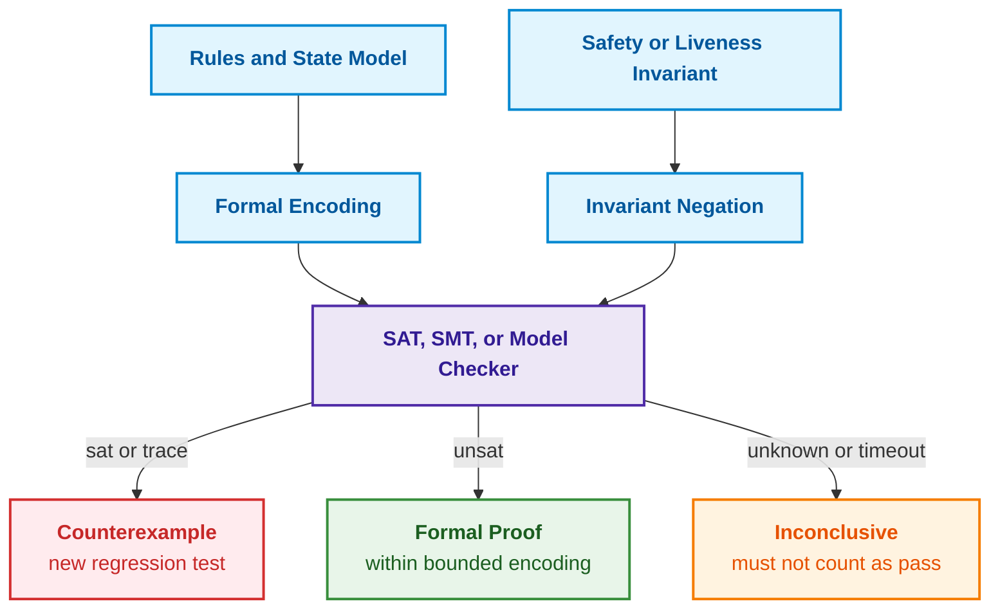
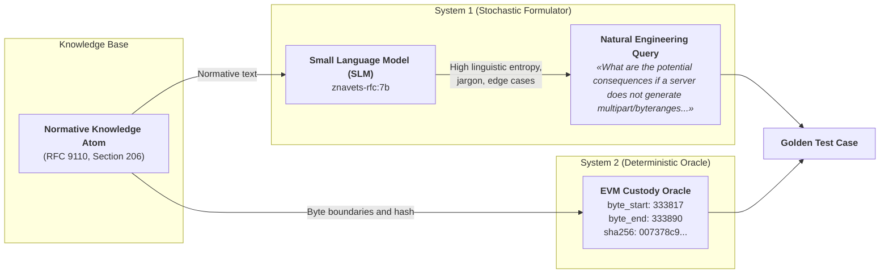

# Chapter 23. Knowledge Base Verification: How to Verify Rule Consistency, Completeness, and Reliability

> **Book:** [Architecture of Evidence-Governed Expert Systems](README.md) · [Part V: Verification, Testing, Diagnostics, and Safety Justification](part-05-verification-and-learning.md)  
> **Previous Chapter:** [Chapter 22. Cybernetic Control Cycle: Sensors, Peripherals, and Feedback](ch22-cybernetics-edge-to-backend.md)  
> **Next Chapter:** [Chapter 36. Knowledge Testing Pyramid: Rules, Interactions, and Response Stability](ch36-knowledge-testing-pyramid-and-variational-calibration.md)  
> **Table of Contents:** [README.md](README.md)  
> **Author:** [Mykola Fedchyk](about-the-author.md)  
> **Level:** Intermediate and Advanced: expert systems engineers, knowledge engineers, QA engineers  
> **Expected Outcomes:** Distinguish verification from validation; detect common knowledge base anomalies; test rules under boundary and unknown states; formulate invariants and verify them via finite model enumeration or SMT solvers; evaluate test suite rigor through mutation analysis; verify decisions jointly with proofs and explanations; establish controlled knowledge base change management.

## Abstract

This chapter examines the methodology, engineering practices, and mathematical apparatus of comprehensive knowledge base verification and validation within evidence-governed expert systems. The role of a tiered verification framework is established as the principal guarantor of integrity, determinism, and logical consistency across automated decision inference processes in mission-critical applications.

An expert system responds correctly to twenty familiar benchmark queries, prompting the team to prepare a new rule base for deployment. In production, however, it is discovered that one rule never activates, two rules form a circular dependency loop, and a unit-of-measure mismatch permits a release without a valid safety test. The individual examples passed, yet the rule base proved unreliable.

This chapter addresses the core question: **how can we ensure that knowledge base rules are trustworthy when a handful of correct responses fails to prove it?** The thesis of this chapter: **trust is not established by a tally of passing test cases, but by a battery of multifaceted checks spanning structural and reference validation, boundary-state unit testing of each rule, invariants exhaustively verified across finite model states or via SMT solvers, mutation analysis evaluating test suite rigor, and full proof reproduction alongside every decision. Because each check establishes properties only relative to its specific model and underlying assumptions, deployment decisions must be governed by a conjunction of blocking release criteria.**

This chapter serves as a pedagogical overview rather than a certification compliance report. Formal methods prove properties strictly within the boundaries of a given model and its assumptions; dynamic testing demonstrates the presence of defects within an explored domain rather than their absolute absence; and domain-specific standards may mandate additional independent procedures. All operational examples below verify a single canonical governance rule introduced in [Chapter 20](ch20-explanation-engine.md): a release may be approved only for a signed artifact, provided there is confirmed absence of any blocking defect, and supported by a valid safety test; a valid safety test may only be superseded by a waiver authorized by the functional safety owner.

## 1. Knowledge Base Verification and Validation: The Distinction Between Execution and Intent

Barry Boehm formulated the classic distinction between two fundamental questions in software engineering: "Are we building the product right?" and "Are we building the right product?" [[1]](#src-1). The first question defines verification: whether the implementation conforms to its declared formal specification. The second defines validation: whether the specification itself and the resulting expert system are fit for their intended operational purpose.

For a knowledge base, this distinction is particularly acute. One can flawlessly encode an erroneous rule elicited from a domain specialist, and verification will detect no flaw. Conversely, one may possess a completely sound rule, yet employ an inference engine flawed in its conflict resolution strategy. Consequently, domain knowledge elicited through the methods outlined in [Chapter 11](ch11-knowledge-elicitation-from-experts.md) requires validation against real-world operational cases, whereas the evidence packages detailed in [Chapters 16](ch16-expert-systems-architecture.md) and [20](ch20-explanation-engine.md) require verification through rigorous proof replay. The diagram below illustrates how both processes converge at the deployment decision gate.



As the diagram demonstrates, verification and validation share common inputs (requirements) and common outputs (versioned evidence packages), yet address fundamentally different questions. Particular scrutiny must be directed toward the benchmark against which outputs are evaluated—namely, the test oracle (*test oracle*). Elaine Weyuker demonstrated that for many computational programs, an authoritative expected output cannot be computed independently or is prohibitively expensive to obtain, depriving testing of its conventional ground truth [[2]](#src-2). In knowledge base engineering, this yields a vital practical corollary: test oracles possess provenance. If an expected outcome in a test suite was authored by the same engineer who formulated the rule, such a test is valuable as a localized unit check, but does not constitute an independent validation.

## 2. Systemic Context of Verification: Interaction of Rules, Facts, and Inference Engines

Verifying a standalone rule file is fundamentally insufficient, as the decision rendered by an expert system depends on multiple coupled runtime components:

```math
y = F(x, K, O, P, C, M, R)
```

Notation:

- $y$ is the computation result, representing the expert system's authoritative decision;
- $F$ denotes the overarching inference function synthesizing the decision from the constituent elements;
- $x$ represents the input fact slice;
- $K$ is the knowledge base, $O$ is the domain ontology, and $P$ denotes access control policies;
- $C$ defines the rule conflict resolution strategy;
- $M$ denotes machine learning models within the pipeline, and $R$ is the runtime execution environment configuration.

In engineering practice, this dependency implies that modifying a document parser, unit normalizer, or classification threshold can alter the final decision without any modification to the rule base itself. A test execution manifest explicitly captures cryptographic hashes of all components, pseudo-random number generator (PRNG) seeds, system clock virtualization policies, external test fixture datasets, and runtime environment parameters whenever they impact deterministic execution. For language models and approximate vector search engines, intermediate outputs at each pipeline stage are preserved, preventing runtime non-determinism from masking violations of deterministic system invariants.

## 3. Typology of Structural and Logical Knowledge Base Anomalies

Prior to behavioral testing, a knowledge base undergoes rigorous static analysis without executing against test fixtures. Preece and Shinghal formalized knowledge base anomalies—categorized as redundant, contradictory, and incomplete knowledge—as symptoms of underlying systemic defects, establishing anomaly detection as a foundational verification method for rule-based systems [[3]](#src-3). In practice, static verification targets four primary classes of anomalies:

- **Dead Rules:** A rule never activates because its antecedents are mutually contradictory or reference a predicate that no upstream data source or inference step can possibly generate.
- **Redundant Rules:** A rule duplicates another rule or is subsumed by it: if Rule A derives identical consequences under weaker or identical conditions, Rule B is superfluous.
- **Contradictory Rules:** Under mutually compatible antecedents, rules yield contradictory or mutually exclusive conclusions, such as asserting both `ALLOW` and `DENY` for the exact same system state.
- **Dependency Cycles:** Circular dependencies demand semantic analysis rather than blanket rejection. Positive recursion in Datalog can be completely sound; catastrophic failures arise when ungrounded cyclic support loops occur, unstratified negation is introduced, or non-terminating state expansion takes place. The educational engine in [Chapter 16](ch16-expert-systems-architecture.md) verifies strictly finite, positive deductive closures.

Static analysis detects these anomalies before any dynamic test run. However, an anomaly serves primarily as a diagnostic symptom: a seemingly dead rule may intentionally specify a rare emergency safeguard for which production data has not yet emerged. Consequently, every flagged anomaly must undergo explicit triage by the designated rule owner.

## 4. Multilevel Verification Strategy: From Syntax to Real-World Operational Testing

Knowledge base verification constructs a structured pyramid: ascending from lightweight, instantaneous checks executed on every commit to resource-intensive, exhaustive evaluations prior to release. The diagram outlines eight distinct verification tiers.



A higher tier does not supersede a lower tier. High historical accuracy on regression datasets will not uncover a duplicated rule identifier, nor will schema validation indicate that a rule subverts the operational purpose of the expert system. Let us examine the first three tiers in detail.

**Form and References.** On every commit, verification confirms that rules parse cleanly, types and measurement units are consistent, identifiers are globally unique, predicates referenced by rules exist, and version constraints, cryptographic signatures, designated owners, and validity windows are specified. The `valid_until` field must be an explicit timezone-aware timestamp rather than a string whose lexicographical sorting happens to coincide with chronological order.

**Concepts and Data.** OWL inference reasoners identify logical contradictions within the ontology under formal OWL semantics [[4]](#src-4), whereas SHACL verifies whether an RDF data graph conforms to defined shapes: cardinalities, data types, value ranges, and complex structural constraints [[5]](#src-5). These address fundamentally distinct questions. OWL operates under the Open World Assumption (OWA), where the absence of a fact does not imply its falsity, whereas data shape validation requires a Closed World Assumption (CWA). For example, a shape constraint for a `SafetyTest` report may mandate the presence of `artifact`, `result`, `performed_at`, `valid_until`, `method_version`, and `source_hash`. The resulting SHACL report constitutes a versioned CI pipeline artifact; however, the validation outcome `sh:conforms = true` establishes only structural conformance, not the empirical validity of the underlying measurement.

**Individual Rule Verification.** Each individual rule is tested at a minimum against: a nominal positive scenario; negative scenarios isolating the absence of each individual antecedent; boundary values and alternative measurement units; an active override waiver; unknown, conflicting, and inaccessible data states; and applicability across versions, time windows, and operational contexts. Testing verifies not merely the final decision, but the constituent elements of the derivation proof. Consider the rule:

```math
\mathrm{valid\_test} \land \mathrm{signed} \land \neg \mathrm{blocker} \rightarrow \mathrm{allow}
```

- In this rule, $`\mathrm{valid\_test}`$ denotes that the safety test is valid and active;
- $\mathrm{signed}$ asserts that the required cryptographic signature is present;
- $\mathrm{blocker}$ denotes the existence of a blocking defect, and $\neg$ negates its presence;
- $\land$ denotes logical conjunction ("AND"), while $\rightarrow$ denotes logical implication ("then allow");
- $\mathrm{allow}$ represents the authorized release action.

Three positive facts alone are insufficient. Verification must demonstrate that an "unknown whether a blocking defect exists" state is not erroneously evaluated as $\neg \mathrm{blocker}$, when safety policy explicitly mandates affirmative proof of defect absence.

## 5. Rule Coverage Metrics and Limits of Their Significance

Firing coverage measures the proportion of release candidate rules activated at least once across the test suite:

```math
C_{\text{fire}} = \frac{\lvert R_f \rvert}{\lvert R \rvert}
```

Components of the formula:

- $`C_{\text{fire}}`$ is the firing coverage ratio within the range $[0, 1]$;
- $R$ represents the total set of rules included in the release candidate, and $`R_f`$ is the subset of rules that fired at least once during test suite execution;
- The vertical bars $\lvert\cdot\rvert$ denote set cardinality, and the fraction divides the count of fired rules by the total rule count.

**Actionable Engineering Decisions (Closed-Loop Decision):**
1. **CI/CD Quality Gate Criteria:**
   - **$`C_{\text{fire}} = 1.00`$ (100% Rule Coverage):** Green build status. The knowledge base artifact is approved for progression to integration and regression testing;
   - **$`C_{\text{fire}} < 1.00`$:** The knowledge base build is unconditionally blocked. The verification framework generates the set of unactivated rules $`R \setminus R_f`$, mandating that each unactivated rule either receive dedicated verification test cases or be formally marked `deprecated` under the cryptographic signature of the system architect.
2. **Worked Numerical Example:** If a release candidate contains $\lvert R \rvert = 120$ rules, and dynamic testing activates $`\lvert R_f \rvert = 118`$ rules, the firing coverage evaluates to $`C_{\text{fire}} = 118 / 120 \approx 0.983 < 1.00`$. **System Action:** Deployment is blocked; an automated audit report flags the two "dead" rules and requires expansion of the verification test bench.

A high $`C_{\text{fire}}`$ does not imply that all antecedent conditions have been tested: for a rule with $m$ antecedents, test cases must probe each individual condition and each boundary threshold. Conversely, low coverage may indicate a dead rule, an unrepresented rare hazard, or an ineffective test generator—three distinct root causes requiring different remedies. Far more informative than raw coverage is a traceability matrix linking hazards to rules, test cases, and designated owners:

| Requirement or Hazard | Rule | Positive Test | Negative and Boundary Tests | Owner |
|---|---|---|---|---|
| Valid safety proof required | `REL-12` | `case-104` | `case-105` through `case-109` | Safety |
| Waiver must be signed by safety owner | `AUTH-7` | `case-205` | `case-206` through `case-211` | Compliance |
| Blocking defect unconditionally prohibits ALLOW | `REL-2` | none | property `INV-01` | Release |

An empty cell in this matrix is not necessarily a defect, but it represents an explicit gap that must be consciously accepted or resolved by engineering leadership.

## 6. Invariants, Boundary States, and Counterexample Generation

Example-based tests capture known scenarios. Property-based testing (*property-based testing*), popularized by Claessen and Hughes's QuickCheck framework [[6]](#src-6), operates under a different paradigm: a generator synthesizes numerous valid and deliberately malformed states, while the verification harness evaluates an invariant against every generated state. The primary invariant governing the release rule is:

```math
\forall s:\ \mathrm{blocker}(s) \neq \mathrm{no} \Rightarrow \mathrm{decision}(s) \neq \mathrm{ALLOW}
```

Examining the conditions sequentially:

- $s$ represents a state of the expert system, and $\forall$ denotes "for all" such states;
- $\mathrm{blocker}(s)$ denotes the status of a blocking defect in state $s$;
- $\neq$ denotes inequality, ensuring $\mathrm{blocker}(s) \neq \mathrm{no}$ encompasses both confirmed defect presence and unknown defect states;
- $\Rightarrow$ denotes material implication ("if... then"), and $\mathrm{decision}(s) \neq \mathrm{ALLOW}$ strictly prohibits release authorization in such states.

Subsequent properties must likewise be evaluated as distinct formal invariants:

```math
\mathrm{decision}(s) = \mathrm{ALLOW} \Rightarrow \mathrm{valid\_test}(s) \lor \mathrm{authorized\_waiver}(s)
```

where:

- $\mathrm{decision}(s)$ is the expert system's authoritative decision in state $s$, with $\mathrm{ALLOW}$ granting action authorization;
- $`\mathrm{valid\_test}(s)`$ asserts the presence of an active, valid test, and $`\mathrm{authorized\_waiver}(s)`$ asserts a formally authorized exception waiver;
- $\lor$ denotes logical disjunction ("OR"), and $\Rightarrow$ denotes implication: release is permissible only when supported by a valid test or an authorized waiver.

Thus, the rule prohibits authorization in the absence of a valid test unless an authorized waiver is present.

```math
\mathrm{retract}(e, s) \Rightarrow e \notin \mathrm{support}\bigl(\mathrm{recompute}(s)\bigr)
```

Notation:

- $e$ is a fact subject to retraction, and $s$ is the state prior to recomputation;
- $\mathrm{retract}(e,s)$ denotes the explicit retraction of fact $e$ from state $s$;
- $\mathrm{recompute}(s)$ denotes the system state following deductive recomputation, and $\mathrm{support}$ designates the set of premises justifying a derived conclusion;
- $\notin$ denotes set non-membership, and $\Rightarrow$ binds fact retraction to the necessary exclusion of that fact from the revised support base.

In operational terms, a retracted fact cannot remain an evidentiary justification once the knowledge base has recomputed its dependency graph.

```math
\mathrm{unauthorized}(u, e) \Rightarrow \mathrm{output}(u, s) \text{ is independent of confidential fact } e
```

- $u$ represents a user, $e$ is a confidential fact, and $s$ is the query state;
- $\mathrm{unauthorized}(u,e)$ asserts that user $u$ lacks authorization to access fact $e$;
- $\mathrm{output}(u,s)$ is the response rendered to user $u$ in state $s$;
- $\Rightarrow$ links authorization denial to the strict information-theoretic independence of the output from the confidential fact.

The first property mandates evidentiary justification for authorization, the second guarantees that retracted facts are purged from justification graphs upon recomputation, and the third specifies an information flow property: a response provided to a user unauthorized to view fact $e$ must not depend upon $e$. Proving this third property globally across an entire expert system is non-trivial; in testing harnesses, it is approximated via paired query inputs differing solely in the confidential fact, augmented by canary leakage tokens. When a property generator detects a violation, automated shrinking (*shrinking*) reduces the counterexample to its minimal reproducing state, such as "defect present plus one stale cache flag."

Random generation cannot substitute for domain knowledge. The generator must understand valid relational constraints between fields; otherwise, it squanders computational budgets on impossible states while failing to synthesize subtle edge cases. When the state space is sufficiently constrained, random generation can be superseded by exhaustive enumeration, transforming invariant testing into a bounded formal proof within the model. The following section combines this enumeration with an evaluation of test suite rigor.

## 7. Mutation Testing and Test Suite Sensitivity Evaluation

Test suites may display all green passes simply because they fail to probe meaningful failure modes. Mutation testing, pioneered by DeMillo, Lipton, and Sayward [[7]](#src-7), deliberately injects canonical defects into rule definitions to determine whether the test suite detects them. In knowledge base engineering, representative mutation operators include: replacing `>` with `>=`, `AND` with `OR`, `ALLOW` with `DENY`; deleting an antecedent condition or waiver clause; substituting hours for days; shifting validity thresholds or expiration windows; tampering with caller roles, tenant identifiers, or source versions; inverting rule priority rankings; and severing provenance lineage links.

A mutant is considered killed if at least one test case fails when executed against it. The mutation score ($MS$) evaluates to:

```math
MS = \frac{M_{\text{killed}}}{M_{\text{total}} - M_{\text{equivalent}}}
```

Breakdown of variables:

- $MS$ represents the mutation score, a dimensionless ratio within the range $[0, 1]$;
- $`M_{\text{killed}}`$ denotes the number of mutants on which at least one test detected a defect (killed mutants);
- $`M_{\text{total}}`$ is the total number of synthesized mutants, and $`M_{\text{equivalent}}`$ is the number of equivalent mutants that do not alter rule semantics;
- The denominator excludes equivalent mutants, which cannot be detected by any valid test oracle.

**Actionable Engineering Decisions (Closed-Loop Decision):**
1. **Mutation Score Gate Criteria:**
   - **$`MS \ge \tau_{\mathrm{mut}} = 0.95`$ with zero surviving mutants across critical safety invariants:** The test suite is certified for safety-critical deployment under functional safety standards (ISO 26262 ASIL-D, DO-178C DAL A);
   - **$`0.85 \le MS < 0.95`$:** Permissible for general industrial and advisory systems (SIL 1/2); however, a prioritized defect backlog of surviving mutants is generated to expand the test bench;
   - **$`MS < 0.85`$ or a single surviving mutant in a safety-critical rule (e.g., bypassing authorization check `signer == safety_owner`):** Knowledge base release is unconditionally blocked regardless of aggregate $MS$.
2. **Worked Numerical Example:** An automated generator synthesizes $`M_{\text{total}} = 150`$ mutants. Formal analysis proves the semantic equivalence of $`M_{\text{equivalent}} = 30`$ mutants. The test suite detects defects in $`M_{\text{killed}} = 115`$ mutants. Calculation: $`MS = 115 / (150 - 30) = 115 / 120 \approx 0.958 = 95.8\% \ge 95\%`$. **System Action:** In the absence of surviving critical mutations, the release candidate is approved for certification audit.

In practice, a higher score demonstrates that a test suite catches a larger fraction of meaningful rule mutations, but does not prove the total absence of defects. In their survey, Jia and Harman emphasize that identifying equivalent mutants remains one of the fundamental challenges of mutation testing, as determining semantic equivalence is undecidable in the general case [[8]](#src-8). Consequently, claiming 100% mutation coverage without an explicit engineering triage process for surviving mutants is invalid, and any surviving critical mutant—such as one dropping the authorization check on a waiver signatory—unconditionally blocks deployment regardless of aggregate score. The diagram below illustrates this workflow.

The formula is meaningful only when the denominator is strictly positive and mutant classifications are formally tracked. Invalid candidates, execution errors, and unverified equivalences must maintain distinct triage statuses rather than being silently obscured as "equivalent." A timeout is counted as a killed mutant only when evaluating a dedicated timing property under reproducible conditions, rather than as a consequence of test runner resource exhaustion. If no viable non-equivalent mutants exist, the mutation score is undefined, not 100%.

> [!WARNING] Semantic Trap of Equivalent Mutants in Certification
> Determining whether a surviving mutant is semantically equivalent (i.e., behaves identically across all admissible inputs) is undecidable in the general case (reducing to the halting problem or first-order validity).
> During safety certification under ISO 26262 ASIL-D or DO-178C DAL A, it is impermissible to dismiss unkilled mutants as "equivalent" merely to artificially achieve $`MS = 100\%`$:
> - If changing `signer == safety_owner` to `signer != nil` fails to trigger a test failure, this is not an equivalence; it represents a critical defect in the test suite permitting unauthorized releases.
> - Every surviving mutant must undergo formal engineering triage: either formal equivalence is proven via an SMT solver, or a new targeted test case must be added to the suite.



A pedagogical finite model comprises 36 states: test validity (2), artifact signature (2), defect status (3), and waiver status (3). Boolean flags and enumerated roles in this model represent already validated upstream facts; they do not perform cryptographic signature verification, redaction, or identity access control. The program compares three example cases against exhaustive enumeration over three restrictive safety invariants and an explicit ground-truth decision table of authorized states. Without this positive ground truth, a trivial rule "always DENY" would satisfy all safety prohibitions. The reference table below represents the author's pedagogical benchmark rather than an independent domain validation.

<details>
<summary>Go Example: Release Rule Verification Across All 36 States</summary>

```go
package main

import "fmt"

type Blocker int

const (
	NoBlocker Blocker = iota
	HasBlocker
	UnknownBlocker // no defect data available
)

func (b Blocker) String() string { return [...]string{"none", "present", "unknown"}[b] }

type Waiver int

const (
	NoWaiver Waiver = iota
	ByProjectLead
	BySafetyOwner
)

func (w Waiver) String() string {
	return [...]string{"none", "project lead", "safety owner"}[w]
}

type State struct {
	TestValid, Signed bool
	Blocker           Blocker
	Waiver            Waiver
}

type Rule func(s State) bool // true indicates ALLOW

// release is the reference correct rule: signed artifact, confirmed absence
// of a blocking defect, and either a valid test or a waiver from the safety owner.
func release(s State) bool {
	return s.Signed && s.Blocker == NoBlocker && (s.TestValid || s.Waiver == BySafetyOwner)
}

var allowedStates = map[State]bool{
	{true, true, NoBlocker, NoWaiver}:       true,
	{true, true, NoBlocker, ByProjectLead}:  true,
	{true, true, NoBlocker, BySafetyOwner}:  true,
	{false, true, NoBlocker, BySafetyOwner}: true,
}

// invariants returns the description of the first violated invariant, or an empty string.
func invariants(s State, allow bool) string {
	switch {
	case allow && s.Blocker != NoBlocker:
		return "I1: ALLOW without confirmed absence of defect"
	case allow && !s.TestValid && s.Waiver != BySafetyOwner:
		return "I2: ALLOW without valid test and authorized waiver"
	case allow && !s.Signed:
		return "I3: ALLOW on unsigned artifact"
	case !allow && allowedStates[s]:
		return "I4: DENY for an allowed state in the pedagogical decision table"
	}
	return ""
}

// allStates enumerates all 2·2·3·3 = 36 states of the finite model.
func allStates() []State {
	var out []State
	for _, tv := range []bool{false, true} {
		for _, sg := range []bool{false, true} {
			for b := NoBlocker; b <= UnknownBlocker; b++ {
				for w := NoWaiver; w <= BySafetyOwner; w++ {
					out = append(out, State{tv, sg, b, w})
				}
			}
		}
	}
	return out
}

// examples represents a small example suite used by the team to verify the rule.
var examples = []struct {
	s     State
	allow bool
}{
	{State{true, true, NoBlocker, NoWaiver}, true},
	{State{true, true, HasBlocker, NoWaiver}, false},
	{State{false, true, NoBlocker, NoWaiver}, false},
}

func killedByExamples(r Rule) bool {
	for _, e := range examples {
		if r(e.s) != e.allow {
			return true
		}
	}
	return false
}

func firstViolation(r Rule) (State, string, bool) {
	for _, s := range allStates() {
		if v := invariants(s, r(s)); v != "" {
			return s, v, true
		}
	}
	return State{}, "", false
}

func main() {
	if _, v, bad := firstViolation(release); bad {
		fmt.Println("reference rule violates invariant:", v)
		return
	}
	fmt.Println("reference rule: 36 states, no violations")

	mutants := []struct {
		name string
		r    Rule
	}{
		{"M1 defect check removed", func(s State) bool { return s.Signed && (s.TestValid || s.Waiver == BySafetyOwner) }},
		{"M2 unknown defect treated as 'none'", func(s State) bool {
			return s.Signed && s.Blocker != HasBlocker && (s.TestValid || s.Waiver == BySafetyOwner)
		}},
		{"M3 any waiver accepted", func(s State) bool {
			return s.Signed && s.Blocker == NoBlocker && (s.TestValid || s.Waiver != NoWaiver)
		}},
		{"M4 AND replaced with OR", func(s State) bool { return s.Signed || (s.Blocker == NoBlocker && s.TestValid) }},
		{"M5 conditions reordered", func(s State) bool {
			return (s.Waiver == BySafetyOwner || s.TestValid) && s.Blocker == NoBlocker && s.Signed
		}},
		{"M6 always DENY", func(s State) bool { return false }},
	}
	killed, killedEx := 0, 0
	for _, m := range mutants {
		ex := killedByExamples(m.r)
		if ex {
			killedEx++
		}
		s, v, inv := firstViolation(m.r)
		fmt.Printf("%-36s | examples: %-5v | invariants: %-5v\n", m.name, ex, inv)
		if inv {
			killed++
			fmt.Printf("    %s; counterexample: %+v\n", v, s)
		}
	}
	fmt.Printf("mutation score excluding equivalent M5: examples %d/5, properties %d/5\n", killedEx, killed)
}
```

The accompanying test validates all benchmark states and confirms that unconditional vetos across all inputs are rejected as non-compliant implementations. Command: `go test -v main.go main_test.go`.

```go
package main

import "testing"

func TestReleaseOracle(testCase *testing.T) {
	if len(allStates()) != 36 || len(allowedStates) != 4 {
		testCase.Fatal("wrong finite-model domain")
	}
	for _, state := range allStates() {
		if release(state) != allowedStates[state] {
			testCase.Fatalf("decision-table mismatch: %+v", state)
		}
		if violation := invariants(state, release(state)); violation != "" {
			testCase.Fatal(violation)
		}
	}
	denyAll := func(state State) bool { return false }
	if _, _, detected := firstViolation(denyAll); !detected {
		testCase.Fatal("always-DENY mutant survived")
	}
	equivalent := func(state State) bool {
		return (state.Waiver == BySafetyOwner || state.TestValid) && state.Blocker == NoBlocker && state.Signed
	}
	if _, _, detected := firstViolation(equivalent); detected {
		testCase.Fatal("equivalent pure rule reported as defective")
	}
}
```

</details>

The program output:

<details>
<summary>Example Output and Verification Trace</summary>

```text
reference rule: 36 states, no violations
M1 defect check removed              | examples: true  | invariants: true 
    I1: ALLOW without confirmed absence of defect; counterexample: {TestValid:false Signed:true Blocker:present Waiver:safety owner}
M2 unknown defect treated as 'none'  | examples: false | invariants: true 
    I1: ALLOW without confirmed absence of defect; counterexample: {TestValid:false Signed:true Blocker:unknown Waiver:safety owner}
M3 any waiver accepted               | examples: false | invariants: true 
    I2: ALLOW without valid test and authorized waiver; counterexample: {TestValid:false Signed:true Blocker:none Waiver:project lead}
M4 AND replaced with OR              | examples: true  | invariants: true 
    I2: ALLOW without valid test and authorized waiver; counterexample: {TestValid:false Signed:true Blocker:none Waiver:none}
M5 conditions reordered              | examples: false | invariants: false
M6 always DENY                       | examples: true  | invariants: true 
    I4: DENY for an allowed state in the pedagogical decision table; counterexample: {TestValid:false Signed:true Blocker:none Waiver:safety owner}
mutation score excluding equivalent M5: examples 3/5, properties 5/5
```

</details>

The three test examples detected three out of five non-equivalent mutations, but completely overlooked the unknown defect state (M2) and unauthorized waiver (M3). The exhaustive property invariant suite detected all five, including the over-conservative denial in M6. Note that `firstViolation` returns the first encountered state in iteration order rather than a minimal counterexample; test shrinking is omitted here for simplicity. M5 is semantically equivalent within this side-effect-free Boolean model. Achieving 100% detection across five chosen mutations does not prove the absence of other defects; these 36 states do not capture temporal horizons, cryptographic signatures, cache invalidation, or runtime policy drift.

### 7.1. Test Suite Minimization While Preserving Check Invariants

Regression test suites expand with every resolved defect, making complete test suite execution on every knowledge base commit prohibitively expensive over time. Sharma and Choudhary proposed test suite minimization using DB K-means clustering: this approach isolates outlier test cases, eliminates redundant cases within clusters of similar inputs, and consolidates the remainder into a minimized suite preserving the fault-detection coverage of the original set [[9]](#src-9). For rule bases, "preserving coverage" must be evaluated not by structural code coverage metrics, but by the mutation score: a minimized test suite is qualified for daily CI execution only if it kills the identical set of non-equivalent mutants as the complete suite.

```math
\mathrm{Accept}(T') \iff T_{\mathrm{crit}} \subseteq T' \subseteq T \;\land\; \mathrm{Killed}(T') = \mathrm{Killed}(T)
```

Minimization qualification conditions:

- $T$ represents the comprehensive regression test suite, and $T'$ is the candidate minimized suite;
- $`T_{\mathrm{crit}}`$ designates critical test cases that are never pruned: safety invariants, verified incident reproductions, and topological cluster outliers;
- $\mathrm{Killed}(T)$ is the set of non-equivalent mutants detected by test suite $T$;
- $\subseteq$ denotes subset inclusion, $\land$ denotes logical conjunction, and $\iff$ denotes logical equivalence ("if and only if").

Set equality over detected mutants ($\mathrm{Killed}(T') = \mathrm{Killed}(T)$) is strictly stronger than matching a scalar mutation score: two suites can achieve identical numerical scores while failing to detect disjoint sets of defects. This criterion applies strictly to a fixed mutant catalog and designated critical cases, rather than guaranteeing protection against unforeseen future faults.

A pedagogical calculation illustrates the underlying mechanic: a comprehensive suite of 1,200 test cases kills 46 mutants, whereas a minimized suite of 355 cases kills only 45. Reintroducing three specific boundary test cases restores detection of all 46 mutants, provided repeated execution confirms the result. These figures are illustrative rather than experimental benchmarks of this text. Execution time does not scale strictly linearly with test counts: setup overhead and external fixture latency vary. Full test suites must remain mandatory at pre-release gates, and minimization boundaries must be re-evaluated whenever rules or mutation operators are modified.

## 8. Metamorphic and Differential Knowledge Verification Methods

When computing an exact expected response is prohibitively expensive or an authoritative oracle is absent, verification evaluates relational properties between outputs across systematically transformed inputs. Metamorphic testing, surveyed by Chen et al. [[10]](#src-10), formalizes these relations explicitly. For example, permuting irrelevant evidentiary items must leave the system decision unchanged:

```math
F(\mathrm{permute}_{\text{irrelevant}}(x)) = F(x)
```

- $x$ represents the evidence set, and $F$ denotes the expert system's decision function;
- $`\mathrm{permute}_{\text{irrelevant}}`$ permutes non-relevant evidence items without modifying their composition;
- The equality operator $=$ mandates that the decision remain identical before and after permutation.

Thus, the ordering of irrelevant evidence must not influence the final decision.

If policy prohibits double-counting evidence, injecting a duplicate source must not artificially inflate decision confidence:

```math
\mathrm{confidence}(x \cup \mathrm{duplicate}(e)) = \mathrm{confidence}(x)
```

Notation:

- $x$ represents the baseline evidence set, and $e$ is an evidentiary source;
- $\mathrm{duplicate}(e)$ designates an added duplicate of an already incorporated evidentiary source;
- $\cup$ denotes set union, $\mathrm{confidence}$ is the computed confidence score, and $=$ mandates metric invariance.

Consequently, duplicating an already incorporated source must not artificially elevate the expert system's confidence score.

Under role-based access control, degrading access privileges must never yield a more informative response:

```math
\mathrm{ACL}(u_2) \subseteq \mathrm{ACL}(u_1) \Rightarrow \mathrm{disclosure}(u_2, x) \subseteq \mathrm{disclosure}(u_1, x)
```

- $`u_1`$ and $`u_2`$ represent distinct users, and $x$ is the input query context;
- $\mathrm{ACL}(u)$ denotes the access permission set of user $u$, where $\subseteq$ signifies subset inclusion;
- $\mathrm{disclosure}(u,x)$ is the set of confidential facts disclosed in the response to user $u$ for query $x$;
- $\Rightarrow$ asserts that diminished privileges cannot lead to expanded disclosure.

Practical consequence: a user with reduced permissions must never receive a response containing more confidential information than an authorized user.

Such metamorphic relations must be applied strictly where they represent genuine domain invariants. In non-monotonic reasoning frameworks, introducing new facts can legitimately invalidate previously derived conclusions; enforcing an unconditional monotonicity constraint would be fundamentally unsound.

Differential testing executes an identical test manifest across two independent system implementations, comparing final decisions, epistemic statuses, and verified dependency chains. For categorical decisions such as `ALLOW` and `DENY`, differences are evaluated via an explicit inequality predicate rather than arithmetic subtraction. Permissible alternative proof paths must be specified a priori. Agreement between two implementations does not prove correctness: both may replicate an identical specification error.

For natural language components of an expert system (query parsers, dense retrieval, generative models), ISO/IEC TR 29119-11 recommends established AI testing methodologies: metamorphic, back-to-back, and A/B testing, alongside adversarial evaluation [[11]](#src-11). The table below details metamorphic relations tailored specifically to expert system querying.

| Metamorphic Relation | Input Transformation | Expected Behavior | Defect Detected |
|---|---|---|---|
| Paraphrase Invariance | Semantically equivalent query submitted within identical context | Identical decision and admissible proof structures | Fragility to natural language phrasing |
| Cross-Lingual Invariance | Identical query submitted in Ukrainian and English | Identical decision | Divergence between multilingual embeddings and vocabularies |
| Robustness to Distractor Context | Irrelevant context paragraph appended to query | Decision remains invariant | Contextual distraction of generative model |
| Fragment Order Invariance | Retrieved evidence fragments permuted in context prompt | Decision remains invariant | Position bias in generative model attention windows |
| Negation Sensitivity | Logical negation ("not") added or removed from condition | Decision flips or system declares explicit refusal | Insensitivity to logical negations |

Negation sensitivity must be verified against ground-truth intent: adding a negation does not guarantee that the final verdict flips if an independent blocking defect prohibits `ALLOW` regardless. Consequently, verification must evaluate underlying logical derivations and premises rather than demanding arbitrary inversions of `ALLOW`/`DENY`. Adversarial inputs probe the boundary between data and instructions ([Chapter 21](ch21-from-recommendation-to-action.md)): prompt injection attacks must never escalate authorization privileges or trigger unauthorized tool invocations [[12]](#src-12). Confidential disclosure is governed by a dedicated access policy [[13]](#src-13). If a policy permits only an aggregated outcome, its underlying dependence on confidential facts does not authorize revealing those facts; paired tests verify the exact boundary of permitted disclosure.

## 9. Formal Methods: Proving Invariants and Searching for Prohibited States

A rule base can be encoded as a system of formal constraints, enabling an automated solver to determine whether any reachable state violates a safety invariant. For a blocking defect, the query is formulated as:

```math
\exists s:\ \mathrm{blocker}(s) \land \mathrm{decision}(s) = \mathrm{ALLOW}\ ?
```

Deconstructing the query:

- $\exists s$ asks "does there exist a state $s$";
- $\mathrm{blocker}(s)$ asserts that a blocking defect exists in state $s$;
- $\land$ mandates simultaneous satisfaction, and $=$ evaluates equality;
- $\mathrm{decision}(s)=\mathrm{ALLOW}$ asserts that the expert system permits release despite the defect;
- The question mark denotes a satisfiability query submitted to the solver rather than a Boolean connective.

A `sat` outcome produces a countermodel—a concrete state demonstrating the violation. An `unsat` outcome proves that no violating state exists, but strictly **within the scope of the formal encoding**: if the model fails to capture cache behavior, temporal horizons, or waiver precedence, the proof does not extend to the physical production system. SMT solvers such as Z3 [[14]](#src-14) are invaluable where exhaustive enumeration is intractable: across arithmetic domains, unit conversions, timestamps, and role hierarchies.

Recall the third failure scenario introduced at the beginning of the chapter: a unit-of-measure mismatch permitted an unauthorized release without a valid safety test. The Python program below encodes the governance rule in SMT-LIB and invokes Z3 via its `z3` binding (verified against version 5.1.0). In the flawed rule, report validity in hours is erroneously compared against the release day, whereas the corrected rule normalizes days to hours prior to comparison.

<details>
<summary>Python SMT-LIB Example</summary>

```python
import z3

COMMON = """
(reset)
(declare-const release_day Int)        ; release day from project start
(declare-const valid_until_hour Int)   ; test validity limit, hours from project start
(declare-const blocker Bool)
(declare-const signed Bool)
(assert (>= release_day 0))
(assert (>= valid_until_hour 0))
"""

BUGGY = "(define-fun valid_test () Bool (>= valid_until_hour release_day))"         # hours erroneously compared to days
FIXED = "(define-fun valid_test () Bool (>= valid_until_hour (* 24 release_day)))"  # units properly harmonized

QUERY = """
(define-fun allow () Bool (and valid_test signed (not blocker)))
; invariant negation: release permitted even though test report is expired
(assert allow)
(assert (< valid_until_hour (* 24 release_day)))
(check-sat)
"""

ctx = z3.main_ctx().ref()
for name, rule in [("with unit mismatch error", BUGGY), ("corrected rule", FIXED)]:
    verdict = z3.Z3_eval_smtlib2_string(ctx, COMMON + rule + QUERY).strip()
    print("==", name, "->", verdict)
    if verdict == "sat":
        model = z3.Z3_eval_smtlib2_string(ctx, "(get-value (release_day valid_until_hour blocker signed))")
        print(model.strip())
```

</details>

The program output:

<details>
<summary>Example Output and Model Counterexample</summary>

```text
== with unit mismatch error -> sat
((release_day 1)
 (valid_until_hour 23)
 (blocker false)
 (signed true))
== corrected rule -> unsat
```

</details>

For the flawed rule, Z3 synthesizes a counterexample: the safety report is valid until hour 23 of the project, while release is scheduled for day 1 (hour 24). The report is expired by one hour, yet the flawed rule compares 23 against 1 and authorizes release. For the corrected rule, the solver proves `unsat`—no violating state exists. Crucially, this counterexample was discovered not via brute-force search over an unbounded integer domain, but through constraint solving, producing an interpretable boundary state easily integrated into a regression suite.

In this model, a day is defined as exactly 24 hours from a common epoch; real-world calendar dates, leap seconds, time zones, and inclusive expiration boundaries require explicit specification conventions. Z3 does not guarantee minimal countermodels unless configured with explicit optimization objectives. This execution verified a single unit mismatch rather than the complete temporal lifecycle of a release.

For stateful workflows spanning time, temporal properties formalized in [Chapter 14](ch14-requirements-detection-and-formalization.md) become critical. For actions executing under [Chapter 21](ch21-from-recommendation-to-action.md), a canonical liveness property asserts:

```math
\forall a:\ \Box\bigl(\mathrm{committed}(a)\Rightarrow\Diamond(\mathrm{verified}(a)\lor\mathrm{safe\_hold}(a))\bigr).
```

In this temporal specification:

- $\Box$ denotes "always" across all future execution states, and $\Diamond$ denotes "eventually in the future";
- $a$ is an action identifier, and $\forall a$ enforces the property across all actions;
- $\mathrm{committed}(a)$ asserts that action $a$ has been committed, $\mathrm{verified}(a)$ denotes confirmed successful execution of that specific action, and $`\mathrm{safe\_hold}(a)`$ denotes transition into a safe hold state without further autonomous mutations;
- $\Rightarrow$ denotes implication, and $\lor$ denotes disjunction.

Once committed, every action must eventually be verified or safely suspended; progress on a different action cannot satisfy this obligation. TLA+ [[15]](#src-15) provides a formal specification framework for model-checking these state transitions. A local watchdog timer can enforce transition into `safe_hold` even during persistent external network outages, provided the local execution supervisor and audit log remain functional. Consequently, fairness and availability assumptions must be formulated per communication route rather than assuming universal external service liveness. The formula does not bound the duration required to achieve `safe_hold`, nor does it verify the physical safety of the hold state; both properties require separate verification.



A solver outcome of `unknown` or a timeout must never be interpreted as a verification pass. The encoding specifications, solver version, tuning parameters, and model boundaries constitute formal evidence artifacts that must be versioned.

## 10. Inference Reproducibility and Joint Explanation Verification

Two distinct defects can coincidentally yield a correct `DENY` decision. Consequently, the expected outcome of a test case must encapsulate more than a raw decision: it must specify the epistemic status; root of the proof tree and permissible alternative derivations; referenced rules and facts; missing antecedents or active waivers; exact versions of knowledge packs, policies, models, and data slices; explanation artifacts and disclosure classifications; and for actions, exact operational contracts or prohibition constraints. A proof verification engine validates every vertex and edge in proof graph $P$:

```math
\mathrm{ValidProof}(P,K,s)=\mathrm{RootMatches}(P,s)\land\mathrm{AnchoredSupport}(P,K,s)\land\bigwedge_{v\in P}\mathrm{ValidNode}(v,K,s)\land\bigwedge_{a\in\mathrm{Applications}(P)}\mathrm{ValidApplication}(a,K,s).
```

Each component represents:

- $P$ is the proof graph, $K$ is the knowledge base version, and $s$ is the query state under evaluation;
- $\mathrm{RootMatches}$ verifies that the graph has a non-empty root matching the declared conclusion; $\mathrm{AnchoredSupport}$ verifies that the derivation anchors into trusted ground premises rather than circular ungrounded dependencies;
- $\mathrm{ValidProof}(P,K,s)$ asserts total satisfaction of the verification contract; $\bigwedge$ denotes conjunction across all constituent elements;
- $\mathrm{ValidNode}$ verifies vertex $v$, and $\mathrm{Applications}(P)$ comprises all rule application instances;
- $\mathrm{ValidApplication}$ validates rule application $a$ against rule version, joint antecedent satisfaction, variable substitutions, scope, and derived conclusion. Isolated edge traversals cannot substitute for this joint check.

For a rule asserting "A and B yield C", the presence of A cannot substantiate C without B. An empty graph does not constitute a valid proof merely because an empty conjunction evaluates to true. Premises must also be verified for validity and temporal applicability; a historically valid proof cannot restore present-day access to a revoked credential.

Generative model responses are evaluated not through surface-level lexical similarity, but by grounding assertions directly to intermediate representations and proof graphs, as detailed in [Chapters 19](ch19-from-question-to-evidence.md) and [20](ch20-explanation-engine.md). Otherwise, a hallucinated explanation that happens to append a correct classification label will slip through verification.

### 10.1. Environment and Answer Reproducibility Manifest

While a proof graph validates the deductive logic of an answer, it does not capture the operational environment in which that answer was synthesized. To reproduce an answer months or years later, the expert system records an answer run manifest (*answer run manifest*) for every output: the minimal set of environment identifiers without which a re-execution cannot be authoritatively compared against the original. The table below outlines the core fields of this manifest.

| Manifest Field | Example Value | Target of Reproducibility |
|---|---|---|
| Inference Engine Version | Release tag and commit build hash | Rule execution semantics and engine behavior |
| Knowledge Pack Generation | Generation UUID ([Chapter 32](ch32-high-performance-knowledge-packs-mmap-and-harvesting.md)) | Exact knowledge state |
| Language Model Identifier | Model name, weight checksum, quantization level | Text synthesis behavior |
| Embedding Model Identifier | Model name, version tag, vector dimensionality | Candidate retrieval space |
| Index Version and Retrieval Parameters | Build ID, candidate top-k, thresholds, weights, filters | Retrieved evidence fragment set |
| Prompt Template Metadata | Template version tag and hash | Generation context formatting |
| Decoding Hyperparameters | Temperature, Top-p, PRNG seed | Non-deterministic generation parameters |
| Evidentiary Provenance Hashes | Ordered fragment IDs and cryptographic hashes of content | Grounding proof graph |

Reproducibility testing re-executes the query using the recorded manifest and compares the new output against the archived original. Every comparison falls into one of three classifications: exact match, equivalent answer (identical decision and evidence backing with stylistic rephrasing), or divergent response. The divergence rate serves as a measurable reliability metric for the expert system:

```math
R_{\mathrm{div}} = \frac{N_{\mathrm{div}}}{N_{\mathrm{exact}} + N_{\mathrm{equiv}} + N_{\mathrm{div}}}
```

Breakdown of the divergence rate:

- $`N_{\mathrm{exact}}`$ denotes the number of test runs yielding an exact output match;
- $`N_{\mathrm{equiv}}`$ denotes the number of test runs yielding semantically equivalent answers;
- $`N_{\mathrm{div}}`$ denotes the number of test runs yielding divergent decisions or mismatched evidence;
- $`R_{\mathrm{div}}`$ is the divergence rate within the range $[0, 1]$.

**Actionable Engineering Decisions (Closed-Loop Decision):**
1. **Operational Mode Quality Gate Criteria:**
   - **Strict Deterministic Citation Mode:** Mandates an absolute zero divergence rate: $`R_{\mathrm{div}} = 0.000`$. Any non-zero divergence ($`R_{\mathrm{div}} > 0`$) blocks deployment, requiring strict PRNG seeding or elimination of hardware accelerator driver non-determinism;
   - **Advisory Assistance Mode:** Permits an upper bound of $`R_{\mathrm{div}} \le \tau_{\mathrm{div}} = 0.020`$ (up to 2% stylistic variability, provided normative citations and statutory references remain completely identical).
2. **Worked Numerical Example:** Across 500 audit re-executions, 430 match exactly, 62 are verified equivalent, and 8 diverge in decision outcomes or cited evidence. Calculation: $`R_{\mathrm{div}} = 8 / (430 + 62 + 8) = 8 / 500 = 0.016 = 1.6\%`$. **System Action:** In an advisory deployment, the release passes ($`1.6\% \le 2.0\%`$); for a strict regulatory compliance pipeline, an unconditional blocking defect `ERR_NON_DETERMINISTIC_REPRODUCIBILITY` is raised.

For high-risk artificial intelligence systems, the EU Artificial Intelligence Act (Regulation (EU) 2024/1689) mandates automated event logging across the entire operational lifecycle (Article 12) [[16]](#src-16). The answer run manifest represents the concrete technical realization of such logging within evidence-governed expert systems, though the manifest itself does not automatically guarantee statutory compliance.

## 11. Verification of Hybrid Neuro-Symbolic Configurations

Information retrieval, reranking, textual entailment models, classifiers, and generative language models introduce probabilistic failure modes. They must be evaluated both modularly at each stage and end-to-end, utilizing frozen evaluation benchmarks segregated across temporal and group boundaries and probed with targeted threat slices, as detailed in [Chapters 25](ch25-how-expert-systems-learn.md), [19](ch19-from-question-to-evidence.md), and [12](ch12-linguistic-analysis-and-local-models.md). Symbolic correctness cannot compensate for retrieval omissions: a rule cannot derive a conclusion from evidence the retrieval pipeline failed to surface. Conversely, high retrieval recall cannot excuse bypassing an access control policy. Deployment readiness is therefore defined as a strict conjunction of blocking release criteria rather than an aggregated average metric:

```math
\mathrm{Release} = \mathrm{SchemaPass} \land \mathrm{InvariantsPass} \land \mathrm{SecurityPass} \land \mathrm{EvidenceQualityPass} \land \mathrm{NoBlockingRegression}
```

Criteria breakdown:

- $\mathrm{Release}$ denotes release candidate deployment authorization;
- $\mathrm{SchemaPass}$ denotes successful schema and structural validation, while $\mathrm{InvariantsPass}$ denotes satisfaction of all formal invariants;
- $\mathrm{SecurityPass}$ denotes passing security and access policy audits, and $\mathrm{EvidenceQualityPass}$ denotes verified evidentiary quality;
- $\mathrm{NoBlockingRegression}$ asserts the confirmed absence of blocking regression defects;
- $\land$ denotes logical conjunction, mandating that all five criteria evaluate to true.

This reads: a release candidate is approved for deployment if and only if every verification check passes and zero blocking regressions exist.

For continuous statistical metrics, evaluation examines paired differences $`\Delta = m_{\text{candidate}} - m_{\text{baseline}}`$ against confidence intervals, bounded by a predefined non-inferiority margin (*non-inferiority margin*). Dror et al. demonstrated that in natural language processing, statistical significance testing is frequently neglected or executed using inappropriate tests, formulating rigorous selection guidelines [[17]](#src-17). Crucially, statistical confidence intervals never override zero-tolerance safety policies: a single verified cross-tenant credential leak or unauthorized physical actuation unconditionally blocks release regardless of statistical margins.

## 12. Regression Testing on Historical Precedents and Leakage Control

Curated benchmark suites are susceptible to dataset contamination: rule authors inspect test cases and tune heuristics to pass specific examples. To maintain integrity, test corpora must be partitioned into isolated tiers:

- Development Suite: Utilized by knowledge engineers for day-to-day authoring;
- Regression Suite: Dedicated to tracking and preventing recurrence of known past defects;
- Sealed Confirmation Suite: Strictly air-gapped and inaccessible during rule tuning;
- Prospective and Shadow Suite: Harvested from operational environments after rule base freeze;
- Adversarial Attack Suite: Targeting security boundaries and rare high-consequence failure modes.

Cases must be clustered by shared provenance, source incident, or equipment lineage, preventing near-identical operational records from leaking simultaneously into both development and confirmation sets. Furthermore, matching a historical human decision does not serve as an infallible oracle, as historical human judgments can be erroneous. Every benchmark case must independently track: the archived operational outcome, the independent expert review consensus, and the statutory normative expectation.

## 13. Controlled Change Procedure and Rule Base Versioning

Modifications to knowledge assets demand a rigorous governance lifecycle analogous to peer code review: structural diffs, formal rationale, provenance attribution, designated ownership, enumeration of impacted rules and tests, review approvals, and a cryptographically signed release manifest. The diagram below illustrates this controlled change pipeline.

```mermaid
flowchart LR
    accTitle: Controlled rule base change pipeline
    accDescr: Changes undergo impact analysis, rapid testing, mutation analysis, formal verification, proof replay, and security testing; passing gates lead to shadow deployment with drift monitoring and atomic rollback, while failure triggers quarantine.

    CH["<b>Knowledge or Code Change</b>"] --> IMP["<b>Impact Analysis and Traceability</b>"]
    IMP --> FAST["<b>Fast Tests</b><br/>schemas, units, properties"]
    FAST --> MUT["<b>Critical Mutation Suite</b>"]
    MUT --> FORM["<b>Formal Verification</b><br/>SMT, model checking"]
    FORM --> REP["<b>Proof Replay</b><br/>historical cases"]
    REP --> ADV["<b>Security and Attack Tests</b>"]
    ADV --> GATE{"<b>Declared Release Gate</b>"}
    GATE -->|"pass"| SH["<b>Shadow or Phased Deployment</b>"]
    GATE -->|"fail"| Q["<b>Quarantine and Triage</b>"]
    SH --> MON["<b>Invariant and Drift Monitoring</b>"]
    MON --> RB["<b>Atomic Manifest Rollback</b>"]

    classDef ch fill:#e1f5fe,stroke:#0288d1,stroke-width:2px,color:#01579b;
    classDef test fill:#ede7f6,stroke:#512da8,stroke-width:2px,color:#311b92;
    classDef gate fill:#fff3e0,stroke:#f57c00,stroke-width:2px,color:#e65100;
    classDef rel fill:#e8f5e9,stroke:#388e3c,stroke-width:2px,color:#1b5e20;
    classDef fail fill:#ffebee,stroke:#d32f2f,stroke-width:2px,color:#c62828;

    class CH,IMP ch;
    class FAST,MUT,FORM,REP,ADV test;
    class GATE gate;
    class SH,MON rel;
    class Q,RB fail;
```



An automated rollback must revert the ontology, rules, retrieval indices, models, and calibration parameters to a mutually consistent prior manifest, while never restoring revoked credentials or deprecated security profiles. Active access control policies must be evaluated independently of historical revision archives. Failed checks trigger automatic quarantine accompanied by triage records identifying owner, root cause, severity, and remediation timelines; flaky or intermittent invariants must never be dismissed as background noise. This governance model aligns directly with NIST SSDF standards [[18]](#src-18), while ISO/IEC/IEEE 29119-1 formalizes the broader test oracle and verification concepts [[19]](#src-19).

## 14. Tooling for Test Generation and Data Mining

Small finite models lend themselves to exhaustive enumeration. Large or stateful systems require structural state generators, transition models, and defect catalogs; random bit-level fuzzing fails to probe complex relational domain constraints.

| Tool | Operational Application | Prerequisites and Caveats |
|---|---|---|
| Rapid for Go [[20]](#src-20) | Data structure generation, state machine verification, and counterexample shrinking | Domain-specific generator and oracle; shrunk case is not guaranteed to be globally minimal |
| Hypothesis for Python [[21]](#src-21) | Stateful sequences of assertions, retractions, policy updates, and queries | Independently specified reference model; a flawed oracle can yield false passes |
| Z3 and cvc5 | Arithmetic constraints, role hierarchies, and temporal intervals | Rigorous formal encoding, handling of `unknown` outcomes, timeout limits |
| TLC for TLA+ and Apalache [[22]](#src-22) | Execution state transitions, reconciliation workflows, and release gates | Bounded search horizons; bounded model checking does not prove unbounded liveness |
| Domain Mutations and Test-Defect Matrix | Blind-spot detection and fast regression suite minimization | Consistent defect taxonomy and formal triage of surviving, equivalent, and unexecutable mutants |

Data mining techniques offer powerful verification synergies: clustering defects, identifying under-tested data slices, and formulating test suite minimization as a set-cover optimization problem (selecting minimal test subsets covering all target mutations under execution time constraints while preserving critical edge cases). However, clustered "similar" tests may probe distinct boundary behaviors and cannot be treated as interchangeable without proof.

Machine learning test prioritizers can predict which test cases are most likely to expose defects first, but they must never eliminate mandatory verification checks. Prioritizers must be validated against prospective releases or holdout incident families, maintaining a randomized control baseline. Historical `ALLOW`/`DENY` logs cannot serve as normative training ground truth without expert review.

Inductive Logic Programming (ILP) offers automated rule discovery from data. AMIE (*Association Rule Mining under Incomplete Evidence*) extracts Horn rules from knowledge graphs [[23]](#src-23), while ILASP (*Inductive Learning of Answer Set Programs*) synthesizes logic programs from background knowledge and operational examples [[24]](#src-24). Mined correlations between requirements, test methods, and defect types can suggest new test scenarios or expert review queries. However, incomplete knowledge graphs cannot supply negative labels under an open-world model, and statistical support does not equate to normative approval. Mined candidate rules must undergo the formal integration lifecycle outlined in [Chapter 15](ch15-knowledge-extraction-and-kb-construction.md), maintaining strict separation between training and evaluation as mandated in [Chapter 25](ch25-how-expert-systems-learn.md).

## 15. Catalog of Common Fallacies and Architectural Defense Barriers

The table below catalogs widespread fallacies regarding knowledge base verification, their underlying causes, and required architectural remedies.

| Common Fallacy | Root Cause of the Fallacy | Architectural Remedy |
|---|---|---|
| "All demo test cases pass green" | Hand-crafted examples do not cover boundary states or structural invariants | Property-based testing, mutation analysis, formal counterexample generation |
| "SHACL validation passed, so the graph is accurate" | Shape constraints validate structure, not real-world empirical truth | Cryptographic provenance tracking and domain expert validation |
| "The SMT solver returned unsat, so the production system is safe" | The formal model may be an incomplete abstraction of reality | Explicit model assumptions, traceability from model to code, runtime integration tests |
| "Two independent implementations yielded identical outputs" | Both implementations may share a common specification flaw | Independent third-party test oracle and domain expert panel triage |
| "Firing coverage is 100%" | Compound condition boundaries and test oracles may be weak | Condition/decision coverage (MC/DC) and mutation score evaluation |
| "Historical regression accuracy is exceptionally high" | Dataset leakage, class imbalance, or historical human annotation errors | Group- and time-based dataset splitting, sealed holdout sets, prospective validation |
| "Template-based synthetic tests achieve 99% accuracy" | Templates copy rule keywords verbatim; models match tokens (TF-IDF/BM25) without semantic comprehension (cheating illusion) | Neuro-symbolic test generation: SLM-based varied linguistic synthesis paired with deterministic byte-level oracles |
| "The generative model articulated a convincing justification for a correct label" | Explanations can be confabulated or post-hoc rationalizations | Semantic grounding of claims and verification against formal proof trees |
| "Zero production incidents recorded over the past month" | High-consequence safety hazards may simply have had zero exposure | Exposure-weighted hazard models and proactive adversarial testing |
| "Every individual shard passed verification, so the distributed knowledge base is correct" | Partition completeness, disjointness, recoverability, and citation integrity are global properties | Global partition verification prior to release publication |
| "A shard returned no data, so the fact does not exist" | Shard silence does not prove fact non-existence; missing responses must be distinguished from explicit negatives | Explicit "partially retrieved" and "unknown" statuses; fail-closed tests on unreachable shards |

### 15.1. Neuro-Symbolic Test Oracle: Overcoming Heuristic Keyword Cheating

When knowledge engineers transition from manual test authoring to automated template-driven generation (*Matrix Template Generation*), a systemic testing artifact emerges known as **the keyword-cheating illusion (The Keyword-Cheating Illusion)**.

If a template synthesizes questions by mechanically interpolating terminology from a specification (e.g., *"Is a 206 response required to generate 'multipart/byteranges' content pursuant to RFC 9110?"*), up to 90% of the query tokens mirror the normative text verbatim. In this regime, even primitive lexical retrievers or surface classifiers report near-perfect accuracy ($`F_1 \approx 0.99`$) because they latch onto rare token overlaps rather than evaluating deontic semantics (obligation versus permission) or relational context. This synthetic suite fosters an illusion of robustness that collapses when human practitioners query the system using domain synonyms or describe ambiguous real-world operational scenarios.

To eliminate this illusion, an evidence-governed verification pipeline deploys a **neuro-symbolic test generation tandem**:



1. **System 1 (Stochastic Formulator):** A specialized local small language model (SLM) fine-tuned on the target domain (`znavets-rfc:7b`) ingests raw normative provisions and synthesizes varied queries from the perspective of an auditor or systems architect. It paraphrases requirements, models consequences of non-compliance, injects practitioner slang, and inverts sentence structures.
2. **System 2 (Deterministic Oracle):** The symbolic core of the expert system derives the ground-truth benchmark not from the generative output (eliminating oracle hallucinations), but directly from the immutable byte offsets (`byte_start`, `byte_end`) and cryptographic SHA-256 hashes of the source citation embedded within the binary knowledge pack.

This architecture decouples oracle integrity from linguistic phrasing: queries rigorously evaluate semantic inference under lexical noise, while verification retains the mathematical certainty of formal ground truth with zero tolerance for hallucinations ($`ZHR = 1.00`$).

### 15.2. Knowledge Base Technical Debt Rubric

In standard software engineering, technical debt is typically associated with messy code or missing documentation. In data- and rule-governed architectures, technical debt manifests systemically. In their study on hidden technical debt in machine learning systems, Sculley et al. demonstrated that maintenance costs stem primarily not from algorithm code, but from boundary erosion, hidden feedback loops, pipeline jungles, and stale configuration states [[25]](#src-25).

For knowledge engineering, the Knowledge Debt Rubric evaluates three primary architectural vulnerabilities:

1. **Rule Entanglement:** Modifying or adding a single localized rule inadvertently alters execution contexts for rules across unrelated deductive branches under the principle of "Changing Anything Changes Everything" (*CACE*).
2. **Pipeline Jungles:** Proliferation of ephemeral scrapers, glue scripts, and intermediate data format converters to bridge disparate knowledge sources, rather than relying on a unified declarative schema.
3. **Dead and Zombie Rules:** Rules whose validation test cases have not been updated, or whose underlying statutory authorities have been superseded in regulatory sources, yet which remain active within the live inference engine.

## 16. Practical Deployment and Audit Protocol for the Verification System

Transforming theoretical verification techniques into an operational engineering pipeline requires a formal, repeatable deployment and audit protocol. Unstructured testing creates an illusion of quality: critical invariants are evaluated against stale ontologies, and mutation analysis findings are lost across release cycles. To guarantee knowledge base integrity prior to production deployment, the author has established a twelve-stage protocol for verification system rollout and recurring audit:

1. Inventory and record exact versions of knowledge packs, inference engines, models, access policies, and runtime environments.
2. Formulate 5–10 domain-specific safety invariants in formal business logic.
3. Establish an explicit traceability matrix: "hazard, requirement, rule, test cases, designated owner."
4. Integrate automated schema validation, SHACL shape constraints, and boundary unit tests into CI on every commit.
5. Implement a property-based state generator capable of synthesizing valid and invalid states with automated counterexample shrinking (or exhaustive enumeration for small models).
6. Implement domain-specific mutation operators targeting authorization scopes, unit conversions, and waiver overrides.
7. Encode 1–2 safety-critical invariants for verification via an SMT solver or model checker.
8. Verify decisions jointly with proof trees, explanation artifacts, and operational action contracts.
9. Formally isolate development, sealed confirmation, prospective, and adversarial test corpora.
10. Deploy versioned knowledge base releases as atomic signed manifests via shadow or canary rollouts backed by practiced rollback procedures.
11. Record an answer run manifest for every production response, continuously monitoring divergence rates during periodic re-execution audits.
12. If the knowledge base is partitioned into shards, verify partition completeness, disjointness, recoverability, citation integrity, and reference data consistency, treating shard silence as an inconclusive state rather than proof of negative facts ([Chapter 7](ch07-knowledge-base-typology.md), Section 10 of [Chapter 32](ch32-high-performance-knowledge-packs-mmap-and-harvesting.md)).

## Conclusions

Passing a small collection of hand-crafted test examples does not prove that knowledge base rules are trustworthy. Genuine trust is established through a heterogeneous battery of complementary verification mechanisms: static analysis detects structural knowledge anomalies; boundary unit tests probe individual rules; invariant checkers and SMT solvers prove the unreachability of hazardous states; mutation analysis validates the diagnostic sensitivity of the test suite itself; and proof graph validation confirms that correct decisions are reached for sound reasons. Answer run manifests extend this rigor into operations, providing measurable tracking of reproducibility divergence over time.

Our pedagogical 36-state model exhaustively evaluated three restrictive safety invariants against an explicit four-state decision table. A naive three-example suite failed to detect two critical mutations, whereas comprehensive invariant verification identified all five non-equivalent mutants, including an over-restrictive "always DENY" implementation. The SMT example formally proved unit-of-measure consistency across hours and days, with conclusions bounded strictly by its arithmetic encoding.

The operational boundaries of these methods are well-defined. Model checkers and solvers establish guarantees strictly within the scope of their formal abstractions; equivalent mutants cannot be algorithmically distinguished in the general case; and statistical metrics cannot supersede zero-tolerance policies governing security leakage and unverified physical actions. [Chapter 24](ch24-system-diagnosis.md) extends this engineering discipline from verifying internal rules to diagnosing external physical systems: inferring consistent root-cause hypotheses from ambiguous symptoms and selecting safe diagnostic probes.

## Self-Check Questions

1. How does verification differ from validation, and why can a flawlessly implemented rule remain invalid in its domain intent?
2. What four structural knowledge base anomalies are identified via static analysis, and why should a dead rule not always be deleted?
3. Why do OWL reasoners and SHACL validators answer fundamentally different questions regarding identical data graphs?
4. Why did the three-example suite in the Go program fail to kill mutants M2 and M3, and what counterexamples were exposed by exhaustive enumeration?
5. Why did mutant M5 survive, and why must it be excluded from the mutation score denominator?
6. What does an `unsat` result prove regarding a corrected rule, and what does it fail to prove? How must an `unknown` outcome be treated?
7. Why must an expected test outcome include a proof tree rather than merely a binary `ALLOW`/`DENY` label?
8. Why is deployment readiness formulated as a strict conjunction of blocking criteria rather than an averaged composite metric?
9. Why must minimized regression suites be qualified via mutation score preservation rather than cluster distance metrics?
10. What fields are required in an answer run manifest to ensure long-term reproducibility, and how should divergence caused by an unrecorded environment variable be interpreted?

## Glossary

| Term | Translation / Synonym | Definition |
|---|---|---|
| Verification | Verification | Evaluating whether an implementation conforms to its declared formal specification |
| Validation | Validation | Evaluating whether a specification and system are fit for their intended operational purpose |
| Test Oracle | Test Oracle | The authoritative source defining the expected correct outcome for a given test input |
| Knowledge Base Anomaly | Knowledge Base Anomaly | A structural symptom of an underlying defect: dead, redundant, or contradictory rules, or dependency cycles |
| Dead Rule | Dead Rule | A rule whose antecedents can never be satisfied under any admissible system state |
| Firing Coverage | Firing Coverage | The ratio of knowledge base rules that activate at least once across a test suite |
| Traceability Matrix | Traceability Matrix | A tabular mapping connecting hazards, requirements, rules, test cases, and designated owners |
| Invariant | Invariant | A formal property that must evaluate to true across all admissible system states |
| Property-Based Testing | Property-Based Testing | Verifying invariants across large volumes of synthesized valid and invalid inputs |
| Counterexample Shrinking | Shrinking | Reducing a counterexample along valid simplification steps to a minimal failure case |
| Mutation Testing | Mutation Testing | Evaluating test suite rigor by injecting deliberate syntactic defects into rules |
| Equivalent Mutant | Equivalent Mutant | A mutated rule possessing identical semantics to the original, undetectable by any valid test |
| Mutation Score | Mutation Score | The proportion of non-equivalent mutants successfully detected and killed by a test suite |
| Metamorphic Relation | Metamorphic Relation | A necessary relation between inputs and outputs across systematic transformations |
| Differential Testing | Differential Testing | Executing identical test manifests across independent implementations to detect divergences |
| Liveness Property | Liveness Property | A temporal property asserting that a specified condition will eventually hold in the future |
| Non-Inferiority Margin | Non-Inferiority Margin | A predefined threshold of permissible performance variation when evaluating system candidates |
| Sealed Confirmation Suite | Sealed Set | An isolated test corpus strictly inaccessible during rule authoring and heuristic tuning |
| Test Suite Minimization | Test Suite Minimization | Selecting a minimal test subset preserving specified fault-detection and coverage invariants |
| Indirect Prompt Injection | Indirect Prompt Injection | Adversarial instructions embedded in retrieved corpus documents attempting to hijack model behavior |
| Answer Run Manifest | Answer Run Manifest | The minimal set of environment versions and hyperparameters required to reproduce a query response |
| Divergence Rate | Divergence Rate | The proportion of audit re-executions whose decisions or proof trees diverge from the original |
| Partition Verification | Partition Verification | Validating completeness, disjointness, and citation integrity across distributed knowledge base shards |
| Shard Silence | Shard Silence | A state where a required shard fails to respond or responds from a mismatched generation; does not imply fact non-existence |

## Abbreviations

| Abbreviation | Expansion | Definition |
|---|---|---|
| ACL | Access Control List | Permissions matrix governing resource access rights |
| AMIE | Association Rule Mining under Incomplete Evidence | Inductive mining of Horn rules from incomplete knowledge graphs |
| CI | Continuous Integration | Automated build, verification, and regression testing pipeline |
| EU | European Union | Regulatory authority establishing Regulation (EU) 2024/1689 (Artificial Intelligence Act) |
| ILASP | Inductive Learning of Answer Set Programs | Inductive synthesis of Answer Set Programming logic models from examples |
| LLM | Large Language Model | Deep language models; also prefix for OWASP AI security vulnerability categories |
| NIST | National Institute of Standards and Technology | U.S. federal agency establishing cybersecurity and software frameworks |
| OWASP | Open Worldwide Application Security Project | International non-profit foundation dedicated to software security |
| OWL | Web Ontology Language | W3C semantic web language for defining formal ontologies |
| RDF | Resource Description Framework | Standard graph data model based on subject-predicate-object triples |
| SAT | Boolean Satisfiability Problem | Problem of determining whether a Boolean formula has a satisfying assignment |
| SHACL | Shapes Constraint Language | W3C standard language for validating RDF graph structural constraints |
| SMT | Satisfiability Modulo Theories | Generalization of SAT solving incorporating first-order theories |
| SMT-LIB | SMT Library | Standardized input format and benchmarking language for SMT solvers |
| SSDF | Secure Software Development Framework | NIST Special Publication 800-218 security practice recommendations |
| TLA+ | Temporal Logic of Actions | Formal specification and model checking language authored by Leslie Lamport |
| TR | Technical Report | ISO/IEC publication providing guidance and best practices rather than formal requirements |

## References

1. <a id="src-1"></a>B. W. Boehm. [*Verifying and Validating Software Requirements and Design Specifications*](https://doi.org/10.1109/MS.1984.233702). *IEEE Software*, 1(1), 75–88, 1984.
2. <a id="src-2"></a>E. J. Weyuker. [*On Testing Non-Testable Programs*](https://doi.org/10.1093/comjnl/25.4.465). *The Computer Journal*, 25(4), 465–470, 1982.
3. <a id="src-3"></a>Alun D. Preece, Rajjan Shinghal. [*Foundation and Application of Knowledge Base Verification*](https://doi.org/10.1002/int.4550090804). *International Journal of Intelligent Systems*, 9(8), 683–701, 1994.
4. <a id="src-4"></a>W3C OWL Working Group. [*OWL 2 Web Ontology Language Document Overview (Second Edition)*](https://www.w3.org/TR/owl2-overview/). W3C Recommendation, 2012.
5. <a id="src-5"></a>Holger Knublauch, Dimitris Kontokostas (eds.). [*Shapes Constraint Language (SHACL)*](https://www.w3.org/TR/shacl/). W3C Recommendation, 2017.
6. <a id="src-6"></a>Koen Claessen, John Hughes. [*QuickCheck: A Lightweight Tool for Random Testing of Haskell Programs*](https://doi.org/10.1145/351240.351266). *Proceedings of the Fifth ACM SIGPLAN International Conference on Functional Programming (ICFP)*, 268–279, 2000.
7. <a id="src-7"></a>R. A. DeMillo, R. J. Lipton, F. G. Sayward. [*Hints on Test Data Selection: Help for the Practicing Programmer*](https://doi.org/10.1109/C-M.1978.218136). *Computer*, 11(4), 34–41, 1978.
8. <a id="src-8"></a>Yue Jia, Mark Harman. [*An Analysis and Survey of the Development of Mutation Testing*](https://doi.org/10.1109/TSE.2010.62). *IEEE Transactions on Software Engineering*, 37(5), 649–678, 2011.
9. <a id="src-9"></a>Sanjay Sharma, Jitendra Choudhary. [*Evaluating test case minimization with DB K-means*](https://doi.org/10.11591/ijeecs.v41.i2.pp555-563). *Indonesian Journal of Electrical Engineering and Computer Science*, 41(2), 555–563, 2026.
10. <a id="src-10"></a>Tsong Yueh Chen et al. [*Metamorphic Testing: A Review of Challenges and Opportunities*](https://doi.org/10.1145/3143561). *ACM Computing Surveys*, 51(1), 1–27, 2018.
11. <a id="src-11"></a>ISO, IEC. [*ISO/IEC TR 29119-11:2020. Software and Systems Engineering: Software Testing: Part 11: Guidelines on the Testing of AI-based Systems*](https://www.iso.org/standard/79016.html). 2020.
12. <a id="src-12"></a>OWASP Gen AI Security Project. [*LLM01:2025 Prompt Injection*](https://genai.owasp.org/llmrisk/llm01-prompt-injection/). 2025.
13. <a id="src-13"></a>OWASP Gen AI Security Project. [*LLM02:2025 Sensitive Information Disclosure*](https://genai.owasp.org/llmrisk/llm022025-sensitive-information-disclosure/). 2025.
14. <a id="src-14"></a>Leonardo de Moura, Nikolaj Bjørner. [*Z3: An Efficient SMT Solver*](https://doi.org/10.1007/978-3-540-78800-3_24). *Tools and Algorithms for the Construction and Analysis of Systems (TACAS)*, LNCS, 337–340, 2008.
15. <a id="src-15"></a>Leslie Lamport. [*Specifying Systems: The TLA+ Language and Tools for Hardware and Software Engineers*](https://lamport.azurewebsites.net/tla/book.html). Addison-Wesley, 2002.
16. <a id="src-16"></a>European Parliament, Council of the European Union. [*Regulation (EU) 2024/1689 Laying Down Harmonised Rules on Artificial Intelligence (Artificial Intelligence Act)*](https://eur-lex.europa.eu/eli/reg/2024/1689/oj). *Official Journal of the European Union*, L series, 12 July 2024.
17. <a id="src-17"></a>Rotem Dror, Gili Baumer, Segev Shlomov, Roi Reichart. [*The Hitchhiker's Guide to Testing Statistical Significance in Natural Language Processing*](https://aclanthology.org/P18-1128/). *Proceedings of the 56th Annual Meeting of the Association for Computational Linguistics (ACL)*, 2018.
18. <a id="src-18"></a>Murugiah Souppaya, Karen Scarfone, Donna Dodson. [*Secure Software Development Framework (SSDF) Version 1.1*](https://doi.org/10.6028/NIST.SP.800-218). NIST Special Publication 800-218, 2022.
19. <a id="src-19"></a>ISO, IEC, IEEE. [*ISO/IEC/IEEE 29119-1:2022. Software and Systems Engineering: Software Testing: Part 1: General Concepts*](https://www.iso.org/standard/81291.html). 2022.
20. <a id="src-20"></a>Rapid Contributors. [*Rapid: Go Property-Based Testing*](https://github.com/flyingmutant/rapid). Official repository for property generation, state machine testing, and counterexample shrinking.
21. <a id="src-21"></a>Hypothesis Contributors. [*Stateful Tests*](https://hypothesis.readthedocs.io/en/latest/stateful.html). Official documentation for rule-based stateful testing, preconditions, and invariants.
22. <a id="src-22"></a>Apalache Contributors. [*Apalache Documentation*](https://apalache-mc.org/docs/). Documentation for symbolic model checking of TLA+ specifications.
23. <a id="src-23"></a>AMIE Contributors. [*AMIE: Rule Mining in Knowledge Graphs*](https://github.com/dig-team/AMIE). Official repository for association rule mining under incomplete evidence.
24. <a id="src-24"></a>ILASP. [*Logic-Based Machine Learning*](https://ilasp.com/). Documentation and toolchain for inductive learning of Answer Set Programs.
25. <a id="src-25"></a>D. Sculley et al. [*Hidden Technical Debt in Machine Learning Systems*](https://research.google/pubs/hidden-technical-debt-in-machine-learning-systems/). *Advances in Neural Information Processing Systems (NIPS 2015)*, 28, 2503–2511, 2015.

---

[← Chapter 22](ch22-cybernetics-edge-to-backend.md) | [Table of Contents](README.md) | [Part V](part-05-verification-and-learning.md) | [Chapter 36 →](ch36-knowledge-testing-pyramid-and-variational-calibration.md)
