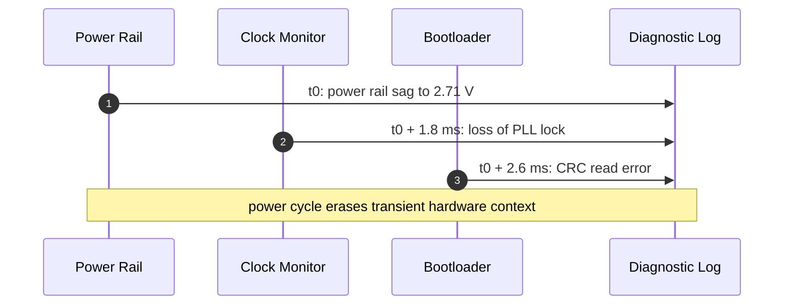
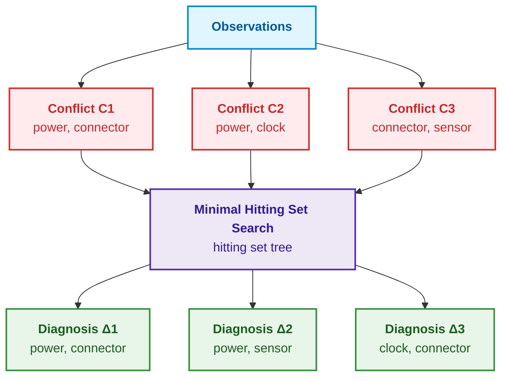
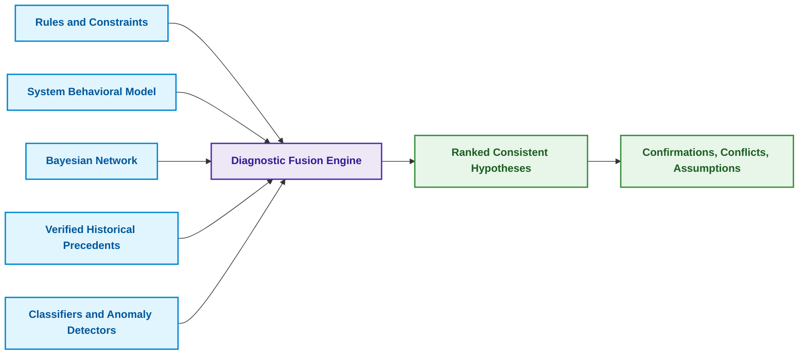
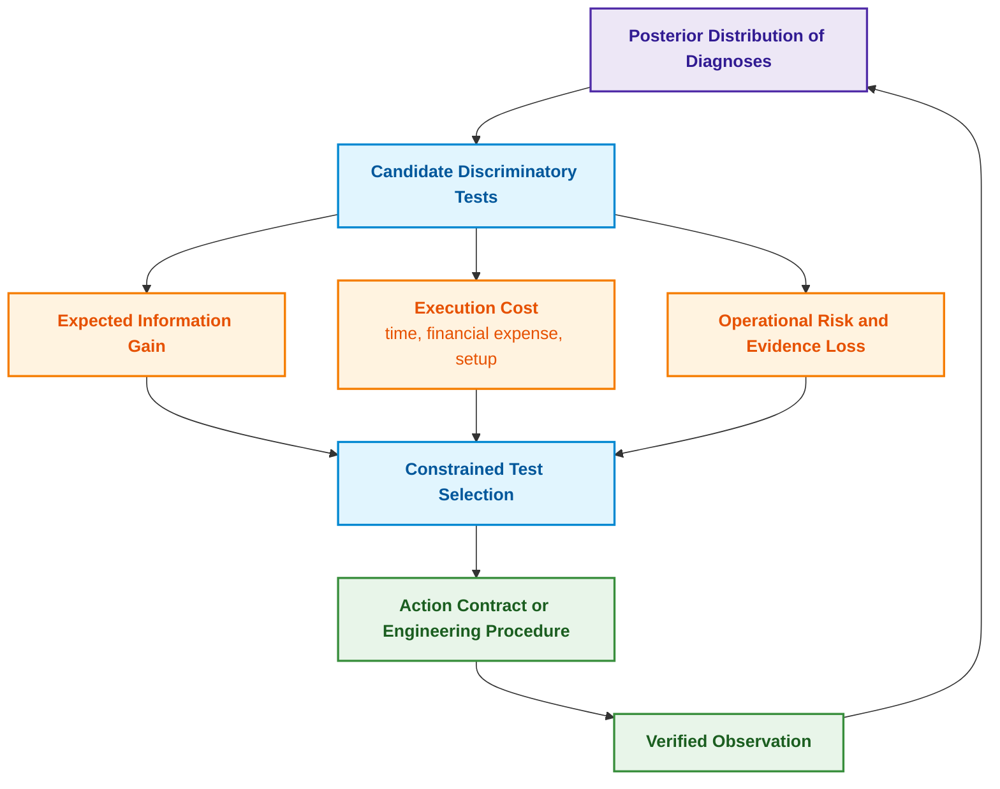

# Chapter 24. Technical Diagnostics: Distinguishing Symptoms from Root Causes Under Incompleteness

> **Book:** [Architecture of Evidence-Based Expert Systems](README.md) · [Part V: Verification, Testing, Diagnostics, and Safety Assurance](part-05-verification-and-learning.md)  
> **Previous Chapter:** [Chapter 39. Active Compliance Auditor: Popperian Falsification, Regulatory Standards (ASPICE/ISO 26262/ISO 21434), and Autonomous Test Generation](ch39-active-compliance-auditor-and-popperian-testing.md)  
> **Next Chapter:** [Chapter 27. Safety Case: Synthesis and Verification of Arguments](ch27-safety-case-gsn-synthesis.md)  
> **Table of Contents:** [README.md](README.md)  
> **Author:** [Mykola Fedchyk](about-the-author.md)  
> **Target Audience:** Intermediate and advanced: reliability and diagnostic engineers, systems architects  
> **Learning Outcomes:** Distinguish symptom, diagnosis, and root cause; structure observations with timestamps, physical units, and quality metrics; formulate Reiter-style model-based diagnosis via conflict sets and minimal hitting sets; rank diagnoses probabilistically while accounting for sensor channel unreliability; select optimal discriminatory tests via Value of Information (VOI) incorporating sensitivity, specificity, execution cost, operational risk, and evidence loss; separate passive observations from active interventions; evaluate outputs of log parsers, anomaly detectors, and causal discovery algorithms as candidate observations rather than finalized diagnoses; systematically abstain from declaring a diagnosis when data is insufficient.

## Abstract

This chapter investigates the architectural principles, formal methods, and mathematical apparatus of technical diagnostics within evidence-based expert systems. It establishes the role of Model-Based Diagnosis (MBD) as a core expert system component providing irrefutable disambiguation between primary root causes and secondary symptoms under conditions of incomplete and noisy empirical observations.

After a cold night, a device fails to boot. The diagnostic log records a clock synchronization fault, while an oscilloscope captures a single brief voltage sag on the power rail. Following a power cycle, the issue disappears. A diagnostic classifier labels clock failure as the most probable cause; a technician replaces the oscillator, yet the malfunction soon recurs. A subsequent in-depth teardown reveals that the true root cause was an intermittent connector contact, while the clock fault was merely a downstream symptom.

This scenario illustrates why technical diagnostics cannot be reduced to searching for surface-similar failure patterns. This chapter addresses a foundational question: **how can an expert system derive consistent failure explanations from incomplete and unreliable observations and select the next optimal discriminatory test without confusing a symptom with its root cause?** The core thesis of this chapter: **diagnostics is not classification, but the systematic derivation of all explanations consistent with both the system model and empirical observations. Model conflicts prune the failure space, minimal hitting sets yield candidate diagnoses, probabilities rank the candidates, and the next discriminatory test is chosen by maximizing the value of information while balancing test cost, operational risk, and evidence loss. When data is insufficient, the only rigorous answer is principled algorithmic abstention with an explicit explanation.**

This chapter presents an educational engineering model rather than a certified production diagnostic tool. Formal conclusions hold strictly within the boundaries of the formalized system description, known failure modes, and telemetry data quality. Where misdiagnoses present hazards to human life or mission-critical equipment, formal reasoning must be coupled with domain-specific standards, calibrated measurement hardware, and qualified engineering oversight. In the running cold-start example, multiple competing hypotheses remain viable: power rail instability, clock oscillator failure, firmware initialization defect, intermittent connector pin contact, or measurement channel error, as well as multi-fault scenarios. An evidence-based expert system must output not an opaque classification label, but a transparent diagnostic packet: which hypotheses remain consistent with observed facts, what evidence is missing, and which discriminatory test should be executed next.

## 1. Symptom, Diagnosis, and Root Cause: Conceptual Disambiguation

[Chapter 6](ch06-applied-mathematics-for-expert-systems.md) introduced Bayesian inference, causality, and value of information; [Chapter 7](ch07-knowledge-base-typology.md) described rules, cases, constraints, and probabilistic models; and [Chapter 20](ch20-explanation-engine.md) detailed WHY NOT queries and contrastive explanations. Diagnostics integrates these mechanisms into a distinct problem formulation that is easily conflated with neighboring disciplines. The table below demarcates six adjacent engineering tasks.

| Task | Core Question | Primary Output |
|---|---|---|
| Anomaly Detection | Has system behavior deviated from nominal? | Anomaly score or alert event |
| Classification | Which known historical class does the case resemble? | Class label and confidence score |
| Diagnostics | Which fault assumptions reconcile the model with observations? | One or more consistent hypotheses |
| Root Cause Analysis | Which physical or causal mechanism produced the incident? | Causal claim grounded in structural assumptions |
| Troubleshooting | What should be inspected, tested, or repaired next? | Testing policy and corrective action workflow |
| Prognostics | How and when will system degradation progress? | Degradation trajectory, Remaining Useful Life (RUL) |

This table clarifies the engineering error described in the opening scenario: the classifier solved the second task (classification), whereas the field technician required solutions to the third and fifth tasks (diagnostics and troubleshooting). A classifier prediction can serve as a useful prior, but an estimate such as $`P(\text{clock\_fault} \mid \text{trace}) = 0.72`$ does not explain why the power rail sag occurred earlier in the timeline. A root cause does not follow simply from a feature exhibiting the highest feature importance in a machine learning model. Furthermore, an ad-hoc repair after which the device happens to boot successfully does not prove a unique cause: the intervention may have cleared transient hardware state or altered multiple physical variables simultaneously. The diagram below illustrates the complete closed-loop diagnostic cycle.

```mermaid
flowchart LR
    accTitle: Diagnostic Inference and Test Planning Cycle
    accDescr: Raw signals and telemetry logs undergo time and quality admission to become typed observations; combined with the system failure model and verified cases, they yield ranked diagnoses from which the planner schedules the next safe discriminatory test.

    RAW["<b>Raw Signals and Telemetry</b><br/>oscillograms, event logs"] --> ADM["<b>Quality and Timing Admission</b><br/>timestamps, units, quality, access"]
    ADM --> OBS["<b>Typed Observations</b>"]
    MOD["<b>System and Failure Model</b>"] --> INF["<b>Diagnostic Inference Engine</b>"]
    OBS --> INF
    CASE["<b>Verified Cases and Likelihoods</b>"] --> INF
    INF --> HYP["<b>Ranked Consistent Diagnoses</b>"]
    HYP --> TEST["<b>Next-Test Planner</b>"]
    TEST --> SAFE["<b>Safety and Authority Gate</b>"]
    SAFE --> ACT["<b>Passive Probe or Intervention</b>"]
    ACT --> RAW
    HYP --> PACK["<b>Diagnostic Evidence Packet</b>"]

    classDef data fill:#e1f5fe,stroke:#0288d1,stroke-width:2px,color:#01579b;
    classDef inf fill:#ede7f6,stroke:#512da8,stroke-width:2px,color:#311b92;
    classDef plan fill:#fff3e0,stroke:#f57c00,stroke-width:2px,color:#e65100;
    classDef act fill:#e8f5e9,stroke:#388e3c,stroke-width:2px,color:#1b5e20;

    class RAW,ADM,OBS data;
    class MOD,CASE,INF,HYP,PACK inf;
    class TEST,SAFE plan;
    class ACT act;
```



The cycle is closed-loop: each discriminatory test yields a new empirical observation, which in turn undergoes rigorous admission and quality control. Consequently, the integrity of the initial step — transforming raw physical signals into typed observations — governs the dependability of the entire diagnostic pipeline.

## 2. Input Data Structure for Dependable Diagnostic Inference

A symptom must never be stored as an untyped string such as `voltage low`. A minimal diagnostic observation encapsulates the physical subject, variable name, numerical value with dimensional units, event timestamp, measurement window, sensor instrument ID, calibration certificate reference, data quality status, cryptographic source hash, and environmental context:

<details>
<summary>Example observation in YAML format</summary>

```yaml
observation_id: obs-boot17-vrail-003
subject: ecu:prototype-17
variable: vrail_3v3
value: 2.71
unit: V
event_time: 2026-08-26T03:14:15.104Z
window: 4.0ms
sensor: scope:lab-2/channel-1
calibration_ref: cal-2026-071
sampling_rate: 100MHz
quality: accepted
source_hash: sha256:<oscillogram_file_hash>
context:
  temperature: -18degC
  board_revision: D
  firmware: 9f12c7a
```

</details>

Every field serves an explicit engineering function. Without precise timestamps, establishing the sequence "voltage sag precedes clock timeout" is impossible. Without dimensional units and calibration traceability, numerical readings cannot be soundly evaluated against specification thresholds. Without hardware board revisions and firmware hashes, the inference engine risks applying obsolete behavioral failure modes. The annotation `quality: accepted` does not imply sensor infallibility; rather, it documents compliance with the data admission protocol. The sequence diagram below traces the temporal progression of events in the cold-start failure scenario.



Temporal ordering constrains the space of hypotheses, but temporal precedence alone does not establish causation. Sensor clocks may exhibit clock skew, and log buffering mechanisms can reorder record writes. Therefore, the data source topology must maintain explicit clock domains and timestamp uncertainty bounds for every telemetry source.

## 3. Model-Based Diagnosis (MBD): Formalizing the System and Alternatives

Raymond Reiter established the foundations of Model-Based Diagnosis (MBD), or diagnosis from first principles [[1]](#src-1). Let $\mathrm{COMP}$ denote the finite set of system components, $SD$ the formal system description (*system description*), $\mathrm{OBS}$ the set of empirical observations, and the unary predicate $AB(c)$ denote "component $c$ is abnormal (faulty)". Under the nominal assumption that all system components operate correctly, the observations contradict the system model:

```math
SD \cup \mathrm{OBS} \cup \{\neg AB(c) \mid c \in \mathrm{COMP}\} \models \bot
```

Notation:

- $SD$ represents the system description, $\mathrm{OBS}$ denotes the set of empirical observations, and $\mathrm{COMP}$ denotes the set of system components;
- $AB(c)$ asserts that component $c$ is abnormal (faulty), while $\neg AB(c)$ posits nominal behavior;
- $\cup$ denotes set union, and the comprehension $\{c \in \mathrm{COMP}\}$ enumerates nominality assumptions across all components;
- $\models$ denotes semantic entailment, and $\bot$ designates a logical contradiction.

A diagnosis $\Delta \subseteq \mathrm{COMP}$ is defined as a subset of components whose presumed abnormality restores logical consistency:

```math
SD \cup \mathrm{OBS} \cup \{AB(c) \mid c \in \Delta\} \cup \{\neg AB(c) \mid c \in \mathrm{COMP} \setminus \Delta\} \nvdash \bot
```

Diagnosis condition:

- $\Delta$ is a subset of $\mathrm{COMP}$, $AB(c)$ posits abnormality for components in the diagnosis, and $\neg AB(c)$ posits nominal behavior for remaining components;
- $SD$ is the system description, $\mathrm{OBS}$ is the set of observations, and $\cup$ combines these premise sets;
- $\mathrm{COMP} \setminus \Delta$ designates all components outside the candidate diagnosis, and $\nvdash \bot$ asserts that no contradiction can be derived from the combined premises.

This consistency-based formulation carries a fundamental epistemological boundary: consistency does not prove that $\Delta$ is the actual physical cause; it merely demonstrates that $\Delta$ does not contradict the encoded model and available observations. In engineering practice, one seeks subset-minimal diagnoses:

```math
\Delta \text{ consistent} \;\land\; \forall \Delta' \subsetneq \Delta:\ \Delta' \text{ inconsistent}
```

- For minimality, $\Delta$ must be a consistent diagnosis, with $\Delta'$ denoting any of its proper subsets;
- $\land$ denotes logical conjunction, $\forall$ signifies "for all", and $\subsetneq$ denotes the strict proper subset relation;
- The inconsistency of every proper subset establishes minimality with respect to set inclusion, which does not necessarily coincide with minimum cardinality.

A minimal diagnosis is not inherently the most probable. A single-fault diagnosis {connector} and a double-fault diagnosis {clock, sensor} can simultaneously satisfy subset minimality. Consequently, the single-fault assumption ("only one component fails at a time") must always remain an explicit, auditable operational assumption rather than a hidden solver heuristic.

## 4. Conflict Computation and Hypothesis Space Pruning

A conflict set is defined as a subset of components $C \subseteq \mathrm{COMP}$ that cannot all simultaneously function nominally under the current observations:

```math
SD \cup \mathrm{OBS} \cup \{\neg AB(c) \mid c \in C\} \models \bot
```

where:

- $C$ represents a candidate conflict set of components, $c$ denotes an individual component, and $AB(c)$ designates component abnormality;
- $SD$ is the system description, $\mathrm{OBS}$ denotes empirical observations, and $\neg AB(c)$ assumes nominal operation for every component in $C$;
- $\cup$ combines assumptions, $\models$ denotes semantic entailment, and $\bot$ represents logical contradiction.

Every valid diagnosis must "hit" every conflict set, meaning it must contain at least one component from each conflict:

```math
\forall C_i \in \mathcal{C}:\quad \Delta \cap C_i \neq \varnothing
```

- Each set $C_i$ represents an individual conflict within the conflict collection $\mathcal{C}$, and $\Delta$ is a candidate diagnosis;
- $\forall$ signifies "for all", $\in$ denotes set membership, and $\cap$ denotes set intersection;
- $\neq \varnothing$ requires a non-empty intersection, meaning the candidate diagnosis must hit at least one component in every conflict.

Reiter demonstrated that minimal diagnoses correspond precisely to the minimal hitting sets of the collection of conflict sets [[1]](#src-1). Johan de Kleer and Brian C. Williams, through the General Diagnostic Engine (GDE), generalized this approach to multiple simultaneous faults and augmented candidate pruning with probabilistic reasoning [[2]](#src-2). In GDE, conflicts are derived incrementally via an Assumption-based Truth Maintenance System (ATMS) [[3]](#src-3). For our cold-start scenario, consider that the system model derives three conflict sets:

```math
C_1 = \{\text{power}, \text{connector}\}, \qquad C_2 = \{\text{power}, \text{clock}\}, \qquad C_3 = \{\text{connector}, \text{sensor}\}
```

- In this formulation, $C_1$, $C_2$, and $C_3$ are three conflict sets, with braces enumerating constituent components;
- `power` denotes the power rail, `connector` the physical interface connector, `clock` the clock oscillator subsystem, and `sensor` the measurement probe channel;
- $=$ denotes set equality, with commas separating components within each conflict set.

The resulting minimal hitting sets are {power, connector}, {power, sensor}, and {clock, connector}. The diagram below traces how these three conflict sets resolve into three minimal candidate diagnoses.



No single component covers all three conflict sets: power does not appear in $C_3$, and connector is absent from $C_2$. Consequently, every minimal diagnosis in this scenario requires at least two simultaneous faults. These diagnoses do not constitute finalized repair plans: they delineate which fault assumptions resolve the detected model conflicts. If the component decomposition is too coarse or failure modes are omitted, the true cause may lie outside the model. For large-scale systems, exhaustive search induces combinatorial explosion; hence, implementations utilize incremental conflict generation, cardinality limits, component structural hierarchies, and prior fault probabilities. However, such pruning must remain fully transparent: an explicit note such as "hypotheses with fault cardinality greater than two were excluded" must accompany the diagnostic packet.

Even foundational algorithms require rigorous verification. Reiter initially computed hitting sets using a hitting set tree with pruning rules. Russell Greiner, Barbara A. Smith, and Ralph W. Wilkerson proved that under certain conditions — specifically when the underlying consistency checker returns non-minimal conflict sets — Reiter's pruning rules can prune branches containing minimal diagnoses. They introduced the corrected Hitting Set Directed Acyclic Graph (HS-DAG) and proved its formal correctness [[4]](#src-4). The engineering takeaway for implementation is clear: hitting set algorithms for complex models must be cross-verified against brute-force enumeration on reduced subgraphs; discrepancies indicate algorithmic defects in the solver rather than novel physical diagnoses.

> [!NOTE] Overcoming "Shotgun Maintenance" via Reiter's Model
> In field operations, a ubiquitous engineering pitfall among service technicians is sequential blind component replacement based purely on outward symptoms: "The oscilloscope indicates a clock error — replace the crystal oscillator; if that fails — replace the microcontroller; if that fails — replace the power supply unit." This practice not only drives maintenance costs up by orders of magnitude, but also introduces secondary hardware defects through unnecessary physical and thermal stress.
> Reiter's mathematical framework provides an uncompromising formal guarantee: given a discovered set of conflicts $\{C_1, C_2, C_3\}$, any true root cause $\Delta$ **must** constitute a hitting set (intersecting every $C_i$). If a hypothesis fails to intersect even a single conflict set, it is deterministically eliminated — before a technician ever touches a screwdriver or soldering station.

### 4.1. Conflicts Across Specification Levels

In networked distributed architectures and integration gateways, systems frequently exhibit "phantom faults": physical hardware functions nominally, yet the system drops packets or severs sessions. The underlying cause often stems from specification conflicts between different standards or implementations from multiple vendors. In such cases, diagnostics operates over regulatory documents and deontic norms rather than physical components.

The first class of specification conflict involves version obsolescence. If one network node implements RFC 793 while another adheres to modern TCP standards, the diagnostic engine traverses the specification lineage graph: RFC 9293 obsoletes RFC 793 and updates RFC 5961, which governs blind in-window attack mitigations [[5]](#src-5). The diagnosis is formalized not as a hardware defect, but as a version mismatch across protocol implementations:

```math
\mathrm{Obsoletes}(D_2, D_1) \Rightarrow \mathrm{Status}(D_1.\mathrm{norm}) = \mathrm{Superseded}
```

- In this relation, $D_1$ and $D_2$ denote specification documents, and $D_1.\mathrm{norm}$ designates a specific normative clause in $D_1$;
- $\mathrm{Obsoletes}(D_2, D_1)$ asserts that document $D_2$ formally supersedes document $D_1$;
- $\Rightarrow$ denotes material implication, $\mathrm{Status}$ returns normative lifecycle status, and $\mathrm{Superseded}$ marks the clause as superseded by newer standards.

The second class involves deontic collisions. When two active standards apply simultaneously, but one obligates behavior $p$ while the other prohibits it ($`\mathcal{O}(p)`$ versus $`\mathcal{F}(p)`$), the expert system synthesizes a normative conflict report featuring verbatim byte-level citations from both standards, as developed in [Chapter 15](ch15-knowledge-extraction-and-kb-construction.md). The third class involves exception handling: if a normative rule contains a proviso ("unless condition $c$ is met"), the diagnostic engine inspects telemetry to verify whether a session teardown was a legitimate consequence of an triggered exception.

## 5. Probabilistic Ranking of Consistent Diagnoses

When dependable historical failure rates or component likelihoods are available, candidate diagnoses are ranked using Bayes' rule:

```math
P(H_i \mid E) = \frac{P(E \mid H_i)\, P(H_i)}{\sum_j P(E \mid H_j)\, P(H_j)}
```

- In Bayes' theorem, $H_i$ represents the $i$-th fault hypothesis, and $E$ represents the set of current empirical observations;
- $P(H_i)$ is the prior probability of the hypothesis within the operational fleet, and $P(E \mid H_i)$ is the likelihood of observing $E$ under hypothesis $H_i$;
- $P(H_i \mid E)$ is the posterior probability conditioned on evidence; all probabilities are constrained to the interval $[0, 1]$;
- $\sum_j$ normalizes the likelihood-prior products across all competing hypotheses $H_j$ to form a valid probability distribution.

Illustrative numerical example: if $`P(H) = 0.1`$, $`P(E \mid H) = 0.8`$, $`P(\neg H) = 0.9`$, and $`P(E \mid \neg H) = 0.2`$, then $`P(H \mid E) = 0.08 / (0.08 + 0.18) \approx 0.308`$. The observation increases the probability of the hypothesis from $0.1$ to approximately $0.308$ within this toy model.

Fleet reliability data from an older hardware revision or a benign operating environment cannot be uncritically imported as prior probabilities. When analyzing multiple simultaneous faults, mutual independence:

```math
P(H_a \land H_b) = P(H_a)\, P(H_b)
```

- Independence represents an explicit modeling assumption regarding two fault hypotheses $H_a$ and $H_b$;
- $\land$ denotes joint occurrence of both failure modes, and $P(\cdot)$ represents probability within $[0, 1]$;
- $=$ defines the joint probability as the product of marginals strictly under the condition of statistical independence.

Illustrative example: assuming independent probabilities $`P(H_a) = 0.1`$ and $`P(H_b) = 0.2`$, the joint probability evaluates to $`0.1 \cdot 0.2 = 0.02`$. This is purely an assumption: common-cause failure mechanisms (humidity ingress, supply transients, defective manufacturing batches) induce strong statistical coupling between components.

### 5.1. Diagnosis Accounting for Measurement Channel Errors and Sensor Failures

An alert observation `alarm = 1` depends on both the physical fault state $F$ and the operational fidelity of the sensor channel:

```math
P(\mathrm{alarm} = 1 \mid F) = \text{sensitivity}, \qquad P(\mathrm{alarm} = 1 \mid \neg F) = 1 - \text{specificity}
```

- For a sensor channel, $F$ indicates a true physical fault, $\mathrm{alarm} = 1$ denotes an active alert signal, and $\neg F$ indicates nominal operation;
- $P(A \mid B)$ is the conditional probability of event $A$ given event $B$, bounded within $[0, 1]$;
- Sensitivity is the true positive rate (proportion of alerts triggered when a fault is present), while specificity is the true negative rate (proportion of non-alerts under nominal conditions);
- $1 - \text{specificity}$ represents the false positive rate under nominal conditions, and $\mid$ denotes conditioning.

If an expert system treats sensor alerts as infallible ground truths, it erroneously zeroes out the posterior probabilities of valid alternative hypotheses. Therefore, sensor malfunction must be modeled as an explicit first-class component hypothesis (in our example, the `sensor` component) rather than an ad-hoc textual note. Calibration drift and missing telemetry patterns also alter inference: a telemetry packet missing due to a collapsed power domain does not constitute data missing completely at random (MCAR).

Diagnostic probabilistic outputs must be strictly calibrated. For $K$ mutually exclusive diagnostic hypotheses across $N$ operational cases, Glenn W. Brier formulated the quadratic scoring rule [[6]](#src-6):

```math
BS = \frac{1}{N} \sum_{n=1}^{N} \sum_{k=1}^{K} (p_{nk} - y_{nk})^2
```

Metric parameters:

- $BS$ is the Brier score, where lower values signify lower mean squared error and superior calibration;
- $N$ is the total number of diagnostic cases, $K$ is the number of discrete diagnostic classes, $n$ indexes cases, and $k$ indexes hypotheses;
- $p_{nk}$ denotes the assigned probability for hypothesis $k$ in case $n$, while $y_{nk} = 1$ if hypothesis $k$ is the true root cause and $y_{nk} = 0$ otherwise [[6]](#src-6);
- $\sum$ aggregates squared prediction errors across all classes and cases, normalized by $1/N$; for mutually exclusive classes, the score is dimensionless and spans $[0, 2]$.

**Practical Application and Engineering Decisions (Closed-Loop Decision):**
1. **Dispatch Criteria and Calibration Modes:**
   - **$BS \le 0.10$ (High Calibration):** The classifier's probabilistic outputs are validated; the system is authorized to autonomously present ranked numerical probability estimates to human operators;
   - **$0.10 < BS \le 0.25$ (Moderate Deviation):** Conditional admission; the system automatically inserts a post-processing calibration layer (isotonic regression or Platt scaling) prior to passing probabilities into the downstream decision module;
   - **$BS > 0.25$ (Uncalibrated or Deceptive Distribution):** Numerical probabilities are suppressed; the system forcefully falls back to a conservative qualitative deterministic listing of consistent hypotheses without displaying misleading numerical confidence weights.
2. **Practical Numerical Example:** For a test batch of two alternative diagnoses with prediction $(0.80, 0.20)$ against true label $(1, 0)$, the Brier score evaluates to $`(0.80 - 1)^2 + (0.20 - 0)^2 = 0.04 + 0.04 = 0.08 \le 0.10`$. **System Action:** The metric confirms reliable calibration; the automated admission threshold is satisfied.

The Brier score measures the probabilistic calibration of predictions, but does not verify the completeness of the underlying failure mode catalog: an engine can be well-calibrated over known classes while completely lacking an "unknown fault" hypothesis.

## 6. Combining Rules, Precedents, and Machine Learning in Diagnostics

Industrial diagnostic inference synthesizes heterogeneous knowledge modalities, as illustrated in the architecture below.



Each knowledge source in the diagram fulfills a specialized role bounded by specific operational limits:

- **Rules and Constraints** encode hardware invariants, timing limits, and known deterministic symptom signatures.
- **System Behavioral Models** generate nominal expectations and detect behavioral conflicts.
- **Bayesian Networks** handle uncertainty, noise, and complex probabilistic dependencies between failure modes [[7]](#src-7).
- **Case-Based Reasoning (CBR)** retrieves past verified troubleshooting episodes, requiring adaptation to current operational parameters: the canonical "retrieve, reuse, revise, retain" cycle established by Agnar Aamodt and Enric Plaza [[8]](#src-8).
- **Machine Learning Classifiers** detect latent patterns in high-dimensional telemetry, but their outputs represent correlations rather than causal proofs.
- **Knowledge Graphs** preserve physical topology, assembly revisions, and component provenance.

An indispensable engineering input is Fault Tree Analysis (FTA), which decomposes top-level undesired system events top-down into combinations of constituent component failures [[9]](#src-9). An engineering fault tree established during system design provides a verified set of basic failure events for the model. Large language models (LLMs) can assist in normalizing operator-written symptom descriptions, indexing maintenance manuals, and articulating final diagnostic packages; however, an LLM must never be permitted to invent unmodeled failure modes or unilaterally declare root causes. Any candidate mode extracted from unstructured text must undergo source grounding as described in [Chapter 19](ch19-from-question-to-evidence.md).

## 7. Temporal Dynamics and Event Sequences in Diagnostic Inference

Intermittent and transient hardware faults depend on unobservable physical operating states $z_t$ (e.g., cold state, warming up, thermal instability, steady state). A Hidden Markov Model (HMM) formulates the joint distribution of latent states and observable telemetry $o_t$ [[10]](#src-10):

```math
P(z_{1:T}, o_{1:T}) = P(z_1) \prod_{t=2}^{T} P(z_t \mid z_{t-1}) \prod_{t=1}^{T} P(o_t \mid z_t)
```

Temporal parameters:

- $z_t$ represents the latent system state at discrete time $t$, $o_t$ denotes the observation at time $t$, and $1:T$ designates the time sequence from step $1$ to $T$;
- $P(z_{1:T}, o_{1:T})$ is the joint probability of state and observation trajectories, and $P(z_1)$ is the initial state distribution;
- $P(z_t \mid z_{t-1})$ defines the state transition probability, while $P(o_t \mid z_t)$ is the observation emission probability given state $z_t$; both are probabilities in $[0, 1]$;
- $\prod$ denotes the product across the indexed sequence, where $t$ indexes time steps.

The Viterbi algorithm decodes the most probable trajectory of hidden states, while forward-backward smoothing computes smoothed posterior estimates $P(z_t \mid o_{1:T})$ conditioning on future evidence. The foundational assumptions of Markovian transitions and stationarity must be validated; for asynchronous, interrupt-driven events, temporal logics or state-space models with explicit clock uncertainty intervals often provide higher fidelity.

Temporal modeling allows an expert system to separate an upstream root cause from a cascade of downstream alerts; to distinguish a persistent hardware failure from a transient electromagnetic disturbance; to isolate defects that manifest only during thermal or operational transitions; and to separate recovery actions from spontaneous symptom disappearance. A hardware reboot or power cycle abruptly alters state and destroys volatile electrical symptoms. Consequently, the mandate "capture diagnostic telemetry before power cycling" is not a stylistic tip, but a fundamental invariant of forensic evidence preservation.

## 8. Next-Test Optimization via Value of Information (VOI)

When multiple consistent diagnoses remain viable, the system must schedule an optimal discriminatory probe or intervention. Uncertainty over the hypothesis space is quantified via Shannon entropy [[11]](#src-11):

```math
H(\mathcal{H} \mid E) = -\sum_i P(H_i \mid E) \log_2 P(H_i \mid E)
```

- Entropy $H(\mathcal{H} \mid E)$ quantifies residual uncertainty across the hypothesis set $\mathcal{H}$ conditioned on evidence $E$;
- $P(H_i \mid E)$ is the posterior probability of hypothesis $H_i$, with $\sum_i$ summing across all mutually exclusive hypotheses;
- $\log_2$ denotes the base-2 logarithm; the negation ensures non-negative entropy bounded within $[0, \log_2|\mathcal{H}|]$ bits.

Illustrative example: for two equiprobable hypotheses ($P = 0.5$ each), entropy evaluates to $`-2 \cdot 0.5 \log_2(0.5) = 1`$ bit, representing maximum uncertainty between two outcomes.

The expected Information Gain (IG) from candidate test $T$ with possible outcomes $o$ equals the expected entropy reduction:

```math
IG(T) = H(\mathcal{H} \mid E) - \sum_o P(o \mid E, T)\, H(\mathcal{H} \mid E, o, T)
```

- $IG(T)$ measures expected entropy reduction yielded by executing discriminatory test $T$;
- $H(\mathcal{H} \mid E)$ is current entropy prior to the test, and $H(\mathcal{H} \mid E, o, T)$ is posterior entropy after observing outcome $o$;
- $P(o \mid E, T)$ is the marginal probability of observing outcome $o$, with $\sum_o$ weighting posterior entropies across all possible outcomes.

Illustrative example: if initial entropy is $1$ bit and an infallible test perfectly isolates the true hypothesis (reducing posterior entropy to $0$), information gain equals $`1 - 0 = 1`$ bit.

The test offering maximum information gain may be prohibitively expensive or physically hazardous. Therefore, actionable engineering utility balances information gain against execution duration, financial expense, operational hazard, and evidence destruction:

```math
U(T) = \mathbb{E}[\Delta L_{\text{decision}} \mid T] - C_{\text{time}}(T) - C_{\text{money}}(T) - C_{\text{risk}}(T) - C_{\text{evidence loss}}(T)
```

- In this formulation, $U(T)$ denotes the net expected utility of test $T$, and $\mathbb{E}[\Delta L_{\text{decision}} \mid T]$ represents expected decision loss reduction resulting from test $T$;
- $C_{\text{time}}$, $C_{\text{money}}$, $C_{\text{risk}}$, and $C_{\text{evidence loss}}$ denote penalty costs associated with execution time, financial expense, operational hazard, and forensic evidence destruction;
- $\mathbb{E}$ denotes mathematical expectation, with subtractions normalizing costs across a unified utility scale;
- $T^* = \arg\max_{T \in T_{\text{allowed}}} U(T)$ designates the optimal test, where $T_{\text{allowed}}$ denotes the set of authorized diagnostic procedures.

**Practical Application and Engineering Decisions (Closed-Loop Decision):**
1. **Next-Action Selection or Testing Stopping Rule:**
   - **If $\max_{T \in T_{\text{allowed}}} U(T) > 0$:** The system selects $T^* = \arg\max_{T \in T_{\text{allowed}}} U(T)$ and generates an operational work order for the technician (or issues an automated probe command) to execute test $T^*$;
   - **If $\max_{T \in T_{\text{allowed}}} U(T) \le 0$:** **Stopping Criterion**. Any additional test costs more than the expected decision improvement gained from further diagnostic disambiguation. The diagnostic session terminates immediately: the system finalizes the currently most probable hypothesis as its verdict or escalates to a senior service engineer accompanied by a breakdown of residual uncertainties.
2. **Practical Numerical Example:** For a diagnostic test offering loss reduction of $0.80$ with combined costs $0.20 + 0.10 + 0.10 + 0.10 = 0.50$, net utility is $U(T) = 0.80 - 0.50 = 0.30 > 0$. The test is approved for execution. Conversely, if an alternative aggressive test carries high operational risk $C_{\text{risk}} = 0.90 \implies U(T') = 0.80 - 1.30 = -0.50 < 0$, the system vetoes its execution as unjustifiably hazardous.

This decision-theoretic formulation of troubleshooting — integrating probabilities, action costs, and value of observations — was developed by David Heckerman, John S. Breese, and Koos Rommelse [[12]](#src-12), and extended by Breese and Heckerman to balance repair actions against exploratory testing [[13]](#src-13). Selecting optimal probes via expected entropy was also a hallmark of GDE [[2]](#src-2).

In the physical world, diagnostic tests are seldom infallible. A test must be parameterized identically to a sensor: by its sensitivity and specificity relative to the component under inspection. The probability of obtaining an abnormal ("faulty") outcome given diagnosis $\Delta$ is formalized as:

```math
P(o = + \mid \Delta, T) = \begin{cases} s_T, & c_T \in \Delta \\ 1 - q_T, & c_T \notin \Delta \end{cases}
```

- For test $T$, symbol $c_T$ denotes the targeted component, and $\Delta$ is the candidate diagnosis;
- $o = +$ denotes a positive ("faulty") outcome, $s_T$ is test sensitivity, and $q_T$ is test specificity; both span $[0, 1]$;
- The piecewise bracket demarcates two cases: whether the targeted component is included in candidate diagnosis $\Delta$ ($c_T \in \Delta$) or not ($c_T \notin \Delta$).

Illustrative example: a diagnostic check with sensitivity $0.90$ and specificity $0.95$ returns a positive reading with probability $0.90$ for diagnoses containing the target component, and with probability $0.05$ for remaining diagnoses. The marginal probability $P(o \mid E, T)$ in the information gain formula is computed by summing the products $P(o \mid \Delta, T)\, P(\Delta \mid E)$ over all candidate diagnoses. Consequently, the outcome of an imperfect test does not partition the hypothesis space cleanly in two; it continuously shifts the posterior distribution over candidate diagnoses.

The accompanying Go program implements this entire workflow for our cold-start scenario. It computes minimal diagnoses as hitting sets across three conflict sets and ranks them using illustrative prior failure rates: power rail 2%, connector 5%, clock oscillator 3%, sensor probe 4%, under mutual independence. The program then evaluates four diagnostic tests under two regimes: as idealized infallible tests and with realistic sensitivity and specificity parameters. A mechanical connector inspection under thermal stress exhibits the lowest sensitivity ($0.70$) because intermittent contacts do not manifest under every thermal cycle. Test costs are expressed in the same dimensionless utility units as bits, enabling direct utility subtraction. A device power cycle yields zero information gain because it clears symptoms regardless of underlying cause, while incurring a severe evidence destruction penalty. The accompanying test suite in `main_test.go` verifies the formal properties governing the inference: the generation of exactly three double-fault minimal diagnoses, exact alignment between ideal information gain and analytical calculations, degradation of information gain under noisy test channels, and zero information gain for reboot actions or uninformative tests.

<details>
<summary>Go Implementation: Minimal Diagnoses and Value of Information Test Selection</summary>

```go
package main

import (
	"fmt"
	"math"
	"sort"
	"strings"
)

var comps = []string{"power", "connector", "clock", "sensor"}

// conflicts: sets of components that cannot all be healthy simultaneously.
var conflicts = [][]string{{"power", "connector"}, {"power", "clock"}, {"connector", "sensor"}}

// prior: prior probability of fault for each component (illustrative values).
var prior = map[string]float64{"power": 0.02, "connector": 0.05, "clock": 0.03, "sensor": 0.04}

type Diagnosis map[string]bool

func hits(d Diagnosis) bool {
	for _, c := range conflicts {
		ok := false
		for _, x := range c {
			ok = ok || d[x]
		}
		if !ok {
			return false
		}
	}
	return true
}

// minimalDiagnoses iterates over all component subsets and retains minimal hitting sets.
func minimalDiagnoses() []Diagnosis {
	var all []Diagnosis
	for mask := 1; mask < 1<<len(comps); mask++ {
		d := Diagnosis{}
		for i, c := range comps {
			if mask&(1<<i) != 0 {
				d[c] = true
			}
		}
		if hits(d) {
			all = append(all, d)
		}
	}
	var min []Diagnosis
	for _, d := range all {
		minimal := true
		for _, e := range all {
			if len(e) < len(d) && subset(e, d) {
				minimal = false
			}
		}
		if minimal {
			min = append(min, d)
		}
	}
	return min
}

func subset(a, b Diagnosis) bool {
	for k := range a {
		if !b[k] {
			return false
		}
	}
	return true
}

func name(d Diagnosis) string {
	var s []string
	for _, c := range comps {
		if d[c] {
			s = append(s, c)
		}
	}
	return "{" + strings.Join(s, ", ") + "}"
}

func entropy(p []float64) float64 {
	h := 0.0
	for _, x := range p {
		if x > 0 {
			h -= x * math.Log2(x)
		}
	}
	return h
}

// posterior ranks minimal diagnoses based on independent prior fault probabilities of components.
func posterior(diags []Diagnosis) []float64 {
	post := make([]float64, len(diags))
	sum := 0.0
	for i, d := range diags {
		p := 1.0
		for _, c := range comps {
			if d[c] {
				p *= prior[c]
			} else {
				p *= 1 - prior[c]
			}
		}
		post[i] = p
		sum += p
	}
	for i := range post {
		post[i] /= sum
	}
	return post
}

type Test struct {
	name        string
	reveals     string  // component examined by the test; "" means the test distinguishes nothing
	sensitivity float64 // P(outcome "faulty" | component is faulty)
	specificity float64 // P(outcome "healthy" | component is healthy)
	cost        float64 // time, money, risk, and evidence loss in the same utility units as bits
}

// infoGain computes expected entropy reduction taking into account test errors.
func infoGain(diags []Diagnosis, post []float64, t Test) float64 {
	if t.reveals == "" {
		return 0
	}
	h0 := entropy(post)
	expected := 0.0
	for _, positive := range []bool{true, false} {
		joint := make([]float64, len(diags))
		pOutcome := 0.0
		for i, d := range diags {
			like := 1 - t.specificity
			if d[t.reveals] {
				like = t.sensitivity
			}
			if !positive {
				like = 1 - like
			}
			joint[i] = post[i] * like
			pOutcome += joint[i]
		}
		if pOutcome == 0 {
			continue
		}
		for i := range joint {
			joint[i] /= pOutcome
		}
		expected += pOutcome * entropy(joint)
	}
	return h0 - expected
}

func main() {
	diags := minimalDiagnoses()
	post := posterior(diags)
	order := make([]int, len(diags))
	for i := range order {
		order[i] = i
	}
	sort.Slice(order, func(a, b int) bool { return post[order[a]] > post[order[b]] })
	for _, i := range order {
		fmt.Printf("diagnosis %-20s posterior probability %.3f\n", name(diags[i]), post[i])
	}
	fmt.Printf("prior entropy: %.3f bits\n\n", entropy(post))

	tests := []Test{
		{"synchronized power and clock capture", "power", 0.90, 0.95, 0.10},
		{"oscilloscope probe replacement", "sensor", 0.95, 0.95, 0.08},
		{"mechanical connector check with heating", "connector", 0.70, 0.97, 0.20},
		{"device power cycle", "", 0, 0, 0.51},
	}
	fmt.Printf("%-40s %9s %9s %9s %11s\n", "test", "IG ideal", "IG actual", "cost", "utility")
	best, bestU := "", math.Inf(-1)
	for _, t := range tests {
		ideal := t
		ideal.sensitivity, ideal.specificity = 1, 1
		ig := infoGain(diags, post, t)
		u := ig - t.cost
		fmt.Printf("%-40s %9.3f %9.3f %9.2f %+11.3f\n", t.name, infoGain(diags, post, ideal), ig, t.cost, u)
		if u > bestU {
			best, bestU = t.name, u
		}
	}
	fmt.Println("\nnext test:", best)
}
```

Save the unit tests in `main_test.go` and execute via `go test .`.

```go
package main

import (
	"math"
	"testing"
)

func TestDiagnosesAndInformationGain(t *testing.T) {
	diags := minimalDiagnoses()
	if len(diags) != 3 {
		t.Fatalf("expected 3 minimal diagnoses, got %d", len(diags))
	}
	for _, d := range diags {
		if len(d) != 2 || !hits(d) {
			t.Fatalf("diagnosis %s is not a two-fault hitting set", name(d))
		}
	}
	post := posterior(diags)
	ideal := map[string]float64{"power": 0.995, "sensor": 0.794, "connector": 0.794}
	for comp, want := range ideal {
		perfect := Test{reveals: comp, sensitivity: 1, specificity: 1}
		noisy := Test{reveals: comp, sensitivity: 0.9, specificity: 0.9}
		gotIdeal := infoGain(diags, post, perfect)
		if math.Abs(gotIdeal-want) > 0.001 {
			t.Fatalf("%s: ideal IG %.3f, want %.3f", comp, gotIdeal, want)
		}
		if gotNoisy := infoGain(diags, post, noisy); gotNoisy >= gotIdeal || gotNoisy <= 0 {
			t.Fatalf("%s: noisy IG %.3f must be in (0, %.3f)", comp, gotNoisy, gotIdeal)
		}
	}
	if ig := infoGain(diags, post, Test{reveals: ""}); ig != 0 {
		t.Fatalf("restart must not separate diagnoses, IG %.3f", ig)
	}
	coin := Test{reveals: "power", sensitivity: 0.5, specificity: 0.5}
	if ig := infoGain(diags, post, coin); math.Abs(ig) > 1e-12 {
		t.Fatalf("uninformative test must give zero IG, got %.3g", ig)
	}
}
```

</details>

Executing `go run .` in a module directory initialized via `go mod init ch24diag` yields the following output:

<details>
<summary>Program Output</summary>

```text
diagnosis {connector, clock}   posterior probability 0.458
diagnosis {power, connector}   posterior probability 0.302
diagnosis {power, sensor}      posterior probability 0.239
prior entropy: 1.531 bits

test                                      IG ideal IG actual      cost     utility
synchronized power and clock capture         0.995     0.614      0.10      +0.514
oscilloscope probe replacement               0.794     0.548      0.08      +0.468
mechanical connector check with heating      0.794     0.279      0.20      +0.079
device power cycle                           0.000     0.000      0.51      -0.510

next test: synchronized power and clock capture
```

</details>

The programmatic solver reproduces the exact three minimal diagnoses obtained via analytical hitting set computation, demonstrating that subset minimality and probability ranking are distinct properties: all three hypotheses are subset-minimal, yet {connector, clock} is nearly twice as probable as {power, sensor}. The "IG ideal" column reproduces the theoretical entropy reduction for infallible tests: simultaneous power and clock acquisition would capture $0.995$ bits out of the total $1.531$ bits of prior entropy because it separates the two power-fault diagnoses from the non-power diagnosis. The "IG actual" column reveals the severe penalty of measurement noise. The information gain of the synchronized capture degrades to $0.614$ bits, while the thermal connector check plummets from $0.794$ to $0.279$ bits: an inspection that misses 30% of true defects differentiates hypotheses nearly three times less effectively. While the ranking order remains stable in this specific toy example, the net utility of connector inspection drops from $0.594$ to $0.079$; a minor escalation in labor cost or hazard would push its utility into negative territory. Information gain from an imperfect test can never exceed that of an infallible test: test outcomes depend on the true diagnosis strictly through the physical state of the component under test, and by the Data Processing Inequality, noise insertion cannot increase mutual information [[14]](#src-14). Power cycling distinguishes nothing while destroying volatile electrical context, ensuring negative utility across all operating regimes. This formally proves why power cycling and blind crystal replacement were counterproductive initial responses in our opening incident.

The engineering boundaries of this example must be underscored: prior probabilities, sensitivities, specificities, and costs are illustrative; faults are modeled as statistically independent; and each test is evaluated as a myopic single-step decision rather than a multi-stage non-myopic testing policy. The sensitivity and specificity of industrial test procedures must be empirically estimated on calibrated test benches and versioned alongside the diagnostic procedure. The flowchart below synthesizes the next-test planning decision pipeline.



## 9. Causal Analysis: Disentangling Observations and Active Interventions

Measuring a voltage with an oscilloscope constitutes a passive observation. Replacing a connector, applying heat to a circuit board, or flashing firmware constitutes an active intervention: an intervention physically alters the system, and conditional dependencies observed under passive operation do not necessarily persist post-intervention. In Judea Pearl's structural causal framework, this distinction is formalized through two fundamentally different mathematical operators [[15]](#src-15):

```math
P(Y \mid X = x) \qquad \text{and} \qquad P(Y \mid do(X = x))
```

- In the first expression, $P(Y \mid X = x)$ represents the observational conditional distribution of outcome $Y$ given observed evidence $X = x$;
- In the second expression, $P(Y \mid do(X = x))$ represents the interventional distribution of $Y$ resulting from an active external manipulation forcing variable $X$ to value $x$;
- The conditioning bar $\mid$ denotes passive filtering, whereas the $do(\cdot)$ operator denotes structural graph surgery;
- $Y$ is the target outcome, $X$ is the intervened variable, and $x$ is the imposed value.

The former represents passive correlation; the latter models the outcome of controlled physical manipulation under structural causal assumptions. Even a successful physical repair does not prove a unique root cause if ambient temperature, mechanical seating, and system power states were altered simultaneously. Consequently, any diagnostic intervention must be bracketed by immutable pre- and post-intervention state snapshots, strict tracking of controlled covariates, and explicit documentation of competing explanations. An automated diagnostic planner must execute interventions strictly via formal action contracts as defined in [Chapter 21](ch21-from-recommendation-to-action.md), and must never bypass safety authorization gates under the pretext that an action is "merely a diagnostic test."

## 10. Constructing Evidence-Based Diagnostic Explanations for Engineers

The output of an evidence-based diagnostic system is not a classification label, but a comprehensive, auditable diagnostic evidence packet:

<details>
<summary>Example diagnostic evidence packet in JSON format</summary>

```json
{
  "case": "cold-start-failure",
  "snapshot": "sha256:<observation_snapshot_hash>",
  "model": "ecu-boot-model@4.2",
  "observations": ["obs:vrail:003", "obs:clock:011"],
  "diagnoses": [
    {
      "hypothesis": ["clock", "connector"],
      "status": "compatible_minimal",
      "posterior": 0.458,
      "conflicts_hit": ["C1", "C2", "C3"],
      "assumptions": ["max_fault_cardinality=2", "independent_faults"]
    }
  ],
  "not_ruled_out": ["unknown_fault"],
  "next_test": "synchronized_rail_clock_capture",
  "test_utility_components": {"information_bits": 0.614, "information_bits_if_perfect": 0.995, "sensitivity": 0.90, "specificity": 0.95, "cost": 0.10},
  "abstention": null
}
```

</details>

The packet strictly decouples posterior probability (`posterior`) from logical consistency status (`compatible_minimal`): these are fundamentally distinct formal properties. The `not_ruled_out` attribute is not a bureaucratic formality: in mission-critical environments, an unmodeled failure mode is often far more dangerous than the probabilistic difference between two modeled failure classes. The packet also logs pruned hypotheses, solver timeout bounds, sensor reliability assumptions, and missing telemetry records. Leveraging this structured packet, the explanation engine detailed in [Chapter 20](ch20-explanation-engine.md) answers four foundational engineering questions: why connector failure is suspected (which conflict sets and physical observations support it); why clock failure alone is insufficient (which conflict set remains unhit); what would happen if the voltage sag were merely a sensor probe artifact (counterfactual re-inference on a child snapshot); and which test should be scheduled next (why it discriminates candidate hypotheses and its net utility).

## 11. Algorithmic Skepticism: Abstention Criteria Under Incomplete Observations

An evidence-based expert system must categorically abstain from rendering a diagnostic verdict whenever telemetry quality falls below the admission threshold; when the system model version does not match the physical hardware configuration; when all known fault hypotheses are logically inconsistent; when posterior uncertainty is diffuse and the testing budget is exhausted; when the solver times out or approximation bounds are loose; when critical forensic evidence is restricted by access controls; or when a proposed discriminatory test poses unmitigated physical hazards without an authorized human operator.

Diagnostics with an abstention option is evaluated via risk-coverage curves. For an accepted coverage fraction $c \in [0, 1]$, the selective risk evaluates to:

```math
R_{\text{sel}}(c) = \mathbb{E}\left[L(\hat{H}, H) \mid \text{accepted at coverage } c\right]
```

- In this formulation, $R_{\text{sel}}(c)$ is the selective risk evaluated across accepted cases at coverage level $c$, where $c$ represents the proportion of non-abstained cases;
- $\mathbb{E}$ denotes expectation, and $L(\hat{H}, H)$ represents the loss function penalizing an incorrect diagnosis;
- $\hat{H}$ is the predicted diagnostic hypothesis, $H$ is the ground-truth root cause, and conditioning restricts evaluation strictly to accepted cases.

**Practical Application and Engineering Decisions (Closed-Loop Decision):**
1. **Selective Acceptance Gate Criteria:**
   - **If $R_{\text{sel}}(c) \le \tau_{\text{risk}} = 0.02$ at coverage $c \ge 0.85$:** The system autonomously emits a diagnostic verdict without requiring human operator intervention;
   - **If achieving acceptable risk $R_{\text{sel}} \le 0.02$ forces coverage down to $c < 0.70$:** The system triggers algorithmic abstention (`KindRefusal`). Automated diagnosis is suppressed, and a formal request for manual engineering inspection is issued alongside unresolved conflict sets.
2. **Practical Numerical Example:** Under a binary 0-1 loss function $L \in \{0, 1\}$ over 200 accepted cases ($c = 0.88$), 3 misdiagnoses are recorded. Selective risk evaluates to $R_{\text{sel}} = 3 / 200 = 0.015 = 1.5\% \le 2.0\%$. **System Action:** The risk-coverage trade-off satisfies the industrial deployment threshold; automated diagnostic issuance remains active.

The theoretical foundations of selective classification and risk-coverage optimization were established by Ran El-Yaniv and Yair Wiener [[16]](#src-16). Trivially eliminating errors by abstaining on all non-trivial incidents provides no engineering utility; therefore, systems must audit risk and coverage simultaneously across distinct failure classes.

## 12. Verification of Diagnostic Expert Systems and Performance Evaluation

Evaluating a diagnostic system solely on top-1 classification accuracy conceals critical operational vulnerabilities. A comprehensive evaluation framework must audit top-$k$ recall and complete-set accuracy for multiple simultaneous faults; probabilistic calibration and Brier scores; conflict set coverage and failure mode reachability; the proportion of incidents where the true physical fault was absent from the model; mean discriminatory test count, financial cost, and physical risk incurred prior to fault localization; mean time to safe state and mean time to accurate diagnosis; rate of unnecessary component replacements and destructive test attempts; forensic reproducibility, complete provenance auditing, and zero data leakage; quality of principled abstentions and unknown fault detection; and resilience against sensor noise, timestamp drift, and missing telemetry packets.

For a sequential troubleshooting policy $\pi$, the cumulative expected episode cost is formalized as:

```math
J(\pi) = \mathbb{E}_{\pi}\left[\sum_{t=1}^{\tau} \left(c_{\text{test},t} + c_{\text{repair},t} + c_{\text{downtime},t} + c_{\text{risk},t}\right) + c_{\text{misdiagnosis}}\right]
```

- In this objective function, $J(\pi)$ is the total expected cost of troubleshooting policy $\pi$, with $\mathbb{E}_{\pi}$ taking expectation over policy execution trajectories;
- $t$ indexes discrete troubleshooting steps, $\tau$ represents the termination step, and $\sum_{t=1}^{\tau}$ aggregates expenditures across all steps;
- $c_{\text{test},t}$, $c_{\text{repair},t}$, $c_{\text{downtime},t}$, and $c_{\text{risk},t}$ denote the costs of testing, repair interventions, system downtime, and operational hazard at step $t$;
- $c_{\text{misdiagnosis}}$ is the terminal penalty cost incurred if an incorrect diagnosis is finalized; all components are mapped onto a common economic cost scale.

**Practical Application and Engineering Decisions (Closed-Loop Decision):**
1. **Optimal Policy Selection and Safety Interlocking:**
   - The system selects optimal policy $\pi^* = \arg\min_{\pi} J(\pi)$ from the set of verified troubleshooting procedures;
   - If the minimum expected execution cost exceeds the catastrophic loss threshold ($J(\pi^*) \ge C_{\text{catastrophic}}$), autonomous troubleshooting is interlocked and the system is transitioned into a Fail-Safe Shutdown pending the arrival of a specialized field engineering team.
2. **Practical Numerical Example:** For a module replacement policy $J(\pi_1) = 450$ cost units (non-invasive tests, zero equipment damage hazard), whereas an aggressive high-voltage diagnostic probe yields $J(\pi_2) = 1\,200$ cost units due to high hazard $c_{\text{risk}} = 800$. **System Action:** The system dispatches policy $\pi_1$.

A candidate diagnostic policy must be benchmarked against existing manual standard operating procedures and senior domain experts on identical historical cases. Historical maintenance logs do not inherently represent ground truth: root cause attributions in field tickets must be validated by independent physical tear-downs. Furthermore, evaluation datasets must be split across physical asset serial numbers and distinct operational incidents to prevent data leakage between training and testing sets.

## 13. Integration of Data Mining, Process Mining, and Telemetry Tools

The preceding sections illustrated diagnostic principles using a 4-component didactic scenario. Industrial systems generate tens of thousands of log lines per second, hundreds of telemetry streams, and multi-year incident databases. For each phase of the diagnostic pipeline, open-source libraries and machine learning algorithms are available. The pivotal question is: what exact role can each tool fulfill within an evidence-based diagnostic expert system, and what are its strict architectural boundaries? The table below cross-references diagnostic pipeline phases, tools, outputs, and limitations.

| Diagnostic Step | Method or Tool | Capabilities | Architectural Boundary |
|---|---|---|---|
| Log-to-Observation Parsing | Drain log parsing algorithm [[17]](#src-17) | Extracts structured event templates with variable parameters from raw text | Templates possess no semantic meaning; parsing errors merge distinct events |
| Temporal Pattern Mining | Frequent episode mining (Mannila, Toivonen, Verkamo) [[18]](#src-18) | Discovers recurring event subsequences within sliding time windows | Temporal co-occurrence does not establish causality |
| Signal Symptom Detection | Isolation Forest (Liu, Ting, Zhou) [[19]](#src-19) | Computes anomaly scores over continuous telemetry without labeled failure data | Detector acts as an imperfect sensor with its own false-positive and false-negative rates |
| Minimal Diagnosis Search | Corrected HS-DAG algorithm [[4]](#src-4), SAT/SMT solvers | Exhaustively enumerates minimal diagnoses across large-scale models | Enumeration completeness cannot exceed the completeness of conflict sets and models |
| Dependent Fault Ranking | Bayesian networks via pgmpy [[20]](#src-20) | Structure and parameter learning, exact and approximate probabilistic inference | Data-learned graph structures represent candidate hypotheses, not ground-truth domain models |
| Causal Edge Discovery | causal-learn library [[21]](#src-21) | Derives candidate causal DAG skeletons from observational telemetry | Valid only under strong structural assumptions (e.g., absence of latent confounders) |
| Outlier Root Cause Attribution | Budhathoki, Minorics, Blöbaum, Janzing method [[22]](#src-22) (DoWhy) | Allocates anomaly attribution scores to upstream graph nodes for target outliers | Requires a predefined causal DAG and functional mechanisms fit on nominal data |

This matrix divides diagnostic tools into two distinct architectural tiers. The first three rows process raw signals and text into structured observations and detected symptoms; the remaining tools perform inference over pre-existing formal models. Tools in the first tier never generate diagnoses. Their outputs enter the expert system strictly as typed observations tagged with quality metrics, while an anomaly detector is modeled as an imperfect test characterized by empirical sensitivity and specificity. This aligns directly with the `Test` abstraction demonstrated in our Go implementation: an Isolation Forest anomaly score crossing an alert threshold represents a positive test outcome with an associated false alarm probability, not an immutable physical fact.

Tools in the second tier operate strictly within the formal boundaries of the provided model. The root-cause attribution method of Budhathoki et al. apportions anomaly scores across nodes in a user-supplied causal graph. If the graph omits the physical connector, the algorithm will never attribute the anomaly to the connector, regardless of the mathematical sophistication of its score allocations. Consequently, anomaly attribution results in a diagnostic packet must be accompanied by the graph revision hash and an explicit enumeration of omitted system variables.

Frequent episode mining and causal discovery are most valuable as generators of candidate knowledge. Suppose analysis of historical cold-start telemetry discovers that the sequence "voltage sag, PLL unlock, CRC error" occurs frequently within a 5 ms window. This finding justifies proposing a candidate graph edge ("voltage sag induces PLL unlock") to be experimentally verified via synchronized instrumentation. It does not justify declaring the voltage sag as the primary root cause, because both events may stem from a hidden common cause — such as our intermittent connector pin. Any candidate rule or edge must pass the same admission gate as text-extracted facts ([Chapter 15](ch15-knowledge-extraction-and-kb-construction.md)): source grounding, expert peer review, and formal version control.

Modern data-driven algorithms accelerate individual pipeline stages, but they do not alter the distribution of architectural authority. Machine learning proposes candidate observations and edges, Reiter-style model-based diagnosis computes consistent hypotheses, and the admission gate decides what qualifies as verified knowledge. The next section catalogs the catastrophic failures that arise when this architectural boundary is breached.

## 14. Catalog of Common Diagnostic Pitfalls and Architectural Safeguards

The table below catalogs common technical pitfalls in automated diagnostic systems alongside their engineering consequences and architectural safeguards.

| Diagnostic Pitfall | Operational Consequence | Architectural Safeguard |
|---|---|---|
| Classifier label treated as diagnosis | Surface correlation substitutes for logical consistency | Model conflicts and explicit formal model coverage |
| Earliest log timestamp declared root cause | Buffering latency and clock skew create artificial event ordering | Multi-source clock domains, timestamp jitter bounds, causal validation |
| Implicit single-fault assumption | Misses multi-fault scenarios and common-cause cascading failures | Explicit fault cardinality bounds, dependent failure modeling, multi-fault test suites |
| Sensor alert accepted as infallible truth | Excludes sensor probe failure from candidate hypothesis space | Sensor channel likelihoods, probe health states, calibration provenance |
| Cheapest test executed first | Destroys volatile transient evidence, permanently blinding diagnostics | Evidence loss penalty costs, forensic capture invariants |
| Successful repair claimed as causal proof | Confounding interventions alter multiple system variables simultaneously | Pre- and post-intervention state snapshots, controlled covariates, counterfactual auditing |
| All known hypotheses inconsistent, yet top label emitted | System emits confident hallucination on unmodeled physical failure | Explicit "unknown fault" hypothesis, automated fallback to algorithmic abstention |
| LLM introduces plausible failure cause | Injects unverified failure modes lacking structural evidence chains | LLM restricted to proposal generation; admission gated by formal verification |
| Diagnostic tests modeled as infallible | Overestimates information gain, selecting suboptimal or misleading probes | Test sensitivity and specificity parameterized from empirical benchmark datasets |
| Anomaly detector score or frequent episode declared root cause | Correlation uncritically substituted for causal mechanism | Data mining outputs treated strictly as candidate observations passing admission gates |

## 15. Practical Implementation Algorithm for Target System Diagnostics

Deploying a technical diagnostic system within evidence-based knowledge engineering requires a methodical transition from Reiter's abstract mathematical formulation to robust industrial execution on physical hardware. Attempting to encompass an entire complex machine within a monolithic diagnostic matrix without calibrated measurement channels inevitably triggers combinatorial state explosion and mutual hypothesis deadlock. To construct a verified, dependable diagnostic pipeline, the author has formulated the following 10-step implementation algorithm:

1. Select a tightly bounded physical subsystem and catalog 5–15 well-understood failure modes.
2. Formally specify components, behavioral constraints, observable variables, dimensional units, and telemetry clock domains.
3. Incorporate explicit sensor health states and an unassigned "unknown" state rather than relying strictly on boolean variables.
4. Implement conflict set computation and minimal hitting set extraction, making all cardinality pruning assumptions fully auditable.
5. Populate prior failure rates and observation likelihoods exclusively from versioned fleet reliability records.
6. Specify 3–5 authorized discriminatory tests, parameterizing each by its sensitivity, specificity, execution cost, operational risk, and evidence loss.
7. Emit a complete diagnostic evidence packet and reproducible counterfactual explanation rather than an isolated classification label.
8. Validate the system against single faults, multiple simultaneous faults, unmodeled failure modes, sensor channel failures, and temporal race conditions.
9. Deploy in shadow mode running alongside existing standard troubleshooting workflows.
10. Restrict active system interventions strictly to formal action contracts guarded by human-in-the-loop and functional safety gates.

In our cold-start scenario, a minimally viable first deployment is not required to autonomously isolate the root cause on day one. It delivers immediate engineering value if it enumerates consistent candidate explanations, retains sensor measurement error as an active hypothesis, blocks premature power cycling, and recommends synchronized voltage and clock instrumentation. This alone eliminates the risk of forensic evidence destruction and prevents costly, unnecessary component replacements.

## Conclusions

Dependable technical diagnostics begins not with naming a failure, but with rigorously separating empirical observations from causal explanations. Reiter's model-based diagnosis derives all failure hypotheses consistent with empirical evidence: model conflicts prune the space of possible causes, minimal hitting sets synthesize candidate diagnoses, and Bayesian probabilities rank candidates while accounting for sensor channel unreliability and common-cause coupling.

This chapter demonstrated this engineering discipline through a cold-start hardware failure scenario. Three formal conflict sets yielded three minimal diagnoses, each comprising two simultaneous faults. The Go implementation computed their posterior probabilities, proving that synchronized power and clock capture delivers maximum diagnostic utility, whereas power cycling distinguishes nothing while destroying volatile evidence. Incorporating empirical sensitivity and specificity reduced the information gain of the synchronized capture from $0.995$ to $0.614$ bits and degraded connector inspection by nearly a factor of three, proving that probe selection is governed by actual measurement fidelity rather than idealized model topology alone. Open-source data mining and machine learning algorithms accelerate individual pipeline stages, but their outputs must enter the model strictly as candidate observations rather than finalized diagnoses. The formal distinction between passive observations and active interventions explains why a successful component swap does not prove root causation, and principled abstention criteria establish when the only mathematically sound response is "insufficient evidence."

The boundaries of this chapter are well-defined. Consistency with a model does not prove physical causation; probabilities are valid only for the population from which they were sampled; fault independence is a modeling assumption; and our walkthrough utilized illustrative parameters. [Chapter 25](ch25-how-expert-systems-learn.md) addresses how expert systems learn from verified operational cases without elevating unverified assumptions into immutable dogmas.

## Self-Check Questions

1. How does technical diagnostics fundamentally differ from classification, and why is an estimate such as $`P(\text{clock\_fault} \mid \text{trace}) = 0.72`$ not a diagnosis?
2. Which metadata attributes must accompany an empirical observation to establish unambiguous event ordering and evaluate numerical values against operational thresholds?
3. What does consistency with a Reiter-style system model prove, and what does it fail to prove?
4. Why is there no single-fault diagnosis for conflict sets $C_1$, $C_2$, and $C_3$, and how are minimal hitting sets computed across them?
5. Why is a minimal diagnosis not necessarily the most probable, and what modeling assumptions govern component fault independence?
6. Why does power cycling a device exhibit negative net utility despite having negligible financial execution cost?
7. Why does a connector inspection with $0.70$ sensitivity yield nearly three times less information gain than an infallible test, and why can an imperfect test never surpass an infallible one in information gain?
8. What is the fundamental difference between $P(Y \mid X = x)$ and $P(Y \mid do(X = x))$, and why does a successful component replacement fail to prove root causation?
9. How must recurring event sequences or anomaly detector scores enter a diagnostic model, and why do they not constitute diagnoses?
10. Under what specific operational conditions must an expert system abstain from diagnosing, and how is selective classification performance evaluated?

## Glossary

| Term | English Term | Definition |
|---|---|---|
| Симптом | Symptom | Observable deviation of system behavior from nominal specification |
| Діагноз | Diagnosis | Set of component fault assumptions consistent with system model and observations |
| Першопричина | Root cause | Primary physical or causal mechanism that originated the failure incident |
| Діагностика на основі моделі | Model-based diagnosis | Derivation of diagnoses via consistency between system description and empirical observations |
| Конфлікт | Conflict set | Subset of components that cannot all function nominally under current observations |
| Мінімальна множина покриття | Minimal hitting set | Minimal subset of components intersecting every identified conflict set |
| Апріорна ймовірність | Prior probability | Probability of a hypothesis prior to incorporating new empirical observations |
| Правдоподібність | Likelihood | Probability of observing empirical evidence conditioned on a specific hypothesis |
| Чутливість | Sensitivity | Probability of triggering an alert given that a true physical fault is present |
| Специфічність | Specificity | Probability of remaining silent given that the monitored component is nominal |
| Оцінка Браєра | Brier score | Mean squared error between predicted probabilities and actual binary outcomes |
| Прихована марковська модель | Hidden Markov model | Probabilistic model of latent system states and conditionally emitted observations |
| Приріст інформації | Information gain | Expected reduction in Shannon entropy achieved by executing a discriminatory test |
| Втручання | Intervention | Action that actively manipulates physical system state, distinct from passive observation |
| Дерево відмов | Fault tree | Deductive graphical logic model decomposing an undesired top event into basic failures |
| Вибірковий ризик | Selective risk | Expected loss evaluated strictly across accepted (non-abstained) diagnostic cases |
| Нерівність обробки даних | Data processing inequality | Post-processing or noise corruption cannot increase mutual information with the source |
| Шаблон журналу | Log template | Invariant static string format of a log entry, isolated from dynamic variable parameters |
| Частий епізод | Frequent episode | Recurrent sequence of telemetry events occurring within a specified time window |
| Атрибуція аномалії | Anomaly attribution | Decomposition of an anomaly score across constituent nodes in a predefined causal graph |

## Abbreviations

| Abbreviation | Expansion | Meaning |
|---|---|---|
| ATMS | Assumption-based Truth Maintenance System | Truth maintenance system tracking logical assumptions and conflicts |
| CRC | Cyclic Redundancy Check | Error-detecting cyclic redundancy code |
| GDE | General Diagnostic Engine | General diagnostic engine developed by de Kleer and Williams |
| HMM | Hidden Markov Model | Hidden Markov model capturing latent state transitions |
| HS-DAG | Hitting Set Directed Acyclic Graph | Directed acyclic graph computing minimal hitting sets (Greiner et al. correction) |
| IG | Information Gain | Expected reduction in Shannon entropy resulting from a discriminatory test |
| PLL | Phase-Locked Loop | Closed-loop electronic frequency control system |
| RFC | Request for Comments | Formal technical specification published by the IETF |
| TCP | Transmission Control Protocol | Connection-oriented transport layer protocol |

## References

1. <a id="src-1"></a>Raymond Reiter. [*A Theory of Diagnosis from First Principles*](https://doi.org/10.1016/0004-3702(87)90062-2). *Artificial Intelligence*, 32(1), 57–95, 1987.
2. <a id="src-2"></a>Johan de Kleer, Brian C. Williams. [*Diagnosing Multiple Faults*](https://doi.org/10.1016/0004-3702(87)90063-4). *Artificial Intelligence*, 32(1), 97–130, 1987.
3. <a id="src-3"></a>Johan de Kleer. [*An Assumption-Based TMS*](https://doi.org/10.1016/0004-3702(86)90080-9). *Artificial Intelligence*, 28(2), 127–162, 1986.
4. <a id="src-4"></a>Russell Greiner, Barbara A. Smith, Ralph W. Wilkerson. [*A Correction to the Algorithm in Reiter's Theory of Diagnosis*](https://doi.org/10.1016/0004-3702(89)90079-9). *Artificial Intelligence*, 41(1), 79–88, 1989.
5. <a id="src-5"></a>W. Eddy (ed.). [*RFC 9293: Transmission Control Protocol (TCP)*](https://www.rfc-editor.org/info/rfc9293). IETF, 2022.
6. <a id="src-6"></a>Glenn W. Brier. [*Verification of Forecasts Expressed in Terms of Probability*](https://doi.org/10.1175/1520-0493(1950)078<0001:VOFEIT>2.0.CO;2). *Monthly Weather Review*, 78(1), 1–3, 1950.
7. <a id="src-7"></a>Finn V. Jensen, Thomas D. Nielsen. [*Bayesian Networks and Decision Graphs*](https://doi.org/10.1007/978-0-387-68282-2). 2nd edition, Springer, 2007.
8. <a id="src-8"></a>Agnar Aamodt, Enric Plaza. [*Case-Based Reasoning: Foundational Issues, Methodological Variations, and System Approaches*](https://doi.org/10.3233/AIC-1994-7104). *AI Communications*, 7(1), 39–59, 1994.
9. <a id="src-9"></a>NASA Office of Safety and Mission Assurance. [*Fault Tree Handbook with Aerospace Applications*](https://extapps.ksc.nasa.gov/Reliability/Documents/Fault_Tree_Handbook_with_Aerospace_Applications_August_2002.pdf). Version 1.1, 2002.
10. <a id="src-10"></a>L. R. Rabiner. [*A Tutorial on Hidden Markov Models and Selected Applications in Speech Recognition*](https://doi.org/10.1109/5.18626). *Proceedings of the IEEE*, 77(2), 257–286, 1989.
11. <a id="src-11"></a>C. E. Shannon. [*A Mathematical Theory of Communication*](https://doi.org/10.1002/j.1538-7305.1948.tb01338.x). *Bell System Technical Journal*, 27(3), 379–423, 1948.
12. <a id="src-12"></a>David Heckerman, John S. Breese, Koos Rommelse. [*Decision-Theoretic Troubleshooting*](https://doi.org/10.1145/203330.203341). *Communications of the ACM*, 38(3), 49–57, 1995.
13. <a id="src-13"></a>John S. Breese, David Heckerman. [*Decision-Theoretic Troubleshooting: A Framework for Repair and Experiment*](https://arxiv.org/abs/1302.3563). arXiv:1302.3563.
14. <a id="src-14"></a>Thomas M. Cover, Joy A. Thomas. [*Elements of Information Theory*](https://doi.org/10.1002/047174882X). 2nd edition, Wiley, 2006.
15. <a id="src-15"></a>Judea Pearl. [*Causality: Models, Reasoning, and Inference*](https://doi.org/10.1017/CBO9780511803161). 2nd edition, Cambridge University Press, 2009.
16. <a id="src-16"></a>Ran El-Yaniv, Yair Wiener. [*On the Foundations of Noise-free Selective Classification*](https://www.jmlr.org/papers/v11/el-yaniv10a.html). *Journal of Machine Learning Research*, 11, 2010.
17. <a id="src-17"></a>Pinjia He, Jieming Zhu, Zibin Zheng, Michael R. Lyu. [*Drain: An Online Log Parsing Approach with Fixed Depth Tree*](https://doi.org/10.1109/ICWS.2017.13). IEEE International Conference on Web Services (ICWS), 33–40, 2017.
18. <a id="src-18"></a>Heikki Mannila, Hannu Toivonen, A. Inkeri Verkamo. [*Discovery of Frequent Episodes in Event Sequences*](https://doi.org/10.1023/A:1009748302351). *Data Mining and Knowledge Discovery*, 1(3), 259–289, 1997.
19. <a id="src-19"></a>Fei Tony Liu, Kai Ming Ting, Zhi-Hua Zhou. [*Isolation Forest*](https://doi.org/10.1109/ICDM.2008.17). IEEE International Conference on Data Mining (ICDM), 413–422, 2008.
20. <a id="src-20"></a>Ankur Ankan, Johannes Textor. [*pgmpy: A Python Toolkit for Bayesian Networks*](https://www.jmlr.org/papers/v25/23-0487.html). *Journal of Machine Learning Research*, 25(265), 1–8, 2024.
21. <a id="src-21"></a>Yujia Zheng, Biwei Huang, Wei Chen, Joseph Ramsey, Mingming Gong, Ruichu Cai, Shohei Shimizu, Peter Spirtes, Kun Zhang. [*Causal-learn: Causal Discovery in Python*](https://www.jmlr.org/papers/v25/23-0970.html). *Journal of Machine Learning Research*, 25(60), 1–8, 2024.
22. <a id="src-22"></a>Kailash Budhathoki, Lenon Minorics, Patrick Blöbaum, Dominik Janzing. [*Causal Structure-Based Root Cause Analysis of Outliers*](https://proceedings.mlr.press/v162/budhathoki22a.html). *Proceedings of the 39th International Conference on Machine Learning*, PMLR 162, 2357–2369, 2022.

---

[← Chapter 39](ch39-active-compliance-auditor-and-popperian-testing.md) | [Table of Contents](README.md) | [Part V](part-05-verification-and-learning.md) | [Chapter 27 →](ch27-safety-case-gsn-synthesis.md)
