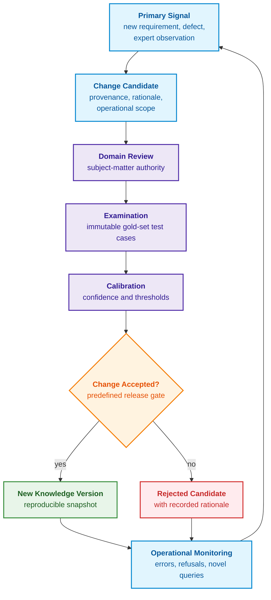
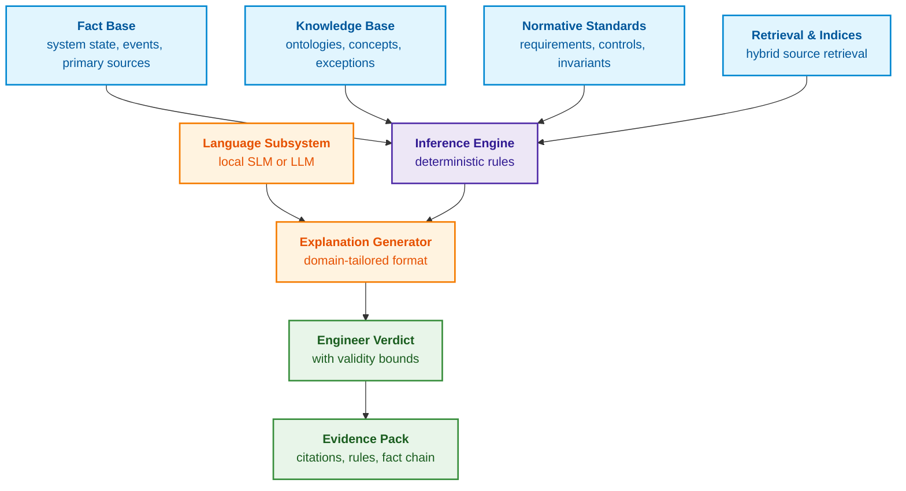
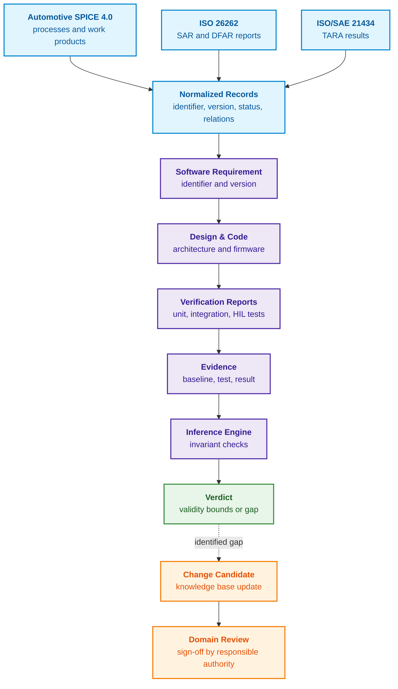
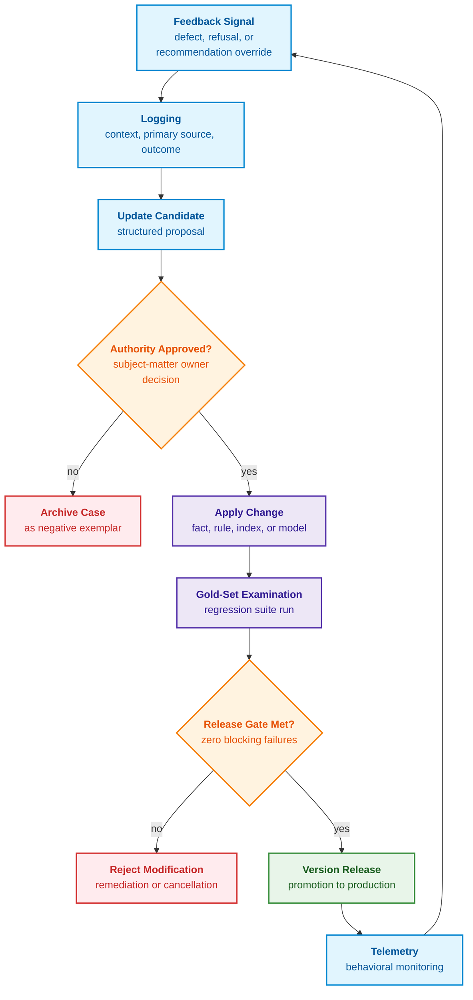
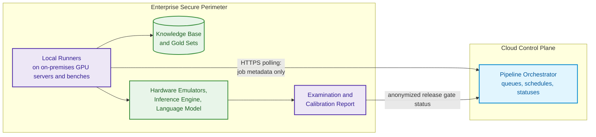

# Chapter 25. How Expert Systems Learn: Examination Matrices, Knowledge Audits, and Regression Control

> **Book:** [Architecture of Evidence-Governed Expert Systems](README.md) · [Part VI: Neuro-Symbolic Models, Cognitive Frontiers, and Continuous Learning](part-06-frontiers-neuro-symbolic.md)  
> **Previous Chapter:** [Chapter 38. Machine Hallucinations and Knowledge Deficits: Evidence-Governed Output Control](ch38-curing-machine-hallucinations-and-knowledge-deficits.md)  
> **Next Chapter:** [Chapter 26. Continuous Learning from Experience and Overcoming System Log Drift](ch26-continual-learning.md)  
> **Table of Contents:** [README.md](README.md)  
> **Author:** [Mykola Fedchyk](about-the-author.md)  
> **Target Level:** Intermediate and Advanced: knowledge engineers, machine learning engineers, quality assurance and release engineering leads  
> **Expected Learning Outcomes:** Determine in which architectural layer of an expert system a modification must be enacted; describe an expert system version via an immutable snapshot of all dependencies; trace an engineering artifact from requirement specification to empirical proof; propagate requirement modifications and evidence revocations to derived facts, indices, and inferences without rewriting history; construct an examination matrix and partition datasets without cross-set leakage; execute release decisions through paired comparisons of candidate and baseline versions; verify probability calibration; select language model adaptation methods and estimate memory footprints prior to execution.

## Abstract

This chapter investigates the life cycle of learning, adaptation, and governed knowledge updating in evidence-governed expert systems. It establishes a rigorous methodology for examination audits, regression control, and confidence calibration verification, precluding the degradation of decision verifiability when ontologies, rules, and neural network modules undergo modification.

Introducing a new rule into a knowledge base eliminates one defect while spawning another. Deploying a new synonym dictionary improves search recall for Ukrainian terminology, yet degrades retrieval for English-language requirement identifiers. Fine-tuning a language model yields an impeccably structured output, yet fails to improve the reliability of deductive inferences. In each instance, the engineering team has modified the expert system, yet remains incapable of proving whether the updated version outperforms its predecessor and for which query classes.

This chapter addresses the foundational engineering question: **how can we update the knowledge of an expert system when requirements, products, rules, and operational experience continuously evolve, while simultaneously proving that the new version does not regress where errors carry the highest cost?** The core thesis of the chapter: **learning in an expert system is a disciplined version release process. Every modification possesses a distinct learning target (fact, rule, trace link, retrieval parameter, or linguistic component), an authoritative source, and defined validity bounds. A proposed change is admitted into the production baseline only following domain-expert review, empirical evaluation against an immutable gold-set examination, calibration verification, and a formal decision rendered by a predefined release gate.**

The chapter grounds its exposition in an end-to-end engineering case study drawn from automotive Electronic Control Unit (ECU) software development, the author's primary industrial domain. The processes, examples, and numerical values illustrate the engineering methodology rather than serve as a certified compliance manual. Final decisions regarding automotive product release, functional safety, and cybersecurity remain the exclusive prerogative of authorized safety managers under applicable industry standards; the expert system prepares verified evidence packages to assist their judgment.

In industrial practice, the colloquial term "learning" frequently obscures several distinct failure modes. The table below delineates the seven most prevalent failures and the safe engineering countermeasure for each.

| Failure Mode | Manifestation | Root Cause | Safe Resolution |
| --- | --- | --- | --- |
| Misidentified learning target | Fine-tuned language model articulates the same erroneous answer with higher persuasiveness | Underlying defect resided in a fact, rule, access control, or retrieval step | Isolate the failure stage first; modify exactly one governed component |
| Train/test data leakage (*train/test leakage*) | Benchmark metric surges, yet production quality stagnates or degrades | Revisions of the same document or incident crossed dataset boundaries | Partition data by group, timestamp, and source prior to any tuning |
| Overfitting to holdout evaluation set | Each successive version "improves" the exact same test | Holdout set iteratively guides engineering decisions | Maintain strictly disjoint datasets for development, calibration, regression, and sealed confirmation |
| Aggregates mask safety regressions | Mean accuracy rises while safety-critical corner cases fail | Orthogonal risks are conflated into a single scalar metric | Enforce independent release gates for each critical evaluation slice and error class |
| Conflated confidence types | Cosine similarity of 0.9, a deterministic rule verdict, and a posterior probability of 0.9 appear indistinguishable | Incommensurable numbers are indiscriminately labeled "confidence" | Type all scores explicitly: rank score, calibrated probability, deterministic verdict, fuzzy membership degree |
| Feedback poisoning | Erroneous expert system inference becomes the subsequent training label | Model's own output or unverified user sentiment accepted as ground truth | Enforce signal → candidate → expert review → isolated examination → release progression |
| Configuration and snapshot drift | Candidate was validated on a different graph, index, or prompt template than deployed | Components are not bound by a unified manifest | Capture an atomic snapshot of all dependencies and execute reproducible evaluation runs |

These seven failures share a single root cause: the modification was not bound to a concrete learning target, verification suite, and version snapshot. The objective of the learning loop is therefore not to "inject knowledge" vaguely, but to **mitigate a specific, empirically measured risk without unacceptable regression across other functional layers of the expert system**. The chapter systematically articulates the constituent components of a version snapshot, the architectural layers open to modification, the engineering artifacts supplying raw material, the bidirectional tracing validating compliance, the design of the examination matrix and release gate, the mechanics of probability calibration, the governance of operational feedback loops, and the precise conditions under which language model fine-tuning is genuinely warranted.

## 1. Three Distinct Pathways for Modifying an Expert System

The concept of "learning" does not imply that every modification requires fine-tuning a neural network. The engineering team must first localize the target of the failure and select the corresponding verification procedure.

| Target of Modification | Required Verification | Non-Mandatory Activity |
|---|---|---|
| Fact, rule, exception, or relationship | Provenance, applicability envelope, conflict checks, positive and negative test fixtures, revocation of derived lemmas | Training neural language model weights |
| Synonym dictionary, chunking strategy, index, or ranker | Holdout query suites, recall and rank ordering of retrieval results, validity status, and access controls | Authoring a new domain-specific symbolic rule for every individual search miss |
| Classifier parameters or language model weights | Data partitioning, target metric optimization, probability calibration, and catastrophic forgetting prevention | Replacing a deterministic symbolic verdict with a model's textual assessment |

For the first pathway, a disciplined cycle of modification, revocation tracking, examination fixtures, and formal release decisions is fully sufficient. Language model fine-tuning represents a specialized, orthogonal engineering discipline. Probability calibration is required strictly where a system component produces an inherently probabilistic estimate; a deterministic rule is verified through behavioral test suites and must never be masked as an artificial "probability of 1."

## 2. Knowledge Life Cycle: From Primary Signal to Version Release

The life cycle of a static document is typically framed in terms of archival retention: a document is authored, stored in a repository, and subsequently superseded by a newer edition. For an expert system, such a description is fundamentally inadequate because knowledge actively participates in automated inference, and altering knowledge directly alters deductive conclusions. Here, the **knowledge life cycle** is defined as the governed progression from an initial signal indicating a need for change to a newly verified production release or an empirically justified rejection of the candidate. This represents an operational engineering definition tailored to expert systems, rather than an abstract philosophical model of corporate knowledge management.

This formulation draws upon two foundational paradigms. Maryam Alavi and Dorothy Leidner conceptualize knowledge management as an integrated framework of processes spanning knowledge creation, storage and retrieval, transfer, and application [[1]](#src-1). Rudi Studer, V. Richard Benjamins, and Dieter Fensel formalize knowledge engineering as the systematic construction and maintenance of explicit knowledge models rather than a one-off population of a static database [[2]](#src-2). The life cycle presented in this chapter adapts both frameworks to controlled expert system evolution and introduces three critical quality gates absent from generic models: rigorous examination, confidence calibration, and release gating.

To render an examination strictly reproducible, an expert system version is specified not by a vague language model identifier, but by a complete, immutable snapshot of all system dependencies:

```math
\mathcal{S}_v=(F_v,K_v,R_v,G_v,I_v,E_v,M_v,P_v,A_v,T_v).
```

- Snapshot composition $`\mathcal{S}_v`$: index $v$ denotes the version, and each component bearing subscript $v$ belongs to this snapshot;
- $`F_v`$ represents facts, $`K_v`$ denotes managed knowledge objects (concepts, ontologies, and exceptions), and $`R_v`$ represents rules;
- $`G_v`$ is the relationship graph, $`I_v`$ represents lexical and dense vector search indices;
- $`E_v`$ represents embedding and reranking models, $`M_v`$ denotes language and other machine learning models;
- $`P_v`$ represents prompt templates and output schemas, $`A_v`$ denotes access control policies;
- $`T_v`$ represents runtime environment and tooling versions, while parentheses bind these constituents into a unified version snapshot.

Under this formalization, any release candidate represents an explicit transformation applied to the current production snapshot:

```math
\mathcal{S}_{v+1}^{\text{cand}}=\mathrm{Apply}(\mathcal{S}_v,\Delta).
```

- For the transition, $`\mathcal{S}_{v+1}^{\text{cand}}`$ represents the candidate version following $v$, where the superscript $\text{cand}$ denotes "candidate";
- $\mathrm{Apply}$ applies the transformation to snapshot $`\mathcal{S}_v`$, and $\Delta$ is the formal specification of this change;
- $=$ denotes that the candidate is generated strictly by applying the specified transformation rather than an arbitrary assembly of components.

Transformation $\Delta$ possesses an explicit dependency closure. Replacing a vector embedding model strictly mandates rebuilding the dense vector index, as vectors generated by the deprecated model are mathematically incompatible with queries encoded by the new model. Modifying an ontological concept may necessitate re-evaluating all derived facts and re-verifying graph integrity constraints. Consequently, the atomic unit of deployment is not an isolated line of text edited by an engineer, but the entire dependency closure of the change, sealed within a release manifest. Metadata recording the change source, the transformation executed, and the responsible authority are documented in accordance with the World Wide Web Consortium (W3C) PROV data model, which structures provenance through entities, activities, and agents [[3]](#src-3).

The flowchart below traces the stages traversed by a candidate from the initial primary signal to production release, and illustrates how operational monitoring closes the cybernetic feedback loop.



Each stage in the pipeline defines explicit inputs, actions, and outputs:

- **Primary Signal:** Alerts the system to a potential need for modification without providing conclusive proof. Manifestations include a newly published standard requirement, an uncovered software defect, an expert observation, an invalid deduction, or shifted operational constraints. Output: a registered observation linked to its primary source and the exact expert system snapshot in which it occurred.
- **Change Candidate:** Formally specifies which fact, relationship, rule, retrieval parameter, or model component requires alteration, detailing the technical rationale, authoritative source, and operational validity envelope. Output: a versioned candidate artifact amenable to independent verification and rejection.
- **Domain Review:** Conducted by a qualified authority possessing direct subject-matter competence in the candidate's technical domain. An embedded software engineer inspects implementation logic, a functional safety engineer evaluates alignment with safety requirements, and a cybersecurity expert scrutinizes threat assumptions. Editorial proofreading or automated linting does not constitute a domain review.
- **Examination:** A repeatable, automated evaluation against an immutable battery of benchmark cases with known ground-truth conclusions, mandatory citations, and expected refusals. The candidate is evaluated in paired comparison against the active baseline across both historical regression suites and boundary cases, rather than merely on the isolated defect that triggered the change.
- **Calibration:** Evaluates not the categorical correctness of the deductive verdict, but the statistical alignment between reported confidence and empirical error rates. This stage establishes decision thresholds: when to automate a recommendation, when to escalate to human experts, and when to abstain.
- **Release Decision:** Rendered by the change owner against a predefined release gate, synthesizing domain review findings, examination metrics, calibration stability, operational risk, and rollback feasibility.
- **New Knowledge Version:** Assigned an immutable identifier, change manifest, linked primary sources, verification test logs, timestamp, and responsible sign-off authority. This snapshot is completely reproducible and can be atomically rolled back to its predecessor.
- **Rejected Candidate:** Persisted within an archival repository alongside the technical rejection rationale, evaluation logs, and criteria for potential reconsideration, preventing identical flawed proposals from resurfacing without fresh empirical evidence.
- **Operational Monitoring:** Tracks the deployed version within production boundaries: observing runtime errors, valid abstentions, emerging query distributions, input data drift, and downstream impacts of recommendations. Telemetry generates fresh signals, but never alters production knowledge automatically.

A raw signal matures into verified knowledge strictly through formalization, expert review, examination, calibration, and release gating. However, this high-level loop does not yet isolate which concrete architectural layer must be modified. To analyze this mechanism in production reality, an end-to-end engineering case study is required.


## 3. End-to-End Engineering Example: Automotive ECU Knowledge Architecture

The primary engineering case study utilized throughout this chapter focuses on the firmware architecture of an automotive Electronic Control Unit (ECU). A single firmware update intersects hardware platform revisions, calibration parameter datasets, functional software specifications, software architecture, implementation source code, release baselines, and multi-tiered verification environments. When a function governs vehicle safety or secure over-the-air updates, independent functional safety and cybersecurity evidence chains must be conjoined to the same artifact trace. This realistic engineering context illuminates all layers of expert system learning while precluding superficial claims of standards compliance.

Three normative standards govern this engineering domain, each fulfilling an orthogonal role:

- **Automotive SPICE 4.0** (*Software Process Improvement and Capability dEtermination*) serves as the process reference and capability assessment model published by the Quality Management Center of the German Association of the Automotive Industry (VDA QMC) [[4]](#src-4). For software engineering, its core V-model spans processes SWE.1 (software requirements analysis), SWE.2 (software architectural design), SWE.3 (software detailed design and unit construction), SWE.4 (software unit verification), SWE.5 (software integration and integration verification), and SWE.6 (software verification). Configuration management, problem resolution, and change request management are governed by supporting processes SUP.8, SUP.9, and SUP.10.
- **ISO 26262-6:2018** specifies mandatory requirements for automotive safety-related software development: covering software safety requirement specification, architectural design, unit design and implementation, unit verification, software integration, and embedded software testing [[5]](#src-5).
- **ISO/SAE 21434:2021** establishes engineering requirements for cybersecurity risk management across the entire vehicle life cycle—from concept engineering and development to decommissioning [[6]](#src-6).

Automotive SPICE does not supersede ISO 26262 or ISO/SAE 21434. The process model evaluates whether an organization systematically elicits, tracks, implements, and verifies engineering work products, whereas the safety and security standards mandate the physical domain invariants and argumentation structures that must reside within those work products. For an expert system, these comprise three interconnected, non-interchangeable knowledge domains. The following section demonstrates how specific engineering artifacts drive modifications across the expert system.

### 3.1. Requirement Modification and Evidence Revocation: Evolution of Knowledge Snapshots

An accredited test laboratory may formally revoke an empirical test report upon which an expert system has already synthesized an engineering compliance verdict. Merely toggling a boolean file status flag in an external document repository is catastrophic: the numerical values from that report may have propagated into canonical facts, retrieval indices, deductive lemmas, and cached API responses. The end-to-end case study traces this propagation across a synthetic requirement governing the response latency of an ECU diagnostic service. All thresholds and identifiers are illustrative; the resulting verdict assesses a specific technical criterion rather than granting final vehicle production sign-off.

**Initial Snapshot K17.** The requirement owner formally approved Revision A of the engineering specification: diagnostic response latency must not exceed 100 ms. Test report `REPORT-41` records an empirical measurement of 90 ms. Canonical fact `FACT-41`, linked to this report, stores the scalar value, unit of measure, firmware build identifier, circuit board hardware revision, measurement methodology, and ambient test conditions. Deductive rule `RULE-TIME` evaluates the measurement against the active limit strictly if the evidence is validated as applicable to the queried ECU configuration. In snapshot K17, the automated inference yields verdict `PASS`, referencing Revision A, `FACT-41`, and `REPORT-41`. The provenance chain "report → fact → verdict" is captured via the W3C PROV ontology [[3]](#src-3).

**New Specification Revision and Snapshot K18.** The requirement owner approves Revision B, tightening the latency ceiling to 80 ms, explicitly indicating that Revision B governs all subsequent evaluations of the identical ECU hardware/software baseline. This constitutes a modified evaluation baseline, not a new empirical measurement. Assuming the test methodology remains valid, the raw measurement of 90 ms is re-evaluated against the new 80 ms threshold. Rule `RULE-TIME` remains unchanged, but the tightened parameter forces an automated verdict of `FAIL`. The primary test report and the historical `PASS` verdict are preserved immutably; a new deduction is generated referencing Revision B. If Revision B had also altered test procedures or hardware prerequisites, reusing the 90 ms measurement would mandate formal engineering justification or re-testing.

**Evidence Revocation and Snapshot K19.** The test laboratory discovers a clock synchronization drift in the test bench acquisition hardware and formally revokes `REPORT-41`. The safety authority records the revocation reason and affected operational scope. The **revocation log** records the evidence identifier, decision timestamp, author, justification, and impacted configurations. The dependency graph immediately traces the invalidated report to `FACT-41` and both downstream verdicts derived from it. The 90 ms value remains in the immutable audit log, but is stripped of its status as valid evidence for current compliance assessments. In the absence of an independent corroborating measurement, the expert system in K19 returns verdict `UNKNOWN` ("no valid measurement available"). Revocation proves neither compliance nor violation. Truth maintenance systems and non-monotonic justifications are explored extensively in [Chapter 16](ch16-expert-systems-architecture.md).

**Evidence Replacement and Snapshot K20.** The laboratory re-executes the test under calibrated conditions, recording 70 ms in `REPORT-42`. Following automated verification of configuration alignment, methodology, provenance, and domain approval, the new fact is admitted into candidate snapshot K20. The inference rule evaluates 70 ms against active limit 80 ms, returning `PASS`. Prior to formal admission of `REPORT-42`, the active system continues to report `UNKNOWN`. The table below contrasts the four snapshots and the systemic causes of verdict transitions.

| Knowledge Snapshot | Active Latency Limit | Valid Empirical Evidence | Criterion Verdict | Root Cause of Verdict Transition |
|---|---|---|---|---|
| K17 | 100 ms, Revision A | 90 ms, `REPORT-41` | `PASS` | Initial baseline evaluation |
| K18 | 80 ms, Revision B | 90 ms, `REPORT-41` | `FAIL` | Tightened normative limit; unchanged empirical data |
| K19 | 80 ms, Revision B | None: `REPORT-41` revoked | `UNKNOWN` | Loss of epistemic grounding for numerical deduction |
| K20 | 80 ms, Revision B | 70 ms, admitted `REPORT-42` | `PASS` | Fresh, verified empirical evidence |

These diverging verdicts do not reflect stochastic instability in the expert system: each response is rigorously grounded in a distinct, temporally consistent set of premises. Propagating across these four states mandates synchronized modifications across multiple architectural layers, as detailed below.

| Architectural Artifact | Action Following Modification or Revocation | Audit Retention Requirements |
|---|---|---|
| Primary Source | Ingest new specification revision or register formal report revocation record | Immutable source copies, formal change approval, author signature, timestamp |
| Canonical Fact | Issue new version of limit or flag `FACT-41` as invalid for active inference | Numerical value, unit, verbatim citation, configuration context, previous lifecycle status |
| Rules and Test Suites | Verify dependent lemmas; test 90 ms case under both limits and missing-evidence handling | Rule engine version, formal regression suite results |
| Derived Views and Indices | Invalidate affected cache entries and update retrieval validity filters; ensure revoked facts cannot surface via RAG | Search index generation identifier and bidirectional link to canonical records |
| Response Cache | Invalidate and purge cached responses predicated on revoked evidence | Snapshot identifier and complete dependency manifest of cached payload |
| Published Verdict | Synthesize updated verdict and notify system owners of affected decisions | Historical decision payload, original premises, and timestamped revocation notice |

Prior to building snapshot K19, the runtime inference gateway must immediately inhibit the utilization of the revoked report via an operational revocation blacklist external to the immutable knowledge pack. Otherwise, the duration required to recompile dense indices would create a vulnerability window during which invalid decisions could be served. Validity verification is executed upon cache retrieval, and the operational blacklist version is recorded in the execution manifest detailed in [Chapter 23](ch23-knowledge-base-verification.md). High-performance compilation and atomic hot-swapping of immutable knowledge packs are addressed in [Chapter 32](ch32-high-performance-knowledge-packs-mmap-and-harvesting.md).

The script below executes the deterministic evaluation logic following evidence validity verification. Preconditions: limit and measurement are non-negative scalars specified in milliseconds; `evidence_active` represents the verified operational status of the evidence. Implemented strictly via the Python 3 standard library.

<details>
<summary>Executable verification across four knowledge snapshots</summary>

```python
def assess(snapshot, limit_ms, measured_ms, evidence_active):
    if limit_ms is None or measured_ms is None or not evidence_active:
        verdict = "UNKNOWN"
    elif measured_ms <= limit_ms:
        verdict = "PASS"
    else:
        verdict = "FAIL"
    return {"snapshot": snapshot, "verdict": verdict}


assert assess("K17", 100, 90, True)["verdict"] == "PASS"
assert assess("K18", 80, 90, True)["verdict"] == "FAIL"
assert assess("K19", 80, 90, False)["verdict"] == "UNKNOWN"
assert assess("K20", 80, 70, True)["verdict"] == "PASS"
assert assess("K19", 80, None, True)["verdict"] == "UNKNOWN"
```

</details>

In the third assertion, scalar 90 ms is passed to the function, but revoked evidence status blocks numerical evaluation. This precise mechanism distinguishes evidence revocation from a simple numeric threshold adjustment. The supplementary assertion testing a missing measurement verifies that absent data cannot default to zero milliseconds and trigger a false `PASS`.

Historical replay of K17 serves an audit function orthogonal to active query resolution. An auditor can re-execute the calculation to verify why K17 issued a `PASS`, but the audit trail must highlight the subsequent revocation of `REPORT-41`. Reproducibility establishes the historical justification of an earlier verdict, but does not certify its ongoing validity. Rolling back to K17 cannot bypass an active operational blacklist. This case study demonstrates how an expert system consumes versioned knowledge and orchestrates its maintenance: mapping dependent lemmas, re-verifying altered premises, and exposing evidentiary deficits. The subsequent section formalizes the architectural layers across which these adaptations take place.

## 4. Five Component Layers of Expert System Enhancement

When an expert system outputs an invalid or incomplete deduction, engineering teams frequently misattribute the defect to the language model. Fine-tuning the model in scenarios where the underlying failure stems from an outdated fact, a flawed deductive rule, or a broken traceability link merely produces an authoritative, eloquently phrased confabulation. Prior to authoring a change candidate, the team must identify the **learning target**: the exact architectural component whose behavior requires modification.

A Large Language Model (LLM) or Small Language Model (SLM) represents merely one component within the architecture. The linguistic subsystem extracts structured representations from raw text, classifies query intents, and formats explanations according to strict schemas. The fact base tracks system state and provenance; the knowledge base stores ontologies and deductive rules; the retrieval engine locates primary evidence; and traceability links bind requirements to verification proofs. The language model replaces none of these roles. The diagram below illustrates how these layers converge into an engineer-facing verdict.



This decomposition disentangles failure modes that superficially appear as identical bad answers. If a deduction lacks primary evidence, the defect lies in the fact base or search index. If the inference engine fails to apply an exception, the failure resides in the knowledge base rule set. If the system cannot demonstrate standards compliance, the traceability layer connecting requirements, test cases, and results is broken. Only when all symbolic layers operate correctly, yet the response corrupts formatting, terminology, or modal calibration, does the language subsystem become the legitimate learning target. The table below delineates the five layers.

| Architectural Layer | Trainable / Adaptable Elements | Concrete Modification Example | Verification Methodology |
| --- | --- | --- | --- |
| Fact Base | Precision of system state representation and data provenance | Register artifact type, observation timestamp, eliminate duplicate record | Reconcile facts against primary engineering source documents |
| Knowledge Base | Concepts, ontological relations, inference rules, domain exceptions | Introduce validated terminology or refined rule predicate | Execute boundary test cases where rule must and must not fire |
| Standards Compliance | Bidirectional traceability linking requirements to empirical evidence | Map standard clause to verification control and acceptance threshold | Execute bidirectional traversal from requirement to test verdict |
| Retrieval and Explanation | Context extraction boundaries and refusal thresholds | Update synonym lexicon, BM25/dense profile, retrieval cutoff | Evaluate retrieval recall, ranking precision, and valid abstention rate |
| Language Subsystem (SLM/LLM) | Intent classification, domain jargon, response structuring, explanation formatting | Fine-tune parameter adapter on verified citation dialogue pairs | Compare generation structure, citation accuracy, and refusal discipline on holdout gold set |

Each architectural layer relies on distinct learning mechanics; a single user complaint may trigger modifications in any of the five layers.

**The Fact Base learns through governed state correction.** Triggers include newly uploaded laboratory measurements, altered requirement statuses, or discrepancies against primary records. An updated fact does not overwrite historical records silently: it captures source origin, timestamp, author, validity bounds, and a cryptographic link to its predecessor under the W3C PROV model [[3]](#src-3). This layer never induces general rules from isolated observations, as its mandate is the exact representation of ground truth. In our automotive ECU scenario, a fact comprises a specific tuple: firmware build, board revision, calibration dataset, coding variant, bootloader version, and test bench outcome. A test result obtained on an older board revision cannot be silently imputed to the current production configuration.

**The Knowledge Base learns through modifying concepts, relations, rules, and exceptions.** Such modifications are warranted when empirical facts are accurate, but the expert system lacks an ontological concept, fails to connect related entities, or executes a rule that omits a critical operational exception. Knowledge engineers formulate candidates explicitly, verifying rules against both positive and negative fixtures while screening for circularity or rule conflict, following the engineering methodology of Studer et al. [[2]](#src-2). A verified fact may inspire a rule candidate, but never transforms into a general rule without domain-expert justification. An isolated diagnostic timeout does not establish a universal rule. Following formal analysis of requirements, software architecture, and reproducible tests, the engineer may formulate a scoped candidate: for a specific ECU state, diagnostic session type, and firmware baseline, communication loss must trigger a deterministic state transition, diagnostic event registration, and fail-safe termination.

**The Standards Compliance Layer learns through repairing traceability chains.** A newly ratified standard edition, a modified safety control, or a missing verification artifact triggers a change candidate within the chain: "requirement → verification activity → acceptance threshold → test result → empirical evidence." The safety manager verifies the document revision and applicability scope before traversing the chain bidirectionally. The text of a standard alone does not "teach" an expert system compliance: absent mapped verification activities and empirical evidence, it remains an unfulfilled specification. Under Automotive SPICE, the chain links SWE.1 software requirements through SWE.2 architecture and SWE.3 unit design to SWE.4, SWE.5, and SWE.6 verification logs. Under ISO 26262, links connect Software Safety Requirements to ASIL-rated test evidence. Under ISO/SAE 21434, the chain traces cybersecurity goals from TARA threat scenarios to penetration test reports. Establishing one of these chains provides zero proof of completeness across the other two.

**The Retrieval and Explanation Layer learns from benchmark query suites and known retrieval failures.** For each evaluation query, engineers document target evidence documents, unacceptable distractors, necessary context boundaries, and scenarios demanding abstention. The team subsequently tunes lexicons, dense vector embeddings, reranker models, similarity thresholds, or explanation prompts, benchmarking candidate performance against a holdout query set. Shahul Es, Jithin James, Luis Espinosa-Anke, and Steven Schockaert formalize this separation in Ragas, isolating whether retrieval captures relevant context, whether the generation faithfully reflects retrieved context, and the intrinsic quality of the generation [[7]](#src-7). This decoupled evaluation prevents a fluent response from obscuring a missing citation. Automotive queries frequently contain precise technical tokens: software requirement IDs, Diagnostic Trouble Codes (DTCs), diagnostic service IDs, AUTOSAR software component names, or ECU hardware revisions. Retrieval must strictly isolate the exact configuration baseline before performing semantic expansion. Recommending a solution valid for a different vehicle platform represents a safety defect.

**The Language Subsystem learns from curated exemplars of linguistic behavior.** Training data comprises verified (query, response) pairs, examples of exact citation formatting, structured JSON schemas, and disciplined refusals. Fine-tuning is justified when facts, rules, and retrieved sources are completely sound, yet the language subsystem scrambles domain terminology, omits mandatory schema fields, or expresses uncertain deductions with unwarranted certainty. Data curation requires documenting origin, licensing rights, cleaning pipelines, and training hyperparameters in accordance with the Datasheets for Datasets framework established by Timnit Gebru et al. [[8]](#src-8). Model weights can polish communicative clarity, but can never serve as a primary source of ground truth or safety evidence. In ECU firmware engineering, a language model can learn to distinguish a Safety Goal, a Software Safety Requirement, a Cybersecurity Goal, a functional requirement, a defect report, and a change request, formatting their IDs into structured schemas and flagging missing evidence links. The model possesses no authority to assert standards compliance simply because it fluently employs Automotive SPICE or ISO terminology.

> **From the Author's Practice.** In the experimental knowledge acquisition prototype maintained by the author, measurable performance gains have derived primarily from deterministic query compilation, strict provenance tracking, metadata-driven retrieval filtering, hybrid retrieval (lexical BM25 combined with dense vectors), and dedicated compact classifiers, rather than fine-tuning neural language models. The prototype deliberately avoids autonomous admission of knowledge updates into production, and the independently curated validation suite requires ongoing expansion. The life cycle detailed in this chapter represents a rigorous target engineering framework grounded in examination quality gates, rather than an unconstrained autonomous self-learning loop.

Learning in an expert system begins with localizing the failure layer. Fine-tuning a language model sharpens intent understanding, terminology alignment, dialogue structuring, and refusal discipline, but cannot remediate an incomplete fact or an invalid rule. Having localized the target layer, the engineering team must determine which project work products yield the raw training material and verify their evidentiary integrity.

## 5. Sources of Training Material: Engineering Artifacts and Telemetry

Industrial projects maintain approved specifications, unreviewed drafts, test bench logs, unmerged pull requests, deprecated schematics, and informal team chat messages concurrently. Ingesting these assets into a knowledge base indiscriminately causes the expert system to base deductions on obsolete or configuration-incompatible data. Learning depends not on raw text volume, but on artifact type, versioning, authorship, and operational validity bounds. Methods for inventorying, parsing, and classifying engineering artifacts are addressed in [Chapter 10](ch10-knowledge-acquisition-systems.md). Here, the focus shifts to governance: under what conditions can a validated work product modify a fact, rule, traceability link, or system parameter?

This imperative applies uniformly across software, systems, and hardware Research and Development (R&D) environments. In pure software, the primary artifact is source code; in systems and hardware engineering, that role is occupied by system models, schematics, Bill of Materials (BOM) records, prototype fabrication logs, calibration datasets, and manufacturing inspection records. The table below delineates what an expert system can learn from each artifact class and the mandatory metadata that must accompany it.

| Project Work Product | What the Expert System Learns | Mandatory Associated Metadata |
| --- | --- | --- |
| Requirements, standards, regulations, and release baselines | Concepts, constraints, acceptance criteria, compliance rules | Identifier, revision, author, lifecycle status, validity bounds |
| Architectural and system models, interface definitions, simulations | System states, data flows, component boundaries, operating assumptions | Model revision, simulation parameters, validation boundaries, simulation output |
| Source code, configurations, infrastructure as code | Implementation facts, dependencies, interface constraints | Repository URL, baseline tag, commit hash, path/symbol, code review sign-off |
| Schematics, Hardware Description Language (HDL) code, PCB layouts, Bill of Materials (BOM) | Electrical and logical connections, component ratings, structural constraints | Layout revision, manufacturer part number, BOM release, serial/lot number, ECO approval |
| Computer-Aided Design (CAD) models, technical drawings, GD&T tolerances | Geometric and physical constraints, assembly hierarchy, operational limits | Drawing revision, dimensional units, tolerance class, material specification |
| Lab measurements, prototype test benches, qualification runs | Physical operating boundaries, repeatable failure modes, risk thresholds | Test methodology, instrument calibration certificate, bench ID, raw logs |
| Manufacturing inspection, supplier quality records, defect tracking | Non-conformance trends, scrap root causes, approved concessions | Lot identifier, supplier code, inspection plan, disposition status |
| Quality audits, release milestones, engineering sign-offs | Evidentiary gaps, release readiness rules, review priorities, granted waivers | Sign-off authority, role, decision timestamp, technical rationale |

In our ECU firmware scenario, this table maps to an integrated web of engineering work products. SWE.1 provides software requirements and verification criteria; SWE.2 specifies components, interfaces, dynamic behavior, and requirement allocations; SWE.3 links detailed design to software modules and source code. SWE.4 records unit verification results; SWE.5 validates software integration; SWE.6 verifies the integrated software against software requirements. Baseline records from SUP.8, defect tickets from SUP.9, and change requests from SUP.10 delineate exactly which firmware build the evidence supports and the technical rationale for modification.

Specialized functional safety and cybersecurity artifacts augment this process backbone. Under ISO 26262, these comprise Software Safety Requirements, the Safety Analysis Report (SAR), the Dependent Failure Analysis Report (DFAR), static code analysis reports, unit and integration test logs, and Safety Case arguments. Under ISO/SAE 21434, artifacts include Threat Analysis and Risk Assessment (TARA) work products, Cybersecurity Goals, authenticity and secure boot requirements, anti-rollback mechanisms, and penetration test reports. An expert system must not memorize the textual narrative of these reports; it must learn the structured relations uniting their versions, decisions, and empirical results.

Source code, HDL modules, electrical schematics, CAD models, and test logs do not constitute "unstructured training text" to be ingested blindly. Each artifact represents an explicit candidate to update a fact, rule, threshold, or trace link. A single laboratory test measurement proves nothing about product reliability until test methodology, instrument calibration, bench configuration, ambient environment, lot identifier, measurement repeatability, and acceptance criteria are formally established.

Learning commences by transforming a raw work product into a governed record capturing full provenance and validity limits. A requirement draft, unreviewed code branch, raw continuous integration (CI) log, or generative text snippet may highlight potential defects, but cannot automatically attain the status of verified fact or proof. Assertions regarding standards compliance demand special rigor: establishing primary source credibility is insufficient; an unbroken traceability chain from requirement to empirical evidence must be demonstrated.


## 6. End-to-End Artifact Traceability and Audited Standards Compliance

A common failure mode in enterprise AI is attempting to teach a knowledge base to "know the standard" by feeding raw regulatory text into an embedding index. Regulatory text alone does not verify engineering compliance. An automated engineering verdict requires an unbroken, bidirectional chain: traversing downward from requirement to empirical evidence, and upward from evidence to the requirement it satisfies. Automotive SPICE 4.0 explicitly mandates bidirectional traceability: expected outcomes of process SWE.1 mandate consistency and bidirectional traceability between software requirements and system requirements [[4]](#src-4). Requirements engineering processes and information product structures are formally codified in ISO/IEC/IEEE 29148 [[9]](#src-9). The concrete structure of this evidentiary chain depends upon the operational domain.

In automotive software engineering, primary safety and security artifacts include TARA, SAR, and DFAR:

- **TARA** identifies assets, damage scenarios, and threat scenarios; evaluates attack feasibility and impact ratings; and formalizes risk treatment decisions and Cybersecurity Goals. These work products populate structured tables or models. For firmware developers, TARA establishes concrete requirements governing authentication, payload integrity, authorization, cryptographic key isolation, diagnostic logging, and secure over-the-air updates.
- **SAR** documents the scope, assumptions, methodology, and findings of safety analyses: including Failure Mode and Effects Analysis (FMEA), Fault Tree Analysis (FTA), or Failure Modes, Effects, and Diagnostic Analysis (FMEDA). In software projects, SAR identifies which failure modes and hazardous events must be detected or mitigated by software mechanisms, linking analytical findings to safety goals, software requirements, and verification test cases.
- **DFAR** analyzes dependent failures: evaluating common cause failures, cascading events, and shared-mode breakdowns. Dependent failure analysis is governed by ISO 26262-9:2018 [[10]](#src-10). In firmware engineering, DFAR scrutinizes independence assumptions: verifying whether primary and secondary safety channels share an identical clock source, memory partition, device driver, communication stack, or power supply domain that could disable both channels simultaneously.

### 6.1. Integrating TARA, SAR, and DFAR Tables into the Ontological Graph

A TARA, SAR, or DFAR table does not constitute an isolated "safety silo" inside an expert system. It represents an authoritative primary source from which an ingest pipeline extracts verified entities and relationships into governed knowledge components. The fact base records field values alongside row identifiers, document versions, review states, hardware baselines, and links to source documents. The knowledge base defines entity classes and valid ontological relations. The traceability layer links analytical findings to requirements, architecture, source code, and test cases. The inference engine applies explicit rules checking completeness, consistency, and evidentiary gaps, while the explanation engine renders conclusions with line-level citations.

Prior to ingestion, tabular records undergo semantic normalization. Column headers in supplier-specific templates are mapped to canonical ontological concepts; references to requirements and test cases resolve to persistent identifiers; and revision statuses are validated. A table row lacking an identified owner, an approved revision, or an unambiguous analysis target may remain accessible for lexical search, but is excluded from automated compliance reasoning. This precludes the system from conflating lexical similarity with verified engineering traceability. Column mappings are preserved in a versioned ingest schema: a template change by a supplier cannot silently alter semantic inference, because updated mappings must undergo validation before new records participate in deductions.

| Primary Source | Ingested Knowledge Elements | Inference Engine Application |
| --- | --- | --- |
| TARA | Asset, damage scenario, threat scenario, risk rating, risk treatment decision, Cybersecurity Goal | Verifies whether each retained threat scenario maps to an approved goal, software requirement, implementation, and passing test log; flags missing links as compliance gaps |
| SAR | Safety analysis target, methodology, assumptions, failure mode, Safety Goal, requirement, mitigation | Verifies whether safety recommendations are reflected in requirements and software architecture, and whether valid verification evidence exists for the target hardware baseline |
| DFAR | Common cause initiator, coupling factor, shared resource, affected components, independence claim, barrier | Analyzes dependencies between elements claimed as independent; flags independence claims as ungrounded if a shared resource lacks a validated barrier or test fixture |

Inference rules must remain narrower than the total narrative content of a document. A rule may declare: if an active TARA entry mandates mitigation of a threat scenario, but the path from that entry to a software requirement and a passing test result is broken for the active baseline, the evidentiary chain is incomplete. Another rule detects in a DFAR that two nominally independent watchdogs share a single flash memory driver, mandating an empirical fault-injection test. These rules enforce structural completeness and logical consistency across known project artifacts. They grant the expert system no authority to declare a vehicle "safe" or "secure" autonomously.

When queried, "Is verification evidence sufficient to approve ECU firmware update baseline X?", the expert system scopes its search to that specific configuration baseline, constructs trace paths from TARA, SAR, and DFAR to requirements, design, and test logs, applies inference rules, and returns one of four deterministic outcomes: evidentiary chain confirmed within stated bounds, specific gap identified, logical contradiction detected, or insufficient data to evaluate. The response enumerates the activated rule, the exact baseline tag, and the specific table rows supporting the deduction. The diagram below illustrates artifact ingestion and trace generation.



The upper tier normalizes documents into structured entities, the middle tier constructs the evidentiary chain, and the lower tier decouples deterministic rule execution from explanation generation. The designation HIL (*Hardware-in-the-Loop*) refers to automated test fixtures where a physical ECU executes against real-time simulated vehicle dynamics. When an inference rule exposes an evidentiary gap, that gap becomes a change candidate only after being linked to a concrete fact, rule, or relation and receiving domain-expert review.

Consider the firmware update scenario. A software requirement dictates that the bootloader must verify update package authenticity and integrity, inhibit unauthorized version rollbacks, and restore the ECU to a deterministic safe state if flashing is aborted. From a process standpoint, the expert system traverses from the SWE.1 requirement to the bootloader module in SWE.2, the detailed design and source implementation in SWE.3, and unit/integration test results in SWE.4, SWE.5, and SWE.6. Configuration management strictly identifies the precise firmware baseline, calibration dataset, and test harness version.

In TARA, the asset is the flashing mechanism, the damage scenario is loss of vehicle control caused by executing spoofed firmware, and the threat scenario is unauthorized firmware installation. Risk treatment decisions map into requirements for digital signature verification, anti-rollback monotonic counters, and hardware security module (HSM) key storage, traversing into bootloader code and negative test suites. The TARA record justifies the necessity of the requirement, but provides zero proof that the control operates correctly. If an interrupted flash sequence could destabilize a safety-critical function, the SAR documents the hazardous event, operational assumptions, safety requirements, and fail-safe transitions. DFAR adds dependency checks: the primary runtime application and the recovery bootloader are not independent if both rely on a common corrupted flash driver or shared EEPROM sector. This deduction mandates an architectural requirement, an isolation barrier, and physical fault-injection testing.

The inference engine evaluates which rules fired and classifies the state of the evidentiary chain: confirmed within operational bounds, incomplete, contradictory, or insufficient data. The explanation engine outputs the exact trace links, artifact versions, test logs, and the formal justification for the verdict. If a power-loss recovery test log is missing, the system explicitly reports that specific omission rather than confabulating that the control is "likely compliant." The language model formats the textual explanation, but cannot alter the logical verdict. Traceability translates regulatory specifications into auditable chains, but provides no guarantee that an updated expert system preserves these chains across regression suites. That guarantee demands an independent, repeatable examination.

## 7. Independent Examination Methodology and Change Quality Assessment

A candidate version may perform admirably across a handful of curated demonstration queries while silently dropping a critical safety exception or failing to abstain when evidence is missing. Absent an immutable evaluation benchmark with known ground-truth expectations, it is impossible to distinguish genuine architectural enhancement from cherry-picked over-fitting.

A compact reference suite (*gold set*) serves as an efficient regression smoke test when representative of primary domain failure modes. However, 20 to 30 test cases cannot prove statistical generalization, probability calibration, or the rarity of dangerous failure modes. If zero failures occur across $n=30$ independent trials, the approximate one-sided 95% confidence upper bound on the failure rate under the "rule of three" formulated by James Hanley and Abby Lippman-Hand [[11]](#src-11) is given by:

```math
p_{\text{failure}}\lesssim\frac{3}{n}=\frac{3}{30}=0.10.
```

- In the rule of three, $`p_{\text{failure}}`$ represents the approximate upper bound of the failure probability;
- $n$ is the number of independent evaluated test cases, here $n=30$, and numerator 3 corresponds to the approximation for zero observed failures;
- $\lesssim$ denotes "approximately less than or equal to", $=$ signifies equality, and $0.10$ represents a fraction of 10%;
- The estimate establishes an approximate one-sided 95% confidence upper bound under the condition of independent trials with zero observed failures in the sample.

Solving the exact binomial equation $(1-p)^n = 0.05$ yields $1 - 0.05^{1/30} \approx 0.095$. Thus, thirty consecutive failure-free runs remain consistent with an underlying failure probability of nearly 10%. To statistically guarantee a failure upper bound below 1% from zero observed defects, approximately three hundred independent cases are required. A compact gold set provides a useful smoke test for progression, but cannot substantiate an authoritative safety assertion. Sizing confirmation suites requires formal power calculations based on acceptable margins of error, expected incident baselines, required statistical power, and stratified evaluation slices.

### 7.1. Functional Partitioning and Dataset Roles

A single "test set" must be partitioned into distinct functional roles, as every interaction with data leaks information into subsequent engineering choices.

| Dataset Role | Functional Purpose | Prohibited Activity |
| --- | --- | --- |
| Training Set | Weight adaptation, rule synthesis, lexicon expansion, reranker training | Evaluating final system quality or release readiness |
| Development Set | Error analysis, prompt engineering, hyperparameter tuning | Serving as independent release validation |
| Calibration Set | Temperature scaling, confidence thresholding, selective abstention policies | Guiding architectural model selection after inspecting results |
| Regression Gold Set | Verifying historical incident fixes, invariants, and blocking safety cases | Relying exclusively on this set to catch novel failure classes |
| Sealed Confirmation Set | Unbiased, infrequent release gating decisions | Iteratively tuning candidate parameters against results |
| Shadow and Canary Run | Validating production query distributions, latency, drift, policy violations | Automatically treating unverified user interactions as ground truth |

In shadow deployment, the candidate processes a real-time mirror of production traffic, but its outputs are hidden from users. In canary deployment, the candidate serves a small fraction of live users under intense telemetry monitoring. Benchmark suites must include not only straightforward questions with textbook answers, but also ambiguous phrasings, rare technical acronyms, multilingual terminology, contradictory evidence packages, and queries where the correct expert system behavior is an explicit refusal to answer.

Data partitioning must be executed **prior** to any modeling or tuning, and strictly above the level of individual text records. If requirement `REQ-42 v1.1` resides in the training set while minor revision `REQ-42 v1.2` is placed in the test set, the system has seen the answer under a cosmetic alias. Consequently, all revisions, translations, derived Q&A pairs, and related incident reports stemming from a common root document must be grouped into an atomic partition. To test temporal generalization, data is split chronologically; to test transferability, an entire vehicle model line, supplier portfolio, ECU variant, or engineering project is set aside. In scikit-learn, such grouped partitioning is executed via `GroupKFold`, `StratifiedGroupKFold`, `LeaveOneGroupOut`, and `TimeSeriesSplit` [[12]](#src-12). These algorithms partition data based on supplied group identifiers or temporal ordering; defining which group represents a single incident or document remains the responsibility of the data owner. Following partitioning, automated string matching, near-duplicate hashing, and vector cosine proximity scans must detect cross-partition leakage, followed by manual inspection of high-similarity pairs. Katherine Lee et al. demonstrated that popular benchmarks suffer from severe near-duplicate contamination, with cross-set overlap exceeding 4% in validation splits, heavily inflating perceived generalization [[13]](#src-13). Automated deduplication mitigates syntactic overlap, but cannot replace structural grouping.

Once a sealed confirmation set is utilized to diagnose a defect, it has influenced the engineering baseline: it must be retired into the historical regression suite, and a fresh sealed set must be assembled for subsequent release decisions. Otherwise, the engineering team gradually overfits the release exam rather than improving system capability.

### 7.2. Examination Matrix and Stratified Evaluation Slices

A single test case simultaneously evaluates multiple system properties: whether the correct source was retrieved, whether the proper inference rule fired, whether an unbroken trace to proof was constructed, whether the explanation is faithful to facts, whether the system abstains under evidence deficits, and whether the modification broke historical cases. Test results are structured as an **examination matrix**: rows represent case classes, while columns represent evaluated properties. For our ECU firmware update scenario, the matrix is structured as follows.

| Case Class | Target Evidence | Fired Rule | Requirement → Proof Trace | Expected System Verdict |
| --- | --- | --- | --- | --- |
| Valid update, active baseline | SWE.1 requirement, SWE.6 test log | Evidence sufficiency | Complete | "Confirmed within configuration bounds" |
| Tampered signature payload | Authenticity requirement, negative test | Payload rejection | Complete | "Update must be rejected" |
| Unauthorized version rollback | Anti-rollback requirement, TARA row | Version monotonicity | Complete | "Rollback strictly prohibited" |
| Power loss during flash write | Recovery requirement, SAR row | Fail-safe state | Incomplete: missing test | "Gap: power-loss recovery test missing" |
| Evidence for mismatched PCB rev | Test report from disparate board revision | Configuration match | Severed | "Evidence invalid for this configuration" |
| Unconfirmed baseline tag | None | Abstention rule | Absent | Refusal with explanation |

Every cell in the matrix is scored independently, and performance across every row is compared between the candidate and the active baseline. Generating a correct textual conclusion from an invalid source represents a retrieval failure, not a success. A correct refusal on the final row carries equal weight to a correct verification on the first.

Matrix properties must not be collapsed into a single aggregate "accuracy" figure. For binary classifications or one-vs-rest tasks, standard precision and recall are computed:

```math
\mathrm{Precision}=\frac{TP}{TP+FP},
\qquad
\mathrm{Recall}=\frac{TP}{TP+FN}.
```

- In these ratios, $TP$ represents the number of true positive verdicts, $FP$ is the count of false positives, and $FN$ is the count of false negatives;
- $\mathrm{Precision}$ denotes the proportion of correct positive decisions among all positive predictions, while $\mathrm{Recall}$ denotes the fraction of detected positive instances out of all actual members of the positive class;
- The $+$ symbol sums the counts in the denominators, and both metrics span the range from 0 to 1, provided the respective denominator is non-zero.

Illustrative numerical calculation: for $`TP=8`$, $`FP=2`$, and $`FN=2`$, precision evaluates to $`8/(8+2)=0.8`$, and recall evaluates to $`8/(8+2)=0.8`$.

```math
F_\beta=(1+\beta^2)\,
\frac{\mathrm{Precision}\cdot\mathrm{Recall}}
{\beta^2\,\mathrm{Precision}+\mathrm{Recall}}.
```

- For $`F_\beta`$, parameter $\beta$ weights recall relative to precision; $\beta > 1$ assigns greater weight to recall;
- $\mathrm{Precision}$ denotes positive verdict precision, $\mathrm{Recall}$ is the recall of the positive class, and $\cdot$ signifies multiplication;
- $`F_\beta`$ represents their weighted harmonic mean, spanning from 0 to 1 whenever the expression is mathematically defined.

For the identical values and $\beta=1$, $`F_1=2\cdot 0.8\cdot 0.8/(0.8+0.8)=0.8`$. This serves as an illustrative arithmetic example, not an expert system benchmark score.

When missing a critical requirement carries higher cost than an unnecessary human escalation, setting $\beta > 1$ weights recall higher, but cannot replace a zero-tolerance blocking rule for safety-critical fixtures. For retrieval tasks evaluated against relevant document set $`G_q`$ for query $q$, recall across the top $k$ results is formulated as:

```math
\mathrm{Recall@}k=
\frac{1}{|Q|}\sum_{q\in Q}
\frac{|G_q\cap\mathrm{Top}_k(q)|}{|G_q|}.
```

- For retrieval, $\mathrm{Recall@}k$ represents the average proportion of relevant evidence documents retrieved within the top $k$ results;
- $Q$ is the set of queries, $`|Q|`$ is its cardinality, and $q$ indexes individual queries;
- $`G_q`$ denotes the ground-truth set of all relevant evidence items for query $q$, and $`\mathrm{Top}_k(q)`$ represents the top $k$ retrieved results;
- $\cap$ denotes set intersection, vertical bars enclosing a set signify its cardinality, and $\sum$ averages the fractions across all queries;
- The metric spans from 0 to 1; for a query lacking any relevant ground-truth evidence, the denominator is zero, demanding a dedicated evaluation policy.

Illustrative example: if a query requires three evidence documents and the top $k$ results capture two of them, $`\mathrm{Recall}@k = 2/3 \approx 0.667`$.

Ranking efficacy is measured via Normalized Discounted Cumulative Gain (nDCG) and Mean Reciprocal Rank (MRR), detailed in [Chapter 16](ch16-expert-systems-architecture.md), alongside exact identifier matching, active revision resolution, Access Control List (ACL) leak detection, and the percentage of assertions substantiated by verbatim evidence snippets. High retrieval recall across top-$k$ results does not compensate for citing an obsolete configuration baseline.

### 7.3. Release Gate: Paired Comparison of Candidate Against Baseline Version

Evaluation must be strictly paired: the identical test cases are executed across both production baseline $`\mathcal{S}_v`$ and candidate $`\mathcal{S}_{v+1}^{\text{cand}}`$. For stochastic generation, decoding hyperparameters are fixed and runs are repeated across multiple PRNG seeds. For metric $m$ evaluated on slice $s$, the paired delta is computed as:

```math
\Delta_{m,s}=
m(\mathcal{S}_{v+1}^{\text{cand}},s)
-m(\mathcal{S}_v,s).
```

- In this difference, $m$ represents an evaluated metric, and $s$ denotes a specific test case slice;
- $`\mathcal{S}_{v+1}^{\text{cand}}`$ is the candidate version, while $`\mathcal{S}_v`$ is the baseline production version;
- $`\Delta_{m,s}`$ denotes the change in the metric for slice $s$, where the minus sign subtracts the baseline result from the candidate result.

For example, if the candidate achieves recall 0.92 while the baseline scores 0.90, the delta evaluates to $`0.92 - 0.90 = +0.02`$, reflecting a 2 percentage point improvement.

A formally defined release gate is expressed as:

```math
\mathrm{Promote}=
\left[\bigwedge_{s\in C}
\mathrm{LCB}_{95\%}(\Delta_{m,s})\ge-\delta_s\right]
\land
\left[N_{\text{block}}=0\right]
\land
\left[\text{latency, cost, memory, and privacy within bounds}\right].
```

- The release gate rule $\mathrm{Promote}$ grants authorization for deployment if and only if all conjoined conditions evaluate to true;
- $C$ represents the set of critical slices, $s$ indexes an individual slice, $m$ denotes the metric, and $`\Delta_{m,s}`$ is the paired metric difference between candidate and baseline;
- $`\mathrm{LCB}_{95\%}`$ denotes the lower confidence bound of the 95% confidence interval for the paired difference (*Lower Confidence Bound*, LCB), and $`\delta_s`$ specifies the maximum permissible regression margin on slice $s$;
- $`\bigwedge_{s\in C}`$ mandates that the condition must hold across all critical slices simultaneously, $\ge$ denotes "greater than or equal to", and the negative sign before $`\delta_s`$ sets the allowable regression boundary;
- $`N_{\text{block}}`$ represents the count of failed blocking cases and must strictly equal zero;
- The final bracketed clause mandates that latency, operational cost, memory footprint, and privacy constraints remain within acceptable limits; $\land$ conjoins all conditions.

For safety and cybersecurity blocking scenarios, every single test case is verified individually; percentage pass rates are prohibited. Confidence intervals are estimated via the non-parametric bootstrap formulated by Bradley Efron: uncertainty distributions are derived through empirical resampling with replacement [[14]](#src-14). For paired binary classifications, Quinn McNemar's exact test evaluates discordant pairs where one version succeeded and the other failed [[15]](#src-15). Statistical methods, sample iterations, and significance thresholds are fixed prior to inspecting results, precluding post-hoc p-hacking to push a favored candidate into release.

The Python script below evaluates two release candidates across three distinct slices: 300 general queries, 30 mandatory abstention cases, and 40 blocking safety fixtures. For general and abstention slices, the gate mandates that the lower confidence bound of the paired difference must not exceed the allowed regression margin; for safety, the rule enforces zero failures. Contingency table counts are explicitly specified for clarity. Implemented strictly via the standard library of Python 3.10+.

<details>
<summary>Python implementation</summary>

```python
"""Paired comparison of candidate against baseline expert system prior to release.

Only Python 3.10+ standard library. Each case is evaluated on both
versions, forming paired observations (baseline, candidate).
"""
import math
import random

BOOTSTRAP_ROUNDS = 10_000
SEED = 25

# For each slice: (both correct, baseline only, candidate only, both incorrect)
CANDIDATES = {
    "A": {"general": (230, 10, 30, 30), "refusals": (27, 0, 1, 2), "safety": (36, 4, 0, 0)},
    "B": {"general": (230, 10, 30, 30), "refusals": (27, 0, 1, 2), "safety": (40, 0, 0, 0)},
}
# Permissible regression δ for the interval lower bound; None means "zero failures"
RULES = {"general": 0.02, "refusals": 0.05, "safety": None}


def pairs(counts):
    if len(counts) != 4 or any(type(count) is not int or count < 0 for count in counts) or sum(counts) == 0:
        raise ValueError("counts must contain four nonnegative integers and at least one case")
    both, base_only, cand_only, neither = counts
    return [(1, 1)] * both + [(1, 0)] * base_only + [(0, 1)] * cand_only + [(0, 0)] * neither


def bootstrap_lcb(diffs, rng):
    n = len(diffs)
    means = sorted(sum(rng.choices(diffs, k=n)) / n for _ in range(BOOTSTRAP_ROUNDS))
    return means[int(0.025 * BOOTSTRAP_ROUNDS)]


def mcnemar_exact(base_only, cand_only):
    m = base_only + cand_only
    if m == 0:
        return 1.0
    tail = sum(math.comb(m, k) for k in range(min(base_only, cand_only) + 1)) / 2**m
    return min(1.0, 2 * tail)


def evaluate(name, slices):
    if set(slices) != set(RULES):
        raise ValueError("missing or unexpected examination slice")
    rng = random.Random(SEED)
    print(f"Candidate {name}")
    print(f"{'slice':<9}{'n':>4}{'base':>7}{'cand.':>7}{'Δ':>8}{'LCB95':>8}{'p':>7}  rule: outcome")
    failed, all_pairs = [], []
    for slice_name, counts in slices.items():
        p = pairs(counts)
        all_pairs += p
        n = len(p)
        base = sum(b for b, _ in p) / n
        cand = sum(c for _, c in p) / n
        lcb = bootstrap_lcb([c - b for b, c in p], rng)
        p_value = mcnemar_exact(counts[1], counts[2])
        delta = RULES[slice_name]
        if delta is None:
            misses = n - sum(c for _, c in p)
            ok = misses == 0
            verdict = "0 failures: " + ("yes" if ok else f"no ({misses})")
        else:
            ok = lcb >= -delta
            verdict = f"LCB >= -{delta:.2f}: " + ("yes" if ok else "no")
        if not ok:
            failed.append(slice_name)
        print(f"{slice_name:<9}{n:>4}{base:>7.3f}{cand:>7.3f}{cand - base:>+8.3f}{lcb:>+8.3f}{p_value:>7.3f}  {verdict}")
    n = len(all_pairs)
    base = sum(b for b, _ in all_pairs) / n
    cand = sum(c for _, c in all_pairs) / n
    print(f"{'total':<9}{n:>4}{base:>7.3f}{cand:>7.3f}{cand - base:>+8.3f}")
    print("decision:", f"REJECT ({', '.join(failed)})" if failed else "PROMOTE to shadow deployment")
    print()
    return not failed


def test_required_inputs():
    for invalid in ({}, {"general": (1, 0, 0, 0)}):
        try:
            evaluate("incomplete", invalid)
        except ValueError:
            pass
        else:
            raise AssertionError("incomplete examination accepted")
    for invalid in ((0, 0, 0, 0), (1, -1, 0, 0), (1, 0, 0), (True, 0, 0, 0)):
        try:
            pairs(invalid)
        except ValueError:
            pass
        else:
            raise AssertionError("invalid paired counts accepted")


test_required_inputs()


for name, slices in CANDIDATES.items():
    assert evaluate(name, slices) == (name == "B")

n = 40
print(f"0 failures across {n} blocking cases: 95% upper bound via rule of three {3 / n:.3f}, exact {1 - 0.05 ** (1 / n):.3f}")
```

</details>

Executing `python release_gate.py` produces:

<details>
<summary>Sample output data</summary>

```text
Candidate A
slice        n   base  cand.       Δ   LCB95      p  rule: outcome
general    300  0.800  0.867  +0.067  +0.027  0.002  LCB >= -0.02: yes
refusals    30  0.900  0.933  +0.033  +0.000  1.000  LCB >= -0.05: yes
safety      40  1.000  0.900  -0.100  -0.200  0.125  0 failures: no (4)
total      370  0.830  0.876  +0.046
decision: REJECT (safety)

Candidate B
slice        n   base  cand.       Δ   LCB95      p  rule: outcome
general    300  0.800  0.867  +0.067  +0.027  0.002  LCB >= -0.02: yes
refusals    30  0.900  0.933  +0.033  +0.000  1.000  LCB >= -0.05: yes
safety      40  1.000  1.000  +0.000  +0.000  1.000  0 failures: yes
total      370  0.830  0.886  +0.057
decision: PROMOTE to shadow deployment

0 failures across 40 blocking cases: 95% upper bound via rule of three 0.075, exact 0.072
```

</details>

Candidate A elevates overall accuracy from 0.830 to 0.876. On general queries, the improvement is statistically significant: McNemar's test yields $p=0.002$, and the lower bound $+0.027$ easily clears the permissible regression margin of $-0.02$. However, Candidate A fails four out of forty blocking safety cases that the baseline passed cleanly, triggering immediate rejection by the release gate. On the safety slice, McNemar's test outputs $p=0.125$: four discordant pairs are insufficient to establish statistical significance. This yields an imperative engineering principle: absence of statistically significant regression does not constitute proof of zero regression, mandating that blocking safety cases are evaluated deterministically on an absolute basis. Candidate B achieves identical enhancements with zero safety regressions, successfully clearing the gate into shadow deployment. The terminal log line underscores the limitation of finite testing: zero observed failures across 40 blocking fixtures corresponds to a failure upper bound of approximately 7%, confirming that shadow and canary phases remain indispensable.

This implementation highlights core boundary conditions. In production, paired counts originate from live evaluation runs rather than hardcoded tuples. Function `evaluate` rejects runs missing any declared slice, while `pairs` rejects negative, non-integer, or empty inputs. Without these assertions, an omitted safety slice would report zero failures and silently pass a defective candidate. Three isolated 95% confidence intervals do not provide a joint 95% family-wise guarantee; where required by policy, corrections for multiple testing must be specified a priori. Percentile bootstrapping on small samples yields approximate intervals. Where test cases are naturally clustered (paraphrased queries, document revisions), resampling must be executed at the cluster level, as detailed in [Chapter 12](ch12-linguistic-analysis-and-local-models.md). The flowchart below details the complete pipeline from release manifests to atomic deployment or rollback.

```mermaid
flowchart LR
    accTitle: Examination Pipeline and Release Decision
    accDescr: Baseline and candidate release manifests and isolated datasets drive paired evaluation, slice-based analysis, and confidence interval estimation; the release gate rejects the candidate or advances it to shadow deployment, followed by atomic promotion or rollback.

    Manifest["<b>Manifests</b><br/>baseline and candidate"] --> Split["<b>Isolated Datasets</b><br/>dev · calibration ·<br/>regression · sealed"]
    Split --> Paired["<b>Paired Execution</b><br/>identical test cases,<br/>fixed seeds"]
    Paired --> Slices["<b>Slice Analysis</b><br/>retrieval · logic · refusals"]
    Slices --> CI["<b>Confidence Intervals</b><br/>paired bootstrap"]
    CI --> Gate{"<b>Release Gate<br/>Satisfied?</b>"}
    Gate -->|"no"| Reject["<b>Candidate Rejection</b><br/>diagnostics without leaking<br/>the sealed set"]
    Gate -->|"yes"| Shadow["<b>Shadow & Canary Runs</b><br/>production workload"]
    Shadow --> Promote{"<b>Latency, Drift,<br/>and Incidents Normal?</b>"}
    Promote -->|"yes"| Release["<b>Atomic Release</b><br/>with rollback checkpoint"]
    Promote -->|"no"| Rollback["<b>Rollback</b><br/>to stable baseline"]

    classDef inp fill:#e1f5fe,stroke:#0288d1,stroke-width:2px,color:#01579b;
    classDef run fill:#ede7f6,stroke:#512da8,stroke-width:2px,color:#311b92;
    classDef gate fill:#fff3e0,stroke:#f57c00,stroke-width:2px,color:#e65100;
    classDef ok fill:#e8f5e9,stroke:#388e3c,stroke-width:2px,color:#1b5e20;
    classDef fail fill:#ffebee,stroke:#d32f2f,stroke-width:2px,color:#c62828;

    class Manifest,Split inp;
    class Paired,Slices,CI run;
    class Gate,Promote gate;
    class Shadow,Release ok;
    class Reject,Rollback fail;
```



The pipeline enforces two consecutive filters. The first operates on static datasets, pruning candidates that degrade critical slices. The second operates on live workloads, catching runtime hazards absent from offline sets: novel traffic shifts, latency spikes, and data drift. This architecture aligns with the National Institute of Standards and Technology (NIST) Artificial Intelligence Risk Management Framework (AI RMF 1.0), edited by Elham Tabassi, which mandates test, evaluation, verification, and validation (TEVV) processes across the entire AI life cycle [[16]](#src-16). Examination confirms logical correctness under known scenarios, but does not verify whether reported confidence figures align with empirical error distributions. That property is verified through probability calibration.


## 8. Probability Calibration and Confidence Metric Validation

An inference that is correct on average becomes hazardous when an interface conflates a deterministic rule verdict, a statistical classifier probability, and an informal analogy under an identical "90% confidence" label. These numbers represent fundamentally disparate mathematical concepts and cannot be mapped onto a single scale. **Calibration** measures whether reported confidence corresponds to the empirical frequency of correct deductions. If an expert system assigns "90% confidence" across one hundred predictions, and approximately ninety prove correct, the metric is informative. If the system fails in thirty-five of those cases, the metric induces dangerous overconfidence.

Chuan Guo, Geoff Pleiss, Yu Sun, and Kilian Weinberger demonstrated that modern deep neural networks achieve high classification accuracy while exhibiting severe miscalibration, evaluating multiple post-hoc recalibration techniques [[17]](#src-17). While their empirical analysis focused on neural classifiers rather than hybrid expert systems, it demonstrates why accuracy and calibration must be evaluated independently. Prior to calibration, engineers must formally define the **mathematical type** of the score.

| Subsystem Output | Mathematical Semantics | Legitimate Interpretation as Probability |
| --- | --- | --- |
| Deterministic rule verdict, graph constraint, or SMT proof | Logical consequence given explicit snapshot premises and assumptions | No; empirical errors in inputs and rules may be modeled, but the verdict is not "0.99 true" |
| Neural classifier score | Model-specific $`P(Y\mid X)`$ estimate | Yes, strictly following post-hoc calibration on holdout data and drift verification |
| Bayesian posterior probability | Probability conditioned on graphical structure, priors, and evidence | Yes, under explicit modeling assumptions; does not equal causal effect |
| Cosine similarity, BM25 score, reranker logit | Monotonic ranking score | No; converting ranking logits to probability of relevance requires a dedicated calibrator |
| Fuzzy logic membership degree | Degree of membership within a set boundary | No; membership degree of 0.8 does not signify an 80% empirical frequency |
| Case-Based Reasoning (CBR) similarity | Domain-weighted structural analogy | No; probability of successful adaptation requires independent empirical modeling |

For a binary probabilistic output partitioned into confidence bins $`B_1,\ldots,B_M`$, the standard evaluation metric is Expected Calibration Error (ECE):

```math
\mathrm{ECE}=
\sum_{m=1}^{M}\frac{|B_m|}{N}
\left|\mathrm{acc}(B_m)-\mathrm{conf}(B_m)\right|.
```

- In ECE, $\mathrm{ECE}$ represents the Expected Calibration Error, while $`B_m`$ denotes the $m$-th bin of predicted confidence;
- $M$ is the total number of bins, $N$ is the total sample size, and $`|B_m|/N`$ is the proportion of all cases assigned to bin $m$;
- $`\mathrm{acc}(B_m)`$ represents the observed accuracy within bin $m$, and $`\mathrm{conf}(B_m)`$ is the average reported confidence within it [[17]](#src-17);
- $\sum$ aggregates the weighted deviations across all bins, and $`|\cdot|`$ denotes absolute value;
- ECE spans from 0 to 1 for confidence and accuracy defined on the unit interval; lower values indicate smaller average calibration error.

Illustrative example: if all 10 predictions fall into a single bin with observed accuracy 0.8 and mean confidence 0.7, $`\mathrm{ECE}=(10/10)\cdot|0.8-0.7|=0.1`$.

Because ECE varies depending on bin count and binning scheme, it must never be reported without a reliability diagram (*reliability diagram*), which plots observed accuracy against reported confidence per bin. In contrast, the Brier score—representing mean squared error between assigned probabilities and actual binary outcomes—is strictly proper and independent of binning [[18]](#src-18):

```math
\mathrm{BS}=\frac{1}{N}\sum_{i=1}^{N}(p_i-y_i)^2,
\qquad y_i\in\{0,1\}.
```

- For binary outcomes, $\mathrm{BS}$ is the Brier score, and $N$ represents the number of evaluated cases;
- $i$ indexes individual cases, $`p_i`$ is the predicted event probability bounded between 0 and 1, and $`y_i`$ is the actual binary outcome;
- $`y_i\in\{0,1\}`$ specifies that the ground-truth label is strictly 0 or 1;
- $\sum$ sums the squared errors across all cases, squaring guarantees non-negativity, and division by $N$ computes the mean; the dimensionless binary score spans from 0 to 1.

Illustrative calculation: for two predictions $(0.8, 0.3)$ and ground-truth labels $(1, 0)$, the Brier score is $`((0.8-1)^2+(0.3-0)^2)/2=(0.04+0.09)/2=0.065`$.

Post-hoc recalibration techniques evaluated by Guo et al.—including temperature scaling, Platt scaling, and isotonic regression [[17]](#src-17)—must be fitted **strictly on the calibration set** after finalizing model architecture, and verified on an untouched confirmation set. In multi-class or structured settings, the target of calibration must be explicitly specified: top-1 predicted label confidence, a specific target class, citation grounding faithfulness, or occurrence probability of a concrete event.

For an expert system permitted to abstain from answering, calibration must be conjoined with risk-coverage profiling, formalized by Yonatan Geifman and Ran El-Yaniv for selective classification [[19]](#src-19). Given confidence $`c_i`$, loss $`\ell_i`$, and rejection threshold $\tau$:

```math
\mathrm{Coverage}(\tau)=
\frac{1}{N}\sum_{i=1}^{N}\mathbf{1}[c_i\ge\tau],
\qquad
\mathrm{SelectiveRisk}(\tau)=
\frac{\sum_i \ell_i\,\mathbf{1}[c_i\ge\tau]}
{\sum_i\mathbf{1}[c_i\ge\tau]}.
```

- In these formulations, $\tau$ represents the decision acceptance threshold, $N$ is the total number of cases, and $i$ indexes an individual case;
- $`c_i`$ is the confidence score for case $i$, and indicator $`\mathbf{1}[c_i\ge\tau]`$ equals 1 when the case is accepted and 0 when the expert system abstains;
- $\mathrm{Coverage}(\tau)$ denotes the proportion of accepted cases spanning from 0 to 1, while $`\ell_i`$ is the loss incurred on an accepted case;
- $`\mathrm{SelectiveRisk}(\tau)`$ denotes the average loss over accepted cases, where the denominator sum tallies all accepted cases;
- $\ge$ signifies "greater than or equal to", $\sum$ sums the values, and the selective risk is undefined if the denominator evaluates to zero.

Illustrative example: given four cases with confidence scores 0.9, 0.8, 0.6, and 0.4 under threshold $\tau=0.7$, two cases are accepted, yielding coverage $`2/4=0.5`$. If losses on those accepted cases are 0.1 and 0.5, selective risk is $`(0.1+0.5)/2=0.3`$.

Elevating acceptance threshold $\tau$ typically lowers selective risk while increasing the volume of cases routed to manual review. Thresholds must be chosen against a pre-established cost-risk policy, rather than selecting an aesthetically pleasing point on a test curve post-hoc. When finite-sample risk bounds are required, the Learn then Test framework developed by Anastasios Angelopoulos et al. casts threshold calibration as a multiple hypothesis testing problem [[20]](#src-20). This statistical guarantee relies on exchangeability between calibration data and future operational queries; under distribution drift, thresholds must be re-tested. If the denominator evaluates to zero, the system has abstained universally: selective risk is mathematically undefined, not "zero."

Instrument calibration in physical testing verifies whether a physical quantity was measured accurately. Calibration in an expert system evaluates an operational question: under what confidence levels does organizational policy permit automated recommendations, when must additional evidence be demanded, and when must the system refuse to decide? Both calibration forms are critical, but cannot be conflated. The table below details what calibration tests and which system decisions it alters.

| Calibration Target | Benchmark Dataset | System Decisions Altered by Calibration |
| --- | --- | --- |
| Inference Confidence | Holdout gold sets with known ground truth, strictly isolated from training material | Automated execution threshold, abstention criteria, manual escalation trigger |
| Applicability Boundaries | Operational edge cases, exceptions, confirmed analogical failures | Rule preconditions, prohibited operating regimes, mandatory corroborating evidence |
| Escalation Thresholds | Historical safety incidents, qualification test logs with known outcomes | Alert priority, human-in-the-loop review queues, safety veto triggers |
| Retrieval Quality & Sufficiency | Benchmark query suites, known retrieval misses, intentional evidence deficits | Minimal evidence package requirements, similarity cutoffs, refusal prompt schemas |

In the automotive ECU context, a "high confidence" assessment cannot be justified merely because the expert system retrieved a requirement document and a passing test report. The calibration suite must quantify how reliably that deduction holds when accounting for hardware board revisions, bootloader versions, calibration datasets, and test bench fidelity. If the system routinely overlooks that a test report belongs to an incompatible hardware baseline, the remediation target is the evidence sufficiency rule or the escalation threshold, not artificially adjusting the confidence score.

The calibration protocol proceeds as follows: freeze versions of facts, ontologies, rules, indices, and models; execute the immutable calibration suite; contrast reported confidence against observed error and refusal rates; propose threshold or knowledge adjustments; re-run the benchmark suite; and archive the calibration report as a mandatory component of the release package. Calibration never alters deductive rules silently: it highlights where automated inferences are excessively aggressive, overly timid, or operating outside their valid operational envelope. What specific component to modify is determined by the governed feedback loop.

## 9. Governed Feedback Loop and Prevention of Knowledge Degradation

Self-learning does not imply that every runtime answer automatically modifies production knowledge. If an expert system consumes its own unverified deduction as ground truth, an initial defect attains the status of authoritative evidence for subsequent reasoning. Consequently, feedback signals originating from operators, quality audits, or automated tests must be handled as change candidates rather than accepted facts.

A feedback record must capture the input query, the expert system version snapshot, the synthesized output, identifiers of cited evidence, signal classification, reviewer identity and verified role, timestamp, operational outcome, and disposition status. A user "thumbs-up" measures subjective phrasing fluency rather than technical truth, whereas the real-world success of an operator action is verified only following physical testing or incident-free operation. Transient user reactions, authoritative specialist annotations, and downstream physical outcomes represent three distinct feedback channels.

For subjective or ambiguous annotations, inter-annotator agreement is quantified via Jacob Cohen's kappa for two raters [[21]](#src-21) (elaborated in [Chapter 11](ch11-knowledge-elicitation-from-experts.md)):

```math
\kappa=\frac{p_o-p_e}{1-p_e}.
```

- In Cohen's kappa, $`p_o`$ represents the observed proportion of agreement, and $`p_e`$ is the expected proportion of chance agreement calculated from marginal label frequencies;
- $\kappa$ adjusts the observed agreement by subtracting expected chance agreement; under standard conditions it ranges from $-1$ to 1, where values near zero indicate chance agreement;
- The minus sign computes the excess agreement, while the denominator $`1-p_e`$ normalizes the coefficient; the formula is undefined when $`p_e = 1`$.

Illustrative example: for observed agreement $`p_o=0.9`$ and chance agreement $`p_e=0.5`$, kappa evaluates to $`(0.9-0.5)/(1-0.5)=0.8`$.

Low kappa indicates ambiguous annotation guidelines or difficult edge cases. High kappa does not prove ground truth, as two annotators may share a systematic bias. Critical discrepancies must be resolved by the designated domain authority, and discordant reviews must remain traceable in the dataset provenance history.

When feedback originates from external subsystems (signal processors, computer vision nodes, or autonomous agent peers) rather than human operators, it must pass through the counterexample queue and ingress admission gate formalized in [Chapter 33](ch33-inter-system-knowledge-exchange-and-model-teaching.md): counterexamples are accumulated against statistical thresholds, filtering out transient sensor noise before forming examination candidates.

Across large annotated corpora, confident learning (*confident learning*) provides automated quality control. Curtis Northcutt, Lu Jiang, and Isaac Chuang estimate label noise using out-of-sample classifier probabilities and the joint distribution of observed and latent true labels; the open-source library cleanlab implements this framework [[22]](#src-22). For an expert system, cleanlab outputs a prioritized triage queue for human inspection rather than automated dataset relabeling. The methodology assumes class-conditional noise, which can inadvertently flag rare but valid operational exceptions. The diagram below illustrates the complete feedback trajectory.



The loop deploys two filters across human and automated tiers: the domain expert determines whether a signal warrants an architectural change, and the release gate verifies that the change introduces zero regressions. Rejected proposals are preserved as negative test fixtures. The table below delineates the primary feedback failure modes and their corresponding engineering controls.

| Feedback Hazard | Prohibited Practice | Enforced Engineering Control |
| --- | --- | --- |
| Autocatalytic self-contamination | Admitting model deductions into training sets absent external empirical proof | Cryptographic provenance tracking from raw signal to approved ground truth |
| Popularity bias | Optimizing engineering conclusions based on user upvote counts | Decoupled evaluation of conversational utility versus technical factuality |
| Adversarial data poisoning | Ingesting unauthenticated public feedback into fine-tuning sets | Role-based authentication, rate limiting, anomaly detection, review queues |
| Delayed operational failure | Interpreting the absence of immediate complaints as proof of correctness | Extended outcome observation windows, incident tracking, pending-audit tags |
| PII and secret memorization | Storing raw conversational transcripts indiscriminately | Purpose limitation, de-identification filters, retention policies, canary extraction tests |
| Automation bias | Treating "engineer accepted recommendation" as ground truth without context | Logging presented evidence packs and tracking whether the reviewer inspected citations |

The feedback loop begins with explicit operational events: an engineer validates a recommendation, an operator flags an irrelevant citation, a test harness logs a violation, or the system abstains due to missing evidence. A signal is actionable only when its author, target artifact, active software snapshot, and real-world outcome are captured. NIST AI RMF similarly mandates post-deployment monitoring plans, specifically mechanisms for collecting and evaluating user feedback (subcategory MANAGE 4.1) [[16]](#src-16). The candidate review workflow in the diagram represents practical engineering guidance rather than an official NIST procedure.

In our automotive ECU context, feedback manifests as follows: an Automotive SPICE SUP.9 defect ticket notes that following an interrupted flash write, a specific ECU hardware revision failed to recover to its safe boot state. For the expert system, this single ticket does not justify an immediate general rule update. The ticket is bound to firmware build, board revision, calibration set, reproduction environment, and test bench logs. Following root-cause analysis, an SUP.10 change request may be issued targeting the requirement specification, bootloader design, test fixtures, or expert system rules. The updated SUP.8 baseline is promoted only after re-verifying corresponding SWE.4, SWE.5, and SWE.6 test suites and conducting formal safety and cybersecurity reviews.

Feedback does not prescribe a solution a priori: it provides an auditable provenance trail for change. If review demonstrates that the failure stems from linguistic formatting rather than factual or deductive errors, the subsequent engineering step is fine-tuning the language model on curated exemplars.

## 10. Operational Scope and Fine-Tuning Strategies for Language Models

When an expert system generates a subpar answer, the language model is the most visible target for blame. Engineering teams frequently rush to fine-tune the model to remedy an omitted fact, an invalid rule, or a missing verification proof. This intervention fails to cure the defect; it merely trains the model to state the falsehood with greater linguistic sophistication.

Fine-tuning (*fine-tuning*) is appropriate when facts, rules, and evidence are verified, but the language component executes its linguistic task unreliably: confusing terminology, omitting mandatory JSON schema keys, generating invalid function-calling payloads, or expressing nuanced deductions with unwarranted dogmatism. A training exemplar captures expert-validated linguistic behavior—such as generating a formal refusal when a configuration baseline is missing—rather than attempting to compress entire TARA, SAR, and DFAR tables into model weights.

### 10.1. Selection Criteria for Model Adaptation Methods

The engineering team must select the intervention type before choosing a fine-tuning framework.

| Observed Failure Symptom | Primary Engineering Intervention | Rationale Against Initial Fine-Tuning |
| --- | --- | --- |
| Model unaware of newly approved requirement revision | Fact base or graph update; knowledge acquisition system; Retrieval-Augmented Generation (RAG) | Model weights cannot be selectively revoked, audited, or bounded by access controls |
| Retrieval returns irrelevant ECU revision or baseline | Metadata filters, document chunking optimization, dense vector or reranker retraining | Fine-tuning the generative model does not alter the candidate retrieval set |
| Formal deductive verdict violates policy | Update facts, rules, ontological constraints, or SMT solver axioms | Linguistic generation is not an authoritative source of system policy |
| Verified evidence pack explained in invalid format | Prompt engineering, structured schema validation (JSON Schema/Grammar), or targeted SFT | This constitutes a genuine linguistic and formatting task |
| Model scrambles domain jargon and tool calling schemas | Supervised Fine-Tuning (SFT), typically parameter-efficient (PEFT/LoRA) | Requires consistent demonstration pairs illustrating valid behavior |
| Model tone overly dogmatic or violates refusal protocols | Preference optimization, such as Direct Preference Optimization (DPO), following SFT | Preference pairs alone do not inject verifiable technical facts |
| Optimization against programmatically verifiable reward | Reinforcement learning with verifiable rewards (RLVR) in sandboxed runtime | Reward functions can be gamed; demands adversarial red-teaming |

Full fine-tuning updates all or most model parameters, demanding massive memory footprints and computational resources. For enterprise expert systems, Parameter-Efficient Fine-Tuning (PEFT) is the pragmatic standard. Low-Rank Adaptation (LoRA), developed by Edward Hu et al., freezes base model weights and trains low-rank decomposition matrices within target layers [[23]](#src-23). Rather than updating full weight matrix $`W_0\in\mathbb{R}^{d_{\mathrm{out}}\times d_{in}}`$, LoRA injects a low-rank delta:

```math
W'=W_0+\frac{\alpha}{r}BA,
\qquad
B\in\mathbb{R}^{d_{\mathrm{out}}\times r},\quad
A\in\mathbb{R}^{r\times d_{in}}.
```

- In the LoRA formulation, $W'$ represents the updated weight matrix, and $`W_0`$ is the frozen base model weight matrix;
- $A$ and $B$ are trainable low-rank adaptation matrices, $r$ denotes their rank, while $`d_{in}`$ and $`d_{\mathrm{out}}`$ represent the layer's input and output dimensions;
- $`A\in\mathbb{R}^{r\times d_{in}}`$ and $`B\in\mathbb{R}^{d_{\mathrm{out}}\times r}`$ specify matrix dimensions, ensuring matrix product $BA$ has dimension $`d_{\mathrm{out}}\times d_{in}`$;
- $\alpha$ is a constant scaling hyperparameter, $\alpha/r$ scales the product, $+$ adds the low-rank delta to base weights, and $\mathbb{R}$ denotes the set of real numbers.

Consequently, each adapted layer optimizes strictly $`r(d_{\mathrm{out}}+d_{in})`$ parameters instead of $`d_{\mathrm{out}}d_{in}`$, where $`r\ll\min(d_{\mathrm{out}},d_{in})`$. For a layer of dimensions $4096\times 4096$ with rank $r=16$, this requires training $`16\cdot 8192=131\,072`$ parameters instead of $`16\,777\,216`$, representing 0.78% of the weights. Hu et al. demonstrated that relative to full Adam fine-tuning of GPT-3 175B, LoRA reduces trainable parameter counts by a factor of 10,000 and cuts GPU memory requirements by two-thirds [[23]](#src-23).

QLoRA, introduced by Tim Dettmers et al., backpropagates gradients through a frozen 4-bit quantized base model into 16-bit LoRA adapters. QLoRA introduces NormalFloat 4 (NF4), double quantization of scaling factors, and paged optimizers, enabling fine-tuning of a 65B parameter model on a single 48 GB GPU while preserving 16-bit performance [[24]](#src-24). Parity across tasks is not automatic: adapter rank, target projection matrices, quantization schemes, optimizer choice, sequence length, and data curation must be validated via paired comparisons. Choosing between LoRA and QLoRA also depends on whether the deployment runtime supports the specific quantization and adapter formats.

Supervised Fine-Tuning (SFT) given prompt $x$ and target sequence $`y_1,\ldots,y_T`$ minimizes the masked cross-entropy loss:

```math
\mathcal{L}_{\text{SFT}}(\theta)=
-\sum_{t=1}^{T}m_t
\log p_\theta(y_t\mid x,y_{1:t-1}).
```

- In the SFT loss function, $`\mathcal{L}_{\text{SFT}}`$ represents the training loss, and $\theta$ denotes the language model parameter set;
- $T$ is the number of target tokens, $t$ indexes individual tokens, $`y_t`$ is the target token, and $`y_{1:t-1}`$ (or $`y_{<t}`$) denotes preceding target tokens;
- $x$ is the prompt sequence, and $`p_\theta(y_t\mid x,y_{1:t-1})`$ is the model's assigned conditional probability for the target token given the prompt and prior generation;
- $`m_t`$ is a binary token mask: value 1 includes the token in the loss calculation, while 0 excludes it; $\sum$ sums token losses, and $\log$ denotes the natural logarithm;
- The leading minus sign converts log-likelihood maximization into loss minimization; lower loss reflects closer adherence to the target distribution.

In conversational training, loss is masked across system prompts and user inputs to train strictly on assistant responses. A mismatch in chat templates or special control tokens alters the underlying learning objective; consequently, chat templates and tokenizers must be sealed within the release manifest. In Hugging Face TRL, training strictly on assistant turns (`assistant_only_loss=True`) requires chat templates that cleanly demarcate assistant turn boundaries [[25]](#src-25). For custom templates, the loss mask must be verified manually prior to full training: otherwise, the model may inadvertently learn to predict user turns or drop portions of target completions.

Preference optimization operates on triplets $`(x,y_w,y_l)`$, where $`y_w`$ denotes the preferred response and $`y_l`$ the dispreferred alternative. Direct Preference Optimization (DPO), formulated by Rafael Rafailov et al., minimizes [[26]](#src-26):

```math
\mathcal{L}_{\text{DPO}}(\theta)=
-\mathbb{E}\log\sigma\!\left(
\beta\left[
\log\frac{\pi_\theta(y_w\mid x)}{\pi_{\text{ref}}(y_w\mid x)}
-
\log\frac{\pi_\theta(y_l\mid x)}{\pi_{\text{ref}}(y_l\mid x)}
\right]\right).
```

- In the DPO objective, $`\mathcal{L}_{\text{DPO}}(\theta)`$ is the preference optimization loss, and $\theta$ denotes the parameters of model $`\pi_\theta`$;
- $x$ is the prompt, $`y_w`$ represents the winning (preferred) response, and $`y_l`$ represents the losing (dispreferred) response;
- $`\pi_\theta(y\mid x)`$ is the probability of response $y$ under the policy model, while $`\pi_{\text{ref}}`$ represents the frozen reference model prior to optimization;
- $\beta$ governs the penalty strength against drifting from the reference policy, $\sigma$ denotes the logistic sigmoid function, $\log$ represents the natural logarithm, and $\mathbb{E}$ denotes the expectation over preference pairs;
- The difference of log-probability ratios formalizes the implicit reward advantage of $`y_w`$ over $`y_l`$, and the leading negative sign renders it an objective to be minimized.

DPO trains relative preference based on annotated exemplars, but cannot verify whether the preferred output is technically true. In expert systems, preference pairs must differ across a single controlled attribute (citation completeness, refusal fidelity, schema adherence, or calibrated hedging) while anchoring all claims in verified citations. Reinforcement learning methods, such as Group Relative Policy Optimization (GRPO) from the TRL framework [[27]](#src-27), should be employed strictly when rewards are programmatically verifiable. Otherwise, the model optimizes a brittle surrogate reward.

### 10.2. Tooling and Fine-Tuning Frameworks

Open-source frameworks cover distinct layers of the adaptation pipeline.

| Framework | Primary Capabilities | Recommended Adoption Context |
| --- | --- | --- |
| Hugging Face Transformers, PEFT, TRL | Modular Python pipelines for SFT, LoRA, QLoRA, reward modeling, DPO, GRPO [[28]](#src-28) [[27]](#src-27) | When transparent Python code, custom metrics, and fine-grained control are needed; API versions and data schemas must be pinned |
| Unsloth | High-performance local LoRA/QLoRA training and full fine-tuning with export to formats like GGUF [[29]](#src-29) | When GPU VRAM is restricted or rapid turnaround from training to local deployment is required |
| Axolotl | Declarative YAML configurations for SFT, LoRA, QLoRA, preference optimization, and multi-GPU distributed runs [[30]](#src-30) | When managing repeatable containerized runs across hyperparameter sweeps or scaling across multi-GPU clusters |
| LlamaFactory | Unified Command-Line Interface (CLI) and web UI supporting multiple fine-tuning backends [[31]](#src-31) | When an accessible interface is needed for rapid prototyping without authoring custom training boilerplate |
| MLX LM | Local inference and LoRA fine-tuning optimized for Apple Silicon unified memory architectures [[32]](#src-32) | When local, air-gapped development and testing occur on Apple hardware |
| PyTorch FSDP2, DeepSpeed ZeRO | Partitioning model parameters, gradients, and optimizer states across multiple accelerators [[33]](#src-33) [[34]](#src-34) | When model size exceeds single-accelerator memory; introduces network communication overhead and checkpoint complexity |

Framework selection depends on available compute hardware, engineering expertise, configuration reproducibility, model architecture support, and deployment runtime compatibility. No framework autonomously guarantees data provenance, access governance, or reproducible environment encapsulation; consequently, deployment packaging represents a core element of the training methodology.

Distributing neural network states across accelerators via FSDP2 or ZeRO is sometimes termed model sharding (*model sharding*). This is fundamentally distinct from knowledge base sharding (*knowledge base sharding*): the former partitions neural network tensors during training, whereas the latter distributes structured assertions, ontologies, and citations across nodes for distributed inference. They possess different partition keys, divergent failure costs, and distinct interpretations of node unavailability: an offline GPU halts training, whereas an unavailable knowledge base shard cannot be interpreted as the non-existence of a fact. Knowledge base sharding is detailed in [Chapter 7](ch07-knowledge-base-typology.md).

### 10.3. Computational and Memory Resource Estimation

Selecting a GPU model cannot occur without calculating whether training will fit within memory. Engineers must compute memory demands across model weights, gradients, optimizer states, activations, and temporary buffers. Samyam Rajbhandari et al., in formalizing DeepSpeed ZeRO, demonstrated that mixed-precision training with Adam requires 16 bytes per parameter strictly for model states [[34]](#src-34):

```math
M_{\text{full}} \gtrsim
\underbrace{2P}_{\text{BF16 weights}}+
\underbrace{2P}_{\text{gradients}}+
\underbrace{4P}_{\text{FP32 weight copy}}+
\underbrace{8P}_{\text{Adam moments}}+
M_{\text{act}}+M_{\text{temp}}
\approx 16P+M_{\text{act}}+M_{\text{temp}}\ \text{bytes}.
```

- In this estimation, $`M_{\text{full}}`$ represents the total memory footprint for full fine-tuning, and $P$ denotes the model parameter count;
- $2P$ accounts for BF16 weights at 2 bytes per parameter, another $2P$ for gradients, $4P$ for an FP32 master weight copy, and $8P$ for Adam optimizer first and second moments;
- BF16 denotes the 16-bit bfloat16 format, FP32 represents 32-bit single precision, and constants 2, 4, and 8 denote the corresponding bytes per parameter;
- $`M_{\text{act}}`$ represents activation memory, $`M_{\text{temp}}`$ represents temporary workspace buffer allocations, both measured in bytes;
- $\gtrsim$ denotes an approximate lower bound, $\approx$ signifies approximation, and $16P$ aggregates the four static model state components.

Fused optimizers, gradient precision adjustments, and state sharding across nodes alter these multipliers, so this formula establishes order-of-magnitude bounds rather than an exact byte tally. A 7-billion parameter model occupies roughly 14 GB in BF16, whereas full fine-tuning states require $16\cdot 7\cdot 10^9\approx 112\text{ GB}$ prior to allocating memory for activations.

For QLoRA, the memory footprint decomposes as:

```math
M_{\text{QLoRA}} \approx
\frac{q}{8}P+c_{\text{opt}}P_A+
M_{\text{act}}+M_{\text{quant}}+M_{\text{temp}},
\qquad q\approx4,\quad P_A\ll P.
```

- For QLoRA memory, $`M_{\text{QLoRA}}`$ represents the estimated total footprint, and $P$ denotes the parameter count of the frozen base model;
- $q$ represents the base model bit width per parameter, such that $q/8$ converts bits to bytes per parameter; here $q\approx 4$;
- $`P_A`$ is the parameter count of the trainable adapter weights, and $`c_{\text{opt}}`$ is the optimizer state memory per adapter parameter, determined by precision and optimizer selection;
- $`M_{\text{act}}`$, $`M_{\text{quant}}`$, and $`M_{\text{temp}}`$ represent memory for activations, quantization metadata constants, and temporary runtime buffers;
- $`P_A\ll P`$ indicates that adapter parameters constitute a negligible fraction of the base parameter count; all $M$ terms are measured in bytes, and $\approx$ denotes an engineering estimate.

For the identical 7B model, a 4-bit base occupies approximately 3.5 GB. Quantization compresses the frozen base weights, but leaves activation memory unaffected; sequence length, micro-batch size, sample packing, and attention kernel implementations (e.g., FlashAttention) can cause memory spikes. Gradient checkpointing (*gradient checkpointing*), formalized by Tianqi Chen et al., discards intermediate activations during the forward pass and recomputes them during backpropagation [[35]](#src-35), trading computational time for substantial memory reductions.

| Hardware Platform | Training Pipeline Benefits | Pre-Deployment Verification Requirements |
| --- | --- | --- |
| NVIDIA GPUs with Transformer Engine | 8-bit FP8 training, and on supported architectures MXFP8 block scaling and 4-bit NVFP4, maximizing compute throughput [[36]](#src-36) | Support across specific GPU microarchitecture, framework, and CUDA kernels; verify numerical stability, underflow/overflow, and release gate metrics rather than raw TFLOPS |
| AMD GPUs with ROCm Platform | Native PyTorch/JAX execution across multi-GPU topologies without proprietary vendor lock-in to NVIDIA CUDA [[37]](#src-37) | Validate hardware compatibility with ROCm releases, RCCL collective communication libraries, quantization kernels, and container stacks |
| Apple Silicon with MLX LM | Local development and LoRA fine-tuning utilizing unified memory architecture without dedicated server clusters [[32]](#src-32) | Sufficient unified memory sizing; verified model weight export to production runtimes; CUDA incompatibilities |
| Multi-Accelerator Distributed Clusters (FSDP2/ZeRO) | Sharding model weights, gradients, and optimizer states across multiple nodes when a model exceeds single-device memory [[33]](#src-33) [[34]](#src-34) | Interconnect bandwidth (InfiniBand/RoCE), communication latency overhead, distributed checkpointing, fault tolerance, and numerical equivalence |
| CPU and Neural Processing Units (NPU) | Preprocessing, tokenization, auxiliary inference, and lightweight classification tasks | Do not assume generic NPU training support: requires explicit support for backpropagation, optimizers, and target operations |

Reduced numerical precision is an engineering optimization, not an inherent guarantee of stability. A safe engineering workflow mandates: establishing a reproducible baseline run in BF16, introducing a single precision adjustment, and systematically benchmarking training loss curves, evaluation slices, calibration metrics, and release gates. Accelerating matrix multiplication provides zero value if the resulting model drops critical safety cases or hallucinates citations.

### 10.4. Training and Inference in Air-Gapped Environments

In mission-critical industrial and defense settings, the entire pipeline must operate within an isolated network perimeter (*air-gapped*). Approved base model weights, tokenizers, framework libraries, container images, local datasets, license texts, and cryptographic checksums are imported via validated data transfer protocols. Dependencies are mirrored from internal artifact repositories rather than fetching packages from public package registries at runtime. For example, Hugging Face Transformers supports strict offline execution via environment variable `HF_HUB_OFFLINE=1`, blocking outbound calls to the Hugging Face Hub during model initialization [[38]](#src-38).

A simple version list is insufficient. Every release candidate must be bound by an immutable release manifest recording:

- Cryptographic hashes of base weights, adapter weights, and tokenizer files, accompanied by chat templates and special token definitions;
- Git commit hash, container image digest, host OS driver versions, runtime library releases, and hardware cluster topology;
- Dataset snapshots, deduplication rules, licensing terms, access control tags, anonymization audit logs, and lists of purged records;
- Hyperparameters, PRNG seeds, numerical precision settings, target LoRA modules, and resumption checkpoint IDs;
- Version identifiers for development, calibration, regression, and sealed confirmation suites;
- Metric evaluations across critical slices, known operational limits, change owner sign-off, scheduled audit dates, and a verified rollback snapshot.

The manifest binds weights to snapshot $`\mathcal{S}_v`$ defined at the outset of this chapter. An adapter weight file cannot be deployed independently of the tokenizer, prompt template, output schema, dense index, and symbolic rules with which it was validated. Otherwise, the engineering team reproduces the file, but fails to reproduce system behavior.

Local execution does not waive data provenance and access control standards. Enterprise training exemplars must undergo security classification, data scrubbing, license validation, and legal review prior to ingestion. Credentials, cryptographic keys, personal data, and confidential documents must not be fine-tuned into model weights simply because training occurs on-premises. Nicholas Carlini et al. demonstrated that generative language models can be prompted to emit verbatim training sequences [[39]](#src-39), while NIST AI 600-1 highlights training data extraction as a severe privacy and security failure mode [[40]](#src-40). Prior to release, teams must execute canary extraction attacks, evaluate model responses against queries probing for proprietary secrets, and enforce strict role-based access to model outputs. While canary testing cannot prove complete absence of memorization, it catches practical leakage vectors and establishes an ongoing regression suite.

### 10.5. Hybrid Verification Pipeline: Orchestration and Local Execution

Automating regression testing in secure environments encounters an architectural challenge. Enterprise data, telemetry, and evaluation benchmarks are strictly confidential, whereas cloud-based continuous integration (CI) platforms provide superior orchestration. A proven architectural pattern to resolve this tension is documented by Buildkite: the control plane (*control plane*) is consumed as a cloud-hosted software-as-a-service (SaaS), while build runners execute on the enterprise's private infrastructure, keeping source code and secrets within the private network [[41]](#src-41). The local runner polls the orchestration API over outbound HTTPS connections, eliminating inbound firewall ingress ports [[42]](#src-42). The diagram below adapts this pattern to expert system verification.



In this architecture, the cloud coordinator manages job queues, triggers, and status dashboards, but confidential engineering data, source code, and test cases never exit the enterprise secure perimeter. Local runners execute as protected services on internal GPU servers or HIL benches, pulling assigned jobs over outbound HTTPS. On every code commit or ontology modification, the local runner instantiates candidate snapshot $`\mathcal{S}_{v+1}^{\text{cand}}`$, executes the test suite, verifies formal invariants, and transmits outward solely the boolean release gate verdict and anonymized aggregate metrics. This architecture requires vigilant governance: Git branch names, commit messages, and task metadata can inadvertently leak confidential project information and must be audited accordingly.


## 11. Tooling for Examination Auditing, Regression Diagnostics, and Weak Slice Discovery

While early expert system versions can be tracked via basic scripts, growing candidate volume inevitably strains traceability between benchmark runs, dataset versions, and release decisions. Open-source tools address distinct components of this pipeline, though none autonomously render release decisions.

| Tool / Technique | Operational Engineering Role | Functional Boundaries and Caveats |
|---|---|---|
| MLflow Tracking | Logging hyperparameters, evaluation metrics, code revisions, and run artifacts; binding metrics to specific models and datasets [[43]](#src-43) | Logging a run does not constitute a release gate; metadata stores require access controls |
| Data Version Control (DVC) | Tracking large datasets via Git-versioned `.dvc` pointer files containing cryptographic hashes [[44]](#src-44) | Hashes guarantee byte immutability, but prove nothing regarding data licensing, label accuracy, or data leakage |
| Group and Time Splits (scikit-learn) | Partitioning datasets across grouping keys or temporal splits to prevent leakage [[12]](#src-12) | Defining grouping identifiers and temporal cutoffs remains the responsibility of the data owner |
| Confident Learning (cleanlab) | Prioritizing probable dataset label errors for human review via out-of-sample predicted probabilities [[22]](#src-22) | Requires reliable out-of-sample probabilities; rare but valid edge-case exceptions can be misflagged as noise |
| Weak Slice Discovery: Slice Finder, Domino | Unsupervised clustering and statistical discovery of data slices exhibiting elevated error rates [[45]](#src-45) [[46]](#src-46) | Discovered slices represent statistical hypotheses; searching vast hypothesis spaces yields spurious correlations |
| LLM-as-a-Judge | Evaluating linguistic fluency, formatting structure, and explanatory tone in model responses [[47]](#src-47) | Prone to position, verbosity, and self-enhancement biases; cannot replace symbolic rule verification or expert review |

Data mining techniques applied to evaluation results provide powerful mechanisms for discovering systemic failure patterns. The evaluation log is augmented with metadata features: PCB revision, query language, source age, and proof chain length. Association rule mining on this matrix may expose, for instance, that retrieval failures concentrate in English-language queries targeting legacy hardware revisions. Yeounoh Chung et al., in Slice Finder, formalize automated clustering of interpretable, statistically validated problem slices [[45]](#src-45), while Sabri Eyuboglu et al., in Domino, leverage cross-modal embeddings to discover systematic failure modes [[46]](#src-46).

Discovered candidate slices must undergo domain-expert review. If a slice reflects an authentic technical boundary, it is formalized as an explicit row in the examination matrix with dedicated test cases and release criteria. Slice discovery must occur on the development split, with improvements validated on fresh holdout data: validating a slice on the identical data from which it was mined produces overfitted estimates of remediation efficacy.

Lianmin Zheng et al. demonstrated that strong language models acting as evaluators achieve over 80% agreement with human preferences, matching inter-human agreement baselines. However, they identified pronounced systematic biases: position bias, verbosity bias, and self-enhancement bias favoring the evaluator model's own outputs [[47]](#src-47). For expert systems, LLM-as-a-Judge must be restricted strictly to evaluating the communicative style and formatting of explanations. Evidentiary grounding, deductive correctness, and refusal validity must be evaluated deterministically via symbolic rules or expert review. Automated judges must be calibrated against human-annotated anchor sets, with candidate answer positions systematically swapped during evaluation.

These auditing tools accelerate evidence preparation, but final release authorization rests exclusively with the formal release gate and the designated engineering authority.

## 12. Implementation Roadmap for the Initial Governed Cycle in an Engineering Team

Engineering teams unequipped for language model fine-tuning can immediately deploy governed learning across facts, rules, traceability, and search. Waiting for centralized infrastructure merely allows defects, unhandled edge cases, and human corrections to dissipate as isolated events from which the expert system learns nothing. The initial cycle focuses on a constrained scope with manually auditable outcomes:

1. Select a single operational function or deduction class and establish configuration and operational validity boundaries. Output: an approved scope charter specifying what the cycle governs and what it explicitly excludes.
2. Assemble a regression gold set containing 20 to 30 representative failure cases and mandatory refusal scenarios, formatted as an examination matrix. For each case, an expert documents expected conclusions, required citations, and refusal criteria. Concurrently, define requirements for a larger sealed confirmation set. Output: a versioned regression suite for known failure modes, explicitly avoiding premature claims of global statistical safety.
3. Record immutable baseline versions of the fact base, knowledge base, rules, search indices, retrieval configurations, and language model weights. Output: an authoritative baseline snapshot against which candidates are benchmarked and to which the system can roll back.
4. Log an observed defect, newly approved fact, or expert correction as a structured change candidate, specifying target architectural layer, primary source, author, and validity bounds. Output: an auditable candidate record open to review, acceptance, or rejection.
5. Submit the change candidate to the authorized domain specialist. Output: formal technical approval, request for remediation, or justified rejection.
6. Apply the approved modification in an isolated branch, verifying that evaluation datasets are partitioned by group, timestamp, and source, with deduplication checks confirming zero data leakage. Output: a verified data leakage audit report prior to reviewing benchmark metrics.
7. Execute paired evaluation of candidate versus baseline across identical test fixtures, estimating paired bootstrap confidence intervals across stratified slices; re-run calibration if confidence metrics change. Output: an evaluation audit report detailing aggregate deltas, slice regressions, valid refusals, and statistical uncertainty bounds.
8. If the predefined release gate evaluates to true, promote the candidate to shadow or canary deployment under rollback monitoring; otherwise, reject the candidate. Output: an atomically released dependency snapshot $`\mathcal{S}_v`$ or an archived rejection rationale.

In automotive software engineering, an initial cycle focuses on a specific ECU function, such as secure firmware flashing. The reference suite spans SWE.1 through SWE.6 traceability, the active baseline, a defect ticket, a change request, a functional safety hazard, a TARA threat scenario, and several intentionally incomplete evidence packages. A tightly scoped evaluation suite provides far greater value than thousands of uncurated documents because engineers can manually inspect every deduction, refusal, and citation. The initial cycle requires neither automated self-learning nor neural fine-tuning. Its practical deliverables comprise: an auditable change rationale, a pinned baseline snapshot, a reproducible examination log, and a governed release gate. Automated continuous learning pipelines are layered on top of this foundation without sacrificing governance.

## Conclusions

This chapter resolves its foundational engineering question: expert systems learn through disciplined, governed version releases. The engineering team localizes the target of modification, documents primary sources, and defines operational validity bounds, promoting a candidate version strictly following domain-expert review, paired benchmark examinations on immutable holdout suites, confidence calibration, and automated release gating. The targets of learning span facts, ontological rules, regulatory traceability, search indices, and explanation templates; the language model remains a decoupled component responsible strictly for linguistic formatting and communicative clarity. Training material is drawn from auditable work products generated across software, systems, and hardware engineering projects, rather than uncurated text dumps.

The methodology was demonstrated across an automotive ECU firmware development lifecycle. Automotive SPICE establishes process rigor and mandates bidirectional traceability; ISO 26262 injects functional safety invariants; ISO/SAE 21434 supplies cybersecurity risk constraints; and structured rows from TARA, SAR, and DFAR populate versioned facts and relations traversed by deterministic inference rules. Statistical power calculations demonstrate the limitations of small sample sizes: zero failures across thirty independent tests remains consistent with an underlying failure probability of 10%, while forty cases yields an upper bound of 7%. The paired release gate implementation demonstrated that a candidate improving global accuracy by 4.6 percentage points must be rejected due to four safety regressions, even though McNemar's test does not classify those four errors as statistically significant ($p=0.125$). The identical script halts when an evaluation suite is incomplete: an omitted safety slice cannot produce a false pass. Memory and parameter arithmetic for LoRA (adapting 0.78% of layer weights) and full fine-tuning (requiring ~112 GB of model states for a 7B model) demonstrate why parameter-efficient methods represent the pragmatic first step.

The four historical knowledge snapshots demonstrated the decoupling of altered normative limits from revoked empirical evidence. Tightening the latency limit from 100 ms to 80 ms flipped the verdict for a 90 ms measurement from `PASS` to `FAIL`; revoking the underlying test report transitioned the verdict to `UNKNOWN`; and admitting a newly validated test report restored the empirical foundation for compliance evaluation. Historical responses are retained immutably for audit replay, but are blocked from active serving once their evidentiary foundations are revoked.

Operational boundaries must be explicitly noted. Numerical examples are synthetic and illustrate architectural mechanics rather than specific commercial benchmarks. Non-parametric statistical methods provide approximate confidence intervals that hold strictly under independent or properly clustered sampling. Experiment trackers, dataset partitioners, label auditors, and slice discovery tools prepare evidence for evaluation, but cannot replace formal release gates. Traceability checks establish the completeness and internal consistency of known engineering artifacts, but do not prove physical product safety and cannot substitute for regulatory conformity assessments executed by authorized safety assessors. A governed release loop accumulates validated experience, but cannot eliminate the risk that operational drift and novel query distributions will eventually render static knowledge obsolete. How an expert system learns continuously from runtime operational experience—retaining verified knowledge without catastrophic forgetting and preventing feedback logs from biasing future training—is the focus of [Chapter 26](ch26-continual-learning.md).

## Self-Check Questions

1. Why is an expert system version defined via an immutable snapshot $`\mathcal{S}_v`$ of ten coupled components rather than a single language model identifier? Provide an engineering example where modifying one component mandates recompiling another.
2. Given the user complaint: "The expert system cited a test report belonging to an incompatible circuit board revision." Which architectural layer must be modified, and why will fine-tuning the language model fail to remediate this defect?
3. Contrast the functional roles of Automotive SPICE 4.0, ISO 26262, and ISO/SAE 21434 in an expert system verifying ECU firmware update compliance.
4. Why must a TARA entry lacking an empirical test trace yield an explicit "evidentiary gap" verdict rather than an inference of "control implemented"?
5. How many independent zero-failure test cases are required to establish an empirical 95% confidence upper bound below 1% on the failure rate? Why are 30 test cases insufficient?
6. Why must multiple revisions of a single engineering requirement be isolated within the identical dataset partition? What methods for detecting cross-partition data leakage are detailed in the chapter?
7. In the release gate example, Candidate A improved aggregate accuracy, yet McNemar's test on the safety slice returned $p=0.125$. Why did the release gate reject the candidate?
8. Which of the scores—deterministic rule verdict, neural classifier score, cosine similarity, or fuzzy logic membership degree—can be legitimately interpreted as a probability, and under what mathematical conditions?
9. How many trainable parameters does a rank-8 LoRA adapter introduce into a $4096\times 4096$ linear layer, and what percentage of the base layer weights does this represent?
10. Why is deploying a fine-tuned adapter weight file independently of the tokenizer, prompt template, and retrieval index with which it was validated an engineering antipattern?
11. Why does revoking `REPORT-41` produce verdict `UNKNOWN` rather than a default `PASS` or `FAIL`? What downstream artifacts must be updated, and why must rolling back a release package never override an active operational revocation blacklist?
12. Why must a weak performance slice discovered via automated data mining on a development set be validated against fresh holdout cases before being integrated into an examination matrix?

## Glossary

| Term | Original Ukrainian Term | Operational Engineering Definition |
|---|---|---|
| Knowledge life cycle | Життєвий цикл знань | Governed progression from a primary change signal to a verified version release or justified rejection |
| System snapshot | Знімок версії | Complete, immutable specification of all versions of facts, ontologies, rules, graphs, indices, models, prompts, policies, and tools |
| Change candidate | Кандидат на зміну | Formally versioned proposal to modify a specific architectural component, capturing provenance, rationale, and validity bounds |
| Revocation log | Журнал відкликання | Append-only ledger recording evidence invalidation, capturing rationale, timestamp, authority, and impacted configurations |
| Learning target | Об'єкт навчання | Concrete architectural component or artifact whose behavior is intended to be modified |
| Bidirectional traceability | Двобічна простежуваність | Architectural capability to traverse from requirement to verification evidence and conversely from evidence to requirement |
| Baseline | Базова конфігурація | Formally approved, immutable configuration of work products against which compliance evidence remains valid |
| Dependent failure analysis | Аналіз залежних відмов | Systematic analysis of common-cause and cascading failures that invalidate subsystem independence assumptions |
| Gold set | Еталонний набір | Curated, immutable suite of evaluation cases with known ground truth, required citations, and expected refusals |
| Sealed confirmation set | Закритий підтверджувальний набір | Blind holdout dataset utilized infrequently and exclusively for unbiased release gating decisions |
| Train/test leakage | Витік між наборами | Contamination of evaluation benchmarks caused by identical or near-duplicate data appearing in training and test splits |
| Exam matrix | Екзаменаційна матриця | Multi-dimensional evaluation matrix mapping failure classes against required verification properties |
| Slice | Зріз | Coherent subset of evaluation cases sharing a common risk profile, operational regime, or query syntax |
| Paired comparison | Парне порівняння | Benchmarking two system versions across identical evaluation fixtures under controlled random seeds |
| Bootstrap | Бутстреп | Non-parametric statistical technique estimating metric uncertainty through empirical resampling with replacement |
| Release gate | Правило допуску | Predefined formal boolean predicate establishing mandatory criteria for promoting a candidate to production |
| Shadow deployment | Тіньовий запуск | Routing live production traffic to a candidate system without exposing its outputs to users |
| Canary release | Канарковий запуск | Routing a small fraction of live production traffic to a candidate under intensive telemetry monitoring |
| Calibration | Калібрування | Statistical alignment between reported confidence scores and empirical accuracy frequencies |
| Reliability diagram | Діаграма надійності | Visual plot contrasting observed empirical accuracy against reported confidence across discrete probability bins |
| Brier score | Оцінка Браєра | Strictly proper score function measuring mean squared error between assigned probabilities and actual binary outcomes |
| Temperature scaling | Температурне масштабування | Post-hoc recalibration technique dividing model logits by a learned scalar temperature parameter fitted on calibration data |
| Selective classification | Вибіркова класифікація | Machine learning paradigm granting a system the formal capability to abstain from predicting under low confidence |
| Coverage | Покриття | Proportion of evaluation queries for which an expert system outputs a decision rather than abstaining |
| Cohen's kappa | Каппа Коена | Statistical metric quantifying inter-annotator agreement while adjusting for chance agreement |
| Data poisoning | Отруєння даних | Adversarial or accidental insertion of malicious or corrupted exemplars into training or feedback data |
| Fine-tuning | Доналаштування | Secondary parameter optimization of a pre-trained model on specialized domain datasets |
| Supervised fine-tuning | Кероване доналаштування | Model adaptation utilizing curated prompt-completion demonstration pairs |
| Parameter-efficient fine-tuning | Параметрично ефективне доналаштування | Adapting a small subset of parameters while freezing the primary base model weights |
| Low-rank adaptation | Низькорангова адаптація | Parameter-efficient method injecting trainable low-rank decomposition matrices into transformer layers |
| Preference optimization | Оптимізація за перевагами | Aligning language model behavior utilizing paired preferred and dispreferred response exemplars |
| Gradient checkpointing | Збереження частини активацій | Technique reducing training memory footprint by discarding intermediate activations and recomputing them during backpropagation |
| Release manifest | Маніфест випуску | Immutable cryptographic specification capturing all constituent artifacts, dependencies, and test logs of a release |
| Control plane | Площина керування | Orchestration layer managing task queues, scheduling, and job statuses without storing confidential payloads |
| Group split | Груповий поділ | Partitioning methodology guaranteeing that all records sharing a common group key reside within the identical dataset split |
| Confident learning | Упевнене навчання | Probabilistic framework characterizing and pruning label errors utilizing out-of-sample predicted probabilities |
| Slice discovery | Пошук слабких зрізів | Automated data mining techniques identifying interpretable data clusters exhibiting elevated failure rates |
| LLM-as-a-judge | Мовна модель як суддя | Employing a language model to evaluate the linguistic, structural, or stylistic properties of generated text |
| Risk control | Контроль ризику | Calibrating operational decision thresholds to bound expected loss at a specified statistical confidence level |
| Model sharding | Шардування моделі | Partitioning neural network weights, gradients, and optimizer states across multiple accelerators during training |
| Knowledge base sharding | Шардування бази знань | Distributing structured knowledge assertions and citations across distributed storage nodes based on a partition key |
| Counterexample queue | Черга контрприкладів | Buffer accumulating anomaly and edge-case reports from external subsystems prior to batch examination review |
| Fact attestation | Атестація факту | Cryptographic validation of statement provenance and integrity signed by the originating subsystem |

## Abbreviations

| Abbreviation | Full Name | Semantic Definition |
|---|---|---|
| ACL | Access Control List | access control list defining resource permissions |
| AI RMF | Artificial Intelligence Risk Management Framework | NIST framework for managing artificial intelligence risks |
| API | Application Programming Interface | application programming interface |
| AUTOSAR | AUTomotive Open System ARchitecture | standardized automotive software architecture |
| BF16 | bfloat16 | 16-bit brain floating-point numerical format |
| BM25 | Best Matching 25 | probabilistic lexical document retrieval algorithm |
| BOM | Bill of Materials | comprehensive bill of materials and component specifications |
| CAD | Computer-Aided Design | computer-aided engineering design and drafting |
| CI | Continuous Integration | automated continuous integration pipeline |
| CLI | Command-Line Interface | command-line software interface |
| CUDA | Compute Unified Device Architecture | NVIDIA parallel computing platform and programming model |
| DFAR | Dependent Failure Analysis Report | dependent failure analysis report |
| DPO | Direct Preference Optimization | direct preference optimization algorithm |
| DTC | Diagnostic Trouble Code | standardized diagnostic trouble code |
| DVC | Data Version Control | data version control tool integrated with Git |
| ECE | Expected Calibration Error | expected calibration error metric |
| ECO | Engineering Change Order | authorized engineering change order |
| ECU | Electronic Control Unit | automotive electronic control unit |
| FMEA | Failure Mode and Effects Analysis | failure mode and effects analysis |
| FMEDA | Failure Modes, Effects, and Diagnostic Analysis | failure modes, effects, and diagnostic analysis |
| FP32 | 32-bit floating point | standard 32-bit single-precision floating-point format |
| FP8 | 8-bit floating point | 8-bit floating-point numerical formats |
| FSDP | Fully Sharded Data Parallel | distributed training framework sharding model states across devices |
| FTA | Fault Tree Analysis | deductive top-down fault tree analysis |
| GGUF | GPT-Generated Unified Format | binary format for local neural network execution |
| GPU | Graphics Processing Unit | graphics processing unit accelerator |
| GRPO | Group Relative Policy Optimization | group relative policy optimization algorithm |
| HDL | Hardware Description Language | hardware description language for digital circuits |
| HIL | Hardware-in-the-Loop | real-time testing of physical ECUs against simulated environments |
| HTTPS | Hypertext Transfer Protocol Secure | encrypted communication protocol |
| LCB | Lower Confidence Bound | lower confidence bound of a statistical interval |
| LLM | Large Language Model | large neural language model |
| LoRA | Low-Rank Adaptation | low-rank parameter-efficient adaptation technique |
| MRR | Mean Reciprocal Rank | ranking metric evaluating reciprocal rank of first relevant item |
| MXFP8 | Microscaling FP8 | microscaling 8-bit format with block-level scaling factors |
| nDCG | normalized Discounted Cumulative Gain | ranking metric evaluating graded relevance discounted by rank |
| NF4 | 4-bit NormalFloat | information-theoretically optimal 4-bit normal float data type |
| NIST | National Institute of Standards and Technology | U.S. National Institute of Standards and Technology |
| NPU | Neural Processing Unit | dedicated neural processing unit accelerator |
| NVFP4 | NVIDIA 4-bit floating point | NVIDIA 4-bit floating-point format |
| PEFT | Parameter-Efficient Fine-Tuning | parameter-efficient fine-tuning methodology |
| PROV | Provenance | W3C provenance data model standard |
| QLoRA | Quantized LoRA | low-rank adaptation over quantized base model weights |
| R&D | Research and Development | research and experimental development |
| RAG | Retrieval-Augmented Generation | generation augmented by retrieved context documents |
| ROCm | Radeon Open Compute | AMD open-source software development platform for GPU computing |
| SaaS | Software as a Service | software-as-a-service cloud deployment model |
| SAR | Safety Analysis Report | comprehensive functional safety analysis report |
| SFT | Supervised Fine-Tuning | supervised fine-tuning on demonstration pairs |
| SLM | Small Language Model | small-scale edge or local language model |
| SPICE | Software Process Improvement and Capability dEtermination | process improvement and capability assessment model |
| SUP | Supporting process group | Automotive SPICE supporting process group |
| SWE | Software engineering process group | Automotive SPICE software engineering process group |
| TARA | Threat Analysis and Risk Assessment | cybersecurity threat analysis and risk assessment |
| TEVV | Test, Evaluation, Verification, and Validation | test, evaluation, verification, and validation lifecycle activities |
| TRL | Transformer Reinforcement Learning | full-stack library for fine-tuning transformer models |
| VDA QMC | Verband der Automobilindustrie Quality Management Center | Quality Management Center of the German Automotive Industry Association |
| W3C | World Wide Web Consortium | World Wide Web Consortium standards organization |
| YAML | YAML Ain't Markup Language | human-readable data serialization language |
| ZeRO | Zero Redundancy Optimizer | memory optimization framework eliminating memory redundancies |

## References

1. <a id="src-1"></a>Maryam Alavi, Dorothy E. Leidner. [*Review: Knowledge Management and Knowledge Management Systems: Conceptual Foundations and Research Issues*](https://doi.org/10.2307/3250961). *MIS Quarterly*, 25(1), 107–136, 2001.
2. <a id="src-2"></a>Rudi Studer, V. Richard Benjamins, Dieter Fensel. [*Knowledge Engineering: Principles and Methods*](https://doi.org/10.1016/S0169-023X(97)00056-6). *Data & Knowledge Engineering*, 25(1–2), 161–197, 1998.
3. <a id="src-3"></a>Paul Groth, Luc Moreau (Eds.). [*PROV-Overview: An Overview of the PROV Family of Documents*](https://www.w3.org/TR/prov-overview/). W3C Working Group Note, 2013.
4. <a id="src-4"></a>VDA Working Group 13. [*Automotive SPICE Process Reference Model / Process Assessment Model, Version 4.0*](https://vda-qmc.de/wp-content/uploads/2023/12/Automotive-SPICE-PAM-v40.pdf). VDA Quality Management Center, 2023.
5. <a id="src-5"></a>ISO. [*ISO 26262-6:2018. Road vehicles: Functional safety. Part 6: Product development at the software level*](https://www.iso.org/standard/68388.html). 2018.
6. <a id="src-6"></a>ISO, SAE International. [*ISO/SAE 21434:2021. Road vehicles: Cybersecurity engineering*](https://www.iso.org/standard/70918.html). 2021.
7. <a id="src-7"></a>Shahul Es, Jithin James, Luis Espinosa-Anke, Steven Schockaert. [*Ragas: Automated Evaluation of Retrieval Augmented Generation*](https://arxiv.org/abs/2309.15217). arXiv:2309.15217, 2023.
8. <a id="src-8"></a>Timnit Gebru, Jamie Morgenstern, Briana Vecchione, Jennifer Wortman Vaughan, Hanna Wallach, Hal Daumé III, Kate Crawford. [*Datasheets for Datasets*](https://doi.org/10.1145/3458723). *Communications of the ACM*, 64(12), 86–92, 2021.
9. <a id="src-9"></a>ISO, IEC, IEEE. [*ISO/IEC/IEEE 29148:2018. Systems and software engineering: Life cycle processes: Requirements engineering*](https://www.iso.org/standard/72089.html). 2018.
10. <a id="src-10"></a>ISO. [*ISO 26262-9:2018. Road vehicles: Functional safety. Part 9: Automotive safety integrity level (ASIL)-oriented and safety-oriented analyses*](https://www.iso.org/standard/68391.html). 2018.
11. <a id="src-11"></a>James A. Hanley, Abby Lippman-Hand. [*If Nothing Goes Wrong, Is Everything All Right? Interpreting Zero Numerators*](https://doi.org/10.1001/jama.1983.03330370053031). *JAMA*, 249(13), 1743–1745, 1983.
12. <a id="src-12"></a>scikit-learn developers. [*Cross-validation: Evaluating Estimator Performance*](https://scikit-learn.org/stable/modules/cross_validation.html). scikit-learn documentation.
13. <a id="src-13"></a>Katherine Lee, Daphne Ippolito, Andrew Nystrom, Chiyuan Zhang, Douglas Eck, Chris Callison-Burch, Nicholas Carlini. [*Deduplicating Training Data Makes Language Models Better*](https://arxiv.org/abs/2107.06499). ACL, 2022.
14. <a id="src-14"></a>Bradley Efron. [*Bootstrap Methods: Another Look at the Jackknife*](https://doi.org/10.1214/aos/1176344552). *The Annals of Statistics*, 7(1), 1–26, 1979.
15. <a id="src-15"></a>Quinn McNemar. [*Note on the Sampling Error of the Difference Between Correlated Proportions or Percentages*](https://doi.org/10.1007/BF02295996). *Psychometrika*, 12(2), 153–157, 1947.
16. <a id="src-16"></a>Elham Tabassi. [*Artificial Intelligence Risk Management Framework (AI RMF 1.0)*](https://doi.org/10.6028/NIST.AI.100-1). NIST AI 100-1, 2023.
17. <a id="src-17"></a>Chuan Guo, Geoff Pleiss, Yu Sun, Kilian Q. Weinberger. [*On Calibration of Modern Neural Networks*](https://proceedings.mlr.press/v70/guo17a.html). ICML, PMLR 70, 1321–1330, 2017.
18. <a id="src-18"></a>Glenn W. Brier. [*Verification of Forecasts Expressed in Terms of Probability*](https://doi.org/10.1175/1520-0493(1950)078<0001:VOFEIT>2.0.CO;2). *Monthly Weather Review*, 78(1), 1–3, 1950.
19. <a id="src-19"></a>Yonatan Geifman, Ran El-Yaniv. [*Selective Classification for Deep Neural Networks*](https://arxiv.org/abs/1705.08500). NeurIPS, 2017.
20. <a id="src-20"></a>Anastasios N. Angelopoulos, Stephen Bates, Emmanuel J. Candès, Michael I. Jordan, Lihua Lei. [*Learn then Test: Calibrating Predictive Algorithms to Achieve Risk Control*](https://arxiv.org/abs/2110.01052). arXiv:2110.01052, 2021.
21. <a id="src-21"></a>Jacob Cohen. [*A Coefficient of Agreement for Nominal Scales*](https://doi.org/10.1177/001316446002000104). *Educational and Psychological Measurement*, 20(1), 37–46, 1960.
22. <a id="src-22"></a>Curtis Northcutt, Lu Jiang, Isaac Chuang. [*Confident Learning: Estimating Uncertainty in Dataset Labels*](https://doi.org/10.1613/jair.1.12125). *Journal of Artificial Intelligence Research*, 70, 2021.
23. <a id="src-23"></a>Edward J. Hu, Yelong Shen, Phillip Wallis, Zeyuan Allen-Zhu, Yuanzhi Li, Shean Wang, Lu Wang, Weizhu Chen. [*LoRA: Low-Rank Adaptation of Large Language Models*](https://arxiv.org/abs/2106.09685). ICLR, 2022.
24. <a id="src-24"></a>Tim Dettmers, Artidoro Pagnoni, Ari Holtzman, Luke Zettlemoyer. [*QLoRA: Efficient Finetuning of Quantized LLMs*](https://arxiv.org/abs/2305.14314). NeurIPS, 2023.
25. <a id="src-25"></a>Hugging Face. [*TRL: SFT Trainer*](https://huggingface.co/docs/trl/en/sft_trainer). Documentation, version 1.14.1.
26. <a id="src-26"></a>Rafael Rafailov, Archit Sharma, Eric Mitchell, Stefano Ermon, Christopher D. Manning, Chelsea Finn. [*Direct Preference Optimization: Your Language Model is Secretly a Reward Model*](https://arxiv.org/abs/2305.18290). NeurIPS, 2023.
27. <a id="src-27"></a>Hugging Face. [*TRL: Transformer Reinforcement Learning*](https://huggingface.co/docs/trl/index). Documentation.
28. <a id="src-28"></a>Hugging Face. [*PEFT: Parameter-Efficient Fine-Tuning*](https://huggingface.co/docs/peft/index). Documentation.
29. <a id="src-29"></a>Unsloth AI. [*Unsloth*](https://github.com/unslothai/unsloth). GitHub repository.
30. <a id="src-30"></a>Axolotl maintainers. [*Axolotl documentation*](https://docs.axolotl.ai/). Documentation.
31. <a id="src-31"></a>Yaowei Zheng, Richong Zhang, Junhao Zhang, Yanhan Ye, Zheyan Luo, Zhangchi Feng, Yongqiang Ma. [*LlamaFactory: Unified Efficient Fine-Tuning of 100+ Language Models*](https://arxiv.org/abs/2403.13372). ACL (System Demonstrations), 2024.
32. <a id="src-32"></a>Apple ML Explore. [*MLX LM*](https://github.com/ml-explore/mlx-lm). GitHub repository.
33. <a id="src-33"></a>PyTorch. [*torch.distributed.fsdp.fully_shard*](https://docs.pytorch.org/docs/main/distributed.fsdp.fully_shard.html). PyTorch documentation.
34. <a id="src-34"></a>Samyam Rajbhandari, Jeff Rasley, Olatunji Ruwase, Yuxiong He. [*ZeRO: Memory Optimizations Toward Training Trillion Parameter Models*](https://arxiv.org/abs/1910.02054). SC20, 2020.
35. <a id="src-35"></a>Tianqi Chen, Bing Xu, Chiyuan Zhang, Carlos Guestrin. [*Training Deep Nets with Sublinear Memory Cost*](https://arxiv.org/abs/1604.06174). arXiv:1604.06174, 2016.
36. <a id="src-36"></a>NVIDIA. [*Transformer Engine documentation*](https://docs.nvidia.com/deeplearning/transformer-engine/index.html). Documentation, version 2.19.
37. <a id="src-37"></a>AMD. [*Use ROCm for training*](https://rocm.docs.amd.com/en/docs-7.2.3/how-to/rocm-for-ai/training/). ROCm 7.2.3 documentation.
38. <a id="src-38"></a>Hugging Face. [*Transformers: Installation, offline mode*](https://huggingface.co/docs/transformers/installation). Documentation.
39. <a id="src-39"></a>Nicholas Carlini, Florian Tramèr, Eric Wallace, Matthew Jagielski, Ariel Herbert-Voss, Katherine Lee, Adam Roberts, Tom Brown, Dawn Song, Úlfar Erlingsson, Alina Oprea, Colin Raffel. [*Extracting Training Data from Large Language Models*](https://www.usenix.org/conference/usenixsecurity21/presentation/carlini-extracting). USENIX Security, 2021.
40. <a id="src-40"></a>NIST. [*Artificial Intelligence Risk Management Framework: Generative Artificial Intelligence Profile*](https://doi.org/10.6028/NIST.AI.600-1). NIST AI 600-1, 2024.
41. <a id="src-41"></a>Buildkite. [*Buildkite Pipelines architecture*](https://buildkite.com/docs/pipelines/architecture). Documentation.
42. <a id="src-42"></a>Buildkite. [*The Buildkite agent*](https://buildkite.com/docs/agent/v3). Documentation.
43. <a id="src-43"></a>MLflow Project. [*MLflow Tracking*](https://mlflow.org/docs/latest/ml/tracking/). Documentation.
44. <a id="src-44"></a>DVC. [*.dvc Files*](https://doc.dvc.org/user-guide/project-structure/dvc-files). Format documentation.
45. <a id="src-45"></a>Yeounoh Chung, Tim Kraska, Neoklis Polyzotis, Ki Hyun Tae, Steven Euijong Whang. [*Automated Data Slicing for Model Validation: A Big Data - AI Integration Approach*](https://arxiv.org/abs/1807.06068). arXiv:1807.06068, 2018.
46. <a id="src-46"></a>Sabri Eyuboglu, Maya Varma, Khaled Saab, Jean-Benoit Delbrouck, Christopher Lee-Messer, Jared Dunnmon, James Zou, Christopher Ré. [*Domino: Discovering Systematic Errors with Cross-Modal Embeddings*](https://arxiv.org/abs/2203.14960). ICLR, 2022.
47. <a id="src-47"></a>Lianmin Zheng, Wei-Lin Chiang, Ying Sheng, Siyuan Zhuang, Zhanghao Wu, Hao Zhang, Zi Lin, Zhuohan Li, Dacheng Li, Eric P. Xing, Hao Zhang, Joseph E. Gonzalez, Ion Stoica. [*Judging LLM-as-a-Judge with MT-Bench and Chatbot Arena*](https://arxiv.org/abs/2306.05685). NeurIPS Datasets and Benchmarks Track, 2023.

---

[← Chapter 38](ch38-curing-machine-hallucinations-and-knowledge-deficits.md) | [Table of Contents](README.md) | [Part VI](part-06-frontiers-neuro-symbolic.md) | [Chapter 26 →](ch26-continual-learning.md)
