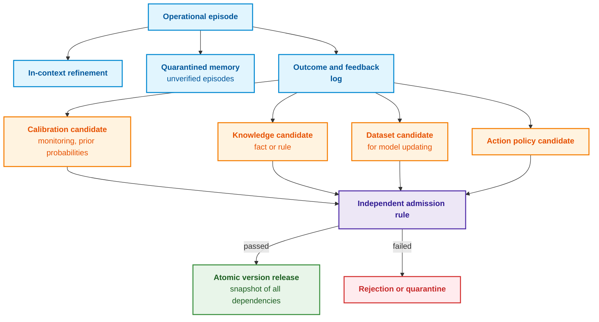
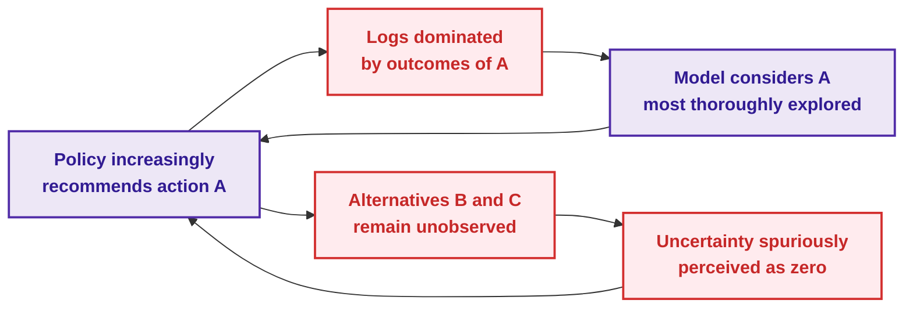
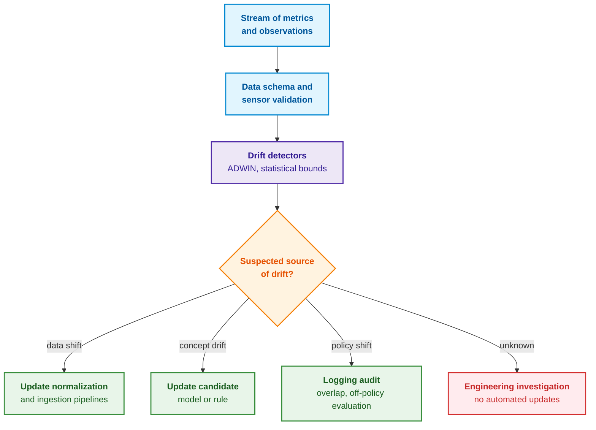
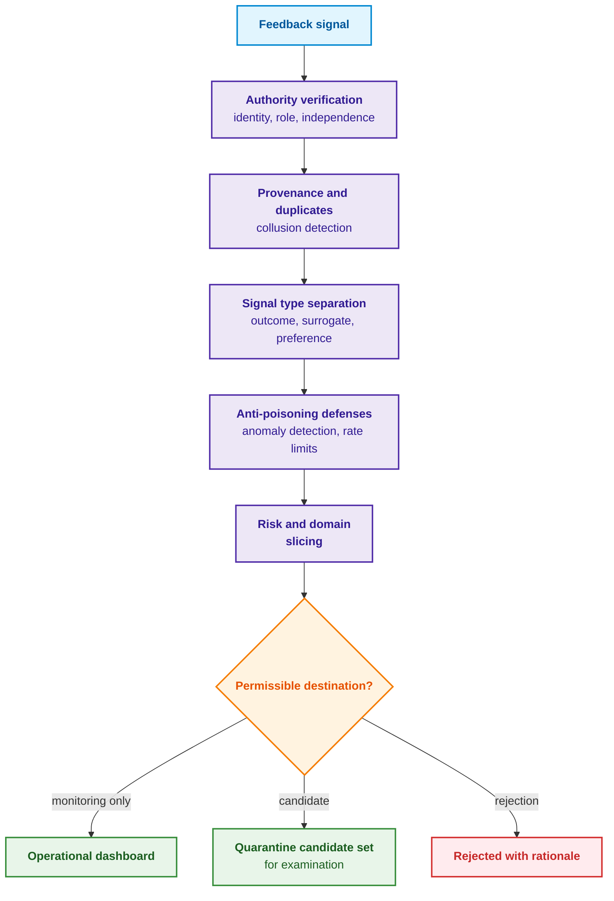

# Chapter 26. Continual Learning from Operational Experience and Mitigating System Log Bias

> **Book:** [Architecture of Evidence-Governed Expert Systems](README.md) · [Part VI: Neuro-Symbolic Models, Cognitive Frontiers, and Continuous Learning](part-06-frontiers-neuro-symbolic.md)  
> **Previous Chapter:** [Chapter 25. How Expert Systems Learn: Examination Matrices, Knowledge Audits, and Regression Control](ch25-how-expert-systems-learn.md)  
> **Next Chapter:** [Chapter 35. Reactive Expert Systems: Events, Revocation, and Knowledge Adaptation](ch35-self-organizing-expert-systems-synergetics-and-npu-runtime.md)  
> **Table of Contents:** [README.md](README.md)  
> **Author:** [Mykola Fedchyk](about-the-author.md)  
> **Target Level:** Intermediate and Advanced: knowledge engineers, machine learning engineers, researchers  
> **Expected Learning Outcomes:** Distinguish episodic memory from validated knowledge; record a training case with propensity scores and outcome arrival timestamps; detect self-logging bias and verify policy overlap prior to off-policy evaluation; discriminate covariate shift, prior shift, and concept drift; quantify catastrophic forgetting across historical evaluation slices; guide rule, case, and model candidates through an isolated qualification pipeline prior to atomic release.

## Abstract

Following hundreds of diagnostic episodes, an expert system notices an empirical regularity: inspecting a wiring connector frequently resolves a hardware fault. The expert system begins recommending this inspection as its primary action. Soon, the diagnostic logs are dominated by connector inspections and positive outcomes following reconnection, and the expert system becomes "convinced" that connector degradation constitutes the primary root cause of system failures. Meanwhile, alternative failure hypotheses ceased being evaluated altogether, leaving the system log devoid of any counter-evidence against the connector hypothesis.

This exemplifies the fundamental pathology of learning from operational experience: accumulated evidence is conditioned on prior recommendations, definitive outcomes materialize with non-trivial delays, and spurious feedback loops become self-reinforcing. This chapter resolves the foundational engineering challenge: **how can an expert system continually learn from operational deployment without permitting its own execution logs, user feedback, and language models to silently corrupt verified rules?** The central thesis of the chapter: **operational experience serves as a generator of candidates, not an authoritative source of knowledge. Runtime execution can automatically record episodes and formulate proposed modifications, but a candidate's epistemic status is promoted solely through independent qualification: accounting for data generation mechanics (propensities and policy overlap), discriminating distinct drift modalities, measuring forgetting across historical slices, and releasing modifications through the strict admission gates established in Chapter 25.**

[Chapter 3](ch03-beyond-reference-information-systems.md) established continuous learning as the disciplined aggregation of operational experience and the synthesis of verified candidate artifacts, rather than the arbitrary mutation of rules following each user interaction. [Chapter 25](ch25-how-expert-systems-learn.md) formalized the lifecycle "candidate → examination → release". This chapter examines the operational dynamics that occur **prior to candidate generation and between formal release cycles**: which operational signals qualify as definitive outcomes, how to detect subtle distribution drift, how to preserve competency across legacy operational modes, how to evaluate candidate policies against biased historical logs, and what it genuinely signifies when a "language model learns from its errors." This exposition articulates a rigorous learning architecture rather than an authorization for unchecked autonomous self-modification. Even methods equipped with formal mathematical guarantees remain valid strictly under their stated premises; systematic verification, safety reviews, and atomic rollback mechanisms remain non-negotiable operational responsibilities.

## 1. Chapter Navigation by Target Engineering Modification Object

Revising a symbolic fact or rule mandates an immutable incident log, an authoritative source, defined validity bounds, and the formal qualification protocol defined in [Chapter 25](ch25-how-expert-systems-learn.md). The mere ingestion of an execution trace does not alter a governing rule. Enhancing retrieval accuracy requires isolated validation of query formulations, ranking metrics, and source document validity. Adjusting neural model weights requires curated training data, drift diagnostics, and forgetting evaluations.

Logging propensity scores—the conditional probability of selecting an action under the deployed behavior policy—and verifying action overlap represent foundational prerequisites for the off-policy evaluation methods detailed below. These do not constitute universal prerequisites for every localized factual correction. If an alternative diagnostic action was never executed in operational practice, off-policy methods cannot reconstruct its counterfactual outcome without supplementary assumptions or experimental data. The advanced statistical sections may be referenced once the engineering team has formally identified which specific policy, classifier, or rule set is slated for adaptation.

## 2. Adaptation Levels and Mechanisms in Knowledge Systems

Episodic case records, operational statistics, symbolic rules, neural models, and diagnostic selection heuristics exhibit fundamentally disparate systemic blast radiuses. Recording an event merely preserves historical operational trace data, whereas deploying a new rule governs future automated decisions. The table below delineates six mechanisms of experience accumulation according to whether they maintain state across client requests, what architectural layer they mutate, and their primary operational risk.

| Mechanism | State Preserved Across Requests | Target of Modification | Primary Risk |
|---|---|---|---|
| In-context self-refinement | No | Working draft of response and context window | Model reinforces and confirms its own hallucinations |
| Episodic memory | Yes | Event logs and verbal reflections | Unverified text crystallizes into normative precedent |
| Operational statistics and calibration | Yes | Prior probabilities, decision thresholds, reliability diagrams | Unmonitored drift or biased empirical outcomes |
| Knowledge base revision | Yes | Facts, rules, domain exceptions, ontology | Logical contradictions and provenance loss |
| Continual model training | Yes | Weights of embedding models, classifiers, or language models | Catastrophic forgetting, data leakage |
| Action policy learning | Yes | Selection of diagnostic queries, physical tests, and actions | Dangerous exploration and positive feedback loops |

The initial two tiers are frequently conflated with genuine learning. Aman Madaan et al. demonstrated in the Self-Refine framework that a Large Language Model (LLM) can iteratively enhance its outputs via self-feedback without retraining or external supervision [[1]](#src-1). Noah Shinn et al. introduced Reflexion, which buffers verbal reflections on task failures within episodic memory without mutating underlying model weights [[2]](#src-2). While both paradigms empirically improve short-term task performance within their experimental scopes, neither produces verified, permanent knowledge for an expert system: a verbal reflection remains unverified natural language text. The following diagram illustrates where operational traces from an execution episode are dispatched and locates the singular bottleneck through which accumulated experience can transition into production baselines.



The fundamental architectural invariant of this diagram is that runtime execution may autonomously generate candidate artifacts, but can never promote their epistemic status. An episodic memory log does not constitute a valid rule; an operator's mouse click does not constitute a ground-truth gold label; and a successful API tool invocation does not establish a causal outcome. Prior to initiating any system update, the engineering team must resolve a singular question: is the system merely buffering an episode for subsequent offline analysis, or is it modifying an active rule that will govern subsequent inferences? The answer determines the requisite stringency of validation, which remains feasible only when execution episodes are recorded with sufficient contextual fidelity.

## 3. Capturing Learning Precedents and Accounting for Feedback Delays

To formally correlate an operational decision with a delayed outcome, the system ledger records action selection and outcome realization via the following formulation:

```math
a_t\sim\mu_t(a\mid x_t),
\qquad y_{t+d}\sim P(y\mid x_t,a_t,e_t).
```

- In this formulation, $t$ represents the discrete decision epoch, $`x_t`$ denotes the contextual feature vector, $`a_t`$ is the executed action, and $`\mu_t(a\mid x_t)`$ specifies the propensity of selecting action $a$ given context $`x_t`$;
- The operator $\sim$ denotes random sampling from the indicated conditional distribution, while $`P(y\mid x_t,a_t,e_t)`$ defines the conditional distribution of outcome $y$ given the context, action, and underlying environmental state;
- $`o_t`$ represents the immediate observation captured synchronously in the ledger, whereas $`y_{t+d}`$ denotes the definitive outcome, observable only after a latency of $d$ epochs;
- $`e_t`$ represents the environmental state, which is generally only partially observed.

This formulation indicates that the execution ledger logs the exact conditional probability with which the logging policy selected an action within a given context, subsequent to which it links that action with an outcome that materializes at a later time. All probabilities reside in the interval $[0, 1]$; this mathematical formalization does not imply that an outcome observed after an action constitutes causal proof. In the hardware diagnostics context of [Chapter 24](ch24-system-diagnosis.md), an action might entail capturing a synchronized rail voltage and clock trace, the intermediate outcome being an adjudicated root cause identified two days later, and the definitive outcome being warranty claim statistics aggregated over thirty days. A minimal structured feedback payload for such an episode is formatted as follows:

<details>
<summary>Structured JSON Representation</summary>

```json
{
  "episode_id": "diag:cold-start-failure:run-31",
  "decision_snapshot": "sha256:...",
  "behavior_policy": "test-policy@4.2",
  "context": "feature-vector-or-typed-facts-ref",
  "action": "synchronized_rail_clock_capture",
  "propensity": 0.42,
  "immediate_observation": "obs:trace:881",
  "delayed_outcomes": [
    {"type": "adjudicated_root_cause", "value": "connector", "at": "..."}
  ],
  "feedback_source": "reliability-review-board",
  "causal_status": "observational_after_intervention",
  "eligibility": "candidate_only"
}
```

</details>

The `propensity` field explicitly stores the conditional probability that the behavior policy would select this specific action in this specific context. Without recorded propensity scores, standard off-policy evaluation (OPE) techniques are mathematically inapplicable. If the operational policy is deterministic and never evaluated alternative diagnostic actions, the historical log contains zero empirical evidence regarding counterfactual outcomes, and no statistical estimator can reconstruct those unobserved outcomes ex nihilo. The `eligibility` attribute enforces that the record constitutes strictly a candidate artifact, while `causal_status` documents that the outcome represents an observational post-intervention measurement rather than a randomized controlled trial.

When learning cases and sensor streams originate from external sub-systems or edge processors, they must transit secured hardware attestation interfaces and role-based access lattices ([Chapter 33](ch33-inter-system-knowledge-exchange-and-model-teaching.md)). This guarantees that counterexamples do not harbor poisoned data or violate safety invariants before being admitted into the experience repository.

The sequence diagram below illustrates the chronological order in which the ledger aggregates the constituent components of an episode record.

```mermaid
sequenceDiagram
    autonumber
    accTitle: Sequence of recording feedback in the experience log
    accDescr: The expert system logs the context, action, and propensity; the environment appends immediate and delayed observations; the domain adjudicator adds corrections and an adjudicated verdict.
    participant S as Expert System
    participant E as Environment or Process
    participant H as Domain Adjudicator
    participant L as Feedback Log
    S->>L: Context, action, policy, propensity
    S->>E: Recommendation or controlled action
    E-->>L: Immediate observation
    H-->>L: Correction or override with rationale
    E-->>L: Delayed operational outcome
    H-->>L: Adjudicated verdict
    Note over L: Records are immutable; log maintains an audit trail
```

The episode record rigorously segregates the timestamp of decision execution from the timestamp when the outcome was verified. Failing to enforce this temporal distinction results in lookahead data leakage—training a model on outcomes that were unavailable when the decision was rendered—or erroneously misclassifying pending, unresolved episodes as negative diagnostic failures. The Python listing below demonstrates this operational disparity across six synthetic diagnostic episodes. The `label_available_at` attribute designates the discrete day on which the domain adjudicator validated the ground truth, where `None` indicates an unresolved episode. Requires Python 3.10 or later.

<details>
<summary>Python Implementation</summary>

```python
from dataclasses import dataclass


@dataclass(frozen=True)
class Episode:
    decided_at: int
    label_available_at: int | None
    correct: bool | None


def evaluate_at(cutoff, episodes):
    decided = [e for e in episodes if e.decided_at <= cutoff]
    if not decided:
        raise ValueError("no decisions before cutoff")
    for e in decided:
        if (e.label_available_at is None) != (e.correct is None):
            raise ValueError("label time and outcome must be both present or both absent")
        if e.label_available_at is not None and e.label_available_at < e.decided_at:
            raise ValueError("label cannot precede decision")
    resolved = [e for e in decided if e.label_available_at is not None and e.label_available_at <= cutoff]
    correct = sum(1 for e in resolved if e.correct)
    return {
        "decided": len(decided),
        "pending": len(decided) - len(resolved),
        "naive": correct / len(decided),
        "resolved_accuracy": correct / len(resolved) if resolved else None,
    }


EPISODES = [
    Episode(1, 3, True), Episode(2, 4, True), Episode(3, 5, False),
    Episode(4, 9, True), Episode(5, 10, True), Episode(6, None, None),
]

for day in (6, 10):
    print(day, evaluate_at(day, EPISODES))
```

</details>

The script emits the following output:

<details>
<summary>Example Data or Execution Output</summary>

```text
6 {'decided': 6, 'pending': 3, 'naive': 0.3333333333333333, 'resolved_accuracy': 0.6666666666666666}
10 {'decided': 6, 'pending': 1, 'naive': 0.6666666666666666, 'resolved_accuracy': 0.8}
```

</details>

On day 6, three episode outcomes remain pending. If unresolved cases are naively treated as diagnostic failures, the apparent accuracy evaluates to $0.333$; evaluated strictly across the three resolved episodes, accuracy evaluates to $0.667$. By day 10, only one episode remains pending, and accuracy across resolved cases reaches $0.8$. Neither metric represents the definitive operational capability: resolved cases may systematically differ from cases awaiting expert adjudication. A rigorous monitoring report must therefore explicitly convey the count of pending episodes and their latency distribution, rather than a single aggregated scalar. Such ledger records provide raw candidate data for subsequent verification; however, even pristine logs expose only the localized subspace of the environment that the expert system chose to explore.

## 4. System Log Bias and Off-Policy Evaluation

The operational environment encountered by an expert system tomorrow depends directly on the recommendations executed today. In sequential decision processes, the deployed logging policy $\mu$ induces its own state visitation distribution $`d^{\mu}(x)`$, whereas an alternative candidate policy $\pi$ may navigate into state spaces largely absent from the historical log:

```math
d^{\pi}(x)\ne d^{\mu}(x).
```

- In $`d^{\pi}(x)`$ and $`d^{\mu}(x)`$, the indices $\pi$ and $\mu$ denote the state visitation distributions induced under the target policy and logging policy, respectively;
- $x$ represents the environment state, while $`d^{\pi}(x)`$ and $`d^{\mu}(x)`$ represent the state probabilities under their respective policies;
- The inequality $\ne$ signifies that the two distributions diverge across the state space.

The direct engineering consequence is that an execution log generated by one policy may completely omit the states encountered under another. While each probability distribution sums to 1, this formula does not quantify the magnitude of divergence.

Stéphane Ross, Geoffrey Gordon, and Drew Bagnell established that violating the independent and identically distributed (i.i.d.) assumption causes imitation learning algorithms to compound errors over time, and proposed the DAgger (*Dataset Aggregation*) algorithm to collect expert labels on states visited by the evolving policy [[3]](#src-3). In safety-critical mission systems, however, one cannot intentionally guide an operational system into hazardous failure states solely to expand dataset coverage.

For logged contextual bandit decisions, the expected value of an alternative candidate policy $\pi$ can be estimated via Inverse Propensity Scoring (IPS):

```math
\widehat V_{\mathrm{IPS}}(\pi)=\frac{1}{N}\sum_{i=1}^{N}
\frac{\pi(a_i\mid x_i)}{\mu(a_i\mid x_i)}\,r_i.
```

- In this estimator, $N$ is the total count of logged episodes, and $i$ indexes an individual episode;
- $`x_i`$ denotes the context, $`a_i`$ the selected action, $`r_i`$ the observed scalar reward, and $\pi$ the target evaluation policy;
- $`\mu(a_i\mid x_i)`$ represents the propensity of action $`a_i`$ in the logging policy, and $`\pi(a_i\mid x_i)`$ is its probability under the target policy;
- Their quotient represents the importance sampling weight; $\sum_{i=1}^{N}$ aggregates the weighted rewards, and division by $N$ yields the sample mean;
- $`\widehat V_{\mathrm{IPS}}(\pi)`$ denotes the estimated value of the target policy.

Each logged episode is reweighted according to the ratio of the target policy to the logging policy. For instance, across two episodes with weights 2 and 1 and rewards 1 and 0, the estimate evaluates to $(2\cdot1 + 1\cdot0)/2 = 1$. The resulting value is expressed in reward units and strictly requires that the logging policy assigned non-zero probability to every action the target policy might select. The estimator formally requires accurate propensities and common support (*policy overlap*):

```math
\pi(a\mid x)>0\Rightarrow\mu(a\mid x)>0.
```

- In this condition, $`\pi(a\mid x)`$ denotes the probability of action $a$ under the target policy, and $`\mu(a\mid x)`$ denotes its probability under the logging policy;
- $x$ represents the context, $a$ the action, and $`>0`$ designates non-zero selection probability;
- The symbol $\Rightarrow$ denotes logical implication: if the target policy can select an action, the logging policy must also assign it non-zero probability.

Consequently, common support guarantees identifiability, but does not guarantee bounded variance: minuscule logging probabilities in the denominator generate massive importance weights.

Near-zero logging probabilities $`\mu(a_i\mid x_i)`$ inflate weights and destabilize variance. Weight clipping bounds variance at the expense of introducing estimation bias. Doubly robust estimators, developed by Miroslav Dudík, John Langford, and Lihong Li, combine an outcome reward model with propensity-score reweighting [[4]](#src-4), yet remain bounded by the underlying overlap assumptions. The volume of statistical information preserved following reweighting is quantified by the Effective Sample Size (ESS) for weights $`w_i`$, as formulated by Art B. Owen [[5]](#src-5):

```math
\mathrm{ESS}=\frac{\left(\sum_iw_i\right)^2}{\sum_iw_i^2}.
```

- Here, weights $`w_i`$ correspond to individual episodes $i$, and summations range over all $N$ logged episodes;
- The numerator squares the total sum of importance weights, while the denominator sums their squared values;
- $\mathrm{ESS}$ represents the effective sample size, quantifying the equivalent number of unweighted independent observations providing comparable statistical power.

**Actionable Engineering Conclusions (Closed-Loop Runtime Decision):**
1. **Policy Validation Dispatch Criteria:**
   - **If $\mathrm{ESS} / N \ge \tau_{\mathrm{ess}} = 0.30$ (effective sample size constitutes at least 30% of total log size $N$):** The off-policy value estimate $`\widehat V_{\mathrm{IPS}}(\pi)`$ is certified as statistically stable and admitted into engineering release decisions;
   - **If $\mathrm{ESS} / N < 0.30$:** The variance of importance weights $`w_i`$ is unacceptably high (a small number of rare episodes skew the estimate). Autonomous promotion is blocked, and the system automatically engages regularized Truncated IPS or a Doubly Robust Estimator.
2. **Worked Numerical Example:** For a sample of three episodes with weights 1, 1, and 2, the effective size evaluates to $\mathrm{ESS} = 4^2 / (1^2 + 1^2 + 2^2) = 16 / 6 \approx 2.67$. The relative efficiency evaluates to $\mathrm{ESS} / N = 2.67 / 3 \approx 0.89 \ge 0.30$. **System Action:** Weighting variance is stable; the sample efficiency threshold is cleared.

The following program reproduces the connector diagnostic failure scenario. There are two contexts (cold and warm) and three candidate initial diagnostic checks. Under cold conditions, inspecting the connector resolves the fault with probability $0.60$; under warm conditions, power supply verification performs best ($0.45$). The target policy selects the connector in the cold context and power verification in the warm context, yielding a true expected policy value of $0.5\cdot0.60 + 0.5\cdot0.45 = 0.525$. The program samples 200,000 episodes under two distinct logging policies and evaluates the target policy. Requires only the standard library of Python 3.10+.

<details>
<summary>Python Implementation</summary>

```python
"""System log bias and off-policy evaluation via inverse propensity scoring (IPS).

Standard library only, Python 3.10+.
"""
import random

ACTIONS = ("connector", "clock", "power")
CONTEXTS = ("cold", "warm")
# Probability that the first check identifies the failure, for each action under each condition
P_FOUND = {"cold": (0.60, 0.20, 0.20), "warm": (0.15, 0.40, 0.45)}
N = 200_000


def connector_only(context):
    return (1.0, 0.0, 0.0)


def connector_mostly(context):
    return (0.8, 0.1, 0.1)


def target(context):
    """Target policy: in cold inspect connector first, in warm inspect power."""
    return 0 if context == "cold" else 2


def collect(policy, rng):
    logs = []
    for _ in range(N):
        context = rng.choice(CONTEXTS)
        probs = policy(context)
        action = rng.choices(range(3), weights=probs)[0]
        reward = 1 if rng.random() < P_FOUND[context][action] else 0
        logs.append((context, action, probs[action], reward))
    return logs


def report(name, policy, logs):
    if not logs:
        raise ValueError("empty log")
    print(f"Log: {name}")
    counts = [sum(1 for _, a, _, _ in logs if a == i) for i in range(3)]
    print("  observations per action:", ", ".join(f"{ACTIONS[i]} {counts[i]}" for i in range(3)))
    supported = True
    for context in CONTEXTS:
        mu = policy(context)[target(context)]
        print(f"  overlap \"{context} -> {ACTIONS[target(context)]}\": mu = {mu:.2f}" + ("" if mu > 0 else "  NONE"))
        supported = supported and mu > 0
    if not supported:
        print("  IPS estimate unidentified: no policy overlap")
        return None
    matched = [r for x, a, _, r in logs if a == target(x)]
    weights = [1 / p if a == target(x) else 0.0 for x, a, p, _ in logs]
    if not matched or sum(weights) == 0:
        print("  estimate unavailable: no observed matches with target policy")
        return None
    ips = sum(w * r for w, (_, _, _, r) in zip(weights, logs)) / len(logs)
    ess = sum(weights) ** 2 / sum(w * w for w in weights)
    print(f"  naive estimate (mean among matches): {sum(matched) / len(matched):.3f}")
    print(f"  IPS estimate: {ips:.3f}; effective sample size {ess:.0f} of {len(logs)}")
    return ips, ess


def test_evaluation_guards():
    import contextlib
    import io

    with contextlib.redirect_stdout(io.StringIO()):
        assert report("unsupported", connector_only, [("cold", 0, 1.0, 1)]) is None
        assert report("no_matches", connector_mostly, [("warm", 1, 0.1, 1)]) is None
        estimate, effective_size = report("supported", connector_mostly, [("cold", 0, 0.8, 1)])
        assert estimate == 1.25 and effective_size == 1.0
        try:
            report("empty", connector_mostly, [])
        except ValueError:
            pass
        else:
            raise AssertionError("empty log accepted")


test_evaluation_guards()


true_value = sum(P_FOUND[c][target(c)] for c in CONTEXTS) / len(CONTEXTS)
print(f"True value of target policy: {true_value:.3f}")
rng = random.Random(26)
for name, policy in (("connector only", connector_only), ("connector in 80% of cases", connector_mostly)):
    print()
    report(name, policy, collect(policy, rng))
```

</details>

Executing `python log_bias.py` first evaluates three boundary test fixtures: absent overlap, zero observed matches with the target policy, and an empty dataset. Subsequently, the script prints:

<details>
<summary>Example Data or Execution Output</summary>

```text
True value of target policy: 0.525

Log: connector only
  observations per action: connector 200000, clock 0, power 0
  overlap "cold -> connector": mu = 1.00
  overlap "warm -> power": mu = 0.00  NONE
  IPS estimate unidentified: no policy overlap

Log: connector in 80% of cases
  observations per action: connector 159907, clock 20085, power 20008
  overlap "cold -> connector": mu = 0.80
  overlap "warm -> power": mu = 0.10
  naive estimate (mean among matches): 0.581
  IPS estimate: 0.524; effective sample size 35542 of 200000
```

</details>

The first dataset was compiled under a behavior policy that exclusively inspects the connector. For warm contexts, the target policy prescribes an action that never appears in the log; common support is violated, and the evaluator correctly refuses to output a numerical estimate. If this guard were omitted, the naive estimator would report $0.602$ (observing only cold episodes), while an unvalidated IPS estimator would emit $0.301$ (implicitly assigning zero value to warm episodes). Both values appear plausible, yet both are deeply flawed; verifying common support is an absolute prerequisite to off-policy estimation.

The second log reflects a policy exploring alternative checks in 20% of episodes with recorded propensities. Here, the naive match mean remains inflated ($0.581$) because cold matches occur eight times more frequently than warm matches; IPS accurately estimates $0.524$ against the true ground truth of $0.525$. The statistical cost of this correction is captured in the effective sample size: $\mathrm{ESS} = 35\,542$ out of $200\,000$ episodes, indicating that reweighting discarded more than 80% of the raw sample information.

This setup is intentionally simplified: contexts are binary, propensities are exact, and rewards are observed instantaneously. In production environments, propensities must be logged at decision time, and delayed outcomes require explicit bookkeeping of unresolved episodes. The diagram below depicts the hazardous reinforcement loop created by a policy lacking exploration.



Both cycles in the diagram loop back to the decision policy, reinforcing its bias. Dismantling this loop requires propensity logging, explicit uncertainty representations, bounded exploration within certified safety envelopes, expert-driven testing, hardware simulation, and prospective validation. For safety-critical actions, off-policy evaluation provides empirical evidence, not autonomous deployment authorization. Furthermore, even pristine logging cannot protect against an orthogonal hazard: the physical world described by the logs may itself shift.

## 5. Diagnostics and Discrimination of System Drift Types

Not every performance degradation warrants model retraining. João Gama et al., in their canonical survey on concept drift adaptation, distinguish several distinct modalities of distribution shift [[6]](#src-6). **Covariate drift** alters the marginal distribution of input features:

```math
P_t(X)\ne P_{t+1}(X).
```

- Covariate drift is governed by $`P_t(X)`$ and $`P_{t+1}(X)`$, which denote the input feature distributions at epochs $t$ and $t+1$;
- $X$ designates the input feature variable, and $\ne$ indicates that the distributions diverge.

In engineering practice, feature frequencies or multivariate combinations have shifted; probability values reside in $[0, 1]$, yet this formulation does not identify the underlying physical etiology.

**Prior (label) shift** alters the marginal distribution of target classes:

```math
P_t(Y)\ne P_{t+1}(Y).
```

- For prior shift, $`P_t(Y)`$ and $`P_{t+1}(Y)`$ represent target label distributions across epochs $t$ and $t+1$;
- $Y$ designates the outcome label variable, and $\ne$ marks distribution divergence.

Class priors have shifted, although the equation in isolation cannot discern the causal mechanism.

**Concept drift** alters the underlying conditional dependency of the target outcome given the input features:

```math
P_t(Y\mid X)\ne P_{t+1}(Y\mid X).
```

- Here, $`P_t(Y\mid X)`$ and $`P_{t+1}(Y\mid X)`$ denote the conditional distributions of label $Y$ given input $X$ across the two epochs;
- The symbol $\mid$ denotes conditioning, and $\ne$ indicates that the functional mapping from inputs to outcomes has mutated.

These three formulations formally distinguish mutations in inputs, class frequencies, and conditional relationships, but cannot identify the root cause of the shift.

A printed circuit board revision modifies $P(X)$, an alternative component vendor shifts fault priors $P(Y)$, and a redesigned firmware state machine fundamentally mutates the mapping from observed telemetry symptoms to hardware failures $P(Y\mid X)$. Upstream schema migrations, malfunctioning sensors, or modified annotation guidelines often mimic concept drift.

The ADWIN (*ADaptive WINdowing*) algorithm, developed by Albert Bifet and Ricard Gavaldà, maintains a variable-length sliding window, compares sub-window statistics, and issues an alert when the difference in sub-window means exceeds a bound derived from Hoeffding's inequality [[7]](#src-7). In simplified form, the cut-off threshold evaluates to:

```math
\epsilon=\sqrt{\frac{1}{2m}\ln\frac{2}{\delta}}.
```

- $\epsilon$ denotes the boundary threshold on the difference between sub-window means, matching the dimensional units of the metric;
- $m$ represents the effective sample size of the sub-window, while $\delta \in (0, 1)$ establishes the false alarm significance level; constants 1 and 2 are analytical parameters of the bound;
- $\ln$ denotes the natural logarithm, and the radical denotes the square root operation.

For representative parameters $m = 100$ and $\delta = 0.05$, the threshold evaluates to $\epsilon = \sqrt{\ln(40) / 200} \approx 0.136$. Decreasing $\delta$ tightens false alarm tolerances but inflates $\epsilon$, thereby delaying drift detection. Production ADWIN implementations utilize sharper analytical refinements; this closed-form expression highlights the core operational trade-off. The decision diagram below maps detector signals to concrete engineering interventions based on the identified drift modality.



A detector alert constitutes a diagnostic hypothesis, not definitive root-cause attribution. Prior to initiating any system update, engineers must investigate missing labels, temporal seasonality, product mix variations, recent canary deployments, and logging policy changes. Delayed outcomes can generate transient calibration degradation if pending episodes are prematurely recorded as failures.

### 5.1. Leading Indicators: Degradation Prior to the First Erroneous Response

Drift detectors and calibration tracking ([Chapter 25](ch25-how-expert-systems-learn.md)) react to measured performance degradation: examination pass rates drop, expected calibration error inflates, and human experts increasingly reject automated advice. By the time these lag indicators register, users have already encountered invalid or ungrounded responses. Knowledge base degradation typically originates much earlier: an industry standard is amended while the knowledge base retains the superseded edition; specialized vocabulary enters the domain; or user queries shift toward sparsely covered concepts. These shifts emit weak early signals prior to the collapse of primary metrics, allowing the expert system to proactively monitor them.

The concept of leading indicators is well established in complex systems theory. Marten Scheffer et al. demonstrated that prior to critical state transitions, ecological, climatic, and financial systems exhibit critical slowing down, manifesting as elevated variance and autocorrelation in observable state variables [[8]](#src-8). For an expert system, this analogy provides empirically testable indicator candidates, as detailed in the table below.

| Indicator | Metric Formulation | Rationale for Lead Time Over Errors |
|---|---|---|
| Domain confidence variance surge | Rolling-window variance of confidence scores within a specific domain under a stable mean | Queries begin probing knowledge boundaries while mean confidence remains temporarily buffered |
| Divergence between search matches and proven citations | Proportion of answers where lexical retrieval returns abundant matches, but grounded citation density collapses | Keyword overlap persists, but exact normative citations for amended provisions are absent |
| Query drift into knowledge-sparse regions | Proportion of queries addressing topics characterized by low Knowledge Density Index ([Chapter 32](ch32-high-performance-knowledge-packs-mmap-and-harvesting.md)) | Traffic shifts into poorly formalized domains prior to overt diagnostic failures |
| Surge in clarification dialogue turns | Mean count of disambiguation queries required before formulating a diagnostic recommendation | Internal terminology ceases to uniquely match emerging industry vocabulary |

These four indicators must be monitored for persistent statistical shifts rather than transient daily fluctuations. A sustained upward trend can be detected using the Cumulative Sum (CUSUM) control chart, introduced by E. S. Page for continuous industrial process monitoring [[9]](#src-9):

```math
S_t = \max\left(0,\; S_{t-1} + x_t - \mu_0 - k\right), \qquad S_0 = 0
```

Components of the CUSUM formulation:

- $`x_t`$ denotes the observed indicator at epoch $t$, such as daily confidence score variance;
- $`\mu_0`$ represents the baseline reference level estimated during a verified in-control period;
- $k$ is the allowance (slack) parameter: deviations smaller than $k$ are discarded; $k$ is typically set to half the shift magnitude targeted for detection;
- $`S_t`$ is the cumulative positive deviation, constrained to non-negative values, initialized at $`S_0 = 0`$;
- An out-of-control alarm triggers when $`S_t`$ exceeds decision threshold $h$, which establishes the operational trade-off between detection latency and false alarm rate.

The detector accumulates minor, persistent shifts above the baseline and triggers an alarm when the cumulative sum exceeds threshold $h$; isolated spikes do not trigger alarms because subsequent in-control epochs reset the sum to zero. For example, consider a battery management domain where the baseline variance during a stable month was $0.040$, with slack $k = 0.005$ and alarm threshold $h = 0.030$. Following the publication of an amended functional standard, daily variance values register at $0.046$, $0.049$, $0.052$, $0.055$, and $0.058$. The cumulative sum accumulates as follows: $0.001$, $0.005$, $0.012$, $0.022$, and $0.035$, breaching threshold $h$ on day 5. At this juncture, the examination pass rate on historical test suites may remain entirely unchanged.

Leading indicators can yield false alarms: a seasonal influx of queries regarding a novel product feature inflates variance without reflecting knowledge obsolescence. Therefore, a CUSUM alarm triggers an isolated investigation rather than automated retraining: dispatching a targeted audit across the affected domain slice and prompting the knowledge acquisition subsystem to harvest authoritative sources ([Chapter 10](ch10-knowledge-acquisition-systems.md)). An indicator's utility must be proven retrospectively: it is retained in production monitoring only if it historically preceded known incidents while generating minimal false alerts. When real drift is confirmed and an updated release candidate is prepared, the engineering focus shifts to the next hazard: will the new candidate degrade competency on established legacy operational modes?

## 6. Metrics for Quantifying Catastrophic Forgetting

Fine-tuning a model on recent operational data can optimize performance for hardware revision E while silently corrupting diagnostic accuracy for revision C. Such catastrophic forgetting must be rigorously measured across discrete tasks and evaluation slices. Arslan Chaudhry et al. formulated the average forgetting metric across $T$ sequential tasks as follows [[10]](#src-10):

```math
F_T=\frac{1}{T-1}\sum_{i=1}^{T-1}
\left(\max_{i\le k\le T-1}a_{k,i}-a_{T,i}\right).
```

where:

- $T$ denotes the total count of sequentially processed tasks, and $i$ indexes an individual historical task or domain slice;
- $`a_{k,i}`$ represents the performance metric on task $i$ after learning up to task $k$, while $`a_{T,i}`$ represents the performance on task $i$ after completing the final task $T$;
- $`\max_{i\le k\le T-1}`$ identifies the peak historical performance achieved on task $i$ across intermediate learning stages;
- $`\sum_{i=1}^{T-1}`$ sums performance degradation across all historical tasks, and dividing by $T-1$ yields the mean forgetting score;
- $`F_T`$ denotes the average forgetting score, expressed in the dimensional units of the underlying performance metric.

**Actionable Engineering Conclusions (Closed-Loop Runtime Decision):**
1. **Continual Learning Release Gate:**
   - **If $`F_T \le \tau_{\mathrm{forget}} = 0.02`$ and maximum performance drop on any individual critical slice $`\max_i (\dots) \le 0.05`$:** The updated knowledge base or model weights clear the regression gate and are admitted to canary deployment;
   - **If $`F_T > 0.02`$ or any protected safety slice registers a regression $> 0.05$:** Deployment of the new release candidate is categorically blocked. The system automatically activates a knowledge retention fallback: rebuilding the episodic replay buffer with historical samples increased to $25\%$ or increasing the EWC/L2 regularization hyperparameter to preserve critical parameter manifolds.
2. **Worked Numerical Example:** For $T = 4$ sequential tasks, observed performance drops across the three historical slices evaluate to: slice 1 drop $0.01$, slice 2 drop $0.00$, slice 3 drop $0.03$. Average forgetting evaluates to: $F_4 = \frac{0.01 + 0.00 + 0.03}{3} = \frac{0.04}{3} \approx 0.013 = 1.3\% \le 2.0\%$. Peak slice drop is $0.03 \le 0.05$. **System Action:** Regressions reside within permissible technical tolerances; the qualification gate approves candidate integration.

David Lopez-Paz and Marc'Aurelio Ranzato established complementary metrics for backward and forward transfer across sequential tasks [[11]](#src-11). Negative forgetting on an evaluation slice indicates that learning on a novel task generalized backward to enhance performance on legacy tasks. However, aggregate metrics must never conceal localized critical regressions. Forgetting must be computed globally for the entire expert system and decomposed across high-consequence operational slices: legacy hardware revisions, low-probability high-consequence failure modes, and peripheral vendor components. If performance across any of these protected slices deteriorates significantly, superior performance on recent mainstream data cannot justify production release.

## 7. Knowledge Retention Strategies in Continual Learning

When physical reality has demonstrably evolved, a new candidate version cannot be trained exclusively on recent operational cases. The updated release must preserve deterministic competence across operational envelopes that were critical yesterday, even if their operational occurrence has temporarily declined. Matthias De Lange et al., in their comprehensive taxonomic survey of continual learning, partition methodologies into three primary families [[12]](#src-12):

- **Replay-based approaches**, which interleave representative historical exemplars with novel operational cases;
- **Regularization-based approaches**, which penalize modifications to parameters deemed critical to legacy tasks, or enforce behavioral consistency via output distillation;
- **Parameter isolation approaches**, which dedicate distinct neural adapters, expert modules, or architectural branches to specific contexts or operational tasks.

The most widely adopted regularization method is Elastic Weight Consolidation (EWC), formulated by James Kirkpatrick et al., which introduces a quadratic penalty to the loss function [[13]](#src-13):

```math
\mathcal L(\theta)=\mathcal L_{\text{new}}(\theta)
+\frac{\lambda}{2}\sum_iF_i\left(\theta_i-\theta_i^*\right)^2.
```

- For parameter $`\theta_i`$, the scalar $`\theta_i^*`$ denotes its optimal value after training on the prior task, and $`F_i`$ represents the diagonal element of the Fisher Information Matrix approximating parameter importance;
- $`\mathcal L(\theta)`$ denotes the total regularized objective, $`\mathcal L_{\text{new}}(\theta)`$ is the loss on the novel task, and $`\sum_i`$ sums the penalties across all parameters;
- $\lambda \ge 0$ governs regularization strength, the squared difference penalizes drift from legacy parameters, and the factor $1/2$ scales the gradient.

For representative values $\lambda = 3$, $F_i = 2$, and $\theta_i - \theta_i^* = 0.1$, the penalty for a single parameter evaluates to $(3/2)\cdot2\cdot0.1^2 = 0.03$. Higher Fisher importance or larger parameter displacement generates an escalating penalty. EWC does not guarantee absolute immunity against forgetting in unconstrained domains: the method operates under specific Gaussian curvature assumptions and exhibits empirical bounds.

An exemplar replay buffer represents an architectural liability that demands explicit governance rather than treating it as an implementation detail. Retaining raw historical traces can violate data retention mandates, privacy regulations, or licensing terms, whereas synthetic generative replay can amplify the hallucinations of the teacher model. For an evidence-governed expert system, it is frequently far safer to avoid compressing volatile factual assertions into neural weights altogether, opting instead to update a versioned symbolic knowledge base or retrieval index, as recommended in [Chapter 25](ch25-how-expert-systems-learn.md).

## 8. Procedures for Updating Rules and Case Libraries

Symbolic rules and precedent libraries mandate a fundamentally different verification regime than continuous neural parameters. Engineers must establish not merely statistical accuracy, but formal operational boundaries, provenance chains, and downstream consequences for inferences that already depend on established knowledge.

**A precedent becomes validated knowledge only following rigorous outcome verification.** The classical Case-Based Reasoning (CBR) cycle, formulated by Agnar Aamodt and Enric Plaza, comprises four stages: Retrieve, Reuse, Revise, and Retain [[14]](#src-14). Case retrieval can be automated. However, retaining a case in the permanent library is permissible only after empirical outcome verification and formal review of its applicability envelope. A production precedent must encapsulate the original problem statement, operational context, executed action, empirical outcome, required adaptations, and any observed negative failure modes. Otherwise, the case library accumulates redundant success narratives that degrade retrieval latency without enhancing diagnostic power.

**A newly induced rule constitutes a candidate hypothesis, not an immutable law.** Inductive Logic Programming (ILP), pioneered by Stephen Muggleton, constructs a hypothesis $H$ that, in conjunction with background knowledge $B$, explains positive observations $`E^+`$ while entailing none of the negative observations $`E^-`$ [[15]](#src-15):

```math
B\cup H\models E^+,
\qquad
B\cup H\not\models E^-.
```

- In this formulation, $B$ denotes background knowledge, $H$ the candidate hypothesis, $`E^+`$ the set of positive examples, and $`E^-`$ the set of negative counterexamples;
- $\cup$ represents set union, $\models$ denotes semantic logical entailment, and $\not\models$ denotes non-entailment;
- Both relations collectively require that $B \cup H$ logically entails all positive examples while strictly precluding the entailment of any negative example.

This formulation demands complete coverage of positive exemplars with zero false positive derivations. In noisy operational environments, this strict criterion is relaxed to an optimization objective balancing coverage against empirical error. Even pristine empirical alignment does not transform $H$ into a causal invariant or a certified engineering standard. A candidate rule must be assigned provenance metadata, operational validity boundaries, explicit counterexamples, an assigned domain owner, and property-based test suites ([Chapter 23](ch23-knowledge-base-verification.md)).

**Revising a knowledge node impacts dependent inferences.** A Truth Maintenance System (TMS), introduced by Jon Doyle, formally tracks dependency graphs linking derived propositions to their foundational premises [[16]](#src-16). Introducing a novel fact can invalidate prior inferences that rested on superseded assumptions. An edge added to a knowledge graph lacking validity intervals and source versioning creates unmaintainable assertions, while ontology schema migrations must be verified independently from individual instance updates. The following diagram traces the pathway of candidate updates from verified episodes to an official knowledge base release.

```mermaid
flowchart LR
    accTitle: Review and admission of knowledge base update candidates
    accDescr: Validated episodes generate candidates that undergo provenance, consistency, and truth maintenance checks, invariant tests, and peer review before becoming a new knowledge base release or a recorded counterexample.

    F["<b>Validated episodes</b>"] --> GEN["<b>Candidate generation</b><br/>case, rule, graph edge"]
    GEN --> PROV["<b>Provenance verification</b><br/>validity bounds and authorship"]
    PROV --> CONS["<b>Consistency</b><br/>and truth maintenance"]
    CONS --> TEST["<b>Invariant testing</b><br/>mutations and counterexamples"]
    TEST --> EXP["<b>Expert review</b><br/>domain owner"]
    EXP -->|"admitted"| KB["<b>New knowledge base version</b>"]
    EXP -->|"rejected"| NEG["<b>Negative artifact</b><br/>recorded counterexample"]

    classDef inp fill:#e1f5fe,stroke:#0288d1,stroke-width:2px,color:#01579b;
    classDef test fill:#ede7f6,stroke:#512da8,stroke-width:2px,color:#311b92;
    classDef ok fill:#e8f5e9,stroke:#388e3c,stroke-width:2px,color:#1b5e20;
    classDef fail fill:#ffebee,stroke:#d32f2f,stroke-width:2px,color:#c62828;

    class F,GEN,PROV inp;
    class CONS,TEST,EXP test;
    class KB ok;
    class NEG fail;
```



A rejected candidate remains a valuable asset: the specific rationale for its rejection is formalized as a negative regression test and counterexample, rather than an unconstrained "never propose this again" heuristic. Rule modifications must preserve a transparent audit trail: what was modified, which test fixtures validated the change, where the rule does not apply, and who bears engineering responsibility for its introduction. This enables subsequent knowledge engineers to diagnose regressions without reverse-engineering fragmented execution logs.

## 9. Active Learning and Criteria for Expert Inquiries

Human expert validation is economically expensive; operational episodes must therefore be prioritized judiciously. Burr Settles, in his authoritative active learning survey, formalizes uncertainty sampling: querying labels for instances where the predictive entropy of the model is maximal [[17]](#src-17):

```math
H(Y\mid x)=-\sum_yP(y\mid x)\log P(y\mid x).
```

- Predictive entropy $H(Y\mid x)$ quantifies the uncertainty of label $Y$ given operational instance $x$;
- $P(y\mid x)$ denotes the predictive probability of class $y$ given instance $x$, and $\sum_y$ sums across all candidate labels;
- $\log$ represents the logarithm: base 2 yields information units in bits, while the natural base yields nats;
- The leading negation guarantees a non-negative entropy value for a properly normalized probability distribution.

For a binary classification task with balanced probabilities $0.5$ and $0.5$, entropy evaluates to 1 bit (base 2). By convention, $p\log p \to 0$ as $p \to 0$; entropy measures statistical uncertainty, not the operational utility or consequence of a decision error.

An outlier episode can exhibit extreme predictive entropy while being practically inconsequential to system reliability. The author proposes an actionable Value of Information criterion that prioritizes instances by their expected reduction in operational decision loss divided by the total cost of verification:

```math
x^*=\arg\max_{x\in U}
\frac{\mathbb E\left[\Delta L_{\text{decision}}\mid \text{label}(x)\right]}
{C_{\text{expert}}(x)+C_{\text{proof}}(x)+C_{\text{risk}}(x)}.
```

- The criterion identifies optimal case $`x^*`$ from the unannotated pool $U$;
- $\arg\max_{x\in U}$ selects the instance maximizing the objective ratio;
- $`\mathbb E[\Delta L_{\text{decision}}\mid\text{label}(x)]`$ denotes the expected reduction in operational decision loss conditioned on obtaining the label for $x$;
- $`C_{\text{expert}}(x)`$, $`C_{\text{proof}}(x)`$, and $`C_{\text{risk}}(x)`$ denote the costs of expert evaluation time, formal proof generation, and operational verification risk;
- The denominator represents the total verification expenditure, while the conditional expectation is computed across the predictive distribution of labels.

In operational deployment, the expert system routes to human experts the specific cases that offer the greatest expected risk reduction per unit expenditure. Costs must be calibrated on a commensurate scale, with a strictly positive denominator. The selection protocol must also enforce sample diversity, distributional representativeness, and data privacy. A domain specialist is not an infallible oracle: expert disagreements, abstentions, and boundaries of professional competence must be formally captured via the elicitation protocols established in [Chapter 11](ch11-knowledge-elicitation-from-experts.md). A model-generated label can never serve as independent verification for that same model. Human authority is engaged specifically where their verdict impacts high-consequence system behavior.

## 10. Recommender Performativity and Closing the Data Loop

When an expert system sequentially orchestrates diagnostic tests, operational utility cannot be measured by a simplistic "helpful" user button. Reward formulations must capture verified physical outcomes and potential destructive side effects. A rigorous metric for sequential action selection is Cumulative Regret, formalized by Tor Lattimore and Csaba Szepesvári as the foundational performance metric in multi-armed bandit theory [[18]](#src-18):

```math
\mathrm{Regret}_T=\sum_{t=1}^{T}\ell_t(a_t)
-\min_{a\in A}\sum_{t=1}^{T}\ell_t(a).
```

- In this formulation, $T$ denotes the total decision horizon, and $t$ indexes the current discrete epoch;
- $`a_t`$ denotes the executed action, $A$ represents the set of admissible actions, and $`\ell_t(a)`$ represents the loss incurred by action $a$ at epoch $t$;
- $`\sum_{t=1}^{T}`$ aggregates the losses over the operational horizon, while $`\min_{a\in A}`$ identifies the minimum cumulative loss achievable by a single static action in hindsight;
- $`\mathrm{Regret}_T`$ represents the difference between the total loss incurred by the policy and the optimal static action in hindsight.

For example, across two epochs, if the executed actions incur a cumulative loss of 3 while the best static action incurs 2, cumulative regret equals 1 unit of loss. In non-stationary environments, static benchmarks can be misleading; sublinear regret does not forgive a single catastrophic system failure, making the hard safety guards of [Chapter 21](ch21-from-recommendation-to-action.md) an absolute prerequisite.

Safe Policy Improvement benchmarks a candidate policy $\pi$ against the established baseline policy $`\pi_b`$ that generated the historical data. Romain Laroche, Paul Trichelair, and Rémi Tachet des Combes introduced Safe Policy Improvement with Baseline Bootstrapping (SPIBB), which constrains the candidate policy to fall back to baseline behavior in state-action regions where sample support is deficient, proving that the candidate policy cannot degrade baseline performance [[19]](#src-19). A practical qualification gate requires that the Lower Confidence Bound (LCB) of the value difference satisfies:

```math
\mathrm{LCB}_{1-\alpha}\left(V(\pi)-V(\pi_b)\right)\ge-\varepsilon
```

- In this formulation, $\pi$ is the candidate policy and $`\pi_b`$ is the operational baseline policy;
- $V(\pi)$ and $`V(\pi_b)`$ denote policy values, while $`\mathrm{LCB}_{1-\alpha}`$ designates the lower bound of the confidence interval at confidence level $1-\alpha$;
- $\alpha \in (0, 1)$ governs the error probability, and $\varepsilon$ defines the maximum allowable performance degradation;
- The inequality $\ge$ requires that the lower bound of the value difference does not fall below $-\varepsilon$.

For representative values $\mathrm{LCB} = -0.03$ and $\varepsilon = 0.05$, the safety inequality holds. Policy values and tolerance margins share identical dimensional units; empirical guarantees depend heavily on the underlying estimator and data coverage.

This statistical guarantee is conjoined with non-negotiable hard invariants:

```math
F_{\text{crit}}(\pi)=0,
\qquad \pi(a\mid x)=0\ \text{for forbidden pairs }(x,a).
```

- Here, $`F_{\text{crit}}(\pi)`$ denotes the count of critical failures under policy $\pi$, with equality to zero enforcing that no such failures occur;
- $`\pi(a\mid x)`$ is the probability of taking action $a$ in context $x$; for any forbidden pair $(x,a)$, this probability must be strictly zero;
- Both conditions must be satisfied simultaneously, with 0 denoting exact zero.

These safety constraints carry no units; their validity depends on comprehensive failure mode identification and certified negative action lists. Overall performance guarantees remain conditioned on estimator assumptions, data support, and environment stability. When policy overlap is absent, the candidate policy must fall back to the baseline or undergo hardware-in-the-loop simulation, shadow execution, and mandatory human sign-off. The diagnostic recommendations rendered by the system dictate which physical tests are executed and which operational truths become visible.

## 11. Reliability Limits of Language Models in Knowledge Generation

A Large Language Model can generate self-critiques, verbal reflections, synthetic training samples, or candidate rules. Every such artifact constitutes an unverified hypothesis wherein the generator and the evaluator share correlated failure modes. When a single model generates an output, grades it, and derives a supervisory label, errors compound rapidly. Every ingested signal must therefore be typed:

- `self_reflection`: Ephemeral scratchpad memory bound by a strict Time To Live (TTL);
- `user_feedback`: Signal originating from an authenticated identity with recorded context, but representing subjective perception rather than ground truth;
- `tool_result`: Deterministic observation governed by an API contract and explicit provenance;
- `verified_outcome`: Independently confirmed empirical outcome;
- `knowledge_candidate`: Formally structured modification proposal;
- `released_knowledge`: Production knowledge artifact admitted via formal release gates.

For local language models ([Chapter 12](ch12-linguistic-analysis-and-local-models.md)), memorization and privacy leakage remain critical threats: confidential operational episodes cannot be arbitrarily absorbed into parameter weights. Training sets assembled for model updates must undergo deduplication, contamination testing against evaluation suites, license validation, access control filtering, anti-poisoning defenses, and extraction vulnerability testing via canary strings.

### 11.1. Learning Distortion Induced by Unvalidated Feedback

When a performance metric becomes the sole objective of optimization, the expert system or its human operators inevitably optimize the surrogate proxy:

- An operator blindly confirms the primary recommendation to accelerate ticket resolution;
- The expert system abstains on difficult cases to artificially inflate accuracy on easy queries;
- An autonomous agent creates trivial sub-tasks and marks them as successful;
- A malicious actor injects synthetically duplicated episodes to bias prior distributions in retrieval or classification;
- An upstream process suppresses automated failure logs following an intervention;
- High user satisfaction ratings reward perceived model confidence rather than factual correctness.

Dario Amodei et al. classify such behaviors under the broader rubric of reward hacking, identified as one of five foundational challenges in machine learning safety [[20]](#src-20). The diagram below delineates the multi-tiered filtration gates through which operational feedback must transit before achieving candidate status.



Feedback authority is strongly typed. An end user possesses the authority to report that an explanation was ambiguous; a reliability board possesses the authority to certify a hardware failure root cause; and a safety manager possesses the authority to approve an operational policy. A massive volume of unverified low-privilege user signals must never override a single certified safety artifact. While language models and user feedback accelerate hypothesis generation, only reproducible physical evidence backed by an unbroken provenance chain warrants modifying production knowledge.

## 12. Qualification Pipeline for Admitting Candidates into Production

The architecture synthesizes the preceding concepts into an end-to-end qualification pipeline, spanning from ledger ingestion to production release.

```mermaid
flowchart LR
    accTitle: Rule base update release pipeline
    accDescr: An append-only ledger yields point-in-time features, drift and anomaly detectors trigger candidate generation, candidates undergo isolated updates, frozen replay evaluations, audits, shadow staging, and atomic release or rollback.

    LED["<b>Append-only ledger</b><br/>immutable episodes"] --> FEAT["<b>Point-in-time features</b><br/>no forward-looking leakage"]
    FEAT --> DET["<b>Drift and error<br/>detectors</b>"]
    DET --> GEN["<b>Candidate generation</b>"]
    GEN --> ISO["<b>Isolated update</b><br/>rule or model"]
    ISO --> EVAL["<b>Frozen replay evaluation</b><br/>off-policy scoring, invariants"]
    EVAL --> REV["<b>Audit and sign-off</b><br/>safety, domain authority"]
    REV -->|"passed"| SH["<b>Shadow and canary staging</b>"]
    REV -->|"failed"| REJ["<b>Rejection</b><br/>with counterexample"]
    SH --> GATE{"<b>Operational<br/>admission gate</b>"}
    GATE -->|"passed"| REL["<b>Atomic manifest release</b>"]
    GATE -->|"failed"| RB["<b>Rollback</b>"]

    classDef inp fill:#e1f5fe,stroke:#0288d1,stroke-width:2px,color:#01579b;
    classDef proc fill:#ede7f6,stroke:#512da8,stroke-width:2px,color:#311b92;
    classDef gate fill:#fff3e0,stroke:#f57c00,stroke-width:2px,color:#e65100;
    classDef ok fill:#e8f5e9,stroke:#388e3c,stroke-width:2px,color:#1b5e20;
    classDef fail fill:#ffebee,stroke:#d32f2f,stroke-width:2px,color:#c62828;

    class LED,FEAT,DET inp;
    class GEN,ISO,EVAL,REV proc;
    class GATE gate;
    class SH,REL ok;
    class REJ,RB fail;
```



A point-in-time join guarantees that feature extraction relies strictly on information that was available at the exact epoch of decision execution. The dataset manifest formally binds raw historical episodes, transformations, exclusions, and outcome resolution timestamps. Candidate versions are partitioned across architectural layers (`kb@8`, `retriever@5`, `calibration@3`, `model@12`, `policy@4`), and the production manifest binds an immutable snapshot of all dependencies, analogous to snapshot $`\mathcal{S}_v`$ in [Chapter 25](ch25-how-expert-systems-learn.md). The NIST AI RMF framework mandates post-deployment monitoring mechanisms to continuously collect and evaluate operational feedback (sub-category MANAGE 4.1) [[21]](#src-21); the pipeline depicted above implements this requirement while preventing unverified feedback from bypassing admission gates.

Different architectural layers operate on distinct adaptation cadences:

- A newly verified factual assertion can be deployed rapidly within narrow operational validity bounds;
- A calibration map is updated only after aggregating a statistically significant volume of resolved outcomes;
- A symbolic rule is modified following counterexample identification, domain expert sign-off, and regression suite execution;
- Neural model weights are updated infrequently due to forgetting risks, data leakage concerns, and the high cost of comprehensive re-qualification;
- A high-consequence operational policy is modified strictly after off-policy evaluation, hardware simulation, shadow staging, and safety board review.

## 13. Validating the Superiority of a New Version on Control Slices

Statistical accuracy alone is insufficient to justify releasing an updated version. The qualification protocol evaluates a multidimensional vector of system properties:

- Adaptation gain across novel operational slices;
- Backward transfer and catastrophic forgetting across legacy slices;
- Forward transfer to subsequent downstream tasks;
- Drift detection latency and false alarm rate;
- Outcome resolution latency distributions;
- Common support coverage and effective sample size in off-policy evaluations;
- Calibration curves and selective classification risk before and after the update;
- Critical safety regressions, privacy extraction vulnerabilities, and anti-poisoning resilience;
- Mean time to rollback and the reliability of atomic state restoration;
- Expert cognitive load and the marginal utility per hour of human review;
- Candidate throughput metrics: admitted, quarantined, expired, and rolled-back proposals.

Every release decision is governed by a multidimensional metric vector rather than a collapsed scalar score. Hard safety violations are never compensated for by latency gains. [Chapter 23](ch23-knowledge-base-verification.md) provides mutation, property-based, and formal SMT verification suites; [Chapter 25](ch25-how-expert-systems-learn.md) formalizes paired comparisons and admission gates; and this chapter adds temporal data isolation, feedback provenance, forgetting quantification, and policy-induced distribution shift mitigation.

## 14. Catalog of Common Continual Learning Pitfalls and Protective Barriers

Prior to approving a release candidate, engineering teams should evaluate historical anti-patterns where operational signals were misconstrued as verified truth. The table below catalogs recurring failure modes, their root causes, and corresponding architectural barriers.

| Failure Mode | Underlying Etiology | Architectural Countermeasure |
|---|---|---|
| User click designated as ground truth | Subjective preference or surrogate metric conflated with physical outcome | Strongly typed feedback privileges and formal expert adjudication |
| Policy trains exclusively on its own actions | Selection bias, complete absence of policy overlap | Propensity logging, safe exploratory checks, off-policy evaluation bounds |
| Pending delayed outcome misclassified as failure | Premature evaluation before episode outcome has resolved | Explicit separation of event time from label arrival, tracking unresolved cases |
| Detector alarm immediately triggers model retraining | Sensor failure, schema migration, or policy shift mimics concept drift | Root-cause analysis, sensor validation, and sliced distribution diagnostics |
| Updated model forgets legacy hardware revision | Stability-plasticity dilemma | Replay buffers, parameter regularization, adapter isolation, legacy slice gates |
| Model reflection recorded directly as knowledge | Unverified LLM self-critique treated as verified truth | Ephemeral memory with bounded TTL, mandatory candidate quarantine |
| Reward metric optimized directly | Reward hacking on surrogate metrics | Multi-source physical outcome verification, hard safety invariants |
| Candidate evaluates against its own training data | Correlated errors and test set contamination | Frozen gold sets, independent evaluators, blind expert review |
| Hotfix update cannot be rolled back | Knowledge state intertwined with runtime execution | Append-only ledger, immutable versioned manifests, atomic releases |

This catalog serves as an actionable checklist rather than a superficial compliance check. For every proposed system modification, the engineering team must demonstrate explicit test results, empirical metrics, and the architectural safeguards deployed to mitigate the identified risks.

## 15. Software Tooling for Continual Learning and Policy Evaluation

The theoretical mechanisms articulated in this chapter are implemented in established open-source frameworks. However, software tools automate statistical calculations, not the underlying operational assumptions. The engineering team must first formalize outcome definitions, latency distributions, evaluation slices, and propensity logs before selecting a software library.

| Framework | Operational Engineering Role | Responsibilities Remaining with Engineering Team |
|---|---|---|
| River | Online streaming evaluation via "predict-then-train" with explicit label delay parameters [[22]](#src-22) | Outcome arrival timestamps, pending episode management, forbidding automated threshold mutations |
| Avalanche | Continual learning benchmark scenarios, replay/regularization strategies, PyTorch evaluation metrics [[23]](#src-23) | Structuring sequential learning stages to reflect physical hardware revisions, operating regimes, and temporal epochs |
| Open Bandit Pipeline | Synthetic bandit generation, IPW, DM, and DR estimators, off-policy evaluation benchmarking [[24]](#src-24) | Ensuring accurate propensities, verifying policy overlap, ruling out unobserved confounding factors |

River's `progressive_val_score` function enforces a strict "test-then-train" streaming paradigm, revealing target labels to the model strictly after a designated temporal delay [[22]](#src-22). This provides a practical implementation of the "no-lookahead" temporal principle. In an expert system, this delay cannot be chosen arbitrarily: it must be derived from empirical ledgers tracking the time required for lab bench verification or expert adjudication.

Avalanche, developed by Antonio Carta, Lorenzo Pellegrini, et al., provides continual learning streams, retention strategies, and evaluation protocols built on PyTorch [[23]](#src-23). Its primary value in expert system engineering lies in experimental discipline: after each learning phase, the evaluation matrix is computed across all historical and novel slices, directly quantifying forgetting, backward transfer, and forward transfer. Alternatively, parameter isolation architectures can maintain dedicated neural adapters per hardware revision, though selecting the appropriate adapter introduces an additional routing component that requires verification.

Open Bandit Pipeline, authored by Yuta Saito et al., provides synthetic bandit environments and standardized off-policy estimators [[24]](#src-24). Synthetic evaluation answers a targeted question: can the estimator recover the true policy value under known degrees of policy overlap, observation noise, and propensity estimation error? However, an empirical evaluation on historical diagnostic logs provides statistical evidence, not autonomous authorization to deploy a modified diagnostic policy.

Data mining provides two particularly valuable diagnostic techniques. The first analyzes frequent sequence patterns in diagnostic logs to identify where operational policies fail to explore alternatives. The second tracks candidate throughput metrics: identifying which signal sources consistently yield approved knowledge modifications versus those that trigger frequent rejections. Both techniques generate hypotheses for human review and never replace formal domain validation.

A successful synthetic experiment with delayed labels, policy overlap, drift, or catastrophic forgetting validates an algorithm's behavior under known assumptions; it does not eliminate the necessity for evaluation on real operational logs and formal expert admission.

## 16. Architectural Separation of Rigorous Audits and Advisory Modes

Continual learning accentuates the operational tension between two distinct usage modes of an expert system. During a formal certification audit, every conclusion must be anchored in an immutable source citation; if a fact is missing or ambiguous, the system must emit a typed refusal. During preliminary engineering design or root-cause troubleshooting, by contrast, engineers actively solicit exploratory hypotheses: "what timeout is standardly configured in related communication protocols?" or "if sensor supply voltage does not drop below 3.3V, is the fault state reachable?". Conflating these modes in a single response stream destroys auditor trust by mixing normative facts with speculative conjectures.

The solution is strict architectural decoupling. A response generated in advisory mode comprises two clearly delimited payloads: a rigorous core, where every assertion is backed by a cryptographic source hash or replaced by a typed refusal, and a clearly labeled exploratory block. Exploratory hypotheses are classified into three types: inductive generalizations derived from similar subsystems, deductive inferences derived from explicit working assumptions, and analogies to verified precedents. Every hypothesis specifies an operational conversion criterion: which bench test must be performed, which clause of a standard must be retrieved, and who must sign off before the proposition can be admitted into the knowledge base. Advisory mode thus operates as a disciplined generator of candidates for the qualification cycle of this chapter, rather than an unmonitored backdoor bypassing it. A detailed architecture for dual-mode expert systems is established in [Chapter 28](ch28-dual-mode-expert-systems.md), and its integration with local language models is explored in [Chapter 29](ch29-neuro-symbolic-architecture.md).

## 17. Practical Protocol for Safe Deployment of Continual Learning

Engineering teams should initiate continual learning on a single, low-consequence operational decision associated with a verifiable outcome. For this decision, the ledger records context, action, policy version, propensity, and exact timestamps, while user reactions, intermediate telemetry, and confirmed physical outcomes are typed separately. Candidate modifications are isolated in quarantine, datasets are partitioned temporally, and candidate behavior is benchmarked against an immutable production baseline. Validation encompasses legacy and novel slices, probability calibration, catastrophic forgetting, safety invariants, and policy overlap bounds. Only after shadow staging with instantaneous rollback capabilities should automated admission be considered for narrow, bounded subdomains.

In the end-to-end Power Distribution Unit (PDU) case study from [Chapter 22](ch22-cybernetics-edge-to-backend.md), the expert system aggregates verified operational cases and identifies that connector protection false alarms occur predominantly at sub-zero temperatures on board revision `Rev_B`. The expert system formulates a candidate modification adjusting the thermal threshold for that specific revision. An examination matrix verifies that revisions `Rev_A` and `Rev_C`, as well as cases with measurement noise, experience zero regression. The sequence of diagnostic checks is modified independently: prioritizing connector inspections must never displace synchronized oscilloscope measurements in transient failure scenarios where high-speed glitches could be permanently lost.

## Conclusions

The foundational inquiry of this chapter is resolved as follows: an expert system learns from operational experience safely when experience is treated as a generator of candidates, not an authoritative source of truth. Runtime execution logs episodes with context, propensities, and outcome resolution timestamps, whereas a candidate's epistemic status is promoted solely through independent qualification adhering to the strict admission gates established for all knowledge updates.

This chapter has detailed the mechanisms through which operational experience misleads an expert system, along with rigorous engineering defenses for each. The off-policy evaluation example demonstrated that a log generated by a deterministic policy cannot evaluate an alternative: the evaluator refuses to output a value, whereas unvalidated naive ($0.602$) or naive IPS ($0.301$) estimates would have been deeply misleading relative to the true ground truth ($0.525$). A log incorporating exploration and known propensities yielded an accurate IPS estimate ($0.524$), albeit at the cost of reducing the effective sample size to $35\,542$ out of $200\,000$ episodes. Discriminating covariate drift, prior shift, and concept drift illustrated why detector alerts constitute diagnostic hypotheses; leading indicators monitored via CUSUM demonstrated how knowledge degradation can be identified prior to the collapse of primary accuracy metrics; and forgetting metrics established how to verify that an updated version has not degraded legacy competence. For rules, precedents, and language models, the chapter enforced a singular invariant: runtime execution proposes, while independent verification disposes.

The methodological limitations of this chapter are clear. Numerical demonstrations are synthetic, and off-policy estimators remain valid strictly under accurate propensities, common support, and unconfoundedness. Safe policy improvement guarantees depend on theoretical assumptions and sample coverage. Drift detectors exhibit false alarms and detection delays, while forgetting metrics depend on chosen evaluation slices. None of these statistical methods eliminates the necessity for human expert review and atomic rollback capabilities.

### Summary of the Verification and Learning Trajectory

Chapters 23 and 36 formalize the verification of symbolic rules and their interactions. Chapter 24 decouples external equipment diagnostics from knowledge base verification. Chapters 25 and 26 combine independent examinations, governed releases, and the analysis of biased operational logs. A candidate extracted from execution logs never becomes a normative rule through mere frequency of occurrence.

### Further Trajectory of Inquiry

The subsequent thematic chapters, [27](ch27-safety-case-gsn-synthesis.md) and [30](ch30-safety-cybersecurity-co-engineering.md), translate verification artifacts into structured Goal Structuring Notation (GSN) safety cases and co-engineered risk frameworks. [Part VI](part-06-frontiers-neuro-symbolic.md) investigates strict verification versus exploratory advisory hypotheses and hallucination mitigation; runtime deployment and inter-system knowledge exchange are addressed in [Part VII](part-07-runtime-and-knowledge-exchange.md).

## Self-Examination Questions

1. How does the episodic memory of a language agent like Reflexion differ fundamentally from validated knowledge in an expert system?
2. Which fields in a feedback record are mandatory for off-policy evaluation, and why must outcome resolution timestamps be recorded separately from decision timestamps?
3. Why did the deterministic logging policy in the connector diagnostic example yield two distinct, yet equally flawed, off-policy estimates?
4. What is the operational significance of an effective sample size of 35,542 out of 200,000 episodes, and how does it influence confidence in an IPS estimate?
5. Provide concrete examples of covariate drift, prior shift, and concept drift in an electronic control unit, and explain why a drift detector alert does not establish root cause.
6. How does a leading indicator differ from a lagging examination pass rate, and why does a CUSUM alarm trigger a targeted investigation rather than automated retraining?
7. How is average forgetting computed according to Chaudhry et al., and why does an aggregate score across all slices fail to guarantee safety on critical slices?
8. Why can precedent retrieval be automated, whereas precedent retention in a case library requires formal validation?
9. Why must a large volume of positive user ratings never override a single verified safety counterexample?
10. What operational role is served by defining explicit criteria for converting an advisory hypothesis into an established fact?
11. In the delayed-label example, why were both the naive accuracy (0.333) and the resolved accuracy (0.667) on day 6 unrepresentative of true system capability?

## Glossary

| Term | English Equivalent | Definition |
|---|---|---|
| Неперервне навчання | Continual learning | Learning across a sequence of tasks or data streams without degrading prior competencies |
| Епізодична пам'ять | Episodic memory | Storage of unverified individual execution traces, observations, or verbal reflections |
| Політика журналювання | Behavior (logging) policy | The operational policy under which the expert system selected actions during data collection |
| Пропенситі | Propensity | The conditional probability that the logging policy selected a specific action in a given context |
| Перекриття політик | Overlap (common support) | The condition requiring that every action selectable by the target policy has non-zero probability under the logging policy |
| Оцінювання поза політикою | Off-policy evaluation | Evaluating the expected performance of a target policy using data logged by a distinct behavior policy |
| Зважування за оберненою пропенситі | Inverse propensity scoring | An estimator reweighting observed rewards by the ratio of target to logging policy probabilities |
| Двічі робастна оцінка | Doubly robust estimator | An estimator combining an outcome reward model with propensity-score reweighting |
| Ефективний розмір вибірки | Effective sample size | The equivalent count of unweighted, independent observations carrying comparable statistical power |
| Коваріатний дрейф | Covariate drift | A shift in the marginal distribution of input features $P(X)$ |
| Зсув апріорних частот | Prior (label) shift | A shift in the marginal distribution of target labels $P(Y)$ |
| Дрейф концепту | Concept drift | A shift in the conditional distribution of target labels given input features $P(Y\mid X)$ |
| Випереджальний індикатор | Leading indicator | An operational variable exhibiting measurable change prior to the degradation of primary performance metrics |
| Кумулятивна сума | Cumulative sum (CUSUM) | A sequential analysis technique detecting persistent small shifts in a process mean by accumulating deviations from a target baseline |
| Катастрофічне забування | Catastrophic forgetting | The abrupt loss of competence on legacy tasks following training on novel data |
| Перенесення назад | Backward transfer | The empirical impact of learning a novel task on performance across previously learned tasks |
| Повторне відтворення | Replay | Interleaving representative historical exemplars with novel training data during learning |
| Пружна консолідація ваг | Elastic weight consolidation | A regularization technique penalizing modifications to parameters critical to historical tasks |
| Міркування за прецедентами | Case-based reasoning | Solving novel operational problems by retrieving, adapting, and retaining verified historical cases |
| Індуктивне логічне програмування | Inductive logic programming | Machine learning paradigm inducing formal logical rules from background knowledge and empirical examples |
| Система підтримання істинності | Truth maintenance system | A reasoning subsystem tracking dependency graphs between derived propositions and foundational assumptions |
| Вибір за невизначеністю | Uncertainty sampling | Active learning query strategy soliciting labels for instances where model predictive uncertainty is maximal |
| Накопичений програш | Regret | The difference between the cumulative loss incurred by an operational policy and the optimal static action in hindsight |
| Безпечне поліпшення політики | Safe policy improvement | Reinforcement learning algorithms guaranteeing that an updated policy does not degrade baseline performance |
| Обхід винагороди | Reward hacking | Exploitation of discrepancies between a surrogate objective function and the true operational goal |
| Об'єднання на момент рішення | Point-in-time join | Assembling feature vectors strictly from data that was available at the exact epoch of decision execution |
| Відкладена мітка | Delayed label | Ground-truth outcome that materializes with a temporal lag following decision execution |
| Послідовне оцінювання | Progressive validation | Streaming evaluation protocol where an instance is first predicted, evaluated, and subsequently ingested for learning |
| Отруєння знань | Knowledge poisoning | Malicious or erroneous injection of corrupted facts designed to compromise deductive reasoning |
| Шлюз вхідного контролю | Admission controller | Software component enforcing signature verification, axiomatic validation, and compatibility checks prior to knowledge ingestion |

## Abbreviations

| Abbreviation | Expansion | Meaning |
|---|---|---|
| ADWIN | ADaptive WINdowing | Adaptive sliding-window drift detection algorithm |
| AI RMF | Artificial Intelligence Risk Management Framework | NIST framework for managing artificial intelligence risks |
| CBR | Case-Based Reasoning | Problem solving via retrieval and adaptation of verified precedents |
| CUSUM | Cumulative Sum | Sequential analysis technique for detecting shifts in process mean |
| DAgger | Dataset Aggregation | Iterative imitation learning algorithm mitigating compounding error |
| DM | Direct Method | Direct policy evaluation via an estimated reward model |
| DR | Doubly Robust | Policy evaluation combining reward modeling with propensity reweighting |
| ESS | Effective Sample Size | Equivalent unweighted sample size metric |
| EWC | Elastic Weight Consolidation | Parameter regularization technique mitigating catastrophic forgetting |
| ILP | Inductive Logic Programming | Symbolic machine learning inducing formal logical rules |
| IPS | Inverse Propensity Scoring | Off-policy evaluation via importance weight reweighting |
| IPW | Inverse Probability Weighting | Importance weighting terminology equivalent to IPS |
| KDI | Knowledge Density Index | Metric quantifying structural knowledge density across a corpus |
| JSON | JavaScript Object Notation | Structured text format for data interchange |
| LCB | Lower Confidence Bound | Lower boundary of a statistical confidence interval |
| LLM | Large Language Model | Deep autoregressive neural language model |
| NIST | National Institute of Standards and Technology | United States standards and technology agency |
| OPE | Off-Policy Evaluation | Statistical evaluation of a policy from historical logged data |
| SPIBB | Safe Policy Improvement with Baseline Bootstrapping | Safe reinforcement learning algorithm bounded by baseline support |
| TMS | Truth Maintenance System | Dependency-directed propositional truth maintenance subsystem |
| TTL | Time To Live | Explicit lifespan expiration limit assigned to ephemeral records |

## References

1. <a id="src-1"></a>Aman Madaan, Niket Tandon, Prakhar Gupta, Skyler Hallinan, Luyu Gao, Sarah Wiegreffe, Uri Alon, Nouha Dziri, Shrimai Prabhumoye, Yiming Yang, Shashank Gupta, Bodhisattwa Prasad Majumder, Katherine Hermann, Sean Welleck, Amir Yazdanbakhsh, Peter Clark. [*Self-Refine: Iterative Refinement with Self-Feedback*](https://papers.neurips.cc/paper_files/paper/2023/hash/91edff07232fb1b55a505a9e9f6c0ff3-Abstract-Conference.html). NeurIPS, 2023.
2. <a id="src-2"></a>Noah Shinn, Federico Cassano, Ashwin Gopinath, Karthik Narasimhan, Shunyu Yao. [*Reflexion: Language Agents with Verbal Reinforcement Learning*](https://papers.neurips.cc/paper_files/paper/2023/hash/1b44b878bb782e6954cd888628510e90-Abstract-Conference.html). NeurIPS, 2023.
3. <a id="src-3"></a>Stéphane Ross, Geoffrey Gordon, Drew Bagnell. [*A Reduction of Imitation Learning and Structured Prediction to No-Regret Online Learning*](https://proceedings.mlr.press/v15/ross11a.html). AISTATS, PMLR 15, 627–635, 2011.
4. <a id="src-4"></a>Miroslav Dudík, John Langford, Lihong Li. [*Doubly Robust Policy Evaluation and Learning*](https://arxiv.org/abs/1103.4601). ICML, 2011.
5. <a id="src-5"></a>Art B. Owen. [*Monte Carlo Theory, Methods and Examples. Chapter 9: Importance Sampling*](https://artowen.su.domains/mc/Ch-var-is.pdf). 2013.
6. <a id="src-6"></a>João Gama, Indrė Žliobaitė, Albert Bifet, Mykola Pechenizkiy, Abdelhamid Bouchachia. [*A Survey on Concept Drift Adaptation*](https://doi.org/10.1145/2523813). *ACM Computing Surveys*, 46(4), 1–37, 2014.
7. <a id="src-7"></a>Albert Bifet, Ricard Gavaldà. [*Learning from Time-Changing Data with Adaptive Windowing*](https://doi.org/10.1137/1.9781611972771.42). SIAM International Conference on Data Mining, 443–448, 2007.
8. <a id="src-8"></a>Marten Scheffer, Jordi Bascompte, William A. Brock, Victor Brovkin, Stephen R. Carpenter, Vasilis Dakos, Hermann Held, Egbert H. van Nes, Max Rietkerk, George Sugihara. [*Early-Warning Signals for Critical Transitions*](https://doi.org/10.1038/nature08227). *Nature*, 461, 53–59, 2009.
9. <a id="src-9"></a>E. S. Page. [*Continuous Inspection Schemes*](https://doi.org/10.1093/biomet/41.1-2.100). *Biometrika*, 41(1–2), 100–115, 1954.
10. <a id="src-10"></a>Arslan Chaudhry, Puneet K. Dokania, Thalaiyasingam Ajanthan, Philip H. S. Torr. [*Riemannian Walk for Incremental Learning: Understanding Forgetting and Intransigence*](https://doi.org/10.1007/978-3-030-01252-6_33). ECCV, LNCS, 556–572, 2018.
11. <a id="src-11"></a>David Lopez-Paz, Marc'Aurelio Ranzato. [*Gradient Episodic Memory for Continual Learning*](https://papers.nips.cc/paper_files/paper/2017/hash/f87522788a2be2d171666752f97ddebb-Abstract.html). NeurIPS, 2017.
12. <a id="src-12"></a>Matthias De Lange, Rahaf Aljundi, Marc Masana, Sarah Parisot, Xu Jia, Aleš Leonardis, Greg Slabaugh, Tinne Tuytelaars. [*A Continual Learning Survey: Defying Forgetting in Classification Tasks*](https://doi.org/10.1109/TPAMI.2021.3057446). *IEEE Transactions on Pattern Analysis and Machine Intelligence*, 2021.
13. <a id="src-13"></a>James Kirkpatrick, Razvan Pascanu, Neil Rabinowitz, Joel Veness, Guillaume Desjardins et al. [*Overcoming Catastrophic Forgetting in Neural Networks*](https://doi.org/10.1073/pnas.1611835114). *PNAS*, 114(13), 3521–3526, 2017.
14. <a id="src-14"></a>Agnar Aamodt, Enric Plaza. [*Case-Based Reasoning: Foundational Issues, Methodological Variations, and System Approaches*](https://doi.org/10.3233/AIC-1994-7104). *AI Communications*, 7(1), 39–59, 1994.
15. <a id="src-15"></a>Stephen Muggleton. [*Inductive Logic Programming*](https://doi.org/10.1007/BF03037089). *New Generation Computing*, 8(4), 295–318, 1991.
16. <a id="src-16"></a>Jon Doyle. [*A Truth Maintenance System*](https://doi.org/10.1016/0004-3702(79)90008-0). *Artificial Intelligence*, 12(3), 231–272, 1979.
17. <a id="src-17"></a>Burr Settles. [*Active Learning Literature Survey*](https://minds.wisconsin.edu/handle/1793/60660). Computer Sciences Technical Report 1648, University of Wisconsin–Madison, 2009.
18. <a id="src-18"></a>Tor Lattimore, Csaba Szepesvári. [*Bandit Algorithms*](https://doi.org/10.1017/9781108571401). Cambridge University Press, 2020.
19. <a id="src-19"></a>Romain Laroche, Paul Trichelair, Rémi Tachet des Combes. [*Safe Policy Improvement with Baseline Bootstrapping*](https://proceedings.mlr.press/v97/laroche19a.html). ICML, PMLR 97, 2019.
20. <a id="src-20"></a>Dario Amodei, Chris Olah, Jacob Steinhardt, Paul Christiano, John Schulman, Dan Mané. [*Concrete Problems in AI Safety*](https://arxiv.org/abs/1606.06565). arXiv:1606.06565, 2016.
21. <a id="src-21"></a>Elham Tabassi. [*Artificial Intelligence Risk Management Framework (AI RMF 1.0)*](https://doi.org/10.6028/NIST.AI.100-1). NIST AI 100-1, 2023.
22. <a id="src-22"></a>River Contributors. [*progressive_val_score*](https://riverml.xyz/latest/api/evaluate/progressive-val-score/). River Documentation.
23. <a id="src-23"></a>Antonio Carta, Lorenzo Pellegrini, Andrea Cossu, Hamed Hemati, Vincenzo Lomonaco. [*Avalanche: A PyTorch Library for Deep Continual Learning*](https://jmlr.org/papers/v24/23-0130.html). *Journal of Machine Learning Research*, 24(363), 1–6, 2023.
24. <a id="src-24"></a>Yuta Saito, Shunsuke Aihara, Megumi Matsutani, Yusuke Narita. [*Open Bandit Dataset and Pipeline: Towards Realistic and Reproducible Off-Policy Evaluation*](https://datasets-benchmarks-proceedings.neurips.cc/paper/2021/hash/33e75ff09dd601bbe69f351039152189-Abstract-round2.html). NeurIPS Datasets and Benchmarks Track, 2021.

---

[← Chapter 25](ch25-how-expert-systems-learn.md) | [Table of Contents](README.md) | [Part VI](part-06-frontiers-neuro-symbolic.md) | [Chapter 35 →](ch35-self-organizing-expert-systems-synergetics-and-npu-runtime.md)
