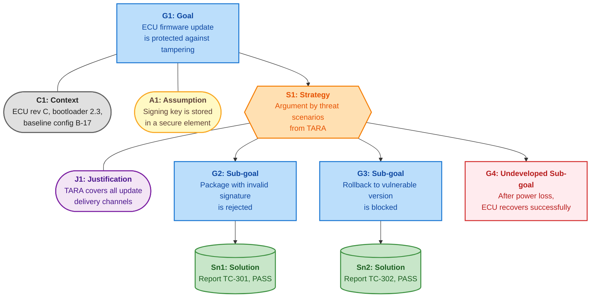
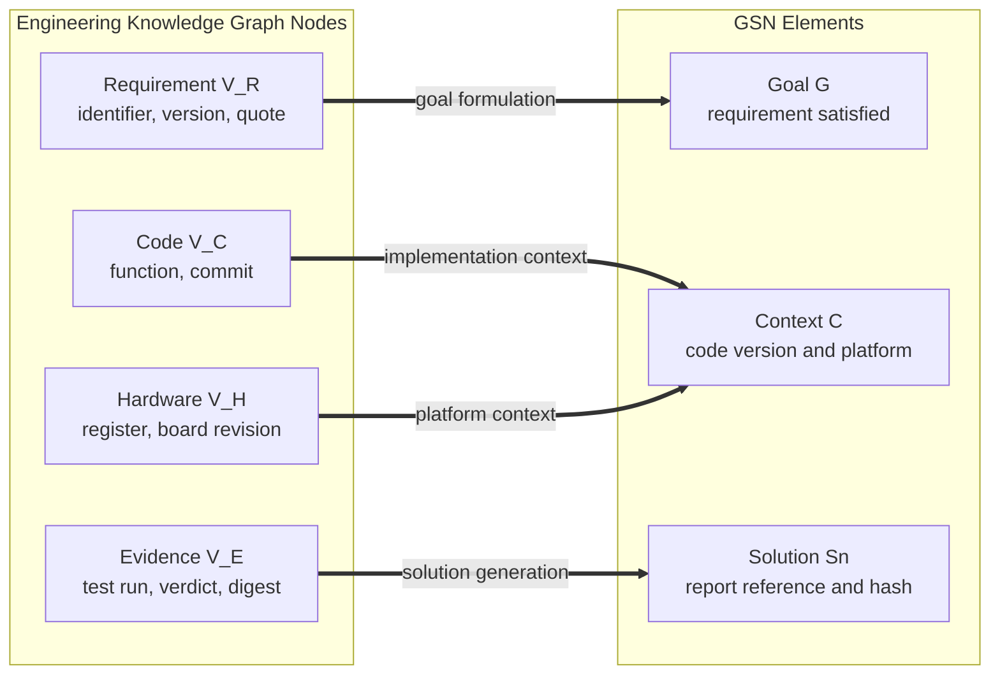
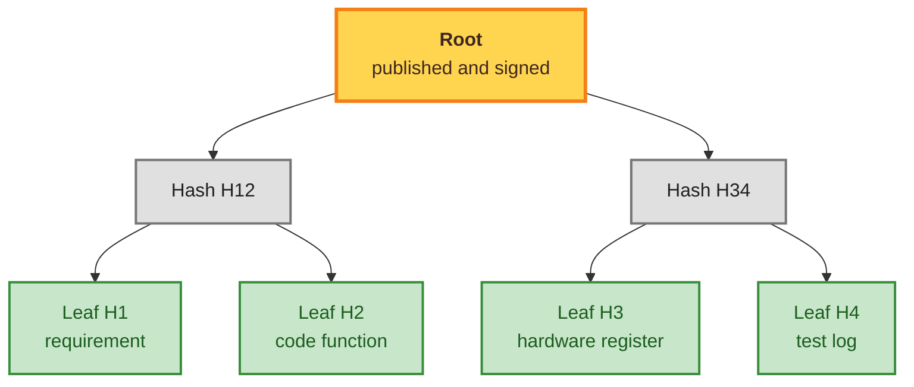
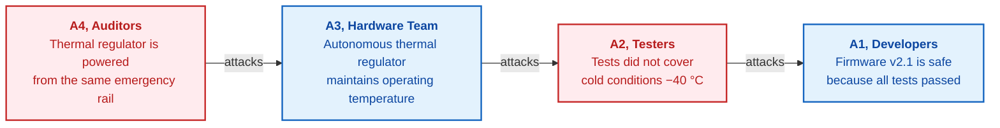

# Chapter 27. Safety Case: Synthesis and Verification of Arguments

> **Book:** [Architecture of Evidence-Based Expert Systems](README.md) · [Part V: Verification, Testing, Diagnostics, and Safety Assurance](part-05-verification-and-learning.md)  
> **Previous Chapter:** [Chapter 24. Technical Diagnostics: Distinguishing Symptoms from Root Causes Under Incompleteness](ch24-system-diagnosis.md)  
> **Next Chapter:** [Chapter 30. Safety and Cybersecurity Co-Engineering](ch30-safety-cybersecurity-co-engineering.md)  
> **Table of Contents:** [README.md](README.md)  
> **Author:** [Mykola Fedchyk](about-the-author.md)  
> **Target Audience:** Intermediate and advanced: systems architects, functional safety engineers and auditors, critical systems developers  
> **Learning Outcomes:** Construct safety cases in GSN notation from goals, strategies, contexts, assumptions, justifications, and solutions; synthesize an argument skeleton from an engineering knowledge graph; verify an argument against formal rules of completeness, evidence validity, context consistency, and acyclicity; bind argument integrity via a Merkle tree and selectively disclose individual evidence with inclusion proofs; track objections via Dung's abstract argumentation framework; delineate what a machine verifies versus what remains human expert responsibility.

## Abstract

In the context of the life cycle of evidence-based expert systems, this chapter investigates the methodology for transforming verified engineering facts and artifacts from an Engineering Knowledge Graph (EKG) into a structured, machine-readable, and irrefutable safety case. The reader should not perceive this as a detached handbook on general systems engineering: argumentation in Goal Structuring Notation (GSN) constitutes the final synthetic stage of an expert system, where inference determinism and cryptographic evidence integrity are converted into formally demonstrated assurance for certification authorities. Systemic drivers behind the degradation of certification documentation into formal "paperwork exercises" are analyzed, and an engineering approach to overcoming this crisis is proposed based on Goal Structuring Notation (GSN Standard, Version 3). A formal suite of argument verification rules is formulated: structural decomposition completeness, verification of cryptographic evidence integrity, revision-level context consistency, and acyclicity of the inference graph. The application of Merkle trees and selective disclosure schemes is proposed to preserve confidentiality and protect intellectual property during third-party audits. Phan Minh Dung's abstract argumentation framework is integrated to rigorously account for challenges and counter-arguments via the computation of the grounded extension. A complete software implementation of the GSN argument verifier is provided in Python.

A safety case must convince an independent assessor that a system is acceptably safe for a defined application in a given operating environment. In practice, safety cases frequently degenerate into a post-hoc compliance document drafted at the conclusion of a project solely to pass an audit. The independent review into the broader issues surrounding the loss of the Royal Air Force (RAF) Nimrod MR2 aircraft XV230 in Afghanistan in 2006, conducted by Charles Haddon-Cave, characterized the aircraft's safety case as a "lamentable job from start to finish" and concluded that preparing the safety case became "a paperwork exercise, essentially a tick-box exercise" [[1]](#src-1).

This chapter addresses a central question: **how can verified engineering facts be transformed into a safety argument that a machine can formally audit for completeness and integrity, and where do the boundaries of automated proof lie?** The core thesis of this chapter: **GSN notation provides an explicit argument structure, an engineering knowledge graph grounds this structure in traceable evidence, formal verification rules detect undeveloped goals and unverified solutions, a Merkle tree immutably binds the exact artifacts upon which the argument rests, and Dung's argumentation framework prevents undefeated challenges from vanishing unnoticed. The machine rigorously verifies structural soundness, integrity, and logical form, but not the truth of empirical premises nor the sufficiency of chosen strategies: these determinations remain the professional responsibility of the qualified engineer.**

## 1. Systemic Drivers of Formalization and Degradation in Safety Cases

The synthesis of an evidence-governed safety case is a critical milestone in the life cycle of any mission-critical expert system; however, in industrial practice, this process frequently suffers from bureaucratic formalization and systemic degradation of argument validity. The Haddon-Cave review describes failure mechanisms that recur far beyond aviation. The safety case authors operated under the flawed assumption that the aircraft was "already safe" because it had flown successfully for thirty years, reducing the document to an administrative formality rather than an engineering analysis [[1]](#src-1). Among systemic failures, the review specifically highlighted a safety case regime that had become inefficient and wasteful [[1]](#src-1). Four fundamental engineering challenges emerge from this failure mode.

**Decoupling of Documentation from the System Artifacts.** When a safety case is compiled post-hoc following system implementation, documentation drifts from the operational baseline. The narrative may assert that firmware utilizes two independent hardware timers, whereas in the latest codebase commit, both channels were refactored to share a common timer. The document remains internally consistent within itself, but critically decoupled from the physical product.

**Process Compliance Substituted for Critical Analysis.** Mechanical adherence to a procedural checklist does not establish argument cogency: a checked box confirms that a prescribed workflow step was executed, but offers no guarantee that real-world physical hazards were identified or mitigated.

**Scale of Manual Verification.** The safety case of a complex engineering system cites thousands of requirements, verification reports, and execution logs. An independent assessor cannot manually cross-examine every reference against current artifact revisions, forcing reliance on superficial spot checks.

**Intellectual Property and Confidentiality.** Manufacturers are understandably reluctant to disclose complete proprietary source code and hardware schematics to external auditors, while assessors require mathematical certainty that the isolated artifacts submitted for review genuinely belong to the authoritative system argument.

The architecture of an evidence-based expert system developed across the preceding parts of this monograph provides the foundational substrate to resolve these dilemmas: [Chapter 9](ch09-engineering-knowledge-graph-traceability.md) models requirements, source code, hardware registers, and test results within an Engineering Knowledge Graph (EKG), while [Chapter 25](ch25-how-expert-systems-learn.md) demonstrates how requirement-to-evidence traces undergo rigorous verification. The outstanding challenge is to represent these formal traces in a standardized schema recognized by certification authorities.

## 2. Goal Structuring Notation (GSN)

Goal Structuring Notation (GSN) is a graphical modeling language for safety argumentation. The current Version 3 of the GSN Standard is maintained by the Assurance Case Working Group (ACWG) of the Safety-Critical Systems Club (SCSC). The standard fulfills two primary functions: providing an authoritative specification of the notation and establishing best practices for practitioners creating, reviewing, and approving engineering arguments [[2]](#src-2). A GSN argument is composed of six core elements:

- **Goal:** an assertive claim requiring demonstration, for example, "ECU firmware update is protected against tampering";
- **Strategy:** describes the reasoning mechanism by which a goal is decomposed into sub-goals, for example, "Argument by threat scenarios from TARA";
- **Context:** defines the operational scope within which the claim holds: hardware board revision, bootloader version, baseline configuration;
- **Assumption:** captures a proposition accepted without proof within the argument, for example, "Signing key is stored in a secure element";
- **Justification:** explains the engineering rationale for why the chosen decomposition strategy is sufficient;
- **Solution:** references concrete empirical evidence: a verification report, static analysis result, or test log.

A goal not yet supported by any strategy, sub-goal, or solution is formally designated as undeveloped (*undeveloped*). Version 3 of the standard introduced dialectical notation: the *challenges* relationship allows engineers to model counter-arguments or counter-evidence disputing any argument element, while the *defeated* flag marks an element that has been overcome by an accepted challenge. The working group explicitly links this addition to Haddon-Cave's critique regarding confirmation bias in safety cases [[3]](#src-3). The diagram below illustrates a GSN argument for a secure Electronic Control Unit (ECU) firmware update, previously analyzed in [Chapter 25](ch25-how-expert-systems-learn.md).



The argument is evaluated top-down. Goal G1 is valid strictly within context C1 and under assumption A1. Strategy S1 decomposes G1 into three sub-goals, while justification J1 articulates why these three sub-goals collectively suffice. Two sub-goals are substantiated by empirical test reports, whereas sub-goal G4 is highlighted in red: it lacks an associated solution, leaving the overall argument incomplete. It is precisely this category of structural deficiency that automated verification must detect deterministically.

## 3. Automated Argument Synthesis from an Engineering Knowledge Graph

Constructing a GSN argument manually in a graphical editor requires weeks of engineering effort and becomes obsolete upon the first subsequent codebase commit. If requirements, source code, hardware registers, and test results are already maintained within an EKG, the structural skeleton of the argument can be derived via automated graph traversal. The diagram below illustrates how knowledge graph nodes map to GSN elements.



Synthesis proceeds across five sequential steps. First, the root goal is instantiated for target system $\mathcal{S}$ under configuration $\mathcal{K}$:

```math
G_{\mathrm{root}}=\text{"}\mathcal{S}\text{ in configuration }\mathcal{K}\text{ satisfies the mandatory requirements of document }\mathrm{STD}\text{"}.
```

- For root goal $G_{\mathrm{root}}$, symbol $\mathcal{S}$ represents the system under evaluation, and $\mathcal{K}$ denotes its physical and software configuration;
- $\mathrm{STD}$ designates the normative standard or regulatory specification containing the requirements;
- The equality operator $=$ defines the semantic proposition: the target system in the specified configuration must satisfy all mandatory clauses of the cited standard.

This formulation establishes what the argument must substantiate for a concrete system, configuration, and normative baseline. The formula does not verify compliance; it defines the verification objective.

Next, a graph query selects mandatory requirements based on normative modality extracted from standard texts as detailed in [Chapter 14](ch14-requirements-detection-and-formalization.md):

```math
\mathcal{R}_{\mathrm{mand}}=\{\,r\in V_R \mid r.\mathrm{modality}\in\{\mathrm{SHALL},\mathrm{MUST}\}\,\}.
```

- Set $\mathcal{R}_{\mathrm{mand}}$ contains the extracted mandatory requirements, where $r$ denotes an individual requirement node;
- $V_R$ is the set of all requirement nodes in the EKG, $\in$ denotes set membership, and the vertical bar translates to "such that";
- $r.\mathrm{modality}$ represents the deontic modality attribute of the requirement, where $`\{\mathrm{SHALL},\mathrm{MUST}\}`$ defines the set of strict obligation markers;
- Set-builder notation filters and retains only those requirement vertices whose modality matches an imperative obligation.

Consequently, the query excludes recommendations (`SHOULD`) and permissions (`MAY`), retaining only strict obligations (`SHALL` or `MUST`). The fidelity of this extraction depends directly on the accuracy of upstream natural language processing and deontic classification across EKG vertices.

For each requirement $r\in\mathcal{R}_{\mathrm{mand}}$, the synthesizer instantiates sub-goal $G_r$: "Requirement $r$ is implemented and verified", embedding the exact normative quote and its cryptographic digest. Traversing incoming `satisfies` and `configures` edges discovers corresponding source code functions $c\in V_C$ and hardware registers $h\in V_H$, which are attached as GSN context elements annotated with their exact commit hashes and board revisions. Finally, traversing `verifies` and `produced_by` edges identifies verification artifacts $e\in V_E$: state-machine test suites, mutation testing reports, structural code coverage metrics, and hardware-in-the-loop bus traces. Each discovered artifact is transformed into a GSN solution element $Sn$.

Automated synthesis possesses a fundamental boundary that must be explicitly acknowledged. Graph traversal extracts goals, contexts, and solutions, but cannot synthesize strategies and justifications: determining why decomposition across specific threat scenarios is sufficient remains an engineering judgment call. Ewen Denney and Ganesh Pai described an architecture wherein automatically generated argument fragments, synthesized from formal software proofs, are systematically composed with manually constructed argument structures originating from system-level safety analysis [[4]](#src-4). Graph-driven synthesis adheres precisely to this division of authority: the machine compiles the traceable evidentiary substrate, while the human architect governs argumentative sufficiency.

## 4. Formal Rules for Structural and Semantic Argument Verification

Prior to submission to an independent assessor, the synthesized argument graph must undergo rigorous static verification. Argument $\mathcal{T}$ is formally valid if and only if four verification predicates hold simultaneously:

```math
\mathrm{Valid}_{\mathrm{GSN}}(\mathcal{T})\iff\bigwedge_{i=1}^{4}\mathcal{P}_i(\mathcal{T}).
```

- Verification predicate $\mathrm{Valid}_{\mathrm{GSN}}(\mathcal{T})$ evaluates the structural and evidentiary soundness of argument $\mathcal{T}$;
- $\iff$ denotes logical equivalence ("if and only if"), and $\bigwedge_{i=1}^{4}$ represents conjunction across the four formal rules;
- Index $i$ enumerates verification rules from 1 to 4, where $\mathcal{P}_i(\mathcal{T})$ denotes rule predicate $i$ evaluated over argument $\mathcal{T}$.

**Actionable Engineering Decisions (Closed-Loop Decision):**
1. **Certification Release Pipeline Control:**
   - **If $\mathrm{Valid}_{\mathrm{GSN}}(\mathcal{T}) = \mathbf{True}$:** The safety case builder automatically compiles the GSN tree manifest, computes Merkle tree root $\mathrm{MTH}(\mathcal{T})$, signs the bundle with an Ed25519 digital signature, and exports the bundle in standardized JSON/XML schemas for third-party auditing by certification bodies (e.g., TÜV, Dekra);
   - **If $\mathrm{Valid}_{\mathrm{GSN}}(\mathcal{T}) = \mathbf{False}$:** Safety case compilation aborts immediately with a blocking `ERR_GSN_VERIFICATION_FAILED` exception. The engine outputs a precise diagnostic trace detailing the violated predicate:
     * $\neg \mathcal{P}_1$: enumeration of dangling, undeveloped goals lacking strategies or solutions;
     * $\neg \mathcal{P}_2$: enumeration of invalid solutions (failed test verdicts or artifact hash mismatches);
     * $\neg \mathcal{P}_3$: conflicting context attributes (e.g., linking test artifacts produced on hardware revision D into a branch scoped to revision C);
     * $\neg \mathcal{P}_4$: topological cycle detected within the inference graph.
2. **Worked Numerical Example:** For a safety case comprising 24 goals and 18 solutions, predicates $\mathcal{P}_1, \mathcal{P}_2, \mathcal{P}_3, \mathcal{P}_4$ all evaluate to `true`. Calculation: $\mathrm{Valid}_{\mathrm{GSN}}(\mathcal{T}) = 1 \land 1 \land 1 \land 1 = \mathbf{True}$. **System Action:** Merkle root `0x7a3f...` is generated, and the finalized, signed artifact `SafetyCase_Release_v2.json` is exported.

**Structural Completeness Rule.** Every goal must be supported by at least one strategy, sub-goal, or solution; no undeveloped goals are permitted in a release candidate:

```math
\mathcal{P}_1:\ \forall g\in\mathrm{Goals}(\mathcal{T})\ \ \deg^{+}(g)>0.
```

- In the first rule, $g$ represents an individual goal, and $\mathrm{Goals}(\mathcal{T})$ denotes the set of all goals in argument $\mathcal{T}$;
- $\forall$ denotes universal quantification ("for all"), and $\deg^{+}(g)$ represents the out-degree of supporting edges originating from goal $g$;
- $>0$ mandates the presence of at least one outgoing support edge, and $\mathcal{P}_1$ designates the completeness predicate.

This check detects ungrounded claims. It verifies edge presence, but does not evaluate the qualitative sufficiency of the referenced strategy or solution.

**Solution Validity Rule.** Every solution node must record a passing test verdict, and the cryptographic hash of the referenced artifact must match the digest stored within the node:

```math
\mathcal{P}_2:\ \forall s\in\mathrm{Solutions}(\mathcal{T})\ \ s.\mathrm{verdict}=\mathrm{PASS}\ \land\ H(s.\mathrm{artifact})=s.\mathrm{digest}.
```

- In the second rule, $s$ is a solution node from the set $\mathrm{Solutions}(\mathcal{T})$;
- $s.\mathrm{verdict}$ represents the execution verdict of the node, which must evaluate strictly to $\mathrm{PASS}$;
- $H(s.\mathrm{artifact})$ denotes the cryptographic hash computed over the physical artifact, and $s.\mathrm{digest}$ is the expected digest recorded in the node;
- $\forall$ quantifies over all solution vertices, $\land$ requires simultaneous satisfaction of the passing verdict and digest equality, and $=$ denotes exact hash equality.

This rule proves that the verified artifact has not undergone unauthorized modification and passed execution. It does not prove that the test suite exercises the correct physical safety property.

**Context Consistency Rule.** No reasoning branch may combine mutually exclusive context attributes, such as a test report generated on board revision D attached to a branch scoped to revision C:

```math
\mathcal{P}_3:\ \forall g\in\mathrm{Goals}(\mathcal{T})\ \ \mathrm{Consistent}(\mathrm{Context}(g)).
```

- In the third rule, $g$ ranges over all goals in $\mathrm{Goals}(\mathcal{T})$;
- $\mathrm{Context}(g)$ denotes the set of context attributes associated with goal $g$ and its supporting sub-tree, while $\mathrm{Consistent}(\cdot)$ evaluates internal mutual compatibility;
- $\forall$ mandates consistency across all branches, and $\mathcal{P}_3$ denotes the context predicate.

This rule ensures that each argument branch pertains to compatible hardware, firmware, and testbed baselines. Verification rigor is bounded by the completeness of the formalized compatibility rules.

**Acyclicity Rule.** The support graph must be strictly acyclic, eliminating circular reasoning where claim A is justified by claim B, which in turn relies upon claim A:

```math
\mathcal{P}_4:\ \mathrm{IsDAG}(\mathcal{T}).
```

- In the fourth rule, $\mathcal{T}$ represents the argument graph;
- $\mathrm{IsDAG}(\mathcal{T})$ evaluates whether the graph is a directed acyclic graph (DAG), verifying the absence of directed paths returning to their origin;
- $\mathcal{P}_4$ denotes the acyclicity predicate.

Thus, no goal may justify itself through a circular dependency chain. Enforcing a DAG eliminates circular logic, but does not validate underlying substantive premises.

These four rules audit argument form, not substantive truth. John Rushby, analyzing the formalization of safety cases, emphasizes that formal methods aim to mechanize the verification of argument validity rather than replace GSN, and that formal logic guarantees the truth of conclusions only conditional upon premises about which the analyst may possess imperfect confidence [[5]](#src-5). Rule $\mathcal{P}_2$ verifies that report TC-301 exists, remains untampered, and records a PASS verdict, but cannot independently verify whether test TC-301 genuinely exercises signature rejection under adversarial edge conditions.

## 5. Cryptographic Argument Integrity: Merkle Trees and Selective Disclosure

Following verification, the safety case is submitted to an independent assessor. The assessor must be able to verify that every node presented belongs to the exact argument that underwent formal verification, and that no node has been tampered with post-audit. To achieve this, a Merkle tree is constructed over the canonicalized node records, following the cryptographic hash tree structure proposed by Ralph Merkle for digital signatures [[6]](#src-6). Each leaf represents the cryptographic digest of an individual node record, intermediate nodes represent the hash of concatenated child digests, and the root uniquely commits to the entire argument graph. The diagram below illustrates a Merkle tree over four node records.



Modifying any leaf alters the digests along the entire path to the root; consequently, a published and digitally signed root irrevocably anchors the entire argument. To verify an individual leaf, an assessor does not require access to the entire tree: an audit path (inclusion path) comprising the sibling hashes along the path from the leaf to the root is sufficient. The Certificate Transparency specification RFC 6962 defines Merkle tree hashing using domain-separation byte prefixes `0x00` for leaf nodes and `0x01` for interior nodes, providing cryptographic resistance against second-preimage attacks [[7]](#src-7):

```math
\mathrm{MTH}(\{d_0\})=\mathrm{SHA256}(\mathtt{0x00}\,\|\,d_0),
\qquad
\mathrm{MTH}(D_n)=\mathrm{SHA256}\bigl(\mathtt{0x01}\,\|\,\mathrm{MTH}(D_{0:k})\,\|\,\mathrm{MTH}(D_{k:n})\bigr).
```

- For Merkle Tree Hash function $\mathrm{MTH}$, argument $`\{d_0\}`$ denotes an individual record, and $D_n$ represents an ordered sequence of $n$ leaves;
- $\mathrm{SHA256}$ denotes the SHA-256 cryptographic hash function standardized in FIPS 180-4 [[8]](#src-8), where $d_0$ represents the canonicalized bytes of a leaf record;
- Prefixes $\mathtt{0x00}$ and $\mathtt{0x01}$ provide domain separation between leaf and internal nodes, and $`\|`$ denotes byte concatenation;
- Parameter $k$ is the largest power of two strictly less than $n$; $D_{0:k}$ and $D_{k:n}$ denote the left and right sub-sequences whose sub-tree roots are recursively combined.

In practice, a solitary leaf is hashed with prefix `0x00`, while an interior tree node is formed by concatenating prefix `0x01` with its two child hashes. The hashes possess a fixed 256-bit length; however, the root certifies data integrity and membership, not substantive truth. RFC 9162 provides the canonical audit path verification algorithm [[9]](#src-9). To guarantee that record digests remain invariant to serialization whitespace or dictionary key ordering, records must be canonicalized prior to hashing, for example using the JSON Canonicalization Scheme (JCS) defined in RFC 8785 [[10]](#src-10).

The security boundaries of this mechanism must be clearly understood. A Merkle root proves integrity and membership: a record presented to an auditor genuinely belongs to the committed argument and has not been altered. The root does not prove that the claim is true, the test oracle is correct, or the argument strategy is sufficient. Furthermore, this mechanism does not constitute a zero-knowledge proof: an auditor inspects disclosed records in plain text, while undisclosed records remain unverified by that auditor. Sibling hashes within an inclusion path can also leak entropy: if an unrevealed record has low entropy or predictable structure, an auditor could mount a dictionary brute-force attack to discover its contents. To prevent this, each leaf record is augmented with a high-entropy salt derived from a producer secret, which is disclosed only when the corresponding record is unblinded. Selective disclosure minimizes intellectual property exposure, but professional responsibility for the veracity of undisclosed leaves remains entirely with the manufacturer and the root signer.

## 6. Dialectical Argumentation: Accounting for Challenges via Dung's Abstract Framework

A standard GSN tree effectively represents settled, consensus evidence. During engineering development and accident investigations, however, multidisciplinary teams formulate competing hypotheses, and emerging test results frequently falsify prior assumptions. If objections remain sequestered in email threads or meeting minutes, an argument appears superficially complete despite harboring unrefuted challenges. The dialectical notation of GSN Version 3 enables explicit modeling of challenges directly within the argument structure [[3]](#src-3), while formal semantics for resolving which claims remain warranted is provided by Phan Minh Dung's abstract argumentation framework [[11]](#src-11).

An argumentation framework is a formal pair $AF=\langle\mathcal{A},\mathcal{R}\rangle$, where $\mathcal{A}$ is a finite set of arguments and $\mathcal{R}\subseteq\mathcal{A}\times\mathcal{A}$ is an attack relation: $(B,A)\in\mathcal{R}$ denotes that argument $B$ attacks argument $A$. The diagram below illustrates four arguments arising during an ECU firmware safety dispute.



Dung formalized several criteria of argument acceptability. A set of arguments $S$ is **conflict-free** if no member of $S$ attacks another member of $S$. A set $S$ is **admissible** if it is conflict-free and defends all its elements: for every argument $B$ attacking some $A\in S$, there exists an argument $C\in S$ that attacks $B$. The **grounded extension** (*grounded extension*) represents the minimal complete set under set inclusion, capturing the stance of maximum skepticism: it contains only those arguments that are defended against all attacks without ungrounded assumptions. **Preferred extensions** (*preferred extensions*) are maximal admissible sets, corresponding to alternative self-consistent perspectives [[11]](#src-11). For the illustrated framework, the grounded extension is computed iteratively: argument A4 is attacked by none, hence A4 is unconditionally accepted; A3 is attacked by accepted argument A4, hence A3 is rejected; A2 is attacked solely by rejected argument A3, hence A2 is defended and accepted; A1 is attacked by accepted argument A2, hence A1 is rejected. The grounded extension evaluates uniquely to $`\{A2,A4\}`$.

From this, an actionable governance rule emerges for safety cases: a goal is admitted to the authoritative argument as established if and only if the argument supporting it belongs to the grounded extension. Developer claim A1 ("Firmware is safe") cannot be admitted: in GSN Version 3 semantics, goal G1 faces an undefeated challenge A2. Until tests are conducted at −40 °C or regulator power routing is physically segregated, the goal remains formally open.

## 7. Software Implementation of the Verifier: From Structural Rules to Inclusion Proofs

The program listing below unifies the mechanisms analyzed across this chapter into an executable verification pipeline. It constructs the argument from the GSN schema, initially validates reference integrity (check P0: every reference points to an existing node and artifact), and subsequently enforces rules $\mathcal{P}_1$–$`\mathcal{P}_4`$. In this implementation, rule $\mathcal{P}_1$ also rejects a strategy devoid of children, while $\mathcal{P}_3$ cross-checks the hardware revision across contexts and the physical testbed on which the evidence was produced. Next, the pipeline injects the missing solution, computes the Merkle root per RFC 6962, demonstrates detection of artifact tampering, verifies an inclusion proof, and computes Dung's grounded extension. Each leaf record incorporates a cryptographic salt derived via HMAC from a producer secret: without salting, an auditor receiving sibling hashes in an audit path could brute-force short, predictable leaf payloads. The implementation relies strictly on the Python 3.10+ standard library; JSON canonicalization is simplified to key sorting, which suffices for the string and integer fields in this pedagogical scenario.

<details>
<summary>Python Example: GSN Argument Verification, RFC 6962 Merkle Tree, and Grounded Extension</summary>

```python
"""Verification of GSN arguments, Merkle tree per RFC 6962, and Dung's grounded extension.

Requires only Python 3.10+ standard library.
"""
import copy
import hashlib
import hmac
import json

ARTIFACTS = {  # contents of reports referenced by solutions
    "rep-sig": b"TC-301 wrong signature: package rejected, verdict PASS",
    "rep-rollback": b"TC-302 rollback to 2.1: blocked, verdict PASS",
}
NODES = [
    {"id": "G1", "type": "goal", "text": "ECU firmware update is protected against tampering", "supported_by": ["S1"], "context": ["C1"]},
    {"id": "C1", "type": "context", "text": "ECU rev C, bootloader 2.3, baseline config B-17", "hw": "C"},
    {"id": "S1", "type": "strategy", "text": "Argument by threat scenarios from TARA", "supported_by": ["G2", "G3", "G4"]},
    {"id": "G2", "type": "goal", "text": "Package with invalid signature is rejected", "supported_by": ["Sn1"]},
    {"id": "G3", "type": "goal", "text": "Rollback to vulnerable version is blocked", "supported_by": ["Sn2"]},
    {"id": "G4", "type": "goal", "text": "After power loss ECU recovers successfully", "supported_by": []},
    {"id": "Sn1", "type": "solution", "artifact": "rep-sig", "verdict": "PASS", "hw": "C"},
    {"id": "Sn2", "type": "solution", "artifact": "rep-rollback", "verdict": "PASS", "hw": "C"},
]
SECRET = b"producer-salt-key"  # producer secret; fixed solely for test reproducibility


def sha(data):
    return hashlib.sha256(data).digest()


def seal(nodes, artifacts):
    for node in nodes:
        if node["type"] == "solution":
            node["digest"] = sha(artifacts[node["artifact"]]).hex()


def validate(nodes, artifacts):
    by_id = {n["id"]: n for n in nodes}
    problems = []
    for n in nodes:  # P0: references resolve to existing nodes and reports
        for ref in n.get("supported_by", []) + n.get("context", []):
            if ref not in by_id:
                problems.append(f"P0: {n['id']} references missing node {ref}")
        if n["type"] == "solution" and n["artifact"] not in artifacts:
            problems.append(f"P0: solution {n['id']} missing artifact {n['artifact']}")
    if problems:
        return problems
    for n in nodes:  # P1: no undeveloped goals or empty strategies
        if n["type"] in ("goal", "strategy") and not n.get("supported_by"):
            kind = "goal" if n["type"] == "goal" else "strategy"
            problems.append(f"P1: {kind} {n['id']} is undeveloped")
    for n in nodes:  # P2: solution passed and digest matches
        if n["type"] == "solution":
            if n["verdict"] != "PASS" or sha(artifacts[n["artifact"]]).hex() != n.get("digest"):
                problems.append(f"P2: solution {n['id']} is unverified")
    hw = {n["hw"] for n in nodes if "hw" in n}
    if len(hw) > 1:  # P3: contexts and solutions share a consistent hardware revision
        problems.append(f"P3: conflicting revisions {sorted(hw)}")
    state = {}

    def cyclic(node_id):  # P4: cycle-free argument graph
        state[node_id] = "active"
        for child in by_id[node_id].get("supported_by", []):
            if state.get(child) == "active" or (child not in state and cyclic(child)):
                return True
        state[node_id] = "done"
        return False

    if any(cyclic(n["id"]) for n in nodes if n["id"] not in state):
        problems.append("P4: cycle in argument")
    return problems


def leaves(nodes, secret):  # salt conceals unrevealed records from brute-force search
    records = []
    for n in nodes:
        salt = hmac.new(secret, n["id"].encode(), hashlib.sha256).hexdigest()
        records.append(json.dumps({**n, "salt": salt}, sort_keys=True, ensure_ascii=False, separators=(",", ":")))
    return [r.encode("utf-8") for r in sorted(records)]


def mth(items):  # Merkle Tree Hash per RFC 6962
    if len(items) == 1:
        return sha(b"\x00" + items[0])
    k = 1
    while k * 2 < len(items):
        k *= 2
    return sha(b"\x01" + mth(items[:k]) + mth(items[k:]))


def path(m, items):  # inclusion path per RFC 6962
    if len(items) == 1:
        return []
    k = 1
    while k * 2 < len(items):
        k *= 2
    if m < k:
        return path(m, items[:k]) + [mth(items[k:])]
    return path(m - k, items[k:]) + [mth(items[:k])]


def verify_inclusion(index, size, leaf, proof, root):  # RFC 9162 algorithm, Section 2.1.3.2
    fn, sn, r = index, size - 1, sha(b"\x00" + leaf)
    for p in proof:
        if sn == 0:
            return False
        if fn & 1 or fn == sn:
            r = sha(b"\x01" + p + r)
            while not fn & 1 and fn != 0:
                fn, sn = fn >> 1, sn >> 1
        else:
            r = sha(b"\x01" + r + p)
        fn, sn = fn >> 1, sn >> 1
    return sn == 0 and r == root


def grounded(arguments, attacks):  # minimal fixed point per Dung
    accepted, rejected = set(), set()
    while True:
        new_in = {a for a in arguments - accepted - rejected
                  if all(b in rejected for b, t in attacks if t == a)}
        new_out = {a for a in arguments - accepted - rejected
                   if any(b in accepted | new_in for b, t in attacks if t == a)}
        if not new_in and not new_out:
            return accepted, rejected
        accepted |= new_in
        rejected |= new_out


def test_validator():
    def broken(change):
        nodes = copy.deepcopy(NODES)
        change({n["id"]: n for n in nodes})
        return validate(nodes, ARTIFACTS)

    assert broken(lambda n: n["S1"]["supported_by"].append("G9"))[0].startswith("P0")
    assert broken(lambda n: n["Sn1"].update(artifact="rep-missing"))[0].startswith("P0")
    assert "P1: strategy S1 is undeveloped" in broken(lambda n: n["S1"].update(supported_by=[]))
    assert "P4: cycle in argument" in broken(lambda n: n["G2"]["supported_by"].append("G1"))
    assert "P3: conflicting revisions ['C', 'D']" in broken(lambda n: n["Sn2"].update(hw="D"))


seal(NODES, ARTIFACTS)
test_validator()
print("1. Argument validation:", validate(NODES, ARTIFACTS) or "all rules satisfied")
G4 = next(n for n in NODES if n["id"] == "G4")
ARTIFACTS["rep-power"] = b"TC-303 rev D power cut during write: recovered, verdict PASS"
NODES.append({"id": "Sn3", "type": "solution", "artifact": "rep-power", "verdict": "PASS", "hw": "D"})
G4["supported_by"] = ["Sn3"]
seal(NODES, ARTIFACTS)
print("2. Added Sn3 from rev D testbed:", validate(NODES, ARTIFACTS))
ARTIFACTS["rep-power"] = b"TC-303 rev C power cut during write: recovered, verdict PASS"
NODES[-1]["hw"] = "C"
seal(NODES, ARTIFACTS)
print("3. TC-303 repeated on rev C:", validate(NODES, ARTIFACTS) or "all rules satisfied")
items = leaves(NODES, SECRET)
root = mth(items)
print("4. Merkle root:", root.hex()[:16], "for", len(items), "nodes")
ARTIFACTS["rep-sig"] = ARTIFACTS["rep-sig"].replace(b"rejected", b"accepted")
print("5. Report TC-301 tampered:", validate(NODES, ARTIFACTS))
for n in NODES:
    if n["id"] == "Sn1":
        n["digest"] = sha(ARTIFACTS["rep-sig"]).hex()
print("6. Node digest updated as well:", validate(NODES, ARTIFACTS) or "all rules satisfied",
      "| root matches published:", mth(leaves(NODES, SECRET)) == root)
index = next(i for i, r in enumerate(items) if b'"id":"Sn2"' in r)
proof = path(index, items)
print("7. Inclusion proof for Sn2:", verify_inclusion(index, len(items), items[index], proof, root),
      f"({len(proof)} hashes instead of {len(items) - 1} other nodes)")
forged = next(r for r in leaves(NODES, SECRET) if b'"id":"Sn1"' in r)
original = next(i for i, r in enumerate(items) if b'"id":"Sn1"' in r)
print("   Inclusion proof for modified Sn1:", verify_inclusion(original, len(items), forged, path(original, items), root))
accepted, _ = grounded({"A1", "A2", "A3", "A4"}, {("A2", "A1"), ("A3", "A2"), ("A4", "A3")})
print("8. Grounded extension:", sorted(accepted))
mutual = {"A5", "A6"}
accepted, rejected = grounded(mutual, {("A5", "A6"), ("A6", "A5")})
print("   Mutual attack A5 and A6: accepted", sorted(accepted), "| unresolved", sorted(mutual - accepted - rejected))
```

</details>

Executing `python gsn_merkle.py` yields:

<details>
<summary>Program Output</summary>

```text
1. Argument validation: ['P1: goal G4 is undeveloped']
2. Added Sn3 from rev D testbed: ["P3: conflicting revisions ['C', 'D']"]
3. TC-303 repeated on rev C: all rules satisfied
4. Merkle root: 316a2cc5160e584f for 9 nodes
5. Report TC-301 tampered: ['P2: solution Sn1 is unverified']
6. Node digest updated as well: all rules satisfied | root matches published: False
7. Inclusion proof for Sn2: True (4 hashes instead of 8 other nodes)
   Inclusion proof for modified Sn1: False
8. Grounded extension: ['A2', 'A4']
   Mutual attack A5 and A6: accepted [] | unresolved ['A5', 'A6']
```

</details>

Line 1 pinpoints the exact structural deficiency highlighted by the red node in the GSN diagram: sub-goal G4 lacks an associated solution. Line 2 demonstrates a common industrial pitfall: report TC-303 bears a PASS verdict, but was executed on hardware board revision D, whereas the argument context is bound strictly to revision C; consequently, rule $\mathcal{P}_3$ halts the pipeline. Only after repeating the verification procedure on revision C are all rules satisfied, allowing line 4 to bind the argument via a Merkle root. Lines 5 and 6 illustrate two complementary layers of tamper resistance. If report TC-301 is tampered with so that an unauthorized package is ostensibly accepted, rule $\mathcal{P}_2$ immediately detects a digest mismatch. If an adversary concurrently alters the expected digest inside the node definition, internal rules pass again, yet the resulting tree root fails to match the previously published and signed root (`root matches published: False`), exposing the forgery to any party possessing the trusted root. Line 7 demonstrates selective disclosure: the auditor verifies that solution Sn2 genuinely belongs to the argument using four path hashes without inspecting the eight remaining node records, while the tampered Sn1 record fails inclusion verification. Line 8 confirms the manual calculation: the grounded extension $`\{A2, A4\}`$ excludes claim A1. The concluding line demonstrates the third epistemic status: two mutually attacking arguments are neither accepted nor rejected, leaving the dispute unresolved. In a mission-critical safety case, an unresolved argument is neither proven nor refuted; it mandates either supplementary empirical evidence or an explicit sign-off by a designated authority. The built-in test harness pre-validates missing nodes or reports, empty strategies, topological cycles, and cross-revision contamination.

This pedagogical implementation has defined boundaries. Canonicalization is simplified, the salt secret is hardcoded solely for reproducibility, and root signature infrastructures are omitted. Verification rule $\mathcal{P}_3$ examines only a single context dimension and enforces a uniform revision across the entire tree; a production safety case may contain branches for multiple variant configurations with formally justified evidence transfer. Salting protects against brute-force dictionary attacks over leaf hashes only while the secret key remains uncompromised; the tree topology and leaf cardinality remain visible to the auditor. The primary boundary is non-technical: the verifier cannot ascertain whether test TC-303 interrupts power during the worst-case write cycle. Validating the physical relevance of test scenarios remains the core responsibility of the human engineer.

## 8. Tooling and Data Mining for Assurance Systems

The pedagogical script maintains argument state in a local dictionary and executes self-contained verification. In industrial development pipelines, arguments are exchanged across distributed organizations, and verification evidence is emitted by heterogeneous CI/CD runners. Open standards and specialized toolsets exist for these requirements, though none assess substantive argument sufficiency.

| Tool or Model | Applied Role | What is Not Guaranteed |
|---|---|---|
| OMG SACM Metamodel [[12]](#src-12) | Exchange of arguments and evidence between systems engineering toolchains | Exchange schema does not define domain-level argument sufficiency criteria |
| in-toto Attestations and SLSA Provenance [[13]](#src-13) [[14]](#src-14) | Digitally signed metadata recording who, from which inputs, and on which platform built an evidence artifact | Attestation verifies the generation pipeline, not test validity; verifier must trust the signer-platform tuple |
| Rekor Transparency Log [[15]](#src-15) | Publishing roots or attestations to an append-only log; verifying inclusion and log consistency | Public log exposes metadata; proprietary projects require private instances and access-control policies |
| ASP-Based Argumentation Solvers (e.g., ASPARTIX) [[16]](#src-16) | Computing grounded, preferred, and other extensions for large-scale argumentation frameworks | Extension semantics are selected by a human engineer; solver does not determine whether an objection is materially significant |

Robin Bloomfield and John Rushby, in their Assurance 2.0 manifesto, advocate for continuous, incremental assurance with rigorous emphasis on reasoning, evidence, and explicit defeaters (*defeaters*) [[17]](#src-17). John Goodenough, Charles Weinstock, and Ari Klein formulated eliminative argumentation (*eliminative argumentation*): confidence in a claim grows monotonically with the elimination of valid reasons for doubt [[18]](#src-18). For an expert system, this yields an actionable engineering rule: every verification rule violation identified in this chapter (an undeveloped goal, revision mismatch, tampered digest) must be recorded as an explicit defeater rather than discarded as an ephemeral log entry.

Two data-mining paradigms prove especially valuable for assurance argumentation. The first paradigm reconstructs missing traceability links across requirements, code, and test cases: Jin Guo, Jinghui Cheng, and Jane Cleland-Huang trained neural models to recover candidate traces from project artifacts [[19]](#src-19). The second paradigm mines historical assessor defect logs to identify structural patterns in goals, strategies, and solutions that disproportionately trigger audit rejections. Both techniques generate candidates for expert review. Any candidate link proposed by a statistical model becomes an edge in the engineering knowledge graph only after formal approval by a qualified engineer; otherwise, the safety argument would rest on statistical text similarity.

## Conclusions

The answer to the central question of this chapter is clear: verified engineering facts are transformed into an authoritative safety case when an Engineering Knowledge Graph provides traceable provenance for goals, contexts, and solutions; Goal Structuring Notation endows the argument with explicit visual and semantic structure; and automated verification rules systematically detect undeveloped goals, unverified solutions, conflicting contexts, and cyclical reasoning. A Merkle tree immutably anchors the exact records upon which the argument is constructed, enabling selective disclosure of individual solutions alongside compact inclusion proofs. Dung's abstract argumentation framework determines which claims withstand adversarial scrutiny, preventing undefeated challenges from being swept under the rug.

This chapter demonstrated these mechanisms within an integrated reference scenario. The Haddon-Cave review underscored why safety cases compiled as tick-box paperwork exercises fail to prevent catastrophic failures. The software prototype flagged undeveloped sub-goal G4, rejected test evidence originating from an incompatible hardware revision, validated the completed argument once the test was executed on revision C, intercepted artifact tampering across two distinct defensive layers, and proved membership of solution Sn2 using four path hashes rather than disclosing eight raw artifact records. Computing the grounded extension $`\{A2, A4\}`$ demonstrated that the assertion "firmware is safe" cannot enter the authoritative argument until the cold-temperature challenge is formally refuted, while mutual attacks produced an unresolved epistemic status that can neither be claimed as verified nor dismissed as falsified.

The boundaries of this methodology must be rigorously delineated. Automated tools verify argument syntax, cryptographic integrity, and dialectical admissibility, but cannot ascertain the empirical truth of premises, the test design adequacy, or the ultimate sufficiency of an argument strategy. A Merkle tree does not constitute a zero-knowledge proof and does not render undisclosed leaves verified. Build provenance attestations and transparency logs confirm artifact ancestry, but not domain correctness. Knowledge graph traversal synthesizes the traceable structural skeleton, whereas strategies and justifications remain the sole responsibility of domain experts. Certification decisions are rendered by accredited regulatory bodies under domain-specific standards, never by an autonomous expert system. [Chapter 28](ch28-dual-mode-expert-systems.md) explores how an expert system can operate concurrently in a strict deterministic mode required for certification argumentation, and in an advisory mode where engineers explore predictive hypotheses.

## Review Questions

1. What systemic deficiencies in the RAF Nimrod safety case were identified by the Haddon-Cave review, and what four fundamental engineering challenges stem from them?
2. How does a strategy differ from a justification in Goal Structuring Notation? Which of these elements cannot be synthesized automatically from an Engineering Knowledge Graph, and why?
3. What is an undeveloped goal, and which formal rule among $\mathcal{P}_1$–$`\mathcal{P}_4`$ detects it?
4. Why does rule $\mathcal{P}_2$ fail to prove that a test case genuinely exercises the intended safety property?
5. Why does RFC 6962 mandate distinct domain-separation prefixes `0x00` and `0x01` for leaf and interior nodes of a Merkle tree?
6. In the software listing, an adversary altered a verification report and updated the digest stored in the node. Why did internal validation rules fail to catch this, and what mechanism exposed the forgery?
7. Why is a Merkle tree with an inclusion proof not equivalent to a zero-knowledge proof?
8. Compute the grounded extension for an argumentation framework with attacks $A2\to A1$ and $A3\to A2$ in the absence of argument A4. Does claim A1 enter the extension?
9. How does the dialectical notation introduced in GSN Version 3 address historical criticisms regarding confirmation bias in safety cases?
10. Why is a test report with a PASS verdict obtained on an alternative board revision rejected by the argument verifier? Why do Merkle tree leaves require cryptographic salting?

## Glossary

| Term | English Standard Term | Concise Definition |
|---|---|---|
| Обґрунтування безпеки | Safety case | Structured argument supported by evidence demonstrating that a system is acceptably safe for a defined application |
| Аргумент гарантування | Assurance case | Broader concept of a reasoned argument supported by evidence regarding any system property, not limited to safety |
| Ціль | Goal | An assertive claim within an argument that requires demonstration |
| Стратегія | Strategy | The reasoning approach used to decompose a goal into sub-goals |
| Контекст | Context | The operational domain, environment, or platform configuration within which a claim is valid |
| Припущення | Assumption | A proposition accepted as valid without formal demonstration within the argument |
| Обґрунтування | Justification | The engineering rationale explaining why an argument strategy is deemed sufficient |
| Свідчення | Solution | Reference to a specific empirical verification result or documentary artifact substantiating a claim |
| Нерозкрита ціль | Undeveloped goal | A goal lacking supporting strategies, sub-goals, or solutions |
| Заперечення | Challenge | A counter-argument or counter-evidence disputing an argument element |
| Спростований елемент | Defeated element | An argument element that has been defeated by an accepted challenge |
| Дерево Меркла | Merkle tree | A cryptographic hash tree whose root digest uniquely binds all constituent leaves |
| Шлях включення | Inclusion (audit) path | Sibling node hashes sufficient to verify leaf membership in a Merkle tree |
| Канонікалізація | Canonicalization | Converting structured data to a deterministic byte sequence prior to cryptographic hashing |
| Рамка аргументації | Argumentation framework | A formal pair consisting of a set of arguments and an attack relation |
| Допустима множина | Admissible set | A conflict-free set of arguments that defends all its members against any external attack |
| Обґрунтоване розширення | Grounded extension | The minimal complete set of accepted arguments, representing the stance of maximum skepticism |
| Краще розширення | Preferred extension | A maximal admissible set of arguments |
| Сіль | Salt | A random or secret-derived cryptographic value added to a record to prevent brute-force dictionary attacks |
| Спростувач | Defeater | An explicit, documented reason for doubting a claim, strategy, or piece of evidence |
| Атестація | Attestation | Digitally signed metadata certifying the provenance and generation pipeline of an artifact |
| Журнал прозорості | Transparency log | An append-only log enabling public verification of entry inclusion and immutability |

## Abbreviations

| Abbreviation | Expansion | Meaning |
|---|---|---|
| ACWG | Assurance Case Working Group | SCSC working group on assurance cases |
| ASP | Answer Set Programming | Declarative logic programming paradigm |
| ECU | Electronic Control Unit | Embedded electronic control unit |
| EKG | Engineering Knowledge Graph | Engineering knowledge graph |
| FIPS | Federal Information Processing Standard | US Federal Information Processing Standard |
| GSN | Goal Structuring Notation | Goal Structuring Notation graphical language |
| JSON | JavaScript Object Notation | Textual structured data format |
| MTH | Merkle Tree Hash | Merkle tree hash per RFC 6962 |
| OMG | Object Management Group | Systems modeling standards consortium |
| RAF | Royal Air Force | Royal Air Force of the United Kingdom |
| RFC | Request for Comments | IETF Internet specification document series |
| SACM | Structured Assurance Case Metamodel | Structured assurance case metamodel |
| SCSC | Safety-Critical Systems Club | Professional network for safety-critical systems |
| SHA-256 | Secure Hash Algorithm 256 | Cryptographic hash algorithm with a 256-bit digest |
| SLSA | Supply-chain Levels for Software Artifacts | Software supply chain security framework |
| TARA | Threat Analysis and Risk Assessment | Threat analysis and risk assessment methodology |

## References

1. <a id="src-1"></a>Charles Haddon-Cave. [*The Nimrod Review: An Independent Review into the Broader Issues Surrounding the Loss of the RAF Nimrod MR2 Aircraft XV230 in Afghanistan in 2006*](https://www.gov.uk/government/publications/the-nimrod-review). HC 1025, The Stationery Office, London, 2009.
2. <a id="src-2"></a>Assurance Case Working Group. [*Goal Structuring Notation Community Standard, Version 3*](https://doi.org/10.65391/r1386). SCSC-141C, Safety-Critical Systems Club, 2021.
3. <a id="src-3"></a>Assurance Case Working Group, GSN Standard Working Group. [*Goal Structuring Notation Standard: Changes from Version 2 to Version 3*](https://scsc.uk/file/gc-main/GSNv2-to-v3_changes-1092.pdf). Safety-Critical Systems Club, 2021.
4. <a id="src-4"></a>Ewen Denney, Ganesh Pai. [*Automating the Assembly of Aviation Safety Cases*](https://doi.org/10.1109/TR.2014.2335995). *IEEE Transactions on Reliability*, 63(4), 830–849, 2014.
5. <a id="src-5"></a>John Rushby. [*Formalism in Safety Cases*](https://www.csl.sri.com/users/rushby/abstracts/sss10). *Making Systems Safer: Proceedings of the Eighteenth Safety-Critical Systems Symposium*, Springer, 3–17, 2010.
6. <a id="src-6"></a>Ralph C. Merkle. [*A Certified Digital Signature*](https://doi.org/10.1007/0-387-34805-0_21). *Advances in Cryptology: CRYPTO '89 Proceedings*, LNCS 435, Springer, 218–238, 1990.
7. <a id="src-7"></a>Ben Laurie, Adam Langley, Emilia Kasper. [*RFC 6962: Certificate Transparency*](https://www.rfc-editor.org/rfc/rfc6962). IETF, 2013.
8. <a id="src-8"></a>NIST. [*FIPS 180-4: Secure Hash Standard (SHS)*](https://doi.org/10.6028/NIST.FIPS.180-4). 2015.
9. <a id="src-9"></a>Ben Laurie, Eran Messeri, Rob Stradling. [*RFC 9162: Certificate Transparency Version 2.0*](https://www.rfc-editor.org/rfc/rfc9162). IETF, 2021.
10. <a id="src-10"></a>Anders Rundgren, Bret Jordan, Samuel Erdtman. [*RFC 8785: JSON Canonicalization Scheme (JCS)*](https://www.rfc-editor.org/rfc/rfc8785). IETF, 2020.
11. <a id="src-11"></a>Phan Minh Dung. [*On the Acceptability of Arguments and Its Fundamental Role in Nonmonotonic Reasoning, Logic Programming and n-Person Games*](https://doi.org/10.1016/0004-3702(94)00041-X). *Artificial Intelligence*, 77(2), 321–357, 1995.
12. <a id="src-12"></a>Object Management Group. [*Structured Assurance Case Metamodel (SACM), Version 2.3*](https://www.omg.org/spec/SACM/2.3). OMG, 2023.
13. <a id="src-13"></a>in-toto Contributors. [*in-toto Attestation Framework Spec*](https://github.com/in-toto/attestation/blob/main/spec/README.md). Specification, Version 1.2.
14. <a id="src-14"></a>SLSA. [*Provenance*](https://slsa.dev/spec/v1.0/provenance). SLSA 1.0 Specification; current specification version pinned in experiment.
15. <a id="src-15"></a>Sigstore. [*Rekor*](https://docs.sigstore.dev/logging/overview/). Transparency Log Documentation.
16. <a id="src-16"></a>Wolfgang Dvořák, Sarah Alice Gaggl, Anna Rapberger, Johannes Peter Wallner, Stefan Woltran. [*The ASPARTIX System Suite*](https://www.dbai.tuwien.ac.at/research/argumentation/aspartix/). COMMA, 461–462, 2020.
17. <a id="src-17"></a>Robin Bloomfield, John Rushby. [*Assurance 2.0: A Manifesto*](https://arxiv.org/abs/2004.10474). arXiv:2004.10474, 2020.
18. <a id="src-18"></a>John B. Goodenough, Charles B. Weinstock, Ari Z. Klein. [*Eliminative Argumentation: A Basis for Arguing Confidence in System Properties*](https://doi.org/10.1184/R1/6573413.v1). CMU/SEI-2015-TR-005, Software Engineering Institute, 2015.
19. <a id="src-19"></a>Jin Guo, Jinghui Cheng, Jane Cleland-Huang. [*Semantically Enhanced Software Traceability Using Deep Learning Techniques*](https://doi.org/10.1109/ICSE.2017.9). ICSE, 2017.

---

[← Chapter 24](ch24-system-diagnosis.md) | [Table of Contents](README.md) | [Part V](part-05-verification-and-learning.md) | [Chapter 30 →](ch30-safety-cybersecurity-co-engineering.md)
