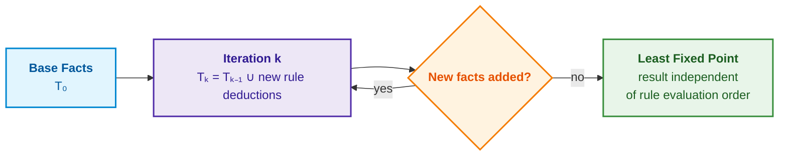
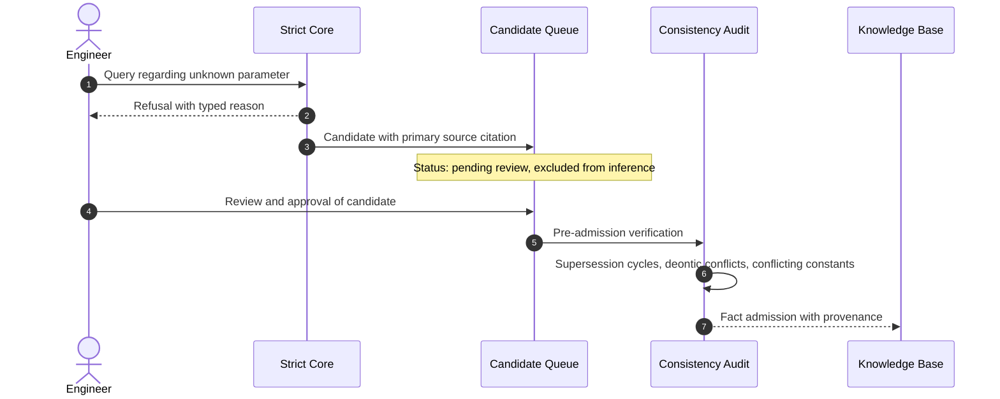

# Chapter 28. Dual-Mode Expert Systems: Strict Deduction and Advisory Hypotheses

> **Book:** [Architecture of Evidence-Governed Expert Systems](README.md) · [Part VI: Neuro-Symbolic Models, Cognitive Frontiers, and Continual Learning](part-06-frontiers-neuro-symbolic.md)  
> **Previous Chapter:** [Chapter 30. Functional Safety and Cybersecurity Co-Engineering](ch30-safety-cybersecurity-co-engineering.md)  
> **Next Chapter:** [Chapter 29. Neuro-Symbolic Architecture: Language Models and Evidence-Grounded Verification](ch29-neuro-symbolic-architecture.md)  
> **Table of Contents:** [README.md](README.md)  
> **Author:** [Mykola Fedchyk](about-the-author.md)  
> **Level:** Intermediate and Advanced: Systems Architects, Knowledge Engineers, Verification Engineers, Functional Safety Auditors  
> **Learning Outcomes:** Formally decouple strict results from advisory hypotheses; construct a deterministic symbolic core based on Horn clauses with least fixed point computation and stratified negation; return counterexamples instead of a bare "no" for quantifiers over finite domains; identify deontic conflicts in normative texts; distinguish deduction, induction, and abduction per Peirce and apply root-cause reduction; generate precedent-based hypotheses with criteria for fact promotion; transform refusals into knowledge base candidates without bypassing peer review; route queries lacking a strict answer or sufficiently similar precedent to an authorized expert and return the expert's response as a validated precedent.

## Abstract

This chapter investigates the architectural principles of dual-mode expert systems capable of concurrently serving as a rigorous source of evidence (for regulatory auditing and certification under ISO 26262 / DO-178C) and a flexible advisory assistant (for operational diagnostics and incident troubleshooting). The foundational invariant of evidence grounding is formulated: advisory hypotheses are explicitly tagged as ungrounded, possess an immutable derivation method and verification criteria, and are strictly excluded from deterministic inference and formal safety argumentation (*Safety Cases*). The mathematical apparatus of the deterministic symbolic core based on Horn clauses, least fixed point computation, and stratified negation is analyzed. The role of Peirce's epistemic triad (deduction, induction, abduction) and causal reduction is formalized. A mechanism for transforming typed refusals (*Refusal*) into learning material, an expert escalation protocol, and the integration of validated findings into the case base are detailed. A reference Python implementation of the dual-mode engine is provided.

Consider a certification audit of an autonomous vehicle chassis control system (ISO 26262 ASIL D) or airborne avionics (DO-178C). If an unverified diagnostic heuristic or empirical bench workaround ("ignore steering angle sensor faults when voltage drops below 11 V") inadvertently enters the formal safety argument from [Chapter 27](ch27-safety-case-gsn-synthesis.md) as a verified fact, the system receives operational approval with a latent defect, precipitating a fatal skid during a high-speed maneuver. The behavior of an expert system in such domains must be strictly fail-closed: when authoritative normative knowledge is lacking, the system is prohibited from fabricating or interpolating claims.

Conversely, consider an engineer troubleshooting an intermittent communication bus fault on a hardware-in-the-loop (HIL) testbed at 2:00 AM. In this operational context, a fast heuristic clue is indispensable: "A similar fault was observed on board revision B, caused by a CAN transceiver initialization delay," even if that clue constitutes mere analogy from a past post-mortem and lacks codification in an official standard. Refusing to assist the engineer with a dry "data unavailable" renders the expert system useless precisely when operational assistance is paramount. Yet presenting an advisory conjecture to an auditor as an established fact fatally compromises the integrity of certification evidence.

This chapter resolves the central engineering challenge: **how can a single expert system simultaneously function as a rigorous source of verifiable evidence and a useful advisory assistant without permitting advice to imperceptibly masquerade as proof?** The thesis of this chapter is: **the system output comprises two components possessing distinct epistemic statuses. The strict component is derived via deterministic rules over cited facts and yields a typed refusal upon encountering a knowledge deficit. The advisory component consists of hypotheses, each explicitly tagged as ungrounded and equipped with an immutable derivation method and promotion criteria. A hypothesis cannot enter deterministic inference or a safety case until it undergoes the identical peer review process mandated for any candidate knowledge modification.**

## 1. Architectural Dichotomy of the Two Modes and the Foundational Evidence Invariant

A fundamental requirement for the architecture of an evidence-governed expert system is the rigorous separation of deterministic inference from heuristic conjecture. To implement this dichotomy, the system maintains two isolated operational modes: strict and advisory. In strict mode, the response to a query $q$ is a strict result $`\mathcal{T}_{\mathrm{strict}}(q)`$: either an assertion grounded in primary source citations or a refusal $`\mathrm{Refusal}(\rho)`$ with a typed reason $\rho$ detailing the specific knowledge deficit. In advisory mode, the response is an ordered pair:

```math
\mathcal{Y}_{\mathrm{ext}}(q)=\bigl\langle\,\mathcal{T}_{\mathrm{strict}}(q),\ \mathcal{H}(q)\,\bigr\rangle,
\qquad
\mathcal{H}(q)=\{h_1,\dots,h_k\}.
```

- For the extended response, $q$ is the query, $`\mathcal{T}_{\mathrm{strict}}(q)`$ is the strict result, and $`\mathcal{H}(q)`$ is the set of advisory hypotheses;
- Angle brackets $\langle\ ,\ \rangle$ form an ordered pair, preserving distinct positions for the strict result and the advisory hypotheses;
- $`h_1,\dots,h_k`$ are hypotheses indexed from 1 to $k$, where $k$ denotes their total count;
- $`\mathcal{Y}_{\mathrm{ext}}(q)`$ represents the complete extended response for query $q$.

The interpretation is clear: advisory mode augments the unmodified strict response with candidate hypotheses. The formula establishes the structural composition of the output without granting hypotheses evidentiary standing.

The strict component remains unmodified in advisory mode: the advisory engine merely appends the hypothesis set $`\mathcal{H}(q)`$. Each hypothesis is a 5-tuple:

```math
h_i=\langle\,\sigma_i,\ \mu_i,\ c_i,\ \mathcal{O}_i,\ \mathcal{P}_i\,\rangle.
```

- In tuple $`h_i`$, index $i$ designates the hypothesis rank, and angle brackets define an ordered sequence;
- $`\sigma_i`$ is the hypothesis proposition, $`\mu_i`$ is the derivation method, and $`c_i`$ is the confidence assessment;
- $`\mathcal{O}_i`$ contains the empirical observations supporting the hypothesis, and $`\mathcal{P}_i`$ defines the verification criteria required for promotion to a fact candidate;
- The fields strictly follow the order: proposition, method, confidence, observations, promotion criteria.

The tuple encapsulates not only the conjectured claim, but also its formal derivation pathway and the necessary empirical tests required for validation. Confidence score $`c_i`$ does not represent an automatically calibrated Bayesian probability.

The foundational evidence invariant is formally defined as:

```math
\forall h\in\mathcal{H}(q):\quad \mathrm{EvidenceGrounded}(h)=\mathrm{false}\ \land\ h\notin\mathrm{SafetyCase}.
```

- The invariant holds for every hypothesis $h$ in set $`\mathcal{H}(q)`$ generated for query $q$;
- $\forall$ denotes universal quantification ("for all"), and $\in$ denotes set membership;
- $\mathrm{EvidenceGrounded}(h)=\mathrm{false}$ asserts that the hypothesis lacks a confirmed evidentiary foundation;
- $\land$ denotes logical conjunction, and $h\notin\mathrm{SafetyCase}$ prohibits the inclusion of the hypothesis in any formal safety case.

Consequently, every advisory hypothesis remains ungrounded and quarantined from safety argumentation. This rule governs data classification rather than numeric plausibility.

A hypothesis by definition lacks grounding in verified primary sources and cannot enter the safety cases discussed in [Chapter 27](ch27-safety-case-gsn-synthesis.md). The path of a hypothesis to the knowledge base proceeds strictly through the candidate admission lifecycle detailed in [Chapter 26](ch26-continual-learning.md): satisfaction of criteria $`\mathcal{P}_i`$, human peer review, and passing the admission gateway. This invariant is meaningful only when the underlying symbolic core is strictly deterministic and guaranteed to terminate, which motivates our examination of the deterministic core.

## 2. Deterministic Symbolic Core: Horn Clauses and the Least Fixed Point

Procedural rules implemented as nested conditional branching in imperative code are notoriously difficult to verify: execution ordering alters outcomes, and mutual recursion across thousands of rules can trigger unbounded loops. The strict core is therefore implemented declaratively in Datalog. In their seminal treatise on database theory, Serge Abiteboul, Richard Hull, and Victor Vianu define Datalog as a rule-based language over a finite set of relations devoid of function symbols [[1]](#src-1). Each rule is a Horn clause:

```math
H(\vec X)\leftarrow B_1(\vec X_1)\land\dots\land B_m(\vec X_m)\land\neg N_1(\vec Y_1)\land\dots\land\neg N_k(\vec Y_k).
```

- In the Horn clause, $H$ is the head representing the derived conclusion, and $\vec X$ is the tuple of head variables;
- $`B_i(\vec X_i)`$ are positive body atoms, $m$ denotes their total count, and $\land$ enforces joint satisfaction;
- $\leftarrow$ denotes logical implication ("derive head if body holds");
- $`N_j(\vec Y_j)`$ are negation-as-failure atoms, $k$ denotes their total count, and $\neg$ denotes that the corresponding fact cannot be proven;
- Indices $i$ and $j$ enumerate atoms, while $\dots$ denotes the continuation of rule conditions up to bounds $m$ and $k$;
- $`\vec X_i`$ and $`\vec Y_j`$ are tuples of variables occurring within respective atoms; rule variables share a common domain.

The rule states: derive conclusion $H$ when all positive body conditions are satisfied and none of the negated facts can be proven. For rules incorporating negation, stratification is mandatory to prevent evaluation order from altering the derived model.

Computation begins with base facts and iteratively evaluates all rules until no novel facts can be derived. The flowchart illustrates this fixpoint computation.



For positive Datalog programs (without negation), the evaluation converges to the unique least fixed point: the minimal set of facts closed under all program rules. Because function symbols are excluded, the universe of discourse is finite; hence, evaluation terminates in polynomial time relative to the size of the extensional database for a fixed rule set [[1]](#src-1). Negation as failure disrupts monotonicity: a fact derived from the absence of $`N`$ may be invalidated if $N$ is derived in a subsequent iteration. Stratification resolves this non-monotonicity: rules are partitioned into ordered strata such that any negated predicate is completely evaluated in lower strata before being negated in higher strata [[1]](#src-1). Programs containing recursion through negation lack stratification and are rejected by the strict core during rule base compilation.

The deterministic core outputs more than binary truth values. **Universal quantification over a finite domain** evaluates systemic completeness properties, such as "for every protocol command, a documented response exists in the knowledge base":

```math
\forall c\in\mathrm{Commands}:\ \exists s\ \ \mathrm{DocumentedReply}(c,s).
```

- For every command $c$ belonging to set $\mathrm{Commands}$, a corresponding status $s$ must exist;
- $\forall$ denotes universal quantification, $\exists$ denotes existential quantification, and $\in$ denotes set membership;
- $\mathrm{DocumentedReply}(c,s)$ is the predicate asserting that command $c$ has documented response $s$.

Because the command domain is finite, a false proposition yields a concrete command lacking a documented response. The assertion is bounded strictly to commands in $\mathrm{Commands}$.

When the proposition is falsified, the core returns an explicit counterexample—the exact command lacking an entry—rather than an opaque logical zero. This counterexample immediately exposes the precise knowledge base omission.

**Deontic verification** audits normative regulatory texts for modal collisions. In the foundational paper establishing modern deontic logic, Georg Henrik von Wright treated obligation, prohibition, and permission as modal operators over actions [[2]](#src-2). Let obligation be denoted by $\mathsf{O}$ (`MUST`) and prohibition by $\mathsf{F}$ (`MUST NOT`). A simultaneous obligation and prohibition of the identical action within the same operational scope constitutes a deontic contradiction:

```math
\mathsf{O}(a,s)\land\mathsf{F}(a,s)\ \Rightarrow\ \bot .
```

where:

- $\mathsf{O}(a,s)$ asserts the obligation to execute action $a$ within scope $s$;
- $\mathsf{F}(a,s)$ asserts the prohibition of executing action $a$ within scope $s$;
- $\land$ denotes the simultaneous presence of both norms, $\Rightarrow$ denotes logical implication, and $\bot$ represents logical contradiction.

The formula flags a collision whenever an action is simultaneously mandatory and forbidden within the same operational context. It does not resolve which norm takes precedence.

Detected deontic conflicts cannot be resolved automatically: the core blocks admission of conflicting rule sets and routes the conflict to the regulatory document owner. While the strict core guarantees reproducible and verifiable deductions, engineering practice requires reasoning beyond deduction. The following section delineates the reasoning paradigms operating across both modes.

## 3. Peirce's Epistemic Triad: Deduction, Induction, Abduction, and Causal Reduction

In his 1878 treatise "Illustrations of the Logic of Science VI: Deduction, Induction, and Hypothesis", Charles Sanders Peirce distinguished three fundamental modes of inference [[3]](#src-3). Deduction applies a general rule to a specific case to derive a necessary result. Induction generalizes observed cases and results into a prospective rule. Hypothesis (abduction) explains a surprising observation by conjecturing that the case falls under a certain rule; Peirce emphasized that as a general rule, a hypothesis is a weak form of argument. In contemporary epistemology, this mode is formalized as abduction. Igor Douven notes in *The Stanford Encyclopedia of Philosophy* that in Peirce's framework, abduction entails adopting a hypothesis not as verified truth, but as a promising candidate worthy of further testing [[4]](#src-4). This provisional status precisely describes the advisory hypotheses generated by an expert system. For a dual-mode expert system, Peirce's classification establishes the epistemic status of all generated outputs.

**Deduction operates exclusively in strict mode.** Backward chaining from a query goal constructs an explanation tree where every node is either an axiomatic fact grounded in a citation or a rule derivation referencing verified premises, as detailed in [Chapter 20](ch20-explanation-engine.md). The epistemic status of deduction is inherited directly from its premises: cited facts yield an unassailable strict deduction.

**Induction operates in advisory mode.** From empirical protocol session logs, the system can synthesize a finite-state automaton that generalizes observed state transitions. Such an automaton constitutes a hypothesis regarding system specification, not an authoritative standard: operational traces record only transitions that occurred historically. To compare an inductively synthesized automaton against an official standard specification, both are minimized using John Hopcroft's $O(n\log n)$ state minimization algorithm [[5]](#src-5):

```math
s_1\sim s_2\iff\forall w\in\Sigma^{*}:\ \bigl(\hat\delta(s_1,w)\in F\iff\hat\delta(s_2,w)\in F\bigr).
```

- For the automata under comparison, $`s_1`$ and $`s_2`$ are states, and $\sim$ denotes state equivalence;
- $\forall w\in\Sigma^*$ tests every finite word of input symbols $w$ over alphabet $\Sigma$, where the asterisk denotes the Kleene closure (including the empty string);
- $\hat\delta(s,w)$ is the extended transition function returning the terminal state reached after processing word $w$;
- $F$ is the set of accepting states, $\in$ denotes membership, and $\iff$ denotes logical equivalence;
- The inner $\iff$ mandates that both states must either both accept or both reject every input word identically.

Two states are equivalent if and only if they recognize the identical language. The comparison requires automata defined over the identical alphabet and depends on correctly specified transitions and accepting states.

Any divergence between minimal automata highlights an empirical transition observed in production that violates the normative standard, or vice versa.

**Abduction operates in advisory mode.** Explaining an observed anomaly via its most probable root cause is inherently hypothetical, even when assigned a high Bayesian likelihood; [Chapter 24](ch24-system-diagnosis.md) details how such diagnostic hypotheses are ranked and verified.

**Causal reduction is not part of Peirce's triad, but is essential to both modes.** Reduction compresses an extended diagnostic chain into its essential root cause. In diagnosing an SMTP mail session, reduction collapses an error during the DATA phase to a single unsatisfied prerequisite. Standard RFC 5321 explicitly authorizes a mail server to return error code 503 ("Bad sequence of commands") or 554 ("No valid recipients") in response to a DATA command if no valid MAIL or RCPT command was accepted prior to it [[6]](#src-6). Consequently, an observed 503 code during the DATA command is reduced to the strict deduction: "No accepted RCPT command occurred", backed by normative citations. Minimal conflicting constraint sets are isolated using the QuickXPlain algorithm presented in [Chapter 20](ch20-explanation-engine.md), while cryptographic proof integrity is preserved via Merkle trees as detailed in [Chapter 27](ch27-safety-case-gsn-synthesis.md).

## 4. Advisory Mode: Case-Based Reasoning and Working Hypothesis Generation

The most pragmatic source of advisory hypotheses is corporate case memory. Case-Based Reasoning (CBR), as formalized by Agnar Aamodt and Enric Plaza, executes a four-phase cognitive cycle: retrieve the most similar historical case, reuse its solution, revise the proposed solution against observed differences, and retain the confirmed experience [[7]](#src-7). Symptom set overlap is effectively quantified using the Jaccard similarity index, originally introduced by Paul Jaccard for botanical ecological analysis [[8]](#src-8):

```math
J(S_{\mathrm{in}},S_{\mathrm{case}})=\frac{|S_{\mathrm{in}}\cap S_{\mathrm{case}}|}{|S_{\mathrm{in}}\cup S_{\mathrm{case}}|}.
```

- The index $J$ measures the similarity between query symptom set $`S_{\mathrm{in}}`$ and historical case symptom set $`S_{\mathrm{case}}`$;
- $\cap$ denotes set intersection, $\cup$ denotes set union, and $`\lvert \cdot \rvert`$ denotes set cardinality;
- The numerator enumerates shared symptoms, while the denominator counts all unique symptoms across both sets.

For a worked numerical example with $`S_{\mathrm{in}} = \{A, B\}`$ and $`S_{\mathrm{case}} = \{B, C\}`$, we calculate $J = 1 / 3 \approx 0.33$. For non-empty unions, the coefficient ranges from 0 to 1; if both sets are empty, the denominator is zero and the metric is undefined. The metric measures taxonomic overlap, not hypothesis correctness probability.

If similarity $J$ exceeds a calibrated threshold $\theta$, the retrieved case is formulated as an advisory hypothesis with method "case-based analogy", confidence score $c = J$, and explicit promotion criteria: reproduce the case conditions on a testbed and confirm the root cause. The threshold $\theta$ must not be chosen arbitrarily; it is calibrated empirically on labeled validation sets as demonstrated in [Chapter 25](ch25-how-expert-systems-learn.md), since the Jaccard index reflects structural feature similarity rather than statistical truth probability.

Consider a representative industrial scenario: an engineer reports a TCP connection timeout on port 25. The strict core lacks a verified causal fact in its knowledge base and returns a typed refusal. The advisory mode searches historical cases, identifies an incident where an ISP blocked outbound port 25, and recommends the corresponding corrective action: reroute mail transmission through message submission port 587, which RFC 6409 designates for client message submission while reserving port 25 for inter-MTA relay [[9]](#src-9). The citation to RFC 6409 proves that port 587 exists and is standardized for submission, but does not prove that ISP port filtering caused this specific connection timeout. Consequently, the entire recommendation remains an advisory hypothesis.

## 5. Typed Refusal as a Source of New Knowledge

A typed refusal emitted by the strict core is not merely a safe null result—it is an actionable diagnostic signal identifying a knowledge gap. When the core emits a refusal, the expert system can scan primary documentation to locate text passages relevant to the query and construct fact candidates: subject, relation, value, document identifier, and exact byte-offset citation boundaries, matching the quotation verifier in [Chapter 15](ch15-knowledge-extraction-and-kb-construction.md). A candidate is assigned status "pending review" and remains excluded from deterministic inference until approved by a domain knowledge engineer. The sequence diagram illustrates this lifecycle.



Pre-admission consistency auditing intercepts three distinct structural defects. **Supersession cycles** occur when document A obsoletes document B, while document B circularly obsoletes document A. **Deontic conflicts** occur when the identical action is simultaneously mandatory and forbidden within the same operational domain. **Conflicting constants** arise when a single specification revision declares divergent values for the same parameter (e.g., conflicting default ports). Once an operational incident is resolved and its physical root cause verified, the post-mortem is retained as a new validated case. Thus the cognitive feedback loop closes: a refusal generates a candidate fact, an audited candidate becomes an axiomatic fact, and a resolved incident enriches the case base for future advisory hypotheses.

### 5.1. Expert Escalation and the Closed Knowledge Replenishment Loop

The cycle from refusal to fact functions effectively when answers exist within ingested primary sources. However, certain engineering queries have no resolution in either formal specifications or precedent memory: for instance, undocumented workarounds known only to the engineer maintaining a bespoke testbed, or authoritative regulatory interpretations that only a designated compliance officer is legally entitled to provide. In such circumstances, a strict core refusal must be transformed into an addressable request to an authorized human expert, whose formal response is fed back into the expert system as a validated precedent.

Keltoum Benlaharche and colleagues demonstrated this operational paradigm for the Algerian Fatawa House, which suffered from a severe deficit of muftis (certified Islamic jurisprudence scholars) to handle daily citizen inquiries [[10]](#src-10). Their system performs case-based reasoning over an ontology of Islamic finance and banking transactions. If a sufficiently similar verified case exists in the repository, the system returns that response immediately. Otherwise, the system automatically synthesizes a structured inquiry for a mufti, who either endorses the generated draft or provides a novel ruling, directly enriching the case base. The authors evaluated the system qualitatively within a single domain; hence, the study serves as an architectural pattern rather than a source of quantitative performance benchmarks.

Adapting this pattern to dual-mode expert systems requires an essential architectural modification. In the fatawa system, retrieved precedents are returned directly to end users as final answers. In an evidence-governed dual-mode system, a retrieved precedent remains an advisory hypothesis even if previously endorsed by an expert: symptom similarity does not prove that the operating conditions of the novel incident match the precedent. Following evaluation by the strict core, the query router selects one of three execution pathways:

```math
\mathrm{route}(q)=
\begin{cases}
\text{strict answer}, & \text{if } \mathrm{Strict}(q)\neq\bot,\\
\text{hypothesis from case } c^{*}, & \text{if } \mathrm{Strict}(q)=\bot\ \land\ J(q,c^{*})\ge\theta,\\
\text{request to expert}, & \text{otherwise},
\end{cases}
\qquad
c^{*}=\arg\max_{c\in C_{\mathrm{val}}} J(q,c).
```

Router notation:

- $q$ is the query, reduced to a set of categorical features matching the Jaccard formulation above;
- $\mathrm{Strict}(q)$ is the evaluation output of the strict core, and $\bot$ denotes a typed refusal;
- $`C_{\mathrm{val}}`$ is the set of precedents validated by an authorized expert, and $`c^{*}`$ is the most similar precedent from this set;
- $`J(q,c^{*})`$ is the Jaccard similarity index between query features and precedent features, and $\theta$ is the calibrated threshold;
- $\arg\max$ returns the precedent maximizing similarity; if $`C_{\mathrm{val}}`$ is empty, the router immediately selects an expert request.

The routing logic governs default behavior: an engineer who deems an advisory hypothesis insufficient for operational decision-making may manually escalate the inquiry to human experts. The escalation packet is synthesized autonomously by the system rather than the user, assembling all requisite diagnostic context. The table specifies the escalation payload fields.

| Query Field | Content | Value Provided to the Expert |
|---|---|---|
| Structured Query | Extracted features, parameters, and operational scope | Unambiguous formulation of the technical problem |
| Refusal Reason | Failure taxonomy and missing axiomatic fact or rule | Exact locus of the knowledge deficit in the knowledge base |
| Nearest Precedents | Case identifiers, Jaccard indices, and distinguishing features | Clear rationale why existing precedents are insufficient |
| Response Draft | Advisory hypothesis accompanied by promotion criteria | Opportunity to validate or adjust a structured draft rather than writing from scratch |
| Primary Source Citations | Document identifier, revision tag, and exact quotation byte range | Immediate verification of normative grounding without auxiliary manual search |

The expert's response returns along two distinct channels carrying divergent epistemic status. The confirmed or corrected response is appended to $`C_{\mathrm{val}}`$ as a validated precedent, bearing the expert's cryptographic identity, timestamp, operational scope, and any scope qualifiers stipulated by the expert. If the response formulates a general rule referencing a normative standard, the expert system concurrently creates a fact candidate, which undergoes the identical review and consistency auditing depicted in the sequence diagram. An expert's endorsement does not exempt a fact candidate from rigorous checks against supersession cycles, deontic conflicts, and conflicting constants.

Consider an extension of the timeout scenario: an engineer reports a connection timeout on port 25 in a newly commissioned laboratory network. The strict core emits a refusal, and the nearest validated precedent achieves a Jaccard index of 0.33, falling below the threshold $\theta = 0.4$. The router synthesizes an escalation request to the mail infrastructure administrator containing the draft recommendation: "Verify whether the upstream ISP blocks outbound port 25." The administrator endorses the draft, appending the operational constraint: "Applies exclusively to dynamic IP allocations lacking static reverse DNS." Subsequent matching queries receive an advisory hypothesis citing this validated precedent without triggering human escalation. The strict core continues emitting a refusal for such queries until an administrator links an excerpt from the ISP terms of service as a primary citation and the resulting fact candidate passes peer review.

A fundamental constraint of this architectural pattern is expert bandwidth. Authorized human expertise is an inherently scarce resource—the fatawa system was conceived precisely to alleviate scholar shortages. Consequently, the escalation ratio (the percentage of refusals routed to human experts) must be continuously monitored: growth in $`C_{\mathrm{val}}`$ must drive down escalation frequency, while the rejection rate of generated drafts serves as a direct indicator of advisory mode quality. Validated precedents also suffer from temporal decay: when a primary source standard referenced by a precedent is superseded, the precedent must be scheduled for re-validation, mirroring the lifecycle of obsolete facts described in [Chapter 15](ch15-knowledge-extraction-and-kb-construction.md).

## 6. Software Verification: Python Implementation of the Dual-Mode Engine

The listing below implements the core mechanisms of this chapter in miniature. The strict core computes the least fixed point across two Horn clauses over axiomatic facts extracted from RFC 5321, returning citation-grounded deductions and emitting typed refusals upon encountering knowledge gaps. The advisory engine retrieves precedents via the Jaccard similarity index, while the router evaluates the piecewise policy from the preceding section to dispatch a strict answer, an advisory hypothesis, or an expert escalation. The script also evaluates universal quantification with counterexample extraction, audits deontic conflicts, and demonstrates divergent approval lifecycles: an expert post-mortem review produces a validated precedent, whereas a strict fact requires primary source citations and remains bounded to its declared operational scope. A built-in test suite verifies edge cases, including empty symptom sets and sub-threshold similarities. The code relies exclusively on the standard library of Python 3.10 or later.

<details>
<summary>Python Example: Strict, Advisory, and Expert Routing</summary>

```python
"""Dual-mode expert system in miniature: strict deduction with citations and advisory hypotheses.

Standard Python 3.10+ library only.
"""
FACTS = {  # (subject, relation, value) -> primary source citation
    ("SMTP", "max_line_octets", "1000"): "RFC 5321, 4.5.3.1.6",
    ("MAIL", "precedes", "RCPT"): "RFC 5321, 3.3",
    ("RCPT", "precedes", "DATA"): "RFC 5321, 3.3",
    ("HELO", "documented_reply", "250"): "RFC 5321, 4.3.2",
    ("MAIL", "documented_reply", "250"): "RFC 5321, 4.3.2",
    ("RCPT", "documented_reply", "250"): "RFC 5321, 4.3.2",
    ("DATA", "documented_reply", "354"): "RFC 5321, 4.3.2",
}
RULES = [  # Horn clauses: head <- body; variables are uppercase single letters
    (("X", "must_precede", "Y"), [("X", "precedes", "Y")]),
    (("X", "must_precede", "Z"), [("X", "precedes", "Y"), ("Y", "must_precede", "Z")]),
]
CASES = [  # validated cases: symptoms, cause, action
    ({"timeout", "port-25", "connect", "home-network"}, "ISP blocks outbound port 25",
     "submit via submission port 587 (RFC 6409)"),
    ({"503", "data", "sequence"}, "DATA without accepted RCPT command", "verify response to RCPT"),
]
NORMS = [("MUST", "use-tls", "submission"), ("MUST NOT", "use-tls", "submission"), ("MUST", "use-tls", "relay")]


def is_var(term):
    return term.isupper() and len(term) == 1


def match(pattern, fact, binding):
    binding = dict(binding)
    for p, f in zip(pattern, fact):
        if is_var(p):
            if binding.setdefault(p, f) != f:
                return None
        elif p != f:
            return None
    return binding


def solve(body, known, binding=None):
    if not body:
        yield binding or {}
        return
    for fact in list(known):
        b = match(body[0], fact, binding or {})
        if b is not None:
            for rest in solve(body[1:], known, b):
                yield rest


def least_fixed_point(facts, rules):
    known = {f: ("axiom", [src]) for f, src in facts.items()}
    rounds = 0
    while True:
        rounds += 1
        new = {}
        for head, body in rules:
            for b in solve(body, known):
                fact = tuple(b.get(t, t) for t in head)
                if fact not in known and fact not in new:
                    premises = [tuple(b.get(t, t) for t in atom) for atom in body]
                    new[fact] = ("rule", sorted({c for p in premises for c in known[p][1]}))
        if not new:
            return known, rounds
        known.update(new)


def strict(known, subject, relation):
    hits = [(f, why) for f, why in known.items() if f[0] == subject and f[1] == relation]
    if not hits:
        return {"kind": "refusal", "reason": "no confirmed fact"}
    return {"kind": "answer", "values": [(f[2], why[1]) for f, why in hits]}


def jaccard(a, b):
    union = a | b
    return len(a & b) / len(union) if union else None  # empty sets are not compared


def extended(known, subject, relation, symptoms, theta=0.4):
    answer = strict(known, subject, relation)
    scored = [(jaccard(symptoms, s), cause, action) for s, cause, action in CASES]
    scored = [item for item in scored if item[0] is not None]
    hypotheses = [{"cause": cause, "action": action, "jaccard": round(j, 2),
                   "evidence_grounded": False,
                   "promote_if": "reproduce symptoms on testbed and confirm cause"}
                  for j, cause, action in scored if j >= theta]
    route = "strict" if answer["kind"] == "answer" else "advisory" if hypotheses else "expert"
    reply = {"strict": answer, "hypotheses": hypotheses, "route": route}
    if route == "expert":
        best = max(scored, default=(0.0, None, None))
        reply["expert_request"] = {"query": (subject, relation, sorted(symptoms)),
                                   "refusal": answer["reason"],
                                   "nearest_case": best[1], "jaccard": round(best[0], 2)}
    return reply


def approve(known, candidate):  # approval does not convert incident logs into primary sources
    if candidate["source_kind"] != "primary":
        CASES.append((candidate["symptoms"], candidate["value"], candidate["action"]))
        return "validated case"
    subject = f"{candidate['subject']}@{candidate['scope']}"
    known[(subject, candidate["relation"], candidate["value"])] = ("expert approved", [candidate["source"]])
    return f"fact with scope {candidate['scope']}"


def test_dual_mode(known):
    assert jaccard(set(), set()) is None
    assert extended(known, "x", "y", set())["route"] == "expert"
    low = extended(known, "port-25", "timeout_cause", {"timeout", "lab-network"})
    assert low["route"] == "expert" and low["expert_request"]["nearest_case"]
    assert extended(known, "SMTP", "max_line_octets", set())["route"] == "strict"


known, rounds = least_fixed_point(FACTS, RULES)
test_dual_mode(known)
print(f"1. Least fixed point: {len(known)} facts after {rounds} rounds")
print("2. Strict: MAIL must_precede ->", strict(known, "MAIL", "must_precede")["values"])
print("3. Strict: SMTP line length ->", strict(known, "SMTP", "max_line_octets")["values"])
print("4. Strict: timeout on port 25 ->", strict(known, "port-25", "timeout_cause"))
reply = extended(known, "port-25", "timeout_cause", {"timeout", "port-25", "connect", "office-network"})
print("5. Advisory:", reply["route"], "+", reply["hypotheses"])
commands = ["HELO", "MAIL", "RCPT", "DATA", "VRFY"]
missing = [c for c in commands if not strict(known, c, "documented_reply")["kind"] == "answer"]
print("6. Documented reply exists for every command?", not missing, "| counterexample:", missing[:1])
conflicts = sorted({(a, s) for m1, a, s in NORMS for m2, a2, s2 in NORMS
                    if (m1, m2) == ("MUST", "MUST NOT") and (a, s) == (a2, s2)})
print("7. Deontic conflicts:", conflicts)
lab = extended(known, "port-25", "timeout_cause", {"timeout", "port-25", "lab-network", "dns"})
print("8. New network:", lab["route"], "| expert request:", lab["expert_request"])
incident = {"subject": "port-25", "relation": "timeout_cause", "value": "ISP block",
            "action": "submit via submission port 587", "symptoms": {"timeout", "port-25", "lab-network", "dns"},
            "source": "incident log INC-77", "source_kind": "incident"}
print("9. Approved expert response ->", approve(known, incident),
      "| strict:", strict(known, "port-25", "timeout_cause")["kind"],
      "| repeat query:", extended(known, "port-25", "timeout_cause", incident["symptoms"])["route"])
contract = {**incident, "source": "ISP terms of service, cl. 3.2", "source_kind": "primary",
            "scope": "dynamic-ip"}
print("10. Approved primary source quote ->", approve(known, contract),
      "| strict for dynamic-ip:", strict(known, "port-25@dynamic-ip", "timeout_cause")["values"],
      "| without scope:", strict(known, "port-25", "timeout_cause")["kind"])
```

</details>

Executing `python dual_mode.py` yields:

<details>
<summary>Program Output</summary>

```text
1. Least fixed point: 10 facts after 3 rounds
2. Strict: MAIL must_precede -> [('RCPT', ['RFC 5321, 3.3']), ('DATA', ['RFC 5321, 3.3'])]
3. Strict: SMTP line length -> [('1000', ['RFC 5321, 4.5.3.1.6'])]
4. Strict: timeout on port 25 -> {'kind': 'refusal', 'reason': 'no confirmed fact'}
5. Advisory: advisory + [{'cause': 'ISP blocks outbound port 25', 'action': 'submit via submission port 587 (RFC 6409)', 'jaccard': 0.6, 'evidence_grounded': False, 'promote_if': 'reproduce symptoms on testbed and confirm cause'}]
6. Documented reply exists for every command? False | counterexample: ['VRFY']
7. Deontic conflicts: [('use-tls', 'submission')]
8. New network: expert | expert request: {'query': ('port-25', 'timeout_cause', ['dns', 'lab-network', 'port-25', 'timeout']), 'refusal': 'no confirmed fact', 'nearest_case': 'ISP blocks outbound port 25', 'jaccard': 0.33}
9. Approved expert response -> validated case | strict: refusal | repeat query: advisory
10. Approved primary source quote -> fact with scope dynamic-ip | strict for dynamic-ip: [('ISP block', ['ISP terms of service, cl. 3.2'])] | without scope: refusal
```

</details>

Line 1 demonstrates that from seven axiomatic base facts, the core derived three novel facts, terminating at round 3 when no further conclusions could be generated. Line 2 exhibits the transitively derived fact "MAIL must precede DATA", with its citation pedigree inherited from its underlying premises (RFC 5321, Section 3.3). Line 3 returns a cited axiomatic fact, whereas line 4 returns a typed refusal. Line 5 substantiates the core invariant: the router selected the advisory pathway, leaving the strict component as a refusal while emitting the port-filtering hypothesis with Jaccard index 0.6, explicit tag `evidence_grounded: False`, and testbed promotion criteria. Line 6 identifies the counterexample VRFY: while RFC 5321 specifies responses to VRFY, the toy knowledge base lacks the corresponding assertion; thus, the counterexample pinpoints knowledge base incompleteness rather than a defect in the standard. Line 7 uncovers the deontic contradiction ("mandatory and prohibited use of TLS for message submission") within synthetic regulatory norms; the relay norm generates no conflict because it governs a distinct operational scope. Line 8 replicates the lab network scenario: the closest precedent achieves an index of 0.33 (below threshold $\theta = 0.4$), prompting the router to generate an expert escalation packet containing the refusal rationale and nearest case metadata. Lines 9 and 10 illustrate divergent admission semantics. Approving an incident log creates a validated precedent: a repeated query now receives an advisory hypothesis without triggering human escalation, but the strict core continues emitting a refusal. A strict fact is created exclusively from a normative citation (ISP terms of service) and is bounded strictly to scope `dynamic-ip`; a query evaluated without this scope continues receiving a refusal. Thus, an isolated post-mortem cannot masquerade as a general rule merely by virtue of human sign-off.

This pedagogical implementation has defined boundaries. The rule set and extensional database are minimal; naive fixed-point evaluation re-scans the entire database each round, whereas production Datalog engines employ semi-naive evaluation and relational indexing. The TLS norms, cases, and terms of service clause are synthetic. Operational scope is encoded into the subject identifier solely for pedagogical brevity; a production knowledge base isolates scope as a distinct typed attribute. The threshold $\theta = 0.4$ is chosen for demonstration rather than empirical calibration.

## 7. Tooling and Frameworks for Combined Inference

While a pedagogical engine of several dozen lines clarifies semantics, it cannot scale to enterprise rule bases containing tens of thousands of clauses. Open-source inference engines provide production scalability while preserving identical formal semantics. Each tool requires independent semantic equivalence verification prior to deployment.

| Tool / Framework | Applied Engineering Role | Verification Mandatory Prior to Deployment |
|---|---|---|
| Soufflé [[11]](#src-11) | High-performance Datalog-to-C++ compilation for large-scale relational fact bases | The language admits functors and infinite domains; termination of the strict core must be guaranteed by restricting permitted syntactic constructs |
| clingo [[12]](#src-12) | Answer Set Programming (ASP) for deontic conflict detection, alternative diagnosis, and minimal abductive hypothesis search | Multiple answer sets represent alternative models rather than a single strict deduction; grounding memory and solving time must be bounded by strict budgets |
| Vector Embedding Similarity Search | Semantic retrieval of past incidents from unstructured free-form symptom descriptions | Vector cosine similarity does not represent probability; similarity thresholds must be calibrated against historical validated case pairs |

Three analytical disciplines directly enhance the advisory mode. Precedent clustering highlights recurrent symptom co-occurrences that warrant investigation in primary normative literature. Escalation log mining pinpoints domains where human experts consistently reject generated drafts, signaling that similarity thresholds or case repositories require recalibration. Continuous regression testing of the normative knowledge base for deontic conflicts after every specification update uncovers collisions before they impact production queries. All three methods produce candidates for human review rather than unverified strict facts.

## 8. Comparative Analysis of Inference Modes Across Dependability Metrics

The table contrasts the operational properties of strict mode, advisory mode, and unconstrained large language model generation operating without a symbolic core.

| Criterion | Strict Mode | Advisory Mode | Unconstrained LLM Generation |
|---|---|---|---|
| Primary Purpose | Audit, safety argumentation, regulatory responses | Debugging, root-cause investigation, testbed diagnosis | Text drafting, exploratory brainstorming |
| Response Epistemic Status | Sound deduction backed by primary citations or typed refusal | Unmodified strict block augmented with flagged hypotheses | Unverifiable natural language text disconnected from source provenance |
| Reaction to Knowledge Deficit | Typed refusal specifying missing premises | Refusal accompanied by candidate hypotheses with verification criteria | Plausible generative synthesis prone to confabulation |
| Determinism and Reproducibility | Identical output for an identical knowledge base state | Strict block reproducible; hypotheses deterministic relative to case memory | Non-deterministic, sensitive to decoding parameters |
| Safety Case Participation | Permitted via formal GSN evidence links | Restricted strictly to the deterministic block | Strictly prohibited |
| Knowledge Base Admission Path | Not applicable (already validated) | Via promotion criteria, domain expert review, and admission gateway | Only as an unverified candidate requiring end-to-end audit |

This comparison does not imply that language models lack utility. [Chapter 29](ch29-neuro-symbolic-architecture.md) illustrates how a language model operates safely within this architecture: translating unstructured natural language queries into formal relational structures evaluated by the strict core, and synthesizing human-readable explanations without possessing the authority to alter underlying rule deductions.

## Conclusions

The central question of this chapter is resolved: an expert system can concurrently serve as an authoritative source of verifiable evidence and a practical advisor if and only if its response is decoupled into two components of distinct epistemic status, bound by an immutable invariant prohibiting hypotheses from entering strict inference or safety cases without passing peer review. The strict component relies on Horn clauses evaluated via least fixed point computation, stratified negation, finite-domain quantifiers with counterexample generation, and deontic collision auditing. The advisory component leverages induction, abduction, and case-based analogy, ensuring every hypothesis encapsulates its derivation method and testbed promotion criteria. When neither the strict core nor validated precedents resolve an inquiry, the router transforms the refusal into a structured escalation packet for an authorized human expert; the expert's response yields a validated precedent and, when normative grounding exists, a fact candidate.

The reference implementation demonstrates the foundational invariant across concrete scenarios: a query regarding an unexplained timeout yielded a strict refusal, an advisory hypothesis with Jaccard index 0.6 emerged with an explicit ungrounded flag, and at similarity 0.33 the system synthesized an expert escalation packet. An approved incident post-mortem became a validated precedent, while an axiomatic fact was created solely from an authoritative specification citation within a declared operational scope. Finite-domain universal quantification pinpointed knowledge base omissions via counterexamples, while deontic auditing exposed normative collisions within a shared operational context. Peirce's epistemic triad clarified why deduction belongs strictly to the deterministic core, why induction and abduction populate the advisory mode, and why root-cause reduction citing a normative clause constitutes a valid strict deduction.

The architectural limitations of this chapter must be recognized. Strict mode guarantees reproducibility and traceability only relative to the underlying knowledge base: an erroneous cited fact necessarily yields an erroneous strict deduction. Stratification precludes certain classes of expressive recursive programs with cyclic negation. Confidence scores derived from symptom set overlap do not constitute calibrated probabilities and require empirical tuning. Escalation workflows are bounded by the finite availability of authorized human experts; hence, escalation ratios and draft rejection rates must be continuously tracked. Advisory hypotheses are safe only when end users recognize and respect ungrounded markers; user interfaces must partition the deterministic block from advisory conjectures as strictly as the underlying formal model. [Chapter 29](ch29-neuro-symbolic-architecture.md) examines how language models are integrated into this architecture without compromising the foundational evidence invariant.

## Review Questions

1. Why must the strict component of a response in advisory mode remain completely identical to the response emitted in strict mode?
2. What five fields comprise an advisory hypothesis tuple, and why is an explicit promotion criterion mandatory?
3. Why is least fixed point computation guaranteed to terminate for Datalog? How does negation disrupt monotonicity, and how does stratification restore soundness?
4. Why is returning a concrete counterexample for a universal quantifier superior to a bare logical negation? In the reference implementation, does the VRFY counterexample indicate incompleteness in RFC 5321 or in the knowledge base?
5. Formulate the conditions for a deontic conflict, and explain why two contradictory modal norms governing different operational scopes do not collide.
6. How did Peirce distinguish deduction, induction, and hypothesis (abduction)? Which operational mode of an expert system corresponds to each form?
7. Why can HTTP/SMTP error code 503 during a DATA command be reduced to a strict deduction citing RFC 5321, whereas a connection timeout on port 25 cannot?
8. Why does a Jaccard similarity index of 0.6 not represent a 60% probability that the advisory hypothesis is correct?
9. What three structural defects are intercepted by pre-admission consistency auditing prior to committing a new fact candidate?
10. Why does a precedent validated by an expert remain an advisory hypothesis when applied to a novel query? What payload fields must an automated expert escalation packet contain?
11. Why does an approved post-mortem log record become a validated precedent in the reference program, whereas an approved specification quotation becomes an axiomatic fact strictly within its declared operational scope?

## Glossary

| Term | Equivalent | Definition |
|---|---|---|
| Fail-closed | Fail-closed | System behavior wherein a knowledge deficit produces an explicit refusal rather than speculative guesswork |
| Strict result | Strict result | An inference derived strictly from primary source citations or a typed refusal |
| Advisory hypothesis | Advisory hypothesis | A candidate proposition explicitly tagged as ungrounded, accompanied by its derivation method and verification criteria |
| Promotion criterion | Promotion criterion | A predefined verification condition whose satisfaction allows a hypothesis to be submitted as a candidate fact |
| Horn clause | Horn clause | A rule comprising a single head atom and a conjunction of body atoms |
| Least fixed point | Least fixed point | The minimal set of facts closed under all applicable inference rules |
| Negation as failure | Negation as failure | Evaluating an atom as false whenever it cannot be derived from known facts |
| Stratification | Stratification | Partitioning rules into ordered strata ensuring negated predicates are completely evaluated in lower strata |
| Counterexample | Counterexample | A concrete domain element that falsifies a universally quantified proposition |
| Deontic conflict | Deontic conflict | Simultaneous obligation and prohibition of the identical action within the same scope |
| Deduction | Deduction | Deriving a necessary result from a general rule and a specific case |
| Induction | Induction | Generalizing a rule from observed cases and results |
| Abduction | Abduction | Explaining an observed result through the hypothesis of a case and a rule |
| Root-cause reduction | Root-cause reduction | Compacting an extended failure chain into a critical unsatisfied precondition |
| Automaton minimization | Automaton minimization | Merging equivalent states within a finite-state machine |
| Jaccard index | Jaccard index | The ratio of the intersection cardinality to the union cardinality of two feature sets |
| Fact candidate | Fact candidate | A proposed new fact accompanied by provenance and quotation bounds awaiting domain review |
| Expert escalation | Expert escalation | Dispatching a query unresolved by the strict core or validated cases to an authorized human expert alongside a structured draft response |
| Validated case | Validated case | An empirical case whose resolution is confirmed by an authorized expert, complete with timestamp and defined operational scope |
| Answer set | Answer set | A stable model of a logic program; a program may admit multiple alternative answer sets |

## Abbreviations

| Abbreviation | Expansion | Meaning |
|---|---|---|
| ASP | Answer Set Programming | Declarative logic programming paradigm based on stable model semantics |
| CBR | Case-Based Reasoning | Problem solving methodology based on retrieval and adaptation of past cases |
| GSN | Goal Structuring Notation | Graphical notation for explicitly structuring and assuring safety arguments |
| RFC | Request for Comments | Publication series containing technical specifications and standards for the Internet |
| SMTP | Simple Mail Transfer Protocol | Standard network protocol for electronic mail transmission |
| TLS | Transport Layer Security | Cryptographic protocol providing end-to-end communications security over a network |

## References

1. <a id="src-1"></a>Serge Abiteboul, Richard Hull, Victor Vianu. [*Foundations of Databases*](http://webdam.inria.fr/Alice/). Addison-Wesley, 1995. Chapters 12–15: Datalog, Datalog Evaluation, Recursion and Negation.
2. <a id="src-2"></a>Georg Henrik von Wright. [*Deontic Logic*](https://doi.org/10.1093/mind/LX.237.1). *Mind*, 60(237), 1–15, 1951.
3. <a id="src-3"></a>Charles Sanders Peirce. [*Illustrations of the Logic of Science VI: Deduction, Induction, and Hypothesis*](https://en.wikisource.org/wiki/Popular_Science_Monthly/Volume_13/August_1878/Illustrations_of_the_Logic_of_Science_VI). *Popular Science Monthly*, 13, 1878.
4. <a id="src-4"></a>Igor Douven. [*Peirce on Abduction*](https://plato.stanford.edu/entries/abduction/peirce.html). Supplement to "Abduction", *The Stanford Encyclopedia of Philosophy*, 2011, substantive revision 2025.
5. <a id="src-5"></a>John Hopcroft. [*An n log n Algorithm for Minimizing States in a Finite Automaton*](https://doi.org/10.1016/B978-0-12-417750-5.50022-1). *Theory of Machines and Computations*, Academic Press, 189–196, 1971.
6. <a id="src-6"></a>John Klensin. [*RFC 5321: Simple Mail Transfer Protocol*](https://www.rfc-editor.org/rfc/rfc5321). IETF, 2008.
7. <a id="src-7"></a>Agnar Aamodt, Enric Plaza. [*Case-Based Reasoning: Foundational Issues, Methodological Variations, and System Approaches*](https://doi.org/10.3233/AIC-1994-7104). *AI Communications*, 7(1), 39–59, 1994.
8. <a id="src-8"></a>Paul Jaccard. [*The Distribution of the Flora in the Alpine Zone*](https://doi.org/10.1111/j.1469-8137.1912.tb05611.x). *New Phytologist*, 11(2), 37–50, 1912.
9. <a id="src-9"></a>Randall Gellens, John Klensin. [*RFC 6409: Message Submission for Mail*](https://www.rfc-editor.org/rfc/rfc6409). IETF, 2011.
10. <a id="src-10"></a>Keltoum Benlaharche, Zakaria Laboudi, Nabila Nouaouria, Djamel Eddine Zegour. [*An ontology driven question answering system for fatawa retrieval*](https://doi.org/10.11591/ijeecs.v23.i2.pp980-992). *Indonesian Journal of Electrical Engineering and Computer Science*, 23(2), 980–992, 2021.
11. <a id="src-11"></a>Soufflé Developers. [*Soufflé Documentation*](https://souffle-lang.github.io/docs.html). Documentation for the Datalog-style logic programming language.
12. <a id="src-12"></a>Martin Gebser, Roland Kaminski, Benjamin Kaufmann, Torsten Schaub. [*Multi-shot ASP Solving with clingo*](https://potassco.org/clingo/). *Theory and Practice of Logic Programming*, 19(1), 27–82, 2019.

---

[← Chapter 30](ch30-safety-cybersecurity-co-engineering.md) | [Table of Contents](README.md) | [Part VI](part-06-frontiers-neuro-symbolic.md) | [Chapter 29 →](ch29-neuro-symbolic-architecture.md)
