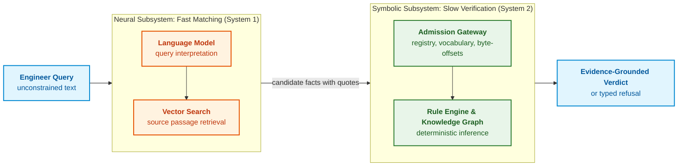
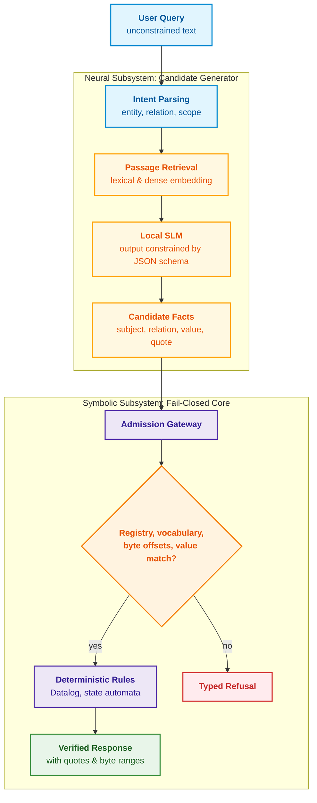
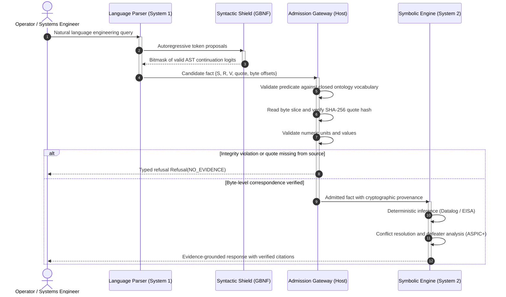
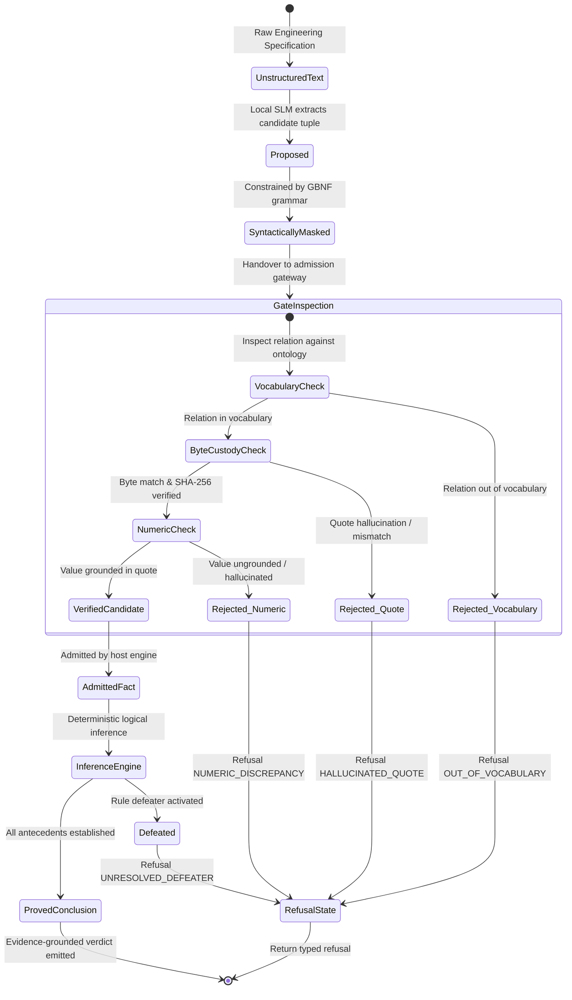

# Chapter 29. Neuro-Symbolic Architecture: Language Models and Evidence-Grounded Verification

> **Book:** [Architecture of Evidence-Governed Expert Systems](README.md) · [Part VI: Neuro-Symbolic Models, Cognitive Frontiers, and Continual Learning](part-06-frontiers-neuro-symbolic.md)  
> **Previous Chapter:** [Chapter 28. Dual-Mode Expert Systems: Strict Deduction and Advisory Hypotheses](ch28-dual-mode-expert-systems.md)  
> **Next Chapter:** [Chapter 34. Knowledge Gaps: Relational Search, Abduction, and Socratic Clarification](ch34-deterministic-relational-analysis-abduction-and-socratic-dialogue.md)  
> **Table of Contents:** [README.md](README.md)  
> **Author:** [Mykola Fedchyk](about-the-author.md)  
> **Target Level:** Advanced: Systems Architects, Machine Learning Engineers, Safety-Critical Systems Developers  
> **Expected Learning Outcomes:** Explain why linguistic plausibility is not truth; separate responsibilities between language models that propose candidate facts and symbolic engines that verify them; build a byte-level admission gateway with document version registries, closed relation vocabularies, byte-offset quotation matching, and value sanity checking; constrain local SLM outputs via JSON schemas in Ollama; verify whether model explanations contain ungrounded numbers; distinguish adapted models from base models via boundary-case behavior.

## Abstract

This chapter examines the neuro-symbolic architecture of third-wave artificial intelligence expert systems (NeSy), combining the linguistic agility of Large and Small Language Models (LLMs/SLMs) with the formal verifiability of a deterministic symbolic core. We dissect the fundamental epistemic gap separating the statistical plausibility of autoregressive text generation from the deterministic truth required in safety-critical engineering domains (ISO 26262 ASIL D, DO-178C DAL A). The core architectural principle is formulated as: "the language model proposes, the symbolic engine disposes." We analyze international engineering practices from leading industrial and academic research institutions (DeepMind's AlphaProof, OpenAI's Process Reward Models, Meta FAIR's Cicero, Stanford's DSPy pipelines, MIT CSAIL, and Imperial College London). We detail the design and mechanics of a byte-level admission gateway enforcing quote coordinate verification, JSON schema validation, closed-vocabulary relation checking, and suppression of numerical hallucinations. The chapter culminates in an end-to-end, production-grade implementation of a verified neuro-symbolic pipeline in Go utilizing a local model via the Ollama runtime.

When an embedded automotive braking or avionics software engineer queries a generative assistant: "what is the maximum response time of the safety watchdog timer?", the language model promptly and persuasively generates: "100 milliseconds." Yet, in the formal product specification for ASIL D (ISO 26262) or DAL A (DO-178C), the requirement is fixed at an uncompromising 10 milliseconds: the remaining 90 ms is a statistical hallucination induced by generic microcontroller marketing collateral in the training corpus. If the engineer relies on the model's authoritative tone, the watchdog controller will fail to reset the processor before the vehicle departs its safe physical trajectory. Conversely, a rigid classical rule engine from [Chapter 28](ch28-dual-mode-expert-systems.md) knows the exact standard with full citation, yet silently returns a refusal simply because the engineer phrased the prompt in colloquial engineering jargon ("CPU watchdog") rather than the indexed ontological term "Hardware Safety Watchdog Timer WDOG-1." The former system is perilous due to latent hallucinations; the latter is abandoned in daily practice due to excessive formal rigidity.

This chapter resolves the dilemma: **how can we combine the flexibility of language models with the rigor of a symbolic engine such that no unverified assertion ever reaches the final decision?** The central thesis: **the model proposes, the symbolic engine disposes. The model interprets the user query, extracts candidate facts with verbatim quotations, and synthesizes human-readable explanations. The admission gateway inspects every candidate against the document version registry, closed relation vocabulary, exact byte coordinates, and value containment. Deductive inference is executed strictly by deterministic rules over admitted facts, while any ungrounded artifact triggers a typed refusal or a flagged hypothesis.** We demonstrate this architecture through a production Go implementation executing against a local model via Ollama.

## 1. The Epistemic Gap: Why Plausibility Is Not Truth

The principal hazard of deploying modern generative models in safety-critical expert systems stems from a profound **epistemic gap** between the external linguistic surface and the underlying validity of a proposition. Human cognition instinctively equates articulate, authoritative prose with factual correctness. In mathematical reality, however, high likelihood in an autoregressive model indicates nothing more than statistical consistency with prior training data, offering zero assurance of physical validity, formal verifiability, or fidelity to normative standards. If an expert system architecture naively trusts a generative model to synthesize facts or operating parameters (such as safety watchdog timeouts or maximum load current limits), this epistemic gap injects catastrophic hallucinations directly into the actuation pipeline.

The mathematical origin of this failure mode is inherent to the optimization objective of autoregressive architectures. A language model $\mathcal{M}$ does not verify propositions against the external world; it optimizes solely to maximize the conditional probability of predicting the next token given preceding context:

```math
P_{\mathcal{M}}(w_t\mid w_1,\dots,w_{t-1}),\qquad \hat{w}_{1:N}=\operatorname*{arg\,max}_{w_{1:N}}\prod_{t=1}^{N}P_{\mathcal{M}}(w_t\mid w_{1:t-1}).
```

Notation:

- $\mathcal{M}$ denotes the language model;
- $`w_t`$ denotes the token at sequence position $t$, and $`w_1,\dots,w_{t-1}`$ denotes preceding tokens;
- $`P_{\mathcal{M}}(w_t\mid w_1,\dots,w_{t-1})`$ is the probability of the next token given prior context, bounded in $[0, 1]$;
- $N$ is the total token sequence length, with $`w_{1:N}`$ denoting the complete sequence from position 1 to $N$;
- $`w_{1:t-1}`$ (or $`w_{<t}`$) represents the prefix sequence preceding position $t$;
- $`\prod_{t=1}^{N}`$ denotes the product of token probabilities across positions 1 through $N$;
- $`\operatorname*{arg\,max}_{w_{1:N}}`$ selects the sequence maximizing this joint probability product;
- $`\hat{w}_{1:N}`$ represents the selected token sequence, where the circumflex denotes an estimated output.

The operational reality is clear: the model evaluates each candidate token relative to prior tokens, and decoding algorithms search for the sequence with the highest aggregate likelihood. This yields maximum statistical plausibility among candidate outputs, not the probability that the generated text corresponds to empirical truth.

The most plausible sequence is by no means guaranteed to be correct: maximizing probability provides no assurance of compliance with source documents, physical processes, or formal standards. Adam Kalai and co-authors explain hallucinations as a structural consequence of training dynamics: when a model cannot resolve truth from falsity, errors inevitably emerge from statistical training pressures, while standard evaluation benchmarks actively penalize refusal and reward confident guessing [[1]](#src-1). For safety-critical expert systems, this yields an indispensable engineering rule: the admission gateway must reward justified refusal over plausible speculation.

High statistical benchmark accuracy is similarly insufficient for critical deployments. Ricky Butler and George Finelli proved that establishing ultra-high reliability for safety-critical real-time software through empirical testing is mathematically infeasible due to the prohibitive volume of test trajectories required [[2]](#src-2). If ultra-high reliability cannot be established by testing deterministic software, it is impossible to certify by testing stochastic language models. Architectural trust must therefore be established not on empirical pass rates, but on inspectable, verifiable structure: verbatim citations, deterministic rules, and the formal argument structures detailed in [Chapter 27](ch27-safety-case-gsn-synthesis.md).

Step-by-step reasoning generated by models does not replace formal verification. Jason Wei and colleagues demonstrated that chain-of-thought (CoT) prompting substantially boosts model performance across reasoning tasks [[3]](#src-3). However, Miles Turpin and co-authors discovered that these rationales frequently misrepresent the actual drivers of model outputs: when models were biased toward incorrect answers by subtle prompt artifacts, they generated plausible, coherent explanations defending the incorrect answer without mentioning the biasing feature, causing accuracy to collapse to 36% across 13 evaluation suites [[4]](#src-4). A generated chain of thought is unverified text, not an audited proof trace.

Boundaries are equally pronounced in the cognitive domain of hypothesis formation. Tom Zahavy of Google DeepMind argues that while generative AI has mastered induction (statistical pattern extraction) and is rapidly advancing in deduction, it fundamentally lacks mechanisms for abduction—the generation of novel explanatory hypotheses [[5]](#src-5). Denys Yuvzhenko analyzes this reasoning across engineering examples comparing deduction, induction, and abduction [[6]](#src-6). For expert systems, the architectural takeaway aligns with [Chapter 28](ch28-dual-mode-expert-systems.md): all hypotheses, particularly those synthesized by language models, must be restricted to candidate status pending deterministic verification. The following section examines how this division of labor is grounded in cognitive science and neuro-symbolic research.

## 2. The Cognitive Dichotomy System 1 / System 2: Boundaries of the Engineering Analogy

Daniel Kahneman characterized human cognitive processing via two distinct modes: fast, effortless, associative intuition governed by mental availability, and slow, deliberate, rule-governed logical reasoning [[7]](#src-7). In computational literature, these modes are commonly designated System 1 and System 2. In expert systems architecture, this distinction serves as a valuable design analogy: the neural subsystem rapidly matches unconstrained user phrasing against known conceptual spaces, while the symbolic core deterministically verifies propositions. This analogy does not imply that neural networks replicate human intuition; it merely guides modular responsibility separation, as illustrated below:



Hybrid architectures possess deep roots in computer science. Artur d'Avila Garcez, Krysia Broda, and Dov Gabbay formalized neuro-symbolic learning foundations in the early 2000s [[8]](#src-8), while Gary Marcus advocated for hybrid knowledge-and-reasoning architectures as the indispensable path toward robust AI [[9]](#src-9). A comprehensive review by Brandon Colelough and William Regli highlights current research gaps: of 167 surveyed works from 2020 to 2024, the majority focus on learning and inference (63%), whereas explainability and trust represent only 28%, and meta-cognition—reasoning about one's own reasoning—accounts for a mere 5% [[10]](#src-10). Evidence-governed expert systems operate squarely within this domain of explainability and trust:

| Architectural Property | LLM with RAG | Classical Rule Engine | Neuro-Symbolic Architecture |
|---|---|---|---|
| Natural Language Comprehension | High | Low, brittle under lexical variation | High, powered by language models |
| Result Reproducibility | Stochastic, decoding-dependent | Full across identical knowledge states | Full within the symbolic core |
| Grounding to Primary Sources | Indirect, via retrieved context | Direct, via formalized facts | Direct, via byte-admitted citations |
| Behavior Under Knowledge Deficits | Hallucinated plausibility | Deterministic refusal | Typed refusal or flagged hypothesis |
| Knowledge Maintenance Overhead | Low for raw text, high for auditing | High manual engineering labor | Automated candidate extraction with gate verification |

This comparative framing does not imply that neuro-symbolic systems are infallible: a symbolic core will deterministically propagate errors if fed false admitted facts. The decisive engineering advantage is full auditability: every failure mode is deterministically traceable to a specific source fact, rule activation, or admission gateway decision.

## 3. Principle of Separation of Concerns: Statistical Generator vs. Symbolic Verifier

The diagram below traces the end-to-end execution path of an engineering query through an evidence-governed neuro-symbolic expert system:



The neural subsystem addresses the task classical rule systems struggle to solve: mapping unconstrained user language into structured representations. Retrieval-Augmented Generation (RAG), as formulated by Patrick Lewis and colleagues, couples passage retrieval from document corpora with sequence-to-sequence response generation [[11]](#src-11). In our neuro-symbolic architecture, generative functionality is strictly bounded: the model does not author direct responses to users; it extracts candidate factual tuples paired with verbatim excerpts from retrieved source documentation.

The symbolic subsystem enforces three invariant guarantees:
1. **Evidence-Grounded Invariant:** Every affirmative statement in the system output is anchored to a verbatim excerpt from an approved document revision with exact byte offsets.
2. **Fail-Closed Invariant:** In the presence of incomplete, ambiguous, or contradictory knowledge, the system issues a typed refusal or clarification query rather than synthesizing plausible speculation.
3. **Deterministic Inference Invariant:** Conclusions are derived exclusively through deterministic rule execution over admitted facts; the language model exercises zero authority over logical truth.

Within this framework, the language model serves specific roles, each paired with dedicated symbolic verification:

| Language Model Role | Model Operation | Symbolic Verification Mechanism |
|---|---|---|
| Sufficiency Assessment | Signals whether retrieved passages contain pertinent facts | Verifies presence of approved documents in registry; refusal logic resides in symbolic engine |
| Query Framing | Decomposes query into target entity, relation, and scope | Enforces membership of relation within closed ontology vocabulary |
| Candidate Fact Extraction | Synthesizes candidate tuples paired with verbatim quotes | Validates document revision hash, byte boundaries, and literal value containment |
| Explanation Rendering | Composes coherent prose reflecting the proof tree | Verifies that every numeric literal and identifier appears in admitted facts |
| Advisory Hypotheses | Proposes plausible inferences in advisory mode | Enforces strict isolation from core facts with explicit unverified flags ([Chapter 28](ch28-dual-mode-expert-systems.md)) |
| Rule Inductive Generalization | Suggests candidate rule modifications from case logs | Enforces candidate staging, contradiction detection, and regression testing ([Chapter 26](ch26-continual-learning.md)) |

Across every functional tier, the model acts strictly as an advisory proposer; authoritative adjudication rests entirely with deterministic verification.

## 4. Global Landscape of Neuro-Symbolic Architectures: Industrial and Academic Paradigms

The convergence of System 1 (neural intuition and sensory ingestion) and System 2 (symbolic reasoning and formal verification) emerged between 2024 and 2026 as the primary trajectory across leading research institutions and industrial laboratories. However, concrete implementation strategies differ substantially in formal rigor, computational complexity, and real-time execution viability.

### 4.1. The Alphabet / DeepMind Paradigm: AlphaProof and Lean Interactive Provers

In **AlphaProof**, Google DeepMind demonstrated a hybrid system capable of solving complex International Mathematical Olympiad (IMO 2024) problems at a silver-medal standard [[29]](#src-29). Architecturally, AlphaProof integrates a fine-tuned Gemini language model with the deterministic kernel of the **Lean 4** interactive theorem prover [[20]](#src-20). The model operates as a search tactic proposer, while the Lean compiler mechanically verifies each syntactic and deductive step. When the model proposes an invalid step, the type checker returns a formal type error, immediately pruning that search branch.

> **Lesson for Evidence-Governed Systems:** Decoupling *“LLM proposes tactics → formal engine validates proofs”* represents the gold standard of architectural integrity.
> 
> **Operational Boundary:** Lean 4 was designed for interactive mathematicians, not embedded controllers. Generating a single proof requires seconds or minutes on high-end server clusters. In embedded automotive (ISO 26262 ASIL D) or avionics (DO-178C DAL A) controllers where hard deadline budgets require reaction times $`< 100\,\mu\text{s}`$, such architectures are unviable. Real-time expert systems demand ultra-fast specialized symbolic cores with deterministic execution latencies and zero dynamic heap allocations.

### 4.2. The OpenAI Paradigm: Process Reward Models (PRM) and the Limits of Latent Reasoning

OpenAI researchers Hunter Lightman and colleagues introduced step-by-step verification via **Process-Supervised Reward Models (PRM)** in their work *“Let's Verify Step by Step”* [[25]](#src-25). Unlike outcome-only supervision, PRMs train auxiliary neural evaluators to score the validity of each reasoning step in a Chain of Thought (CoT). This paradigm was further extended in the o1/o3 reasoning model series through test-time compute scaling.

> **Lesson for Evidence-Governed Systems:** Verifying individual deductive transitions across the inference trajectory is dramatically more effective than inspecting only the final output.
> 
> **Pitfall to Avoid:** In models utilizing hidden CoT, the reasoning trace remains a sequence of stochastic tokens. It is vulnerable to subtle sophisms and plausible pseudo-proofs. Having neural models verify neural models without an external mathematical engine induces sycophancy and model collapse [[3]](#src-3). A tokenized reasoning trace is merely text, not a verified formal proof tree.

### 4.3. The Meta FAIR Paradigm: Strategic Dialogue and Symbolic Filtering in Cicero

A prominent engineering milestone in neuro-symbolic systems was Meta FAIR's **Cicero** agent [[24]](#src-24), which attained human master-level performance in the strategic board game "Diplomacy"—an environment demanding both natural language negotiation and betrayal forecasting:
* **Language Model (System 1):** Negotiates with human players, analyzes partner intentions, and converts dialogue into structured coordination proposals;
* **Symbolic Strategic Planner (System 2):** Computes optimal game-theoretic moves via iterative Nash equilibrium approximation conditioned on partner trust models.

Cicero strictly filters language model outputs: whenever the generative model drafts a commitment contradicting the core's strategic plan, the message is intercepted and rewritten. This embodies the principle: "the language model proposes, the symbolic engine disposes."

### 4.4. The Stanford HAI Paradigm: Compiled Declarative Pipelines in DSPy

Omar Khattab and collaborators at Stanford University developed **DSPy** (*Declarative Self-improving Python*) [[26]](#src-26), replacing fragile manual prompt engineering with algorithmic constraint compilation. Instead of hand-tuning natural language prompts, engineers declare task signatures specifying typed inputs and outputs; an automated teleprompter compiler synthesizes demonstrations, optimizes parameters, and compiles execution pipelines.

> **Lesson for Evidence-Governed Systems:** Declarative input/output typing eliminates subjective prompt variations and enables deterministic knowledge extraction pipelines.

### 4.5. Academic Schools: MIT NSCL and ASPIC+ Argumentation Frameworks

Foundational research at MIT CSAIL by Jiayuan Mao, Josh Tenenbaum, and collaborators on the **Neuro-Symbolic Concept Learner (NSCL)** [[27]](#src-27) demonstrated the power of semantic grounding: neural networks process perceptual visual or textual input by parsing scenes into executable quasi-symbolic program trees evaluated by a deterministic functional engine.

Concurrently, the computational argumentation group at Imperial College London (Francesca Toni and Sanjay Modgil) developed **ASPIC+** [[28]](#src-28). This formalism enables expert systems to resolve legal and technical normative conflicts via structured rebutting and undercutting defeaters, where specialized standards (*Lex Specialis*) or newer regulatory revisions (*Lex Posterior*) deterministically supersede general defaults.

### 4.6. Temporal Interaction Protocol in the Neuro-Symbolic Tandem

The sequence diagram below details the operational message flow between components during an engineering query evaluation:



### 4.7. Lifecycle and Verification of Candidate Facts

The state diagram below illustrates the state transitions of machine knowledge, tracing raw unstructured text through candidate verification to admitted facts or safe refusals:



The most critical of these verification stages—the candidate fact admission gateway—contains an architectural subtlety that causes most naive implementations to fail in production.

## 5. Byte-Level Admission Gateway: Grounding on Primary Source Coordinates

Quotations must be verified at the byte level because files are stored as byte sequences and cryptographic digests are computed over bytes. Language models, however, operate over tokens and Unicode characters. In UTF-8 encoding, characters occupy between one and four octets [[12]](#src-12): ASCII characters consume one byte, while Cyrillic characters consume two. If a language model reports quote coordinates in character offsets, text processing pipelines will experience offset drift, causing the symbolic engine to extract truncated sentence fragments. This dictates an immutable engineering rule: the model provides the verbatim string quote, and the host calculates exact byte offsets. If the model does output byte offsets, the host verifies them; upon discrepancy, the host executes an exact byte scan, admitting the candidate only if the quote occurs uniquely within the document.

The admission gateway executes five sequential inspections in fixed order:

1. **Document Version Registry:** The SHA-256 digest of the source text must match the registered hash of the approved document revision, preventing facts from originating in uncertified drafts ([Chapter 15](ch15-knowledge-extraction-and-kb-construction.md)).
2. **Explicit Model Refusal:** If the language model reports that the query cannot be answered from the provided passage, the refusal is recorded as a valid outcome rather than an error.
3. **Closed Relation Vocabulary:** The relation must belong to the closed set of predicates supported by the core rule engine; arbitrary natural language predicates are rejected.
4. **Verbatim Quotation Integrity:** The document bytes at the specified range must match the quote exactly, or the quote must resolve to a unique byte range within the document.
5. **Value Literal Containment:** The extracted value must exist within the quote as a complete lexical token; any numeric value absent from the verbatim quote represents an unverified hallucination.

Identical safeguards govern natural language explanations. While a language model may compose the final explanation prose, every numeric literal and identifier in that prose must exist in the admitted facts. If an explanation introduces ungrounded numbers, the expert system discards the generated prose and defaults to a deterministic citation template.

## 6. Local Small Language Models (SLMs) as Deterministic Candidate Generators

For candidate extraction, running localized Small Language Models (SLMs) spanning 1B to 8B parameters provides decisive architectural advantages. Local execution guarantees that proprietary engineering specifications never leave the secure perimeter, adhering to the air-gapped lifecycle of [Chapter 25](ch25-how-expert-systems-learn.md). Narrow extraction tasks do not require massive LLM world knowledge; they demand strict schema adherence and disciplined refusal behavior.

**Grammar-Constrained Decoding:** Saibo Geng and colleagues demonstrated that grammar-constrained decoding enforces structured outputs without model fine-tuning [[13]](#src-13), while Brandon Willard and Rémi Louf detailed high-performance finite-state automaton implementations for guided generation [[14]](#src-14). In practice, `llama.cpp` enforces output constraints via GBNF grammars [[15]](#src-15), while Ollama accepts JSON schemas via the `format` parameter to constrain outputs [[16]](#src-16). Crucially, schema constraints guarantee output shape, not output veracity: a model forced to output a `value` field can easily invent plausible values, making the admission gateway strictly mandatory.

**Freezing Hyperparameters:** Model parameters and system instructions must be permanently versioned in an Ollama `Modelfile` [[17]](#src-17). The configuration below enforces zero sampling temperature, sets token limits, and defines the extraction contract:

<details>
<summary>Ollama Modelfile</summary>

```dockerfile
FROM qwen2.5:3b

# Zero temperature eliminates token sampling randomness
PARAMETER temperature 0
PARAMETER num_predict 512

SYSTEM """You extract candidate facts from technical specifications.
Return a JSON array of objects with fields subject, relation, value and quote.
The quote must be an exact verbatim substring of the given passage.
Use only these relations: max_length_octets, timeout.
If the passage states no such fact, return an empty array []."""
```

</details>

This model image is registered via `ollama create fact-extractor -f Modelfile`. Setting temperature to zero makes token selection deterministic under identical runtimes, but offers zero guarantee of semantic correctness.

**Model Adaptation:** If a base SLM demonstrates poor schema compliance, it is fine-tuned using LoRA adapters following [Chapter 25](ch25-how-expert-systems-learn.md). The fine-tuning dataset must include abundant negative examples where the correct label is an empty array `[]` or a refusal; otherwise, the network acquires a pathological bias to always extract content. Domain-specific adapters (e.g., networking standards vs. functional safety) should be partitioned to avoid catastrophic forgetting and interference, as documented by Michael McCloskey and Neal Cohen [[18]](#src-18).

**Distinguishing Adapted Models from Base Models:** Prior to production deployment, systems must verify that the loaded runtime is indeed the adapted model rather than a fallback base image. The operational difference manifests distinctly across edge-case evaluations:

| Test Case | Base Model Behavior | Adapted Model Behavior |
|---|---|---|
| Query regarding parameter absent from passage | Guesses plausible value or provides verbose commentary | Emits empty JSON array `[]` or explicit refusal |
| Multi-byte Unicode quote extraction | Paraphrases text, dropping words and breaking byte alignment | Produces verbatim byte-accurate quotes |
| Format Discipline | Wraps JSON in Markdown markdown blocks with chat boilerplate | Emits strictly raw schema-compliant JSON |
| Vocabulary Compliance | Invents natural language predicates | Strictly confines relations to permitted set |

These tests must run as an automated regression gate: if any model update degrades these benchmarks, deployment is blocked.

## 7. Software Implementation of a Verified Neuro-Symbolic Pipeline in Go with Ollama

The Go implementation below realizes the complete admission gateway without external runtime dependencies. The specification passage contains UTF-8 text to explicitly demonstrate byte versus character offset handling, and the registry enforces the SHA-256 digest of the approved revision. When the `OLLAMA_MODEL` environment variable is defined, the program calls the local Ollama daemon to extract facts against the JSON schema. In the absence of an active Ollama instance, the program evaluates a recorded test set containing classic failure modes: a valid candidate, a candidate with character-offset drift, two candidates with hallucinated values, an out-of-vocabulary predicate, and an explicit refusal. Values are validated as complete lexical tokens rather than substrings: otherwise, a hallucinated "100" would falsely match a passage containing "1000 octets". Finally, the explanation verifier scans generated prose for ungrounded numbers.

<details>
<summary>Go Implementation: Neuro-Symbolic Admission Gateway with Ollama</summary>

```go
// Admission gateway for neuro-symbolic expert systems: model proposes, core disposes.
// Run: go run . (Ollama is optional; without OLLAMA_MODEL, recorded proposals are evaluated).
package main

import (
	"bytes"
	"crypto/sha256"
	"encoding/hex"
	"encoding/json"
	"fmt"
	"net/http"
	"os"
	"regexp"
	"strings"
	"time"
)

const docID = "gw-spec-v3"

var document = []byte("Специфікація шлюзу, розділ 4.2.\nМаксимальна довжина рядка становить 1000 октетів.\nТайм-аут очікування команди: 5 хвилин.\n")

// Source registry stores the SHA-256 digest of the approved document revision.
var registry = map[string]string{docID: "02291fbf65ce9738b868cf379f70c612bdba115ce91aabaf1b3f8f6a1b0d403d"}

// Closed relation vocabulary supported by the symbolic inference engine.
var vocabulary = map[string]bool{"max_length_octets": true, "timeout": true}

type Proposal struct {
	Refusal   bool   `json:"refusal,omitempty"`
	Reason    string `json:"reason,omitempty"`
	Subject   string `json:"subject,omitempty"`
	Relation  string `json:"relation,omitempty"`
	Value     string `json:"value,omitempty"`
	Quote     string `json:"quote,omitempty"`
	ByteStart int    `json:"byte_start,omitempty"`
	ByteEnd   int    `json:"byte_end,omitempty"`
}

// Recorded model responses: valid, character-offset drift, hallucinated value,
// out-of-vocabulary relation, and explicit refusal.
var recorded = []Proposal{
	{Subject: "рядок", Relation: "max_length_octets", Value: "1000", Quote: "Максимальна довжина рядка становить 1000 октетів.", ByteStart: 55, ByteEnd: 143},
	{Subject: "рядок", Relation: "max_length_octets", Value: "1000", Quote: "Максимальна довжина рядка становить 1000 октетів.", ByteStart: 32, ByteEnd: 81},
	{Subject: "команда", Relation: "timeout", Value: "300 секунд", Quote: "Тайм-аут очікування команди: 5 хвилин.", ByteStart: 144, ByteEnd: 212},
	{Subject: "рядок", Relation: "max_length_octets", Value: "100", Quote: "Максимальна довжина рядка становить 1000 октетів.", ByteStart: 55, ByteEnd: 143},
	{Subject: "шлюз", Relation: "recommended_vendor", Value: "Acme", Quote: "Специфікація шлюзу, розділ 4.2.", ByteStart: 0, ByteEnd: 54},
	{Refusal: true, Reason: "unsupported_in_context"},
}

type Fact struct {
	Proposal
	Digest, Note string
}

// containsToken verifies value as a complete token to prevent "100" matching "1000".
func containsToken(text, value string) bool {
	if strings.TrimSpace(value) == "" {
		return false
	}
	return regexp.MustCompile(`(^|[^\p{L}\p{N}])` + regexp.QuoteMeta(value) + `($|[^\p{L}\p{N}])`).MatchString(text)
}

func admit(p Proposal) (Fact, string) {
	sum := sha256.Sum256(document)
	if hex.EncodeToString(sum[:]) != registry[docID] {
		return Fact{}, "редакція документа не збігається з реєстром"
	}
	if p.Refusal {
		return Fact{}, "модель відмовилася: " + p.Reason
	}
	if !vocabulary[p.Relation] {
		return Fact{}, "відношення поза закритим словником: " + p.Relation
	}
	quote := []byte(p.Quote)
	if len(quote) == 0 {
		return Fact{}, "немає цитати"
	}
	note := "діапазон моделі підтверджено"
	if p.ByteStart < 0 || p.ByteEnd > len(document) || p.ByteStart >= p.ByteEnd ||
		!bytes.Equal(document[p.ByteStart:p.ByteEnd], quote) {
		switch bytes.Count(document, quote) {
		case 0:
			return Fact{}, "цитати немає в джерелі"
		case 1:
			p.ByteStart = bytes.Index(document, quote)
			p.ByteEnd = p.ByteStart + len(quote)
			note = "діапазон моделі хибний, хост знайшов цитату дослівно"
		default:
			return Fact{}, "цитата неоднозначна"
		}
	}
	if !containsToken(p.Quote, p.Value) {
		return Fact{}, "значення не підтверджене цитатою: " + p.Value
	}
	d := sha256.Sum256(quote)
	return Fact{Proposal: p, Digest: hex.EncodeToString(d[:6]), Note: note}, ""
}

func known(f Fact, facts []Fact) bool {
	for _, g := range facts {
		if g.Relation == f.Relation && g.ByteStart == f.ByteStart && g.ByteEnd == f.ByteEnd {
			return true
		}
	}
	return false
}

// askOllama requests structured fact proposals from the local Ollama instance.
func askOllama(model, passage string) ([]Proposal, error) {
	str := map[string]string{"type": "string"}
	schema := map[string]any{"type": "array", "items": map[string]any{
		"type":       "object",
		"properties": map[string]any{"subject": str, "relation": str, "value": str, "quote": str},
		"required":   []string{"subject", "relation", "value", "quote"},
	}}
	body, _ := json.Marshal(map[string]any{
		"model": model, "stream": false, "format": schema,
		"options": map[string]any{"temperature": 0},
		"messages": []map[string]string{
			{"role": "system", "content": "Extract facts as JSON with an exact verbatim quote from the passage. Return [] if none."},
			{"role": "user", "content": passage},
		},
	})
	client := http.Client{Timeout: 60 * time.Second}
	resp, err := client.Post("http://localhost:11434/api/chat", "application/json", bytes.NewReader(body))
	if err != nil {
		return nil, err
	}
	defer resp.Body.Close()
	if resp.StatusCode != http.StatusOK {
		return nil, fmt.Errorf("Ollama: %s", resp.Status)
	}
	var out struct {
		Message struct{ Content string } `json:"message"`
	}
	if err := json.NewDecoder(resp.Body).Decode(&out); err != nil {
		return nil, err
	}
	var proposals []Proposal
	return proposals, json.Unmarshal([]byte(out.Message.Content), &proposals)
}

// ungrounded returns numbers in the generated explanation absent from all admitted quotes.
func ungrounded(narrative string, facts []Fact) []string {
	var missing []string
	for _, n := range regexp.MustCompile(`\d+`).FindAllString(narrative, -1) {
		found := false
		for _, f := range facts {
			found = found || containsToken(f.Quote, n)
		}
		if !found {
			missing = append(missing, n)
		}
	}
	return missing
}

func main() {
	proposals, origin := recorded, "записані відповіді моделі"
	if model := os.Getenv("OLLAMA_MODEL"); model != "" {
		if live, err := askOllama(model, string(document)); err == nil {
			proposals, origin = live, "Ollama, модель "+model
		} else {
			fmt.Println("Ollama недоступна:", err)
		}
	}
	fmt.Println("Джерело пропозицій:", origin)
	var facts []Fact
	for i, p := range proposals {
		f, reason := admit(p)
		switch {
		case reason != "":
			fmt.Printf("%d. ВІДХИЛЕНО: %s\n", i+1, reason)
		case known(f, facts):
			fmt.Printf("%d. ДУБЛІКАТ уже допущеного факту (%s)\n", i+1, f.Note)
		default:
			facts = append(facts, f)
			fmt.Printf("%d. ДОПУЩЕНО: %s %s = %s, %s [%d, %d), sha256:%s (%s)\n",
				i+1, f.Subject, f.Relation, f.Value, docID, f.ByteStart, f.ByteEnd, f.Digest, f.Note)
		}
	}
	narrative := "Максимальна довжина рядка становить 1000 октетів, а тайм-аут команди дорівнює 300 секундам."
	if missing := ungrounded(narrative, facts); len(missing) > 0 {
		fmt.Println("Пояснення моделі містить неперевірені числа", missing, "-> детермінований шаблон:")
		for _, f := range facts {
			fmt.Printf("  За %s [%d, %d): %s\n", docID, f.ByteStart, f.ByteEnd, f.Quote)
		}
	}
}
```

Save boundary tests as `main_test.go` and execute with `go test -v .`:

```go
package main

import "testing"

func TestAdmissionBoundaries(t *testing.T) {
	base := recorded[0]
	if _, reason := admit(base); reason != "" {
		t.Fatalf("valid proposal rejected: %s", reason)
	}
	for _, value := range []string{"100", "", " ", "000"} {
		p := base
		p.Value = value
		if _, reason := admit(p); reason == "" {
			t.Fatalf("value %q accepted as part of 1000", value)
		}
	}
	p := base
	p.Quote = "довжина рядка"
	p.ByteStart, p.ByteEnd = 0, 0
	if _, reason := admit(p); reason == "" {
		t.Fatal("quote without the value accepted")
	}
	facts := []Fact{{Proposal: base}}
	if missing := ungrounded("Ліміт 10 октетів і 1000 октетів.", facts); len(missing) != 1 || missing[0] != "10" {
		t.Fatalf("partial number treated as grounded: %v", missing)
	}
}
```

</details>

Executing `go run .` in the module directory produces the following trace:

<details>
<summary>Program Output</summary>

```text
Джерело пропозицій: записані відповіді моделі
1. ДОПУЩЕНО: рядок max_length_octets = 1000, gw-spec-v3 [55, 143), sha256:5fc027f3d330 (діапазон моделі підтверджено)
2. ДУБЛІКАТ уже допущеного факту (діапазон моделі хибний, хост знайшов цитату дослівно)
3. ВІДХИЛЕНО: значення не підтверджене цитатою: 300 секунд
4. ВІДХИЛЕНО: значення не підтверджене цитатою: 100
5. ВІДХИЛЕНО: відношення поза закритим словником: recommended_vendor
6. ВІДХИЛЕНО: модель відмовилася: unsupported_in_context
Пояснення моделі містить неперевірені числа [300] -> детермінований шаблон:
  За gw-spec-v3 [55, 143): Максимальна довжина рядка становить 1000 октетів.
```

</details>

Proposal 1 clears all five checks, admitting the fact with byte range $[55, 143)$ and sha256 digest `5fc027f3d330`. Proposal 2 carries the identical quote, but its range $[32, 81)$ was calculated in Unicode character offsets: the quote begins at character 32, but at byte 55 due to 2-byte UTF-8 Cyrillic octets. The gateway detects offset mismatch, relocates the unique verbatim quote, and flags it as a duplicate. Proposal 3 correctly cites the 5-minute timeout but converts it to "300 seconds": although mathematically equivalent, "300 seconds" is absent from the literal citation, causing the gateway to reject it. Unit conversions must be executed by symbolic rules, never by generative models. Proposal 4 cites the 1000-octet limit but asserts "100": because "100" is a substring rather than a bounded lexical token, it is rejected. Proposal 5 uses an out-of-vocabulary predicate, and Proposal 6 is an explicit model refusal. The explanation verifier intercepts the generated prose because it mentions 300 (which was rejected), causing the engine to emit the deterministic citation template.

## 8. Dual-Mode Execution and Semantic Routing

The admission gateway integrates seamlessly into the dual-mode operational paradigm of [Chapter 28](ch28-dual-mode-expert-systems.md). In strict mode, system responses are synthesized exclusively from admitted facts and validated rules; any residual ambiguity results in a refusal or clarification prompt. In advisory mode, the strict verified core remains unaltered, while unadmitted proposals and precedent-based heuristics are appended with explicit unverified markers and actionable criteria required for elevation to verified facts. The rejected third proposal demonstrates this boundary: in strict mode, the engineer receives only the verified 5-minute statement with its citation; in advisory mode, the system may present the model's hypothesis alongside an audit record detailing why the admission gateway rejected it.

### 8.1. Query Frame Recovery with Isolated Host Verification

Engineering queries exhibit substantial grammatical and lexical variability that static grammars and regular expressions cannot fully capture. When deterministic parsers fail to extract query intent, systems lacking fallback paths emit blunt refusals, while unconstrained LLM architectures speculate without verification. Both outcomes undermine engineering adoption: the former is unhelpful, the latter dangerous.

The verified fallback pipeline operates through three distinct steps:

1. **Advisory Frame Recovery:** An unparsed query is submitted to the local SLM, which outputs a structured query frame rather than an answer: target entity, requested relation, and constraints. Output is strictly bounded by a JSON schema.
2. **Host-Side Frame Verification:** No element of the suggested frame enters the inference engine without deterministic validation. The host verifies that the entity exists in the knowledge base index, that the relation belongs to the closed vocabulary and is valid for that entity type, and that retrieved facts clear the byte-level admission gateway.
3. **Audit Trail Flagging:** If all validation gates pass, the query receives an explicit "recovered frame" tag in its audit trail, alerting reviewers that query interpretation was mediated by a neural model. If any check fails, the system falls back to a typed clarification prompt or refusal.

This fallback pipeline alters query interpretation without compromising verdict veracity: output facts remain anchored to identical byte-level citations.

## 9. Tooling for Controlled Generation and Grammar-Constrained Decoding

The reference implementation leverages Ollama's JSON schema constraints and a Go gateway. In enterprise expert systems, additional tooling layers constrain distinct error categories:

| Tooling / Framework | Practical Architectural Role | Invariant Limitations |
|---|---|---|
| Ollama Structured Outputs via JSON Schema [[16]](#src-16) | Constrains response syntax, types, and fields without text post-parsing | Does not guarantee value correctness; schemas must be enforced in prompt and verified by host |
| GBNF Grammars in `llama.cpp` [[15]](#src-15) | Restricts token generation to arbitrary grammars, including closed vocabularies | Unaware of document content; valid schema tokens can still state factual falsehoods |
| Natural Language Inference (NLI) Verification | Probabilistic assessment of whether a quote entails an assertion under lexical divergence | Stochastic scoring; suitable as a secondary filter, but cannot replace literal byte matching in strict mode |
| Answer Set Programming & Datalog ([Chapter 28](ch28-dual-mode-expert-systems.md)) | Executes deterministic deduction over admitted facts | Sound only with respect to admitted input facts and rules |

Auditing admission gateway rejections provides vital engineering telemetry. Tracking rejection causes—unquoted values, out-of-vocabulary relations, ambiguous quotes, or model refusals—across model versions enables architects to detect degradation in extraction discipline before regressions reach users.

## 10. Emerging Research Frontiers in Neuro-Symbolic Integration

Neuro-symbolic architectures open several active research frontiers where industry standards continue to evolve. Each extends our core thesis: the language model proposes, the verified structure disposes:

**Expert-Governed Multi-Agent Systems vs. Autonomous Agents:** In popular agent frameworks, language models autonomously invoke external tools. In safety-critical engineering, this hierarchy is inverted: authority resides strictly within the deterministic knowledge core and action contracts ([Chapter 21](ch21-from-recommendation-to-action.md)), while agents observe, query the knowledge base, and execute only authorized operations.

**Persistent Structured Knowledge Repositories vs. Ephemeral RAG:** Andrej Karpathy articulated a pattern where language models, rather than querying raw documents ephemerally on every prompt, continuously curate a structured markdown knowledge repository [[19]](#src-19). For evidence-governed expert systems, this architecture serves as a candidate pipeline: curated pages accelerate search, but propositions enter the operational knowledge base strictly via the admission gateway.

**Meta-Cognitive Introspection:** Colelough and Regli identify meta-cognition as the least explored dimension of neuro-symbolic AI [[10]](#src-10). In expert systems, meta-cognition involves explicit internal state audits: assessing knowledge completeness, verifying absence of contradictions, selecting deductive strategies, and determining when refusal is mandatory.

**Formal Verification of Rule Bases:** Interactive theorem provers such as Lean 4 [[20]](#src-20) allow architects to formally prove properties of rule bases—such as absence of specific contradiction classes—prior to deployment. Translating large-scale engineering ontologies into formal theorem provers remains an active research challenge.

**Knowledge Retirement and Machine Unlearning:** Revoking an invalidated standard or compromised key requires purging all downstream inferences. In engineering knowledge graphs ([Chapter 9](ch09-engineering-knowledge-graph-traceability.md)), revocations propagate deterministically along dependency edges. In model weights, removing specific factual memories is far more difficult; Lucas Bourtoule and colleagues propose sharded training structures to isolate data influences [[21]](#src-21). This asymmetry strongly favors storing mutable facts in versioned knowledge bases rather than neural weights.

**Confidential Verification via Zero-Knowledge Proofs:** Merkle trees ([Chapter 27](ch27-safety-case-gsn-synthesis.md)) guarantee integrity while disclosing verified entries to authorized auditors. Zero-knowledge proofs, such as non-interactive arguments (zk-SNARKs) formalized by Jens Groth [[22]](#src-22), theoretically enable systems to prove compliance with proprietary requirements without revealing underlying specifications.

**Candidate Extraction Self-Consistency:** When requirements are linguistically complex, single-pass greedy extraction risks decoding errors. Xuezhi Wang and colleagues proved that sampling multiple independent reasoning paths and taking majority consensus substantially enhances inference stability [[23]](#src-23). In expert systems, this functions as a pre-admission filter: only candidate tuples confirmed across multiple independent decoding trajectories are forwarded to the deterministic admission gateway.

Domain-specific physical world integrations are addressed in dedicated appendices: robotics and cyber-physical systems in [Appendix B](appendix-b-robotics-and-cyber-physical-systems.md), autonomous navigation in [Appendix C](appendix-c-autonomous-navigation-and-geosearch.md), and neuromorphic mixed-signal compute in [Appendices D](appendix-d-analog-expert-systems-and-neuromorphic-computing.md) and [E](appendix-e-mixed-signal-neuromorphic-expert-systems.md).

## Conclusions

The central question of this chapter is definitively answered: the flexibility of language models and the rigor of symbolic reasoning are harmonized when the model acts strictly as a proposer, while the symbolic core acts as the sole disposer. Language models parse queries, extract candidate facts with verbatim quotations, and author human-readable explanations. The admission gateway inspects document revisions, closed vocabularies, byte coordinates, and value containment, reserving inference strictly to deterministic rules. Any unverified proposal triggers a typed refusal or a flagged advisory hypothesis.

This separation of concerns is mathematically imperative: linguistic plausibility is not truth, model rationales can mask underlying bias, and ultra-high software reliability cannot be established through stochastic sampling. Our Go implementation demonstrates this gate in practice: across six candidate proposals, the engine admitted one fact, relocated a character-offset quote, rejected a converted unit ("300 seconds"), blocked a substring match ("100"), rejected an out-of-vocabulary relation, and recorded an explicit refusal. The explanation checker successfully suppressed ungrounded numerical claims, substituting a verified citation template.

The boundaries of this architecture must be explicitly recognized. The gateway verifies that assertions are supported verbatim by registered documents, but does not prove the truth of the document itself. Closed vocabularies deliberately constrain expressive freedom: adding relations requires updating core rules. Schema constraints govern format, not veracity, and zero temperature guarantees algorithmic repeatability, not empirical truth.

The subsequent chapter in our thematic sequence, [Chapter 34](ch34-deterministic-relational-analysis-abduction-and-socratic-dialogue.md), examines the knowledge gaps that gateways cannot close: relational path search, symbolic abduction, and Socratic clarification dialogue. [Chapter 38](ch38-curing-machine-hallucinations-and-knowledge-deficits.md) provides an exhaustive taxonomy of hallucination defense mechanisms. [Appendix A](appendix-a-evidence-governed-framework.md) synthesizes the entire methodology into a practical engineering process.

## Self-Review Questions

1. Why does maximizing sequence token probability fail to guarantee empirical factual correctness? How do Kalai and colleagues explain hallucination persistence?
2. What did Butler and Finelli demonstrate regarding empirical testing of ultra-high reliability, and what are the implications for language models in safety-critical systems?
3. Why can a model's chain of thought not be treated as a valid proof trace? Cite findings by Turpin and colleagues.
4. What three core invariants are guaranteed by the symbolic subsystem in an evidence-governed neuro-symbolic architecture?
5. Why must quotation byte ranges be calculated by the host rather than the model? Explain the offset shift $[32, 81)$ versus $[55, 143)$ in the Go program.
6. Why did the gateway reject "300 seconds" when the source specified "5 minutes"? Where must unit conversions occur in the system?
7. What properties are guaranteed by constraining model generation with JSON schemas, and what remains unverified?
8. How do you distinguish an adapted extraction model from a base model? Name four behavioral criteria.
9. Why is a versioned knowledge base superior to model weights for mutable facts from a knowledge retirement perspective?
10. Why must values be verified as complete lexical tokens rather than arbitrary substrings? What vulnerabilities remain even after token verification?

## Glossary

| Term | English Standard Term | Concise Definition |
|---|---|---|
| Нейро-символьна архітектура | Neuro-symbolic architecture | Integration of neural networks and symbolic reasoning with explicit separation of responsibilities |
| Авторегресивна модель | Autoregressive model | Sequence model predicting each subsequent token conditioned on preceding tokens |
| Галюцинація | Hallucination | Plausible but factually unfounded or counterfactual output from a generative model |
| Ланцюжок міркувань | Chain of thought | Step-by-step intermediate natural language reasoning generated prior to final output |
| Абдукція | Abduction | Inference mode generating explanatory hypotheses for observed outcomes |
| Метакогніція | Meta-cognition | System mechanisms for inspecting internal reasoning states, knowledge gaps, and confidence |
| Пошук із доповненням генерації | Retrieval-augmented generation | Generating outputs conditioned on dynamically retrieved document passages |
| Кандидатний факт | Fact proposal | Extracted tuple containing subject, relation, value, and verbatim citation |
| Шлюз допуску | Admission gate | Deterministic verification pipeline through which candidate facts must pass |
| Реєстр джерел | Source registry | Cryptographic database of approved document revision digests |
| Закритий словник | Closed vocabulary | Finite set of relation predicates supported by the symbolic inference engine |
| Дослівна цитата | Verbatim quote | Passage excerpt matching source document text byte-for-byte |
| Декодування з обмеженнями | Constrained decoding | Generation where invalid tokens are dynamically masked via grammars or schemas |
| Файл моделі | Modelfile | Declarative configuration specifying base model, parameters, and system prompts |
| Катастрофічна інтерференція | Catastrophic interference | Abrupt degradation of previously learned capabilities upon training on new data |
| Виведення знань з експлуатації | Knowledge retirement | Systematic revocation of invalidated knowledge across all dependent inferences |
| Машинне розучування | Machine unlearning | Removing the statistical influence of specific training instances from model weights |
| Доказ із нульовим розголошенням | Zero-knowledge proof | Cryptographic proof establishing a proposition's truth without revealing underlying data |
| Лексема | Token (lexical unit) | Contiguous sequence of alphanumeric characters bounded by delimiters |
| Відновлення структури запиту | Query frame recovery | Advisory neural mapping of unparsed queries into structured frames subject to host verification |

## Abbreviations

| Abbreviation | Expansion | Definition |
|---|---|---|
| GBNF | GGML Backus–Naur Form | Grammar format used in llama.cpp to constrain model generation |
| JSON | JavaScript Object Notation | Standard text-based structured data interchange format |
| LLM | Large Language Model | Deep neural language model typically exceeding 10 billion parameters |
| LoRA | Low-Rank Adaptation | Parameter-efficient fine-tuning technique freezing base weights |
| NLI | Natural Language Inference | Classification task evaluating textual entailment and contradiction |
| RAG | Retrieval-Augmented Generation | Pipeline combining information retrieval with language generation |
| SHA-256 | Secure Hash Algorithm 256 | Cryptographic hash function producing a 256-bit digest |
| SLM | Small Language Model | Compact language model spanning 1B to 8B parameters for local execution |
| UTF-8 | Unicode Transformation Format, 8-bit | Variable-width character encoding using 1 to 4 octets |

## References

1. <a id="src-1"></a>Adam Tauman Kalai, Ofir Nachum, Santosh S. Vempala, Edwin Zhang. [*Why Language Models Hallucinate*](https://arxiv.org/abs/2509.04664). arXiv:2509.04664, 2025.
2. <a id="src-2"></a>Ricky W. Butler, George B. Finelli. [*The Infeasibility of Quantifying the Reliability of Life-Critical Real-Time Software*](https://doi.org/10.1109/32.210303). *IEEE Transactions on Software Engineering*, 19(1), 3–12, 1993.
3. <a id="src-3"></a>Jason Wei, Xuezhi Wang, Dale Schuurmans, Maarten Bosma et al. [*Chain-of-Thought Prompting Elicits Reasoning in Large Language Models*](https://arxiv.org/abs/2201.11903). NeurIPS, 2022.
4. <a id="src-4"></a>Miles Turpin, Julian Michael, Ethan Perez, Samuel R. Bowman. [*Language Models Don't Always Say What They Think: Unfaithful Explanations in Chain-of-Thought Prompting*](https://arxiv.org/abs/2305.04388). NeurIPS, 2023.
5. <a id="src-5"></a>Tom Zahavy. [*LLMs Can't Jump*](https://www.tomzahavy.com/files/llms-cant-jump.pdf). Position Paper, Google DeepMind, 2026.
6. <a id="src-6"></a>Denys Yuvzhenko. [*A Leap AI Cannot Make*](https://dou.ua/forums/topic/61201/). DOU, 2026.
7. <a id="src-7"></a>Daniel Kahneman. [*A Perspective on Judgment and Choice: Mapping Bounded Rationality*](https://doi.org/10.1037/0003-066X.58.9.697). *American Psychologist*, 58(9), 697–720, 2003.
8. <a id="src-8"></a>Artur S. d'Avila Garcez, Krysia B. Broda, Dov M. Gabbay. [*Neural-Symbolic Learning Systems: Foundations and Applications*](https://doi.org/10.1007/978-1-4471-0211-3). Springer, 2002.
9. <a id="src-9"></a>Gary Marcus. [*The Next Decade in AI: Four Steps Towards Robust Artificial Intelligence*](https://arxiv.org/abs/2002.06177). arXiv:2002.06177, 2020.
10. <a id="src-10"></a>Brandon C. Colelough, William Regli. [*Neuro-Symbolic AI in 2024: A Systematic Review*](https://arxiv.org/abs/2501.05435). arXiv:2501.05435, 2025.
11. <a id="src-11"></a>Patrick Lewis, Ethan Perez, Aleksandra Piktus, Fabio Petroni et al. [*Retrieval-Augmented Generation for Knowledge-Intensive NLP Tasks*](https://arxiv.org/abs/2005.11401). NeurIPS, 2020.
12. <a id="src-12"></a>François Yergeau. [*RFC 3629: UTF-8, a Transformation Format of ISO 10646*](https://www.rfc-editor.org/rfc/rfc3629). IETF, 2003.
13. <a id="src-13"></a>Saibo Geng, Martin Josifoski, Maxime Peyrard, Robert West. [*Grammar-Constrained Decoding for Structured NLP Tasks without Finetuning*](https://arxiv.org/abs/2305.13971). EMNLP, 2023.
14. <a id="src-14"></a>Brandon T. Willard, Rémi Louf. [*Efficient Guided Generation for Large Language Models*](https://arxiv.org/abs/2307.09702). arXiv:2307.09702, 2023.
15. <a id="src-15"></a>llama.cpp contributors. [*GBNF Guide*](https://github.com/ggml-org/llama.cpp/blob/master/grammars/README.md). Documentation for llama.cpp.
16. <a id="src-16"></a>Ollama. [*Structured Outputs*](https://docs.ollama.com/capabilities/structured-outputs). Ollama Documentation.
17. <a id="src-17"></a>Ollama. [*Modelfile Reference*](https://github.com/ollama/ollama/blob/main/docs/modelfile.mdx). Ollama Documentation.
18. <a id="src-18"></a>Michael McCloskey, Neal J. Cohen. [*Catastrophic Interference in Connectionist Networks: The Sequential Learning Problem*](https://doi.org/10.1016/S0079-7421(08)60536-8). *Psychology of Learning and Motivation*, 24, 109–165, 1989.
19. <a id="src-19"></a>Andrej Karpathy. [*LLM Wiki*](https://gist.github.com/karpathy/442a6bf555914893e9891c11519de94f). GitHub Gist.
20. <a id="src-20"></a>Leonardo de Moura, Sebastian Ullrich. [*The Lean 4 Theorem Prover and Programming Language*](https://doi.org/10.1007/978-3-030-79876-5_37). CADE 28, LNCS 12699, 625–635, 2021.
21. <a id="src-21"></a>Lucas Bourtoule, Varun Chandrasekaran, Christopher A. Choquette-Choo, Hengrui Jia et al. [*Machine Unlearning*](https://arxiv.org/abs/1912.03817). IEEE Symposium on Security and Privacy, 2021.
22. <a id="src-22"></a>Jens Groth. [*On the Size of Pairing-Based Non-interactive Arguments*](https://doi.org/10.1007/978-3-662-49896-5_11). EUROCRYPT 2016, LNCS 9666, 305–326, 2016.
23. <a id="src-23"></a>Xuezhi Wang et al. [*Self-Consistency Improves Chain of Thought Reasoning in Language Models*](https://research.google/pubs/self-consistency-improves-chain-of-thought-reasoning-in-language-models/). *Proceedings of the 11th International Conference on Learning Representations (ICLR 2023)*, 2023.
24. <a id="src-24"></a>Anton Bakhtin, Noam Brown, Emily Dinan, Gabriele Farina, Colin Flaherty, Daniel Fried et al. [*Human-level play in the game of Diplomacy by combining language models with strategic reasoning*](https://doi.org/10.1126/science.ade9097). *Science*, 378(6624), 1067–1074, 2022.
25. <a id="src-25"></a>Hunter Lightman, Vineet Kosaraju, Yura Burda, Harri Edwards, Bowen Baker, Teddy Lee, Jan Leike, John Schulman, Ilya Sutskever, Karl Cobbe. [*Let's Verify Step by Step*](https://arxiv.org/abs/2305.20050). arXiv:2305.20050, 2023.
26. <a id="src-26"></a>Omar Khattab, Arnav Singhvi, Paridhi Maheshwari, Zhiyuan Zhang, Keshav Santhanam, Sri Vardhamanan et al. [*DSPy: Compiling Declarative Language Model Calls into Self-Improving Pipelines*](https://arxiv.org/abs/2310.03714). arXiv:2310.03714, 2023.
27. <a id="src-27"></a>Jiayuan Mao, Chuang Gan, Pushmeet Kohli, Joshua B. Tenenbaum, Jiajun Wu. [*The Neuro-Symbolic Concept Learner: Interpreting Scenes, Words, and Sentences From Natural Supervision*](https://openreview.net/forum?id=rJgMlhRctm). *International Conference on Learning Representations (ICLR 2019)*, 2019.
28. <a id="src-28"></a>Sanjay Modgil, Francesca Toni. [*The ASPIC+ framework for structured argumentation: a tutorial*](https://doi.org/10.1080/19462166.2013.869766). *Argument & Computation*, 5(1), 31–62, 2014.
29. <a id="src-29"></a>Google DeepMind (AlphaProof & AlphaGeometry Teams). [*AI achieves silver-medal standard solving International Mathematical Olympiad problems*](https://deepmind.google/discover/blog/ai-solves-imo-problems-at-silver-medal-level/). Google DeepMind Research, 2024.

---

[← Chapter 28](ch28-dual-mode-expert-systems.md) | [Table of Contents](README.md) | [Part VI](part-06-frontiers-neuro-symbolic.md) | [Chapter 34 →](ch34-deterministic-relational-analysis-abduction-and-socratic-dialogue.md)
