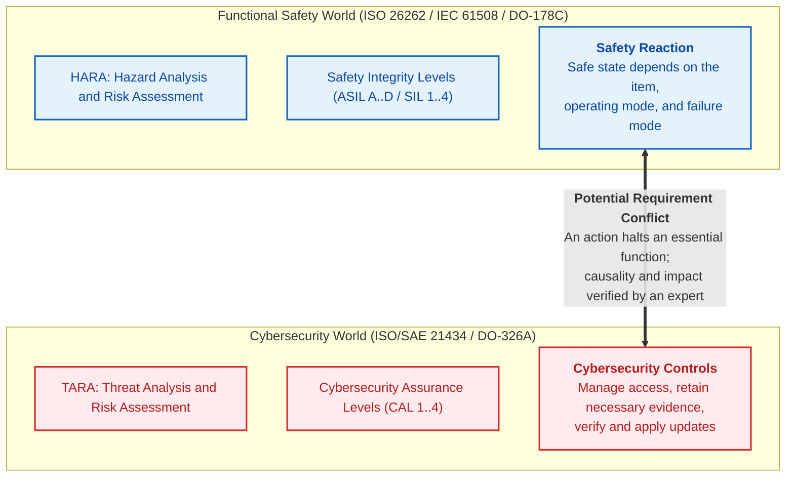
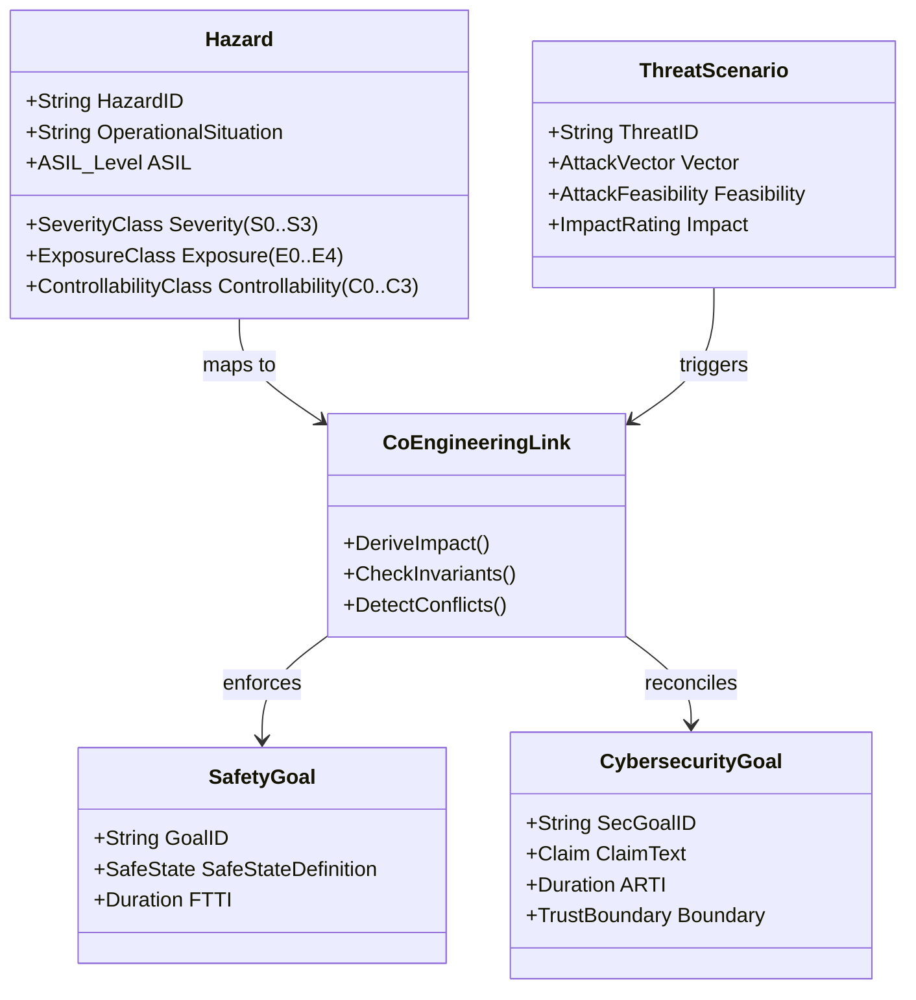
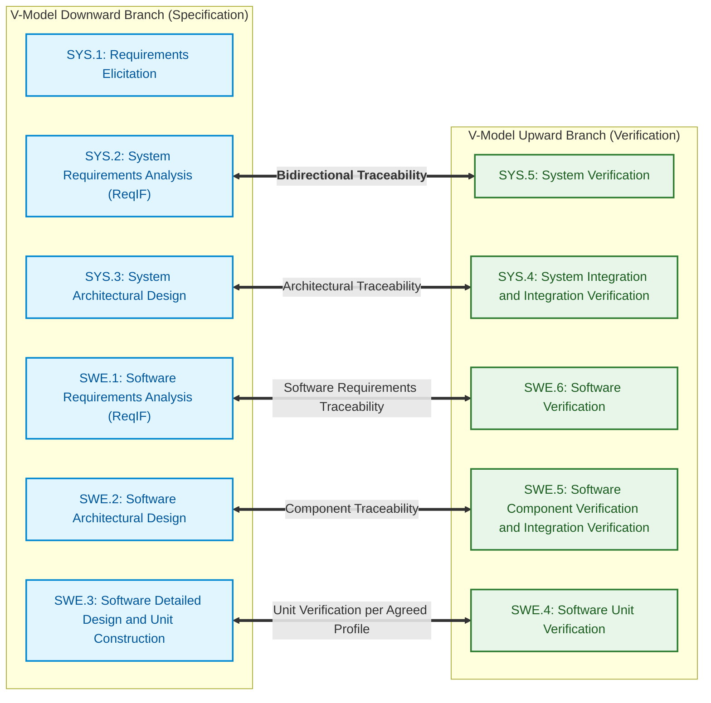
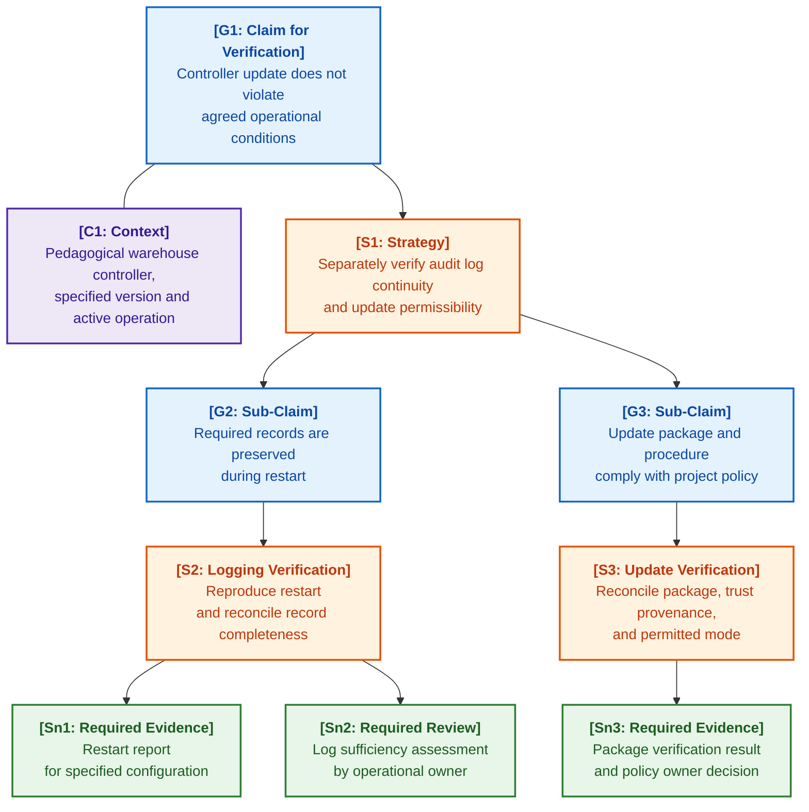

# Chapter 30. Functional Safety and Cybersecurity Co-Engineering

> **Book:** [Architecture of Evidence-Grounded Expert Systems](README.md) · [Part V: Verification, Testing, Diagnostics, and Safety Assurance](part-05-verification-and-learning.md)  
> **Previous Chapter:** [Chapter 27. Safety Cases: Synthesis and Verification of Arguments](ch27-safety-case-gsn-synthesis.md)  
> **Next Chapter:** [Chapter 28. Dual-Mode Expert Systems: Strict Deduction and Advisory Hypotheses](ch28-dual-mode-expert-systems.md)  
> **Table of Contents:** [README.md](README.md)  
> **Author:** [Mykola Fedchyk](about-the-author.md)  
> **Target Audience:** Functional Safety Managers, Cybersecurity Architects, Lead Embedded & Autonomous Systems Engineers (Robotics, DefTech, Automotive): Advanced  
> **Learning Outcomes:** Distinguish domain-specific risk assessment from agreed policy verification; identify conflicts between protective reaction and availability; verify timing inputs and requirement traceability; explain the boundaries of signed evidence records; evaluate the necessity of qualifying the expert system as a software tool.

---

## Abstract

Consider an autonomous logistics hauler or an unmanned vehicle on a highway. A cybersecurity anomaly detection module (ISO/SAE 21434) flags unauthenticated frames on the CAN bus and, enforcing an immediate threat mitigation policy, triggers a gateway reset or issues an emergency actuator de-energization command. Yet precisely at that fraction of a second, the electric actuator is holding the steering angle during an evasive maneuver: functional safety (ISO 26262, ASIL D) strictly mandates fail-operational actuator availability. A sudden power cutoff commanded by the cybersecurity subsystem causes an instantaneous skid and a fatal collision. The opposite extreme is equally catastrophic: if functional safety rules unconditionally block all security updates or compromised node isolations while the vehicle is in motion, an adversary gains an unrestricted window to compromise the in-vehicle network and hijack actuation.

Functional safety and cybersecurity address distinct classes of hazards and threats, yet they apply protective measures to the very same physical controllers, communication buses, and timing budgets. ISO/SAE 21434 establishes the automotive cybersecurity engineering context [[1]](#src-1), whereas the ISO 26262 series defines the functional safety lifecycle [[2]](#src-2). A safe system state is always contingent on situational context, operational mode, and the specific item architecture; it can never be reduced to blindly cutting power or ignoring anomalies.

In the context of evidence-grounded expert systems, the co-engineering of functional safety and cybersecurity is not merely a detached reference topic in systems engineering, but a foundational pillar of knowledge base verification: it is the expert system that provides formal discovery of mutually exclusive or hazardous rules before they reach the execution pipeline. The central question of this chapter is: **how does an expert system uncover latent conflicts between functional safety and cybersecurity requirements at the design stage without supplanting domain analysis or engineering responsibility?** This chapter presents explicit requirement linkages, pedagogical timing and traceability verification checks, signed evidence records, and software tool qualification. The warehouse controller update case study is synthetic: it serves to illustrate the method rather than claim the applicability of automotive standards to warehouse equipment. The expert system prepares material for technical assessment; it does not issue product certification.

---

## 1. The Problem of Disconnected Engineering Cultures

Designing an evidence-grounded knowledge base for cyber-physical systems inevitably confronts the historical schism between two independent engineering cultures: functional safety and cybersecurity. In industrial automation, transportation engineering, and defense systems, these disciplines evolved in isolation, relying on distinct standards, metrics, and regulatory mandates, which creates a systemic risk of mutually contradictory requirements:



### 1.1. Four Archetypal Cross-Disciplinary Collisions

Isolated engineering can conceal the mutual repercussions of protective measures. The following scenarios represent archetypal classes of issues for joint multidisciplinary review, rather than proof of inevitable human error:

1. **Physical Hazards Induced by Cyberattacks:**  
   A breach of control data integrity can precipitate severe physical consequences. Domain experts must formally establish the operational scenario, environmental conditions, and causal link between the threat and the hazard. Automotive cybersecurity engineering is never restricted solely to data confidentiality; an expert system must not ascribe such a limitation to standard methodologies.
2. **Conflict Between Protective Reaction and Availability:**  
   A protective reaction can disrupt an essential mission function. A checksum mismatch or MAC verification failure does not constitute a universal directive to de-energize the item: the appropriate response is dictated by operational mode, failure mode, redundancy architecture, and item requirements. Engineers must verify that an agreed protective reaction does not introduce a secondary, more severe hazard, rather than declaring either availability or immediate shutdown an unconditional priority.
3. **Conflict Between Rapid Patching and Rigorous Change Verification:**  
   An urgent security patch can directly clash with the imperative for comprehensive impact analysis and regression verification. The scope of re-verification is determined by the modified functions, architectural dependencies, and applicable process framework; not every change demands an exhaustive repetition of all lifecycle activities. The expert system compiles the inventory of affected requirements and evidence artifacts, while the process owner determines the sufficient verification suite.
4. **Conflict Between Diagnostic Access and Attack Surface:**  
   Diagnostic access is indispensable for field maintenance and calibration, yet it simultaneously expands the potential attack surface. This dichotomy justifies neither keeping all debug interfaces permanently open nor enforcing a blanket ban on field diagnostics. The system model must explicitly specify authorized roles, target operational modes, cryptographic authentication schemes, permitted service routines, and deterministic session termination conditions.

---

## 2. Mathematical and Ontological Apparatus of Co-Engineering

Requirements and formally agreed relationships between threats and hazards are captured within the Engineering Knowledge Graph (EKG) introduced in [Chapter 9](ch09-engineering-knowledge-graph-traceability.md). The graph enables automated consistency verification, but it does not independently deduce the physical consequences an attack might trigger.



### 2.1. Mapping TARA to HARA

Hazard Analysis and Risk Assessment (HARA) and Threat Analysis and Risk Assessment (TARA) are coupled via concrete operational scenarios and the item's operational design domain. A domain specialist must first confirm which physical hazards are affected by a given threat scenario. Only then can automated tooling apply an agreed category mapping table. The following formula represents a **pedagogical project policy**, rather than a universal standard algorithm or a verbatim clause of ISO/SAE 21434.

The formula is applicable strictly to a non-empty, validated set of hazards with known severity ratings. An empty hazard set or an unknown severity value results in an evaluation refusal—as demonstrated in the Go implementation in Section 5—rather than defaulting to the Negligible rating.

```math
\text{SafetyImpact}_{\text{TARA}}(\text{Threat}) = \begin{cases}
\text{Severe}, & \text{if } \exists H \in \text{ImpactedHazards}(\text{Threat}) : \text{Severity}(H) = S_3, \\
\text{Major}, & \text{if } \exists H : \text{Severity}(H) = S_2 \land \forall H : \text{Severity}(H) \le S_2, \\
\text{Moderate}, & \text{if } \exists H : \text{Severity}(H) = S_1 \land \forall H : \text{Severity}(H) \le S_1, \\
\text{Negligible}, & \text{if } \forall H : \text{Severity}(H) = S_0.
\end{cases}
```

Notation for the impact evaluation scale:

- $`\text{SafetyImpact}_{\text{TARA}}(\text{Threat})`$ represents the derived threat impact category according to the pedagogical policy;
- $\text{Threat}$ denotes the analyzed cyberattack vector;
- $`\text{ImpactedHazards}(\text{Threat})`$ is the set of physical hazards triggered by this attack vector;
- $H$ denotes an individual hazard within the agreed set; all quantifiers in the formula are bound to this set;
- $\text{Severity}(H)$ represents the severity classification of the hazard per ISO 26262;
- $S_3$ corresponds to life-threatening injuries with survival uncertain, or fatal injuries;
- $S_2$ corresponds to severe injuries and life-threatening injuries with survival probable;
- $S_1$ corresponds to light to moderate injuries;
- $S_0$ corresponds to no injuries.

Under this pedagogical policy, if at least one confirmed hazard carries severity level $S_3$, the threat impact is assigned the rating $\text{Severe}$. However, establishing causality between a cyber threat and a physical hazard remains rigorous engineering work. An evaluation derived for one operational scenario cannot be mechanically extrapolated to another item or operating state.

### 2.2. Co-Engineering Timing Budget: FTTI vs. ARTI

Joint engineering mandates the temporal alignment of protective reactions. In functional safety, the governing parameter is the **Fault Tolerant Time Interval (FTTI)**. ISO 26262-1:2018 defines FTTI as the minimum time-span from the occurrence of a fault in an item to a possible hazardous event [[2]](#src-2). This definition is cross-referenced here against verbatim citations in two peer-reviewed studies by Philipp Kilian et al. that explicitly cite ISO 26262-1:2018 [[3]](#src-3), [[4]](#src-4). The word "minimum" is critical: FTTI bounds the fastest path to a hazard, not the average case. FTTI is a property of a safety goal and is established at the item level during HARA [[3]](#src-3), whereas the Fault Handling Time Interval (FHTI) is an attribute of a specific safety mechanism [[4]](#src-4). The pedagogical timing balance equation is formulated as follows:

```math
\text{FHTI} = \text{FDTI} + \text{FRTI} \le \text{FTTI}.
```

Constituents of the fault tolerance timing budget:

- $\text{FTTI}$ is the Fault Tolerant Time Interval, expressed in milliseconds;
- $\text{FHTI}$ is the Fault Handling Time Interval of the safety mechanism, defined as the sum of FDTI and FRTI, in milliseconds;
- $\text{FDTI}$ is the Fault Detection Time Interval, from fault occurrence to its detection, in milliseconds;
- $\text{FRTI}$ is the Fault Reaction Time Interval, from fault detection to the achievement of a safe state or emergency operation, in milliseconds.

The inequality above permits the combined detection and reaction time to reach, but not exceed, the FTTI limit. Given pedagogical values of $100\,\text{ms}$ for FTTI and $30\,\text{ms}$ for FRTI, the remaining margin is $70\,\text{ms}$. If project policy mandates a strictly positive safety margin, equality must be explicitly prohibited; this stricter profile is enforced by the code in Section 5. For real-world production systems, measurements must account for worst-case execution conditions and rigorously bounded interface latencies.

For the pedagogical scenario, we introduce the **Attack Response Time Interval (ARTI)**. This parameter models timing behavior in our example; it is not presented as an official normative counterpart to FTTI:

```math
\text{ARTI} = \text{ATDI} + \text{ATRI}.
```

Parameters of the cyberattack response timeline:

- $\text{ARTI}$ is the total Attack Response Time Interval, expressed in milliseconds or microseconds;
- $\text{ATDI}$ is the Attack Detection Time Interval, reflecting the latency required by an intrusion detection or prevention system to identify an anomaly, in milliseconds;
- $\text{ATRI}$ is the Attack Reaction Time Interval, representing the time required to activate security countermeasures (such as isolating a compromised bus node or switching to a redundant authenticated channel), in milliseconds.

This expression illustrates that total intrusion mitigation latency comprises both the identification of a suspicious frame and the hardware execution of port isolation.

**Primary Invariant of Co-Engineering Safety:**

```math
\forall \text{Threat } t \text{ impacting Hazard } H : \quad \text{ARTI}(t) + \text{FRTI}(H) < \text{FTTI}(H).
```

In this inequality:

- $t$ is a cyberattack scenario that directly impacts physical hazard $H$;
- $\text{ARTI}(t)$ is the detection and reaction latency for attack $t$, in milliseconds;
- $\text{FRTI}(H)$ is the physical transition time required to bring the actuator to a safe state, in milliseconds;
- $\text{FTTI}(H)$ is the fault tolerance time limit for hazard $H$, in milliseconds.

Exceeding the agreed budget indicates that this specific reaction pathway fails the acceptance criterion. It does not prove the impossibility of software-based protection altogether, nor does it dictate a singular hardware remediation. Engineers must re-evaluate the timing model, explore alternative degraded states, and verify the independence of protective mechanisms. Here, ARTI and FRTI represent sequential, non-overlapping intervals; otherwise, direct addition would double-count overlapping pipeline phases.

### 2.3. Joint Risk Matrix

Automating architectural decisions based solely on a pair of classification levels risks obscuring underlying engineering assumptions. A pedagogical policy selection mapping can be formalized as:

```math
\mathcal{R}_{\text{co-eng}} = \Psi \Big( \text{ASIL}(H), \; \text{CAL}(\text{Threat}) \Big).
```

In this joint risk model:

- $`\mathcal{R}_{\text{co-eng}}`$ represents the selection of additional verification and mitigation measures prescribed by project policy, rather than a scalar failure probability;
- $\Psi$ is a mapping function translating the category tuple into defense and verification requirements;
- $\text{ASIL}(H)$ denotes the Automotive Safety Integrity Level per ISO 26262 (ranging from QM to ASIL D);
- $\text{CAL}(\text{Threat})$ denotes the Cybersecurity Assurance Level per ISO/SAE 21434 (ranging from CAL 1 to CAL 4).

The Cybersecurity Assurance Level (CAL) must not be conflated with the probability of attack success or a simplistic metric of attack complexity. Similarly, the Automotive Safety Integrity Level (ASIL) is not a scalar probability. The engineering project must rigorously document the rationale behind each category assignment and independently justify the required safety and security controls. Without these documented foundations, function $\Psi$ cannot be soundly applied.

For instance, project policy might mandate an independent architecture review for a safety-critical asset combined with supplementary penetration testing for cryptographic key rotation interfaces. This determines the engineering activities that must be executed, rather than prescribing a specific silicon component or cryptographic primitive. The rules governing these actions must be mutually reconciled by both functional safety and cybersecurity teams.

---

## 3. Processing and Verification of Requirements in ReqIF Format (ASPICE 4.0)

In aerospace, automotive, and defense systems, the exchange of requirements between OEMs, Tier-1 system suppliers, and Tier-2 semiconductor developers is conducted via the open XML standard **ReqIF (Requirements Interchange Format)**, standardized by the Object Management Group (OMG) [[5]](#src-5).



### 3.1. ReqIF Structure and Normative Attributes

A ReqIF file is a standardized XML document where each requirement is encapsulated within a `<SPEC-OBJECT>` element, and relationships between requirements are defined by `<SPEC-RELATION>` elements. The following listing provides a pedagogical excerpt. Schema type definitions, header metadata, and mandatory namespaces have been condensed for readability; thus, this snippet is not a self-contained valid ReqIF document:

<details>
<summary>Pedagogical ReqIF fragment: requirement and refinement relation</summary>

```xml
<?xml version="1.0" encoding="UTF-8"?>
<REQ-IF xmlns="http://www.omg.org/spec/ReqIF/20110401/reqif.xsd">
  <CORE-CONTENT>
    <REQ-IF-CONTENT>
      <SPEC-OBJECTS>
        <SPEC-OBJECT IDENTIFIER="REQ-SWE1-042" LAST-CHANGE="2026-09-15T10:00:00Z">
          <VALUES>
            <ATTRIBUTE-VALUE-STRING THE-VALUE="SYS_SEC_AUTH_CMD">
              <DEFINITION><ATTRIBUTE-DEFINITION-STRING-REF>ATTR-NAME</ATTRIBUTE-DEFINITION-STRING-REF></DEFINITION>
            </ATTRIBUTE-VALUE-STRING>
            <ATTRIBUTE-VALUE-STRING THE-VALUE="Every steering actuator control frame SHALL contain an AES-128 CMAC authentication tag.">
              <DEFINITION><ATTRIBUTE-DEFINITION-STRING-REF>ATTR-DESC</ATTRIBUTE-DEFINITION-STRING-REF></DEFINITION>
            </ATTRIBUTE-VALUE-STRING>
            <ATTRIBUTE-VALUE-ENUMERATION>
              <VALUES><ENUM-VALUE-REF>ENUM-ASIL-D</ENUM-VALUE-REF></VALUES>
              <DEFINITION><ATTRIBUTE-DEFINITION-ENUMERATION-REF>ATTR-ASIL</ATTRIBUTE-DEFINITION-ENUMERATION-REF></DEFINITION>
            </ATTRIBUTE-VALUE-ENUMERATION>
            <ATTRIBUTE-VALUE-ENUMERATION>
              <VALUES><ENUM-VALUE-REF>ENUM-CAL-4</ENUM-VALUE-REF></VALUES>
              <DEFINITION><ATTRIBUTE-DEFINITION-ENUMERATION-REF>ATTR-CAL</ATTRIBUTE-DEFINITION-ENUMERATION-REF></DEFINITION>
            </ATTRIBUTE-VALUE-ENUMERATION>
          </VALUES>
        </SPEC-OBJECT>
      </SPEC-OBJECTS>
      <SPEC-RELATIONS>
        <SPEC-RELATION IDENTIFIER="REL-089">
          <SOURCE><SPEC-OBJECT-REF>REQ-SWE1-042</SPEC-OBJECT-REF></SOURCE>
          <TARGET><SPEC-OBJECT-REF>REQ-SYS2-015</SPEC-OBJECT-REF></TARGET>
          <TYPE><SPEC-RELATION-TYPE-REF>REL-TYPE-REFINES</SPEC-RELATION-TYPE-REF></TYPE>
        </SPEC-RELATION>
      </SPEC-RELATIONS>
    </REQ-IF-CONTENT>
  </CORE-CONTENT>
</REQ-IF>
```

</details>

### 3.2. Automated Verification of ASPICE 4.0 Completeness Metrics

The Automotive SPICE 4.0 process assessment model [[6]](#src-6) and the aerospace standard DO-178C have distinct operational domains; they are not equivalent standards. Automotive SPICE 4.0 mandates ensuring consistency and establishing bidirectional traceability, notably between software and system requirements (Base Practice SWE.1.BP5) and between verification measures and software requirements (SWE.6.BP4); verification results are separately traced to verification measures [[6]](#src-6). The formal invariants below represent a pedagogical verification profile for a subset of these links, rather than an exhaustive translation of the standard's base practices. Profile thresholds and permissible exceptions must be justified for the specific project rather than treated as universal certification mandates.

**Invariant Governing Absence of Orphan Requirements ($`\mathcal{I}_{\text{no-orphan}}`$).**  
Every software requirement $`r \in \text{Reqs}_{\text{SWE.1}}`$ must refine at least one upstream system requirement $`s \in \text{Reqs}_{\text{SYS.2}}`$:

```math
\forall r \in \text{Reqs}_{\text{SWE.1}} : \exists s \in \text{Reqs}_{\text{SYS.2}} \quad \text{Refines}(r, s).
```

Traceability invariant notation:

- $r$ denotes an individual software requirement at the SWE.1 level;
- $`\text{Reqs}_{\text{SWE.1}}`$ is the complete set of subsystem software requirements;
- $s$ denotes a system requirement at the architectural SYS.2 level;
- $\text{Refines}(r, s)$ represents the refinement and decomposition relationship from system requirement $s$ to detailed software requirement $r$.

This invariant validates the presence of links among known requirements. It does not prove the absence of unintended functionality in source code. Derived requirements may follow an alternative agreed justification rationale; they should not be rejected simply due to the absence of a direct parent specification object.

**Invariant Governing Test Coverage Completeness ($`\mathcal{I}_{\text{test-cov}}`$).**  
For every high-integrity requirement ($\text{ASIL} \ge B$ or $\text{CAL} \ge 3$), there must exist at least one approved verification test record exhibiting a passing status:

```math
\forall r \in \text{Reqs}_{\text{SWE.1}} : \Big(\text{ASIL}(r) \ge B \lor \text{CAL}(r) \ge 3\Big) \implies \exists t \in \text{Tests}_{\text{SWE.6}} : \text{Verifies}(t, r) \land \text{Status}(t) = \text{Passed}.
```

Test coverage condition notation:

- $r$ is a verifiable requirement at the SWE.1 level;
- $\text{ASIL}(r)$ and $\text{CAL}(r)$ denote the safety and cybersecurity integrity levels assigned to the requirement;
- $t$ is a verification test within the test suite $`\text{Tests}_{\text{SWE.6}}`$;
- $\text{Verifies}(t, r)$ establishes the verification mapping from test $t$ to requirement $r$;
- $\text{Status}(t) = \text{Passed}$ confirms successful test execution on the target test bench.

If a test is missing or fails for a critical requirement, the invariant evaluates to false. The expert system flags the evidence package as incomplete and isolates the missing relationship, leaving corrective actions to the process owner.

**MC/DC Metric for ASIL D Source Code.**  
The Modified Condition/Decision Coverage (MC/DC) criterion demonstrates that each condition within a decision can independently affect that decision's outcome. The formula below sets a target of full coverage for the selected module. Concrete methodology requirements and acceptable rationales for uncovered conditions depend on the governing standard; ASIL D and avionics Software Level A must not be conflated into a single universal rule.

```math
\text{Coverage}_{\text{MC/DC}}(M) = 1.0 \quad (100\,\%).
```

where:

- $M$ denotes a source code module implementing ASIL D safety functions;
- $`\text{Coverage}_{\text{MC/DC}}(M)`$ is the proportion of conditions for which independent outcome influence has been demonstrated, bounded between 0 and 1.0;
- A value of 1.0 (100%) signifies that independent effect has been verified for every condition within every decision across the module.

For an expression such as `if (crc_ok && auth_valid && !timeout)`, each of the three Boolean conditions requires a test pair in which the evaluated condition toggles, causing the overall decision outcome to flip. Under Unique-Cause MC/DC, all other conditions in the test pair must remain strictly identical; Masking MC/DC permits other conditions to vary provided their effects are logically masked. The chosen coverage variant and justifications for any unachieved conditions must be documented in the verification plan.

---

## 4. Synthesis of Safety Cases According to Goal Structuring Notation (GSN)

Goal Structuring Notation (GSN) enables explicit linking between safety claims, argumentation strategies, operational context, and supporting evidence [[7]](#src-7). GSN does not replace test reports, nor does an argument tree become valid merely by populating graph nodes. Automated tooling synthesizes the structural skeleton and verifies defined syntactic rules, while domain specialists evaluate the evidentiary sufficiency of the argument. The formal limits of safety case argumentation are analyzed by John Rushby [[8]](#src-8).



### 4.1. Signed Evidence Record

A leaf node in the argument tree (*Solution, Sn*) references concrete evidence. The pedagogical signed record contains its cryptographic hash and metadata. This does not represent an industry-standard certification format, nor is it a cryptographic proof of the truth of the underlying claim:

1. `AssertionID`: unique identifier of the GSN goal or normative claim.
2. `ProofType`: classification of the certification evidence (`MC_DC_Coverage`, `Hardware_Root_Of_Trust`, `Traceability_Matrix`).
3. `EvidenceDigests`: array of SHA-256 cryptographic hashes of raw source artifacts (C/Rust/Go source files, test execution logs, firmware images).
4. `ByteRanges`: exact byte offsets within the normative report or execution log.
5. `Signature`: digital signature over the canonical serialization of the record, including the claim identifier, evidence type, timestamp, and artifact hash. Signing only the raw evidence bytes leaves the associated metadata vulnerable to tampering.

<details>
<summary>Pedagogical evidence record; signature not computed</summary>

```json
{
  "record_version": "1.0",
  "assertion_id": "GOAL-G2-ASIL-D-DECOMPOSITION",
  "proof_type": "MC_DC_Coverage",
  "timestamp_utc": "2026-10-02T12:00:00Z",
  "root_evidence": {
    "artifact_uri": "reports/verification/mcdc_swe4_actuator.log",
    "sha256": "4b227777d4dd1fc61c6f884f48641d02b4d121d3fd328cb08b5531fcacdabf8a",
    "byte_start": 4120,
    "byte_end": 4890,
    "literal_quote": "TOTAL MCDC COVERAGE: 100.0% (48/48 CONDITIONS SATISFIED)"
  },
  "signing_authority": {
    "key_id": "audit-sec-core-01",
    "signature": null
  }
}
```

</details>

A digital signature guarantees the provenance and integrity of the signed data payload. Without access to the underlying evidence artifact or an independent verification report, an auditor cannot evaluate requirement fulfillment from a raw hash alone. Furthermore, signing an isolated leaf record does not authenticate the overall argumentation graph. Canonical representations and validation rules must be coordinated between the signer and verifier; the Go example below uses an identical struct definition in both signing and verification routines rather than presuming cross-language canonical serialization.

---

## 5. Pedagogical Verification in an Expert System Using Go

The `compliance` module presented below demonstrates a pedagogical policy for reconciling pre-agreed integrity categories, verifying timing budgets, enforcing requirements traceability rules, and implementing the controller update policy from Section 6.2, which distinguishes genuine conflict from missing evidence. The module does not determine which physical hazards are triggered by an attack, does not parse the full item model, and does not claim compliance with safety standards. Unrecognized categories or invalid timing inputs return explicit errors rather than permissive defaults. Execution requires Go 1.20 or newer, utilizing standard library dependencies exclusively.

<details>
<summary>Go Implementation: Compliance and Timing Budget Verification Module</summary>

```go
package compliance

import (
	"crypto/ecdsa"
	"crypto/rand"
	"crypto/sha256"
	"encoding/json"
	"errors"
	"fmt"
	"math/big"
	"time"
)

// SeverityClass defines the HARA severity class per ISO 26262-3
type SeverityClass string

const (
	SeverityS0 SeverityClass = "S0" // Negligible (no injuries)
	SeverityS1 SeverityClass = "S1" // Moderate (light and moderate injuries)
	SeverityS2 SeverityClass = "S2" // Major (severe injuries with life threat)
	SeverityS3 SeverityClass = "S3" // Severe (fatal injuries / catastrophic)
)

// ThreatImpact defines the TARA impact rating per ISO/SAE 21434
type ThreatImpact string

const (
	ImpactNegligible ThreatImpact = "Negligible"
	ImpactModerate   ThreatImpact = "Moderate"
	ImpactMajor      ThreatImpact = "Major"
	ImpactSevere     ThreatImpact = "Severe"
)

// ThreatScenario describes a cyberattack scenario against a critical asset
type ThreatScenario struct {
	ID                string
	Name              string
	AttackFeasibility string        // High, Medium, Low, Very Low
	SafetySeverity    SeverityClass // Associated HARA severity
	ARTIDuration      time.Duration // Attack Response Time Interval
}

// SafetyGoal describes a functional safety goal
type SafetyGoal struct {
	ID        string
	SafeState string        // Safe state identifier (e.g., EMERGENCY_LANDING)
	FTTI      time.Duration // Fault Tolerant Time Interval
	FRTI      time.Duration // Fault Reaction Time Interval
}

func DeriveTARAImpact(severity SeverityClass) (ThreatImpact, error) {
	switch severity {
	case SeverityS3:
		return ImpactSevere, nil
	case SeverityS2:
		return ImpactMajor, nil
	case SeverityS1:
		return ImpactModerate, nil
	case SeverityS0:
		return ImpactNegligible, nil
	default:
		return "", fmt.Errorf("unknown severity: %q", severity)
	}
}

// VerifyTimingBudget verifies the condition ARTI + FRTI < FTTI
func VerifyTimingBudget(sg SafetyGoal, ts ThreatScenario) error {
	if sg.FTTI <= 0 || sg.FRTI < 0 || ts.ARTIDuration < 0 {
		return errors.New("invalid timing input")
	}
	if sg.FRTI >= sg.FTTI || ts.ARTIDuration >= sg.FTTI-sg.FRTI {
		return errors.New("timing budget exceeded or no reserve remains")
	}
	return nil
}

// UpdateFinding represents the result of the POLICY-UPDATE-1 rule from Section 6.2
type UpdateFinding string

const (
	FindingNoConflict      UpdateFinding = "no_conflict"
	FindingConflict        UpdateFinding = "conflict"
	FindingMissingEvidence UpdateFinding = "missing_evidence"
)

// RestartTest describes a logging restart test report for a single configuration
type RestartTest struct {
	ID               string
	Configuration    string
	RecordsPreserved bool // records preserved via an independent channel during restart
}

// UpdateContext contains the agreed inputs for the policy rule
type UpdateContext struct {
	ActiveOperation   bool   // REQ-OBS-1: active operation requires state logging
	UpdateRestartsLog bool   // FACT-RESTART-1: update procedure restarts the logging process
	Configuration     string // current controller configuration
	Tests             []RestartTest
}

// EvaluateUpdatePolicy distinguishes confirmed conflict from insufficient evidence
func EvaluateUpdatePolicy(ctx UpdateContext) (UpdateFinding, []string) {
	if !ctx.ActiveOperation || !ctx.UpdateRestartsLog {
		return FindingNoConflict, nil
	}
	if ctx.Configuration == "" {
		return FindingMissingEvidence, nil
	}
	var preserved, lost []string
	for _, test := range ctx.Tests {
		if test.Configuration != ctx.Configuration {
			continue
		}
		if test.RecordsPreserved {
			preserved = append(preserved, test.ID)
		} else {
			lost = append(lost, test.ID)
		}
	}
	switch {
	case len(lost) > 0:
		return FindingConflict, lost
	case len(preserved) > 0:
		return FindingNoConflict, preserved
	default:
		return FindingMissingEvidence, nil
	}
}

// ReqIFObject represents a requirement node in ReqIF format
type ReqIFObject struct {
	ID           string
	Text         string
	ASIL         string
	CAL          string
	ParentID     string // Link to higher-level system requirement
	RequiresMCDC bool
	HasMCDC      bool // Whether 100% MC/DC coverage is verified
}

func ValidateProjectTraceability(objects []ReqIFObject, approvedParents map[string]bool) []string {
	var violations []string
	for _, obj := range objects {
		if !approvedParents[obj.ParentID] {
			violations = append(violations, fmt.Sprintf("%s: approved parent is missing", obj.ID))
		}
		if obj.RequiresMCDC && !obj.HasMCDC {
			violations = append(violations, fmt.Sprintf("%s: required coverage evidence is missing", obj.ID))
		}
	}
	return violations
}

type EvidenceRecord struct {
	AssertionID  string `json:"assertion_id"`
	ProofType    string `json:"proof_type"`
	TimestampUTC string `json:"timestamp_utc"`
	DigestHex    string `json:"digest_hex"`
	SignatureR   string `json:"sig_r"`
	SignatureS   string `json:"sig_s"`
}

func recordDigest(record *EvidenceRecord) ([32]byte, error) {
	payload, err := json.Marshal(struct {
		AssertionID, ProofType, TimestampUTC, DigestHex string
	}{record.AssertionID, record.ProofType, record.TimestampUTC, record.DigestHex})
	return sha256.Sum256(payload), err
}

func SignEvidence(assertionID, proofType, evidenceData string, privKey *ecdsa.PrivateKey) (*EvidenceRecord, error) {
	if privKey == nil || assertionID == "" || proofType == "" {
		return nil, errors.New("missing signing key or record metadata")
	}
	evidenceDigest := sha256.Sum256([]byte(evidenceData))
	record := &EvidenceRecord{
		AssertionID: assertionID, ProofType: proofType,
		TimestampUTC: time.Now().UTC().Format(time.RFC3339),
		DigestHex:    fmt.Sprintf("%x", evidenceDigest),
	}
	digest, err := recordDigest(record)
	if err != nil {
		return nil, err
	}
	r, s, err := ecdsa.Sign(rand.Reader, privKey, digest[:])
	if err != nil {
		return nil, err
	}
	record.SignatureR, record.SignatureS = r.Text(16), s.Text(16)
	return record, nil
}

func VerifyEvidence(record *EvidenceRecord, evidenceData string, publicKey *ecdsa.PublicKey) bool {
	if record == nil || publicKey == nil {
		return false
	}
	evidenceDigest := sha256.Sum256([]byte(evidenceData))
	if record.DigestHex != fmt.Sprintf("%x", evidenceDigest) {
		return false
	}
	r, validR := new(big.Int).SetString(record.SignatureR, 16)
	s, validS := new(big.Int).SetString(record.SignatureS, 16)
	digest, err := recordDigest(record)
	return validR && validS && err == nil && ecdsa.Verify(publicKey, digest[:], r, s)
}
```

</details>

To verify the implementation, save the module as `compliance.go` and the following test suite as `compliance_test.go` in the same directory. The command `go test compliance.go compliance_test.go` executes without requiring third-party libraries or a `go.mod` file.

```go
package compliance

import (
	"crypto/ecdsa"
	"crypto/elliptic"
	"crypto/rand"
	"testing"
	"time"
)

func TestSeverityPolicy(t *testing.T) {
	known := map[SeverityClass]ThreatImpact{
		SeverityS0: ImpactNegligible, SeverityS1: ImpactModerate,
		SeverityS2: ImpactMajor, SeverityS3: ImpactSevere,
	}
	for severity, expected := range known {
		actual, err := DeriveTARAImpact(severity)
		if err != nil || actual != expected {
			t.Fatalf("%q: got %q, %v", severity, actual, err)
		}
	}
	for _, severity := range []SeverityClass{"", "S4"} {
		if actual, err := DeriveTARAImpact(severity); err == nil || actual != "" {
			t.Fatalf("unknown %q was accepted", severity)
		}
	}
}

func TestTimingPolicy(t *testing.T) {
	for _, testCase := range []struct {
		limit, reaction, detection time.Duration
		wantError                  bool
	}{
		{100, 20, 79, false}, {100, 20, 80, true},
		{100, -1, 20, true}, {100, 20, -1, true},
		{0, 0, 0, true}, {100, 120, 0, true},
	} {
		goal := SafetyGoal{FTTI: testCase.limit, FRTI: testCase.reaction}
		scenario := ThreatScenario{ARTIDuration: testCase.detection}
		if err := VerifyTimingBudget(goal, scenario); (err != nil) != testCase.wantError {
			t.Fatalf("%+v: got %v", testCase, err)
		}
	}
}

func TestProjectTraceability(t *testing.T) {
	parents := map[string]bool{"SYS-1": true}
	valid := ReqIFObject{ID: "REQ-1", ParentID: "SYS-1", RequiresMCDC: true, HasMCDC: true}
	if len(ValidateProjectTraceability([]ReqIFObject{valid}, parents)) != 0 {
		t.Fatal("valid links rejected")
	}
	valid.ParentID = "unknown"
	valid.HasMCDC = false
	if len(ValidateProjectTraceability([]ReqIFObject{valid}, parents)) != 2 {
		t.Fatal("missing links were accepted")
	}
}

func TestUpdatePolicyFindings(t *testing.T) {
	base := UpdateContext{ActiveOperation: true, UpdateRestartsLog: true, Configuration: "cfg-B"}
	lost := RestartTest{ID: "TEST-RESTART-1", Configuration: "cfg-B", RecordsPreserved: false}
	kept := RestartTest{ID: "TEST-RESTART-2", Configuration: "cfg-B", RecordsPreserved: true}
	other := RestartTest{ID: "TEST-RESTART-0", Configuration: "cfg-A", RecordsPreserved: true}
	for _, testCase := range []struct {
		name  string
		tests []RestartTest
		want  UpdateFinding
	}{
		{"lost records", []RestartTest{lost}, FindingConflict},
		{"no test for configuration", []RestartTest{other}, FindingMissingEvidence},
		{"records preserved", []RestartTest{kept}, FindingNoConflict},
		{"contradicting reports", []RestartTest{kept, lost}, FindingConflict},
	} {
		ctx := base
		ctx.Tests = testCase.tests
		if got, _ := EvaluateUpdatePolicy(ctx); got != testCase.want {
			t.Fatalf("%s: got %s, want %s", testCase.name, got, testCase.want)
		}
	}
	idle := base
	idle.ActiveOperation = false
	if got, _ := EvaluateUpdatePolicy(idle); got != FindingNoConflict {
		t.Fatalf("idle controller: got %s", got)
	}
	unknown := base
	unknown.Configuration = ""
	unknown.Tests = []RestartTest{lost}
	if got, _ := EvaluateUpdatePolicy(unknown); got != FindingMissingEvidence {
		t.Fatalf("unknown configuration: got %s", got)
	}
}

func TestEvidenceBinding(t *testing.T) {
	key, err := ecdsa.GenerateKey(elliptic.P256(), rand.Reader)
	if err != nil {
		t.Fatal(err)
	}
	record, err := SignEvidence("REQ-42", "test", "passed", key)
	if err != nil {
		t.Fatal(err)
	}
	if !VerifyEvidence(record, "passed", &key.PublicKey) {
		t.Fatal("valid record rejected")
	}
	if VerifyEvidence(record, "failed", &key.PublicKey) {
		t.Fatal("changed evidence accepted")
	}
	record.AssertionID = "REQ-99"
	if VerifyEvidence(record, "passed", &key.PublicKey) {
		t.Fatal("changed metadata accepted")
	}
}
```

</details>

The test suite exercises valid and unrecognized categories, timing boundary conditions, approved parent traceability links, all three outcomes of the update policy (including contradictory test reports and reports for mismatched configurations), and signature binding across data and metadata. Timing values in `time.Duration` are specified in nanoseconds within the test cases; production records should define units explicitly (e.g., `100 * time.Millisecond`). Comparing against the remaining timing reserve avoids arithmetic overflow. The `RequiresMCDC` flag reflects an agreed project profile rather than an automatic ASIL inference. The example does not implement derived requirement workflows, public key certificate chains, expiration checks, or key revocation lists.

---

## 6. Practical Case Study: Warehouse Controller Update

A warehouse automated guided vehicle (AGV) controller accepts software updates and maintains an active operational state log. The engineering team aims to remediate a security vulnerability, but the controller update procedure interrupts the telemetry stream. This case study is pedagogical; security sufficiency and required safe states must be established by a domain specialist rather than inferred from the numerical values or automotive categories presented here.

### 6.1. Agreed Inputs

| Record | Content | Basis |
|---|---|---|
| `REQ-OBS-1`, Rev. 2 | During active operation, the state log must remain continuously accessible | Agreed operational owner requirement |
| `REQ-UPD-1`, Rev. 3 | Install only authenticated, verified update packages | Agreed update policy |
| `FACT-RESTART-1` | The firmware update procedure restarts the logging process | Procedure analysis and reproducible bench test |
| `TEST-RESTART-1` | During restart, telemetry records fail to reach the central logging server | Execution report for specified version and configuration |

The relationships between the update action, logging continuity, and operational requirements were established through technical analysis rather than textual heuristic matching. An engineer verified the deployment procedure, bench test results, and hardware configuration; candidate links underwent rigorous peer review. The digital signature on the test report protects the artifact against tampering, but it does not evaluate whether the test methodology was methodologically sufficient.

### 6.2. Rule Inference

The `POLICY-UPDATE-1` rule evaluates three conditions: an active operation mandates continuous logging, the update procedure restarts the logging daemon, and no approved evidence demonstrates independent log persistence across reboots. When these conditions are met, the rule asserts a **requirement conflict**, returns the IDs of the conflicting artifacts, and demands human expert escalation. The rule does not conclude that all firmware updates are prohibited, nor does it mandate a specific hardware architecture.

If test coverage is missing for the active hardware configuration, the evaluation yields "missing evidence." This result is fundamentally distinct from a confirmed conflict. The `EvaluateUpdatePolicy` function in Section 5 embodies this distinction: a report demonstrating record loss under the current configuration triggers a conflict; a test report valid only for a different configuration, or an unspecified configuration, produces "missing evidence"; and a report demonstrating independent log preservation resolves the conflict. Contradictory test reports for the same configuration are treated as a conflict, as a subsequent passing run does not nullify a previously observed failure until an engineer determines the root cause. Full provenance graphs, version lineages, and lifecycle states are omitted from the sample implementation.

### 6.3. Alternatives and Verification Checks

| Candidate Action | Verification Required | Approving Authority |
|---|---|---|
| Update during inter-operational idle window | Verify that the system is genuinely idle and that restart does not violate operational sequence | Operational Owner |
| Independent telemetry buffering during restart | Verify buffer completeness, record ordering, monotonic timestamps, and reconnect recovery | Logging Subsystem Owner |
| Deferral of update deployment | Evaluate maximum deferral window, vulnerability exploitability, and compensating perimeter controls | Cybersecurity Officer |

Each alternative represents a candidate remediation possessing its own verification requirements, rather than an automatic "harmonized" compromise. Once approved, the expert system records the selected option, formal waivers, component versions, and expiration dates. A new knowledge pack updates the active evaluation without altering historical audit trails. The identical architectural mechanism applies to updates of services maintaining financial ledgers or managing long-running transactional workloads.

---

## 7. Qualification of the Expert System as a Software Tool (ISO 26262-8, Clause 11)

The preceding sections examined pedagogical requirement verification and signed evidence records. An auditor will inevitably inspect the expert system itself: why can the results produced by this software tool be trusted? For automotive projects, the framework for answering this question is governed by Clause 11 of ISO 26262-8: "Confidence in the use of software tools" [[9]](#src-9). The standard does not mandate tool qualification for every utility: engineers must systematically assess the consequences of tool errors and the independent measures capable of detecting them.

### 7.1. Tool Impact, Tool Error Detection, and Tool Confidence Level

The evaluation is grounded in two attributes specific to the operational use case of the tool. Tool Impact (TI) determines whether a malfunction in the tool can introduce an error into a safety-related item or fail to detect an existing defect: TI1 indicates no such possibility exists, whereas TI2 covers all remaining cases. Tool error Detection (TD) assesses the degree of confidence that subsequent process measures will prevent or detect an erroneous tool output: TD1 denotes high confidence, TD2 medium confidence, and TD3 all other situations. From these parameters, the Tool Confidence Level (TCL) is derived.

```math
\mathrm{TCL}(\mathrm{TI}, \mathrm{TD}) =
\begin{cases}
1, & \mathrm{TI} = \mathrm{TI1} \;\lor\; \mathrm{TD} = \mathrm{TD1},\\
2, & \mathrm{TI} = \mathrm{TI2} \;\land\; \mathrm{TD} = \mathrm{TD2},\\
3, & \mathrm{TI} = \mathrm{TI2} \;\land\; \mathrm{TD} = \mathrm{TD3}.
\end{cases}
```

Tool classification parameters:

- $\mathrm{TI}$ is the Tool Impact rating for a specific use case, taking the values TI1 or TI2;
- $\mathrm{TD}$ is the Tool error Detection rating assessing process confidence in catching tool errors, taking the values TD1, TD2, or TD3;
- $\lor$ represents logical OR, and $\land$ represents logical AND;
- $\mathrm{TCL}$ is the derived Tool Confidence Level from 1 to 3: TCL1 requires no formal tool qualification, whereas TCL2 and TCL3 mandate qualification activities, with TCL3 imposing the most stringent requirements.

The formula is interpreted as follows: a tool requires no qualification if its malfunction cannot adversely affect the safety of the end product (TI1) or if its errors are virtually guaranteed to be caught by independent downstream verification measures (TD1). Formal qualification becomes mandatory only when an unmitigated tool error can propagate into the product and the development process provides no systematic guarantee of detection. The table below applies this classification logic to three operational use cases of the same expert system.

| Expert System Operational Use Case | TI | Error Detection Measure | TD | TCL |
|---|---|---|---|---|
| Regulatory search and citation retrieval; engineering decisions made after reviewing primary sources | TI2: an omitted standard clause could fail to reach the specification | Independent regulatory index and byte-level verification against primary sources | TD1 | TCL1 |
| Automated detection of ReqIF traceability gaps (Section 3.2) | TI2: an unflagged gap will be omitted from the audit report | Sample-based manual inspection and cross-validation against a secondary tool | TD2 | TCL2 |
| Autonomous safety case synthesis without human peer review | TI2: a fallacious argument is incorporated into the safety case | No independent detection measure | TD3 | TCL3 |

This table illustrates classification reasoning rather than providing off-the-shelf ratings: TD depends entirely on the concrete verification measures implemented within a specific project workflow. Two practical architectural principles emerge. First, classification applies not to an expert system in the abstract, but to each concrete operational use case. Second, the most cost-effective path to reducing TCL does not lie in costly qualification campaigns, but in establishing independent detection mechanisms. Citations with explicit byte boundaries, transparent proof trees, and explicit refusal tokens—as detailed in [Chapters 20](ch20-explanation-engine.md) and [31](ch31-syllogistic-reasoning-and-relation-lattices.md)—constitute precisely such mechanisms: the human reviewer inspects every assertion against primary sources without taking the tool's output on faith.

### 7.2. Qualification Methods and the Specificity of Expert Systems

For TCL2 and TCL3, the standard defines four qualification methods, with recommendations varying based on the TCL and target product ASIL [[9]](#src-9):

1. Increased confidence from use;
2. Evaluation of the tool development process;
3. Validation of the software tool;
4. Development in accordance with a safety standard.

For an expert system, the most pragmatic qualification method is software tool validation: a curated benchmark test suite of cases with known ground truth, metamorphic and differential testing ([Chapter 23](ch23-knowledge-base-verification.md)), and empirical measurements of false positive and refusal rates. The architectural specificity of an expert system lies in the fact that its runtime behavior is governed not only by the inference engine binary, but also by the active knowledge pack generation ([Chapter 32](ch32-high-performance-knowledge-packs-mmap-and-harvesting.md)). Consequently, the qualified tool version must be defined as the composite tuple (inference engine version, knowledge pack generation ID), and each release of a new knowledge pack generation requires re-executing the validation test suite. The "increased confidence from use" method is ineffective for expert systems for the same reason: operational history accumulates for a specific version tuple, whereas domain knowledge packs evolve much faster than field statistical baselines can be gathered.

Aerospace projects address this challenge via Section 12.2 of DO-178C [[10]](#src-10) and the dedicated DO-330 standard [[11]](#src-11). The Tool Qualification Level (TQL, ranging from TQL-1 to TQL-5) is determined by three criteria and the software level of the airborne system: whether the tool output can insert an error into airborne software, whether the tool automates a verification process that replaces other verification activities, or whether the tool can merely fail to detect an existing defect. The underlying rationale aligns with ISO 26262-8: evaluating the consequence of a tool error alongside the independence of downstream error detection.

### 7.3. Tool Qualification Documentation Suite

Tool classification and qualification results must be structured so that external auditors can verify them independently of the expert system developers. In practice, this encompasses three primary artifacts:

1. **Software Tool Classification Report:** inventory of operational use cases, documented TI and TD evaluations with rationales, and the derived TCL for each use case.
2. **Software Tool Qualification Report:** selected qualification method, benchmark validation suite, measured test results, and the exact (inference engine version, knowledge pack generation ID) version tuple for which the qualification remains valid.
3. **Software Tool Safety Manual:** authorized operational use cases, mandatory human verification checkpoints, known anomalies and certified workarounds, and defined execution environments.

The third document is the most vital for practicing engineers: the safety manual explicitly defines the boundaries within which the expert system must NOT be trusted. This documented negative capability is just as crucial to qualification as positive verification; it prevents the tool from silently expanding its operational envelope. The audit checklist in the following section therefore incorporates an explicit checkpoint dedicated to software tool qualification.

---

## 8. Project Checklist for Review Preparation

This pedagogical review checklist represents a structured guide for gap analysis, not a universal certification audit sheet or verbatim standard requirements. The project process owner establishes applicable regulatory clauses, required evidence, and permissible exemptions. Knowledge graph queries verify only what has been formally encoded:

1. **Risk Traceability:** Are relationships between specific threat scenarios and physical hazards formally approved? Mappings are typically many-to-many rather than simple bijections.
2. **Timing Constraints:** Are timing units, interval boundaries, worst-case operating conditions, and mandatory safety margins explicitly specified? Does the agreed pedagogical timing inequality apply to the evaluated operational scenario?
3. **Traceability Integrity:** Do requirement links reference correct, approved baseline versions, and are derived requirements without direct upstream parents properly justified? A non-empty identifier does not constitute evidence of semantic linkage.
4. **Structural Coverage:** Does the structural test coverage methodology and achieved level match the agreed project profile? An ASIL D designation does not automatically impose a universal 100% MC/DC mandate.
5. **Component Dependencies:** Are third-party software component inventories, versions, provenance chains, known vulnerabilities, and risk dispositions formally recorded? The absence of a recorded vulnerability does not prove the absence of exploitable defects.
6. **Tool Qualification:** Have the expert system and auxiliary tools been classified per ISO 26262-8 for each operational use case, and does the (inference engine version, knowledge pack generation ID) tuple in the qualification report match the environment that produced the assurance evidence?

---

## 9. Contemporary Tools and Data Analysis for Co-Engineering

Sections 2 through 8 presumed the existence of formalized engineering artifacts: threat-to-hazard mappings, parent-child requirement links, test logs, and software component manifests. In industrial practice, these artifacts originate across disparate engineering tools, reaching the expert system in heterogeneous formats. This raises an applied engineering question: which open methodologies and data formats provide machine-readable evidence for the verifications in this chapter, and what are their inherent boundaries?

| Methodology or Format | Value Provided to Expert System | What It Does NOT Guarantee |
|---|---|---|
| STPA-Sec (System-Theoretic Process Analysis for Safety and Security) [[12]](#src-12) | A unified functional control structure for analyzing hazards and vulnerabilities; catalogue of unsafe or unmitigated control actions as graph assertions | Completeness of the control structure model; the authors explicitly state that completeness cannot be formally proven, leaving human peer review mandatory |
| ReqIF and the `reqif` Python library [[5]](#src-5), [[13]](#src-13) | Parsing, formatting, and structural validation of ReqIF XML documents against the official OMG schema prior to graph ingestion | Schema validation guarantees structural syntax, not semantic validity of requirement text or relationships |
| CycloneDX 1.7, standardized as ECMA-424 [[14]](#src-14) | Comprehensive Software Bill of Materials (SBOM): components, dependencies, services, known vulnerabilities, and manifest completeness declarations | A bill of materials is only as complete as the underlying build and discovery process; completeness marks represent supplier assertions |
| OpenVEX 0.2.0, implementation of Vulnerability Exploitability eXchange [[15]](#src-15) | Machine-readable "product, vulnerability, status, timestamp" assertions with `not_affected`, `affected`, `fixed`, and `under_investigation` statuses and structured rationales | A `not_affected` status represents an assertion by the supplier; the specification notes that certain non-exploitability claims are difficult to formally substantiate |
| Uptane 2.1.0 [[16]](#src-16) | Standardized framework for automotive software updates: dual metadata repositories, full and partial verification, rollback and freeze attack defenses | Protection against malicious code within trusted packages or compromised build pipelines lies outside Uptane's scope; SLSA provenance attestations from [Chapter 27](ch27-safety-case-gsn-synthesis.md) are required |

This comparative synthesis highlights a common boundary: each tool formalizes one facet of the evidence chain and cannot independently establish causality between a cyber threat and a physical hazard. That causal linkage, as emphasized in Section 2.1, remains an engineering domain decision.

**STPA-Sec as a Unified Model.** William Young and Nancy Leveson extended System-Theoretic Process Analysis (STPA) to cybersecurity [[12]](#src-12). Both safety and security analyses construct a common functional control structure and identify four categories of unsafe control actions (UCAs): a control action is provided that leads to a hazard; a required control action is not provided; a control action is provided too early, too late, or in the wrong sequence; or a control action is stopped too soon or applied too long. The distinction of STPA-Sec, according to the authors, lies in extending the causal scenarios of the final step to encompass deliberate, adversarial actions. For this chapter, this unified view is critical for two reasons. First, the third and fourth UCA categories connect directly to the timing budget in Section 2.2: an attack response that arrives too late constitutes an unsafe control action, even if the defensive action itself is technically correct. Second, because both safety and security teams operate over an identical inventory of control actions, the expert system can verify that every hazardous control action is constrained by a safety requirement, every constraint traces to a functional specification, and every specification is verified by a test. The authors observed that empirical comparison of STPA-Sec against red-team assessments was still ongoing as of 2014; hence, the superiority of the method in cybersecurity should be treated as an engineering hypothesis to be validated against project-specific data.

**Component Inventories and Vulnerability Status Tracking.** Item 5 of the checklist in Section 8 addresses third-party dependencies and known vulnerabilities. CycloneDX structures components, dependency graphs, and known CVEs, while OpenVEX annotates each (product, vulnerability) pair with an exploitability status and timestamp. OpenVEX assertions are strictly ordered in time: a newer statement refines or supersedes an earlier declaration; therefore, the expert system must maintain a temporal history of vulnerability statuses rather than retaining only the latest snapshot. Verification checks translate into concise automated rules: a vulnerability flagged as `affected` without a remediation plan is flagged as unresolved; an `under_investigation` status exceeding an agreed review SLA triggers an escalation; and a `not_affected` assertion lacking a machine-readable justification is rejected.

**Data Analytics over Assurance Artifacts.** Three data analytics techniques complement the deterministic verification rules of this chapter, providing candidate linkages for human review:

1. **Matching Component Inventories against Vulnerability Feeds:** Correlating SBOM package coordinates (Package URLs / CPEs) with public vulnerability databases yields candidate (component, CVE) pairings. Inaccurate package names and version discrepancies inevitably generate both false positives and missed disclosures; consequently, each candidate pair must be assigned an authoritative VEX status by a security engineer, and the false discovery rate should be measured over a curated ground-truth sample.
2. **Automated Discovery of Traceability Gaps:** Graph queries uncover orphan requirements, high-integrity requirements lacking test links, and test cases bound to superseded requirement revisions. Association rule mining over change histories highlights which requirement categories most frequently lose traceability following architectural modifications. This empirical analysis prioritizes the manual review queue rather than replacing human oversight. Traceability link recovery algorithms are examined in [Chapter 27](ch27-safety-case-gsn-synthesis.md).
3. **Mining Historical Conflict Resolutions:** Case studies like the warehouse controller scenario in Section 6 accumulate over time: capturing the (protective reaction, security control) pair, the selected engineering resolution, formal waivers, and validity periods. Clustering historical conflict resolutions suggests targeted questions for new project review checklists. A match with a historical case study constitutes an analogy, not formal proof: the operational conditions of the new item must be evaluated independently.

These analytical techniques optimize the sequence and thoroughness of human verification without replacing engineering judgment. Consequently, development teams should continuously monitor the error metrics of each technique: SBOM matching precision, resolution latency for open VEX statuses, and the recall rate of automated gap detection queries.

---

## Conclusions
An expert system serves to reconcile pre-agreed requirements, detect latent policy conflicts, and pinpoint missing evidentiary grounds. It does not automatically infer causality between a cyber threat and a physical hazard, nor does it replace domain-specific risk assessment. The warehouse controller case study established clear boundaries between genuine conflicts, missing evidence, and candidate remediations, with the `EvaluateUpdatePolicy` function translating this distinction into executable Go code. The accompanying test suite verified handling of unrecognized inputs, timing boundary invariants, requirements traceability, all three update policy outcomes, and cryptographic signature binding across data and metadata.

Open specifications and data formats render engineering evidence machine-readable: STPA-Sec provides a unified functional control model, CycloneDX and OpenVEX structure software component inventories and vulnerability statuses, and Uptane defines a secure update verification framework. Each of these technologies streamlines a specific segment of manual engineering without independently substantiating evidentiary sufficiency.

A signed evidence record does not constitute product certification, nor does an argumentation notation prove the truth of its underlying claims. Software tool qualification is contingent on the specific operational use case and the independence of downstream error detection. Definitions of FTTI, FDTI, FRTI, and FHTI have been cross-referenced against verbatim citations of ISO 26262-1:2018 in peer-reviewed literature, and process names and traceability practices align with Automotive SPICE 4.0; for certification projects, definitions must be sourced directly from licensed copies of the governing standards. Formally agreed domain policies, empirical test suites, and sign-offs by accountable engineers remain indispensable even when evidence aggregation is fully automated.

---

## Review Questions
1. What evidentiary grounds are required before software can apply an agreed impact table to a threat-to-hazard relationship? Why does an empty hazard set not signify negligible risk?
2. Explain the fundamental conflict between protective reaction and system availability. Under what operational conditions does functional safety automation become the vehicle for executing a denial-of-service attack?
3. Under what architectural assumptions can ARTI and FRTI be directly added together? Why does exceeding the timing budget for a single reaction pathway not prove the impossibility of an alternative defensive design?
4. Why does a non-empty `ParentID` field fail to prove the semantic correctness of a requirement refinement link?
5. What data elements are protected by the digital signature of an evidence record, and what does the signature NOT guarantee regarding the end product?
6. What specific evidence is required to authorize updating a warehouse controller during active operation? Which authority approves candidate remediation alternatives?
7. Why can the identical expert system be classified as TCL1 in one operational use case and TCL3 in another, and why does deploying a new knowledge pack generation mandate re-qualifying the tool?
8. Why does the update policy rule return "missing evidence" rather than "no conflict" when test data is available only for a different hardware configuration?
9. What automated verification checks can be performed over paired CycloneDX and OpenVEX artifacts, and why does a `not_affected` status remain a vendor assertion rather than an established mathematical fact?
10. How does the co-engineering timing budget in Section 2.2 correspond to the categories of unsafe control actions in STPA-Sec?

---

## Glossary
| Term | Definition |
|---|---|
| Functional Safety | The absence of unreasonable risk of physical injury or damage caused by malfunctioning behavior of electrical/electronic systems |
| Cybersecurity | Protection of systems, networks, and software from deliberate digital attacks, unauthorized access, and data tampering |
| Co-Engineering | Concurrent and reconciled engineering of multiple system disciplines within a shared architectural space |
| Hazard Analysis and Risk Assessment (HARA) | Systematic method for identifying hazardous events and assigning Automotive Safety Integrity Levels (ASIL) per ISO 26262 |
| Threat Analysis and Risk Assessment (TARA) | Method for identifying cyberattack scenarios, threat vectors, and assessing their risk criticality per ISO/SAE 21434 |
| Automotive Safety Integrity Level (ASIL) | Criticality classification per ISO 26262 ranging from A (lowest) to D (most stringent) |
| Cybersecurity Assurance Level (CAL) | Degree of rigor in cybersecurity engineering per ISO/SAE 21434 ranging from CAL 1 to CAL 4 |
| Fault Tolerant Time Interval (FTTI) | Minimum time-span from the occurrence of a fault in an item to a possible hazardous event per ISO 26262-1:2018 |
| Fault Handling Time Interval (FHTI) | Sum of fault detection time and fault reaction time; an attribute of a specific safety mechanism |
| Attack Response Time Interval (ARTI) | Duration required by a system to detect a cyberattack and activate defensive countermeasures |
| Requirements Interchange Format (ReqIF) | Open XML standard by the Object Management Group (OMG) for exchanging requirements across disparate tools |
| Modified Condition/Decision Coverage (MC/DC) | Rigorous structural code coverage criterion requiring that each condition independently affects the decision outcome |
| Goal Structuring Notation (GSN) | Graphical notation for explicitly structuring and communicating safety assurance arguments |
| Hardware Security Module (HSM) | Isolated hardware cryptographic coprocessor for secure key storage and accelerated signature/MAC evaluation |
| Memory Protection Unit (MPU) | Hardware microcontroller block controlling memory access permissions across execution tasks |
| Software Tool Qualification | Demonstration with evidence that a software tool can be relied upon within a defined operational use case |
| Tool Impact (TI) | Assessment of whether a tool malfunction can introduce or fail to detect an error in a safety-related item |
| Tool error Detection (TD) | Assessment of confidence that subsequent process measures will detect an erroneous tool output |
| Tool Confidence Level (TCL) | Classification level from 1 to 3 per ISO 26262-8 determining whether formal tool qualification is required |
| Unsafe Control Action (UCA) | A control action that, in a particular operational context, leads to a hazard: provided, not provided, provided too early/late, or stopped too soon / applied too long |
| Software Bill of Materials (SBOM) | Machine-readable manifest of software components, dependencies, and metadata |
| Vulnerability Exploitability eXchange (VEX) | Structured statement (product, vulnerability, status, timestamp) communicating whether a vulnerability impacts a product |

---

## Abbreviations
| Abbreviation | Expansion | Meaning |
|---|---|---|
| ARTI | Attack Response Time Interval | Attack response time interval in the pedagogical model |
| ATDI | Attack Detection Time Interval | Attack detection latency in the pedagogical model |
| ATRI | Attack Reaction Time Interval | Defensive countermeasure activation time in the pedagogical model |
| ASIL | Automotive Safety Integrity Level | Automotive safety integrity level per ISO 26262 |
| ASPICE | Automotive Software Process Improvement and Capability Determination | Process assessment and improvement framework for the automotive industry |
| CAL | Cybersecurity Assurance Level | Cybersecurity assurance level per ISO/SAE 21434 |
| CAN-FD | Controller Area Network Flexible Data-Rate | Industrial in-vehicle communication bus standard supporting flexible data rates |
| CMAC | Cipher-based Message Authentication Code | Block cipher-based message authentication code algorithm (AES-CMAC) |
| DoS | Denial of Service | Denial of service cyberattack |
| EKG | Engineering Knowledge Graph | Engineering knowledge graph of the project |
| FDTI | Fault Detection Time Interval | Duration from fault occurrence to its detection |
| FHTI | Fault Handling Time Interval | Fault handling time interval, sum of FDTI and FRTI |
| FRTI | Fault Reaction Time Interval | Duration from fault detection to achieving a safe or degraded state |
| FTTI | Fault Tolerant Time Interval | Fault tolerant time interval |
| GSN | Goal Structuring Notation | Goal structuring notation for assurance cases |
| HARA | Hazard Analysis and Risk Assessment | Hazard analysis and risk assessment for functional safety |
| HSM | Hardware Security Module | Hardware security module |
| MC/DC | Modified Condition / Decision Coverage | Modified condition/decision coverage |
| MPU | Memory Protection Unit | Memory protection unit |
| ODD | Operational Design Domain | Operational design domain of an autonomous system |
| OTA | Over-The-Air | Wireless remote firmware/software update technology |
| ReqIF | Requirements Interchange Format | Requirements interchange format open standard by OMG |
| SBOM | Software Bill of Materials | Software bill of materials manifest |
| STPA | System-Theoretic Process Analysis | System-theoretic process analysis |
| STPA-Sec | STPA for Security | System-theoretic process analysis extended to security |
| TARA | Threat Analysis and Risk Assessment | Threat analysis and risk assessment for cybersecurity |
| TCL | Tool Confidence Level | Tool confidence level per ISO 26262-8 |
| TD | Tool error Detection | Tool error detection rating per ISO 26262-8 |
| TI | Tool Impact | Tool impact rating on safety-related items per ISO 26262-8 |
| TQL | Tool Qualification Level | Tool qualification level per DO-178C and DO-330 |
| VDA | Verband der Automobilindustrie | German Association of the Automotive Industry |
| VEX | Vulnerability Exploitability eXchange | Machine-readable vulnerability exploitability exchange format |

---

## References
1. <a id="src-1"></a>International Organization for Standardization, SAE International. [*ISO/SAE 21434:2021: Road Vehicles - Cybersecurity Engineering*](https://www.iso.org/standard/70918.html). ISO/SAE, Geneva, Switzerland, 2021.
2. <a id="src-2"></a>International Organization for Standardization. [*ISO 26262:2018: Road Vehicles - Functional Safety (Parts 1–12)*](https://www.iso.org/standard/68383.html). ISO, Geneva, Switzerland, 2018.
3. <a id="src-3"></a>Philipp Kilian, Armin Köhler, Patrick Van Bergen et al. [*Principle Guidelines for Safe Power Supply Systems Development*](https://doi.org/10.1109/ACCESS.2021.3100711). *IEEE Access*, 9, 107751–107766, 2021.
4. <a id="src-4"></a>Philipp Kilian, Armin J. Köhler, Patrick Van Bergen et al. [*Best Practices for Advanced Modeling of Safety Mechanisms in an FTA*](https://doi.org/10.1109/ACCESS.2023.3284751). *IEEE Access*, 11, 60109–60129, 2023.
5. <a id="src-5"></a>Object Management Group (OMG). [*Requirements Interchange Format (ReqIF), Version 1.2*](https://www.omg.org/spec/ReqIF/1.2/About-ReqIF). OMG, 2016.
6. <a id="src-6"></a>VDA Working Group 13. [*Automotive SPICE Process Assessment / Reference Model, Version 4.0*](https://vda-qmc.de/wp-content/uploads/2023/12/Automotive-SPICE-PAM-v40.pdf). VDA QMC, 2023-11-29.
7. <a id="src-7"></a>Assurance Case Working Group. [*Goal Structuring Notation Community Standard, Version 3*](https://doi.org/10.65391/r1386). SCSC-141C, Safety-Critical Systems Club, 2021.
8. <a id="src-8"></a>John Rushby. [*Formalism in Safety Cases*](https://www.csl.sri.com/users/rushby/abstracts/sss10). *Making Systems Safer: Proceedings of the Eighteenth Safety-Critical Systems Symposium*, Springer, 3–17, 2010.
9. <a id="src-9"></a>ISO. [*ISO 26262-8:2018. Road vehicles: Functional safety: Part 8: Supporting processes*](https://www.iso.org/standard/68390.html). ISO, Geneva, Switzerland, 2018. Clause 11: Confidence in the use of software tools.
10. <a id="src-10"></a>RTCA / EUROCAE. [*DO-178C / ED-12C: Software Considerations in Airborne Systems and Equipment Certification*](https://www.rtca.org/). RTCA, Washington, D.C., 2011.
11. <a id="src-11"></a>RTCA. [*DO-330: Software Tool Qualification Considerations*](https://www.rtca.org/). RTCA, Washington, D.C., 2011.
12. <a id="src-12"></a>William Young, Nancy G. Leveson. [*An Integrated Approach to Safety and Security Based on Systems Theory*](https://doi.org/10.1145/2556938). *Communications of the ACM*, 57(2), 31–35, 2014.
13. <a id="src-13"></a>StrictDoc Project. [*reqif: Python library for ReqIF format*](https://github.com/strictdoc-project/reqif). Release 0.1.0.
14. <a id="src-14"></a>OWASP Foundation, Ecma International TC54. [*CycloneDX Specification, Version 1.7 (ECMA-424)*](https://cyclonedx.org/specification/overview/). 2025.
15. <a id="src-15"></a>OpenVEX. [*OpenVEX Specification v0.2.0*](https://github.com/openvex/spec/blob/main/OPENVEX-SPEC.md). Implementation of CISA *Minimum Requirements for VEX*, April 2023.
16. <a id="src-16"></a>Uptane Community, Joint Development Foundation Projects. [*Uptane Standard for Design and Implementation 2.1.0*](https://uptane.org/docs/latest/standard/uptane-standard).

---

[← Chapter 27](ch27-safety-case-gsn-synthesis.md) | [Table of Contents](README.md) | [Part V](part-05-verification-and-learning.md) | [Chapter 28 →](ch28-dual-mode-expert-systems.md)
