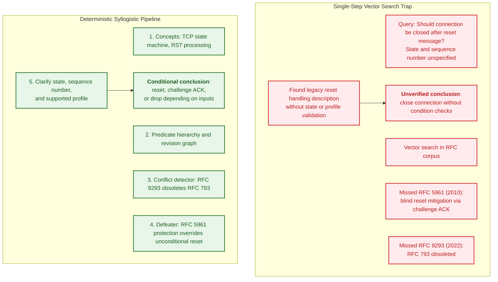
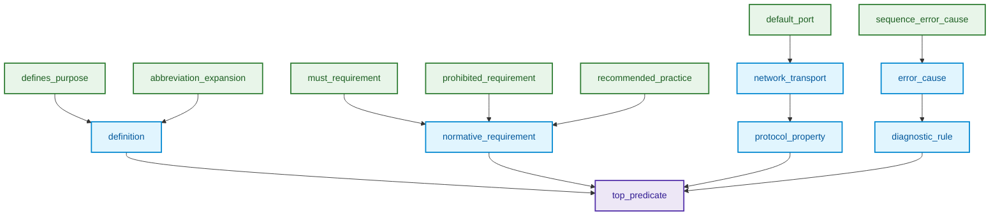
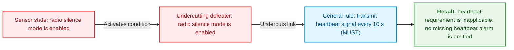
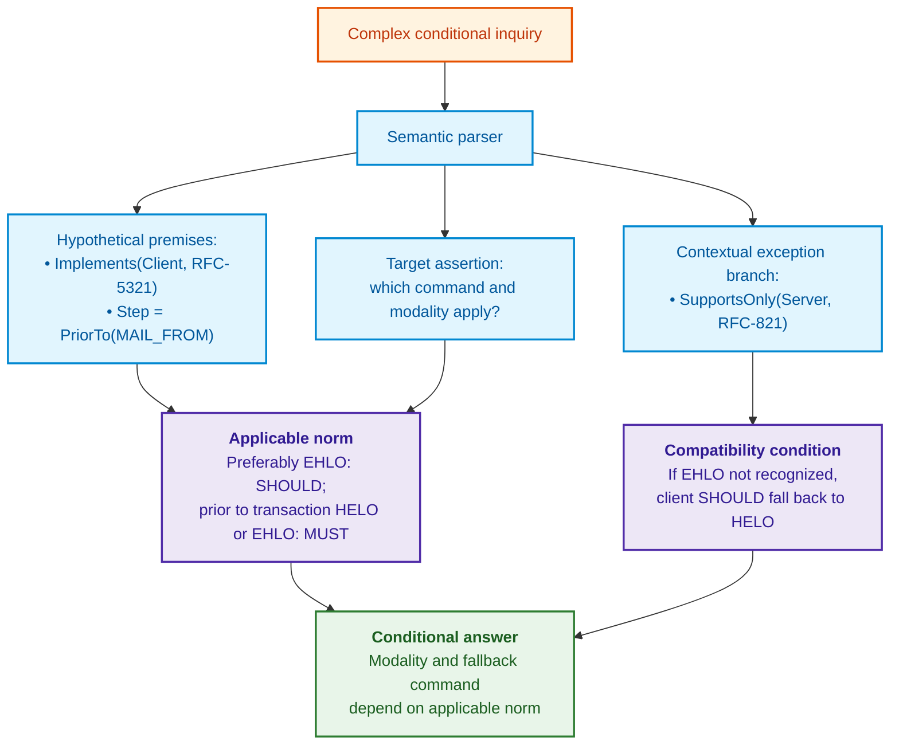

# Chapter 31. Normative Inference: Predicate Hierarchies, Exceptions, and Validity

> **Book:** [Architecture of Evidence-Governed Expert Systems](README.md) · [Part IV: Architecture, Technology Stack, Inference, and Action](part-04-architecture-and-inference.md)  
> **Previous Chapter:** [Chapter 19. From Question to Evidence: Retrieval, Grounding, and Proposition Verification](ch19-from-question-to-evidence.md)  
> **Next Chapter:** [Chapter 20. Explanation Engine: Decisions, Refusals, and Competence Boundaries](ch20-explanation-engine.md)  
> **Table of Contents:** [README.md](README.md)  
> **Author:** [Mykola Fedchyk](about-the-author.md)  
> **Level:** Advanced: Inference Engine Developers, Systems Architects, Knowledge Engineers, Formal Methods Specialists  
> **Expected Outcomes:** Distinguish source retrieval from logical inference; construct predicate hierarchies without reverse specialization; fail closed when exception states are unknown; differentiate rebutting defeaters from undercutting defeaters; verify normative validity in context using Answer Set Programming (ASP) with fail-closed semantics; evaluate what RDFS, SPARQL, ASPIC+, and knowledge mining contribute to hierarchies and exceptions; inspect derivation traces and understand educational scope boundaries in Go.

---

## Abstract

Consider an industrial SCADA deployment or the vehicular communication network of an autonomous platform (IEC 62443 / ISO 26262), in which an automated network agent observes an unexpected reset packet (TCP RST). A vector semantic search engine instantly locates a provision in RFC 9293: "upon receipt of RST, the connection must be terminated immediately." If the agent treats this general rule as an unconditioned direct directive without verifying the connection state (`SYN-SENT` vs. `ESTABLISHED`), the packet sequence number, and the applicable security profile (such as the blind reset mitigations defined in RFC 5961), it will prematurely terminate an active emergency telemetry stream or brake interlock channel. Treating the absence of exception data as permission to act ("because the query did not specify sequence numbers, checking them is unnecessary") causes spurious production halts or disengages dynamic stability controls at highway speeds.

The central question of this chapter is: **how can an expert system derive deterministic conclusions from multiple interconnected normative authorities, traverse predicate hierarchies, and guarantee that an unknown exception state never collapses into an unsafe grant of operational permission?**

This chapter decouples information retrieval, predicate lattices, formal exception evaluation (defeasible reasoning via Horn clauses and ASPIC+ argumentation), and valid norm selection. Information retrieval may execute over multiple hops or graph traversals, but its output remains strictly input material for the symbolic logic core. An educational Go implementation verifies derivation traces, while a declarative Answer Set Programming (ASP / clingo) model validates normative selection across nine boundary packet-handling scenarios. Deterministic deduction does not establish the empirical truth of ground facts; therefore, the epistemic boundary between proof and empirical validation remains inviolable.

---

## 1. Why Single-Step Retrieval Fails to Yield Normative Conclusions

Modern semantic retrieval pipelines maximize the cosine similarity of dense vector embeddings:

```math
\text{Query} \xrightarrow{\text{Embed}} \mathbf{v}_q \implies \arg\max_k \cos(\mathbf{v}_q, \mathbf{v}_k).
```

Notation for vector retrieval:

- $`\text{Query}`$ represents the unstructured textual query submitted by an engineer or operator;
- $`\text{Embed}`$ denotes the transformation mapping text into a vector of real numbers;
- $`\mathbf{v}_q`$ is the resulting query embedding in latent representation space;
- $`\mathbf{v}_k`$ denotes stored passage embeddings across indexed document chunks;
- $`\cos(\mathbf{v}_q, \mathbf{v}_k)`$ evaluates cosine similarity on the interval $[-1, 1]$;
- $`\arg\max_k`$ selects the chunk index exhibiting the highest geometric proximity.

This formulation ranks textual similarity; it does not evaluate the logical validity or operational applicability of a norm. High similarity indicates semantic affinity, not legal or technical applicability.

The following diagram illustrates how pipelines fail when they omit prerequisite condition validation:



### 1.1. Where Similarity Search Breaks Down on Normative Logic

1. **Premises are fragmented across independent documents.** A general rule may reside in one standard, an exception in a second, and the formal supersession of an obsolete specification in a third published decades later. Similarity search ranks each document fragment in isolation. It may retrieve all three passages, but vector proximity cannot deduce that the third document invalidates the first, or that the second narrows its scope. These relationships represent explicit inter-document edges that must be stored and traversed within a formal knowledge graph.
2. **Prescriptive force is not preserved in vector geometry.** Normative keywords such as `MUST`, `SHOULD`, `RECOMMENDED`, and `MAY` appear in identical syntactic contexts, causing embedding models to map them to adjacent vectors. Proximity in latent space does not reflect differences in prescriptive obligation defined by RFC 2119 and RFC 8174 [[1]](#src-1) [[2]](#src-2). RFC 8174 introduces an additional nuance: only uppercase terms carry normative weight, whereas vector models frequently collapse case distinctions. Consequently, deontic modality must be preserved as an explicit structural field within the assertion tuple rather than inferred from text similarity.
3. **Absence of records is conflated with negation.** When a knowledge base lacks an explicit prohibition record, an inference engine relying on negation as failure (NAF, as in standard Prolog) infers that no prohibition exists. This reasoning is valid only across closed data partitions explicitly marked complete. In all other scenarios, missing evidence represents an `Unknown` epistemic state, requiring the system to block operations under a fail-closed policy.

---

## 2. Concepts, Judgments, and Inferences

For our pedagogical model, we decouple concepts, judgments, and inference steps. Classical Aristotelian syllogisms provide the historical foundation [[3]](#src-3); however, the normative tuple defined below represents an engineering formalization developed for this volume rather than a literal transcription of Aristotle or Peirce.

```mermaid
flowchart LR
    accTitle: Triad of Thought: Concept, Judgment, Inference
    accDescr: Structural transition from entities and predicates to proven syllogisms.

    subgraph Level1["1. Concept Level"]
        direction TB
        TERM["<b>Term</b><br/>• intension (attributes)<br/>• extension (scope)"]
        LATTICE["<b>Predicate hierarchy</b><br/>subsumption: Sub ⊑ Super"]
    end

    subgraph Level2["2. Judgment Level"]
        direction TB
        PROP["<b>Judgment</b><br/>subject, relation, object"]
        MODAL["<b>Deontic modality</b><br/>MUST, SHOULD, MAY, MUST_NOT"]
        DEFEAT["<b>Defeaters</b><br/>exception conditions (UNLESS)"]
    end

    subgraph Level3["3. Inference Level"]
        direction TB
        PREM["<b>Syllogism premises</b><br/>major and minor premises"]
        RULES["<b>Inference rules</b><br/>modus ponens, subsumption"]
        DAG["<b>Derivation trace</b><br/>rule · grounds · result"]
    end

    Level1 ==> Level2 ==> Level3

    classDef c1 fill:#e1f5fe,stroke:#0288d1,stroke-width:2px,color:#01579b;
    classDef c2 fill:#fff3e0,stroke:#e65100,stroke-width:2px,color:#bf360c;
    classDef c3 fill:#e8f5e9,stroke:#2e7d32,stroke-width:2px,color:#1b5e20;

    class TERM,LATTICE c1;
    class PROP,MODAL,DEFEAT c2;
    class PREM,RULES,DAG c3;
```



### 2.1. Concepts

A concept designates an abstract entity or physical asset within an engineering domain. Mathematically, it is defined by a dual pair of sets:
- **Intension (Content of a Concept):** The set of essential characteristics, properties, and invariants that delineate this concept from others:

```math
\text{Intension}(C) = \{ P_1, P_2, \dots, P_k \}.
```

Components of intension:

- $C$ denotes a domain concept;
- $\text{Intension}(C)$ represents the set of defining predicates and invariants;
- $P_1, \dots, P_k$ are property predicates that uniquely characterize the concept;
- $k$ is the number of mandatory defining attributes.

- **Extension (Scope of a Concept):** The set of all concrete entities or specializations that satisfy the predicates in the intension:

```math
\text{Extension}(C) = \{ x \mid \forall P \in \text{Intension}(C) : P(x) = \text{True} \}.
```

Components of extension:

- $\text{Extension}(C)$ is the scope of the concept, denoting the set of valid instances;
- $x$ denotes an individual engineering entity or instance;
- $\forall P$ mandates that every property $P$ in the intension evaluates to true for the given instance;
- $\text{True}$ records compliance with the defining predicate.

Concepts adhere to the **law of inverse relationship between intension and extension**: as intension expands (incorporating additional restrictive attributes), extension contracts (yielding a smaller set of satisfying instances).

### 2.2. Judgments

A judgment asserts or denies a relation between concepts. In an evidence-governed system, a judgment is formalized as an extended semantic tuple:

```math
\mathcal{J} = \langle \text{Subject}, \; \mathcal{R}, \; \text{Object}, \; \mathcal{M}, \; \mathcal{D}, \; \text{Provenance} \rangle.
```

Elements of a normative judgment tuple:

- $\mathcal{J}$ denotes the formal normative judgment tuple;
- $\text{Subject}$ and $\text{Object}$ represent concepts within the engineering taxonomy;
- $\mathcal{R}$ designates a relation predicate drawn from the relation hierarchy;
- $`\mathcal{M} \in \{ \text{MUST}, \text{MUST-NOT}, \text{SHOULD}, \text{SHOULD-NOT}, \text{MAY} \}`$ indicates the deontic modality;
- $`\mathcal{D} = \{ d_1, d_2, \dots \}`$ represents the set of defeater conditions;
- $\text{Provenance}$ contains primary source grounding descriptors (document ID, SHA-256 hash, and byte offsets).

### 2.3. Inferences

A syllogism is a deterministic inference step in which two premises (major and minor) sharing a common middle term ($M$) yield a third proposition (conclusion) with deductive necessity:

```math
\frac{\text{Major Premise: } \forall x : M(x) \xrightarrow{\mathcal{M}} P(x), \quad \text{Minor Premise: } M(S)}{\text{Conclusion: } S \xrightarrow{\mathcal{M}} P}.
```

Components of the syllogism:

- $\text{Major Premise}$ defines the universal rule governing all instances of class $M$;
- $\text{Minor Premise}$ asserts that subject $S$ belongs to class $M$;
- $M$ is the middle term (*terminus medius*) connecting both premises;
- $\text{Conclusion}$ deduces the normative property $P$ for subject $S$;
- $\mathcal{M}$ designates the preserved deontic modality.

**Example in automated protocol auditing:** The Simple Mail Transfer Protocol (SMTP) separates client and server roles. In RFC 5321, Section 4.1.1.1, a client must issue `HELO` or `EHLO` before initiating a mail transaction [[4]](#src-4).

1. Major premise: An SMTP client must issue `HELO` or `EHLO` before commencing a mail transaction.
2. Minor premise: In a verified or explicitly hypothetical context, `MailClient-01` operates as an SMTP client initiating a transaction.
3. Conditional conclusion: `MailClient-01` is subject to this requirement, rather than an unconditioned mandate for `EHLO` exclusively.

If the client role is introduced solely within a "what-if" inquiry, the conclusion remains strictly hypothetical. Physical compliance audits require empirically verified operational states. Establishing an active TCP connection does not guarantee acceptance of a mail session: Section 3.1 permits an immediate 554 service refusal.

---

## 3. Predicate Hierarchy and Subsumption Semantics

When an operator poses a generalized query—such as *"What are the security requirements for protocol X?"*—the system must not restrict its search to predicates named literally `security_requirement`. Actual knowledge bases contain facts extracted across specifications with predicates like `must_encrypt_channel`, `authenticate_peer_certificate`, or `validate_sequence_number`.

To support generalized queries, relation predicates are structured as an acyclic hierarchy. Directed reachability defines a partial order of specialization:

```math
\mathcal{L} = \langle \mathcal{R}, \sqsubseteq \rangle.
```

Hierarchy notation:

- $\mathcal{L}$ denotes the partially ordered set of predicates;
- $\mathcal{R}$ is the universe of all relation types;
- $\sqsubseteq$ denotes the partial order of subsumption (specialization).

The relation $R_1 \sqsubseteq R_2$ denotes that predicate $R_1$ specializes $R_2$. For instance, `must_requirement` specializes `normative_requirement`. A hierarchy constitutes a lattice only when unique least upper bounds (joins) and greatest lower bounds (meets) exist for every pair of elements. The DAG and code presented here do not define lattice algebraic operations, as directed path reachability suffices for subsumption checks.



### 3.1. Mathematical Laws of Directed Subsumption

The partial order satisfies three axiomatic properties:
1. **Reflexivity:** $`\forall R \in \mathcal{R} : R \sqsubseteq R`$.
2. **Antisymmetry:** $`\forall R_1, R_2 \in \mathcal{R} : (R_1 \sqsubseteq R_2 \land R_2 \sqsubseteq R_1) \implies R_1 = R_2`$.
3. **Transitivity:** $`\forall R_1, R_2, R_3 \in \mathcal{R} : (R_1 \sqsubseteq R_2 \land R_2 \sqsubseteq R_3) \implies R_1 \sqsubseteq R_3`$.

**Query Generalization Rule.**  
A ground relation $R_{\text{fact}}$ satisfies a query targeting predicate $R_{\text{query}}$ if and only if it resides within the descendant subtree of the queried relation:

```math
\text{Matches}(R_{\text{query}}, R_{\text{fact}}) \iff R_{\text{fact}} \sqsubseteq^* R_{\text{query}}.
```

In the directed subsumption rule:

- $\text{Matches}$ is a boolean predicate testing whether a fact satisfies query constraints;
- $R_{\text{query}}$ is the predicate requested by the operator;
- $R_{\text{fact}}$ is the predicate asserted in the knowledge base;
- $\sqsubseteq^*$ denotes the reflexive-transitive closure of subsumption (the existence of an abstraction path).

**Prohibition of Reverse Specialization.**  
When an operator query demands a specific strict rule $R_{\text{specific}}$ (such as `prohibited_requirement`), the system is prohibited from returning a high-level generalization $R_{\text{general}}$ (`normative_requirement`), because a general requirement does not guarantee compliance with a specific prohibition:

```math
R_{\text{general}} \not\sqsubseteq^* R_{\text{specific}} \quad \text{when } R_{\text{specific}} \sqsubset R_{\text{general}}.
```

Notation for reverse specialization prohibition:

- $R_{\text{general}}$ denotes a generalized predicate located higher in the hierarchy;
- $R_{\text{specific}}$ represents a strict subordinate predicate;
- $\not\sqsubseteq^*$ forbids satisfaction: the existence of a general norm does not prove adherence to a specialized strict constraint.

### 3.2. Matching Phrases to Predicates

In industrial environments, engineer inquiries rarely use canonical ontology identifiers. Practitioners ask: *"What is the default port for BGP?"*, *"Has RFC 821 been obsoleted?"*, or *"Which standard replaces this specification?"*.

A controlled vocabulary or linguistic parser must first map the natural language phrase to an established predicate identifier. The subsumption hierarchy does not interpret natural language or synthesize synonyms dynamically.

1. A confirmed unambiguous mapping resolves to a specific predicate and vocabulary version.
2. For generalized inquiries, the engine traces paths from this predicate to the required ancestor; reverse specialization is disallowed.
3. Unknown or ambiguous phrases trigger clarification or human review. An inquiry does not inherit an ancestor predicate simply because the text contains the word "deprecated."

Parsing latency and classification accuracy must be measured on concrete query sets. Because deterministic vocabularies can harbor mapping errors, reproducibility must not be conflated with domain correctness.

### 3.3. Disambiguating Homonymous Documents Along Validity Timelines

Technical corpora frequently exhibit **document title polysemy**: identical document or protocol names appear across dozens of specifications issued across different years. For example, the title *"Simple Mail Transfer Protocol"* designates RFC 821 (1982), RFC 2821 (2001), and RFC 5321 (2008).

When an inquiry references a document by title without specifying an RFC number, naive search retrieves multiple conflicting assertions, risking the selection of an obsolete revision.

To eliminate ambiguity, the symbolic core executes **disambiguation via the validity graph**:
1. The resolver examines revision history, scope, timestamp, and audit intent (whether performing modern verification or historical reproduction).
2. A single authoritative revision can be resolved for current compliance audits, but not for retrospective analyses of legacy systems merely because a newer specification exists.
3. Multiple applicable revisions or ambiguous validity states trigger interactive clarification. A document supersession chain does not automatically dictate which profile a physical device supports.

---

## 4. Kleene 3-Valued Logic and Pollock's Defeaters

Two classical boolean values do not inherently impose the Closed-World Assumption (CWA). Treating missing facts as false represents an architectural choice. In our model, unverified conditions evaluate to `Unknown`. Fully verified closed partitions may adopt alternative semantics, as detailed in [Chapter 7](ch07-knowledge-base-typology.md).

To reason safely over incomplete information, the system adopts **Strong Kleene 3-Valued Logic** (3VL) [[5]](#src-5):

```math
\mathcal{V}_3 = \{ \text{True}, \; \text{False}, \; \text{Unknown} \}.
```

Strong Kleene truth values:

- $\mathcal{V}_3$ denotes the Strong Kleene 3VL truth space;
- $\text{True}$ indicates a proven proposition;
- $\text{False}$ indicates proven falsity;
- $\text{Unknown}$ represents missing data or epistemic uncertainty without permitting a presumption of falsity.

### 4.1. Strong Kleene Truth Table

| $A$ | $B$ | $A \land B$ | $A \lor B$ | $\neg A$ | $A \to B$ |
| :---: | :---: | :---: | :---: | :---: | :---: |
| $\text{True}$ | $\text{True}$ | $\text{True}$ | $\text{True}$ | $\text{False}$ | $\text{True}$ |
| $\text{True}$ | $\text{False}$ | $\text{False}$ | $\text{True}$ | $\text{False}$ | $\text{False}$ |
| $\text{True}$ | $\text{Unknown}$ | $\mathbf{Unknown}$ | $\text{True}$ | $\text{False}$ | $\mathbf{Unknown}$ |
| $\text{False}$ | $\text{True}$ | $\text{False}$ | $\text{True}$ | $\text{True}$ | $\text{True}$ |
| $\text{False}$ | $\text{False}$ | $\text{False}$ | $\text{False}$ | $\text{True}$ | $\text{True}$ |
| $\text{False}$ | $\text{Unknown}$ | $\text{False}$ | $\mathbf{Unknown}$ | $\text{True}$ | $\text{True}$ |
| $\text{Unknown}$ | $\text{True}$ | $\mathbf{Unknown}$ | $\text{True}$ | $\mathbf{Unknown}$ | $\text{True}$ |
| $\text{Unknown}$ | $\text{False}$ | $\text{False}$ | $\mathbf{Unknown}$ | $\mathbf{Unknown}$ | $\mathbf{Unknown}$ |
| $\text{Unknown}$ | $\text{Unknown}$ | $\mathbf{Unknown}$ | $\mathbf{Unknown}$ | $\mathbf{Unknown}$ | $\mathbf{Unknown}$ |

### 4.2. Information Ordering and Fail-Closed Behavior

Kleene logic introduces a partial information ordering ($`\le_i`$):

```math
\text{Unknown} \le_i \text{True}, \quad \text{Unknown} \le_i \text{False}.
```

Information ordering:

- $`\le_i`$ denotes the partial order of increasing epistemic information;
- The inequalities establish that $\text{Unknown}$ contains minimal information, whereas transitioning to $\text{True}$ or $\text{False}$ increases certainty monotonically.

A function $f$ is monotonic with respect to information ordering if acquiring further knowledge (transitioning from $\text{Unknown}$ to $\text{True}$ or $\text{False}$) never reverses an already established deterministic conclusion.

> [!IMPORTANT]
> **The Fail-Closed Principle.**  
> If an essential precondition evaluates to $\text{Unknown}$, the policy disallows the action and reports an epistemic deficit. This represents safety verification behavior, not an autonomous certification waiver.

### 4.3. Pollock's Defeaters

In engineering standards, normative rules are defeasible: they hold unless an exceptional condition is triggered. American philosopher John Pollock categorized defeaters into two fundamental classes [[6]](#src-6):

1. **Rebutting defeater**  
   Directly attacks the conclusion by deriving a contrary proposition:

```math
A \implies P, \quad B \implies \neg P.
```

Parameters of a rebutting defeater:

- $A$ and $B$ represent premises of competing rules;
- $P$ is the asserted conclusion, and $\neg P$ is its logical negation;
- A rebutting defeater creates an argument conflict; resolution depends on an external preference relation (e.g., *lex specialis derogat legi generali*).

2. **Undercutting defeater**  
   Attacks the inferential connection between premise and conclusion, asserting that under specific context conditions the rule ceases to apply, without necessarily proving the conclusion false:

```math
U \implies \neg (A \hookrightarrow P).
```

Components of an undercutting defeater:

- $U$ denotes an exceptional contextual condition (such as active radio silence);
- $A \hookrightarrow P$ denotes the normative implication linking premise to obligation;
- $\neg (A \hookrightarrow P)$ invalidates the inferential link without asserting the contrary.



The distinction between these two classes carries direct engineering consequences. An undercutting defeater leaves the expert system without a conclusion: the rule is rendered inapplicable, and the system must identify the disabled rule and active exception without proposing an alternative action. A rebutting defeater yields an alternative conclusion, shifting the problem to preference resolution between competing arguments. Modgil and Prakken formalized both attack types, alongside premise undermining, within the ASPIC+ structured argumentation framework [[7]](#src-7). In ASPIC+, an undercutting attack on rule application succeeds regardless of preference orderings, whereas rebutting and undermining attacks depend on defined argument orderings. The educational implementation in Section 8 mirrors this distinction: an undercutting defeater returns a refusal without an action proposal, whereas a rebutting defeater returns an alternative action alongside its primary source citation. Preferences are assigned by the knowledge base author when attaching defeaters to rules; competing rules with opposing conclusions lacking an explicit preference trigger a fail-closed refusal.

---

## 5. Investigating Cross-Document Conflicts: The Evolution of TCP

The Transmission Control Protocol (TCP) illustrates why a newer specification does not imply an unconditional prohibition of legacy behavior. RFC 793 defined baseline behavior [[8]](#src-8); RFC 5961 introduced blind reset mitigations [[9]](#src-9); RFC 9293 obsoleted RFC 793 and, in Section 3.10.7.4, explicitly differentiated implementations supporting these mitigations from those that do not [[10]](#src-10).

For the synchronized states enumerated in Section 3.10.7.4, handling an incoming reset (RST) packet under RFC 5961 mitigations branches into three cases:

| Sequence Number Condition | Prescribed Action | Invalid Inference |
|---|---|---|
| Outside current receive window | Silently drop segment without reply | Inferring that all resets are forbidden |
| Exactly matches `RCV.NXT` (next expected sequence number) | Execute reset and transition connection state | Inferring that challenge ACKs are always required |
| Inside window, but does not match `RCV.NXT` | Transmit challenge ACK and drop incoming segment | Inferring that falling within the window suffices for termination |

Without RFC 5961 mitigations, RFC 9293 retains baseline RFC 793 behavior: according to Section 3.5.3, a reset is valid if its sequence number falls anywhere within the receive window, while out-of-window segments are dropped.

If the operational state or supported feature profile is unknown, the expert system must issue a clarification request. Document supersession graphs do not compute runtime inputs or substitute for verifying applicable conditions.

### 5.1. Executable Norm Selection Model in ASP

The table above can be formalized as an Answer Set Programming (ASP) model and executed using the clingo solver developed by Gebser, Kaminski, Kaufmann, and Schaub [[11]](#src-11). ASP provides two distinct advantages for this task. First, it supports negation as failure, allowing the rule "a document is active if it has not been obsoleted" to be expressed concisely. Second, for stratified programs (programs devoid of cyclic dependencies through negation), the solver computes exactly one stable model, ensuring that conclusions are invariant to rule ordering. However, negation as failure introduces epistemic hazards: an omitted supersession fact silently preserves an obsolete document as active. Consequently, the program incorporates explicit fail-closed rules covering six edge conditions: missing input parameters; connection state outside the model; norms citing unindexed documents; unconfirmed registry completeness; conflicting active revisions; and the absence of applicable norms.

<details>
<summary>ASP Norm Selection Model (file: norms.lp)</summary>

```prolog
% Document registry and lineage based on RFC Editor data.
document(rfc793). document(rfc9293).
obsoletes(rfc9293, rfc793).
% Registry verified against RFC Editor index for the scope "TCP RST processing".
complete(tcp_rst).

% norm(Document, ProtectionRFC5961, SequenceNumberPlacement, Action).
% RFC 9293, Section 3.10.7.4: with protection enabled, three checks apply.
norm(rfc9293, yes, out_of_window, drop).
norm(rfc9293, yes, exact, reset).
norm(rfc9293, yes, in_window_not_exact, challenge_ack).
% Without protection, reset is valid if the sequence number falls within the window (Section 3.5.3).
norm(rfc9293, no, out_of_window, drop).
norm(rfc9293, no, exact, reset).
norm(rfc9293, no, in_window_not_exact, reset).
% RFC 793 did not include RFC 5961 protection and reset connection for any in-window sequence number.
norm(rfc793, P, out_of_window, drop) :- protection(P).
norm(rfc793, P, exact, reset) :- protection(P).
norm(rfc793, P, in_window_not_exact, reset) :- protection(P).
protection(yes; no).

% Model covers only synchronized states where reset transitions the connection to CLOSED.
synchronized(established; fin_wait_1; fin_wait_2; close_wait; closing; last_ack; time_wait).

% Active version: document from registry that is not superseded.
superseded(D) :- obsoletes(_, D).
active(D) :- document(D), not superseded(D).

% Fail-closed: each reason blocks the response and explains what is missing.
required(state; protection; seq).
known(K) :- input(K, _).
clarify(missing(K)) :- required(K), not known(K).
clarify(out_of_model(S)) :- input(state, S), not synchronized(S).
clarify(unregistered_source(D)) :- norm(D, _, _, _), not document(D).
clarify(registry_incomplete) :- not complete(tcp_rst).

candidate(D, A) :- active(D), input(protection, P), input(seq, Q), norm(D, P, Q, A).
clarify(conflict(A1, A2)) :- candidate(_, A1), candidate(_, A2), A1 < A2.
has_candidate :- candidate(_, _).
clarify(no_applicable_norm) :- known(protection), known(seq), not has_candidate.

blocked :- clarify(_).
answer(A, D) :- candidate(D, A), not blocked.

#show answer/2.
#show clarify/1.
```

</details>

The Python harness below supplies ground facts for nine distinct scenarios, dropping specific registry facts across three scenarios to simulate corruption within the knowledge base. Execution requires the clingo Python package (`pip install clingo`); the suite has been validated with Python 3.14 and clingo 5.8.2. Place both files in the same directory and execute via `python check_norms.py`.

<details>
<summary>Python Test Runner: Model Verification Scenarios (file: check_norms.py)</summary>

```python
"""Runs the norm selection model norms.lp across scenarios and verifies expected responses."""
from pathlib import Path

import clingo

PROGRAM = Path(__file__).with_name("norms.lp").read_text(encoding="utf-8")


def solve(facts, drop=()):
    program = PROGRAM
    for fact in drop:
        assert fact in program, fact
        program = program.replace(fact, "", 1)  # removes only the fact, not rule occurrences
    ctl = clingo.Control(["--warn=none"])
    ctl.add("base", [], program + "\n" + facts)
    ctl.ground([("base", [])])
    models = []
    ctl.solve(on_model=lambda m: models.append(sorted(str(s) for s in m.symbols(shown=True))))
    assert len(models) == 1, models  # a stratified program yields exactly one stable model
    return models[0]


SYNC = "input(state, established). "
SCENARIOS = [
    ("protection active, seq in-window but not exact", SYNC + "input(protection, yes). input(seq, in_window_not_exact).",
     (), ["answer(challenge_ack,rfc9293)"]),
    ("protection active, seq exact", SYNC + "input(protection, yes). input(seq, exact).",
     (), ["answer(reset,rfc9293)"]),
    ("protection absent, seq in-window", SYNC + "input(protection, no). input(seq, in_window_not_exact).",
     (), ["answer(reset,rfc9293)"]),
    ("seq out of window", SYNC + "input(protection, yes). input(seq, out_of_window).",
     (), ["answer(drop,rfc9293)"]),
    ("protection support unknown", SYNC + "input(seq, in_window_not_exact).",
     (), ["clarify(missing(protection))"]),
    ("LISTEN state out of model", "input(state, listen). input(protection, yes). input(seq, exact).",
     (), ["clarify(out_of_model(listen))"]),
    ("missing supersession fact", SYNC + "input(protection, yes). input(seq, in_window_not_exact).",
     ("obsoletes(rfc9293, rfc793).",), ["clarify(conflict(challenge_ack,reset))"]),
    ("RFC 9293 not in registry", SYNC + "input(protection, yes). input(seq, in_window_not_exact).",
     ("document(rfc9293).",), ["clarify(no_applicable_norm)", "clarify(unregistered_source(rfc9293))"]),
    ("registry completeness unconfirmed", SYNC + "input(protection, yes). input(seq, exact).",
     ("complete(tcp_rst).",), ["clarify(registry_incomplete)"]),
]

for name, facts, drop, expected in SCENARIOS:
    got = solve(facts, drop)
    assert got == expected, (name, got, expected)
    print(f"{name:<48} -> {', '.join(got)}")
print("all scenarios matched expected outcomes")
```

</details>

Executing `python check_norms.py` generates the following output:

<details>
<summary>Program Output</summary>

```text
protection active, seq in-window but not exact   -> answer(challenge_ack,rfc9293)
protection active, seq exact                     -> answer(reset,rfc9293)
protection absent, seq in-window                 -> answer(reset,rfc9293)
seq out of window                                -> answer(drop,rfc9293)
protection support unknown                       -> clarify(missing(protection))
LISTEN state out of model                        -> clarify(out_of_model(listen))
missing supersession fact                        -> clarify(conflict(challenge_ack,reset))
RFC 9293 not in registry                         -> clarify(no_applicable_norm), clarify(unregistered_source(rfc9293))
registry completeness unconfirmed                -> clarify(registry_incomplete)
all scenarios matched expected outcomes
```

</details>

The first four scenarios reproduce the RFC 9293 decision matrix: when protection is enabled, an in-window non-exact sequence number triggers a challenge ACK, whereas without protection the same sequence number triggers an immediate reset. Scenarios five and six demonstrate fail-closed behavior under incomplete input: the solver does not presume protection is supported and refuses to apply synchronized state norms to the `LISTEN` state. The final three scenarios simulate knowledge base defects. Omission of the supersession fact leaves both specifications active, prompting the engine to signal an actionable conflict rather than silently defaulting to one. When RFC 9293 is omitted from the registry, its norms cannot produce a valid conclusion while RFC 793 remains marked superseded; hence, the program reports both failure reasons. If registry completeness is not asserted, the system refuses to emit a conclusion even when given valid inputs: without an explicit completeness assertion, missing records cannot be distinguished from unverified states.

The operational boundaries of this model are explicit: it restricts its scope to RST processing in synchronized connection states, assumes sequence number placement is precomputed rather than evaluating raw `RCV.NXT` and `RCV.WND` variables, and does not replace network stack integration testing. In production environments, document registries are populated from machine-readable index feeds rather than manual entries, and the `complete(tcp_rst)` assertion is validated against cryptographic index manifests.

When the document store is horizontally partitioned into shards, the completeness declaration `complete(tcp_rst)` applies to the union of shards rather than merely the responding subset. Revisions RFC 793, 5961, and 9293 constitute a unified document family and must reside within the same shard, because normative validity depends strictly on supersession chains. If this shard fails to respond, the system must abort with a `registry_incomplete` refusal rather than applying rules from surviving shards: an unobserved supersession would erroneously leave an obsolete norm active. Sharding principles are detailed in [Chapter 7](ch07-knowledge-base-typology.md), with concrete implementations provided in Section 10 of [Chapter 32](ch32-high-performance-knowledge-packs-mmap-and-harvesting.md).

---

## 6. Multi-Step Conditional Queries

Practitioner inquiries frequently depart from simple assertions, presenting intricate hypothetical constructions:  
*"If our client implements SMTP under RFC 5321, must it issue an EHLO command before MAIL FROM, and how must it proceed if the remote server supports only legacy RFC 821?"*

The following flowchart outlines the execution plan for evaluating conditional inquiries. Sections 3.2 and 4.1.1.1 of RFC 5321 distinguish the preferred use of `EHLO` (`SHOULD`) from the mandatory requirement (`MUST`) to issue either `HELO` or `EHLO` prior to starting a mail transaction [[4]](#src-4). Reading Section 4.1.4 in conjunction is required to preserve command sequence constraints and backward-compatibility mechanisms.



---

## 7. Inspecting the Derivation Trace

An evidence inspector must expose the active rule, evidentiary grounds, unknown inputs, and outcome status. The following text represents a pedagogical trace layout rather than an interface capture from an operational deployment. Exact byte offsets and cryptographic hashes are omitted here: they are computed over concrete physical files rather than rendered synthetically.

<details>
<summary>Pedagogical Conditional Derivation Trace Layout</summary>

```text
Goal: determine command to initiate mail transaction
    Authority: RFC 5321, Sections 3.2, 4.1.1.1, and 4.1.4
    Condition: entity is an SMTP client
        Status: user hypothesis, unverified fact
    Norm: preferably EHLO (SHOULD), prior to transaction HELO or EHLO (MUST)
    Compatibility condition: server does not recognize EHLO
        Status: unknown, server response required
    Result: conditional conclusion only, not actual permission to act
```

</details>

In a production system, each evidentiary citation links to an immutable versioned document snapshot. Rendering the cited passage validates provenance, while the validity of the inference step is verified separately against the rule and its inputs. The mockup does not implement interactive navigation, structured export, or cryptographic proof signatures.

---

## 8. Educational Inference Step in Go

The Go program below executes a single deductive inference step over an explicit rule given a confirmed class membership fact. It deliberately avoids implementing a multi-hop engine, citation resolver, or rule preference scheduler. Unknown exception states trigger a fail-closed error, cyclic hierarchy additions are rejected, and defeater classes produce distinct outcomes: a rebutting defeater yields an alternative conclusion backed by its own source citation, whereas an undercutting defeater blocks rule application entirely. Execution requires Go 1.20 or newer, with no third-party dependencies.

<details>
<summary>Go Implementation: Predicate Hierarchy and Single Inference Step</summary>

```go
package syllogism

import (
	"errors"
	"fmt"
)

// Kleene3VL models strong Kleene 3-valued logic.
type Kleene3VL int

const (
	Unknown Kleene3VL = 0
	True    Kleene3VL = 1
	False   Kleene3VL = -1
)

func (v Kleene3VL) And(other Kleene3VL) Kleene3VL {
	if v == False || other == False {
		return False
	}
	if v == True && other == True {
		return True
	}
	return Unknown
}

func (v Kleene3VL) Or(other Kleene3VL) Kleene3VL {
	if v == True || other == True {
		return True
	}
	if v == False && other == False {
		return False
	}
	return Unknown
}

func (v Kleene3VL) Not() Kleene3VL {
	return -v
}

type RelationHierarchy struct {
	parentMap map[string]string // child -> parent
}

func NewRelationHierarchy() *RelationHierarchy {
	return &RelationHierarchy{parentMap: map[string]string{
		"must_requirement":       "normative_requirement",
		"prohibited_requirement": "normative_requirement",
		"normative_requirement":  "concept",
		"obsoleted_by":           "lineage_relation",
	}}
}

func (hierarchy *RelationHierarchy) AddRelation(child, parent string) error {
	if child == "" || parent == "" || hierarchy.Subsumes(child, parent) {
		return errors.New("invalid relation or cycle")
	}
	if previous, exists := hierarchy.parentMap[child]; exists && previous != parent {
		return errors.New("this example supports one parent per predicate")
	}
	hierarchy.parentMap[child] = parent
	return nil
}

// Subsumes verifies whether subRelation is a specialization of superRelation.
func (hierarchy *RelationHierarchy) Subsumes(superRelation, subRelation string) bool {
	seen := make(map[string]bool)
	for curr := subRelation; curr != ""; curr = hierarchy.parentMap[curr] {
		if seen[curr] {
			return false
		}
		seen[curr] = true
		if curr == superRelation {
			return true
		}
	}
	return false
}

// Provenance describes the physical primary source citation.
type Provenance struct {
	DocumentID string
	ByteStart  int
	ByteEnd    int
	SHA256     string
}

// Premise represents a judgment premise.
type Premise struct {
	ID         string
	Subject    string
	Predicate  string
	Object     string
	Modality   string // MUST, MUST_NOT, SHOULD
	Provenance Provenance
}

// Defeater describes an exception attached by the knowledge base author to a rule.
// An undercutting defeater (IsRebutting == false) merely cancels rule applicability.
// A rebutting defeater (IsRebutting == true) yields an alternative FallbackAction conclusion
// from its own Source; attachment to the rule encodes its priority.
type Defeater struct {
	ConditionPredicate string
	FallbackAction     string
	IsRebutting        bool
	Source             string
}

// Rule represents a deductive normative rule.
type Rule struct {
	MajorPremise Premise
	Defeaters    []Defeater
}

// Engine is the core syllogistic deduction engine.
type Engine struct {
	hierarchy *RelationHierarchy
	rules     []Rule
}

func NewEngine(hierarchy *RelationHierarchy) *Engine {
	return &Engine{hierarchy: hierarchy}
}

// InferConclusion executes a single syllogistic derivation step.
func (e *Engine) InferConclusion(minorSubject, minorClass, requestedRelation string, envConditions map[string]Kleene3VL) (string, error) {
	if minorSubject == "" || minorClass == "" {
		return "", errors.New("confirmed object and class are required")
	}
	var matched *Rule
	for _, rule := range e.rules {
		if rule.MajorPremise.Subject != minorClass || !e.hierarchy.Subsumes(requestedRelation, rule.MajorPremise.Predicate) {
			continue
		}
		if matched != nil {
			return "", errors.New("multiple applicable rules require conflict resolution")
		}
		candidate := rule
		matched = &candidate
	}
	if matched == nil {
		return "", errors.New("insufficient facts for inference")
	}
	// First, all exception conditions must be known: the conclusion does not depend on evaluation order.
	var active []Defeater
	for _, exception := range matched.Defeaters {
		state, exists := envConditions[exception.ConditionPredicate]
		if !exists || (state != True && state != False) {
			return "", fmt.Errorf("exception state is unknown: %s", exception.ConditionPredicate)
		}
		if state == True {
			active = append(active, exception)
		}
	}
	premise := matched.MajorPremise
	switch {
	case len(active) > 1:
		return "", errors.New("several active defeaters require conflict resolution")
	case len(active) == 1 && !active[0].IsRebutting:
		return "", fmt.Errorf("rule from %s is not applicable while %s holds", premise.Provenance.DocumentID, active[0].ConditionPredicate)
	case len(active) == 1:
		return fmt.Sprintf("%s %s; source: %s; defeats rule from %s", minorSubject,
			active[0].FallbackAction, active[0].Source, premise.Provenance.DocumentID), nil
	}
	return fmt.Sprintf("%s %s %s; source: %s", minorSubject,
		premise.Modality, premise.Object, premise.Provenance.DocumentID), nil
}
```

Save this module as `syllogism.go` and the unit test suite below as `syllogism_test.go`; execute tests via `go test syllogism.go syllogism_test.go`.

```go
package syllogism

import (
	"strings"
	"testing"
)

func TestHierarchyAndInference(t *testing.T) {
	hierarchy := NewRelationHierarchy()
	if !hierarchy.Subsumes("concept", "must_requirement") {
		t.Fatal("generalization failed")
	}
	if hierarchy.Subsumes("must_requirement", "concept") {
		t.Fatal("reverse specialization accepted")
	}
	if hierarchy.AddRelation("concept", "must_requirement") == nil {
		t.Fatal("cycle accepted")
	}
	engine := NewEngine(hierarchy)
	engine.rules = []Rule{{
		MajorPremise: Premise{Subject: "Client", Predicate: "must_requirement", Object: "authenticate", Modality: "MUST"},
		Defeaters:    []Defeater{{ConditionPredicate: "exception"}},
	}}
	if _, err := engine.InferConclusion("client-1", "Client", "normative_requirement", map[string]Kleene3VL{"exception": False}); err != nil {
		t.Fatal(err)
	}
	if _, err := engine.InferConclusion("client-1", "Client", "normative_requirement", nil); err == nil {
		t.Fatal("missing exception treated as false")
	}
	if _, err := engine.InferConclusion("client-1", "Client", "normative_requirement", map[string]Kleene3VL{"exception": True}); err == nil {
		t.Fatal("active exception ignored")
	}
	if _, err := engine.InferConclusion("server-1", "Server", "normative_requirement", map[string]Kleene3VL{"exception": False}); err == nil {
		t.Fatal("unrelated class accepted")
	}
	engine.rules = append(engine.rules, engine.rules[0])
	if _, err := engine.InferConclusion("client-1", "Client", "normative_requirement", map[string]Kleene3VL{"exception": False}); err == nil {
		t.Fatal("competing rules ignored")
	}
	if Unknown.Not() != Unknown || Unknown.And(False) != False || Unknown.Or(True) != True {
		t.Fatal("three-valued logic failed")
	}
}

func TestRebuttingAndUndercuttingDefeaters(t *testing.T) {
	engine := NewEngine(NewRelationHierarchy())
	rst := Rule{
		MajorPremise: Premise{Subject: "SynchronizedConnection", Predicate: "must_requirement",
			Object: "reset_connection", Modality: "MUST", Provenance: Provenance{DocumentID: "rfc9293"}},
		Defeaters: []Defeater{{ConditionPredicate: "rfc5961_and_seq_not_exact",
			FallbackAction: "MUST send_challenge_ack", IsRebutting: true, Source: "rfc9293#3.10.7.4"}},
	}
	engine.rules = []Rule{rst}
	conditions := map[string]Kleene3VL{"rfc5961_and_seq_not_exact": False}
	got, err := engine.InferConclusion("conn-1", "SynchronizedConnection", "normative_requirement", conditions)
	if err != nil || got != "conn-1 MUST reset_connection; source: rfc9293" {
		t.Fatalf("base rule: %q, %v", got, err)
	}
	conditions["rfc5961_and_seq_not_exact"] = True
	got, err = engine.InferConclusion("conn-1", "SynchronizedConnection", "normative_requirement", conditions)
	if err != nil || !strings.Contains(got, "send_challenge_ack") || !strings.Contains(got, "rfc9293#3.10.7.4") {
		t.Fatalf("rebutting defeater must yield the contrary conclusion with its source: %q, %v", got, err)
	}
	engine.rules[0].Defeaters[0].IsRebutting = false
	got, err = engine.InferConclusion("conn-1", "SynchronizedConnection", "normative_requirement", conditions)
	if err == nil || got != "" || strings.Contains(err.Error(), "challenge") {
		t.Fatalf("undercutting defeater must block without proposing an action: %q, %v", got, err)
	}
	engine.rules[0].Defeaters = append(engine.rules[0].Defeaters, Defeater{ConditionPredicate: "radio_silence"})
	conditions["radio_silence"] = Unknown
	conditions["rfc5961_and_seq_not_exact"] = False
	if _, err = engine.InferConclusion("conn-1", "SynchronizedConnection", "normative_requirement", conditions); err == nil {
		t.Fatal("unknown second exception ignored")
	}
}
```

</details>

This pedagogical hierarchy permits only a single parent per predicate and omits lattice join and meet operators. Supplied class memberships and environmental conditions must originate from verified ground facts; user query strings cannot serve as factual assertions. The first test suite deliberately injects an omitted exception state, an unrelated class, an inheritance cycle, and competing rules. In every case, valid conclusions must never emerge as an artifact of rule iteration order. The second test suite verifies defeater class distinctions against RFC 9293. When the rebutting defeater is active, the engine returns a challenge ACK referencing Section 3.10.7.4; when that same condition is configured as an undercutting defeater, the engine fails closed without proposing an action. An unknown state on a secondary exception blocks inference entirely, even when the primary exception is verified inactive.

---

## 9. Modern Tooling and Knowledge Mining for Hierarchies and Exceptions

The educational implementations in this chapter illustrate foundational mechanisms across small rule sets. In production knowledge bases comprising thousands of predicates and hundreds of regulatory documents, two practical questions arise: which established tools already implement these mechanisms, and how can candidate hierarchies and exceptions be extracted systematically rather than authored entirely by hand? The table below maps chapter concepts to corresponding tools, methods, operational advantages, and structural boundaries.

| Chapter Mechanism | Tool or Method | Delivered Capability | Inherent Boundary |
|---|---|---|---|
| Predicate hierarchy and query generalization | `rdfs:subPropertyOf` relation and entailment rule rdfs7 [[12]](#src-12); SPARQL 1.1 property paths [[13]](#src-13) | Standardized hierarchy representation and runtime query generalization | RDFS is monotonic and cannot express defeasible exceptions |
| Active revision selection and fail-closed evaluation | Answer Set Programming (ASP) and the clingo solver [[11]](#src-11) | Declarative rules with negation as failure and unique stable models for stratified programs | Knowledge base registry completeness remains an external assumption |
| Defeaters and priority ordering | ASPIC+ structured argumentation framework [[7]](#src-7) | Formal semantics of attacks and preferences for verifier validation | Preference orderings must be supplied by domain experts, not the formalism |
| Norms with exceptions as executable programs | Catala programming language by Merigoux, Chataing, and Protzenko [[14]](#src-14) | First-class exception constructs and code testable alongside legal statutes | Designed for statutory law; technical standards require custom domain models |
| Extracting hierarchy candidates from text | Hearst patterns [[15]](#src-15) | Discovers candidate hyponym-hypernym pairs across document corpora | Patterns introduce noisy false positives requiring human review |
| Mining candidate rules and subproperties from facts | AMIE association rule mining [[16]](#src-16) | Induces rules of the form $`r_1(x,y) \implies r_2(x,y)`$ with metric confidence scores | Statistical correlation does not establish normative authority |

The first row aligns directly with Section 3. RDFS entailment rule rdfs7 dictates that if property $a$ is a subproperty of $b$ and triple $x\,a\,y$ is asserted, the triple $x\,b\,y$ is logically entailed. This corresponds precisely to the $\text{Matches}$ condition defined in Section 3.1, while preserving the prohibition of reverse specialization: an asserted superproperty never entails a subordinate property. A SPARQL 1.1 property path such as `?p rdfs:subPropertyOf* :normative_requirement` resolves all subproperties dynamically at query time, eliminating the need to materialize every entailed triple in advance. However, the boundary of RDFS is critical: its semantics are strictly monotonic, meaning new facts can never invalidate previously derived assertions. Consequently, predicate hierarchies are well suited for storage in RDF, whereas defeasible exceptions and active version selection must be evaluated within ASP or a dedicated non-monotonic inference engine. This architectural separation mirrors the division between Section 3 and Sections 4 and 5 of this chapter.

The final two rows originate from natural language processing and inductive data mining. Hearst demonstrated that lexico-syntactic patterns such as *"X such as Y and Z"* yield hyponym-hypernym pairs without labeled training data. Technical standards frequently employ these constructions (e.g., *"transport protocols such as TCP and UDP"*). AMIE operates not on unstructured text, but over existing fact graphs: the algorithm identifies recurrent relational patterns and evaluates their confidence under the Partial Completeness Assumption (PCA). Under the PCA, if a knowledge base contains at least one object for a given subject-predicate pair, it is assumed complete for that specific pair; for subjects lacking any asserted facts, no closed-world inference is drawn. This occupies an intermediate ground between the Closed-World Assumption and pure open-world semantics, as discussed in Section 4. AMIE leverages this assumption solely to rank mined rule hypotheses, and expert systems must adopt an identical stance. A mined rule asserting *"if `must_encrypt_channel(x, y)`, then `security_requirement(x, y)`"* with high statistical support constitutes a candidate hierarchy edge. It enters the active hierarchy only after expert validation and cycle verification, as implemented in the `AddRelation` method of Section 8.

Consequently, established frameworks support each mechanism of this chapter in isolation, but none automatically synthesize subsumption hierarchies, defeasible exceptions, version timelines, and fail-closed verification into a single engine. Knowledge mining reduces the manual labor of ontology construction, yet its outputs remain candidate hypotheses subject to the same admission gateway applied to extracted assertions in [Chapter 15](ch15-knowledge-extraction-and-kb-construction.md).

---

## Conclusions

A predicate hierarchy enables safe query generalization, but it does not establish empirical knowledge completeness nor does it automatically constitute an algebraic lattice. Determining an active normative revision, verifying object class membership, and establishing exception states represent distinct inferential prerequisites. An ASP model evaluated across nine scenarios demonstrates that reset handling actions depend strictly on connection state, RFC 5961 mitigation support, and sequence number placement. Omitted supersession records, unregistered documents, or unconfirmed registry completeness trigger fail-closed refusals rather than silent fallbacks to obsolete specifications. Go unit tests verify fail-closed responses to unknown exceptions, inheritance cycles, extraneous classes, and competing rules, while confirming the behavioral distinction between rebutting and undercutting defeaters.

The educational Go implementation executes a single inference step and does not evaluate source completeness, rule base closure, or multi-step execution plans. A production derivation trace must explicitly expose these boundaries rather than concealing them beneath an ungrounded claim of "proof." Commercial tooling—spanning RDFS, SPARQL, ASP, and ASPIC+—implements individual mechanisms examined in this chapter, while text and relational data mining yield candidates that require systematic human review. Industrial safety-critical deployments demand isolated verification of ground facts, explicit conflict resolution, guaranteed computation termination, and reproducible derivation traces.

---

## Self-Check Questions

1. Why does single-step vector retrieval fail to determine that normative standard $A$ is obsoleted by standard $B$, even when both documents appear in the top-ranked results?
2. What is the fundamental difference between directed subsumption during query generalization and the prohibition of reverse specialization for strict normative rules?
3. How does the Strong Kleene three-valued logic truth table protect an inference engine from misapplying the Closed-World Assumption?
4. Explain the difference between a rebutting defeater and an undercutting defeater under Pollock's taxonomy. How does this distinction manifest in expert system responses, and which attack type in ASPIC+ succeeds independently of argument preferences?
5. How does the combination of premises in a multi-step syllogism enable the synthesis of sound answers to complex conditional queries?
6. Why does the ASP model signal a conflict rather than defaulting to an older revision when a supersession fact is missing, and why is the `complete(tcp_rst)` fact required?
7. In what way does the RDFS rule rdfs7 resemble the `Subsumes` check, and what expressive limitations prevent RDFS from modeling defeasible norms?
8. How can rule candidates mined by AMIE or Hearst patterns be incorporated into an engineering knowledge base without confusing statistical support with normative authority?

---

## Glossary

| Term | English Equivalent | Definition |
|---|---|---|
| Силогізм | Syllogism | Deductive inference in which a third proposition is derived from two premises sharing a middle term |
| Дедукція | Deduction | Logical inference method proceeding from a general rule to a particular fact |
| Ієрархія предикатів | Predicate hierarchy | Acyclic specialization structure over predicates defining a partial order |
| Решітка | Lattice | Partially ordered set where every pair of elements has a unique least upper bound and greatest lower bound |
| Субсумція | Subsumption | Categorization relation where a concept or predicate is included within the extension of a more general concept |
| Спростувач | Defeater | Condition or evidence that deprives a premise or rule of its inferential force |
| Спростувач висновку | Rebutting defeater | Defeater establishing a proposition contradictory to the rule's conclusion |
| Підривний спростувач | Undercutting defeater | Defeater dismantling the connection between the rule's premise and conclusion |
| Структурована аргументація | Structured argumentation | Formal model of arguments, attacks, and preferences used to determine warranted conclusions |
| Програмування в стійких моделях | Answer set programming | Declarative programming paradigm where solutions are stable models of a logic program |
| Стратифікована програма | Stratified program | Logic program without negation cycles that possesses exactly one stable model |
| Заперечення як невдача | Negation as failure | Inferring "not P" from the failure to prove P |
| Припущення часткової повноти | Partial completeness assumption | Assumption that a knowledge base is complete for a (subject, relation) pair if it contains at least one object for it |
| Шаблони Герст | Hearst patterns | Lexico-syntactic patterns for extracting hyponym-hypernym pairs from text corpora |
| Тризначна логіка Кліні | Strong Kleene 3VL | Three-valued logic system with truth values True, False, and Unknown |
| Принцип замкненого світу | Closed-World Assumption | Epistemic assumption that any unasserted proposition is false |
| Дерево доведення | Proof DAG | Directed acyclic graph of deductive inference steps linked to primary sources |
| Деонтична модальність | Deontic modality | Characterization of the normative force of a judgment (mandatory, prohibited, permitted) |
| Родина документів | Document family | Set of all revisions of a normative source connected in the version graph by supersessions and exceptions; fundamental unit of shard partitioning |
| Мовчання шарда | Shard silence | State where a required shard fails to respond or responds from an unpinned generation; not equivalent to the absence of a fact |

---

## Abbreviations

| Abbreviation | Expansion | Definition |
|---|---|---|
| 3VL | Three-Valued Logic | Three-valued logic system |
| ACK | Acknowledgment | Network protocol acknowledgment packet |
| AMIE | Association Rule Mining under Incomplete Evidence | Rule mining algorithm operating under incomplete fact bases |
| ASP | Answer Set Programming | Declarative paradigm based on stable model semantics |
| ASPIC+ | Argumentation Service Platform with Integrated Components | Structured argumentation framework formalized by Modgil and Prakken |
| CWA | Closed-World Assumption | Epistemic assumption that unproven propositions are false |
| DAG | Directed Acyclic Graph | Finite directed graph with no directed cycles |
| GSN | Goal Structuring Notation | Graphical notation for structuring safety arguments |
| PCA | Partial Completeness Assumption | Heuristic assuming completeness for known subject-predicate pairs |
| RDF | Resource Description Framework | Data model based on subject-predicate-object triples |
| RDFS | RDF Schema | Semantic extension of RDF providing class and property hierarchies |
| RFC | Request for Comments | Publication series containing technical internet specifications |
| RST | Reset | Emergency connection reset control bit in TCP header |
| SMTP | Simple Mail Transfer Protocol | Standard protocol for email transmission |
| SPARQL | SPARQL Protocol and RDF Query Language | Semantic query language for RDF databases |
| TCP | Transmission Control Protocol | Core internet transport protocol |

---

## References

1. <a id="src-1"></a>Scott Bradner. [*RFC 2119: Key words for use in RFCs to Indicate Requirement Levels*](https://www.rfc-editor.org/rfc/rfc2119). IETF, 1997.
2. <a id="src-2"></a>Barry Leiba. [*RFC 8174: Ambiguity of Uppercase vs Lowercase in RFC 2119 Key Words*](https://www.rfc-editor.org/rfc/rfc8174). IETF, 2017.
3. <a id="src-3"></a>Robin Smith. [*Aristotle's Logic*](https://plato.stanford.edu/entries/aristotle-logic/). *Stanford Encyclopedia of Philosophy*. Overview, not translation text of Prior Analytics.
4. <a id="src-4"></a>John C. Klensin. [*RFC 5321: Simple Mail Transfer Protocol*](https://www.rfc-editor.org/rfc/rfc5321). IETF, 2008.
5. <a id="src-5"></a>Stephen Kleene. [*Introduction to Metamathematics*](https://openlibrary.org/works/OL5959470W). D. Van Nostrand Co., Inc., New York, 1952.
6. <a id="src-6"></a>John L. Pollock. [*Cognitive Carpentry: A Blueprint for How to Build a Person*](https://mitpress.mit.edu/9780262661133/). MIT Press, Cambridge, MA, 1995.
7. <a id="src-7"></a>Sanjay Modgil, Henry Prakken. [*The ASPIC+ Framework for Structured Argumentation: A Tutorial*](https://doi.org/10.1080/19462166.2013.869766). *Argument & Computation*, 5(1), 31–62, 2014.
8. <a id="src-8"></a>Jon Postel. [*RFC 793: Transmission Control Protocol*](https://www.rfc-editor.org/rfc/rfc793). IETF, 1981.
9. <a id="src-9"></a>Anantha Ramaiah, Randall Stewart, Michael Dalal. [*RFC 5961: Improving TCP's Robustness to Blind In-Window Attacks*](https://www.rfc-editor.org/rfc/rfc5961). IETF, 2010.
10. <a id="src-10"></a>Wesley Eddy. [*RFC 9293: Transmission Control Protocol (TCP)*](https://www.rfc-editor.org/rfc/rfc9293). IETF, 2022.
11. <a id="src-11"></a>Martin Gebser, Roland Kaminski, Benjamin Kaufmann, Torsten Schaub. [*Multi-shot ASP Solving with clingo*](https://doi.org/10.1017/S1471068418000054). *Theory and Practice of Logic Programming*, 19(1), 27–82, 2019.
12. <a id="src-12"></a>Patrick J. Hayes, Peter F. Patel-Schneider (eds.). [*RDF 1.1 Semantics*](https://www.w3.org/TR/rdf11-mt/). W3C Recommendation, 2014.
13. <a id="src-13"></a>Steve Harris, Andy Seaborne (eds.). [*SPARQL 1.1 Query Language*](https://www.w3.org/TR/sparql11-query/). W3C Recommendation, 2013.
14. <a id="src-14"></a>Denis Merigoux, Nicolas Chataing, Jonathan Protzenko. [*Catala: A Programming Language for the Law*](https://doi.org/10.1145/3473582). *Proceedings of the ACM on Programming Languages*, 5(ICFP), 2021.
15. <a id="src-15"></a>Marti A. Hearst. [*Automatic Acquisition of Hyponyms from Large Text Corpora*](https://aclanthology.org/C92-2082/). COLING 1992, Volume 2.
16. <a id="src-16"></a>Luis Galárraga, Christina Teflioudi, Katja Hose, Fabian M. Suchanek. [*AMIE: Association Rule Mining under Incomplete Evidence in Ontological Knowledge Bases*](https://doi.org/10.1145/2488388.2488425). Proceedings of WWW 2013, 413–422.

---

[← Chapter 19](ch19-from-question-to-evidence.md) | [Table of Contents](README.md) | [Part IV](part-04-architecture-and-inference.md) | [Chapter 20 →](ch20-explanation-engine.md)
