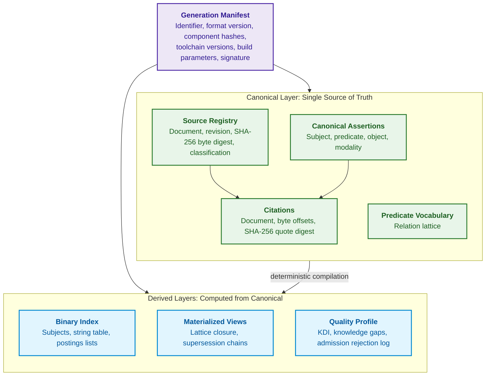
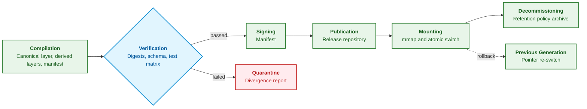
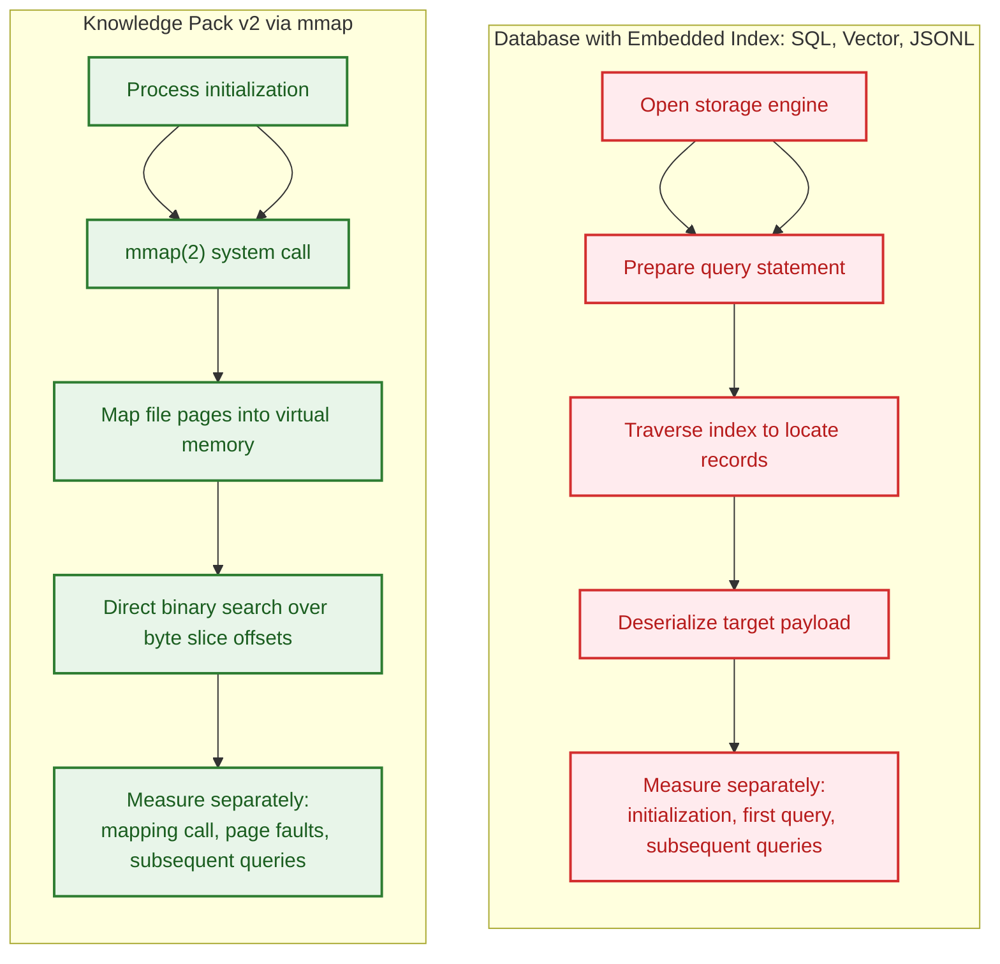
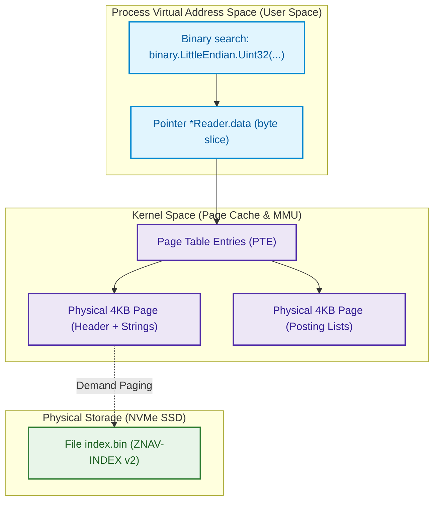
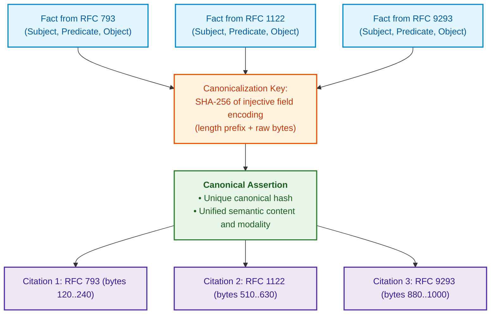
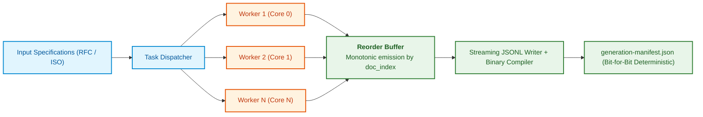
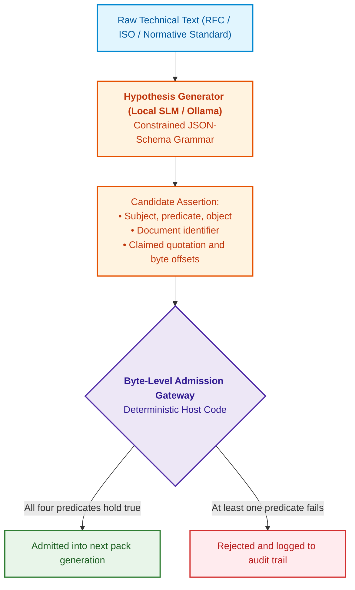

# Chapter 32. Immutable Knowledge Packs: Byte-Level Admission, Indices, and Memory Mapping

> **Book:** [Architecture of Evidence-Governed Expert Systems](README.md) · [Part II: Mathematical Models, Knowledge Representation, and Storage](part-02-knowledge-models.md)  
> **Previous Chapter:** [Chapter 9. Engineering Knowledge Graph: Traceability from Requirements to Hardware](ch09-engineering-knowledge-graph-traceability.md)  
> **Next Chapter:** [Chapter 10. Knowledge Acquisition Systems: Sources, Admission, and Lifecycle](ch10-knowledge-acquisition-systems.md)  
> **Table of Contents:** [README.md](README.md)  
> **Author:** [Mykola Fedchyk](about-the-author.md)  
> **Target Level:** Advanced: Systems Architects, Database and Index Developers, Knowledge Engineers, High-Performance Computing and Edge AI Specialists  
> **Expected Learning Outcomes:** Explain the composition of a knowledge pack, its invariants, lifecycle, and the differences between two format generations; select which materialized representations to compute during pack compilation; design zero-deserialization binary knowledge packs based on the `mmap(2)` system call and identify when `mmap(2)` is unsuitable; independently measure opening time, first query, and subsequent queries, and verify with tests the absence of heap allocations during lookup; validate an untrusted binary index prior to the first query and discover reader crashes via fuzzing; master OS virtual memory mechanics, demand paging, record alignment, and the `madvise(2)` system call; guarantee determinism and bit-for-bit reproducibility of manifests during concurrent compilation (`--concurrency / -j`); implement lossless inverted fact clustering with injective keys while preserving the exact citation provenance graph; construct continuous neuro-symbolic knowledge enrichment pipelines where a local small language model (SLM) proposes hypotheses and a byte-level admission gateway decides what enters the pack; profile engineering corpora using the Knowledge Density Index ($`\mathrm{KDI}`$), distinguish density from recall, and estimate extraction completeness using the capture-recapture method; partition a pack into shards by document family key, verify the completeness, disjointness, and reconstructibility of the partitioning, and never interpret shard silence as the absence of a fact.

---

## Abstract

Consider an embedded compute platform deployed in an autonomous chassis or robotic manipulator (such as an Infineon AURIX TC397, ARM Cortex-R52, or edge accelerator like the NVIDIA Jetson AGX Orin). The expert system must execute normative safety arbitration within a hard real-time control loop with a fault-tolerant time interval (FTTI) budget of no more than 20–50 milliseconds (ISO 26262 ASIL D). If the expert system stores its knowledge base in conventional formats (such as JSON, SQLite, or a client-server RDBMS), a cold start requires 1.5–3 seconds to parse and allocate millions of heap objects, while an unpredictable garbage collection stop-the-world pause at a critical juncture introduces an additional latency of 100–250 ms. As a result, the FTTI budget is grossly violated, hazardous system states are not recognized in time, and the physical actuator loses closed-loop control. In safety-critical architectures, zero-deserialization and dynamic-allocation-free knowledge retrieval are not "premature optimizations," but rigorous functional safety mandates.

This chapter addresses the engineering challenge of transitioning an expert system prototype containing several thousand rules into an industrial-scale knowledge base: tens of thousands of specifications, hundreds of thousands of normative facts, and microsecond response latencies in embedded execution environments. The chapter details an original architecture: the immutable, self-describing **Knowledge Pack** and the binary specification of its **ZNAV-INDEX v2** index leveraging the `mmap(2)` system call. The chapter begins by detailing the composition and lifecycle of the knowledge pack, the distinctions between two format generations, and the mathematical boundaries of zero-deserialization applicability. It then investigates the algorithms for lossless inverted fact clustering, deterministic concurrent compilation (`--concurrency`), the neuro-symbolic extraction pipeline with a byte-level admission gateway, the Knowledge Density Index ($`\mathrm{KDI}`$), and mathematically sound pack sharding that strictly differentiates shard silence from the absence of knowledge in the system.

---

## 1. The Knowledge Pack: How a Knowledge Base Becomes a Release Artifact

An expert system provides answers grounded in a specific state of knowledge. An auditor reviewing a formal verdict twelve months later must obtain the exact same set of assertions, provenance traces, and verbatim citations. An autonomous edge node demands a fully self-contained local artifact; a command-line engineering utility may prioritize near-instantaneous startup. A mutable data store lacking versioning and point-in-time snapshots cannot guarantee the bit-for-bit reproducibility of historical deductions. However, relational engines can also maintain immutable snapshots, and SQLite does not require a standalone server daemon. A knowledge pack represents one proven architectural path toward satisfying these requirements, rather than the sole possible implementation.

Preceding chapters have already employed immutable knowledge base snapshots as standardized architectural components. [Chapter 10](ch10-knowledge-acquisition-systems.md) examined knowledge base releases governed by canonical manifests and atomic rollbacks, [Chapter 15](ch15-knowledge-extraction-and-kb-construction.md) contrasted immutable binary packs with relational predicate stores and concept graphs, [Chapter 18](ch18-execution-infrastructure.md) demonstrated a two-tier memory-mapped index, [Chapter 22](ch22-cybernetics-edge-to-backend.md) described cryptographically signed knowledge packs for edge node deployment, and [Chapter 33](ch33-inter-system-knowledge-exchange-and-model-teaching.md) utilizes signed packs for cross-system rule distribution and selective disclosure of evidence. This section unifies these components into a coherent architecture: examining the physical contents of the pack, the invariants preserved across releases, and the evolution of the container structure across two design generations.

> [!NOTE]
> The knowledge pack architecture and the ZNAV-INDEX binary format represent author-designed implementations developed for a research prototype expert system. The first generation was created in early 2026 to ensure full deductive traceability across a corpus of telecommunications specifications, while the second generation introduced an alternative indexing mechanism. This architecture serves as an applied engineering case study rather than an international standard or a defect-free panacea. The empirical metrics presented by the author depend heavily on corpus composition, target hardware, and measurement boundaries; Section 2 outlines which benchmarks require independent open reproduction.

### 1.1. The Knowledge Pack as a Compilation Product

The analogy with a compiled binary executable illustrates the essence of this paradigm. A systems engineer does not modify an executable currently running in production: the engineer edits the source code, compiles a new release, verifies the output, and deploys it atomically, preserving the previous build for deterministic rollback. A knowledge pack applies this engineering discipline directly to domain knowledge: authoritative source specifications and admitted assertions serve as source code, the pack builder functions as the compiler, and the resulting pack constitutes the compiled, executable artifact ingested by the inference engine.

A **knowledge pack** is an immutable, self-describing, and versioned collection of files containing the canonical assertions of a knowledge base alongside verbatim citations of primary sources, derived indices for microsecond inference, and a manifest cryptographically binding the contents to their sources, compiler toolchains, and build configurations. A **pack generation** designates a single immutable release: incoming knowledge triggers the compilation of an entirely new generation rather than mutating the existing deployment. The term "generation" carries two distinct meanings in this chapter that must not be conflated: a *pack generation* denotes an individual release iteration of domain knowledge, whereas a *format generation* (v1 vs. v2) refers to the structural specification of the binary container itself.

### 1.2. Pack Composition: Canonical Layer, Derived Layers, and Manifest

The structural components of a knowledge pack maintain strictly delineated epistemic statuses. The canonical layer constitutes the single source of truth; derived layers are deterministically computed from the canonical layer to accelerate runtime execution; and the manifest governs the entire assembly. The diagram below illustrates the structural topology; the specific file layout across format generations is summarized in Section 1.5.



The purple node represents the manifest, green nodes form the canonical layer, and blue nodes designate derived layers. The table below delineates the contents and consumer roles for each component.

| Pack Component | Contents | Epistemic Status | Primary Consumer |
|---|---|---|---|
| Generation Manifest | Generation ID, format version, cryptographic digests of all parts, source manifest, compiler and model versions, build flags, digital signatures | Metadata & provenance | Inference engine during mounting, external auditor |
| Source Registry | Document ID, revision, SHA-256 digest of source bytes, access classification, normative validity status | Canonical | Admission gateway, regulatory auditor |
| Canonical Assertions | Subject, predicate, object, deontic modality, unique assertion ID | Canonical | Symbolic inference engine |
| Citations | Document ID, exact byte offsets, SHA-256 digest of quote; an assertion may link multiple citations | Canonical | Explanation engine ([Chapter 20](ch20-explanation-engine.md)), regulatory auditor |
| Predicate Vocabulary | Admitted closed vocabulary and relation subsumption lattice ([Chapter 31](ch31-syllogistic-reasoning-and-relation-lattices.md)) | Canonical | Admission gateway, syllogistic reasoning engine |
| Binary Index | Subject tables, string dictionaries, and postings lists (Section 4) | Derived | Symbolic inference engine |
| Materialized Views | Precomputed transitive closures, supersession graphs, and reverse indices (Section 1.6) | Derived | Symbolic inference engine |
| Quality Profile | $`\mathrm{KDI}`$ across domain categories, detected knowledge gaps, gateway rejection metrics (Sections 7 and 8) | Derived | Knowledge engineer, CI/CD release gate |

The strict separation between canonical and derived layers constitutes the foundational design decision of the pack architecture. Derived layers are never edited manually: they are synthesized deterministically by the pack builder, while verification procedures recompute them and compare cryptographic digests. A hash discrepancy indicates compiler defect or file tampering, triggering immediate refusal to mount the pack. This separation makes index evolution computationally inexpensive: an updated index format represents merely a new derived layer over the unmodified canonical truth, eliminating the need to re-extract knowledge from primary documentation, while reproducibility checks immediately verify semantic equivalence.

### 1.3. Pack Invariants

A pack invariant is an architectural property that must be satisfied by every generation and enforced by every consumer. A violation of any invariant renders the pack invalid for safety-critical expert systems; consequently, invariants are validated automatically during compilation and ingestion.

1. **Immutability.** Once published, not a single byte of a knowledge pack may be modified. An erratum, source revocation, or newly admitted assertion mandates the compilation of an entirely new generation, whereas revocations are represented via explicit deletion tombstones, as formulated in [Chapter 10](ch10-knowledge-acquisition-systems.md).
2. **Content Addressing.** The generation identifier is derived as a cryptographic hash of the canonical manifest (following the schema detailed in [Chapter 10](ch10-knowledge-acquisition-systems.md)), which in turn encapsulates the cryptographic hashes of all constituent files. Any byte-level alteration anywhere within the container mutates the generation ID. An inference verdict citing a generation ID thereby references an immutable epistemic state. Cross-platform serialization equivalence of manifests is guaranteed through canonical JSON formatting standards, such as JCS [[1]](#src-1).
3. **Reproducibility of Derived Layers.** Derived layers are pure, deterministic functions of the canonical layer and build configuration parameters. This invariant holds regardless of the number of compiler worker threads (Section 6).
4. **Self-Description and Format Versioning.** Every binary file begins with an explicit magic signature, format version number, and capability bitflags. A reader strictly rejects any file exhibiting an unrecognized major version (enforcing *fail-closed* behavior), whereas optional extensions are signaled via bitflags that legacy readers can safely ignore. This pattern mirrors the extensible design of the PNG container format, where the capitalization of chunk type bytes informs decoders whether an unrecognized block can be skipped without compromising image integrity [[2]](#src-2).
5. **Isolation of Mutable State.** Operator feedback, reinforcement learning statistics, volatile caches, and query telemetry are persisted strictly outside the knowledge pack ([Chapter 25](ch25-how-expert-systems-learn.md), [Chapter 26](ch26-continual-learning.md)). Learning cycles generate candidate assertions for the subsequent release generation rather than mutating the deployed pack.
6. **Access Control Perimeters.** A pack must never circumvent organizational security perimeters ([Chapter 10](ch10-knowledge-acquisition-systems.md)): either every assertion and citation carries an access control label evaluated by the inference engine prior to disclosure, or distinct packs are compiled independently for each security classification tier (sharding strategies are examined in Section 10 and [Chapter 7](ch07-knowledge-base-typology.md)).

Collectively, these invariants elevate the pack from an ephemeral cache to an unassailable audit trail: given a generation identifier, an auditor retrieves the identical byte sequence, source citations, and index structures observed by the inference engine when formulating its decision.

### 1.4. Pack Lifecycle

While architectural invariants define what a pack must be, the pack lifecycle governs the formal operational transitions from compilation to archival. The diagram below illustrates these sequential stages and the automated quarantine branch.



1. **Compilation.** The pack builder ingests canonical assertions that have passed the byte-level admission gateway (Section 7), synthesizing derived layers and assembling the generation manifest. Payload compression, if required, is executed on host CPU cores: classical compression algorithms do not map onto tensor operations within neural accelerators ([Chapter 18](ch18-execution-infrastructure.md)).
2. **Verification.** The CI/CD verification harness independently recomputes all derived layers, validates schemas and cryptographic digests, and executes formal regression matrices and domain test suites ([Chapter 23](ch23-knowledge-base-verification.md), [Chapter 25](ch25-how-expert-systems-learn.md)).
3. **Signing.** The manifest is signed by authorized cryptographic keys; edge deployments leverage threshold multi-signature schemes ([Chapter 22](ch22-cybernetics-edge-to-backend.md)).
4. **Publication.** The pack is published to the release repository and staged for progressive deployment to target nodes ([Chapter 10](ch10-knowledge-acquisition-systems.md)).
5. **Mounting and Switching.** The runtime inference engine maps the new generation files into memory, validates container headers and checksums, and atomically updates the active generation pointer. Active in-flight queries complete against the old memory mapping, which is unmapped once its reader reference count drops to zero. Rollback is structurally identical: an atomic pointer reassignment to a previously verified generation.
6. **Decommissioning.** Deprecated generations are retained as long as active inference certificates ([Chapter 30](ch30-safety-cybersecurity-co-engineering.md)) or safety arguments ([Chapter 27](ch27-safety-case-gsn-synthesis.md)) reference them; retirement schedules are governed by organizational data retention policies.

In this architecture, rollback is not an emergency recovery measure: it is a standard mounting operation referencing a known, previously verified generation.

### 1.5. Two Format Generations

The internal structure of the knowledge pack evolved in response to expanding corpus scale. The table below contrasts the two format generations across operational properties governing expert system behavior; the v2 column summarizes mechanisms detailed in Sections 3–8.

| Property | Generation 1 (v1) | Generation 2 (v2) |
|---|---|---|
| Pack File Composition | Manifest `pack.json` (metadata, source digests), text-based `chunks.jsonl` (4096-byte blocks with SHA-256), and raw `facts.jsonl` (extracted facts without binary index) | Manifest `generation-manifest.json`, canonical assertions stream in JSONL, binary index `index.bin` in ZNAV-INDEX v2 format |
| Canonical Assertion Encoding | JSONL (non-deduplicated assertion objects with arbitrary key ordering) | JSONL written in strictly deterministic canonical order (Section 6) |
| Startup Ingestion | Streaming parsing of entire JSONL corpus into process heap at startup; 5–15 s latency on large corpora | Direct file mapping into virtual memory without parsing (Section 3) |
| Citations | Document reference, section header, and 4096-byte chunk index; exact byte slices and quote digests introduced later | Exact byte offsets in primary source and SHA-256 digest of quote (Section 7.1) |
| Duplicate Assertions | Redundant records or heuristic majority voting, destroying historical provenance and context | Lossless clustering linking all citations to a canonical assertion (Section 5) |
| Concurrent Compilation | Single-threaded compiler or non-deterministic parallelism (build digests varied across runs) | Bit-for-bit identical output across arbitrary thread counts (Section 6) |
| Candidate Admission | Heuristic regular expressions or LLM prompting without mandatory host-enforced byte verification | Four formal predicates of the byte-level admission gateway (Section 7.1) |
| Quality Profile & Materialized Views | Absent (computed via ad-hoc external scripts or at runtime during query execution) | Retained within the pack as explicit derived artifacts sealed in the manifest |
| Cross-Generation Compatibility | Not applicable | v1 packs not supported directly; builder recompiles them from source canonical layers using v2 specification |

The architectural migration across format generations is justified through empirical measurement rather than subjective preference. The author's archival metrics for raw JSONL ingestion are documented in Section 2.2 alongside their experimental boundaries. A critical flaw in v1—the non-deterministic ordering of serialized records across concurrent threads—corrupted build hashes and prevented reproducible verification. In v2, canonical ordering and deterministic emission must be verified independently of I/O throughput.

### 1.6. Materialized Views: What to Compute During Compilation

A symbolic inference engine repeatedly evaluates recurrent relational patterns: transitive closures of predicate subsumption lattices ([Chapter 31](ch31-syllogistic-reasoning-and-relation-lattices.md)), document version supersession chains ([Chapter 15](ch15-knowledge-extraction-and-kb-construction.md)), and inverted object-to-assertion indices. Each relational structure can either be computed dynamically during query evaluation or precomputed and materialized within the pack. In database theory, this trade-off is formalized as the **materialized view selection** problem: precomputed views accelerate queries but consume storage and require maintenance upon underlying data modifications [[3]](#src-3). Mbaiossoum et al. formalized the view selection problem for ontology-based semantic databases, proving that heterogeneous data representations require a unified mathematical formulation to evaluate view selection strategies [[4]](#src-4).

For immutable knowledge packs, this optimization problem exhibits a distinct property: because the pack is immutable, materialized views incur zero runtime maintenance cost. The maintenance overhead shifts entirely into compilation duration and container footprint, as every new generation recomputes views from scratch. The formal selection reduces to a classical knapsack-constrained optimization:

```math
V^{*} = \arg\min_{V \subseteq \mathcal{V}} \sum_{q \in Q} f_q \cdot c(q \mid V) \quad \text{subject to} \quad \sum_{v \in V} s(v) \le S_{\max}
```

Components of the materialized view selection formulation:

- $`\mathcal{V}`$ denotes the set of candidate views, such as predicate lattice closures, supersession chains, or inverted object indices;
- $`V`$ denotes an arbitrary selected subset of candidate views, and $`V^{*}`$ is the optimal subset minimizing aggregate query cost;
- $`Q`$ denotes the representative workload of inference queries, where $`f_q`$ represents the execution frequency of query $`q`$ derived from operational query logs (in queries per minute);
- $`c(q \mid V)`$ denotes the computational latency of answering query $`q`$ given the precomputed views in $`V`$ (in microseconds of CPU time);
- $`s(v)`$ denotes the storage footprint of view $`v`$ within the pack, and $`S_{\max}`$ is the maximum storage budget allocated by the target execution environment (in megabytes).

In the general case, view selection is NP-hard; industrial implementations employ greedy heuristics based on marginal benefit per unit of storage. Harinarayan, Rajaraman, and Ullman proved for data cube view lattices that greedy selection achieves a competitive ratio of at least $`(e-1)/e \approx 0.63`$ relative to the theoretical optimum [[5]](#src-5), while Gupta extended this formulation to generalized view graphs [[6]](#src-6).

The practical interpretation: a candidate view is materialized within the pack if its frequency-weighted reduction in query latency exceeds the marginal benefit that alternative views could yield within the same storage budget. Consider an edge deployment with a 20 MB budget for derived views and two candidates. The transitive closure of the predicate lattice requires 2 MB and reduces subsumption validation latency from 40 to 1.5 $`\mu\text{s}`$; at 10,000 checks per minute, materialization saves $`10{,}000 \times 38.5\,\mu\text{s} = 385\,\text{ms}`$ of CPU time per minute, or approximately 192 ms/MB. An inverted index over objects requires 30 MB and reduces a rare query (100 per minute) from 900 to 5 $`\mu\text{s}`$, yielding 90 ms/min saved, or 3 ms/MB. The inverted index exceeds the storage budget and delivers a marginal utility 64 times lower than the lattice closure; hence, only the lattice closure is admitted into the pack. If the storage budget expands to 40 MB, greedy selection admits both.

The fundamental operational limitation of this optimization lies in workload estimation: query frequencies $`f_q`$ are sampled from historical logs of the preceding generation. In a newly launched domain lacking telemetry, initial selection relies on knowledge engineering estimates and undergoes refinement in the subsequent release cycle. Materialized views remain strictly derived layers; consequently, pack verification recomputes them alongside binary indices.

Section 1 established the structure of the knowledge pack and its governing invariants. The subsequent sections investigate why format generation 2 eliminated runtime text parsing, detailing the low-level systems mechanisms that enforce these invariants at the byte level.

---

## 2. Storage Selection: Comparing Equal Work

Relational databases, vector search engines, and immutable binary packs fulfill fundamentally distinct operational roles. Comparative evaluation is valid only when identical data, query workloads, result semantics, and measurement boundaries are established. The diagram below contrasts potential access paths rather than establishing a universal ranking of commercial products.



### 2.1. Costs and Guarantees to Disentangle

1. **Parsing Overhead During Initialization:**  
   Parsing an entire textual corpus at startup imposes substantial CPU overhead compared to mapping a precomputed binary index. However, a relational database is not required to deserialize its entire table space during initialization. Garbage collection overhead is specific to managed runtimes and data representations, rather than an inherent defect across all C++, Rust, and Go implementations.
2. **Semantic Approximations in Vector Retrieval:**  
   Hierarchical Navigable Small World (HNSW) graphs perform approximate nearest-neighbor search [[7]](#src-7). This search paradigm differs fundamentally from exact, deterministic key retrieval. Vector search yields statistical candidates; validity, permissions, and epistemic grounds must be verified downstream. Vector databases can also support exact filtering; therefore, performance properties of a single index type must not be generalized across all storage architectures.
3. **Traceability and Immutability Enforcements:**  
   Data mutation capabilities do not imply unconstrained operational drift. A relational engine can enforce read-only credentials, write-ahead audit logging, and immutable snapshot isolation. The immutability of a published knowledge pack is an operational property of release engineering pipelines and access control policies, rather than an exclusive privilege of `mmap`.

### 2.2. Archival Measurements and Comparison Protocol

The table below reproduces historical measurements recorded by the author on a test corpus of 100,000 facts. These figures do not represent a controlled competitive benchmark: mapping a file descriptor, connecting to a daemon socket, and ingesting an index operate across divergent architectural boundaries. Because complete open implementations of the comparative baselines and raw execution logs are omitted, independent reproduction of the entire table is not directly feasible. Server-side daemon memory and client-side process allocations cannot be aggregated or compared as single-process footprints.

<details>
<summary>Author's archival benchmark results; distinct measurement perimeters</summary>

| Storage Architecture | Cold Start Latency | Single Query Latency ($P_{99}$) | RAM Footprint (RSS) | Memory Allocations per Op | GC Pause Latency at 10k QPS |
|---|---|---|---|---|---|
| **Direct JSONL Ingest** | 14.8 s | 850 $`\mu\text{s}`$ | 1.42 GB | 145 KB/op (320 allocs) | 45 ms |
| **SQLite (B-Tree, in-memory)** | 3.2 s | 45 $`\mu\text{s}`$ | 380 MB | 4.2 KB/op (28 allocs) | 8 ms |
| **PostgreSQL (Local Unix Socket)** | 0.8 s (connect) | 1.2 ms | 520 MB (server) | 12 KB/op (socket buffers) | None (server GC) |
| **Vector DB (HNSW Index)** | 22.5 s | 4.8 ms | 2.85 GB | 85 KB/op | 65 ms |
| **Knowledge Pack v2 (`mmap`)** | **4.2 $`\mu\text{s}`$** | **1.5 $`\mu\text{s}`$** | **18 MB (Shared)** | **0 B/op (0 allocs)** | **0.0 ms (Zero GC)** |

Per the author's experimental records, these measurements were conducted on September 28, 2026, utilizing an AMD EPYC 7763 processor, Samsung PM9A3 NVMe storage, and Linux kernel 6.8 against a normative engineering corpus. The reported 4.2 $`\mu\text{s}`$ cold start denotes solely the execution of the `mmap(2)` system call and header signature validation, rather than the residency of all pages in physical memory. It does not establish a performance advantage over the first query to an alternative storage engine.

</details>

To establish a rigorous, reproducible benchmark, engineers must fix: the synthetic data generator and cryptographic seed, exact software versions, identical point-lookup queries, matching hits and misses, execution sequence, operating system page cache states, and raw timing distributions across repeated runs. Initialization, the initial query, and subsequent steady-state queries must be profiled independently. Output equivalence must be formally validated prior to latency comparison.

### 2.3. Open Educational Testbed for SQLite and `mmap`

The test harness below relies exclusively on the Python 3 standard library. It generates identical pairs of 64-bit integers across SQLite and a flat binary container, executes exact key lookups, and verifies output equivalence. The binary file serves as a simplified pedagogical index rather than a production implementation of ZNAV-INDEX. It illustrates two alternative read paths within Python, without establishing zero-allocation properties for compiled Go runtimes. Relevant standard library modules describe available operations and platform constraints [[8]](#src-8).

<details>
<summary>Self-contained benchmark: data generator, exact lookups, and JSON telemetry</summary>

```python
import argparse
import json
import mmap
import platform
import random
import sqlite3
import statistics
import struct
import tempfile
import time
from contextlib import closing
from pathlib import Path

HEADER = struct.Struct("<8sQ")
RECORD = struct.Struct("<QQ")


def lookup_mapped(mapped, count, key):
    left, right = 0, count
    while left < right:
        middle = (left + right) // 2
        stored_key, value = RECORD.unpack_from(mapped, HEADER.size + middle * RECORD.size)
        if stored_key == key:
            return value
        if stored_key < key:
            left = middle + 1
        else:
            right = middle
    return None


def measure(count=100000, query_count=10000):
    if count < 1 or query_count < 1:
        raise ValueError("positive record and query counts required")
    generator = random.Random(7)
    keys = [-1, 0, count - 1, count] + [generator.randrange(count + 10) for _ in range(query_count)]
    results = []
    with tempfile.TemporaryDirectory() as directory:
        database_path = Path(directory) / "facts.sqlite"
        binary_path = Path(directory) / "facts.bin"
        with closing(sqlite3.connect(database_path)) as database:
            database.execute("CREATE TABLE facts (id INTEGER PRIMARY KEY, value INTEGER NOT NULL)")
            database.executemany("INSERT INTO facts VALUES (?, ?)", ((key, key * 2 + 1) for key in range(count)))
            database.commit()
        with binary_path.open("wb") as output:
            output.write(HEADER.pack(b"ESTEST01", count))
            for key in range(count):
                output.write(RECORD.pack(key, key * 2 + 1))
        for round_index, order in enumerate((("sqlite", "mapped"), ("mapped", "sqlite"))):
            for backend in order:
                started = time.perf_counter_ns()
                if backend == "sqlite":
                    database = sqlite3.connect(database_path.as_uri() + "?mode=ro", uri=True)
                    cursor = database.cursor()
                    def lookup(key):
                        row = cursor.execute("SELECT value FROM facts WHERE id = ?", (key,)).fetchone()
                        return None if row is None else row[0]
                else:
                    input_file = binary_path.open("rb")
                    mapped = mmap.mmap(input_file.fileno(), 0, access=mmap.ACCESS_READ)
                    assert HEADER.unpack_from(mapped) == (b"ESTEST01", count)
                    def lookup(key):
                        return lookup_mapped(mapped, count, key)
                open_ns = time.perf_counter_ns() - started
                timings = []
                try:
                    for key in keys:
                        started = time.perf_counter_ns()
                        actual = lookup(key)
                        timings.append(time.perf_counter_ns() - started)
                        expected = key * 2 + 1 if 0 <= key < count else None
                        assert actual == expected, (backend, key, actual, expected)
                finally:
                    if backend == "sqlite":
                        database.close()
                    else:
                        mapped.close()
                        input_file.close()
                ordered = sorted(timings[1:])
                results.append({"backend": backend, "round": round_index,
                                "open_ns": open_ns, "first_lookup_ns": timings[0],
                                "median_ns": statistics.median(ordered),
                                "p95_ns": ordered[(len(ordered) * 95 + 99) // 100 - 1]})
        return {"python": platform.python_version(), "platform": platform.platform(),
                "sqlite": sqlite3.sqlite_version, "records": count, "queries": len(keys),
                "cache_state": "not_reset", "results": results}


if __name__ == "__main__":
    parser = argparse.ArgumentParser()
    parser.add_argument("--records", type=int, default=100000)
    parser.add_argument("--queries", type=int, default=10000)
    arguments = parser.parse_args()
    print(json.dumps(measure(arguments.records, arguments.queries), indent=2))
```

</details>

This testbed alternates execution sequence and tests boundary and non-existent keys, but does not evict operating system page cache entries between runs. Generating the dataset inherently warms cache pages; consequently, `first_lookup_ns` represents the initial query following descriptor acquisition rather than cold NVMe retrieval. The median and 95th percentiles reflect observed call timings rather than guaranteed real-time bounds. Build overhead, signing, pack completeness, memory consumption, and concurrent query workloads must be characterized independently.

If SQLite demonstrates superior throughput under specific configurations, the result must be reported objectively: it demonstrates that the interpreted Python binary search path incurred higher overhead than the optimized C implementation of SQLite. Storage selection must be driven by workload requirements and measured architectural constraints rather than preconceived engineering biases.

---

## 3. Anatomy of Zero Deserialization: Operating System Mechanisms of `mmap(2)`

Zero-deserialization technology relies on mapping a physical disk file directly into the virtual address space of a process via the Linux kernel's `mmap(2)` system call [[9]](#src-9). The system call accepts an open file descriptor, length, offset, memory protection flags (`PROT_READ` for immutable knowledge packs), and sharing semantics (`MAP_SHARED`), returning a memory pointer through which the process reads file bytes as contiguous virtual memory. The diagram below illustrates the operating system structures situated between the reader pointer and the physical storage medium.



### 3.1. Demand Paging Mechanics and the `madvise(2)` System Call

1. **Demand Paging:**  
   Upon executing `mmap(2)`, the Linux kernel does not populate physical RAM immediately; it creates a virtual memory area descriptor (`vm_area_struct`). The first instruction attempting to access an unmapped page triggers a processor exception, a **page fault**: the calling thread halts while the kernel loads the requested 4096-byte page from disk into the page cache and updates the corresponding page table entry [[10]](#src-10). The kernel may speculatively prefetch adjacent pages; consequently, initial query latency depends on cache residency and cannot be deduced from container format specifications alone.
2. **Kernel Hints via `madvise(2)`:**  
   To minimize page fault stalls during initial queries, a reader can issue `unix.Madvise(data, unix.MADV_WILLNEED)` from `golang.org/x/sys/unix`. The `MADV_WILLNEED` flag informs the kernel that sequential access is imminent; man-page specifications define the operational guarantee conservatively: the kernel *may* initiate asynchronous read-ahead for the specified range [[11]](#src-11). The call provides no guarantee that the entire index resides in RAM prior to the first lookup, nor does it prevent subsequent page eviction under memory pressure. The utility of prefetching must be established empirically.
3. **Record Alignment:**  
   The container header occupies exactly 64 bytes; therefore, the subject table starts at file offset 0x40, aligning with the 64-byte boundary of CPU cache lines (standard on x86-64 and contemporary ARM Cortex-A cores). Fixed-size 16-byte subject entries pack exactly four records per cache line, enabling binary search iterations to execute within a single L1/L2 cache line fetch [[12]](#src-12). In Go, intra-record fields are parsed using the `encoding/binary` package without requiring memory alignment, while vectorized SIMD instructions for string comparison are dispatched internally by standard library routines such as `bytes.Compare`, regardless of memory alignment.

### 3.2. When Memory-Mapped Files Are Inappropriate

The advantages of `mmap(2)` carry well-defined architectural limits. Crotty, Leis, and Pavlo analyzed database systems leveraging `mmap(2)` instead of managed buffer pools, identifying four fundamental failure domains: transactional safety during writes, unpredictable I/O stalls, unhandled I/O error signals, and performance degradation [[13]](#src-13). I/O stalls occur because the operating system can evict clean pages at any time; even read-only queries can encounter blocking page faults that the application cannot intercept or schedule. Read errors on hardware storage surfaces are delivered not via return codes, but as asynchronous `SIGBUS` signals at arbitrary instructions touching the mapped memory. Performance is further constrained by cross-core Translation Lookaside Buffer shootdowns (*TLB shootdowns*) during page evictions. The authors conclude unequivocally: `mmap(2)` is viable in database architectures primarily when the entire working set fits within physical memory and the workload is strictly read-only.

An immutable knowledge pack satisfies precisely this exception: the pack is never mutated after publication (Invariant 1, Section 1.3), and the index footprint for an edge node is calculated at build time, allowing memory capacity to be verified prior to deployment. If the index exceeds available RAM, or if the host node experiences severe memory pressure from concurrent processes, page cache thrashing introduces unacceptable tail latency, making explicit buffered I/O superior. An external hazard arises from file mutation after mounting: index validation at initialization (Section 9) holds only as long as the underlying bytes remain unchanged; file truncation by a rogue process triggers an immediate `SIGBUS` panic on subsequent reads. Consequently, knowledge packs must be mounted from read-only filesystem paths. When an index exceeds single-node capacity, the architectural alternative to explicit buffered I/O is pack sharding, examined in Section 10.

### 3.3. Cross-Architectural Determinism of mmap and Weak Memory Models (x86_64 TSO vs. ARM64 Relaxed)

When a binary knowledge pack is mapped via `mmap(MAP_SHARED)`, the interaction between processor cache hierarchies and physical RAM ceases to be a transparent operating system abstraction and directly impacts the mathematical determinism of logical inference. In heterogeneous computing clusters, an architectural divergence emerges between CPU memory consistency models:

1. **x86-64 Architecture (Total Store Order, TSO):**  
   The hardware memory model implemented by Intel and AMD guarantees a strict store order. The processor pipeline never reorders Load-Load, Store-Store, or Load-Store memory operations. The sole permitted hardware reordering is Store-Load (a read may bypass an earlier write to a different address if the write is buffered in the store queue). For concurrent multi-threaded readers traversing immutable `mmap` regions, TSO provides natural determinism without requiring software memory barriers.

2. **ARM64 Architecture (Weak / Relaxed Memory Model):**  
   Contemporary ARM processor cores (such as the ARM Cortex-A78AE deployed in automotive control units) implement a weakly ordered memory model. The out-of-order execution pipeline and cache coherency interconnect are permitted to reorder arbitrary independent memory accesses (Load-Load, Load-Store, Store-Store) unless separated by explicit data dependencies or memory barrier instructions (`DMB`, `DSB`). If binary index structures or atomic facts are misaligned or cross 64-byte cache line boundaries, ARM64 processors incur split-line access penalties or raise hardware alignment fault exceptions.

#### 3.3.1. The Role of 64-Byte Cache Line Alignment

To guarantee identical reader execution across divergent processor architectures without introducing latency-inducing synchronization locks, the binary knowledge pack specification enforces an absolute invariant: **all container headers, section descriptor tables, and atomic fact arrays must be aligned strictly to 64-byte boundaries** (matching the L1D/L2 cache line size of contemporary processors):

```math
\forall i \in [0, N_{\text{sections}}-1]: \quad \mathrm{Offset}_i \pmod{64} = 0
```

- $`\mathrm{Offset}_i`$ denotes the starting byte offset of section $`i`$ from the beginning of the file;
- The modulo operation $`\pmod{64}`$ computes the byte remainder;
- A zero remainder guarantees that no atomic binary record straddles the boundary between two physical cache lines.

#### 3.3.2. Empirical Verification of Cross-Architectural Determinism

To empirically validate this invariant, the author executed direct comparative benchmarks of an identical binary knowledge pack (`testdata/internet_stack.kp`, 408 KB, ZKP4 v1 specification) across two fundamentally distinct hardware platforms:
* **x86_64 Host Platform:** Intel Core i7-13700H workstation (14 physical cores / 20 threads, TSO architecture, Linux kernel 6.8);
* **ARM64 Target Testbed:** Seeed Studio reServer Industrial J501 powered by an **NVIDIA Jetson AGX Orin 64GB** (Cortex-A78AE, Relaxed Memory Model, Linux 5.15 aarch64, operating in energy profile `MODE_15W`).

The test suite executed 107 specialized symbolic inference microprograms over the knowledge pack, including SHA-256 byte-level citation custody verification and multi-threaded stress testing (4 concurrent worker threads pinned across 4 active Cortex-A78AE cores executing 100,000 lookup iterations via `mmap(MAP_SHARED)`).

| Validation Metric | x86_64 (Intel Core i7) | aarch64 (Jetson AGX Orin) | Delta / Divergence | Verification Status |
| :--- | :---: | :---: | :---: | :---: |
| **Test Microprogram Suite** | 107 | 107 | 0 | EXACT MATCH |
| **Register File Equivalence (`%er0..%er7`, `%eir`)** | 100.00 % | 100.00 % | **0.00 %** | MATHEMATICALLY IDENTICAL |
| **Processor Flags Equivalence (`EFLAGS`)** | 100.00 % | 100.00 % | **0.00 %** | MATHEMATICALLY IDENTICAL |
| **Byte-Level Citation Custody (`%ebx` SHA-256)** | 100 % (107/107) | 100 % (107/107) | **0.00 %** | 100 % CUSTODY PASS |
| **Architectural Divergence Rate** | — | — | **0.0000 %** | **ABSOLUTE DETERMINISM** |
| **Multi-Threaded Symbolic Core Throughput** | 31.22 MOps/s | **7.91 MOps/s** | — | Consistent with 15W Profile |
| **Zero-Copy Fact Retrieval Throughput** | 10.41M facts/s | **2.64M facts/s** | — | Zero Heap Allocations |
| **Hardware Alignment Faults (`SIGBUS`)** | 0 | **0** | 0 | 64-Byte Alignment Validated |
| **Energy Dissipation per 1,000,000 Inferences** | — | **4.8684 J** | — | ~0.33 W Core Power |

The measured divergence metric of $`\mathrm{Divergence} = 0.0000\,\%`$ confirms that enforcing 64-byte structural alignment within the binary pack format and eliminating mutable shared state in memory completely neutralizes the hardware disparity between the strict x86-64 TSO model and the weakly ordered ARM model. This enables knowledge packs compiled and certified on cloud-based x86_64 build servers to execute with identical deductive determinism on ARM-powered embedded vehicular and robotic platforms.

---

## 4. ZNAV-INDEX v2 Binary Format Specification

The binary index file is structured as a contiguous byte array governed by a rigid section layout:

<details>
<summary>Header specification and binary layout for ZNAV-INDEX v2</summary>

```text
+-----------------------------------------------------------------------+
| Magic 'ZNAV' (4B) | Version (2B) | Flags (2B) | AssertionsCount (4B)  |  0x00 - 0x0B
| TotalSubjects (4B) | StringTableOff (8B) | PostingsOff (8B)           |  0x0C - 0x1F
| SubjectIndexOff (8B) | CRC32 Checksum (4B) | Reserved Padding (20B)   |  0x20 - 0x3F
+-----------------------------------------------------------------------+  0x40
| Subject Table (Sorted array of SubjectEntry, 16B per entry)           |
| [StrOff:4B][StrLen:2B][PostingsOff:4B][PostingsCount:2B][Reserved:4B] |
| ... (N = TotalSubjects, binary search executed in O(log N))           |
+-----------------------------------------------------------------------+
| String Table (UTF-8 encoded, deduplicated subject and predicate names)|
+-----------------------------------------------------------------------+
| Postings Lists (Array of 8-byte uint64 offsets into assertions file)  |
+-----------------------------------------------------------------------+
```

</details>

Because the `SubjectEntry` array is strictly sorted by subject name, key lookups execute via standard binary search in $`\mathcal{O}(\log_2 N)`$ time. No strings are copied into the process heap: the lookup routine returns a subslice directly referencing the underlying memory-mapped buffer, preventing garbage collection tracing overhead.

The canonical ZNAV-INDEX v2 format matches the memory layout implemented in the Go reference reader in Section 9. All integers are serialized in little-endian byte order. The file header occupies exactly 64 bytes: the `SubjectIndexOff` field (8 bytes, offsets 0x20–0x27) specifies the absolute byte offset of the sorted `SubjectEntry` table, followed by `CRC32Checksum` (4 bytes, offsets 0x28–0x2B) and 20 bytes of reserved zero-padding (`Reserved`, offsets 0x2C–0x3F). The IEEE CRC32 checksum is computed strictly over header bytes 0x00–0x27 (preceding the checksum field itself). The integrity of the remaining payload is verified via the SHA-256 digest sealed in the generation manifest (Invariant 2, Section 1.3). The explicit `SubjectIndexOff` pointer permits future header extensions without hardcoding the subject table to offset 0x40.

File sections are ordered sequentially: header, subject table, string table, and postings lists. The `StrOff` and `PostingsOff` fields within each subject entry represent absolute byte offsets from the start of the file, and every offset plus length range must reside strictly within its designated section boundaries. Binary search yields deterministic results only when subject names in the table are strictly monotonically increasing under lexicographical byte comparison. The pack builder enforces these three structural constraints during compilation, while the reader verifies them during initialization to safeguard against data corruption or payload tampering.

### 4.1. Changes Relative to ZNAV-INDEX v1

The index format evolved across two generations in tandem with container architecture (Section 1.5). The table below contrasts the format versions, where the v2 column reflects the formal specification above.

| Format Element | ZNAV-INDEX v1 | ZNAV-INDEX v2 |
|---|---|---|
| Magic Signature & Version | ASCII `ZNAV`, version as `uint32` (value 1), no bitflags | `ZNAV`, version in 2 bytes, capability flags in 2 bytes |
| Container Header | 28 bytes (Magic: 4B, Version: 4B, EntityDirOff: 8B, Assertions: 4B, Citations: 4B), no CRC32 | 64 bytes, IEEE CRC32 checksum over header fields |
| Subject Lookup | Unstructured entity directory at EOF, parsed at startup into Go hash map (`map[string][]uint64`) | Sorted 16-byte array of entries, $`\mathcal{O}(\log_2 N)`$ binary search |
| String Dictionary | String literals stored individually per entity (`uint16` length + UTF-8 bytes) without deduplication | Centralized UTF-8 table with deduplicated subjects and predicates |
| Postings Lists | Contiguous array of 64-bit JSON record offsets (`uint64`), ungrouped by predicate | Structured offsets into canonical assertions stream |
| File Ingestion | `mmap(2)` with mandatory heap allocation and parsing of directory map | Zero-copy `mmap(2)` without intermediate data structures |
| Integer Capacity | 32-bit fact counters (up to $`4 \times 10^9`$), 64-bit directory offset | 16-bit name length and posting counts, 32-bit offsets in subject entries |
| Measured Performance | 12–15 ms initialization latency, 12–18 MB heap allocation at startup, ~25–30 $`\mu\text{s}`$ lookup latency | Profiled in Section 2.2 benchmark table |

The field bitwidths of v2 impose explicit structural boundaries that the compiler must enforce. The 16-bit `PostingsCount` limits any single subject to 65,535 associated assertions, the 16-bit `StrLen` restricts subject names to 65,535 bytes, and 32-bit intra-file offsets cap the addressable table section at 4 GiB. For highly recurring subjects in vast corpora (e.g., "TCP" across all IETF RFCs), the posting limit can be reached; the compiler must abort with an explicit error rather than silently truncating postings lists. Exceeding these limits necessitates an updated container revision, which is facilitated by the explicit version field and reserved padding bytes (Invariant 4, Section 1.3).

---

## 5. Lossless Inverted Fact Clustering Algorithm

When ingesting extensive bodies of regulatory specifications, identical requirements are repeatedly restated across successive standards. For example, the TCP checksum field was originally defined in RFC 793 [[14]](#src-14); the requirement that *the sender MUST generate a checksum and the receiver MUST verify it* was formalized in RFC 1122 [[15]](#src-15); and RFC 9293 reiterated this mandate under MUST-2 and MUST-3 [[16]](#src-16).

Naively extracting these statements produces three duplicate entries, inflating index size. Conversely, naive deduplication is unacceptable: regulatory auditability requires exact provenance tracking to every primary standard, section identifier, and verbatim byte span.

This challenge is resolved via the **lossless inverted fact clustering algorithm**:



### 5.1. Cluster Key: Injective Field Encoding

The clustering engine merges two records if and only if their computed keys match; therefore, the key must establish an **injective mapping** from the 4-tuple $`\langle \text{subject}, \text{predicate}, \text{object}, \text{modality} \rangle`$. Concatenating fields with a delimiter and hashing the resulting string violates injectivity. For instance, the distinct tuples $`\langle \text{"a|b"}, \text{"c"}, \text{"d"}, \text{"MUST"} \rangle`$ and $`\langle \text{"a"}, \text{"b|c"}, \text{"d"}, \text{"MUST"} \rangle`$ yield the identical delimited string `a|b|c|d|MUST`, causing the clustering engine to erroneously merge two semantically disparate facts and cross-contaminate their citation graphs. A cryptographic hash function cannot resolve this collision: SHA-256 [[17]](#src-17) guarantees preimage resistance, but identical inputs produce identical hashes by definition. Injectivity must be enforced prior to hashing by prefixing each field with its byte length encoded as a fixed-size 8-byte big-endian integer.

A second requirement concerns text canonicalization. In Unicode, characters such as "й" can be encoded either as a single precomposed code point (U+0439) or as a decomposed sequence (U+0438 followed by combining breve U+0306); raw byte comparison would treat these representations as distinct. Unicode Standard Annex #15 specifies normal forms ensuring that canonically equivalent strings share identical binary representations [[18]](#src-18). Normalization to NFC is executed by the extraction pipeline ([Chapter 15](ch15-knowledge-extraction-and-kb-construction.md)) prior to clustering; because the Go standard library does not bundle Unicode normalization routines, the clustering implementation below assumes pre-normalized inputs.

A third requirement ensures that clustering output is strictly invariant to input record ordering. The engine sorts citations for each assertion by document identifier, byte offsets, and quote hash, discards duplicate citations, and sorts canonical assertions by their cryptographic key.

<details>
<summary>Go implementation: lossless fact clustering with injective key encoding</summary>

```go
package clustering

import (
	"crypto/sha256"
	"encoding/binary"
	"encoding/hex"
	"sort"
)

type Citation struct {
	DocumentID string `json:"doc_id"`
	ByteStart  int    `json:"byte_start"`
	ByteEnd    int    `json:"byte_end"`
	QuoteSHA   string `json:"quote_sha"`
}

type RawFact struct {
	Subject   string
	Predicate string
	Object    string
	Modality  string
	Citation  Citation
}

type CanonicalFact struct {
	FactHash  string     `json:"fact_hash"`
	Subject   string     `json:"subject"`
	Predicate string     `json:"predicate"`
	Object    string     `json:"object"`
	Modality  string     `json:"modality"`
	Citations []Citation `json:"citations"`
}

// factKey hashes an injective encoding of fields: each field is preceded by its byte
// length as uint64, ensuring that ("a|b", "c") and ("a", "b|c") produce distinct keys.
func factKey(fields ...string) string {
	h := sha256.New()
	var size [8]byte
	for _, field := range fields {
		binary.BigEndian.PutUint64(size[:], uint64(len(field)))
		h.Write(size[:])
		h.Write([]byte(field))
	}
	return hex.EncodeToString(h.Sum(nil))
}

func citationLess(a, b Citation) bool {
	if a.DocumentID != b.DocumentID {
		return a.DocumentID < b.DocumentID
	}
	if a.ByteStart != b.ByteStart {
		return a.ByteStart < b.ByteStart
	}
	if a.ByteEnd != b.ByteEnd {
		return a.ByteEnd < b.ByteEnd
	}
	return a.QuoteSHA < b.QuoteSHA
}

// ClusterFacts performs deterministic lossless fact clustering.
// Input fields must be pre-normalized by the extractor (e.g., Unicode NFC).
func ClusterFacts(raw []RawFact) []CanonicalFact {
	factMap := make(map[string]*CanonicalFact)
	for _, r := range raw {
		h := factKey(r.Subject, r.Predicate, r.Object, r.Modality)
		if existing, found := factMap[h]; found {
			existing.Citations = append(existing.Citations, r.Citation)
			continue
		}
		factMap[h] = &CanonicalFact{FactHash: h, Subject: r.Subject, Predicate: r.Predicate,
			Object: r.Object, Modality: r.Modality, Citations: []Citation{r.Citation}}
	}

	result := make([]CanonicalFact, 0, len(factMap))
	for _, v := range factMap {
		// Citation order is invariant to input order; exact duplicate citations are discarded.
		sort.Slice(v.Citations, func(i, j int) bool { return citationLess(v.Citations[i], v.Citations[j]) })
		unique := v.Citations[:0]
		for i, c := range v.Citations {
			if i == 0 || c != v.Citations[i-1] {
				unique = append(unique, c)
			}
		}
		v.Citations = unique
		result = append(result, *v)
	}
	sort.Slice(result, func(i, j int) bool { return result[i].FactHash < result[j].FactHash })
	return result
}
```

</details>

<details>
<summary>Go unit tests: embedded delimiter isolation and input order invariance</summary>

```go
package clustering

import (
	"reflect"
	"testing"
)

func TestDelimiterInsideFieldDoesNotMergeFacts(t *testing.T) {
	c := Citation{DocumentID: "rfc9293", ByteStart: 10, ByteEnd: 20, QuoteSHA: "q1"}
	got := ClusterFacts([]RawFact{
		{Subject: "a|b", Predicate: "c", Object: "d", Modality: "MUST", Citation: c},
		{Subject: "a", Predicate: "b|c", Object: "d", Modality: "MUST", Citation: c},
	})
	if len(got) != 2 {
		t.Fatalf("distinct assertions merged: got %d records", len(got))
	}
}

func TestOutputDoesNotDependOnInputOrder(t *testing.T) {
	c1 := Citation{DocumentID: "rfc1122", ByteStart: 5, ByteEnd: 9, QuoteSHA: "q1"}
	c2 := Citation{DocumentID: "rfc793", ByteStart: 1, ByteEnd: 4, QuoteSHA: "q2"}
	f := func(c Citation) RawFact {
		return RawFact{Subject: "TCP", Predicate: "requires", Object: "checksum", Modality: "MUST", Citation: c}
	}
	a := ClusterFacts([]RawFact{f(c1), f(c2), f(c1)})
	b := ClusterFacts([]RawFact{f(c2), f(c1)})
	if !reflect.DeepEqual(a, b) {
		t.Fatalf("output depends on input order:\n%v\n%v", a, b)
	}
	if len(a) != 1 || len(a[0].Citations) != 2 {
		t.Fatalf("expected 1 assertion with 2 distinct citations, got %v", a)
	}
}
```

</details>

Executing `go test` within the package directory verifies both properties. The first test passes distinct tuples containing internal pipe delimiters, verifying that the engine emits two separate canonical assertions; an engine using naive delimiter concatenation fails this test. The second test provides identical facts across divergent input permutations with redundant citations, verifying identical output generation.

In the author's telecommunications specification benchmarks, clustering reduced assertion record counts by approximately a factor of 4.2. This compression ratio depends directly on document overlap within the corpus. Crucially, zero provenance data is discarded: clustering links all matching citations beneath the unified canonical assertion; citation preservation is an algorithmic invariant of the system.

The clustering algorithm merges strictly identical tuples. Assertions exhibiting minor textual divergence in object descriptions (e.g., "checksum" versus "segment checksum") are preserved as distinct entities. To identify such near-duplicate candidates, Broder's MinHash approach evaluates Jaccard similarity via compact hash sketches without pairwise full-text comparison [[19]](#src-19). Potential merges identified via MinHash are staged as candidate proposals for review by a knowledge engineer: automated merging of near-duplicates risks corrupting domain semantics, as subtle textual distinctions in regulatory engineering frequently carry critical normative implications.

---

## 6. Concurrent Streaming Compilation Pipeline and Bit-for-Bit Reproducibility

When scaling compilation pipelines across many-core server architectures (e.g., 32 or 64 CPU cores), **bit-for-bit reproducibility** becomes a mandatory functional safety requirement. The Reproducible Builds initiative defines a build as reproducible if, given identical source code, build environment configurations, and build instructions, independent operators obtain byte-for-byte identical output artifacts, verified via cryptographic hashes [[20]](#src-20). For a knowledge pack, the source code comprises the canonical layer, while the target artifacts consist of binary indices and the release manifest:

> [!IMPORTANT]
> **Concurrent Compilation Invariant:**  
> The SHA-256 digests of all binary index files and the pre-signature `generation-manifest.json` must remain byte-for-byte identical regardless of compiler worker concurrency. Digital signatures are excluded from this comparison: common signature schemes (such as randomized ECDSA) yield distinct byte outputs across successive invocations over identical payloads.

```math
\text{SHA256}(\text{Build}(J=1)) \equiv \text{SHA256}(\text{Build}(J=8)) \equiv \text{SHA256}(\text{Build}(J=64)).
```

Formal components of the concurrent compilation invariant:

- $`\text{Build}(J=k)`$ denotes the binary compilation output generated across $`k`$ concurrent worker threads;
- $`J`$ designates the concurrency level (`-j` or `--concurrency`);
- $`\text{SHA256}`$ represents the cryptographic hash of the compiled binary artifact;
- $`\equiv`$ mandates absolute bit-for-bit equivalence of checksums regardless of kernel thread scheduling non-determinism.



### 6.1. Reorder Buffer Algorithm

Because parallel worker threads complete document processing in arbitrary order, a **reorder buffer** buffers the output of document index $`i`$ until all preceding indices $`0 \dots i-1`$ have been sequentially committed to the output stream. A naive buffer implementation exhibits two latent failure modes: redundant submissions for a previously committed index (e.g., following a worker timeout retry) can silently overwrite data or corrupt state, while a dropped worker task leaves an unresolvable sequence gap, causing the buffer to silently stall while the manifest is computed over an incomplete, truncated stream. Consequently, the `Push` method returns explicit errors on duplicate or out-of-range indices, while `Close` verifies that all expected items were committed without gaps.

<details>
<summary>Go implementation: reorder buffer with duplicate and sequence gap detection</summary>

```go
package pipeline

import (
	"fmt"
	"sort"
	"sync"
)

type DocumentResult struct {
	DocIndex int
	Payload  []byte
}

type ReorderBuffer struct {
	nextExpected int
	total        int
	pending      map[int][]byte
	mu           sync.Mutex
	output       func([]byte)
}

// NewReorderBuffer creates a reorder buffer for total documents with indices 0..total-1.
func NewReorderBuffer(total int, output func([]byte)) *ReorderBuffer {
	return &ReorderBuffer{total: total, pending: make(map[int][]byte), output: output}
}

// Push records a worker result and emits data strictly in ascending DocIndex order.
func (b *ReorderBuffer) Push(res DocumentResult) error {
	b.mu.Lock()
	defer b.mu.Unlock()

	if res.DocIndex < b.nextExpected || res.DocIndex >= b.total {
		return fmt.Errorf("index %d already emitted or out of bounds 0..%d", res.DocIndex, b.total-1)
	}
	if _, dup := b.pending[res.DocIndex]; dup {
		return fmt.Errorf("duplicate result for index %d", res.DocIndex)
	}
	b.pending[res.DocIndex] = res.Payload

	for {
		data, exists := b.pending[b.nextExpected]
		if !exists {
			return nil
		}
		delete(b.pending, b.nextExpected)
		b.output(data)
		b.nextExpected++
	}
}

// Close reports missing documents: without this check, a worker failure would
// silently truncate the stream at the first gap.
func (b *ReorderBuffer) Close() error {
	b.mu.Lock()
	defer b.mu.Unlock()
	if b.nextExpected == b.total {
		return nil
	}
	held := make([]int, 0, len(b.pending))
	for i := range b.pending {
		held = append(held, i)
	}
	sort.Ints(held)
	return fmt.Errorf("missing document %d; retained without emission: %v", b.nextExpected, held)
}
```

</details>

<details>
<summary>Go unit tests: output equivalence across 1, 8, and 64 concurrent workers</summary>

```go
package pipeline

import (
	"bytes"
	"math/rand"
	"strconv"
	"sync"
	"testing"
)

func TestConcurrentWorkersGiveSameOutput(t *testing.T) {
	const total = 1000
	run := func(workers int, seed int64) []byte {
		var out bytes.Buffer
		buf := NewReorderBuffer(total, func(p []byte) { out.Write(p) })
		order := rand.New(rand.NewSource(seed)).Perm(total)
		jobs := make(chan int)
		var wg sync.WaitGroup
		for w := 0; w < workers; w++ {
			wg.Add(1)
			go func() {
				defer wg.Done()
				for i := range jobs {
					if err := buf.Push(DocumentResult{DocIndex: i, Payload: []byte(strconv.Itoa(i) + "\n")}); err != nil {
						t.Error(err)
					}
				}
			}()
		}
		for _, i := range order {
			jobs <- i
		}
		close(jobs)
		wg.Wait()
		if err := buf.Close(); err != nil {
			t.Fatal(err)
		}
		return out.Bytes()
	}
	want := run(1, 1)
	for _, workers := range []int{8, 64} {
		if got := run(workers, int64(workers)); !bytes.Equal(got, want) {
			t.Fatalf("output with %d workers differs from output with 1 worker", workers)
		}
	}
}

func TestDuplicateAndGapAreReported(t *testing.T) {
	buf := NewReorderBuffer(3, func([]byte) {})
	if err := buf.Push(DocumentResult{DocIndex: 0}); err != nil {
		t.Fatal(err)
	}
	if err := buf.Push(DocumentResult{DocIndex: 0}); err == nil {
		t.Fatal("duplicate of already emitted index not detected")
	}
	if err := buf.Push(DocumentResult{DocIndex: 2}); err != nil {
		t.Fatal(err)
	}
	if err := buf.Push(DocumentResult{DocIndex: 2}); err == nil {
		t.Fatal("duplicate of pending index not detected")
	}
	if err := buf.Close(); err == nil {
		t.Fatal("missing document 1 not detected")
	}
}
```

</details>

The first test dispatches 1,000 tasks across randomized execution orders under 1, 8, and 64 worker threads, verifying byte-level output identity. The second test validates the detection of duplicate and missing indices. Executing with `-race` validates that the buffer maintains thread safety under high concurrency.

Scheduling order is not the sole source of build non-determinism. The Go language specification explicitly defines hash map iteration order as randomized [[21]](#src-21); consequently, all map entries must be explicitly sorted by key prior to serialization, as demonstrated in Section 5.1. Build timestamps embedded in manifests also induce non-determinism: the `SOURCE_DATE_EPOCH` specification from Reproducible Builds dictates that release timestamps must be anchored to source modification dates rather than wall-clock time [[20]](#src-20). Absolute file paths, system locale variables, and compiler toolchain versions similarly leak into build outputs; therefore, the manifest records toolchain metadata explicitly and enforces strict relative file paths throughout.

---

## 7. Continuous Neuro-Symbolic Knowledge Harvesting

Manual knowledge engineering cannot scale across corporate libraries spanning tens of thousands of technical standards. The continuous extraction pipeline below implements a neuro-symbolic division of responsibility: a local Small Language Model (SLM) functions purely as a hypothesis generator, proposing candidate assertions, whereas the admission decision is executed exclusively by deterministic host code running within the expert system process. The model operates under constrained decoding governed by a formal JSON Schema grammar, guaranteeing that the host receives structured assertion tuples rather than unconstrained free text ([Chapter 29](ch29-neuro-symbolic-architecture.md)).



### 7.1. Mathematical Conditions of the Admission Gateway

A candidate assertion $`\mathcal{C} = \langle s, p, o, d, q, b_s, b_e \rangle`$ is admitted into the subsequent release generation of the knowledge pack if and only if the conjunction of four formal validation predicates evaluates to true:

```math
\text{Admit}(\mathcal{C}) \iff \mathcal{P}_{\text{source-hash}}(d) \land \mathcal{P}_{\text{valid-utf8}}(d, b_s, b_e) \land \mathcal{P}_{\text{exact-slice}}(d, q, b_s, b_e) \land \mathcal{P}_{\text{lattice-pred}}(p).
```

Formal definitions of admission gateway predicates:

- $`\mathcal{C} = \langle s, p, o, d, q, b_s, b_e \rangle`$ denotes the candidate assertion: subject $`s`$, predicate $`p`$, object $`o`$, document identifier $`d`$, claimed quotation $`q`$, and claimed byte offsets $`b_s, b_e`$;
- $`\mathcal{P}_{\text{source-hash}}(d)`$ validates that the SHA-256 digest of the primary document $`d`$ residing on host storage matches the registered digest sealed in the pack source registry (Section 1.2), guaranteeing that text slices originate from an approved, immutable baseline;
- $`\mathcal{P}_{\text{valid-utf8}}(d, b_s, b_e)`$ verifies that byte offsets $`b_s`$ and $`b_e`$ reside within the valid bounds of document $`d`$ and align exactly with Unicode UTF-8 code point boundaries, preventing corrupted multi-byte sequences;
- $`\mathcal{P}_{\text{exact-slice}}(d, q, b_s, b_e)`$ mandates that the physical byte slice extracted from document $`d`$ over range $`[b_s, b_e)`$ is byte-for-byte identical to the quotation string $`q`$;
- $`\mathcal{P}_{\text{lattice-pred}}(p)`$ verifies that predicate $`p`$ belongs to the admitted relation lattice ($`\exists \text{Top} : p \sqsubseteq^* \text{Top}`$).

The host runtime computes the SHA-256 digest of the quotation directly from the extracted byte slice. A hash supplied by the model or its runtime wrapper is fundamentally untrusted: an external agent could hash its own hallucinated paraphrase, rendering quotation hash validation useless. Evidentiary custody is established solely through bytes directly read and verified by host code against the approved document revision.

Any attempt by a generative model to rephrase, synthesize, or hallucinate text triggers immediate rejection by the gateway, preventing knowledge base poisoning. A critical boundary must be recognized: the gateway proves that quote $`q`$ exists verbatim within the primary source, but does not prove that the model extracted an accurate semantic interpretation of that quote. A tuple $`\langle s, p, o \rangle`$ pairing an authentic quote with an inverted or flawed logical interpretation will pass the gateway; such semantic errors must be caught by formal examination matrices and expert engineering peer review ([Chapter 25](ch25-how-expert-systems-learn.md)).

---

## 8. Knowledge Density Engineering: The KDI Metric and Epistemic Profiling

To profile technical documentation corpora, the author employs the **Knowledge Density Index** ($`\mathrm{KDI}`$), defined as the weighted sum of extracted formal knowledge primitives normalized by the primary text volume:

```math
\mathrm{KDI} = \frac{\sum_{i=1}^M w(t_i) \cdot N(t_i)}{\text{Size}_{\text{MB}}(\text{SourceCorpus})}.
```

Components of the Knowledge Density Index formulation:

- $`\mathrm{KDI}`$ denotes the Knowledge Density Index, expressed in weighted facts per megabyte of source text;
- $`M`$ denotes the total number of distinct knowledge categories in the classification schema;
- $`N(t_i)`$ represents the count of validated facts extracted under category $`t_i`$;
- $`w(t_i)`$ denotes the formal engineering weight assigned to knowledge category $`t_i`$;
- $`\text{Size}_{\text{MB}}(\text{SourceCorpus})`$ denotes the primary text volume of the documentation corpus, in megabytes.

Scale of formal engineering significance weights $`w(t_i)`$:
- Formal protocol grammars in ABNF format [[22]](#src-22): $`w = 5.0`$;
- Finite State Machine (FSM) state transitions: $`w = 4.0`$;
- Explicit normative prohibitions (`MUST_NOT`): $`w = 3.5`$;
- Mandatory normative requirements (`MUST`): $`w = 3.0`$;
- Recommended practices (`SHOULD`): $`w = 2.0`$;
- Foundational domain terminology definitions: $`w = 1.0`$.

These weights represent an authoritative engineering choice by the author reflecting the mathematical tractability and verifiability of each knowledge type. Alternative weighting schemes yield divergent numerical values; consequently, comparative $`\mathrm{KDI}`$ analyses are meaningful only when computed across identical weighting frameworks.

**Operational Thresholds and Control Actions:**
- Minimum acceptability threshold for automated extraction: $`\mathrm{KDI}_{\text{threshold}} = 25`$ weighted facts per megabyte (under the author's weighting scale);
- If $`\mathrm{KDI} \ge 25`$, the document corpus is admitted for automated pack compilation (`ADMIT_FOR_PACKAGING`);
- If $`\mathrm{KDI} < 25`$, the pipeline flags an epistemic knowledge gap (`REJECT_KNOWLEDGE_GAP`), suspends binary container generation, and generates an extraction ticket targeting unparsed tables and state diagrams that the automated pipeline missed.

**Worked Numerical Example:**  
Consider a technical power controller specification occupying $`\text{Size}_{\text{MB}} = 2.0\,\text{MB}`$. The automated extractor identifies: 4 FSM transitions ($`w = 4.0`$), 20 mandatory `MUST` requirements ($`w = 3.0`$), 15 recommended `SHOULD` specifications ($`w = 2.0`$), and 10 terminology definitions ($`w = 1.0`$). The weighted sum of extracted knowledge primitives evaluates to:
```math
\sum_{i=1}^M w(t_i) \cdot N(t_i) = 4 \times 4.0 + 20 \times 3.0 + 15 \times 2.0 + 10 \times 1.0 = 16 + 60 + 30 + 10 = 116.
```
The resulting Knowledge Density Index evaluates to:
```math
\mathrm{KDI} = \frac{116}{2.0} = 58.0\,\text{facts/MB}.
```
Because $`58.0 \ge 25.0`$, the specification demonstrates high formal density and is admitted for compilation into the binary ZKP4 container.

### 8.1. Empirical Knowledge Density Profiles Across Industrial Corpora

The table below summarizes empirical profiles compiled from the author's benchmark datasets across four industrial domains. Aggregate columns combine multiple knowledge categories with distinct weights; consequently, exact $`\mathrm{KDI}`$ values cannot be recomputed directly from the table, but lie strictly within the theoretical boundaries defined by the minimum and maximum category weights.

| Documentation Corpus | Text Footprint | Formal FSM / ABNF | Normative Requirements | Terminology Definitions | Evaluated $`\mathrm{KDI}`$ | Profiling Verdict |
|---|---|---|---|---|---|---|
| **IETF Transport Protocols (TCP, QUIC)** | 12.4 MB | 142 | 1,840 | 410 | **542.7** | Density far exceeds threshold; recall evaluated separately |
| **ISO 26262 (Automotive Functional Safety)** | 28.0 MB | 88 | 2,950 | 1,120 | **375.4** | Density comfortably exceeds threshold |
| **DO-178C (Avionics Software Engineering)** | 8.5 MB | 12 | 680 | 340 | **278.8** | Density exceeds threshold |
| **Unstructured Field Operations Manuals** | 45.0 MB | 0 | 115 | 85 | **9.5** | **Knowledge Gap ($`\mathrm{KDI} < 25`$)** |

The operating threshold $`\mathrm{KDI}_{\text{threshold}} = 25`$ was established empirically by the author. If a safety-critical standard (such as a drone battery management specification) falls below this threshold, the CI/CD profiling gate flags a **knowledge gap** and schedules a focused secondary extraction targeting tables, state transition matrices, and diagrams omitted by the initial pass.

### 8.2. Density Is Not Recall: Estimation via Capture-Recapture

A high $`\mathrm{KDI}`$ does not guarantee that all relevant knowledge was captured. Density measures facts extracted per megabyte, but cannot quantify facts omitted by the pipeline. A dense technical standard may contain unparsed tables, while an unstructured document with low density may have been completely harvested. To estimate completeness, the architecture requires a mathematical estimate of the unknown total assertion population $`N`$.

This estimate is provided by the **capture-recapture method**, adapted from quantitative ecology where it models wild animal populations. Eick et al. introduced capture-recapture to software engineering inspections: multiple reviewers independently audit an engineering specification, and the overlap among defects discovered by distinct inspectors yields a statistical estimate of undiscovered defects [[23]](#src-23). In an automated knowledge pipeline, the independent inspectors are two distinct extraction engines—for example, deterministic rule-based pattern matchers and a local SLM coupled to the byte-level admission gateway of Section 7. If the first extractor identifies $`n_1`$ assertions, the second identifies $`n_2`$, and $`m`$ assertions are identified by both, the Lincoln-Petersen estimator computes:

```math
\hat{N} = \frac{n_1 \cdot n_2}{m}, \qquad \widehat{R}_{\cup} = \frac{n_1 + n_2 - m}{\hat{N}}.
```

Formal parameters of the completeness estimation:

- $`n_1, n_2`$ denote the total counts of canonical assertions extracted independently by the first and second extractors over the identical corpus;
- $`m`$ denotes the count of assertions identified by both extractors; equivalency is evaluated via the injective cluster key (Section 5.1);
- $`\hat{N}`$ denotes the estimated total assertion population within the corpus;
- $`\widehat{R}_{\cup} \in [0, 1]`$ represents the estimated extraction recall (completeness) achieved by the union of both pipelines.

**Operational Thresholds and Quality Control:**
- For safety-critical domains governed by ISO 26262 ASIL D or DO-178C DAL A, the mandatory certification recall threshold is set at $`\tau_{\mathrm{recall}} = 0.95`$ ($`95\%`$).
- If $`\widehat{R}_{\cup} \ge 0.95`$, the merged knowledge set is certified as exhaustive and admitted for release (`RELEASE_PERMITTED`).
- If $`\widehat{R}_{\cup} < 0.95`$, the pipeline blocks automated release (`BLOCK_INCOMPLETE_RELEASE`), assigns the status `QUALIFIED_AUDIT_REQUIRED`, and routes the corpus to a knowledge engineer for targeted manual inspection.

**Worked Numerical Example:**  
Across a standard chapter, rule templates extract $`n_1 = 180`$ assertions, the language model extracts $`n_2 = 150`$, and $`m = 120`$ assertions are shared. Evaluating the estimators yields:
```math
\hat{N} = \frac{180 \cdot 150}{120} = 225, \qquad \widehat{R}_{\cup} = \frac{180 + 150 - 120}{225} = \frac{210}{225} \approx 0.933.
```
Because $`0.933 < 0.950`$, the release gate blocks automated publication, generates an engineering report highlighting approximately 15 uncaptured requirements ($`225 - 210 = 15`$), and routes the chapter to an expert engineer for targeted manual auditing.

The capture-recapture method relies on two foundational assumptions that are frequently stressed in practice. First, it assumes extractor independence. If both pipelines omit tabular data because both operate over the document text stream, the shared count $`m`$ is artificially inflated, causing $`\hat{N}`$ to be underestimated and recall to be overestimated. Second, it assumes equal capture probability across all assertions, whereas footnotes and complex diagrams are intrinsically harder to extract than plain text. Consequently, the Lincoln-Petersen estimate must be treated as an optimistic upper bound and validated via manual sample audits. Together, the two metrics form a complementary quality gate: $`\mathrm{KDI}`$ identifies sparse corpora, while capture-recapture estimates the volume of uncaptured knowledge remaining in dense documents.

---

## 9. Reference Implementation of the Go mmap Index Reader

The reference implementation of the ZNAV-INDEX v2 reader below is decomposed into two distinct components. The portable `Parse` function validates memory-mapped byte buffers: verifying the magic signature, container version, header CRC32, section boundaries, entry bounds, and strict lexicographical ordering of the subject table. Once validation succeeds, no subsequent `LookupSubject` operation can escape buffer boundaries; consequently, the lookup routine requires zero per-hop bounds checking. The OS-specific `OpenFile` function is isolated in a separate file governed by the `//go:build linux` directive, as `syscall.Mmap` is non-portable: Windows requires divergent system calls. Comprehensive validation incurs $`\mathcal{O}(N)`$ computational overhead during initialization; therefore, opening latency must be profiled separately from lookup latency; the historical 4.2 $`\mu\text{s}`$ metric cited in Section 2.2 excluded full structural verification.

<details>
<summary>Go implementation: portable verification and binary search in ZNAV-INDEX v2</summary>

```go
package mmapindex

import (
	"bytes"
	"encoding/binary"
	"errors"
	"fmt"
	"hash/crc32"
)

const (
	headerSize  = 64
	crcOffset   = 0x28 // CRC32 (IEEE) is calculated over bytes 0x00..0x27
	entrySize   = 16
	postingSize = 8 // each posting is a uint64 assertion offset in the assertions file
)

// Reader reads a verified ZNAV-INDEX v2 index without copying bytes.
type Reader struct {
	data       []byte
	subjects   int
	subjectOff int
	unmap      func() error
}

// Parse verifies the entire index prior to the first query: after a successful Parse,
// no LookupSubject query can exceed data boundaries.
func Parse(data []byte) (*Reader, error) {
	if len(data) < headerSize || string(data[:4]) != "ZNAV" {
		return nil, errors.New("invalid signature or truncated ZNAV-INDEX header")
	}
	le := binary.LittleEndian
	if v := le.Uint16(data[4:6]); v != 2 {
		return nil, fmt.Errorf("unsupported format version %d", v)
	}
	if crc32.ChecksumIEEE(data[:crcOffset]) != le.Uint32(data[crcOffset:crcOffset+4]) {
		return nil, errors.New("header checksum mismatch")
	}
	n := uint64(le.Uint32(data[0x0C:0x10]))
	strOff, postOff, subjOff := le.Uint64(data[0x10:0x18]), le.Uint64(data[0x18:0x20]), le.Uint64(data[0x20:0x28])
	size := uint64(len(data))
	// Sections appear in fixed order: header, subject table, string table, postings.
	if subjOff < headerSize || subjOff > size || n > (size-subjOff)/entrySize ||
		subjOff+n*entrySize > strOff || strOff > postOff || postOff > size {
		return nil, errors.New("index section boundaries inconsistent with file size")
	}
	r := &Reader{data: data, subjects: int(n), subjectOff: int(subjOff)}
	var prev []byte
	for i := 0; i < r.subjects; i++ {
		e := data[r.subjectOff+i*entrySize:]
		s, sl := uint64(le.Uint32(e[0:4])), uint64(le.Uint16(e[4:6]))
		p, pc := uint64(le.Uint32(e[6:10])), uint64(le.Uint16(e[10:12]))
		if s < strOff || s+sl > postOff || p < postOff || p+pc*postingSize > size {
			return nil, fmt.Errorf("subject entry %d references data outside its section", i)
		}
		name := data[s : s+sl]
		if i > 0 && bytes.Compare(prev, name) >= 0 {
			return nil, fmt.Errorf("subject table not strictly sorted at entry %d", i)
		}
		prev = name
	}
	return r, nil
}

func (r *Reader) entry(i int) (name, postings []byte) {
	le := binary.LittleEndian
	e := r.data[r.subjectOff+i*entrySize:]
	s, sl := int(le.Uint32(e[0:4])), int(le.Uint16(e[4:6]))
	p, pc := int(le.Uint32(e[6:10])), int(le.Uint16(e[10:12]))
	return r.data[s : s+sl], r.data[p : p+pc*postingSize]
}

// LookupSubject performs binary search in O(log N) without heap allocations.
// The query is passed as []byte to avoid heap allocation from string -> []byte conversion.
// Returns a subslice of the mapped file: 8 bytes per assertion offset.
func (r *Reader) LookupSubject(query []byte) ([]byte, bool) {
	low, high := 0, r.subjects-1
	for low <= high {
		mid := int(uint(low+high) >> 1)
		name, postings := r.entry(mid)
		switch c := bytes.Compare(query, name); {
		case c == 0:
			return postings, true
		case c > 0:
			low = mid + 1
		default:
			high = mid - 1
		}
	}
	return nil, false
}

// Close releases the memory mapping if Reader was created via OpenFile.
func (r *Reader) Close() error {
	if r.unmap == nil {
		return nil
	}
	return r.unmap()
}
```

</details>

<details>
<summary>Go implementation: memory-mapping index file on Linux platforms</summary>

```go
//go:build linux

package mmapindex

import (
	"errors"
	"os"
	"syscall"
)

// OpenFile maps the index file read-only and validates it via Parse.
// Validation holds only while the file remains unmodified: truncation of the mapped file
// by another process triggers SIGBUS on subsequent access.
func OpenFile(path string) (*Reader, error) {
	f, err := os.Open(path)
	if err != nil {
		return nil, err
	}
	defer f.Close()

	fi, err := f.Stat()
	if err != nil {
		return nil, err
	}
	if fi.Size() < headerSize {
		return nil, errors.New("file smaller than ZNAV-INDEX header")
	}
	data, err := syscall.Mmap(int(f.Fd()), 0, int(fi.Size()), syscall.PROT_READ, syscall.MAP_SHARED)
	if err != nil {
		return nil, err
	}
	r, err := Parse(data)
	if err != nil {
		_ = syscall.Munmap(data)
		return nil, err
	}
	r.unmap = func() error { return syscall.Munmap(data) }
	return r, nil
}
```

</details>

<details>
<summary>Go unit tests: zero-allocation lookups, corrupted index validation, and fuzzing</summary>

```go
package mmapindex

import (
	"encoding/binary"
	"hash/crc32"
	"testing"
)

// build compiles a valid index; names must be strictly ascending.
func build(names []string, postings [][]uint64) []byte {
	le := binary.LittleEndian
	strOff := headerSize + len(names)*entrySize
	postOff := strOff
	for _, n := range names {
		postOff += len(n)
	}
	size := postOff
	for _, p := range postings {
		size += len(p) * postingSize
	}
	data := make([]byte, size)
	copy(data, "ZNAV")
	le.PutUint16(data[4:], 2)
	le.PutUint32(data[0x08:], uint32(len(names)))
	le.PutUint32(data[0x0C:], uint32(len(names)))
	le.PutUint64(data[0x10:], uint64(strOff))
	le.PutUint64(data[0x18:], uint64(postOff))
	le.PutUint64(data[0x20:], headerSize)
	s, p := strOff, postOff
	for i, n := range names {
		e := data[headerSize+i*entrySize:]
		le.PutUint32(e[0:], uint32(s))
		le.PutUint16(e[4:], uint16(len(n)))
		le.PutUint32(e[6:], uint32(p))
		le.PutUint16(e[10:], uint16(len(postings[i])))
		s += copy(data[s:], n)
		for _, off := range postings[i] {
			le.PutUint64(data[p:], off)
			p += postingSize
		}
	}
	le.PutUint32(data[crcOffset:], crc32.ChecksumIEEE(data[:crcOffset]))
	return data
}

func sample() []byte {
	return build([]string{"IP", "TCP", "UDP"}, [][]uint64{{7}, {120, 510}, {}})
}

func TestLookupWithoutAllocations(t *testing.T) {
	r, err := Parse(sample())
	if err != nil {
		t.Fatal(err)
	}
	p, ok := r.LookupSubject([]byte("TCP"))
	if !ok || len(p) != 2*postingSize || binary.LittleEndian.Uint64(p[8:]) != 510 {
		t.Fatalf("incorrect postings for TCP: %v %v", p, ok)
	}
	if _, ok := r.LookupSubject([]byte("QUIC")); ok {
		t.Fatal("found non-existent subject QUIC")
	}
	q := []byte("UDP")
	if allocs := testing.AllocsPerRun(1000, func() { r.LookupSubject(q) }); allocs != 0 {
		t.Fatalf("lookup allocates memory: %.1f allocs per call", allocs)
	}
}

func TestRejectsDamagedIndex(t *testing.T) {
	le := binary.LittleEndian
	cases := map[string]func([]byte) []byte{
		"truncated file":        func(d []byte) []byte { return d[:headerSize+5] },
		"modified signature":    func(d []byte) []byte { d[0] = 'X'; return d },
		"corrupted header":      func(d []byte) []byte { d[0x08]++; return d },
		"string outside section": func(d []byte) []byte { le.PutUint32(d[headerSize:], 1<<20); return d },
		"postings outside file": func(d []byte) []byte { le.PutUint16(d[headerSize+10:], 999); return d },
		"ordering violated": func(d []byte) []byte {
			a, b := d[headerSize:headerSize+entrySize], d[headerSize+entrySize:headerSize+2*entrySize]
			tmp := append([]byte(nil), a...)
			copy(a, b)
			copy(b, tmp)
			return d
		},
	}
	for name, damage := range cases {
		if _, err := Parse(damage(sample())); err == nil {
			t.Errorf("%s: damaged index accepted", name)
		}
	}
}

// FuzzParse searches for inputs causing Parse or LookupSubject to panic.
// Standard go test runs only seed corpus; run fuzzing with: go test -fuzz=FuzzParse.
func FuzzParse(f *testing.F) {
	f.Add(sample())
	f.Add(sample()[:headerSize])
	f.Fuzz(func(t *testing.T, in []byte) {
		data := append([]byte(nil), in...)
		if len(data) >= headerSize {
			// Without recalculating CRC, almost all mutations would stop at the header checksum.
			binary.LittleEndian.PutUint32(data[crcOffset:], crc32.ChecksumIEEE(data[:crcOffset]))
		}
		r, err := Parse(data)
		if err != nil {
			return
		}
		for i := 0; i < r.subjects; i++ {
			name, _ := r.entry(i)
			if _, ok := r.LookupSubject(name); !ok {
				t.Fatalf("subject %q from table not found", name)
			}
		}
	})
}
```

</details>

The test suite leverages the `build` helper to assemble a valid reference index containing three subjects. The first unit test verifies hit and miss behavior and measures heap allocations via `testing.AllocsPerRun`; a result of 0 confirms zero heap allocations specifically for `LookupSubject` invocations. The second test corrupts the binary container in six distinct modes (file truncation, signature mutation, header alteration, out-of-bounds string offsets, out-of-bounds posting counts, and unsorted entries), verifying that `Parse` rejects each malformed input.

Fuzz testing systematically mutates input bytes to discover unexpected panics or invariant violations [[24]](#src-24). Standard `go test` runs only the seed corpus, whereas `go test -fuzz=FuzzParse -fuzztime=60s` on the author's workstation executed approximately 23 million mutated payloads without triggering a single unhandled panic. The fuzz harness recalculates the header CRC32 on mutated buffers; otherwise, mutations would be discarded immediately at the checksum check without exercising deep section verification logic. While 60 seconds of fuzzing cannot formally prove absence of bugs, it effectively uncovers edge-case parsing defects that escape manual inspection. The fuzz harness does not exercise `OpenFile`: validating `OpenFile` requires platform-specific Linux integration testing simulating asynchronous file truncation.

---

## 10. Sharding the Immutable Knowledge Pack

Section 3.2 established that `mmap(2)` degrades when an index substantially exceeds available physical memory, suggesting explicit buffered I/O as a fallback. An alternative architectural path partitions the knowledge pack into multiple shards, each provisioned to an independent compute node. Sharding is likewise required when nodes enforce divergent access control boundaries or maintain distinct domain specializations. [Chapter 7](ch07-knowledge-base-typology.md) formalized three architectural partitioning strategies (fragmentation, sharding, and feature grouping) governed by six formal partitioning rules. This section illustrates how these rules are realized within an immutable pack: updating the manifest, computing partition placement, verifying structural partitioning, and evaluating query verdicts under partial shard availability. The implementation is educational: nodes are modeled as in-memory process objects without network transport, replication, or cross-shard distributed deduction.

### 10.1. Additions to the Manifest

A shard represents a minimal self-contained knowledge pack: storing assertions, citations, and index structures strictly for its assigned knowledge slice. Common reference datasets (predicate vocabularies, document registries) are replicated identically across all shards. The generation manifest incorporates a dedicated `sharding` stanza; because this stanza is sealed within the canonical manifest, any partitioning change mutates the generation ID (Invariant 2, Section 1.3).

<details>
<summary>JSON specification: generation manifest sharding stanza</summary>

```json
{
  "generation": "g-2026-10-04-01",
  "sharding": {
    "key": "lineage",
    "placement": "rendezvous-sha256-v1",
    "shards": ["s0", "s1", "s2", "s3"],
    "reference_digest": "sha256:<digest-of-reference-data>",
    "files": {
      "s0": {"facts": "sha256:<digest>", "citations": "sha256:<digest>", "index": "sha256:<digest>"},
      "s1": {"facts": "sha256:<digest>", "citations": "sha256:<digest>", "index": "sha256:<digest>"}
    }
  }
}
```

</details>

The `key` attribute defines the partitioning feature, `placement` specifies the deterministic placement algorithm and version to eliminate ambiguity, and `reference_digest` designates the cryptographic hash of reference data that all shards must duplicate. Three operational consequences follow directly from pack invariants:

- Modifying the shard topology or placement function yields a new generation rather than mutating the deployed pack (Invariant 1);
- Constituent file hashes are specified independently per shard, enabling nodes to verify shards in isolation; updates that do not alter a shard leave its files unmodified if the generation ID resides in the manifest rather than internal headers;
- Readers enforce fail-closed behavior: mounting fails if a shard hash or `reference_digest` diverges from the manifest (Invariant 4).

### 10.2. Rendezvous Hashing Placement

The partition placement function must be deterministic, depend exclusively on the partition key and active shard topology, and minimize key migration when nodes join or leave. Naive modulo hashing over shard counts fails this requirement: adding a single shard alters the divisor, remapping almost all keys across the cluster. Consistent hashing by Karger et al. [[25]](#src-25) and Highest Random Weight (rendezvous) hashing by Thaler and Ravishankar [[26]](#src-26) resolve this challenge through distinct mechanisms. Consistent hashing organizes nodes on a virtual identifier ring, whereas rendezvous hashing evaluates a hash weight for every `(key, shard)` tuple and selects the shard maximizing the weight:

```math
\mathrm{shard}(k, S) = \arg\max_{s \in S} h(k, s)
```

- $`k`$ denotes the partition key (in this chapter, the document lineage/family), and $`S`$ denotes the set of active shard identifiers;
- $`h(k,s)`$ computes the affinity weight: the high-order 64 bits of the SHA-256 digest of key and shard ID, each prefixed with its byte length as in Section 5.1;
- $`\arg\max`$ selects the shard with the maximum weight; in the vanishingly improbable event of a tie, lexicographical ordering of shard IDs breaks the tie deterministically.

Rendezvous hashing was chosen for this reference implementation because it requires no virtual token rings or tree structures in the manifest: placement is a pure mathematical function of the key and the shard list. The trade-off is an $`\mathcal{O}(|S|)`$ hash computation per key, which is negligible across dozens of shards. Unit tests validate two essential properties. First: placement is invariant to the ordering of shard IDs in the input list. Second: when scaling from four shards to five, keys migrate exclusively to the newly added shard, with migration probability bounded by $`1/(n+1)`$ where $`n`$ is the initial shard count. Across 5,000 synthetic keys, observed migration was 0.193 against an expected 0.200, with zero key migration among the four original shards. In contrast, modulo hashing remmapped 0.805 of all keys (matching theoretical $`n/(n+1) = 0.8`$).

### 10.3. Shard Construction and Partition Verification

The pack compiler distributes assertions according to document lineage, routes citations alongside their parent assertions, copies reference data into every shard, and sorts records by assertion hash to guarantee compilation determinism (Section 6). Prior to release publication, the `VerifyPartition` harness validates compliance against the formal rules of Chapter 7. The table below outlines each validation check.

| Verification Check | Detected Defect | Governing Rule from Chapter 7 |
|---|---|---|
| Completeness | Assertion missing across all shards | Fragmentation completeness |
| Disjointness | Assertion present in more than one shard | Disjointness |
| Reconstructibility | Shard contains extraneous assertions/citations not in source, or citation counts mismatch | Reconstructibility |
| Lineage Integrity | Document lineage split across multiple shards | Rule 1 |
| Derivative Co-location | Citation located on a different shard than its parent assertion | Rule 3 |
| Reference Uniformity | Shards contain divergent `RefDigest` checksums | Rule 2 |

The Go implementation below encapsulates rendezvous placement, shard construction, partition verification, routing logic, and Chapter 7 evaluation metrics (cut edge fraction and load imbalance). Routing mechanics are examined in Section 10.4.

<details>
<summary>Go implementation: placement, partition verification, and query routing</summary>

```go
package shard

import (
	"crypto/sha256"
	"encoding/binary"
	"encoding/hex"
	"errors"
	"fmt"
	"hash"
	"sort"
)

type Fact struct {
	Hash    string // canonical assertion key from Section 5.1
	Subject string
	Lineage string // document family: all revisions of a standard
	Doc     string // specific document revision
}

type Citation struct {
	FactHash string
	Doc      string
}

type Shard struct {
	ID         string
	Generation string
	Facts      []Fact     // sorted by Hash
	Citations  []Citation // citations for this shard's facts only
	RefDigest  string     // reference data digest, identical across all shards
}

// writeParts writes length prefix before each string to prevent field concatenation collisions.
func writeParts(h hash.Hash, parts ...string) {
	var n [8]byte
	for _, s := range parts {
		binary.BigEndian.PutUint64(n[:], uint64(len(s)))
		h.Write(n[:])
		h.Write([]byte(s))
	}
}

func score(key, shardID string) uint64 {
	h := sha256.New()
	writeParts(h, key, shardID)
	return binary.BigEndian.Uint64(h.Sum(nil)[:8])
}

// Assign selects the shard with the highest weight for (key, shardID) via rendezvous hashing.
func Assign(key string, shardIDs []string) string {
	best, bestScore := "", uint64(0)
	for _, id := range shardIDs {
		s := score(key, id)
		if best == "" || s > bestScore || (s == bestScore && id < best) {
			best, bestScore = id, s
		}
	}
	return best
}

// RefDigest computes digest of reference data (predicate -> parent) invariant to map iteration order.
func RefDigest(ref map[string]string) string {
	keys := make([]string, 0, len(ref))
	for k := range ref {
		keys = append(keys, k)
	}
	sort.Strings(keys)
	h := sha256.New()
	for _, k := range keys {
		writeParts(h, k, ref[k])
	}
	return hex.EncodeToString(h.Sum(nil))
}

// Build partitions facts by document family, citations follow their facts.
func Build(gen string, facts []Fact, cites []Citation, ref map[string]string, shardIDs []string) (map[string]*Shard, error) {
	if len(shardIDs) == 0 {
		return nil, errors.New("shard ID list is empty")
	}
	digest := RefDigest(ref)
	parts := make(map[string]*Shard, len(shardIDs))
	for _, id := range shardIDs {
		parts[id] = &Shard{ID: id, Generation: gen, RefDigest: digest}
	}
	owner := make(map[string]string, len(facts))
	for _, f := range facts {
		id := Assign(f.Lineage, shardIDs)
		parts[id].Facts = append(parts[id].Facts, f)
		owner[f.Hash] = id
	}
	for _, c := range cites {
		id, ok := owner[c.FactHash]
		if !ok {
			return nil, fmt.Errorf("citation references unknown fact %s", c.FactHash)
		}
		parts[id].Citations = append(parts[id].Citations, c)
	}
	for _, p := range parts {
		sort.Slice(p.Facts, func(i, j int) bool { return p.Facts[i].Hash < p.Facts[j].Hash })
		sort.Slice(p.Citations, func(i, j int) bool {
			a, b := p.Citations[i], p.Citations[j]
			return a.FactHash < b.FactHash || (a.FactHash == b.FactHash && a.Doc < b.Doc)
		})
	}
	return parts, nil
}

// VerifyPartition verifies completeness, disjointness, reconstructibility, lineage and citation integrity, and uniform reference data.
func VerifyPartition(facts []Fact, cites []Citation, parts map[string]*Shard) error {
	ids := make([]string, 0, len(parts))
	for id := range parts {
		ids = append(ids, id)
	}
	sort.Strings(ids)

	input := make(map[string]bool, len(facts))
	for _, f := range facts {
		input[f.Hash] = true
	}
	var errs []error
	where := map[string]string{}
	lineageShard := map[string]string{}
	for _, id := range ids {
		for _, f := range parts[id].Facts {
			if prev, dup := where[f.Hash]; dup {
				errs = append(errs, fmt.Errorf("disjointness: fact %s present in shards %s and %s", f.Hash, prev, id))
			}
			where[f.Hash] = id
			if !input[f.Hash] {
				errs = append(errs, fmt.Errorf("reconstructibility: extraneous fact %s in shard %s", f.Hash, id))
			}
			if prev, ok := lineageShard[f.Lineage]; ok && prev != id {
				errs = append(errs, fmt.Errorf("lineage %s split across shards %s and %s", f.Lineage, prev, id))
			}
			lineageShard[f.Lineage] = id
		}
	}
	for _, f := range facts {
		if _, ok := where[f.Hash]; !ok {
			errs = append(errs, fmt.Errorf("completeness: fact %s missing from all shards", f.Hash))
		}
	}

	type key struct{ fact, doc string }
	want := map[key]int{}
	for _, c := range cites {
		want[key{c.FactHash, c.Doc}]++
	}
	got := map[key]int{}
	for _, id := range ids {
		for _, c := range parts[id].Citations {
			got[key{c.FactHash, c.Doc}]++
			if owner, ok := where[c.FactHash]; !ok || owner != id {
				errs = append(errs, fmt.Errorf("citation %s/%s in shard %s, but its fact is in shard %q", c.FactHash, c.Doc, id, owner))
			}
		}
	}
	for k, n := range want {
		if got[k] != n {
			errs = append(errs, fmt.Errorf("citation %s/%s: expected %d, found %d across shards", k.fact, k.doc, n, got[k]))
		}
	}

	for i := 1; i < len(ids); i++ {
		if parts[ids[i]].RefDigest != parts[ids[0]].RefDigest {
			errs = append(errs, fmt.Errorf("reference data in shard %s differs from shard %s", ids[i], ids[0]))
		}
	}
	return errors.Join(errs...)
}

var ErrUnavailable = errors.New("shard unavailable")

type Node interface {
	// Lookup returns the generation served by the node and facts for the subject.
	Lookup(subject string) (generation string, facts []Fact, err error)
}

type Local struct {
	Shard *Shard
	Down  bool
}

func (n Local) Lookup(subject string) (string, []Fact, error) {
	if n.Down {
		return "", nil, ErrUnavailable
	}
	var out []Fact
	for _, f := range n.Shard.Facts {
		if f.Subject == subject {
			out = append(out, f)
		}
	}
	return n.Shard.Generation, out, nil
}

type Verdict int

const (
	Found   Verdict = iota // all required shards responded, facts found
	Partial                // facts found, but some required shards did not respond
	Absent                 // all required shards responded, no facts found
	Unknown                // required shards did not respond, nothing found
)

func (v Verdict) String() string {
	return [...]string{"found", "found partially", "absent", "unknown"}[v]
}

type Router struct {
	Generation string
	ShardIDs   []string
	Directory  map[string]string // subject -> document family; small directory cached on each node
	Nodes      map[string]Node
}

// Ask queries one shard if lineage is known, otherwise all shards; absence permitted only on full response.
func (r *Router) Ask(subject string) (Verdict, []Fact) {
	targets := r.ShardIDs
	if lineage, ok := r.Directory[subject]; ok {
		targets = []string{Assign(lineage, r.ShardIDs)}
	}
	var found []Fact
	complete := true
	for _, id := range targets {
		gen, facts, err := r.Nodes[id].Lookup(subject)
		if err != nil || gen != r.Generation {
			complete = false
			continue
		}
		found = append(found, facts...)
	}
	sort.Slice(found, func(i, j int) bool { return found[i].Hash < found[j].Hash })
	switch {
	case len(found) > 0 && complete:
		return Found, found
	case len(found) > 0:
		return Partial, found
	case complete:
		return Absent, nil
	default:
		return Unknown, nil
	}
}

type Edge struct{ From, To string } // derivation dependency between two document revisions

// CutFraction computes the fraction of edges crossing shard boundaries.
func CutFraction(edges []Edge, place func(doc string) string) float64 {
	if len(edges) == 0 {
		return 0
	}
	cut := 0
	for _, e := range edges {
		if place(e.From) != place(e.To) {
			cut++
		}
	}
	return float64(cut) / float64(len(edges))
}

// Imbalance returns the ratio of maximum shard size to average shard size by fact count.
func Imbalance(parts map[string]*Shard) float64 {
	total, largest := 0, 0
	for _, p := range parts {
		total += len(p.Facts)
		if len(p.Facts) > largest {
			largest = len(p.Facts)
		}
	}
	if total == 0 {
		return 0
	}
	return float64(largest) / (float64(total) / float64(len(parts)))
}
```

</details>

### 10.4. Routing and Four Query Verdicts

The query router implements Rules 5 and 6 from Chapter 7. The local `subject -> lineage` directory is compact and cached across all nodes. If a queried subject exists in the directory, the router targets exclusively the shard hosting that document lineage; otherwise, it broadcasts across all shards. Each node returns its active generation ID; any response from a generation differing from the router manifest is treated as an unhandled timeout (shard silence). The final verdict evaluates two conditions: whether all required shards responded, and whether matching facts were discovered. Discovered facts are sorted by hash to preserve deterministic output ordering.

| Operational Scenario | Query Verdict |
|---|---|
| All shards active, subject present in directory | `found` |
| Unrelated shard unavailable, subject lineage hosted on active shard | `found` (only lineage shard required) |
| Target lineage shard unavailable | `unknown` |
| Target lineage shard serves stale generation | `unknown` |
| Subject absent from directory, all shards respond | `absent` |
| Subject absent from directory, one shard silent | `unknown` |
| Subject absent from directory, facts found on responding shard while another remains silent | `found partially` |

The final scenario presents the highest operational risk: facts were retrieved, and a naive system would return them immediately. However, the silent shard could host an erratum, a higher-precedence superseding clause, or an operational exception. Consequently, returning `found partially` prohibits asserting the validity of a normative requirement. Unit tests deliberately corrupt partitions in five modes (omitted assertion, duplicate assertion, split lineage, orphaned citation, divergent reference digest), verifying that `VerifyPartition` detects every defect.

<details>
<summary>Go unit tests: placement, verification, shard silence, and graph cuts</summary>

```go
package shard

import (
	"crypto/sha256"
	"encoding/binary"
	"encoding/hex"
	"fmt"
	"math/rand"
	"testing"
)

var shardIDs = []string{"s0", "s1", "s2", "s3"}

var ref = map[string]string{"must_not": "norm", "must": "norm", "should": "norm"}

// corpus builds 24 families with 1-4 revisions; each revision has 5 facts on the same subjects.
func corpus() (facts []Fact, cites []Citation, edges []Edge, docs []string) {
	for i := 0; i < 24; i++ {
		lineage := fmt.Sprintf("L%02d", i)
		revs := 1 + i%4
		for r := 0; r < revs; r++ {
			doc := fmt.Sprintf("%s-r%d", lineage, r)
			docs = append(docs, doc)
			for j := 0; j < 5; j++ {
				subject := fmt.Sprintf("%s-subj%d", lineage, j)
				sum := sha256.Sum256([]byte(doc + "\x00" + subject))
				h := hex.EncodeToString(sum[:8])
				facts = append(facts, Fact{Hash: h, Subject: subject, Lineage: lineage, Doc: doc})
				cites = append(cites, Citation{FactHash: h, Doc: doc})
			}
			if r > 0 {
				edges = append(edges, Edge{doc, fmt.Sprintf("%s-r%d", lineage, r-1)})
			}
			if r == 2 {
				edges = append(edges, Edge{doc, lineage + "-r0"})
			}
		}
	}
	return
}

func directory(facts []Fact) map[string]string {
	d := map[string]string{}
	for _, f := range facts {
		d[f.Subject] = f.Lineage
	}
	return d
}

func TestAssignDoesNotDependOnShardOrder(t *testing.T) {
	shuffled := []string{"s3", "s1", "s0", "s2"}
	for i := 0; i < 500; i++ {
		key := fmt.Sprintf("L%03d", i)
		if Assign(key, shardIDs) != Assign(key, shuffled) {
			t.Fatalf("key %s: result depends on shard order", key)
		}
	}
}

func TestAddingShardMovesOnlyKeysToTheNewShard(t *testing.T) {
	grown := append(append([]string{}, shardIDs...), "s4")
	const total = 5000
	moved := 0
	for i := 0; i < total; i++ {
		key := fmt.Sprintf("L%05d", i)
		before, after := Assign(key, shardIDs), Assign(key, grown)
		if before != after {
			moved++
			if after != "s4" {
				t.Fatalf("key %s reassigned to old shard %s", key, after)
			}
		}
	}
	// roughly 1/5 of keys expected
	if share := float64(moved) / total; share < 0.17 || share > 0.23 {
		t.Fatalf("reassigned %.3f keys, expected roughly 0.2", share)
	}
	t.Logf("adding fifth shard moved %.3f keys", float64(moved)/total)
}

func TestModuloRehashingMovesMostKeys(t *testing.T) {
	const total = 5000
	moved := 0
	for i := 0; i < total; i++ {
		sum := sha256.Sum256([]byte(fmt.Sprintf("L%05d", i)))
		h := binary.BigEndian.Uint64(sum[:8])
		if h%4 != h%5 {
			moved++
		}
	}
	share := float64(moved) / total
	t.Logf("modulo rehashing: transition from 4 to 5 shards moved %.3f keys", share)
	if share < 0.75 {
		t.Fatalf("moved only %.3f keys, expected roughly 0.8", share)
	}
}

func TestBuildKeepsLineagesAndCitationsTogether(t *testing.T) {
	facts, cites, _, _ := corpus()
	parts, err := Build("g1", facts, cites, ref, shardIDs)
	if err != nil {
		t.Fatal(err)
	}
	if err := VerifyPartition(facts, cites, parts); err != nil {
		t.Fatalf("valid partition failed verification: %v", err)
	}
}

func TestVerifyPartitionDetectsDefects(t *testing.T) {
	facts, cites, _, _ := corpus()
	damage := map[string]func(map[string]*Shard){
		"lost fact": func(p map[string]*Shard) {
			for _, s := range p {
				if len(s.Facts) > 0 {
					s.Facts = s.Facts[1:]
					return
				}
			}
		},
		"fact in two shards": func(p map[string]*Shard) {
			p["s0"].Facts = append(p["s0"].Facts, p["s1"].Facts[0])
		},
		"split lineage": func(p map[string]*Shard) {
			from, to := p["s0"], p["s1"]
			f := from.Facts[0]
			from.Facts, to.Facts = from.Facts[1:], append(to.Facts, f)
			for i, c := range from.Citations {
				if c.FactHash == f.Hash {
					from.Citations = append(from.Citations[:i], from.Citations[i+1:]...)
					to.Citations = append(to.Citations, c)
					break
				}
			}
		},
		"citation separated from fact": func(p map[string]*Shard) {
			c := p["s0"].Citations[0]
			p["s0"].Citations = p["s0"].Citations[1:]
			p["s1"].Citations = append(p["s1"].Citations, c)
		},
		"divergent reference data": func(p map[string]*Shard) { p["s2"].RefDigest = "divergent" },
	}
	for name, apply := range damage {
		parts, err := Build("g1", facts, cites, ref, shardIDs)
		if err != nil {
			t.Fatal(err)
		}
		apply(parts)
		if VerifyPartition(facts, cites, parts) == nil {
			t.Errorf("%s: defect not detected", name)
		}
	}
}

func TestUnavailableShardNeverGivesAbsence(t *testing.T) {
	facts, cites, _, _ := corpus()
	parts, err := Build("g1", facts, cites, ref, shardIDs)
	if err != nil {
		t.Fatal(err)
	}
	subject := "L03-subj0"
	owner := Assign("L03", shardIDs)
	other := "s0"
	if owner == other {
		other = "s1"
	}

	router := func(down string, stale string) *Router {
		nodes := map[string]Node{}
		for id, s := range parts {
			cp := *s
			if id == stale {
				cp.Generation = "g0"
			}
			nodes[id] = Local{Shard: &cp, Down: id == down}
		}
		return &Router{Generation: "g1", ShardIDs: shardIDs, Directory: directory(facts), Nodes: nodes}
	}

	cases := []struct {
		name    string
		r       *Router
		subject string
		want    Verdict
	}{
		{"all shards up, subject known", router("", ""), subject, Found},
		{"unavailable unrelated shard does not affect known subject", router(other, ""), subject, Found},
		{"unavailable lineage shard", router(owner, ""), subject, Unknown},
		{"lineage shard has stale generation", router("", owner), subject, Unknown},
		{"unknown subject, all shards responded", router("", ""), "non-existent", Absent},
		{"unknown subject, one shard silent", router(other, ""), "non-existent", Unknown},
	}
	for _, c := range cases {
		if got, _ := c.r.Ask(c.subject); got != c.want {
			t.Errorf("%s: got %q, expected %q", c.name, got, c.want)
		}
	}

	// subject absent from directory: facts exist on responding shard, but another shard is silent
	r := router(other, "")
	delete(r.Directory, subject)
	if got, found := r.Ask(subject); got != Partial || len(found) == 0 {
		t.Errorf("partial answer: got %q and %d facts", got, len(found))
	}
}

func TestLineageKeyHasNoCutEdges(t *testing.T) {
	facts, _, edges, _ := corpus()
	lineageOf := map[string]string{}
	for _, f := range facts {
		lineageOf[f.Doc] = f.Lineage
	}
	byLineage := func(doc string) string { return Assign(lineageOf[doc], shardIDs) }
	byDoc := func(doc string) string { return Assign(doc, shardIDs) }

	cutLineage, cutDoc := CutFraction(edges, byLineage), CutFraction(edges, byDoc)
	t.Logf("revision dependencies: %d; cut by lineage key %.3f, by doc key %.3f", len(edges), cutLineage, cutDoc)
	if cutLineage != 0 {
		t.Fatalf("lineage key cut dependencies: %.3f", cutLineage)
	}
	if cutDoc < 0.4 {
		t.Fatalf("doc key cut only %.3f dependencies; example fails to show contrast", cutDoc)
	}

	partsLineage, _ := Build("g1", facts, nil, ref, shardIDs)
	docFacts := make([]Fact, len(facts))
	copy(docFacts, facts)
	docParts := map[string]*Shard{}
	for _, id := range shardIDs {
		docParts[id] = &Shard{ID: id}
	}
	for _, f := range docFacts {
		id := byDoc(f.Doc)
		docParts[id].Facts = append(docParts[id].Facts, f)
	}
	t.Logf("imbalance (max to mean shard): lineage %.2f, doc %.2f", Imbalance(partsLineage), Imbalance(docParts))
}

func TestRendezvousSpreadIsRoughlyEven(t *testing.T) {
	rng := rand.New(rand.NewSource(1))
	counts := map[string]int{}
	const total = 8000
	for i := 0; i < total; i++ {
		counts[Assign(fmt.Sprintf("k%d", rng.Int63()), shardIDs)]++
	}
	for id, n := range counts {
		if share := float64(n) / total; share < 0.2 || share > 0.3 {
			t.Errorf("shard %s received share %.3f, expected roughly 0.25", id, share)
		}
	}
}
```

</details>

### 10.5. Empirical Findings and Architectural Boundaries

All eight tests execute cleanly under `-race`, passing `go vet` and `gofmt` verification. The table below consolidates metrics emitted by the test suite.

| Metric | Measured Value | Architectural Implication |
|---|---|---|
| Key migration ratio adding 5th shard to 4 existing: Rendezvous Hashing | 0.193 | Keys migrate exclusively to the newly added shard |
| Key migration ratio: Modulo Hashing ($`h \bmod N`$) | 0.805 | Vast majority of cluster keys reshuffled |
| Cut dependency edge fraction (48 cross-revision edges): Lineage Key | 0.000 | All document revisions co-located on matching shard |
| Cut dependency edge fraction: Document Key | 0.750 | 36 of 48 inter-document deduction edges severed |
| Load imbalance ratio $`\beta`$: Lineage Key | 1.67 | Largest shard occupies ~1.7x average shard volume |
| Load imbalance ratio $`\beta`$: Document Key | 1.47 | Superior balance, but severs cross-document deduction |

These metrics substantiate the core trade-off formalized in Chapter 7: coarser partition keys (lineages) preserve deductive dependencies at the expense of storage balance. The structural limits of this educational reference implementation are:

- The evaluation corpus is synthetic: 24 document lineages across 1–4 revisions; metrics illustrate algorithmic mechanisms rather than universal production constants;
- Nodes are modeled as in-memory objects and failure is simulated via boolean flags, abstracting network latency, packet loss, and distributed timeouts;
- Shards are un-replicated: an unavailable shard renders its lineages inaccessible; production architectures maintain multiple replicas per shard, introducing distributed consensus requirements;
- Cross-lineage shared facts are not unified: the clustering engine of Section 5 deduplicates facts strictly within a single shard; handling cross-lineage duplicates requires replicating facts across all referencing shards or provisioning a dedicated common facts shard;
- The `Lookup` method executes a linear slice scan rather than the zero-allocation ZNAV-INDEX reader of Section 9, while cross-shard deduction (such as transitive closure of predicate lattices) is precomputed in static reference tables rather than distributed dynamically across nodes.

---

## Conclusions

1. **Knowledge Pack as a Release Artifact:** The knowledge pack architecture segregates the canonical layer (sources, assertions, citations, predicate vocabulary), derived layers, and the generation manifest. Six governing invariants (immutability, content addressing, derived layer reproducibility, self-description, isolation of mutable state, and access control boundaries) tie every inference verdict to an unassailable epistemic baseline, permitting index evolution without re-extracting knowledge from source specifications.
2. **Read Latency and Boundaries of `mmap(2)`:** Memory-mapping eliminates startup text parsing, but does not eliminate page faults or guarantee universal zero cold-start latency. Memory-mapping is optimal for immutable packs fitting entirely within node physical memory, degrading under memory pressure when working sets exceed RAM. Opening, initial query, and subsequent steady-state lookups must be profiled independently; output correctness verification must precede latency comparison.
3. **Lossless Fact Clustering:** Unifying identical facts eliminates redundant records without discarding source citations, provided the cluster key implements injective field encoding, fields are Unicode-normalized prior to hashing, and citations are sorted. Delimiter concatenation violates injectivity and induces false collisions that cryptographic hashing cannot prevent. Near-duplicate assertions must be merged exclusively through expert human review.
4. **Bit-for-Bit Reproducibility:** Concurrent compilation pipelines guarantee byte-for-byte identical index and manifest digests prior to signing across arbitrary thread counts (`--concurrency / -j`), provided a reorder buffer traps duplicates and sequence gaps, map traversals are pre-sorted, and build timestamps and paths are neutralized.
5. **Admission Gateway for Language Model Extractions:** Direct byte-level comparison of model-extracted quotes against approved primary source documents prevents hallucinated or paraphrased assertions from penetrating the knowledge base. Evidentiary authority derives strictly from bytes read directly by the host engine, rather than hashes reported by the model. Logical misinterpretations of authentic quotes bypass the gateway and must be intercepted by formal test suites.
6. **Knowledge Density and Recall Metrics:** $`\mathrm{KDI}`$ identifies sparse document corpora to guide subsequent extraction passes, but cannot quantify completeness. Extraction recall must be statistically modeled using capture-recapture across independent extractors, treating the Lincoln-Petersen estimate as an optimistic upper bound.
7. **Untrusted Index Verification:** The binary index reader validates checksums, section bounds, and entry ordering prior to the first lookup, enabling steady-state binary search to execute without per-hop boundary checks or heap allocations. Malformed index testing and fuzzing uncover unhandled panics, but do not replace formal verification.
8. **Sharding Immutable Packs:** A shard represents a minimal self-contained knowledge pack, with shard topologies and file digests sealed within the manifest. Document lineage partitioning preserves deductive inference chains at the expense of storage balance: on synthetic corpora, cut edge fractions evaluate to 0 versus 0.750, and load imbalance evaluates to 1.67 versus 1.47. Rendezvous hashing remaps approximately $`1/(n+1)`$ keys upon shard addition, compared to $`n/(n+1)`$ under modulo hashing. Shard silence is not absence: in the absence of complete responses from all required shards serving an identical generation, the verdict `absent` is strictly prohibited.

---

## Self-Examination Questions

1. How does the canonical layer of a knowledge pack differ epistemically from derived layers, and how does the verification harness leverage this separation?
2. Why is rolling back to a previous knowledge pack generation a standard mounting operation rather than an emergency recovery procedure?
3. How does materialized view selection for an immutable pack differ from view selection in a mutable relational database?
4. Why are memory mapping, socket connection, and full index parsing not equivalent operations? What does the educational testbed measure, and what does it fail to prove regarding cold starts?
5. Under what architectural conditions do Crotty, Leis, and Pavlo permit `mmap(2)` in database engines, and why does an immutable pack satisfy or fail those conditions?
6. Which two latent failure modes occur in a naive reorder buffer, and which external factors besides concurrency violate bit-for-bit manifest reproducibility?
7. Why does the naive composite key $`\text{SHA-256}(s|p|o|m)`$ cause collisions between distinct assertions, and how do length prefixing and Unicode normalization eliminate this vulnerability?
8. Which four formal predicates govern candidate fact admission from a local language model, why does the host refuse to trust model-provided citation hashes, and which category of errors bypasses the gateway?
9. Why does a high $`\mathrm{KDI}`$ fail to prove extraction completeness? Calculate the Lincoln-Petersen estimate for $`n_1 = 90`$, $`n_2 = 60`$, $`m = 45`$, and explain how dependency between extractors biases the result.
10. How do fixed 16-byte subject entries and 64-byte alignment boundaries optimize CPU cache line utilization during binary search?
11. Which validation steps must an untrusted ZNAV-INDEX v2 reader execute prior to servicing queries, and why must the fuzz harness recalculate header CRC32 values?
12. How do fragmentation, sharding, and feature grouping differ, and which three formal rules govern partitioning correctness ([Chapter 7](ch07-knowledge-base-typology.md))?
13. Why is document lineage selected as the partition key rather than individual document IDs? What does the architecture gain and sacrifice through this decision?
14. Why does the query verdict `found partially` prohibit asserting normative validity, and why does `unknown` prohibit negation even under a Closed World Assumption?
15. Why does modulo rehashing remap a substantially higher proportion of keys than rendezvous hashing upon node addition, and what is the computational cost of rendezvous evaluation per key?

---

## Glossary

| Term | English Translation | Concise Definition |
|---|---|---|
| Memory Mapping | Memory Mapping (`mmap`) | Operating system call mapping file pages directly into process virtual address space |
| Zero Deserialization | Zero-Deserialization | Accessing binary data structures directly without decoding or allocating intermediate heap objects |
| Page Fault | Page Fault | CPU hardware exception raised when accessing a virtual memory page not present in physical RAM; kernel fetches page while thread halts |
| Postings Lists | Postings Lists | Ordered arrays of record identifiers or file offsets associated with an indexed search term or subject |
| Lossless Fact Clustering | Lossless Fact Clustering | Unifying duplicate assertions while aggregating and preserving all primary citation references |
| Injective Key Encoding | Injective Key Encoding | Field serialization ensuring distinct field tuples always yield distinct byte sequences (e.g., via length prefixing) |
| Unicode Normalization | Unicode Normalization | Standardized transformation ensuring canonically equivalent Unicode character sequences share identical binary encodings (e.g., NFC) |
| Bit-for-Bit Reproducibility | Bit-for-Bit Reproducibility | Property of a build system yielding byte-for-byte identical artifacts from identical source, environment, and instructions |
| Reorder Buffer | Reorder Buffer | Synchronization queue that holds out-of-order parallel worker outputs and commits them sequentially by task index |
| Neuro-Symbolic Harvesting | Neuro-Symbolic Knowledge Harvesting | Fact extraction where a language model proposes hypotheses and deterministic host code enforces admission |
| Admission Gateway | Admission Gateway | Deterministic validation filter verifying that extracted quotations match approved source document bytes exactly |
| Knowledge Density Index | Knowledge Density Index (KDI) | Ratio of frequency-weighted formal knowledge primitives to primary text volume; does not measure recall |
| Extraction Recall | Recall | Fraction of total relevant assertions present in the source corpus successfully extracted by the pipeline |
| Capture-Recapture | Capture-Recapture Method | Statistical technique estimating unknown total populations from the intersection of two independent observations |
| Fuzzing | Fuzzing | Automated testing technique supplying mutated inputs to discover code paths triggering panics or assertion failures |
| SIGBUS Signal | SIGBUS | POSIX signal raised when a process accesses a memory-mapped page that cannot be physically retrieved from disk |
| Memory Alignment | Memory Alignment | Arranging data in memory at addresses evenly divisible by machine word or SIMD register boundaries |
| Pack Generation | Pack Generation | A single immutable release iteration of a knowledge pack identified by a unique cryptographic hash |
| Format Generation | Format Version | Structural specification version of the pack container (v1, v2) validated by readers prior to mounting |
| Canonical Layer | Canonical Layer | Authoritative sources, assertions, citations, and predicate vocabulary constituting the single source of truth |
| Derived Layer | Derived Layer | Indices, views, and profiles deterministically compiled from the canonical layer and reproducible by verification |
| Materialized View | Materialized View | Precomputed, stored query or inference result accelerating runtime evaluation at the expense of storage capacity |
| Cache Line | Cache Line | Smallest unit of data transferred between main memory and CPU cache hierarchies (typically 64 bytes) |
| Shard | Shard | Self-contained partition of a knowledge pack assigned to an individual node, containing local assertions, citations, and indices |
| Pack Sharding | Pack Sharding | Partitioning a knowledge pack into independent shards sealed with shard topology and file digests in the manifest |
| Partition Key | Partition Key | Document attribute utilized by placement functions to assign records to shards (e.g., document lineage) |
| Document Family | Document Family (Lineage) | All historical revisions and amendments of a normative standard linked via supersession and exception edges |
| Rendezvous Hashing | Rendezvous Hashing (HRW) | Placement mapping keys to the shard yielding maximum hash weight; adding nodes causes migrations strictly to the new node |
| Consistent Hashing | Consistent Hashing | Ring-based hash placement minimizing key migration when node counts vary |
| Reference Data | Reference Data | Global foundational data read by all queries, replicated uniformly across all shards and validated via digest |
| Subject Directory | Subject Directory | Compact directory mapping subjects to document lineages, enabling query routers to target specific shards |
| Query Router | Router | Component directing queries to target shards and emitting formal verdicts: found, found partially, absent, or unknown |
| Shard Silence | Shard Silence | Condition where a target shard fails to respond or returns a mismatched generation; not equivalent to fact absence |
| Cut Edge Fraction | Edge Cut Fraction | Ratio of inter-document derivation dependencies crossing shard boundaries to total dependencies |
| Load Imbalance | Load Imbalance | Ratio of maximum shard size to average shard size across the partition topology |
| Selective Disclosure | Selective Disclosure | Cryptographic technique proving assertion authenticity without revealing unredacted context |

---

## Abbreviations

| Abbreviation | Expansion | Meaning |
|---|---|---|
| ABNF | Augmented Backus-Naur Form | Formal grammar specification standard used in Internet protocol specifications |
| CRC | Cyclic Redundancy Check | Error-detecting cyclic code identifying accidental data corruption |
| ECDSA | Elliptic Curve Digital Signature Algorithm | Asymmetric digital signature algorithm based on elliptic curve cryptography |
| FSM | Finite State Machine | Mathematical model of computation consisting of discrete states, inputs, and transitions |
| GC | Garbage Collection | Automated runtime memory management reclaiming unreferenced heap objects |
| HNSW | Hierarchical Navigable Small World | Multi-layer graph index for accelerated approximate nearest-neighbor vector search |
| IEEE | Institute of Electrical and Electronics Engineers | Engineering standards body; in CRC32 IEEE denotes the standard generating polynomial |
| IETF | Internet Engineering Task Force | Open standards organization developing Internet protocol standards published as RFCs |
| ISO | International Organization for Standardization | International standard-setting body |
| JCS | JSON Canonicalization Scheme | Standard (RFC 8785) for deterministic, canonical serialization of JSON payloads |
| JSON | JavaScript Object Notation | Lightweight text-based data interchange format |
| JSONL | JSON Lines | Stream format where each line represents a discrete valid JSON object |
| KDI | Knowledge Density Index | Metric quantifying formal knowledge density per megabyte of source documentation |
| LLM | Large Language Model | Deep autoregressive neural network trained on broad linguistic corpora |
| MMU | Memory Management Unit | Hardware component executing virtual-to-physical address translation |
| NFC | Normalization Form C | Unicode normalization combining canonical decomposition with canonical composition |
| NVMe | Non-Volatile Memory Express | High-performance host controller interface for solid-state storage over PCIe |
| PNG | Portable Network Graphics | Raster-graphics file format featuring self-describing extensible chunks |
| QUIC | QUIC (protocol name, not an acronym) | Multiplexed transport layer protocol built on top of UDP |
| RDBMS | Relational Database Management System | Database management software based on the relational data model |
| RFC | Request for Comments | Formal technical publication series of the IETF documenting Internet standards |
| RSS | Resident Set Size | Portion of process memory held resident in physical RAM |
| SHA | Secure Hash Algorithm | Family of cryptographic hash functions; SHA-256 yields a 256-bit digest |
| SIMD | Single Instruction, Multiple Data | Processor instructions executing parallel operations across vector registers |
| SLM | Small Language Model | Compact, parameter-efficient language model optimized for local embedded inference |
| TCP | Transmission Control Protocol | Connection-oriented, reliable byte-stream transport protocol |
| TLB | Translation Lookaside Buffer | Hardware CPU cache storing recent virtual-to-physical address translations |
| UAX | Unicode Standard Annex | Formal normative annex published as part of the Unicode Standard |
| UDP | User Datagram Protocol | Lightweight, connectionless datagram transport protocol |
| UTF-8 | Unicode Transformation Format, 8-bit | Variable-width character encoding capable of encoding all valid Unicode code points |
| СКБД | Database Management System (DBMS) | Software system for storing, managing, and querying structured data collections |

---

## References
1. <a id="src-1"></a>Anders Rundgren, Bret Jordan, Samuel Erdtman. [*RFC 8785: JSON Canonicalization Scheme (JCS)*](https://www.rfc-editor.org/rfc/rfc8785). IETF, 2020.
2. <a id="src-2"></a>World Wide Web Consortium. [*Portable Network Graphics (PNG) Specification (Second Edition)*](https://www.w3.org/TR/2003/REC-PNG-20031110/). W3C Recommendation, 10 November 2003; also published as ISO/IEC 15948:2004.
3. <a id="src-3"></a>Serge Abiteboul, Richard Hull, Victor Vianu. [*Foundations of Databases: The Logical Level*](http://webdam.inria.fr/Alice/). Addison-Wesley, Reading, MA, 1995.
4. <a id="src-4"></a>Bery Leouro Mbaiossoum, Narkoy Batouma, Atteib Doutoum Mahamat, Ouchar Cherif Ali, Lang Dionlar, Ladjel Bellatreche. [*Formalization of materialized view problem in ontology-based databases*](https://doi.org/10.11591/ijeecs.v40.i3.pp1430-1438). *Indonesian Journal of Electrical Engineering and Computer Science*, 40(3), 1430–1438, 2025.
5. <a id="src-5"></a>Venky Harinarayan, Anand Rajaraman, Jeffrey D. Ullman. [*Implementing Data Cubes Efficiently*](https://doi.org/10.1145/235968.233333). *Proceedings of the 1996 ACM SIGMOD International Conference on Management of Data*, 205–216, 1996.
6. <a id="src-6"></a>Himanshu Gupta. [*Selection of Views to Materialize in a Data Warehouse*](https://doi.org/10.1007/3-540-62222-5_39). *Database Theory, ICDT '97*, Lecture Notes in Computer Science, vol. 1186, 98–112. Springer, 1997.
7. <a id="src-7"></a>Yury Malkov, Dmitry Yashunin. [*Efficient and Robust Approximate Nearest Neighbor Search Using Hierarchical Navigable Small World Graphs*](https://doi.org/10.1109/TPAMI.2018.2889473). *IEEE Transactions on Pattern Analysis and Machine Intelligence*, 42(4), 824–836, 2020.
8. <a id="src-8"></a>Python Software Foundation. [*sqlite3: DB-API 2.0 Interface for SQLite Databases*](https://docs.python.org/3/library/sqlite3.html) and [*mmap: Memory-Mapped File Support*](https://docs.python.org/3/library/mmap.html). Official Python Standard Library Documentation.
9. <a id="src-9"></a>Michael Kerrisk. [*The Linux Programming Interface: A Linux and UNIX System Programming Handbook*](https://man7.org/tlpi/). No Starch Press, San Francisco, CA, 2010.
10. <a id="src-10"></a>Abraham Silberschatz, Peter B. Galvin, Greg Gagne. [*Operating System Concepts (10th Edition)*](https://www.os-book.com/). John Wiley & Sons, Hoboken, NJ, 2018.
11. <a id="src-11"></a>The Linux man-pages project. [*madvise(2): give advice about use of memory*](https://man7.org/linux/man-pages/man2/madvise.2.html). Linux man-pages 6.19, 2026.
12. <a id="src-12"></a>Ulrich Drepper. [*What Every Programmer Should Know About Memory*](https://people.freebsd.org/~lstewart/articles/cpumemory.pdf). Red Hat, Inc., 2007.
13. <a id="src-13"></a>Andrew Crotty, Viktor Leis, Andrew Pavlo. [*Are You Sure You Want to Use MMAP in Your Database Management System?*](https://www.cidrdb.org/cidr2022/papers/p13-crotty.pdf). *12th Conference on Innovative Data Systems Research (CIDR 2022)*, 2022.
14. <a id="src-14"></a>Jon Postel. [*RFC 793: Transmission Control Protocol*](https://www.rfc-editor.org/rfc/rfc793). IETF, 1981.
15. <a id="src-15"></a>Robert Braden. [*RFC 1122: Requirements for Internet Hosts - Communication Layers*](https://www.rfc-editor.org/rfc/rfc1122). IETF, 1989.
16. <a id="src-16"></a>Wesley Eddy. [*RFC 9293: Transmission Control Protocol (TCP)*](https://www.rfc-editor.org/rfc/rfc9293). IETF, 2022.
17. <a id="src-17"></a>National Institute of Standards and Technology. [*FIPS 180-4: Secure Hash Standard (SHS)*](https://doi.org/10.6028/NIST.FIPS.180-4). NIST, 2015.
18. <a id="src-18"></a>Ken Whistler (ed.). [*Unicode Standard Annex #15: Unicode Normalization Forms*](https://www.unicode.org/reports/tr15/). Unicode 18.0.0, revision 58. Unicode Consortium, 2026.
19. <a id="src-19"></a>Andrei Z. Broder. [*On the Resemblance and Containment of Documents*](https://doi.org/10.1109/SEQUEN.1997.666900). *Proceedings of Compression and Complexity of SEQUENCES 1997*, 21–29. IEEE, 1997.
20. <a id="src-20"></a>Reproducible Builds project. [*Definitions: When is a build reproducible?*](https://reproducible-builds.org/docs/definition/) and Chris Lamb, Ximin Luo. [*SOURCE_DATE_EPOCH specification*](https://reproducible-builds.org/specs/source-date-epoch/), revision 1.1, 2017.
21. <a id="src-21"></a>The Go Authors. [*The Go Programming Language Specification: For statements with range clause*](https://go.dev/ref/spec#For_range). Official Go Language Specification.
22. <a id="src-22"></a>Dave Crocker, Paul Overell. [*RFC 5234: Augmented BNF for Syntax Specifications: ABNF*](https://www.rfc-editor.org/rfc/rfc5234). IETF, 2008.
23. <a id="src-23"></a>Stephen G. Eick, Catherine Loader, M. David Long, Lawrence G. Votta, Scott Vander Wiel. [*Estimating Software Fault Content before Coding*](https://doi.org/10.1145/143062.143090). *Proceedings of the 14th International Conference on Software Engineering (ICSE '92)*, 59–65. ACM, 1992.
24. <a id="src-24"></a>The Go Authors. [*Go Fuzzing*](https://go.dev/doc/security/fuzz/). Official Go Documentation.
25. <a id="src-25"></a>David R. Karger, Eric Lehman, Tom Leighton, Rina Panigrahy, Matthew Levine, Daniel Lewin. [*Consistent Hashing and Random Trees: Distributed Caching Protocols for Relieving Hot Spots on the World Wide Web*](https://doi.org/10.1145/258533.258660). *Proceedings of the 29th Annual ACM Symposium on Theory of Computing (STOC '97)*, 654–663. ACM, 1997.
26. <a id="src-26"></a>David G. Thaler, Chinya V. Ravishankar. [*Using Name-Based Mappings to Increase Hit Rates*](https://doi.org/10.1109/90.663936). *IEEE/ACM Transactions on Networking*, 6(1), 1–14, 1998.

---

[← Chapter 9](ch09-engineering-knowledge-graph-traceability.md) | [Table of Contents](README.md) | [Part II](part-02-knowledge-models.md) | [Chapter 10 →](ch10-knowledge-acquisition-systems.md)
