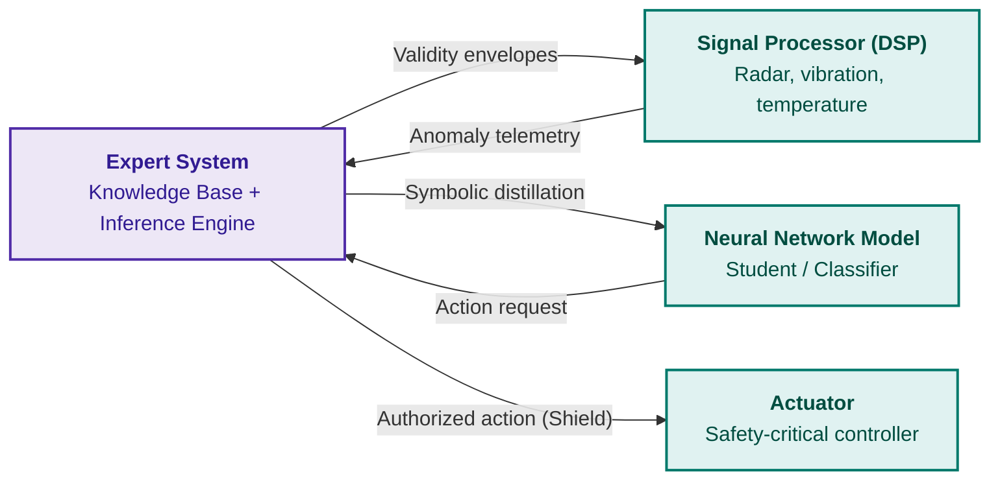
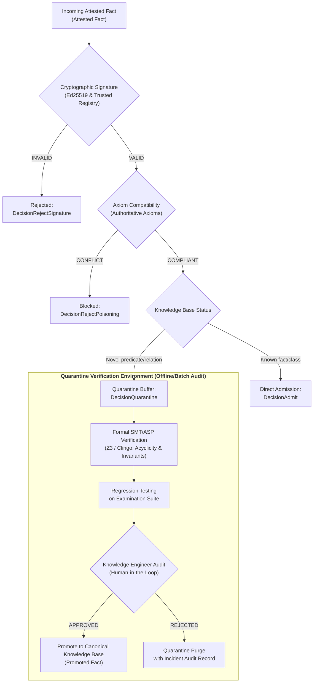

# Chapter 33. Inter-System Knowledge Exchange: Rule Provisioning to External Systems, Model Teaching, and Secure Feedback Loops

> **Book:** [Architecture of Evidence-Governed Expert Systems](README.md) · [Part VII: Reactive Execution, Inter-System Knowledge Exchange, and Distributed SOA](part-07-runtime-and-knowledge-exchange.md)  
> **Previous Chapter:** [Chapter 35. Reactive Expert Systems: Events, Retraction, and Knowledge Adaptation](ch35-self-organizing-expert-systems-synergetics-and-npu-runtime.md)  
> **Next Chapter:** [Chapter 40. Distributed Architecture of Evidence-Governed Expert Systems: Epistemic SOA, Semantic Routing, Memory Hierarchy, and Multi-Source Defeasible Arbitration](ch40-distributed-epistemic-architectures-soa-and-cluster-scaling.md)  
> **Table of Contents:** [README.md](README.md)  
> **Author:** [Mykola Fedchyk](about-the-author.md)  
> **Target Level:** Advanced: Systems Architects, Knowledge Engineers, Developers of Distributed Systems and Embedded Computing Units  
> **Expected Learning Outcomes:** Design expert system knowledge provisioning interfaces for external consumers; translate logical invariants into numeric validity envelopes for digital signal processors and computer vision; organize symbolic distillation of rules into neural network models using semantic loss functions; deploy formal safety shields for reinforcement learning agents; select knowledge exchange formats (JSON-LD, SHACL shapes, signed packs); configure NATS brokers and gRPC services for asynchronous and low-latency fact exchange; enforce access control across a security level lattice and generate Merkle inclusion proofs; protect the knowledge base against poisoning via cryptographic attestation and admission gates; collect counterexample telemetry from edge systems to formulate examination candidates for retraining.

---

## Abstract

Consider an autonomous strike or reconnaissance drone swarm or an automated manufacturing plant (DefTech, IEC 61508 / ISO 26262). A computer vision (CV) neural network classifier identifies an object silhouette and transmits vector coordinates to an aiming actuator or robotic manipulator. If the neural network lacks a deterministic formal safety shield (*Safety Shield*), an optical perturbation or adversarial patch attack may trigger a hallucination, causing targeting of friendly or civilian infrastructure. Conversely, if field communication links transmit telemetry without cryptographic attestation (Ed25519 signatures and Merkle trees), an adversary can compromise the knowledge base through counterexample injection, crippling the entire operational mission. An expert system can no longer remain an isolated advisory tool for human operators: it must function as a real-time runtime supervisor.

This chapter examines the engineering architecture of inter-system knowledge exchange, in which the expert system simultaneously serves as a source of verified normative rules, a formal teacher for external models, and a secure receiver of external operational experience. First, the chapter defines the core systemic roles of an expert system within a heterogeneous computing environment: a normative oracle, a safety shield for neural network agents, and a verified curriculum generator. Next, it details the translation of predicate constraints into numeric validity envelopes for digital signal processors (DSPs), symbolic knowledge distillation into neural networks via semantic loss functions, and low-latency exchange protocols (NATS, gRPC, JSON-LD, SHACL). Finally, it presents defense mechanisms against knowledge poisoning, lattice-based mandatory access control, and a production-ready attestation module implemented in Go.

---

## 1. The Expert System as a Knowledge Supplier and Teacher to External Systems

Traditional knowledge engineering viewed the expert system primarily as an end-user advisor for human operators: an operator enters facts through an interactive interface, the inference engine evaluates rules, and the explanation facility returns textual justification. In cyber-physical systems, robotic platforms, and distributed command-and-control centers, the consumer of inference verdicts is increasingly another software subsystem: a trajectory planning algorithm, an actuator microcontroller, or a data preparation pipeline for deep neural network training.

Direct transmission of unstructured data between such subsystems creates severe semantic context disconnects. If a signal processor feeds raw numeric arrays to a neural network without encoding physical invariants, the model risks learning spurious statistical correlations. Conversely, if an external model issues control commands without verification by a normative oracle, operational safety boundaries are easily breached. An expert system resolves this disconnect by fulfilling three interrelated architectural roles:

1. **Normative Oracle (Normative Oracle):** The expert system provides external components with unambiguous admissibility verdicts, evaluating current system states against industrial standards, safety invariants, and regulatory constraints ([Chapter 21](ch21-from-recommendation-to-action.md)).
2. **Formal Supervisor or Safety Shield (Safety Shield):** Prior to issuing actuation commands to hardware effectors, the expert system intercepts actions generated by external controllers or neural network agents, blocking unsafe state transitions under strict Fail-Closed semantics ([Chapter 28](ch28-dual-mode-expert-systems.md)).
3. **Verified Curriculum Generator (Curriculum Generator):** The expert system synthesizes training datasets for external machine learning models, labeling data with formal proofs and guaranteeing the absence of logical contradictions within training corpuses.



---

## 2. Supplying Knowledge to Physical Signal and Sensor Processors

Physical sensors (radars, lidars, vibration transducers, spectrometers, thermal imaging arrays) generate continuous streams of numeric measurements. Digital signal processors (DSPs) and computer vision (CV) modules transform these raw signals into time series, depth maps, and feature vectors. However, signal processors operate strictly on statistical and spectral properties (fast Fourier transforms, wavelet decompositions, covariance matrices) and lack domain-level contextual knowledge. They cannot deduce that a gearbox temperature cannot physically jump by forty degrees within two milliseconds, or that a drop in reflected pulse amplitude at a specific carrier frequency stems from atmospheric pressure changes rather than emitter degradation.

### 2.1. Translating Logical Norms into Numeric Validity Envelopes

The expert system translates declarative ontological axioms into rigorous numeric filtering boundaries known as **validity envelopes**. A validity envelope defines a hypervolume within the measurement space inside which a signal is deemed physically plausible:

```math
\mathcal{E}_s = \left\{ y(t) \in \mathbb{R}^d \;\middle|\; y_{\min} \le y(t) \le y_{\max} \;\land\; \left\|\frac{dy}{dt}\right\| \le \Delta_{\max} \;\land\; \Phi(y(t), x_{\text{state}}) = 1 \right\}
```

where $`y_{\min}`$ and $`y_{\max}`$ establish stationary sensor range bounds, $`\Delta_{\max}`$ limits the physically allowable slew rate of the process, and $`\Phi`$ represents a boolean predicate expressing contextual consistency with the current machine operating mode $`x_{\text{state}}`$, as defined in [Chapter 22](ch22-cybernetics-edge-to-backend.md).

When the expert system exports a validity envelope to a signal processor or Kalman filter, it configures innovation gating thresholds based on the Mahalanobis distance formulation of Bar-Shalom et al. [[1]](#src-1):

```math
d_M^2(t) = \tilde{y}^T(t) S^{-1}(t) \tilde{y}(t) \le \gamma_{\text{threshold}}
```

**Parameters and Measurable Quantities:**
- $`\tilde{y}(t) = y(t) - \hat{y}(t|t-1) \in \mathbb{R}^d`$ — innovation vector (measurement prediction residual) of dimension $`d`$;
- $`S(t) \in \mathbb{S}_{++}^d`$ — symmetric positive-definite innovation covariance matrix of dimension $`d \times d`$;
- $`\gamma_{\text{threshold}} = \chi_d^2(1 - \alpha)`$ — chi-square distribution quantile with $`d`$ degrees of freedom for a design significance level $`\alpha`$ (e.g., $`\alpha = 0.01`$);
- $`d_M^2(t) \ge 0`$ — dimensionless squared Mahalanobis distance.

**Operational Transitions and Numerical Example:**
- If $`d_M^2(t) \le \gamma_{\text{threshold}}`$, the observation is deemed physically valid, and the Kalman filter updates the state estimate (`INNOVATION_ACCEPTED`);
- If $`d_M^2(t) > \gamma_{\text{threshold}}`$, the measurement is classified as an out-of-envelope anomaly (`INNOVATION_REJECTED`); the observation is discarded from state estimation, the filter retains its a priori prediction, and the runtime generates a sensor-path incident report;
- Worked numerical calculation: Consider a scalar oil pressure channel ($`d = 1`$). At significance level $`\alpha = 0.01`$, the critical threshold is $`\gamma_{\text{threshold}} = \chi_1^2(0.99) = 6.635`$. Let the predicted value be $`\hat{y} = 10.0\,\text{bar}`$, innovation variance $`S = 0.25\,\text{bar}^2`$ (standard deviation $`\sigma = 0.5\,\text{bar}`$), and the current sensor reading suddenly spikes to $`y = 11.6\,\text{bar}`$. The residual is $`\tilde{y} = 11.6 - 10.0 = 1.6\,\text{bar}`$.

```math
d_M^2 = \frac{(1.6\,\text{bar})^2}{0.25\,\text{bar}^2} = \frac{2.56}{0.25} = 10.24.
```

Because $`10.24 > 6.635`$, the innovation gate rejects the measurement (`INNOVATION_REJECTED`), preventing the Kalman filter from becoming corrupted by an abrupt pressure transient.

### 2.2. Predicate Rules for Interference Detection and Sensor Spoofing

Through its linkage with an engineering ontology, the expert system detects correlated multi-sensor anomalies that an individual sensor channel might evaluate as valid. For example, if satellite navigation indicates a ground speed of 120 km/h, but the inertial measurement unit records zero longitudinal acceleration and wheel odometry registers a stationary shaft, isolated compute units could fall victim to GNSS spoofing. The expert system enforces cross-sensor invariants:

```math
\forall t \quad \lvert v_{\text{GNSS}}(t) - v_{\text{odo}}(t) \rvert > \epsilon_v \implies \text{SpoofingSuspected}(\text{GNSS}, t) \land \text{DegradeWeight}(\text{GNSS}, 0)
```

**Parameters and Engineering Constraints:**
- $`v_{\text{GNSS}}(t), v_{\text{odo}}(t) \ge 0`$ — instantaneous longitudinal velocity estimates from the satellite navigation receiver and wheel odometry ($`\text{km/h}`$);
- $`\epsilon_v`$ — maximum permissible velocity discrepancy threshold (e.g., $`\epsilon_v = 15.0\,\text{km/h}`$).

**Operational Actions and Example:**
- If the satellite receiver reports $`v_{\text{GNSS}} = 120\,\text{km/h}`$ while the odometer reports $`v_{\text{odo}} = 5\,\text{km/h}`$, the module computes the discrepancy: $`\lvert 120 - 5 \rvert = 115\,\text{km/h} > 15\,\text{km/h}`$.
- The expert system immediately issues a directive to the signal processor dynamically zeroing the weight of the untrusted GNSS channel within the navigation fusion filter (`DegradeWeight(GNSS, 0)`), transitioning the navigation system into autonomous dead reckoning based on inertial data.

---

## 3. Teaching External Systems: Symbolic Distillation and Verified Curriculum

When the external system is a neural network classifier or controller, the expert system can serve as a formal teacher. Training neural networks directly on raw empirical datasets frequently leads to violations of fundamental physical or logical laws: computer vision may detect a traffic sign in a spatial position prohibited by scene geometry, or a power grid classifier might predict negative insulation resistance.

### 3.1. Symbolic Knowledge Distillation via Semantic Loss Functions

Symbolic knowledge distillation (Symbolic Knowledge Distillation) transfers logical inference rules directly into the parameter weights of an artificial neural network. This paradigm builds upon the posterior regularization framework of Hu et al. [[2]](#src-2), where the expert system generates a target probability distribution $`q(y|x)`$ satisfying a set of logical rules $`\mathcal{R} = \{(r_k, \lambda_k)\}`$ by minimizing Kullback-Leibler divergence relative to a base neural network $`p_\theta(y|x)`$:

```math
\min_{q} \text{KL}(q(y|x) \parallel p_\theta(y|x)) - \sum_{k} \lambda_k \mathbb{E}_{q}[\mathbf{1}_{r_k}(x, y)]
```

where $`\mathbf{1}_{r_k}(x, y)`$ evaluates to one if the pair $`(x, y)`$ satisfies rule $`r_k`$, and $`\lambda_k \ge 0`$ determines the regularization weight (hardness) of the rule. The closed-form solution to this optimization problem follows a Gibbs distribution:

```math
q^*(y|x) \propto p_\theta(y|x) \exp\left( \sum_k \lambda_k \mathbf{1}_{r_k}(x, y) \right)
```

The resulting distribution $`q^*(y|x)`$ serves as a set of soft labels for training the student network via cross-entropy loss.

For direct end-to-end differentiation of logical constraints, the architecture leverages the semantic loss formulation of Xu et al. [[3]](#src-3). When a formal rule is expressed as a propositional formula $`\alpha`$ over the classifier outputs, the semantic loss is defined as the negative log-likelihood of the formula's satisfaction:

```math
\mathcal{L}_{\text{semantic}}(\theta, \alpha) = -\log \sum_{y \models \alpha} \prod_{j: y_j = 1} p_\theta(\hat{y}_j = 1 \mid x) \prod_{j: y_j = 0} (1 - p_\theta(\hat{y}_j = 1 \mid x))
```

During error backpropagation, the gradient of the semantic loss penalizes network weights whenever predictions drift toward configurations that violate the expert system's logical invariants.

### 3.2. Formal Safety Shields (Shielding) in Agent Reinforcement Learning

In reinforcement learning (RL), an agent explores state space through trial and error. In safety-critical applications, unconstrained exploration can lead to physical equipment destruction or catastrophic transitions into forbidden failure states.

The expert system implements formal shielding based on the framework established by Alshiekh et al. [[4]](#src-4). The shield is synthesized from safety specifications expressed in Linear Temporal Logic (LTL). The expert system computes the set of safe actions in the current state, $`\mathcal{A}_{\text{safe}}(s_t) \subseteq \mathcal{A}`$. If the agent selects an action $`a_t \notin \mathcal{A}_{\text{safe}}(s_t)`$, the shield intercepts the command, substitutes the closest admissible safe action $`a_t' = \arg\min_{a \in \mathcal{A}_{\text{safe}}} \|a - a_t\|`$, and returns a penalty within the reward feedback signal. Consequently, the external system learns to optimize its objective strictly within the verified safety envelope.

---

## 4. Formats, Modalities, and Technologies for Inter-System Knowledge Exchange

Transmitting knowledge between disparate computer systems requires protocols and data formats that guarantee unambiguous structural interpretation, preserve semantic provenance, and introduce minimal serialization overhead.

| Requirement | Recommended Format / Technology | Architectural Rationale |
|---|---|---|
| Semantic graph interoperability | JSON-LD 1.1 [[5]](#src-5) | Binds local assertion keys to global ontology IRIs without sacrificing human readability |
| Structural constraint validation | SHACL W3C [[6]](#src-6) | Declaratively specifies mandatory attributes, value ranges, and relationship cardinalities |
| Predicate rules and inference | RIF / RuleML | Standardized interchange syntax for expressing first-order logic rules |
| Enterprise data bus messaging | NATS JetStream per Eugster et al. [[7]](#src-7) | Asynchronous messaging broker supporting subject-based filtering, stream persistence, and at-least-once delivery |
| Low-latency point checks | gRPC over HTTP/2 and Protobuf | Synchronous action validation requests and envelope retrieval with latencies under 1 microsecond |
| Immutable knowledge distribution | ZNAV-INDEX / mmap ([Chapter 32](ch32-high-performance-knowledge-packs-mmap-and-harvesting.md)) | Zero-deserialization batch distribution of knowledge base updates for embedded compute nodes |

### 4.1. Semantic Message Contract Based on JSON-LD

The following listing illustrates an export payload where an expert system transmits a verified sensor validity envelope to a subordinate digital signal processor over the messaging broker:

<details>
<summary>Example of a JSON-LD semantic message for exporting a validity envelope</summary>

```json
{
  "@context": {
    "es": "https://standards.iso.org/iso/26262/ontology#",
    "xsd": "http://www.w3.org/2001/XMLSchema#"
  },
  "@id": "urn:es:envelope:motor_current:gen42",
  "@type": "es:SensorValidityEnvelope",
  "es:signalName": "motor_phase_u_current",
  "es:unit": "amperes",
  "es:minValue": { "@type": "xsd:double", "@value": -50.0 },
  "es:maxValue": { "@type": "xsd:double", "@value": 50.0 },
  "es:maxSlewRate": { "@type": "xsd:double", "@value": 1500.0 },
  "es:provenance": {
    "es:derivedFromStandard": "ISO-26262-Part-4",
    "es:ruleHash": "9e1c5f8b4a2e3d7c",
    "es:certifiedGeneration": "gen-2026-10-04-v1"
  }
}
```

</details>

### 4.2. Subject-Based Routing in NATS JetStream

The NATS broker utilizes hierarchical text subjects, enabling precise targeting of knowledge flows across functional domains, safety boundaries, and recipient classes:

- `knowledge.export.dsp.envelopes.<subsystem>`: Publication of validity envelopes destined for signal processors of a designated subsystem;
- `knowledge.export.models.distillation.<domain>`: Distribution of training corpuses and soft labels for external models;
- `knowledge.feedback.telemetry.anomalies.<sensor_id>`: Ingestion of out-of-envelope anomaly telemetry reports;
- `knowledge.control.quarantine.admission`: Coordination channel for the candidate fact admission gate.

Supported by message persistence, JetStream ensures that an edge node experiencing transient network partition ([Chapter 22](ch22-cybernetics-edge-to-backend.md)) replays and ingests all pending updates upon reconnection without loss of ordering.

---

## 5. Semantics Preservation Conditions, Rules, and Ontological Alignment

When knowledge traverses independently engineered systems, semantic corruption presents a severe risk: a predicate within an originating ontology may possess broader or narrower semantics in the consuming system.

### 5.1. Conservative Extensions and Module Locality

Following modular ontology theory formulated by Cuenca Grau et al. [[8]](#src-8), exporting a knowledge fragment $`\mathcal{M}`$ from a source ontology $`\mathcal{O}_1`$ to a target system $`\mathcal{O}_2`$ is sound if and only if $`\mathcal{M}`$ constitutes a **conservative extension** with respect to the designated signature $`\Sigma`$:

```math
\mathcal{O}_1 \models \psi \iff \mathcal{M} \models \psi \quad \text{for all formulas } \psi \text{ over signature } \Sigma
```

This guarantees two fundamental invariants:
1. **Import Safety:** Importing the module does not alter relationships among internal concepts within the target ontology that lie outside the shared signature $`\Sigma`$.
2. **Deductive Completeness:** All entailments over the signature $`\Sigma`$ derivable from the complete source ontology $`\mathcal{O}_1`$ remain fully derivable exclusively from the exported module $`\mathcal{M}`$ without loading the entire knowledge base.

### 5.2. Semantic Type Preservation Rules

Implicit widening or narrowing of data types during knowledge transformation is strictly prohibited:
- **Prohibition of Modal Precision Loss:** If a source assertion is formulated as a deontic advisory `SHOULD`, it must not be converted into an unconditional prohibition `MUST NOT` in an external protocol without explicit review by a knowledge engineer ([Chapter 14](ch14-requirements-detection-and-formalization.md)).
- **Partial Closed World Assumption Isolation (PCWA):** Assertions derived under local domain closure assumptions ([Chapter 07](ch07-knowledge-base-typology.md)) must be tagged with an explicit completeness flag `scope: closed`. The external system is prohibited from applying Negation-as-Failure (NAF) to facts originating from open domains (`scope: open`).

---

## 6. Access Control and Knowledge Security: Security Lattice and Selective Disclosure

In complex engineering and defense programs, a knowledge base contains assertions governed by disparate classification levels, proprietary IP rights, and export control regulations. The expert system must prevent unauthorized disclosure of sensitive knowledge to external systems possessing lower clearance.

### 6.1. Multi-Level Security Based on the Denning Information Flow Lattice

Access control is formalized using Denning's information flow lattice [[9]](#src-9) combined with the Bell-LaPadula model [[10]](#src-10). The set of security labels forms a partially ordered lattice $`(\mathcal{L}, \le, \sqcap, \sqcup)`$:

```math
\mathcal{L} = \mathcal{C} \times 2^{\mathcal{K}}
```

where $`\mathcal{C} = \{\text{Public} < \text{Internal} < \text{Restricted} < \text{Critical}\}`$ defines a linear hierarchy of classification levels, and $`\mathcal{K}`$ denotes the set of categorical compartments (e.g., project-specific or consortium-specific identifiers).

A subject label $`L_s = (c_s, K_s)`$ dominates an object knowledge label $`L_o = (c_o, K_o)`$ if and only if:

```math
L_s \ge L_o \iff (c_s \ge c_o) \land (K_o \subseteq K_s)
```

**Parameters and Lattice Conditions:**
- $`c_s, c_o \in \mathcal{C}`$ — classification levels of subject and object within the ordered set $`\text{Public} < \text{Internal} < \text{Restricted} < \text{Critical}`$;
- $`K_s, K_o \subseteq \mathcal{K}`$ — sets of categorical access compartments;
- $`L_s = (c_s, K_s), L_o = (c_o, K_o)`$ — composite security labels.

**Secure Export Rule and Worked Numerical Example:**
- A fact $`f`$ tagged with label $`L_o = L(f)`$ is transmitted to an external system possessing clearance $`L_s = L_{\text{recipient}}`$ if and only if the recipient's clearance dominates the fact label: $`L_s \ge L_o`$.
- If $`L_s \not\ge L_o`$, the export gateway rejects the transmission with status `REJECT_CLEARANCE_VIOLATION`.
- Practical example: Consider an external diagnostic system with clearance $`L_s = (\text{Internal}, \{\text{Avionics}, \text{Telemetry}\})`$. The knowledge base contains an operational fact $`f_1`$ with label $`L(f_1) = (\text{Internal}, \{\text{Telemetry}\})`$ and a critical calibration rule $`f_2`$ labeled $`L(f_2) = (\text{Restricted}, \{\text{Avionics}\})`$.
  - For $`f_1`$: $`c_s = \text{Internal} \ge c_o = \text{Internal}`$ and $`K_o = \{\text{Telemetry}\} \subseteq K_s`$, hence $`L_s \ge L(f_1)`$ → export permitted (`EXPORT_PERMITTED`);
  - For $`f_2`$: $`c_s = \text{Internal} < c_o = \text{Restricted}`$, hence $`L_s \not\ge L(f_2)`$ → the fact is deterministically blocked at the gate (`EXPORT_DENIED`).

### 6.2. Selective Disclosure of Proofs via Merkle Trees

When an external auditing system requires proof that a specific requirement or test case belongs to an approved knowledge base release, disclosing the entire repository could expose proprietary firmware internals or confidential topologies.

To resolve this challenge, the expert system employs cryptographic Merkle trees [[11]](#src-11). The root hash $`R_{\text{Merkle}}`$ is published in the open release certificate ([Chapter 32](ch32-high-performance-knowledge-packs-mmap-and-harvesting.md)). To prove the presence of an isolated fact $`f_i`$ having hash $`H(f_i)`$, the expert system generates a compact authentication path of length $`O(\log N)`$, known as a **Merkle inclusion proof**:

```math
\pi(f_i) = \langle h_1, h_2, \dots, h_{\lceil \log_2 N \rceil} \rangle
```

The external system independently computes the hash aggregation:

```math
H(\dots H(H(f_i), h_1) \dots) = R_{\text{Merkle}}
```

**Parameters and Numerical Verification Example:**
- $`N`$ — total number of immutable facts recorded in the ZKP4 knowledge pack;
- $`H(f_i)`$ — SHA-256 cryptographic hash of the target fact $`f_i`$;
- $`\lceil \log_2 N \rceil`$ — length of the Merkle inclusion proof path;
- $`R_{\text{Merkle}}`$ — tree root hash attested in the public release certificate.
- If the recomputed hash strictly matches $`R_{\text{Merkle}}`$, the fact is accepted as authentic (`PROOF_VALID`); if the result differs by even a single bit, the transaction is rejected (`PROOF_INVALID`).
- Numerical dimensioning: For a knowledge base containing $`N = 1024`$ facts, the proof path length is $`\lceil \log_2 1024 \rceil = 10`$ intermediate 32-byte hashes (a total proof payload of only $`320\,\text{bytes}`$ instead of transferring the entire $`32\,\text{KB}`$ database). Evaluating this hash sequence on an ARM Cortex-A72 processor executes in under $`12\,\mu\text{s}`$, enabling real-time fact authentication.

---

## 7. Fact Attestation and Defense Against Knowledge Poisoning

Ingesting observations, test outcomes, or rules from external sources exposes an expert system to the danger of **knowledge poisoning**. An adversarial actor or a compromised sensor node could inject corrupted propositions (for instance, asserting that a critical temperature limit is 500 °C rather than 100 °C, or that an emergency valve must remain closed during an overpressure event), paralyzing or subverting subsequent logical inference.

### 7.1. Cryptographic Fact Attestation via Ed25519

Every exported fact is authenticated using an Ed25519 digital signature generated by the source system, per Bernstein et al. [[12]](#src-12). An attested fact structure encapsulates the canonical proposition payload, source identifier, and cryptographic signature:

```math
\sigma = \mathrm{Ed25519}_{\mathrm{Sign}}\bigl(SK_{\mathrm{source}}, \mathrm{SHA256}(s \parallel p \parallel o \parallel \mathrm{level} \parallel \mathrm{source\_id})\bigr)
```

Signature verification guarantees data integrity and non-repudiation in alignment with in-toto supply chain principles established by Torres-Arias et al. [[13]](#src-13).

### 7.2. Threat Taxonomy: Attack Vectors of Knowledge Poisoning

Knowledge base poisoning in evidence-governed systems manifests across four primary attack vectors:

#### 7.2.1. Axiom Inversion / Overwrite
An attacking node (even possessing a valid access credential) transmits an assertion directly contradicting fundamental physical laws or safety invariants:

```math
\mathrm{Attestation}: \langle \texttt{emergency\_brake}, \texttt{status\_on\_failure}, \texttt{DISABLED} \rangle
```

Objective: Disabling fail-safe interlocks during critical mission phases.

#### 7.2.2. Stealth Semantic Drift
The attack operates incrementally over extended durations: subtle micro-deltas of numeric thresholds or tolerances are submitted every second (e.g., shifting maximum current limits by $`+0.1\%`$ per reading). Individually, each observation passes local outlier filters, but cumulative drift pushes the system beyond safe operational envelopes.

#### 7.2.3. Cyclic Denial-of-Reasoning
Injecting cyclic interdependencies among novel predicates:

```math
P_1(x) \leftarrow P_2(x), \quad P_2(x) \leftarrow P_3(x), \quad P_3(x) \leftarrow P_1(x)
```

This induces exponential combinatorial explosion or non-termination during resolution refutation or least fixed-point evaluation.

#### 7.2.4. Sybil Consensus Poisoning
Compromising a pool of edge sensor nodes to coordinate the simultaneous transmission of fabricated counterexamples, artificially exceeding the threshold $`N_{\text{threshold}}`$ and forcing the system to misclassify synthetic anomalies as genuine physical environment shifts.

### 7.3. Admission Control Gate and Knowledge Quarantine Lifecycle

To mitigate these threats, the Admission Controller enforces a rigorous multi-stage **Knowledge Quarantine Lifecycle**:



1. **Cryptographic Validation:** The fact is rejected (`DecisionRejectSignature`) if the source public key is absent from the trusted registry or the signature fails digest verification.
2. **Axiom Contradiction Check:** The fact is rejected immediately (`DecisionRejectPoisoning`) if its predicate contradicts established core safety axioms.
3. **Quarantine Buffer:** Syntactically valid facts introducing previously unencountered predicates or structural relationships are blocked from direct admission into the active inference space. Instead, they are quarantined in an isolated candidate buffer (`DecisionQuarantine`), where they undergo regression testing and formal verification using SMT/ASP solvers (Z3, Clingo) ([Chapter 23](ch23-knowledge-base-verification.md)) to prove cycle freedom, consistency, and invariant preservation before promotion.

---

## 8. Feedback Loop and Expert System Retraining

System interaction operates as a bidirectional closed loop. As subordinate subsystems (DSPs, computer vision pipelines, autonomous agents) interact with physical reality, they encounter **corner cases**: unprecedented meteorological combinations, anomalous vibration harmonics under novel operational regimes, or non-standard protocol responses from network hardware.

### 8.1. Counterexample Queue and Incident Aggregation

When an external processor records an out-of-envelope signal excursion or a neural network reports elevated classification entropy, a structured anomaly incident report is dispatched to the Feedback Queue.

The feedback collector aggregates these telemetry reports. An isolated transient excursion may stem from temporary physical sensor noise and does not warrant rule revisions. However, when the volume of homogeneous counterexamples for a specific signal surpasses the statistical threshold $`N_{\text{threshold}}`$, the collector flags the pattern as a sustained anomaly indicating genuine environmental shifts.

### 8.2. Powering the Continual Learning Cycle

Accumulated, verified counterexamples serve as direct input into:
- Expansion of the examination test suite detailed in [Chapter 25](ch25-how-expert-systems-learn.md): Novel counterexamples are integrated into mandatory negative or boundary tests, creating updated difficulty tiers.
- Systematic drift detection algorithms from [Chapter 26](ch26-continual-learning.md): Telemetry streams are analyzed using cumulative sum (CUSUM) statistical tests to provide early warning of sensor degradation or operating point displacement.
- Recalibration of validity envelopes: Knowledge engineers or automated optimizers formulate revised bounds $`\mathcal{E}_s'`$, which undergo exhaustive regression testing prior to the release of a new knowledge pack generation.

---

## 9. Software Implementation in Go: The xchange Module

The following section presents a production-grade implementation of the inter-system knowledge exchange core written in Go. The `xchange` package demonstrates:
1. Knowledge export filtered by access lattice clearance and secured with Ed25519 digital signatures.
2. An admission control gate with defense against knowledge poisoning (signature verification and axiomatic conflict detection).
3. Numeric signal validation using sensory envelopes.
4. Closed-loop feedback: An anomaly collector with configurable threshold triggers for initiating retraining cycles.

The implementation relies strictly on the Go standard library (`crypto/ed25519`, `crypto/sha256`, `sync`, `math`) without external dependencies.

<details>
<summary>Source code of the xchange module (Go): xchange.go</summary>

```go
package xchange

import (
	"crypto/ed25519"
	"crypto/sha256"
	"encoding/hex"
	"errors"
	"fmt"
	"math"
	"sync"
	"time"
)

// SecurityLevel represents the classification level within the access lattice.
type SecurityLevel int

const (
	LevelPublic SecurityLevel = iota
	LevelInternal
	LevelRestricted
	LevelCritical
)

// Dominates checks the information flow condition in the security lattice (L_sub >= L_obj).
func (l SecurityLevel) Dominates(other SecurityLevel) bool {
	return l >= other
}

// Fact describes an atomic engineering assertion.
type Fact struct {
	Subject   string        `json:"subject"`
	Predicate string        `json:"predicate"`
	Object    string        `json:"object"`
	Level     SecurityLevel `json:"level"`
	SourceID  string        `json:"source_id"`
}

// Digest computes the canonical cryptographic SHA-256 hash for the fact.
func (f Fact) Digest() [32]byte {
	h := sha256.New()
	fmt.Fprintf(h, "%s|%s|%s|%d|%s", f.Subject, f.Predicate, f.Object, f.Level, f.SourceID)
	var d [32]byte
	copy(d[:], h.Sum(nil))
	return d
}

// AttestedFact pairs a fact with the cryptographic digital signature of the supplying system.
type AttestedFact struct {
	Fact      Fact   `json:"fact"`
	Signature string `json:"signature"`
}

// SignalEnvelope translates a symbolic norm of the expert system into validation boundaries for DSPs and sensors.
type SignalEnvelope struct {
	SignalName string  `json:"signal_name"`
	MinValue   float64 `json:"min_value"`
	MaxValue   float64 `json:"max_value"`
	MaxDelta   float64 `json:"max_delta"`
}

// ValidateSample checks the physical plausibility of a new sample against range limits and rate-of-change boundaries.
func (e SignalEnvelope) ValidateSample(prevVal, curVal float64) error {
	if curVal < e.MinValue || curVal > e.MaxValue {
		return fmt.Errorf("signal %s value %.3f out of range [%.3f, %.3f]", e.SignalName, curVal, e.MinValue, e.MaxValue)
	}
	if e.MaxDelta > 0 && prevVal != 0 {
		diff := math.Abs(curVal - prevVal)
		if diff > e.MaxDelta {
			return fmt.Errorf("signal %s jump %.3f exceeds max delta %.3f", e.SignalName, diff, e.MaxDelta)
		}
	}
	return nil
}

// KnowledgeExporter exports knowledge to external systems filtered by recipient clearance and signed.
type KnowledgeExporter struct {
	SystemID   string
	PrivateKey ed25519.PrivateKey
	PublicKey  ed25519.PublicKey
}

// NewKnowledgeExporter creates a knowledge exporter with a newly generated Ed25519 key pair.
func NewKnowledgeExporter(systemID string) (*KnowledgeExporter, error) {
	pub, priv, err := ed25519.GenerateKey(nil)
	if err != nil {
		return nil, err
	}
	return &KnowledgeExporter{
		SystemID:   systemID,
		PrivateKey: priv,
		PublicKey:  pub,
	}, nil
}

// Export filters facts according to recipient clearance and signs authorized assertions.
func (e *KnowledgeExporter) Export(facts []Fact, recipientClearance SecurityLevel) []AttestedFact {
	var out []AttestedFact
	for _, f := range facts {
		if !recipientClearance.Dominates(f.Level) {
			continue
		}
		f.SourceID = e.SystemID
		digest := f.Digest()
		sig := ed25519.Sign(e.PrivateKey, digest[:])
		out = append(out, AttestedFact{
			Fact:      f,
			Signature: hex.EncodeToString(sig),
		})
	}
	return out
}

// AdmissionDecision specifies the verification verdict of the admission controller.
type AdmissionDecision int

const (
	DecisionAdmit AdmissionDecision = iota
	DecisionRejectSignature
	DecisionRejectPoisoning
	DecisionQuarantine
)

// AdmissionController verifies incoming facts for authenticity and defends against knowledge poisoning.
type AdmissionController struct {
	mu          sync.RWMutex
	trustedKeys map[string]ed25519.PublicKey
	axioms      map[string]string
	knownPreds  map[string]bool
	quarantine  map[string]AttestedFact
}

// NewAdmissionController initializes an admission control gate.
func NewAdmissionController() *AdmissionController {
	return &AdmissionController{
		trustedKeys: make(map[string]ed25519.PublicKey),
		axioms:      make(map[string]string),
		knownPreds:  make(map[string]bool),
		quarantine:  make(map[string]AttestedFact),
	}
}

// RegisterTrustedSource registers the public key of a trusted knowledge supplier.
func (ac *AdmissionController) RegisterTrustedSource(sourceID string, pub ed25519.PublicKey) {
	ac.mu.Lock()
	defer ac.mu.Unlock()
	ac.trustedKeys[sourceID] = pub
}

// RegisterKnownPredicate registers a verified, safe predicate from the base ontology.
func (ac *AdmissionController) RegisterKnownPredicate(predicate string) {
	ac.mu.Lock()
	defer ac.mu.Unlock()
	ac.knownPreds[predicate] = true
}

// SetAuthoritativeAxiom registers an immutable invariant whose refutation is flagged as knowledge poisoning.
func (ac *AdmissionController) SetAuthoritativeAxiom(subject, predicate, object string) {
	ac.mu.Lock()
	defer ac.mu.Unlock()
	key := subject + "#" + predicate
	ac.axioms[key] = object
	ac.knownPreds[predicate] = true
}

// Ingest executes fact attestation: signature check, axiom compatibility validation, and quarantine routing.
func (ac *AdmissionController) Ingest(af AttestedFact) AdmissionDecision {
	ac.mu.Lock()
	defer ac.mu.Unlock()

	pub, ok := ac.trustedKeys[af.Fact.SourceID]
	if !ok {
		return DecisionRejectSignature
	}

	sigBytes, err := hex.DecodeString(af.Signature)
	if err != nil || len(sigBytes) != ed25519.SignatureSize {
		return DecisionRejectSignature
	}

	digest := af.Fact.Digest()
	if !ed25519.Verify(pub, digest[:], sigBytes) {
		return DecisionRejectSignature
	}

	key := af.Fact.Subject + "#" + af.Fact.Predicate
	if existing, hasAxiom := ac.axioms[key]; hasAxiom {
		if existing != af.Fact.Object {
			return DecisionRejectPoisoning
		}
	}

	// Route to quarantine if the predicate has not been previously attested
	if !ac.knownPreds[af.Fact.Predicate] {
		ac.quarantine[key] = af
		return DecisionQuarantine
	}

	return DecisionAdmit
}

// PromoteFromQuarantine elevates an SMT/ASP-verified fact to promoted status.
func (ac *AdmissionController) PromoteFromQuarantine(key string) (AttestedFact, bool) {
	ac.mu.Lock()
	defer ac.mu.Unlock()
	af, ok := ac.quarantine[key]
	if !ok {
		return AttestedFact{}, false
	}
	delete(ac.quarantine, key)
	ac.knownPreds[af.Fact.Predicate] = true
	return af, true
}

// AnomalyReport records an edge case or validity envelope breach reported by an external processor.
type AnomalyReport struct {
	ConsumerID  string    `json:"consumer_id"`
	SignalName  string    `json:"signal_name"`
	ObservedVal float64   `json:"observed_val"`
	Detail      string    `json:"detail"`
	ReportedAt  time.Time `json:"reported_at"`
}

// FeedbackCollector aggregates feedback telemetry from subordinate systems and surfaces retraining candidates.
type FeedbackCollector struct {
	mu        sync.Mutex
	threshold int
	incidents map[string][]AnomalyReport
}

// NewFeedbackCollector initializes a feedback collector with a triggering count threshold.
func NewFeedbackCollector(threshold int) *FeedbackCollector {
	return &FeedbackCollector{
		threshold: threshold,
		incidents: make(map[string][]AnomalyReport),
	}
}

// Record registers a new anomaly report and returns true if sufficient evidence has accumulated to trigger retraining.
func (fc *FeedbackCollector) Record(rep AnomalyReport) (bool, error) {
	if rep.SignalName == "" {
		return false, errors.New("empty signal name in report")
	}
	fc.mu.Lock()
	defer fc.mu.Unlock()

	fc.incidents[rep.SignalName] = append(fc.incidents[rep.SignalName], rep)
	if len(fc.incidents[rep.SignalName]) >= fc.threshold {
		return true, nil
	}
	return false, nil
}

// IncidentCount returns the total number of accumulated anomaly reports for a specific signal.
func (fc *FeedbackCollector) IncidentCount(signalName string) int {
	fc.mu.Lock()
	defer fc.mu.Unlock()
	return len(fc.incidents[signalName])
}
```

</details>

<details>
<summary>Unit tests (Go): xchange_test.go</summary>

```go
package xchange

import (
	"testing"
	"time"
)

func TestExportAndAccessControl(t *testing.T) {
	exp, err := NewKnowledgeExporter("es-primary-node")
	if err != nil {
		t.Fatalf("NewKnowledgeExporter failed: %v", err)
	}

	facts := []Fact{
		{Subject: "motor_current", Predicate: "max_amps", Object: "25.0", Level: LevelPublic},
		{Subject: "motor_firmware", Predicate: "signing_key", Object: "sec-key-99", Level: LevelRestricted},
	}

	// Recipient with Public clearance receives only the public fact
	publicAttested := exp.Export(facts, LevelPublic)
	if len(publicAttested) != 1 {
		t.Fatalf("expected 1 fact for public clearance, got %d", len(publicAttested))
	}
	if publicAttested[0].Fact.Subject != "motor_current" {
		t.Errorf("unexpected subject: %s", publicAttested[0].Fact.Subject)
	}

	// Recipient with Restricted clearance receives both facts
	restrictedAttested := exp.Export(facts, LevelRestricted)
	if len(restrictedAttested) != 2 {
		t.Fatalf("expected 2 facts for restricted clearance, got %d", len(restrictedAttested))
	}
}

func TestAdmissionAndPoisoningDefense(t *testing.T) {
	exp, err := NewKnowledgeExporter("es-primary-node")
	if err != nil {
		t.Fatalf("NewKnowledgeExporter failed: %v", err)
	}

	ac := NewAdmissionController()
	ac.RegisterTrustedSource("es-primary-node", exp.PublicKey)
	ac.RegisterKnownPredicate("nominal_celsius")
	ac.SetAuthoritativeAxiom("safety_valve", "state_at_overpressure", "OPEN")

	facts := []Fact{
		{Subject: "coolant_temp", Predicate: "nominal_celsius", Object: "85.0", Level: LevelPublic},
	}
	attested := exp.Export(facts, LevelPublic)
	if len(attested) != 1 {
		t.Fatalf("expected 1 attested fact, got %d", len(attested))
	}

	// 1. Successful admission of a valid fact with a known predicate
	if dec := ac.Ingest(attested[0]); dec != DecisionAdmit {
		t.Errorf("expected DecisionAdmit, got %v", dec)
	}

	// 2. Tampered content (invalid signature)
	tampered := attested[0]
	tampered.Fact.Object = "120.0"
	if dec := ac.Ingest(tampered); dec != DecisionRejectSignature {
		t.Errorf("expected DecisionRejectSignature for tampered fact, got %v", dec)
	}

	// 3. Knowledge poisoning attempt: validly signed fact contradicts an authoritative axiom
	poisoningFact := []Fact{
		{Subject: "safety_valve", Predicate: "state_at_overpressure", Object: "CLOSED", Level: LevelPublic},
	}
	attestedPoison := exp.Export(poisoningFact, LevelPublic)
	if dec := ac.Ingest(attestedPoison[0]); dec != DecisionRejectPoisoning {
		t.Errorf("expected DecisionRejectPoisoning, got %v", dec)
	}

	// 4. Novel unknown predicate is directed to quarantine
	candidateFact := []Fact{
		{Subject: "coolant_pump", Predicate: "experimental_flow_rate", Object: "42.0", Level: LevelPublic},
	}
	attestedCandidate := exp.Export(candidateFact, LevelPublic)
	if dec := ac.Ingest(attestedCandidate[0]); dec != DecisionQuarantine {
		t.Errorf("expected DecisionQuarantine for novel predicate, got %v", dec)
	}

	// 5. Promotion from quarantine following successful verification
	promoted, ok := ac.PromoteFromQuarantine("coolant_pump#experimental_flow_rate")
	if !ok || promoted.Fact.Object != "42.0" {
		t.Errorf("failed to promote fact from quarantine")
	}
	// Once promoted, the predicate becomes known and is admitted directly
	if dec := ac.Ingest(attestedCandidate[0]); dec != DecisionAdmit {
		t.Errorf("expected DecisionAdmit after promotion, got %v", dec)
	}
}

func TestSignalEnvelopeValidation(t *testing.T) {
	env := SignalEnvelope{
		SignalName: "accelerometer_z",
		MinValue:   -20.0,
		MaxValue:   20.0,
		MaxDelta:   5.0,
	}

	// Normal sample within envelope
	if err := env.ValidateSample(9.8, 10.5); err != nil {
		t.Errorf("expected sample in envelope, got err: %v", err)
	}

	// Out-of-bounds range violation
	if err := env.ValidateSample(10.0, 25.4); err == nil {
		t.Error("expected error for range overshoot, got nil")
	}

	// Unallowable sudden step change within a single tick
	if err := env.ValidateSample(5.0, 12.0); err == nil {
		t.Error("expected error for sudden jump exceeding max delta, got nil")
	}
}

func TestFeedbackCollectorThreshold(t *testing.T) {
	fc := NewFeedbackCollector(3)

	for i := 1; i <= 2; i++ {
		triggered, err := fc.Record(AnomalyReport{
			ConsumerID:  "dsp-radar-node",
			SignalName:  "radar_doppler",
			ObservedVal: 154.2,
			Detail:      "envelope violation",
			ReportedAt:  time.Now(),
		})
		if err != nil {
			t.Fatalf("unexpected error: %v", err)
		}
		if triggered {
			t.Errorf("threshold should not trigger at count %d", i)
		}
	}

	// Third incident reaches threshold
	triggered, err := fc.Record(AnomalyReport{
		ConsumerID:  "dsp-radar-node",
		SignalName:  "radar_doppler",
		ObservedVal: 155.0,
		Detail:      "envelope violation",
		ReportedAt:  time.Now(),
	})
	if err != nil {
		t.Fatalf("unexpected error: %v", err)
	}
	if !triggered {
		t.Error("expected threshold trigger on 3rd report")
	}
	if cnt := fc.IncidentCount("radar_doppler"); cnt != 3 {
		t.Errorf("expected 3 incidents, got %d", cnt)
	}
}
```

</details>

The test suite validates four mission-critical operational requirements:
- Confidentiality enforcement by filtering assertions against recipient clearance levels (`Dominates`).
- Detection of bit-level payload tampering via Ed25519 signature invalidation.
- Interception of knowledge poisoning attempts that contradict core safety axioms, even when submitted under a valid source signature.
- Sensor-path protection against out-of-range readings and excessive single-tick slew rates.
- Accumulation of edge-case anomalies to trigger retraining examinations once the statistical threshold is reached.

---

## Conclusions
1. **Inter-System Role of the Expert System:** In distributed heterogeneous environments, the expert system serves as a normative oracle, a formal safety shield for actuators, and a verified curriculum generator for external models.
2. **Validity Envelopes for Physical Signals:** The expert system's predicate rules are translated into numeric value boundaries, allowable slew rates, and Kalman filter innovation gates, protecting sensor processing units (DSPs, CV) from noise and deliberate spoofing.
3. **Symbolic Distillation and Safe Reinforcement Learning:** Logical invariants are transferred to neural networks via semantic loss functions or posterior regularization of target probability distributions, while formal safety shields block hazardous agent actions in real time.
4. **Standardized Exchange Protocols:** Interoperability is achieved through JSON-LD serialization, SHACL shape constraints, and signed binary knowledge packs, while network transport is orchestrated via NATS JetStream with delivery guarantees or low-latency gRPC.
5. **Semantics Preservation via Modularity:** Safe export rules guarantee conservative extension and module locality properties, preventing uncontrolled behavioral drifts in consumer systems and preserving deontic modalities.
6. **Security Lattice and Selective Disclosure:** Fact distribution is governed by security label dominance within Denning's information flow lattice, while Merkle inclusion proofs enable external auditors to verify rule authenticity without leaking confidential surrounding knowledge base contents.
7. **Defense Against Knowledge Poisoning:** The admission controller verifies Ed25519 cryptographic signatures, rejects facts contradicting baseline safety axioms, and routes novel assertions into an isolated quarantine buffer for formal solver verification.
8. **Controlled Feedback Loop:** Subordinate systems feed back structured reports of counterexamples and edge-case anomalies, which upon reaching a statistical threshold enrich examination test suites and power drift-detection algorithms without hazardous direct self-training on raw telemetry.

---

## Self-Check Questions
1. What distinguishes raw data exchange over a message broker from inter-system knowledge provisioning?
2. How is a logical constraint governing temperature slew rate translated into digital signal processor (DSP) filtering parameters?
3. In what manner does a semantic loss function enforce logical invariants during gradient descent optimization of an artificial neural network?
4. Why does a formal safety shield intercept agent actions in reinforcement learning, and how does this intervention alter the reward feedback?
5. What architectural role does the conservative extension property of an ontology module play when exporting rules to an external software system?
6. How does a security classification lattice prevent the leakage of classified engineering knowledge when facts are exported to public or lower-clearance consumers?
7. How can a Merkle inclusion proof demonstrate to an external auditor that a specific rule belongs to an approved release without disclosing neighboring rules in the knowledge base?
8. What sequential validation checks are executed by an admission controller to neutralize knowledge poisoning attacks?
9. Why must an isolated sensor outlier not trigger automatic knowledge base rule updates, and how does an anomaly collector determine when to initiate a retraining cycle?
10. How do counterexamples received from external systems integrate with examination suites ([Chapter 25](ch25-how-expert-systems-learn.md)) and dataset drift monitoring ([Chapter 26](ch26-continual-learning.md))?

---

## Glossary
| English Term | Ukrainian Equivalent | Definition |
|---|---|---|
| Knowledge Provisioning | Постачання знань | Process of exporting verified logical propositions, constraints, and rules to external systems |
| Symbolic Knowledge Distillation | Символьна дистиляція | Transfer of an expert system's formal logical rules into neural network parameters via semantic loss functions |
| Validity Envelope | Конверт валідності | Numeric boundaries of values and slew rates within which a physical signal is deemed valid |
| Safety Shield | Формальний щит безпеки | Mechanism for intercepting and substituting prohibited actions from external controllers to preserve safety invariants |
| Conservative Extension | Консервативне розширення | Property of modular ontology extension guaranteeing that inferences over the base signature remain invariant |
| Security Lattice | Решітка рівнів безпеки | Partially ordered structure of security labels governing formal information flow control |
| Selective Disclosure | Селективне розкриття | Method for proving the authenticity of an isolated statement without exposing surrounding confidential context |
| Merkle Inclusion Proof | Доказ включення Меркла | Cryptographic hash path within a Merkle tree confirming element membership in an authorized manifest |
| Fact Attestation | Атестація факту | Cryptographic certification of proposition provenance and integrity using the source system's digital signature |
| Knowledge Poisoning | Отруєння знань | Adversarial or erroneous injection of contradictory facts to compromise logical inference correctness |
| Admission Controller | Шлюз вхідного контролю | Software gate that validates signatures, axioms, and semantic consistency of incoming facts prior to persistence |
| Quarantine Buffer | Карантинний буфер | Isolated storage for novel candidate facts and rules pending formal solver verification and regression testing |
| Counterexample Queue | Черга контрприкладів | Buffer aggregating anomaly reports and edge cases from external systems to feed the retraining pipeline |

---

## Abbreviations
| Abbreviation | Expansion | Meaning |
|---|---|---|
| ABAC | Attribute-Based Access Control | Access control paradigm based on attributes of subject and object |
| CV | Computer Vision | Methods and algorithms for processing and analyzing digital images and video streams |
| DSP | Digital Signal Processor | Specialized hardware microprocessor designed for high-speed signal processing |
| GNSS | Global Navigation Satellite System | Satellite constellation providing geospatial positioning |
| IRI | Internationalized Resource Identifier | Universal identifier for semantic web resources |
| JSON | JavaScript Object Notation | Lightweight text-based data interchange format |
| JSON-LD | JavaScript Object Notation for Linked Data | W3C standard for expressing Linked Data in JSON format |
| LTL | Linear Temporal Logic | Modal temporal logic for specifying system temporal properties over infinite execution traces |
| MLS | Multi-Level Security | Mandatory access control security model based on classification levels and compartments |
| NATS | Neural Autonomic Transport System (platform name) | High-performance distributed messaging system |
| PCWA | Partial Closed World Assumption | Epistemic assumption restricting closed-world reasoning to designated domain partitions |
| RIF | Rule Interchange Format | W3C standard for rule interchange across disparate logic engines |
| RL | Reinforcement Learning | Machine learning paradigm based on reward signal optimization |
| RuleML | Rule Markup Language | Canonical XML/JSON markup language for expressing and exchanging logic rules |
| SHACL | Shapes Constraint Language | W3C standard language for validating RDF graphs against structural shapes |
| SHA | Secure Hash Algorithm | Cryptographic hash algorithm family; SHA-256 generates a 256-bit digest |
| SMT | Satisfiability Modulo Theories | Automated decision procedures determining formula satisfiability over background theories |

---

## References
1. <a id="src-1"></a>Yaakov Bar-Shalom, X. Rong Li, Thiagalingam Kirubarajan. [*Estimation with Applications to Tracking and Navigation: Theory Algorithms and Software*](https://doi.org/10.1002/0471221279). John Wiley & Sons, New York, 2001.
2. <a id="src-2"></a>Zhiting Hu, Xuezhe Ma, Zhengzhong Liu, Eduard Hovy, Eric P. Xing. [*Harnessing Deep Neural Networks with Logic Rules*](https://doi.org/10.18653/v1/P16-1228). *Proceedings of the 54th Annual Meeting of the Association for Computational Linguistics (Volume 1: Long Papers)*, 2410–2420, 2016.
3. <a id="src-3"></a>Jingyi Xu, Zilu Zhang, Tal Friedman, Yitao Liang, Guy Van den Broeck. [*A Semantic Loss Function for Deep Learning with Symbolic Knowledge*](https://proceedings.mlr.press/v80/xu18h.html). *Proceedings of the 35th International Conference on Machine Learning*, PMLR 80, 5502–5511, 2018.
4. <a id="src-4"></a>Mohammed Alshiekh, Roderick Bloem, Rüdiger Ehlers, Bettina Könighofer, Scott Niekum, Ufuk Topcu. [*Safe Reinforcement Learning via Shielding*](https://doi.org/10.1609/aaai.v32i1.11797). *Proceedings of the AAAI Conference on Artificial Intelligence*, 32(1), 2669–2678, 2018.
5. <a id="src-5"></a>Manu Sporny, Dave Longley, Gregg Kellogg, Markus Lanthaler, Pierre-Antoine Champin, Niklas Lindström. [*JSON-LD 1.1: A JSON-based Serialization for Linked Data*](https://www.w3.org/TR/json-ld11/). W3C Recommendation 16 July 2020.
6. <a id="src-6"></a>Holger Knublauch, Dimitris Kontokostas. [*Shapes Constraint Language (SHACL)*](https://www.w3.org/TR/shacl/). W3C Recommendation 20 July 2017.
7. <a id="src-7"></a>Patrick Th. Eugster, Pascal A. Felber, Rachid Guerraoui, Anne-Marie Kermarrec. [*The Many Faces of Publish/Subscribe*](https://doi.org/10.1145/857076.857078). *ACM Computing Surveys*, 35(2), 114–131, 2003.
8. <a id="src-8"></a>Bernardo Cuenca Grau, Ian Horrocks, Yevgeny Kazakov, Ulrike Sattler. [*Modular Reuse of Ontologies: Theory and Practice*](https://doi.org/10.1613/jair.2375). *Journal of Artificial Intelligence Research*, 31, 273–318, 2008.
9. <a id="src-9"></a>Dorothy E. Denning. [*A Lattice Model of Secure Information Flow*](https://doi.org/10.1145/360051.360056). *Communications of the ACM*, 19(5), 236–243, 1976.
10. <a id="src-10"></a>David E. Bell, Leonard J. LaPadula. [*Secure Computer System: Unified Exposition and Multics Interpretation*](https://csrc.nist.gov/publications/detail/white-paper/1976/03/01/secure-computer-system-unified-exposition-and-multics-interpretation/final). Technical Report ESD-TR-75-306, The MITRE Corporation, Bedford, MA, 1976.
11. <a id="src-11"></a>Ralph C. Merkle. [*A Digital Signature Based on a Conventional Encryption Function*](https://doi.org/10.1007/3-540-48184-2_32). *Advances in Cryptology - CRYPTO '87*, Lecture Notes in Computer Science, vol. 293, 369–378. Springer, Berlin, Heidelberg, 1987.
12. <a id="src-12"></a>Daniel J. Bernstein, Niels Duif, Tanja Lange, Peter Schwabe, Bo-Yin Yang. [*High-Speed High-Security Signatures*](https://doi.org/10.1007/s13389-012-0027-1). *Journal of Cryptographic Engineering*, 2(2), 77–89, 2012.
13. <a id="src-13"></a>Santiago Torres-Arias, Hammad Afzali, Trishank Karthik Kuppusamy, Radu Curtmola, Justin Cappos. [*in-toto: Providing Farm-to-Table Guarantees for Bits and Bytes*](https://www.usenix.org/conference/usenixsecurity19/presentation/torres-arias). *28th USENIX Security Symposium (USENIX Security 19)*, 1393–1410, 2019.

---

[← Chapter 35](ch35-self-organizing-expert-systems-synergetics-and-npu-runtime.md) | [Table of Contents](README.md) | [Part VII](part-07-runtime-and-knowledge-exchange.md) | [Chapter 40 →](ch40-distributed-epistemic-architectures-soa-and-cluster-scaling.md)
