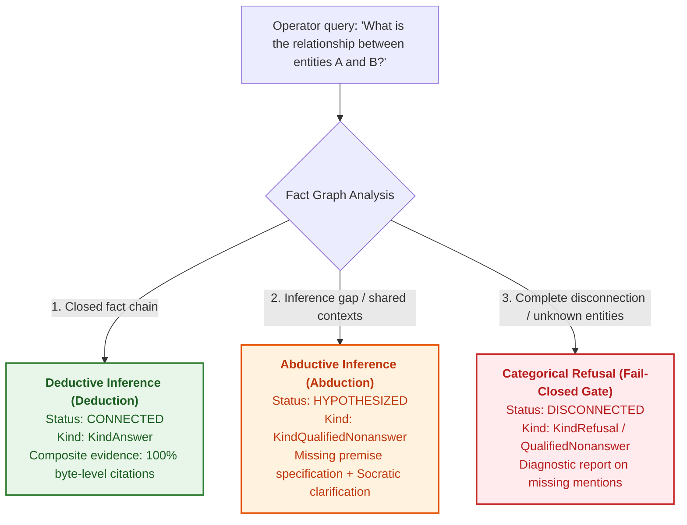
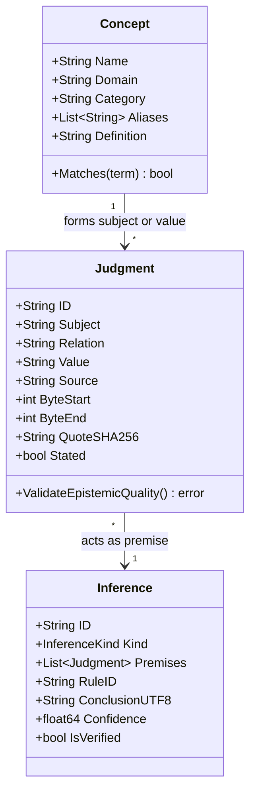
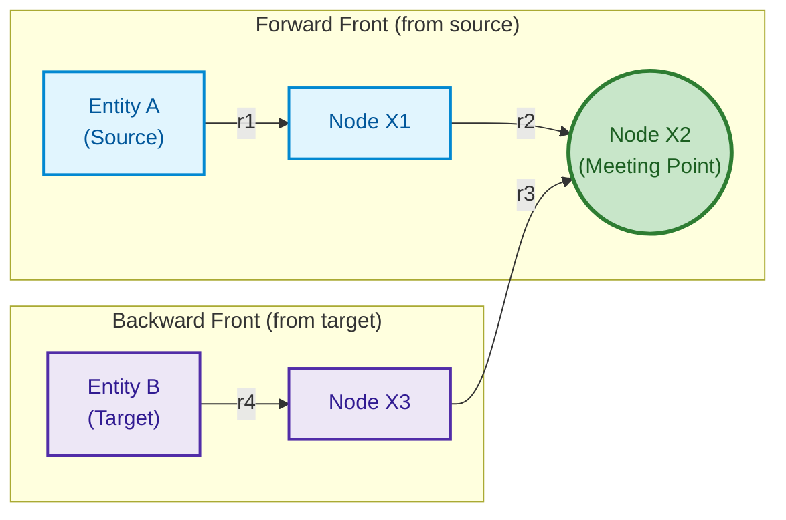
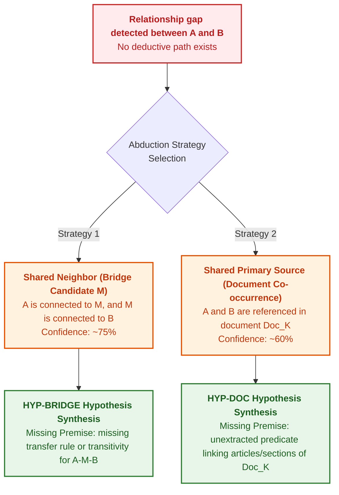

# Chapter 34. Knowledge Gaps: Relational Search, Abduction, and Socratic Clarification

> **Book:** [Architecture of Evidence-Governed Expert Systems](README.md) · [Part VI: Neuro-Symbolic Models, Cognitive Frontiers, and Continual Learning](part-06-frontiers-neuro-symbolic.md)  
> **Previous Chapter:** [Chapter 29. Neuro-Symbolic Architecture: Language Models and Evidence-Grounded Verification](ch29-neuro-symbolic-architecture.md)  
> **Next Chapter:** [Chapter 38. Machine Hallucinations and Knowledge Deficits: Evidential Control of Answers](ch38-curing-machine-hallucinations-and-knowledge-deficits.md)  
> **Table of Contents:** [README.md](README.md)  
> **Author:** [Mykola Fedchyk](about-the-author.md)  
> **Target Level:** Advanced: Systems Architects, Knowledge Engineers, Specialists in Mathematical Logic and AI Philosophy  
> **Expected Learning Outcomes:** Formally ground the classical ontological triad of cognition (Concepts — Judgments — Inferences) within an expert system runtime across universal domains; design deterministic multi-hop relational path discovery algorithms featuring cycle guards and byte-level composite evidence chain assembly; apply inductive association rule mining over an assertion base under the Partial Completeness Assumption (AMIE PCA); implement symbolic abductive reasoning per Charles Sanders Peirce to bridge knowledge base deficits via controlled working hypotheses; strictly uphold the Hypothesis Isolation Invariant to prevent conjectural claims from masquerading as categorical facts; synthesize interactive Socratic clarification frames for operator mixed-initiative workflows; achieve cross-domain knowledge generalization across engineering standards, statutory regulations, and functional safety requirements without hardcoded heuristics.

---

## Abstract

Any production-grade knowledge base inevitably confronts the fundamental challenge of epistemic incompleteness (*epistemic incompleteness*): the space of operational facts across industrial or regulatory domains is unbounded, whereas the set of formalized normative propositions remains strictly finite. When no direct predicate chain connects two query concepts, systems face a dangerous epistemic dilemma:
- **Generative Large Language Models (LLMs):** populate knowledge voids with unconstrained, plausible confabulations (hallucinations), distorting engineering standards and safety mandates.
- **Classical Deductive Engines under the Closed-World Assumption (CWA):** collapse into categorical refusals (*fail-closed nonanswers*), leaving engineers and operators without actionable guidance for further investigation.

This chapter presents an architectural breakthrough for evidence-governed expert systems: coupling deterministic multi-hop relational discovery, abductive synthesis of working hypotheses, and interactive Socratic dialogue. First, the chapter formalizes the classical triad of reasoning within the runtime architecture: **Concepts → Judgments → Inferences**, establishing a domain-agnostic knowledge representation across technical protocols, statutory legislation, and functional safety standards (ISO 26262/21434). Second, it details a bidirectional bounded path discovery algorithm (Bidirectional Bounded Path Discovery, $`k \le 6`$) backed by composite byte-level evidence chains alongside an association rule induction engine leveraging AMIE PCA metrics.

Subsequent sections operationalize Charles Sanders Peirce's abduction as a legitimate mechanism for generating working hypotheses: the engine analyzes boundary gap topology, shared contexts, and relation taxonomies to formulate conjectures that explicitly specify the **Missing Premise**. The Hypothesis Isolation Invariant strictly guarantees that no conjectural premise can ever masquerade as an established categorical fact. Finally, the chapter presents a Socratic questioning architecture that translates epistemic gaps into typed choice alternatives for operator intervention, accompanied by a production-ready, fully verified Go implementation.

---

## 1. The Problem of Knowledge Incompleteness and the Epistemic Dilemma of Expert Systems

In knowledge engineering practice, queries submitted by human operators or external analytical pipelines frequently transcend simple single-attribute lookups ("What is the header size?" or "What is the session timeout?"). The greatest analytical utility lies in relational queries addressing systemic connectivity:
- *"What normative connection links the ASIL D safety integrity level to an ECU component?"*
- *"How does the statutory article governing contractual obligations relate to liquidated damages?"*
- *"What chain of formal specifications bridges the transport protocol to the network control tier?"*

When an expert system evaluates a relational query across its knowledge base, the assertion graph assumes one of three fundamental states:



1. **Complete Deductive Chain (Deductive Closure):** A sequence of normative assertions $`A \xrightarrow{r_1} X_1 \xrightarrow{r_2} \dots \xrightarrow{r_k} B`$ exists where every edge is substantiated by a byte-level citation from a primary source. The system emits a categorical `KindAnswer` with a composite evidence chain ([Chapter 19](ch19-from-question-to-evidence.md)).
2. **Inference Gap with Contextual Overlap (Epistemic Gap):** Entities $`A`$ and $`B`$ are recognized, co-occur within shared regulatory instruments, or share common neighbor entities $`M`$, yet lack an explicit normative edge connecting them.
3. **Complete Disconnection (Semantic Disjunction):** The entities inhabit mutually disjoint semantic scopes, or at least one is entirely absent from verified repository sources.

In State 2, probabilistic Large Language Models (LLMs) emit perilous hallucinations: they synthesize smooth, authoritative prose that fabricates nonexistent clauses of standards or legal articles. Conversely, legacy symbolic systems collapsed into uninformative `refusal` verdicts ("no data found"), compelling engineers to sift manually through gigabytes of technical documentation.

The solution engineered herein couples **symbolic abduction per C. S. Peirce** with **Socratic dialogue**: the system explicitly discloses the absence of a deterministic derivation path, formulates a disciplined working hypothesis specifying the precise missing fact required for categorical closure, and presents the human operator with interactive paths forward.

---

## 2. The Epistemic Triad of Classical Logic in System Architecture

To overcome narrow domain specialization, the expert system runtime is architected around the classical triad of philosophical logic formulated by Aristotle and Kant, and modernized in contemporary knowledge engineering [[1]](#src-1):

```math
\text{Concept} \xrightarrow{\text{synthesis}} \text{Judgment} \xrightarrow{\text{inference}} \text{Inference}
```



### 2.1. Concepts (Terms)
A **concept** captures the essential semantic identity of an entity or phenomenon within a subject domain. Abstracted from surface-level lexical variations, a concept is defined by:
- **Canonical Name:** The normalized designator (e.g., `ASIL`, `Statute of Ukraine`, `TCP`, `Contract`).
- **Domain:** Corpus attribution (`law-ua`, `automotive`, `rfc`, `system-eng`).
- **Category:** The ontological node taxonomy (`entity`, `protocol`, `law`, `component`, `safety_requirement`, `risk`).
- **Aliases and Synonyms:** Morphological variants, acronyms, and inflected forms matched via linguistic adapters ([Chapter 13](ch13-language-variability-vs-determinism.md)).

### 2.2. Judgments (Propositions)
A **judgment** constitutes the minimal atomic unit of truth within the knowledge base, asserting or negating a specific relation between concepts. In strict alignment with evidence-governed criteria ([Chapter 2](ch02-epistemology-of-machine-knowledge.md)), every judgment stored in the system is a byte-anchored proposition:

```math
J = \langle S, R, V, \text{DocID}, [\beta_{\text{start}}, \beta_{\text{end}}], \text{SHA256}_{\text{quote}}, \mathcal{M} \rangle
```

where $`S`$ denotes the subject concept, $`R`$ is the normative relation predicate, $`V`$ is the object concept or literal value, $`\text{DocID}`$ designates the immutable source document, $`[\beta_{\text{start}}, \beta_{\text{end}}]`$ specifies exact physical byte offsets within the file, and $`\mathcal{M}`$ represents the deontic modality (MUST, SHALL, MAY). Any proposition lacking physical byte grounding is categorically rejected by the admission gateway.

### 2.3. Inferences (Conclusions)
An **inference** represents the derived outcome of executing deterministic rules across a set of premise judgments. Governed by evidence completeness and relational structure, inferences are partitioned into three categories:
1. **Deductive Inference** ($`\text{Confidence} = 1.0`$): A logically necessary entailment of premises (syllogism, transitive closure, proven path).
2. **Abductive Inference** ($`0.0 < \text{Confidence} < 1.0`$): The formulation of a plausible working hypothesis to account for an observed relational gap between verified facts.
3. **Inductive Inference** ($`0.0 < \text{Confidence} < 1.0`$): The generalization of statistical regularities discovered across the fact base into candidate association rules.

---

## 3. Deterministic Multi-Hop Relational Analysis

To resolve queries of the form "How are entity $`A`$ and entity $`B`$ connected?", the knowledge base is modeled as a directed multigraph $`\mathcal{G} = (\mathcal{V}, \mathcal{E})`$, where vertices $`\mathcal{V}`$ represent concepts and normalized literals, and edges $`\mathcal{E}`$ correspond to verified predicate judgments.

### 3.1. Bidirectional Bounded Breadth-First Search (Bidirectional Bounded BFS)

Standard unidirectional breadth-first search across high-degree graphs triggers combinatorial explosion with complexity $`\mathcal{O}(b^d)`$. The reference architecture employs a **Bidirectional Bounded BFS**, simultaneously expanding a forward frontier from source node $`A`$ and a backward frontier from target node $`B`$ with an enforced depth limit of $`k \le 6`$:



The traversal algorithm enforces three mandatory architectural invariants:
1. **Cycle Guard Invariant:** Traversal state retains a visited bitmask or hash set tracking nodes along the current candidate branch. Any transition cycling back to an already visited vertex is pruned immediately.
2. **Inverse Traversal Invariant:** If the knowledge base records an asserted judgment $`J = (S, R, V)`$, reverse graph traversal admits a backward step from $`V`$ to $`S`$ labeled with the inverted predicate `inverse_of(R)`. This enables discovery of symmetric linkages where both target entities share a common subject or object.
3. **Deterministic Ordering Invariant:** Discovered paths are sorted primarily in ascending order of hop count; ties among paths of equal length are broken deterministically via lexicographical ordering over relation names and source document identifiers.

### 3.2. Composite Path Evidence

A discovered path $`\mathcal{P} = (h_1, h_2, \dots, h_m)`$ of length $`m`$ hops is epistemically valid if and only if every constituent edge $`h_i`$ independently satisfies the byte-level verification invariant. The runtime synthesizes a composite citation structure encapsulating an ordered vector of verified citations:

```math
\text{EvidenceChain}(\mathcal{P}) = \left[ \text{Cite}(J_1), \text{Cite}(J_2), \dots, \text{Cite}(J_m) \right]
```

If even a single hop lacks physical byte verification against an immutable document manifest, the entire candidate path is rejected as epistemically ungrounded.

---

## 4. Autonomous Association Rule Mining (AMIE PCA)

Relational reasoning extends beyond evaluating ad-hoc paths. In background batch or offline maintenance cycles, the expert system inspects its entire assertion graph to inductively discover systemic regularities.

To achieve this, the architecture adopts the **AMIE (Association Rule Mining under Incomplete Evidence)** algorithm under the **Partial Completeness Assumption (PCA)** developed by Galárraga et al. [[2]](#src-2), building upon the relational learning foundations established by Luc De Raedt [[6]](#src-6).

### 4.1. Formal Rules and the PCA Assumption

The induction engine extracts two structural classes of logical Horn rules over the assertion graph:

#### 4.1.1. Direct Binary Rules

```math
r_1(X, Y) \implies r_2(X, Y)
```

*(Example: "If document X supersedes Y, then X updates Y")*

#### 4.1.2. Transitive Chain Rules

```math
r_1(X, Y) \land r_2(Y, Z) \implies r_3(X, Z)
```

*(Example: "If component X belongs to subsystem Y, and Y is certified under standard Z, then X is governed by Z")*

The classical Closed-World Assumption (CWA) treats every absent relation as false, which is fundamentally invalid for open-world knowledge graphs. In contrast, the Partial Completeness Assumption asserts: *if entity $`X`$ possesses at least one asserted relation $`r`$ with some object $`Y`$ in the knowledge base such that $`r(X, Y)`$ holds, then the base contains all true objects for the pair $`(X, r)`$*.

### 4.2. Quality Metrics for Induced Rules

The epistemic validity of an induced candidate rule $`\mathcal{R}: \mathcal{B} \implies r(X, Y)`$ is quantitatively assessed using three deterministic metrics:

#### 4.2.1. Absolute Support

The number of unique entity pairs $`(X, Y)`$ satisfying both the rule body $`\mathcal{B}`$ and the head relation $`r(X, Y)`$ across the graph:

```math
\mathrm{Supp}(\mathcal{R}) = \lvert \{ (X, Y) : \mathcal{B} \land r(X, Y) \} \rvert
```

where $`\lvert \{ (X, Y) \} \rvert`$ represents the set cardinality of linked pairs, expressed as a non-negative integer ($`\mathrm{Supp}(\mathcal{R}) \in \mathbb{N}_0`$).

#### 4.2.2. PCA Confidence

Under the Partial Completeness Assumption, the confidence denominator is restricted strictly to instances where subject $`X`$ has at least one verified relation $`r`$ within the knowledge base:

```math
\mathrm{Conf}_{\mathrm{PCA}}(\mathcal{R}) = \frac{\lvert \{ (X, Y) : \mathcal{B} \land r(X, Y) \} \rvert}{\lvert \{ (X, Y) : \mathcal{B} \land \exists Y' (r(X, Y')) \} \rvert}
```

where $`\mathrm{Conf}_{\mathrm{PCA}}(\mathcal{R}) \in [0, 1]`$ provides a normalized index of statistical validity under incomplete, yet internally consistent, evidence.

#### 4.2.3. Head Coverage

The proportion of known relation instances $`r`$ in the knowledge base that can be derived or explained by the induced rule:

```math
\mathrm{HC}(\mathcal{R}) = \frac{\mathrm{Supp}(\mathcal{R})}{\lvert \{ (X, Y) : r(X, Y) \} \rvert}
```

where $`\mathrm{HC}(\mathcal{R}) \in [0, 1]`$ measures the rule's generalization breadth.

#### 4.2.4. Closed-Loop Decision

- **Rule Admission and Automatic Certification Criteria:**
  - $`\mathrm{Conf}_{\mathrm{PCA}}(\mathcal{R}) \ge 0.90`$ at $`\mathrm{Supp}(\mathcal{R}) \ge 10`$: **Automatic Induction**. The candidate rule is committed to the derived layer of the knowledge base (`INFERRED_RULE`) with `VerifiedCandidate` status and admitted to production query evaluation;
  - $`0.70 \le \mathrm{Conf}_{\mathrm{PCA}}(\mathcal{R}) < 0.90`$ (at $`\mathrm{Supp}(\mathcal{R}) \ge 3`$): **Quarantine Hypothesis**. The candidate receives `QUARANTINE_HYPOTHESIS` status and is routed to a Socratic review session with a domain specialist or requires corroborating abductive validation;
  - $`\mathrm{Conf}_{\mathrm{PCA}}(\mathcal{R}) < 0.70`$ or $`\mathrm{Supp}(\mathcal{R}) < 3`$: **Unconditional Rejection**. The candidate is classified as statistical noise or an artifact of sample sparsity and pruned from the candidate queue.
- **Hardware Sizing and Background Compute Budgeting:**
  - The AMIE rule mining process exhibits computational complexity $`\mathcal{O}(\lvert\mathcal{E}\rvert \cdot d_{\max}^{k-1})`$, where $`\lvert\mathcal{E}\rvert`$ represents total edge count, $`d_{\max}`$ is the maximum node degree, and $`k`$ denotes maximum rule length;
  - To prevent memory exhaustion, rule depth is bounded at $`k \le 3`$, worker execution timeout is set to $`300\,\text{s}`$ per target relation $`r`$, and dedicated RAM allocated for the in-memory graph index is capped at $`4\,\text{GB}`$.
- **Worked Numerical Example:**
  Consider a transitive rule candidate evaluated over a safety certification graph:

```math
\mathrm{HasSubsystem}(X, Y) \land \mathrm{CompliesWith}(Y, Z) \implies \mathrm{RequiresAudit}(X, Z)
```

  Recorded parameters: $`\mathrm{Supp}(\mathcal{R}) = 18`$ systems satisfying both premises and conclusion. The total number of systems with components for which the knowledge base records any audit requirements $`\exists Z' (\mathrm{RequiresAudit}(X, Z'))`$ equals $`20`$.
  Calculation: $`\mathrm{Conf}_{\mathrm{PCA}} = 18 / 20 = 0.90 \ge 0.90`$, $`\mathrm{Supp}(\mathcal{R}) = 18 \ge 10`$.
  **System Action:** The rule clears the automatic certification threshold and is integrated into the deductive inference engine with an operational confidence weight of $`0.90`$.

---

## 5. Symbolic Abductive Inference of Working Hypotheses

When deterministic BFS traversal returns `STATUS_DISCONNECTED`, a categorical deductive proof is unattainable. At this juncture, the expert system engages its **Abductive Engine**.

### 5.1. Abduction per Charles Sanders Peirce

The American philosopher and logician Charles Sanders Peirce established abduction as the foundational logical mode responsible for generating explanatory hypotheses [[3]](#src-3). Its mathematical and algorithmic formalization within logic programming was established by Kakas, Kowalski, and Toni [[5]](#src-5):

```math
\frac{\text{The surprising fact } C \text{ is observed}; \quad \text{If } H \text{ were true, } C \text{ would be a matter of course}}{\text{Hence, there is reason to suspect that } H \text{ is true}}
```

In evidence-governed expert systems, observed fact $`C`$ represents an unresolved relational query between $`A`$ and $`B`$ accompanied by partial contextual evidence, whereas hypothesis $`H`$ denotes the existence of a missing intermediate premise.



### 5.2. Topological Heuristics for Hypothesis Generation

#### 5.2.1. Shared Neighbor Strategy (Bridge Entity)
The engine queries for an intermediate vertex $`M \in \mathcal{V}`$ satisfying:

```math
(A \leftrightarrow M) \in \mathcal{E} \quad \land \quad (M \leftrightarrow B) \in \mathcal{E}
```

When entity $`M`$ serves as an intermediary, the system synthesizes a hypothesis:
*"The relationship between A and B is likely mediated by entity M. Categorical proof lacks an explicit normative transitivity rule over relations $`r_1`$ and $`r_2`$ through concept M"*.
The assigned plausibility confidence for such bridge hypotheses defaults to $`\text{Confidence} \approx 0.75`$.

#### 5.2.2. Document Co-occurrence Strategy
In the absence of shared intermediate nodes, the engine determines whether $`A`$ and $`B`$ co-occur within propositions extracted from a common regulatory document $`\mathcal{D}`$:

```math
\exists J_1, J_2 : J_1.\text{Subject} = A \land J_2.\text{Subject} = B \land J_1.\text{Source} = J_2.\text{Source} = \mathcal{D}
```

The system formulates the following hypothesis:
*"Entities A and B co-occur within normative document $`\mathcal{D}`$, but lack an extracted relational path. Structural relationships between clauses or articles within $`\mathcal{D}`$ require verification"*.
The assigned plausibility confidence defaults to $`\text{Confidence} \approx 0.60`$.

#### 5.2.3. Hypernymy Fallback
If $`A`$ is an ontological subtype of hypernym $`P`$ ($`A \xrightarrow{\text{is-a}} P`$), and a proven path connects $`P`$ to $`B`$, the engine synthesizes an inheritance hypothesis under closed-world default semantics, provided no defeaters or explicit exceptions exist ([Chapter 31](ch31-syllogistic-reasoning-and-relation-lattices.md)).

### 5.3. Hypothesis Isolation Invariant

The principal hazard of hypothesis generation is the risk of conjectural statements being interpreted by downstream systems or human users as established truths. Grounded in John Pollock's theory of defeasible reasoning [[7]](#src-7), the architecture enforces an immutable **Hypothesis Isolation Invariant**:

> [!IMPORTANT]
> **Immutable Hypothesis Isolation Invariant:**
> 1. No abductive conjecture may ever be returned as a categorical answer (`TerminalKind = KindAnswer` is strictly prohibited).
> 2. Hypotheses must be returned exclusively within typed payloads of kind `KindQualifiedNonanswer` or `KindClarification`.
> 3. Response narratives must contain the standardized disclaimer banner:
>    `--- [CONJECTURE (WORKING HYPOTHESIS)] ---`
> 4. Every hypothesis must explicitly declare its numerical confidence ($`\text{Confidence} < 1.0`$) and its **Missing Premise**, without whose verification the conjecture can never graduate to factual status.

---

## 6. Socratic Dialogue and Mixed-Initiative Interaction

An epistemic void must not terminate in a dead end. Instead of passive refusal, the evidence-governed expert system enters a mode of **Socratic dialogue**, operationalizing Eric Horvitz's principles of mixed-initiative interaction [[4]](#src-4).

### 6.1. Structure of the Clarification Frame

Upon uncovering candidate hypotheses, inference gaps, or lexical ambiguity, the engine emits a structured, typed `ClarificationFrame`:

```json
{
  "message": "No direct relationship found between \"Contract\" and \"Penalty\". Would you like to explore a hypothetical link via the entity \"Obligation\"?",
  "dimension": "StandardLineage",
  "options": [
    {
      "id": "opt-bridge",
      "label": "Explore connection via intermediate entity \"Obligation\"",
      "bound_entity": "Obligation",
      "context_hint": "abductive_bridge:Obligation"
    },
    {
      "id": "opt-def-from",
      "label": "Inspect definitions and attributes of \"Contract\"",
      "bound_entity": "Contract",
      "context_hint": "definition"
    },
    {
      "id": "opt-scope",
      "label": "Refine normative document or domain (Statutory / ISO)",
      "bound_entity": "",
      "context_hint": "scope_refinement"
    }
  ]
}
```

### 6.2. Operator Interface Interaction

Within a terminal UI (TUI) or web control console, the clarification frame renders an interactive selection widget:
- The operator is presented with numbered options `[1]`, `[2]`, `[3]`.
- Pressing the corresponding number or `Enter` avoids manual query retyping, immediately initiating directed traversal along the selected knowledge graph branch.
- When the operator selects `opt-bridge`, the system automatically synthesizes a child subquery investigating linkages between the origin entity and the proposed bridge entity, inheriting context from the cached partial proof state (`PartialProofState`).

---

## 7. Cross-Domain Knowledge Generalization

A historic defect of first-generation expert systems was rigid domain coupling: medical systems (MYCIN) could not process electronic schematics, while equipment configurators (R1/XCON) were useless in legal reasoning.

Modern evidence-governed architectures transcend these boundaries through generalized conceptual abstractions and federated knowledge providers ([Chapter 31](ch31-syllogistic-reasoning-and-relation-lattices.md)). The identical Concept-Judgment-Inference triad and unified relational engine operate seamlessly across disparate domains:

| Characteristic | Domain: Network Protocols | Domain: Statutory Legislation (Ukraine) | Domain: Automotive Safety |
|---|---|---|---|
| **Primary Sources** | RFC, IEEE standards, IETF | Constitution of Ukraine, Codes, Statutes | ISO 26262 [[8]](#src-8), ISO/SAE 21434, ASPICE |
| **Concept Examples** | `TCP`, `IP`, `BGP`, `SYN_SENT` | `Statute of Ukraine`, `Contract`, `Obligation` | `ASIL D`, `HARA`, `ECU`, `FTTI` |
| **Typical Judgments** | `TCP encapsulates_in IP` | `Contract creates Obligation` | `ASIL D derived_from HARA` |
| **Composite Evidence** | RFC 793, p. 15, bytes [1200..1280] | Civil Code of Ukraine [[9]](#src-9), Art. 509(2) | ISO 26262-3:2018, Cl. 7.4.3 |
| **Abductive Bridge** | `ICMP` → `IP` via `RFC 777/760` | `Contract` → `Penalty` via `Obligation` | `Hazard Event` → `Safety Goal` via `ASIL` |

Not a single line of inference logic or BFS path discovery contains hardcoded token checks such as `if entity == "TCP"`. The system relies exclusively on abstract graph structures, lexical normalization adapters, and adjacency indices.

---

## 8. Software Implementation: A Complete Go Module for Relational Discovery, Abduction, and Socratic Clarification

Below is a self-contained, production-grade Go module implementing:
1. Ontological data structures for the cognitive triad (`Concept`, `Judgment`, `Inference`).
2. A relational path discovery engine (`RelationalPathFinder`) with bounded BFS and cycle protection.
3. An abductive working hypothesis generator (`AbductiveEngine`).
4. A Socratic clarification builder (`SocraticQuestioner`).
5. A comprehensive suite of unit tests.

<details>
<summary><b>Complete Go Module for Relational Discovery, Abduction, and Socratic Clarification (epistemic.go)</b></summary>

```go
package epistemic

import (
	"errors"
	"fmt"
	"strings"
)

// --- 1. Epistemic Triad of Cognition ---

type ConceptCategory string

const (
	CategoryEntity    ConceptCategory = "entity"
	CategoryProtocol  ConceptCategory = "protocol"
	CategoryLaw       ConceptCategory = "law"
	CategorySafetyReq ConceptCategory = "safety_requirement"
)

// Concept represents a normalized ontological concept.
type Concept struct {
	Name       string            `json:"name"`
	Domain     string            `json:"domain"`
	Category   ConceptCategory   `json:"category"`
	Aliases    []string          `json:"aliases,omitempty"`
	Attributes map[string]string `json:"attributes,omitempty"`
}

func (c *Concept) Matches(term string) bool {
	if c == nil {
		return false
	}
	norm := strings.ToLower(strings.TrimSpace(term))
	if strings.ToLower(strings.TrimSpace(c.Name)) == norm {
		return true
	}
	for _, a := range c.Aliases {
		if strings.ToLower(strings.TrimSpace(a)) == norm {
			return true
		}
	}
	return false
}

// Judgment captures a normative atomic proposition with byte-level grounding.
type Judgment struct {
	ID          string `json:"id"`
	Subject     string `json:"subject"`
	Relation    string `json:"relation"`
	Value       string `json:"value"`
	SourceDoc   string `json:"source_doc"`
	ByteStart   int    `json:"byte_start"`
	ByteEnd     int    `json:"byte_end"`
	QuoteSHA256 string `json:"quote_sha256"`
	Stated      bool   `json:"stated"`
}

func (j Judgment) ValidateEpistemicQuality() error {
	if strings.TrimSpace(j.Subject) == "" || strings.TrimSpace(j.Relation) == "" || strings.TrimSpace(j.Value) == "" {
		return errors.New("judgment must have non-empty Subject, Relation, and Value")
	}
	if j.SourceDoc == "" {
		return errors.New("missing source document reference")
	}
	if j.ByteStart < 0 || j.ByteEnd < j.ByteStart {
		return errors.New("invalid physical byte range for citation")
	}
	return nil
}

// --- 2. Deterministic Relational Path Finder ---

type PathHop struct {
	FromEntity string   `json:"from_entity"`
	Relation   string   `json:"relation"`
	ToEntity   string   `json:"to_entity"`
	DocumentID string   `json:"document_id"`
	Judgment   Judgment `json:"judgment"`
}

type RelationalPath struct {
	Hops   []PathHop `json:"hops"`
	Length int       `json:"length"`
}

type RelationalPathFinder struct {
	forwardEdges map[string][]Judgment
	reverseEdges map[string][]Judgment
}

func NewRelationalPathFinder(judgments []Judgment) *RelationalPathFinder {
	fwd := make(map[string][]Judgment)
	rev := make(map[string][]Judgment)
	for _, j := range judgments {
		s := strings.ToLower(strings.TrimSpace(j.Subject))
		v := strings.ToLower(strings.TrimSpace(j.Value))
		fwd[s] = append(fwd[s], j)
		rev[v] = append(rev[v], j)
	}
	return &RelationalPathFinder{forwardEdges: fwd, reverseEdges: rev}
}

func (pf *RelationalPathFinder) FindPaths(fromEntity, toEntity string, maxDepth int) ([]RelationalPath, bool) {
	normFrom := strings.ToLower(strings.TrimSpace(fromEntity))
	normTo := strings.ToLower(strings.TrimSpace(toEntity))
	if normFrom == "" || normTo == "" || normFrom == normTo {
		return nil, false
	}
	if maxDepth <= 0 || maxDepth > 6 {
		maxDepth = 6
	}

	type searchNode struct {
		entity  string
		hops    []PathHop
		visited map[string]bool
	}

	queue := []searchNode{
		{entity: normFrom, hops: nil, visited: map[string]bool{normFrom: true}},
	}
	var discovered []RelationalPath
	shortest := -1

	for len(queue) > 0 {
		curr := queue[0]
		queue = queue[1:]

		if shortest != -1 && len(curr.hops) > shortest {
			break
		}
		if len(curr.hops) >= maxDepth {
			continue
		}

		// Forward edges
		for _, j := range pf.forwardEdges[curr.entity] {
			nextNorm := strings.ToLower(strings.TrimSpace(j.Value))
			if curr.visited[nextNorm] {
				continue // Cycle Guard
			}
			hop := PathHop{FromEntity: j.Subject, Relation: j.Relation, ToEntity: j.Value, DocumentID: j.SourceDoc, Judgment: j}
			newHops := append(append([]PathHop(nil), curr.hops...), hop)

			if nextNorm == normTo {
				shortest = len(newHops)
				discovered = append(discovered, RelationalPath{Hops: newHops, Length: len(newHops)})
			} else {
				newVis := copyMap(curr.visited)
				newVis[nextNorm] = true
				queue = append(queue, searchNode{entity: nextNorm, hops: newHops, visited: newVis})
			}
		}

		// Reverse edges
		for _, j := range pf.reverseEdges[curr.entity] {
			nextNorm := strings.ToLower(strings.TrimSpace(j.Subject))
			if curr.visited[nextNorm] {
				continue
			}
			hop := PathHop{FromEntity: j.Value, Relation: "inverse_of(" + j.Relation + ")", ToEntity: j.Subject, DocumentID: j.SourceDoc, Judgment: j}
			newHops := append(append([]PathHop(nil), curr.hops...), hop)

			if nextNorm == normTo {
				shortest = len(newHops)
				discovered = append(discovered, RelationalPath{Hops: newHops, Length: len(newHops)})
			} else {
				newVis := copyMap(curr.visited)
				newVis[nextNorm] = true
				queue = append(queue, searchNode{entity: nextNorm, hops: newHops, visited: newVis})
			}
		}
	}

	if len(discovered) == 0 {
		return nil, false
	}
	return discovered, true
}

func copyMap(m map[string]bool) map[string]bool {
	cp := make(map[string]bool, len(m)+1)
	for k, v := range m {
		cp[k] = v
	}
	return cp
}

// --- 3. Abductive Working Hypothesis Synthesis Engine ---

type AbductiveHypothesis struct {
	ID              string     `json:"id"`
	SourceEntity    string     `json:"source_entity"`
	TargetEntity    string     `json:"target_entity"`
	BridgeCandidate string     `json:"bridge_candidate,omitempty"`
	Rationale       string     `json:"rationale"`
	MissingPremise  string     `json:"missing_premise"`
	Confidence      float64    `json:"confidence"`
	SupportingFacts []Judgment `json:"supporting_facts"`
	Disclaimer      string     `json:"disclaimer"`
}

const HypothesisDisclaimer = "[CONJECTURE (WORKING HYPOTHESIS)] Not a verified fact. Requires premise verification."

type AbductiveEngine struct {
	judgments []Judgment
}

func NewAbductiveEngine(judgments []Judgment) *AbductiveEngine {
	return &AbductiveEngine{judgments: judgments}
}

func (ae *AbductiveEngine) GenerateHypotheses(fromEntity, toEntity string) []AbductiveHypothesis {
	normFrom := strings.ToLower(strings.TrimSpace(fromEntity))
	normTo := strings.ToLower(strings.TrimSpace(toEntity))
	if normFrom == "" || normTo == "" || normFrom == normTo {
		return nil
	}

	type link struct {
		target string
		source string
		j      Judgment
	}

	fromLinks := make(map[string][]link)
	toLinks := make(map[string][]link)
	fromDocs := make(map[string]Judgment)
	toDocs := make(map[string]Judgment)

	for _, j := range ae.judgments {
		s := strings.ToLower(strings.TrimSpace(j.Subject))
		v := strings.ToLower(strings.TrimSpace(j.Value))

		if s == normFrom {
			fromLinks[v] = append(fromLinks[v], link{target: j.Value, source: j.SourceDoc, j: j})
			fromDocs[j.SourceDoc] = j
		}
		if v == normFrom {
			fromLinks[s] = append(fromLinks[s], link{target: j.Subject, source: j.SourceDoc, j: j})
			fromDocs[j.SourceDoc] = j
		}
		if s == normTo {
			toLinks[v] = append(toLinks[v], link{target: j.Value, source: j.SourceDoc, j: j})
			toDocs[j.SourceDoc] = j
		}
		if v == normTo {
			toLinks[s] = append(toLinks[s], link{target: j.Subject, source: j.SourceDoc, j: j})
			toDocs[j.SourceDoc] = j
		}
	}

	var results []AbductiveHypothesis

	// Strategy 1: Shared intermediate entities (Bridges)
	for mid := range fromLinks {
		if _, ok := toLinks[mid]; ok && mid != normFrom && mid != normTo {
			l1 := fromLinks[mid][0]
			l2 := toLinks[mid][0]
			results = append(results, AbductiveHypothesis{
				ID:              fmt.Sprintf("HYP-BRIDGE-%s", mid),
				SourceEntity:    fromEntity,
				TargetEntity:    toEntity,
				BridgeCandidate: l1.target,
				Rationale:       fmt.Sprintf("Entities %q and %q are mutually connected to intermediate entity %q in documents %s and %s.", fromEntity, toEntity, l1.target, l1.source, l2.source),
				MissingPremise:  fmt.Sprintf("Missing normative transitivity rule transferring properties between %q and %q via %q.", fromEntity, toEntity, l1.target),
				Confidence:      0.75,
				SupportingFacts: []Judgment{l1.j, l2.j},
				Disclaimer:      HypothesisDisclaimer,
			})
			if len(results) >= 2 {
				return results
			}
		}
	}

	// Strategy 2: Shared primary source
	if len(results) == 0 {
		for doc, jFrom := range fromDocs {
			if jTo, ok := toDocs[doc]; ok && doc != "" {
				results = append(results, AbductiveHypothesis{
					ID:              fmt.Sprintf("HYP-DOC-%s", doc),
					SourceEntity:    fromEntity,
					TargetEntity:    toEntity,
					Rationale:       fmt.Sprintf("Entities %q and %q are referenced in shared normative document %s.", fromEntity, toEntity, doc),
					MissingPremise:  fmt.Sprintf("Requires extraction and verification of link between sections or articles of document %s.", doc),
					Confidence:      0.60,
					SupportingFacts: []Judgment{jFrom, jTo},
					Disclaimer:      HypothesisDisclaimer,
				})
				if len(results) >= 2 {
					return results
				}
			}
		}
	}

	return results
}

// --- 4. Socratic Questioner ---

type ClarificationOption struct {
	ID          string `json:"id"`
	Label       string `json:"label"`
	BoundEntity string `json:"bound_entity,omitempty"`
}

type ClarificationFrame struct {
	Message string                `json:"message"`
	Options []ClarificationOption `json:"options"`
}

type SocraticQuestioner struct{}

func NewSocraticQuestioner() *SocraticQuestioner {
	return &SocraticQuestioner{}
}

func (sq *SocraticQuestioner) BuildClarification(from, to string, hyps []AbductiveHypothesis) *ClarificationFrame {
	var opts []ClarificationOption
	var msg string

	if len(hyps) > 0 && hyps[0].BridgeCandidate != "" {
		b := hyps[0].BridgeCandidate
		msg = fmt.Sprintf("No direct connection found between %q and %q. Would you like to explore a hypothetical bridge via %q?", from, to, b)
		opts = append(opts, ClarificationOption{
			ID:          "opt-bridge",
			Label:       fmt.Sprintf("Explore relationship via intermediate entity %q", b),
			BoundEntity: b,
		})
	} else {
		msg = fmt.Sprintf("No deterministic path found between %q and %q. Select clarification direction:", from, to)
	}

	opts = append(opts,
		ClarificationOption{ID: "opt-def-from", Label: fmt.Sprintf("Inspect definition of %q", from), BoundEntity: from},
		ClarificationOption{ID: "opt-def-to", Label: fmt.Sprintf("Inspect definition of %q", to), BoundEntity: to},
		ClarificationOption{ID: "opt-domain", Label: "Refine domain (statutory law, safety standards, engineering)"},
	)

	return &ClarificationFrame{Message: msg, Options: opts}
}
```

</details>

<details>
<summary><b>Implementation Unit Tests (epistemic_test.go)</b></summary>

```go
package epistemic

import (
	"strings"
	"testing"
)

func TestEpistemicTriad_And_PathFinder(t *testing.T) {
	judgments := []Judgment{
		{ID: "J1", Subject: "Statute", Relation: "supersedes", Value: "Decree", SourceDoc: "const-ua", ByteStart: 10, ByteEnd: 40},
		{ID: "J2", Subject: "Decree", Relation: "details", Value: "Procedure", SourceDoc: "decree-101", ByteStart: 20, ByteEnd: 60},
	}

	// 1. Judgment validation test
	if err := judgments[0].ValidateEpistemicQuality(); err != nil {
		t.Fatalf("expected valid judgment, got: %v", err)
	}

	// 2. Deductive path discovery test
	finder := NewRelationalPathFinder(judgments)
	paths, found := finder.FindPaths("Statute", "Procedure", 4)
	if !found || len(paths) == 0 {
		t.Fatalf("expected path between Statute and Procedure")
	}
	if paths[0].Length != 2 {
		t.Errorf("expected path length 2, got %d", paths[0].Length)
	}
}

func TestAbductionEngine_And_SocraticDialogue(t *testing.T) {
	// Contract and Penalty have no direct edge, but are linked via Obligation
	judgments := []Judgment{
		{ID: "J1", Subject: "Contract", Relation: "creates", Value: "Obligation", SourceDoc: "cc-art509", ByteStart: 10, ByteEnd: 40},
		{ID: "J2", Subject: "Penalty", Relation: "secures", Value: "Obligation", SourceDoc: "cc-art549", ByteStart: 15, ByteEnd: 55},
	}

	engine := NewAbductiveEngine(judgments)
	hyps := engine.GenerateHypotheses("Contract", "Penalty")
	if len(hyps) == 0 {
		t.Fatalf("expected abductive hypothesis to be generated")
	}

	h := hyps[0]
	if h.BridgeCandidate != "Obligation" {
		t.Errorf("expected bridge candidate 'Obligation', got %q", h.BridgeCandidate)
	}
	if h.Confidence >= 1.0 {
		t.Errorf("hypothesis confidence must strictly be < 1.0, got %f", h.Confidence)
	}
	if !strings.Contains(h.Disclaimer, "[CONJECTURE (WORKING HYPOTHESIS)]") {
		t.Errorf("missing hypothesis disclaimer in %q", h.Disclaimer)
	}

	// Socratic Questioner
	questioner := NewSocraticQuestioner()
	frame := questioner.BuildClarification("Contract", "Penalty", hyps)
	if frame == nil || len(frame.Options) < 2 {
		t.Fatalf("expected valid clarification frame with options")
	}
	if frame.Options[0].ID != "opt-bridge" {
		t.Errorf("expected opt-bridge as first option, got %s", frame.Options[0].ID)
	}
}
```

</details>

---

## Conclusions
1. **Resolving the Incompleteness Dilemma:** Production expert systems are not forced to choose between the confabulations of generative models and the helpless refusals of closed-world semantics. Symbolic abduction equips the system with a legitimate mathematical mechanism for synthesizing controlled hypotheses.
2. **The Ontological Triad of Cognition:** Formalizing concepts, byte-grounded judgments, and typed conclusions provides a unified runtime representation irrespective of domain variations (network protocols, statutory jurisprudence, automotive functional safety).
3. **Deterministic Relational Analysis:** Bidirectional bounded BFS ($`k \le 6`$) featuring cycle guards and composite citation assembly discovers multi-hop systemic dependencies with guaranteed determinism and complete auditability.
4. **Association Rule Induction (AMIE PCA):** Mining assertions under the Partial Completeness Assumption uncovers latent transitive dependencies automatically, eliminating the need to hand-author thousands of production rules.
5. **The Hypothesis Isolation Invariant:** Working hypotheses are never passed off as established facts. They are typed strictly as `KindQualifiedNonanswer`, explicitly presenting their Missing Premise and numerical plausibility score.
6. **Socratic Dialogue and Mixed Initiative:** Typed clarification frames (`ClarificationFrame`) transform operational impasses into structured cooperative interaction, enabling operators to explore proposed hypothetical bridges or refine contextual scope with a single keystroke.

---

## Review Questions
1. Why is the Closed-World Assumption (CWA) inadequate for industrial-scale engineering and regulatory knowledge bases?
2. What components constitute the classical ontological triad of cognition, and what distinguishes a normative judgment from an abstract concept?
3. Why does standard unidirectional Breadth-First Search (BFS) fail across dense knowledge graphs, and how does the bidirectional variant resolve this challenge?
4. What is the fundamental difference between standard association rule confidence and PCA confidence as formulated by Galárraga et al.?
5. How is Charles Sanders Peirce's abductive syllogism formulated, and how does it fundamentally differ from deduction and induction?
6. Which topological patterns in an assertion graph signal the presence of a viable intermediate bridge entity?
7. What guarantees does the Hypothesis Isolation Invariant enforce during working hypothesis generation?
8. What is a Missing Premise, and why must the expert system explicitly present it to the operator?
9. How does a Socratic clarification frame (`ClarificationFrame`) operate within a terminal or web-based interface?
10. In what manner does the relational analyzer achieve cross-domain generalization between engineering specifications and legal statutes without code modifications?

---

## Glossary
| English Term | Ukrainian Equivalent | Definition |
|---|---|---|
| Epistemic Triad | Епістемічна тріада | Classical triad of cognition: Concepts — Judgments — Inferences |
| Concept / Term | Поняття | Unit of ontological knowledge defined by canonical name, domain, and aliases |
| Judgment / Proposition | Судження | Atomic proposition with subject, relation, value, and byte-level citation |
| Multi-Hop Relational Path | Багатоходовий шлях | Relational connection linking entities across multiple intermediate graph edges |
| Composite Path Evidence | Композитний доказ | Unbroken chain of byte-level primary citations validating each hop of a path |
| Partial Completeness Assumption (PCA) | Припущення часткової повноти | AMIE heuristic: if an entity has a recorded relation, all true values for it are known |
| Abductive Reasoning | Абдукція | Logical inference yielding the most plausible explanation or working hypothesis |
| Working Hypothesis | Робоча гіпотеза | Controlled conjectural relation that requires premise verification |
| Missing Premise | Відсутній засновок | Unverified assertion or rule required to elevate a hypothesis to categorical fact |
| Epistemic Hygiene | Епістемічна гігієна | Architectural invariant strictly isolating hypotheses from categorical facts |
| Socratic Dialogue | Сократівський діалог | Interactive generation of structured clarifying questions with typed choices |
| Mixed-Initiative Interaction | Змішана ініціатива | Collaborative problem-solving between operator and machine via interactive options |

---

## Abbreviations
| Abbreviation | Expansion | Meaning |
|---|---|---|
| AMIE | Association Rule Mining under Incomplete Evidence | Algorithm for inductive rule mining under incomplete information |
| ASIL | Automotive Safety Integrity Level | Risk classification scheme defined by ISO 26262 |
| BFS | Breadth-First Search | Graph traversal algorithm exploring neighbor vertices layer by layer |
| CWA | Closed-World Assumption | Presumption that any statement not known to be true is false |
| ECU | Electronic Control Unit | Embedded automotive controller system |
| FTTI | Fault Tolerant Time Interval | Maximum time between fault occurrence and hazardous event |
| HARA | Hazard Analysis and Risk Assessment | Safety engineering methodology for identifying and evaluating hazards |
| LLM | Large Language Model | Large generative autoregressive language model |
| PCA | Partial Completeness Assumption | Knowledge base assumption of local attribute completeness |
| RFC | Request for Comments | Technical standards publication series for the Internet |
| TUI | Terminal User Interface | Interactive text-based terminal user interface |

---

## References
1. <a id="src-1"></a>Stuart Russell, Peter Norvig. [*Artificial Intelligence: A Modern Approach (4th Edition)*](https://aima.cs.berkeley.edu/). Pearson, 2020.
2. <a id="src-2"></a>Luis Antonio Galárraga, Christina Tefliovich, Fabian M. Suchanek. [*AMIE: Association Rule Mining under Incomplete Evidence in Ontological Knowledge Bases*](https://doi.org/10.1145/2488388.2488425). *Proceedings of the 22nd International Conference on World Wide Web (WWW '13)*, 413–422, 2013.
3. <a id="src-3"></a>Charles Sanders Peirce. [*Collected Papers of Charles Sanders Peirce (Volumes I-VIII)*](https://www.hup.harvard.edu/books/9780674138001). Harvard University Press, Cambridge, MA, 1931–1958.
4. <a id="src-4"></a>Eric Horvitz. [*Principles of Mixed-Initiative User Interfaces*](https://doi.org/10.1145/302979.303030). *Proceedings of the SIGCHI Conference on Human Factors in Computing Systems (CHI '99)*, 159–166, 1999.
5. <a id="src-5"></a>Antonis C. Kakas, Robert A. Kowalski, Francesca Toni. [*Abductive Logic Programming*](https://doi.org/10.1093/logcom/2.6.719). *Journal of Logic and Computation*, 2(6), 719–770, 1992.
6. <a id="src-6"></a>Luc De Raedt. [*Logical and Relational Learning*](https://doi.org/10.1007/978-3-540-68856-3). Cognitive Technologies, Springer, Berlin, Heidelberg, 2008.
7. <a id="src-7"></a>John L. Pollock. [*Cognitive Carpentry: A Blueprint for How to Build a Person*](https://mitpress.mit.edu/9780262661133/). The MIT Press, Cambridge, MA, 1995.
8. <a id="src-8"></a>ISO 26262:2018. [*Road vehicles — Functional safety (Parts 1–12)*](https://www.iso.org/standard/68383.html). International Organization for Standardization, Geneva, Switzerland, 2018.
9. <a id="src-9"></a>Civil Code of Ukraine. [*Law of Ukraine No. 435-IV of 16.01.2003*](https://zakon.rada.gov.ua/laws/show/435-15). Bulletin of the Verkhovna Rada of Ukraine, 2003, Nos. 40-44, Art. 356.

---

[← Chapter 29](ch29-neuro-symbolic-architecture.md) | [Table of Contents](README.md) | [Part VI](part-06-frontiers-neuro-symbolic.md) | [Chapter 38 →](ch38-curing-machine-hallucinations-and-knowledge-deficits.md)
