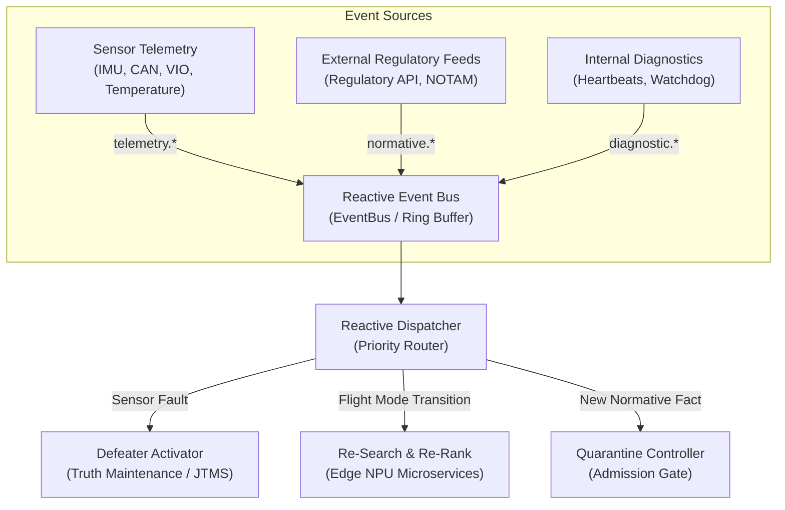
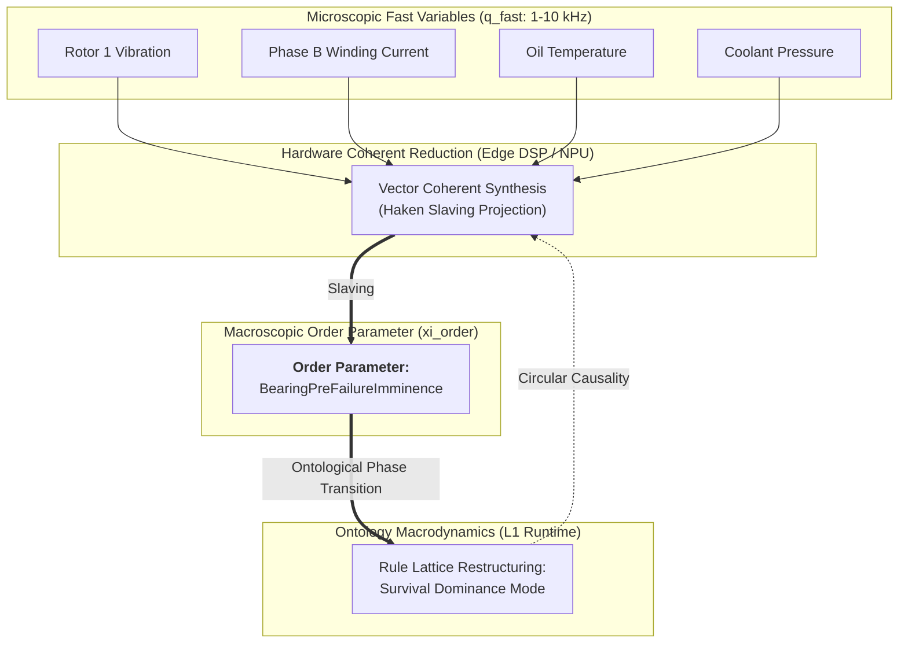
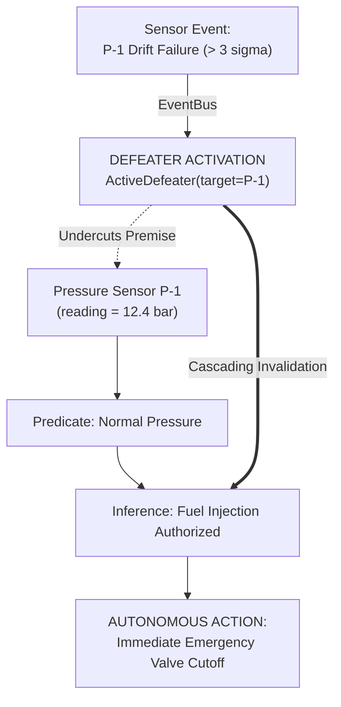
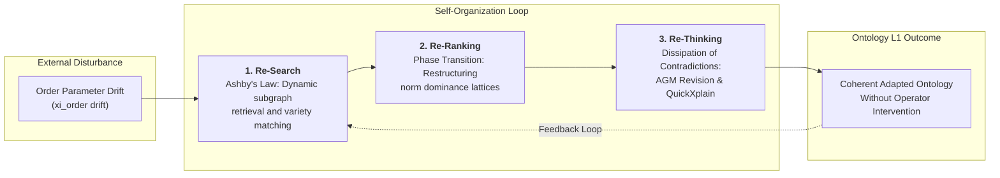
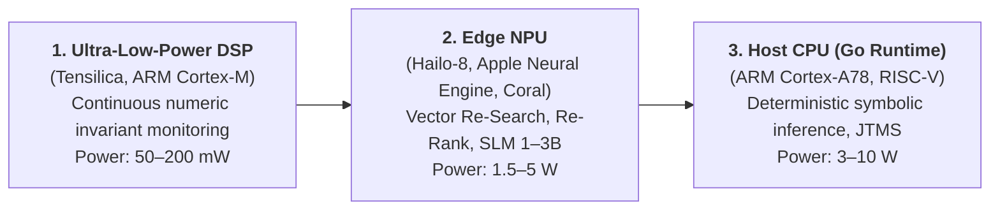

# Chapter 35. Reactive Expert Systems: Events, Revocation, and Knowledge Adaptation

> **Book:** [Architecture of Evidence-Governed Expert Systems](README.md) · [Part VII: Reactive Runtime, Inter-System Knowledge Exchange, and Distributed SOA](part-07-runtime-and-knowledge-exchange.md)  
> **Previous Chapter:** [Chapter 26. Continual Learning from Experience and Mitigating System Log Drift](ch26-continual-learning.md)  
> **Next Chapter:** [Chapter 33. Inter-System Knowledge Exchange: Rule Provisioning, Model Teaching, and Secure Feedback](ch33-inter-system-knowledge-exchange-and-model-teaching.md)  
> **Table of Contents:** [README.md](README.md)  
> **Author:** [Mykola Fedchyk](about-the-author.md)  
> **Target Level:** Advanced: Systems Architects, Knowledge Engineers, Safety and Hardware Acceleration Specialists  
> **Expected Learning Outcomes:** Design self-organizing and event-driven real-time expert system architectures (Self-Organizing Real-Time Expert Systems); apply the laws of synergetics (Ilya Prigogine's dissipative structures, Hermann Haken's slaving principle, order parameters) to the evolution of knowledge ontologies; organize non-blocking processing of telemetry and external event streams via a reactive event bus; implement a two-tier knowledge memory model L0/L1 (an immutable golden master attractor in `mmap` and a dynamic delta-graph with CRDT support); deploy Truth Maintenance Systems (JTMS/RMS) featuring instantaneous cascading invalidation via active defeaters (*Active Defeaters*) as an entropy export mechanism; offload dynamic inference tasks (Re-Search, Re-Ranking, Re-Thinking) to energy-efficient hardware accelerators (Edge NPU/DSP) within 1–5 W thermal design power limits; analyze real-world industrial precedents of autonomous diagnostics and self-organization (NASA Livingstone 2, Mobileye RSS).

---

## Abstract

Consider an autonomous vehicle or unmanned aerial vehicle (UAV, certified under ISO 26262 / DO-178C) where a legacy static expert system operates under a passive query-response model. Mid-flight, a primary pressure sensor malfunctions or a satellite datalink broadcasts an urgent airspace restriction (NOTAM notification). If the knowledge base was compiled as an immutable static monolith, the system continues to reason over stale premises, lacking any mechanism for instantaneous conclusion invalidation. Until an operator or an external supervisor script explicitly executes a polling query ("is airspace clearance still valid?"), the autopilot continues to traverse a hazardous or prohibited corridor. Conversely, attempting to recompile the entire static knowledge pack on the fly consumes several seconds and overloads the flight computer, catastrophically breaching hard real-time latency deadlines ($`< 5\,\text{ms}`$).

The core engineering question of this chapter: **how can we design an expert system capable of reactively responding to external events and streaming telemetry in real time, cascadingly revoking compromised conclusions within milliseconds, and adapting its ontology without forfeiting byte-level determinism and formal evidence?**

This chapter formalizes the architecture of real-time reactive expert systems and the principles of synergetic knowledge self-organization formulated by Hermann Haken and Ilya Prigogine. We introduce a two-tier L0/L1 memory architecture: an immutable phase attractor of truth (`mmap`) coupled with a dynamic reactive graph governed by Truth Maintenance Systems (JTMS/RMS), wherein active defeaters (*Active Defeaters*) continuously export information entropy. We analyze the offloading of dynamic inference workloads to energy-efficient neuromorphic co-processors (Edge NPU/DSP) within a 1–5 W power envelope, substantiated by international mission-critical precedents including NASA Livingstone 2 and Mobileye RSS.

---

## 1. Limitations of Static Expert Systems: From the Closed-World Assumption to Live Sensing and Knowledge Synergetics

Classical knowledge engineering across the second and early third waves of artificial intelligence was architected around the assumption of **thermodynamic equilibrium and build-time closure (Build-Time Closure)**:


While this methodology guarantees absolute byte-level auditability and deterministic reproducibility, it encounters insurmountable failure modes when deployed within cyber-physical runtime environments (autonomous UAVs, autonomous driving systems, industrial power-grid controllers, critical life-support monitors):

1. **Environment Blindness:**  
   The inference engine reasons exclusively over facts materialized during the compilation of the static knowledge pack. When a sensor suffers physical calibration drift, power bus rails degrade, or the dynamic legal status of an operation changes (e.g., crossing a sovereign jurisdictional border or entering an active NOTAM zone), the static core continues to produce obsolete verdicts until an operator manually injects updated inputs.
2. **Pull-Driven Latency:**  
   The classical runtime waits passively for user or caller requests. It is fundamentally incapable of proactively warning about emerging cascading failures or autonomously transitioning downstream actuators into a verified fail-safe mode (*Fail-Safe Mode*).
3. **Batch Rebuild Overhead:**  
   Recompiling and re-verifying formal knowledge packs requires seconds or minutes of compute time. Conversely, responding to physical emergencies (such as a seized hydraulic valve or loss of satellite lock) requires deterministic ontological adaptation within single-digit milliseconds ($`< 5\,\text{ms}`$).

### 1.1. Difference Between Simple Reactivity and Synergetic Self-Organization

A conventional Event-Driven Architecture (EDA) captures external signals through event listeners and triggers:

```math
\text{Event} \longrightarrow \text{Action}
```

However, a hardcoded "event $`\to`$ action" mapping represents merely first-order reflexive automation. It lacks the capacity to adapt its own internal model of the world when confronted with unforeseen, high-dimensional combinations of environmental factors.

Genuine **self-organization in an expert system (Self-Organizing Knowledge System)**, grounded in the foundational works of Hermann Haken [[1]](#src-1), [[2]](#src-2) and Ilya Prigogine [[3]](#src-3), emerges when an open system satisfies four criteria:
* **Continuously operates far from thermodynamic equilibrium**, actively exchanging information with its operational environment;
* **Autonomously restructures its ontological graph** and rule priority lattices without human intervention;
* **Compresses millions of microscopic sensor observations into macroscopic order parameters** via Haken's slaving principle;
* **Maintains absolute stability and formal provability**, utilizing the immutable L0 golden master as a global phase attractor of truth.

---

## 2. Reactive Programming and Event Streams as Epistemic Impulses

Drawing upon the foundations of classical cybernetics and feedback theory established by Norbert Wiener [[5]](#src-5), overcoming the static closure of an expert system requires transforming its computational architecture into an event-driven pipeline where external observations and internal state changes are treated as continuous epistemic impulses. In such a reactive runtime, every state transition in the external or internal environment is formalized as a strongly typed **Event**, propagated through a non-blocking message bus:

```math
E = \langle \text{id}, \text{topic}, \text{source}, \text{timestamp}, \text{priority}, \text{payload}, \sigma_{\text{digest}} \rangle
```



The underlying event bus (`EventBus`) employs a lock-free ring-buffer architecture (the LMAX Disruptor pattern formulated by Martin Thompson et al. [[14]](#src-14)), guaranteeing sub-microsecond inter-core event dispatching without allocating objects on the garbage-collected heap.

---

## 3. Multi-Level Hybrid Memory L0 / L1: Immutable Golden Master and Dynamic Delta-Graph

To preserve the non-negotiable Evidence-Grounded Invariant, the system partitions runtime knowledge into two strictly segregated layers:

```math
\mathcal{KB}_{\text{runtime}} = \mathcal{KB}_{L0} \oplus \Delta\mathcal{KB}_{L1}
```

| Memory Tier | Storage Medium & Format | Mutability | Knowledge Content | Access Latency |
|---|---|---|---|---|
| **L0 (Golden Master)** | Binary file `mmap`, Read-Only | Strictly Immutable | Physical laws, baseline IETF/ISO standards, constitutional invariants | $`< 1\,\mu\text{s}`$ (Zero-Copy) |
| **L1 (Streaming Delta)** | In-Memory (In-Memory CRDT) | Dynamic Streaming | Current hardware states, situational exceptions, defeasible conditions | $`< 100\,\text{ns}`$ |
| **Quarantine Buffer** | Isolated Candidate Buffer | Temporary Isolated | Unverified facts from external agents pending SMT verification | Excluded from inference |

### 3.1. Fact Resolution Priority in Hybrid Memory
When evaluating a predicate query for a composite key `Key = Subject#Predicate`:  
1. **Active Defeater Verification:** If the target $`\text{Key}`$ is intercepted by an active $`\text{Defeater}`$, the query immediately aborts with an undercutting refusal (*Defeated State*).
2. **L1 Layer Lookup:** If an entry exists in the dynamic delta layer:
   - If marked as a deletion tombstone (*Tombstone*), the fact is treated as formally retracted.
   - Otherwise, the query resolves to the active dynamic L1 value.
3. **L0 Baseline Fallback:** If the key is absent from L1, the value is retrieved directly from the immutable L0 golden master.

### 3.2. Synergetics of Dynamic Knowledge Bases: Self-Organization, Dissipative Structures, and the Slaving Principle

Through the lens of non-equilibrium thermodynamics and synergetics developed by Ilya Prigogine [[3]](#src-3) and Hermann Haken [[1]](#src-1), an expert system embedded in a physical operational environment constitutes an **open non-equilibrium information system**. The unceasing influx of external events (sensor telemetry, regulatory delta streams, asynchronous bus messages) establishes a continuous entropy flux with the environment $`\frac{dS_{\text{ext}}}{dt}`$, which in an unmanaged system monotonically increases internal disorder ($`dS_{\text{ext}}/dt > 0`$).

In a passive system, such unmanaged streams inevitably trigger **entropic collapse (epistemic poisoning)**: the accumulation of stale assertions, circular contradictions, degraded inference throughput, and compromised deduction. For the knowledge base to sustain high ontological coherence and sub-microsecond execution latencies, it must function as a **dissipative structure**, actively exporting entropy to its environment:

```math
\frac{dS_{\text{sys}}}{dt} = \frac{dS_{\text{int}}}{dt} + \frac{dS_{\text{ext}}}{dt}, \qquad \frac{dS_{\text{int}}}{dt} \ge 0, \qquad \frac{dS_{\text{sys}}}{dt} \le 0 \iff \frac{dS_{\text{ext}}}{dt} \le -\frac{dS_{\text{int}}}{dt}
```

Here $`S_{\text{sys}}`$ denotes the informational entropy of the system itself, $`dS_{\text{int}}/dt \ge 0`$ represents internal entropy production generated by irreversible operational processes (which by the second law cannot be negative), and $`dS_{\text{ext}}/dt`$ represents the net entropy exchange with the operational environment. System coherence is preserved whenever the rate of entropy export ($`dS_{\text{ext}}/dt < 0`$) equals or exceeds internal entropy production. In this architectural context, "entropy" serves as a formal analogy quantifying the disorder, contradiction, and staleness of stored facts, rather than a raw thermodynamic measure.

Within the architecture of a self-organizing knowledge base, this synergetic imperative is operationalized across **four fundamental laws of informational synergetics**:

#### 3.2.1. Law of Non-Equilibrium Influx
A knowledge base at static equilibrium (an offline, read-only pack) is epistemically inert: it cannot adapt to environmental drift without an exhaustive rebuild. Self-organization can occur only **far from thermodynamic equilibrium**, sustained by an uninterrupted influx of epistemic impulses from sensors and telemetry buses. This continuous flux maintains the knowledge base in a state of dynamic criticality, sensitive to environmental phase shifts.

#### 3.2.2. Haken's Slaving Principle and Semantic Order Parameters
A physical environment generates millions of "fast" microscopic variables $`\mathbf{q}_{\text{fast}}`$ (accelerometer readings, bus rail voltages, microsecond pressure ripples, motor shaft speeds sampled at $`1\text{–}10\,\text{kHz}`$). Attempting to evaluate individual predicate rules over every raw microsecond sample inevitably causes combinatorial explosion and memory exhaustion.

Under **Hermann Haken's slaving principle (Slaving Principle)**, the collective behavior of complex high-dimensional systems is governed not by myriad microscopic variables, but by a minimal set of slowly evolving collective variables: the **order parameters (Order Parameters)** $`\boldsymbol{\xi}_{\text{order}}`$:

```math
\mathbf{q}_{\text{fast}}(t) = \mathbf{f}\bigl(\boldsymbol{\xi}_{\text{order}}(t), \text{noise}\bigr)
```

In a self-organizing expert system, these order parameters correspond to integral macroscopic semantic states of the ontology:

```math
\boldsymbol{\xi}_{\text{order}} \in \{\text{NominalFlight}, \text{HydraulicDegradation}, \text{SevereIcingRisk}, \text{AirspaceRestricted}\}
```

Fast sensor streams are aggregated by peripheral DSP/NPU processors and "slaved" to the prevailing order parameter. When incoming sensor streams exhibit coherent collective divergence, an **ontological phase transition** occurs: the macroscopic order parameter switches state, instantaneously reconfiguring the entire active rule lattice without requiring individual rule evaluations over millions of raw samples.



#### 3.2.3. Constrained Self-Organization under Truth Attractors
In unconstrained physical synergetics, open systems may settle into chaotic attractors or divergent bifurcations (manifested in ungrounded language models as hallucinations). In safety-critical engineering, systems must operate exclusively under **constrained self-organization (Constrained Self-Organization)**:
* **The L0 Golden Master (`mmap`) functions as an absolute phase truth attractor $`\mathcal{A}_{\text{truth}}`$:** No emergent restructuring within the dynamic L1 layer can alter, override, or suppress constitutional safety invariants, physical conservation laws, or certified operational boundaries defined in L0.
* **JTMS invalidation acts as entropy export:** The firing of an active defeater (*Active Defeater*) instantaneously prunes invalidated reasoning subgraphs, discharging informational entropy outward and returning the system's phase trajectory into a verified safe attractor basin (*Safe Attractor Basin*).
* **The quarantine gate serves as a semi-permeable selective membrane:** Novel emergent facts emitted by peer agents cross the SMT admission gateway into L1 only after passing strict consistency checks against the invariants of $`\mathcal{A}_{\text{truth}}`$, shielding the runtime from epistemic poisoning.

#### 3.2.4. Edge Hardware Metabolism
Self-organization is fundamentally a physical process requiring the continuous expenditure of free energy to reduce internal entropy locally (embodying Erwin Schrödinger's dictum: "the system feeds upon negative entropy"). In battery-powered autonomous platforms, this informational metabolism is executed by ultra-low-power Edge NPU/DSP co-processors (1–5 W), which continuously absorb sensor noise and preserve ontological coherence without waking the energy-intensive host CPU.

---

## 4. Defeasible Truth Maintenance Systems: Dynamic Active Defeaters

In Jon Doyle's classical Justification-Based Truth Maintenance System (JTMS) [[6]](#src-6), every asserted belief is supported by a foundational justification structure:

```math
\text{Node} = \langle \text{Datum}, \text{IN-List}, \text{OUT-List} \rangle
```

where the $`\text{IN-List}`$ enumerates supporting facts that must hold true, while the $`\text{OUT-List}`$ enumerates defeaters that must remain false (or absent) for the datum to remain valid.



When a telemetry event signals a physical anomaly (for instance, reading divergence between redundant sensors exceeding $`3\sigma`$), the reactive engine instantiates an **active defeater (Active Defeater)**:

```math
\text{Fault}(\text{Sensor}_A) \implies \text{ActivateDefeater}(\text{SensorReading}_A)
```

This immediately severs the premise via undercutting (*Undercutting Defeater*). All downstream conclusions across the dependency DAG are invalidated cascadingly, forcing the expert system into a fail-safe posture or engaging a redundant sensory channel.

---

## 5. Synergetic Self-Organization Engine: Re-Search, Re-Ranking, and Re-Thinking Microservices

Knowledge self-organization is not a monolithic routine. It executes across a triad of specialized microservices that continuously preserve epistemic homeostasis and steer phase transitions:



### 5.1. Re-Search: Evolutionary Knowledge Selection and Ashby's Law of Requisite Variety
According to W. Ross Ashby's Law of Requisite Variety [[4]](#src-4), the internal variety of a regulator must match or exceed the variety of environmental perturbations it must counter. When the order parameter $`\boldsymbol{\xi}_{\text{order}}`$ registers operational drift (e.g., a satellite entering orbital eclipse or a drone encountering electronic jamming), the Re-Search microservice autonomously:
* Initiates predictive prefetching (*Prefetching*) of corresponding normative and procedural subgraphs from cold L0 storage into the ultra-fast L1 cache;
* Ensures that memory-resident working sets contain precisely the rule sets required to mitigate emerging hazards before an emergency condition matures;
* Operates over quantized matrix indices accelerated by an Edge NPU, consuming $`< 1.5\,\text{W}`$.

### 5.2. Re-Ranking: Adaptive Restructuring of Preference Lattices

Norms, objectives, and operational rules do not possess static, invariant weights. Their operational precedence shifts as the system approaches critical bifurcation points. To quantitatively detect proximity to a tipping point (the Critical Slowing Down effect, *Critical Slowing Down*), the Re-Ranking service evaluates the dynamic variance index of order parameter fluctuations:

```math
\gamma_{\text{crit}} = \frac{\mathrm{Var}(\Delta \boldsymbol{\xi}_{\text{order}}(t))}{\sigma_0^2}
```

where:
- $`\gamma_{\text{crit}}`$ is the dimensionless pre-bifurcation environmental instability index;
- $`\mathrm{Var}(\Delta \boldsymbol{\xi}_{\text{order}}(t))`$ is the running variance of order parameter fluctuations computed over a sliding temporal window;
- $`\sigma_0^2`$ is the baseline variance of the order parameter measured during nominal (laminar) steady-state operation.

**Practical Application and Closed-Loop Decision:**

#### 5.2.1. Dispatch Criteria and State Phase Transitions
**Nominal Regime** ($`\gamma_{\text{crit}} < 3.0`$, *Equilibrium Basin*): energy efficiency, trajectory precision, and resource conservation dominate:

```math
\mathrm{Priority}(\mathrm{FuelEfficiency}) \succ \mathrm{Priority}(\mathrm{EmergencyRedundancy})
```

The runtime scheduler optimizes peripheral node power dissipation, while the edge NPU executes batched, quantized workloads at a baseline polling rate of $`10\,\text{Hz}`$.

**Pre-Bifurcation Regime** ($`\gamma_{\text{crit}} \ge 3.0`$, *Critical Slowing Down*): the service executes an ontological phase shift prioritizing system survival (*Survival Dominance*):

```math
\mathrm{Priority}(\mathrm{SafetyShield}) \gg \mathrm{Priority}(\mathrm{MissionGoal}) \gg \mathrm{Priority}(\mathrm{Efficiency})
```

This guarantees that no optimization objective can inhibit or delay the activation of protective safety invariants as failure approaches.

#### 5.2.2. Hardware Control and Sizing
- Upon crossing the threshold $`\gamma_{\text{crit}} \ge 3.0`$, the runtime lattice restructuring latency must not exceed $`250\,\mu\text{s}`$;
- The Edge NPU memory controller executes single-cycle SRAM bank switching, paging in the formal safety shield (Shielded Reinforcement Learning as formulated by Könighofer et al. [[10]](#src-10)) and elevating emergency telemetry DMA channels to top bus arbitration priority (sampling frequency escalates to $`1\,\text{kHz}`$).

#### 5.2.3. Worked Numerical Example
- Baseline vibration variance for a critical rotor bearing is established at $`\sigma_0^2 = 0.04\,\text{g}^2`$.
- Telemetry registers an escalation in fluctuation variance to $`\mathrm{Var}(\Delta \boldsymbol{\xi}) = 0.15\,\text{g}^2`$.
- Evaluation: $`\gamma_{\text{crit}} = 0.15 / 0.04 = 3.75 \ge 3.0`$.
- **System Action:** Pre-bifurcation instability is confirmed; the Re-Ranking engine restructures rule priorities within $`180\,\mu\text{s}`$ into `Survival Dominance` mode, suppresses power boost commands, and initiates a controlled rotor deceleration sequence.

### 5.3. Re-Thinking: Dissipation of Contradictions and AGM Defeasible Resolution
When newly admitted telemetry generates logical contradictions against previously accepted working hypotheses (e.g., conflicting sensor cross-checks or mutually exclusive spatial constraints), the Re-Thinking engine executes **informational dissipation**:
* Applies the Alchourrón–Gärdenfors–Makinson (AGM) belief revision postulates [[11]](#src-11) to achieve deterministic contraction (*Contraction*) of conflicting proposition sets;
* Pinpoints Minimal Unsatisfiable Cores (MUC) using Junker's QuickXplain algorithm [[12]](#src-12);
* Deterministically excises the least entrenched assumptions, retracting derived facts while preserving the axiomatic integrity of the L0 golden master. The knowledge base autonomously relieves entropic tension, restoring formal consistency.

---

## 6. Energy-Efficient Edge Hardware Acceleration: NPU, DSP vs. Datacenter GPUs

In cyber-physical deployments, reliance on battery power renders datacenter GPUs consuming $`200\text{–}700\,\text{W}`$ strictly unviable. The reactive expert system allocates responsibilities across a tiered hardware hierarchy:



* **DSP** ($`< 200\,\text{mW}`$): operates synchronously with sensor sampling ($`1\text{–}10\,\text{kHz}`$), validating physical boundary envelopes without waking the central processor.
* **NPU** ($`1.5\text{–}5\,\text{W}`$): runs quantized small models (INT4 SLMs) and vector search indices to classify unstructured signals and perform rapid candidate re-ranking.
* **Host CPU** ($`3\text{–}10\,\text{W}`$): executes deterministic symbolic inference, verifies Ed25519 cryptographic signatures, and maintains fact graph consistency.

The structural superiority of dedicated tensor accelerators over general-purpose processors was demonstrated by Jouppi et al. in their seminal TPU architecture analysis [[15]](#src-15): systolic array matrix multiplication forwards intermediate activations directly between adjacent arithmetic cells, bypassing power-hungry register files and multi-level cache hierarchies. In an energy-constrained edge expert system, this architectural paradigm provides an order-of-magnitude leap in energy efficiency (TOPS/Watt) for vector retrieval and quantized neural ranking, reserving scarce power budgets for host symbolic logic.

---

## 7. World Industry Precedents and Practical Implementations

1. **NASA Deep Space 1 and Earth Observing-1 (Livingstone 2 Model-Based Autonomy):**  
   The Livingstone architecture deployed aboard Deep Space 1 (the Remote Agent experiment by Muscettola et al. [[7]](#src-7), extended through the model-based diagnosis framework of Kurien and Nayak [[8]](#src-8)) coupled declarative qualitative state models with reactive inference engines. When a propulsion valve failed, the system recomputed the reachable state space within milliseconds, autonomously executing alternative trajectory maneuvers without ground control intervention.
2. **Mobileye RSS (Responsibility-Sensitive Safety):**  
   The formal mathematical vehicle safety model developed by Shalev-Shwartz et al. [[9]](#src-9) operates as a reactive predicate safety shield. High-frequency perception streams from LiDAR and cameras are translated into dynamic spatial propositions every cycle. If the trajectory planner emits a control command that breaches a safety distance predicate, the reactive shield instantly vetoes the actuation signal to the steering and braking controllers.
3. **Aviation Safety (Honeywell Runway Overrun Warning System - ROAS):**  
   Onboard reactive processors continuously evaluate landing dynamics (crosswinds, gross weight, remaining runway distance) against certified kinematic envelopes formulated using Platzer's differential dynamic logics [[13]](#src-13), escalating through deterministic alerting states to command mandatory go-arounds.

---

## 8. Go Software Implementation: The `reactive` Package

Below is an end-to-end, self-contained implementation of the reactive runtime in Go, featuring a non-blocking event bus, two-tier L0/L1 storage with active defeaters, fact quarantine, and edge NPU dispatching:

<details>
<summary>Full Go implementation of the reactive runtime (package reactive)</summary>

```go
package reactive

import (
	"context"
	"crypto/sha256"
	"encoding/hex"
	"fmt"
	"sort"
	"strings"
	"sync"
	"time"
)

// Priority defines the urgency level of an event.
type Priority int

const (
	PriorityNormal Priority = iota
	PriorityHigh
	PriorityCritical
)

// Event models an autonomous sensor or external incoming signal.
type Event struct {
	ID        string         `json:"id"`
	Topic     string         `json:"topic"`
	Source    string         `json:"source"`
	Payload   map[string]any `json:"payload"`
	Timestamp time.Time      `json:"timestamp"`
	Priority  Priority       `json:"priority"`
}

// Digest computes the cryptographic SHA-256 fingerprint of the event.
func (e *Event) Digest() string {
	h := sha256.New()
	fmt.Fprintf(h, "%s:%s:%s:%d:%d", e.ID, e.Topic, e.Source, e.Timestamp.UnixNano(), e.Priority)
	return hex.EncodeToString(h.Sum(nil))
}

// Fact represents an atomic proposition in the ontology.
type Fact struct {
	Subject    string    `json:"subject"`
	Predicate  string    `json:"predicate"`
	Object     string    `json:"object"`
	Source     string    `json:"source"`
	Timestamp  time.Time `json:"timestamp"`
	IsTombstone bool      `json:"is_tombstone"`
}

func (f Fact) Key() string {
	return f.Subject + "#" + f.Predicate
}

// ActiveDefeater describes an active defeater triggered by an event.
type ActiveDefeater struct {
	DefeaterID string    `json:"defeater_id"`
	TargetKey  string    `json:"target_key"`
	Reason     string    `json:"reason"`
	CreatedAt  time.Time `json:"created_at"`
}

// EventBus implements a high-throughput pub/sub bus supporting topic pattern matching.
type EventBus struct {
	mu          sync.RWMutex
	subscribers map[string][]chan Event
	closed      bool
}

func NewEventBus() *EventBus {
	return &EventBus{
		subscribers: make(map[string][]chan Event),
	}
}

func (eb *EventBus) Subscribe(topic string, bufferSize int) <-chan Event {
	eb.mu.Lock()
	defer eb.mu.Unlock()
	ch := make(chan Event, bufferSize)
	eb.subscribers[topic] = append(eb.subscribers[topic], ch)
	return ch
}

func (eb *EventBus) Publish(event Event) {
	eb.mu.RLock()
	defer eb.mu.RUnlock()
	if eb.closed {
		return
	}
	for pattern, chList := range eb.subscribers {
		if pattern == "*" || pattern == event.Topic || (strings.HasSuffix(pattern, ".*") && strings.HasPrefix(event.Topic, strings.TrimSuffix(pattern, ".*"))) {
			for _, ch := range chList {
				select {
				case ch <- event:
				default:
				}
			}
		}
	}
}

func (eb *EventBus) Close() {
	eb.mu.Lock()
	defer eb.mu.Unlock()
	if eb.closed {
		return
	}
	eb.closed = true
	for _, chList := range eb.subscribers {
		for _, ch := range chList {
			close(ch)
		}
	}
	eb.subscribers = nil
}

// DeltaStore provides hybrid L0/L1 storage, active defeater tracking, and candidate quarantine.
type DeltaStore struct {
	mu              sync.RWMutex
	l0Static        map[string]Fact
	l1Delta         map[string]Fact
	activeDefeaters map[string]ActiveDefeater
	quarantine      map[string]Fact
}

func NewDeltaStore() *DeltaStore {
	return &DeltaStore{
		l0Static:        make(map[string]Fact),
		l1Delta:         make(map[string]Fact),
		activeDefeaters: make(map[string]ActiveDefeater),
		quarantine:      make(map[string]Fact),
	}
}

func (ds *DeltaStore) LoadL0(facts []Fact) {
	ds.mu.Lock()
	defer ds.mu.Unlock()
	for _, f := range facts {
		ds.l0Static[f.Key()] = f
	}
}

func (ds *DeltaStore) IngestL1(f Fact) {
	ds.mu.Lock()
	defer ds.mu.Unlock()
	ds.l1Delta[f.Key()] = f
}

func (ds *DeltaStore) PutQuarantine(f Fact) {
	ds.mu.Lock()
	defer ds.mu.Unlock()
	ds.quarantine[f.Key()] = f
}

func (ds *DeltaStore) ReleaseQuarantine(key string) (Fact, bool) {
	ds.mu.Lock()
	defer ds.mu.Unlock()
	f, ok := ds.quarantine[key]
	if !ok {
		return Fact{}, false
	}
	delete(ds.quarantine, key)
	ds.l1Delta[key] = f
	return f, true
}

func (ds *DeltaStore) ActivateDefeater(d ActiveDefeater) {
	ds.mu.Lock()
	defer ds.mu.Unlock()
	ds.activeDefeaters[d.TargetKey] = d
}

func (ds *DeltaStore) DeactivateDefeater(targetKey string) {
	ds.mu.Lock()
	defer ds.mu.Unlock()
	delete(ds.activeDefeaters, targetKey)
}

func (ds *DeltaStore) Query(subject, predicate string) (Fact, error) {
	ds.mu.RLock()
	defer ds.mu.RUnlock()
	key := subject + "#" + predicate

	if def, isDefeated := ds.activeDefeaters[key]; isDefeated {
		return Fact{}, fmt.Errorf("fact defeated: %s (reason: %s)", key, def.Reason)
	}

	if f, ok := ds.l1Delta[key]; ok {
		if f.IsTombstone {
			return Fact{}, fmt.Errorf("fact retracted: %s", key)
		}
		return f, nil
	}

	if f, ok := ds.l0Static[key]; ok {
		return f, nil
	}
	return Fact{}, fmt.Errorf("fact not found: %s", key)
}

// StateContext tracks the operational physical context of the autonomous system.
type StateContext struct {
	EmergencyMode bool
	CurrentPhase  string
}

// NPUServiceDispatcher simulates low-power edge hardware accelerator microservices.
type NPUServiceDispatcher struct{}

func NewNPUServiceDispatcher() *NPUServiceDispatcher {
	return &NPUServiceDispatcher{}
}

func (d *NPUServiceDispatcher) ReSearch(ctx context.Context, phase string) []Fact {
	if phase == "EMERGENCY_DESCENT" {
		return []Fact{
			{Subject: "cabin_pressurization", Predicate: "target_altitude_ft", Object: "10000", Source: "npu_research"},
		}
	}
	return nil
}

func (d *NPUServiceDispatcher) ReRank(facts []Fact, sCtx StateContext) []Fact {
	ranked := make([]Fact, len(facts))
	copy(ranked, facts)
	sort.SliceStable(ranked, func(i, j int) bool {
		if sCtx.EmergencyMode && ranked[i].Predicate == "emergency_action" {
			return true
		}
		return false
	})
	return ranked
}

// ReactiveEngine coordinates the expert system's response to streaming signals.
type ReactiveEngine struct {
	mu           sync.RWMutex
	eventBus     *EventBus
	deltaStore   *DeltaStore
	npu          *NPUServiceDispatcher
	stateContext StateContext
	alerts       []string
}

func NewReactiveEngine(eb *EventBus, ds *DeltaStore, npu *NPUServiceDispatcher) *ReactiveEngine {
	return &ReactiveEngine{
		eventBus:   eb,
		deltaStore: ds,
		npu:        npu,
	}
}

func (re *ReactiveEngine) HandleEvent(ctx context.Context, ev Event) {
	re.mu.Lock()
	defer re.mu.Unlock()

	switch ev.Topic {
	case "telemetry.sensor_fault":
		targetKey, _ := ev.Payload["target_key"].(string)
		reason, _ := ev.Payload["reason"].(string)
		if targetKey != "" {
			re.deltaStore.ActivateDefeater(ActiveDefeater{
				DefeaterID: ev.ID,
				TargetKey:  targetKey,
				Reason:     reason,
				CreatedAt:  ev.Timestamp,
			})
			re.alerts = append(re.alerts, fmt.Sprintf("DEFEATER_ON: %s", targetKey))
		}

	case "environment.phase_change":
		phase, _ := ev.Payload["phase"].(string)
		re.stateContext.CurrentPhase = phase
		if phase == "EMERGENCY_DESCENT" {
			re.stateContext.EmergencyMode = true
		}
		discovered := re.npu.ReSearch(ctx, phase)
		for _, f := range discovered {
			re.deltaStore.IngestL1(f)
		}
	}
}

func (re *ReactiveEngine) GetAlerts() []string {
	re.mu.RLock()
	defer re.mu.RUnlock()
	res := make([]string, len(re.alerts))
	copy(res, re.alerts)
	return res
}
```

</details>

---

## 9. Unit Tests: Verifying the Reactive Runtime

<details>
<summary>Unit test suite for the reactive runtime (Go test suite)</summary>

```go
package reactive

import (
	"context"
	"testing"
	"time"
)

func TestReactiveEngine_SensorFault_And_JTMS_Invalidation(t *testing.T) {
	eb := NewEventBus()
	defer eb.Close()

	ds := NewDeltaStore()
	ds.LoadL0([]Fact{
		{Subject: "pitot_tube_1", Predicate: "airspeed_knots", Object: "250"},
	})

	npu := NewNPUServiceDispatcher()
	engine := NewReactiveEngine(eb, ds, npu)

	// Fact is accessible prior to the event
	f, err := ds.Query("pitot_tube_1", "airspeed_knots")
	if err != nil || f.Object != "250" {
		t.Fatalf("expected 250 knots before fault, got %v", f)
	}

	// Emergency sensor fault event
	ev := Event{
		ID:        "evt-09",
		Topic:     "telemetry.sensor_fault",
		Source:    "sensor_supervisor",
		Timestamp: time.Now(),
		Priority:  PriorityCritical,
		Payload: map[string]any{
			"target_key": "pitot_tube_1#airspeed_knots",
			"reason":     "icing_detected_heater_off",
		},
	}

	engine.HandleEvent(context.Background(), ev)

	// Post-event: defeater is activated and the fact is immediately rejected
	_, err = ds.Query("pitot_tube_1", "airspeed_knots")
	if err == nil {
		t.Fatal("expected query to fail under active defeater, but succeeded")
	}

	alerts := engine.GetAlerts()
	if len(alerts) != 1 || alerts[0] != "DEFEATER_ON: pitot_tube_1#airspeed_knots" {
		t.Fatalf("unexpected alerts: %v", alerts)
	}
}

func TestReactiveEngine_PhaseShift_And_NPU_ReSearch(t *testing.T) {
	eb := NewEventBus()
	defer eb.Close()

	ds := NewDeltaStore()
	npu := NewNPUServiceDispatcher()
	engine := NewReactiveEngine(eb, ds, npu)

	// Flight phase transition event
	ev := Event{
		ID:        "evt-10",
		Topic:     "environment.phase_change",
		Source:    "fsm_navigator",
		Timestamp: time.Now(),
		Priority:  PriorityHigh,
		Payload: map[string]any{
			"phase": "EMERGENCY_DESCENT",
		},
	}

	engine.HandleEvent(context.Background(), ev)

	// NPU Re-Search dynamically ingested the fact into L1
	f, err := ds.Query("cabin_pressurization", "target_altitude_ft")
	if err != nil || f.Object != "10000" {
		t.Fatalf("expected 10000 ft dynamically ingested by Re-Search, got err: %v", err)
	}
}

func TestQuarantineBuffer_Lifecycle(t *testing.T) {
	ds := NewDeltaStore()
	unverified := Fact{Subject: "external_regulator", Predicate: "rule_v2", Object: "APPLY"}

	ds.PutQuarantine(unverified)

	// Fact is not present in the operational working space
	if _, err := ds.Query("external_regulator", "rule_v2"); err == nil {
		t.Fatal("quarantined fact must not be queryable")
	}

	// Release from quarantine following formal SMT verification
	if _, ok := ds.ReleaseQuarantine(unverified.Key()); !ok {
		t.Fatal("failed to release from quarantine")
	}

	// Fact is now queryable in L1
	if f, err := ds.Query("external_regulator", "rule_v2"); err != nil || f.Object != "APPLY" {
		t.Fatalf("expected fact queryable after quarantine release, got %v", f)
	}
}
```

</details>

---

## Conclusions
1. **Synergetic Self-Organization vs. Simple Reactivity:** Conventional reactivity ($`\mathrm{Event} \to \mathrm{Action}`$) is merely a mechanical reflex. Genuine knowledge base self-organization emerges within an open, non-equilibrium system governed by Prigogine's and Haken's laws, wherein millions of fast sensor variables are slaved to macroscopic order parameters, enabling autonomous ontological adaptation without human intervention.
2. **Two-Tier Hybrid Memory as a Phase Attractor (L0/L1):** The immutable golden master (`mmap`) guarantees that non-linear synergetic dynamics within L1 remain strictly bounded (Constrained Self-Organization), precluding catastrophic hallucinations or epistemic poisoning ($`\text{ZHR} = 1.00`$, $`\text{FCP} = 100\%`$).
3. **JTMS and Quarantine as Information Dissipation:** Active defeaters (*Active Defeaters*) instantaneously excise unstable reasoning branches, actively exporting informational entropy ($`dS_{\text{ext}}/dt < 0`$), while the quarantine buffer acts as a semi-permeable selective membrane filtering external propositions.
4. **The Re-Search, Re-Ranking, and Re-Thinking Triad as the Engine of Adaptation:** Ashby's Law of Requisite Variety is operationalized through autonomous normative subgraph prefetching (Re-Search), dynamic norm priority restructuring (Re-Ranking), and AGM-compliant contradiction resolution (Re-Thinking).
5. **Edge Hardware Energy Metabolism:** Deploying ultra-low-power NPUs and DSPs (1–5 W) supplies the thermodynamic power necessary to drive informational anti-entropy mechanisms directly aboard autonomous platforms, eliminating cloud dependency.

### Reactive Execution in the Operational Route

Chapter 17 defines semantic tool requirements, Chapter 18 substantiates hardware placement, and Chapter 22 delineates the temporal horizons of physical control. This chapter contributes reactive execution and event-driven justification revision. The exploratory analogy of synergetic self-organization must be clearly distinguished from the formally verified behavior of a specific event handler.

### Further Roadmap

The next thematic chapter, [Chapter 33](ch33-inter-system-knowledge-exchange-and-model-teaching.md), completes the core track with the inter-system exchange contract. Candidates originating from events and external feedback undergo the procedures of [Part V](part-05-verification-and-learning.md). Domain-specific applications are gathered in the [appendices](README.md#appendices).

## Self-Check Questions
1. What is the fundamental distinction between elementary event reactivity ($`\mathrm{Event} \to \mathrm{Action}`$) and synergetic knowledge base self-organization according to Hermann Haken?
2. How does Haken's slaving principle overcome the curse of dimensionality when processing high-frequency sensor streams (1–10 kHz)?
3. Why is the L0 memory tier conceptualized as a global phase truth attractor for the dynamic L1 delta layer?
4. How is a physical sensor fault event transformed into an active defeater (*Active Defeater*) within a Justification-Based Truth Maintenance System (JTMS)?
5. What is the operational distinction between premise undercutting (*Undercutting Defeater*) and counter-factual refutation (*Rebutting Defeater*) in reactive monitoring?
6. How do the Re-Search, Re-Ranking, and Re-Thinking microservices implement Ashby's Law of Requisite Variety and govern ontological phase transitions?
7. Why does fact deletion within the reactive L1 tier mandate tombstones (*Tombstones*) rather than conventional memory deallocation?
8. What thermodynamic role do peripheral NPU/DSP co-processors fulfill as an "energy metabolism" mechanism within a dissipative knowledge structure?
9. What role is performed by the Knowledge Quarantine Buffer when ingesting emergent ontology updates from external systems?
10. How was autonomous flight plan recovery achieved in NASA Livingstone 2 using qualitative state bifurcations and model-based diagnosis?

## Glossary

| Term | English Equivalent | Definition |
|---|---|---|
| **Самоорганізована експертна система** | Self-Organizing Expert System | An open non-equilibrium system that autonomously adapts its knowledge base topology in response to event streams while strictly preserving proof invariants. |
| **Принцип підпорядкування Хакена** | Haken's Slaving Principle | A synergetic principle asserting that fast microscopic system variables are slaved to a minimal set of slowly evolving order parameters. |
| **Параметр порядку онтології** | Ontological Order Parameter | A high-level macroscopic semantic variable determining the configuration of active logical rules and operational system mode. |
| **Дисипативна структура знань** | Dissipative Knowledge Structure | An open informational model maintaining internal coherence via continuous entropy export (defeasible invalidation, active defeaters). |
| **Фазовий атрактор істинності** | Truth Attractor Basin | The admissible state space defined by the immutable L0 base to which system trajectories are guaranteed to return following perturbations. |
| **Активний дефітер** | Active Defeater | A dynamic condition in a truth maintenance system that immediately invalidates a fact or rule upon detection of a sensory anomaly. |
| **Шар L0** | Golden Master Base | An immutable, cryptographically signed, memory-mapped (`mmap`) tier containing fundamental axioms, physical laws, and standards. |
| **Шар L1** | Streaming Delta-Graph | A high-performance in-memory operational tier of delta updates, episodic facts, and defeasible overrides mutated at runtime. |
| **Re-Search** | Re-Search | A service executing predictive prefetching of normative subgraphs from distributed knowledge stores under Ashby's Law. |
| **Re-Ranking** | Re-Ranking | A dynamic service performing contextual recomputation of rule priority lattices during ontological phase transitions. |
| **Re-Thinking** | Re-Thinking | A defeasible resolution and belief revision procedure (AGM) resolving entropic conflicts when counterexamples emerge. |
| **Карантин знань** | Knowledge Quarantine | An isolated staging buffer where external hypotheses undergo formal invariant consistency verification prior to admission. |

## Abbreviations

| Abbreviation | Expansion | Definition |
|---|---|---|
| **AGM** | Alchourrón, Gärdenfors, Makinson | Foundational formal logic paradigm for belief revision and contradiction resolution |
| **CBR** | Case-Based Reasoning | Problem solving based on retrieving and adapting previous operational precedents |
| **CRDT** | Conflict-free Replicated Data Type | Data structures enabling concurrent distributed graph replication without centralized synchronization |
| **CWA** | Closed World Assumption | Epistemic presumption treating unasserted propositions as false |
| **DSP** | Digital Signal Processor | Specialized microprocessor optimized for high-speed sensor signal filtering |
| **FCP** | False Claim Prevention | Metric quantifying prevention of unverified assertions (system invariant = 100%) |
| **FSM** | Finite State Machine | Discrete mathematical model of operational system states and transitions |
| **JTMS** | Justification-based Truth Maintenance System | Dependency-tracking truth maintenance system maintaining validity based on explicit justifications |
| **NPU** | Neural Processing Unit | Ultra-low-power neuromorphic co-processor for edge AI inference (1–5 W) |
| **RMS** | Reason Maintenance System | Computational subsystem managing belief dependencies and resolving logical conflicts |
| **SLM** | Small Language Model | Compact language model optimized for onboard hypothesis generation and local edge execution |
| **ZHR** | Zero Hallucination Rate | Measure of ungrounded generative assertion suppression (system invariant = 1.00) |

## References
1. <a id="src-1"></a>**Haken, H.** (1977). *Synergetics: An Introduction. Nonequilibrium Phase Transitions and Self-Organization in Physics, Chemistry, and Biology*. Springer-Verlag.
2. <a id="src-2"></a>**Haken, H.** (1983). *Advanced Synergetics: Instability Hierarchies of Self-Organizing Systems and Devices*. Springer-Verlag.
3. <a id="src-3"></a>**Prigogine, I., & Stengers, I.** (1984). *Order out of Chaos: Man's New Dialogue with Nature*. Bantam Books.
4. <a id="src-4"></a>**Ashby, W. R.** (1956). *An Introduction to Cybernetics*. Chapman & Hall.
5. <a id="src-5"></a>**Wiener, N.** (1948). *Cybernetics: Or Control and Communication in the Animal and the Machine*. MIT Press.
6. <a id="src-6"></a>**Doyle, J.** (1979). A truth maintenance system. *Artificial Intelligence*, 12(3), 231–272.
7. <a id="src-7"></a>**Muscettola, N., Nayak, P. P., Pell, B., & Williams, B. C.** (1998). Remote Agent: To boldly go where no AI has gone before. *Artificial Intelligence*, 103(1-2), 5–47.
8. <a id="src-8"></a>**Kurien, J., & Nayak, P. P.** (2000). Back to the future for model-based diagnosis. In *AAAI/IAAI* (pp. 130–135).
9. <a id="src-9"></a>**Shalev-Shwartz, S., Shammah, S., & Shashua, A.** (2017). On a formal model of safe and scalable self-driving cars. *arXiv preprint arXiv:1708.06374*.
10. <a id="src-10"></a>**Könighofer, B., Bloem, R., et al.** (2018). Shielded Reinforcement Learning. In *AAAI Conference on Artificial Intelligence*.
11. <a id="src-11"></a>**Alchourrón, C. E., Gärdenfors, P., & Makinson, D.** (1985). On the logic of theory change: Partial meet contraction and revision functions. *Journal of Symbolic Logic*, 50(2), 510–530.
12. <a id="src-12"></a>**Junker, U.** (2004). QUICKXPLAIN: Preferred explanations and relaxations for over-constrained problems. In *AAAI* (Vol. 4, pp. 167–172).
13. <a id="src-13"></a>**Platzer, A.** (2018). *Logical Foundations of Cyber-Physical Systems*. Springer.
14. <a id="src-14"></a>**Thompson, M., et al.** (2011). Disruptor: High performance alternative to bounded queues for exchanging data between threads. *LMAX Technical Whitepaper*.
15. <a id="src-15"></a>**Jouppi, N. P., et al.** (2017). In-datacenter performance analysis of a tensor processing unit. In *Proceedings of the 44th Annual International Symposium on Computer Architecture (ISCA)* (pp. 1–12). [research.google](https://research.google/pubs/in-datacenter-performance-analysis-of-a-tensor-processing-unit/).

---

[← Chapter 26](ch26-continual-learning.md) | [Table of Contents](README.md) | [Part VII](part-07-runtime-and-knowledge-exchange.md) | [Chapter 33 →](ch33-inter-system-knowledge-exchange-and-model-teaching.md)
