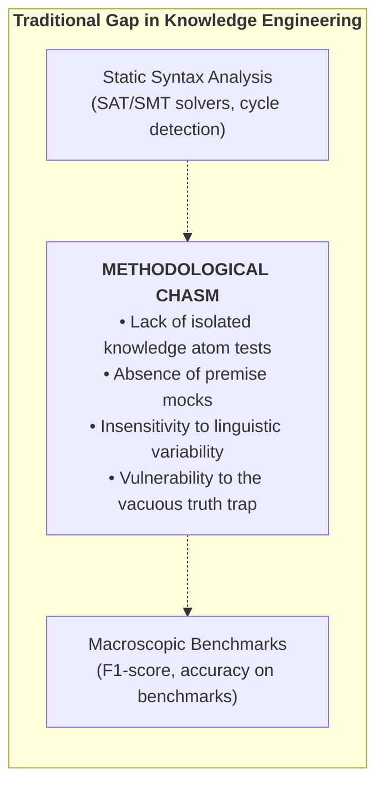
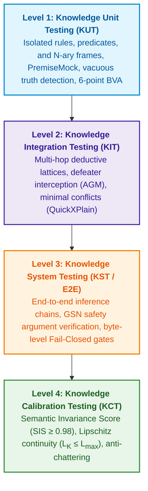
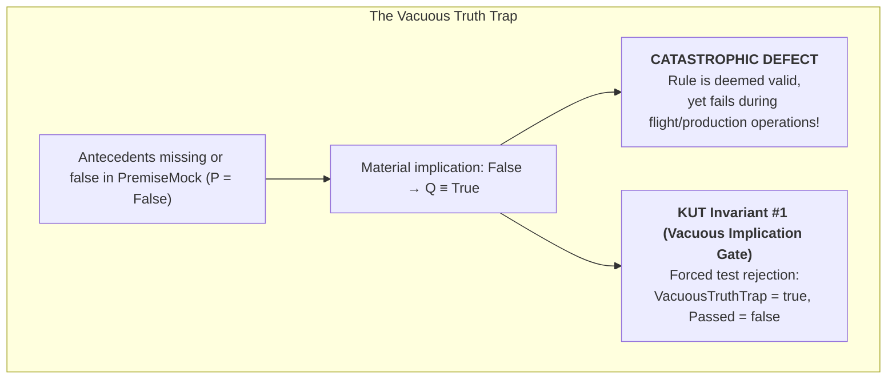
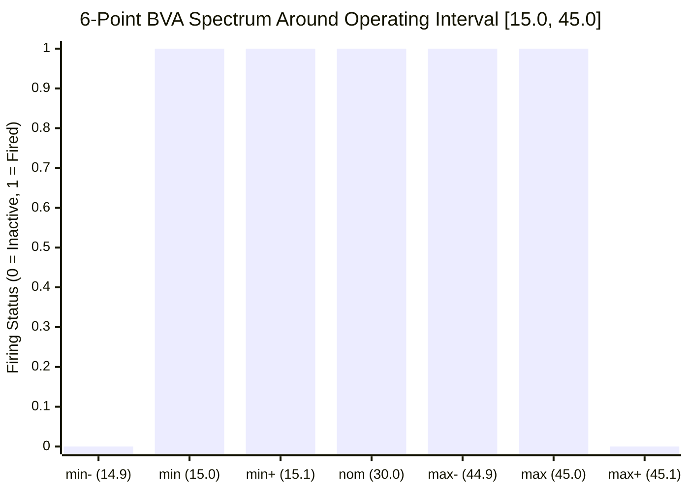
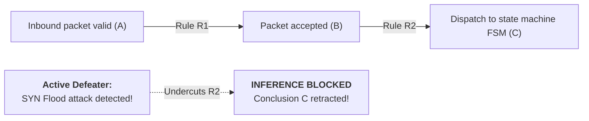
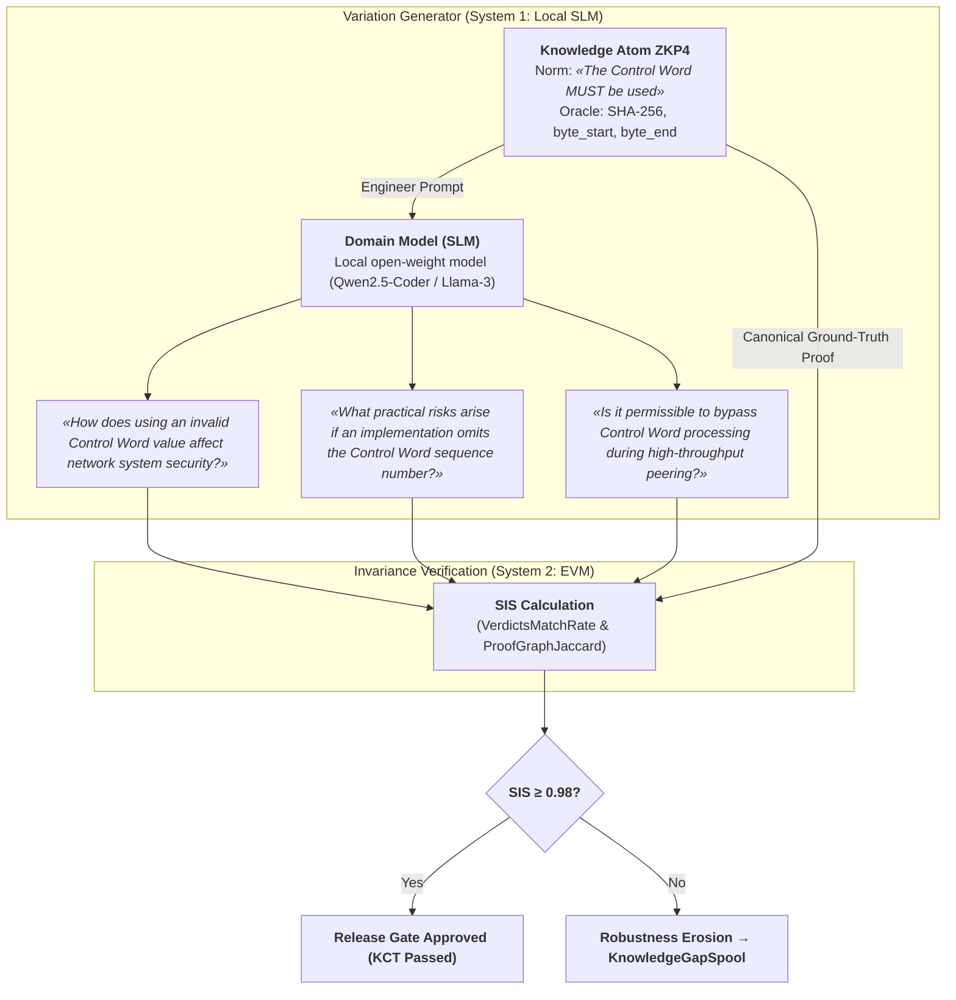
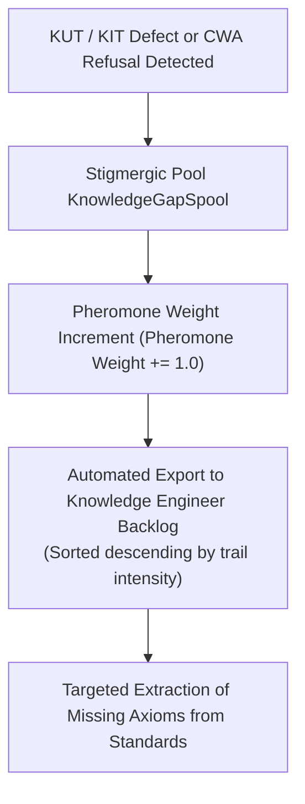

# Chapter 36. Knowledge Testing Pyramid: Rules, Interactions, and Response Robustness

> **Book:** [Architecture of Evidence-Governed Expert Systems](README.md) · [Part V: Verification, Testing, Diagnostics, and Safety Assurance](part-05-verification-and-learning.md)  
> **Previous Chapter:** [Chapter 23. Knowledge Base Verification: Checking Consistency, Completeness, and Rule Reliability](ch23-knowledge-base-verification.md)  
> **Next Chapter:** [Chapter 39. Active Compliance Auditor: Popperian Falsification, Normative Compliance (ASPICE/ISO 26262/ISO 21434), and Autonomous Test Design](ch39-active-compliance-auditor-and-popperian-testing.md)  
> **Table of Contents:** [README.md](README.md)  
> **Author:** [Mykola Fedchyk](about-the-author.md)  
> **Target Level:** Advanced: System architects, knowledge engineers, verification engineers (QA/QE), mathematicians  
> **Expected Learning Outcomes:** Design and deploy the four-tier Knowledge Testing Pyramid (KTP); perform isolated unit testing of individual rules and ontological predicates (Knowledge Unit Testing, KUT) using premise mocking (`PremiseMock`); detect and intercept the vacuous truth trap (*The Vacuous Truth Trap*) in material implications; apply six-point spectral boundary value analysis (Boundary Value Analysis, BVA) to normative specification parameters; build rule composition test suites (Knowledge Integration Testing, KIT) with defeasible defeater interruption checks (AGM contraction); compute the Semantic Invariance Score (SIS) metric to assess stability against linguistic question variations with an admission gate threshold of $`\text{SIS} \ge 0.98`$; verify the Lipschitz knowledge stability ($`L_{\mathcal{K}} \le L_{\max}`$) of the inference space to safeguard cyber-physical systems against relay chattering; establish stigmergic knowledge gap accumulation (`KnowledgeGapSpool`) with pheromone-weighted prioritization of the engineering backlog.

---

## Abstract

This chapter investigates the methodology of multi-tier rule verification and calibration in evidence-governed expert systems grounded in the author's Knowledge Testing Pyramid (*Knowledge Testing Pyramid, KTP*). It formalizes mathematical and architectural instruments that guarantee inference stability against sensor noise and prevent knowledge base degradation in mission-critical deployments.

In mission-critical cyber-physical systems (ISO 26262 ASIL D, EN 50128 SIL 4, DO-178C Level A), the absence of isolated rule verification and boundary inference testing induces two catastrophic failure modes: the vacuous truth trap (*The Vacuous Truth Trap*, where a false or uninitialized antecedent in material implication $A \to B$ automatically renders the rule true, spuriously triggering emergency actuators) and high-frequency relay chattering (*Chattering*, where minor sensor channel noise near predicate thresholds causes abrupt step-like decision oscillations, destroying electromechanical actuators).

This chapter resolves these vulnerabilities by constructing the four-tier Knowledge Testing Pyramid (*Knowledge Testing Pyramid, KTP*): progressing from isolated Knowledge Unit Testing (*KUT*) with premise mocking (`PremiseMock`) and six-point spectral Boundary Value Analysis (*BVA*), through Knowledge Integration Testing (*KIT*) of defeasible inference chains, to system-level evaluation of the Semantic Invariance Score ($`\text{SIS} \ge 0.98`$) and variational calibration of Lipschitz knowledge stability ($`L_{\mathcal{K}} \le L_{\max}`$) across the logical conclusion space.

---

## 1. Methodological Chasm in Knowledge System Verification

To structure software verification, practitioners rely on Mike Cohn's test pyramid [[1]](#src-1). Kent Beck's test-driven development [[2]](#src-2) supplements this with the discipline of explicit expectations formulated for individual components. In this chapter, the testing progression spans from isolated checks to integration and end-to-end evaluations:

```math
\text{Unit Tests} \longrightarrow \text{Integration Tests} \longrightarrow \text{End-to-End / System Tests}
```

No mature software system is admitted into production simply because the compiler detected no syntax errors (static analysis) or because the system passed a handful of manual demonstration scenarios. Every class, function, and module is isolated via dependency doubles (*Test Doubles: Stubs, Mocks, Fakes* [[3]](#src-3)), while boundary conditions are rigorously probed at their extremes.

By contrast, knowledge engineering and the field of expert systems have preserved a striking **methodological chasm** for decades:



Historically, verification was reduced either to **static rule verification** (detecting cycles, redundancy, and syntactic contradictions via SMT solvers [[4]](#src-4)) or immediately to **macroscopic evaluations** (assessing accuracy, F1-score, and Platt/ECE probability calibration across hundreds of queries [[5, 6]](#src-5)).

When an expert system fails on a complex operational query in the absence of atomic testing, the engineer lacks the diagnostic tools to unambiguously localize the defect:
1. Does the rule itself contain an error (an antecedent defect)?
2. Did the fault arise from an invalid type inheritance in the ontology lattice?
3. Was the conclusion suppressed due to the spurious activation of an undercutting defeater (*Undercutting Defeater*)?
4. Did the query phrasing undergo a minor linguistic paraphrase that distorted semantic parsing?

### 1.1. Comparative Analysis of Global Testing and Verification Approaches

| Approach / School | Representatives and Sources | Focus and Strengths | Limitations for Knowledge Systems |
|---|---|---|---|
| **Classical Software Testing** | M. Cohn [[1]](#src-1), K. Beck [[2]](#src-2), M. Feathers [[3]](#src-3) | Component isolation, unit mocks, TDD, regression test suites. | Geared toward deterministic procedural functions; ignores logical resolution, CWA incompleteness, and belief revision. |
| **Formal Verification and SMT** | C. Barrett, L. de Moura, N. Bjørner (Z3) [[4]](#src-4) | Rigorous theorem proving, predicate formula satisfiability checking. | Static analysis of the rule base as a closed system; fails to test dynamic behavior on empirical sensor streams and linguistic paraphrases. |
| **AI Model Calibration (ECE)** | J. Platt [[5]](#src-5), C. Guo et al. (On Calibration of Modern Neural Networks, 2017) [[6]](#src-6) | Aligning scalar classifier probabilities with empirical error rates (Expected Calibration Error). | Evaluates only scalar confidence on a fixed sample; blind to the logical proof structure and perturbation sensitivity. |
| **Metamorphic Testing and CheckList** | T. Y. Chen et al. [[7]](#src-7), M. T. Ribeiro et al. (CheckList, ACL 2020) [[8]](#src-8) | Testing NLP behavioral properties without an oracle via semantic invariants of text perturbations. | Focused on neural network black boxes; lacks byte-level proof auditing and deterministic rule lattice analysis. |
| **Defeasible Reasoning and AGM** | J. Pollock [[9]](#src-9), P. M. Dung [[10]](#src-10), C. Alchourrón, P. Gärdenfors, D. Makinson [[11]](#src-11) | Formal philosophy of defeasible inference, argument conflicts, minimal belief change. | Theoretical logical abstractions lacking software realization of Unit/Integration tiers and engineering stability metrics. |
| **Four-Tier Knowledge Testing Pyramid (KTP)** | **Methodology of this book (KTP framework)** | **Four-tier KUT/KIT/KST/KCT model: premise mocking, vacuous truth detection, BVA, semantic invariance SIS, Lipschitz stability $`L_{\mathcal{K}}`$, and stigmergy.** | **Integrated engineering model spanning from isolated knowledge atoms to certifiable cyber-physical system calibration.** |

---

## 2. Conceptual Model: The Four-Tier Knowledge Testing Pyramid

The author's **Knowledge Testing Pyramid (KTP)** structures intellectual system verification across four levels of rigor and scale:



---

## 3. Tier 1: Knowledge Unit Testing (KUT) — Testing Knowledge Atoms

### 3.1. Definition and Verification Target
**Knowledge Unit Testing (KUT)** represents the isolated testing of the smallest indivisible knowledge unit (an ontology atom, an individual rule, or an $N$-ary semantic frame) without connecting the global fact base or recursively unfolding inference rules.

The targets of KUT comprise:
* An individual normative rule $R: \text{Antecedents} \longrightarrow \text{Consequent}$;
* An individual $N$-ary frame (actor roles, predicate, object, deontic modality SHALL/MUST, preconditions, and exceptions);
* An individual ontology predicate equipped with numerical validity ranges.

### 3.2. Premise Mocking Method
In a live production deployment, a rule queries the knowledge graph:

```math
\mathtt{Query}(\mathtt{"engine\_rpm"}) > 3000 \land \mathtt{Query}(\mathtt{"oil\_temp"}) > 100 \implies \mathtt{Mode} = \mathtt{"COOLING\_HIGH"}
```

During KUT execution, the global environment is substituted with an isolated stub context (`PremiseMock`):
```go
mock := knowledgetest.NewPremiseMock()
mock.Set("engine_rpm", 3500.0)
mock.Set("oil_temp", 105.0)

res := knowledgetest.RunKUT(coolingRule, mock, "COOLING_HIGH")
```

### 3.3. The Vacuous Truth Trap
In classical mathematical logic, material implication $P \to Q$ is logically equivalent to disjunction $\neg P \lor Q$. If antecedent $P$ is false, the implication evaluates to true ($P \equiv \text{False} \implies (P \to Q) \equiv \text{True}$) regardless of the validity or substance of conclusion $Q$.

In engineering expert systems, this dynamic exposes a catastrophic vulnerability: an improperly formulated rule or test runner scores an assertion as "passed" merely because the formal implication condition is satisfied, even though none of the real physical preconditions were ever triggered.



**KUT Invariant #1 (Vacuous Implication Prevention Invariant):**  
The KUT test runner must unconditionally reject a test execution as defective (`VacuousTruthTrap = true`) whenever a rule reports successful firing in the absence or incompleteness of mandatory antecedents within the mock environment.

Prior to rule execution, a test must establish an independent expected outcome. A flag recorded by the rule itself as "vacuous truth" does not constitute an independent oracle: a defective rule might fail to set its own error flag. A rule with a mandatory antecedent requires at least three verification scenarios:

| Controlled Antecedent State | Expected Rule Behavior | What Constitutes a Defect |
|---|---|---|
| Antecedent confirmed | Rule fires and yields the expected consequent | Rule failed to fire or substituted the consequent |
| Antecedent disproven | Rule yields no consequent; outcome carries "not applicable" status | Consequent derived despite a false antecedent |
| Antecedent value unknown | Engine preserves unknown status and identifies the required evidence | Absence of fact silently converted into falsehood or permission |

A boolean fact evaluated as `false` does not denote an absent fact. For instance, a rule verifying that maintenance mode is deactivated may require an explicitly confirmed value of `false`. The test must validate the actual condition of the rule rather than treating any false boolean attribute as a missing antecedent. Three-valued logic is examined in detail in [Chapter 6](ch06-applied-mathematics-for-expert-systems.md).

### 3.4. Six-Point Spectral Boundary Value Analysis (BVA)
Normative documents (RFCs, ISO standards, statutes) contain quantitative parameters: timeouts, threshold voltages, minimum packet sizes. To detect strict versus non-strict inequality errors ($<$ versus $\le$), the author's methodology introduces a six-point spectral boundary value analysis for each parameter bounded by interval $[v_{\min}, v_{\max}]$:



Spectral test points:
1. $v_{\min-} = v_{\min} - \delta$ — point strictly outside the valid range (expected refusal / inhibition);
2. $v_{\min}$ — exact lower boundary (expected firing / admission);
3. $v_{\min+} = v_{\min} + \delta$ — point immediately inside the valid range;
4. $v_{\text{nom}}$ — nominal operational setpoint;
5. $v_{\max-} = v_{\max} - \delta$ — point immediately below the upper boundary;
6. $v_{\max}$ — exact upper boundary;
7. $v_{\max+} = v_{\max} + \delta$ — excursion beyond the upper boundary (expected blocking).

---

## 4. Tier 2: Knowledge Integration Testing (KIT) — Inference Lattices and Defeaters

### 4.1. Multi-Hop Inference Lattices
At the KIT tier, the test harness verifies interactions between adjacent rules, where the conclusion of a preceding rule serves as an antecedent for the subsequent rule:

```math
R_1: A \longrightarrow B, \qquad R_2: B \longrightarrow C, \qquad \dots, \qquad R_n: Y \longrightarrow Z
```

KIT verifies:
* **Interface Type Compatibility:** whether ontological attribute types align consistently across distinct ontology layers;
* **Evidence Traceability Preservation:** whether the chain of byte-level citations propagates through all intermediate nodes without loss of primary source references;
* **Acyclicity:** identifying circular rule dependencies outside authorized finite-state machine transitions.

Consider an example of semantic drift: the first rule returns "socket timeout", whereas the second expects "connection establishment timeout". Identical numerical units and similar naming do not establish identity between measurands. An integration test first supplies the value without an alignment rule and expects composition blocking; it then introduces an approved mapping within the requisite context and verifies the authorized transition. This paired test design distinguishes semantic validation from an overzealous policy that indiscriminately blocks any chain.

### 4.2. Injection of Defeasible Defeaters (Defeater Interruption via AGM)
Under John Pollock's defeasible argumentation theory [[9]](#src-9) and the AGM belief revision postulates [[11]](#src-11), the appearance of a rebutting or undercutting circumstance must immediately rupture the chain of reasoning:



**KIT Invariant #1 (Defeater Dominance Invariant):**  
Upon activation of a verified undercutting defeater ($D$), the system must deterministically halt inference at the target node, retract all derived conclusions (AGM contraction), and return a typed refusal documenting the exact causal justification for the block.

Undercutting a premise versus rebutting a conclusion imposes fundamentally different verification expectations. A telemetry advisory stating "sensor is uncalibrated" undercuts utilizing that measurement as proof of overheating, yet it neither proves the absence of overheating nor purges the measurement from the audit log. Conversely, an assertion that "temperature is below threshold", gathered via an independent calibrated channel, directly rebuts the overheating conclusion. Integration tests must verify the preservation of the primary record, the precise rationale for retraction, and the handling of alternative evidential grounds, rather than simply monitoring the final refusal status [[9]](#src-9).

### 4.3. Minimal Conflict as a Testable Outcome

When constraints are mutually incompatible, it is essential to verify not merely the presence of a conflict status, but the explanatory conflict set itself. Ulrich Junker's QuickXPlain algorithm isolates an inclusion-minimal conflict under defined consistency checking preconditions [[12]](#src-12). Minimality indicates that removing any single element from the isolated subset restores consistency; the algorithm does not guarantee the minimum cardinality across all possible conflict sets.

In a representative pedagogical scenario, three constraints are asserted concurrently: temperature must not fall below 95 °C, temperature must not exceed 90 °C, and pressure must not exceed 10 bar. Given a consistent background theory, the conflict is formed strictly by the two temperature constraints. The pressure constraint must not infiltrate this explanatory conflict set. Independent verification confirms both the incompatibility of the pair and the consistency of each singleton subset.

Dedicated test cases are required for an empty constraint set, a fully consistent constraint set, and an internally contradictory background theory. An algorithm precondition failure must never be misclassified as a valid minimal conflict. The algorithmic implementation and formal verification of QuickXPlain are detailed in [Chapter 20](ch20-explanation-engine.md); hence, the algorithm is not duplicated here.

---

## 5. Tiers 3 and 4: End-to-End Verification and Variational Calibration

### 5.1. End-to-End Testing of the Expert System

Knowledge System Testing (KST) validates the entire operational pipeline spanning from the raw user query to the synthesized decision and its cryptographic justification package. A successful unit test on an isolated rule provides no guarantee that the retrieval stage selected an active source, that linguistic analysis preserved crucial negations, or that the explanation generator faithfully mirrored the underlying inference trace.

| Verification Boundary | Test Scenario | Independent Expectation |
|---|---|---|
| Source → Assertion | Accurate verbatim quotation, but the numerical value belongs to an adjacent entity | Byte matching alone does not authorize adopting an erroneous interpretation |
| Premises → Proof Graph | Omission of a single mandatory premise | Consequent blocked; justification package explicitly identifies the missing premise |
| Proof Graph → Explanation | Introduction of an ungrounded numerical value absent from the execution trace | Ungrounded text blocked or replaced with a certified formal representation |
| Access and Versioning → Delivery | Source retracted subsequent to a prior successful query | New delivery does not rely on the retracted evidential grounding |

Every negative test case mandates a paired positive counterpart: an active source, complete premises, a faithful explanation, and valid authorization credentials. Otherwise, a pathological system that permanently refuses all queries would trivially pass testing. Grounding contracts and explanation engines are scrutinized in Chapters [19](ch19-from-question-to-evidence.md) and [20](ch20-explanation-engine.md), while controlled release gates for updated knowledge revisions are established in [Chapter 25](ch25-how-expert-systems-learn.md).

### 5.2. Semantic Invariance Score (SIS) Metric
Classical examination benchmarks rely on a single, static phrasing of a question. However, during live production operations, field engineers and operators query the identical knowledge item using hundreds of diverse linguistic formulations:

```math
\begin{aligned}
\mathcal{Q}_{\text{base}} &= \text{«What is the minimum MTU for IPv6?»}, \\
\mathcal{Q}_{\text{var1}} &= \text{«Specify the smallest permissible packet size in IPv6 networks»}, \\
\mathcal{Q}_{\text{var2}} &= \text{«Least transmission unit required by RFC 8200 IPv6 specification»}.
\end{aligned}
```

If the system responds to $\mathcal{Q}_{\text{base}}$ with `1280 octets`, yet refuses $\mathcal{Q}_{\text{var1}}$ under CWA or alters its underlying proof path, the system exhibits severe linguistic instability.

The author's **Semantic Invariance Score** ($`\mathrm{SIS}`$) metric evaluates system robustness across the query perturbation manifold $`\mathbb{V}(\mathcal{Q})`$:

```math
\mathrm{SIS}(\mathcal{Q}) = \alpha \cdot \mathrm{VerdictsMatchRate} + \beta \cdot \mathrm{ProofGraphJaccard}
```

where the metric components are formalized as:

```math
\mathrm{VerdictsMatchRate} = \frac{1}{N} \sum_{i=1}^{N} I\left(\mathrm{Verdict}(Q_i) = \mathrm{Verdict}(Q_{\mathrm{base}})\right) \in [0, 1]
```

```math
\mathrm{ProofGraphJaccard} = \frac{1}{N} \sum_{i=1}^{N} \frac{\lvert P(Q_i) \cap P(Q_{\mathrm{base}})\rvert}{\lvert P(Q_i) \cup P(Q_{\mathrm{base}})\rvert} \in [0, 1]
```

**Parameters and Weighting Coefficients:**
- $`\mathrm{VerdictsMatchRate}`$ — the proportion of perturbed queries across $`N`$ variations where the verdict strictly matches the verdict returned for the baseline phrasing;
- $`\mathrm{ProofGraphJaccard}`$ — the mean Jaccard similarity coefficient between the node and citation sets of the proof graph $`P(Q)`$;
- $`\alpha, \beta \in [0, 1]`$ — confidence calibration weights ($`\alpha = 0.6,\; \beta = 0.4`$, where $`\alpha + \beta = 1.0`$);
- $`\mathrm{SIS}(\mathcal{Q}) \in [0, 1]`$ — the resulting composite semantic invariance score.

**Admission Gate Criteria and Runtime Decisions:**  
For the automated variational admission gate, the following threshold policies govern execution:

```math
\mathrm{SIS}(\mathcal{Q}) \ge 0{,}98
```

- `ACCEPT_INVARIANT`: if $`\mathrm{SIS}(\mathcal{Q}) \ge 0.98`$ and $`\mathrm{VerdictsMatchRate} = 1.00`$, the knowledge base is verified as invariant under query perturbations and receives an Ed25519 release signature;
- `QUALIFIED_REVIEW`: if $`0.85 \le \mathrm{SIS}(\mathcal{Q}) < 0.98`$, the system flags argumentation structural drift, halts publication, and escalates the audit report to a knowledge engineer with divergent proof graphs highlighted;
- `REJECT_DRIFT`: if $`\mathrm{SIS}(\mathcal{Q}) < 0.85`$ or $`\mathrm{VerdictsMatchRate} < 1.00`$, the release candidate is unconditionally rejected by the CI/CD test pipeline.

**Worked Numerical Example:**  
Suppose a query evaluation draws a sample of $`N = 10`$ linguistic variations ($`Q_1, \dots, Q_{10}`$). Across all 10 variations, the verdict matches the baseline (`1280 octets`), yielding $`\mathrm{VerdictsMatchRate} = 10/10 = 1.00`$. In 9 variations, the proof graphs are identical to the baseline ($`\frac{\lvert P_i \cap P_{\mathrm{base}} \rvert}{\lvert P_i \cup P_{\mathrm{base}} \rvert} = 1.00`$), whereas in variation $`Q_8`$, the generator substituted a synonymous expanded definition, forming a graph of 5 nodes versus 4 baseline nodes with an intersection of 4 nodes ($`\frac{4}{5} = 0.80`$). Thus:

```math
\mathrm{ProofGraphJaccard} = \frac{9 \times 1{,}00 + 1 \times 0{,}80}{10} = 0{,}980.
```

The resulting index evaluates to:

```math
\mathrm{SIS}(\mathcal{Q}) = 0{,}6 \times 1{,}00 + 0{,}4 \times 0{,}980 = 0{,}600 + 0{,}392 = 0{,}992.
```

Because $`0.992 \ge 0.98`$, the package receives `ACCEPT_INVARIANT` status.

An aggregate score must never obscure a divergence in a critical verdict. In addition, every confirmed equivalent phrasing must be probed: the verdict must match the reference outcome, and every premise utilized must remain valid. The omission of proof nodes must degrade the graph similarity score even when the remaining nodes are unchanged. An alternative valid proof is not intrinsically a defect; the policy governing permissible graph transformations must be formalized prior to verification.

An empty set of variations yields no evaluation of robustness. Similarly, two empty proof graphs fail to demonstrate an evidence-grounded answer: the presence and validity of premises must be certified before comparing graph similarity. The threshold of 0.98 and weights of 0.6 and 0.4 represent parameters of a pedagogical example, not industry standard mandates. Success across a finite test suite does not prove invariance over all conceivable queries, nor does it constitute formal certification.

### 5.3. Lipschitz Knowledge Stability Criterion ($L_{\mathcal{K}} < \infty$)
In cyber-physical systems (autopilots, nuclear reactor controls, medical infusion pumps), incoming empirical variables are subject to physical noise and micro-perturbations:

```math
x \longrightarrow x + \Delta x, \qquad \|\Delta x\| < 10^{-5}.
```

If an infinitesimal disturbance in an input signal induces an abrupt jump in conclusion confidence from $1.0$ to $0.0$ in the absence of a physical defeater, **relay chattering (Chattering)** emerges, driving electromechanical actuators into destructive limit-cycle oscillations.

The author's model mandates compliance with **Lipschitz continuity within the logical space**:

```math
L_{\mathcal{K}} = \sup_{x_1 \neq x_2} \frac{\|\mathcal{K}(x_1) - \mathcal{K}(x_2)\|}{\|x_1 - x_2\|} \le L_{\max}.
```

**Parameters and Engineering Constraints:**
- $x_1, x_2 \in \mathbb{R}^n$ — vectors of input physical observations within the admissible state space;
- $`\mathcal{K}(x) \in [0, 1]^m`$ — vector of confidence values or numerical recommendations produced by the expert system;
- $`\|\cdot\|`$ — Euclidean or Chebyshev norm in the corresponding vector space;
- $`L_{\mathcal{K}} \ge 0`$ — empirical Lipschitz constant of the knowledge mapping;
- $`L_{\max}`$ — upper bound on permissible response steepness (e.g., $`L_{\max} = 10.0\,\text{bar}^{-1}`$).

**Operational Decisions and Numerical Example:**
- When the verifier identifies a discontinuity where the differential ratio diverges ($`L_{\mathcal{K}} > L_{\max}`$) as $`\|\Delta x\| \to 0`$, the system flags a chattering hazard (`CHATTERING_FAULT`), inhibits direct transmission to the physical execution subsystem, and mandates the insertion of a hysteresis band or smoothing filter.
- Numerical Example: An oil pressure sensor transmits $`x_1 = 2.999\,\text{bar}`$ (where logical inference generates nominal mode confidence $`\mathcal{K}(x_1) = 1.00`$) and $`x_2 = 3.001\,\text{bar}`$ (where, absent a deadband, confidence plummets to $`\mathcal{K}(x_2) = 0.00`$). With perturbation step $`\|x_1 - x_2\| = 0.002\,\text{bar}`$, the response gradient reaches:

```math
L_{\mathcal{K}} = \frac{\lvert 1{,}00 - 0{,}00 \rvert}{0{,}002\,\text{bar}} = 500\,\text{bar}^{-1} \gg L_{\max} = 10\,\text{bar}^{-1}.
```

- System Action: The rule is flagged as hazardous to physical actuators (`REJECT_UNSTABLE_RULE`), and the rule compiler issues a directive mandating the introduction of a $\pm 0.15\,\text{bar}$ hysteresis corridor.

### 5.4. Neuro-Symbolic Generation of Query Perturbations $\mathbb{V}(\mathcal{Q})$ via Local SLMs

Evaluating the $`\mathrm{SIS}(\mathcal{Q})`$ metric requires a representative set of perturbations $`\mathbb{V}(\mathcal{Q}) = \{\mathcal{Q}_1, \mathcal{Q}_2, \dots, \mathcal{Q}_N\}`$. Historically, knowledge engineering relied on two unsatisfactory approaches to assemble this set:
1. **Manual expert paraphrasing:** prohibitively expensive, subjective, and restricted to a few dozen variants;
2. **Template-based algorithmic substitution:** susceptible to lexical leakage, as it merely mirrors rule antecedent keywords directly into the query.

To achieve rigorous calibration at scale, the architecture incorporates a **neuro-symbolic perturbation synthesizer** powered by a local execution runtime of open-weight Small Language Models (SLMs):



This dual-tier architecture establishes a two-speed calibration loop:
- **High-Throughput Matrix Stress-Testing:** Fast algorithmic generators produce hundreds of thousands of test cases ($> 250{,}000\ \text{tests/s}$) to audit throughput, memory leaks, and register state transition integrity.
- **Neuro-Symbolic Golden Calibrator:** A parallel pool of local models (SLM Workers) synthesizes high-entropy, authentic linguistic perturbations ($1{,}000$ to $10{,}000$ cases) for certification calculations requiring $\text{SIS} \ge 0.98$. Throughout this process, the reference oracle (System 2 EVM) remains completely shielded against data leakage and subjective bias.

---

## 6. Test Contracts for Different Inference Paradigms

A single green test indicator does not signify the same semantic reality for a deductive rule, a statistical generalization, and an abductive hypothesis. A formal test contract defines the expected outcome, the evidential grounds against which the outcome is evaluated, and what a successful test explicitly fails to establish.

| Inference Paradigm | What the Test Verifies | Benchmark Defect | Bound of the Result |
|---|---|---|---|
| Deduction | Rule applicability, presence of all required premises, and expected consequent | Consequent derived following removal of a mandatory premise | Validates consequence within the defined model, not truth of all premises |
| Induction | Generalization quality across independent samples, coverage, and sample limits | Rule fires exclusively on training samples or fails to cover any instance | Assessment applies strictly to tested population and underlying assumptions |
| Abduction | Hypothesis compatibility with observed facts, explanation of observations, and verification plan | Hypothesis contradicts established facts or lacks a discriminative test | Plausible hypothesis does not constitute a proven causal explanation |
| Defeasible Reasoning | Response to premise undercutting, rebutting, and alternative grounding | Relies on a retracted premise or conceals an unresolved conflict | Result depends upon accepted argumentation semantics and active evidence |
| Case-Based Reasoning | Applicability scope of the analogy, solution adaptation, and known counterexamples | Near neighbor transferred to an incompatible revision without verification | Similarity aids retrieval but does not prove operational viability |

Theoretical guarantees in inductive learning require explicit assumptions concerning the hypothesis class, sample distribution, and error tolerance. Leslie Valiant's Probably Approximately Correct (PAC) learning framework [[13]](#src-13) does not permit attributing formal guarantees to an arbitrary rule merely on the basis of sample count. Case-Based Reasoning (CBR) likewise cannot be reduced to calculating geometric distances: an unaddressed negative precedent triggers an applicability check rather than an indiscriminate ban across all analogies. Foundational inference paradigms are examined in [Chapter 6](ch06-applied-mathematics-for-expert-systems.md), while the operational status of hypotheses and precedents is explored in [Chapter 28](ch28-dual-mode-expert-systems.md).

Such contracts supply concrete diagnostic outcomes: an antecedent defect, an incompatible composition, an ungrounded explanation, or an insufficient sample set. The subsequent section demonstrates how detected defects are channeled into a cybernetically governed knowledge curation workflow.

---

## 7. Stigmergic Closure of Knowledge Gaps (KnowledgeGapSpool)

Every test failure across KUT, KIT, or SIS tiers exposes an explicit gap within the knowledge base. Traditional systems restrict their response to emitting a diagnostic log to the console. In an evidence-governed system with cybernetic regulation, defects are automatically redirected into a **stigmergic knowledge gap spool (`KnowledgeGapSpool`)**:



The stigmergic principle eliminates human subjectivity: knowledge engineers are prioritized with tickets for rule engineering corresponding to the highest pheromone weight accumulated from recurring query failures.

---

## 8. Software Implementation in Go

The pedagogical implementation below demonstrates premise mocking, firing verification, sequential rule composition, SIS calculation, and evaluation of selected perturbations. This minimal example does not implement all contracts formalized in Sections 3–6: specifically, `KUTResult` lacks a distinct representation for unknown epistemic states, and `RunKITLattice` does not serve as a full-fledged reasoner maintaining alternative evidential grounds. Probing several numerical points does not prove global Lipschitz continuity.

The example and test suite require Go 1.22 or newer. All dependencies are part of the standard library. Boundary checks receive an explicit typed base context, and the SIS calculation distinctly isolates variation set completeness from uniform verdict agreement.

<details>
<summary>Pedagogical Go Implementation: Rule Verification and Variational Calibration</summary>

```go
package main

import (
	"errors"
	"fmt"
	"math"
)

// --- TIER 1: KUT AND PREMISE MOCKS ---

var ErrVacuousTruthTrap = errors.New("vacuous truth trap: rule evaluated to true without required antecedents")

type PremiseMock struct {
	Facts map[string]any
}

func NewPremiseMock() *PremiseMock {
	return &PremiseMock{Facts: make(map[string]any)}
}

func (pm *PremiseMock) Set(predicate string, val any) *PremiseMock {
	pm.Facts[predicate] = val
	return pm
}

type KnowledgeRule struct {
	ID          string
	Name        string
	Antecedents []string
	Evaluate    func(env map[string]any) (bool, any, float64, error)
	Consequent  string
}

type KUTResult struct {
	RuleID           string
	Passed           bool
	VacuousTruthTrap bool
	Fired            bool
	Conclusion       any
	Confidence       float64
	Error            string
}

func RunKUT(rule KnowledgeRule, mock *PremiseMock, expectedConclusion any) KUTResult {
	missingAntecedents := false
	for _, ant := range rule.Antecedents {
		val, ok := mock.Facts[ant]
		if !ok || val == nil {
			missingAntecedents = true
			break
		}
	}

	fired, conclusion, conf, err := rule.Evaluate(mock.Facts)

	// Invariant #1: Detection of the vacuous truth trap
	if missingAntecedents && fired {
		return KUTResult{
			RuleID:           rule.ID,
			Passed:           false,
			VacuousTruthTrap: true,
			Fired:            fired,
			Conclusion:       conclusion,
			Confidence:       conf,
			Error:            ErrVacuousTruthTrap.Error(),
		}
	}

	if err != nil {
		return KUTResult{RuleID: rule.ID, Passed: false, Error: err.Error()}
	}

	passed := false
	if expectedConclusion != nil {
		passed = fired && fmt.Sprintf("%v", conclusion) == fmt.Sprintf("%v", expectedConclusion)
	} else {
		passed = !fired
	}

	return KUTResult{
		RuleID:     rule.ID,
		Passed:     passed,
		Fired:      fired,
		Conclusion: conclusion,
		Confidence: conf,
	}
}

// 6-Point BVA Analysis
type BVAPoint string

const (
	BVAMinMinus BVAPoint = "min-"
	BVAMin      BVAPoint = "min"
	BVAMinPlus  BVAPoint = "min+"
	BVANominal  BVAPoint = "nom"
	BVAMaxMinus BVAPoint = "max-"
	BVAMax      BVAPoint = "max"
	BVAMaxPlus  BVAPoint = "max+"
)

type BVAResult struct {
	Point         BVAPoint
	Val           float64
	ExpectedFired bool
	ActualFired   bool
	Passed        bool
}

func RunBVA(rule KnowledgeRule, paramName string, min, nom, max, delta float64, baseFacts map[string]any) []BVAResult {
	points := []struct {
		point BVAPoint
		val   float64
		exp   bool
	}{
		{BVAMinMinus, min - delta, false},
		{BVAMin, min, true},
		{BVAMinPlus, min + delta, true},
		{BVANominal, nom, true},
		{BVAMaxMinus, max - delta, true},
		{BVAMax, max, true},
		{BVAMaxPlus, max + delta, false},
	}

	var results []BVAResult
	for _, p := range points {
		mock := NewPremiseMock()
		for predicate, value := range baseFacts {
			mock.Set(predicate, value)
		}
		mock.Set(paramName, p.val)
		res := RunKUT(rule, mock, nil)
		results = append(results, BVAResult{
			Point:         p.point,
			Val:           p.val,
			ExpectedFired: p.exp,
			ActualFired:   res.Fired,
			Passed:        res.Error == "" && !res.VacuousTruthTrap && res.Fired == p.exp,
		})
	}
	return results
}

// --- TIER 2: KIT AND DEFEATER STRUCTURES ---

type DefeaterCondition struct {
	ID         string
	TargetRule string
	Condition  func(env map[string]any) bool
}

type KITResult struct {
	LatticeID       string
	Passed          bool
	DefeaterBlocked bool
	FinalConclusion any
}

func RunKITLattice(id string, rules []KnowledgeRule, env map[string]any, defeaters []DefeaterCondition) KITResult {
	curr := make(map[string]any)
	for k, v := range env {
		curr[k] = v
	}

	var finalConcl any
	for _, r := range rules {
		for _, d := range defeaters {
			if d.TargetRule == r.ID && d.Condition(curr) {
				return KITResult{LatticeID: id, Passed: true, DefeaterBlocked: true, FinalConclusion: nil}
			}
		}
		fired, concl, _, err := r.Evaluate(curr)
		if err != nil || !fired {
			return KITResult{LatticeID: id, Passed: false}
		}
		curr[r.Consequent] = concl
		finalConcl = concl
	}
	return KITResult{LatticeID: id, Passed: true, FinalConclusion: finalConcl}
}

// --- TIERS 3 AND 4: SIS AND LIPSCHITZ VERIFIER ---

type ParaphraseRun struct {
	Variation  string
	Verdict    string
	ProofNodes []string
}

type SISResult struct {
	Score            float64
	PassedThreshold  bool
	Complete         bool
	AllVerdictsMatch bool
}

func CalculateSIS(baseline ParaphraseRun, variations []ParaphraseRun, alpha, beta, threshold float64) SISResult {
	for _, parameter := range []float64{alpha, beta, threshold} {
		if math.IsNaN(parameter) || math.IsInf(parameter, 0) || parameter < 0 || parameter > 1 {
			return SISResult{}
		}
	}
	if len(variations) == 0 || len(baseline.ProofNodes) == 0 || math.Abs(alpha+beta-1) > 1e-12 {
		return SISResult{}
	}

	matches := 0
	jaccardSum := 0.0
	complete := true
	bMap := make(map[string]bool)
	for _, n := range baseline.ProofNodes {
		bMap[n] = true
	}

	for _, v := range variations {
		if len(v.ProofNodes) == 0 {
			complete = false
		}
		if v.Verdict == baseline.Verdict {
			matches++
		}
		vMap := make(map[string]bool)
		for _, n := range v.ProofNodes {
			vMap[n] = true
		}
		inter, union := 0, make(map[string]bool)
		for n := range bMap {
			union[n] = true
			if vMap[n] {
				inter++
			}
		}
		for n := range vMap {
			union[n] = true
		}
		jaccardSum += float64(inter) / float64(len(union))
	}

	matchRate := float64(matches) / float64(len(variations))
	avgJaccard := jaccardSum / float64(len(variations))
	score := (alpha * matchRate) + (beta * avgJaccard)
	allVerdictsMatch := matches == len(variations)

	return SISResult{
		Score:            score,
		PassedThreshold:  complete && allVerdictsMatch && score >= threshold,
		Complete:         complete,
		AllVerdictsMatch: allVerdictsMatch,
	}
}

type LipschitzResult struct {
	MaxL               float64
	Passed             bool
	ChatteringDetected bool
}

func VerifyLipschitz(x0 float64, f func(x float64) float64, deltas []float64, maxAllowed float64) LipschitzResult {
	y0 := f(x0)
	maxL := 0.0
	chattering := false

	for _, dx := range deltas {
		if dx == 0 {
			continue
		}
		dy := math.Abs(f(x0+dx) - y0)
		adx := math.Abs(dx)
		r := dy / adx
		if r > maxL {
			maxL = r
		}
		if adx < 1e-4 && dy > 0.5 {
			chattering = true
		}
	}
	return LipschitzResult{
		MaxL:               maxL,
		Passed:             maxL <= maxAllowed && !chattering,
		ChatteringDetected: chattering,
	}
}

func main() {
	fmt.Println("=== Evidence-Governed Knowledge Testing Pyramid: Verification Run ===")

	// 1. KUT Test and Vacuous Truth Blocking
	batteryRule := KnowledgeRule{
		ID:          "R-BATT-01",
		Antecedents: []string{"temp_c", "voltage_v"},
		Evaluate: func(env map[string]any) (bool, any, float64, error) {
			tVal, ok1 := env["temp_c"]
			vVal, ok2 := env["voltage_v"]
			if !ok1 || !ok2 {
				return false, nil, 0, nil
			}
			t, _ := tVal.(float64)
			v, _ := vVal.(float64)
			if t >= 15.0 && t <= 45.0 && v >= 20.0 {
				return true, "CHARGE_PERMITTED", 1.0, nil
			}
			return false, "CHARGE_INHIBITED", 1.0, nil
		},
		Consequent: "charge_state",
	}

	validMock := NewPremiseMock().Set("temp_c", 25.0).Set("voltage_v", 24.0)
	resValid := RunKUT(batteryRule, validMock, "CHARGE_PERMITTED")
	fmt.Printf("[KUT] Nominal test: Passed=%v, Verdict=%v\n", resValid.Passed, resValid.Conclusion)

	// Vacuous verification: deliberately providing an empty mock
	emptyMock := NewPremiseMock()
	resVacuous := RunKUT(batteryRule, emptyMock, "CHARGE_PERMITTED")
	fmt.Printf("[KUT] Counterfactual test: VacuousTrap=%v, Passed=%v\n", resVacuous.VacuousTruthTrap, resVacuous.Passed)

	// 2. BVA Test
	bvaResults := RunBVA(batteryRule, "temp_c", 15.0, 30.0, 45.0, 0.1, map[string]any{"voltage_v": 24.0})
	allBVAPassed := true
	for _, br := range bvaResults {
		if !br.Passed {
			allBVAPassed = false
		}
	}
	fmt.Printf("[BVA] 6-point boundary value analysis: All points passed=%v\n", allBVAPassed)

	// 3. KIT Test with Defeater
	r1 := KnowledgeRule{
		ID:          "R1",
		Antecedents: []string{"sensor_ready"},
		Consequent:  "arm_subsystem",
		Evaluate: func(env map[string]any) (bool, any, float64, error) {
			return env["sensor_ready"] == true, true, 1.0, nil
		},
	}
	r2 := KnowledgeRule{
		ID:          "R2",
		Antecedents: []string{"arm_subsystem"},
		Consequent:  "execute_ignition",
		Evaluate: func(env map[string]any) (bool, any, float64, error) {
			return env["arm_subsystem"] == true, "IGNITE_OK", 1.0, nil
		},
	}

	defeater := []DefeaterCondition{
		{
			ID:         "DEF-ABORT",
			TargetRule: "R2",
			Condition:  func(env map[string]any) bool { return env["abort_switch"] == true },
		},
	}

	kitRes := RunKITLattice("LAT-01", []KnowledgeRule{r1, r2}, map[string]any{"sensor_ready": true, "abort_switch": true}, defeater)
	fmt.Printf("[KIT] Integration lattice with defeater: DefeaterBlocked=%v, Passed=%v\n", kitRes.DefeaterBlocked, kitRes.Passed)

	// 4. SIS (Semantic Invariance Score) Test
	baseline := ParaphraseRun{
		Variation:  "Specify the minimum MTU for IPv6",
		Verdict:    "1280",
		ProofNodes: []string{"RFC8200:Sec5", "Rule:IPv6MinMTU"},
	}
	vars := []ParaphraseRun{
		{Variation: "Least allowed packet size in IPv6", Verdict: "1280", ProofNodes: []string{"RFC8200:Sec5", "Rule:IPv6MinMTU"}},
		{Variation: "IPv6 minimum transmission unit", Verdict: "1280", ProofNodes: []string{"RFC8200:Sec5", "Rule:IPv6MinMTU"}},
	}
	sis := CalculateSIS(baseline, vars, 0.6, 0.4, 0.98)
	fmt.Printf("[SIS] Semantic invariance: Score=%.4f, Admission (>=0.98)=%v\n", sis.Score, sis.PassedThreshold)

	// 5. Lipschitz Stability Test
	smoothF := func(x float64) float64 { return 1.0 / (1.0 + math.Exp(-x)) }
	lipRes := VerifyLipschitz(0.0, smoothF, []float64{-0.01, 0.01}, 1.0)
	fmt.Printf("[LIP] Lipschitz stability: MaxL=%.4f, Chattering=%v, Passed=%v\n", lipRes.MaxL, lipRes.ChatteringDetected, lipRes.Passed)
}
```

</details>

`RunBVA` mutates solely the evaluated parameter; all other antecedents originate from the supplied context. In the example, voltage is the scalar quantity 24.0 V rather than an automatically injected boolean `true`. The function probes six boundary points alongside an additional nominal setpoint. `CalculateSIS` permits neither an empty variation set nor an empty evidential grounding, and it refuses to conceal a single divergent verdict behind a high average score. Field `Complete` is inspected prior to interpreting field `Score`.

### 8.1. Independent Tests of the Testing Harness

A green test report does not prove the correctness of the testing harness itself. Below, expectations are formulated independently of rule flags: the test rejects arbitrary firing, distinguishes known `false` from a missing fact, and verifies the explicit context of boundary testing. For SIS, distinct negative scenarios are required: an empty set, empty evidential grounding, node loss, and a single verdict deviation across one hundred variations.

<details>
<summary>Unit Tests for the Pedagogical Go Package</summary>

```go
package main

import "testing"

func TestKUTIndependentExpectations(t *testing.T) {
	alwaysFires := KnowledgeRule{
		ID:          "defective",
		Antecedents: []string{"ready"},
		Evaluate: func(env map[string]any) (bool, any, float64, error) {
			return true, "ALLOW", 1, nil
		},
	}
	if result := RunKUT(alwaysFires, NewPremiseMock().Set("ready", true), nil); result.Passed {
		t.Fatal("unexpected firing was accepted without an independent expected conclusion")
	}
	if result := RunKUT(alwaysFires, NewPremiseMock(), "ALLOW"); result.Passed || !result.VacuousTruthTrap {
		t.Fatal("firing without a required fact was accepted")
	}
	knownFalse := KnowledgeRule{
		ID:          "maintenance-disabled",
		Antecedents: []string{"maintenance"},
		Evaluate: func(env map[string]any) (bool, any, float64, error) {
			value, exists := env["maintenance"]
			return exists && value == false, "ALLOW", 1, nil
		},
	}
	if result := RunKUT(knownFalse, NewPremiseMock().Set("maintenance", false), "ALLOW"); !result.Passed || result.VacuousTruthTrap {
		t.Fatal("a known false fact was treated as a missing fact")
	}
	if result := RunKUT(knownFalse, NewPremiseMock(), "ALLOW"); result.Passed || result.Fired {
		t.Fatal("a missing fact was treated as a known false fact")
	}
}

func TestBVAUsesTypedContext(t *testing.T) {
	rule := KnowledgeRule{
		ID:          "temperature-band",
		Antecedents: []string{"temp_c", "voltage_v"},
		Evaluate: func(env map[string]any) (bool, any, float64, error) {
			temperature, hasTemperature := env["temp_c"].(float64)
			voltage, hasVoltage := env["voltage_v"].(float64)
			return hasTemperature && hasVoltage && temperature >= 15 && temperature <= 45 && voltage >= 20, "ALLOW", 1, nil
		},
	}
	context := map[string]any{"voltage_v": 24.0}
	results := RunBVA(rule, "temp_c", 15, 30, 45, 0.1, context)
	if len(results) != 7 {
		t.Fatalf("expected six boundary points and one nominal point, got %d", len(results))
	}
	for _, result := range results {
		if !result.Passed {
			t.Errorf("boundary %s failed at %g", result.Point, result.Val)
		}
	}
	if len(context) != 1 || context["voltage_v"] != 24.0 {
		t.Fatal("boundary testing mutated the supplied context")
	}
}

func TestSISEmptyAndIncompleteEvidence(t *testing.T) {
	baseline := ParaphraseRun{Verdict: "ALLOW", ProofNodes: []string{"source", "rule"}}
	if result := CalculateSIS(baseline, nil, 0.6, 0.4, 0.98); result.Complete || result.PassedThreshold {
		t.Fatal("an empty variation set was accepted")
	}
	if result := CalculateSIS(ParaphraseRun{Verdict: "ALLOW"}, []ParaphraseRun{baseline}, 0.6, 0.4, 0.98); result.Complete || result.PassedThreshold {
		t.Fatal("an empty baseline proof was accepted")
	}
	if result := CalculateSIS(baseline, []ParaphraseRun{{Verdict: "ALLOW"}}, 0.6, 0.4, 0); result.Complete || result.PassedThreshold {
		t.Fatal("an empty variation proof was accepted")
	}
	if result := CalculateSIS(baseline, []ParaphraseRun{baseline}, 0.8, 0.4, 0.98); result.Complete || result.PassedThreshold {
		t.Fatal("unnormalized weights were accepted")
	}
	partial := ParaphraseRun{Verdict: "ALLOW", ProofNodes: []string{"source"}}
	if result := CalculateSIS(baseline, []ParaphraseRun{partial}, 0.6, 0.4, 0.98); !result.Complete || result.Score >= 1 || result.PassedThreshold {
		t.Fatal("loss of a proof node was not reflected in the score")
	}
	if result := CalculateSIS(baseline, []ParaphraseRun{baseline}, 0.6, 0.4, 0.98); !result.Complete || !result.AllVerdictsMatch || !result.PassedThreshold || result.Score != 1 {
		t.Fatal("a complete matching variation was rejected")
	}
}

func TestSISRejectsOneVerdictChangeDespiteHighAverage(t *testing.T) {
	baseline := ParaphraseRun{Verdict: "ALLOW", ProofNodes: []string{"source", "rule"}}
	variations := make([]ParaphraseRun, 100)
	for index := range variations {
		variations[index] = baseline
	}
	variations[99] = ParaphraseRun{Verdict: "DENY", ProofNodes: baseline.ProofNodes}
	result := CalculateSIS(baseline, variations, 0.6, 0.4, 0.98)
	if !result.Complete || result.Score < 0.98 || result.AllVerdictsMatch || result.PassedThreshold {
		t.Fatalf("one changed verdict was hidden by the average: %+v", result)
	}
}
```

</details>

Executing `go test -v` verifies the test harness itself, not the veracity of a production knowledge base. The variations evaluated are synthetic execution records, not the outputs of an active natural language parser. These unit tests do not prove semantic equivalence of user queries, the correctness of operational rules, or the physical safety of an actuator controller.

---

## Conclusions

The Knowledge Testing Pyramid addresses the questions of where a defect originated and which verification tier can isolate that defect. Isolated unit tests verify the rule and controlled antecedents; integration tests verify rule composition and premise retraction; end-to-end tests verify the complete decision package; and variational calibration tests verify targeted input variations.

Expectations must be established independently of the evaluated rule's internal response. A false antecedent cannot authorize deriving a consequent, an unknown antecedent does not automatically collapse into falsehood, and a minimal conflict does not necessarily possess minimum cardinality. Verification criteria across deduction, induction, abduction, defeasible reasoning, and case-based analogy diverge fundamentally because the outputs of these inference methods carry distinct epistemic warrant.

The boundaries of test findings are demarcated by the benchmark suite and the operational model implemented. A high average score does not compensate for a single critical verdict deviation, a handful of perturbations does not demonstrate global stability, and a demonstration run does not constitute certification. The knowledge gap spool prepares raw defect data for verification and subsequent knowledge releases, but does not grant authority to autonomously alter existing normative constraints.

### Further Learning Path

Having mastered the full cycle of knowledge testing and calibration, the reader can explore practical applied pathways:
* In **[Appendix A](appendix-a-evidence-governed-framework.md)**, an integrated framework is established for structuring research memory, logging assertive claims, and isolating test benches;
* In **[Appendix B](appendix-b-robotics-and-cyber-physical-systems.md)**, the principles of Lipschitz stability and defeater checking are scaled to physical actuators in autonomous robotics;
* In **[Appendix E](appendix-e-mixed-signal-neuromorphic-expert-systems.md)**, the verification of knowledge invariants is extended to mixed-signal analog-digital and neuromorphic processing architectures.

---

## Questions for Self-Examination

1. Why does classical material implication $P \to Q$ in boolean logic pose severe hazards for unit testing engineering rules, and how does the `PremiseMock` method detect the vacuous truth trap?
2. What distinguishes the behavioral robustness testing of language models via the CheckList methodology from calculating the Semantic Invariance Score $`\text{SIS}(\mathcal{Q})`$ across a proof graph?
3. What physical consequences manifest in a cyber-physical system (e.g., an autonomous drone) if the Lipschitz continuity of the expert system's decision space is violated?
4. How is the stigmergic knowledge gap spool related to the second law of thermodynamics and Ilya Prigogine's concept of entropy export?
5. How does an independent test distinguish a known boolean `false` value from an absent fact, and undercutting evidential grounding from rebutting a conclusion?
6. Why does a high aggregate SIS score fail to compensate for a single critical verdict flip, and why is an inclusion-minimal conflict not necessarily minimal in constraint count?

---

## Glossary

| Term | English Equivalent | Definition |
|---|---|---|
| **Knowledge Unit Testing (KUT)** | Knowledge Unit Testing | Unit testing of an isolated knowledge atom (rule, frame, predicate) with premise mocking. |
| **Premise Mocking** | Premise Mocking | A technique for isolating rule antecedents by substituting the knowledge base with a controlled stub context. |
| **Vacuous Truth Trap** | Vacuous Truth Trap | A pathological condition where formal material implication $P \to Q$ evaluates to true solely due to the falsehood of premise $P$. |
| **Knowledge Integration Testing (KIT)** | Knowledge Integration Testing | Integration testing of interacting rules, multi-hop lattices, and rule chain rupture via defeaters. |
| **Knowledge System Testing (KST)** | Knowledge System Testing | Verification of the complete pipeline from user query and sources to synthesized decision and justification package. |
| **Minimal Conflict** | Minimal Conflict | An inconsistent subset of constraints that becomes consistent upon removing any single element under an invariant consistent background. |
| **Semantic Invariance Score (SIS)** | Semantic Invariance Score | A numerical metric assessing the stability of a logical verdict and proof graph structure against linguistic paraphrasing of the query. |
| **Lipschitz Knowledge Stability** | Lipschitz Knowledge Stability | The property of an inference space wherein epistemic states evolve proportionally and boundedly relative to input perturbation magnitude. |
| **Relay Chattering** | Chattering | Hazardous high-frequency, step-like system state oscillations induced by infinitesimal variations in an input signal. |
| **Stigmergic Gap Spool** | Stigmergic Gap Spool | An indirect coordination mechanism for knowledge engineers based on accumulating and pheromone-weighting logged CWA failures. |

---

## Acronyms

| Acronym | Full Name | Meaning in the Context of the Chapter |
|---|---|---|
| **AGM** | Alchourrón, Gärdenfors, Makinson | Standard paradigm for logical belief revision and contradiction resolution |
| **BVA** | Boundary Value Analysis | Six-point spectral boundary value analysis of normative parameters |
| **CBR** | Case-Based Reasoning | Case-based reasoning paradigm |
| **CWA** | Closed World Assumption | Closed world assumption |
| **ECE** | Expected Calibration Error | Expected calibration error for model output probabilities |
| **GSN** | Goal Structuring Notation | Graphical notation for constructing safety arguments |
| **KCT** | Knowledge Calibration Testing | Variational calibration of knowledge stability |
| **KIT** | Knowledge Integration Testing | Integration testing of rule lattices |
| **KST** | Knowledge System Testing | End-to-end system testing of an expert system |
| **KUT** | Knowledge Unit Testing | Unit testing of individual knowledge atoms |
| **MTU** | Maximum Transmission Unit | Maximum transmission unit of a data packet payload |
| **PAC** | Probably Approximately Correct | Probably approximately correct machine learning framework after Leslie Valiant |
| **SIS** | Semantic Invariance Score | Semantic invariance metric for verdicts and proof graphs |
| **TDD** | Test-Driven Development | Test-driven development methodology |

---

## References

1. <a id="src-1"></a>**Cohn, M.** (2009). [*Succeeding with Agile: Software Development Using Scrum*](https://www.mountaingoatsoftware.com/books/succeeding-with-agile-software-development-using-scrum). Addison-Wesley Professional.
2. <a id="src-2"></a>**Beck, K.** (2002). *Test-Driven Development: By Example*. Addison-Wesley Professional.
3. <a id="src-3"></a>**Feathers, M.** (2004). *Working Effectively with Legacy Code*. Prentice Hall.
4. <a id="src-4"></a>**De Moura, L., & Bjørner, N.** (2008). Z3: An efficient SMT solver. In *International Conference on Tools and Algorithms for the Construction and Analysis of Systems* (pp. 337–340). Springer.
5. <a id="src-5"></a>**Platt, J.** (1999). Probabilistic outputs for support vector machines and comparisons to regularized likelihood methods. *Advances in Large Margin Classifiers*, 10(3), 61–74.
6. <a id="src-6"></a>**Guo, C., Pleiss, G., Sun, Y., & Weinberger, K. Q.** (2017). On calibration of modern neural networks. In *International Conference on Machine Learning* (pp. 1321–1330). PMLR.
7. <a id="src-7"></a>**Chen, T. Y., Cheung, S. C., & Yiu, S. M.** (2020). Metamorphic testing: a review of challenges and opportunities. *ACM Computing Surveys (CSUR)*, 53(4), 1–27.
8. <a id="src-8"></a>**Ribeiro, M. T., Wu, T., Guestrin, C., & Singh, S.** (2020). [*Beyond Accuracy: Behavioral Testing of NLP Models with CheckList*](https://aclanthology.org/2020.acl-main.442/). In *Proceedings of the 58th Annual Meeting of the Association for Computational Linguistics* (pp. 4902–4912). DOI: 10.18653/v1/2020.acl-main.442.
9. <a id="src-9"></a>**Pollock, J. L.** (1987). Defeasible reasoning. *Cognitive Science*, 11(4), 481–518.
10. <a id="src-10"></a>**Dung, P. M.** (1995). On the acceptability of arguments and its fundamental properties to logic programming, nonmonotonic reasoning and n-person games. *Artificial Intelligence*, 77(2), 321–357.
11. <a id="src-11"></a>**Alchourrón, C. E., Gärdenfors, P., & Makinson, D.** (1985). On the logic of theory change: Partial meet contraction and revision functions. *Journal of Symbolic Logic*, 50(2), 510–530.
12. <a id="src-12"></a>**Junker, U.** (2004). QUICKXPLAIN: Preferred explanations and relaxations for over-constrained problems. In *AAAI* (Vol. 4, pp. 167–172).
13. <a id="src-13"></a>**Valiant, L. G.** (1984). A theory of the learnable. *Communications of the ACM*, 27(11), 1134–1142.

---

[← Chapter 23](ch23-knowledge-base-verification.md) | [Table of Contents](README.md) | [Part V](part-05-verification-and-learning.md) | [Chapter 39 →](ch39-active-compliance-auditor-and-popperian-testing.md)
