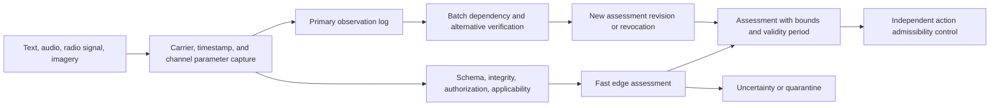

# Chapter 37. Input Information Assessment: Sources, Evidence, and Uncertainty

> **Book:** [Architecture of Evidence-Governed Expert Systems](README.md) · [Part III: Knowledge Acquisition, Linguistic Analysis, and Input Assessment](part-03-knowledge-engineering-nlp.md)  
> **Previous Chapter:** [Chapter 15. Knowledge Extraction and Knowledge Base Construction: Facts, Grammars, and Automata](ch15-knowledge-extraction-and-kb-construction.md)  
> **Next Chapter:** [Chapter 16. Expert System Architecture: From Formal Knowledge to Evidence-Governed Decisions](ch16-expert-systems-architecture.md)  
> **Table of Contents:** [README.md](README.md)  
> **Author:** [Mykola Fedchyk](about-the-author.md)  
> **Target Level:** Advanced: Knowledge engineers, analysts, edge and streaming compute architects  
> **Expected Learning Outcomes:** Distinguish signal, source, and assertion; evaluate evidence independence, uncertainty, and contradictions; construct an automated admission gate for stream and batch processing without requiring mandatory manual review of every message.

## Abstract

In mission-critical distributed complexes (power grid SCADA, automotive telemetry governed by ISO/SAE 21434, emergency shutdown systems compliant with IEC 61508 SIL 3), naively admitting incoming messages directly into the fact base leads to catastrophic systemic failures. If an expert system treats every syntactically valid network packet or sensor trigger as incontrovertible evidence, it becomes vulnerable to three fatal failure modes: reflexive deception (spoofing and replay attacks), spurious corroboration via dependent copies (the "circular reporting" or information echo effect, where ten retransmissions of a single corrupted signal are falsely interpreted as ten independent confirmations), and unjustified emergency shutdowns (*scramming*) caused by uncorrelated sensor noise.

This chapter resolves the problem of engineering an automated information admission gate (`IngressAdmissionGate`). Proven intelligence and evidence evaluation methodologies—Richards Heuer's Analysis of Competing Hypotheses (ACH), the PHIA/AnCR two-dimensional uncertainty model, and the NATO STANAG 2022 reliability scale—are adapted into the domain of formal data structures, log-likelihood ratios, Covariance Intersection (CI) filtering, and reproducible algorithmic skepticism procedures equipped with automated quarantine policies.

## 1. From Message to Knowledge

Three incoming messages arrive at a computing node: the text string "pump running", an acoustic signal matching a characteristic rotational frequency, and a digital network packet asserting the status `RUNNING`. Three messages do not inherently establish three independent confirmations. The text and the telemetry packet may have originated from the same controller, while the acoustic emissions could belong to an adjacent pump. The target entity, temporal validity, provenance, and alternative explanations must be formally determined for every arriving message.

In this chapter, intelligence refers to analytical tradecraft aimed at transforming incomplete data into an evidence-grounded assessment for decision-making. The semantic connection between "knowing", "discerning", and intelligence work serves as a conceptual entry point into the subject, rather than an etymological proof. Its convergence with knowledge engineering lies in establishing evidential foundations, competing alternatives, and valid inference boundaries.

The proposed input stratification framework:

| Object | What Is Known | What Remains Undetermined |
|---|---|---|
| Signal | The receiver recorded voltage, ADC samples, or raw bytes | What the signal signifies |
| Observation | An analyzer extracted a token, frequency peak, contour, or event | Whether the entity and context are correctly resolved |
| Assertion | A datum is logged: "pump P-7 running at 12:03" | Whether the evidential grounds for the assertion are sufficient |
| Assessment | Verification checks, competing alternatives, and uncertainty bounds are established | Whether the assessment is authorized for executing a concrete action |

A cryptographic digital signature on a telemetry packet authenticates the signing entity and verifies packet integrity under an accepted key management model; it does not attest to sensor physical health. A high-fidelity audio stream proves recording quality, not pump physical identity. The foundational finding of this chapter is: input information cannot be admitted into the fact base merely because a communication channel delivered the message without transport errors.

## 2. Nine Analytical Traditions: Method, Evidence, and Transfer Limits

Intelligence agencies do not publish complete operational algorithms. Consequently, one must compare specific publicly available documents rather than attributing a "Bayesian" or "neural network" school of thought to a nation based on generalized impressions. Below, official operational descriptions are strictly decoupled from retrospective historical research and the author's architectural proposals for expert systems (ES). The absence of a disclosed public methodology represents a limitation of this survey, not an absence of analytical capabilities within an agency.

### 2.1. Soviet Tradition: Indicators and the Hazard of a Closed Picture

In his study of Operation RYaN—a strategic program dedicated to early warning of a nuclear missile strike—Benjamin Fischer details the organization of intent indicator monitoring during the 1980s [[3]](#src-3). This represents a retrospective American scholarly investigation into Soviet practices rather than a universally available Soviet normative algorithm. The transferable architectural element comprises predefined diagnostic indicators, observation horizons, and systematic assessment revision criteria. The non-transferable pathology consists of accumulating arbitrary environmental anomalies as confirmation of a single, prematurely fixed threat hypothesis.

Timothy Thomas analyzes reflexive control theory, tracing its Soviet foundations and subsequent Russian conceptualizations [[4]](#src-4). For this chapter, a defensive architectural conclusion emerges: incoming information may be deliberately crafted to manipulate the decision model of the recipient. An expert system must explicitly evaluate message dependencies and the potential for adversarial deception. The mere fact that a message originates from a specific jurisdiction does not constitute proof of deception. The open literature reviewed herein does not establish a universal Soviet numerical credibility scale or its software implementation.

### 2.2. American Tradition: Analysis of Competing Hypotheses

Richards Heuer formulated the Analysis of Competing Hypotheses (ACH): evaluating the same body of evidence against multiple mutually exclusive explanations, identifying incompatibilities, and testing the sensitivity of the conclusion to underlying assumptions [[1]](#src-1). For pump P-7, competing alternatives include normal operation of the pump, acoustic noise from an adjacent machine, and a stale telemetry status reported by the controller. An acoustic signature that is equally consistent with all three explanations possesses minimal diagnostic value, despite sounding intuitively compelling.

An ACH matrix enforces analytical discipline, but it does not magically convert a tally of "consistent" marks into a true posterior probability. In a software architecture, hypotheses, evidence, supportive and refutative relations, and inter-evidence dependencies must be explicitly modeled. Mathematical weight is supplied by a calibrated likelihood model (examined in Section 7), not by the label of the method. The American analytical tradition is heterogeneous: tradecraft guidelines, military doctrinal procedures, and intelligence exchange standards do not constitute a single unified algorithm.

### 2.3. British Tradition: Two Languages of Uncertainty

The official 2025 British guidance establishes the Professional Head of Intelligence Assessment (PHIA) probability yardstick alongside Analytical Confidence Ratings (AnCR) [[2]](#src-2). Probability answers the question of how likely an assertion is. AnCR answers the orthogonal question of how robust the evidential foundation is and how susceptible the assessment is to revision upon acquiring new information. AnCR evaluates the information base, analytical rigor, and environmental complexity and volatility.

The assessment "the pump is probably running; confidence is low due to unverified acoustic source identity" contains no contradiction. The probability interval and the source of uncertainty must remain separate metadata fields. The approximate PHIA percentage ranges do not represent a contiguous set of programmatic thresholds: gaps exist between published ranges, and their boundaries are inherently approximate. An expert system must never automatically substitute the midpoint of a verbal probability bracket as a measured, calibrated probability.

### 2.4. German Tradition: Verification and Domain-Specific Condensation

The German Federal Intelligence Service (*Bundesnachrichtendienst*, BND), in its public description of analytical operations, observes that incoming intelligence is frequently incomplete or presented as uncorroborated rumors; analysts verify content and synthesize a coherent, consolidated intelligence picture [[5]](#src-5). The description emphasizes deep domain expertise and tailoring analytical methodologies to specific operational questions. This constitutes an official public statement of operating principles, not a published set of numerical coefficients.

For expert systems, the transferable requirement is domain-specific applicability: an expert on network traffic is not automatically an expert in pump acoustics. The source registry must distinguish between expertise domain, measurement methodology, and calibration boundaries. Information synthesis must never erase provenance links to raw observations. The specific algorithmic formulas utilized by the BND to compute source reliability are not established by this survey.

### 2.5. French Tradition: Request Cycle and Complementary Sensors

The French Directorate of Military Intelligence (*Direction du renseignement militaire*, DRM) describes a four-phase intelligence cycle directed at satisfying defined intelligence requirements, emphasizing sensor complementarity [[6]](#src-6). The DRM supports both military commanders and political decision-makers. This public overview does not justify attributing a single mathematical model across all French security services.

For expert systems, the operational chain "requirement → required observation → verification → assessment" is directly applicable. A camera is introduced not merely because another sensor modality is available, but because visual imagery can uniquely discriminate P-7 from an adjacent pump. Moving from multimodal sensing to independent corroboration requires rigorous verification of common-cause failure modes: shared acquisition timestamps, common power rails, or shared firmware models can induce strong statistical dependence.

### 2.6. Japanese Tradition: Inter-Agency Synthesis and Coordination

The current public profile of the Cabinet Secretariat of Japan outlines the roles of the National Intelligence Council and the National Intelligence Bureau: intelligence collection, inter-agency synthesis, comprehensive analysis, and assessment [[7]](#src-7). The terminology on the official site reflects modern administrative structures, distinct from the historical Cabinet Intelligence and Research Office (CIRO) frequent in legacy literature. This survey reflects the organizational structure documented as of October 4, 2026.

The software engineering lesson is straightforward: inter-agency fusion mandates rigorous entity, temporal, and provenance resolution. Relaying a single message across two separate agencies does not generate two independent observations. Computer science provides formal provenance graphs and entity resolution algorithms, but proposing these solutions does not imply that specific classified Japanese government algorithms operate in this manner.

### 2.7. Chinese Tradition: Screening, Integration, and Technological Processing

Article 22 of the PRC National Intelligence Law references the deployment of scientific and technical means to identify, screen, synthesize, and analytically assess intelligence. This review references the unofficial English translation provided by China Law Translate (2018 revision) [[8]](#src-8). The statute establishes legal authority and technological development vectors, not a machine evaluator specification.

For an expert system, this mandate translates into a pipeline of filtering, normalization, integration, and verification. Academic publications on Chinese artificial intelligence or sensor fusion research do not prove that a specific intelligence agency utilizes those exact algorithms. This review identified no evidence of a standardized national credibility scale or its equivalence to British AnCR tiers.

### 2.8. Israeli Tradition: Critique of the Immutable Concept

Uri Bar-Joseph and Arie Kruglanski investigate the catastrophic intelligence failure preceding the 1973 Yom Kippur War, attributing it to a psychological need for cognitive closure—the propensity to terminate inquiry prematurely and rigidly maintain an entrenched hypothesis (*the Concept*) [[9]](#src-9). This represents an academic post-mortem of a historical case, not contemporary doctrine across all Israeli security services. Its engineering implication is profound: an explanatory hypothesis that proved successful in the past must remain perpetually vulnerable to falsification.

An expert system requires an autonomous counter-hypothesis search procedure, an audit log of rejected alternatives, and automated sensitivity tests that simulate the removal of the strongest piece of evidence. The popularized narrative of a "tenth analyst" who is obligated to dissent is treated here as a conceptual paradigm rather than a proven universal bureaucratic procedure. Algorithmic skepticism must rely on verifiable alternative explanations rather than unconstrained, arbitrary negation of every derived conclusion.

### 2.9. Ukrainian Tradition: Analytical Processing and External Model Verification

The Law of Ukraine "On Intelligence", specifically Articles 6 and 12, formally delineates acquisition, analytical processing, data handling, and intelligence dissemination, mandating structured engagement with information resources [[10]](#src-10). The statutory definition of intelligence information is narrower than the colloquial or general scientific usage of the term. Consequently, open publications and scientific research cannot be conflated with intelligence information in the legal sense.

The Ukrainian cybernetic tradition supplies a distinctive foundational methodology: Alexey Ivakhnenko's Group Method of Data Handling (GMDH) optimizes model mathematical structure against an external criterion evaluated on out-of-sample data withheld during parameter estimation [[11]](#src-11). For an expert system, this serves as an engineering argument for out-of-sample validation data, not proof of GMDH deployment within a specific agency. Open legal and scientific frameworks exist; the specific numerical operational thresholds utilized by Ukrainian intelligence agencies are not established by this review.

Comparing these traditions does not yield a qualitative ranking of nations. Instead, it yields five invariant architectural requirements for expert systems: record evidential foundations, maintain competing alternatives, verify channel independence, decouple uncertainty from operational decision-making, and ensure the revocability of assessments. A unified machine contract is imperative, irrespective of the geographic origin of the analytical tradecraft.

## 3. Law Enforcement Analytics: Association Does Not Equal Proof of Guilt

In criminal investigations, two entities may share an address, phone number, or corporate counterparty without engaging in common illicit activity. Consequently, an association graph serves to generate testable investigative hypotheses, never to assign an automated status of "guilty." The United Nations Office on Drugs and Crime (UNODC) analyst manual details source and data evaluation, link analysis, event charting, and the UK National Intelligence Model [[12]](#src-12).

### 3.1. National and International Frameworks

The United States Federal Bureau of Investigation (FBI) publicly describes intelligence analytics as driving operational decisions and inter-agency information sharing, while strictly subordinating data collection to statutory, constitutional, and procedural boundaries [[13]](#src-13). The British tradecraft documented in the UNODC manual links intelligence products to defined operational priorities; however, historical manuals must not be mistaken for the current operational specification of every British police unit.

The International Criminal Police Organization (INTERPOL) defines operational and strategic intelligence analysis reports supported by structured analytical files [[14]](#src-14). The European Union Agency for Law Enforcement Cooperation (Europol) manages dedicated Analysis Projects (APs), enforcing strict purpose-limitation rules and supporting national judicial investigations [[15]](#src-15). An international organization may aggregate reports from dozens of member states; the count of participating jurisdictions does not establish the independence of primary sources.

For Ukrainian law enforcement contexts, statutory norms of the Criminal Procedure Code of Ukraine—notably Articles 17, 84, 86, and 94—govern the presumption of innocence, admissible sources of evidence, procedural admissibility, and judicial evaluation of evidence [[16]](#src-16). An expert system's analytical score cannot substitute for a judicial determination. While automated intake can eliminate humans from routine initial triage, it can never supersede the statutory authority of an investigator, prosecutor, or court.

| Analytical Task | Appropriate Method | Mandatory Constraint |
|---|---|---|
| Entity Resolution across records | Normalization and entity matching | Matching names does not establish human identity |
| Link Detection | Graph queries, spatial and temporal correlation | Every edge must record relationship type, source, and verification state |
| Hypothesis Prioritization | ACH, Bayesian models, counter-example generation | A candidate hypothesis is not an established fact |
| Verification Priority Assignment | Expected utility, operational impact, deadlines | Triage priority is not a metric of guilt |
| Evidentiary Proceeding Preparation | Chain of custody and primary storage medium preservation | Technical integrity does not equate to procedural admissibility |

Law enforcement analytics thus injects strict purpose limitation and unbroken chains of custody into conventional knowledge engineering. The subsequent inquiry addresses how these constraints govern automated machine incident telemetry.

## 4. Cyber Defense: From Detector Trigger to Confirmed Incident

An intrusion detector flags anomalous authentication against a network service. This event may be explained by an unauthorized security breach, scheduled systems administration, or node clock drift. The Forum of Incident Response and Security Teams (FIRST), in its Computer Security Incident Response Teams (CSIRT) Services Framework, distinguishes between monitoring, event analysis, incident qualification, intake, incident analysis, and artifact handling [[17]](#src-17). This framework deliberately avoids defining a universal threshold declaring "this is definitively an attack."

The National Institute of Standards and Technology (NIST), in Special Publication (SP) 800-61 Rev. 3 (published in 2025), embeds incident response within enterprise cybersecurity risk management [[18]](#src-18). For expert systems, the operational progression must be decoupled: detector signal → candidate incident → confirmed incident → impact assessment → response decision. Incident confirmation and root-cause attribution rest on fundamentally distinct evidential bases.

### 4.1. Validation, Verification, and Re-examination

Within this engineering profile, **input validation** denotes verifying the fitness of data for a designated task: verifying whether the entity, timestamp, and acquisition channel are properly resolved. **Processing verification** denotes checking compliance with formal specifications: schema validity, measurement units, cryptographic integrity, temporal sequence rules, and algorithmic determinism. Standards employ varied nomenclature; this distinction represents the operational contract of this chapter rather than a replacement of all standard definitions.

| Phase | What the Expert System Verifies | What Cannot Be Presumed Proven |
|---|---|---|
| Intake | Message schema, payload size limits, authorized ingress channel, message uniqueness | The factual occurrence of an incident |
| Artifact Verification | Cryptographic hash, signature, primary medium availability, transmission custody | Semantic correctness of payload interpretation |
| Contextual Matching | Asset inventory, user account mapping, timestamp synchronization, detector tuning | Identity of the physical actor operating the account |
| Correlation | Temporal clustering, attack topology, common origin | Independent corroboration across redundant copies |
| Qualification | Explanatory hypotheses, operational alternatives, verified system impact | Root cause, attacker motive, or threat attribution |
| Re-examination | New forensic evidence, detection rule updates, indicator revocation | Validity of past decisions following premise invalidation |

Payable payloads and untrusted attachments are analyzed in isolated execution environments subject to strict CPU, memory, and network quotas, per FIRST guidelines. The absence of malicious behavior in a sandbox does not prove an artifact is benign: evasion conditions or environmental triggers may have remained unsatisfied. Likewise, three antivirus engine detections do not constitute three independent assessments if the engines share a common threat signature database.

### 4.2. Decoupling Credibility, Severity, and Distribution Boundaries

The Traffic Light Protocol (TLP) version 2.0 governs information sharing and distribution boundaries, not underlying factual truth [[19]](#src-19). `TLP:CLEAR` indicates the absence of protocol-specific sharing constraints, but does not waive intellectual property or legal disclosure restrictions. Conversely, `TLP:RED` imparts no intrinsic reliability to a message.

The Common Vulnerability Scoring System (CVSS) version 4.0 quantifies technical vulnerability characteristics and potential severity [[20]](#src-20). A CVSS score of 9.8 does not equate to a 98% probability of exploitation. An asset requires separate assessments for message credibility, technical severity, and legal authority to execute a protective countermeasure.

In data protection, the assertion "a corporate database breach has been published" decomposes into discrete propositions: the publication exists; the provided sample is authentic; the data belongs to the organization; the records are current; the extraction was unauthorized. Demonstrating that the sample data is authentic does not prove the remaining four propositions. Verification proceeds on authorized control samples to prevent secondary leakage of personally identifiable information. Algorithmic artifact tampering detection warrants operational vigilance, not automated attribution of malicious deception.

## 5. Text, Audio, Radio Waves, and Imagery: The Primary Observation Contract

Within the global architecture of an evidence-governed expert system, the primary intake gate (`IngressAdmissionGate`) serves as the frontal perimeter between the physical observation environment and the fact base. Neglecting the primary observation contract and permitting direct conversion of multimodal signals into semantic assertions induces irreversible evidential degradation: an identical text assertion "pump stopped" may originate from an Ed25519-signed SCADA packet, from the noisy output of an automatic speech recognition (ASR) model, or from optical character recognition (OCR) of an analog dial. The naive paradigm prevalent in commercial multimodal pipelines retains only the final transcribed text or its embedding vector. In mission-critical applications (ISO 26262 ASIL D, IEC 61508 SIL 3), this triggers catastrophic systemic failures: during anomalies, the system cannot inspect raw ADC samples, detect sensor drift, or expose signal spoofing. To maintain auditability, the system must enforce an immutable observation contract: the primary physical carrier, spatio-temporal coordinates, and a deterministic transformation pipeline.

| Input Modality | Fast Fitness Check | What to Persist as Evidentiary Ground | Recognition Limit |
|---|---|---|---|
| Digital Text | Encoding, schema, language, negation, numeric bounds, SI units | Raw bytes, citation byte range, revision metadata | Exact citation may quote a false statement |
| Printed or Handwritten Text | Sharpness, contrast, skew angle, OCR alternative hypotheses | Raw image, bounding box, OCR engine version | Character recognized as "8" may physically be "3" |
| Analog Audio | Saturation, SNR, bandwidth, signal path integrity | ADC samples, clock sync, calibration manifest | Amplitude does not determine source identity or semantics |
| Digital Audio | Frame drops, codec artifacts, timestamp jitter | Raw audio payload, timecode window | ASR transcription text is a derivative hypothesis |
| Radio Frequency Signal | Receiver bandwidth, sampling rate, saturation, calibration | I/Q samples or verified feature descriptor | Emission detection does not prove transmitter identity or intent |
| Imagery and Video | Geometry, illumination, frame delta, duplicate detection | Raw frames, ROI coordinates, sensor lens and pipeline metadata | File hash or EXIF tags do not verify physical capture location |
| Analog Threshold Output | Threshold drift, measurement uncertainty, hysteresis | Threshold setpoint, calibration version, timestamped event log | Comparator triggers on voltage setpoint; establishes no semantic truth |

The storage model for analog telemetry fundamentally differs from verbatim byte citation of a text document: a past continuous physical wave cannot be retrieved without prior digital recording. The system must store the digitized observation alongside the physical measurement channel descriptor. A digital signature applied post-conversion attests to recording integrity, not the truth of the physical phenomenon prior to reception. Physical verification and neuromorphic mixed-signal computing are treated in detail in [Appendix E](appendix-e-mixed-signal-neuromorphic-expert-systems.md).

For ideal uniform sampling of a real baseband signal with no frequency content above $B$, the Nyquist-Shannon criterion mandates $`f_s > 2B`$ coupled with an appropriate anti-aliasing filter. This condition preserves spectral information under defined assumptions; it does not ensure message truth, as formalized in Claude Shannon's mathematical theory of communication [[21]](#src-21). If an acoustic application requires an 8 kHz bandwidth, sampling at 16 kHz leaves zero practical transition band for an anti-aliasing filter; thus, sampling rates must be sized alongside analog filter roll-off characteristics. For bandpass and complex I/Q signals, distinct sampling theorems apply.

The proposed observation manifest comprises a primary identifier, modality, target entity, event and ingestion timestamps, spatial coordinates, spatio-temporal uncertainty bounds, transformation lineage, model versions, source identifier, and dependency group. A record stripped of its primary raw fragment remains an unconfirmed lead for retrieval, but never a sufficient premise for an evidence-governed conclusion. The subsequent requirement is classifying the epistemic status of the assertion itself.

## 6. Credibility Categories: A Multi-Axis Taxonomy

Within the knowledge provenance verification subsystem (`EpistemicProvenanceRegistry`), classifying input evidence determines its admissibility into logical deduction. Mechanically collapsing disparate epistemic dimensions ("false", "suspicious", "unverified", "deceptive") into a single scalar confidence score invalidates the formal logic of an expert system: the system either prematurely discards critical safety alerts from low-reliability channels, or unconditionally admits unverified conjectures due to high statistical likelihood. In intelligence and law enforcement analytics (UNODC, NATO STANAG 2022), this problem is resolved via an orthogonal $6\times6$ evaluation matrix that decouples source reliability (letters A–F) from information credibility (numerals 1–6) [[12]](#src-12).

| Source Code | Definition in 6×6 Profile | Information Code | Definition in 6×6 Profile |
|---|---|---|---|
| A | Completely reliable across verified operational history | 1 | Confirmed by independent sources |
| B | Usually reliable | 2 | Probably true |
| C | Fairly reliable | 3 | Possibly true |
| D | Not usually reliable | 4 | Doubtful |
| E | Unreliable | 5 | Improbable; corroborated by contradictory evidence |
| F | Reliability cannot be judged | 6 | Truth cannot be judged |

This matrix represents a qualitative categorization framework, not a percentage conversion table. Code F6 implies neither the "worst source" nor a probability of 0.5. A1 does not imply mathematical certainty. The same UNODC manual describes an alternative $4\times4$ matrix where information assessment relies more heavily on direct source access and corroboration. Mechanically projecting a $4\times4$ grid onto a $6\times6$ grid via matching numerical indices without semantic reconciliation is invalid.

For an expert system, the author proposes maintaining independent metadata axes rather than a single merged category:

| Axis | Representative Values | What the Value Does Not Imply |
|---|---|---|
| Epistemic Type | Observation, reported assertion, conclusion, hypothesis, normative rule | A hypothesis does not become a fact by virtue of a high score |
| Confirmation State | Undetermined, admissible hypothesis, probably supported, profile-confirmed, profile-refuted | Confirmation is not valid outside the evaluated operational profile |
| Contradiction State | None detected, conflict detected, unresolved | A contradiction does not identify which source is erroneous |
| Manipulation State | No anomalies, suspected tampering, confirmed carrier forgery | Carrier tampering does not identify the specific human author or intent |
| Validity Lifecycle | Active, stale, revoked | A superseded assertion may have been completely true in the past |
| Operational Fitness | Fit for task, corrupted, out-of-domain, insufficient context | Data unfitness for a specific task does not imply factual falsehood |
| Operational Admissibility | Admitted for task, quarantined, deferred review, rejected | Authorization for execution does not equate to proof of truth |

In this engineering profile, "credible" denotes that an assertion is sufficiently substantiated under a specified procedure within an explicit context. "Admissible" denotes a valid working hypothesis, not an automatic authorization for action. "Doubtful" indicates weak or volatile evidential foundations. "False" requires formal refutative evidence. "Deceptive" mandates dedicated substantiation of adversarial manipulation; low statistical probability alone is insufficient for such an attribution.

Taxonomy tables provide compatibility and auditability; they do not constitute an arithmetic system for belief. Automated computation requires a defined event, an observation model, and dependency tracking.

### 6.1. Objectifying the NATO 6×6 Scale for Autonomous Systems

In classical intelligence, NATO STANAG 2022 is formulated as qualitative guidelines for human analysts ("completely reliable", "probably true"). Attempting to transfer this scale directly into autonomous neuro-symbolic systems introduces severe classification drift: a language model or heuristic classifier assigns indices subjectively based on superficial text tone, conflating source category $B$ with $D$.

To eliminate subjectivity, an evidence-governed expert system enforces deterministic criteria:

1. **Source Reliability Categories (A–F):**
   - $A$ (Completely reliable): Source is authenticated by a valid cryptographic digital signature or originates from an accredited standards repository (ISO, IEC, SAE, RFC);
   - $B$ (Usually reliable): Certified OEM technical documentation or an accredited test laboratory compliance report with a verified supply chain;
   - $C$ (Fairly reliable): Internal engineering report or testbench telemetry log without third-party accreditation, but with fully characterized instrumentation;
   - $D$ (Not usually reliable): Informal engineering working draft, source code comments, or unlinked forum notes;
   - $E$ (Unreliable): Unauthenticated public forums, unstructured blogs, or sources with a documented history of fabrication or physical inconsistency;
   - $F$ (Cannot be judged): Novel source lacking verified provenance or track record.
2. **Information Credibility Categories (1–6):**
   - $1$ (Confirmed): Corroborated by at least two independent sources with distinct `GroupID` attributes reporting identical numerical bounds or logical invariants;
   - $2$ (Probably true): The assertion is consistent with a verified domain model but relies on a single dependency group;
   - $3$ (Possibly true): The assertion does not violate system invariants, but lacks direct parametric measurements or physical telemetry;
   - $4$ (Doubtful): The assertion exhibits borderline parametric deviations or internal minor contradictions;
   - $5$ (Improbable): The message directly violates fundamental physical conservation laws codified in the knowledge base, or cites superseded standards;
   - $6$ (Cannot be judged): Context, measurement units, or observation time intervals are missing.

### 6.2. Two Ingress Modes and a Discrete Epistemic Scorecard for Knowledge Corpora

Across the operational lifecycle of an expert system, two fundamentally distinct ingress pipelines must be separated:

1. **Operational Sensing Stream Mode:** High-frequency physical telemetry streams (current, pressure, vibration sensors, ADC samples). This regime operates under hard real-time deadlines ($T \le 20\,\text{ms}$), well-characterized sensor failure distributions, and mathematical algorithms grounded in Abraham Wald's Sequential Probability Ratio Test (SPRT), Covariance Intersection (CI), and continuous logit updates.
2. **Knowledge Ingestion & Crystallization Mode:** Periodic or demand-driven harvesting of technical specifications, safety standards, component datasheets, and schematics to compile new knowledge bases.

In knowledge ingestion mode, continuous likelihood ratios $\Lambda(E) = \frac{P(E\mid H)}{P(E\mid \neg H)}$ cannot be applied directly: an arbitrary engineering prose document lacks objective numerical priors $P(H)$. Assigning an arbitrary log-odds coefficient to text is an exercise in pseudo-precision.

For textual specifications, an evidence-governed expert system employs a **discrete epistemic scorecard ($`S_{\mathrm{doc}} \in [0, 100]`$)**:

| Evaluation Component | Objective Criterion | Score Contribution |
|---|---|---|
| **Base Source Authority** | Formally ratified standard (ISO, IEC, SAE, IEEE, RFC) | $+40$ |
| | Certified OEM component datasheet / factory manual | $+30$ |
| | Internal approved engineering standard / bench test report | $+20$ |
| | Unverified external publication / technical blog | $+5$ |
| **Parametric Rigor** | Presence of explicit numerical bounds $[Min, Max]$ with SI units | $+20$ |
| | Presence of formally declared defeat conditions or failure bounds (`DEFEATERS`) | $+20$ |
| | Cryptographic digital signature of author or trusted repository | $+20$ |
| **Red Flag Penalties** | Document marked as withdrawn, superseded, or deprecated | $-50$ |
| | Formal fallacies detected (circular reasoning, straw man, false dilemma) | $-30$ |
| | Violation of physical invariants (thermodynamic laws, energy conservation) | $-100$ (`REJECT`) |

**Operational Knowledge Gate Thresholds:**
- $`S_{\mathrm{doc}} \ge 70`$ points $\to$ `ADMIT` (admit document to automated ontological rule extraction);
- $`40 \le S_{\mathrm{doc}} < 70`$ points $\to$ `DEFER` (requires independent secondary corroboration or human engineer review);
- $`S_{\mathrm{doc}} < 40`$ points $\to$ `DISMISS` (reject without expending downstream parsing resources).

## 7. Probabilistic Assessment: Evidence Strength, Dependence, and Uncertainty

### 7.1. From Base Rate to Likelihood Ratio

Converting raw observations into an updated posterior probability requires decoupling the prior event frequency (base rate) from the discriminative power of the detector. When an engineer or diagnostic rule evaluates a binary hypothesis $H$ (for example, "bearing vibration exceeds critical safety limit") given observation $E$, Bayes' theorem in odds-likelihood form guarantees exact Bayesian updating:

```math
O(H\mid E)=O(H)\,\Lambda(E),\qquad O(H)=\frac{P(H)}{1-P(H)},\qquad
\Lambda(E)=\frac{P(E\mid H)}{P(E\mid\neg H)}.
```

**Parameters and Admissible Ranges:**
- $O(H) \in (0, \infty)$ — prior odds of the event (dimensionless ratio of event probability to its complement).
- $P(E\mid H) \in [0, 1]$ — detector sensitivity (True Positive Rate).
- $P(E\mid\neg H) \in [0, 1]$ — detector false alarm rate (False Positive Rate).
- $\Lambda(E) \in [0, \infty)$ — likelihood ratio (*Likelihood Ratio*, LR) measuring the diagnostic power of evidence $E$. The denominator must be strictly positive ($P(E\mid\neg H) > 0$).
- $O(H\mid E) \in [0, \infty)$ — updated posterior odds of the hypothesis upon observing evidence $E$.

**Practical Implementation and Engineering Decisions:**
- The calculation is executed by the evidence validation service upon every discrete state change of input sensors.
- Diagnostic power gradation: $\Lambda(E) > 1$ shifts the balance in favor of fault hypothesis $H$; $\Lambda(E) = 1$ indicates total informational neutrality (the signal is discarded); $\Lambda(E) < 1$ corroborates normal operation $\neg H$.
- Worked numerical decision example: let the baseline equipment failure rate be $P(H) = 0.01$, sensitivity $P(E\mid H) = 0.90$, and false alarm rate $P(E\mid\neg H) = 0.10$, yielding $\Lambda(E) = 9.0$. The posterior probability following a detector trigger is $P(H\mid E) = \frac{0.01 \times 0.90}{0.01 \times 0.90 + 0.99 \times 0.10} = \frac{0.009}{0.108} \approx 0.083$ (8.3%). The expert system reaches a definitive engineering conclusion: a single detector trigger is insufficient for an emergency process shutdown (*nuisance trip* under IEC 61508). The system automatically interlocks the emergency actuator signal, assigns the status `DEFER_INSUFFICIENT_EVIDENCE`, and initiates targeted acquisition of supplementary sensor observations.

### 7.2. Ten Copies Do Not Constitute Ten Corroborations

During stream processing of distributed telemetry, systems face the severe hazard of information echo (*circular reporting*): when a single primary telegram is broadcast across the network through ten repeaters, a naive Bayesian evaluator treats them as ten independent sensors, artificially inflating confidence to 99.99%. To eliminate such failures, log-odds accumulation for a sequence of evidence must strictly condition upon prior history:

```math
\log O(H\mid E_{1:n})=\log O(H)+
\sum_{i=1}^{n}\log\frac{P(E_i\mid H,E_{1:i-1})}{P(E_i\mid\neg H,E_{1:i-1})}.
```

**Parameters and Admissible Ranges:**
- $\log O(H) \in (-\infty, +\infty)$ — initial log-prior odds expressed in logits (dimensionless units: $\text{nats}$ or $\text{dB}$).
- $`E_i`$ — $i$-th incoming observation in the streaming fact pool ($i = 1, \dots, n$).
- $`E_{1:i-1}`$ — set of all previously processed and linked evidence up to step $i$ inclusive (empty for $i=1$).
- $`\frac{P(E_i\mid H,E_{1:i-1})}{P(E_i\mid\neg H,E_{1:i-1})}`$ — conditional likelihood ratio of evidence $`E_i`$ given history $`E_{1:i-1}`$.
- $`\log O(H\mid E_{1:n})`$ — resulting log-odds of the hypothesis after processing the evidence series.

**Practical Implementation and Engineering Decisions:**
- The admission gate maintains a directed provenance graph (*provenance graph*) for every fact. Simple summation of independent log terms is permitted if and only if the graph guarantees conditional source independence: $`P(E_i \mid H, E_{1:i-1}) = P(E_i \mid H)`$.
- If observation $`E_i`$ is a duplicate or retransmission of an already incorporated $`E_j`$, its conditional probability equals unity under both $H$ and $\neg H$. The likelihood ratio reduces to $\frac{1}{1} = 1$, and its logarithmic contribution vanishes identically ($\log 1 = 0$).
- Engineering gating rule: upon receiving ten retransmissions, the initial assessment $P(H\mid E) \approx 0.471$ (given $P(H)=0.1$, $\Lambda=8$) remains unchanged. Only an authenticated independent observation (for instance, an optical sensor complementing an acoustic pickup with $\Lambda=4$) elevates the posterior probability to $32/41 \approx 0.780$. Any input lacking demonstrated independence is grouped into a unified dependency pool `GroupID`.

### 7.3. Assessment Interval in Lieu of Spurious Precision

Under small-sample sensor calibration regimes or imprecise expert estimates, point values for prior probabilities and weights represent unscientific fiction. To ensure robustness, an evidence-governed expert system must perform interval estimation of epistemic uncertainty using logit hulls:

```math
L_{\min}=\mathop{\mathrm{logit}}(p_{0,\min})+\sum_{g\in\mathcal{G}}\ell_{g,\min},\qquad
L_{\max}=\mathop{\mathrm{logit}}(p_{0,\max})+\sum_{g\in\mathcal{G}}\ell_{g,\max},\qquad
[p_{\min},p_{\max}]=[\sigma(L_{\min}),\sigma(L_{\max})].
```

**Parameters and Admissible Ranges:**
- $`p_{0,\min}, p_{0,\max} \in (0, 1)`$ — bounds of the prior probability interval subject to $`p_{0,\min} \le p_{0,\max}`$.
- $\mathop{\mathrm{logit}}(p) = \log\frac{p}{1-p}$ — logit transformation mapping $(0, 1)$ onto the real line $(-\infty, +\infty)$.
- $\mathcal{G}$ — set of verified independent evidence groups.
- $`\ell_{g,\min}, \ell_{g,\max} \in (-\infty, +\infty)`$ — lower and upper bounds of log-likelihood ratio for independent group $g$ ($`\ell_{g} = \log \Lambda_g`$).
- $\sigma(L) = \frac{1}{1 + e^{-L}}$ — standard logistic sigmoid mapping $(-\infty, +\infty) \to [0, 1]$.
- $`[p_{\min}, p_{\max}] \subseteq [0, 1]`$ — resulting guaranteed posterior probability interval.

**Practical Implementation and Engineering Decisions:**
- The decision engine evaluates the derived interval $`[p_{\min}, p_{\max}]`$ against engineering safety thresholds:
  - Fact admission threshold: if $`p_{\min} \ge \tau_{\mathrm{accept}}`$ (e.g., $`\tau_{\mathrm{accept}} = 0.95`$), the fact transitions to `SUPPORTED` and is admitted to the resolution engine.
  - Hypothesis rejection threshold: if $`p_{\max} \le \tau_{\mathrm{reject}}`$ (e.g., $`\tau_{\mathrm{reject}} = 0.05`$), the hypothesis is refuted with status `COUNTER_SUPPORTED`.
  - Epistemic uncertainty zone: if the interval straddles the operational threshold band or its width exceeds tolerance ($`p_{\max} - p_{\min} > \Delta_{\mathrm{tol}}`$), the system emits status `DEFER` (deferred decision).
- Worked numerical scenario: given prior interval $[0.05, 0.15]$ and two independent groups with bounds $`\Lambda_1 \in [6, 10]`$ and $`\Lambda_2 \in [2, 5]`$, the resulting interval is $[0.387, 0.898]$. Although both pieces of evidence support the fault hypothesis, the lower bound $0.387$ provides zero formal justification for high-consequence intervention. The expert system suppresses premature shutdown and schedules targeted evidence acquisition.

### 7.4. Conflict and Unknown Correlation

When multiple sensors measure continuous physical coordinates or thermodynamic parameters, measurement errors are virtually always cross-correlated due to shared power rails, chassis vibrations, or thermal drift. Applying a classical Kalman filter under unknown cross-correlations leads to catastrophic covariance underestimation and filter divergence. For guaranteed consistent fusion, the Covariance Intersection (CI) method developed by Simon Julier and Jeffrey Uhlmann is employed [[23]](#src-23):

```math
P_{\mathrm{CI}}^{-1}=\omega P_1^{-1}+(1-\omega)P_2^{-1},\qquad
\hat x_{\mathrm{CI}}=P_{\mathrm{CI}}\bigl(\omega P_1^{-1}\hat x_1+(1-\omega)P_2^{-1}\hat x_2\bigr),\qquad 0\le\omega\le1.
```

**Parameters and Admissible Ranges:**
- $`\hat x_1, \hat x_2 \in \mathbb{R}^d`$ — state estimate vectors of dimension $d$ acquired from two measurement channels (e.g., bearing temperature and lubrication pressure).
- $`P_1, P_2 \in \mathbb{S}_{++}^d`$ — symmetric positive-definite error covariance matrices of dimension $d\times d$.
- $\omega \in [0, 1]$ — scalar weighting factor parameterizing the convex combination of information matrices.
- $`P_{\mathrm{CI}} \in \mathbb{S}_{++}^d`$ — resulting conservative fused error covariance matrix.
- $`\hat x_{\mathrm{CI}} \in \mathbb{R}^d`$ — resulting fused state estimate vector.

**Practical Implementation and Engineering Decisions:**
- The parameter $\omega$ is optimized via a deterministic numerical algorithm (Golden Section search on $[0, 1]$) minimizing the trace $`\min_\omega \mathrm{Tr}(P_{\mathrm{CI}})`$ or determinant $`\min_\omega \det(P_{\mathrm{CI}})`$.
- Mathematical guarantee: the dispersion ellipsoid of $`P_{\mathrm{CI}}`$ encloses the intersection of the component ellipsoids ($`P_{\mathrm{CI}} \ge P_1 \cap P_2`$), completely precluding overconfidence. For two scalar estimates with equal variance $`\sigma_1^2 = \sigma_2^2 = 4`$, CI yields $`\sigma_{\mathrm{CI}}^2 = 4`$ (in contrast to naive Kalman fusion, which erroneously claims variance $2$).
- Gating rule: if the resulting trace $`\mathrm{Tr}(P_{\mathrm{CI}})`$ exceeds the maximum permissible variance specified by ISO 26262, the system flags anomalous channel divergence, rejects the fused value, and switches the control channel to protective isolation.

## 8. Algorithmic Skepticism as an Executable Procedure

Within the automated inference pipeline, the algorithmic skepticism subsystem acts as a critical safety barrier, preventing manipulative or corrupted facts from penetrating the working memory of the interpreter. Skepticism in an expert system is not equivalent to pessimistic probability down-weighting or paranoid worst-case selection. It is a deterministic procedure formalizing evidentiary audits: which observations substantiate an assertion, how sensitive the conclusion is to the removal of a pivotal source, and under what conditions an assessment must be revoked. The naive presumption that a neural classifier or extraction model autonomously filters untruths triggers runtime catastrophes (ISO 26262 ASIL D): the system executes irreversible control actions based on artifacts fabricated by a single faulty sensor or compromised feed. Algorithmic skepticism integrates Heuer's ACH matrix, dependency group governance, and fail-safe policies:

1. Formulate the assertion with explicit target entity, timestamps, measurement units, and operational domain; leave ill-defined inputs undetermined.
2. Verify physical carrier, authorization, and instrument calibration; route integrity violations immediately to quarantine.
3. Trace raw observations; never count duplicates redundantly, and forbid merging dependent groups without a joint correlation model.
4. Construct at least one substantive domain alternative and one measurement error alternative; hypothesis generators must never validate their own conjectures.
5. Compute interval assessments and explicitly test counter-evidence; never mask unresolved conflict behind an averaged scalar score.
6. Verify sensitivity: remove the strongest independent piece of evidence, perturb model parameters across their tolerance bands, and recompute.
7. Authorize an assessment strictly for a scoped task or request targeted sensor data; recalculate all downstream inferences upon premise revocation.

To quantify the dependence of a conclusion on an individual source, the audit gate computes the Leave-One-Group-Out Sensitivity metric:

```math
S_{\mathrm{leave}}=\max_{g\in\mathcal{G}}\left|p(H\mid E)-p(H\mid E\setminus E_g)\right|.
```

**Parameters and Admissible Ranges:**
- $p(H\mid E) \in [0, 1]$ — posterior probability of hypothesis $H$ evaluated on the complete evidence set $E$.
- $\mathcal{G}$ — set of verified independent evidence groups participating in the current inference.
- $`E_g`$ — subset of observations belonging to dependency group $g$ (e.g., all frames from a single camera or telemetry gateway).
- $`E\setminus E_g`$ — reduced evidence set resulting from temporarily withholding group $g$.
- $`p(H\mid E\setminus E_g) \in [0, 1]`$ — recomputed posterior probability without evidence group $g$.
- $`S_{\mathrm{leave}} \in [0, 1]`$ — dimensionless fragility index (maximum absolute probability shift).

**Practical Implementation and Engineering Decisions:**
- Sensitivity analysis is triggered automatically prior to generating any actuation command (such as emergency pressure venting or switching to a backup link).
- If $`S_{\mathrm{leave}} > \tau_{\mathrm{fragile}}`$ (where the engineering threshold is typically $`\tau_{\mathrm{fragile}} = 0.25`$), the conclusion is flagged as a Single Point of Evidence Failure.
- Calculation example: in the configuration from Section 7.2, removing the second evidence group shifts the assessment from 0.780 to 0.471 ($`|0.780 - 0.471| = 0.309`$). Removing the first group leaves $4/13 \approx 0.308$, producing a shift of $`|0.780 - 0.308| = 0.472`$. The maximum shift is $`S_{\mathrm{leave}} = 0.472 > 0.25`$.
- Engineering action: the system blocks execution of automated irreversible actions, tags the assertion as `FRAGILE_EVIDENCE`, and emits an operator escalation highlighting the exact sensor channel whose failure collapses the hypothesis.

The cost of error dictates the operational threshold for action, but does not alter physical ground truth. In a binary decision setting with zero cost for correct outcomes, an action is admissible when $`p > C_{\mathrm{FP}} / (C_{\mathrm{FP}} + C_{\mathrm{FN}})`$, where $`C_{\mathrm{FP}}`$ is the loss incurred by a false positive and $`C_{\mathrm{FN}}`$ is the loss from a missed detection. For losses of 99 and 1, the threshold is 0.99; for losses of 1 and 99, the threshold is 0.01. The identical assessment may justify dispatching an auxiliary sensor while simultaneously barring an irreversible physical actuation. For interval estimates, risk is evaluated across the entire admissible band, and authorization is enforced via the governance policies of [Chapter 21](ch21-from-recommendation-to-action.md).

Negative evidence requires an explicit observability model. "No pump visible on camera" supports pump absence only when lighting, field of view, and detector recall are characterized. The absence of audit logs on a node where logging was disabled constitutes zero evidence of incident absence. These systematic checks distinguish algorithmic skepticism from ungrounded cynicism.

## 9. Real-Time and Batch Processing Without Manual Message Review

An edge compute node operates under severe latency and power budgets; a centralized analytics cluster can perform retrospective correlation across long time series and extensive enterprise graphs. Both regimes must adhere to an identical evidence contract and identical dependency tracking rules. The divergence lies in computational budgets and available context, not in granting the edge license to declare weak signals as verified facts.

The diagram below illustrates how edge fast-path assessments remain open to subsequent batch revision:



| Operational Regime | Admissible Delay | Permissible Scope of Simplification | What Is Mandatory to Preserve |
|---|---|---|---|
| Edge Fast-Path | Milliseconds to seconds | Pre-compiled rule sets, bounded hypothesis count, streaming bounds | Raw observation hashes, dependency markers, deferred decision output |
| Central Batch Pipeline | Minutes to hours | Multi-pass graph queries, global dependency analysis, retro-calibration | Full provenance lineage, audit logging, reproducible recalculation |
| Historical Audit | Asynchronous / offline | Re-running historical inputs against updated rule sets and models | Verifiable replay and explicit accounting for delta from original verdicts |

### 9.1. Sequential Decision-Making Under a Finite Budget

To detect equipment degradation or cyberattacks in high-frequency telemetry streams (turbine vibration spectra, grid voltage oscillations), fixed-sample testing is either too sluggish for emergency protection or computationally wasteful. Abraham Wald's Sequential Probability Ratio Test (SPRT) provides mathematically optimal early stopping with minimum average sample size [[24]](#src-24):

```math
Z_n=\sum_{i=1}^{n}\log\frac{f_1(x_i)}{f_0(x_i)},\qquad
a\approx\log\frac{\beta}{1-\alpha},\qquad
b\approx\log\frac{1-\beta}{\alpha}.
```

**Parameters and Admissible Ranges:**
- $`x_i`$ — $i$-th physical measurement sample (e.g., vibration acceleration in $\text{m/s}^2$ or network jitter in $\text{ms}$).
- $`f_0(x), f_1(x)`$ — probability density functions under null hypothesis $`H_0`$ (nominal state) and alternative hypothesis $`H_1`$ (fault or attack).
- $\alpha \in (0, 0.5)$ — design bound on Type I error probability (False Alarm Rate).
- $\beta \in (0, 0.5)$ — design bound on Type II error probability (Missed Detection Rate).
- $a, b \in (-\infty, +\infty)$ — lower and upper decision thresholds ($a < 0 < b$).
- $`Z_n \in (-\infty, +\infty)`$ — cumulative log-likelihood ratio statistic at step $n$.

**Practical Implementation and Engineering Decisions:**
- The algorithm executes iteratively on every sampling cycle:
  - Protection trigger: if $`Z_n \ge b`$, sampling terminates, $`H_1`$ is asserted, and the admission gate emits a deterministic trip signal.
  - Normalcy confirmation: if $`Z_n \le a`$, testing halts, the anomaly hypothesis is rejected in favor of $`H_0`$, and the accumulator resets to 0.
  - Continued monitoring: if $`a < Z_n < b`$, current evidence is insufficient; sample $`x_{n+1}`$ is acquired.
- Finite budget constraint: if step count reaches time budget $`n = N_{\max}`$ with thresholds uncrossed ($`a < Z_N < b`$), the system is strictly prohibited from guessing or applying ad-hoc heuristics. The event transitions to `SPRT_TIMEOUT_INCONCLUSIVE`, emits a sensor degradation warning, and enters heightened surveillance. For $\alpha = \beta = 0.01$, the thresholds evaluate to $a \approx -4.595$, $b \approx +4.595$.

### 9.2. Latency, Overload, and Timestamps

In critical systems, software gate latency forms a direct component of the functional safety budget—the Fault Tolerant Time Interval (FTTI under ISO 26262 and IEC 61508). Exceeding this budget is equivalent to a physical hardware failure. Evidence-governed design mandates a strict Worst-Case Execution Time (WCET) latency budget:

```math
T_{\mathrm{queue}}+T_{\mathrm{capture}}+T_{\mathrm{parse}}+T_{\mathrm{checks}}+T_{\mathrm{inference}}+T_{\mathrm{dispatch}}\le D.
```

**Parameters and Admissible Ranges:**
- $`T_{\mathrm{queue}}`$ — maximum queue waiting time in the ingress buffer ($\text{ms}$).
- $`T_{\mathrm{capture}}`$ — hardware latency of physical signal acquisition or ADC conversion ($\text{ms}$).
- $`T_{\mathrm{parse}}`$ — packet syntax parsing, schema validation, and deserialization time ($\text{ms}$).
- $`T_{\mathrm{checks}}`$ — cryptographic signature validation, hashing, and authorization check time ($\text{ms}$).
- $`T_{\mathrm{inference}}`$ — execution latency of evidence evaluation algorithms (SPRT, interval logit, or CI) ($\text{ms}$).
- $`T_{\mathrm{dispatch}}`$ — provenance logging and command dispatch latency to actuators ($\text{ms}$).
- $D$ — deterministic real-time deadline (FTTI or RTOS control cycle, e.g., $D = 20\,\text{ms}$).

**Practical Implementation and Engineering Decisions:**
- Every component is measured on the target embedded hardware platform (ARM Cortex-R / Infineon AURIX) under worst-case stress loading.
- If cumulative latency approaches the deadline ($\sum T > 0.85 D$), the scheduler activates a protective *load shedding* protocol: detailed contextual logging is suspended, focusing compute solely on critical safety invariants.
- If $\sum T > D$, the gate logs a real-time fault `DEADLINE_EXCEEDED`, marks the telemetry window as stale and invalid, and commands the controlled plant into a deterministic fail-safe mode.

### 9.3. The Fail-Early Pattern: Cascading Pre-Filter Funnel

When ingesting massive corpora of technical documentation or high-throughput telemetry streams, submitting every raw message directly to heavy neural or symbolic reasoning engines causes catastrophic compute starvation. An evidence-governed expert system implements a cascading pre-filter funnel (*Cascading Fail-Early Funnel*):

1. **Level 0: Metadata and Transport Admission (CPU, $<0.1\,\text{ms}$):**
   - File extension and MIME type verification against allowed schemas (PDF, Markdown, C/C++, JSON, DBC);
   - Strict payload size limits (rejecting unstructured memory dumps or unreferenced media files);
   - Attribute-Based Access Control (ABAC) and open-source license clearance (filtering viral GPL/AGPL codebases from commercial deployment environments).
2. **Level 1: Deterministic Signatures and Regular Expressions ($<2\,\text{ms}$):**
   - Scanning for deontic requirement markers (`SHALL`, `MUST`, `REQUIRED`, "shall not");
   - Verification of explicit numerical ranges accompanied by standard SI units (Amperes, Volts, Pascals, seconds);
   - Documents devoid of concrete engineering predicates or normative requirements are pruned at this stage without invoking neural models.
3. **Level 2: Small Language Models (SLM, $50\text{--}200\,\text{ms}$):**
   - A compact domain-tuned model (1B–3B parameters) performs domain classification (e.g., verifying whether text pertains to braking hydraulics or battery thermal management);
   - Execution of a Dimensionality Sanity Check: exposing glaring physical discrepancies (e.g., lubrication pressure of $1000\,\text{bar}$ or a vehicle battery voltage of $50\,000\,\text{V}$).
4. **Level 3: Deep Analytical Extraction and Theorem Proving (LLM / Resolution Engine, seconds):**
   - Invoked **exclusively for the vetted 2–5% of candidate sources** surviving all preceding filters;
   - Executes structured rule extraction, fallacy detection, and precise byte-offset anchoring for cryptographic proof certificates.

This tiered architecture guarantees that computationally intensive analytical engines operate exclusively on high-integrity semantic material, preserving gate determinism and system responsiveness.

## 10. Analytical Software Platforms: Capabilities and Limits for Evidence-Governed Expert Systems

Software catalogs are beneficial only when they avoid conflating data management platforms, geospatial intelligence engines, and intrusion detection frameworks. Open-Source Intelligence (OSINT) in military operational environments is reviewed by Agata Ziółkowska [[26]](#src-26). OSINT characterizes the public provenance of data; it does not ensure open licensing, factual truth, or operational admissibility. Imagery Intelligence (IMINT), Geospatial Intelligence (GEOINT), Signals Intelligence (SIGINT), and Human Intelligence (HUMINT) frequently intersect within the provenance of a single report.

The comparative table below is grounded in public vendor documentation verified as of October 4, 2026. It is not an empirical benchmark of accuracy or performance. For each platform, its operational scope and mandatory admission verification checks are specified.

| Vendor and Product | Publicly Documented Specialization | Useful Deliverable for Expert System | Mandatory Check Prior to Automated Admission |
|---|---|---|---|
| i2 Group / N. Harris Computer Corporation: i2 Analyst's Notebook [[27]](#src-27) | Entities, links, events, temporal views, network analysis | Structured link candidates and chronological timelines | Source of each edge, import schema version, unmerged alternatives |
| Palantir Technologies: Gotham and Foundry [[28]](#src-28) | Multi-source data integration, operational views, analytical workflows | Consolidated entity context and transformation lineage | Field semantics, dependent sources, access rights, reproducible replay |
| Maltego Technologies: Maltego Graph and related products [[29]](#src-29) | Link analysis, data transforms, OSINT discovery and monitoring | Extracted intelligence graph linked to query transforms | Transform version, raw recording, shared upstream data providers |
| DataWalk [[30]](#src-30) | Enterprise data integration, ontology, knowledge graph, entity resolution | Unified entity representation across disparate silos | False positive/negative entity merges, ontology mapping correctness |
| Recorded Future [[31]](#src-31) | Cyber threat intelligence, digital risk analytics, prioritization | External indicators and threat score rationales | Validity window, local relevance, score drivers, false alarm rates |
| ChapsVision: Argonos and analytical processing tools [[32]](#src-32) | Heterogeneous data integration, search, text, audio, and image analysis | Normalized records and candidate semantic relations | Error margins per transform, source identity, local hosting rights |
| Esri: ArcGIS Pro [[33]](#src-33) | Spatial analysis, imagery handling, 2D/3D temporal data modeling | Coordinates, change detection, geometric and temporal relations | Coordinate reference system, spatial uncertainty, capture time, projections |
| MISP (*Malware Information Sharing Platform*, historical name) [[34]](#src-34) | Structured exchange of indicators, events, taxonomies, and sightings | Machine-readable cyber threat intelligence | Provenance, duplicates, indicator revocations, community trust models |
| Microsoft: Sentinel [[35]](#src-35) | Security Information and Event Management (SIEM), analytics rules, incidents | Correlated events and candidate incident alerts | Detection rule version, log completeness, asset mapping accuracy, false alarms |

Classifying these categories reveals distinct architectural roles. Situational awareness and Command and Control (C2) consume the active operational picture; graph platforms structure relationships; geospatial engines verify spatial assertions; Cyber Threat Intelligence (CTI) platforms ingest indicators; SIEM correlates localized telemetry. None of these components, taken in isolation, equates to expert knowledge admission.

**i2 Analyst's Notebook must not be confused with Jupyter Notebook.** The former is a dedicated visual link analysis workstation. An executable computational notebook aids mathematical recalculation, but cannot substitute for source modeling or formal case structures. Current i2 literature identifies the vendor as i2 Group / N. Harris Computer Corporation; the legacy designation "IBM i2" should not be used as the current vendor identity without verification.

The entry "Cobwebs Web Intelligence" from the initial survey requires verification of active product identity, ownership, and licensing terms. During this review, PenLink/Tangles endpoints redirected to third-party administrative URLs; consequently, current specifications, corporate ownership, and APIs for Cobwebs/Tangles could not be independently corroborated and were excluded from the verified product matrix. Similarly, "ChapsVision OSINT" is a marketing umbrella; empirical testing mandates specifying concrete software module names and configurations.

### 10.1. What a Graph Lacks for an Evidence-Governed Conclusion

A visual graph displays a traversable path connecting a pump, an acoustic waveform, and a programmable logic controller. However, valid logical inference requires characterizing the typed semantics of every edge: "reports on", "extracted from", "corroborates", "contradicts", or "copied from". The mere existence of a graph path does not validate the logical composition of arbitrary relations. Graph centrality metrics and link densities do not constitute probabilities of assertion truth.

In an acceptance test, the underlying platform must export primary identifiers, cryptographic lineage, observation timestamps, transformation versions, uncertainty parameters, and assessment status. The expert system requires a structured record, not a graphical diagram rendering. Test suites must evaluate idempotent re-import, duplicate handling, resolution of distinct entities sharing identical labels, handling of missing raw carriers, and evidence revocation. If a platform omits a mandatory audit field, its absence must be flagged; the integration adapter must never fabricate synthetic values.

### 10.2. Standardized Exchange Does Not Imply Standardized Truth

The Structured Threat Information Expression (STIX) 2.1 standard distinguishes between observed data, indicators, sightings, reports, and opinions [[36]](#src-36). The `confidence` property (ranging from 0 to 100) reflects the author's subjective confidence in the data. The specification explicitly clarifies that this field does not represent a calibrated probability; an omitted field denotes unspecified confidence, not zero. Standardized STIX scale mapping tables establish syntactic interoperability, not empirical calibration of external assessments.

The Incident Object Description Exchange Format (IODEF) defines structured exchange of incident telemetry. Version 2 is formalized in RFC 7970 within the Internet Standards track [[37]](#src-37). JavaScript Object Notation (JSON) and Extensible Markup Language (XML) specify syntactic data representations. A JSON or XML document passing schema validation can encapsulate complete fabrications. IODEF relies on XML; Section 4.3 of RFC 7970 mandates semantic constraint validation beyond schema checks. The standard `Incident` object in STIX 2.1 similarly does not represent a complete investigative case model; an operational profile or extension is required to record rigorous corroboration criteria.

For edge compute nodes, compiling constrained rules and calibrated models from a verified knowledge release is preferable to deploying the entire enterprise analytics platform on embedded hardware. The centralized cluster retains historical telemetry, spatial layers, and the enterprise graph. The expert system gate validates facts post-integration, keeping automated decisions bound to immutable component versions.

### 10.3. Decoupling the Ingestion Transport Extractor from the Epistemic Governance Controller

A common engineering pitfall consists of embedding parsers for all corporate file formats (CAD/CAM, PDF, Word, XML, Confluence, PLM Teamcenter) directly into the logical core of an expert system. This destroys architectural boundaries, converting the inference engine into a bloated document parser.

Evidence-governed architecture mandates a strict separation of concerns:

1. **Ingestion Transport Layer:**
   - Delegated to mature, battle-tested open-source utilities: Apache Tika, Pandoc, and Unstructured for normalizing heterogeneous documents into standardized text, alongside text and vector search indexes (PostgreSQL pgvector, Ripgrep, Meilisearch) for fast initial keyword and semantic retrieval;
   - The responsibility of this tier is purely mechanical: deliver raw data payloads into memory, recording source URIs and MIME carrier types.
2. **Epistemic Governance & Custody Layer:**
   - The expert system core avoids low-level parsing of proprietary binary encodings;
   - It ingests normalized fragments alongside their immutable raw byte buffers, computes SHA-256 verification hashes, enforces chains of custody, executes algorithmic skepticism checks, and compiles formal observation contracts.

This decoupling prevents core bloat, enabling seamless integration with enterprise document stores without modifying formal knowledge verification rules.

## 11. Reference Implementation: Interval Assessment, Duplicates, and Deferred Decision

A full multimodal text, audio, or incident processing pipeline exceeds the scope of a single code listing. The reference implementation below verifies a specific foundational property: the repeated arrival of an identical primary observation does not inflate confidence. The module executes the logit interval framework of Section 7.3 and rejects merging dependent observations lacking a joint correlation model.

The implementation requires Go 1.22 or higher and standard library packages. `Gate` flags must be supplied by trusted local verification mechanisms, never parsed from unauthenticated incoming message payloads. Coefficients, dependency group IDs, and calibration manifests are likewise assigned by trusted adapters; the code does not perform cryptography, signal processing, or empirical group independence proofs. A `SUPPORTED` result indicates hypothesis support within the scoped test profile, not an absolute proof of fact or unconstrained action authorization.

<details>
<summary>Go: Interval Evaluator with Provenance Tracking (assessment.go)</summary>

```go
package assessment

import (
	"math"
	"sort"
)

type Interval struct {
	Low, High float64
}

type Evidence struct {
	ObservationID string
	GroupID       string
	LogLR         Interval
}

type Gate struct {
	Integrity, Applicable, Calibrated, ConflictFree bool
}

type Policy struct {
	Prior                    Interval
	RejectBelow, AcceptAbove float64
	MinGroups, MaxItems      int
}

type Result struct {
	Kind, Reason string
	Probability  Interval
	Groups       int
}

func finite(value float64) bool {
	return !math.IsNaN(value) && !math.IsInf(value, 0)
}

func sigmoid(value float64) float64 {
	if value >= 0 {
		return 1 / (1 + math.Exp(-value))
	}
	exponential := math.Exp(value)
	return exponential / (1 + exponential)
}

func Assess(policy Policy, gate Gate, inputs []Evidence) Result {
	hold := func(reason string) Result { return Result{Kind: "DEFER", Reason: reason} }
	values := []float64{policy.Prior.Low, policy.Prior.High, policy.RejectBelow, policy.AcceptAbove}
	for _, value := range values {
		if !finite(value) {
			return hold("invalid_policy")
		}
	}
	if policy.Prior.Low <= 0 || policy.Prior.High >= 1 || policy.Prior.Low > policy.Prior.High ||
		policy.RejectBelow <= 0 || policy.AcceptAbove >= 1 || policy.RejectBelow >= policy.AcceptAbove ||
		policy.MinGroups < 1 || policy.MaxItems < 1 {
		return hold("invalid_policy")
	}
	if !gate.Integrity {
		return Result{Kind: "QUARANTINE", Reason: "integrity"}
	}
	if !gate.Applicable || !gate.Calibrated || !gate.ConflictFree {
		return hold("gate")
	}
	if len(inputs) == 0 || len(inputs) > policy.MaxItems {
		return hold("input_budget")
	}
	observations := make(map[string]Evidence)
	groups := make(map[string]Evidence)
	for _, input := range inputs {
		if input.ObservationID == "" || input.GroupID == "" || !finite(input.LogLR.Low) ||
			!finite(input.LogLR.High) || input.LogLR.Low > input.LogLR.High {
			return hold("invalid_evidence")
		}
		if previous, found := observations[input.ObservationID]; found {
			if previous != input {
				return hold("observation_identity_conflict")
			}
			continue
		}
		if _, found := groups[input.GroupID]; found {
			return hold("joint_model_required")
		}
		observations[input.ObservationID] = input
		groups[input.GroupID] = input
	}
	identifiers := make([]string, 0, len(groups))
	for identifier := range groups {
		identifiers = append(identifiers, identifier)
	}
	sort.Strings(identifiers)
	low := math.Log(policy.Prior.Low) - math.Log1p(-policy.Prior.Low)
	high := math.Log(policy.Prior.High) - math.Log1p(-policy.Prior.High)
	for _, identifier := range identifiers {
		low += groups[identifier].LogLR.Low
		high += groups[identifier].LogLR.High
		if !finite(low) || !finite(high) {
			return hold("numeric_budget")
		}
	}
	result := Result{Kind: "DEFER", Reason: "insufficient_support",
		Probability: Interval{sigmoid(low), sigmoid(high)}, Groups: len(groups)}
	if result.Groups < policy.MinGroups {
		return result
	}
	if result.Probability.Low >= policy.AcceptAbove {
		result.Kind, result.Reason = "SUPPORTED", "profile_threshold"
	} else if result.Probability.High <= policy.RejectBelow {
		result.Kind, result.Reason = "COUNTER_SUPPORTED", "profile_threshold"
	}
	return result
}
```

</details>

Sorting group identifiers ensures deterministic floating-point summation order on the same execution platform. It does not promise bitwise identity across differing compiler versions or CPU math libraries. In production, log-odds values must be clamped, boundary conditions tested, and directed-rounding interval arithmetic utilized where required. An empty identifier or non-finite coefficient yields a deferred decision (`DEFER`), never silent admission. When `Groups == 0`, the `Probability` field is uncalculated; zero values in this field do not signify zero hypothesis probability.

The test suite exercises duplicates, arrival permutation, dependent groups, corrupted inputs, and numerical uncertainty bounds. A dedicated test case demonstrates that a profile-valid piece of counter-evidence supports the opposing hypothesis, without automatically asserting intentional deception.

<details>
<summary>Go: Verification Test Cases (assessment_test.go); execute with go test assessment.go assessment_test.go</summary>

```go
package assessment

import (
	"math"
	"testing"
)

func TestAssessment(t *testing.T) {
	policy := Policy{Prior: Interval{0.05, 0.15}, RejectBelow: 0.05,
		AcceptAbove: 0.95, MinGroups: 2, MaxItems: 100}
	gate := Gate{true, true, true, true}
	first := Evidence{"controller-1", "controller", Interval{math.Log(6), math.Log(10)}}
	second := Evidence{"sound-1", "microphone", Interval{math.Log(2), math.Log(5)}}
	baseline := Assess(policy, gate, []Evidence{first, second})
	if baseline.Kind != "DEFER" || baseline.Groups != 2 ||
		math.Abs(baseline.Probability.Low-0.3870967741935484) > 1e-12 ||
		math.Abs(baseline.Probability.High-0.8982035928143712) > 1e-12 {
		t.Fatalf("unexpected baseline: %+v", baseline)
	}
	if copyResult := Assess(policy, gate, []Evidence{first, first, second}); copyResult != baseline {
		t.Fatalf("copy changed assessment: %+v", copyResult)
	}
	if reordered := Assess(policy, gate, []Evidence{second, first}); reordered != baseline {
		t.Fatalf("order changed assessment: %+v", reordered)
	}
	strong := Evidence{"camera-1", "camera", Interval{math.Log(100), math.Log(120)}}
	if supported := Assess(policy, gate, []Evidence{first, second, strong}); supported.Kind != "SUPPORTED" {
		t.Fatalf("expected supported: %+v", supported)
	}
	negative := []Evidence{
		{"negative-1", "negative-a", Interval{math.Log(0.01), math.Log(0.02)}},
		{"negative-2", "negative-b", Interval{math.Log(0.01), math.Log(0.02)}},
	}
	if result := Assess(policy, gate, negative); result.Kind != "COUNTER_SUPPORTED" {
		t.Fatalf("expected counter-support: %+v", result)
	}
	dependent := second
	dependent.GroupID = first.GroupID
	mutated := first
	mutated.GroupID = "forged-independent"
	invalid := first
	invalid.LogLR.Low = math.NaN()
	for _, testCase := range []struct {
		name, reason string
		inputs       []Evidence
	}{
		{"dependent", "joint_model_required", []Evidence{first, dependent}},
		{"changed_identity", "observation_identity_conflict", []Evidence{first, mutated}},
		{"nonfinite", "invalid_evidence", []Evidence{invalid}},
		{"empty", "input_budget", nil},
	} {
		t.Run(testCase.name, func(t *testing.T) {
			result := Assess(policy, gate, testCase.inputs)
			if result.Kind != "DEFER" || result.Reason != testCase.reason {
				t.Fatalf("unexpected: %+v", result)
			}
		})
	}
	for _, testCase := range []struct {
		name string
		gate Gate
		kind string
	}{
		{"integrity", Gate{false, true, true, true}, "QUARANTINE"},
		{"conflict", Gate{true, true, true, false}, "DEFER"},
		{"uncalibrated", Gate{true, true, false, true}, "DEFER"},
		{"out_of_scope", Gate{true, false, true, true}, "DEFER"},
	} {
		t.Run(testCase.name, func(t *testing.T) {
			if result := Assess(policy, testCase.gate, []Evidence{first, second, strong}); result.Kind != testCase.kind {
				t.Fatalf("gate bypass: %+v", result)
			}
		})
	}
}
```

</details>

The reference implementation executes automated initial triage without requiring a human to read every routine message. It is not an enterprise intelligence platform, does not catch all deceptive attacks, and does not render judicial decisions. The system owner pre-approves model domains and governance policies; human audit and intervention remain mandatory for novel input classes and high-consequence actuations. Formal verification of such properties connects directly with [Chapter 36](ch36-knowledge-testing-pyramid-and-variational-calibration.md).

## Conclusions

Text, audio, radio signals, or imagery become evidentiary grounds for an inference not upon successful transport reception, but after rigorous verification of the physical carrier, provenance, domain applicability, semantic content, and independent corroboration. Intelligence and law enforcement tradecraft supply systematic frameworks for evaluating alternatives and uncertainty; CSIRT practices contribute incident qualification, artifact custody, and continuous re-examination. Mathematical methods translate these principles into likelihood ratios, confidence intervals, fusion operators, and optimal stopping criteria, provided model assumptions hold.

Reviewing the nine analytical traditions established that no single universal national algorithm exists. Where only statutory authorities or high-level organizational procedures are published, underlying mathematical parameters remain proprietary. Commercial platforms aid in integrating, structuring, and visualizing disparate data; however, the evidentiary contract required by an expert system is defined by the solution architect, not by the marketing brand of a software platform.

The reference implementation demonstrated two verifiable invariant boundaries: duplicate transmissions of an identical observation contribute zero incremental evidential weight, and parameter uncertainty can maintain a decision in deferred status (`DEFER`) even across multiple positive indications. "Doubtful", "false", "deceptive", and "unfit" rest on distinct logical grounds. Automation eliminates mandatory human review of routine messages, but cannot eliminate access authorization, calibration, legal boundaries, and operational accountability. A key engineering takeaway is the necessity of separating high-frequency sensory telemetry (governed by continuous Bayesian updating and Wald's SPRT) from unstructured text corpora: for the latter, continuous logit calculation is superseded by a transparent discrete epistemic scorecard, while a cascading pre-filter funnel (Fail-Early) shields downstream reasoning engines from computational exhaustion. This review includes no independent benchmarking of commercial software platforms, field testing of perceptual neural models, or embedded latency measurements on physical hardware.

## Review Questions
1. Why does the presence of numerous reposts or retransmissions of a single message fail to increase the posterior probability of a hypothesis?
2. What constitutes the fundamental distinction between analytical confidence, source reliability, and the probability of an assertion itself?
3. How does the Analysis of Competing Hypotheses (ACH) prevent confirmation bias during initial information triage?
4. Under what operational conditions does algorithmic skepticism emit a "deferred" decision (`DEFER`), and why does this status differ from "rejected"?
5. Why is conservative Covariance Intersection (CI) safer than naive Bayesian updating when fusing sensor observations with unknown cross-correlations?
6. Why is a discrete epistemic scorecard more robust than continuous Bayesian updating for unstructured technical text, and how does the cascading pre-filter funnel (Fail-Early) prevent analytical compute exhaustion?

## Glossary
| Term | Operational Meaning in This Chapter |
|---|---|
| Analytical Confidence | An assessment of the strength, robustness, and stability of the evidentiary foundation of a conclusion, distinct from the probability of the assertion itself |
| Dependency Group | A set of observations that cannot be treated as statistically independent without an explicit joint correlation model |
| Primary Observation | The immutable recorded result of data acquisition, prior to retransmissions, summarization, or derivative interpretations |
| Incident Qualification | The verification of whether a candidate event satisfies defined operational criteria and the assignment of its verified category |
| Chain of Custody | The unbroken chronological history of acquisition, transfer, access, and analysis of physical or digital evidence, accompanied by cryptographic integrity checks |
| Algorithmic Skepticism | A reproducible computational procedure for auditing evidentiary premises, competing alternatives, dependencies, counter-evidence, and conclusion sensitivity |
| Logit Hull / Assessment Envelope | The mathematical bounds of derived results evaluated across an admissible set of parameters, distinct from a standard frequentist confidence interval |
| Covariance Intersection | A mathematically conservative fusion algorithm for consistent numerical estimates under unknown cross-correlations |
| Watermark | A streaming metric tracking event-time progress to govern windowing, late-arriving telemetry, and state cleanup |
| Deferred Decision | An explicit operational verdict emitted due to insufficient evidence or exhausted latency/compute budgets, distinct from asserting falsehood |
| Epistemic Scorecard | A deterministic discrete scoring rubric evaluating technical documents across source authority, parametric rigor, and red-flag penalties |
| Cascading Pre-Filter Funnel | A multi-tier triage pipeline pruning non-viable inputs via microsecond metadata checks before invoking compute-heavy reasoning engines |

## Abbreviations
| Abbreviation | Expansion |
|---|---|
| ES | Expert System |
| RYaN | Nuclear Missile Attack (*Raketno-Yadernoe Napadenie*); Soviet strategic warning program |
| ACH | Analysis of Competing Hypotheses |
| PHIA | Professional Head of Intelligence Assessment (United Kingdom) |
| AnCR | Analytical Confidence Rating |
| BND | *Bundesnachrichtendienst* (Federal Intelligence Service of Germany) |
| DRM | *Direction du renseignement militaire* (Directorate of Military Intelligence of France) |
| CIRO | Cabinet Intelligence and Research Office (historical Japanese intelligence agency) |
| GMDH (МГУА) | Group Method of Data Handling (*Metod Gruppovogo Ucheta Argumentov*) |
| UNODC | United Nations Office on Drugs and Crime |
| FBI | Federal Bureau of Investigation (United States) |
| FIRST | Forum of Incident Response and Security Teams |
| CSIRT | Computer Security Incident Response Team |
| NIST | National Institute of Standards and Technology (United States) |
| SP | Special Publication (NIST document series) |
| TLP | Traffic Light Protocol |
| CVSS | Common Vulnerability Scoring System |
| OCR / ASR | Optical Character Recognition / Automatic Speech Recognition |
| CI | Covariance Intersection |
| SPRT | Sequential Probability Ratio Test |
| OSINT | Open-Source Intelligence |
| IMINT / GEOINT | Imagery Intelligence / Geospatial Intelligence |
| SIGINT / HUMINT | Signals Intelligence / Human Intelligence |
| C2 | Command and Control |
| CTI | Cyber Threat Intelligence |
| SIEM | Security Information and Event Management |
| MISP | Malware Information Sharing Platform (historical name; Open Source Threat Intelligence Platform) |
| STIX | Structured Threat Information Expression |
| IODEF | Incident Object Description Exchange Format |
| RFC | Request for Comments (Internet Engineering Task Force standard) |
| JSON / XML | JavaScript Object Notation / Extensible Markup Language |
| FP / FN | False Positive / False Negative |
| LR | Likelihood Ratio (LogLR in code designates the natural logarithm of the likelihood ratio) |

## References

1. <a id="src-1"></a>Richards J. Heuer, Jr. *Psychology of Intelligence Analysis*. Center for the Study of Intelligence, 1999. Especially chapters 4 and 8. [CIA](https://www.cia.gov/resources/csi/books-monographs/psychology-of-intelligence-analysis-2/).
2. <a id="src-2"></a>Professional Head of Intelligence Assessment (PHIA). *Professional Development Framework for All-Source Intelligence Assessment: Annex A*. Updated 2025-06-18. [UK Government](https://www.gov.uk/government/publications/professional-development-framework-for-all-source-intelligence-assessment).
3. <a id="src-3"></a>Benjamin B. Fischer. *A Cold War Conundrum: The 1983 Soviet War Scare*. Center for the Study of Intelligence, 1997. [CIA](https://www.cia.gov/resources/csi/books-monographs/a-cold-war-conundrum-the-1983-soviet-war-scare/).
4. <a id="src-4"></a>Timothy L. Thomas. *Russia's Reflexive Control Theory and the Military*. Journal of Slavic Military Studies, 17(2), 2004, pp. 237-256. [DOI](https://doi.org/10.1080/13518040490450529).
5. <a id="src-5"></a>Bundesnachrichtendienst. *Analyse: Was uns auszeichnet*. Official description of analytical operations. [BND](https://www.bnd.bund.de/DE/Die_Arbeit/Analyse/analyse_node.html).
6. <a id="src-6"></a>Direction du renseignement militaire. *Nos missions; Le cycle du renseignement*. [Ministry of the Armed Forces of France](https://www.defense.gouv.fr/drm/nos-missions).
7. <a id="src-7"></a>Cabinet Secretariat of Japan. *National Intelligence Council and National Intelligence Bureau*. Active portal page in Japanese, as of 2026-10-04. [Cabinet Secretariat](https://www.cas.go.jp/jp/gaiyou/jimu/nic_nib.html).
8. <a id="src-8"></a>*PRC National Intelligence Law*, adopted 2017, amended 2018, articles 3 and 22. Unofficial English translation. [China Law Translate](https://www.chinalawtranslate.com/en/national-intelligence-law-of-the-p-r-c-2017/).
9. <a id="src-9"></a>Uri Bar-Joseph, Arie W. Kruglanski. *Intelligence Failure and Need for Cognitive Closure: On the Psychology of the Yom Kippur Surprise*. Political Psychology, 2003. [DOI](https://doi.org/10.1111/0162-895X.00317).
10. <a id="src-10"></a>Law of Ukraine *"On Intelligence"*, No. 912-IX of 17.09.2020. Articles 1, 6, 12. [Verkhovna Rada of Ukraine](https://zakon.rada.gov.ua/laws/show/912-20#Text).
11. <a id="src-11"></a>A. G. Ivakhnenko. *Polynomial Theory of Complex Systems*. IEEE Transactions on Systems, Man, and Cybernetics, SMC-1(4), 1971, pp. 364-378. [DOI](https://doi.org/10.1109/TSMC.1971.4308320).
12. <a id="src-12"></a>United Nations Office on Drugs and Crime. *Criminal Intelligence: Manual for Analysts*. 2011. Especially chapters 3–6, tables 4-1–4-4. [Open PDF](https://www.unodc.org/documents/organized-crime/Law-Enforcement/Criminal_Intelligence_for_Analysts.pdf).
13. <a id="src-13"></a>Federal Bureau of Investigation. *Intelligence*. Official description of analytical tradecraft and statutory collection limits. [FBI](https://www.fbi.gov/how-we-investigate/intelligence).
14. <a id="src-14"></a>INTERPOL. *Criminal intelligence analysis*. [Official description](https://www.interpol.int/How-we-work/Criminal-intelligence-analysis).
15. <a id="src-15"></a>Europol. *Europol Analysis Projects*. Updated 2025-08-14. [Official description](https://www.europol.europa.eu/operations-services-innovation/europol-analysis-projects).
16. <a id="src-16"></a>*Criminal Procedure Code of Ukraine*, No. 4651-VI of 13.04.2012. Articles 17, 84, 86, 94. [Verkhovna Rada of Ukraine](https://zakon.rada.gov.ua/laws/show/4651-17#Text).
17. <a id="src-17"></a>FIRST. *CSIRT Services Framework*, Version 2.1. Framework description, not an implementation-specific algorithm. Chapters 5, 6, 8. [Framework text](https://www.first.org/standards/frameworks/csirts/csirt_services_framework_v2.1).
18. <a id="src-18"></a>Alexander Nelson, Sanjay Rekhi, Murugiah Souppaya, Karen Scarfone. *Incident Response Recommendations and Considerations for Cybersecurity Risk Management: A CSF 2.0 Community Profile*. NIST SP 800-61 Rev. 3, April 2025. [Official publication](https://csrc.nist.gov/pubs/sp/800/61/r3/final).
19. <a id="src-19"></a>FIRST. *Traffic Light Protocol: Definitions and Usage Guidance*, Version 2.0. 2022. [Specification](https://www.first.org/tlp/).
20. <a id="src-20"></a>FIRST. *Common Vulnerability Scoring System version 4.0: Specification Document*. [Specification](https://www.first.org/cvss/v4.0/specification-document).
21. <a id="src-21"></a>Claude E. Shannon. *Communication in the Presence of Noise*. Proceedings of the IRE, 37(1), 1949, pp. 10-21. [DOI](https://doi.org/10.1109/JRPROC.1949.232969).
22. <a id="src-22"></a>Chuan Guo, Geoff Pleiss, Yu Sun, Kilian Q. Weinberger. *On Calibration of Modern Neural Networks*. ICML 2017, PMLR 70, pp. 1321-1330. [Paper](https://proceedings.mlr.press/v70/guo17a.html).
23. <a id="src-23"></a>Simon J. Julier, Jeffrey K. Uhlmann. *A Non-divergent Estimation Algorithm in the Presence of Unknown Correlations*. American Control Conference, 1997. [DOI](https://doi.org/10.1109/ACC.1997.609105).
24. <a id="src-24"></a>Abraham Wald. *Sequential Tests of Statistical Hypotheses*. Annals of Mathematical Statistics, 16(2), 1945, pp. 117-186. [DOI](https://doi.org/10.1214/aoms/1177731118).
25. <a id="src-25"></a>Tyler Akidau et al. *The Dataflow Model: A Practical Approach to Balancing Correctness, Latency, and Cost in Massive-Scale, Unbounded, Out-of-Order Data Processing*. Proceedings of the VLDB Endowment, 8(12), 2015, pp. 1792-1803. [Author publication page](https://research.google/pubs/the-dataflow-model-a-practical-approach-to-balancing-correctness-latency-and-cost-in-massive-scale-unbounded-out-of-order-data-processing/), [Journal PDF](https://www.vldb.org/pvldb/vol8/p1792-akidau.pdf).
26. <a id="src-26"></a>Agata Ziółkowska. *Open source intelligence (OSINT) as an element of military recon*. Security and Defence Quarterly, 19(2), 2018, pp. 65-77. Review article, not a catalog of vetted products. [DOI](https://doi.org/10.5604/01.3001.0012.1474), [Journal page](https://securityanddefence.pl/Open-source-intelligence-OSINT-as-an-element-of-military-recon%2C103337%2C0%2C2.html).
27. <a id="src-27"></a>i2 Group. *i2 Analyst's Notebook*. [Product overview](https://i2group.com/solutions/i2-analysts-notebook).
28. <a id="src-28"></a>Palantir Technologies. *Gotham*; *Foundry Data Integration*. [Gotham](https://www.palantir.com/platforms/gotham/), [Foundry](https://www.palantir.com/platforms/foundry/data-integration/).
29. <a id="src-29"></a>Maltego Technologies. *Maltego investigation platform*. [Products and description](https://www.maltego.com/).
30. <a id="src-30"></a>DataWalk. *DataWalk platform*. [Platform overview](https://datawalk.com/).
31. <a id="src-31"></a>Recorded Future. *Threat intelligence platform*. [Product overview](https://www.recordedfuture.com/).
32. <a id="src-32"></a>ChapsVision. *Argonos and analytical capabilities*. [Products and capabilities](https://www.chapsvision.com/).
33. <a id="src-33"></a>Esri. *ArcGIS Pro*. [Product overview](https://www.esri.com/en-us/arcgis/products/arcgis-pro/overview).
34. <a id="src-34"></a>MISP Project. *MISP: Open Source Threat Intelligence and Sharing Platform*. [Documentation](https://www.misp-project.org/).
35. <a id="src-35"></a>Microsoft. *Microsoft Sentinel overview*. [Documentation](https://learn.microsoft.com/en-us/azure/sentinel/overview).
36. <a id="src-36"></a>Bret Jordan, Rich Piazza, Trey Darley, eds. *STIX Version 2.1*. OASIS Standard, 10 June 2021. Chapters 3.2, 3.6, 4.6, 4.14, 5.2 and Appendix A. [Specification](https://docs.oasis-open.org/cti/stix/v2.1/os/stix-v2.1-os.html).
37. <a id="src-37"></a>Roman Danyliw. *RFC 7970: The Incident Object Description Exchange Format Version 2*. November 2016. [RFC Editor](https://www.rfc-editor.org/rfc/rfc7970.html).

---

[← Chapter 15](ch15-knowledge-extraction-and-kb-construction.md) | [Table of Contents](README.md) | [Part III](part-03-knowledge-engineering-nlp.md) | [Chapter 16 →](ch16-expert-systems-architecture.md)
