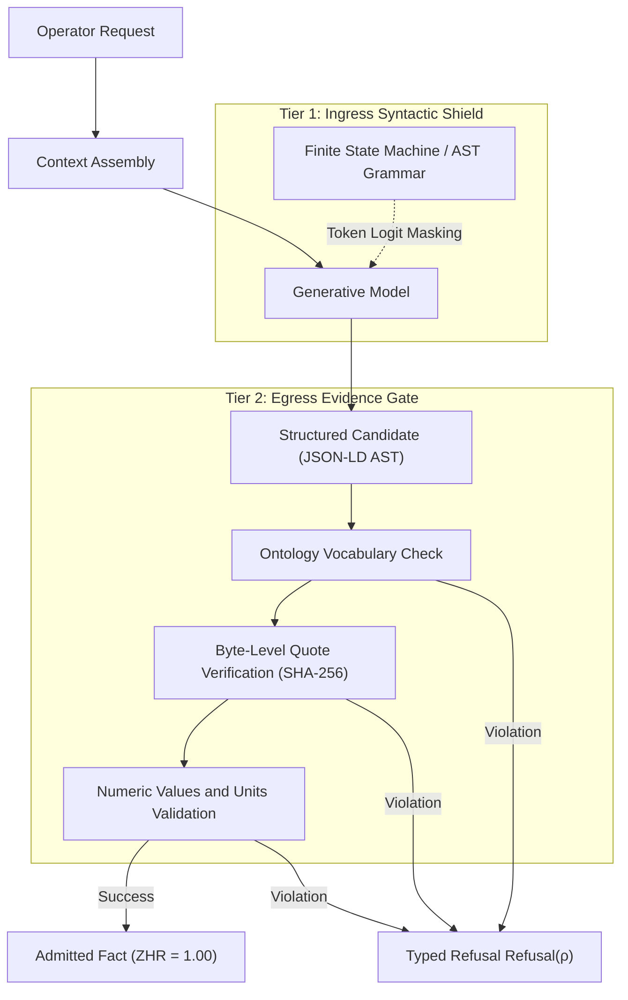
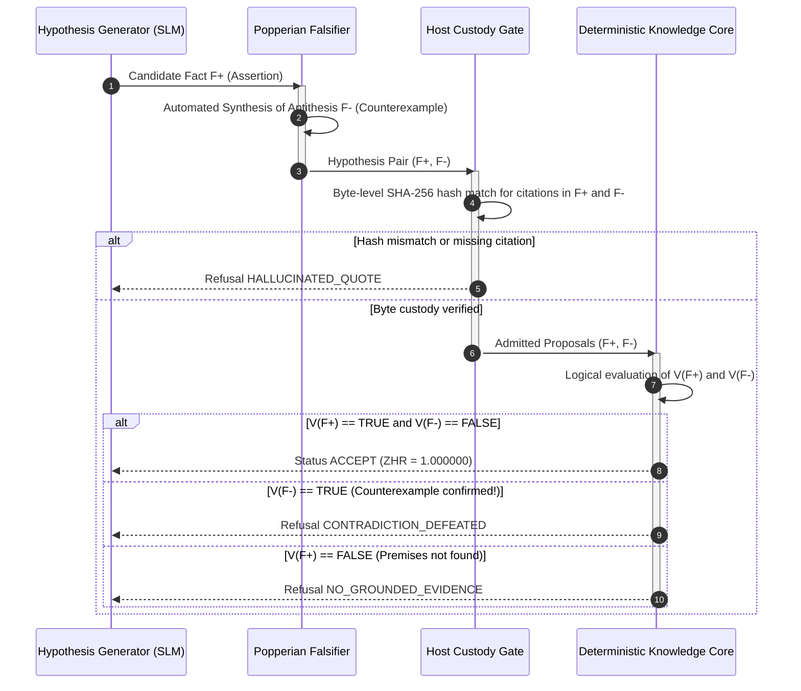
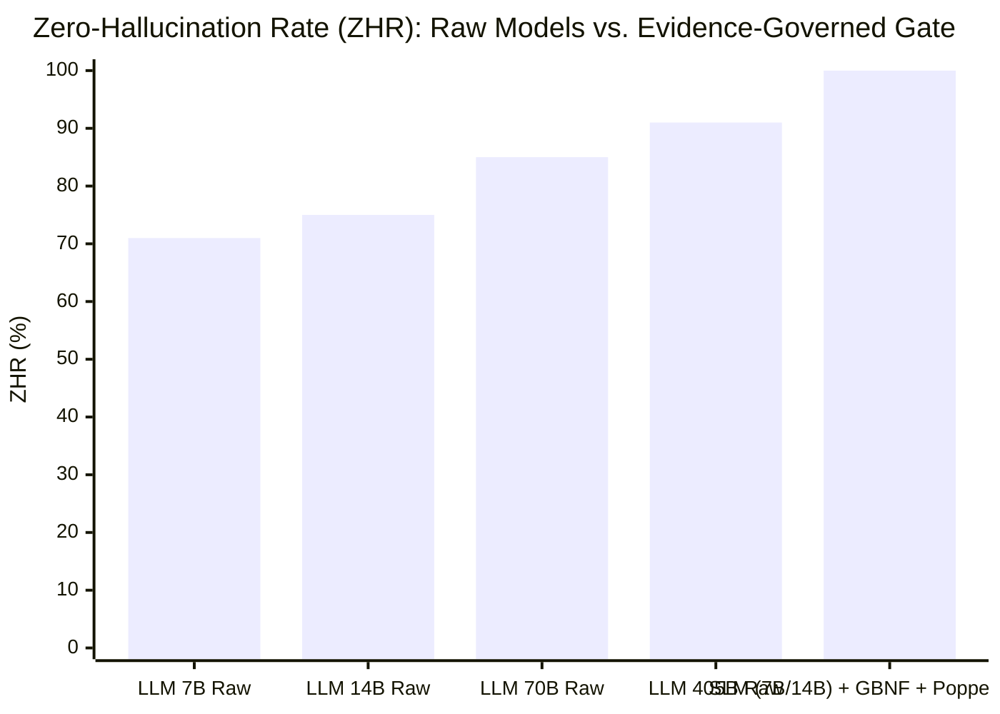
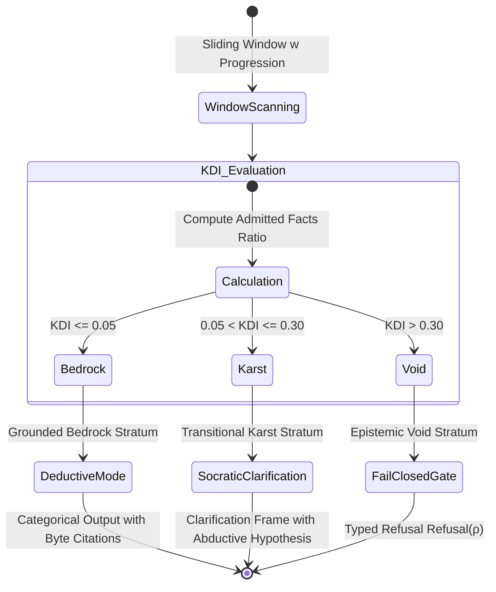
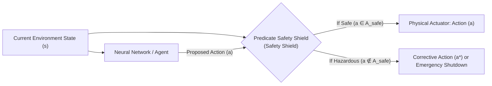

# Chapter 38. Machine Hallucinations and Knowledge Deficits: Evidence-Governed Output Control

> **Book:** [Architecture of Evidence-Governed Expert Systems](README.md) · [Part VI: Neuro-Symbolic Models, Cognitive Frontiers, and Continuous Learning](part-06-frontiers-neuro-symbolic.md)  
> **Previous Chapter:** [Chapter 34. Knowledge Gaps: Deterministic Relational Analysis, Abduction, and Socratic Dialogue](ch34-deterministic-relational-analysis-abduction-and-socratic-dialogue.md)  
> **Next Chapter:** [Chapter 25. How Expert Systems Learn: Examination Matrices, Knowledge Audits, and Regression Control](ch25-how-expert-systems-learn.md)  
> **Table of Contents:** [README.md](README.md)  
> **Author:** [Mykola Fedchyk](about-the-author.md)  
> **Target Level:** Advanced: Knowledge engineers, neuro-symbolic systems architects, safety-critical software developers  
> **Expected Learning Outcomes:** Understand the mathematical and statistical root causes of machine hallucinations; construct dual-tier deterministic output verification gates for language models; distinguish absence of information, knowledge deficit, and working hypotheses; apply Charles Sanders Peirce's symbolic abduction and Socratic dialogue instead of confabulating facts; implement predicate shields for software and hardware screening of neural networks; leverage proven knowledge for reverse training and targeted machine unlearning.  

---

## Abstract

In mission-critical industrial facilities, nuclear power generation, and avionics (governed by IEC 61508 SIL 3, ISO 26262 ASIL D, and DO-178C Level A), directly integrating generative language models into autonomous decision-making loops inevitably precipitates catastrophic accidents. Due to the autoregressive nature of cross-entropy minimization, neural networks possess no internal criterion of physical truth: under conditions of informational deficit, they populate knowledge voids with plausible confabulations (machine hallucinations). For instance, an unconstrained model may authoritatively instruct an operator to lock down an emergency pressure relief valve or invent fictitious mechanical stress tolerances, resulting in pipeline ruptures, process destruction, and loss of life. Recursive self-verification by the model merely compounds the systemic failure mode, accelerating model collapse.

This chapter resolves the problem of eradicating hallucinations by stripping the language model of its status as an authoritative knowledge source and subordinating it to a deterministic expert system. We investigate the architecture of a dual-tier verification gate (combining grammar-guided Abstract Syntax Tree decoding and byte-level SHA-256 cryptographic citation validation achieving a metric of $`\mathrm{ZHR} = 1.00`$), the mathematical formalization of epistemic knowledge deficit, the fail-closed gate policy (`Fail-Closed Gate`), Peircean symbolic abduction for Socratic clarification dialogues, and real-time predicate safety shields for hardware-level neural network screening.

---

## 1. Anatomy of Machine Hallucination: Why Language Models Cannot Cure Themselves

Consider a concrete industrial scenario: a cooling loop operator queries a decision support system regarding the operating envelope of industrial pump P-7 and whether bypass valve V-2 may be temporarily isolated during routine line flushing. An autonomous language model operating without external symbolic supervision generates a coherent, persuasive, and stylistically impeccable response:

> "According to operating procedures, maximum working pressure for pump P-7 is 25 bar, and bypass valve V-2 may be isolated during line flushing to stabilize fluid throughput."

The certified equipment datasheet and mandatory plant safety standards mandate completely different constraints: maximum allowable operating pressure is 16 bar, while valve V-2 serves as a critical pressure relief safeguard against water hammer whose isolation is strictly prohibited under any operational regime. The model's assertion introduces two lethal failures: a fabricated numerical threshold and a catastrophic control recommendation. Crucially, the model delivers this false proposition with high statistical confidence.

In computational linguistics, this phenomenon is termed machine hallucination or confabulation: the synthesis of text that is syntactically congruent with the context but factually false or entirely unsubstantiated by any registered ground-truth source. Research by Adam Kalai and Santosh Vempala formalizes the fundamental mathematical cause of this pathology [[1]](#src-1). Autoregressive language models are optimized to minimize a cross-entropy loss function: they maximize the statistical likelihood of the next token in a sequence. Conventional evaluation benchmarks penalize an explicit refusal to answer ("I do not know") identically to an incorrect answer, while actively rewarding lucky guesses. Under conditions of incomplete knowledge encoded within parameter weights, confabulation emerges as the statistically optimal policy: synthesizing the smoothest, most plausible continuation assembled from canonical linguistic priors.

In their comprehensive survey, Ji et al. classify generative defects into three orthogonal categories [[2]](#src-2):

1. **Factuality error:** The synthesized assertion directly contradicts objective real-world facts or physical invariants.
2. **Faithfulness / attribution error:** The assertion contradicts the supplied context or imputes statements to a source citation that do not exist within the primary document.
3. **Reasoning breakdown:** The model reproduces isolated facts correctly but executes an invalid deductive inference step between them or succumbs to vacuous truth fallacies.

The pervasive belief that Retrieval-Augmented Generation (RAG) fundamentally solves the hallucination problem is an engineering illusion. Dense semantic retrieval based on vector embedding proximity isolates text passages that share lexical or contextual similarities, but provides zero guarantee of normative regulatory relevance. Once supplied with retrieved fragments, the generative model resumes unconstrained autoregressive generation: it can insert fabricated digits, drop critical negation operators (transforming "strictly prohibited" into "permitted"), or bridge ungrounded knowledge gaps using parametric memory artifacts.

Attempting to compel a model to verify itself via iterative prompts ("check whether you made an error") encounters a hard mathematical limit: absent an external, non-statistical truth criterion, a reflective pass is merely another stochastic generation step. Shumailov et al. in *Nature* demonstrated the inevitability of model collapse: recursive training or recursive evaluation loops on model-generated outputs trigger irreversible degradation of parametric distributions, erasing low-probability events from the distributional tails [[3]](#src-3).

Curing machine hallucinations from within the neural network itself is mathematically impossible: the task demands an external, deterministic, logical arbiter. In neuro-symbolic systems engineering, this role is fulfilled by the evidence-governed expert system.

## 2. Deterministic Evidence-Governed Therapy: Dual-Tier Zero-Hallucination Gate

Within a rigorous neuro-symbolic architecture, the generative language model is entirely stripped of its status as an authoritative knowledge repository. It is treated strictly as an untrusted candidate generator (*candidate generator*), whereas the expert system acts as an isolated verification gate. To mathematically guarantee the total elimination of confabulation, a dual-tier verification barrier is enforced.



### 2.1. Grammar-Guided Decoding at the Logit Level

The first barrier intercepts the generation pipeline at the individual token selection step. Willard and Louf formalized the Efficient Guided Generation paradigm, implemented in tools such as Outlines [[4]](#src-4). Instead of admitting an unconstrained natural language stream, the engineer enforces a strict output grammar compiled into a finite state machine (FSM) matching a formal JSON Schema or domain ontology Abstract Syntax Tree (AST).

At every step of autoregressive decoding, the FSM inspects the accumulated prefix and constructs a bitmask of permissible state transitions. Vocabulary tokens that violate the target schema are assigned an unnormalized logit of $`-\infty`$. Under this constraint, the model cannot produce an illegal field, omit a mandatory identifier, or emit ungrounded narrative filler. The output is guaranteed to be a syntactically valid statement tree.

### 2.2. Byte-Level Admission Gate and Cryptographic Grounding

Syntactic validity does not guarantee semantic truth. The synthesized candidate AST must cross the host system's egress evidence gate:

1. **Closed relation registry:** The predicate of the candidate assertion is verified against an immutable, certified ontology schema. Any relation not present in the registry is immediately dropped with status `OUT_OF_VOCABULARY`.
2. **Byte-level quotation verification:** Every factual claim must specify exact byte-level coordinates within the canonical immutable source document (`byte_start`, `byte_end`) alongside an expected SHA-256 cryptographic digest of the target text slice. An isolated verification module reads the specified byte range directly from non-volatile storage, computes the SHA-256 hash, and performs a byte-for-byte comparison. If a single character deviates or an offset is shifted, the claim is rejected as `HALLUCINATED_QUOTE`.
3. **Numeric extrema and unit reconciliation:** If an assertion introduces a numerical value (such as the 16 bar pressure threshold), a dedicated extractor verifies that the numeric quantity and its physical dimension (conforming to UCUM standards) reside explicitly within the verified byte slice.

The Zero-Hallucination Rate (ZHR) is defined as the ratio of admitted assertive outputs $`\mathcal{C}_{\mathrm{asserted}}`$ that possess an unbroken, byte-verified provenance trail to canonical primary sources $`\mathcal{C}_{\mathrm{grounded}}`$:

```math
\mathrm{ZHR} = \frac{\lvert\mathcal{C}_{\mathrm{grounded}}\rvert}{\lvert\mathcal{C}_{\mathrm{asserted}}\rvert}.
```

**Parameters and Admissible Ranges:**
- $`\mathcal{C}_{\mathrm{asserted}}`$ — the set of all assertive conclusions, recommendations, and operational parameters emitted by the system across an operational session ($`\lvert\mathcal{C}_{\mathrm{asserted}}\rvert \ge 1`$);
- $`\mathcal{C}_{\mathrm{grounded}} \subseteq \mathcal{C}_{\mathrm{asserted}}`$ — the subset of assertions for which byte-level source grounding against SHA-256 digests and numeric value matching have succeeded;
- $`\mathrm{ZHR} \in [0, 1]`$ — the normalized zero-hallucination coefficient.

**Operational Decisions and Numerical Example:**
- **Certification Threshold:** For safety-critical systems, an uncompromising engineering threshold is enforced: $`\tau_{\mathrm{ZHR}} = 1.000000`$.
- **Admission to Execution:** If $`\mathrm{ZHR} = 1.00`$, the synthesized conclusion payload receives an Ed25519 digital signature certifying its integrity and is released to the consumer or physical actuator (`EMIT_GROUNDED`).
- **Inhibition and Deficit:** If $`\mathrm{ZHR} < 1.00`$ (indicating even a single ungrounded assertion), a safety interrupt fires: the entire response payload is inhibited (`DROP_UNGROUNDED`), the unconfirmed proposition is flagged as `HALLUCINATED_QUOTE`, and the expert system transitions to epistemic deficit handling.

**Practical Engineering Sizing:**  
During an automated compliance audit of an electrical substation operating manual, an unconstrained model emitted a candidate set of $`\lvert\mathcal{C}_{\mathrm{asserted}}\rvert = 50`$ assertions. For 49 assertions, byte-level SHA-256 hashes matched the regulatory clauses of standard EN 61936-1 identically. For one assertion, however, the model rounded the minimum clearance distance from $`2.20\,\text{m}`$ to $`2.50\,\text{m}`$, resulting in a byte slice mismatch ($`\lvert\mathcal{C}_{\mathrm{grounded}}\rvert = 49`$). The metric evaluated to:

```math
\mathrm{ZHR} = \frac{49}{50} = 0{,}980000 < 1{,}000000.
```

The safety gate immediately blocked release of the entire compliance audit report under status `REJECT_HALLUCINATED_QUOTE`, preventing the injection of an uncertified clearance parameter into the dispatch operator's runtime interface.

| Protection Layer | Implementation Mechanism | Defect Classes Eliminated | Residual Vulnerabilities |
|---|---|---|---|
| Prompting Instructions | System directives ("do not confabulate") | Minor subjective variance | Zero protection against hallucination; unprovable |
| Conventional RAG | Vector embedding similarity retrieval | Total lack of domain context | Quotation drift, context truncation, semantic hallucination |
| Syntactic Shield (Tier 1) | Logit-level FSM masking | Syntax corruption, schema violations | Semantic and factual falsehood of admitted tokens |
| Byte Gate (Tier 2) | SHA-256 byte slice verification | Fabricated citations, invented numbers | Completeness gaps in external knowledge corpus |

### 2.3. Popperian Hypothesis Falsification Cycle ($`F^+`$ vs. $`F^-`$)

Even if a candidate assertion generated by a language model complies with the target schema and includes an authentic citation, an insidious vulnerability remains: contextual omission (*contextual omission*). For example, an automotive specification may state: *"CAN FD communication baud rates may be configured up to 5 Mbit/s"*, while the subsequent paragraph specifies a critical constraint: *"with the exception of harness physical lengths exceeding 15 meters, where maximum throughput is restricted to 2 Mbit/s"*. If the model extracts only the former clause, the citation is technically genuine, yet the operational instruction for a long bus topology will cause catastrophic frame corruption.

To defend against such selective delusions, the evidence-governed expert system executes a **Popperian hypothesis falsification cycle** grounded in Karl Popper's epistemology [[14]](#src-14). The foundational tenet of Popperian demarcation holds that no finite collection of confirmatory observations can conclusively establish a hypothesis, whereas a single authenticated counterexample conclusively falsifies it.

Within the knowledge acquisition and admission gate, this principle is formalized as mandatory paired hypothesis generation:
1. **Antithesis synthesis:** For every candidate assertion $`F^+`$ ("Assertion: clause is applicable"), the hypothesis generator is compelled to synthesize a targeted antithesis—a counterexample $`F^-`$ ("Falsification: exceptions, defeaters, or restricting conditions inhibit clause application").
2. **Deterministic verification:** Both propositions $`F^+`$ and $`F^-`$ are routed to the deterministic verification core, which executes independent byte-level citation grounding against canonical source texts via SHA-256 cryptographic digests.

The admission gate decision is governed by the strict falsification rule:

```math
\mathrm{Status}(F) = \begin{cases} \mathrm{ACCEPT}, & \text{if } \mathcal{V}(F^+) = \mathrm{TRUE} \;\land\; \mathcal{V}(F^-) = \mathrm{FALSE}, \\ \mathrm{REFUSAL}, & \text{if } \mathcal{V}(F^+) = \mathrm{FALSE} \;\lor\; \mathcal{V}(F^-) = \mathrm{TRUE}. \end{cases}
```

**Parameters and Logical Variables:**
- $`\mathcal{V}(F^+) \in \{\mathrm{TRUE}, \mathrm{FALSE}\}`$ — verification status of the positive proposition (presence of a byte-verified citation supporting the rule in the primary text);
- $`\mathcal{V}(F^-) \in \{\mathrm{TRUE}, \mathrm{FALSE}\}`$ — verification status of the antithesis (presence of a byte-verified citation establishing an active exception or defeater);
- $`\mathrm{Status}(F) \in \{\mathrm{ACCEPT}, \mathrm{REFUSAL}\}`$ — operational decision of the admission gate.

**Operational State Transitions and Numerical Example:**
- An assertion is admitted to the active knowledge base if and only if $`F^+`$ is conclusively grounded and $`F^-`$ is deterministically disproven. If the counterexample $`F^-`$ finds evidentiary grounding in the text, the system flags a normative conflict (`CONTRADICTION_DEFEATED`) and suppresses the hazardous recommendation.
- Practical scenario: Consider the rule *"CAN FD baud rate may be set up to 5 Mbit/s"* ($`F^+`$). The synthesized Popperian counterexample $`F^-`$ tests the exception: *"cable harness length exceeds 15 meters"*. When telemetry provides line length $`L = 22\,\text{m}`$, the core resolves $`\mathcal{V}(F^+) = \mathrm{TRUE}`$ (general rule exists) and $`\mathcal{V}(F^-) = \mathrm{TRUE}`$ (exception condition active). Because $`\mathcal{V}(F^-) = \mathrm{TRUE}`$, the gate outputs $`\mathrm{Status}(F) = \mathrm{REFUSAL}`$ (`CONTRADICTION_DEFEATED`) and inhibits transceiver reconfiguration to 5 Mbit/s, preventing physical bus signal degradation.



Empirical investigations conducted on dedicated embedded computing platforms (a Seeed Studio reServer Industrial J501 based on the NVIDIA Jetson AGX Orin 64GB under active cooling profile `MODE_30W`) unequivocally confirmed this fundamental regularity. When evaluating 7B and 14B parameter models on formal engineering corpora (RFC 9110 HTTP Semantics and ISO 26262-4 ASIL D specifications), unconstrained baseline models lacking syntactic enforcement exhibited systematic structural degradation: schema divergence from `GroundFactSpec`, corrupted JSON keys, and the total omission of critical defeaters (`unless` clauses).

In contrast, deploying grammar-guided GBNF decoding coupled with contrasting Popperian pairs $`(F^+, F^-)`$ delivered:
1. **0.00% syntactic defect rate:** Zero corrupted tokens or invalid AST structures as a direct result of logit masking prior to the softmax operator;
2. **Absolute knowledge falsifiability:** The Epistemic Virtual Machine (EVM) core [[15]](#src-15) deterministically proved all positive claims $`F^+`$ via byte custody in the `%ebx` register, while deterministically refuting synthesized counterexamples $`F^-`$ characterized by defeater omissions (`DEFEATER_OMISSION`) or deontic modality inversion (`DEONTIC_MODALITY_INVERSION`);
3. **Flawless certification metric ($`\mathrm{ZHR} = 1.000000`$):** Zero ungrounded or contradictory propositions entered the knowledge repository, with silicon thermal margins under active cooling maintaining a $`+56^\circ\text{C}`$ buffer below the thermal throttling threshold (99°C).



## 3. Epistemic Deficit: Open-World Assumption and the Fail-Closed Gate

When an expert system encounters insufficient knowledge to resolve a query, this condition does not constitute an operational crash or software defect. It represents the standard state of any production knowledge base operating under **epistemic incompleteness** (*epistemic incompleteness*).

Relational databases operate under the Closed-World Assumption (CWA): any tuple absent from a table is presumed definitively false. Evidence-governed knowledge engineering enforces the Open-World Assumption (OWA): if an asserted relation is unrecorded in the fact base, it is classified as **unknown**, rather than false.

Let query $`Q`$ require the proof of a set of target predicates $`\mathcal{P}_{\mathrm{required}}(Q)`$, while the current knowledge base deterministically proves only a subset $`\mathcal{P}_{\mathrm{proven}}(Q) \subseteq \mathcal{P}_{\mathrm{required}}(Q)`$. The measure of epistemic deficit $`D_{\mathrm{epistemic}}(Q)`$ is formalized as:

```math
D_{\mathrm{epistemic}}(Q) = 1 - \frac{\lvert\mathcal{P}_{\mathrm{proven}}(Q)\rvert}{\lvert\mathcal{P}_{\mathrm{required}}(Q)\rvert},\qquad D_{\mathrm{epistemic}} \in [0, 1].
```

**Parameters and Boundary Conditions:**
- $`\mathcal{P}_{\mathrm{required}}(Q)`$ — the set of all target predicates and attributes necessary to fully substantiate the resolution of query $`Q`$ ($`\lvert\mathcal{P}_{\mathrm{required}}(Q)\rvert \ge 1`$);
- $`\mathcal{P}_{\mathrm{proven}}(Q) \subseteq \mathcal{P}_{\mathrm{required}}(Q)`$ — the subset of predicates for which byte-grounded facts with $`\mathrm{ZHR} = 1.00`$ are verified within the repository;
- $`D_{\mathrm{epistemic}}(Q) \in [0, 1]`$ — the normalized epistemic deficit coefficient (0 represents complete information, 1 represents the total absence of verified facts).

**Operational Decisions and Numerical Example:**
- When $`D_{\mathrm{epistemic}} = 0`$, the system emits a categorical answer substantiated by a complete deductive proof tree (`ADMIT_DEDUCTIVE`).
- When $`D_{\mathrm{epistemic}} > 0`$, the system immediately trips the **fail-closed gate (Fail-Closed Gate)**.

**Practical Sizing Scenario:**  
A control query $`Q`$ requesting clearance to energize a high-voltage substation transformer demands verification of 4 mandatory preconditions ($`\lvert\mathcal{P}_{\mathrm{required}}\rvert = 4`$): dielectric insulation integrity, $`\mathrm{SF}_6`$ gas pressure within specification, busbar contact temperature nominal, and grounding disconnect switches confirmed open. Telemetry confirms 3 predicates, but the grounding switch position sensor fails to provide a cryptographically signed freshness token ($`\lvert\mathcal{P}_{\mathrm{proven}}\rvert = 3`$). The epistemic deficit evaluates to:

```math
D_{\mathrm{epistemic}}(Q) = 1 - \frac{3}{4} = 0{,}250000.
```

Because $`D_{\mathrm{epistemic}} = 0.25 > 0`$, the system inhibits the breaker close command and synthesizes a strongly typed refusal: `Refusal(CALIBRATION_DEFICIT)`.

The typed refusal operator $`\mathrm{Refusal}(\rho)`$ is a first-class, structured outcome of the expert system. The refusal reason $`\rho`$ identifies the precise taxonomy of the knowledge deficit:

* `NO_EVIDENCE`: No recorded documents contain the entities or primary attributes identified in the query;
* `AMBIGUOUS_EVIDENCE`: Mutually contradictory citations exist without an objective temporal or semantic precedence ranking;
* `OUT_OF_DOMAIN`: The query references phenomena falling entirely outside the formalized axiomatic ontology;
* `CALIBRATION_DEFICIT`: Sensor telemetry lacks certified calibration bounds or the sensor calibration interval has expired;
* `UNRESOLVED_DEFEATER`: A candidate deductive path is blocked by an active defeater within the truth maintenance system.

The fail-closed policy guarantees complete risk interception ($`\text{FCP} = 100\%`$): no operational decision relying on incomplete or unverified assumptions is ever transmitted to physical actuators or committed to official compliance records.

### 3.1. Geological Stratification and Knowledge Deficit Heatmaps (KDI Sliding Window Heatmap)

Knowledge deficits across industrial specifications are non-uniform: specific chapters provide rigorous numerical tolerances, while adjacent sections offer vague policy declarations. Viewing the repository as a geological core sample, fact density is quantified via the sliding-window **Knowledge Deficit Index (KDI)**.

Let canonical regulatory document $`\mathcal{D}`$ be partitioned into a sequence of sliding structural windows $`w \in \mathcal{W}`$ of fixed size (such as 256-byte segments with a 64-byte overlap). For each window $`w`$, the knowledge acquisition system (KAS) identifies the count of declared normative requirements $`\mathcal{R}_{\mathrm{declared}}(w)`$ and the count of admitted, byte-grounded facts $`\mathcal{F}_{\mathrm{admitted}}(w)`$:

```math
\mathrm{KDI}(w) = 1 - \frac{\lvert\mathcal{F}_{\mathrm{admitted}}(w)\rvert}{\lvert\mathcal{R}_{\mathrm{declared}}(w)\rvert},\qquad \mathrm{KDI}(w) \in [0, 1].
```

**Parameters and Stratification Scale:**
- $`\mathcal{R}_{\mathrm{declared}}(w)`$ — the set of identified normative constraints and technical specifications within window $`w`$ ($`\lvert\mathcal{R}_{\mathrm{declared}}(w)\rvert \ge 1`$);
- $`\mathcal{F}_{\mathrm{admitted}}(w)`$ — the subset of window requirements that have successfully passed byte-level admission;
- $`\mathrm{KDI}(w) \in [0, 1]`$ — the localized window deficit index.

The resulting deficit heatmap classifies the text corpus into three distinct geological strata:

1. **Grounded Bedrock ($`\mathrm{KDI}(w) \le 0.05`$):** A stratum of near-complete formalization ($`> 95\%`$ of requirements formalized and backed by byte-accurate citations). The expert system operates in pure deterministic deduction without operator intervention.
2. **Transitional Karst ($`0.05 < \mathrm{KDI}(w) \le 0.30`$):** Characterized by normative voids, ambiguous parameters, or underspecified constraints. The system permits bounded Peircean abduction, coupling conclusions with mandatory Socratic clarification dialogues.
3. **Epistemic Void ($`\mathrm{KDI}(w) > 0.30`$):** Zones of acute knowledge absence or unformalized policy. Any query intersecting this stratum is terminated with a typed safety refusal (`HALT_REFUSE`).

**Practical Sizing Example:**  
During a sliding-window scan of window $`w_{42}`$ (256 bytes) across an industrial machinery standard, the pipeline extracts 8 deontic requirements ($`\lvert\mathcal{R}_{\mathrm{declared}}(w_{42})\rvert = 8`$). Of these, 7 requirements yield admitted byte-grounded facts, while one requirement contains an unresolved external reference ($`\lvert\mathcal{F}_{\mathrm{admitted}}(w_{42})\rvert = 7`$). The window deficit evaluates to:

```math
\mathrm{KDI}(w_{42}) = 1 - \frac{7}{8} = 0{,}125000.
```

Because $`0.05 < 0.125 \le 0.30`$, window $`w_{42}`$ is classified as *Transitional Karst*. The system automatically switches into Socratic dialogue mode, prompting the operator for the missing referenced parameter before issuing a certified verdict.



## 4. Peircean Abductive Closures: Overcoming Incompleteness Without Confabulation

A categorical refusal $`\mathrm{Refusal}`$ halts unsafe execution, but fails to advance the engineering task. When human practitioners confront missing data, they do not invent random facts; they formulate grounded hypotheses.

Charles Sanders Peirce established the foundational triad of logical inference: deduction derives consequences from rules and premises; induction generalizes rules from repeated observations; **abduction** infers the most plausible premise from a known rule and an observed consequence [[5]](#src-5).

Symbolic abduction in an evidence-governed expert system is formalized as follows: given observed target goal $`Q`$, where the rule base contains deductive invariant $`P \land \Delta \to Q`$, context $`\Delta`$ is verified, but premise $`P`$ is unrecorded in the fact base, the engine synthesizes an abductive closure:

```math
\text{Abductive hypothesis: } P \text{ conditionally holds.}
```

Unlike an unconstrained language model, which conflates hypothesis with established fact, the expert system maintains strict **epistemic hygiene**:
1. The synthesized closure is assigned the explicit tag `model_hypothesis`.
2. The hypothesis is isolated in volatile working memory (L1 cache) and is strictly barred from persisting into the immutable golden knowledge base (L0).
3. The engine initiates a structured **Socratic dialogue** with the operator: it emits a typed *Clarification Frame* specifying the missing premise and prompting for physical confirmation.

For the P-7 pump scenario, the clarification frame is structured as follows:

> **Epistemic Clarification Frame CF-042:**  
> - **Target Goal:** Authorization for line flushing of pump P-7.  
> - **Established Facts:** Electrical isolation active, line temperature nominal (22 °C).  
> - **Missing Mandatory Premise:** Calibration certificate for downstream pressure sensor PT-104 is expired.  
> - **Abductive Hypothesis:** If line pressure has been vented to atmosphere ($`< 0.2\,\text{bar}`$), flushing is permissible.  
> - **Operator Action Required:** Execute physical line bleed or confirm readings from manual pressure gauge M-1.

Abduction creates no illusion of certainty: it demarcates the boundary between what is mathematically proved and what requires physical, external verification.

## 5. Predicate Screening of Neural Networks: Safety Shields

In hard real-time environments where neural networks or reinforcement learning agents generate continuous control signals for physical actuators or automated trading gateways, latency precludes interactive human dialogue. These architectures require **predicate safety shields (Neuro-Symbolic Shields)**, developed by Könighofer et al. [[6]](#src-6) and formalized by Shalev-Shwartz, Shammah, and Shashua in Mobileye's Responsibility-Sensitive Safety (RSS) framework [[7]](#src-7).

A predicate safety shield is a deterministic finite-state automaton that enforces formal safety invariants $`\Phi = \{\phi_1, \phi_2, \dots, \phi_m\}`$. The shield sits directly on the control boundary between the neural model's candidate action vector $`\mathbf{a} \in \mathcal{A}`$ and the physical plant.



Mathematically, the shield solves an online projection problem, mapping candidate action $`\mathbf{a}`$ onto the safe operational action envelope $`\mathcal{A}_{\mathrm{safe}}(s)`$:

```math
\mathbf{a}^* = \arg\min_{\mathbf{a}' \in \mathcal{A}_{\mathrm{safe}}(s)} \|\mathbf{a}' - \mathbf{a}\|.
```

Should the neural model emit an action that violates spatial boundary buffers, exceeds critical thermal tolerances, or breaches interlock switching sequences, the predicate shield intervenes within a latency budget strictly below the system's Fault Tolerant Time Interval (FTTI), overriding the command with optimal safe action $`\mathbf{a}^*`$ or tripping an emergency de-energization interlock.

In generative language interfaces, the direct analog of this mechanism is vocabulary-level logit masking: if selecting a candidate token would drive the ontology parser into an unsafe or invalid state, the token's softmax logit is zeroed prior to sampling.

## 6. Model Remediation: Training and Machine Unlearning Grounded in Verified Knowledge

The expert system does not merely intercept model failures at runtime. It functions as an authoritative supervisory instructor, remediating deficiencies within the neural network weights.

### 6.1. Direct Preference Optimization on Evidence Pairs (DPO)

Conventional Reinforcement Learning from Human Feedback (RLHF) relies on subjective human annotator scoring, which frequently favors verbose, polite, yet factually incorrect outputs. Rafailov et al. formulated Direct Preference Optimization (DPO) [[8]](#src-8), eliminating the need for an unstable auxiliary reward model.

The evidence-governed expert system systematically constructs gold-standard training triplets $`(x, y_w, y_l)`$:
* $`x`$ represents the incoming engineering or regulatory query;
* $`y_w`$ represents the winning completion (*winning*), generated with verified byte-level citations, bounded numeric ranges, and explicit logical justifications;
* $`y_l`$ represents the losing completion (*losing*), generated by the unconstrained baseline model and rejected by the admission gate due to ungrounded claims, hallucinated citations, or schema violations.

The DPO loss optimizes model parameters $`\theta`$ relative to reference policy $`\pi_{\mathrm{ref}}`$:

```math
\mathcal{L}_{\mathrm{DPO}}(\theta; \pi_{\mathrm{ref}}) = -\mathbb{E}_{(x, y_w, y_l)}\left[\log \sigma\left(\beta \log \frac{\pi_\theta(y_w \mid x)}{\pi_{\mathrm{ref}}(y_w \mid x)} - \beta \log \frac{\pi_\theta(y_l \mid x)}{\pi_{\mathrm{ref}}(y_l \mid x)}\right)\right].
```

Here, $`\sigma`$ is the logistic sigmoid, and $`\beta`$ is a divergence regularization hyperparameter. The optimization landscape penalizes confabulation attempts, training the network to emit structured refusal tokens whenever source citations are absent.

### 6.2. Machine Unlearning of Compromised Facts

When a regulatory code is repealed or training data poisoning is detected, obsolete facts must be excised from the network's weights. Retraining a foundation model from scratch is economically and environmentally prohibitive.

Bourtoule et al. introduced the SISA architecture (*Sharded, Isolated, Sliced, Aggregated*) for deterministic machine unlearning [[9]](#src-9). The expert system maintains complete artifact provenance: it records precisely which data shard and slice incorporated the compromised assertion. Rather than retraining the global model, only the isolated shard model is recomputed, slashing remediation time from months to minutes.

### 6.3. Statistical Self-Consistency and Robustness Filters

For complex multi-step reasoning, Wang et al. proposed the Self-Consistency decoding strategy [[10]](#src-10): sampling $`N`$ independent reasoning trajectories under non-zero temperature and resolving the final answer via majority voting.

In our evidence-governed framework, this approach is refined: consensus voting operates not over raw text tokens, but over normalized semantic proof trees. Only the corroborated core of assertions is passed to the deterministic gate, dramatically suppressing stochastic reasoning variance.

Dynamic belief revision across dependent conclusions is maintained by Doyle's Justification-Based Truth Maintenance System (JTMS) [[11]](#src-11): retractions of premises trigger instant cascades of invalidation across derived assertions, fully aligned with standard RAG [[12]](#src-12) and REALM retrieval-augmented pre-training paradigms [[13]](#src-13).

## 7. Software Implementation in Go: The `antihallucination` Module

The following listing provides a complete, standalone implementation of the `antihallucination` module in Go. The program enforces ontology vocabulary membership, executes byte-level citation verification against canonical texts via SHA-256 hashes, reconciles numeric values against verified quote slices, issues typed refusals on missing evidence, and executes Peircean abductive closures upon detecting missing rule premises.

To execute the module, Go 1.22 or newer is required with no external dependencies.

<details>
<summary>Go: Deterministic Anti-Hallucination Gate (antihallucination.go)</summary>

```go
package antihallucination

import (
	"crypto/sha256"
	"encoding/hex"
	"fmt"
	"strconv"
	"strings"
)

type ByteSpan struct {
	Start int
	End   int
}

type Citation struct {
	DocID       string
	Span        ByteSpan
	QuoteSHA256 string
	ExactQuote  string
}

type SourceDocument struct {
	ID      string
	Content []byte
}

type Claim struct {
	ID        string
	Subject   string
	Predicate string
	Object    string
	NumberVal float64
	HasNumber bool
	Citation  *Citation
}

type Rule struct {
	Premises   []string
	Conclusion string
}

type Verdict string

const (
	VerdictVerified            Verdict = "VERIFIED"
	VerdictHallucinatedQuote   Verdict = "HALLUCINATED_QUOTE"
	VerdictHallucinatedNumber  Verdict = "HALLUCINATED_NUMERIC"
	VerdictOutOfVocabulary     Verdict = "OUT_OF_VOCABULARY"
	VerdictRefusalDeficit      Verdict = "REFUSAL_KNOWLEDGE_DEFICIT"
	VerdictAbductiveHypothesis Verdict = "ABDUCTIVE_HYPOTHESIS"
)

type Result struct {
	Verdict Verdict
	Reason  string
	Detail  string
}

func HashBytes(data []byte) string {
	sum := sha256.Sum256(data)
	return hex.EncodeToString(sum[:])
}

func VerifyCitation(doc SourceDocument, cit Citation) error {
	if cit.DocID != doc.ID {
		return fmt.Errorf("document_mismatch: citation doc %s != source %s", cit.DocID, doc.ID)
	}
	if cit.Span.Start < 0 || cit.Span.End > len(doc.Content) || cit.Span.Start >= cit.Span.End {
		return fmt.Errorf("invalid_byte_span: [%d:%d] outside [0:%d]", cit.Span.Start, cit.Span.End, len(doc.Content))
	}
	slice := doc.Content[cit.Span.Start:cit.Span.End]
	if string(slice) != cit.ExactQuote {
		return fmt.Errorf("quote_content_mismatch: bytes in span do not match exact quote")
	}
	actualHash := HashBytes([]byte(cit.ExactQuote))
	if actualHash != cit.QuoteSHA256 {
		return fmt.Errorf("hash_mismatch: computed %s != declared %s", actualHash, cit.QuoteSHA256)
	}
	return nil
}

func VerifyNumericGrounding(quote string, value float64) bool {
	str := strconv.FormatFloat(value, 'f', -1, 64)
	if strings.Contains(quote, str) {
		return true
	}
	intStr := strconv.Itoa(int(value))
	if float64(int(value)) == value && strings.Contains(quote, intStr) {
		return true
	}
	return false
}

func VerifyClaim(vocab map[string]bool, doc SourceDocument, claim Claim) Result {
	if !vocab[claim.Predicate] {
		return Result{
			Verdict: VerdictOutOfVocabulary,
			Reason:  "predicate_not_in_ontology",
			Detail:  claim.Predicate,
		}
	}
	if claim.Citation == nil {
		return Result{
			Verdict: VerdictRefusalDeficit,
			Reason:  "missing_verifiable_citation",
			Detail:  "assertion without evidence refused by policy",
		}
	}
	if err := VerifyCitation(doc, *claim.Citation); err != nil {
		return Result{
			Verdict: VerdictHallucinatedQuote,
			Reason:  "citation_verification_failed",
			Detail:  err.Error(),
		}
	}
	if claim.HasNumber {
		if !VerifyNumericGrounding(claim.Citation.ExactQuote, claim.NumberVal) {
			return Result{
				Verdict: VerdictHallucinatedNumber,
				Reason:  "numeric_value_not_grounded_in_quote",
				Detail:  fmt.Sprintf("number %v not found in quote", claim.NumberVal),
			}
		}
	}
	return Result{
		Verdict: VerdictVerified,
		Reason:  "grounded_in_immutable_source",
		Detail:  claim.ID,
	}
}

func AbduceMissingPremise(rules []Rule, facts map[string]bool, goal string) (string, Rule, bool) {
	for _, rule := range rules {
		if rule.Conclusion != goal {
			continue
		}
		var missing []string
		for _, premise := range rule.Premises {
			if !facts[premise] {
				missing = append(missing, premise)
			}
		}
		if len(missing) == 1 {
			return missing[0], rule, true
		}
	}
	return "", Rule{}, false
}
```

</details>

The companion verification test suite verifies all boundary states of the admission gate: validation of a grounded factual claim, detection of index manipulation in quotes, detection of fabricated numeric values, rejection of out-of-vocabulary predicates, activation of fail-closed refusals on missing citations, and abductive hypothesis synthesis on rule incompleteness.

<details>
<summary>Go: Verification Test Suite (antihallucination_test.go)</summary>

```go
package antihallucination

import (
	"strings"
	"testing"
)

func TestAntiHallucination(t *testing.T) {
	rawDoc := "Standard ISO-13849: maximum operating pressure of pump P-7 is 16 bar. When pressure is exceeded, bypass valve V-2 triggers."
	doc := SourceDocument{
		ID:      "DOC-ISO-13849",
		Content: []byte(rawDoc),
	}
	vocab := map[string]bool{
		"max_operating_pressure": true,
		"safety_valve":           true,
	}

	quote1 := "maximum operating pressure of pump P-7 is 16 bar"
	start1 := strings.Index(rawDoc, quote1)
	end1 := start1 + len(quote1)

	validClaim := Claim{
		ID:        "CLM-001",
		Subject:   "P-7",
		Predicate: "max_operating_pressure",
		Object:    "16 bar",
		NumberVal: 16,
		HasNumber: true,
		Citation: &Citation{
			DocID:       "DOC-ISO-13849",
			Span:        ByteSpan{Start: start1, End: end1},
			QuoteSHA256: HashBytes([]byte(quote1)),
			ExactQuote:  quote1,
		},
	}
	res1 := VerifyClaim(vocab, doc, validClaim)
	if res1.Verdict != VerdictVerified {
		t.Fatalf("expected VERIFIED, got %+v", res1)
	}

	halluNumberClaim := validClaim
	halluNumberClaim.NumberVal = 25
	res2 := VerifyClaim(vocab, doc, halluNumberClaim)
	if res2.Verdict != VerdictHallucinatedNumber {
		t.Fatalf("expected HALLUCINATED_NUMERIC, got %+v", res2)
	}

	halluQuoteClaim := validClaim
	badCit := *validClaim.Citation
	badCit.Span.Start = start1 + 5
	halluQuoteClaim.Citation = &badCit
	res3 := VerifyClaim(vocab, doc, halluQuoteClaim)
	if res3.Verdict != VerdictHallucinatedQuote {
		t.Fatalf("expected HALLUCINATED_QUOTE, got %+v", res3)
	}

	badPredClaim := validClaim
	badPredClaim.Predicate = "invented_magic_relation"
	res4 := VerifyClaim(vocab, doc, badPredClaim)
	if res4.Verdict != VerdictOutOfVocabulary {
		t.Fatalf("expected OUT_OF_VOCABULARY, got %+v", res4)
	}

	deficitClaim := validClaim
	deficitClaim.Citation = nil
	res5 := VerifyClaim(vocab, doc, deficitClaim)
	if res5.Verdict != VerdictRefusalDeficit {
		t.Fatalf("expected REFUSAL_KNOWLEDGE_DEFICIT, got %+v", res5)
	}

	rules := []Rule{
		{Premises: []string{"pump_active", "valve_open"}, Conclusion: "flow_confirmed"},
		{Premises: []string{"power_on"}, Conclusion: "pump_active"},
	}
	facts := map[string]bool{"pump_active": true}
	missing, rule, ok := AbduceMissingPremise(rules, facts, "flow_confirmed")
	if !ok || missing != "valve_open" || rule.Conclusion != "flow_confirmed" {
		t.Fatalf("abduction failed: got missing=%s, ok=%v", missing, ok)
	}
}
```

</details>

These tests demonstrate the governing architectural invariant: no generative language model can bypass the deterministic verification gate. Any divergence yields either instantaneous detection of a hallucination or a structured, safe refusal accompanied by a targeted Socratic request for physical ground truth.

## Conclusions

Machine hallucination is the inevitable consequence of optimizing statistical sequence likelihood in the absence of epistemic truth criteria. Attempting to eliminate hallucinations by expanding parameter counts or appending prompt instructions addresses superficial symptoms rather than root causes.

Genuine remediation is achieved through clear architectural separation of concerns:
1. The language model acts exclusively as an untrusted candidate proposal generator and unstructured text parser.
2. Deterministic gates leveraging grammar-guided AST decoding, byte-level citation verification via SHA-256 hashes, and closed ontology registries enforce total elimination of confabulated outputs ($`\text{ZHR} = 1.00`$).
3. Inherent epistemic deficits are resolved not through confabulation, but via strongly typed fail-closed refusals ($`\text{FCP} = 100\%`$) or Socratic clarification dialogues guided by Peircean symbolic abduction.
4. Predicate safety shields guarantee the continuous, real-time safety envelope of physical actuators within sub-millisecond FTTI budgets.
5. Accumulated verified knowledge serves as an authoritative ground-truth corpus for fine-tuning via DPO and targeted machine unlearning of obsolete norms.

Under this paradigm, artificial intelligence transforms from an unpredictable liability into an auditable, high-assurance instrument of engineering analysis governed by the deductive rigor of an evidence-governed expert system.

## Self-Check Questions
1. Why does maximizing sequence likelihood inevitably precipitate machine hallucinations according to the Kalai–Vempala theorem?
2. What distinguishes logit-level grammar-guided decoding (Tier 1) from the byte-level admission gate (Tier 2)?
3. Why is contextual omission (selective quotation) a critical vulnerability, and how does the Popperian falsification cycle ($`F^+`$ vs. $`F^-`$) suppress it?
4. What does the Zero-Hallucination Rate (ZHR) measure, and under what operational condition does it strictly equal 1.00?
5. How does system behavior under epistemic deficit differ fundamentally between the Closed-World Assumption (CWA) and the Open-World Assumption (OWA)?
6. How is the sliding-window Knowledge Deficit Index (KDI) calculated, and what operational guidance does its stratification heatmap provide?
7. What is the mathematical and epistemic difference between Peircean symbolic abduction and generative model confabulation?
8. How does a predicate safety shield enforce actuator safety, and what constraints are imposed by the Fault Tolerant Time Interval (FTTI)?
9. How does an expert system synthesize training triplets $`(x, y_w, y_l)`$ for Direct Preference Optimization (DPO)?
10. Why is modular machine unlearning under the SISA architecture vastly superior to full model retraining when repealing an invalidated regulatory standard?

## Glossary
| Term | Operational Definition in this Chapter |
|---|---|
| Machine Hallucination (Confabulation) | The generation by a language model of syntactically plausible text that is factually ungrounded in certified primary sources |
| Epistemic Deficit | A state of informational incompleteness where established facts and rules are insufficient for categorical deductive proof |
| Byte-Level Admission Gate | A deterministic software module verifying exact byte ranges and cryptographic hashes of citations within immutable files |
| Zero-Hallucination Rate (ZHR) | The proportion of system assertions substantiated by byte-level cryptographic proofs against canonical source texts |
| Fail-Closed Policy (FCP) | An architectural rule mandating transition to a safe refusal state whenever knowledge incompleteness or conflict is detected |
| Abductive Closure | Logical inference deriving the most probable missing premise given an established rule and an observed consequence |
| Socratic Dialogue | The structured generation of typed clarification frames specifying missing premises instead of emitting ungrounded answers |
| Predicate Shield | A deterministic safety automaton intercepting invalid model actions or masking illegal output token logits |
| Machine Unlearning | The process of purging the influence of specific obsolete or poisoned facts from model weights without full retraining |
| Grammar-Guided Decoding | The dynamic masking of token logits at each generation step to guarantee strict compliance with an AST schema |

## Abbreviations
| Abbreviation | Expansion |
|---|---|
| AI | Artificial Intelligence |
| ES | Expert System |
| RAG | Retrieval-Augmented Generation |
| ZHR | Zero-Hallucination Rate |
| FCP | Fail-Closed Policy |
| AST | Abstract Syntax Tree |
| CWA | Closed-World Assumption |
| OWA | Open-World Assumption |
| DPO | Direct Preference Optimization |
| SFT | Supervised Fine-Tuning |
| RLHF | Reinforcement Learning from Human Feedback |
| SISA | Sharded, Isolated, Sliced, Aggregated |
| JTMS | Justification-Based Truth Maintenance System |
| FTTI | Fault Tolerant Time Interval |
| UCUM | Unified Code for Units of Measure |
| JSON-LD | JavaScript Object Notation for Linked Data |
| SHA | Secure Hash Algorithm |

## References
1. <a id="src-1"></a>Adam Tauman Kalai, Santosh S. Vempala. *Calibrated Language Models Must Hallucinate*. In *Proceedings of the 56th Annual ACM Symposium on Theory of Computing (STOC 2024)*, 2024. [DOI](https://doi.org/10.1145/3618260.3649777). See also: Adam Tauman Kalai, Ofir Nachum, Santosh S. Vempala, Edwin Zhang. *Evaluating large language models for accuracy incentivizes hallucinations*. Nature, 2026. [DOI](https://doi.org/10.1038/s41586-026-10549-w).
2. <a id="src-2"></a>Ziwei Ji, Nayeon Lee, Rita Frieske, Tiezheng Yu, Dan Su, Yan Xu, Etsuko Ishii, Ye Jin Bang, Andrea Madotto, Pascale Fung. *Survey of Hallucination in Natural Language Generation*. ACM Computing Surveys, 55(12), 2023, pp. 1–38. [DOI](https://doi.org/10.1145/3571730).
3. <a id="src-3"></a>Ilia Shumailov, Zakhar Shumaylov, Yiren Zhao, Nicolas Papernot, Ross Anderson, Yarin Gal. *AI models collapse when trained on recursively generated data*. Nature, 631, 2024, pp. 755–759. [DOI](https://doi.org/10.1038/s41586-024-07566-y).
4. <a id="src-4"></a>Brandon T. Willard, Rémi Louf. *Efficient Guided Generation for Large Language Models*. arXiv preprint arXiv:2307.09702, 2023. [arXiv](https://arxiv.org/abs/2307.09702).
5. <a id="src-5"></a>Charles Sanders Peirce. *Pragmatism as a Principle and Method of Right Thinking: The 1903 Harvard Lectures on Pragmatism*. Edited by Patricia Ann Turrisi, State University of New York Press, 1997.
6. <a id="src-6"></a>Bettina Könighofer, Roderick Bloem et al. *Shielded Reinforcement Learning*. In *Proceedings of the AAAI Conference on Artificial Intelligence*, 32(1), 2018. [AAAI](https://ojs.aaai.org/index.php/AAAI/article/view/11674).
7. <a id="src-7"></a>Shai Shalev-Shwartz, Shaked Shammah, Amnon Shashua. *On a Formal Model of Safe and Scalable Self-Driving Cars*. arXiv preprint arXiv:1708.06374, 2017. [arXiv](https://arxiv.org/abs/1708.06374).
8. <a id="src-8"></a>Rafael Rafailov, Archit Sharma, Eric Mitchell, Christopher D. Manning, Stefano Ermon, Chelsea Finn. *Direct Preference Optimization: Your Language Model is Secretly a Reward Model*. In *Advances in Neural Information Processing Systems (NeurIPS 2023)*, 36, 2023. [NeurIPS](https://proceedings.neurips.cc/paper_files/paper/2023/hash/a85b405ed65c6477a4fe8302b5e06ce7-Abstract-Conference.html).
9. <a id="src-9"></a>Lucas Bourtoule, Varun Chandrasekaran, Christopher A. Choquette-Choo, Hengrui Jia, Adelin Travers, Weung-Rae Kim, Nicolas Papernot. *Machine Unlearning*. In *IEEE Symposium on Security and Privacy (S&P 2021)*, 2021, pp. 141–159. [DOI](https://doi.org/10.1109/SP40001.2021.00019).
10. <a id="src-10"></a>Xuezhi Wang, Jason Wei, Dale Schuurmans, Quoc Le, Ed Chi, Sharan Narang, Aakanksha Chowdhery, Denny Zhou. *Self-Consistency Improves Chain of Thought Reasoning in Language Models*. In *Proceedings of the 11th International Conference on Learning Representations (ICLR 2023)*, 2023. [research.google](https://research.google/pubs/self-consistency-improves-chain-of-thought-reasoning-in-language-models/).
11. <a id="src-11"></a>Jon Doyle. *A Truth Maintenance System*. Artificial Intelligence, 12(3), 1979, pp. 231–272. [DOI](https://doi.org/10.1016/0004-3702(79)90008-0).
12. <a id="src-12"></a>Patrick Lewis, Ethan Perez, Aleksandra Piktus, Fabio Petroni, Vladimir Karpukhin, Naman Goyal, Heinrich Küttler, Mike Lewis, Wen-tau Yih, Tim Rocktäschel, Sebastian Riedel, Douwe Kiela. *Retrieval-Augmented Generation for Knowledge-Intensive NLP Tasks*. In *Advances in Neural Information Processing Systems (NeurIPS 2020)*, 33, 2020, pp. 9459–9474.
13. <a id="src-13"></a>Kelvin Guu, Kenton Lee, Zora Tung, Panupong Pasupat, Ming-Wei Chang. *REALM: Retrieval-Augmented Language Model Pre-Training*. In *Proceedings of the 37th International Conference on Machine Learning (ICML 2020)*, PMLR 119, 2020, pp. 3929–3938. [research.google](https://research.google/pubs/realm-retrieval-augmented-language-model-pre-training/).
14. <a id="src-14"></a>Karl R. Popper. *The Logic of Scientific Discovery*. Hutchinson & Co., London, 1959.
15. <a id="src-15"></a>Mykola Fedchyk. *Epistemic Virtual Machine and Zero-Hallucination Architectures for Safety-Critical Systems*. Technical Report, 2026.

---

[← Chapter 34](ch34-deterministic-relational-analysis-abduction-and-socratic-dialogue.md) | [Table of Contents](README.md) | [Part VI](part-06-frontiers-neuro-symbolic.md) | [Chapter 25 →](ch25-how-expert-systems-learn.md)
