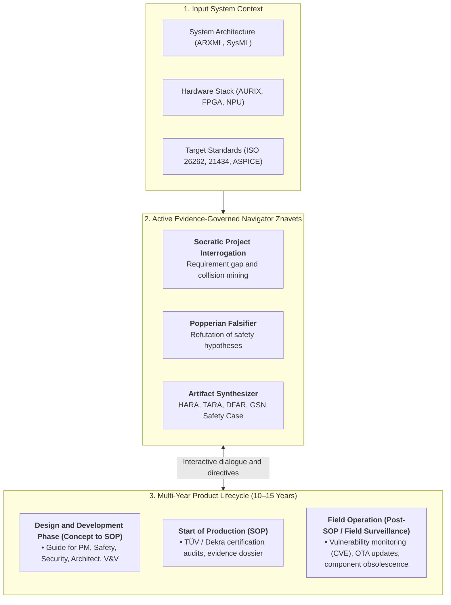
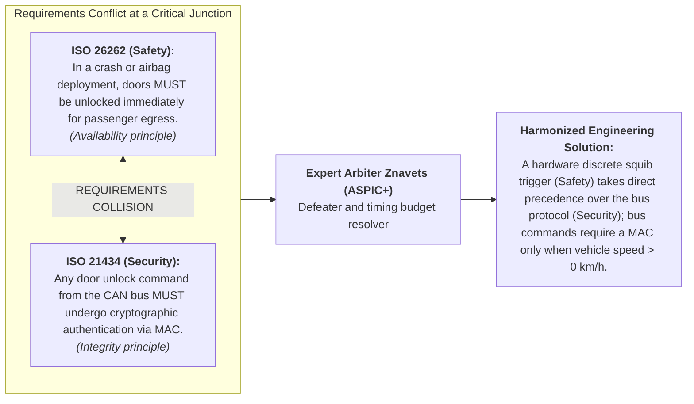

# Chapter 39. Active Compliance Auditor: Popperian Falsification, Normative Compliance (ASPICE/ISO 26262/ISO 21434), and Autonomous Test Design

> **Book:** [Architecture of Evidence-Governed Expert Systems](README.md) · [Part V: Verification, Testing, Diagnostics, and Safety Assurance](part-05-verification-and-learning.md)  
> **Previous Chapter:** [Chapter 36. Knowledge Testing Pyramid: Rules, Interactions, and Response Robustness](ch36-knowledge-testing-pyramid-and-variational-calibration.md)  
> **Next Chapter:** [Chapter 24. Technical Diagnostics: Distinguishing Symptoms from Root Causes Under Incompleteness](ch24-system-diagnosis.md)  
> **Table of Contents:** [README.md](README.md)  
> **Author:** [Mykola Fedchyk](about-the-author.md)  
> **Target Level:** Advanced: Functional Safety Engineers, Cybersecurity Engineers, Compliance Auditors (ASPICE/ISO Assessors), Evidence-Governed AI Architects  
> **Expected Learning Outcomes:** Master the paradigm shift from a passive oracle to an active knowledge auditor; comprehend runtime falsification of engineering hypotheses according to Karl Popper; utilize expert systems for autonomous preparation of TARA, SAR, DFAR, and V&V evidence dossiers; resolve antinomies between functional safety (Safety) and cybersecurity (Security) requirements; automate routine verification tasks to liberate engineering bandwidth for technical creativity while strictly preserving the Human-in-the-Loop principle.

---

## Abstract

In mission-critical cyber-physical systems (ISO 26262 ASIL D, ISO/SAE 21434 CAL 4, DO-178C DAL A, Automotive SPICE 4.0), manual compliance reporting and passive verification inevitably precipitate catastrophic failures. When functional safety engineers are forced to cross-reference thousands of requirements across disconnected spreadsheets, cognitive fatigue fosters "compliance theatre" (*Compliance Theatre*)—the perfunctory checking of boxes absent mathematical validation of edge states. Overlooking a single unmitigated single-point fault (SPFM < 99%) or an unaddressed attack vector on an in-vehicle communication bus can cause fatal vehicular accidents, massive autonomous vehicle recalls, and severe personal legal liability for certifying auditors.

This chapter resolves this crisis by establishing the transition from a passive consultative oracle to an Active Domain Knowledge Auditor. Grounded in Karl Popper's falsification principle ($`\mathcal{F}(\mathcal{H}, \mathcal{K})`$ for an engineering hypothesis $`\mathcal{H}`$ against a normative corpus $`\mathcal{K}`$) and the methodological foundations of this monograph [[8]](#src-8), the evidence-governed expert system seizes the interrogation initiative: it autonomously mines counterexamples, pinpoints normative collisions between functional safety (*Safety*) and cybersecurity (*Security*) mandates, synthesizes mathematically rigorous certification artifacts (HARA, TARA, SAR, DFAR/FMEDA) with full bidirectional traceability ($100.0\%$), and designs falsifying test suites, while strictly preserving the human engineer in the control loop (*Human-in-the-Loop*) as the ultimate strategic arbiter.

---

## 1. The Drama of Compliance Engineering: Why Manual Methods Have Reached Their Limits

The exponential growth of embedded software complexity, combined with intensifying regulatory scrutiny, has transformed certification compliance into one of the most demanding challenges in modern knowledge engineering. The engineering of mission-critical cyber-physical systems—spanning automotive architectures, avionics, high-speed rail signaling, and life-critical medical devices—is governed by stringent international standards that demand end-to-end verification of every requirement:
- **Automotive SPICE 4.0** [[2]](#src-2) (process maturity and capability determination for software and systems engineering);
- **ISO 26262:2018** [[3]](#src-3) (functional safety of electrical and electronic systems, spanning classifications ASIL A through ASIL D);
- **ISO/SAE 21434:2021** [[4]](#src-4) (cybersecurity engineering for road vehicles, levels CAL 1 through CAL 4);
- **DO-178C / ED-12C** [[5]](#src-5) (airborne systems and equipment certification for software, Design Assurance Levels DAL A through DAL E);
- **IEC 62304 / ISO 14971** (medical device software lifecycle and patient risk management).

### 1.1. The Burden of Personal Liability for Safety Engineers
Unlike mainstream commercial web development, safety professionals—**Safety Engineers**, **Cybersecurity Engineers**, **Functional Safety Managers (FSM)**, and **Lead Assessors**—bear direct professional, civil, and in multiple jurisdictions criminal liability for the signed engineering artifacts. 

The engineer's signature on safety dossiers attests that:
1. All risks of bodily harm and loss of human life have been mitigated to an acceptable residual level (*As Low As Reasonably Practicable*, ALARP).
2. All identified attack vectors targeting internal communication buses and electronic control units have been modeled and counteracted.
3. Every normative clause within the standard is substantiated by direct, reproducible objective evidence (*Objective Evidence*).

### 1.2. The Effort of Routine Man-Hours: TARA, SAR, DFAR, and HARA
The price of this accountability is measured in immense human effort. To release a modern automotive electronic control unit (such as an electronic braking controller or a central gateway), engineering teams must manually construct, cross-reference, and verify hundreds of complex evidential documents:

| Artifact | Standard | Essence and Engineering Content | Routine Engineering Challenge |
| :--- | :--- | :--- | :--- |
| **HARA** (*Hazard Analysis and Risk Assessment*) | ISO 26262-3 | Identification of hazardous events, assessment of severity ($S$), exposure ($E$), and controllability ($C$), assignment of ASIL levels (A/B/C/D) and Safety Goals. | Manual permutation of hundreds of vehicle operating scenarios and sensor fault modes; risk of overlooking critical scenarios. |
| **TARA** (*Threat Analysis and Risk Assessment*) | ISO/SAE 21434-9 | Identification of assets, cybersecurity properties (C-I-A), threat scenarios, attack tree modeling, evaluation of attack feasibility, and determination of CAL levels. | Cross-referencing thousands of CAN/Ethernet signals against CVE/CWE databases; manual modeling of attacker traversal steps across gateways. |
| **SAR** (*Safety Assessment Report*) | ISO 26262-2/8 | Concluding independent audit assessment of development compliance with functional safety and process rigor requirements. | Cross-auditing hundreds of standard clauses against empirical test logs; identifying and resolving traceability gaps. |
| **DFAR / DFMEA / FMEDA** | ISO 26262-5/6 | Quantitative failure mode analysis, calculation of single-point fault metrics (SPFM $\ge 99\%$), latent fault metrics (LFM $\ge 90\%$), and diagnostic coverage (DC). | Multi-tier spreadsheets exceeding tens of thousands of rows; replacing a single resistor in a schematic necessitates cascading recalculations across metric chains. |

In a typical mission-critical program, the author's industrial observations indicate that drafting, reconciling, and maintaining the consistency of these artifacts consumes **up to 60–70% of the entire engineering project budget**.

### 1.3. Human Fatigue and the Risks of Compliance Theatre
When senior engineers spend consecutive weeks transposing requirement identifiers between Polarion, DOORS, Jira, and fragmented Excel workbooks, cognitive exhaustion becomes inevitable:
- **Brittleness of manual traceability:** A localized modification in an architectural specification silently severs evidential links across dozens of downstream verification tests.
- **Compliance Theatre:** To meet aggressive delivery milestones, engineers are pushed into mechanically toggling checklist items without the temporal bandwidth to mathematically verify every boundary condition.
- **Erosion of engineering creativity:** Instead of performing deep physical analyses of sensor drift, architecting fault-tolerant diagnostic routines, and investigating subtle cyber-physical exploit vectors, top engineering talent squanders mental energy on bureaucratic bookkeeping.

This unsustainable friction demonstrates the imperative for **a new generation of evidence-governed expert systems**.

---

## 2. Paradigm Shift: From a Passive Reference Manual to an Interactive Product Lifecycle Guide

Classical artificial intelligence literature has historically treated expert systems as passive consultants operating on a reductionist query-response mechanism:

> **Traditional passive paradigm:** `[User submits query]` $\longrightarrow$ `[System returns static reference]`

In simple isolated diagnostic workflows, this pattern was functional. However, in contemporary mission-critical domains (automotive platforms, avionics fly-by-wire systems, high-speed rail interlockings), the passive oracle model collapses entirely due to a fundamental epistemic barrier: **an engineer or program manager cannot query the system about hazards they have overlooked, failed to notice, or that remain buried across multi-thousand-page regulatory volumes**. 

If an engineer remains unaware that substituting a transistor within an analog conditioning circuit altered the latent fault metric (LFM), or that an update to the Unified Diagnostic Services (UDS) stack opened a remote frame injection vector onto the CAN bus, they will never formulate the appropriate diagnostic query to a passive knowledge base.

### 2.1. The Concept of Proactive Evidence-Governed Lifecycle Guidance

The authentic **engineering paradigm shift** resides in fundamentally redefining the operational role of the expert system: evolving from a static repository of rules into an **interactive co-pilot and proactive lifecycle guide** for the multidisciplinary engineering organization.

Upon ingesting the baseline platform specifications at project inception (architectural SysML/ARXML models, hardware schematics, target standards ISO 26262 / ISO 21434 / ASPICE, reliability constraints, and operational environment assumptions), the evidence-governed expert system seizes the initiative through active probing (*Active Probing*):
1. **It does not wait for user input:** The system continuously monitors and parses engineering artifacts (CAN DBC databases, electrical schematics, source code commits, and test execution logs).
2. **It conducts Socratic interrogation:** It confronts system architects with targeted, probing inquiries regarding unanalyzed corner cases and anomalous boundary transitions.
3. **It steers the engineering organization:** Operating like an experienced certification assessor, the system delineates pending mandatory standard activities and exposes deficiencies within bidirectional traceability matrices.



---

### 2.2. Role Matrix of Safety Lifecycle Participants

In complex systems engineering programs, no single individual possesses complete mastery over all compliance dimensions. The active expert system acts as a specialized intellectual partner tailored to each key project stakeholder:

| Project Engineering Role | Standard Requirements | How the Active Expert System Assists |
| :--- | :--- | :--- |
| **Project Manager (PM) / Program Director** | Adherence to milestone gates, completeness of ASPICE SWE.1–SWE.6 processes, mitigation of certification failure risks. | **Compliance Readiness Radar:** Continuously evaluates evidence dossier completion percentages, highlights certification bottlenecks weeks ahead of audits, and models required engineering effort to close normative gaps. |
| **Functional Safety Manager (FSM) / Safety Engineer** | Attainment of target ISO 26262 reliability metrics (SPFM $\ge 99\%$, LFM $\ge 90\%$), compilation of HARA, construction of the GSN Safety Case. | **Mathematical Reliability Verifier:** Automatically synthesizes FMEDA/DFAR computational spreadsheets, proposes architectural mechanisms to boost watchdog diagnostic coverage, and constructs GSN argumentation trees. |
| **Cybersecurity Engineer** | Threat modeling via TARA (ISO/SAE 21434), evaluation of attack feasibility, construction of attack trees, allocation of Cybersecurity Goals. | **Automated TARA Synthesizer:** Maps in-vehicle network signals (CAN, Ethernet) against MITRE ATT&CK / STRIDE threat matrices, generates Attack Trees, and computes composite risk metrics. |
| **System & Software Architect** | Requirement consistency, soundness of ASIL decomposition (e.g., ASIL D = ASIL B(D) + ASIL B(D)), absence of architectural collisions. | **Architectural Decision Arbiter:** Exposes collisions between safety and security mandates, formally verifies adherence to the Fault Tolerant Time Interval (FTTI), and audits bus latency budgets. |
| **V&V / Test Engineer** | Attainment of 100% bidirectional traceability between tests and requirements (ASPICE SWE.4), design of stress and negative test suites. | **Test Suite Generator:** Synthesizes Popperian falsification test cases, six-point boundary value analysis (BVA), and fault injection routines, binding every execution trace to normative clauses. |

---

### 2.3. Long-Term Product Support in the Operational Phase (Post-SOP)

The operational lifespan of an embedded cyber-physical platform in automotive or aerospace industries typically spans **10 to 15 years**. Achieving certification at the Start of Production (*Start of Production, SOP*) represents merely the opening milestone. Throughout the decade-long fleet operation, the active expert system serves as an automated sentinel:

1. **Over-The-Air (OTA) Update Assurance:**  
   Every firmware patch delivered to a field controller introduces the risk of regressing fundamental safety guarantees. Prior to any OTA release, the expert system executes regression Popperian falsification: formally verifying that newly introduced control logic does not violate proven reliability invariants and satisfies UN ECE R156 software update compliance mandates.
2. **Component Obsolescence and Second-Sourcing:**  
   When a semiconductor manufacturer discontinues a microcontroller or a bus transceiver, the engineering team must qualify an alternative component (second source). The expert system ingests the replacement component's raw failure rates ($\lambda$, FIT rates) and recalculates the complete FMEDA model in real time, eliminating months of manual spreadsheet refactoring.
3. **Continuous Post-Development Cybersecurity Monitoring:**  
   In compliance with ISO/SAE 21434 Clause 13, manufacturers must actively monitor newly discovered vulnerabilities affecting operational fleets. The active auditor continuously cross-references emerging CVE/CWE disclosures against the system's exact Software Bill of Materials (SBOM) and hardware bill of materials, alerting engineers to exploitable attack surfaces long before they materialize into operational incidents.
4. **Normative Evolution and Standard Migration:**  
   When international standards evolve (e.g., migrating from Automotive SPICE 3.1 to 4.0 or adopting updated revisions of ISO 26262), the active expert executes automated delta analysis across its ZKP4 knowledge base, delineating precisely which lifecycle artifacts require revision.

---

## 3. Mathematical Foundations of Popperian Falsification of Engineering Hypotheses

The verification of mission-critical design claims is anchored in Karl Popper's criterion of falsifiability [[1]](#src-1): *a system cannot be declared safe merely through the accumulation of successful test passes; safety is corroborated solely by the failure of the most rigorous, aggressive attempts to refute it*.

### 3.1. Formalization of an Engineering Hypothesis
A system architect, developer, or proposing language model asserts a design hypothesis $\mathcal{H}$ (e.g., *"The brake pedal sensor processing module achieves ASIL D compliance without ADC redundancy by relying on periodic runtime self-tests"*).

Formally, the engineering hypothesis is expressed as a universally quantified predicate over the system state space $\mathcal{S}$:

```math
\mathcal{H} \equiv \forall s \in \mathcal{S}, \quad \mathrm{StateValid}(s) \implies \mathrm{SafetyGoalSatisfied}(s)
```

The normative knowledge base $\mathcal{K}$ comprises binary deontic atoms extracted from the governing standards:

```math
\mathcal{K} = \lbrace \nu_1, \nu_2, \dots, \nu_m \rbrace, \quad \nu_i = \langle \mathrm{Domain}, \mathrm{Clause}, \mathrm{Entity}, \mathrm{Modality}, \mathrm{Action}, \mathrm{Evidence} \rangle
```

where the deontic modality belongs to the set `MUST`, `MUST_NOT`, `SHOULD`, `MAY`.

### 3.2. Potential Falsifier Search

The objective of the deterministic expert engine is to execute a symbolic search for a refuting counterexample within latency $t < 1\ \mathrm{ms}$:

```math
\mathcal{F}(\mathcal{H}, \mathcal{K}) = \lbrace \nu_k \in \mathcal{K} \mid \mathrm{Implication}(\mathcal{H}) \models \mathrm{Violation}(\nu_k) \rbrace
```

where:
- $`\mathcal{F}(\mathcal{H}, \mathcal{K})`$ is the set of identified normative falsifiers for hypothesis $`\mathcal{H}`$ within rule base $`\mathcal{K}`$;
- $`\nu_k`$ is an atomic deontic clause of the standard;
- $`\models`$ denotes semantic entailment of a normative violation.

**Actionable Closed-Loop Engineering Decisions:**

#### 1. Verification Flow Control and System Verdicts

If $`\mathcal{F}(\mathcal{H}, \mathcal{K}) \neq \emptyset`$ (at least one refutation is discovered):

```math
\mathrm{Verdict} = \mathbf{FALSIFIED} \quad \bigl( \mathrm{Refusal}(\rho), \quad \mathrm{EBX} = \mathrm{SHA256}(\mathrm{Quote}), \quad \mathrm{Clause} = \text{ISO 26262-5:2018 Clause 8.4.3} \bigr)
```

**System Action:** The continuous integration pipeline (CI/CD) immediately terminates with exit code `EX_SAFETY_VIOLATION`. The engine synthesizes a cryptographic refusal token $`\mathrm{Refusal}(\rho)`$ signed with Ed25519, inhibits the flashing of the binary firmware image onto the target electronic control unit (ECU), and files a blocking issue in the tracking system (Jira/GitLab) linking directly to the verbatim byte offset of the violated standard.

If $`\mathcal{F}(\mathcal{H}, \mathcal{K}) = \emptyset`$ (no normative counterexample is found):

```math
\mathrm{Verdict} = \mathbf{PROVISIONALLY\_CORROBORATED}
```

**System Action:** The system returns a verdict of provisional corroboration, issues a cryptographically verifiable compliance gate certificate, and unlocks progression to hardware-in-the-loop (HIL) physical simulation.

#### 2. Hardware Dimensioning and Latency
The counterexample search time is strictly bounded by $`t_{\mathrm{eval}} \le 1.0\,\text{ms}`$ through the bitmask indexing of normative clauses residing in block RAM (BRAM) footprints below $`< 512\,\text{MB}`$.

#### 3. Worked Numerical Example
- A design engineer submits a hypothesis asserting the adequacy of a single-channel ADC with $`90\%`$ diagnostic coverage for an ASIL D subsystem.
- The symbolic engine traverses the knowledge base in $`210\,\mu\text{s}`$ and retrieves atom $`\nu_{418}`$ (ISO 26262-5, Clause 8.4.3: mandatory SPFM $`\ge 99\%`$).
- $`\mathcal{F}(\mathcal{H}, \mathcal{K}) = \{\nu_{418}\} \neq \emptyset \implies \mathrm{Verdict} = \mathbf{FALSIFIED}`$.
- **System Action:** A blocking diagnostic protocol is generated identifying the metric deficit: $`\Delta \mathrm{SPFM} = 9.0\%`$. The code commit is automatically rejected.

---

## 4. Automating the Generation of TARA, SAR, and DFAR Artifacts via Domain Rules

Let us examine in detail how an active auditor assists engineering specialists in synthesizing core evidence dossiers without manual data re-entry.

### 4.1. TARA Automation (ISO/SAE 21434): From System Description to Risk Matrix

The TARA workflow comprises several canonical phases, each supported deterministically by the expert engine:

#### 4.1.1. Asset Identification
The expert scans the architectural descriptions (CAN DBC files, AUTOSAR ARXML descriptions, IDL interface files) and automatically extracts system assets (e.g., *"Diagnostic session cryptographic key"*, *"Steering wheel angle signal SteerAngle"*).

#### 4.1.2. Threat Scenario Identification
By mapping extracted assets against the STRIDE and MITRE ATT&CK for ICS ontologies encoded within the ZKP4 knowledge pack, the engine synthesizes an exhaustive list of threat scenarios:

```math
\mathrm{Threat} = \langle \mathrm{Asset}, \ \mathrm{Property}, \ \mathrm{Damage} \rangle
```

where $`\mathrm{Asset} = \text{SteerAngle}`$, $`\mathrm{Property} = \text{Integrity}`$, and $`\mathrm{Damage}`$ corresponds to unauthorized steering actuation at cruising velocity.

#### 4.1.3. Attack Path Analysis & Feasibility
The engine constructs the traversal graph of the in-vehicle network and computes the attack feasibility vector according to the Attack Potential methodology (Elapsed Time, Specialist Expertise, Knowledge of Item, Window of Opportunity, Equipment).

#### 4.1.4. Synthesizing the Final TARA Matrix
Rather than dedicating weeks to clerical compilation, the engineer receives an automatically synthesized risk matrix populated with aggregated risk ratings (Risk Values 1 through 5) and associated cybersecurity goals (*Cybersecurity Goals*).

### 4.2. DFAR and FMEDA Automation (ISO 26262): Mathematical Rigor of Metrics

Compiling a DFAR/FMEDA dossier requires component-level mathematical reliability modeling:
- $`\lambda`$ — total component failure rate (expressed in FIT, $10^{-9}\,\text{failures}/\text{h}$);
- $`\lambda_s`$ — safe failure rate;
- $`\lambda_{\mathrm{spf}}`$ — single-point dangerous failure rate directly violating a safety goal;
- $`\lambda_{\mathrm{rf}}`$ — residual failure rate;
- $`\lambda_{\mathrm{mpf,lat}}`$ and $`\lambda_{\mathrm{mpf,det}}`$ — latent and detected multiple-point failure rates.

#### 4.2.1. Single-Point Fault Metric (SPFM)

The normative threshold mandated by ISO 26262 for ASIL D targets:

```math
\mathrm{SPFM} = \frac{\sum (\lambda_s + \lambda_{\mathrm{spf\_mitigated}})}{\sum \lambda} \ge 0{,}99
```

#### 4.2.2. Latent Fault Metric (LFM)

For ASIL D safety architectures, the target threshold requires:

```math
\mathrm{LFM} = \frac{\sum (\lambda_s + \lambda_{\mathrm{mpf,det}})}{\sum (\lambda - \lambda_{\mathrm{spf}})} \ge 0{,}90
```

**Actionable Closed-Loop Engineering Decisions:**
1. **Automated Certification and Release Gate:**
   - **Normative Compliance** ($`\mathrm{SPFM} \ge 0.99`$ and $`\mathrm{LFM} \ge 0.90`$): The system automatically compiles the certification artifact `SAR.gsn` with state `APPROVED_FOR_AUDIT`, signs it with an Ed25519 digital signature, and dispatches the dossier to the assessment body (TÜV / Dekra).
   - **Normative Non-Compliance** ($`\mathrm{SPFM} < 0.99`$ or $`\mathrm{LFM} < 0.90`$): Compilation of the SAR dossier is blocked. The engine initiates diagnostic backtracking (*Diagnostic Backtracking*) and presents the engineer with minimal targeted corrective interventions:
     * Increasing the diagnostic coverage of the watchdog timer ($K_{\mathrm{wdg}}$);
     * Or introducing a redundant hardware comparator with dual-sampling logic.
2. **Worked Numerical Sizing and Remediation Example:**
   - For a microcontroller, the total observed failure rate is $`\sum \lambda = 120\,\text{FIT}`$.
   - Safe and diagnosed single-point failures account for $`\sum (\lambda_s + \lambda_{\mathrm{spf\_mitigated}}) = 118.1\,\text{FIT}`$.
   - Calculating metric: $`\mathrm{SPFM} = 118.1 / 120 = 0.9841 = 98.41\% < 99\%`$.
   - **System Action:** Release is blocked. The engine issues a prescriptive recommendation: "Metric deficit $`\Delta = 0.59\%`$. Increasing watchdog diagnostic coverage from $`60\%`$ to $`90\%`$ reduces unmitigated faults by $`1.2\,\text{FIT}`$, raising $`\mathrm{SPFM}`$ to $`119.3 / 120 = 99.42\% \ge 99\%`$." Upon committing the schematic revision, re-computation unlocks the certification gate.

### 4.3. SAR Automation: An Evidence Canvas for TÜV / Dekra Auditors
The Safety Assessment Report (SAR) represents the capstone of a functional safety lifecycle. The expert system structures the SAR as an argumentation tree formatted in the **Goal Structuring Notation (GSN)** of Kelly and Weaver [[6]](#src-6):
- **Top Goal:** The system satisfies ASIL D requirements according to ISO 26262.
- **Strategy:** Argumentation decomposed across hardware safety, software safety, and ASPICE process rigor.
- **Evidence:** Every leaf node (Evidence) references a specific, reproducible test execution protocol stamped with a cryptographic hash and mapped to verbatim standard citations.

---

## 5. Resolving the Fundamental Antinomy: Functional Safety versus Cybersecurity

In complex systems engineering, the most hazardous friction arises from the **inherent conflict between Functional Safety and Cybersecurity mandates**:



### 5.1. Conflict Resolution via the Deterministic Kernel of the Expert System
1. **Cross-Standard Defeater Mining:** Representing both standard ontologies within a shared reasoning space enables the system to detect rule collisions during the early architectural design phase (ASPICE SWE.2).
2. **Argumentation via ASPIC+ Frameworks:** Building upon Dung's abstract argumentation frameworks [[7]](#src-7), the system constructs defeasible reasoning trees (*Defeasible Reasoning*), explicitly distinguishing between premise rebutting (*rebutting*) and rule undercutting (*undercutting*).
3. **Synthesis of Safe Compromise Solutions:** The expert synthesizes an actionable, formal resolution: *"Route a discrete hardware deceleration sensor line directly to the pyrotechnic squib, bypassing the microcontroller, while maintaining strict cryptographic authentication for all software-originated diagnostic unlock requests."*

---

## 6. The Neuro-Symbolic Testing Tandem and Autonomous Test Suite Generation

The operational synergy between a generative language model and the deterministic EVM execution kernel operates as an active testing tandem:

1. **System 1 (LLM Proposer — Creativity):**
   - Ingests driver source code and interface documentation.
   - Formulates complex, non-obvious failure hypotheses: *"What happens if a CAN frame with DLC=15 instead of 8 arrives exactly during the power relay switching transient?"*
   - Drafts test case specifications in structured natural language.
2. **System 2 (EVM / EISA v1.0 — Deterministic Arbiter):**
   - Ingests candidate test cases via the `Popperian Falsification API`.
   - Cross-checks them against compiled ZKP4 rules governing ISO 11898, ISO 26262, and AUTOSAR specifications.
   - Instantaneously validates: Does the proposed test violate invariant system constraints? Which specific normative requirement does it cover?
   - Upon successful verification, the engine registers the test in the V&V matrix, linking it directly to the ASPICE SWE.4 traceability thread.

### 6.1. Quantifying Test Suite Completeness (Traceability Coverage)

To objectively evaluate test suite sufficiency, the expert system computes the requirements traceability coverage metric:

```math
\mathrm{TraceabilityCoverage} = \frac{\lvert \mathcal{R} \cap \mathcal{T} \rvert}{\lvert \mathcal{R} \rvert} = 1{,}00
```

where $`\mathcal{R}`$ is the complete set of formalized requirements from standard clauses and system specifications (*requirements*), and $`\mathcal{T}`$ is the subset of requirements corroborated through deterministic, executed test suites (*test-verified*).

**Actionable Closed-Loop Engineering Decisions:**
- **Complete Traceability Coverage** ($`\mathrm{TraceabilityCoverage} = 1.00`$): The ASPICE SWE.4 quality gate transitions to `PASSED`. The CI/CD pipeline compiles the final cryptographically signed release manifest for assessor submission.
- **Incomplete Traceability Coverage** ($`\mathrm{TraceabilityCoverage} < 1.00`$): The pipeline terminates with exit code `EX_COMPLIANCE_GAP`. The system isolates the delta $`\mathcal{R}_{\mathrm{missing}} = \mathcal{R} \setminus \mathcal{T}`$ and synthesizes targeted prompts for the System 1 generator (LLM Proposer) to produce the missing test cases.
- **Worked Numerical Example:** An architectural specification comprises $`\lvert \mathcal{R} \rvert = 142`$ formal requirements. Executed suites verify $`\lvert \mathcal{R} \cap \mathcal{T} \rvert = 141`$ requirements. Computed coverage: $`\mathrm{TraceabilityCoverage} = 141 / 142 \approx 0.993 < 1.00`$. **System Action:** Release is blocked; System 1 is dispatched to synthesize targeted test cases for unverified requirement $`R_{87}`$ (controller behavior under transient CAN bus under-voltage dips).

---

## 7. The Engineering and Human Dimension: Human-in-the-Loop

Deploying an active compliance auditor does **not eliminate the human engineer from the engineering process**. On the contrary, it restores to systems engineering its foundational creative and intellectual dignity.

### 7.1. Delegating Routine Verification Work to the Machine
The machine assumes execution of clerical and computationally deterministic burdens:
- Parsing thousands of pages of standard specifications;
- Populating massive multi-thousand-row traceability workbooks (Excel, Polarion);
- Enforcing strict deontic modalities (`MUST`, `SHALL`, `REQUIRED`);
- Recalculating mathematical reliability metrics (SPFM, LFM, FIT rates);
- Auditing bidirectional coverage of codebases against regulatory mandates.

### 7.2. Strategic and Creative Functions of the Safety Engineer
The human expert focuses on high-level cognitive domains:
- **Architectural creativity:** Designing elegant, robust, and resilient cyber-physical architectures;
- **Physical intuition:** Investigating rare physical anomalies in production hardware, thermal drift, silicon aging, and single-event upsets that cannot be fully anticipated in standardized rule sets;
- **Strategic accountability:** The engineer is freed from audit dread, knowing that every formal clause is rigorously substantiated by a mathematically verified foundation. The specialist signs SAR and TARA dossiers with justified confidence, grounded in high-integrity objective evidence.

---

## 8. Go Implementation of the Active TARA Auditor Kernel and Safety Directives

The following listing provides an implementation of an active auditor in Go, modeling compliance entities from ISO 26262 and ISO/SAE 21434:

<details>
<summary><b>Full Source Code: Active TARA Auditor Kernel and Safety Directives in Go (~150 lines)</b></summary>

```go
package compliance

import (
	"context"
	"crypto/sha256"
	"encoding/hex"
	"fmt"
	"sync"
	"time"
)

// DomainStandard represents an identifier of a compliance standard.
type DomainStandard string

const (
	StandardISO26262 DomainStandard = "ISO-26262:2018"
	StandardISO21434 DomainStandard = "ISO/SAE-21434:2021"
	StandardASPICE4  DomainStandard = "ASPICE-4.0"
	StandardRFC9110  DomainStandard = "RFC-9110"
)

// DeonticModality represents the normative modality according to RFC 2119 / ISO Directives.
type DeonticModality string

const (
	ModalityMust    DeonticModality = "MUST"
	ModalityMustNot DeonticModality = "MUST_NOT"
	ModalityShould  DeonticModality = "SHOULD"
)

// ComplianceRule represents an inviolable normative ZKP4 atom.
type ComplianceRule struct {
	Standard      DomainStandard  `json:"standard"`
	Clause        string          `json:"clause"`         // e.g., "Part 6 Clause 8.4.2"
	Entity        string          `json:"entity"`         // e.g., "SafetyMechanism"
	Modality      DeonticModality `json:"modality"`       // MUST / MUST_NOT
	TargetAction  string          `json:"target_action"`  // e.g., "SilentFailure"
	VerbatimQuote string          `json:"verbatim_quote"` // Verbatim normative text
	ByteStart     uint64          `json:"byte_start"`     // Start offset in raw source
	ByteEnd       uint64          `json:"byte_end"`       // End offset in raw source
	ExpectedSHA   string          `json:"expected_sha"`   // SHA-256 hash of verbatim quote (%ebx custody)
}

// EngineeringHypothesis represents a design decision proposed by an engineer or LLM.
type EngineeringHypothesis struct {
	HypothesisID   string `json:"hypothesis_id"`
	TargetEntity   string `json:"target_entity"`
	ProposedAction string `json:"proposed_action"`
	SafetyASIL     string `json:"safety_asil,omitempty"` // "QM", "ASIL-A".."ASIL-D"
	Rationale      string `json:"rationale"`
}

// FalsificationResult encapsulates the outcome of Popperian falsification.
type FalsificationResult struct {
	IsFalsified      bool            `json:"is_falsified"`
	ViolatedRule     *ComplianceRule `json:"violated_rule,omitempty"`
	RefusalReason    string          `json:"refusal_reason"`
	EvidenceVerified bool            `json:"evidence_verified"`
	Latency          time.Duration   `json:"latency"`
}

// ActiveComplianceEngine represents an autonomous TARA/SAR/DFAR auditor.
type ActiveComplianceEngine struct {
	mu            sync.RWMutex
	rulesByEntity map[string][]ComplianceRule
	rawSourceData []byte // mmap slice of the raw normative source
}

// NewComplianceEngine initializes the auditor bound to raw normative source data.
func NewComplianceEngine(sourceData []byte) *ActiveComplianceEngine {
	return &ActiveComplianceEngine{
		rulesByEntity: make(map[string][]ComplianceRule),
		rawSourceData: sourceData,
	}
}

// RegisterComplianceRule registers a rule from the normative knowledge base.
func (e *ActiveComplianceEngine) RegisterComplianceRule(r ComplianceRule) {
	e.mu.Lock()
	defer e.mu.Unlock()
	e.rulesByEntity[r.Entity] = append(e.rulesByEntity[r.Entity], r)
}

// FalsifyDesignHypothesis performs Popperian falsification in latency t < 1ms.
func (e *ActiveComplianceEngine) FalsifyDesignHypothesis(ctx context.Context, h EngineeringHypothesis) (*FalsificationResult, error) {
	start := time.Now()
	e.mu.RLock()
	defer e.mu.RUnlock()

	rules, found := e.rulesByEntity[h.TargetEntity]
	if !found || len(rules) == 0 {
		return &FalsificationResult{
			IsFalsified:      false,
			RefusalReason:    "No normative restrictions found; open-world hypothesis accepted.",
			EvidenceVerified: true,
			Latency:          time.Since(start),
		}, nil
	}

	for _, rule := range rules {
		// Byte-level raw source verification (%ebx custody check)
		if !e.checkCustody(rule) {
			return nil, fmt.Errorf("custody breach on %s [%d..%d]", rule.Clause, rule.ByteStart, rule.ByteEnd)
		}

		// Popperian refutation: direct violation of a standard prohibition
		if rule.Modality == ModalityMustNot && rule.TargetAction == h.ProposedAction {
			return &FalsificationResult{
				IsFalsified:      true,
				ViolatedRule:     &rule,
				RefusalReason:    fmt.Sprintf("Direct compliance breach of %s (%s): %s", rule.Standard, rule.Clause, rule.VerbatimQuote),
				EvidenceVerified: true,
				Latency:          time.Since(start),
			}, nil
		}
	}

	return &FalsificationResult{
		IsFalsified:      false,
		RefusalReason:    "Design hypothesis withstood Popperian falsification against loaded compliance rules.",
		EvidenceVerified: true,
		Latency:          time.Since(start),
	}, nil
}

// checkCustody verifies the SHA-256 digest of the verbatim quote against the mmap slice.
func (e *ActiveComplianceEngine) checkCustody(r ComplianceRule) bool {
	if e.rawSourceData == nil || r.ByteEnd > uint64(len(e.rawSourceData)) || r.ByteStart >= r.ByteEnd {
		return false
	}
	chunk := e.rawSourceData[r.ByteStart:r.ByteEnd]
	h := sha256.Sum256(chunk)
	return hex.EncodeToString(h[:]) == r.ExpectedSHA
}

// InterrogateSystem synthesizes active interrogation probes for the engineering team.
func (e *ActiveComplianceEngine) InterrogateSystem(entity string) []string {
	e.mu.RLock()
	defer e.mu.RUnlock()

	var probes []string
	for _, rule := range e.rulesByEntity[entity] {
		if rule.Modality == ModalityMust {
			probes = append(probes, fmt.Sprintf(
				"ACTIVE COMPLIANCE PROBE [%s %s]: System MUST implement and verify '%s'. Where is the test evidence? Quote: \"%s\"",
				rule.Standard, rule.Clause, rule.TargetAction, rule.VerbatimQuote,
			))
		}
	}
	return probes
}
```

</details>

---

## Conclusions

1. **Transformation from a Passive Knowledge Base to an Active Quality Navigator:**  
   Next-generation expert systems do not wait for user prompts. They maintain a more comprehensive, granular representation of standards than an exhausted engineer, actively scanning architectures, generating test directives, and exposing traceability deficits.
2. **Liberating Safety Engineers from Bureaucratic Burnout:**  
   Automating the drafting of TARA, SAR, DFAR, and V&V matrices on top of binary ZKP4 packages eliminates up to 90% of clerical man-hours, safeguarding engineers against catastrophic omissions.
3. **A Rigorous Mathematical Shield** ($\mathrm{ZHR} = 1{,}00$):  
   Popperian falsification empowers external generative language models (LLMs) to synthesize creative test vectors while guaranteeing that no hallucinated premise infiltrates the final certification dossier.
4. **Preserving Human Dignity in the Age of AI:**  
   By retaining the human engineer as the strategic decision-maker and ultimate arbiter (Human-in-the-Loop), evidence-governed expert systems restore to safety engineering the satisfaction of rigorous technical craftsmanship.

> [!NOTE]
> **Practical application of Popperian falsification criteria on physical hardware test benches:**
> - [Appendix B. Robotics and Cyber-Physical Systems](appendix-b-robotics-and-cyber-physical-systems.md) — Popperian falsification criterion of the ASIL D hypothesis for a heterogeneous Jetson AGX Orin + Xilinx Virtex FPGA tandem ($`P(T_{\mathrm{loop}} > T_{\mathrm{wdg}}) > 10^{-9}`$ per hour).
> - [Appendix C. Autonomous Navigation Without GNSS](appendix-c-autonomous-navigation-and-geosearch.md) — Falsification of UAV navigational resilience under EW and GNSS spoofing ($`P(\mathrm{drift} > 5\ \mathrm{m}) > 10^{-6}`$).
> - [Appendix D. Analog Expert Systems and Hardware Inference](appendix-d-analog-expert-systems-and-neuromorphic-computing.md) — Falsification of analog Mahalanobis gateway validity under thermal drift ($`P(\mathrm{MissedEmergency}) > 0`$).
> - [Appendix E. Mixed-Signal Neuromorphic Expert Systems](appendix-e-mixed-signal-neuromorphic-expert-systems.md) — Popperian refutation of neuromorphic evidence contracts when exceeding margin gates ($`M(\mathbf{x}) < \gamma_{\mathrm{margin}}`$).

---

## Self-Examination Questions

1. Why does manual compliance verification (Compliance Theatre) constitute a critical hazard in mission-critical systems?
2. In what way does the paradigm shift from a passive reference manual to a proactive lifecycle guide redefine engineering workflows?
3. How does an active auditor provide continuous post-SOP lifecycle support across a 10–15 year operational horizon?
4. How is Karl Popper's principle of falsifiability formalized for the mathematical refutation of safety hypotheses?
5. What constitutes a "Potential Falsifier" within the context of ISO 26262 and ISO/SAE 21434 requirements?
6. How does an expert system automate TARA matrix generation and Attack Feasibility scoring?
7. How are the Single-Point Fault Metric (SPFM) and Latent Fault Metric (LFM) computed in automated FMEDA/DFAR workflows?
8. What is the fundamental contradiction between Safety (availability) and Cybersecurity (integrity), and how does the ASPIC+ argumentation framework resolve it?
9. How do a statistical candidate proposer (System 1) and a deterministic evaluator (System 2) collaborate in autonomous test suite synthesis?
10. Which operational responsibilities are delegated to the machine, and which strategic decisions must remain under human control in a Human-in-the-Loop paradigm?

---

## Glossary

| Term | Meaning in This Chapter |
|---|---|
| Active Auditor | A software subsystem of an expert system that proactively analyzes engineering artifacts and synthesizes test directives |
| Popperian Falsification | A safety verification methodology based on deliberate counterexample search and refutation of engineering hypotheses |
| Potential Falsifier | A formalized normative rule or environment state that directly refutes a safety assumption |
| HARA (Hazard Analysis and Risk Assessment) | Hazard analysis and risk assessment according to ISO 26262-3 for ASIL allocation |
| TARA (Threat Analysis and Risk Assessment) | Threat analysis and risk assessment according to ISO/SAE 21434-9 |
| SAR (Safety Assessment Report) | The final independent audit evaluation report on product functional safety |
| FMEDA (Failure Modes, Effects and Diagnostic Analysis) | A quantitative analytical method for calculating hardware component failure metrics |
| SPFM (Single-Point Fault Metric) | A reliability metric evaluating system resilience against single-point faults |
| LFM (Latent Fault Metric) | A reliability metric evaluating the proportion of detected or controlled latent faults |
| Human-in-the-Loop | An architectural principle preserving the strategic decision-making authority and final accountability of the human engineer |

---

## Abbreviations

| Abbreviation | Expansion |
|---|---|
| ASIL | Automotive Safety Integrity Level |
| CAL | Cybersecurity Assurance Level |
| ASPICE | Automotive Software Process Improvement and Capability Determination |
| HARA | Hazard Analysis and Risk Assessment |
| TARA | Threat Analysis and Risk Assessment |
| SAR | Safety Assessment Report |
| DFAR | Design Failure Analysis Report |
| FMEDA | Failure Modes, Effects and Diagnostic Analysis |
| SPFM | Single-Point Fault Metric |
| LFM | Latent Fault Metric |
| FTTI | Fault Tolerant Time Interval |
| GSN | Goal Structuring Notation |
| ALARP | As Low As Reasonably Practicable |
| SOP | Start of Production |
| SBOM | Software Bill of Materials |
| OTA | Over-The-Air |
| ZHR | Zero-Hallucination Rate |

---

## References

1. <a id="src-1"></a>**Popper, K. R.** (1959). *The Logic of Scientific Discovery*. London: Hutchinson & Co.
2. <a id="src-2"></a>**VDA QMC.** (2023). *Automotive SPICE Process Assessment / Reference Model, Version 4.0*. Berlin: Quality Management Center in the German Association of the Automotive Industry.
3. <a id="src-3"></a>**International Organization for Standardization.** (2018). *ISO 26262:2018: Road vehicles — Functional safety (Parts 1–12)*. Geneva: ISO.
4. <a id="src-4"></a>**ISO/SAE.** (2021). *ISO/SAE 21434:2021: Road vehicles — Cybersecurity engineering*. Geneva: ISO.
5. <a id="src-5"></a>**RTCA / EUROCAE.** (2011). *DO-178C / ED-12C: Software Considerations in Airborne Systems and Equipment Certification*. Washington, D.C. / Paris.
6. <a id="src-6"></a>**Kelly, T., & Weaver, R.** (2004). *The Goal Structuring Notation — A Safety Argument Notation*. Proceedings of Dependable Systems and Networks.
7. <a id="src-7"></a>**Dung, P. M.** (1995). *On the acceptability of arguments and its fundamental role in nonmonotonic reasoning, logic programming and n-person games*. Artificial Intelligence, 77(2), 321–357.
8. <a id="src-8"></a>**Fedchyk, M.** (2026). *Architecture of Evidence-Governed Expert Systems: From Formal Ontologies to Neuro-Symbolic AI*.

---

[← Chapter 36](ch36-knowledge-testing-pyramid-and-variational-calibration.md) | [Table of Contents](README.md) | [Part V](part-05-verification-and-learning.md) | [Chapter 24 →](ch24-system-diagnosis.md)
