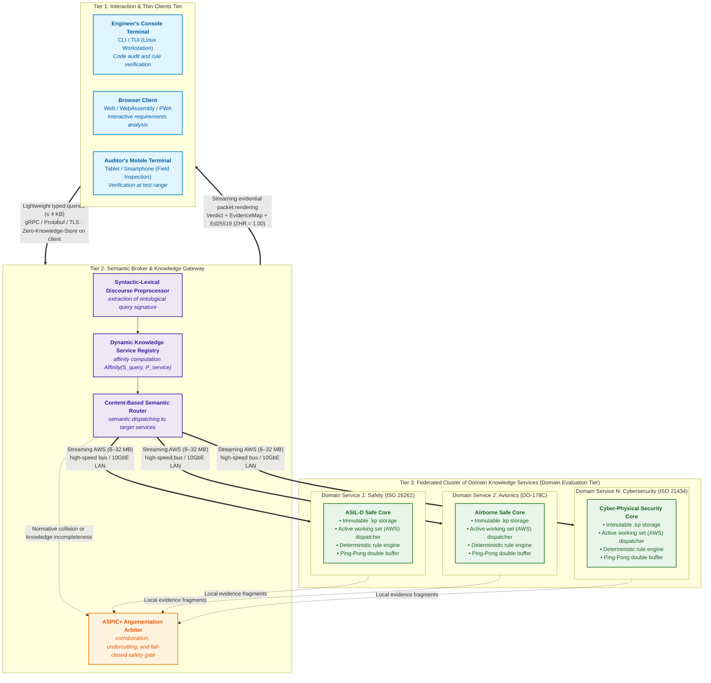
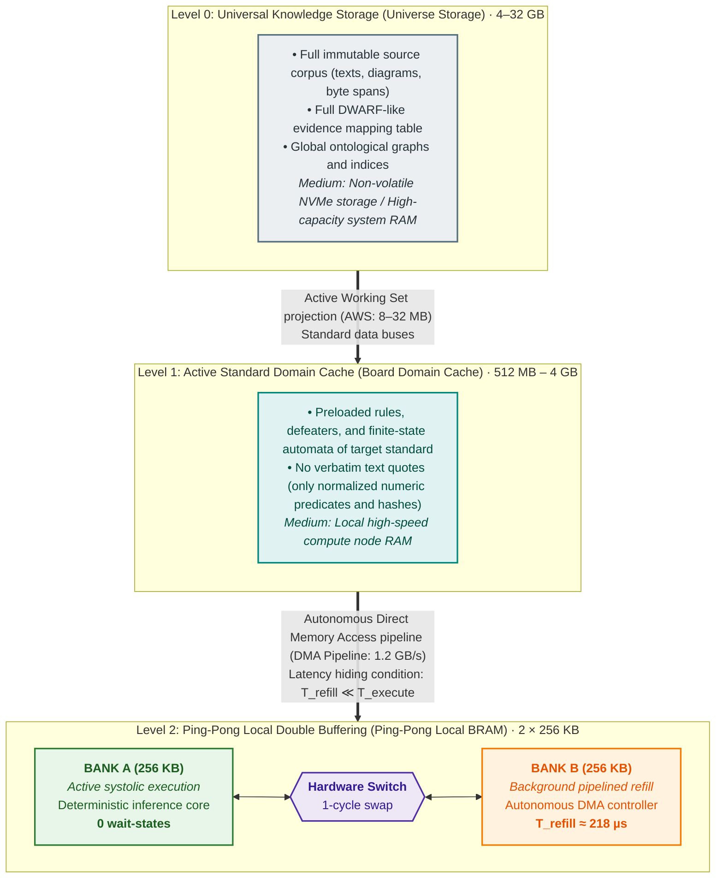
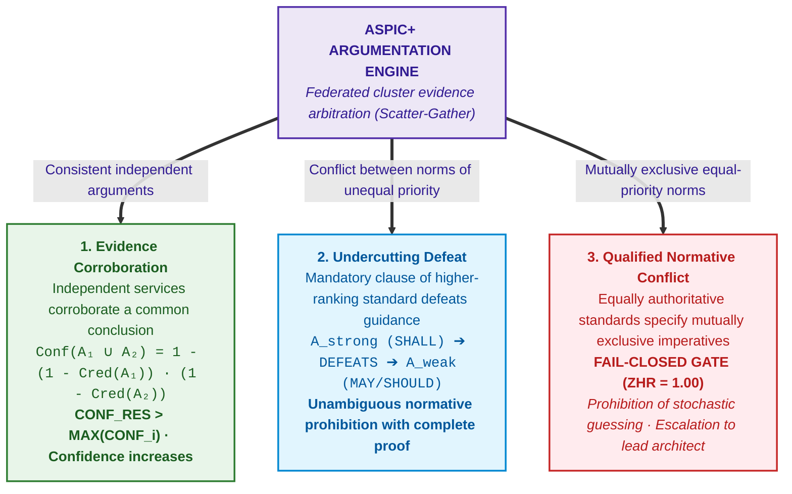

# Chapter 40. Distributed Architecture of an Evidence-Governed Expert System: Epistemic SOA, Semantic Routing, Memory Hierarchy, and Multi-Source Defeasible Arbitration

> **Book:** [Architecture of Evidence-Governed Expert Systems](README.md) · [Part VII: Reactive Execution, Inter-System Knowledge Exchange, and Distributed SOA](part-07-runtime-and-knowledge-exchange.md)  
> **Previous Chapter:** [Chapter 33. Inter-System Knowledge Exchange: Rule Provisioning, Model Teaching, and Secure Feedback](ch33-inter-system-knowledge-exchange-and-model-teaching.md)  
> **Table of Contents:** [README.md](README.md)  
> **Author:** [Mykola Fedchyk](about-the-author.md)  
> **Target Level:** Advanced: Lead System Architects, Knowledge Engineers, Distributed Systems Developers, Compliance and Safety Specialists  
> **Expected Learning Outcomes:** Synthesize theoretical principles across all monograph chapters into a complete reference architectural prototype of a distributed expert system; architect a three-tier service-oriented architecture (Epistemic SOA) separating thin interaction clients from domain knowledge services; implement syntactic-lexical preprocessing and content-based semantic query routing; bridge the latency gap between massive knowledge repositories and micro-capacity high-speed memory via active working sets and ping-pong pipelined double buffering; orchestrate federated search (Scatter-Gather) and multi-source defeasible evidence aggregation (ASPIC+) under source uncertainty; make rigorous engineering decisions regarding scaling and hardware/software class selection balanced against project budget.

---

## Abstract

All preceding chapters of this monograph have systematically established a fundamental thesis: a dependable expert system cannot rest upon stochastic generalizations of large language models or unverified fact bases. Genuine expertise demands mathematical determinism, formal deduction, byte-level custody of primary sources ($ZHR = 1.00$), and independent auditability. However, deploying the system beyond the research test bench into a real-world industrial R&D environment confronts the architect with a critical new challenge: **scalability, distribution, and ubiquitous availability**.

This chapter concludes the theoretical cycle of the monograph by formulating for the reader a **reference architectural prototype of an industrial-grade evidence-governed expert system**. Abstracting away from proprietary silicon vendors and commercial hardware specifications, the chapter delineates the functional classes of hardware and software evaluators required to build a scalable architecture. It examines a three-tier Epistemic Service-Oriented Architecture (Epistemic SOA), wherein thin mobile clients (smartphones, engineering terminals) interact with a cluster of domain services through an intelligent semantic broker. A multi-tier memory hierarchy is formalized: the pipeline continuity condition and complete latency hiding ($`T_{\mathrm{refill}} \ll T_{\mathrm{execute}}`$) are mathematically proven via Active Working Sets (AWS) and symmetric double buffering (Ping-Pong Pipeline). To handle knowledge gaps across individual domain services, the chapter establishes a model for federated search (Scatter-Gather) and multi-source defeasible evidence aggregation (ASPIC+), ensuring corroboration, undercutting defeat of weak recommendations, and qualified identification of normative collisions. Finally, an engineering technology selection matrix is presented, enabling the systems architect to deploy a functional prototype on available infrastructure aligned with project budget constraints.

---

## 1. Monograph Synthesis: From a Local Model to a Reference Architectural Prototype

Thirty-nine preceding chapters of this monograph have rigorously dissected the anatomy of evidence-governed artificial intelligence. The work has explored the epistemology of machine knowledge ([Chapter 2](ch02-epistemology-of-machine-knowledge.md)), models and typologies of knowledge bases ([Chapter 7](ch07-knowledge-base-typology.md)), automated norm extraction from primary sources ([Chapter 15](ch15-knowledge-extraction-and-kb-construction.md)), strict deterministic inference ([Chapter 16](ch16-expert-systems-architecture.md), [Chapter 31](ch31-syllogistic-reasoning-and-relation-lattices.md)), the eradication of machine hallucinations ([Chapter 38](ch38-curing-machine-hallucinations-and-knowledge-deficits.md)), and Popperian compliance auditing ([Chapter 39](ch39-active-compliance-auditor-and-popperian-testing.md)).

In practical systems engineering, however, an inevitable question arises: **how can all these theoretical frameworks be integrated into a unified, operational enterprise-grade system?**

In real-world mission-critical R&D programs (automotive engineering, avionics, medical device manufacturing), the regulatory baseline encompasses dozens of active standards (ISO, IEC, DO, IEEE, RFC). Together with verbatim primary texts, cross-traceability matrices, and defeater sets, these corpora comprise tens of gigabytes of information. At the same time, research engineers, auditors, and systems developers demand ubiquitous access to the system:
- at the engineering workstation while designing system architecture;
- in the test laboratory or proving ground via tablet or smartphone;
- within automated continuous integration (CI/CD) pipelines during nightly code compliance audits.

Attempting to resolve this challenge by constructing a "fat" local monolith inevitably fails. A mobile device cannot retain multi-gigabyte knowledge bases in operating memory and lacks the compute bandwidth required for deep semantic parsing. Conversely, a conventional cloud service driven by a mainstream large language model guarantees neither determinism, nor immunity to hallucinations, nor byte-level custody of primary sources.

What is required is a **distributed reference architectural prototype**, designed according to the principles of Service-Oriented Architecture (SOA), strict separation of concerns, and a mathematically sound memory hierarchy.



---

## 2. Epistemic Service-Oriented Architecture (Epistemic SOA) and Thin Clients

In software engineering, service-oriented architecture has traditionally addressed the objectives of loose component coupling, independent deployment, and business service reusability [[4]](#src-4). In **evidence-governed epistemic systems**, the SOA paradigm acquires a qualitatively distinct significance: it guarantees the **isolation of truth contexts** and **ubiquitous user access** without compromising the evidentiary custody chain.

### 2.1. Concept of the Thin Interaction Client

The end-user client terminal (utilized by a quality engineer, developer, or compliance auditor) is architected as an **ultrathin interaction agent**:
1. **Zero Knowledge Storage ($`S_{\mathrm{client}} = 0`$):** The client application retains no knowledge bases and never caches local copies of regulatory standards. This eliminates the risk of norm version drift across members of the engineering team.
2. **Compute Agnosticism:** The client does not require neural processing units (NPU/GPU) or specialized hardware rule processors. Consequently, the Znavets interface runs seamlessly on standard smartphones under mobile operating systems, within modern web browsers via WebAssembly/PWA, or directly in an engineer's workstation command-line terminal.
3. **Strict Query and Response Typing:** Communication executes via high-throughput binary RPC contracts (such as Protocol Buffers over gRPC or secure WebSockets):
   - Client request: a natural language query or structured engineering artifact identifier (payload size $\le 2\text{--}4\,\text{KB}$).
   - Client response: a structured evidential tuple containing the formal verdict (`ACCEPT`, `REFUSAL`, `QUALIFIED`), identifiers of applied rules, verbatim citations with byte coordinates within the primary source, and 256-bit cryptographic hashes verifying custody.

### 2.2. Preserving the $ZHR = 1.00$ Invariant on the Client

Critically, the thin client is strictly prohibited from interpreting or autonomously summarizing the server's response. It fulfills an exclusively representational role:

```math
\text{Display}(\text{Response}) = \text{Render}(\text{Verdict}, \text{EvidenceMap}, \text{Signature})
```

where:
- $\text{Verdict} \in \{\text{ACCEPT}, \text{REFUSAL}, \text{QUALIFIED}\}$ denotes the formal logical inference status emitted by the evaluation server;
- $\text{EvidenceMap}$ represents the byte-level mapping of inference terms to coordinates in the original primary sources;
- $\text{Signature}$ is the Ed25519 cryptographic digital signature over the evidential packet, guaranteeing immutability.

Even if network connectivity between the client and broker is intermittently interrupted during field testing, the retrieved result retains its full legal and technical evidentiary standing: every assertion presented to the engineer remains anchored by a cryptographic digital signature and the primary source hash.

---

## 3. Semantic Broker, Discourse Preprocessor, and Content-Based Routing

When an engineering ecosystem comprises a federated cluster of specialized knowledge services rather than a monolithic database, a core coordination challenge emerges: **who determines where to dispatch the engineer's query, and by what mechanism?**

In conventional web architectures, routing relies on network addresses or URL path prefixes (e.g., `/api/v1/orders`). In evidence-governed expert systems, addressing is strictly **content-based and semantic (Content-Based Semantic Routing)**, driven by the outputs of a linguistic preprocessor.

### 3.1. Syntactic-Lexical Discourse Preprocessor

Upon intercepting a query, the Semantic Broker routes it through a multi-stage semantic parsing pipeline:

```mermaid
flowchart TD
    accTitle: Syntactic-lexical discourse parsing pipeline in the Semantic Broker
    accDescr: Step-by-step transformation of a natural language engineering query into a structured ontological signature for domain rule routing.

    IN["&emsp;&emsp;&emsp;&emsp; <b>INCOMING ENGINEERING COMPLIANCE AUDIT QUERY (Natural Language Query)</b> &emsp;&emsp;&emsp;&emsp;<br><i>«Is dynamic memory allocation permitted for an ASIL-D software module under ISO 26262-6?»</i><br><i>Ingress source: engineer's workstation / continuous integration pipeline (CI/CD Quality Gate)</i>"]

    STEP1["&emsp;&emsp;&emsp;&emsp; <b>1. DISCOURSE QUALIFICATION</b> &emsp;&emsp;&emsp;&emsp;<br>• Pragmatic type: <code>NORMATIVE_COMPLIANCE_QUERY</code> &emsp;·&emsp; • Target modality: <code>DEONTIC_PROHIBITION_OR_PERMISSION</code><br><i>Semantic intent: formal verification of architectural compliance against a certification standard</i>"]

    STEP2["&emsp;&emsp;&emsp;&emsp; <b>2. SYNTACTIC FRAME PARSING</b> &emsp;&emsp;&emsp;&emsp;<br>• Actor: <i>«software module»</i> &emsp;·&emsp; • Action: <i>«dynamic memory allocation» (Dynamic Allocation)</i> &emsp;·&emsp; • Attribute: <code>ASIL_Level = 'D'</code><br><i>Extraction of predicate-argument requirement structure for deterministic matching against ontological axioms</i>"]

    STEP3["&emsp;&emsp;&emsp;&emsp; <b>3. DOMAIN SIGNATURE EXTRACTION</b> &emsp;&emsp;&emsp;&emsp;<br>• Domain markers: <code>{ISO-26262, ASIL-D, Software-Architecture, Memory-Management}</code><br>• Query profile: <code>TargetDomain = 'Automotive-Safety'</code> &emsp;·&emsp; • Standard: <code>Standard = 'ISO-26262-6:2018'</code><br><i>Generation of query signature vector for affinity calculation in dynamic service registry</i>"]

    OUT["&emsp;&emsp;&emsp;&emsp; <b>PRIMARY EVALUATOR DISPATCHING</b> &emsp;&emsp;&emsp;&emsp;<br>Dispatched service: <b>Automotive Electronics Safety Domain Service (ISO 26262-6:2018)</b> &emsp;·&emsp; <code>Affinity(S_query, P_service) = 1.00</code><br><i>Active Working Set (AWS) package dispatched to deterministic systolic rule core over high-speed local bus</i>"]

    IN ==> STEP1
    STEP1 ==> STEP2
    STEP2 ==> STEP3
    STEP3 ==> OUT

    classDef query fill:#e3f2fd,stroke:#1565c0,stroke-width:2px,color:#0d47a1;
    classDef step1 fill:#ede7f6,stroke:#5e35b1,stroke-width:2px,color:#311b92;
    classDef step2 fill:#fff8e1,stroke:#ffa000,stroke-width:2px,color:#e65100;
    classDef step3 fill:#e8f5e9,stroke:#2e7d32,stroke-width:2px,color:#1b5e20;
    classDef target fill:#f3e5f5,stroke:#7b1fa2,stroke-width:2px,color:#4a148c;

    class IN query;
    class STEP1 step1;
    class STEP2 step2;
    class STEP3 step3;
    class OUT target;
```



### 3.2. Dynamic Knowledge Service Registry

The Semantic Broker maintains an active in-memory registry of all domain services registered across the cluster. During registration, each domain service publishes a formal manifest:
- **Identifier and Endpoint:** Network address (IP/port or message queue topic);
- **Knowledge Domain:** Set of maintained standards and ontology versions (governed by SemVer 2.0.0);
- **Evaluator Class:** Software CPU execution engine, vector processor array, or specialized deterministic hardware inference core;
- **Throughput Metrics:** Current request queue depth and estimated evaluation latency.

The Broker computes an affinity matching function between the query's ontological signature $`\mathcal{S}_{\mathrm{query}}`$ and the knowledge domain $`\mathcal{P}_{\mathrm{domain}}`$ declared in the service manifest $`\mathcal{P}_{\mathrm{service}}`$:

```math
\mathrm{Affinity}(\mathcal{S}_{\mathrm{query}}, \mathcal{P}_{\mathrm{service}}) = \frac{\lvert\mathcal{S}_{\mathrm{query}} \cap \mathcal{P}_{\mathrm{domain}}\rvert}{\lvert\mathcal{S}_{\mathrm{query}}\rvert}
```

where:
- $`\mathcal{S}_{\mathrm{query}}`$ is the set of ontological concepts and domain markers extracted from the engineer's query;
- $`\mathcal{P}_{\mathrm{domain}}`$ is the set of supported standards and ontology versions declared in the manifest $`\mathcal{P}_{\mathrm{service}}`$;
- $`\lvert \mathcal{S}_{\mathrm{query}} \cap \mathcal{P}_{\mathrm{domain}} \rvert`$ is the cardinality of the intersection of ontological signatures (number of matched concepts);
- $`\lvert \mathcal{S}_{\mathrm{query}} \rvert`$ is the total count of ontological markers extracted from the input query;
- $`\mathrm{Affinity}(\mathcal{S}_{\mathrm{query}}, \mathcal{P}_{\mathrm{service}}) \in [0, 1]`$ is the normalized semantic affinity coefficient (a value of $1.0$ indicates complete coverage of the query domain).

The service exhibiting the highest affinity score is designated as the primary evaluator (*Primary Evaluator*).

---

## 4. Theoretical Model of Multi-Tier Memory Hierarchy and Double Buffering

Any computational system is fundamentally constrained by the physical laws of signal propagation and memory hierarchy design [[3]](#src-3): **larger memory capacities incur higher access latencies, while ultra-fast memory integrated directly into compute logic possesses strictly bounded capacity**.

In engineering expert systems, this disparity reaches critical proportions:
1. **Macro-Volume of the Knowledge Repository ($`V_{\mathrm{corpus}}`$):** The complete regulatory corpus, encompassing verbatim primary sources, parse trees, and traceability matrices, spans $4\text{--}32\,\text{GB}$.
2. **Micro-Capacity of Fast Rule Engine Memory ($`V_{\mathrm{local}}`$):** The on-chip memory of a dedicated rule processor (Block RAM in silicon accelerators or fast L1/L2 cache) typically does not exceed several hundred kilobytes ($256\text{--}512\,\text{KB}$).
3. **Interconnect Channel Bandwidth ($`B_{\mathrm{channel}}`$):** Transferring the entire knowledge repository to the compute engine for each query introduces intolerable system stalls ($> 1$ minute), shattering the responsiveness required for interactive engineering dialogue ($0.5\text{--}2.0\,\text{s}$).



### 4.1. Concept of the Active Working Set (AWS)

Rather than transferring the entire knowledge repository, the semantic dispatcher constructs an **Active Working Set (AWS)**:

```math
\mathrm{AWS} = \mathrm{Closure}(\mathcal{R}_{\mathrm{target}}) = \mathcal{R}_{\mathrm{target}} \cup \mathrm{Prerequisites}(\mathcal{R}_{\mathrm{target}}) \cup \mathrm{Defeaters}(\mathcal{R}_{\mathrm{target}})
```

where:
- $`\mathcal{R}_{\mathrm{target}}`$ denotes the set of target rules activated by the query's ontological signature;
- $`\mathrm{Prerequisites}(\mathcal{R}_{\mathrm{target}})`$ represents prerequisite predicates required for deterministic dependency resolution;
- $`\mathrm{Defeaters}(\mathcal{R}_{\mathrm{target}})`$ is the set of associated defeaters (exceptions, rebuttals, and undercutting counter-rules);
- $`\mathrm{AWS}`$ is the transitive deductive closure of rules stripped of verbatim textual source excerpts, optimized for instantaneous staging into local compute cache.

The AWS retains only the mathematical skeleton of the rules: numeric bounds, logical conditions, defeater identifiers, and 256-bit citation hashes. Verbatim source texts remain in Level 0 storage. The footprint of the AWS shrinks to **$8\text{--}32\,\text{MB}$**, which transfers across standard industrial buses in fractions of a second.

### 4.2. Mathematical Condition for Ping-Pong Pipelined Double Buffering Continuity

In deterministic expert systems, it is unacceptable for a high-performance compute core to stall while awaiting the next batch of rules from high-latency external memory. To eliminate transfer stalls, the rule processor's memory is organized into two symmetric, independent banks of identical capacity: Bank A and Bank B. While the processor evaluates rules staged in one bank, an autonomous Direct Memory Access (DMA) controller concurrently populates the alternate bank with the subsequent rule chunk in the background.

The refill time required to populate a single bank from local system RAM ($`T_{\mathrm{refill}}`$) is governed by the ratio of bank capacity to the effective interconnect bus bandwidth:

```math
T_{\mathrm{refill}} = \frac{V_{\mathrm{bank}}}{B_{\mathrm{bus}}}
```

where:
- $`V_{\mathrm{bank}}`$ is the capacity of a single bank of fast on-chip memory (e.g., $256\,\text{KB}$ of Block RAM on an FPGA or dedicated on-die SRAM);
- $`B_{\mathrm{bus}}`$ is the effective bandwidth of the internal rule streaming bus (e.g., $1.2\,\text{GB/s}$ for an AXI4-Stream / PCIe DMA interconnect);
- $`T_{\mathrm{refill}}`$ is the calculated duration of background bank staging executed without rule processor intervention;
- $`T_{\mathrm{execute}}`$ is the time required by the rule processor to perform complete systolic evaluation of the incoming requirement batch against the rule block of capacity $`V_{\mathrm{bank}}`$.

**Latency Hiding Invariant Theorem:**  
The inference pipeline operates at maximum computational utilization ($\eta = 1.00$) with zero processor wait-states if and only if the background refill latency does not exceed the execution time of the active rule chunk:

```math
T_{\mathrm{refill}} \le T_{\mathrm{execute}}
```

**Practical Engineering Application of the Calculation:**

The computed value of $`T_{\mathrm{refill}}`$ and its relationship to $`T_{\mathrm{execute}}`$ serve not merely as an abstract theoretical bound, but as an **operational instrument for hardware dimensioning and dynamic scheduling**:

1. **Hardware Dimensioning:**  
   The formula dictates the maximum allowable fast memory bank capacity $`V_{\mathrm{bank}}`$ during hardware architectural synthesis:

```math
V_{\mathrm{bank}} \le B_{\mathrm{bus}} \cdot T_{\mathrm{execute}}
```

   If an architect erroneously provisions an oversized memory bank (e.g., $`V_{\mathrm{bank}} = 16\,\text{MB}`$), an interconnect bus operating at $1.2\,\text{GB/s}$ requires the following refill time:

```math
T_{\mathrm{refill}} = \frac{16\,\text{MB}}{1.2\,\text{GB/s}} \approx 13.3\,\text{ms}
```

   If the processor completes rule verification in $`T_{\mathrm{execute}} = 2.0\,\text{ms}`$, a severe pipeline stall (*Pipeline Stall*) occurs: the compute core is forced into an idle wait of $11.3\,\text{ms}$ awaiting bus transfer, causing processor core efficiency to plummet to:

```math
\eta = \frac{T_{\mathrm{execute}}}{T_{\mathrm{refill}}} = \frac{2.0\,\text{ms}}{13.3\,\text{ms}} \approx 0.15
```

   (85% of the clock cycles of an expensive silicon core are squandered in idle states). The calculation demonstrates that to maintain uninterrupted pipeline throughput, the individual rule chunk size must not exceed $256\text{--}512\,\text{KB}$.

2. **Adaptive Chunk Sizing in Software Runtime:**  
   When assembling the Active Working Set (AWS), the semantic dispatcher dynamically assesses the computational complexity of rules within each batch. If the rules are computationally lightweight and predicted execution time contracts ($`T_{\mathrm{execute}} \to 0.5\,\text{ms}`$), the dispatcher automatically partitions rules into smaller chunks or enables DMA bus burst mode, preventing compute core stalls.

3. **Operating Modes and System Engineering Decisions Based on Latency Ratios:**  
   - **Optimal Deterministic Mode ($`T_{\mathrm{refill}} \ll T_{\mathrm{execute}}`$, margin $\ge 2\times$):**  
     For a standard $256\,\text{KB}$ knowledge block, the staging latency is $`T_{\mathrm{refill}} = \frac{256\,\text{KB}}{1.2\,\text{GB/s}} \approx 218\,\mu\text{s}`$. Systolic evaluation of a complex engineering requirement batch against these rules requires $`T_{\mathrm{execute}} \approx 1.5\text{--}5.0\,\text{ms}`$, yielding a timing margin of $7\times$ to $23\times$.  
     **System Action:** The passive bank is guaranteed to be fully populated long before computation completes. When the processor completes evaluation, the hardware switch alternates the banks ($A \leftrightarrow B$) in **1 clock cycle**, delivering end-to-end efficiency $\eta = 1.00$ and strict worst-case execution time (WCET) determinism.
   - **Marginal Bus Contention Zone ($`0.8 \cdot T_{\mathrm{execute}} < T_{\mathrm{refill}} \le T_{\mathrm{execute}}`$):**  
     The safety margin is minimal. Any transient collision on the internal bus (peripheral interrupts, concurrent memory transfers) risks violating the pipeline deadline.  
     **System Action:** The dispatcher elevates bus arbitration priority (*DMA Channel Priority / QoS*), allocating highest bus priority to the knowledge streaming channel over competing system tasks.
   - **Emergency Bandwidth Deficit Mode ($`T_{\mathrm{refill}} > T_{\mathrm{execute}}`$):**  
     **System Action:** A hardware watchdog timer detects compute pipeline stalls. The semantic dispatcher initiates graceful degradation: it temporarily restricts vector core parallelism or prunes optional second-order defeaters, restoring system operation to the stable invariant $`T_{\mathrm{refill}} \le T_{\mathrm{execute}}`$.

### 4.3. Systolic Batch Compliance Sweeps

For high-volume batch compliance verification (such as evaluating $M = 1\,500$ safety requirements simultaneously against $K = 500$ normative rules):
- Requirements are ingested as a pipelined vector stream;
- Elementary atomic evaluations execute in $1\text{--}4$ hardware clock cycles;
- Complete hardware evaluation of all $750\,000$ requirement-rule pairs completes in under **$30\text{--}50\,\text{ms}$**, securing an end-to-end system response time well below $1.0\,\text{s}$.

---

## 5. Multi-Source Defeasible Knowledge Aggregation (ASPIC+ / Dung)

In complex engineering R&D environments, no individual knowledge base possesses a total monopoly on complete information. An isolated domain service may return an evaluation result that is inconclusive or partial.

### 5.1. Uncertainty Triggers

The Semantic Broker identifies the imperative to engage complementary domain services based on three rigorous epistemic indicators:
1. **Low Discrete Credibility Score ($Score < 70/100$):** The citation originates from an unharmonized or secondary source;
2. **Non-Mandatory Normative Modality (Informative vs Normative):** The rule was extracted from guidance or an informative appendix (*Guideline / May / Informative Annex*), whereas the engineer requested a binding certification verdict;
3. **Ungrounded Defeater Condition:** The rule incorporates an exception clause `unless condition_X`, but the factual truth value of `condition_X` is absent from the local domain knowledge base.

### 5.2. Federated Query (Scatter-Gather) and Argumentative Arbitration

Upon detecting an epistemic deficit, the Broker initiates a parallel broadcast query (**Scatter**) across complementary cluster services (for example, domain services housing industry precedents or general reliability standards). Evidence fragments returned by disparate services are aggregated (**Gather**) into a formal **ASPIC+** argumentation framework [[2]](#src-2) built on Dung's abstract argumentation structures [[1]](#src-1):



#### 5.2.1. Corroboration of Evidence

During compliance audits of mission-critical systems (e.g., ISO 26262 ASIL-D [[5]](#src-5) or DO-178C DAL-A [[6]](#src-6)), evidence supplied by a single domain service may carry a non-zero epistemic deficit or insufficient confidence for unconditional automated approval. The corroboration mechanism eliminates subjective bias by uniting independent proofs from peer nodes across the cluster. When two or more services independently corroborate a congruent assertion, cumulative probabilistic confidence increases mathematically according to the theorem of independent event unions:

```math
\mathrm{Conf}(A_1 \cup A_2) = 1 - (1 - \mathrm{Cred}(A_1)) \cdot (1 - \mathrm{Cred}(A_2))
```

where:
- $`\mathrm{Cred}(A_i) \in [0, 1)`$ denotes the discrete credibility level of evidence provided by domain service $`i`$ (governed by source authority and traceability depth);
- $`\mathrm{Conf}(A_1 \cup A_2) \in [0, 1)`$ represents cumulative probabilistic confidence in the corroborated conclusion following aggregation of independent arguments $`A_1`$ and $`A_2`$.

**Practical Application and Engineering Decisions from the Result:**
1. **Lifecycle Invocation Point:** The computation executes within the Semantic Broker during the aggregation phase (Gather phase) whenever evidence dispatched by multiple nodes converges on an identical target predicate.
2. **System Decision Criteria Governed by Numeric Thresholds:**
   - **Automated Requirement Sign-Off Threshold ($`\mathrm{Conf} \ge \tau_{\mathrm{accept}} = 0.95`$):** Evidence is deemed exhaustive. The system automatically issues an `ACCEPT` verdict, affixes an Ed25519 cryptographic digital signature, and advances the verified artifact into the certification dossier without requiring human intervention.
   - **Expert Escalation Zone ($`0.80 \le \mathrm{Conf} < 0.95`$):** The system emits a qualified verdict `QUALIFIED`. The evidential packet is flagged as conditionally acceptable and automatically escalated to the lead systems architect (Human-in-the-Loop) with byte-level annotations pinpointing evidential vulnerabilities.
   - **Evidentiary Insufficiency Zone ($`\mathrm{Conf} < 0.80`$):** The system rejects verification with status `REFUSAL`. The query is declined due to inadequate grounding within the active knowledge corpus.
3. **Worked Numerical Example:**  
   Suppose the architectural pattern analysis node returns assertion $`A_1`$ with credibility $`\mathrm{Cred}(A_1) = 0.85`$ (individually insufficient for automated ASIL-D certification, which mandates a $0.95$ threshold). A peer memory audit node independently substantiates the safety of the identical code construct via argument $`A_2`$ with credibility $`\mathrm{Cred}(A_2) = 0.80`$. The aggregated confidence is:

```math
\mathrm{Conf}(A_1 \cup A_2) = 1 - (1 - 0.85) \cdot (1 - 0.80) = 1 - (0.15 \cdot 0.20) = 1 - 0.03 = 0.97
```

   Because $`0.97 \ge \tau_{\mathrm{accept}} = 0.95`$, mutual corroboration between two independent sources successfully surpasses the automated acceptance threshold, eliminating the requirement for manual review.

#### 5.2.2. Undercutting Defeat of Weak Arguments

In technical regulatory standards, normative clauses are stratified by deontic modality: mandatory obligations (*Shall / Must*), advisory recommendations (*Should / Recommended*), and non-binding informative notes (*May / Informative*).

If federated search reveals a conflict between service conclusions, the system rejects heuristic or probabilistic weighting. Governed by the non-monotonic inference rules of ASPIC+, an imperative obligation possessing superior rank ($\mathrm{Rank} = \text{Shall}$) unconditionally defeats (*undercuts*) advisory or informative arguments of lower rank ($\mathrm{Rank} = \text{Should/May}$). The defeated argument is pruned from the concluding proof graph, and an auditable entry recording the exact defeating clause is inscribed into the audit trail.

#### 5.2.3. Fail-Closed Qualified Conflict Gate

A critical crisis emerges when two independent, harmonized standards of equal legal standing (such as ISO 26262 functional safety mandates and ISO/SAE 21434 cybersecurity specifications at the *Shall* modality level) impose mutually exclusive imperatives on an identical architectural mechanism.

Under such conditions, conforming to the guidelines of trustworthy artificial intelligence standards (notably NIST AI RMF 1.0 [[7]](#src-7)), the expert system **strictly forbids stochastic compromise guessing** or the neural selection of a "most probable" resolution. Instead, the system activates a **Fail-Closed** safety gate:
1. Emits a typed verdict `QUALIFIED_CONFLICT`;
2. Synthesizes a bidirectional collision graph citing the precise conflicting clauses of both standards;
3. Halts automated artifact progression within the CI/CD pipeline and escalates the impasse to the lead systems architect to formulate an official Safety Deviation Justification.

---

## 6. Engineering Matrix for Technology Selection and Scaling by Project Budget

The fundamental value of this theoretical prototype lies in defining an **architectural trajectory** rather than a rigid vendor bill of materials. An engineering practitioner can instantiate the system upon hardware assets aligned with the current budget profile of their research or commercial program:

| Infrastructure Tier | Hardware Class | Semantic Broker and System 1 | Deterministic Inference Core (System 2) | Storage and Memory Hierarchy | Budgetary Context and Application |
| :--- | :--- | :--- | :--- | :--- | :--- |
| **Tier 1: Lab Prototype** | Single PC or developer workstation | Lightweight local SLM (3B–7B) on CPU / discrete consumer GPU | Software rule engine (Software EVM) as in-process library | File storage with direct `mmap` into OS operating memory | **Minimal budget.** Concept exploration, university and doctoral research, rule validation on compact corpora. |
| **Tier 2: Team R&D Cluster** | Dedicated local server + thin clients (PCs/smartphones) | Dedicated server hosting 14B model; access via REST/gRPC broker | In-memory software inference daemon with IPC socket | Server RAM caching (32–64 GB), streaming delivery to clients | **Medium budget.** Engineering teams of 10–50 specialists, enterprise CI/CD integration, continuous code auditing. |
| **Tier 3: Enterprise / ASIL-D Safe** | Multi-node server cluster + hardware deterministic accelerators | Heterogeneous model pool (14B–32B) on GPU/NPU with Circuit Breaker | Dedicated hardware accelerator boards with deterministic silicon core | Hardware double buffering (Ping-Pong BRAM) + high-speed DMA bus | **High / mission-critical budget.** Autonomous vehicles, avionics, critical energy infrastructure, TÜV certification laboratories. |

---

## Conclusions

1. **Isolation of Responsibility Tiers in Epistemic SOA:** The distributed architecture of an evidence-governed expert system resolves the fundamental dilemma of scalability. Segregating the system into an interaction tier of thin clients, a semantic coordination broker, and federated domain services isolates truth contexts and decouples performance from the hardware limitations of the user terminal.
2. **Guarantee of the $`ZHR = 1.00`$ Invariant on Thin Clients:** The interaction client retains no local knowledge bases ($`S_{\mathrm{client}} = 0`$) and performs no logical inference. Its function is strictly confined to rendering the cryptographically signed evidential tuple $\langle\text{Verdict}, \text{EvidenceMap}, \text{Signature}\rangle$, ensuring legal standing and zero hallucinations even on mobile devices.
3. **Ontological Query Routing:** The semantic broker supersedes naive URL routing with deep content-based analysis. The syntactic-lexical preprocessor extracts domain markers, while the dynamic service registry designates the primary evaluator by computing the normalized affinity coefficient $`\mathrm{Affinity}(\mathcal{S}_{\mathrm{query}}, \mathcal{P}_{\mathrm{service}})`$.
4. **Bridging the Memory Capacity Gap:** Separating static citations from the mathematical skeleton of rules shrinks the working footprint to a compact Active Working Set ($`\mathrm{AWS} \le 32\,\text{MB}`$). Two-bank pipelined double buffering (Ping-Pong Pipeline) achieves complete latency hiding by enforcing the invariant $`T_{\mathrm{refill}} \ll T_{\mathrm{execute}}`$, eliminating rule processor stalls ($\eta = 1.00$).
5. **Multi-Source Argumentative Arbitration:** When knowledge deficits are identified, the Scatter-Gather pattern aggregates evidence across peer cluster services within the ASPIC+ formalism. The system amplifies confidence via evidence corroboration, deterministically undercuts weak recommendations using superior imperative norms, and trips a *Fail-Closed* safety gate upon encountering unresolvable normative collisions.
6. **Practical Evolution Aligned with Project Budget:** The proposed prototype establishes a conceptual developmental roadmap, scaling seamlessly from a single-machine laboratory test bench (Tier 1) to a collaborative R&D cluster (Tier 2) and an industrial-grade hardware-deterministic complex certified for ASIL-D environments (Tier 3).

---

## Self-Check Questions

1. Why does attempting to implement an expert system as a heavy local monolith on an engineer's mobile terminal violate scalability and knowledge synchronization requirements?
2. How does a thin client guarantee the $ZHR = 1.00$ evidentiary invariant without executing local deductive inference?
3. How does Content-Based Semantic Routing differ fundamentally from conventional web routing implemented at API gateways?
4. Formulate the mathematical condition for complete latency hiding in a pipelined double-buffered architecture. Why must background staging latency remain strictly below rule chunk execution latency?
5. Which three epistemic triggers signal the Semantic Broker to transition from local evaluation to a federated Scatter-Gather inquiry?
6. How does the ASPIC+ argumentation engine resolve a normative collision when two equally authoritative harmonized standards mandate mutually exclusive requirements?
7. Trace the evolutionary trajectory of an expert system from a single-node laboratory prototype to an industrial heterogeneous enterprise deployment using the technology selection matrix.

---

## Glossary

| English Term | Ukrainian Equivalent | Definition |
|---|---|---|
| Epistemic SOA | Епістемічна SOA | Distributed expert system architecture providing truth context isolation across independent knowledge services |
| Thin Interaction Client | Тонкий клієнт взаємодії | Client interface operating with zero local knowledge storage, dedicated exclusively to rendering signed evidential dossiers |
| Semantic Broker | Семантичний брокер | Central cluster coordinator executing syntactic preprocessing and content-based semantic query routing |
| Content-Based Semantic Routing | Маршрутизація за змістом | Dispatching queries to domain knowledge services based on extracted ontological signatures and target standard profiles |
| Active Working Set (AWS) | Активний робочий набір | Compact transitive logical closure of target rules and defeaters stripped of verbatim textual source excerpts |
| Ping-Pong Double Buffering | Подвійна буферизація Ping-Pong | Symmetric memory architecture alternating background staging in one bank with parallel rule execution in the other |
| Latency Hiding | Приховування затримок | Pipeline operational state ($`T_{\mathrm{refill}} \le T_{\mathrm{execute}}`$) where background memory transfer latency is completely masked by compute duration |
| Scatter-Gather Pattern | Шаблон Scatter-Gather | Parallel broadcasting of queries across a distributed service cluster followed by aggregation of results into a unified argumentative verdict |
| Corroboration | Короборація свідчень | Mathematical amplification of cumulative confidence resulting from convergent evidence provided by independent sources |
| Undercutting Defeat | Анулювання правила | Non-monotonic reasoning mechanism wherein a mandatory norm of superior rank invalidates a conflicting advisory recommendation |
| Fail-Closed Qualified Conflict Gate | Кваліфікована колізія Fail-Closed | Protective suspension of automated compromise under mutually exclusive equal-rank norms, triggering mandatory escalation to the lead architect |

---

## Abbreviations

| Abbreviation | Expansion | Definition |
|---|---|---|
| ASIL | Automotive Safety Integrity Level | Automotive electronics safety integrity classification defined under ISO 26262 (levels A through D) |
| ASPIC+ | Argumentation Service Platform with Incomplete and Conflicting Information | Formal framework for structuring arguments, presumptions, and attack/defeat relations |
| AWS | Active Working Set | Minimal active working knowledge set strictly necessary for evaluating a query |
| BRAM | Block Random Access Memory | Fast on-chip memory within hardware rule accelerators characterized by deterministic single-cycle access |
| DMA | Direct Memory Access | Autonomous hardware memory transfer mechanism bypassing central processor execution cores |
| EVM | Epistemic Virtual Machine | Deterministic virtual machine executing evidence-governed logical inference resolutions |
| gRPC | Google Remote Procedure Call | High-performance binary RPC framework built on HTTP/2 and Protocol Buffers |
| IPC | Inter-Process Communication | Operating system mechanisms facilitating data exchange between concurrent processes on a single host |
| KTP | Knowledge Testing Pyramid | Multi-tier knowledge base testing methodology spanning atomic facts to end-to-end integration scenarios |
| NPU | Neural Processing Unit | Specialized silicon accelerator optimized for tensor and neural network workloads |
| PWA | Progressive Web Application | Web application technology enabling offline application shell caching and responsive execution |
| RPC | Remote Procedure Call | Distributed computing paradigm enabling procedure execution across separate address spaces |
| SLM | Small Language Model | Compact domain-adapted language model (1B–7B parameters) for linguistic analysis and classification |
| SOA | Service-Oriented Architecture | Software architectural style characterized by loosely coupled, independently deployable services |
| TARA | Threat Analysis and Risk Assessment | Threat analysis and risk assessment methodology defined under ISO/SAE 21434 |
| ZHR | Zero-Hallucination Rate | Metric denoting complete absence of ungrounded generative assertions ($ZHR = 1.00$) in evidence-governed expert systems |

---

## References

<a id="src-1"></a>[1] Dung, P. M. (1995). On the acceptability of arguments and its fundamental role in nonmonotonic reasoning, logic programming and n-person games. *Artificial Intelligence*, 77(2), 321–357.  
<a id="src-2"></a>[2] Prakken, H. (2010). An abstract framework for argumentation with structured arguments. *Argument & Computation*, 1(2), 93–124.  
<a id="src-3"></a>[3] Hennessy, J. L., & Patterson, D. A. (2019). *Computer Architecture: A Quantitative Approach* (6th ed.). Morgan Kaufmann. (Chapters on memory hierarchy and latency hiding).  
<a id="src-4"></a>[4] Fielding, R. T. (2000). *Architectural Styles and the Design of Network-based Software Architectures*. Doctoral dissertation, University of California, Irvine.  
<a id="src-5"></a>[5] ISO 26262:2018. *Road vehicles — Functional safety* (Parts 1–12). International Organization for Standardization.  
<a id="src-6"></a>[6] RTCA DO-178C / EUROCAE ED-12C (2011). *Software Considerations in Airborne Systems and Equipment Certification*. RTCA.  
<a id="src-7"></a>[7] NIST AI 100-1 (2023). *Artificial Intelligence Risk Management Framework (AI RMF 1.0)*. National Institute of Standards and Technology.

---

[← Chapter 33](ch33-inter-system-knowledge-exchange-and-model-teaching.md) | [Table of Contents](README.md) | [Part VII](part-07-runtime-and-knowledge-exchange.md) | [To Appendices →](appendix-a-evidence-governed-framework.md)
